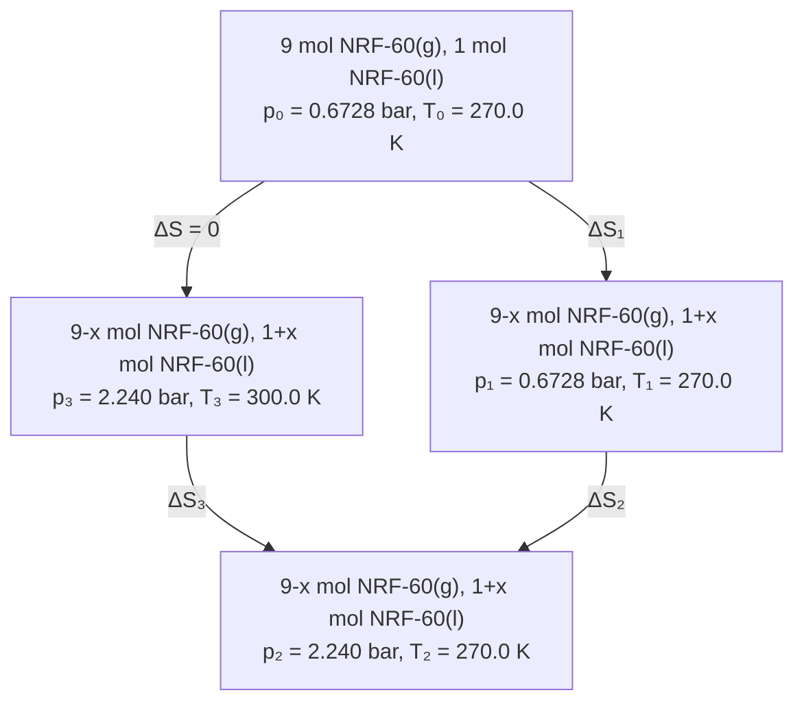

# 第 35 届中国化学奥林匹克（决赛）试题

# （2021 年 11 月 27 日 14:30-17:30）

第 1 题（14 分）铍为碱土金属，但表现出许多不同于同族元素的化学性质，比如更倾向于形成配位化合物。

1-1 Be 即使在高温下也难与水反应，但能快速与 $\mathrm { N H } _ { 4 } \mathrm { H F } _ { 2 }$ 水溶液反应。写出该反应的化学方程式。

1-1 2 NH4HF2 + Be → (NH4)2BeF4 + H2

1-2 碳酸铍与醋酸反应可制得一种无色、可升华、能溶于氯仿的配合物，其中心氧原子被四个铍原子以四面体方式包围，铍原子两两被醋酸根离子桥连。写出该反应的化学方程式。

$\mathrm { \bf ~ 1 . 2 }$

1-3 二甲基铍 $[ \mathrm { B e } ( \mathrm { C H } _ { 3 } ) _ { 2 } ]$ 在气相和烃类溶剂中主要以单体形式存在，但在固相时会形成聚合链。分别指出单体和聚合链结构中铍原子所采用的杂化方式。

1-3

单体：sp 杂化

聚合链： $s p ^ { 3 }$ 杂化

1-4 铍能与环戊二烯负离子形成 [(C5H5)2Be]，其配位方式与夹心型二茂铁[(C5H5)2Fe]不同，且两个环戊二烯负离子与 Be 的配位方式不同。画出[(C5H5)2Be]的结构。

1-4 结构：

![[35届第二套试题讲解版-带答案_images/8c64fc7694660b371d61e741758f220da2ea6c9cdfeb26cf85c924bee86849d8.jpg]]

1-5 自第一个双核 Mg(I) 配合物被合成以来，科学家就在不断尝试合成 Be(I)的化合物。最近，文献报道了第一个游离 Be(I) 配合物的晶体结构（化合物 N），其合成路线如图 1-1 所示。M为以氮杂环卡宾 Et2CAAC 为配体的 Be(0)配合物，往其甲苯溶液中加入四倍物质的量的 TEMPO后，得到目标化合物 N。

![[35届第二套试题讲解版-带答案_images/2791cca3a24c359c696586f10186be508d9c122975a2b8bdef7b01e1c1e47ad5.jpg]]

chemical

Chemical reaction scheme showing the formation of compound M from alkyne M and N under TEMPO conditions, with Et2CAAC as a catalyst.

图 1-1

1-5-1 研究表明，化合物 M中C Be C 三个原子位于一条直线，每个卡宾配体通过 C 原子提供一对电子与 Be 形成σ-配键，且C Be C 间存在着 π 键。写出卡宾配体中配位 C 原子的杂化方式，并将电子填充在杂化轨道中（轨道以小短线表示），指明所形成 π键的电子数。

1-5-1 C 原子的杂化方式： $s p ^ { 2 }$

电子填充图：π 键的电子数：2 个

1-5-2 写出化合物 N阴离子中 Be 的氧化态。

1-5-2 Be 的氧化态：+2

1-5-3 写出化合物 N中 Be(I)的价电子组态。

1-5-3 Be(I)的价电子组态：2s02p1

第 2 题（16 分）金属 M在 473 K 下同氯气作用，得到反磁性的红色固体 P。P为二聚体，其中 M元素的质量百分含量为 64.93%；P溶于盐酸后（反应 1），与 CsCl 反应生成沉淀 Q（反应 2）。Q遇热分解得到黑色固体 R，R中 M元素的质量百分含量为 45.12%。测试表明R呈反磁性，且含有不同化学环境的 M。

2-1 推导出M为何种元素。

2-1 M：Au

推导过程：

设 M 与 Cl 反应得到的物质的化学式为 MClx，M的原子量为 y

则 mM% = y × 100% = 64.93% 35.45×0.6493x

当 x = 1 时，y = 65.63 为 Zn，但不符合要求

当 x = 2 时，y = 131.27 Xe，但 Xe 为非金属元素，故不正确

当 x = 3 时，y = 196.90 Au 元素

当 x = 4 时，y = 262.53 无相应元素

2-2 画出 P的结构式。

2-2

![[35届第二套试题讲解版-带答案_images/f00afad065df73e0fea7397399c92fae6612c0913403520b9fabedff69ec693c.jpg]]

2-3 写出反应 1 的化学反应方程式。

2-3 Au2Cl6 + 2 HCl → 2 HAuCl4

2-4 写出反应 2 的化学反应方程式。

2-4 HAuCl4 + CsCl → Cs[AuCl4] + HCl

2-5 随着压强的改变，化合物 R 中M的配位结构也随之改变

![[35届第二套试题讲解版-带答案_images/c9851dc7b5bfde43783c9edaf4e40a5606c1fd1d491ffa37925af41ec19c5c06.jpg]]

$$
1. 0 0 \times 1 0 ^ {- 4} \mathrm{GPa}
$$

![[35届第二套试题讲解版-带答案_images/8c787d8a41b28987f871e9de7bcb9a32e87eb5dcf3d262beeca09444c4299d17.jpg]]

$$
6. 0 9 \mathrm{GPa}
$$

![[35届第二套试题讲解版-带答案_images/3e7e13dbdd009c390e420f172b8693fab9365696f0f8db75ef16436078609381.jpg]]

$$
1 1. 2 5 \mathrm{GPa}
$$

![[35届第二套试题讲解版-带答案_images/3e56b2e85f2892dd1c298ad4f48bd5426be8087cf375078fe09562582b7125ad.jpg]]

$$
1 5. 0 0 \mathrm{GPa}
$$

图 2-1 在不同压强下 $\mathrm { [ M C l _ { 6 } ] }$ 几何构型

如图 2-1a 所示，M的配位几何有沿 c 方向的拉长的八面体和沿 c 方向压扁的八面体两种，且数量相等。前者 c 方向上的 M-Cl 足够长时，可看作平面正方形结构；后者 ab 平面上的M-Cl 足够长时则看作直线结构。通过计算，推导出体现 R结构特征的化学式，指出图 2-1a中不同化学环境所对应的 M的氧化数。

# 2-5 R 的化学式：Cs2Au2Cl6 或 Cs2[AuCl2][AuCl4]

解析：由题意可知，Au 有不同的化学环境，说明 M 的氧化数可能不同，

设 R的化学式为 $\mathrm { C s _ { x } A u _ { \ m A u } ^ { I } \mathrm { { \Omega } _ { n } \mathrm { { C l _ { y } } } } }$

则 x + m + 3n = y，且 x、m、n 和 y 均为正整数。

$$
\begin{array}{l}m_{\mathrm{Au}}\% = \frac{196.97(m + n)}{132.91x + 196.97(m + n) + 35.45y}\\ m + n = \frac{132.91\times 0.4512x + 35.45\times 0.4512y}{196.97\times 0.5488}\\ = 0.5548x + 0.1480y \end{array}\times 100\% = 45.12\%
$$

当 x = 2, y = 6 时，m + n =2，同时满足 $\_$ ，且 $\cdot$ 的条件。

故 R的化学式：Cs2Au2Cl6

不同化学环境所对应的 M的氧化数： +1（压缩的八面体）、+3（拉长的八面体）

2-6 金属 M与过量的金属 Cs 在真空 350 ºC 时反应得到 CsM。给出反应后直接从反应体系除去过量金属 Cs 的方法。

# 2-6 蒸馏。

2-7CsM溶于液氨中得到透明黄色溶液，将溶液浓缩得到无缺陷的深蓝色晶体T。研究表明，晶体 T中存在 M-M 键，T中 Cs 的质量百分含量为 38.31%。将晶体 T升温至 225 K 左右，得无缺陷的亮黄色晶体 CsM。分析给出 T的化学组成，并解释晶体 T为深蓝色的原因。

2-7 解析：因为 Cs 的百分含量低于 CsAu 中 Cs 的百分含量，可判断晶体中含有溶剂分子，设 T 的组成为 CsAu⋅nNH3

则 Cs% = 132.91+196.97+(14.01+3×1.008)n 132.91 = 38.31%

解得 n = 1

T 的化学组成：CsAu⋅NH3

原因：深蓝色的晶体 T中，电子以氨合电子的形式存在，显蓝色。

2-8CsM通过离子交换制得无色的[N(CH ) ]M，其晶体结构研究表明，M与氢原子 H的空间距离小于 3 Å，解释其原因。结合题 2-7 中物质颜色的变化分析 CsM 的成键特征。

2-8 原因：静电相互作用。两个角度：可用离子交换法实现[N(CH3)4]+与Cs+ 的交换，说明其成键特点具有离子键的性质。但 CsAu 有颜色而[N(CH3)4]Au 无色， Cs与 Au 之间的离子极化作用较强，具有一定的共价键的性质。

第 3题（15分） $\mathrm { C } _ { 6 0 }$ 分子通常通过范德华力堆积形成具有立方面心结构的分子晶体。但是当施加一定的温度与压强时， $\mathrm { C } _ { 6 0 }$ 会发生不同维度的晶体结构转变，形成共价晶体。如图 3-1所示的一维链：

![[35届第二套试题讲解版-带答案_images/6d734a757dbc4376a5ea65375875f0b15c9f5e5e752b2440e1a19c0e9cea00af.jpg]]

chemical

Molecular structure diagram of a fullerene-based fullerene chain with carbon and hydrogen atoms

图 3-1

其中， $\mathrm { C } _ { 6 0 }$ 两个六元环共边的 C-C 键(66)与相邻的 $\mathrm { C } _ { 6 0 }$ 分子上的 C-C 键(66)发生环加成反应，称为 $[ 2 + 2 ] _ { 6 6 / 6 6 }$ 环加成反应。

3-1 按照 $[ 2 + 2 ] _ { 6 6 / 6 6 }$ 环加成反应机制， $\mathrm { C } _ { 6 0 }$ 也可以形成一种具有六重反轴的层状六方晶体结构，晶胞参数 $a = 9 1 9 \mathrm { p m }$ 。  
3-1-1在一层中每个 $\mathrm { C } _ { 6 0 }$ 单元通过多少个C 原子与周围的 $\mathrm { C } _ { 6 0 }$ 相连？

3-1-1 12 个

3-1-2 层间沿 c 轴方向按照 ABCABC…方式进行堆积构成三维晶体，层间距为 $8 1 7 \mathrm { p m }$ ，计算此晶体结构的密度。

3-1-2

$$
\mathrm{c} = 3 ^ {*} \text {层间距} = 2 4 5 1 \mathrm{pm}
$$

每个晶胞含3个 $\mathrm { { C } _ { 6 0 } }$

$$
d = \frac {3 m _ {C _ {6 0}}}{N _ {A} V}
$$

$$
= \frac {3 \times 1 2 . 0 1 \times 6 0 \mathrm{gmol} ^ {- 1}}{(9 1 9 \times 9 1 9 \times 2 4 5 1 \times \sin 1 2 0 ^ {\circ}) \times 1 0 ^ {- 3 0} c m ^ {3} \times 6 . 0 2 \times 1 0 ^ {2 3} m o l ^ {- 1}}
$$

$$
= 2. 0 0 \mathrm{gcm} ^ {- 3}
$$

$3 { - } 2 \mathrm { C } _ { 6 0 }$ 通过 $[ 2 + 2 ] _ { 6 6 / 6 6 }$ 环加成反应还可以形成一种正交晶系的层状三维晶体，层间沿 c 轴方向按照ABAB…方式进行堆积（图3-2），层间沿a、b 方向均发生平移。

![[35届第二套试题讲解版-带答案_images/52954318674b343130f985689001effa421c2e7cdf54998e8929061e6a036a3b.jpg]]

chemical

Diagram of fullerene molecular structures labeled A and B, showing hexagonal lattice arrangements with a crystallographic axis (a, c)

图 3-2

3-2-1在一层中每个 $\mathrm { C } _ { 6 0 }$ 单元通过多少个C 原子与周围的 $\mathrm { C } _ { 6 0 }$ 相连？

3-2-1 8 个

3-2-2写出该晶体的点阵类型。

3-2-2 体心正交

3-3 有机小分子通过特定的共价键连接形成的晶体结构称为共价有机框架（COF）。大多数COF 由二维平面结构垂直层叠堆积（AA 堆积）而成。例如，由二硼酸分子 BDBA 脱水聚合形成具有六次轴的 COF-1晶体，平面结构堆积呈现直径为 1500pm的通道结构（图3-3），层间距 335 pm。

![[35届第二套试题讲解版-带答案_images/ec7344e7d85e5ca10a38d6898adeecd52aed91b83b45edb8aeebb5153b21b64a.jpg]]

chemical

Chemical reaction scheme showing diboronic acid BDBA reacting with H2O to form a copolymer with COF-1, including bond length and orientation.

图 3-3

3-3-1按照上述反应机理形成的COF-1 晶体属于什么晶系？

3-3-1 六方晶系

3-3-2一个正当晶胞中包含几个B 原子？

3-3-2 6 个

3-3-3研究发现COF-1 不仅存在AA 堆积方式（垂直层叠），还可能有多种AB堆积方式（如交错层叠）。两种堆积方式之间的转换可以看作是相邻两层间的相对平移。沿 a 方向平移 $\frac { 1 } { 2 } \mathbf { a }$ 一距离获得如图3-4所示结构。写出此时晶体所属的晶系，并解释原因。

![[35届第二套试题讲解版-带答案_images/e2954bb0f0ec8458f63f9474c50460fe242bc70276921e83d3436050ce005030.jpg]]

text_image

A层
B层
b
a
c
a
A
B
A
B

图 3-4

3-3-3

正交晶系。

原因：失去了6重对称轴，只保留了三个相互垂直的 2 重轴。

第 4 题（10 分）DNA 不仅可以存储基因信息，近年还发现它具有一定的导电性。图 4-1 示出DNA 的4 种碱基的结构。

![[35届第二套试题讲解版-带答案_images/c5849593c1348af3ffafbf7b1c0824b3270195749e91a926d7b9f9d473f410f6.jpg]]  
腺嘌呤(A)

![[35届第二套试题讲解版-带答案_images/5edd4e4bf289db4454405d9aeb0fc66dfff0c008162c78a098885ed471db51a4.jpg]]  
胸腺嘧啶(T)

![[35届第二套试题讲解版-带答案_images/8e923d6dae3e79f6b7e82ef3f1dc8130cc1c87ad0864b38ee35d80b9f895ed1d.jpg]]  
鸟嘌呤(G)

![[35届第二套试题讲解版-带答案_images/0b9b62d6cf3250a090e4baaac4dca6be3cce2af2e384727b8f7b5192dcda8d2c.jpg]]  
胞嘧啶(C)  
m 表示连接至DNA糖基骨架

图4-1

4-1 画出G-C 配对所形成的结构。

4-1 本小题总共 1 分

![[35届第二套试题讲解版-带答案_images/410069a769e43c349d61ff90603aef324748f6a3003fc0419210a336f274c1a3.jpg]]

chemical

Molecular structure of a purine derivative with amide and hydroxyl groups

4-2 在人类染色体的末端发现了一种由 4 个G 形成的平面形结构，它与癌症的发生密切相关。该结构具有一个四重旋转轴，中心需要钾离子来维持稳定，画出该结构。解释钾离子能够稳定该结构的主要原因，以及钾离子比钠离子形成的结构更稳定的原因。

4-2 本小题总共 3分

![[35届第二套试题讲解版-带答案_images/0f724488e8d706444f57b513ae27c97196463e0165b3d659fc760ec38f2ea255.jpg]]

chemical

Molecular structure diagram showing hydrogen bonding between a purine-like heterocyclic compound and a pyrimidine-like structure, labeled K⁺

氧的孤对电子与钾离子具有静电作用  
钠离子的离子半径与该结构中间的空穴大小不匹配

4-3 近期发现在弱酸性条件下，染色体末端转变为 i-基元结构，两个C 之间形成稳定的配对，画出该配对结构。

4-3 本小题总共 1分

![[35届第二套试题讲解版-带答案_images/0feb9778830742d1da0abcfe6f783d7c66678d8dc3ff53b13539c6f15213feef.jpg]]

chemical

Molecular structure of a purine base with hydroxyl and amide groups

4-4 为了测定 DNA 的导电性能，科学家将 DNA 的两端分别连接上电子给体和电子受体，两者(A 和B)的结构如下。判断何者是电子给体，何者是电子受体，说明原因。

![[35届第二套试题讲解版-带答案_images/c1a2f793331babb0fc699f4b19db0ef5f2de6cb97495a2f0b4ed1f04f14c47fe.jpg]]

chemical

Two chemical structures labeled A and B, showing a polymer chain with ester and amide functional groups.

# 4-4 本小题总共 1分

A 是电子给体，B是电子受体

醚对苯环是推电子基团，酰胺是吸电子基团

4-5 测定过程中可利用光将受体(Acceptor)的电子转变至激发态(Acceptor\*)，给体(Donor)的电子将会沿着 DNA 传递至受体(Acceptor\*)，以填充受体中空缺出来的轨道。给体由于电子的缺失转变为正离子 Donor+。电子传递过程如下：

$$
\text { Acceptor } ^ {*} + \text { Donor } \rightarrow \text { Acceptor } ^ {-} + \text { Donor } ^ {+}
$$

电子的传递过程符合一级反应动力学方程。Acceptor\*在 525 nm 和 575 nm 的吸光系数分别为 $\varepsilon _ { \mathrm { A } 5 2 5 }$ 和 $\varepsilon _ { \mathrm { A 5 7 5 } }$ 。 $\mathrm { D o n o r } ^ { + }$ 在 525 nm 和 575 nm 的吸光系数分别为 $ { \varepsilon } _ { \mathrm { D } 5 2 5 }$ 和 $\varepsilon _ { \mathrm { D 5 7 5 } }$ 。 $\mathbf { A c c e p t o r } ^ { - }$

和 Donor 在 525 nm 和 575 nm 不具有吸收。已知在 575 nm 处 Acceptor\*的吸光系数（ $( \varepsilon _ { \scriptscriptstyle { \mathrm { A 5 7 5 } } } )$

是 Donor+的吸光系数（ $\varepsilon _ { \mathrm { D 5 7 5 } } )$ ）的 20 倍。实验测得反应过程中体系在 525 nm 和 575 nm 吸光度之比随时间变化如下表所述，试计算电子传递速率常数 k。

<table><tr><td>t (ns)</td><td>0</td><td>2.0</td><td>+∞</td></tr><tr><td> $A_{525}/A_{575}$ </td><td>0.55</td><td>0.90</td><td>2.5</td></tr></table>

# 4-5 本小题总共 4分

一级反应条件下，给定时间 t，则反应物浓度 $\_$ ，产物浓度 $c [ \mathrm { D o n o r } ^ { + } ] ~ =$ $\cdot$ ， $c _ { 0 }$ 为初始浓度，k为一级反应速率常数。

根据朗伯-比尔定律A= εlc，有关系式（l与 $c _ { 0 }$ 可以同时被约去）：

$$
\frac {A _ {5 2 5}}{A _ {5 7 5}} = \frac {\varepsilon_ {\mathrm{D} 5 2 5} l c _ {0} (1 - e ^ {- k t}) + \varepsilon_ {\mathrm{A} 5 2 5} l c _ {0} e ^ {- k t}}{\varepsilon_ {\mathrm{D} 5 7 5} l c _ {0} (1 - e ^ {- k t}) + \varepsilon_ {\mathrm{A} 5 7 5} l c _ {0} e ^ {- k t}} = \frac {\varepsilon_ {\mathrm{D} 5 2 5} + (\varepsilon_ {\mathrm{A} 5 2 5} - \varepsilon_ {\mathrm{D} 5 2 5}) e ^ {- k t}}{\varepsilon_ {\mathrm{D} 5 7 5} + (\varepsilon_ {\mathrm{A} 5 7 5} - \varepsilon_ {\mathrm{D} 5 7 5}) e ^ {- k t}}
$$

当 t = 0 时， $\frac { \varepsilon _ { _ { \mathrm { A 5 2 5 } } } } { \varepsilon _ { _ { \mathrm { A 5 7 5 } } } } = 0 . 5 5$ = 0.55

当 t = +∞时， $\cdot$ £D525 = 2.5£D575

已知： $\frac { \varepsilon _ { _ { \mathrm { A 5 7 5 } } } } { \varepsilon _ { _ { \mathrm { D 5 7 5 } } } } = 2 0$ = 20£D575

将上述关系带入方程（1）可得： $\_$ 1+19e−kt

根据t= 2.0 ns时的比值，可得：

$$
0. 9 0 = \frac {2 . 5 + 8 . 5 e ^ {- 2 . 0 k}}{1 + 1 9 e ^ {- 2 . 0 k}}
$$

解方程得 $\_$ 或 $0 . 8 4 ~ \mathrm { { n s } ^ { - 1 } }$

# 第 5 题 （14 分）

1987年签订的《蒙特利尔议定书》，禁止全球使用氟氯碳化物(CFCs)作为制冷剂，以减缓大气臭氧层空洞。随后以氢氟碳化物代替 CFCs。然而，氢氟碳化物增强温室效应的能力比二氧化碳强几千倍，导致全球变暖。2016 年，在《蒙特利尔议定书》基础上通过了基加利修正案，敦促各国减少氢氟碳化物的使用。

现有一种名为 NRF-60 的环保型制冷剂，1 ${ \mathfrak { p } } ^ { \circ }$ 时的热力学参数如下：

$C _ { \mathrm { p , m } } ( l ) { = } 1 7 2 . 2 \ \mathrm { J \ m o l ^ { - 1 } } \ \mathrm { K ^ { - 1 } } , C _ { \mathrm { p , m } } ( g ) { = } 4 R$ ，热容均可视为常数；正常沸点 279.2 K 时的摩尔气化焓 $\Delta _ { \mathrm { v a p } } H _ { \mathrm { m } } ^ { \mathrm { o } } = 2 7 . 0 0 \mathrm { k J \cdot m o l ^ { - 1 } }$ 。本题中，NRF-60(g)可视为理想气体，压强对液相 $H _ { \mathrm { m } } , S _ { \mathrm { m } } .$ 、$G _ { \mathrm { m } } , \ V _ { \mathrm { m } }$ 的影响可忽略。

5-1 在一具有光滑活塞的绝热容器中，270.0 K时，NRF-60达气、液平衡，其中气相和液相的摩尔数分别为9 mol和1 mol。现将该平衡系统绝热可逆压缩至温度为300.0 K，终态仍存在气、液两相。

5-1-1 分别计算体系在初态和终态的压强。（此步可作适当近似）

5-1-1

在本小题近似认为克克方程成立，初态，270.0 K时，由克-克方程，

$$
\ln \frac {p _ {1}}{p _ {0}} = \frac {\Delta_ {\mathrm{vap}} H _ {\mathrm{m}}}{R} \left(\frac {1}{T _ {0}} - \frac {1}{T _ {1}}\right) = \frac {2 7 . 0 0 \mathrm{kJ} \mathrm{mol} ^ {- 1}}{8 . 3 1 4 \mathrm{JK} ^ {- 1} \mathrm{mol} ^ {- 1}} \left(\frac {1}{2 7 9 . 2 \mathrm{K}} - \frac {1}{2 7 0 . 0 \mathrm{K}}\right) = - 0. 3 9 6 3 3
$$

即有初态压强， $p _ { 1 } = \exp ( - 0 . 3 9 6 3 3 ) \times 1 { \mathrm { b a r } } = 0 . 6 7 2 8$ bar

终态，300.0K 时，有

$$
\ln \frac {p _ {2}}{p _ {0}} = \frac {\Delta_ {\mathrm{vap}} H _ {\mathrm{m}}}{R} \left(\frac {1}{T _ {0}} - \frac {1}{T _ {2}}\right) = \frac {2 7 . 0 0 \mathrm{kJ} \mathrm{mol} ^ {- 1}}{8 . 3 1 4 \mathrm{JK} ^ {- 1} \mathrm{mol} ^ {- 1}} \left(\frac {1}{2 7 9 . 2 \mathrm{K}} - \frac {1}{3 0 0 . 0 \mathrm{K}}\right) = 0. 8 0 6 4 6
$$

即有 $p _ { 2 } = \exp ( 0 . 8 0 6 4 6 ) \times 1 ~ \mathrm { b a r } = 2 . 2 4 0 ~ \mathrm { b a r }$

5-1-2 计算体系在初态温度、压强下的摩尔气化焓。

5-1-2 (共 2 分)

因压强对液相H的影响可忽略，且气相可以视为理想气体，其 H与压强无关，故可以忽略压强对相变焓的影响。

由基尔霍夫定律，在初态温度 270.0 K时

$$
\Delta_ {\mathrm{vap}} H _ {2} = \Delta_ {\mathrm{vap}} H _ {1} + \Delta_ {\mathrm{r}} C _ {\mathrm{p}} \cdot \Delta T = 2 7. 0 0 + (4 \times 8. 3 1 4 - 1 7 2. 2) (2 7 0. 0 - 2 7 9. 2) \times 1 0 ^ {- 3} = 2 8. 2 8 (\mathrm{kJ} \mathrm{mol} ^ {- 1})
$$

5-1-3 计算终态时系统的组成。

# 5-1-3

设有xmol NRF由气相转变成液相，设计热力学循环，注意到绝热可逆过程S=0

![[35届第二套试题讲解版-带答案_images/1e0f59c8ddd565a488e233ef2c7dda873bd9a39b4bf1bb501375fe2c9e3811b0.jpg]]

flowchart

有 $\Delta S = \Delta S _ { 1 } + \Delta S _ { 2 } + \Delta S _ { 3 } = 0$ 。

$$
\Delta S _ {1} = - \frac {x \Delta_ {\mathrm{vap}} H _ {\mathrm{m}}}{T _ {\mathrm{b}}} = - \frac {2 8 . 2 8 \mathrm{kJ} \mathrm{mol} ^ {- 1}}{2 7 0 . 0 \mathrm{K}} x \mathrm{mol} = - 1 0 4. 7 4 x \mathrm{JK} ^ {- 1}
$$

依题意，压强对液相熵的影响可忽略，则

$$
\begin{array}{l} \Delta S _ {2} = \Delta S _ {2} (\mathrm{g}) + \Delta S _ {2} (1) \simeq \Delta S _ {2} (\mathrm{g}) = - n _ {\mathrm{g}} R \ln \frac {p _ {2}}{p _ {1}} \\ = - (9 - x) \mathrm{mol} \times 8. 3 1 4 \mathrm{JK} ^ {- 1} \mathrm{mol} ^ {- 1} \ln \frac {2 . 2 4 0 \mathrm{bar}}{0 . 6 7 2 8 \mathrm{bar}} \\ \Delta S _ {3} = \Delta S _ {3} (\mathrm{g}) + \Delta S _ {3} (\mathrm{l}) = n _ {\mathrm{g}} C _ {p, \mathrm{m}} (\mathrm{g}) \ln \frac {T _ {2}}{T _ {1}} + n _ {1} C _ {p, \mathrm{m}} (\mathrm{l}) \ln \frac {T _ {2}}{T _ {1}} \\ = (9 - x) \mathrm{mol} \times 4 \times 8. 3 1 4 \mathrm{JK} ^ {- 1} \mathrm{mol} ^ {- 1} \ln \frac {3 0 0 . 0 \mathrm{K}}{2 7 0 . 0 \mathrm{K}} + (1 + x) \mathrm{mol} \times 1 7 2. 2 \mathrm{JK} ^ {- 1} \mathrm{mol} ^ {- 1} \ln \frac {3 0 0 . 0 \mathrm{K}}{2 7 0 . 0 \mathrm{K}} \\ \Delta S = \Delta S _ {1} + \Delta S _ {2} + \Delta S _ {3} \\ = \left[ - 1 0 4. 7 4 x - (9 - x) \cdot R \ln \frac {2 . 2 4 0}{0 . 6 7 2 8} + (9 - x) \cdot 4 \cdot R \cdot \ln \frac {3 0 0 . 0}{2 7 0 . 0} + (1 + x) \cdot 1 7 2. 2 \cdot \ln \frac {3 0 0 . 0}{2 7 0 . 0} \right] (\mathrm{JK} ^ {- 1}) \\ = 0 \\ \end{array}
$$

$$
\begin{array}{l} \Delta S _ {3} = \Delta S _ {3} (\mathrm{g}) + \Delta S _ {3} (\mathrm{l}) = n _ {\mathrm{g}} C _ {p, \mathrm{m}} (\mathrm{g}) \ln \frac {T _ {2}}{T _ {1}} + n _ {1} C _ {p, \mathrm{m}} (\mathrm{l}) \ln \frac {T _ {2}}{T _ {1}} \\ = (9 - x) \mathrm{mol} \times 4 \times 8. 3 1 4 \mathrm{JK} ^ {- 1} \mathrm{mol} ^ {- 1} \ln \frac {3 0 0 . 0 \mathrm{K}}{2 7 0 . 0 \mathrm{K}} + (1 + x) \mathrm{mol} \times 1 7 2. 2 \mathrm{JK} ^ {- 1} \mathrm{mol} ^ {- 1} \ln \frac {3 0 0 . 0 \mathrm{K}}{2 7 0 . 0 \mathrm{K}} \\ \end{array}
$$

$$
\begin{array}{l} \Delta S = \Delta S _ {1} + \Delta S _ {2} + \Delta S _ {3} \\ = \left[ - 1 0 4. 7 4 x - (9 - x) \cdot R \ln \frac {2 . 2 4 0}{0 . 6 7 2 8} + (9 - x) \cdot 4 \cdot R \cdot \ln \frac {3 0 0 . 0}{2 7 0 . 0} + (1 + x) \cdot 1 7 2. 2 \cdot \ln \frac {3 0 0 . 0}{2 7 0 . 0} \right] (\mathrm{JK} ^ {- 1}) \\ = 0 \\ \end{array}
$$

解得， x = -0.5034 mol

因此终态液相： $\mathbf { 1 } \mathbf { \ m o l } + ( - 0 . 5 0 3 4 \mathbf { \ m o l } ) = 0 . 4 9 6 6 \mathbf { \ m o l } ,$

气相： $9 \mathrm { \ m o l - ( - 0 . 5 0 3 4 m o l ) } = 9 . 5 0 3 4 \mathrm { \ m o l }$

终态系统组成为液相 0.4650 mol，气相 9.5034 mol

5-2 以NRF-60为工作介质的蒸气压缩式制冷循环如图 51所示 $( p - V$ 图)。两条等温线温度分别为 $T _ { \mathrm { C } }$ 和 $T _ { \mathrm { H } }$ 。体系初态位于图中的 a 点，NRF-60 处于气、液平衡区，温度为 $T _ { \mathrm { { C } } } { \mathrm { { \Omega } } }$ 。该制冷循环如下：系统从 a 点出发恒温膨胀至 b 点（全部液体刚好气化）；自 b 点绝热压缩至 c点；自c点恒压压缩使气相全部凝聚为液相，到达e点；对液相进行“节流” $( \ e \to a \ )$ 使其冷却，节流过程为绝热等焓过程。整个循环中除“节流”过程不可逆外，其它过程均为可逆过程。

![[35届第二套试题讲解版-带答案_images/19388750339f4d355cd9f1d001f60376c8d66f680293cbf420e8c7d9318eafdf.jpg]]

line

| Point | Tc (Left) | TH (Right) |
|-------|-----------|------------|
| a     | -         | -          |
| b     | -         | -          |
| c     | -         | -          |
| d     | -         | -          |
| e     | -         | -          |

图 5-1 制冷机工作循环示意图

![[35届第二套试题讲解版-带答案_images/71e44fb85408738c971aa2e3d3b96c4904422d43c65dad90888aabb6b82ceb7d.jpg]]

text_image

T
临界点
液相
气相
S
a
液、气共存区

图 5-2 T – S 图

类似图5-1，绘制上述蒸气压缩式制冷循环过程的温度-熵(T -S)示意图(从 a点出发，在图中标明b, c, d, e点，并用带箭头的线连接各点)。T -S 图如图5-2，请自行在答题纸上绘制。

5-2

![[35届第二套试题讲解版-带答案_images/1e29f5bba2cb87e5c65df34bcbd2ce1a1e2be1baeaa6d1de08515ab9e1ca561d.jpg]]

text_image

临界点
等压线
液相
e
d
气相
等压线
a
b
液、气共存区
T
S

注意：(1) bc线为竖直线；(2) cd向左下方倾斜（c点高于 d点）；(3)ab, ed均为水平线；(4)ea为向右倾斜的线；(5) ea向右下倾斜；（6）ea为虚线。

此题的思路是分别判断下一个点与之前的点相比，T和 S是升高、降低、还是不变

(1) b 与a相比，在等温线上运动，所以 T不变；液相全部转变为气相，所以 S升高  
(2) c与b相比，T升高；题目中已经给出“绝热压缩”，所以S不变  
(3) d 与c相比，由等温线以上运动到等温线，T降低；d点开始有液相，S降低；继续由等温线，d将运动至 e点，T不变（等温线上运动），S降低  
(4) 连接 ea即可，因为是不可逆过程，需要用虚线，并且S升高

# $\sharp 3 5 \sharp \sharp \sharp \sharp \sharp \sharp _ { \varphi } \sharp \sharp \star \mathbb { D } \sharp _ { \varphi } \sharp _ { \varphi } ( \varkappa \gnapprox ) _ { \sharp } \sharp _ { \varphi } ^ { \sharp }$

$( 2 0 2 1 \uparrow \downarrow 1 1 \uparrow 2 7 \boxed { \begin{array} { r l } { 1 4 : 3 0 - 1 7 : 3 0 } \end{array} }$

# 第 6题 （6分）有机反应的溶剂效应

溶剂往往对有机反应的动力学和历程都具有重要的影响，被称为“溶剂效应”。

6-1 研究表明，无论使用乙腈还是环己烷作溶剂，异戊二烯与马来酸酐的Diels-Alder反应的反应速率常数基本相同。然而，以下两个反应在乙腈和环己烷中的速率常数却显著不同，分别对这两个反应的溶剂效应进行合理的解释：

![[35届第二套试题讲解版-带答案_images/4a4293ecad98087d8ef2b79fb193fb60eb517359b9efc96bd2bc397a439a98ae.jpg]]

chemical

Chemical reaction scheme showing synthesis of a sulfonamide derivative with k(CH₃CN)/k(C₆H₁₂) ratios

6-2 萘酚氧负离子具有两可亲核性质，可在不同的溶剂中进行氧端或碳端为主的烷基化反应。分析以下实验数据，对此结果给出合理的解释。

![[35届第二套试题讲解版-带答案_images/8058743d7139cd9a664a414747ad3976e98a14cd6c52fa47949fe795dc8bfba7.jpg]]

chemical

Chemical reaction scheme showing synthesis of compounds A and B from sodium salt, with reagents and yields listed

答案：

# 第 6 题

6-1

第一个反应没有经过环状过渡态。溶剂极性对反应的中间体有非常明显的影响，说明中间体具有离子化的性质，形成了以下带电荷的中间体：

![[35届第二套试题讲解版-带答案_images/33202d31dfdc7a76f0527ad6ce6b6c878f4a3b6838b69651fe0de328d8eecab5.jpg]]

第二个反应是手性亚砜的消旋化，经历了两次[2,3]-σ重排过程。亚砜的极性较大，但其消旋过程中形成极性较小的中间体，因此，非极性溶剂可以加速消旋的过程。

![[35届第二套试题讲解版-带答案_images/3ba0f23bc1a3958bfc07b26c16a51fbfb89799c3d5ab614926a44be82082143a.jpg]]

chemical

Chemical equilibrium reaction showing electron transfer between a silyl enol ether and a silyl sulfoxide intermediate

6-2

在偶极溶剂中（如 DMSO），由于 Na+与极性溶剂的结合力强，导致萘酚氧负离子与阳离子分离，具有更强的亲核性，更易于与卤代烷反应；而在具有氢键作用的质子溶剂中（如 $\mathrm { H } _ { 2 } \mathrm { O } )$ ），氧负离子与羟基的氢键作用，降低了其与卤代烷的反应活性，使得碳端与卤代烷更易反应。

# 第 7 题 （14 分）有机反应的机理研究

7-1Mitsunobu反应是将一级或二级醇羟基转化为其它官能团的有效方法。经典的 Mitsunobu反应需使用化学倍量的膦试剂和偶氮试剂，因此不可避免地产生化学倍量的副产物，不仅原子经济性差，也给产物的分离纯化带来了困难（如下图）：

$$
\mathrm{Me} \xrightarrow {\mathrm{OH}} \mathrm{Ph} + \mathrm{PhCO} _ {2} \mathrm{H} \xrightarrow [ \text {(>1.0 equiv)} ]{\mathrm{PPh} _ {3} (> 1 . 0 \text {equiv)}} \mathrm{Me} \xrightarrow [ \text {(>1.0 equiv)} ]{\mathrm{OBz}} \mathrm{Ph} + \mathrm{H} \xrightarrow [ \text {CO} _ {2} \mathrm{Et} ]{\mathrm{N}} \mathrm{H} + \mathrm{O} = \mathrm{PPh} _ {3}
$$

2019 年，英国科学家设计了一种有机膦试剂 A，实现了催化的 Mitsunobu 反应，唯一的副产物是 $\mathrm { H } _ { 2 } \mathrm { O }$ （如下图）。此改进符合现今倡导的绿色可持续化学理念：

$$
\mathrm{Me} \xrightarrow {\mathrm{OH}} \mathrm{Ph} + \mathrm{HO} \xrightarrow {\mathrm{NO} _ {2}} \mathrm{NO} _ {2} \xrightarrow [ \text {xylenes,} \Delta , 2 4 \mathrm{h} ]{\mathrm{Ph} \xrightarrow {\mathrm{O}} \mathrm{P} \xrightarrow {\mathrm{HO}} \mathrm{C} _ {6} \mathrm{H} _ {5}} \mathrm{A} (\text {cat.}) \xrightarrow [ \text {92\%} ]{\mathrm{Me} \xrightarrow {\mathrm{O}} \mathrm{CH} _ {2} \mathrm{Ph}} \mathrm{NO} _ {2} + \mathrm{H} _ {2} \mathrm{O}
$$

同位素标记研究表明（见下图）， $^ { 1 8 } \mathrm { O }$ 标记的 1-癸醇与 2,4-二硝基苯甲酸在催化剂 A 作用下形成的产物不含 $^ { 1 8 } \mathrm { O }$ 标记，但回收的催化剂A 却被 $^ { 1 8 } \mathrm { O }$ 标记。A 的类似物 B 和 C 都不具有催化活性。此外，A 与三氟甲磺酸酐（Tf2O）反应形成的离子化合物 D 具有和 A 一样的催化活性。D 与 1-癸醇反应形成离子化合物 E。A、D 和 E 中磷原子具有相同的价态，E与经典Mitsunobu反应机理中的关键中间体结构类似。

![[35届第二套试题讲解版-带答案_images/9dd4f5ca80a54e9180447a4f797187881b73104c2debd9c0842fc0b0712bc31d.jpg]]

chemical

Chemical reaction scheme showing phosphorus-catalyzed coupling of compounds A and B to form products D, E, and final product A via intermediates A, B, and C.

分析上述反应式和研究结果，回答下列问题：

7-1-1 推断D和E 的结构简式，并简要解释为什么A、B、C 中只有A可以催化 Mitsunobu反应。  
7-1-2 1-癸醇在A和TfOH的共催化下可发生如下反应。画出反应产物F 的结构简式。

$$
\mathrm{Me} \xrightarrow {\text { (8) } \mathrm{OH}} \xrightarrow [ \text { toluene, } \triangle , 3 0 \mathrm{h} ]{\text { A   (10   mol   \%)} \quad \text { TfOH   (10   mol   \%)}} \boxed {F}
$$

7-1-3 进一步研究发现，exo-norborneol 和 2,4-二硝基苯甲酸在该催化反应条件下所形成的产物仍为 exo 构型（如下图）。画出该反应历程关键中间体的结构简式，并解释产物构型保持的原因。

![[35届第二套试题讲解版-带答案_images/46b3b53131407205f0a2e80a887ab25192130dbd37f940938771143792fcd48a.jpg]]

chemical

Chemical reaction equation showing oxidation of norbornol (exo) to oxaldehyde using A catalyst under xylenes/Δ conditions

答案：

7-1-1

![[35届第二套试题讲解版-带答案_images/8b535f0b8331653b93be98ce738d98d5b95c9d6b721fc2890ecf27b0b1310c06.jpg]]

![[35届第二套试题讲解版-带答案_images/807b463efb0e618c81c5ecb8b1e29a69f6f59fc309f1ebf0a51356cc0672e2da.jpg]]

chemical

Chemical structure of a phosphorus-containing compound with ethyl and phenyl groups, labeled as compound E (C30H38F3O5PS)

A 能催化Mitsunobu反应的原因：A在酸的作用下可形成高活性的五元环鏻中间体，进而对醇进行活化；在 SN2 取代反应发生后可再生 A。

7-1-2

![[35届第二套试题讲解版-带答案_images/747c1b96ea35153773a956e51d988d6131c7837b5309eb844e2819c1e9ceced1.jpg]]

chemical

Chemical structure labeled F, showing a chain with methyl and ethyl groups attached to a central oxygen bridge

7-1-3

解释：在催化剂A和二硝基苯甲酸的作用下，exo-norborneol的羟基首先被活化，接着在邻位C－Cσ键的协助下发生异裂，形成非经典碳正离子；羧酸根负离子从exo面进攻得到构型保持的exo产物。

![[35届第二套试题讲解版-带答案_images/130dad56e813d3a7517463bd441efa0963e956df7d454fa9861341f44ddbecfc.jpg]]

chemical

Chemical reaction scheme showing nucleophilic addition of norbornol (exo) to a nitro-substituted benzene derivative under A catalysis, followed by ring-opening and cyclization steps.

7-2-羟甲基--氨甲基酮衍生物是一类非常有用的药物合成中间体，有机化学家对其合成进行了深入研究。实验结果表明，化合物1 和2 在碱的作用下可生成该类化合物 3（如下图）。

![[35届第二套试题讲解版-带答案_images/a3700d3c17daf9f314ef9bf850fd191b3d858eb0a1649fd555c894d87c81ca63.jpg]]

chemical

Chemical reaction scheme showing synthesis of compound 3 from precursors 1 and 2 using bromoaniline under basic conditions

为了探究该反应的历程，研究人员进行了如下实验：

实验一 在1 h停止上述反应（其余条件相同），分离得到产物 A（分子式 $\mathrm { C _ { 1 1 } H _ { 1 0 } O ) }$ ）与产物B（分子式 $\mathrm { C } _ { 2 1 } \mathrm { H } _ { 2 5 } \mathrm { N } _ { 2 } \mathrm { O } _ { 8 } \mathrm { P S } )$ ）；

实验二 A 与1.5倍量的化合物2进行上述反应（不加入原料 1，其余条件相同），15 h后得到产物3；而B 在相同条件下不能转化为3；

实验三 化合物 2 与 5 倍量的碱在室温下反应（以未经干燥处理的二氯甲烷为溶剂），5 min后生成一不稳定化合物C（分子量为244.22）。C 继续在室温下反应，30 min后完全分解。减压浓缩后，只检测到一种化合物 D，其分子量为202.18。

依据以上实验结果，回答以下问题：

7-2-1画出化合物A、B、C 以及D 的结构简式。  
7-2-2除了D以外，C 的分解产物还有什么？  
7-2-3解释在实验二中B 为什么不能转化成3。

答案：

7-2-1

![[35届第二套试题讲解版-带答案_images/2cc6a99cbb63a35cebe937dfff28ace66337f77470117917a0651d269af30c18.jpg]]

chemical

Four chemical structures labeled A, B, C, D, each showing a naphthalene derivative with functional groups and stereochemistry indicators.

7-2-2 甲醛

7-2-3氨甲基取代的磷酸酯B无法通过四元环消除形成 $\lvert \alpha , \beta \rvert$ -不饱和酮 A。

![[35届第二套试题讲解版-带答案_images/6fcc28a956bdc393eac35322413727874b8b140a4e560c858d9bf920d87936b2.jpg]]

chemical

Multi-step organic synthesis reaction scheme involving intermediates 2a, 12, 10, 1a, 9, 11, and 3a with reagents DBU, H2O, HCHO, and stereochemistry indicators

# 第 8题 （11分）天然产物全合成

Strychnine亦称番木鳖碱，是从中药马钱子中分离得到的一种吲哚生物碱，其复杂的稠环结构和生理活性引起了科学家的广泛研究兴趣。1952 年，科学家第一次合成了 strychnine，但只有0.0009%的总收率。2011年，化学家利用不对称有机催化和串联反应，仅需12 步就完成了strychnine的全合成，效率提高了 7000倍。该合成的部分路线如下图所示：

![[35届第二套试题讲解版-带答案_images/3b7abdeafc2a81f2328432f3e4a1cfd7543e24069f4eee9f4072c06b4f3ecf99.jpg]]

chemical

Multi-step organic synthesis pathway showing transformations from compound A to D and E, including reagents and yields

8-1画出上图中化合物B和 F的结构简式。  
8-2 B+ CD的转化经历了三步基本反应。画出该串联过程中两个关键中间体的结构简式。  
8-3 不对称有机催化反应的相关研究获得了 2021 年的诺贝尔化学奖。题 8-2 所述串联反应的第一步是不对称有机催化反应的代表性应用，实现了手性中心的对映选择性构筑。画出该步反应的立体化学控制模式示意图，并解释该过程中三溴乙酸的作用。

答案：

8-1

![[35届第二套试题讲解版-带答案_images/d89a4aad9c9e6d1ad69f91ebb5ad46b7991acd060e70c6e192caf7f3620309b8.jpg]]

chemical

Multi-step organic synthesis pathway showing transformations from compound A to strychnine via intermediates B, D, E, F, and E

8-2   
![[35届第二套试题讲解版-带答案_images/01c8752cbc06070416f0d2b1e774617a388e773e3c6f1a2362397f9ff437868b.jpg]]

chemical

Multi-step organic synthesis pathway showing conversion of a complex precursor to a product with PMB and SeMe substituents, including acid-catalyzed reactions.

# 8-3

不对称有机催化模式：

三溴乙酸的催化作用：反应初期促进催化剂和醛 3生成亚胺以及后期亚胺中间体的水解再生催化剂（促进手性胺催化剂的循环）

![[35届第二套试题讲解版-带答案_images/34378198e9d1c5d94d754b4bedb5d6c12724fc46d523c33419d103fc96e47cff.jpg]]

chemical

Chemical structure diagram showing a complex organic molecule with PMB, SeMe, and NHBoc protecting groups

