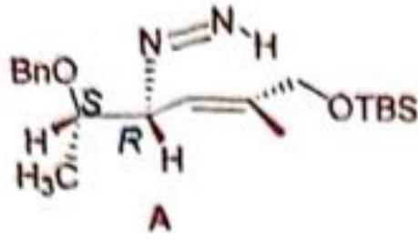
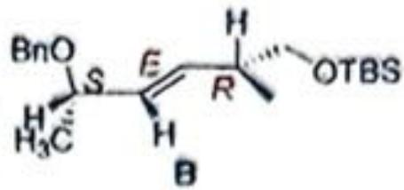
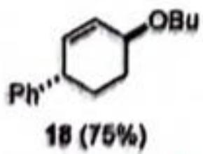
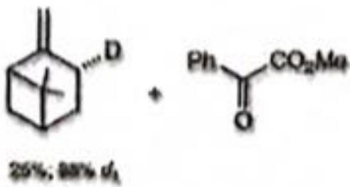

# 第1题 12分

# 1-1 (2分)

图中两个连接点之间间距为21个碱基对，因此间距为 $21\times0.34\ nm=7.14\ nm$ 。1分

为了保证 DNA 双链结构不被扭曲, 需要保证两个连接点处的碱基对正好处于同一个旋转角度, 即正好相差 $360^{\circ}$ 的整数倍。 $21 \times 34.3^{\circ} = 720.3^{\circ}$ , 正好是 $360^{\circ}$ 的 2 倍 (答出“ $360^{\circ}$ 的整数倍”可得 1 分)。而 21 是能满足该条件的最小的整数。

# 1-2 （小计5分）

根据 A 在形成化合物 C 之后其荧光强度将增加 38.0%，和初始浓度 10.00 nM，可将荧光强度转化为 A 的浓度 荧光强度可写作 $F = k^{*}c_{\Lambda} + 1.38k^{*}(10.00 - c_{\Lambda})$

易知 k=1.230

代入可得 $c_{A}=(F-1.38*10*1.23)/(1.23-1.38*1.23)$

<table><tr><td>t/s</td><td>0.000</td><td>20.00</td><td>60.00</td><td>160.0</td><td>300.0</td></tr><tr><td>荧光强度 (a.u.)</td><td>12.30</td><td>13.75</td><td>14.99</td><td>15.97</td><td>16.39</td></tr><tr><td>A 浓度(nM)</td><td>10.00</td><td>6.898</td><td>4.245</td><td>2.148</td><td>1.249</td></tr></table>

# (浓度转化过程 2 分)

使用尝试（作图）法，作为一级反应处理， $\lg c_{A}=\ln c_{0}-k_{1}t$ ，如图7-3-1

不呈直线，说明不是一级反应。 $\ln c_{A}=2.048-0.00662t$ ， $R^{2}=0.93614$ （排除一级反应的过程不做要求）

![[第37届中国化学奥林匹克竞赛决赛第二场试题和解析_images/e5961c026f040f42b6d7b86b100a037d4c6da7c9bf851c49a91f3b28cccc0a9f.jpg]]

line

| t /s | ln (c_t / 1[nm]) |
| ---- | ---------------- |
| 0    | 2.3              |
| 25   | 1.9              |
| 60   | 1.45             |
| 160  | 0.75             |
| 300  | 0.2              |

图 7-3-1 $\ln c_{A} \sim t$ 图

![[第37届中国化学奥林匹克竞赛决赛第二场试题和解析_images/1d30a20754dd8bd404d7be654e701c81dcdbf9c5feb1b8f9a472c9cd05de31d0.jpg]]

line

| t /s | 1/c_t / [nm]⁻¹ |
| ---- | -------------- |
| 0    | 0.1            |
| 25   | 0.15           |
| 50   | 0.2            |
| 150  | 0.45           |
| 300  | 0.8            |

图 7-3-2 $1/c_{A} \sim t$ 图

作为二级反应处理 $\frac{1}{c_{A}}-\frac{1}{c_{0}}=kt$ ，其中t为时间， $c_{t}$ 为t时间的浓度， $c_{0}$ 为初始浓度10.00 nM

$$
1 / c _ {A} - = 0. 0 9 7 2 + 0. 0 0 2 3 3 t
$$

得 $k = 0.00233 \, [nM]^{-1} s^{-1} = 2.33 \times 10^{6} \, M^{-1} s^{-1}$ （反应级数判断正确 1 分，结果 2 分）
不要求做图。

# 1-3 （小计3分）

对于弹簧的并联,其弹性系数 $k_{n}=n \cdot k$ ,其中 $n$ 是弹簧的个数, $k$ 为单个弹簧的弹性系数。因此,6个DNA并联后 $7-k=0.28272 \mathrm{~N/m}$ ,1分 带入公式可以计算得到 $\mathrm{m}=7.161 \times 10^{-21} \mathrm{~kg}$ ,1分 转换为分子量 $M_{\mathrm{w}}=4.313 \times 10^{6} \mathrm{~g/mol}$ 1分

# 1-4 (2分)

吖啶橙与双链 DNA 结合会插入 DNA 碱基对之间，与 DNA 碱基对具有 $\pi-\pi$ 堆积作用，吸收峰红移（答出“ $\pi-\pi$ 堆积”可得分，答出“ $\pi-\pi$ 堆积和静电作用”亦可得 1 分），而与单链 DNA 只有静电相互作用（答出“静电作用”可得 1 分）。

第2题13分

<table><tr><td>2-1-1 (1分)B</td><td>2-1-2 (1分)氯化钙与双氧水的反应在弱碱性条件下反应产率更高。或答碳酸钙过量可以使得稀盐酸在与碳酸钙反应几乎无剩余。</td></tr><tr><td colspan="2">2-1-3 (1分)煮沸是为了除去溶液中的 $CO_{2}$ (1分),防止在碱性条件下(与氨水反应生成碳酸根后)与 $Ca^{2+}$ 生成 $CaCO_{3}$ 沉淀,影响产品纯度。</td></tr><tr><td colspan="2">2-1-4 (1分)过滤的目的是除去未反应的 $CaCO_{3}$ (1分),避免其影响过氧化钙的纯度。</td></tr><tr><td colspan="2">2-2-1 (2分) $CaCl_{2} + H_{2}O_{2} + 2NH_{3} \cdot H_{2}O + 6H_{2}O \longrightarrow CaO_{2} \cdot 8H_{2}O + 2NH_{4}Cl$ (2分)</td></tr><tr><td>2-2-2 (1分)A</td><td>2-2-3 (1分)反应体系保持弱碱性,易于生成过氧化钙(双氧水分子中氢在碱性条件下易于脱去),碱性条件下过氧化钙更稳定。(1分)</td></tr><tr><td colspan="2">2-3-1 (2分)ABCE错一个扣1分,扣完为止;对2个才能开始给1分,4个全对给2分</td></tr><tr><td colspan="2">2-3-2 (3分) $2CaO_{2} \longrightarrow 2CaO + O_{2}$  $n_{O2} = (pV)/RT = 101250 Pa * 31.06 * 10^{-6} m^{3}/(8.314 J K^{-1} mol^{-1} * (273.15 + 30 K)$ = 0.00125 mol (1分) $n_{CaO2} = 0.20 g / 72.08 g mol^{-1} = 0.00277 mol (1 分)$ 纯度=2*0.00125/0.00277=90%(1分)此处只能保留两位有效数字,多于两位扣1分。</td></tr></table>

第 3 题 甲酸的分解 (31 分, 13%)

<table><tr><td>3-1共7分</td><td colspan="5">当加入HCI时,有 $r_1=k'_2(HC(OH)_2^+)$ (1分)HC(OH) $_2^+$ 为羰基氧质子化的甲酸,其浓度由下面的平衡反应决定:HCOOH+H'↔HC(OH) $_2^+$  $k'_{+1}(HCOOH)(H^+) = k'_{-1}(HC(OH)_2^+)$ 即:(HC(OH) $_2^+$ )=k′+1/k′-1(HCOOH)(H+) (1分)代入速率表达式,得 $r_1=k'_2\cdot(HC(OH)_2^+) = (HCOOH)(H^+) = k_1(HCOOH)(H^+)$  (3.a)其中 $k_1=k'_2k'_{+1}/k'_{-1}$  (1分)3分,速率表达式正确1分,(HC(OH) $_2^+)$ 表达正确1分,最终形式正确1分当未加入HCI时,H'来自HCOOH的电离平衡: $K_a=\frac{[H^+][HCOO^-]}{[HCOOH]}=\frac{[H^+]^2}{[HCOOH]}\approx\frac{(H^+)^2}{(HCOOH)}$ (1分)当甲酸的电离度较小时,平衡时HCOOH的浓度近似等于其初始浓度(HCOOH),即(H+)≈[Ka(HCOOH)]0.5 (1分)代入3.a式,得 (1分) $r_2=k_1K_a^{0.5}\cdot(HCOOH)^{1.5}$  (1分)4分,用加入HCI情况下的速率方程计算1分,得出正确的H+和HCOOH表达式各1分,最终形式正确1分</td></tr><tr><td>3-2-1共2分</td><td colspan="5">由3-1问, $k_2=k_1K_a^{0.5}$  (1分)因此lg $k_2$ =lg $k_1$ +0.5lg $K_a$ 即:p $K_a$ =2(lg $k_1$ -lg $k_2$ )(1分)</td></tr><tr><td rowspan="3">3-2-2共3分</td><td>T/°C</td><td>210</td><td>240</td><td>260</td><td>280</td></tr><tr><td>p $K_a$ </td><td>3.80</td><td>4.00</td><td>4.60</td><td>4.90</td></tr><tr><td colspan="5">p $K_a$ 随温度升高增大,高温下水的溶剂化作用变弱使酸性降低。3分,计算共2分,每错误1个扣1分,扣完为止;解释1分。</td></tr><tr><td>3-3共3分</td><td colspan="5">Q=n(CO)/n(HCOOH)= $\frac{V_g[CO(g)]+V_{aq}[CO(aq)]}{V_{aq}[HCOOH(aq)]}=\frac{V_g/V_{aq}K_D[CO(aq)]+[CO(aq)]}{[HCOOH(aq)]}=\frac{[CO(aq)]}{[HCOOH(aq)]}(V_g/V_{aq}K_D+1)$ =K( $V_g/V_{aq}K_D+1$ )(1分)按题意, $x_T=V_{aq}/(V_{aq}+V_g)$ 因此 $V_g/V_{aq}=1/x_T-1$ (1分)K= $\frac{Q}{(V_g/V_{aq}K_D+1)}=\frac{Q}{(1/x_T-1)K_D+1}=\frac{x_TQ}{(1-x_T)K_D+x_T}$ (1分,两种形式均可)共3分,得出Q和K初步关系(用 $V_g$ 、 $V_{aq}$ 或含义等价的符号表示)1分,用 $x_T$ 正确表示气液相比例1分,最终结果1分。</td></tr><tr><td>3-4共4分</td><td colspan="5">根据van't Hoff方程 $\frac{d \lg K}{d(1/T)} = -\frac{\Delta H^{\circ}_{\text{CO}}}{2.303R}$ 或 $\lg K \sim 1/T$ 的斜率为 $-\Delta H^{\circ}_{\text{CO}}/(2.303R)$ (1分) $\Delta H^{\circ}_{\text{CO}} = -2.303R(-3.0) \times 10^{3} \text{J mol}^{-1} = 2.303 \times 8.314 \times 3.0 = 57 (\text{kJ mol}^{-1})$ (1分)平衡常数 $K_D = [\text{CO(g)}]/[\text{CO(aq)}]$ 对应的反应是 $\text{CO (aq)} = \text{CO (g)}$ 因此 $\frac{d \lg K_D}{d(1/T)} = -\frac{-\Delta H_D}{2.303R}$ 或 $\lg K_D \sim 1/T$ 的斜率为 $\Delta H_D/(2.303R)$ (1分) $\Delta H_D = 2.303R(1.3) \times 10^{3} \text{J mol}^{-1} = 2.303 \times 8.314 \times 1.3 = 24 (\text{kJ mol}^{-1})$ (1分)(4分,焓变计算式正确1分,两个答案各1分,如 $\Delta H_D$ 符号相反扣1分)</td></tr><tr><td>3-5-1共5分</td><td colspan="5">由3-3中得到的 $K$ 和 $Q$ 的关系,得: $\frac{d \ln Q}{d(1/T)} = \frac{d}{d(1/T)} \ln(K \cdot [(1/x_T - 1)K_D + 1])$ = $\frac{d \ln K}{d(1/T)} + \frac{d}{d(1/T)} \ln[(1/x_T - 1)K_D + 1] = \frac{d \ln K}{d(1/T)} + \frac{(1/x_T - 1)}{(1/x_T - 1)K_D + 1} \cdot \frac{d K_D}{d(1/T)}$ (正确获得对应 $\Delta H_{\text{CO}}$ 的微分,且对数函数微分展开正确,1分) $= \frac{d \ln K}{d(1/T)} + \frac{(1/x_T - 1)K_D}{(1/x_T - 1)K_D + 1} \cdot \frac{d \ln K_D}{d(1/T)}$ (正确获得对应 $\Delta H_{\text{CO}}$ 和 $\Delta H_D$ 的微分,2分) $= \frac{\Delta H_{\text{CO}}}{R} + \frac{(1/x_T - 1)K_D}{(1/x_T - 1)K_D + 1} \cdot \frac{\Delta H_D}{R}$ (用相应焓变代入微分,1分) $-2.303Rk_Q = -2.303R \frac{d \lg Q}{d(1/T)} = R \frac{d \ln Q}{d(1/T)} = \Delta H_{\text{CO}} - \frac{(1/x_T - 1)K_D}{(1/x_T - 1)K_D + 1} \cdot \Delta H_D$ 因此 $\beta = -\frac{(1/x_T - 1)K_D}{(1/x_T - 1)K_D + 1}$ (1分)共5分,若上一问中 $\Delta H_D$ 符号相反,此问中的 $\beta$ 符号也相反,不扣分(不重复扣分)。</td></tr><tr><td>3-5-2共2分</td><td colspan="5">在实验温度范围内(200-300°C),根据3-4问中的公式,计算出 $K_D$ 范围为7.4-22、(1分)当 $x_T$ 较小(&lt;0.1)时, $(1/x_T - 1)K_D \gg 1$ ,因此 $\beta$ 近似为-1, $k_Q$ 近似为常数、 $\ln Q_{\text{CO}} \sim 1/T$ 也具有很好的线性关系。(1分,直接用 $x_T = 0.1$ 和 $K_D$ 范围计算 $\beta = -0.985 \sim -0.995$ 也得分)共2分, $K_D$ 和 $\beta$ 数值的估算各1分,不对 $K_D$ 估算,直接将 $\beta$ 近似为-1得1分。</td></tr><tr><td>3-6共5分</td><td colspan="5">A NP3RuCl(HCOO) B NP3RuClH C NP3RuCl( $H_2$ )A' NP3RuH(HCOO) C' NP3RuH( $H_2$ )+每个1分,电荷错误不得分。</td></tr></table>

第4期Zn-1 次电池（31分，占18%）

<table><tr><td>4-1共8分</td><td> $\begin{array}{l}1 + 1 + 2e - 2I \\2 + 2Cu^{3+} + I_2 + 4e - 2CuI \\3 + 2Cu^{3+} + I_3 + 4e - 2CuI \\4 + I_2 + 2Cl^- - 2e - 2ICl \\ \end{array}$ 每个方程式2分,共8分</td></tr><tr><td>4-2-1共4分</td><td>A为CuI,对应实验2的标准电极电势 $\varphi_{2}^{\circ} = 0.70\mathrm{V}$  $2Cu^{2+} + I_2 + 4e - 2CuI$ 可以写成以下反应的加和 $2Cu^{2+} + 2e = 2Cu^+$  $I_2 + 2e = 2I^+$  $2Cu^+ + 2I^- = 2CuI$ (1分)因此: $\lg K = 4\varphi_{2}^{\circ}/0.0592 = 2\varphi^{\circ}(I_2/I^-)/0.0592 + 2\varphi^{\circ}(Cu^{2+}/Cu^+)/0.0592 - 2lgK_{sp}(CuI)$ (1分) $\lg K_{sp}(CuI) = [\varphi^{\circ}(I_2/I^-) + \varphi^{\circ}(Cu^{2+}/Cu^+)-\varphi_{2}^{\circ}] / 0.0592$ (1分) $= (0.536 + 0.159 - 2 \times 0.70) / 0.0592 = -11.9$ (1分)或 $K_{sp}(CuI) = 10^{-11}{}^{\circ} = 1.2 \times 10^{-12}$ (共4分,给出 $K_{sp}$ 的正确表达式3分,得到正确答案1分)</td></tr><tr><td>4-2-2共3分</td><td>B为ICl,对应实验4的标准电极电势 $\varphi_{4}^{\circ} = 1.20\mathrm{V}$  $2ICl + 2e = I_2 + 2CI^-$  $\Delta_I G^\circ = 2\Delta_I G_m^\circ (CI^-) + \Delta_I G_m^\circ (I_2) - 2\Delta_I G_m^\circ (ICl) = -2F\varphi_{4}^{\circ}$  $\Delta_I G_m^\circ (ICl) = \Delta_I G_m^\circ (CI^-) - F\varphi_{1}^{\circ} = -131.2 + 96.485 \times 1.20 = -15.4 (\mathrm{kJ}\mathrm{mol}^{-1})$ (共3分,给出 $\Delta_I G_m^\circ$ 的正确的表达式2分,得到正确答案1分)</td></tr><tr><td>4-3-1共4分</td><td>负极电势: $\varphi_- = \varphi^\circ (Zn^{2+}/Zn) = -0.762\mathrm{V}$ 正极电势: $\varphi_+ = \varphi^\circ (I_2/I^-) = +0.536\mathrm{V}$  $E = \varphi_+ - \varphi_- = 0.536 - (-0.762) = 1.298\mathrm{V}$ (1分)正负极的组成为 $Zn+I_2$ (1分)储能密度 $\rho = \frac{nFE}{m(Zn+I_2)} = \frac{2 \cdot 96485 \cdot 1.298/3600}{0.0654 + 0.1269 \times 2} = 218.0 (\mathrm{Wh/kg})$ (2分,计算式1分,答案1分)共4分,电池电动势1分,正确的正负极组成1分,储能密度计算式1分,正确答案1分</td></tr><tr><td>4-3-2共7分</td><td>高放电位1.20V对应的正极反应:2ICl+2e=I2+2Cl-负极电势:φ-=φ°(Zn2+/Zn)=-0.762V,正极电势:φ+=φ1°=+1.20VE1=φ+-φ-=1.20-(-0.762)=1.96V (1分)n1=2 (1分)低放电位0.70V对应的正极反应:2Cu2++I2+4e=2Cul负极电势:φ-=φ°(Zn2+/Zn)=-0.76V,正极电势:φ+=φ2°=+0.70VE2=φ+-φ-=0.70-(-0.76)=1.46V (1分)n1=4 (1分)总的放电反应为:2ICl+2CuCl2+3Zn=2Cul+3ZnCl2因此正负极组成为2Cul+3ZnCl2 (1分)储能密度:ρ=(n1E1+n2E2)F/m(2Cul+3ZnCl2)= (2×1.96+4×1.46)×96485/3600/2×0.1904+3×0.1364 = 331(Wh/kg)(2分)共7分,2个电动势各1分,2个转移电子数各1分,正确的正负极组成1分,储能密度计算式1分,正确答案1分</td></tr><tr><td>4-4共5分</td><td>200mA恒电流放电482s转移的电子数为0.200×482/96485=1.00×10-3mol=1.00(mmol) (1分)负极区Zn-2e=Zn2+放电结束后电解质中[Zn2+] = 1.0 + 1.00/2/1.0 = 1.5 (mol L-1) (1分)正极区:2Cu2++I2(s)+4e=2Cul(s)放电结束后电解质中[Cu2+] = 1.0 - 1.00/2/1.0 = (0.5 mol L-1) (1分)电池电动势:E=φ+-φ-=φ°2+0.0592lg[Cu2+]2-(φ°(Zn2+/Zn)+0.0592/2lg[Zn2+])=φ°2-φ°(Zn2+/Zn)+0.0592lg[Cu2+]/[Zn2+] =0.70-(-0.762)+0.0592/2lg0.5/1.5=1.45V (2分)共5分,转移电子数1分,正负极组分正确2分,Nernst方程1分,正确答案1分</td></tr></table>

第 5 题 水的结构 (24 分, 占 9%)

<table><tr><td>5-1-1共3分</td><td>6 (3分)</td></tr><tr><td>5-1-2共5分</td><td>氢可能占据位置的微观状态数: Ω=22N_A×(6/16)^N_A=(3/2)^N_A (3分)自然冰结构中的残余熵: S=klnΩ=k ln(3/2)^N_A=k N_A ln(3/2)=R ln(3/2) (2分)=8.314×0.4055 J mol-1 K-1=3.371 J mol-1 K-1</td></tr><tr><td>5-2-1共10分</td><td>晶胞中有2个O原子,分别处在晶胞原点和体心,其坐标为:(0,0,0); (1/2, 1/2, 1/2) (共2分)每正确答案1分。每一错误答案扣一分,扣至零分为止晶胞中应该有4个H原子,但占据8个位置:H原子位于立方晶胞体的对角线上,成对按照四面体方式围绕氧原子分布立方体对角线: d=√3a=1.732×0.330 nm=0.572 nm离原点最近的两个氢原子的位置和坐标,3个坐标参数相等,为(x,x,x)第1个可根据O-H键长直接计算:0.0972 nm/0.572 nm=0.170第2个则根据O-H键长和位置:1/2-0.170=0.3308个H原子的位置分别是:(共8分)每正确答案1分每一错误答案扣一分,扣至零分为止(0.170,0.170,0.170) (0.330,0.330,0.330)(0.830,0.830,0.170) (0.670,0.670,0.330)(0.830,0.170,0.830) (0.670,0.330,0.670)(0.170,0.830,0.830) (0.330,0.670,0.670)学生只给答案,不要求计算过程</td></tr><tr><td>5-2-2共3分</td><td>冰VII晶胞中包含2个水分子,晶胞体积V=a3=(0.330nm)3=3.59×10-2nm3=3.59×10-23cm3(1分)密 度ρ=ZxM/N_A×V=2×18.0 g mol-1/6.02×1023mol-1×3.59×10-23cm3=1.67 g cm-3(2分)</td></tr><tr><td>5-2-3共3分</td><td>冰VII的密度远大于自然冰的密度(1分),光靠压强的增大使之压缩不足以引起这么大的变化,说明其结构有显著的调整,从图5.2(c)可以看出,冰VII具有金刚石型的二重穿插结构,空旷度大大降低,密度显著增大。(2分)</td></tr></table>

第6题 量子点(共38分；17%)

<table><tr><td>6-1-1共6分</td><td> $Cd^{2+} + HSe^{-} + OH^{-} = CdSe + H_{2}O$ (2分)(a)防止含硒物种( $HSe^{-}$ , $Se^{2-}$ 或者CdSe)的氧化 (1分)(b)使所得CdSe量子点表面为 $Cd^{II}$ 层,可以和保护剂结合 (1分)(c)保护剂的巯基可以和 $Cd^{III}$ 络合,保护量子点并防止其长大,(1分)另一端的羧酸根亲水,可以使量子点在水溶液中充分分散并保持(1分)。</td></tr><tr><td>6-1-2共4分</td><td> $4Cd^{2+} + 4SeO_{3}^{2-} + 6BH_{4}^{-} + 12H_{2}O \rightarrow 4CdSe + 6B(OH)_{4}^{-} + 12H_{2}$ (4分)</td></tr><tr><td>6-2-1共1分</td><td>(b)红移(向长波长方向移动)(1分)</td></tr><tr><td>6-2-2共3分</td><td>(b)变宽;(1分)这是因为量子点大小不均匀(1分),说明其长大过程中需要控制(1分)。</td></tr><tr><td>6-3-1共3分</td><td>对A*做稳态近似,有: $I_{0} - k_{f}[A^{*}] - k_{d}[A^{*}] = 0$ (1分) $[A^{*}] = \frac{I_{0}}{k_{f} + k_{d}}$ (1分)依题意, $r_{f} = k_{f}[A^{*}]$ ,及 $\phi = F / I_{0} = r_{f} / I_{0}$ ,可得 $\phi_{o} = \frac{r_{f}}{I_{0}} = \frac{k_{f}[A^{*}]}{I_{0}} = \frac{k_{f}I_{0}}{I_{0}(k_{f} + k_{d})} = \frac{k_{f}}{k_{f} + k_{d}}$ (1分)</td></tr><tr><td>6-3-2共3分</td><td>A*向A转化的反应有: $\begin{cases} A * \xrightarrow{k_{f}} A + h\nu \\ A * \xrightarrow{k_{d}} A \end{cases}$ 有: $\frac{d[A^{*}]}{dt} = -(k_{f} + k_{d})[A^{*}]$ (1分)积分式为: $\ln[A^{*}] / [A^{*}]_{0} = -(k_{f} + k_{d})t$ (1分)荧光寿命 $\tau_{0}$ 满足 $\frac{1}{e} = \frac{[A^{*}]}{[A^{*}]_{0}} = e^{-(k_{f} + k_{d})\tau_{0}}$  $\tau_{o} = \frac{1}{k_{f} + k_{d}}$ (1分)</td></tr><tr><td>6-4-1共2分</td><td> $\phi = \frac{k_{f}}{k_{f} + k_{d} + k_{q}[Q]}$ (1分) $\tau = \frac{1}{k_{f} + k_{d} + k_{q}[Q]}$ (1分)</td></tr><tr><td>6-4-2共2分6-5-1共2分</td><td> $\phi = \frac{k_{f}}{k_{f} + k_{d}}$ (1分) $\tau = \frac{1}{k_{f} + k_{d}}$ (1分) $K = \frac{k_q}{k_f + k_d}$ (2分) $\frac{F_0}{F} = \frac{\phi_o}{\phi} = (\frac{k_f}{k_f + k_d}) / (\frac{k_f}{k_f + k_d + k_q[Q]})$  $= \frac{k_f + k_d + k_q[Q]}{k_f + k_d} = 1 + \frac{k_q}{k_f + k_d}[Q]$ </td></tr><tr><td>6-5-2共4分</td><td>静态淬灭过程中,淬灭剂Q与A间存在化学平衡:A+Q目的硼 AQ $K_S = \frac{[AQ]}{[A][Q]}$ 或 $\frac{[AQ]}{[A]} = K_S [Q]$ (1分)即有: $\frac{[A]_0}{[A]} = \frac{[A] + [AQ]}{[A]} = 1 + \frac{[AQ]}{[A]} = 1 + K_S [Q]$ (1分)无淬灭剂Q存在时,荧光分子A的浓度为[A]0,有淬灭剂Q存在时,荧光分子的浓度(游离A的浓度)[A]= $\frac{1}{1 + K_S [Q]}$ [A]0,则有 $F = \frac{1}{1 + k_S [Q]} F_0$  $\frac{F_o}{F} = 1 + K_S [Q]$ (1分) $K = K_s$ (1分)</td></tr><tr><td>6-6-1共2分</td><td>通过线性拟合处理,结果为 $F_0/F = 1 + 0.178 c_{dAMP}/(m mol L^{-1})$ (1分)如果分别采用两组数据求算,结果在0.17~0.19之间,也可得2分淬灭系数: $K = 0.178 (m mol L^{-1})^{-1} = 178 (L mol^{-1})$ (1分)</td></tr><tr><td>6-6-2共6分</td><td>若为动态淬灭机制,对比6-3-2和6-5-1中的公式,知 $K = \tau_0 k_q$ (1分) $k_q = K/\tau_0 = 178 (L mol^{-1}) / (40 \times 10^{-9} s) = 4.45 \times 10^9 (L mol^{-1} s^{-1})$ (1分)若为静态淬灭机制, $K_s = K = 0.178 (m mol L^{-1})^{-1}$ (1分)不能。(1分)可以监测衰减过程,如果不随淬灭剂浓度变化,则为静态机制;(1分)如果随淬灭剂浓度变大而衰减加快,则为动态机制。(1分)</td></tr></table>

# 第 7 题 基本概念 (10%)

# 7-1 分别画出三氟甲氧基苯和 2-甲氧基吡啶的优势构象。

答案:

![[第37届中国化学奥林匹克竞赛决赛第二场试题和解析_images/ce131dff3e3f67832cff4cf43dc70502ffaa804d32dea57790931518d70cc368.jpg]]

chemical

Chemical reaction scheme showing formation of a carbamate derivative and its photochemical resonance structure with anti-molecular nucleophilic attack

# 7-2 试比较以下两组自由基断裂化反应的相对速率(断裂的键已用箭头标出)，并简要解释你的判断。

7-2-1

答案：A 快 （1 分），五元环张力更大（1 分）共 2 分

7-2-2

答案：A 快（1 分），B 中给电子基团的共轭作用使该键具有双键的性质（1 分）共 2 分

# 7-3 给以下三个化合物的电离势从高到低进行排序。

![[第37届中国化学奥林匹克竞赛决赛第二场试题和解析_images/b378375ac73f2f0c82ee5dfa755449963981374842ea6251639972bdf13a4878.jpg]]

chemical

Three organic molecular structures labeled 1, 2, and 3, showing phosphorus-containing compounds with stereochemistry indicated.

答案:

1<2<3: 只有正确排序才给分，其它答案不得分，共2分。

7-4-1 将以下两种化合物中心 C 原子所连接 H 的化学位移从大到小进行排列。

答案: $1 > 2$ 只有正确排序才给分, 其它答案不得分, 共 2 分。

7-4-2 画出以下化合物的立体结构将以下两个化合物箭头所指 H 的化学位移从大到小进行排列。

![[第37届中国化学奥林匹克竞赛决赛第二场试题和解析_images/eb567ba8dabf574d4d4020ac1af9734454846c93b3d4d22270d52c72a094c0a0.jpg]]

chemical

Two chemical structures with labeled bond lengths: one showing a t-Bu group and another showing a nitrogen-containing heterocycle with H atoms and numerical values.

答案:

每个结构1分，孤对点在的朝向必须准确，共2分

2>1 只有正确排序才给分，其它答案不得分，共1分。

7-5

答案：a1分

7-6

答案；b 和 d 选对一个给 1 分，选错 1 个扣 1 分，扣完为止，共 2 分；

# 第8题 (22分，占 $13\%$ )杂原子参与的ene反应

8-1

<table><tr><td></td><td></td></tr><tr><td>骨架2分,立体化学1分,共3分,其他结构不得分。</td><td>双键构型E1分,C1:S:C2:R,各1分,共3分,其他结构不得分。</td></tr></table>

8-2

解答：

![[第37届中国化学奥林匹克竞赛决赛第二场试题和解析_images/d9fedfae56146a1798c0e765b518efb7ce1642aaf544d4f41403f39f8c7df124.jpg]]

chemical

Chemical structure of a terpenoid compound with TBSO, S, CH3, and O functional groups, labeled as (±)

骨架 2 分，立体化学 1 分，共 3 分，如果 DA 反应的区域选择性错误.

只得1分，其他结构不得分。

![[第37届中国化学奥林匹克竞赛决赛第二场试题和解析_images/34e7e45c8deb92ec76ddb04acda4719467b8eb1adf3c865d2623c43fe2c26b84.jpg]]

chemical

Chemical structure of a sulfonamide derivative with TBSO and methyl groups, labeled B, (±)

骨架 2 分，立体化学 1 分，共 3 分，

![[第37届中国化学奥林匹克竞赛决赛第二场试题和解析_images/6f884be03c252704605841898fec1b1ba97b6066d485b3e745d47faa3ec9db1a.jpg]]

chemical

Chemical structure of a sulfonamide-containing compound with methoxy and methyl substituents, labeled as (±)

骨架2分，立体化学1分，共3分，其他结构不得分。

![[第37届中国化学奥林匹克竞赛决赛第二场试题和解析_images/6a6da8b9e975a539ec5f060cd6e086cbec3132f885b06d2d5e41488cd996e9d5.jpg]]

chemical

Chemical structure of a substituted cyclohexene derivative with methyl and methoxy groups

顺式，1分； $SO_{2}$ ，2分

8-3 依据以上信息，完成以下反应：

<table><tr><td>8-3-1</td><td>8-3-2</td></tr><tr><td>骨架1分,立体化学1分,共2分,其他结构不得分。</td><td>D代化合物:骨架1分,立体化学1分,共2分,其他结构不得分。第二个化合物:1分,共3分</td></tr></table>

# 第9题（18分，占 $11\%$ ）重排反应

答案：

9-1

![[第37届中国化学奥林匹克竞赛决赛第二场试题和解析_images/618fc9cfda114d7e43816d84ac7b9d540ba3c373dc10e65bc9567785cd2305cd.jpg]]

chemical

Reaction mechanism diagram showing bromination and hydrolysis steps of a cyclic alcohol with Br and [Br+] substituents

每个1分，共7分：

9-2 画出从(+)-1生成(-)-4的关键中间体。

![[第37届中国化学奥林匹克竞赛决赛第二场试题和解析_images/4848dedfd2ea0737bdccc44b3372c3de04c509769c291b09d4afd42193899663.jpg]]

chemical

Reaction mechanism diagram showing bromination and hydrolysis steps with [Br⁺] reagents and racemerization products

每个1分，共9分；

9-3 简要解释为何化合物2在溴化过程中不易外消旋化；而(+)-1则发生会外消旋化。

答案: 2中吸电子基团溴具有使Wagner-Meerwein迁移中碳正离子不稳定的特征, 导致1,2-迁移的活化能升高。2分

![[第37届中国化学奥林匹克竞赛决赛第二场试题和解析_images/12eda35f49ad68064b49d8469e67171cf2621fb299edc258e409b7b862f9de7b.jpg]]

chemical

Chemical reaction diagram showing brominated hydroxyl group undergoing ring-opening to form a cyclic product with Br and H substituents

