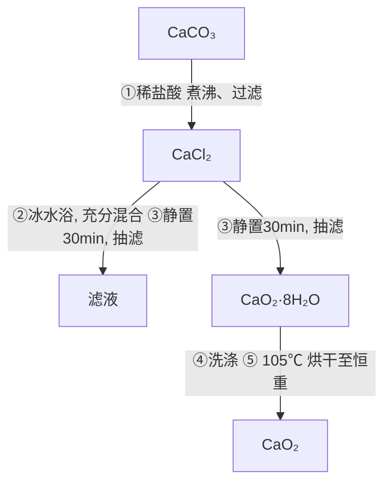

# 第 37 届中国化学奥林匹克(决赛第二场)试题

# (2023年11月05日 8:30-12:00)

# 考试纪律与要求

- 考试时间3.5小时。迟到超过半小时者，不得进入考场。开始考试后1小时内不得离场。  
- 考试结束时间到，立即停止书写。将试卷与答卷放置于桌面，待监考人员允许方可离开考场。  
- 姓名等信息必须写于指定位置，写于其他位置的答卷按废卷处理。  
• 所有解答必须写在答卷纸指定的框内，写于其他位置的解答不予评判。  
- 凡要求计算或推演的，必须给出过程，无过程即使结果正确也不得分。

\- 用铅笔解答的部分(包括作图)无效。

\- 禁用涂改液和修正带，也不得用纸粘贴，否则，整张答卷无效。

\- 允许使用非编程计算器以及直尺等文具。

\- 写有任何与试题内容无关的文字的答案无效。

\- 答卷 2 张 4 页 (A3 版式), 请勿遗漏。

\- 考场备有草稿纸，不得将任何纸张带入考场。

<table><tr><td>H1.008</td><td colspan="16">部分元素原子量</td><td>He4.003</td></tr><tr><td>Li6.941</td><td>Be9.012</td><td rowspan="2" colspan="10"></td><td>B10.81</td><td>C12.01</td><td>N14.01</td><td>O16.00</td><td>F19.00</td><td>Ne20.18</td></tr><tr><td>Na22.99</td><td>Mg24.31</td><td>Al26.98</td><td>Si28.09</td><td>P30.97</td><td>S32.07</td><td>Cl35.45</td><td>Ar39.95</td></tr><tr><td>K39.10</td><td>Ca40.08</td><td>Sc44.96</td><td>Ti47.87</td><td>V50.94</td><td>Cr52.00</td><td>Mn54.94</td><td>Fe55.85</td><td>Co58.93</td><td>Ni58.69</td><td>Cu63.55</td><td>Zn65.38</td><td>Ga69.72</td><td>Ge72.64</td><td>As74.92</td><td>Se78.96</td><td>Br79.90</td><td>Kr83.80</td></tr><tr><td>Rb85.47</td><td>Sr87.62</td><td>Y88.91</td><td>Zr91.22</td><td>Nb92.91</td><td>Mo95.96</td><td>Tc[98]</td><td>Ru101.07</td><td>Rh102.91</td><td>Pd106.42</td><td>Ag107.87</td><td>Cd112.41</td><td>In114.82</td><td>Sn118.71</td><td>Sb121.76</td><td>Te127.60</td><td>I126.90</td><td>Xe131.29</td></tr><tr><td>Cs132.91</td><td>Ba137.33</td><td>La138.91</td><td>Hf178.49</td><td>Ta180.95</td><td>W183.84</td><td>Re186.21</td><td>Os190.23</td><td>Ir192.22</td><td>Pt195.08</td><td>Au196.97</td><td>Hg200.59</td><td>Tl204.38</td><td>Pb207.2</td><td>Bi208.98</td><td>Po(209)</td><td>At(210)</td><td>Rn(222)</td></tr></table>

要求：凡题目中要求书写反应方程式，须配平且系数为最简整数比。

可能用到的常数：法拉第常数 $F = 9.6485 \times 10^{4} \mathrm{C mol}^{-1}$ ；气体普适常数 $R = 8.3145 \mathrm{J K}^{-1} \mathrm{mol}^{-1}$ ；

玻尔兹曼常数 $k_{\mathrm{B}} = 1.3806 \times 10^{-23} \mathrm{~J} \mathrm{K}^{-1}$ ，阿佛加德罗常数 $N_{\mathrm{A}} = 6.0221 \times 10^{23} \mathrm{~mol}^{-1}$ 。

有机化学常用缩写：Ac：乙酰基；BHT：二丁基羟基苯；Bn：苄基(苯甲基)；Bu：丁基；Cy：环己基；

equiv.: 当量; Et: 乙基; Me: 甲基; OTf: 三氟甲磺酰基; Ph: 苯基; R: 烷基; TBS: tBuMe₂Si-;

THF: 四氢呋喃; TMS: 三甲基硅基; Ts: 对甲苯磺酰基。

# 第 1 题 DNA 纳米结构 (6%)

DNA 碱基之间高特异性的配对方式 (即 A 只能与 T 配对, G 只能与 C 配对) 确保了遗传基因的稳定性。科学家们利用此特性, 设计 DNA 序列合成 DNA 高阶纳米结构, 从而实现对 DNA 分子形状的可编程式调控。最常见的双链 B 型 DNA 结构参数如下: 其相邻两个碱基对距离为 $0.34 \mathrm{~nm}$ ; 上下相邻的两对碱基对之间具有较强的 $\pi-\pi$ 堆积作用, 其旋转夹角为 $34.3^{\circ}$ 。

高阶 DNA 纳米结构的基本组成单元是一种被成为 DNA 砖块(DNA tile)的结构，即在两条双链 DNA 之间设计两个连接点，改变 DNA 骨架的走向使两条 DNA 的骨架能相互连接，从而使两个 DNA 被“捆绑”在一起，如图 1.1 所示：

![[第37届中国化学奥林匹克决赛第二场试题_images/2c40ddb73bf4ae09c841755b0d7d270a3358fc2693db19df2e7256b38bc2dd31.jpg]]

<details>
<summary>text_image</summary>

侧视图
0.34 nm
俯视图
B型双链DNA
34.3°
连接点1
DNA砖块
侧视图
连接点2
俯视图
</details>

图 1.1 DNA 双螺旋及其组装

1-1 计算两个连接点之间的间距 (以 nm 为单位), 并解释为什么该间距是能够保证双链 DNA 结构稳定存在且不被扭曲所能获得的最小间距。  
1-2 不同的 DNA 砖块之间的单链 DNA 互相配对，犹如胶水一样将 DNA 砖块“黏”在一起。如图 1.2 所示，两个最简单的 DNA 砖块 A 和砖块 B 形成了更大的结构 C。在砖块 A 的末端引入一个荧光基团（图中绿色圆点），可以通过测定相应化合物的荧光强度变化研究该过程的动力学行为。

![[第37届中国化学奥林匹克决赛第二场试题_images/0219f7fefa295ced105c88a6f673400869aea7350f86887a84d3624ab38bcfc5.jpg]]

![[第37届中国化学奥林匹克决赛第二场试题_images/9771187e31945988301d14558e548a804f4d54ef61f36dc33ca240b2edb2a762.jpg]]

<details>
<summary>text_image</summary>

+ 1'
2'
B
</details>

![[第37届中国化学奥林匹克决赛第二场试题_images/30a1ae5192d46a2ebc64941b41536e393cfd9e5727000cf8d577a58addcf0e0f.jpg]]

<details>
<summary>flowchart</summary>

```mermaid
graph LR
    A["Input"] --> B["Process Step"]
    B --> C["Output"]
    style B fill:#f9f,stroke:#333
    note right of B: C (green dot)
    note right of C: Pink arrow pointing to B
```
</details>

图 1.2 DNA 砖块 A 和砖块 B 结合形成 C

已知实验条件下 C 的荧光强度比相同浓度 A 大 38.0%。A 与 C 的荧光强度可认为与它们的浓度成正比。当反应物 A 与 B 初始浓度均为 10.00 nmol L $^{-1}$ ，随反应进行测得的体系荧光强度总结在下表中。计算该反应的速率常数。

<table><tr><td>t/s</td><td>0.000</td><td>20.00</td><td>60.00</td><td>160.0</td><td>300.0</td></tr><tr><td>荧光强度 (a.u.)</td><td>12.30</td><td>13.75</td><td>14.99</td><td>15.97</td><td>16.39</td></tr></table>

1-3 将 6 条双链 DNA“捆绑”在一起可以制成纳米弹簧。如果将这个弹簧的一端固定在表面，另一端连接上蛋白质分子，则通过测定该弹簧的振动频率可以得知蛋白质的分子量，如图 1.3 所示。已知图中单个双链 DNA 分子的弹性系数 k 为 0.04712 N/m，整个体系振动频率 $\nu = \frac{1}{2\pi} \sqrt{\frac{k_{6}}{m}}$ ，其中 $k_{6}$ 为 6 根“捆绑”双链 DNA 的弹性系数，m 为体系的质量 (DNA 的质量相对于蛋白质的质量来讲可忽略不计)。振动频率测定装置的频率测定上限为 1.000 GHz，计算该纳米弹簧能够测定的蛋白质的最小分子量。

![[第37届中国化学奥林匹克决赛第二场试题_images/0ff6d7b92ff022c2847ce4ca5771167e6330cce158b9593e153442248813f96e.jpg]]

<details>
<summary>text_image</summary>

蛋白质
振动
6条DNA
捆绑结构
侧视图
俯视图
(未显示蛋白质)
</details>

图 1.3 DNA 纳米弹簧及其与蛋白质的作用

1-4 为了区分双链 DNA 和未配对成功的单链 DNA，常用一种荧光染料吖啶橙作为指示分子。它与双链 B 型 DNA 结合吸收峰在 $502 \mathrm{~nm}$ ，与单链未配对的 DNA 结合吸收峰在 $460 \mathrm{~nm}$ ，解释其与双链和单链 DNA 结合吸收峰不同的原因。吖啶橙的结构如下：

![[第37届中国化学奥林匹克决赛第二场试题_images/9a91f76a266f118214bd1fa825b3026005adb9065b8a7b2caacb3056660540a3.jpg]]

# 第 2 题 过氧化物的制备 (6%)

过氧化钙 $\left(\mathrm{CaO}_{2}\right)$ 微溶于水，溶于酸，可作为用医用防腐剂和消毒剂，也可作为改良剂为农业、园艺和生物技术应用提供氧气。

2-1 以下是一种实验室制备过氧化钙方法的流程图(图 2.1):

![[第37届中国化学奥林匹克决赛第二场试题_images/b94046235897d6a5b89c1a3ca52312eca262a16c389f65ff1258571ab6102e4c.jpg]]

<details>
<summary>flowchart</summary>


</details>

图 2.1 过氧化钙制备流程图

![[第37届中国化学奥林匹克决赛第二场试题_images/5bc3ae6fbd7312fc42fcf0de4d4c7ef9e14e89a8e3e313e9e10d62a5c3612b9f.jpg]]

<details>
<summary>text_image</summary>

Labeled diagram of a laboratory apparatus with numbered components and a thermometer gauge
</details>

图 2.2 量气法装置图

2-1-1 选择步骤①中应当略过量的试剂: ( )

A. 稀盐酸; B. 碳酸钙。

2-1-2 解释步骤①中该试剂应当略过量的原因。

2-1-3 步骤①中煮沸操作的目的是什么？

2-1-4 步骤①中过滤操作的目的是什么？

2-2-1 写出步骤②中生成 $\mathrm{CaO}_2 \cdot 8 \mathrm{H}_2 \mathrm{O}$ 的反应方程式。

2-2-2 步骤②中的混和操作，应当选择哪种方式为宜？（）

1. 水准管；2. 量气管；3. 乳胶连接管；4. 三通活塞；5. 装有样品的试管

A. 将氯化钙溶液滴入氨水-双氧水混合液中; B. 将氨水-双氧水混合液滴入氯化钙溶液中。

2-2-3 解释选择 2-2-2 中混和方式的原因。

2-3 可采用量气法测定过氧化钙的含量。量气法实验装置如图 2.2 所示。加热至 $350^{\circ}$ C 以上时 $CaO_{2}$ 迅速分解生成 CaO 和 $O_{2}$ 。采用量气法可以测定产品中 $CaO_{2}$ 的纯度（假设杂质不产生气体）。

2-3-1 使用量气管的注意事项中, 下列说法正确的是: ( )

A. 使用前需要检漏; B. 初始读数时量气管与水准管液面相平;  
C. 读数时, 视线与最低凹液面处平齐; D. 读终体积时, 停止加热后需立即读数;   
E. 读终体积时, 气体需先冷却至室温; F. 读终体积时, 量气管与水准管液面无需相平;

2-3-2 某同学准确称量 0.20 g 烘干恒重后的过氧化钙样品，置试管中加热使其完全分解，在 101.25 kPa, 25 ℃ 下，收集到 31.06 mL 气体 (视作理想气体)，计算产品中 $CaO_{2}$ 的质量分数。

# 第 3 题 甲酸的分解 (13%)

甲酸受热分解有脱水和脱羧两种方式:

方式(1) $\mathrm{HCOOH} = \mathrm{H}_{2} \mathrm{O} + \mathrm{CO}$ (脱水)

方式(2) $HCOOH = H_{2} + CO_{2}$ (脱羧)

在高温水热无催化剂条件下，主要发生方式(1)。为获得水热条件下脱水反应的相关数据，开展了以下实验：室温下向耐压石英核磁管中加入 $1 \mathrm{~mol} \mathrm{L}^{-1}$ 的甲酸水溶液并密封，在温度 $T$ 下反应一段时间后，记录温度 $T$ 下核磁管中液相的体积占比 $x_{T}$ ，随后将石英管快速降至室温终止反应(此时液相占比与反应温度 $T$ 时的不同)，利用核磁分析液相和气相中各物种的浓度，通过计算得到甲酸分解的转化率，进而分析反应热力学和动力学。甲酸水热脱羧反应的机理如图3.1所示，其中质子化甲酸中间体的生成是快速平衡反应：

![[第37届中国化学奥林匹克决赛第二场试题_images/d9827041a7101c8e4eb7a02398e543691f3a3c7f89ba14c3bfdf7b9124dceaa8.jpg]]

<details>
<summary>chemical</summary>

Reaction mechanism diagram showing proton transfer and rate constants for a carboxylic acid derivative
</details>

图 3.1 甲酸水热脱水反应的机理

研究表明，当向反应体系中加入 HCl，反应速率 $r_{1}$ 与甲酸和 $H^{+}$ 浓度的关系为：

$$
r _ {1} = k _ {1} (\mathrm{HCOOH}) (\mathrm{H} ^ {+})
$$

若反应体系中不加 $\mathrm{HCl}$ , 甲酸分解速率 $r_2$ 与甲酸浓度的关系为:

$$
r _ {2} = k _ {2} (\mathrm{HCOOH}) ^ {1. 5}
$$

3- 1 推导加 HCl 和不加 HCl 两种情形下的反应动力学方程。

3-2 通过反应速率常数 $k_{1}$ 和 $k_{2}$ 可以获得甲酸在水热条件下的酸解平衡常数 $K_{\mathrm{a}}$ ，在 $200 - 300^{\circ} \mathrm{C}$ 范围内，测得不同温度下的反应速率常数 $k_{1}$ 和 $k_{2}$ 见下表:

<table><tr><td>T/°C</td><td>200</td><td>230</td><td>260</td><td>280</td></tr><tr><td> $\lg[k_1/(mol^{-1} L s^{-1})]$ </td><td>-3.71</td><td>-2.75</td><td>-1.91</td><td>-1.20</td></tr><tr><td> $\lg[k_2/(mol^{-0.5} L^{0.5} s^{-1})]$ </td><td>-5.61</td><td>-4.75</td><td>-4.21</td><td>-3.65</td></tr></table>

3-2-1 推导 $pK_{a}$ 与 $k_{1}$ 和 $k_{2}$ 的关系式。

3-2-2 计算上表中不同温度下的 $\mathrm{pK}_{\mathrm{a}}$ ，并解释其随温度变化的原因。

3-3 甲酸水热脱羧反应的平衡常数 $K$ 定义如下:

$$
K = [ \mathrm{CO} (\mathrm{aq}) ] / [ \mathrm{HCOOH} (\mathrm{aq}) ]
$$

其中， $\mathrm{[CO(aq)]}$ 和 $[\mathrm{HCOOH(aq)}]$ 分别为达平衡时液相中 CO 和甲酸的浓度。体系中 CO 在气相(g)和液相(aq)中都存在，而甲酸主要存在于液相中。本实验需将反应体系冷至室温后才能进行产物浓度分析，但无法直接测得反应温度 $T$ 下的液相浓度，测得的是整个反应体系中(包含气相和液相)达到平衡后 CO 和甲酸的摩尔数之比： $Q = n(\mathrm{CO}) / n(\mathrm{HCOOH})$ 。CO 在液相和气相中的分配系数 $K_{D}$ 定义为： $K_{D} = [\mathrm{CO(g)}] / [\mathrm{CO(aq)}]$ 。

推导 $K$ 的表达式，用 $Q$ 、 $K_{D}$ 和 $x_{\mathrm{T}}$ 等实验中的可观测量来表达。

3-4 实验数据表明, 在 $200 - 300^{\circ} \mathrm{C}$ 的温度范围内, $\lg K$ 和 $\lg K_{D}$ 均与温度的倒数 $1 / T$ 呈较好的线性关系, 如下式所示, 其中 $T$ 以 $\mathrm{K}$ 为单位:

$$
\lg K = - 3. 0 \times 1 0 ^ {3} / T + 5. 9; \quad \lg K _ {D} = 1. 3 \times 1 0 ^ {3} / T - 1. 4
$$

计算 $200 - 300^{\circ} \mathrm{C}$ 内甲酸脱水反应的标准摩尔焓变 $\Delta H^{\circ}_{\mathrm{CO}}$ 和 CO 在液相中的溶解焓 $\Delta H^{\circ}_{\mathrm{D}}$ 。

3-5 实验发现，当 $x_{T} < 0.1$ 时，在 $200 - 300^{\circ}\mathrm{C}$ 范围内， $\lg Q$ 与 $1 / T$ 也具有良好的线性关系，其斜率为 $k_{Q}$ 满足以下关系： $-2.303R k_{Q} = \Delta H^{\circ}_{\mathrm{CO}} + \beta \Delta H^{\circ}_{\mathrm{D}}$ 。

3-5-1 推导 $\beta$ 的表达式，用 $K_{D}$ 和 $x_{T}$ 表示。

3-5-2 解释当 $x_{T} < 0.1$ 时， $\lg Q$ 与 $1 / T$ 具有良好线性关系的原因。

提示：对于函数 $y = f(x)$ ， $y$ 对 $x$ 的导数 $dy / dx$ 如下表所示（表中 $a$ 和 $b$ 均为常数， $z$ 是 $x$ 的函数）：

<table><tr><td> $f(x)$ </td><td> $ax + b$ </td><td> $\ln x$ </td><td> $\ln (ax + b)$ </td><td> $\ln z$ </td><td> $\ln (az + b)$ </td></tr><tr><td> $dy/dx$ </td><td> $a$ </td><td> $1/x$ </td><td> $a/(ax + b)$ </td><td> $1/z \cdot dz/dx$ </td><td> $a/(az + b) \cdot dz/dx$ </td></tr></table>

3-6 选择合适的催化剂, 可使甲酸在温和条件下高选择性发生脱羧反应, 获得氢气。Ru 配合物 Ru-1 就是其中之一, 其催化甲酸脱羧的机理如图 3.2 所示(注: 循环箭头上只给出了部分反应物和离去物)。

![[第37届中国化学奥林匹克决赛第二场试题_images/d439008798ebb9d0ea349fe6dcc65458b4dc95124bf8325b751ea6bd597bed01.jpg]]

<details>
<summary>chemical</summary>

Reaction mechanism diagram showing Ru-1 complex with intermediates A, B, C and products A', B', C' under HCOO⁻/HCOO⁻ conditions
</details>

图 3.2 过渡金属催化的甲酸脱羧反应

图 3.2 中，A、B、C 均为 Ru 的 6 配位化合物，其中均含有 Cl 元素；A' 和 C' 的结构类似于 A 和 C，但不含氯；X 为某种反应物；Ru 的价态在催化循环中保持不变。写出配合物 A、B、C、A'、C' 的结构(有机配体可以用 NP₃ 代表)。

# 第 4 题 Zn-I₂ 二次电池 (15%)

$\mathrm{Zn - I_2}$ 电池是一种水系二次电池, 作为潜在的储能系统, 近年来重新受到关注。经典的 $\mathrm{Zn - I_2}$ 电池正极为单质 $\mathrm{I_2}$ , 负极为金属 $\mathrm{Zn}$ , 以 $\mathrm{ZnSO_4}$ 溶液为电解质。研究发现, 当负极区的电解质仍为 $\mathrm{ZnSO_4}$ , 但正极区电解质变为 $\mathrm{CuSO_4}$ 或 $\mathrm{CuCl_2}$ 时, 可调变电池正极的反应, 对应的标准电极电势和放电容量均有显著变化, 提高了该电池的储能密度。以 $\mathrm{I_2}$ 为正极, 几组代表性的充放电实验数据总结于表 1 中。一些氧化还原电对的标准电极电势和水合离子的标准 Gibbs 生成自由能变 $\Delta f G_m^{\circ}$ 见表 2。

表 1. ${\mathrm{I}}_{2}$ 电极在不同的正极区电解质中充放电实验结果

<table><tr><td>实验</td><td>电解质</td><td>操作</td><td>标准电极电势 $E^{\circ}/V$ </td><td>容量/ $mAh(g·I_2)^{-1}$ </td></tr><tr><td>1</td><td> $ZnSO_4$ </td><td>放电</td><td>+0.536</td><td>175</td></tr><tr><td>2</td><td> $CuSO_4$ </td><td>放电</td><td>+0.70</td><td>348</td></tr><tr><td>3</td><td> $CuCl_2$ </td><td>放电</td><td>+0.70</td><td>348</td></tr><tr><td>4</td><td> $CuCl_2$ </td><td>充电</td><td>+1.20</td><td>182</td></tr></table>

表 2. 可能用到的一些热力学数据

<table><tr><td>氧化还原电对</td><td>标准电极电势  $E^{\circ}/V$ </td><td>水合离子</td><td> $\Delta_{f}G_{m}^{\circ}/kJ mol^{-1}$ </td></tr><tr><td> $Zn^{2+}/Zn$ </td><td>-0.762</td><td> $Cu^{2+}$ </td><td>65.5</td></tr><tr><td> $I_{2}/I^{-}$ </td><td>+0.536</td><td> $Cu^{+}$ </td><td>50.0</td></tr><tr><td> $Cu^{2+}/Cu^{+}$ </td><td>+0.159</td><td> $Zn^{2+}$ </td><td>-147.1</td></tr><tr><td> $Cu^{2+}/Cu$ </td><td>+0.340</td><td> $Cl^{-}$ </td><td>-131.2</td></tr><tr><td></td><td></td><td> $I^{-}$ </td><td>-51.6</td></tr></table>

4-1 写出实验 1\~4 对应的正极区电极反应方程式。

4-2 实验3放电生成一种含碘难溶电解质A，实验4充电生成一种含碘化合物B。

4-2-1 计算 A 的溶度积常数;

4-2-2 计算 B 的标准 Gibbs 生成自由能变。

4-3 假设电解质中的离子浓度均恒为标态，计算下列两种 $\mathrm{Zn - I_2}$ 电池的储能密度(基于正负极的总质量，结果以Wh/kg表示)。

4-3-1 正负极均以 $\mathrm{ZnSO_4}$ 为电解质；

4-3-2 负极以 $\mathrm{ZnSO_4}$ 为电解质，正极以 $\mathrm{CuCl}_2$ 为电解质。

4- 4 某 $\mathrm{Zn - I_2}$ 电池可表示为:

(-) Zn (s) | ZnSO $_{4}$ (1.0 M) || CuCl $_{2}$ (1.0 M) | I $_{2}$ (s) (+), 电池正极区和负极区电解质溶液量均为 1.0 mL, Zn 和 I $_{2}$ 的量均为 2.0 mmol, 以 200 mA 恒电流放电 482 s 后, 计算电池的电动势(计算时 I $_{2}$ 、A 和 B 均可以作为不溶物处理)。

# 第 5 题 水的结构 (9%)

水结冰是我们非常熟悉的自然现象。冰中水分子通过氢键连接，随着温度、压力的变化，可以形成不同的晶型，迄今已发现了19种形态的冰。其中，六方相的天然冰 $(\mathrm{I_h})$ 最为常见，它构造出晶莹美妙的冰雪世界；而立方相的“冰VII”最引人注目，将液态水在高于 $3\mathrm{GPa}$ 的压力下降低到环境温度即可形成，它可以在很宽的温度和压力范围内存在。2018年科学家在钻石中发现了天然存在的冰VII，在地幔、太阳系行星和冰冷卫星中也发现了冰VII，又将冰与行星的演化及地外生命的探索联系起来。

5-1 氢键的作用赋予天然冰空旷的结构和低于水的密度 $(0.920 \mathrm{~g} \mathrm{~cm}^{-3})$ 。关于冰中氢的位置，一直是备受关注的科学问题。1930 年代，根据 X 射线衍射分析，科学家提出了我们熟知的天然冰 $\mathrm{I_h}$ 的有序结构模型，如图

5.1(a) 所示，晶胞参数为 $a = 0.782 \mathrm{~nm}$ ， $c = 0.736 \mathrm{~nm}$ 。然而，随着科学技术手段的发展，对天然冰的中子衍射结果确认，冰中的氢分布存在一定的无序。天然冰的实际结构如图5.1(b)所示，可以看出，结构中氢原子在氧原子周围呈现正四面体分布，但在这些位置的占有率均为 $1/2$ ，也就是说水分子存在不同的取向。天然冰仍属六方晶系，晶胞参数为 $a = 0.451 \mathrm{~nm}$ ， $c = 0.736 \mathrm{~nm}$ 。

![[第37届中国化学奥林匹克决赛第二场试题_images/aded70dea7a7d2cf23ee32e1c73f1f193433d73c246043d43e1c80d28e29b9e9.jpg]]

<details>
<summary>chemical</summary>

Crystal structure diagram of a molecular unit cell with red and white atoms, labeled axes a, b, c
</details>

(a)

![[第37届中国化学奥林匹克决赛第二场试题_images/ad5f18c60a3b6c9452cefea7dd24ecfb95211979df824daf289ab5cdd820e898.jpg]]

<details>
<summary>chemical</summary>

Molecular crystal structure diagram showing red and white atoms in a unit cell with labeled axes a, b, c
</details>

(b)

![[第37届中国化学奥林匹克决赛第二场试题_images/a65ca0ebb902be198baa39fd0a01ad79cd489bd987a58f583094ab396ae173ba.jpg]]

<details>
<summary>chemical</summary>

Crystal structure diagram of a cubic unit cell with red and white atoms, showing unit cell axes and unit cell boundaries
</details>

(c)   
图5.1 几种冰的结构

5-1-1 5.1(b)所示冰的结构中, 单个水分子有几种可能的取向? 。  
5-1-2 关于冰中氢的位置以及水的取向问题, Pauling 早就有研究。他指出, 如果冰中水分子取向如图 5.1(a) 所示完全有序, 则构型残余熵为零, 如果水分子的取向不单一, 则存在残余的构型熵 $S$ , $S = k_{\mathrm{B}} \ln \Omega$ , 其中, $k_{\mathrm{B}}$ 是玻尔兹曼常数, $\Omega$ 是氢可能占据位置的微观状态数。写出含 $1 \mathrm{~mol}$ 水分子的冰的 $\Omega$ 值 (给出含常数的表达式即可), 计算 5.1(b) 结构中的残余熵 (单位: $\mathrm{JK}^{-1} \mathrm{~mol}^{-1}$ )。  
5-2 冰 VII 的结构示于图 5.1(c)，晶胞参数 $a = 0.330 \mathrm{~nm}$ ，O-H 键的键长为 $0.0972 \mathrm{~nm}$ ，结构中 H-O-H 的键角为 $109.5^{\circ}$ 。该结构同样存在着水分子不同取向的情况。  
5-2-1 写出晶胞中所有原子可能占据位置的坐标参数。  
5-2-2 计算冰 VII 晶体的密度。  
5-2-3 将冰 VII 的密度与冰 $\mathrm{I_h}$ 比较，并仔细观察图 5.1 所示结构，指出存在如此差别的根本原因。

# 第6题 量子点 (17%)

2023 年诺贝尔化学奖授予巴文迪(M. G. Bawendi)、布鲁斯(L. E. Brus)和伊基莫夫(A. I. Ekimov)，以表彰他们在量子点(Quantum Dots, QDs)的发现和发展方面的贡献。量子点是一种粒径约 2\~10 nm 的零维纳米晶体，常见的量子点体系有 I-VII、II-VI、III-V、VI-VI 族元素形成的半导体材料及其复合体系，例如 CuCl、ME(M = Zn, Cd; E = S, Se, Te)等等。量子点具有组成可调变、亮度高和稳定性好的发光特性，在生命科学、光电子器件、显示技术等方面都具有广泛的应用。

6- 1 量子点的合成与尺寸调控是决定其性能的关键因素。常用溶液合成法根据溶剂不同分为两大体系：水溶液和有机溶剂体系。巴文迪等人发展的基于金属有机前驱体的有机体系热注入法实现了量子点的精确调控，被认为量子点合成的里程碑事件。但水相体系自有优势，水相体系的量子点控制合成也一直在推进之中。

6-1-1 合成 CdSe 量子点最简便的方法是: 在含有保护剂的 $\mathrm{CdCl}_{2}$ 溶液中加入一定量的 NaHSe 溶液, 得到蓝色分散体系。通过加入 NaOH 使溶液的 pH 保持在 11 左右。写出此反应的离子方程式。

制备时需要注意的是，(a) 反应的溶液需要预先除去氧气，反应过程也需要惰性气氛保护；(b) 在确定原料的比例时， $\mathrm{Cd}^{2+}$ 溶液稍稍过量；(c) 水相体系中常用的一类保护剂是含有巯基的羧酸类有机物，例如巯基乙酸 $(\mathrm{HSCH}_{2} \mathrm{COOH})$ 。分别简述以上注意事项的原因。

6-1-2 鉴于 6-1-1 采用的合成法始终需要惰性气体保护, 研究者进行了反应体系的改进。在含有保护剂的 $\mathrm{CdCl}_{2}$ 溶液中, 依次加入一定量的 $\mathrm{Na}_{2} \mathrm{SeO}_{3} 、 \mathrm{NaBH}_{4}$ 和 $\mathrm{N}_{2} \mathrm{H}_{4}$ 溶液, 通过调变反应物浓度和放置时间, 可以获得不同尺寸的 CdSe。写出 CdSe 生成的离子方程式。这里 $\mathrm{NaBH}_{4}$ 是还原剂, 反应中有无色气泡产生, 这些气泡也形成了保护气氛。

6-2 在半导体量子点光学性质与粒子尺寸关联的物理机制研究中，测得不同尺寸 CdSe 量子点相应的吸收光谱，如图 6.1 所示。可以看出，随着量子点尺寸的变化，吸收峰的位置和形状均发生变化。

6-2-1 随着量子点尺寸变大，吸收峰的位置发生：（）

(a) 蓝移(向短波长方向移动) (b) 红移(向长波长方向移动)

6-2-2 随着量子点尺寸变大，吸收峰的半峰宽：（）

(a) 变窄 (b) 变宽

解释峰宽发生相应变化的原因。

6-3 量子点可作为荧光探针。此处，我们先了解一般发光体系在激发光作用下发射荧光所涉及的基本过程：

$$
\mathrm{A} \xrightarrow {I _ {0}} \mathrm{A} ^ {*} \tag {6-1}
$$

$$
\mathrm{A} ^ {*} \xrightarrow {k _ {f}} \mathrm{A} + h \nu \tag {6-2}
$$

$$
\mathrm{A} ^ {*} \xrightarrow {k _ {d}} \mathrm{A} \tag {6-3}
$$

![[第37届中国化学奥林匹克决赛第二场试题_images/3cf9ef546068895c81358049b7ce829d8a86b3fa0f6f4457d21fbab3f9720138.jpg]]

<details>
<summary>line</summary>

| Wavelength (nm) | Intensity (a.u.) |
| --------------- | ---------------- |
| 300             | ~11.5            |
| 400             | ~8.3             |
| 500             | ~6.5             |
| 600             | ~5.1             |
| 700             | ~4.3             |
| 300             | ~3.7             |
| 400             | ~3.2             |
| 500             | ~2.3             |
| 600             | ~1.9             |
| 700             | ~1.8             |
| 300             | ~1.2             |
</details>

图 6.1 CdSe 的吸收光谱

这里，A 表示基态分子或者物种(如量子点)，A\*为吸收光后产生的激发态分子， $I_{0}$ 为光强(吸光强度)。 $k_{f}$ 为激发态分子发射光子反应的速率常数， $k_{d}$ 为激发态分子通过无辐射跃迁(如振动耗能)方式返回基态的速率常数。此处对应的反应(6-1)的速率可写作 $r_{1} = I_{0}$ 。激发态分子发射光子反应的速率 $r_{\mathrm{f}} = k_{\mathrm{f}}[\mathrm{A}^{*}]$ 。

荧光量子产率 $\phi$ 定义为： $\phi =$ 体系发射的光子数/体系吸收的光子数 $= F / I_0$ 。 $F$ 为荧光强度。 $F = r_{\mathrm{f}}$ ，对于无淬灭剂体系， $F$ 记为 $F_0$ 。

6-3-1 推导上述体系的荧光量子产率 $\phi$ 的表达式（该 $\phi$ 记为 $\phi_0$ ）。  
6-3-2 撤去激发光光源后, 体系发光也逐渐停止。从激发光截止时刻开始, 监测体系荧光强度的变化, 定义 $[\mathrm{A}^{*}] / [\mathrm{A}^{*}]_{0} = 1 / \mathrm{e}$ 所经历的时间为荧光寿命 $\tau$ , 其中 $[\mathrm{A}^{*}]$ 为激发态分子 $\mathrm{A}^{*}$ 的浓度, $[\mathrm{A}^{*}]_{0}$ 为激发光截止时刻激发态分子的浓度。推导体系的荧光寿命 $\tau$ 的表达式 (该 $\tau$ 记为 $\tau_{0}$ )。  
6-4 荧光淬灭, 是指特定物质(淬灭剂)导致发光体系荧光强度减少的现象。荧光淬灭的原因很多, 机理复杂,主要包括动态淬灭和静态淬灭两种。  
6-4-1 动态淬灭：这是因激发态荧光分子与淬灭剂碰撞使其荧光淬灭的现象，在 6-3 中所示基本发光过程的基础上，还存在着如下一种消耗 A\* 的过程：

$$
\mathrm{A} ^ {*} + \mathrm{Q} \xrightarrow {k _ {q}} \mathrm{A} \tag {6-4}
$$

写出动态淬灭体系的荧光量子产率 $\phi$ 的表达式。写出此体系荧光寿命 $\tau$ 的表达式。

6-4-2 静态淬灭则是因为基态荧光分子 A 与淬灭剂 Q 间通过相互作用形成复合物 AQ，而该复合物不发出荧光，从而导致荧光淬灭的现象。在 6-3 中基本发光过程的基础上，还存在一个竞争 A 的过程：

$$
\mathrm{A} + \mathrm{Q} \xlongequal {K _ {s}} \mathrm{AQ} \tag {6-5}
$$

这一竞争导致可以吸收激发光光子的分子数 A 按比例降低。写出静态淬灭体系的荧光量子产率 $\phi$ 和荧光寿命 $\tau$ 的表达式。

6-5 加入淬灭剂后，体系的荧光强度从 $F_{0}$ 变为 $F$ ，通常符合关系式： $F_{0} / F = 1 + K[Q]$ ， $K$ 为淬灭系数。

(提示：淬灭剂浓度通常远大于量子点的浓度。)

6-5-1 写出动态淬灭中淬灭系数 K 的表达式。  
6-5-2 推导静态淬灭中淬灭系数 $K$ 的表达式。  
6- 6 量子点荧光淬灭方法已应用于生物分子的检测。在腺嘌呤脱氧核糖核苷酸(dAMP)对 CdSe 的量子点荧光发射影响的研究中, 获得如下实验数据:

<table><tr><td>dAMP 浓度  $c/(mmol\ L^{-1})$ </td><td>0.00</td><td>1.00</td><td>2.00</td><td>3.00</td><td>4.00</td><td>5.00</td><td>6.00</td></tr><tr><td> $F_0/F$ </td><td>1.00</td><td>1.17</td><td>1.34</td><td>1.51</td><td>1.69</td><td>1.88</td><td>2.07</td></tr></table>

6-6-1 计算腺嘌呤脱氧核糖核苷酸(dAMP)的荧光淬灭系数 $K$ 。  
6-6-2 典型 CdSe 量子点的荧光寿命 $\tau_0 = 40$ ns，结合上小题中的数据，若设该过程为动态淬灭，计算淬灭反应速率常数 $k_{\mathrm{q}}$ ；若为静态淬灭，给出 $K_{\mathrm{s}}$ 。依据这些数据是否能判断实验体系中荧光淬灭是动态还是静态淬灭机制？若能，请说明理由。若不能，请给出一个简单的实验设计用以判断荧光淬灭机制。

# 第 7 题 基本概念 (10%)

7-1 分别画出三氟甲氧基苯和 2-甲氧基吡啶的优势构象。  
7- 2 试比较以下两组自由基断裂化反应的相对速率(断裂的键已用箭头标出), 并简要解释你的判断。

7-2-1

![[第37届中国化学奥林匹克决赛第二场试题_images/66072e1aa99ae27896f44dd04aa0ec1741044b9c914b6eeae37ffc5df550fa01.jpg]]  
A

![[第37届中国化学奥林匹克决赛第二场试题_images/a6374a62841f98d55d305d8414618a53cc5fc7c334d69ce089735c45d730e97b.jpg]]  
B

7-2-2

![[第37届中国化学奥林匹克决赛第二场试题_images/ffd4d6deb52de7acb26d31380166a5ff2b56804256dde34ec37467306418b085.jpg]]

![[第37届中国化学奥林匹克决赛第二场试题_images/c3172cf746f9c098da1e1549b445e0d8a46615b92494cd2452a11069488a423b.jpg]]

7-3 给以下三个化合物的电离势从高到低进行排序。

![[第37届中国化学奥林匹克决赛第二场试题_images/8868b628f9251371a3a48bbdfc1f1c5173d05df9279559178382d089a4b51abb.jpg]]  
1

![[第37届中国化学奥林匹克决赛第二场试题_images/324dc9942c444fe1749cdf1fa1a871ab4a50303ef4b302da3b7975acac735ab8.jpg]]  
2

![[第37届中国化学奥林匹克决赛第二场试题_images/644c45789ebbbd6c9c07ec704d441b12f20f52576fe0f6457a24baaa6820ee62.jpg]]  
3

7-4 在 ${}^{1}\mathrm{H}$ NMR 表征中，H 核受屏蔽作用影响展现不同的化学位移。屏蔽作用随电子密度增大而增大，对应 H 的化学位移 (ppm) 数值则减小。

7-4-1 将以下两种化合物中心 C 原子所连接 H 的化学位移从大到小进行排列。

![[第37届中国化学奥林匹克决赛第二场试题_images/ac86a6d9e1060fd771363f57bdde0d4534042d205df3416f2d93e045b23ac7c0.jpg]]  
1

![[第37届中国化学奥林匹克决赛第二场试题_images/34e3f5955191fca0d806bff9c195db1f9df694efa3784352910918326e8d3002.jpg]]  
2

7-4-2 画出以下两个化合物的立体结构，并对箭头所指 H 的化学位移从大到小进行排列。

![[第37届中国化学奥林匹克决赛第二场试题_images/4ab61c662beb086cbeb522ce096bd7da1098b10e77bb54463cd3112f90e124ee.jpg]]

![[第37届中国化学奥林匹克决赛第二场试题_images/f4ca8530cd24cb268a97826fb96d460dc527ed5544f97aaff244a85c7c0873fb.jpg]]  
2

7-5 在有机合成中, 常需要使用无水溶剂, 如四氢呋喃常用与金属钠混合回流, 确定无水后重蒸即可。以下可用于此四氢呋喃/钠体系达致无水的指示剂的有: ( )

a) 二苯酮；b) 苯酚；c) 苯甲醛；d) 苯乙酮

7-6 在有机化合物的提纯方法中，蒸馏是常见的方法。以下可利用水蒸气蒸馏法提纯的化合物有：（）

a) 乙酸乙酯；b) 硝基苯；c) 苯甲酸乙酯；d) 苯胺

# 第 8 题杂原子参与的 ene 反应 (13%)

烯丙基二氮烯重排反应 (Allylic Diazene Rearrangement, ADR) 可认为是 ene 反应的逆反应，在脱去氮气的同时，发生双键的位移。其反应式如下所示：

![[第37届中国化学奥林匹克决赛第二场试题_images/37cfd1cd0afb8ee2481a7d56354ae3b1390ae14db2e8268aa217fc655688131e.jpg]]

8-1 若底物结构中有手性碳原子时，反应具有立体选择性。画出中间体 A 的立体结构式，判断主要产物 B 中手性碳原子 C1 和 C2 的绝对构型及双键的构型。

![[第37届中国化学奥林匹克决赛第二场试题_images/ca390a48bd434f0ad7a3c823a67cc1ba29a69e5b1242428d47a41a9f3a5c8455.jpg]]

<details>
<summary>chemical</summary>

Chemical reaction scheme showing synthesis of compound B from a diazo compound using a benzyl ether and sodium acetate, with reagents and conditions labeled.
</details>

8-2 Retro-ene 反应和 Diels-Alder 反应相结合, 可以构筑环状 1,4-手性碳原子。画出反应主要产物 A、B 以及 C 的结构, 判断 D 中两个甲基的相互关系, 以及硫元素最后的存在形式。

![[第37届中国化学奥林匹克决赛第二场试题_images/8873fbd313b82f6f0ce67fffc0265aba4b98e36035d85685e2a32e86b29c8802.jpg]]

<details>
<summary>chemical</summary>

Multi-step organic synthesis reaction scheme involving TBSO, acetaldehyde, and amide intermediates with reagents and conditions
</details>

8-3 依据以上信息，完成以下反应：

8-3-1

![[第37届中国化学奥林匹克决赛第二场试题_images/f0ce3f72b93ee7c5b99ed0adcc5ee123264ddc2e6e8fdeca41e3f987b5eeeeed.jpg]]

<details>
<summary>chemical</summary>

Organic synthesis reaction scheme showing conversion of a thioether-containing compound to acetic acid using boronate and BHT reagents
</details>

8-3-2

![[第37届中国化学奥林匹克决赛第二场试题_images/8820b77af702b0874e176de8ddda3ed29d166ab8af9c95e022ebdc16f6407390.jpg]]

<details>
<summary>chemical</summary>

Organic reaction scheme showing conversion of a chiral alcohol with phenyl and ester under 275°C to yield unknown products
</details>

第 9 题重排反应 (11%)

在上个世纪五十年代，Corey课题组在全合成 $\alpha$ -檀香烯(α-Santalene)中首先将右旋樟脑(1)的 $\alpha$ 位溴化，生成 $\alpha$ -溴樟脑(2)；接着在氯磺酸中溴化转化为3，再利用锌粉选择性还原碳基 $\alpha$ 位溴、最终形成(+)-4。这种制备光学纯化合物(+)-4的迂回策略是必须的，因为右旋樟脑(1)直接在氯磺酸中溴化则会得到部分外消旋化的4。

![[第37届中国化学奥林匹克决赛第二场试题_images/44ad786b65ec74ddb72829a326250f1d7388f5a85f67c75f002abb50222723c4.jpg]]

<details>
<summary>chemical</summary>

Organic synthesis reaction scheme showing bromination and reduction steps with reagents and yields
</details>

9- 1 画出从 2 生成 3 的关键中间体。  
9-2 画出从 $(+)$ -1生成 $(-)$ -4的关键中间体。  
9-3 简要解释为何化合物2在溴化重排过程中没有发生外消旋化；而(+)-1则发生了外消旋化。