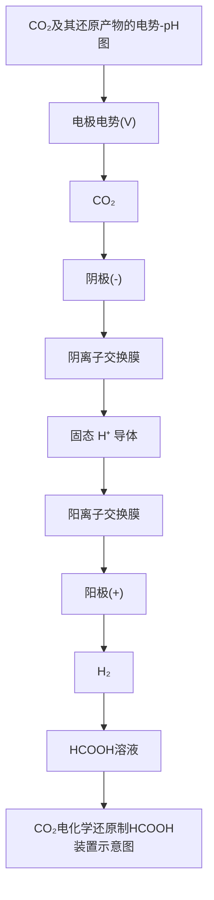
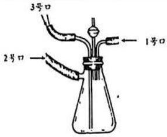
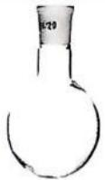
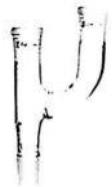
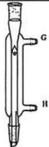
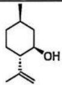
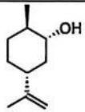
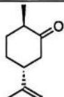
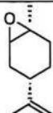

# 第39届中国化学奥林匹克(决赛)

# 试题、参考答案、说明和评分细则

征求意见版

(2025年10月25日9:00\~13:00)

# 阅卷的统一要求：

1. 计算过程,列出公式后,先代入数值,然后给出答案；代入数值时,可以不写单位,最后在答案后给出单位,常数,如 $\mathrm{R}\text{、}{\mathrm{N}}_{\mathrm{A}}\text{、}\pi$ 等可以用符号代替；  
2. 写方程式时，产物错误的不得分；产物正确的要求配平，不配平的不得分；  
3. 有机题要求首先骨架准确，接着键的链接方式即结构准确，然后是立体化学；  
4. 计算/推导的一般评分原则：

(1) 如果评分标准中没有设置代入分，且学生计算时未代入数值，如答案正确，本小问扣 1 分，因没有代入数值每小问最多扣 1 分；如果答案错误不再重复扣分。  
(2) 如有跳步，正确则得至该步的所有分，错误则扣掉至该步的分数；  
(3) 过程不正确或没有过程，即使答案正确也不得分。

# 第 1 题 闪烁体的结构和性能 (14 分)

化合物 A 是一种重要的闪烁体材料，可以高效地将高能辐射转化为可见光，在医学诊疗、深空探测等领域具有广泛应用。

1.1 将 X 的氧化物和 Y 的氧化物混合后, 在高温下采用提拉生长法得到 A。A 晶体属立方晶系 (a = 1.0509 nm, 晶体密度为 $7.13 \mathrm{~g} \mathrm{~cm}^{-3}$ ); 其中, X 被 6 个 $\mathrm{YO}_{4}$ 四面体包围, 每个 $\mathrm{YO}_{4}$ 提供一个氧原子, X 处于畸变的氧八面体中心, 每个 $\mathrm{XO}_{6}$ 八面体和另外 3 个 $\mathrm{XO}_{6}$ 八面体共棱连接。通过计算, 推断 X 和 Y 分别是什么元素, 并写出 A 的分子式。

答案:

由“X 被 6 个 YO $_{4}$ 四面体包围，每个 YO $_{4}$ 提供一个氧原子，X 处于畸变的氧八面体中心”可知，1 个 X 原子通过氧原子连接 6 个 Y 原子，Y 和氧原子的比例为 1:4；由“每个 XO $_{6}$ 八面体和另外 3 个 XO $_{6}$ 八面体共棱连接”可知，1 个氧原子连接 2 个 X 原子，所以 1 个 Y 原子通过氧原子连接 $4 \times 2 = 8$ 个 X 原子。因此，

X 和 Y 的比值为 8:6 = 4:3, (1 分)

Y 和 O 的比值为 1:4 (1 分)

化合物 A 的分子式为 $X_{4}Y_{3}O_{12}$ 。

设每个晶胞中含有 m 个 $X_{4}Y_{3}O_{12}$ ，结合 A 晶体信息可得：

$$
\begin{array}{l} m M (A) = 7. 1 3 \frac {g}{c m ^ {3}} \times (1. 0 5 0 9 n m) ^ {3} \times N _ {A} \\ = 4 9 8 3 \mathrm{g} / \text {mol} \tag {1分} \\ \end{array}
$$

当 m=1、2、3 时，没有符合结果的 X 和 Y；

当 $m = 4$ 时， $M(A) = 1245.8$

尝试可得

X 为 Bi (2 分)

Y 为 Ge (2 分) 共 7 分

化合物 A 的分子式为 $Bi_{4}Ge_{3}O_{12}$

1.2 X 在室温下和盐酸不反应，但加入双氧水后可以生成 B。X 和硝酸反应生成 C，C 在 pH > 1 时发生水解生成白色不溶物 D。X 最高氧化态的含氧酸盐在酸性条件下是强氧化剂，C 和偏钒酸铵反应生成无毒的黄色颜料 E。写出化合物 B、C、D、E 的化学式。

答案:

1.2 B: BiCl₃; C: Bi(NO₃)₃; D: BiONO₃; E: BiVO₃; (每个 1 分, 共 4 分)

1.3 Y 的氯化物在乙醚中与过量镁粉和 PhMgBr 反应, 得到具有三次对称轴的化合物 F; F 可以与 2 分子三氯乙酸或 2 分子三氟甲磺酸反应生成 G 或 H。研究表明, F、G 和 H 中都含有一个 Y-Y 键。画出 F、 G、H 的结构。

答案:

![[第39届化学竞赛决赛第1场试题答案_images/4db6e83159932194a57efc608fb1f6658ed761a2377cec9efa590de916040a68.jpg]]

chemical

Molecular structure of a germanium-based organometallic compound with phenyl (Ph) substituents

F

![[第39届化学竞赛决赛第1场试题答案_images/2286a55eeaca3b7b3f062b4136fce854d5c0e4b74a80240db84e3df6444c5b6c.jpg]]

chemical

Molecular structure of a germanium complex with two chloride ligands and phenyl substituents

G

![[第39届化学竞赛决赛第1场试题答案_images/eedd05eeed46ce0f204718802bf2b061467d60ab54ec81783122d6aa99694a2f.jpg]]

chemical

Molecular structure of a germanium-based organometallic compound with sulfur, fluorine, and phenyl ligands

H

(每个1分，共3分)

# 第 2 题 Co 的配合物 (27 分)

Co 配合物因其氧化数、配体和结构的不同而呈现出丰富的磁性和催化特性。

2.1 直线形过渡金属配合物在分子磁体的研究中备受关注, 其能量状态几乎不受 Jahn-Teller 畸变的影响。2018 年, 科学家报道了一例二配位的单分子磁体 Co(II) 配合物 Co(C(SiMe $_{2}$ ONaph) $_{3}$ ) $_{2}$ , 其中 HONaph 为 α-萘酚, C-Co-C 位于同一条直线上。理论计算表明, 该配合物中 Co 的 d 轨道裂分为三组能级, 从低到高电子的分布几率为 42.8%、41.2% 和 16.0%。

2.1.1 假定 C-Co-C 键沿 z 轴方向，依据晶体场理论画出 Co 中心价层 d 轨道能级分裂图，标出轨道符号，然后将电子填充在轨道中，用 “|” 和 “|” 和表示电子不同的自旋状态。

答案:

$d_{r^{2}}$

$d_{a}, d_{\pi}$

轨道能级分裂图：1 分，错一处得 0 分

轨道符号：1 分，错一处得 0 分；

电子填充：1 分，错一处得 0 分(共 3 分)。

$d_{x^{2}-y^{2}}d_{xy}$

2.1.2 解释该配合物金属中心 d 电子采用上述电子排布的原因。

答案： $d_{x^{2}-y^{2}}$ 和 $d_{xy}$ 轨道在同一平面，填充 4 个电子，排斥力太大。（2 分）

2.2 含有端基或桥联氮配体的金属配合物可用于催化合成氨。2020年和2023年，科学家分别将含卤素配体的Co配合物与 $NaN_{3}$ 在THF中反应，合成了两个N桥联的双核Co配合物A和B，其结构如下图所示。A中Co-N-Co键角为85°；B中Co-N-Co呈直线，胍基配体的两个N和桥联N呈近似的平面三角构型， $N_{3}$ 基团近似与平面垂直。

![[第39届化学竞赛决赛第1场试题答案_images/1d3348016738ba08636785c23a18b7eb1aa03483d0344d951e65966736afcc0c.jpg]]

chemical

Ad代金刚烷基的化学结构式，标注了\( \eta^{5} \)-C$_{5}$Me$_{8}$配体可以简写为Cp*

![[第39届化学竞赛决赛第1场试题答案_images/c37eeb27cd60c50a9d53767ba76771ad273c5be53af22c67cf2f07cb496d422d.jpg]]

chemical

Chemical structure of a cobalt complex with quaternary ammonium ligands, labeled as '胍基配体可简化为' (Quaternary Coating System)

2.2.1 请确定 A 和 B 中 Co 的氧化数。

答案: A: +3, B: +3 每个 1 分, 有错就不得分, 共 2 分

2.2.2 研究表明 A 可以用于合成氨，A 与氢气等当量反应生成配合物 C。画出 C 的结构式，并标明其中 Co 的氧化数。

答案:

![[第39届化学竞赛决赛第1场试题答案_images/5691c47c613fc574430137adbeee1f92e80f8d3bc178c2d3c9da47ec279953ee.jpg]]

chemical

Chemical structure of a cobalt complex with Ad, Cp*, and N2 ligands

(3 分)

2.2.3 C 无法进一步与氢气反应生成 $NH_{3}$ ，但在室温下可与 LutHCl (2,6-二甲基吡啶盐酸盐) 在 THF 溶液中反应生成 $NH_{3}$ 和配合物 D，D 可以与 $NaN_{3}$ 等当量反应重新得到 A。画出 D 的结构式，并标明其中 Co 氧化数。

答案:

![[第39届化学竞赛决赛第1场试题答案_images/42b682f3c49953f604537269d7dca09b3b23cd83900f91c8cb14afb97a81049d.jpg]]

(3 分)

2.2.4 B 无法直接与 $\mathrm{H}_{2}$ 反应, 其反应惰性与 $\mathrm{Co}-\mathrm{N}-\mathrm{Co}$ 的成键特性有关, 实验和理论计算表明, $\mathrm{Co}-\mathrm{N}-\mathrm{Co}$ 中同时包含 $\sigma$ 键和 $\pi$ 键。若以 $\mathrm{Co}-\mathrm{N}-\mathrm{Co}$ 为 $x$ 轴, $\mathrm{Co}-\mathrm{N}_{3}$ 键方向为 $z$ 轴, 写出参与形成 $\sigma$ 键和 $\pi$ 键的 $\mathrm{Co}$ 的 $d$ 轨道和 $\mathbf{N}$ 的轨道名称。

答案:

σ键：两个 Co 的 $3d_{x^{2}-y^{2}}(1\text{ 分})$ ，N 的 2s 和 $2p_{x}(1\text{ 分})$ (共 2 分)

或 $\sigma_{1}$ ：Co 的 $3d_{x^{2}-y^{2}}$ ，N 的 2s (1 分)， $\sigma_{2}$ ：Co 的 $3d_{x^{2}-y^{2}}$ ，N 的 $2p_{x}$ (1 分)

π键 1：两个 Co 的 $3d_{xy}(1$ 分)，N 的 $2p_{y}(1$ 分）(共 2 分)

π键 2：两个 Co 的 $3d_{xz}(1$ 分)，N 的 $2p_{z}(1$ 分） (共 2 分) 共 6 分

2.2.5 研究发现溶剂可以激活 B 中桥联 N 的活性，在吡啶存在下 B 可以与氢气等当量反应得到配合物 E，E 中两个 Co 化学环境相同，均为四面体配位，其中只含有两种等价的配位 N 原子。画出 E 的结构式，需标明其中 Co 的价态，并写出该反应中除 E 和溶剂外的其他小分子产物。

答案:

![[第39届化学竞赛决赛第1场试题答案_images/f3dc90eefc3d27ce3db596b4c1fb6ef952856e9d50ccc78f00b66865bd3b4a39.jpg]]

chemical

Chemical structure of a cobalt complex with two nitrogen ligands and positive charge indicators

$NaN_{3}, N_{2}$

(3 分)

(1 分)

共4分

第3页，共25页

2.2.6 在研究溶剂激活桥联 N 的活性时，发现在吡啶存在下 B 还可以与其他氢给体反应。例如，B 与 0.5 当量的 1,4-环己二烯反应，得到配合物 F，其中两个 Co 的配位原子均为 N，分别呈四面体和近似的四方锥配位结构。F 可以在紫外光照下与 $H_{2}$ 反应得到 E，并释放 1 当量的 $N_{2}$ 和 1 当量的吡啶。画出 F 的结构，并写出由 B 转化为 F 的反应中除 F 和溶剂外的其他小分子产物。

答案:

![[第39届化学竞赛决赛第1场试题答案_images/c04909352b4563c2466ea8ab7ca25e7c9e17c996377dbd980a34ccf6a1758aaa.jpg]]

chemical

Chemical structure of a cobalt complex with nitrogen ligands and phenyl group

苯， $\mathrm{NaN}_{3}$

(3 分)

(1 分) 共 4 分;

# 第 3 题 晶体交错生长 (28 分)

交错生长/互生结构 (Intergrowth)是指两种或多种晶体结构在同一单晶中交替、嵌套式排列的现象。3.1 化合物 A 可通过 $PbBr_{2}$ 和 4-氨甲基四氢吡喃 (AMTP) 在 HBr 溶液中结晶获得。其晶体结构如图 a 所示 (晶体中有机分子未显示)，可看作层状 $PbBr_{2}$ 结构 (I 层) 与层状钙钛矿结构 (II 层) 交替排列形成的互生相。在 I 层中， $PbBr_{6}$ 八面体以共棱方式连接，可视作 $PbBr_{2}$ 沿 (001) 晶面切割所得；在 II 层中， $PbBr_{6}$ 八面体以共顶点方式连接，可视作立方钙钛矿型 $(\mathrm{CH}_{3}\mathrm{NH}_{3})\mathrm{PbBr}_{3}$ 沿 (001) 晶面切割所得。在上述三维到层状结构的衍生过程涉及部分 Pb-Br 键断裂，Pb-Br 多面体的尺寸和取向也会发生畸变。I 和 II 层通过质子化的 AMTP (AMTPH $^{+}$ ) 连接，层状结构与对应的三维晶体结构有很强的相似性，同一层内 Pb 的配位原子的种类和相应的数量都相同。

已知晶体学参数: $\mathrm{PbBr}_{2}$ 为正交晶系, 空间群 $Pnma$ , $a = 4.754 \AA$ , $b = 8.237 \AA$ , $c = 10.158 \AA$ , 晶体结构见图 b; 沿 (001) 晶面切割开可得图 a 中 I 层的关联结构, 如图 c 所示, 该结构通过畸变衍生出图 a 中 I 层的结构; $(\mathrm{CH}_{3} \mathrm{NH}_{3}) \mathrm{PbBr}_{3}$ 为立方钙钛矿结构, $a = 5.955 \AA$ , 其中 $\mathrm{PbBr}_{6}$ 八面体以共顶点方式连接形成三维网络, $\mathrm{CH}_{3} \mathrm{NH}_{3}^{+}$ 填充在八个 $\mathrm{PbBr}_{6}$ 八面体组成的笼中。

![[第39届化学竞赛决赛第1场试题答案_images/70a9c12b1903e974343d3343ae3185e49ce5571893751dc31b17f82e3bf86af3.jpg]]

chemical

A molecular crystal structure diagram showing AMTPH' interactions in three layers with labeled atomic positions and unit cell axes

![[第39届化学竞赛决赛第1场试题答案_images/d929b583455bc1b5d7b172b0878d38fad3a84b5abde257c06a36cb02e2d83a6b.jpg]]

chemical

Molecular structure diagram of PbBr₂ crystal showing atomic arrangement and unit cell axes

![[第39届化学竞赛决赛第1场试题答案_images/0a611ddffb2fe315d03d617d777033311eec107a8091bc43709ed3f4b771c279.jpg]]

chemical

Crystal structure diagram of PbBr₂ with I layer, showing atomic arrangement and unit cell axes

3.1.1 写出 $PbBr_{2}$ 晶体结构中 Pb 和 Br 原子的配位数；若存在多种配位数，需给出不同配位数原子之间的比例。

答案: Pb: 均为 7

Br: 3 和 4

各占 50%，或 1:1

(1 分)

(2 分)，两个数值各 1 分

(1 分)，共 4 分

3.1.2 说明 AMTPH $^{+}$ 与 I 层、II 层的连接方式，需指明参与相互作用的原子或基团，和相互作用的类型。答案：

$NH_{3}^{+}$ 端：与 I 层的 Pb-Br 多面体通过离子键作用 (1 分)

O 端：与 II 层的 Pb 通过配位键(或共价键)作用 (1 分) 共 2 分

3.1.3 交错生长/互生的晶体结构之间需具有较高的晶格匹配关系。化合物 A 中，AMTPH $^{+}$ 的两个端基在 I 层和 II 层内占据的平均面积之比 (I 层/II 层) $\alpha$ 越接近于 1，则晶格匹配程度越高，请利用 $PbBr_{2}$ 和 $(CH_{3}NH_{3})PbBr_{3}$ 的晶胞参数估算 $\alpha$ 的值。提示：估算时可以忽略结构衍生过程中 Pb-Br 多面体的畸变。
答案：

I 层结构中 Pb 分上下两层，每个 Pb 对应 $PbBr_{2}$ 晶胞中(001)面的面积，

故 I 层中每个 Pb 所占面积 $S_{I}=ab(PbBr_{2})=4.754\times8.237=39.16\ \text{\AA}^{2}$ (1 分)

II 层 Pb 为近平面结构，每个 Pb 对应 $\left(\mathrm{CH}_{3}\mathrm{NH}_{3}\right)\mathrm{PbBr}_{3}$ 晶胞中(001)面的面积，

故 II 层中每个 Pb 所占面积 $S_{II}=a^{2}(CH_{3}NH_{3})PbBr_{3})=5.955\times5.955=35.46\mathring{A}^{2}$ (1 分)

由成键特征, 每个 $\mathrm{{Pb}}$ 均与 ${\mathrm{{AMTPH}}}^{ + }$ 中的 $\mathrm{O}$ 成配位键; ${\mathrm{{AMTPH}}}^{ + }$ 中的 ${\mathrm{{NH}}}_{3}{}^{ + }$ 填入 4 个八面体的中心,形成类似于立方钙钛矿的 $\left( {{\mathrm{{CH}}}_{3}{\mathrm{{NH}}}_{3}}\right) {\mathrm{{PbBr}}}_{3}$ 晶胞。

因此每个 AMTPH $^{+}$ 对应 I 层中的 1 个 Pb， $S_{I}$ 和 $S_{II}$ 很接近，说明 II 层中每个四边形中心都有 $-NH_{3}^{+}$ ，即每个 AMTPH $^{+}$ 对应 II 层中的 1 个 Pb (仅计 1 侧)。(1 分)

因此 $\alpha = S_{\mathrm{I}} / S_{\mathrm{II}} = 39.16 / 35.46 = 1.1$ (1分) 共4分

3.1.4 推断 A 的化学式，用各层组分及其最简整数比的形式表示。

由 3.1.3 晶格匹配计算结果，I 层中上下两个面的共 2 个 Pb 与 II 层中 1 个 Pb 匹配，

因此 $PbBr_{2}$ 与 $[PbBr_{4}]^{2-}$ 比例为 2:1 (1 分)

由电荷平衡关系，组成为 $(\mathrm{PbBr}_{2})_{2}(\mathrm{AMTPH}^{+})_{2}(\mathrm{PbBr}_{4})$ (2分) 共3分

或

由成键关系，I层中每个Pb与1个AMTPH $^{+}$ 中的O配位，

因此 $PbBr_{2}$ 与 AMTPH $^{+}$ 之比为 1:1 (1 分)

由电荷平衡关系，得组成为 $(\mathrm{PbBr}_{2})_{2}(\mathrm{AMTPH}^{+})_{2}(\mathrm{PbBr}_{4})$ (2分)

3.2 将氨基乙硫醇 $\left(\mathrm{HS}-\mathrm{C}_{2}\mathrm{H}_{4}-\mathrm{NH}_{2}\right)$ 的盐酸盐、 $\mathrm{Pb(OAc)}_{2}\cdot3\mathrm{H}_{2}\mathrm{O}$ 和 $\mathrm{PbCl}_{2}$ 溶于 $6\ \mathrm{mol}\cdot\mathrm{L}^{-1}$ 的 NaCl 水溶液，结晶可获得化合物 B，其晶体结构具有与化合物 A(将其中所有的 Br 替换成 Cl)非常类似的交错生长结构：II 层的结构与化合物 A 中 II 层结构相同；但在 I 层中一半的 Cl 原子被 S 原子取代，请推断化合物 B 的化学式。

答案:

参照化合物 A 的组成，

I 层中一半 Cl 原子被 S 原子取代，组成为(PbClS) $_{2}$ (1 分)

II 层组成为 $PbCl_{4}^{2-}$ ;

氨基乙硫醇的存在形式是 $-\mathrm{S}(\mathrm{CH}_{2})_{2}\mathrm{NH}_{3}^{+}$ (1分)

由电荷平衡关系，B的组成为 $(\mathrm{PbCl})_2(\mathrm{S - C}_2\mathrm{H}_4\mathrm{-NH}_3)_2(\mathrm{PbCl}_4) / (\mathrm{S - C}_2\mathrm{H}_4\mathrm{-NH}_3)_2\mathrm{Pb}_3\mathrm{Cl}_6$ (1分)共3分

3.3 在氮气保护下, 于 $150^{\circ} \mathrm{C}$ 将 $\mathrm{PbCl}_{2}$ 和氨基乙硫醇的 $N, N$ -二甲基甲酰胺溶液混合结晶, 可得到化合物 C, 其中 Pb 均具有八面体配位结构, 单晶结构中无法区分 Cl 和 S 的位置, 表明 Cl 和 S 的占位是随机的。元素组成为 C: $6.76 \%$ , H: $1.99 \%$ , N: $3.94 \%$ 。如果降低反应温度会形成化合物 B。

# 3.3.1 请推断化合物 C 的化学式。

答案:

因为氨基乙硫醇为中性分子，假设形成的分子式为 $\mathrm{PbCl_{2}(C_{2}H_{7}NS)_{y}}$ ，(1 分)

根据 C 元素的比例： $\frac{2\times12.01y}{278.12+77.15y}=0.0676$

解得 y = 1

(1 分)

C 组分为 $PbCl_{2}(C_{2}H_{7}NS)$

(1分)共3分

3.3.2 请推断 C 为以下哪一种常见的立方晶系结构: $\mathrm{{NaCl}}\text{、}\mathrm{{CsCl}}\text{、}{\mathrm{{CaF}}}_{2}$ 、立方 $\mathrm{{ZnS}}$ 、立方钙钛矿、 ${\mathrm{{ReO}}}_{3}$ (即 A 位原子缺失的立方钙钛矿),并写出氨基乙硫醇的 N 和 S 原子在晶体中的位置。位置描述示例: X 原子取代了 NaCl 晶体中 Na 的位置。

答案:

立方钙钛矿 ABX $_{3}$

(1 分)

存在形式是 $-S(CH_{2})_{2}NH_{3}^{+}$

S 与 Pb 配位，位于 X 位

(1 分)

$-NH_{3}^{+}$ 位于 A 位

(1 分)，共 3 分

3.3.3 请写出化合物 C 中 Pb 可能的配位结构，若存在立体异构需明确示出，无需考虑对映异构。

答案:

$\mathrm{PbS}_{6}$ 、 $\mathrm{PbClS}_{5}$ 、 $\mathrm{PbCl}_{2}\mathrm{S}_{4}$ (cis/trans)、 $\mathrm{PbCl}_{3}\mathrm{S}_{3}$ (fac/mer)

$\mathrm{PbCl_{2}S_{4}(cis/trans)}$ 、 $\mathrm{PbCl_5S}$ 、 $\mathrm{PbCl_6}$

(4 分)

3.3.4 拉曼光谱显示 C 中存在两种 C-S 键伸缩振动模式，请解释其起源。

答案:

氨基乙硫醇存在邻位交叉和反式两种构象

(2 分)

![[第39届化学竞赛决赛第1场试题答案_images/2b23e08f8d083819749cda35e43eafe6e08f9638a1976127be79a484ab106ab5.jpg]]  
gauche

![[第39届化学竞赛决赛第1场试题答案_images/c87ce009bcdc6d1345fdd65c1ecff89dbfe37e79413802e1487da30d5caf0542.jpg]]  
anti

# 第 4 题 电化学 CO₂ 还原 (28 分)

利用电化学方法将 $CO_{2}$ 还原转化为高附加值化学品是重要的碳中和技术。在固态氧化物电解池或水溶液电解池中均可以实现 $CO_{2}$ 的电化学还原。

4.1 固态氧化物电解池以具有较高 $\mathrm{O}^{2-}$ 迁移率的固体氧化物为电解质, 在高温下进行电解, 可以将 $\mathrm{CO}_{2}$ 还原成 CO (反应 1):

$$
\mathrm{CO} _ {2} (\mathrm{g}) \rightarrow \mathrm{CO} (\mathrm{g}) + 1 / 2 \mathrm{O} _ {2} (\mathrm{g}) \quad (\text {反应} 1)
$$

4.1.1 已知 298 K 下 $\Delta_{f}G_{m}^{\ominus}(CO_{2}) = -394.4\ \text{kJ mol}^{-1}$ ， $\Delta_{f}G_{m}^{\ominus}(CO) = -137.2\ \text{kJ mol}^{-1}$ ，求反应 1 在 298 K、标准状态下的理论分解电压。

答案:

电解反应 $\mathrm{CO}_{2}(\mathrm{~g})\rightarrow\mathrm{CO}(\mathrm{g})+1/2\mathrm{O}_{2}(\mathrm{g})$

$$
\Delta_ {\mathrm{r}} G _ {\mathrm{m}} \ominus = \Delta_ {\mathrm{f}} G _ {\mathrm{m}} \ominus (\mathrm{CO}) - \Delta_ {\mathrm{f}} G _ {\mathrm{m}} \ominus (\mathrm{CO} _ {2})
$$

$$
= - 1 3 7. 2 - (- 3 9 4. 4) = + 2 5 7. 2 \left(\mathrm{kJ} \mathrm{mol} ^ {- 1}\right) \tag {1分}
$$

每 mol 反应转移 2 mol 电子，因此标准电池电动势为

$$
\begin{array}{l} E ^ {\ominus} = - \frac {\Delta_ {r} G _ {m} ^ {\ominus}}{2 F} \tag {1分} \\ = - \frac {2 5 7 2 0 0}{2 \times 9 6 4 8 5} = - 1. 3 3 3 (\mathrm{V}) \\ \end{array}
$$

所以电解时应维持的分解电压为 $-E^{\ominus}=1.333\ V$ 。 (1分) 共3分

分解电压要求修约为 4 位有效数字。

4.1.2 实验测得 1298 K 时反应 1 在标准状态下的理论分解电压为 0.92 V。假设反应焓变和熵变不随温度变化，求反应 1 在 1000 K 可逆进行时的反应热。

答案:

分解电压是可逆电池电动势的相反数。

1298 K 时上述反应的 $\Delta_{r}G_{m}\Theta(1298\mathrm{K})=-2FE^{\ominus}=2\times96485\times0.92=177.532\mathrm{kJ}\mathrm{mol}^{-1}$ (1 分)

因为 $\Delta_{r}G_{m}\Theta=\Delta_{r}H_{m}\Theta-T\Delta_{r}S_{m}\Theta$ ，而焓变与熵变为定值，所以

$$
\Delta_ {r} S _ {m} ^ {\ominus} = \frac {\Delta_ {r} G _ {m} ^ {\ominus} (2 9 8 \mathrm{K}) - \Delta_ {r} G _ {m} ^ {\ominus} (1 2 9 8 \mathrm{K})}{1 2 9 8 - 2 9 8} = \frac {(2 5 7 2 0 0 - 1 7 7 5 3 2)}{1 2 9 8 - 2 9 8} = + 7 9. 6 7 \mathrm{Jmol} ^ {- 1} \mathrm{K} ^ {- 1} \tag {1分}
$$

$$
\begin{array}{l} Q _ {r e v} = T \Delta_ {r} S _ {m} ^ {\ominus} \tag {1分} \\ = 1 0 0 0 \times 7 9. 6 7 = 7. 9 6 7 \times 1 0 ^ {4} \mathrm{J} \mathrm{mol} ^ {- 1} \quad (1 \text {分}) \text {共} 4 \text {分} \\ \end{array}
$$

4.1.3 电解过程的理论分解电压与温度有关, 其温度系数定义为单位温度变化造成的理论分解电压变化。如果电解过程在初始环境为 $p(\mathrm{CO}_{2}) = p^{\ominus}$ , $p(\mathrm{CO}) = 0.010 p^{\ominus}$ , $p(\mathrm{O}_{2}) = 0.21 p^{\ominus}$ 下可逆进行, 各气体可视为理想气体, 计算开始电解时理论分解电压的温度系数。

答案:

对反应 $\mathrm{CO}_{2}(\mathrm{~g})\rightarrow\mathrm{CO}(\mathrm{g})+1/2\mathrm{O}_{2}(\mathrm{g})$

由 Nernst 方程，可逆电池电动势

$$
E = E ^ {\ominus} - \frac {R T}{2 F} \ln \left(\frac {\sqrt {p (\mathrm{O} _ {2}) / p ^ {\ominus}} \cdot p (\mathrm{CO}) / p ^ {\ominus}}{p (\mathrm{CO} _ {2}) / p ^ {\ominus}}\right) \tag {1分}
$$

后一项中的分压不随温度变化，所以可逆电池电动势的温度系数为

$$
\left(\frac {\partial E}{\partial T}\right) _ {p} = \left(\frac {\partial E ^ {\ominus}}{\partial T}\right) _ {p} - \frac {R}{2 F} \ln \left(\frac {\sqrt {p (\mathrm{O} _ {2}) / p ^ {\ominus}} \cdot p (\mathrm{CO})}{p (\mathrm{CO} _ {2})}\right) = \frac {\Delta_ {r} S _ {m} ^ {\ominus}}{2 F} - \frac {R}{2 F} \ln \left(\frac {\sqrt {p (\mathrm{O} _ {2}) / p ^ {\ominus}} \cdot p (\mathrm{CO})}{p (\mathrm{CO} _ {2})}\right) \tag {1分}
$$

$$
= \frac {7 9 . 6 7}{2 \times 9 6 4 8 5} - \frac {8 . 3 1 4}{2 \times 9 6 4 8 5} \ln \left(\frac {\sqrt {0 . 2 1 \cdot 0 . 0 1}}{1}\right) = 6. 4 4 9 \times 1 0 ^ {- 4} \mathrm{VK} ^ {- 1}
$$

分解电压为可逆电池电动势的相反数，其温度系数为 $-6.449 \times 10^{-4} \, V \, K^{-1}$ 。 (1 分) 共 3 分

4.1.4 若电解在封闭体系下进行，电解过程中理论分解电压的温度系数的绝对值将如何变化？

A. 增大

B. 减小

C. 不变

D. 先增大后减小

E. 先减小后增大

答案:

E (1 分)

封闭体系，随反应进行，产物压强增加，反应物压强减少，所以温度系数随时间逐渐增加，从负值变为正值，绝对值先变小后变大。

4.2 在水溶液中, 以特定金属做阴极可实现 $\mathrm{CO}_{2}$ 的选择性电化学还原, 产物与电极材料、溶液成分和电解电压等因素都有关。甲酸和 CO 是最常见的 $\mathrm{CO}_{2}$ 还原产物, 其中甲酸附加值较高, 将 $\mathrm{CO}_{2}$ 高选择性还原成甲酸或甲酸盐是重要的研究课题。

4.2.1 已知在 $298 \mathrm{~K}$ 的条件下的下列数据:

$$
\mathrm{CO} _ {2} (\mathrm{g}) + 2 \mathrm{H} ^ {+} (\mathrm{aq}) + 2 \mathrm{e} ^ {-} \rightarrow \mathrm{CO} (\mathrm{g}) + \mathrm{H} _ {2} \mathrm{O} (\mathrm{l}) \quad \varphi_ {1} ^ {\ominus} = - 0. 1 0 5 \mathrm{V}
$$

$$
\mathrm{CO} _ {2} (\mathrm{g}) + \mathrm{H} ^ {+} (\mathrm{aq}) + 2 \mathrm{e} ^ {-} \rightarrow \mathrm{HCOO} ^ {-} (\mathrm{aq}) \quad \varphi_ {2} ^ {\ominus} = - 0. 2 2 3 \mathrm{V}
$$

电解产物与 $\mathrm{pH}$ 相关, 右侧为 $\mathrm{CO}_{2}$ 及其电化学还原产物的电势- $\mathrm{pH}$ 图, 其中含碳物种均为标态, 请写出图中 A、B、C 区域对应的物种。

答案:

A: CO; B: HCOO-/HCOOH; C: CO₂。

每个1分，共3分

4.2.2 只考虑上述两个电极反应，若希望得到甲酸或甲酸盐而非 CO，应如何控制溶液的 pH 值？

答案:

$$
\varphi_ {1} = \varphi_ {1} ^ {\ominus} - \frac {R T}{2 F} \ln \left(\frac {p (\mathrm{CO}) (c ^ {\ominus}) ^ {2}}{p \left(\mathrm{CO} _ {2}\right) (c \left(\mathrm{H} ^ {+}\right) ^ {2})}\right) = \varphi_ {1} ^ {\ominus} - \frac {R T}{2 F} \ln \left(\frac {p (\mathrm{CO})}{p \left(\mathrm{CO} _ {2}\right)}\right) - \frac {R T}{2 F} \ln \left(\frac {(c ^ {\ominus}) ^ {2}}{(c \left(\mathrm{H} ^ {+}\right) ^ {2})}\right)
$$

$$
= \varphi_ {1} ^ {\ominus} - \frac {R T \ln 1 0}{F} \mathrm{pH} \tag {1分}
$$

$$
\varphi_ {2} = \varphi_ {2} ^ {\ominus} - \frac {R T}{2 F} \ln \left(\frac {c (\mathrm{HCOO} ^ {-}) p ^ {\ominus}}{p \left(\mathrm{CO} _ {2}\right) c \left(\mathrm{H} ^ {+}\right)}\right) = \varphi_ {2} ^ {\ominus} - \frac {R T}{2 F} \ln \left(\frac {c (\mathrm{HCOO} ^ {-}) p ^ {\ominus}}{p \left(\mathrm{CO} _ {2}\right) c ^ {\ominus}}\right) - \frac {R T}{2 F} \ln \left(\frac {c ^ {\ominus}}{c \left(\mathrm{H} ^ {+}\right)}\right)
$$

$$
= \varphi_ {2} ^ {\ominus} - \frac {R T \ln 1 0}{2 F} \mathrm{pH} \tag {1分}
$$

要选择性得到甲酸，则有 $\varphi_{1}<\varphi_{2}$

即有-0.105- $\frac{RT\ln10}{F}$ pH<-0.223- $\frac{RT\ln10}{2F}$ pH (1分)

解得 pH > 3.99 (1 分) 共 4 分

对应图中垂直线，因此要高选择性获得甲酸而非 CO，应控制溶液的 pH 大于 3.99。

4.2.3 在水溶液中 $CO_{2}$ 电化学还原的主要挑战之一是在还原 $CO_{2}$ 的同时也会将水还原为氢气，导致 $CO_{2}$ 还原效率严重降低。若含碳物种浓度为标准状态，请通过计算说明能否通过控制 pH 值，在热力学上高选择性地获得甲酸或甲酸盐而避免氢气生成？如果可以，应如何控制 pH 值。如果不可以，请说明理由。

答案:

氢析出反应（反应3）： $2\mathrm{H}^{+}(\mathrm{aq}) + 2\mathrm{e}^{-} \rightarrow \mathrm{H}_{2}(\mathrm{g}), \varphi_{3}^{\ominus} = 0 \mathrm{~V}$ 。

$$
\varphi_ {3} = \varphi_ {3} ^ {\ominus} + \frac {R T}{2 F} \ln \left(\frac {c \left(\mathrm{H} ^ {+}\right)}{c ^ {\ominus}}\right) ^ {2} = - \frac {R T \ln 1 0}{F} \mathrm{pH} \tag {1分}
$$

临界点时有 $\varphi_{2} > \varphi_{3}$

$$
\varphi_ {2} ^ {\ominus} - \frac {R T \ln 1 0}{2 F} \mathrm{pH} > - \frac {R T \ln 1 0}{F} \mathrm{pH} \tag {1分}
$$

解得pH = $-\frac{2F\varphi_{2}^{\ominus}}{RT\ln10}=-\frac{2\times96485\times(-0.223)}{8.314\times298\times\ln10}=7.54$ (1分)

因此可以通过控制 pH 值，在热力学上高选择性地获得 HCOO $^{-}$ ，需要控制 pH 大于 7.54。(1 分) 共 4 分

![[第39届化学竞赛决赛第1场试题答案_images/3d472cf57265efb6d02d9c285e9bdf81182480f5fbd1960e3301892f7e37f912.jpg]]

flowchart

4.3 为实现高效的 $\mathrm{CO}_{2}$ 电化学还原制备甲酸, 研究人员设计了如右图所示的电解系统, 其中包含阴阳离子交换膜和固态 $\mathrm{H}^{+}$ 导体电解质, 在阴极和阳极区分别通入 $\mathrm{CO}_{2}$ 和 $\mathrm{H}_{2}$ , 在固态电解质区域通入去离子水将生成的甲酸溶解分离。在某次实验中, $\mathrm{CO}_{2}$ 和 $\mathrm{H}_{2}$ 均为标态, 通入速率均为 $0.054 \mathrm{~mol} \mathrm{~h}^{-1}$ , 在 $298 \mathrm{~K}$ , $150 \mathrm{~mA}$ 的恒定电流下电解 $100 \mathrm{~h}$ , 电解过程平均电压为 $1.1 \mathrm{~V}$ , 获得浓度为 $0.11 \mathrm{~mol} \mathrm{~L}^{-1}$ 的 HCOOH 溶液 $2.1 \mathrm{~L}$ 及 $\mathrm{H}_{2} 、 \mathrm{CO}$ 等还原副产物。已知甲酸的 $K_{\mathrm{a}} = 1.8 \times 10^{-4}$ 。

4.3.1 在有多种产物的电化学反应中，常用法拉第效率表示产物选择性，其定义为生成特定产物的电流和总电流之比。计算上述电化学还原过程中生成 HCOOH 的平均法拉第效率。

答案:

$$
\begin{array}{l} F E = \frac {I _ {H C O O H}}{I} = \frac {2 n _ {H C O O H} F}{I \Delta t} \tag {1分} \\ = \frac {2 \times 0 . 1 1 \times 2 . 1 \times 9 6 4 8 5}{0 . 1 5 0 \times 3 6 0 0 \times 1 0 0} = 83 \% \quad (1 \text {分}) \quad \text {共} 2 \text {分} \\ \end{array}
$$

4.3.2 计算上述电化学还原过程生产 HCOOH 的能量效率。

答案:

$$
\mathrm{H} ^ {+} + \mathrm{CO} _ {2} (\mathrm{g}) + 2 \mathrm{e} = \mathrm{HCOO} ^ {-} \quad \Delta G _ {2} ^ {\circ} = - 2 F \varphi_ {2} ^ {\circ}
$$

$$
2 \mathrm{H} ^ {+} + 2 \mathrm{e} = \mathrm{H} _ {2} (\mathrm{g}) \quad \Delta G _ {3} ^ {\circ} = 0
$$

$$
\mathrm{H} ^ {+} + \mathrm{HCOO} ^ {-} = \mathrm{HCOOH} \quad \Delta G _ {4} ^ {\circ} = - R T \ln K _ {\mathrm{a}} ^ {- 1}
$$

总反应为： $H_{2}(g)+CO_{2}(g)=HCOOH(aq)$ ，理论所需电能即为该反应的 $\Delta G$

$$
\Delta G ^ {\circ} = \Delta G _ {2} ^ {\circ} - \Delta G _ {3} ^ {\circ} + \Delta G _ {4} ^ {\circ} = - 2 F \varphi_ {2} ^ {\circ} + R T \ln K _ {a}
$$

$$
\Delta G = \Delta G ^ {\circ} + R T \ln [ c (\mathrm{HCOOH}) / c ^ {\circ} ]
$$

$$
= - 2 F \varphi^ {\circ} _ {2} + R T \ln \left[ K _ {\mathrm{a}} \cdot c (\mathrm{HCOOH}) / c ^ {\circ} \right] \tag {1分}
$$

$$
= - 2 \times 9 6 4 8 5 \times (- 0. 2 2 3) + 8. 3 1 4 \times 2 9 8 \times \ln (1. 8 \times 1 0 ^ {- 4} \times 0. 1 1) = 1 6 2 0 0 (\mathrm{Jmol} ^ {- 1}) (1 \text {分})
$$

实际电解做功： $W=UI\Delta t=1.1\times0.150\times3600\times100=59400$ (J) (1分)

$$
\eta = n (\mathrm{HCOOH}) \cdot \Delta G / W = 0.11 \times 2.1 \times 16200 / 59400 = 6.3 \% \tag{1分} \text{共} 4\text{分}
$$

# 第5题 水相变中的热力学与动力学 (共40分)

水的相变与诸多重要的气象现象相关，298.15 K时，水的相关热力学函数见下表：

<table><tr><td></td><td> $\Delta_{f}H_{m}^{\ominus} / \text{kJ mol}^{-1}$ </td><td> $S_{m}^{\ominus} / \text{J K}^{-1} \text{mol}^{-1}$ </td><td> $C_{p,m} / \text{J K}^{-1} \text{mol}^{-1}$ </td></tr><tr><td> $H_{2}O, s$ </td><td>\</td><td>\</td><td>37.8</td></tr><tr><td> $H_{2}O, l$ </td><td>-285.83</td><td>69.95</td><td>75.3</td></tr><tr><td> $H_{2}O, g$ </td><td>-241.83</td><td>188.84</td><td>33.6</td></tr></table>

5.1 稀溶液的依数性 非挥发性溶质水溶液的沸点高于纯水。沸点升高是一种依数性质，沸点升高公式为 $\Delta T_{\mathrm{b}} = iK_{\mathrm{b,m}}m_{\mathrm{B}}$ ，式中 $K_{\mathrm{b,m}}$ 为沸点升高常数，只与溶剂的性质有关， $K_{\mathrm{b,m}} = \frac{R(T_b^*)^2}{\Delta_{\mathrm{vap}}H_m^\ominus} \cdot M_A$ ，其中 $T_{\mathrm{b}}^{*}$ 、 $\Delta_{\mathrm{vap}}H_{m}^{\ominus}$ 、 $M_{\mathrm{A}}$ 分别为纯溶剂的正常沸点、标准摩尔气化焓和分子量； $m_{\mathrm{B}}$ 为溶质的质量摩尔浓度（单位：mol·kg $^{-1}$ ）；对非电解质稀溶液， $i = 1$ ；对组成为 $\mathrm{M}_a\mathrm{N}_b$ 的强电解质稀溶液， $i \approx a + b$ 。

5.1.1 已知1.00 bar时纯水的沸点为100℃，计算沸点升高常数 $K_{b,m}$ （单位：K·kg·mol $^{-1}$ ）。

解：298.15 K时，

$$
\Delta_ {\mathrm{vap}} H _ {m} ^ {\ominus} (2 9 8. 1 5 \mathrm{K}) = \Delta_ {f} H _ {m} ^ {\ominus} (\mathrm{H} _ {2} \mathrm{O}, g) - \Delta_ {f} H _ {m} ^ {\ominus} (\mathrm{H} _ {2} \mathrm{O}, l) = - 2 4 1. 8 + 2 8 5. 8 \mathrm{kJmol} ^ {- 1} = 4 4. 0 \mathrm{kJmol} ^ {- 1} \quad (1 \text {分})
$$

由基尔霍夫定律，373.15 K时，

$$
\begin{array}{l} \Delta_ {\mathrm{vap}} H _ {m} ^ {\ominus} (3 7 3. 1 5 \mathrm{K}) = \Delta_ {\mathrm{vap}} H _ {m} ^ {\ominus} (2 9 8. 1 5 \mathrm{K}) + \int_ {2 9 8. 1 5 \mathrm{K}} ^ {3 7 3. 1 5 \mathrm{K}} \Delta_ {r} C _ {p} \mathrm{d} T = 4 4. 0 \mathrm{kJmol} ^ {- 1} + \int_ {2 9 8. 1 5 \mathrm{K}} ^ {3 7 3. 1 5 \mathrm{K}} (3 3. 6 - 7 5. 3) \mathrm{JK} ^ {- 1} \mathrm{mol} ^ {- 1} \mathrm{d} T \\ = 4 4. 0 \mathrm{kJ} \mathrm{mol} ^ {- 1} + (- 4 1. 7) \times (3 7 3. 1 5 - 2 9 8. 1 5) \times 1 0 ^ {- 3} \mathrm{kJ} \mathrm{mol} ^ {- 1} \\ = 4 0. 8 7 \mathrm{kJ} \mathrm{mol} ^ {- 1} \\ \end{array}
$$

(2分)

$$
K _ {b, m} = \frac {R \left(T _ {b} ^ {*}\right) ^ {2}}{\Delta_ {v a p} H _ {m} ^ {\ominus}} \cdot M _ {\mathrm{A}} = \frac {8 . 3 1 4 (3 7 3 . 1 5) ^ {2}}{4 0 . 8 7 \times 1 0 ^ {3}} \cdot 1 8. 0 1 5 \times 1 0 ^ {- 3} \mathrm{Kkgmol} ^ {- 1} = 0. 5 1 0 \mathrm{Kkgmol} ^ {- 1}
$$

(2分) 共5分

若直接用298.15 K时的蒸发焓44.00 kJ mol $^{-1}$ 计算，

$$
K _ {b, m} = \frac {R (T _ {b} ^ {*}) ^ {2}}{\Delta_ {\mathrm{vap}} H _ {m} ^ {\ominus}} \cdot M _ {\Lambda} = \frac {8 . 3 1 4 (3 7 3 . 1 5) ^ {2}}{4 4 . 0 \times 1 0 ^ {3}} \cdot 1 8. 0 1 5 \times 1 0 ^ {- 3} \mathrm{Kkgmol} ^ {- 1} = 0. 4 7 4 \mathrm{Kkgmol} ^ {- 1} \quad \text {本小问给2分}
$$

5.1.2 我国青海湖是微咸水湖, 可看作质量分数为 $1.24\%$ 的 $\mathrm{NaCl}$ 水溶液。假设 $\mathrm{NaCl}$ 在水中完全电离。计算青海湖湖水在1.00 bar时的沸点升高数值 (单位: $^\circ \mathrm{C}$ )。

解：1.24% 的 NaCl 水溶液换算成质量摩尔浓度，

$$
m _ {\mathrm{B}} = \frac {1 . 2 4 \mathrm{g}}{5 8 . 4 4 \mathrm{gmol} ^ {- 1} \times (1 0 0 - 1 . 2 4) \times 1 0 ^ {- 3} \mathrm{kg}} = 0. 2 1 4 8 \mathrm{mol} \mathrm{kg} ^ {- 1} \tag {2分}
$$

代入 $K_{b,m}=0.510\ K\ kg\ mol^{-1}$ ，有 $\Delta T_{b}=iK_{b,m}m_{B}=2\times0.510\times0.2148\ K=0.219\ K$

青海湖湖水的沸点升高0.219 ℃。 (1分) 共3分

若用后者 $K_{\mathrm{b,m}} = 0.474\mathrm{Kkgmol^{-1}}$ ，则 $\Delta T_{\mathrm{b}} = iK_{\mathrm{b,m}}m_{\mathrm{B}} = 2\times 0.474\times 0.2148\mathrm{K} = 0.204\mathrm{K}$

青海湖湖水的沸点升高为-0.204 ℃. 给1分

5.2 降雨迎风坡效应 气拉朋齐是印度东北部梅加拉亚邦的山城, 海拔1313米, 因其地处西南季风迎风坡,暖湿气流被喜马拉雅山脉强迫抬升, 绝热冷却凝结致雨, 叠加卡西山地漏斗状地形汇聚水汽, 导致年均降水量超11400毫米, 被称为世界雨极。以下将分析迎风坡效应中的相变机制。

当空气团温度降至露点温度时, 即可形成云, 云可进一步导致降雨或降雪。露点 (Dew Point) 是指在一定的气压下, 空气中的水汽达到饱和状态并开始凝结成液态水 (如露珠、雾、霜等)时的温度, 露点温度 $t_{d}$ (单位: ${}^{ \circ}\mathrm{C}$ ) 的计算公式如下:

$$
t _ {d} = \frac {c \cdot \left[ \ln (R H) + \frac {b t _ {0}}{c + t _ {0}} \right]}{b - \left[ \ln (R H) + \frac {b t _ {0}}{c + t _ {0}} \right]}
$$

式中 $b = {17.625},c = {243.94}{}^{ \circ  }\mathrm{C}$ , ${t}_{0}$ 为空气团的温度(单位:℃), ${RH}$ 为相对湿度,即空气中水蒸气的分压与 ${t}_{0}$ 时水的饱和蒸气压的比值。

海平面处温度为 $25.0^{\circ} \mathrm{C}$ , 压强为 $1.00 \mathrm{~bar}$ , 一个含水气团在海平面形成, 组成为 $78.0 \%$ 氮气, $20.0 \%$ 氧气和 $2.0 \%$ 的水蒸气, 其等效摩尔质量为 $\mathrm{M} = 28.6 \mathrm{~g} \mathrm{~mol}^{- 1}$ , 等压摩尔比热容 $C_{p, m} = 28.86 \mathrm{~J} \cdot \mathrm{K}^{- 1} \mathrm{~mol}^{- 1}$ 。当气团遇到山脉被抬升至高处后, 气团温度和压力发生变化, 导致雨雪等降水。

5.2.1 已知 $25^{\circ} \mathrm{C}$ 时水的饱和蒸气压为 $3.17 \mathrm{kPa}$ , 计算海平面处气团的露点, 在海平面处是否会生成云? 解: $25^{\circ} \mathrm{C}$ 时, 水的饱和蒸气压为 $p_{\mathrm{v}}(25^{\circ} \mathrm{C}) = 0.0317 \mathrm{~p}^{\ominus}$ , 空气中水的体积分数为 $2.0 \%$

因此，空气的相对湿度为 $1.00 \, bar \times 0.020 / 0.0317 = 63.1\%$ (1分)

$$
t _ {\mathrm{d}} = \frac {c \cdot \left[ \ln (R H) + \frac {b T _ {0}}{c + T _ {0}} \right]}{b - \left[ \ln (R H) + \frac {b T _ {0}}{c + T _ {0}} \right]} = \frac {2 4 3 . 9 4 \cdot \left[ \ln (0 . 6 3 1) + \frac {1 7 . 6 2 5 \times 2 5 . 0}{2 4 3 . 9 4 + 2 5 . 0} \right]}{1 7 . 6 2 5 - \left[ \ln (0 . 6 3 1) + \frac {1 7 . 6 2 5 \times 2 5 . 0}{2 4 3 . 9 4 + 2 5 . 0} \right]} = 1 8 ^ {\circ} \mathrm{C} \tag {1分}
$$

海平面处气温25.0℃高于露点温度 $T_{d}=18^{\circ}C$ ，不会生成云。(1分) 共3分

答案为17.47\~18.0℃均给满分

5.2.2 气团被山脉抬升过程可近似看作理想气体绝热可逆膨胀过程, 计算气团被山脉抬升至乞拉朋齐海拔高度 (h=1313米) 时的温度和压力。已知气压 $p$ 随高度 $h$ 变化遵循以下关系: $\mathrm{d}p =  - {\rho g}\mathrm{\;{dh}}$ ,其中 $\rho$ 为气体密度, $\mathrm{g} = {9.80}{\mathrm{\;m}}^{2}{\mathrm{\;s}}^{-1}$ 为重力加速度。

提示：x、y为变量，a、b为常数时，有微分公式： $\mathrm{d}(x^{a}y^{b})=ax^{a-1}y^{b}\mathrm{d}x+bx^{a}y^{b-1}\mathrm{d}y$ 。

解：由理想气体状态方程， $pV=nRT=\frac{m}{M}RT$ ，即 $\rho=\frac{m}{V}=\frac{pM}{RT}$

则大气压随高度升高dh的变化dp为， $dp=-\rho gdh=-\frac{pM}{RT}gdh$ (i) (1分)

对绝热可逆过程，有 $p^{1-\gamma}T^{\gamma}=$ 常数， (ii) (1分)

式中 $\gamma=\frac{C_{p,n}}{C_{p,n}}=\frac{C_{p,n}}{C_{p,n}-R}=\frac{28.86}{28.86-8.314}=1.405$ 为绝热系数。 (1分)

对(ii)式微分，有 $(1-\gamma)p^{-\gamma}T^{\gamma}\mathrm{d}p+\gamma p^{1-\gamma}T^{\gamma-1}\mathrm{d}T=0$ ，即 $\mathrm{d}p=-\frac{\gamma p}{(1-\gamma)T}\mathrm{d}T$ (iii) (1分)

结合(i)(iii)有， $-\frac{\gamma p}{(1-\gamma)T}\mathrm{d}T=-\frac{pM}{RT}g\mathrm{d}h$ ，即有 $\mathrm{d}T=\frac{(1-\gamma)Mg}{\gamma R}\mathrm{d}h$ (1分)

积分得 $\Delta T=\frac{(1-\gamma)Mg}{\gamma R}\Delta h$ (iv) (1分)

海拔升高 $\Delta h = 1313$ 米时，有 $\Delta T = \frac{(1 - \gamma)Mg}{\gamma R}\Delta h = \frac{(1 - 1.405)\times 28.6\times 10^{-3}\times 9.80}{1.405\times 8.314}\times 1313\mathrm{K} = -12.76\mathrm{K}$

空气温度为25.00-12.76=12.24℃，即为 $273.15+12.24\ K=285.39\ K$ 。 (1分)

由绝热可逆过程方程式 $p_{1}^{1-\gamma}T_{1}^{\gamma}=p_{2}^{1-\gamma}T_{2}^{\gamma}$

$1.00^{1-1.405}(298.15)^{1.405}=p_{2}^{1-1.405}(285.39)^{1.405}$ ，解得 $p=0.859\mathrm{p}^{\ominus}$ ，(1分)，共8分

即1313 m处空气温度和压强分别为285.39 K（12.24 ℃）和0.86 p $^{\ominus}$ （0.859 p $^{\ominus}$ ）。

5.2.3 通过计算说明在乞拉朋齐海拔处是否会生成云。如果可以生成云，请判断将形成降雨还是降雪？计算时 $t_{0}$ 取 $25^{\circ}\mathrm{C}$ 。提示：如你未能计算出5.2.2的结果，请使用总压 $p=0.80\mathrm{bar}$ 。

解: $25^{\circ} \mathrm{C}$ 时, 水的饱和蒸气压为 $p_{1}(25^{\circ} \mathrm{C}) = 0.0317 \mathrm{~p}^{\ominus}$ , 空气中水的体积分数为 $2.0 \%$

空气的相对湿度为 $0.86 \, bar \times 0.020 / 0.0317 = 54.3\%$ (1分)

$$
t _ {\mathrm{d}} = \frac {c \cdot \left[ \ln (R H) + \frac {b T _ {0}}{c + T _ {0}} \right]}{b - \left[ \ln (R H) + \frac {b T _ {0}}{c + T _ {0}} \right]} = \frac {2 4 3 . 9 4 \cdot \left[ \ln (0 . 5 4 3) + \frac {1 7 . 6 2 5 \times 2 5 . 0}{2 4 3 . 9 4 + 2 5 . 0} \right]}{1 7 . 6 2 5 - \left[ \ln (0 . 5 4 3) + \frac {1 7 . 6 2 5 \times 2 5 . 0}{2 4 3 . 9 4 + 2 5 . 0} \right]} = 1 5 ^ {\circ} \mathrm{C} \tag {1分}
$$

因为乞拉朋齐海拔处的气温为 $12^{\circ} \mathrm{C}$ 小于露点温度 $15^{\circ} \mathrm{C}$ , 因此会生成云。 (1分)

因气温高于 $0^{\circ}$ C，发生降雨。
(1分)共4分

使用总压 $p=0.8\mathrm{p}^{\ominus}$ ，得到RH=0.505, $t_{d}=14^{\circ}C$ ，高于乞拉朋齐海拔处的气温为12℃会生成云，发生降雨。

5.3 液滴形成与生长 雨雾的形成始于大气中水蒸气的均相成核: 当水蒸气在无杂质条件下形成临界液滴的过程, 其总吉布斯自由能变化 $\Delta G_{\text{总}}$ 由两部分构成: 体相吉布斯自由能变化 $\Delta G_{\text{体}}$ , 即水分子从气相凝结为液相的 $\Delta G$ ; 以及表面吉布斯自由能变化 $\Delta G_{\text{表面}}$ , 即液滴表面在对吉布斯自由能的贡献。其中, $1 \mathrm{~mol}$ 水蒸气凝结时的体相吉布斯自由能变化 $\Delta G_{\text{体}, \mathrm{m}} = R T \ln (p_{\mathrm{v}, \infty} / p)$ , 其中 $p$ 和 $p_{\mathrm{v}, \infty}$ 分别为气相中水的蒸气压和平面水相的饱和蒸气压(平面的曲率半径为 $\infty$ ); 而表面吉布斯自由能 $\Delta G_{\text{表面}} = \sigma A$ , 其中 $A$ 为液滴表面积, $\sigma$ 为表面张力, 描述了表面积改变引起的吉布斯自由能变化。对球形液滴, 由于表面张力的存在会影响液体的蒸气压, 这一效应由开尔文方程描述: $\ln \left[ \frac{p_{\mathrm{v},r}}{p_{\mathrm{v},\infty}} \right] = \frac{2\sigma M}{RT\rho r}$ , 其中 $p_{\mathrm{v},r}$ 和 $p_{\mathrm{v},\infty}$ 分别表示半径为 $r$ 水滴和平面水相 (即曲率半径为 $\infty$ 的水滴)的饱和蒸气压, $M$ 为水的摩尔质量, $\rho$ 为水的密度。要求: 5.3.1-5.3.5题的推导结果, 表达式中仅含5.3题干中出现的变量, 5.3.5还可以包含 $r_0$ 。

5.3.1 推导温度T下，分压为p的水蒸气生成1个半径为r的球形液滴的总吉布斯自由能变化 $\Delta G_{总}$

解：对一个液滴，假设其半径为r，

① 液滴中水分子物质的量：由 $n=\rho V/M$ 及 $V=(4/3)\pi r^{3}$ ，得 $n=(4/3)\rho\pi r^{3}/M;$ (1分)  
② 单个液滴体相吉布斯自由能： $\Delta G_{体}=n\Delta G_{体,m}$ ，将 $\Delta G_{体,m}=RT\ln(p_{v,\infty}/p)$ 代入，得

$$
\Delta G _ {\text {体}} = \frac {4 \rho \pi r ^ {3} R T}{3 M} \ln \left(\frac {p _ {V , z}}{p}\right); \tag {1分}
$$

③ 单个液滴表面吉布斯自由能：由 $\Delta G_{表面} = \sigma A$ 及 $A = 4\pi r^{2}$ ，得 $\Delta G_{表面} = 4\pi \sigma \cdot r^{2}$ ; (1分)  
④ $\Delta G_{总} = \Delta G_{体} + \Delta G_{表面}$ ，联立得 $\Delta G_{总} = \frac{4\rho\pi r^{3}RT}{3M}\ln\left(\frac{p_{V,\infty}}{p}\right) + 4\pi\sigma r^{2}$ (1分) 共4分

5.3.2 $\Delta G_{\text{总}}$ 与 $r (r \geq 0)$ 的关系如下图所示。

![[第39届化学竞赛决赛第1场试题答案_images/2cc49f20493c799e9afc7f837e64f72c99588a22674c8bc643bbb3be85cd052f.jpg]]

line

| r     | ΔG总   |
|-------|--------|
| r*    | ΔG*    |

解：对 $\Delta G_{\otimes}$ 求 r 的导数，令 $\frac{d(\Delta G_{\text{总}})}{dr} = \frac{4\rho\pi r^{2}RT}{M} \ln\left(\frac{p_{V,\infty}}{p}\right) + 8\pi\sigma r = 0$ (1 分)

$$
r * = \frac {2 \sigma M}{\rho R T \ln \left(p / p _ {V , \infty}\right)} \tag {1分}
$$

代入 298K 时 $\sigma = 72 \times 10^{-3} \mathrm{~N} / \mathrm{m}$ , $M = 0.018 \mathrm{~kg} / \mathrm{mol}$ , $\rho = 1000 \mathrm{~kg} / \mathrm{m}^{3}$ , $\ln (p / p_{\mathrm{v}, \infty}) = \ln (7.92 / 3.17) \approx 0.916$ ,

得 $r^{*}=2\times72\times10^{-3}\times0.018/(1000\times8.314\times298\times0.916)\approx1.1\times10^{-9}m;$ (1分) 共3分

$\Delta G_{总}$ 的极大值点代表成核所需克服的最大能垒, 是判断晶核能否稳定生长的关键阈值, 其对应的液滴半径被称为临界成核半径 $r^{*}$ 。试推导临界成核半径 $r^{*}$ 的计算公式, 并计算298 K下水蒸气分压为7.92 kPa时的 $r^{*}$ (结果保留2位有效数字)。已知: 298.15 K时, 水的 $\sigma = 7.2 \times 10^{-2} \text{ N m}^{-1}$ , 密度为1.00 g cm $^{-3}$ 。

5.3.3 临界成核半径也可以从动力学角度推导。过饱和蒸气中液滴的生长过程遵循扩散生长动力学规律，水分子从高浓度的气相扩散至半径为 r 的液滴表面，单位时间通过单位面积的水分子物质的量称为扩散通量 $J(r)$ (单位： $mol\ cm^{-2}\ s^{-1}$ )，遵循规律 $J(r)=D(c_{b}-c_{r})/r$ ，其中 D 为扩散系数（单位： $cm^{2}\ s^{-1}$ ）， $c_{b}$ 和 $c_{r}$ 分别为体相和半径为 r 的液滴表面的蒸汽浓度（单位： $mol\ L^{-1}$ ）。若扩散到液滴表面的水分子会立刻全部液化，且气相均可视为理想气体。推导 dr/dt 的表达式。提示：水蒸汽可视为理想气体，其浓度 c 与蒸气压 p 满足具有以下关系：p=cRT。

解：① 单位时间扩散至液滴表面的总物质的量： $\mathrm{d}n/\mathrm{d}t=|J(\mathrm{r})|\cdot A$

代入 $|J(r)|=D\left(c_{b}-c_{r}\right)/r$ 及 $A=4\pi r^{2}$ ，得 $dn/dt=\left[D\left(c_{b}-c_{r}\right)/r\right]\times4\pi r^{2}=4\pi Dr\left(c_{b}-c_{r}\right)$ ; (1分)

② 单位时间液滴增加体积： $\mathrm{d}V/\mathrm{d}t = \rho^{-1}\mathrm{dm}/\mathrm{d}t = M\rho^{-1}(\mathrm{dn}/\mathrm{d}t) = 4\pi Dr(c_{\mathrm{b}} - c_{\mathrm{r}})M/\rho;$ (i) (1分)  
③ 体积与半径变化关系：对 $V=(4/3)\pi r^{3}$ 求导，得 $dV/dt=4\pi r^{2}(dr/dt)$ ; (ii) (1分)   
④ 联立(i)(ii) $4\pi r^{2}(dr/dt)=4\pi Dr(c_{b}-c_{r})M/\rho;$ (iii) (1分)   
⑤，由 p = cRT 得 c = p/RT,

因此， $c_{b}=p/RT, c_{r}=p_{r}/RT=p_{V,\infty}\cdot\exp\left(\frac{2\sigma M}{RT\rho r}\right)/RT$ (开尔文方程 $\ln\left[\frac{p_{v,r}}{p_{v,\infty}}\right]=\frac{2\sigma M}{RT\rho r}$ )

代入(iii) 整理得 $\frac{dr}{dt}=\frac{DM}{\rho rRT}(p-p_{V,\infty}\cdot\exp(\frac{2\sigma M}{RT\rho r}))$ (1分) 共5分。

5.3.4 液滴生长的“推动力” $c_{b}-c_{r}=0$ 时，液滴达到临界状态。推导临界成核半径 $r^{*}$ 的表达式，并计算5.3.2题给条件下的 $r^{*}$ 。

解： $c_{\mathrm{b}} - c_{r} = 0$ ，即有 $p = p_{V,\infty}\cdot \exp \left(\frac{2\sigma M}{RT\rho r_{*}}\right)$ ，解得， $r* = \frac{2\sigma M}{\rho RT\ln(p / p_{V,\infty})}$ (1分）

与5.3.2的结果相同。因此 $r^{*}$ 也相同，为 $1.1\times10^{-9}\ m$ （1.1 nm） (1分)，共2分

【评分说明】：表达式1分，结果1分。

5.3.5 液滴生长后期,其半径远大于临界成核半径 $r^{*}(r/r^{*}\geq1000)$ 。若液滴生长过程中,气相中过饱和蒸气的浓度可视为常数,推导液滴生长后期液滴半径生长速率dr/dt关于液滴半径r的方程及表观级数,并导出大液滴半径r与时间t的关系(初始条件为t=0时, $r=r_{0}$ )。提示:对5.3.3得到的生长动力方程进行合理近似后积分, $\int x^{n}dx=(n+1)^{-1}x^{n+1}+$ 常数。

解： $\exp \left(\frac{2\sigma M}{RT\rho r}\right) = \exp \left(\frac{r^{*}}{r}\ln (p / p_{V,\infty})\right)\sim e^{0} = 1$

或：当液滴尺寸较大时，忽略表面张力影响，液滴表面蒸气压\~ $p_{V,\infty}$

因此，有 $\frac{dr}{dt}\approx\frac{DM(p-p_{V,\infty})}{\rho RT}\cdot r^{-1}$ (1分)

即为负一级反应。
(1分)

积分，得 $r^{2}=r_{0}^{2}+\frac{2DM\left(p-p_{V,\infty}\right)}{\rho RT}\cdot t$ (1分)，共3分

# 第 6 题 功能有机分子的光致酸碱化 (25 分)

光敏分子可以通过光化学反应实现对溶液 pH 值的调控，从而能够实现 $CO_{2}$ 的可逆吸收和释放，在 $CO_{2}$ 富集领域有潜在应用。

6.1 花青素类分子 MC 在酸性水溶液中可以质子化为 MC- $H^{+}$ ，使溶液 pH 值升高，从而吸收 $CO_{2}$ ，将其转化为 $HCO_{3}^{-}$ 。在光照下 MC 可以转化成螺吡喃型分子 SP，促进 MC- $H^{+}$ 释放 $H^{+}$ 使溶液 pH 下降，从而将溶液中的 $HCO_{3}^{-}$ 转化成 $CO_{2}$ 释放，上述“光致酸化”可以实现 $CO_{2}$ 的富集。该反应体系中有机光敏分子的相互转化关系和相应的平衡常数如下图所示：

![[第39届化学竞赛决赛第1场试题答案_images/fe0adeea55850388ac83b2f1f7e81c5b6df4ab546c1c93528e088df485ee36ee.jpg]]

chemical

Chemical reaction scheme showing the synthesis of compound SP from MC-H⁺ and MC under photoinduced light, with R1 and R2 substituents

6.1.1 通过改变取代基 $\mathbf{R}_{1}$ 和 $\mathbf{R}_{2}$ 可以得到一系列 $\mathbf{MC}-\mathbf{H}^{+}$ 衍生物, 研究表明 $\mathbf{MC}-\mathbf{H}^{+}$ 的酸性对 $\mathrm{CO}_{2}$ 的富集有重要影响。当 $CO_{2}$ 吸收一释放可逆反应的平衡常数为 1 时具有最佳的 $CO_{2}$ 富集性能，请推导此时 $K_{\mathrm{a}}(\mathrm{MC}-\mathrm{H}^{+})$ 应满足的条件，用光照下 MC 转化为 SP 的平衡常数 $K_{0}$ 和反应 $\mathrm{CO}_{2}(\mathrm{g}) + \mathrm{H}_{2}\mathrm{O} \rightleftharpoons \mathrm{HCO}_{3}^{-} + \mathrm{H}^{+}$ 的平衡常数 $K_{\mathrm{a1}}(\mathrm{CO}_{2})$ 表示。

答案:

体系对 $CO_{2}$ 的可逆吸放反应式为

$$
\mathrm{MC} - \mathrm{H} ^ {+} + \mathrm{HCO} _ {3} ^ {-} \leftrightarrow \mathrm{CO} _ {2} + \mathrm{H} _ {2} \mathrm{O} + \mathrm{MC} ^ {\prime}
$$

其中 MC'为非质子化的光敏分子，

即 $[\mathrm{MC}'] = [\mathrm{MC}] + [\mathrm{SP}]$

平衡常数 $K=\frac{[CO_{2}][MC^{\prime}]}{[MC-H^{+}][HCO_{3}^{-}]}=1$

$$
1 = \frac {[ \mathrm{CO} _ {2} ] ([ \mathrm{MC} ] + [ \mathrm{SP} ])}{[ \mathrm{MC} - \mathrm{H} ^ {+} ] [ \mathrm{HCO} _ {3} ^ {-} ]} \tag {1分}
$$

$$
= \frac {\left[ \mathrm{CO} _ {2} \right] \left[ \mathrm{MC} \right] \left(1 + K _ {0}\right)}{\left[ \mathrm{MC} - \mathrm{H} ^ {+} \right] \left[ \mathrm{HCO} _ {3} ^ {-} \right]} \quad (1 \text {分})
$$

$$
= \frac {K _ {a} (\mathrm{MC-H} ^ {+}) (1 + K _ {0})}{K _ {a 1} (\mathrm{CO} _ {2})} \tag {1分}
$$

$$
K _ {a} \left(\mathrm{MC} - \mathrm{H} ^ {+}\right) = \frac {K _ {a 1} \left(\mathrm{CO} _ {2}\right)}{1 + K _ {0}} \quad (1 \text {分}) \quad \text {共} 4 \text {分}
$$

6.1.2 研究表明 $R_{1}=p-OMe$ ， $R_{2}=H$ 时具有较好的 $CO_{2}$ 富集性能；而当 $R_{1}=p-OMe$ ， $R_{2}=CN$ 时则难以实现 $CO_{2}$ 富集，其主要原因是：

(A)光照下 MC 难以转化成 SP

(B) 停止光照后 SP 难以重新转化成 MC

(C) MC 难以质子化

(D) MC-H $^{+}$ 难以去质子化

答案: B

(2 分)

6.2 受 “光致酸化” 启发, 科学家进一步提出 “光致碱化” 体系, 利用结构如右图所示的芴基光敏分子 PBOH, 其水溶液在光照下可以释放出 HO $^{-}$ , 同时形成 PB $^{+}$ , pH 值在 7\~12 之间变化, 可实现 CO $_{2}$ 捕集和富集。

6.2.1 画出 PB $^{+}$ 最稳定的共振式。

答案:

![[第39届化学竞赛决赛第1场试题答案_images/93ff1f5a6e83d2029bc72eec8973800d3be1653d60331a8d5aca95f95535adea.jpg]]

chemical

Chemical structure of a substituted indole derivative with Me2N, NMe2, and R groups

![[第39届化学竞赛决赛第1场试题答案_images/b93263f0ad36ca98092825054213ac8c8e95797213ade5e5419003171944621f.jpg]]

chemical

Chemical structure of a substituted quinolinium derivative with R group and Me2N/NMe2 substituents

![[第39届化学竞赛决赛第1场试题答案_images/e36b1ccee14c63e6df3299a76c28b82aa6756327ca827ad8432a569e36780151.jpg]]

chemical

Chemical structure of PBOH, a naphthalene derivative with methoxy and NMe2 substituents

2分

1 分；其他答案不得分

6.2.2 PBOH 的 $CO_{2}$ 富集性能优于“光致酸化”体系，原因之一在于生成 $PB^{+}$ 的量子产率 $\Phi$ 更高。 $\Phi$ 定义为 PBOH 溶液每吸收一个光子可以生成的 $PB^{+}$ 数量，与激发光的波长有关。研究人员利用如下图 a 所示的超快光谱方法测量生成 $PB^{+}$ 的量子产率：首先用波长为 $\lambda_{1}$ 的飞秒脉冲激光照射吸收池中的 PBOH 溶液，瞬间产生 $PB^{+}$ ；随后利用光度法测量激发后溶液中的 $PB^{+}$ 浓度，根据比尔—朗伯定律， $PB^{+}$ 的浓度与其特征吸收波长 $\lambda_{2}$ 处的吸光度相对于未光照时的改变值的绝对值 $\Delta A(\lambda_{2})$ 成正比。实验中吸收池中溶液的体积为 V，光程长度为 l，每个激光脉冲照射到吸收池中溶液的光子数为 N，其中仅有部分被吸收。测得 PBOH 溶液在 $\lambda_{1}$ 下的吸光度为 $A(\lambda_{1})$ ，相应的摩尔吸光系数为 $\varepsilon(\lambda_{1})$ ； $PB^{+}$ 在 $\lambda_{2}$ 处的吸光度改变值为 $\Delta A(\lambda_{2})$ ，相应的摩尔吸光系数为 $\varepsilon(\lambda_{2})$ 。推导出生成 $PB^{+}$ 量子产率 $\Phi$ 的表达式，用 6.2.2 中的变量表示。

答案:

N个照射到溶液的光子中被吸收的光子数为 $N_{abs}$ ，由吸光度定义：

$$
\begin{array}{l} A \left(\lambda_ {1}\right) = \lg \frac {I _ {0}}{I} = \lg \frac {N}{N - N _ {a b s}} (1分) \\ \text { 故 } N _ {a b s} = N \left(1 - 1 0 ^ {- A \left(\lambda_ {1}\right)}\right) (1分) \\ \Phi = \frac {N (\mathbf {P B} ^ {+})}{N _ {a b s}} = \frac {\Delta A (\lambda_ {2}) V}{\varepsilon (\lambda_ {2}) l} \cdot \frac {1}{N _ {a b s}} (1分) \\ = \frac {\Delta A \left(\lambda_ {2}\right) V}{\varepsilon \left(\lambda_ {2}\right) \cdot l \cdot N \left(1 - 1 0 ^ {- A \left(\lambda_ {1}\right)}\right)} \quad (1 \text {分}) \text {共} 4 \text {分} \\ \end{array}
$$

6.3 每个激光脉冲照射到吸收池中溶液的光子数 $N$ 是恒定的, 但具体数值难以准确测量, 故实验上通常采用成熟的光敏探针配合物 $\mathrm{Ru(bpy)}_{3}^{2+}$ 为外标进行量子产率测定。 $\mathrm{Ru(bpy)}_{3}^{2+}$ 在 $\lambda_{1}=300\sim500\mathrm{nm}$ 激发下会以 $100\%$ 的量子产率转化为激发态 $\mathbf{Ru}^{*}$ ; $\mathbf{Ru}^{*}$ 在 $448\mathrm{nm}$ 具有显著吸收度变化, 摩尔吸光系数 $\varepsilon(\mathbf{Ru}^{*},448\mathrm{nm})=11300\mathrm{L}\cdot\mathrm{mol}^{-1}\mathrm{cm}^{-1}$ 。 $\mathbf{PB}^{+}$ 在 $515\mathrm{nm}$ 处吸光度有明显变化, 摩尔吸光系数 $\varepsilon(\mathbf{PB}^{+},515\mathrm{nm})=26600\mathrm{L}\cdot\mathrm{mol}^{-1}\mathrm{cm}^{-1}$ 。外标法要求基态的外标和样品溶液在激发波长下吸收的光子数相同。在某次实验中, 选用合适浓度的 PBOH 和 $\mathrm{Ru(bpy)}_{3}^{2+}$ 溶液, 其稳态吸收光谱如下图 b 所示; 被波长 $\lambda_{1}$ 的脉冲激光激发后, 其瞬态吸收光谱如下图 c 所示, 吸光度改变值 $\Delta A(515\mathrm{nm})=13\times10^{-3}$ 和 $\Delta A(448\mathrm{nm})=42\times10^{-3}$ 。

(a) 瞬态光谱测量激发态浓度方法示意图  
![[第39届化学竞赛决赛第1场试题答案_images/dc740e1b732aa2b08877bbd10a64720636a6a8679982a9a06023e2d900e8ddaf.jpg]]  
(1) 脉冲激光激发产生PB+

![[第39届化学竞赛决赛第1场试题答案_images/667122426bd81c4dbdaa3a9a7f7abbd656ce36a1d232c8507a5969de6c813196.jpg]]  
(2) 以 $\lambda_{2}$ 处吸光度测量PB+浓度

![[第39届化学竞赛决赛第1场试题答案_images/8bb687df959c40c65a045cd42fd38d2b2bd48e358a2a12367faf1f9ae36ff283.jpg]]

line

| 波长 (nm) | PB⁺OH | Ru(bpy)₃²⁺ |
| --------- | ----- | ---------- |
| 300       | 3.0   | 1.0        |
| 400       | 1.5   | 0.5        |
| 500       | 0.2   | 0.1        |

![[第39届化学竞赛决赛第1场试题答案_images/550e863ab1a753a11520995828d50c02fc44e2e05ce49a317d6b2a906e2fd7fc.jpg]]

line

| 波长 (nm) | ΔA (10⁻³) |
| --------- | --------- |
| 400       | 60        |
| 500       | 0         |
| 600       | 0         |
| 700       | 0         |
| 800       | 0         |
| 900       | 0         |

6.3.1 导出 $PB^{+}$ 的量子产率计算表达式，并计算其数值。

答案:

由6.3.2的结果，有

$$
\Phi (\mathbf {R u} *) = \frac {\Delta A (4 4 8 \mathrm{nm}) V}{\varepsilon (\mathbf {R u} * , 4 4 8 \mathrm{nm}) l \cdot N (1 - 1 0 ^ {- A (\lambda_ {1})})} = 1 \tag {1分}
$$

$$
N = \frac {\Delta A (4 4 8 \mathrm{nm}) V}{\varepsilon (\mathrm{Ru} ^ {*} , 4 4 8 \mathrm{nm}) l \cdot \left(1 - 1 0 ^ {- A \left(\lambda_ {1}\right)}\right)} \tag {1分}
$$

因此当 $\mathrm{Ru(bpy)_{3}^{2+}}$ 和 PBOH 在 $\lambda_{1}$ 处的吸光度 $\mathrm{A}(\lambda_{1})$ 相等时，有

$$
\Phi = \frac {\Delta A (\lambda_ {2}) V}{\varepsilon (\lambda_ {2}) \cdot l \cdot N (1 - 1 0 ^ {- A (\lambda_ {1})})} = \frac {\Delta A (5 1 5 \mathrm{nm}) \cdot \varepsilon (\mathrm{Ru} ^ {*} , 4 4 8 \mathrm{nm})}{\Delta A (4 4 8 \mathrm{nm}) \cdot \varepsilon (\mathrm{PB} ^ {+} , 5 1 5 \mathrm{nm})} \tag {1分}
$$

$$
= \frac {1 2 \times 1 0 ^ {- 3} \times 1 1 3 0 0}{4 2 \times 1 0 ^ {- 3} \times 2 6 6 0 0} = 1 2 \% \tag{1分}
$$

6.3.2 该实验中激发波长 $\lambda_{1}$ 应该为：360 nm，395 nm，448 nm，515 nm？说明你选择的原因。
答案:

$$
3 9 5 \mathrm{nm} \quad (1 \text {分})
$$

Ru 配合物和 PBOH 在激发波长下的吸光度应当相同 (1 分)，共 2 分；其他答案不得分

6.4 对停止光照后 $CO_{2}$ 从 $PB^{+}$ 溶液中释放过程提出了如下机理：

$$
\mathrm{HCO} _ {3} ^ {-} \rightleftharpoons \mathrm{CO} _ {2} (\mathrm{g}) + \mathrm{HO} ^ {-} \quad \text { 快，平衡常数为 } K _ {1}
$$

$HO^{-} + PB^{+} \rightleftharpoons PB^{+}OH$ 慢，速率常数为 $k_{2}$

为验证上述机理的合理性，对 PBOH 溶液用脉冲激光激发后，在无 $CO_{2}$ 和通入 1 bar $CO_{2}$ 的条件下，分别用光度法测量了 $PB^{+}$ 的浓度 $[PB^{+}]$ 随时间的变化，结果如右图所示。

6.4.1 $\mathrm{CO}_{2}$ 的释放相对于 $\mathbf{PB}^{+}$ 的反应级数是多少？

答案：2 (1 分)

![[第39届化学竞赛决赛第1场试题答案_images/72e57f1d6e0e0e2a7ec28f12f2b91d0b48c8c102067ad3eb0a5b5cc92aff4c2c.jpg]]

line

| 时间 (min) | 有CO₂ (1/[PB⁻¹] (10³ M⁻¹)) | 无CO₂ (1/[PB⁻¹] (10³ M⁻¹)) |
| ---------- | -------------------------- | -------------------------- |
| 0          | 50                         | 25                         |
| 5          | 60                         | 30                         |
| 10         | 70                         | 35                         |
| 15         | 80                         | 40                         |
| 20         | 90                         | 45                         |
| 25         | 100                        | 50                         |
| 30         | 110                        | 55                         |

(1 分)

6.4.2 从上述机理出发，推导出无 $\mathrm{CO}_{2}$ 时 $[\mathbf{PB}^{+}]$ 随时间 $t$ 变化的函数关系（积分式）。

答案： $d[PB^{+}]/dt=-k_{2}[PB^{+}][OH^{-}]$

根据电荷守恒 $[\mathrm{OH}^{-}] = [\mathbf{PB}^{+}] + [\mathrm{H}^{+}]$

因光激发后 PBOH 溶液呈显著的碱性，故 $[OH^{-}]\approx[PB^{+}]$ (1 分)

因此 $d[\mathbf{PB}^{+}] / dt = -k_{2}[\mathbf{PB}^{+}]^{2}$ (1分)

积分得 $1/[PB^{+}]=1/[PB^{+}]_{0}+k_{2}t$ (1 分) 共 4 分

6.4.3 根据该实验结果，判断上述机理是否合理，说明理由。

答案：不合理 (1 分)

该机理速率正比于 $[\mathrm{OH}^{-}]$ , 有 $\mathrm{CO}_{2}$ 时速率应降低几个数量级, 但实验结果仅略低 (1 分), 共 2 分其他答案不得分

第 7 题 四氮唑类化合物及其反应性 (25 分)

四氮唑 (Formazan) 类化合物具有与乙酰丙酮类似的螯合配位能力, 可以与主族元素、过渡金属、以及稀土金属配位; 此外, 四氮唑还具有氧化还原性。因此, 四氮唑类化合物具有非常多样的物化性质和反应活性。其中一个 Formazan 类化合物 A 的结构式如下图所示。A 与 $\mathrm{BF}_{3} \cdot \mathrm{THF}$ 在甲苯中回流得到化合物 B; 在室温下和惰性气氛中, B 与 2 当量 Na/Hg 齐反应三天, 转化为化合物 $\mathbf{C}_{1}$ 和 NaF。除芳环外, $\mathbf{C}_{1}$ 具有六元环结构, 在反应过程中 B-N 和 N-N 键会发生断裂和重组, 生成 4 个 $\mathbf{C}_{1}$ 的同分异构体 $\mathbf{C}_{2} \sim \mathbf{C}_{5}$ 。 $\mathbf{C}_{2}$ 和 $\mathbf{C}_{3}$ 均含有硼杂五元环结构, $\mathbf{C}_{2}$ 中有两个 N-N 键, 而 $\mathbf{C}_{3}$ 中仅有一个 N-N 键; 除芳环外, $\mathbf{C}_{4}$ 还含有一个六元环结构; 而 $\mathbf{C}_{5}$ 则为非环化合物。

7.1 画出 B 和 C₁\~C₅ 的结构式。如有形式电荷，需标明；只需画出一个合理结构即可；画图时用 tol 代表 A 中的 4-甲基苯基。

答案:

![[第39届化学竞赛决赛第1场试题答案_images/94e62d0f603f137b5bb9edc9eb57680b972f866b016e60617ae03e0571901cf7.jpg]]

chemical

Chemical structures of boron-containing heterocyclic compounds labeled B, C1, C2, C3, C4, and C5

每个2分，共12分

7.2 在答题纸上给出的骨架结构上画出 $\mathbf{T}_{1} 、 \mathbf{T}_{2} 、$ 以及 $\mathbf{T}_{3}$ 的结构式, 需明确写出每个三聚体由 $\mathbf{C}_{1} \sim \mathbf{C}_{5}$ 中哪三种单体构成, 在骨架上标出对应的原子和取代基, 无需标出单双键和形式电荷, 但需要利用 $\rightarrow$ 代表配位键示出三聚时的单体连接方式。每个三聚体只需画出一个合理结构即可。

答案:

$$
\mathrm{T} _ {1} = \mathrm{C} _ {1} + \mathrm{C} _ {3} + \mathrm{C} _ {5}
$$

<table><tr><td>完整结构</td><td>这个结构不给分
因无法发生7.3所述的重构</td></tr></table>

$$
\mathbf {T} _ {2} = \mathbf {C} _ {1} + \mathbf {C} _ {2} + \mathbf {C} _ {3}
$$

<table><tr><td>下方两个五元环左右互换也得分</td><td>完整结构</td><td>这个结构不给分配位键形成的新环系中有原子有4根键</td></tr></table>

$$
\mathbf {T} _ {3} = \mathbf {C} _ {1} + \mathbf {C} _ {3} + \mathbf {C} _ {4}
$$

![[第39届化学竞赛决赛第1场试题答案_images/9c2e8d5b61db245bc317b19f7053702ed90d3506af45278fcbb2c72857594572.jpg]]

chemical

Chemical structures of a boron-containing compound with labeled atoms and bonds, including an enlarged detail showing the complete structure.

每个3分，共9分

$T_{2}$ 可以被单电子还原生成 $T_{2}^{-}$ 。在此转化过程中， $C_{1}$ 环系异构化成硼杂五元环，并形成此五元环与两个六元环并在一起的骨架体系。从结构上看， $T_{1}$ 和 $T_{3}$ 也可以发生类似的单电子还原—异构化反应。

7.3 在答题纸中的骨架上画出 $\mathbf{T}_{2}$ 的结构, 标出相应的原子和基团, 不要求形式电荷。说明: 答题纸骨架上的波浪线代表与 $\mathbf{T}_{2}$ 中未发生异构化的部分连接。

在答题纸骨架结构上的画图方法说明：下图的例子给出了如何在带六个取代基的六元环骨架上画出4-苯基吡啶，图中NA代表该原子上无取代基。

![[第39届化学竞赛决赛第1场试题答案_images/955424d3e7587e6598f1be635212e3ed2e0e538a214d5b4898f9b8161cfb2cb4.jpg]]

chemical

Chemical reaction showing conversion of a cyclohexane ring to a substituted pyrimidine derivative with phenyl and amino groups

答案:

![[第39届化学竞赛决赛第1场试题答案_images/f468b0d1a8b9d7ba54e64beaac141d9f4dd9c3dfadb92881179ea460554785cf.jpg]]

chemical

Chemical structure of a boron-containing heterocyclic compound with quaternary ammonium and phenyl substituents

(4 分)

第 8 题 常见有机化合物提纯分离方法 (18 分)

8.1 重结晶是提纯固体有机化合物的常用方法之一。

8.1.1 重结晶最重要的一步是选择合适的溶剂。所选溶剂的标准包括：

(a) 不与将要重结晶的有机化合物发生反应；(b) 在高温下，有机化合物在其中有较大的溶解度；而在室温时，溶解度较小；(c) 杂质在其中的溶解度很小；(d) 杂质在其中的溶解度很大；(e) 高沸点，不易挥发；(f) 毒性小。

答案：a, b, c, d, f, 共 5 个；答对 5 个给 3 分；4 个给 2 分；3 个给 1 分；3 个以下不给分；答案中含 e; 不得分

8.1.2 活性炭作为脱色剂常用于重结晶过程中除去溶液的颜色。使活性炭具有较好效果的溶剂有：

(a) 水；(b) 极性有机溶剂；(c) 非极性有机溶剂。

答案：a, b, 共 2 个；答对 2 个给 2 分；1 个给 1 分；答案中含 c；不得分

8.1.3 可以促进化合物较快结晶的方法有：

(a) 加入少量晶种；(b) 用玻璃棒摩擦瓶壁；(c) 冷冻；(d) 加入少量不良溶剂；(e) 长期放置。

答案：a, b, c, d, $\alpha$ , 共 5 个；答对 5 个给 3 分；4 个给 2 分；3 个给 1 分；3 个以下不给分；

8.2 减压蒸馏是有机实验中分离和提纯高沸点或热不稳定有机化合物的重要方法。通过降低系统压力来降低液体的沸点，使其在较低温度下进行蒸馏，从而避免高温分解。

8.2.1 适用于利用减压蒸馏进行分离和提纯的有机化合物有：

(a) 沸点高于 $200^{\circ}$ C 的；(b) 沸点在 $150 \sim 200^{\circ}$ C 之间的；(c) 热不稳定的；(d) 低熔点固体化合物；(e) 受热后容易聚合的。

答案：b, c, d, e, 共 4 个；答对 4 个给 2 分；3 个给 1 分；2 个以下不给分；

8.2.2 收集完所有馏分后，结束减压蒸馏包括了以下这些步骤，按先后次序进行排序：

(a) 待体系压力与外界平衡后，关闭真空泵；(b) 关闭冷凝水；(c) 缓慢打开安全瓶活塞进气；(d) 烧瓶冷却至室温；(e) 停止加热。

答案：e, b, d, c, a; 2 分，任何一个次序不对，不得分

8.2.3 减压蒸馏高沸点化合物时，通常需要真空泵来提高体系的真空度。为了延长真空泵的使用寿命，通常需要加真空泵保护装置，即吸收塔。如在吸收塔中加入氯化钙可以吸收体系中的碱性气体和水；加入氢氧化钠可以吸收体系中的酸性气体。那么，在吸收塔中加入石蜡片的作用是\_\_\_\_。

答案: 为了吸收低沸点烃类气体。2 分

8.2.4 以下是一些减压蒸馏需要用到的仪器照片或示意图：

<table><tr><td></td><td></td><td></td><td></td></tr><tr><td>A</td><td>B</td><td>C</td><td>D</td></tr><tr><td></td><td>ITZ1</td><td></td><td>SHK IDI</td></tr><tr><td>E</td><td>F</td><td>G</td><td>H</td></tr></table>

8.2.4.1 仪器 A 为减压蒸馏的安全装置，它一共有三个口，其中 1 号口和 2 号口应该分别连接测量真空度的仪器和蒸馏体系；那么连接测量真空度的仪器是哪个口？

答案：1 号口，1 分

8.2.4.2 夹子 G 的作用是什么？

答案：扣住两个玻璃仪器磨口处；1分

8.2.4.3 此蒸馏装置需要多少个烧瓶 B (不分大小)?

答案：4个，1分

8.2.4.4 仪器 H 的作用是什么？

答案: 固定温度计, 1 分

第 9 题 四级碳手性中心的构建 (29 分)

$sp^{3}$ 杂化四级碳上的亲核取代反应是有机合成中的重要反应，对构建碳碳键和碳杂原子键至关重要。但是，在四级碳原子上实现立体化学控制仍极具挑战性。

9.1 2019 年，I. Marek 等人报道了通过分子内烷基化反应，对环丙烷进行非对映选择性开环，合成了含有四级碳手性中心的并环骨架。该转化发生在烷基化程度较高的碳中心上，且该碳原子的构型保持。他们同时通过理论计算研究了甲氧基对β-碳正离子的稳定性影响，结果如下：

![[第39届化学竞赛决赛第1场试题答案_images/09a6e50dacf915e64cf7ad3ec88fdec73dd0986dd72436632a2be31182f6c20d.jpg]]

chemical

Organic reaction equation showing acetaldehyde reacting with acrylate under two different thermodynamic conditions (ΔG and ΔH)

依据以上信息完成以下反应式，画出主要产物的结构式(要求立体化学)，并判断产物中手性中心的绝对构型：

![[第39届化学竞赛决赛第1场试题答案_images/84e763b34eb74901d8a2c8592dff409b94fb96b30ca71aae7b942432ed36b8d8.jpg]]

chemical

Chemical reaction equation showing conversion of a chiral alcohol with acrylate and phenyl groups under FeCl3/AgSbF6 catalyst

答案：甲氧基亚甲基取代：S；丁基取代的位置：R

骨架要求苯环并六元环，少任何一个取代基或双键位置不合理都可以认为骨架不准确；1 分；

![[第39届化学竞赛决赛第1场试题答案_images/bdf619404913c1d2de31b070ea3451fee1a2694d953e777c3998dba66c5d5d35.jpg]]

立体化学准确；要求甲氧基亚甲基与甲基顺式（要求两个甲基处反式，这个是绝对构型）；1分；手性判断；各1分；2分；共4分

9.2 2020 年，I. Marek 在前面工作的基础上报道了环丙基甲醇衍生物为原料经分子间亲核取代反应制备手性高烯丙基衍生物的通用方法。在此转换过程中，环丙基甲醇衍生物在四级碳中心发生区域选择性和立体选择性的亲核取代反应，且构型翻转，最终非对映选择性生成高烯丙基衍生物。具体转换过程如下：

![[第39届化学竞赛决赛第1场试题答案_images/251acf95af4a9de967257e4f0ee6387f1dc51de79d86eb18ad0d45735e11c876.jpg]]

chemical

Chemical reaction scheme showing hydrogenation of a cyclic alcohol using HBF4 and CuBr2 catalysts

随后，2022年的研究工作表明，该反应可以拓展到不同的取代基和亲核基团。依据以上信息，完成以下问题：

9.2.1 完成反应式，画出其主要产物的结构式（要求立体化学）：

![[第39届化学竞赛决赛第1场试题答案_images/7345bb580c30105454cc31ce3fc99bc124668bb5146c4bc8d1a17948ebde12fe.jpg]]

chemical

Organic reaction scheme showing alkylation of a chiral epoxide using (CH3)3Al catalyst under CH2Cl2 conditions

答案:

![[第39届化学竞赛决赛第1场试题答案_images/5d44bcfe285eaafc94eabe9645759bdcad0fe0802cef09bc03aa716821429a49.jpg]]

骨架 1 分，手性 1 分；骨架错误，手性也不得分，共 2 分

9.2.2 完成反应式，画出其主要产物的结构式（要求立体化学）：

![[第39届化学竞赛决赛第1场试题答案_images/cd802bb940066425153d8689222b76ae7be061129df2eee865a666f15ca3205c.jpg]]

chemical

Chemical reaction scheme showing conversion of a cyclopropyl alcohol to an enone using InBr3 and TMSNCS reagents

答案:

![[第39届化学竞赛决赛第1场试题答案_images/8a38bf9583e76313a5323b10ca07bfd4a69e44ee40b51c14b68edb2878eff59d.jpg]]

骨架 1 分，手性 1 分；骨架错误，手性也不得分，共 2 分

9.3 2025 年，I. Marek 通过邻基参与实现了高烯丙醇中手性四级碳的立体专一性 $S_{N}1$ 反应。此方法已成功应用于高烯丙基叔卤化物、醚、硫氰酸酯及叠氮化物的非对映选择性合成，为构建复杂分子结构开辟了新途径。实验结果表明，双键的构型保持不变。

![[第39届化学竞赛决赛第1场试题答案_images/c5b8a5023ddbd6868d45ebcbc6cb4dcbca985a04d31c673155ef6c2b7cea644c.jpg]]

chemical

Organic synthesis reaction scheme showing conversion of alkenes to enones using TMSX and FeCl3 catalysts

9.3.1 依据以上信息完成以下反应式:

9.3.1.1

![[第39届化学竞赛决赛第1场试题答案_images/3c05c2ce3a10d0adc57bfef89b55d2603421429fe36e2f316b0ac32b6b3ce0f6.jpg]]

chemical

Organic reaction scheme showing conversion of a chiral alcohol to a vinyl group using TMSBr and FeCl3 catalysts

![[第39届化学竞赛决赛第1场试题答案_images/4e84f5bbeeea0bda5f97cae07c11c1c1e98d2687fec7dba86708e00d2e6fa1d9.jpg]]

答案:

骨架 1 分，手性 1 分；骨架错误，手性也不得分，共 2 分

9.3.1.2

![[第39届化学竞赛决赛第1场试题答案_images/2c14d551a4ba5bb0c4fbab98311208ac89cfcc75e9a74918d24fe8c8c0a1291a.jpg]]

chemical

Chemical reaction equation showing fluorination of a hydroxyphenyl ether using F3S-NEt2 catalyst

答案:

![[第39届化学竞赛决赛第1场试题答案_images/95e89eafef97763745c7cdd745e48cfcda0ae11201ffd197c2e80cc2c0b87b59.jpg]]

骨架 1 分，手性 1 分；骨架错误，手性也不得分，共 2 分

9.3.1.3

![[第39届化学竞赛决赛第1场试题答案_images/a966d62a7e809c89ef01f85e3c03ed6a4e98a87aa47573f8247a2a80b73d4692.jpg]]

![[第39届化学竞赛决赛第1场试题答案_images/f8927aaa24c6e34fb3f461f0c2ff02facdd2495ccf335a76b84e608a703d9442.jpg]]

答案:

![[第39届化学竞赛决赛第1场试题答案_images/8263e8d700173a3c9619a90c1ae5030cfcb93b9bf68f558b0a42964738008568.jpg]]

骨架 1 分，手性 1 分；骨架错误，手性也不得分，共 2 分

9.3.2 用 Newman 投影式表示以下底物参与反应的优势构象，并确定此底物在 $\mathrm{FeCl}_3$ 作用下与 TMSCl 转化为产物的关键中间体（要求立体化学）：

![[第39届化学竞赛决赛第1场试题答案_images/590e56f7debcf5b8f7918ccc42fb4e09c44aff2981dbca1fd3458a5ac3346412.jpg]]

答案:

![[第39届化学竞赛决赛第1场试题答案_images/f78bb9971b46a52142d2b79278e40c70a8f2f2b4281d8203ce96be897083f3ed.jpg]]

![[第39届化学竞赛决赛第1场试题答案_images/8e2d3ded360c18ce148cdd3018a0bfe569e15cab596c77d7ac17cb462a45d139.jpg]]

![[第39届化学竞赛决赛第1场试题答案_images/4243fe236ef8c0477b6288ec426959a323eed317aa36ff39eee6157cea840116.jpg]]

chemical

Chemical reaction diagram showing proton transfer between two structures with labeled R groups and charges

每个2分，共6分

9.4 类似的在四级碳上构建理想手性构型的方法也在其他研究中被广泛关注。Texas 大学的 U. K. Tambar 小组进行了 Trigonoliimine C 的全合成研究。他们尝试，将原料 A 与 4 M HCl 的二氧六环(dioxane)溶液混合后，在二甲基乙酰胺(DMA)作溶剂下，以 56% 产率转化为化合物 B，构建了 Trigonoliimine C 分子中的四级碳原子手性中心。

![[第39届化学竞赛决赛第1场试题答案_images/9a9bb62b6a007b56af66a448073273aa012ce93eea6bd3003fbe74229ffd8abf.jpg]]

chemical

Chemical reaction scheme showing conversion of compound A to Trigonolimine C via HCl and dioxane under DMA conditions

画出化合物 B 的立体结构，确定产物 B 中手性碳的绝对构型。

答案:

![[第39届化学竞赛决赛第1场试题答案_images/a2c400bb424280226fcada6dbec313b1cbb2adebc204bfdfdb3133d823bfb9f6.jpg]]

chemical

Chemical structure of a complex organic molecule with methoxy, amide, and imidazole functional groups

，骨架 1 分，手性 1 分；骨架错误，手性也不得分，共 2 分

手性碳的构型为 R（1 分），共 3 分

9.5 进一步研究发现, 当原料 A 在 $\mathrm{Sc(OTf)_3}$ 催化下转换形成产物 C, 画出此转换过程的关键中间体。

![[第39届化学竞赛决赛第1场试题答案_images/321c59cf2731730e43f90b9ed550b641d144d6bfe522590f87ae4dc41947d9af.jpg]]

chemical

Chemical structure of a substituted indole derivative with RHN and MeO protecting groups

答案：

![[第39届化学竞赛决赛第1场试题答案_images/5609b4eb512587eca01f4af937887b8d33c4aea9ecd752598efd7fa1a4081969.jpg]]

chemical

Three chemical structures with labeled substituents including NHR, MeO, TfO, and a chiral center marked with 'Sc'

每个 2 分，骨架 1 分，手性 1 分；骨架错误，手性也不得分，共 6 分

# 第 10 题 卡宾化学 (33 分)

含氮分子是制药、农用化工及材料行业中最重要的化合物之一。近年来 80% 以上的畅销药物都至少含有一个氮原子。因此，碳氮键的构建是有机合成化学领域的核心研究方向。烯烃是合成含氮化合物的关键前体，这得益于其在石油化工原料和天然存在的萜类化合物中含量丰富，同时也因为烯烃作为合成中间体的应用十分广泛。

10.1 1969 年，P. G. Gassman 等人以烯烃为原料与氮卡宾反应制备了一系列 1-氯吖啶衍生物，并系统研究了这些化合物的水解反应：

$$
\mathrm{R} ^ {1} \underset {\mathrm{R} ^ {2}} {\overset {\mathrm{Cl}} {\mathrm{N}}} \underset {\mathrm{R} ^ {4}} {\overset {\mathrm{Cl}} {\mathrm{N}}} \mathrm{R} ^ {3} \xrightarrow {\mathrm{H} _ {2} \mathrm{O}} \mathrm{R} ^ {1} \underset {\mathrm{R} ^ {2}} {\overset {\mathrm{O}} {\mathrm{C}}} + \underset {\mathrm{R} ^ {4}} {\overset {\mathrm{R} ^ {3}} {\mathrm{C}}} \mathrm{O} + \mathrm{NH} _ {4} \mathrm{Cl}
$$

研究发现, 反式-2,3-二甲基吖啶与次氯酸钠反应生成化合物 1; 而顺式-2,3-二甲基吖啶则生成两个混合物 2 和 3; 而且化合物 3 在室温下可以异构化为 2:

![[第39届化学竞赛决赛第1场试题答案_images/cf1ebf7944f4d1914a9d710b814990bcceb833e1930d52efc3acbc2c6f8bb85f.jpg]]

chemical

Two-step organic reaction scheme showing diazotization and cyclization of a substituted cyclohexane derivative under NaOCl/H2O at 0°C

# 10.1.1 为何化合物 3 能在室温下转化为化合物 2?

答案：三元环是平面的，全顺式取代基为重叠构象（1分），空阻大（1分）共2分；

10.1.2 在无银离子存在下，1-氯吖啶衍生物的水解速率如下：

<table><tr><td>化合物</td><td>溶剂</td><td>水解速率</td></tr><tr><td>1-氯吖啶</td><td> $H_{2}O$ </td><td> $(6.5 \pm 1.3) \times 10^{-7}$ </td></tr><tr><td>1</td><td> $H_{2}O$ </td><td> $(9.6 \pm 0.3) \times 10^{-4}$ </td></tr><tr><td>1</td><td> $CH_{3}OH$ </td><td> $(1.2 \pm 0.2) \times 10^{-5}$ </td></tr><tr><td>2</td><td> $CH_{3}OH$ </td><td> $(1.3 \pm 0.1) \times 10^{-3}$ </td></tr></table>

依据以上实验结果，回答以下问题：

10.1.2.1 研究发现化合物 1 和 2 的水解速率均快于 1-氯吖啶，为此给出合理解释。

答案：这说明三元环是一个正离子开环（1分）的机理；烷基取代后使正离子更稳定（1分）；共2分

10.1.2.2 研究发现化合物 1 在甲醇中的水解速率比在水中慢，为此给出合理解释。

答案: 从原料到过渡态电荷更加集中, 是极性的过渡态; 溶剂极性增加, 使反应速率加快。在过渡态中, 与氮原子相邻的碳原子上会形成显著的正电荷。(2分)

其他答案：水的介电常数比甲醇大，极性比甲醇大，能更好地溶剂化稳定正电荷

10.1.2.3 研究发现化合物 2 在甲醇中的水解速率快于 1，为此给出合理解释。

答案:

在过渡态2中比在过渡态1中空阻更容易释放，碳碳键断裂过程属于电环化，应涉及一个对旋过程

![[第39届化学竞赛决赛第1场试题答案_images/8287bd48d54e1807f1daa71160196a93264d281eb2b28ac5c7ed3741124e7e52.jpg]]  
2e disrotatory

![[第39届化学竞赛决赛第1场试题答案_images/ed60a8a705899703533accaec47947e7dc4ee8ae0b0885f26e9216f577b1fc83.jpg]]  
2e disrotatory

电环化：1分；对旋：1分，空阻减少：1分，共3分

10.2 2019 年，M. G. Suero 研究了在金属 Rh 催化下的烯烃与金属卡宾反应，形成环丙烷衍生物，接着在亲核基团的作用下，三元环开环转化为产物：

![[第39届化学竞赛决赛第1场试题答案_images/70ce8abccef35027bd75ee72672ac874e18a9360d6f1bb9bf9793079ffbd2e44.jpg]]

chemical

Organic synthesis reaction scheme showing cycloaddition with amide and alkene under Rh(II) catalysis

10.2.1 画出产物 A 的结构式。

答案:

![[第39届化学竞赛决赛第1场试题答案_images/c62dbba6404ef7edcee17af0ca53e31a703976b6315feb22d272e682f6d82359.jpg]]

2 分；其他答案不得分

结合前面的研究工作，仔细分析此反应，给出最终产物的结构：

10.2.2

![[第39届化学竞赛决赛第1场试题答案_images/4c50502907f9467a2cc715c5ac5c6803bddda422515aa66d3964cf4d5108b5c0.jpg]]

chemical

Chemical reaction equation showing synthesis of a rhodium-catalyzed ester using Rh(II) catalyst under catalytic conditions

答案:

![[第39届化学竞赛决赛第1场试题答案_images/e3a76a7b5dc8fddf54cf75cfc139f75c5d19c04a1ecb61f032a8f0e387e6a6f3.jpg]]

每个2分，骨架1分，手性1分；骨架错误，手性也不得分

10.2.3

![[第39届化学竞赛决赛第1场试题答案_images/b59497533068b17585a90645650ba1a885bb049a6eb0f100dd825db33116479d.jpg]]

chemical

Organic synthesis reaction scheme using Rh(II) catalyst under catalytic conditions

答案:

![[第39届化学竞赛决赛第1场试题答案_images/f59e8a80c6da8d0741e28c2638d4734c9a701fe32c5074314c0ebc86eab84dc0.jpg]]

每个2分，骨架1分，手性1分；骨架错误，手性也不得分

10.2.4

![[第39届化学竞赛决赛第1场试题答案_images/d8fbee1e6e4f9c84d77edc8a13c681413d08472802f150180fe2902b6f8cdded.jpg]]

chemical

Organic synthesis reaction scheme showing reagents and conditions for a bisphenyl ester compound

答案:

![[第39届化学竞赛决赛第1场试题答案_images/6d36014a80817fc3e92d79bd817f4dce2a48fd7a7c3b1c6d7bee646952209923.jpg]]

每个 2 分，骨架 1 分，手性 1 分；骨架错误，手性也不得分

10.3 2025 年，B. Morandi 以烯烃为原料先原位生成氮原子链接离去基团的吖丙啶衍生物，随后发生开环反应，继而被合适的亲核试剂捕获。例如，在下述反应中，用双-(三氟乙酰氧)碘苯(PIFA)作氧化剂，用氨基甲酸铵 $\left(\mathrm{NH}_{2}\mathrm{COONH}_{4}\right)$ 作氮源，可以实现低反应活性双键的氧化氨化：

![[第39届化学竞赛决赛第1场试题答案_images/3396e2f336dc6ce0ef85093248dbeb48ba76a91c47887fb0081197fb33044087.jpg]]

chemical

Chemical reaction scheme showing conversion of a nitrile compound to a carbonyl compound using PIFA and HFIP reagents, with molecular structures shown.

10.3.1 给出上述反应关键中间体的结构式。

答案:

![[第39届化学竞赛决赛第1场试题答案_images/bd0cd09099f92f5ebff4e37d83d36bc8a06538085b660adf2b40f0a72821c630.jpg]]

chemical

Multi-step organic synthesis pathway showing intermediates and reagents for iodonitrene, hemiaminal, and amine formation

关键中间体有 7 个, 是必须经过的关键中体: 碘代乃春 (A), 碘代吖丙啶 (B), 氮杂联烯阳离子 (C), 缩甲醛胺 (D)、亚胺 (E)。共 7 分

10.3.2 条件筛选实验表明，1-癸烯在甲醇中不反应，在三氟乙醇或六氟异丙醇 (HFIP) 可以得到产物腈。为此给出合理解释。

答案:

PIFA 在氟代能给出氢键的 HFIP 溶剂中反应性增强(1 分)；三氟乙醇或六氟异丙醇溶剂的亲核性比甲醇弱(1 分)，捕获中间体的能力弱；共 2 分；三氟乙醇或六氟异丙醇极性强，亲核性弱，得 1 分

10.3.3 依据以上信息，画出下列反应中 A、B 和 C 的结构式：

# 10.3.3.1

![[第39届化学竞赛决赛第1场试题答案_images/248789eb5b2c87a868a4cac9371e7e843ee8045da2a652d6343f57f37cb89149.jpg]]

chemical

Chemical reaction sequence showing conversion of cyclohexene to benzaldehyde using PIFA and KOBu' reagents

# 答案:

![[第39届化学竞赛决赛第1场试题答案_images/7475442e8abb9600b56c3220c535a6532c4d0fd61ba60a9a89d52ecfa9720119.jpg]]  
A $(\mathsf{C}_6\mathsf{H}_8\mathsf{N}_2)$

![[第39届化学竞赛决赛第1场试题答案_images/78845a5bae78305676890fdb985acaafaf42a569117549065ea7c1c724609a0b.jpg]]  
B $(C_{6}H_{8}N_{2})$

每个 1 分，共 2 分；其他答案不得分

# 10.3.3.2

![[第39届化学竞赛决赛第1场试题答案_images/c3f2725d9932298cb5fc7e2c2c12e23fdf454bcf34838001d204e35cb44079b7.jpg]]

chemical

Chemical reaction scheme showing PIFA and C(=C10H9N) reagents for a ketone product

# 答案:

![[第39届化学竞赛决赛第1场试题答案_images/9490f592f7fcc1ed4b597ed3732f68a3322c2157928f61729fbc17370171d8a6.jpg]]  
C $(C_{10}H_{9}N)$

1 分，其他答案不得分

# 10.3.4 依据以上信息，画出分别用下列烯烃做底物时主要产物的结构式：

<table><tr><td>10.3.4.1</td><td>10.3.4.2</td><td>10.3.4.3</td><td>10.3.4.4</td></tr><tr><td></td><td></td><td></td><td></td></tr></table>

# 答案:

![[第39届化学竞赛决赛第1场试题答案_images/b1e6dfb2110ac002ed310927a0830f696c3baf85999b507f9b21e8ae499a9526.jpg]]

![[第39届化学竞赛决赛第1场试题答案_images/25c379ef60cde145e0907f0e9c13baec856f56b94518e33cd5050f35071d2dc0.jpg]]

![[第39届化学竞赛决赛第1场试题答案_images/4c9e3e44af8e66d2609ab27e17a7b635e37357802e309c9f39b7fce65a447184.jpg]]

![[第39届化学竞赛决赛第1场试题答案_images/c1141752d43be2f818ea765146af78d3bce74b01b498b7a8283488be8855d3be.jpg]]

每个 1 分，共 4 分；其他答案不得分