# Shanghai High School

总主编 冯志刚

# 上海中学竞赛课程

# 化学(第一分册)

李锋云 编著

text_image

华东师范大学出版社

# Shanghai High School

总主编 冯志刚

## 上海中学竞赛课程

## 化学（第一分册）

李锋云 编著

## 图书在版编目(CIP)数据

上海中学竞赛课程. 化学. 第一分册/李锋云编著. — 上海: 华东师范大学出版社, 2020

ISBN 978-7-5675-5823-6

I. ①上… II. ①李… III. ①中学化学课—高中—教学参考资料 IV. ①G634

中国版本图书馆 CIP 数据核字(2020)第 129659 号

## 上海中学竞赛课程 化学(第一分册)

总主编 冯志刚

编 著 李锋云

责任编辑 倪明(策划)

孔令志(项目)

应向阳(组稿)

特约审读 曹彬彬

版式设计 黄惠敏

封面设计 高山

出版发行 华东师范大学出版社

社 址 上海市中山北路 3663 号 邮编 200062

网址 www.ecnupress.com.cn

电话 021-60821666 行政传真 021-62572105

客服电话 021-62865537 门市(邮购)电话 021-62869887

地址 上海市中山北路3663号华东师范大学校内先锋路口

网店 http://hdsdcbs.tmall.com

印刷者 浙江临安曙光印务有限公司

开 本 787×1092 16开

印 张 12.25

字 数 211 千字

版 次 2020年9月第1版

印 次 2020年9月第1次

书号 ISBN 978-7-5675-5823-6

定 价 38.00 元

出版人 王焰

## 总序

人的一生总要面对各种“竞赛”，有些“赛道”是有形的，也有些是无形的。正是在各种不同的“赛道”上不断拼搏，才有了“精彩”与“味道”。形象地说，学科竞赛是基础教育阶段的一条“专用赛道”，不必人人参与，也不应过于功利。学科竞赛凸显的教育理念：“普及的基础上提高”，公平竞争(Fair Play)的设计原则，“跳一跳才能够得着”的命题思路等，对基础教育的发展一直都发挥着无可替代的作用，在任何时代都不过时。

有竞赛自然会有针对性的培训,但无论是校内还是校外的老师辅导,都不及自主学习的效果好,书才是最好的“老师”。

在我国进入新时代之际,我们组织学校的相关教师团队编写这套《上海中学竞赛课程》,是想为数学、物理、化学领域有浓厚学习兴趣和良好发展潜质的高中资优生自主学习备一些素材、身边有一套可随时翻阅的书。希望学生们通过自学,在学习兴趣方面能够得到进一步提升,在学科潜能方面得到进一步激发。藉此与同行们分享上海中学在学校课程建设方面的一些理念与实践,希望得到共鸣,起到抛砖引玉的作用。

上海中学是一所有150多年历史的名校，“储人才备国家之用”是学校的办学宗旨，学校在办学的各方面都处于领先地位，学科竞赛也颇有建树。我大学毕业就到上海中学工作，一开始就热衷于数学竞赛方面教学，喜欢通过自己的教学，让孩子们把握数学知识的“脉络”，向他们展示数学的“美”，与他们一起做题（看谁做得快，看谁的解答更漂亮、更本质）。此外，我还经常参加一些大型比赛（例如：西部数学竞赛）的命题工作，带学生出国比赛（曾5次出任IMO中国国家队副领队），也写过不少书和文章（数学竞赛方面的居多），带出了很多学生，也影响了很多老师。生活一直很简单，也很开心。

我们一直想让学校课程发挥更大的作用,组织老师们出一些专著,推出一些有质量的东西。这套关于数学、物理和化学的学科竞赛丛书就是学校课程建设中的一个重点项目。选择这三门学科是基于它们在人们提升自己认识世界的能力中起到的基础性作用，偏重于竞赛是为了给学有余力的高中生经常“跳一跳”的机会，通过“试错”来提升能力。

在丛书编写过程中,作者们参阅了大量专业书籍,选用了一些“漂亮”的竞赛题,许多“精妙”解答来自学生的“灵感”,因此,丛书会有一定的难度。读者在阅读过程中,宜量力而行。正如“参加学科竞赛是奔着成绩去的,但更重要的是发现自己的不足”一样,不必强求自己一遍读懂,不行就多读几遍,拿张纸、拿支笔放在身旁,边读边写,养成良好的读书习惯,读得多了自然就懂了。

希望这套竞赛丛书的出版,能给在数学、物理、化学领域有一定潜质和浓厚兴趣的学生进一步发展提供一个平台,能给他们搭个“梯子”,让他们站在学长与前辈的肩上,起点更高、视野更宽,在认识自身特长的“志、趣、能”匹配之路上走得更好、更远。

参与丛书编写的作者都是在上海中学长期从事数学、物理、化学学科竞赛教学的老师，一些外聘教授也参与了审稿和部分撰写工作，他们的专业水准、教学经验和全身心投入是这套丛书的质量保证。当然，囿于作者的学识，书中会出现不足，甚至错误，请读者批评指正。

丛书从立项到付梓,历时四年多,其间华东师范大学出版社的各位编辑付出了很大的努力,深表感谢!

上海市上海中学校长 冯志刚

2020年8月

## 前言

自 1984 年以来,中国化学会已成功举办了三十余届化学奥林匹克活动。化学奥林匹克活动致力于揭示化学学科知识的全貌,鼓励学生接触化学发展的前沿,引导他们理解化学学科的科学原理和学科思想,掌握化学学科的研究方法,强化科学探究的意识,逐步形成和发展创新精神和实践能力。广大中学化学教师通过参与这项活动,探索早期发现和培养化学资优生的思路、方法和途径,促进了化学教学新思想与新方法的交流,推动大学与中学的化学教学改革。高考综合改革的不断深化和《普通高中化学课程标准(2017年版2020年修订)》的实施,必将推动高中化学教学的变革和化学资优生早期培养模式的创新,化学奥林匹克活动将持续受到学生及社会的高度关注。

上海中学一直重视化学资优生的早期发现和培养,将对化学兴趣浓厚且有志于参加化学奥林匹克活动的学生经选拔组成小班,利用课余时间以分班教学和分层教学相结合的方式进行培养。很多学生在这项活动中崭露头角,并升入到国内顶尖大学的化学及其相关专业深造,更重要的是他们树立了为化学科学的发展贡献自己力量的决心。

上海中学参与化学竞赛教学的老师们准备上课材料时常参考大量专业书籍，融入个人思考后再整合为培训讲义。历多轮培训，老师们逐步修订完善各知识点并根据整体知识架构调整知识块的顺序，从而形成了一套符合要求、经得起检验的课程讲义，这也是本套《上海中学竞赛课程 化学》（以下简称“课程”）的“根”。本套课程是参照新版高中化学课程标准和2008年4月修订的《全国高中学生化学竞赛基本要求》的内容，并以编者使用多年的培训讲义为蓝本编著而成。课程涵盖的知识略高于中国化学奥林匹克(初赛)的要求，并按照化学专业学科体系分为四册，其中第一、二分册主要介绍物质结构基础知识和化学基本原理等内容，而第三、四分册则分别介绍了元素化学和有机化学知识。

全套课程四个分册均分别由十余讲内容构成,每讲设置下列栏目:

“知识精讲”梳理竞赛基本要求的知识点,突出重点知识,点拨难点知识,是与竞赛有关的中学化学内容的自然生长、延伸和拓展。帮助参加化学奥林匹克活动的学生做好知识准备。

“典型例题”精选例题,解析到位。在例题解析过程中注重培养学科思想方法,点拨解题策略和技巧。帮助参加化学奥林匹克活动的学生学会加工处理信息,提高推理能力,激发创新意识。

“本讲习题”精选了历年各地省级化学竞赛、全国化学竞赛、国际化学竞赛试题以及自编习题。习题参考答案附在全书后面，部分习题提供详解或解题思路。这些习题具有代表性和挑战性，有助于参加化学奥林匹克活动的学生巩固知识、开阔思路，提高综合运用能力。

本套课程可供对化学有兴趣且学有余力的资优生选读,而对参加化学奥林匹克活动的学生更有重要的参考价值和指导意义。

本套课程在编写过程中,得到了许多前辈老师的帮助和支持,特别是叶佩玉老师在百忙之中审读全稿,并提出详细的修改意见。在此谨向他们深致谢忱。由于时间仓促和水平有限,书中难免疏漏之处,敬请读者批评指正。

编者

2020年7月

## 目录

第一讲 氧化还原反应 / 1

第二讲 原子结构 / 20

第三讲 元素周期表与元素周期律 / 32

第四讲 共价键理论 / 44

第五讲 分子结构和性质 / 71

第六讲 晶体学基础 / 82

第七讲 金属键与金属晶体 / 95

第八讲 离子键与离子晶体 / 108

第九讲 其他类型晶体 / 132

第十讲 化学反应中的能量变化 / 146

参考答案 / 157

主要参考书目 / 186

## 第一讲 氧化还原反应

## 知识精讲

## 一、化合价与氧化数

## 1. 氧化数

1970 年, 国际纯粹与应用化学联合会(IUPAC)将氧化数定义为: 在单质或化合物中, 假设把每个化学键中的电子指定给所连接的两原子中电负性较大的一个原子, 这样所得的某元素一个原子的电荷数就是该元素的氧化数。

电负性的具体含义会在后续章节中阐述,在这里可以将其简单理解为“吸引电子能力强,则电负性大”。

显而易见,氧化数是一个人为规定的,经验性的概念,它是按一定规则指定了的数字,用来表征元素在化合状态时的形式电荷数(或表观电荷数)。这种形式电荷,正像它的名称所指出的那样,只有形式上的意义。

那么,如何确定元素的氧化数呢? 现在普遍认同的规则如下:

(1) 在单质中, 元素的氧化数为零。  
(2) 在离子化合物中, 元素原子的氧化数等于该元素单原子离子的电荷数。  
(3) 在结构已知的共价化合物中, 把属于两原子的共用电子对指定给两原子中电负性较大的原子时, 分别在两原子上留下的表观电荷数就是它们的氧化数。

例如在 HCl 中, 氢原子和氯原子共用一对电子, 且氯原子电负性较大, 则氯的氧化数为 -1, 氢的为 +1。

若同种元素两个原子之间形成共价键,则该元素的氧化数为零。

例如在 $H_{2}O_{2}$ 中,两个氧原子之间有一共用的电子对,由于电负性一致,则这个化学键赋予两氧原子的氧化数均为零。

如果该化合物中某一元素有两个或两个以上共价键,则该元素的氧化数为其各个键所赋予氧化数的代数和。

接上例, 在 $\mathrm{H}_{2} \mathrm{O}_{2}$ 中每个氧原子分别和一个氢原子、一个氧原子各形成一个化学键, 其中和氢原子形成的化学键会在氧上形成 -1 的氧化数, 而上例中所述的另一个化学键形成的氧化数为零, 则两者代数和为 -1 , 即氧的氧化数为 -1 。

(4) 在结构未知的共价化合物中,某元素的氧化数可由该化合物其他元素的氧化数算出,计算依据是“分子或复杂离子的总电荷数等于其中各元素氧化数的代数和”。

(5) 对一些常见元素在化合物中的氧化数有如下规定:

① 除金属氢化物(如 LiH、CaH\_{2})中氢的氧化数为-1外,其余都是+1。

② 氧的氧化数一般为-2, 例外的主要有, 过氧化物中是-1, $OF_{2}$ 中是+2。

③ 氟的氧化数都为-1。其他卤素,除了与电负性更大的卤素结合时(如 ClF、 $\mathrm{ICl}_{3}$ )或与氧结合时具有正的氧化数外,氧化数都为-1。

④ 碱金属的氧化数为+1,碱土金属的氧化数为+2。

对于某一化合物或单质,只要按照上述规则就可以确定其中元素的氧化数,而不必考虑分子的结构和化学键的类型。因此,应用氧化数来定义与氧化还原反应有关的概念和配平氧化还原反应方程式比较方便。

## 2. 化合价

大学化学中所应用的化合价是指某种元素的原子与其他元素的原子相化合时两种元素的原子数目之间一定的比例关系。因此，化合价不应为非整数，例如在 $Fe_{3}O_{4}$ 中，Fe实际上存在两种化合价：+2和+3价。

氧化数是形式电荷数,可以为分数。

中学化学中使用的“化合价”实际上指的是“氧化数”，它不同于大学化学中的“化合价”。

本章节后续内容使用的化合价实际均指“氧化数”。

## 二、氧化还原反应的基本概念

氧化还原反应是指在化学反应中,元素化合价在反应前后发生变化的反应。由此可见,氧化还原反应的特征是反应前后元素化合价的变化。氧化还原反应的实质是电子转移(包括电子得失和共用电子对偏移),且得失(或偏移)电子总数相等。氧化剂是元素化合价降低的反应物,其原子或离子得到电子,发生还原反应,生成物为还原产物。还原剂是元素化合价升高的反应物,其原子或离子失去电子,发生氧化反应,生成物为氧化产物。

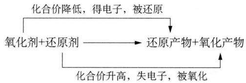

flowchart

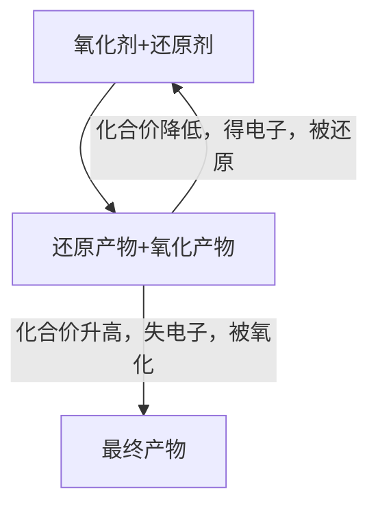

氧化剂具有氧化性,还原剂具有还原性。那么,不同的氧化剂(或还原剂)的相对强弱如何比较呢?主要可从以下三方面进行定性判断:

（1）根据金属活动性或非金属活动性顺序判断。金属单质的还原性越强，其相应阳离子的氧化性越弱；非金属单质的氧化性越强，其相应阴离子的还原性越弱。  
(2) 根据氧化还原反应进行的方向判断。若氧化剂 + 还原剂 = 还原产物 + 氧化产物, 则氧化性: 氧化剂 > 氧化产物; 还原性: 还原剂 > 还原产物。示例如下:

(2008年复旦大学自主招生试题)已知某温度时发生如下三个反应: ①C+CO₂=2CO; ②C+H₂O=CO+H₂; ③CO+H₂O=CO₂+H₂。由此可以判断,在该温度下C、CO、H₂的还原性强弱顺序是

A. $\mathrm{CO} > \mathrm{C} > \mathrm{H}_{2}$

B. $C > CO > H_{2}$

C. $C > H_{2} > CO$

D. $\mathrm{CO} > \mathrm{H}_{2} > \mathrm{C}$

解析 这三个反应在相同条件下进行,可根据还原剂的还原性强于还原产物进行判断。由反应①可知还原性: C > CO, 反应②可知还原性: $C > H_{2}$ , 反应③可知还原性: $CO > H_{2}$ , 所以还原性: $C > CO > H_{2}$ 。答案选 B。

（3）根据反应进行的难易程度判断，如 $KMnO_{4}$ 与 $MnO_{2}$ 比较，前者可在室温下与盐酸反应，后者必须在加热条件下与浓盐酸反应，所以氧化性： $KMnO_{4} > MnO_{2}$ 。

若要定量地判断氧化剂(或还原剂)的相对强弱,则应比较不同氧化还原电对的电极电势值。

对于已配平的氧化还原反应,可用单线桥表示电子转移的方向和数目。单线桥表示法的要点是:从化合价升高的元素出发,指向化合价降低的元素,转移的电子数为升高(或降低)的总价数。示例如下:

标出下列氧化还原反应的电子转移方向和数目。

$$
\mathrm{KClO} _ {3} + 6 \mathrm{HCl} \stackrel {\triangle} {=} \mathrm{KCl} + 3 \mathrm{Cl} _ {2} \uparrow + 3 \mathrm{H} _ {2} \mathrm{O}
$$

解析 ① 标示变价元素化合价

$$
\mathrm{KClO} _ {3} + 6 \mathrm{HCl} = \mathrm{KCl} + 3 \mathrm{Cl} _ {2} + 3 \mathrm{H} _ {2} \mathrm{O}
$$

② 计算各变价元素得失电子数

此例中的难点在于确定 $KClO_{3}$ 中 +5 价的 Cl 是被还原到 -1 价还是 0 价。若被还原至 -1 价，则该反应以化学计量系数进行反应时转移电子数 6 mol；若被还原至 0 价，则转移电子数 5 mol。根据“电子转移数少，反应易完成”可知 $KClO_{3}$ 中 +5 价的 Cl 被还原到 $Cl_{2}$ 中 0 价的 Cl。

③ 标出电子转移方向和数目

$$
\mathrm{KClO} _ {3} + 6 \mathrm{HCl} = \mathrm{KCl} + 3 \mathrm{Cl} _ {2} + 3 \mathrm{H} _ {2} \mathrm{O}
$$

## 三、影响氧化还原反应的因素

具有氧化性物质能否与具有还原性的物质发生氧化还原反应、反应后又能得到何种产物，受到很多因素的影响。

## 1. 反应物自身的性质

相同条件下,若氧化剂的氧化还原电对电极电势值高于还原剂的氧化还原电对电极电势值,则理论上该氧化还原反应具备进行的可能性。

注：“电极电势”相关内容在第二分册“电化学基础”章节中具体阐述。

例如：由于 $\varphi^{\ominus}\left(\mathrm{H}^{+}/\mathrm{H}_{2}\right)<\varphi^{\ominus}\left(\mathrm{Cu}^{2+}/\mathrm{Cu}\right)$ ，所以 Cu 不能与稀硫酸反应；而 $\varphi^{\ominus}\left(\mathrm{HNO}_{3}/\mathrm{NO}\right)>\varphi^{\ominus}\left(\mathrm{Cu}^{2+}/\mathrm{Cu}\right)$ ，故 $3\mathrm{Cu}+8\mathrm{HNO}_{3}$ （稀） $=3\mathrm{Cu}\left(\mathrm{NO}_{3}\right)_{2}+2\mathrm{NO}\uparrow+4\mathrm{H}_{2}\mathrm{O}$ 。

如何使 $\mathrm{Cu}$ 与 $\mathrm{H}_2\mathrm{SO}_4$ 反应呢？一般可采用如下两种方法。

方法一: 在 $\mathrm{Cu}$ 与稀硫酸的反应体系中持续通入 $\mathrm{O}_{2}$ , 即利用 $\varphi^{\ominus} (\mathrm{O}_{2}, \mathrm{H}^{+} / \mathrm{H}_{2} \mathrm{O}) > \varphi^{\ominus} (\mathrm{Cu}^{2+} / \mathrm{Cu})$ 使得反应 $2 \mathrm{Cu} + \mathrm{O}_{2} + 2 \mathrm{H}_{2} \mathrm{SO}_{4} = 2 \mathrm{CuSO}_{4} + 2 \mathrm{H}_{2} \mathrm{O}$ 得以进行。

方法二：用浓硫酸代替稀硫酸并加热， $Cu+2H_{2}SO_{4}$ （浓） $\xlongequal{\triangle}CuSO_{4}+SO_{2}\uparrow+2H_{2}O$ 。

由此可见,外界条件的不同能改变物质的氧化性(或还原性)强弱,从而影响氧化还原反应的进行。

## 2. 反应物溶液的浓度

反应物溶液的浓度可以影响氧化还原反应的进行与否,如上例中,稀硫酸不能与 Cu 发生反应,而浓硫酸在加热的条件下能与 Cu 反应。不仅如此,反应物溶液的浓度还可以影响反应产物的不同。

例如, 上例中 $\mathrm{Cu}$ 与稀 $\mathrm{HNO}_{3}$ 反应生成 $\mathrm{NO}$ , 而 $\mathrm{Cu}$ 与浓硝酸则生成 $\mathrm{NO}_{2}$ 。

Zn 的还原性比铜强, 故能将 $N^{+5}$ 还原到更低价态; 而硝酸浓度不同, 被 Zn 还原

的程度也不同。

$$
\begin{array}{l} \mathrm{再如,} 4 \mathrm{Zn} + 1 0 \mathrm{HNO} _ {3} (\mathrm{稀}) = 4 \mathrm{Zn} (\mathrm{NO} _ {3}) _ {2} + \mathrm{N} _ {2} \mathrm{O} \uparrow + 5 \mathrm{H} _ {2} \mathrm{O} \\ 4 \mathrm{Zn} + 1 0 \mathrm{HNO} _ {3} (\mathrm{稀}) = 4 \mathrm{Zn(NO} _ {3}) _ {2} + \mathrm{NH} _ {4} \mathrm{NO} _ {3} + 3 \mathrm{H} _ {2} \mathrm{O} \\ \end{array}
$$

## 3. 反应进行的温度

温度的高低对氧化还原反应的进行有着较大影响。例如，Al、Fe 在冷的浓硫酸或浓硝酸中钝化，氧化还原反应难以持续有效地进行，而加热时反应进行显著。再如， $NH_{4}NO_{3}$ 在 $190^{\circ}C \sim 300^{\circ}C$ 时分解生成 $N_{2}O$ 和 $H_{2}O$ ，而在 $300^{\circ}C$ 以上时则进一步生成 $N_{2}$ 、 $O_{2}$ 和 $H_{2}O$ 。

## 4. 反应进行的介质

反应介质的不同对氧化还原反应的影响较大。通常在酸性介质中，部分氧化剂如含氧酸根的氧化能力增强；而在碱性介质中，部分还原剂的还原能力增强，如 $Fe^{2+}$ 在碱性介质中更易被氧气氧化。

此外, 反应介质的不同会导致反应产物的不同。例如, $\mathrm{KMnO}_{4}$ 与 $\mathrm{Na}_{2} \mathrm{SO}_{3}$ 在不同的介质中进行反应: 在酸性介质中, $\mathrm{MnO}_{4}^{-}$ 还原成 $\mathrm{Mn}^{2+}$ (肉色或近乎无色); 在强碱性介质中, $\mathrm{MnO}_{4}^{-}$ 还原成 $\mathrm{MnO}_{4}^{2-}$ (绿色); 在近中性介质中, $\mathrm{MnO}_{4}^{-}$ 还原成 $\mathrm{MnO}_{2}$ 沉淀(棕黑色)。

## 四、氧化还原反应方程式的配平

配平氧化还原反应方程式的常用方法有：观察法、化合价升降法、待定系数法、拆合法、离子—电子法等。针对不同类型的氧化还原反应要灵活地采用适切的方法进行配平。

## 1. 化合价升降法

化合价升降法是配平氧化还原反应最常用的方法,其配平的依据是: ①在氧化还原反应中,元素化合价升高和降低的总数相等,即得失电子数相等; ②反应前后原子数守恒,即质量守恒定律; ③若为离子反应,则反应前后阴阳离子所带电荷总数相等。化合价升降法配平的关键是: ①正确标出元素的化合价; ②确定从何种物质着手进行配平。下面,就不同的典型案例做逐一探讨。

（1）一般情况下，从反应物着手确定元素的化合价的变化，其中重要的即是确定化合价变化的原子个数。示例如下：

$$
\text { 配平化学方程式: } \mathrm{K} _ {2} \mathrm{Cr} _ {2} \mathrm{O} _ {7} + \mathrm{KI} + \mathrm{H} _ {2} \mathrm{SO} _ {4} - \mathrm{K} _ {2} \mathrm{SO} _ {4} + \mathrm{Cr} _ {2} (\mathrm{SO} _ {4}) _ {3} + \mathrm{I} _ {2} + \mathrm{H} _ {2} \mathrm{O}
$$

解析 ① 标示变价元素化合价

$$
\mathrm{K} _ {2} \stackrel {+ 6} {\mathrm{Cr}} _ {2} \mathrm{O} _ {7} + \stackrel {- 1} {\mathrm{KI}} + \mathrm{H} _ {2} \mathrm{SO} _ {4} - \mathrm{K} _ {2} \mathrm{SO} _ {4} + \stackrel {+ 3} {\mathrm{Cr}} _ {2} (\mathrm{SO} _ {4}) _ {3} + \stackrel {0} {\mathrm{I}} _ {2} + \mathrm{H} _ {2} \mathrm{O}
$$

② 计算各变价元素得失电子数

这里的关键就是确定变价元素的原子个数,从 $K_{2}Cr_{2}O_{7}$ 着手,可知变价的 +6 价 Cr 有 2 个;而从 KI 着手时,其中 I⁻ 反应后生成 $I_{2}$ ,不妨先在 KI 前添加系数 “2”,即变价的 -1 价 I 也为 2 个。从而可以算得变价元素得失电子数:

$$
\begin{array}{r l} & \mathrm {K_ {2} Cr_ {2} O_ {7}} + 2 \mathrm{KI} + \mathrm {H_ {2} SO_ {4}} - \mathrm {K_ {2} SO_ {4}} + \mathrm {Cr_ {2} (SO_ {4}) _ {3}} + \mathrm {I_ {2}} + \mathrm {H_ {2} O} \\ & \downarrow 6 \quad \uparrow 2 \end{array}
$$

③ 求算最小公倍数

通过计算各变价元素得失电子数的最小公倍数来达成得失电子总数相等。

$$
\begin{array}{r l} & \mathrm {K_ {2} Cr_ {2} O_ {7} + 2KI+ H_ {2} SO_ {4} \longrightarrow K_ {2} SO_ {4} + Cr_ {2} (SO_ {4}) _ {3} + I_ {2} + H_ {2} O} \\ & \downarrow 6 \times 1 \quad \uparrow 2 \times 3 \end{array}
$$

④ 配平系数

利用最小公倍数配平含变价元素物质的系数后, 可依据原子数守恒依次配平其余物质。可得: $\mathrm{K}_{2} \mathrm{Cr}_{2} \mathrm{O}_{7} + 6 \mathrm{KI} + 7 \mathrm{H}_{2} \mathrm{SO}_{4} = 4 \mathrm{K}_{2} \mathrm{SO}_{4} + \mathrm{Cr}_{2} (\mathrm{SO}_{4})_{3} + 3 \mathrm{I}_{2} + 7 \mathrm{H}_{2} \mathrm{O}$ 。

(2) 同一种物质中,有几种元素的化合价同时发生变化,而其中某种元素只有部分原子的化合价发生变化,则可以从生成物着手来分析化合价的变化。示例如下:

配平化学方程式: $\mathrm{Fe(NO_{3})_{3}-Fe_{2}O_{3}+NO_{2}+O_{2}}$ (省略反应条件)

解析 该例中氧元素的化合价没有全部变化,可以从生成物 $O_{2}$ 入手确定变价个数为 2,失电子数计为 4;氮元素的化合价全部变化,可以从反应物 $\mathrm{Fe(NO_{3})_{3}}$ 入手确定变价个数为 3,得电子数计为 3。过程如下:

$$
\begin{array}{r l} \mathrm{Fe(N} & \quad \mathrm {O_ {3}) _ {3}} - \mathrm {Fe_ {2} O_ {3}} + \mathrm {NO_ {2}} + \mathrm {O_ {2}} \\ \downarrow 3 \times 4 & \uparrow 4 \times 3 \end{array}
$$

注意 $\mathrm{Fe}(\mathrm{NO}_{3})_{3}$ 前的系数, 应根据 N 原子数来书写, 配平后可得: $4\mathrm{Fe}(\mathrm{NO}_{3})_{3}$

$$
= 2 \mathrm{Fe} _ {2} \mathrm{O} _ {3} + 1 2 \mathrm{NO} _ {2} \uparrow + 3 \mathrm{O} _ {2} \uparrow 。
$$

（3）同一种物质中同时有两种元素化合价变化时,要注意不同变价原子个数的比例关系。示例如下:

配平化学方程式： $FeS_{2} + O_{2}$ —— $Fe_{2}O_{3} + SO_{2}$ （省略反应条件）

解析 该例中,二硫化亚铁 $FeS_{2}$ 中 Fe 由 +2 变为 +3 的同时,S 由 -1 变为 +4,且两者变化的比例为 $n(\mathrm{Fe}):n(\mathrm{S})=1:2$ 。过程如下:

$$
\begin{array}{l l} \mathrm{Fe} & \mathrm{S} _ {2} + \mathrm{O} _ {2} - \mathrm{Fe} _ {2} \mathrm{O} _ {3} + \mathrm{SO} _ {2} \\ \uparrow 1 & 1 0 \quad \downarrow 4 \\ 1 1 \times 4 & 4 \times 1 1 \end{array}
$$

配平后可得 $4FeS_{2} + 11O_{2} = 2Fe_{2}O_{3} + 8SO_{2}$ 。若从生成物 $Fe_{2}O_{3}$ 和 $SO_{2}$ 入手，误将变化个数定为 $n(\mathrm{Fe}): n(\mathrm{S}) = 2:1$ 来进行分析，则将无法配平。原因其实很简单，生成物 $Fe_{2}O_{3}$ 和 $SO_{2}$ 前的系数未定时，变化个数 $n(\mathrm{Fe}): n(\mathrm{S}) = 2:1$ 是得不出来的。

（4）配平离子型氧化还原反应方程式时，系数也可根据电荷守恒来确定。示例如下：

配平离子方程式: $\mathrm{MnO}_{4}^{-} + \mathrm{H}_{2} \mathrm{~S} + \mathrm{H}^{+} - \mathrm{Mn}^{2+} + \mathrm{S} \downarrow + \mathrm{H}_{2} \mathrm{O}$

解析 先按一般步骤进行得失电子配平：

$$
\begin{array}{l} \mathrm {MnO_ {4} ^ {-}} + \mathrm {H_ {2} S} + \mathrm {H^ {+}} - \mathrm {Mn^ {2 + }} + \mathrm{S} \downarrow + \mathrm {H_ {2} O} \\ \downarrow 5 \times 2 \quad \uparrow 2 \times 5 \end{array}
$$

可得： $2MnO_{4}^{-} + 5H_{2}S + H^{+}$ —— $2Mn^{2+} + 5S \downarrow + H_{2}O$ 。

然后再来确定 $H^{+}$ 和 $H_{2}O$ 的系数,有两种方法:

方法1：先根据氧原子数守恒易知 $H_{2}O$ 的系数为8，再由氢原子数守恒来确定 $H^{+}$ 的系数为6。

方法 2: 无论 $H_{2}O$ 的系数是多少, 方程式右边离子所带电荷数总和为 +4, 再根据电荷数守恒可算得 $H^{+}$ 的系数为 6。

最后均能配平得： $2MnO_{4}^{-} + 5H_{2}S + 6H^{+} = 2Mn^{2+} + 5S \downarrow + 8H_{2}O$

(5) 配平有缺项的氧化还原反应方程式

注意,在酸性溶液中缺项不可能是碱,在碱性溶液中缺项不可能是酸。

示例如下：

完成反应方程式: $\mathrm{KMnO_{4}+KNO_{2}+\_MnSO_{4}+K_{2}SO_{4}+KNO_{3}+H_{2}O}$

解析 先按一般步骤进行氧化还原配平可得： $2KMnO_{4} + 5KNO_{2} + \_\_\_\_$ —— $2MnSO_{4} + K_{2}SO_{4} + 5KNO_{3} + H_{2}O$ 。观察可知，方程式左边显然缺少 $SO_{4}^{2-}$ ，且生成物中有H原子，所以反应物中缺项为 $H_{2}SO_{4}$ 。完成后可得： $2KMnO_{4} + 5KNO_{2} + 3H_{2}SO_{4} = 2MnSO_{4} + K_{2}SO_{4} + 5KNO_{3} + 3H_{2}O$ 。

(6) 配平含字母的氧化还原反应方程式

示例如下：

配平化学方程式: $\mathrm{Na}_{2} \mathrm{~S}_{x} + \mathrm{NaClO} + \mathrm{NaOH} - \mathrm{Na}_{2} \mathrm{SO}_{4} + \mathrm{NaCl} + \mathrm{H}_{2} \mathrm{O}$

解析 首先确定反应物 $Na_{2}S_{x}$ 中 S 的氧化数为 -x/2，从而求得 $Na_{2}S_{x}$ 中 S 的氧化数变化为： $[6-(-x/2)]\cdot x=6x+2$ 。而反应物 NaClO 中 Cl 由 +1 变为 -1，变化值为 2。得失电子配平如下：

$$
\begin{array}{r l} \mathrm{Na} _ {2} \mathrm{S} _ {x} & + \quad \mathrm{NaClO} \\ \uparrow (6 x + 2) \times 1 & \downarrow 2 \times (3 x + 1) \end{array}
$$

配平后可得： $\mathrm{Na}_{2}\mathrm{S}_{x}+(3x+1)\mathrm{NaClO}+2(x-1)\mathrm{NaOH}=x\mathrm{Na}_{2}\mathrm{SO}_{4}+(3x+1)\mathrm{NaCl}+(x-1)\mathrm{H}_{2}\mathrm{O}$ 。

（7）同一物质中元素化合价都发生变化，且难以确定化合价，则可将该物质中各元素化合价都定为0，然后再按一般步骤进行配平。示例如下：

配平化学方程式: $\mathrm{Fe}_{3} \mathrm{C} + \mathrm{HNO}_{3} - \mathrm{Fe}(\mathrm{NO}_{3})_{3} + \mathrm{CO}_{2} + \mathrm{NO}_{2} + \mathrm{H}_{2} \mathrm{O}$

解析 反应物 $Fe_{3}C$ 中 Fe、C 化合价均发生变化，且难以确定两者在 $Fe_{3}C$ 中的化合价，故将两者的化合价都定为 0。所以，反应物 $Fe_{3}C$ 中 Fe 由 0 变为 +3，C 由 0 变为 +4，且两者变化的比例为 $n(\mathrm{Fe}):n(\mathrm{C})=3:1$ 。过程如下：

$$
\begin{array}{c c c} \mathrm{Fe} _ {3} & \mathrm{C} + & \mathrm{HNO} _ {3} \\ \uparrow 3 \times 3 & \uparrow 4 & \downarrow 1 \\ 1 3 \times 1 & & 1 \times 1 3 \end{array}
$$

这里应注意反应物 $HNO_{3}$ 中部分 N 原子化合价变化, 所以上述过程中 $HNO_{3}$ 的系数 13 仅指参与氧化还原的那部分, 最终的系数还应包括生成 $\mathrm{Fe(NO_{3})_{3}}$ 的部分。

配平后可得： $Fe_{3}C+22HNO_{3}=3Fe(NO_{3})_{3}+CO_{2}\uparrow+13NO_{2}\uparrow+11H_{2}O$

【注】此例中不仅可将 Fe、C 的化合价都定为 0，而且还可定为其他任何数值，只要满足它们化合价的代数和为 0 即可。

## 2. 待定系数法

待定系数法是根据质量守恒定律,利用数学工具对方程式两边同种原子数目相等关系列方程求解,从而解得正确的系数并配平方程式的方法。它的优点是无需知道反应中各物质所含元素的化合价,比较适合于复杂氧化还原方程式(或含复杂物质)的配平。

该法配平步骤如下：

(1) 选定恰当的物质(该物质通常包含多种元素), 将其系数设为 1, 选定物质恰当与否至关重要。  
(2) 以系数为 1 的物质为基础根据原子数守恒尽可能多地直接写出其他物质的系数。  
(3) 未能写出系数的, 可将其设为未知数, 并根据尚未平衡的原子列出方程 (组) 求解。  
(4) 将求得的系数代入相应物质处, 再把方程式中各物质系数化成最简整数比。

示例如下：

配平化学方程式： $P_{4} + CuSO_{4} + H_{2}O \longrightarrow Cu_{3}P + H_{3}PO_{4} + H_{2}SO_{4}$

解析 可选择含两种变价元素的 $Cu_{3}P$ 将其系数定为 1，根据 Cu 原子数守恒可知 $CuSO_{4}$ 系数为 3，再根据 S 原子数守恒可知 $H_{2}SO_{4}$ 系数为 3。然后将 $P_{4}$ 系数设为 x，根据 P 原子数守恒可得 $H_{3}PO_{4}$ 系数为 4x-1，进而根据 H 原子数守恒可得 $H_{2}O$ 系数为 $6x+3/2$ 。如下所示： $xP_{4}+3CuSO_{4}+(6x+3/2)H_{2}O—1Cu_{3}P+(4x-1)H_{3}PO_{4}+3H_{2}SO_{4}$ 。

再根据 O 原子数守恒, 可列式: $12 + 6x + 3/2 = 4(4x - 1) + 12$ , 解得 x = 11/20。代入方程式得: $11/20P_{4} + 3CuSO_{4} + 24/5H_{2}O = 1Cu_{3}P + 6/5H_{3}PO_{4} + 3H_{2}SO_{4}$ 。最后化成最简整数比得: $11P_{4} + 60CuSO_{4} + 96H_{2}O = 20Cu_{3}P + 24H_{3}PO_{4} + 60H_{2}SO_{4}$ 。

## 3. 拆合法

在氧化还原反应方程式配平中,常会遇到一类复杂的氧化还原反应,该反应方程式往往包含多种氧化剂(或还原剂)或多种氧化产物(或还原产物),方程式有多套系数,此时用前面两种方法配平比较困难。出现多套系数的原因是该方程式包含两个或者多个相对独立的“分”氧化还原反应方程式,将它们乘以不同的系数再加和,即可得多个系数不同的“总”方程式。然而多套系数中只有转移电子数最少的一套系数是合理的。

该配平法的一般步骤是：

(1) 先将“总”氧化还原反应拆分成多个相对独立的“分”氧化还原反应。

(2) 用常规方法配平各“分”反应方程式。

(3) 将已配平的各“分”反应方程式进行加合可得配平的“总”反应方程式, 如有必要应将其系数化成最简整数比。

示例如下：

配平化学方程式： $Cl_{2} + AgF + H_{2}O \longrightarrow AgClO_{3} + AgCl + HF + O_{2}$

解析 该反应氧化剂为 $Cl_{2}$ ，还原剂为 $H_{2}O$ ；而氧化产物有两种： $AgClO_{3}$ 、 $O_{2}$ ，还原产物为 AgCl。因此可将其拆分成下面两个“分”氧化还原反应：

$$
\begin{array}{l} ① \mathrm{Cl} _ {2} + \mathrm{AgF} + \mathrm{H} _ {2} \mathrm{O} - \mathrm{AgCl} + \mathrm{HF} + \mathrm{O} _ {2} \\ ② \mathrm{Cl} _ {2} + \mathrm{AgF} + \mathrm{H} _ {2} \mathrm{O} - \mathrm{AgClO} _ {3} + \mathrm{AgCl} + \mathrm{HF} \\ \end{array}
$$

用化合价升降法配平①②可得：

$$
\begin{array}{l} ① 2 \mathrm{Cl} _ {2} + 4 \mathrm{AgF} + 2 \mathrm{H} _ {2} \mathrm{O} = 4 \mathrm{AgCl} + 4 \mathrm{HF} + \mathrm{O} _ {2} \\ ② 3 \mathrm{Cl} _ {2} + 6 \mathrm{AgF} + 3 \mathrm{H} _ {2} \mathrm{O} = \mathrm{AgClO} _ {3} + 5 \mathrm{AgCl} + 6 \mathrm{HF} \\ \end{array}
$$

加合后,即得: $5\mathrm{Cl}_{2} + 10\mathrm{AgF} + 5\mathrm{H}_{2}\mathrm{O} = \mathrm{AgClO}_{3} + 9\mathrm{AgCl} + 10\mathrm{HF} + \mathrm{O}_{2}$ 。

## 4. 离子—电子法

氧化还原反应由氧化反应和还原反应两者组成,且两者总是同时进行,所以可将其拆分成两个半反应。离子—电子法又称半反应法,此法适合于配平在不同介质中发生的较复杂的氧化还原反应。

该配平法的一般步骤是：

(1) 写出物质得失电子的半反应式。  
(2) 根据物质所处的酸碱性环境, 在半反应式中补充所需的相应介质。  
(3) 按照半反应式中箭头两边电荷和原子个数相等将半反应式配平。

（4）根据得失电子数相等，将两个半反应式分别乘以相应的系数将反应方程式配平。

示例如下：

配平离子方程式： $As_{2}S_{3}+ClO_{3}^{-}-Cl^{-}+H_{2}AsO_{4}^{-}+SO_{4}^{2-}$ （酸性溶液中）

解析 (1) 写出物质得失电子的半反应式:

$$
\mathrm{As} _ {2} \mathrm{S} _ {3} - 2 8 \mathrm{e} ^ {-} - 2 \mathrm{H} _ {2} \mathrm{AsO} _ {4} ^ {-} + 3 \mathrm{SO} _ {4} ^ {2 -} \quad ①
$$

$$
\mathrm{ClO} _ {3} ^ {-} + 6 \mathrm{e} - \mathrm{Cl} ^ {-} \quad ②
$$

(2) 半反应①左边少了 4 个 H 和 20 个 O, 且反应处于酸性环境中, 所以只能在①式左右两边分别补充 $\mathrm{H}_{2} \mathrm{O}$ 和 $\mathrm{H}^{+}$ , 可得:

$$
\mathrm{As} _ {2} \mathrm{S} _ {3} + \mathrm{H} _ {2} \mathrm{O} - 2 8 \mathrm{e} - 2 \mathrm{H} _ {2} \mathrm{AsO} _ {4} ^ {-} + 3 \mathrm{SO} _ {4} ^ {2 -} + \mathrm{H} ^ {+} \quad ③
$$

半反应②左边多了3个O,且反应处于酸性环境中,所以只能在②式左右两边分别补充 $H^{+}$ 和 $H_{2}O$ ,可得:

$$
\mathrm{ClO} _ {3} ^ {-} + \mathrm{H} ^ {+} + 6 \mathrm{e} - \mathrm{Cl} ^ {-} + \mathrm{H} _ {2} \mathrm{O} \quad ④
$$

(3) 配平半反应式两边的原子数和电荷数, 可得:

$$
\mathrm{As} _ {2} \mathrm{S} _ {3} + 2 0 \mathrm{H} _ {2} \mathrm{O} - 2 8 \mathrm{e} = 2 \mathrm{H} _ {2} \mathrm{AsO} _ {4} ^ {-} + 3 \mathrm{SO} _ {4} ^ {2 -} + 3 6 \mathrm{H} ^ {+} \tag {⑤}
$$

$$
\mathrm{ClO} _ {3} ^ {-} + 6 \mathrm{H} ^ {+} + 6 \mathrm{e} = \mathrm{Cl} ^ {-} + 3 \mathrm{H} _ {2} \mathrm{O} \quad ⑥
$$

(4) 根据得失电子数相等, ⑤ × 3 + ⑥ × 14 得:

$$
3 \mathrm{As} _ {2} \mathrm{S} _ {3} + 1 4 \mathrm{ClO} _ {3} ^ {-} + 1 8 \mathrm{H} _ {2} \mathrm{O} = 1 4 \mathrm{Cl} ^ {-} + 6 \mathrm{H} _ {2} \mathrm{AsO} _ {4} ^ {-} + 9 \mathrm{SO} _ {4} ^ {2 -} + 2 4 \mathrm{H} ^ {+}
$$

## 五、氧化还原反应方程式的书写

化学竞赛中常以元素化合物知识为背景考查氧化还原反应方程式的书写。此类题的解答,不仅要求学生有坚实的元素化合物知识基础,而且要求学生有较好的信息处理能力,并能综合运用假设、类比、讨论等方法加以解决。示例如下:

(1990年全国初赛试题)从某些方面看,氨与水相当, $NH_{4}^{+}$ 和 $H_{3}O^{+}$ (常简写为 $H^{+}$ )相当, $NH_{2}^{-}$ 和 $OH^{-}$ 相当, $NH^{2-}$ (有时还包括 $N^{3-}$ )和 $O^{2-}$ 相当。

(1) 已知在液氨中能发生下列两个反应: $\mathrm{NH}_{4} \mathrm{Cl} + \mathrm{KNH}_{2} = \mathrm{KCl} + 2 \mathrm{NH}_{3}$ ; $2 \mathrm{NH}_{4} \mathrm{I} + \mathrm{PbNH} = \mathrm{PbI}_{2} + 3 \mathrm{NH}_{3}$ 。请写出能在水溶液中发生的与上两个反应相当的反应方程式。  
(2) 完成并配平下列反应方程式(M 为二价金属): ① M 和液氨反应; ② $\mathrm{M}(\mathrm{NH}_{2})_{2}$ 受热分解。

解析 根据已学知识: $2 \mathrm{H}_{2} \mathrm{O} \rightleftharpoons \mathrm{H}_{3} \mathrm{O}^{+} + \mathrm{OH}^{-}, 2 \mathrm{NH}_{3} \rightleftharpoons \mathrm{NH}_{4}^{+} + \mathrm{NH}_{2}^{-}$ , 结合题给信息不难准确把握四个“相当”。解题时可以把陌生的“液氨”环境用熟悉的“水”环境作类比。

(1) $NH_{4}Cl + KNH_{2}$ 在液氨中的反应相当于 $HCl + KOH$ 在水中的反应, $NH_{4}I + PbNH$ 在液氨中的反应相当于 $HI + PbO$ 在水中的反应。易得结论: $HCl + KOH = KCl + H_{2}O$ ; $2HI + PbO = PbI_{2} + H_{2}O$ 。  
(2) 由活泼金属 M 和水反应产生 $\mathrm{M(OH)}_2$ 和 $\mathrm{H}_2$ , 可类比得: $\mathrm{M} + 2\mathrm{NH}_3 = \mathrm{M}(\mathrm{NH}_2)_2 + \mathrm{H}_2 \uparrow$ 。同理, 由 $\mathrm{M(OH)}_2$ 受热分解成 MO 和 $\mathrm{H}_2\mathrm{O}$ , 可类比得: $\mathrm{M}(\mathrm{NH}_2)_2 \xlongequal{\triangle} \mathrm{MNH} + \mathrm{NH}_3 \uparrow$ 。

## 六、氧化还原反应有关的计算

氧化还原反应的有关计算应根据化合价的变化,理清氧化和还原两条线索,以得失电子守恒为切入点,并结合化学方程式和质量守恒列式求解。

对于过程相对复杂的氧化还原反应(连续反应或多个反应同时进行)的计算,可以通过分析反应前后,始态和终态涉及的所有物质,找出所有起始物质到最终物质中化合价发生变化的元素,根据全过程得失电子守恒列式求解,无疑将极大地简化解题步骤。示例如下:

羟胺 $\left(\mathrm{NH}_{2}\mathrm{OH}\right)$ 是一种还原剂，能将某些氧化剂还原。现用25.00 mL 0.049 mol·L $^{-1}$ 的羟胺的酸性溶液跟足量的硫酸铁溶液在煮沸条件下反应，生成的 $Fe^{2+}$ 恰好与24.65 mL 0.020 mol·L $^{-1}$ 的 $KMnO_{4}$ 酸性溶液完全作用。已知 $FeSO_{4} + KMnO_{4} + H_{2}SO_{4} - Fe_{2}(SO_{4})_{3} + K_{2}SO_{4} + MnSO_{4} + H_{2}O$ （未配平），则在上述反应中，羟胺的氧化产物是（）

A. $\mathrm{N}_{2}$

B. $\mathrm{N}_{2} \mathrm{O}$

C. NO

D. $\mathrm{NO}_{2}$

解析 考查整个过程的始终态, 参与氧化还原反应的是: $NH_{2}OH \rightarrow$ 未知氧化产物, $KMnO_{4} \rightarrow MnSO_{4}$ 。设羟胺氧化产物中 N 的化合价为 x, 则根据全过程得失电子守恒可列式: $[x - (-1)] \times 25.00 \times 0.049 = (7 - 2) \times 24.65 \times 0.020$ , 解得 $x = +1$ , 选项中 $N_{2}O$ 符合题意, 答案为 B。

## 典型例题

【例 1】（1995 年全国初赛试题）氯酸是一种强酸，氯酸溶液浓度若超过 40% 就会迅速分解，产生一种比它酸性更强的酸，同时放出气体，该气体干燥后的平均相对分子质量为 45.53，它可以使带有火星的木条复燃，并可以使湿润的淀粉-KI 试纸变蓝后又褪色。试写出：

(1) 氯酸分解的方程式。

(2) 气体与淀粉 KI 试纸的反应式。

解析 据题给信息“氯酸分解产生比它酸性更强的酸”不难得出,此产物应是无机酸中酸性最强的 $HClO_{4}$ , 至于放出的气体是什么? 可以从该气体“能使带火星木条复燃”且“能使湿润的淀粉-KI试纸变蓝后又褪色”推知是 $O_{2}$ 和 $Cl_{2}$ 的混合气体。至此该反应氧化产物和还原产物已明确, 反应初步可表示为: $HClO_{3}$ —— $HClO_{4} + O_{2} + Cl_{2}$ 。

由于该反应氧化产物为 $HClO_{4}$ 和 $O_{2}$ ，还原产物为 $Cl_{2}$ ，若不明确其中两者的比例，则会产生多套配平系数。此时，通过题给信息“混合气体平均分子量为 45.53”就能明确 $O_{2}$ 和 $Cl_{2}$ 的比例。过程如下：

$$
\frac {3 2 . 0 0 n (\mathrm{O} _ {2}) + 7 0 . 9 0 n (\mathrm{Cl} _ {2})}{n (\mathrm{O} _ {2}) + n (\mathrm{Cl} _ {2})} = 4 5. 5 3, \text {解得} n (\mathrm{O} _ {2}): n (\mathrm{Cl} _ {2}) = 1 5: 8
$$

由 $n(\mathrm{O}_{2}):n(\mathrm{Cl}_{2})=15:8$ ，并结合得失电子数相等可得 $HClO_{4}$ 系数为： $(5\times16-15\times4)/2=10$ 。因此，配平得失电子数后，反应可表示为： $26HClO_{3}-10HClO_{4}+15O_{2}+8Cl_{2}$ 。显然，反应式右边还应加上8个 $H_{2}O$ ，才能配平反应式两边的原子数。因此，氯酸分解的方程式为： $26HClO_{3}=10HClO_{4}+15O_{2}\uparrow+8Cl_{2}\uparrow+8H_{2}O$ 。

至于“Cl₂ 使湿润的淀粉-KI试纸变蓝后又褪色”的反应式是高中化学中常见反应，依次为：Cl₂ + 2KI = 2KCl + I₂，5Cl₂ + I₂ + 6H₂O = 2HIO₃ + 10HCl。

【例 2】（第 27 届中国化学奥林匹克初赛试题）写出下列化学反应的方程式：

(1) 加热时, 三氧化二锰与一氧化碳反应产生四氧化三锰。

(2) 将 KCN 加入到过量的 $CuSO_{4}$ 水溶液中。

(3) 在碱性溶液中, $Cr_{2}O_{3}$ 和 $K_{3}Fe(CN)_{6}$ 反应。

(4) $\mathrm{Fe(OH)}_{2}$ 在常温无氧条件下转化为 $Fe_{3}O_{4}$ 。

(5) 将 $NaNO_{3}$ 粉末小心加到熔融的 $NaNH_{2}$ 中, 生成 $NaN_{3}$ (没有水生成)。

解析 （1）反应后， $Mn_{2}O_{3}$ 转化为 $Mn_{3}O_{4}$ ，Mn 的化合价降低，被还原，那么还原剂 CO 只能被氧化为 $CO_{2}$ 。配平该反应式，可得： $3Mn_{2}O_{3} + CO = 2Mn_{3}O_{4} + CO_{2}$ 。

(2) $\mathrm{CN}^{-}$ 为拟卤离子, 可类比 $\mathrm{I}^{-}$ 与 $\mathrm{Cu}^{2+}$ 的反应, 而且其还原性能满足该反应的进行。再关注题述反应条件“过量的 $\mathrm{CuSO}_{4}$ 水溶液”, $\mathrm{Cu}^{2+}$ 的还原产物以 $\mathrm{CuCN}$ 形式存在, 而不是 $\mathrm{Cu(CN)}_{2}^{-}$ 等, 可得: $4\mathrm{CN}^{-} + 2\mathrm{Cu}^{2+} = 2\mathrm{CuCN} + (\mathrm{CN})_{2}$ 。

(3) 在碱性溶液中, $\mathrm{Cr}_{2} \mathrm{O}_{3}$ 中 $\mathrm{Cr(III)}$ 更容易被氧化成 $\mathrm{Cr(VI)}$ , 且其存在形式为 $\mathrm{CrO}_{4}^{2-}$ , 而氧化剂 $\mathrm{Fe(CN)}_{6}^{3-}$ 被还原为 $\mathrm{Fe(CN)}_{6}^{4-}$ 。因此, $\mathrm{Cr}_{2} \mathrm{O}_{3} + 6 \mathrm{Fe(CN)}_{6}^{3-} + 10 \mathrm{OH}^{-} = 2 \mathrm{CrO}_{4}^{2-} + 6 \mathrm{Fe(CN)}_{6}^{4-} + 5 \mathrm{H}_{2} \mathrm{O}$ 。

(4) $\mathrm{Fe(OH)}_{2}$ 被氧化为 $\mathrm{Fe}_{3} \mathrm{O}_{4}$ , 最先想到的氧化剂应是 $\mathrm{O}_{2}$ , 但由于题述“无氧条件”, 所以排除这个可能。从 $\mathrm{Fe(OH)}_{2}$ 所含元素价态的角度分析, 显然最可能是 +1 价的氢起氧化作用, 被还原为 $\mathrm{H}_{2}$ 。至此, 不难得出: $3 \mathrm{Fe(OH)}_{2} = \mathrm{Fe}_{3} \mathrm{O}_{4} + \mathrm{H}_{2} \uparrow + 2 \mathrm{H}_{2} \mathrm{O}$ 。

(5) $NaNO_{3}$ 中 +5 价的氮与 $NaNH_{2}$ 中 -3 价的氮发生氧化还原反应生成 $NaN_{3}$ 中氧化数为 -1/3 的氮，配平得失电子数可得： $NaNO_{3} + 2NaNH_{2} \longrightarrow NaN_{3}$ ，显然应在反应式右边加上“ $2NaOH + H_{2}O$ ”才能配平原子数，即为 $NaNO_{3} + 2NaNH_{2} = NaN_{3} + 2NaOH + H_{2}O$ 。然而题述“没有水生成”，这是因为 $NaNH_{2} + H_{2}O = NaOH + NH_{3}$ ，所以总反应为： $NaNO_{3} + 3NaNH_{2} = NaN_{3} + 3NaOH + NH_{3}\uparrow$ 。

【例 3】（第 36 届 IChO 理论试题）过去曾有几篇关于一价钙化合物的报道。虽然直到现在这些“化合物”的本质仍不清楚，然而，它们仍是固体化学家感兴趣的课题。有人曾试图用(a)钙、(b)氢、(c)碳将 $CaCl_{2}$ 还原为 CaCl。

(1) 写出由 $CaCl_{2}$ 制备 CaCl 的三个反应方程式。

尝试用化学计量的 Ca(摩尔比 1:1)还原 $CaCl_{2}$ 之后, 得到非均匀的灰色物质。在显微镜下仔细观察, 它们是银色的金属团粒和无色的晶体。

(2) 指出金属团粒和无色的晶体分别是什么物质?

当试图用氢还原 $CaCl_{2}$ 时,生成白色产物。元素分析表明该产物含质量分数 52.36% 的钙和 46.32% 的氯。

(3) 推断生成的化合物的化学式。

当试图用碳还原 $CaCl_{2}$ 时，形成红色结晶物质。元素分析表明 Ca 和 Cl 的摩尔比为 $n(\mathrm{Ca}):n(\mathrm{Cl})=1.5:1$ 。在红色结晶物质水解中，放出的气体与 $Mg_{2}C_{3}$ 水解放出的气体相同。

(4) 写出 $\mathrm{CaCl}_{2}$ 与碳反应生成的化合物的化学式(假定一价钙不存在)。

解析 （1）已知反应物和主要生成物，不难得出：

(a) $CaCl_{2} + Ca = 2CaCl$ , (b) $2CaCl_{2} + H_{2} = 2CaCl + 2HCl$ , (c) $4CaCl_{2} + C = 4CaCl + CCl_{4}$

(2) 当 $n(\mathrm{Ca}): n(\mathrm{CaCl}_2) = 1:1$ 时, 两者若反应则恰生成 $\mathrm{CaCl}$ , 那么应该得到均一的物质, 这与题述“非均匀的灰色物质”不符。再结合题述“银色的金属团粒和无色的晶体”, 易知它们并未发生反应, 仍为 $\mathrm{Ca}$ 和 $\mathrm{CaCl}_2$ 。所以金属团粒和无色的晶体分别是 $\mathrm{Ca}$ 和 $\mathrm{CaCl}_2$ 。

（3）用氢还原 $CaCl_{2}$ 所得产物含钙 52.36%、氯 46.32%，由原子守恒可知含氢 1.32%。则产物中各元素之比 $n(\mathrm{Ca}):n(\mathrm{Cl}):n(\mathrm{H})=(52.36\%/40.08):(46.32\%/35.45):(1.32\%/1.008)=1:1:1$ ，所以产物的化学式为 $CaClH$ 。

(4) $Mg_{2}C_{3}$ 水解产生氢氧化物和碳氢化合物, 反应如下: $\mathrm{Mg}_{2}\mathrm{C}_{3} + 4\mathrm{H}_{2}\mathrm{O} = 2\mathrm{Mg(OH)}_{2} + \mathrm{C}_{3}\mathrm{H}_{4}$ 。若要红色结晶物质水解也能产生 $C_{3}H_{4}$ , 则该物质中 C 的氧化数应和在 $Mg_{2}C_{3}$ 中一样, 也为 -4/3。已知红色结晶物质 $n(\mathrm{Ca}): n(\mathrm{Cl}) = 1.5:1$ , 则可设它的化学式为 $Ca_{3}Cl_{2}C_{x}$ 。再由题述“假定一价钙不存在”可知其中 Ca 的氧化数为 +2, 根据氧化数代数和为 0, 可列式: $3 \times 2 = 2 + 4/3 \times x$ , 解得 x = 3, 所以化学式为 $Ca_{3}Cl_{2}C_{3}$ 。

【例 4】（1999 年全国初赛试题）市场上出现过一种一氧化碳检测器，其外观像一张塑料信用卡，正中有一个直径不到 2 cm 的小窗口，露出橙红色固态物质。若发现橙红色转为黑色而在短时间内不复原，表明室内一氧化碳浓度超标，有中毒危险。一氧化碳不超标时，橙红色虽也会变黑却能很快复原。已知检测器的化学成分：亲水性的硅胶、氯化钙、固体酸 $\mathrm{H}_{8}\left[\mathrm{Si}\left(\mathrm{Mo}_{2}\mathrm{O}_{7}\right)_{6}\right]\cdot28\mathrm{H}_{2}\mathrm{O}$ 、 $\mathrm{CuCl}_{2}\cdot2\mathrm{H}_{2}\mathrm{O}$ 和 $\mathrm{PdCl}_{2}\cdot2\mathrm{H}_{2}\mathrm{O}$ （注：橙红色为复合色，不必细究）。

(1) CO 与 $PdCl_{2} \cdot 2H_{2}O$ 的反应方程式为：\_\_\_\_。

(2) 题(1)的产物之一与 $CuCl_{2} \cdot 2H_{2}O$ 反应而复原, 化学方程式为: \_\_\_\_。

(3) 题(2)的产物之一复原的反应方程式为: \_\_\_\_。

解析 初看,题干中涉及物质较多,很难分清哪些物质参与反应。再从题问分析,很快可以把参与反应的物质锁定为 $CuCl_{2} \cdot 2H_{2}O$ 、 $PdCl_{2} \cdot 2H_{2}O$ 和 CO，这样就能撇开题干中的无用信息。

第(1)小题的关键是,确定 CO 和 $PdCl_{2} \cdot 2H_{2}O$ 两者中何者是氧化剂?有两种正好相反的假设,假设 1, CO 是氧化剂,反应得到 C 和某种高价钯化合物;假设 2, $PdCl_{2} \cdot 2H_{2}O$ 是氧化剂,反应得到 $CO_{2}$ 和 Pd。哪一个假设合理,可从第(2)小题得到提示。显然从第(2)小题可推知 $CuCl_{2} \cdot 2H_{2}O$ 只可能是氧化剂,因为在溶液里 $\mathrm{Cu(II)}$ 的价态只能降低。可以和 $CuCl_{2} \cdot 2H_{2}O$ 反应的物质应是还原剂,而此还原剂由 CO 与 $PdCl_{2} \cdot 2H_{2}O$ 反应而来。若假设 1 成立,那么需采用强氧化剂(如 $O_{2}$ 、浓 $H_{2}SO_{4}$ 、浓 $HNO_{3}$ 等)并且加热才能氧化 C,不合理,所以假设 2 是正确的。当然,第(2)小题又存在两种可能, $\mathrm{Cu(II)}$ 被还原得 $\mathrm{Cu(I)}$ 还是 $\mathrm{Cu(0)}$ 呢?不妨先来看第(3)小题,第(3)小题要求写出第(2)小题中产物之一被复原,自然是指 $\mathrm{Cu(I)}$ 或 $\mathrm{Cu(0)}$ 的复原。考查电极电势 $\varphi^{\ominus}\left(\mathrm{Cu^{2+}/Cu^{+}}\right)=0.159\mathrm{~V},\varphi^{\ominus}\left(\mathrm{Cu^{2+}/Cu}\right)=0.337\mathrm{~V}$ ,可知 $\mathrm{Cu(I)}$ 比 $\mathrm{Cu(0)}$ 易复原,即容易被氧化。由此选择 $\mathrm{Cu(I)}$ 为第(2)小题的答案,完成第(2)小题的解答。接着思考第(3)小题,使 $\mathrm{Cu(I)}$ 复原为 $\mathrm{Cu(II)}$ 的氧化剂是什么?显然只能选择空气中的 $O_{2}$ ,至此整题得解。答案如下:

(1) $\mathrm{CO} + \mathrm{PdCl}_2 \cdot 2\mathrm{H}_2\mathrm{O} = \mathrm{CO}_2 + \mathrm{Pd} + 2\mathrm{HCl} + \mathrm{H}_2\mathrm{O}$

(2) $\mathrm{Pd} + 2\mathrm{CuCl}_2 \cdot 2\mathrm{H}_2\mathrm{O} = \mathrm{PdCl}_2 \cdot 2\mathrm{H}_2\mathrm{O} + 2\mathrm{CuCl} + 2\mathrm{H}_2\mathrm{O}$

(3) $4\mathrm{CuCl} + 4\mathrm{HCl} + 6\mathrm{H}_2\mathrm{O} + \mathrm{O}_2 = 4\mathrm{CuCl}_2\cdot 2\mathrm{H}_2\mathrm{O}$

有兴趣的同学不妨把上述(1)式×2+(2)式×2+(3)式,可得 $2CO+O_{2}=2CO_{2}$ 。至此,应该能够理解题干中“CO浓度不超标,颜色很快复原;而CO浓度超标,颜色短时间内不复原”的表述。实际上, $PdCl_{2}\cdot2H_{2}O$ 、 $CuCl_{2}\cdot2H_{2}O$ 在整个过程中起催化剂的作用。

【例 5】（第 29 届中国化学奥林匹克初赛试题）写出下列各化学反应的方程式。

（1）将热的硝酸铅溶液滴入热的铬酸钾溶液产生碱式铬酸铅沉淀 $\left[\mathrm{Pb}_{2}(\mathrm{OH})_{2}\mathrm{CrO}_{4}\right]$ 。

（2）向含氰化氢的废水中加入铁粉和 $K_{2}CO_{3}$ 制备黄血盐 $\left[\mathrm{K}_{4}\mathrm{Fe}(\mathrm{CN})_{6}\cdot3\mathrm{H}_{2}\mathrm{O}\right]$ 。

(3) 酸性溶液中, 黄血盐用 $\mathrm{KMnO}_{4}$ 处理, 被彻底氧化, 产生 $\mathrm{NO}_{3}^{-}$ 和 $\mathrm{CO}_{2}$ 。

(4) 在水中, $\mathrm{Ag}_{2} \mathrm{SO}_{4}$ 与单质 S 作用, 沉淀变为 $\mathrm{Ag}_{2} \mathrm{~S}$ , 分离, 所得溶液中加碘水不褪色。

解析 (1) 由于反应生成 $\mathrm{Pb}_{2}(\mathrm{OH})_{2}\mathrm{CrO}_{4}$ 沉淀, 故该离子反应可表示为:

$$
2 \mathrm{Pb} ^ {2 +} + \mathrm{CrO} _ {4} ^ {2 -} + 2 \mathrm{H} _ {2} \mathrm{O} = \mathrm{Pb} _ {2} (\mathrm{OH}) _ {2} \mathrm{CrO} _ {4} \downarrow + 2 \mathrm{H} ^ {+} 。
$$

而题述“将热的硝酸铅溶液滴入热的铬酸钾溶液”，可见剩余的铬酸钾会将前述反应生成的 $H^{+}$ 消耗掉，使得前述反应得以正向进行，该过程可表示为： $2CrO_{4}^{2-} + 2H^{+} = Cr_{2}O_{7}^{2-} + H_{2}O$ 。

故总反应为： $2\mathrm{Pb}^{2+} + 3\mathrm{CrO}_{4}^{2-} + \mathrm{H}_{2}\mathrm{O} = \mathrm{Pb}_{2}(\mathrm{OH})_{2}\mathrm{CrO}_{4}\downarrow + \mathrm{Cr}_{2}\mathrm{O}_{7}^{2-}$ 。也可写成化学方程式： $2\mathrm{Pb}(\mathrm{NO}_{3})_{2} + 3\mathrm{K}_{2}\mathrm{CrO}_{4} + \mathrm{H}_{2}\mathrm{O} = \mathrm{Pb}_{2}(\mathrm{OH})_{2}\mathrm{CrO}_{4}\downarrow + \mathrm{K}_{2}\mathrm{Cr}_{2}\mathrm{O}_{7} + 4\mathrm{KNO}_{3}$ 。

(2) Fe 与 HCN 发生氧化还原反应生成 $Fe^{2+}$ 和 $H_{2}$ ， $Fe^{2+}$ 再与 $CN^{-}$ 配位生成 $\mathrm{Fe(CN)}_{6}^{4-}$ ，该过程可表示为： $\mathrm{Fe} + 6\mathrm{HCN} = \mathrm{Fe(CN)}_{6}^{4-} + \mathrm{H}_{2} \uparrow + 4\mathrm{H}^{+}$ 。

而 $K_{2}CO_{3}$ 恰能与上述反应生成的 $H^{+}$ 发生中和，故总反应为： $\mathrm{Fe} + 6\mathrm{HCN} + 2\mathrm{K}_{2}\mathrm{CO}_{3} = \mathrm{K}_{4}\mathrm{Fe}(\mathrm{CN})_{6} + \mathrm{H}_{2}\uparrow + 2\mathrm{CO}_{2}\uparrow + 2\mathrm{H}_{2}\mathrm{O}$ 。

（3）由题述可知， $\mathrm{Fe(CN)}_{6}^{4-}$ 被酸性 $\mathrm{KMnO}_{4}$ 彻底氧化为 $\mathrm{NO}_{3}^{-}$ 和 $\mathrm{CO}_{2}$ ，则此时铁必以 $\mathrm{Fe}^{3+}$ 形式存在，而 $\mathrm{MnO}_{4}^{-}$ 在酸性溶液中被还原为 $\mathrm{Mn}^{2+}$ ，该过程可表示为： $\mathrm{Fe(CN)}_{6}^{4-} + \mathrm{MnO}_{4}^{-} + \mathrm{H}^{+} = \mathrm{Fe}^{3+} + \mathrm{NO}_{3}^{-} + \mathrm{CO}_{2} + \mathrm{Mn}^{2+} + \mathrm{H}_{2}\mathrm{O}$ 。然后进行配平， $1\mathrm{mol}$ $\mathrm{Fe(CN)}_{6}^{4-}$ 彻底氧化失去 $1 + 6 \times (4 - 2) + 6 \times [5 - (-3)] = 61(\mathrm{mol})$ 电子，而 $1\mathrm{mol}$ $\mathrm{MnO}_{4}^{-}$ 被还原为 $\mathrm{Mn}^{2+}$ 得到 $5\mathrm{mol}$ 电子。由得失电子守恒，可得： $5\mathrm{Fe(CN)}_{6}^{4-} + 61\mathrm{MnO}_{4}^{-} + \mathrm{H}^{+} = 5\mathrm{Fe}^{3+} + 30\mathrm{NO}_{3}^{-} + 30\mathrm{CO}_{2} + 61\mathrm{Mn}^{2+} + \mathrm{H}_{2}\mathrm{O}$ ，最后配平氢、氧原子，得： $5\mathrm{Fe(CN)}_{6}^{4-} + 61\mathrm{MnO}_{4}^{-} + 188\mathrm{H}^{+} = 5\mathrm{Fe}^{3+} + 30\mathrm{NO}_{3}^{-} + 30\mathrm{CO}_{2}\uparrow + 61\mathrm{Mn}^{2+} + 94\mathrm{H}_{2}\mathrm{O}$ 。

(4) 微溶的 $\mathrm{Ag}_{2} \mathrm{SO}_{4}$ 转化为难溶的 $\mathrm{Ag}_{2} \mathrm{~S}$ , 需要 $\mathrm{S}^{2-}$ , 显然 $\mathrm{S}^{2-}$ 只能来自于单质 S 的还原, 那么被氧化的是什么呢? 这里, $\mathrm{Ag}_{2} \mathrm{SO}_{4}$ 显然不可能被氧化, 那么只能还是单质 S, 实际上单质 S 发生了歧化反应, 接下来考虑 S 被氧化为什么物质? 可能为 $\mathrm{S}_{2} \mathrm{O}_{3}^{2-} 、 \mathrm{SO}_{3}^{2-}$ 等, 但题述“所得溶液中加碘水不褪色”, 可知氧化产物不显还原性, 则 $\mathrm{S}_{2} \mathrm{O}_{3}^{2-} 、 \mathrm{SO}_{3}^{2-}$ 等均不合理, 只能为 $\mathrm{SO}_{4}^{2-}$ 。因此, 可写出该反应方程式并配平得: $3 \mathrm{Ag}_{2} \mathrm{SO}_{4} + 4 \mathrm{~S} + 4 \mathrm{H}_{2} \mathrm{O} = 3 \mathrm{Ag}_{2} \mathrm{~S} + 4 \mathrm{H}_{2} \mathrm{SO}_{4}$ 。

## 本讲习题

## 1. 配平下列化学反应方程式

(1) $\mathrm{KMnO_4}$ + $\mathrm{FeCl_2}$ + $\mathrm{H_2SO_4}$ — $\mathrm{K_2SO_4}$ + $\mathrm{MnSO_4}$ + $\mathrm{Fe_2(SO_4)_3}$ + $\mathrm{Cl_2}$ + $\mathrm{H_2O}$

(2) $\mathrm{K}_{2} \mathrm{Cr}_{2} \mathrm{O}_{7} + \mathrm{Fe}_{3} \mathrm{O}_{4} + \mathrm{H}_{2} \mathrm{SO}_{4} - \mathrm{Cr}_{2} (\mathrm{SO}_{4})_{3} +$

$$
\mathrm{Fe} _ {2} \left(\mathrm{SO} _ {4}\right) _ {3} + \quad \mathrm{K} _ {2} \mathrm{SO} _ {4} + \quad \mathrm{H} _ {2} \mathrm{O}
$$

(3) $\mathrm{Fe}_{3} \mathrm{P} + \mathrm{HNO}_{3}-\mathrm{Fe}(\mathrm{NO}_{3})_{3} + \mathrm{NO}+$ $\mathrm{H}_{3} \mathrm{PO}_{4}+\mathrm{H}_{2} \mathrm{O}$

(4) \_\_\_\_ $\mathrm{Cu(IO_{3})_{2}} +$ \_\_\_\_ KI + \_\_\_\_ $H_{2}SO_{4}$ —— \_\_\_\_ CuI ↓ + \_\_\_\_ $I_{2}$ + \_\_\_\_ $K_{2}SO_{4} +$ \_\_\_\_ $H_{2}O$

(5) \_\_\_\_ $NH_{4}ClO_{4}$ —— \_\_\_\_ $N_{2}\uparrow$ + \_\_\_\_ HCl↑ + \_\_\_\_ $O_{2}\uparrow$ + \_\_\_\_ $H_{2}O$

(6) \_\_\_\_ AsH $_{3}$ + \_\_\_\_ AgNO $_{3}$ + \_\_\_\_ H $_{2}$ O—\_\_\_\_ As $_{2}$ O $_{3}$ + \_\_\_\_ Ag + \_\_\_\_ HNO $_{3}$

(7) $\mathrm{NO}_x + \mathrm{NH}_3 - \mathrm{N}_2 + \mathrm{H}_2\mathrm{O}$

(8) $\mathrm{Cl}_m + \mathrm{OH}^- - \mathrm{ClO}_n^-$ $+$ $\mathrm{Cl}^-$ $+$ $\mathrm{H}_2\mathrm{O}$

(9) $\ce{VO_{2}^{+} + \ce{H_{2}C_{2}O_{4} \cdot 2H_{2}O + \ce{H^{+}} - \ce{V O^{2+}} + }$ $\ce{CO_{2}\uparrow + \ce{H_{2}O} }$

(10) \_\_\_\_ CrCl₃ + \_\_\_\_ KMnO₄ + \_\_\_\_ H₂O— \_\_\_\_ K₂Cr₂O₇ + \_\_\_\_ MnCl₂ + \_\_\_\_ HCl + \_\_\_\_ MnCr₂O₇

2. 已知铁溶于一定浓度的硝酸溶液中, 反应的离子方程式为(系数 $a \sim k$ 均为正整数):

$aFe + bNO_{3}^{-} + cH^{+} \longrightarrow dFe^{2+} + fFe^{3+} + gNO\uparrow + hN_{2}O\uparrow + kH_{2}O$ 。回答下列问题：

（1）根据反应中氮、氢、氧三种元素的原子个数守恒，可得 c、g、h 的关系式是（用一个代数式表示，下同。）\_\_\_\_；

(2) 根据反应中离子的电荷守恒, 可得 b、c、d、f 的关系式是 \_\_\_\_ ;

(3) 根据反应中电子转移的总数相等, 可得 $d 、 f 、 g 、 h$ 的关系式是 \_\_\_\_;

(4) 若 a = 12，且铁和稀硝酸恰好完全反应，则 b 的取值范围是 \_\_\_\_。

3. 一个完整的氧化-还原反应式可以拆写成两个“半反应”，一个是氧化反应，另一个是还原反应。如 $2 \mathrm{Fe}^{3+} + \mathrm{Cu} = 2 \mathrm{Fe}^{2+} + \mathrm{Cu}^{2+}$ 拆写的结果是：氧化反应： $\mathrm{Cu} - 2 \mathrm{e} = \mathrm{Cu}^{2+}$ ；还原反应： $\mathrm{Fe}^{3+} + \mathrm{e} = \mathrm{Fe}^{2+}$ ，据此，请将反应 $3 \mathrm{NO}_{2} + \mathrm{H}_{2} \mathrm{O} = 2 \mathrm{H}^{+} + 2 \mathrm{NO}_{3}^{-} + \mathrm{NO}$ 拆写成两个“半反应”式：氧化反应：\_\_\_\_；还原反应：\_\_\_\_。

4. (1995年山西省化学竞赛试题)已知某物质 $\mathrm{XO(OH)}_2^+$ 与 $\mathrm{Na}_2\mathrm{SO}_3$ 反应时, $\mathrm{XO(OH)}_2^+$ 作氧化剂, $\mathrm{Na}_2\mathrm{SO}_3$ 被氧化为 $\mathrm{Na}_2\mathrm{SO}_4$ 。现有 $0.1\mathrm{mol}$ $\mathrm{XO(OH)}_2^+$ 需要

100 mL 2.5 mol·L $^{-1}$ Na $_{2}$ SO $_{3}$ 溶液才能把该物质还原。试问 XO(OH) $_{2}^{+}$ 还原后 X 的最终价态是多少？

5. 法医常用马氏试砷法检验是否砷中毒。这种方法是用锌、盐酸和试样混合, 将产生的气体导入热玻璃管, 如试样中含有砷的化合物, 将在玻璃管中形成亮黑色的砷镜。有关反应是①\_\_\_\_；②\_\_\_\_。确证亮黑色物质是砷镜而不是锑镜, 可用 NaClO 溶液检验, 锑镜不溶而砷镜能溶于 NaClO 溶液, 反应方程式是\_\_\_\_。

6. $2 \mathrm{~mol} \mathrm{I}_{2}$ 和 $3 \mathrm{~mol} \mathrm{I}_{2} \mathrm{O}_{5}$ 的混合物在浓硫酸中反应生成 $(\mathrm{IO})_{2} \mathrm{SO}_{4}$ ; 若在发烟硫酸(化学式为 $\mathrm{H}_{2} \mathrm{SO}_{4} \cdot \mathrm{SO}_{3}$ ) 中反应得 $\mathrm{I}_{2}(\mathrm{SO}_{4})_{3}$ 。后者小心和水反应得碘和四氧化二碘。请写出生成 $\mathrm{I}_{2}(\mathrm{SO}_{4})_{3}$ 及其和水反应的方程式。

7.（1996年浙江省化学竞赛试题）已知相对原子质量O为16.0，K为39.0，Mn为54.9。完成并配平下列反应方程式：

(1) 固体 $KMnO_{4}$ 在 $200^{\circ}C$ 加热, 失重 10.8%;

(2) 固体 $KMnO_{4}$ 在 $240^{\circ}C$ 加热, 失重 15.3%。

8. (1997年全国初赛试题)次磷酸 $\mathrm{H}_{3} \mathrm{PO}_{2}$ 是一种强还原剂, 将它加入 $\mathrm{CuSO}_{4}$ 水溶液, 加热到 $40 \sim 50^{\circ} \mathrm{C}$ , 析出一种红棕色的难溶物 A。经鉴定: 反应后的溶液是磷酸和硫酸的混合物; X射线衍射证实 A 是一种六方晶体, 结构类同于纤维锌矿 (ZnS), 组成稳定; A 的主要化学性质如下: ①温度超过 $60^{\circ} \mathrm{C}$ , 分解成金属铜和一种气体; ②在氯气中着火; ③与盐酸反应放出气体。回答如下问题:

(1) 写出 A 的化学式。  
(2) 写出 A 的生成反应方程式。  
(3) 写出 A 与氯气反应的化学方程式。  
(4) 写出 A 与盐酸反应的化学方程式。

## 第二讲 原子结构

## 知识精讲

## 一、原子结构的发现

## 1. 电子的发现

1897 年, 汤姆孙(Thomson)改进了阴极射线管装置, 用图 2-1 所示的装置进行实验获得成功。

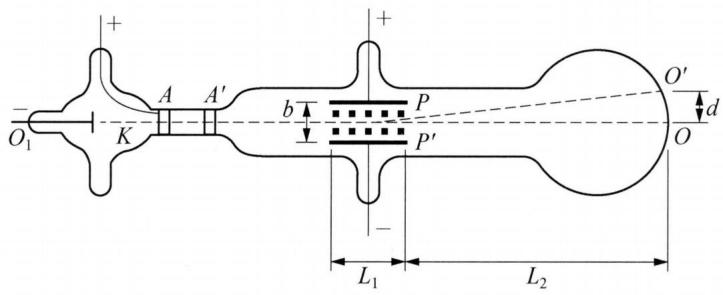

text_image

+
-
O₁
K
A
A′
b
P
P′
L₁
L₂
O′
d
O

图2-1 阴极射线管装置

阴极射线穿出 $A'$ 板上小孔之后, 进入一个静电场区域, 它是由两块平行板电极 $P$ 和 $P'$ 加上电压而产生的, 可以看到阴极射线在电场中向上偏转一段距离。如果同时加上一个垂直于纸面向里的适当强度的磁场, 便又可以抵消这种偏转, 而使射线仍然射至对称的中心点。通过调节电压和磁场, 测量射线不发生偏转时的磁感应强度, 汤姆孙计算出射线粒子的速度。然后, 汤姆孙撤去磁场, 测出射线在平板电场右端出口处横向偏转值, 可以计算出阴极射线粒子的电荷与质量的比值, 约为氢离子荷质比的 2000 倍。

汤姆孙还发现,不管怎样改变放电管中的气体(空气、氢气、二氧化碳)的种类,也不管怎样改变电极的材料(铝、铁、铂),阴极射线粒子的荷质比始终保持不变,这意味着阴极射线是由一种荷质比完全确定的粒子流所组成的,由此断定,这种粒子应是电极材料原子的基本组成部分。汤姆孙一直把他发现的粒子称为微粒,直至第一次世界大战后,他才顺应了科学界流行的说法,将其称为“电子”。

## 2. 卢瑟福的原子有核模型

1903 年, 汤姆孙提出了原子的葡萄干面包模型, 认为带正电荷的介质均匀分

布于原子内部,电子散布其中。

1909 年, 盖革和马斯登在卢瑟福 (Rutherford) 指导下于英国曼彻斯特大学做了一个著名物理实验。实验用准直的 $\alpha$ 射线轰击厚度为微米的金箔, 发现绝大多数的 $\alpha$ 粒子都照直穿过金箔, 偏转很小, 但有少数 $\alpha$ 粒子发生角度比汤姆孙模型所预言的大得多的偏转, 大约有 1/8000 的 $\alpha$ 粒子偏转角大于 $90^{\circ}$ , 甚至观察到偏转角等于 $150^{\circ}$ 的散射, 更无法用汤姆孙模型说明。

1911 年卢瑟福提出原子的有核模型。其要点如下：

① 每个原子的中心都有一个带正电荷的原子核,核外有若干电子绕核高速运动。原子核的体积很小,但原子核集中了原子的几乎全部的质量。

② 原子核所带的正电荷总量与核外电子的负电荷总量相等,原子呈电中性。

## 二、玻尔模型

## 1. 氢原子光谱

原子中的电子在能量变化时所发射或吸收的一系列波长的光所组成的光谱，称为原子光谱。按照经典电磁学理论，若电子绕原子核做圆周运动时，原子将不断发射连续波长的电磁波，因而原子光谱应是连续的。这与氢原子光谱实验事实不符。

## 2. 玻尔模型

1913 年,为了解释氢原子光谱,丹麦物理学家玻尔(Bohr)借助卢瑟福的原子有核模型、普朗克的量子论和爱因斯坦的光子学说,提出了玻尔模型。

## (1) 玻尔模型的假设

① 电子沿具有一定能量和半径的轨道绕核运动,在同一轨道中运行时,电子能量固定,离核越近能量越低,离核越远能量越高。

② 电子运动轨道的角动量是量子化的, 即 $L = n \frac{h}{2\pi}$ 。式中, L 为电子运动轨道的角动量 (L = mvr), n 为正整数, h 为普朗克常量。

③ 电子吸收能量时, 可从低能量轨道跃迁至高能量轨道, 而从高能量轨道跃迁至低能量轨道时则放出能量, 其能量是量子化的, 即 $\Delta E = 13.6\left(\frac{1}{n_{1}^{2}} - \frac{1}{n_{2}^{2}}\right) \mathrm{eV}$ 。式中, $\Delta E$ 为两轨道间的能量差, $n_{1}$ 、 $n_{2}$ 为量子数。

## (2) 玻尔模型的成功之处

① 计算得到了电子能量 E 和轨道半径 r，即 $E = -\frac{13.6}{n^{2}}$ eV, $r = 52.9 n^{2}$ (pm)。

② 成功地解释了氢原子光谱。

$$
\Delta E = 1 3. 6 \Big (\frac {1}{n _ {1} ^ {2}} - \frac {1}{n _ {2} ^ {2}} \Big) = h \nu = h \frac {c}{\lambda} = h c \widetilde {\nu},
$$

则每条谱线的波数为 $\widetilde{\nu}=1.096\times10^{5}\left(\frac{1}{n_{1}^{2}}-\frac{1}{n_{2}^{2}}\right)\mathrm{cm}^{-1}$ ，其中常数项与里德堡常量( $R_{H}=1.097\times10^{5}$ )几乎相同。

③ 可用来计算氢原子的电离能。氢原子的电离能应等于电子从 $n = 1$ 的基态轨道跃迁到 $n = \infty$ 处吸收的能量: $I = \Delta E = E_{\infty} - E_{1} = 13.6\left(\frac{1}{n_{1}^{2}} - \frac{1}{n_{\infty}^{2}}\right)\mathrm{eV} = 13.6\mathrm{eV} = 1.31\times 10^{3}\mathrm{kJ}\cdot \mathrm{mol}^{-1}$ , 这与实验值一致。

## (3) 玻尔模型的缺陷

① 难以解释氢原子光谱的精细结构。对氢原子光谱进行更细微的观察,发现每条谱线均分裂成两条极为相近的谱线,玻尔模型对此现象无法解释。

② 难以解释多电子原子的光谱和能量。即使是只含有 2 个电子的氦原子, 其光谱的理论计算值与实验测量值偏差也很大。

③ 电子在同一轨道中运行时不放出电磁波的假设与经典电磁学理论相悖。这是因为玻尔模型仍然沿用了经典力学的概念,只是在经典力学的基础上引入了量子化的概念,但它毕竟还属于旧量子论的范畴。实际上电子的运动并非如玻尔假设的那样,微观粒子有其独特的运动规律。

## 三、核外电子运动状态

## 1. 微观粒子的波粒二象性

1924 年, 法国物理学家德布罗意在光的波粒二象性的启发下, 提出电子等微观粒子也具有波粒二象性, 其波长为 $\lambda = \frac{h}{P} = \frac{h}{mv}$ 。式中, P 为粒子运动的动量, m 为粒子的质量, v 为粒子的运动速率, h 为普朗克常量。

## 2. 测不准原理

对于运动中的宏观物体,可以用光来准确测定其运动速度和位置。但对于微观粒子,如果测量光的波长等于或小于被测物体的直径,当两者相遇时就会产生光的衍射,物体不能成像。当用短波长的高能光测量电子的位置时,光子遇到电子会将能量传递给电子,引起电子动量的改变;反之,若用长波长的低能光测量电子的位置,虽然电子的动量变化不大,但位置的测量误差明显增大。

1927 年,德国物理学家海森堡提出微观粒子的运动遵守测不准原理: $\Delta x\Delta P \geqslant \frac{h}{2\pi}$ 。式中, $\Delta x$ 为微观粒子的位置测定误差, $\Delta P$ 为动量测定误差。

原子半径约为 $10^{-10}$ m，假设原子中电子的位置测量误差就是 $1 \times 10^{-10}$ m，则电子运动速度的测量误差为 $\Delta v \geqslant \frac{h}{2\pi m \Delta x} = \frac{6.63 \times 10^{-34}}{2 \times 3.14 \times 9.11 \times 10^{-31} \times 10^{-10}} = 1.16 \times 10^{6} (\text{m} \cdot \text{s}^{-1})$ 。原子中电子的运动速度大约在 $10^{6}$ m·s $^{-1}$ ，由此可知，电子的运动位置和运动速度是难以同时准确测量的，即电子的运动不具有确定的轨道。

## 3. 量子力学和波函数

## (1) 波函数和薛定谔方程

1926 年,奥地利物理学家薛定谔提出了描述原子核外电子运动的波动方程,即 $\frac{\partial^{2}\psi}{\partial x^{2}}+\frac{\partial^{2}\psi}{\partial y^{2}}+\frac{\partial^{2}\psi}{\partial z^{2}}+\frac{8\pi^{2}m}{h^{2}}(E-V)\psi=0$ 。式中 x、y、z 为空间坐标,h 为普朗克常量,E 为电子的总能量,V 为电子在原子中的势能, $\psi$ 为描述电子运动的波函数,也称为原子轨道。

## (2) 概率密度和电子云

电子在原子核外某空间出现的概率应等于电子在这一区域出现的概率密度乘以空间的体积。

电子云是电子在原子核外空间概率密度分布的形象描述,电子在原子核外空间的某区域内出现,好像带负电荷的云笼罩在原子核的周围,人们形象地称它为“电子云”。

图中小黑点密度大的地方表示单位体积内电子出现的概率大;小黑点密度小的地方表示单位体积内电子出现的概率小。电子云就是用小黑点疏密来表示空间各点概率密度大小的一种图形。

## (3) 量子数

波函数的形式取决于三个常数 n、l、m，这些常数不能连续变化，只能取某些分立的值，称之为量子数。

## a. 主量子数(n)

物理意义：决定电子出现最大概率的区域离核的远近，主要决定电子的能量。

n 的取值：1，2，3，4，…，为正整数，与电子层相对应。

光谱符号：K，L，M，N，…。

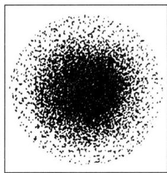

natural_image

Circular pattern of black dots on white background, no text or symbols present

图2-2 在通常状况下氢原子电子云示意图

主量子数 n 值越大, 电子出现的主要区域离原子核越远, 轨道能量越高。

## b. 角量子数 $(l)$

物理意义: 决定了原子轨道和电子云角度分布的情况, 且与主量子数 n 共同决定能量。

角量子数 l 的取值受主量子数 n 的限制。对于确定的 n, l 的取值：0, 1, 2, 3, 4, …, (n-1)，为 n 个取值。

光谱符号：s，p，d，f，…。

l=0 代表 s 轨道, 电子云的空间图像为球形。l=1 代表 p 轨道, 电子云的空间图像为哑铃形。l=2 代表 d 轨道, 电子云的空间图像为花瓣形。l=3 代表 f 轨道, 形状复杂。

1 个 l 值代表 1 个电子亚层, 如 n = 4, l 的取值分别为 0、1、2 和 3, 共 4 个亚层。

主量子数相同,角量子数不同时: $E_{ns}<E_{np}<E_{nd}<E_{nf}$ 。主量子数不同,角量子数相同时: $E_{1s}<E_{2s}<E_{3s}<E_{4s}$ 。只有当主量子数n和角量子数l相同时,电子所具有的能量才相同。

## c. 磁量子数(m)

物理意义：决定原子轨道在空间的伸展方向。

磁量子数 m 取值受角量子数 l 的影响, 对于给定的 l, m 可取: 0, ±1, ±2, ±3, …, ±l。共 $2l+1$ 个值。

例如：l=3，则 $m=0,\pm1,\pm2,\pm3$ 。 $2l+1=7$ 共 7 个值。

磁量子数 m 与能量无关, 当 n、l 相同时, 各原子轨道能量相同, 称为简并轨道。

## d. 自旋量子数 $(m_{\mathrm{s}})$

用分辨率极高的波谱仪观测氢原子光谱时,发现在没有外磁场作用下,每条谱线均分裂成两条邻近的谱线。对这一实验事实,仅用 n、l、m 难以解释。

1925 年,乌伦贝克和古德斯米特提出了电子自旋的假定。

物理意义：代表电子的自旋方向。

取值：+1/2 和 -1/2。

在同一个轨道中,如果有两个电子,则存在两种不同的自旋运动状态,可表示为+1/2和-1/2,或用“↑”和“↓”表示。

所以,描述一个电子的运动状态,要用四个量子数: n, l, m 和 $m_{s}$ 。

## 四、原子核外电子的排布

电子可以在能量不同的原子轨道上按不同的方式排布,导致原子可能处于多种不同的能量状态。其中能量最低的状态称为原子的基态,其余都称为原子的激发态。这里我们讨论的都是电中性基态原子核外电子的排布。

## 1. 多电子原子的能级

美国化学家鲍林(Pauling)根据光谱实验结果,总结出了多电子原子的原子轨道近似能级图部分能级组如图2-3所示。图中一个小圆圈代表一个轨道,方框中的几个轨道能量相近,称为一个能级组。相邻能级组间能量差异较大,同一能级组的能量差异较小。这样的能级组共有七个,各能级组均以s轨道开始,并以p轨道告终。它与周期表中七个周期有着对应关系。

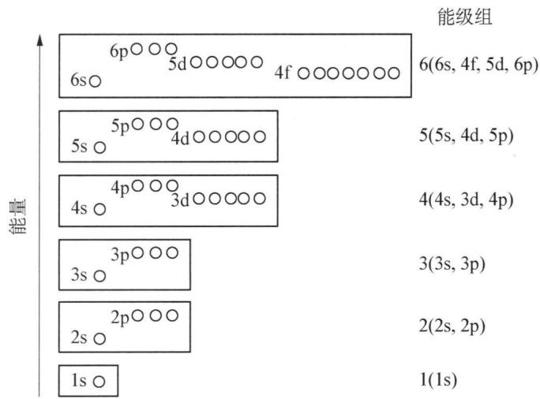

energy level diagram

| 能级组 | 能量 |
| ------ | ---- |
| 6s     | 6p   |
| 5d     | 5d   |
| 4f     | 4f   |
| 6s     | 6(6s) |
| 5s     | 5s   |
| 4d     | 4d   |
| 4s     | 4s   |
| 3d     | 3d   |
| 3s     | 3s   |
| 2p     | 2p   |
| 1s     | 1s   |

图2-3 鲍林近似能级图

我国著名化学家徐光宪先生根据光谱实验数据对电中性基态多电子原子轨道的能量高低,提出近似规律,即 $(n+0.7l)$ 公式。轨道能量的高低顺序可通过 $(n+0.7l)$ 值判断,数值大小顺序对应于轨道能量的高低顺序。需要指出的是,对于基态离子而言,近似规律为 $(n+0.4l)$ 公式。

如前所述,对于多电子原子:主量子数不同,角量子数相同时, $E_{1s}<E_{2s}<E_{3s}<E_{4s}<\cdots$ ;主量子数相同,角量子数不同时, $E_{ns}<E_{np}<E_{nd}<E_{nf}$ 。若主量子数和角量子数都不同,则在多电子原子中出现能级交错现象。能级交错是指电子层数较大的某些轨道的能量反低于电子层数较小的某些轨道能量的现象。例如 $E_{4s}<E_{3d}<E_{4p},E_{6s}<E_{4f}<E_{5d}<E_{6p}$ 。

原子轨道的能级交错来源于多电子原子中电子的屏蔽效应和钻穿效应。

## 2. 屏蔽效应与钻穿效应

## (1) 屏蔽效应

在多电子原子中,一个电子不仅受到原子核的引力,而且还要受到其他电子的排斥力。内层电子对外层电子的排斥相当于抵消了部分的核电荷,削弱了原子核对外层电子的吸引,这种作用称为屏蔽效应。由于屏蔽效应的影响,外层电子感受到的有效核电荷降低,能量相应升高。

## (2) 钻穿效应

外层电子钻到原子内层空间靠近原子核时,受到其他电子的屏蔽减少,感受到的有效核电荷增大,其原子轨道能量降低的现象,称为钻穿效应。

一般来说,若主量子数 n 相同时,则角量子数 l 越小,钻穿效应越显著。

## 3. 构造原理

玻尔归纳大量的光谱事实得出如下结论：设想从氢原子开始，随着原子核电荷数的递增，原子核每增加一个质子，原子核外便增加一个电子，大多数元素的基态原子的电子按鲍林近似能级图的顺序填入各原子轨道。这条经验规律称为构造原理。

## 4. 原子核外电子排布规律

## (1) 能量最低原理

核外电子在依次进入原子轨道时,总是尽先占领能量最低的轨道,然后依次由低到高逐个排列。

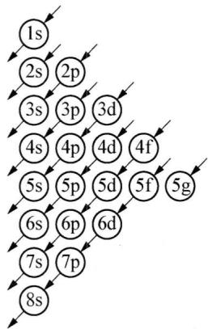

flowchart

图2-4 电子填入原子轨道的顺序

## (2) 保里(Pauli)不相容原理

在任何一个原子中不可能有运动状态完全相同的两个电子,也就是说在同一原子中不可能有四个量子数完全相同的两个电子。

## (3) 洪特(Hund)规则

在同一亚层中的各个轨道上,电子的排布尽可能分占不同的轨道,而且自旋方向相同。对于同一电子亚层,当电子排布为全充满、半充满时,体系能量较低,是比较稳定的。

全充满： $np^{6}$ ， $nd^{10}$ ， $nf^{14}$ ；半充满： $np^{3}$ ， $nd^{5}$ ， $nf^{7}$ 。

需要指出的是,核外电子排布是通过实验测得的,上述三条原理,是通过大量事实概括而来的,能够帮助我们理解核外电子排布的规律,但并不能解释所有原子的核外电子排布情况。

## 5. 核外电子排布的常见表示方法

## (1) 电子排布式

电子排布式是指用能级的符号及在能级符号右上角用数字表示其容纳电子数目的图式。如碳原子(C)的电子排布式为 $1s^{2}2s^{2}2p^{2}$ 。

若书写原子序数大的元素基态原子核外电子排布式时,常用“[原子实]+价电子”来表示。原子实是除去价电子的原子的其余部分,用稀有气体符号外加方括号表示,如铁原子(Fe)可表示为 $\left[Ar\right]3d^{6}4s^{2}$ 。

## (2) 结构示意图

结构示意图是表示原子核电荷数和电子层排布的图式,小圆圈和圆圈内的数字表示原子核和核内质子数,弧线表示电子层,弧线上的数字表示该层的电子数。如碳原子的结构示意图为 $^{+6}$ 24。

## (3) 轨道表示式

轨道表示式是指用方框或圆圈表示轨道,用“↑”或“↓”分别表示自旋方向相反的电子的图式。如碳原子的轨道表示式为 1s 2s 2p 。

## (4) 电子式

电子式是指在元素符号周围用小黑点“·”或小叉“×”表示元素原子的最外层电子的图式。如碳原子电子式为·C:。

## (5) 价电子构型(外围电子构型)

价电子构型又称为外围电子构型,指的是价电子排布式。如碳原子的价电子构型为 $2s^{2}2p^{2}$ ，铁原子的价电子构型为 $3d^{6}4s^{2}$ 。

## 五、原子核衰变

核衰变：放射性核素的原子核自发放射出射线变成另一种原子核的过程。

半衰期：放射性元素的原子核有半数发生衰变时所需要的时间。

## 1. $\alpha$ 衰变

放射性核放射 $\alpha$ 粒子变为另一种核。经一次 $\alpha$ 衰变，核质量减 4，核电荷减 2。

## 2. $\beta$ 衰变

放射性核放射 $\beta$ 粒子(电子)变为另一种核。经一次 $\beta$ 衰变, 核质量不变, 核电荷加 1。

## 3. $\gamma$ 衰变

由激发态原子核通过放射 $\gamma$ 射线(或称 $\gamma$ 光子)跃迁到低能态(可能为基态)的过程称 $\gamma$ 衰变。质量数和核电荷数不变,但能量状态改变。

$\alpha$ 、 $\beta$ 衰变中，原子核处于激发态，常伴有 $\gamma$ 射线放射。

## 典型例题

【例 1】（2000 年美国国家化学竞赛试题）在多电子原子中，下列关于电子依次连续填入轨道顺序描述正确的是

A. 3s, 3p, 3d

B. $3 \mathrm{~d}, 4 \mathrm{~s}, 4 \mathrm{p}$

C. 3d, 4p, 5s

D. $4 \mathrm{~p}, 4 \mathrm{~d}, 5 \mathrm{~s}$

解析 根据构造原理,选项 A 中 3p 后应是 4s 而非 3d,选项 B 中 4s 应在 3d 前面,选项 D 中 5s 应在 4d 前面。选项 C 正确。

【例 2】 现代原子结构理论认为,在同一电子层上,可有 s、p、d、f、g、h……等亚层,各亚层分别有 1、3、5、7……个轨道。试根据电子填入轨道的顺序预测:

(1) 第 8 周期共有 \_\_\_\_ 种元素；

(2) 原子核外出现第一个 6f 电子的元素的原子序数是 \_\_\_\_；

(3) 根据“稳定岛”假说, 第 114 号元素是一种稳定同位素, 半衰期很长, 可能在自然界都可以找到。试推测第 114 号元素属于\_\_\_\_周期、\_\_\_\_族元素, 原子的外围电子构型是\_\_\_\_。

解析 （1）第8电子层有8s、5g、6f、7d、8p等亚层，若填满，合计有 $(1+9+7+5+3)\times2=50$ 个电子，故第8周期共有50种元素。

(2) 根据构造原理, 恰填满第 7 电子层的元素的原子序数是 118, 接下来 8s、5g 可依次填入 2、18 个电子, 然后才开始填入 6f, 故出现第一个 6f 电子的元素的原子序数是 139。

（3）易知第 114 号元素原子外围电子构型是 $7s^{2}7p^{2}$ ，属于第七周期、ⅣA族元素。

【例 3】（2001 年全国初赛试题）自然界中，碳除了有 2 种稳定同位素 $^{12}$ C 和 $^{13}$ C 外，还有一种半衰期很长的放射性同位素 $^{14}$ C，丰度也十分稳定，如下表所示（注：数据后括号里的数字是最后一位或两位的精确度， $^{14}$ C 只提供了大气丰度，地壳中的含量小于表中数据）：

<table><tr><td>同位素</td><td>相对原子质量</td><td>地壳丰度(原子分数)</td></tr><tr><td> $^{12}C$ </td><td>12(整数)</td><td>0.9893(8)</td></tr><tr><td> $^{13}C$ </td><td>13.003 354 826(17)</td><td>0.0107(8)</td></tr><tr><td> $^{14}C$ </td><td>14.003 241 982(27)</td><td> $1.2\times10^{-16}$ (大气中)</td></tr></table>

试问：为什么通常碳的相对原子质量只是其稳定同位素的加权平均值而不将 $^{14}$ C也加入取平均值？

解析 若以 $^{12}$ C 和 $^{13}$ C 来计算碳的相对原子质量: $12 \times 0.9893 + 13.003354826 \times 0.0107 = 12.0107359$ ，而以 $^{12}$ C、 $^{13}$ C 和 $^{14}$ C 来计算碳的相对原子质量: $12 \times 0.9893 + 13.003354826 \times 0.0107 + 14.003241982 \times 1.2 \times 10^{-16} = 12.0107359$ ，由此可见 $^{14}$ C 不计入不影响计算结果的有效数字，实际上常用相对原子质量常取2～4位小数位，显然不影响。所以 $^{14}$ C 不加权不会影响计算结果的有效数字，因其丰度太低了。

【例 4】（2014 年美国国家化学竞赛试题）某过渡金属原子的电子排布式为 $1s^{2}2s^{2}2p^{6}3s^{2}3p^{6}4s^{2}3d^{6}$ ，则它的 +2 价基态阳离子有多少未成对电子？

A. 0

B. 2

C. 4

D. 6

解析 主量子数大的 4s 比 3d 先失电子, 所以该过渡金属的 +2 价基态阳离子的电子排布式为 $1s^{2}2s^{2}2p^{6}3s^{2}3p^{6}3d^{6}$ , 3d 轨道有 4 个未成对电子。答案选 C。

【例 5】（2008 年交大自主招生）具有单电子的微粒（原子、离子或原子团）都具有顺磁性，可用磁矩 $\mu$ 来量度。若单电子数目越大，其磁矩就越大。下列原子 N、O、Cl 和 Mn 原子中哪一个磁矩最大？

解析 由题述“单电子数目越大,其磁矩就越大”可知本题实际考查 N、O、Cl 和 Mn 原子的核外电子排布情况,进而由成单电子数的多少来判断磁矩的大小。N 原子电子排布式: $1s^{2}2s^{2}2p^{3}$ , 2p 轨道上有 3 个单电子; O 原子电子排布式: $1s^{2}2s^{2}2p^{4}$ , 2p 轨道上有 2 个单电子; Cl 原子电子排布式: $1s^{2}2s^{2}2p^{6}3s^{2}3p^{5}$ , 3p 轨道上有 1 个单电子; Mn 原子电子排布式: $1s^{2}2s^{2}2p^{6}3s^{2}3p^{6}3d^{5}4s^{2}$ , 3d 轨道上有 5 个单电子。因此,Mn 原子磁矩最大。

【例 6】（2010 年全国初赛试题）2009 年 10 月合成了第 117 号元素 Uus，从此填满了周期表第七周期所有空格，是元素周期系发展的一个里程碑。117 号元素 Uus 是用 $^{249}$ Bk 轰击 $^{48}$ Ca 靶合成的，总共得到 6 个 117 号元素 Uus 的原子，其中 1 个原子经 p 次 $\alpha$ 衰变得到 $^{270}$ Db 后发生裂变；5 个原子则经 q 次 $\alpha$ 衰变得到 $^{281}$ Rg 后发生裂变。写出得到 117 号元素 Uus 的核反应方程式（在元素符号的左上角和左下角分别标出质量数和原子序数）。

解析 此类题在初赛试题中很常见,实际考查高中原子物理部分的知识点。根据题述先写出不完整核反应方程式: $\ce{^{249}_{97}\text{Bk} + ^{48}_{20}\text{Ca} -> _{117}^? \text{Uus} + ?①}$ 。该核反应得到的两种 Uus 原子分别经 p 次 α 衰变得到 $^{270}\text{Db}$ q 次 α 衰变得到 $^{281}\text{Rg}$ ，此过程又分别可表示为 $_{117}^? \text{Uus} -> p_2^4\text{He} + _{105}^{270}\text{Db} ②$ ， $_{117}^? \text{Uus} -> q_2^4\text{He} + _{111}^{281}\text{Rg} ③$ 。由电荷守恒，可求得 p = 6, q = 3，再由质量守恒，可知②、③中 $_{117}^? \text{Uus}$ 分别为 $^{294}_{117}\text{Uus}$ 、 $^{293}_{117}\text{Uus}$ 。最后把这两种 Uus 原子代入核反应方程式①并配平，得 $^{249}_{97}\text{Bk} + ^{48}_{20}\text{Ca} -> _{117}^{294}\text{Uus} + 3n$ 、 $^{249}_{97}\text{Bk} + _{20}^{48}\text{Ca} -> _{117}^{293}\text{Uus} + 4n$ 。还可根据题述“ $^{294}_{117}\text{Uus}$ 和 $^{293}_{117}\text{Uus}$ 个数比为 1 : 5”，将上述两个核反应方程式合并为 $6_{97}^{249}\text{Bk} + 6_{20}^{48}\text{Ca} -> _{117}^{294}\text{Uus} + 5_{117}^{293}\text{Uus} + 23n$ 。

## 本讲习题

1. 假定在下列电子的各组量子数中 $n$ 正确, 请指出哪几种不能存在, 为什么?

(1) $n = 1, l = 1, m = 1, m_{s} = -1$  
(2) $n = 3, l = 1, m = 2, m_{\mathrm{s}} = +1 / 2$  
(3) $n = 3, l = 2, m = 1, m_{s} = -1 / 2$  
(4) $n = 2, l = 0, m = 0, m_{s} = 0$ 。  
(5) $n = 2, l = -1, m = 1, m_{s} = +1 / 2$  
(6) n = 4, l = 3, m = 2, $m_{s} = 2$ 。

2. (2006年全国初赛试题)2006年3月有人预言,未知超重元素第126号元素有可能与氟形成稳定的化合物。按元素周期系的已知规律,该元素应位于第\_\_\_\_周期,它未填满电子的能级应是\_\_\_\_,在该能级上有\_\_\_\_个电子,而这个能级总共可填充\_\_\_\_个电子。

3. (2002年全国初赛试题)最近有人用高能 $^{26}$ Mg核轰击 $^{248}_{96}$ Cm核,发生核合成反应,得到新元素X。研究者将X与氧气一起加热,检出了气态分子 $XO_{4}$ ,使X成为了研究化学性质的最重元素。已知的X同位素如下表所示,上述核反应得到的核素是其中之一,该核素的衰变性质保证了其化学性质实验获得成功。

<table><tr><td>质量数</td><td>半衰期</td><td>衰变方式</td></tr><tr><td>263</td><td>1s</td><td>释放 $\alpha$ 粒子</td></tr><tr><td>264</td><td>0.000 08 s</td><td>释放 $\alpha$ 粒子;或自发裂变</td></tr><tr><td>265</td><td>0.0018 s</td><td>释放 $\alpha$ 粒子;或自发裂变</td></tr><tr><td>266</td><td>不详</td><td>不详</td></tr><tr><td>267</td><td>0.033s</td><td>释放 $\alpha$ 粒子;或自发裂变</td></tr><tr><td>268</td><td>不详</td><td>不详</td></tr><tr><td>269</td><td>9.3s</td><td>释放 $\alpha$ 粒子</td></tr></table>

(1) X 的元素符号是 \_\_\_\_。

(2) 用元素符号并在左上角和左下角分别标注其质量数和质子数, 写出合成 X 的核反应方程式(方程式涉及的其他符号请按常规书写)。

4.（2004年全国初赛试题）2004年2月2日，俄国杜布纳实验室宣布用核反应得到了两种新元素X和Y。X是用高能 $^{48}$ Ca撞击 $^{243}_{95}$ Am靶得到的。经过100微秒，X发生 $\alpha$ 衰变，得到Y。然后Y连续发生4次 $\alpha$ 衰变，转变为质量数为268的第105号元素Db的同位素。以X和Y的原子序数为新元素的代号（左上角标注该核素的质量数），写出上述合成新元素X和Y的核反应方程式。

5. 1984 年, 联邦德国达姆施塔特重离子研究机构阿姆布鲁斯特和明岑贝格等人在重离子加速器上用 $^{58}$ Fe 离子轰击 $^{208}$ Pb 靶时发现了 $^{265}$ X。

(1) X 的元素符号是\_\_\_\_, X 最高价氧化物的化学式是\_\_\_\_。

(2) 用元素符号并在左上角和左下角分别标注其质量数和质子数, 写出合成 X 的核反应方程式(方程式涉及的其他符号请按常规书写)。

（3）最近有人用高能 $^{26}$ Mg核轰击 $^{248}$ Cm核，发生核合成反应，得到X的另一种同位素；然后释放出 $\alpha$ 粒子，得到质量数为265的另一种核素。分别写出核反应方程式。

6. 据《科学时报》报道俄罗斯科学家最近合成了质量数为 381 的第 166 号化学元素, 该元素是在加速器上通过 $^{207}_{82}\mathrm{Pb}$ 和 $^{44}_{21}\mathrm{Sc}$ 获得的, 它仅存在了 0.05 秒, 然后迅速衰变成稳定的 $^{209}_{83}\mathrm{Bi}$ 。

(1) 该元素在周期表中的位置, 它是金属还是非金属?

(2) 写出该元素的最高氧化态及电子排布式(原子实用原子序数代替)。

（3）以原子序数为该元素的代号(左上角标注该核素的质量数)，写出合成该元素的核反应方程式。

(4) 该元素变成稳定的 $^{209}_{83}$ Bi 的过程中发生了多少次 $\alpha$ 和 $\beta$ 衰变?

7.（1992年全国冬令营试题）假定某个星球上的元素服从下面的量子数限制： $n = 1, 2, 3, \cdots; l = 0, 1, 2, \cdots, n - 1; m_l = \pm l; m_s = +1/2$ 。则在此星球上，前4个惰性元素的原子序数各是多少？

## 第三讲 元素周期表与元素周期律

## 知识精讲

## 一、元素周期表

## 1. 周期

周期的划分依据是鲍林原子轨道近似能级图中的能级组。目前共有7个能级组，对应7个周期。第一周期只有2种元素，第二、第三周期各含有8种元素，称为短周期。第四、第五周期各含有18种元素，第六、第七周期各含有32种元素，称为长周期。（注：2009年10月合成了第117号元素，至此第七周期32种元素已填满）。

## 2. 族

周期表中的元素共有 18 列,划分为 16 个族: 7 个主族,7 个副族,1 个零族,1 个第Ⅷ族。族的序号使用大写的罗马数字,后面再写上 A(代表主族)或 B(代表副族)表示。

主族元素的族数与价层电子数相对应。零族是稀有气体元素，其化学惰性，不易成键。副族中ⅢB～ⅦB族的族数与价层电子数对应；ⅠB族的价层电子构型为 $(n-1)\mathrm{d}^{10}\mathrm{ns}^{1}$ ，ⅡB族的价层电子构型为 $(n-1)\mathrm{d}^{10}\mathrm{ns}^{2}$ 。第Ⅷ族是周期表中的第8、9、10列，同周期元素性质相近。

周期表中副族元素和第Ⅷ族元素称为过渡元素。周期表中ⅢB族第六周期位置上填有 $_{57}$ La～ $_{71}$ Lu共15种元素，称为镧系元素；第七周期位置上填有 $_{89}$ Ac～ $_{103}$ Lr共15种元素，称为锕系元素。周期表中ⅢB的Sc、Y和镧系元素统称为稀土元素。

## 3. 元素分区

根据元素原子价层电子构型不同,周期表中元素分区如下表3-1:

表 3-1 元素分区

<table><tr><td>区域</td><td>价层电子构型</td><td>包含元素</td></tr><tr><td>s区</td><td> $ns^{1\sim2}$ </td><td>IA、IIA</td></tr><tr><td>p区</td><td> $ns^{2}np^{1\sim6}$ </td><td>III A~VII A和零族</td></tr><tr><td>d区</td><td> $(n-1)d^{1\sim10}ns^{0\sim2}$ </td><td> $\mathrm{III}\mathrm{B}\sim\mathrm{VII}\mathrm{B}$ 和第 $\mathrm{VIII}$ 族</td></tr><tr><td>ds区</td><td> $(n-1)d^{10}ns^{1\sim2}$ </td><td> $\mathrm{I}\mathrm{B}、\mathrm{II}\mathrm{B}$ </td></tr><tr><td>f区</td><td> $(n-2)f^{0\sim14}(n-1)d^{0\sim2}ns^{2}$ </td><td>镧系和锕系</td></tr></table>

## 二、元素周期律

元素的性质随着原子序数的递增而呈现周期性的变化,这个规律就是元素周期律。

## 1. 原子半径

原子半径的单位以 $\mathrm{pm}(10^{-12}\mathrm{~m})$ 表示。常用的原子半径有如下 3 种：

(1) 共价半径: 两个相同原子以共价单键结合时, 两原子核间距离的一半。

(2) 金属半径: 在金属晶体中, 相邻的两个原子的核间距离的一半。

（3）范德华半径：两个相同原子只靠分子间作用力靠近时，两原子核间距的一半。范德华半径主要针对稀有气体元素。

对同一种元素而言,范德华半径>金属半径>共价半径。

原子半径的周期性变化规律如下：

(1) 同周期从左到右, 原子半径递减, 稀有气体元素 (其半径为范德华半径) 除外。

同周期元素的电子层数相同,从左往右,随着原子序数的递增,外层电子受到有效核电荷作用递增,原子半径递减。过渡元素由于最后的电子主要填充在内层轨道中,原子半径变化幅度不及主族元素。

(2) 同主族从上到下, 原子半径递增。

同主族元素从上往下,电子层数增加,虽然核电荷数增加,但内层电子对外层电子的屏蔽作用使得外层电子受到有效核电荷作用增加不明显,因而电子层数增加的影响起主导作用,原子半径递增。

(3) 镧系收缩及其对元素性质的影响

部分元素的共价半径(单位: pm)如下表:

表 3-2 部分元素共价半径(单位: pm)

<table><tr><td colspan="4">III B</td><td colspan="3">IVB</td><td colspan="4">VB</td><td colspan="4">VIB</td></tr><tr><td colspan="4">Y162</td><td colspan="3">Zr145</td><td colspan="4">Nb134</td><td colspan="4">Mo130</td></tr><tr><td colspan="4">Ln系/</td><td colspan="3">Hf144</td><td colspan="4">Ta134</td><td colspan="4">W130</td></tr><tr><td colspan="15">Ln系</td></tr><tr><td>La169</td><td>Ce165</td><td>Pr164</td><td>Nd164</td><td>Pm163</td><td>Sm162</td><td>Eu185</td><td>Gd162</td><td>Tb161</td><td>Dy160</td><td>Ho158</td><td>Er158</td><td>Tm158</td><td>Yb170</td><td>Lu158</td></tr></table>

镧系元素的原子半径和离子半径随原子序数增大总趋势呈现逐渐减小的现象称为镧系收缩。

镧系元素中,原子序数每增加1,4f轨道也增加1个电子,由于增加的4f电子不能完全屏蔽随之增加的核电荷,因而随原子序数增加,有效核电荷递增,核对最外层电子吸引增强,致使原子半径和离子半径逐渐减小。

由于镧系收缩,不仅使15种镧系元素的半径相似,性质相近,分离困难;而且更主要的是:使得第二、第三过渡系的同族元素半径相近,性质相近,分离困难。

## 2. 电离能(势)

元素的基态气态原子在基态时失去第一个电子成为一价气态正离子所需要的能量,称该元素的第一电离能,用符号 $I_{1}$ 表示,其余类推。同一元素各级电离能顺序: $I_{1} < I_{2} < \cdots$

元素电离能的大小是元素金属性强弱的标志。

各元素原子的电离能大小,主要决定于原子的电子层结构、核电荷以及原子半径的大小。

同主族元素,从上往下随着原子半径的增大,原子外层电子受到原子核的吸引力逐渐减小,电离能逐渐减小。

同周期元素,从左往右随着原子序数的增大,原子外层电子受到有效核电荷作用逐渐增强,而原子半径又逐渐减小,电离能逐渐增大。由于洪特规则,一些最外电子层中电子亚层处于全充满或半充满的元素能量较低、稳定性高,其电离能出现异常,比它右侧相邻元素高。例如,第一电离能 $I_{1}:Be>B,N>O$ 等,同理可推得第二电离能 $I_{2}:O^{+}>F^{+},Al^{+}>Si^{+}$ 等。

稀有气体的第一电离能普遍较高,这是因为它们具有很稳定的价层电子构型。

## 3. 电子亲和能

元素的基态气态原子得到一个电子形成一价气态负离子所放出的能量,称该元素的第一电子亲和能,其余类推。

元素亲和能的大小是元素非金属性强弱的标志。

同主族元素,从上往下原子半径逐渐增大,原子核对外来电子的吸引力逐渐减弱,电子亲和能逐渐减小。

同周期元素,从左往右原子半径逐渐较小,原子核对外来电子的吸引力逐渐增强,电子亲和能逐渐增大。

p 区第二周期元素电子亲和能均低于第三周期的同族元素, 这是因为第二周期元素的原子半径小, 电荷面密度大, 电子间排斥力大, 正是这种排斥力使外来一个电子进入原子变得困难些。

## 4. 电负性 $x$

元素的原子在分子中吸引电子对的能力称为该元素的电负性，用符号 $\chi$ 表示。

同主族元素，从上往下电负性逐渐减小。

同周期元素,从左往右电负性逐渐增大(稀有气体除外)。

元素电负性越大则非金属性越强，电负性越小则金属性越强。

对电负性概念的理解需注意以下三点：

（1）电负性是指分子中成键原子吸引电子的能力，而电子亲和能是指孤立的基态气态原子获得电子的能力。

(2) 电负性值无法用实验测定, 只能采用对比的方法得到, 因此电负性是个相对值。选用的标准不同, 计算的方法不同, 得到的电负性值不同, 目前常见的为下列三种:

① 1932 年，鲍林规定 $\chi_{F} = 3.98$ ，其他元素的电负性值据此计算得出。

$$
| \chi_ {\mathrm{A}} - \chi_ {\mathrm{B}} | = 0. 1 0 2 \sqrt {E _ {\mathrm{A-B}} - \frac {E _ {\mathrm{A-A}} + E _ {\mathrm{B-B}}}{2}}
$$

式中 $E_{\mathrm{A - B}}$ 、 $E_{\mathrm{A - A}}$ 、 $E_{\mathrm{B - B}}$ 为键能，以 $\mathrm{kJ}\cdot \mathrm{mol}^{-1}$ 为单位。

② 1934 年, 马利肯(Mulliken)规定: $\chi = \frac{1}{2} (I + A)$

式中 I 为电离能, A 为电子亲和能, 以 eV 为单位。

③ 1957 年, 阿莱-罗周(Allred-Rochow)规定: $\chi = 3590 \frac{Z^{*}}{r^{2}} + 0.744$

式中 $Z^{*}$ 为有效核电荷，r 为原子半径，以 pm 为单位。

(3) 同一元素在不同氧化态中电负性不同, 氧化态越高, 电负性值越大。例如, Fe 的电负性值为 $1.64$ , $\mathrm{Fe}^{2+}$ 的电负性值为 $1.83$ , $\mathrm{Fe}^{3+}$ 的电负性值为 $1.96$ 。

电负性有着广泛的应用,比如:

(1) 判断元素的金属性和非金属性强弱。元素电负性值越大, 非金属性越强。一般说来, 金属的电负性值一般小于 2, 非金属的电负性值一般大于 2。

(2) 判断分子的极性和键型。粗略估计: 电负性差值小于 1.7 的两种元素化合时, 形成的双原子分子具有极性, 相应的化学键为极性共价键, 如 HCl、HBr 等; 电负性差值大于 1.7 的两种元素化合时, 形成的化合物为离子型化合物, 化学键为离子键, 如 NaCl、NaBr 等。

(3) 非金属元素形成的化合物中,电负性大的元素,其氧化数为负值,电负性小的元素,其氧化数为正值。

## 三、周期反常现象

## 1. 氢的特殊性

氢原子的核外电子结构与碱金属类似, 氢原子为 $1s^{1}$ , 碱金属原子为 $ns^{1}(n \geqslant 2)$ , 它们的最外层都只有 1 个 s 电子, 均可失去这个电子而呈现 +1 氧化态, 就此而言, 氢与 I A 族碱金属元素类似。但气态氢原子的电离能高达 $1311 kJ \cdot mol^{-1}$ , 远高于碱金属原子的电离能, 而且 $H^{+}$ 的半径特别小, 仅为 $1.5 \times 10^{-15} m$ , 因此在性质上与碱金属阳离子 $M^{+}$ 相差很大。

从氢原子获得 1 个电子就能达到稳定的稀有气体构型的 H⁻ 看, 氢又与卤素类似, 确实氢与卤素一样, 都可作为氧化剂。然而, 氢与卤素的差别也很大, 主要表现在以下两方面:

(1) 氢的电负性 2.2, 仅在与电负性极小的金属作用时才能获得电子成为 $\mathrm{H}^{-}$ 离子, 这一点和卤素很不一样。  
(2) $\mathrm{H}^{-}$ 离子特别大(154 pm), 远大于 $\mathrm{F}^{-}$ , 且其还原性比 $\mathrm{X}^{-}$ 强得多, 不符合卤素性质的递变规律。其本质原因在于单质子构成的原子核对两个相互排斥的电子没有足够的束缚力。

此外,若将氢原子的电子结构看作价电子层半满结构,则氢可同碳相比。而且氢与碳的电负性相近, $H_{2}$ 同 C 一样,既可作为氧化剂,又可作为还原剂。

综上所述, 氢既像ⅠA、ⅣA族元素, 又像ⅦA族元素, 但似乎又都不像, 把氢放到哪里都不太恰当, 所以氢在周期表中属于位置不确定的元素。

## 2. 第二周期元素的特殊性——对角线规则

第二周期元素与同主族其他元素在性质上出现变化不连续的现象,却与第三周期斜对角元素相似,这种关系称为对角线规则。

(1) Li 和 Mg

a. 在过量氧气中燃烧生成氧化物,并不形成过氧化物。  
b. 直接与氮气反应生成氮化物 $Li_{3}N$ 、 $Mg_{3}N_{2}$ 。  
c. 氟化物、碳酸盐、磷酸盐、氢氧化物均难溶于水。  
d. 碳酸盐受热易分解。  
e. Li、Mg 都易生成有机金属化合物。

Li 的这些性质与同主族的 Na、K、Rb 或 Cs 差异显著。

(2) Be 和 Al

a. 金属、氧化物、氢氧化物均为两性。  
b. $BeCl_{2}$ 、 $AlCl_{3}$ 为缺电子共价化合物，易升华。  
c. Be、Al 遇冷浓硝酸钝化。  
d. 盐易水解。

(3) B 和 Si

a. 都不能形成简单阳离子。  
b. 易形成可燃性氢化物：硼烷、硅烷。  
c. 卤化物易水解。

## 3. 第四周期非金属元素最高价态的不稳定性

第四周期的非金属元素 As、Se 和 Br 的最高价态不稳定。溴不易呈现最高价是最典型的例证，直到 1968 年才制备出了高溴酸和高溴酸盐： $NaBrO_{3} + XeF_{2} + H_{2}O = NaBrO_{4} + 2HF + Xe \uparrow$ 。

As、Se 和 Br 最高价不稳定被认为是由于第一系列过渡元素的存在,使这些元素的有效核电荷增大,为达最高价态所需的激发能量不能被总键能的增加所抵消之故。

## 4. 惰性电子对效应

p区第六周期元素突出地不易显示最高族价,而易以比最高族价小2的氧化态存在。Tl(I)、Pb(II)和Bi(III)都较Tl(III)、Pb(IV)和Bi(V)稳定。

$6s^{2}$ 电子对的这种特殊的惰性引起的结果,称之为“ $6s^{2}$ 惰性电子对效应”,事实上,惰性电子对效应并非仅为 $6s^{2}$ 所特有,其他 $ns^{2}$ 也具有这种特性,只是 $6s^{2}$ 更甚。对惰性电子对效应的解释很多,以 $6s^{2}$ 为例,有一种说法认为 6s 电子的钻穿效

应大,平均能量低,不易参与成键。

## 典型例题

【例 1】一般来说,同主族元素的第一电离能从上往下递变的总趋势是依次降低的,而同副族元素的第一电离能从上到下变化的趋势大多与主族相反。请问这是为什么?

解析 本题表面上看只考查电离能知识点,实际是从原子半径变化入手分析同族元素第一电离能的递变规律。主族元素从上到下,核外电子层数增加的影响起主导作用,其原子半径增大显著,因而原子核对最外层电子的吸引力逐渐减小,第一电离能总趋势是依次降低。然而副族元素从上到下,由于存在着镧系收缩现象,使得大多同族元素原子半径相差很小,而核电荷数却增大较多,因而原子核对最外层电子的吸引力增强,第一电离能呈现增大趋势。

【例 2】（2003 年全国初赛试题）选出正确的选项。

(1) 下列化学键中碳的正电性最强的是

A. C—F

B. C—O

C. C—Si

D. C—Cl

(2) 电子构型为 $[\mathrm{Xe}]4\mathrm{f}^{14}5\mathrm{d}^76\mathrm{s}^2$ 的元素是

A. 稀有气体

B. 过渡元素

C. 主族元素

D. 稀土元素

(3) 下列离子中最外层电子数为 8 的是

A. $\mathrm{Ga}^{3+}$

B. $Ti^{4+}$

C. $Cu^{+}$

D. $\mathrm{Li}^{+}$

解析 （1）本小题本质上考查元素的电负性,显然与碳成键的非金属元素电负性越大,即吸引共用电子对能力越强,则碳的正电性越强。氟的电负性最大,与氟成键的碳正电性最强,答案选 A。

(2) 电子构型 $\left[\mathrm{Xe}\right]4\mathrm{f}^{14}5\mathrm{d}^{7}6\mathrm{s}^{2}$ 的元素位于第Ⅷ族, 是过渡元素, 答案选 B。

注：稀土元素指ⅢB族的 Sc、Y 和 Ln 系元素。

(3) $Ga^{3+}$ 电子构型为 $[Ar]3d^{10}$ ， $Ti^{4+}$ 电子构型为 $[Ne]3s^{2}3p^{6}$ ， $Cu^{+}$ 电子构型为 $[Ar]3d^{10}$ ， $Li^{+}$ 电子构型为 $1s^{2}$ 。显然最外层电子数为 8 的是 $Ti^{4+}$ ，答案选 B。

【例 3】（1999 年上海市高考试题）设想你去某外星球做了一次科学考察，采集了该星球上十种元素单质的样品，为了确定这些元素的相对位置以便系统地进行研究，你设计了一些实验并得到下列结果：

<table><tr><td>单质</td><td>A</td><td>B</td><td>C</td><td>D</td><td>E</td><td>F</td><td>G</td><td>H</td><td>I</td><td>J</td></tr><tr><td>熔点(°C)</td><td>-150</td><td>550</td><td>160</td><td>210</td><td>-50</td><td>370</td><td>450</td><td>300</td><td>260</td><td>250</td></tr><tr><td>与水反应</td><td></td><td>√</td><td></td><td></td><td></td><td>√</td><td>√</td><td>√</td><td></td><td></td></tr><tr><td>与酸反应</td><td></td><td>√</td><td></td><td>√</td><td></td><td>√</td><td>√</td><td>√</td><td></td><td>√</td></tr><tr><td>与氧气反应</td><td></td><td>√</td><td>√</td><td>√</td><td></td><td>√</td><td>√</td><td>√</td><td>√</td><td>√</td></tr><tr><td>不发生化学反应</td><td>√</td><td></td><td></td><td></td><td>√</td><td></td><td></td><td></td><td></td><td></td></tr><tr><td>相对于A元素的原子量</td><td>1.0</td><td>8.0</td><td>15.6</td><td>17.1</td><td>23.8</td><td>31.8</td><td>20.0</td><td>29.6</td><td>3.9</td><td>18.0</td></tr></table>

按照元素性质的周期递变规律,试确定以上十种元素的相对位置,并填入下表。

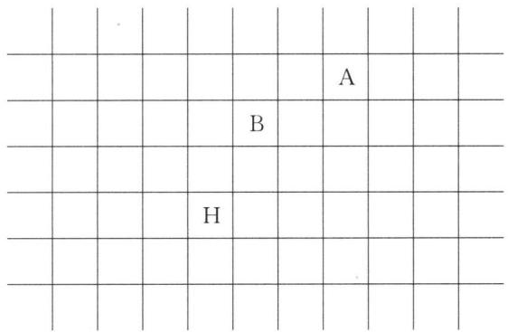

text_image

A
B
H

解析 元素在周期表中位置无非就是其所在周期和族,而这又取决于原子序数(本题中相当于原子量)和最外层电子数(本题中相当于化学性质)。这十种元素相对于A元素的原子量按递增顺序排列为:A、I、B、C、D、J、G、E、H、F,即为原子序数递增顺序。按照这十种元素化学性质相似进行分组如下:①A、E,②B、F、G、H,③C、I,④D、J,处于同一组的元素应位于同一族或相邻族,且由A、E化学性质(类比稀有气体)可推知它们应位于周期表最后一列。接下来就按照由易到难的原则来确定I、C、D、J、G、E、F这七种元素在周期表中的相对位置。

由于 B、E 之间至少存在 4 种元素, 所以 E 在 A 所处族下方不相邻位置, 且 E 的原子序数小于 H, 则应位于 H 前一周期中 A 所处族的位置 (与 A 相隔一格)。B、G、H、F 化学性质相似, 位于周期表中同一族或相邻族, 由于 F 相对原子量稍大于 H, 所以 F 应位于 H 后面一格与 B 同族, 而 G 可能处于 H 或 F 的上方。C、D、J 应位于 B、G 之间, J、G 相对原子量相近, 位置应靠近, 但 J、H 化学性质不尽相同, 故不能同族, 所以 J 可在 G 同周期 H 前一族的位置。C、D、J 相对原子量依次相差约 1 个单位, 所以从左到右 C、D、J 依次相邻。I 与 C 化学性质相似, 相对原子量小于 C 且介于 A 和 B 之间, 应位于 C 所在族上方位置 (与 C 相邻)。最后来确定 G 的位置, G 相对原子量与 J、E 分别差 2 个、3 个多单位, 则相对而言 G 在 F 上方合理些。具体见下表:

<table><tr><td></td><td></td><td></td><td></td><td></td><td></td><td></td><td></td><td></td><td></td><td></td></tr><tr><td></td><td></td><td></td><td></td><td></td><td></td><td></td><td>A</td><td></td><td></td><td></td></tr><tr><td></td><td>I</td><td></td><td></td><td></td><td>B</td><td></td><td></td><td></td><td></td><td></td></tr><tr><td></td><td>C</td><td>D</td><td>J</td><td></td><td>G</td><td></td><td>E</td><td></td><td></td><td></td></tr><tr><td></td><td></td><td></td><td></td><td>H</td><td>F</td><td></td><td></td><td></td><td></td><td></td></tr><tr><td></td><td></td><td></td><td></td><td></td><td></td><td></td><td></td><td></td><td></td><td></td></tr></table>

【例 4】由两种短周期元素 X 和 Y，可组成化合物 $XY_{3}$ ，当 X 的原子序数为 m 时，Y 的原子序数可能为：① $m+4$ ; ② m-8; ③ $m+2$ ; ④ m-6; ⑤ m-14; ⑥ $m+12$ 。其中正确的组合是

A. 只有①②③

B. 只有①④⑤⑥

C. 只有①③④⑤⑥

D. ①②③④⑤⑥

解析 解决此类题的基本方法是: 先假定 X 和 Y 处于同一周期, 根据化学式(或分子式)得出两者原子序数差, 再考虑某一元素位于同族不同周期的情况, 即在原来原子序数之差的基础上再加减 8 也符合。由题意“短周期元素 X 和 Y 形成化合物为 XY $_{3}$ ”可知存在以下几种可能情况:

(1) X 为 +3 价, Y 为 -1 价, 则 X 位于ⅢA 或 VA 族, Y 位于ⅦA 族。①若 X 位于ⅢA 族, 此时若 X、Y 处于同一周期, 则 Y 的原子序数为 $m+4$ , 再考虑 Y 位于前一周期或后一周期ⅦA 族, 则 Y 的原子序数分别可为 $m-4$ 、 $m+12$ 。②若 X 位于 VA 族, 同理可得 Y 的原子序数可能为 $m+2$ 、 $m-6$ 、 $m+10$ 。

(2) X 为 +6 价, Y 为 -2 价, 则 X、Y 均位于 VIA 族, 且 X 位于 Y 下方, 此时 Y 的原子序数为 m-8。

(3) X 为 -3 价, Y 为 +1 价(从分子式可知实际为 H), 则 X 位于 VA 族, Y 的原子序数可能为 m-6、m-14。

(4) 考虑个例 $HN_{3}$ ，此时 Y 的原子序数为 $m+6$ 。

综上所述，①②③④⑤⑥都有可能，答案选D。

【例 5】 若在现在原子结构理论中假定每个原子轨道只能容纳 1 个电子, 则原子序数为 42 的元素的核外电子排布式是怎样？按这种假设而设计出的元素周期表，该元素将属于第几周期？第几族？该元素的中性原子在化学反应中得失电子的情况又将是怎样的？

解析 若假定每个原子轨道只容纳1个电子,则保里不相容原理和洪特规则不再适用。根据构造原理,将各电子按轨道能量从低到高顺序依次填入,可得该元素的核外电子排布式为: $1s^{1}2s^{1}2p^{3}3s^{1}3p^{3}3d^{5}4s^{1}4p^{3}4d^{5}4f^{7}5s^{1}5p^{3}5d^{5}6s^{1}6p^{2}$ 。按这种假设而设计出的元素周期表,该元素应位于第六周期、ⅢA族。该元素原子可通过得到1个电子,变成稀有气体稳定结构,表现为-1价;也可失去最外层的3个电子,表现为+3价;还可失去2个6p电子表现为+2价。

## 本讲习题

1. (2000 全国初赛试题)1999 年是人造元素丰收年, 一年间得到第 114、116 和 118 号三个新元素。按已知的原子结构规律, 118 号元素应是第\_\_\_\_周期第\_\_\_\_族元素, 它的单质在常温常压下最可能呈现的状态是\_\_\_\_(气、液、固选一填入)态。近日传闻俄国合成了第 166 号元素, 若已知原子结构规律不变,该元素应是第\_\_\_\_周期第\_\_\_\_族元素。

2. 右图表示元素 X 的头五级电离能的相对大小。已知 X 的原子序数 < 20；则 X 元素的元素符号是 \_\_\_\_；X 的电子排布式是 \_\_\_\_；元素 X 与电负性最强的元素形成化合物的电子式是 \_\_\_\_。

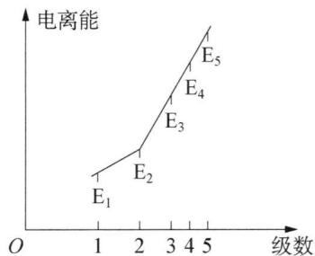

line chart

| 级数 | 电离能 |
| ---- | ------ |
| 1    | E₁     |
| 2    | E₂     |
| 3    | E₃     |
| 4    | E₄     |
| 5    | E₅     |

3. 下列曲线分别表示元素的某种性质与核电荷数的关系(Z 为核电荷数,Y 为元素的有关性质):

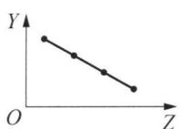

line chart

| X | Y |
|---|---|
| 0 | 1 |
| 1 | 2 |
| 2 | 3 |
| 3 | 4 |
| 4 | 5 |

A

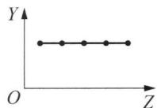

text_image

Y
O
Z

B

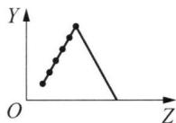

line chart

| X | Y |
|---|---|
| 0 | 0 |
| 1 | 1 |
| 2 | 2 |
| 3 | 3 |
| 4 | 4 |
| 5 | 5 |
| 6 | 6 |
| 7 | 7 |
| 8 | 8 |
| 9 | 9 |
| 10 | 10 |
| 11 | 11 |
| 12 | 12 |
| 13 | 13 |
| 14 | 14 |
| 15 | 15 |
| 16 | 16 |
| 17 | 17 |
| 18 | 18 |
| 19 | 19 |
| 20 | 20 |
| 21 | 21 |
| 22 | 22 |
| 23 | 23 |
| 24 | 24 |
| 25 | 25 |
| 26 | 26 |
| 27 | 27 |
| 28 | 28 |
| 29 | 29 |
| 30 | 30 |
| 31 | 31 |
| 32 | 32 |
| 33 | 33 |
| 34 | 34 |
| 35 | 35 |
| 36 | 36 |
| 37 | 37 |
| 38 | 38 |
| 39 | 39 |
| 40 | 40 |
| 41 | 41 |
| 42 | 42 |
| 43 | 43 |
| 44 | 44 |
| 45 | 45 |
| 46 | 46 |
| 47 | 47 |
| 48 | 48 |
| 49 | 49 |
| 50 | 50 |
| 51 | 51 |
| 52 | 52 |
| 53 | 53 |
| 54 | 54 |
| 55 | 55 |
| 56 | 56 |
| 57 | 57 |
| 58 | 58 |
| 59 | 59 |
| 60 | 60 |
| 61 | 61 |
| 62 | 62 |
| 63 | 63 |
| 64 | 64 |
| 65 | 65 |
| 66 | 66 |
| 67 | 67 |
| 68 | 68 |
| 69 | 69 |
| 70 | 70 |
| 71 | 71 |
| 72 | 72 |
| 73 | 73 |
| 74 | 74 |
| 75 | 75 |
| 76 | 76 |
| 77 | 77 |
| 78 | 78 |
| 79 | 79 |
| 80 | 80 |
| 81 | 81 |
| 82 | 82 |
| 83 | 83 |
| 84 | 84 |
| 85 | 85 |
| 86 | 86 |
| 87 | 87 |
| 88 | 88 |
| 89 | 89 |
| 90 | 90 |
| 91 | 91 |
| 92 | 92 |
| 93 | 93 |
| 94 | 94 |
| 95 | 95 |
| 96 | 96 |
| 97 | 97 |
| 98 | 98 |
| 99 | 99 |
| O (top) | Y = O
Y (bottom) = O
Y (top) = Y
Y (bottom) = Y
O (top) = O
O (bottom) = O
Y (top) = Y
O (bottom) = Y
O (top) = Y
O (bottom) = Y
O (top) = Y
O (bottom) = Y
O (top) = Y
O (bottom) = Y
O (top) = Y
O (bottom) = Y
O (top) = Y
O (bottom) = Y
O (top) = Y
O (bottom) = Y
O (top) = Y
O (bottom) = Y
O (up) = Y
O (down) = Y
O (up) = Y
O (down) = Y
O (up) = Y
O (down) = Y
O (up) = Y
O (down) = Y
O (up) = Y
O (down) = Y
O (up) = Y
O (down) = Y
O (up) = Y
O (down) = Y
O (up) = Y
O (down) * y

C

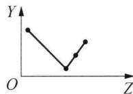

line chart

| Point | X | Y |
|---|---|---|
| 1 | -3.5 | 4.0 |
| 2 | -2.8 | 1.0 |
| 3 | -2.0 | 2.0 |
| 4 | -1.5 | 3.0 |
| 5 | -1.0 | 4.0 |

D

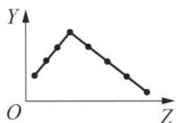

line chart

| X | Y |
|---|---|
| 0 | 1 |
| 1 | 2 |
| 2 | 3 |
| 3 | 4 |
| 4 | 5 |
| 5 | 6 |
| 6 | 7 |
| 7 | 8 |
| 8 | 9 |
| 9 | 10 |
| 10 | 11 |
| 11 | 12 |
| 12 | 13 |
| 13 | 14 |
| 14 | 15 |
| 15 | 16 |
| 16 | 17 |
| 17 | 18 |
| 18 | 19 |
| 19 | 20 |
| 20 | 21 |
| 21 | 22 |
| 22 | 23 |
| 23 | 24 |
| 24 | 25 |
| 25 | 26 |
| 26 | 27 |
| 27 | 28 |
| 28 | 29 |
| 29 | 30 |
| 30 | 31 |
| 31 | 32 |
| 32 | 33 |
| 33 | 34 |
| 34 | 35 |
| 35 | 36 |
| 36 | 37 |
| 37 | 38 |
| 38 | 39 |
| 39 | 40 |
| 40 | 41 |
| 41 | 42 |
| 42 | 43 |
| 43 | 44 |
| 44 | 45 |
| 45 | 46 |
| 46 | 47 |
| 47 | 48 |
| 48 | 49 |
| 49 | 50 |
| 50 | 51 |
| 51 | 52 |
| 52 | 53 |
| 53 | 54 |
| 54 | 55 |
| 55 | 56 |
| 56 | 57 |
| 57 | 58 |
| 58 | 59 |
| 59 | 60 |
| 60 | 61 |
| 61 | 62 |
| 62 | 63 |
| 63 | 64 |
| 64 | 65 |
| 65 | 66 |
| 66 | 67 |
| 67 | 68 |
| 68 | 69 |
| 69 | 70 |
| 70 | 71 |
| 71 | 72 |
| 72 | 73 |
| 73 | 74 |
| 74 | 75 |
| 75 | 76 |
| 76 | 77 |
| 77 | 78 |
| 78 | 79 |
| 79 | 80 |
| 80 | 81 |
| 81 | 82 |
| 82 | 83 |
| 83 | 84 |
| 84 | 85 |
| 85 | 86 |
| 86 | 87 |
| 87 | 88 |
| 88 | 89 |
| 89 | 90 |
| 90 | 91 |
| 91 | 92 |
| 92 | 93 |
| 93 | 94 |
| 94 | 95 |
| 95 | 96 |
| 96 | 97 |
| 97 | 98 |
| 98 | 99 |
| 99 | nan |

E

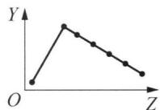

line chart

| X | Y |
|---|---|
| 0 | 0 |
| 1 | 1 |
| 2 | 1 |
| 3 | 1 |
| 4 | 1 |
| 5 | 1 |
| 6 | 1 |
| 7 | 1 |
| 8 | 1 |
| 9 | 1 |
| 10 | 1 |
| 11 | 1 |
| 12 | 1 |
| 13 | 1 |
| 14 | 1 |
| 15 | 1 |
| 16 | 1 |
| 17 | 1 |
| 18 | 1 |
| 19 | 1 |
| 20 | 1 |
| 21 | 1 |
| 22 | 1 |
| 23 | 1 |
| 24 | 1 |
| 25 | 1 |
| 26 | 1 |
| 27 | 1 |
| 28 | 1 |
| 29 | 1 |
| 30 | 1 |
| 31 | 1 |
| 32 | 1 |
| 33 | 1 |
| 34 | 1 |
| 35 | 1 |
| 36 | 1 |
| 37 | 1 |
| 38 | 1 |
| 39 | 1 |
| 40 | 1 |
| 41 | 1 |
| 42 | 1 |
| 43 | 1 |
| 44 | 1 |
| 45 | 1 |
| 46 | 1 |
| 47 | 1 |
| 48 | 1 |
| 49 | 1 |
| 50 | 1 |
| 51 | 1 |
| 52 | 1 |
| 53 | 1 |
| 54 | 1 |
| 55 | 1 |
| 56 | 1 |
| 57 | 1 |
| 58 | 1 |
| 59 | 1 |
| 60 | 1 |
| 61 | 1 |
| 62 | 1 |
| 63 | 1 |
| 64 | 1 |
| 65 | 1 |
| 66 | 1 |
| 67 | 1 |
| 68 | 1 |
| 69 | 1 |
| 70 | 1 |
| 71 | 1 |
| 72 | 1 |
| 73 | 1 |
| 74 | 1 |
| 75 | 1 |
| 76 | 1 |
| 77 | 1 |
| 78 | 1 |
| 79 | 1 |
| 80 | 1 |
| 81 | 1 |
| 82 | 1 |
| 83 | 1 |
| 84 | 1 |
| 85 | 1 |
| 86 | 1 |
| 87 | 1 |
| 88 | 1 |
| 89 | 1 |
| 90 | 1 |
| 91 | 1 |
| 92 | 1 |
| 93 | 1 |
| 94 | 1 |
| 95 | 1 |
| 96 | 1 |
| 97 | 1 |
| 98 | 1 |
| 99 | 1 |
| O (top) | Y (top) |
| O (bottom) | Y (bottom) |

The chart displays the relationship between variables X and Y. The values for each variable are explicitly labeled on the chart. The x-axis is labeled 'X' and the y-axis is labeled 'Y'. The labels above the chart are 'O' and 'X', and the labels below are 'Y' and 'Z'. The chart is a simple line graph: the line connects the top of the graph to the bottom of it. The label 'O' appears twice in the graph: 'Top of the graph' has an upward arrow from left to right, while 'Bottom of the graph' has an upward arrow from left to right.

F

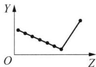

line chart

| X | Y |
|---|---|
| 0 | 1 |
| 1 | 0.8 |
| 2 | 0.6 |
| 3 | 0.4 |
| 4 | 0.2 |
| 5 | 0.1 |
| 6 | 0.3 |
| 7 | 0.5 |
| 8 | 0.7 |
| 9 | 1 |

G

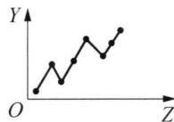

line chart

| X | Y |
|---|---|
| 0 | 0 |
| 1 | 1 |
| 2 | 2 |
| 3 | 3 |
| 4 | 4 |
| 5 | 5 |
| 6 | 6 |
| 7 | 7 |
| 8 | 8 |
| 9 | 9 |
| 10 | 10 |

H

把与下面的元素有关性质相符的曲线的标号填入相应括号中：

(1) ⅡA族元素的价电子数()  
(2)ⅦA族元素氢化物的沸点()  
(3) 第三周期元素单质的熔点()  
(4) 第三周期元素的最高正化合价()  
(5) I A 族元素单质熔点()  
(6) $F^{-}$ 、 $Na^{+}$ 、 $Mg^{2+}$ 、 $Al^{3+}$ 四种离子的离子半径()  
(7) 同一短周期元素的原子半径()  
(8) 同一短周期元素的第一电离能()

4. 18 电子构型的阳离子其相应元素在周期表中的位置在( )

A. p 区和 s 区

B. p 区和 d 区

C. p 区和 ds 区

D. d 区和 ds 区

5. 下面是某些短周期元素的电负性( $\chi$ )值:

<table><tr><td>元素符号</td><td>Li</td><td>Be</td><td>B</td><td>C</td><td>O</td><td>F</td><td>Na</td><td>Al</td><td>Si</td><td>P</td><td>S</td><td>Cl</td></tr><tr><td> $\chi$ 值</td><td>0.98</td><td>1.57</td><td>2.04</td><td>2.55</td><td>3.44</td><td>3.98</td><td>0.93</td><td>1.61</td><td>1.90</td><td>2.19</td><td>2.58</td><td>3.16</td></tr></table>

(1) 通过分析 $\chi$ 值变化规律, 确定 N、Mg 的 $\chi$ 值范围.

\_\_\_\_< $\chi(Mg)$ <\_\_\_\_, \_\_\_\_< $\chi(N)$ <\_\_\_\_。

(2) 推测 $\chi$ 值与原子半径的关系是\_\_\_\_；根据短周期元素的 $\chi$ 值变化特点，体现了元素性质的\_\_\_\_变化规律。  
(3) 经验规律告诉我们: 当成键的两原子相应元素的 $\chi$ 差值即 $\Delta \chi > 1.7$ 时, 一般为离子键, $\Delta \chi < 1.7$ 时, 一般为共价键, 试推断: $\mathrm{AlBr}_{3}$ 中化学键类型是 \_\_\_\_。  
(4) 预测元素周期表中, $\chi$ 值最小的元素的位置: \_\_\_\_ (放射性元素除外)。

6. W、X、Y、Z四种短周期元素的原子序数 $X > W > Z > Y$ 。W原子的最外层没有p电子，X原子核外s电子与p电子数之比为 $1:1$ ，Y原子最外层s电子与p电子数之比为 $1:1$ ，Z原子核外电子中p电子数比Y原子多2个。

(1) W、X 元素的最高价氧化物对应水化物的碱性强弱为 \_\_\_\_ < \_\_\_\_ (用化学式表示)。  
(2) 这四种元素原子半径的大小为 \_\_\_\_ > \_\_\_\_ > \_\_\_\_ > \_\_\_\_ (填元素符号)。

7. 现行长式周期表是根据原子的电子特征构型的不同来划分族的: 7个主族(仅最外层电子未填满的元素), 7个副族(电子最后进入的轨道为d轨道), 1个零族( $ns^{2}np^{6}$ ), 1个第Ⅷ族( $nd^{6\sim8}$ )。由于这种排法的某些方面还不能令人满意, 因此有人建议根据“最高价阳离子”电子排布的相似和差异来区分主副族。例如: S、Cr、Se原子及其 $M^{6+}$ 的部分电子构型分别为: $S(2s^{2}2p^{6}3s^{2}3p^{4})$ 、 $S^{6+}(2s^{2}2p^{6})$ , $Cr(3s^{2}3p^{6}3d^{5}4s^{1})$ 、 $Cr^{6+}(3s^{2}3p^{6})$ , $Se(3s^{2}3p^{6}3d^{10}4s^{2}4p^{4})$ 、 $Se^{6+}(3s^{2}3p^{6}3d^{10})$ 。从上述 $M^{6+}$ 可以看出, $S^{6+}$ 和 $Cr^{6+}$ 的电子构型较接近, 都可以用 $ns^{2}np^{6}$ 表示, 规定为VIA族, 而 $Se^{6+}$ 电子构型为 $ns^{2}np^{6}nd^{10}$ , 规定为VIB族。按照这个规定, 新旧周期表主副族中哪些族的元素是统一的(即完全相同)? 不同的新周期表的主、副族元素在原周期表的基础上做了怎样的变动?

## 第四讲 共价键理论

## 知识精讲

分子或晶体内相邻的两个或多个原子之间强烈的相互作用力称为化学键。化学键主要有共价键、离子键、金属键等类型。本讲主要讨论共价键。

## 一、经典共价键理论

## 1. 路易斯理论

1916 年,美国化学家路易斯(Lewis)提出分子中的原子之间可以通过共用电子对形成稳定的稀有气体电子结构,即八隅体规则。除 H 原子为 2 电子构型外,其他原子均为 8 电子构型。

路易斯把原子之间通过共用电子对形成的化学键称为共价键。

## 2. 路易斯结构式

路易斯用元素符号表示原子实(即原子核和全部内层电子),用短线表示共价键,用小黑点表示孤对电子,以表示成键情况和电子结构,这种价键模型,称为路易斯结构式。

路易斯结构式书写过程如下：

(1) 判断中心原子和配位原子

中心原子一般为电负性小、半径大的原子，而配位原子一般为电负性大、半径小的原子。以 $N_{2}O$ 分子为例，一个 N 原子为中心原子，另一个 N 原子和 O 原子为配位原子，这是因为 N 原子半径较 O 原子大，且电负性较 O 原子小。

(2) 计算分子或离子中共价键数和孤对电子数

共价键数 $= \frac{n_o - n_v}{2}$ , 孤对电子数 $= \frac{n_v - 2 \times \text{共价键数}}{2}$ , 其中 $n_o$ 是所有原子为八电子构型时的电子总数(氢原子为 2); $n_v$ 是所有原子的价电子代数和。

以 $N_{2}O$ 分子为例, 共价键数 = $(3 \times 8 - 2 \times 5 - 6)/2 = 4$ , 孤对电子数 = $(2 \times 5 + 6 - 4 \times 2)/2 = 4$ 。

(3) 根据原子的相对位置和共价键总数写出各种可能的结构式

以 $N_{2}O$ 分子为例, 可写出 3 个路易斯结构式, 分别为:

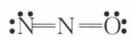  
(I)

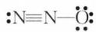  
(Ⅱ)

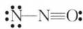  
(Ⅲ)

(4) 计算各原子的形式电荷 $\left(\mathrm{Q}_{\mathrm{F}}\right)$ 判断分子稳定性

$Q_{F}=$ 原子的价电子数—成键数—孤电子数。以 $N_{2}O$ 分子为例，上述3个路易斯结构式表示形式电荷后分别为：

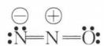  
(I)

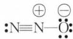  
(Ⅱ)

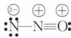  
(Ⅲ)

形式电荷是分子稳定性的标志。路易斯结构式稳定性的判断依据为形式电荷尽可能小, 尽可能避免两相邻原子之间的形式电荷为同号。因此, 第(Ⅲ)种路易斯结构式不稳定, 应舍去, 第(Ⅰ)、(Ⅱ)式互称为 $N_{2}O$ 的共振结构式, 可表示为:

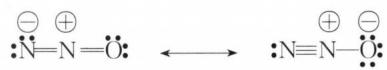

chemical

Chemical reaction diagram showing electron transfer between two nitrogen atoms with positive and negative charges

## 3. 路易斯结构式的特殊情况

## (1) 缺电子化合物

以 $BF_{3}$ 为例, 按照八隅体规则可写出其共振结构式有如下 3 个:

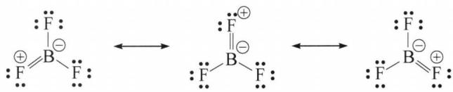

chemical

Chemical equilibrium diagram showing proton-bonding interactions between boron and fluorine atoms

若我们将上述任一共振结构式中键合电子改成孤对电子,则得:

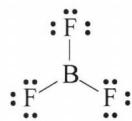

显然这个共振结构式中 B 属于 6 电子构型,为缺电子化合物。计算它的共价键数时相当于把 $n_{o}$ 修正为 $6 + 8 \times 3 = 30$ , 则共价键数 $=(30 - 3 - 7 \times 3)/2 = 3$ , 孤对电子数 $=(7 \times 3 + 3 - 3 \times 2)/2 = 9$ 。该共振结构式中所有原子的形式电荷均为 0, 是稳定结构。而前述三个共振结构式存在形式电荷, 是次稳定结构。

## (2) 富电子化合物

以 $SF_{6}$ 为例, 按八隅体规则可计算共价键数 $=(56-6-7\times6)/2=4$ , 这显然不可能, 应将 S 修正为 12 电子构型, 则共价键数 $=(12+8\times6-6-7\times6)/2=6$ , 这才合理。 $SF_{6}$ 分子为正八面体结构, 各原子形式电荷都为零, 是稳定结构。

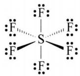

再以 $\mathrm{POCl}_3$ 为例, 按照八隅体规则可写出其路易斯结构式为:

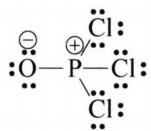  
(I)

若将氧上的一对孤对电子改成 P 和 O 之间的键合电子, 则可得:

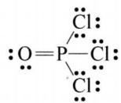  
(Ⅱ)

（Ⅰ）式中 P 原子为 8 电子构型，（Ⅱ）式中 P 原子为 10 电子构型，两者互为共振结构式。其中（Ⅱ）形式电荷为 0，是稳定结构，（Ⅰ）式是次稳定结构。

富电子化合物在计算共价键数时是否要修正取决于中心原子按8电子构型计算所得共价键数是否大于或等于配位原子数。若计算所得共价键数大于或等于配位原子数，则计算时可不做修正，但这样写得路易斯结构式是不稳定的，因为中心原子的成键数没有达到最大，应将孤对电子改成成键电子以降低形式电荷达成稳定结构。若中心原子周围配位原子数大于4，则必须修正中心原子的电子构型才能计算出正确的共价键数。

## (3) 判断缺电子化合物、正常化合物或富电子化合物

先计算中心原子的价电子数+所有配位原子成为8电子构型所缺的电子数之和(n)，再用n与8比较。若n=8，为正常化合物，例如 $PCl_{3}$ 为 $5+1\times3=8$ ， $CO_{2}$ 为 $4+2\times2=8$ 等；若n<8，为缺电子化合物，例如 $BeCl_{2}$ 为 $2+1\times2=4$ ， $BF_{3}$ 为 $3+1\times3=6$ 等；若n>8，为富电子化合物，例如 $PCl_{5}$ 为 $5+1\times5=10$ ， $XeF_{6}$

为 $8 + 1 \times 6 = 14$ 等。这种计算方法还可以用在计算共价键数时修正中心原子的电子构型。

(4) 奇电子化合物

以 $NO_{2}$ 为例, 其价电子数为奇数, 显然不符合八隅体规则。我们可将其分子中任一原子处理成 7 电子构型, 则其共振结构式如下:

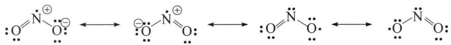

chemical

Chemical reaction mechanism showing electron transfer between two species with positive and negative charges

## 4. 书写共振结构式的注意点

（1）各共振结构式中原子相对位置要固定，且孤对电子数相等，不应包括同分异构体。  
(2) 正常化合物遵循八隅体规则,但缺电子化合物、富电子化合物在计算共价键数时可视情况修正中心原子的电子构型。  
(3) 各共振结构式中各原子形式电荷为 0 的结构最稳定; 各原子形式电荷尽可能小, 且负电荷位于电负性较大的原子上的结构次稳定; 避免出现两相邻原子之间的形式电荷为同号。  
(4) 共振结构式本质上反映出分子中电子的离域性,说明了成键电子对不会固定在某两个原子之间。

## 二、现代价键理论

1927 年,德国化学家海特勒(Heitler)和伦敦(London)将量子化学理论应用到化学键与分子结构中,后经鲍林等的发展,建立了现代价键理论,简称为 VB 法。

## 1. 成键原理

(1) 形成共价键的原子相互接近时,各自提供自旋方向相反的单电子进行配对成键。  
(2) 只有含单电子的原子轨道相互重叠,才能形成共价键。

原子轨道重叠应满足三条原则：①原子轨道能量相近；②对称性匹配，原子轨道同号叠加，异号叠减。即波函数角度分布图中的+、+重叠，一、一重叠，是对称性一致的重叠。③满足最大重叠，原子轨道重叠越多，两原子核间的电子云密度越大，对两原子核的吸引越强，体系越稳定。

以 HF 分子的形成为例, 假定 F 原子的成单电子处于 $2p_{x}$ 轨道中, 在分子形成过程中轨道的重叠情况有下面几种(图 4-1):

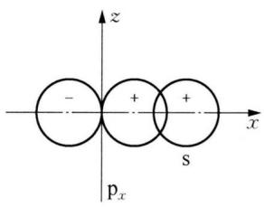

text_image

z
- + +
x
pₓ s

(a)

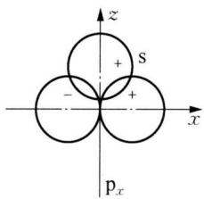

text_image

z
+
s
-
+
x
pₓ

(b)

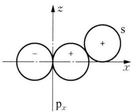

text_image

z
- + +
x
pₓ
S

(c)  
图4-1 HF分子形成过程中轨道的重叠情况

但是只有当 H 原子含单电子的 1s 轨道沿 x 轴方向与 F 原子的 $2p_{x}$ 轨道重叠时才能满足最大程度有效重叠，形成稳定的 HF 分子，如图 4-1(a) 所示。

## 2. 共价键的本质

共价键形成过程中,随着原子的相互接近,电子云重叠逐渐加强,既增加了两核对该共用电子对形成的负电性区域的吸引,又降低了两核间的相互推斥,从而使体系能量降低;但当原子距离太小时,由于两核之间排斥力逐渐加强,体系能量又逐渐升高。以 $H_{2}$ 分子为例,其形成过程中能量变化如图 4-2 所示。所以说,共价键本质上仍属于电性作用力。

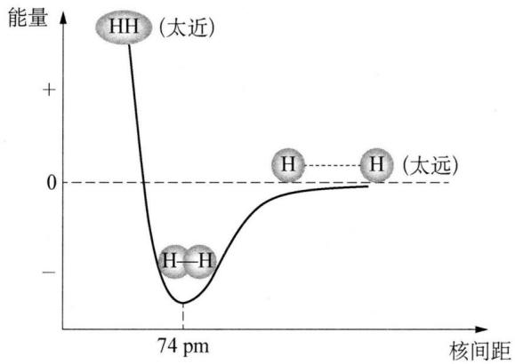

line chart

| 核间距 (μm) | 能量 |
|-------------|------|
| 0           | +    |
| 74          | -    |
| >74         | 0    |

图4-2 氢分子形成过程中的能量变化

## 3. 共价键的特点

## (1) 饱和性

每个原子能提供的成键轨道是有限的,所以每个成键原子形成的共价键数也必然是有限的,即共价键具有饱和性。例如,第二周期元素最多只能有4个共价键就是共价键具有饱和性的典型例证。

## (2) 方向性

原子中的 s 轨道角度分布呈球形对称, 相互成键时可沿任意方向重叠, 而 p、d、f 等轨道在空间均有一定的伸展方向, 这些轨道相互成键或与 s 轨道成键时总是沿着合适的方向以达到最大程度有效重叠, 才可形成稳定的共价键, 即共价键具有方向性。

## 4. 共价键的类型

按原子轨道重叠方式的不同,共价键的类型有如下几种:

(1) $\sigma$ 键

原子轨道沿键轴方向以“头碰头”方式重叠而形成的共价键称为 $\sigma$ 键。 $\sigma$ 键特点是重叠部分沿键轴呈圆柱形对称，轨道重叠程度大，稳定性高。部分 $\sigma$ 键如下图所示：

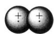  
S-S

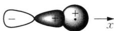  
$p_{x}-s$

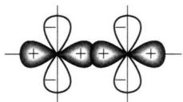

chemical

Molecular orbital diagram showing electron density distribution with positive and negative charges

d-d

(2) $\pi$ 键

原子轨道以“肩并肩”的方式发生重叠而形成的共价键称为 $\pi$ 键。 $\pi$ 键特点是重叠部分沿通过键轴的节面呈镜面反对称，轨道重叠程度较小，稳定性较低。部分 $\pi$ 键如下图所示：

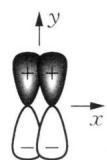  
$p_{y}-p_{y}$

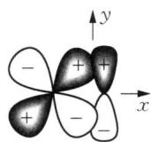

chemical

Molecular orbital diagram showing electron density distribution along x and y axes

$d_{xy}-p_{y}$

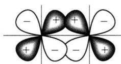

chemical

Molecular orbital diagram showing electron density distribution with positive and negative lobes

d-d

(3) $\delta$ 键

原子轨道以“面对面”的方式发生重叠而形成的共价键称为 $\delta$ 键。 $\delta$ 键常出现在双核配合物的金属原子之间，如下图所示：

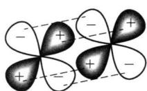

chemical

Molecular orbital diagram showing electron density distribution with positive and negative lobes

d-d

(4) 离域 $\pi$ 键

离域 $\pi$ 键是指三个或以上原子参与形成的 $\pi$ 键，又称为大 $\pi$ 键。在这里我们只讨论 p—p 形成的离域 $\pi$ 键，其可用符号 $\Pi_{n}^{m}$ 表示， $n$ 指参与形成离域 $\pi$ 键的 p 轨道数， $m$ 指参与形成离域 $\pi$ 键的所有 p 轨道提供的电子数。p—p 离域 $\pi$ 键的形成

条件为：

① 所有原子共面；

② 所有原子都提供相互平行的 p 轨道；

③ p 轨道上的电子总数目小于 p 轨道数目的 2 倍(保证成键分子轨道中电子数大于反键分子轨道中电子数, 即 $\pi$ 键键级 >0)。

## 5. 价键理论的缺陷

价键理论虽然能解释许多共价分子(主要是双原子分子)的形成,但是对于多原子分子的形成和空间构型则无能为力。

例如,基态碳原子只有 2 个单电子,却为何可与 4 个氢原子形成 $CH_{4}$ 分子?为何 $CH_{4}$ 分子是正四面体构型,而非平面正方形构型?

## 三、杂化轨道理论

1931 年,鲍林在价键理论的基础上提出了杂化轨道理论。

所谓杂化,是指同一原子中不同类型、能量相近的原子轨道混合起来,重新分配能量并调整电子云空间伸展方向的过程。

## 1. 杂化轨道理论基本要点

(1) 原子中不同类型的原子轨道只有能量相近时才能杂化, 且杂化前后轨道数目不变。  
(2) 原子轨道杂化时, 原已成对的电子可以被激发到空轨道上成为单电子, 需要的能量可以由成键时释放的能量补偿。  
(3) 杂化后轨道在空间的伸展方向发生了变化, 相应电子云分布更集中, 在成键时重叠程度更大, 成键能力更强。

以 sp 杂化为例,杂化前后电子云分布变化如图 4-3 所示:

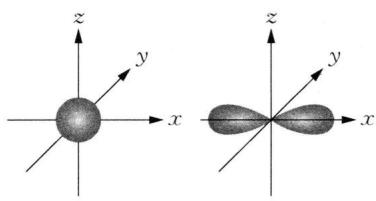

natural_image

Two 3D coordinate system diagrams showing spherical and toroidal surfaces with x, y, z axes (no text or labels)

图4-3 杂化前

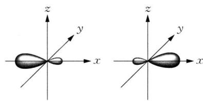

natural_image

Two 3D coordinate system diagrams showing a symmetric object with x, y, z axes (no text or labels)

杂化后

（4）杂化轨道在空间的伸展方向应满足相互间排斥力最小，使形成的分子能量最低。

## 2. 杂化轨道的类型及其在空间的几何分布

(1) 常见杂化轨道类型如表 4-1 所示

表 4-1 常见杂化轨道类型及其空间结构

<table><tr><td>杂化方式</td><td>sp</td><td> $sp^{2}$ </td><td> $sp^{3}$ </td><td> $sp^{3}d$ </td><td> $sp^{3}d^{2}$ </td></tr><tr><td>杂化轨道间夹角</td><td>180°</td><td>120°</td><td>109°28′</td><td>90°、120°、180°</td><td>90°、180°</td></tr><tr><td>分子空间结构</td><td>直线形</td><td>平面三角形</td><td>正四面体</td><td>三角双锥</td><td>正八面体</td></tr></table>

(2) 等性杂化和不等性杂化

上述几种杂化轨道类型中各轨道的能量和空间占有体积相同,这样的杂化方式称为等性杂化。而在 $NH_{3}$ 分子中,N 原子虽采取 $sp^{3}$ 杂化,但 4 个杂化轨道中有 1 个含有 1 对电子,这样的杂化方式称为不等性杂化。若采取不等性杂化,则由于孤对电子的存在,形成分子的空间结构会有改变(表 4-2)。

表 4-2 $\mathbf{sp}^3$ 杂化形成分子实例

<table><tr><td>杂化轨道类型</td><td colspan="4"> $sp^{3}$ </td></tr><tr><td>孤对电子数</td><td>0</td><td>1</td><td>2</td><td>3</td></tr><tr><td>空间结构</td><td>正四面体</td><td>三角锥</td><td>“V”形</td><td>直线形</td></tr><tr><td>实例</td><td> $CH_{4}$ </td><td> $NH_{3}$ </td><td> $H_{2}O$ </td><td>HCl</td></tr></table>

由于孤对电子比成键电子对更靠近杂化原子核,导致不同孤对电子之间、孤对电子与成键电子对之间排斥力更大,从而使得成键电子对之间键角变小,而且随着孤对电子数增多,这种效应更加显著。例如,中心原子均采取不等性 $sp^{3}$ 杂化的 $NH_{3}$ 和 $H_{2}O$ 分子, $NH_{3}$ 分子中 $\angle HNH = 107^{\circ}28'$ , 而 $H_{2}O$ 分子中 $\angle HOH = 104.5^{\circ}$ 。

## 3. 应用杂化轨道理论解释典型分子空间构型

(1) 直线形分子 $BeCl_{2}$

Be 原子的电子排布式为 $1s^{2}2s^{2}$ ，采取 sp 杂化，过程如下：

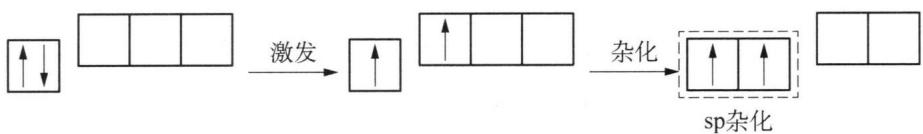

flowchart

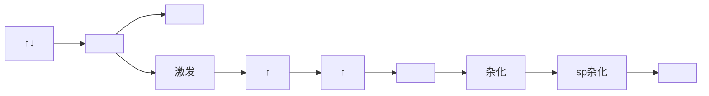

2 个 sp 杂化轨道呈直线形对称分布, 分别与 2 个 Cl 的 3p 轨道形成 $\sigma$ 键, 所以 $BeCl_{2}$ 分子为直线形。

(2) 平面三角形分子 $\mathrm{BF}_{3}$

B 原子的电子排布式为 $1s^{2}2s^{2}2p^{1}$ ，采取 $sp^{2}$ 杂化，过程如下：

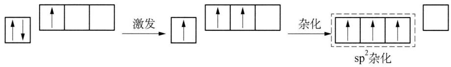

flowchart

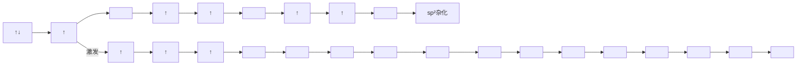

3 个 $sp^{2}$ 杂化轨道呈平面三角形分布, 分别与 3 个 F 的 2p 轨道形成 $\sigma$ 键, 所以 $BF_{3}$ 分子为平面三角形。此外, 在垂直分子平面方向, B 有 1 个空的 2p 轨道, 3 个 F 各有 1 个填有孤对电子的 2p 轨道, 故形成离域 $\pi$ 键, 记为 $\Pi_{4}^{6}$ 。

(3) 正四面体分子 $\mathrm{CH}_{4}$

C 原子的电子排布式为 $1s^{2}2s^{2}2p^{2}$ ，采取 $sp^{3}$ 杂化，过程如下：

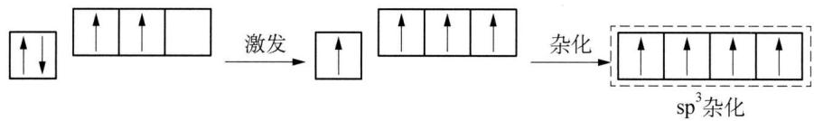

flowchart

4 个 $sp^{3}$ 杂化轨道呈正四面体分布, 分别与 4 个 H 的 1s 轨道形成 $\sigma$ 键, 所以 $CH_{4}$ 分子为正四面体, 如下图所示。

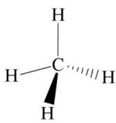

chemical

Molecular structure of ethane showing carbon bonded to hydrogen and a wedge bond

(4) 三角双锥形分子 $\mathrm{PCl}_{5}$

P 原子的电子排布式为 $1s^{2}2s^{2}2p^{6}3s^{2}3p^{3}$ ，采取 $sp^{3}d$ 杂化，过程如下：

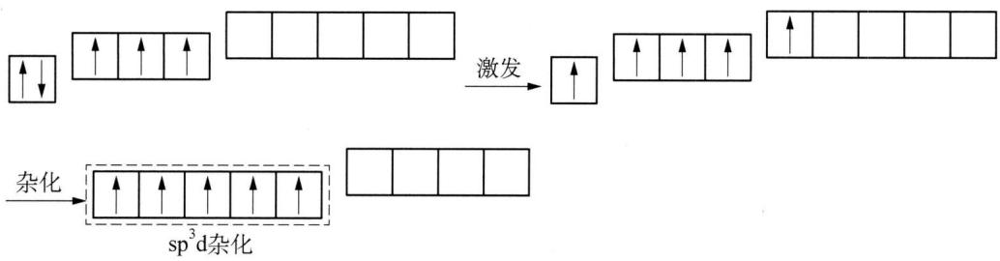

flowchart

5 个 $sp^{3}d$ 杂化轨道呈三角双锥形分布, 分别与 5 个 Cl 的 3p 轨道形成 $\sigma$ 键, 所以 $PCl_{5}$ 分子为三角双锥形, 如下图所示。

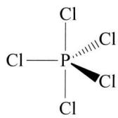

chemical

Chemical structure of a phosphorus-containing compound with chlorine substituents

(5) 正八面体分子 $SF_{6}$

S 原子的电子排布式为 $1s^{2}2s^{2}2p^{6}3s^{2}3p^{4}$ ，采取 $sp^{3}d^{2}$ 杂化，过程如下：

flowchart

6 个 $sp^{3}d^{2}$ 杂化轨道呈正八面体分布, 分别与 6 个 F 的 2p 轨道形成 $\sigma$ 键, 所以 $SF_{6}$ 分子为正八面体, 如下图所示。

## 4. 杂化轨道理论的缺陷

杂化轨道理论虽然能解释很多已知共价分子的几何构型,但是无法预测未知共价分子的构型。

那么如何来推测共价分子的几何构型呢？这就需要借助价层电子对互斥理论来进行判断。

## 四、价层电子对互斥理论

1940 年,化学家西奇威克(Sidgwick)和鲍威尔(Powell)在总结大量已知共价分子构型的基础上,提出价层电子对互斥理论,简称 VSEPR 理论。该理论基本思想为:共价分子(或离子)的中心原子周围各价层电子对尽可能采用使相互间距离保持最远的空间构型,从而使得静电排斥最小。

## 1. 价层电子对互斥理论基本要点

(1) 共价分子(或离子)的几何构型取决于中心原子价层电子对数, 它们总是采取价层电子对之间排斥最小的一种构型。电子对之间夹角越小排斥作用越大。

(2) 中心原子和每个配位原子间有且仅有 1 个 $\sigma$ 键, 其余只能为 $\pi$ 键, 而 $\pi$ 键的形成虽会对键角有影响, 但不会显著改变共价分子的几何构型, 主要是影响键长、键能。因此, 决定共价分子几何构型的中心原子价层电子对特指形成 $\sigma$ 键的共用电子对和孤电子对。

(3) 角度相同时,各电子对间排斥力大小顺序为: 孤电子对—孤电子对＞孤电

子对—成键电子对＞成键电子对—成键电子对。

（4）由于重键(双键、叁键)比单键所含电子数多,所以排斥力大小顺序为:叁键>双键>单键。

## 2. VSEPR 判断共价分子几何构型的方法

（1）将共价分子记为 $AB_{n}$ ，A 为中心原子，B 为配位原子。例如， $XeOF_{4}$ 记为 $AB_{5}$ ， $H_{2}SO_{4}$ 应为 $SO_{2}(OH)_{2}$ ，记为 $AB_{4}$ 。

(2) A 形成 $\sigma$ 键的电子对数等于 B 原子数目, 即 $n$ 值。由于 B 通过与 A 共用电子达成稀有气体电子构型, 即卤素配位原子需要 1 个电子, 氧配位原子需要 2 电子, 其余以此类推。因此, A 剩余的价电子数应等于 A 的价电子数减去 $n$ 个 B 原子达成稀有气体电子构型所需的电子总数。将 A 剩余价电子数除以 2 即为 A 的孤电子对数, 记为 $\mathrm{E}_{m}, \mathrm{E}$ 代表孤电子对, $m$ 代表孤电子对数。

若为共价型负离子,则 A 的价电子数应加上该离子的负电荷数;若为共价型正离子,则 A 的价电子数应减去该离子的正电荷数。

若为奇电子化合物,则应视具体情况将中心原子价层电子对数进行修正。例如, $NO_{2}$ 分子其 $n+m=2.5$ , 则应进为3;而 $ClO_{2}$ 分子其 $n+m=3.5$ , 则应退为3。

（3）经上述步骤，共价分子(或离子)可记为 $AB_{n}E_{m}$ ，则中心原子参与杂化的原子轨道数就等于 $n+m$ 之和，进而确定中心原子杂化方式和价层电子对构型，即

<table><tr><td> $n+m$ </td><td>2</td><td>3</td><td>4</td><td>5</td><td>6</td><td>7</td></tr><tr><td>中心原子杂化方式</td><td>sp</td><td> $sp^{2}$ </td><td> $sp^{3}$ </td><td> $sp^{3}d$ </td><td> $sp^{3}d^{2}$ </td><td> $sp^{3}d^{3}$ </td></tr><tr><td>价层电子对构型</td><td>直线</td><td>平面三角形</td><td>正四面体</td><td>三角双锥</td><td>正八面体</td><td>五角双锥</td></tr></table>

(4) 最后确定共价分子(或离子)的空间构型。实际上对于 $\mathrm{AB}_n\mathrm{E}_m$ 型共价分子而言, 若 $m = 0$ , 则共价分子的几何构型等于价层电子对构型; 若 $m \neq 0$ , 则先根据价层电子对构型画出可能的分子几何构型, 再选择各电子对之间排斥最小的分子几何构型。以 $\mathrm{BrF}_3$ 分子为例, 其可记为 $\mathrm{AB}_3\mathrm{E}_2$ , 价层电子对构型为三角双锥, 可画出三种几何构型:

  
(I)

chemical

Molecular structure of bromine (BrF₃) showing Br bonded to two F atoms with lone pairs

(Ⅱ)

chemical

Molecular structure of bromine (BrF₃) showing two fluorine atoms bonded to a central bromine atom with two additional Br₂O ligands

(Ⅲ)

对于三角双锥而言,根据价层电子对互相排斥作用的大小的规律,考查电子对之间 $90^{\circ}$ 夹角的排斥作用数:

<table><tr><td>BrF3分子的结构</td><td>(I)</td><td>(II)</td><td>(III)</td></tr><tr><td>90°孤电子对—孤电子对</td><td>0</td><td>1</td><td>0</td></tr><tr><td>90°孤电子对—成键电子对</td><td>6</td><td>3</td><td>4</td></tr><tr><td>90°成键电子对—成键电子对</td><td>0</td><td>2</td><td>2</td></tr></table>

经比较可知,构型(Ⅲ)最稳定,即 $BrF_{3}$ 分子构型为“T”形。同理,可推得 $IF_{5}$ 分子构型为四方锥, $XeF_{4}$ 为平面正方形, $TeCl_{4}$ 为变形四面体, $SO_{3}^{2-}$ 、 $ClO_{3}^{-}$ 为三角锥形, $CO_{3}^{2-}$ 、 $SO_{3}$ 为平面三角形, $I_{3}^{-}$ 为直线形等。

VSEPR 判断分子构型时还应结合分子最高对称性进行考虑。示例如下：

(2015年中国化学奥林匹克决赛试题)最新研究发现,高压下金属Cs可以形成单中心的 $CsF_{5}$ 分子,试根据价层电子对互斥理论画出 $CsF_{5}$ 的中心原子价电子对分布,并说明分子形状。

解析 由于 $\mathrm{CsF}_5$ 为单中心分子, 且 Cs 的最外层电子排布为 $6\mathrm{s}^1$ , 若只考虑最外层电子, 则无法与 5 个 F 原子成键, 显然次外层的 $5\mathrm{s}^2 5\mathrm{p}^6$ 也参与成键, 则 Cs 的价电子相当于 9 个, 经计算可记为 $\mathrm{AB}_5\mathrm{E}_2$ , 价层电子对构型为五角双锥, 可画出四种几何构型:

chemical

Chemical structure of a cesium complex with fluorine atoms and bridging ligands

(I)

chemical

Molecular structure of cesium (Cs) with fluorine atoms and lone pair notation

(Ⅱ)

chemical

Chemical structure of a selenide complex with trifluoromethyl groups and bridging ligands

(Ⅲ)

chemical

Chemical structure of a cesium complex with fluorine atoms and bridging ligands

(IV)

结构(Ⅲ)、(Ⅳ)中两对孤电子对夹角分别为 $72^{\circ}$ 、 $90^{\circ}$ , 显然不予考虑。而结构(I)、(Ⅱ)中两对孤电子对夹角分别为 $180^{\circ}$ 、 $114^{\circ}$ , 若参照三角双锥构型认为夹角大于 $90^{\circ}$ 就不考虑排斥作用, 再依次比较孤电子对—成键电子对、成键电子对—成键电子对的排斥作用数, 就会得出结构(Ⅱ)最稳定的结论。实际上孤电子对之间相距越远排斥作用越小, 并非夹角大于 $90^{\circ}$ 就不考虑排斥作用, 再考虑分子的最高对称性, 可知结构(Ⅰ)最稳定。答案如下:

chemical

Chemical structure of a selenide complex with five fluorine atoms and an isosiliconic geometry labeled as the five-orbital plane.

## 3. VSEPR 的局限性

只适用于判断主族元素共价分子的几何构型,不能判断过渡元素配位化合物的杂化方式和几何构型。这是由于过渡元素若有空的 $(n-1)$ d轨道,也能参与原子轨道杂化。例如 $\mathrm{Pt(NH_{3})_{2}Cl_{2}}$ 中 $\mathrm{Pt(II)}$ 采取 $dsp^{2}$ 杂化,分子构型为平面正方形。VSEPR也不能判断某些复杂共价分子(或离子)的构型。

## 五、分子轨道理论

按照价键理论，O 原子形成 $O_{2}$ 分子时，单电子已配对成键，已不含成单电子，应显反磁性。但实际上 $O_{2}$ 分子是顺磁性的，分子轨道理论成功解释了这类问题。

1932 年,马利肯和洪特提出了分子轨道理论。

## 1. 分子轨道理论基本要点

（1）分子轨道由原子轨道线性组合而成，组合前后轨道数目相等，有一半为成键轨道（低能态轨道），另一半为反键轨道（高能态轨道）。以 $\mathrm{H}_{2}$ 分子形成为例，2个氢原子的1s轨道线性组合成1个 $\sigma_{1\mathrm{s}}$ 成键分子轨道和1个 $\sigma_{1\mathrm{s}}^{*}$ 反键分子轨道，如图4-4所示。

（2）电子填入分子轨道时，也遵循原子轨道电子排布的三原则。

chemical

Diagram of H₂ resonance structure showing σ₁s* and σ₁s orbitals with 1s and H labels

图4-4 $\mathrm{H}_{2}$ 分子轨道能级示意图

## 2. 分子轨道形成

原子轨道线性组合三原则：（1）对称性匹配；（2）能量相近；（3）最大重叠。

根据原子轨道组合方式的不同,分子轨道可分为 $\sigma$ 轨道和 $\pi$ 轨道。

## 3. 同核双原子分子的分子轨道能级示意图

第二周期同核双原子分子的分子轨道能级示意图如下图4-5。

对于同核双原子分子的分子轨道能级示意图的说明：

(1) 两个原子轨道(AO)线性组合成一个成键分子轨道(MO)、一个反键分子轨道(MO)。成键分子轨道能量降低, 反键分子轨道能量升高, 能量升降值基本相同。

  
图4-5 同核双原子分子的分子轨道能级示意图

(2) 不同分子的能级图不同, A 图适用于 $\mathrm{O}_{2} 、 \mathrm{F}_{2}$ 分子, B 图适用于 $\mathrm{Li}_{2} 、 \mathrm{Be}_{2} 、 \mathrm{B}_{2} 、 \mathrm{C}_{2} 、 \mathrm{N}_{2}$ 等分子。对于 Li、Be、B、C、N 原子, 2s 和 2p 轨道间能量差小, 相互间排斥作用大, 形成分子轨道后, $\sigma_{2\mathrm{s}}$ 和 $\sigma_{2\mathrm{p}_{x}}$ 之间的排斥也大, 结果, 出现 B 图中 $\sigma_{2\mathrm{p}_{x}}$ 的能级反比 $\pi_{2\mathrm{p}_{y}} 、 \pi_{2\mathrm{p}_{z}}$ 的能级高的现象。

## 4. 分子轨道理论的应用

## (1) 解释分子磁性问题

电子自旋产生磁场,分子中有不成对电子时,各单电子自旋平行,磁场加强,此时物质呈顺磁性。若分子中无成单电子时,电子自旋磁场抵消,物质显反磁性。

$O_{2}$ 分子是顺磁性这一事实可用分子轨道理论来解释， $O_{2}$ 分子的分子轨道表示式为 $(\sigma_{1\mathrm{s}})^{2}(\sigma_{1\mathrm{s}}^{*})^{2}(\sigma_{2\mathrm{s}})^{2}(\sigma_{2\mathrm{s}}^{*})^{2}(\sigma_{2\mathrm{p}_{x}})^{2}(\pi_{2\mathrm{p}_{y}})^{2}(\pi_{2\mathrm{p}_{z}})^{2}(\pi_{2\mathrm{p}_{y}}^{*})^{1}(\pi_{2\mathrm{p}_{z}}^{*})^{1}$ ，其中 $(\pi_{2\mathrm{p}_{z}}^{*})^{1}(\pi_{2\mathrm{p}_{y}}^{*})^{1}$ 各有一个单电子，故显顺磁性。

分子磁性可用磁矩来量度， $\mu=\sqrt{n(n+2)}\mu_{B}$ ，式中 $\mu$ 为磁矩；n 为单电子数； $\mu_{B}$ 为磁矩单位，玻尔磁子。

## (2) 解释分子稳定性问题

电子只填充在成键分子轨道中,能量比在原子轨道中低,这个能量差,就是分子轨道理论中化学键的本质。可用键级表示分子中键的数目: 键级=(成键轨道电子数—反键轨道电子数)/2。

“He $_2$ ”的分子轨道表示式为 $(\sigma_{1s})^2 (\sigma_{1s}^*)^2$ ，键级为0，不成键，实际为单原子气体。而 $\mathrm{He}_2^+$ 的分子轨道表示式为 $(\sigma_{1s})^2 (\sigma_{1s}^*)^1$ ，键级为0.5，存在。 $\mathrm{He}_2^+$ 的存在用价键理论难以解释，但分子轨道理论则认为有半键，这也是分子轨道理论较现代价键理论的成功之处。

## 六、键参数

表征化学键性质的物理量,称为键参数。

## 1. 键能

在 298.15 K 和 100 kPa 下, 1 mol 理想气体分子拆成气态原子所吸收的能量称为键的离解能, 以符号 D 表示。

对于双原子分子, 离解能 $D_{AB}$ 等于键能 $E_{AB}$ , $\mathrm{AB(g)} = \mathrm{A(g)} + \mathrm{B(g)}$ , $E_{AB} = D_{AB}$ 。但对于多原子分子, 则要注意离解能与键能的区别与联系, 例如 $NH_{3}$ :

$$
\begin{array}{l} \mathrm{NH} _ {3} (\mathrm{g}) \longrightarrow \mathrm{H(g)} + \mathrm{NH} _ {2} (\mathrm{g}), D _ {1} = 4 3 5. 1 \mathrm{kJ} \cdot \mathrm{mol} ^ {- 1} \\ \mathrm {NH_ {2} (g)\longrightarrow H(g) + NH(g), D_ {2} = 397.5kJ\cdot mol^ {- 1}} \\ \mathrm{NH(g)} \longrightarrow \mathrm{H(g)} + \mathrm{N(g)}, D _ {3} = 3 3 8. 9 \mathrm{kJ} \cdot \mathrm{mol} ^ {- 1} \\ \end{array}
$$

可取离解能的平均值作为键能， $E_{\mathrm{N-H}}=(D_{1}+D_{2}+D_{3})/3=390.5\ \mathrm{kJ}\cdot\mathrm{mol}^{-1}$ 。

一般来说,键能越大,键越牢固,由此键构成的分子越稳定。

## 2. 键长

分子中两个相邻的原子核之间的平衡距离,称为键长。一般键长越小,键越强,即键能越大。例如:

几种碳碳键的键长和键能

<table><tr><td></td><td>键长/pm</td><td>键能/kJ·mol-1</td></tr><tr><td>C—C</td><td>154</td><td>345.6</td></tr><tr><td>C=C</td><td>133</td><td>602.0</td></tr><tr><td>C≡C</td><td>120</td><td>835.1</td></tr></table>

需要注意的是, 相同的键在不同化合物中, 键长和键能不相等。例如: $CH_{3}OH$ 中和 $C_{2}H_{6}$ 中均有 C—H 键, 而它们的键长和键能不同。

## 3. 键角

分子中键与键之间的夹角,称为键角。键角是决定分子几何构型的重要因素,例如: $H_{2}S$ 分子中H—S—H的键角为 $92^{\circ}$ ,决定了 $H_{2}S$ 分子构型为“V”形; $CO_{2}$

分子 O—C—O 的键角为 $180^{\circ}$ ，则 $CO_{2}$ 分子为直线形。

## 4. 键级

如前所述,键级=(成键轨道电子数-反键轨道电子数)/2。一般而言,键级越大,键长越短,键能越大,分子稳定性越好。示例如下:

(2010 年全国初赛试题)分别将 $O_{2}$ 、 $KO_{2}$ 、 $BaO_{2}$ 和 $O_{2}[AsF_{6}]$ 填入与 O—O 键长相对应的空格中。

<table><tr><td>O—O键长</td><td>112 pm</td><td>121 pm</td><td>128 pm</td><td>149 pm</td></tr><tr><td>化学式</td><td></td><td></td><td></td><td></td></tr></table>

解析 根据分子轨道理论,可分别写出题述微粒的分子轨道表示式并计算得键级:

$O_{2}$ ， $(\sigma_{1s})^{2}(\sigma_{1s}^{*})^{2}(\sigma_{2s})^{2}(\sigma_{2s}^{*})^{2}(\sigma_{2p_{x}})^{2}(\pi_{2p_{y}})^{2}(\pi_{2p_{z}})^{2}(\pi_{2p_{y}}^{*})^{1}(\pi_{2p_{z}}^{*})^{1}$ ，键级=2；

$O_{2}^{-}, (\sigma_{1s})^{2}(\sigma_{1s}^{*})^{2}(\sigma_{2s})^{2}(\sigma_{2s}^{*})^{2}(\sigma_{2p_{x}})^{2}(\pi_{2p_{y}})^{2}(\pi_{2p_{z}})^{2}(\pi_{2p_{y}}^{*})^{2}(\pi_{2p_{z}}^{*})^{1}$ ，键级 = 1.5；

$O_{2}^{2-}, (\sigma_{1s})^{2}(\sigma_{1s}^{*})^{2}(\sigma_{2s})^{2}(\sigma_{2s}^{*})^{2}(\sigma_{2p_{x}})^{2}(\pi_{2p_{y}})^{2}(\pi_{2p_{z}})^{2}(\pi_{2p_{y}}^{*})^{2}(\pi_{2p_{z}}^{*})^{2}$ ，键级=1；

$O_{2}^{+}, (\sigma_{1s})^{2}(\sigma_{1s}^{*})^{2}(\sigma_{2s})^{2}(\sigma_{2s}^{*})^{2}(\sigma_{2p_{x}})^{2}(\pi_{2p_{y}})^{2}(\pi_{2p_{z}})^{2}(\pi_{2p_{y}}^{*})^{1}(\pi_{2p_{z}}^{*})^{0}$ ，键级 = 2.5。

由键级越大,键长越短,可得答案如下:

<table><tr><td>O—O键长</td><td>112 pm</td><td>121 pm</td><td>128 pm</td><td>149 pm</td></tr><tr><td>化学式</td><td> $O_{2}[AsF_{6}]$ </td><td> $O_{2}$ </td><td> $KO_{2}$ </td><td> $BaO_{2}$ </td></tr></table>

## 5. 键的极性

根据形成共价键的原子的元素种类,可分为极性键和非极性键。

极性键：不同元素的原子以共价键相结合时，因元素的电负性不同，两个原子之间电荷的分布是不对称的，电子云密度大的区域将偏向电负性较大的原子一方，键此端带负电荷，键的另一端带正电荷。

非极性键：同种元素的原子以共价键结合时，电子云密度大的区域恰好在两原子核中间，正、负电荷的中心正好重合，键两端的电性一样。需要注意的是， $O_{3}$ 中O—O键属于极性键。

键的极性大小,可用键的偶极矩来度量,其定义为: $\mu = d \cdot q$ , 式中 $\mu$ 为键的偶极矩，d 为偶极长（即为正、负电荷中心间的距离），q 为极上正、负两端所带的电荷，单位为 C·m（非 SI 制单位为德拜，1 德拜 = 3.335 × 10 $^{-30}$ C·m）。

## 典型例题

【例 1】（2010 年全国初赛试题）写出下列结构的中心原子的杂化轨道类型：

<table><tr><td> $[(C_6H_5)IF_5]^-$ </td><td> $(C_6H_5)_2Xe$ </td><td> $[I(C_6H_5)_2]^+$ </td></tr></table>

解析 本题主要通过计算分子(或离子)价层电子对数来判断杂化轨道类型。苯基 $\left(\mathrm{C}_{6}\mathrm{H}_{5}\right)$ ——相当于一价原子， $\left[\left(\mathrm{C}_{6}\mathrm{H}_{5}\right)\mathrm{IF}_{5}\right]^{-}$ 可记为 $AB_{6}E$ ，中心原子I为 $sp^{3}d^{3}$ ；同理， $\left(\mathrm{C}_{6}\mathrm{H}_{5}\right)_{2}\mathrm{Xe}$ 可记为 $AB_{2}E_{3}$ ，中心原子Xe为 $sp^{3}d$ ， $\left[I\left(\mathrm{C}_{6}\mathrm{H}_{5}\right)_{2}\right]^{+}$ 可记为 $AB_{2}E_{2}$ ，中心原子I为 $sp^{3}$ 。

【例 2】（2009 年全国初赛试题）(1)①分别画出 $BF_{3}$ 和 $\mathrm{N(CH_{3})_{3}}$ 的分子构型，指出中心原子的杂化轨道类型。②分别画出 $\mathrm{F_{3}B-N(CH_{3})_{3}}$ 和 $\mathrm{F_{4}Si-N(CH_{3})_{3}}$ 的分子构型，并指出分子中 Si 和 B 的杂化轨道类型。

(2) $\mathrm{BeCl}_2$ 是共价分子, 可以以单体、二聚体和多聚体形式存在。分别画出它们的结构简式, 并指出 Be 的杂化轨道类型。

解析 本题主要考查价层电子对互斥理论和杂化轨道理论。

(1) ①按照 VSEPR 判断共价分子几何构型的方法, 可将 $\mathrm{BF}_{3} 、 \mathrm{~N(CH_{3})_{3}}$ 分别记为 $\mathrm{AB}_{3} 、 \mathrm{AB}_{3} \mathrm{E}$ , 则中心原子 B、N 的杂化方式分别为 $\mathrm{sp}^{2} 、 \mathrm{sp}^{3}$ 。进而可判断出 $\mathrm{BF}_{3} 、 \mathrm{N(CH_{3})_{3}}$ 分别为平面三角形和三角锥, 如下图所示:

  
$BF_{3}$

  
$\mathrm{N(CH_{3})_{3}}$

② $\mathrm{N(CH_3)_3}$ 中 $\mathbf{N}$ 原子有1对孤电子对，可与缺电子化合物 $\mathrm{BF}_3$ 中B原子形成配位键，相应地B原子由 $\mathrm{sp}^2$ 杂化转变为 $\mathrm{sp}^3$ 杂化，其分子构型也由平面三角形转变为四面体, 故 $\mathrm{F}_{3}\mathrm{B}-\mathrm{N}(\mathrm{CH}_{3})_{3}$ 分子构型如下图所示:

chemical

Chemical structure of a boron-containing compound with fluorine and methyl substituents

$\mathrm{SiF}_{4}$ 分子构型为正四面体，中心原子 Si 为 $\mathrm{sp}^{3}$ 杂化，但由于 Si 为第三周期元素，还有可利用的 3d 空轨道，故可接受 $\mathrm{N(CH_{3})_{3}}$ 中 N 原子上的孤电子对形成配位键。相应地 Si 原子由 $\mathrm{sp}^{3}$ 杂化转变为 $\mathrm{sp}^{3}\mathrm{d}$ 杂化，其分子构型也由正四面体转变为三角双锥，故 $\mathrm{F}_{4}\mathrm{Si}-\mathrm{N(CH}_{3})_{3}$ 分子构型如下图所示：

chemical

Chemical structure of a silicon-containing compound with fluorine and methyl substituents

(2) 同上理, $\mathrm{BeCl}_{2}$ 单体可记为 $\mathrm{AB}_{2}$ , $\mathrm{Be}$ 原子采取 sp 杂化, 分子构型为直线形, 结构简式为 $\mathrm{Cl}-\mathrm{Be}-\mathrm{Cl}$ 。 $\mathrm{BeCl}_{2}$ 中 $\mathrm{Be}$ 有空的 $2 \mathrm{~p}$ 轨道可接受另一 $\mathrm{BeCl}_{2}$ 分子中 $\mathrm{Cl}$ 原子的孤电子对, 形成配位键, 因此 $\mathrm{BeCl}_{2}$ 二聚体、多聚体中 $\mathrm{Be}$ 分别采取 $\mathrm{sp}^{2}$ 、 $\mathrm{sp}^{3}$ 杂化, 结构简式分别为:

chemical

Chemical structure of a beryllium complex with two bidentate ligands and a central alkene

【例 3】（2007 年全国初赛试题）羟胺和用同位素标记氮原子 $\left(\mathrm{N}^{*}\right)$ 的亚硝酸在不同介质中发生反应，方程式如下： $NH_{2}OH + HN^{*}O_{2} = A + H_{2}O$ ， $NH_{2}OH + HN^{*}O_{2} = B + H_{2}O$ 。A、B 脱水都能形成 $N_{2}O$ ，由 A 得到 $N^{*}NO$ 和 $NN^{*}O$ ，而由 B 只得到 $NN^{*}O$ 。请分别写出 A 和 B 的路易斯结构式。

解析 由题述方程式可知 A、B 分子式均为 $N_{2}H_{2}O_{2}$ ，互为同分异构体。由于 N 原子电负性小、半径大，应为中心原子。计算分子中共价键数 $=(36-1\times2-5\times2-6\times2)/2=6$ ，孤对电子数 $=(1\times2+5\times2+6\times2-6\times2)/2=6$ 。题述 A、B 能脱水形成 $N_{2}O$ ，则分子中应有羟基和活泼氢，再考虑化学键各种组合，可得两

种结构：HO-N=N-OH 和 $\begin{array}{c} H \\ | \\ N-N \\ | \\ HO \end{array}$ (省略孤电子对)。

由于 HO—N=N—OH 中 N 原子化学环境完全一样, 因此同位素标记任何一个 N 原子均可, 但脱水可得两种 $N_{2}O$ 分子, A 符合, 即 A 为: H—O: $\overset{\bullet}{\underset{\cdot}{\mathrm{H}}}=\overset{\bullet}{\underset{\cdot}{\mathrm{N}}}^{*}$ .

而 $\mathrm{H} \backslash \mathrm{N}-\mathrm{N} \backslash \mathrm{O}$ 脱水只能是在同一个 $\mathrm{N}$ 原子上，脱水只得一种 $\mathrm{N}_{2} \mathrm{O}$ 分子，

B符合,且标记的同位素只能在另一个N原子上,即B为: $\begin{array}{c} H \\ | \\ N-N^{*} \\ | \\ H-O: \\ \end{array}$

注：本题所涉及的具体反应介质和过程如下：

$$
\begin{array}{r l} & \mathrm {NH_ {2} OH+ H^ {*} NO_ {2} \xlongequal {\text {中性}} HON = ^ {*} N - OH+ H_ {2} O} \quad \mathrm {NH_ {2} OH+ H^ {*} NO_ {2} \xlongequal {\text {酸性}} HONH^ {*} N = O+ H_ {2} O} \\ & \quad \mathrm {^ {*} NNO+ H_ {2} O} \quad \mathrm {N^ {*} NO+ H_ {2} O} \quad \mathrm {N^ {*} NO+ H_ {2} O} \end{array}
$$

【例 4】（2011 年全国初赛试题）20 世纪 60 年代维也纳大学研究小组报道，三原子分子 A 可由 $SF_{4}$ 和 $NH_{3}$ 反应合成；A 被 $AgF_{2}$ 氧化得到沸点为 $27^{\circ}C$ 的三元化合物 B。A 和 B 分子中的中心原子与同种端位原子的核间距几乎相等；B 分子有一根三重轴和 3 个镜面。画出 A 和 B 的结构式（明确示出单键和重键，不在纸面上的键用楔形键表示，非键合电子不必标出）。

解析 由题述“三原子分子 A 可由 $SF_{4}$ 和 $NH_{3}$ 反应合成”可表述为： $SF_{4} + NH_{3} = NSF + 3HF$ ，A 即为 NSF。NSF 被 $AgF_{2}$ （高价金属氟化物是良好的氟化试剂）氟化得三元化合物 B，可知产物 B 中 F 原子数增多，结合“B 分子有一根三重轴和 3 个镜面”可知 B 为 $NSF_{3}$ （该分子属于 $C_{3v}$ 点群）。注：与分子点群相关的内容，请读者自行阅读相关材料。

A 分子中, 共价键数 = $(24 - 5 - 6 - 7)/2 = 3$ , 孤电子对数 = $(5 + 6 + 7 - 3 \times 2)/2 = 6$ , 由于 S 原子电负性小、半径大, 应为中心原子。可写出如下共振结构式:

chemical

Chemical reaction diagram showing protonation of a sulfonate ion into an antipolar ion, labeled (I) and (II)

显然，(Ⅱ)式不稳定，应舍去。若将(I)式氮上的一对孤对电子改成N和S之间的键合电子，则可得：

其中(Ⅲ)形式电荷为0,是稳定结构,(Ⅰ)式是次稳定结构。A的结构式即为 $N\equiv S$ 。
F

同理,可画出 B 的结构式为:

【例 5】近年来科学家们发现由 100 个碳原子可构成一个具有完美对称性的 $C_{100}$ 分子, 其中每个碳原子均可形成四个化学键。该分子结构中, 最内层是由 20 个碳原子构成的正十二面体, 外层的 60 个碳原子形成分立的正五边形, 处于中间层的碳原子将内外层碳原子连接在一起, 当 $C_{100}$ 与 $F_{2}$ 形成分子时, 其分子式是什么? 写出推断过程。

解析 $C_{100}$ 与 $F_{2}$ 应发生加成反应, 所得物质分子式取决于 $C_{100}$ 分子中双键数目。

分子内层是由20个C原子构成的正十二面体，由欧拉定理（顶点数+面数-棱边数=2)可得： $20+12-$ 棱边数=2，所以棱边数=30。

分子外层由12个分立的正五边形构成,所以棱边数= $12\times5=60$ 。

分子中间层余下的 20 个碳原子连接内、外层共 80 个 C 原子, 所以棱边数 =80。

设 $C_{100}$ 分子中单键 x 个, 双键 y 个, 则:

$$
\begin{array}{l} 2 x + 4 y = 4 0 0, \\ x + y = 6 0 + 8 0 + 3 0 = 1 7 0 。 \\ \end{array}
$$

联立方程组可解得，x = 140, y = 30。

所以有 30 个双键可加成 30 个 $F_{2}$ 分子, 形成 $C_{100}F_{60}$ 。

【例 6】（2014 年中国奥林匹克初赛试题）2013 年，科学家通过计算预测了高压下固态氮的一种新结构： $N_{8}$ 分子晶体。其中， $N_{8}$ 分子呈首尾不分的链状结构；按价键理论,氮原子有 4 种成键方式;除端位以外,其他氮原子采用 3 种不同类型的杂化轨道。

(1) 画出 $\mathrm{N}_{8}$ 分子的路易斯结构式并标出形式电荷。写出端位之外的 $\mathrm{N}$ 原子的杂化轨道类型。

(2) 画出 $\mathrm{N}_{8}$ 分子的构型异构体。

解析 （1）由题述“ $N_{8}$ 分子呈首尾不分的链状结构”可知 $N_{8}$ 是一个对称的链状分子，再由“除端位以外，其他氮原子采用 3 种不同类型的杂化轨道”可知各有 2 个 N 原子分别以 sp、 $sp^{2}$ 、 $sp^{3}$ 杂化成键且呈对称分布。

$N_{8}$ 分子中, 共价键数 = $(64 - 5 \times 8)/2 = 12$ , 孤电子对数 = $(5 \times 8 - 2 \times 12)/2 = 8$ 。由于共价键数为偶数, 且 8 个 N 原子之间成键呈对称分布, 所以位于中心的两氮原子间只能以双键相连。这两个氮原子与旁边的氮原子只能以单键相连, 这是因为若为双键, 则中心两氮原子的形式电荷均为 +1, 显然不稳定, 如下所示:

$$
\mathrm{N} = \stackrel {\oplus} {\mathrm{N}} = \stackrel {\oplus} {\mathrm{N}} = \mathrm{N}
$$

因此,中心两氮原子的成键情况如下:

$$
\mathrm{N} - \mathrm{N} = \mathrm{N} - \mathrm{N}
$$

显然,上图所示结构中 1、2 号氮原子均为 $sp^{2}$ 杂化,且余下 8 个共价键,则据题意 3、4 号氮原子只能同时为 sp 杂化或 $sp^{3}$ 杂化。若 3、4 号氮原子均为 sp 杂化,则只能为:

$$
\mathrm{N} - \mathrm{N} \equiv \mathrm{N} - \mathrm{N} = \mathrm{N} - \mathrm{N} \equiv \mathrm{N} - \mathrm{N}
$$

该结构中3、5号和4、6号氮原子的形式电荷均为+1,不稳定,如下所示:

$$
\mathrm{N} - \underset {5} {\overset {\oplus} {\mathrm{N}}} \equiv \underset {3} {\overset {\oplus} {\mathrm{N}}} - \mathrm{N} = \underset {2} {\overset {\oplus} {\mathrm{N}}} - \underset {4} {\overset {\oplus} {\mathrm{N}}} \equiv \underset {6} {\overset {\oplus} {\mathrm{N}}} - \mathrm{N}
$$

因此，3、4号氮原子只能为 $\mathrm{sp}^3$ 杂化，结构如下所示：

$$
\mathrm{N} \equiv \mathrm{N} - \mathrm{N} - \mathrm{N} = \mathrm{N} - \mathrm{N} - \mathrm{N} \equiv \mathrm{N}
$$

该结构中，5、6号氮原子均为 sp 杂化，符合题意。

故 $\mathrm{N}_{8}$ 分子的路易斯结构式可表示为:

$$
\begin{array}{c} \text { :N\equiv N - } \\ \text { sp } \end{array} \begin{array}{c} \text { -N- } \\ \text { sp } ^ {3} \end{array} \begin{array}{c} \text { -N=N- } \\ \text { sp } ^ {2} \end{array} \begin{array}{c} \text { -N- } \\ \text { sp } ^ {2} \end{array} \begin{array}{c} \text { -N-N\equiv N: } \\ \text { sp } ^ {3} \end{array}
$$

(2) 由于中间两氮原子以双键结合, 存在顺反两种构型异构体:

$$
: \mathrm{N} \equiv \mathrm{N} - \ddot {\mathrm{N}} / \ddot {\mathrm{N}} = \ddot {\mathrm{N}} \backslash \ddot {\mathrm{N}} - \mathrm{N} \equiv \mathrm{N}:
$$

$$
: \mathrm{N} \equiv \mathrm{N} - \ddot {\mathrm{N}} / \ddot {\mathrm{N}} = \mathrm{N} / \ddot {\mathrm{N}} - \mathrm{N} \equiv \mathrm{N}:
$$

【例 7】（第 26 届全国高中生化学竞赛江苏赛区选拔赛暨夏令营试题）长期以来大家都认为草酸根离子 $C_{2}O_{4}^{2-}$ 为具有 $D_{2h}$ 对称性的平面型结构（如图(a)所示），近期的理论研究表明：对于孤立的 $C_{2}O_{4}^{2-}$ ，具有

$$
\left[ \begin{array}{c} \mathrm{O} \\ \mathrm{C} - \mathrm{C} \\ \mathrm{O} \end{array} \right] ^ {2 -}
$$

(a)

$$
\left[ \begin{array}{c} \mathrm{O} \\ \mathrm{C} - \mathrm{C} \\ \mathrm{O} \end{array} \right] ^ {2 -}
$$

(b)

$D_{2d}$ 对称性的非平面型结构更加稳定[如图(b)所示,其中O—C—C—O的二面角为 $90^{\circ}$ ]。根据上述信息,请回答下列问题:

(1) 写出草酸根中 C 原子的杂化类型。  
(2) 写出在 $C_{2}O_{4}^{2-}$ 中存在的离域键的个数和种类。  
(3) 写出在 $C_{2}O_{4}^{2-}$ 中 C—O 键和 C—C 的键级。  
(4) 简述 $D_{2d}$ 结构比 $D_{2h}$ 结构稳定的原因。

解析 （1）任一 C 原子及与它相连的两个 O 原子和另一 C 原子处于同一平面，所以 C 原子为 $sp^{2}$ 杂化。

(2) 由于两 C 原子各自的 $sp^{2}$ 杂化平面相互垂直, 因此两 C 原子及与其相连的两个 O 原子分别形成离域键。C 原子未参与杂化轨道上的 1 个电子、与其相连的两个 O 氧原子上各 1 个单电子以及阴离子所带来的 1 个电子共同填入离域键轨道上, 因此可表示为 $\Pi_{3}^{4}$ 。  
（3）由于 C 原子及与其相连的两个 O 原子形成离域 $\Pi_{3}^{4}$ 键，因此 C—O 键的键级为 1.5。而两个 C 原子间只有 1 个 $\sigma$ 键，键级为 1。  
(4) $D_{2d}$ 结构中 O—C—C—O 的二面角为 $90^{\circ}$ ，不同 C 原子上的 O 原子间相互远离，不同 O 原子上孤对电子间静电排斥作用较小，结构更稳定。

【例 8】第二周期元素 A 与氢形成的如下化合物中的 A—A 键的键能 (kJ·mol $^{-1}$ ):

$$
\mathrm{CH} _ {3} - \mathrm{CH} _ {3} \quad 3 4 6, \mathrm{H} _ {2} \mathrm{N} - \mathrm{NH} _ {2} \quad 2 4 7, \mathrm{HO} - \mathrm{OH} \quad 2 0 7
$$

试问：它们的键能为什么依次下降？

解析 若从常规视角考虑,根据“原子半径越小,键长越短,键能越大”得出的结论刚好与题给信息相反。此时应转换视角,关注到 A—A 键中 A 原子上孤对电子之间的排斥作用,这样就能合理地解释题问。乙烷中的碳原子没有孤对电子,肼中的氮原子有一对孤对电子,过氧化氢中的氧有两对孤对电子,由于孤对电子的排斥作用使 A—A 键的键能减小。

## 本讲习题

1. 写出下列分子或离子: $\mathrm{ClF}_{3} 、 \mathrm{BrF}_{5} 、 \mathrm{IF}_{7} 、 \mathrm{ClO}_{4}^{-} 、 \mathrm{ClO}_{2}^{-} 、 \mathrm{ICl}_{4}^{-} 、 \mathrm{BrF}_{2}^{+}$ 的价层电子对构型、空间几何构型和中心原子杂化态。

2. 纯液态 $\mathrm{IF}_{5}$ 的导电性比预估的要强得多。试指出在该体系中存在的型体为①\_\_\_\_、\_\_\_\_、\_\_\_\_；所对应的几何构型为②\_\_\_\_、\_\_\_\_、\_\_\_\_。

3. 请就 $\mathrm{BF}_{3}$ 的有关知识回答下列问题:

(1) 几何构型及其成键情况。

(2) 分子是否有极性?

(3) 如果把 $\mathrm{BF}_{3}$ 与乙醚放在一起, B—F 键长从 $130 \mathrm{pm}$ 增加到 $141 \mathrm{pm}$ , 试问所成新化合物的成键情况。

4.（2000年全国初赛试题）1999年合成了一种新化合物，可记为X。用现代物理方法测得X的相对分子质量为64；X含碳 $93.8\%$ ，含氢 $6.2\%$ ；X分子中有3种化学环境不同的氢原子和4种化学环境不同的碳原子；X分子中同时存在C—C、 $\mathrm{C = C}$ 和 $\mathrm{C\equiv C}$ 三种键，并发现其 $\mathrm{C = C}$ 键比寻常的 $\mathrm{C = C}$ 短。问：

(1)X 的分子式是\_\_\_\_；(2)请画出 X 的可能结构式。

5.（改编自1997年全国初赛试题） $\mathrm{PCl}_{5}$ 是一种白色固体，加热到 $160^{\circ} \mathrm{C}$ 不经过液态阶段就变成蒸气，测得 $180^{\circ} \mathrm{C}$ 下的蒸气密度（折合成标准状况）为 $9.3 \mathrm{~g} \cdot \mathrm{L}^{-1}$ ，极性为零，P—Cl键长为 $204 \mathrm{pm}$ 和 $211 \mathrm{pm}$ 两种。继续加热到 $250^{\circ} \mathrm{C}$ 时测得压力为计算值的两倍。 $\mathrm{PCl}_{5}$ 在加压下于 $148^{\circ} \mathrm{C}$ 液化，形成一种能导电的熔体，测得 P—Cl 的键长为 $198 \mathrm{pm}$ 和 $206 \mathrm{pm}$ 两种。（P、Cl 相对原子质量为 31.0、35.5）回答如下问题：

(1) $180^{\circ} \mathrm{C}$ 下 $\mathrm{PCl}_{5}$ 蒸气中存在什么分子？为什么？写出分子式，画出立体结构。

(2) 在 $250^{\circ} \mathrm{C}$ 下 $\mathrm{PCl}_{5}$ 蒸气中存在什么分子？为什么？写出分子式，画出立体结构。

(3) $PCl_{5}$ 熔体为什么能导电？用最简洁的方式作出解释。

(4) $\mathrm{PBr}_{5}$ 气态分子结构与 $\mathrm{PCl}_{5}$ 相似, 它的熔体也能导电, 但经测定其中只存在一种 $\mathrm{P}-\mathrm{Br}$ 键长。 $\mathrm{PBr}_{5}$ 熔体为什么导电? 用最简洁的形式作出解释。

(5) 试简要说明 $\mathrm{PCl}_{5} 、 \mathrm{PBr}_{5}$ 熔体导电微粒为何不同。

6. (第 20 届 IChO 预备题)用价电子对互斥理论解释:

(1) N、P、As、Sb 的氢化物的键角为什么从上到下变小?

(2) 为什么 $NH_{3}$ 的键角是 $107^{\circ}$ ， $NF_{3}$ 的键角是 $102.5^{\circ}$ ；而 $PH_{3}$ 的键角是 $93.6^{\circ}$ ， $PF_{3}$ 的键角是 $96.3^{\circ}$ ?

7.（1997年全国初赛试题）NO的生物活性已引起科学家高度重视。它与超氧离子 $(\mathrm{O}_2^-)$ 反应，该反应的产物本题用A为代号。在生理 $\mathrm{pH}$ 条件下，A的半衰期为 $1\sim 2$ 秒。A被认为是人生病，如炎症、中风、心脏病和风湿病等引起大量细胞和组织毁坏的原因。A在巨噬细胞里受控生成却是巨噬细胞能够杀死癌细胞和入侵的微生物的重要原因。科学家用生物拟态法探究了A的基本性质，如它与硝酸根的异构化反应等。他们发现，当 $^{16}\mathrm{O}$ 标记的A在 $^{18}\mathrm{O}$ 标记的水中异构化得到的硝酸根有 $11\% ^{18}\mathrm{O}$ ，可见该反应历程复杂。回答如下问题：

(1) 写出 A 的化学式。写出 NO 跟超氧离子的反应。你认为 A 离子的可能结构是什么？试写出它的路易斯结构式（即用短横表示化学键和用小黑点表示未成键电子的结构式）。

(2) A 离子和水中的 $CO_{2}$ 迅速一对一地结合。试写出这种物种可能的路易斯结构式。

(3) 含 $\mathrm{Cu}^{+}$ 离子的酶的活化中心, 亚硝酸根转化为一氧化氮。写出 $\mathrm{Cu}^{+}$ 和 $\mathrm{NO}_{2}^{-}$ 在水溶液中反应的离子方程式。

(4) 在常温下把 NO 气体压缩到 100 个大气压, 在一个体积固定的容器里加热到 $50^{\circ} \mathrm{C}$ , 发现气体的压力迅速下降, 压力降至略小于原压力的 $2 / 3$ 就不再改变, 已知其中一种产物是 $\mathrm{N}_{2} \mathrm{O}$ , 写出化学方程式。并解释为什么最后的气体总压力略小于原压力的 $2 / 3$ 。

8.（2004年全国初赛试题）在铜的催化作用下氨和氟反应得到一种铵盐和一种三角锥体分子A(键角 $102^{\circ}$ ，偶极矩 $0.78\times10^{-30}C\cdot m$ ；对比：氨的键角 $107.3^{\circ}$ ，偶极矩 $4.74\times10^{-30}C\cdot m$ ；

(1) 写出 A 的分子式和它的合成反应的化学方程式。

(2) A 分子质子化放出的热明显小于氨分子质子化放出的热。为什么?

(3) A 与汞共热, 得到一种汞盐和一对互为异构体的 B 和 C (相对分子质量 66)。写出化学方程式及 B 和 C 的立体结构。

(4) B与四氟化锡反应首先得到平面构型的D和负二价单中心阴离子E构成的离子化合物;这种离子化合物受热放出C,同时得到D和负一价单中心阴离子F构成的离子化合物。画出D、E、F的立体结构;写出得到它们的化学方

程式。

(5) A 与 $\mathrm{F}_{2} 、 \mathrm{BF}_{3}$ 反应得到一种四氟硼酸盐, 它的阳离子水解能定量地生成 A 和 HF, 而同时得到的 $\mathrm{O}_{2}$ 和 $\mathrm{H}_{2} \mathrm{O}_{2}$ 的量却因反应条件不同而不同。写出这个阳离子的化学式和它的合成反应的化学方程式, 并用化学方程式和必要的推断对它的水解反应产物作出解释。

9. (第 22 届 IChO 预备题) 确定某些分子的结构。VSEPR(价电子对互斥) 理论认为, 价电子所取的排列必是价电子对(键合和非键合)间斥力最小的构型。

(1) 比较 $\mathrm{CCl}_{4} 、 \mathrm{SCl}_{4}$ 及 $\mathrm{XeF}_{4}$ 分子的几何构型: ①指出每种分子中围绕着中心原子的排列的价电子对数。②画出各种分子的一种(或几种)的可能结构。③若某分子有几种可能构型, 根据价电子对斥力: (孤对电子—孤对电子) > (成键电子—成键电子) 的关系, 指出其实际构型。

(2) 比较 $\mathrm{BeCl}_2$ 、 $\mathrm{SnCl}_2$ 、 $\mathrm{H}_2\mathrm{S}$ 及 $\mathrm{XeF}_2$ 分子的几何构型，并回答与第(1)问中相同的问题。

(3) 比较磷的卤化物: ①指出并判断 $\mathrm{PX}_{3}$ 分子的构型 (X=F、Cl、Br、I)。②给出 X—P—X 的最大键角值。③基于和磷相连卤素原子的体积, 指出 X—P—X 键角随 X=F、Cl、Br 及 I 的改变。④ $\mathrm{PH}_{3}$ 中 H—P—H 键角比卤化磷中 X—P—X 键角小, 请解释。

10. (第 17 届 IChO 试题)制备含 $\mathrm{O}_2^-$ 、 $\mathrm{O}_2^{2-}$ 甚至 $\mathrm{O}_2^+$ 的化合物是可能的, 通常它们是在氧分子进行下列各种反应时生成的:

chemical

Electron transfer diagram showing oxygen species with electron flow

(1) 明确指出上述反应中哪些相当于氧分子的氧化, 哪些相当于还原。

(2) 对上述每一种离子给出含该离子的一种化合物的化学式。

(3) 已知在上述型体中有一种是反磁的, 指出是哪一种。

(4) 已知上述四种型体中 $\mathrm{O} - \mathrm{O}$ 原子间的距离为 $112 \mathrm{pm}, 121 \mathrm{pm}, 132 \mathrm{pm}$ 和大约 $149 \mathrm{pm}$ 。把这四个数值填在下表中合适的空格内。

<table><tr><td>型体</td><td>键级</td><td>原子间距/pm</td><td>键能/(kJ/mol)</td></tr><tr><td> $O_{2}$ </td><td></td><td></td><td></td></tr><tr><td> $O_{2}^{+}$ </td><td></td><td></td><td></td></tr><tr><td> $O_{2}^{-}$ </td><td></td><td></td><td></td></tr><tr><td> $O_{2}^{2-}$ </td><td></td><td></td><td></td></tr></table>

（5）有三种型体的键能约为 $200 \, kJ \cdot mol^{-1}$ 、 $490 \, kJ \cdot mol^{-1}$ 和 $625 \, kJ \cdot mol^{-1}$ ，另一种因数值不定未给出。把这些数值填在上表中合适的位置。

(6) 确定每一型体的键级, 把结果填入上表中。

(7) 指出按你设想有没有可能制备含 $F_{2}^{2-}$ 离子的化合物, 理由是什么?

11.（2010年清华等五校联考样题）氟元素因其半径小和电负性高，可以与金属和非金属生成最高氧化态的化合物，例如 $\mathrm{MnF}_7$ 、 $\mathrm{SF}_6$ 、 $\mathrm{IF}_7$ 等。 $\mathrm{OF}_2$ 可由单质氟与稀氢氧化钠反应制备，它可以和水缓慢反应。与 $\mathrm{OF}_2$ 组成类似的 $\mathrm{Cl}_2\mathrm{O}$ 也能与水反应。

(1) $\mathrm{OF}_{2}$ 分子的空间构型为 $\underline{\quad}$ , $\mathrm{Cl}_{2} \mathrm{O}$ 中心原子的杂化轨道类型为 $\underline{\quad}$ 。

(2) $OF_{2}$ 与水反应的化学方程式为 \_\_\_\_ , $Cl_{2}O$ 与水反应的化学方程式为 \_\_\_\_ 。

(3) O 和 F 还可以形成 $O_{2}F_{2}$ ， $O_{2}F_{2}$ 是一强氧化剂，由 $O_{2}$ 和 $F_{2}$ 在低温下反应得到。画出该分子的结构，并估计分子中所有键角的大小。

(4) 写出氧元素所有的氧化态及其相应氧化态的一种物质的化学式。

12. (2011年清华等七校联考试题) $NF_{3}$ 是一种无色无臭的稳定气体(熔点-206.8℃, 沸点-129.0℃), 目前在半导体工业中可用作新型刻蚀气和清洁气。排放出的少量 $NF_{3}$ 在大气臭氧层难以分解, 所产生的温室效应是 $CO_{2}$ 的一万多倍, 因此 $NF_{3}$ 的结构、性质和高效分解反应的研究日益受到关注。请回答如下问题:

(1) $\mathrm{PF}_{3} 、 \mathrm{NH}_{3}$ 和 $\mathrm{NF}_{3}$ 结构相似, 分子构型均是\_\_\_\_, 键角大小顺序为\_\_\_\_。

(2) $\mathrm{NF}_{3}$ 在高温连续反应器中可与 $\mathrm{Cu}$ 反应生成 $\mathrm{CuF}$ 和一种无色气体(熔点 $-164.5^{\circ}\mathrm{C}$ ,沸点 $-73.0^{\circ}\mathrm{C}$ ,密度是 $\mathrm{H}_{2}$ 的52倍),该气体可作为许多物质的氟化剂,写出其分子式 ,可能的结构是 ,该气体在 $150^{\circ}\mathrm{C}$ 时可发生类似 $\mathrm{N}_{2} \mathrm{O}_{4}$ 离解的反应,其原因是

(3) 研究发现, 在 $180 \sim 330^{\circ} \mathrm{C}$ 、水蒸气存在时采用 $\mathrm{Mn}_{2} \mathrm{P}_{2} \mathrm{O}_{7}$ 催化剂, 可使 $\mathrm{NF}_{3}$ 发生分解, 反应的化学方程式为 , 进一步的研究还发现添加氧气后可提高 $\mathrm{NF}_{3}$ 分解反应转化率, 其原理是 。

(4) 在 $400^{\circ} \mathrm{C}$ 、无水、无氧条件下利用金属氧化物如 $\mathrm{Al}_{2} \mathrm{O}_{3}$ 等与 $\mathrm{NF}_{3}$ 反应, 也可分解 $\mathrm{NF}_{3}$ 。与 (3) 比较, 本方法的优点是 \_\_\_\_。

13. 在低温下液态 $\mathrm{SO}_2$ 溶剂中, 碘单质与五氟化锑反应, 生成

$$
[ \mathrm{I} _ {4} ] ^ {2 +} [ \mathrm{Sb} _ {3} \mathrm{F} _ {1 4} ] ^ {-} [ \mathrm{SbF} _ {6} ] ^ {-}
$$

(1) 写出该反应的化学方程式。

(2) 在 $\left[\mathrm{Sb}_{3} \mathrm{~F}_{14}\right]^{-}$ 中 $\mathrm{Sb}$ 的实际氧化数是多少。

(3) 试画出 $\left[\mathrm{Sb}_{3} \mathrm{~F}_{14}\right]^{-}$ 的结构, 并指明结构中每个 $\mathrm{Sb}$ 原子的杂化类型。

14.（第25届全国高中生化学竞赛江苏赛区选拔赛暨夏令营试题）1964年，美国研究小组测定了 $\mathrm{K}_2[\mathrm{Re}_2\mathrm{Cl}_8]\cdot 2\mathrm{H}_2\mathrm{O}$ 的晶体结构，他们惊讶地发现在 $[\mathrm{Re}_2\mathrm{Cl}_8]^{2-}$ 结构(如右图所示)中Re—Re间距离异常的短，仅为 $224~\mathrm{pm}$ （金属Re中Re—Re间的平均距离为 $275~\mathrm{pm})$ 。

chemical

Molecular structure diagram showing bond lengths and atom positions with a 3D crystal lattice view labeled Cl and Re

此后,类似结构的化合物不断被发现,无机化学这个古老的学科因此开辟了一个新的研究领域。关于 $\left[Re_{2}Cl_{8}\right]^{2-}$ 的结构,请回答下列问题:

(1) Re 原子的价电子组态是什么? $\left[Re_{2}Cl_{8}\right]^{2-}$ 中 Re 的化合价是多少?

(2) $\left[Re_{2}Cl_{8}\right]^{2-}$ 中 Re—Re 间距离特别短, 是因为存在四重键, 它们分别是什么? (请说明键型和个数)

(3) Cl 原子的范德华半径和为 $360 \, pm$ ，因此理应期望 $\left[\mathrm{Re}_{2}\mathrm{Cl}_{8}\right]^{2-}$ 为 \_\_\_\_ 式构型，但实验结果如图所示却为重叠式构型，其原因是什么？

## 第五讲 分子结构和性质

## 知识精讲

## 一、分子的极性

## 1. 分子的极性

共价键建立的结果之一是形成分子。在前一讲,我们探讨了共价键的极性问题,而由共价键形成的分子也是有极性和非极性之分。

在所有的分子中,都有一个“正电荷中心”和一个“负电荷中心”。分子的正、负电荷中心重合的称为非极性分子,如 $O_{2}$ 、 $CO_{2}$ 、 $CH_{4}$ 等。分子的正、负电荷中心不重合的称为极性分子,如 HCl、 $H_{2}O$ 、 $NH_{3}$ 等。分子极性的强弱,可用偶极矩量度。1912 年,德拜(Debye)提出了分子偶极矩的概念和计算方法, $\mu=d\cdot q$ ,式中 $\mu$ 为偶极矩(矢量,方向由正电荷指向负电荷),d 为分子正、负电荷中心间的距离,q 为电荷中心所带电量,单位为 C·m。

双原子分子的极性与共价键的极性是一致的,即同核双原子分子均为非极性分子,异核双原子分子均为极性分子。

多原子分子的极性不仅与共价键的极性有关,还与分子的空间构型有关,要借助矢量加和法考查分子中各键偶极矩和占据 $\sigma$ 轨道的各孤对电子偶极矩的矢量和,若这个矢量和等于 0, 分子才是非极性的。示例如下:

以 $CH_{4}$ 为例, 可通过 VSEPR 理论判断得 $CH_{4}$ 分子构型为正四面体, 再对 4 个碳氢键偶极矩矢量加和为 0, 所以为非极性分子。

再以 $NH_{3}$ 为例, 同理可判断得 $NH_{3}$ 为三角锥型, 再对 3 个氮氢键偶极矩和孤对电子偶极矩矢量加和显然不为 0, 所以为极性分子。

## 2. 分子极性的应用

“相似相溶”经验规律：一般来说，极性分子易溶于极性溶剂中，非极性分子易溶于非极性溶剂中。例如，“喷泉实验”证实 HCl、 $NH_{3}$ 等极易溶于 $H_{2}O$ ；而“萃取实验”表明 $I_{2}$ 、 $Br_{2}$ 易溶于 $CCl_{4}$ 。

## 二、范德华力

分子之间存在着相互作用力,人们将这种作用力称为分子间作用力。分子间作用力本质上是一种静电相互作用,但强度比化学键弱得多,是一种较弱的相互作用。范德华力和氢键是两种最常见的分子间作用力。范德华力包括取向力、诱导力和色散力等三种作用力。

## 1. 取向力

极性分子的正负电荷中心不重合,始终存在着一个正极和一个负极,这种固有的偶极称为永久偶极。当两个极性分子靠近时,同极相斥,异极相吸,产生相对转动,极性分子按一定方向排列,这种极性分子间由于永久偶极的作用而产生的力称为取向力。取向力只存在于极性分子之间。

## 2. 诱导力

当极性分子接近非极性分子时,极性分子的偶极电场使非极性分子发生极化从而产生正、负电荷中心不重合,这种由于外电场作用而产生的偶极叫诱导偶极。分子间由于诱导偶极的作用而产生的力称为诱导力。诱导力存在于极性分子与极性分子、极性分子与非极性分子之间。

## 3. 色散力

由于每个分子中电子的不断运动和原子核的不断振动,某一瞬间正、负电荷中心不重合而产生的偶极称为瞬时偶极。分子间由于瞬时偶极的作用而产生的力称为色散力。色散力不仅存在于非极性分子之间也存在于极性分子之间、极性分子与非极性分子之间。

实验表明,在绝大多数分子之间存在的范德华力都是以色散力为主的。只有极少数极性特别强的共价分子间才可能以取向力为主。 $H_{2}O$ 、 $NH_{3}$ 等少数分子间的取向力超过色散力,其他像HCl、HBr、CO等分子间的作用力都是以色散力为主。

可粗略地根据相对分子质量的大小来比较不同物质分子间色散力的强弱。相对分子质量越大，变形性越大，色散力越强。可定性地由色散力大小来判断分子型共价化合物的熔沸点高低。若分子间有氢键存在时，则优先考虑氢键的作用。

## 4. 范德华力的特点

(1) 本质上是电性引力, 其作用能一般在 $2 \sim 20 \mathrm{~kJ} \cdot \mathrm{mol}^{-1}$ , 而化学键的键能一般在 $100 \sim 600 \mathrm{~kJ} \cdot \mathrm{mol}^{-1}$ 。  
(2) 短程作用力, 力的大小与分子间距离的 6 次方成反比。  
(3) 没有方向性和饱和性。

## 三、氢键

氢键是另一种常见的分子间作用力。

## 1. 形成条件

（1）分子中，与氢原子相连的 X 原子电负性高、半径小，使得氢原子几乎成为裸露的质子。

(2) 分子中, 有一个含孤对电子, 且电负性高、半径小的 Y 原子。

分子中与高电负性原子 X 以共价键相连的氢原子,与另一分子中高电负性原子 Y 之间所形成的一种弱的相互作用,称为氢键,以 X—H…Y 表示。其中 X、Y 原子一般为 N、O、F 等原子,也可以是相同原子。氢键的键长一般是指 X 原子到 Y 原子间的距离。

## 2. 氢键的特点

(1) 氢键具有方向性和饱和性。

Y 原子以负电荷分布得最多的部分(一般是孤对电子)接近 H 原子,且由于 H 原子体积小,为减少 X 和 Y 之间的斥力,应尽量远离,X—H…Y 中键角接近 $180^{\circ}$ ,此即氢键的方向性。需要指出的是,分子内氢键的键角不是 $180^{\circ}$ 。

正由于氢原子体积小,而 X、Y 原子比较大,X—H 中的 H 原子一般只能和一个 Y 原子形成氢键,此即氢键的饱和性。

(2) 氢键的强弱顺序

一般而言，X、Y 的电负性越大，半径越小，氢键越强。如：

$$
\mathrm{F} - \mathrm{H} \dots \mathrm{F} > \mathrm{O} - \mathrm{H} \dots \mathrm{O} > \mathrm{N} - \mathrm{H} \dots \mathrm{F} > \mathrm{N} - \mathrm{H} \dots \mathrm{O} > \mathrm{N} - \mathrm{H} \dots \mathrm{N}
$$

(3) 氢键弱于化学键, 强于范德华力。

## 3. 对称氢键

最强的氢键出现在对称的 O\$\cdots\$H\$\cdots\$O 和 F\$\cdots\$H\$\cdots\$F 体系中。KHF\$\_{2}\$ 晶体中 HF\$\_{2}^{-}\$ 离子呈直线形，H 原子正处在两个 F 原子的中心点，键能为 212 kJ\$\cdot\$mol\$^{-1}\$，键长为 226 pm，是迄今观察到最强的氢键。对称氢键为高度共价性的键，可看作三中心四电子体系。

## 4. 氢键对化合物性质的影响

(1) 对熔、沸点的影响

分子间氢键使分子发生缔合,物质熔、沸点升高。例如, $NH_{3}$ 、 $H_{2}O$ 、HF分别是同族气态氢化物中沸点最高的。

分子内氢键使物质熔、沸点降低。例如，邻硝基苯酚熔点 $45^{\circ} \mathrm{C}$ ，间硝基苯酚熔点 $96^{\circ} \mathrm{C}$ ，对硝基苯酚熔点 $114^{\circ} \mathrm{C}$ ，这是由于邻硝基苯酚形成分子内氢键导致的，如图5-1所示。

chemical

Chemical structure of a nitro-substituted aromatic amide with hydroxyl group

图5-1 邻硝基苯酚的分子内氢键

## (2) 对溶解度的影响

当溶质与溶剂间形成氢键时,溶质的溶解度增大。例如,乙醇、乙酸可以以任意比例溶于水。

## (3) 对密度的影响

氢键的形成可以改变物质的密度。例如,水在 $4^{\circ}$ C 时密度最大。

## 5. 非常规氢键

## (1) X—H $\cdots\pi$ 氢键

在一个 X—H…π 氢键中，π 键或离域 π 键体系作为质子的受体。由苯基等芳香环的离域 π 键形成的 X—H…π 氢键，又称为芳香氢键。例如：

chemical

Chemical structure of a triamine derivative with amide and phenyl substituents

## (2) 二氢键, X—H…H—E

一类 E—H σ 键(E 为硼或过渡金属)起着独特的氢键受体作用,它指向常规的质子给体,如 O—H 和 N—H 基团,其结果 X—H…H—E 体系出现近距离的 H…H 接触,称之为二氢键。以 N—H…H—B 键为例:

比较下面等电子系列化合物的熔点：

$$
\mathrm{H} _ {3} \mathrm{C} - \mathrm{CH} _ {3}
$$

$$
\mathrm{H} _ {3} \mathrm{C} - \mathrm{F}
$$

$$
\mathrm{H} _ {3} \mathrm{N} - \mathrm{BH} _ {3}
$$

$$
- 1 8 1 ^ {\circ} \mathrm{C}
$$

$$
- 1 4 1 ^ {\circ} \mathrm{C}
$$

$$
1 0 4 ^ {\circ} \mathrm{C}
$$

从熔点数据可以看出, $H_{3}N-BH_{3}$ 的熔点却要比 $H_{3}C-F$ 高出245℃。说明在 $H_{3}N-BH_{3}$ 晶体中,分子间存在着不寻常的强烈相互作用。这是什么原因导致的呢? $H_{3}N-BH_{3}$ 分子中不存在孤对电子,它不能形成常规氢键。而且 $H_{3}N-BH_{3}$ 的相对分子质量和分子极性均低于 $H_{3}C-F$ 分子,所以它的范德华力小于 $H_{3}C-F$ 的,这说明 $H_{3}N-BH_{3}$ 分子之间存在其他作用。

一系列含 N—H…H—B 体系的 H…H 距离介于 170～220 pm，而 $H_{2}$ 分子两个氢原子共价半径和为 74 pm，范德华半径和为 240 pm。在二聚体 $\left[H_{3}NBH_{3}\right]_{2}$ 中，含有一个 N—H…H—B 二氢键，H…H 距离为 182 pm，H…H—B 键角为 100°，这些信息促使人们提出存在 X—H…H—E 二氢键的观点。

## 四、等电子体原理

1919年美国化学家朗缪尔(Langmuir)提出“等电子体原理”：具有相同通式 $\mathrm{AX}_m$ ，且价电子总数相等的分子或离子具有相同的结构特征。常见等电子体如表5-1所示：

表 5-1 常见等电子体

<table><tr><td>等电子体类型</td><td>等电子体</td></tr><tr><td>2原子10电子</td><td> $N_{2}$ 、 $CO$ 、 $C_{2}^{2-}$ 、 $NO^{+}$ 、 $CN^{-}$ </td></tr><tr><td>3原子16电子</td><td> $CO_{2}$ 、 $CS_{2}$ 、 $N_{2}O$ 、 $N_{3}^{-}$ 、 $CN_{2}^{2-}$ 、 $NO_{2}^{+}$ 、 $SCN^{-}$ </td></tr><tr><td>3原子18电子</td><td> $O_{3}$ 、 $NO_{2}^{-}$ 、 $SO_{2}$ </td></tr><tr><td>4原子24电子</td><td> $NO_{3}^{-}$ 、 $CO_{3}^{2-}$ 、 $BF_{3}$ 、 $SO_{3}$ </td></tr><tr><td>4原子26电子</td><td> $ClO_{3}^{-}$ 、 $SO_{3}^{2-}$ 、 $XeO_{3}$ </td></tr><tr><td>5原子32电子</td><td> $ClO_{4}^{-}$ 、 $SO_{4}^{2-}$ 、 $PO_{4}^{3-}$ 、 $CCl_{4}$ 、 $SiF_{4}$ </td></tr><tr><td>7原子48电子</td><td> $AlF_{6}^{3-}$ 、 $SiF_{6}^{2-}$ 、 $PF_{6}^{-}$ 、 $SF_{6}$ </td></tr></table>

1925 年格里姆(Grimm)发现,一些等电子的离子或基团发生取代反应后其构型基本不变。例如,将 $NO_{3}^{-}$ 中 1 个 $O^{-}$ 换成 1 个 Cl 得 $NO_{2}Cl$ ,两者均为平面三角形。再如,用 N 替换 CH,可得结构特征极为相似的分子, $N_{2}$ 与 $C_{2}H_{2}$ 等。由此可见,某些电子数相等但原子个数不相等的分子,在忽略 H 原子存在的情况下其构型是相似的,也可视为等电子体。因此,“等电子体原理”可延伸为:重原子总数相等,价电子总数相等的分子或离子,重原子的化学键特征和空间构型具有相似性。需要指出的是,重原子总数是不包括氢原子数的,而价电子总数是包含所有原子的价电子数的。

互为等电子体的分子或离子具有相同的结构特征, 这里的“结构特征”主要指化学键类型和基本空间结构。例如互为等电子体的 $O_{3}$ 、 $NO_{2}^{-}$ 、 $SO_{2}$ ，位于结构中心的原子以 $sp^{2}$ 杂化轨道分别与相邻 2 个原子形成 2 个 $\sigma$ 键，此外还有离域 $\Pi_{3}^{4}$ 键，分子构型为“V”形。

## 五、对称性基础

## 1. 对称操作和对称元素

能不改变物体内部任何两点间的距离而使物体复原的操作称为对称操作。对称操作所赖以进行的旋转轴、镜面和对称中心等几何元素称为对称元素。应当注意的是，对称操作时，分子中至少有一点是不动的，叫点操作，也称分子的点对称性。

## 2. 旋转操作和旋转轴

旋转操作是将分子绕通过其中心的轴旋转一定的角度使分子复原的操作。旋转操作依据的对称元素为旋转轴， $n$ 次旋转轴用记号 $C_n$ 表示。将分子的每一点都沿这条轴线转动一定的角度，能使分子复原的最小旋转角（ $0^\circ$ 除外）称为基转角

$(\alpha), C_{n}$ 的基转角 $\alpha = 360^{\circ} / n$ ，旋转角度按逆时针方向计算。分子中存在几个对称轴， $n$ 值最大的称主轴，其他轴称副轴。以 $\mathrm{BF}_3$ 分子为例， $\mathrm{BF}_3$ 分子构型为平面正三角形，将分子置于与纸面垂直的平面内，如右图所示：

chemical

Chemical structure diagram showing a boron-centered radical with fluorine atoms and carbon substituents

将 $\mathrm{BF}_3$ 沿任一B—F键所在直线旋转 $180^{\circ}$ , 分子复原, 所以该分子存在 3 个 $C_2$ 轴; 而将 $\mathrm{BF}_3$ 沿通过 B 原子且垂直于 $\mathrm{BF}_3$ 分子所在平面的直线旋转 $120^{\circ}$ , 分子复原, 所以该分子存在 1 个 $C_3$ 轴, 其中 $C_3$ 轴是主轴。需要指出的是, 对于直线形分子如 $\mathrm{H}_2$ 、 $\mathrm{CO}_2$ 、 $\mathrm{HCl}$ 、 $\mathrm{CO}$ 等, 分子所在直线为 $C_\infty$ 轴。

## 3. 反演操作和对称中心

反演操作是将图形中的各点移到某点相反方向相等距离处,即产生等价图形的操作。进行反演操作时所凭借的几何点称为对称中心 i。 $CO_{2}$ 、 $SF_{6}$ 等分子均具有对称中心。

## 4. 反映操作和镜面

镜面是平分分子的平面,在分子中除位于镜面上的原子外,其他原子成对地排在镜面两侧。反映操作是使分子中的每一点都反映到该点到镜面垂线的延长线上,在镜面另一侧等距离处。在讨论分子结构时,镜面常用 $\sigma$ 表示。

平面形分子的分子平面就是一个镜面。如 $\mathrm{BF}_3$ 分子有4个镜面，其中1个镜面为分子所在平面且垂直于主轴 $C_3$ ，其余3个镜面均为主轴 $C_3$ 和任一 $C_2$ 轴所确定的平面。

## 典型例题

【例 1】 判断下列分子或离子是否有极性？

(1) $\mathrm{SF}_6$ ; (2) $\mathrm{ClF}_3$ ; (3) $\mathrm{NO}_2^+$ ; (4) $\mathrm{XeF}_4$ ; (5) $(\mathrm{CH}_3)_2\mathrm{SnF}_2$ ; (6) $\mathrm{SF}_4$ 。

解析 本题可通过 VSEPR 理论判断分子(或离子)几何构型,再借助矢量加和法来确定分子极性。

(1) $SF_{6}$ 正八面体构型,六个S—F键偶极矩矢量和为零,非极性。(2) $ClF_{3}$ 分子为“T”形,三个Cl—F键偶极矩和孤对电子偶极矩矢量和不为零,极性。(3) $NO_{2}^{+}$ 与 $CO_{2}$ 互为等电子体,直线形,非极性。(4) $XeF_{4}$ 分子为平面正方形,四个Xe—F键偶极矩和孤对电子偶极矩矢量和为零,非极性。(5)Sn原子位于由2个F原子和2个— $CH_{3}$ 构成的四面体中心,偶极矩矢量和显然不为零,极性。(6) $SF_{4}$ 分子构型为变形四面体,四个S—F键偶极矩和孤对电子偶极矩矢量和不为零,极性。

【例 2】（2003 年全国初赛试题）氯仿在苯中的溶解度明显比在 1,1,1-三氯乙烷中的大，请给出一种可能的原因（含图示）。

解析 氯仿 $CHCl_{3}$ 为四面体构型, 极性分子, 1, 1, 1-三氯乙烷 $CH_{3}CCl_{3}$ 也为极性分子, 但是苯 $C_{6}H_{6}$ 为非极性分子, 根据“相似相溶”经验规律, 氯仿在 1, 1, 1-三氯乙烷中溶解度应大于在苯中。但这与题述相矛盾, 说明有其他因素在影响氯仿的溶解度。此时, 应考虑到氢键也是影响溶解度的重要因素。在 $CHCl_{3}$ 分子中, 3个 Cl 原子和 C 原子相连, 由于 Cl 原子的吸电子效应, 使和 3个 Cl 相连的 C 原子正电性大大增强, C—H 键极性增强, 此时氢原子可参与形成氢键。而苯环离域 $\pi$ 键体系作为质子的受体, 可与 $Cl_{3}C—H$ 形成 X—H…π 氢键即芳香氢键。图示如下:

chemical

Chemical structure of dichloroethane showing carbon-carbon double bond and cyclohexene ring

【例 3】（2012 年全国初赛试题）1976 年中子衍射实验证实， $trans-\left[\mathrm{Co}(\mathrm{en})_{2}\mathrm{Cl}_{2}\right]\mathrm{Cl}\cdot\mathrm{HCl}\cdot2\mathrm{H}_{2}\mathrm{O}$ 晶体中只存在 3 种离子： $X^{+}$ 、含钴的 $A^{+}$ 和 $Cl^{-}$ 。 $X^{+}$ 中所有原子共面，有对称中心和 3 个相互垂直的镜面。注：en 是乙二胺的缩写符号。试画出 $X^{+}$ 的结构图。

解析 由配合物的化学式 $\left[\mathrm{Co}(\mathrm{en})_{2}\mathrm{Cl}_{2}\right]\mathrm{Cl}\cdot\mathrm{HCl}\cdot2\mathrm{H}_{2}\mathrm{O}$ 易知含钴的 $A^{+}$ 离子为 $\left[\mathrm{Co}(\mathrm{en})_{2}\mathrm{Cl}_{2}\right]^{+}$ ，再扣除阴离子 $Cl^{-}$ 后， $X^{+}$ 应为 $H_{5}O_{2}^{+}$ 。在分析 $X^{+}$ 的结构时，一般先考虑 $H_{3}O^{+}$ 与 $H_{2}O$ 之间以常规氢键结合，则参与形成氢键的氢原子和其中1个氧原子以配位键相连,而与另一氧原子以氢键相连,那么该氢原子到两个氧原子的距离不相等。这与题述“X $^{+}$ 中所有原子共面,有对称中心和3个相互垂直的镜面”不相符,这时应考虑X $^{+}$ 中存在对称氢键O…H…O,至此不难画出X $^{+}$ 的结构图:

chemical

Chemical structure of a dimeric oxygen molecule with two hydrogen atoms and a central oxygen bridge

【例 4】试写出下列分子的对称元素：HClO、 $H_{2}O$ 、 $NH_{3}$ 、 $BrF_{5}$ 、 $PCl_{5}$ 和苯 ( $C_{6}H_{6}$ )。

解析 此类题解答的一般思路为：先通过 VSEPR 理论判断分子的几何构型，再通过几何构型寻找旋转轴、对称中心和镜面等对称元素。

<table><tr><td>分子</td><td>几何构型</td><td>旋转轴</td><td>对称中心</td><td>镜面</td></tr><tr><td>HClO</td><td>“V”形(不对称)</td><td>/</td><td>/</td><td>1个</td></tr><tr><td> $H_{2}O$ </td><td>“V”形(对称)</td><td>1个 $C_{2}$ 轴</td><td>/</td><td>2个</td></tr><tr><td> $NH_{3}$ </td><td>三角锥</td><td>1个 $C_{3}$ 轴</td><td>/</td><td>3个</td></tr><tr><td> $BrF_{5}$ </td><td>四方锥</td><td>1个 $C_{4}$ 轴</td><td>/</td><td>4个</td></tr><tr><td> $PCl_{5}$ </td><td>三角双锥</td><td>1个 $C_{3}$ 轴,3个 $C_{2}$ 轴</td><td>/</td><td>4个</td></tr><tr><td>苯 $C_{6}H_{6}$ </td><td>平面正六边形</td><td>1个 $C_{6}$ 轴,6个 $C_{2}$ 轴</td><td>1个</td><td>7个</td></tr></table>

【例 5】（1） $PCl_{3}$ 和 $NH_{3}$ 在 $CHCl_{3}$ 中于 195 K 时生成 A 物质，A 不稳定，在稍高温度下即分解为一种不溶于液氨、氯仿等溶剂中的黄色无定形物质 B，B 中含磷 68.85%。写出生成 A 的化学反应方程式和 A 分解为 B 的反应方程式，画出 B 的路易斯结构式。

(2) $\mathrm{POCl}_{3}$ 和 $\mathrm{NH}_{3}$ 作用生成一种易溶于水的晶体 C, 它在 $\mathrm{NaOH}$ 溶液中水解浓缩得化合物 D, D 于 $483 \mathrm{~K}$ 时置于真空条件下发生缩合反应生成 E, 数天后将 E 在水中重结晶得到含十个结晶水的盐类 F, F 和十水焦磷酸钠是等电子体。

① 写出 $POCl_{3}$ 和 $NH_{3}$ 作用生成 C 的反应方程式。

② 写出 C 在 NaOH 溶液中水解生成 D 的反应方程式。

③ 写出 D 转变为 E 的反应方程式, 画出 E 的负离子结构简式。

解析 (1) $\mathrm{PCl}_{3}$ 发生氨解生成 $\mathrm{P(NH_{2})_{3}}$ (A 物质)。类比磷含氧酸的受热分解可知, $\mathrm{P(NH_{2})_{3}}$ 分解应产生磷的氮化物(B物质)和氨气, 不妨设 B 为 $\mathrm{P}_{x} \mathrm{~N}_{y}$ , 则由 B 中含磷68.85%可列式得， $\frac{30.97x}{30.97x+14.01y}=0.6885$ ，解得x:y=1:1，因此B为PN。

生成 A 的化学反应方程式为: $\mathrm{PCl}_{3} + 6\mathrm{NH}_{3} = \mathrm{P}(\mathrm{NH}_{2})_{3} + 3\mathrm{NH}_{4}\mathrm{Cl}$ ，A 分解为 B 的反应方程式为: $\mathrm{P}(\mathrm{NH}_{2})_{3} = \mathrm{PN} + 2\mathrm{NH}_{3}$ 。

而 B 的路易斯结构式为： $P \equiv N$ ：。

(2) 同理, $\mathrm{POCl}_{3}$ 氨解可生成 $\mathrm{PO(NH_{2})_{3}(C)}$ , $\mathrm{PO(NH_{2})_{3}(C)}$ 在 $\mathrm{NaOH}$ 溶液中水解应是氨基被羟基取代并生成钠盐。由“E在水中重结晶得到含十个结晶水的盐类F, F和十水焦磷酸钠是等电子体”可知, E与 $\mathrm{Na}_{4} \mathrm{P}_{2} \mathrm{O}_{7}$ 为等电子体, 则E中应含 $\mathrm{Na}^{+}$ 数为4, P原子数为2。因此, $\mathrm{PO(NH_{2})_{3}(C)}$ 水解时有2个氨基被羟基取代并形成二钠盐 $\mathrm{Na}_{2} \mathrm{PO}_{3}(\mathrm{NH}_{2})(\mathrm{D})$ , 然后 $2 \mathrm{~mol} \mathrm{Na}_{2} \mathrm{PO}_{3}(\mathrm{NH}_{2})(\mathrm{D})$ 缩合成 $1 \mathrm{~mol} \mathrm{Na}_{4} \mathrm{P}_{2} \mathrm{O}_{6}(\mathrm{NH})(\mathrm{E})$ 。

① $POCl_{3}$ 和 $NH_{3}$ 作用生成 C 的反应方程式为： $POCl_{3} + 6NH_{3} = PO(NH_{2})_{3} + 3NH_{4}Cl$ 。

② C 在 NaOH 溶液中水解生成 D 的反应方程式为: $\mathrm{PO(NH_{2})_{3} + 2NaOH} = \mathrm{Na_{2}PO_{3}(NH_{2}) + 2NH_{3}}$ 。

③ D转变为E的反应方程式为： $2\mathrm{Na}_{2}\mathrm{PO}_{3}(\mathrm{NH}_{2})=\mathrm{Na}_{4}\mathrm{P}_{2}\mathrm{O}_{6}(\mathrm{NH})+\mathrm{NH}_{3}$

而 E 的负离子结构简式为：

chemical

Chemical structure of a phosphorus-containing compound with two phosphate groups and a central phosphorus atom

## 本讲习题

1. 下列分子中偶极矩不等于零的是

A. $\mathrm{BeCl}_{2}$

B. $\mathrm{BCl}_{3}$

C. $\mathrm{CO}_{2}$

D. ${\mathrm{{NH}}}_{3}$

2. 下列物质按沸点降低顺序排列正确的是

A. $CI_{4}$ 、 $CBr_{4}$ 、 $CCl_{4}$ 、 $CF_{4}$

B. $\mathrm{O}_{2}$ 、S、Se、Te

C. HF、HCl、HBr、HI

D. $F_{2}$ 、 $Cl_{2}$ 、 $Br_{2}$ 、 $I_{2}$

3. 碘晶体升华时,下列所述内容发生变化的是

A. 分子内共价键

B. 分子间的作用力

C. 分子间的距离

D. 分子内共价键的键长

4. 判断 $H_{2}O_{2}$ 、 $O_{3}$ 的分子极性, 给出理由。

5. (1999 年全国初赛试题) A 和 B 两种物质互相溶解的关系如图 1 所示, 横坐标表示体系的总组成, 纵坐标为温度, 由下至上, 温度逐渐升高。 $T_{1}$ 时 a 是 B 在 A 中的饱和溶液的组成, b 是 A 在 B 中的饱和溶液的组成 ( $T_{2}$ 时相应为 c、d)。 $T_{3}$ 为临界温度, 此时 A 和 B 完全互溶。图中曲线内为两相, 曲线外为一相 (不饱和液)。某些物质如 $H_{2}O$ 和 $(\mathrm{C}_{2}\mathrm{H}_{5})_{3}\mathrm{N}$ , $\mathrm{C}_{3}\mathrm{H}_{5}(\mathrm{OH})_{3}$ 和间 $-\mathrm{CH}_{3}\mathrm{C}_{6}\mathrm{H}_{4}\mathrm{NH}_{2}$ 有低的临界温度 (见示意图 2)。请根据上述事实, 回答下列问题:

line chart

| Region | Value |
|---|---|
| a | 0% |
| b | 0% |
| c | 80% |
| d | 60% |
| T1 | 0 |
| T2 | 40% |
| T3 | 0 |

图1

line chart

| Temperature | Value     |
| ----------- | --------- |
| 18.5°C      | 18.5°C    |

图2

(1) 解释图 1 中 $T_{3}$ 存在的原因。

(2) 说明图 2 所示的两对物质存在低的临界温度的原因。

(3) 描述图 2 所示的两对物质的互溶过程。

6. $H^{+}$ 是最简单的离子, 周围没有电子层, 是一个裸露的原子核, 往往与周围环境有很强的相互作用, 在溶液中更易溶剂化。

(1) 在水溶液中, $\mathrm{H}^{+}$ 与 $\mathrm{H}_{2} \mathrm{O}$ 中的 $\mathrm{O}$ 通过氢键结合, 形成水合氢离子 $\mathrm{H}_{3} \mathrm{O}^{+}$ 。然而, 在水溶液中 $\mathrm{H}^{+}$ 是否只以 $\mathrm{H}_{3} \mathrm{O}^{+}$ 一种形式存在呢? 质子总的水合能 $(1117 \mathrm{~kJ} \cdot \mathrm{mol}^{-1})$ 比质子与一个水分子结合的能量 $(714 \mathrm{~kJ} \cdot \mathrm{mol}^{-1})$ 要大, 这说明 $\mathrm{H}^{+}$ 可能与不只一个水分子发生相互作用, 或者说, $\mathrm{H}^{+}$ 与一个 $\mathrm{H}_{2} \mathrm{O}$ 分子形成的 $\mathrm{H}_{3} \mathrm{O}^{+}$ 还可能进一步与邻近的水分子结合, 如 $\mathrm{H}_{5} \mathrm{O}_{2}^{+}$ 。请画出两种 $\mathrm{H}_{9} \mathrm{O}_{4}^{+}$ 的结构式, 并且归纳更大的团簇分子式通式。

  
$H_{3}O^{+}$

chemical

Chemical structure of water (H₂O) showing hydrogen bonding and ion movement

$H_{5}O_{2}^{+}$

(2) 在气相中, $\mathrm{H}_{2} \mathrm{O}$ 和 $\mathrm{HF} 、 \mathrm{NH}_{3}$ 等的加合物已用微波谱研究过, 并为“谁是质子给体? 谁是质子受体?”这一问题提供答案。请写出 $\mathrm{HF} 、 \mathrm{NH}_{3}$ 在气相中和水加合物的结构式, 用“…”表示氢键, 用“—”表示共价键, 说明哪种加合物中水是质子给体, 为什么?

（3） $HCO_{3}^{-}$ 离子也能类似 $H_{2}O$ 分子，互相结合为 $(HCO_{3})_{2}^{2-}$ 和 $(HCO_{3})_{n}^{n-}$ ，分别画出它们的结构式。

7. 已知 $NO_{3}^{-}$ 、 $CO_{3}^{2-}$ 互为等电子体，为什么不包括 $SiO_{3}^{2-}$ 、 $PO_{3}^{-}$ ?

## 第六讲 晶体学基础

## 知识精讲

## 一、晶体的基本性质

晶体是原子、离子或分子按照一定的周期性,在空间排列形成具有一定规则的几何外形的固体。晶体的基本性质如下:

## 1. 自范性

在适宜的条件下,晶体能够自发地呈现封闭的、规则的凸多面体外形。

## 2. 各向异性

沿晶体的不同方向,原子排列的周期性和疏密程度不尽相同,由此导致晶体在不同方向的物理性质也有所差异。

## 3. 对称性

晶体的理想外形和内部结构都有对称性。

## 4. 均一性

同一晶体的各个部分性质相同。

## 二、点阵理论(选学内容)

## 1. 结构基元和点阵

晶体内部的质点在三维空间作周期性的有规则排列,周期性是晶体结构的基本特征。晶体的周期性结构使得人们可以把它抽象成“点阵”来研究。结构基元表示晶体中周期性变化的具体内容。各个结构基元相互之间必须同时满足如下四个条件:化学组成相同;空间结构相同;排列取向相同;周围环境相同。示例如下:

在伸展的聚乙烯链中， $-CH_{2}-CH_{2}-$ 组成一个结构基元，而不是 $-CH_{2}-$ 。

这是因为,相邻的两个— $CH_{2}$ —虽然组成和结构相同,但它们的取向不同,而且周围环境也不同。

确定了结构基元后,可以不管它的具体内容和具体结构,而用一个抽象的几何点来代表,称为点阵点。点阵点可以在每个结构基元中某个原子的中心,或某个键的中心,或其他任何指定的点,但每个结构基元中点的位置应相同。从晶体中无数结构单元中抽象出来的一组几何点形成一个点阵(lattice)。

点阵是按周期性规律在空间排布的一组无限多个点,按照连接其中任意两点的向量进行平移时,能使点阵复原。或者说当向量的一端落在任意一个点阵点上时,另一端也必定落在点阵点上。点阵中每个点具有相同的周围环境。

点阵反映了晶体中结构基元的周期排列方式。简而言之,如果在晶体点阵中各个点阵点的位置上按同种方式放置结构基元,就得到了整个晶体的结构。因此,晶体结构=点阵+结构基元。

## 2. 点阵单位

点阵单位可分为直线点阵、平面点阵和空间点阵。

## (1) 平面点阵

平面点阵可按照自身的周期划分为无数并置的平行四边形,即分成平面格子。所谓并置,是指平行四边形之间没有空隙,每个顶点被相邻的4个平行四边形共用。若每个平行四边形平均只含一个点阵点,称为素格子;若每个平行四边形平均含有点阵点数大于1,称为复格子。但平行四边形的取法有无限多种,这就需要规定一种“正当平面单位”。正当平面单位的选取标准为:①与平面点阵对称性一致的平行四边形;②对称性尽可能高,即直角尽可能多;③包含点阵点数目尽可能少,即面积尽可能小。

对于平面格子,正当单位只有四种形状 5 种型式: 正方形、六方、矩形、带心矩形和平行四边形,如图 6-1 所示。

text_image

a=b
a≠b
a≠b
a≠b
a∧b=90°
a∧b=120°
a∧b=90°
a∧b=90°
a∧b≠90°

图6-1 5种平面正当格子

其中只有带心矩形为复格子,其他均为素格子。

## (2) 空间点阵

空间点阵可按照自身的周期划分为无数并置的平行六面体,即分成空间格子。由于并置,平行六面体单位顶点上的点阵点,对每个单位的平均贡献为 $1 / 8$ ;面上的点阵点对每个单位的贡献为 $1 / 2$ ;内部的点阵点,对每个单位的贡献为 1 。与平面格子相同,根据平行六面体单位中包含的点阵点的数目,可分为素格子和复格子。但平行六面体的取法也有无限多种,所以需要规定一种“正当空间单位”。正当空间单位的选取标准为:①所选平行六面体应当符合相应空间点阵的对称性;②平行六面体中棱与棱之间的直角数目尽量多;③在满足①②的前提下,平行六面体的体积尽量小。

法国晶体学家布拉维确立晶体的点阵共有7种形状14种型式，因此常称为14种布拉维格子，如图6-2所示。

  
图6-2 14种布拉维格子

注：大写字母 P、I、F 分别代表简单、体心和面心三种格子；A 或 B 或 C，代表底心格子。

## 3. 利用等同点系确定结构基元

## (1) 等同点系

将晶体抽象成点阵的关键是正确地辨认结构基元。然而，对于比较复杂的晶体，最困难的问题恰恰也是如何辨认结构基元！而借助“等同点系”，则能比较好地解决该问题。

晶体结构中如果有一组点,从其中各个点出发,向着指定的同一方向去观察,彼此看到的物质环境和几何环境都相同,且在每一个指定方向上都是如此,就说明这一组点所处的环境相同,属于一个等同点系,否则就不属于一个等同点系。

若能辨认出晶体中所有的等同点系,从每一个等同点系上各取一个原子,集合起来就是结构基元。借助于等同点系,往往在辨认出结构基元之前,就能看出晶体的点阵,因为晶体中任何一个等同点系上原子的排列方式,与点阵中点阵点的排列方式是相同的。

(2) 将晶体拆分成等同点系的规则

① 先把不同的原子相互拆开；

② 相同的原子可能属于同一个等同点系,也可能需要拆分成几个等同点系;

③ 拆分到几个等同点系上原子的排布方式已经相同(而原子可以相同或不同)为止。

以 CsCl 晶体为例, 其晶体结构如下图所示:

chemical

Crystal lattice structure diagram showing atomic positions in a cubic unit cell

若假定各顶点为 $Cl^{-}$ ，体心为 $Cs^{+}$ 。从任一 $Cl^{-}$ 出发沿指定方向观察到的物质环境和几何环境都相同，说明所有 $Cl^{-}$ 分布在一个等同点系上；从任一 $Cs^{+}$ 出发也是如此，所有 $Cs^{+}$ 也分布在一个等同点系上。但从 $Cl^{-}$ 和 $Cs^{+}$ 两种出发点沿同一指定方向观察到的物质环境并不同，说明 $Cl^{-}$ 和 $Cs^{+}$ 并不分布在同一等同点系上。

设想将 CsCl 晶体拆分成 2 个等同点系,每一个等同点系上离子都按简单立方的方式排列,说明晶体抽象出的点阵是简单立方点阵。从这2个等同点系上分别取1个 $Cl^{-}$ 和1个 $Cs^{+}$ ,集合起来即为结构基元。

再以金刚石晶体为例,其晶体结构如下图所示:

chemical

Crystal lattice structure diagram showing spherical atoms in a cubic arrangement

观察每个碳原子与4个距离最近碳原子的成键方式,发现正四面体有两种不同取向,说明有环境不同的两类碳原子:晶胞顶点和面心处的碳原子是一类,记作 $C_{I}$ ;其余位置的碳原子是另一类,记作 $C_{II}$ 。如下图所示:

chemical

Two molecular structures labeled C_I and C_II, showing carbon atoms in a tetrahedral geometry.

设想将这两类碳原子拆开,它们就各自处于按面心立方分布的等同点系上,说明金刚石晶体抽象出的点阵是面心立方点阵。从这2个等同点系上分别取1个碳原子,集合起来即为结构基元。

## (3) 等同点系与点阵的区别

需要注意的是,借助等同点系可辨认出晶体的点阵形式和结构基元,但不能认为点阵是从等同点系抽象出来的,否则就会误以为晶体中有多少个等同点系,就应当抽象出多少个点阵。事实上,任何晶体都只能抽象出唯一确定的点阵,不可能抽象出几个相同的点阵,更不可能抽象出几个不同的点阵。任何晶体都只有唯一的点阵,却可能有多个等同点系,因此,1个点阵点代表的结构基元,就必须从每个等同点系上各取1个原子集合而成。

## 三、晶胞

## 1. 晶胞的基本特征

晶胞是晶体结构中的基本重复单位。晶胞的形状、大小与空间格子的平行六面体单位相同。整个晶体就是按晶胞在三维空间周期性地重复排列，即无数个晶胞无隙并置堆砌而成。实际上，“无隙并置”就是指晶胞具有平移性。需要注意的是,从晶体中取六方棱柱作为晶胞是错误的,常用晶胞都是平行六面体。

## 2. 晶胞参数

晶胞的大小和形状由晶胞参数决定,如图 6-3 所示。

注：a、b 所夹角为 $\gamma$ ，a、c 所夹角为 $\beta$ ，b、c 所夹角为 $\alpha$ 。

text_image

c
β α b
a γ

图6-3 晶胞参数

布拉维系 7 种不同形状晶胞参数特征如下表所示：

<table><tr><td>名称</td><td>图示</td><td>晶胞参数的特征</td><td>晶胞参数的数量</td></tr><tr><td>立方</td><td></td><td>a=b=c,α=β=γ=90°</td><td>1</td></tr><tr><td>四方</td><td></td><td>a=b≠c,α=β=γ=90°</td><td>2</td></tr><tr><td>六方</td><td></td><td>a=b≠c,α=β=90°,γ=120°</td><td>2</td></tr><tr><td>正交</td><td></td><td>a≠b≠c,α=β=γ=90°</td><td>3</td></tr><tr><td>单斜</td><td></td><td>a≠b≠c,α=γ=90°,β≠90°</td><td>4</td></tr><tr><td>三斜</td><td></td><td>a≠b≠c,α≠β≠γ</td><td>6</td></tr><tr><td>菱方或菱面体</td><td></td><td>a=b=c,α=β=γ&lt;120°≠90°</td><td>2</td></tr></table>

晶胞体积的计算公式为:

$$
V = a b c \sqrt {1 - \cos^ {2} \alpha - \cos^ {2} \beta - \cos^ {2} \gamma + 2 \cos \alpha \cos \beta \cos \gamma}
$$

## 3. 晶胞中原子的坐标和计数

晶胞中各原子的位置可用原子的分数坐标表示,一般用向量 $xa + yb + zc$ 中的$(x, y, z)$ 来表示。例如：位于晶胞顶角的原子的坐标为 $(0, 0, 0)$ ；位于晶胞体心的原子的坐标为 $(1/2, 1/2, 1/2)$ ；位于 $a$ 棱心的原子坐标为 $(1/2, 0, 0)$ ；位于 $bc$ 面心的原子坐标为 $(0, 1/2, 1/2)$ 等等。需要注意的是，原子坐标的取值区间为 $0 \leqslant x(y, z) < 1$ ，由晶胞的平移性可知“1”即是“0”。

以金刚石为例,其晶胞如下图所示:

chemical

Crystal lattice structure diagram showing spherical atoms in a cubic arrangement

碳原子坐标分别为 $(0,0,0)$ 、 $(1/2,1/2,0)$ 、 $(1/2,0,1/2)$ 、 $(0,1/2,1/2)$ 、 $(3/4,1/4,1/4)$ 、 $(1/4,3/4,1/4)$ 、 $(1/4,1/4,3/4)$ 和 $(3/4,3/4,3/4)$ 。

晶胞顶角的原子被8个晶胞共用,每个晶胞平均有1/8;同理可知,棱上原子以1/4计,面上原子以1/2计,内部以1计。如上述金刚石晶胞有 $8\times1/8+6\times1/2+4=8$ 个碳原子,这与碳原子坐标数是完全相符的。

## 4. 素晶胞与复晶胞

晶胞有素晶胞和复晶胞之分。素晶胞(符号 P)是晶体微观结构中的最小基本单元。素晶胞内的原子的集合是微观晶体周期性平移的最小单元,即结构基元。复晶胞是素晶胞的多倍体,分体心晶胞(符号 I)、面心晶胞(符号 F)和底心晶胞(符号 A、B 或 C)三种。

体心晶胞,特征是可作体心平移,将原晶胞框架的顶角平移到原晶胞的体心位置得到的新晶胞与原晶胞无差别。或者说将晶胞内任意原子的原子坐标+ $(1/2, 1/2, 1/2)$ 可得到周围环境完全相同的原子。

如金属钾为体心晶胞,而氯化铯不是。如下图所示:

natural_image

Simple 3D cube diagram with eight vertices and one central atom (no labels or text)

钾

natural_image

Simple 3D cube diagram with eight vertices and one central circle (no text or labels)

氯化铯

面心晶胞,特征是可作面心平移,将原晶胞框架的顶角平移原晶胞的任一面心位置得到的新晶胞与原晶胞无差别。或者说将晶胞内任意原子的原子坐标 $+ (1 / 2, 1 / 2, 0)$ 或 $(1 / 2, 0, 1 / 2)$ 或 $(0, 1 / 2, 1 / 2)$ 都可得到周围环境完全相同的原子。

如金属铜为面心晶胞,而干冰不是(顶角、各对面心上 $CO_{2}$ 分子取向互不相同)。如下图所示:

natural_image

3D cube diagram with black dots at vertices and center (no text or labels)

铜

chemical

Crystal structure diagram of a compound showing atomic positions and unit cell axes labeled C and O

干冰

底心晶胞,特征是可作底心平移,将原晶胞框架的顶角平移原晶胞的某一对面的面心位置得到的新晶胞与原晶胞无差别。或者说将晶胞内任意原子的原子坐标+ $(1/2,1/2,0)$ (C底心)或+ $(1/2,0,1/2)$ (B底心)或+ $(0,1/2,1/2)$ (A底心)可得到周围环境完全相同的原子。(注:底心平移时只能从三对面心中选其一进行平移)

如碘晶体,晶胞如下图所示:

chemical

Crystal lattice structure diagram showing unit cell with labeled axes a, b, c and atomic positions

不难发现将原晶胞的顶角移至 ac 面的面心,所得新晶胞与原晶胞无差别(注意碘分子的取向),所以碘晶体的晶胞是 B 底心。

## 典型例题

【例 1】为什么没有正方形带心平面点阵型式？

解析 本题考查平面点阵正当单位的选取。正当平面单位的选取标准为：①与平面点阵对称性一致的平行四边形；②对称性尽可能高，即直角尽可能多；③包含点阵点数目尽可能少，即面积尽可能小。据此标准，正方形平面点阵只有简单正方形一种型式，如下图所示。

而正方形带心可由面积更小的正方形素单位代替,如下图所示。

natural_image

Pure geometric diagram of a rectangle with internal diamond shape (no text or symbols)

【例 2】为什么没有四方底心和四方面心点阵型式？

解析 本题考查空间点阵正当单位的选取。正当空间单位的选取标准为：①所选平行六面体应当符合相应空间点阵的对称性；②平行六面体中棱与棱之间的直角数目尽量多；③在满足①②的前提下，平行六面体的体积尽量小。据此标准，四方点阵只有简单四方和四方体心两种型式，如下图所示。

chemical

Simple cubic crystal lattice structure with labeled point P

chemical

Simple cubic crystal lattice structure with labeled unit cell I

四方

而四方面心可由更小的四方体心代替；四方底心可由更小的简单四方代替，如下图所示。

chemical

Crystal lattice structure comparison showing unit cell with dot and solid elements

natural_image

Geometric wireframe diagram of a cube with internal triangular and quadrilateral faces (no text or symbols)

chemical

Simple 3D representation of a cubic unit cell with atoms at vertices and edges

【例 3】（第 24 届全国高中生化学竞赛江苏赛区选拔赛暨夏令营试题） $CaC_{2}$ 的晶体结构如下图所示，其中 C—C 键长为 0.120 nm，图中所给的晶胞 \_\_\_\_（填“是”或“不是”）正当晶胞。

解析 该 $\mathrm{CaC_2}$ 的晶体结构初看为面心立方晶胞，即在NaCl面心立方晶胞中，分别以 $\mathrm{Ca^{2+}}$ 、 $\mathrm{C_2^{2-}}$ 替换 $\mathrm{Na^{+}}$ 、 $\mathrm{Cl^-}$ 而得。那么 $\mathrm{CaC_2}$ 晶体的正当晶胞，是否也为面心立方晶胞呢？

chemical

Crystal structure diagram of calcium cations (Ca²⁺ and C₂²⁻) showing atomic positions in a unit cell

在 $CaC_{2}$ 的晶体结构中， $C_{2}^{2-}$ 中 C—C 键长为 120 pm， $C_{2}^{2-}$ 离子呈哑铃型，将它的键轴和 c 轴平行放置，使得 c 轴比 a、b 轴长，这样晶体结构不再具有 4 个 $C_{3}$ 轴对称性，但 c 轴上的 $C_{4}$ 轴对称性得到保留，因此 $CaC_{2}$ 晶体的对称性降低为四方晶系，为体心四方点阵型式。所以 $CaC_{2}$ 的正当晶胞不是“面心立方晶胞”，而是体心四方晶胞，如右图所示。

chemical

Crystal lattice structure diagram showing atomic positions and bonding connections

图中实线所围为体心四方晶胞

【例 4】赤铜矿 $Cu_{2}O$ 晶胞如下图所示,试问它是否为体心立方晶胞?

解析 体心晶胞,特征是可作体心平移。由于体心位置 O 原子周围相邻的 4 个 Cu 原子的取向与顶点 O 原子周围相邻的 4 个 Cu 原子的取向不同,如右图所示。所以将原晶胞框架的顶点平移到原晶胞的体心位置得到的新晶胞与原晶胞不同,它不是体心立方晶胞。

chemical

Crystal structure diagram of a copper-oxygen compound showing O and Cu atoms in a cubic lattice

本题还可通过原子坐标来进行判断。 $Cu_{2}O$ 晶胞中，O 原子坐标为： $(0,0,0)$ 、 $(1/2,1/2,1/2)$ ；Cu 原子坐标为： $(3/4,1/4,1/4)$ 、 $(1/4,3/4,1/4)$ 、 $(1/4,1/4,3/4)$ 、 $(3/4,3/4,3/4)$ 。

chemical

Crystal lattice structure diagram showing atomic positions and bonding connections

进行体心平移时,将原晶胞内各原子的原子坐标+ $(1/2,1/2,1/2)$ ,可得新晶胞内O原子坐标为:(1/2,

1/2, 1/2)、(0, 0, 0); Cu 原子坐标为: (1/4, 3/4, 3/4)、(3/4, 1/4, 3/4)、(3/4, 3/4, 1/4)、(1/4, 1/4, 1/4)。显然新晶胞中 Cu 原子坐标与原晶胞中不同, 即该 $\mathrm{Cu}_{2} \mathrm{O}$ 晶胞不具备体心平移的特征, 它不是体心立方晶胞。

【例 5】（2010 年全国初赛题）早在 19 世纪人们就用金属硼化物和碳反应得到了碳化硼。它是迄今已知的除金刚石和氮化硼外最硬的固体。1930 年确定了它的理想化学式。右图是 2007 年发表的一篇研究论文给出的碳化硼晶胞简图。

chemical

Molecular structure diagram showing a central atom bonded to multiple peripheral atoms in a 3D lattice framework

（1）该图给出了晶胞中的所有原子，除“三原子”（中心原子和与其相连的2个原子）外，晶胞的其余原子都是 $\mathrm{B}_{12}$ 多面体中的1个原子， $\mathrm{B}_{12}$ 多面体的其他原子都不在晶胞内，均未画出。图中原子旁的短棍表示该原子与其他原子相连。若上述“三原子”都是碳原子，写出碳化硼的化学式。

(2) 该图有什么旋转轴? 有无对称中心和镜面? 若有, 指出个数及它们在图中的位置(未指出位置不得分)。  
(3) 该晶胞的形状属于国际晶体学联合会在 1983 年定义的布拉维系七种晶胞中的哪一种? (注: 国际晶体学联合会已于 2002 年改称布拉维系为 lattice systems, 后者尚无中文译名。)

解析 该题主要涉及由晶胞示意图推求化学式、寻找晶体对称元素以及判断晶胞归属于何种布拉维系晶胞等考点。

(1) 据题意,该晶胞 C 原子数为 3;乍看之下,晶胞简图中上方和下方各 3 个 B 原子好像在晶棱上,如若如此,则由晶体的平移性可知,其余顶点周边晶棱上也应有对应的 B 原子,但题述“该图给出了晶胞中的所有原子”,这就产生了矛盾,因此这 6 个 B 原子应在晶胞内才符合题意,因此 B 原子数为 12。再结合题述“它是迄今已知的除金刚石和氮化硼外最硬的固体”可知,碳化硼为原子晶体,而硼和碳原子数的最简整数比为 $4:1$ ,即碳化硼的化学式为 $\mathrm{B}_{4} \mathrm{C}$ 。

注：若“三原子”的中心原子为硼原子，则可得另一硼碳化合物，其化学式为 $B_{13}C_{2}$ 。

（2）该晶体结构的对称元素与交叉式 $CH_{3}CH_{3}$ 分子相同，即为 $D_{3d}$ 点群的对称元素。

显然,该晶体结构的对称元素有1个 $C_{3}$ 旋转轴,即通过上述“三原子”的直线。有对称中心i,在晶胞中心。除此之外,还有其他对称元素吗?不妨将晶胞中的各原子沿 $C_{3}$ 轴投影,可得如右投影图。

natural_image

Geometric diagram of nested triangles forming a star-like pattern (no text or symbols)

注：4个三角形都不在同一平面上

由几何知识可知， $D_{3\mathrm{d}}$ 点群的3个镜面 $\sigma$ 所处位置如下图左所示，均通过 $C_3$ 旋转轴，其一垂直于纸面，且3个镜面 $\sigma$ 的

面间角为 $60^{\circ}$ ; 3 个 $C_{2}$ 轴所处位置如下图右所示, 均通过对称中心 i, 与 $C_{3}$ 轴垂直, 并位于镜面角平分面上。

text_image

镜面
镜面
镜面

text_image

C₂
C₂
C₂

(3) 由(2)知该晶体的最高对称轴为 $C_{3}$ 轴, 属于三方晶系, 相应的晶胞属于布拉维系七种晶胞中的菱方或菱面体。

## 本讲习题

1.（2003年全国初赛试题）钒是我国丰产元素，储量占全球 $11\%$ ，居第四位。在光纤通信系统中，光纤将信息导入离光源 $1\mathrm{km}$ 外的用户就需用5片钒酸钇晶体（钇是第39号元素）。我国福州是全球钒酸钇晶体主要供应地，每年出口几十万片钒酸钇晶体，年创汇近千万美元（1999年）。钒酸钇是四方晶体，晶胞参数 $a = 712\mathrm{pm},c = 629\mathrm{pm}$ ，密度 $d = 4.22\mathrm{g}\cdot \mathrm{cm}^{-3}$ ，含钒 $25\%$ ，求钒酸钇的化学式以及在一个晶胞中有几个原子。给出计算过程。

2. (2003年全国初赛试题)2003年3月日本筑波材料科学国家实验室一个研究小组发现首例带结晶水的晶体在 $5 \mathrm{~K}$ 下呈现超导性。据报道, 该晶体的化学式为 $\mathrm{Na}_{0.35} \mathrm{CoO}_{2} \cdot 1.3 \mathrm{H}_{2} \mathrm{O}$ , 具有 $\cdots \cdots - \mathrm{CoO}_{2} - \mathrm{H}_{2} \mathrm{O} - \mathrm{Na} - \mathrm{H}_{2} \mathrm{O} - \mathrm{CoO}_{2} - \mathrm{H}_{2} \mathrm{O} - \mathrm{Na} - \mathrm{H}_{2} \mathrm{O} - \cdots$ 层状结构; 在以“ $\mathrm{CoO}_{2}$ ”为最简式表示的二维结构中, 钴原子和氧原子呈周期性排列, 钴原子被4个氧原子包围, $\mathrm{Co}-\mathrm{O}$ 键等长。

(1) 钴原子的平均氧化态为\_\_\_\_。

(2) 以●代表氧原子, 以●代表钴原子, 画出 $\mathrm{CoO}_{2}$ 层的结构, 用粗线画出两种二维晶胞。

(3) 据报道,该晶体是以 $Na_{0.7}CoO_{2}$ 为起始物,先跟溴反应,然后用水洗涤而得到的。写出起始物和溴的反应方程式。

3. (2009年全国初赛试题)(1) 文献中常用下图表达方解石的晶体结构:

chemical

Crystal structure diagram showing carbon, calcium, and oxygen atoms in a diamond lattice with an optic axis

图中的平行六面体是不是方解石的一个晶胞？简述理由。

(2) 文献中常用下图表达六方晶体氟磷灰石的晶体结构:

chemical

Molecular structure diagram showing interconnected polyhedral units with central atoms and bonds

该图是 c 轴投影图, 位于图中心的球是氟, 大球是钙, 四面体是磷酸根(氧原子未画出)。

试以此图为基础用粗线画出氟磷灰石晶胞的 c 轴投影图, 设晶胞顶角为氟原子, 其他原子可不补全。

# 第七讲 金属键与金属晶体

## 知识精讲

元素周期表中有 4/5 元素是金属元素。除金属汞在室温是液态外，所有金属在室温下都能以晶体形式存在，其共同特征是：具有金属光泽、能导电传热、富有延展性。金属的特性是由金属内部特有的化学键的性质所决定的。

## 一、金属键

目前关于金属键的理论主要有两种：一种为改性共价键理论，另一种为能带理论。

## 1. 改性共价键理论

金属原子的半径比较大,价电子数目比较少,原子核对其自身价电子或其他原子电子的吸引力比较弱,电子容易从金属原子上脱落成为自由电子或离域电子。这些电子不再属于某一金属原子,而可以在整个金属晶体中自由流动,称为“自由电子气”,留下的金属离子就浸沉在“自由电子气”中,如图7-1所示。金属中由自由电子与金属离子间的作用将金属离子连在一起的作用力称为金

text_image

Grid of circular symbols with plus and minus signs, possibly representing a mathematical or logical pattern

图7-1 自由电子模型

属键。这种自由电子模型的金属键与离域共价键相似但又有所不同，如金属键没有方向性和饱和性，因此称之为改性共价键。

金属改性共价键理论的自由电子模型可以解释金属的特性。

（1）金属光泽是因为自由电子能量差异很大，能够吸收几乎所有的可见光，并随即把各种不同波长的光大部分发射出来，因而金属多呈银白色。

（2）金属具有良好的导电性，这是因为自由电子在外加电场的作用下可以定向流动而形成电流。

（3）金属具有一定的电阻是由于金属原子和金属离子的振动对电子的流动起着阻碍作用，使金属产生电阻。温度越高，金属原子、金属离子的振动越显著，电子的运动将受到更大的阻力，因而一般温度升高，金属的电阻增大。

(4) 由于自由电子在运动中不断地和金属离子碰撞而交换能量, 当金属一端受热,加强了这一区域离子的振动,自由电子就能把热能迅速传递到另一端,使金属整体的温度很快升高,所以金属具有好的传热性。

（5）当金属晶体受到外力作用发生变形时，虽然层与层之间的金属离子发生相对位移，但由于自由电子连接作用不变，金属键仍然存在，所以金属经机械加工可压成薄片和拉成细丝，表现出良好的延展性。离子晶体却不具有这种性质了，当外力作用时离子层发生相对位移，使得相同电荷的离子靠近，由于斥力增加，导致离子晶体碎裂，如图7-2所示。

chemical

Diagram illustrating the formation of a layered atomic structure, showing charge distribution and bonding states.

图7-2 外力作用下金属晶体和离子晶体内部结构的变化

金属键的改性共价键理论的缺陷在于不能解释半导体和绝缘体的存在。

## 2. 能带理论

金属键的能带理论是在分子轨道理论的基础上建立起来的。

## (1) 基本思想

① 金属原子的所有价电子为整个金属晶体所有。

② 各原子的原子轨道之间的相互作用组合成一系列能量不同的分子轨道,但由于价电子的能量基本相同,各轨道能量差很小,所以能量相近的分子轨道形成能带。

以金属锂为例,锂的价电子结构为 $2s^{1}$ , 在气态形成双原子分子 $Li_{2}$ 时, 2 个价电子以电子对形式占据 $\sigma_{2s}$ 成键轨道, 而 $\sigma_{2s}^{*}$ 反键轨道没有电子填入, 如图 7-3 所示。

设想若有 n 个锂原子聚积成金属晶体大分子, n 个锂原子的 2s 轨道会形成 n 个分子轨道, 其中 n/2 个低能量的成键轨道有电子占据, 而 n/2 个高能量的反键轨道是空着的, 如图 7-4 所示。由于 n 个 2s 轨道是简并的, 因此相邻分子轨道间的能量差极小, 此即谓能带。

chemical

Electron configuration diagram showing 2sA and 2sB orbitals with sigma* labels

图7-3 $\mathrm{Li}_2$ 的价层分子轨道

text_image

2s₁^1 ... 2sₙ¹
n/2 空轨道
n/2 满轨道

图7-4 金属锂的2s能带

③ 按能带填充电子的情况不同,能带可分为满带(又称价带)、导带和空带三类。满带中的分子轨道全部填充满电子;导带中的分子轨道部分充满电子;空带中的分子轨道没有填充电子。

以金属锂为例,它的 1s 能带是满带,2s 能带是导带,2p 能带是空带。

能带与能带之间存在能量的间隙,简称带隙,又称“禁带宽度”。有3类不同的带隙:带隙很大、带隙不大、没有带隙(即相邻两能带在能量上是有重叠部分的)。

## (2) 对导体、半导体和绝缘体的解释

对于金属导体而言：

以金属钠为例,它的 3s 能带是半充满的导带,在外电场作用下,导带中的电子受激发能进入到同一能带的空轨道,同时导带中原先充满电子的分子轨道因失去电子形成带正电的空穴,故能导电。

以金属铍为例,它的 2s 能带是满带,但 2p 能带是空带,且这两个能带部分重叠,在外电场作用下,2s 能带电子受激发能进入 2p 能带,故能导电。

而像铜、银等金属，由于它们的 $(n - 1)\mathrm{d}$ 满带与 $ns$ 导带部分重叠， $(n - 1)\mathrm{d}$ 满带的电子在外电场作用下受激发能进入 $ns$ 导带，故能导电。

半导体的满带与空带之间的禁带宽度较小,在外电场作用下,满带上的电子可跃迁到空带,使空带填充部分电子,同时满带形成带正电的空穴,故能导电。半导体的导电能力可通过添加杂质来增强,这是因为杂质的加入,可在半导体的满带与空带之间的禁带间形成杂质能带(满带或空带),如同跳板作用使得电子更易从满带跃迁到空带。

绝缘体的满带与空带之间的禁带宽度很大,电子难以跃迁,故不能导电。

## 3. 原子化热

金属键的强度可以用原子化热来衡量。原子化热是指 1 mol 金属完全气化成相互远离的气态原子所吸收的能量。一般说来金属原子化热的数值较小时，金属键较弱，金属的质地较软、熔点较低；而金属原子化热数值较大时，金属键较强，金属质地较硬、熔点较高。

## 二、金属晶体

可以把金属晶体看成是由直径相同的圆球形金属原子在三维空间堆积而成。

等径圆球在二维平面堆积时,主要有以下两种方式,如图:

natural_image

Grid of 16 identical spheres arranged in 3 rows and 5 columns (no text or symbols)

a. 非密置层

natural_image

Diagram of 12 spheres arranged in a triangular lattice (no text or labels)

b. 密置层

图 a 是非密置单层, 而图 b 是密置单层; 图 a 中原子排列不够紧密, 所含空隙较大。在密置单层中, 球数: 正三角形空隙数 = 1 : 2 。若将这些单层在三维空间以一定方式堆积起来, 则可形成不同的空间结构。

## 1. 简单立方堆积

将图 a 中的非密置单层之间以球对球方式垂直地堆积在一起, 即可得简单立方堆积, 这种堆积结构所得的晶胞为简单立方晶胞, 如图 7-5 所示。金属原子占据立方晶胞的顶点位置, 每个晶胞平均含有 1 个金属原子。每个金属原子周围距离最近的金属原子有 6 个, 故配位数为 6。

natural_image

3D rendering of a cluster of spheres with shading, no text or symbols present

图7-5 简单立方堆积

接下来,计算这种堆积的空间利用率。若设立方晶胞的边长为 a, 圆球的半径为 r, 则由于圆球沿边长方向相互接触, 可得 $a = 2r$ 。由此可得简单立方堆积的空间利用率为:

$$
\frac {\frac {4}{3} \pi \left(\frac {a}{2}\right) ^ {3}}{a ^ {3}} \times 100\% = 52.36\%
$$

显然,这种堆积空间利用率很低,这种堆积方式很不稳定,只有极少数金属如 $\alpha-Po$ 采取简单立方堆积方式。

## 2. 体心立方堆积(记号为 $A_{2}$ )

将图 a 中的非密置单层的圆球适当拉开距离, 再将这种非密置层间相互错开放置, 使得第二层的圆球恰落在第一层呈正方形分布的四个圆球所围空隙上, 而第

三层重复第一层,以此类推,则可形成体心立方堆积,这种堆积结构所得的晶胞为体心立方晶胞,如图7-6所示。金属原子分别占据立方晶胞的顶点和体心位置,每个晶胞平均含有2个金属原子。每个金属原子周围距离最近的金属原子有8个,

chemical

Two molecular lattice structures showing different arrangements of atoms, likely representing atomic or molecular arrangement.

图7-6 体心立方堆积

故配位数为 8。

接下来,计算这种堆积的空间利用率。若设立方晶胞的边长为 a, 圆球的半径为 r, 则由于圆球沿体对角线方向相互接触, 可得 $4r = \sqrt{3}a$ 。由此可得体心立方堆积的空间利用率为:

$$
\frac {2 \times \frac {4}{3} \pi r ^ {3}}{\left(\frac {4}{\sqrt {3}} r\right) ^ {3}} \times 100\% = \frac {8 \sqrt {3} \pi}{64} \times 100\% = 68.02\%
$$

以金属钾为代表的约 20 种金属采取体心立方堆积方式。

## 3. 面心立方最密堆积(记号为 $A_{1}$ )和六方最密堆积(记号为 $A_{3}$ )

在如图 b 所示的密置层上放置第二密置层,且第二密置层的圆球应落在第一密置层的正三角形空隙上,则形成密置双层,如图 7-7 所示。

natural_image

Diagram of a 3D lattice structure composed of spheres, no text or symbols present

图7-7 密置双层

  
(a)

chemical

Molecular structure diagram showing a central atom bonded to six surrounding atoms in a symmetric arrangement

(b)  
图7-8 正四面体空隙和正八面体空隙

在密置双层中存在两种类型的空隙：a. 正四面体空隙，由第一密置层中三个相切的圆球与第二密置层中在其正三角形空隙上的一个圆球组成，如图 7-8(a) 所示；b. 正八面体空隙，由第一密置层中三个相切的圆球与第二密置层中三个相切的圆球（且上、下两层圆球组成的两正三角形方向恰好相反）组成，如图 7-8(b) 所示。

在密置双层上放置第三密置层(乃至第四、第五……密置层)并形成三维最紧密堆积时,可有两种基本方式:

## (1) 面心立方最密堆积

第三密置层的圆球放置在第一、二密置层形成的正八面体空隙上，与第一、二密置层圆球都错开，第四密置层重复第一密置层。在这种堆积方式中，若将第一密置层记为A、第二密置层记为B、第三密置层记为C，则所有密置层以ABCABC……方式不断重复排列下去，称为面心立方最密堆积 $(ccp)$ ，这种堆积结构所得的晶胞为面心立方晶胞，如图7-9所示。

chemical

Diagram showing atomic arrangements of a crystal lattice with labeled components A, B, and C

图7-9 面心立方最密堆积

金属原子分别占据立方晶胞的顶点和面心位置,每个晶胞平均含有4个金属原子。每个金属原子周围距离最近的金属原子在同一层有6个,在它的上一层和下一层又各有3个(这两层中3个圆球分别形成的正三角形方向恰好相反),总计12个,故配位数为12。

正四面体空隙位于体对角线的 1/4 和 3/4 处，每个晶胞平均含有 8 个正四面体空隙，见图 7-10(a)；正八面体空隙位于体心和棱心处，每个晶胞平均含有 $1 + 12 \times 1/4 = 4$ 个正八面体空隙，见图 7-10(b)；故原子数：正四面体空隙数：正八面体空隙数 = 1:2:1。

chemical

Crystal lattice structure diagram showing unit cell with lattice parameters a√3/4 and a√2

(a)

chemical

Crystal lattice structure diagram showing unit cell with lattice parameters a and √2

(b)  
图7-10 面心立方最密堆积的正四面体空隙和正八面体空隙

接下来,计算这种堆积的空间利用率。若设立方晶胞的边长为 a, 圆球的半径为 r, 则由于圆球沿面对角线方向相互接触, 可得 $4r = \sqrt{2}a$ 。由此可得面心立方最密堆积的空间利用率为:

$$
\frac {4 \times \frac {4}{3} \pi r ^ {3}}{\left(\frac {4}{\sqrt {2}} r\right) ^ {3}} \times 100 \% = \frac {\sqrt {2} \pi}{6} \times 100 \% = 74.05 \%
$$

这种堆积的空间利用率最大,以金属铜为代表的多种金属采取面心立方最密

堆积方式。

## (2) 六方最密堆积

第三密置层重复第一密置层,所有密置层以 ABAB……方式不断重复排列下去,称为六方最密堆积(hcp),这种堆积结构所得的晶胞为六方晶胞,如图 7-11 所示。

chemical

Molecular structures of a crystal lattice with labeled atomic positions A and B

图7-11 六方最密堆积

每个晶胞平均含有 2 个金属原子。每个金属原子周围距离最近的金属原子在同一层有 6 个, 在它的上一层和下一层又各有 3 个(这两层中 3 个圆球分别形成的正三角形方向相同), 总计 12 个, 故配位数为 12。

六方晶胞内有 2 个正四面体空隙, c 轴的每条棱上有 2 个正四面体空隙, 每个晶胞平均含有 $2 + 2 \times 4 \times 1/4 = 4$ 个正四面体空隙, 见图 7-12(a); 每个晶胞平均含有 2 个正八面体空隙, 见图 7-12(b); 故原子数: 正四面体空隙数: 正八面体空隙数 = 1:2:1。

chemical

Crystal lattice structure diagram showing atomic positions and bonds

(a)

natural_image

3D molecular lattice structure diagram with black and white spheres connected by solid and dashed lines (no labels or text)

(b)  
图7-12 六方最密堆积的正四面体空隙和正八面体空隙

计算这种堆积空间利用率的难点在于求算六方晶胞的体积。若设六方晶胞的底面边长为 a，圆球的半径为 r，则 a = 2r。

ab 面平行四边形的面积为 $a \times \frac{\sqrt{3}}{2}a = \frac{\sqrt{3}}{2}a^{2}$ 。

c 轴长即平行六面体的高 = 2 × 边长为 a 的正四面体的高, 而该正四面体的高为:

$$
\sqrt {a ^ {2} - \left(\frac {2}{3} \times \frac {\sqrt {3}}{2} a\right) ^ {2}} = \frac {\sqrt {6}}{3} a _ {\circ}
$$

所以， $c=2\times\frac{\sqrt{6}}{3}a=\frac{2\sqrt{6}}{3}a$ 。

因此，六方晶胞的体积为 $\frac{\sqrt{3}}{2} a^2 \times \frac{2\sqrt{6}}{3} a = \sqrt{2} a^3 = \sqrt{2}(2r)^3 = 8\sqrt{2} r^3$ 。

由此可得六方最密堆积的空间利用率为：

$$
\frac {2 \times \frac {4}{3} \pi r ^ {3}}{8 \sqrt {2} r ^ {3}} \times 100\% = \frac {\pi}{3 \sqrt {2}} \times 100\% = 74.05\%
$$

这种堆积的空间利用率也是最大的,以金属镁为代表的多种金属采取六方最密堆积方式。

## 4. 金属堆积方式小结

由金属键理论可知,金属原子倾向于采取较高的配位数,X射线衍射结构分析表明,室温下稳定结构中半数以上的金属采取配位数为12的最密堆积结构。金属原子常见堆积方式如表7-1所示。

表 7-1 金属原子常见堆积方式比较

<table><tr><td>金属原子堆积方式</td><td>晶胞类型</td><td>配位数</td><td>空间利用率(%)</td></tr><tr><td>简单立方堆积</td><td>简单立方</td><td>6</td><td>52.36</td></tr><tr><td>体心立方堆积( $A_2$ )</td><td>体心立方</td><td>8</td><td>68.02</td></tr><tr><td>面心立方最密堆积( $A_1$ )</td><td>面心立方</td><td>12</td><td>74.05</td></tr><tr><td>六方最密堆积( $A_3$ )</td><td>六方</td><td>12</td><td>74.05</td></tr></table>

K 等多种金属采取体心立方堆积；Cu 等多种金属采用面心立方最密堆积；Mg 等多种金属采用六方最密堆积；只有极少数金属如 $\alpha - Po$ 采取简单立方堆积。需要指出的是，有的金属堆积方式不止一种，这是因为它们受热会改变堆积方式。

## 典型例题

【例 1】（2005 年全国初赛试题）下图是化学家合成的能实现热电效应的一种晶体的晶胞模型。图中的大原子是稀土原子，如镧；小原子是周期系第五主族元素，如锑；中等大小的原子是周期系Ⅷ族元素，如铁。按如下结构图写出这种热电晶体的化学式。给出计算过程。提示：晶胞的 6 个面的原子数相同。设晶体中锑的氧化态为-1, 镧的氧化态为+3, 问: 铁的平均氧化态多大?

解析 本题考查由晶胞图写出晶体化学式。

由晶胞示意图可知，La 原子占据晶胞的顶点和体心，计数为 2；8 个八面体的中心均为 Fe 原子，且均位于晶胞内，计数为 8；八面体的顶点为 Sb 原子，且八面体之间共顶点相连，则 Sb 原子数为 $6 \times 1/2 \times 8 = 24$ 。因此，化学式为 $LaFe_{4}Sb_{12}$ 。

chemical

Crystal lattice structure diagram showing atomic arrangement in a cubic unit cell

而锑的氧化态为-1，镧的氧化态为+3，则铁的平均氧化态为 $(12-3)/4=+2.25$ 。

【例 2】（第 22 届全国高中生化学竞赛江苏赛区选拔赛暨夏令营试题）热电材料又称温差电材料，是一种利用材料本身温差发电和制冷的功能材料，在能源与环境危机加剧和提倡绿色环保主题的 21 世纪，具有体积小、重量轻、无传动部件和无噪声运行等优点的热电材料引起了材料科学家的广泛重视。近来，美国科学家报道了高效低温的热电材料，下图是其沿某一方向的一维晶体结构。

chemical

Molecular structure diagram of a bromide (Br) and cadmium (Cd) atom chain

图1

chemical

Crystal structure diagram of a Bi-Te alloy showing atomic arrangement and unit cell boundaries

图2

(1) 在图中画出它们的结构基元; 结构基元的化学式分别是图 1 \_\_\_\_ , 图 2 \_\_\_\_ 。

（2）现在，热电材料的研究主要集中在金属晶体上，Ti 就是制备热电材料的重要金属之一，已知 Ti 的原子半径为 145 pm，作 $A_{3}$ 型堆积，请计算金属晶体 Ti 的晶胞参数和密度。

（3）热电晶体 NiTiSn 是著名的半哈斯勒(Half-Heusler)化合物结构, Sn 作 $A_{1}$ 型堆积, Ti 填充 Sn 的八面体空隙, Ni 在 Ti 的周围形成四面体空隙, 并且 Ni—Ti 和 Ni—Sn 距离相等, 试画出一个 NiTiSn 的晶胞结构图, 并用文字说明 Ni 的位置。

（4）纳米粒子的量子尺寸效应可以显著提高材料的热电性能，表面原子占总原子数的比例是其具有量子尺寸效应的重要影响因素，假设某 NiTiSn 颗粒形状为立方体，边长为 NiTiSn 晶胞边长的 2 倍，试估算表面原子占总原子数的百分比（保

留一位小数）。

解析 本题涉及一维晶体的结构基元及其化学式、金属堆积形成的晶胞及相关计算、纳米粒子的表面原子百分数等问题。

(1) 先找出一维晶体结构的重复单元, 然后可画出它们的结构基元如下图所示。

chemical

Molecular structure diagram showing Br and Cd atoms in a chain arrangement

图1

chemical

Crystal structure diagram of Bi-Te alloy showing Bi and Te atomic positions in a lattice arrangement

图2

实线或虚线部分画出一个即可。

再对圈出的结构基元中各原子进行计数,并约简得化学式分别为: 图 1 $CdBr_{3}$ , 图 2 $Bi_{2}Te_{3}$ 。

(2) Ti 原子作六方最密堆积, 则其六方晶胞参数 $a = 2r = 2 \times 145 \mathrm{pm} = 290 \mathrm{pm}$ , 而 $c = 2 \times \frac{\sqrt{6}}{3} a = \frac{2\sqrt{6}}{3} \times 290 \mathrm{pm} = 474 \mathrm{pm}$ 。

Ti 晶体的密度:

$$
\rho = \frac {2 M}{N _ {\mathrm{A}} V _ {\mathrm{晶胞}}} = \frac {2 \times 4 7 . 9}{6 . 0 2 \times 1 0 ^ {2 3} \times \frac {2 \sqrt {6}}{3} \times \sin 1 2 0 ^ {\circ} \times (2 9 0 \times 1 0 ^ {- 1 0}) ^ {3}} = 4. 6 1 (\mathrm{g} \cdot \mathrm{cm} ^ {- 3})
$$

(3) Sn 作立方面心最密堆积, 则 Sn 占据立方晶胞的所有顶点和面心; Ti 填充 Sn 的八面体空隙, 则 Ti 占据体心和所有棱心; Ni 在 Ti 的周围形成四面体空隙, 且 Ni—Ti 和 Ni—Sn 距离相等, 则 Ni 占据 Sn 所围的四个互不相邻的四面体空隙 (占四面体空隙总数的 50%)。正确判断各原子在立方晶胞中所处的位置后, 可画出 NiTiSn 的晶胞如右图所示。

（4）某 NiTiSn 纳米颗粒形状为立方体，边长为 NiTiSn 晶胞边长的 2 倍，则其任一表面如右图所示。

需要指出的是,纳米颗粒表面原子不存在共用关系,这一点和晶胞不一样。

边长为 NiTiSn 晶胞边长 2 倍的纳米颗粒的总原子数 =

chemical

Crystal lattice structure diagram showing atomic positions in a cubic unit cell

● Sn ● Ti ● Ni

natural_image

Grid pattern with alternating gray and white circles connected by lines (no text or symbols)

灰球代表Sn，白球代表Ti

$(2 \times 2 + 1)^{3} + 4 \times 8 = 157$ , 表面原子数 $= (2 \times 2 + 1)^{3} - (2 \times 2 - 1)^{3} = 98$ , 因此表面原子数 / 总原子数 $= 98/157 \times 100\% = 62.4\%$ 。

注：边长为 NaCl 型晶胞边长 n 倍的纳米颗粒总原子数 $=(2n+1)^{3}$ ，表面原子数 $=(2n+1)^{3}-(2n-1)^{3}$ 。

## 本讲习题

1. (2004年全国初赛试题)最近发现, 只含镁、镍和碳三种元素的晶体竟然也具有超导性。鉴于这三种元素都是常见元素, 从而引起广泛关注。该晶体的结构可看作由镁原子和镍原子在一起进行面心立方最密堆积 $(ccp)$ , 它们的排列有序, 没有相互代换的现象(即没有平均原子或统计原子), 它们构成两种八面体空隙, 一种由镍原子构成, 另一种由镍原子和镁原子一起构成, 两种八面体的数量比是 $1:3$ , 碳原子只填充在镍原子构成的八面体空隙中。

（1）画出该新型超导材料的一个晶胞(碳原子用小 $\textcircled{2}$ 球,镍原子用大 $\bigcirc$ 球,镁原子用大 $\textcircled{3}$ 球)。

(2) 写出该新型超导材料的化学式。

2. 晶体是质点(分子、离子或原子)在空间有规则地排列成的、具有整齐外形而以多面体出现的固体物质。在空间里无限地周期性地重复能成为晶体具有代表性的最小单位,称为单元晶胞。一种 Al—Fe 合金的立方晶胞如下图所示。

（1）导出此晶胞中 Fe 原子与 Al 原子的个数比，并写出此种合金的化学式。

（2）若此晶胞的边长 $a = 0.578 \, nm$ ，计算此合金的密度 $(\mathrm{g} \cdot \mathrm{cm}^{-3})$ 。

(3) 试求 Fe—Al 原子之间的最短距离。

3. 钯是一种重要的铂系元素,金属 Pd 为立方面心密堆积, a = 389.0 pm。它具有良好的吸附氢

气的能力,常温下1体积的Pd能吸收700体积的 $H_{2}$ (折算为标准状况),因此钯广泛地用作气体反应,特别是氢化或脱氢催化剂。

chemical

Crystal lattice structure diagram showing alternating black and white atoms in a 2D arrangement

白球代表Fe原子，黑球代表Al原子

(1) 求 Pd 原子之间的最短距离, 计算 Pd 的密度。

(2) 计算 $1.000 \mathrm{dm}^{3}$ 的 Pd 中含有多少个空隙 (包括四面体空隙和八面体空隙)。

(3) 常温下 Pd 吸氢完全后, 求氢原子所占空隙的百分数。

4. (2004年全国决赛试题)氢是重要而洁净的能源。要利用氢气作能源,必须解决好安全有效地储存氢气问题。化学家研究出利用合金储存氢气， $\mathrm{LaNi}_{5}$ 是一种储氢材料。 $\mathrm{LaNi}_{5}$ 的晶体结构已经测定，属六方晶系，晶胞参数 $a = 511.0 \mathrm{pm}$ ， $c = 397.0 \mathrm{pm}$ ，晶体结构如图所示。

（1）从 $LaNi_{5}$ 晶体结构图中勾画出一个 $LaNi_{5}$ 晶胞。

(2) 每个晶胞中含有多少个 La 原子和 Ni 原子?

(3) $\mathrm{LaNi}_{5}$ 晶胞中含有 3 个八面体空隙和 6 个四面体空隙, 若每个空隙填入 1 个 H 原子, 计算该储氢材料吸氢后氢的密度, 该密度是标准状态

chemical

Crystal structure diagram of a lanthanum alloy showing La and Ni atom positions in a lattice

下氢气密度 $(8.987\times10^{-5}\mathrm{g}\cdot\mathrm{cm}^{-3})$ 的多少倍？（氢的相对原子质量为1.008；忽略吸氢前后晶胞的体积变化）。

5.（第27届全国高中生化学竞赛江苏赛区选拔赛暨夏令营试题）2013年4月12日，世界著名学术期刊《Science》发表文章，宣布中国科学家薛其坤院士领衔的清华大学和中国科学院物理所等研究团队首次在磁性掺杂的拓扑绝缘体中发现量子反常霍尔效应，这一发现在世界科学领域受到高度评价，被视为世界基础研究领域的一项重要科学发现。这一发现将会对新一代电子学器件带来革命性的影响。

（1）中国科学家发现量子反常霍尔效应利用的是掺杂的碲铋(锑)拓扑绝缘体材料,拓扑绝缘体材料是一种具有奇异量子特性的新材料,其与众不同的奇异性质是由其对称性所决定的,基本不受杂质等的影响。在其结构中可以分离出如图1所示的碲化铋晶体结构单元:

chemical

Molecular structure diagram showing Te and Bi atom types with bonding connections

图1 碲化铋晶体结构单元

该结构单元的旋转轴有\_\_\_\_（写出所有种类和个数），该结构单元有无对称中心和镜面？若有，它们的个数分别为\_\_\_\_。

(2) 晶体结构测试结果表明, $Bi_{2}Te_{3}$ 属于六方晶体, 晶胞参数 $a=438\mathrm{pm}, c=3050\mathrm{pm}, \gamma=120^{\circ}$ , 晶体密度为 $7.9\mathrm{g}\cdot\mathrm{cm}^{-3}$ 。试通过计算推测一个碲化铋晶胞中含有多少个Bi原子和Te原子。

(3) 拓扑绝缘体材料是实现量子反常霍尔效应的重要材料保障, 因此, 发现合适的拓扑绝缘体材料具有重大的科学和实践意义。中国科学院物理研究所的研究人员成功预言了在半哈斯勒化合物中存在着大量拓扑绝缘体材料,其中 LaPtBi 就是最重要的一种。晶体结构测试表明:LaPtBi 是立方晶系,晶胞参数 $a = 683 \mathrm{pm}$ , Bi 呈现面心立方的堆积方式, Pt 与 Bi 形成正四面体配位结构, La 与 Bi 形成正八面体配位结构。那么,晶体中 La 的堆积方式为\_\_\_\_; La 与 Bi 形成哪种常见的晶体结构类型\_\_\_\_, Pt 与 Bi 形成的晶体结构类型为\_\_\_\_,它们在空间点阵结构上的共同点是\_\_\_\_。

(4) 根据(3)的描述,在以下只标出了 Bi 原子(以“•”表示)的 LaPtBi 晶胞结构图中,表示出一个 Pt 原子(以“○”表示)的位置及 Pt 与 Bi 之间形成的化学键;该晶胞中还含有 La 原子,它们位于 \_\_\_\_。

（5）计算 LaPtBi 的晶体中最近的 Bi—Pt 和 Bi—La 之间的核间距。

natural_image

Simple 3D cube diagram with black dots at vertices and center (no text or labels)

## 第八讲 离子键与离子晶体

## 知识精讲

1916 年,德国化学家科塞尔(Kossel)根据稀有气体原子具有稳定的电子构型这一事实,解释了 NaCl、CaO 等化合物的形成,并建立了离子键理论。

## 一、离子

离子的特征表现在离子电荷、离子的电子构型和离子半径等方面。

## 1. 离子的电荷

原子失去或得到电子后所带的电荷称为离子的电荷,标记在化学式的右上角。简单正离子的电荷大多为+1或+2,少数呈+3或+4;简单负离子的电荷一般为-1、-2或-3。需要指出的是,离子的电荷只是形式电荷,与有效核电荷并不相同。

## 2. 离子的电子构型

不同元素的原子可以形成相同电子构型的离子,而同一元素的原子处于不同价态时可以形成不同电子构型的离子。

负离子的电子构型比较简单,大多数呈稀有气体构型,即最外层电子数等于8。在这里,主要讨论正离子的电子构型,根据正离子外层轨道中电子的数目可分成以下5种类型:

(1) 2 电子构型

第二周期元素的正离子的电子构型为 2 电子构型, 如 $Li^{+}$ 、 $Be^{2+}$ 等。

(2) 8 电子构型

第三周期起的 s 区元素的族价正离子的最外层电子数为 8 电子, 如 $Na^{+}$ 、 $Ca^{2+}$ 等。部分ⅢB 至ⅦB 元素的族价正离子也为 8 电子构型, 如 $Y^{3+}$ 、 $La^{3+}$ 等。此外, 第三周期第ⅢA 族的 $Al^{3+}$ 也是 8 电子构型。

(3) 9\~17 电子构型

d区元素的非族价正离子最外层有 $9\sim 17$ 个电子，如 $\mathrm{Mn}^{2 + }$ 、 $\mathrm{Cr}^{3 + }$ 、 $\mathrm{Fe}^{3 + }$ 、 $\mathrm{Co}^{2 + }$ 、 $\mathrm{Ni}^{2 + }$ 等。

(4) 18 电子构型

第四周期起的 p 区元素的族价正离子为 18 电子构型，如 $Ga^{3+}$ 、 $Sn^{4+}$ 、 $Pb^{4+}$ 等。ds 区的 I B、ⅡB 元素的族价正离子也为 18 电子构型，如 $Cu^{+}$ 、 $Ag^{+}$ 、 $Zn^{2+}$ 、 $Hg^{2+}$ 等。

(5) $(18+2)$ 电子构型

第五、六周期的ⅢA、ⅣA和VA金属元素以保留 $(n-1)\mathrm{d}^{10}\mathrm{ns}^{2}$ 的低氧化态形式存在时，为 $(18+2)$ 电子构型，如 $Tl^{+}$ 、 $Sn^{2+}$ 、 $Pb^{2+}$ 、 $Bi^{3+}$ 等。

离子的电子构型不同,对原子核的屏蔽作用不同,离子的有效核电荷不同。这就是为什么 $Na^{+}$ 与 $Ag^{+}$ 离子电荷相同而 NaCl 与 AgCl 化学性质差异巨大的原因。

## 3. 离子半径

离子半径是根据实验测定离子晶体中正、负离子平衡核间距估算得出的。若能通过实验手段测定核间距，即得正、负离子半径之和，还须知道负离子半径，才能推算出正离子半径。

1960 年, 美国化学家鲍林提出了计算离子半径的方法, 可表示为方程: $r = c_{\mathrm{n}} / (Z - \sigma)$ , 式中 r 为离子半径, $c_{n}$ 为与离子的电子构型有关的参数, Z 为核电荷, $\sigma$ 为屏蔽常数, $Z - \sigma$ 为有效核电荷。

离子半径大致有如下一些变化规律：

(1) 同一周期非金属元素形成的负离子, 负电荷越大, 离子半径越大; 同一周期金属元素形成的正离子, 正电荷越大, 离子半径越小。

(2) 同族元素的离子, 当电荷相等时, 它们的离子半径随原子序数的增大而增大。

(3) 电荷相同的同一过渡系元素的正离子,随着原子序数的增大,离子半径逐渐减小。例如: $Cr^{2+} > Mn^{2+} > Fe^{2+} > Co^{2+} > Ni^{2+}$ 。

(4) 若同一元素能形成几种不同氧化态的正离子时, 则高价离子的半径小于低价离子的半径。

## 二、离子键

## 1. 离子键的形成

活泼的金属原子和活泼的非金属原子靠近时,可通过电子得失,形成正、负离子。正、负离子由于静电作用达成平衡距离,体系能量降至最低,形成稳定的化学键。这种正、负离子间通过静电作用而形成的化学键,称为离子键。

## 2. 离子键的特点

离子键的本质是静电作用力,所以离子键没有方向性,也没有饱和性。

## (1) 离子键没有方向性

由于离子上电荷分布可视为球形对称,它在各个方向上的静电吸引作用是等同的,因此离子在任何方向上都可以吸引异号电荷离子,即没有方向性。

## (2) 离子键没有饱和性

根据经典力学的观点, 只要周围空间允许, 离子可以同时吸引尽可能多的异号电荷离子, 因此离子键没有饱和性。而在实际离子晶体中, 由于空间位阻的存在, 离子周围紧邻的异号电荷离子总是有限的。例如, 在 NaCl 晶体中, 每个 Cl⁻ 周围有 6 个 Na⁺ 紧邻, 而在 CsCl 晶体中, 每个 Cl⁻ 周围有 8 个 Cs⁺ 紧邻。

## (3) 离子键的部分共价性

两种元素电负性差越大,其原子得失电子越容易,更易形成离子键。但现代实验表明,即使电负性相差最大的元素形成的化合物,如 CsF,键的离子性也只有92%,即该化合物中的化学键仍有8%的共价性。显然,其他元素间所形成的化学键,其共价性更高。一般认为,当键的离子性超过50%时,即为离子键,此时,成键元素的电负性差为1.7。

## 3. 离子键的强度

离子晶体中离子键的强度通常用晶格能来量度。将 1 mol 离子晶体破坏,生成相互远离的气态正离子和气态负离子所需的能量,称为晶格能,符号为 U。

晶格能越大,离子键强度越大,离子晶体越稳定,熔点越高,硬度越大。对于同类型离子晶体而言,正、负离子核间距离越小,离子电荷越高,则晶格能越大。例如,MgO与NaF相比,离子核间距相差不大但离子电荷高,故MgO的晶格能远大于NaF的晶格能,因此MgO的熔点和硬度均远高于NaF。

晶格能一般用热力学方法,通过盖斯(Hess)定律求算,最先是由玻恩(Born)和哈伯(Haber)提出来的。现以 NaCl 为例说明玻恩-哈伯循环的应用。

chemical

Electrolysis reactions of sodium and chlorine under different hydrogen conditions, forming NaCl(s) and Cl⁻(g)

根据盖斯定律,可得 $\Delta H_{5} = \Delta H_{1} + 1/2\Delta H_{2} + \Delta H_{3} + \Delta H_{4} + (-U)$ , 则晶格能 $U = \Delta H_{1} + 1/2\Delta H_{2} + \Delta H_{3} + \Delta H_{4} - \Delta H_{5}$ 。式中, $\Delta H_{1}$ 为金属 Na 的升华热, $\Delta H_{2}$ 为

$Cl_{2}$ 的离解能, $\Delta H_{3}$ 为 Na 的电离能, $\Delta H_{4}$ 为 Cl 的电子亲和能, $\Delta H_{5}$ 为 NaCl 的标准生成焓。

## 三、离子的极化

美国化学家法扬斯(Fajans)提出离子极化理论。该理论认为离子在外电场或其他离子的影响下,原子核与核外电子云会发生相对位移而变形的现象,称为离子的极化。离子使异号电荷离子极化的作用,称为极化作用;被异号电荷离子极化而发生电子云变形的能力,称为变形性。

虽然无论正离子或负离子都有极化作用和变形性这两个方面,但是正离子的半径一般比负离子小,电场强,所以正离子的极化作用强,而负离子则变形性大。

## 1. 离子的极化规律

## (1) 离子的极化作用

① 正离子的电荷越高,半径越小,极化作用越强。

② 若正离子的电荷和半径相近,则极化作用与电子构型有关。18、18+2 电子构型,极化作用最强;9\~17 电子构型,极化作用次之;8 电子构型的极化作用最弱。这是由于 d 电子在核外空间的概率分布比较松散,对核电荷的屏蔽作用较小。

## (2) 离子的变形性

① 负离子的电荷越高,半径越大,变形性越大。

②正离子的电荷越小,半径越大,变形性越大。

③ 若正离子的电荷和半径相近,则变形性与电子构型有关。18、18+2 电子构型>9\~17 电子构型>8 电子构型。

这是因为离子可看成一个球体,电子密度可以理解为单位体积中的电子数目或单位球体表面积上的价电子数目。显然电子密度与正离子的半径、正离子的电子总数或价电子数有关。电子密度越大,离子中或离子表面上存在的静电斥力就越大,当外来负离子与正离子的表面正电荷中和后,离子的体积增加幅度大,变形增大。同一周期,8、9\~17、18或18+2电子构型离子的电子密度是依次增大的,因此正离子变形性也相应依次增大。

## 2. 离子极化对化合物性质的影响

离子的极化作用改变了离子的电荷分布,导致离子间距离的缩短、轨道的重叠和电子对的共用,键的共价性变高,离子键向共价键过渡。离子极化显著影响了化合物的性质。

## (1) 溶解度

溶解度: $\mathrm{AgF} > \mathrm{AgCl} > \mathrm{AgBr} > \mathrm{AgI}$ 。这是因为 $\mathrm{Ag^{+}}$ 的极化作用较强, 而 $\mathrm{Cl^{-}} 、 \mathrm{Br^{-}} 、 \mathrm{I^{-}}$ 半径依次增大, 变形性增大, $\mathrm{AgX}$ 键型的共价性增强, 在水中溶解度降低。需要指出的是, 影响无机化合物溶解度的因素很多, 但离子的极化往往起着重要作用。

## (2) 颜色

极化作用越强,化合物的颜色越深。

以卤化银为例,如 AgCl 白色、AgBr 浅黄色、AgI 黄色。

## (3) 热稳定性

从 $BeCO_{3} \longrightarrow BaCO_{3}$ 热稳定性增强。这是因为从 $Be^{2+} \longrightarrow Ba^{2+}$ ，离子半径增大，金属正离子对 $O^{2-}$ 的反极化作用（相对于 $C^{IV}$ 对 $O^{2-}$ 的极化作用而言）减弱，即金属正离子夺取 $O^{2-}$ 的能力减弱， $BeCO_{3}$ 分解温度最低（约 373 K）， $BaCO_{3}$ 分解温度最高（约 1633 K）。

## 四、离子晶体

## 1. 离子晶体的堆积方式

离子晶体是由正、负离子通过静电作用而形成的。由于离子键没有方向性和饱和性，因此离子在晶体中往往趋向于采取尽可能紧密的堆积方式。这与金属晶体中金属原子堆积方式相似，只不过各离子周围接触的是异号电荷离子，所以，很多离子晶体结构可以通过等径圆球的堆积模型来描述和处理。由于负离子的体积一般远大于正离子，而且负离子间的排斥作用较弱，它们可以相距很近，甚至彼此接触，因此离子晶体通常可以看作负离子按一定方式堆积，而正离子选择性地填充在负离子围成的空隙中。由等径圆球堆积模型可知，负离子的堆积有简单立方、面心立方、六方等方式，而它们围成的空隙有立方体空隙、正四面体空隙、正八面体空隙等。为降低离子晶体体系的能量，正离子选择填充的空隙既要有尽可能高的负离子配位数，又要使正、负离子尽可能接触，因此离子晶体的堆积方式主要与正、负离子的半径比有关。

接下来, 讨论 AB 型离子晶体正、负离子半径比 $(r_{+}/r_{-})$ 与配位数的关系:

(1) 正离子填充在负离子围成的正四面体空隙时(即四配位), $r_{+} / r_{-}$ 的最小值

负离子占据立方体的四个互不相邻的顶点构成正四面体, 正四面体的中心就是立方体的体心, 见图 8-1。若设立方体边长为 $a$ , 则立方体的面对角线 $\sqrt{2} a$ 为正四面体的边长,则 $2r_{-}=\sqrt{2}a$ (①式);立方体的体对角线 $\sqrt{3}a=2(r_{+}+r_{-})$ (②式)。

联立①②式, 解得 $r_{+}/r_{-}=\frac{\sqrt{6}}{2}-1=0.225$ 。

  
图8-1 正四面体配位图

chemical

Diagram showing molecular arrangement before and after transformation, with a 2r square inset highlighting the crystal lattice

图8-2 正八面体配位图

(2) 正离子填充在负离子围成的正八面体空隙时(即六配位), $r_{+} / r_{-}$ 的最小值

若设正八面体的边长为 a，由图 8-2 可知， $2r_{-}=a$ ， $2(r_{+}+r_{-})=\sqrt{2}a$ ，联立解得 $r_{+}/r_{-}=\sqrt{2}-1=0.414$ 。

(3) 正离子填充在负离子围成的立方体空隙时(即八配位), $r_{+} / r_{-}$ 的最小值

若设立方体边长为 a，由图 8-3 可知， $2r_{-}=a$ ，体对角线 $\sqrt{3}a=2(r_{+}+r_{-})$ ，联立解得 $r_{+}/r_{-}=\sqrt{3}-1=0.732$ 。

需要注意的是,以上求得的都是采取相应配位数时的最小半径比 $(r_{+}/r_{-})$ ，因为若正离子半径再小，则正、负离子不能接触，则结构不稳定，见表8-1。

chemical

Molecular orbital diagram showing electron density distribution with labeled distances 2r₋ and 2(r₊₁ + r₋)

图8-3 立方体配位图

表 8-1 离子半径比 $\left( {{r}_{ + }/{r}_{ - }}\right)$ 与配位数的关系

<table><tr><td> $r_{+}/r_{-}$ </td><td>负离子所围空隙类型</td><td>配位数</td></tr><tr><td> $\geqslant 0.225$ </td><td>正四面体</td><td>4</td></tr><tr><td> $\geqslant 0.414$ </td><td>正八面体</td><td>6</td></tr><tr><td> $\geqslant 0.732$ </td><td>立方体</td><td>8</td></tr></table>

## 2. 常见典型离子晶体的结构

## (1) CsCl 型

$Cl^{-}$ 按简单立方堆积, $Cs^{+}$ 占据 $Cl^{-}$ 所围的立方体空隙,见图8-4。

每个 CsCl 晶胞中含有 1 个 Cl $^{-}$ 和 1 个 Cs $^{+}$ ，原子坐标分别为：

$Cl^{-}(0, 0, 0)$ ;

chemical

Crystal structure diagram of cesium chloride (CsCl3) showing Cl⁻ and Cs⁺ ion positions in a cubic lattice

图8-4 CsCl晶胞

$Cs^{+}(1/2, 1/2, 1/2)$ 。

正、负离子的配位数都是8，即配位比为8:8。

TlCl、RbCl、 $NH_{4}Cl$ 等属于 CsCl 型晶体。

(2) NaCl 型(岩盐型)

$Cl^{-}$ 按面心立方最密堆积, $Na^{+}$ 占据 $Cl^{-}$ 所围的所有正八面体空隙,见图8-5。

每个 NaCl 晶胞中含有 4 个 Cl $^{-}$ 和 4 个 Na $^{+}$ ，原子坐标分别为：

$Cl^{-}(0, 0, 0)$ , $(1/2, 1/2, 0)$ , $(1/2, 0, 1/2)$ , $(0, 1/2, 1/2)$ ;

chemical

Crystal lattice structure of sodium chloride (NaCl) showing Na⁺ and Cl⁻ ions in a cubic arrangement

图8-5 NaCl晶胞

$\mathrm{Na}^{+}(1/2, 1/2, 1/2), (1/2, 0, 0), (0, 0, 1/2), (0, 1/2, 0)$ 。

正、负离子的配位数都是6，即配位比为6：6。

LiF、NaBr、MgO等属于NaCl型晶体。

(3) ZnS 型

① 立方 ZnS 型(闪锌矿型)

$S^{2-}$ 按面心立方最密堆积, $Zn^{2+}$ 占据 $S^{2-}$ 所围的四个互不相邻的正四面体空隙(即占正四面体空隙总数的50%), 见图 8-6。

每个立方 ZnS 晶胞中含有 4 个 $S^{2-}$ 和 4 个 $Zn^{2+}$ ，原子坐标分别为：

$S^{2-}(0, 0, 0)$ , $(1/2, 1/2, 0)$ , $(1/2, 0, 1/2)$ , $(0, 1/2, 1/2)$ ;

chemical

Crystal lattice structure diagram showing repeating unit cells with black and white spheres representing different atoms

图8-6 立方ZnS晶胞

$Zn^{2+}(3/4,1/4,1/4),(1/4,3/4,1/4),(1/4,1/4,3/4),(3/4,3/4,3/4)$ ，或 $(1/4,1/4,1/4),(3/4,3/4,1/4),(3/4,1/4,3/4),(1/4,3/4,3/4)$ 。

正、负离子的配位数都是 4，即配位比为 4:4。

BeS、CuCl等属于立方ZnS型晶体。

② 六方 ZnS 型(纤锌矿型)

$S^{2-}$ 按六方最密堆积, $Zn^{2+}$ 占据 $S^{2-}$ 所围的一半正四面体空隙(即占正四面体空隙总数的 50%), 见图 8-7。

每个六方 ZnS 晶胞中含有 2 个 $S^{2-}$ 和 2 个 $Zn^{2+}$ ，原子坐标分别为：

$S^{2-}(0,0,0),(2/3,1/3,1/2);$

chemical

Crystal lattice structure diagram showing atomic positions and bonds

图8-7 六方ZnS晶胞

$Zn^{2+}(0,0,3/8),(2/3,1/3,7/8)$ 。

正、负离子的配位数都是4，即配位比为4：4。

GaN、ZnO 等属于六方 ZnS 型晶体。

(4) $CaF_{2}$ 型(萤石型)

$Ca^{2+}$ 按面心立方最密堆积, $F^{-}$ 占据 $Ca^{2+}$ 所围的所有正四面体空隙,见图8-8。也可看作 $F^{-}$ 按简单立方堆积, $Ca^{2+}$ 占据 $F^{-}$ 所围的一半立方体空隙(即占立方体空隙总数的50%)。

每个 $CaF_{2}$ 晶胞中含有 4 个 $Ca^{2+}$ 和 8 个 $F^{-}$ ，原子坐标分别为：

natural_image

3D lattice structure diagram with interconnected nodes and solid/dashed lines, no text or symbols present

图 8-8 $\mathrm{CaF}_{2}$ 晶胞

$Ca^{2+}(0,0,0),(1/2,1/2,0),(1/2,0,1/2),(0,1/2,1/2);$

$F^{-}(1/4, 1/4, 1/4), (3/4, 3/4, 1/4), (3/4, 1/4, 3/4), (1/4, 3/4, 3/4);$

(1/4, 3/4, 1/4), (3/4, 1/4, 1/4), (1/4, 1/4, 3/4), (3/4, 3/4, 3/4)。

正离子的配位数为 8, 负离子的配位数为 4, 即配位比为 8:4。

$SrF_{2}$ 、 $UO_{2}$ 等属于 $CaF_{2}$ 型晶体。而 $Na_{2}O$ 、 $Be_{2}C$ 等属于反萤石型晶体，即正离子占据 $F^{-}$ 离子位置，负离子占据 $Ca^{2+}$ 的位置。

(5) $CaTiO_{3}$ 型(钙钛矿型)

可看作 $Ca^{2+}$ 和 $O^{2-}$ 一起有序地按面心立方最密堆积(其中 $Ca^{2+}$ 占据立方体顶点, 而 $O^{2-}$ 占据立方体所有面心), $Ti^{4+}$ 占据处于体心位置的八面体空隙, 而其他3个均有 $Ca^{2+}$ 参加的八面体空隙未被占据, 见图8-9(a)。若将晶胞框架原点移到 $Ti^{4+}$ 上, 则 $Ca^{2+}$ 占据立方体的体心, $O^{2-}$ 占据所有棱边的中心, 见图8-9(b)。

chemical

Crystal lattice structure diagram showing atom positions in a cubic unit cell

(a)

chemical

Crystal lattice structure diagram showing a unit cell with atoms at corners and center

(b)

大黑球为 $Ca^{2+}$ ，小黑球为 $Ti^{4+}$ ，白球为 $O^{2-}$

图8-9 $\mathrm{CaTiO_3}$ 晶胞

每个 $CaTiO_{3}$ 晶胞中含有 1 个 $Ca^{2+}$ 、1 个 $Ti^{4+}$ 和 3 个 $O^{2-}$ 。

$Ca^{2+}$ 周围的 $O^{2-}$ 配位数为 12， $Ti^{4+}$ 周围的 $O^{2-}$ 配位数为 6，这是由于 $Ca^{2+}$ 的离子半径大于 $Ti^{4+}$ 的离子半径所导致的。理清此点，才能正确把握 $CaTiO_{3}$ 晶胞的两种表现形式中各种离子所占据的位置。

常见典型离子晶体结构类型的堆积填隙模型,总结如下表8-2。

表 8-2 典型离子晶体结构类型的堆积填隙模型

<table><tr><td>结构类型代表</td><td>堆积离子</td><td>堆积方式</td><td>填隙离子</td><td>空隙类型</td><td>填隙率</td><td>阳、阴离子配位比</td></tr><tr><td>CsCl</td><td> $Cl^{-}$ </td><td>简单立方</td><td> $Cs^{+}$ </td><td>立方体</td><td>100%</td><td>8:8</td></tr><tr><td>NaCl</td><td> $Cl^{-}$ </td><td>面心立方</td><td> $Na^{+}$ </td><td>正八面体</td><td>100%</td><td>6:6</td></tr><tr><td>立方ZnS</td><td> $S^{2-}$ </td><td>面心立方</td><td> $Zn^{2+}$ </td><td>正四面体</td><td>50%</td><td>4:4</td></tr><tr><td>六方ZnS</td><td> $S^{2-}$ </td><td>六方</td><td> $Zn^{2+}$ </td><td>正四面体</td><td>50%</td><td>4:4</td></tr><tr><td rowspan="2"> $CaF_{2}$ </td><td> $F^{-}$ </td><td>简单立方</td><td> $Ca^{2+}$ </td><td>立方体</td><td>50%</td><td rowspan="2">8:4</td></tr><tr><td> $Ca^{2+}$ </td><td>面心立方</td><td> $F^{-}$ </td><td>正四面体</td><td>100%</td></tr></table>

## 3. 鲍林规则(选学内容)

1928 年,鲍林提出了判断离子晶体结构稳定性的五条规则。

## (1) 鲍林第一规则(配位多面体规则)

在离子晶体中,在正离子周围形成一个负离子多面体,正、负离子之间的距离等于正、负离子半径之和,正离子的配位数取决于正、负离子半径比,见表8-1。需要指出的是,当负离子受到正离子的极化作用而变形,共价键成分增多,离子键向共价键过渡时,这一规则就不适用了。

## (2) 鲍林第二规则(电价规则)

在一个稳定的离子晶体结构中,每一个负离子电荷数等于(或近似等于)相邻正离子分配给这个负离子的静电键强度的总和。

$$
\mathrm{静电键强度} S = \frac {\mathrm{正离子电荷数} Z ^ {+}}{\mathrm{正离子配位数} n}, \mathrm{负离子电荷数} Z = \sum S _ {i} = \sum \frac {Z _ {i} ^ {+}}{n _ {i}}.
$$

以 NaCl 晶体为例, 每个 $\mathrm{Na}^{+}(\mathrm{Cl}^{-})$ 周围有 6 个 $\mathrm{Cl}^{-}(\mathrm{Na}^{+})$ 相邻, 每个 $Na^{+}$ 的静电键强度为 1/6, 则与 1 个 $Cl^{-}$ 相邻的 6 个 $Na^{+}$ 的静电键强度总和为 $6 \times 1/6 = 1$ , 正好为 1 个 $Cl^{-}$ 的电荷数。

电价规则有两个用途：

① 判断离子晶体是否稳定。

以 $CaTiO_{3}$ 晶体为例， $Ca^{2+}$ 、 $Ti^{4+}$ 、 $O^{2-}$ 离子的配位数分别为 12、6、6。 $O^{2-}$ 离子的配位多面体是 $[OCa_{4}Ti_{2}]$ ，则 $O^{2-}$ 离子的电荷数正好为 $4 \times 2/12 + 2 \times 4/6 = 2$ ，

故晶体结构是稳定的。

② 判断共用一个顶点的多面体的数目。

例如,一个 $\left[SiO_{4}\right]$ 四面体顶点的 $O^{2-}$ 离子还可以和另一个 $\left[SiO_{4}\right]$ 四面体相连接(2个配位多面体共用一个顶点),或者和另外3个 $\left[MgO_{6}\right]$ 八面体相连接(4个配位多面体共用一个顶点),这样可使 $O^{2-}$ 离子电价饱和。

(3) 鲍林第三规则(多面体共棱、共面规则)

在配位多面体连接中,共用棱,特别是共用面的存在会降低结构的稳定性。假设两个四面体共顶点连接时中心间距为1,则共棱、共面时各为0.58和0.33;两个八面体共顶点连接时中心间距为1,则共棱、共面时各为0.71和0.58。因此,两个配位多面体连接时,随着共用顶点数目的增加,中心正离子间距缩短,静电斥力增大,结构稳定性降低。所以说,负离子配位多面体连接时应该尽可能少共棱,特别是少共面。

以硅酸盐结构为例， $\left[SiO_{4}\right]$ 四面体只能共顶点连接。

(4) 鲍林第四规则(不同配位多面体连接规则)

若晶体结构中含有一种以上的正离子,则电价高、配位数低的多面体之间应尽可能彼此互不连接。

以镁橄榄石结构为例,有 $\left[SiO_{4}\right]$ 四面体和 $\left[MgO_{6}\right]$ 八面体两种配位多面体,但 $Si^{4+}$ 电价高、配位数低,所以 $\left[SiO_{4}\right]$ 四面体之间彼此无连接,它们之间由 $\left[MgO_{6}\right]$ 八面体所隔开。

(5) 鲍林第五规则(节约规则)

同一晶体中,不同类型的配位多面体数目倾向于最少。这是因为若不同类型的配位多面体数较多,而每一种配位多面体要形成各自的周期性、规则性,则它们之间会相互干扰,不利于形成稳定的晶体结构。

## 典型例题

【例 1】（第 27 届中国化学奥林匹克初赛试题）右图是某金属氧化物的晶体结构示意图。图中，小球代表金属原子，大球代表氧原子，细线框出其晶胞。

（1）写出金属原子的配位数(m)和氧原子的配位数(n)。

chemical

Crystal structure diagram of a cubic unit cell with spherical atoms and connecting bonds

(2) 写出晶胞中金属原子数(p)和氧原子数(q)。

(3) 写出该金属氧化物的化学式(金属用 M 表示)。

解析 本题主要考查配位数、晶胞原子计数、晶体化学式等知识。

(1) 由该金属氧化物晶胞图可知,金属原子(小球)的配位数(m)为4,氧原子(大球)的配位数(n)也为4。

(2) 该晶胞中,金属原子数 $p = 8 \times 1/4 + 2 = 4$ , 氧原子数 $q = 4 \times 1/2 + 2 = 4$ 。

(3) 由(1)或(2)小题, 易知该金属氧化物的化学式为 MO。

【例 2】（2000 年全国初赛试题）理想的宏观单一晶体呈规则的多面体外形。多面体的面叫晶面。今有一枚 MgO 单晶如右图所示。它有 6 个八角形晶面和 8 个正

三角形晶面。宏观晶体的晶面是与微观晶胞中一定取向的截面对应的。已知 MgO 的晶体结构属 NaCl 型。它的单晶的八角形面对应于它的晶胞的面。请指出排列在正三角形晶面上的原子（用元素符号表示原子，至少画出 6 个原子，并用直线把这些原子连起，以显示它们的几何关系）。

natural_image

Geometric polyhedron diagram with interconnected edges (no text or symbols)

解析 本题考查晶面上原子的排列方式,视角比较特别。

由题述“它的单晶的八角形面对应于它的晶胞的面”，且 MgO 晶体为面心立方晶胞，则可将该八角形面划分成一个个正当晶胞的晶面，如下图所示。a 边为晶胞的棱边，b 边为面对角线。

text_image

a
b

因此,由3条面对角线组成的正三角形面是MgO面心立方晶胞的(111)面,如下图所示。

chemical

Crystal structure diagram of magnesium oxide (Mg²⁺) and oxygen ion (O²⁻) showing atomic positions and unit cell boundaries

晶胞中虚线构成的正三角形晶面, 恰好都为 $Mg^{2+}$ 占据。由于 $O^{2-}$ 与 $Mg^{2+}$ 属于同一点阵, 所以该正三角形晶面上既可以为 $Mg^{2+}$ , 又可以为 $O^{2-}$ 。该正三角形晶面上的原子排列顺序如下图所示。

chemical

Mg²⁺ ion structure diagram showing Mg²⁺ ions connected in a network with dashed lines indicating interactions

flowchart

【例 3】（2001 年全国初赛试题）2001 年 3 月发现硼化镁在 39 K 呈超导性，可能是人类对超导认识的新里程碑。在硼化镁晶体的理想模型中，镁原子和硼原子是分层排布的，像维夫饼干，一层镁一层硼地相间，下图是该晶体微观空间中取出的部分原子沿 c 轴方向的投影，白球是镁原子投影，黑球是硼原子投影，图中的硼原子和镁原子投影在同一平面上。

(1) 由下图可确定硼化镁的化学式为: \_\_\_\_。

(2) 在下图右边的方框里画出硼化镁的一个晶胞的透视图, 标出该晶胞内面、棱、顶角上可能存在的所有硼原子和镁原子(镁原子用大白球, 硼原子用小黑球表示)。

natural_image

Diagram of a grid of circles with varying shades of gray, no text or symbols present

$a = b \neq c, c$ 轴向上

解析 本题解答的难点在于根据晶体的投影图来推定晶胞。

text_image

A方式
B方式

二维晶胞为平行四边形,三维晶胞为平行六面体。由于硼原子和镁原子各自成层,相互交替排列,且图示结构为 c 轴方向投影。因此有两种取晶胞的方法:一是选择二层镁原子中间穿插一层硼原子,然后按上图白球相连截出(A 方式)晶胞上下两晶面,其投影图内两黑球则沿 c 轴平移至中间硼原子层,所得晶胞如下图左所示;二是选择二层硼原子中间穿插一层镁原子,然后按下图黑球相连截出(B 方式)晶胞上下两晶面,其投影图内一白球则沿 c 轴平移至中间镁原子层,所得晶胞如下图右所示。

chemical

Two crystal lattice diagrams showing atomic arrangements with shaded spheres and connecting lines

确定晶胞后,很容易确定硼化镁的化学式为 $MgB_{2}$ 。当然硼化镁化学式的得出,也可通过投影图中两种原子的配位数之比来确定。由 c 轴方向晶体投影图可知,每个镁原子周围相邻的硼原子有 6 个,而每个硼原子周围相邻的镁原子有 3 个,且为“一层镁一层硼”相间排布,因此化学式为 $MgB_{2}$ 。

【例 4】（第 27 届中国化学奥林匹克初赛试题） $M_{3}XY$ 呈反钙钛矿结构，是一种良好的离子导体。M 为金属元素，X 和 Y 为非金属元素，三者均为短周期元素且原子序数 $Z(X) < Z(M) < Z(Y)$ 。 $M_{3}XY$ 可由 M 和 X、M 和 Y 的二元化合物在约 500 K，3 MPa 的惰性气氛中反应得到。为避免采用高压条件，研究者发展了常压下的合成反应： $M + MXA + MY = M_{3}XY + 1/2A_{2}(g)$ 。

$A_{2}$ 无色无味。反应消耗 0.93 g M 可获得 0.50 L $A_{2}$ 气体 (25℃, 100 kPa)。

(气体常量 $R = 8.314 \, kPa \cdot L \cdot mol^{-1} \cdot K^{-1}$ )

(1) 计算 M 的摩尔质量。

(2) A、M、X、Y 各是什么?

(3) 写出 $M_{3}XY$ 发生水解的方程式。

(4) $M_{3}XY$ 晶体属于立方晶系, 若以 X 为正当晶胞的顶点, 写出 M 和 Y 的坐标以及该晶体的最小重复单位。

解析 本题结合元素推断考查反钙钛矿结构,即与钙钛矿结构相比,正负离子所处位置恰好相反。

(1) 由题述合成反应, 可得该反应关系式 $2 \mathrm{~M} \sim \mathrm{A}_{2}$

而 $n(\mathrm{A}_{2}) = PV/(RT) = 100 \, \mathrm{kPa} \times 0.50 \, \mathrm{L}/(8.314 \, \mathrm{kPa} \cdot \mathrm{L} \cdot \mathrm{mol}^{-1} \cdot \mathrm{K}^{-1} \times$

298 K) = 0.020 mol, 则消耗 0.040 mol M。因此 M 的摩尔质量: 0.93 g/0.040 mol = 23 g·mol $^{-1}$

(2) 由 M 的摩尔质量可知 M 为 Na, Y 为短周期元素且原子序数大于 Na, 而且有化合物为 NaY, 则 Y 应为 Cl。再由 $\mathrm{M}_{3} \mathrm{XY}$ 这一化学式可知 X 可显 -2 价, 再结合 X 原子序数小于 Na, 可知 X 为 O。最后由 MXA 这一化学式可知 A 显 +1 价, 再结合 $\mathrm{A}_{2}$ 无色无味, 得 A 为 H。所以, A 为 H, M 为 Na, X 为 O, Y 为 Cl。

(3) $Na_{3}OCl$ 发生水解的方程式: $Na_{3}OCl + H_{2}O = 2NaOH + NaCl$ 。

(4) $\mathrm{Na}_{3} \mathrm{OCl}$ 为反钙钛矿型结构, 即 $\mathrm{Na}^{+}$ 相当于钙钛矿中 $\mathrm{O}^{2-}$ 。类比钙钛矿结构, 若以 $\mathrm{O}^{2-}$ 为 $\mathrm{Na}_{3} \mathrm{OCl}$ 正当晶胞的顶点, 则 $\mathrm{Cl}^{-}$ 只能处于体心位置, 即原子坐标为 (1/2, 1/2, 1/2)。本小题的难点在于此时 $\mathrm{Na}^{+}$ 在面心还是棱心? 由于 $\mathrm{Cl}^{-}$ 离子半径大于 $\mathrm{O}^{2-}$ 离子半径, 则 $\mathrm{Cl}^{-}$ 周围相邻 $\mathrm{Na}^{+}$ 离子数应大于 $\mathrm{O}^{2-}$ 周围相邻 $\mathrm{Na}^{+}$ 离子数, 所以此时 $\mathrm{Na}^{+}$ 应位于棱心 ( $\mathrm{Cl}^{-}$ 周围相邻 $\mathrm{Na}^{+}$ 离子数为 12, 而 $\mathrm{O}^{2-}$ 周围相邻 $\mathrm{Na}^{+}$ 离子数为 6), 即原子坐标为 (1/2, 0, 0)、(0, 1/2, 0)、(0, 0, 1/2)。

该 $Na_{3}OCl$ 正当晶胞为素晶胞, 所以晶体的最小重复单位为 $Na_{3}OCl$ (或一个正当晶胞)。

【例 5】（第 29 届中国化学奥林匹克初赛试题）有一类复合氧化物具有奇特的性质：受热密度不降反升。这类复合氧化物的理想结构属立方晶系，晶胞示意图如右。图中八面体中心是锆原子，位于晶胞的顶角和面心；四面体中心是钨原子，均在晶胞中。八面体和四面体之间通过共用顶点（氧原子）连接。锆和钨的氧化数分别等于它们在周期表里的族数。

natural_image

Abstract geometric pattern of interconnected gray and white triangles (no text or symbols)

(1) 写出晶胞中锆原子和钨原子的数目。

(2) 写出这种复合氧化物的化学式。

（3）晶体中，氧原子的化学环境有几种？各是什么类型？在一个晶胞中各有多少？

(4) 已知晶胞参数 $a = 0.916 \, nm$ ，计算该晶体的密度（以 $g \cdot cm^{-3}$ 为单位）。

解析 本题主要涉及晶胞原子计数、晶体化学式确定、描述晶胞中原子所处环境、晶体密度计算等考点。

(1) 八面体占据立方体的所有顶点和面心,共计有 4 个,故锆原子数为 4;而四面体位于立方体内,共计有 8 个,故钨原子数为 8。

(2) 由题述可知 $\mathrm{Zr}$ 为 $+4$ 价, $\mathrm{W}$ 为 $+6$ 价, 因此该晶胞内氧原子数为 $(4 \times 4 + 8 \times 6) / 2 = 32$ 。所以该复合氧化物的化学式为 $\mathrm{ZrW_2O_8}$ , 或写为 $\mathrm{ZrO_2} \cdot 2\mathrm{WO}_3$ 。

(3) 观察晶胞示意图不难发现, 每个四面体都独自享有 1 个氧原子, 8 个四面体共计有 8 个; 每个四面体的另 3 个氧原子均与八面体共用, 共计 $3 \times 8 = 24$ 个; 两种氧原子合计 32 个, 与该晶胞内氧原子数相符。因此氧原子有 2 种类型, 分别是四面体上的端氧、连接八面体和四面体的桥氧, 在一个晶胞中, 其数目分别为 8 个和 24 个。

(4) 该晶体的密度:

$$
\rho = \frac {z M}{V N _ {\mathrm{A}}} = \frac {4 \times (9 1 . 2 2 + 1 8 3 . 8 \times 2 + 1 6 . 0 0 \times 8)}{(9 . 1 6 \times 1 0 ^ {- 8}) ^ {3} \times 6 . 0 2 2 \times 1 0 ^ {2 3}} = 5. 0 7 (\mathrm{g} \cdot \mathrm{cm} ^ {- 3}) 。
$$

【例 6】（2010 年全国初赛试题）分子筛是一种天然或人工合成的泡沸石型水合铝硅酸盐晶体。人工合成的分子筛有几十种，皆为骨架型结构，其中最常用的是 A 型、X 型、Y 型和丝光沸石型分子筛，化学组成可表示为 $\mathrm{M}_{m}\left[\mathrm{Al}_{p}\mathrm{Si}_{q}\mathrm{O}_{n(p+q)}\right]\cdot x\mathrm{H}_{2}\mathrm{O}$ 。

(1) $\mathrm{Si}^{4+}$ 、 $\mathrm{Al}^{3+}$ 和 $\mathrm{O}^{2-}$ 的离子半径分别为 $41 \mathrm{pm}, 50 \mathrm{pm}$ 和 $140 \mathrm{pm}$ , 通过计算说明在水合铝硅酸盐晶体中 $\mathrm{Si}^{4+}$ 和 $\mathrm{Al}^{3+}$ 各占据由氧构成的何种类型的多面体空隙。

（2）上述化学式中的 n 等于多少？说明理由。若 M 为 2 价离子，写出 m 与 p 的关系式。

(3) X 光衍射测得 Si—O 键键长为 160 pm。此数据说明什么？如何理解？

(4) 说明以下事实的原因:

①硅铝比(有时用 $SiO_{2}/Al_{2}O_{3}$ 表示)越高, 分子筛越稳定; ②最小硅铝比不小于 1。

（5）人工合成的 A 型分子筛钠盐，属于立方晶系，正当晶胞参数 $a = 2464 \, pm$ ，晶胞组成为 $Na_{96}[Al_{96}Si_{96}O_{384}] \cdot xH_{2}O$ 。将 811.5 g 该分子筛在 $1.01325 \times 10^{5} \, Pa$ 、700℃加热 6 小时将结晶水完全除去，得到 798.6 L 水蒸气（视为理想气体）。计算该分子筛的密度 D。

解析 本题主要涉及以正、负离子半径比确定配位比、离子极化、多面体连接、晶体密度计算等考点。

（1）对于 $Si^{4+}$ 而言： $\frac{r_{Si^{4+}}}{r_{O^{2-}}}=\frac{41}{140}=0.29$ ，介于 0.225 和 0.414 之间，占据氧离子构成的正四面体空隙。

对于 $Al^{3+}$ 而言: $\frac{r_{Al^{3+}}}{r_{O^{2-}}} = \frac{50}{140} = 0.36$ , 介于 0.225 和 0.414 之间, 也占据氧离子构成的正四面体空隙。

(2) 由(1)结果可知, 水合铝硅酸盐晶体为 $\mathrm{Si(Al)O_{4}}$ 骨架型结构, 且 2 个四面体之间以共用氧原子方式相连, 则 $(p+q)/n(p+q)=1/2$ , 所以 n=2。

若 M 为 +2 价离子，则 $2m + 3p + 4q = 2 \times 2(p + q)$ ，所以 p = 2m。

（3）实测 Si—O 键键长为 160 pm，则远小于 $Si^{4+}$ 和 $O^{2-}$ 的离子半径之和 181 pm，表明 Si—O 键中已有较大的共价成分。

$Si^{4+}$ 电价高、半径小，极化力较大，导致了键型变异，即离子键向共价键过渡。

(4) 硅氧四面体和铝氧四面体无序地按硅铝原子比交替排列。①硅—氧键键能大于铝—氧键；②若 $\mathrm{Al}^{3+}$ 数比 $\mathrm{Si}^{4+}$ 数多，则出现铝氧四面体直接相连的情况，那么结构中将引入不稳定因素，导致骨架强度削弱。

(5) 811.5 g 分子筛含水的物质的量为:

$$
n = \frac {p V}{R T} = \frac {1 . 0 1 3 2 5 \times 1 0 ^ {5} \times 7 9 8 . 6 \times 1 0 ^ {- 3}}{8 . 3 1 4 \times 9 7 3 . 1 5} = 1 0. 0 0 (\mathrm{mol})
$$

同时， $\frac{811.5}{(22.99+26.98+28.09)\times96+16.00\times384+18.02x}\times x=10.00$ ，解得x=216。

因此，分子筛的密度为：

$$
D = \frac {(2 2 . 9 9 + 2 6 . 9 8 + 2 8 . 0 9) \times 9 6 + 1 6 . 0 0 \times 3 8 4 + 1 8 . 0 2 \times 2 1 6}{(2 4 6 4 \times 1 0 ^ {- 1 0}) ^ {3} \times 6 . 0 2 2 \times 1 0 ^ {2 3}} = 1. 9 4 6 (\mathrm{g} \cdot \mathrm{cm} ^ {- 3})
$$

【例 7】（第 27 届全国高中生化学竞赛江苏赛区选拔赛暨夏令营试题）氢能是最为理想的能源之一，氢能的发展最关键的技术难题是氢的储存。在储氢材料研究领域，新加坡国立大学的研究成果成为一个重要的里程碑，研究人员在《Nature》上撰文，宣布 $Li_{3}N$ 可以作为一种新型无机贮氢材料，并指出 $Li_{3}N$ 的吸氢反应过程按如下两步进行： $\mathrm{Li}_{3}\mathrm{N}(s)+\mathrm{H}_{2}(g)=\mathrm{Li}_{2}\mathrm{NH}(s)+\mathrm{LiH}(s)①$ ; $\mathrm{Li}_{2}\mathrm{NH}(s)+\mathrm{H}_{2}(g)=\mathrm{LiNH}_{2}(s)+\mathrm{LiH}(s)②$ 。在这两步反应中，四种固体化合物之间的转化也伴随四种不同的晶体结构间的转化。

(1) LiH 属于立方晶系, 晶胞参数 $a = 4.075 \mathrm{~Å}$ 。晶体中 H 原子作 $\mathrm{A}_{1}$ 堆积, A、B、C 表示 H 的堆积层, a、b、c 表示 Li 的堆积层, 那么 LiH 沿正当晶胞体对角线方向的堆积周期是 |AcBaCb|。则: LiH 的晶胞类型是 \_\_\_\_ ; 请画出 LiH 正当晶胞沿着体对角线方向的投影 (用实线圆圈“○”表示 H 的投影、用虚线圆圈“○”表示 Li 的投影, 如投影重合则用“◎”表示, 每种原子不少于 7 个)。

(2) $\mathrm{Li}_{2} \mathrm{NH}$ 是吸氢反应过程中的关键产物, 确定 $\mathrm{Li}_{2} \mathrm{NH}$ 晶体中各原子的存在状态是揭示其储氢机理和对该类材料进行改进的关键。实验已经确定 Li 以正离子 $\mathrm{Li}^{+}$ 形式存在。然而, 由于目前实验手段的限制, H 的位置很难准确确定, 因而 $\mathrm{Li}_{2} \mathrm{NH}$ 的结构目前还存在争议。现在普遍认可的是日本学者利用同步加速器 X-射线衍射方法测得的结构: $\mathrm{Li}_{2} \mathrm{NH}$ 属于立方晶系, 晶胞参数 $a = 5.074 \mathring{\mathrm{A}}$ ; N 和 H 的原子坐标: N(0.00, 0.00, 0.00), H(0.11, 0.11, 0.00)。已知 H 和 N 的共价半径分别为 $0.37 \mathring{\mathrm{A}}$ 和 $0.74 \mathring{\mathrm{A}}$ , 试通过计算说明 $\mathrm{Li}_{2} \mathrm{NH}$ 中 N 和 H 的存在状态。

(3) 若 $\mathrm{Li}_{2} \mathrm{NH}$ 晶体中 Li 填充在四面体空隙中, 并采取简单立方堆积, 则 $\mathrm{Li}_{2} \mathrm{NH}$ 与常见的 \_\_\_\_ 晶体结构类似, 且做出上述推断前提是 $\mathrm{Li}_{2} \mathrm{NH}$ 晶体中 N、H 为 \_\_\_\_ 结构。

(4) $\alpha - \mathrm{Li}_{3} \mathrm{~N}$ 晶体是由 $\mathrm{Li}_{2} \mathrm{~N}^{-}$ 平面层和非密置的 $\mathrm{Li}^{+}$ 离子层交替叠加而成, 其中 $\mathrm{Li}_{2} \mathrm{~N}^{-}$ 平面层中的 $\mathrm{Li}^{+}$ 如同六方石墨层中的 C 原子, $\mathrm{N}^{3-}$ 处在六元环的中心。非密置层中的 $\mathrm{Li}^{+}$ 与上下 $\mathrm{Li}_{2} \mathrm{~N}^{-}$ 层中的 $\mathrm{N}^{3-}$ 呈直线相连。请画出一个 $\alpha - \mathrm{Li}_{3} \mathrm{~N}$ 的六方晶胞。

（5）晶体结构测试表明： $LiNH_{2}$ 属于四方晶系，晶胞参数 $a = 5.037 \, \AA$ ， $c = 10.278 \, \AA$ ，一个晶胞包括 4 个 $LiNH_{2}$ 。若以材料中 H 的密度作为材料的储氢能力，通过计算比较 $Li_{2}NH$ 、LiH、 $LiNH_{2}$ 的储氢能力。

解析 本题是一道综合性试题,涉及判断晶胞类型、画出晶胞投影图、计算原子间距离、根据结构描述画出晶胞图以及计算相关密度等考点。

chemical

Crystal structure diagram of lithium chloride (LiCl) showing H⁺ and Li⁺ ions in a lattice

(1) 由题述: LiH 为立方晶胞, H $^{-}$ 作面心立方最密堆积, 且沿正当晶胞体对角线方向的堆积方式是…

AcBaCb…;不难确定 LiH 的晶胞类型是面心立方晶胞,如右图所示。

将此 LiH 正当晶胞沿着体对角线方向的投影, 按题述要求可画出如右投影图。

(2) 根据原子坐标可计算 N—H 原子间距:

$$
\begin{array}{l} d _ {\mathrm{N-H}} = \sqrt {0 . 1 1 ^ {2} a ^ {2} + 0 . 1 1 ^ {2} a ^ {2}} = \sqrt {0 . 1 1 ^ {2} \times 5 . 0 7 4 ^ {2} \times 2} \\ = 0. 7 9 (\mathrm{A}) _ {\circ} \\ \end{array}
$$

所以， $r_{H} + r_{N} = 0.37 + 0.74 = 1.11(\text{Å}) > d_{N-H}$ 。

由以上计算数据分析可得,在 $Li_{2}NH$ 中 N 和 H 之间以很强的共价键结合,即

flowchart

以负离子团 $NH^{2-}$ 形式存在。

(3) $\mathrm{Li}_{2} \mathrm{NH}$ 晶体中 $\mathrm{Li}^{+}$ 所处位置相当于 $\mathrm{CaF}_{2}$ 晶体中 $\mathrm{F}^{-}$ 的位置, 所以与 $\mathrm{CaF}_{2}$ 或萤石晶体结构类似, 应为反萤石型晶体。该推断的前提是 N、H 应与 $\mathrm{Ca}^{2+}$ 形状相似, 即相当于球状原子团结构。

（4）由题意可先画出 $Li_{2}N^{-}$ 平面层结构，如右图所示。其中实线所围为二维晶胞。

而非密置层中的 $Li^{+}$ 与上下 $Li_{2}N^{-}$ 层中的 $N^{3-}$ 呈直线相连，且 $Li_{2}N^{-}$ 平面层与非密置 $Li^{+}$ 层交替堆积。因此，可画出 $\alpha-Li_{3}N$ 的六方晶胞如右图所示。

(5) 根据题意可列式计算各材料中 H 的密度:

flowchart

灰球代表 $\mathrm{N}^{3-}$ , 黑球代表 $\mathrm{Li}^{+}$

chemical

Crystal lattice structure diagram showing alternating bright and dark spheres in a cubic arrangement

灰球代表 $N^{3-}$ ，黑球代表 $Li^{+}$

$$
\rho_ {\mathrm{H}} (\mathrm {LiNH_ {2}}) = \frac {1 . 0 0 8 \times 8}{(5 . 0 3 7 ^ {2} \times 1 0 . 2 7 8) \times 1 0 ^ {- 2 4} \times 6 . 0 2 \times 1 0 ^ {2 3}} = 0. 0 5 1 (\mathrm{g} \cdot \mathrm{cm} ^ {- 3}),
$$

$$
\rho_ {\mathrm{H}} (\mathrm{LiH}) = \frac {1 . 0 0 8 \times 4}{(4 . 0 7 5 \times 1 0 ^ {- 8}) ^ {3} \times 6 . 0 2 \times 1 0 ^ {2 3}} = 0. 0 9 9 (\mathrm{g} \cdot \mathrm{cm} ^ {- 3}),
$$

$$
\rho_ {\mathrm{H}} (\mathrm{Li} _ {2} \mathrm{NH}) = \frac {1 . 0 0 8 \times 4}{(5 . 0 7 5 \times 1 0 ^ {- 8}) ^ {3} \times 6 . 0 2 \times 1 0 ^ {2 3}} = 0. 0 5 1 (\mathrm{g} \cdot \mathrm{cm} ^ {- 3}) 。
$$

由计算结果,可得储氢能力 $LiH > Li_{2}NH \approx LiNH_{2}$ 。

## 本讲习题

1. (1998年全国初赛试题)钨酸钠 $\mathrm{Na}_{2} \mathrm{WO}_{4}$ 和金属钨在隔绝空气的条件下加热得到一种具有金属光泽的、深色的、有导电性的固体, 化学式为 $\mathrm{Na}_{x} \mathrm{WO}_{3}$ , 用 X 射线衍射法测得这种固体的立方晶胞的边长 $a = 3.80 \times 10^{-10} \mathrm{~m}$ , 用比重瓶法测得它的密度为 $\rho = 7.36 \mathrm{~g} \cdot \mathrm{cm}^{-3}$ 。已知相对原子质量: W 183.85, Na 22.99, O 16.00, 阿伏加德罗常数 $N_{\mathrm{A}} = 6.022 \times 10^{23} \mathrm{~mol}^{-1}$ 。求这种固体的组成中的 $x$ 值(2位有效数字), 给出计算过程。

2. 在离子晶体中, 正、负离子间力求尽可能多地接触, 以降低体系的能量, 使晶体稳定存在。因为负离子都比正离子的半径大, 所以构成离子晶体时, 正离子必按此要求嵌在负离子所堆积的空隙中。在离子晶体中每个正(或负)离子所接触的负(或正)离子总数, 称为正(或负)离子的配位数。当正、负离子的电荷数相等时, 这种配位数的多少, 显然只与正、负离子的半径比 $r_{+} / r_{-}$ 的大小直接相关。为了研究这种关系, 可用小黑点和小圆圈代表正离子和负离子(相当于把离子抽象为几何学中的点), 在想象的空间格子中标出它们的所在位置, 从而画出某种型式的晶体结构中最基本的重复单位(称为“晶胞”), 如图 1(CsCl 型晶胞) 和图 3(NaCl 型晶胞) 所示; 再从晶胞中切割出一些平面(切面), 形象地画出正、负离子的接触切面图, 如图 2(与图 1 对应) 和图 4(与图 3 对应) 所示。

text_image

B
A
C
D

图1

text_image

A
B
C
D

图2

natural_image

3D cube lattice structure with alternating black and white nodes (no text or labels)

图3

text_image

a
b
c

图4

研究时需注意：

由于正离子嵌入负离子所堆积的空隙中时,有时可将负离子间的接触撑开,所以图1或图2中相等的AB和CD的最小极限值为 $2r_{-}$ ;即 $AB=CD\geqslant2r_{-}$ ;图4中ac的最小极限值为 $4r_{-}$ ,即 $ac\geqslant4r_{-}$ 。

（1）试分别计算 NaCl 型和 CsCl 型离子晶体中的离子半径比 $r_{+}/r_{-}$ 的最小极限值。

(2) 观察判断 CsCl 型和 NaCl 型离子晶体中异号离子间的配位数。简要说明 CsCl 晶体和 NaCl 晶体两者配位数差异的根本原因。

(3) 已知 $r(\mathrm{K}^{+}) = 1.33 \times 10^{-10} \mathrm{~m}, r(\mathrm{Br}^{-}) = 1.95 \times 10^{-10} \mathrm{~m}$ 。通过计算分析，判断 KBr 晶体的结构型式，以及该晶体中每个 $\mathrm{K}^{+}$ 被等于配位数的 $\mathrm{Br}^{-}$ 接触包围所形成的构型属于何种几何体。

(4) 若 ACl 和 BCl(A、B 均表示 +1 价金属离子)的晶体结构与 NaCl 相同, 且 $r(\mathrm{A}^{+}) > r(\mathrm{Na}^{+})$ 、 $r(\mathrm{B}^{+}) < r(\mathrm{Na}^{+})$ , 试比较 ACl 和 BCl 两种离子晶体稳定性强弱, 并说明原因。

（5）已知 NaCl 的摩尔质量为 $58.5 \, g \cdot mol^{-1}$ ，密度为 $2.2 \, g \cdot cm^{-3}$ ，阿伏伽德罗常数为 $6.02 \times 10^{23} \, mol^{-1}$ ，则可算出 NaCl 晶体中两个距离最近的 $Na^{+}$ 离子的核间距约为多少厘米？

3. $Fe_{x}O$ 晶胞结构为 NaCl 型, 由于晶体缺陷, x 值小于 1。测知 $Fe_{x}O$ 晶体 $\rho$ 为 $5.71 \, g \cdot cm^{-3}$ , 晶胞边长为 $4.28 \times 10^{-10} \, m$ 。相对原子质量为 Fe 55.9, O 16.0。求:

(1) $Fe_{x}O$ 中 x 值为 \_\_\_\_ (精确至 0.01)。

(2) 晶体中 Fe 分别为 $Fe^{2+}$ 、 $Fe^{3+}$ ，在 $Fe^{2+}$ 和 $Fe^{3+}$ 的总数中， $Fe^{2+}$ 所占分数为 \_\_\_\_（用小数表示，精确至 0.001）。

(3) 写出标明铁的氧化态的该晶体的化学式为 \_\_\_\_。

(4) 在 $Fe_{x}O$ 晶体中, $O^{2-}$ 的堆积方式是 \_\_\_\_; 与某个 $Fe^{2+}$ (或 $Fe^{3+}$ ) 等距最近的 $O^{2-}$ 围成的空间几何形状是 \_\_\_\_。

(5) 在晶体中,铁元素的离子间最短距离为 m。

4. 右图所示为 PTC 元件(热敏电阻)的主要成分——钡钛矿晶体结构的晶胞。该晶体经 X 射线分析鉴定, 重复单位为立方体, 边长 $a = 403.1 \mathrm{pm}$ , 顶点位置为 $\mathrm{Ti}^{4+}$ 所占, 体心位置为 $\mathrm{Ba}^{2+}$ 所占, 所有棱心位置为 $\mathrm{O}^{2-}$ 所占。求:

chemical

Crystal structure diagram of a BaTaO7Ti3O4 cluster showing O, Ti, and Ba atoms

(1) 写出晶体的化学式。

(2) 若将 $Ti^{4+}$ 置于晶胞的体心, $Ba^{2+}$ 置于晶胞的顶点, 则 $O^{2-}$ 处于立方体的什么位置?

(3) 在该物质的晶体中, 每个 $Ti^{4+}$ 周围与它最邻近的且距离相等的 $Ti^{4+}$ 有几个? 它们在空间呈什么形状分布?

(4) 指明 $Ti^{4+}$ 的氧配位数和 $Ba^{2+}$ 的氧配位数。

(5) 说明 $O^{2-}$ 的配位情况。

(6) 已知 $O^{2-}$ 半径为 140.0 pm，计算 $Ti^{4+}$ 半径和 $Ba^{2+}$ 半径。

(7) $Ba^{2+}$ 和 $O^{2-}$ 联合组成哪种类型的堆积?

(8) 计算该晶体密度。

5. $C_{60}$ 晶体为面心立方结构, 晶胞参数 $a = 1420 \, pm$ 。每个 $C_{60}$ 平均孔径为 700 pm, $C_{60}$ 与碱金属能生成盐, 如 $K_{3}C_{60}$ 。人们发现 $K_{3}C_{60}$ 具有超导性, 超导临界温度为 18 K。 $K_{3}C_{60}$ 是离子化合物, 在晶体中以 $K^{+}$ 和 $C_{60}^{3-}$ 存在, 它的晶体结构经测定也是面心立方, 晶胞参数 $a = 1424 \, pm$ 。

(1) 画出 $C_{60}$ 的晶胞。

(2) 计算相邻 $C_{60}$ 球体最近距离, 为什么这距离大于 $C_{60}$ 笼的孔直径。

(3) 在 $C_{60}$ 晶体中 $C_{60}$ 分子之间作用力属于哪一种类型？

(4) $C_{60}$ 晶体的晶胞中存在何种空隙？各有多少空隙？

(5) ${\mathrm{K}}_{2}{\mathrm{C}}_{60}$ 晶体的晶胞中有多少个 ${\mathrm{K}}^{ + }$ ? 它们位于晶胞中何处?

(6)相同温度时， $K_{2}C_{60}$ 的晶体密度比 $C_{60}$ 的晶体密度增大了多少？

6. (2004 年全国初赛试题)88.1 g 某过渡金属元素 M 同 134.4 L(已换算成标准状况)一氧化碳完全反应生成反磁性四配位络合物。该配合物在一定条件下跟氧反应生成与 NaCl 属同一晶型的氧化物。

(1) 推断该金属是什么。

(2) 在一定温度下 MO 可在三氧化二铝表面自发地分散并形成“单分子层”。理论上可以计算单层分散量, 实验上亦能测定。(a) 说明 MO 在三氧化二铝表面能自发分散的主要原因。(b) 三氧化二铝表面上铝离子的配位是不饱和的。MO 中的氧离子在三氧化二铝表面上形成密置单层。画出此模型的图形; 计算 MO 在三氧化二铝 (比表面为 $178 \mathrm{~m}^{2} \cdot \mathrm{g}^{-1}$ ) 表面上的最大单层分散量 $(\mathrm{g} \cdot \mathrm{m}^{-2})$ (氧离子的半径为 $140 \mathrm{pm}$ )。

7.（2005年全国初赛试题）LiCl和KCl同属NaCl型晶体，其熔点分别为614℃和776℃。 $Li^{+}$ 、 $K^{+}$ 和 $Cl^{-}$ 的半径分别为76 pm、133 pm和181 pm。在电解熔盐LiCl以制取金属锂的生产工艺中，加入适量的KCl晶体，可使电解槽温度下降至400℃，从而使生产条件得以改善。

(1) 简要说明加入熔点高的 KCl 反而使电解温度大大下降的原因。  
(2) 有人认为, LiCl 和 KCl 可形成固溶体(并画出了“固溶体的晶胞”)。但实验表明, 液相 LiCl 和 KCl 能以任意比例混溶而它们的固相完全不混溶(即不能生成固溶体!)。请解释在固相中完全不混溶的主要原因。  
(3) 写出计算 LiCl 和 KCl 两种晶体密度之比的表达式(须包含离子半径的符号)。  
(4) 在 KCl 晶体中, $K^{+}$ 离子占据由 $Cl^{-}$ 离子围成的八面体空隙, 计算相距最近的八面体空隙中心之间的距离。  
(5) 实验证明, 即使产生了正离子空位, KCl 晶体在室温下也不导电。请通过计算加以说明。

8. (2006年全国初赛试题)超硬材料氮化铂是近年来的一个研究热点。它是在高温、超高压条件下合成的(50 GPa、2000 K)。由于相对于铂, 氮原子的电子太少, 衍射强度太弱, 单靠 X-射线衍射实验难以确定氮化铂晶体中氮原子数和原子坐标, 2004 年以来, 先后提出过氮化铂的晶体结构有闪锌矿型、岩盐型(NaCl)和萤石型, 2006 年 4 月 11 日又有人认为氮化铂的晶胞如下图所示(图中的白球表示氮原子, 为便于观察, 该图省略了一些氮原子)。结构分析证实, 氮是四配位的, 而铂是六配位的; Pt—N 键长均为 209.6 pm, N—N 键长均为 142.0 pm(对比: $\mathrm{N}_{2}$ 分子的键长为 110.0 pm)。

chemical

Crystal lattice structure diagram showing atomic positions and bonding

chemical

Crystal lattice structure diagram showing atomic positions and bonding

(1) 氮化铂的上述四种立方晶体在结构上有什么共同点?  
(2) 分别给出上述四种氮化铂结构的化学式。  
(3) 试在图上挑选一个氮原子, 不添加原子, 用粗线画出所选氮原子的配位多面体。  
(4) 请在本题的附图上添加六个氮原子(添加的氮请尽可能靠前)。

9. (2008年全国初赛试题)由烷基镁热分解制得镁的氢化物。实验测定,该氢化物中氢的质量分数为 $7.6\%$ , 氢的密度为 $0.101 \mathrm{~g} \cdot \mathrm{cm}^{-3}$ , 镁和氢的核间距为 $194.8 \mathrm{pm}$ 。已知氢原子的共价半径为 $37 \mathrm{pm}, \mathrm{Mg}^{2+}$ 的离子半径为 $72 \mathrm{pm}$ 。

(1) 写出该氢化物中氢的存在形式,并简述理由。  
(2) 将上述氢化物与金属镍在一定条件下用球磨机研磨, 可制得化学式为 $Mg_{2}NiH_{4}$ 的化合物。X-射线衍射分析表明, 该化合物的立方晶胞的面心和顶点均被镍原子占据, 所有镁原子的配位数都相等。推断镁原子在 $Mg_{2}NiH_{4}$ 晶胞中的位置(写出推理过程)。  
(3) 实验测定, 上述 $Mg_{2}NiH_{4}$ 晶体的晶胞参数为 646.5 pm, 计算该晶体中镁和镍的核间距。已知镁和镍的原子半径分别为 159.9 pm 和 124.6 pm。  
(4) 若以材料中氢的密度与液态氢密度之比定义储氢材料的储氢能力, 计算 $Mg_{2}NiH_{4}$ 的储氢能力 (假定氢可全部放出; 液氢的密度为 $0.0708 \, g \cdot cm^{-3}$ )。

10. 红镍矿 NiAs 的晶体结构是一个经典的范例, 其中 As 为六方最密堆积。Ni 原子占据其中全部八面体空隙。Ni 原子间最短距离为 251.7 pm, 轴率 c/a = 1.39。

(1) 画出一个以 As 为晶胞原点的 NiAs 晶胞, 指出其晶胞类型和结构基元。  
(2) 计算 NiAs 晶体密度。  
(3) 已知 Ni 原子金属半径为 124.6 pm, 预测 NiAs 是否具有导电性? 为什么?

11.（第26届全国高中生化学竞赛江苏赛区选拔赛暨夏令营试题） $\mathrm{La}_{2} \mathrm{CuO}_{4}$ 是1986年瑞士科学家缪勒和柏诺兹发现的第一个高温氧化物超导体，其发现者获得1987年的诺贝尔物理学奖。 $\mathrm{La}_{2} \mathrm{CuO}_{4}$ 的结构可看作是两种钙钛矿型结构的组合，在一个钙钛矿结构单元中 La 和 O 原子一起形成面心立方最密堆积，Cu 和 O 形成 $\mathrm{CuO}_{6}$ 配位八面体。

(1) 图 1 画出了 $\mathrm{La}_{2} \mathrm{CuO}_{4}$ 晶胞的部分原子, 请根据题目给出的结构信息, 在图 1 中把晶胞中的其他原子补充完整。  
(2) 1987 年 2 月, 中国科学家赵忠贤和美国华裔科学家朱经武几乎同时发现了起始转变温度 $100 \mathrm{~K}$ 以上的著名超导体, $\mathrm{YBa}_{2} \mathrm{Cu}_{3} \mathrm{O}_{7}$ 晶胞结构如图 2 所示。 $\mathrm{YBa}_{2} \mathrm{Cu}_{3} \mathrm{O}_{7}$ 也是以 $\mathrm{La}_{2} \mathrm{CuO}_{4}$ 为母体结构的高温超导材料, $\mathrm{CuO}_{5}$ 四方锥和 $\mathrm{CuO}_{4}$ 平面四方形是其关键结构, 请在图 2 中分别构建出一个 $\mathrm{CuO}_{5}$ 四方锥和一个 $\mathrm{CuO}_{4}$

四方平面(可以在晶胞外加所需要的原子)。在一个 $YBa_{2}Cu_{3}O_{7}$ 晶胞有 $CuO_{5}$ 四方锥 \_\_\_\_ 个,与之共顶相连的 $CuO_{4}$ 四方平面有 \_\_\_\_ 个。

chemical

Crystal structure diagram of a lanthanide compound showing Cu, O, and La atoms with unit cell boundaries

图1

chemical

Crystal structure diagram of BaBa alloy showing Y and Ba atomic positions in a lattice

图 2(小黑球是 Cu, 小白球是 O)

12.（第28届中国化学奥林匹克初赛试题）不同条件下， $\mathrm{HgBr_2}$ 溶液（必要时加 $\mathrm{HgO}$ 与氨反应可得不同产物。向 $\mathrm{HgBr_2}$ 溶液中加入氨性缓冲溶液，得到二氨合溴化汞A。向浓度适中的 $\mathrm{HgBr_2}$ 溶液中加入氨水，得到白色沉淀B，B的化学式中汞离子、氨基和 $\mathrm{Br}^-$ 的比例为 $1:1:1$ 。将含 $\mathrm{NH_4Br}$ 的 $\mathrm{HgBr_2}$ 浓溶液与 $\mathrm{HgO}$ 混合，得到化合物C，C中汞离子、亚氨基和 $\mathrm{Br}^-$ 的比例为 $2:1:2$ 。 $\mathrm{HgBr_2}$ 的浓溶液在搅拌下加入稀氨水，得到浅黄色沉淀D，D是一水合溴氮化汞。

从 A 到 D 的结构中, $\mathrm{Hg(II)}$ 与 N 的结合随 N 上所连氢原子的数目而变化, N 均成 4 个键, N—Hg—N 键角为 $180^{\circ}$ 。A 中, $Br^{-}$ 作简单立方堆积, 两个立方体共用的面中心存在一个 $\mathrm{Hg(II)}$ , $\mathrm{NH}_{3}$ 位于立方体的体心。B 中, $\mathrm{Hg(II)}$ 与氨基形成一维链。C 中存在 $\mathrm{Hg(II)}$ 与亚氨基形成的按六边形扩展的二维结构, $Br^{-}$ 位于六边形中心。D 中, $Hg_{2}N^{+}$ 形成具有类似 $SiO_{2}$ 的三维结构。

(1) 写出生成 C 和 D 的方程式。

(2) 画出 A 的结构示意图( $NH_{3}$ 以 N 表示)。

(3) 画出 B 中 Hg(Ⅱ)与氨基(以 N 表示)形成的一维链式结构示意图。

（4）画出 C 中二维层的结构示意图(亚氨基以 N 表示)，写出其组成式。层间还存在哪些物种？给出其比例。

(5) 画出 D 中 $Hg_{2}N^{+}$ 的三维结构示意图(示出 Hg 与 N 的连接方式即可)。

(6) 令人惊奇的是, 组成为 $\mathrm{HgNH_2F}$ 的化合物并非与 $\mathrm{HgNH_2X(X = Cl, Br, I)}$ 同构, 而与 D 相似, 存在三维结构的 $\mathrm{Hg_2N^+}$ 。写出表达 $\mathrm{HgNH_2F}$ 结构特点的结构简式。

13.（第24届全国决赛试题）我国是世界稀土资源大国，徐光宪等提出的串级萃取理论，使我国稀土分离技术与生产工艺达到世界先进水平，稀土分离产品在世界市场的份额占 $90\%$ 。右图为某稀土A氧化物晶体的立方晶胞。

（1）晶胞中氧离子占据顶点、面心、棱心和体心位置，A 离子占据半数立方体空隙，请写出 A 氧化物的化学式和结构基元。

(2) 写出晶体中氧离子的配位数。

（3）已知晶胞参数 $a = 545.5 \, pm$ ，设 A 的摩尔质量为 $M_{A}$ ，计算晶体的理论密度。

(4) 计算 A—A 和 A—O 的间距。

(5) 若晶胞中一半 A 离子被 B 离子取代, 请指出:

natural_image

3D cube diagram with shaded circular regions on its faces (no text or labels)

① 当两种离子统计分布时,晶体所属的点阵类型;

② 当两种离子有序分布(A 的 z = 3/4, B 的 z = 1/4)时, 晶体所属的点阵类型。

(6) 若将 A 离子选为晶胞顶点, 写出 A 氧化物晶胞中正负离子的分数坐标。

## 第九讲 其他类型晶体

## 知识精讲

常见典型晶体类型有金属晶体、离子晶体、分子晶体和共价晶体。在前面两讲中详细介绍了金属晶体和离子晶体，本讲主要介绍分子晶体、共价晶体和混合型晶体。

## 一、分子晶体

分子(或稀有气体原子)间以分子间作用力(范德华力或氢键)构成的晶体,称为分子晶体。

## 1. 常见典型分子晶体

## (1) 干冰

$CO_{2}$ 分子之间以范德华力构成干冰, 如图 9-1 所示, 直线形的 $CO_{2}$ 分子占据立方体的所有顶点和面心, 但顶点和各对面心上 $CO_{2}$ 分子取向互不相同, 所以它不是面心立方晶胞, 而属于简单立方晶胞。

chemical

Crystal lattice structure diagram of a molecular unit cell with spherical atoms and connecting bonds

图9-1 干冰晶胞

chemical

Crystal lattice structure diagram showing unit cell with labeled axes a, b, c and circular nodes representing atoms

图9-2 碘晶胞

## (2) 晶体碘

$I_{2}$ 分子之间以范德华力构成晶体碘, 如图 9-2 所示, 直线形的 $I_{2}$ 分子占据立方体的所有顶点和面心, 但顶点的 $I_{2}$ 分子空间取向只与 ac 面的面心 $I_{2}$ 分子空间取向相同, 所以它是 B 底心正交晶胞。

## (3) 冰

$H_{2}O$ 分子之间以氢键构成冰, 如图 9-3 所示, 通常具有六方晶胞, 每个水分子周围只有 4 个水分子, 空间利用率较低, 融化为水后密度反而升高。

## 2. 分子晶体的特点

分子内部存在较强的共价键,而分子之间则通过较弱的范德华力或氢键聚集在一起。通常只需较少的能量就能将其晶体结构破坏,因此分子晶体的熔沸点都比较低,硬度比较小。

chemical

Crystal lattice structure diagram showing atomic positions and unit cell axes

图9-3 冰的结构

分子晶体的熔沸点随范德华力的增大而升高。若分子间形成氢键，则熔沸点显著升高。

分子晶体在固体或液态均不导电,是电的不良导体。

## 二、共价晶体

相邻原子之间通过共价键结合而成的空间网状结构的晶体,称为共价晶体。

## 1. 常见典型共价晶体

## (1) 金刚石

金刚石晶体中,每个碳原子通过呈正四面体向的4个 $sp^{3}$ 杂化轨道与相邻4个碳原子形成共价键,无数个碳原子相互连接构成一个三维空间的骨架结构,如图9-4(a)所示,从中可取出金刚石的面心立方晶胞,如图9-4(b)所示。

chemical

Molecular structure diagram showing a complex organic compound with multiple rings and substituents

(a)

chemical

Crystal lattice structure diagram showing 12 spherical atoms in a cubic arrangement

(b)  
图9-4 金刚石晶体结构

每个金刚石晶胞中含有 $8 \times 1/8 + 6 \times 1/2 + 4 = 8$ 个 C 原子，其原子坐标分别为： $(0, 0, 0)$ 、 $(1/2, 1/2, 0)$ 、 $(1/2, 0, 1/2)$ 、 $(0, 1/2, 1/2)$ 、 $(3/4, 1/4, 1/4)$ 、 $(1/4, 3/4, 1/4)$ 、 $(1/4, 1/4, 3/4)$ 和 $(3/4, 3/4, 3/4)$ 。

每个 C 原子的配位数均为 4。

接下来,计算这种堆积的空间利用率。若设立方晶胞的边长为 a, 圆球的半径为 r, 则由于圆球沿体对角线方向相互接触, 可得 $8r = \sqrt{3}a$ 。由此可得这种堆积的空间利用率为:

$$
\frac {8 \times \frac {4}{3} \pi r ^ {3}}{\left(\frac {8}{\sqrt {3}} r\right) ^ {3}} \times 100 \% = 34.01\%
$$

由此可见，这种堆积的空间利用率很低。

## (2) 金刚砂 SiC

SiC 的晶体结构与金刚石相似, 可看作金刚石碳原子的骨架结构中有一半位置的 C 原子被 Si 原子所取代, 而形成 C 原子和 Si 原子交替相连的空间骨架结构。

C 原子和 Si 原子的配位数都是 4。

## (3) $\beta$ -方石英 $\mathrm{SiO}_{2}$

$\beta$ -方石英 $(\mathrm{SiO}_2)$ 中，每个Si原子通过呈正四面体向的4个 $\mathrm{sp}^3$ 杂化轨道与相邻4个O原子形成共价键，无数Si一O四面体通过O原子相互连接构成空间网状结构，如图9-5(a)所示，从中可取出 $\beta$ -方石英的面心立方晶胞，如图9-5(b)所示。

chemical

Molecular structure diagram showing a fused ring system with alternating black and white nodes

(a)

chemical

Crystal lattice structure diagram showing black and white spheres representing atoms in a cubic unit cell

(b)  
图9-5 $\beta$ -方石英晶体结构

Si 原子的配位数是 4，O 原子的配位数是 2。

## 2. 共价晶体的特点

共价晶体虽采取配位数低、空间利用率低的堆积方式，但由于原子之间以很强的共价键相结合，因此它们都具有熔点高、硬度大的特征。例如金刚石的熔点高达3550℃，莫氏硬度为10。

## 三、混合型晶体

石墨晶体是一种典型的混合型晶体。石墨中每个 C 原子采用 $sp^{2}$ 杂化轨道与同层相邻的 3 个 C 原子以 $\sigma$ 键相连接，构成一个含无数个正六边形的平面层结构，石墨层内相邻碳原子之间的距离为 142 pm。此外，每个 C 原子还有 1 个垂直于该平面且含有 1 个电子的 p 轨道，这些相互平行的 p 轨道相互重叠形成离域 $\pi$ 键，离域 $\pi$ 键的电子沿层面方向的活动能力很强，与金属晶体中的自由电子有些相似。石墨晶体相邻两层间的距离为 340 pm，以分子间作用力结合。六方石墨的晶体结构如图 9-6 所示, 其中虚线所围的是晶胞。

每个六方石墨晶胞中含有 $8 \times 1/8 + 4 \times 1/4 + 2 \times 1/2 + 1 = 4$ 个 C 原子，其原子坐标分别为：(0, 0, 0)、(0, 0, 1/2)、(2/3, 1/3, 0)、(1/3, 2/3, 1/2)。

石墨晶体中,离域 $\pi$ 键的电子在外电场作用下能沿层面方向定向移动,具有良好的导电性,可作电极材料,这与金属晶体相似;同层中 C 原子间

chemical

Crystal lattice structure diagram showing three distinct layers labeled A, B, and C with dot and solid bonds

图9-6 六方石墨晶体结构

共价键较强,熔点很高(3652℃\~3697℃升华),可作耐火材料,这与共价晶体相似;层与层之间范德华力比较弱,质软、易滑动,可作铅笔芯、润滑剂等,这与分子晶体相似。

## 典型例题

【例 1】两位物理学家因石墨烯(graphene)的研究工作获得了2010年的诺贝尔物理奖。石墨烯可看成是单层石墨片的二维材料,具有特殊的性质和功能。右图为石墨烯的结构,碳碳键的键长为0.142 nm。

text_image

B
A

请回答：

(1) 从石墨烯中抽取一个二维晶胞(图中的虚线所围),该晶胞面积为\_\_\_\_,该晶胞中含有的碳原子个数为\_\_\_\_,晶胞的顶角原子A实际占有的碳原子个数是\_\_\_\_,顶角原子B实际占有的碳原子个数是\_\_\_\_。

(2) 石墨烯中共价键的键型有\_\_\_\_和\_\_\_\_，对应的成键原子轨道分别为\_\_\_\_和\_\_\_\_，石墨烯与金刚石中的碳碳键的键能相比，\_\_\_\_的键能较大。

（3）按照你的化学知识，预测硅是否容易形成类似于石墨烯的二维片状结构？理由何在？

解析 本题以石墨烯为背景材料,考查共价键与晶体的基础知识。

(1) 该二维晶胞为六方, 如右图所示。

C—C键长= $\frac{2}{3}\times\frac{\sqrt{3}}{2}a$ ，所以 $a=\sqrt{3}\times0.142=0.246(nm)$ 。

text_image

B
A
a

二维晶胞面积 $S = a^{2} \sin 120^{\circ} = 0.246^{2} \times \frac{\sqrt{3}}{2} = 0.0524 (\text{nm}^{2})$ 。

该晶胞含有碳原子数为 $4 \times 1/4 + 1 = 2$ 。晶胞的顶角原子 A 实际占有的碳原子个数是 1/6，顶角原子 B 实际占有的碳原子个数是 1/3。

(2) 石墨烯中共价键的键型有 $\sigma$ 键和离域 $\pi$ 键, 对应的成键原子轨道分别为 $sp^{2}$ 杂化轨道和 p 轨道。

由于石墨烯中碳碳键为 $\sigma$ 键 + 离域 $\pi$ 键，而金刚石中碳碳键仅为 $sp^{3}$ 杂化轨道形成的 $\sigma$ 键，因此，石墨烯中碳碳键的键级高，键长短，键能大。

（3）硅很难形成二维片状结构。这是因为硅为第三周期元素，原子半径大，3p轨道不容易重叠形成π键或离域π键。

【例 2】（2011 年全国初赛试题）12 000 年前，地球上发生过一次大灾变，气温骤降，导致猛犸灭绝，北美克洛维斯(Clovis)文化消亡。有一种假说认为，灾变缘起一颗碳质彗星撞击地球。2010 年几个研究小组发现，在北美和格林兰该地质年代的地层中存在超乎寻常浓度的纳米六方金刚石，被认为是该假设的证据。

(1) 立方金刚石的晶胞如下图 1 所示。画出以两个黑色碳原子为中心的 C—C 键及所连接的碳原子。  
(2) 图 2 上、下分别是立方金刚石和六方金刚石的碳架结构。它们的碳环构型有何不同？

chemical

Molecular structure diagram showing a cage-like arrangement with black and white atoms connected by bonds

图1

chemical

Two 3D hexagonal lattice structures with atom positions, likely representing a graphene or similar crystal lattice

图2

chemical

Crystal structure diagram of a zinc-sulfur compound showing atomic positions and unit cell boundaries

图3

(3) 六方硫化锌的晶体结构如图 3 所示。用碳原子代替硫原子和锌原子, 即为六方金刚石。请在该图内用粗线框出六方金刚石的一个晶胞, 要求框线必须包含图中已有的一段粗线, 且框出的晶胞体积最小。  
(4) 六方金刚石中周期性重复的最小单位包含\_\_\_\_个碳原子。

解析 本题主要涉及晶胞的平移性、碳环构象、六方晶胞的选取、确定结构基元等考点。

（1）立方金刚石为面心立方晶胞，晶胞顶点和面心处的碳原子是一类，其余位置的碳原子是另一类。

chemical

Molecular structure diagram showing a central atom bonded to nine surrounding atoms, with labeled positions A and B.

图(a)

chemical

Molecular structure diagram showing a cage-like arrangement with white and black atoms connected by bonds

图(b)

根据晶胞平移性,将上图(a)中1号白球平移至A号黑球,与1号白球相连的2号、3号白球也相应平移;又由于4号白球可平移至B号黑球,且4号白球原与3号白球相连,则3号白球在新位置上与B号黑球相连,如上图(b)所示,则与A号黑球相连的4个白球均已画出。再将5号白球平移至B号黑球,与5号白球相连的2号白球也移至相应新位置;6号白球平移至B号黑球,与6号白球相连的7号白球也相应平移;

chemical

Molecular structure diagram showing a cage-like arrangement with black and white atoms connected by bonds

8号白球平移至B号黑球，与8号白球相连的9号白球也相应平移；至此，与B号黑球相连的4个白球均已找到。答案如右图所示。

(2) 立方金刚石的碳环构型全部为椅式, 六方金刚石碳环构型既有椅式又有船式。

(3) 六方 ZnS 的晶胞比较常见, 如下图所示。

chemical

Crystal lattice structure diagram showing atomic positions and bonding connections

将该晶胞中所有的 $S^{2-}$ 和 $Zn^{2+}$ 都用 C 原子代替，则可得六方金刚石的晶胞。对于六方晶系而言，这已是最小晶胞。按照六方 ZnS 晶胞图在原题的图中用粗线勾画可得下图。

chemical

Crystal structure diagram of zinc (Zn) and sulfur (s) atoms in a cubic lattice

(4) 第(3)小题已画出六方金刚石的晶胞, 这个晶胞也是最小重复单元, 有 4 个碳原子。

【例 3】（第 26 届全国高中生化学竞赛江苏赛区选拔赛暨夏令营试题）立方氮化硼 (cBN) 是一种自然界不存在的人工合成超硬材料，硬度仅次于金刚石，但耐热性、化学稳定性以及钢材加工等方面表现出比金刚石更加优异的性能，具有巨大的应用价值。由美国通用电气公司温托夫等人首次研制成功，随后成为各国争相研制的热点，是超硬材料领域的最重要成就之一。

chemical

Hexagonal lattice structure with alternating black and white nodes, likely representing a graphene or similar molecular arrangement

natural_image

3D cube diagram with interconnected nodes and lines, no text or symbols present

黑球代表 N 原子, 白球代表 B 原子  
图1  
图2

(1) 立方氮化硼由六方氮化硼(hBN)在高温高压下制备, 六方氮化硼又称“白石墨”, 结构和许多性质与石墨相似, 柔软光滑, 由如图 1 所示的 B、N 平面堆叠而成, 沿 c 轴方向相邻两层的 B、N 原子投影重合, 试画出 hBN 的一个晶胞透视图。  
(2) 立方氮化硼(cBN)的晶胞结构如图 2 所示,与金刚石的结构相似,面心立方晶胞,晶胞参数 $a = 361.5 \mathrm{pm}$ 。在 cBN 晶体中 B 原子的堆积方式为 \_\_\_\_, B 填充 N 的 \_\_\_\_ 空隙。  
(3)宝石工匠琢磨钻石时,有些晶面特别难抛光,试推测立方氮化硼的哪些晶

面难抛光？为什么？

（4）已知金刚石的晶胞参数 $a = 356.7 \, pm$ ，通过计算说明立方氮化硼的硬度略小于金刚石的原因。

解析 本题主要涉及画出晶胞图、确定原子堆积方式、根据晶胞参数计算共价键长等考点。

（1）六方氮化硼的一种平面层二维晶胞如右图中六方格子，而另一种平面层二维晶胞形状相同，但 B、N 原子互换位置。

chemical

Hexagonal lattice structure with black and white nodes, showing a highlighted diamond-shaped region

六方氮化硼晶体结构由这两种平面层沿 c 轴方向交替堆积而成, 其晶胞透视图如右所示。

(2) 描述立方氮化硼晶体结构时, B 原子和 N 原子的堆积方式相同, 均为面心立方最密堆积。若以 N 原子进行堆积, 则 B 填充 N 的正四面体空隙中。

chemical

Two identical molecular or crystal lattice structures, each composed of black and white spheres connected by lines, with the Chinese character '或' indicating a specific atom.

(3) 某些晶面难以抛光,说明这些晶面中原子成键

多,难以破坏。应为垂直于堆积方向的晶面,对于面心立方密堆积而言,即为垂直与晶胞体对角线的晶面。因为磨掉这些晶面时,每个原子都要被切断3个B—N共价键。

(4) 立方氮化硼中的 B—N 键长为: $r_{B-N} = \frac{\sqrt{3}}{4} a = \frac{\sqrt{3}}{4} \times 361.5 = 156.5 \, (\text{pm})$ ;

金刚石中的C—C键长为： $r_{\mathrm{C - C}} = \frac{\sqrt{3}}{4} a = \frac{\sqrt{3}}{4}\times 356.7 = 154.5(\mathrm{pm})$

晶体材料的硬度主要取决于晶体中原子间的共价键数目和键能,立方氮化硼和金刚石晶体中各原子周围形成的共价键数目相同,而立方氮化硼中的 B—N 键略长,键能略小,所以硬度略小。

【例 4】（第 26 届中国化学奥林匹克初赛试题）从尿素和草酸的水溶液中得到一种超分子晶体。X 射线衍射实验表明，该晶体属于单斜晶系，晶胞参数 $a = 505.8 \, pm$ ， $b = 1240 \, pm$ ， $c = 696.4 \, pm$ ， $\beta = 98.13^\circ$ 。晶体中两种分子通过氢键形成二维超分子结构。晶体密度 $D = 1.614 \, g \cdot cm^{-3}$ 。

(1) 推求晶体中草酸分子和尿素分子的比例。

(2) 画出一个化学单位的结构, 示出其中的氢键。

解析 本题主要涉及与晶体密度相关的计算、氢键等考点。

(1) 1 mol 晶胞的质量:

$$
\begin{array}{l} m = V D N _ {\mathrm{A}} = 5 0 5. 8 \times 1 2 4 0 \times 6 9 6. 4 \times 1 0 ^ {- 3 0} \times \sin 9 8. 1 3 ^ {\circ} \times 1. 6 1 4 \times 6. 0 2 2 \times 1 0 ^ {2 3} \\ = 4 2 0. 3 (\mathrm{g}) 。 \\ \end{array}
$$

草酸相对分子质量为 90.036，尿素相对分子质量为 60.062。若设 1 个晶胞中有 x 个草酸分子、y 个尿素分子，则 $90.036x + 60.062y = 420.3$ 。

经讨论得，x=2、y=4 时，相对分子质量相符，且对称性也满足。晶胞中含 2 个草酸分子和 4 个尿素分子，即二者的比例为 1:2。

注：x = 4、y = 1 时，虽分子量吻合，但对称性不满足，故舍去。

(2) 在形成氢键时, 草酸分子中羟基是质子的给体, 而羰基是质子的受体; 尿素分子中氨基是质子的给体, 而羰基是质子的受体。而且草酸与尿素以 $1: 2$ 个数比通过氢键形成二维超分子结构, 则一个化学单位的结构如下图所示。

chemical

Chemical structure of a tripeptide with multiple amide and hydroxyl groups

【例 5】（第 28 届中国化学奥林匹克初赛试题）环戊二烯钠与氯化亚铁在四氢呋喃中反应，或环戊二烯与氯化亚铁在三乙胺存在下反应，可制得稳定的双环戊二烯基合铁（二茂铁）。163.9 K 以上形成的晶体属于单斜晶系，晶胞参数 a = 1044.35 pm, b = 757.24 pm, c = 582.44 pm, $\beta = 120.958^{\circ}$ 。密度 $1.565 \, g \cdot cm^{-3}$ 。

(1) 写出上述制备二茂铁的两种反应的方程式。

(2) 通常认为,二茂铁分子中铁原子的配位数为 6,如何算得的?

(3) 二茂铁晶体属于哪种晶体类型?

(4) 计算二茂铁晶体的 1 个正当晶胞中的分子数。

解析 本题主要涉及化学方程式的书写、离域 $\pi$ 键电子数确定、晶体类型判断、晶胞中分子数计算等考点。

(1) 环戊二烯钠与氯化亚铁发生的是复分解反应, 故制备方程式可表示为: $\mathrm{FeCl}_{2} + 2\mathrm{C}_{5}\mathrm{H}_{5}\mathrm{Na} = \mathrm{Fe}(\mathrm{C}_{5}\mathrm{H}_{5})_{2} + 2\mathrm{NaCl}$ 。环戊二烯与氯化亚铁在三乙胺存在下反应, 可看作 $\mathrm{C}_{5}\mathrm{H}_{6}$ 去质子化生成 $\mathrm{C}_{5}\mathrm{H}_{5}^{-}$ 的反应和类似前述复分解反应的偶合, 故可表示为: $\mathrm{FeCl}_{2} + 2\mathrm{C}_{5}\mathrm{H}_{6} + 2(\mathrm{C}_{2}\mathrm{H}_{5})_{3}\mathrm{N} = \mathrm{Fe}(\mathrm{C}_{5}\mathrm{H}_{5})_{2} + 2(\mathrm{C}_{2}\mathrm{H}_{5})_{3}\mathrm{NHCl}$ 。

(2) 环戊二烯基如下图所示,有离域 $\Pi_{5}^{6}$ 键。

环戊二烯基负离子有 6 个 $\pi$ 电子, 两个环戊二烯基负离子共向 Fe 原子提供 6 对 $\pi$ 电子, 即铁原子的配位数为 6。

(3) 二茂铁分子之间以分子间作用力相结合, 所以二茂铁晶体为分子晶体。

(4) 二茂铁晶体的 1 个正当晶胞中的分子数:

$$
\begin{array}{l} z = \frac {\rho V N _ {\mathrm{A}}}{M} = \frac {1 . 5 6 5 \times 1 0 4 4 . 3 5 \times 7 5 7 . 2 4 \times 5 8 2 . 4 4 \times 1 0 ^ {- 3 0} \times 6 . 0 2 2 \times 1 0 ^ {2 3}}{5 5 . 8 5 + 1 2 . 0 1 \times 1 0 + 1 . 0 0 8 \times 1 0} \\ = 2. 0 0 1 \\ \end{array}
$$

即 2 个分子。

## 本讲习题

1. 常压下, 水冷却至 $0^{\circ}C$ 以下, 即可结晶成六方晶系的冰。日常生活中见到的冰、霜和雪等都是属于这种结构, 其晶胞如右图所示 (晶胞中只标示了氧原子)。晶胞参数为 $a = 452 \, pm$ , $c = 737 \, pm$ 。回答问题:

text_image

0.875c
0.5c
0.375c
1
2
3
4
a
a
c

(1) 晶胞中会有几个水分子?

(2) 计算氢键 O—H…O 的长度。

(3) 计算冰的密度。

2. (2006年全国初赛试题)磷化硼是一种受到高度关注的耐磨涂料,它可用作金属的表面保护层。磷化硼可由三溴化硼和三溴化磷在氢气中高温反应合成。

(1) 写出合成磷化硼的化学反应方程式。

(2) 分别画出三溴化硼分子和三溴化磷分子的结构。

（3）磷化硼晶体中磷原子作立方最密堆积，硼原子填入四面体空隙中。画出磷化硼的正当晶胞示意图。

（4）已知磷化硼的晶胞参数 $a = 478 \, pm$ ，计算晶体中硼原子和磷原子的核间距 $(d_{\mathrm{B-P}})$ 。

(5) 画出磷化硼正当晶胞沿着体对角线方向的投影(用实线圆圈表示 P 原子的投影,用虚线圆圈表示 B 原子的投影)。

3. (2008年全国初赛试题)1963年在格陵兰岛发现一种水合碳酸钙矿物ikaite。它形成于冷的海水中,温度达到 $8^{\circ}$ C即分解为方解石和水。1994年的文献指出：该矿物晶体中的 $Ca^{2+}$ 离子被氧原子包围，其中 2 个氧原子来自同一个碳酸根离子，其余 6 个氧原子来自 6 个水分子。它的单斜晶胞的参数为：a = 887 pm, b = 823 pm, c = 1102 pm, $\beta = 110.2^{\circ}$ ，密度 $d = 1.83 g \cdot cm^{-3}$ , z = 4。

(1) 通过计算得出这种晶体的化学式。

(2) 研究了这种晶体在加压下受热膨胀体积增大的情形,并与冰及钙离子配位数也是8的二水合石膏晶体(gypsum)作了对比,结果如下图所示(纵坐标为相对体积):

line chart

| Temperature (K) | ice    | ikaite | gypsum |
| --------------- | ------ | ------ | ------ |
| 100             | 1.000  | 1.000  | 1.000  |
| 150             | 1.002  | 1.002  | 1.002  |
| 200             | 1.006  | 1.006  | 1.004  |
| 250             | 1.012  | 1.012  | 1.008  |
| 300             | 1.016  | 1.016  | 1.012  |
| 350             | 1.018  | 1.018  | 1.016  |

为什么选取冰和二水合石膏作对比？实验结果说明什么？

(3) 这种晶体属于哪种类型的晶体？简述理由。

4. 石墨晶体由层状石墨“分子”按 ABAB 方式堆积而成, 如图一所示, 图中标出了石墨的一个六方晶胞。

(1) 试确定该晶胞的碳原子个数。

(2) 写出晶胞内各碳的原子坐标。

(3) 已知石墨的层间距为 $334.8 \, pm$ ，C—C 键长为 $142.0 \, pm$ ，计算石墨晶体的密度。

石墨可用作锂离子电池的负极材料,充电时发生下述反应: $Li_{1-x}C_{6}+xLi^{+}+xe=LiC_{6}$ 。其结果是, $Li^{+}$ 嵌入石墨的 A、B 层间,导致石墨的层堆积方式发生改变,形成化学式为 $LiC_{6}$ 的嵌入化合物。

(4) 图二给出了一个 $Li^{+}$ 沿 c 轴投影在 A 层上的位置, 试在图上标出与该离子邻近的其他六个 $Li^{+}$ 的投影位置。

(5) 在 $LiC_{6}$ 中, $Li^{+}$ 与相邻石墨六元环的作用力属何种键型?

(6) 某石墨嵌入化合物每个六元环都对应一个 $Li^{+}$ ，写出它的化学式，画出它的晶胞（c 轴向上）。

chemical

Crystal lattice structure diagram showing three layers labeled a, b, and c with atomic positions marked

图一

chemical

Molecular structure diagram of lithium ion (Li⁺) showing hexagonal arrangement

图二

5.（第25届全国高中生化学竞赛江苏赛区选拔赛暨夏令营试题）碳是元素周期表中最神奇的元素，它不仅是地球上所有生命的基础元素，还以独特的成键方式形成了丰富多彩的碳家族。碳元素有多种同素异形体：除金刚石和石墨外，1985年克罗托(H.W.Kroto)等人发现了 $\mathrm{C}_{60}$ ，并获1996年诺贝尔化学奖；1991年日本NEC的电镜专家饭岛澄男(Iijima S)首先在高分辨透射电子显微镜下发现碳纳米管(图1)；2004年安德烈·盖姆(Andre Geim)和康斯坦丁·诺沃肖洛夫(Konstantin Novoselov)首次用胶带纸从高定向热解石墨上成功分离出单层石墨片——石墨烯(图2)，并获得2010年诺贝尔物理学奖；2010年我国中科院化学所的科学家成功地在铜片表面上通过化学方法合成了大面积碳的又一新的同素异形体——石墨炔(图3)。这些新型碳材料的特性具有从最硬到极软、从全吸光到全透光、从绝缘体到高导体等极端对立的特异性能。碳材料的这些特性是由它们特殊的结构决定的，它们的发现，在自然科学领域都具有里程碑的重要意义。

（1）碳纳米管研究较多的有图 1 所示的齿式和椅式两种结构。假如我们把它近似地看成一维晶体(假设管是无限长的)，请分别在图 1 中画出它们的一维结构基元。

（2）石墨炔是我国科学家发现的一种重要的大面积全碳材料，应用前景广阔，试在图3中构建出其二维结构基元。

（3）石墨烯不仅自身具有优良性质，而且是一种优良的掺杂载体。科学家估计：以石墨烯代替石墨掺杂锂离子，制成的锂电池具有更见优良的性能，假设以 $Li^{+}:C=1:2$ 的比例在石墨烯层间掺杂锂离子，试构建这种材料的晶胞结构示意图；嵌入离子的密度与材料性质密切相关，假设掺杂后相邻两层石墨烯层间距为540 pm，C—C键长为140 pm，列式计算该掺杂材料中锂离子的密度。

(4) 在 $C_{60}$ 中掺杂碱金属能合成出具有超导性质的材料, 经测定 $C_{60}$ 晶体为面心立方结构, 直径约为 $710 \mathrm{pm}$ 。一种 $\mathrm{C}_{60}$ 掺杂晶体是有 $\mathrm{K}^{+}$ 填充 $\mathrm{C}_{60}$ 分子堆积形成的一半四面体空隙, 以“□”表示空层, 并在晶体中保留一层 $\mathrm{K}^{+}$ , 抽去一层 $\mathrm{K}^{+}$ , 依此类推形成的。以 A、B、C 表示 $\mathrm{C}_{60}$ 层, a、b、c 表示 $\mathrm{K}^{+}$ 层, 写出该掺杂晶体的堆积周期, 并计算 $\mathrm{C}_{60}$ 中心到 $\mathrm{K}^{+}$ 的最近距离。

natural_image

Diagram of a hexagonal grid pattern inside a cylindrical tube (no text or symbols)

natural_image

Diagram of a hexagonal grid pattern inside a cylindrical container (no text or symbols)

图 1 两种碳纳米管结构示意图

natural_image

Geometric pattern of interlocking hexagons forming a grid (no text or symbols)

图 2 石墨烯的结构框架图

chemical

Hexagonal lattice structure diagram with alternating single and double bonds

图 3 石墨炔的结构示意图

6.（第40届IChO试题）当将氯气通入近冰点的水中时，可以观察到一种带有绿色的羽毛状固体沉淀。其他气体（如甲烷和稀有气体）也可形成类似的沉淀物。这些物质非常有趣，例如据说有大量的名为甲烷水合物的物质存在于自然界（与以其他形式存在的天然气储量相当）。

这些沉淀均有相关的结构。在稍高于其冰点，水分子形成氢键键合的结构。气体分子填入这种水结构中相当大的空穴中而稳定此骨架，形成包合物。

氯的包合物晶体与甲烷的包合物晶体具有相同的结构。它们的主要特征是由20个水分子形成的十二面体。晶体的晶胞可以看成这些近似球状的十二面体按体心立方排列，十二面体通过处于晶胞面上的另外的水分子相连接，每个面上有2个水分子。晶胞的边长为1.182 nm。

这种结构中有 2 种空穴。一种是十二面体的内部空间(A)。这些空穴比另一种空穴(B)要小一些,每个晶胞有 6 个 B 空穴。

(1) 1个晶胞中有多少A型空穴?

(2) 计算 1 个晶胞中有多少个水分子。  
（3）如果所有的空穴中都含有 1 个客体分子, 计算水分子数目与客体分子数目之比。  
(4) 在 $0 \sim 10^{\circ} \mathrm{C}$ 条件下形成的甲烷水合物具有 (3) 题中所述的结构。计算该包合物的密度。  
（5）氯的水合物的密度为 $1.26 \, g \cdot cm^{-3}$ ，计算该晶体中水分子数目与客体分子数目之比。

共价半径反映的是以共价键结合的原子之间的距离。非共价键或范德华半径给出的是非键合的原子大小(按刚性球模型处理)。

<table><tr><td>原子</td><td>共价半径(pm)</td><td>非键半径(pm)</td></tr><tr><td>H</td><td>37</td><td>120</td></tr><tr><td>C</td><td>77</td><td>185</td></tr><tr><td>O</td><td>73</td><td>140</td></tr><tr><td>Cl</td><td>99</td><td>180</td></tr></table>

（6）以这些原子的共价半径和非键半径为基础，估算可能存在的空穴的平均半径的下限和上限。给出原因。

## 第十讲 化学反应中的能量变化

## 知识精讲

在化学反应过程中,物质发生了变化,同时伴随着能量的变化。利用化学反应,不仅可以制取所需的物质,还可以利用化学反应所释放的能量。化学反应过程中释放的能量有多种形式,如光能、热能、电能等,但大多数是热能。

## 一、化学反应中能量变化的表示方法

## 1. 热化学方程式

化学反应常常伴有吸热或放热现象,体系在不做其他功的等温过程中所吸收或放出的热量,称为化学反应热效应,简称反应热,又称为“焓变”,符号用 $\Delta H$ 表示,单位为 $kJ \cdot mol^{-1}$ 。表示化学反应与热效应关系的方程式称为热化学方程式。

例如： $\mathrm{H}_2(\mathrm{g}) + \frac{1}{2}\mathrm{O}_2(\mathrm{g}) = \mathrm{H}_2\mathrm{O}(1),\Delta H = -285.8\mathrm{kJ}\cdot \mathrm{mol}^{-1}$

该热化学方程式表示在标准状态下, $1\ \text{mol}\ \text{H}_{2}(\text{g})$ 和 $1/2\ \text{mol}\ \text{O}_{2}(\text{g})$ 完全反应生成 $1\ \text{mol}\ \text{H}_{2}\text{O}(\text{l})$ , 反应放热 $285.8\ \text{kJ}$ 。

书写热化学方程式时应注意以下几点：

(1) 注明反应物和生成物的状态或晶型。  
(2) 注明反应放出或吸收的热量。反应放出热量时, $\Delta H < 0$ ; 吸收热量时, $\Delta H > 0$ 。  
(3) 物质前的系数表示物质的量, 不表示分子个数, 可以为分数。  
(4) 一般不要写出反应条件。  
(5) 需注明反应的温度和压强(298.15 K、标准压力可不注明)。

## 2. 几种常见热效应

## (1) 生成热

在标准状态和指定温度下,由稳定单质生成 1 mol 化合物或其他单质的反应热称为标准生成热,或称为标准摩尔生成焓,并用符号 $\Delta_{f}H_{m}^{\ominus}$ 表示。指定温度在手册通常为 298.15 K。

稳定单质是指在标准状态和指定温度下元素最稳定的单质。例如，在常温下碳最稳定的单质是石墨，而非金刚石。稳定单质的标准生成热为0。

例如： $\frac{1}{2}\mathrm{H}_{2}(\mathrm{g})+\frac{1}{2}\mathrm{Cl}_{2}(\mathrm{g})=\mathrm{HCl}(\mathrm{g}),\Delta H=-92.31\mathrm{kJ}\cdot\mathrm{mol}^{-1}$ ，则HCl的标准生成热为 $-92.31\mathrm{kJ}\cdot\mathrm{mol}^{-1}$ 。

由标准生成热计算反应热的公式如下： $\Delta H = \sum_{\text{生成物}} n_i \Delta_f H_m^{\ominus} - \sum_{\text{反应物}} n_j \Delta_f H_m^{\ominus}$ 。

## (2) 燃烧热

在指定温度(298.15 K)和标准状态下, 1 mol 物质完全燃烧时放出的热量称为燃烧热, 或称燃烧焓, 用符号 $\Delta_{c}H_{m}^{\ominus}$ 表示。所谓“完全燃烧”, 是指: $C \rightarrow CO_{2}(g)$ , $H \rightarrow H_{2}O(l)$ , $N \rightarrow N_{2}(g)$ , $S \rightarrow SO_{2}(g)$ , $Cl \rightarrow HCl(aq)$ 等。

由燃烧热计算反应热的公式如下： $\Delta H = \sum_{\text{反应物}} n_i \Delta_c H_m^{\ominus} - \sum_{\text{生成物}} n_j \Delta_c H_m^{\ominus}$ 。

## (3) 键焓

不同物质具有不同的生成焓、燃烧焓,因此不同的化学反应热效应不同。那么具体原因何在?

在化学反应中,各原子的原子核和内层电子并无变化,可变的只是各原子通过外层电子的结合方式,或者说是化学键发生了重组,而反应热正是源于化学键重组时键焓的变化。

在标准状态、指定温度(298.15 K)时，1 mol 气态物质断开化学键成为气态原子或原子团的焓变称为该化学键的键焓，用 $\Delta_{\phi}H_{m}^{\ominus}$ 表示。

由键焓估算反应热的公式如下： $\Delta H=\sum_{反应物}n_{i}\Delta_{b}H_{m}^{\ominus}-\sum_{生成物}n_{j}\Delta_{b}H_{m}^{\ominus}$ 。

## (4) 中和热

在稀溶液中,酸跟碱发生中和反应生成 1 mol 水放出的热量称为中和热。若是强酸与强碱在稀溶液中反应, $\mathrm{H^{+}(aq)+OH^{-}(aq)=H_{2}O(l)}$ , $\Delta H=-57.3\mathrm{kJ}\cdot\mathrm{mol}^{-1}$ 。注意: 强酸与弱碱、弱酸与强碱、弱酸与弱碱发生反应, 每生成 1 mol 水放出的热量小于 57.3 kJ, 原因是这些弱电解质在电离出 $\mathrm{H^{+}}$ 或 $\mathrm{OH^{-}}$ 时要吸收热量。

## 3. 盖斯定律

1840 年,俄国化学家盖斯在从事多年热化学研究和反应热的测量实验基础上总结: 在 T、p 恒定或 T、V 恒定条件下,一个化学反应,不管是一步还是多步完成,该反应的总热效应相同。例如,如下图所示反应:

flowchart

根据盖斯定律，可得 $\Delta H = \Delta H_{1} + \Delta H_{2} = \Delta H_{3} + \Delta H_{4} + \Delta H_{5}$ 。

## 二、化学热力学基本术语

## 1. 体系与环境

热力学把被划定的研究对象称为体系,而与体系密切相关、有相互作用或影响所能及的部分称为环境。

以 $H_{2}$ 和 $Cl_{2}$ 反应生成 HCl 为例, 体系为 $H_{2}$ 、 $Cl_{2}$ 和 HCl, 而环境为反应容器、周围空气等。

根据体系与环境之间的关系,把体系分为三类:

## (1) 敞开体系

体系与环境之间既有物质交换,又有能量交换。经典热力学不研究敞开体系。

## (2) 封闭体系

体系与环境之间无物质交换,但有能量交换。经典热力学主要研究封闭体系。

## (3) 孤立体系

体系与环境之间既无物质交换,又无能量交换,又称为隔离体系。实际上,孤立体系是不存在的,只是一种理想模型。

以 Zn 和盐酸反应为例, 若反应在敞口容器中进行, 则是敞开体系; 若反应在密闭容器中进行, 则是封闭体系; 若反应在绝热的密闭容器中进行, 并将该容器置于真空中, 则可看作是孤立体系。

## 2. 状态、状态函数

一个体系的状态,可由它的宏观性质如温度、压力、体积等来描述。描述体系状态的物理量称状态函数,如 p、V、T、n、H 等。状态函数的特征是:体系状态一定,状态函数值一定;状态改变,函数值也随之改变。状态函数的改变值,等于终态下的函数值减去始态下的函数值,即只与始态和终态有关,而与变化途径无关。

状态函数的特性可描述为：异途同归，值变相等；周而复始，数值还原。

## 3. 过程

体系发生的变化常受到外界条件的影响,当体系在一些具体条件下发生某一变化时,称为经历了某一过程。

常见的过程有：

(1) 等温过程

体系的状态变化在等温条件下进行， $\Delta T = 0$ 。

(2) 等压过程

体系的状态变化在等压条件下进行， $\Delta p = 0$ 。

(3) 等容过程

体系的状态变化在等容条件下进行， $\Delta V = 0$ 。

(4) 绝热过程

体系与环境之间不发生热交换，Q = 0。

## 4. 热和功

系统与环境之间因温差而传递的能量称为热,用符号 Q 表示。Q 的取号: 系统吸热, Q > 0; 系统放热, Q < 0。需要指出的是, 热不是状态函数, 它是体系与环境之间交换的能量, 不是体系自身的性质, 受到过程的制约。

系统与环境之间传递的除热以外的其他能量都称为功,用符号 W 表示。W 的取号: 环境对系统作功,W > 0; 系统对环境作功,W < 0。与热相同,功也不是状态函数。

## 5. 热力学能

热力学能,以前也称内能,是指系统内部能量的总和,包括分子运动的平动能、分子内的转动能、振动能、电子能、核能以及各种粒子之间的相互作用位能等。热力学能是状态函数,用符号 U 表示,它的绝对值尚无法测定,只能求出它的变化值。

## 6. 热力学第一定律

热力学第一定律即为能量守恒定律。到 1850 年, 科学界公认能量守恒定律是自然界的普遍规律之一。能量守恒定律可表述为: 自然界的一切物质都具有能量, 能量有各种不同形式, 能够从一种形式转化为另一种形式, 但在转化过程中, 能量的总值不变。热力学第一定律的数学表达式为 $\Delta U = Q + W$ 。

## 7. 焓

热力学上将 $(U+PV)$ 定义为一个新的状态函数,称为焓,以符号H表示,即 $H=U+PV$ 。恒压下发生化学反应时的热效应称为反应焓变 $\Delta H$ 。若 $\Delta H<0$ 为放热反应,体系向环境放热;若 $\Delta H > 0$ 为吸热反应,体系从环境吸热。

## 8. 熵

熵是描述体系混乱度的物理量,用符号 S 表示。物质的混乱度越大,则熵值越大。

热力学第三定律：在绝对零度(0 K)时，任何理想晶体的熵值为 0。以此为标准可以计算任何物质在标准压力、指定温度时的熵值，即相当于该物质从 $0K \rightarrow TK$ 的熵变 $\Delta S^{\ominus}$ ，该熵变就是该物质在标准状态下的标准规定熵 $S^{\ominus}$ 。

注：

(1) 熵是状态函数。  
(2) 物质的状态不同,熵值差别较大。对于同一物质,气态的熵>液态的熵>固态的熵。  
(3) 温度升高,物质的熵值增大;压力增大,物质的熵值减小(尤其对气体影响较大)。

（4）对于化学反应而言， $\Delta_{r}S_{m}^{\ominus}=\sum_{生成物}n_{i}\Delta_{f}S_{m}^{\ominus}-\sum_{反应物}n_{j}\Delta_{f}S_{m}^{\ominus}$ 。

在孤立体系中,任何自发过程的结果都将导致体系熵值的增加。但由于孤立体系是一种理想体系,实际上难以实现,只有将体系和环境联合起来考虑,即 $\Delta S_{孤立体系}=\Delta S_{体系}+\Delta S_{环境}$ 。那么,用熵增加原理判断一个过程是否自发时,除了考虑体系的熵变 $\Delta S_{体系}$ 外,还需要考虑环境的熵变 $\Delta S_{环境}$ ,这样使用起来很不方便。

## 9. 自由焓

自由焓定义为: G = H - TS，也称为自由能，它是状态函数。不同状态之间自由焓变化用 $\Delta G$ 表示。在标准状态和指定温度下，由稳定单质生成 1 mol 化合物或其他单质时的自由焓变称为该物质的标准生成自由焓，用符号 $\Delta_{f}G_{m}^{\ominus}$ 表示。稳定单质的 $\Delta_{f}G_{m}^{\ominus} = 0$ 。利用 $\Delta_{f}G_{m}^{\ominus}$ 数据，可计算反应的自由焓变： $\Delta_{r}G_{m}^{\ominus} = \sum_{\text{生成物}} n_{i}\Delta_{f}G_{m}^{\ominus} - \sum_{\text{反应物}} n_{j}\Delta_{f}G_{m}^{\ominus}$ 。

恒温恒压下,体系自由焓的减少等于体系做的最大非体积(有用)功。

在恒温恒压下,化学反应的自发性与 $\Delta G$ 的关系为:

(1) $\Delta G<0$ , 反应自发向右进行;  
(2) $\Delta G>0$ , 反应自发向左进行;  
(3) $\Delta G = 0$ , 反应处于平衡态。

由 $\Delta G = \Delta H - T\Delta S$ (吉布斯-亥姆霍兹方程), 可知 $\Delta G$ 决定于 $\Delta H$ 和 $\Delta S$ , 具

体情况如下：

<table><tr><td> $\Delta H$ </td><td> $\Delta S$ </td><td> $\Delta G$ </td><td>反应方向</td></tr><tr><td>-</td><td>+</td><td> $\Delta G < 0$ </td><td>正反应恒定自发进行</td></tr><tr><td>+</td><td>-</td><td> $\Delta G > 0$ </td><td>正反应永不自发进行</td></tr><tr><td>-</td><td>-</td><td>低温时  $\Delta G < 0$ </td><td>正反应可以自发进行</td></tr><tr><td>+</td><td>+</td><td>高温时  $\Delta G < 0$ </td><td>正反应可以自发进行</td></tr></table>

对于化学反应而言,反应的熵变随温度变化很小,同理化学反应的焓变随温度的变化也很小,在实际应用中,可以忽略温度对反应焓变、熵变的影响,即可用下式计算 $T\mathrm{K}$ 时反应的自由焓变: $\Delta G_{T} = \Delta H_{298\mathrm{K}} - T\Delta S_{298\mathrm{K}}$ 。

## 典型例题

【例 1】已知反应 $C(s) + O_{2}(g) = CO_{2}(g)$ ， $\Delta_{r}H_{m}^{\ominus} = -393.5\ \text{kJ}\cdot\text{mol}^{-1}$ ， $\Delta_{r}S_{m}^{\ominus} = 0.0029\ \text{kJ}\cdot\text{mol}^{-1}\cdot\text{K}^{-1}$ ，在 298 K 和 1273 K 时反应进行的方向如何？

解析 由于 $\Delta_r H_m^{\ominus} < 0, \Delta_r S_m^{\ominus} > 0$ ，因此 $\Delta_r G_m^{\ominus} = \Delta_r H_m^{\ominus} - T \Delta_r S_m^{\ominus}$ 恒小于 0，反应在任何温度下都自发向右进行。注：常温下看不到碳的燃烧，是由于常温下反应速率太慢的缘故。

【例 2】已知反应 $\mathrm{CaCO}_{3}(\mathrm{s})=\mathrm{CaO}(\mathrm{s})+\mathrm{CO}_{2}(\mathrm{g})$ ， $\Delta_{r}H_{m}^{\ominus}=177.8\ kJ\cdot mol^{-1}$ ， $\Delta_{r}S_{m}^{\ominus}=0.161\ kJ\cdot mol^{-1}\cdot K^{-1}$ ，在标准状态下反应自发向右进行的温度是多少？

解析 要使反应自发向右进行,应确保 $\Delta_{r}G_{m}^{\ominus}=\Delta_{r}H_{m}^{\ominus}-T\Delta_{r}S_{m}^{\ominus}\leqslant0$ 。则:

$$
T \geqslant \frac {\Delta_ {r} H _ {m} ^ {\ominus}}{\Delta_ {r} S _ {m} ^ {\ominus}} = \frac {1 7 7 . 8}{0 . 1 6 1} = 1 1 0 4 (\mathrm{K}) 。
$$

【例 3】已知 101.3 kPa、298 K 下液态丙烯腈 ( $CH_{2}=CH-CN$ )、石墨和氢气的 $\Delta_{c}H_{m}^{\ominus}$ 分别为 -1756.9、-392.9 及 -285.5 kJ·mol $^{-1}$ ; 气态氰化氢和乙炔的 $\Delta_{f}H_{m}^{\ominus}$ 分别为 129.6 及 226.6 kJ·mol $^{-1}$ ，在 101.3 kPa 下、298 K 时丙烯腈的蒸发热为 32.8 kJ·mol $^{-1}$ 。求 298 K 及 101.3 kPa，反应 $C_{2}H_{2}(g)+HCN(g)=CH_{2}=CH-CN(g)$ 的 $\Delta_{r}H_{m}$ 。

解析 为了计算题给反应的 $\Delta_r H_m$ ，必须知道气态丙烯腈的 $\Delta_f H_m^{\ominus}$ ，此数据可由燃烧焓和蒸发热求得。丙烯腈的生成反应为： $3\mathrm{C}$ （石墨）+ $3/2\mathrm{H}_2(\mathrm{g}) + 1/2\mathrm{N}_2(\mathrm{g}) = \mathrm{CH}_2 = \mathrm{CH}-\mathrm{CN}(\mathrm{l})$ 。此反应的热效应即为液态丙烯腈的生成焓，则：

$$
\begin{array}{l} \Delta_ {f} H _ {m} ^ {\ominus} [ \mathrm{丙烯腈(l)} ] = 3 \Delta_ {c} H _ {m} ^ {\ominus} [ \mathrm{C(石墨)} ] + \frac {3}{2} \Delta_ {c} H _ {m} ^ {\ominus} [ \mathrm {H_ {2} (g)} ] + \\ \frac {1}{2} \Delta_ {c} H _ {m} ^ {\ominus} [ \mathrm{N} _ {2} (\mathrm{g}) ] - \Delta_ {c} H _ {m} ^ {\ominus} [ \mathrm{丙烯腈(1)} ] \\ = 3 \times (- 3 9 2. 9) + \frac {3}{2} \times (- 2 8 5. 5) + 0 - (- 1 7 5 6. 9) \\ = 1 5 0. 0 \left(\mathrm{kJ} \cdot \mathrm{mol} ^ {- 1}\right) \\ \end{array}
$$

$$
\Delta_ {f} H _ {m} ^ {\ominus} [ \text {丙烯腈(g)} ] = \Delta_ {f} H _ {m} ^ {\ominus} [ \text {丙烯腈(l)} ] + \Delta_ {\mathrm{vap}} H _ {m} = 1 5 0. 0 + 3 2. 8
$$

$$
= 1 8 2. 8 \left(\mathrm{kJ} \cdot \mathrm{mol} ^ {- 1}\right)
$$

$$
\Delta_ {r} H _ {m} = \Delta_ {f} H _ {m} ^ {\ominus} [ \text {丙烯腈(g)} ] - \Delta_ {f} H _ {m} ^ {\ominus} \left[ \mathrm{C} _ {2} \mathrm{H} _ {2} (\mathrm{g}) \right] - \Delta_ {f} H _ {m} ^ {\ominus} [ \mathrm{HCN(g)} ]
$$

$$
= 1 8 2. 8 - 2 2 6. 6 - 1 2 9. 6 = - 1 7 3. 4 \left(\mathrm{kJ} \cdot \mathrm{mol} ^ {- 1}\right)
$$

【例 4】已知 $C_{石墨}$ 、 $H_{2}(g)$ 、 $C_{2}H_{5}OH(l)$ 的燃烧热分别为 $\Delta H = -394 kJ \cdot mol^{-1}$ 、 $-286 kJ \cdot mol^{-1}$ 和 $-1367 kJ \cdot mol^{-1}$ ，由这些可以知道哪些数据？

解析 本题考查盖斯定律。

先将上述热反应表示出来:

$$
\mathrm{C} _ {\text {石墨}} + \mathrm{O} _ {2} (\mathrm{g}) = \mathrm{CO} _ {2} (\mathrm{g}), \Delta H = - 3 9 4 \mathrm{kJ} \cdot \mathrm{mol} ^ {- 1} \tag {①}
$$

$$
\mathrm{H} _ {2} (\mathrm{g}) + 1 / 2 \mathrm{O} _ {2} (\mathrm{g}) = \mathrm{H} _ {2} \mathrm{O} (1), \Delta H = - 2 8 6 \mathrm{kJ} \cdot \mathrm{mol} ^ {- 1} \tag {②}
$$

$$
\mathrm{C} _ {2} \mathrm{H} _ {5} \mathrm{OH} (\mathrm{l}) + 3 \mathrm{O} _ {2} (\mathrm{g}) = 2 \mathrm{CO} _ {2} (\mathrm{g}) + 3 \mathrm{H} _ {2} \mathrm{O} (\mathrm{l}), \Delta H = - 1 3 6 7 \mathrm{kJ} \cdot \mathrm{mol} ^ {- 1} \tag {③}
$$

由 ① × 2 + ② × 3 - ③ 得： $2C_{石墨} + 1/2O_{2}(g) + 3H_{2}(g) = C_{2}H_{5}OH(l)$ ， $\Delta H = -279\ kJ\cdot mol^{-1}$ 。即为乙醇的生成热。

【例 5】（2008 年全国初赛试题）甲醛是一种重要的化工产品，可利用甲醇脱氢制备，反应式如下： $\mathrm{CH_{3}OH(g)=CH_{2}O(g)+H_{2}(g)}$ ， $\Delta_{r}H_{m}^{\ominus}=84.2\ kJ\cdot mol^{-1}$ ①

向体系中通入空气,通过以下反应提供反应(1)所需热量:

$$
\mathrm{H} _ {2} (\mathrm{g}) + \frac {1}{2} \mathrm{O} _ {2} (\mathrm{g}) = \mathrm{H} _ {2} \mathrm{O} (\mathrm{g}), \Delta_ {r} H _ {m} ^ {\ominus} = - 2 4 1. 8 \mathrm{kJ} \cdot \mathrm{mol} ^ {- 1} ②
$$

要使反应温度维持在 $700^{\circ}C$ ，计算进料中甲醇与空气的摩尔数之比。已知空气中氧气的体积分数为 0.20。

解析 使反应维持在 $700^{\circ} \mathrm{C}$ 持续进行, 应保证反应②放出的热量恰好被反应①全部利用, 则: 甲醇与氧气的摩尔比为: $n(\mathrm{CH}_{3} \mathrm{OH}): n(\mathrm{O}_{2}) = (2 \times 241.8) / 84.2 =$

5.74, 因此, 甲醇与空气的摩尔比为: $n(\mathrm{CH}_{3} \mathrm{OH}): n(\text {空气}) = 5.74 / 5 = 1.1$ 。

【例 6】（2007 年全国初赛试题） $KClO_{3}$ 热分解是实验室制取氧气的一种方法。 $KClO_{3}$ 在不同条件下热分解结果如下：

<table><tr><td>实验</td><td>反应体系</td><td>第一放热峰温度/°C</td><td>第二放热峰温度/°C</td></tr><tr><td>A</td><td> $KClO_{3}$ </td><td>400</td><td>480</td></tr><tr><td>B</td><td> $KClO_{3} + Fe_{2}O_{3}$ </td><td>360</td><td>390</td></tr><tr><td>C</td><td> $KClO_{3} + MnO_{2}$ </td><td>350</td><td>—</td></tr></table>

已知：① $K(s) + 1/2Cl_{2}(g) = KCl(s)$ $\Delta H^{\ominus}(1) = -437\ kJ \cdot mol^{-1}$

② $\mathrm{K(s) + 1 / 2Cl_2(g) + 3 / 2O_2(g) = KClO_3(s)}$ $\Delta H^{\ominus}(2) = -398\mathrm{kJ}\cdot \mathrm{mol}^{-1}$  
③ $\mathrm{K(s) + 1 / 2Cl_2(g) + 2O_2(g) = KClO_4(s)}$ $\Delta H^{\ominus}(3) = -433\mathrm{kJ}\cdot \mathrm{mol}^{-1}$

(1) 根据以上数据, 写出上述三个体系对应的分解过程的热化学方程式。

(2) 用 $\mathrm{MnO}_{2}$ 催化 $\mathrm{KClO}_{3}$ 分解制得的氧气有轻微的刺激性气味。推测这种气体是什么, 并提出确认这种气体的实验方案。

解析 （1）由题意知，加热 $KClO_{3}$ （或 $KClO_{3} + Fe_{2}O_{3}$ ）使之分解生成氧气，有两个放热峰，说明反应分两步进行。第一步： $4KClO_{3}(s) = 3KClO_{4}(s) + KCl(s)$ ，第二步： $KClO_{4}(s) = KCl(s) + 2O_{2}(g)$ 。

而加热 $KClO_{3} + MnO_{2}$ ，只有一个放热峰，说明反应一步进行，即 $2KClO_{3}(s) = 2KCl(s) + 3O_{2}(g)$ 。

实验 A:

第一次放热： $-②\times4+③\times3+①$ 得 $4\mathrm{KClO}_{3}(s)=3\mathrm{KClO}_{4}(s)+\mathrm{KCl}(s)$ ， $\Delta H^{\ominus}=-144\mathrm{kJ}\cdot\mathrm{mol}^{-1}$ ；第二次放热： $-③+①$ 得 $KClO_{4}(s)=KCl(s)+2O_{2}(g)$ ， $\Delta H^{\ominus}=-4\mathrm{kJ}\cdot\mathrm{mol}^{-1}$ 。

实验 B:

第一次放热、第二次放热反应的热化学方程式均与 A 相同。

实验 C:

\- ②×2+①×2得 $2\mathrm{KClO}_{3}(\mathrm{s})=2\mathrm{KCl}(\mathrm{s})+3\mathrm{O}_{2}(\mathrm{g})$ ， $\Delta H^{\ominus}=-78\mathrm{kJ}\cdot\mathrm{mol}^{-1}$ 。

(2) 具有轻微刺激性气味的气体可能是 $Cl_{2}$ 。

实验方案: ①将气体通入 $\mathrm{HNO}_{3}$ 酸化的 $\mathrm{AgNO}_{3}$ 溶液, 有白色沉淀生成; ②使气体接触湿润的 $\mathrm{KI}-$ 淀粉试纸, 试纸变蓝色。

## 本讲习题

1.（1997年江苏化学竞赛试题）0.3 mol 的气态高能燃料乙硼烷 $\left(\mathrm{B}_{2}\mathrm{H}_{6}\right)$ 在氧气中燃烧，生成固态三氧化二硼和液态水，放出 649.5 kJ 热量，其热化学方程式为 \_\_\_\_。又已知 $\mathrm{H}_{2}\mathrm{O}(\mathrm{l})=\mathrm{H}_{2}\mathrm{O}(\mathrm{g})$ ; $\Delta H=44\ kJ\cdot mol^{-1}$ ，则 11.2 L （标准状况）乙硼烷完全燃烧生成气态水时，放出的热量是 \_\_\_\_ kJ。

2. 在燃烧 2.24 L(标准状况)CO 与 $O_{2}$ 的混和气体时, 放出 11.32 kJ 的热量。所得产物的密度为原来气体密度的 1.2525 倍。燃烧同样体积(标准状况)的 $N_{2}O$ 和 CO 的混合物时, 放出 13.225 kJ 热量, 而原来的混合物的密度是产物密度的 1.25 倍, 试确定:

(1) 在 $\mathrm{O}_{2}$ 中燃烧的 $\mathrm{CO}$ 的热效应 (每摩尔 $\mathrm{CO}$ 完全燃烧时放出的热量);

(2) $N_{2}O$ 与CO所组成的混合物中各气体的体积百分组成；

(3) 由单质生成 $\mathrm{N}_{2} \mathrm{O}$ 时的热效应。(已知 $\mathrm{N}_{2} \mathrm{O}$ 与 CO 反应的产物为 $\mathrm{CO}_{2} 、 \mathrm{~N}_{2} 、 \mathrm{O}_{2}$ )

3. 通常中和热、溶解热等测定是在一种恒压绝热的量热计(又叫杜瓦瓶)中进行。已知 $\Delta H_{\mathrm{f},\mathrm{H}_{2}\mathrm{O(l)}}^{\ominus} = -286\mathrm{kJ}\cdot \mathrm{mol}^{-1}$ , $\Delta H_{\mathrm{f},\mathrm{OH}^{-(aq)}}^{\ominus} = -230\mathrm{kJ}\cdot \mathrm{mol}^{-1}$ , $\Delta H_{\mathrm{f},\mathrm{H}^{+(aq)}}^{\ominus} = 0\mathrm{kJ}\cdot \mathrm{mol}^{-1}$ 。欲测弱酸与强碱反应的中和热, 进行下列实验:

第一步,量热计热容量的测定。先在杜瓦瓶中装入 $350 \, mL \, 0.2 \, mol \cdot L^{-1} \, HCl$ 溶液,在另一带活塞的小储液管中装入 $350 \, mL \, 0.2 \, mol \cdot L^{-1} \, NaOH$ 溶液,并将储液管放入杜瓦瓶酸液中,测定反应前温度 $23.20^{\circ}C$ ,然后快速吹去活塞,使碱液与酸混合并搅拌,测得反应后最高温度为 $28.33^{\circ}C$ 。

第二步,以 $350 \, mL \, 0.2 \, mol \cdot L^{-1} \, HAc$ 标准溶液代替盐酸,重复上述操作,测得反应前后温度分别为 $23.33^{\circ}C$ 和 $27.64^{\circ}C$ 。

(1) 求 HAc 与 NaOH 的中和热 $(\mathrm{kJ}\cdot\mathrm{mol}^{-1})$ ;

(2) 求 HAc 的电离热 $(\mathrm{kJ}\cdot\mathrm{mol}^{-1})$ 。

4.（1997年全国初赛试题） $NH_{4}NO_{3}$ 热分解及和燃料油 $\left[\text{以}\left(\mathrm{CH}_{2}\right)_{n}\right.$ 表示]反应的方程式及反应热分别为：

$$
\mathrm{NH} _ {4} \mathrm{NO} _ {3} = \mathrm{N} _ {2} \mathrm{O} + 2 \mathrm{H} _ {2} \mathrm{O} + 0. 5 3 \mathrm{kJ} \cdot \mathrm{g} ^ {- 1} \mathrm{NH} _ {4} \mathrm{NO} _ {3} \tag {①}
$$

$$
\mathrm{NH} _ {4} \mathrm{NO} _ {3} = \mathrm{N} _ {2} + 1 / 2 \mathrm{O} _ {2} + 2 \mathrm{H} _ {2} \mathrm{O} + 1. 4 7 \mathrm{kJ} \cdot \mathrm{g} ^ {- 1} \mathrm{NH} _ {4} \mathrm{NO} _ {3} \tag {②}
$$

$$
3 n \mathrm{NH} _ {4} \mathrm{NO} _ {3} + (\mathrm{CH} _ {2}) _ {n} = 3 n \mathrm{N} _ {2} + 7 n \mathrm{H} _ {2} \mathrm{O} + n \mathrm{CO} _ {2} + 7. 2 3 n \mathrm{kJ} \cdot \mathrm{g} ^ {- 1} \mathrm{NH} _ {4} \mathrm{NO} _ {3} \tag {③}
$$

试问：由以上三个热化学方程式可得出哪些新的热化学方程式？

5.（1995年俄罗斯10年级竞赛试题）如果将 $10\mathrm{g}$ 金属锂置于 $100\mathrm{g}0^{\circ}\mathrm{C}$ 的冰块上，试确定： $100^{\circ}\mathrm{C}$ 时，从溶液中沉淀的氢氧化锂的一水合物的质量。反应按下列热化学方程式进行：

$$
2 \mathrm{Li(s)} + 2 \mathrm {H_ {2} O(l)} = 2 \mathrm{LiOH(s)} + \mathrm {H_ {2} (g)}; \Delta H = - 3 9 8. 2 \mathrm{kJ} \cdot \mathrm{mol} ^ {- 1}
$$

由于跟周围的介质交换,溶解时热效应为0,水的熔化热为 $330\ kJ\cdot kg^{-1}$ ,水的比热为 $4.200\ kJ\cdot kg^{-1}\cdot K^{-1}$ ,水的汽化热为 $2300\ kJ\cdot kg^{-1}$ ,LiOH的比热为 $49.58\ J\cdot mol^{-1}\cdot K^{-1}$ , $100^{\circ}C$ 时,一水合氢氧化锂的溶解度为19.1g。

6. $\mathrm{B}_{2}\mathrm{H}_{6}(\mathrm{~g})$ 的燃烧反应如下： $\mathrm{B}_{2}\mathrm{H}_{6}(\mathrm{~g})+3\mathrm{O}_{2}(\mathrm{~g})=\mathrm{B}_{2}\mathrm{O}_{3}(\mathrm{~s})+3\mathrm{H}_{2}\mathrm{O}(\mathrm{g})$ 。在 298.15 K 标准状态下每燃烧 $1\ \mathrm{mol}\ \mathrm{B}_{2}\mathrm{H}_{6}(\mathrm{~g})$ 放热 2020 kJ，同样条件下 2 mol 硼燃烧生成 $1\ \mathrm{mol}\ \mathrm{B}_{2}\mathrm{O}_{3}(\mathrm{~s})$ 时放热 1264 kJ。求 298.15 K 下 $\mathrm{B}_{2}\mathrm{H}_{6}(\mathrm{~g})$ 的标准摩尔生成焓。已知 $25^{\circ}C$ 时， $\Delta_{f}H_{m}^{\ominus}(\mathrm{H}_{2}\mathrm{O},\mathrm{l})=-285.83\ \mathrm{kJ}\cdot\mathrm{mol}^{-1}$ ，水的 $\Delta_{vap}H_{m}=44.01\ kJ\cdot mol^{-1}$ 。

7. 298.15 K 下, 测得 $\mathrm{CH}_{3} \mathrm{COOH}(1) + \mathrm{C}_{2} \mathrm{H}_{5} \mathrm{OH}(1) = \mathrm{CH}_{3} \mathrm{COOC}_{2} \mathrm{H}_{5}(1) + \mathrm{H}_{2} \mathrm{O}(1)$ 反应的标准摩尔反应焓 $\Delta_{r} H_{m}^{\ominus} = -9.20 \mathrm{~kJ} \cdot \mathrm{mol}^{-1}$ 。查表得 $\Delta_{c} H_{m}^{\ominus} (\mathrm{C}_{2} \mathrm{H}_{5} \mathrm{OH}, 1, 298.15 \mathrm{~K}) = -1366.8 \mathrm{~kJ} \cdot \mathrm{mol}^{-1}, \Delta_{f} H_{m}^{\ominus} (\mathrm{H}_{2} \mathrm{O}, 1) = -285.83 \mathrm{~kJ} \cdot \mathrm{mol}^{-1}, \Delta_{c} H_{m}^{\ominus} (\mathrm{CH}_{3} \mathrm{COOH}, 1, 298.15 \mathrm{~K}) = -874.54 \mathrm{~kJ} \cdot \mathrm{mol}^{-1}, \Delta_{f} H_{m}^{\ominus} (\mathrm{CO}_{2}, \mathrm{g}) = -393.51 \mathrm{~kJ} \cdot \mathrm{mol}^{-1}$ 。

求 $\Delta_{f}H_{m}^{\ominus}(CH_{3}COOC_{2}H_{5},1,298.15K)$ 。

8. 已知 $25^{\circ}C$ 时的下列数据：反应 $4\mathrm{C}_{2}\mathrm{H}_{5}\mathrm{Cl}(\mathrm{g}) + 13\mathrm{O}_{2}(\mathrm{g}) = 2\mathrm{Cl}_{2}(\mathrm{g}) + 8\mathrm{CO}_{2}(\mathrm{g}) + 10\mathrm{H}_{2}\mathrm{O}(\mathrm{g})$ 的 $\Delta_{r}H_{m}^{\ominus} = -5144.60\mathrm{kJ}\cdot\mathrm{mol}^{-1}$ ，反应 $\mathrm{C}_{2}\mathrm{H}_{6}(\mathrm{g}) + 7/2\mathrm{O}_{2}(\mathrm{g}) = 2\mathrm{CO}_{2}(\mathrm{g}) + 3\mathrm{H}_{2}\mathrm{O}(\mathrm{g})$ 的 $\Delta_{r}H_{m}^{\ominus} = -1515.79\mathrm{kJ}\cdot\mathrm{mol}^{-1}$ ， $\Delta_{f}H_{m}^{\ominus}(\mathrm{H}_{2}\mathrm{O}, \mathrm{g}) = -241.82\mathrm{kJ}\cdot\mathrm{mol}^{-1}$ ， $\Delta_{f}H_{m}^{\ominus}(\mathrm{HCl}, \mathrm{g}) = -92.307\mathrm{kJ}\cdot\mathrm{mol}^{-1}$ 。求反应 $\mathrm{C}_{2}\mathrm{H}_{6}(\mathrm{g}) + \mathrm{Cl}_{2}(\mathrm{g}) = \mathrm{C}_{2}\mathrm{H}_{5}\mathrm{Cl}(\mathrm{g}) + \mathrm{HCl}(\mathrm{g})$ 在 $25^{\circ}C$ 下的 $\Delta_{r}H_{m}^{\ominus}$ 。

9.（第28届中国化学奥林匹克初赛试题）合成氨原料气由天然气在高温下与水和空气反应而得。涉及的主要反应如下：

① $\mathrm{CH_{4}(g)+H_{2}O(g)=CO(g)+3H_{2}(g)}$  
② $2\mathrm{CH}_{4}(\mathrm{g}) + \mathrm{O}_{2}(\mathrm{g}) = 2\mathrm{CO}(\mathrm{g}) + 4\mathrm{H}_{2}(\mathrm{g})$  
③ $\mathrm{CO(g) + H_2O(g) = H_2(g) + CO_2(g)}$

假设反应产生的 CO 全部转化为 $CO_{2}$ ， $CO_{2}$ 被碱液完全吸收，剩余的 $H_{2}O$ 通过冷凝干燥除去。进入合成氨反应塔的原料气为纯净的 $N_{2}$ 和 $H_{2}$ 。

(1) 为使原料气中 $\mathrm{N}_{2}$ 和 $\mathrm{H}_{2}$ 的体积比为 $1:3$ , 推出起始气体中 $\mathrm{CH}_{4}$ 和空气的比例。设空气中 $\mathrm{O}_{2}$ 和 $\mathrm{N}_{2}$ 的体积比为 $1:4$ , 所有气体均按理想气体处理。

(2) 计算反应②的反应热。已知:

④ $\mathrm{C(s) + 2H_2(g) = CH_4(g),\Delta H_4 = -74.8kJ\cdot mol^{-1}}$

⑤ $\mathrm{C(s) + 1 / 2O_2(g) = CO(g),\Delta H_5 = -110.5kJ\cdot mol^{-1}}$

## 参考答案

## 第一讲 氧化还原反应

1. (1) 6、10、24、3、6、5、10、24

(2) 1、6、31、1、9、1、31

(3) 3、41、9、14、3、16

(4) 2、24、12、2、13、12、12

(5) 4、2、4、5、6

(6) 2、12、3、1、12、12

(7) 6、4x、2x+3、6x

(8) 2n/m、2n、1、2n-1、n

(9) 2、1、2、2、2、4

(10) 10、6、11、3、4、22、2

2. (1) $c = 4g + 10h$ (2) $c - b = 2d + 3f$ (3) $2d + 3f = 3g + 8h$ (4) $6 \leqslant b \leqslant 12$

3. 氧化反应: $\mathrm{H}_{2} \mathrm{O} + \mathrm{NO}_{2} - \mathrm{e} = \mathrm{NO}_{3}^{-} + 2 \mathrm{H}^{+}$ 还原反应: $2 \mathrm{H}^{+} + \mathrm{NO}_{2} + 2 \mathrm{e} = \mathrm{NO} + \mathrm{H}_{2} \mathrm{O}$

4. 解析：根据得失电子数相等，可列式： $0.1 \times (5 - x) = 0.1 \times 2.5 \times (6 - 4)$ ，x = 0，所以 X 的最终价态为 0。

5. 解析：从题意看， $As_{2}O_{3}$ 与 Zn、盐酸的混合物反应有气体生成，该气体应该是含砷元素的气体，因为该气体分解产生砷。根据氧化还原反应，Zn 只能作还原剂，被氧化为 $ZnCl_{2}$ ；而 $As_{2}O_{3}$ 则应是氧化剂，As 由 +3 价被还原到 -3 价，即为 $AsH_{3}$ 。 $AsH_{3}$ 导入热玻璃管分解成 As，是由于气态氢化物 $AsH_{3}$ 不稳定。有关反应如下：

① $\mathrm{As}_{2} \mathrm{O}_{3} + 6 \mathrm{Zn} + 12 \mathrm{HCl} = 2 \mathrm{AsH}_{3} \uparrow + 6 \mathrm{ZnCl}_{2} + 3 \mathrm{H}_{2} \mathrm{O}$  
② $2AsH_{3}\xlongequal{\triangle}2As+3H_{2}\uparrow$

由于 NaClO 具有强氧化性, 能把 As 氧化成较高的价态, 可能得含 As(Ⅲ) 的 $AsO_{3}^{3-}$ 或含 As(V) 的 $AsO_{4}^{3-}$ 。但由于 $ClO^{-}$ 的强氧化性, 即便生成 $AsO_{3}^{3-}$ 也会进一步被氧化成 $AsO_{4}^{3-}$ 。因此, 反应方程式为 $2As + 5NaClO + 3H_{2}O = 2H_{3}AsO_{4} + 5NaCl$ 。

6. 解析: 据题意可得 $2 \mathrm{I}_{2} + 3 \mathrm{I}_{2} \mathrm{O}_{5} + 5 \mathrm{H}_{2} \mathrm{SO}_{4} = 5 (\mathrm{IO})_{2} \mathrm{SO}_{4} + 5 \mathrm{H}_{2} \mathrm{O}$ 。而 $2 \mathrm{~mol} \mathrm{I}_{2}$ 和 $3 \mathrm{~mol} \mathrm{I}_{2} \mathrm{O}_{5}$ 在发烟硫酸中反应得 $\mathrm{I}_{2}(\mathrm{SO}_{4})_{3}$ , 此时得失电子数已相等, 可写出反应式: $2 \mathrm{I}_{2} + 3 \mathrm{I}_{2} \mathrm{O}_{5} + 15 \mathrm{H}_{2} \mathrm{SO}_{4} \cdot \mathrm{SO}_{3} = 5 \mathrm{I}_{2}(\mathrm{SO}_{4})_{3} + 15 \mathrm{H}_{2} \mathrm{SO}_{4}$ 。

而 $\mathrm{I}_{2}(\mathrm{SO}_{4})_{3}$ 和水反应得碘和四氧化二碘，可表示为： $\mathrm{I}_{2}(\mathrm{SO}_{4})_{3} + \mathrm{H}_{2}\mathrm{O} \longrightarrow \mathrm{I}_{2} + \mathrm{I}_{2}\mathrm{O}_{4}$ 。配平得失电子数后可得 $4\mathrm{I}_{2}(\mathrm{SO}_{4})_{3} + \mathrm{H}_{2}\mathrm{O} \longrightarrow \mathrm{I}_{2} + 3\mathrm{I}_{2}\mathrm{O}_{4}$ ，观察反应式两边易知产物还有 $H_{2}SO_{4}$ ，配平原子数后得： $4\mathrm{I}_{2}(\mathrm{SO}_{4})_{3} + 12\mathrm{H}_{2}\mathrm{O} = \mathrm{I}_{2} + 3\mathrm{I}_{2}\mathrm{O}_{4} + 12\mathrm{H}_{2}\mathrm{SO}_{4}$ 。

7. 解析: 固体 $\mathrm{KMnO}_{4}$ 加热后失重, 显然是放出氧气的缘故, 那么其余产物很有可能是低价锰酸盐。不妨将其设为 $\mathrm{K}_{x} \mathrm{Mn}_{y} \mathrm{O}_{z}$ , 则反应可表示为 $\mathrm{KMnO}_{4} \xrightarrow{\triangle} \mathrm{K}_{x} \mathrm{Mn}_{y} \mathrm{O}_{z} + \mathrm{O}_{2} \uparrow$ 。根据失去氧气的质量分数分别为 $10.8 \%$ 和 $15.3 \%$ ，若假设 $\mathrm{KMnO}_{4}$ 为 $1 \mathrm{~mol}$ , 则

(1) $157.9 \times 10.8\% \div 32.0 = 0.5(\text{mol})$ ，即为 $KMnO_{4} \xlongequal{\triangle} KMnO_{3} + 0.5O_{2} \uparrow$ ;  
(2) $157.9 \times 15.3\% \div 32.0 = 0.75(\text{mol})$ ，即 $KMnO_{4} \xlongequal{\triangle} KMnO_{2.5} + 0.75O_{2} \uparrow$ 。改写成最简整数比得：

(1) $2\mathrm{KMnO}_4\xrightarrow{\triangle}\mathrm{K}_2\mathrm{Mn}_2\mathrm{O}_6 + \mathrm{O}_2\uparrow$ ；(2) $4\mathrm{KMnO}_4\xrightarrow{\triangle} 2\mathrm{K}_2\mathrm{Mn}_2\mathrm{O}_5 + 3\mathrm{O}_2\uparrow$ 。

至此, 观察力敏锐的学生不难看出反应(1)其实就是初中已学“加热 $\mathrm{KMnO}_{4}$ 制备氧气”的常见反应, 即为 $2\mathrm{KMnO}_{4} \xlongequal{\triangle} \mathrm{K}_{2} \mathrm{MnO}_{4} + \mathrm{MnO}_{2} + \mathrm{O}_{2} \uparrow$ 。通过对比, 不难得知缩合的锰多酸盐 $\mathrm{K}_{2} \mathrm{Mn}_{2} \mathrm{O}_{6}$ 可分解成 $\mathrm{K}_{2} \mathrm{MnO}_{4} + \mathrm{MnO}_{2}$ , 同理 $\mathrm{K}_{2} \mathrm{Mn}_{2} \mathrm{O}_{5}$ 也应分解成 $\mathrm{K}_{2} \mathrm{MnO}_{3} + \mathrm{MnO}_{2}$ 。所以, 配平的反应方程式如下:

(1) $2\mathrm{KMnO_4}\stackrel {\triangle}{=}\mathrm{K}_2\mathrm{MnO}_4 + \mathrm{MnO}_2 + \mathrm{O}_2\uparrow$  
(2) $4\mathrm{KMnO_4}\xrightarrow{\triangle} 2\mathrm{K}_2\mathrm{MnO}_3 + 2\mathrm{MnO}_2 + 3\mathrm{O}_2 \uparrow$

8. 分析：解答此题的关键在于推测出 A 物质。题给了 A 的合成信息和很多关于 A 的结构和性质信息，可以把这些信息进行汇总，并逐一进行分析。

通过“A结构类同于纤维锌矿(ZnS)”, 可确定 A 为 MX 型物质。再由“A受热分解成金属铜和一种气体”, 可知 M 是 Cu。X 是什么? 这是本题的难点。再由合成 A 的反应: $\mathrm{CuSO}_{4} + \mathrm{H}_{3}\mathrm{PO}_{2}(+\mathrm{H}_{2}\mathrm{O})$ —— $\mathrm{A} + \mathrm{H}_{3}\mathrm{PO}_{4} + \mathrm{H}_{2}\mathrm{SO}_{4}$ , 可假定 A 为 CuS, CuP, CuO 和 CuH 等。接下来, 进行讨论: 若 A 是 CuS, 则题述“A是一种红棕色的难溶物”与高中化学所学 CuS 是黑色固体相矛盾, CuS 也不可能在温度超过 $60^{\circ}\mathrm{C}$ 时就分解出铜, 应该排除; 若 A 是 CuO, 则生成物中找不到被强还原剂 $(\mathrm{H}_{3}\mathrm{PO}_{2})$ 还原的元素, 也应排除; 若是 CuP, 则与铜和磷的化合价矛盾, 按化合价应是 $\mathrm{Cu}_{3}\mathrm{P}$ 或者 $\mathrm{Cu}_{3}\mathrm{P}_{2}$ , 还应排除。这样只剩下 A 是 CuH 这一种可能性了, 确定 A 是 CuH 后, 其余的问题便迎刃而解了。

合成 A 的反应可表示为: $CuSO_{4} + H_{3}PO_{2} \longrightarrow CuH + H_{3}PO_{4} + H_{2}SO_{4}$ 。配平得失电子数后得, $4CuSO_{4}+3H_{3}PO_{2}$ —— $4CuH+3H_{3}PO_{4}+4H_{2}SO_{4}$ ，显然反应式左边还应加上6个 $H_{2}O$ 才能配平原子数。所以合成A的反应是 $4CuSO_{4}+3H_{3}PO_{2}+6H_{2}O$ —— $4CuH+3H_{3}PO_{4}+4H_{2}SO_{4}$ 。

由于 $Cl_{2}$ 是强氧化剂, CuH 中 +1 价 Cu 和 -1 价 H 分别被氧化成 $CuCl_{2}$ 和 HCl。反应式为: $2CuH + 3Cl_{2} = 2CuCl_{2} + 2HCl$ 。

HCl 中表现氧化性的是 +1 价 H，所以只能氧化 CuH 中 -1 价 H 生成 $H_{2}$ 。反应式为： $CuH + HCl = CuCl + H_{2} \uparrow$ 。

答案: (1) CuH

(2) $4\mathrm{CuSO}_4 + 3\mathrm{H}_3\mathrm{PO}_2 + 6\mathrm{H}_2\mathrm{O} = 4\mathrm{CuH} + 3\mathrm{H}_3\mathrm{PO}_4 + 4\mathrm{H}_2\mathrm{SO}_4$  
(3) $2\mathrm{CuH} + 3\mathrm{Cl}_2 = 2\mathrm{CuCl}_2 + 2\mathrm{HCl}$  
(4) $\mathrm{CuH} + \mathrm{HCl} = \mathrm{CuCl} + \mathrm{H}_{2}\uparrow$

## 第二讲 原子结构

1. (1)、(2)、(4)、(5)、(6)组不能存在。因为：(1) n=1 时，l 只能为 0，m 也只能为 0， $m_{s}$ 能为 +1/2 或 -1/2；(2) n=3，l=1 时，m 只能为 0 或 +1，或 -1；(4) $m_{s}$ 只能为 +1/2 或 -1/2。(5) n=2，l 只能为 0 或 1；(6) $m_{s}$ 只能为 +1/2 或 -1/2。

2. 分析: 根据构造原理, 恰填满第 7 电子层的元素的原子序数是 118, 则对于第 126 号元素原子而言, 接下来 8s、5g 可依次填入 2、6 个电子, 而 5g 填满可容纳 18 个电子。

答案: 八 5g 6 18

3. 分析：由题述“气态分子 $XO_{4}$ ”，可知 X 的化合价可达 +8，而周期表中元素化合价可达 +8 的为第 8 列的 Ru、Os。X 由 ${}^{26}_{12}Mg$ 核轰击 ${}^{248}_{96}Cm$ 核发生核合成反应而得，其核电荷数最大可达 108，恰为 Os 下方的 Hs，符合题意。

答案：(1) Hs (2) $\ce{^{26}_{12}Mg + ^{248}_{96}Cm -> ^{269}_{108}Hs + 5n}$

4. 分析: 根据题述写出依次进行的核反应方程式: ① $^{48}_{20}$ Ca+ $^{243}_{95}$ Am→X+?、②X→Y+ $^{4}_{2}$ He、③Y→ $^{268}_{105}$ Db+4 $^{4}_{2}$ He。考查核反应方程式③,由电荷守恒和质量守恒,可得Y为 $^{284}_{113}$ 。然后将 $^{284}_{113}$ 代入核反应方程式②,可得X为 $^{288}_{115}$ 。最后,将 $^{288}_{115}$ 代入核反应方程式①可知还有3个中子释出。

答案： $^{48}_{20}Ca+^{243}_{95}Am\longrightarrow^{288}115+3n$ $^{288}115\longrightarrow^{284}113+^{4}_{2}He$

5. (1) Hs $HsO_{4}$ (2) ${}^{58}_{26}Fe + {}^{208}_{82}Pb \longrightarrow {}^{265}_{108}Hs + n$ (3) ${}^{26}_{12}Mg + {}^{248}_{96}Cm \longrightarrow {}^{269}_{108}Hs + 5n$ ${}^{269}_{108}Hs \longrightarrow {}^{265}_{106}Sg + {}^{4}_{2}He$

6.（1）第八周期，第ⅥA族 金属 （2）+6，[118]5g $^{18}$ 6f $^{14}$ 7d $^{10}$ 8s $^{2}$ 8p $^{4}$ （3）4 $_{21}^{44}$ Sc

$$
+ _ {8 2} ^ {2 0 7} \mathrm{Pb} \longrightarrow {} ^ {3 8 1} 1 6 6 + 2 \mathrm{n} \quad (4) 4 3 \quad 3
$$

7. 解析：根据量子数 $m_{l} = \pm l$ 、 $m_{s} = +1/2$ 的限制，可逐一写出前 4 周期各元素的原子序数，具体如下：

<table><tr><td>周期</td><td>各元素原子序数</td></tr><tr><td>1</td><td>1</td></tr><tr><td>2</td><td>2、3、4</td></tr><tr><td>3</td><td>5、6、7、8、9</td></tr><tr><td>4</td><td>10、11、12、13、14、15、16</td></tr></table>

即每一周期只能有 $(2n-1)$ 个元素, 最后一种元素的原子序数为 $n^{2}$ 。因此, 前4个惰性元素的原子序数为1、4、9、16。

## 第三讲 元素周期表与元素周期律

1. 七;零;气;八;ⅥA

2. 分析：由 X 元素第三级电离能发生突跃可知其失去两个电子后变成稀有气体稳定电子构型，应为ⅡA族元素，再结合“至少有五级电离能”和“原子序数＜20”可推得 X 为 Mg。

答案： $\mathrm{Mg}$ ； $1\mathrm{s}^2 2\mathrm{s}^2 2\mathrm{p}^6 3\mathrm{s}^2$ ；[：F：] $-\mathrm{Mg}^{2+}$ [：F：]

3. B D E C F A G H

4. 解析：元素原子价电子依次填入 ns、 $(n-2)$ f、 $(n-1)$ d、np 轨道，若某原子 $(n-1)$ d 轨道已填满电子，当它失去 ns、np 轨道上的电子时，则已填满电子的 $(n-1)$ s、 $(n-1)$ p、 $(n-1)$ d 轨道暴露出来，成为 18 电子构型的阳离子。这类元素为以族价存在的第四周期起的 p 区元素和 ds 区元素，答案选 C。

5. (1) 0.93、1.57；2.55、3.44

(2) 同周期(同主族)中,元素的电负性数值越大,其原子半径越小;周期性

(3) 共价键

(4) 第六周期 I A 族

6. 分析: W、X、Y、Z 均为短周期元素, 所以只能是 1\~18 号元素中的一种。W 原子的最外层没有 p 电子, 可能为 H、He、Li、Be、Na、Mg; X 原子核外 s 电子与 p 电子数之比为 1:1, 可能为 O、Mg; Y 原子最外层 s 电子与 p 电子数之比为 1:1, 可能为 C、Si; 而 Z 原子核外电子中 p 电子数比 Y 原子多 2 个, 可能为 O、S。再结合“原子序数 X > W > Z > Y”，可推得 Y 为 C、Z 为 O、W 为 Na、X 为 Mg。

答案：(1) $\mathrm{Mg(OH)}_{2}$ NaOH (2) Na Mg CO

7. I A、II A、I B、I B族是统一的，ⅢA～ⅦA族为不完全相同的族，ⅢB～ⅦB族为完全不同的族。具体变化情况如下：原周期表中第四、五、六周期的ⅢA～ⅦA族元素，依次为新周期表中的ⅢB～ⅦB族元素；原周期表中第二、三周期的ⅢA～ⅦA族元素，依次和ⅢB～ⅦB族元素合并成为新周期表中的ⅢA～ⅦA族元素。

## 第四讲 共价键理论

1.

<table><tr><td>分子或离子</td><td>价层电子对数</td><td>中心原子杂化态</td><td>价层电子对构型</td><td>空间几何构型</td></tr><tr><td> $ClF_{3}$ </td><td>5</td><td> $sp^{3}d$ </td><td>三角双锥</td><td>“T”形</td></tr><tr><td> $BrF_{5}$ </td><td>6</td><td> $sp^{3}d^{2}$ </td><td>八面体</td><td>四方锥</td></tr><tr><td> $IF_{7}$ </td><td>7</td><td> $sp^{3}d^{3}$ </td><td>五角双锥</td><td>五角双锥</td></tr><tr><td> $ClO_{4}^{-}$ </td><td>4</td><td> $sp^{3}$ </td><td>四面体</td><td>正四面体</td></tr><tr><td> $ClO_{2}^{-}$ </td><td>4</td><td> $sp^{3}$ </td><td>四面体</td><td>“V”形</td></tr><tr><td> $ICl_{4}^{-}$ </td><td>6</td><td> $sp^{3}d^{2}$ </td><td>八面体</td><td>平面四方形</td></tr><tr><td> $BrF_{2}^{+}$ </td><td>4</td><td> $sp^{3}$ </td><td>四面体</td><td>“V”形</td></tr></table>

2. 分析: 由题述“纯液态 $\mathrm{IF}_{5}$ 的导电性比预估的要强得多”, 可知 $\mathrm{IF}_{5}$ 发生自偶电离平衡 $\mathrm{IF}_{5} \rightleftharpoons \mathrm{IF}_{4}^{+} + \mathrm{IF}_{6}^{-}$ , 产生了部分 $\mathrm{IF}_{4}^{+}$ 和 $\mathrm{IF}_{6}^{-}$ , 增强了该液体导电性。因此说, 该体系中存在的型体为 $\mathrm{IF}_{5} 、 \mathrm{IF}_{4}^{+}$ 和 $\mathrm{IF}_{6}^{-}$ , 然后根据 VSEPR 理论可判断得它们的几何构型分别为四方锥、歪四面体和变形八面体。

答案： $IF_{5}$ 、 $IF_{4}^{+}$ 、 $IF_{6}^{-}$ ；四方锥、歪四面体（跷跷板形）、变形（畸变）八面体

3. (1) B 为 $\mathrm{sp}^2$ 杂化, 平面分子, 有 $\Pi_4^6$ 键。

(2) 非极性, 因为各键偶极矩矢量和为零。

(3) B 由 $sp^{2}$ 杂化变为 $sp^{3}$ 杂化。因 B 缺电子, 有空轨道, 能接受乙醚分子中 O 的孤对电子, 形成新的共价键。

4. 解析：(1) $n_{\mathrm{C}} = \frac{64 \times 93.8\%}{12.01} = 5, n_{\mathrm{H}} = \frac{64 \times 6.2\%}{1.008} = 4$ ，所以分子式为 $\mathrm{C}_{5} \mathrm{H}_{4}$ 。

(2) 计算分子中共价键数 = $(48 - 4 \times 5 - 1 \times 4)/2 = 12$ ，其中 4 个 C—H 键。

若考虑 5 个 C 形成链, 则应为 1 个单键、2 个双键和 1 个叁键, 其结构式为:

H
C=C=C-C≡C-H。但双键比寻常的双键长，且5个碳原子的化学环境都

不相同,不符题意。

若考虑 5 个 C 形成环,由于叁键不能存在环中,则只能形成一个三元环,此时双键

应在环中,其结构式为:

chemical

Molecular structure of ethylene (C2H4) showing carbon-carbon double bond and hydrogen atoms

该结构有 3 种化学环境不同的氢原子和 4 种化学环境不同的碳原子。而且由于成环的 C 中，2 个以 $sp^{2}$ 杂化，1 个以 $sp^{3}$ 杂化，前者应为 $120^{\circ}$ ，后者为 $109^{\circ}28'$ ，必须收缩至内角之和为 $180^{\circ}$ ，迫使双键短于寻常双键。

5. 解析: (1) 蒸气相对分子质量为 $9.5 \times 22.4 = 208.3$ , 而 $\mathrm{PCl}_{5}$ 相对分子质量为 208.5, 所以蒸气组成为 $\mathrm{PCl}_{5}$ 。由 VSEPR 理论可判断立体构型为三角双锥, 有两种键长, 分子无极性。

(2) 加热到 $250^{\circ}C$ 时, 压力为计算值的两倍表明 $PCl_{5}$ 完全分解成 $PCl_{3}$ 和 $Cl_{2}$ 。 $PCl_{3}$ 、 $Cl_{2}$ 的结构式分别为: $Cl\overset{P}{\underset{Cl}{\longrightarrow}}Cl$ 、 $Cl—Cl$ 。

(3) $\mathrm{PCl}_{5}$ 熔体导电说明它可能发生自偶电离: $\mathrm{PCl}_{5} \rightleftharpoons \mathrm{PCl}_{4}^{+} + \mathrm{PCl}_{6}^{-}$ 。由 VSEPR 理论可判断 $\mathrm{PCl}_{4}^{+}$ 、 $\mathrm{PCl}_{6}^{-}$ 的立体构型分别为正四面体、正八面体, 各有一种 P—Cl 键长, 共计两种, 符合题意。

chemical

Chemical structure of a phosphorus-containing compound with chlorine and chloride groups

(4) $PBr_{5}$ 熔体导电且经测定只有一种 P—Br 键长, 说明其未像 $PCl_{5}$ 那样发生自偶电离, 而可能是: $PBr_{5} \rightleftharpoons PBr_{4}^{+} + Br^{-}$ 。由 VSEPR 理论可判断 $PBr_{4}^{+}$ 的立体构型为正四面体,有一种 P—Br 键长,符合题意。

(5) $PCl_{5}$ 、 $PBr_{5}$ 熔体导电微粒的差异在于 $PCl_{6}^{-}$ 存在而 $PBr_{6}^{-}$ 不存在, 这是因为溴原子半径大于氯原子, 导致磷原子周围无法容纳 6 个溴原子。

6.（1）它们的氢化物均为三角锥，N、P、As、Sb 的电负性依次减小，中心原子对价层电子对的吸引能力减弱，价层电子对将向配体 H 原子方向靠拢，离中心原子渐远，价层电子对之间的排斥力依次减小，引起键角依次缩小。

(2) $NH_{3}$ 与 $NF_{3}$ 相比, F 的电负性大于 H, 共用电子对偏向 F, 从而减弱了价层电子对间的排斥, 使键角缩小; $PH_{3}$ 与 $PF_{3}$ 对比, P 原子上有空的 3d 轨道, 与 F 上孤对电子形成 p-d π 键, 导致 P 原子上电子密度增大, 电子对间排斥增加, 键角变大。

7. 解析: (1) 由题述“A 可与硝酸根发生异构化反应”可知 A 为硝酸根的异构体。硝酸根中 3 个氧原子分别与氮原子成键, 而 A 由 NO 与超氧离子 $\left(\mathrm{O}_{2}^{-}\right)$ 反应而来, 不难推断出 A 中氧原子之间成键, 即 A 的化学式为 $\mathrm{ONO}_{2}^{-}$ , 反应方程式为 $\mathrm{NO} + \mathrm{O}_{2}^{-} = \mathrm{ONO}_{2}^{-}$ 。

计算 A 中共价键数 = $(32 - 1 - 5 - 6 \times 3)/2 = 4$ ，孤对电子数 = $(1 + 5 + 6 \times 3 -$

$4 \times 2) / 2 = 8$ , 可写出如下路易斯结构式: $\mathrm{O} \stackrel{\bullet}{\mathrm{N}} - \mathrm{O} \stackrel{\bullet}{\mathrm{O}}^{\ominus}$ 。

(2) A 离子和 $CO_{2}$ 以 1:1 结合, 应是 A 离子结构中两端氧原子和 $CO_{2}$ 中碳原子相连成键, 所以该物种可能为 $O_{2}NOCO_{2}^{-}$ 或 $ONO_{2}CO_{2}^{-}$ , 其路易斯结构式分别如下所示:

chemical

Chemical structure of a dithiolate ion with N and O atoms shown in 3D representation

(3) $NO_{2}^{-} + Cu^{+} + 2H^{+} = NO \uparrow + Cu^{2+} + H_{2}O$ 或 $NO_{2}^{-} + Cu^{+} + H_{2}O = NO \uparrow + Cu(OH)_{2} \downarrow$ 。

(4) $3\mathrm{NO} = \mathrm{N}_2\mathrm{O} + \mathrm{NO}_2$ 。发生 $2\mathrm{NO}_2 \rightleftharpoons \mathrm{N}_2\mathrm{O}_4$ 的二聚反应，因此最后压力仅略低于 $2/3$ 。

8. 解析: (1) 铵盐不难确定为 $\mathrm{NH}_{4} \mathrm{~F}$ 。而 A 为三角锥形分子, 且只有一种键角, 则 A 只能为 $\mathrm{NF}_{3}$ 。合成 A 的化学方程式为 $4 \mathrm{NH}_{3} + 3 \mathrm{F}_{2} = \mathrm{NF}_{3} + 3 \mathrm{NH}_{4} \mathrm{~F}$ 。

(2) 由于 F 原子的吸电子能力很强, 且 N—F 键的偶极方向与氮原子孤对电子的偶极方向相反, 导致分子偶极矩很小, 因此质子化能力远比氨质子化能力小。

(3) $\mathrm{NF}_{3}$ 与 $\mathrm{Hg}$ 反应生成的一种汞盐应是 $\mathrm{HgF}_{2}$ 。B和C可以用假设法讨论求得。

若 $NF_{3}$ 中的 F 元素全部转为 $HgF_{2}$ 中的 F，则 B 或 C 应为 $N_{2}$ ，结合题意“B 和 C 的相对分子质量为 66”，显然是不可能的。

若 B 和 C 为 N、F 化合物，可设其为 $N_{x}F_{y}$ ，则 $14x + 19y = 66$ ，讨论可得 x = 2、y = 2 合理，即 B 和 C 的分子式为 $N_{2}F_{2}$ 。由八隅体规则可知，氮氮之间为双键，不能

自由旋转,所以有几何异构体: $\begin{array}{c}\mathrm{F} \\ \backslash \\ \mathrm{N} = \mathrm{N} \\ \text{或} \end{array}$ 或 $\begin{array}{c}\mathrm{F} \\ \backslash \\ \mathrm{N} = \mathrm{N} \\ \text{或} \end{array}$ 。注: $\begin{array}{c}\mathrm{F} \\ \text{F} \\ \text{N} = \text{N} \end{array}$ 相对不稳定,不予考虑。

化学方程式为： $2NF_{3} + 2Hg = N_{2}F_{2} + 2HgF_{2}$ 。

(4) $\mathrm{N}_{2} \mathrm{~F}_{2}$ 与 $\mathrm{SnF}_{4}$ 反应得到的离子化合物由平面构型正离子 D 和负二价单中心负离子 E 构成, 则易得 D 为 $\mathrm{N}_{2} \mathrm{~F}^{+}$ 、E 为 $\mathrm{SnF}_{6}^{2-}$ 。该离子化合物受热放出 $\mathrm{N}_{2} \mathrm{~F}_{2}$ , 同时得到的新离子化合物由 $\mathrm{N}_{2} \mathrm{~F}^{+}$ 和负一价单中心负离子 F 构成, 则 F 为 $\mathrm{SnF}_{5}^{-}$ 。根据 VSEPR 理论可画出 D、E、F 的立体结构如下:

D: $\left[\begin{array}{c}\mathrm{F}-\mathrm{N}\\||\\ \mathrm{N}\end{array}\right]^+$ 、E: $\left[\begin{array}{c}\mathrm{F}\\|\\\mathrm{F}>\mathrm{Sn}<\mathrm{F}\\|\\\mathrm{F}\end{array}\right]^{2-}$ 、F: $\left[\begin{array}{c}\mathrm{F}\\|\\\mathrm{F}>\mathrm{Sn}-\mathrm{F}\\|\\\mathrm{F}\end{array}\right]^{-}$ 。

化学方程式为： $2N_{2}F_{2} + SnF_{4} = [N_{2}F^{+}]_{2}[SnF_{6}]^{2-}$ ， $[N_{2}F^{+}]_{2}[SnF_{6}]^{2-} = [N_{2}F]^{+}[SnF_{5}]^{-} + N_{2}F_{2}$ 。

(5) $NF_{3}$ 与 $F_{2}$ 、 $BF_{3}$ 反应得到一种四氟硼酸盐，所以负离子为 $BF_{4}^{-}$ 。且正离子水解能生成 $NF_{3}$ 、HF 及 $O_{2}$ （或 $H_{2}O_{2}$ ），则正离子应为 $NF_{4}^{+}$ 。化学方程式为： $NF_{3} + F_{2} + BF_{3} = NF_{4}^{+}BF_{4}^{-}$ 。

$NF_{4}^{+}$ 水解反应首先得到 HOF: $NF_{4}^{+} + H_{2}O = NF_{3} + HOF + H^{+}$ ，即定量生成 $NF_{3}$ 。而反应 $2HOF = 2HF + O_{2}$ 和反应 $HOF + H_{2}O = HF + H_{2}O_{2}$ 哪一反应为主与反应条件有关，但无论哪一反应为主却总是定量生成 HF。

9. (1) ① 中心原子的价电子对数: $\mathrm{CCl}_{4}: 4, \mathrm{SCl}_{4}: 5, \mathrm{XeF}_{4}: 6$ 。

②

  
CCl $_{4}$

  
(a)

  
(b)

  
(a)

  
(b)

$\mathrm{SCl}_{4}$

$\mathrm{XeF}_{4}$

③ $SCl_{4}$ 的实际构型为(a)， $XeF_{4}$ 的实际构型亦为(a)。

(2) ① 中心的价电子对数: $\mathrm{BeCl}_{2}: 2, \mathrm{SnCl}_{2}: 3, \mathrm{H}_{2} \mathrm{~S}: 4, \mathrm{XeF}_{2}: 5$ 。

②

$BeCl_{2}$

$SnCl_{2}$

$H_{2}S$

(a)

(b)

(c)

$\mathrm{XeF}_{2}$

③ $XeF_{2}$ 分子的实际构型为(a)。

(3) ①三角锥。② $109^{\circ}28'$ 。③ $\mathrm{PX}_{3}$ 分子中 $\mathrm{X}-\mathrm{P}-\mathrm{X}$ 键角随 $\mathrm{X}$ 的改变按 $\mathrm{F}, \mathrm{Cl}, \mathrm{Br}, \mathrm{I}$ 逐渐增大（键角： $\mathrm{PF}_{3}: 96.3^{\circ}, \mathrm{PCl}_{3}: 100^{\circ}, \mathrm{PBr}_{3}: 101.5^{\circ}, \mathrm{PI}_{3}: 102^{\circ}$ ）。④可解释为 $\mathrm{X}$ 原子的外层孤对电子进入 $\mathrm{P}$ 原子空的 3d 轨道，因而 $\mathrm{P}$ 和 $\mathrm{X}$ 之间形成某些双键的特征，使成键区域的电子密度增加，成键电子对之间斥力增大，键角增大；而在 $\mathrm{PH}_{3}$ 中氢原子不存在孤对电子，不可能形成上述双键。

10. (1) $\mathrm{O}_2^-\xleftarrow{\text{还原}} \mathrm{O}_2\xrightarrow{\text{氧化}} \mathrm{O}_2^+$ 还原 $\mathrm{O}_2^{2-}$

(2) $\mathrm{O}_2^-$ : $\mathrm{KO}_2$ ; $\mathrm{O}_2^{2-}$ : $\mathrm{Na}_2\mathrm{O}_2$ ; $\mathrm{O}_2^+$ : $\mathrm{O}_2[\mathrm{PtF}_6]$ 。  
(3) $\mathrm{O}_2^{2-}$  
(4)、(5)、(6)

<table><tr><td>型体</td><td>键级</td><td>原子间距/pm</td><td>键能/(kJ·mol-1)</td></tr><tr><td> $O_{2}$ </td><td>2</td><td>121</td><td>490</td></tr><tr><td> $O_{2}^{+}$ </td><td>2.5</td><td>112</td><td>625</td></tr><tr><td> $O_{2}^{-}$ </td><td>1.5</td><td>132</td><td>—</td></tr><tr><td> $O_{2}^{2-}$ </td><td>1</td><td>149</td><td>200</td></tr></table>

(7) 没有含 $F_{2}^{2-}$ 的化合物, 因为按分子轨道理论, $F_{2}^{2-}$ 中外加的两个电子要填充在反键 $\sigma_{2p}^{*}$ 轨道上去, 因而键级为零, 体系不稳定, 所以没有含 $F_{2}^{2-}$ 的化合物。

11. (1) “V”形 $\mathrm{sp}^3$ 杂化

(2) $\mathrm{OF}_2 + \mathrm{H}_2\mathrm{O} = 2\mathrm{HF} + \mathrm{O}_2$ $\mathrm{Cl}_2\mathrm{O} + \mathrm{H}_2\mathrm{O} = 2\mathrm{HClO}$

(3) $\ce{F-O-O-F}$ 两个 F-O-O 键角相同, 均为 $109.5^{\circ}$

分析：由于氟原子的强吸电子作用，以及两个氧原子孤对电子之间的强排斥作用，造成每个氧原子上的 2 对孤对电子比较分散, 孤电子对间的排斥作用大大减弱, 因而两个 F—O—O 键角都约为 109.5°。

(4) $-2, \mathrm{Cl}_{2} \mathrm{O}; -1, \mathrm{Na}_{2} \mathrm{O}_{2}; -1/2, \mathrm{KO}_{2}; -1/3, \mathrm{KO}_{3}; 0, \mathrm{O}_{2}; +1/2,$

$O_{2}[PtF_{6}]; +1, O_{2}F_{2}; +2, OF_{2}$

12. (1) 三角锥 $\mathrm{NH}_{3} > \mathrm{NF}_{3} > \mathrm{PF}_{3}$

chemical

Chemical structure of a fluorinated amine compound with labeled atoms and bonds

分子中由于氟原子的强吸电子作用,使氮原子周围的电子云密度变小,两成键氮原子间电子云重叠程度减弱,N—N键容易断裂生成 $NF_{2}$

(3) $2NF_{3} + 3H_{2}O = NO + NO_{2} + 6HF \quad O_{2}$ 与反应产物 NO 发生反应, 可促进 $NF_{3}$ 的分解反应进行

(4) 没有 HF 生成, 减少对反应设备的腐蚀和对环境的污染

13. 解析: (1) 由原子守恒, 即可写得该反应的化学方程式为: $2 \mathrm{I}_{2} + 4 \mathrm{SbF}_{5} = [ \mathrm{I}_{4}]^{2+} [\mathrm{Sb}_{3} \mathrm{~F}_{14}]^{-} [\mathrm{SbF}_{6}]^{-}$ 。

(2) $\left[Sb_{3}F_{14}\right]^{-}$ 中Sb的平均氧化数为 $(14-1)/3=+13/3$ ，而Sb属于VA族元素，故实际上，其中1个Sb氧化数为+3，另2个Sb氧化数为+5。

(3) 结合(2)可知, $\left[Sb_{3}F_{14}\right]^{-}$ 可视作由1个 $SbF_{2}^{+}$ 通过氟桥与2个 $SbF_{6}^{-}$ 连接而成。

根据 VSEPR 理论可知， $SbF_{6}^{-}$ 可记为 $AB_{6}$ ，正八面体，Sb 采取 $sp^{3}d^{2}$ 杂化；而 $SbF_{2}^{+}$ 可记为 $AB_{2}E$ ，且 2 个桥氟原子以配位键与其中的 Sb 相连，则 $SbF_{2}^{+}$ 中 Sb 应有 5 个轨道参与杂化，即为 $sp^{3}d$ 杂化，4 个 Sb—F 键呈四面体分布。因此， $[Sb_{3}F_{14}]^{-}$ 结构如右图所示。

chemical

Chemical structure of a symmetric bismuth compound with two bidentate sulfur ligands and one bidentate sulfur group

I : $sp^{3}d^{2}$ ; II : $sp^{3}d$

14. (1) Re 原子的价电子组态为 $5 \mathrm{~d}^{5} 6 \mathrm{~s}^{2}$ 。 $\left[\mathrm{Re}_{2} \mathrm{Cl}_{8}\right]^{2-}$ 中 Re 的化合价是 +3。

(2) 1个 $\sigma$ 键, 2个 $\pi$ 键, 1个 $\delta$ 键。

(3) Cl 原子的范德华半径和为 $360 \, pm$ ，而重叠式构型中不同 Re 上两氯原子间最近距离为 $332 \, pm$ ，存在排斥作用，因此理应期望 $\left[Re_{2}Cl_{8}\right]^{2-}$ 为交叉式构型。

交叉式构型虽然可以降低 Re—Cl 键间的排斥能,但是交叉式构型不能生成 2 个 $\pi$ 键和 1 个 $\delta$ 键,四重键的形成更有利于结构的稳定,所以重叠式比交叉式稳定。

## 第五讲 分子结构和性质

1. D

2. 分析: 可粗略地根据相对分子质量的大小来比较不同分子间范德华力的强弱, 相对分子质量越大, 范德华力越大, 沸点越高。若有分子间氢键, 则优先考虑氢键的作用。

答案为 A。

3. 分析：碘晶体升华为碘蒸气时， $I_{2}$ 分子间距离变大，分子间作用力减弱，但 $I_{2}$ 分子内两个碘原子间的成键情况不变。

答案为 BC。

4. $H_{2}O_{2}$ 分子中 O 采取不等性 $sp^{3}$ 杂化, 分子结构为 $\begin{array}{c} H \\ | \\ O-O \\ | \\ H \end{array}$ (注: 上方 H 与两

个 O 所成平面和下方 H 与两个 O 所成平面之间二面角约为 $93^{\circ}$ ，分子结构不对称，是极性分子。

$O_{3}$ 分子通过 VSEPR 理论可知角顶氧原子采取 $sp^{2}$ 杂化，分子构型是“V”形，分子中有 2 个 $\sigma$ 键和 1 个 $\Pi_{3}^{4}$ 键。各键偶极矩和分子中的占据 $\sigma$ 轨道的孤对电子偶极矩的矢量和不为 0，分子具有极性（注： $\mu = 0.54D$ ）。

5. 分析: 图 1 所示的温度高出现互溶现象易知是溶解度随温度升高而增大而引起的。而图 2 所示的温度低出现互溶现象则显得比较异常, 此时应考虑有无其他因素影响溶解度。再分析题述符合图 2 变化物质 [如 $\mathrm{H}_{2} \mathrm{O}$ 和 $(\mathrm{C}_{2} \mathrm{H}_{5})_{3} \mathrm{~N}$ 等] 的组成, 不难发现两物质间能形成分子间氢键。进一步分析可知, 低温时形成分子间氢键而互溶, 但随温度升高, 氢键被破坏, 溶解度降低。

答案: (1) 物质的溶解度通常随着温度的升高而增大, 所以在一定的温度下, A 和 B 两种物质能达到完全互溶。

(2) 某些物质如 $H_{2}O$ 和 $(\mathrm{C}_{2}\mathrm{H}_{5})_{3}\mathrm{N}$ ， $\mathrm{C}_{3}\mathrm{H}_{5}(\mathrm{OH})_{3}$ 和间 $-CH_{3}C_{6}H_{4}NH_{2}$ 存在低的临界温度的原因是它们在较低温度能形成分子间氢键，但随着温度的升高，分子间氢键被破坏，所以溶解度减小。

(3) 以 $H_{2}O$ 和 $(\mathrm{C}_{2}\mathrm{H}_{5})_{3}\mathrm{N}$ 为例, 可表示为:

$\begin{array}{c}H\\H\end{array}$ O + N-C $_{2}$ H $_{5}$ $\longrightarrow$ O-H…N-C $_{2}$ H $_{5}$ （或其他合理答案）。

以 $\mathrm{C}_{3}\mathrm{H}_{5}(\mathrm{OH})_{3}$ 和间 $-\mathrm{CH}_{3}\mathrm{C}_{6}\mathrm{H}_{4}\mathrm{NH}_{2}$ 为例, 可表示为:

chemical

Chemical reaction equation showing the addition of a hydroxyl group to an amino group to form a dihydroxyamine derivative, with Chinese annotation indicating 'other general答案' (other general答案).

案）。

chemical

Chemical structure of a triphosphate ion with water molecules and hydrogen bonding interactions

$$
[ \mathrm{H} _ {3} \mathrm{O} ^ {+} (\mathrm{H} _ {2} \mathrm{O}) _ {n} ], n = 1, 2, 3, \dots 。
$$

(2) $H_{2}O\cdots H—F$ , $H_{3}N\cdots H—OH$ 。 $NH_{3}$ 和水的加合物里水是质子给体, 因为氧原子的电负性比氮原子大, 所以 H—OH 共用电子对偏向氧, 使水中的氢变成裸露的质子和氮形成氢键。

(3) $(\mathrm{HCO}_3)_{2}^{2-}$ : $\left[\begin{array}{c}\mathrm{O}-\mathrm{H}\cdots\mathrm{O}\\ \mathrm{O}-\mathrm{C} \\ \mathrm{O}\cdots\mathrm{H}-\mathrm{O}\end{array}\right]^{2-}$ ;

$(HCO_{3})_{n}^{-}: \quad \begin{array}{c} O \\ || \\ C \\ | \\ O \end{array} \quad H \quad \begin{array}{c} O \\ || \\ C \\ | \\ O \end{array} \quad H \quad \begin{array}{c} O \\ || \\ C \\ | \\ O \end{array} \quad H \quad \cdots \quad \text{或} \quad \left[ \begin{array}{c} O \\ || \\ C \\ | \\ O \end{array} \quad H \right]_{n}^{n-}$

7. 解析: $\mathrm{NO}_{3}^{-}$ 与 $\mathrm{PO}_{3}^{-}$ 的结构不同在于 $\mathrm{PO}_{3}^{-}$ 中的 P 原子有 d 轨道参与形成 p—d π 配键; $\mathrm{SiO}_{3}^{2-}$ 是化学式, 它是 $\mathrm{SiO}_{4}^{4-}$ 以 2 个氧分别和另外 2 个 $\mathrm{SiO}_{2}$ 相连成长链或环状物质的化学式, 不像 $\mathrm{CO}_{3}^{2-}$ 那样是一个单独存在的离子单元。

## 第六讲 晶体学基础

1. 解析：钒酸钇的化学式为 $YVO_{4}$ ，经验证：

钒的质量分数 $= \frac{50.94}{88.91 + 50.94 + 16.00\times 4} = 0.2499\approx 0.25$ ，符合题意。

1 个晶胞中 $\mathrm{YVO}_{4}$ 的个数为:

$$
z = \frac {\rho V N _ {\mathrm{A}}}{M} = \frac {4 . 2 2 \times 7 1 2 ^ {2} \times 6 2 9 \times 1 0 ^ {- 3 0} \times 6 . 0 2 \times 1 0 ^ {2 3}}{8 8 . 9 1 + 5 0 . 9 4 + 1 6 . 0 0 \times 4} = 3. 9 7 \approx 4
$$

所以，1个晶胞中的原子数为 $4 \times 6 = 24$ 。

2. 解析：（1）钴原子的平均氧化态为 $2 \times 2 - 0.35 = +3.65$ 。

(2) 由于“钴原子被4个氧原子包围, Co—O键等长”, 所以在该平面结构中, 氧原子以正方形格子堆积, 钴原子位于正方形的中心。但由于最简式为 $CoO_{2}$ , 即原子个数比 $Co:O=1:2$ , 则任意两相邻的正方形只有一个的中心有钴原子。再按照正当平面单位的选取标准, 就能框出两种二维晶胞, 如下图所示。

natural_image

Two abstract geometric diagrams with black dots and diamond shapes on a grid (no text or symbols)

(3) $Na_{0.7}CoO_{2}$ 和溴的反应方程式: $Na_{0.7}CoO_{2} + 0.175Br_{2} = Na_{0.35}CoO_{2} + 0.35NaBr$ 。

3. (1) 不是。晶体的平移性决定了晶胞的 8 个顶角必须相同, 平行棱的结构必须相同, 平行面的结构必须相同, 而该平行六面体平行棱上的碳酸根离子的空间取向是不同的。

(2) 该 c 轴投影图所示为六方结构, 按照正当平面单位的选取标准, 以氟原子为顶点, 则晶胞的 c 轴投影图如右图所示。

chemical

Molecular structure diagram showing interconnected polyhedral units and a central unit cell

## 第七讲 金属键与金属晶体

1. 解析: (1) 镁原子和镍原子联合作面心立方最密堆积, 这种堆积形成的八面体空隙有两种, 分别位于立方体的体心和所有棱心, 这两类数量比为 $1:3$ 。结合题述“它

我们构成两种八面体空隙,一种由镍原子构成,另一种由镍原子和镁原子一起构成,两种八面体的数量比是1∶3”,可判断出镁原子占据立方晶胞的顶点,而镍原子占据所有面心。再由“碳原子只填充在镍原子构成的八面体空隙中”,可知碳原子占据立方晶胞的体心。晶胞示意图如右所示。

chemical

Crystal lattice structure diagram showing alternating shaded and unshaded circles representing atoms in a cubic arrangement

(2) 该新型超导材料的化学式为 $\mathrm{MgCNi}_{3}$ 。

2. 解析: (1) 晶胞中, Fe 原子占据顶点、面心、棱心、体心和 4 个互不相邻的四面体空隙,个数为 $8 \times 1/8 + 6 \times 1/2 + 12 \times 1/4 + 1 + 4 = 12$ 个; Al 原子占据另外 4 个互不相邻的四面体空隙,个数为 4 个,因此该合金的化学式为 $Fe_{3}Al$ 。

(2) 合金的密度为:

$$
\rho = \frac {4 M}{N _ {\mathrm{A}} V} = \frac {4 \times (5 5 . 8 5 \times 3 + 2 6 . 9 8)}{6 . 0 2 \times 1 0 ^ {2 3} \times (5 7 8 \times 1 0 ^ {- 1 0}) ^ {3}} = 6. 6 9 (\mathrm{g} \cdot \mathrm{cm} ^ {- 3})
$$

(3) Fe—Al 原子之间的最短距离为 $\frac{\sqrt{3}}{4}a = \frac{\sqrt{3}}{4} \times 0.578 = 0.250(\text{nm})$ 。

3. 解析: (1) Pd 原子作立方面心密堆积, Pd 原子之间沿面对角线接触, 最短距离为:

$$
\frac {\sqrt {2}}{2} a = \frac {\sqrt {2}}{2} \times 3 8 9. 0 = 2 7 5. 1 (\mathrm{pm}) 。
$$

金属 Pd 的密度为:

$$
\rho = \frac {4 M}{N _ {\mathrm{A}} V} = \frac {4 \times 1 0 6 . 4}{6 . 0 2 2 \times 1 0 ^ {2 3} \times (3 8 9 . 0 \times 1 0 ^ {- 1 0}) ^ {3}} = 1 2. 0 0 (\mathrm{g} \cdot \mathrm{cm} ^ {- 3}) 。
$$

(2) $1 \mathrm{dm}^{3}$ 的 Pd 中含有空隙数 (包括四面体空隙和八面体空隙):

$$
\frac {1 . 0 0 0 \times 1 0 ^ {3 3}}{3 8 9 . 0 ^ {3}} \times (8 + 4) = 2. 0 3 9 \times 1 0 ^ {2 6}.
$$

(3) 常温下 $1.000 \, dm^{3}Pd$ 完全吸氢的物质的量为: 700/22.4 = 31.25(mol)。氢原子所占空隙的百分数为: $\frac{31.25 \times 2 \times 6.022 \times 10^{23}}{2.039 \times 10^{26}} \times 100\% = 18.46\%$ .

4. 解析: (1) 由于为六方晶胞, 则取六方柱体的 $1 / 3$ 即为六方晶胞, 如右图所示。

(2) 晶胞中含有 1 个 La 原子, $4 \times 1/2 + 4 \times 1/2 + 1 = 5$ 个 Ni 原子。

(3) 该储氢材料吸氢后氢的密度为:

natural_image

Pure geometric lattice diagram with interconnected nodes and lines, no text or symbols present

$$
\rho = \frac {9 \times 1 . 0 0 8}{5 1 1 . 0 ^ {2} \times \sin 1 2 0 ^ {\circ} \times 3 9 7 . 0 \times 1 0 ^ {- 3 0} \times 6 . 0 2 2 \times 1 0 ^ {2 3}} = 0. 1 6 7 8 (\mathrm{g} \cdot \mathrm{cm} ^ {- 3}) 。
$$

$\frac{0.1678}{8.987\times10^{-5}}=1.87\times10^{3}$ ，是氢气密度的 $1.87\times10^{3}$ 倍。

5. 解析: (1) 该结构单元属于 $D_{2 \mathrm{~h}}$ 点群, 有 3 条相互垂直的 $C_{2}$ 轴。有 1 个对称中心, 3 个镜面。

(2) 一个碲化铋晶胞含有单元数:

$$
z = \frac {7 . 9 \times 6 . 0 2 2 \times 1 0 ^ {2 3} \times 4 3 8 ^ {2} \times 3 0 5 0 \times \sin 1 2 0 ^ {\circ} \times 1 0 ^ {- 3 0}}{2 0 9 . 0 \times 2 + 1 2 7 . 6 \times 3} = 3
$$

所以,一个碲化铋晶胞含有6个Bi原子和9个Te原子。

(3) 晶体中 La 的堆积方式为面心立方最密堆积, La 与 Bi 形成 NaCl 型晶体结构, Pt 与 Bi 形成立方 ZnS 晶体结构, 它们在空间点阵结构上的共同点是面心立方点阵。

(4) 1 个 Pt 原子的位置及 Pt 与 Bi 之间形成的化学键如右图所示。

晶胞中还含有 La 原子, 它们位于体心、棱心。

(5) 由晶胞结构可知, Bi—Pt 之间的最近核间距为:

$$
d _ {\mathrm{Bi-Pt}} = \frac {\sqrt {3}}{4} a = \frac {\sqrt {3}}{4} \times 6 8 3 = 2 9 6 (\mathrm{pm}) 。
$$

natural_image

3D cube diagram with internal point and connecting lines, no text or symbols present

Bi—La 之间的最近核间距为: $d_{\mathrm{Bi-La}} = \frac{1}{2} a = \frac{1}{2} \times 683 = 342(\mathrm{pm})$ 。

## 第八讲 离子键与离子晶体

1. 解析：设每个晶胞平均含 $Z$ 个 $\mathrm{Na}_x\mathrm{WO}_3$ ，则

$$
7. 3 6 = \frac {Z \times (2 2 . 9 9 x + 1 8 3 . 8 5 + 3 \times 1 6 . 0 0)}{(3 . 8 0 \times 1 0 ^ {- 8}) ^ {3} \times 6 . 0 2 2 \times 1 0 ^ {2 3}}
$$

化简得： $\frac{243.2}{Z} - 231.85 = 22.99x$

因此，Z 只能为 1，x = 0.49。

2. 解析：(1) 由图4可知： $ac^{2}=ab^{2}+bc^{2}=8(r_{+}+r_{-})^{2}$ ，代入 $ac\geqslant4r_{-}$ ，所以 $(4r_{-})^{2}\leqslant8(r_{+}+r_{-})^{2}$ ，即 $4r_{-}\leqslant2\sqrt{2}(r_{+}+r_{-})$ 。

$\frac{r_{+}}{r_{-}}\geqslant\sqrt{2}-1=0.414$ ，即NaCl型离子晶体的 $\frac{r_{+}}{r_{-}}$ 的最小极限值为0.414。

由图2可知： $AC = \sqrt{AD^2 + DC^2}$ ，即 $2(r_{+} + r_{-}) = \sqrt{AD^{2} + DC^{2}}$ 。由图1又知 $AD^2$ $= 2DC^2$ ，将 $2(r_{+} + r_{-}) = \sqrt{3} DC$ 代入 $DC\geqslant 2r_{-}$ ，得 $2\sqrt{3} r_{-}\leqslant 2(r_{+} + r_{-})$ 。

$\frac{r_{+}}{r_{-}}\geqslant\sqrt{3}-1=0.732$ ，即CsCl型离子晶体的 $\frac{r_{+}}{r_{-}}$ 的最小极限值为0.732。

(2) 正、负离子电荷相等的离子晶体, 其中异号离子间有相等的配位数, 如图 1 和图 3 分别显示 CsCl 型和 NaCl 型离子晶体的配位数为 8 和 6。原因是 $Cs^{+}$ 离子的

半径大于 $\mathrm{Na}^{+}$ 。

(3) $\frac{r_{K^{+}}}{r_{Br^{-}}}=\frac{1.33\times10^{-10}}{1.95\times10^{-10}}=0.682$ ，再由0.732>0.682>0.414，可判定KBr离子晶体为配位数为6的NaCl型。晶体中每个 $K^{+}$ 与6个 $Br^{-}$ 相接触形成八面体的构型。  
(4) 因为 $r(\mathrm{A}^{+}) > r(\mathrm{Na}^{+}) > r(\mathrm{B}^{+})$ ，故 $A^{+}$ 能将 $Cl^{-}$ “撑开”，但 $A^{+}$ 和 $Cl^{-}$ 仍保持密切接触，对离子键影响不大。而 $B^{+}$ 因半径小，正、负离子不能接触，离子键相应减弱，故稳定性 $ACl > BCl$ 。  
(5) 从 NaCl 晶体可切出一个最小的单元。设其边长为 a，此最小单元中含 $Na^{+}$ 和 $Cl^{-}$ 各为 $4 \times \frac{1}{8} = \frac{1}{2}$ 。

$2.2 \times a^{3} = \frac{58.5}{6.02 \times 10^{23}} \times \frac{1}{2}$ ，则 $a = 2.8 \times 10^{-8} \, cm$ ，两个最近的 $Na^{+}$ 核间距为 $\sqrt{2}a = 4.0 \times 10^{-8} \, cm$ 。

3. 解析: (1) $\mathrm{Fe}_{x} \mathrm{O}$ 晶胞结构为 $\mathrm{NaCl}$ 型, 所以在 1 个 $\mathrm{Fe}_{x} \mathrm{O}$ 晶胞中含有 4 个 $\mathrm{Fe}_{x} \mathrm{O}$ 单元。

因此， $5.71 = \frac{4\times(55.9x + 16.0)}{(428\times10^{-10})^3\times6.02\times10^{23}}$ ，解得 $x = 0.92$ 。

(2) 在晶体中正、负化合价之和为 0，设 $Fe^{2+}$ 为 y，则 $(0.92 - x) \times 3 + 2y = 2$ ，解得 $y = 0.760$ 。 $Fe^{2+}$ 所占分数为 $\frac{0.760}{0.920} = 0.826$ 。  
（3）由于 $Fe^{2+}$ 为 0.76， $Fe^{3+}$ 为 0.92 - 0.76 = 0.16，所以化学式为 $\mathrm{Fe(II)}_{0.76}\mathrm{Fe(III)}_{0.16}\mathrm{O}$ 。  
(4) $\mathrm{O}^{2-}$ 的堆积方式与 NaCl 晶体中 $\mathrm{Cl}^{-}$ 的堆积方式相同, 为面心立方最密堆积。 $\mathrm{Fe}^{2+}$ (或 $\mathrm{Fe}^{3+}$ ) 占据正八面体空隙, 即与某个 $\mathrm{Fe}^{2+}$ (或 $\mathrm{Fe}^{3+}$ ) 等距最近的 $\mathrm{O}^{2-}$ 围成的空间几何形状是正八面体。  
(5) 铁离子间最近距离为 $\frac{\sqrt{2}}{2} \times 4.28 \times 10^{-10} \, m = 3.03 \times 10^{-10} \, m$ 。

4. 解析：(1) 由晶胞图可得化学式为 $\mathrm{BaTiO}_{3}$ 。

(2) 若将 $Ti^{4+}$ 置于晶胞的体心， $Ba^{2+}$ 置于晶胞的顶点，相当于将原晶胞框架的顶点平移至体心位置。那么， $O^{2-}$ 相应地由原晶胞棱心位置平移至新晶胞的面心位置。  
(3) 每个 $Ti^{4+}$ 周围与它最邻近的且距离相等的 $Ti^{4+}$ 有 6 个, 呈正八面体分布。  
(4) $Ti^{4+}$ 的氧配位数为 6, $Ba^{2+}$ 的氧配位数为 12。  
(5) $O^{2-}$ 的 $Ti^{4+}$ 配位数为 2, $Ba^{2+}$ 配位数为 4。

(6) 2个 $Ti^{4+}$ 和 1个 $O^{2-}$ 沿晶胞棱边方向相接触，则 $2r(\mathrm{Ti}^{4+}) + 2r(\mathrm{O}^{2-}) = a$ 。则 $r(\mathrm{Ti}^{4+}) = (403.1 - 2 \times 140.0)/2 = 61.55(\mathrm{pm})$ 。

1个 $\mathrm{Ba}^{2+}$ 和2个 $\mathrm{O}^{2-}$ 沿与面对角线平行的方向相接触，则 $2r(\mathrm{Ba}^{2+}) + 2r(\mathrm{O}^{2-}) = \sqrt{2} a$ 。

则 $r(\mathrm{Ba}^{2+})=\frac{\sqrt{2}\times403.1-2\times140.0}{2}=145.0(\mathrm{pm})$ 。

(7) 若将图示晶胞框架的顶点平移至体心位置得新晶胞。在新晶胞中, $Ba^{2+}$ 占据晶胞的顶点, $O^{2-}$ 占据晶胞的所有面心,所以 $Ba^{2+}$ 和 $O^{2-}$ 联合作面心立方最密堆积。

(8) 晶体密度为 $\rho=\frac{47.87+137.3+16.00\times3}{(403.1\times10^{-10})^{3}\times6.022\times10^{23}}=5.911(\mathrm{g}\cdot\mathrm{cm}^{-3})$ 。

5. 解析: (1) 由于 $C_{60}$ 晶体为面心立方结构, 晶胞如右图所示。

(2) 相邻 $C_{60}$ 球体的最近距离为 $\frac{\sqrt{2}}{2}a = \frac{\sqrt{2}}{2} \times 1420 = 1004(\text{pm})$ 。该距离大于 $C_{60}$ 笼的孔直径，说明在 $C_{60}$ 晶体中， $C_{60}$ 分子之间并不接触，是分子晶体。

natural_image

Simple 3D cube diagram with internal dots and dashed lines indicating hidden edges (no text or labels)

(3) $C_{60}$ 分子之间作用力应为范德华力。

(4) $C_{60}$ 晶体的晶胞中存在四面体和八面体两种空隙, 有 8 个四面体空隙, 4 个八面体空隙。

(5) $K_{3}C_{60}$ 晶胞中含有 4 个结构基元, 有 12 个 $K^{+}$ 。其中, 8 个 $K^{+}$ 占据 8 个四面体空隙中, 原子坐标分别为: (1/4, 1/4, 1/4), (3/4, 3/4, 1/4), (3/4, 1/4, 3/4), (1/4, 3/4, 3/4), (1/4, 3/4, 1/4), (3/4, 1/4, 1/4), (1/4, 1/4, 3/4), (3/4, 3/4, 3/4); 4 个 $K^{+}$ 占据 4 个八面体空隙中, 原子坐标分别为: (1/2, 1/2, 1/2), (1/2, 0, 0), (0, 1/2, 0), (0, 0, 1/2)。

(6) $C_{60}$ 晶体密度为:

$$
\rho = \frac {4 \times 6 0 \times 1 2 . 0 1}{(1 4 2 0 \times 1 0 ^ {- 1 0}) ^ {3} \times 6 . 0 2 2 \times 1 0 ^ {2 3}} = 1. 6 7 2 (\mathrm{g} \cdot \mathrm{cm} ^ {- 3});
$$

$K_{3}C_{60}$ 晶体密度为：

$$
\rho = \frac {4 \times (6 0 \times 1 2 . 0 1 + 3 \times 3 9 . 1 0)}{(1 4 2 4 \times 1 0 ^ {- 1 0}) ^ {3} \times 6 . 0 2 2 \times 1 0 ^ {2 3}} = 1. 9 2 7 (\mathrm{g} \cdot \mathrm{cm} ^ {- 3}) 。
$$

所以， $\mathrm{K}_{3} \mathrm{C}_{60}$ 的晶体密度比 $\mathrm{C}_{60}$ 增大了 $0.255 \mathrm{~g} \cdot \mathrm{cm}^{-3}$ ，即增大了 $15.3\%$ 。

6. 解析：（1）由“M与CO生成四配位络合物”，可得 $\frac{88.1}{M_{\mathrm{M}}}: \frac{134.4}{22.4} = 1:4$ 。解得 $M_{\mathrm{M}} = 58.7$ ，则 M 为 Ni。

(2) (a) MO 在三氧化二铝表面能自发分散的主要原因是混乱度(熵)增加了。

(b) 氧离子在氧化铝表面作二维密置单层排列, 由镍离子和氧离子个数比为 $1:1$ 可知镍离子填充了一半的三角形空隙。此模型图形如右所示。

natural_image

Diagram of multiple circles arranged in a grid pattern with hatched shading (no text or symbols)

$1\ m^{2}\ Al_{2}O_{3}$ 表面可铺 NiO 数：

$$
\frac {1}{(2 r _ {\mathrm{O} ^ {-}}) ^ {2} \sin 1 2 0 ^ {\circ}} = \frac {1}{(2 \times 1 4 0 \times 1 0 ^ {- 1 2}) ^ {2} \times \frac {\sqrt {3}}{2}} = 1. 4 7 \times 1 0 ^ {1 9}.
$$

其相应质量为： $\frac{1.47\times10^{19}}{6.02\times10^{23}}\times74.7=1.82\times10^{-3}(g)$ ，即NiO在三氧化二铝表面上的最大单层分散量为 $1.82\times10^{-3}g\cdot m^{-2}$ 。

7. 解析: (1) 根据低共熔原理, 加入 KCl 晶体后, 熔点降低。

(2) 在固相中, 离子呈周期性排列, 对“相似相溶”的“相似条件”的要求比液相中严格得多。LiCl 和 KCl 晶体结构型式相同, 但由于 $\mathrm{Li}^{+}$ 和 $\mathrm{K}^{+}$ 的离子半径差别太大, 导致固相完全不混溶。

(3) LiCl 和 KCl 两种晶体密度之比为:

$$
\frac {\rho_ {\mathrm{LiCl}}}{\rho_ {\mathrm{KCl}}} = \frac {\frac {4 \times M _ {\mathrm{LiCl}}}{a _ {\mathrm{LiCl}} ^ {3} \times N _ {\mathrm{A}}}}{\frac {4 \times M _ {\mathrm{KCl}}}{a _ {\mathrm{KCl}} ^ {3} \times N _ {\mathrm{A}}}} = \frac {M _ {\mathrm{LiCl}}}{M _ {\mathrm{KCl}}} \times \frac {a _ {\mathrm{KCl}} ^ {3}}{a _ {\mathrm{LiCl}} ^ {3}} = \frac {M _ {\mathrm{LiCl}}}{M _ {\mathrm{KCl}}} \times \left[ \frac {(r _ {\mathrm{K} ^ {+}} + r _ {\mathrm{Cl} ^ {-}}) \times 2}{(r _ {\mathrm{Li} ^ {+}} + r _ {\mathrm{Cl} ^ {-}}) \times 2} \right] ^ {3} = \frac {M _ {\mathrm{LiCl}}}{M _ {\mathrm{KCl}}} \times \left(\frac {r _ {\mathrm{K} ^ {+}} + r _ {\mathrm{Cl} ^ {-}}}{r _ {\mathrm{Li} ^ {+}} + r _ {\mathrm{Cl} ^ {-}}}\right) ^ {3}
$$

(4) 相距最近的八面体空隙中心之间的距离为:

$$
\frac {\sqrt {2}}{2} a = \frac {\sqrt {2}}{2} \times (1 3 3 + 1 8 1) \times 2 = 4 4 4 (\mathrm{pm}) 。
$$

(5) 离子晶体能够导电是由于离子离开原位而迁移到距离最近的空位所致。迁移中须通过由异号离子围成的最小窗孔。比较离子半径和窗孔的大小, 可判断能否发生迁移。

取体积为 KCl 正当晶胞体积 1/8 的小立方体来分析, 如右图所示。

三个呈正三角形排布的 $Cl^{-}$ 围成的孔隙, 如下图中小圆球

chemical

Crystal lattice structure diagram showing unit cell with shaded spheres and dashed lines indicating unit cell boundaries

大白球为 $Cl^{-}$ ，黑球为 $K^{+}$ ，虚线球为空位

所示：

natural_image

Geometric diagram of three overlapping circles forming a triangle with an internal circle (no text or symbols)

其半径大小为：

$$
\frac {2}{3} \times \frac {\sqrt {3}}{2} \times \frac {\sqrt {2}}{2} a - r _ {\mathrm{Cl}} = \frac {2}{3} \times \frac {\sqrt {3}}{2} \times \frac {\sqrt {2}}{2} \times (1 3 3 + 1 8 1) \times 2 - 1 8 1 = 7 5. 4 (\mathrm{pm})
$$

该半径远小于 $K^{+}$ 的半径, $K^{+}$ 不能穿过此窗口, 因而即使产生了正离子空位, KCl 晶体在室温下也不能导电。

8. 解析：（1）氮化铂的上述四种立方晶体中铂原子均作面心立方最密堆积。

(2) 闪锌矿型氮化铂的化学式为 PtN, 岩盐型氮化铂的化学式为 PtN, 萤石型氮化铂的化学式为 $PtN_{2}$ 。

图示氮化铂晶胞中，Pt 占据晶胞顶点和面心，计数为 4；而 $N_{2}$ 基团占据体心和棱心，计数为 4，所以化学式为 $PtN_{2}$ 。

(3) 氮原子位于与它相连的另一氮原子和三个铂原子形成的四面体空隙中。

chemical

Crystal lattice structure diagram showing atomic positions and bonding

(4) 根据平移性可画出:

chemical

Crystal lattice structure diagram showing atomic positions and bonding

9. 解析: (1) 镁和氢的核距离为 $194.8 \mathrm{pm}, \mathrm{Mg}^{2+}$ 离子半径为 $72 \mathrm{pm}$ , 则氢的半径为 $194.8 \mathrm{pm} - 72 \mathrm{pm} = 123 \mathrm{pm}$ 。此数值远大于氢原子的共价半径 $37 \mathrm{pm}$ , 这说明 H 原子以 $\mathrm{H}^{-}$ 离子的形式存在。

(2) 该晶胞的面心和顶点均被镍原子占据, 而 $\mathrm{Mg}$ 原子与 $\mathrm{Ni}$ 原子数之比为 $2:1$ ,故每个晶胞中含8个镁原子。又由于所有镁原子的配位数相等，则它们只能填入由镍原子形成的正四面体空隙。

镁原子的位置也可用原子坐标表示为： $(1/4, 1/4, 1/4)$ ， $(3/4, 3/4, 1/4)$ ， $(3/4, 1/4, 3/4)$ ， $(1/4, 3/4, 3/4)$ ， $(1/4, 3/4, 1/4)$ ， $(3/4, 1/4, 1/4)$ ， $(1/4, 1/4, 3/4)$ ， $(3/4, 3/4, 3/4)$ 。

(3) 该晶体中镁和镍沿体对角线接触, 其核间距为

$$
d _ {\mathrm{Mg-Ni}} = \frac {\sqrt {3}}{4} a = \frac {\sqrt {3}}{4} \times 6 4 6. 5 \mathrm{pm} = 2 7 9. 9 \mathrm{pm。}
$$

(4) 储氢能力 = 材料中氢的密度 ÷ 液态氢密度, 即为

$$
\frac {4 \times 4 \times 1 . 0 0 8}{(6 4 6 . 5 \times 1 0 ^ {- 1 0}) ^ {3} \times 6 . 0 2 2 \times 1 0 ^ {2 3}} \div 0. 0 7 0 8 = 1. 4 0 。
$$

10.（1）以 As 为晶胞原点的 NiAs 晶胞，如右图所示。

其晶胞类型为简单六方晶胞,结构基元为2个NiAs。

(2) $c = 251.7 \, pm \times 2 = 503.4 \, pm, a = c / 1.39 = 503.4 \, pm / 1.39 = 362.2 \, pm$ 。NiAs 晶体密度为：

$$
\begin{array}{l} \rho = \frac {2 \times (7 4 . 9 2 + 5 8 . 6 9)}{6 . 0 2 2 \times 1 0 ^ {2 3} \times 3 6 2 . 2 ^ {2} \times 5 0 3 . 4 \times \sin 1 2 0 ^ {\circ} \times 1 0 ^ {- 3 0}} \\ = 7. 7 6 \left(\mathrm{g} \cdot \mathrm{cm} ^ {- 3}\right) 。 \\ \end{array}
$$

chemical

Crystal lattice structure diagram showing atomic positions labeled a, b, c

（3）晶体中 Ni 半径为 125.9 pm 接近金属半径，所以 NiAs 可能有类似金属导体的导电性。

11. (1) ${\mathrm{{La}}}_{2}{\mathrm{{CuO}}}_{4}$ 晶胞如下图所示。

chemical

Crystal lattice structure diagram showing alternating black and white atoms in a unit cell

(2) 构建出的 1 个 $CuO_{5}$ 四方锥和 1 个 $CuO_{4}$ 四方平面如下图所示。

chemical

Crystal structure diagram showing Ba and Y atomic positions in a unit cell

在一个 $YBa_{2}Cu_{3}O_{7}$ 晶胞有 $CuO_{5}$ 四方锥 2 个，与之共顶相连的 $CuO_{4}$ 四方平面有 1 个。

12. 解析: (1) 由题意可知, A 为 $\mathrm{HgBr}_{2} \cdot 2 \mathrm{NH}_{3}$ , B 为 $\mathrm{HgNH}_{2} \mathrm{Br}$ , C 为 $\mathrm{Hg}_{2} \mathrm{NHBr}_{2}$ , D 为 $\mathrm{Hg}_{2} \mathrm{NBr} \cdot \mathrm{H}_{2} \mathrm{O}$ 。

C的生成： $3\mathrm{HgO} + \mathrm{HgBr}_2 + 2\mathrm{NH}_4\mathrm{Br} = 2\mathrm{Hg}_2\mathrm{NHBr}_2 + 3\mathrm{H}_2\mathrm{O}$

或： $2HgO + 2NH_{4}^{+} + 2Br^{-} = Hg_{2}NHBr_{2} + 2H_{2}O + NH_{3}$

D 的生成： $2Hg^{2+} + 4NH_{3} + Br^{-} + H_{2}O = Hg_{2}NBr \cdot H_{2}O + 3NH_{4}^{+}$

或： $2HgBr_{2}+4NH_{3}\cdot H_{2}O=Hg_{2}NBr\cdot H_{2}O+3NH_{4}Br+3H_{2}O$

(2) A 中, $Br^{-}$ 作简单立方堆积, 两个立方体共用的面中心存在一个 $\mathrm{Hg(II)}$ , $NH_{3}$ 位于立方体的体心, 则 A 的结构示意图如右所示。

(3) B 中, Hg(Ⅱ)与氨基形成一维链, N—Hg—N 为直线, 但 Hg—N—Hg 非直线 (由 N 的杂化方式 sp³ 所决定), 如下图所示。

chemical

Crystal lattice structure diagram showing atomic positions in a unit cell

大号球代表 $\mathrm{Br}^{-}$ ,中号球代表 $\mathrm{Hg(II)}$ ,小号球代表 $\mathrm{NH}_3$

chemical

Chemical structure of a symmetric diamine compound with two hydrogen atoms and two nitrogen atoms

(4) C 中存在 Hg(Ⅱ)与亚氨基形成的按六边形扩展的二维结构, Br⁻ 位于六边形中心, 再结合“N—Hg—N 为直线, 而 Hg—N—Hg 非直线”可得 C 中二维层的结构示意图如下所示。

chemical

Chemical structure of a brominated heterocyclic compound with multiple nitrogen and hydrogen atoms

该二维层的组成为 $\left[Hg_{3}(NH)_{2}Br\right]^{+}$ 。而C的化学式为 $Hg_{2}NHBr_{2}$ ，则层间还存在 $Hg^{2+}$ 和 $Br^{-}$ ，且 $Hg^{2+}$ 和 $Br^{-}$ 比例为 $(2\times2-3):(2\times2-1)=1:3$ 。

(5) D 中, $Hg_{2}N^{+}$ 形成具有类似 $SiO_{2}$ 的三维结构, 则 N 原子所成四个键呈四面体分布, 而 N—Hg—N 为直线, 则 D 中 $Hg_{2}N^{+}$ 的三维结构示意图如下所示。

chemical

Chemical structure of a dithioether compound with multiple Hg groups and nitrogen atoms

(6) $\mathrm{HgNH_2F}$ 的结构与 $\mathrm{D(Hg_2NBr)}$ 相似，存在 $\mathrm{Hg_2N^+}$ ，则其结构简式为 $(\mathrm{NH_4})(\mathrm{Hg_2N})\mathrm{F}_2$ 。

13. (1) 化学式 $\mathrm{AO}_{2}$ , 结构基元为 1 个 $\mathrm{A}$ 和 2 个 $\mathrm{O}$ 。

(2) 4。

(3) $\rho = \frac{Z \cdot M}{V \cdot N_{\mathrm{A}}} = \frac{4 \times (M_{\mathrm{A}} + 2 \times 16.00)}{(5.455 \times 10^{-8})^{3} \times 6.022 \times 10^{23}} (\mathrm{g} \cdot \mathrm{cm}^{-3})$ 。

(4) A—A 间距 $\frac{\sqrt{2}}{2}a = \frac{\sqrt{2}}{2} \times 545.5 = 385.7 \, (\text{pm})$ ,

A—O 间距 $\frac{\sqrt{3}}{4}a=\frac{\sqrt{3}}{4}\times545.5=236.2(\mathrm{pm})$ 。

(5) ①面心立方点阵。②简单四方点阵。

(6) A: $(0, 0, 0)$ 、 $(0, 1/2, 1/2)$ 、 $(1/2, 0, 1/2)$ 、 $(1/2, 1/2, 0)$ ;

O: $(1/4, 1/4, 1/4)$ 、 $(1/4, 3/4, 3/4)$ 、 $(3/4, 1/4, 3/4)$ 、 $(3/4, 3/4, 1/4)$ 、 $(1/4, 1/4, 3/4)$ 、 $(1/4, 3/4, 1/4)$ 、 $(3/4, 1/4, 1/4)$ 、 $(3/4, 3/4, 3/4)$ 。

## 第九讲 其他类型晶体

1. 解析：（1）该六方晶胞中含有的水分子数为 $8 \times 1/8 + 4 \times 1/4 + 2 = 4$ (个)。

(2) 在冰中, 每个水分子周围应有 4 个水分子, 形成四面体结构, 四面体中心的水分子中的两个氢原子指向四面体的两个顶点, 两对孤对电子指向四面体的另外两个顶点。图中原子 4 为处于一个四面体中心的氧原子, 原子 3 为处于四面体顶点的氧原子, 所以原子 4 与原子 3 之间的距离就是氢键的长度。

氢键长度为： $\left(0.875-\frac{1}{2}\right)\times7.37\times10^{-8}=2.76\times10^{-8}$ （cm），即为276 pm。

(3) 冰的密度为

$$
\begin{array}{l} \rho = \frac {m}{V} = \frac {4 M}{a ^ {2} c \sin 6 0 ^ {\circ} N _ {\mathrm{A}}} = \frac {1 8 \times 4}{4 . 5 2 ^ {2} \times 7 . 3 7 \times \frac {\sqrt {3}}{2} \times 1 0 ^ {- 2 4} \times 6 . 0 2 2 \times 1 0 ^ {2 3}} \\ = 0. 9 1 7 (\mathrm{g} \cdot \mathrm{cm} ^ {- 3}) \\ \end{array}
$$

2. 解析: (1) $\mathrm{BBr}_{3}$ 和 $\mathrm{PBr}_{3}$ 在氢气中高温反应合成磷化硼的反应方程式为 $\mathrm{BBr}_{3} + \mathrm{PBr}_{3} + 3\mathrm{H}_{2} = \mathrm{BP} + 6\mathrm{HBr}$ 。

(2) 由 VSEPR 理论, 判断得 $BBr_{3}$ 为平面三角形分子、 $PBr_{3}$ 为三角锥形分子, 如下图所示。

chemical

Crystal lattice structure diagram showing unit cell with shaded and unshaded spheres representing different atoms

(4) 晶体中硼原子和磷原子沿体对角线方向接触, 其核间距为:

$$
d _ {\mathrm{B-P}} = \frac {\sqrt {3}}{4} a = \frac {\sqrt {3}}{4} \times 4 7 8 \mathrm{pm} = 2 0 7 \mathrm{pm}
$$

(5) 磷化硼正当晶胞沿着体对角线方向的投影如下图所示。

chemical

Molecular structure diagram showing a central atom bonded to surrounding atoms, with dashed lines indicating bonds or interactions.

3. 解析: (1) ikaite 晶体的摩尔质量为:

$$
\begin{array}{l} M = \frac {d V N _ {\mathrm{A}}}{z} = \frac {1 . 8 3 \times 8 8 7 \times 8 2 3 \times 1 1 0 2 \times 1 0 ^ {- 3 0} \times \sin 1 1 0 . 2 ^ {\circ} \times 6 . 0 2 2 \times 1 0 ^ {2 3}}{4} \\ = 2 0 8 (\mathrm{g} \cdot \mathrm{mol} ^ {- 1}) \\ \end{array}
$$

设该水合碳酸钙矿物化学式为 $CaCO_{3} \cdot xH_{2}O$ ，则 $100 + 18x = 208$ ，解得 x = 6。所以，该晶体的化学式为 $CaCO_{3} \cdot 6H_{2}O$ 。

(2) Ikaite 在冷水中形成,而且含有大量结晶水,分解温度 $8^{\circ}$ C 又接近冰的熔点,可能与冰的结构有相似性,故选取冰作参比物;

石膏是带结晶水的钙的含氧酸盐,而且钙的配位数也是8,可能与ikaite结构相似,故选取石膏作参比物。

实验结果显示ikaite体积随温度变化曲线更接近于冰的曲线，说明ikaite的结构跟冰相似。

(3)ikaite 晶体分解温度接近冰的熔点,体积随温度的变化趋势也接近冰,因此可认为 ikaite 晶体中的 $CaCO_{3}\cdot6H_{2}O$ 微粒以分子间作用力结合形成晶体。ikaite 晶体属于分子晶体。

4. 解析: (1) 由图一晶胞, 可知碳原子个数为 $8 \times 1 / 8 + 4 \times 1 / 4 + 2 \times 1 / 2 + 1 = 4$ 。

(2) 晶胞内各碳的原子坐标分别为: (0, 0, 0)、(0, 0, 1/2)、(1/3, 2/3, 0)、(2/3, 1/3, 1/2)。

(3) 由图一晶胞所示可知, C—C 键长为 $\frac{2}{3} \times \frac{\sqrt{3}}{2} a = \frac{\sqrt{3}}{3} a$ 。

则晶胞参数 $a=\sqrt{3}\times142.0=246.0(\mathrm{pm})$ 。所以，石墨晶体的密度为：

$$
\rho = \frac {4 \times 1 2 . 0 1}{2 4 6 . 0 ^ {2} \times \sin 1 2 0 ^ {\circ} \times 3 3 4 . 8 \times 2 \times 1 0 ^ {- 3 0} \times 6 . 0 2 2 \times 1 0 ^ {2 3}} = 2. 2 7 3 (\mathrm{g} \cdot \mathrm{cm} ^ {- 3}) 。
$$

(4) $\mathrm{LiC}_{6}$ 中一个 $\mathrm{Li}^{+}$ 周围有六个 C, 其他六个 $\mathrm{Li}^{+}$ 的投影位置如下图所示。

chemical

Hexagonal lattice structure with Li⁺ ions arranged in a 3x3 grid pattern

(5) $Li^{+}$ 与相邻石墨六元环的作用力为离子键。

(6) 每个六元环都对应一个 $Li^{+}$ ，其化学式为 $LiC_{2}$ 。

chemical

Molecular structure diagram showing a lanthanide ion (Li⁺) surrounded by a hexagonal lattice framework

以上图所示的投影图中取出的二维晶胞为基础，并使石墨层和 $Li^{+}$ 层交替排布，即得 c 轴向上的晶胞，如下图所示。

chemical

Crystal lattice structure diagram showing unit cell with black and white spheres representing atoms

5. 解析：（1）它们的一维结构基元分别如下图所示。

natural_image

Diagram of a cylindrical object with hexagonal lattice pattern, no text or symbols present

natural_image

Diagram of a hexagonal lattice structure inside a cylindrical boundary (no text or symbols)

(2) 石墨炔的二维结构基元如下图所示。

chemical

Hexagonal lattice structure with a central diamond-shaped unit cell containing two side chains

(3) 由题意可知,掺杂后的晶体结构投影是图 2 中每个六元环中心填充一个锂离子,由此可得晶胞结构如下:

  
(注：小黑球代表 $Li^{+}$ ，大黑球代表 C)

上述晶胞是六方晶胞,由 C—C 键长 140 pm 可得其晶胞参数: $a = b = 2 \times 140 \times \sin 60^{\circ} = 242(\text{pm})$ 。

所以,该掺杂材料中锂的密度:

$$
\rho = \frac {6 . 9 4 1}{6 . 0 2 2 \times 1 0 ^ {2 3} \times 2 4 2 ^ {2} \times 5 4 0 \times \sin 1 2 0 ^ {\circ} \times 1 0 ^ {- 3 0}} = 0. 4 2 1 (\mathrm{g} \cdot \mathrm{cm} ^ {- 3}) _ {\circ}
$$

(4) 该掺杂晶体的堆积周期: |AaB□CcA□BbC□|。

由于 $C_{60}$ 分子沿立方晶胞面对角线上相接触, 所以

$$
a = \frac {4 r}{\sqrt {2}} = \frac {2 \times 7 1 0}{\sqrt {2}} = 1 0 0 4 (\mathrm{pm}),
$$

$C_{60}$ 中心到 $K^{+}$ 的最近距离为 $d=\frac{\sqrt{3}}{4}a=\frac{\sqrt{3}}{4}\times1004=434.7(\mathrm{pm})$ 。

6. 解析: (1) 2

(2) $20 \times 2$ (十二面体) + $6 \times 2/2$ (面) = 46  
(3) 46:8=23:4  
(4) 晶胞体积为 $1.182^{3} \, nm^{3} = 1.651 \, nm^{3} = 1.651 \times 10^{-21} \, cm^{3}$ ，包含 8 个甲烷和 46 个水分子，质量为 $957 \, g \cdot mol^{-1} / N_{A} = 1.589 \times 10^{-21} \, g$ 。密度是 $1.589 \times 10^{-21} / (1.651 \times 10^{-21}) = 0.962 (\, g \cdot cm^{-3})$ 。  
(5) 一个晶胞质量是 $1.651 \times 10^{-21} \mathrm{~cm}^{3} \times 1.26 \mathrm{~g} \cdot \mathrm{cm}^{-3} = 2.081 \times 10^{-21} \mathrm{~g}$ , 则相对分子质量为 1253。除去 46 个 $\mathrm{H}_{2} \mathrm{O}$ , 相对分子质量还余下 424.3, 则可推知一个晶胞中含 11.97 个氯原子, 即约为 6(5.98) 个氯分子。

所以,该晶体中水分子与氯分子数目之比为 46:6,说明仅 6 个具有更大尺寸的 B 类空穴包含氯分子。

(6) 甲烷分子于两个空穴都适用, 半径约为 $37 + 77 + 120 = 234 \, (\text{pm})$ 。

氯分子半径 $180 + 99 = 279 \, (\text{pm})$ ，仅对 B 合适。

所以，234 pm < r(A) < 279 pm；279 pm < r(B)。

## 第十讲 化学反应中的能量变化

1. $\mathrm{B}_{2}\mathrm{H}_{6}(\mathrm{~g})+3\mathrm{O}_{2}(\mathrm{~g})=\mathrm{B}_{2}\mathrm{O}_{3}(\mathrm{~s})+3\mathrm{H}_{2}\mathrm{O}(\mathrm{l}),\Delta H=-2165\mathrm{kJ}\cdot\mathrm{mol}^{-1}$ 。放出的热量是1016.5kJ。

2. 解析: (1) 反应前 CO 和 $O_{2}$ 混合气共 0.1 mol, 且产物密度是原气体密度的 1.2525 倍, 则反应后气体物质的量为 0.1/1.2525 = 0.08(mol)。则

$$
\begin{array}{r l} \mathrm {CO(g) + 1 / 2O_ {2} (g) = CO_ {2} (g)} & \Delta n \\ 1 & 0. 5 \\ x & 0. 1 - 0. 0 8 \end{array}
$$

解得 x = 0.04，即原混合气中 CO 为 0.04 mol。

所以，在 $O_{2}$ 中燃烧的 CO 的热效应： $-\frac{11.32}{0.04} = -283(\mathrm{kJ}\cdot\mathrm{mol}^{-1})$ 。

(2) 同理, 可求得反应后气体物质的量 $0.1 \times 1.25 = 0.125 \, (\text{mol})$ 。则

$$
\begin{array}{r l r} {3 \mathrm{N} _ {2} \mathrm{O(g)} + \mathrm{CO(g)} = 3 \mathrm{N} _ {2} (\mathrm{g}) + \mathrm{CO} _ {2} (\mathrm{g}) + \mathrm{O} _ {2} (\mathrm{g})} & & {\Delta n} \\ {3} & {1} & {1} \\ {x} & {y} & {0. 1 2 5 - 0. 1} \end{array}
$$

解得 x = 0.075, y = 0.025。即 $N_{2}O$ 为 75%，CO 为 25%。

(3) 由 (2) 得: $3 \mathrm{~N}_{2} \mathrm{O}(\mathrm{g}) + \mathrm{CO}(\mathrm{g}) = 3 \mathrm{~N}_{2}(\mathrm{g}) + \mathrm{CO}_{2}(\mathrm{g}) + \mathrm{O}_{2}(\mathrm{g}), \Delta H = -529 \mathrm{~kJ} \cdot \mathrm{mol}^{-1}$ ; ①;

由(1)得： $\mathrm{CO(g)}+1/2\mathrm{O}_{2}(\mathrm{g})=\mathrm{CO}_{2}(\mathrm{g}),\Delta H=-283\mathrm{kJ}\cdot\mathrm{mol}^{-1}$ ②。

(②-①)/3, 可得 $\mathrm{N}_{2}(\mathrm{~g}) + 1/2\mathrm{O}_{2}(\mathrm{~g}) = \mathrm{N}_{2}\mathrm{O}(\mathrm{g})$ , $\Delta H = 82\ kJ \cdot mol^{-1}$ .

3. 解析: (1) $\mathrm{H}^{+}(\mathrm{aq}) + \mathrm{OH}^{-}(\mathrm{aq}) = \mathrm{H}_{2} \mathrm{O}, \Delta H = -286 - (-230) = -56 (\mathrm{kJ} \cdot \mathrm{mol}^{-1})$ , 即强酸与强碱的中和热为 $-56 \mathrm{~kJ} \cdot \mathrm{mol}^{-1}$ 。则 HAc 与 NaOH 的中和热为:

$$
(- 2 8 6 + 2 3 0) \times \frac {2 7 . 6 4 - 2 3 . 3 3}{2 8 . 3 3 - 2 3 . 2 0} = - 4 7. 0 5 (\mathrm{kJ} \cdot \mathrm{mol} ^ {- 1}) 。
$$

(2) HAc 的电离热为 56 - 47.05 = 8.95 (kJ·mol $^{-1}$ )。

4. ②—①可得： $N_{2}O=N_{2}+1/2O_{2}+0.94\ kJ\cdot g^{-1}\ NH_{4}NO_{3}$ 或 $75.2\ kJ\cdot mol^{-1}$ ，这个热化学方程式是 $N_{2}O$ 分解热。

③-②×3n可得： $\left(\mathrm{CH}_{2}\right)_{n}+3n/2\mathrm{O}_{2}=n\mathrm{CO}_{2}+n\mathrm{H}_{2}\mathrm{O}+2.82n\mathrm{kJ}\cdot\mathrm{g}^{-1}\mathrm{NH}_{4}\mathrm{NO}_{3}$ 或 $225.6n\ kJ\cdot mol^{-1}$ ，这个热化学方程式是 $\left(\mathrm{CH}_{2}\right)_{n}$ 的燃烧热。

5. 解析：10 g Li 与水反应放热： $Q = 398.2 \div 2 \div 6.941 \times 10 = 286.8 \, (\text{kJ})$ ，消耗水： $10 \div 6.941 \times 18.02 = 25.96 \, (\text{g})$ ，生成 LiOH： $10 \div 6.941 \times 23.95 = 34.51 \, (\text{g})$ ，即 1.44 mol。

反应所放出的热将用于: ①熔冰 $100 \mathrm{~g}: 33 \mathrm{~kJ}$ ; ②反应剩余的 $74.04 \mathrm{~g}$ 水由 $0^{\circ} \mathrm{C}$ 升至

$100^{\circ}\mathrm{C}:31.10\ \mathrm{kJ};③1.44\ \mathrm{mol}\ \mathrm{LiOH}$ 由 $0^{\circ}\mathrm{C}$ 升至 $100^{\circ}\mathrm{C}:7.14\ \mathrm{kJ}$ 。

因此,剩余热量可蒸发水量:(286.8-33-31.10-7.14)/2300×10^{3}=93.7(g)。

而所剩水量仅为 74.04 g, 小于 93.7 g。故产物中无氢氧化锂的一水合物。

6. 解析：可设计如下过程：

chemical

Thermochemical equilibrium reaction diagram showing enthalpy changes of B₂H₆(g) and B₂O₃(s) under 25°C and standard conditions

$\Delta H_{1}=\Delta_{f}H_{m}^{\ominus}(B_{2}H_{6},g),\Delta H_{2}=-2020kJ\cdot mol^{-1},\Delta H_{3}=\Delta_{f}H_{m}^{\ominus}(B_{2}O_{3},s)+3\Delta_{f}H_{m}^{\ominus}(H_{2}O,g)$ 。

而 $\Delta_{f}H_{m}^{\ominus}(H_{2}O, g)=\Delta_{f}H_{m}^{\ominus}(H_{2}O, l)+\Delta_{vap}H_{m}(H_{2}O, l)=-285.83+44.01=-241.82(kJ\cdot mol^{-1})$ 。

根据盖斯定律, 可得 $\Delta H_{1} = \Delta H_{3} - \Delta H_{2}$ , 所以: $\Delta_{f}H_{m}^{\ominus}(B_{2}H_{6}, g) = \Delta_{f}H_{m}^{\ominus}(B_{2}O_{3}, s) + 3\Delta_{f}H_{m}^{\ominus}(H_{2}O, g) - \Delta H_{2} = -1264 - 3 \times 241.82 + 2020 = 30.54(kJ \cdot mol^{-1})$ 。

7. 解析：可设计如下过程：

chemical

Chemical reaction equation showing acetic acid reacting with ethanol under heat to form dihydroxyacetone and water, with temperature condition indicated

$\Delta_{r}H_{m}^{\ominus}=-9.20\ kJ\cdot mol^{-1}$

$\Delta H_{1} = \Delta_{c}H_{m}^{\ominus}(\mathrm{A}) + \Delta_{c}H_{m}^{\ominus}(\mathrm{B}) = -874.54 - 1366.8 = -2241.34(\mathrm{kJ}\cdot \mathrm{mol}^{-1})$

根据盖斯定律, 可得 $\Delta H_{2} = \Delta_{c} H_{m}^{\ominus}(D) = \Delta H_{1} - \Delta_{r} H_{m}^{\ominus} = -2241.34 + 9.20 = -2232.14 (\text{kJ} \cdot \text{mol}^{-1})$ 。而 $\Delta H_{2} = 4 \Delta_{f} H_{m}^{\ominus} (\text{CO}_{2}, \text{g}) + 4 \Delta_{f} H_{m}^{\ominus} (\text{H}_{2}\text{O}, \text{l}) - \Delta_{f} H_{m}^{\ominus} (\text{D})$ 。

所以， $\Delta_{f}H_{m}^{\ominus}(CH_{3}COOC_{2}H_{5},l)=\Delta_{f}H_{m}^{\ominus}(D)=4\Delta_{f}H_{m}^{\ominus}(CO_{2},g)+4\Delta_{f}H_{m}^{\ominus}(H_{2}O,$ $l)-\Delta H_{2}=-393.51\times4-285.83\times4+2232.14=-485.22(kJ\cdot mol^{-1})$ 。

8. 解析：根据题意，可写成如下热化学方程式：

① $4C_{2}H_{5}Cl(g) + 13O_{2}(g) = 2Cl_{2}(g) + 8CO_{2}(g) + 10H_{2}O(g)$ , $\Delta_{r}H_{m}^{\ominus}(1) = -5144.60\ kJ\cdot mol^{-1}$ ;

② $\mathrm{C_2H_6(g) + 7 / 2O_2(g)} = 2\mathrm{CO}_2(\mathrm{g}) + 3\mathrm{H}_2\mathrm{O}(\mathrm{g}),\Delta_rH_m^{\ominus}(2) = -1515.79\mathrm{kJ}\cdot \mathrm{mol}^{-1};$

③ $\mathrm{H}_{2}(\mathrm{~g})+1/2\mathrm{O}_{2}(\mathrm{~g})=\mathrm{H}_{2}\mathrm{O}(\mathrm{g}),\Delta_{r}H_{m}^{\ominus}(3)=-241.82\mathrm{kJ}\cdot\mathrm{mol}^{-1};$

$$
④ 1 / 2 \mathrm{H} _ {2} (\mathrm{g}) + 1 / 2 \mathrm{Cl} _ {2} (\mathrm{g}) = \mathrm{HCl} (\mathrm{g}), \Delta_ {r} H _ {m} ^ {\ominus} (4) = - 9 2. 3 0 7 \mathrm{kJ} \cdot \mathrm{mol} ^ {- 1} 。
$$

$$
\text { 由② } + \textcircled {4} - \textcircled {3} / 2 - \textcircled {1} / 4 \text { 可得 } \mathrm{C} _ {2} \mathrm{H} _ {6} (\mathrm{g}) + \mathrm{Cl} _ {2} (\mathrm{g}) \longrightarrow \mathrm{C} _ {2} \mathrm{H} _ {5} \mathrm{Cl} (\mathrm{g}) + \mathrm{HCl} (\mathrm{g}),
$$

$$
\begin{array}{r l} & {\text {   故该反应的   } \Delta_ {r} H _ {m} ^ {\ominus} = \Delta_ {r} H _ {m} ^ {\ominus} (2) + \Delta_ {r} H _ {m} ^ {\ominus} (4) - \Delta_ {r} H _ {m} ^ {\ominus} (3) / 2 - \Delta_ {r} H _ {m} ^ {\ominus} (1) / 4 =} \\ & {- 1 5 1 5. 7 9 - 9 2. 3 0 7 + 2 4 1. 8 2 / 2 + 5 1 4 4. 6 0 / 4 = - 2 0 1. 0 3 7 (\mathrm{kJ} \cdot \mathrm{mol} ^ {- 1}) 。} \end{array}
$$

9. 解析: (1) 设起始气体中 $\mathrm{CH}_{4}$ 体积为 $x$ , 空气体积为 $y$ , 则 $\mathrm{O}_{2}$ 体积为 $0.2y, \mathrm{~N}_{2}$ 体积为 $0.8y$ 。由反应②可知 $0.2y \mathrm{O}_{2}$ 消耗 $0.4y \mathrm{CH}_{4}$ , 生成 $0.8y \mathrm{H}_{2}$ 。余下的 $(x - 0.4y)\mathrm{CH}_{4}$ 在反应①中生成 $(3x - 1.2y)\mathrm{H}_{2}$ 。再对反应①和②运用碳原子守恒可知, 共生成 $x\mathrm{CO}$ 。由反应③可知 $x\mathrm{CO}$ 又能生成 $x\mathrm{H}_{2}$ , 所以反应①、②和③共生成 $(4x - 0.4y)\mathrm{H}_{2}$ 。因此, 原料气中 $\mathrm{N}_{2}$ 和 $\mathrm{H}_{2}$ 的体积比为:

$$
\frac {V (\mathrm{N} _ {2})}{V (\mathrm{H} _ {2})} = \frac {0 . 8 y}{4 x - 0 . 4 y} = \frac {1}{3}
$$

解得 $x: y = 7:10$ 。即起始气体中 $CH_{4}$ 和空气的体积比为 7:10。

(2) 由⑤×2-④×2可得 $2\mathrm{CH}_{4}(\mathrm{g})+\mathrm{O}_{2}(\mathrm{g})=2\mathrm{CO}(\mathrm{g})+4\mathrm{H}_{2}(\mathrm{g})$ ，此即为反应②。所以反应②的反应热： $\Delta H_{2}=-110.5\times2-(-74.8\times2)=-71.4(\mathrm{kJ}\cdot\mathrm{mol}^{-1})$ 。

## 主要参考书目

1. 张祖德. 无机化学[M]. 第2版. 合肥: 中国科学技术大学出版社, 2008.  
2. 宋其圣. 无机化学学习笔记[M]. 北京: 科学出版社, 2009.  
3. 北京师范大学无机化学教研室, 华中师范大学无机化学教研室, 南京师范大学无机化学教研室. 无机化学: 上册 [M]. 第四版. 北京: 高等教育出版社, 2002.  
4. 华彤文, 陈景祖, 等. 普通化学原理 [M]. 第 3 版. 北京: 北京大学出版社, 2005.  
5. 麦松威, 周公度, 李伟基. 高等无机结构化学 [M]. 第 2 版. 北京: 北京大学出版社, 2006.  
6. 唐宗薰. 中级无机化学[M]. 北京：高等教育出版社，2003.

## 上海市上海中学概况

上海市上海中学创始于 1865 年的龙门书院,秉承 “储人才,备国家之用” 的办学宗旨,为国家的发展、民族的振兴培育了一大批杰出人才。校友中有中国科学院、中国工程院院士 57 名。

进入新时代，上海中学对标“国际一流”，着力构建国际一流的研究型、创新型学校，致力于集聚资优生的志、趣、能的开发与全面素养的提升，每年进入全国重点大学与国外一流大学的比例超过99%。

在培育数学、物理、化学等学科领域强潜能的学生上，上海中学在全国同类学校中发挥了示范引领作用。

(封面中的龙门楼为上海中学主教学楼，楼名取自上海中学发轫于1865年的龙门书院。)

  
出版社公众号

  
天猫旗舰店

  
华师社视听

text_image

ISBN 978-7-5675-5823-6
9 7 8 7 5 6 7 5 5 8 2 3 6 >

定价：38.00元

www.ecnupress.com.cn