# Shanghai High School

总主编 冯志刚

# 上海中学竞赛课程

## 化学(第二分册)

陆晨刚 编著

text_image

厦门大学
华东师范大学出版社

# Shanghai High School

总主编 冯志刚

## 上海中学竞赛课程

## 化学（第二分册）

陆晨刚 编著

## 图书在版编目(CIP)数据

上海中学竞赛课程. 化学. 第二分册/陆晨刚编著. — 上海: 华东师范大学出版社, 2020

ISBN 978-7-5675-7296-6

I. ①上…
II. ①陆…
III. ①中学化学课—高中—教学参考资料
IV. ①G634

中国版本图书馆 CIP 数据核字(2020)第 129657 号

## 上海中学竞赛课程 化学(第二分册)

总主编 冯志刚

编 著 陆晨刚

责任编辑 倪明(策划)

孔令志(项目)

应向阳(组稿)

特约审读 陈俊水

版式设计 黄惠敏

封面设计 高山

出版发行 华东师范大学出版社

社 址 上海市中山北路3663号 邮编200062

网址 www.ecnupress.com.cn

电话 021-60821666 行政传真 021-62572105

客服电话 021-62865537 门市(邮购)电话 021-62869887

地址 上海市中山北路3663号华东师范大学校内先锋路口

网店 http://hdsdcbs.tmall.com

印刷者 浙江临安曙光印务有限公司

开 本 787×1092 16开

印 张 22

字 数 402 千字

版 次 2020年9月第1版

印 次 2020年9月第1次

书号 ISBN 978-7-5675-7296-6

定 价 56.00 元

出版人 王焰

## 总序

人的一生总要面对各种“竞赛”，有些“赛道”是有形的，也有些是无形的。正是在各种不同的“赛道”上不断拼搏，才有了“精彩”与“味道”。形象地说，学科竞赛是基础教育阶段的一条“专用赛道”，不必人人参与，也不应过于功利。学科竞赛凸显的教育理念：“普及的基础上提高”，公平竞争(Fair Play)的设计原则，“跳一跳才能够得着”的命题思路等，对基础教育的发展一直都发挥着无可替代的作用，在任何时代都不过时。

有竞赛自然会有针对性的培训,但无论是校内还是校外的老师辅导,都不及自主学习的效果好,书才是最好的“老师”。

在我国进入新时代之际,我们组织学校的相关教师团队编写这套《上海中学竞赛课程》,是想为数学、物理、化学领域有浓厚学习兴趣和良好发展潜质的高中资优生自主学习备一些素材、身边有一套可随时翻阅的书。希望学生们通过自学,在学习兴趣方面能够得到进一步提升,在学科潜能方面得到进一步激发。藉此与同行们分享上海中学在学校课程建设方面的一些理念与实践,希望得到共鸣,起到抛砖引玉的作用。

上海中学是一所有 150 多年历史的名校，“储人才备国家之用”是学校的办学宗旨，学校在办学的各方面都处于领先地位，学科竞赛也颇有建树。我大学毕业就到上海中学工作，一开始就热衷于数学竞赛方面教学，喜欢通过自己的教学，让孩子们把握数学知识的“脉络”，向他们展示数学的“美”，与他们一起做题（看谁做得快，看谁的解答更漂亮、更本质）。此外，我还经常参加一些大型比赛（例如：西部数学竞赛）的命题工作，带学生出国比赛（曾 5 次出任 IMO 中国国家队副领队），也写过不少书和文章（数学竞赛方面的居多），带出了很多学生，也影响了很多老师。生活一直很简单，也很开心。

我们一直想让学校课程发挥更大的作用,组织老师们出一些专著,推出一些有质量的东西。这套关于数学、物理和化学的学科竞赛丛书就是学校课程建设中的一个重点项目。选择这三门学科是基于它们在人们提升自己认识世界的能力中起到的基础性作用，偏重于竞赛是为了给学有余力的高中生经常“跳一跳”的机会，通过“试错”来提升能力。

在丛书编写过程中, 作者们参阅了大量专业书籍, 选用了一些“漂亮”的竞赛题, 许多“精妙”解答来自学生的“灵感”, 因此, 丛书会有一定的难度。读者在阅读过程中, 宜量力而行。正如“参加学科竞赛是奔着成绩去的, 但更重要的是发现自己的不足”一样, 不必强求自己一遍读懂, 不行就多读几遍, 拿张纸、拿支笔放在身旁, 边读边写, 养成良好的读书习惯, 读得多了自然就懂了。

希望这套竞赛丛书的出版,能给在数学、物理、化学领域有一定潜质和浓厚兴趣的学生进一步发展提供一个平台,能给他们搭个“梯子”,让他们站在学长与前辈的肩上,起点更高、视野更宽,在认识自身特长的“志、趣、能”匹配之路上走得更好、更远。

参与丛书编写的作者都是在上海中学长期从事数学、物理、化学学科竞赛教学的老师，一些外聘教授也参与了审稿和部分撰写工作，他们的专业水准、教学经验和全身心投入是这套丛书的质量保证。当然，囿于作者的学识，书中会出现不足，甚至错误，请读者批评指正。

丛书从立项到付梓,历时四年多,其间华东师范大学出版社的各位编辑付出了很大的努力,深表感谢!

上海市上海中学校长 冯志刚

2020年8月

## 前言

自 1984 年以来,中国化学会已成功举办了三十余届化学奥林匹克活动。化学奥林匹克活动致力于揭示化学学科知识的全貌,鼓励学生接触化学发展的前沿,引导他们理解化学学科的科学原理和学科思想,掌握化学学科的研究方法,强化科学探究的意识,逐步形成和发展创新精神和实践能力。广大中学化学教师通过参与这项活动,探索早期发现和培养化学资优生的思路、方法和途径,促进了化学教学新思想与新方法的交流,推动大学与中学的化学教学改革。高考综合改革的不断深化和《普通高中化学课程标准(2017年版2020年修订)》的实施,必将推动高中化学教学的变革和化学资优生早期培养模式的创新,化学奥林匹克活动将持续受到学生及社会的高度关注。

上海中学一直重视化学资优生的早期发现和培养,将对化学兴趣浓厚且有志于参加化学奥林匹克活动的学生经选拔组成小班,利用课余时间以分班教学和分层教学相结合的方式进行培养。很多学生在这项活动中崭露头角,并升入到国内顶尖大学的化学及其相关专业深造,更重要的是他们树立了为化学科学的发展贡献自己力量的决心。

上海中学参与化学竞赛教学的老师们准备上课材料时常参考大量专业书籍，融入个人思考后再整合为培训讲义。历多轮培训，老师们逐步修订完善各知识点并根据整体知识架构调整知识块的顺序，从而形成了一套符合要求、经得起检验的课程讲义，这也是本套《上海中学竞赛课程 化学》（以下简称“课程”）的“根”。本套课程是参照新版高中化学课程标准和2008年4月修订的《全国高中学生化学竞赛基本要求》的内容，并以编者使用多年的培训讲义为蓝本编著而成。课程涵盖的知识略高于中国化学奥林匹克(初赛)的要求，并按照化学专业学科体系分为四册，其中第一、二分册主要介绍物质结构基础知识和化学基本原理等内容，而第三、四分册则分别介绍了元素化学和有机化学知识。

全套课程四个分册均分别由十余讲内容构成,每讲设置下列栏目:

“知识精讲”梳理竞赛基本要求的知识点,突出重点知识,点拨难点知识,是与竞赛有关的中学化学内容的自然生长、延伸和拓展。帮助参加化学奥林匹克活动的学生做好知识准备。

“典型例题”精选例题,解析到位。在例题解析过程中注重培养学科思想方法,点拨解题策略和技巧。帮助参加化学奥林匹克活动的学生学会加工处理信息,提高推理能力,激发创新意识。

“本讲习题”精选了历年各地省级化学竞赛、全国化学竞赛、国际化学竞赛试题以及自编习题。习题参考答案附在全书后面，部分习题提供详解或解题思路。这些习题具有代表性和挑战性，有助于参加化学奥林匹克活动的学生巩固知识、开阔思路，提高综合运用能力。

本套课程可供对化学有兴趣且学有余力的资优生选读,而对参加化学奥林匹克活动的学生更有重要的参考价值和指导意义。

本套课程在编写过程中,得到了许多前辈老师的帮助和支持,特别是叶佩玉老师在百忙之中审读全稿,并提出详细的修改意见。在此谨向他们深致谢忱。由于时间仓促和水平有限,书中难免疏漏之处,敬请读者批评指正。

编者

2020年7月

## 目录

第一讲 气体 / 1

第二讲 溶液和胶体 / 14

第三讲 化学热力学基础 / 39

第四讲 化学平衡 / 59

第五讲 化学动力学基础 / 81

第六讲 配位化合物基础 / 116

第七讲 水中的几种平衡 / 162

第八讲 电化学基础 / 194

第九讲 离子反应 / 231

第十讲 滴定分析 / 259

参考答案 / 308

主要参考书目 / 343

## 第一讲 气体

## 知识精讲

## 一、气体

气体、液体和固体是物质存在的三种状态。人类对气体的研究对化学学科的发展起着重大作用。气体与液体、固体相比较，具有两个明显特点：

1. 扩散性: 当把一定量的气体充入真空容器时, 它会迅速充满整个容器空间, 而且均匀分布, 少量气体可以充满很大的容器, 不同种的气体可以以任意比例均匀混合。  
2. 可压缩性: 当对气体加压时, 气体体积缩小, 原来占有体积较大的气体, 可被压缩到体积较小的容器中。

## 二、理想气体

理想气体是研究气体性质的一个物理模型。从微观上看,理想气体的分子有质量,无体积,是质点;每个分子在气体中的运动是独立的,与其他分子无相互作用,碰到容器器壁之前作匀速直线运动;理想气体分子只与器壁发生碰撞,碰撞过程中气体分子在单位时间里施加于器壁单位面积冲量的统计平均值,宏观上表现为气体的压强。

理想气体是一个抽象的概念,它实际上不存在,但此概念反映了实际气体在一定条件下的最一般的性质。只有在温度高和压力无限低时,实际气体才接近于理想气体。因为在此条件下,分子间距离大大增加,气体分子之间的作用力趋向于零,可以忽略,分子本身的大小也可以忽略。一般可认为,在温度超过500 K或者压强小于101.3 kPa的条件下,气体分子本身所占的体积和分子间的作用力均可以忽略不计,此时的实际气体即可看作理想气体。

## 三、理想气体定律

## 1. 理想气体状态方程

将高温低压下得到的波意耳定律(Boyle law)、查理定律(Charles law)和阿伏

加德罗定律(Avogadro law)合并,便可组成一个方程:

$$
p V = n R T \tag {1-1}
$$

这就是理想气体状态方程。

式中 p 是气体压力, V 是气体体积, n 是气体物质的量, T 是气体的绝对温度 (热力学温度, 即摄氏温度数 +273), R 是气体通用常数。

在国际单位制中， $R$ 的单位和取值同其他参数单位间的关系见表1-1。

表 1-1 $R$ 的单位和取值

<table><tr><td></td><td> $p$ </td><td> $V$ </td><td> $n$ </td><td> $T$ </td><td> $R$ </td></tr><tr><td rowspan="2">单位</td><td>Pa</td><td> $m^{3}$ </td><td>mol</td><td>K</td><td> $8.314\frac{Pa\cdot m^{3}}{mol\cdot K}或\frac{J}{mol\cdot K}$ </td></tr><tr><td>kPa</td><td> $dm^{3}$ </td><td>mol</td><td>K</td><td> $8.314\frac{kPa\cdot dm^{3}}{mol\cdot K}$ </td></tr></table>

(1-1)式也可以变换成下列形式:

$$
p V = \frac {m}{M} R T \tag {1-2}
$$

$$
p = \frac {m}{V} \cdot \frac {R T}{M} = \frac {\rho R T}{M}
$$

则：

$$
\rho = \frac {p M}{R T} \tag {1-3}
$$

式中 m 为气体的质量, M 为气体的摩尔质量, $\rho$ 为气体的密度。

对于一定量(n一定)的同一气体在不同条件下,则有:

$$
\frac {p _ {1} V _ {1}}{T _ {1}} = \frac {p _ {2} V _ {2}}{T _ {2}} \tag {1-4}
$$

如果在某些特定条件下,将(1-1)、(1-2)和(1-3)式同时应用于两种不同的气体时,又可以得出一些特殊的应用。

如将(1-1)式 $n = \frac{pV}{RT}$ , 在等温、等压、等容时应用于各种气体, 则可以说明阿伏加德罗定律。因为物质的量相等的气体, 含有相等的分子数。

若将(1-2)式 $\frac{m}{M} = \frac{pV}{RT}$ 在等温、等压和等容时应用于两种气体，则得出：

$$
\frac {m _ {1}}{M _ {1}} = \frac {m _ {2}}{M _ {2}} \tag {1-5}
$$

如果将(1-3)式 $\rho = \frac{pM}{RT}$ ，在等温等压下应用于两种气体，则有：

$$
\frac {\rho_ {1}}{\rho_ {2}} = \frac {M _ {1}}{M _ {2}} \tag {1-6}
$$

若令 $\frac{\rho_1}{\rho_2} = D, D$ 为第一种气体对第二种气体的相对密度，则有：

$$
D = \frac {M _ {1}}{M _ {2}} \text {或} M _ {1} = D M _ {2} \tag {1-7}
$$

已知 $M(\mathrm{H}_{2}) = 2 \, \mathrm{g} \cdot \mathrm{mol}^{-1}$ ， $\overline{M}$ （空气）= $29 \, g \cdot mol^{-1}$

则 $M_{1} = 2D(\mathrm{H}_{2})$ 或 $M_{1} = 29D$ （空气）

$D(\mathrm{H}_{2})$ 为某气体相对 $H_{2}$ 的密度，D(空气)为某气体相对空气的密度。

## 2. 对理想气体定律的修正——范德瓦尔斯方程式(van der Waals equation)

(1) 形式: $\left(p + a\frac{n^2}{V^2}\right)(V - nb) = nRT$

(2) 讨论：上式与理想气体状态方程 $p_{id}V_{id}=nRT$ 相比：

① $V_{id} = V_{实} - nb$ , n 为 mol 数, b 为每 mol 分子本身占有的体积。因此 $V_{实} - nb$ 就成了气体分子本身占有体积已被扣除了的空间, 即为 $V_{id}$ 。

② $p_{id} = p_{实} + a \frac{n^{2}}{V^{2}}$ ，即实际气体的压强小于理想气体的压强。原因有两个方面：一方面由于分子内存在相互作用，所以分子对器壁的碰撞次数减少，而碰撞次数与分子的密度 $(n/V)$ 成正比；另一方面分子对器壁碰撞的能量减少，它也正比于 n/V，所以压力降低正比于 $n^{2}/V^{2}$ ，即 $p_{实} + a \frac{n^{2}}{V^{2}} = p_{id}$ 。其中 a、b 称为范德瓦尔斯常数 (van der Waals constant)，由实验确定。

## 3. 从分子运动论推导理想气体定律

(1) 基本假设(Basic hypotheses):

① 物质由分子或原子、离子等粒子所构成。同一化学性质的物质,其粒子的大小、形状和作用是一样的;

② 分子作不规则运动；

③ 气体分子对器壁的碰撞是弹性碰撞。

(2) 推导: 设边长为 $L$ 的一个立方箱子; 其中有 $N$ 个气体分子。每个分子的质量为 m，速度为 u（见图 1-1）。假设有 N/3 气体分子沿 x 轴方向运动，其动量为 mu。分子撞在左面箱壁 A 后，以原来的速度向右飞（因为是弹性碰撞），其动量为 -mu，因此每撞壁一次，分子的动量就改变了 2mu。平均看来，一个分子向左、向右运动跨越容器，与器壁 A 连续两次碰撞之间所走的距离为 2L。所以每个分子每秒钟的动量改变为： $2mu/(2L/u)=\frac{mu^{2}}{L}$ 。

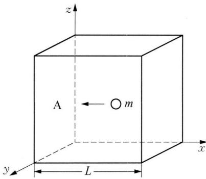

text_image

z
A ← m
y L x

图1-1 立方箱体中分子的弹性碰撞

N/3 个分子每秒钟的动量改变为: $\frac{N}{3} \cdot \frac{mu^{2}}{L} = f$ (单位时间内的动量改变), p(压强) = $f/S = f/L^{2}$ 。

得 $p = \frac{N}{3} \cdot \frac{mu^2}{L^3} = \frac{N}{3} \cdot \frac{mu^2}{V}$ , 即 $pV = \frac{Nmu^2}{3}$ 。

实际上 $n_{i}$ 个分子, 其速度为 $u_{i}$ , 作修正: $pV = \frac{m}{3}(n_{1}u_{1}^{2} + n_{2}u_{2}^{2} + \cdots + n_{i}u_{i}^{2} + \cdots)$ , $N = \sum_{i} n_{i}$ 。

定义： $\bar{u}^{2}=\frac{n_{1}u_{1}^{2}+n_{2}u_{2}^{2}+\cdots+n_{i}u_{i}^{2}+\cdots}{N}$ ， $\bar{u}^{2}$ 称为速率平方的平均值（均值），代入上式，得 $pV=\frac{m}{3}N\bar{u}^{2}=\frac{2N}{3}\cdot\frac{1}{2}m\bar{u}^{2},\frac{1}{2}m\bar{u}^{2}=\overline{E}_{K}$ 。

统计物理学又导出了气体分子的平均动能与温度的关系：单原子分子的平均动能与温度的关系： $\overline{E}_{K}=\frac{3}{2}kT$ ，k为玻尔兹曼常数(Boltzmann's constant)。

$pV=\frac{2N}{3}\cdot\frac{3}{2}kT=NkT$ 。与pV=nRT作比较：nR=Nk，则k=nR/N。

而 $N/n = N_{A}$ ，得 $k = R/N_{A} = \frac{8.314}{6.022 \times 10^{23}} = 1.381 \times 10^{-23} \, J \cdot K^{-1}$ (k 的物理意义是分子气体常数)。

## 四、道尔顿分压定律和阿玛加分体积定律

## 1. 道尔顿分压定律

当研究对象不是纯气体,而是多组分的混合气体时,由于气体具有均匀扩散而占有容器全部空间的特点,无论是对混合气体,还是混合气体中的每一组分,均可

按照理想气体状态方程进行计算。

当一个体积为 V 的容器, 盛有 A、B、C 三种气体, 其物质的量分别为 $n_{A}$ 、 $n_{B}$ 、 $n_{C}$ , 每种气体具有的分压分别是 $p_{A}$ 、 $p_{B}$ 、 $p_{C}$ , 则混合气体的总物质的量为:

$$
n _ {\text {总}} = n _ {\mathrm{A}} + n _ {\mathrm{B}} + n _ {\mathrm{C}} \tag {1-8}
$$

混合气体的总压为：

$$
p _ {\text {总}} = p _ {\mathrm{A}} + p _ {\mathrm{B}} + p _ {\mathrm{C}} \tag {1-9}
$$

在一定温度下,混合气体的总压力等于各组分气体的分压力之和,这就是道尔顿分压定律。

计算混合气各组分的分压有两种方法。

## (1) 根据理想气体状态方程计算

在一定体积的容器中的混合气体 $p_{总} V = n_{总} RT$ 。混合气体中各组分的分压，就是该组分单独占据总体积时所产生的压力，其分压数值也可以根据理想气体状态方程求出：

$$
p _ {\mathrm{A}} V = n _ {\mathrm{A}} R T \tag {1-10}
$$

$$
p _ {\mathrm{B}} V = n _ {\mathrm{B}} R T \tag {1-11}
$$

$$
p _ {\mathrm{C}} V = n _ {\mathrm{C}} R T \tag {1-12}
$$

## (2) 根据摩尔分数计算

摩尔分数 $(x_{\mathrm{A}})$ 为混合气体中某组分A的物质的量与混合气体的总的物质的量之比：

$$
x _ {\mathrm{A}} = \frac {n _ {\mathrm{A}}}{n _ {\text {总}}} \tag {1-13}
$$

混合气体中某组分的分压等于总压与摩尔分数的乘积：

$$
p _ {\mathrm{A}} = p _ {\text {总}} x _ {\mathrm{A}} \tag {1-14}
$$

## 2. 阿玛加分体积定律

在相同的温度和压强下,混合气体的总体积 $(V_{\text{总}})$ 等于组成混合气体的各组分的分体积之和:

$$
V _ {\text {总}} = V _ {\mathrm{A}} + V _ {\mathrm{B}} + V _ {\mathrm{C}} \tag {1-15}
$$

这个定律叫气体分体积定律。

根据混合气体中各组分的摩尔分数等于体积分数,可以计算出混合气体中各组分的分体积。

据

$$
\frac {n _ {\mathrm{A}}}{n _ {\mathrm{总}}} = \frac {V _ {\mathrm{A}}}{V _ {\mathrm{总}}}
$$

得

$$
V _ {\mathrm{A}} = \frac {n _ {\mathrm{A}}}{n _ {\text {总}}} V _ {\text {总}} \tag {1-16}
$$

## 五、格拉罕姆扩散定律

1. 表述: 恒压条件下,某一温度下气体的扩散速率与其密度(或摩尔质量)的平方根成反比。

2. 表达式： $\bar{u}_{1}/\bar{u}_{2}=\sqrt{\rho_{2}/\rho_{1}}=\sqrt{M_{2}/M_{1}}$ 。

3. 推导：由分子运动论的推导可知： $\bar{u}^{2}=\frac{3pV}{N\cdot m}(pV=\frac{m}{3}N\bar{u}^{2})$ 。

得 $\bar{u}=\sqrt{\frac{3p}{N\cdot m/V}}$ ，气体的密度为 $\rho=\frac{N\cdot m}{V}$ 。当压强不变时， $\bar{u}\propto\frac{1}{\sqrt{\rho}}$ 。

$\bar{u}_{1}/\bar{u}_{2}=\sqrt{\rho_{2}/\rho_{1}}$ 。又因为 $\rho\propto M$ ，所以 $\bar{u}_{1}/\bar{u}_{2}=\sqrt{M_{2}/M_{1}}$ 。

## 4. 格拉罕姆扩散定律的应用

（1）利用此定律可以测定未知气体的相对分子质量(或相对原子质量)，拉姆齐(Ramsay)就是利用此法，测定了Rn的相对原子质量。

(2) 可以分离同位素

自然界中 $^{235}$ U 占 0.7%, $^{238}$ U 占 99.3%, $^{235}$ U 可以由热中子诱发裂变,而 $^{238}$ U 不能由热中子诱发裂变。从铀矿(pitchblende)(沥青铀矿, $UO_{2}$ )制备 $UF_{6}(b.p.=56^{\circ}C)$ :

$$
3 \mathrm{UO} _ {2} + 8 \mathrm{HNO} _ {3} = 3 \mathrm{UO} _ {2} (\mathrm{NO} _ {3}) _ {2} + 2 \mathrm{NO} \uparrow + 4 \mathrm{H} _ {2} \mathrm{O}
$$

$$
2 \mathrm{UO} _ {2} (\mathrm{NO} _ {3}) _ {2} \xlongequal {3 0 0 ^ {\circ} \mathrm{C}} 2 \mathrm{UO} _ {3} + 4 \mathrm{NO} _ {2} \uparrow + \mathrm{O} _ {2} \uparrow
$$

$$
\mathrm{UO} _ {3} + \mathrm{H} _ {2} \xlongequal {7 0 0 ^ {\circ} \mathrm{C}} \mathrm{UO} _ {2} + \mathrm{H} _ {2} \mathrm{O}
$$

$$
\mathrm{UO} _ {2} + 4 \mathrm{HF} = \mathrm{UF} _ {4} + 2 \mathrm{H} _ {2} \mathrm{O}
$$

$$
\mathrm{UF} _ {4} + \mathrm{F} _ {2} = \mathrm{UF} _ {6}
$$

$$
\frac {\text {rate} \left(^ {2 3 5} \mathrm{UF} _ {6}\right)}{\text {rate} \left(^ {2 3 8} \mathrm{UF} _ {6}\right)} = \sqrt {\frac {M \left(^ {2 3 8} \mathrm{UF} _ {6}\right)}{M \left(^ {2 3 5} \mathrm{UF} _ {6}\right)}} = \sqrt {\frac {2 3 8 . 0 5 + 6 \times 1 8 . 9 9 8}{2 3 5 . 0 4 + 6 \times 1 8 . 9 9 8}} = \sqrt {\frac {3 5 2 . 0 4}{3 4 9 . 0 3}} =
$$

1.0043

两种不同分子的扩散速率的差别微乎其微,需要很长的一段管道才能得到有

效分离。

## 六、液体的饱和蒸气压

## 1. 蒸发过程

(1) 蒸发是液体气化的一种方式,也可以称为相变过程。蒸发过程伴随着能量的变化。很显然,当液体不能从外界环境吸收能量的情况下,随着液体的蒸发,液体本身温度下降,蒸发速率也随之减慢。

(2) 液体的蒸发热,也称为蒸发焓( $\Delta_{\text{vap}} H$ ): 恒压、恒温下,维持液体蒸发所必须的热量,称为液体的蒸发热。

## 2. 液体的饱和蒸气压

(1) 在液体表面, 只有超过平均动能的分子, 才能克服邻近分子的吸引, 进入气相中——蒸发。

(2) 在密闭容器中,在不断蒸发的同时,部分蒸气又会重新回到液体中——凝聚。

(3) 在一定温度下的密闭容器中, 经过一定时间, 蒸发与凝聚达到平衡, 这时液面上的蒸气称为饱和蒸气, 见图 1-2。

(4) 由饱和蒸气产生的压强称为饱和蒸气压, 简称蒸气压。

（5）对于同一种液体的蒸气压与液体的体积和蒸气体积无关，只与温度有关，所以蒸气压仅与液体本身性质和温度有关。

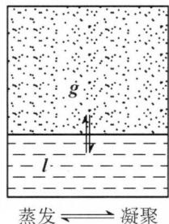

text_image

g
l
蒸发←→凝聚

图1-2 液体的饱和蒸气压示意图

## 3. 蒸气压与蒸发焓的关系

（1）以饱和蒸气压的自然对数 $\ln p$ 对绝对温度的倒数 $(1/T)$ 作图，得到的图象是一条直线。乙醇的 $\ln p$ 与 1/T 的关系见图 1-3。

图中直线符合下面的直线方程：

$$
\ln p = - \frac {\Delta_ {\mathrm{vap}} H}{R} (1 / T) + C
$$

其中：R 为气体状态方程常数，C 为直线的截距， $\Delta_{vap}H$ 为蒸发焓(J/mol)。

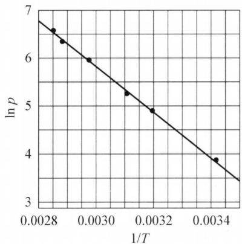

line chart

| 1/T     | ln p |
| ------- | ---- |
| 0.0028  | 6.7  |
| 0.0030  | 6.0  |
| 0.0032  | 5.3  |
| 0.0034  | 4.9  |
| 0.0034  | 4.0  |

图1-3 乙醇的 $\ln p$ 与 $1 / T$ 的关系

(2) 克劳修斯-克拉珀龙方程式

假设在 $T_{1} \sim T_{2}$ 温度区间内， $\Delta_{vap}H$ 不变，蒸气压分别为 $p_{1}$ 和 $p_{2}$ ，则：

$$
\ln p _ {1} = - \frac {\Delta_ {\mathrm{vap}} H}{R} (1 / T _ {1}) + C \quad (\mathrm{a}) \quad \ln p _ {2} = - \frac {\Delta_ {\mathrm{vap}} H}{R} (1 / T _ {2}) + C \quad (\mathrm{b})
$$

(a)-(b)式,得 $\ln\left(p_{1}/p_{2}\right)=\frac{\Delta_{\mathrm{vap}}H}{R}\left(\frac{1}{T_{2}}-\frac{1}{T_{1}}\right)$

或者 $\lg (p_1 / p_2) = \frac{\Delta_{\mathrm{vap}}H}{2.303R}\left(\frac{1}{T_2} -\frac{1}{T_1}\right)$

此式称为克劳修斯-克拉珀龙方程式。

(3) 应用

① 已知 $T_{1}$ 、 $p_{1}$ 、 $T_{2}$ 、 $p_{2}$ ，求 $\Delta_{vap}H$ ;  
② 已知 $\Delta_{vap}H$ 和一个温度下的 p，求另一个温度下的 p。

## 4. 液体的沸点

(1) 液体的沸点是指液体的饱和蒸气压与外界大气压相等时的温度。  
(2) 特征: 在此温度下, 气化在整个液体中进行, 液体表现出沸腾。  
（3）沸腾与蒸发的区别：蒸发是低于沸点温度下的气化，仅限于在液体表面上进行，所以在沸点以下的液体气化和达到沸点时的液体气化是不同的。

示例如下：

已知水的蒸发热为 44.3 kJ/mol, 若西藏某地区的水的沸点为 92.5℃, 计算该地区的大气压力?

解析 101.325 kPa 时, 水的沸点为 $100^{\circ}$ C, 根据克劳修斯-克拉珀龙方程式列式有:

$$
\ln (p _ {1} / p _ {2}) = \frac {\Delta_ {\mathrm{vap}} H}{R} \left(\frac {1}{T _ {2}} - \frac {1}{T _ {1}}\right)
$$

$$
\ln \frac {p}{1 0 1 . 3 2 5} = \frac {4 4 . 3 \times 1 0 ^ {3}}{8 . 3 1 4} \left(\frac {1}{3 7 3} - \frac {1}{2 7 3 + 9 2 . 5}\right)
$$

解得 $p = 75.6\mathrm{kPa}$ 。

## 典型例题

【例 1】300 K、 $3.03 \times 10^{5}$ Pa 时，一气筒中含有 480 g 的氧气，若此筒被加热到 373 K，然后开启阀门（温度保持 373 K）一直到气体压强降低到 $1.01 \times 10^{5}$ Pa 时，问共放出多少质量的氧气？

解析 因为 $pV = nRT, n = \frac{m}{M}$ ; 所以 $pV = \frac{m}{M}RT$ , 由此式求出气筒的容积。然后再根据理想气体状态方程式求出压强降到 $1.01 \times 10^{5}$ Pa 时，气筒内剩余氧气的质量 $m_{O_{2}}$ 。最后算出放出氧气的质量。

由理想气体状态方程可得： $pV=\frac{m}{M}RT$ ，则气筒的容积：

$$
V = \frac {m R T}{M p} = \frac {4 8 0 \mathrm{g} \times 8 . 3 1 4 \mathrm{Pa} \cdot \mathrm{m} ^ {3} \cdot \mathrm{mol} ^ {- 1} \cdot \mathrm{K} ^ {- 1} \times 3 0 0 \mathrm{K}}{3 2 . 0 \mathrm{g} \cdot \mathrm{mol} ^ {- 1} \times 3 . 0 3 \times 1 0 ^ {5} \mathrm{Pa}} = 0. 1 2 3 \mathrm{m} ^ {3} 。
$$

再根据方程式求压强降低到 $1.01 \times 10^{5}$ Pa 时，气筒内剩余氧气的质量：

$$
m _ {\mathrm{O} _ {2}} = \frac {p V M}{R T} = \frac {1 . 0 1 \times 1 0 ^ {5} \mathrm{Pa} \times 0 . 1 2 3 \mathrm{m} ^ {3} \times 3 2 . 0 \mathrm{g} \cdot \mathrm{mol} ^ {- 1}}{8 . 3 1 4 \mathrm{Pa} \cdot \mathrm{m} ^ {3} \cdot \mathrm{mol} ^ {- 1} \cdot \mathrm{K} ^ {- 1} \times 3 7 3 \mathrm{K}} = 1 2 8 \mathrm{g。}
$$

因此放出氧气的质量 $\Delta m_{O_{2}} = 480 \, g - 128 \, g = 352 \, g$ 。

【例 2】设有一真空的箱子, 在 288 K 时, $1.01 \times 10^{5}$ Pa 的压力下, 称量为 153.679 g, 假若在同温同压下, 充满氯气后为 156.844 g; 充满氧气后为 155.108 g。求氯气的分子量。

解析 $M_{O_{2}} = 32.00 \, g \cdot mol^{-1}$ ，若将 $pV = \frac{m}{M}RT$ 式先用于氧气，求出箱子的体积 V，再将 $pV = \frac{m}{M}RT$ 式用于氯气，求出 $M_{Cl_{2}}$ ，这当然是可行的。但运算繁杂，既费时又易出错。由题意可知，这实际上是在等温、等压和等容条件下， $pV = \frac{m}{M}RT$ 式的两次应用。所以可以直接用 $\frac{m_{1}}{M_{1}} = \frac{m_{2}}{M_{2}}$ 式，则简便得多。

求解过程： $m_{O_{2}} = 155.108 \, g - 153.679 \, g = 1.429 \, g, m_{Cl_{2}} = 156.844 \, g - 153.679 \, g = 3.165 \, g$

$$
M _ {\mathrm{Cl} _ {2}} = \frac {m _ {\mathrm{Cl} _ {2} \cdot M _ {\mathrm{O} _ {2}}}}{m _ {\mathrm{O} _ {2}}} = \frac {3 . 1 6 5 \mathrm{g} \times 3 2 . 0 0 \mathrm{g} \cdot \mathrm{mol} ^ {- 1}}{1 . 4 2 9 \mathrm{g}} = 7 0. 8 7 \mathrm{g} \cdot \mathrm{mol} ^ {- 1}
$$

故氯气的分子量为 70.87。

【例 3】某砷的氧化物化学式为 $As_{2}O_{3}$ ，加热升温气化，实验测得在 101 kPa 和 844 K 时，其蒸气密度为 5.70 g/L。求该氧化物的相对分子质量，并求其分子式。

解析 依据题目给出的一定温度和压强下的气体密度,可以算出气体的相对分子质量。

由 pV = nRT，可得 $M = \frac{mRT}{pV}$ 。

因为 $\rho=\frac{m}{V}$ ，所以 $M=\frac{\rho RT}{p}$ 。

根据化学式 $\mathrm{As}_2\mathrm{O}_3$ 可以算出式量，用相对分子质量除以式量，即可确定气态

氧化物的分子式。

求解过程: 气态氧化物的相对分子质量(M)为:

$M=\frac{\rho RT}{p}=\frac{5.7\times10^{3}\times8.314\times844}{101\ 000}=396,\ \mathrm{As}_{2}\mathrm{O}_{3}$ 的式量为： $75\times2+16\times3=198$

所以,在气态时这种砷的氧化物的分子式是 $As_{4}O_{6}$ 。

【例 4】 在 298 K, 101 000 Pa 时, 用排水集气法收集到氢气 355 mL。已知 298 K 时水的饱和蒸气压为 3200 Pa, 计算:

(1) 氢气的分压是多少?
(2) 收集的氢气的物质的量为多少?

(3) 这些氢气干燥后的体积是多少(干燥后气体温度、压强视为不变)?

解析 用排水集气法收集的氢气,实际上是氢气和水蒸气的混合气。可由气体分压定律: $p_{\text{总}} = p_{\mathrm{H}_{2}} + p_{\mathrm{H}_{2}\mathrm{O}}$ ,计算得氢气的分压。再利用理想气体状态方程: $pV = nRT$ 求出氢气的物质的量 $n_{\mathrm{H}_{2}}$ ,根据 $p_{\mathrm{H}_{2}} = p_{\text{总}} \cdot \frac{V_{\mathrm{H}_{2}}}{V_{\text{总}}}$ 算出 $V_{\mathrm{H}_{2}}$ 。

(1) 混合气中氢气的分压 $p_{H_{2}}$ 为： $p_{H_{2}} = p - p_{H_{2}O} = 101\,000\,Pa - 3200\,Pa = 97\,800\,Pa$

(2) 所得氢气的物质的量 $n(\mathrm{H}_{2})$ :

$$
n _ {\mathrm{H} _ {2}} = \frac {p _ {\mathrm{H} _ {2}} V}{R T} = \frac {9 7 8 0 0 \mathrm{Pa} \times 3 5 5 \times 1 0 ^ {- 6} \mathrm{m} ^ {3}}{8 . 3 1 4 \mathrm{Pa} \cdot \mathrm{m} ^ {3} \cdot \mathrm{mol} ^ {- 1} \cdot \mathrm{K} ^ {- 1} \cdot 2 9 8 \mathrm{K}} = 0. 0 1 4 0 \mathrm{mol}
$$

注意: $R = 8.314(\mathrm{Pa} \cdot \mathrm{m}^{3} \cdot \mathrm{mol}^{-1} \cdot \mathrm{K}^{-1})$ , $V$ 必须用 $\mathrm{m}^{3}$ 作单位, $355 \mathrm{~mL}$ 一定要换算成 $355 \times 10^{-6} \mathrm{~m}^{3}$ 。

(3) 所得干燥氢气的体积 $V_{H_{2}}$ 为: $V_{H_{2}} = V_{总} \times \frac{p_{H_{2}}}{p_{总}} = 355 \, mL \times \frac{79800 \, Pa}{101000 \, Pa} = 344 \, mL$ 。

## 本讲习题

1. 在 $678 \, K$ 时， $2.96 \, g$ 氯化汞在体积为 $1.00 \, L$ 的真空容器中蒸发，其压强为 $6.09 \times 10^{4} \, Pa$ ，计算氯化汞的摩尔质量。

2. 现有 A、B 两容器，A 容器中装有体积为 6.0 L，压强为 $9.09 \times 10^{5}$ Pa 的氮气，B 容器中装有体积为 12.0 L，压强为 $3.03 \times 10^{5}$ Pa 的氧气，A、B 两容器间由活塞连接，当打开活塞两气体均匀混合后，在温度不变时计算氮气、氧气的分压。

3. 人在呼吸时, 吸入的空气与呼出的气体组成不同。一健康人在 310 K,

$1.01 \times 10^{5} \text{ Pa}$ 时，吸入的空气体积分数约为： $\text{N}_2$ 79%； $\text{O}_2$ 21.0%。而呼出的气体体积分数约为： $\text{N}_2$ 75.1%； $\text{O}_2$ 15.2%； $\text{CO}_2$ 3.80%； $\text{H}_2\text{O}_{(\text{g})}$ 5.9%。

(1) 试计算呼出气体的平均摩尔质量及 $CO_{2}$ 的分压;  
(2) 用计算结果说明呼出的空气比吸入的空气的密度是大还是小。

4. 相对湿度的定义为: 在某一温度时, 空气中水蒸气的分压与同温度应有的饱和水蒸气压之比。试计算:

(1) 303 K, 相对湿度为 100% 时 1 L 空气中含水蒸气的质量;  
(2) 323 K, 相对湿度为 80% 时 1 L 空气中含水蒸气的质量。

(已知: 水的饱和蒸气压: 303 K-4239.6 Pa, 323 K-12332.3 Pa)

5. 在 $300 \, K$ 、 $1.013 \times 10^{5} \, Pa$ 时，加热一敞口细颈瓶到 $500 \, K$ ，然后封闭其细颈口，并冷至原来的温度，求此时瓶内的压强。

6. 在 1.32 L 容器中充入 $1 \, mol \, CO_{2}$ 气体，加热至 321 K，分别用理想气体状态方程和范德华方程计算气体的压强。（ $CO_{2}$ 的范德华常数： $a = 3.64 \times 10^{-1} \, m^{6} \cdot Pa \cdot mol^{-2}$ ， $b = 4.27 \times 10^{-5} \, m^{3} \cdot mol^{-1}$ ）

7. 在 273 K 和 $1.01 \times 10^{5}$ Pa 下，将 $1.0 \, dm^{3}$ 洁净干燥的空气缓慢通过 $CH_{3}OCH_{3}$ 液体，在此过程中，液体损失 0.0335 g，求此液体 273 K 时的饱和蒸气压。

8. 在 $273 \, K$ 时, $1 \, mol \, O_{2}$ 在不同压强下的 pV 值如下表:

<table><tr><td> $p/10^{5}$  Pa</td><td>1.0000</td><td>0.7500</td><td>0.5000</td><td>0.2500</td></tr><tr><td> $pV/10^{5}$  Pa · dm3</td><td>22.3929</td><td>22.3979</td><td>22.4034</td><td>22.4088</td></tr></table>

用作图外推法(将 pV 对 p 作图)求在标准状况时 $O_{2}$ 的摩尔体积。

9. 某实验测出人类呼吸中各种气体的分压/Pa 如下表所示:

<table><tr><td>气体</td><td>吸入气体</td><td>呼出气体</td></tr><tr><td></td><td>79 274</td><td>75 848</td></tr><tr><td></td><td>21 328</td><td>15 463</td></tr><tr><td></td><td>40</td><td>3732</td></tr><tr><td></td><td>667</td><td>6265</td></tr></table>

(1) 请将各种气体的分子式填入上表;  
(2) 指出表中第一种和第二种呼出气体的分压小于吸入气体分压的主要

原因。

10. 无水氯化铝可用干燥的氯化氢气体与铝加热制得。今以 $2.7 \mathrm{~g}$ 铝与标准状况下 $7.84 \mathrm{~L} \mathrm{HCl}$ 作用。然后在 $1.013 \times 10^{5} \mathrm{~Pa} 、 546 \mathrm{~K}$ 下（此时氯化铝也为气体）测得气体总体积为 $11.2 \mathrm{~L}$ 。试通过计算写出气态氯化铝的分子式。

11. 温度为 $0^{\circ}$ C 时, 三甲胺的密度是压力的函数, 有人测得了如下数据:

<table><tr><td> $p$ /atm</td><td>0.2</td><td>0.4</td><td>0.6</td><td>0.8</td></tr><tr><td> $d/\text{g} \cdot \text{L}^{-1}$ </td><td>0.5336</td><td>1.079</td><td>1.6363</td><td>2.2054</td></tr></table>

试根据以上数据,计算三甲胺的分子量。

12. 两个体积相等的玻璃球, 中间用细管连通(其体积不计), 开始时两球温度均为 $300 \mathrm{~K}$ , 共含 $0.7 \mathrm{~mol} \mathrm{H}_{2}$ , 其压强为 $0.5 \times p^{\theta}(p^{\theta}$ 为标准压力, 其值为 $101.325 \mathrm{kPa}$ 。若将甲球放入 $400 \mathrm{~K}$ 油浴中, 而乙球仍为 $300 \mathrm{~K}$ 。求两球内的压强和各自所含 $\mathrm{H}_{2}$ 的物质的量。

13. 从某化学文献中查到下列物质饱和蒸气压的数据：

<table><tr><td>物质</td><td>温度°C</td><td>蒸气压 mmHg 柱</td><td>密度 g/L</td></tr><tr><td>苯  $C_6H_6$ </td><td>80.1</td><td>760</td><td>2.710</td></tr><tr><td>甲醇  $CH_3OH$ </td><td>49.9</td><td>400</td><td>0.673</td></tr><tr><td>醋酸  $CH_3COOH①$ </td><td>29.9</td><td>20</td><td>0.126</td></tr><tr><td>醋酸  $CH_3COOH②$ </td><td>118.1</td><td>760</td><td>3.110</td></tr></table>

(1) 根据所列数据计算蒸气的摩尔质量(假设蒸气中的分子类似理想气体分子);

（2）如何解释相对质量的理论值与所得计算值之间的偏差？对此给出定性的并尽可能定量的解释。

14. 某温、某压下取三份等体积无色气体 A, 于 $25^{\circ} \mathrm{C}$ 、 $80^{\circ} \mathrm{C}$ 及 $90^{\circ} \mathrm{C}$ 测得其摩尔质量分别为 $58.0 \mathrm{~g} / \mathrm{mol}$ 、 $20.6 \mathrm{~g} / \mathrm{mol}$ 、 $20.0 \mathrm{~g} / \mathrm{mol}$ 。于 $25^{\circ} \mathrm{C}$ 、 $80^{\circ} \mathrm{C}$ 、 $90^{\circ} \mathrm{C}$ 下各取 $11 \mathrm{dm}^{3}$ （气体压力相同）上述无色气体分别溶于 $10 \mathrm{dm}^{3}$ 水中，形成的溶液均显酸性。

(1) 无色气体可能的分子式；

(2) 试解释各温度下摩尔质量不同的可能原因;

（3）若三份溶液的体积相同(设：溶解后溶液温度也相同)，其摩尔浓度的比值是多少？

15. 测定相对分子质量的一个实验步骤为(其装置如右图所示): 取一干燥的 250 mL 圆底烧瓶, 用铝箔和棉线封口, 一起称量(称准到 0.1 g), 得 $m_{1}$ 。往烧瓶内加入大约 2 mL 四氯化碳(沸点为 76.7℃), 用铝箔和棉线封口并在铝箔上穿一小孔。把烧瓶迅速浸入盛于大烧杯内的沸水中, 继续保持(水的)

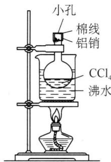

text_image

小孔
棉线
铝销
CCl₄
沸水

沸腾。待四氯化碳全部气化后，从水中取出烧瓶冷却。擦干烧瓶外的水后称量（准确到0.1g），得 $m_{2}$ 。倒出瓶内的液态四氯化碳，充满水，量体积（室温时水的密度大约 $1\ g\cdot cm^{-3}$ ）。按理想气体pV=mRT/M求四氯化碳的相对分子质量(M)。式中p为压强(Pa)，V为体积(L)，m为四氯化碳的质量(g)，R为气体常数8.314J/(K·mol)，T为绝对温度。

请考虑并回答以下几个问题：

(1) 把烧杯放入沸水中,为什么要保持沸腾?

（2）如果在铝箔上开的孔较大，又在瓶内液态四氯化碳挥发完后过了一段时间才从热水中取出烧瓶，其他操作均正常。按以上不正确操作所得的实验数据求四氯化碳的相对分子质量将偏大还是偏小？

（3）用水充满烧瓶再量其体积,实验前忘了倒出原先在瓶内的液态四氯化碳,是否会对实验结果造成影响?

（4）把烧瓶放入沸水，要尽可能没入。事实上用这个装置测定相对分子质量时很难做到将烧瓶完全没入水中，而总有部分露在水面上（见图），这是否会对实验结果造成影响？

## 第二讲 溶液和胶体

## 知识精讲

## 一、分散系的基本概念及分类

物质除了以气态、液态、固态的形式单独存在以外，还常常以一种（或多种）分散于另一种物质中的形式存在，这种形式称为分散系。例如，细小的水滴分散在空气中形成的云雾、二氧化碳分散在水中形成的汽水、蔗糖分散在水中形成的糖水、各种金属化合物分散在岩石中形成的矿石等都是分散系。在分散系中，被分散的物质称为分散相（或分散质），而容纳分散质的物质称为分散介质（或分散剂）。分散相处于分割成粒子的不连续状态，而分散介质则处于连续状态。在分散系中，分散相和分散介质可以是固体、液体或气体。按分散相和分散介质的聚集状态分类，分散系可以分为九种，见表2-1。

表 2-1 按聚集状态分类的各种分散系

<table><tr><td>分散相</td><td>分散介质</td><td>实例</td></tr><tr><td>气</td><td>气</td><td>空气、家用煤气</td></tr><tr><td>液</td><td>气</td><td>云、雾</td></tr><tr><td>固</td><td>气</td><td>烟、灰尘</td></tr><tr><td>气</td><td>液</td><td>泡沫、汽水</td></tr><tr><td>液</td><td>液</td><td>牛奶、豆浆、农药乳浊液</td></tr><tr><td>固</td><td>液</td><td>泥浆、油漆</td></tr><tr><td>气</td><td>固</td><td>泡沫塑料、木炭</td></tr><tr><td>液</td><td>固</td><td>肉冻、硅胶</td></tr><tr><td>固</td><td>固</td><td>红宝石、合金、有色玻璃</td></tr></table>

此外,按照分散相粒子大小不同,常把分散系分为三类:低分子或离子分散系、胶体分散系和粗分散系,见表2-2。

表 2-2 按分散相粒子大小分类的各种分散系

<table><tr><td>分散相粒子直径/nm</td><td colspan="2">分散系类型</td><td>分散相</td><td colspan="2">主要特征</td><td>实例</td></tr><tr><td>&lt;1</td><td colspan="2">低分子或离子分散系</td><td>小分子或离子</td><td>稳定、扩散快、粒子能透过半透膜</td><td rowspan="2">单相系统</td><td>氯化钠、氢氧化钠等的水溶液</td></tr><tr><td rowspan="2">1~100</td><td rowspan="2">胶体分散系</td><td>高分子溶液</td><td>高分子</td><td>稳定、扩散慢、粒子不能透过半透膜</td><td>蛋白质、核酸水溶液,橡胶的苯溶液</td></tr><tr><td>溶胶</td><td>分子、离子、原子的聚集体</td><td>较稳定、扩散慢、粒子不能透过半透膜</td><td rowspan="2">多相系统</td><td>氢氧化铁、碘化银溶胶</td></tr><tr><td>&gt;100</td><td>粗分散系</td><td>乳浊液、悬浊液</td><td>分子的大集合体</td><td>不稳定、扩散很慢、粒子不能透过滤纸</td><td>乳汁、泥浆</td></tr></table>

系统中任何一个均匀的(物理性质和化学性质完全相同)部分称为一个相。在同一相内,其物理性质和化学性质完全相同,相与相之间有明确的界面分隔。只有一个相的系统称为单相系统或均相系统,有两个或两个以上相的系统称为多相系统。低分子或离子分散系为均相系统,溶胶和粗分散系属于多相系统。溶液可分为固态溶液(如某些合金)、气态溶液(如空气)和液态溶液。最常见也是最重要的是液态溶液,特别是以水为溶剂的水溶液。

## 二、溶解度和饱和溶液

## 1. 溶解度

在一定温度下的饱和溶液中,在一定量溶剂中溶解溶质的质量,叫作该物质在该温度下的溶解度。易溶于水的固体的溶解度用100 g水中溶解溶质的质量(g)表示;一定温度下,难溶物质饱和溶液的“物质的量”浓度也常用来表示难溶物质的溶解度。例如298 K时氯化银的溶解度为 $1\times10^{-5}\ mol\cdot L^{-1}$ 。

## 2. 饱和溶液

在一定温度下,未溶解的溶质与已溶解的溶质达到溶解平衡状态时的溶液称为饱和溶液。在饱和溶液中,存在着下列量的关系:

$$
\frac {\mathrm{溶质的质量}}{\mathrm{溶液的质量}} = \mathrm{常数}
$$

$$
\frac {\text {溶质的质量}}{\text {溶剂的质量}} = \text {常数}
$$

## 3. 溶解度与温度

溶解平衡是一个动态平衡,其平衡移动的方向服从勒沙特列原理。一个已经饱和的溶液,如果它的继续溶解过程是吸热的,升高温度时溶解度增大;如果它的继续溶解过程是放热的,升高温度时溶解度减小。大多数固体物质的溶解度随温度的升高而增大。气体物质的溶解度随着温度的升高而减小。

## 4. 溶解度与压强

固体或液体溶质的溶解度受压力的影响很小。气体溶质的溶解度受压力影响很大。对于溶解度很小，又不与水发生化学反应的气体，“在温度不变时，气体的溶解度和它的分压在一定范围内成正比”，这个定律叫亨利(Henry)定律。其数学表达式是：

$$
c _ {\mathrm{g}} = K _ {\mathrm{g}} \cdot p _ {\mathrm{g}} \tag {2-1}
$$

式中 $p_{g}$ 为液面上该气体的分压， $c_{g}$ 为某气体在液体中的溶解度（其单位可用 g·L $^{-1}$ 、L $_{(气)}$ ·L $_{(水)}^{-1}$ 、mol·L $^{-1}$ 表示）， $K_{g}$ 称为亨利常数。

## 5. 溶解平衡

任何难溶的电解质在水中总是或多或少地溶解,绝对不溶的物质是不存在的。对于难溶或微溶于水的物质,在一定条件下,当溶解与结晶的速率相等时,便建立了固体和溶液中离子之间的动态平衡,简称溶解平衡。

## 三、溶液组分含量的表示方法

溶液作为物质存在的一种形式,广泛存在于自然界中,它与生物体的生存、发展有着密切的关系,生物体内的各种生理、生化反应都是在以水为主要溶剂的溶液系统中进行的。此外,科学研究和工农业生产也都与溶液密不可分。溶液的性质与溶质和溶剂的相对含量有关,为了研究和生产的不同需要,溶液浓度有很多表示方法,常用的有物质的量浓度、摩尔分数、质量摩尔浓度和质量分数等。

## 1. 物质的量浓度

溶质 B 的物质的量除以溶液的体积, 称为物质 B 的物质的量浓度。在不可能混淆时, 可简称为浓度, 用符号 $c_{B}$ 表示, 即:

$$
c _ {\mathrm{B}} = \frac {n _ {\mathrm{B}}}{V} \tag {2-2}
$$

式中： $n_{B}$ 为溶质 B 的物质的量，SI 单位为 mol，V 为溶液的体积，单位为 L，故浓度的常用单位为 $mol \cdot L^{-1}$ 。

## 2. 摩尔分数

物质 B 的物质的量与混合物总物质的量之比, 称为物质 B 的摩尔分数。其数学表达式为:

$$
x _ {\mathrm{B}} = \frac {n _ {\mathrm{B}}}{n} \tag {2-3}
$$

式中： $x_{B}$ 为物质 B 的摩尔分数，SI 单位为 1； $n_{B}$ 为物质 B 的物质的量，SI 单位为 mol；n 为混合物总物质的量，SI 单位为 mol。

## 3. 质量摩尔浓度

溶液中溶质 B 的物质的量除以溶剂的质量, 称为溶质 B 的质量摩尔浓度。其数学表达式为:

$$
b _ {\mathrm{B}} = \frac {n _ {\mathrm{B}}}{m _ {\mathrm{A}}} \tag {2-4}
$$

式中： $b_{B}$ 为溶质 B 的质量摩尔浓度，其 SI 单位为 $mol \cdot kg^{-1}$ ； $n_{B}$ 为溶质 B 的物质的量，SI 单位为 mol； $m_{A}$ 为溶剂的质量，SI 单位为 kg。由于物质的质量不受温度的影响，所以溶液的质量摩尔浓度是一个与温度无关的物理量。

## 4. 质量分数

物质 B 的质量与混合物的质量之比, 称为 B 的质量分数, 其数学表达式为:

$$
\omega_ {\mathrm{B}} = \frac {m _ {\mathrm{B}}}{m} \tag {2-5}
$$

式中： $m_{B}$ 为物质 B 的质量；m 为混合物的质量； $\omega_{B}$ 为物质 B 的质量分数，SI 单位为 1。

## 四、水的相图和稀溶液的依数性

## 1. 水的相图

由于稀溶液的通性和溶剂的相平衡有关,因此先介绍溶剂水的相平衡及其相图。图2-1是根据实验数据绘制的水的相图。它由三条线、一个点和三个区域组成。图中线DA、DB、DC分别代表水的气液、气固、固液两相平衡线,表示两相平衡时平衡压力与温度的对应关系。曲线上的任何一点都代表两相共存时的温度和压力条件。在气液平衡线 DA 上，当蒸气压等于外界压力时，液体产生沸腾现象，此时对应的温度就是液体的沸点。如标准大气压 $(p^{\theta})$ 下，水的沸点是 373.15 K。三条曲线相交于 D 点，它代表固态冰、液态水、气态水蒸气三相共存的温度和压力条件，称为水的三相点，其温度为 273.16 K，压力为

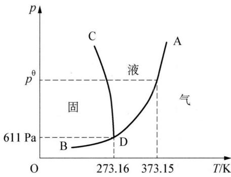

line chart

| T/K    | p     |
| ------ | ----- |
| 273.16 | 611 Pa |
| 373.15 | pθ    |

图2-1 水的相图

611 Pa。三条线将相图平面分为三个区域, ADB 区为气相区, ADC 区为液相区, BDC 区为固相区, 每个区域内只存在一个相, 所以又称为单相区。根据水的相图, 给定温度和压力, 就可以确定水的状态。

## 2. 稀溶液的依数性

稀溶液的某些性质主要取决于其中所含溶质粒子的数目,而与溶质本身的性质无关,这种性质称为依数性。稀溶液的依数性包括溶液的蒸气压下降、沸点升高、凝固点降低和渗透压。

## (1) 溶液的蒸气压下降

在密闭容器中,恒温条件下,单位时间内某液体由液面蒸发出的分子数和由气相回到液体内的分子数相等时,气液两相处于平衡状态,这时液面上蒸气的压力叫饱和蒸气压,简称蒸气压。如图2-2A所示。

不但液体有蒸气压,固体也有蒸气压,但在一般情况下固体的蒸气压数值很小。液体和固体的蒸气压都只与其本性和温度有关,各种液体和固体的蒸气压随温度的升高而增大。在一定温度下,纯溶剂的蒸气压是一定值。

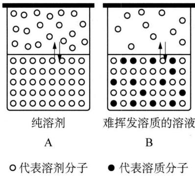

text_image

纯溶剂
A
难挥发溶质的溶液
B
○代表溶剂分子
●代表溶质分子

图2-2 纯溶剂与溶液的蒸气压示意图

实验证明,在相同温度下,当把难挥发的非电解质溶入溶剂形成稀溶液后,稀溶液的蒸气压(实际上是指稀溶液中的溶剂的蒸气压)比纯溶剂的蒸气压低。这种现象称为溶液的蒸气压下降。

由图2-2B可以看出，溶液蒸气压下降的原因是由于溶剂的部分表面被难挥发的溶质所占据，单位时间内逸出液面的溶剂分子数相对减少，因此达到平衡时，溶液的蒸气压低于纯溶剂的蒸气压。显然，溶液的浓度越大，其蒸气压下降越多，如图2-3所示。

19 世纪 80 年代拉乌尔(Raoult)研究了几十种溶液的蒸气压与温度的关系, 发现: 在一定温度下, 难挥发的非电解质溶液的蒸气压 p 等于纯溶剂蒸气压 $p_{A}^{\theta}$ 与溶剂的摩尔分数 $x_{A}$ 的乘积, 即:

$$
p = p _ {\mathrm{A}} ^ {\theta} \cdot x _ {\mathrm{A}} \tag {2-6}
$$

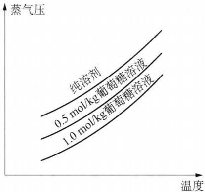

line chart

| 温度 | 蒸气压 (0.5 mol/kg葡萄糖溶液) | 蒸气压 (1.0 mol/kg葡萄糖溶液) |
| ---- | ----------------------------- | ----------------------------- |
| Low  | Low                           | Low                           |
| High | High                          | High                          |

图2-3 纯溶剂与溶液蒸气压曲线

这就是拉乌尔定律。用分子运动论可以对此作出解释：当气体和液体处于相平衡时，液态分子气化的数目和气态分子凝聚的数目应相等。若溶质不挥发，则溶液的蒸气压全由溶剂分子挥发所产生，所以由液相逸出的溶剂分子数目自然与溶剂的摩尔分数成正比，而气相中溶剂分子的多少决定蒸气压大小。

由于溶质的摩尔分数 $x_{\mathrm{B}}$ 与 $x_{\mathrm{A}}$ 之和应等于1，因此 $p = p_{\mathrm{A}}^{\theta}\cdot x_{\mathrm{A}}$ 式可做如下变换：

$$
p = p _ {\mathrm{A}} ^ {\theta} \left(1 - x _ {\mathrm{B}}\right)
$$

$$
p _ {\mathrm{A}} ^ {\theta} - p = p _ {\mathrm{A}} ^ {\theta} \cdot x _ {\mathrm{B}}
$$

$$
\Delta p = p _ {\mathrm{A}} ^ {\theta} x _ {\mathrm{B}} \tag {2-7}
$$

这是拉乌尔定律的另一表达式, $\Delta p$ 为溶液的蒸气压下降值。对于稀溶液而言,溶剂的量 $n_{A}$ 远大于溶质的量 $n_{B},n_{A}+n_{B}\approx n_{A}$ ,因此(2-7)式可改写为:

$$
\Delta p = p _ {\mathrm{A}} ^ {\theta} \cdot \frac {n _ {\mathrm{B}}}{n _ {\mathrm{A}}}
$$

在定温下，一种溶剂的 $p_{\mathrm{A}}^{\theta}$ 为定值， $\frac{n_{\mathrm{B}}}{n_{\mathrm{A}}}$ 用质量摩尔浓度 $b$ 表示，上式变为：

$$
\Delta p \approx p _ {\mathrm{A}} ^ {\theta} \cdot \frac {b}{1 0 0 0 / M} = K \cdot b \tag {2-8}
$$

式中 $K = p_{A}^{\theta} \cdot M / 1000$ ，M 是溶剂的摩尔质量。(2-8) 式也是拉乌尔定律的一种表达形式。

## (2) 液体的沸点升高

液体的蒸气压随温度升高而增大,当温度升到蒸气压等于外界压力时,液体就沸腾了,此时的温度称为该液体的沸点。前面我们讨论了溶液的蒸气压要比纯溶剂的蒸气压低,也就是说在某一温度,纯溶剂已经开始沸腾,而溶液由于蒸气压低却还未能沸腾。为了使溶液也能在常压下沸腾,就必然要给溶液加热,促使溶剂分子热运动,以增加溶液的蒸气压。当溶液的蒸气压达到外界压力时,溶液开始沸腾,此时溶液的温度就要比纯溶剂的温度来得高(见图2-4)。图中曲线AA'和BB'分别表示纯溶剂和溶液的蒸气压随温度变化的关系。 $T_{b}^{\prime}$ 和 $T_{b}$ 分别为纯溶剂和溶液的沸点。

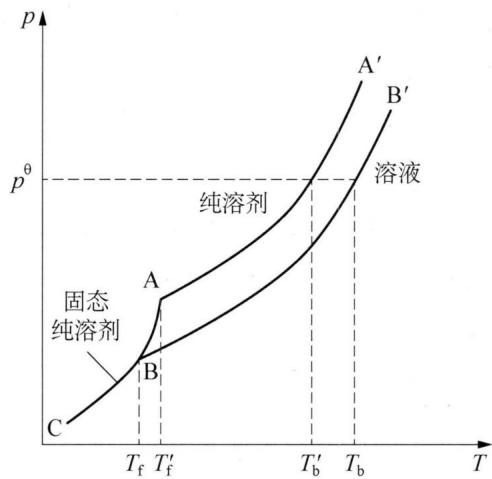

line chart

| Point | T (t_f) | T (t_f') | p (p) |
|-------|---------|----------|-------|
| A     | ~Tf     | ~Tf'     | p^θ   |
| B     | ~Tf'    | ~Tf'     | p^θ   |
| C     | ~Tb     | ~Tb      | p     |

图2-4 溶液的沸点升高和凝固点降低示意图

如纯水在 373.15 K 时, 其蒸气压为 101.325 kPa (与大气压相同), 开始沸腾。如果在同样温度的纯水中加入难挥发非电解质, 溶液不再沸腾, 这是由于溶液的蒸气压下降造成的。只有温度大于 373.15 K 时, 其蒸气压等于 101.325 kPa, 水溶液开始沸腾。溶液浓度越大, 其蒸气压下降越多, 溶液沸点升高就越多, 其关系为:

$$
\Delta T _ {\mathrm{b}} = K _ {\mathrm{b}} \cdot b _ {\mathrm{B}} \tag {2-9}
$$

式中： $\Delta T_{b}$ 为溶液沸点的变化值，单位为 K 或 $^{\circ}C$ ； $K_{b}$ 为溶剂的沸点升高常数，单位为 $K \cdot kg \cdot mol^{-1}$ 或 $^{\circ}C \cdot kg \cdot mol^{-1}$ ； $b_{B}$ 为溶质的质量摩尔浓度，单位为 $mol \cdot kg^{-1}$ 。 $K_{b}$ 只与溶剂的性质有关，而与溶质的本性无关。不同的溶剂有不同的 $K_{b}$ 值，它们可以理论推算，也可以由实验测得。几种常见溶剂的 $K_{b}$ 值列于表 2-3 中。

表 2-3 几种溶剂的 ${\mathbf{K}}_{\mathrm{b}}$ 和 ${\mathbf{K}}_{\mathrm{f}}$

<table><tr><td>溶剂</td><td> $T_{b}/K$ </td><td> $K_{b}/K·kg·mol^{-1}$ </td><td> $T_{f}/K$ </td><td> $K_{f}/K·kg·mol^{-1}$ </td></tr><tr><td>水</td><td>373.15</td><td>0.52</td><td>273.15</td><td>1.86</td></tr><tr><td>乙酸</td><td>391.45</td><td>3.07</td><td>289.75</td><td>3.90</td></tr><tr><td>苯</td><td>353.35</td><td>2.53</td><td>278.66</td><td>5.12</td></tr><tr><td>萘</td><td>491.15</td><td>5.80</td><td>353.45</td><td>6.94</td></tr><tr><td>四氯化碳</td><td>351.65</td><td>4.88</td><td>—</td><td>—</td></tr><tr><td>环己烷</td><td>—</td><td>—</td><td>279.65</td><td>20.2</td></tr></table>

## (3) 溶液的凝固点降低

当固体纯溶剂的蒸气压与溶液中溶剂的蒸气压相等时, 溶液的固相与液相达到平衡, 此时的温度称为溶液的凝固点。溶液的凝固点比纯溶剂的凝固点低是一个常见的自然现象, 例如海水由于含有大量的盐分, 因此要在比纯水更低的温度下才结冰。图 2-4 中, 曲线 AC 和 AA' 分别表示固态纯溶剂和液态纯溶剂的蒸气压随温度变化的关系, 曲线 AC 和 AA' 相交于 A 点, A 点所对应的温度 $T_{\mathrm{f}}'$ 表示纯溶剂的凝固点。曲线 BB' 表示溶液的蒸气压随温度变化的关系, 加入溶质以后, 溶剂的蒸气压就会下降, 曲线 AC 和 BB' 相交于 B 点, 在交点处, 固态纯溶剂的蒸气压与溶液的蒸气压相等, 此时系统的温度 $T_{\mathrm{f}}$ 为溶液的凝固点。显然, 溶液的凝固点 $T_{\mathrm{f}}$ 比纯溶剂的凝固点 $T_{\mathrm{f}}'$ 低。与溶液沸点升高一样, 溶液凝固点降低也与溶质的含量有关, 即

$$
\Delta T _ {\mathrm{f}} = K _ {\mathrm{f}} \cdot b _ {\mathrm{B}} \tag {2-10}
$$

式中： $\Delta T_{f}$ 为溶液凝固点的降低值，单位为 K 或 ${}^{\circ}C$ ; $K_{f}$ 为溶剂的凝固点降低常数，单位为 $K \cdot kg \cdot mol^{-1}$ 或 ${}^{\circ}C \cdot kg \cdot mol^{-1}$ ; $b_{B}$ 为溶质的质量摩尔浓度，单位为 $mol \cdot kg^{-1}$ 。 $K_{f}$ 只与溶剂的性质有关，而与溶质的本性无关。表 2-3 中列举了几种常见溶剂的 $K_{f}$ 。

溶液沸点的升高和凝固点降低都与溶质的质量摩尔浓度成正比,而质量摩尔浓度又与溶质的相对分子质量有关。因此,利用溶液沸点升高和凝固点降低可以估算溶质的相对分子质量。由于溶液凝固点降低常数比沸点升高常数大,而且在凝固点时,溶液中有晶体析出,现象明显,容易观察,因此利用凝固点降低测定分子量的方法应用很广。

此外,溶液的蒸气压下降、沸点升高和凝固点降低在生活、生产及很多领域具有广泛的用途。例如在严寒的冬天,汽车散热水箱中加入甘油或乙二醇等物质,可以防止水结冰;食盐和冰的混合物作冷冻剂,可获得-22.4℃的低温。又如当外界气温发生变化时,植物细胞内的有机体会产生大量可溶性碳水化合物(氨基酸、糖等),使细胞液浓度增大,凝固点降低,保证了在一定的低温条件下细胞液不至结冰,使植物表现出一定的防寒功能;另外,细胞液浓度增大,有利于其蒸气压的降低,从而使细胞中水分的蒸发量减少,蒸发过程变慢,因此在较高的气温下能保持一定的水分而不枯萎,表现了相当的抗旱能力。此外,有机化学实验中常常用测定化合物的熔点或沸点的方法来检验化合物的纯度。因为含有杂质的化合物其熔点比纯化合物低,沸点比纯化合物高,而且熔点的降低值和沸点的升高值与杂质含量

有关。

## (4) 溶液的渗透压

物质自发地由高浓度向低浓度迁移的现象称为扩散, 扩散现象不但存在于溶质与溶剂之间, 也存在于任何不同浓度的溶液之间。如果在两个不同浓度的溶液之间, 存在一种多孔分离膜, 它可以选择性地让一部分物质通过, 而不让某些物质通过, 这种膜称为半透膜, 那么在两溶液之间会出现什么现象? 在此, 以蔗糖水溶液与纯水形成的系统为例加以说明。

如图 2-5 所示, 在一个连通器的两边各装着蔗糖溶液与纯水, 中间用半透膜将它们隔开。在扩散开始之前, 连通器两边的玻璃柱中的液面高度相同。经过一段时间的扩散以后, 玻璃柱内的液面高度不再相同, 蔗糖溶液一边的液面比纯水的液面要高。这是因为半透膜能够阻止蔗糖分子向纯水一边扩散, 却不能阻止水分子向蔗糖溶液的扩散。由于单位体积内纯水中水

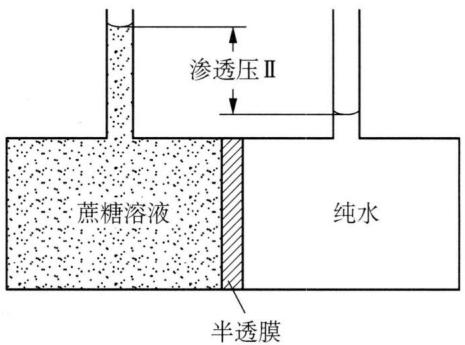

text_image

渗透压Ⅱ
蔗糖溶液
纯水
半透膜

图2-5 渗透压示意图

分子比蔗糖溶液中的水分子多,因此进入溶液中的水分子比离开的水分子多,所以蔗糖溶液的液面升高。这种由物质粒子通过半透膜扩散的现象称为渗透。随着蔗糖溶液液面的升高,液柱的静压力增大,使蔗糖溶液中水分子通过半透膜的速度加快。当压力达到一定值时,在单位时间内从两个相反方向通过半透膜的水分子数相等,渗透达到平衡,两侧液面高度差不再发生变化。渗透平衡时液面高度差所产生的压力称为渗透压。换句话说,渗透压就是阻止渗透作用进行所需加给溶液的最小额外压力。

1886 年,荷兰物理学家范特霍夫(van't Hoff)总结前人实验得出稀溶液的渗透压与浓度、温度的关系式:

$$
\Pi = c _ {\mathrm{B}} R T \tag {2-11}
$$

式中： $\Pi$ 是溶液的渗透压，单位为 Pa； $c_{B}$ 是溶液的浓度，单位为 $mol \cdot L^{-1}$ ；R 是摩尔气体常数，为 $8.314 \times 10^{3}$ Pa·L·mol $^{-1}$ ·K $^{-1}$ ；T 是系统的温度，单位为 K。对于稀的水溶液， $c_{B} \approx b_{B}$ ，因此式(2-11)又可表示为：

$$
\Pi = c _ {\mathrm{B}} R T \approx b _ {\mathrm{B}} R T \tag {2-12}
$$

通过测定溶液的渗透压,可以计算溶质的相对分子质量,尤其是测定生物大分子的相对分子质量。另外,渗透作用在动植物生活中有非常重要的作用。动植物体都要通过细胞膜产生的渗透作用,以吸收水分和养料。人体的体液、血液、组织等都有一定的渗透压。对人体进行静脉注射时,必须使用与人体体液渗透压相等的等渗溶液,如临床常用的0.9%的生理盐水和5%的葡萄糖溶液。否则将引起血球膨胀(水向细胞内渗透)或萎缩(水向细胞外渗透)而产生严重后果。同样道理,如果土壤溶液的渗透压高于植物细胞液的渗透压,将导致植物枯死,所以不能使用过浓的肥料。此外,若选用一种高强度且耐高压的半透膜把纯溶剂和溶液隔开,此时在溶液一侧施加大于渗透压的额外压力,则溶液中将有更多的溶剂分子通过半透膜进入纯溶剂一侧。这种使渗透作用逆向进行的过程称为反向渗透。反向渗透近年来常用于海水淡化,还可用于废水治理中除去有毒有害物质。

应该指出的是,稀溶液的依数性定律不适用于浓溶液和电解质溶液。如 0.01 mol/kg 的 NaCl 溶液, $\Delta T_{f}$ 计算值为 0.0186 K,而实际测定 $\Delta T_{f}$ 值却是 0.0361 K。阿累尼乌斯(Arrhenius)认为,这是由于电解质在溶液中发生了电离的结果。如一些强电解质溶液(例如盐酸、氢氧化钠、氯化钾等),这些电解质溶液的蒸气压、沸点、凝固点和渗透压的变化要比相同浓度的非电解质都大,这是因为强电解质在溶液中会完全电离出自由移动的离子,因此其总的粒子数大为增加,此时稀溶液的依数性取决于溶质分子、离子的总组成量度。现代的强电解质溶液理论认为,强电解质在水溶液中是完全电离的,但由于离子间存在着相互作用,离子的行动并不完全自由,所以实际测定的“表观”电离度并不是 100%。

## 五、分配定律及相似相溶原理

## 1. 分配定律及其应用

## (1) 分配定律

在一定温度下,一种溶质分配在互不相溶的两种溶剂中的浓度比值是一个常数,这个规律就称为分配定律,其数学表达式为:

$$
K = c _ {\mathrm{A}} ^ {\alpha} / c _ {\mathrm{A}} ^ {\beta} \tag {2-13}
$$

式中 K 为分配系数； $c_{A}^{\alpha}$ 为溶质 A 在溶剂 $\alpha$ 中的浓度； $c_{A}^{\beta}$ 为溶质 A 在溶剂 $\beta$ 中的浓度。

## (2) 萃取分离

萃取分离法是利用一种与水不相溶的有机溶剂与试液一起振荡,使某组分转入有机相,另外的组分留在水相,从而达到分离的目的。溶剂萃取的实质是溶质在互不相溶的两种溶剂中的分配差异。萃取过程是物质在两相中溶解过程的竞争,服从相似相溶原理。萃取分离的主要仪器是分液漏斗。具体操作如下:将试液(水溶液)置于60\~125 mL的分液漏斗中,加入萃取溶剂后立即振荡,使溶质充分转移至萃取溶剂中。静置分层,然后将两相分开。

在实际工作中,常用萃取效率 E 来表示萃取的完全程度。萃取效率是物质被萃取到有机相中的比率。

$$
E = \frac {\mathrm{被萃取物质在有机相中的总量}}{\mathrm{被萃取物质的总量}} \times 100
$$

萃取时,为提高萃取效率,通常采用“少量多次”的方法。

设有 $V_{\mathrm{W}}(\mathrm{mL})$ 溶液内含有被萃取物质 $m_{0}(\mathrm{~g})$ ，用 $V_{0}(\mathrm{mL})$ 溶剂萃取 n 次后，水相中剩余被萃取物质 $m_{n}(\mathrm{~g})$ ，则

$$
m _ {n} = m _ {0} \left(\frac {V _ {\mathrm{W}}}{V _ {\mathrm{W}} + K V _ {0}}\right) ^ {n} \tag {2-14}
$$

式中 K 为分配系数， $K=\frac{c_{A}^{o}}{c_{A}^{w}}$ ； $c_{A}^{w}$ 为溶质 A 在水溶液中的浓度， $c_{A}^{o}$ 为溶质 A 在萃取溶剂中的浓度。

## 2. 相似相溶原理(溶解度原理)

限于理论发展水平,至今我们还无法预言气体、液体、固体在液体溶剂中的溶解度,但是我们可以按照“相似相溶”原理来估计不同溶质在液体溶剂中的相对溶解程度。“相似”是指溶质与溶剂在结构或极性上相似,因此分子间作用力的类型和大小也基本相同;“相溶”是指彼此互溶。也就是说,极性分子易溶于极性溶剂(如水),而弱极性或非极性分子易溶于弱极性或非极性溶剂(如有机溶剂氯仿、四氯化碳等)。

液体溶质,如乙醇 $C_{2}H_{5}OH$ 在水中的溶解度比乙醚 $CH_{3}OCH_{3}$ 大得多,这是因为乙醇是极性分子,分子中含有一OH,与水相似,而且 $C_{2}H_{5}OH$ 与 $C_{2}H_{5}OH$ 、 $C_{2}H_{5}OH$ 与 $H_{2}O$ 、 $H_{2}O$ 与 $H_{2}O$ 分子间都会形成氢键,作用力也大致相等;而乙醚属非极性分子。

固体溶质中,大多数离子化合物在水中的溶解度较大,非极性分子如固态 $I_{2}$ 难溶于水而易溶于弱极性或非极性的有机溶剂（如四氯化碳）中。另外，固态物质的熔点对其在液体溶剂中的溶解度也有一定的影响，一般而言结构相似的固体化合物在同一溶剂中低熔点的固体将比高熔点的固体易溶解。

对于气体溶质而言,在液体溶剂中的溶解度规律是:在同一溶剂中,高沸点气体比低沸点气体的溶解度大;具有与气体溶质最为近似分子间力的溶剂是该气体的最佳溶剂。如卤化氢气体较稀有气体易溶于水,而且随着卤素原子序数的递增,卤化氢的沸点升高,在水中的溶解度增大。

## 六、胶体

胶体分散系是由颗粒直径在 1\~100 nm 的分散质组成的体系。

按照分散剂状态不同可分为:气溶胶——以气体作为分散剂的分散体系,其分散质可以是液态或固态(如烟、雾等);液溶胶——以液体作为分散剂的分散体系,其分散质可以是气态、液态或固态[如 $\mathrm{Fe(OH)}_{3}$ 、豆浆、牛奶等];固溶胶——以固体作为分散剂的分散体系,其分散质可以是气态、液态或固态(如有色玻璃、烟水晶)。也可按分散质的不同分为:分子胶体、粒子胶体。如:蛋白质胶体是分子胶体,土壤是粒子胶体。

## 1. 分散度和比表面

由于胶体是一个多相系统,因此相与相之间就会存在界面,有时也将相与相之间的界面称为表面。分散系的分散度常用比表面来衡量,所谓比表面就是单位体积分散相的总表面积,其数学表达式为:

$$
s = \frac {S}{V} \tag {2-15}
$$

式中：s 为分散相的比表面，单位是 $m^{-1}$ ; S 为分散相的总表面积，单位是 $m^{2}$ ; V 为分散相的体积，单位是 $m^{3}$ 。

从式(2-15)可以看出,单位体积的分散相表面积越大,即分散相的颗粒越小,则比表面越大,系统的分散度越高。例如,一个体积为 $1\ cm^{3}$ 的立方体,其表面积为 $6.0\ cm^{2}$ ,比表面为 $6.0\times10^{2}\ m^{-1}$ 。如果将其分成边长为 $1.0\times10^{-7}\ cm$ 的小立方体,共有 $1\times10^{21}$ 个,则其总表面积为 $6.0\times10^{7}\ cm^{2}$ ,比表面为 $6.0\times10^{9}\ m^{-1}$ 。由此可见,其比表面增加了 $1\times10^{7}$ 倍。胶体粒子处于 $10^{-9}\sim10^{-7}\ m$ ,所以胶粒的比表面非常大,正是由于这个原因使溶胶具有某些特殊的性质。

## 2. 表面能

处于物质表面的质点(分子、原子、离子等)其所受的作用力与处在物质内部的相同质点所受的作用力大小和方向并不相同。如图2-6所示,对于处在同一相中的质点来说,其内部质点由于同时受到来自其周围各个方向,并且大小相近的作用力,因此它所受到的总的作用力为零。而处在物质表面的质点就不同,由于在它周围并非都是相同的质点,所以它受到的来自各个方向的作用力的合力就不等于零。该表面质点总是受到一个与界面垂直方向的作用力。这个作用力的方向根据质点所处的状态及性质,可以是指向物质的内部,也可以是指向外部。所以,物质表面的质点处在一种力不稳定状态,它有减小自身所受作用力的趋势。

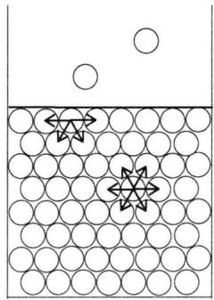

natural_image

Diagram showing a container with circular holes and two star-shaped arrows inside, no text or symbols present.

图2-6 液体表面及内部粒子所处的状态

换句话说,处在物质表面的质点比处在内部的质点能量要高。表面质点进入物质内部就要释放出部分能量,使其变得相对稳定。而内部质点要迁移到物质表面则需要吸收能量,因而处在物质表面的质点自身变得相对不稳定。这些表面质点比内部质点所多余的能量称为表面能。不难看出,若物质的表面积越大,表面分子越多,其表面能越高。在胶体中,分散质颗粒具有很大的表面积,故相应地具有很大的表面能。

## 3. 胶团的结构

胶粒具有扩散双电层结构,例如,将 $FeCl_{3}$ 水解制备 $\mathrm{Fe(OH)}_{3}$ 溶胶时,许多 $\mathrm{Fe(OH)}_{3}$ 分子聚集在一起形成了胶核(直径 1\~100 nm),胶核具有很大的表面积,它吸附 $FeO^{+}$ 而使表面带正电荷, $FeO^{+}$ 是电位离子。电位离子被牢牢地吸附在胶核表面上。由于静电引力,带正电荷的 $FeO^{+}$ 吸引液相中的 $Cl^{-}$ , $Cl^{-}$ 与电位离子的电荷相反,称为反离子。由于反离子受到电位离子的静电吸引和本身的热运动,使一部分反离子被束缚在胶核表面与电位离子一起形成吸附层,电泳时吸附层与胶核一起移动,这个运动单位为胶粒;另一部分离子离开胶核表面扩散到分散剂中,它们疏散地分布在胶粒周围,离胶核越远,浓度越小,这个液相层称为扩散层,胶粒与扩散层一起称为胶团。胶团是电中性的;而胶粒是带电的,胶粒所带电荷与电位离子符号相同。 $\mathrm{Fe(OH)}_{3}$ 胶团结构如图 2-7 所示,也可以用如下结构式表示:

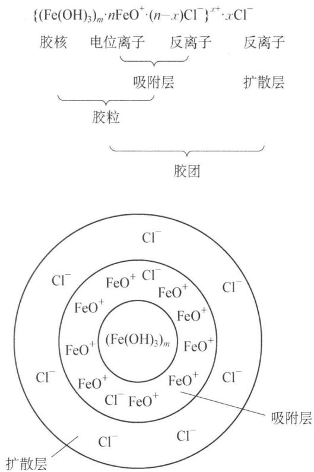

chemical

化学反应示意图，展示胶核、电位离子、反离子、扩散层和扩散层的结构式

图2-7 $\mathrm{Fe(OH)_3}$ 溶胶的胶团结构示意图

三硫化二砷溶胶的胶团结构式为： $\left\{\left(\mathrm{As}_{2}\mathrm{S}_{3}\right)_{m}\cdot n\mathrm{HS}^{-}\cdot(n-x)\mathrm{H}^{+}\right\}^{x-}\cdot x\mathrm{H}^{+}$

硅胶的胶团结构式为： $\left\{\left(\mathrm{H}_{2}\mathrm{SiO}_{3}\right)_{m}\cdot n\mathrm{HSiO}_{3}^{-}\cdot(n-x)\mathrm{H}^{+}\right\}^{x-}\cdot x\mathrm{H}^{+}$

硝酸银溶液和过量碘化钾溶液作用制备的碘化银溶胶,其胶团结构式为:

$$
\left\{\left(\mathrm{AgI}\right) _ {m} \cdot n \mathrm{I} ^ {-} \cdot (n - x) \mathrm{K} ^ {+} \right\} ^ {x -} \cdot x \mathrm{K} ^ {+} 。
$$

## 4. 胶体的性质

胶体的许多性质都与其分散相高度分散和多相共存的特点有关。胶体的性质主要包括：光学性质、动力学性质和电化学性质。

## (1) 光学性质

早在 1869 年, 丁达尔(Tyndall)在研究胶体时将一束光线照射到透明的溶胶上, 在与光线垂直方向上观察到一条发亮的光柱。后人为了纪念他的发现, 将这一现象称为丁达尔效应。由于丁达尔效应是所有胶体所特有的现象, 因此, 可以通过此效应来鉴别溶液与胶体。

丁达尔效应是如何产生的呢？我们知道当光线照射到物体表面时，可能产生两种情况：如果物质颗粒的直径远大于入射光的波长，此时入射光被完全反射，不出现丁达尔效应;如果物质的颗粒直径比入射光的波长小,则可发生光的散射作用而出现丁达尔现象。因为胶粒直径在1\~100 nm,而一般可见光的波长范围在400\~760 nm,所以可见光通过溶胶时便产生明显的散射作用。如果分散相颗粒太小(<1 nm),对光的散射太弱,则发生光的透射现象。

## (2) 动力学性质

在超微显微镜下可以观察到溶胶中的发光点在做无休止、无规则的运动,这一现象与花粉在液体表面的运动情况相似,由于该现象是由植物学家布朗(Brown)首先发现的,所以被称为布朗运动。布朗运动产生的原因有两方面,一是胶粒的热运动,二是分散剂分子对胶粒的不均匀的撞击。我们观察到的布朗运动,是以上两种因素的综合结果。

布朗运动的存在导致了胶粒的扩散作用,即胶粒自发地从浓度较大的部位向浓度较小的部位扩散,因为溶胶粒子比普通分子或离子大得多,所以扩散速率很慢。同时,布朗运动的存在也使胶粒不致因重力的作用而迅速沉降,有利于保持溶胶的稳定性。

## (3) 电学性质

在外电场作用下,溶胶系统的胶粒在分散剂中能发生定向迁移,这种现象称为溶胶的电泳。可以通过溶胶粒子在电场中的迁移方向来判断胶粒的带电性。

图2-8是电泳的实验装置，在U形管中装入棕红色的 $\mathrm{Fe(OH)_3}$ 溶胶，并在溶胶的表面小心滴加少量蒸馏水，使溶胶表面与水之间有一明显的界面。然后在两边管子的蒸馏水中插入铂电极，并给电极加上电压。经过一段时间的通电，可以观察到U形管中溶胶的液面不再相同，在负极一端溶胶界面比正极端高。说明该溶胶在电场中往负极一端迁移，胶粒带正电。胶粒带电的主要原因有：

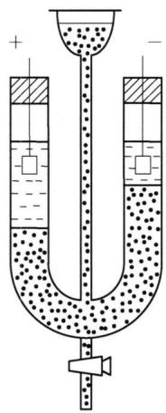

text_image

Diagram of a U-shaped tube with liquid and particles, showing positive and negative charge regions

图2-8 电泳管

① 吸附作用 溶胶系统具有较高的表面能,而这些小颗粒为

了减小其表面能,就要选择性地吸附与其组成类似的离子。以 $\mathrm{Fe(OH)}_{3}$ 溶胶为例,该溶胶是用 $FeCl_{3}$ 溶液在沸水中水解制成:

$$
\mathrm{FeCl} _ {3} + 3 \mathrm{H} _ {2} \mathrm{O(沸水)} \rightleftharpoons \mathrm{Fe(OH)} _ {3} + 3 \mathrm{HCl}
$$

在水解过程中,反应体系中除了生成 $\mathrm{Fe(OH)}_{3}$ 外,还有大量的副产物 $FeO^{+}$ 生成:

$$
\mathrm{FeCl} _ {3} + 2 \mathrm{H} _ {2} \mathrm{O} \rightleftharpoons \mathrm{Fe(OH)} _ {2} \mathrm{Cl} + 2 \mathrm{HCl}
$$

$$
\mathrm{Fe} (\mathrm{OH}) _ {2} \mathrm{Cl} \rightleftharpoons \mathrm{FeO} ^ {+} + \mathrm{Cl} ^ {-} + \mathrm{H} _ {2} \mathrm{O}
$$

$\mathrm{Fe(OH)}_{3}$ 溶胶在溶液中选择吸附了与自身组成有关的 $\mathrm{FeO}^{+}$ , 而使 $\mathrm{Fe(OH)}_{3}$ 胶粒带正电。又如硫化砷溶胶的制备通常是将 $\mathrm{H}_{2} \mathrm{~S}$ 气体通入饱和 $\mathrm{H}_{3} \mathrm{AsO}_{3}$ 溶液中, 经过一段时间后, 生成淡黄色 $\mathrm{As}_{2} \mathrm{~S}_{3}$ 溶胶: $2 \mathrm{H}_{3} \mathrm{AsO}_{3} + 3 \mathrm{H}_{2} \mathrm{~S} \rightleftharpoons \mathrm{As}_{2} \mathrm{~S}_{3} + 6 \mathrm{H}_{2} \mathrm{O}$ 。由于 $\mathrm{H}_{2} \mathrm{~S}$ 在溶液中电离产生大量 $\mathrm{HS}^{-}$ , 所以 $\mathrm{As}_{2} \mathrm{~S}_{3}$ 吸附 $\mathrm{HS}^{-}$ , 使 $\mathrm{As}_{2} \mathrm{~S}_{3}$ 胶粒带负电。

② 解离作用 胶体粒子带电的另一个原因是胶粒表面的解离作用。例如，硅胶粒子带电是因为 $H_{2}SiO_{3}$ 解离形成 $HSiO_{3}^{-}$ 和 $SiO_{3}^{2-}$ ，并附着在表面而带负电。其反应式为：

$$
\mathrm{H} _ {2} \mathrm{SiO} _ {3} \rightleftharpoons \mathrm{HSiO} _ {3} ^ {-} + \mathrm{H} ^ {+}, \mathrm{HSiO} _ {3} ^ {-} \rightleftharpoons \mathrm{SiO} _ {3} ^ {2 -} + \mathrm{H} ^ {+}
$$

## 5. 溶胶的稳定性和聚沉

## (1) 溶胶的稳定性

溶胶是多相、高分散体系，具有很大表面能，有自发聚集成较大颗粒而沉淀的趋势。但事实上许多溶胶均可长期稳定存在，其主要原因是溶胶具有动力学稳定性和聚结稳定性。

溶胶的动力学稳定性是指在重力作用下,分散质粒子不会从分散剂中沉淀出来,从而保持体系相对稳定的性质。溶胶粒子具有强烈的布朗运动,使其能抵抗重力的作用而不沉淀,所以溶胶是动力学稳定系统。

溶胶的聚结稳定性是指溶胶在放置过程中不发生分散质粒子的相互聚结而产生沉淀。由于胶粒带电，当两个带同种电荷的胶粒相互靠近时，胶粒之间会产生静电排斥作用，从而阻止胶粒的相互碰撞，使溶胶趋向稳定。另外，由于胶粒中的带电离子和极性溶剂通过静电引力的相互作用，使得溶剂分子在胶粒表面形成一个溶剂化膜，该溶剂化膜也起到阻止胶粒相互碰撞的作用。

## (2) 溶胶的聚沉

溶胶的稳定性是相对的,只要破坏了溶胶的稳定性因素,胶粒就会相互聚结成大颗粒而沉降,此过程称为溶胶的聚沉。

造成溶胶聚沉的因素很多,如胶体本身浓度过高;溶胶被长时间加热;以及在溶胶中加入强电解质等。溶胶的浓度过高,单位体积中胶粒的数目较多,胶粒间的空间相对减小,因而胶粒的碰撞机会增加,溶胶容易发生聚沉。将溶胶长时间加热,会增强溶胶粒子的热运动,而且使得胶粒周围原来的溶剂化膜被破坏,胶粒暴露在溶剂当中;同时由于胶粒的热运动,使胶粒表面的电位离子和反离子数目减少,吸附层变薄,胶粒间碰撞聚结的可能性大大增加。如果在溶胶中加入大量电解质,由于离子总浓度的增加、大量离子进入扩散层内,迫使扩散层中的反离子向胶粒靠近,由于吸附层中反离子浓度的增加,相对减小了胶粒所带的电荷,使胶粒间的静电斥力减弱,胶粒间的碰撞变得更加容易,聚沉的机会增加。

电解质对溶胶的聚沉作用主要是那些与胶粒所带电荷相反的离子,一般来说,离子电荷越高,对溶胶的聚沉作用就越大。例如,要使带负电荷的 $As_{2}S_{3}$ 溶胶聚沉,所需 $Al^{3+}$ 的浓度比 $Ba^{2+}$ 的浓度小。对同价离子来说,它们的聚沉能力与离子在水溶液中的实际大小有关。离子在水溶液中均会形成水合离子,水合离子半径越大,其聚沉能力越小。在同价离子中,离子半径越小,电荷密度越大,其水化半径也越大,因而离子的聚沉能力越小。例如,碱金属离子在相同负离子条件下,对带负电溶胶的聚沉能力大小为: $Rb^{+}>K^{+}>Na^{+}>Li^{+}$ , $Li^{+}$ 的离子半径最小,相应的水化半径最大,因此它的聚沉能力最小。

电解质的聚沉能力通常用聚沉值来表示。使一定量的溶胶，在一定时间内开始聚沉所需电解质的最低浓度 $(\mathrm{mmol} \cdot \mathrm{L}^{-1})$ 称为聚沉值。可见聚沉值越小，表明电解质的聚沉能力越强，反之亦然。如 $\mathrm{NaCl}$ 、 $\mathrm{MgCl}_2$ 、 $\mathrm{AlCl}_3$ 三种电解质对 $\mathrm{As}_2\mathrm{S}_3$ 负溶胶的聚沉值分别为 $51 \mathrm{mmol} \cdot \mathrm{L}^{-1}$ 、 $0.72 \mathrm{mmol} \cdot \mathrm{L}^{-1}$ 、 $0.093 \mathrm{mmol} \cdot \mathrm{L}^{-1}$ ，说明对于 $\mathrm{As}_2\mathrm{S}_3$ 溶胶而言， $\mathrm{Al}^{3+}$ 聚沉能力最强， $\mathrm{Na}^+$ 聚沉能力最弱。

如果将两种带有相反电荷的溶胶按适当比例相互混合,溶胶同样会发生聚沉。这种现象称为溶胶的互聚。溶胶的完全互聚要求按等电量原则进行,即两种互聚的溶胶粒子所带的电荷总数必须相等,否则其中的一种溶胶的聚沉会不完全。

## (3) 溶胶的保护

由于溶胶具有某些溶液所没有的特殊性质,因此在许多情况下需要对溶胶进行保护。保护溶胶的方法有很多,这里主要讨论高分子溶液对溶胶的保护与敏化作用。

高分子化合物是指相对分子量在 10 000 以上的有机化合物。许多天然有机物如蛋白质、纤维素、淀粉、橡胶以及人工合成的各种塑料等都是高分子化合物。高分子化合物在适当的溶剂中能强烈地溶剂化，形成很厚的溶剂化膜而溶解，构成了均匀、稳定的单相分散系。

在溶胶中加入适量高分子化合物,能显著提高溶胶对电解质的稳定性。这是由于在溶胶中加入高分子,高分子化合物附着在胶粒表面,可以在胶粒表面形成一个高分子保护膜,从而提高了溶胶的稳定性。值得注意的是,在溶胶中加入少量高分子化合物,反而使溶胶对电解质的敏感性大大增加,降低了其稳定性,这种现象称为高分子的敏化作用。产生敏化作用的原因是加入的高分子化合物量太少,不足以包住胶粒,反而使大量胶粒吸附在高分子的表面,使胶粒间可以互相桥联变大而聚沉。

## 典型例题

【例 1】 A、B 两种化合物的溶解度曲线如右图所示。现要用结晶法从 A、B 混合物中提取 A（不考虑 A、B 共存时，对各自溶解度的影响）：

(1) 50 g 混合物, 将它溶于 100 g 热水, 然后冷却至 $20^{\circ}$ C。若要使 A 析出而 B 不析出, 则混合液中 B 的质量分数最高不能超过多少?

(2) 取 $w \mathrm{~g}$ 混合物, 将它溶于 $100 \mathrm{~g}$ 热水, 然后冷却至 $10^{\circ} \mathrm{C}$ 。若仍要 A 析出而 B 不析出, 则混合物中 A 的质量分数应满足什么关系式 (以 $w$ 、 $a$ 、 $b$ 表示)?

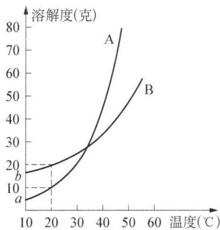

line chart

| 温度(℃) | A (克) | B (克) |
| -------- | ------ | ------ |
| 10       | 20     | 10     |
| 20       | 25     | 15     |
| 30       | 30     | 25     |
| 40       | 40     | 35     |
| 50       | 60     | 50     |
| 60       | 80     | 60     |

解析 本题不考虑 A、B 共存时对各自溶解度的影响, 因此只需找出同时满足各自条件的量即可。由于都溶于热水中, 可直接用溶解度数值计算。

(1) A 要析出 $50 \times A\% > 10$ , B 不析出 $50 \times B\% \leqslant 20$ , 所以 $B\% \leqslant 40\%$ .  
(2) 由图中数据可以看到 $10^{\circ}$ C 溶解度: A—a; B—b

A 要析出, 则 $w \times A\% > a$ , 整理得: $A\% > \frac{a}{w}$ ①

B不析出，则 $w \times B\% \leqslant b$ ，又 $A\% + B\% = 1$ ，整理得： $A\% \geqslant \frac{w - b}{w}$ ②

比较两式：

当 $w - b > a$ ，即： $w > a + b$ ，①包含②，有： $\mathrm{A}\% \geqslant \frac{w - b}{w}$

当 $w - b < a$ ，即： $w < a + b$ ，②包含 ①，有： $\mathrm{A}\% > \frac{a}{w}$ 。

【例 2】某不挥发性化合物的苯溶液,溶质和溶剂的质量比是 15:100。在 293 K, $1.013 \times 10^{5}$ Pa 下将 4.0 dm $^{3}$ 空气缓缓地通过该溶液时,测知损失 1.185 g 苯。求:

(1) 溶质的相对分子质量;  
(2) 原溶液凝固点和沸点。

（已知：293 K 时，苯的饱和蒸气压为 $1 \times 10^{4}$ Pa； $1.013 \times 10^{5}$ Pa 时，苯的沸点为 353.1 K，凝固点为 278.4 K， $K_{f(\text{苯})} = 5.1 \, \text{K} \cdot \text{mol}^{-1} \cdot \text{kg}$ ， $K_{b(\text{苯})} = 2.53 \, \text{K} \cdot \text{mol}^{-1} \cdot \text{kg}$ 解析 （1）通入空气的质量为

$$
n _ {(\mathrm{空气})} = \frac {p V}{R T} = \frac {1 . 1 0 3 \times 1 0 ^ {5} \mathrm{Pa} \times 4 . 0 \times 1 0 ^ {- 3} \mathrm{m} ^ {3}}{8 . 3 1 4 \mathrm{Pa} \cdot \mathrm{m} ^ {3} \cdot \mathrm{mol} ^ {- 1} \cdot \mathrm{K} ^ {- 1} \times 2 9 3 \mathrm{K}} = 0. 1 6 6 3 \mathrm{mol},
$$

被空气带走的苯蒸气物质的量为 $n_{(\text{苯})} = \frac{1.185\mathrm{g}}{78.0\mathrm{g}\cdot\mathrm{mol}^{-1}} = 0.0152\mathrm{mol}$ 。

混合气体的总压为 $1.013 \times 10^{5}$ Pa, 则苯蒸气分压为

$$
p _ {(\text {苯})} = \frac {n _ {(\text {苯})}}{n _ {(\text {空气})} + n _ {(\text {苯})}} \times p _ {\text {总}} = \frac {0 . 0 1 5 2}{0 . 1 6 6 3 + 0 . 0 1 5 2} \times 1. 0 1 3 \times 1 0 ^ {5} \mathrm{Pa} = 8. 4 8 \times 1 0 ^ {3} \mathrm{Pa}.
$$

混合气体中苯的蒸气压就是苯溶液的蒸气压。由拉乌尔定律 $p = p_{A}^{\theta} \cdot x_{A}$ ，得苯的物质的量分数为 $x_{(\text{苯})} = 0.848$ 。

设溶质的摩尔质量为 M，由物质的量分数定义得

$$
x _ {(\mathrm{苯})} = \frac {\frac {1 0 0 \mathrm{g}}{7 8 \mathrm{g} \bullet \mathrm{mol} ^ {- 1}}}{\frac {1 0 0 \mathrm{g}}{7 8 \mathrm{g} \bullet \mathrm{mol} ^ {- 1}} + \frac {1 5 \mathrm{g}}{M}} = 0. 8 4 8, \mathrm{解得溶质的} M = 6 5. 3 \mathrm{g/mol。}
$$

(2) 根据(1)中数据可计算苯溶液的质量摩尔浓度为

$b=\frac{\frac{15\ g}{65.3\ g\cdot mol^{-1}}}{100\times10^{-3}\ kg}=2.297\ \mathrm{mol/kg}$ 。由稀溶液依数性可得：

$\Delta T_{f}=K_{f}\cdot b=5.1\ K\cdot mol^{-1}\cdot kg\times2.297\ mol\cdot kg^{-1}=11.7\ K,$ 所以苯溶液的凝固点为 $T=T_{f}-\Delta T_{f}=278.4\ K-11.7\ K=266.7\ K$ 。

$\Delta T_{b}=K_{b}\cdot b=2.53\ K\cdot mol^{-1}\cdot kg\times2.297\ mol\cdot kg^{-1}=5.8\ K,$ 所以该苯溶液的沸点为 $T=T_{b}+\Delta T_{b}=353.1\ K+5.8\ K=358.9\ K$ 。

【例 3】 若某溶质在水和一有机溶剂中的分配常数为 K（一次萃取后，溶质在有机溶剂和水中的浓度(g/L)之比）。求证：

（1）用与水溶液等体积的该有机溶剂进行一次萃取后，溶质在水溶液中的残留量为原质量的 $\frac{1}{1+K}$ ;  
（2）用相当于水溶液体积的 $\frac{1}{10}$ 的该有机溶质进行10次萃取后，溶质在水溶液中的残留量为原质量的 $\left(\frac{10}{10+K}\right)^{10}$ 。

证 (1) 假设: 有机相的体积为 $V_{0}(\mathrm{L})$ ; 水相的体积为 $V_{a}(\mathrm{L})$ ; 萃取前溶质的质量为 $m(\mathrm{g})$ ; 一次萃取后溶质在有机相中的质量为 $m_{0}(\mathrm{~g})$ , 浓度为 $c_{0}(\mathrm{~g/L})$ ; 一次萃取后溶质在水相中的质量为 $m_{a}(\mathrm{~g})$ , 浓度为 $c_{a}(\mathrm{~g/L})$ ; 分配常数为 K。

根据分配定律： $K=\frac{c_{0}}{c_{a}}=\frac{m_{0}/V_{0}}{m_{a}/V_{a}}=\frac{(m-m_{a})/V_{0}}{m_{a}/V_{a}}$ ，整理得：

$$
m _ {a} = m \cdot \frac {1}{1 + K \frac {V _ {0}}{V _ {\mathrm{a}}}} 。
$$

根据题意 $V_{0}=V_{a}$ ，所以： $m_{a}=m\cdot\frac{1}{1+K}$ 。

即一次萃取后,溶质在水相中的残留量 $m_{a}$ 为原质量(m)的 $\frac{1}{1+K}$ 。

(2) 由上述可知,一次萃取后溶质在水相中的质量为:

$m_{a(1)} = m \cdot \frac{1}{1 + K \frac{V_0}{V_a}}$ ，据题意： $V_0 = \frac{1}{10} V_a$ 代入式中得：

$$
m _ {a (1)} = m \cdot \frac {1}{1 + K \cdot \frac {V _ {\mathrm{a}} / 1 0}{V _ {\mathrm{a}}}} = m \cdot \frac {1 0}{1 0 + K} 。
$$

同理, 二级萃取时, 溶质在水相中的质量为: $m_{\mathrm{a}(2)} = m_{\mathrm{a}(1)} \frac{10}{10 + K} = m \left(\frac{10}{10 + K}\right)^2$ ;

三级萃取时,溶质在水相中的质量为: $m_{\mathrm{a}(3)} = m_{\mathrm{a}(2)} \frac{10}{10 + K} = m \left( \frac{10}{10 + K} \right)^{3}$ ;

$n$ 级萃取时，溶质在水相中的质量为： $m_{\mathrm{a}(n)} = m_{\mathrm{a}(n - 1)}\frac{10}{10 + K} = m\left(\frac{10}{10 + K}\right)^n$

所以当 n=10 时，溶质在水相中的残留质量为： $m_{\mathrm{a}(10)}=m\left(\frac{10}{10+K}\right)^{10}$ 。

即 10 次萃取后,溶质在水中的残留量 $m_{\mathrm{a}(10)}$ 为原质量(m) 的 $\left(\frac{10}{10+K}\right)^{10}$ 。

【例 4】（2007 年全国决赛改编）用氨水与硝酸反应得硝酸铵水溶液，经蒸发、结晶得硝酸铵晶体。硝酸铵有多种晶型，其中晶型Ⅰ、Ⅱ和Ⅲ的密度分别为 1.73、1.66 和 $1.70 \, g \cdot cm^{-3}$ 。在标准压力、室温下，加热固体硝酸铵到 305 K，晶型Ⅰ转变为晶型Ⅱ，晶变热为 1.68 kJ/mol；加热到 357 K 时，晶型Ⅱ转变为晶型Ⅲ，晶变热为 1.75 kJ/mol。单组分体系两相平衡的温度和压力满足克拉珀龙方程： $\frac{\Delta p}{\Delta T} =$

$\frac{\Delta H_{m}}{T\Delta V_{m}}$ （其中 $\Delta H_{m}$ 为相变热，kJ/mol； $\Delta V_{m}$ 为相变时的摩尔体积变化量，cm $^{3}$ /mol）。

(1) 若两种晶型平衡共存的温度 T 和压力 p 呈线性关系, 计算三种晶型同时平衡共存的温度和压力。  
(2) 根据计算, 在 p-T 坐标图 (p 用 $p^{\theta}$ 表示, T 用 K 表示) 上粗略绘出硝酸铵体系的相图, 并标明各相区的相态。

解析 （1）根据题意，可设两种晶型平衡共存的温度 T 和压强 p 的线性关系为： $p = C + kT$ ，其中 k 为直线方程的斜率，C 为直线方程的截距。由克拉珀龙方程式可知 $\frac{\Delta p}{\Delta T}$ 即为直线方程的斜率 k，为求得斜率 k，分别计算由晶型 I 转变为晶型 II 的 $\Delta I V_{m}$ ，晶型 II 转变为晶型 III 的 $\Delta I V_{m}$ ，即可求得斜率 k。

$$
\begin{array}{l} \Delta_ {\mathrm{I}} ^ {\mathrm{II}} V _ {\mathrm{m}} = M \left(\frac {1}{\rho_ {\mathrm{II}}} - \frac {1}{\rho_ {\mathrm{I}}}\right) = 8 0. 0 \left(\frac {1}{1 . 6 6} - \frac {1}{1 . 7 3}\right) = 1. 9 5 \mathrm{cm} ^ {3} / \mathrm{mol} \\ \Delta \mathbb {I} V _ {\mathrm{m}} = M \left(\frac {1}{\rho_ {\mathrm{III}}} - \frac {1}{\rho_ {\mathrm{II}}}\right) = 8 0. 0 \left(\frac {1}{1 . 7 0} - \frac {1}{1 . 6 6}\right) = - 1. 1 3 \mathrm{cm} ^ {3} / \mathrm{mol} \\ \end{array}
$$

所以,分别计算晶型转变过程的直线斜率:

晶型 I → II : $\frac{\Delta p}{\Delta T} = \frac{\Delta_{I}^{II} H_{m}}{T \Delta_{I}^{II} V_{m}} = \frac{1.68 \times 10^{3}}{305 \times 1.95 \times 10^{-6}} = 2.825 \times 10^{6} \, Pa/K = 27.88 p^{\theta}/K$

晶型Ⅱ→Ⅲ： $\frac{\Delta p}{\Delta T}=\frac{\Delta\parallel H_{m}}{T\Delta\parallel V_{m}}=\frac{1.75\times10^{3}}{357\times(-1.13\times10^{-6})}=-4.438\times10^{6}\ Pa/K=-42.81p^{\theta}/K$

由此晶型转变过程的直线方程为：

晶型 I→II: $p = C + kT = C + 27.88p^{\theta}T$ ，将 $T = 305K, p = p^{\theta}$ 代入后解得 $C = -8502p^{\theta}$ ; 所以直线方程为 $p = -8502p^{\theta} + 27.88p^{\theta}T$ 。

晶型 $\mathrm{II}\rightarrow\mathrm{III}:\ p=C+kT=C-42.81p^{\theta}T$ ，将 $T=375\ K,\ p=p^{\theta}$ 代入后解得 $C=15\ 284p^{\theta}$ ; 所以直线方程为 $p=15\ 284p^{\theta}-42.81p^{\theta}T$ 。

两式联立,解得三相点温度 $T = 336.5 \, K$ , 压强 $p = 879.3 p^{\theta}$ 。

(2) 由(1)的方法可得晶型Ⅰ与晶型Ⅲ的共存平衡线性方程的斜率:

晶型 I → III: $\frac{\Delta p}{\Delta T} = \frac{\Delta^{II} H_{m}}{T \Delta^{III} V_{m}} = \frac{3.43 \times 10^{3}}{336.5 \times 0.82 \times 10^{-6}} = 1.24 \times 10^{7}$ Pa/K = 122.4p $^{\theta}$ /K。

由此可以作图得到硝酸铵体系的粗略相图：

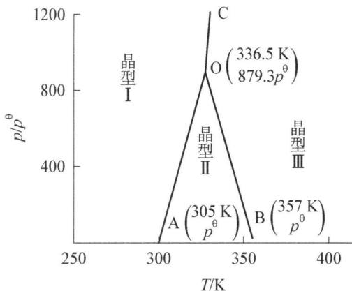

line chart

| Phase | Temperature (K) | p/pθ (K) |
|-------|------------------|----------|
| I     | 300              | 0        |
| II    | 325              | 879.3    |
| III   | 375              | 357      |

作图时需要注意：根据(1)、(2)的计算可知晶型Ⅰ⇌晶型Ⅱ的相平衡直线(OA)斜率小于晶型Ⅰ⇌晶型Ⅲ的相平衡直线(OC)斜率，均为正；晶型Ⅱ⇌晶型Ⅲ的相平衡直线斜率为负(OB)；三根相平衡直线交于三相点O（T=336.5K，压强 $p=879.3p^{\theta}$ ）。

【例 5】（2013 年全国决赛改编）稀溶液的一些性质只取决于所含溶质的分子数目，而与溶质本性无关。所谓的分子数目必须是独立运动的质点数目，此即稀溶液的依数性。1912 年麦克贝恩(McBain)在研究脂肪酸钠水溶液时发现，与一般电解质(如 NaCl)水溶液不同，脂肪酸钠体系在浓度达到一定值后，其电导率、表面张力等依数性严重偏离该浓度前的线性规律，依数性-浓度曲线上呈现一个明显的拐点。而密度等非依数性质则符合一般电解质溶液的规律。通过对多种脂肪酸盐的实验，他发现这是一个普遍的规律。他认为在浓度大于拐点值时，脂肪酸盐在溶液中并非以单分子形式存在，而是发生了分子聚集。他将这些聚集体称为缔合胶体。

(1) 根据上述事实,你认为麦克贝恩的推论是否合理? 说明理由。

(2) 除脂肪酸盐外还有很多物质具有类似的变化规律。这些物质(表面活性剂)的分子结构具有一个共同的特点,都具有亲水头基和疏水尾链(如下图所示)。请给出表面活性剂在水中形成的“缔合胶体”的结构示意图。若表面活性剂的分子长度为 $1.0 \mathrm{~nm}$ , 估算“缔合胶体”在刚过拐点浓度时的最大尺寸。

  
表面活性剂

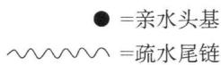

解析 （1）依数性涉及的是体系中独立运动的分子数目,其核心在于质点数目。一般而言,当溶质浓度较小时,沸点、熔点、渗透压等的依数性与质点数目呈线性关系,而质点数目又与溶液浓度呈线性关系,因此依数性与浓度存在线性关系。但当溶液浓度增大时,质点数目与浓度的关系不再是线性关系,如高浓度使得分子可以显著地聚集,导致浓度的增长不能带来质点数目同比例的增长,溶液的依数性会偏离线性,因此麦克贝恩的推论是合理的:即溶质微粒的聚集造成体系中实际的独立运动的分子数目与按配制浓度计算得到的独立运动的分子数目不同。

(2) 考查胶体最简单的结构。由于表面活性剂的量比水要少很多, 因此二者会形成“水包油”, 即亲水头基露在外面, 疏水尾链包在内部, 形成球状聚集体, 剖面图结构见右图。

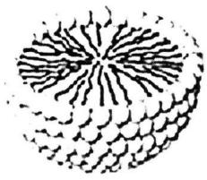

natural_image

Abstract black-and-white line drawing resembling a stylized sea or coral pattern (no text or symbols)

或者

natural_image

Abstract pattern of interconnected circles forming a symmetrical, radiating structure (no text or symbols)

显然,刚过拐点浓度时,脂肪酸盐分子应该刚刚好形成球状聚集体,因此其直径为分子长度的2倍,即2.0 nm。

## 本讲习题

  
1. 已知 $20^{\circ}C$ 时 $\mathrm{Ca(OH)_2}$ 的溶解度为 0.165 g/100 g 水，在不同的 $CO_2$ 压力下碳酸钙的溶解度为：

<table><tr><td> $CO_{2}$ 压力/Pa</td><td>0</td><td>14 084</td><td>99 501</td></tr><tr><td>溶解度(g  $CaCO_{3}$ /100 g  $H_{2}O$ )</td><td>0.0013</td><td>0.0223</td><td>0.109</td></tr></table>

请用计算说明,当持续把 $CO_{2}$ (压强为 99501 Pa, 下同)通入饱和石灰水,开始生成的白色沉淀是否完全“消失”? 在多次实验中出现了下列现象,请解释:

(1) 由碳酸钙和盐酸(约 $6 \mathrm{~mol} / \mathrm{L}$ )作用生成的 $\mathrm{CO}_{2}$ 直接通入饱和石灰水溶液,所观察到的现象是: 开始通 $\mathrm{CO}_{2}$ 时生成的沉淀到最后完全消失。若使 $\mathrm{CO}_{2}$ 经水洗后再通入饱和石灰水溶液则开始生成的白色沉淀到最后不能完全“消失”,为什么?  
(2) 把饱和石灰水置于一敞口容器中, 过了一段时间后, 溶液表面有一层硬壳。把硬壳下部的溶液倒入另一容器中, 再通入经水洗过的 $\mathrm{CO}_{2}$ , 最后能得清液, 请解释。若把硬壳取出磨细后, 全部放回到原石灰水溶液中, 再持续通入经水洗过的 $\mathrm{CO}_{2}$ , 最后能得清液吗?  
(3) 用适量水稀释饱和石灰水溶液后, 再持续通入经水洗过的 $\mathrm{CO}_{2}$ , 结果是因稀释程度不同, 有时到最后能得清液, 有时得不到清液。请估算用水将饱和石灰水稀释多少倍时, 一定能得到清液 (设反应过程中, 温度保持恒定, 即 $20^{\circ} \mathrm{C}$ ) 。

2. 下面是四种盐在不同温度下的溶解度(g/100 g 水):

<table><tr><td></td><td> $NaNO_{3}$ </td><td> $KNO_{3}$ </td><td>NaCl</td><td>KCl</td></tr><tr><td>10°C</td><td>80.5</td><td>20.9</td><td>35.7</td><td>31.0</td></tr><tr><td>100°C</td><td>175</td><td>246</td><td>39.1</td><td>56.6</td></tr></table>

（计算时假定：①盐类共存时不影响各自的溶解度；②过滤晶体时，溶剂损耗忽略不计。）取23.4 g NaCl和40.4 g KNO₃，加70.0 g H₂O，加热溶解，在100℃时蒸发掉50.0 g H₂O，维持该温度，过滤析出晶体。计算所得晶体的质量(m高温)；将滤液冷却到10℃，待充分结晶后过滤，计算所得晶体的质量(m低温）。

3. 有每毫升含碘 $1 \mathrm{mg}$ 的水溶液 $10 \mathrm{~mL}$ , 若用 $6 \mathrm{~mL} \mathrm{CCl}_{4}$ 一次萃取此水溶液中的碘, 问水溶液中剩余多少碘? 若将 $6 \mathrm{~mL} \mathrm{CCl}_{4}$ 分成三次萃取, 每次用 $2 \mathrm{~mL} \mathrm{CCl}_{4}$ , 最后水溶液中剩余多少碘? 哪个方法好? (已知 $K$ 为 85)

4. 已知 A+B→C+水。 $t^{\circ}$ C 下，A、B、C 三种物质的溶解度分别为 $S_{1}$ g、 $S_{2}$ g、 $S_{3}$ g。现取 $t^{\circ}$ C 时 A 的饱和溶液 Mg，B 的饱和溶液 Ng，混合后恰好完全反应生成 C 物质 P g。

(1) 求反应中生成水的质量。

(2) 通过计算推断: 在此反应中 C 物质沉淀的条件是什么?

5. 25℃时, 水的饱和蒸气压为 3.166 kPa, 求在相同温度下 5.0% 的尿素 $\left[\mathrm{CO}\left(\mathrm{NH}_{2}\right)_{2}\right]$ 水溶液的饱和蒸气压。

6. 烟草的有害成分尼古丁的实验式是 $C_{5}H_{7}N$ ，今将 496 mg 尼古丁溶于 10.0 g 水中，所得溶液的沸点是 100.17℃。求尼古丁的分子式。（水的 $K_{b} = 0.512 K \cdot kg \cdot mol^{-1}$ ）

7. 把 1.00 g 硫溶于 20.0 g 萘中, 溶液的凝固点为 351.72 K, 求硫的分子量。(已知萘的凝固点: 353.00 K, $K_{f} = 6.90 K \cdot kg \cdot mol^{-1}$ )

8. 树木内部树汁的上升是由渗透压造成的, 设树汁浓度为 0.20 mol/L, 树汁小管外部的水中含非电解质浓度为 0.01 mol/L (1 kPa = 10.2 cm 水柱高), 则在 25℃时树汁能上升的最大高度是多少?

9. 将 $15.0 \mathrm{~mL} 0.01 \mathrm{~mol} / \mathrm{L}$ 的 KCl 溶液和 $100 \mathrm{~mL} 0.05 \mathrm{~mol} / \mathrm{L}$ 的 $\mathrm{AgNO}_{3}$ 溶液混合以制备 AgCl 溶胶。写出胶团结构, 试问该溶胶的胶粒在电场中向哪极运动? 并比较 $\mathrm{AlCl}_{3} 、 \mathrm{Na}_{2} \mathrm{SO}_{4} 、 \mathrm{K}_{3} [\mathrm{Fe}(\mathrm{CN})_{6}]$ 三种电解质对该溶胶的聚沉能力。

10. (1999 年全国决赛)纳米粒子是指粒径为 1\~100 nm 的超细微粒,由于表面效应和体积效应,纳米粒子常有奇特的光、电、磁、热性质,可开发为新型功能材料。

人工制造纳米材料的历史至少可以追溯到一千多年前。中国古代铜镜表面的防锈层，经实验证实为氧化锡纳米粒子构成的薄膜。

分散质微粒的直径大小在 $1 \sim 100 \, nm$ 之间的分散系叫作胶体。胶体化学法是制备纳米粒子的重要方法之一，其关键是“促进成核、控制生长”。用该法制备纳米 $Cr_{2}O_{3}$ 的过程如下：

$$
\begin{array}{r l} & {\mathrm {CrCl_ {3}} \text {溶液} \xrightarrow [ (\text {去杂质}) ]{\text {氨水}} \mathrm {Cr_ {2} O_ {3}} \bullet x \mathrm {H_ {2} O} \text {沉淀} \xrightarrow {\text {适量稀盐酸}} \mathrm {Cr_ {2} O_ {3}} \bullet x \mathrm {H_ {2} O} \text {水溶胶}} \\ & {\xrightarrow {\mathrm{DBS}} \xrightarrow {\text {有机溶剂萃取}} \mathrm {Cr_ {2} O_ {3}} \text {有机溶胶} \xrightarrow {\text {分离}} \xrightarrow {\text {热处理}} \text {纳米} \mathrm {Cr_ {2} O_ {3}}} \end{array}
$$

DBS——十二烷基苯磺酸钠

回答下列问题:

(1) 加稀盐酸起什么作用? 盐酸加多了或加少了将会怎样影响 $Cr_{2}O_{3}$ 的产率?

(2) 为什么形成 $Cr_{2}O_{3}$ 水溶胶可以阻止粒子长大?

(3) 用示意图描绘 $\mathrm{Cr}_{2} \mathrm{O}_{3}$ 胶粒加 DBS 所得产物的结构特征。

(4) 为什么有机溶剂可以把“氧化铬”萃取出来？萃取的目的是什么？

(5) DBS 直接排入水体会给环境造成何种影响(举 1\~2 点)? 已知 DBS 能够进行生物降解, 其降解的最终产物是什么?

## 第三讲 化学热力学基础

## 知识精讲

## 一、化学热力学的研究范围和特点

## 1. 化学热力学的范围

化学热力学是研究化学变化的方向和限度及其伴随变化过程中能量的相互转换所遵循规律的科学。化学热力学是一门宏观科学，研究内容是热力学的一些状态函数，不涉及物质的微观结构。本讲主要阐述反应热效应的计算、盖斯定律的应用、应用吉布斯能变来判断化学反应的方向。

## 2. 化学热力学的特点

（1）化学热力学解决化学反应中能量是如何转换的——能量守恒定律(热力学第一定律)。  
(2) 化学热力学解决在指定条件下,化学反应朝哪个方向进行以及反应的限度(热力学第二定律)。

这两个定律是人类对含有极大量质点物质长期实践中总结出来的,这两个定律可以用数学式表示,但无法用数学来证明。

## 3. 局限性

对于个别分子、原子的性质,即微观粒子的性质的解决是无能为力的,所以对于被研究对象无需知道过程的微观进程,也不需要考虑物质的结构。

化学热力学研究问题时没有时间概念,不涉及变化过程的速率问题。

## 二、热力学的基本概念

## 1. 体系和环境

按照体系和环境之间的物质、能量的交换关系,体系可以分为三类:敞开体系、封闭体系、孤立体系(详见第一分册第十讲)。例如:一个敞开瓶口盛满热水的瓶子,水为体系,则是敞开体系;若加上一个盖子,则成为封闭体系;若将瓶子换成杜瓦瓶(保温瓶),则变成孤立体系。热力学上主要研究的是封闭体系。

## 2. 状态和状态函数

状态：由一系列表征体系性质的物理量总和所确定下来的体系的一种存在形式，称为体系的状态。当体系的一系列宏观性质都为定值，不再随时间而变化时体系就处于一定的状态；当其中一个物理量改变时，状态就发生改变。

状态函数：确定体系状态的物理量，是状态函数，主要有内能、焓、熵、吉布斯自由能等。

状态函数具有如下特征：

(1) 状态函数是系统状态的单值函数, 状态一经确定, 状态函数就有唯一确定的数值, 此数值与系统到达此状态前的历史无关。

(2) 系统的状态发生变化,状态函数的数值随之发生变化,变化的多少仅取决于系统的终态与始态,与所经历的途径无关。无论系统发生多么复杂的变化,只要系统恢复原态,则状态函数必定恢复原值,即状态函数经循环过程,其变化必定为零。

## 3. 过程和途径

过程: 体系的状态发生变化,变化前称为始态,变化达到的状态称为终态。从始态到终态,经历了一个热力学过程,简称过程。常见的过程有: 等温过程、等压过程、等容过程等(详见第一分册第十讲)。

途径：实现过程的方式称为途径。完成一个热力学过程，可以采取不同的方式。我们把每种具体的方式，称为一种途径。过程着重于始态和终态；而途径着重于具体方式。

例如：某理想气体，经历一个恒温过程：

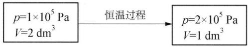

flowchart

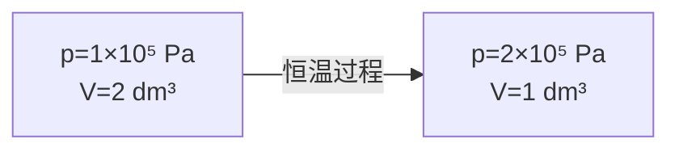

可以有许多不同的途径：

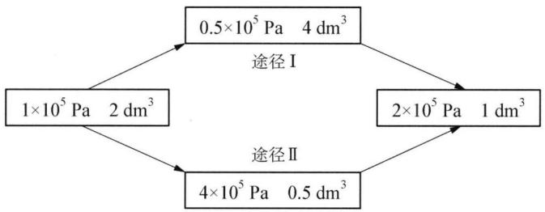

flowchart

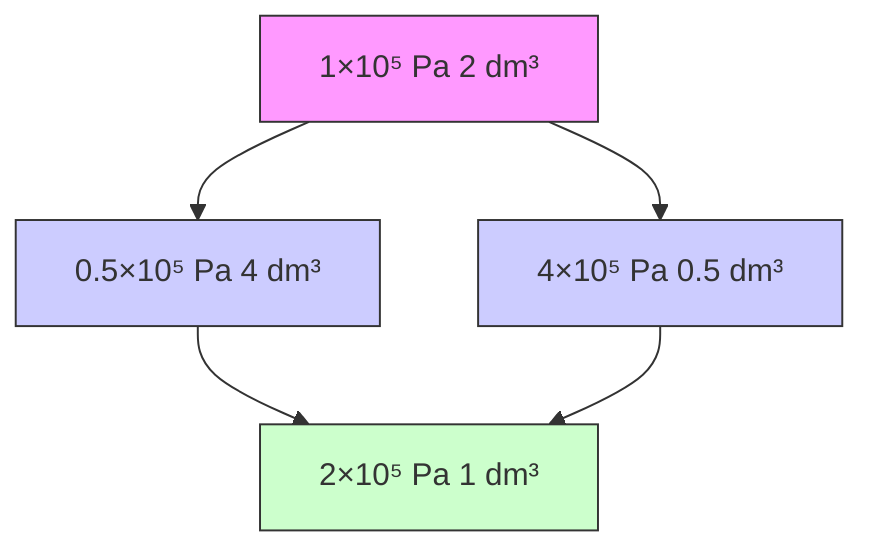

状态函数改变量,取决于始态、终态,无论途径如何不同。如上述过程的两种途径中:

$$
\begin{array}{l} \Delta p = p _ {\text {终}} - p _ {\text {始}} = 2 \times 1 0 ^ {5} \mathrm{Pa} - 1 \times 1 0 ^ {5} \mathrm{Pa} = 1 \times 1 0 ^ {5} \mathrm{Pa} \\ \Delta V = V _ {\text {终}} - V _ {\text {始}} = 1 \mathrm{dm} ^ {3} - 2 \mathrm{dm} ^ {3} = - 1 \mathrm{dm} ^ {3} \\ \end{array}
$$

## 4. 功和热

在体系与环境发生能量交换时,能量有两种形式——热和功。热和功均具有能量单位: J 或 kJ。

## (1) 体积功和非体积功

化学反应过程中,经常发生体积变化。体系反抗外压改变体积,产生体积功。设: 在一截面积为 S 的圆柱形筒内发生化学反应,体系反抗外压 p 膨胀,活塞从 I 位移动到 II 位,见图 3-1。

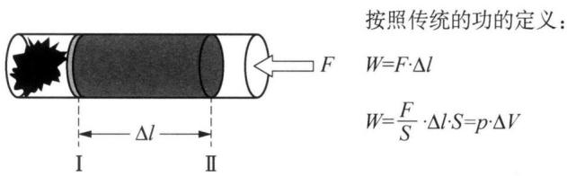

text_image

按照传统的功的定义：
W=F·Δl
W=F/S·Δl·S=p·ΔV

图3-1 体积功产生的示意图

这种 $W = p \cdot \Delta V$ 称为体积功，以 $W_{体}$ 表示。若体积变化 $\Delta V = 0$ ，则 $W_{体} = 0$ 。我们研究的体系与过程，若不加以特别说明，可以认为只做体积功。即： $W = W_{体}$ 。

除体积功以外所有其他形式的功统称为非体积功,如:机械功(等于外力 F 乘以力方向上的位移 d)、电功(等于电动势 E 乘以通过的电量 Q)等。

规定：当环境对体系做功， $W$ 是正值；反之为负值。

（2）热：由于温度不同而在体系和环境之间传递的能量称为热，用符号 $Q$ 来表示。

规定：当热由环境流入体系，Q 为正值 $(Q>0)$ ；而热由体系流入环境，Q 为负值 $(Q<0)$ 。

注：① 热和功符号的正负是由体系自身的角度出发的，使体系热力学能增加的为正值，反之为负值。

② 由功和热的定义可知,功和热不是状态函数。

## 5. 热力学能(内能)

热力学能(U)(详见第一分册第十讲)是体系本身的性质,所以仅决定于状态,在一定状态下应有一定值。热力学能(U)也是状态函数。热力学能的绝对数值是无法测量的(即不可知的),就好像地球上任意一点的绝对高度是不可知的一样。但我们只需关心热力学能的变化量: $\Delta U=U_{2}-U_{1},U_{2}$ —终态, $U_{1}$ —始态。

理想气体的内能只是温度的函数, 即 $U_{\mathrm{id}} = f(T)$ 。恒温条件下, 即 $\Delta T = 0$ 时, $\Delta U = 0$ 。推理如下: 由分子运动论可知: $pV = \frac{m}{3} N \bar{u}^{2} = \frac{2N}{3} \cdot \frac{1}{2} m \bar{u}^{2} = \frac{2N}{3} \overline{E}_{\text{动}}$ , 又由理想气体状态方程 pV = nRT 可以得: $\Delta U = \Delta (pV) = \Delta (nRT)$ 。所以, 对于一定的物质的量的理想气体: $\Delta (pV) = \Delta U = nR \Delta T$ 。

## 三、热力学第一定律

某体系由状态Ⅰ变化到状态Ⅱ，过程中体系吸热 Q，做功（体积功）W，体系的内能改变量用 $\Delta U$ 表示，则有：

$$
\Delta U = Q - W \tag {3-1}
$$

例如：某过程中，体系吸热 100 J，对环境做功 20 J，求体系的内能改变量和环境的内能改变量。

由第一定律表达式： $\Delta U = Q - W = 100\ J - 20\ J = 80\ J$ ;从环境考虑,吸热-100J,做功-20J,所以： $\Delta U_{环} = (-100\ J) - (-20\ J) = -80\ J$ 。体系的内能增加了80J,环境的内能减少了80J。

## 四、热化学

## 1. 反应热的测定方法

发生化学反应时总是伴随着能量变化。在等温非体积功为零的条件下，封闭体系中发生某化学反应，系统与环境之间所交换的热量称为该化学反应的热效应，亦称为反应热。

许多化学反应的热效应可以用弹式量热计测量，见图 3-2 所示装置。

在弹式量热计中,有一个用高强度钢制成的“氧弹”。氧弹放在装有一定量水的绝热的恒温浴中,在氧弹中装有反应物和加热用的炉丝,通电加热便可引发反应。如果反应放热,则放出的热量完全被水和氧弹吸收,因而温度从 $T_{1}$ 升高到 $T_{2}$ 。假定反应放出的

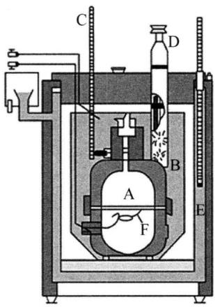

text_image

Technical diagram of a laboratory apparatus with labeled components A, B, C, D, E, and F

图3-2 弹式量热计

A 反应室 B 水 C 温度计
D 搅拌器 E 套筒 F 金属丝

热量为 $Q$ ，水吸收的热量为 $Q_{\text{水}}$ ，氧弹吸收的热量为 $Q_{\text{弹}}$ ，则有：

$$
Q = - \left(Q _ {\text {水}} + Q _ {\text {弹}}\right) \tag {3-2}
$$

其中： $Q_{\text{水}} = cm \Delta T, Q_{\text{弹}} = C \Delta T, \Delta T = T_{2} - T_{1}$

式中：c 为水的比热容（质量热容， $4.184\ J\cdot g^{-1}\cdot K^{-1}$ ），m 为水的质量(g)，C 为氧弹的热容（预先已测， $J\cdot K^{-1}$ ）。只要准确测出水的质量 m 和反应前后的温度，就可以计算出该反应在等容条件下所放出（或吸收）的热量，这就是等容反应的热效应。例如，把葡萄糖放入弹式量热计内，测出完全燃烧时的等容反应热 $Q_{V}$ ，利用式(3-5)可计算出等压反应热 $Q_{p}=\Delta_{r}H_{m,1}^{\theta}=-2820\ kJ\cdot mol^{-1}$ 。由于此数值是状态函数的改变值，所以如果开始的状态 $\left(\mathrm{C}_{6}\mathrm{H}_{12}\mathrm{O}_{6}+6\mathrm{O}_{2}\right)$ 和最后的状态 $(6\mathrm{CO}_{2}+6\mathrm{H}_{2}\mathrm{O})$ 决定了的话，它就不取决于过程的途径。

## 2. 化学反应的热效应

当生成物的温度恢复到反应物的温度时,化学反应中所吸收或放出的热量,称为化学反应热效应,简称反应热(无非体积功)。

(1) 恒容条件下的化学反应热 $(Q_{V})$

① 若化学反应在密闭的容器内进行,该反应称为恒容反应。其热效应称为恒容反应热,表示为 $Q_{V}$ 。

② 在恒容条件下， $\Delta V = 0$ ，体系不可能做体积功，即 $W = p \cdot \Delta V = 0$ ，可以得到：

$$
Q _ {V} = \Delta U \tag {3-3}
$$

③ 恒容条件下的反应热等于体系内能的变化量。 $\Delta U = Q_{V} > 0$ ，反应是吸热的； $\Delta U = Q_{V} < 0$ ，反应是放热的。

(2) 恒压条件下的化学反应热 $(Q_{p})$

① 通常化学反应都在敞口容器中进行,外界大气压一般为恒定的一个大气压。像这类在恒压过程中完成的化学反应,称为恒压反应。其热效应称为恒压反应热,表示为 $Q_{p}$ 。

恒压反应中， $\Delta p=0$ ，则有： $\Delta_{r}U=Q_{p}-W=Q_{p}-p\cdot\Delta V=Q_{p}-\Delta(pV)$ 。

所以： $Q_{p}=\Delta_{r}U+\Delta(pV)=(U_{2}-U_{1})+(p_{2}V_{2}-p_{1}V_{1})=(U_{2}+p_{2}V_{2})-(U_{1}+p_{1}V_{1})$ 。

其中， $U$ 、 $p$ 、 $V$ 都是状态函数，所以 $U + pV$ 也是一个状态函数，令 $H = U+$ $pV$ ，则 $Q_{p} = \Delta (U + pV)$ 即：

$$
\Delta_ {\mathrm{r}} H = Q _ {p} \tag {3-4}
$$

$H(\text{enthalpy})$ 称热焓,或焓,是之后介绍的一个新的状态函数。

## (3) $Q_{p}$ 和 $Q_{V}$ 的关系

同一反应的 $Q_{p}$ 和 $Q_{V}$ 并不相等。 $Q_{V} = \Delta_{r}U$ ， $Q_{p} = \Delta_{r}U + p\Delta V = \Delta_{r}H$ 。由于两个 $\Delta_{r}U$ 近似相等（对于理想气体，两个 $\Delta_{r}U$ 相等），所以： $Q_{p} = Q_{V} + p\Delta V$ 。对于无气体参与的液体、固体反应，由于 $\Delta V$ 很小，故 $p\Delta V$ 可以忽略，则近似有： $Q_{p} = Q_{V}$ 。对于有气体参加的反应， $\Delta V$ 不能忽略， $p\Delta V = \Delta nRT$ ，所以：

$$
Q _ {p} = Q _ {V} + \Delta n R T \tag {3-5}
$$

式中 $\Delta n$ 为气体生成物的物质的量的总和与气体反应物的物质的量的总和之差。即：

$$
\Delta_ {\mathrm{r}} H = \Delta_ {\mathrm{r}} U + \Delta n R T \tag {3-6}
$$

示例如下：

在 298 K 时, 反应 $\mathrm{B}_{4}\mathrm{C}(\mathrm{s}) + 4\mathrm{O}_{2}(\mathrm{g}) = 2\mathrm{B}_{2}\mathrm{O}_{3}(\mathrm{s}) + \mathrm{CO}_{2}(\mathrm{g})$ 的 $\Delta U = -2850 \, kJ \cdot mol^{-1}$ , 试求此反应的 $\Delta H$ 。

解析 $\Delta n = 1 - 4 = -3$

$$
\begin{array}{r l} \Delta H & = \Delta U + \Delta n R T = - 2 8 5 0 \mathrm{kJ} \cdot \mathrm{mol} ^ {- 1} + (- 3) \times 8. 3 1 4 \times 2 9 8 \times 1 0 ^ {- 3} \mathrm{kJ} \cdot \mathrm{mol} ^ {- 1} = \\ & - 2 8 5 7 \mathrm{kJ} \cdot \mathrm{mol} ^ {- 1} 。 \end{array}
$$

## 3. 焓

在非体积功为零的条件下,封闭系统经一等压过程,系统所吸收的热全部用于增加体系的焓,即化学反应的等压热效应等于系统的焓的变化。

由于无法确定内能 U 的绝对值, 因而也不能确定焓的绝对值。由式(3-4)的推导过程可知, 焓(H)仅为 U、p、V 的函数, 因为 U、p、V 均为状态函数, 而状态函数的函数仍为状态函数, 所以 H 也为状态函数。它具有能量的量纲(单位: 焦耳 J)。但是, 焓没有确切的物理意义。由于化学变化大都是在等压条件下进行的, 在处理热化学问题时, 状态函数焓及焓的变化值 $\Delta_{r}H$ 更有实用价值。当 $\Delta_{r}H > 0$ 时, $Q_{p} > 0$ , 是吸热反应; $\Delta_{r}H < 0$ 时, $Q_{p} < 0$ , 是放热反应。

焓的使用条件：(1)封闭体系；(2)没有非体积功；(3)恒压。

## 4. 盖斯定律

1836 年, 盖斯(Hess)提出定律, 指出: 一个化学反应, 不论是一步完成, 还是分数步完成, 其热效应是相同的。

盖斯定律的实际意义: 有的反应虽然简单, 但其热效应难以测得。例如: $\mathrm{C(s)} + 1 / 2\mathrm{O}_2(\mathrm{g}) = \mathrm{CO(g)}$ , 是很简单的反应, 但是难于保证产物的纯度, 所以, 反应热很难直接测定。应用盖斯定律, 可以解决这一难题。

已知：① C(石墨) + O₂(g) = CO₂(g) $\Delta_{r}H_{m(1)} = -393.5\ kJ \cdot mol^{-1}$

② $\mathrm{CO(g) + 1 / 2O_2(g) = CO_2(g)}$ $\Delta_{\mathrm{r}}H_{\mathrm{m(2)}} = -238.0\mathrm{kJ}\cdot \mathrm{mol}^{-1}$

①式一②式，得 C(石墨) + 1/2O₂(g) = CO(g)

$$
\begin{array}{r l} \Delta_ {\mathrm{r}} H _ {\mathrm{m}} & = \Delta_ {\mathrm{r}} H _ {\mathrm{m(1)}} - \Delta_ {\mathrm{r}} H _ {\mathrm{m(2)}} = - 3 9 3. 5 \mathrm{kJ} \cdot \mathrm{mol} ^ {- 1} - (- 2 3 8. 0 \mathrm{kJ} \cdot \mathrm{mol} ^ {- 1}) = \\ & - 1 1 0. 5 \mathrm{kJ} \cdot \mathrm{mol} ^ {- 1} \end{array}
$$

## 五、化学反应进行的方向

## 1. 自发过程和自发反应

(1) 自发过程: 在一定条件下不需外力作用就能自动进行的过程。自然界中发生的过程都具有一定的方向性。如水由高向低处流; 冰块室温下自动融化; 铁器在潮湿空气中生锈; 甲烷在空气中遇火燃烧等。自发过程的逆过程是非自发的。

(2) 自发反应: 在给定条件下, 一个反应可以自发地正向进行到显著程度, 就称为自发反应。例如: $\mathrm{Zn(s)} + \mathrm{Cu}^{2+}(\mathrm{aq}) = \mathrm{Zn}^{2+}(\mathrm{aq}) + \mathrm{Cu(s)}, \mathrm{H}^{+}(\mathrm{aq}) + \mathrm{OH}^{-}(\mathrm{aq}) = \mathrm{H}_{2}\mathrm{O}(1)$ 等。

注：①自发过程(热力学的可能性)不一定迅速进行(动力学)。如氢氧化合生成水；

② 自发过程可以用来做功。如水力发电、甲烷燃烧用在内燃机中做功、设计原电池，氢燃烧设计成燃料电池等；

③ 非自发反应并不意味着不能进行,环境对体系做功就可使非自发反应进行,如水的电解。

那么,如何判断一个过程或者反应是否自发呢?

## 2. 吉布斯自由能(吉布斯自由焓)

为了判断等温等压化学反应的方向性,1876年,美国科学家吉布斯(Gibbs)综合考虑了焓和熵两个因素,提出一个新的状态函数——吉布斯自由能(G):

$$
G = H - T S \tag {3-7}
$$

对于化学反应, 反应前后吉布斯自由能变化用 “ $\Delta_{r}G_{m}$ ” 表示: $\Delta_{r}G_{m} = \sum G_{产物} - \sum G_{反应物}$ 。若 $\Delta_{r}G_{m} < 0$ , 反应自发进行; 反之, $\Delta_{r}G_{m} > 0$ , 则反应非自发。

## (1) 吉布斯方程及其应用

根据吉布斯自由能的定义式 $(3-7)$ ，在等温等压下可推导出著名的吉布斯方程：

$$
\Delta G = \Delta H - T \Delta S \tag {3-8}
$$

它把影响化学反应自发进行方向的两个因素( $\Delta H$ 和 $\Delta S$ )统一起来。

如： $C_{6}H_{12}O_{6}(s)+6O_{2}(g)=6CO_{2}(g)+6H_{2}O(l)$ 的 $\Delta H<0,\Delta S>0$ ，在任意温度下， $\Delta G<0$ ，反应都能自发进行。

$6CO_{2}(g)+6H_{2}O(l)=C_{6}H_{12}O_{6}(s)+6O_{2}(g)$ 的 $\Delta H>0,\Delta S<0$ ，在任意温度下， $\Delta G>0$ ，反应不能自发进行。要使这类反应正向进行，环境必须给系统提供足够的能量（如光照辐射等）。

$\mathrm{CaCO}_{3}(\mathrm{s})=\mathrm{CaO}(\mathrm{s})+\mathrm{CO}_{2}(\mathrm{g})$ 的 $\Delta H>0,\Delta S>0$ ，在低温时， $\Delta H>T\Delta S$ ，则 $\Delta G>0$ ，反应不能自发进行；在高温 T>1120 K 时， $\Delta H<T\Delta S$ ，则 $\Delta G<0$ ，反应可以自发进行。

$\mathrm{N}_{2}(\mathrm{~g})+3\mathrm{H}_{2}(\mathrm{~g})=2\mathrm{NH}_{3}(\mathrm{~g})$ 的 $\Delta H<0,\Delta S<0$ ，在低温时， $|\Delta H|>|T\Delta S|,\Delta G<0$ ，反应可以自发进行；在高温 T>500 K 时， $|\Delta H|<|T\Delta S|,\Delta G>0$ ，反应不能自发进行。

## (2) 标准摩尔生成吉布斯能

热力学上,对“标准态”规定如下:

① 固态和液态：纯物质为标准态，即： $X_{i}=1$ ；

② 溶液中物质 A: 标准态是浓度 $b_{A} = 1 \, mol \cdot kg^{-1}$ ，即：A 的质量摩尔浓度为 $1 \, mol \cdot kg^{-1}$ ，经常近似为 $1 \, mol \cdot dm^{-3}$ 的物质的量浓度；

③ 气体：标准态是指气体分压为 $1.013 \times 10^{5}$ Pa 或 100 kPa。

在标准状态下由最稳定单质生成 1 mol 物质 B 的吉布斯能变称为这种温度下 B 物质的标准摩尔生成吉布斯能，用符号 $\Delta_{\mathrm{f}}G_{\mathrm{m}}^{\theta}(\mathrm{B})$ 表示，单位是 $kJ \cdot mol^{-1}$ 。

例如：298.15 K 时化学反应：

$$
\frac {1}{2} \mathrm{N} _ {2} (\mathrm{g}, p ^ {\theta}) + \frac {3}{2} \mathrm{H} _ {2} (\mathrm{g}, p ^ {\theta}) = \mathrm{NH} _ {3} (\mathrm{g}, p ^ {\theta})
$$

反应的 $\Delta_{r}G_{m}^{\theta}=-16.4\ kJ\cdot mol^{-1}$ ，而 $N_{2}(g)$ 与 $H_{2}(g)$ 为最稳定单质，所以

298.15 K 时 $NH_{3}(g)$ 的标准摩尔生成吉布斯能 $\Delta_{f}G_{m}^{\theta}=-16.4kJ\cdot mol^{-1}$

由 $\Delta_{f}G_{m}^{\theta}$ 计算化学反应的 $\Delta_{r}G_{m}^{\theta}$ 的计算公式为：

$$
\Delta_ {\mathrm{r}} G _ {\mathrm{m}} ^ {\theta} = \sum_ {\mathrm{B}} v _ {\mathrm{B}} \Delta_ {\mathrm{f}} G _ {\mathrm{m}} ^ {\theta} (\mathrm{B}) \tag {3-9}
$$

温度对 $\Delta_{r}G_{m}^{\theta}$ 有影响,一定温度下化学反应的标准摩尔吉布斯能变化 $\Delta_{r}G_{m,T}^{\theta}$ , 可按下式计算:

$$
\Delta_ {\mathrm{r}} G _ {\mathrm{m}, T} ^ {\theta} = \Delta_ {\mathrm{r}} H _ {\mathrm{m}, T} ^ {\theta} - T \Delta_ {\mathrm{r}} S _ {\mathrm{m}, T} ^ {\theta} \tag {3-10}
$$

示例如下：

用 $\Delta_{r}G_{m}^{\theta}$ 判断反应自发进行的方向：

光合作用是将 $\mathrm{CO}_{2}(\mathrm{~g})$ 和 $\mathrm{H}_{2}\mathrm{O}(\mathrm{l})$ 转化为葡萄糖的复杂过程, 总反应为:

$$
6 \mathrm{CO} _ {2} (\mathrm{g}) + 6 \mathrm{H} _ {2} \mathrm{O} (\mathrm{l}) = \mathrm{C} _ {6} \mathrm{H} _ {1 2} \mathrm{O} _ {6} (\mathrm{s}) + 6 \mathrm{O} _ {2} (\mathrm{g})
$$

求此反应在 298.15 K、100 kPa 的 $\Delta_{r}G_{m}^{\theta}$ ，并判断此条件下反应是否自发？

分析 此题是判断标准状态下反应的自发性问题,因此,可以通过 $\Delta_{r}G_{m}^{\theta}$ 的计算进行解答。计算 $\Delta_{r}G_{m}^{\theta}$ 的方法有两种:

$$
\Delta_ {\mathrm{r}} G _ {\mathrm{m}} ^ {\theta} = \sum_ {\mathrm{B}} v _ {\mathrm{B}} \Delta_ {\mathrm{f}} G _ {\mathrm{m}} ^ {\theta} (\mathrm{B})
$$

$$
\Delta_ {\mathrm{r}} G _ {\mathrm{m}, T} ^ {\theta} = \Delta_ {\mathrm{r}} H _ {\mathrm{m}, 2 9 8. 1 5 \mathrm{K}} ^ {\theta} - T \Delta_ {\mathrm{r}} S _ {\mathrm{m}, 2 9 8. 1 5 \mathrm{K}} ^ {\theta}
$$

解析 查表得 298.15 K 和标准条件下有关热力学数据如下:

$$
\begin{array}{l} 6 \mathrm{CO} _ {2} (\mathrm{g}) + 6 \mathrm{H} _ {2} \mathrm{O} (\mathrm{l}) = \mathrm{C} _ {6} \mathrm{H} _ {1 2} \mathrm{O} _ {6} (\mathrm{s}) + 6 \mathrm{O} _ {2} (\mathrm{g}) \\ \Delta_ {\mathrm{f}} G _ {\mathrm{m}} ^ {\theta} / \left(\mathrm{kJ} \cdot \mathrm{mol} ^ {- 1}\right) - 3 9 4. 4 - 2 3 7. 1 - 9 1 0. 6 \quad 0 \\ \Delta_ {\mathrm{f}} H _ {\mathrm{m}} ^ {\theta} / (\mathrm{kJ} \cdot \mathrm{mol} ^ {- 1}) - 3 9 3. 5 - 2 8 5. 8 - 1 2 7 3. 3 0 \\ S _ {\mathrm{m}} ^ {\theta} / \left(\mathrm{J} \cdot \mathrm{mol} ^ {- 1} \cdot \mathrm{K} ^ {- 1}\right) \quad 2 1 3. 8 \quad 7 0. 0 \quad 2 1 2. 1 \quad 2 0 5. 2 \\ \end{array}
$$

方法一

$$
\begin{array}{l} \Delta_ {\mathrm{r}} G _ {\mathrm{m}} ^ {\theta} = \sum_ {\mathrm{B}} v _ {\mathrm{B}} \Delta_ {\mathrm{f}} G _ {\mathrm{m}} ^ {\theta} (\mathrm{B}) \\ = - 9 1 0. 6 \mathrm{kJ} \cdot \mathrm{mol} ^ {- 1} - 6 \times (- 2 3 7. 1 \mathrm{kJ} \cdot \mathrm{mol} ^ {- 1}) - 6 \\ \times (- 3 9 4. 4 \mathrm{kJ} \cdot \mathrm{mol} ^ {- 1}) \\ = 2 8 7 8. 4 3 \mathrm{kJ} \cdot \mathrm{mol} ^ {- 1} \\ \end{array}
$$

方法二

$$
\begin{array}{l} \Delta_ {\mathrm{r}} H _ {\mathrm{m}} ^ {\theta} = \sum_ {\mathrm{B}} v _ {\mathrm{B}} \Delta_ {\mathrm{f}} H _ {\mathrm{m}} ^ {\theta} (\mathrm{B}) \\ = - 1 2 7 3. 3 \mathrm{kJ} \cdot \mathrm{mol} ^ {- 1} - 6 \times (- 2 8 5. 8 \mathrm{kJ} \cdot \mathrm{mol} ^ {- 1}) - \\ 6 \times (- 3 9 3. 5 \mathrm{kJ} \cdot \mathrm{mol} ^ {- 1}) \\ = 2 8 0 2. 5 \mathrm{kJ} \cdot \mathrm{mol} ^ {- 1} \\ \Delta_ {\mathrm{r}} S _ {\mathrm{m}} ^ {\theta} = \sum_ {\mathrm{B}} v _ {\mathrm{B}} S _ {\mathrm{m}} ^ {\theta} (\mathrm{B}) \\ = (6 \times 2 0 5. 2 + 2 1 2. 1 - 6 \times 7 0. 0 - 6 \times 2 1 3. 8) \mathrm{J} \cdot \mathrm{mol} ^ {- 1} \cdot \mathrm{K} ^ {- 1} \\ = - 2 5 9. 5 \mathrm{J} \cdot \mathrm{mol} ^ {- 1} \cdot \mathrm{K} ^ {- 1} \\ \Delta_ {\mathrm{r}} G _ {\mathrm{m}} ^ {\theta} = \Delta_ {\mathrm{r}} H _ {\mathrm{m}, 2 9 8. 1 5} ^ {\theta} - T \Delta_ {\mathrm{r}} S _ {\mathrm{m}, 2 9 8. 1 5} ^ {\theta} \\ = 2 8 0 2. 5 \mathrm{kJ} \cdot \mathrm{mol} ^ {- 1} - 2 9 8. 1 5 \mathrm{K} \times (- 0. 2 5 9 5 \mathrm{kJ} \cdot \mathrm{mol} ^ {- 1} \cdot \mathrm{K} ^ {- 1}) \\ = 2 8 7 9. 8 7 \mathrm{kJ} \cdot \mathrm{mol} ^ {- 1} \\ \end{array}
$$

$$
\begin{array}{l} \Delta_ {\mathrm{r}} G _ {\mathrm{m}} ^ {\theta} = \Delta_ {\mathrm{r}} H _ {\mathrm{m}, 2 9 8. 1 5} ^ {\theta} - T \Delta_ {\mathrm{r}} S _ {\mathrm{m}, 2 9 8. 1 5} ^ {\theta} \\ = 2 8 0 2. 5 \mathrm{kJ} \cdot \mathrm{mol} ^ {- 1} - 2 9 8. 1 5 \mathrm{K} \times (- 0. 2 5 9 5 \mathrm{kJ} \cdot \mathrm{mol} ^ {- 1} \cdot \mathrm{K} ^ {- 1}) \\ = 2 8 7 9. 8 7 \mathrm{kJ} \cdot \mathrm{mol} ^ {- 1} \\ \end{array}
$$

归纳 ① 由于采用不同的方法计算,所得结果略有差异。

② 计算结果 $\Delta_{r}G_{m}^{\theta}>0$ ，说明在 298.15 K 和标准状态下，反应不能自发进行。实际上，此反应是在叶绿素和阳光下进行的，靠叶绿素吸收光能，然后转化成系统的吉布斯能变，使光合反应得以实现。

## (3) 非标准态下吉布斯能变的计算

非标准态下化学反应的吉布斯能变可由范特霍夫(van't Hoff)等温方程式求得：

$$
\Delta_ {\mathrm{r}} G _ {\mathrm{m}, T} = \Delta_ {\mathrm{r}} G _ {\mathrm{m}, T} ^ {\theta} + R T \ln Q = \Delta_ {\mathrm{r}} G _ {\mathrm{m}, T} ^ {\theta} + 2. 3 0 3 R T \lg Q \tag {3-11}
$$

式中 Q 称为反应商。它是各生成物相对分压（对气体， $p/p^{\theta}$ ）或相对浓度（对溶液， $c/c^{\theta}$ ）幂的乘积与各反应物的相对分压或相对浓度幂的乘积之比。其中 $p^{\theta}$ 取 100 kPa， $c^{\theta}$ 取 1 mol/L。若反应中有纯固体或纯液体，则其浓度以常数 1 表示。例如，对任意化学反应：

$$
a \mathrm{A} (\mathrm{aq}) + b \mathrm{B} (1) = d \mathrm{D} (\mathrm{g}) + e \mathrm{E} (\mathrm{s}):
$$

$$
Q = \frac {\left(p _ {\mathrm{D}} / p ^ {\theta}\right) ^ {d} \times 1}{\left(c _ {\mathrm{A}} / c ^ {\theta}\right) ^ {a} \times 1} \tag {3-12}
$$

在稀溶液中进行的反应,如果溶剂参与反应,因溶剂的量很大,浓度基本不变,可以当作常数1。由表达式可知Q的单位为1。

## 示例如下：

非标准条件下反应方向的判断

$$
\mathrm{CaCO} _ {3} (\mathrm{s}) \text {的分解反应为: CaCO} _ {3} (\mathrm{s}) = \mathrm{CaO} (\mathrm{s}) + \mathrm{CO} _ {2} (\mathrm{g})
$$

（1）在 298.15 K 及标准条件下，此反应能否自发进行？若使其在标准状态下进行反应，反应温度应为多少？  
(2) 空气中 $\mathrm{CO}_{2}(\mathrm{~g})$ 的分压约为 0.03 kPa, 试计算此条件下 $\mathrm{CaCO}_{3}(\mathrm{~s})$ 分解所需的最低温度。

分析 一个反应在标准条件下能否自发进行是由 $\Delta_{\mathrm{r}}H_{\mathrm{m}}^{\theta}$ 和 $\Delta_{\mathrm{r}}S_{\mathrm{m}}^{\theta}$ 及温度 $T$ 决定的，在 $\Delta_{\mathrm{r}}H_{\mathrm{m}}^{\theta}$ 和 $\Delta_{\mathrm{r}}S_{\mathrm{m}}^{\theta}$ 的符号相同时，温度的高低决定了反应的可能性，问题(1)即是求两种温度下反应的可能性，利用公式(3-9)、(3-10)即可。问题(2)应先使反应在非标准条件下能自发进行，即反应的自由能变小于或等于零，然后利用公式(3-10)计算出温度 $T$ 即可。

解析 反应式中有关物质在 298.15 K 和标准条件下的热力学数据如下:

$$
\begin{array}{l l l l} & \mathrm {CaCO_ {3} (s)} & \mathrm{CaO(s)} & \mathrm {CO_ {2} (g)} \\ \Delta_ {\mathrm{f}} H _ {\mathrm{m}} ^ {\theta} / (\mathrm{kJ} \bullet \mathrm{mol} ^ {- 1}) & - 1 2 0 6. 9 & - 6 3 4. 9 & - 3 9 3. 5 \\ S _ {\mathrm{m}} ^ {\theta} / (\mathrm{J} \bullet \mathrm{mol} ^ {- 1} \bullet \mathrm{K} ^ {- 1}) & 9 2. 9 & 3 8. 1 & 2 1 3. 8 \end{array}
$$

$$
\begin{array}{l} \Delta_ {\mathrm{r}} H _ {\mathrm{m}} ^ {\theta} = \sum_ {\mathrm{B}} v _ {\mathrm{B}} \Delta_ {\mathrm{f}} H _ {\mathrm{m}} ^ {\theta} (\mathrm{B}) \tag {1} \\ = [ - 6 3 4. 9 + (- 3 9 3. 5) - (- 1 2 0 6. 9) ] \mathrm{kJ} \cdot \mathrm{mol} ^ {- 1} \\ = 1 7 8. 5 \mathrm{kJ} \cdot \mathrm{mol} ^ {- 1} \\ \end{array}
$$

$$
\begin{array}{l} \Delta_ {\mathrm{r}} S _ {\mathrm{m}} ^ {\theta} = \sum_ {\mathrm{B}} v _ {\mathrm{B}} S _ {\mathrm{m}} ^ {\theta} (\mathrm{B}) \\ = (3 8. 1 + 2 1 3. 8 - 9 2. 9) \mathrm{J} \cdot \mathrm{mol} ^ {- 1} \cdot \mathrm{K} ^ {- 1} \\ = 1 5 9 \mathrm{J} \cdot \mathrm{mol} ^ {- 1} \cdot \mathrm{K} ^ {- 1} \\ \end{array}
$$

$$
\begin{array}{l} \Delta_ {\mathrm{r}} G _ {\mathrm{m}} ^ {\theta} = \Delta_ {\mathrm{r}} H _ {\mathrm{m}} ^ {\theta} - T \Delta_ {\mathrm{r}} S _ {\mathrm{m}} ^ {\theta} \\ = 1 7 8. 5 \mathrm{kJ} \cdot \mathrm{mol} ^ {- 1} - 2 9 8. 1 5 \mathrm{K} \times 1 5 9 \times 1 0 ^ {- 3} \mathrm{kJ} \cdot \mathrm{mol} ^ {- 1} \cdot \mathrm{K} ^ {- 1} \\ = 1 3 1 \mathrm{kJ} \cdot \mathrm{mol} ^ {- 1} > 0 \\ \end{array}
$$

因此，在 298.15 K 下，上述反应不能自发进行。因为是吸热熵增反应，在标准条件下自发进行时，所需的最低温度为：

$$
\begin{array}{l} T = \frac {\Delta_ {\mathrm{r}} H _ {\mathrm{m} , T} ^ {\theta}}{\Delta_ {\mathrm{r}} S _ {\mathrm{m} , T} ^ {\theta}} \approx \frac {\Delta_ {\mathrm{r}} H _ {\mathrm{m} , 2 9 8 . 1 5} ^ {\theta}}{\Delta_ {\mathrm{r}} S _ {\mathrm{m} , 2 9 8 . 1 5} ^ {\theta}} = \frac {1 7 8 . 5 \mathrm{kJ} \cdot \mathrm{mol} ^ {- 1}}{1 5 9 \times 1 0 ^ {- 3} \mathrm{kJ} \cdot \mathrm{K} ^ {- 1} \cdot \mathrm{mol} ^ {- 1}} \\ = 1. 1 2 \times 1 0 ^ {3} \mathrm{K} (\text {即} 8 4 7 ^ {\circ} \mathrm{C}) \\ \end{array}
$$

(2) 由式 $(3-12)$ :

$$
Q = \frac {(p _ {\mathrm{D}} / p ^ {\theta}) ^ {d} \times 1}{(c _ {\mathrm{A}} / c ^ {\theta}) ^ {a} \times 1} = (p _ {\mathrm{CO} _ {2}} / p ^ {\theta}) = 3 \times 1 0 ^ {- 4}
$$

忽略温度变化对 $\Delta_{r}H_{m}^{\theta}$ 和 $\Delta_{r}S_{m}^{\theta}$ 的影响，由式(3-11) $\Delta_{r}G_{m,T}=\Delta_{r}G_{m,T}^{\theta}+RT\ln Q<0$ 代入 $\Delta_{r}G_{m,T}^{\theta}=\Delta_{r}H_{m}^{\theta}-T\Delta_{r}S_{m}^{\theta},Q=(p_{CO_{2}}/p^{\theta})=3\times10^{-4}$ 。可得 T>788.2 K，即在 $CO_{2}(g)$ 的分压为 0.03 kPa 时分解温度下降到约 515℃。

## 典型例题

【例 1】由燃烧焓数据, 求反应 $\mathrm{CH_{3}COOH(l)+CH_{3}OH(l)=CH_{3}COOCH_{3}(l)+H_{2}O(l)}$ 的 $\Delta H_{298}^{\theta}$ 。

已知： $\Delta_{c}H_{m,298(乙酸)}^{\theta}=-874.5\ kJ\cdot mol^{-1},\ \Delta_{c}H_{m,298(甲醇)}^{\theta}=-726.5\ kJ\cdot mol^{-1},\ \Delta_{c}H_{m,298(乙酸甲酯)}^{\theta}=-1594.9\ kJ\cdot mol^{-1}$ 。

解析 上述反应可以设计为如下过程:

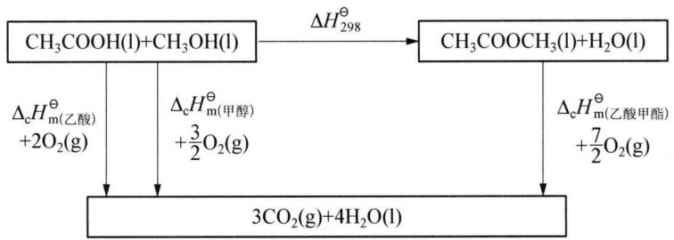

chemical

Chemical reaction equation showing the formation of 3CO2(g)+4H2O(l) from acetic acid and hydroxyl groups, with enthalpy changes labeled.

根据盖斯定律：

$$
\Delta_ {\mathrm{r}} H _ {2 9 8} ^ {\theta} + \sum (\Delta_ {\mathrm{c}} H _ {\mathrm{m,298}} ^ {\theta}) _ {\mathrm{产物}} = \sum (\Delta_ {\mathrm{c}} H _ {\mathrm{m,298}} ^ {\theta}) _ {\mathrm{反应物}}
$$

所以 $\Delta_{r}H_{298}^{\theta}=\sum(\Delta_{c}H_{m,298}^{\theta})_{反应物}-\sum(\Delta_{c}H_{m,298}^{\theta})_{产物}$

代入数据得:

$$
\begin{array}{l} \Delta_ {\mathrm{r}} H _ {2 9 8} ^ {\theta} = \sum \left(\Delta_ {\mathrm{c}} H _ {\mathrm{m}, 2 9 8} ^ {\theta}\right) _ {\text {反应物}} - \sum \left(\Delta_ {\mathrm{c}} H _ {\mathrm{m}, 2 9 8} ^ {\theta}\right) _ {\text {产物}} \\ = [ (- 8 7 4. 5) + (- 7 2 6. 5) ] - [ (- 1 5 9 4. 9) + 0 ] \\ = - 6. 1 0 \mathrm{kJ} \cdot \mathrm{mol} ^ {- 1} \\ \end{array}
$$

【例 2】 把温度为 $13^{\circ}C$ ，浓度为 $1.0 \, mol \cdot L^{-1}$ 的盐酸和 $1.1 \, mol \cdot L^{-1}$ 的碱溶液各 $50 \, mL$ 混合（溶液密度均为 $1 \, g \cdot mL^{-1}$ ），轻轻搅动。测得酸碱混合液的温度变化数据如下：

<table><tr><td>反应物</td><td>起始温度  $t_{1}$ °C</td><td>终了温度  $t_{2}$ °C</td></tr><tr><td>HCl + NaOH</td><td>13</td><td>19.8</td></tr><tr><td>HCl + NH $_{3}$  · H $_{2}$ O</td><td>13</td><td>19.3</td></tr></table>

试计算上述两组实验测出的中和热数值,并回答为什么碱液过量?两组实验结果相差的原因?(已知水的比热:4.184 J·g $^{-1}$ ·℃ $^{-1}$ )

解析 根据给出的酸和碱的物质的量,酸为 0.050 mol,碱为 0.055 mol,碱是过量的,应以酸计算,算出生成 0.050 mol 水放出的热量,进而算出生成 1 mol 水放出的热量,即可得出两组实验测出的中和热数值。

HCl 与 NaOH 反应的中和热 $Q_{1}$ 为:

$$
Q _ {1}: \frac {4 . 1 8 4 \times (5 0 + 5 0) \times 1 \times (1 9 . 8 - 1 3 . 0)}{1 . 0 \times 0 . 0 5 0} = 5 6. 9 \mathrm{kJ}
$$

HCl 与 $\mathrm{NH}_{3} \cdot \mathrm{H}_{2} \mathrm{O}$ 反应的中和热 $Q_{2}$ 为:

$$
Q _ {2}: \frac {4 . 1 8 4 \times (5 0 + 5 0) \times 1 \times (1 9 . 3 - 1 3 . 0)}{1 . 0 \times 0 . 0 5 0} = 5 2. 7 \mathrm{kJ}
$$

碱液过量是为了提高实验准确度,因 NaOH 溶液易吸收 $CO_{2}$ 而使 NaOH 浓度下降, $NH_{3}\cdot H_{2}O$ 则易挥发也使 $NH_{3}\cdot H_{2}O$ 浓度下降。

NaOH 是强碱, 在水溶液中完全电离, 跟 HCl 中和时放出热较多; $NH_{3} \cdot H_{2}O$ 是弱碱, 只是少部分电离, 中和时放热较少 (或答 $NH_{3} \cdot H_{2}O$ 是弱碱, 还存在电离热, 因此反应中需要吸热)。

【例 3】 $2 \, mol \, H_{2}$ 和 $1 \, mol \, O_{2}$ ，在 $373 \, K$ 和 $101.3 \, kPa$ 下反应生成 $2 \, mol$ 水蒸气，放出 $483.7 \, kJ$ 的热量。求生成 $1 \, mol$ 水蒸气时的 $\Delta H$ 和 $\Delta U$ 。

解析 思路：该反应是在恒压下进行的，恒压时 $\Delta H = Q_{p}$ 。由于 $\Delta H = \Delta U + p\Delta V$ 可得： $\Delta U = \Delta H - p\Delta V, p\Delta V = p(V_{2} - V_{1}) = n_{2}RT - n_{1}RT = \Delta nRT$ 。

解：由于反应 $2\mathrm{H}_2(\mathrm{g}) + \mathrm{O}_2(\mathrm{g})\longrightarrow 2\mathrm{H}_2\mathrm{O}(\mathrm{g})$ 是在恒压下进行的，所以：

$$
\Delta H = Q _ {p} = \frac {- 4 8 3 . 7}{2} = - 2 4 1. 9 \mathrm{kJ} \cdot \mathrm{mol} ^ {- 1}
$$

设 $V_{1}$ 、 $n_{1}$ 分别为反应物的体积与物质的量。 $V_{2}$ ， $n_{2}$ 分别为生成物的体积与物质的量。所有气体均为理想气体，则反应前后均有： $pV_{1}=n_{1}RT$ ， $pV_{2}=n_{2}RT$ 在反应中完成的膨胀功 $p\Delta V$ 可由下式求出：

$$
\begin{array}{l} p \Delta V = p (V _ {2} - V _ {1}) = n _ {2} R T - n _ {1} R T = \Delta n R T \\ \Delta n = 2 - 3 = - 1 \mathrm{mol}, R = 8. 3 1 4 \mathrm{J} \cdot \mathrm{K} ^ {- 1} \cdot \mathrm{mol} ^ {- 1} \\ p \Delta V = (- 1) \times (8. 3 1 4) \times (3 7 3) = - 3 1 0 1 \mathrm{J} = - 3. 1 \mathrm{kJ} \\ \end{array}
$$

对生成 $1 \, mol \, H_{2}O(g)$ 来说， $p\Delta V = \frac{-3.1}{2} = -1.55 \, kJ \cdot mol^{-1}$

又 $\Delta H = \Delta U + p\Delta V$

所以 $\Delta U = \Delta H - p\Delta V = -241.9 - (-1.55) = -240.35 \, \text{kJ} \cdot \text{mol}^{-1}$

【例 4】（2006 年全国决赛）（1）已知通过乙醇制取氢气有如下两条路线：

a. 水蒸气催化重整: $\mathrm{CH_{3}CH_{2}OH(g)+H_{2}O(g)=4H_{2}(g)+2CO(g)}$  
b. 部分催化氧化: $\mathrm{CH}_{3} \mathrm{CH}_{2} \mathrm{OH}(\mathrm{~g}) + \frac{1}{2} \mathrm{O}_{2}(\mathrm{~g}) = 3 \mathrm{H}_{2}(\mathrm{~g}) + 2 \mathrm{CO}(\mathrm{g})$

从原子利用率的角度来看,哪条路线制氢更加有利?从热力学的角度看(用下表中298.15 K的数据计算),哪一条路线更有利?

<table><tr><td></td><td> $\Delta_{\mathrm{f}}H_{\mathrm{m}}^{\theta}(\mathrm{kJ}\cdot\mathrm{mol}^{-1})$ </td><td> $S_{\mathrm{m}}^{\theta}(\mathrm{J}\cdot\mathrm{mol}^{-1}\cdot\mathrm{K}^{-1})$ </td></tr><tr><td> $\mathrm{CH}_{3}\mathrm{CH}_{2}\mathrm{OH}(\mathrm{g})298.15\mathrm{K}$ </td><td>-234.80</td><td>281.62</td></tr><tr><td> $\mathrm{O}_{2}(\mathrm{g})298.15\mathrm{K}$ </td><td>0</td><td>205.15</td></tr><tr><td> $\mathrm{H}_{2}\mathrm{O}(\mathrm{g})298.15\mathrm{K}$ </td><td>-241.82</td><td>188.72</td></tr><tr><td> $\mathrm{H}_{2}\mathrm{O}(\mathrm{g})973.15\mathrm{K}$ </td><td>-216.89</td><td>231.67</td></tr><tr><td> $\mathrm{H}_{2}(\mathrm{g})298.15\mathrm{K}$ </td><td>0</td><td>130.68</td></tr><tr><td> $\mathrm{H}_{2}(\mathrm{g})973.15\mathrm{K}$ </td><td>19.79</td><td>165.18</td></tr><tr><td> $\mathrm{CO}(\mathrm{g})298.15\mathrm{K}$ </td><td>-110.52</td><td>197.56</td></tr><tr><td> $\mathrm{CO}(\mathrm{g})973.15\mathrm{K}$ </td><td>-89.74</td><td>233.64</td></tr><tr><td> $\mathrm{CO}_{2}(\mathrm{g})298.15\mathrm{K}$ </td><td>-393.51</td><td>213.64</td></tr><tr><td> $\mathrm{CO}_{2}(\mathrm{g})973.15\mathrm{K}$ </td><td>-361.55</td><td>267.82</td></tr></table>

(2) 最近人们又提出了如下路线:

c. 催化氧化重整: $\mathrm{CH}_3\mathrm{CH}_2\mathrm{OH}(\mathrm{g}) + 2\mathrm{H}_2\mathrm{O}(\mathrm{g}) + \frac{1}{2}\mathrm{O}_2(\mathrm{g}) = 5\mathrm{H}_2(\mathrm{g}) + 2\mathrm{CO}_2(\mathrm{g})$

仅考虑 298.15 K 时的情况,请说明该路线在热力学上相对于 a、b 两条路线有哪些优势?

(3) 路线 $c$ 可看作是路线 $b$ 反应与水煤气变换 (Water-Gas Shift, WGS) 反应 $\mathrm{CO(g)} + \mathrm{H}_2\mathrm{O(g)} = \mathrm{CO}_2(\mathrm{g}) + \mathrm{H}_2(\mathrm{g})$ 的耦合。由于路线 $b$ 在低温下反应速率慢, 乙醇利用率低, 为了提高原料的反应速率, 实际反应一般在 $973.15\mathrm{K}$ 下进行。

① 试问从热力学上看,该温度是否有利于 WGS 反应?

② 试问应采用什么措施既能保证乙醇利用率又能充分发挥 WGS 反应的作用？

解析 (1) ① 从 $\mathrm{H}_{2}$ 的原子利用率的角度看:

在 a 反应中： $w\% = 4 \times 2.02 / (46.1 + 18.0) \times 100\% = 8.08 / 64.1 \times 100\% = 12.6\%$ 在 b 反应中： $w\% = 3 \times 2.02 / (46.1 + 16.0) \times 100\% = 6.06 / 62.1 \times 100\% = 9.8\%$ 由计算知 a 路线较有利。

② 从热力学的角度看：

a 反应： $\Delta_{r}G^{\theta}=\Delta_{r}H^{\theta}-T\Delta_{r}S^{\theta}=\sum v\Delta_{f}H_{m}^{\theta}-T\sum vS_{m}^{\theta}$

$$
= [ 4 \times 0 + 2 \times (- 1 1 0. 5 2) - (- 2 3 4. 8 0) - (- 2 4 1. 8 2) ] \mathrm{kJ} \cdot \mathrm{mol} ^ {- 1} - 2 9 8. 1 5
$$

$$
\times \left[ (4 \times 1 3 0. 6 8 + 2 \times 1 9 7. 5 6 - 2 8 1. 6 2 - 1 8 8. 7 2) / 1 0 0 0 \right] \mathrm{kJ} \cdot \mathrm{mol} ^ {- 1}
$$

$$
= [ 2 5 5. 5 8 - 1 3 3. 4 2 ] \mathrm{kJ} \cdot \mathrm{mol} ^ {- 1} = 1 2 2. 1 6 \mathrm{kJ} \cdot \mathrm{mol} ^ {- 1} > 0
$$

b 反应： $\Delta_{r}G^{\theta}=\Delta_{r}H^{\theta}-T\Delta_{r}S^{\theta}$

$$
= [ 3 \times 0 + 2 \times (- 1 1 0. 5 2) - (- 2 3 4. 8 0) - 0. 5 \times 0 ] \mathrm{kJ} \cdot \mathrm{mol} ^ {- 1} -
$$

$$
2 9 8. 1 5 \times [ (3 \times 1 3 0. 6 8 + 2 \times 1 9 7. 5 6 - 2 8 1. 6 2 - 0. 5 \times
$$

$$
2 0 5. 1 5) / 1 0 0 0 ] \mathrm{kJ} \cdot \mathrm{mol} ^ {- 1}
$$

$$
= [ 1 3. 7 6 - 1 2 0. 1 4 ] \mathrm{kJ} \cdot \mathrm{mol} ^ {- 1} = - 1 0 6. 3 8 \mathrm{kJ} \cdot \mathrm{mol} ^ {- 1} <   0
$$

由计算可以看出 b 路线在热力学上有利。

(2) 对于 c 反应:

$$
\Delta_ {\mathrm{r}} H ^ {\theta} = \sum v \Delta_ {\mathrm{f}} H _ {\mathrm{m}} ^ {\theta}
$$

$$
= [ 5 \times 0 + 2 \times (- 3 9 3. 5 1) ] - [ (- 2 3 4. 8 0) +
$$

$$
2 \times (- 2 4 1. 8 2) + 0. 5 \times 0 ] \mathrm{kJ} \cdot \mathrm{mol} ^ {- 1}
$$

$$
\begin{array}{l} = - 6 8. 5 8 \mathrm{kJ} \cdot \mathrm{mol} ^ {- 1} \\ \Delta_ {\mathrm{r}} G ^ {\theta} = \Delta_ {\mathrm{r}} H ^ {\theta} - T \Delta_ {\mathrm{r}} S ^ {\theta} \\ = \{- 6 8. 5 8 - 2 9 8. 1 5 \times [ (5 \times 1 3 0. 6 8 + 2 \times 2 1 3. 6 4 - \\ 2 8 1. 6 2 - 2 \times 1 8 8. 7 2 - 0. 5 \times 2 0 5. 1 5) / 1 0 0 0 ] \} k J \cdot m o l ^ {- 1} \\ = [ - 6 8. 5 8 - 9 5. 1 2 ] \mathrm{kJ} \cdot \mathrm{mol} ^ {- 1} = - 1 6 3. 7 0 \mathrm{kJ} \cdot \mathrm{mol} ^ {- 1} <   0 \\ \end{array}
$$

对于 a 反应: $\Delta_{r}H^{\theta} = [4 \times 0 + 2(-110.52) - (-234.80) - (-241.82)]\mathrm{kJ} \cdot \mathrm{mol}^{-1} = 255.58\mathrm{kJ} \cdot \mathrm{mol}^{-1}$ 。

对于 b 反应: $\Delta_{r}H^{\theta}=[3\times0+2(-110.52)-(-234.80)-0.5\times0]kJ\cdot mol^{-1}=13.76kJ\cdot mol^{-1}$ 。

因此 c 反应与 a、b 反应相比从吸热反应变为放热反应，反应发生无需外界提供额外的能量。c 反应 $\Delta_{r}G^{\theta}$ 更负，更利于反应正向进行完全。

(3) 对于 WGS 反应:

在 973.15 K 下，

$$
\begin{array}{l} \Delta_ {\mathrm{r}} G ^ {\theta} = \Delta_ {\mathrm{r}} H ^ {\theta} - T \Delta_ {\mathrm{r}} S ^ {\theta} = \left\{\left[ - 3 6 1. 5 5 + 1 9. 7 9 - (- 8 9. 7 4) - (- 2 1 6. 8 9) \right] - 9 7 3. 1 5 \times \right. \\ \left[ (2 6 7. 8 2 + 1 6 5. 1 8 - 2 3 3. 6 4 - 2 3 1. 6 7) / 1 0 0 0 \right] \mathrm{kJ} \cdot \mathrm{mol} ^ {- 1} = - 3. 6 9 \mathrm{kJ} \cdot \mathrm{mol} ^ {- 1} \\ \end{array}
$$

在 298.15 K 下，

$$
\begin{array}{l} \Delta_ {\mathrm{r}} G ^ {\theta} = \left\{\left[ - 3 9 3. 5 1 + 0 - (- 1 1 0. 5 2) - (- 2 4 1. 8 2) \right] - 2 9 8. 1 5 \times \right. \\ [ (2 1 3. 6 4 + 1 3 0. 6 8 - 1 9 7. 5 6 - 1 8 8. 7 2) / 1 0 0 0 ] \} k J \cdot m o l ^ {- 1} \\ = - 2 8. 6 6 \mathrm{kJ} \cdot \mathrm{mol} ^ {- 1} \\ \end{array}
$$

由此可见：① 高温不利于 WGS 反应的进行。

② 可将反应分为两段,氧化反应在高温下反应,WGS反应在低温下进行,这样有利于反应正向进行,从而提高氢的利用率。

## 本讲习题

1. 已知下列反应：

$$
\mathrm{H} _ {2} (\mathrm{g}) = 2 \mathrm{H} (\mathrm{g}) \quad \Delta H = + Q _ {1}; 1 / 2 \mathrm{O} _ {2} (\mathrm{g}) = \mathrm{O} (\mathrm{g}) \quad \Delta H = + Q _ {2}
$$

$$
2 \mathrm{H} (\mathrm{g}) + \mathrm{O} (\mathrm{g}) = \mathrm{H} _ {2} \mathrm{O} (\mathrm{g}) \quad \Delta H = - Q _ {3}; \mathrm{H} _ {2} \mathrm{O} (\mathrm{g}) = \mathrm{H} _ {2} \mathrm{O} (\mathrm{l}) \quad \Delta H = - Q _ {4}
$$

$$
\mathrm{H} _ {2} (\mathrm{g}) + 1 / 2 \mathrm{O} _ {2} (\mathrm{g}) = \mathrm{H} _ {2} \mathrm{O} (\mathrm{l}) \quad \Delta H = - Q _ {5}
$$

试指出 $Q_{1} 、 Q_{2} 、 Q_{3} 、 Q_{4} 、 Q_{5}$ 的关系 \_\_\_\_。

2. $27^{\circ}$ C时, 将 100 g Zn 溶于过量稀硫酸中, 反应若分别在开口烧杯和密封容器中进行, 哪种情况放热较多? 多多少?

3. 已知下列反应的焓变为:

$$
\begin{array}{l} \frac {1}{2} \mathrm{H} _ {2} (\mathrm{g}) + \frac {1}{2} \mathrm{I} _ {2} (\mathrm{s}) = \mathrm{HI} (\mathrm{g}) \\ \Delta_ {\mathrm{r}} H _ {\mathrm{m}} ^ {\theta} = 2 5. 9 \mathrm{kJ} \cdot \mathrm{mol} ^ {- 1} \\ \frac {1}{2} \mathrm{H} _ {2} (\mathrm{g}) = \mathrm{H} (\mathrm{g}) \\ \Delta_ {\mathrm{r}} H _ {\mathrm{m}} ^ {\theta} = 2 1 8 \mathrm{kJ} \cdot \mathrm{mol} ^ {- 1} \\ \frac {1}{2} \mathrm{I} _ {2} (\mathrm{g}) = \mathrm{I} (\mathrm{g}) \\ \Delta_ {\mathrm{r}} H _ {\mathrm{m}} ^ {\theta} = 7 5. 7 \mathrm{kJ} \cdot \mathrm{mol} ^ {- 1} \\ \mathrm{I} _ {2} (\mathrm{s}) = \mathrm{I} _ {2} (\mathrm{g}) \\ \Delta_ {\mathrm{r}} H _ {\mathrm{m}} ^ {\theta} = 6 2. 3 \mathrm{kJ} \cdot \mathrm{mol} ^ {- 1} \\ \end{array}
$$

计算反应 $\mathrm{H(g) + I(g) = HI(g)}$ 的焓变 $\Delta_{\mathrm{r}}H_{\mathrm{m}}^{\theta}$

4. 如果将 10 g 金属锂置于 $100 \, g \, 0^{\circ}C$ 的冰块上，试确定： $100^{\circ}C$ 时，由溶液中沉淀的氢氧化锂的一水合物的质量。

反应按下式进行： $2\ \mathrm{Li(s)} + 2\mathrm{H_{2}O(l)} = 2\ \mathrm{LiOH(s)} + \mathrm{H_{2}(g)}$ ; $\Delta H = -398.2\ kJ \cdot mol^{-1}$

由于跟周围的介质交换,溶解时热效应为0,冰的熔化热为 $330\ kJ\cdot kg^{-1}$ ,水的比热为 $4.200\ kJ\cdot kg^{-1}\cdot K^{-1}$ ,水的汽化热为 $2300\ kJ\cdot kg^{-1}$ ,LiOH的比热为 $49.58\ J\cdot mol^{-1}\cdot K^{-1}$ , $100^{\circ}C$ 时,一水合氢氧化锂的溶解度为19.1g。

5. 通常中和热、溶解热等测定是在一种恒压绝热的量热计(又叫杜瓦瓶)中进行。已知: $\Delta_{\mathrm{f}}H_{\mathrm{m}, \mathrm{H}_{2} \mathrm{O(l)}}^{\theta} = -286 \mathrm{~kJ} \cdot \mathrm{mol}^{-1}$ , $\Delta_{\mathrm{f}}H_{\mathrm{m}, \mathrm{OH}^{-} (\mathrm{aq})}^{\theta} = -230 \mathrm{~kJ} \cdot \mathrm{mol}^{-1}$ 。欲测弱酸与强碱反应的中和热, 进行下列实验:

第一步,量热计热容量的测定。先在杜瓦瓶中装入 350 mL, 0.2 mol·L $^{-1}$ HCl 溶液,在另一带活塞的小储液管中装入 35 mL, 0.2 mol·L $^{-1}$ NaOH 溶液,并将储液管放入杜瓦瓶酸液中,测定反应前温度为 23.20℃,然后快速拔去活塞,使碱液与酸混合并搅拌,测得反应后最高温度为 28.33℃。

第二步,以 $350 \, mL$ , $0.2 \, mol \cdot L^{-1} HAc$ 标准溶液代替盐酸,重复上述操作,测得反应前后温度分别为 $23.33^{\circ}C$ 和 $27.64^{\circ}C$ 。

(1) 求 HAc 与 NaOH 的中和热 $(\mathrm{kJ} \cdot \mathrm{mol}^{-1})$ ;  
(2) 求 HAc 的电离热 $(\mathrm{kJ} \cdot \mathrm{mol}^{-1})$ 。

6. 合成氨造气工段生产水煤气是将水蒸气通过炽热的炭, 其反应为:

$$
\mathrm{C(s)} + \mathrm {H_ {2} O(g)} \xlongequal {1 0 1. 3 \mathrm{kPa}} \mathrm{CO(g)} + \mathrm {H_ {2} (g)}
$$

(1) 设造气炉温度为 $1100^{\circ}C$ ，求此温度下反应的 $\Delta_{r}U_{m}^{\theta}$ 、 $\Delta_{r}H_{m}^{\theta}$ 。

(2) 把制得的 50 kg 水煤气 (CO : H₂ = 1 : 1) 送进 101.3 kPa、100℃ 的气柜储存, 求此过程中 Q、W、ΔU、ΔH。已知 298 K 时有关物质的热力学数据如下:

<table><tr><td></td><td>C(s)</td><td> $H_{2}O(g)$ </td><td>CO(g)</td><td> $H_{2}(g)$ </td></tr><tr><td> $\Delta_{f}H_{m}^{\theta}(kJ·mol^{-1})$ </td><td></td><td>-241.8</td><td>-110.5</td><td></td></tr><tr><td> $C_{p}/(J·mol^{-1}·K^{-1})$ </td><td>8.64</td><td>33.58</td><td>29.14</td><td>28.84</td></tr></table>

7. 将金属镁粉在纯氮气中加热, 得到 $Mg_{3}N_{2}$ 和剩余 Mg 的混合物。经测定, 混合物中含氮为 18.73%。在 $25^{\circ}C$ 、101.3 kPa 下:

① 将 149.5 g 混合物加到过量的稀盐酸中, 放热 2129.8 J, 且放出的氢气被水蒸气饱和;  
② 将 1.00 mol Mg 放入与①同量的稀盐酸中(也是过量), 放热 467.2 kJ, 放出的氢气也被水蒸气饱和;  
③ 将 1.00 mol 气态氨溶于与①同量的稀盐酸中, 放热 87.9 kJ。

已知： $\Delta_{\mathrm{f}}H_{\mathrm{m}, \mathrm{NH}_{3}(\mathrm{g})}^{\theta} = -46.1 \mathrm{~kJ} \cdot \mathrm{mol}^{-1}$ ， $25^{\circ} \mathrm{C}$ 、 $101.3 \mathrm{kPa}$ 时水的饱和蒸气压为 $23.0 \mathrm{~mmHg}$ ，水的摩尔蒸发热为 $43.93 \mathrm{~kJ} \cdot \mathrm{mol}^{-1}$ 。相对原子质量：N: 14.0，Mg: 24.3。试回答下列问题：

(1) 写出相应的化学反应方程式;  
(2) 求 $\Delta_{f}H_{m,Mg_{3}N_{2}(s)}^{\theta}$ (298 K) 的值。

8. 试判断反应: $2 \mathrm{NaHCO}_{3} (\mathrm{s}) = \mathrm{Na}_{2} \mathrm{CO}_{3} (\mathrm{s}) + \mathrm{CO}_{2} (\mathrm{~g}) + \mathrm{H}_{2} \mathrm{O} (\mathrm{g})$

(1) 298 K 标态下反应的自发方向；  
(2) 反应方向逆转的温度条件。

已知 298 K 时下列热力学数据：

<table><tr><td></td><td> $NaHCO_3(s)$ </td><td> $Na_2CO_3(s)$ </td><td> $CO_2(g)$ </td><td> $H_2O(g)$ </td></tr><tr><td> $\Delta_f G_m^\theta / kJ \cdot mol^{-1}$ </td><td>-852</td><td>-1048</td><td>-394.36</td><td>-228.59</td></tr><tr><td> $\Delta_f H_m^\theta / kJ \cdot mol^{-1}$ </td><td>-948</td><td>-1130.8</td><td>-393.51</td><td>-241.82</td></tr><tr><td> $S_m^\theta / J \cdot mol^{-1} \cdot K^{-1}$ </td><td>102</td><td>135</td><td>214</td><td>189</td></tr></table>

## 9. 运用右图回答：

(1) 解释 $Si + O_{2} = SiO_{2}$ 、 $C + O_{2} = CO_{2}$ 、 $2C + O_{2} = 2CO$ 三个反应的 $\Delta_{r}G_{m}^{\theta}$ 曲线的斜率不同的原因？  
(2) 当反应温度分别为 $500 \mathrm{~K}$ 、 $2000 \mathrm{~K}$ 时, $\mathrm{C}$ 和 $\mathrm{O}_{2}$ 的反应产物是什么? 为什么?  
（3）当温度为多少时能够由碳来还原 MgO 制取镁，并说明其产物是什么？  
10.（2005年全国决赛）甲醛亦称“蚁醛”。含甲醛37%～40%、甲醇8%的水溶液俗称“福尔马

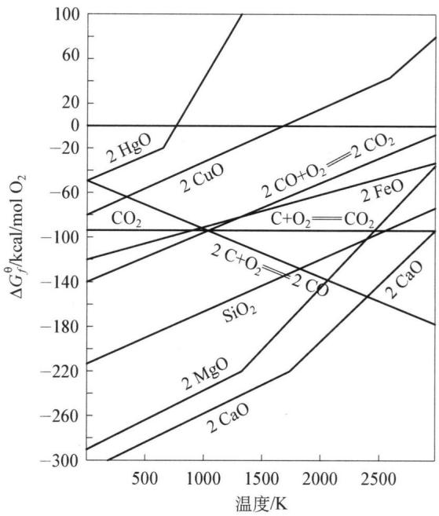

line chart

| 温度/K | 2 HgO (ΔGf⁰/kcal/mol O₂) | 2 CuO (ΔGf⁰/kcal/mol O₂) | 2 FeO (ΔGf⁰/kcal/mol O₂) | 2 C+O₂=CO₂ (ΔGf⁰/kcal/mol O₂) | 2 CaO (ΔGf⁰/kcal/mol O₂) | 2 MgO (ΔGf⁰/kcal/mol O₂) | 2 CaO (ΔGf⁰/kcal/mol O₂) |
| ------ | ------------------------ | ------------------------ | ------------------------ | ----------------------------- | ------------------------ | ------------------------ | ------------------------ |
| 500    | -60                      | -60                      | -100                     | -100                          | -140                     | -220                     | -300                     |
| 1000   | -20                      | -60                      | -100                     | -100                          | -180                     | -260                     | -300                     |
| 1500   | 0                        | -60                      | -100                     | -100                          | -220                     | -260                     | -300                     |
| 2000   | 20                       | -60                      | -100                     | -100                          | -260                     | -260                     | -300                     |
| 2500   | 40                       | -60                      | -100                     | -100                          | -300                     | -260                     | -300                     |
| 3000   | 60                       | -60                      | -100                     | -100                          | -300                     | -260                     | -300                     |

林”。甲醛是重要的有机合成原料，大量用于生产树脂、合成纤维、药物、涂料以及用于房屋、家具和种子的消毒等。

利用下表所给数据回答问题(设 $\Delta H_{m}^{\theta}$ 和 $S_{m}^{\theta}$ 均不随温度而变化)。

一些物质的热力学数据(298.15 K)

<table><tr><td>物质</td><td> $\Delta_{\text{f}}H_{\text{m}}^{\theta}/\text{kJ} \cdot \text{mol}^{-1}$ </td><td> $S_{\text{m}}^{\theta}/\text{J} \cdot \text{K}^{-1} \cdot \text{mol}^{-1}$ </td></tr><tr><td> $\text{C}_{2}\text{H}_{5}\text{OH(g)}$ </td><td>-235.10</td><td>282.70</td></tr><tr><td> $\text{CH}_{3}\text{OH(g)}$ </td><td>-200.66</td><td>239.81</td></tr><tr><td> $\text{HCHO(g)}$ </td><td>-108.57</td><td>218.77</td></tr><tr><td> $\text{H}_{2}\text{O(g)}$ </td><td>-241.818</td><td>188.825</td></tr><tr><td> $\text{CO(g)}$ </td><td>-110.525</td><td>197.674</td></tr><tr><td> $\text{Ag}_{2}\text{O(s)}$ </td><td>-31.05</td><td>121.3</td></tr><tr><td> $\text{Ag(s)}$ </td><td>0</td><td>42.55</td></tr><tr><td> $\text{H}_{2}(g)$ </td><td>0</td><td>130.684</td></tr><tr><td> $\text{O}_{2}(g)$ </td><td>0</td><td>205.138</td></tr></table>

(1) 甲醇脱氢是制甲醛最简单的工业方法:

$$
\mathrm {CH_ {3} OH(g) = HCHO(g)+ H_ {2} (g)}
$$

甲醇氧化是制甲醛的另一种工业方法,即甲醇蒸气和一定量的空气通过 Ag 催化剂层,甲醇即被氧化得到甲醛:

$$
\mathrm {CH_ {3} OH(g)+ \frac {1}{2} O_ {2} (g) = HCHO(g)+ H_ {2} O(g)}
$$

试通过简单的热力学分析,对 298.15 K 时的上述两种方法作出评价。

(2) 实际上,甲醇氧化制甲醛的反应,是甲醇脱氢反应和氢氧化合反应的结合。试通过计算分析两反应结合对制甲醛的实际意义。  
(3) 氧化法制甲醛时, 温度为 $550^{\circ} \mathrm{C}$ 、总压为 $101325 \mathrm{~Pa}$ 的甲醇与空气混合物通过银催化剂, 银逐渐失去光泽并且碎裂。试通过计算判断上述现象是否由于 $\mathrm{Ag}$ 氧化成 $\mathrm{Ag}_{2} \mathrm{O}(\mathrm{s})$ 所致。(设 $\mathrm{O}_{2}$ 在空气中的体积分数为 0.21)

## 第四讲 化学平衡

## 知识精讲

## 一、化学平衡

## 1. 可逆反应

对于多数化学反应来说,在一定条件下反应既能按反应方程式从左向右进行(正反应),也能从右向左进行(逆反应),这种同时能向正、逆两个方向进行的反应,称为可逆反应。绝大多数的化学反应都有一定的可逆性,但是有的反应可逆倾向比较弱,从整体上看反应实际上是朝着一个方向进行的,例如金属钠与水反应。还有些反应在进行时,逆反应发生的条件尚未具备,反应物即已耗尽。例如 $MnO_{2}$ 作为催化剂时 $KClO_{3}$ 的受热分解反应。这些反应,习惯上称为不可逆反应。

## 2. 达到化学平衡的条件

可逆反应在进行到一定程度时,便会建立起平衡。例如,一定条件下,将一定量的 CO 和 $\mathrm{H}_{2}\mathrm{O}(\mathrm{g})$ 加入到一个密闭容器中,反应开始时,CO 和 $\mathrm{H}_{2}\mathrm{O}(\mathrm{g})$ 的浓度较大,正反应速率较大。一旦有 $CO_{2}$ 和 $H_{2}$ 生成,就产生逆反应。开始时逆反应速率较小,随着反应的进行,反应物的浓度逐渐减小,产物的浓度逐渐增大。当正、逆反应速率相等时,单位时间内因正反应使反应物减小的量等于因逆反应使反应物增加的量。此时宏观上,各种物质的浓度(或分压)不再改变,达到平衡状态;微观上,反应并未停止,正、逆反应仍在进行,只是二者速率相等而已。我们把正、逆反应速率相等时的状态称为化学平衡。

根据吉布斯自由能判据,在等温等压、非体积功等于零的条件下,若 $\Delta G_{T,p}<0$ , 则化学反应自发地由反应物变成产物, 这时反应物的浓度(分压)逐渐减少, 产物的浓度(分压)逐渐增加, 反应物和产物吉布斯自由能之差逐渐趋于零, 直到达到化学平衡, $\Delta G_{T,p}=0$ 。这时从宏观上看反应似乎停止了, 其实从微观上正反应和逆反应仍在继续进行, 只不过两者的反应速率正好相等而已, 所以化学平衡是一个动态平衡。

即：等温等压，非体积功等于零的条件下：

$\Delta G_{T,p}<0$ 正反应自发进行；

$\Delta G_{T,p}=0$ 达化学平衡——化学平衡的条件；

$\Delta G_{T,p}>0$ 正反应不自发(逆反应自发)。

化学反应达平衡时：

(1) 从动力学角度: 正逆反应速率相等。

(2) 从热力学角度: 等温等压, 非体积功等于零: 有 $\Delta G_{T, p} = 0$ 。

(3) 反应物和生成物的浓度不变, 即存在一个平衡常数。

（4）化学平衡是有条件的平衡。当外界条件改变时，原有的平衡可能被破坏，平衡发生移动，直到在新的条件下建立新的平衡。

## 二、平衡常数和等温方程式

平衡常数是反映可逆化学反应进行程度的重要参数,分为实验平衡常数和标准平衡常数。

## 1. 实验平衡常数

在恒温下,某一反应的可逆程度总是遵循一种内在的定量规律:即可逆反应无论从正反应开始,或是从逆反应开始,最后达到平衡时,体系中各物质的平衡浓度或分压相对稳定,不随时间而变,且生成物浓度的计量系数次方的乘积与反应物浓度的计量系数次方的乘积之比是一个常数。这一常数被称为实验平衡常数,即通过实验测量平衡态时各组分的浓度或分压而求得的平衡常数为实验平衡常数。

例如反应: $\mathrm{N}_{2} \mathrm{O}_{4} (\mathrm{~g}) \rightleftharpoons 2 \mathrm{NO}_{2} (\mathrm{~g})$ 。若将一定量的 $\mathrm{N}_{2} \mathrm{O}_{4}$ 或(和) $\mathrm{NO}_{2}$ 置于 $1 \mathrm{~L}$ 的密闭烧瓶内, 然后将烧瓶置于 $373 \mathrm{~K}$ 的恒温槽内, 让其充分反应, 达到平衡后, 取样分析 $\mathrm{N}_{2} \mathrm{O}_{4}$ 的平衡浓度, 再求算出 $\mathrm{NO}_{2}$ 的平衡浓度。三次实验的数据列于表4-1。

表 4-1 ${\mathrm{N}}_{2}{\mathrm{O}}_{4} - {\mathrm{{NO}}}_{2}$ 体系的平衡浓度(373 K)

<table><tr><td colspan="2">实验序号</td><td>起始浓度/ $\text{mol} \cdot \text{dm}^{-3}$ </td><td>浓度变化/ $\text{mol} \cdot \text{dm}^{-3}$ </td><td>平衡浓度/ $\text{mol} \cdot \text{dm}^{-3}$ </td><td> $\frac{\left[ \text{NO}_2 \right]^2}{\left[ \text{N}_2\text{O}_4 \right]}$ </td></tr><tr><td>1</td><td> $\text{N}_2\text{O}_4$  $\text{NO}_2$ </td><td>0.1000.000</td><td>-0.060+0.120</td><td>0.0400.120</td><td>0.36</td></tr><tr><td>2</td><td> $\text{N}_2\text{O}_4$  $\text{NO}_2$ </td><td>0.0000.100</td><td>+0.014-0.028</td><td>0.0140.072</td><td>0.37</td></tr><tr><td>3</td><td> $\text{N}_2\text{O}_4$  $\text{NO}_2$ </td><td>0.1000.100</td><td>-0.030+0.060</td><td>0.0700.160</td><td>0.36</td></tr></table>

由表 4-1 数据可见, 恒温条件下, 尽管起始状态不同, 浓度的变化 (即转化率) 不同, 平衡浓度也不同, 但产物 $\mathrm{NO}_{2}$ 的平衡浓度的平方值 $[\mathrm{NO}_{2}]^{2}$ 与反应物 $\mathrm{N}_{2} \mathrm{O}_{4}$ 的平衡浓度 $[\mathrm{N}_{2} \mathrm{O}_{4}]$ 的比值却是相同的, 可用下式表示:

$$
\frac {[ \mathrm{NO} _ {2} ] ^ {2}}{[ \mathrm{N} _ {2} \mathrm{O} _ {4} ]} = K _ {c}
$$

式中 $K_{c}$ 称为该反应在 373 K 时的平衡常数。这个常数是由实验直接测定的，因此常称之为实验平衡常数或经验平衡常数。

上述关系对一切可逆反应都适用。若可逆反应用下述通式表达：

$$
a \mathrm{A} + b \mathrm{B} \rightleftharpoons d \mathrm{D} + e \mathrm{E}
$$

在一定温度下达到平衡时,则有:

$$
\frac {[ \mathrm{D} ] ^ {d} [ \mathrm{E} ] ^ {e}}{[ \mathrm{A} ] ^ {a} [ \mathrm{B} ] ^ {b}} = K _ {c} \tag {4-1}
$$

即在一定温度下,可逆反应达到平衡时,产物的浓度以反应方程式中计量数为指数的幂的乘积与反应物浓度以反应方程式中计量数为指数的幂的乘积之比是一个常数。平衡常数是可逆反应的特征常数,是一定条件下可逆反应进行程度的标度。对同类反应而言,K值越大,反应正向进行的程度越大,反应进行得越完全。

书写平衡常数关系式必须注意以下几点：

（1）对于气相反应，平衡常数除可用如上所述的各物质平衡浓度表示外，也可用平衡时各物质的分压表示，如：

$$
a \mathrm{A} (\mathrm{g}) + b \mathrm{B} (\mathrm{g}) \rightleftharpoons d \mathrm{D} (\mathrm{g}) + e \mathrm{E} (\mathrm{g})
$$

$$
K _ {p} = \frac {\left(p _ {\mathrm{D}}\right) ^ {d} \left(p _ {\mathrm{E}}\right) ^ {e}}{\left(p _ {\mathrm{A}}\right) ^ {a} \left(p _ {\mathrm{B}}\right) ^ {b}} \tag {4-2}
$$

式中实验平衡常数以 $K_{p}$ 表示，以与前述 $K_{c}$ 相区别。 $K_{p}$ 称为压力常数， $K_{c}$ 称为浓度平衡常数。同一反应的 $K_{p}$ 与 $K_{c}$ 有固定关系。若将各气体视为理想气体，根据克拉珀龙方程可以有： $p_{A} = [\mathrm{A}]RT$ ， $p_{B} = [\mathrm{B}]RT$ ， $p_{D} = [\mathrm{D}]RT$ ， $p_{E} = [\mathrm{E}]RT$ 。代入(4-2)式，有：

$$
K _ {p} = \frac {[ \mathrm{D} ] ^ {d} [ \mathrm{E} ] ^ {e}}{[ \mathrm{A} ] ^ {a} [ \mathrm{B} ] ^ {b}} (R T) ^ {(d + e) - (a + b)}
$$

$$
K _ {p} = K _ {c} (R T) ^ {\Delta \nu} \tag {4-3}
$$

$\nu$ 为气态生成物的总计量系数与气态反应物总计量系数之差。在SI单位制中，分压以kPa为单位，浓度以 $mol\cdot L^{-1}$ 为单位，R为8.314 kPa·L· $mol^{-1}\cdot K^{-1}$ 。显然，除 $\nu=0$ 外， $K_{c}$ 与 $K_{p}$ 都是有单位的，分别为 $(mol\cdot L^{-1})^{\Delta\nu}$ 与 $(kPa)^{\Delta\nu}$ 。

对于可逆反应： $2SO_{2} + O_{2} \rightleftharpoons 2SO_{3}$ ，平衡时，各组分的浓度不再改变。反应物的初始组成不同，平衡时各组分的浓度也不相同，但 $\frac{\left[c(SO_{3})\right]^{2}}{\left[c(SO_{2})\right]^{2}c(O_{2})}$ 或 $\frac{\left[p(SO_{3})\right]^{2}}{\left[p(SO_{2})\right]^{2}\left[p(O_{2})\right]}$ 的值是不变的，见表4-2。

表 4-2 $2\mathrm{SO}_2(\mathrm{g}) + \mathrm{O}_2(\mathrm{g}) \rightleftharpoons 2\mathrm{SO}_3(\mathrm{g})$ 平衡系统实验数据 $(723^{\circ}\mathrm{C})$

<table><tr><td rowspan="2">编号</td><td colspan="3">最初物质的量之比</td><td colspan="3">平衡时分压 $p/\text{kPa}$ </td><td rowspan="2"> $\frac{[p(\text{SO}_3)]^2}{[p(\text{SO}_2)]^2[p(\text{O}_2)]}/(\text{kPa})^{-1}$ </td></tr><tr><td> $n(\text{SO}_2)$ </td><td> $n(\text{O}_2)$ </td><td> $n(\text{N}_2)$ </td><td> $\text{SO}_3$ </td><td> $\text{SO}_2$ </td><td> $\text{O}_2$ </td></tr><tr><td>1</td><td>1.24</td><td>1</td><td>0</td><td>34.25</td><td>31.31</td><td>35.77</td><td>0.0335</td></tr><tr><td>2</td><td>2.28</td><td>1</td><td>0</td><td>36.88</td><td>46.31</td><td>18.24</td><td>0.0347</td></tr><tr><td>3</td><td>2.44</td><td>1</td><td>0</td><td>36.17</td><td>49.04</td><td>16.72</td><td>0.0325</td></tr><tr><td>4</td><td>3.36</td><td>1</td><td>0</td><td>33.54</td><td>56.64</td><td>10.23</td><td>0.0343</td></tr><tr><td>5</td><td>3.62</td><td>1</td><td>3.74</td><td>12.97</td><td>25.13</td><td>8.11</td><td>0.0329</td></tr></table>

(2) 不要把反应体系中纯固体、纯液体以及稀水溶液中的水的浓度写进平衡常数表达式。例如对于反应: $\mathrm{CaCO}_{3}(\mathrm{s}) \rightleftharpoons \mathrm{CaO}(\mathrm{s}) + \mathrm{CO}_{2}(\mathrm{g})$ , 由于 $\mathrm{CaCO}_{3}$ 和 $\mathrm{CaO}$ 都是固体, 因此该反应的平衡常数表达式: $K = p_{\mathrm{CO}_{2}}$ 。又如: $\mathrm{Cr}_{2} \mathrm{O}_{7}^{2-}(\mathrm{aq}) + \mathrm{H}_{2} \mathrm{O} (\mathrm{l}) \rightleftharpoons 2 \mathrm{CrO}_{4}^{2-}(\mathrm{aq}) + 2 \mathrm{H}^{+}(\mathrm{aq})$ , 反应的平衡常数 $K = [\mathrm{CrO}_{4}^{2-}]^{2}[\mathrm{H}^{+}]^{2}/[\mathrm{Cr}_{2} \mathrm{O}_{7}^{2-}]$ 。但非水溶液中反应, 若有水参加或生成, 则此时水的浓度不可视为常数, 应写进平衡常数表达式中。例如:

$$
\mathrm{C} _ {2} \mathrm{H} _ {5} \mathrm{OH} + \mathrm{CH} _ {3} \mathrm{COOH} \rightleftharpoons \mathrm{CH} _ {3} \mathrm{COOC} _ {2} \mathrm{H} _ {5} + \mathrm{H} _ {2} \mathrm{O}
$$

$$
K _ {\mathrm{c}} = \frac {[ \mathrm{CH} _ {3} \mathrm{COOC} _ {2} \mathrm{H} _ {5} ] [ \mathrm{H} _ {2} \mathrm{O} ]}{[ \mathrm{C} _ {2} \mathrm{H} _ {5} \mathrm{OH} ] [ \mathrm{CH} _ {3} \mathrm{COOH} ]}
$$

（3）同一化学反应，化学反应方程式写法不同，其平衡常数表达式及数值亦不同。例如：

$$
\begin{array}{l} \mathrm{N} _ {2} \mathrm{O} _ {4} (\mathrm{g}) \rightleftharpoons 2 \mathrm{NO} _ {2} (\mathrm{g}) \\ K _ {(3 7 3)} = \frac {[ \mathrm{NO} _ {2} ] ^ {2}}{[ \mathrm{N} _ {2} \mathrm{O} _ {4} ]} = 0. 3 6 \\ \frac {1}{2} \mathrm{N} _ {2} \mathrm{O} _ {4} (\mathrm{g}) \rightleftharpoons \mathrm{NO} _ {2} (\mathrm{g}) \\ K _ {(3 7 3)} ^ {\prime} = \frac {[ \mathrm{NO} _ {2} ]}{[ \mathrm{N} _ {2} \mathrm{O} _ {4} ] ^ {1 / 2}} = \sqrt {0 . 3 6} = 0. 6 0 \\ 2 \mathrm{NO} _ {2} (\mathrm{g}) \rightleftharpoons \mathrm{N} _ {2} \mathrm{O} _ {4} (\mathrm{g}) \\ K _ {(3 7 3)} ^ {\prime \prime} = \frac {[ \mathrm{N} _ {2} \mathrm{O} _ {4} ]}{[ \mathrm{NO} _ {2} ] ^ {2}} = \frac {1}{0 . 3 6} = 2. 8 \\ \end{array}
$$

因此书写平衡常数表达式及数值,要与化学反应方程式相对应,否则意义就不明确。

平衡常数是表明化学反应进行的最大程度(即反应限度)的特征值。平衡常数愈大,表示反应进行愈完全。虽然转化率也能表示反应进行的限度,但转化率不仅与温度条件有关,而且与起始条件有关。如表4-1,实验序号① $\mathrm{N}_{2}\mathrm{O}_{4}$ 的转化率为 $60\%$ ;实验序号③ $\mathrm{N}_{2}\mathrm{O}_{4}$ 转化率为 $30\%$ 。若有几种反应物的化学反应,对不同反应物,其转化率也可能不同。而平衡常数则能表示一定温度下各种起始条件下,反应进行的限度。

## 2. 标准平衡常数和等温方程式

许多化学反应由于反应速率太慢,难以达到平衡,或由于副反应的干扰,难以测定平衡时的分压或浓度,因此难以求得实验平衡常数。实验平衡常数具有多值性(除 $K_{c}$ 、 $K_{p}$ 外,还有 $K_{x}$ ),一般具有单位,与热力学数据无法关联。另外,实验平衡常数对理想气体或理想溶液是精确的,但对实际气体或溶液会产生一定的偏差。因此引进标准平衡常数 $K^{\theta}$ 。

用平衡相对浓度 $c'(B)$ (平衡浓度除以标准浓度, 即 $c(B)/c^{\theta}$ ) 代替平衡浓度, 或以平衡相对分压(平衡分压除以标准压力, 即 $p(B)/p^{\theta}$ ) 代替平衡压力, 求得的平衡常数称为标准平衡常数 $K^{\theta}$ 。其分子和分母中的各因式(相对浓度或相对分压)均为无量纲的量, 故 $K^{\theta}$ 亦为无量纲的量。

对于液相反应, 因为 $c^{\theta} = 1 \, mol \cdot L^{-1}$ , 故 $K^{\theta}$ 与 $K_{c}$ 在数值上相等, 但一般 $K_{c}$ 是有量纲的量; 而对于气相反应, $p^{\theta} = 100 \, kPa$ , 故 $K^{\theta}$ 与 $K_{p}$ 一般不相等, 二者关系为 $K^{\theta} = K_{p} \cdot (p^{\theta})^{-\Delta\nu}$ , 只有当 $\Delta\nu = 0$ , 即气态生成物的总计量系数与气态反应物的总计量系数相等时, $K^{\theta} = K_{p}$ 。

(1) 标准平衡常数

① 等温等压下,对理想气体反应:

$$
d \mathrm{D} + e \mathrm{E} \rightleftharpoons f \mathrm{F} + h \mathrm{H}
$$

设 $p_{\mathrm{D}}$ 、 $p_{\mathrm{E}}$ 、 $p_{\mathrm{F}}$ 、 $p_{\mathrm{H}}$ 分别为D、E、F、H的平衡分压，则有：

$$
K _ {p} ^ {\theta} = \frac {\left(\frac {p _ {\mathrm{F}}}{p ^ {\theta}}\right) ^ {f} \cdot \left(\frac {p _ {\mathrm{H}}}{p ^ {\theta}}\right) ^ {h}}{\left(\frac {p _ {\mathrm{D}}}{p ^ {\theta}}\right) ^ {d} \cdot \left(\frac {p _ {\mathrm{E}}}{p ^ {\theta}}\right) ^ {e}} \tag {4-4}
$$

式中 $K_{p}^{\theta}$ 称理想气体的热力学平衡常数——标准平衡常数。

热力学可以证明,气相反应达平衡时,标准吉布斯自由能增量 $\Delta_{r}G_{m}^{\theta}$ (反应物和生成物 p 都等于 $p^{\theta}$ 时,进行一个单位化学反应时的吉布斯自由能增量)与 $K_{p}^{\theta}$ 应有如下关系:

$$
\Delta_ {\mathrm{r}} G _ {\mathrm{m}} ^ {\theta} = - R T \ln K _ {p} ^ {\theta} \tag {4-5}
$$

(4-5)式说明,对于给定反应, $K_{p}^{\theta}$ 与 $\Delta_{r}G_{m}^{\theta}$ 和T有关。当温度指定时, $\Delta_{r}G_{m}^{\theta}$ 只与标准态有关,与其他浓度或分压条件无关,它是一个定值。因此,定温下 $K_{p}^{\theta}$ 必定是定值,即 $K_{p}^{\theta}$ 仅是温度的函数。

② 对于既有固相 A, 又有 B 和 D 的水溶液, 以及气体 E 和 $H_{2}O$ 参与的一般反应, 其通式为:

$$
a \mathrm{A(s)} + b \mathrm{B(aq)} \rightleftharpoons d \mathrm{D(aq)} + \mathrm{eE(g)} + f \mathrm {H_ {2} O(l)}
$$

系统达平衡时,其标准平衡常数表达式为:

$$
K = \frac {\left[ c (\mathrm{D}) / c ^ {\theta} \right] ^ {d} \cdot \left[ p (\mathrm{E}) / p ^ {\theta} \right] ^ {e}}{\left[ c (\mathrm{B}) / c ^ {\theta} \right] ^ {b}}
$$

即以配平后的化学计量数为指数的生成物的 $c/c^{\theta}$ (或 $p/p^{\theta}$ ) 的乘积除以反应物的 $c/c^{\theta}$ (或 $p/p^{\theta}$ ) 的乘积所得的商 (对于溶液的溶质取 $c/c^{\theta}$ ，对于气体取 $p/p^{\theta}$ )。标准平衡常数 $K^{\theta}$ ，无压力平衡常数和浓度平衡常数之分。

③ 多重平衡的规则

在相同条件下,如有两个反应方程式相加(或相减)得到第三个反应方程式,则第三个反应方程式的平衡常数为前两个反应方程式平衡常数之积(或之商)。例如:

$$
\mathrm{SO} _ {2} (\mathrm{g}) + 0. 5 \mathrm{O} _ {2} (\mathrm{g}) \Longrightarrow \mathrm{SO} _ {3} (\mathrm{g}) K _ {1} ^ {\theta} = \frac {p \left(\mathrm{SO} _ {3}\right) / p ^ {\theta}}{\left[ p \left(\mathrm{SO} _ {2}\right) / p ^ {\theta} \right] \left[ p \left(\mathrm{O} _ {2}\right) / p ^ {\theta} \right] ^ {0 . 5}} (i)
$$

$$
\mathrm{NO} _ {2} (\mathrm{g}) \rightleftharpoons \mathrm{NO} (\mathrm{g}) + 0. 5 \mathrm{O} _ {2} (\mathrm{g}) K _ {2} ^ {\theta} = \frac {[ p (\mathrm{NO}) / p ^ {\theta} ] [ p (\mathrm{O} _ {2}) / p ^ {\theta} ] ^ {0 . 5}}{p (\mathrm{NO} _ {2}) / p ^ {\theta}} (\text {ii})
$$

$$
\mathrm{SO} _ {2} (\mathrm{g}) + \mathrm{NO} _ {2} (\mathrm{g}) \rightleftharpoons \mathrm{SO} _ {3} (\mathrm{g}) + \mathrm{NO} (\mathrm{g}) \quad K _ {3} ^ {\theta} = \frac {[ p (\mathrm{SO} _ {3}) / p ^ {\theta} ] [ p (\mathrm{NO}) / p ^ {\theta} ]}{[ p (\mathrm{SO} _ {2}) / p ^ {\theta} ] [ p (\mathrm{NO} _ {2}) / p ^ {\theta} ]} \tag {iii}
$$

因为反应（iii）=（i）+（ii），所以 $K_{3}^{\theta}=K_{1}^{\theta}K_{2}^{\theta}$ 。多重平衡规则在各种平衡系统的计算中颇为有用。

(2) 化学反应的等温方程式

如果化学反应尚未达到平衡,体系将发生化学变化,反应自发地往哪个方向进

行呢？由化学等温方程式即可判断。

① 等温等压下,理想气体反应:

$$
d \mathrm{D} + e \mathrm{E} \rightleftharpoons f \mathrm{F} + h \mathrm{H}
$$

气体的任意分压为 $p_{\mathrm{D}}^{\prime}$ 、 $p_{\mathrm{E}}^{\prime}$ 、 $p_{\mathrm{F}}^{\prime}$ 、 $p_{\mathrm{H}}^{\prime}$ 时：

$$
G _ {\mathrm{m}, \mathrm{D}} = G _ {\mathrm{m}, \mathrm{D}} ^ {\theta} + R T \ln \frac {p _ {\mathrm{D}} ^ {\prime}}{p ^ {\theta}}; G _ {\mathrm{m}, \mathrm{E}} = G _ {\mathrm{m}, \mathrm{E}} ^ {\theta} + R T \ln \frac {p _ {\mathrm{E}} ^ {\prime}}{p ^ {\theta}};
$$

$$
G _ {\mathrm{m}, \mathrm{F}} = G _ {m, \mathrm{F}} ^ {\theta} + R T \ln \frac {p _ {F} ^ {\prime}}{p ^ {\theta}}; \quad G _ {\mathrm{m}, \mathrm{H}} = G _ {\mathrm{m}, \mathrm{H}} ^ {\theta} + R T \ln \frac {p _ {\mathrm{H}} ^ {\prime}}{p ^ {\theta}}
$$

此时若反应自左至右进行了一个单位的化学反应(无限大量的体系中),则:

$$
\Delta_ {\mathrm{r}} G _ {\mathrm{m}} = \Delta_ {\mathrm{r}} G _ {\mathrm{m}} ^ {\theta} + R T \ln \frac {\left(\frac {p _ {\mathrm{F}} ^ {\prime}}{p ^ {\theta}}\right) ^ {f} \cdot \left(\frac {p _ {\mathrm{H}} ^ {\prime}}{p ^ {\theta}}\right) ^ {h}}{\left(\frac {p _ {\mathrm{D}} ^ {\prime}}{p ^ {\theta}}\right) ^ {d} \cdot \left(\frac {p _ {\mathrm{E}} ^ {\prime}}{p ^ {\theta}}\right) ^ {e}} \qquad \text {令} Q _ {p} = \frac {\left(\frac {p _ {\mathrm{F}} ^ {\prime}}{p ^ {\theta}}\right) ^ {f} \cdot \left(\frac {p _ {\mathrm{H}} ^ {\prime}}{p ^ {\theta}}\right) ^ {h}}{\left(\frac {p _ {\mathrm{D}} ^ {\prime}}{p ^ {\theta}}\right) ^ {d} \cdot \left(\frac {p ^ {\prime} {} _ {\mathrm{E}}}{p ^ {\theta}}\right) ^ {e}}
$$

则： $\Delta_{\mathrm{r}}G_{\mathrm{m}} = \Delta_{\mathrm{r}}G_{\mathrm{m}}^{\theta} + RT\ln Q_{p}$ (4-6)

$$
= - R T \ln K _ {p} ^ {\theta} + R T \ln Q _ {p}
$$

(4-6)式称作化学反应的等温方程式。式中 $Q_{p}$ 称作压力商。

若 $K_{p}^{\theta} > Q_{p}$ ，则 $\Delta_{\mathrm{r}}G_{\mathrm{m}} < 0$ ，反应正向自发进行；

若 $K_{p}^{\theta} = Q_{p}$ ，则 $\Delta_{\mathrm{r}}G_{\mathrm{m}} = 0$ ，体系已处于平衡状态；

若 $K_{p}^{\theta} < Q_{p}$ ，则 $\Delta_{\mathrm{r}}G_{\mathrm{m}} > 0$ ，反应正向不能自发进行（逆向自发）。

注：对溶液中进行的反应： $\Delta_{\mathrm{r}}G_{\mathrm{m}} = \Delta_{\mathrm{r}}G_{\mathrm{m}}^{\theta} + RT\ln Q_{c}$

$$
= - R T \ln K _ {c} ^ {\theta} + R T \ln Q _ {c} \tag {4-7}
$$

$$
K _ {c} ^ {\theta} = \frac {\left(\frac {c _ {\mathrm{F}}}{c ^ {\theta}}\right) ^ {f} \cdot \left(\frac {c _ {\mathrm{H}}}{c ^ {\theta}}\right) ^ {h}}{\left(\frac {c _ {\mathrm{D}}}{c ^ {\theta}}\right) ^ {d} \cdot \left(\frac {c _ {\mathrm{E}}}{c ^ {\theta}}\right) ^ {e}}; Q _ {c} = \frac {\left(\frac {c _ {\mathrm{F}} ^ {\prime}}{c ^ {\theta}}\right) ^ {f} \cdot \left(\frac {c _ {\mathrm{H}} ^ {\prime}}{c ^ {\theta}}\right) ^ {h}}{\left(\frac {c _ {\mathrm{D}} ^ {\prime}}{c ^ {\theta}}\right) ^ {d} \cdot \left(\frac {c _ {\mathrm{E}} ^ {\prime}}{c ^ {\theta}}\right) ^ {e}}
$$

c 指平衡浓度； $c'$ 指任意浓度； $K_{c}^{\theta}$ 指热力学平衡常数（标准平衡常数）。 $Q_{c}$ 指浓度商； $c^{\theta}$ 指标准浓度，即在标准状态下， $c=1\ mol\cdot dm^{-3}$ 。

② 纯固体或纯液体与气体间的反应(复相反应)

例如, 下列反应: $\mathrm{CaCO_{3}(s)=CaO(s)+CO_{2}(g)}$ 是一个多相反应, 其中包含两个不同的纯固体和一个纯气体。化学平衡条件 $\Delta_{r}G_{m}=0$ , 适用于任何化学平衡, 不论是均相的, 还是多相的。

$$
\Delta_ {\mathrm{r}} G _ {\mathrm{m}} = - R T \ln \frac {p _ {\mathrm{CO} _ {2}}}{p ^ {\theta}}
$$

又因为 $\Delta_{\mathrm{r}}G_{\mathrm{m}} = -RT\cdot \ln K_{c}$

所以 $K_{c} = \frac{p_{\mathrm{CO}_{2}}}{p^{\theta}} = K_{p}, K_{p} = p_{\mathrm{CO}_{2}}$

式中 $p_{CO_{2}}$ 是平衡反应体系中 $CO_{2}$ 气体的压力, 即 $CO_{2}$ 的平衡分压。这就是说, 在一定温度下, $\mathrm{CaCO_{3}(s)}$ 上面的 $CO_{2}$ 的平衡压力是恒定的, 这个压力又称为 $\mathrm{CaCO_{3}(s)}$ 的“分解压”。

注意：纯固体的“分解压”并不时刻都等于 $K_{p}$ ，例如反应：

$$
\frac {1}{2} \mathrm{CaCO} _ {3} (\mathrm{s}) = \frac {1}{2} \mathrm{CaO} (\mathrm{s}) + \frac {1}{2} \mathrm{CO} _ {2} (\mathrm{g})
$$

$$
K _ {p} = p _ {\mathrm{CO} _ {2}} ^ {\frac {1}{2}}, \quad \text {而“分解压”} = p _ {\mathrm{CO} _ {2}}
$$

若分解气体产物不止一种,分解平衡时气体产物的总压称作“分解压”。例如: $\mathrm{NH_{4}HS(s)=NH_{3}(g)+H_{2}S(g)}$ , 由纯 $\mathrm{NH_{4}HS(s)}$ 分解平衡时, $(p_{\mathrm{NH_{3}}}+p_{\mathrm{H_{2}S}})$ 称作 $\mathrm{NH_{4}HS(s)}$ 的“分解压”。

$$
K _ {p} = p _ {\mathrm{NH} _ {3}} \bullet p _ {\mathrm{H} _ {2} \mathrm{S}} = \left(\frac {p}{2}\right) ^ {2} = \frac {p ^ {2}}{4} K _ {p} ^ {\theta} = \frac {p ^ {2}}{4} (p ^ {\theta}) ^ {- 2}
$$

结论：对纯固体或纯液体与气体间的多相反应

$$
K _ {c} ^ {\theta} = K _ {p} ^ {\theta} = K _ {p} (p ^ {\theta}) ^ {- \Delta \nu} \tag {4-8}
$$

## 三、平衡常数的测定和平衡转化率的计算

## 1. 平衡常数的测定

测定平衡常数实际上是测定平衡体系中各物质的浓度(确切地说是活度)或压力。视具体情况可以采用物理或化学的方法。

(1) 物理方法: 测定与浓度有关的物理量。如压力、体积、折射率、电导率等。

优点：不会扰乱体系的平衡状态。

缺点：必须首先确定物理量与浓度的依赖关系。

(2) 化学方法: 利用化学分析的方法直接测定平衡体系中各物质的浓度。

缺点：加入试剂往往会扰乱平衡，所以分析前首先必须使平衡“冻结”。通常采取的方式是：骤然冷却，取出催化剂或加入阻化剂等。

## 2. 平衡转化率的计算

(1) 平衡转化率(亦称理论转化率或最高转化率)

平衡转化率是指达到化学平衡时,已转化为生成物的反应物占该反应物起始总量的百分比。平衡转化率有时也简称为转化率,以 $\alpha$ 来表示:

$$
\alpha = \frac {\mathrm{反应物已转化的量}}{\mathrm{反应物未转化前的总量}} \times 1 0 0
$$

若反应前后体积不变,反应物的量又可用浓度表示:

$$
\alpha = \frac {\mathrm{反应物起始浓度} - \mathrm{反应物平衡浓度}}{\mathrm{反应物起始浓度}} \times 1 0 0
$$

转化率越大,表示反应向右进行的程度越大。平衡常数和转化率虽然都能表示反应进行的程度,但二者有差别,平衡常数与系统的起始状态无关,只与反应温度有关,平衡转化率是以原料的消耗来衡量反应的限度。因此,除与温度有关外还与系统起始状态有关,且必须指明是哪种反应物的转化率,反应物不同,转化率的数值往往不同。

注：实际转化率 $\leqslant$ 平衡转化率（工厂通常说的转化率为实际转化率）。

(2) 平衡产率(最大产率)——以产品来衡量反应的限度

$$
\mathrm{平衡产率} = \frac {\mathrm{平衡时主要产品的产量}}{\mathrm{原料按化学反应方程式全部变为主要产品时的产量}} \times 100
$$

注：产率通常用在多方向的反应中，即有副反应的反应。有副反应时，产率＜转化率。

示例如下：

在某温度下，反应 $\mathrm{CO(g)+H_{2}O(g)\rightleftharpoons H_{2}(g)+CO_{2}(g)}$ ， $K_{c}=9$ ，若 CO 和 $H_{2}O$ 的起始浓度皆为 $0.02\ mol\cdot L^{-1}$ ，求 CO 的平衡转化率。

解析 设反应达到平衡时体系中 $H_{2}$ 和 $CO_{2}$ 的浓度均为 $x\ mol\cdot L^{-1}$ 。

$$
\mathrm{CO(g)} + \mathrm {H_ {2} O(g)} \rightleftharpoons \mathrm {H_ {2} (g)} + \mathrm {CO_ {2} (g)}
$$

起始浓度/mol·L $^{-1}$ 0.02 0.02 0 0

平衡浓度/mol·L $^{-1}$ 0.02-x 0.02-x x x

$$
K _ {\mathrm{c}} = \frac {c (\mathrm{H} _ {2}) c (\mathrm{CO} _ {2})}{c (\mathrm{CO}) c (\mathrm{H} _ {2} \mathrm{O})} = \frac {x ^ {2}}{(0 . 0 2 - x) ^ {2}} = 9
$$

解得 x = 0.015，即平衡时 $c(\mathrm{H}_{2}) = c(\mathrm{CO}_{2}) = 0.015 \, \mathrm{mol} \cdot \mathrm{L}^{-1}$

根据化学反应方程式可知,平衡时转化掉的 $c(\mathrm{CO}) = 0.015 \, \mathrm{mol} \cdot \mathrm{L}^{-1}$ , 所以 CO 的平衡转化率为: $\alpha = 0.015 / 0.02 \times 100\% = 75\%$ .

## 四、外界因素对化学平衡的影响

化学平衡状态是在一定条件下的一种暂时稳定状态,当外界条件(如温度、压力、浓度等)变化时,平衡状态遭到破坏,从平衡状态变为不平衡状态。在改变了的条件下,可逆反应重新建立平衡。这种外界条件改变,可逆反应从一种平衡状态转变到另一种平衡状态的过程叫作化学平衡的移动。在新建立的平衡状态下,反应体系中各物质的浓度与原平衡状态下各物质的浓度不相等。导致平衡移动的原因,可以从反应商的改变和平衡常数的改变两个方面去考虑。

## 1. 浓度对平衡的影响

对于一个已达平衡的化学反应,若增加反应物浓度,会使 $Q(Q_{p}$ 或 $Q_{c})$ 的数值因其分母增大而减小,而 $K^{\theta}(K_{p}^{\theta}$ 或 $K_{c}^{\theta})$ 却不随浓度改变而发生变化,于是 $Q < K^{\theta}$ ,使原平衡破坏,反应正向进行。随着反应的进行,生成物浓度增大,反应物浓度减小,Q 值增大,直到 Q 增大到与 $K^{\theta}$ 再次相等,达到新的平衡为止。对于改变浓度的其他情况,亦可作类似分析。结论概括如下:在其他条件不变的情况下,增加反应物浓度或减少生成物浓度,平衡向正反应方向移动;增加生成物浓度或减少反应物浓度,平衡向着逆反应方向移动。

示例如下：

反应 $\mathrm{CO(g)+H_{2}O(g)\rightleftharpoons CO_{2}(g)+H_{2}(g)}$ 。在某温度下达到平衡时， $c(\mathrm{CO})=c(\mathrm{H_{2}O})=0.005\mathrm{mol}\cdot\mathrm{L^{-1}}$ ， $c(\mathrm{CO_{2}})=c(\mathrm{H_{2}})=0.015\mathrm{mol}\cdot\mathrm{L^{-1}}$ 。向平衡体系中加 $\mathrm{H_{2}O(g)}$ ，使 $c(\mathrm{H_{2}O})=1\mathrm{mol}\cdot\mathrm{L^{-1}}$ 。试判断平衡移动的方向，并求重新平衡时 CO 的转化率。

解析 $K_{c}=\frac{c(\mathrm{CO}_{2})\cdot c(\mathrm{H}_{2})}{c(\mathrm{CO})\cdot c(\mathrm{H}_{2}\mathrm{O})}=\frac{0.015^{2}}{0.005^{2}}=9$ 。平衡因 $\mathrm{H}_{2}\mathrm{O}(\mathrm{g})$ 浓度的改变而被破坏时，此时浓度商为：

$Q_{c}=\frac{c(\mathrm{CO}_{2})\cdot c(\mathrm{H}_{2})}{c(\mathrm{CO})\cdot c(\mathrm{H}_{2}\mathrm{O})}=\frac{0.015^{2}}{0.005}=0.045<K_{c}$ ，故平衡将向右移动。

设重新达到平衡时转化掉的 $c(\mathrm{CO}) = x \, \mathrm{mol} \cdot \mathrm{L}^{-1}$

$$
\mathrm{CO(g)} + \mathrm{H} _ {2} \mathrm{O(g)} \rightleftharpoons \mathrm{CO} _ {2} (\mathrm{g}) + \mathrm{H} _ {2} (\mathrm{g})
$$

起始浓度/mol·L $^{-1}$ 0.005 1 0.015 0.015

平衡浓度/mol·L $^{-1}$ 0.005-x 1-x 0.015+x 0.015+x

$$
K _ {c} = \frac {c (\mathrm{CO} _ {2}) \cdot c (\mathrm{H} _ {2})}{c (\mathrm{CO}) \cdot c (\mathrm{H} _ {2} \mathrm{O})} = \frac {(0 . 0 1 5 + x) ^ {2}}{(0 . 0 0 5 - x) (1 - x)} = 9
$$

解得: $x = 0.00495$ 。所以, 转化率 $= \frac{0.00495}{0.005} \times 100\% = 99\%$ 。

在化工生产中,为了充分利用某一反应物,提高其转化率,常常让另一反应物适当过量。若从平衡系统中不断移出产物,也能使平衡向右移动,提高反应物的转化率。

## 2. 压力对平衡的影响

体系(总)压力的变化对没有气体参加或生成的反应影响很小。对于有气体参加且反应前后气体物质计量数有变化的反应,压力变化对平衡有影响。例如合成氨反应

$$
\mathrm{N} _ {2} (\mathrm{g}) + 3 \mathrm{H} _ {2} (\mathrm{g}) \rightleftharpoons 2 \mathrm{NH} _ {3} (\mathrm{g})
$$

在某温度下达到平衡时有：

$$
K _ {p} ^ {\theta} = \frac {(p _ {\mathrm{NH} _ {3}} / p ^ {\theta}) ^ {2}}{(p _ {\mathrm{N} _ {2}} / p ^ {\theta}) (p _ {\mathrm{H} _ {2}} / p ^ {\theta}) ^ {3}}
$$

如果将体系的容积减少一半,使体系的总压力增加至原来的2倍,这时各组分的分压分别为原来的2倍,反应商为:

$$
Q _ {p} = \frac {(2 p _ {\mathrm{NH} _ {3}} / p ^ {\theta}) ^ {2}}{(2 p _ {\mathrm{N} _ {2}} / p ^ {\theta}) (2 p _ {\mathrm{H} _ {2}} / p ^ {\theta}) ^ {3}} = \frac {1}{4} K _ {p} ^ {\theta}
$$

即 $Q_{p} < K_{p}^{\theta}$

原平衡破坏,反应正向进行。随着反应进行, $p_{N_{2}}$ 、 $p_{H_{2}}$ 不断下降, $p_{NH_{3}}$ 不断增大,使 $Q_{p}$ 值增大,直到 $Q_{p}$ 再次与K相等,达到新的平衡为止。可见,增大体系总压力平衡向着气体计量数减小的方向移动。

类似分析,可得如下结论: 在等温下,增大总压力,平衡向气体计量数减小的方向移动;减小总压力,平衡向气体计量数增加的方向移动。如果反应前后气体计量数相等,则压力的变化不会使平衡发生移动。

需要指出,在恒温条件下,向一平衡系统加入不参与反应的其他气态物质(称

“惰性气体”，如稀有气体、 $N_{2}$ ，则：

（1）若体积不变，但系统的总压增加，这种情况下无论 $\Delta\nu>0,\Delta\nu=0$ 或 $\Delta\nu<0$ ，平衡都不移动。因为平衡系统的总压虽然增加，但各物质的分压 $(p_{i}=n_{i}RT/V)$ 并无改变，Q 和 $K^{\theta}$ 仍相等，平衡状态不变。

(2) 若总压维持不变, 则系统体积增大 (相当于系统原来的压力减小), 此时若 $\Delta \nu \neq 0, Q \neq K^{\theta}$ , 平衡将向气体分子数增加的方向移动, “惰性气体”的存在与降低总压的效果是等同的。

示例如下：

在 $1000^{\circ}C$ 及总压力为 3000 kPa 下，反应： $\mathrm{CO}_{2}(\mathrm{~g}) + \mathrm{C}(\mathrm{s}) \rightleftharpoons 2\mathrm{CO}(\mathrm{g})$ 达到平衡时 $CO_{2}$ 的摩尔分数为 0.17。求当总压减至 2000 kPa 时， $CO_{2}$ 的摩尔分数为多少？由此可得出什么结论？

解析 设达到新的平衡时, $CO_{2}$ 的摩尔分数为 x, CO 的摩尔分数为 1 - x, 则:

$$
\begin{array}{l} p (\mathrm{CO} _ {2}) = p _ {\text {总}} \cdot x (\mathrm{CO} _ {2}) = 2 0 0 0 x \mathrm{kPa} \\ p (\mathrm{CO}) = p _ {\text {总}} \cdot x (\mathrm{CO}) = 2 0 0 0 (1 - x) \mathrm{kPa} \\ \end{array}
$$

将以上各值代入平衡常数表达式：

$$
K ^ {\theta} = \frac {[ p (\mathrm{CO}) / p ^ {\theta} ] ^ {2}}{p (\mathrm{CO} _ {2}) / p ^ {\theta}} = \frac {[ 2 0 0 0 (1 - x) \div 1 0 0 ] ^ {2}}{2 0 0 0 x \div 1 0 0}
$$

若已知 $K^{\theta}$ ，即可求得 x。因系统温度不变，降低压力时 $K^{\theta}$ 值不变，故 $K^{\theta}$ 可由原来的平衡系统求得。原来平衡系统中：

$$
\begin{array}{l} p (\mathrm{CO}) = 3 0 0 0 (1 - 0. 1 7) \mathrm{kPa} = 2 4 9 0 \mathrm{kPa} \\ p \left(\mathrm{CO} _ {2}\right) = 3 0 0 0 \times 0. 1 7 \mathrm{kPa} = 5 1 0 \mathrm{kPa} \\ K ^ {\theta} = \frac {[ p (\mathrm{CO}) / p ^ {\theta} ] ^ {2}}{p (\mathrm{CO} _ {2}) / p ^ {\theta}} = \frac {(2 4 9 0 / 1 0 0) ^ {2}}{5 1 0 / 1 0 0} = 1 2 2 \\ \end{array}
$$

将 $K^{\theta}$ 值代入上式：

$$
\frac {\left[ 2 0 0 0 (1 - x) \div 1 0 0 \right] ^ {2}}{2 0 0 0 x \div 1 0 0} = 1 2 2, \text {解得:} x = 0. 1 2 6 \approx 0. 1 3
$$

由计算结果可知: $\mathrm{CO}_{2}$ 的摩尔分数比原来减少, 说明反应向右移动。此例又一次证实当气体总压降低时, 平衡将向气体分子数增多的方向移动。

## 3. 温度对平衡的影响

温度的改变对于反应商没有影响,却可以改变平衡常数。

由 $\Delta_{\mathrm{r}}G_{\mathrm{m}}^{\theta} = -RT\ln K^{\theta}$ 和 $\Delta_{\mathrm{r}}G_{\mathrm{m}}^{\theta} = \Delta_{\mathrm{r}}H_{\mathrm{m}}^{\theta} - T\Delta_{\mathrm{r}}S_{\mathrm{m}}^{\theta}$ 得：

$$
- R T \ln K ^ {\theta} = \Delta_ {\mathrm{r}} H _ {\mathrm{m}} ^ {\theta} - T \Delta_ {\mathrm{r}} S _ {\mathrm{m}} ^ {\theta}
$$

$$
\ln K ^ {\theta} = - \frac {\Delta_ {\mathrm{r}} H _ {\mathrm{m}} ^ {\theta}}{R T} + \frac {\Delta_ {\mathrm{r}} S _ {\mathrm{m}} ^ {\theta}}{R} \tag {4-9}
$$

此式说明了平衡常数与温度的关系,称为范特荷甫方程式。设 $T_{1}$ 时,标准平衡常数为 $K_{1}^{\theta}, T_{2}$ 时,标准平衡常数为 $K_{2}^{\theta}$ ,且 $T_{2} > T_{1}$ ,有:

$$
\ln K _ {1} ^ {\theta} = - \frac {\Delta_ {\mathrm{r}} H _ {\mathrm{m} , 1} ^ {\theta}}{R T _ {1}} + \frac {\Delta_ {\mathrm{r}} S _ {\mathrm{m} , 1} ^ {\theta}}{R}
$$

$$
\ln K _ {2} ^ {\theta} = - \frac {\Delta_ {\mathrm{r}} H _ {\mathrm{m} , 2} ^ {\theta}}{R T _ {2}} + \frac {\Delta_ {\mathrm{r}} S _ {\mathrm{m} , 2} ^ {\theta}}{R}
$$

当温度变化范围不大时, 视 $\Delta_{r}H_{m}^{\theta}$ 和 $\Delta_{r}S_{m}^{\theta}$ 不随温度而改变。上两式相减, 有

$$
\ln \frac {K _ {1} ^ {\theta}}{K _ {2} ^ {\theta}} = - \frac {\Delta_ {\mathrm{r}} H _ {\mathrm{m}} ^ {\theta}}{R} \left(\frac {T _ {2} - T _ {1}}{T _ {1} \cdot T _ {2}}\right) \tag {4-10}
$$

根据式(4-10)可以说明温度对平衡的影响。设某反应在温度 $T_{1}$ 时达到平衡，有 $Q=K_{1}^{\theta}$ 。当升温至 $T_{2}$ 时：若该反应为吸热反应， $\Delta_{r}H_{m}^{\theta}>0$ ，由(4-10)式得知 $K_{2}^{\theta}>K_{1}^{\theta}$ ，则 $Q<K_{2}^{\theta}$ ，所以平衡向正反应方向移动；若该反应为放热反应， $\Delta_{r}H_{m}^{\theta}<0$ ，由式(4-10)得知 $K_{2}^{\theta}<K_{1}^{\theta}$ ，则 $Q>K_{2}^{\theta}$ ，所以平衡向逆反应方向移动。总之，升温使平衡向吸热方向移动。反之，降温使平衡向放热方向移动。

## 4. 催化剂与化学平衡

催化剂能降低反应的活化能,加快反应速率,缩短达到平衡的时间。由于它以同样倍数加快正、逆反应速率,平衡常数 $K^{\theta}$ 并不改变,因此不会使平衡发生移动。

## 5. 平衡移动的原理——勒夏特列原理

影响化学平衡的因素是浓度、压力和温度,综合以上影响平衡移动的各种结论,可以用1817年法国化学家勒夏特列(Le Chatelier)提出的平衡移动原理来判断:假如改变平衡系统的条件之一,如温度、压力或浓度,平衡就向着减弱这个改变的方向移动。

(1) 当增加反应物浓度时,平衡就向着能减少反应物浓度的方向(即正方向)移动。同理,在减少生成物的浓度时平衡就向着能增加生成物浓度的方向移动。

(2) 当温度升高时,平衡就向着能降低温度(即吸热反应)的方向移动。当降低温度时,平衡就向着能升高温度(即放热反应)的方向移动。

(3) 当增加压力时,平衡就向着能减小压力(即气体分子数目减少)的方向移动。当减小压力时,平衡就向着能增大压力(即气体分子数目增加)的方向移动。

勒夏特列原理是一条普遍的规律,它对所有的动态平衡都是适用的,但必须注意,它只能应用在已经达到平衡的体系。对于未达到平衡的体系是不能应用的。

## 五、反应速率与化学平衡的综合应用

化学反应速率和化学平衡是化工生产中两个非常重要并且彼此密切相关的问题。在实际工作中,如何充分利用原料,提高产量,缩短生产周期,降低成本,以达到最高的经济效益和社会效益,下列几项原则,可作为选择合理生产条件时的参考。

(1) 在化工生产中,为了尽可能充分利用某一种物料,往往使用过量的另一种物料(一般是价廉易得的)和它作用,使平衡向正反应方向移动,以提高前者的转化率。例如在合成氨生产中,为使 CO 充分转化为 $\mathrm{CO}_{2}$ , 通常加入过量的水蒸气;硫酸工业的转化工序 $\mathrm{SO}_{2}$ 氧化成 $\mathrm{SO}_{3}$ , 让 $\mathrm{O}_{2}$ 过量,使 $\mathrm{SO}_{2}$ 充分转化。但必须指出,一种原料的过量应适可而止,如过量太多会使另一种原料的浓度变得太小,影响反应速率和产量。此外,对于气相反应,要注意原料气的性质,防止它们的配比进入爆炸范围,以免引起安全事故。

使产物的浓度降低,同样可以使化学平衡向正反应方向移动。在生产中经常采取不断取走某种反应产物的方法,使化学反应持续进行,以保证原料的充分利用和生产过程的连续化。例如移去生成物中的气体或难溶沉淀物等,平衡将不断向生成物方向移动,直到某一反应物基本上被完全消耗,这样便可以使可逆反应进行得比较完全。例如煅烧石灰石制造生石灰的反应: $\mathrm{CaCO_{3}(s)} \rightleftharpoons \mathrm{CaO(s)} + \mathrm{CO_{2}(g)}$ ,由于生成的 $CO_{2}$ 不断从窑炉中排出,提高了 $CaCO_{3}$ 的转化率,实际上 $CaCO_{3}$ 能完全分解。

(2) 对于气相反应, 加大压力会使反应速率加快, 对气体分子数减少的反应还能提高转化率。例如在合成氨工业中, 在 $1000 \times 10^{5} \mathrm{~Pa}$ 下, 不用催化剂就可以合成氨, 且转化率很高, 不过氢在这样的高压下, 能穿透用特种钢制作的反应器的器壁。考虑到设备的耐压能力, 我国合成氨工业反应体系的压力一般采用 $600 \times 10^{5} \sim 700 \times 10^{5} \mathrm{~Pa}$ 。所以在增加反应速率, 提高转化率的同时, 必须考虑设备能力和安全防护等。

（3）升高温度能增大反应速率，对于吸热反应，还能提高转化率，但要避免反应物或产物的过热分解，也要注意燃料的合理消耗；对于放热反应，会使转化率降

低,这涉及最佳反应温度的选择问题。

（4）选用催化剂时，需注意催化剂的活化温度，防止催化剂中毒。相同的反应物，若同时可以发生几种反应，而其中只有一个反应是我们需要的，则首先必须选择合适的催化剂以保证主反应的进行和遏制副反应的发生，然后再考虑其他条件。

## 典型例题

【例 1】（2014 年全国决赛）如图所示，无摩擦、无质量的活塞 1、2、3 和 4 将反应器隔成甲、乙、丙和丁 4 部分，分别进行反应：

$$
\mathrm{A(g)} + \mathrm{B(g)} \rightleftharpoons \mathrm{C(g)}
$$

起始时物质的量已标在图中。某温度和 100 kPa 下实现平衡时，各部分的体积分别为 $V_{甲}$ 、 $V_{乙}$ 、 $V_{丙}$ 和 $V_{丁}$ 。这时若去掉活塞 1 或 3，均不会引起其他活塞移动。

<table><tr><td>1</td><td>2</td><td>3</td><td>4</td></tr><tr><td>x mol B 3 mol C</td><td>1 mol A 3 mol B</td><td>1 mol A 8 mol B</td><td>a mol A b mol B y mol C</td></tr></table>

(1) 已知平衡常数 K 和反应商 Q, 如何判断反应进行的方向?

(2) 求算 $V_{甲}$ 、 $V_{乙}$ 之比；

(3) 求算 y 值;

（4）去掉活塞2后再次达到平衡时，活塞3向哪个方向发生了移动？试通过计算加以解释，可以假定反应的 $K^{\theta}$ 等于1。

解析 （1）本问非常基本：当 Q > K 时，平衡向逆反应方向移动；当 Q < K 时，平衡向正反应方向移动；当 Q = K 时，处于平衡状态。

(2) 根据题意: “去掉某活塞, 不会引起其他活塞移动”, 说明去掉活塞后容器两侧的压强没有改变, 根据等效平衡的思想, 相当于将 C 根据方程式完全转化为 A 和 B 后, 容器左右两部分的 A、B 比值完全相同。因此, 不妨将 4 个部分中的起始物质全部转化成等价的只有 A、B 的形式:

<table><tr><td>甲</td><td>乙</td><td>丙</td><td>丁</td></tr><tr><td>3 mol A</td><td>1 mol A</td><td>1 mol A</td><td>(a+y)mol A</td></tr><tr><td>(3+x)mol B</td><td>3 mol B</td><td>8 mol B</td><td>(b+y)mol B</td></tr></table>

容易看出 $V_{甲}:V_{乙}=3:1$ 。

(3) 由(2)的分析可知, 存在以下关系: $b + y = 8(a + y)$ , 解得:

$$
y = (b - 8 a) / 7
$$

(4) 去掉活塞 2 后, 由于甲处于最内部, 不直接与大气相邻, 因此活塞 1 不会移动。所以只需要考虑去掉活塞 2, 乙、丙中的气体混合后, 计算气体的总量是增加还是减少即可。讨论如下:

当乙达到平衡时：

设乙中 $n(\mathrm{C}) = x \, \mathrm{mol}$ ，由 $K^{\theta}$ 表达式列式有：

$$
K ^ {\theta} = \frac {\frac {x}{4 - x}}{\frac {1 - x}{4 - x} \times \frac {3 - x}{4 - x}} = 1, \text {解得:} x = 0. 4 1 9 \mathrm{mol}
$$

因此，乙平衡时 $n(\mathrm{A}) = 0.581 \, \mathrm{mol}$ ， $n(\mathrm{B}) = 2.581 \, \mathrm{mol}$ ， $n(\mathrm{C}) = 0.419 \, \mathrm{mol}$ 。

当丙达到平衡时：

设丙中 $n(\mathrm{C}) = y \, \mathrm{mol}$ ，由 $K^{\theta}$ 表达式列式有：

$$
K ^ {\theta} = \frac {\frac {y}{9 - y}}{\frac {1 - y}{9 - y} \times \frac {8 - y}{9 - y}} = 1, \text {解得:} y = 0. 4 6 9 \mathrm{mol}
$$

因此，丙平衡时 $n(\mathrm{A})=0.531\ \mathrm{mol},\ n(\mathrm{B})=7.531\ \mathrm{mol},\ n(\mathrm{C})=0.469\ \mathrm{mol}$ 。

所以,当去掉活塞2后,原先乙、丙中:

$$
n (\mathrm{A}) _ {\text {总}} = 0. 5 8 1 + 0. 5 3 1 = 1. 1 1 2 \mathrm{mol}
$$

$$
n (\mathrm{B}) _ {\text {总}} = 2. 5 8 1 + 7. 5 3 1 = 1 0. 1 1 2 \mathrm{mol}
$$

$$
n (\mathrm{C}) _ {\text {总}} = 0. 4 1 9 + 0. 4 6 9 = 0. 8 8 8 \mathrm{mol}
$$

$$
n _ {\text { 总 }} = 1 2. 1 1 2 \mathrm{mol}
$$

考查反应商：

$$
Q = \frac {\frac {0 . 8 8 8}{1 2 . 1 1 2}}{\frac {1 . 1 1 2}{1 2 . 1 1 2} \times \frac {1 0 . 1 1 2}{1 2 . 1 1 2}} = 0. 9 5 8 <   1 = K ^ {\theta}
$$

因此,去掉活塞2后,反应往正反应方向进行,气体总物质的量减少,压强减小,活塞3向左侧移动。

【例 2】373 K 时， $2\mathrm{NaHCO}_{3}(\mathrm{s}) \rightleftharpoons \mathrm{Na}_{2}\mathrm{CO}_{3}(\mathrm{s}) + \mathrm{CO}_{2}(\mathrm{g}) + \mathrm{H}_{2}\mathrm{O}(\mathrm{g})$ 反应的 $K_{p}^{\theta}=0.231$ 。

(1) 在 $10^{-2} \mathrm{~m}^{3}$ 的抽空的容器中, 放入 $0.1 \mathrm{~mol} \mathrm{Na}_{2} \mathrm{CO}_{3}(\mathrm{s})$ , 并通入 $0.2 \mathrm{~mol} \mathrm{H}_{2} \mathrm{O}(\mathrm{g})$ , 问最少需通入物质的量为多少的 $\mathrm{CO}_{2}(\mathrm{g})$ 时, 才能使 $\mathrm{Na}_{2} \mathrm{CO}_{3}(\mathrm{s})$ 全部转变为 $\mathrm{NaHCO}_{3}(\mathrm{s})$ ?

(2) 在 $373 \mathrm{~K}$ , 总压为 $101325 \mathrm{~Pa}$ 时, 要在 $\mathrm{CO}_{2}(\mathrm{~g})$ 及 $\mathrm{H}_{2} \mathrm{O}(\mathrm{~g})$ 的混合气体中干燥潮湿的 $\mathrm{NaHCO}_{3}(\mathrm{~s})$ , 问混合气体中的 $\mathrm{H}_{2} \mathrm{O}(\mathrm{~g})$ 分压应为多少才不致使 $\mathrm{NaHCO}_{3}(\mathrm{~s})$ 分解?

(3) 以上计算说明什么问题?

解析 （1） $Na_{2}CO_{3}(s)$ 变为 $NaHCO_{3}(s)$ 的反应为： $Na_{2}CO_{3}(s)+CO_{2}(g)+H_{2}O(g)\rightleftharpoons2NaHCO_{3}(s)$ ，从本题所给数据看，平衡常数使用 $K_{c}$ 更方便：

$$
K _ {\mathrm{c}} = \left(\frac {1}{K _ {p} ^ {\theta}}\right) \left(\frac {R T}{p ^ {\theta}}\right) ^ {- \sum_ {\nu_ {B}}} = \frac {1}{0 . 2 3 1} \times \left(\frac {8 . 3 1 4 \times 3 7 3}{1 0 0 0 0 0}\right) ^ {2} = 4. 1 6 3 \times 1 0 ^ {- 3}
$$

设反应刚开始时通 $\mathrm{CO}_{2}(\mathrm{~g})$ 的量为 x，则反应商 $Q_{c}$ ：

$$
Q _ {\mathrm{c}} = \frac {1}{\frac {x}{1 0 ^ {- 2}} \cdot \frac {0 . 2}{1 0 ^ {- 2}}} = \frac {1 0 ^ {- 4}}{0 . 2 x}
$$

要使反应正向发生，需 $Q_{c}\leqslant K_{c}$ ，故：

$$
\frac {1 0 ^ {- 4}}{0 . 2 x} \leqslant 4. 1 6 3 \times 1 0 ^ {- 3}
$$

解得 $x \geqslant 0.12 \, mol$ ，即在现有水气数量的情况下，通 $\mathrm{CO}_{2}(\mathrm{~g})$ 的量为 0.12 mol 时反应才刚刚要开始。要使 $0.1 \, \mathrm{mol} \, \mathrm{Na}_{2}\mathrm{CO}_{3}(\mathrm{s})$ 全部转化，可能有两种情况：一是需在此基础上各通 0.1 mol 的 $\mathrm{CO}_{2}(\mathrm{~g})$ 和 $\mathrm{H}_{2}\mathrm{O}(\mathrm{g})$ ；二是只通 $\mathrm{CO}_{2}(\mathrm{~g})$ 不通 $\mathrm{H}_{2}\mathrm{O}(\mathrm{g})$ ，这样随着 $\mathrm{H}_{2}\mathrm{O}(\mathrm{g})$ 的消耗平衡左移，消耗 $\mathrm{CO}_{2}(\mathrm{~g})$ 的量要增加。设 0.1 mol $\mathrm{Na}_{2}\mathrm{CO}_{3}(\mathrm{s})$ 全部转化后体系仍处于平衡，则此时 $\mathrm{H}_{2}\mathrm{O}(\mathrm{g})$ 的量只有 0.1 mol，设与此平衡的 $\mathrm{CO}_{2}(\mathrm{~g})$ 的量为 y，根据平衡常数 $K_{c}$ 表达式应存在：

$$
1 0 ^ {- 4} / (0. 1 y) = 4. 1 6 3 \times 1 0 ^ {- 3}
$$

解得 y = 0.24 mol。说明在此情况下通 $\mathrm{CO}_{2}(\mathrm{~g})$ 的量至少应为 0.34 mol。

(2) 考虑反应: $2 \mathrm{NaHCO}_{3}(\mathrm{s}) \rightleftharpoons \mathrm{Na}_{2} \mathrm{CO}_{3}(\mathrm{s}) + \mathrm{CO}_{2}(\mathrm{~g}) + \mathrm{H}_{2} \mathrm{O}(\mathrm{g})$

此反应的 $K_{\mathrm{p}}$ 为 $K_{\mathrm{p}} = K_{p}^{\theta}\left(\frac{1}{p^{\theta}}\right)^{-\sum \nu_{B}} = 0.231\times \left(\frac{1}{10^{5}}\right)^{-2} = 2.31\times 10^{9}\mathrm{Pa}^{2},$

若水气的分压为 $p(\mathrm{H}_2\mathrm{O})$ ，则 $\mathrm{CO_2(g)}$ 分压为 $101325\mathrm{Pa} - p(\mathrm{H}_2\mathrm{O})$ ，即 $Q_{\mathrm{p}} = p(\mathrm{H}_2\mathrm{O})\times [101325\mathrm{Pa} - p(\mathrm{H}_2\mathrm{O})]$ ，要使 $\mathrm{NaHCO_3(s)}$ 不分解，需 $Q_{\mathrm{p}} > K_{\mathrm{p}}$ ，即

$p(\mathrm{H}_{2}\mathrm{O})\times[101325\mathrm{Pa}-p(\mathrm{H}_{2}\mathrm{O})]>2.31\times10^{9}\mathrm{Pa}^{2}$ 。解得： $34641\mathrm{Pa}<p(\mathrm{H}_{2}\mathrm{O})<66684\mathrm{Pa}$ 。

(3) 由(1)、(2)的计算表明, 上述体系中当水气分压低于 $34641 \mathrm{~Pa}$ 和高于 $66684 \mathrm{~Pa}$ 时 $\mathrm{NaHCO}_{3}(\mathrm{s})$ 会发生分解, 水气分压在 $34641 \mathrm{~Pa}$ 和 $66684 \mathrm{~Pa}$ 之间时, $\mathrm{NaHCO}_{3}(\mathrm{s})$ 不会发生分解。

【例 3】（1999 年全国决赛）在 298 K 下，下列反应的 $\Delta_{r}H_{m}^{\theta}$ 依次为：

$$
\mathrm{C} _ {8} \mathrm{H} _ {1 8} (\mathrm{g}) + \frac {2 5}{2} \mathrm{O} _ {2} (\mathrm{g}) = 8 \mathrm{CO} _ {2} (\mathrm{g}) + 9 \mathrm{H} _ {2} \mathrm{O} (\mathrm{l}) \quad \Delta_ {\mathrm{r}} H _ {\mathrm{m}} ^ {\theta} = - 5 5 1 2. 4 \mathrm{kJ} \cdot \mathrm{mol} ^ {- 1} \quad ①
$$

$\mathrm{C}(\text{石墨}) + \mathrm{O}_2(\mathrm{g}) = \mathrm{CO}_2(\mathrm{g})$ $\Delta_{\mathrm{r}}H_{\mathrm{m}}^{\theta} = -393.5\mathrm{kJ}\cdot \mathrm{mol}^{-1}$ ②

$$
\mathrm{H} _ {2} (\mathrm{g}) + \frac {1}{2} \mathrm{O} _ {2} (\mathrm{g}) = \mathrm{H} _ {2} \mathrm{O} (1) \quad \Delta_ {\mathrm{r}} H _ {\mathrm{m}} ^ {\theta} = - 2 8 5. 8 \mathrm{kJ} \cdot \mathrm{mol} ^ {- 1} \tag {③}
$$

正辛烷、氢气和石墨的标准熵分别为：463.7、130.6、5.694 J·K $^{-1}$ ·mol $^{-1}$ 。设正辛烷和氢气为理想气体，问：

(1) 298 K 下, 由单质生成 1 mol 正辛烷的反应的平衡常数 $K_{p}^{\theta}$ ; 给出计算过程。

(2) 增加压力对提高正辛烷的产率是否有利？为什么？

(3) 升高温度对提高产率是否有利？为什么？

(4) 若在 298 K 及 101.325 kPa 下进行, 平衡混合物中正辛烷的摩尔分数能否达到 0.1?

（5）若希望正辛烷在平衡混合物中的摩尔分数达到0.5，则在298 K时，需要多大的压力才行？给出计算过程。（ $p^{\theta}$ 取101.3 kPa）

解析 （1）将 $8 \times$ 式② + $9 \times$ 式③ - 式①得： $8 \mathrm{C}(\text{石墨}) + 9 \mathrm{H}_{2}(\mathrm{~g}) = \mathrm{C}_{8} \mathrm{H}_{18}(\mathrm{~g})$ ，计算该反应的 $\Delta_{r} G_{m}^{\theta}$ ：

$$
\Delta_ {\mathrm{r}} H _ {\mathrm{m}} ^ {\theta} = 8 \Delta_ {2} H _ {\mathrm{m}} ^ {\theta} + 9 \Delta_ {3} H _ {\mathrm{m}} ^ {\theta} - \Delta_ {1} H _ {\mathrm{m}} ^ {\theta} = - 2 0 7. 8 \mathrm{kJ} \cdot \mathrm{mol} ^ {- 1}
$$

$$
\Delta_ {\mathrm{r}} S _ {\mathrm{m}} ^ {\theta} = \Sigma \nu_ {\mathrm{B}} S _ {\mathrm{m}} ^ {\theta} (\mathrm{B}) = - 7 5 7. 2 5 2 \mathrm{J} \cdot \mathrm{K} ^ {- 1} \cdot \mathrm{mol} ^ {- 1}
$$

$$
\Delta_ {\mathrm{r}} G _ {\mathrm{m}} ^ {\theta} = \Delta_ {\mathrm{r}} H _ {\mathrm{m}} ^ {\theta} - T \times \Delta_ {\mathrm{r}} S _ {\mathrm{m}} ^ {\theta} = 1 7. 8 6 1 \mathrm{kJ} \cdot \mathrm{mol} ^ {- 1}
$$

所以，根据公式 $-RT\ln K_{\mathrm{p}}^{\theta} = \Delta_{\mathrm{r}}G_{\mathrm{m}}^{\theta}$ ，得 $K_{\mathrm{p}}^{\theta} = \exp (-\Delta_{\mathrm{r}}G_{\mathrm{m}}^{\theta} / RT) = 7.36\times 10^{-4}$

（2）由于 $K_{x} = K_{\mathrm{p}}^{\theta}(p / p^{\theta})^{-\Delta \nu},\Delta \nu = -8$ ，因此，当压力不高时， $K_{\mathrm{p}}^{\theta}$ 为常数， $K_{x}$ 随总压的增加而增大，故有利于正辛烷的生成。

(3) 根据(1)的计算知, 本反应的 $\Delta_{\mathrm{r}} H_{\mathrm{m}}^{\theta} < 0$ , 因此, $K_{\mathrm{p}}^{\theta}$ 随温度升高而减小, 所以升高温度不利于正辛烷的生成。

（4）若按题意：设摩尔分数 $x(\mathrm{C}_{8}\mathrm{H}_{18})=0.1$ ，则 $p(\mathrm{C}_{8}\mathrm{H}_{18})=0.1p^{\theta}$ ， $p(\mathrm{H}_{2})=0.9p^{\theta}$ ，考查反应商 $Q_{p}$ 有：

$Q_{p} = [p(C_{8}H_{18})/p^{\theta}]/[p(H_{2})/p^{\theta}]^{9} = 0.258 \gg K_{p}^{\theta} = 7.36 \times 10^{-4}$ ，故 $x(C_{8}H_{18})$ 不能达到 0.1。

(5) 若使 $x(\mathrm{C}_{8}\mathrm{H}_{18})=0.5$ ，则 $K_{\mathrm{p}}^{\theta}=K_{x}(p/p^{\theta})^{-8}=7.36\times10^{-4}$ ，解得 p=499 kPa。

【例 4】 $CuSO_{4} \cdot 5H_{2}O$ 的风化若用反应式 $CuSO_{4} \cdot 5H_{2}O(s) \rightleftharpoons CuSO_{4}(s) + 5H_{2}O(g)$ 表示。

已知： $\Delta G_{\mathrm{m}}^{\theta}(\mathrm{CuSO}_{4}\cdot5\mathrm{H}_{2}\mathrm{O}(\mathrm{s}))=-1880.06\ \mathrm{kJ/mol},\ \Delta G_{\mathrm{m}}^{\theta}(\mathrm{CuSO}_{4}(\mathrm{s}))=-661.9\ \mathrm{kJ/mol},\ \Delta G_{\mathrm{m}}^{\theta}(\mathrm{H}_{2}\mathrm{O}(\mathrm{g}))=-228.59\ \mathrm{kJ/mol}$ 。

(1) 求 298 K 时反应的 $\Delta_{r}G_{m}^{\theta}$ 及 $K^{\theta}$ 。  
(2) 298 K 时, 若空气的相对湿度为 60%, $CuSO_{4} \cdot 5H_{2}O$ 能否风化?

（相对湿度：空气中水气压与饱和水气压的百分比。水的汽化热：44 kJ/mol）解析 （1）反应的 $\Delta_{r}G_{m}^{\theta}=\sum\Delta G_{m}^{\theta}$ （生成物） $-\sum\Delta G_{m}^{\theta}$ （反应物） $=-661.9+5\times(-228.59)-(-1880.06)=75.21\mathrm{kJ/mol}$ 。所以 $K^{\theta}=\exp(-\Delta_{r}G_{m}^{\theta}/RT)=6.55\times10^{-14}$ 。

(2) 根据水的汽化热,由克劳修斯-克拉珀龙方程可求得 298 K 时水的饱和蒸气压:

$\ln\frac{p_{H_{2}O}(298K)}{p_{H_{2}O}(373K)}=-\frac{\Delta H_{\mathrm{vap}}}{R}\left(\frac{1}{298\ K}-\frac{1}{373\ K}\right)$ ，解得 $p_{H_{2}O}(298\ K)=2.849\ kPa$ 。

当空气的相对湿度为 60% 时, 空气中水蒸气的分压 $p(\mathrm{H}_{2}\mathrm{O}) = 0.6 \times p_{\mathrm{H}_{2}\mathrm{O}} = 1.71 \mathrm{kPa}$ 。

考查反应商 $Q: Q = \left(\frac{p_{\mathrm{H_2O}}}{p^\theta}\right)^5 = 1.37 \times 10^{-9} \gg K^\theta = 6.55 \times 10^{-14}$ 。因此，反应正向无法进行，因此该条件下， $\mathrm{CuSO_4} \cdot 5\mathrm{H}_2\mathrm{O}$ 不能风化。

## 本讲习题

1. 某温度下， $\mathrm{Br}_{2}$ 和 $\mathrm{Cl}_{2}$ 在 $\mathrm{CCl}_{4}$ 溶剂中发生下述反应： $\mathrm{Br}_{2} + \mathrm{Cl}_{2} \rightleftharpoons 2\mathrm{BrCl}$ ，平衡建立时， $c_{\mathrm{Br}_2}^{\mathrm{eq}} = c_{\mathrm{Cl}_2}^{\mathrm{eq}} = 0.0043 \cdot \mathrm{mol} \cdot \mathrm{L}^{-1}$ ， $c_{\mathrm{BrCl}}^{\mathrm{eq}} = 0.0114 \mathrm{~mol} \cdot \mathrm{L}^{-1}$ ，试求：

(1) 反应的平衡常数 $K^{\theta}$ 。

(2) 如果平衡建立后, 再加入 $Br_{2}$ 使体系中的 $\left[Br_{2}\right]=0.01\ mol\cdot L^{-1}$ (体积变化可忽略), 计算平衡再次建立时, 系统中各组分的浓度。

(3) 用以上结果说明浓度对化学平衡的影响。

2. 已知反应 $\mathrm{CO(g)} + \mathrm{H}_{2} \mathrm{O(g)} \rightleftharpoons \mathrm{H}_{2}(\mathrm{g}) + \mathrm{CO}_{2}(\mathrm{g})$ 的 $\Delta_{\mathrm{r}} H_{\mathrm{m}}^{\theta} = -41.2 \mathrm{~kJ} \cdot \mathrm{mol}^{-1}$ , 在总压为 $100 \mathrm{kPa}$ 、温度为 $373 \mathrm{~K}$ 时, 将等物质的量的 $\mathrm{CO}$ 和 $\mathrm{H}_{2} \mathrm{O}$ 反应。待反应达平衡后, 测得 $\mathrm{CO}_{2}$ 的分压为 $49.84 \mathrm{kPa}$ , 求该反应的标准摩尔熵变。( $p^{\theta}$ 取 $100 \mathrm{kPa}$ )

3. (2008年江苏省夏令营选拔)铁系金属常用来作CO加氢反应的催化剂,已知某种催化剂在1000 K可用来催化反应: $\mathrm{CO(g)} + 3\mathrm{H}_{2}(\mathrm{g}) \rightleftharpoons \mathrm{CH}_{4}(\mathrm{g}) + \mathrm{H}_{2}\mathrm{O}(\mathrm{g})$ , 在总压为1 atm, CO和 $H_{2}$ 投料比为1:3的条件下, 平衡时CO物质的量分数为19.3%。

(1) 求该条件下的平衡常数及 CO 的转化率。

(2) 如果用纳米 Co 为催化剂, 可以降低反应温度, 在 $500 \mathrm{~K}$ 时, 反应的平衡常数为 $1.98 \times 10^{10}$ 。该反应为吸热还是放热反应? \_\_\_\_。

(3) 用纳米 Co 为催化剂, 可能会发生副反应: $\mathrm{Co(s)} + \mathrm{H}_{2} \mathrm{O(g)} \rightleftharpoons \mathrm{CoO(s)} + \mathrm{H}_{2}(\mathrm{~g})$ , $500 \mathrm{~K}$ 时该反应的平衡常数为 $6.8 \times 10^{-3}$ , 主反应达到平衡时, 副反应是否一定会发生? , 理由是: 。

(4) 计算在总压和投料比不变的条件下, 足量 Co 催化平衡时, CO 的分压为多少?

(5) 当粒子半径很小时,往往有很强的表面能,因此纳米 Co 颗粒表面有更强的活性,实际使用时在纳米 Co 颗粒周围形成 CoO 覆盖层,此纳米颗粒既包含反应物(Co),又包含生成物(CoO)。这样做的目的是什么?

4. 在 630 K 时, 反应 $2\mathrm{HgO(s)} \rightleftharpoons 2\mathrm{Hg(g)} + \mathrm{O}_{2}(\mathrm{g})$ 的标准自由能变化为 $44.3\ kJ \cdot mol^{-1}$ 。试求:

(1) 此反应的 $K_{p}^{\theta}$ 及 630 K 时 HgO(s) 的分解压。

(2) 如果此反应开始前容器中已有 $100 \, kPa$ 的 $O_{2}$ ，求在 $630 \, K$ 达平衡时与 $\mathrm{HgO(s)}$ 共存的气相中 $\mathrm{Hg(g)}$ 的分压。（ $p^{\theta}$ 取 $100 \, kPa$ ）

5. 已知 $\mathrm{Ag}_{2}\mathrm{O}(\mathrm{s})$ 的标准生成自由能 $\Delta_{f}G_{m}^{\theta} = -11.2\ kJ \cdot mol^{-1}$ ，标准生成焓 $\Delta_{f}H_{m}^{\theta} = -31.1\ kJ \cdot mol^{-1}$ 。问：

(1) 标准状况下, ${\mathrm{{Ag}}}_{2}\mathrm{O}\left( \mathrm{s}\right)$ 的分解温度是多少?

(2) 常温(298 K)常压(101.1 kPa)下,在空气中 $\mathrm{Ag}_{2}\mathrm{O}(\mathrm{s})$ 能否分解? (设空气中氧气的体积分数为 20%)。( $p^{\theta}$ 取 101.325 kPa)

6. 合成氨反应为, $3 \mathrm{H}_{2}(\mathrm{~g}) + \mathrm{N}_{2}(\mathrm{~g}) \rightleftharpoons 2 \mathrm{NH}_{3}(\mathrm{~g})$ , 所用反应物氢气和氮气的摩尔比为 $3:1$ , 在 $673 \mathrm{~K}$ 和 $1000 \mathrm{kPa}$ 压力下达成平衡, 平衡产物中氨的摩尔分数为 0.0385。试求:

(1) 该反应在该条件下的标准平衡常数 $K_{\mathrm{p}}^{\theta}$ 。 $(p^{\theta}$ 取 $100 \mathrm{kPa})$  
(2) 在该温度下, 若要使氨的摩尔分数为 0.05, 应控制总压为多少?

7. 已知 $\mathrm{Br}_{2}(\mathrm{~g})$ 的标准生成热 $\Delta_{\mathrm{f}}H_{\mathrm{m}}^{\theta}(298\mathrm{~K})$ 和标准生成自由能 $\Delta_{\mathrm{f}}G_{\mathrm{m}}^{\theta}(298\mathrm{~K})$ 分别为 $30.71\ kJ\cdot mol^{-1}$ 和 $3.14\ kJ\cdot mol^{-1}$ 。

(1) 计算液态溴在 298 K 时的蒸气压。( $p^{\theta}$ 取 101.325 kPa)  
(2) 近似计算溴在 323 K 时的蒸气压。  
(3) 近似计算标准压力下液态溴的沸点。

8.（2006年全国决赛）以甲醇为甲基化试剂的甲苯甲基化反应是石油化工中制备对二甲苯的重要方法之一，常用沸石分子筛为固体酸催化剂。该过程包含如下反应网络：

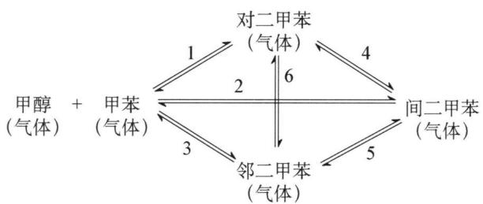

flowchart

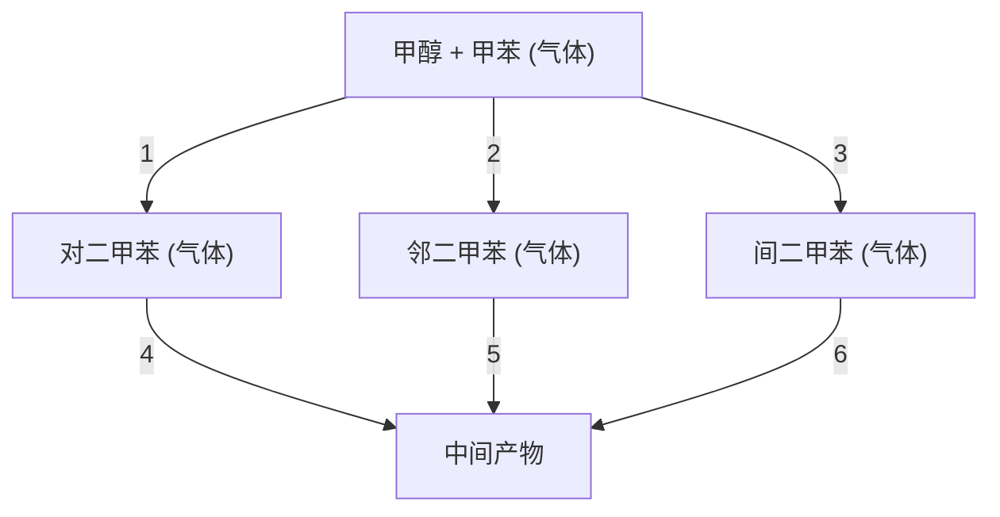

(1) 请回答其中有几个热力学上独立的化学反应。

(2) 若反应起始时体系中只有 $1 \mathrm{~mol}$ 甲醇和 $1 \mathrm{~mol}$ 甲苯, 平衡时体系内对、间、邻二甲苯的含量分别为 $x 、 y 、 z \mathrm{~mol}$ , 请写出反应 1 的平衡常数 $K_{1}$ 的表达式 (以 $x 、 y 、 z$ 表示)。

(3) 各物种在 298.15 K 时的标准生成焓和熵列于下表:

<table><tr><td>物质</td><td> $\Delta_{\mathrm{f}}H_{\mathrm{m}}^{\theta}(\mathrm{kJ}\cdot\mathrm{mol}^{-1})$ </td><td> $S_{\mathrm{m}}^{\theta}(\mathrm{J}\cdot\mathrm{mol}^{-1}\cdot\mathrm{K}^{-1})$ </td></tr><tr><td>甲醇(气体)</td><td>-201.17</td><td>237.70</td></tr><tr><td>甲苯(气体)</td><td>50.00</td><td>319.74</td></tr><tr><td>水(气体)</td><td>-241.82</td><td>188.72</td></tr><tr><td>对二甲苯(气体)</td><td>17.95</td><td>352.42</td></tr><tr><td>间二甲苯(气体)</td><td>17.24</td><td>357.69</td></tr><tr><td>邻二甲苯(气体)</td><td>19.00</td><td>352.75</td></tr></table>

根据表中的热力学数据(假设表中数据不随温度变化),计算 500 K 下反应 1 的平衡常数。

9.（2011年全国决赛）一容积可变的反应器，如右图所示，通过活塞维持其内部压力由于恒外压而恒定。

在恒温、有催化剂条件下,反应器内进行如下反应:

$$
\mathrm{N} _ {2} (\mathrm{g}) + 3 \mathrm{H} _ {2} (\mathrm{g}) \rightleftharpoons 2 \mathrm{NH} _ {3} (\mathrm{g})
$$

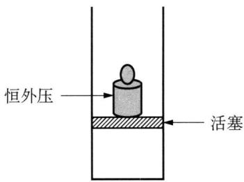

text_image

恒外压
活塞

容积可变的反应器示意图

(1) 若平衡时, 反应器的容积为 $1.0 \, L$ , 各物质的浓度如下:

<table><tr><td>物质</td><td> $N_{2}$ </td><td> $H_{2}$ </td><td> $NH_{3}$ </td></tr><tr><td> $c/(mol·L^{-1})$ </td><td>0.11</td><td>0.14</td><td>0.75</td></tr></table>

现向平衡体系中注入 $4.0 \, mol \, N_{2}$ 。试计算反应的平衡常数 $K_{c}$ 和反应商 $Q_{c}$ ，并由此判断反应将向什么方向进行。

(2) 若平衡时, 反应器的容积为 $V$ , 各物质的浓度分别为 $c(\mathrm{N}_{2})$ 、 $c(\mathrm{H}_{2})$ 和 $c(\mathrm{NH}_{3})$ , 现向平衡体系中注入体积为 $xV$ 的 $\mathrm{N}_{2}$ (同温同压)。设此条件下 $1 \mathrm{~mol}$ 气体的体积为 $V_{0}$ , 试推导出 $Q_{\mathrm{c}}$ 的表达式, 并判断反应方向。

## 第五讲 化学动力学基础

## 知识精讲

## 一、化学动力学的研究对象和意义

## 1. 化学热力学的研究对象和局限性

研究化学变化的方向、能达到的最大限度以及外界条件对平衡的影响。化学热力学只能预测反应的可能性,但无法预料反应能否发生?反应的速率如何?反应的机理如何?例如:

$$
\begin{array}{l} \frac {1}{2} \mathrm{N} _ {2} (\mathrm{g}) + \frac {3}{2} \mathrm{H} _ {2} (\mathrm{g}) \rightleftharpoons \mathrm{NH} _ {3} (\mathrm{g}) - 1 6. 6 3 \\ \mathrm{H} _ {2} (\mathrm{g}) + \frac {1}{2} \mathrm{O} _ {2} (\mathrm{g}) \rightleftharpoons \mathrm{H} _ {2} \mathrm{O} (\mathrm{l}) - 2 3 7. 1 9 \\ \end{array}
$$

$$
\Delta_ {\mathrm{r}} G _ {\mathrm{m}} ^ {\theta} / \mathrm{kJ} \cdot \mathrm{mol} ^ {- 1}
$$

热力学只能判断这两个反应都能正向自发,但如何使它们发生,热力学无法回答。

## 2. 化学动力学的研究对象

化学动力学研究化学反应的速率和反应的机理以及温度、压力、催化剂、溶剂和光照等外界因素对反应速率的影响,把热力学的反应可能性变为现实性。

例如： $\frac{1}{2}\mathrm{N}_2(\mathrm{g}) + \frac{3}{2}\mathrm{H}_2(\mathrm{g})\rightleftharpoons \mathrm{NH}_3(\mathrm{g})$

需一定的 T, p 和催化剂

$$
\mathrm{H} _ {2} (\mathrm{g}) + \frac {1}{2} \mathrm{O} _ {2} (\mathrm{g}) \rightleftharpoons \mathrm{H} _ {2} \mathrm{O} (1)
$$

点火,加温或催化剂

## 3. 化学动力学研究的意义

（1）理论意义：化学反应过程的实质是原子间的重排，是旧键的破坏和新键的形成的过程。所以从反应速率和机理的角度研究，能直接反映物质结构的特点，能加深对于物质运动的认识。

(2) 实践意义: 反应速率与提高生产效率有直接的关系。通过动力学的研究, 我们可以知道如何控制反应条件, 提高主反应的速率; 可以判断影响实际反应过程的速率是反应速率本身, 还是物质扩散过程; 可以为工业化过程提供最优化设计和最优控制, 是化学反应过程的理论基础。

化学热力学和化学动力学是相辅相成的。这是由二者的性质和能够完成的任务决定的。在动力学中，按照反应的机理和类型，可以将反应分为均相反应和多相反应；按照反应的复杂程度，可以把反应分为简单反应和复杂反应。

## 二、化学反应速率

## 1. 反应速率及其表示方法

在化学反应中,某物质的浓度(物质的量浓度)随时间的变化速率称反应速率。反应速率只能为正值,且并非矢量。

## (1) 平均速率

用单位时间内,反应物浓度的减少或生成物浓度的增加来表示。

$$
\bar {v} = \pm \frac {\Delta c}{\Delta t} \tag {5-1}
$$

当 $\Delta c$ 为反应物浓度的变化时, 取负号; $\Delta c$ 为生成物浓度的变化时, 取正号。如:

$$
\begin{array}{l l l l l} & 2 \mathrm{N} _ {2} \mathrm{O} _ {5} = & 4 \mathrm{NO} _ {2} & + & \mathrm{O} _ {2} \\ \text {反应前浓度/mol·dm} ^ {- 3} & 2. 1 0 & 0 & & 0 \\ 1 0 0 \mathrm{s后浓度/mol·dm} ^ {- 3} & 1. 9 5 & 0. 3 0 & & 0. 0 7 5 \\ \text {浓度变化(} \Delta c) / \mathrm{mol} \cdot \mathrm{dm} ^ {- 3} & - 0. 1 5 & 0. 3 0 & & 0. 0 7 5 \\ \text {变化所需时间(} \Delta t) / \mathrm{s} & 1 0 0 & & & \end{array}
$$

$$
\bar {v} _ {\mathrm{N} _ {2} \mathrm{O} _ {5}} = - \frac {\Delta c _ {\mathrm{N} _ {2} \mathrm{O} _ {5}}}{\Delta t} = - \frac {- 0 . 1 5}{1 0 0} = 1. 5 \times 1 0 ^ {- 3} \mathrm{mol} \cdot \mathrm{dm} ^ {- 3} \cdot \mathrm{s} ^ {- 1}
$$

$$
\bar {v} _ {\mathrm{NO} _ {2}} = \frac {\Delta c _ {\mathrm{NO} _ {2}}}{\Delta t} = \frac {0 . 3 0}{1 0 0} = 3. 0 \times 1 0 ^ {- 3} \mathrm{mol} \cdot \mathrm{dm} ^ {- 3} \cdot \mathrm{s} ^ {- 1}
$$

$$
\bar {v} _ {\mathrm{O} _ {2}} = \frac {\Delta c _ {\mathrm{O} _ {2}}}{\Delta t} = \frac {0 . 0 7 5}{1 0 0} = 7. 5 \times 1 0 ^ {- 4} \mathrm{mol} \cdot \mathrm{dm} ^ {- 3} \cdot \mathrm{s} ^ {- 1}
$$

显然,以上计算所得的反应速率是在时间间隔为 $\Delta t$ 时的平均速率,他们只能描述在一定时间间隔内反应速率的大致情况,用处不大。

## (2) 瞬时速率

若将观察的时间间隔 $\Delta t$ 缩短, 它的极限是 $\Delta t \rightarrow 0$ , 此时的速率即为某一时刻的真实速率——瞬时速率:

$$
v _ {\text {瞬时}} = \lim _ {\Delta t \rightarrow 0} \left(\pm \frac {\Delta c}{\Delta t}\right) = \pm \frac {d c}{d t} \tag {5-2}
$$

对于下面的反应来说， $aA + bB = gG + hH$

其反应速率可用下列任一表示方法表示：

$$
- \frac {\mathrm{d} c _ {\mathrm{A}}}{\mathrm{d} t}, - \frac {\mathrm{d} c _ {\mathrm{B}}}{\mathrm{d} t}, \frac {\mathrm{d} c _ {\mathrm{G}}}{\mathrm{d} t}, \frac {\mathrm{d} c _ {\mathrm{H}}}{\mathrm{d} t}
$$

注意：这几种速率表示法不完全相等，但有下列关系：

$$
- \frac {1}{a} \cdot \frac {\mathrm{d} c _ {\mathrm{A}}}{\mathrm{d} t} = - \frac {1}{b} \cdot \frac {\mathrm{d} c _ {\mathrm{B}}}{\mathrm{d} t} = \frac {1}{g} \cdot \frac {\mathrm{d} c _ {\mathrm{G}}}{\mathrm{d} t} = \frac {1}{h} \cdot \frac {\mathrm{d} c _ {\mathrm{H}}}{\mathrm{d} t} \tag {5-3}
$$

瞬时速率可用实验作图法求得：在浓度随时间变化的图 $(c - t$ 图)上，在某时刻 $t$ 时，作与浓度变化曲线交点的切线，该切线的斜率 $k$ 就是 $t$ 时刻的瞬时速率。显然，反应刚开始，速率大，然后不断减小，体现了反应速率变化的实际情况。

## 2. 绘制动力学曲线

动力学曲线就是反应中各物质浓度随时间的变化曲线。有了动力学曲线才能在 t 时刻作切线，求出瞬时速率。测定不同时刻各物质浓度的方法有：

## (1) 化学方法

不同时刻取出一定量反应物,设法用骤冷、冲稀、加阻化剂、除去催化剂等方法使反应立即停止,然后进行化学分析。

## (2) 物理方法

用各种物理性质测定方法(旋光、折射率、电导率、电动势、黏度等)或现代谱仪(IR、UV-VIS、ESR、NMR、ESCA等)监测与浓度有定量关系的物理量的变化，从而求得浓度变化。

## 三、反应速率理论简介

为了从理论上阐述基元反应的动力学特征,并对反应速率进行定量计算,科学家们提出了一系列关于基元反应速率的理论,这些理论基本上可分为两类:一是碰撞理论,二是过渡状态理论。

## 1. 简单碰撞理论

建立于本世纪初的经典碰撞理论,该理论以气体分子运动论为基础,把气相中的双分子反应看成是两个分子碰撞的结果,通过计算碰撞频率,得出反应速率系数表示式。这种碰撞理论也称为简单碰撞理论。

(1) 双分子反应的简单碰撞理论

① 理论模型：对气相双分子基元反应 A + B = P 。简单碰撞理论认为：气体分子 A 和 B 均视为无相互作用（独立子）、无内部结构完全弹性的硬球；气体分子 A 和 B 必须经过碰撞才能发生反应。通常把相撞的 A 和 B 分子称为相撞分子对，简称分子对；碰撞时分子对的能量只有大于某能量阈值的分子对才能发生反应，这种能够发生反应的碰撞叫作有效碰撞。

② 有效碰撞

首先, 分子无限接近时, 要克服斥力, 这就要求分子具有足够的运动速度, 即能量。具备足够的能量是有效碰撞的必要条件。一组碰撞的反应物的分子的总能量必须具备一个最低的能量值。用 E 表示这种能量限制, 则具备 E 和 E 以上的分子组的分数为:

$$
f = e ^ {- \frac {E}{R T}} \tag {5-4}
$$

其次,仅具有足够能量尚不充分,分子有构型,所以碰撞方向还会有所不同,如反应: $NO_{2}+CO=NO+CO_{2}$ 的碰撞方式有:

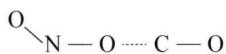  
(a)

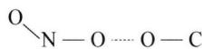  
(b)

显然，(a)种碰撞有利于反应的进行；(b)种以及许多其他碰撞方式都是无效的。取向适合的次数占总碰撞次数的分数用 $p$ 表示。若单位时间内，单位体积中碰撞的总次数为 $Z\mathrm{mol}$ ，则反应速率可表示为：

$$
v = Z p f \tag {5-5}
$$

其中， $p$ 称为取向因子， $f$ 称为能量因子。或写成：

$$
\bar {v} = Z p e ^ {- \frac {E}{R T}} \tag {5-6}
$$

③ 活化能和活化分子组

将具备足够能量(碰撞后足以反应)的反应物分子组,称为活化分子组。

从(5-6)式可以看出,分子组的能量要求越高,活化分子组的数量越少。这种能量要求称为活化能,用 $E_{a}$ 表示。 $E_{a}$ 在碰撞理论中,认为和温度无关。 $E_{a}$ 越大,活化分子组数则越少,有效碰撞分数越小,故反应速率越慢。不同类型的反应,活化能差别很大。如反应:

$$
\begin{array}{l} 2 \mathrm{SO} _ {2} + \mathrm{O} _ {2} = 2 \mathrm{SO} _ {3} \quad E _ {\mathrm{a}} = 2 5 1 \mathrm{kJ} \cdot \mathrm{mol} ^ {- 1}; \\ \mathrm{N} _ {2} + \mathrm{H} _ {2} = 2 \mathrm{NH} _ {3} \quad E _ {\mathrm{a}} = 1 7 5. 5 \mathrm{kJ} \cdot \mathrm{mol} ^ {- 1} 。 \\ \end{array}
$$

而中和反应： $HCl + NaOH = NaCl + H_{2}O \quad E_{a} \approx 20\ kJ \cdot mol^{-1}$

分子不断碰撞,能量不断转移,因此,分子的能量不断变化,故活化分子组也不是固定不变的。但只要温度一定,活化分子组的百分数是固定的。

## (2) 单分子反应理论

根据碰撞理论,反应的必要条件是分子间的碰撞。那么,碰撞至少应有两个分子,则无单分子反应可言。但事实上单分子反应(呈现一级反应动力学)确实存在,1922年,林德曼(Lindemann)等人提出了单分子反应的时滞理论,认为气相单分子反应A→P,部分反应物分子A是经过分子间的碰撞获得能量而达到活化状态A\*,获得足够能量的活化分子A\*并不立即反应,而是经过一个分子内部能量的传递过程,以便把能量集中到要断裂的键上去。因此在碰撞之后与进行反应之间出现一段停滞时间。此时,活化分子可能进行反应,也可能消除活化而重新变成普通反应物分子。这一反应历程可表示为:

$$
\mathrm{A} + \mathrm{M} \xrightarrow {k _ {1}} \mathrm{A} ^ {*} + \mathrm{M} \tag {5-7}
$$

$$
\mathrm{A} ^ {*} + \mathrm{M} \xrightarrow {k _ {- 1}} \mathrm{A} + \mathrm{M} \tag {5-8}
$$

$$
\mathrm{A} ^ {*} \xrightarrow {k _ {2}} \mathrm{P} \tag {5-9}
$$

式中 A\* 为富能活化分子, M 可以是 A 分子, 也可以是反应系统中其他非反应粒子。上述历程中步骤 (5 - 7)、(5 - 8) 并不是化学变化, 而仅是分子间的传能过程。

## 2. 过渡状态理论

化学反应是分子内与分子间的某些化学键的断裂和重新建立过程, 是原子间的重排作用。如果将参加反应的多个原子作为一个系统, 该系统的势能是原子间距离的函数, 那么化学反应便可以被视作一个代表点在多原子系统势能空间中的运动。这便是过渡状态理论 (transition state theory, 简写为 TST) 的基本出发点。过渡状态理论是 1935 年后由埃林 (Eyring)、鲍兰尼 (Polanyi) 等人在统计力学和量子力学发展的基础上提出来的,该理论涉及势能面、能垒等重要概念,下面对该理论作简单介绍。

## (1) 活化络合物

当反应物分子接近到一定程度时, 分子的键连关系将发生变化, 形成一中间过渡状态, 以 $NO_{2} + CO = NO + CO_{2}$ 为例:

$$
\mathrm{O} _ {\mathrm{N} - \mathrm{O}} + \mathrm{C} - \mathrm{O} \longrightarrow \mathrm{O} _ {\mathrm{N} \dots \mathrm{O} \dots \mathrm{C} - \mathrm{O}}
$$

N—O部分断裂，C—O部分形成，此时分子的能量主要表现为势能。

$\mathrm{O}$ $_{\mathrm{N}}$ $\cdots$ $\mathrm{O}$ $\cdots$ $\mathrm{C}-\mathrm{O}$ 称活化络合物。活化络合物能量高,不稳定。它既可以进一步发展,成为产物;也可以变成原来的反应物。于是,反应速率决定于活化络合物的浓度,活化络合物分解成产物的概率和分解成产物的速率。

过渡态理论将反应中涉及的物质的微观结构和反应速率结合起来,这是比碰撞理论先进的一面。然而,在该理论中,许多反应的活化络合物的结构尚无法从实验上加以确定,加上计算方法过于复杂,致使这一理论的应用受到限制。

## (2) 势能面

## ① 双原子系统

对 $\mathrm{A} + \mathrm{B} = \mathrm{AB}$ 这样简单的双原子反应系统，我们可以画出图5-1所示的双原子分子的势能曲线，由图5-1可见，在平衡核间距 $R_{0}$ 点，体系的势能为最低。当 $R < R_{0}$ 时，因核间的排斥力，势能迅速增大；当 $R > R_{0}$ 时，核间因吸引力也使势能增加。

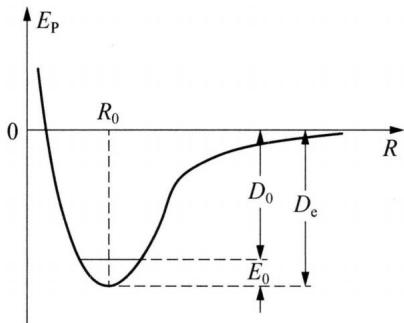

line chart

| R     | E_P  |
|-------|------|
| 0     | High |
| R₀    | Low  |
| D₀    | Medium-High |
| E₀    | Low  |
| Rₑ    | High |

图5-1 双原子系统势能图

## ② 三原子系统

讨论简单的三原子系统——原子 A 与双
原子分子 B—C 反应过程( $A + BC = AB + C$ )的势能变化情况。

## (i) 势能面图

假设碰撞是沿着直线相对进行的,则势能变化 $E_{P}$ 可用三维空间中的曲面表示。这种势能随原子间距变化的曲面称为势能面。图 5-2 示意地给出了原子 A 与双原子分子 B—C 共线碰撞形成活化络合物,再生成产物 AB 和 C 过程的势能面图。如果把势能面上的等势能值的点连接起来形成等势能线(类似地图上的等高线),并将其投射到底面上,就得到如图 5-3 所示的势能面的等势能线上视投影图。图中曲线上的数字表示能量数值, 数字愈大, 则势能愈高。两个图结合起来看, 势能面犹如起伏的山峰, 其中存在一个能量较低的山谷。山谷的两个谷口 R 点和 P 点分别相应于反应的初态和终态, 连接两个山谷间的山脊顶点 ( $P^{\neq}$ 点) 形似马鞍点。

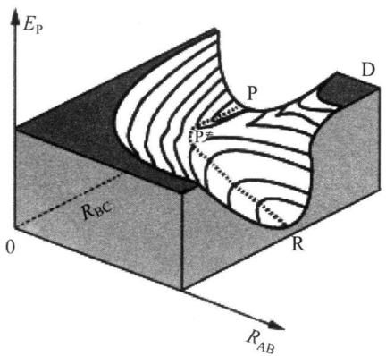

text_image

E_P
P
D
PZ
R_BC
0
R
R_AB

图5-2 三原子系统势能面

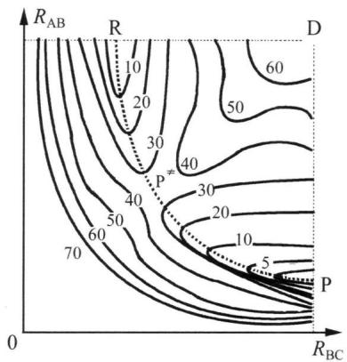

contour plot

| R_AB | R_BC | Contour Value |
|------|------|---------------|
| 10   | 40   | 60            |
| 20   | 40   | 50            |
| 30   | 40   | 40            |
| 40   | 40   | 30            |
| 50   | 40   | 20            |
| 60   | 40   | 10            |
| 70   | 40   | 5             |

图5-3 等势能线上视投影图

## (ii) 代表点在势能面上的运动

反应物 A + BC 的代表点反应前在山谷的谷口 R 点(此时 $R_{AB} \rightarrow \infty$ , $R_{BC} = R_{BC,0}$ , $R_{BC,0}$ 是 BC 分子中原子间的平衡距离), 沿着山谷往上爬(A 向 B 趋近, C 离 B 渐远), 及至鞍点 $P^{\neq}$ , 便形成活化络合物(即三原子结合呈若即若离的过渡状态 A…B…C), 这种活化络合物常以上标“ $\neq$ ”表示。此后, 活化络合物既可能继续沿右山谷下降到另一谷底 P(此时 $R_{BC} \rightarrow \infty$ , $R_{AB} = R_{AB,0}$ , 即形成分子 AB) 形成产物, 也可能沿老路再倒退回到 R 点谷口。由 R 经 $P^{\neq}$ 到达 P 的路线如图中虚线所示, 显然是一条最低能量的反应途径, 称为反应坐标。

## (iii) 势能——反应坐标图

如以势能为纵坐标, 反应坐标为横坐标, 可得到图 5-4 所示的势能曲线图, 此图能更清楚地反映出反应进行过程中势能的变化情况。由此图可知, 反应物转化为产物必须越过势能垒 $E_{\mathrm{a}}$ 。 $E_{\mathrm{a}}$ 是活化络合物与反应物两者最低势能之差值。反应分子之所以能克服势能垒转化为产物, 是因为分子在碰撞过程中将平动能转化为势能。只有原来具备足够大碰撞动能的反应物, 才有可能转化成足够的势能,登上马鞍点 $P^{\neq}$ , 并翻越能峰生成产物, 活化能 $E_{a}$ 的物理意义也就更明显更具体化了。

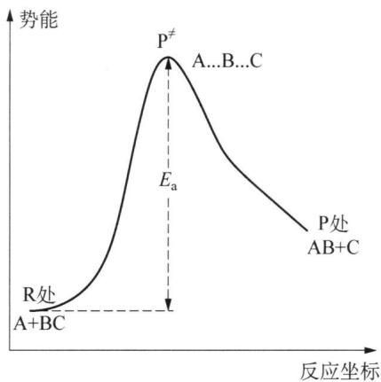

line chart

| 反应坐标 | 势能 |
| -------- | ---- |
| A+BC     | R处  |
| E_a      | P≠   |
| AB+C     | P处  |

图5-4 势能——反应坐标图

## 四、影响化学反应速率的因素

影响化学反应速率的因素很多,除反应物的性质外,外界因素也对反应速率有重要作用,如浓度、温度、压力及催化剂等。

## 1. 浓度对反应速率的影响

## (1) 基元反应和非基元反应

基元反应: 能代表反应机理、由反应物微粒(可以是分子、原子、离子或自由基)一步直接实现的化学反应, 称为基元步骤或基元反应。

非基元反应：由反应物微粒经过两步或两步以上才能完成的化学反应，称为非基元反应或复杂反应。如复杂反应：

$$
\mathrm{H} _ {2} + \mathrm{Cl} _ {2} = 2 \mathrm{HCl}
$$

由几个基元步骤构成,它代表了该链反应的机理:

$$
\begin{array}{l} \mathrm{Cl} _ {2} + \mathrm{M} \longrightarrow 2 \mathrm{Cl} \bullet + \mathrm{M} \\ \mathrm{Cl} \cdot + \mathrm{H} _ {2} \longrightarrow \mathrm{HCl} + \mathrm{H} \cdot \\ \mathrm{H} \bullet + \mathrm{Cl} _ {2} \longrightarrow \mathrm{HCl} + \mathrm{Cl} \bullet \\ 2 \mathrm{Cl} \bullet + \mathrm{M} \longrightarrow \mathrm{Cl} _ {2} + \mathrm{M} \\ \end{array}
$$

式中 M 表示只参加反应物微粒碰撞而不参加反应的其他分子, 如器壁, 它只起转移能量的作用。

## (2) 反应分子数

在基元步骤中,发生反应所需的最少分子数目称为反应分子数。根据反应分子数可将反应区分为单分子反应、双分子反应和三分子反应三种,如:

单分子反应 $CH_{3}COCH_{3}\longrightarrow CH_{4}+CO+H_{2}$

双分子反应 $\mathrm{CH}_3\mathrm{COOH} + \mathrm{C}_2\mathrm{H}_5\mathrm{OH}\longrightarrow \mathrm{CH}_3\mathrm{COOC}_2\mathrm{H}_5 + \mathrm{H}_2\mathrm{O}$

三分子反应 $H_{2} + 2I \cdot \longrightarrow 2HI$

反应分子数不可能为零或负数、分数, 只能为正整数, 且只有上面三种数值, 从理论上分析, 四分子或四分子以上的反应几乎是不可能存在的。反应分子数是理论上认定的微观量。

## (3) 速率方程和速率常数

大量实验表明,在一定温度下,增大反应物的浓度能够增加反应速率。那么反应速率与反应物浓度之间存在着何种定量关系呢?人们在总结大量实验结果的基础上,提出了质量作用定律:在恒温下,基元反应的速率与各种反应物浓度以反应分子数为乘幂的乘积成正比。

对于一般反应(这里指基元反应)

$$
a \mathrm{A} + b \mathrm{B} = g \mathrm{G} + h \mathrm{H}
$$

质量作用定律的数学表达式：

$$
v = k \cdot c _ {\mathrm{A}} ^ {a} \cdot c _ {\mathrm{B}} ^ {b} \tag {5-10}
$$

称为该反应的速率方程。式中 k 为速率常数，其意义是当各反应物浓度为 $1 \, mol \cdot dm^{-3}$ 时的反应速率。

对于速率常数 $k$ ，应注意以下几点：

① 速率常数 k 取决于反应的本性。当其他条件相同时快反应通常有较大的速率常数，k 小的反应在相同的条件下反应速率较慢。

② 速率常数 k 与浓度无关。

③ k 随温度而变化, 温度升高, k 值通常增大。

④ k 是有单位的量, k 的单位随反应级数的不同而异。

前面提到,可以用任一反应物或产物浓度的变化来表示同一反应的速率。此时速率常数 k 的值不一定相同。例如: $2NO + O_{2} = 2NO_{2}$

其速率方程可写成：

$$
\begin{array}{l} v _ {(\mathrm{NO})} = - \frac {\mathrm{d} c _ {\mathrm{NO}}}{\mathrm{d} t} = k _ {1} \cdot c _ {\mathrm{NO}} ^ {2} \cdot c _ {\mathrm{O} _ {2}} \\ v _ {\left(\mathrm{O} _ {2}\right)} = - \frac {\mathrm{d} c _ {\mathrm{O} _ {2}}}{\mathrm{d} t} = k _ {2} \cdot c _ {\mathrm{NO}} ^ {2} \cdot c _ {\mathrm{O} _ {2}} \\ v _ {\left(\mathrm{NO} _ {2}\right)} = \frac {\mathrm{d} c _ {\mathrm{NO} _ {2}}}{\mathrm{d} t} = k _ {3} \cdot c _ {\mathrm{NO}} ^ {2} \cdot c _ {\mathrm{O} _ {2}} \\ \end{array}
$$

由于 $-\frac{1}{2}\frac{dc_{NO}}{dt}=-\frac{dc_{O_{2}}}{dt}=\frac{1}{2}\frac{dc_{NO_{2}}}{dt}$

则

$$
\frac {1}{2} k _ {1} = k _ {2} = \frac {1}{2} k _ {3}
$$

对于一般的化学反应

$$
\frac {k _ {\mathrm{A}}}{a} = \frac {k _ {\mathrm{B}}}{b} = \frac {k _ {\mathrm{G}}}{g} = \frac {k _ {\mathrm{H}}}{h} \tag {5-11}
$$

确定速率方程时必须特别注意,质量作用定律仅适用于一步完成的反应——基元反应,而不适用于几个基元反应组成的总反应——非基元反应。如 $N_{2}O_{5}$ 的分解反应:

$$
2 \mathrm{N} _ {2} \mathrm{O} _ {5} = 4 \mathrm{NO} _ {2} + \mathrm{O} _ {2}
$$

实际上分三步进行：

$$
\mathrm{N} _ {2} \mathrm{O} _ {5} \longrightarrow \mathrm{NO} _ {2} + \mathrm{NO} _ {3} \quad \text {   慢(決速步骤)   }
$$

$$
\mathrm{NO} _ {2} + \mathrm{NO} _ {3} \longrightarrow \mathrm{NO} _ {2} + \mathrm{O} _ {2} + \mathrm{NO} \quad \text { 快 }
$$

$$
\mathrm{NO} + \mathrm{NO} _ {3} \longrightarrow 2 \mathrm{NO} _ {2} \quad \text { 快 }
$$

实验测定其速率方程为：

$$
v = k c _ {\mathrm{N} _ {2} \mathrm{O} _ {5}}
$$

它是一级反应,不是二级反应。

## (4) 反应级数

通过实验可以得到许多化学反应的速率方程,如表 5-1。

表 5-1 某些化学反应的速率方程

<table><tr><td>化学反应</td><td>速率方程</td><td>反应级数</td></tr><tr><td> $2H_{2}O_{2} = 2H_{2}O + O_{2}$ </td><td> $v = k \cdot c_{(H_{2}O_{2})}$ </td><td>1</td></tr><tr><td> $S_{2}O_{8}^{2-} + 2I^{-} = 2SO_{4}^{2-} + I_{2}$ </td><td> $v = k \cdot c_{(S_{2}O_{4}^{-})} \cdot c_{(I^{-})}$ </td><td> $1 + 1 = 2$ </td></tr><tr><td> $4HBr + O_{2} = 2H_{2}O + 2Br_{2}$ </td><td> $v = k \cdot c_{(HBr)} \cdot c_{(O_{2})}$ </td><td> $1 + 1 = 2$ </td></tr><tr><td> $2NO + 2H_{2} = N_{2} + 2H_{2}O$ </td><td> $v = k \cdot c_{(NO)}^{2} \cdot c_{(H_{2})}$ </td><td> $2 + 1 = 2$ </td></tr><tr><td> $CH_{3}CHO = CH_{4} + CO$ </td><td> $v = k \cdot c_{(CH_{3}CHO)}^{3/2}$ </td><td> $3/2$ </td></tr><tr><td> $2NO_{2} = 2NO + O_{2}$ </td><td> $v = k \cdot c_{(NO_{2})}^{2}$ </td><td>2</td></tr></table>

由速率方程可以看出化学反应的速率与其反应物浓度的定量关系,对于一般的化学反应:

$$
a \mathrm{A} + b \mathrm{B} = g \mathrm{G} + h \mathrm{H}
$$

其速率方程一般可表示为： $v = k\cdot c_{\mathrm{A}}^{m}\cdot c_{\mathrm{B}}^{n}$

式中的 $c_{A}$ 、 $c_{B}$ 表示反应物 A、B 的浓度，a、b 表示 A、B 在反应方程式中的计

量数，m、n 分别表示速率方程中 $c_{A}$ 和 $c_{B}$ 的指数。

速率方程中,反应物浓度的指数 m、n 分别称为反应物 A 和 B 的反应级数,各组分反应级数的代数和称为该反应的总反应级数,反应级数 $=m+n$ 。可见,反应级数的大小,表示浓度对反应速率的影响程度,级数越大,速率受浓度的影响越大。

观察表中六个反应的反应级数,并与化学方程式中反应物的计量数比较可以明显地看出: 反应级数不一定与计量数相符合,因而对于非基元反应,不能直接由反应方程式导出反应级数。

另外,还应明确反应级数和反应分子数在概念上的区别: ①反应级数是根据反应速率与各物质浓度的关系来确定的; 反应分子数是根据基元反应中发生碰撞而引起反应所需的分子数来确定的。②反应级数可以是零、正、负整数和分数; 反应分子数只可能是一、二、三。③反应级数是对宏观化学反应而言的; 反应分子数是对微观上基元步骤而言的。下面, 分别介绍零级反应、一级反应、二级反应、三级反应以及 n 级反应的速率方程和特点。

① 零级反应及其特点

零级反应的速率与反应物浓度无关。已知的零级反应中最多的是在表面上发生的多相反应，如 $\mathrm{N}_{2}\mathrm{O}$ 在金 (Au) 粉表面的热分解： $2\mathrm{N}_{2}\mathrm{O}\xlongequal{\mathrm{Au}}2\mathrm{N}_{2}+\mathrm{O}_{2}$ 。此外，酶的催化反应、光敏反应也往往是零级反应。

零级反应的微分速率方程可表示为：

$$
- \frac {\mathrm{d} c}{\mathrm{d} t} = k _ {0} \tag {5-12}
$$

当 t=0 时， $c=c_{0}$ （起始浓度），t 时刻后浓度为 $c_{t}$ ，积分上式可得：

$$
c _ {t} = c _ {0} - k _ {0} t \tag {5-13}
$$

零级反应的特征是：

(i) 速率常数 $k_{0}$ 的单位为 $mol \cdot L^{-1} \cdot s^{-1}$ ;  
(ii) 由零级反应的积分式可知,零级反应实际是匀速反应;  
(iii) 零级反应的半衰期与反应物的起始浓度 $c_{0}$ 有关。

② 一级反应及其特点

凡反应速率与反应物浓度一次方成正比的反应,称为一级反应。常见的一级反应有核衰变等。其速率方程可表示为:

$$
- \frac {\mathrm{d} c}{\mathrm{d} t} = k _ {1} c \tag {5-14}
$$

积分上式可得:

$$
\ln c = - k _ {1} t + B \tag {5-15}
$$

当 t=0 时， $c=c_{0}$ （起始浓度），则 $B=\ln c$ 。故上式可表示为：

$$
\ln \frac {c _ {0}}{c} = k _ {1} t
$$

或： $k_{1}=\frac{1}{t}\ln\frac{c_{0}}{c}$ (5-16)

亦可表示为： $c = c_{0}e^{-k_{1}t}$ (5-17)

若以 a 表示 t = 0 时的反应物的浓度, 以 x 表示 t 时刻已反应掉的反应物浓度, 于是 $(5 - 15)$ 式可写为:

$$
k _ {1} = \frac {1}{t} \ln \frac {a}{a - x} \tag {5-18}
$$

式 $(5-15)\sim(5-18)$ 即为一级反应的速率公式积分形式。

一级反应的特征是:

(i) 速率常数 $k_{1}$ 的数值与所用浓度的单位无关, 其量纲为时间 $^{-1}$ , 其单位可用 $\mathrm{s}^{-1}$ , $\min^{-1}$ 或 $\mathrm{h}^{-1}$ 等表示。  
(ii) 当反应物恰好消耗一半, 即 $x = \frac{a}{2}$ 时, 此刻的反应时间记为 $t_{\frac{1}{2}}$ (称之为半衰期), 则 (5-15) 式变为: $k_{1} = \frac{1}{t_{\frac{1}{2}}} \ln 2$

$$
t _ {\frac {1}{2}} = \frac {0 . 6 9 3 2}{k _ {1}} \tag {5-19}
$$

(iii) 以 $\lg c$ 对 $t$ 作图应为一直线, 其斜率为 $-\frac{k_1}{2.303}$ 。

示例如下：

某金属钚的同位素进行 $\beta$ 放射, 14 d 后, 同位素活性下降了 6.85%。试求该同位素的: (1) 蜕变常数, (2) 半衰期, (3) 分解掉 90% 所需时间。

解析 (1) $k_{1} = \frac{1}{t}\ln \frac{a}{a - x} = \frac{1}{14\mathrm{d}}\ln \frac{100}{100 - 6.85} = 0.00507\mathrm{d}^{-1}$

(2) $t_{1 / 2} = \ln 2 / k_1 = 136.7\mathrm{d}$

(3) $t = \frac{1}{k_1}\ln \frac{1}{1 - y} = \frac{1}{k_1}\ln \frac{1}{1 - 0.9} = 454.2\mathrm{d}$

③ 二级反应及其特点

反应速率方程中,浓度项的指数和等于2的反应称为二级反应。常见的二级反应有乙烯、丙烯的二聚作用,乙酸乙酯的皂化,碘化氢的热分解反应等。

(i) 当只有一种反应物 A, A→P, 则:

$$
- \frac {\mathrm{d} c _ {\mathrm{A}}}{\mathrm{d} t} = k c _ {\mathrm{A}} ^ {2}
$$

$$
- \frac {\mathrm{d} c _ {\mathrm{A}}}{c _ {\mathrm{A}} ^ {2}} = k \mathrm{d} t
$$

$$
- \int_ {c _ {\mathrm{A} _ {0}}} ^ {c _ {a}} \frac {\mathrm{d} c _ {\mathrm{A}}}{c _ {\mathrm{A}} ^ {2}} = \int_ {0} ^ {t} k \mathrm{d} t
$$

$$
\frac {1}{c _ {\mathrm{A}}} - \frac {1}{c _ {\mathrm{A} _ {0}}} = k t \tag {5-20}
$$

$$
t _ {1 / 2} = \frac {1}{k c _ {\mathrm{A} _ {0}}} \tag {5-21}
$$

如引入转化率 $x_{A}$ ，则得到 $\frac{1}{c_{A_{0}}} - \frac{x_{A}}{1 - x_{A}} = kt$ (5-22)

特点：

(a) $\frac{1}{c_{A}}\sim t$ 的关系是直线,斜率是k;  
(b) k 的单位是 $m^{3} \cdot mol^{-1} \cdot s^{-1}$ ;  
(c) 半衰期与起始浓度成反比。  
(ii) 设反应: $aA + bB \longrightarrow P$

有速率方程： $\nu=-\frac{dc_{A}}{adt}=-\frac{dc_{B}}{bdt}=kc_{A}c_{B}$

(a) 如若 $a = b, c_{\mathrm{A}_0} = c_{\mathrm{B}_0}$ , 则 $c_{\mathrm{A}} = c_{\mathrm{B}}$

速率方程 $-\frac{dc_{A}}{dt}=kc_{A}^{2}$ ，结果和前面的相同。

(b) 如若 $a \neq b$ ，但 $\frac{c_{A_{0}}}{a} = \frac{c_{B_{0}}}{b}$ ，则 $\frac{c_{A}}{a} = \frac{c_{B}}{b}$

速率方程 $-\frac{dc_{A}}{dt}=k_{A}\cdot c_{A}\cdot c_{B}=\frac{b}{a}k_{A}c_{A}^{2}=k_{A}^{\prime}c_{A}^{2}$

$$
- \frac {\mathrm{d} c _ {\mathrm{B}}}{\mathrm{d} t} = k _ {\mathrm{B}} \cdot c _ {\mathrm{A}} \cdot c _ {\mathrm{B}} = \frac {a}{b} k _ {\mathrm{A}} c _ {\mathrm{B}} ^ {2} = k _ {\mathrm{B}} ^ {\prime} c _ {\mathrm{B}} ^ {2}
$$

通过这样的处理,方程也回到前面的形式。

(c) 如若 $a = b$ ，但 $c_{\mathrm{A}_0} \neq c_{\mathrm{B}_0}$ ，则 $c_{\mathrm{A}} \neq c_{\mathrm{B}}$

这时速率方程 $-\frac{\mathrm{d}c_{\mathrm{A}}}{\mathrm{d}t} = k_{\mathrm{A}} \cdot c_{\mathrm{A}} \cdot c_{\mathrm{B}}$

设 t 时刻反应物 A、B 反应掉的浓度为 $c_{x}$ ，则 $c_{A} = c_{A_{0}} - c_{x}$ ， $c_{B} = c_{B_{0}} - c_{x}$ ， $dc_{A} = -dc_{x}$ ，速率方程变为：

$$
\frac {\mathrm{d} c _ {x}}{\mathrm{d} t} = k (c _ {\mathrm{A} _ {0}} - c _ {x}) (c _ {\mathrm{B} _ {0}} - c _ {x})
$$

积分， $\int_0^{c_x}\frac{\mathrm{d}c_x}{(c_{\mathrm{A}_0} - c_x)(c_{\mathrm{B}_0} - c_x)} = k\int_0^t\mathrm{d}t$

得到： $\frac{1}{c_{\mathrm{A_0}} - c_{\mathrm{B_0}}}\ln \frac{c_{\mathrm{B_0}}(c_{\mathrm{A_0}} - c_x)}{c_{\mathrm{A_0}}(c_{\mathrm{B_0}} - c_x)} = kt$

④ 三级反应

反应速率方程中,浓度项的指数和等于3的反应称为三级反应。三级反应数量较少,可能的基元反应的类型有:

$$
\begin{array}{l} \mathrm{A} + \mathrm{B} + \mathrm{C} \longrightarrow \mathrm{P} \quad r = k _ {3} [ \mathrm{A} ] [ \mathrm{B} ] [ \mathrm{C} ] \\ 2 \mathrm{A} + \mathrm{B} \longrightarrow \mathrm{P} \quad r = k _ {3} [ \mathrm{A} ] ^ {2} [ \mathrm{B} ] \\ 3 \mathrm{A} \longrightarrow \mathrm{P} \quad r = k _ {3} [ \mathrm{A} ] ^ {3} \\ \end{array}
$$

三级反应的积分速率方程(假定投料 a = b = c):

不定积分式： 定积分式：

$$
\int \frac {\mathrm{d} x}{(a - x) ^ {3}} = \int k _ {3} \mathrm{d} t \quad \int_ {0} ^ {x} \frac {\mathrm{d} x}{(a - x) ^ {3}} = \int_ {0} ^ {t} k _ {3} \mathrm{d} t
$$

$\frac{1}{2(a - x)^2} = k_3t + \text{常数}$ $\frac{1}{2}\left[\frac{1}{(a - x)^2} - \frac{1}{a^2}\right] = k_3t$

整理后得： $\frac{y(2 - y)}{(1 - y)^2} = 2k_3a^2 t$ （ $y = \frac{x}{a}$

三级反应的半衰期：令 $y = \frac{1}{2}$

$$
t _ {\frac {1}{2}} = \frac {3}{2 k _ {3} a ^ {2}} \tag {5-23}
$$

三级反应 $(a = b = c)$ 的特点：

(i) 速率系数 k 的单位为 [浓度] $^{-2}$ [时间] $^{-1}$ ;

(ii) 半衰期 $t_{1/2} = \frac{3}{2k_{3}a^{2}}$ ;

(iii) $\frac{1}{(a-x)^{2}}$ 与t呈线性关系。

⑤ n 级反应

我们只讨论最简单的一种情况, 即 $aA \rightarrow P$ , 且速率方程符合简单形式:

$$
- \frac {\mathrm{d} c _ {\mathrm{A}}}{\mathrm{d} t} = k c _ {\mathrm{A}} ^ {n}
$$

当 n = 1 时, $\ln \frac{c_{A_{0}}}{c_{A}} = kt$ ;

当 $n \neq 1$ 时，积分 $-\int_{c_{A_0}}^{c_A} \frac{dc_A}{c_A^n} = k \int_0^t dt$

$$
\frac {1}{n - 1} \left(\frac {1}{c _ {\mathrm{A}} ^ {n - 1}} - \frac {1}{c _ {\mathrm{A} _ {0}} ^ {n - 1}}\right) = k t \tag {5-24}
$$

特点：

(i) $\frac{1}{c_{\mathrm{A}}^{n - 1}}\sim t$ 的关系是直线；

(ii) k 的单位是: $(\mathrm{mol} \cdot \mathrm{m}^{3})^{1-n} \cdot \mathrm{s}^{-1}$ ;

(iii) 半衰期: $t_{1/2} = \frac{2^{n-1} - 1}{(n - 1)kc_{A_0}^{n-1}}$ 。

⑥ 综上所述,化学反应的级数不同,反应速率变化规律也不同。实验测定了时间 t 与反应物浓度的关系,可以参考这些关系式确定反应的级数和速率常数。以上几种反应是最为简单的例子,实际情况往往复杂得多,需要依据具体情况适当简化进行处理。也有些复杂的反应,反应级数不是整数,甚至无法明确反应级数。如:

(i) 分数级反应: $H_{2} + Cl_{2} = 2HCl$ , $v = k \cdot c_{H_{2}} \cdot c_{Cl_{2}}^{1/2}$

(ii) 复杂反应: $H_{2} + Br_{2} \xrightarrow[k']{k} 2HB_{r}$ , $v = \frac{k \cdot c_{H_{2}} \cdot c_{Br_{2}}^{1/2}}{1 + k'c_{HBr}/c_{Br_{2}}}$

$$
\mathrm{N} _ {2} + 3 \mathrm{H} _ {2} \xrightarrow [ k _ {2} ]{\mathrm{Fe} , k _ {1}} 2 \mathrm{NH} _ {3}, v = k _ {1} \cdot p _ {\mathrm{N} _ {2}} \left(\frac {p _ {\mathrm{H} _ {2}}}{p _ {\mathrm{NH} _ {3}} ^ {2}}\right) ^ {\alpha} - k _ {2} \left(\frac {p _ {\mathrm{NH} _ {3}} ^ {2}}{p _ {\mathrm{H} _ {2}} ^ {3}}\right) ^ {1 - \alpha}
$$

其中， $\alpha=0.5$ （常压，或低压）；

(iii) 假级数：蔗糖水解， $C_{12}H_{22}O_{11} + H_{2}O \longrightarrow C_{6}H_{12}O_{6} + C_{6}H_{12}O_{6}$

$v = k \cdot c_{C_{12}H_{22}O_{11}}$ ，是个一级反应。

但在有 $\mathrm{H}^{+}$ 参与的情况下, 其反应速率方程为:

$$
v = k \cdot c _ {\mathrm{C} _ {1 2} \mathrm{H} _ {2 2} \mathrm{O} _ {1 1}} \cdot c _ {\mathrm{H} _ {2} \mathrm{O}} ^ {6} \cdot c _ {\mathrm{H} ^ {+}}
$$

由于水和 $H^{+}$ 的浓度在反应过程中变化很小, 所以表现出的动力学是假一级反应。

（iv）级数变化的情况：如高炉反应： $CO_{2}+C=2CO$ 。在800～1300℃的条件下，通入1 atm的 $CO_{2}$ 与5 mm的碳粉反应，反应为一级反应；但如果在2000～2600℃的条件下，将碳粉置于真空中，通入少量 $CO_{2}$ ，压力远小于1 atm，则反应为零级；温度再升高，反应又变成一级了。

⑦ 确定反应级数的方法

(i) 积分法

积分法又称尝试法。当实验测得了一系列 $c_{A} \sim t$ 或 $x \sim t$ 的动力学数据后，作以下两种尝试：

a. 将各组 $c_{A}$ ，t 值代入具有简单级数反应的速率定积分式中，计算 k 值。若得 k 值基本为常数，则反应为所代入方程的级数。若求得 k 不为常数，则需再进行假设。

b. 分别用下列方式作图：

$$
\ln c _ {\mathrm{A}} \sim t \quad \frac {1}{a - x} \sim t \quad \frac {1}{(a - x) ^ {2}} \sim t
$$

如果所得图为一直线,则反应为相应的级数。该法的优点只需要一次实验的数据,并对实验数据的精确度要求不高。缺点是不够灵敏;只能测定简单的整数级的,级数为分数的反应不能测定。

示例如下：

乙酸乙酯皂化反应: \(\mathrm{C}\_{2} \mathrm{H}\_{5} \mathrm{COOC}\_{2} \mathrm{H}\_{5}\) (酯) \(+\mathrm{OH}^{-} \longrightarrow \mathrm{C}\_{2} \mathrm{H}\_{5} \mathrm{COO}^{-} + \mathrm{C}\_{2} \mathrm{H}\_{5} \mathrm{OH}\), 已知 \(25^{\circ} \mathrm{C}\) 时实验数据 ([酯]\_{0} = [OH^{-}] = 0.025 mol·dm^{-3}) :\)

<table><tr><td>t/min</td><td>5</td><td>10</td><td>20</td><td>40</td><td>60</td><td>80</td><td>100</td><td>120</td><td>150</td><td>180</td></tr><tr><td>[酯] $\times 10^{2} / (mol \cdot dm^{-3})$ </td><td>1.55</td><td>1.13</td><td>0.73</td><td>0.43</td><td>0.30</td><td>0.23</td><td>0.19</td><td>0.16</td><td>0.13</td><td>0.11</td></tr></table>

经验速率方程为 $r = k_{\exp}[\text{酯}]^{\alpha}[\text{OH}^{-}]^{\beta}$ ，试用尝试法确定反应级数 $n(=\alpha+\beta)$ 。

解析 本实验采用化学计量系数比浓度法( $\left[\text{酯}\right]_{0}=\left[\mathrm{OH}^{-}\right]$ ), 故速率方程可简化为: $r=k_{\exp}\left[\text{酯}\right]^{\alpha+\beta}$ 。

将上述数据分别按零、一或二级反应的直线化方法作图(图5-4)，作图所需数据见下表，图5-4中仅1/[酯]-t图显示良好的线性，所以该反应为二级反应。

<table><tr><td>t/min</td><td>5</td><td>10</td><td>20</td><td>40</td><td>60</td><td>80</td><td>100</td><td>120</td><td>150</td><td>180</td></tr><tr><td>100[酯]</td><td>1.55</td><td>1.13</td><td>0.73</td><td>0.43</td><td>0.30</td><td>0.23</td><td>0.19</td><td>0.16</td><td>0.13</td><td>0.11</td></tr><tr><td>ln[酯]</td><td>-4.167</td><td>-4.483</td><td>-4.920</td><td>-5.450</td><td>-5.809</td><td>-6.075</td><td>-6.266</td><td>-6.438</td><td>-6.645</td><td>-6.812</td></tr><tr><td> $[酯]^{-1}$ </td><td>64.52</td><td>88.50</td><td>137.0</td><td>232.6</td><td>333.3</td><td>434.8</td><td>526.3</td><td>625.0</td><td>769.2</td><td>909.1</td></tr></table>

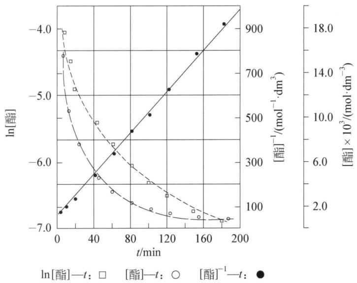

bar-line hybrid chart

| t/min | ln[酯]⁻¹(t) | ln[酯] |
|-------|-------------|--------|
| 0     | -4.0        | -7.0   |
| 20    | -5.0        | -6.5   |
| 40    | -6.0        | -6.0   |
| 60    | -6.5        | -5.5   |
| 80    | -7.0        | -5.0   |
| 100   | -7.0        | -4.5   |
| 120   | -7.0        | -4.0   |
| 140   | -7.0        | -3.5   |
| 160   | -7.0        | -3.0   |
| 180   | -7.0        | -2.5   |
| 200   | -7.0        | -2.0   |

图5-4 时间一浓度数据线性关系图

(ii) 微分法

$$
\begin{array}{c c c} & n \mathrm{A} & \longrightarrow \quad \mathrm{P} \\ t = 0 & c _ {\mathrm{A}, 0} & 0 \\ t = t & c _ {\mathrm{A}} & x \\ r = - \frac {\mathrm{d} c _ {\mathrm{A}}}{\mathrm{d} t} = k c _ {\mathrm{A}} ^ {n} \end{array}
$$

$$
\ln r = \ln \left(- \frac {\mathrm{d} c _ {\mathrm{A}}}{\mathrm{d} t}\right) = \ln k + n \ln c _ {\mathrm{A}}, \ln r = \ln \left(- \frac {\mathrm{d} c _ {\mathrm{A}}}{\mathrm{d} t}\right) = \ln k + n \ln c _ {\mathrm{A}}
$$

以 $\ln\left(-\frac{\mathrm{d}c_{\mathrm{A}}}{\mathrm{d}t}\right)\sim\ln c_{\mathrm{A}}$ 作图

从直线斜率求出 n 值。具体做法：首先根据实验数据作 $c_{A} \sim t$ 曲线，其次在不同时刻 t 求 $-dc_{A}/dt$ ，最后以 $\ln(-dc_{A}/dt)$ 对 $\ln c_{A}$ 作图。微分法要作三次图，对实验数据的精确度要求高，引入的误差较大，但可适用于非整数级数反应。

示例如下：

气相反应 $A + B = E + F$ ，当 $p_{B}$ 保持不变时测得 $p_{A}$ 随时间的改变，由 $p_{A} - t$ 曲线利用作切线的方法得到速率 $r_{A} = -dp_{A}/dt$ 数据（表 a）；在 $p_{A}$ 保持不变时测得 $p_{B}$ 随时间的改变，用同样的方法得到速率 $r_{B} = -dp_{B}/dt$ 数据（表 b）：

<table><tr><td rowspan="2">表a</td><td> $p_{A}$ /kPa</td><td>47.86</td><td>40.00</td><td>20.26</td><td rowspan="2">表b</td><td> $p_{B}$ /kPa</td><td>38.53</td><td>27.33</td><td>19.61</td></tr><tr><td> $r_{A}$ /(kPa·s-1)</td><td>0.200</td><td>0.137</td><td>0.033</td><td> $r_{B}$ /(kPa·s-1)</td><td>0.213</td><td>0.147</td><td>0.105</td></tr></table>

设经验速率方程具有 $r = k_{exp} p_{A}^{\alpha} p_{B}^{\beta}$ 的形式，求 $\alpha, \beta$ 的值。

解析 （1）在 $p_{B}$ 保持不变时经验速率方程可简化成 $r = k_{app} p_{A}^{\alpha}$ （其中 $k_{app} = k_{exp} p_{B,0}^{\beta}$ ），所以

$\ln r = \ln k_{app} + \alpha \ln p_{A}$ 。代入任意两组数据，解联立方程可求出 $\alpha$ 。

由1,2组、2,3组数据分别求出

$$
\alpha_ {1} = \frac {\ln 0 . 2 0 0 - \ln 0 . 1 3 7}{\ln 4 7 . 6 8 - \ln 4 0 . 0 0} = 2. 1 1 \text {和} \alpha_ {2} = \frac {\ln 0 . 0 3 3 - \ln 0 . 1 3 7}{\ln 2 0 . 2 6 - \ln 4 0 . 0 0} = 2. 0 9
$$

故可以认为 $\alpha = 2$ 。在 $p_{A}$ 保持不变时，用同样的方法可以求出

$$
\beta_ {1} = \frac {\ln 0 . 2 1 3 - \ln 0 . 1 4 7}{\ln 3 8 . 5 2 - \ln 2 7 . 3 3} = 1. 0 8 1 \text {和} \beta_ {2} = \frac {\ln 0 . 1 4 7 - \ln 0 . 1 0 5}{\ln 2 7 . 3 3 - \ln 1 9 . 6 0} = 1. 0 1 2
$$

故 $\beta=1$ 。因此该反应的经验速率方程为 $r=k_{exp}p_{A}^{2}p_{B}$ 。

## (iii) 半衰期法

用半衰期法求除一级反应以外的其他反应的级数。根据 n 级反应的半衰期通式：

$t_{1/2}=A\frac{1}{a^{n-1}}$ ，取两个不同起始浓度 $a,a^{\prime}$ 做实验，分别测定半衰期为 $t_{1/2}$ 和 $t_{1/2}^{\prime}$ ，因同一反应，常数A相同，所以：

$$
\frac {t _ {1 / 2}}{t _ {1 / 2} ^ {\prime}} = \left(\frac {a ^ {\prime}}{a}\right) ^ {n - 1} \text {或} n = 1 + \frac {\ln (t _ {1 / 2} / t _ {1 / 2} ^ {\prime})}{\ln (a ^ {\prime} / a)} \text {或} \ln t _ {1 / 2} = \ln A - (n - 1) \ln a
$$

以 $\ln t_{1/2} \sim \ln a$ 作图从直线斜率求 n 值。从多个实验数据用作图法求出的 n 值更加准确。

示例如下：

气相反应 $NO + H_{2} = 0.5 \, N_{2} + H_{2}O$ ，在同一温度下维持 NO 和 $H_{2}$ 起始压力相等，5 次实验结果如下表 a。已知产物不影响反应速率，求反应级数 n。

<table><tr><td rowspan="2">表a</td><td> $p_{0}$ /kPa</td><td>50.0</td><td>45.4</td><td>38.4</td><td>33.6</td><td>26.9</td><td rowspan="2">表b</td><td> $\ln t_{0.5}$ </td><td>4.55</td><td>4.62</td><td>4.94</td><td>5.19</td><td>5.41</td></tr><tr><td> $t_{0.5}$ /min</td><td>95</td><td>102</td><td>140</td><td>180</td><td>224</td><td> $\ln p_{0}$ </td><td>3.91</td><td>3.81</td><td>3.65</td><td>3.51</td><td>3.28</td></tr></table>

解析 由于 $p_{\mathrm{NO},0} = p_{\mathrm{H}_2} = 0.5p_0$ ，且产物浓度项不进入速率方程中，所以该反应系统的经验速率方程为 $r = k_{\mathrm{exp}}p_{\mathrm{NO}}^n$ 。根据半衰期法，以 $\ln t_{0.5}$ 对 $\ln p_0$ 数据(表b)作图(图5-5)得一直线，其斜率： $1 - n = -(5.20 - 4.60) / (3.85-$ 3.45) $= -1.5$ ，因此反应级数 $n = 2.5$ 。

## (iv) 孤立法

孤立法类似于准级数法,它不能用来确定反应级数,而只能使问题简化,然后用前面三种方法来确定反应级数。例如对于反应速率: $r = k [A]^{\alpha} [B]^{\beta}$ ,可使[A] $\gg [B]$ ,则 $r = k' [B]^{\beta}$ ,先确定 $\beta$ 值;再使[B] $\gg [A]$ ,有r=

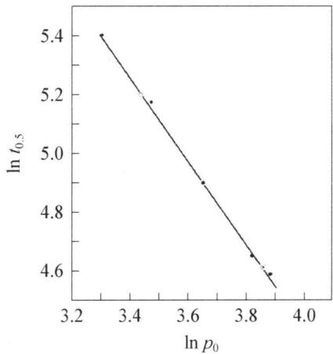

line chart

| ln p₀ | ln t₀.₅ |
| ----- | ------- |
| 3.3   | 5.4     |
| 3.5   | 5.2     |
| 3.7   | 4.9     |
| 3.8   | 4.7     |
| 3.9   | 4.6     |

图5-5 $\ln t_{0.5} - \ln p_0$ 图

示例如下：

在氩存在的气相中,碘原子的复合反应可表示为 $2\mathrm{I}(\mathrm{g}) + \mathrm{Ar}(\mathrm{g}) \longrightarrow \mathrm{I}_{2}(\mathrm{g}) + \mathrm{Ar}(\mathrm{g})$ , 在碘原子和氩的初始浓度 $[I]_{0}$ , $[Ar]_{0}$ 下反应初始速率 $r_{0}$ 的数据如下:

初始速率 $r_0 / (\mathrm{mol}\cdot \mathrm{dm}^{-3}\cdot \mathrm{s}^{-1})$ 数据表

<table><tr><td colspan="2"> $[I]_0/(10^{-5} \text{ mol} \cdot \text{dm}^{-3})$ </td><td>1.0</td><td>2.0</td><td>4.0</td><td>6.0</td></tr><tr><td rowspan="3"> $\frac{[Ar]_0}{10^{-2} \text{ mol} \cdot \text{dm}^{-3}}$ </td><td>0.1</td><td> $8.70 \times 10^{-4}$ </td><td> $3.48 \times 10^{-3}$ </td><td> $1.39 \times 10^{-2}$ </td><td> $3.13 \times 10^{-2}$ </td></tr><tr><td>0.5</td><td> $4.35 \times 10^{-3}$ </td><td> $1.74 \times 10^{-2}$ </td><td> $6.96 \times 10^{-2}$ </td><td> $1.57 \times 10^{-1}$ </td></tr><tr><td>1.0</td><td> $8.69 \times 10^{-3}$ </td><td> $3.47 \times 10^{-2}$ </td><td> $1.38 \times 10^{-1}$ </td><td> $3.13 \times 10^{-1}$ </td></tr></table>

当速率方程为 $r_0 = k_{\mathrm{exp}}[\mathrm{I}]_0^\alpha [\mathrm{Ar}]_0^\beta$ ，试求反应级数 $\alpha$ ， $\beta$ 和速率系数。

解析 实验给出的是初始速率数据,根据给定的速率方程形式两边取对数有: $\lg r_{0} = \lg k_{exp} + \alpha \lg [I]_{0} + \beta \lg [Ar]_{0}$ 。对于 Ar 浓度恒定的每一组数据,以初始速率的对数 $\lg r_{0}$ 对碘的初始浓度的对数 $\lg [I]_{0}$ 作图,同样对于给定的 I 浓度,以 $\lg r_{0}$ 对 $\lg [Ar]_{0}$ 作图,分别得图 5-6(a) 和 (b),图 (a) 直线的斜率对应于 I 的反应级数 $\alpha$ , 图 (b) 直线的斜率对应于 Ar 的反应级数 $\beta$ 。由图可得,斜率分别为 2 和 1,即该反应对于 I 为二级,对 Ar 为一级,总级数为三级。将 $\alpha$ , $\beta$ 及实验数据代入上面的方程求出经验速率系数的平均值 $k = 9 \times 10^{9} \, mol^{-2} \cdot L^{2} \cdot s^{-1}$ 。

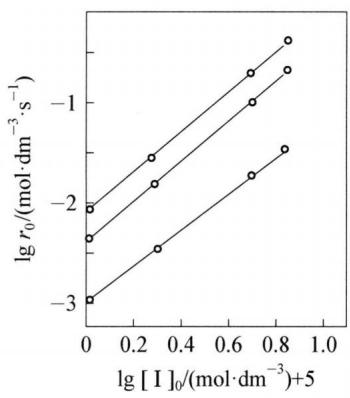

line chart

| lg [I]₀/(mol·dm⁻³)+5 | lg r₀/(mol·dm⁻³·s⁻¹) |
| ------------------- | --------------------- |
| 0.0                 | -3.0                  |
| 0.2                 | -2.5                  |
| 0.4                 | -2.0                  |
| 0.6                 | -1.5                  |
| 0.8                 | -1.0                  |
| 1.0                 | -0.5                  |

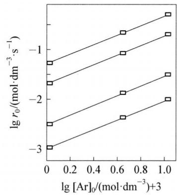

line chart

| lg [Ar]₀/(mol·dm⁻³)+3 | lg r₀/(mol·dm⁻³·s⁻¹) |
|---|---|
| 0.0 | -1.2 |
| 0.0 | -1.5 |
| 0.0 | -1.8 |
| 0.0 | -2.2 |
| 0.0 | -2.6 |
| 0.0 | -3.0 |
| 0.6 | -0.8 |
| 0.6 | -1.1 |
| 0.6 | -1.4 |
| 0.6 | -1.7 |
| 0.6 | -2.1 |
| 0.6 | -2.5 |
| 1.0 | -0.5 |
| 1.0 | -0.9 |
| 1.0 | -1.2 |
| 1.0 | -1.5 |
| 1.0 | -1.9 |
| 1.0 | -2.3 |
| 1.0 | -2.7 |

图5-6 (a)、(b)初浓度一初速率数据的双对数图

由上图可以说明：该反应中 $\mathrm{Ar(g)}$ 是催化剂，是大量的。反应的时间级数是二级，而浓度级数是三级。

## 2. 温度对反应速率的影响

温度对反应速率的影响,主要体现在对速率常数 k 的影响上。阿累尼乌斯总结了 k 与 T 的经验公式:

$$
k = A e ^ {- \frac {E a}{R T}} \tag {5-24}
$$

取自然对数,得: $\ln k = -\frac{E_{a}}{RT} + \ln A$ (5-25)

常用对数： $\lg k = -\frac{E_a}{2.303RT} +\lg A$ (5-26)

式中：k 为速率常数， $E_{a}$ 为活化能，R 为气体常数，T 为绝对温度，e 为自然对数底，A 为指前因子，单位同 k。

应用阿累尼乌斯公式讨论问题,可以认为 $E_{a}$ 、A 不随温度变化。由于 T 在指数上,故对 k 的影响较大。

根据阿累尼乌斯公式,知道了反应的 $E_{a}$ 、A 和某温度 $T_{1}$ 时的 $k_{1}$ , 即可求出任

意温度 $T_{2}$ 时的 $k_{2}$ 。由对数式：

$$
\lg k _ {1} = - \frac {E _ {a}}{2 . 3 0 3 R T _ {1}} + \lg A \quad ①
$$

$$
\lg k _ {2} = - \frac {E _ {a}}{2 . 3 0 3 R T _ {2}} + \lg A \quad ②
$$

式②一式①得： $\lg \frac{k_2}{k_1} = \frac{E_a}{2.303R}\left(\frac{1}{T_1} -\frac{1}{T_2}\right)$ (5-27)

## 3. 催化剂对反应速率的影响

## (1) 催化剂和催化反应

在反应中,反应物的数量和组成不变,能改变反应速率的物质,叫催化剂。催化剂改变反应速率的作用,称为催化作用;有催化剂参加的反应,称为催化反应。

催化反应分为均相催化和非均相催化两类：

① 反应和催化剂处于同一相中,不存在相界面的催化反应,称为均相催化。如: $2\mathrm{SO}_2 + \mathrm{O}_2 \xlongequal{\mathrm{NO}_2} 2\mathrm{SO}_3$ ,若产物之一对反应本身有催化作用,则称之为自催化反应。如: $2\mathrm{MnO}_4^- + 6\mathrm{H}^+ + 5\mathrm{H}_2\mathrm{C}_2\mathrm{O}_4 = 10\mathrm{CO}_2 \uparrow + 8\mathrm{H}_2\mathrm{O} + 2\mathrm{Mn}^{2+}$ ,产物中 $\mathrm{Mn}^{2+}$ 对反应有催化作用。图 5-7 为自催化反应过程的速率变化:初期,反应速率小;中期,经过一段时间 $t_0 - t_A$ 诱导期后,速率明显加快,见 $t_A - t_B$ 段;后期, $t_B$ 之后,由于反应物耗尽,速率下降。

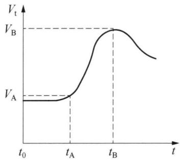

line chart

| t     | V_t  |
|-------|------|
| t₀    | V_A  |
| t_A   | V_A  |
| t_B   | V_B  |

图5-7 自催化反应过程速率变化

② 反应物和催化剂不处于同一相,存在相界面,在相界面上进行的反应,叫作多相催化反应或非均相催化,或复相催化。例如:Fe 催化合成氨(固—气);Ag 催化 $H_{2}O_{2}$ 的分解(固—液)。

## (2) 催化剂的选择性

特定的反应有特定的催化剂。如： $2SO_{2} + O_{2} = 2SO_{3}$ 的催化剂可以有：① $V_{2}O_{5}$ 、② $NO_{2}$ 、③Pt； $CO + 2H_{2} = CH_{3}OH$ 的催化剂：CuO—ZnO— $Cr_{2}O_{3}$ ；酯化反应的催化剂：①浓硫酸、②浓硫酸+浓磷酸、③硫酸盐、④活性铝。同样的反应，催化剂不同时，产物可能不同。如：

$CO + 2H_{2} = CH_{3}OH$ （催化剂 CuO—ZnO— $Cr_{2}O_{3}$ ）； $CO + 3H_{2} = CH_{4} + H_{2}O$ （催化剂 Ni+ $Al_{2}O_{3}$ ）。

$2KClO_{3}=2KCl+3O_{2}\uparrow$ （催化剂 $MnO_{2}$ ）； $4KClO_{3}=3KClO_{4}+KCl$ （无催化剂）。

## (3) 催化机理

催化剂可以降低化学反应活化能, 提高反应速率。例如反应: A + B = AB, 由图 5-8 可以看出, 该反应的活化能 $E_{\mathrm{a}}$ 很大, 在没有催化剂的条件下反应速率较慢; 加入催化剂 K 后, 反应机理变为: A + B + K → AK + B (活化能 $E_{\mathrm{a}}'$ )、AK + B → AB + K (活化能 $E_{\mathrm{a}}''$ )。由于活化能 $E_{\mathrm{a}}'$ 和 $E_{\mathrm{a}}''$ 均较小, 使得反应速率加快。由图还可以看出, 加入催化剂改变反应机理后, 不仅正反应的活化能减小了, 逆

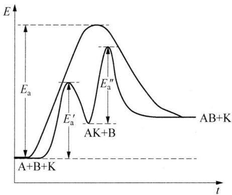

line chart

| Process | Peak Label |
| --- | --- |
| A+B+K | E_a |
| A+B+K | E'_a |
| A+B+K | E'_a'' |
| A+B+K | E_a'' |
| A+B+K | E_a'' |
| A+B+K | E_a'' |
| A+B+K | E_a'' |
| A+B+K | E_a'' |
| A+B+K | E_a'' |
| A+B+K | E_a'' |
| A+B+K | E_a'' |
| A+B+K | E_a'' |
| A+C | E_a |
| A+C | E'_a |
| A+C | E'_a'' |
| A+C | E'_a'' |
| A+C | E'_a'' |
| A+C | E'_a'' |
| A+C | E'_a'' |
| A+C | E'_a'' |
| A+C | E'_a'' |
| A+C | E'_a'' |
| A+C | E'_a'' |
| A+C | E'_a'' |

图5-8 加入催化剂后活化能的变化

反应的活化能也降低了。因此，正逆反应都加快了，可使平衡时间提前。

例如： $NO_{2}$ 催化氧化 $SO_{2}$ 的机理：

总反应为： $SO_{2} + 1/2O_{2} = SO_{3}$ $E_{a}$ 大

加 $NO_{2}$ ，催化机理为： $SO_{2} + NO_{2} \longrightarrow SO_{3} + NO$ $E'_{a}$ 小

$$
\mathrm{NO} + 1 / 2 \mathrm{O} _ {2} \longrightarrow \mathrm{NO} _ {2} \quad E _ {\mathrm{a}} ^ {\prime \prime} \text {小}
$$

再例如：Fe 表面合成氨的机理：

总反应为： $N_{2}+3H_{2}=2NH_{3}$ Fe作为催化剂

催化机理为： $N_{2}+2Fe\longrightarrow2N-Fe$

$$
\mathrm{H} _ {2} + 2 \mathrm{Fe} \longrightarrow 2 \mathrm{H} - \mathrm{Fe}
$$

$$
\mathrm{N} - \mathrm{Fe} + \mathrm{H} - \mathrm{Fe} \longrightarrow \mathrm{Fe} _ {2} \mathrm{NH}
$$

$$
\mathrm{Fe} _ {2} \mathrm{NH} + \mathrm{H} - \mathrm{Fe} \longrightarrow \mathrm{Fe} _ {3} \mathrm{NH} _ {2}
$$

$$
\mathrm{Fe} _ {3} \mathrm{NH} _ {2} + \mathrm{H} - \mathrm{Fe} \longrightarrow \mathrm{Fe} _ {4} \mathrm{NH} _ {3}
$$

$$
\mathrm{Fe} _ {4} \mathrm{NH} _ {3} \longrightarrow 4 \mathrm{Fe} + \mathrm{NH} _ {3}
$$

每一步活化能都较小,故反应速率加快。

## 五、速率方程的推导

在依据反应历程寻找总反应动力学规律时,虽然人们可以按质量作用定律写出一系列基元反应的微分方程,但是由于历程的复杂性,想通过解这一组微分方程获得简单解析式的速率方程还是很困难的。同时在所拟定的反应历程中,常涉及一些活性很高的自由原子或自由基,它们只要碰上任何分子或其他自由基都将立即反应,故在反应过程中它们的浓度很低,寿命很短,用一般的实验方法无法测定它们的浓度,而一般速率方程中出现的都是实验可测量的量。为了达到这个目的,常采用近似方法来处理,得出速率方程。近似方法有两种:稳态近似或平衡近似,下面分别介绍。

## 1. 稳态近似法

## (1) 稳态

所谓稳态是指其性质不随时间变化的一种状态(平衡态是其中一个特例)。例如连续反应 $A \xrightarrow{k_{1}} I \xrightarrow{k_{2}} P$ ，要使该反应系统达到稳态则必须不断地向系统中补充反应物 A，同时取走产物 P，使 A、I 和 P 的浓度不随时间而变。对于封闭的反应系统，真正的稳态是不可能达到的，但是在一定的条件下，某组分（例如连续反应中的 I）浓度变化幅度极小，可以近似作为稳态。

对封闭系统中的连续反应 A $\xrightarrow{k_{1}}$ I $\xrightarrow{k_{2}}$ P 中的 A 到中间物 I, 它的浓度随时间的变化率为:

$$
\frac {\mathrm{d} [ \mathrm{I} ]}{\mathrm{d} t} = - \frac {k _ {1} [ \mathrm{A} ] _ {0}}{k _ {2} - k _ {1}} (k _ {1} e ^ {- k _ {1} t} - k _ {2} e ^ {- k _ {2} t})
$$

当有 $k_{1} \ll k_{2}$ （难生成、易消耗）。在反应开始时，中间产物 I 不稳定，在反应进行了足够长的时间后，由于 $k_{2} - k_{1} \approx k_{2}$ ， $\exp(-k_{1}t) - \exp(-k_{2}t) \approx \exp(-k_{1}t)$ ，所以 $[I] \approx k_{1}[A]/k_{2} \ll [A]$ ， $d[I]/dt \approx 0$ 。即在反应进行了一段时间后，I 浓度便达到一个几乎稳定的数值，不随时间而改变。并且相对于反应物或产物，该中间物一直维持极低的浓度值，这一事实使我们有可能近似地认为中间产物处于稳态，即 $d[I]/dt \approx 0$ 。

## (2) 近似方法

大多数复杂反应,特别是气相反应中出现的自由原子、自由基或激发态分子都是反应性非常强的物种。一般由分子分裂产生自由原子或自由基的反应活化能都在几百千焦,而自由基、自由原子进一步反应的活化能都很低或接近于零,最大也不过几十千焦,这种情况下自由原子、自由基的消耗速率常常是生成速率的上亿倍。对涉及这样一些活泼中间物的动力学过程,处理时常采用稳态近似。

该方法的要点是：

① 在反应过程中有多少个高活性中间产物,根据稳态近似就列出多少个其浓度随时间变化率等于零的代数方程。

② 解这些代数方程,求出中间产物的稳态近似浓度表达式。

③代入总反应速率的表达式中，使这些中间物种的浓度项不出现在最终的速

率方程中,最后得出表观的速率方程式。

示例如下:

设反应 $A_{2} + BC = AB + AC$ 按下面历程进行：

$$
\begin{array}{l} \mathrm{A} _ {2} \xrightarrow {k _ {1}} 2 \mathrm{A} \\ \mathrm{A} + \mathrm{BC} \xrightarrow {k _ {2}} \mathrm{B} + \mathrm{AC} \\ \mathrm{B} + \mathrm{A} _ {2} \xrightarrow {k _ {3}} \mathrm{AB} + \mathrm{A} \\ 2 \mathrm{A} \xrightarrow {k _ {4}} \mathrm{A} _ {2} \\ \end{array}
$$

试推导该反应的速率方程。对自由原子 A 和 B 可应用稳态近似(下标 ss 表示处于稳态)。

解析 按稳态近似有：

$$
\frac {\mathrm{d} [ \mathrm{A} ] _ {\mathrm{ss}}}{\mathrm{d} t} = 2 k _ {1} [ \mathrm{A} _ {2} ] - k _ {2} [ \mathrm{A} ] [ \mathrm{BC} ] + k _ {3} [ \mathrm{B} ] [ \mathrm{A} _ {2} ] - 2 k _ {4} [ \mathrm{A} ] ^ {2} \approx 0 \tag {①}
$$

$$
\frac {\mathrm{d} [ \mathrm{B} ] _ {\mathrm{ss}}}{\mathrm{d} t} = k _ {2} [ \mathrm{A} ] [ \mathrm{BC} ] - k _ {3} [ \mathrm{B} ] [ \mathrm{A} _ {2} ] \approx 0 \tag {②}
$$

②代入①可以得到： $2k_{1}[A_{2}]=2k_{4}[A]^{2}$ ，所以 $[A]_{ss}=\left(\frac{k_{1}}{k_{4}}\right)^{1/2}[A_{2}]^{\frac{1}{2}}$ ③

再由 ② 可得： $k_{2}[A][BC] = k_{3}[B][A_{2}]$ ，代入 ③，可以得到： $[B]_{ss} = \frac{k_{2}}{k_{3}}\left(\frac{k_{1}}{k_{4}}\right)^{1/2}[A_{2}]^{-\frac{1}{2}}[BC]$

则反应速率(用 AB 的生成速率):

$$
r = \frac {\mathrm{d} [ \mathrm{AB} ]}{\mathrm{d} t} = k _ {3} [ \mathrm{B} ] [ \mathrm{A} _ {2} ] = k _ {2} \left(\frac {k _ {1}}{k _ {4}}\right) ^ {1 / 2} [ \mathrm{A} _ {2} ] ^ {\frac {1}{2}} [ \mathrm{BC} ] = k [ \mathrm{A} _ {2} ] ^ {\frac {1}{2}} [ \mathrm{BC} ]
$$

示例如下：

已知反应 $H_{2} + Cl_{2} = 2HCl$ 由几个基元步骤构成：

$$
\mathrm{Cl} _ {2} + \mathrm{M} \longrightarrow 2 \mathrm{Cl} \bullet + \mathrm{M} \tag {1}
$$

$$
\mathrm{Cl} \bullet + \mathrm{H} _ {2} \longrightarrow \mathrm{HCl} + \mathrm{H} \bullet \tag {2}
$$

$$
\mathrm{H} \bullet + \mathrm{Cl} _ {2} \longrightarrow \mathrm{HCl} + \mathrm{Cl} \bullet \tag {3}
$$

$$
2 \mathrm{Cl} \bullet + \mathrm{M} \longrightarrow \mathrm{Cl} _ {2} + \mathrm{M} \tag {4}
$$

用稳态近似法推导反应速率方程。

解析 由上述基元反应可知 Cl 原子和 H 原子应该视作中间产物, 在反应体系稳定后, 这两者的瞬时速率为 0 , 由此可以写出相关速率方程的表达式 (用 HCl 的生成速率来表示反应速率):

$$
\frac {\mathrm{d} [ \mathrm{HCl} ]}{\mathrm{d} t} = k _ {2} [ \mathrm{Cl} \cdot ] [ \mathrm{H} _ {2} ] + k _ {3} [ \mathrm{H} \cdot ] [ \mathrm{Cl} _ {2} ] \tag {①}
$$

$$
\begin{array}{l} \frac {\mathrm{d} [ \mathrm{Cl} ]}{\mathrm{d} t} = 2 k _ {1} \left[ \mathrm{Cl} _ {2} \right] [ \mathrm{M} ] - k _ {2} \left[ \mathrm{Cl} \cdot \right] \left[ \mathrm{H} _ {2} \right] + k _ {3} \left[ \mathrm{H} \cdot \right] \left[ \mathrm{Cl} _ {2} \right] \\ - 2 k _ {4} [ \mathrm{Cl} \cdot ] ^ {2} [ \mathrm{M} ] = 0 \tag {②} \\ \end{array}
$$

$$
\frac {\mathrm{d} [ \mathrm{H} ]}{\mathrm{d} t} = k _ {2} [ \mathrm{Cl} \cdot ] [ \mathrm{H} _ {2} ] - k _ {3} [ \mathrm{H} \cdot ] [ \mathrm{Cl} _ {2} ] = 0 \tag {③}
$$

将 ③ 代入 ② 式得: $[\mathrm{Cl} \cdot] = \left(\frac{k_1}{k_4}\right)^{1/2} [\mathrm{Cl}_2]^{1/2}$ ④

将 ③，④ 代入 ① 得：

$$
\frac {\mathrm{d} [ \mathrm{HCl} ]}{\mathrm{d} t} = 2 k _ {2} [ \mathrm{Cl} \cdot ] [ \mathrm{H} _ {2} ] = 2 k _ {2} \left(\frac {k _ {1}}{k _ {4}}\right) ^ {1 / 2} [ \mathrm{H} _ {2} ] [ \mathrm{Cl} _ {2} ] ^ {1 / 2}
$$

$$
r = \frac {1}{2} \frac {\mathrm{d} [ \mathrm{HCl} ]}{\mathrm{d} t} = k _ {2} \left(\frac {k _ {1}}{k _ {4}}\right) ^ {1 / 2} \left[ \mathrm{H} _ {2} \right] \left[ \mathrm{Cl} _ {2} \right] ^ {1 / 2} = k \left[ \mathrm{H} _ {2} \right] \left[ \mathrm{Cl} _ {2} \right] ^ {1 / 2}
$$

推导结果与实验测定的速率方程一致。

## 2. 速率决定步骤和平衡近似法

## (1) 原理与方法:

对于包含对峙反应的连续过程,如:

$$
\mathrm{A} + \mathrm{B} \underset {k _ {- 1}} {\overset {k _ {1}} {\rightleftharpoons}} \mathrm{I} \overset {k _ {2}} {\longrightarrow} \mathrm{P}
$$

其中 I 是中间产物, 当 $k_{1} \gg k_{2}$ 时, 步骤 $I \xrightarrow{k_{2}} P$ 是速率决定步骤, 如果还有 $k_{-1} \gg k_{2}$ , 即生成中间产物 I 分解回反应物比它变成产物 P 的速率大得多, 在这种情况下反应物与中间产物的浓度很接近于平衡浓度。因此可以假定在反应过程中, 反应物与中间产物 I 处于近似快速平衡状态。利用此平衡关系, 以反应物的浓度表示出中间物的浓度, 从而得出总的反应速率方程。即假定: $K = (k_{1}/k_{-1}) = [I]/([A][B])$ , 于是 $[I] = K[A][B]$ 。代入总反应速率: $r = d[P]/dt = k_{2}[I]$ , 所以可得速率方程: $r = k_{2}(k_{1}/k_{-1})[A][B] = k[A][B]$ 。

（2）对于含有对峙步骤的复杂反应，对峙步骤是快速反应，可以用平衡近似法，条件有 $k_{1} \gg k_{2}$ 和 $k_{-1} \gg k_{2}$ 。该方法的要点是：

① 总反应速率取决于速率决定步骤的反应速率；

② 前面的对峙反应处于快速平衡, 可用平衡常数 K 导出中间产物与反应物的浓度关系;

③ 速率决定步骤之后的基元步骤对总反应速率不产生影响。

示例如下:

设反应 A+C——P 的可能机理为：

$$
\mathrm{A} \underset {k _ {- 1}} {\overset {k _ {1}} {\rightleftharpoons}} \mathrm{B}
$$

$$
\mathrm{B} + \mathrm{C} \xrightarrow {k _ {2}} \mathrm{P}
$$

分别用稳态近似法和平衡近似法证明反应速率方程为：

$$
r = \frac {\mathrm{d} [ \mathrm{P} ]}{\mathrm{d} t} = k _ {2} [ \mathrm{B} ] [ \mathrm{C} ]
$$

解析 (1) 稳态近似法

如果 $(k_{-1}+k_{2}[C])\gg k_{1}$ ，即中间物的生成速率远小于其消耗速率，则可对中间物B做稳态近似处理：

$$
\frac {\mathrm{d} [ \mathrm{B} ]}{\mathrm{d} t} = k _ {1} [ \mathrm{A} ] - \{k _ {- 1} + k _ {2} [ \mathrm{C} ] \} [ \mathrm{B} ] \approx 0
$$

由此得(下标 ss 表示稳态):

$$
[ \mathrm{B} ] _ {\mathrm{s}} = \frac {k _ {1} [ \mathrm{A} ]}{k _ {- 1} + k _ {2} [ \mathrm{C} ]}
$$

则：

$$
r = \frac {\mathrm{d} [ \mathrm{P} ]}{\mathrm{d} t} = k _ {2} [ \mathrm{B} ] [ \mathrm{C} ] = \frac {k _ {2} k _ {1} [ \mathrm{A} ] [ \mathrm{C} ]}{k _ {- 1} + k _ {2} [ \mathrm{C} ]} \tag {①}
$$

(2) 平衡近似法

若反应第二步反应为速率决定步骤,则在其之前的各步骤可用快速平衡处理:

$$
\frac {[ \mathrm{B} ]}{[ \mathrm{A} ]} = K = \frac {k _ {1}}{k _ {- 1}} \text {或} [ \mathrm{B} ] = K [ \mathrm{A} ] = \frac {k _ {1}}{k _ {- 1}} [ \mathrm{A} ]
$$

则：

$$
r = \frac {\mathrm{d} [ \mathrm{P} ]}{\mathrm{d} t} = k _ {2} [ \mathrm{B} ] [ \mathrm{C} ] = k _ {2} K [ \mathrm{A} ] [ \mathrm{C} ] = \frac {k _ {2} k _ {1}}{k _ {- 1}} [ \mathrm{A} ] [ \mathrm{C} ] \quad ②
$$

由式①与式②对比, 可以看出, 当 $k_{-1} \gg k_{2}[C]$ 时, 稳态近似假设和平衡态近似假设结论相符。可见, 平衡近似为稳态近似在上述条件下的特例。由于已经假设 $(k_{-1} + k_{2}[C]) \gg k_{1}$ 的稳态近似条件, 所以从 $k_{-1} \gg k_{2}[C]$ 的极限条件, 可以得出 $k_{-1} \gg k_{1}$ 的条件。后两个不等式就是平衡假设能较准确地应用于上述机理的条件。

(3) 总反应活化能 $(E_{a})$ 与各基元反应活化能 $(E_{1}, E_{2}, \cdots, \cdots)$ 的关系

根据稳态近似法中示例求得反应速率常数与各基元反应速率常数的关系为： $k = k_{2}(k_{1}/k_{4})^{1/2}$ ，两边取对数得： $\ln k = \ln k_{2} + 0.5(\ln k_{1} - \ln k_{4})$ ，进一步对温度 T 微分，可得：

$$
\frac {\mathrm{d} \ln k}{\mathrm{d} T} = \frac {\mathrm{d} \ln k _ {2}}{\mathrm{d} T} + \frac {1}{2} \left(\frac {\mathrm{d} \ln k _ {1}}{\mathrm{d} T} - \frac {\mathrm{d} \ln k _ {4}}{\mathrm{d} T}\right)
$$

由阿累尼乌斯公式可知：

$$
\frac {E _ {\mathrm{a}}}{R T ^ {2}} = \frac {E _ {2}}{R T ^ {2}} + \frac {1}{2} \left(\frac {E _ {1}}{R T ^ {2}} - \frac {E _ {4}}{R T ^ {2}}\right)
$$

所以： $E_{\mathrm{a}} = E_{2} + 0.5(E_{1} - E_{4})$ 。

## 六、推测反应历程

根据实验事实提出反应历程,即阐明组成总反应的各基元反应及其系列是动力学的主要任务之一。

## 1. 由速率方程推测反应历程

推测一个反应的历程通常总是以实验确定的速率方程为依据,提出各种可能的反应历程。然后由拟定的反应历程,用近似处理方法,导出速率方程,并与实验比较,如果一致,认为可能是这个历程,但不能说该反应历程就一定是正确的。因为有时几个不同的反应历程可以推出相同的速率方程。

例如水溶液中的离子反应: $\mathrm{I}^{-} + \mathrm{OCl}^{-} = \mathrm{OI}^{-} + \mathrm{Cl}^{-}$ , 作为该反应可能的历程, 首先想到的是最简单的一步历程, 即认为该反应是一个简单反应。如果属实则速率方程应是 $r = k[\mathrm{I}^{-}][\mathrm{OCl}^{-}]$ 。但动力学实验证实该反应的速率方程为: $r = k_{\exp}[\mathrm{I}^{-}][\mathrm{OCl}^{-}] / [\mathrm{OH}^{-}]$ , 这表明该反应不是简单反应, 它一定有更复杂的历程。在实验速率方程表达式的分母中 $[\mathrm{OH}^{-}]$ 的存在意味着它抑制反应的进行。由于 $\mathrm{OH}^{-}$ 既不是反应物, 也不是产物, 所以它一定在反应历程中的某一步被生成, 而在另一步中被消耗。下面是两个可能的反应历程。

反应历程Ⅰ：

$$
\mathrm{OCl} ^ {-} + \mathrm{H} _ {2} \mathrm{O} \xrightarrow {k _ {1}} \mathrm{HOCl} + \mathrm{OH} ^ {-}
$$

$$
\mathrm{HOCl} + \mathrm{OH} ^ {-} \xrightarrow {k _ {2}} \mathrm{OCl} ^ {-} + \mathrm{H} _ {2} \mathrm{O}
$$

$$
\mathrm{HOCl} + \mathrm{I} ^ {-} \xrightarrow {k _ {3}} \mathrm{HOI} + \mathrm{Cl} ^ {-} \quad \text { 速控步 }
$$

$$
\mathrm{HOI} + \mathrm{OH} ^ {-} \xrightarrow {k _ {4}} \mathrm{OI} ^ {-} + \mathrm{H} _ {2} \mathrm{O}
$$

$$
\mathrm{OI} ^ {-} + \mathrm{H} _ {2} \mathrm{O} \xrightarrow {k _ {5}} \mathrm{HOI} + \mathrm{OH} ^ {-}
$$

反应历程Ⅱ：

$$
\mathrm{OCl} ^ {-} + \mathrm{H} _ {2} \mathrm{O} \xrightarrow {k _ {1}} \mathrm{HOCl} + \mathrm{OH} ^ {-}
$$

$$
\mathrm{HOCl} + \mathrm{OH} ^ {-} \xrightarrow {k _ {2}} \mathrm{OCl} ^ {-} + \mathrm{H} _ {2} \mathrm{O}
$$

$$
\mathrm{HOCl} + \mathrm{I} ^ {-} \xrightarrow {k _ {3}} \mathrm{ICl} + \mathrm{OH} ^ {-} \text {速控步}
$$

$$
\mathrm{ICl} + \mathrm{OH} ^ {-} \xrightarrow {k _ {4}} \mathrm{HOI} + \mathrm{Cl} ^ {-}
$$

$$
\mathrm{HOI} + \mathrm{Cl} ^ {-} \xrightarrow {k _ {5}} \mathrm{ICl} + \mathrm{OH} ^ {-}
$$

$$
\mathrm{HOI} + \mathrm{OH} ^ {-} \xrightarrow {k _ {6}} \mathrm{H} _ {2} \mathrm{O} + \mathrm{OI} ^ {-}
$$

$$
\mathrm{H} _ {2} \mathrm{O} + \mathrm{OI} ^ {-} \xrightarrow {k _ {7}} \mathrm{HOI} + \mathrm{OH} ^ {-}
$$

（1）对反应历程I：由速率控制步骤得 $r = k_{3}[HOCl][I^{-}]$ ；依据平衡假设 $K = (k_{1}/k_{2}) = [HOCl][OH^{-}] / ([OCl^{-}][H_{2}O])$ ，求出中间物 HOCl 的浓度为 $[HOCl] = (k_{1}/k_{2})[OCl^{-}][H_{2}O]/[OH^{-}]$ ，得总反应的速率方程为 $r = k[I^{-}][OCl^{-}]/[OH^{-}]$ ，其中 $k = k_{3}k_{1}[H_{2}O]/k_{2}$ ，与实验速率方程一样。

(2) 对反应历程Ⅱ,应用平衡假设可导出同样的速率方程。由此可见,仅从速率方程不能确定哪个反应机理是正确的,还需要收集更多的证据才行。

## 2. 拟定反应历程的一般方法

(1) 写出反应的计量方程。

(2) 实验测定速率方程, 确定反应级数。

(3) 测定反应的活化能。

(4) 用顺磁共振(EPR)、核磁共振(NMR)和质谱等手段测定中间产物的化学组成。

(5) 拟定反应历程。

（6）从反应历程用稳态近似、平衡假设等近似方法推导动力学方程，判断其是否与实验测定的一致。

(7) 从动力学方程计算活化能, 是否与实验值相等。

(8) 如果(6)(7)的结果与实验一致,则所拟的反应历程基本准确,如果不一致则应作相应的修正。

## 示例如下：

根据下列信息拟定反应 $C_{2}H_{6} \longrightarrow C_{2}H_{4} + H_{2}$ 的历程。

(1) 实验测定速率方程为一级, $r = k[C_{2}H_{6}]$ ;

(2) 实验活化能 $E_{a} = 274.5 \, kJ \cdot mol^{-1}$ ;

(3) 发现有 $CH_{3} \cdot C_{2}H_{5} \cdot$ 等自由基。

解析 根据上述信息,拟定可能的反应历程如下:

1. $\mathrm{C_2H_6}\longrightarrow 2\mathrm{CH}_3$

$$
E _ {\mathrm{a}} = 3 5 1. 5 \mathrm{kJ} \cdot \mathrm{mol} ^ {- 1}
$$

2. $\mathrm{CH}_3\bullet +\mathrm{C}_2\mathrm{H}_6\longrightarrow \mathrm{CH}_4 + \mathrm{C}_2\mathrm{H}_5$

$$
E _ {\mathrm{a}} = 3 3. 5 \mathrm{kJ} \cdot \mathrm{mol} ^ {- 1}
$$

3. $C_{2}H_{5} \cdot \longrightarrow C_{2}H_{4} + H \cdot$

$$
E _ {\mathrm{a}} = 1 6 7 \mathrm{kJ} \cdot \mathrm{mol} ^ {- 1}
$$

4. $\mathrm{H}\bullet +\mathrm{C}_2\mathrm{H}_6\longrightarrow \mathrm{C}_2\mathrm{H}_5\bullet +\mathrm{H}_2$

$$
E _ {\mathrm{a}} = 2 9. 3 \mathrm{kJ} \cdot \mathrm{mol} ^ {- 1}
$$

...

5. $\mathrm{H} \cdot + \mathrm{C}_{2} \mathrm{H}_{5} \cdot \longrightarrow \mathrm{C}_{2} \mathrm{H}_{6}$

$$
E _ {\mathrm{a}} = 0 \mathrm{kJ} \cdot \mathrm{mol} ^ {- 1}
$$

根据历程,用稳态近似作合理的近似得动力学方程为:

$$
r = - \frac {\mathrm{d} [ \mathrm{C} _ {2} \mathrm{H} _ {6} ]}{\mathrm{d} t} = \left(\frac {k _ {1} k _ {3} k _ {4}}{k _ {5}}\right) ^ {1 / 2} [ \mathrm{C} _ {2} \mathrm{H} _ {6} ]
$$

验证表观活化能：

$$
E _ {\mathrm{a}} (\mathrm{表观}) = \frac {1}{2} (E _ {\mathrm{a,1}} + E _ {\mathrm{a,3}} + E _ {\mathrm{a,4}} - E _ {\mathrm{a,5}}) = 2 7 4 \mathrm{kJ} \cdot \mathrm{mol} ^ {- 1}
$$

由验证可见,动力学方程、活化能与实验值基本相符,所以拟定的反应历程是合理的。

## 典型例题

【例 1】某药物分解反应为一级反应, 分解 30% 即为无效。今在 $50^{\circ}C$ , $60^{\circ}C$ , $70^{\circ}C$ 测得它每小时分解 0.07%, 0.16%, 0.35%。

(1) 求出该药物分解反应的速率常数与温度的关系式。  
(2) 若该药物在 $25^{\circ}$ C 下保存, 有效期为多长?  
(3) 若在 $0^{\circ}$ C 条件下保存, 有效期为多长?

解析 本题应首先求出速率常数与温度的关系式 $k = \mathrm{f}(t)$ ，（2）、（3）问利用 $k = \mathrm{f}(t)$ 的表达式求出 $k$ ，再应用积分式求时间 $t$ 。建立关系式 $k = \mathrm{f}(t)$ 的关键是求出 $k = A e^{-E_{\mathrm{a}} / R T}$ 中的常数 $A$ 和 $E_{\mathrm{a}}$ 或 $\ln k = -\frac{m}{T} + b$ 中的 $m, b$ ，这需要利用已知条件先求出三组 $k$ 与 $T$ 的值，解联立方程或作图，求出常数来。

(1) 对于一级反应: $k = \frac{1}{t} \ln \frac{1}{1 - x}$

$$
k (5 0 ^ {\circ} \mathrm{C}) = \frac {1}{1 \mathrm{h}} \times \ln \frac {1}{1 - 0 . 0 0 0 7} = 7. 0 0 \times 1 0 ^ {- 4} \mathrm{h} ^ {- 1}
$$

$$
k (6 0 ^ {\circ} \mathrm{C}) = \frac {1}{1 \mathrm{h}} \times \ln \frac {1}{1 - 0 . 0 0 1 6} = 1. 6 0 \times 1 0 ^ {- 3} \mathrm{h} ^ {- 1}
$$

$$
k (7 0 ^ {\circ} \mathrm{C}) = \frac {1}{1 \mathrm{h}} \times \ln \frac {1}{1 - 0 . 0 0 3 5} = 3. 5 1 \times 1 0 ^ {- 3} \mathrm{h} ^ {- 1}
$$

列表如下：

<table><tr><td>T/K</td><td>323</td><td>333</td><td>343</td></tr><tr><td> $\frac{1}{T} \times 10^{3}$ </td><td>3.096</td><td>3.003</td><td>2.915</td></tr><tr><td> $k/h^{-1}$ </td><td> $7.00 \times 10^{-4}$ </td><td> $1.60 \times 10^{-3}$ </td><td> $3.51 \times 10^{-3}$ </td></tr><tr><td> $\ln k$ </td><td>-7.2644</td><td>-6.4378</td><td>-5.6521</td></tr></table>

以 $\ln k$ 对 $1 / T$ 作图, 可画出一条直线, 可求出 $\ln k = -\frac{m}{T} + b$ 的 $m, b$ 值, 或利用 ①② 组, ②③ 组数据, 代入 $\ln k = -\frac{m}{T} + b$ , 解联立方程, 求算 $m, b$ 值。最后可得到 $k$ 与 $T$ 的关系式:

$$
\ln k = - \frac {8 9 3 6}{T} + 2 0. 3 9 9
$$

(2) 在室温下, 药物的有效期可如下求得:

$$
\ln k (2 5 ^ {\circ} \mathrm{C}) = - \frac {8 9 3 6}{2 9 8 . 1 5} + 2 0. 3 9 9 = - 9. 5 7, \text { 解得: } k (2 5 ^ {\circ} \mathrm{C}) = 6. 9 6 \times 1 0 ^ {- 5} \mathrm{h} ^ {- 1}
$$

$$
t (2 5 ^ {\circ} \mathrm{C}) = \frac {1}{k (2 5 ^ {\circ} \mathrm{C})} \ln \frac {1}{1 - x} = \frac {1}{6 . 9 6 \times 1 0 ^ {- 5} \mathrm{h} ^ {- 1}} \times \ln \frac {1}{1 - 0 . 3} = 5 1 2 5 \mathrm{h} _ {\circ}
$$

(3) 在较低温度下保存药品, 其有效期会有所延长。

在 $0^{\circ}C$ 时， $\ln k(0^{\circ}C) = -\frac{8936}{273.15} + 20.399 = -12.32 h^{-1}$ ，解得： $k(0^{\circ}C) = 4.46 \times 10^{-6} h^{-1}$ 。

因此， $t(0^{\circ}\mathrm{C})=\frac{1}{k(0^{\circ}\mathrm{C})}\ln\frac{1}{1-x}=\frac{1}{4.46\times10^{-6}\mathrm{h}^{-1}}\times\ln\frac{1}{1-0.3}=8.0\times10^{4}\mathrm{h}$ 。【例2】在一定温度下，有一个二级气相反应：

$$
2 \mathrm{A(g)} = \mathrm{B(g)}
$$

（1）假定反应起始时只有 A(g)，初始压力为 $p_{0}$ ，导出系统的总压与时间的关系式。

(2) 半衰期与初始压力的关系?

(3) 反应完全时, 总压是初始压力的几分之几?

(4) 系统压力降为初始压力和最终压力的中间值时,需要多长时间?

(5) 利用实验数据,如何求得反应速率常数?

解析 本题主要考查二级反应积分式的应用,首先应依据化学反应计量式,对反应物和产物进行分析,得出系统总压和反应物压力之间的关系,这是许多习题都具有的讨论内容,然后再进行其他推导。

(1) 对于反应 $2A(g) \xlongequal{} B(g)$

$$
t = 0 \quad p _ {0}
$$

$$
t = t \quad p _ {\mathrm{A}} \quad \frac {1}{2} (p _ {0} - p _ {\mathrm{A}})
$$

所以系统总压 $p = p_{\mathrm{A}} + \frac{1}{2}(p_0 - p_{\mathrm{A}}) = \frac{1}{2}(p_0 + p_{\mathrm{A}})$ ，得 $p_{\mathrm{A}} = 2p - p_{0}$ 。

由于本反应是二级反应,因此存在: $\frac{1}{p_{A}}=kt+\frac{1}{p_{A,0}}$ ,代入 $p_{A}=2p-p_{0}$ 得:

$$
\frac {1}{2 p - p _ {0}} = k t + \frac {1}{p _ {0}}
$$

(2) 半衰期时间内， $p_{A}=\frac{1}{2}p_{A,0}=\frac{1}{2}p_{0}$ ，代入二级反应的积分式可得：

$$
t _ {1 / 2} = \frac {1}{k p _ {0}}
$$

(3) 反应完全时 $p_{A}=0,\ p=\frac{1}{2}p_{0}$ 。所以： $p/p_{0}=1/2$ 。

(4) 当 $p = \frac{1}{2}(p_{0} + \frac{1}{2}p_{0}) = \frac{3}{4}p_{0}$ ,

$t=\frac{1}{k}\left(\frac{1}{2\times\frac{3}{4}p_{0}-p_{0}}-\frac{1}{p_{0}}\right)=\frac{1}{kp_{0}}$ ，因此，达到此状态所需的时间与反应的半衰期相同。

(5) 在不同反应时间, 测得系统的总压, 进行一系列的计算, 求出不同反应时间的值 $\frac{1}{2p - p_{0}}$ , 以 $\frac{1}{2p - p_{0}}$ 对 t 作图, 根据直线的斜率可求得反应的速率常数。

【例 3】某反应速率方程 $-\frac{dc_{A}}{dt}=k^{\prime}c_{A}^{\alpha}c_{B}^{\beta}=kc_{A}^{\alpha}$ ，其中 $k=k^{\prime}c_{B}^{\beta}$ ，在 298 K， $c_{A,0}=0.1\ mol\cdot dm^{-3}$ 时， $t_{1/2}=3.75\ min$ ； $c_{A,0}=0.2\ mol\cdot dm^{-3}$ 时， $t_{1/2}=15.0\ min$ ，已知该反应活化能为 $105.79\ kJ\cdot mol^{-1}$ ，求 $308\ K$ ， $c_{A,0}=0.2\ mol\cdot dm^{-3}$ ，反应进行到 3.75 min 时，该反应的瞬时速率。

解析 求算反应速率可以应用速率方程的微分形式,前提是要确定级数 $\alpha$ ,速率常数 k,由已知条件利用半衰期法求得 $\alpha$ ,再利用阿累尼乌斯方程的积分形式求得 308 K 时的反应速率常数。

可设半衰期 $t_{1/2} = B \cdot c_{A,0}^{1-\alpha}$ ，由两组数据得：

$$
\alpha = 1 + \frac {\lg \left(t _ {1 / 2} / t _ {1 / 2} ^ {\prime}\right)}{\lg \left(c _ {\mathrm{A} , 0} ^ {\prime} / c _ {\mathrm{A} , 0}\right)} = 1 + \frac {\lg (3 . 7 5 \min / 1 5 \min)}{\lg (0 . 2 \mathrm{mol} \cdot \mathrm{dm} ^ {- 3} / 0 . 1 \mathrm{mol} \cdot \mathrm{dm})} = 1 - 2 = - 1 。
$$

为了求得反应速率常数,先根据微分式推导出积分形式:

根据微分式： $-\frac{dc_{A}}{dt}=kc_{A}^{-1}$ ，得出积分式： $c_{A,0}^{2}-c_{A}^{2}=2kt$ 。

所以： $t_{1/2}=\frac{3c_{A,0}^{2}}{8k}$ 。

先计算 $T_{1}=298\ K$ 时的速率常数 $k_{1}$ 有：

$$
k _ {1} = \frac {3 c _ {\mathrm{A} , 0} ^ {2}}{8 t _ {1 / 2}} = \frac {3 \times (0 . 1 \mathrm{mol} \cdot \mathrm{dm} ^ {- 3}) ^ {2}}{8 \times 3 . 7 5 \mathrm{min}} = 1. 0 0 \times 1 0 ^ {- 3} \mathrm{mol} ^ {2} \cdot \mathrm{dm} ^ {- 6} \cdot \mathrm{min} ^ {- 1}
$$

利用阿累尼乌斯方程计算 308 K 时的速率常数 $k_{2}$ : $\ln k_{2}/k_{1} = -\frac{E_{a}}{R}\left(\frac{1}{T_{2}} - \frac{1}{T_{1}}\right)$

$$
\begin{array}{l} k _ {2} / k _ {1} = \exp \left\{- \frac {E _ {a}}{R} \left(\frac {1}{T _ {2}} - \frac {1}{T _ {1}}\right) \right\} \\ = \exp \left\{- \frac {1 0 5 . 7 9 \times 1 0 ^ {3} \mathrm{J} \cdot \mathrm{mol} ^ {- 1}}{8 . 3 1 4 \mathrm{J} \cdot \mathrm{K} ^ {- 1} \cdot \mathrm{mol} ^ {- 1}} \times \left(\frac {1}{3 0 8 \mathrm{K}} - \frac {1}{2 9 8 \mathrm{K}}\right) \right\} = 4. 0 \\ k _ {2} = 4. 0 \times k _ {1} = 4. 0 0 \times 1 0 ^ {- 3} \mathrm{mol} ^ {2} \cdot \mathrm{dm} ^ {- 6} \cdot \min ^ {- 1} 。 \\ \end{array}
$$

在 308 K 时, 反应进行了 3.75 min 时:

$$
\begin{array}{l} c _ {\mathrm{A}} ^ {2} = - 2 k t + c _ {\mathrm{A}, 0} ^ {2} = - 2 \times 4. 0 0 \times 1 0 ^ {- 3} \mathrm{mol} ^ {2} \cdot \mathrm{dm} ^ {- 6} \cdot \min ^ {- 1} \\ \times 3. 7 5 \min + (0. 2 \mathrm{mol} \cdot \mathrm{dm} ^ {- 3}) ^ {2} \\ = 0. 0 1 \mathrm{mol} ^ {2} \cdot \mathrm{dm} ^ {- 6} \\ \end{array}
$$

解得： $c_{A}=0.1\ mol\cdot dm^{-3}$

$$
\begin{array}{l} v = k c _ {\mathrm{A}} ^ {- 1} = 4. 0 0 \times 1 0 ^ {- 3} \mathrm{mol} ^ {2} \cdot \mathrm{dm} ^ {- 6} \cdot \min ^ {- 1} / 0. 1 \mathrm{mol} \cdot \mathrm{dm} ^ {- 3} \\ = 4. 0 0 \times 1 0 ^ {- 2} \mathrm{mol} \cdot \mathrm{dm} ^ {- 3} \cdot \min ^ {- 1} 。 \\ \end{array}
$$

【例 4】某环氧烷受热分解,反应机理如下:

$$
\mathrm{RH} \xrightarrow {k _ {1}} \mathrm{R} \bullet + \mathrm{H} \bullet
$$

$$
\mathrm{R} \bullet \xrightarrow {k _ {2}} \mathrm{CH} _ {3} \bullet + \mathrm{CO}
$$

$$
\mathrm{RH} + \mathrm{CH} _ {3} \cdot \xrightarrow {k _ {3}} \mathrm{R} \cdot + \mathrm{CH} _ {4}
$$

$$
\mathrm{R} \bullet + \mathrm{CH} _ {3} \bullet \xrightarrow {k _ {4}} \text {   稳定产物   }
$$

证明反应速率方程为 $\frac{dc_{CH_{4}}}{dt} = kc_{RH}$ 。

解析 由反应机理推导速率方程,首先用产物的生成速率 $\frac{dc_{CH_{4}}}{dt}$ 表示反应速率,由于中间产物是自由基,可用稳态法求出中间产物浓度,最后求得速率方程。

考查第三步反应： $\frac{dc_{CH_{4}}}{dt}=k_{3}c_{RH}c_{CH_{3}}.$ ①

为求算中间产物 $CH_{3} \cdot$ 的浓度 $c_{CH_{3}}$ .，用稳态法：

$$
\frac {\mathrm{d} c _ {\mathrm {CH_ {3}} \cdot}}{\mathrm{d} t} = k _ {2} c _ {\mathrm{R} \cdot} - k _ {3} c _ {\mathrm{RH}} c _ {\mathrm {CH_ {3}} \cdot} - k _ {4} c _ {\mathrm{R} \cdot} c _ {\mathrm {CH_ {3}} \cdot} = 0 \tag {②}
$$

又引出中间产物 R·的浓度 $c_{R}$ ，再用稳态法：

$$
\frac {\mathrm{d} c _ {\mathrm{R} \cdot}}{\mathrm{d} t} = k _ {1} c _ {\mathrm{RH}} - k _ {2} c _ {\mathrm{R} \cdot} + k _ {3} c _ {\mathrm{RH}} c _ {\mathrm{CH} _ {3} \cdot} - k _ {4} c _ {\mathrm{R} \cdot} c _ {\mathrm{CH} _ {3} \cdot} = 0 \tag {③}
$$

②+③得 $k_{1}c_{RH}-2k_{4}c_{R}.c_{CH_{3}}.=0$

整理得 $c_{R.}=\frac{k_{1}}{2k_{4}}\cdot\frac{c_{RH}}{c_{CH_{3}}}.$ ④

将④代入②中：

$$
\frac {k _ {1} k _ {2}}{2 k _ {4}} \cdot \frac {c _ {\mathrm{RH}}}{c _ {\mathrm{CH} _ {3}}}. - k _ {3} c _ {\mathrm{RH}} c _ {\mathrm{CH} _ {3}}. - \frac {k _ {1}}{2} c _ {\mathrm{RH}} = 0
$$

整理得 $\frac{k_1k_2}{2k_4}\cdot \frac{1}{c_{\mathrm{CH}_3}} -k_3c_{\mathrm{CH}_3}.$ $-\frac{k_1}{2} = 0$

整理可得 $c_{CH_{3}}$ . 的一元二次方程, 解得 $c_{CH_{3}} = f(k_{i})$

所以 $\frac{dc_{CH_{4}}}{dt}=k_{3}f(k_{i})c_{RH}=kc_{RH}$ ，证毕。

## 本讲习题

1. $H_{2}O_{2}$ 在催化剂作用下水解为 $H_{2}O$ 和 $O_{2}$ ,

$$
\mathrm{H} _ {2} \mathrm{O} _ {2} (\mathrm{l}) = \mathrm{H} _ {2} \mathrm{O} (\mathrm{l}) + \frac {1}{2} \mathrm{O} _ {2} (\mathrm{g})
$$

反应为一级反应,在恒温恒压下,用量气管测定不同反应时刻的 $O_{2}$ 的体积,试推导出反应速率常数 k 与 $O_{2}$ 体积的关系式。

2. 反应 A + B = C 速率方程为:

$$
- \frac {\mathrm{d} c _ {\mathrm{A}}}{\mathrm{d} t} = k c _ {\mathrm{A}} ^ {\alpha} c _ {\mathrm{B}} ^ {\beta}
$$

实验数据如下：

<table><tr><td>实验编号</td><td>A</td><td>B</td><td>C</td><td>D</td></tr><tr><td> $c_{\mathrm {A},0}/\mathrm {mol}\cdot \mathrm {dm}^{-3}$ </td><td>0.1</td><td>0.1</td><td>0.1</td><td>0.2</td></tr><tr><td> $c_{\mathrm {B},0}/\mathrm {mol}\cdot \mathrm {dm}^{-3}$ </td><td>1.0</td><td>2.0</td><td>0.1</td><td>0.2</td></tr><tr><td>t/h</td><td>5.15</td><td>11.20</td><td>1000</td><td>500</td></tr><tr><td> $c_{\mathrm {A}}/\mathrm {mol}\cdot \mathrm {dm}^{-3}$ </td><td>0.095</td><td>0.08</td><td>0.05</td><td>0.1</td></tr></table>

求反应级数和反应速率常数 k。

3. 在 $40^{\circ}C$ 时， $N_{2}O_{5}$ 在 $CCl_{4}$ 溶剂中进行分解反应，反应级数为一级，初始反应速率 $v_{0} = 1.00 \times 10^{-5} \, mol \cdot dm^{-3} \cdot s^{-1}$ ，一小时后反应速率 $v = 3.26 \times 10^{-6} \, mol \cdot dm^{-3} \cdot s^{-1}$ 试计算：

(1) 反应在 $40^{\circ}$ C 时的速率常数。  
(2) $40^{\circ}$ C时反应的半衰期。  
(3) 初始浓度 $c_{0}$ 为多少?

4. 在 $1100 \mathrm{~K}$ 时, 氨在钨丝上发生分解反应, 其数据如下:

$$
\begin{array}{l} p _ {\mathrm{NH} _ {3}, 0} / \mathrm{Pa} \\ 3 5 4 6 4 \\ 1 7 2 2 5 \\ 7 5 9 9 \\ t _ {1 / 2} / \min \\ 7. 6 \\ 3. 7 \\ 1. 7 \\ \end{array}
$$

(1) 试判断该分解反应是否为零级反应。  
(2) 计算反应速率常数。

5. 一级平行反应:

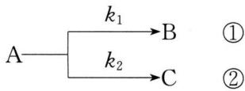

flowchart

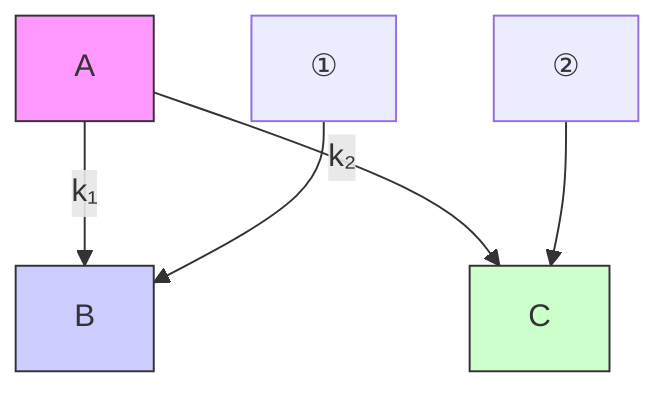

其动力学数据如下：

<table><tr><td>反应</td><td> $E_{a}/kJ \cdot mol^{-1}$ </td><td> $A/s^{-1}$ </td></tr><tr><td>1</td><td>108.8</td><td> $10^{13}$ </td></tr><tr><td>2</td><td>83.68</td><td> $10^{13}$ </td></tr></table>

(1) 提高温度, 哪一个反应的反应速率增加较快?

(2) 能否通过提高反应温度, 使 $k_{1}$ 大于 $k_{2}$ ?

(3) 如将温度由 $300 \, K$ 增高至 $1000 \, K$ ，产物中 B 和 C 的浓度比值将如何变化？

6. 设有一反应 $2\mathrm{A(g)} + \mathrm{B(g)} = \mathrm{G(g)} + \mathrm{H(s)}$ 在某恒温密闭容器中进行，开始时 A 和 B 的物质的量之比为 2:1，起始总压为 3.0 kPa，在 400 K 时，60 s 后容器中的总压力为 2.0 kPa，设该反应的速率方程为：

$$
- \frac {\mathrm{d} p _ {\mathrm{B}}}{\mathrm{d} t} = k _ {p} p _ {\mathrm{A}} ^ {1. 5} p _ {\mathrm{B}} ^ {0. 5}
$$

实验活化能为 $100 \, kJ \cdot mol^{-1}$ 。

(1) 求 400 K 时, 150 s 后容器中 B 的分压为多少?

(2) 500 K 时, 重复上述实验, 求 50 s 后容器中 B 的分压为多少?

7. 反应 $C_{2}H_{6} + H_{2} \longrightarrow 2CH_{4}$ 的反应机理如下：

$$
\begin{array}{r l}&\mathrm {C_ {2} H_ {6}} \stackrel {K} {\rightleftharpoons} 2 \mathrm {CH_ {3}} \bullet\\&\mathrm {CH_ {3}} \bullet + \mathrm {H_ {2}} \xrightarrow {k _ {2}} \mathrm {CH_ {4}} + \mathrm{H} \bullet\\&\mathrm{H} \bullet + \mathrm {C_ {2} H_ {6}} \xrightarrow {k _ {3}} \mathrm {CH_ {4}} + \mathrm {CH_ {3}} \bullet\end{array}
$$

试推导 $\frac{dc_{CH_{4}}}{dt}$ 的表达式。

8. 若反应 $A_{2} + B_{2} = 2AB$ 有如下机理，推导用 $v_{AB}$ 表示的速率方程。

(1) $A_{2} \xrightarrow{k_{1}} 2A$ (慢), $B_{2} \xlongequal{K_{2}} 2B$ (快速平衡, $K_{2}$ 很小)

$A+B\xrightarrow{k_{3}}AB(快)(k_{1}是以c_{A}变化表示的速率常数)$

(2) $A_{2}\xlongequal{K_{1}}2A,B_{2}\xlongequal{K_{2}}2B$ （皆为快速平衡， $K_{1},K_{2}$ 很小）

$A + B \xrightarrow{k_{3}} AB$ (慢)

(3) $A_{2} + B_{2} \xrightarrow{k_{1}} A_{2}B_{2}$ (慢), $A_{2}B_{2} \xrightarrow{k_{2}} 2AB$ (快)

## 第六讲 配位化合物基础

## 知识精讲

配位化合物简称配合物或络合物,最早见于文献的配合物是1704年德国人迪士尼(Diesbach)在研制颜料时合成的普鲁士蓝KFe[Fe(CN) $_{6}$ ]。配合物的研究始于1798年法国化学家塔萨尔特(Tassaert B M)关于CoCl $_{3}$ ·6NH $_{3}$ 的发现,之后1893年瑞士化学家维尔纳(Werner A)提出配位理论,奠定了配位化学的基础。如今配位化学已发展成为一门独立的学科,其研究领域已渗透到有机化学、结构化学、分析化学、催化动力学、生命科学等前沿学科。本讲将从配合物的基本概念出发,重点讨论其组成、结构,配位平衡将在第七讲中讨论。

## 一、配位化合物的基本概念

## 1. 配合物

配位化合物是由一简单正离子(或原子)和一定数目的负离子或中性分子以配位键相结合而成的具有一定特性的复杂化合物。

配位化合物又称络合物, 其中“络”是“网络”之意, 其结构与一般简单化合物相比, 表现出显著不同的特征。如向 $\left[\mathrm{Cu}\left(\mathrm{NH}_{3}\right)_{4}\right] \mathrm{SO}_{4}$ 溶液中滴加稀 NaOH 溶液, 无蓝色的 $\mathrm{Cu(OH)}_{2}$ 沉淀析出, 说明在该溶液中几乎没有 $\mathrm{Cu}^{2+}$ 。若向该溶液中滴加 $\mathrm{BaCl}_{2}$ 溶液, 则有白色的 $\mathrm{BaSO}_{4}$ 沉淀出现, 说明溶液中存在 $\mathrm{SO}_{4}^{2-}$ 。溶液导电性实验证明 $\left[\mathrm{Cu}\left(\mathrm{NH}_{3}\right)_{4}\right] \mathrm{SO}_{4}$ 水溶液中主要存在两种离子: $\mathrm{SO}_{4}^{2-}$ 和复杂结构的 $\left[\mathrm{Cu}\left(\mathrm{NH}_{3}\right)_{4}\right]^{2+}$ 。 $\left[\mathrm{Cu}\left(\mathrm{NH}_{3}\right)_{4}\right]^{2+}$ 中由 $\mathrm{NH}_{3}$ 与 $\mathrm{Cu}^{2+}$ 以配位键结合而成, 故称为配离子。 $\left[\mathrm{Cu}\left(\mathrm{NH}_{3}\right)_{4}\right]^{2+}$ 、 $\left[\mathrm{Ag}\left(\mathrm{NH}_{3}\right)_{2}\right]^{+}$ 、 $\left[\mathrm{Co}\left(\mathrm{H}_{2} \mathrm{O}\right)_{6}\right]^{3+}$ 等带正电荷, 称配正离子。 $\left[\mathrm{HgI}_{4}\right]^{2-}$ 、 $\left[\mathrm{AlF}_{6}\right]^{3-}$ 、 $\left[\mathrm{Fe(CN)}_{6}\right]^{4-}$ 、 $\left[\mathrm{Co(NCS)}_{4}\right]^{2-}$ 等带负电荷, 称配负离子。配离子和中性配位化合物如 $\mathrm{Fe(CO)}_{5} 、 \mathrm{Ni(CO)}_{4}$ 等统称配合物。

复盐是由两种或两种以上的同种晶型的简单盐类所组成的化合物。复盐与配合物有严格的界限。如复盐 $\mathrm{CsRh(SO_{4})_{2}\cdot4H_{2}O}$ ，若向其水溶液加入 $BaCl_{2}$ 无 $BaSO_{4}$ 沉淀出现，实验证实其结构为 $\mathrm{Cs^{+}[Rh(H_{2}O)_{4}(SO_{4})_{2}]^{-}}$ ，称二硫酸根·四水合铑(Ⅲ)酸铯，即 $\mathrm{CsRh(SO_{4})_{2}\cdot4H_{2}O}$ 是配合物。但像光卤石 $KCl\cdot MgCl_{2}\cdot6H_{2}O$

和明矾 $\mathrm{KAl(SO_{4})_{2}\cdot12H_{2}O}$ 这类复盐就不是配合物，因为其晶体或水溶液中不含复杂结构的配离子。在明矾晶体中仅存在 $K^{+}$ 、 $Al^{3+}$ 、 $SO_{4}^{2-}$ 和 $H_{2}O$ 等简单离子和分子；将其溶解于水，其性质犹如简单的无机盐 $K_{2}SO_{4}$ 和 $\mathrm{Al}_{2}(\mathrm{SO}_{4})_{3}$ 水溶液。

## 2. 配合物的组成

配合物一般由内界和外界两部分组成。

## (1) 配合物内界

配合物中配位单元称为配合物的内界。如在配合物 $\left[\mathrm{Cu}\left(\mathrm{NH}_{3}\right)_{4}\right]\mathrm{SO}_{4}$ 中，具有复杂结构的 $\left[\mathrm{Cu}\left(\mathrm{NH}_{3}\right)_{4}\right]^{2+}$ 称为配合物的内界，见图6-1。再如 $\mathrm{K}_2\left[\mathrm{PtCl}_6\right]$ 中的 $\left[\mathrm{PtCl}_6\right]^{2-}$ 是配合物的内界。

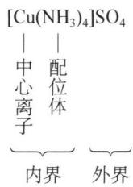

chemical

Chemical structure diagram showing [Cu(NH₃)₄]SO₄ with central and outer atoms, including bonding and coordination groups

图6-1 配合物的组成

## (2) 配合物外界

配合物中配位单元未包括的部分称为配合物的外界。如在配合物 $\left[\mathrm{Cu}\left(\mathrm{NH}_{3}\right)_{4}\right]\mathrm{SO}_{4}$ 中 $\mathrm{SO}_4^{2-}$ 称为配合物的外界。再如 $\mathrm{K}_2[\mathrm{PtCl}_6]$ 中 $\mathbf{K}^+$ 是配合物的外界。

如图 6-1 所示, 配合物的内界和外界以离子键相结合。配合物溶于水时, 解离为内界和外界两部分, 内界基本保持其复杂的结构单元(配合单元)。配合单元不仅能存在于水溶液中, 也能存在于晶体中。

应该指出，有的配合物只有内界。如 $\left[\mathrm{Ni}(\mathrm{CO})_{4}\right]$ 、 $\left[\mathrm{Fe}(\mathrm{CO})_{5}\right]$ 等。

## (3) 中心离子或中心原子

配合物的内界总是由中心离子(或原子)和配位体两部分组成。

中心离子（或原子）位于配离子的中心，亦称配合物的形成体。如 $\left[\mathrm{Cu}(\mathrm{NH}_3)_4\right]^{2+}$ 中的 $\mathrm{Cu}^{2+}$ 、 $\left[\mathrm{Co}(\mathrm{NH}_3)_6\right]^{3+}$ 中的 $\mathrm{Co}^{3+}$ 、 $\left[\mathrm{Fe}(\mathrm{CN})_6\right]^{4-}$ 中的 $\mathrm{Fe}^{2+}$ 等正离子。形成体也可以是中性原子，如 $\left[\mathrm{Ni}(\mathrm{CO})_4\right]$ 、 $\left[\mathrm{Fe}(\mathrm{CO})_5\right]$ 中的 Ni 和 Fe。

常见可以作为配合物中心离子(或原子)的元素如下:

① 过渡金属离子(或原子), 如: V、Cr、Mn、Fe、Co、Ni、Cu、Zn 以及第五、第六周期的过渡金属等。  
② 某些高氧化态的主族金属离子、高氧化态的非金属。如 $\left[\mathrm{PbCl}_{4}\right]^{2-}$ 中的 $\mathrm{Pb}^{2+}$ , $\left[\mathrm{AlF}_{6}\right]^{3-}$ 中的 $\mathrm{Al}^{3+}$ , $\left[\mathrm{SiF}_{6}\right]^{2-}$ 中的 Si(IV)等。

## (4) 配位体与配位原子

配合物中与中心离子结合的离子或中性分子称为配位体(ligand)，简称配体。如 $\left[\mathrm{Cu}\left(\mathrm{NH}_{3}\right)_{4}\right]\mathrm{SO}_{4}$ 中的 $\mathrm{NH}_{3}$ 、 $\left[\mathrm{Fe}(\mathrm{CN})_{6}\right]^{4-}$ 中的 $\mathrm{CN}^{-}$ 、 $\left[\mathrm{Co}\left(\mathrm{NH}_{3}\right)_{5}\left(\mathrm{H}_{2} \mathrm{O}\right)\right]^{3+}$ 中的 $NH_{3}$ 和 $H_{2}O$ 、 $[PtCl_{6}]^{2-}$ 中的 $Cl^{-}$ 、 $\mathrm{Ni(CO)}_{4}$ 中的 CO 等。

在配体中能提供孤对电子并与中心离子(或原子)形成配位键的原子称为配位原子。一般常见的配位原子主要是元素周期表中电负性较大的非金属原子。如 $\left[\mathrm{Cu}\left(\mathrm{NH}_{3}\right)_{4}\right]\mathrm{SO}_{4}$ 中的N原子、 $\left[\mathrm{Fe}(\mathrm{CN})_{6}\right]^{4-}$ 中的C原子、 $\left[\mathrm{Co}\left(\mathrm{NH}_{3}\right)_{5}\left(\mathrm{H}_{2} \mathrm{O}\right)\right]^{3+}$ 中的N原子和O原子、 $\left[\mathrm{PtCl}_{6}\right]^{2-}$ 中的Cl原子、 $\mathrm{Ni(CO)}_{4}$ 中的C原子等。

根据配体中所含配位原子数目的多少可将配体分为单齿配体和多齿配体。

① 单齿配体

只含一个配位原子,可提供一对孤对电子与中心离子或原子形成一个配位键的配体称为单齿配体,如 $H_{2}O$ 、CO、 $NH_{3}$ 、 $Cl^{-}$ 、 $CN^{-}$ 等。

② 多齿配体

含两个或两个以上配位原子并能和中心离子形成多个配位键的配体称为多齿配体。如草酸根 $\left(\mathrm{C}_{2}\mathrm{O}_{4}^{2-}\right)$ ，简写成ox）、氨基乙酸 $\left(\mathrm{NH}_{2}\mathrm{CH}_{2}\mathrm{COOH}\right)$ 、乙二胺 $\left(\mathrm{H}_{2}\mathrm{NCH}_{2}\mathrm{CH}_{2}\mathrm{NH}_{2}\right)$ ，简写成en）和乙二胺四乙酸（简称EDTA）等。

常见的配体和配位原子见表6-1。

表 6-1 常见的配体和配位原子

<table><tr><td colspan="2">配体种类</td><td>实例</td><td>配位原子</td></tr><tr><td rowspan="5">单齿配体</td><td>含氮配体</td><td>NH3、RNH2、NO2-、NCS-、C5H5N(吡啶)</td><td>N</td></tr><tr><td>含氧配体</td><td>H2O、ROH、RCOOH、OH-、ONO-</td><td>O</td></tr><tr><td>含碳配体</td><td>CO、CN-</td><td>C</td></tr><tr><td>含卤素配体</td><td>F-、Cl-、Br-、I-</td><td>F、Cl、Br、I</td></tr><tr><td>含硫配体</td><td>H2S、RSH、SCN-</td><td>S</td></tr><tr><td rowspan="5">多齿配体</td><td rowspan="4">双齿配体</td><td>乙二胺: H2NCH2CH2NH2</td><td>2个N</td></tr><tr><td>邻菲罗啉: </td><td>2个N</td></tr><tr><td>草酸根: C2O42-</td><td>2个O</td></tr><tr><td>氨基酸,如:NH2CH2COOH</td><td>1个N、1个O</td></tr><tr><td>三齿配体五齿配体</td><td>二乙烯三胺: 乙二胺三乙酸根离子: </td><td>3个N2个N、3个O</td></tr><tr><td rowspan="3"></td><td rowspan="2">六齿配体</td><td>乙二胺四乙酸: </td><td>2个N、4个O</td></tr><tr><td>18-冠-6: </td><td>6个O</td></tr><tr><td>八齿配体</td><td>穴醚[2,2,2]: </td><td>2个N、6个O</td></tr></table>

## (5) 配位数

## ① 配位数

配合物中与中心离子(或原子)直接以配位键相结合的配位原子的数目称为中心离子的配位数(coordination number)。一般中心离子都具有特征的配位数。常见的配位数为2、4、6，详见表6-2。

在单齿配体形成的配合物中：中心离子的配位数 $=$ 单齿配体个数 $=$ 配位原子的个数。如 $\left[\mathrm{Co}\left(\mathrm{NH}_{3}\right)_{6}\right]\mathrm{Cl}_{3}$ 中 $\mathrm{Co}^{3+}$ 的配位数即为 $\mathrm{NH}_{3}$ 分子的个数，故配位数为6。

表 6-2 常见金属离子 $\left( {\mathbf{M}}^{n + }\right)$ 的配位数(n)

<table><tr><td> $M^{+}$ </td><td>n</td><td> $M^{2+}$ </td><td>n</td><td> $M^{3+}$ </td><td>n</td><td> $M^{4+}$ </td><td>n</td></tr><tr><td> $Cu^{+}$ </td><td>2; 4</td><td> $Cu^{2+}$ </td><td>4; 6</td><td> $Fe^{3+}$ </td><td>6</td><td> $Pt^{4+}$ </td><td>6</td></tr><tr><td> $Ag^{+}$ </td><td>2</td><td> $Zn^{2+}$ </td><td>4; 6</td><td> $Cr^{3+}$ </td><td>6</td><td></td><td></td></tr><tr><td> $Au^{+}$ </td><td>2;4</td><td> $Cd^{2+}$ </td><td>4; 6</td><td> $Co^{3+}$ </td><td>6</td><td></td><td></td></tr><tr><td></td><td></td><td> $Pt^{2+}$ </td><td>4</td><td> $Sc^{3+}$ </td><td>6</td><td></td><td></td></tr><tr><td></td><td></td><td> $Hg^{2+}$ </td><td>4</td><td> $Au^{3+}$ </td><td>4</td><td></td><td></td></tr><tr><td></td><td></td><td> $Ni^{2+}$ </td><td>4; 6</td><td> $Al^{3+}$ </td><td>4;6</td><td></td><td></td></tr><tr><td></td><td></td><td> $Co^{2+}$ </td><td>4; 6</td><td></td><td></td><td></td><td></td></tr></table>

在多齿配体形成的配合物中：中心离子的配位数 $=$ 配体个数 $\times$ 每个配体中配位原子的个数。如 $\left[\mathrm{Co}(\mathrm{en})_{3}\right]\mathrm{Cl}_{3}$ 中配位体的个数是3，每个en中有两个配位原子，因此 $\mathrm{Co}^{3+}$ 的配位数为6。

## ② 影响配位数的因素

影响配位数的因素很多,主要有中心离子氧化数、半径及配体的半径和电荷。

一般中心离子的氧化数越高,越易吸引配体中的孤对电子,越易形成高配位数的配合物,如表6-3所示。

表 6-3 中心离子与配位数的关系

<table><tr><td>中心离子的氧化数</td><td>实例</td><td>配位数</td></tr><tr><td>+1</td><td> $[Ag(NH_3)_2]^+$ 、 $[Cu(NH_3)_2]^+$ </td><td>2</td></tr><tr><td>+2</td><td> $[Cu(NH_3)_4]^{2+}$ 、 $[Cu(CN)_4]^{2-}$ </td><td>4</td></tr><tr><td>+3</td><td> $[Co(en)_3]^{3+}$ </td><td>6</td></tr><tr><td>+4</td><td> $[Pt(Cl)_6]^{2-}$ </td><td>6</td></tr></table>

一般中心离子的半径越大,配位数往往越大。如 $r_{\mathrm{B(III)}} < r_{\mathrm{Al(III)}}$ , 在 $BF_{4}^{-}$ 中, 中心离子的配位数是 4; 而在 $AlF_{6}^{3-}$ 中, 配位数是 6。必须指出, 中心离子的半径过大, 它对配体的引力减小, 有时配位数反而减小, 如 $\mathrm{Hg}^{2+}(101\mathrm{pm})$ 只能形成配位数是 4 的配离子 (如 $\left[HgCl_{4}\right]^{2-}$ 与 $\left[HgI_{4}\right]^{2-}$ )。

单齿配体与中心离子形成的配合物,配体的体积越大,则配位数越小。如 $Al^{3+}$ 与 $F^{-}$ 形成 6 配位的 $[AlF_{6}]^{3-}$ ,而与 $Cl^{-}$ 则形成 4 配位的 $[AlCl_{4}]^{-}$ 。

配体的负电荷越多,在增加中心离子对配体的引力的同时,也增加了配体间的斥力,使配位数反而减小,如 $\left[SiO_{4}\right]^{4-}$ 中 $Si(IV)$ 的配位数比 $\left[SiF_{6}\right]^{2-}$ 中的小。

## (6) 配离子电荷

配离子的电荷数等于中心离子与配位体电荷的代数和,也可由外界离子所带的电荷总数决定。如 $\left[\mathrm{Co}(\mathrm{en})_{3}\right]\mathrm{Cl}_{3}$ ，外界3个 $Cl^{-}$ ，总电荷数为-3，则配离子所带的电荷为+3。

## 3. 配合物的命名

## (1) 配合物内界的命名顺序

配合物内界的命名顺序为：配位体数（用一、二、三等数字表示）→配位体名称→“合”字→中心离子名称→中心离子氧化数（加括号，用罗马数字Ⅰ、Ⅱ、Ⅲ等注明）。如：

$\left[\mathrm{Cu}\left(\mathrm{NH}_{3}\right)_{4}\right]^{2+}$ 四氨合铜(Ⅱ)离子

$\left[Fe(CN)_{6}\right]^{3-}$ 六氰合铁(Ⅲ)离子

## (2) 配位体命名原则

若配离子内含有两个以上不同配位体,则配位体之间一般用“·”隔开。配体列出的顺序如下。

① 先负离子,后中性分子

如： $\left[\mathrm{Co}(\mathrm{NO}_{2})_{4}(\mathrm{NH}_{3})_{2}\right]^{-}$ 四硝基·二氨合钴(Ⅲ)离子

② 先无机配体,后有机配体;配体所用的缩写符号一律用小写字母

如： $\left[\mathrm{CoCl}(\mathrm{SCN})(\mathrm{en})_{2}\right]^{+}$ 氯·硫氰酸根·二(乙二胺)合钴(Ⅲ)离子

③ 同类配体的名称,则按其配位原子元素符号的英文字母顺序排列

如： $\left[\mathrm{Co}\left(\mathrm{NH}_{3}\right)_{5}\left(\mathrm{H}_{2}\mathrm{O}\right)\right]^{3+}$ 五氨·一水合钴(Ⅲ)离子(一水中的“一”可以省略)

④ 同类配体的配位原子也相同,则将含较少原子数的配体排在前

如： $\left[\mathrm{Pt}\left(\mathrm{NO}_{2}\right)\left(\mathrm{NH}_{3}\right)\left(\mathrm{NH}_{2}\mathrm{OH}\right)(\mathrm{py})\right]^{+}$ 硝基·氨·羟胺·吡啶合铂(Ⅱ)离子

⑤ 配位原子相同,配体中所含原子数目也相同,则按在结构式中与配位原子相连的元素符号的英文字母顺序排列

如： $\left[\mathrm{Pt}\left(\mathrm{NH}_{2}\right)\left(\mathrm{NO}_{2}\right)\left(\mathrm{NH}_{3}\right)_{2}\right]$ 氨基·硝基·二氨合铂(Ⅱ)。

## (3) 配合物的命名

## ① 含配正离子的配合物

若配合物的酸根是一简单的负离子,则称“某化某”;配合物的酸根是一复杂的负离子,则称为“某酸某”。

如： $\left[\mathrm{Co}\left(\mathrm{NH}_{3}\right)_{5}\left(\mathrm{H}_{2}\mathrm{O}\right)\right]\mathrm{Cl}_{3}$ 三氯化五氨·一水合钴(Ⅲ)

$\left[\mathrm{PtCl}\left(\mathrm{NO}_{2}\right)\left(\mathrm{NH}_{3}\right)_{4}\right]\mathrm{CO}_{3}$ 碳酸一氯·一硝基·四氨合铂(Ⅳ)

## ② 含配负离子的配合物

若外界为氢离子,配负离子的名称之后用酸字结尾,称“某酸”;若外界为除氢

以外的正离子,则称“某酸某”。

如： $\mathrm{H}_{2}[\mathrm{SiF}_{6}]$

六氟合硅(IV)酸

$\mathrm{K}_4[\mathrm{Fe}(\mathrm{CN})_6]$

六氰合铁(Ⅱ)酸钾

③ 既含配正离子又含配负离子的配合物

如： $\mathrm{[Cu(NH_3)_4][PtCl_4]}$

四氯合铂(Ⅱ)酸四氨合铜(Ⅱ)

④ 无外界配合物

如： $\left[\mathrm{CoCl(OH)}_{2}\left(\mathrm{NH}_{3}\right)_{3}\right]$

一氯·二羟基·三氨合钴(Ⅲ)

$\left[\mathrm{Fe}(\mathrm{CO})_{5}\right]$

五羰基合铁

(4) 某些配体依配位原子的不同分别命名为

—ONO 亚硝酸根

—NO $_{2}$ 硝基

—SCN 硫氰酸根

—NCS 异硫氰酸根

如： $\left[\mathrm{Co}(\mathrm{ONO})(\mathrm{NH}_{3})_{5}\right]\mathrm{SO}_{4}$ 硫酸亚硝酸根·五氨合钴(Ⅲ)

$\left[\mathrm{Co}(\mathrm{NO}_{2})_{3}(\mathrm{NH}_{3})_{3}\right]$

三硝基·三氨合钴(Ⅲ)

$\mathrm{Na}_{3}\left[\mathrm{Co}(\mathrm{NCS})_{3}(\mathrm{SCN})_{3}\right]$

三异硫氰根·三硫氰根合钴(Ⅲ)酸钠

(5) 常见配合物的俗名

$K_{3}[Fe(CN)_{6}]$

铁氰化钾 赤血盐

$\mathrm{K}_4[\mathrm{Fe}(\mathrm{CN})_6]\cdot 3\mathrm{H}_2\mathrm{O}$

亚铁氰化钾 黄血盐

$\mathrm{H[AuCl_4]}$

氯金酸

$H_{2}[PtCl_{6}]$

氯铂酸

$\mathrm{H}_2[\mathrm{PtCl}_4]$

氯亚铂酸

$H_{2}[SiF_{6}]$

氟硅酸

$(NH_{4})_{2}[PtCl_{6}]$

氯铂酸铵

$\mathrm{Na}_{3}[\mathrm{AlF}_{6}]$

氟铝酸钠

$\left[\mathrm{Ag}(\mathrm{NH}_{3})_{2}\right]^{+}$

银氨配离子

$\left[\mathrm{Cu}(\mathrm{NH}_{3})_{4}\right]^{2+}$

铜氨配离子

## 二、配位化合物的价键理论

自 1893 年配位化学奠基人——维尔纳首先提出了配位理论之后,有关配合物中的化学键相继建立了现代价键理论、晶体场理论、配位键理论和分子轨道理论,本讲主要讨论价键理论和晶体场理论。

## 1. 价键理论的要点

1931 年,鲍林将杂化轨道理论应用到配位化合物中,逐渐形成了现代价键理

论(Valence bond theory)。其基本要点如下:

(1) 中心离子(原子)有空的价层轨道,配体的配位原子提供孤对电子;  
(2) 中心离子(原子)的价层轨道首先杂化,杂化类型由中心离子的价层电子构型、配位体的数目和配位能力的强弱决定;  
(3) 中心离子的空轨道接纳配位原子中的孤对电子而形成配位键;  
(4) 配位化合物的空间构型由中心离子的杂化类型决定。

## 2. 中心离子的杂化轨道

据上述价键理论,中心离子轨道的杂化类型因配位数而异。

(1) 配位数为 2 的中心离子的杂化类型

可用价键理论解释 $\left[\mathrm{Ag}\left(\mathrm{NH}_{3}\right)_{2}\right]^{+}$ 的形成和空间构型如下：

由 $Ag^{+}$ 的核外电子排布可知, $Ag^{+}$ 的价层电子构型为 $4d^{10}$ , 可提供 5s、5p 空轨道。

$\mathrm{Ag^{+}}$

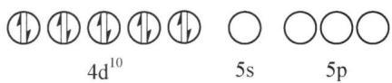

text_image

4d¹⁰
5s
5p

在 $Ag^{+}$ 和 $NH_{3}$ 形成配离子的过程中, $Ag^{+}$ 中空的 5s 轨道和一个 5p 轨道经杂化, 形成两个等价的 sp 杂化轨道, 于是 $NH_{3}$ 分子中配位原子 N 上的孤对电子和 $Ag^{+}$ 所提供的空 sp 杂化轨道形成两个配位键。 $\left[\mathrm{Ag}\left(\mathrm{NH}_{3}\right)_{2}\right]^{+}$ 配离子的空间构型呈直线型。

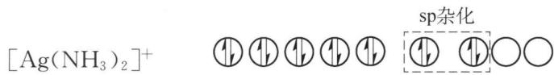

chemical

Chemical reaction equation showing silver(II) oxide ion reacting with sp hybridization to form a cyclic product

(2) 配位数为 4 的中心离子的杂化类型

可用价键理论解释 $\left[\mathrm{Ni}\left(\mathrm{NH}_{3}\right)_{4}\right]^{2+}$ 和 $\left[\mathrm{Ni}\left(\mathrm{CN}\right)_{4}\right]^{2-}$ 的形成和空间构型如下：

由 $Ni^{2+}$ 的核外电子排布可知, $Ni^{2+}$ 的价层电子构型为 $3d^{8}$ 。

$\mathrm{Ni}^{2+}$

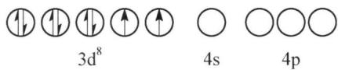

text_image

3d⁸
4s
4p

在 $Ni^{2+}$ 和 $NH_{3}$ 形成配离子的过程中, $Ni^{2+}$ 的一个 4s 和三个 4p 空轨道经杂化, 形成了四个等价的 $sp^{3}$ 杂化轨道, 它们分别与四个配体 $NH_{3}$ 分子中配位原子 N 上的孤对电子形成四个配位键。

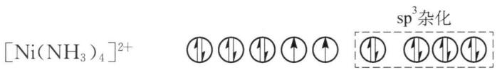

chemical

Electron transfer diagram of nickel complex [Ni(NH₃)₄]²⁺ with sp³ hybridization

$\left[\mathrm{Ni}\left(\mathrm{NH}_{3}\right)_{4}\right]^{2+}$ 配离子的空间构型呈正四面体。

在 $Ni^{2+}$ 和 $CN^{-}$ 形成配离子的过程中, 因 $CN^{-}$ 的作用使 $Ni^{2+}$ 中 3d 轨道上的电子排列发生了改变, 两个成单的电子压缩成对, 八个电子挤入四个 3d 轨道中, 空出一个 3d 轨道, 与一个 4s 轨道和两个 4p 轨道杂化, 形成四个等价的 $dsp^{2}$ 杂化轨道, 它们分别与四个配体 $CN^{-}$ 中 C 原子的孤对电子形成四个配位键。

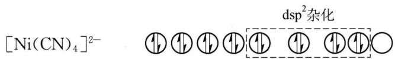

chemical

Crystal structure diagram of nickel complex [Ni(CN)4]2- with dispersion squared notation

$dsp^{2}$ 杂化轨道间的夹角为 $90^{\circ}$ ，故四个配位键也互成 $90^{\circ}$ 夹角，即 $\left[\mathrm{Ni}(\mathrm{CN})_{4}\right]^{2-}$ 配离子的空间构型呈平面正方形。

由此可见,配位数为 4 的配离子,中心离子可形成 $sp^{3}$ 和 $dsp^{2}$ 两种杂化类型。

(3) 配位数为 6 的中心离子的杂化类型

可用价键理论解释 $\left[FeF_{6}\right]^{3-}$ 和 $\left[Fe(CN)_{6}\right]^{3-}$ 的形成和空间构型如下：

由 $Fe^{3+}$ 的核外电子排布可知, $Fe^{3+}$ 的价层电子构型为 $3d^{5}$ 。

$\mathrm{Fe}^{3+}$ ○
4s

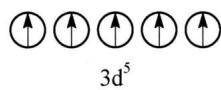

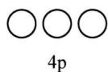

在 $Fe^{3+}$ 和 $F^{-}$ 形成配离子的过程中, $Fe^{3+}$ 提供一个 4s 轨道, 三个 4p 轨道和两个 4d 轨道经杂化形成六个等价的 $sp^{3}d^{2}$ 杂化轨道, 它们分别与配体 $F^{-}$ 中的孤对电子形成六个配位键。

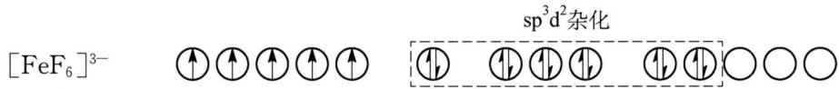

chemical

Crystal structure diagram of [FeF6]3- with sp³d² hybridization

$sp^{3}d^{2}$ 杂化轨道在空间呈正八面体构型，故 $\left[FeF_{6}\right]^{3-}$ 配离子的空间构型呈正八面体。

在 $Fe^{3+}$ 和 $CN^{-}$ 形成配离子的过程中,由于 $CN^{-}$ 离子的作用,使 $Fe^{3+}$ 中的五个 d 电子重排,挤入三个 3d 轨道,空出了两个 3d 轨道,与一个 4s 轨道和三个 4p 轨道共同杂化,形成六个等价的 $d^{2}sp^{3}$ 杂化轨道,它们分别与配体 $CN^{-}$ 中 C 原子中的孤对电子形成六个配位键。

chemical

Electron configuration diagram of iron(CN)6 with d²sp³ hybridization

$d^{2}sp^{3}$ 杂化轨道也呈正八面体，故 $\left[Fe(CN)_{6}\right]^{3-}$ 配离子的空间构型呈正八面体。

由此可见，在配位数为 6 的配离子中，中心离子有两种杂化类型，即 $sp^{3}d^{2}$ 和 $d^{2}sp^{3}$ 杂化。

## 3. 价键理论的应用

## (1) 由中心离子的杂化类型判断配合物的空间构型

配合物的空间构型由中心离子的杂化类型决定。中心离子的杂化类型与配位数有关,配位数不同,中心离子的杂化类型就不同;即使配位数相同,也可因中心离子和配体的种类和性质不同,使中心离子的杂化类型不同,故配合物的空间构型也不同。表 6-4 列出了一些常见配离子的空间构型。

表 6-4 不同配位数的配离子的空间构型

<table><tr><td>配位数</td><td>杂化类型</td><td>配离子的空间构型</td><td>示例</td></tr><tr><td>2</td><td>sp</td><td>直线型 </td><td> ${\left\lbrack \mathrm{{Cu}}{\left( {\mathrm{{NH}}}_{3}\right) }_{2}\right\rbrack }^{ + }$ 、 ${\left\lbrack \mathrm{{Ag}}{\left( {\mathrm{{NH}}}_{3}\right) }_{2}\right\rbrack }^{ + }$ 、 ${\left\lbrack \mathrm{{Ag}}{\left( \mathrm{{CN}}\right) }_{2}\right\rbrack }^{ - }$ 、 ${\left\lbrack \mathrm{{Au}}{\left( {\mathrm{{NH}}}_{3}\right) }_{2}\right\rbrack }^{ + }$ </td></tr><tr><td>3</td><td> ${\mathrm{{sp}}}^{2}$ </td><td>平面三角形 </td><td> ${\left\lbrack \mathrm{{CuCl}}}_{3}\right\rbrack }^{2 - }$ 、 ${\left\lbrack \mathrm{{HgI}}}_{3}\right\rbrack }^{ - }$ </td></tr><tr><td rowspan="2">4</td><td> ${\mathrm{{sp}}}^{3}$ </td><td>正四面体 </td><td> ${\left\lbrack \mathrm{{ZnCl}}}_{4}\right\rbrack }^{2 - }$ 、 ${\left\lbrack \mathrm{{BF}}}_{4}\right\rbrack }^{ - }$ 、 ${\left\lbrack \mathrm{{Cd}}{\left( {\mathrm{{NH}}}_{3}\right) }_{4}\right\rbrack }^{2 + }$ 、 $\mathrm{{Ni}}{\left( \mathrm{{CO}}\right) }_{4}$ 、 ${\left\lbrack \mathrm{{Ni}}{\left( {\mathrm{{NH}}}_{3}\right) }_{4}\right\rbrack }^{2 + }$ </td></tr><tr><td> ${\mathrm{{dsp}}}^{2}$ </td><td>平面正方形 </td><td> ${\left\lbrack \mathrm{{AuF}}}_{4}\right\rbrack }^{ - }$ 、 ${\left\lbrack \mathrm{{Ni}}{\left( \mathrm{{CN}}\right) }_{4}\right\rbrack }^{2 - }$ 、 ${\left\lbrack \mathrm{{Pt}}{\left( {\mathrm{{NH}}}_{3}\right) }_{2}{\mathrm{{Cl}}}_{2}\right\rbrack }$ 、 ${\left\lbrack \mathrm{{PdCl}}}_{4}\right\rbrack }^{2 - }$ 、 ${\left\lbrack \mathrm{{Cu}}{\left( {\mathrm{{NH}}}_{3}\right) }_{4}\right\rbrack }^{2 + }$ </td></tr><tr><td>5</td><td> ${\mathrm{{dsp}}}^{3}$ </td><td>三角双锥 </td><td> ${\left\lbrack \mathrm{{Fe}}{\left( \mathrm{{CO}}\right) }_{5}\right\rbrack }_{5}$ 、 ${\left\lbrack \mathrm{{CuCl}}}_{5}\right\rbrack }^{3 - }$ 、 ${\left\lbrack \mathrm{{Ni}}{\left( \mathrm{{CN}}\right) }_{5}\right\rbrack }^{3 - }$ </td></tr><tr><td rowspan="2">6</td><td> $sp^3d^2$ </td><td rowspan="2">正八面体 </td><td> $[Ti(H_2O)_6]^{3+}$ 、 $[FeF_6]^{3-}$ 、 $[Mn(H_2O)_6]^{2+}$ </td></tr><tr><td> $d^2sp^3$ </td><td> $[Fe(CN)_6]^{3-}$ 、 $[Co(NH_3)_6]^{3+}$ 、 $[Cr(NH_3)_6]^{3+}$ </td></tr></table>

## (2) 判断配合物的磁性

磁性是物质在外磁场作用下所表现出来的性质,取决于物质中单电子数目及自旋状态。当物质被置于外磁场中时,物质内部未成对的单电子在自旋及绕核运动时产生的磁场受外磁场吸引,其磁化方向与外磁场方向一致,使磁场增强,这种物质称为顺磁性物质;若物质内部电子都已配对,则电子运动产生的磁场相互抵消,不被外磁场所吸引,这种物质称为反磁性物质或抗磁性物质;另有一类物质在外场磁作用下,磁性剧烈增强,当除去外磁场后物质仍保持磁性的称为铁磁性物质。

通常用磁矩 $(\mu)$ 表示物质的磁性。若计算得 $\mu = 0$ ，则为反磁性物质；若 $\mu > 0$ 则为顺磁性物质。 $\mu$ 的大小取决于物质中的单电子数 $n$ ，两者的近似关系如下式：

$$
\mu = \sqrt {n (n + 2)} \tag {6-1}
$$

磁矩 $(\mu)$ 的单位是玻尔磁子(B.M)。物质磁性也可由磁天平测得。表6-5列出某些过渡金属配合物的磁矩。过渡金属离子的d轨道大多存在未成对电子，故过渡金属离子多数显顺磁性。当它们和配体形成配合物(或配离子)后，若d电子排布不改变，则配离子中的单电子数和过渡金属离子中的单电子数相同，仍然表现出顺磁性；若发生变化，则配离子中的单电子数小于金属离子中的单电子数，则配离子磁性变小甚至表现出反磁性。

## (3) 判断内、外轨型配合物

中心离子和配体形成的配合物有两类：

① 中心离子仅以最外层轨道杂化后与配位原子成键,称外轨配键,其对应的配合物称为外轨(outer-orbital)型配合物。

外轨型配合物的特点是：配合前后中心离子的 d 电子分布未发生改变，单电子数不变，物质的磁性不变。形成外轨型配合物时，中心离子一般提供相同主量子数的不同轨道相互杂化，如 ns、np、nd 中若干轨道杂化形成 sp、 $sp^{2}$ 、 $sp^{3}$ 、 $sp^{3}d^{2}$ 等杂化轨道，与配体形成配位键，这种配位键离子性较强，共价性较弱，稳定性较内轨型配合物差。

表 6-5 某些内轨型和外轨型配合物的电子构型、磁矩/(B.M)和空间构型

<table><tr><td rowspan="2">配离子</td><td rowspan="2">中心离子(n-1)d轨道电子排布</td><td rowspan="2">杂化类型</td><td rowspan="2">成单电子数</td><td colspan="2">磁矩</td><td rowspan="2">空间构型(内外轨)</td></tr><tr><td>计算值</td><td>实验值</td></tr><tr><td> $FeF_{6}^{3-}$ </td><td> $Fe^{3+} \uparrow \uparrow \uparrow \uparrow \uparrow \uparrow$ </td><td> $sp^{3}d^{2}$ </td><td>5</td><td>5.92</td><td>5.88</td><td>正八面体(外轨)</td></tr><tr><td> $Fe(H_{2}O)_{6}^{2+}$ </td><td> $Fe^{2+} \updownarrow \uparrow \uparrow \uparrow \uparrow \uparrow$ </td><td> $sp^{3}d^{2}$ </td><td>4</td><td>4.90</td><td>5.30</td><td>正八面体(外轨)</td></tr><tr><td> $CoF_{6}^{3-}$ </td><td> $Co^{3+} \updownarrow \uparrow \uparrow \uparrow \uparrow \uparrow$ </td><td> $sp^{3}d^{2}$ </td><td>4</td><td>4.90</td><td>—</td><td>正八面体(外轨)</td></tr><tr><td> $Co(H_{2}O)_{6}^{2+}$ </td><td> $Co^{2+} \updownarrow \uparrow \uparrow \uparrow \uparrow \uparrow$ </td><td> $sp^{3}d^{2}$ </td><td>3</td><td>3.87</td><td>—</td><td>正八面体(外轨)</td></tr><tr><td> $MnCl_{4}^{2-}$ </td><td> $Mn^{2+} \uparrow \uparrow \uparrow \uparrow \uparrow \uparrow$ </td><td> $sp^{3}$ </td><td>5</td><td>5.92</td><td>5.88</td><td>正四面体(外轨)</td></tr><tr><td> $Fe(CN)_{6}^{3-}$ </td><td> $Fe^{3+} \updownarrow \uparrow \uparrow \bigcirc \bigcirc$ </td><td> $d^{2}sp^{3}$ </td><td>1</td><td>1.73</td><td>2.3</td><td>正八面体(内轨)</td></tr><tr><td> $Co(NH_{3})_{6}^{3+}$ </td><td> $Co^{3+} \updownarrow \updownarrow \updownarrow \bigcirc \bigcirc$ </td><td> $d^{2}sp^{3}$ </td><td>0</td><td>0</td><td>0</td><td>正八面体(内轨)</td></tr><tr><td> $Mn(CN)_{6}^{4-}$ </td><td> $Mn^{2+} \updownarrow \updownarrow \uparrow \bigcirc \bigcirc$ </td><td> $d^{2}sp^{3}$ </td><td>1</td><td>1.73</td><td>0.70</td><td>正八面体(内轨)</td></tr><tr><td> $Ni(CN)_{4}^{2-}$ </td><td> $Ni^{2+} \updownarrow \updownarrow \updownarrow \bigcirc \bigcirc$ </td><td> $dsp^{2}$ </td><td>0</td><td>0</td><td>0</td><td>平面正方形(内轨)</td></tr></table>

② 中心离子以部分次外层轨道如 $(n-1)$ d 参与组成杂化轨道，则形成内轨配键，其对应的配合物称为内轨(inner-orbital)型配合物。

内轨型配合物的特点是：中心离子一般采用不同主量子数的轨道相互杂化，如 $(n-1)$ d轨道可与ns np轨道杂化形成 $dsp^{2}$ 、 $dsp^{3}$ 、 $d^{2}sp^{3}$ 等杂化轨道与配体成键。由于内轨型配合物由内层轨道参与成键，键的共价性较强，稳定性较好，在水溶液中一般较难离解为简单离子。对于d电子数目大于等于4的中心离子，在形成内轨型配合物时，中心离子的d电子排布会发生改变，即进行电子归并，单电子数目将减少（有时甚至为零），导致物质的磁性减小。

(4) 影响配合物的类型(内外轨型)的主要因素

① 中心离子的电子构型：具有 $d^{10}$ 构型的离子（如 $Zn^{2+}$ 、 $Cd^{2+}$ 、 $Hg^{2+}$ 等离子），它们的 $(n-1)d$ 轨道都已填满 10 个电子，因而只能形成外轨型配合物；具有 $d^{1}$ 、 $d^{2}$ 、 $d^{3}$ 构型的离子（如 $Cr^{3+}$ ），本身就有空的 d 轨道，所以形成内轨型配合物。

具有 $d^{4} \sim d^{9}$ 构型的离子(如 $Fe^{2+}$ 、 $Fe^{3+}$ 、 $Co^{3+}$ 、 $Ni^{2+}$ 、 $Cu^{2+}$ 等)，它们有 4～9 个 d 电子，两种类型的配合物均有可能形成。具有 $d^{8}$ 构型的离子(如 $Pt^{2+}$ 、 $Pd^{2+}$ 等)，在大多数情况下形成内轨型配合物。

② 配体的种类: 若配体的电负性较强(如 $\mathrm{F}^{-}$ ), 则较难给出孤对电子, 对中心离子 d 电子分布影响较小, 易形成外轨型配合物 (如 $[\mathrm{FeF}_6]^{3-}$ 等)。若配位原子的电负性较弱 (如 $\mathrm{CN}^{-}$ ), 则较易给出孤对电子, 孤对电子将影响中心离子的 d 电子排布, 使中心离子空出内层轨道, 形成内轨型配合物 (如 $[\mathrm{Fe(CN)}_6]^{3-}$ 等)。对 $\mathrm{NH}_3$ 、 $\mathrm{H}_2\mathrm{O}$ 等配体, 则内、外轨型配合物均可形成。

③ 中心离子的电荷数：中心离子的电荷数增多，有利于形成内轨型配合物。如： $\left[\mathrm{Co}\left(\mathrm{NH}_{3}\right)_{6}\right]^{2+}$ 是外轨型配合物，而 $\left[\mathrm{Co}\left(\mathrm{NH}_{3}\right)_{6}\right]^{3+}$ 是内轨型配合物。

④ 对于某一配合物究竟是内轨型还是外轨型, 可通过磁性测定和 X 射线对晶体结构的研究予以确定。

示例如下：

实验测得 $\left[CoF_{6}\right]^{3-}$ 和 $\left[Co(CN)_{6}\right]^{3-}$ 的磁矩分别是5.26 B.M和0，试根据价键理论推测配离子的空间构型，中心离子所采用的杂化轨道和内、外轨类型。

解析 中心离子 $Co^{3+}$ 的价电子分布是 $3d^{6}$ ，有 4 个未成对电子。

当形成 $\left[CoF_{6}\right]^{3-}$ 后， $\mu=\sqrt{n(n+2)}=5.26$ ，求得n=4。

亦即单电子数为 4, 未改变 $Co^{3+}$ 的 d 电子分布, 仅用外层空轨道和 6 个 $F^{-}$ 形成配键, 故 $Co^{3+}$ 采用 $sp^{3}d^{2}$ 杂化, 形成正八面体的配离子, 属外轨型。

当形成 $\left[\mathrm{Co}(\mathrm{CN})_6\right]^{3-}$ 后，由 $\mu = \sqrt{n(n + 2)} = 0$ 求得 $n = 0$

亦即单电子数为零,说明 $Co^{3+}$ 中的 d 电子分布发生了改变,六个 d 电子归并而进入三个 d 轨道,空出两个 d 轨道,故 $Co^{3+}$ 采用 $d^{2}sp^{3}$ 杂化,形成正八面体的配离子,属内轨型。

## 4. 有效原子序数规则(EAN18 电子规则)

EAN18 电子规则指的是中心金属原子或离子的价电子数加上配体所提供的 $\sigma$ 电子数之和等于 18 或等于同周期稀有气体原子的价电子数，或中心金属的总电子数等于同周期稀有气体原子的有效原子序数。这个规则实际上是金属原子与配体成键时倾向于尽可能完全使用它的九条价轨道（五条 d 轨道、一条 s 轨道、三条 p 轨道）的表现。

需要指出两点: 一、这仅是一个经验规则, 不属于价键理论, 但可以利用价键理论的分析方法去考察中心原子是否满足 EAN18 电子规则；二、有些时候中心离子周围不是 18 电子而是 16 电子。这是因为 18 电子意味着外层的 d、s、p 价轨道全都被利用，当金属外面电子过多，意味着负电荷累积。此时若能以反馈键 M→L 形式将负电荷转移至配体，则 18 电子结构配合物稳定性较强；如果配体生成反馈键的能力较弱，不能从金属原子上移去很多的电子云密度时，则倾向于形成 16 电子结构配合物。

(1) EAN18 电子规则确定电子的方法

① 把配合物看成是“给体—受体”的加合物，配体给予电子，中心体接受电子。

② 对于经典单齿配体, 如胺、膦、卤离子、CO、 $H^{-}$ 、烷基 $R^{-}$ 和芳基 $Ar^{-}$ , 都看作是两电子给予体。如: $\left[\mathrm{Fe}(\mathrm{CO})_{4}\mathrm{H}_{2}\right]$ 中 $\mathrm{Fe}(\mathrm{II})$ 外围有 6 个价电子, 4 个 CO 配体提供 8 个电子, 2 个 $H^{-}$ 提供 4 个电子, 总和为 18 个电子; 再如 $\left[\mathrm{Ni}(\mathrm{CO})_{4}\right]$ 中 Ni 原子提供 10 个价电子, 4 个 CO 配体提供 8 个电子, 同样满足 EAN18 电子规则。

③ 在配合负离子或配合正离子的情况下,需将离子所带的电荷计算在内。如: $\left[\mathrm{Mn}(\mathrm{CO})_{6}\right]^{+}$ 中 $\mathrm{Mn}^{+}$ 外围有 6 个价电子,6 个 CO 配体提供 12 个电子;再如 $\left[\mathrm{Co}(\mathrm{CO})_{4}\right]^{-}$ 中 $\mathrm{Co}^{-}$ 额外得到一个电子,因此外围有 10 个价电子,4 个 CO 配体提供 8 个电子,也都满足 EAN18 电子规则。

④ NO 作为配体时, 按提供三电子计算。理由是: 可以将 NO 失去 1 个电子后与 $NO^{+}$ 为等电子体, 而 $NO^{+}$ 可作为单齿配体提供 2 个电子, 因此 NO 做配体是按提供 3 个电子计。如: $\left[\mathrm{Mn}(\mathrm{CO})_{4}(\mathrm{NO})\right]$ 中 Mn 原子外围有 7 个价电子, NO 提供 3 个电子, 4 个 CO 配体提供 8 个, 总和为 18 个电子。

⑤ 含金属键(M—M)和桥联基团 M—CO—M 的情况时: 其中的化学键表示共用电子对, 规定一条化学键为一个金属贡献一个电子。如: $\left[\mathrm{Fe}_{2}(\mathrm{CO})_{9}\right]$ 中有 1 根 Fe—Fe 金属键和 3 根 Fe—CO—Fe 桥键, 则 Fe 的外围通过这几根化学键又额外多获得 4 个价电子, 达到 12 个, 剩余的 6 个 CO 配体分别和 2 个 Fe 原子进行普通的单齿配位, 分别提供 6 个电子, 因此每个 Fe 原子外围都是 18 个电子。

⑥ 对于 $\eta^{n}$ 型给予体, 如: $\eta^{1}-C_{5}H_{5}(\sigma$ 给予体), $\eta^{5}-C_{5}H_{5}$ 、 $\eta^{3}-CH_{2}=CH_{2}-CH_{3}$ 、 $\eta^{6}-C_{6}H_{6}(\pi$ 给予体)等。其中 $\eta^{n}$ 是键合到金属上的一个配体上的配位原子数 n 的速记符号, 其中的 n 也代表给予的电子数, 若为奇数, 可从金属取 1, 凑成偶数, 金属相应减 1。如: $\mathrm{Fe(CO)_{2}(\eta^{5}-C_{5}H_{5})(\eta^{1}-C_{5}H_{5})}$ , $\eta^{5}-C_{5}H_{5}$ 和 $\eta^{1}-C_{5}H_{5}$ 均为奇数, 因此凑成偶数分别提供 6 个和 2 个电子, 相应的 Fe 的外围价电子变为 6, 2 个 CO 提供 4 个电子, 满足 18 电子规则。再如 $[\mathrm{Cr}(\eta^{6}-\mathrm{C}_{6}\mathrm{H}_{6})_{2}]$ 中 2 个 $C_{6}H_{6}$ 各提供 6 个电子共 12 个电子, Cr 价电子为 6, 总和也是 18 个电子。

(2) EAN18 电子规则的应用

① 估计羰基化合物的稳定性

由于稳定的结构是 18 或 16 电子结构, 因此奇数电子的羰基化合物可通过下列三种方式而得到稳定:

(i) 从还原剂夺得一个电子成为负离子, 如 $\left[\mathrm{M}(\mathrm{CO})_{n}\right]^{-}$ ;

(ii) 与其他含有一个未成对电子的原子或基团以共价键结合成 $\mathrm{HM}(\mathrm{CO})_n$ 或 $\mathrm{M}(\mathrm{CO})_n\mathrm{X}$ ;

(iii) 彼此结合生成为二聚体。

② 估计反应的方向或产物

如： $\left[\mathrm{Cr}(\mathrm{CO})_{6}\right]$ 和 $C_{6}H_{6}$ 的反应产物推测。由于苯分子是一个 6 电子给予体，可取代出三个 CO 分子，因此预期其产物为： $\left[\mathrm{Cr}(\mathrm{C}_{6}\mathrm{H}_{6})(\mathrm{CO})_{3}\right]$ 和 CO，系数比为 1:3；

又如： $\left[\mathrm{Mn}_{2}\left(\mathrm{CO}\right)_{10}\right]$ 和 Na 的反应产物。由于 $\left[\mathrm{Mn}_{2}\left(\mathrm{CO}\right)_{10}\right]$ 中 2 个 Mn 的外围电子平均为 17，为奇电子体系，可从 Na 夺得一个电子成为负离子（满足 EAN18 电子规则），因此产物为： $\left[\mathrm{Mn}\left(\mathrm{CO}\right)_{5}\right]^{-}$ 和 $Na^{+}$ 。

③ 估算多原子分子中存在的 M—M 键数, 并推测其结构

如： $\mathrm{Ir}_{4}(\mathrm{CO})_{12}$ 中 4 个 Ir 提供 $4 \times 9 = 36$ 个电子，12 个 CO 提供 24 个电子，因此电子总数为 60 个，平均每个 Ir 周围有 15 个电子。按 EAN18 电子规则，每个 Ir 还缺三个电子，因而每个 Ir 必须同另三个 Ir 形成三条 Ir—Ir 键方能达到 18 电子的要求，很容易推测 4 个 Ir 原子应形成正四面体的原子簇的结构，就可达到此目的。

最后需要指出的是,有些配合物并不符合 EAN 规则。以 $\left[\mathrm{V}(\mathrm{CO})_{6}\right]$ 为例,它周围只有 17 个价电子,预料它必须形成二聚体才能变得稳定,但实际上 $\left[\mathrm{V}_{2}(\mathrm{CO})_{12}\right]$ 还不如 $\left[\mathrm{V}(\mathrm{CO})_{6}\right]$ 稳定。其原因是空间位阻妨碍着二聚体的形成,因为当形成 $\left[\mathrm{V}_{2}(\mathrm{CO})_{12}\right]$ 时,V 的配位数变为 7,配位体过于拥挤,配位体之间的排斥作用超过二聚体中 V—V 的成键作用,所以最终稳定的是 $\left[\mathrm{V}(\mathrm{CO})_{6}\right]$ 而不是其二聚体。

## 5. 价键理论的不足

价键理论能简明地说明配离子的空间构型、磁性和配合物的稳定性,但有一定的局限性。它不能定量地判断配离子稳定性的高低;没有揭示配位键的本质;无法解释配离子产生颜色的原因;也无法解释电负性小的金属离子能用空轨道接受电负性大的配位原子的孤对电子;仅仅从磁矩推算出单电子数,但对单电子的位置却无法确定,因而确定中心离子的杂化类型及配离子的空间构型仍有困难。如实验测得 $\left[\mathrm{Cu}\left(\mathrm{NH}_{3}\right)_{4}\right]^{2+}$ 配离子的磁矩为2.0 B.M,推测它具有一个单电子,而 $Cu^{2+}$ 的价电子分布为 $3d^{9}$ ,根据价键理论应为 $sp^{3}$ 杂化, $\left[\mathrm{Cu}\left(\mathrm{NH}_{3}\right)_{4}\right]^{2+}$ 配离子呈正四面体。但经 X 射线实验表明 $\left[\mathrm{Cu}\left(\mathrm{NH}_{3}\right)_{4}\right]^{2+}$ 呈平面正方形构型，由此推测中心离子应采用 $dsp^{2}$ 杂化，原 $Cu^{2+}$ 中 3d 轨道上的一个单电子应被激发到 4p 轨道上。若确实如此，则因处于 4p 轨道上的一个电子能量较高， $\left[\mathrm{Cu}\left(\mathrm{NH}_{3}\right)_{4}\right]^{2+}$ 配离子应不稳定，但事实上 $\left[\mathrm{Cu}\left(\mathrm{NH}_{3}\right)_{4}\right]^{2+}$ 配离子是相当稳定的。故价键理论对这样的事实不能做出满意的回答。究其原因主要是由于该理论只考虑中心离子的杂化情况，而未考虑到配体对中心离子的深层影响，故对配合物的有些性质无法作出合理的解释。

## 三、晶体场理论

## 1. 晶体场理论的基本要点

晶体场理论(Crystal field theory)是1929年由皮赛(H. Bethe)和范弗雷克(J. H. Van Vleck)提出的。其基本要点如下：

(1) 将配合物中配体看成带负电的点电荷, 中心离子和配体之间的相互作用为离子晶体中正、负离子间的静电作用。  
(2) 中心离子的 d 电子受到配体负电场的排斥作用,使五个价层简并的 d 轨道发生能级分裂,有些轨道的能量升高、有些轨道的能量降低。  
(3) 中心离子的 d 轨道产生能级分裂后, 致使中心离子中的 d 电子发生重排, 导致体系的能量变化, 给配合物带来额外的稳定化能。

## 2. 中心离子 d 轨道的能级分裂

在中性原子和自由离子中,量子数 n 和 l 相同的原子轨道的能级是简并的,即 d 轨道在空间有五个不同伸展方向(见图 6-2)的等价轨道。当 d 轨道受到外界球形对称的负电场作用时,因静电排斥作用使五个 d 轨道能量同时升高,但仍属等价轨道;当 d 轨道受到外界非球形对称的负电场作用时,由于中心离子(原子)能量简并的 d 轨道的空间取向不同,因而受配体晶体场排斥的作用程度不同,导致 d 轨道能级发生分裂。分裂的情况因晶体场的对称性不同而异。

text_image

z
y
x
d_{x^2-y^2}

flowchart

  
图6-2 正八面体场中的d轨道

## (1) 正八面体场中中心离子 d 轨道的分裂

在六配位的正八面体场中，当中心离子位于八面体的中心，六个配体位于八面体的顶角，并沿三维空间坐标 $\pm x$ 、 $\pm y$ 、 $\pm z$ 轴方向接近中心离子形成正八面体配离子时，由于d轨道的空间取向不同而发生分裂。 $\mathrm{d}_{x^2 -y^2}$ 与 $\mathrm{d}_{z^2}$ 的电子云与配体发生直接冲突，因而能量进一步升高，而 $\mathrm{d}_{xy}$ 、 $\mathrm{d}_{yz}$ 和 $\mathrm{d}_{xz}$ 的电子云与配体的排斥作用相对较弱，所以能量降低，这样，中心离子的价层d轨道分裂成两个能级。其中高能量的 $\mathrm{d}_{x^2 -y^2}$ 、 $\mathrm{d}_{z^2}$ 简并轨道记为 $\mathrm{d}_{\gamma}$ （或 $\mathbf{e_g}$ )，低能量的 $\mathrm{d}_{xy}$ 、 $\mathrm{d}_{yz}$ 和 $\mathrm{d}_{xz}$ 简并轨道记为 $\mathrm{d}_{\varepsilon}$ （或 $\mathrm{t_{2g}}$ )。其中 $\mathrm{d}_{\varepsilon}$ 和 $\mathrm{d}_{\gamma}$ 是晶体场中的符号， $\mathrm{e_g}$ 和 $\mathrm{t_{2g}}$ 是点群中的符号。如图6-3所示。

energy level diagram

| Region           | Energy Level Description                     |
| ---------------- | -------------------------------------------- |
| 自由离子         | d_x²₋ᵧ²d_z², d_xy d_xz d_yz, d_xy d_xz d_yz |
| 球形场中         | d_x²₋ᵧ²d_z², d_xy d_xz d_yz, d_xy d_xz d_yz |
| 八面体场中       | d_x²₋ᵧ²d_z², d_yz, d_x²+y²d_z², d_xy d_xz d_yz, d_ε(t₂g), d_γ(e_g) |
| Total (Δ₀=10 Dq)| Δ₀ = 10 Dq (with annotations for each region) |

图6-3 正八面体场中d轨道的能量图

在晶体场理论中,将分裂后的 $d_{\varepsilon}$ 轨道和 $d_{\gamma}$ 轨道间的能量差称为分裂能,用 $\Delta$ 表示:

$$
\Delta = E _ {\mathrm{d} (\gamma)} - E _ {\mathrm{d} (\varepsilon)} \text {或} \Delta = E _ {\mathrm{e(g)}} - E _ {\mathrm{t(2g)}} \tag {6-2}
$$

其中 $E_{\mathrm{d}(\gamma)}$ 和 $E_{\mathrm{d}(\varepsilon)}$ 分别为 $d_{\gamma}$ 轨道和 $d_{\varepsilon}$ 轨道的能量。 $\Delta$ 的单位为 $kJ \cdot mol^{-1}$ 。

在八面体场中,分裂能通常用 $\Delta_{0}$ 表示。下标“o”代表正八面体(octahedral),数值定为 10 Dq。

$$
\Delta_ {\mathrm{o}} = E _ {\mathrm{d} (\gamma)} - E _ {\mathrm{d} (\varepsilon)} = 1 0 \mathrm{Dq} \tag {6-3}
$$

按照量子力学原理,分裂前后轨道的总能量应保持不变,若以球形对称场的能量作为比较标准,并定义为0,则:

$$
2 E _ {\mathrm{d} (\gamma)} + 3 E _ {\mathrm{d} (\varepsilon)} = 0 \tag {6-4}
$$

根据式(6-3)和(6-4)可得：

$$
E _ {\mathrm{d} (\gamma)} = \frac {3}{5} \Delta_ {\mathrm{o}} = 6 \mathrm{Dq}, E _ {\mathrm{d} (\varepsilon)} = - \frac {2}{5} \Delta_ {\mathrm{o}} = - 4 \mathrm{Dq} _ {\circ}
$$

(2) 在正四面体场和平面正方形场中中心离子 d 轨道能级的分裂图 6-4 画出了各种不同配位场中, 金属 d 轨道的分裂情况。

text_image

能量
自由金属离子
M
球形场
ML₄
四面体场
ML₆
八面体场
ML₄
平面正方形场
dₓ²₋ᵧ²
dₓ²₋ᵧ² dₓ²
dₓᵧ
dₓᵧ
dₓ₂
dₓ₂
dₓ₂₋ᵧ²
Δ=10 Dq

图6-4 各种配位场中d轨道的分裂情况

从图6-4可知：

① 在正四面体场中，中心离子的价层 d 轨道也分裂成两个能级。其中高能量的 $d_{xy}$ 、 $d_{yz}$ 和 $d_{xz}$ 简并轨道记为 $d_{\varepsilon}$ （或 $t_{2}$ ），低能量的 $d_{x^{2}-y^{2}}$ 、 $d_{z^{2}}$ 简并轨道记为 $d_{\gamma}$ （或 e）。分裂能通常用 $\Delta_{t}$ 表示。下标“t”代表正四面体（tetrahedral），数值为 $\Delta_{t}=\frac{4}{9}\Delta_{0}=\frac{40}{9}Dq$ 。

② 在平面正方形场中, 中心离子的价层 d 轨道分裂成四个能级。分别为 $d_{x^{2}-y^{2}}$ 、 $d_{xy}$ 、 $d_{z^{2}}$ 和 $d_{xz}$ $d_{yz}$ 。分裂能通常用 $\Delta_{s}$ 表示。下标“s”代表平面正方形 (square), 数值为 17.42 Dq。

应该指出：Dq 并不是一个固定的能量单位，即便是同一种构型的配合物，如果组成不同，分裂能的数值也不同。例如 $\left[\mathrm{Fe}(\mathrm{CN})_{6}\right]^{3-}$ 和 $\left[FeF_{6}\right]^{3-}$ ，尽管中心离子的分裂能都表示成 10 Dq。但 $\left[\mathrm{Fe}(\mathrm{CN})_{6}\right]^{3-}$ 分裂能远远大于 $\left[FeF_{6}\right]^{3-}$ 分裂能，即前者的 Dq 代表的能量值大于后者的 Dq 代表的能量值。

## (3) 影响分裂能的因素

分裂能的大小可由光谱实验测得,影响分裂能大小的因素主要包括中心离子的电荷、半径和配位体的性质。

① 中心离子的电荷越高,分裂能越大

在配位体相同的情况下,同一种中心离子所带的电荷越高,则中心离子与配体之间的静电引力越强,中心离子和配体越靠近,因而配体所形成的晶体场对中心离子 d 轨道的静电斥力就越强,分裂能也就越大。

如：

$$
\begin{array}{l} \left[ \mathrm{Co} \left(\mathrm{NH} _ {3}\right) _ {6} \right] ^ {2 +} \quad \Delta_ {\mathrm{o}} = 1 2 0. 8 \mathrm{kJ} \cdot \mathrm{mol} ^ {- 1} \\ \left[ \mathrm{Co} \left(\mathrm{NH} _ {3}\right) _ {6} \right] ^ {3 +} \quad \Delta_ {\mathrm{o}} = 2 7 5. 1 \mathrm{kJ} \cdot \mathrm{mol} ^ {- 1} \\ \end{array}
$$

② 中心离子半径越大,分裂能越大

当中心离子的氧化数相同时,随着中心离子半径的增大,d电子离核越远,越易受配体电场的影响,能量变化越大。

如 $Cr^{3+}$ 和 $Mo^{3+}$ 同属 VIB 族，所带电荷相同，但 $Mo^{3+}$ 的半径大于 $Cr^{3+}$ 的半径，故 $[MoCl_{6}]^{3-}$ 的分裂能大于 $[CrCl_{6}]^{3-}$ 的分裂能。其数值如下：

$$
\begin{array}{l} \left[ \mathrm{CrCl} _ {6} \right] ^ {3 -} \quad \Delta_ {\mathrm{o}} = 1 6 2. 7 \mathrm{kJ} \cdot \mathrm{mol} ^ {- 1} \\ \left[ \mathrm{MoCl} _ {6} \right] ^ {3 -} \quad \Delta_ {\mathrm{o}} = 2 2 9. 7 \mathrm{kJ} \cdot \mathrm{mol} ^ {- 1} \\ \end{array}
$$

对于同族的氧化数相同的中心离子,由上至下随主量子数的增加,分裂能将增大,第五周期(d轨道上主量子数为4)比第四周期(d轨道上主量子数为3)的中心离子的分裂能约增大30%\~50%,第六周期比第五周期的中心离子的分裂能大约增大20%\~30%。

如 $Co^{3+}$ 、 $Rh^{3+}$ 和 $Ir^{3+}$ 同属ⅧB族，所带电荷相同，但由于 $Co^{3+}$ 、 $Rh^{3+}$ 和 $Ir^{3+}$ 分别属于第四、五、六周期，则有：

$$
\begin{array}{l} \left[ \mathrm{Co} \left(\mathrm{NH} _ {3}\right) _ {6} \right] ^ {3 +} \quad \Delta_ {\mathrm{o}} = 2 7 5. 1 \mathrm{kJ} \cdot \mathrm{mol} ^ {- 1} \\ \left[ \mathrm{Rh} \left(\mathrm{NH} _ {3}\right) _ {6} \right] ^ {3 +} \quad \Delta_ {\mathrm{o}} = 4 0 5. 1 \mathrm{kJ} \cdot \mathrm{mol} ^ {- 1} \\ \left[ \mathrm{Ir} \left(\mathrm{NH} _ {3}\right) _ {6} \right] ^ {3 +} \quad \Delta_ {\mathrm{o}} = 5 8 6. 1 \mathrm{kJ} \cdot \mathrm{mol} ^ {- 1} \\ \end{array}
$$

③ 配体的配位能力越强,分裂能越大

当中心离子相同,配体不同时,则按配体场强的不同,分裂能也不同,一般配体场强越强,分裂能越大。

配体的场强可由光谱实验数据总结得出,称为光谱化学序列,也可称为配位场强度顺序。配体场强由弱至强的变化顺序为: $I^{-}<Br^{-}<S^{2-}<SCN^{-}<Cl^{-}<OH^{-}<C_{2}O_{4}^{2-}<H_{2}O<EDTA<NH_{3}<en<NO_{2}^{-}<CN^{-}<CO$ 。

其中， $CN^{-}$ 、CO、 $NO_{2}^{-}$ 等为强场配体，产生的分裂能较大； $I^{-}$ 、 $Br^{-}$ 、 $S^{2-}$ 等为弱场配体，产生的分裂能较小； $NH_{3}$ 、 $H_{2}O$ 等为中等强度配体。

④ 配合物空间构型的影响

如前所述，在不同晶体场中，所产生的分裂能不同。

如正四面体场的分裂能 $\Delta_{t}=4.45Dq$ ，八面体场的分裂能 $\Delta_{o}=10Dq$ ，平面正方形场的分裂能 $\Delta_{s}=17.42Dq$ 。

总之影响分裂能大小的因素很多,配合物分裂能的大小是上述各种影响的综合结果。

## 3. 在分裂后的轨道中 d 电子的排布方式

在配体电场的作用下,中心离子 d 轨道发生了能级分裂,使原来 d 轨道上的电子排布也可能发生变化。

对于具有 $d^{1} \sim d^{3}$ 构型的离子，当它形成八面体配合物时，根据能量最低原理和洪特规则，d 电子应分布在 $d_{\varepsilon}$ （或 $t_{2g}$ ）轨道上。例如， $Cr^{3+}(d^{3}$ 构型）的三个 d 电子，排布只有一种方式，即电子先进入能量低的 $d_{\varepsilon}$ （或 $t_{2g}$ ）轨道，电子填充未因轨道分裂而发生改变，如图 6-5 所示。

text_image

能量E
d₇(e_g)
+
+
+
-
-
八面体场
+
+
+
dₑ(t₂g)
球形场中
(未分裂)

图6-5 $\mathrm{Cr}^{3+}$ 在正八面体场中的d电子排布

当有四个 d 电子时, 三个电子先进入能量低的 $d_{\varepsilon}$ (或 $t_{2g}$ ) 轨道并依洪特规则成单电子自旋平行状态, 第四个电子的排列有二种可能, 一是进入能量较高的 $d_{\gamma}$ (或 $e_{g}$ ) 轨道, 形成一种单电子数较多的高自旋状态 ( $d_{\varepsilon}^{3}d_{\gamma}^{1}$ 或 $t_{2g}^{3}e_{g}^{1}$ ); 二是进入 $d_{\varepsilon}$ 轨道和原有的一个单电子成对, 形成四个电子均处于低能量的单电子数较少的低自旋状态 ( $d_{\varepsilon}^{4}d_{\gamma}^{0}$ 或 $t_{2g}^{4}e_{g}^{0}$ ), 如图 6-6 所示。此时需要克服电子成对能。所谓的电子成对能(P)是指当一个轨道上已有一个电子时,若有另一个电子进入该轨道与之成对时,为克服电子间的排斥作用所需要的能量。

chemical

Energy level transition diagrams for high and low self-rotation states of Cr(H₂O)₆ and Cr(CN)₆, showing d⁴, dε(t₂g), and dγ(e_g) transitions

图6-6 $\mathrm{d}^4$ 电子构型的离子在正八面体场中的d电子排布

当 $\Delta_{o}<P$ 时,电子很难成对,而尽可能占据较多的 d 轨道,保持较多的自旋平行电子,形成高自旋型配合物。

当 $\Delta_{o} > P$ 时，电子尽可能占据能量较低 $d_{\varepsilon}$ 轨道，单电子数减少，形成低自旋型配合物。

具有 $d^{5}$ 、 $d^{6}$ 、 $d^{7}$ 构型的离子的 d 电子也有高自旋和低自旋两种分布方式。见表 6-6。

具有 $\mathrm{d}^8$ 、 $\mathrm{d}^9$ 、 $\mathrm{d}^{10}$ 构型的离子的d电子排布只有一种方式，无高、低自旋之分。

综上所述,中心离子 d 电子排列方式取决于中心离子的种类和配体的性质。从能量角度看取决于分裂能和电子成对能的相对大小。一般强场配体(如 $CN^{-}$ )产生的分裂能较大,电子往往以低自旋方式排列;弱场配体(如 $H_{2}O$ 、 $F^{-}$ )产生的分裂能较小,电子常常以高自旋方式排列。

如 $\left[\mathrm{Fe}(\mathrm{CN})_{6}\right]^{3-}$ 配离子的 $P = 357\mathrm{kJ}\cdot \mathrm{mol}^{-1}$ , $\Delta_{0}\approx 407.6\mathrm{kJ}\cdot \mathrm{mol}^{-1}$ , 则五个d电子的排列为 $\mathrm{d}_{\varepsilon}^{5}\mathrm{d}_{\gamma}^{0}$ (或 $\mathrm{t}_{2\mathrm{g}}^{5}\mathrm{e}_{\mathrm{g}}^{0}$ ), 在 $\mathrm{d}_{\varepsilon}$ 轨道上有五个单电子呈低自旋状态。常见的正八面体配合物的 $P$ 、 $\Delta_{0}$ 及自旋状态见表6-6。

表 6-6 某些正八面体配合物的电子成对能(P)、 $\Delta_{0}$ 及自旋状态

<table><tr><td>d 电子数</td><td>中心离子</td><td>配位体</td><td> $P/\mathrm{{kJ}} \cdot {\mathrm{{mol}}}^{-1}$ </td><td> ${\Delta }_{\mathrm{o}}/\mathrm{{kJ}} \cdot {\mathrm{{mol}}}^{-1}$ </td><td>d 电子排布</td><td>自旋类型</td></tr><tr><td>3</td><td> ${\mathrm{{Cr}}}^{3 + }$ </td><td> ${\mathrm{H}}_{2}\mathrm{O}$ </td><td>239.2</td><td>166.3</td><td> ${\mathrm{d}}_{\epsilon }^{3}{\mathrm{\;d}}_{\gamma }^{0}\left( {{\mathrm{t}}_{2\mathrm{\;g }}^{3}{\mathrm{e}}_{\mathrm{g}}^{0}}\right)$ </td><td>高</td></tr><tr><td>4</td><td> ${\mathrm{{Mn}}}^{3 + }$ </td><td> ${\mathrm{H}}_{2}\mathrm{O}$ </td><td>284.7</td><td>251.2</td><td> ${\mathrm{d}}_{\epsilon }^{3}{\mathrm{\;d}}_{\gamma }^{1}\left( {{\mathrm{t}}_{2\mathrm{\;g }}^{3}{\mathrm{e}}_{\mathrm{g}}^{1}}\right)$ </td><td>高</td></tr><tr><td>5</td><td> ${\mathrm{{Mn}}}^{2 + }$ </td><td> ${\mathrm{H}}_{2}\mathrm{O}$ </td><td>259.9</td><td>93.3</td><td> ${\mathrm{d}}_{\epsilon }^{3}{\mathrm{\;d}}_{\gamma }^{2}\left( {{\mathrm{t}}_{2\mathrm{\;g }}^{3}{\mathrm{e}}_{\mathrm{g}}^{2}}\right)$ </td><td>高</td></tr><tr><td>5</td><td> ${\mathrm{{Fe}}}^{3 + }$ </td><td> ${\mathrm{H}}_{2}\mathrm{O}$ </td><td>316.9</td><td>163.9</td><td> ${\mathrm{d}}_{\epsilon }^{3}{\mathrm{\;d}}_{\gamma }^{2}\left( {{\mathrm{t}}_{2\mathrm{\;g }}^{3}{\mathrm{e}}_{\mathrm{g}}^{2}}\right)$ </td><td>高</td></tr><tr><td>6</td><td> ${\mathrm{{Fe}}}^{2 + }$ </td><td> ${\mathrm{H}}_{2}\mathrm{O}$ </td><td>179.4</td><td>124.4</td><td> ${\mathrm{d}}_{\epsilon }^{4}{\mathrm{\;d}}_{\gamma }^{2}\left( {{\mathrm{t}}_{2\mathrm{\;g }}^{4}{\mathrm{e}}_{\mathrm{g}}^{2}}\right)$ </td><td>高</td></tr><tr><td>6</td><td> ${\mathrm{{Fe}}}^{2 + }$ </td><td> ${\mathrm{{CN}}}^{ - }$ </td><td>212.9</td><td>394.7</td><td> ${\mathrm{d}}_{\epsilon }^{6}{\mathrm{\;d}}_{\gamma }^{0}\left( {{\mathrm{t}}_{2\mathrm{\;g }}^{6}{\mathrm{e}}_{\mathrm{g}}^{0}}\right)$ </td><td>低</td></tr><tr><td>6</td><td> ${\mathrm{{Co}}}^{3 + }$ </td><td> ${\mathrm{F}}^{ - }$ </td><td>212.9</td><td>155.5</td><td> ${\mathrm{d}}_{\varepsilon }^{4}{\mathrm{\;d}}_{\gamma }^{2}\left( {{\mathrm{t}}_{2\mathrm{\;g }}^{4}{\mathrm{e}}_{\mathrm{g}}^{2}}\right)$ </td><td>高</td></tr><tr><td>6</td><td> ${\mathrm{{Co}}}^{3 + }$ </td><td> ${\mathrm{H}}_{2}\mathrm{O}$ </td><td>212.9</td><td>222.5</td><td> ${\mathrm{d}}_{\varepsilon }^{6}{\mathrm{\;d}}_{\gamma }^{0}\left( {{\mathrm{t}}_{2\mathrm{\;g }}^{6}{\mathrm{e}}_{\mathrm{g}}^{0}}\right)$ </td><td>低</td></tr><tr><td>6</td><td> ${\mathrm{{Co}}}^{3 + }$ </td><td> ${\mathrm{{NH}}}_{3}$ </td><td>212.9</td><td>275.1</td><td> ${\mathrm{d}}_{\varepsilon }^{6}{\mathrm{\;d}}_{\gamma }^{0}\left( {{\mathrm{t}}_{2\mathrm{\;g }}^{6}{\mathrm{e}}_{\mathrm{g}}^{0}}\right)$ </td><td>低</td></tr><tr><td>6</td><td> ${\mathrm{{Co}}}^{3 + }$ </td><td> ${\mathrm{{CN}}}^{ - }$ </td><td>212.9</td><td>406.7</td><td> ${\mathrm{d}}_{\varepsilon }^{6}{\mathrm{\;d}}_{\gamma }^{0}\left( {{\mathrm{t}}_{2\mathrm{\;g }}^{6}{\mathrm{e}}_{\mathrm{g}}^{0}}\right)$ </td><td>低</td></tr><tr><td>7</td><td> ${\mathrm{{Co}}}^{2 + }$ </td><td> ${\mathrm{H}}_{2}\mathrm{O}$ </td><td>269.1</td><td>116.0</td><td> ${\mathrm{d}}_{\varepsilon }^{5}{\mathrm{\;d}}_{\gamma }^{2}\left( {{\mathrm{t}}_{2\mathrm{\;g }}^{5}{\mathrm{e}}_{\mathrm{g}}^{2}}\right)$ </td><td>高</td></tr></table>

必须指出,配合物的高、低自旋与价键理论中的外、内轨型相对应,即高自旋对应外轨型,低自旋对应内轨型,但意义不同。内、外轨型是对中心离子而言的,即指中心离子杂化时,是采用内层 d 轨道还是外层 d 轨道,而高、低自旋是指中心离子同一价层分裂后电子自旋的高低。内、外轨型的概念和晶体场理论所依据的基本理论分别为价键理论和电荷的相互作用。

## 4. 晶体场稳定化能

在配体形成的晶体场中,中心离子的 d 电子从假设未分裂的轨道进入分裂后的轨道,产生的能量变化值称为晶体场稳定化能(Crystal Field Stabilization Energy),用 CFSE 表示。稳定化能可根据 $d_{\varepsilon}$ 和 $d_{\gamma}$ 轨道能量高低和轨道上分布的电子数经计算求得。

在正八面体场中，若某配合物 $\mathrm{d}$ 电子排布为 $\mathrm{d}_{\varepsilon}^{m}\mathrm{d}_{\gamma}^{n}$ ，则：

$$
\mathrm{CFSE} = m E _ {\mathrm{d} (\varepsilon)} + n E _ {\mathrm{d} (\gamma)} = m (- 4 \mathrm{Dq}) + n (+ 6 \mathrm{Dq}) \tag {6-5}
$$

示例如下：

计算 $\left[\mathrm{FeF}_6\right]^{3-}$ 和 $\left[\mathrm{Fe(CN)}_6\right]^{3-}$ 配离子的晶体场稳定化能。

解析 在 $\left[FeF_{6}\right]^{3-}$ 配离子中中心离子的价层 d 轨道的电子的排布为 $d_{\epsilon}^{3}d_{\gamma}^{2}$ ，则稳定化能为：

$$
\mathrm{CFSE} = 3 E _ {\mathrm{d} (\varepsilon)} + 2 E _ {\mathrm{d} (\gamma)} = 3 \times (- 4 \mathrm{Dq}) + 2 \times (6 \mathrm{Dq}) = 0 \mathrm{Dq}
$$

在 $\left[\mathrm{Fe}(\mathrm{CN})_{6}\right]^{3-}$ 配离子中中心离子的价层d轨道的电子的排布为 $d_{\varepsilon}^{5}d_{\gamma}^{0}$ ，则稳定化能为：

$$
\mathrm{CFSE} = 5 E _ {\mathrm{d} (\varepsilon)} + 0 E _ {\mathrm{d} (\gamma)} = 5 \times (- 4 \mathrm{Dq}) + 0 \times (6 \mathrm{Dq}) = - 2 0 \mathrm{Dq}
$$

由计算可知：在构型相同时，同一种金属离子与强场配体形成的配合物的晶体场稳定化能大于与弱场配体形成的配合物，即强场配体形成的配合物稳定性较大。

晶体场的稳定化能与中心离子的 d 电子数, 配体的场强及配合物的空间构型等有关。表 6-7 列出了不同价层电子构型的金属离子形成的正四面体、正八面体和平面正方形配合物的晶体场稳定化能。

表 6-7 正四面体、正八面体和平面正方形配合物的晶体场的稳定化能

<table><tr><td rowspan="2"> $d^n$ </td><td rowspan="2">离子</td><td colspan="3">弱场配体形成的配合物 CFSE/Dq</td><td colspan="3">强场配体形成的配合物 CFSE/Dq</td></tr><tr><td>正四面体</td><td>正八面体</td><td>正方形</td><td>正四面体</td><td>正八面体</td><td>正方形</td></tr><tr><td> $d^0$ </td><td> $Ca^{2+}$ 、 $Sc^{3+}$ </td><td>0</td><td>0</td><td>0</td><td>0</td><td>0</td><td>0</td></tr><tr><td> $d^1$ </td><td> $Ti^{3+}$ </td><td>-2.67</td><td>-4</td><td>-5.14</td><td>-2.67</td><td>-4</td><td>-5.14</td></tr><tr><td> $d^2$ </td><td> $Ti^{2+}$ 、 $V^{3+}$ </td><td>-5.34</td><td>-8</td><td>-10.28</td><td>-5.34</td><td>-8</td><td>-10.28</td></tr><tr><td> $d^3$ </td><td> $V^{2+}$ 、 $Cr^{3+}$ </td><td>-3.56</td><td>-12</td><td>-14.56</td><td>-8.01</td><td>-12</td><td>-15.42</td></tr><tr><td> $d^4$ </td><td> $Cr^{2+}$ 、 $Mn^{3+}$ </td><td>-1.78</td><td>-6</td><td>-12.28</td><td>-10.68</td><td>-16</td><td>-20.56</td></tr><tr><td> $d^5$ </td><td> $Mn^{2+}$ 、 $Fe^{3+}$ </td><td>0</td><td>0</td><td>0</td><td>-8.90</td><td>-20</td><td>-24.84</td></tr><tr><td> $d^6$ </td><td> $Fe^{2+}$ 、 $Co^{3+}$ </td><td>-2.67</td><td>-4</td><td>-5.14</td><td>-7.12</td><td>-24</td><td>-29.12</td></tr><tr><td> $d^7$ </td><td> $Co^{2+}$ 、 $Ni^{3+}$ </td><td>-5.34</td><td>-8</td><td>-10.28</td><td>-5.34</td><td>-18</td><td>-26.84</td></tr><tr><td> $d^8$ </td><td> $Ni^{2+}$ 、 $Pd^{2+}$ 、 $Pt^{2+}$ </td><td>-3.56</td><td>-12</td><td>-14.56</td><td>-3.56</td><td>-12</td><td>-24.56</td></tr><tr><td> $d^9$ </td><td> $Cu^{2+}$ </td><td>-1.78</td><td>-6</td><td>-12.28</td><td>-1.78</td><td>-6</td><td>-12.28</td></tr><tr><td> $d^{10}$ </td><td> $Cu^+$ 、 $Ag^+$ 、 $Au^+$ 、 $Zn^{2+}$ 、 $Cd^{2+}$ 、 $Hg^{2+}$ </td><td>0</td><td>0</td><td>0</td><td>0</td><td>0</td><td>0</td></tr></table>

由表6-7可知：

① 在弱场中， $d^{0}$ 、 $d^{5}$ 和 $d^{10}$ 构型的金属离子形成的配合物的 CFSE 等于零；而在强场中，只有 $d^{0}$ 和 $d^{10}$ 构型的金属离子形成的配合物的 CFSE 等于零。强场配体与 $d^{5}$ 构型的金属离子如 $Fe^{3+}$ 形成的配合物很稳定。  
② 在弱场中, 平面正方形配合物与正八面体配合物的 CFSE 差值最大的是 $d^{4}$ 和 $d^{9}$ 构型的金属离子; 而在强场中, 平面正方形配合物与正八面体配合物的 CFSE 差值最大的是 $d^{8}$ 构型的金属离子。 $d^{8}$ 构型的 $Ni^{2+}$ 与 $d^{9}$ 构型的 $Cu^{2+}$ 常生成平面正方形配离子。  
③ 在弱场中， $\mathrm{d}^{n}(n\leqslant5)$ 与 $d^{n+5}$ 构型的金属离子形成的配合物的 CFSE 相等。

## 5. 晶体场理论的应用

## (1) 解释配合物的磁性

在晶体场理论中,通过光谱实验测得配合物的 P 和 $\Delta$ 值,据此可判断 d 电子在分裂后的 d 轨道中的排布情况,从而可推知单电子数目,并计算出磁矩,进而推知配合物的磁性强弱。

如： $\left[CoF_{6}\right]^{3-}$ 配离子的 $P=212.9\ kJ\cdot mol^{-1}$ ， $\Delta_{0}\approx155.5\ kJ\cdot mol^{-1}$ ，即 $\Delta_{0}<P$ ，亦即6个d电子的排列为 $d_{\varepsilon}^{4}d_{\gamma}^{2}$ ，在 $d_{\varepsilon}$ 和 $d_{\gamma}$ 轨道上电子处于高自旋状态，d电子分布方式如图6-7所示。共有四个单电子，则： $\mu=\sqrt{n(n+2)}=\sqrt{4\times(4+2)}=4.9\ B.M$ 。

chemical

Chemical reaction equation involving Co³⁺(d⁶) with d₀ and dₑ(t₂g) as reactants

图6-7 $\mathrm{Co}^{3 + }$ 在正八面体场中的d电子排布

$\left[\mathrm{Fe}(\mathrm{CN})_{6}\right]^{3-}$ 配离子的 $P=357\ \mathrm{kJ}\cdot\mathrm{mol}^{-1}$ , $\Delta_{0}\approx407.6\ \mathrm{kJ}\cdot\mathrm{mol}^{-1}$ , 即 $\Delta_{0}>P$ , 亦即五个 d 电子的排列为 $\mathrm{d}_{\varepsilon}^{5}\mathrm{d}_{\gamma}^{0}$ , 在 $\mathrm{d}_{\varepsilon}$ 轨道上处于低自旋状态, 仅有一个单电子, 则 $\mu=\sqrt{n(n+2)}=\sqrt{1\times(1+2)}=1.73\ \mathrm{B.M}$ 。

## (2) 解释配合物的颜色

晶体场理论能较好地解释配合物的颜色。过渡金属的水合离子为配离子,其中心离子在配体水分子的影响下,d轨道能级分裂。而d轨道又常未填满电子 $\left(\mathrm{d}^{1}\sim\mathrm{d}^{9}\right)$ ，当配离子吸收可见光区某一部分波长的光时，d电子可从能级低的d轨道跃迁到能级较高的d轨道。例如八面体场中由 $d_{\varepsilon}$ （或 $t_{2g}$ ）轨道跃迁到 $d_{\gamma}$ （或 $e_{g}$ ）轨道。这种跃迁称为d—d跃迁。发生d—d跃迁所需要的能量即为轨道的分裂能。吸收光的波长越短，表示电子跃迁所需要的能量越大，即分裂能 $\Delta$ 值越大。例如 $\left[\mathrm{Ti}\left(\mathrm{H}_{2}\mathrm{O}\right)_{6}\right]^{3+}(3\mathrm{d}^{1})$ 吸收光谱显示其最大吸收峰在490nm处(蓝绿色光)，即d—d跃迁需要吸收490nm波长的光，它呈现与蓝绿色光相应的互补色光的颜色：紫红色。

不同的配离子因分裂能不同,产生 d—d 跃迁需吸收的能量也不同,即吸收光的波长不同,使配离子所呈现的颜色也就不同。因此,从分裂能的大小可以判断配离子的颜色。

应该指出：

① 若中心离子 d 轨道全空 $(d^{0})$ 或全满 $(d^{10})$ ，则无法发生上述所讨论的 d—d 跃迁，因此形成的配合物基本都是无色的。如 $Mg^{2+}$ 、 $Ca^{2+}$ 、B(Ⅲ)、 $Al^{3+}$ 、Si(Ⅳ) 等 $d^{0}$ 的离子及 $Ag^{+}$ 、 $Cu^{+}$ 、 $Au^{+}$ 、 $Zn^{2+}$ 、 $Cd^{2+}$ 、 $Hg^{2+}$ 、 $Sn^{4+}$ 、 $In^{3+}$ 等 $d^{10}$ 构型的离子形成的配合物均为无色。

② 通常电子只能在满足一定条件的能级之间跃迁。其条件之一是跃迁过程中不改变自旋方向, 这种 d—d 跃迁称为“自旋允许”跃迁, 发生的概率很高。而跃迁过程中需改变自旋方向的 d—d 跃迁, 势必要克服电子之间的排斥作用而在同一轨道中配对, 发生的几率很低, 称为“自旋禁阻”跃迁。例如, 中心离子 d 轨道有五个电子(构型为 $\mathrm{d}^{5}$ )时, 就存在两种情况: 当与弱场配体形成配合物时, 五个价电子均分布每一个 d 轨道中, d—d 跃迁是自旋禁阻的, 发生的几率很低, 故 $\mathrm{d}^{5}$ 构型中心离子形成的弱场配合物几乎都是无色的。如 $\mathrm{Mn}^{2+}$ 与 $\mathrm{H}_{2} \mathrm{O} 、 \mathrm{Cl}^{-}$ 等弱场配体形成的配合物为极淡的粉红色; 当与强场形成配合物时, 五个电子均分布在低能态的轨道中, d—d 跃迁是自旋允许的, 当配合物的分裂能处于可见光之内时, 低能态的电子便吸收可见光, 跃迁到高能态的轨道中, 而使配合物显色。如 $\mathrm{Fe}^{3+}$ 的强场配合物多显色。

## 6. 晶体场理论的缺陷

晶体场理论成功地解释了配合物的磁性、光学性质及结构等,能较好地解释配合物的自旋状态、磁性、颜色及配合物的稳定性。但该理论也有不足之处,晶体场理论将配体看成点电荷,它与中心离子间的作用仅看作静电作用,却忽视了中心离子和配体间形成配位键时有部分轨道重叠的事实。而且该理论也无法解释它所导出的光谱化学序列,无法解释中性分子如羰基为强场配体,并可与中性原子形成稳定配合物等事实。另外,对直线型配合物中心离子价层 d 轨道的分裂情况未进行说明。

## 7. 姜泰勒效应

电子在简并轨道中的不对称占据会导致分子的几何构型发生畸变,从而降低分子的对称性和轨道的简并度,使体系的能量进一步下降,这种效应称为姜泰勒效应(Jahn-Teller effect)。

现以 $\mathrm{Cu}^{2+}(3\mathrm{d}^{9})$ 离子为例来说明上述效应。 $\mathrm{Cu}^{2+}$ 离子在八面体晶体场中的电子构型为： $(\mathrm{t}_{2\mathrm{g}})^{6}(\mathrm{e}_{\mathrm{g}})^{3}$ ，与呈正八面体对称的 $d^{10}$ 壳层相比，缺少一个 $e_{g}$ 电子。如所缺的为 $d_{x^{2}-y^{2}}$ 轨道中的一个电子，那么，与 $d^{10}$ 壳层的电子云密度相比， $d^{9}$ 离子在 xy 平面内的电子云密度就要显得小一些。于是，有效核正电荷对位于 xy 平面内的四个带负电荷的配位体的吸引力，就大于对 z 轴上的两个配位体的吸引力，从而形成 xy 平面内的四个短键和 z 轴方向上的两个长键，使配位正八面体畸变成沿 z 轴拉长的八面体。这种情况就相当于在八面体晶体场中，位于 xy 平面内的四个配位体向着中心的 $Cu^{2+}$ 离子靠近，同时 z 轴方向的两个配位体则背离中心离子向外移动，此时原来是双重简并的 $e_{g}$ 轨道，便分裂为两个能级；同时，三重简并的 $t_{2g}$ 轨道也将发生相应的进一步分裂,最终导致如图 6-8 所示的情况。此时,由于能级最高的轨道中只有一个电子,因而与在正八面体场中的情况相比,中心正离子将额外得到一个稳定化能,从而得以稳定下来。如果上述所缺少的一个 $e_{g}$ 电子不是 $d_{x^{2}-y^{2}}$ 轨道而是 $d_{z^{2}}$ 轨道中的电子时,则畸变的结果将形成由四个长键和两个短键所构成的压扁的八面体,如图 6-9 所示。其他形式的畸变,它们的具体情况虽然各不相同,但机理都是一样的。

text_image

d_{x^2-y^2}
d_z
正八面体场
d_{xy}
d_yz d_{xz}
拉长八面体
Z轴

图6-8 拉长八面体的简并轨道图

text_image

d_{z2}
—————————
—————————
—————————
正八面体场
—————————
—————————
—————————
压缩八面体
Z轴
—————————
—————————
—————————

图6-9 压扁八面体的简并轨道图

姜泰勒效应不能指出究竟应该发生哪种几何畸变,但实验证明,Cu 的六配位配合物,几乎都是拉长的八面体,这是因为,在无其他能量因素影响时,形成两条长键四条短键比形成两条短键四条长键的总键能要大之故。对于具有六配位的过渡金属离子来说,其中 $d^{0}$ 、 $d^{3}$ 、 $d^{5}$ 、 $d^{10}$ 以及高自旋的 $d^{5}$ 和低自旋的 $d^{8}$ 离子,它们之中被电子所占据的各个轨道叠合在一起时,所表现出来的整个 d 壳层电子云在空间的分布,将符合正八面体结构,因此它们在正八面体配位位置中是稳定的。但其他离子,特别是 $d^{9}$ 和 $d^{4}$ 离子,它们 d 壳层电子云的空间分布不符合正八面体对称,因此它们在正八面体配位位置中是不稳定的,从而将导致 d 轨道的进一步分裂,并使配位位置发生偏离正八面体结构的某种畸变,以便使中心离子稳定。

姜泰勒效应的一些实例：

① $Cu^{2+}$ 经常形成平面四方形化合物,而不是常见的四面体结构的化合物。

②氯化亚铜可以吸收一氧化碳，故在催化上有广泛的应用。

③ $Pt^{2+}$ 经常形成平面四方形的化合物, 其中顺铂是一种应用广泛的抗癌药。

④ $Co^{2+}$ 、 $Ni^{2+}$ 、 $Cu^{2+}$ 可以形成稳定的 Salen 化合物(平面四方形配位)，该化合物易溶于醚、乙酸乙酯，在催化领域和配位化学上有重要的意义。

## 四、软硬酸碱理论和配合物的稳定性

根据路易斯酸碱电子论的定义,认为在反应中能给出电子对的物质是碱,能接受电子对的物质是酸。在配合物中，中心离子是电子对的接受体，是路易斯酸；配位体是电子对给予体，是路易斯碱。1963年皮尔逊(Peauson)提出了软硬酸碱(Soft and Hard acids and bases,简称SHAB)概念，即根据酸、碱对外层电子控制的程度，应用了“软”和“硬”两字进行分类，把接受孤对电子能力强、对外层电子吸引得紧、没有易极化的电子轨道、电荷半径比较大的金属离子叫“硬酸”；把接受电子能力弱、对外层电子抓得松、易极化、电荷半径比较小的叫“软酸”，介乎二者之间的金属离子叫“交界酸”。按同样道理也把配体分为软、硬和交界三类。给出电子对的原子电负性大、对外层电子吸引力强、不易失去电子、变形性小的叫做“硬碱”；给出电子对的原子电负性小、对外层电子吸引力弱、易给出电子、变形性大的叫做“软碱”；介乎二者之间的为“交界碱”。

硬酸和硬碱之所以称为“硬”是形象化地表明它们的不易变形；软酸和软碱之所以称为“软”是表明它们较易变形。由于路易斯酸碱多种多样，分类比较粗糙，反应也较复杂，还没有大家公认的定量理论，目前只有一个软硬酸碱规则，其内容是：硬酸倾向于与硬碱相结合，而软酸倾向于与软碱结合。用通俗的话来说，是“硬亲硬，软亲软，软硬交界两边管”。所谓“软硬交界两边管”的意思是指中间酸（交界酸）与软、硬碱都能结合，中间碱与软、硬酸都能结合，但稳定性较前者差。显然这一规则既不定量，而且有不少例外，但它仍是一个很有用的简单规则，能用它说明大量的事实，并能对物质的某些性质作一定的预测。

## 1. 硬酸与软酸

(1) 硬酸金属离子包括ⅠA、ⅡA、ⅢA、ⅢB、 $\mathrm{Ln}^{3+}$ 、 $\mathrm{Ac}^{3+}$ 以及处于高氧化态的d区过渡金属离子, 如 $\mathrm{Ti}^{4+}$ 、 $\mathrm{Cr}^{3+}$ 、 $\mathrm{Fe}^{3+}$ 、 $\mathrm{Co}^{3+}$ 等。硬酸离子的特点是: 电荷量高、半径小, 不易被极化。它们跟不同类型配位原子形成的配合物的稳定性变化规律是:

$$
\begin{array}{l} \mathrm{R} _ {3} \mathrm{N} \gg \mathrm{R} _ {3} \mathrm{P} \gg \mathrm{R} _ {3} \mathrm{As} \gg \mathrm{R} _ {3} \mathrm{Sb} \\ \mathrm{R} _ {2} \mathrm{O} \gg \mathrm{R} _ {2} \mathrm{S} > \mathrm{R} _ {2} \mathrm{Se} > \mathrm{R} _ {2} \mathrm{Te} \\ \mathrm{F} ^ {-} > \mathrm{Cl} ^ {-} > \mathrm{Br} ^ {-} > \mathrm{I} ^ {-} \\ \end{array}
$$

(2) 软酸金属离子包括较低氧化态的过渡金属离子如: $\mathrm{Cu}^{+} 、 \mathrm{Ag}^{+} 、 \mathrm{Cd}^{2+}$ 和重过渡金属离子如: $\mathrm{Pd}^{2+} 、 \mathrm{Pt}^{2+} 、 \mathrm{Hg}^{2+} 、 \mathrm{Hg}_{2}^{2+}$ 等。这些软酸离子的特点是: 半径大、氧化态低, 易被极化变形。它们跟不同类型配位原子形成的配合物的稳定性变化顺序是:

$$
\begin{array}{l} \mathrm{R} _ {3} \mathrm{N} \ll \mathrm{R} _ {3} \mathrm{P} <   \mathrm{R} _ {3} \mathrm{As} <   \mathrm{R} _ {3} \mathrm{Sb} \\ \mathrm{R} _ {2} \mathrm{O} \ll \mathrm{R} _ {2} \mathrm{S} <   \mathrm{R} _ {2} \mathrm{Se} <   \mathrm{R} _ {2} \mathrm{Te} \\ \mathrm{F} ^ {-} <   \mathrm{Cl} ^ {-} <   \mathrm{Br} ^ {-} <   \mathrm{I} ^ {-} \\ \end{array}
$$

介于上述两类酸之间的物种称为交界酸，如 $Fe^{2+}$ 、 $Co^{2+}$ 、 $Cu^{2+}$ 、 $Zn^{2+}$ 、 $Ni^{2+}$ 等。

## 2. 硬碱和软碱

(1) 跟硬酸能形成稳定配合物的碱称为硬碱; 跟软酸能形成稳定配合物的碱称为软碱。介于硬碱与软碱之间的配位体称为交界碱。硬碱配位原子的特点是: 电负性高, 把持价电子能力强, 不易被极化, 如含 O、N、F 配位原子的配位体 $\mathrm{H}_{2} \mathrm{O} 、 \mathrm{F}^{-} 、 \mathrm{NH}_{3} 、 \mathrm{R}_{3} \mathrm{~N}$ 以及 $\mathrm{PO}_{4}^{3-} 、 \mathrm{SO}_{4}^{2-}$ 和 $\mathrm{CO}_{3}^{2-}$ 等。

（2）软碱所含配位原子电负性小，把持价电子能力差，半径大，易被极化，如含P、As、S、I配位原子以及含 $\pi$ 键的配位体 $SCN^{-}$ 、CO、 $CN^{-}$ 、 $I^{-}$ 、 $S^{2-}$ 、 $R_{3}As$ 、 $R_{3}P$ 、 $R_{2}S$ 等。

介于这两种碱之间的配位体为交界碱，如 $C_{6}H_{5}NH_{2}$ 、 $Br^{-}$ 、 $NO_{2}^{-}$ 等。

## 3. 硬软酸碱原理的应用

应用硬软酸碱原理,可以很方便地对化合物的稳定性做出预测。例如比较 $Cd^{2+}$ 的两种配离子 $\left[\mathrm{Cd}\left(\mathrm{CN}\right)_{4}\right]^{2-}$ 和 $\left[\mathrm{Cd}\left(\mathrm{NH}_{3}\right)_{4}\right]^{2+}$ 的稳定性。由于 $Cd^{2+}$ 属于软酸,而配位体 $NH_{3}$ 属于硬碱, $CN^{-}$ 属于软碱,很明显, $\left[\mathrm{Cd}\left(\mathrm{CN}\right)_{4}\right]^{2-}$ 应该比 $\left[\mathrm{Cd}\left(\mathrm{NH}_{3}\right)_{4}\right]^{2+}$ 更稳定。实测的稳定常数,前者的 $K=5.8\times10^{10}$ ,后者的 $K=1\times10^{7}$ ,说明上述预言是正确的。

硬软酸碱原理也可以用来解释地球化学中的戈尔德施密特(Goldschmidt)元素地球化学分类规则,即“亲氧”元素如 Li、Mg、Ti、Ca、Al、Sr、Ba、Fe 等多以硅酸盐、磷酸盐、硫酸盐、碳酸盐、氧化物、氟化物的形式存在,而“亲硫”元素如 Cd、Pb、Cu、Ag、Hg、Ni 多以硫化物如 CuS、 $Cu_{2}S$ 、 $Ag_{2}S$ 、HgS、CdS、PbS 等形式存在。很明显它们都分别符合“硬亲硬,软亲软”的原则。

需要指出的是,这个规则不但能说明多种化学现象,能解释不少过去不能解释的问题,而且还能预测某些反应的规律。主要有以下几方面:

## (1) 解释化合物稳定性

$H^{+}$ 为硬酸， $HO^{-}$ 为软酸， $F^{-}$ 为硬碱， $I^{-}$ 为软碱，氟化氢是硬-硬结合，次碘酸HOI是软-软结合所以稳定；而碘化氢和次氟酸HOF都是软-硬匹配，因而稳定性差或不能稳定存在。酸碱双取代反应，总是以稳定的硬-硬和软-软加合物取代两个较不稳定的软硬不相匹配的酸碱加合物。自然界中硬金属镁、钙、锶、钡、铝等多与硬碱形成氧化物、氟化物、碳酸盐、硫酸盐等；而软金属铜、银、金、锌、铅、汞、钴、镍等则多与软碱 $S^{2-}$ 形成硫化物。

## (2) 解释某些物质的溶解度

相似相溶实质是硬溶质易溶于硬溶剂,软溶质易溶于软溶剂。硬-硬结合的离子型物质和极性化合物易溶于硬溶剂水;而非极性有机物(软溶质)易溶于苯(软溶剂)。

## (3) 解释金属的电极电势

若金属离子是硬酸,则较易与硬碱(水)结合,金属的电极电势偏高;若金属离子是软酸,与水结合力较弱,金属的电极电势偏低。

## (4) 解释类聚现象

软配体趋向于使酸、碱变软，而硬配体趋向于使硬性增强。例如， $F^{-}$ 为硬配体， $H^{-}$ 为软配体，故 $BF_{3}$ 为硬酸， $BH_{3}$ 为软酸，当它们与醚加合时，醚 $R_{2}O$ 是硬碱，硫醚 $R_{2}S$ 是软碱。所以， $H_{3}B:SR_{2}$ 和 $F_{3}B:OR_{2}$ 稳定，而 $H_{3}B:OR_{2}$ 和 $F_{3}B:SR_{2}$ 不稳定。这种软—软或硬—硬相聚合的趋势称为类聚效应。

## (5) 解释异性双基配体与酸结合

$\mathrm{SCN}^{-}$ 、 $\mathrm{SeCN}^{-}$ 、 $\mathrm{OCN}^{-}$ 、 $\mathrm{CN}^{-}$ 、 $\mathrm{CNO}^{-}$ 等都为异性双基配体。配位原子氧和氮属硬碱配体，亲硬酸；碳、硫和硒属软碱配体，亲软酸。所以硬酸皆与氧或氮原子键合；软酸皆与碳、硫和硒原子成键。例如， $\mathrm{Fe}^{3+}$ 为硬酸与 $\mathrm{NCS}^{-}$ 配位成 $[\mathrm{Fe(NCS)}_{2}]^{+}$ 而不是 $[\mathrm{Fe(SCN)}_{2}]^{+}$ ， $\mathrm{Ag}^{+}$ 是软酸与 $\mathrm{SCN}^{-}$ 配位成 $[\mathrm{Ag(SCN)}_{2}]^{-}$ 。

总而言之, HSAB 理论规则是个简单而又易掌握的规则, 它还可用于萃取剂选择的研究、生物体内微量元素生理作用的研究、常温下固氮的研究等。但是, 它没有定量或半定量的标准, 还是个定性规则, 而且对某些问题的解释还有与事实不符合的情况。

## 五、配位化合物的异构体现象

## 1. 结构异构(构造异构)

键联关系不同,是结构异构的特点。以前学习的有机物异构体,多属此类。

## (1) 电离异构

内外界之间是完全电离的。内外界之间交换成分得到的配合物，与原来的配合物互为电离异构。它们电离出的离子种类不同，如 $\left[\mathrm{CoBr}\left(\mathrm{NH}_{3}\right)_{5}\right]\mathrm{SO}_{4}$ 和 $\left[\mathrm{CoSO}_{4}\left(\mathrm{NH}_{3}\right)_{5}\right]\mathrm{Br}$ ，前者可以使 $\mathrm{Ba}^{2+}$ 沉淀，后者则使 $\mathrm{Ag}^{+}$ 沉淀。

## (2) 水合异构

$\mathrm{H}_{2} \mathrm{O}$ 经常作为配体, 也经常在外界。由于 $\mathrm{H}_{2} \mathrm{O}$ 分子在内外界不同造成的电

离异构,称为水合异构,如 $\left[\mathrm{Cr}\left(\mathrm{H}_{2}\mathrm{O}\right)_{6}\right]\mathrm{Cl}_{3}$ 和 $\left[\mathrm{CrCl}\left(\mathrm{H}_{2}\mathrm{O}\right)_{5}\right]\mathrm{Cl}_{2}\cdot\mathrm{H}_{2}\mathrm{O}$ 。

## (3) 键合异构

组成相同,但配位原子不同的配体,称两可配体,如 $-NO_{2}^{-}$ 和 $-ONO^{-}$ 。如: $\left[\mathrm{Co}\left(\mathrm{NO}_{2}\right)\left(\mathrm{NH}_{3}\right)_{5}\right]\mathrm{Cl}_{2}$ (酸性环境中稳定)和 $\left[\mathrm{Co}\left(\mathrm{ONO}\right)\left(\mathrm{NH}_{3}\right)_{5}\right]\mathrm{Cl}_{2}$ (酸性环境中不稳定)互为键合异构。

## (4) 配位异构

内界之间交换配体, 得配位异构, 如 $\left[\mathrm{Co}\left(\mathrm{NH}_{3}\right)_{6}\right]\left[\mathrm{Cr}\left(\mathrm{CN}\right)_{6}\right]$ 和 $\left[\mathrm{Cr}\left(\mathrm{NH}_{3}\right)_{6}\right]\left[\mathrm{Co}\left(\mathrm{CN}\right)_{6}\right]$ 。

## 2. 几何异构

(1) 配合物的配位数与几何构型的关系

① 二配位：直线型，如： $\left[\mathrm{Ag}\left(\mathrm{NH}_{3}\right)_{2}\right]^{+}$ 、 $\left[CuCl_{2}\right]^{-}$  
② 三配位：平面三角形，如： $\left[HgI_{3}\right]^{-}$  
③ 四配位：平面四方形，如： $\left[\mathrm{PtCl}_{4}\right]^{2-}$ ；正四面体，如： $\left[\mathrm{Zn(CN)}_{4}\right]^{2-}$

④ 五配位：三角双锥，如： $\left[\mathrm{Co}\left(\mathrm{NCCH}_{3}\right)_{5}\right]^{+}$ 、 $\left[\mathrm{Cu}\left(\mathrm{dipy}\right)_{2}\mathrm{I}\right]^{+}$ ;

四方锥,如: $\left[VO(acac)_{2}\right]$

⑤ 六配位：正八面体，如： $SF_{6}$ 、 $[PCl_{6}]^{-}$ ;  
三棱柱,如: $\left[\mathrm{Re}\left(\mathrm{S}_{2} \mathrm{C}_{2} \mathrm{ph}_{2}\right)_{3}\right]$

⑥ 七配位：五角双锥，如： $Na_{3}[ZrF_{7}]$ ;

带帽三棱柱,如: $\left(\mathrm{NH}_{4}\right)_{3}\left[\mathrm{ZrF}_{7}\right]$

⑦ 八配位：四方反棱柱，如： $\left[\mathrm{Zr(Ac)}_{4}\right]$ ;

十二面体,如: $\left[Zr(ox)_{4}\right]^{4-}$

以上两种构型是最为常见的,其他还有如:立方体、双帽三角棱柱体、六角双锥等八配位的构型,见图6-10。

  
四方反棱柱体

  
十二面体

  
立方体

  
双帽三角棱柱体

  
六角双锥  
图6-10 八配位的不同空间构型

(2) 几种常见配位数的配合物几何异构体数目讨论

① 四配位：

(i) 正四面体：不存在几何异构体

(ii) 平面四方：为方便表示，中心原子用 M 表示；双齿配体用 (AA) 或 (AB) 表示；一般单齿配体用：a、b、c……表示。应当注意：双齿配体的两个配位原子只能放置在结构中的邻位位置上，不能放置在对位位置上（跨度大，环中张力太大）。不同配体和数目对应的几何异构体数目见表 6-8。

表 6-8 平面四方配合物类型和几何异构体数目

<table><tr><td>配合物类型</td><td> $Ma_{4}$ </td><td> $Ma_{2}c_{2}(Ma_{2}bc)$ </td><td>Mabcd</td><td>M(AA)cd</td><td>M(AB)cd</td></tr><tr><td>几何异构体数目</td><td>1</td><td>2</td><td>3</td><td>1</td><td>2</td></tr></table>

其中 $\mathrm{Ma}_{2}\mathrm{c}_{2}$ 、 $\mathrm{M(AB)cd}$ 的几何异构如图 6-11、图 6-13 所示。其中图 6-11(a) 为顺式构型，分子是非极性的；而 6-11(b) 为反式构型，分子存在极性。请读者自行画出其他几种配合物类型的几何异构并验证数目。

  
顺式(cis-)  
(a)

  
反式(trans-)  
(b)  
图6-11 $\mathrm{Ma}_2\mathrm{c}_2$ 的几何异构体

如： $Pt(NH_{3})_{2}Cl_{2}$ 的结构，见图 6-12：

  
顺式

  
反式  
图6-12 二氯二氨合铂（Ⅱ）的几何异构体

其中，顺式称顺铂，是抗癌药物，反式则无药效。

  
图6-13 M(AB)cd的几何异构体

② 五配位：两种常见的几何构型的异构体数目见表6-9，请读者自行验证。

表 6-9 五配位两种常见几何构型的异构体数目

<table><tr><td>配合物类型</td><td> $Ma_{5}$ </td><td> $Ma_{4}b$ </td><td> $Ma_{3}b_{2}$ </td><td> $Ma_{2}b_{2}c$ </td><td> $Ma_{3}bc$ </td><td> $Ma_{2}bcd$ </td><td>Mabcde</td></tr><tr><td>三角双锥几何异构体数目</td><td>1</td><td>2</td><td>3</td><td>5</td><td>4</td><td>7</td><td>10</td></tr><tr><td>四方锥几何异构体数目</td><td>1</td><td>2</td><td>3</td><td>6</td><td>4</td><td>9</td><td>15</td></tr></table>

③ 六配位：只讨论八面体的几何构型，见表 6-10。

表 6-10 八面体的配合物类型和几何异构体数目

<table><tr><td>配合物类型</td><td> $Ma_{4}e_{2}(Ma_{4}ef)$ </td><td> $Ma_{3}d_{3}$ </td><td> $Ma_{3}def$ </td><td> $Ma_{2}c_{2}e_{2}$ </td><td>Mabcdef</td><td> $M(AB)_{2}ef$ </td></tr><tr><td>几何异构体数目</td><td>2</td><td>2</td><td>4</td><td>5</td><td>15</td><td>6</td></tr></table>

如： $\left[\mathrm{Co}\left(\mathrm{NH}_{3}\right)_{4}\mathrm{Cl}_{2}\right]^{+}$ 和 $\left[\mathrm{RuCl}_{3}\left(\mathrm{H}_{2}\mathrm{O}\right)_{3}\right]$ 几何异构体如图 6-14、图 6-15 所示。其他配合物类型的几何异构体的数目请读者自行验证。

chemical

Chemical structure of a cobalt complex with ammonia ligands and chloride counterions, labeled as cis- (顺式) (cis-)

chemical

Chemical structure of a cobalt complex with chloride ligands, labeled as (b)

图6-14 $\left[\mathrm{Co}(\mathrm{NH}_3)_4\mathrm{Cl}_2\right]^+$ 的几何异构体

chemical

Molecular structure of Ru(II) showing face-centered coordination with chlorine and hydroxyl groups

chemical

Molecular structure of a ruthenium complex with chlorine ligands and merodynamic notation

图6-15 $\mathrm{[RuCl_3(H_2O)_3]}$ 的几何异构体

## 3. 镜面异构(手性异构、光学异构)

## (1) 镜面异构体定义

① 手性分子：当两个分子的对称性互为人的左右手的对称关系，即为镜面对称关系，但它们不能相互重合，则称这两个分子为手性分子，手性分子也称一对对映体，见图6-16。

② 偏振光：普通光线通过尼科尔晶体(一种特殊制作的 $CaCO_{3}$ 晶体)，光线只在一个平面振动，这种光称为

chemical

Molecular structures of Isomer I and Isomer II, showing atom types and bonding geometry

图6-16 手性分子的空间镜面对称关系

平面偏振光,简称为偏振光。

③ 旋光活性：手性分子对偏振光有作用，能使偏振光向某一方向旋转某一角度，而且组成相同的一对对映体使偏振光向不同的方向旋转，一个对映体使偏振光旋转的性质称为旋光活性或光学活性，见图6-17。

flowchart

图6-17 手性分子对偏振光的作用

④ 光学异构体的定义：当组成相同的两个分子，相当于实物与镜像关系且互相不能重叠时，称两分子为光学异构体，即一对对映体。

(2) 判断光学异构体的方法

在数学上已证明：若分子(或离子)中存在对称面或对称中心，则该分子一定是非手性的，没有旋光性，也不存在光学异构体。对于配合物而言，一般的判断方法为：配合物分子既不含对称面，也不含对称中心，则该分子一般是手性分子，即有旋光活性和存在光学异构体。

如： $trans-\left[\mathrm{Co}(\mathrm{en})_{2}\left(\mathrm{NH}_{3}\right)\mathrm{Cl}\right]^{+}$ 有两个对称面，均通过Cl、Co、N三个原子，且垂直于分子平面，这两个对称面相互垂直。 $cis-\left[\mathrm{Co}(\mathrm{en})_{2}\left(\mathrm{NH}_{3}\right)\mathrm{Cl}\right]^{+}$ 则无对称面，有对映体存在，见图6-18。

chemical

Chemical structure of a cobalt complex with ammonia ligands and chloride counterions

图6-18 $\left[\mathrm{Co}(\mathrm{en})_2(\mathrm{NH}_3)\mathrm{Cl}\right]^+$ 的几何异构和镜像异构（手性异构）

(3) 旋光异构体的类型

① 四配位

(i) 平面四方形配合物: 除了配体有光学异构体以外, 还没有发现有旋光活性的平面四方形配合物, 因为平面四方形至少有一个对称面, 该对称面就是其本身平面。

(ii) 四面体配合物: 除了配体有光学活性以外, 只有 Mabcd 四面体配合物才有光学异构现象。因为 Mabcd 既无对称中心又无对称面，而 $Ma_{2}cd$ 就存在对称面，所以四面体 $Ma_{2}cd$ 就不存在光学异构体。

② 六配位：本讲只讨论八面体配合物。

(i) $M(AA)_{3}$

如： $\left[\mathrm{Cr}(\mathrm{ox})_{3}\right]^{3-}$ ，无对称面和对称中心，所以有对映体，见图6-19。

chemical

Two organometallic chromium coordination complexes with oxygen ligands and bridging oxygen atoms

图6-19 $\left[\mathrm{Cr}(\mathrm{ox})_3\right]^{3 - }$ 的镜像异构

用判断有无镜像异构的方法可以用来区别 $M(AA)_{3}$ 是正八面体还是平面六方或三棱柱。因为后面两者都有对称面，所以只有正八面体几何构型的 $M(AA)_{3}$ 才有光学异构体。

(ii) $M(AB)_{3}$

如： $\mathrm{Co(gly)_3}$ ，其中 $gly^{-}$ 即 $H_{2}NCH_{2}COO^{-}$ 为双齿配体，配位原子分别为 $-NH_{2}$ 中的 N 和 $-COO^{-}$ 中的 O。由图 6-20 可以看出，两种几何异构体均没有对称元素，因此各有一对对映体。

chemical

Chemical structure diagram showing coordination of cobalt(II) and oxygen atoms in a cyclic arrangement

图6-20 $\mathrm{Co(gly)_3}$ 的几何异构体和镜像异构体

(iii) $\left[\mathrm{M}(\mathrm{AA})_{2}\mathrm{ef}\right]$

如： $\left[\mathrm{Co}(\mathrm{en})_{2}\mathrm{Cl}(\mathrm{NH}_{3})\right]^{2+}$ ，见图6-21。

chemical

Chemical structure of a cobalt complex with chloride ligands and amine groups, showing en and en bonds

图6-21 $\left[\mathrm{Co}(\mathrm{en})_2\mathrm{Cl}(\mathrm{NH}_3)\right]^{2+}$ 的几何异构体和镜像异构体

由于 $cis - \left[\mathrm{Co}(\mathrm{en})_2\mathrm{Cl}\left(\mathrm{NH}_3\right)\right]^{2+}$ 有光学异构体，可以拆分成左旋和右旋一对对映体，而 $trans - \left[\mathrm{Co}(\mathrm{en})_2\mathrm{Cl}\left(\mathrm{NH}_3\right)\right]^{2+}$ 不能拆分，所以用这种方法可以判断 $\left[\mathrm{M(AA)}_2\mathrm{e}_2\right]$ 或 $\left[\mathrm{M(AA)}_2\mathrm{ef}\right]$ 的几何异构体类型属于顺式还是反式。

最后要说明一点：几何异构和镜像异构统称为空间异构。

## 六、螯合物及新型特殊配合物

## 1. 螯合物及其特点

中心离子和多齿配体结合而成的具有环状结构的配合物称螯合物(chelate)，亦称内配合物。含有多齿配体，并能和中心离子形成螯合物的配位剂称螯合剂(chelating agents)。螯合剂多为含有N、P、O、S等配位原子的有机化合物，如乙二胺、乙二胺四乙酸(或其二钠盐)(EDTA)、丁二酮肟、邻二氮菲等。螯合剂中必须含有两个或两个以上配位原子，且处于适当位置，易形成五或六元环，配位原子可相同也可不同。如 $\mathrm{Cu}^{2+}$ 与乙二胺形成的螯合物中有两个五元环。

$$
\mathrm{Cu} ^ {2 +} + 2 \begin{array}{c} \mathrm{CH} _ {2} - \mathrm{NH} _ {2} \\ \mathrm{CH} _ {2} - \mathrm{NH} _ {2} \end{array} = \left[ \begin{array}{c c c} \mathrm{H} _ {2} & \mathrm{H} _ {2} \\ \mathrm{N} & \mathrm{N} & \mathrm{CH} _ {2} \\ \mathrm{CH} _ {2} & \mathrm{Cu} & \mathrm{CH} _ {2} \\ \mathrm{CH} _ {2} & \mathrm{N} & \mathrm{CH} _ {2} \\ \mathrm{H} _ {2} & \mathrm{N} & \mathrm{H} _ {2} \end{array} \right] ^ {2 +}
$$

螯合物具有环状结构,与简单配合物相比具有特殊的稳定性。螯合物的稳定性与环的大小和数目有关,五元环和六元环的张力相对较小,比三元环和四元环的螯合物稳定。 $Ca^{2+}$ 等金属离子与EDTA形成的螯合物中有五个五元环。要使螯合物解离,必须破坏多个化学键,故螯合物的稳定性随螯合物中五元环或六元环数目的增多而增强。

$$
\mathrm{Ca} ^ {2 +} + \mathrm{EDTA} = \left[ \begin{array}{c} \mathrm{O} \\ \mathrm{O} \\ \mathrm{O} \\ \mathrm{O} \\ \mathrm{O} \\ \mathrm{O} \\ \mathrm{O} \\ \mathrm{O} \\ \mathrm{O} \\ \mathrm{O} \\ \mathrm{O} \\ \mathrm{O} \\ \mathrm{O} \\ \mathrm{O} \\ \mathrm{O} \\ \mathrm{O} \\ \mathrm{O} \\ \mathrm{N} \\ \mathrm{N} \\ \mathrm{N} \\ \mathrm{N} \\ \mathrm{N} \\ \mathrm{N} \\ \mathrm{N} \\ \mathrm{N} \\ \mathrm{N} \\ \mathrm{N} \\ \mathrm{N} \\ \mathrm{N} \\ \mathrm{N} \\ \mathrm{N} \\ \mathrm{N} \\ \mathrm{N} \\ \mathrm{N} \\ \end{array} \right] ^ {2 +}
$$

许多螯合物具有特征的颜色,常用作金属指示剂,用于金属离子定性分析、比色分析等。如利用丁二酮肟与 $Ni^{2+}$ 形成鲜红色的二丁二酮肟合镍(Ⅱ)沉淀来鉴定 $Ni^{2+}$ 。

$$
\mathrm{Ni} ^ {2 +} + 2 \begin{array}{c} \mathrm{CH} _ {3} - \mathrm{C} = \mathrm{NOH} \\ | \\ \mathrm{CH} _ {3} - \mathrm{C} = \mathrm{NOH} \end{array} = \left[ \begin{array}{c} \mathrm{O} ^ {-} \mathrm{H} ^ {-} \mathrm{O} \\ \mathrm{H} _ {3} \mathrm{C} \backslash \mathrm{C} = \mathrm{N} \\ | \\ \mathrm{C} = \mathrm{N} \\ | \\ \mathrm{H} _ {3} \mathrm{C} \backslash \mathrm{C} = \mathrm{N} \\ | \\ \mathrm{O} ^ {-} \mathrm{H} ^ {-} \end{array} \right] \downarrow + 2 \mathrm{H} ^ {+}
$$

$Fe^{2+}$ 与邻二氮菲反应生成橙红色配合物，用于光度法测定微量铁的含量。

$$
3 \mathrm {\textcircled {N}} + \mathrm{Fe} ^ {2 +} = \left[ \mathrm{Fe} \left(\mathrm {\textcircled {N}}\right) _ {3} \right] ^ {2 +}
$$

## 2. 新型特殊配合物

20 世纪 50 年代发展起来的新型配合物大致有金属羰基配合物、金属烯炔烃配合物、金属夹心型配合物、分子氮配合物、簇状配合物、冠醚配合物等几类，其中前三类配合物中金属和碳直接键合，又称金属有机化合物。为拓宽视野，本节对几种典型的新型配合物作一简单介绍。

## (1) 金属羰基配合物

金属羰基配合物是低氧化态 $(-1, 0, +1$ 等)的过渡金属与CO所形成的配合物。1890年，蒙德(Mond)在研究以镍为催化剂氧化CO的反应过程中发现了在常温常压下CO和Ni粉可以生成 $\mathrm{Ni(CO)_4}$ ，此后，又陆续制得了许多其他过渡金属羰基配合物。

将新还原生成的金属粉末和 CO 在一定条件下直接反应可制得金属羰基配合物,也可在一定压力下用 CO 和金属盐反应制备。如:

$$
\mathrm{Ni} (\mathrm{s}) + 4 \mathrm{CO} (\mathrm{g}) \xlongequal {3 2 5 \mathrm{K}, 1 0 1. 3 \mathrm{kPa}} \mathrm{Ni} (\mathrm{CO}) _ {4} (\mathrm{g})
$$

$$
\mathrm{CrCl} _ {3} (\mathrm{s}) + \mathrm{Al} (\mathrm{s}) + 6 \mathrm{CO} (\mathrm{g}) \xlongequal {\mathrm{AlCl} _ {3}, \text {苯}} \mathrm{AlCl} _ {3} (\mathrm{s}) + \mathrm{Cr} (\mathrm{CO}) _ {6} (1)
$$

形成金属羰基配合物的金属都是VB、VIB、VII B和第VIII B族的过渡元素，它们的电子层结构中都有未充满的d轨道。在形成配合物时，CO中的C原子上的孤对电子进入金属原子的空轨道形成 $\sigma$ 配键，CO中空的 $\pi^{*}$ 轨道又可与金属原子填充有电子的d轨道相互重叠形成反馈 $\pi$ 键。这两种键相互作用增强了M—C键的稳定性,使羰基配合物更加稳定,这种作用称 $\sigma-\pi$ 键的协同作用。

简单的金属羰基配合物可用通式 $\mathrm{M}_x(\mathrm{CO})_y$ 表示，稳定的羰基配合物都遵循18电子规则，即中心原子的 $(n - 1)\mathrm{d}$ 、ns、np轨道上的电子数与配体提供的电子数之和为18时，能形成稳定的配合物[例如 $\mathrm{Ni(CO)_4}$ 、 $\mathrm{Co_2(CO)_8}$ 、 $\mathrm{Fe(CO)_5}$ 、 $\mathrm{Mn_2(CO)_{10}}$ 、 $\mathrm{Cr(CO)_6}$ 等]。因金属羰基配合物都能形成稀有气体原子的电子构型，所以它们均属于反磁性物质。

金属羰基配合物分为单核羰基配合物和多核羰基配合物。它们都是典型的共价化合物，难溶于水，易溶于非极性有机溶剂，熔点低，易升华，挥发性大，有毒。单核羰基配合物受热时往往先生成多核羰基配合物，最后全部分解为金属和 CO。

利用羰基配合物的分解可制备纯金属。如将铁先制成易挥发的 $\mathrm{Fe(CO)_{5}}$ ，使之与杂质分离后再将 $\mathrm{Fe(CO)_{5}}$ 蒸气喷入温度高于 $200^{\circ}C$ 的容器内进行分解，制得纯的细铁粉，用于制磁铁芯和催化剂。 $\mathrm{Ni(CO)_{4}}$ 或 $\mathrm{Fe(CO)_{5}}$ 作为汽油的抗震剂代替四乙基铅可以减少汽车尾气中铅的污染。羰基配合物还广泛用作某些有机合成反应的催化剂。

## (2) 金属夹心型配合物

过渡金属原子和具有离域 $\pi$ 键结构的分子(如环戊二烯和苯等)形成的配合物称为夹心型配合物。在这类配合物中，中心离子对称地夹在两平行的与键轴垂直的配体之间，具有夹心面包式的结构。二茂铁 $\mathrm{Fe(C_5H_5)_2}$ 和二苯铬 $\mathrm{Cr(C_6H_6)_2}$ 的结构见图6-22。

  
图6-22 夹心配合物示意图

二茂铁是第一个制得的夹心型配合物,可形成交错式(1)和覆盖式(2)两种结构。二茂铁是易升华的橙色固体,熔点 $173^{\circ}C \sim 174^{\circ}C$ ,不溶于水而溶于有机溶剂。二茂铁及其衍生物可用作火箭燃料的添加剂,以改善燃烧性能;也可用作汽油的抗震剂,有消烟节能的作用;还可作为硅树脂和橡胶的熟化剂、紫外光的吸收剂等。

二苯铬是苯夹心型配合物中最稳定的一个, 是反磁性的棕色晶体, 熔点 $284^{\circ}C \sim 285^{\circ}C$ ; 在 $200^{\circ}C \sim 250^{\circ}C$ 时, 可作为乙烯聚合的催化剂。

## (3) 金属簇状配合物

金属簇状配合物是具有金属-金属键的一类多核配合物,以成簇的金属原子构成金属骨架而形成的多面体分子。目前已合成的簇状配合物有千余种。它们的电子结构是以离域的多中心键为特征。簇状配合物中最常见的有两类:一类是羰基簇状配合物即多核羰基配合物,如 $\mathrm{Co}_{2}(\mathrm{CO})_{8}$ 、 $[\mathrm{Co}_{6}(\mathrm{CO})_{14}]^{4-}$ 等;另一类是卤素簇状配合物,如 $[Mo_{2}Cl_{8}]^{4-}$ 、 $[Ta_{6}Cl_{12}]^{2+}$ 等,其中的金属骨架常由低氧化态的过渡金属组成。某些簇状配合物具有特殊的催化活性、生物活性和导电性能。如固氮酶的活性中心——铁钼蛋白即是簇状配合物, $PbMo_{6}S_{8}$ 在 13.3 K 以下是一种超导体。簇状配合物作为粉末材料是近年来研究的成果之一,如将 $\mathrm{HFeCo(CO)}_{12}$ 和 $\mathrm{Fe(CO)}_{5}$ 的混合物在惰性气体气氛中反应得到的混合簇状配合物,加热去除 CO,得到 Fe 与 Co 金属组分比一定的粉体,它是具有优良磁性能和电性能的材料。簇状配合物在配位催化、材料科学等领域正日益发挥出重要作用。

## (4) 大环配体配合物

大环配体配合物是一类以冠醚为配体的配合物。冠醚是一类新型配体，其中的氧原子可部分或全部参与配位。由于具有大环分子结构，使冠醚和金属离子形成的配合物具有特殊的稳定性。冠醚能和配位能力很弱的碱金属、碱土金属形成稳定配合物，在碱金属、碱土金属

chemical

Chemical structure of a symmetric dimeric compound with two benzene rings linked by ether linkages

图6-23 二苯并-18-冠-6

配位化学的基础研究中占有重要地位。同时，冠醚配合物在离子分离、提取及有机合成中也有重要作用。1967年化学家首次合成了二苯并-18冠-6（分子式 $C_{20}H_{24}O_{6}$ ），结构如图6-23所示。目前合成的冠醚已有几百种，含氧原子3～20个。

chemical

Molecular structure of a iron complex with methyl and carbon ligands, showing Fe center coordinated to organic ligands

图6-24 血红素的结构式

在大环配体中除了含氧原子的冠醚配体,还有含氮、硫的大环配体,它们形成的配合物在自然界中也存在。如在植物光合作用中起重要作用的叶绿素是具有卟啉环的镁配合物,人体血液中具有载氧能力的血清蛋白是卟啉的铁( $Fe^{2+}$ )配合物(如图6-24所示),维生素 $B_{12}$ 是卟啉环的钴配合物,这些天然大环配合物都是含氮的大环配体与金属离子结合而成的。大环配合物的生理机能与生物物质的模型研究都属于近代科学发展的前沿。

## 七、反位效应

1. 定义: 反位效应是平面正方形配合物进行取代反应的一个重要特征。所谓反位效应是指离去基团反位上的配体对它的取代反应速率的影响, 属于动力学范畴。一般情况下, 反位效应次序如下:

$$
\begin{array}{r l} & \mathrm {CN^ {-}} \sim \mathrm{CO} \sim \mathrm {C_ {2} H_ {4}} > \mathrm {H^ {-}} \sim [ \mathrm {SC(NH_ {2})} ] \sim \mathrm {PR_ {3}} \sim \mathrm {SR_ {2}} > \mathrm {CH_ {3} ^ {-}} > \mathrm {C_ {6} H_ {5} ^ {-}} \sim \\ & \mathrm {NO_ {2} ^ {-}} \sim \mathrm {I^ {-}} \sim \mathrm {SCN^ {-}} > \mathrm {Br^ {-}} > \mathrm {Cl^ {-}} > \text {胺} \sim \text {氨} > \mathrm {OH^ {-}} > \mathrm {H_ {2} O} \end{array}
$$

应当指出,反位效应次序是一个经验结果,至今尚未找到一个对一切金属配合物通用的反位效应次序。

2. 应用：制备不同结构的配合物。如 $\mathrm{Pt(NH_{3})_{2}Cl_{2}}$ 的两种几何异构体的制备，见图 6-25。

chemical

Chemical reaction equation showing platinum complex formation with ammonia byproducts

chemical

Chemical reaction equation showing platinum complex formation with chloride ion, forming a platinum complex and chloride ion

图6-25 $\mathrm{Pt(NH_3)_2Cl_2}$ 的两种几何异构体的制备流程

## 典型例题

【例 1】（2014 年初赛改编）肌红蛋白(Mb)是由肽链和血红素辅基组成的可结合氧的蛋白,广泛存在于肌肉中。Mb 分子中含有一个 Fe(Ⅱ),呈顺磁性,与 O₂ 结合后形成的 MbO₂ 是抗磁性的。MbO₂ 中的铁周围的配位场可近似视为八面体场。

(1) 这一过程中 Fe(Ⅱ) 的价态是否发生改变？简述原因。

(2) 写出 $MbO_{2}$ 中铁离子在八面体场中的价电子排布。

(3) 结合氧气前后铁离子的半径是否改变？简述原因。

（4）画出氧气的分子轨道，它与 Mb 结合后，价电子排布是否发生变化？简述原因。

解析 本题考查了配位化合物的晶体场理论。

(1) 首先由题目信息知 Mb 分子中的 Fe(Ⅱ) 的价电子构型为 $3d^{6}$ ，呈顺磁性。若结合 $O_{2}$ 后被氧化为 Fe(Ⅲ)，则 Fe 的价电子构型变为 $3d^{5}$ ，无论是强场还是弱场的排布均应该呈顺磁性，这与实验事实矛盾，因此可以确定在与 $O_{2}$ 结合的过程中，Mb 分子中的 Fe 没有发生化合价的变化，依然为 +2 价。

(2) 由“ $\mathrm{MbO}_{2}$ 是抗磁性的”可以判断分子中铁离子处于强场低自旋的状态, 其中的 6 个价电子均应成对。所以价电子排布为 $\mathrm{t}_{2\mathrm{g}}^{6} \mathrm{e}_{\mathrm{g}}^{0}$ , 即:

$$
\begin{array}{c c c} - & - & e _ {g} \\ \updownarrow & \updownarrow & \updownarrow \\ \hline \end{array} t _ {2 g}
$$

(3) 从题目信息知, Mb 分子结合 $\mathrm{O}_{2}$ 前后 $\mathrm{Fe}(\mathrm{II})$ 从高自旋的顺磁性转变为低自旋的抗磁性, 即能量较高的 $\mathrm{e}_{\mathrm{g}}$ 轨道上的电子收缩到了能量较低的 $\mathrm{t}_{2\mathrm{g}}$ 轨道上, 因此 $\mathrm{Fe}(\mathrm{II})$ 的半径变小。

（4）从氧气的分子轨道可知(见右图)，在 $\pi^{*}$ 上存在2个单电子，因此氧分子是顺磁性的，但实验测得 $MbO_{2}$ 是抗磁性的，因此可以断定 $O_{2}$ 分子的价电子排布必然发生了变化， $\pi^{*}$ 上的2个单电子应成对的并入一根分子轨道，即从原先的 $(\pi_{2px}^{*})^{1}(\pi_{2py}^{*})^{1}$ 变为 $(\pi_{2px}^{*})^{2}$ 或 $(\pi_{2py}^{*})^{2}$ 。

【例 2】（2015 年全国初赛改编）回答以下问题：

chemical

Diagram of atomic orbital diagrams showing AO of O, MO of O₂, and AO of O with sigma meson levels and orbital positions labeled 2p and 2s

（1）在如下反应中，反应前后钒的氧化数和配位数各是多少？N—N键长如何变化？

chemical

Chemical reaction showing conversion of a vanadium complex with phosphine ligands to a chiral bisphosphine compound under Mg, THF, N₂ conditions

(2) 单晶衍射实验证实: 配合物 $\left[\mathrm{Cr}_{3} \mathrm{O}\left(\mathrm{CH}_{3} \mathrm{COO}\right)_{6} \left(\mathrm{H}_{2} \mathrm{O}\right)_{3}\right] \mathrm{Cl} \cdot 8 \mathrm{H}_{2} \mathrm{O}$ 中 3 个铬原子的化学环境完全相同, 乙酸根为桥连配体, 水分子为单齿配体。画出该配合物中正离子的结构示意图。

(3) 将 $V_{2}O_{5}$ 溶于草酸, 再滴入 $H_{2}O_{2}-KOH$ 混合溶液, 得到一种带有 2 份结

晶水的钾盐沉淀 X。已知 X 中含 13.68% 的 V 和 47.27% 的 O。

① 通过计算确定 X 的化学式；

② 写出 X 的合理结构简式；

③ 画出 X 的结构式。

解析 （1）反应物中：胺和膦是中性配体，对 V 的氧化数没有贡献；Cl 和环戊二烯是 -1 价配体，因此 V 的氧化数为 +3。配位数：胺、膦、Cl $^{-}$ 各提供 1 对电子配位，而环戊二烯提供 6 个 $\pi$ 电子配位，应视作 3 对电子进行配位，因此总的配位数为 7。

产物中：除环戊二烯是-1价配体，其余的配体如：炔烃、膦、氮气都是中性配体，因此V的氧化数为+1。配位数：环戊二烯视作提供3对电子配位，其余的配体均只提供1对电子配位，因此总的配位数为6。

N—N 键键长的变化可以从键级的变化考虑： $N_{2}$ 提供孤对电子与 V 的空轨道进行配位，反之，V 未处在杂化轨道上的 3 d 电子可以与 $N_{2}$ 分子轨道中空的 $\pi^{*}$ 反键轨道形成反馈 $\pi$ 键。因此 $N_{2}$ 的键级降低，键长变长。有关文献表明，配位后的 N—N 键键长相比于普通的氮气分子，键长有所增加，同时 V—N 键键长介于单键和双键之间，有力地证明了反馈 $\pi$ 键的存在。

(2) 本问信息充足,很容易得出结构:

首先，“3个铬原子的化学环境完全相同”可以知道3个Cr原子必然呈正三角形分布；

其次，“6个乙酸根以桥基配位”可以判断2个Cr原子之间应该各有2个乙酸根作桥基配位；

再次，“水分子是单齿配体”可以确认每个 Cr 原子都和 1 个水分子配位；

最后的 1 个 O 原子只有处于 Cr 围绕的正三角形中心才能确保所有 Cr 的化学环境完全相同。

于是得到该配位正离子的结构如下：

chemical

Chemical structure of a chromium complex with multiple ligands and hydroxyl groups

(3) ① 由题意知配合物中 V: O=1:11, 所以式量为: 372.3, 扣除 V、O 及 4 个 H 剩余 141.3, 应为 3 个 K, 2 个 C; 化学式为: $K_{3}VC_{2}H_{4}O_{11}$ ;

② 从上述分子式中扣除2分子水和3个 $K^{+}$ 后,可以看出配体中应存在1个草酸根 $C_{2}O_{4}^{2-}$ ，但依然有5个O原子不可能都与V形成V=O，联想到 $CrO_{5}$ 的结构，则本问的组成迎刃而解： $\mathrm{K}_{3}\left[\mathrm{VO}\left(\mathrm{O}_{2}\right)_{2}\left(\mathrm{C}_{2}\mathrm{O}_{4}\right)\right]\cdot2\mathrm{H}_{2}\mathrm{O}$ 。

③ 配合物的结构为：

chemical

Chemical structure of a vanadium complex with K3 group and 2H2O water

【例 3】 联吡啶(bipy)是一种常用的配位显色剂,它可以与多种离子作用形成具有特定颜色的稳定配合物。

(1) 已知 $\mathrm{Fe}^{2+}$ 离子的电子自旋配对能 $P = 17600 \mathrm{~cm}^{-1}$ 。在 $\mathrm{pH} = 3 \sim 9$ 的条件下，联吡啶与 $\mathrm{Fe}^{2+}$ 作用生成的配合物在 $\lambda = 552 \mathrm{~nm}$ 处有最大吸收，该波长对应颜色为绿色，其互补色为紫红色，若无其他显色因素存在，该配合物应呈现 \_\_\_\_ 色。

(2) 摩尔比法(又称等摩尔连续变化法)是测定配合物组成的常用方法: 固定中心离子(设其摩尔数为 $a$ ) 与配体(设其摩尔数为 $b$ ) 的摩尔数之和 $a + b =$ 常数, 改变 $a 、 b$ 的数值测溶液的吸光度 $A$ , 然后以 $A$ 为纵坐标, 以 $b / (a + b)$ 为横坐标作 $A \sim b / (a + b)$ 曲线。 $\mathrm{Fe}^{2+} \sim$ 联吡啶体系的 $A \sim b / (a + b)$ 实验数据如图所示。求该配合物的配位数 $l$ 是多少?

scatterplot

| b (a+b) | A |
| :--- | :--- |
| 0.15 | 0.12 |
| 0.20 | 0.14 |
| 0.25 | 0.17 |
| 0.30 | 0.21 |
| 0.35 | 0.25 |
| 0.40 | 0.30 |
| 0.45 | 0.34 |
| 0.50 | 0.38 |
| 0.55 | 0.42 |
| 0.60 | 0.46 |
| 0.65 | 0.50 |
| 0.70 | 0.54 |
| 0.75 | 0.58 |
| 0.80 | 0.52 |
| 0.85 | 0.42 |
| 0.90 | 0.32 |
| 0.95 | 0.22 |
| 1.00 | 0.16 |

(3) 该配合物中心离子的杂化轨道类型是\_\_\_\_, 该配合物的理论磁矩是\_\_\_\_, 该配合物的晶体场稳定化能是\_\_\_\_。

(4) 已知 $Fe^{2+}$ 可与某配体 X 生成蓝色配合物 $FeX_{n}$ ，对应的吸光波长在 590 nm 左右，比较(1)中的配合物与 $FeX_{n}$ 的稳定性强弱？为什么？

(5) 画出 $Fe^{2+}$ 与联吡啶形成的配合物的全部异构体。

解析 （1）配合物呈现的颜色应为吸收波长对应颜色的补色。由题意知，配合物的吸收色为绿色，因此呈现的颜色应为其补色光，所以为紫红色。

(2) 由实验数据知, 在 $b / (a + b) = 0.75$ 处出现极大值, 则在该配合物中心离子与配体的摩尔数比为 $a: b = 0.25: 0.75 = 1: 3$ , 考虑到联吡啶 (bipy) 为二齿配体, 因此该配合物的配位数为 6。

(3) 最大吸收波长所对应的波数 $\nu = 1 / \lambda = 1 / (552\mathrm{nm}) = 1 / (5.52\times 10^{-5}\mathrm{cm}) =$ $18116\mathrm{cm}^{-1}$ , 该数值大于 $\mathrm{Fe}^{2+}$ 的电子自旋配对能 $P(17600\mathrm{cm}^{-1})$ , 因此配合物为内轨型配合物, 中心离子的杂化轨道类型为 $\mathrm{d}^2\mathrm{sp}^3$ 杂化。轨道中未成对电子的数目 $n = 0$ , 其理论磁矩 $\mu = 0$ , 配体所形成的晶体场为八面体场, CFSE $= -24\mathrm{Dq}(24\mathrm{Dq}$ 亦可)。

（4）由于配合物 $FeX_{n}$ 呈蓝色，被吸收的为其补色光黄色，其波长在 580 nm～600 nm 之间， $\Delta(\mathrm{FeX}_{n})<\Delta(\mathrm{Fe(bipy)}_{3})$ ，表明 X 为比 bipy 更弱的配体，因此 $FeX_{n}$ 的稳定性差。

(5) 本问考查异构体书写基本功, 对于 $\mathrm{Fe(bipy)}_{3}^{2+}$ 而言, 存在一对旋光异构体如下:

chemical

Molecular structure of a dinuclear iron complex with two identical ligands, each featuring pyridine and phenyl rings, labeled 2+

## 本讲习题

1.（1）命名下列配离子和配合物，并指出中心原子或离子及其配位数、配体和配位原子。

① $\left[\mathrm{CoCl}(\mathrm{NCS})(\mathrm{NH}_{3})_{4}\right]\mathrm{NO}_{3}$ ② $\left[\mathrm{CoCl}(\mathrm{NH}_{3})_{5}\right]\mathrm{Cl}_{2}$ ③ $\left[\mathrm{Al}(\mathrm{OH})_{4}\right]^{-}$ ④ $\left[\mathrm{Co}(\mathrm{en})_{3}\right]\mathrm{Cl}_{3}$ ⑤ $\left[\mathrm{PtCl}(\mathrm{NO}_{2})(\mathrm{NH}_{3})_{4}\right]\mathrm{SO}_{4}$ ⑥ $K_{2}Na\left[Co(ONO)_{6}\right]$

⑦ Ni(CO) $_{4}$ ⑧ Na $_{3}$ [Ag(S $_{2}$ O $_{3}$ ) $_{2}$ ]

(2) 写出下列配合物的化学式。

① 四羟基合锌(Ⅱ)酸钠 ② 五氯·氨合铂(Ⅳ)酸钾 ③ 四氯合铂(Ⅱ)酸四氨合铜(Ⅱ) ④ 硫酸氯·氨·二(乙二胺)合铬(Ⅲ) ⑤ 四(异硫氰酸根)·二氨合铬(Ⅲ)酸铵

2. 现有下列物质（或离子）①～⑤：① $K_{2}[Zn(CN)_{4}]$ ；② $[AlF_{6}]^{3-}$ ；③ $[CrCl_{3}(H_{2}O)_{3}]$ ；④ $Na_{3}[Co(ONO)_{6}]$ ；⑤ $K[FeCl_{2}(C_{2}O_{4})(en)]$ 。请指出：

(1) 其中哪些可能会显示颜色？哪些具有反磁性？

(2) ④⑤的名称及中心原子的配位数。

(3) ①⑤的中心原子采用的杂化轨道类型。

3. 配合物 A 是 1986 年首次被合成的, 它的化学式为 $\mathrm{Ni}[\mathrm{P}(\mathrm{C}_{2}\mathrm{H}_{5})_{3}]_{2}\mathrm{Br}_{3}$ 。化合物呈顺磁性, 有极性, 但难溶于水而易溶于苯, 其苯溶液不导电。试写出配合物 A 所有可能的立体结构。若有对映体必须标明对应关系。

4. 金属 M 的三氯化物 $MCl_{3}$ 水溶液中加入锌汞齐后可得还原性溶液 A，若将该溶液加入醋酸钠的饱和溶液中可以得到难溶的红色晶体 B。已知 $MCl_{3}$ 中 Cl 含量为 67.16%，光谱分析表明，B 分子呈中心对称，其中 M 原子的配位数为 6（即 M 原子周围有 6 个原子与之成键），中心原子 M 满足 EAN18 电子规则，且 M 原子含量 27.64%，碳原子仅存在于醋酸根离子中，碳原子含量 25.54%。试问：

(1) 金属 M 的原子量为 \_\_\_\_。  
(2) 红色晶体 B 中 M 原子和碳原子的个数比为 \_\_\_\_。  
(3) 红色晶体 B 中和 M 原子配位的除了醋酸根离子还有 \_\_\_\_。  
(4) 红色晶体 B 的分子式为 \_\_\_\_。  
(5) 画出红色晶体 B 的结构图。

5. (2013年全国初赛改编)简要回答或计算下列问题:

(1) $\left[Bi_{2}Cl_{8}\right]^{2-}$ 离子中铋原子的配位数为5,配体呈四角锥型分布,画出该离子的结构并指出Bi原子的杂化轨道类型。

（2）向含 $[cis - Co(NH_3)_4(H_2O)_2]^{3+}$ 的溶液中加入氨水，析出含 $\{\mathrm{Co}[\mathrm{Co}(\mathrm{NH}_3)_4(\mathrm{OH})_2]_3\}^{6+}$ 的难溶盐。 $\{\mathrm{Co}[\mathrm{Co}(\mathrm{NH}_3)_4(\mathrm{OH})_2]_3\}^{6+}$ 是以羟基为桥键的多核络离子，具有手性。画出其结构。

（3）实验得到一种含钯化合物 $\mathrm{Pd}\left[\mathrm{C}_{x}\mathrm{H}_{y}\mathrm{N}_{z}\right](\mathrm{ClO}_{4})_{2}$ ，该化合物中 C 和 H 的质量分数分别为 30.15% 和 5.06%。将此化合物转化为硫氰酸盐 $\mathrm{Pd}\left[\mathrm{C}_{x}\mathrm{H}_{y}\mathrm{N}_{z}\right](\mathrm{SCN})_{2}$ ，则 C 和 H 的质量分数分别为 40.46% 和 5.94%。通过计算确定 $\mathrm{Pd}\left[\mathrm{C}_{x}\mathrm{H}_{y}\mathrm{N}_{z}\right](\mathrm{ClO}_{4})_{2}$

的组成。

6.（2004年全国初赛）研究发现，钒与吡啶-2-甲酸根形成的单核配合物可增强胰岛素降糖作用，它是电中性分子，实验测得其氧的质量分数为 $25.7\%$ ，画出它的立体结构，指出中心原子的氧化态。要给出推理过程。

7. (2011年全国初赛改编)回答下列问题:

(1) 画出 2,4-戊二酮的钠盐与 $Mn^{3+}$ 形成的电中性配合物的结构式(配体用 O O 表示)。

(2) 已知该配合物的磁矩为 4.9 玻尔磁子, 配合物中 Mn 的未成对电子数为多少? 该化合物有无手性? 为什么?

(3) 画出 2,4 戊二酮负离子的结构简式(必须明确其共轭部分), 写出其中离域 $\pi$ 键的表示符号。

(4) 橙黄色固体配合物 A 的名称是三氯化六氨合钴(Ⅲ), 是将二氯化钴、浓氨水、氯化铵和过氧化氢混合, 以活性炭为催化剂合成的。机理研究发现, 反应过程中首先得到 $\mathrm{Co}(\mathrm{NH}_{3})_{6}^{2+}$ 离子, 随后发生配体取代反应, 得到以新配体为桥键的双核离子 $\mathrm{B}^{4+}$ , 接着发生桥键断裂, 同时 2 个中心原子分别将 1 个电子传递到均裂后的新配体上, 得到 2 个 $\mathrm{C}^{2+}$ 离子, 最后 $\mathrm{C}^{2+}$ 离子在活性炭表面上发生配体取代反应, 并与氯离子结合形成固体配合物 A。写出合成配合物 A 的总反应方程式; 画出 $\mathrm{B}^{4+}$ 和 $\mathrm{C}^{2+}$ 离子的结构式。

8. 铂的配合物 $\left\{\mathrm{Pt}\left(\mathrm{CH}_{3}\mathrm{NH}_{2}\right)\left(\mathrm{NH}_{3}\right)\left[\mathrm{CH}_{2}\left(\mathrm{COO}\right)_{2}\right]\right\}$ 是一种抗癌新药，药效高而毒副作用小，其合成路线如下：

$K_{2}PtCl_{4}\xrightarrow{I}A(棕色溶液)\xrightarrow{II}B(黄色晶体)\xrightarrow{III}C(红棕色固体)$ $\xrightarrow{IV}D(金黄色晶体)\xrightarrow{V}E(淡黄色晶体)$

(I) 加入过量 KI, 反应温度 $70^{\circ}$ C;

(Ⅱ) 加入 $CH_{3}NH_{2}$ ；A 与 $CH_{3}NH_{2}$ 的反应摩尔比 =1:2;

(Ⅲ) 加入 $HClO_{4}$ 和乙醇; 红外光谱显示 C 中有两种不同振动频率的 Pt-I 键, 而且 C 分子呈中心对称, 经测定, C 的相对分子质量为 B 的 1.88 倍;

(Ⅳ) 加入适量的氨水得到极性化合物 D:

(V) 加入 $Ag_{2}CO_{3}$ 和丙二酸，滤液经减压蒸馏得到 E。

已知：在整个合成过程中铂的配位数都是4。

(1) 画出 A、B、C、D、E 的结构式。

(2) 从目标产物 E 的化学式可见, 其中并不含碘, 请问: 将 $\mathrm{K}_{2} \mathrm{PtCl}_{4}$ 转化为 A 的目的何在?

(3) 合成路线的最后一步加入 $Ag_{2}CO_{3}$ 起到什么作用?

9.（2007 全国决赛)无机高分子絮凝剂具有效能高,价格低廉的优点,广泛用于给水排水、工业废水及城市污水处理。

(1) 大多数金属离子都能生成多核水解产物。铁盐溶于水后生成水合铁(Ⅲ)离子, 当溶液 pH 升高时发生水解, 首先生成黄色的水解产物 $\left[\mathrm{FeOH}\left(\mathrm{H}_{2}\mathrm{O}\right)_{5}\right]^{2+}$ , 写出水解反应方程式。

(2) 水解时发生聚合, 写出 $\left[\mathrm{FeOH}\left(\mathrm{H}_{2} \mathrm{O}\right)_{5}\right]^{2+}$ 聚合为二聚体 (用结构式表示) 的化学反应方程式。写出当溶液碱化度 $\left(\left[\mathrm{OH}^{-}\right]/\left[\mathrm{Fe}\right]\right)$ 为 2.0 时形成的链状多聚物的结构式。

(3) 聚合氯化铝(PAC)通式为 $\left[\mathrm{Al}_{2}(\mathrm{OH})_{n}\mathrm{Cl}_{6-n}\right]_{m}$ , 是无机高分子絮凝剂, 它可用软铝矿(主要成分 $\mathrm{Al}_{2}\mathrm{O}_{3} \cdot \mathrm{H}_{2}\mathrm{O}$ ) 为原料通过酸溶法制备。其主要制备过程是: 将经过焙烧的矿粉移入反应釜, 加入适量盐酸溶解; 用碱调高 $\mathrm{pH}$ , 得到 $\left[\mathrm{Al}(\mathrm{OH})_{2}(\mathrm{H}_{2}\mathrm{O})_{4}\right]\mathrm{Cl}$ ; 分成两份, 将其中一份用氨水中和得到凝胶; 将此凝胶溶于另一份溶液, $\mathrm{pH}$ 调高至 4, 充分反应, 即可制得 PAC。写出制备过程的化学反应方程式。

(4) 聚合氯化铝(PAC)中存在一种三聚体,由三个铝氧八面体构成,其中三个八面体共用的顶点数为 1 , 每两个八面体共用的顶点数为 2 。不标原子,用短线表示八面体的棱,画出这种三聚体的空间构型图。

## 第七讲 水中的几种平衡

## 知识精讲

第四讲已介绍了化学平衡的一般规律,本讲将讨论在水中存在的一些平衡,如:弱酸弱碱的电离平衡、沉淀的溶解平衡、配位平衡(络合平衡)。以上各种平衡在化学研究和化工生产上都有重要的应用。此外,这些平衡均在液相或固相中进行,所以压强对反应的影响可以忽略不计;又由于反应热效应较小,室温下平衡常数随温度的变化也可以忽略。因此,一般只讨论弱酸弱碱在水溶液中的平衡和浓度对平衡的影响。

## 一、酸碱质子理论

人们对酸和碱的认识经历了很长的一段时间。最初阶段人们从性质上认识酸碱。酸：使石蕊变红，有酸味；碱：使石蕊变蓝，有涩味。当酸碱相混合时，性质消失。当氧元素发现后，人们开始从组成上认识酸碱，以为酸中一定含有氧元素；盐酸等无氧酸的发现，又使人们认识到酸中一定含有氢元素。

阿累尼乌斯的电离学说,使人们对酸碱的认识发生了一个飞跃。他认为,酸在水中电离出的正离子全部是 $H^{+}$ ,可以用 $HA=H^{+}+A^{-}$ 的形式表示;碱在水中电离出的负离子全部是 $OH^{-}$ ,可以用 $MOH=M^{+}+OH^{-}$ 的形式表示。进一步从平衡角度找到了比较酸碱强弱的标准,即 $K_{a}$ 、 $K_{b}$ 。但阿累尼乌斯理论也是存在缺陷的,实际上并不是只含 $OH^{-}$ 的物质才具有碱性,如碳酸钠、磷酸钠等的水溶液也显碱性,同样可作为碱来中和酸;氯化铝、硫酸铵等的水溶液呈现酸性,但本身无法电离出 $H^{+}$ 。包括在非水体系中,酸碱电离理论也无能为力,受到挑战,如溶剂自身的电离和液氨中进行的中和反应。

为了弥补阿累尼乌斯理论的不足,丹麦化学家布仑斯惕(Bronsted)和英国化学家劳里(Lowry)于1923年分别提出了酸碱质子理论。

## 1. 酸碱的定义

质子理论认为：凡能给出质子 $\left(\mathrm{H}^{+}\right)$ 的物质都是酸；凡能接受质子的物质都是碱。如 HCl、 $NH_{4}^{+}$ 、 $HSO_{4}^{-}$ 、 $H_{2}PO_{4}^{-}$ 等都是酸，因为它们能给出质子； $CN^{-}$ 、 $NH_{3}$ 、 $HSO_{4}^{-}$ 、 $SO_{4}^{2-}$ 都是碱，因为它们都能接受质子。为区别于阿累尼乌斯酸碱，也可专称质子理论的酸碱为布仑斯惕酸碱。由如上的例子可见，质子酸碱理论中的酸碱不限于电中性的分子，也可以是带电的正、负离子。若某物质既能给出质子，又能接受质子，就既是酸又是碱，可称为酸碱两性物质，如 $HCO_{3}^{-}$ 等。

## 2. 酸碱的共轭关系

质子酸碱不是孤立的,它们通过质子相互联系,质子酸释放质子转化为它的共轭碱,质子碱得到质子转化为它的共轭酸。这种关系称为酸碱共轭关系。可用通式表示为:酸⇌碱+质子,此式中的酸碱称为共轭酸碱对。例如 $NH_{3}$ 是 $NH_{4}^{+}$ 的共轭碱,反之, $NH_{4}^{+}$ 是 $NH_{3}$ 的共轭酸。又例如,对于酸碱两性物质, $HCO_{3}^{-}$ 的共轭酸是 $H_{2}CO_{3}$ , $HCO_{3}^{-}$ 的共轭碱是 $CO_{3}^{2-}$ 。换言之, $H_{2}CO_{3}$ 和 $HCO_{3}^{-}$ 是一对共轭酸碱, $HCO_{3}^{-}$ 和 $CO_{3}^{2-}$ 是另一对共轭酸碱,但 $H_{2}CO_{3}$ 和 $CO_{3}^{2-}$ 则不是共轭酸碱对。

## 3. 酸和碱的反应

跟阿累尼乌斯酸碱反应不同,布仑斯惕酸碱的酸碱反应是两对共轭酸碱对之间传递质子的反应,通式为: $酸_{1}+碱_{2}\rightleftharpoons碱_{1}+酸_{2}$

例如： $\mathrm{HCl + NH_3\rightleftharpoons Cl^- + NH_4^+}$

$$
\mathrm{H} _ {2} \mathrm{O} + \mathrm{NH} _ {3} \rightleftharpoons \mathrm{OH} ^ {-} + \mathrm{NH} _ {4} ^ {+}
$$

$$
\mathrm{HAc} + \mathrm{H} _ {2} \mathrm{O} \rightleftharpoons \mathrm{Ac} ^ {-} + \mathrm{H} _ {3} \mathrm{O} ^ {+}
$$

$$
\mathrm{H} _ {2} \mathrm{S} + \mathrm{H} _ {2} \mathrm{O} \rightleftharpoons \mathrm{HS} ^ {-} + \mathrm{H} _ {3} \mathrm{O} ^ {+}
$$

$$
\mathrm{H} _ {2} \mathrm{O} + \mathrm{S} ^ {2 -} \rightleftharpoons \mathrm{OH} ^ {-} + \mathrm{HS} ^ {-}
$$

$$
\mathrm{H} _ {2} \mathrm{O} + \mathrm{HS} ^ {-} \rightleftharpoons \mathrm{OH} ^ {-} + \mathrm{H} _ {2} \mathrm{S}
$$

这就是说,单独一对共轭酸碱本身是不能发生酸碱反应的,因而我们也可以把通式:酸⇌碱+H $^{+}$ ,称为酸碱半反应,酸碱质子反应是两对共轭酸碱对交换质子的反应;此外,上面一些例子也告诉我们,酸碱质子反应的产物不一定是盐和水,在酸碱质子理论看来,阿累尼乌斯酸碱反应(中和反应、强酸制弱酸、强碱制弱碱)、阿累尼乌斯酸碱的电离、阿累尼乌斯酸碱理论的“盐的水解”以及没有水参与的气态氯化氢和气态氨反应等等,都是酸碱反应。在酸碱质子理论中根本没有“盐”的内涵。

## 二、弱电解质的电离平衡

## 1. 水的电离平衡

(1) 水的离子积常数 $K_{w}$ :

$$
K _ {\mathrm{w}} = \left[ \mathrm{H} ^ {+} \right] \left[ \mathrm{OH} ^ {-} \right] \tag {7-1}
$$

$K_{\mathrm{w}}$ 是标准平衡常数，式(7-1)中的浓度都是相对浓度。由于本讲中使用标准

浓度极其频繁,故省略除以 $c^{0}$ 的写法。

由于水的电离是吸热反应,所以温度升高时, $K_{w}$ 值变大,见表7-1。

表 7-1 不同温度下水的离子积常数 ${\mathrm{K}}_{\mathrm{w}}$

<table><tr><td>温度/K</td><td>273</td><td>295</td><td>373</td></tr><tr><td> $K_{w}$ </td><td> $0.13\times10^{-14}$ </td><td> $1.0\times10^{-14}$ </td><td> $74\times10^{-14}$ </td></tr></table>

在溶液中,不论溶液是酸性、碱性、还是中性,只要有 $H_{2}O$ 、 $H^{+}$ 、 $OH^{-}$ 三者共存,它们之间就存在如下的数量关系:

$$
[ \mathrm{H} ^ {+} ] [ \mathrm{OH} ^ {-} ] = K _ {\mathrm{w}}
$$

常温下， $\left[H^{+}\right]=1\times10^{-7}$ ，表示中性，因为这时 $K_{w}=1.0\times10^{-14}$ ；非常温时，溶液的中性只能是指 $\left[H^{+}\right]=\left[OH^{-}\right]$ 。

(2) $\mathrm{pH}$ 和 $\mathrm{pOH}$

$$
\mathrm{pH} = - \lg \left[ \mathrm{H} ^ {+} \right] \tag {7-2}
$$

$$
\mathrm{pOH} = - \lg [ \mathrm{OH} ^ {-} ] \tag {7-3}
$$

因为 $\left[H^{+}\right]\left[OH^{-}\right]=1.0\times10^{-14}$

所以 $pH + pOH = 14$ (7 - 4)

pH 和 pOH 一般的取值范围是 1～14，但也有时超出，如： $\left[H^{+}\right]=10$ ，则 pH = -1。

## 2. 弱酸和弱碱的电离平衡及 $\mathsf{H}^{+}$ 浓度的计算

(1) 一元弱酸(弱碱)

① 一元弱酸

以醋酸为例,将醋酸的分子式简写成 HAc,用 $Ac^{-}$ 代表醋酸根,则醋酸的电离平衡可以表示成:

$$
\mathrm{HAc} \rightleftharpoons \mathrm{H} ^ {+} + \mathrm{Ac} ^ {-}
$$

用 $K_{a}^{\theta}$ 表示酸式电离的电离平衡常数, 经常简写作 $K_{a}$ 。且:

$$
K _ {\mathrm{a}} = \frac {[ \mathrm{H} ^ {+} ] [ \mathrm{Ac} ^ {-} ]}{[ \mathrm{HAc} ]} K _ {\mathrm{a}} = 1. 8 \times 1 0 ^ {- 5}
$$

② 一元弱碱

$NH_{3} \cdot H_{2}O$ 是典型的可溶性一元弱碱, 用 $K_{b}^{\theta}$ (简写成 $K_{b}$ ) 表示一水合氨的电离平衡常数, 则有:

$$
\mathrm{NH} _ {3} \bullet \mathrm{H} _ {2} \mathrm{O} \rightleftharpoons \mathrm{NH} _ {4} ^ {+} + \mathrm{OH} ^ {-} \quad K _ {\mathrm{b}} = \frac {[ \mathrm{NH} _ {4} ^ {+} ] [ \mathrm{OH} ^ {-} ]}{[ \mathrm{NH} _ {3} \bullet \mathrm{H} _ {2} \mathrm{O} ]} = 1. 8 \times 1 0 ^ {- 5}
$$

③一元弱酸(弱碱)的 $[H^{+}]$ 计算

(i) 对于一元弱酸 HA, 设 HA 的起始浓度为 $c(\mathrm{mol} \cdot \mathrm{dm}^{-3})$ , 平衡时水溶液中 $\left[H^{+}\right] = \left[A^{-}\right] = x(\mathrm{mol} \cdot \mathrm{dm}^{-3})$ 。

考虑电离平衡: HA⇌H $^{+}$ +A $^{-}$

起始时：c 0 0

平衡时：c-x x x

由电离平衡 $K_{\mathrm{a}}$ 表达式可得： $\frac{x^2}{c - x} = K_{\mathrm{a}}$ ，解一元二次方程： $x^{2} + K_{\mathrm{a}}\cdot x - c\cdot$ $K_{\mathrm{a}} = 0$

可以得到： $x=\left[H^{+}\right]=-\frac{K_{a}}{2}+\frac{K_{a}}{2}\sqrt{1+\frac{4c}{K_{a}}}$ ，即 $\left[H^{+}\right]$ 直接与 $c/K_{a}$ 有关。

对于不同的 $c/K_{a}$ 值， $[H^{+}]$ 有不同的相对误差，见表 7-2。

表 7-2 不同 $c/{\mathrm{K}}_{\mathrm{a}}$ 值对 $\left\lbrack  {\mathrm{H}}^{ + }\right\rbrack$ 计算结果的相对误差

<table><tr><td> $c/K_a$ </td><td>100</td><td>300</td><td>500</td><td>1000</td></tr><tr><td>相对误差(%)</td><td>5.2</td><td>2.9</td><td>2.2</td><td>1.5</td></tr></table>

当 $c/K_{a}>500$ 时， $[H^{+}]=c-x\approx c$ ，则 $x^{2}/c=K_{a}$ ，可得到近似公式： $[H^{+}]\cong\sqrt{K_{a}\cdot c}$ 。另外，定义电离度 $\alpha=[H^{+}]/c=\sqrt{K_{a}/c}$ 。

示例如下：

已知 $K_{\mathrm{a}}(\mathrm{CH}_{2}\mathrm{ClCOOH}) = 1.40 \times 10^{-3}$ ，试求 $0.1 \, mol \cdot dm^{-3}$ 一氯乙酸 $(\mathrm{CH}_{2}\mathrm{ClCOOH})$ 溶液的 $[H^{+}]$ 。

解 1 $c/K_{a}=0.1/1.40\times10^{-3}=71.44<500$ ，因此，不能用近似公式，而应用精确法计算：

$$
\mathrm{CH} _ {2} \mathrm{ClCOOH} \rightleftharpoons \mathrm{H} ^ {+} + \mathrm{CH} _ {2} \mathrm{ClCOO} ^ {-}
$$

平衡时 $(\mathrm{mol}\cdot \mathrm{dm}^{-3})$ 0.1-x x x

由电离平衡表达式可得: $\frac{x^{2}}{0.1 - x} = 1.40 \times 10^{-3}$ , 整理得: $x^{2} + 1.40 \times 10^{-3}x - 1.40 \times 10^{-4} = 0$

解得: $x = \left[\mathrm{H}^{+}\right] = 1.12 \times 10^{-2} \mathrm{~mol} / \mathrm{L}$

解 2 也可以用逐步逼近法计算：该法是一次一次地进行近似计算，直到得到准确结果为止。

令 $0.1 - x \cong 0.1$ ，则 $x^{2} / 0.1 = 1.4 \times 10^{-4}$ ， $x = 1.18 \times 10^{-2} (\mathrm{mol} \cdot \mathrm{dm}^{-3})$

$\frac{x^{2}}{0.1-1.18\times10^{-2}}=1.40\times10^{-3}$ ，解得： $x=1.11\times10^{-2}(\mathrm{mol}\cdot\mathrm{dm}^{-3})$ ;

$\frac{x^{2}}{0.1-1.11\times10^{-2}}=1.4\times10^{-3}$ ，解得： $x=1.11\times10^{-2}(mol\cdot dm^{-3})$

示例如下：

已知 $K_{\mathrm{a}}(\mathrm{HCN}) = 4.93 \times 10^{-10}$ ，试计算浓度为 $1.0 \times 10^{-5} \, mol \cdot dm^{-3}$ 的 HCN 溶液的 pH。

解析 $c / K_{\mathrm{a}}(\mathrm{HCN}) = \frac{1.0\times 10^{-5}}{4.93\times 10^{-10}} = 2\times 10^{4} > 500$ ，用近似公式：

$$
[ \mathrm{H} ^ {+} ] = \sqrt {K _ {\mathrm{a}} \bullet c} = \sqrt {1 . 0 \times 1 0 ^ {- 5} \times 4 . 9 3 \times 1 0 ^ {- 1 0}} = 7. 0 2 \times 1 0 ^ {- 8}, \text {即} \mathrm{pH} = 7. 1 5 。
$$

上面的计算显然有问题,稀的弱酸溶液的 pH 不会呈现碱性,这是什么原因造成的?我们来看一下用上述近似公式计算出的由 HCN 电离出的 $[H^{+}]$ ,该值甚至已经小于常温下由水电离出的 $[H^{+}]$ ,显然这么稀的酸溶液中的 $H^{+}$ 的来源已经不能忽略水的电离平衡产生的贡献了。下面我们从质子守恒角度推导更为精确的计算式。

对于一元弱酸 HA 溶液, 存在以下质子守恒式:

$$
[ \mathrm{H} ^ {+} ] = [ \mathrm{A} ^ {-} ] + [ \mathrm{OH} ^ {-} ]
$$

根据 HA 的电离平衡常数表达式和水的离子积常数表达式可将上式改写为:

$$
[ \mathrm{H} ^ {+} ] = \frac {K _ {\mathrm{a}} [ \mathrm{HA} ]}{[ \mathrm{H} ^ {+} ]} + \frac {K _ {\mathrm{w}}}{[ \mathrm{H} ^ {+} ]}
$$

由此得到 $\left[\mathrm{H}^{+}\right] = \sqrt{K_{\mathrm{a}}\left[\mathrm{HA}\right] + K_{\mathrm{w}}}$ ，对比之前的计算公式可以发现多了一项 $K_{\mathrm{w}}$ ，因为在很稀的溶液环境中，由水的电离而产生的 $\mathrm{H}^{+}$ 已经不能忽略了。将上述示例中 HCN 的数据代入本式计算（[HA] 近似等于起始浓度）， $\mathrm{pH}$ 为 6.91。

(ii) 对于一元弱碱 BOH

水溶液中存在电离平衡： $\mathrm{BOH} \rightleftharpoons \mathrm{B}^{+} + \mathrm{OH}^{-}$ ， $K_{\mathrm{b}} = \frac{[\mathrm{B}^{+}][\mathrm{OH}^{-}]}{[\mathrm{BOH} ]}$ ，用上述同样方法可得近似计算公式为： $[\mathrm{OH}^{-}] \cong \sqrt{K_{\mathrm{b}} \cdot c} (c / K_{\mathrm{b}} > 500)$ ，电离度 $\alpha = [\mathrm{OH}^{-}] / c = \sqrt{K_{\mathrm{b}} / c}$ 。若溶液浓度很稀，则需要考虑水的电离平衡，相应的计算公式为： $[\mathrm{OH}^{-}] = \sqrt{K_{\mathrm{b}}[\mathrm{BOH}] + K_{\mathrm{w}}}$ 。

应当指出,平衡常数表示处于平衡状态的几种物质的浓度关系,确切地说是活度的关系。但是在我们的计算中,近似地认为活度系数 f=1,即用浓度代替活度。 $K_{a}$ 、 $K_{b}$ 的大小可以表示弱酸和弱碱的离解程度,K 的值越大,则弱酸和弱碱的电离程度越大。

(2) 多元弱酸

① 多元弱酸的电离是分步进行的, 对应每一步电离, 各有其电离常数。以 $H_{2}S$ 为例:

第一步 $\mathrm{H}_2\mathrm{S}\rightleftharpoons \mathrm{H}^+ +\mathrm{HS}^- K_1 = \frac{[\mathrm{H}^+][\mathrm{HS}^-]}{[\mathrm{H}_2\mathrm{S}]} = 1.3\times 10^{-7}$

第二步 $\mathrm{HS}^{-}\rightleftharpoons \mathrm{H}^{+} + \mathrm{S}^{2 - }$ $K_{2} = \frac{[\mathrm{H}^{+}][\mathrm{S}^{2 - }]}{[\mathrm{HS}^{-}]} = 7.1\times 10^{-15}$

显然， $K_{1} \gg K_{2}$ 。说明多元弱酸的电离以第一步电离为主。

将第一步和第二步的两个方程式相加,得:

$$
\mathrm{H} _ {2} \mathrm{S} \rightleftharpoons 2 \mathrm{H} ^ {+} + \mathrm{S} ^ {2 -} \qquad K _ {\text {总}} = \frac {[ \mathrm{H} ^ {+} ] ^ {2} [ \mathrm{S} ^ {2 -} ]}{[ \mathrm{H} _ {2} \mathrm{S} ]} = K _ {1} \bullet K _ {2} = 9. 2 \times 1 0 ^ {- 2 2}
$$

② 多元弱酸的 pH 计算

示例如下：

已知 $25^{\circ}C$ 、1 atm 下，硫化氢的饱和水溶液的 $\left[H_{2}S\right]=0.1\ mol\cdot dm^{-3}$ ，试求此饱和的 $H_{2}S$ 水溶液中 $H_{3}O^{+}$ 、 $HS^{-}$ 和 $S^{2-}$ 离子的浓度。

解析 考虑 $H_{2}S$ 的一级电离： $H_{2}S \rightleftharpoons H^{+} + HS^{-}$

平衡时：0.1-x x x

由电离平衡常数表达式有： $\frac{x^{2}}{0.1-x}=K_{a1}=1.1\times10^{-7}$ ，由于 $c/K_{a1}\gg500$

由近似公式计算得： $\left[H^{+}\right]=\sqrt{K_{al}c}=1.05\times10^{-4}(mol\cdot dm^{-3})$

考虑 $\mathrm{H}_2\mathrm{S}$ 的二级电离： $\mathrm{HS}^{-} \rightleftharpoons \mathrm{H}^{+} + \mathrm{S}^{2-}$

平衡时： $1.05 \times 10^{-4} - y$ $1.05 \times 10^{-4} + y$ y

由电离平衡常数表达式有： $\frac{y\cdot(1.05\times10^{-4}+y)}{1.05\times10^{-4}-y}=K_{a2}=1.0\times10^{-14}$

由于 $K_{a2} \ll 1$ ，且 $y \ll 1$ ，所以 $1.05 \times 10^{-4} \pm y \cong 1.05 \times 10^{-4}$ 。

由此可得： $y = [S^{2-}] = K_{a2} = 1.0 \times 10^{-14}$ 。

综上, 饱和 $H_{2}S$ 溶液中: $\left[H_{3}O^{+}\right]=1.05\times10^{-4}\ mol/L,\left[HS^{-}\right]=1.05\times10^{-4}\ mol/L,\left[S^{2-}\right]=1.0\times10^{-14}\ mol/L,\left[H_{2}S\right]\cong0.1\ mol/L$ 。

从上述示例的计算我们可以得到如下结论：

(i) 多元弱酸的氢离子浓度按第一级电离平衡来计算, 所以比较多元弱酸的强弱时, 只要比较第一级电离常数的大小;

(ii) 二元弱酸的酸根离子浓度等于第二级电离常数。

(3) 分布系数 $\delta$ 和分布曲线

① 一元弱酸

以 HAc 为例, 设起始浓度为 c。在溶液中以 HAc 和 $Ac^{-}$ 两种形式存在, 它们的平衡浓度分别为 $[HAc]$ 和 $[Ac^{-}]$ , 则 $c = [HAc] + [Ac^{-}]$ 。又设 HAc 所占的分数为 $\delta_{1}$ , $Ac^{-}$ 所占的分数为 $\delta_{0}$ , 则:

$$
\delta_ {1} = \frac {[ \mathrm{HAc} ]}{c} = \frac {[ \mathrm{HAc} ]}{[ \mathrm{HAc} ] + [ \mathrm{Ac} ^ {-} ]} = \frac {1}{1 + \frac {[ \mathrm{Ac} ^ {-} ]}{[ \mathrm{HAc} ]}} = \frac {1}{1 + \frac {K _ {\mathrm{a}}}{[ \mathrm{H} ^ {+} ]}} = \frac {[ \mathrm{H} ^ {+} ]}{[ \mathrm{H} ^ {+} ] + K _ {\mathrm{a}}}
$$

同样可得： $\delta_0 = \frac{[\mathrm{Ac}^-]}{c} = \frac{K_{\mathrm{a}}}{[\mathrm{H}^{+}] + K_{\mathrm{a}}}$

显然,各种组分分布系数之和等于1,即: $\delta_{1}+\delta_{0}=1$ 。

如果以 pH 为横坐标, 各存在形式的分布系数为纵坐标, 可得如图 7-1 所示的分布曲线。

由图可以看出： $\delta_{0}$ 随 pH 增大而增大， $\delta_{1}$ 随 pH 增大而减小。当 pH = pK $_{a}$ 时， $\delta_{0} = \delta_{1} = 0.5$ ，即 [HAc] = [Ac $^{-}$ ]；pH < pK $_{a}$ 时，溶液中主要存在形式为 HAc；pH > pK $_{a}$ 时，溶液中主要存在形式为 Ac $^{-}$ 。

line chart

| pH   | δ₁    | δ₀    |
| ---- | ----- | ----- |
| 4.75 | 0.6   | 0.6   |

图7-1 HAc的分布曲线

② 多元酸

对于多元酸,我们给出分布系数的通式:

$$
\delta_ {\mathrm{H} _ {n - m} \mathrm{A} ^ {m -}} = \frac {[ \mathrm{H} _ {n - m} \mathrm{A} ^ {m -} ]}{c _ {\mathrm{a}}} = \frac {[ \mathrm{H} ^ {+} ] ^ {n - m} K _ {1} \cdot K _ {2} \cdots K _ {m}}{D _ {n}}
$$

$$
D _ {n} = \left[ \mathrm{H} ^ {+} \right] ^ {n} + \left[ \mathrm{H} ^ {+} \right] ^ {n - 1} K _ {1} + \left[ \mathrm{H} ^ {+} \right] ^ {n - 2} K _ {1} K _ {2} \dots +
$$

$$
\left[ \mathrm{H} ^ {+} \right] K _ {1} K _ {2} \dots K _ {n - 1} + K _ {1} K _ {2} \dots K _ {n - 1} K _ {n}
$$

其中 $\delta_{H_{n-m}A^{m-}}$ 表示 n 元酸 $H_{n}A$ 失去 m 个质子后的存在形式 $H_{n-m}A^{m-}$ 的分布系数； $K_{n}$ 表示 n 元酸各级相应的离解平衡常数。

如：二元酸 $H_{2}C_{2}O_{4}$ ，各级分布系数表达式为：

$$
\delta_ {2} = \delta_ {\mathrm{H} _ {2} \mathrm{C} _ {2} \mathrm{O} _ {4}} = \frac {[ \mathrm{H} ^ {+} ] ^ {2}}{[ \mathrm{H} ^ {+} ] ^ {2} + [ \mathrm{H} ^ {+} ] K _ {\mathrm{a1}} + K _ {\mathrm{a1}} K _ {\mathrm{a2}}}
$$

$$
\delta_ {1} = \delta_ {\mathrm{HC} _ {2} \mathrm{O} _ {4} ^ {-}} = \frac {[ \mathrm{H} ^ {+} ] K _ {\mathrm{a} 1}}{[ \mathrm{H} ^ {+} ] ^ {2} + [ \mathrm{H} ^ {+} ] K _ {\mathrm{a} 1} + K _ {\mathrm{a} 1} K _ {\mathrm{a} 2}}
$$

$$
\delta_ {0} = \delta_ {\mathrm{C} _ {2} \mathrm{O} _ {4} ^ {2 -}} = \frac {K _ {\mathrm{a} 1} K _ {\mathrm{a} 2}}{[ \mathrm{H} ^ {+} ] ^ {2} + [ \mathrm{H} ^ {+} ] K _ {\mathrm{a} 1} + K _ {\mathrm{a} 1} K _ {\mathrm{a} 2}}
$$

显然： $\delta_{0}+\delta_{1}+\delta_{2}=1$ 。以 pH 为横坐标，各存在形式的分布系数为纵坐标，可得如图 7-2 所示的分布曲线。

由图7-2可以看出，当 $\mathrm{pH} < \mathrm{pK}_{\mathrm{a1}}$ 时， $\delta_2 > \delta_1$ ，溶液中的主要存在形式为 $\mathrm{H}_2\mathrm{C}_2\mathrm{O}_4$ ；当 $\mathrm{pK}_{\mathrm{a1}} < \mathrm{pH} < \mathrm{pK}_{\mathrm{a2}}$ 时， $\delta_{1} > \delta_{2}$ $\delta_1 > \delta_3$ ， $\mathrm{HC}_2\mathrm{O}_4^-$ 是主要的存在形式；当 $\mathrm{pH} > \mathrm{pK}_{\mathrm{a2}}$ ， $\delta_0 > \delta_1$ ，此时 $\mathrm{C}_2\mathrm{O}_4^{2 - }$ 是主要的存在形式。请读者自行写出 $\mathrm{H}_3\mathrm{PO}_4$ 的各级

line chart

| pH | δ₀    | δ₁    | δ₂    |
|----|-------|-------|-------|
| 0  | 0.0   | 0.0   | 1.0   |
| 2  | 0.0   | 0.9   | 0.4   |
| 4  | 0.5   | 0.0   | 0.0   |
| 6  | 1.0   | 0.0   | 0.0   |

图7-2 $\mathrm{H}_2\mathrm{C}_2\mathrm{O}_4$ 的分布曲线

分布系数表达式,并查阅相关 $pK_{a}$ 的数据画出 $H_{3}PO_{4}$ 的分布曲线。

## 三、盐类水解

## 1. 各类盐的水解

盐电离出来的离子与 $H_{2}O$ 电离出的 $H^{+}$ 或 $OH^{-}$ 结合成弱电解质的过程叫做盐类的水解。

## (1) 弱酸强碱盐

以 NaAc 为例讨论。NaAc 是强电解质，在溶液中完全电离，产生 $Na^{+}$ 和 $Ac^{-}$ ：

$$
\mathrm{NaAc} = \mathrm{Na} ^ {+} + \mathrm{Ac} ^ {-}
$$

$Ac^{-}$ 会与 $H_{2}O$ 电离出的 $H^{+}$ 结合为弱电解质 HAc，使水的电离平衡向右移动：

$$
\mathrm{H} _ {2} \mathrm{O} \rightleftharpoons \mathrm{H} ^ {+} + \mathrm{OH} ^ {-} \qquad K _ {\mathrm{w}}
$$

$$
\mathrm{Ac} ^ {-} + \mathrm{H} ^ {+} \rightleftharpoons \mathrm{HAc} \qquad 1 / K _ {\mathrm{a}}
$$

总反应为:

$$
\mathrm{Ac} ^ {-} + \mathrm{H} _ {2} \mathrm{O} \rightleftharpoons \mathrm{HAc} + \mathrm{OH} ^ {-}
$$

由此可得总的平衡常数： $K_{h}=\frac{K_{w}}{K_{a}}$

$K_{h}$ 是水解平衡常数。 $K_{h}$ 一般都很小 [如 $Ac^{-}$ 的 $K_{h}=1.0\times10^{-14}/(1.8\times10^{-5})=5.6\times10^{-10}$ ]，故计算中常采用近似法处理。即当 $cK_{h}\geqslant20K_{w},\quad c/K_{h}>500$ 时， $[OH^{-}]=\sqrt{K_{h}\cdot c}$ ，盐类水解程度常用水解度 h 表示： $h=\frac{[OH^{-}]}{c}=\sqrt{K_{h}/c}$ 。

## (2) 强酸弱碱盐

以 $0.1\mathrm{mol} / \mathrm{L}$ 的 $\mathrm{NH_4Cl}$ 为例，在水中存在如下电离：

$$
\mathrm{NH} _ {4} \mathrm{Cl} = \mathrm{NH} _ {4} ^ {+} + \mathrm{Cl} ^ {-}
$$

$$
① \mathrm{H} _ {2} \mathrm{O} \rightleftharpoons \mathrm{H} ^ {+} + \mathrm{OH} ^ {-} \quad K _ {\mathrm{w}}
$$

$$
② \mathrm{NH} _ {4} ^ {+} + \mathrm{OH} ^ {-} \rightleftharpoons \mathrm{NH} _ {3} + \mathrm{H} _ {2} \mathrm{O} \quad 1 / K _ {\mathrm{b}}
$$

①+②可得到 $NH_{4}^{+}$ 的水解平衡方程式： $NH_{4}^{+} + H_{2}O \rightleftharpoons NH_{3} + H_{3}O^{+}$

由此可得水解平衡常数 $K_{\mathrm{h}} = K_{\mathrm{w}} / K_{\mathrm{b}}$ ，由于 $c / K_{\mathrm{h}} > 500$ ，可用近似公式计算： $\left[\mathrm{H}_3\mathrm{O}^+\right] = \sqrt{K_{\mathrm{h}}\bullet c}$ 。

## (3) 弱酸弱碱盐

以 $\mathrm{NH_4Ac}$ 为例，溶液中存在下列电离和水解过程：

$$
\mathrm{NH} _ {4} \mathrm{Ac} = \mathrm{NH} _ {4} ^ {+} + \mathrm{Ac} ^ {-}
$$

$$
① \mathrm{H} _ {2} \mathrm{O} \rightleftharpoons \mathrm{H} ^ {+} + \mathrm{OH} ^ {-} \quad K _ {\mathrm{w}}
$$

$$
② \mathrm{NH} _ {4} ^ {+} + \mathrm{OH} ^ {-} \rightleftharpoons \mathrm{NH} _ {3} + \mathrm{H} _ {2} \mathrm{O} \quad 1 / K _ {\mathrm{b}}
$$

$$
③ \mathrm{Ac} ^ {-} + \mathrm{H} ^ {+} \rightleftharpoons \mathrm{HAc} \quad 1 / K _ {\mathrm{a}}
$$

$$
① + ② + ③: \mathrm{NH} _ {4} ^ {+} + \mathrm{Ac} ^ {-} \rightleftharpoons \mathrm{NH} _ {3} + \mathrm{HAc}
$$

由此得到平衡常数表达式： $K_{h}=\frac{K_{w}}{K_{a}K_{b}}$

它的水解常数比相应的单水解常数大得多[如 $\mathrm{NH_4Ac}$ 的 $K_{\mathrm{h}} = 1.0\times$ $10^{-14} / (1.8\times 10^{-5}\times 1.8\times 10^{-5}) = 3.1\times 10^{-5}]$ ，水解后溶液呈现的酸碱性不能从水解反应直接看出,必须推导出计算溶液中 $\left[H^{+}\right]$ 的算式。

## (4) 多元弱酸强碱盐

多元弱酸有正盐、酸式盐之分。正盐以 $Na_{2}CO_{3}$ 为例，酸式盐以 $NaHCO_{3}$ 为例讨论。

① 正盐( $Na_{2}CO_{3}$ 为例)

$Na_{2}CO_{3}$ 在水中存在以下电离过程, 其中 $CO_{3}^{2-}$ 的水解是分步进行的, 每步各有相应的水解常数:

$$
\mathrm{Na} _ {2} \mathrm{CO} _ {3} = 2 \mathrm{Na} ^ {+} + \mathrm{CO} _ {3} ^ {2 -}
$$

第一步水解： $\mathrm{CO_3^{2 - } + H_2O\rightleftharpoons HCO_3^- + OH^-}$

$$
K _ {\mathrm{h,1}} = K _ {\mathrm{w}} / K _ {\mathrm{a,2}}
$$

第二步水解： $\mathrm{HCO_3^- + H_2O\rightleftharpoons H_2CO_3 + OH^-}$

$$
K _ {\mathrm{h,2}} = K _ {\mathrm{w}} / K _ {\mathrm{a,1}}
$$

由于 $K_{\mathrm{a},2} \ll K_{\mathrm{a},1}$ ，所以 $K_{\mathrm{h},1} \gg K_{\mathrm{h},2}$ 。多元弱酸盐水解以第一步水解为主。计算溶液 $\mathrm{pH}$ 值时，只考虑第一步水解即可。

由于 $cK_{\mathrm{h},1} \gg 20K_{\mathrm{w}}, c / K_{\mathrm{h},1} > 500$ ，故： $[\mathrm{OH}^{-}] = \sqrt{K_{\mathrm{h},1}c}$ 。

② 弱酸酸式盐( $NaHCO_{3}$ 为例)

$\mathrm{NaHCO_3}$ 溶液中， $\mathrm{HCO_3^-}$ 有两种变化：

$$
\begin{array}{r l r}\mathrm {HCO_ {3} ^ {-}}&\rightleftharpoons \mathrm {H^ {+}} + \mathrm {CO_ {3} ^ {2 - }}&K _ {\mathrm{a,2}}\\\mathrm {HCO_ {3} ^ {-}} + \mathrm {H_ {2} O}&\rightleftharpoons \mathrm {H_ {2} CO_ {3}} + \mathrm {OH^ {-}}&K _ {\mathrm{h,2}} = K _ {\mathrm{w}} / K _ {\mathrm{a,1}}\end{array}
$$

$K_{h,2}=1.0\times10^{-14}/(4.3\times10^{-7})=2.3\times10^{-8}\gg K_{a,2}=5.6\times10^{-11}$ ，故 $[OH^{-}]>[H^{+}]$ ，溶液显碱性。

下面通过质子守恒计算多元弱酸酸式盐水溶液的 $\left[H^{+}\right]$ :

写出 $NaHCO_{3}$ 溶液中存在的质子守恒式： $\left[H^{+}\right]=\left[CO_{3}^{2-}\right]+\left[OH^{-}\right]-\left[H_{2}CO_{3}\right]$ 。

由平衡常数的表达式可知： $\left[\mathrm{CO}_3^{2 - }\right] = K_{\mathrm{a},2}\left[\mathrm{HCO}_3^-\right] / \left[\mathrm{H}^+\right],$ 、 $[\mathrm{OH}^{-}] =$ $K_{\mathrm{w}} / [\mathrm{H}^{+}]$ 、 $[\mathrm{H}_2\mathrm{CO}_3] = [\mathrm{H}^+] [\mathrm{HCO}_3^- ] / K_{\mathrm{a},1}$ ，代入质子守恒式后，得到：

$$
\left[ \mathrm{H} ^ {+} \right] = \frac {K _ {\mathrm{a,2}} \left[ \mathrm{HCO} _ {3} ^ {-} \right]}{\left[ \mathrm{H} ^ {+} \right]} + \frac {K _ {\mathrm{w}}}{\left[ \mathrm{H} ^ {+} \right]} - \frac {\left[ \mathrm{H} ^ {+} \right] \left[ \mathrm{HCO} _ {3} ^ {-} \right]}{K _ {\mathrm{a,1}}}
$$

整理后,得到

$$
\left[ \mathrm{H} ^ {+} \right] = \sqrt {\frac {K _ {\mathrm{a} , 1} \left(K _ {\mathrm{a} , 2} \left[ \mathrm{HCO} _ {3} ^ {-} \right] + K _ {\mathrm{w}}\right)}{K _ {\mathrm{a} , 1} + c}} \tag {7-5}
$$

由于 $K_{\mathrm{a},2}$ 、 $K_{\mathrm{h},2}$ 都很小， $\mathrm{HCO_3^-}$ 发生电离和水解的部分都很少，故 $[\mathrm{HCO}_3^- ]\approx$ $c$ ，代入后有：

$$
\left[ \mathrm{H} ^ {+} \right] = \sqrt {\frac {K _ {\mathrm{a} , 1} \left(K _ {\mathrm{a} , 2} \cdot c + K _ {\mathrm{w}}\right)}{K _ {\mathrm{a} , 1} + c}} \tag {7-6}
$$

通常 $K_{\mathrm{a},2}c \gg K_{\mathrm{w}}, c \gg K_{\mathrm{a},1}$ ，则(7-6)变为：

$$
\left[ \mathrm{H} ^ {+} \right] = \sqrt {K _ {\mathrm{a} , 1} K _ {\mathrm{a} , 2}} \tag {7-7}
$$

(7-7)式是求算多元酸的酸式盐溶液 $\left[\mathrm{H}^{+}\right]$ 的近似公式。此式在 $c$ 不很小， $c / K_{\mathrm{a},1} > 10$ ，且水的离解可以忽略的情况下应用。

## 2. 影响水解平衡的因素

## (1) 温度的影响

盐类水解反应吸热， $\Delta H>0$ ，T增高时， $K_{h}$ 增大。故升高温度有利于水解反应的进行。例如 $Fe^{3+}$ 的水解

$$
\mathrm{Fe} ^ {3 +} + 3 \mathrm{H} _ {2} \mathrm{O} \rightleftharpoons \mathrm{Fe(OH)} _ {3} + 3 \mathrm{H} ^ {+}
$$

若不加热,水解不明显;加热时颜色逐渐加深,最后得到深棕色的 $\mathrm{Fe(OH)}_{3}$ 沉淀。

## (2) 浓度的影响

由上述水解反应式可以看出：加水稀释时，除弱酸弱碱盐外，水解平衡向右移动，使水解度增大，这点也可以从水解度公式 $h=\sqrt{K_{h}/c}$ 看出，当c减小时，h增大。这说明加水稀释时，对水解产物浓度缩小的影响较大。如 $Na_{2}SiO_{3}$ 溶液稀释时可得 $H_{2}SiO_{3}$ 沉淀。

## (3) 酸度的影响

水解的产物中, 肯定有 $\mathrm{H}^{+}$ 或 $\mathrm{OH}^{-}$ , 故改变体系的 $\mathrm{pH}$ 会使平衡移动。例如: $\mathrm{SnCl}_{2} + \mathrm{H}_{2} \mathrm{O} \rightleftharpoons \mathrm{Sn(OH)Cl} \downarrow + \mathrm{HCl}$ , 为了抑制 $\mathrm{SnCl}_{2}$ 的水解, 抑制 $\mathrm{Sn(OH)Cl}$ 的生成, 可以用盐酸来配制 $\mathrm{SnCl}_{2}$ 溶液。

## 四、缓冲溶液

## 1. 同离子效应

定义: 在弱电解质的溶液中, 加入与其具有相同离子的强电解质, 从而使电离平衡左移,降低弱电解质的电离度,这种现象称为同离子效应。如: $\mathrm{HAc} \rightleftharpoons \mathrm{H}^{+} + \mathrm{Ac}^{-}$ 达到平衡时,向溶液中加入固体 NaAc(强电解质完全电离: $\mathrm{NaAc} \rightleftharpoons \mathrm{Na}^{+} + \mathrm{Ac}^{-}$ ),由于 $\mathrm{Ac}^{-}$ 的引入,破坏了已建立的弱电解质的电离平衡: $\mathrm{HAc} \rightleftharpoons \mathrm{H}^{+} + \mathrm{Ac}^{-},\mathrm{Ac}^{-}$ 增多,使平衡左移,使 HAc 的电离度减小。

## 2. 缓冲溶液

## (1) 概念

能够抵抗外来少量酸碱的影响和较多水的稀释的影响,保持体系 pH 基本不变的溶液,我们称之为缓冲溶液。

## (2) 原理及 pH 计算

缓冲溶液之所以具有缓冲作用是因为溶液中含有一定量的抗酸成分和抗碱成分。当外加少量酸(或碱)时,则它与抗酸(或抗碱)成分作用,使 $c_{弱酸}/c_{弱酸盐}$ (或 $c_{弱碱}/c_{弱碱盐}$ ) 比值基本不变,从而使溶液 pH 基本不变。适量水稀释时,由于弱酸与弱酸盐(或弱碱与弱碱盐)以同等倍数被稀释,其浓度比值亦不变。

缓冲溶液一般是由弱酸及其盐(如 HAc 与 NaAc)或弱碱及其盐(如 $NH_{3}$ 与 $NH_{4}^{+}$ 盐)以及多元弱酸及其次级酸式盐或酸式盐及其次级盐(如 $H_{2}CO_{3}$ 与 $NaHCO_{3}$ ， $NaHCO_{3}$ 与 $Na_{2}CO_{3}$ )组成。这类缓冲溶液的 pH 计算可概括为如下两种形式：

① 弱酸及其盐

$$
\left[ \mathrm{H} ^ {+} \right] = K _ {\mathrm{a}} \cdot \frac {c _ {\text {酸}}}{c _ {\text {盐}}} \tag {7-8}
$$

$$
\mathrm{pH} = \mathrm{pK} _ {\mathrm{a}} + \lg \frac {c _ {\text {盐}}}{c _ {\text {酸}}} \tag {7-9}
$$

② 弱碱及其盐

$$
\left[ \mathrm{OH} ^ {-} \right] = K _ {\mathrm{b}} \cdot \frac {c _ {\text {碱}}}{c _ {\text {盐}}} \tag {7-10}
$$

$$
\mathrm{pOH} = \mathrm{p} K _ {\mathrm{b}} + \lg \frac {c _ {\text {盐}}}{c _ {\text {碱}}} \tag {7-11}
$$

## 示例如下：

(1) 100 mL, 浓度均为 0.1 mol/L 的 HAc 和 NaAc 的混合溶液, 计算该混合溶液的 pH ( $pK_{a(HAc)} = 4.7$ );  
(2) 分别向(1)溶液和 100 mL 与(1)相同 pH 的 HCl 溶液中滴加 2 mL, 2 mol/L 的 HCl, 计算 pH。

解析 (1) 由式(7-9)可得溶液 $\mathrm{pH} = 4.7$ 。

(2) ① 向缓冲溶液中加 $2 \mathrm{~mL}, 2 \mathrm{~mol} / \mathrm{L}$ 的 $\mathrm{HCl}$ :

$$
\mathrm{pH} = \mathrm{pK} _ {\mathrm{a}} + \lg \frac {0 . 0 1 - 0 . 0 0 4}{0 . 0 1 + 0 . 0 0 4} = 4. 3 3
$$

② 向 100 mL, pH = 4.7 的 HCl 溶液中加 2 mL, 2 mol/L 的 HCl:

$$
[ \mathrm{H} ^ {+} ] = \frac {0 . 1 \times 1 0 ^ {- 4 . 7} + 0 . 0 0 4}{1 0 2 \times 1 0 ^ {- 3}} = 0. 0 3 9   \mathrm{mol/L}, \text { 所以 }   \mathrm{pH} = 1. 4 1 。
$$

由上述示例的计算可以看出缓冲溶液具有抵御外界酸或碱的能力。

(3) 缓冲容量(或者称缓冲能力)

① 衡量缓冲溶液具有缓冲能力的尺度,称为缓冲容量。

② 影响缓冲容量的因素：

(i) 与缓冲剂的浓度有关

如：0.1 mol/L HAc - 0.1 mol/L NaAc，向 50 mL 此溶液中加入 0.05 mL、1 mol/L 盐酸后，pH 从 4.74 降至 4.73；0.01 mol/L HAc - 0.01 mol/L NaAc，向 50 mL 此溶液中加入 0.05 mL、1 mol/L 盐酸后，pH 从 4.74 降至 4.65。

(ii) 与缓冲剂的组分的比值有关

当弱酸与弱酸盐的总浓度固定时， $c_{盐}:c_{酸}=1:1$ 的组分的缓冲容量最大，此时 $pH=pK_{a}$ 。缓冲组分的比例离1:1越远，缓冲容量越小。

(4) 缓冲范围

对于任何一个缓冲体系,都有一个有效的缓冲范围,这个范围就在 $pK_{a}$ (或 $pK_{b}$ ) 两侧各一个 pH(或 pOH) 单位之内,即 $pH \approx pK_{a} \pm 1$ , $pOH \approx pK_{b} \pm 1$ 。

(5) 缓冲溶液的应用

① 缓冲溶液对于生物化学系统非常重要。人体液的 pH 随部位的不同而不同。例如，血浆的 pH 为 7.36～7.44，唾液的 pH 为 6.35～6.85，胆囊胆汁的 pH 为 5.4～6.9。人体中有如下缓冲对： $H_{2}CO_{3}/HCO_{3}^{-}$ 、 $H_{2}PO_{4}^{-}/HPO_{4}^{2-}$ 和 Na 蛋白质—H 蛋白质。如果血液的 pH 低于 7.3 或高于 7.5，会出现酸中毒或碱中毒；如果血液的 pH 降低至 7.0 或升高至 7.8，都会迅速致命。

② 在植物体中也含有机酸(酒石酸、柠檬酸、草酸等)及其盐类所组成的缓冲系统。土壤也有缓冲系统,它由碳酸—碳酸盐、土壤腐殖质酸及其盐类所组成。这是保证植物生长的必要条件。

③ 半导体器件硅片表面的氧化物 $\left(\mathrm{SiO}_{2}\right)$ 通常用 $HF-NH_{4}F$ 的混合液来腐蚀,可以缓慢地除去 $SiO_{2}$ ,以保持硅片的平整。

④ 配位滴定分析(详见本书第十讲),通常需要控制在一定的 pH 条件下进行。因此,不但要在滴定开始时调节溶液的酸碱度,还必须在滴定过程中保持酸碱度在一定范围内不发生显著变化,所以要使用缓冲溶液。另外,一些指示剂的颜色变化也对溶液的 pH 环境有一定要求,同样需要加入缓冲溶液。

## 五、沉淀溶解平衡

## 1. 溶度积

在一定温度和一定量水中， $\mathrm{AgCl(s)} \rightleftharpoons \mathrm{Ag}^{+}(\mathrm{aq}) + \mathrm{Cl}^{-}(\mathrm{aq})$ 。当 $\nu_{\text{沉淀}} = \nu_{\text{溶解}}$ 时，沉淀和溶解达到平衡，称为难溶物的溶解平衡。上述平衡常数的表达式： $K_{\mathrm{sp}} = [\mathrm{Ag}^{+}][\mathrm{Cl}^{-}]$ ， $K_{\mathrm{sp}}$ 称为溶度积常数。

对于难溶物 $A_{n}B_{m}$ ，可以写出溶解平衡的通式： $A_{n}B_{m}(s) \rightleftharpoons nA^{m+}(aq) + mB^{n-}(aq)$ ，则 $K_{\mathrm{sp}} = [A^{m+}]^{n}[B^{n-}]^{m}$ 。

需要注意的是:

(1) $K_{\mathrm{sp}}$ 与温度有关,但影响不大。在实际使用中,常用 $25^{\circ} \mathrm{C}$ 时的 $K_{\mathrm{sp}}$ 。

(2) 在上述表达式中, 浓度必须用物质的量浓度。

（3）在 $K_{sp}$ 表达式中，应该用离子活度代替离子浓度。但由于在难溶电解质的溶液中，离子浓度很小，离子的活度系数 $\gamma = 1$ ，所以可以用离子浓度代替离子活度。

## 2. 溶解度与 $K_{\mathrm{sp}}$ 的换算

由于两者都表示某一物质成为饱和溶液时所含溶质的量,即都是表示物质的溶解能力,故它们之间可换算。例如:

① AgCl: AgCl(s)⇌ Ag $^{+}$ (aq) + Cl $^{-}$ (aq)

溶解平衡时：S S

$$
K _ {\mathrm{sp}} = S ^ {2}
$$

② $\mathrm{Mg(OH)_2:Mg(OH)_2(s)\rightleftharpoons Mg^{2 + }(aq) + 2OH^- (aq)}$

溶解平衡时： S 2S

$$
K _ {\mathrm{sp}} = S (2 S) ^ {2} = 4 S ^ {3}
$$

③一般式： $A_{n}B_{m}(s)\rightleftharpoons nA^{m+}(aq)+mB^{n-}(aq)$

$$
K _ {\mathrm{sp}} = (n S) ^ {n} \cdot (m S) ^ {m} = n ^ {n} \cdot m ^ {m} \cdot (S) ^ {m + n}
$$

## 示例如下：

已知 AgCl 和 $Ag_{2}CrO_{4}$ 的 $K_{sp}$ 分别为： $1.80 \times 10^{-10}$ 和 $1.13 \times 10^{-12}$ ，计算它们的溶解度 S(mol/L)。

解析 对于 AgCl, 有 $S^{2} = K_{sp}$ , 所以 $S_{(AgCl)} = 1.34 \times 10^{-5} \, \text{mol/L}$ ;

对于 $\mathrm{Ag_2CrO_4}$ ，有 $K_{\mathrm{sp}} = (2S)^2 S = 4S^3$ ，所以 $S_{(\mathrm{Ag_2CrO_4})} = 6.5\times 10^{-5}\mathrm{mol / L}$

(3) 同一类型的难溶电解质, $K_{\mathrm{sp}}$ 大的, 其溶解度也大; 不同类型的难溶电解质, 溶解度的大小不能用 $K_{\mathrm{sp}}$ 作简单比较, 只能通过计算溶解度 $S$ 来说明。从上面的 $\mathrm{AgCl}$ 与 $\mathrm{Ag_2CrO_4}$ 的 $K_{\mathrm{sp}}$ 与 $S$ 的例子可以充分说明这一点。

（4）难溶电解质的简单水合离子的浓度与其摩尔溶解度往往不是等同的。这是由于除了水溶液中的多相平衡之外，经常还存在着一些其他的重要因素：如水解、配位、同离子效应等。例如 $Ag_{3}PO_{4}$ 的溶解度为 S，若不考虑 $Ag^{+}$ 离子水解，则 $[Ag^{+}] = 3S$ ；若考虑 $PO_{4}^{3-}$ 离子水解，则 $[PO_{4}^{3-}] \neq S$ ，根据溶液中的物料守恒式应该得到下列表达式：

$$
\begin{array}{l} S _ {0} = \left[ \mathrm{PO} _ {4} ^ {3 -} \right] + \left[ \mathrm{HPO} _ {4} ^ {2 -} \right] + \left[ \mathrm{H} _ {2} \mathrm{PO} _ {4} ^ {-} \right] + \left[ \mathrm{H} _ {3} \mathrm{PO} _ {4} \right] \\ = \left[ \mathrm{PO} _ {4} ^ {3 -} \right] \left\{1 + \frac {\left[ \mathrm{H} ^ {+} \right]}{K _ {\mathrm{a} 3}} + \frac {\left[ \mathrm{H} ^ {+} \right] ^ {2}}{K _ {\mathrm{a} 2} K _ {\mathrm{a} 3}} + \frac {\left[ \mathrm{H} ^ {+} \right] ^ {3}}{K _ {\mathrm{a} 1} K _ {\mathrm{a} 2} K _ {\mathrm{a} 3}} \right\} \\ \end{array}
$$

## 3. 溶度积规则

比较 $K_{sp}$ 和反应商 Q 的大小, 可以判断反应进行的方向。例如: $\mathrm{AgCl(s)} \rightleftharpoons \mathrm{Ag}^{+}(\mathrm{aq}) + \mathrm{Cl}^{-}(\mathrm{aq})$ 某时刻有 $Q = [\mathrm{Ag}^{+}][\mathrm{Cl}^{-}]$ , 这里的反应商也是乘积形式, 故反应商 Q 在这里又称为离子积。

(1) $Q > K_{sp}$ 时, 平衡左移, 生成沉淀;  
(2) $Q = K_{sp}$ 时,处于平衡状态,溶液饱和;  
(3) $Q < K_{sp}$ 时,平衡右移,沉淀溶解。

上述结论有时称为溶度积规则,据此可以判断沉淀的生成与溶解。

## 4. 沉淀溶解平衡的移动

## (1) 沉淀的生成

根据溶度积规则, 当 $Q > K_{sp}$ 时, 将有沉淀生成。但是在配制溶液和进行化学反应过程中, 有时 $Q > K_{sp}$ , 却没有观察到沉淀物生成。其原因有以下几个方面:

① 同离子效应：难溶电解质的溶解度，因加入有共同离子的强电解质而降低的效应。

## 示例如下：

计算 $CaF_{2}$ 在下列溶液中的溶解度( $25^{\circ}C$ , $K_{sp, CaF_{2}} = 3.9 \times 10^{-11}$ ):

(a) 0.0100 mol · dm $^{-3}$ Ca(NO $_{3}$ ) $_{2}$ (aq);

(b) 0.010 mol·dm $^{-3}$ NaF(aq)。

解析 (a) 设在(a)溶液中 $\mathrm{CaF}_2(\mathrm{s})$ 溶解度为 $x\mathrm{mol}\cdot \mathrm{dm}^{-3}$ 。

$$
\begin{array}{l} \mathrm{CaF} _ {2} (\mathrm{s}) \quad \Longleftrightarrow \quad \mathrm{Ca} ^ {2 +} (\mathrm{aq}) \quad + \quad 2 \mathrm{F} ^ {-} (\mathrm{aq}) \\ 0. 0 1 0 + x \quad 2 x \\ \end{array}
$$

$K_{\mathrm{sp}}=(0.010+x)\cdot(2x)^{2}=3.9\times10^{-11}$ ，因为 $x\ll1$ ，所以 $0.010+x\cong0.010$ 解得 $x = 3.1 \times 10^{-5} (\mathrm{~mol} \cdot \mathrm{dm}^{-3})$

(b) 设在(b)溶液中 $\mathrm{CaF}_{2}(\mathrm{s})$ 的溶解度为 $y\ mol\cdot dm^{-3}$ 。

$$
\begin{array}{l} \mathrm{CaF} _ {2} (\mathrm{s}) \rightleftharpoons \mathrm{Ca} ^ {2 +} (\mathrm{aq}) + 2 \mathrm{F} ^ {-} (\mathrm{aq}) \\ y \quad (0. 0 1 0 + 2 y) \\ \end{array}
$$

$K_{\mathrm{sp}} = y \cdot (0.010 + 2y)^{2} = 3.9 \times 10^{-11}$ ，因为 $y \ll 1$ ，所以 $0.010 + 2y \cong 0.010$

解得 $y=\frac{3.9\times10^{-11}}{(0.010)^{2}}=3.9\times10^{-7}(\mathrm{mol}\cdot\mathrm{dm}^{-3})$

② 盐效应: 事实证明, 在 AgCl 饱和溶液中加入 $\mathrm{KNO}_{3}$ 溶液, 会使 AgCl 的溶解度增大, 且加入 $\mathrm{KNO}_{3}$ 溶液浓度越大, AgCl 的溶解度增大越多。这种因加入易溶强电解质而使难溶电解质溶解度增大的现象称为盐效应。盐效应可用平衡移动观点定性解释:

$$
\mathrm{AgCl(s)} \rightleftharpoons \mathrm {Ag^ {+} (aq) + Cl^ {-} (aq)}
$$

$KNO_{3}$ 溶液加入后，并不起任何化学反应，但溶液中增加了 $K^{+}$ 和 $NO_{3}^{-}$ ，它们与溶液中的 $Ag^{+}$ 和 $Cl^{-}$ 有相互“牵制”作用，使 $Ag^{+}$ 和 $Cl^{-}$ 的自由运动受到阻碍，于是它们回到固体表面的速率减少了，即沉淀速率＜溶解速率，平衡向右移动，AgCl 的溶解度增大。

注意,当加入含共同离子的强电解质时,也有盐效应。只是盐效应对溶解度影响较小,一般不改变溶解度的数量级,而同离子效应却可以使溶解度变化几个数量级,因此在一般计算中,特别是较稀溶液中,不必考虑盐效应。

③ 过饱和现象：虽然 $\left[Ag^{+}\right]\left[Cl^{-}\right]$ 略大于 $K_{sp}$ 。但是，由于体系内无结晶中心，即晶核的存在，沉淀亦不能生成，而将形成过饱和溶液，故观察不到沉淀物。若向过饱和溶液中加入晶种（非常微小的晶体，甚至于灰尘微粒），或用玻璃棒摩擦容

器壁，立刻析晶，甚至引起暴沸现象。

## (2) 沉淀的溶解

根据溶度积规则,使沉淀溶解的必要条件是 $Q < K_{sp}$ , 因此创造条件使溶液中有关离子的浓度降低, 就能达到此目的。降低溶液中离子的浓度有如下几种途径:

① 使相关离子生成弱电解质

要使 ZnS 溶解, 可以加 HCl, 这是我们熟知的。 $H^{+}$ 和 ZnS 中溶解下来的 $S^{2-}$ 相结合形成弱电解质 $HS^{-}$ 和 $H_{2}S$ , 于是 ZnS 继续溶解。所以只要 HCl 的量能满足需要, ZnS 就能不断溶解。

示例如下：

0.01 mol 的 ZnS 溶于 1.0 L 盐酸中, 求所需盐酸的最低浓度。

已知： $K_{sp}=2.0\times10^{-24}$ ; $K_{a,1}=1.3\times10^{-7}$ ; $K_{a,2}=1.3\times10^{-15}$ 。 $H_{2}S$ 的饱和溶液浓度为 $0.01\ mol\cdot L^{-1}$ 。

解析 溶液中存在下述平衡：

$$
\begin{array}{l} \mathrm{ZnS(s)} \rightleftharpoons \mathrm{Zn} ^ {2 +} + \mathrm{S} ^ {2 -} \quad K _ {\mathrm{sp}} \\ \mathrm{H} ^ {+} + \mathrm{S} ^ {2 -} \rightleftharpoons \mathrm{HS} ^ {-} \qquad 1 / K _ {\mathrm{a,2}} \\ \mathrm{H} ^ {+} + \mathrm{HS} ^ {-} \rightleftharpoons \mathrm{H} _ {2} \mathrm{S} \quad 1 / K _ {\mathrm{a}, 1} \\ \end{array}
$$

总反应： $\mathrm{ZnS(s) + 2H^{+}\rightleftharpoons Zn^{2 + } + H_{2}S}$

平衡浓度/mol·L $^{-1}$ x 0.010 0.010

$$
\begin{array}{l} K _ {\mathrm{总}} = \frac {K _ {\mathrm{sp}}}{K _ {\mathrm{a,1}} K _ {\mathrm{a,2}}} = \frac {(0 . 0 1 0) ^ {2}}{x ^ {2}} \\ \frac {2 . 0 \times 1 0 ^ {- 2 4}}{1 . 3 \times 1 0 ^ {- 7} \times 7 . 1 \times 1 0 ^ {- 1 5}} = \frac {(0 . 0 1 0) ^ {2}}{x ^ {2}} \\ x = 0. 2 1 \\ \end{array}
$$

即平衡时的维持酸度最低应为 $0.21 \, mol \cdot L^{-1}$ 。考虑到使 ZnS 全部溶解，尚需消耗 $\left[H^{+}\right] = 0.020 \, mol \cdot L^{-1}$ ，因此所需 HCl 最低浓度为 $0.21 + 0.020 = 0.23 \, mol \cdot L^{-1}$ 。

应当指出,上述解题过程是假定溶解 ZnS 产生的 $S^{2-}$ 全部转变成 $H_{2}S$ 。实际上应是 $\left[H_{2}S\right]+\left[HS^{-}\right]+\left[S^{2-}\right]=0.010\ mol\cdot L^{-1}$ 。大家可以自行验算,当维持酸度 $\left[H^{+}\right]=0.21\ mol\cdot L^{-1}$ 时, $\left[HS^{-}\right]$ 、 $\left[S^{2-}\right]$ 与 $\left[H_{2}S\right]$ 相比,可以忽略不计,

$\left[H_{2}S\right]\approx0.010\ mol\cdot L^{-1}$ 的近似处理是完全合理的。

同理,可以求出 0.01 mol 的 CuS 溶于 1.0 L 盐酸中,所需盐酸的最低浓度约是 $1.0 \times 10^{9}$ mol·L $^{-1}$ 。这种浓度的盐酸根本不可能存在。也可以考察反应 $CuS + 2H^{+} \rightleftharpoons Cu^{2+} + H_{2}S$ 的平衡常数 $K = \frac{K_{sp}}{K_{1}K_{2}} = \frac{8.5 \times 10^{-45}}{1.3 \times 10^{-7} \times 7.1 \times 10^{-15}} = 9.2 \times 10^{-24}$ ,平衡常数过小,因此同样可以推断 CuS 不能溶于盐酸。

② 使相关离子被氧化

实验事实表明，CuS在 $\mathrm{HNO}_3$ 中可以溶解。原因是 $\mathrm{S}^{2-}$ 被 $\mathrm{HNO}_3$ 氧化，使得平衡 $\mathrm{CuS(s)} \rightleftharpoons \mathrm{Cu}^{2+}(\mathrm{aq}) + \mathrm{S}^{2-}(\mathrm{aq})$ 右移，CuS溶解。反应的方程式为： $3\mathrm{CuS} + 2\mathrm{HNO}_3 + 6\mathrm{H}^+ = 3\mathrm{Cu}^{2+} + 2\mathrm{NO}\uparrow + 3\mathrm{S} + 4\mathrm{H}_2\mathrm{O}$ ，该反应的平衡常数较大。在本书的第九讲中，我们将介绍如何求这类反应的平衡常数。

③ 使相关离子被络合

AgCl 沉淀可以溶于氨水, 原因是 $Ag^{+}$ 被 $NH_{3}$ 络合生成 $\mathrm{Ag(NH_{3})_{2}^{+}}$ , 使平衡 $\mathrm{AgCl(s)} \rightleftharpoons \mathrm{Ag^{+}(aq)} + \mathrm{Cl^{-}(aq)}$ 右移, AgCl 溶解。反应的方程式为: $AgCl + 2NH_{3} = [Ag(NH_{3})_{2}]^{+} + Cl^{-}$ 。

(3) 分步沉淀

若一种沉淀剂可使溶液中多种离子产生沉淀时,则可以控制条件,使这些离子先后分别沉淀,这种现象称为分步沉淀。

示例如下：

某混合溶液中 $CrO_{4}^{2-}$ 和 $Cl^{-}$ 浓度均为 $0.010 \, mol \cdot L^{-1}$ ，当慢慢向其中滴入 $AgNO_{3}$ 溶液时，何种离子先生成沉淀？当第二种离子刚刚开始沉淀时，第一种离子的浓度为多少？

解析 随着 $AgNO_{3}$ 溶液的滴入, $Ag^{+}$ 浓度逐渐增大, Q 亦逐渐增大, Q 先达到哪种沉淀的 $K_{sp}$ , 则哪种沉淀先生成。

当 Q 达到 AgCl 的 $K_{sp}$ 时，即 $Cl^{-}$ 开始沉淀时所需的 $Ag^{+}$ 浓度为： $[Ag^{+}] = 1.77 \times 10^{-10} / 0.010 = 1.8 \times 10^{-8} \, mol \cdot L^{-1}$ 。

当 Q 达到 $AgCrO_{4}$ 的 $K_{sp}$ 时，即 $CrO_{4}^{2-}$ 开始沉淀时所需的 $Ag^{+}$ 浓度为： $\left[Ag^{+}\right]=\sqrt{1.12\times10^{-12}/0.010}=1.1\times10^{-5}\ mol\cdot L^{-1}$ 。

可见沉淀 $Cl^{-}$ 所需 $[Ag^{+}]$ 低得多, 于是先生成 AgCl 沉淀。继续滴加 $AgNO_{3}$ 溶液, AgCl 不断析出, 使 $[Cl^{-}]$ 不断降低。当 $Ag^{+}$ 浓度增大到 $1.1 \times 10^{-5} \, mol \cdot L^{-1}$

时, 开始析出 $\mathrm{Ag}_{2} \mathrm{CrO}_{4}$ 沉淀。此时溶液中同时存在两种沉淀溶解平衡, $[\mathrm{Ag}^{+}]$ 同时满足两种平衡的要求。因而, 此时 $[\mathrm{Cl}^{-}] = 1.77 \times 10^{-10} / (1.1 \times 10^{-5}) = 1.6 \times 10^{-5} \mathrm{~mol} \cdot \mathrm{L}^{-1}$ , 即 $\mathrm{CrO}_{4}^{2-}$ 开始沉淀时, $[\mathrm{Cl}^{-}] \text{已很小了。通常把溶液中剩余的离子浓度} \leqslant 10^{-5} \mathrm{~mol} \cdot \mathrm{L}^{-1}$ , 视为沉淀已经“完全”了, 因此 $\mathrm{CrO}_{4}^{2-}$ 和 $\mathrm{Cl}^{-}$ 这两种离子可以被 $\mathrm{Ag}^{+}$ 分步沉淀。

## (4) 沉淀的转化

由一种沉淀转化为另一种沉淀的过程称为沉淀的转化。如向 $BaCO_{3}$ 沉淀中加入 $Na_{2}CrO_{4}$ 溶液，将会发现白色的 $BaCO_{3}$ 固体逐渐转化成黄色的 $BaCrO_{4}$ 固体。这一现象的产生可根据溶度积规则进行定量分析。当加入少量 $CrO_{4}^{2-}$ 时， $\left[\mathrm{Ba}^{2+}\right]\left[\mathrm{CrO}_{4}^{2-}\right] < K_{\mathrm{sp},\mathrm{BaCrO}_{4}}$ ，这时不生成 $BaCrO_{4}$ 沉淀。继续加入 $CrO_{4}^{2-}$ ，必将有一时刻刚好达到 $Q = K_{sp}$ ，即 $\left[Ba^{2+}\right]\left[CrO_{4}^{2-}\right] = K_{\mathrm{sp},\mathrm{BaCrO}_{4}}$ 。这时，体系中同时存在两种平衡：

$$
\mathrm{BaCO} _ {3} \rightleftharpoons \mathrm{Ba} ^ {2 +} + \mathrm{CO} _ {3} ^ {2 -} \quad K _ {\mathrm{sp}, \mathrm{BaCO} _ {3}} = [ \mathrm{Ba} ^ {2 +} ] [ \mathrm{CO} _ {3} ^ {2 -} ] = 2. 5 8 \times 1 0 ^ {- 9} \tag {①}
$$

$$
\mathrm{BaCrO} _ {3} \rightleftharpoons \mathrm{Ba} ^ {2 +} + \mathrm{CrO} _ {4} ^ {2 -} \quad K _ {\mathrm{sp}, \mathrm{BaCrO} _ {4}} = [ \mathrm{Ba} ^ {2 +} ] [ \mathrm{CrO} _ {4} ^ {2 -} ] = 1. 6 \times 1 0 ^ {- 1 0} \tag {②}
$$

$$
① - ② \text {得:} \mathrm{BaCO} _ {3} (\mathrm{s}) + \mathrm{CrO} _ {4} ^ {2 -} \rightleftharpoons \mathrm{BaCrO} _ {3} (\mathrm{s}) + \mathrm{CO} _ {3} ^ {2 -} \tag {③}
$$

方程式③所表示的就是白色的 $BaCO_{3}$ 转化成黄色的 $BaCrO_{4}$ 的反应。其平衡常数为：

$$
K _ {3} = \frac {[ \mathrm{CO} _ {3} ^ {2 -} ]}{[ \mathrm{CrO} _ {4} ^ {2 -} ]} = \frac {K _ {\mathrm{sp,BeCO} _ {3}}}{K _ {\mathrm{sp,BeCrO} _ {4}}} = \frac {2 . 5 8 \times 1 0 ^ {- 9}}{1 . 6 \times 1 0 ^ {- 1 0}} = 1 6
$$

再如分析化学中常将难溶的强酸盐(如 $BaSO_{4}$ )转化为难溶的弱酸盐(如 $BaCO_{3}$ ), 然后再用酸溶解使正离子( $Ba^{2+}$ )进入溶液。 $BaSO_{4}$ 沉淀转化为 $BaCO_{3}$ 沉淀的反应为

$$
\mathrm{BaSO} _ {4} (\mathrm{s}) + \mathrm{CO} _ {3} ^ {2 -} \rightleftharpoons \mathrm{BaCO} _ {3} (\mathrm{s}) + \mathrm{SO} _ {4} ^ {2 -}
$$

$$
K = \frac {\left[ \mathrm{SO} _ {4} ^ {2 -} \right]}{\left[ \mathrm{CO} _ {3} ^ {2 -} \right]} = \frac {K _ {\mathrm{sp} , \mathrm{BaSO} _ {4}}}{K _ {\mathrm{sp} , \mathrm{BaCO} _ {3}}} = \frac {1 . 0 7 \times 1 0 ^ {- 1 0}}{2 . 5 8 \times 1 0 ^ {- 9}} = \frac {1}{2 4}
$$

虽然平衡常数小,转化不彻底,但只要 $\left[CO_{3}^{2-}\right]$ 比 $\left[SO_{4}^{2-}\right]$ 大24倍以上,经多次转化,即能将 $BaSO_{4}$ 转化为 $BaCO_{3}$ 。

## 六、配位平衡(络合平衡)

## 1. 配位平衡的不稳定常数和稳定常数

在水溶液中,配离子是以比较稳定的结构单元存在的,但仍有少量的解离现象。配位平衡指水溶液中配离子与其解离产生的各种形式的离子和配体间的解离平衡。

在水溶液中,配离子的解离与多元弱电解质的解离相似,是分步进行的,其解离的难易程度用解离常数或不稳定常数 $K_{不稳}$ 的大小来衡量。各级解离反应的难易程度用各级(逐级)不稳定常数 $K_{不稳}$ 来衡量。 $\left[\mathrm{Cu}\left(\mathrm{NH}_{3}\right)_{4}\right]^{2+}$ 在水溶液中总解离反应如下

$$
\begin{array}{l} \left[ \mathrm{Cu} (\mathrm{NH} _ {3}) _ {4} \right] ^ {2 +} \rightleftharpoons \mathrm{Cu} ^ {2 +} + 4 \mathrm{NH} _ {3} \\ K _ {\mathrm{不稳}} = \frac {[ \mathrm{Cu} ^ {2 +} ] [ \mathrm{NH} _ {3} ] ^ {4}}{[ \mathrm{Cu(NH} _ {3}) _ {4} ^ {2 +} ]} \\ \end{array}
$$

$K_{不稳}$ 越大,说明配离子的解离程度越大,在水溶液中越不稳定。

配离子解离反应的逆反应即为配离子的形成反应。配离子的形成反应平衡常数称为配离子的稳定常数，用 $K_{稳}$ 来表示。配离子的形成反应也是分步进行的，每一步都有一个稳定常数，称为逐级稳定常数 $K_{稳i}$ 。如

$$
\begin{array}{l} \mathrm{Cu} ^ {2 +} + \mathrm{NH} _ {3} \rightleftharpoons [ \mathrm{Cu(NH} _ {3}) ] ^ {2 +} \\ K _ {\mathrm{稳} 1} = \frac {[ \mathrm {Cu(NH_ {3}) ^ {2 + }} ]}{[ \mathrm {Cu^ {2 + }} ] [ \mathrm {NH_ {3}} ]} = 1 0 ^ {4. 3 1} \\ [ \mathrm {Cu(NH_ {3})} ] ^ {2 +} + \mathrm {NH_ {3}} \rightleftharpoons [ \mathrm {Cu(NH_ {3}) _ {2}} ] ^ {2 +} \\ K _ {\mathrm{稳} 2} = \frac {[ \mathrm {Cu(NH_ {3}) _ {2} ^ {2 + }} ]}{[ \mathrm {Cu(NH_ {3}) ^ {2 + }} ] [ \mathrm {NH_ {3}} ]} = 1 0 ^ {3. 6 7} \\ [ \mathrm {Cu(NH_ {3}) _ {2}} ] ^ {2 +} + \mathrm {NH_ {3}} \rightleftharpoons [ \mathrm {Cu(NH_ {3}) _ {3}} ] ^ {2 +} \\ K _ {\mathrm{稳} 3} = \frac {[ \mathrm {Cu(NH_ {3}) _ {3} ^ {2 + }} ]}{[ \mathrm {Cu(NH_ {3}) _ {2} ^ {2 + }} ] [ \mathrm {NH_ {3}} ]} = 1 0 ^ {3. 0 4} \\ [ \mathrm {Cu(NH_ {3}) _ {3}} ] ^ {2 +} + \mathrm {NH_ {3}} \rightleftharpoons [ \mathrm {Cu(NH_ {3}) _ {4}} ] ^ {2 +} \\ K _ {\mathrm{稳} 4} = \frac {[ \mathrm {Cu(NH_ {3}) _ {4} ^ {2 + }} ]}{[ \mathrm {Cu(NH_ {3}) _ {3} ^ {2 + }} ] [ \mathrm {NH_ {3}} ]} = 1 0 ^ {2. 3} \\ \end{array}
$$

显然,逐级稳定常数与相应的逐级不稳定常数互为倒数。一般逐级稳定常数随配位数的增加而减小。

$$
\begin{array}{r l}&{\left[ \mathrm{Cu} (\mathrm{NH} _ {3}) _ {4} \right] ^ {2 +} \text {总的形成反应为:} \mathrm{Cu} ^ {2 +} + 4 \mathrm{NH} _ {3} \rightleftharpoons \left[ \mathrm{Cu} (\mathrm{NH} _ {3}) _ {4} \right] ^ {2 +}, \text {则} K _ {\text {稳}} =}\\&{\frac {\left[ \mathrm{Cu} (\mathrm{NH} _ {3}) _ {4} ^ {2 +} \right]}{\left[ \mathrm{Cu} ^ {2 +} \right] \left[ \mathrm{NH} _ {3} \right] ^ {4}} = K _ {\text {稳} 1} \bullet K _ {\text {稳} 2} \bullet K _ {\text {稳} 3} \bullet K _ {\text {稳} 4} = 1 0 ^ {1 3. 3 2}.}\end{array}
$$

由此可见，配离子的总稳定常数 $K_{稳}$ 等于各逐级稳定常数的乘积。稳定常数 $K_{稳}$ 与不稳定常数 $K_{不稳}$ 互为倒数。

将各逐级稳定常数的乘积称为各级累积稳定常数，用 $\beta_{i}$ 来表示。例如 $\left[\mathrm{Cu}\left(\mathrm{NH}_{3}\right)_{4}\right]^{2+}$ 各级累积稳定常数 $\beta_{i}$ 与各逐级稳定常数 $K_{稳i}$ 及配离子的总稳定常数 $K_{稳}$ 的关系如下：

$$
\begin{array}{l} \beta_ {1} = K _ {\mathrm{稳} 1} \\ \beta_ {2} = K _ {\text {稳} 1} \cdot K _ {\text {稳} 2} \\ \beta_ {3} = K _ {\text {稳} 1} \cdot K _ {\text {稳} 2} \cdot K _ {\text {稳} 3} \\ \beta_ {4} = K _ {\text {稳} 1} \cdot K _ {\text {稳} 2} \cdot K _ {\text {稳} 3} \cdot K _ {\text {稳} 4} = K _ {\text {稳}} \\ \end{array}
$$

可见,最高级的累积稳定常数 $\beta_{n}$ 等于配离子的总稳定常数 $K_{稳}$ 。常见配合物各逐级稳定常数如表 7-3:

表 7-3 常见配合物各逐级稳定常数

<table><tr><td>配离子</td><td>介质离子强度</td><td>n</td><td> $\lg {\beta }_{n}$ </td></tr><tr><td> ${\left\lbrack \mathrm{{Ag}}{\left( {\mathrm{{NH}}}_{3}\right) }_{2}\right\rbrack }^{ + }$ </td><td>0.1</td><td>1,2</td><td>3.40,7.05</td></tr><tr><td> ${\left\lbrack \mathrm{{Cu}}{\left( {\mathrm{{NH}}}_{3}\right) }_{4}\right\rbrack }^{2 + }$ </td><td>0.1</td><td>1,2,3,4</td><td>4.22,7.89,10.93,13.23</td></tr><tr><td> ${\left\lbrack \mathrm{{Zn}}{\left( {\mathrm{{NH}}}_{3}\right) }_{4}\right\rbrack }^{2 + }$ </td><td>0.1</td><td>1,2,3,4</td><td>2.27,4.61,7.01,9.06</td></tr><tr><td> ${\left\lbrack \mathrm{{Ni}}{\left( {\mathrm{{NH}}}_{3}\right) }_{6}\right\rbrack }^{2 + }$ </td><td>0.1</td><td>1,2,3,4,5,6</td><td>2.75,4.95,6.64,7.79,8.50,8.49</td></tr><tr><td> ${\left\lbrack {\mathrm{{AlF}}}_{6}\right\rbrack }^{3 - }$ </td><td>0.53</td><td>1,2,3,4,5,6</td><td>6.1,11.15,15.0,17.7,19.4,19.7</td></tr><tr><td> ${\left\lbrack \mathrm{{Zn}}{\left( \mathrm{{en}}\right) }_{3}\right\rbrack }^{2 + }$ </td><td>0.1</td><td>1,2,3</td><td>5.71,10.37,12.08</td></tr></table>

$K_{稳}$ 和 $K_{不稳}$ 是配离子的特征常数, 可由实验测得。一般 $K_{稳}$ 越大, 则该配离子越稳定。比较同类型配离子的稳定性时可以直接比较其 $K_{稳}$ 或 $K_{不稳}$ 的大小。

利用 $K_{稳}$ 可进行配位平衡中有关离子浓度的计算。由于一般配离子的逐级稳定常数彼此相差较大，因此计算离子浓度时，必须考虑各级配离子的存在。但在实际工作中，总是加入过量配位剂，此时金属离子绝大部分处于最高配位数，其他形式的低级配离子在有关配位平衡的计算中可忽略。

示例如下：

在室温下，0.010 mol 的 $AgNO_{3}$ 固体溶于 1.0 L 0.030 mol·L $^{-1}$ 的氨水中（设体积不变），计算该溶液中游离的 $Ag^{+}$ 、 $NH_{3}$ 、 $\left[\mathrm{Ag}\left(\mathrm{NH}_{3}\right)_{2}\right]^{+}$ 的浓度各是多少？ $\left(\left[\mathrm{Ag}\left(\mathrm{NH}_{3}\right)_{2}\right]^{+}\right.$ 的 $K_{稳}=1.12\times10^{7}$

解析 设平衡时 $\left[\mathrm{Ag}\left(\mathrm{NH}_{3}\right)_{2}\right]^{+}$ 解离产生的 $Ag^{+}$ 的浓度为 $x\ mol\cdot L^{-1}$ 。

$$
\begin{array}{l l l l}&\mathrm {Ag^ {+}} + 2 \mathrm {NH_ {3}} \rightleftharpoons [ \mathrm {Ag(NH_ {3}) _ {2}} ] ^ {+}\\\text {初始浓度/mol·L} ^ {- 1}&0&0. 0 3 0&0\\\text {参与反应}&0. 0 1 0&0. 0 2 0&0. 0 1 0\\\text {平衡浓度/mol·L} ^ {- 1}&x&0. 0 1 0 + 2 x&0. 0 1 0 - x\end{array}
$$

于是有： $K_{\text{稳}} = \frac{\left[\mathrm{Ag}\left(\mathrm{NH}_{3}\right)_{2}^{+}\right]}{\left[\mathrm{Ag}^{+}\right]\left[\mathrm{NH}_{3}\right]^{2}} = \frac{0.010 - x}{x(0.010 + 2x)^{2}}$

因 $K_{稳}$ 较大,说明配离子稳定,解离得到的 $Ag^{+}$ 的浓度相对较小;又因过量配体抑制了配离子的解离,因此可近似处理,即平衡时 $\left[NH_{3}\right] \approx 0.010\ mol \cdot L^{-1}$ ,

$\left[\mathrm{Ag}(\mathrm{NH}_{3})_{2}^{+}\right]\approx0.010\ \mathrm{mol}\cdot\mathrm{L}^{-1}$ ，代入上式有：

$$
1. 1 2 \times 1 0 ^ {7} = \frac {0 . 0 1 0}{x \cdot (0 . 0 1 0) ^ {2}}
$$

解得： $\left[\mathrm{Ag}^{+}\right] = x = 8.9\times 10^{-6}(\mathrm{mol}\cdot \mathrm{L}^{-1})$ ， $\left[\mathrm{NH}_3\right] = \left[\mathrm{Ag}(\mathrm{NH}_3)_2^+\right]\approx$ $0.010\mathrm{mol}\cdot \mathrm{L}^{-1}$ 。

## 2. 配位平衡的移动

配位平衡也是一种动态平衡。当外界条件改变时，配位平衡会发生移动。当体系中生成弱电解质或更稳定的配离子、发生沉淀反应及氧化还原反应时，配位平衡都将发生移动，导致各组分浓度发生变化。因此，溶液 pH 的变化、沉淀剂的加入、另一配位剂或金属离子的加入、氧化剂或还原剂的存在等，都可能影响配位平衡，此时该过程是涉及配位平衡与其他化学平衡的多重平衡。

## (1) 酸碱反应与配位平衡

在配位平衡中, 当溶液的酸度改变时, 常常有两类副反应发生。一类是某些易水解的高价金属离子和 $\mathrm{OH}^{-}$ 反应生成一系列羟基配合物或氢氧化物沉淀, 使金属离子浓度降低, 导致配位平衡向配离子离解的方向移动, 这种现象称金属离子的水解效应。如在含 $\left[\mathrm{Fe}\left(\mathrm{C}_{2} \mathrm{O}_{4}\right)_{3}\right]^{3-}$ 配离子的溶液中加入少量碱或用水稀释时, $\mathrm{Fe}^{3+}$ 会发生水解:

$$
\begin{array}{r l} \left[ \mathrm{Fe} (\mathrm{C} _ {2} \mathrm{O} _ {4}) _ {3} \right] ^ {3 -} & \Longleftrightarrow \mathrm{Fe} ^ {3 +} + 3 \mathrm{C} _ {2} \mathrm{O} _ {4} ^ {2 -} \\ & \quad + \\ & \quad 3 \mathrm{OH} ^ {-} \\ & \quad \Bigg \downarrow \\ & \mathrm{Fe(OH)} _ {3} \end{array}
$$

另一类副反应是在溶液酸度增大时,弱酸根配体(如 $C_{2}O_{4}^{2-}$ 、 $S_{2}O_{3}^{2-}$ 、 $F^{-}$ 、 $CN^{-}$ 、 $CO_{3}^{2-}$ 、 $NO_{2}^{-}$ 等)或碱性配体(如 $NH_{3}$ 、 $OH^{-}$ 、en 等)与 $H^{+}$ 发生相应反应,使配体浓度降低,配位平衡也向配离子解离的方向移动,这种现象称为配体的酸效应。如在含 $\left[\mathrm{Fe}\left(\mathrm{C}_{2}\mathrm{O}_{4}\right)_{3}\right]^{3-}$ 配离子的溶液中加入少量酸,平衡向 $\left[\mathrm{Fe}\left(\mathrm{C}_{2}\mathrm{O}_{4}\right)_{3}\right]^{3-}$ 解离的方向移动。

$$
\begin{array}{r l} \left[ \mathrm{Fe} (\mathrm{C} _ {2} \mathrm{O} _ {4}) _ {3} \right] ^ {3 -} & \Longrightarrow \mathrm{Fe} ^ {3 +} + 3 \mathrm{C} _ {2} \mathrm{O} _ {4} ^ {2 -} \\ & + \\ & 3 \mathrm{H} ^ {+} \\ & \Bigg \downarrow \\ & 3 \mathrm{HC} _ {2} \mathrm{O} _ {4} ^ {-} \end{array}
$$

因此,要形成稳定的配离子,常需控制溶液在适当的酸度范围。

## (2) 沉淀反应与配位平衡

配位平衡和沉淀溶解平衡之间也是可以互相转化的,转化反应的难易可用转化反应平衡常数的大小衡量。转化反应平衡常数与配离子的稳定常数以及沉淀的溶度积常数有关。

在配离子溶液中,加入适当的沉淀剂,金属离子生成沉淀使配位平衡发生移动。如在含 $\left[\mathrm{Ag}\left(\mathrm{NH}_{3}\right)_{2}\right]^{+}$ 的溶液中加入KI,有黄色的AgI沉淀生成。

$$
\begin{array}{r l} \left[ \mathrm{Ag} (\mathrm{NH} _ {3}) _ {2} \right] ^ {+} & \Longleftrightarrow \mathrm{Ag} ^ {+} + 2 \mathrm{NH} _ {3} \\ & \quad^ {+} \\ & \quad \mathrm{I} ^ {-} \\ & \quad \updownarrow \\ & \quad \mathrm{AgI} \end{array}
$$

相反,在沉淀中加入适当配位剂,又可破坏沉淀溶解平衡,使平衡向生成配离子的方向移动。如向 AgI 沉淀中加入 KCN 溶液,则沉淀溶解,平衡向生成 $\left[\mathrm{Ag}(\mathrm{CN})_{2}\right]^{-}$ 的方向移动。

$$
\begin{array}{r l}\mathrm{AgI}&\rightleftharpoons \mathrm{Ag} ^ {+} + \mathrm{I} ^ {-}\\&\quad +\\&\quad 2 \mathrm{CN} ^ {-}\\&\quad \Bigg \downarrow\\&[ \mathrm{Ag(CN)} _ {2} ] ^ {-}\end{array}
$$

有关配位平衡和沉淀溶解平衡间多重平衡的计算常有下面两种类型。

① 判断沉淀能否生成

示例如下:

分别向 $0.10 \, mol \cdot L^{-1} \left[ Ag(NH_{3})_{2} \right]^{+}$ 溶液（含有 $0.10 \, mol \cdot L^{-1}$ 的 $NH_{3}$ ）中及 $0.10 \, mol \cdot L^{-1} \left[ Ag(CN)_{2} \right]^{-}$ 溶液（含有 $0.10 \, mol \cdot L^{-1}$ 的 $CN^{-}$ ）中加入 KI 固体，假设 $I^{-}$ 的最初浓度为 $0.10 \, mol \cdot L^{-1}$ ，问是否有 AgI 沉淀生成？（已知 $\left[ Ag(NH_{3})_{2} \right]^{+}$ 的 $K_{稳} = 1.12 \times 10^{7}$ ， $\left[ Ag(CN)_{2} \right]^{-}$ 的 $K_{稳} = 1.26 \times 10^{21}$ ，AgI 的 $K_{sp} = 8.52 \times 10^{-17}$ ）

解析 设 $0.10 \, \text{mol} \cdot \text{L}^{-1} \left[ \text{Ag(NH}_{3})_{2} \right]^{+}$ 解离产生的 $Ag^{+}$ 的浓度为 $x \, mol \cdot L^{-1}$ 。

$$
\mathrm{Ag} ^ {+} + 2 \mathrm{NH} _ {3} \rightleftharpoons \left[ \mathrm{Ag} \left(\mathrm{NH} _ {3}\right) _ {2} \right] ^ {+}
$$

初始浓度/mol·L $^{-1}$ 0 0.10 0.10

平衡浓度/mol·L $^{-1}$ x 0.10+2x 0.10-x

因 $K_{稳}$ 较大, 配体又过量, 故可近似处理: $K_{稳} = \frac{0.10}{x(0.10)^{2}} = 1.12 \times 10^{7}$ 。

解得： $x = 8.9\times 10^{-7}(\mathrm{mol}\cdot \mathrm{L}^{-1})$

在 $0.10 \, \text{mol} \cdot \text{L}^{-1} \left[ \text{Ag(NH}_{3})_{2} \right]^{+}$ 溶液中，其中 $\left[ NH_{3} \right] = 0.10 \, \text{mol} \cdot \text{L}^{-1}$ ， $\left[ Ag^{+} \right] = x = 8.9 \times 10^{-7} (\text{mol} \cdot \text{L}^{-1})$ ，求得离子积： $Q = \left[ Ag^{+} \right] \cdot \left[ I^{-} \right] = 8.9 \times 10^{-7} \times 0.10 = 8.9 \times 10^{-8} > 8.52 \times 10^{-17}$ 。

所以向 $0.10 \, \text{mol} \cdot \text{L}^{-1}[\text{Ag(NH}_{3})_{2}]^{+}$ 溶液（含有 $0.10 \, \text{mol} \cdot \text{L}^{-1}$ 的 $NH_{3}$ ）中加入 KI，有 AgI 沉淀生成。

同理, 设 $0.10 \, mol \cdot L^{-1}$ 的 $[\mathrm{Ag}(\mathrm{CN})_{2}]^{-}$ 解离产生的 $Ag^{+}$ 的浓度为 $y \, mol \cdot L^{-1}$ 。可按照上述方法解得: $y = [\mathrm{Ag}^{+}] = 7.9 \times 10^{-21} (\mathrm{mol} \cdot \mathrm{L}^{-1})$ ，由于离子积 $Q = [\mathrm{Ag}^{+}] \cdot [\mathrm{I}^{-}] = 7.9 \times 10^{-21} \times 0.10 = 7.9 \times 10^{-22} < 8.52 \times 10^{-17}$ ，故向 $0.10 \, mol \cdot L^{-1} [\mathrm{Ag}(\mathrm{CN})_{2}]^{-}$ 溶液（含有 $0.10 \, mol \cdot L^{-1}$ 的 $CN^{-}$ ）中加入 KI，无 AgI 沉淀生成。

② 判断能否生成配离子而使沉淀溶解

示例如下：

计算完全溶解 0.010 mol 的 AgCl 和完全溶解 0.010 mol 的 AgBr，至少需 1 L 多大浓度的氨水？（已知 AgCl 的 $K_{sp} = 1.77 \times 10^{-10}$ ，AgBr 的 $K_{sp} = 5.35 \times 10^{-13}$ ， $[\mathrm{Ag}(\mathrm{NH}_{3})_{2}]^{+}$ 的 $K_{稳} = 1.12 \times 10^{7}$ ）

解析 AgCl 溶解后, 全部转化为 $\left[\mathrm{Ag}\left(\mathrm{NH}_{3}\right)_{2}\right]^{+}$ , 为防止沉淀生成, $NH_{3}$ 是过量的, 因此, 由配离子解离产生的 $NH_{3}$ 相对较少, 故可以近似处理, 即 $\left[\mathrm{Ag}\left(\mathrm{NH}_{3}\right)_{2}^{+}\right]=\left[\mathrm{Cl}^{-}\right]\approx0.010\ \mathrm{mol}\cdot\mathrm{L}^{-1}$ 。

设平衡时溶液中 $NH_{3}$ 的总浓度为 $x\ mol\cdot L^{-1}$ 。

$$
\mathrm{AgCl} + 2 \mathrm{NH} _ {3} \rightleftharpoons [ \mathrm{Ag(NH} _ {3}) _ {2} ] ^ {+} + \mathrm{Cl} ^ {-}
$$

平衡浓度/mol·L $^{-1}$ x 0.010 0.010

本反应的 $K_{\text{总}} = \frac{[\mathrm{Ag}(\mathrm{NH}_3)_2^+] [\mathrm{Cl}^-]}{[\mathrm{NH}_3]^2} = K_{\text{稳}} \cdot K_{\mathrm{sp}} = 1.12 \times 10^7 \times 1.77 \times 10^{-10} = 1.98 \times 10^{-3}$

解得： $x = [\mathrm{NH}_3] = \sqrt{\frac{[\mathrm{Ag}(\mathrm{NH}_3)_2^+] [\mathrm{Cl}^-]}{K_{\text{总}}}} = \sqrt{\frac{0.010\times 0.010}{1.98\times 10^{-3}}} = 0.22(\mathrm{mol}\cdot \mathrm{L}^{-1})$

溶解 0.010 mol AgCl 需要的 $NH_{3}$ 的量至少应为溶解沉淀所需要的 $NH_{3}$ 的量加上维持平衡所需要的 $NH_{3}$ 的量。因此，需要 1 升 $NH_{3}$ 的浓度至少为 $0.22 + 0.02 = 0.24 (\text{mol} \cdot \text{L}^{-1})$

同理完全溶解 AgBr, 设平衡时溶液中 $NH_{3}$ 的总浓度为 $y \, mol \cdot L^{-1}$ 。由于 $NH_{3}$ 过量, 因此, 由配离子解离产生的 $NH_{3}$ 相对较少, 故可以近似处理。

$$
\mathrm{AgBr} + 2 \mathrm{NH} _ {3} \rightleftharpoons \left[ \mathrm{Ag} \left(\mathrm{NH} _ {3}\right) _ {2} \right] ^ {+} + \mathrm{Br} ^ {-}
$$

平衡浓度/mol·L $^{-1}$

$$
y \quad 0. 0 1 0 \quad 0. 0 1 0
$$

本反应的 $K_{\text{总}} = \frac{\left[\mathrm{Ag}\left(\mathrm{NH}_{3}\right)_{2}^{+}\right]\left[\mathrm{Br}^{-}\right]}{\left[\mathrm{NH}_{3}\right]^{2}} = K_{\text{稳}} \cdot K_{\mathrm{sp}} = 1.12 \times 10^{7} \times 5.35 \times 10^{-13} = 5.99 \times 10^{-6}$ ,

解得： $y=\left[NH_{3}\right]=\sqrt{\frac{\left[Ag(NH_{3})_{2}^{+}\right]\left[Br^{-}\right]}{K_{总}}}=\sqrt{\frac{0.010\times0.010}{5.99\times10^{-6}}}=4.1(mol\cdot L^{-1})$

因此,溶解 0.010 mol AgBr 需要 1 升 $NH_{3}$ 的浓度至少为: $4.1 + 0.02 \approx 4.1 (\text{mol} \cdot \text{L}^{-1})$ 。

从上述示例可知,沉淀能否完全溶解取决于难溶电解质本身的 $K_{sp}$ 、生成的配离子的 $K_{稳}$ 、沉淀的量以及加入的配位剂的浓度。对于转化反应平衡常数较大的反应,转化反应相对较容易,而有些反应则很难转化。如用氨水不能溶解 AgI。

## (3) 配位平衡间的转化

若在配离子溶液中加入另一配位剂(或另一种金属离子),配位平衡一般向生成更稳定配离子的方向移动。两种配离子的稳定常数相差越大,转化越容易,越完全。转化反应的难易可以用转化反应平衡常数来衡量。

示例如下：

向含有 $\left[\mathrm{Ag}\left(\mathrm{NH}_{3}\right)_{2}\right]^{+}$ 的溶液中分别加入 KCN 和 $Na_{2}S_{2}O_{3}$ ，此时发生下列反应：

$$
\left[ \mathrm{Ag} \left(\mathrm{NH} _ {3}\right) _ {2} \right] ^ {+} + 2 \mathrm{CN} ^ {-} \Longrightarrow \left[ \mathrm{Ag} (\mathrm{CN}) _ {2} \right] ^ {-} + 2 \mathrm{NH} _ {3} \tag {①}
$$

$$
\left[ \mathrm{Ag} \left(\mathrm{NH} _ {3}\right) _ {2} \right] ^ {+} + 2 \mathrm{S} _ {2} \mathrm{O} _ {3} ^ {2 -} \Longrightarrow \left[ \mathrm{Ag} \left(\mathrm{S} _ {2} \mathrm{O} _ {3}\right) _ {2} \right] ^ {3 -} + 2 \mathrm{NH} _ {3} \tag {②}
$$

在其他条件相同的情况下,试判断哪个反应进行得更完全?

解析 对于反应①,平衡常数为:

$$
K _ {\mathrm{总}} = \frac {[ \mathrm{Ag(CN)} _ {2} ^ {-} ] [ \mathrm{NH} _ {3} ] ^ {2}}{[ \mathrm{Ag(NH} _ {3}) _ {2} ^ {+} ] [ \mathrm{CN} ^ {-} ] ^ {2}} = \frac {K _ {\mathrm{稳} \cdot [ \mathrm{Ag(CN)} _ {2} ] ^ {-}}}{K _ {\mathrm{稳} \cdot [ \mathrm{Ag(NH} _ {3}) _ {2} ] ^ {+}}} = \frac {1 . 2 6 \times 1 0 ^ {2 1}}{1 . 1 2 \times 1 0 ^ {7}} = 1. 1 2 \times 1 0 ^ {1 4}
$$

对于反应②,平衡常数为:

$$
K _ {\mathrm{总}} = \frac {[ \mathrm {Ag(S_ {2} O_ {3}) _ {2} ^ {3 - }} ] [ \mathrm {NH_ {3}} ] ^ {2}}{[ \mathrm {Ag(NH_ {3}) _ {2} ^ {+}} ] [ \mathrm {S_ {2} O_ {3} ^ {2 - }} ] ^ {2}} = \frac {K _ {\mathrm{稳} \cdot [ \mathrm {Ag(S_ {2} O_ {3}) _ {2}} ] ^ {3 -}}}{K _ {\mathrm{稳} \cdot [ \mathrm {Ag(NH_ {3}) _ {2}} ] ^ {+}}} = \frac {2 . 8 8 \times 1 0 ^ {1 3}}{1 . 1 2 \times 1 0 ^ {7}} = 2. 5 7 \times 1 0 ^ {6}
$$

由计算可知,反应①的平衡常数比反应②的平衡常数大,说明反应①比反应②进行得更完全。

## 典型例题

【例 1】请分析 AgCl 被 $NH_{3}$ 溶解后，滴入 HAc 有何现象发生？若换成 $[\mathrm{Ag}(\mathrm{CN})_{2}]^{-}$ 中滴入 HAc 又怎样？

（已知： $K_{a,HAc}=1.75\times10^{-5}$ ， $K_{b,NH_{3}\cdot H_{2}O}=1.75\times10^{-5}$ ， $K_{a,HCN}=4.93\times10^{-10}$ ， $K_{不稳,Ag(NH_{3})_{2}^{+}}=5.89\times10^{-8}$ ， $K_{不稳,Ag(CN)_{2}^{-}}=2.51\times10^{-21}$ ， $K_{sp,AgCl}=1.56\times10^{-10}$ ）

解析 考查平衡： $\left[\mathrm{Ag}(\mathrm{NH}_3)_2\right]^+ +\mathrm{Cl^-} + 2\mathrm{HAc}\rightleftharpoons \mathrm{AgCl} + 2\mathrm{Ac^-} + 2\mathrm{NH_4^+}$

上述平衡可以看作以下几步反应叠加的总方程式：

① $\left[\mathrm{Ag}(\mathrm{NH}_{3})_{2}\right]^{+} \rightleftharpoons \mathrm{Ag}^{+} + 2\mathrm{NH}_{3}$  
② $HAc \rightleftharpoons H^{+} + Ac^{-}$  
③ $\mathrm{NH_3 + H_2O\rightleftharpoons OH^- + NH_4^+}$  
④ $H_{2}O \rightleftharpoons H^{+} + OH^{-}$  
⑤ AgCl⇌ Ag $^{+}$ + Cl $^{-}$

$$
K _ {\mathrm{不稳}} = 5. 8 9 \times 1 0 ^ {- 8}
$$

$$
K _ {\mathrm{a}} = 1. 7 5 \times 1 0 ^ {- 5}
$$

$$
K _ {\mathrm{b}} = 1. 7 5 \times 1 0 ^ {- 5}
$$

$$
K _ {\mathrm{w}} = 1 \times 1 0 ^ {- 1 4}
$$

$$
K _ {\mathrm{sp}} = 1. 5 6 \times 1 0 ^ {- 1 0}
$$

①+②×2+③×2-④×2-⑤,得到总方程,所以 $K_{总}$ 表达式为:

$$
\begin{array}{l} K _ {\mathrm{总}} = K _ {\mathrm{不稳}} \cdot K _ {\mathrm{a}} ^ {2} \cdot K _ {\mathrm{b}} ^ {2} / (K _ {\mathrm{w}} ^ {2} \cdot K _ {\mathrm{sp}}) \\ = \frac {5 . 8 9 \times 1 0 ^ {- 8} \times (1 . 7 5 \times 1 0 ^ {- 5}) ^ {2} \times (1 . 7 5 \times 1 0 ^ {- 5}) ^ {2}}{(1 \times 1 0 ^ {- 1 4}) ^ {2} \times 1 . 5 6 \times 1 0 ^ {- 1 0}} = 3. 5 \times 1 0 ^ {1 1} \gg 1 \\ \end{array}
$$

因此,平衡正向进行很完全,会看到有白色沉淀(AgCl)析出。

若换成 $\left[\mathrm{Ag}(\mathrm{CN})_{2}\right]^{-}$ 中滴入HAc:

考查平衡： $\left[\mathrm{Ag}(\mathrm{CN})_{2}\right]^{-}+\mathrm{Cl}^{-}+2\mathrm{HAc}\rightleftharpoons\mathrm{AgCl}+2\mathrm{Ac}^{-}+2\mathrm{HCN}$

类似的方法可以得出：

$$
\begin{array}{l} K _ {\text {总}} = K _ {\text {不稳}} \cdot K _ {\mathrm{a,HAc}} ^ {2} \cdot K _ {\mathrm{a,HCN}} ^ {2} / (K _ {\mathrm{w}} ^ {2} \cdot K _ {\mathrm{sp}}) \\ = \frac {(2 . 5 1 \times 1 0 ^ {- 2 1}) (1 . 7 5 \times 1 0 ^ {- 5}) ^ {2} (4 . 9 3 \times 1 0 ^ {- 1 0}) ^ {2}}{(1 \times 1 0 ^ {- 1 4}) ^ {2} \times 1 . 5 6 \times 1 0 ^ {- 1 0}} = 1. 2 0 \times 1 0 ^ {- 1 1} \ll 1 \\ \end{array}
$$

因此，平衡正向几乎不发生， $\left[\mathrm{Ag}(\mathrm{CN})_{2}\right]^{-}$ 仍然稳定存在。

【例 2】（2007 年全国初赛）在给定实验条件下，一元弱酸 HA 在苯(B)和水(W)间的分配系数 $K_{D} = [HA]_{B}/[HA]_{W} = 1.00$ 。已知水相和苯相中 HA 的分析浓度分别为 $3.05 \times 10^{-3}$ 和 $3.96 \times 10^{-3} \, mol \cdot L^{-1}$ 。在水中，HA 按 HA $\rightleftharpoons H^{+} + A^{-}$ 解离， $K_{a} = 1.00 \times 10^{-4}$ ; 在苯中，HA 发生二聚： $2\mathrm{HA} \rightleftharpoons (\mathrm{HA})_{2}$ 。

(1) 计算水相中各成分的浓度及 pH。

(2) 计算化合物 HA 在苯相中的二聚平衡常数。

(3) 已知 HA 中有苯环, 1.00 g HA 含 $3.85 \times 10^{21}$ 个分子, 给出 HA 的化学名称。

(4) 解释 HA 在苯中发生二聚的原因, 画出二聚体的结构。

解析 （1）HA 在水中存在如下电离平衡： $HA \rightleftharpoons H^{+} + A^{-}$ ， $K_{a} = 1.00 \times 10^{-4}$ 根据题意，存在关系式： $c_{0}(HA)=[HA]+[A^{-}]=3.05\times10^{-3}\ mol\cdot L^{-1}$

$$
K _ {\mathrm{a}} = \frac {[ \mathrm{H} ^ {+} ] [ \mathrm{A} ^ {-} ]}{[ \mathrm{HA} ]} = 1. 0 0 \times 1 0 ^ {- 4}
$$

由于 $c_{0} / K_{\mathrm{a}} < 500$ ，因此不能用近似公式计算。设溶液中的 $[\mathrm{H}^{+}] = [\mathrm{A}^{-}] = x\mathrm{mol / L}$ ，根据 $K_{\mathrm{a}}$ 的表达式有： $\frac{x^2}{3.05\times 10^{-3} - x} = 1.00\times 10^{-4}$

解得: $x = \left[\mathrm{A}^{-}\right] = \left[\mathrm{H}^{+}\right] = 5.05 \times 10^{-4} \mathrm{~mol} \cdot \mathrm{L}^{-1}$ , 所以 $[\mathrm{HA}] = 2.55 \times 10^{-3} \mathrm{~mol} \cdot \mathrm{L}^{-1}, \left[\mathrm{OH}^{-}\right] = 1.98 \times 10^{-11} \mathrm{~mol} \cdot \mathrm{L}^{-1}, \mathrm{pH} = -\lg \left[\mathrm{H}^{+}\right] = 3.30$ 。

(2) HA 的二聚反应为: $2\mathrm{HA} \rightleftharpoons (\mathrm{HA})_{2}$ ，平衡常数 $K_{\text{二聚}} = \left[(\mathrm{HA})_{2}\right] / \left[\mathrm{HA}\right]^{2}$

苯相中，HA的分析浓度为 $2[(\mathrm{HA})_2] + [\mathrm{HA}]_{\mathrm{B}} = 3.96 \times 10^{-3} \mathrm{~mol} / \mathrm{L}$ ，根据苯-水分配常数 $K_{\mathrm{D}} = [\mathrm{HA}]_{\mathrm{B}} / [\mathrm{HA}]_{\mathrm{W}} = 1.00$ ，得 $[\mathrm{HA}]_{\mathrm{B}} = [\mathrm{HA}]_{\mathrm{W}} = 2.55 \times 10^{-3} \mathrm{~mol} / \mathrm{L}, [(\mathrm{HA})_2] = 7.05 \times 10^{-4} \mathrm{~mol} / \mathrm{L}$ 。代入平衡常数 $K_{\text{二聚}}$ 表达式得： $K_{\text{二聚}} = [( \mathrm{HA})_2] / [\mathrm{HA}]^2 = 7.05 \times 10^{-4} / (2.55 \times 10^{-3})^2 = 1.08 \times 10^2$ 。

(3) HA 的摩尔质量为 $(1.00 \times 6.02 \times 10^{23}) / (3.85 \times 10^{21}) = 156 \, (\text{g/mol})$ ，结构中至少存在苯环和 —COOH，因此剩余的分子量为： $156 - 77(\text{C}_6\text{H}_5) - 45$ （羧基）=34，苯环上可能有氯，于是有 $156 - 76(\text{C}_6\text{H}_4) - 45$ （羧基）=35，因此推测 HA 是氯代苯甲酸。

(4) 在苯中,氯代苯甲酸相互作用形成分子间氢键,二聚体结构如下:

chemical

Chemical structure of a dichlorinated aromatic compound with hydroxyl and ether groups

【例 3】向 0.5 mol/L 的 $MgCl_{2}$ 溶液中加入等体积的 0.10 mol/L 的氨水, 若此氨

水溶液中同时含有 $0.02 \mathrm{~mol} / \mathrm{L}$ 的 $\mathrm{NH}_{4} \mathrm{Cl}$ , 问:

(1) $\mathrm{Mg(OH)}_{2}$ 能否沉淀?

(2) 如有 $\mathrm{Mg(OH)_2}$ 沉淀产生, 需要在每升这样的氨水中再加入多少克 $\mathrm{NH_4Cl}$ 才能使 $\mathrm{Mg(OH)_2}$ 恰好不沉淀? (已知: $K_{\mathrm{b}}(\mathrm{NH}_{3} \cdot \mathrm{H}_{2}\mathrm{O}) = 1.7 \times 10^{-5}$ , $K_{\mathrm{sp}}(\mathrm{Mg(OH)_2}) = 1.2 \times 10^{-11}$ )

解析 （1）氨水加入后溶液中 $\left[Mg^{2+}\right]=0.25\ mol/L$ ，溶液中的 $\left[OH^{-}\right]$ 可利用缓冲溶液公式计算：

$$
\mathrm{pH} = \mathrm{pK} _ {\mathrm{a}} + \lg \frac {[ \mathrm{NH} _ {3} \cdot \mathrm{H} _ {2} \mathrm{O} ]}{[ \mathrm{NH} _ {4} ^ {+} ]} = \mathrm{p} \frac {K _ {\mathrm{w}}}{K _ {\mathrm{b}}} + \lg \frac {[ \mathrm{NH} _ {3} \cdot \mathrm{H} _ {2} \mathrm{O} ]}{[ \mathrm{NH} _ {4} ^ {+} ]} = 9. 9 3,
$$

所以 $[\mathrm{OH}^{-}] = 8.49\times 10^{-5}\mathrm{mol / L}$

代入反应商 Q 的表达式有： $Q = [Mg^{2+}][OH^{-}]^{2} = 1.80 \times 10^{-9} > K_{\mathrm{sp}}(\mathrm{Mg(OH)}_{2}) = 1.2 \times 10^{-11}$ 。

因此会生成 $\mathrm{Mg(OH)}_2$ 沉淀。

(2) 若将上述 $\left[\mathrm{Mg}^{2+}\right] = 0.25 \mathrm{~mol} / \mathrm{L}$ 的溶液中加入含 $\mathrm{NH}_{4} \mathrm{Cl}$ 的氨水恰好不产生沉淀, 则反应商 $Q = \left[\mathrm{Mg}^{2+}\right]\left[\mathrm{OH}^{-}\right]^{2} = K_{\mathrm{sp}}(\mathrm{Mg}(\mathrm{OH})_{2}) = 1.2 \times 10^{-11}$ 。解得 $\left[\mathrm{OH}^{-}\right] = 6.93 \times 10^{-6}$ , 溶液的 $\mathrm{pH} = 8.84$ 。再次利用缓冲溶液公式:

$$
\mathrm{pH} = \mathrm{pK} _ {\mathrm{a}} + \lg \frac {[ \mathrm{NH} _ {3} \cdot \mathrm{H} _ {2} \mathrm{O} ]}{[ \mathrm{NH} _ {4} ^ {+} ]} = \mathrm{p} \frac {K _ {\mathrm{w}}}{K _ {\mathrm{b}}} + \lg \frac {[ \mathrm{NH} _ {3} \cdot \mathrm{H} _ {2} \mathrm{O} ]}{[ \mathrm{NH} _ {4} ^ {+} ]} = 8. 8 4,
$$

解得： $\frac{[\mathrm{NH}_3\cdot\mathrm{H}_2\mathrm{O}]}{[\mathrm{NH}_4^+ ]} = 0.407$

设向 1 L 该氨水中再加入 x g 的 $NH_{4}Cl$ ，则： $\frac{0.10}{0.02+\frac{x}{53.5}}=0.407$ ，

解得： $x = 12.1\mathrm{g}$

【例 4】痛风是以关节炎反复发作及产生肾结石为特征的一类疾病。关节炎的原因归结于在关节滑液中形成了尿酸钠晶体。反应式如下：

$$
\begin{array}{r l}\mathrm{OH}&\mathrm{H}\\\mathrm{C}&\mathrm{N}\\\mathrm{N}&\mathrm{C}\\\mathrm{O}&\mathrm{C}\\\mathrm{O}&\mathrm{N}\\\mathrm{H}&\mathrm{H}\end{array}+ \mathrm{H} _ {2} \mathrm{O}&\rightleftharpoons\begin{array}{c}\mathrm{O}\\\mathrm{C}\\\mathrm{N}\\\mathrm{C}\\\mathrm{O}\\\mathrm{C}\\\mathrm{O}&\mathrm{N}\\\mathrm{H}&\mathrm{H}\end{array}+ \mathrm{H} _ {3} \mathrm{O} ^ {+} \tag {①}
$$

尿酸：HUr(水溶液) 尿酸根离子：Ur $^{-}$ (水溶液) pKa = 5.4(37℃)

$$
\mathrm{Ur} ^ {-} (\mathrm{aq}) + \mathrm{Na} ^ {+} (\mathrm{aq}) \rightleftharpoons \mathrm{NaUr} (\mathrm{s}) \tag {②}
$$

(1) $37^{\circ}$ C时 1.0 L 水中可溶解 8.0 mmol 尿酸钠, 计算反应②的平衡常数。

(2) 第一次关节炎发作大都在脚趾和手指的关节处, 这说明温度对反应②平衡常数影响如何? 反应是放热, 还是吸热?

(3) $37^{\circ} \mathrm{C}$ 时 $1.0 \mathrm{~L}$ 水中仅能溶解 $0.5 \mathrm{mmol}$ 的尿酸, 通过计算说明尿酸在血清 $(\mathrm{pH} = 7.4, \left[\mathrm{Na}^{+}\right] = 130 \mathrm{mmol} / \mathrm{L})$ 中沉淀与关节炎的发作无关。

(4) 痛风病人常患肾结石, 肾结石是由尿酸晶体所组成。形成它的原因是病人尿的尿酸盐浓度过高。若病人尿中尿酸与尿酸盐的总浓度为 $2.0 \mathrm{mmol} / \mathrm{L}$ , 计算尿的 $\mathrm{pH}$ 值为何值时, 病人的尿中会形成尿酸结石。

解析 （1）反应②的 K 表达式为： $\frac{1}{[Ur^{-}][Na^{+}]}$ ，代入 $[Ur^{-}]=[Na^{+}]=8\times10^{-3}$ mol/L 有：

$$
K = \frac {1}{8 \times 1 0 ^ {- 3} \times 8 \times 1 0 ^ {- 3}} = 1. 6 \times 1 0 ^ {4}
$$

(2) 由于脚趾、手指等处温度低于体内温度, 在这些地方易于结晶而发病, 说明温度降低, 有利于 NaUr 结晶, 则反应②的 K 增大。温度降低平衡常数增大, 说明该反应为放热反应。

(3) 关节炎是否发作取决于会不会析出尿酸钠(NaUr)，在 pH=7.4 时，1L 水中溶解 0.5 mmol 尿酸后，根据方程①有：

$$
\mathrm{HUr} \quad \rightleftharpoons \quad \mathrm{Ur} ^ {-} + \mathrm{H} ^ {+}
$$

平衡时： $0.5 \times 10^{-3} - x$ $x$ $10^{-7.4} + x$

代入平衡常数， $K_{\mathrm{a}} = \frac{[\mathrm{H}^{+}][\mathrm{Ur}^{-}]}{[\mathrm{HUr}]} = \frac{x(10^{-7.4} + x)}{5\times 10^{-4} - x} = 10^{-5.4}$

解得: $x = 4.28 \times 10^{-5} \mathrm{~mol} / \mathrm{L}$ 。

此时,溶液中的 $\left[Na^{+}\right]\left[Ur^{-}\right]=0.130\times4.28\times10^{-5}=5.56\times10^{-6}$ ，对于反应②的反应商有：

$Q=\frac{1}{[Ur^{-}][Na^{+}]}=1.80\times10^{6}>K=1.6\times10^{4}$ ，因此反应②逆向进行，不会有尿酸钠晶体析出，所以与关节炎的发作无关。

(4) 根据题意, 尿酸晶体析出会导致肾结石, 因此考察平衡①: $\mathrm{HUr} \rightleftharpoons \mathrm{Ur}^{-} + \mathrm{H}^{+}$ , 显然, 当 $\mathrm{HUr}$ 和 $\mathrm{Ur}^{-}$ 总浓度一定时, $[\mathrm{H}^{+}]$ 增多会使平衡逆向移动, 利用 (3) 中的数据: 1 L 水中仅能溶解 0.5 mmol 的尿酸, 因此利用极值法求出最多允许的 $[H^{+}]$ , 从而求得最低的 pH。

$$
\mathrm{HUr} \rightleftharpoons \quad \mathrm{Ur} ^ {-} + \quad \mathrm{H} ^ {+}
$$

取极限值： $5\times 10^{-4}$ $1.5\times 10^{-3}$ $x$

代入平衡常数， $K_{\mathrm{a}} = \frac{[\mathrm{H}^{+}][\mathrm{Ur}^{-}]}{[\mathrm{HUr}]} = \frac{x\times 1.5\times 10^{-3}}{5\times 10^{-4}} = 10^{-5.4}$

解得: $x = \left[\mathrm{H}^{+}\right] = 1.33 \times 10^{-4} \mathrm{~mol} / \mathrm{L}$ , 因此 $\mathrm{pH}$ 小于 5.88 时会有尿酸晶体析出。

## 本讲习题

1. (2006年全国初赛)配制 $(0.100\mathrm{mol}\cdot \mathrm{L}^{-1})\mathrm{KI - I_2}$ 的水溶液，用 $0.100\mathrm{mol}\cdot \mathrm{L}^{-1}$ $\mathrm{Na_2S_2O_3}$ 标准溶液测得 $c(\mathrm{I}_2) = 4.85\times 10^{-3}\mathrm{mol}\cdot \mathrm{L}^{-1}$ 。量取 $50.0\mathrm{mL}$ $\mathrm{KI - I_2}$ 溶液和 $50.0\mathrm{mL}$ $\mathrm{CCl_4}$ 置于分液漏斗中振荡达平衡，分液后测知 $\mathrm{CCl_4}$ 相中 $c(\mathrm{I}_2) = 2.60\times$ $10^{-3}\mathrm{mol}\cdot \mathrm{L}^{-1}$ 。已知实验温度下 $\mathrm{CCl_4}$ 从水溶液中萃取 $\mathrm{I}_2$ 的分配比为 $85:1$ 。求水溶液中 $\mathrm{I}_2 + \mathrm{I}^- \rightleftharpoons \mathrm{I}_3^-$ 的平衡常数。

2. 某一元弱酸(HA)试样 1.250 g, 加水 50.00 mL 使其溶解, 然后用 0.09000 mol/L NaOH 标准溶液滴至化学计量点, 用去 NaOH 溶液 41.20 mL。在滴定过程中发现, 当加入 8.24 mL NaOH 溶液, 使溶液的 pH 为 4.30, 求:

(1) HA 的相对分子质量。

(2) HA 的 $K_{a}^{\theta}$ 。

(3) 计算化学计量点时的 pH。

(4) 滴定时应选用何种指示剂?

3. 已知 $\mathrm{Fe(OH)}_{3}$ 和 $\mathrm{Ni(OH)}_{2}$ 的溶度积分别为 $1.0 \times 10^{-36}$ 和 $6 \times 10^{-18}$ ，对于原始浓度各为 0.01 mol/L 的 $Fe^{3+}$ 和 $Ni^{2+}$ 离子混合溶液，我们可以找到一个合适的 pH 范围，得到 $\mathrm{Fe(OH)}_{3}$ 沉淀，使 $Ni^{2+}$ 和 $Fe^{3+}$ 得到分离，即分如下两种情况计算：

(1) 计算 $Fe^{3+}$ 生成 $\mathrm{Fe(OH)}_{3}$ 沉淀后还剩下 0.1% $Fe^{3+}$ 时的最小 pH。

(2) 计算刚好没有 $\mathrm{Ni(OH)}_{2}$ 沉淀时的最大 pH。

4. 今有 $2.00 \mathrm{~L}$ 的 $0.500 \mathrm{~mol} / \mathrm{L} \mathrm{NH}_{3} \cdot \mathrm{H}_{2} \mathrm{O}$ 和 $2.00 \mathrm{~L}$ 的 $0.500 \mathrm{~mol} / \mathrm{L} \mathrm{HCl}$ 溶液, 若配制 $\mathrm{pH} = 9.00$ 的缓冲溶液, 不允许再加水, 最多能配制多少升缓冲溶液? 所得到的缓冲溶液中 $c(\mathrm{NH}_{3} \cdot \mathrm{H}_{2} \mathrm{O})$ 、 $c(\mathrm{NH}_{4} \mathrm{Cl})$ 各为多少?

5. (第 46 届 IChO 准备题) A 是 pH 为 1.46 的磷酸溶液。