（1）计算各组分浓度，已知磷酸的 $K_{ai}$ 分别为： $7.5 \times 10^{-3}$ 、 $6.2 \times 10^{-8}$ 、 $4.8 \times 10^{-13}$ 。

(2) 将 50 mL A 与 50 mL, 0.4 mol/L 的氨水混合得到溶液 B, 计算 B 的 pH (已知: $pK_{2}(NH_{4}^{+})=9.24$ )。

(3) $100 \mathrm{~mL} \mathrm{B}$ 与 $100 \mathrm{~mL}, 0.2 \mathrm{~mol} / \mathrm{L}$ 的 $\mathrm{Mg(NO_3)_2}$ 混合, 通过计算回答是否产生 $\mathrm{NH_4MgPO_4}$ 沉淀。如果产生的话得到沉淀的质量是多少? (不计 $\mathrm{Mg}^{2+}$ 水解, 假设溶液里只发生 $\mathrm{NH_4MgPO_4}$ 的沉淀反应, $K_{\mathrm{sp}}(\mathrm{NH_4MgPO_4}) = 2.5 \times 10^{-13}$ )。

(4) 计算 $\mathrm{Ca}_{3}\left(\mathrm{PO}_{4}\right)_{2}$ 的溶解度, 已知 $K_{\mathrm{sp}}\left(\mathrm{Ca}_{3}\left(\mathrm{PO}_{4}\right)_{2}\right)=2.22\times10^{-25}$ (忽略 $Ca^{2+}$ 水解)。

6. 除草剂 Roundup 结构如图:

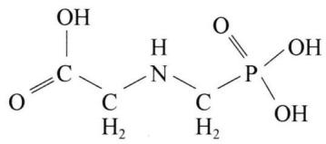

<details>
<summary>chemical</summary>

Chemical structure of a phosphorylated sugar molecule with hydroxyl and amine groups
</details>

四级解离常数分别为： $pK_{1}=0.80$ 、 $pK_{2}=2.30$ 、 $pK_{3}=6.00$ 、 $pK_{4}=11.00$ 。通常羧酸的电离常数介于磷酸的一、二级电离常数之间。

(1) 计算 0.10 mol/L 的 Roundup 溶液的 pH。

(2) 欲使 Roundup 在溶液中尽可能以 $-\mathrm{OOCCH}_{2}\mathrm{NH}_{2}^{+}\mathrm{CH}_{2}\mathrm{PO}_{2}^{-}(\mathrm{OH})$ 的型体存在, 给出计算该溶液 pH 的最简单的计算式, 并计算结果。

(3) 根据(2)中的计算结果, 计算 $-\mathrm{OOCCH}_{2}\mathrm{NH}_{2}^{+}\mathrm{CH}_{2}\mathrm{PO}_{2}^{-}(\mathrm{OH})$ 与其他主要型体存在的分布系数。

7. 许多无机化合物在液态时会发生自耦电离。下列平衡式可以描述液态 HF ( $\rho = 1.002 \, g/mL$ ) 的质子自递作用：

$$
3 \mathrm{HF(l)} \rightleftharpoons \mathrm {H_ {2} F^ {+} + HF_ {2} ^ {-}}, K = 8. 0 \times 1 0 ^ {- 1 2}
$$

(1) 计算在液态 HF 中以正离子形式存在的含氟物质的分布系数。

在水中,HF 是一个中等强度的酸,仅有部分电离。决定溶液平衡关系的主要反应如下:

$$
\begin{array}{l} \mathrm{HF} + \mathrm{H} _ {2} \mathrm{O} \rightleftharpoons \mathrm{H} _ {3} \mathrm{O} ^ {+} + \mathrm{F} ^ {-} (\mathrm{a}), K _ {1} = 1. 1 \times 1 0 ^ {- 3} \\ \mathrm{HF} + \mathrm{F} ^ {-} \rightleftharpoons \mathrm{HF} _ {2} ^ {-} \quad (\mathrm{b}), K _ {2} = 2. 6 \times 1 0 ^ {- 1} \\ \end{array}
$$

(2) 计算在 pH=2.00 的溶液中 HF 的分析浓度。

两位化学家想通过测定同一已知浓度的 HF 溶液, 以确定 HF 的酸解离常数 $K_{1}$ 。他们分别测量溶液的 pH, 然后计算得到 $K_{1}$ 值。水平较高的那位化学家知道平衡式(b), 且他知道另外一位化学家不知道这个平衡式。因此, 当他发现他们竟然得到了相同的 $K_{1}$ 值时, 感到很惊讶。

(3) 他们所用的 HF 溶液的浓度是多少?  
(4) 计算下列平衡的平衡常数: $2 \mathrm{HF} + \mathrm{H}_{2} \mathrm{O} \rightleftharpoons \mathrm{H}_{3} \mathrm{O}^{+} + \mathrm{HF}_{2}^{-}$

可通过向溶液中加入适当的物质,使一个溶质在溶剂中的电离平衡发生显著的移动。

(5) 试举出三种可以增加 HF 在水中解离程度的无机化合物。

## 第八讲 电化学基础

## 知识精讲


18 世纪末到 20 世纪初,随着人类对氧化还原反应认识的逐步加深和化合价的电子理论的建立,人们把失去电子的过程称为氧化过程,而将得电子的过程称为还原过程。在氧化还原反应中,有失去电子的一方,便有得到电子的一方,电子的得失一定是同时发生的,或者说氧化过程和还原过程一定是同时发生的。物质的氧化态和还原态的共轭关系与酸碱共轭关系相似:

$$
\text { 还原态 } \rightleftharpoons \text { 氧化态 } + n e
$$

$$
\text {   酸   } \rightleftharpoons \text {   碱   } + n \mathrm{H} ^ {+}
$$

前者为电子的转移,后者为质子的转移。应该指出,有些氧化还原反应,如 $H_{2}+Cl_{2}=2HCl$ ,氢元素并没有完全失去核外的1个电子,称为共用电子对的偏移。

在氧化还原的电子转移和偏移过程中,这些电子如果能够沿着一定的方向作定向移动,就可以产生电流。利用自发的氧化还原反应产生电流的装置称为原电池;利用电流促使非自发氧化还原反应发生的装置叫电解池。研究化学电池中氧化还原反应过程以及化学能和电能相互变换规律的化学分支叫电化学。本讲将着重讨论水溶液中衡量物质氧化还原能力强弱的“电极电势”概念及其应用,最后介绍一些常见的实用化学电池。

## 一、原电池和电动势

## 1. 原电池

## (1) 原电池的组成

利用氧化还原反应将化学能转变成电能的装置称为原电池。如：把锌片置于 $CuSO_{4}$ 溶液中，可以观察到 $CuSO_{4}$ 溶液的蓝色逐渐变浅，而锌片上会沉积出一层棕红色的金属Cu。相应的化学反应可表示为：

$$
\mathrm{Zn} + \mathrm{Cu} ^ {2 +} \rightleftharpoons \mathrm{Cu} + \mathrm{Zn} ^ {2 +}
$$

$$
\Delta_ {\mathrm{r}} G _ {\mathrm{m}} ^ {\theta} = - 2 1 2. 2 \mathrm{kJ} \cdot \mathrm{mol} ^ {- 1}
$$

反应中 Zn 失去电子生成 $Zn^{2+}$ ，发生氧化反应； $Cu^{2+}$ 得到电子生成 Cu，发生还原反应, $\mathrm{Zn}$ 和 $\mathrm{Cu^{2+}}$ 之间发生了电子转移。从 $\Delta_{\mathrm{r}}G_{\mathrm{m}}^{\theta}$ 可以看出这是一个自发倾向很强的氧化还原反应。但由于 $\mathrm{Zn}$ 与 $\mathrm{CuSO_{4}}$ 溶液直接接触,电子直接由 $\mathrm{Zn}$ 转移给 $\mathrm{Cu^{2+}}$ ,无法形成电流。反应过程中系统的自由能降低,反应的化学能只是以热能的形式放出,却没有对外做电功。为了得到电能,须将此反应拆成两个半反应:

$$
\mathrm{Cu} ^ {2 +} + 2 \mathrm{e} ^ {-} = \mathrm{Cu} \quad (\text {还原反应})
$$

$$
\mathrm{Zn} - 2 \mathrm{e} ^ {-} = \mathrm{Zn} ^ {2 +} \quad (\text {   氧化反应   })
$$

如图 8-1 所示, 不让 Zn 与 $\mathrm{CuSO}_{4}$ 直接接触, 使上述两个半反应分别在两个不同的容器中进行, 用盐桥连接两溶液, 用金属导线将两金属片及检流计串联在一起。在锌半电池中, 锌极上的 Zn 释放电子变为 $\mathrm{Zn}^{2+}$ 离子进入 $\mathrm{ZnSO}_{4}$ 溶液中, 锌片上有富裕电子沿导线流向铜片。 $\mathrm{CuSO}_{4}$ 溶液中的 $\mathrm{Cu}^{2+}$ 离子从 Cu 片上获得电子变成 Cu 沉积在 Cu 片上。随着反应的进行, 盐桥中的负离子就会向 $\mathrm{ZnSO}_{4}$ 溶液移动, 平衡由于

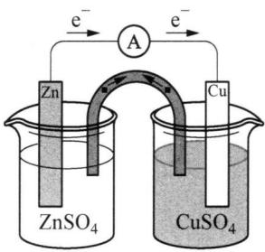

<details>
<summary>chemical</summary>

Electrochemical cell diagram with zinc and copper electrodes in ZnSO4 and CuSO4 solutions, connected to an ammeter A
</details>

图8-1 铜锌原电池装置

$Zn^{2+}$ 进入溶液而过剩的正电荷以保持溶液的电中性；正离子会向 $CuSO_{4}$ 溶液移动，平衡由于 Cu 沉积在 Cu 片而过剩的负电荷。整个装置连通后可以观察到检流计的指针发生偏转，说明回路中有电流通过，这就是铜锌原电池，又称丹尼尔电池。原电池可以将自发进行的氧化还原反应所产生的化学能转变为电能，同时做电功。

原电池中的盐桥一般是用 U 型玻璃管内充满用琼脂凝胶固定的饱和 KCl 溶液构成。它的作用是通过 $K^{+}$ 和 $Cl^{-}$ 向两个半电池扩散沟通电流通路，保持电荷平衡，消除液接电位。盐桥亦可用多孔隔膜代替。习惯上称原电池是由两个电极组成的，所以一个半电池也称为一个电极。原电池中的每一个半电池都由有同一元素氧化值不同的两种物质组成（如 $Cu \sim Cu^{2+}$ ; $Zn \sim Zn^{2+}$ ），其中氧化数较高者称为氧化型物质；氧化数较低者称为还原型物质。一对氧化型和还原型物质又称为氧化还原电对，或简称电对，书写时将氧化型写在左边，还原型写在右边，中间用短斜线，如 $Cu^{2+}/Cu$ ; $Zn^{2+}/Zn$ 等。

## (2) 常用电极类型

电极是原电池的基本组成部分,其类型较多,构造各异。常用的电极可以分为以下4种类型:

① 金属—金属离子电极

这类电极是把金属片(棒)插入含有该金属离子的溶液中所构成的电极。电极符号通式为： $M|M^{n+}$ ，电极反应通式为： $M^{n+} + ne^{-} \rightleftharpoons M(s)$ 。对于比较活泼的金属，如钠、钾等不能在空气及水中稳定存在，可以把金属溶于汞中做成汞齐，再与该金属离子构成电极。

如 $\mathrm{Ag^{+} / Ag}$ 电极，电极反应： $\mathrm{Ag^{+} + e^{-}\rightleftharpoons Ag}$ ；电极组成式：

$$
\mathrm{Ag(s)} \mid \mathrm {Ag^ {+} (c) _ {\circ}}
$$

② 气体—离子电极

这类电极是气体与对应离子构成平衡的电极,其构成需要一个固体导电体——惰性电极(铂或石墨)插入含有该离子的溶液中。惰性电极只起吸附气体和传递电子的作用,不参与电极反应,但能催化气体电极反应的进行。常用的这类电极有:氢电极、氧电极和氯电极。

如氢电极,电极反应: $2\mathrm{H}^{+} + 2\mathrm{e}^{-} \rightleftharpoons \mathrm{H}_{2}$ ;电极组成式:

$$
\mathrm{Pt(s),H} _ {2} (p) \mid \mathrm{H} ^ {+} (c) 。
$$

③ 金属—金属难溶盐(或氧化物)—负离子电极

这类电极是将金属表面涂以或覆盖该金属的难溶盐(或氧化物),然后浸入含有该难溶物负离子的溶液中而构成的电极,其优点是电极电势比较稳定,又容易制备,常用作参比电极。最常见的有氯化银电极、甘汞电极以及氧化银、氧化汞电极。

如氯化银电极,它是在 Ag 丝的表面镀上一层薄的 AgCl,然后浸入一定浓度的 Cl⁻ 溶液中构成。电极反应 AgCl + e⁻ ⇌ Ag + Cl⁻: 电极组成式:

$$
\mathrm{Ag} \mid \mathrm{AgCl(s)} \mid \mathrm{Cl} ^ {-} (c) 。
$$

再如汞-氧化汞电极,电极反应: $\mathrm{HgO(s)+H_{2}O+2e^{-}\rightleftharpoons Hg(l)+2OH^{-}}$ ;电极组成式: $\mathrm{Hg(l)}\mid\mathrm{HgO(s)}\mid\mathrm{OH}^{-}(c)$ 。

④ 氧化还原电极

这类电极是将惰性电极(铂或石墨)插入含有同一元素两种不同氧化数的离子的混合溶液中而构成的电极。如将金属 Pt 插入含有 $Fe^{3+}$ 和 $Fe^{2+}$ 离子的溶液中所构成的电极。

如将 Pt 浸入含有 $Fe^{2+}$ 、 $Fe^{3+}$ 的溶液，构成 $Fe^{3+}/Fe^{2+}$ 电极，电极反应： $Fe^{3+} + e^{-} \rightleftharpoons Fe^{2+}$ ；电极组成式： $\mathrm{Pt|Fe^{2+}(c_{1})}, \mathrm{Fe^{3+}(c_{2})}$ 。

表8-1列出了常用的电极类型和电极组成式。

表 8-1 常用电极的类型及举例

<table><tr><td>电极类型</td><td>举例</td><td>电极组成式</td><td>电极反应</td></tr><tr><td rowspan="3">金属-金属离子电极</td><td>通式</td><td> $\mathrm{M} \mid {\mathrm{M}}^{n + }$ </td><td> ${\mathrm{M}}^{n + } + n{\mathrm{e}}^{ - } = \mathrm{M}\left( \mathrm{s}\right)$ </td></tr><tr><td>锌电极</td><td> $\mathrm{{Zn}} \mid {\mathrm{{Zn}}}^{2 + }$ </td><td> ${\mathrm{{Zn}}}^{2 + } + 2{\mathrm{e}}^{ - } = \mathrm{{Zn}}\left( \mathrm{s}\right)$ </td></tr><tr><td>银电极</td><td> $\mathrm{{Ag}} \mid {\mathrm{{Ag}}}^{ + }$ </td><td> ${\mathrm{{Ag}}}^{ + } + {\mathrm{e}}^{ - } = \mathrm{{Ag}}\left( \mathrm{s}\right)$ </td></tr><tr><td rowspan="5">气体-离子电极</td><td rowspan="2">氢电极</td><td> $\mathrm{{Pt}} \mid {\mathrm{H}}_{2} \mid {\mathrm{H}}^{ + }$ </td><td> $2{\mathrm{H}}^{ + } + 2{\mathrm{e}}^{ - } = {\mathrm{H}}_{2}\left( \mathrm{\;g}\right)$ </td></tr><tr><td> $\mathrm{{Pt}} \mid {\mathrm{H}}_{2} \mid {\mathrm{{OH}}}^{ - }$ </td><td> $2{\mathrm{H}}_{2}\mathrm{O} + 2{\mathrm{e}}^{ - } = {\mathrm{H}}_{2}\left( \mathrm{\;g}\right) + 2{\mathrm{{OH}}}^{ - }$ </td></tr><tr><td rowspan="2">氧电极</td><td> $\mathrm{{Pt}} \mid {\mathrm{O}}_{2} \mid {\mathrm{H}}_{2}\mathrm{O},{\mathrm{H}}^{ + }$ </td><td> ${\mathrm{O}}_{2}\left( \mathrm{\;g}\right) + 4{\mathrm{H}}^{ + } + 4{\mathrm{e}}^{ - } = 2{\mathrm{H}}_{2}\mathrm{O}$ </td></tr><tr><td> $\mathrm{{Pt}} \mid {\mathrm{O}}_{2} \mid {\mathrm{{OH}}}^{ - }$ </td><td> ${\mathrm{O}}_{2}\left( \mathrm{\;g}\right) + 2{\mathrm{H}}_{2}\mathrm{O} + 4{\mathrm{e}}^{ - } = 4{\mathrm{{OH}}}^{ - }$ </td></tr><tr><td>氯电极</td><td> $\mathrm{{Pt}} \mid {\mathrm{{Cl}}}_{2} \mid {\mathrm{{Cl}}}^{ - }$ </td><td> ${\mathrm{{Cl}}}_{2}\left( \mathrm{\;g}\right) + 2{\mathrm{e}}^{ - } = 2{\mathrm{{Cl}}}^{ - }$ </td></tr><tr><td rowspan="4">金属-金属难溶盐(或氧化物)-负离子电极</td><td>氯化银电极</td><td> $\mathrm{{Ag}} \mid \mathrm{{AgCl}}\left( \mathrm{s}\right) \mid {\mathrm{{Cl}}}^{ - }$ </td><td> $\mathrm{{AgCl}}\left( \mathrm{s}\right) + {\mathrm{e}}^{ - } = \mathrm{{Ag}}\left( \mathrm{s}\right) + {\mathrm{{Cl}}}^{ - }$ </td></tr><tr><td>甘汞电极</td><td> $\mathrm{{Pt}} \mid \mathrm{{Hg}} \mid {\mathrm{{Hg}}}_{2}{\mathrm{{Cl}}}_{2}\left( \mathrm{\;s}\right) \mid {\mathrm{{Cl}}}^{ - }$ </td><td> ${\mathrm{{Hg}}}_{2}{\mathrm{{Cl}}}_{2}\left( \mathrm{\;s}\right) + 2{\mathrm{e}}^{ - } = 2\mathrm{{Hg}}\left( 1\right) + 2{\mathrm{{Cl}}}^{ - }$ </td></tr><tr><td>氧化银电极</td><td> $\mathrm{{Ag}} \mid {\mathrm{{Ag}}}_{2}\mathrm{O}\left( \mathrm{s}\right) \mid {\mathrm{{OH}}}^{ - }$ </td><td> ${\mathrm{{Ag}}}_{2}\mathrm{O}\left( \mathrm{s}\right) + {\mathrm{H}}_{2}\mathrm{O} + 2{\mathrm{e}}^{ - } = 2\mathrm{{Ag}} + 2{\mathrm{{OH}}}^{ - }$ </td></tr><tr><td>氧化汞电极</td><td> $\mathrm{{Pt}} \mid \mathrm{{Hg}} \mid \mathrm{{HgO}}\left( \mathrm{s}\right) \mid {\mathrm{{OH}}}^{ - }$ </td><td> $\mathrm{{HgO}}\left( \mathrm{s}\right) + {\mathrm{H}}_{2}\mathrm{O} + 2{\mathrm{e}}^{ - } = \mathrm{{Hg}}\left( 1\right) + 2{\mathrm{{OH}}}^{ - }$ </td></tr><tr><td rowspan="2">氧化还原电极</td><td> ${\mathrm{{Fe}}}^{3 + }/{\mathrm{{Fe}}}^{2 + }$ 电极</td><td> $\mathrm{{Pt}} \mid {\mathrm{{Fe}}}^{3 + },{\mathrm{{Fe}}}^{2 + }$ </td><td> ${\mathrm{{Fe}}}^{3 + } + {\mathrm{e}}^{ - } = {\mathrm{{Fe}}}^{2 + }$ </td></tr><tr><td> ${\mathrm{{Cr}}}_{2}{\mathrm{O}}_{7}^{2 - }/{\mathrm{{Cr}}}^{3 + }$ 电极</td><td> $\mathrm{{Pt}} \mid {\mathrm{{Cr}}}_{2}{\mathrm{O}}_{7}^{2 - },{\mathrm{{Cr}}}^{3 + },{\mathrm{H}}^{ + }$ </td><td> ${\mathrm{{Cr}}}_{2}{\mathrm{O}}_{7}^{2 - } + {14}{\mathrm{H}}^{ + } + 6{\mathrm{e}}^{ - } = 2{\mathrm{{Cr}}}^{3 + } + 7{\mathrm{H}}_{2}\mathrm{O}$ </td></tr></table>

## (3) 原电池符号

表述原电池时,通常规定:

负极写在左方，正极写在右方，电极的极性在括号内用“+”“-”号标注，“|”表示半电池中两相之间的界面，“||”表示盐桥， $c_{1}$ 、 $c_{2}$ 分别表示溶液的浓度。两个半电池间的盐桥用“||”表示。如铜-锌原电池可表示为：

$$
(-) \mathrm{Zn(s)} \mid \mathrm {Zn^ {2 + } (c_ {1})} \| \mathrm {Cu^ {2 + } (c_ {2})} | \mathrm{Cu(s)(+)}
$$

对于有气体参加的反应,需注明气体的分压。若溶液中有两种离子参与电极反应,可用逗号将其分开。使用惰性电极也须标明。如,由 $H^{+}/H_{2}$ 电对和 $Fe^{3+}/Fe^{2+}$ 电对组成的原电池,电池符号为:

$$
(-) \mathrm{Pt} | \mathrm{H} _ {2} (p) | \mathrm{H} ^ {+} (c _ {1}) \| \mathrm{Fe} ^ {3 +} (c _ {2}), \mathrm{Fe} ^ {2 +} (c _ {3}) | \mathrm{Pt} (+)
$$

该原电池的负极反应： $H_{2}-2e^{-}=2H^{+}$ ；正极反应： $2Fe^{3+}+2e^{-}=2Fe^{2+}$ ；原电池总反应： $H_{2}+2Fe^{3+}=2H^{+}+2Fe^{2+}$ 。

严格讲,各离子的浓度应当以活度表示,但浓度很小时,也可以用浓度代替活度,当浓度为 $1 \, mol \cdot L^{-1}$ 时可不必标明。

示例如下：

将反应： $2MnO_{4}^{-}+16H^{+}+10Cl^{-}\rightleftharpoons2Mn^{2+}+5Cl_{2}+8H_{2}O$

设计为原电池,写出正、负极的反应、原电池符号。

解析 $MnO_{4}^{-}$ 是氧化剂, 含氧化剂的电对 $MnO_{4}^{-}/Mn^{2+}$ 作正极, 它属于氧化还原电极; 电对 $Cl_{2}/Cl^{-}$ 属于气体电极, 发生氧化反应, 作负极。这两种电极都须用惰性金属铂作导体。可以用离子电子配平法分别写出正负极的半反应式:

正极反应： $\mathrm{MnO_4^- + 8H^+ + 5e^- \rightleftharpoons Mn^{2 + } + 4H_2O}$

负极反应： $2Cl^{-}-2e^{-}\rightleftharpoons Cl_{2}$

可以看出根据氧化还原得失电子数目守恒的原则,合并正负极的半反应即可得到总反应方程式。

原电池符号： $(-)\mathrm{Pt}\mid\mathrm{Cl}_{2}(p)\mid\mathrm{Cl}^{-}(c)\parallel\mathrm{MnO}_{4}^{-}(c_{1}),\mathrm{Mn}^{2+}(c_{2}),\mathrm{H}^{+}(c_{3})\mid\mathrm{Pt}(+)$ 。

示例如下：

写出并配平下列各电池的电极反应、电池反应，并说明电极的种类

$$
(-) \mathrm{Pb}, \mathrm{PbSO} _ {4} (\mathrm{s}) \mid \mathrm{K} _ {2} \mathrm{SO} _ {4} \| \mathrm{KCl} \mid \mathrm{PbCl} _ {2} (\mathrm{s}), \mathrm{Pb} (+)
$$

解析 原电池的负极发生氧化反应,正极发生还原反应,两个电极得失电子数相等,电极反应相加,则为电池反应。应首先判断出所给的原电池是由哪两个电极组成,再写出相关电极反应:

正极反应 $\mathrm{PbCl}_{2}(\mathrm{s}) + 2\mathrm{e}^{-} \rightleftharpoons \mathrm{Pb} + 2\mathrm{Cl}^{-}$ ，此电极为金属-金属难溶盐电极；

负极反应 $Pb + SO_{4}^{2-} - 2e^{-} \rightleftharpoons PbSO_{4}(s)$ ，此电极为金属-金属难溶盐电极；

电池反应 $\mathrm{PbCl_{2}(s)+SO_{4}^{2-}\rightleftharpoons PbSO_{4}(s)+2Cl^{-}}$

## 2. 电极电势和电动势

## (1) 电极电势

在 $\mathrm{Cu - Zn}$ 原电池中，为什么电子从锌片流向铜片？为什么 $\mathrm{Cu}$ 为正极、锌为负极？或者说为什么铜片的电势比锌片的高？

早在 1889 年, 德国化学家能斯特(H. W. Nernst)就提出了双电层理论。该理论认为, 当金属放入它的盐溶液中时, 一方面, 由于金属晶体中的金属离子本身的热运动以及受极性溶剂分子的吸引, 有离开金属进入溶液的趋势: $M = M^{n+}(aq) + ne^{-}$ 。金属越活泼, 溶液越稀, 这种倾向就越大。另一方面, 溶液中的 $M^{n+}(aq)$ 离子, 由于受到金属表面电子的吸引, 有从溶液向金属表面沉积的趋势: $M^{n+}(aq) + ne^{-} = M$ 。金属越不活泼, 溶液越浓, 这种倾向越大。当这两种倾向的速率相等时, 即建立了动态平衡: $M \rightleftharpoons M^{n+}(aq) + ne^{-}$ 。

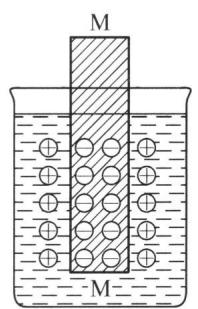

<details>
<summary>text_image</summary>

M
M
</details>

(a)

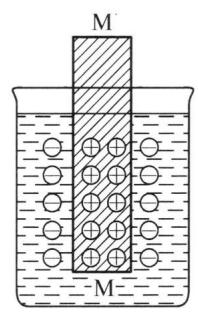

<details>
<summary>text_image</summary>

M
M
</details>

(b)  
图8-2 双电层结构示意图

若 M 失去电子的倾向大于 $\mathrm{M}^{n+}(\mathrm{aq})$ 获得电子的倾向，达到平衡时将形成金属板上带负电，靠近金属板附近溶液带正电的双电层，如图 8-2(a) 所示，金属与溶液间产生了电势差。相反，若 $\mathrm{M}^{n+}(\mathrm{aq})$ 获得电子的倾向大于 M 失去电子的倾向，则形成金属板上带正电而金属板附近溶液带负电的双电层，如图 8-2(b)，同样也产生电势差。这种由于双电层的作用在金属和它的盐溶液之间产生的电位差，就称为金属的电极电势，用 $\varphi(\mathrm{M}^{n+}/\mathrm{M})$ 表示，单位为伏 (V)。如锌电极、铜电极的电极电势分别表示为 $\varphi(\mathrm{Zn}^{2+}/\mathrm{Zn})$ 、 $\varphi(\mathrm{Cu}^{2+}/\mathrm{Cu})$ 。

显然,金属电极电势的大小取决于金属的活泼性及溶液中金属离子的浓度,还与温度、介质有关。当外界条件一定时,电极电势的大小只取决于金属的本性。

## (2) 原电池的电动势

如同水可自动地由高处流向低处那样,电流也是自发地从高电位流向低电位。可见,电池的电动势就是衡量电池反应推动力大小的判据。

原电池的电动势,用符号 E 表示,单位 V(伏)。使用盐桥消除液接电位后,电动势完全决定于两个电极的电极电势,如果用符号 $\varphi_{+}$ 、 $\varphi_{-}$ 分别表示正极和负极的电极电势,则原电池的电动势 $E = \varphi_{+} - \varphi_{-}$ 。

如 $25^{\circ}C$ 下的铜锌原电池中，当 $c(\mathrm{Cu}^{2+}) = 1.0 \, \mathrm{mol} \cdot \mathrm{L}^{-1}$ ， $c(\mathrm{Zn}^{2+}) = 1.0 \, \mathrm{mol} \cdot \mathrm{L}^{-1}$ 时， $\varphi(\mathrm{Zn}^{2+}/\mathrm{Zn}) = -0.76 \, \mathrm{V}$ ， $\varphi(\mathrm{Cu}^{2+}/\mathrm{Cu}) = +0.34 \, \mathrm{V}$ ，则该原电池的电动势 $E = \varphi(\mathrm{Cu}^{2+}/\mathrm{Cu}) - \varphi(\mathrm{Zn}^{2+}/\mathrm{Zn}) = 1.10 \, \mathrm{V}$ 。

另外,实验时也可用高阻抗的晶体管伏特计或电位差计直接测出原电池的电动势。

## 二、标准电极电势

## 1. 标准电极电势

标准状态下的电极电势就是标准电极电势,用 $\varphi^{\theta}$ 表示,单位为伏(V)。所谓标准状态,对气体物质来说是指其分压为标准压力 $p^{\theta}(100\ \text{kPa})$ ;液体、固体物质的标准状态是指在标准压力下的纯净物;对于溶液,是指在标准压力下溶质的浓度为 $1\ mol \cdot L^{-1}$ (严格讲应是活度 a=1);温度为反应温度,通常用 298.15 K。这个定义和热力学中的标准状态的定义是相同的。

迄今为止,单个电极的电极电势的绝对值尚无法由实验测定或理论计算,而只能测得由两个电极组成的电池的电动势。如果选择某种电极作为基准,规定它的电极电势为零,其他电极与之比较,就可测得电极电势的相对值。通常所说的“某电极的电极电势”就是相对电极电势。1953年,国际纯粹与应用化学联合会(IUPAC)建议采用标准氢电极作为标准电极。

## 2. 标准氢电极(SHE)

标准氢电极的装置如图8-3所示。将镀有一层蓬松铂黑的铂片浸入 $\left[\mathrm{H}^{+}\right] = 1\mathrm{mol}\cdot \mathrm{L}^{-1}$ 的溶液中，不断通入纯 $\mathrm{H}_{2}$ ，并保持 $p_{\mathrm{H_2}} = 100\mathrm{kPa}$ ，铂黑吸附 $\mathrm{H}_{2}$ 达到饱和，并与溶液中的 $\mathrm{H^{+}}$ 建立平衡： $2\mathrm{H^{+}(aq,1mol\cdot L^{-1}) + 2e^{-}\rightleftharpoons H_2(g,100kPa)}$ 。IUPAC规定标准状态的氢电极（标准氢电极）的电极电势为零，即 $\varphi_{\mathrm{H}^{+} / \mathrm{H}_{2}}^{\theta} = 0.000\mathrm{V}$

## 3. 其他标准参比电极

## (1) 甘汞电极

以氢电极作为标准电极测其他电极的电极电势时,可以达到很高的精确度( $\pm0.000\ 001\ V$ )。标准氢电极是一种理想的标准电极,但制备和使用十分不便,随时需要准备好一个纯净的氢气源,并准确控制通入 $H_{2}$ 的压力为 100 kPa,酸溶液的纯度要求很高,若含少量杂质 As、S、Hg 等,会使铂黑铂电极中毒失效。因此在实际工作中,一般不直接采用标准氢电极作基准参比电极,而是采用一些易于制备、使用方便且电极电势较稳定的甘汞电极作为二级标准的参比电极来测定指示电极的电极电势。

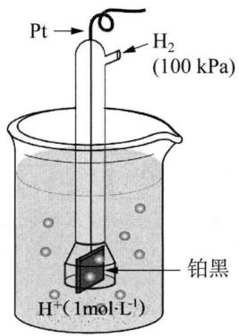

<details>
<summary>chemical</summary>

Electrolysis setup diagram showing platinum electrode in beaker with hydrogen gas and 100 kPa pressure
</details>

图8-3 标准氢电极结构示意图

常用 pH 计的参比电极是饱和甘汞电极 (SCE)，如图 8-4 所示，由两个玻璃套管组成。内管上部为汞，用 Pt 丝连接电极引线。在汞的下方充填甘汞 (Hg₂Cl₂) 和汞的糊状物。内管的下端用石棉或脱脂棉塞紧。外管上端有一个侧口，用以加入饱和氯化钾溶液，不用时侧口用橡皮塞塞紧。外管下端有一支管，支管口用多孔的素烧瓷塞紧，外边套以橡皮帽。使用时摘掉橡皮帽，使与外部溶液相通。甘汞电极的电极反应为：Hg₂Cl₂(s) + 2e⁻ = 2Hg(l) + 2Cl⁻。

甘汞电极的电势不随溶液的 pH 变化而变化，在一定的温度和浓度下是一定值，表 8-2 列出了两种甘汞电极的电极电势值。

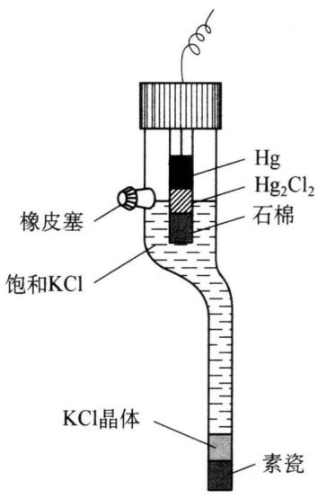

<details>
<summary>text_image</summary>

Hg
Hg₂Cl₂
石棉
橡皮塞
饱和KCl
KCl晶体
素瓷
</details>

图8-4 甘汞电极的构造

表 8-2 298 K 时, 两种甘汞电极的电极电势

<table><tr><td>甘汞电极类型</td><td> $c(\text{KCl})/\text{mol} \cdot \text{L}^{-1}$ </td><td>电极电势</td></tr><tr><td>饱和甘汞电极(SCE)</td><td>饱和 KCl 溶液</td><td> $\varphi_{\text{SCE}} = 0.242 \text{ V}$ </td></tr><tr><td>标准甘汞电极</td><td>1.00</td><td> $\varphi^{\theta} = 0.286 \text{ V}$ </td></tr></table>

## (2) 银-氯化银电极

银-氯化银电极也是一种广泛应用的参比电极，它是在 Ag 丝上镀上一层纯 Ag 后，再镀上一薄层 AgCl，然后插入一定浓度（3.5 mol/L 或饱和）的 KCl 溶液中而构成。AgCl/Ag 电极结构如图 8-5 所示。其电极反应为： $AgCl + e^{-} = Ag + Cl^{-}$ 。

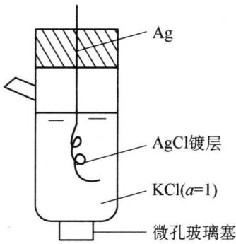

<details>
<summary>text_image</summary>

Ag
AgCl镀层
KCl(a=1)
微孔玻璃塞
</details>

图8-5 银-氯化银电极结构

## (3) 玻璃电极

玻璃电极是常用的 $H^{+}$ 离子浓度指示电极, 其构造如图 8-6 所示。它是在一支玻璃管的下端熔接一个特殊质料的极薄(厚度为 $50 \mu m \sim 100 \mu m$ ) 的玻璃球泡, 球泡内盛有一定 pH 的缓冲溶液或 $0.1 mol \cdot L^{-1} HCl$ 溶液, 称内参比溶液。在内参比溶液中插入一根 Ag/AgCl 电极(称为内参比电极)。玻璃电极和待测溶液组成的电极为:

$$
\mathrm{Ag-AgCl(s)} \mid \mathrm {H^ {+} (0.1mol\cdot L^ {-1})} \mid \text {玻璃膜}
$$

$$
\mathrm{待测溶液} \mathrm{H} ^ {+} (x \mathrm{mol} \cdot \mathrm{L} ^ {- 1})
$$

玻璃球泡对 $H^{+}$ 离子有敏感作用, 当它浸入待测溶液内, 待测溶液的 $H^{+}$ 离子与电极玻璃球泡表面水化层进行离子交换, 玻璃球泡内层也同样产生电极电势。由于内层 $H^{+}$ 离子浓度不变, 而外层 $H^{+}$ 离子浓度在变化, 因此, 内外层的电势差也在变化, 所以该电极的电势随待测溶液的 pH 不同而改变。

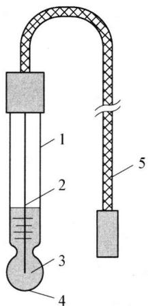

<details>
<summary>text_image</summary>

Diagram of a laboratory apparatus with labeled components including a thermometer, tubing, and a hanging rod.
</details>

玻璃电极

1. 玻璃管 2. 内参比电极(Ag/AgCl)  
3. 内参比溶液(0.1 mol/L HCl) 4. 玻璃薄膜  
5. 接线

图8-6 玻璃电极的构造

## 4. 标准电极电势

通过实验测定某电极标准电极电势的方法是：以标准氢电极为负极，待测标准电极为正极组成原电池，测定该电池的标准电池电动势。由于标准氢电极电势为零，所以测得的标准电池电动势在数值上就等于待测电极的标准电极电势，用符号 $\varphi^{\theta}$ 表示。此时，电极反应各物质都处于标准状态（溶液浓度为 1 mol/L，气体压强为 100 kPa）。

例如,将标准氢电极与标准铜电极组成原电池:

$$
\mathrm{Pt} \mid \mathrm{H} _ {2} (1 0 0 \mathrm{kPa}) \mid \mathrm{H} ^ {+} (1. 0 \mathrm{mol} \cdot \mathrm{l} ^ {- 1}) \| \mathrm{Cu} ^ {2 +} (1. 0 \mathrm{mol} \cdot \mathrm{l} ^ {- 1}) | \mathrm{Cu(s)}
$$

测得标准电池电动势 $E^{\theta} = 0.340 \, V$

由于 $E^{\theta} = \varphi_{(+)}^{\theta} - \varphi_{(-)}^{\theta} = \varphi_{(\mathrm{Cu}^{2 + } / \mathrm{Cu})}^{\theta} - \varphi_{(\mathrm{H}^{+} / \mathrm{H}_{2})}^{\theta} = \varphi_{(\mathrm{Cu}^{2 + } / \mathrm{Cu})}^{\theta}$

所以 $\varphi_{\mathrm{(Cu^{2+}/Cu)}}^{\theta}=0.340\mathrm{~V}$

同理,可以确定标准锌电极电势 $\varphi_{(Zn^{2+}/Zn)}^{\theta} = -0.762\ V$ 。

按照上述方法,可以测定许多电对的标准电极电势。表 8-3 中列举了部分电极的 $\varphi^{\theta}$ 值。

表 8-3 一些常见的电极反应和标准电极电势(298.15 K)

<table><tr><td>氧化性</td><td>电极反应</td><td> $\varphi^{\theta}$ </td><td>还原性</td></tr><tr><td rowspan="14">↓氧化剂的氧化能力增强</td><td> $Na^{+} + e^{-} \rightleftharpoons Na$ </td><td>-2.71 V</td><td rowspan="14">还原剂的还原能力增强↑</td></tr><tr><td> $Zn^{2+} + 2e^{-} \rightleftharpoons Zn$ </td><td>-0.7618 V</td></tr><tr><td> $Pb^{2+} + 2e^{-} \rightleftharpoons Pb$ </td><td>-0.1262 V</td></tr><tr><td> $2H^{+} + 2e^{-} \rightleftharpoons H_{2}$ </td><td>0.0000 V</td></tr><tr><td> $AgCl + e^{-} \rightleftharpoons Ag + Cl^{-}$ </td><td>0.2223 V</td></tr><tr><td> $Cu^{2+} + 2e^{-} \rightleftharpoons Cu$ </td><td>0.3419 V</td></tr><tr><td> $I_{2} + 2e^{-} \rightleftharpoons 2I^{-}$ </td><td>0.5355 V</td></tr><tr><td> $O_{2} + 2H^{+} + 2e^{-} \rightleftharpoons H_{2}O_{2}$ </td><td>0.695 V</td></tr><tr><td> $Fe^{3+} + e^{-} \rightleftharpoons Fe^{2+}$ </td><td>0.771 V</td></tr><tr><td> $Ag^{+} + e^{-} \rightleftharpoons Ag$ </td><td>0.7996 V</td></tr><tr><td> $Br_{2}(l) + 2e^{-} \rightleftharpoons 2Br^{-}$ </td><td>1.066 V</td></tr><tr><td> $Cr_{2}O_{7}^{2-} + 14H^{+} + 6e^{-} \rightleftharpoons 2Cr^{3+} + 7H_{2}O$ </td><td>1.232 V</td></tr><tr><td> $Cl_{2} + 2e^{-} \rightleftharpoons 2Cl^{-}$ </td><td>1.3583 V</td></tr><tr><td> $MnO_{4}^{-} + 8H^{+} + 5e^{-} \rightleftharpoons Mn^{2+} + 4H_{2}O$ </td><td>1.507 V</td></tr></table>

使用标准电极电势时要注意以下几点：

（1）表中电极电势是在热力学标准状态下相对于 $\varphi^{\theta}(H^{+}/H_{2})=0.000\ V$ 测定出的相对数值。一般而言，由于电极电势随温度变化并不很大，此表中的电极电势在其他温度下也可参照使用。但若电极处于非标准状态时，电极电势将发生改变，可用能斯特方程进行计算（见本讲后续）。

（2）标准电极电势的数据反映了氧化还原电对得失电子的趋向，根据标准电极电势的高低可判断电对氧化还原能力的相对强弱。电极电势值愈高的电对，其氧化型物质愈易得电子，氧化能力愈强；还原型物质愈不易失去电子，还原能力愈弱。电极电势值愈低的电对，其还原型物质愈易失去电子，还原能力愈强；氧化型物质愈不易得到电子，氧化能力愈弱。表中各电对的 $\varphi^{\theta}$ 值自上而下依次增加，说明各电对中氧化型物质的氧化能力自上而下依次增强，而还原型物质的还原能力自上而下依次减弱。

（3）电极电势是强度性质，它反映了氧化还原电对得失电子的倾向，这种性质与物质的量无关。由于电极反应是可逆的，电极电势是在平衡状态下测定的，它也与反应方程式的书写方向无关，如： $Fe^{3+} + e^{-} \rightleftharpoons Fe^{2+}$ ， $\varphi^{\theta} = 0.771 V$ ； $2Fe^{3+} +$

$2e^{-} \rightleftharpoons 2Fe^{2+}, \varphi^{\theta} = 0.771 V,$ 而非前一反应的 2 倍。

(4) 标准电极电势表由于溶液酸碱环境的不同,会有酸表(酸性环境)和碱表(碱性环境)两种。何时查酸表,何时查碱表,遵循以下原则:

① 在电极反应中, 只要有 $H^{+}$ 出现(不管是反应物还是产物), 查酸表, 只要有 $OH^{-}$ 离子出现, 查碱表:

② 电极反应中, 没有 $\mathrm{H}^{+}$ 或 $\mathrm{OH}^{-}$ 出现时, 可从物质存在的状态考虑, 如 $\mathrm{Fe}^{3+} + \mathrm{e}^{-} \rightleftharpoons \mathrm{Fe}^{2+}$ , 查酸表, 因为 $\mathrm{Fe}^{3+}$ 和 $\mathrm{Fe}^{2+}$ 离子只能存在酸性介质中。金属与其正离子电对查酸表, 非金属与其负离子电对查酸表, 但 $\mathrm{S} / \mathrm{S}^{2-}$ 电对查碱表。

(5) 同一物质在不同的电对中, 可以是氧化型, 也可以是还原型。如 $\mathrm{Fe}^{2+}$ 离子在电对 $\mathrm{Fe}^{3+}/\mathrm{Fe}^{2+}$ 中是还原型, 而在 $\mathrm{Fe}^{2+}/\mathrm{Fe}$ 中是氧化型。判断 $\mathrm{MnO}_{4}^{-}$ 在标态下能否氧化 $\mathrm{Fe}^{2+}$ 离子时, 应查 $\varphi^{\theta}(\mathrm{Fe}^{3+}/\mathrm{Fe}^{2+})$ , 而不能查 $\varphi^{\theta}(\mathrm{Fe}^{2+}/\mathrm{Fe})$ 。

(6) 若把一系列金属的 $\varphi^{\theta}$ 按由小到大的顺序排列, 可得金属活性顺序表如下: K Ba Ca Na Mg Al Mn Zn Fe Ni Sn Pb(H) Cu Hg Ag Pt Au。标准电极电势是热力学数据, 与反应速率无关, 不能保证动力学性质与热力学性质不发生矛盾。如 $\varphi^{\theta}(\mathrm{Ca}^{2+}/\mathrm{Ca}) < \varphi^{\theta}(\mathrm{Na}^{+}/\mathrm{Na})$ , 但 Na 与 $\mathrm{H}_{2} \mathrm{O}$ 反应却比 Ca 与 $\mathrm{H}_{2} \mathrm{O}$ 反应激烈, 后者是动力学的反应活性, 与 $\varphi^{\theta}$ 大小无关。

示例如下：

试判断标准态下反应 $2Fe^{2+} + I_{2} \rightleftharpoons 2Fe^{3+} + 2I^{-}$ 自发进行的方向。

解析 将反应拆成两个半反应,并查出它们的 $\varphi^{\theta}$ , 两电对中 $\varphi^{\theta}$ 值高的氧化型物质为较强的氧化剂, $\varphi^{\theta}$ 值低的还原型物质为较强的还原剂。

$$
\mathrm{I} _ {2} + 2 \mathrm{e} ^ {-} \rightleftharpoons 2 \mathrm{I} ^ {-} \qquad \varphi^ {\theta} (\mathrm{I} _ {2} / \mathrm{I} ^ {-}) = 0. 5 3 5 5 \mathrm{V}
$$

$$
\mathrm{Fe} ^ {3 +} + \mathrm{e} ^ {-} \rightleftharpoons \mathrm{Fe} ^ {2 +} \qquad \varphi^ {\theta} (\mathrm{Fe} ^ {3 +} / \mathrm{Fe} ^ {2 +}) = 0. 7 7 1 \mathrm{V}
$$

从标准电极电势可以看出,较强的氧化剂是 $Fe^{3+}$ , 而较强的还原剂是 $I^{-}$ , 因此, 反应将逆向(由右向左)自发进行。即: $2Fe^{3+} + 2I^{-} = 2Fe^{2+} + I_{2}$ 。

## 三、能斯特方程——浓度对电极电势的影响

## 1. 浓度对电极电势的影响

标准电极电势是在标准状态下测得的,而绝大多数电极反应都是在非标准状态下进行。当浓度发生变化时电极电势将发生改变。非标准态情况下的电极电势可用能斯特方程式(Nernst equation)来计算。对于任意电极反应：

$$
a \mathrm{Ox} + n \mathrm{e} ^ {-} \rightleftharpoons b \mathrm{Red}
$$

其电极电势 $\varphi$ 可表示为：

$$
\varphi (\mathrm{Ox} / \text {Red}) = \varphi^ {\theta} (\mathrm{Ox} / \text {Red}) + \frac {R T}{n F} \ln \frac {c ^ {a} (\mathrm{Ox})}{c ^ {b} (\text {Red})} \tag {8-1}
$$

式(8-1)为能斯特方程式,是电化学中最重要的公式之一。式中 $\varphi^{\theta}$ 为标准电极电势,R 为气体常数(8.314 J·mol $^{-1}$ ·K $^{-1}$ ), T 为热力学温度,n 为电极反应中转移的电子数。F 为法拉第常数(9.6485×10 $^{4}$ C·mol $^{-1}$ ), c(Ox)、c(Red)分别表示氧化型、还原型物质浓度对标准浓度( $c^{\theta}=1\ mol\cdot L^{-1}$ )的相对值;a 和 b 分别表示电极反应式中氧化型、还原型物质的化学计量数。

能斯特方程式说明电极电势取决于电极的本性 $(\varphi^{\theta})$ 、温度和浓度(或分压)。

当 T 为 298.15 K 时, 将有关常数代入式(8-1)中, 得:

$$
\varphi (\mathrm{Ox} / \text {Red}) = \varphi^ {\theta} (\mathrm{Ox} / \text {Red}) + \frac {0 . 0 5 9 2}{n} \lg \frac {c ^ {a} (\mathrm{Ox})}{c ^ {b} (\text {Red})} \tag {8-2}
$$

温度一定时, 半反应中氧化型、还原型及相关介质浓度发生变化, 将影响电极电势的大小。氧化型浓度愈大, 则 $\varphi(\mathrm{Ox}/\mathrm{Red})$ 值愈大; 反之, 还原型浓度愈大, 则 $\varphi(\mathrm{Ox}/\mathrm{Red})$ 值愈小。电极电势的高低主要取决于标准电极电势 $\varphi^{\theta}(\mathrm{Ox}/\mathrm{Red})$ , 因浓度项为对数值, 还要乘上小于 1 的量 0.0592/n, 一般情况下浓度对电极电势的影响并不大。只有当氧化型或还原型物质浓度很大或很小时, 或电极反应式中物质前的系数很大时才对电极电势产生显著的影响。

应用能斯特方程式时应注意：

(1) 纯固体(例如固体单质 Cu、难溶强电解质 AgCl 等)或纯液体的(例如金属 Hg、液体 Br₂ 等)浓度视为 $1 \, mol \cdot L^{-1}$ ，即其浓度项不出现在方程中。如： $Pb^{2+} + 2e^{-} \rightleftharpoons Pb(s)$ ， $\varphi(\mathrm{Pb}^{2+}/\mathrm{Pb}) = \varphi^{\theta}(\mathrm{Pb}^{2+}/\mathrm{Pb}) + (0.0592/2)\lg c(\mathrm{Pb}^{2+})$ ； $\mathrm{Br}_{2}(1) + 2e^{-} \rightleftharpoons 2\mathrm{Br}^{-}$ ， $\varphi(\mathrm{Br}_{2}/\mathrm{Br}^{-}) = \varphi^{\theta}(\mathrm{Br}_{2}/\mathrm{Br}^{-}) - (0.0592/2)\lg c^{2}(\mathrm{Br}^{-}) = \varphi^{\theta}(\mathrm{Br}_{2}/\mathrm{Br}^{-}) - 0.0592\lg c(\mathrm{Br}^{-})$ 。

(2) 气体物质, 则用相对分压 $p / p^{\theta}$ 表示。如: $2 \mathrm{H}^{+}(\mathrm{aq}) + 2 \mathrm{e}^{-} \rightleftharpoons \mathrm{H}_{2}(\mathrm{g})$ , $\varphi (\mathrm{H}^{+} / \mathrm{H}_{2}) = \varphi^{\theta}(\mathrm{H}^{+} / \mathrm{H}_{2}) + (0.0592 / 2) \lg \frac{c^{2}(\mathrm{H}^{+})}{p_{\mathrm{H}_{2}} / p^{\theta}}$ 。

(3) 若电极反应有 $\mathrm{H}^{+}$ 、 $\mathrm{OH}^{-}$ 或 $\mathrm{Cl}^{-}$ 等参加, 它们的浓度也必须写入能斯特方程式中。介质若处于反应式氧化型一侧, 就当作氧化型处理, 其浓度项出现在方程式的分子处; 若处于反应式还原型一侧, 则当作还原型处理, 其浓度项出现在分母处。如 $298.15 \mathrm{~K}$ 时, $\mathrm{Cr}_{2} \mathrm{O}_{7}^{2-}(\mathrm{aq}) + 14 \mathrm{H}^{+}(\mathrm{aq}) + 6 \mathrm{e}^{-} \rightleftharpoons 2 \mathrm{Cr}^{3+}(\mathrm{aq}) + 7 \mathrm{H}_{2} \mathrm{O}(\mathrm{l})$ ,

$$
\varphi \left(\mathrm{Cr} _ {2} \mathrm{O} _ {7} ^ {2 -} / \mathrm{Cr} ^ {3 +}\right) = \varphi^ {\theta} \left(\mathrm{Cr} _ {2} \mathrm{O} _ {7} ^ {2 -} / \mathrm{Cr} ^ {3 +}\right) + (0. 0 5 9 2 / 6) \lg \frac {c \left(\mathrm{Cr} _ {2} \mathrm{O} _ {7} ^ {2 -}\right) c ^ {1 4} \left(\mathrm{H} ^ {+}\right)}{c ^ {2} \left(\mathrm{Cr} ^ {3 +}\right)};
$$

又如： $\mathrm{AgCl(s) + e^{-} \rightleftharpoons Ag(s) + Cl^{-}(aq)}$ ， $\varphi(\mathrm{AgCl/Ag}) = \varphi^{\theta}(\mathrm{AgCl/Ag}) - 0.0592 \lg c(\mathrm{Cl}^{-})$ 。

## 2. 溶液酸碱性对电极电势的影响

对于有 $H^{+}$ 离子或 $OH^{-}$ 离子参加的电极反应, 溶液的酸碱度对电极电势的影响非常明显, 绝大多数含氧酸根的氧化能力随介质酸度的增大而增强。

示例如下：

已知电极反应 $MnO_{4}^{-} + 8H^{+} + 5e^{-} \rightleftharpoons Mn^{2+} + 4H_{2}O(l)$ $\varphi^{\theta} = 1.507 V$

若 $MnO_{4}^{-}$ 和 $Mn^{2+}$ 仍为标准状态, 即浓度均为 $1 \, mol \cdot L^{-1}$ , 求 298.15 K, pH=6 时, 此电极的电极电势。

解析 298.15 K 时, 当 pH = 6 时, $\left[H^{+}\right] = 1.0 \times 10^{-6} \, \text{mol} \cdot \text{L}^{-1}$ , $c(\text{Mn}^{2+}) = c(\text{MnO}_{4}^{-}) = 1 \, \text{mol} \cdot \text{L}^{-1}$ , 电极反应式中 n = 5 。代入 (8 - 1) 式得:

$$
\varphi (\mathrm{MnO} _ {4} ^ {-} / \mathrm{Mn} ^ {2 +}) = \varphi^ {\theta} (\mathrm{MnO} _ {4} ^ {-} / \mathrm{Mn} ^ {2 +}) + \frac {0 . 0 5 9 2}{5} \lg \frac {c (\mathrm{MnO} _ {4} ^ {-}) c ^ {8} (\mathrm{H} ^ {+})}{c (\mathrm{Mn} ^ {2 +})}
$$

$$
= 1. 5 0 7 + \frac {0 . 0 5 9 2}{5} \lg c ^ {8} (\mathrm{H} ^ {+})
$$

$$
= 1. 5 0 7 - \frac {0 . 0 5 9 2 \times 8}{5} \times 6 = 0. 9 3 9 (\mathrm{V})
$$

由计算可以看出, 当溶液的酸性减弱后, $\varphi(\mathrm{MnO}_{4}^{-}/\mathrm{Mn}^{2+})$ 从标准状态的 1.507 V 降到了 0.939 V, $MnO_{4}^{-}$ 的氧化能力比在标准状态下大大降低了。说明溶液酸碱性对含氧酸根的氧化性影响较大, 一般而言, 含氧酸根的氧化能力随介质酸度的增大而增强。

## 3. 生成难溶物对电极电势的影响

如果加入沉淀剂使组成电极的物质生成难溶电解质,也会导致该电极的电极电势变化。

示例如下:

已知：标准银电极 $\mathrm{Ag^{+}(aq)}\mid\mathrm{Ag(s)},\varphi^{\theta}=0.7996\mathrm{V}$ 。若在此电极溶液中加入 NaCl，使其生成 AgCl 沉淀，并维持 $Cl^{-}$ 浓度为 $1.00\ mol\cdot L^{-1}$ ，计算这种情况下的 $\varphi(\mathrm{Ag^{+}/Ag})$ 。

解析 在标准银电极中加入 NaCl, 达到沉淀溶解平衡时:

$$
\mathrm{AgCl(s)} \rightleftharpoons \mathrm {Ag^ {+} (aq) + Cl^ {-} (aq)}
$$

$K_{\mathrm{sp}}(\mathrm{AgCl}) = [\mathrm{Ag}^{+}][\mathrm{Cl}^{-}] = 1.77 \times 10^{-10}$ ，所以： $[\mathrm{Ag}^{+}] = K_{\mathrm{sp}}(\mathrm{AgCl}) / [\mathrm{Cl}^{-}] = 1.77 \times 10^{-10} / 1.00 = 1.77 \times 10^{-10} (\mathrm{mol} \cdot \mathrm{L}^{-1})$ 。

考虑银电极的电极反应为： $Ag^{+} + e^{-} \rightleftharpoons Ag$ ，应用能斯特方程式有：

$\varphi (\mathrm{Ag^{+} / Ag}) = \varphi^{\theta}(\mathrm{Ag^{+} / Ag}) + 0.0592\lg [\mathrm{Ag^{+}}] = \varphi^{\theta}(\mathrm{Ag^{+} / Ag}) + 0.0592$ $\lg K_{\mathrm{sp}}(\mathrm{AgCl}) / [\mathrm{Cl^{-}}] = 0.7996 + 0.0592\lg 1.77\times 10^{-10} = 0.2223(\mathrm{V})$

由此看出,形成难溶物同样会对电极电势造成影响。计算表明: AgCl 的氧化性比 $Ag^{+}$ 弱得多。实际上,由于 $c(\mathrm{Cl}^{-})$ 为 $1\ \mathrm{mol}\cdot\mathrm{L}^{-1}$ , 因而求出的 $\varphi$ 值已是电极 $\mathrm{Cl}^{-}(\mathrm{aq})\mid\mathrm{AgCl}(\mathrm{s})$ , $\mathrm{Ag}(\mathrm{s})$ 的标准电极电势。

## 4. 生成弱电解质对电极电势的影响

若使电极中氧化型或还原型物质生成弱电解质,也会造成电极电势的改变。

示例如下：

向标准氢电极的 $H^{+}$ 溶液中加入 NaAc，并使溶液中 $Ac^{-}$ 浓度为 $1.00 \, mol \cdot L^{-1}$ ， $H_{2}$ 的分压维持为 $100 \, kPa$ 。根据能斯特方程计算氢电极的电极电势。

解析 加入的 $Ac^{-}$ 与 $H^{+}$ 结合形成 HAc: $H^{+} + Ac^{-} \rightleftharpoons HAc$ 。若使 $Ac^{-}$ 浓度维持 $1.00 \, mol \cdot L^{-1}$ ，因 HAc 的 $K_{a}$ 小，且 $Ac^{-}$ 产生同离子效应，HAc 的解离生成的 $H^{+}$ 浓度已很小，所以 $c(\mathrm{HAc}) \approx 1.00 \, \mathrm{mol} \cdot \mathrm{L}^{-1}$ ，则此溶液为缓冲溶液，根据缓冲溶液的 pH 计算式有：

$$
\mathrm{pH} = \mathrm{pK} _ {\mathrm{a}} + \lg \frac {c (\mathrm{Ac} ^ {-})}{c (\mathrm{HAc})} = \mathrm{pK} _ {\mathrm{a}} + \lg \frac {1}{1} = \mathrm{pK} _ {\mathrm{a}} = 4. 7 6
$$

考查标准氢电极的电极反应： $2\mathrm{H}^{+}(\mathrm{aq})+2\mathrm{e}^{-}\rightleftharpoons\mathrm{H}_{2}(\mathrm{g})$ $\varphi^{\theta}(\mathrm{H}^{+}/\mathrm{H}_{2})=0(\mathrm{V})$

根据能斯特方程可得：

$$
\begin{array}{l} \varphi \left(\mathrm{H} ^ {+} / \mathrm{H} _ {2}\right) = \varphi^ {\theta} \left(\mathrm{H} ^ {+} / \mathrm{H} _ {2}\right) + (0. 0 5 9 2 / 2) \lg \frac {c ^ {2} \left(\mathrm{H} ^ {+}\right)}{p _ {\mathrm{H} _ {2}} / p ^ {\theta}} \\ = - 0. 0 5 9 2 \mathrm{pH} = - 0. 2 8 2 (\mathrm{V}) \\ \end{array}
$$

由计算可见,由于 NaAc 的加入,生成了弱电解质 HAc,降低了氧化型物质 $H^{+}$ 的浓度,所以电极电势降低了。

## 5. 生成配合物对电极电势的影响

若使电极中氧化型或还原型物质生成稳定配合物,也会造成电极电势的改变。

示例如下：

以电对 $Cu^{2+}/Cu$ 为例, 298.15 K 时, $\mathrm{Cu}^{2+}(\mathrm{aq}) + 2\mathrm{e}^{-} \rightleftharpoons \mathrm{Cu}(\mathrm{s}) \varphi^{\theta} = 0.340 \mathrm{~V}$ , 若加入过量氨水时, 生成 $\left[\mathrm{Cu}\left(\mathrm{NH}_{3}\right)_{4}\right]^{2+}$ , 当 $c\left(\mathrm{Cu}\left(\mathrm{NH}_{3}\right)_{4}^{2+}\right) = c\left(\mathrm{NH}_{3}\right) = 1.0 \mathrm{~mol} \cdot \mathrm{L}^{-1}$ 时, 求 $\varphi\left(\mathrm{Cu}^{2+}/\mathrm{Cu}\right)$ 。

解析 根据配合物稳定常数 $K_{\text {稳}}$ 表达式可得:

$$
c (\mathrm{Cu} ^ {2 +}) / c ^ {0} = \frac {c [ \mathrm{Cu(NH} _ {3}) _ {4} ^ {2 +} ] / c ^ {0}}{[ c (\mathrm{NH} _ {3}) / c ^ {0} ] ^ {4} K _ {\mathrm{稳}} ^ {\theta} [ \mathrm{Cu(NH} _ {3}) _ {4} ^ {2 +} ]} = \frac {1}{K _ {\mathrm{稳}} ^ {\theta} [ \mathrm{Cu(NH} _ {3}) _ {4} ^ {2 +} ]}
$$

代入能斯特方程得:

$$
\begin{array}{l} \varphi_ {\left(\mathrm{Cu} ^ {2 +} / \mathrm{Cu}\right)} = \varphi_ {\left(\mathrm{Cu} ^ {2 +} / \mathrm{Cu}\right)} ^ {\theta} + \frac {0 . 0 5 9 2 \mathrm{V}}{2} \lg \frac {1}{K _ {\text {稳}} ^ {\theta} \left[ \mathrm{Cu} \left(\mathrm{NH} _ {3}\right) _ {4} ^ {2 +} \right]} \\ = 0. 3 4 0 \mathrm{V} + \frac {0 . 0 5 9 2 \mathrm{V}}{2} \lg \frac {1}{2 . 3 0 \times 1 0 ^ {1 2}} \\ = 0. 3 9 2 \mathrm{V} \\ \end{array}
$$

根据上述计算,考查能斯特方程: $\varphi(\mathrm{Ox}/\mathrm{Red})=\varphi^{\theta}(\mathrm{Ox}/\mathrm{Red})+\frac{RT}{nF}\ln\frac{c^{a}(\mathrm{Ox})}{c^{b}(\mathrm{Red})}$ 可以得出结论:

(1) 若加入的试剂与电极反应中氧化型物质结合生成稳定的配合物, 则由于 $[Ox]$ 的减小, 电极电势 $\varphi(\mathrm{Ox}/\mathrm{Red})$ 会相应降低;  
(2) 若加入的试剂与电极反应中还原型物质结合生成稳定的配合物, 则由于 [Red] 的减小, 电极电势 $\varphi(\mathrm{Ox}/\mathrm{Red})$ 会相应升高;  
(3) 若加入的试剂与电极反应中的氧化型和还原型的物质都能生成稳定的配合物, 则可以根据这些配合物的稳定常数 $K_{\text {稳}}$ 来判断电极电势的变化。

## 四、电极电势的应用

## 1. 电池反应的 $\Delta_{\mathrm{r}}G_{\mathrm{m}}$ 与电动势 $E$ 的关系

原电池中发生的电池反应属于恒温恒压有非体积功——电功 $W'$ 的过程。显然，原电池内部所进行的化学反应及对环境所做的电功，都要服从热力学的基本原理。一个电动势为 E 的原电池 $(aOx_{1}+bRed_{2}=cOx_{2}+dRed_{1})$ 如果在 1 mol 的反应过程中有 n mol 的电子（即有 nF 库仑的电量）通过电路，则电池反应的摩尔吉布斯自由能变 $\Delta_{r}G_{m}$ 与电池电动势 E 之间存在以下关系：

$$
\Delta_ {\mathrm{r}} G _ {\mathrm{m}} = W ^ {\prime} = - n F E \tag {8-3}
$$

如果原电池在标准状态下工作,则:

$$
\Delta_ {\mathrm{r}} G _ {\mathrm{m}} ^ {\theta} = - n F E ^ {\theta} \tag {8-4}
$$

其中， $E^{\theta}$ 是原电池在标准状态下的电动势，简称标准电动势。

非标准状态下的电池反应的 $\Delta_{r}G_{m}$ 可按热力学等温方程式求得：

$$
\Delta_ {\mathrm{r}} G _ {\mathrm{m}} = \Delta_ {\mathrm{r}} G _ {\mathrm{m}} ^ {\theta} + R T \ln \frac {\left[ c \left(\mathrm{Ox} _ {2}\right) / c ^ {\theta} \right] ^ {c} \left[ c \left(\mathrm{Red} _ {1}\right) / c ^ {\theta} \right] ^ {d}}{\left[ c \left(\mathrm{Ox} _ {1}\right) / c ^ {\theta} \right] ^ {a} \left[ c \left(\mathrm{Red} _ {2}\right) / c ^ {\theta} \right] ^ {b}} \tag {8-5}
$$

将(8-3)、(8-4)代入可得：

$$
E = E ^ {\theta} - \frac {R T}{n F} \ln \frac {\left[ c \left(\mathrm{Ox} _ {2}\right) / c ^ {\theta} \right] ^ {c} \left[ c \left(\mathrm{Red} _ {1}\right) / c ^ {\theta} \right] ^ {d}}{\left[ c \left(\mathrm{Ox} _ {1}\right) / c ^ {\theta} \right] ^ {a} \left[ c \left(\mathrm{Red} _ {2}\right) / c ^ {\theta} \right] ^ {b}} \tag {8-6}
$$

若 $T = 298.15\mathrm{K}$ ，将自然对数换为常用对数、 $F = 96500\mathrm{C}\cdot \mathrm{mol}^{-1}$ 、 $R =$ $8.314\mathrm{J}\cdot \mathrm{K}^{-1}\cdot \mathrm{mol}^{-1}$ 代入上式，则为：

$$
E = E ^ {\theta} - \frac {0 . 0 5 9 2}{n} \lg \frac {\left[ c \left(\mathrm{Ox} _ {2}\right) / c ^ {\theta} \right] ^ {c} \left[ c \left(\mathrm{Red} _ {1}\right) / c ^ {\theta} \right] ^ {d}}{\left[ c \left(\mathrm{Ox} _ {1}\right) / c ^ {\theta} \right] ^ {a} \left[ c \left(\mathrm{Red} _ {2}\right) / c ^ {\theta} \right] ^ {b}} \tag {8-7}
$$

将 $E = \varphi_{\text{正}} - \varphi_{\text{负}}$ 和 $E^{\theta} = \varphi_{\text{正}}^{\theta} - \varphi_{\text{负}}^{\theta}$ 代入式(8-6)、(8-7)可得：

$$
\begin{array}{l} \varphi_ {\text {正}} - \varphi_ {\text {负}} = \varphi_ {\text {正}} ^ {\theta} - \varphi_ {\text {负}} ^ {\theta} - \frac {R T}{n F} \ln \frac {\left[ c \left(\mathrm{Ox} _ {2}\right) / c ^ {\theta} \right] ^ {c} \left[ c \left(\mathrm{Red} _ {1}\right) / c ^ {\theta} \right] ^ {d}}{\left[ c \left(\mathrm{Ox} _ {1}\right) / c ^ {\theta} \right] ^ {a} \left[ c \left(\mathrm{Red} _ {2}\right) / c ^ {\theta} \right] ^ {b}} \\ = \left(\varphi_ {\text {正}} ^ {\theta} + \frac {R T}{n F} \ln \frac {\left[ c \left(\mathrm{Ox} _ {1}\right) / c ^ {\theta} \right] ^ {a}}{\left[ c \left(\mathrm{Red} _ {1}\right) / c ^ {\theta} \right] ^ {d}}\right) - \left(\varphi_ {\text {负}} ^ {\theta} + \frac {R T}{n F} \ln \frac {\left[ c \left(\mathrm{Ox} _ {2}\right) / c ^ {\theta} \right] ^ {c}}{\left[ c \left(\mathrm{Red} _ {2}\right) / c ^ {\theta} \right] ^ {b}}\right) \tag {8-8} \\ \end{array}
$$

可以看出,式(8-8)中的两个括号中的形式就是正、负两个电极的能斯特方程表达式。

## 2. 电池反应的标准平衡常数 $K^{\theta}$ 与标准电动势 $\pmb{E}^{\theta}$ 的关系

由热力学已经知道化学反应的标准平衡常数 $K^{\theta}$ 与标准摩尔吉布斯自由能变 $\Delta_{r}G_{m}^{\theta}$ 有如下关系： $\Delta_{r}G_{m}^{\theta} = -RT\ln K^{\theta}$ ，而 $\Delta_{r}G_{m}^{\theta} = -nFE^{\theta}$ ，所以：

$$
\ln K ^ {\theta} = n F E ^ {\theta} / R T \tag {8-9}
$$

可见, 只要测得原电池的标准电动势 $E^{\theta}$ , 就可求出 T 时电池反应的标准平衡常数 $K^{\theta}$ 。

## 3. 判断氧化还原反应进行的方向

式(8-3)和式(8-4)将自由能变 $\Delta_{\mathrm{r}}G_{\mathrm{m}}$ 、 $\Delta_{\mathrm{r}}G_{\mathrm{m}}^{\theta}$ 与电池电动势 $E$ 、 $E^{\theta}$ 联系起来，使得氧化还原反应，既可以用 $\Delta_{\mathrm{r}}G_{\mathrm{m}}$ ，也可以用 $E$ 来判断其自发进行的方向：

(1) $\Delta_{r}G_{m}<0,E>0$ ,反应正向自发进行;  
(2) $\Delta_{r}G_{m}>0,E<0$ ,反应逆向自发进行;  
(3) $\Delta_{r}G_{m}=0,\ E=0$ ,反应达到平衡。

若组成电极的各物质处于标准态,则根据标准电动势 $E^{\theta}$ 的正、负来判断氧化还原反应进行的方向。应当指出,自发进行的氧化还原反应,其电池电动势恒为正值(E>0)。但由未知其自发进行方向的氧化还原反应方程式设计成的原电池,因其正、负极是预先指定的,计算结果可能出现E<0的情况,这说明反应是逆向进行的,应把正、负电极调换过来。

示例如下：

计算标准状态下反应 $2Fe^{2+} + Cu^{2+} = Cu + 2Fe^{3+}$ 的电池电动势 $E^{\theta}$ ，并判断反应自发进行的方向。

解析 假设反应按所写反应方程式正向进行,则 $Cu^{2+}$ 发生还原反应,电对 $Cu^{2+}/Cu$ 为正极; $Fe^{2+}$ 发生氧化反应,电对 $Fe^{3+}/Fe^{2+}$ 为负极。电池组成式为:

$$
(-) \mathrm{Pt} \mid \mathrm{Fe} ^ {2 +} (1. 0 0 \mathrm{mol} \cdot \mathrm{L} ^ {- 1}), \mathrm{Fe} ^ {3 +} (1. 0 0 \mathrm{mol} \cdot \mathrm{L} ^ {- 1}) \|
$$

$$
\mathrm{Cu} ^ {2 +} (1. 0 0 \mathrm{mol} \cdot \mathrm{L} ^ {- 1}) \mid \mathrm{Cu} (+)
$$

查表可得：正极 $Cu^{2+} + 2e^{-} \rightleftharpoons Cu$ $\varphi^{\theta} = 0.3419 V;$

负极 $\mathrm{Fe}^{2+} \rightleftharpoons \mathrm{Fe}^{3+} + \mathrm{e}^{-}$ $\varphi^{\theta} = 0.771\mathrm{V}$ ;

原电池的电动势： $E^{\theta} = \varphi_{+}^{\theta} - \varphi_{-}^{\theta} = 0.3419\mathrm{V} - 0.771\mathrm{V} = -0.4291\mathrm{V}$

由于 $E^{\theta} < 0$ ，反应逆向自发进行。

但实际中的化学反应往往在非标准状态下进行,此时,须按能斯特方程计算出

正极和负极的电极电势,然后再判断反应进行的方向。

示例如下：

已知： $\varphi^{\theta}(\mathrm{MnO}_{2}/\mathrm{Mn}^{2+})=1.224\mathrm{~V},\varphi^{\theta}(\mathrm{Cl}_{2}/\mathrm{Cl}^{-})=1.358\mathrm{~V}$ 。在298.15 K时，判断在下列不同条件下，反应 $MnO_{2}+4Cl^{-}+4H^{+}=MnCl_{2}+Cl_{2}+2H_{2}O$ 自发进行的方向并回答：

(1) 在标准状态时能否利用此反应制备氯气?

（2）当使用浓盐酸，即 $\left[H^{+}\right]=\left[Cl^{-}\right]=12\ mol\cdot L^{-1}$ ， $Mn^{2+}$ 、 $Cl_{2}$ 均为标准状态时，能否利用此反应制备氯气？

解析 【分析】假设反应按所写反应方程式正向进行,原电池组成式为

$$
(-) \mathrm{Pt}, \mathrm{Cl} _ {2} (1 0 0 \mathrm{kPa}) \mid \mathrm{Cl} ^ {-} \left(c _ {1}\right) \| \mathrm{H} ^ {+} \left(c _ {2}\right), \mathrm{Mn} ^ {2 +} (1. 0 0 \mathrm{mol} \cdot \mathrm{L} ^ {- 1}) \mid \mathrm{MnO} _ {2}, \mathrm{Pt} (+)
$$

(1) $E^{\theta} = \varphi^{\theta}(\mathrm{MnO}_{2} / \mathrm{Mn}^{2 + }) - \varphi^{\theta}(\mathrm{Cl}_{2} / \mathrm{Cl}^{-}) = 1.224\mathrm{V} - 1.358\mathrm{V}$

$$
= - 0. 1 3 4 \mathrm{V} <   0
$$

所以,标准状态时反应逆向自发进行。不能利用此反应制备氯气。

(2) $\left[H^{+}\right]=\left[Cl^{-}\right]=12\ mol\cdot L^{-1},\left[Mn^{2+}\right]=1.00\ mol\cdot L^{-1}$ 、 $p(Cl_{2})=100kPa$ 时：

电极反应: $\mathrm{MnO}_{2} + 4\mathrm{H}^{+} + 2\mathrm{e}^{-} = \mathrm{Mn}^{2+} + 2\mathrm{H}_{2}\mathrm{O}$

$$
\varphi (\mathrm {MnO_ {2} /Mn^ {2 + }}) = \varphi^ {\theta} + \frac {0 . 0 5 9 2 \mathrm{V}}{2} \lg \frac {[ \mathrm {H^ {+}} ] ^ {4}}{[ \mathrm {Mn^ {2 + }} ]} = 1. 2 2 4 \mathrm{V} +
$$

$$
(0. 0 5 9 2 \mathrm{V} / 2) \times \lg 1 2 ^ {4} = 1. 3 4 2 \mathrm{V};
$$

电极反应： $\mathrm{Cl}_2 + 2\mathrm{e}^- = 2\mathrm{Cl}^-$

$$
\begin{array}{l} \varphi (\mathrm{Cl} _ {2} / \mathrm{Cl} ^ {-}) = \varphi^ {\theta} + \frac {0 . 0 5 9 2 \mathrm{V}}{2} \lg \frac {p _ {\mathrm{Cl} _ {2}}}{[ \mathrm{Cl} ^ {-} ] ^ {2}} = 1. 3 5 8 \mathrm{V} + \frac {0 . 0 5 9 2 \mathrm{V}}{2} \lg (1 / 1 2 ^ {2}) \\ = 1. 2 9 4 \mathrm{V} \\ \end{array}
$$

电动势 $E = \varphi (\mathrm{MnO}_2 / \mathrm{Mn}^{2 + }) - \varphi (\mathrm{Cl}_2 / \mathrm{Cl}^-) = 1.342\mathrm{V} - 1.294\mathrm{V} =$ $0.048\mathrm{V} > 0$

此反应正向进行,可以制备氯气。

从上例中可以看出,浓度的变化可以导致整个氧化还原反应方向的改变。

非标准态下氧化还原反应进行的方向,应用 E 而不是 $E^{\theta}$ 来判断。但由于标准电池电动势 $E^{\theta}$ 是决定电池电动势的主要因素,浓度对反应方向的影响较小,因此有时直接用 $E^{\theta}$ 作判据。一般认为：若 $E^{\theta} > +0.3 V$ ，反应正向进行；若 $E^{\theta} < -0.3 V$ ，反应逆向进行。在这两种情况下浓度的变化不能改变反应的方向，但若 $-0.3 V < E^{\theta} < +0.3 V$ ，浓度的变化可能改变反应的方向。用电动势 E 来判断氧化还原反应进行的方向，与 $\Delta G$ 一样，只能判断反应能否发生，不能说明反应的速率问题，即不能说“E 越大，反应速率越快”。

## 4. 判断氧化还原反应进行的程度

一个化学反应进行的程度可以用该反应的平衡常数的大小来衡量,式(8-9)给出了标准平衡常数 $K^{\theta}$ 与标准电动势 $E^{\theta}$ 的关系。由该式可以知道:氧化还原反应的平衡常数 $K^{\theta}$ 只与原电池的标准电动势 $E^{\theta}$ 和温度T有关,而与物质的浓度无关。 $E^{\theta}$ 值越大, $K^{\theta}$ 值越大。只要测得或计算出原电池的标准电动势 $E^{\theta}$ ,就可求出T时电池反应的标准平衡常数 $K^{\theta}$ 。氧化还原反应的平衡常数可以通过两个电对的标准电极电势求得。一般地,当 $K^{\theta}>6\times10^{6}$ 时,说明反应已进行完全;当 $K^{\theta}<2\times10^{-7}$ 时,说明反应不能正向进行或进行的趋势很小。

示例如下：

求 298.15 K 下 $2Ag^{+} + Cu \rightleftharpoons 2Ag + Cu^{2+}$ 反应的平衡常数 $K^{\theta}$ 。

解析 先将该氧化还原反应设计成原电池:

$$
(-) \mathrm{Cu} | \mathrm{Cu} ^ {2 +} \| \mathrm{Ag} ^ {+} | \mathrm{Ag} (+)
$$

从标准电极电势表中查出两个电对的值 $\varphi^{\theta}$ ，求出电动势 $E^{\theta}$ 后代入式(8-9)求 $K^{\theta}$ 。

正极反应 $Ag^{+} + e^{-} \rightleftharpoons Ag$ $\varphi^{\theta}(Ag^{+}/Ag) = 0.7996\ V$

负极反应 $Cu-2e^{-}\rightleftharpoons Cu^{2+}$ $\varphi^{\theta}(Cu^{2+}/Cu)=0.3419\ V$

配平的氧化还原反应方程式中得失电子数 n=2，代入式(8-9)得：

$$
\lg K ^ {\theta} = \frac {n E ^ {\theta}}{0 . 0 5 9 2} = \frac {2 \times (0 . 7 9 9 6 - 0 . 3 4 1 9)}{0 . 0 5 9 2} = 1 5. 5
$$

所以,反应的平衡常数 $K^{\theta}=3.21\times10^{15}$ , 进行的很完全。

## 5. 利用电极电势计算溶度积常数 $K_{\mathrm{sp}}$ 和配位常数 $K_{\text {稳}}$

由于生成难溶化合物、配合物、弱电解质会影响有关电对的电极电势, 所以根据氧化还原反应的标准平衡常数与标准电池电动势间的定量关系, 可以通过测定原电池电动势的方法来推算难溶电解质的溶度积、配合物的稳定常数、弱电解质的

解离常数等。

示例如下：

选择合适的电极组成原电池, 求 298.15 K 时 $PbSO_{4}$ 的溶度积常数 $K_{sp}$ 。

解析 $PbSO_{4}$ 的沉淀溶解平衡为： $\mathrm{PbSO_{4}(s)}\rightleftharpoons\mathrm{Pb}^{2+}+\mathrm{SO}_{4}^{2-}, K_{\mathrm{sp}}(\mathrm{PbSO}_{4})=\left[\mathrm{Pb}^{2+}\right]\left[\mathrm{SO}_{4}^{2-}\right]$

可选用 $Pb^{2+}$ |Pb 电极作正极, Pb, $PbSO_{4}(s)$ $\left|SO_{4}^{2-}\right.$ 电极作负极组成电池:

$$
(-) \mathrm{Pb}, \mathrm{PbSO} _ {4} (\mathrm{s}) \mid \mathrm{SO} _ {4} ^ {2 -} (1. 0 \mathrm{mol} \cdot \mathrm{L} ^ {- 1}) \| \mathrm{Pb} ^ {2 +} (1. 0 \mathrm{mol} \cdot \mathrm{L} ^ {- 1}) | \mathrm{Pb} (+)
$$

正极反应 $Pb^{2+} + 2e^{-} \rightleftharpoons Pb$ ① $\varphi^{\theta}(Pb^{2+}/Pb) = -0.1262 V$

负极反应 $Pb + SO_{4}^{2-} \rightleftharpoons PbSO_{4} + 2e^{-}$ ② $\varphi^{\theta}(PbSO_{4}/Pb) = -0.3588\ V$

式①+式②得电池反应 $Pb^{2+} + SO_{4}^{2-} = PbSO_{4}(s)$

该电池反应是 $\mathrm{PbSO_{4}(s)}$ 沉淀溶解平衡的逆反应, 其平衡常数的倒数为 $PbSO_{4}$ 的溶度积常数 $K_{sp}$ 。

电池电动势为： $E^{\theta}=\varphi_{+}^{\theta}-\varphi_{-}^{\theta}=-0.1262-(-0.3588)=0.2326V$

进而求出此电池反应的平衡常数：

$$
\lg K ^ {\theta} = \frac {2 E ^ {\theta}}{0 . 0 5 9 2} = \frac {0 . 4 6 5 2}{0 . 0 5 9 2} = 7. 8 6
$$

$$
K ^ {\theta} = 7. 2 4 \times 1 0 ^ {7}
$$

$PbSO_{4}$ 的溶度积常数 $K_{sp}$ 为

$$
K _ {\mathrm{sp}} = \frac {1}{K ^ {\theta}} = \frac {1}{7 . 2 4 \times 1 0 ^ {7}} = 1. 3 8 \times 1 0 ^ {- 8}
$$

示例如下:

298 K 时, 下列电极反应的标准电极电势:

$$
\begin{array}{l}\mathrm {Ag^ {+} (aq)+ e^ {-} \rightleftharpoons Ag(s)} \quad \varphi^ {\theta} = 0. 7 9 9 1 \mathrm{V}\\\left[ \mathrm {Ag(NH_ {3}) _ {2}} \right] ^ {+} (\mathrm{aq}) + \mathrm {e^ {-} \rightleftharpoons Ag(s) + 2NH_ {3} (aq)} \quad \varphi^ {\theta} = 0. 3 7 1 9 \mathrm{V}\end{array}
$$

试求 $K_{\text{稳}, \mathrm{Ag}(\mathrm{NH}_{3})_{2}^{+}}^{\theta}$ 。

解析 以给出的两电极反应组成原电池,电池反应为:

$$
\mathrm{Ag} ^ {+} (\mathrm{aq}) + 2 \mathrm{NH} _ {3} (\mathrm{aq}) \rightleftharpoons \left[ \mathrm{Ag} \left(\mathrm{NH} _ {3}\right) _ {2} \right] ^ {+} (\mathrm{aq}) K ^ {\theta} = K _ {\text {稳}, \mathrm{Ag} \left(\mathrm{NH} _ {3}\right) _ {2} ^ {+}} ^ {\theta}
$$

$$
E ^ {\theta} = \varphi_ {(\mathrm{Ag} ^ {+} / \mathrm{Ag})} ^ {\theta} - \varphi_ {[ \mathrm{Ag} (\mathrm{NH} _ {3}) _ {2} ^ {+} / \mathrm{Ag} ]} ^ {\theta} = 0. 7 9 9 1 \mathrm{V} - 0. 3 7 1 9 \mathrm{V} = 0. 4 2 7 2 \mathrm{V}
$$

$$
\lg K ^ {\theta} = \frac {n E ^ {\theta}}{0 . 0 5 9 2} = \frac {1 \times 0 . 4 2 7 2}{0 . 0 5 9 2} = 7. 2 1 6
$$

$$
K ^ {\theta} = K _ {\text {稳,Ag(NH} _ {3}) _ {2} ^ {+}} ^ {\theta} = 1. 6 4 \times 1 0 ^ {7}
$$

按上述方法, 若把标准氢电极与 $\mathrm{Ac}^{-}$ , $\mathrm{HAc}\mid\mathrm{H}_{2}(\mathrm{~g})$ , Pt 组成电池, 可求 HAc 的解离常数; 把 $\mathrm{H}_{2}\mathrm{O}, \mathrm{H}^{+}\mid\mathrm{O}_{2}(\mathrm{~g})$ , Pt 与 $\mathrm{OH}^{-}\mid\mathrm{O}_{2}(\mathrm{~g})$ , Pt 组成原电池, 可求水的离子积常数 $K_{w}$ 。

## 6. 元素电势图及其应用

许多元素具有多种氧化数,不同氧化数的物种可以组成电对。将某种元素不同氧化数的物种从左到右按氧化数由高到低的顺序排成一行,每两个物种间用直线连接表示一个电对,并在直线上标明此电对的标准电极电势的数值。这种图称为元素电势图。例如,酸性溶液中氧元素的电势图如下:

$$
\varphi_ {\mathrm{A}} ^ {\theta} / \mathrm{V} \quad \begin{array}{c} \mathrm{O} _ {2} \xrightarrow {0 . 6 9 4 5} \mathrm{H} _ {2} \mathrm{O} _ {2} \xrightarrow {1 . 7 6 3} \mathrm{H} _ {2} \mathrm{O} \\ \left\lfloor \begin{array}{c} 1. 2 2 9 \end{array} \right. \end{array}
$$

碱性溶液中氧的元素电势图为:

$$
\varphi_ {\mathrm{B}} ^ {\theta} / \mathrm{V} \quad \begin{array}{c} \mathrm{O} _ {2} \xrightarrow {0 . 6 9 4 5} \mathrm{HO} _ {2} ^ {-} \xrightarrow {1 . 7 6 3} \mathrm{OH} ^ {-} \\ \hline 1. 2 2 9 \end{array}
$$

元素电势图简明、直观地表明了元素各电对的标准电极电势，对于讨论元素各氧化数物种的氧化还原性和稳定性非常重要和方便，在元素化学中得到广泛的应用。

## (1) 判断歧化反应和归中反应能否发生

由同一元素的某一中间氧化态同时向较高和较低氧化态转化,这种氧化还原反应称为歧化反应;相反,由同一元素的较高氧化态和较低氧化态相互作用生成其中间氧化态的反应,是歧化反应的逆反应,称归中反应。

同一元素不同氧化数的任何三种物质组成的两个电对按氧化数由高到低排列如下：

$$
\begin{array}{c} \text { A } \xrightarrow {\varphi_ {\text { 左 }} ^ {\theta}} \text { B } \xrightarrow {\varphi_ {\text { 右 }} ^ {\theta}} \text { C } \\ \text { 氧化数降低 } \end{array}
$$

若 B 能发生歧化反应,生成氧化数较低的物质 C 和氧化数较高的物质 A。B 转化为 C 时,B 发生还原反应,该电对作为原电池的正极;B 转化为 A 时,B 发生氧化反应,该电对作为原电池的负极。只有 $E^{\theta} = \varphi_{右}^{\theta} - \varphi_{左}^{\theta} > 0$ 时,B 才能发生歧化反应;反之,A 和 C 能发生归中反应生成 B。

如：铜有关电势图如下：

$$
\varphi_ {\mathrm{A}} ^ {\theta} / \mathrm{V} \qquad \mathrm {Cu^ {2 + }} \xrightarrow {+ 0 . 1 5 3} \mathrm {Cu^ {+}} \xrightarrow {+ 0 . 5 2 1} \mathrm{Cu}
$$

因为 $\varphi_{右}^{\theta} > \varphi_{左}^{\theta}$ ，所以在酸性溶液中 $Cu^{+}$ 离子不稳定，发生如下歧化反应： $2Cu^{+} = Cu + Cu^{2+}$ 。

又如铁元素的电势图：

$$
\varphi_ {\mathrm{A}} ^ {\theta} / \mathrm{V} \qquad \mathrm{Fe} ^ {3 +} \xrightarrow {+ 0 . 7 7 1} \mathrm{Fe} ^ {2 +} \xrightarrow {- 0 . 4 4 0} \mathrm{Fe}
$$

因为 $\varphi_{右}^{\theta}<\varphi_{左}^{\theta}$ ，所以 $Fe^{2+}$ 不能发生歧化反应。但 $Fe^{3+}$ 离子可氧化 Fe 生成 $Fe^{2+}$ 离子，发生归中反应： $2Fe^{3+}+Fe=3Fe^{2+}$ 。

## (2) 判断元素各氧化态的氧化或还原性的强弱

元素标准电势图将分散在标准电极电势表中同一元素不同氧化态的标准电极电势集中表示在同一图中,使用起来更加方便。以氯元素在酸性介质和碱性介质中的元素标准电势图为例:

$$
\begin{array}{l} \varphi_ {\mathrm{A}} ^ {\theta} / \mathrm{V} \quad \mathrm{ClO} _ {4} ^ {-} \xrightarrow {+ 1 . 1 9} \mathrm{ClO} _ {3} ^ {-} \xrightarrow {+ 1 . 2 1} \mathrm{HClO} _ {2} \xrightarrow {+ 1 . 6 4} \mathrm{HClO} \xrightarrow {+ 1 . 6 3} \mathrm{Cl} _ {2} \xrightarrow {+ 1 . 3 6} \mathrm{Cl} ^ {-} \\ \varphi_ {\mathrm{B}} ^ {\theta} / \mathrm{V} \quad \mathrm{ClO} _ {4} ^ {-} \xrightarrow {+ 0 . 3 6} \mathrm{ClO} _ {3} ^ {-} \xrightarrow {+ 0 . 3 3} \mathrm{ClO} _ {2} ^ {-} \xrightarrow {+ 0 . 6 6} \mathrm{ClO} ^ {-} \xrightarrow {+ 0 . 4 2} \mathrm{Cl} _ {2} \xrightarrow {+ 1 . 3 6} \mathrm{Cl} ^ {-} \\ \end{array}
$$

由图可见：

① 除 $\varphi^{\theta}(\mathrm{Cl}_{2} / \mathrm{Cl}^{-}) = +1.36\mathrm{V}$ 不受介质影响外，其余各电对的 $\varphi^{\theta}$ 值均受介质影响，并且影响较大； $\varphi_{\mathrm{A}}^{\theta} \gg \varphi_{\mathrm{B}}^{\theta}$ 。氯元素所有电对的 $\varphi^{\theta}$ 值（无论酸碱介质）均大于 $0.33\mathrm{V}$ ，所以氧化性是氯及其化合物的主要性质，氯的含氧酸及其盐都具有较强的氧化性，但一般使用较稳定的盐。在选用氯的含氧酸盐作为氧化剂时，反应最好在酸性介质中进行。但欲使低氧化态氯氧化，即从低氧化态制备高氧化态物种，反应则应在碱性介质中进行。

② 酸性介质中 $HClO_{2}$ 、碱性介质中 $ClO_{2}^{-}$ 都是 $\varphi_{右}^{\theta} > \varphi_{左}^{\theta}$ ，都会发生歧化反应，在溶液中很难存在。 $Cl_{2}$ 在碱性介质中是 $\varphi_{右}^{\theta} > \varphi_{左}^{\theta}$ ，会发生歧化反应。所以实验室 $Cl_{2}$ 尾气，以及工厂含氯量较低废气的处理都是将其通入碱性溶液。

③ $HClO_{4}$ 、 $ClO_{4}^{-}$ 中氯的氧化数处于最高值+7，但其相关电对的 $\varphi^{\theta}$ 值并不是最大，特别是碱性介质中，可见物质氧化性的强弱与元素氧化数的高低没有直接关系。

(3) 计算未知电对的标准电极电势

在一些元素电势图上,常常不是标出所有电对的标准电极电势,但是利用已经给出的某些电对的标准电极电势可以很简便地计算出未知电对的标准电极电势。如果某元素的电势图为:

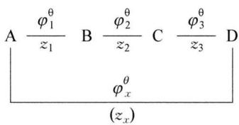

<details>
<summary>text_image</summary>

A \frac{\varphi_1^\theta}{z_1} B \frac{\varphi_2^\theta}{z_2} C \frac{\varphi_3^\theta}{z_3} D
\varphi_x^\theta
(z_x)
</details>

相应的各电极反应及 $\Delta_{\mathrm{r}}G_{\mathrm{m}}^{\theta}$ 与 $\varphi^{\theta}$ 的关系为：

$$
\mathrm{A} + z _ {1} \mathrm{e} ^ {-} \rightleftharpoons \mathrm{B}
$$

$$
\Delta_ {\mathrm{r}} G _ {\mathrm{m} (1)} ^ {\theta} = - z _ {1} F \varphi_ {1} ^ {\theta}
$$

$$
\mathrm{B} + z _ {2} \mathrm{e} ^ {-} \rightleftharpoons \mathrm{C}
$$

$$
\Delta_ {\mathrm{r}} G _ {\mathrm{m} (2)} ^ {\theta} = - z _ {2} F \varphi_ {2} ^ {\theta}
$$

$$
+) \mathrm{C} + z _ {3} \mathrm{e} ^ {-} \rightleftharpoons \mathrm{D}
$$

$$
\Delta_ {\mathrm{r}} G _ {\mathrm{m} (3)} ^ {\theta} = - z _ {3} F \varphi_ {3} ^ {\theta}
$$

$$
\mathrm{A} + z _ {x} \mathrm{e} ^ {-} \rightleftharpoons \mathrm{D}
$$

$$
\Delta_ {\mathrm{r}} G _ {\mathrm{m} (x)} ^ {\theta} = - z _ {x} F \varphi_ {x} ^ {\theta}
$$

由于 $\Delta_{\mathrm{r}}G_{\mathrm{m}(x)}^{\theta}=\Delta_{\mathrm{r}}G_{\mathrm{m}(1)}^{\theta}+\Delta_{\mathrm{r}}G_{\mathrm{m}(2)}^{\theta}+\Delta_{\mathrm{r}}G_{\mathrm{m}(3)}^{\theta}$

即 $-z_{x}F\varphi_{x}^{\theta} = -z_{1}F\varphi_{1}^{\theta} - z_{2}F\varphi_{2}^{\theta} - z_{3}F\varphi_{3}^{\theta}$

所以 $\varphi_{x}^{\theta} = \frac{z_{1}\varphi_{1}^{\theta} + z_{2}\varphi_{2}^{\theta} + z_{3}\varphi_{3}^{\theta}}{z_{x}}$

根据此式,可以由元素电势图上的相关 $\varphi^{\theta}$ 数据计算出所需要的未知标准电极电势。应该注意,这里 $z_{x}=z_{1}+z_{2}+z_{3}$ 。

## 7. $\varphi - \mathbf{pH}$ 图及其应用

$\varphi-\mathrm{pH}$ 图是把水溶液中的基本反应作为电势、 $\mathrm{pH}$ 的函数。在指定温度、压力下, 将电势(纵坐标)与 $\mathrm{pH}$ 值(横坐标)关系表示在平面图上(利用电子计算机还可以绘制出立体或多维图形)。利用 $\varphi-\mathrm{pH}$ 图可以确定反应自动进行的条件, 判断物质在水溶液中稳定存在的区域和范围, 这为湿法冶金浸出、分离、电解等过程提供了便利的热力学依据。常见的 $\varphi-\mathrm{pH}$ 图有金属-水系、金属—配合剂—水系、硫化物-水系。在湿法冶金中, 又出现了高温 $\varphi-\mathrm{pH}$ 图等, 本讲主要介绍金属-水系

的 $\varphi -\mathrm{pH}$ 图的画法以及应用。

(1) 水的 $\varphi - pH$ 图

在水溶液中进行的反应,由于水的电极电势受酸度的影响,水分子中 $\overset{-2}{O}$ 可能被氧化, $\overset{+1}{H}$ 也可能被还原,所以讨论反应物在水中的稳定性问题,除了考虑它们本身的性质外,还要考虑与水可能发生反应的问题。水的还原性和氧化性可以用以下两个电极反应分别表示:

① 水被氧化放出氧气： $O_{2} + 4H^{+} + 4e^{-} \rightleftharpoons 2H_{2}O$ ， $\varphi^{\theta}(O_{2}/H_{2}O) = 1.229V$ 根据能斯特方程可得： $\varphi(\mathrm{O}_{2}/\mathrm{H}_{2}\mathrm{O})=\varphi^{\theta}(\mathrm{O}_{2}/\mathrm{H}_{2}\mathrm{O})+\frac{0.0592}{4}\lg\left(\frac{p_{\mathrm{O}_{2}}}{p^{\theta}}\cdot[\mathrm{H}^{+}]^{4}\right)$

假设 $p_{O_{2}} = 100 \, kPa$ ，则 $\varphi(\mathrm{O}_{2}/\mathrm{H}_{2}\mathrm{O}) = 1.229 + 0.0592 \lg[\mathrm{H}^{+}] = 1.229 - 0.0592 \, pH$ 。显然在其他条件不变的情况下， $\varphi(\mathrm{O}_{2}/\mathrm{H}_{2}\mathrm{O})$ 与溶液的 pH 呈线性关系。

② 水被还原放出氢气： $2H^{+} + 2e^{-} \rightleftharpoons H_{2}$ ， $\varphi^{\theta}(H^{+}/H_{2}) = 0.000 V$

同样根据能斯特方程可得 $\varphi(\mathrm{H}^{+}/\mathrm{H}_{2})=\varphi^{\theta}(\mathrm{H}^{+}/\mathrm{H}_{2})+\frac{0.0592}{2}\lg\left(\frac{[\mathrm{H}^{+}]^{2}}{\frac{p_{\mathrm{H}_{2}}}{p^{\theta}}}\right)$

假设 $p_{H_{2}} = 100 \, kPa$ ，则 $\varphi(H^{+}/H_{2}) = 0.000 + 0.0592 \lg[H^{+}] = -0.0592 \, pH$ 。显然在其他条件不变的情况下， $\varphi(H^{+}/H_{2})$ 同样与溶液的 pH 呈线性关系。

③ 以 pH 为横坐标, 电极电势为纵坐标作图, 就得到了水的 $\varphi - pH$ 图, 见图 8-7。图中下方的斜线 (a) 称为氢线, 表示水被还原放出氢气时电极电势随 pH 的变化。在氢线上方与氢线平行的一条直线称为氧线 (b), 表示水被氧化放出氧气时电极电势随 pH 的变化。

从水的 $\varphi-pH$ 图可以判断氧化剂和还原剂在水溶液中的稳定性区域。任何氧化剂，电极电势在氧线以上，则可以从水溶液中析出氧气；任何还原剂，电极电势在氢线以下，则可以从水

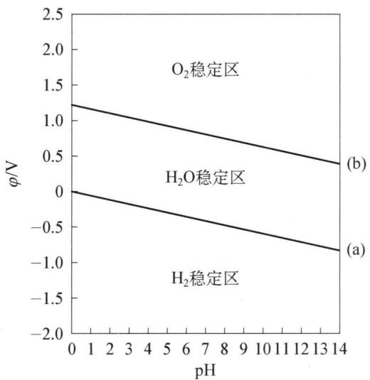

<details>
<summary>line chart</summary>

| pH  | φ/V (O₂稳定区) | φ/V (H₂O稳定区) | φ/V (H₂稳定区) |
| --- | --------------- | ---------------- | --------------- |
| 0   | 1.3             | 0.0              | -0.8            |
| 14  | 0.4             | -0.8             | -1.0            |
</details>

图8-7 水的 $\varphi -\mathrm{pH}$ 图

溶液中析出氢气；而两条线之间则是氧化剂和还原剂能够在水溶液中稳定存在的区域。例如：高锰酸钾在酸性环境的标准电极电势为 $\varphi^{\theta}\left(\mathrm{MnO}_{4}^{-}/\mathrm{MnO}_{2}\right)=1.679\mathrm{~V}$ 这个数值处于图 8-7 中的 $\mathrm{O}_{2}$ 稳定区, 因此在酸性水溶液中高锰酸钾不稳定, 不宜长期放置, 会氧化水中的氧; 又如: Na 的标准电极电势 $\varphi^{\theta}(\mathrm{Na}^{+}/\mathrm{Na}) = -2.713 \mathrm{~V}$ , 无论溶液的 $\mathrm{pH}$ 如何变化, Na 的标准电极电势均低于氢线, 因此可以将水中的氢置换为 $\mathrm{H}_{2}$ 。

(2) 金属-水系的 $\varphi - \mathrm{pH}$ 图

根据参加电极反应的物质不同, $\varphi-pH$ 图上的曲线可分为三类:

① 反应只与电极电势有关, 而与溶液的 $\mathrm{pH}$ 无关。这类反应的特点是只有电子参加而无 $\mathrm{H}^{+}$ (或 $\mathrm{OH}^{-}$ ) 参加的电极反应。例如, 电极反应: $\mathrm{Fe}^{3+} + \mathrm{e}^{-} = \mathrm{Fe}^{2+}$ 。这类反应的通式可以表示为: $b\mathrm{B} + n\mathrm{e}^{-} \rightleftharpoons r\mathrm{R}$ 。

根据能斯特方程可得： $\varphi = \varphi^{\theta} + \frac{0.0592}{n}\mathrm{lg}\left(\frac{[\mathrm{B}]^{b}}{[\mathrm{R}]^{r}}\right)$

由此可以看出：这类反应的平衡电势与 $\mathrm{pH}$ 无关，在一定温度下只随溶液中B和R的浓度的变化而变化。当 $\frac{[B]^b}{[R]^r}$ 一定时， $\varphi$ 值也保持不变，在 $\varphi - \mathrm{pH}$ 图上这类反应为一水平线，如图8-8中的线段①、②。

② 反应只与 pH 有关, 而与电极电势无关。这类反应的特点是只有 $H^{+}$ （或 $OH^{-}$ ）参加, 而无电子参与的化学反应, 因此这类反应不构成电极反应, 例如: $2Fe^{3+} + 3H_{2}O \rightleftharpoons Fe_{2}O_{3} + 6H^{+}$ 。这类反应的通式可以表示为: $bB + hH^{+} \rightleftharpoons rR + wH_{2}O$ 。

反应的平衡常数 $K$ 的表达式： $K = \frac{[R]^r}{[B]^b \cdot [H^+]^h}$ ，两边取对数，整理可得： $\mathrm{pH} = -\lg [\mathrm{H}^+] = \frac{1}{h} \lg K + \frac{1}{h} \lg \frac{[B]^b}{[R]^r}$ 。

由上式可见,这类反应与电极电势无关,在一定温度下,平衡常数 K 保持不变,若给定 $\frac{[B]^{b}}{[R]^{r}}$ , 则 pH 为定值。因此, 在 $\varphi - pH$ 图上这类反应表现为一垂直线段, 如图 8-8 中的线段⑤、⑥。

③ 反应既与电极电位有关, 又与溶液的 $\mathrm{pH}$ 有关, 如: $\mathrm{Fe}_{2} \mathrm{O}_{3} + 6 \mathrm{H}^{+} + 2 \mathrm{e}^{-} \rightleftharpoons 2 \mathrm{Fe}^{2+} + 3 \mathrm{H}_{2} \mathrm{O}$ 。这类反应的特点是有 $\mathrm{H}^{+}$ (或 $\mathrm{OH}^{-}$ ) 参加的电极反应, 即 $\mathrm{H}^{+}$ 和电子都参加反应, 反应的通式可写为: $b \mathrm{~B} + h \mathrm{H}^{+} + n \mathrm{e}^{-} \rightleftharpoons r \mathrm{R} + w \mathrm{H}_{2} \mathrm{O}$ 。

根据能斯特方程可得： $\varphi = \varphi^{\theta} + \frac{0.0592}{n}\lg \left(\frac{[\mathrm{B}]^{b}\cdot[\mathrm{H}^{+}]^{h}}{[\mathrm{R}]^{r}}\right)$ ，整理得： $\varphi = \varphi^{\theta}+$ $\frac{0.0592}{n}\lg \left(\frac{[\mathrm{B}]^{b}}{[\mathrm{R}]^{r}}\right) - \frac{0.0592h}{n}\mathrm{pH}_{\circ}$

由上式可知,在一定温度下,给定 $\frac{[B]^{b}}{[R]^{r}}$ ,平衡电势随pH升高而降低,在 $\varphi-pH$ 图上这类反应为一斜线,其斜率为-0.0592h/n,如图8-8中的线段③、④、⑦。

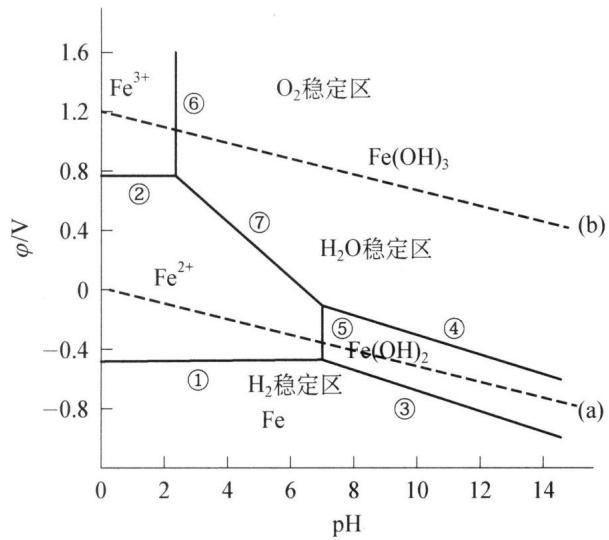

<details>
<summary>line chart</summary>

| pH  | Fe³⁺ (φ/V) | Fe²⁺ (φ/V) | Fe(OH)₃ (φ/V) | Fe(OH)₂ (φ/V) |
| --- | ---------- | ---------- | ------------- | ------------- |
| 0   | 1.2        | 0.0        | -             | -             |
| 2   | 0.8        | -          | -             | -             |
| 4   | -          | -          | -             | -             |
| 6   | -          | -          | -             | -             |
| 8   | -          | -          | -             | -0.4          |
| 10  | -          | -          | -             | -0.6          |
| 12  | -          | -          | -             | -0.7          |
| 14  | -          | -          | -             | -0.8          |
</details>

图8-8 $\mathrm{Fe - H_2O}$ 体系的 $\varphi -\mathrm{pH}$ 图

## (3) 相关应用

根据金属-水体系的 $\varphi - pH$ 图, 可以系统的描述相关的元素化学知识。例如从图 8-8 可以得出以下信息:

① 只有 Fe 处于(a)线之下, 即 Fe 处于 $H_{2}$ 稳定区, 因而能自发地将水中的 $H^{+}$ 还原为 $H_{2}$ , 而其他各物种都处于水的稳定区, 因而能在水中稳定存在。

② 若向 $Fe^{2+}$ 的溶液中加入 $OH^{-}$ ，当 $pH \geqslant 7.45$ 时，生成 $\mathrm{Fe(OH)}_{2}$ ；而向 $Fe^{3+}$ 溶液中加入 $OH^{-}$ ，当 $pH \geqslant 2.2$ ，就生成 $\mathrm{Fe(OH)}_{3}$ 。

③ 由于 $\varphi^{\theta}(\mathrm{Fe}^{3+}/\mathrm{Fe}^{2+})$ 低于(b)线, 进入 $H_{2}O$ 的稳定区, 因而 $Fe^{2+}$ 可把空气中的 $O_{2}$ 还原为 $H_{2}O$ , 而自己则被氧化为 $Fe^{3+}$ , 或换个说法是空气中的 $O_{2}$ 可以把 $Fe^{2+}$ 氧化为 $Fe^{3+}$ 。

④ $\mathrm{Fe(OH)_{2}}$ 的氧化线在(b)线下面很多,所以空气中的 $O_{2}$ 能完全氧化 $\mathrm{Fe(OH)_{2}}$ 。实际上,当向 $Fe^{2+}$ 中加入 $OH^{-}$ ,就先生成白色的 $\mathrm{Fe(OH)_{2}}$ 沉淀,随后迅速变为暗绿色的 $\mathrm{Fe(OH)_{2}\cdot2Fe(OH)_{3}}$ ,最后转变成为红棕色的 $\mathrm{Fe(OH)_{3}}$ 。

⑤ 在酸性溶液中, $Fe^{3+}$ 是较强的氧化剂,随着pH的增加, $Fe^{3+}$ 的氧化性下降,而在碱性溶液中 $Fe^{2+}$ 的还原性占优势。

## 典型例题


【例 1】298 K 时, 在 $Fe^{3+}$ , $Fe^{2+}$ 的混合溶液中加入 NaOH 溶液时, 有 $\mathrm{Fe(OH)}_{3}$ , $\mathrm{Fe(OH)}_{2}$ 沉淀生成 (假设无其他反应发生)。当沉淀反应达到平衡时, 保持 $c(\mathrm{OH}^{-}) = 1.0 \, \mathrm{mol} \cdot \mathrm{L}^{-1}$ 。求 $E(\mathrm{Fe}^{3+}/\mathrm{Fe}^{2+})$ 为多少。

解析

$$
\mathrm{Fe} ^ {3 +} (\mathrm{aq}) + \mathrm{e} ^ {-} \rightleftharpoons \mathrm{Fe} ^ {2 +} (\mathrm{aq})
$$

在 $Fe^{3+}$ ， $Fe^{2+}$ 混合溶液中，加入 NaOH 溶液后，发生如下反应：

$$
\mathrm{Fe} ^ {3 +} (\mathrm{aq}) + 3 \mathrm{OH} ^ {-} (\mathrm{aq}) \rightleftharpoons \mathrm{Fe(OH)} _ {3} (\mathrm{s}) \tag {①}
$$

$$
K _ {1} ^ {\theta} = \frac {1}{K _ {\mathrm{sp,Fe(OH)} _ {3}}} = \frac {1}{\left[ c (\mathrm{Fe} ^ {3 +}) / c ^ {\theta} \right] \left[ c (\mathrm{OH} ^ {-}) / c ^ {\theta} \right] ^ {3}}
$$

$$
\mathrm{Fe} ^ {2 +} (\mathrm{aq}) + 2 \mathrm{OH} ^ {-} (\mathrm{aq}) \rightleftharpoons \mathrm{Fe} (\mathrm{OH}) _ {2} (\mathrm{s}) \tag {②}
$$

$$
K _ {2} ^ {\theta} = \frac {1}{K _ {\mathrm{sp,Fe(OH)} _ {2}}} = \frac {1}{\left[ c (\mathrm{Fe} ^ {2 +}) / c ^ {\theta} \right] \left[ c (\mathrm{OH} ^ {-}) / c ^ {\theta} \right] ^ {2}}
$$

平衡时， $c(\mathrm{OH}^{-})=1.0\ \mathrm{mol}\cdot\mathrm{L}^{-1}$ ，则：

$$
\frac {c (\mathrm{Fe} ^ {3 +})}{c ^ {\theta}} = \frac {K _ {\mathrm{sp,Fe(OH)} _ {3}}}{[ c (\mathrm{OH} ^ {-}) / c ^ {\theta} ] ^ {3}} = K _ {\mathrm{sp,Fe(OH)} _ {3}}
$$

$$
\frac {c (\mathrm{Fe} ^ {2 +})}{c ^ {\theta}} = \frac {K _ {\mathrm{sp,Fe(OH)} _ {2}}}{[ c (\mathrm{OH} ^ {-}) / c ^ {\theta} ] ^ {2}} = K _ {\mathrm{sp,Fe(OH)} _ {2}}
$$

所以， $E\left(\mathrm{Fe}^{3+}/\mathrm{Fe}^{2+}\right)=E^{\theta}\left(\mathrm{Fe}^{3+}/\mathrm{Fe}^{2+}\right)-\frac{0.0592\ \mathrm{V}}{z}\lg\frac{c\left(\mathrm{Fe}^{2+}\right)/c^{\theta}}{c\left(\mathrm{Fe}^{3+}\right)/c^{\theta}}$

$$
= E ^ {\theta} \left(\mathrm{Fe} ^ {3 +} / \mathrm{Fe} ^ {2 +}\right) - \frac {0 . 0 5 9 2 \mathrm{V}}{z} \lg \frac {K _ {\mathrm{sp,Fe(OH)} _ {2}}}{K _ {\mathrm{sp,Fe(OH)} _ {3}}}
$$

$$
= 0. 7 6 9 \mathrm{V} - \frac {0 . 0 5 9 2 \mathrm{V}}{1} \lg \frac {4 . 8 6 \times 1 0 ^ {- 1 7}}{2 . 8 \times 1 0 ^ {- 3 9}} = - 0. 5 5 \mathrm{V}
$$

根据此例,可以得出如下结论:如果电对的氧化型生成难溶化合物,使c(氧化型)变小,则电极电势变小。如果还原型生成难溶化合物,使c(还原型)变小,则电极电势变大。当氧化型和还原型同时生成沉淀时,若 $K_{\mathrm{sp}}^{\theta}$ (氧化型) $<K_{\mathrm{sp}}^{\theta}$ (还原型),则电极电势变小;反之,则变大。

【例 2】（2014 全国决赛改编）已知： $H_{2}S$ 水溶液的酸式解离常数为： $K_{1}=1.1\times10^{-7}$ ， $K_{2}=1.3\times10^{-13}$ ；

ZnS 的溶度积常数 $K_{\mathrm{sp}}(\mathrm{ZnS}) = 2.5 \times 10^{-22}$ ; CuS 的溶度积常数 $K_{\mathrm{sp}}(\mathrm{CuS}) = 6.3 \times 10^{-36}$ ;

以下半反应的标准电极电势：

$$
\mathrm{NO} _ {3} ^ {-} + 4 \mathrm{H} ^ {+} + 3 \mathrm{e} ^ {-} = \mathrm{NO} + 2 \mathrm{H} _ {2} \mathrm{O} \quad E ^ {\theta} \left(\mathrm{NO} _ {3} ^ {-} / \mathrm{NO}\right) = 0. 9 5 7 \mathrm{V}
$$

$$
\mathrm{S} + 2 \mathrm{e} ^ {-} = \mathrm{S} ^ {2 -} \quad E ^ {\theta} (\mathrm{S} / \mathrm{S} ^ {2 -}) = - 0. 4 7 6 \mathrm{V}
$$

(1) 设有 +2 价金属 M 的硫化物 MS, 其与盐酸反应的通式可以表示为:

$$
\mathrm{MS} + 2 \mathrm{H} ^ {+} = \mathrm{M} ^ {2 +} + \mathrm{H} _ {2} \mathrm{S}
$$

现拟将 0.010 mol ZnS、CuS 分别溶于 1 L 的盐酸中, 求所需盐酸的最低浓度,说明实验操作的可行性。(不考虑溶解过程中溶液体积的变化)

(2) 已知 CuS 可以溶于稀硝酸, 反应式为:

$$
3 \mathrm{CuS} + 2 \mathrm{NO} _ {3} ^ {-} + 8 \mathrm{H} ^ {+} = 3 \mathrm{Cu} ^ {2 +} + 2 \mathrm{NO} \uparrow + 3 \mathrm{S} \downarrow + 4 \mathrm{H} _ {2} \mathrm{O}
$$

求该反应的标准电极电势 $E^{\theta}$ 和标准平衡常数 $K^{\theta}$ (F 取 96500 C/mol)。

解析 （1）金属硫化物 MS 溶解过程的方程式： $MS + 2H^{+} = M^{2+} + H_{2}S$ 可由下列三个分步方程叠加得到：

$$
\mathrm{H} _ {2} \mathrm{S} \rightleftharpoons \mathrm{H} ^ {+} + \mathrm{HS} ^ {-} \quad K _ {1} = 1. 1 \times 1 0 ^ {- 7}
$$

$$
\mathrm{HS} ^ {-} \rightleftharpoons \mathrm{H} ^ {+} + \mathrm{S} ^ {2 -} \quad K _ {2} = 1. 3 \times 1 0 ^ {- 1 3}
$$

$$
\mathrm{MS} \rightleftharpoons \mathrm{M} ^ {2 +} + \mathrm{S} ^ {2 -} \quad K _ {\mathrm{sp}} (\mathrm{MS})
$$

因此溶解过程的方程式的平衡常数 $K = \frac{K_{\mathrm{sp}}(\mathrm{MS})}{K_{1}K_{2}} = \frac{[\mathrm{M}^{2+}][\mathrm{H}_{2}\mathrm{S}]}{[\mathrm{H}^{+}]^{2}}$ ，整理得反应达到平衡时的 $[H^{+}]$ 计算式为： $[H^{+}] = \sqrt{\frac{K_{1}K_{2}[M^{2+}][H_{2}S]}{K_{\mathrm{sp}}(\mathrm{MS})}}$ 。计算时再假设溶解过程中 $H_{2}S$ 气体不溢出，且在酸性溶液中主要以 $H_{2}S$ 分子形式存在，即 $[H_{2}S] = 0.01 \, \mathrm{mol/L}$ ，代入 $[M^{2+}] = 0.01 \, mol/L$ 及 $K_{1}$ 、 $K_{2}$ 和 $K_{sp}$ 常数，可以分别求得溶解 ZnS 和 CuS 所需盐酸的最低浓度：

① 对于 ZnS, 达平衡时溶液中: $\left[H^{+}\right]=\sqrt{\frac{1.1\times10^{-7}\times1.3\times10^{-13}\times0.01\times0.01}{2.5\times10^{-22}}}=0.076\mathrm{~mol/L}$ ，加上反应所需要的 0.02 mol 的 $H^{+}$ ，HCl 的最低浓度为 0.096 mol/L。另外不妨将平衡时溶液中的 $\left[H^{+}\right]$ 代入 $H_{2}S$ 的一级电离平衡常数计算 $HS^{-}$ 的浓度为 $1.5\times10^{-8}\mathrm{~mol/L}$ ，远小于 0.010 mol/L，因此平衡时溶液中的 $HS^{-}$ 和 $S^{2-}$ 确实在计算时可以忽略不计。

② 对于 CuS, 若反应进行完全, 则达平衡时溶液中:

$$
\left[ \mathrm{H} ^ {+} \right] = \sqrt {\frac {1 . 1 \times 1 0 ^ {- 7} \times 1 . 3 \times 1 0 ^ {- 1 3} \times 0 . 0 1 \times 0 . 0 1}{6 . 3 \times 1 0 ^ {- 3 6}}} = 4. 8 \times 1 0 ^ {5} \mathrm{mol/L}
$$

显然这个 $\left[\mathrm{H}^{+}\right]$ 是盐酸浓度无法达到的, 因此 CuS 不会溶于盐酸。

(2) CuS溶于稀硝酸的反应式: $3 \mathrm{CuS} + 2 \mathrm{NO}_{3}^{-} + 8 \mathrm{H}^{+} = 3 \mathrm{Cu}^{2+} + 2 \mathrm{NO} + 3 \mathrm{S} + 4 \mathrm{H}_{2} \mathrm{O}$ 同样可以看作以下两步反应叠加的总方程式:

$$
\begin{array}{l} \mathrm{CuS} \rightleftharpoons \mathrm{Cu} ^ {2 +} + \mathrm{S} ^ {2 -} \quad K _ {\mathrm{sp}} (\mathrm{CuS}) \\ 3 \mathrm{S} ^ {2 -} + 2 \mathrm{NO} _ {3} ^ {-} + 8 \mathrm{H} ^ {+} \longrightarrow 2 \mathrm{NO} \uparrow + 3 \mathrm{S} \downarrow + 4 \mathrm{H} _ {2} \mathrm{O} \quad K _ {\text {氧化还原}} \\ \end{array}
$$

第二步氧化还原电动势 $E^{\theta} = E^{\theta}(\mathrm{NO}_3^- /\mathrm{NO}) - E^{\theta}(\mathrm{S} / \mathrm{S}^{2 - }) = 1.433\mathrm{V}$ ，根据 $RT\ln K_{\text{氧化还原}} = nFE$ ，可以求得 $K_{\text{氧化还原}} = 2.59\times 10^{145}$ 。则总反应的 $K^{\theta} = K_{\mathrm{sp}}^{3}\cdot K_{\text{氧化还原}} = 6.5\times 10^{39}$ ，再根据 $RT\ln K^{\theta} = nFE^{\theta}$ ，求得反应的 $E^{\theta} = 0.392\mathrm{V}$ 。从 $K^{\theta}$ 和 $E^{\theta}$ 的数值均可看出本反应可以进行的很完全。

小结: 本题从计算可以看出金属硫化物的溶解度除了受到酸度的影响, 还受到氧化还原、电极电势的影响。据此, 对于一些难溶性盐的溶解, 除可以增加酸度之外, 还可以从氧化还原、形成配位化合物的角度着手, 添加相应试剂进行溶解。

【例 3】（2002 年全国初赛）金属镅(Am)是一种用途广泛的锕系元素。 $^{241}$ Am 的放射性强度是镭的 3 倍，在我国各地商场里常常可见到 $^{241}$ Am 骨密度测定仪，检测人体是否缺钙：用 $^{241}$ Am 制作的烟雾监测元件已广泛用于我国各地建筑物的火警报警器（制作火警报警器的 1 片 $^{241}$ Am 我国批发价仅 10 元左右）。镅在酸性水溶液里的氧化态和标准电极电势( $E^{9}/V$ )如下，图中 +2.62 是 $Am^{4+}/Am^{3+}$ 的标准电极电势，-2.07 是 $Am^{3+}/Am$ 的标准电极电势，等等。一般而言，发生自发的氧化还原反应的条件是氧化剂的标准电极电势大于还原剂的标准电极电势。

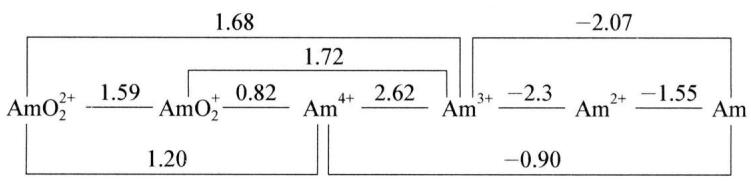

<details>
<summary>chemical</summary>

Redox reaction equation of AmO₂ with AmO₂²⁺, showing electron transfer and charge values
</details>

试判断金属镅溶于过量稀盐酸溶液后将以什么离子形态存在。简述理由。

附： $E^{\theta}(\mathrm{H}^{+} / \mathrm{H}_{2}) = 0\mathrm{V};E^{\theta}(\mathrm{Cl}_{2} / \mathrm{Cl}^{-}) = 1.36\mathrm{V};E^{\theta}(\mathrm{O}_2 / \mathrm{H}_2\mathrm{O}) = 1.23\mathrm{V}$

解析 本题考查的是元素电势图的应用。分析时应注意比较以下几点：

① 将元素各价态的电极电势分别与 $E^{\theta}(\mathrm{H}^{+}/\mathrm{H}_{2}) = 0 \mathrm{~V}$ 和 $E^{\theta}(\mathrm{O}_{2}/\mathrm{H}_{2} \mathrm{O}) = 1.23 \mathrm{~V}$ 进行比较, 如果某元素电对的电极电势低于 $E^{\theta}(\mathrm{H}^{+}/\mathrm{H}_{2}) = 0 \mathrm{~V}$ , 则可以在盐酸中被 $\mathrm{H}^{+}$ 氧化至电对的氧化态; 若某元素电对的电极电势高于 $E^{\theta}(\mathrm{O}_{2}/\mathrm{H}_{2} \mathrm{O}) = 1.23 \mathrm{~V}$ , 则该电对中的氧化态可以氧化 $\mathrm{H}_{2} \mathrm{O}$ 中 $-2$ 价的 $\mathrm{O}$ 。因此, 以上的情况涉及的离子形态均不能稳定的存在于水中 (盐酸中)。

② 考查其余电对中某个价态离子的左右两边电极电势, 若 $E^{\theta}$ (右) > $E^{\theta}$ (左), 则该价态离子会在水中(盐酸中)歧化, 同样不能稳定存在。

因此,根据 Am 的元素电势图,可以得出如下结论:

要点1: $E^{\theta}(\mathrm{Am}^{n+}/\mathrm{Am})<0$ , 因此 Am 可与稀盐酸反应放出氢气转化为 $\mathrm{Am}^{n+}$ , $n=2,3,4$ ; 但 $E^{\theta}(\mathrm{Am}^{3+}/\mathrm{Am}^{2+})<0$ , $\mathrm{Am}^{2+}$ 一旦生成可继续与 $\mathrm{H}^{+}$ 反应转化为 $\mathrm{Am}^{3+}$ 。(或答: $E^{\theta}(\mathrm{Am}^{3+}/\mathrm{Am})<0$ , $n=3$ )

要点 2: $E^{\theta}(\mathrm{Am}^{4+}/\mathrm{Am}^{3+}) > E^{\theta}(\mathrm{AmO}_{2}^{+}/\mathrm{Am}^{4+})$ ，因此一旦生成 $Am^{4+}$ 会自发歧化为 $AmO_{2}^{+}$ 和 $Am^{3+}$ 。

要点 3: $\mathrm{AmO}_{2}^{+}$ 是强氧化剂, 一旦生成足以将水氧化为 $\mathrm{O}_{2}$ , 或将 $\mathrm{Cl}^{-}$ 氧化为 $\mathrm{Cl}_{2}$ , 转化为 $\mathrm{Am}^{3+}$ , 也不能稳定存在。相反, $\mathrm{AmO}_{2}^{+}$ 是弱还原剂, 在此条件下不能被氧化为 $\mathrm{AmO}_{2}^{2+}$ 。

要点 4: Am $^{3+}$ 不会发生歧化(原理同上), 可稳定存在。

结论：镅溶于稀盐酸得到的稳定形态为 $Am^{3+}$ 。

【例 4】（2012 年全国初赛）右图示出在碳酸—碳酸盐体系 $\left(\mathrm{CO}_{3}^{2-}\right.$ 的分析浓度为 $1.0 \times 10^{-2} \, mol/L$ 中，铀的存在物种及相关电极电势随 pH 的变化关系 (E - pH 图，以标准氢电极为参比电极)。作为比较，虚线示出 $H^{+}/H_{2}$ 和 $O_{2}/H_{2}O$ 两电对的 E - pH 关系。

(1) 计算在 pH 分别为 4.0 和 6.0 的条件下碳酸—碳酸盐

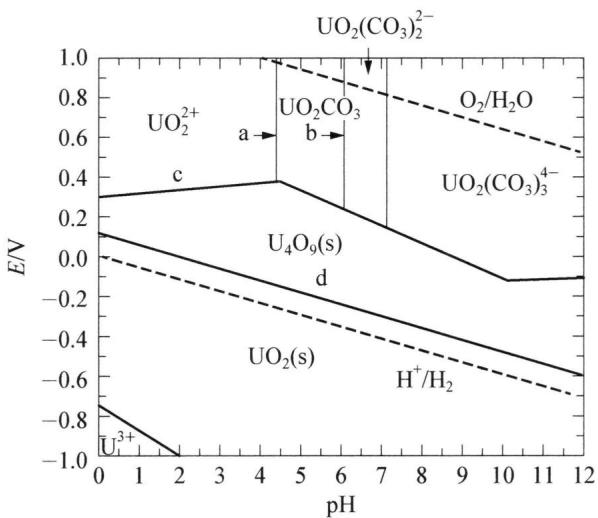

<details>
<summary>line chart</summary>

| pH | UO₂²⁺ | UO₂CO₃ | O₂/H₂O | UO₂(CO₃)₃⁴⁻ | U₄O₉(s) | d | UO₂(s) | H⁺/H₂ |
|----|-------|--------|--------|-------------|---------|---|--------|-------|
| 0  | -0.8  | -      | -      | -           | 0.2     | 0.0 | -      | -     |
| 1  | -     | -      | -      | -           | 0.3     | -0.1 | -      | -     |
| 2  | -     | -      | -      | -           | 0.4     | -0.2 | -      | -     |
| 3  | -     | -      | -      | -           | 0.5     | -0.3 | -      | -     |
| 4  | -     | -      | -      | -           | 0.6     | -0.4 | -      | -     |
| 5  | -     | -      | -      | -           | 0.7     | -0.5 | -      | -     |
| 6  | -     | -      | -      | -           | 0.8     | -0.6 | -      | -     |
| 7  | -     | -      | -      | -           | 0.9     | -0.7 | -      | -     |
| 8  | -     | -      | -      | -           | 1.0     | -0.8 | -      | -     |
| 9  | -     | -      | -      | -           | 1.1     | -0.9 | -      | -     |
| 10 | -     | -      | -      | -           | 1.2     | -1.0 | -      | -     |
| 11 | -     | -      | -      | -           | 1.3     | -1.1 | -      | -     |
| 12 | -     | -      | -      | -           | 1.4     | -1.2 | -      | -     |
</details>

体系中主要物种的浓度。(已知： $H_{2}CO_{3}:K_{a1}=4.5\times10^{-7},K_{a2}=4.7\times10^{-11}$ )

(2) 图中 a 和 b 分别是 pH = 4.4 和 6.1 的两条直线, 分别写出与 a 和 b 相对

应的铀的物种发生转化的方程式。

(3) 分别写出与直线 c 和 d 相对应的电极反应, 说明其斜率为正或负的原因。

(4) 在 pH = 4.0 的缓冲体系中加入 UCl₃，写出反应方程式。

(5) 在 pH = 8.0 \~ 12 之间, 体系中 $\mathrm{UO}_{2}(\mathrm{CO}_{3})_{3}^{4-}$ 和 $\mathrm{U}_{4}\mathrm{O}_{9}(\mathrm{s})$ 能否共存? 说明理由; $\mathrm{UO}_{2}(\mathrm{CO}_{3})_{3}^{4-}$ 和 $\mathrm{UO}_{2}(\mathrm{s})$ 能否共存? 说明理由。

解析 （1）溶液中弱酸各种微粒的浓度可以用分布系数 $\delta$ 公式计算得到：

对于碳酸-碳酸盐体系而言,溶液中的含C微粒的计算公式为:

$$
\delta (\mathrm{H} _ {2} \mathrm{CO} _ {3}) = \frac {[ \mathrm{H} ^ {+} ] ^ {2}}{[ \mathrm{H} ^ {+} ] ^ {2} + K _ {\mathrm{a1}} [ \mathrm{H} ^ {+} ] + K _ {\mathrm{a1}} K _ {\mathrm{a2}}}
$$

$$
\delta \left(\mathrm{HCO} _ {3} ^ {-}\right) = \frac {K _ {\mathrm{a1}} \left[ \mathrm{H} ^ {+} \right]}{\left[ \mathrm{H} ^ {+} \right] ^ {2} + K _ {\mathrm{a1}} \left[ \mathrm{H} ^ {+} \right] + K _ {\mathrm{a1}} K _ {\mathrm{a2}}}
$$

$$
\delta (\mathrm{CO} _ {3} ^ {2 -}) = \frac {K _ {\mathrm{a1}} K _ {\mathrm{a2}}}{[ \mathrm{H} ^ {+} ] ^ {2} + K _ {\mathrm{a1}} [ \mathrm{H} ^ {+} ] + K _ {\mathrm{a1}} K _ {\mathrm{a2}}}
$$

当 pH = 4.0, $c(\mathrm{H}^{+}) = 1.0 \times 10^{-4} \, \mathrm{mol/L}$ , $c_{0} = 1.0 \times 10^{-2} \, mol/L$ , 代入上述计算式可得:

$$
\delta (\mathrm{H} _ {2} \mathrm{CO} _ {3}) = 0. 9 9 6; \delta (\mathrm{HCO} _ {3} ^ {-}) = 4. 4 8 \times 1 0 ^ {- 3}; \delta (\mathrm{CO} _ {3} ^ {2 -}) = 2. 1 1 \times 1 0 ^ {- 1 7}
$$

通过计算可以看出,溶液中以 $H_{2}CO_{3}$ 为主,所以: $c(\mathrm{H}_{2}\mathrm{CO}_{3})=\delta(\mathrm{H}_{2}\mathrm{CO}_{3})\times c_{0}=9.96\times10^{-3}\mathrm{mol/L}$ 。

同理,可以计算出当 $pH = 6.0$ , $c(H^{+}) = 1.0 \times 10^{-6} \, \text{mol/L}$ 时,溶液中:

$$
\delta (\mathrm{H} _ {2} \mathrm{CO} _ {3}) = 0. 6 9 0; \delta (\mathrm{HCO} _ {3} ^ {-}) = 0. 3 1 0; \delta (\mathrm{CO} _ {3} ^ {2 -}) = 1. 4 6 \times 1 0 ^ {- 3}
$$

因此可以看出, 当 pH = 6.0 时, 溶液是由 $H_{2}CO_{3}$ 和 $HCO_{3}^{-}$ 组成的缓冲溶液, 其中:

$$
c (\mathrm{H} _ {2} \mathrm{CO} _ {3}) = \delta (\mathrm{H} _ {2} \mathrm{CO} _ {3}) \times c _ {0} = 6. 9 0 \times 1 0 ^ {- 3} \mathrm{mol/L};
$$

$$
c (\mathrm{HCO} _ {3} ^ {-}) = \delta (\mathrm{HCO} _ {3} ^ {-}) \times c _ {0} = 3. 1 0 \times 1 0 ^ {- 3} \mathrm{mol/L}
$$

(2) 本问中 a、b 线均为垂直线段, 因此可以判定线段左右两侧的含 U 物质并未发生得失电子的氧化还原反应, 仅仅由于溶液酸度的变化发生了非氧化还原反应, 书写方程式时应该注意此时溶液中碳酸物种的存在型体。

在 pH 为 4.4 时, 根据(1)中计算可知溶液中碳酸体系的主要存在物种为 $H_{2}CO_{3}$ 分子, 由此写出 a 线段对应的物种变化方程式:

a:

$$
\mathrm{UO} _ {2} ^ {2 +} + \mathrm{H} _ {2} \mathrm{CO} _ {3} = \mathrm{UO} _ {2} \mathrm{CO} _ {3} + 2 \mathrm{H} ^ {+}
$$

而当 pH 为 6.1 时, 溶液中碳酸体系为 $H_{2}CO_{3}$ 和 $HCO_{3}^{-}$ 组成的缓冲溶液, $HCO_{3}^{-}$ 是两性物质, 既可以作酸也可以作碱, 因此方程式左边应写 $HCO_{3}^{-}$ , 并且除了提供反应 (配位) 所需要的 $HCO_{3}^{-}$ , 还需要一份 $HCO_{3}^{-}$ 作碱与 $H^{+}$ 结合生成 $H_{2}CO_{3}$ 。由此写出 b 线段对应的物种变化方程式:

$$
\mathrm{b}: \quad \mathrm{UO} _ {2} \mathrm{CO} _ {3} + 2 \mathrm{HCO} _ {3} ^ {-} = \mathrm{UO} _ {2} (\mathrm{CO} _ {3}) _ {2} ^ {2 -} + \mathrm{H} _ {2} \mathrm{CO} _ {3}
$$

(3) 本问中两条线段的斜率 $c$ 为正, $d$ 为负, 因此可以判定发生反应时一定有得失电子的氧化还原过程, 利用离子电子配平法写出对应的方程式有:

$$
\mathrm{c}: \quad 4 \mathrm{UO} _ {2} ^ {2 +} + \mathrm{H} _ {2} \mathrm{O} + 6 \mathrm{e} ^ {-} = \mathrm{U} _ {4} \mathrm{O} _ {9} + 2 \mathrm{H} ^ {+}
$$

该半反应生成 $H^{+}$ , pH 增大, $H^{+}$ 浓度减小, 有利于反应进行, 故电极电势随 pH 增大而增大, 即 E-pH 线的斜率为正。

$$
\mathrm{U} _ {4} \mathrm{O} _ {9} + 2 \mathrm{H} ^ {+} + 2 \mathrm{e} ^ {-} = 4 \mathrm{UO} _ {2} + \mathrm{H} _ {2} \mathrm{O}
$$

与 c 段反应相反, d 反应消耗 $H^{+}$ , pH 增大不利于反应正向进行, 故电极电势随 pH 增大而降低, 即 E-pH 线的斜率为负。

（4）由图左下部分的 $E(\mathrm{UO}_{2}/\mathrm{U}^{3+})-\mathrm{pH}$ 关系推出，在 pH=4.0 时， $E(\mathrm{UO}_{2}/\mathrm{U}^{3+})$ 远小于 $E(\mathrm{H}^{+}/\mathrm{H}_{2})$ ，故 $UCl_{3}$ 加入水中，会发生下列氧化还原反应：

$$
\mathrm{U} ^ {3 +} + 2 \mathrm{H} _ {2} \mathrm{O} = \mathrm{UO} _ {2} + 1 / 2 \mathrm{H} _ {2} \uparrow + 3 \mathrm{H} ^ {+}
$$

（5）不同氧化态的物质能够共存的条件是，在所给条件下它们之间不会发生归中反应，且不会和水发生氧化还原反应。因此：

$\mathrm{UO}_{2}\left(\mathrm{CO}_{3}\right)_{3}^{4-}$ 和 $U_{4}O_{9}$ 能共存，理由是 $E\left[\mathrm{UO}_{2}\left(\mathrm{CO}_{3}\right)_{3}^{4-}/\mathrm{U}_{4}\mathrm{O}_{9}\right]$ 低于 $E\left(\mathrm{O}_{2}/\mathrm{H}_{2}\mathrm{O}\right)$ 而高于 $E\left(\mathrm{H}^{+}/\mathrm{H}_{2}\right)$ ，因此，其氧化形态 $\mathrm{UO}_{2}\left(\mathrm{CO}_{3}\right)_{3}^{4-}$ 不能氧化水而生成 $O_{2}$ ，其还原形态 $\mathrm{U}_{4}\mathrm{O}_{9}(\mathrm{s})$ 也不能还原水产生 $H_{2}$ 。

$\mathrm{UO_2(CO_3)_3^{4 - }}$ 和 $\mathrm{UO_2(s)}$ 不能共存，理由是 $E[\mathrm{UO_2(CO_3)_3^{4 - } / U_4O_9}]$ 高于 $E(\mathrm{U}_4\mathrm{O}_9 / \mathrm{UO}_2)$ ，当 $\mathrm{UO_2(CO_3)_3^{4 - }}$ 和 $\mathrm{UO_2(s)}$ 相遇时，会发生反应： $\mathrm{UO_2(CO_3)_3^{4 - }}+$ $3\mathrm{UO}_2 + \mathrm{H}_2\mathrm{O} = \mathrm{U}_4\mathrm{O}_9 + 2\mathrm{HCO}_3^- +\mathrm{CO}_3^{2 - }$

## 本讲习题


1. (2003年全国初赛)下图是一种正在投入生产的大型蓄电系统。左右两侧为电解质储罐, 中央为电池, 电解质通过泵不断在储罐和电池间循环; 电池中的左右两侧为电极, 中间为离子选择性膜, 在电池放电和充电时该膜可允许钠离子通过; 放电前, 被膜隔开的电解质为 $\mathrm{Na}_{2} \mathrm{~S}_{2}$ 和 $\mathrm{NaBr}_{3}$ , 放电后, 分别变为 $\mathrm{Na}_{2} \mathrm{~S}_{4}$ 和 $\mathrm{NaBr}$ 。

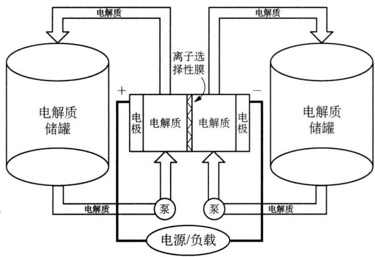

<details>
<summary>flowchart</summary>

```mermaid
graph TD
  A["电解质储罐"] -->|+| B["电解质"]
  B --> C["电解质"]
  C --> D["电解质"]
  D --> E["电解质"]
  E --> F["电解质储罐"]
  F --> G["电解质"]
  G --> H["电解质"]
  H --> I["电解质"]
  I --> J["电解质"]
  J --> K["电解质"]
  K --> L["电解质"]
  L --> M["电解质"]
  M --> N["电解质"]
  N --> O["电解质"]
  O --> P["电解质"]
  P --> Q["电解质"]
  Q --> R["电解质"]
  R --> S["电解质"]
  S --> T["电解质"]
  T --> U["电解质"]
  U --> V["电解质"]
  V --> W["电解质"]
  W --> X["电解质"]
  X --> Y["电解质"]
  Y --> Z["电解质"]
  Z --> A
    style A fill:#f9f,stroke:#333
    style F fill:#f9f,stroke:#333
    style G fill:#f9f,stroke:#333
    style H fill:#f9f,stroke:#333
    style I fill:#f9f,stroke:#333
    style J fill:#f9f,stroke:#333
    style K fill:#f9f,stroke:#333
    style L fill:#f9f,stroke:#333
    style M fill:#f9f,stroke:#333
    style N fill:#f9f,stroke:#333
    style O fill:#f9f,stroke:#333
    style P fill:#f9f,stroke:#333
    style Q fill:#f9f,stroke:#333
    style R fill:#f9f,stroke:#333
    style S fill:#f9f,stroke:#333
    style T fill:#f9f,stroke:#333
    style U fill:#f9f,stroke:#333
    style V fill:#f9f,stroke:#333
    style W fill:#f9f,stroke:#333
```
</details>

(1) 写出左、右储罐中的电解质。  
(2) 写出电池充电时, 阳极和阴极的电极反应。  
(3) 写出电池充、放电的反应方程式。  
(4) 指出在充电过程中钠离子通过膜的流向。

2. 铅-酸电池是广泛使用在汽车和作为动力的便携式电池。目前在动力汽车的电池发展中,最有前途的是轻便型可充电锂离子电池。某铅-酸电池表示如下:

$$
\mathrm{Pb} (\mathrm{s}) \mid \mathrm{PbSO} _ {4} (\mathrm{s}) \mid \mathrm{H} _ {2} \mathrm{SO} _ {4} (\mathrm{aq}) \mid \mathrm{PbSO} _ {4} (\mathrm{s}) \mid \mathrm{PbO} _ {2} \mid (\mathrm{Pb} (\mathrm{s}))
$$

某锂电池表示如下：

$$
\mathrm{Li(s)} \mid \mathrm {Li^ {+}} - \text {导电(固体)电解质(s)} \mid \mathrm {LiMn_ {2} O_ {4} (s)}
$$

在放电过程中,形成了嵌入物 $Li_{2}Mn_{2}O_{4}$ , 在充电过程中,转变成 $\mathrm{Li(s)}$ 和 $LiMn_{2}O_{4}$ 。

(1) 写出在铅-酸电池放电过程中电极上的电化学反应式。

在负极上的反应式：

在正极上的反应式：

(2) 写出在锂离子电池放电过程中电极上的电化学反应式。

在负极上的反应式：

在正极上的反应式：

写出在 $LiMn_{2}O_{4}$ 尖晶石型结构中锂离子和锰离子的配位数。

3. 有一批做过银镜反应实验的试管要洗涤, 可用铁盐溶液来作洗涤剂。实验室中可选用的铁盐溶液有 $\mathrm{FeCl}_{3} 、 \mathrm{Fe}_{2} (\mathrm{SO}_{4})_{3}$ 和 $\mathrm{Fe} (\mathrm{NO}_{3})_{3}$ (三种溶液中 $[\mathrm{Fe}^{3+}]$ 相等)。甲同学认为三种溶液中 $\mathrm{FeCl}_{3}$ 洗银效果最好, 乙同学则认为 $\mathrm{Fe} (\mathrm{NO}_{3})_{3}$ 效果最好, 两人都提出了各自合理的判断依据 (结果如何当然还要看哪一个理由在实际过程中的效果)。能够查到的数据有：Fe 和 Ag 的标准电极电势， $E_{Fe^{3+}/Fe^{2+}} = 0.77\ V$ ， $E_{Ag^{+}/Ag}^{\theta} = 0.80\ V$ ； $\mathrm{Fe(OH)}_{3}$ 的溶度积， $K_{sp} = 2 \times 10^{-39}$ 。

(1) 甲的判断依据是 \_\_\_\_；  
(2) 乙的判断依据是 \_\_\_\_。

4. 在碱性溶液中, 溴的电势图如下:

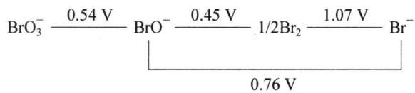

<details>
<summary>chemical</summary>

Electrochemical reaction equation showing bromoate and bromide ion reactions with voltage values
</details>

问哪些微粒能发生歧化反应？并写出有关的电极反应和歧化反应的离子反应方程式。

5. 铅蓄电池相应的电池为: $\mathrm{Pb}, \mathrm{PbSO}_{4} \mid \mathrm{H}_{2} \mathrm{SO}_{4} \parallel \mathrm{PbO}_{2}, \mathrm{PbSO}_{4}, \mathrm{Pb}$

(1) 写出放电的反应方程式。  
(2) 计算电解质为 $1 \, mol \cdot L^{-1}$ 硫酸时的电池电压 (pH = 0 时的标准电位: $Pb^{2+}/Pb$ 为 -0.13 V, $PbO_{2}/Pb^{2+}$ 为 1.46 V; $PbSO_{4}$ 的溶度积 $K_{sp} = 2 \times 10^{-8}$ )。  
(3) 充电时发生什么反应? 当用 $1 \mathrm{~A}$ 电流向电池充电 $10 \mathrm{~h}$ , 转换的 $\mathrm{PbSO}_{4}$ 的质量是多少 $(\mathrm{PbSO}_{4}$ 的摩尔质量为 $303 \mathrm{~g} \cdot \mathrm{mol}^{-1})$ ?

6. (2011 年湖南师大附中选拔题) 将 0.649 g 无水 $CoCl_{2}$ (相对分子质量 129.83) 溶于 10.0 mL, 1.00 mol/L 的 HCl 溶液, 加水稀释至 50.0 mL。往该 $CoCl_{2}$ 溶液中加入 20.0 mL, 2.00 mol/L 的氨水, 溶液由粉红色变成黄色, 该溶液在空气中放置后变成橙黄色。

(1) 指出颜色变化的原因,并写出方程式。  
(2) 将(1)中的氧化还原反应设计成原电池, 写出该原电池的正极反应、负极反应和原电池符号。  
(3) 已知 $\varphi^{\theta}(\mathrm{Co}^{3+}/\mathrm{Co}^{2+}) = 1.840 \mathrm{~V}, \varphi^{\theta}(\mathrm{O}_{2}/\mathrm{OH}^{-}) = 0.401 \mathrm{~V}, K_{\text {稳}}([\mathrm{Co}(\mathrm{NH}_{3})_{6}]^{2+}) = 1.28 \times 10^{5}, K_{\text {稳}}([\mathrm{Co}(\mathrm{NH}_{3})_{6}]^{3+}) = 1.60 \times 10^{35}, F = 96485.4 \mathrm{C/mol}, R = 8.3145 \mathrm{J} \cdot \mathrm{mol}^{-1} \cdot \mathrm{K}^{-1}$ 。 $T = 298.15 \mathrm{~K}$ 时，计算(2)中原电池的标准电动势以及(1)中的氧化还原反应的平衡常数。

7.（1999年全国决赛）东晋葛洪所著《抱朴子》中记载有“以曾青涂铁，铁赤色如铜”。“曾青”即硫酸铜。这是人类有关金属置换反应的最早的明确记载。铁置换铜的反应节能、无污染，但因所得的镀层疏松、不坚固，通常只用于铜的回收，不用作铁器镀铜。能否把铁置换铜的反应开发成镀铜工艺呢？

从化学手册上查到如下数据：

电极电势: $Fe^{2+} + 2e^{-} = Fe, \varphi^{\theta} = -0.440 V; Fe^{3+} + e^{-} = Fe^{2+}, \varphi^{\theta} = -0.771 V; Cu^{2+} + 2e^{-} = Cu, \varphi^{\theta} = 0.342 V; Cu^{2+} + e^{-} = Cu^{+}, \varphi^{\theta} = 0.160 V.$

平衡常数： $K_{\mathrm{w}} = 1.0 \times 10^{-14}$ ; $K_{\mathrm{sp}}(\mathrm{CuOH}) = 1.0 \times 10^{-14}$ ; $K_{\mathrm{sp}}[\mathrm{Cu(OH)}_{2}] = 2.6 \times 10^{-19}$ ; $K_{\mathrm{sp}}[\mathrm{Fe(OH)}_{2}] = 8.0 \times 10^{-16}$ ; $K_{\mathrm{sp}}[\mathrm{Fe(OH)}_{3}] = 4.0 \times 10^{-38}$ 。

回答如下问题:

(1) 造成镀层疏松的原因之一可能是夹杂固体杂质。为证实这一设想, 设计了如下实验: 向硫酸铜溶液加入表面光洁的纯铁块。请写出四种可能被夹杂的固体杂质的生成反应方程式(不必写反应条件)。  
(2) 设镀层夹杂物为 $\mathrm{CuOH}$ (固), 实验镀槽的 $\mathrm{pH} = 4$ , $\mathrm{CuSO}_4$ 的浓度为 $0.040 \mathrm{~mol} / \mathrm{L}$ , 温度为 $298 \mathrm{~K}$ , 请通过电化学计算说明在该实验条件下 $\mathrm{CuOH}$ 能否生成?  
（3）提出三种以上抑制副反应发生的(化学的)技术途径,不必考虑实施细节,说明理由。

8. (2004 年全国决赛)元素的 $\Delta_{\mathrm{f}} G_{\mathrm{m}}^{\theta} / \mathrm{F} - Z$ 图是以元素的不同氧化态 $Z$ 与对应物种的 $\Delta_{\mathrm{f}} G_{\mathrm{m}}^{\theta} / F$ 在热力学标准态 $\mathrm{pH} = 0$ 或 $\mathrm{pH} = 14$ 的对画图。图中任何两种物种联线的斜率在数值上等于相应电对的标准电极电势 $\varphi_{\mathrm{A}}^{\theta}$ 或 $\varphi_{\mathrm{B}}^{\theta}$ , A、B 分别表示 $\mathrm{pH} = 0$ (实线) 和 $\mathrm{pH} = 14$ (虚线)。

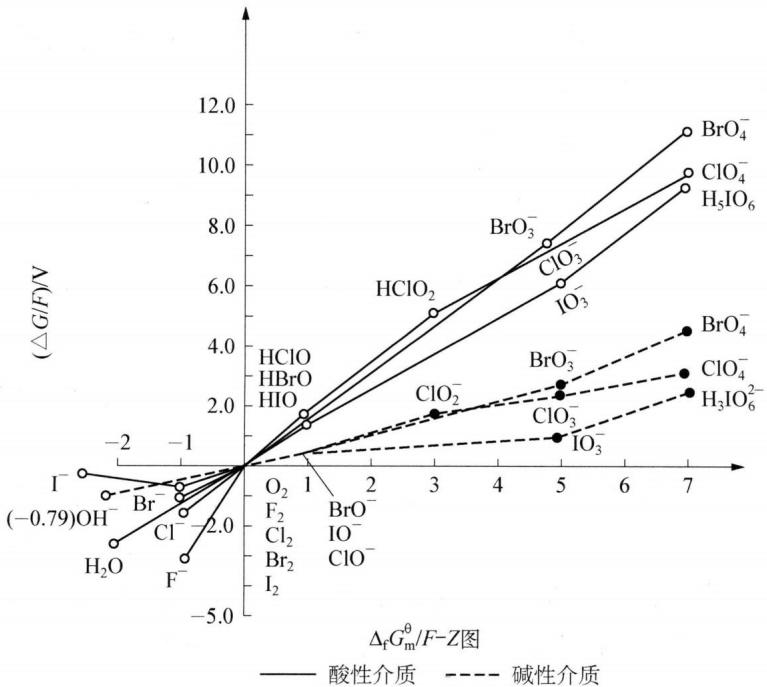

<details>
<summary>line chart</summary>

| Compound | ΔfGm^θ/F-Z (x-axis) | (ΔG/F)/N (y-axis) |
| -------- | ------------------ | ----------------- |
| BrO₄^-   | 7.0                | 11.0              |
| ClO₄^-   | 7.0                | 9.5               |
| H₅IO₆    | 7.0                | 9.0               |
| BrO₃^-   | 5.0                | 7.5               |
| ClO₃^-   | 5.0                | 6.0               |
| BrO₄^-   | 7.0                | 4.5               |
| ClO₄^-   | 7.0                | 3.0               |
| H₃IO₆²⁻  | 7.0                | 2.5               |
| ClO₂^-   | 3.0                | 1.8               |
| ClO₃^-   | 5.0                | 1.2               |
| BrO₃^-   | 5.0                | 2.5               |
| F₂       | -1.0               | -1.0              |
| O₂       | -1.0               | -1.0              |
| F₂        | -1.0               | -1.0              |
| Cl₂      | -1.0               | -1.0              |
| Br₂      | -1.0               | -1.0              |
| I₂       | -1.0               | -1.0              |
| H₂O      | -1.0               | -1.0              |
| Br^-      | -1.0               | -1.0              |
| I^-      | -1.0               | -1.0              |
</details>

上图中各物种的 $\Delta_{f}G_{m}^{\theta}/F$ 的数值如下表所示：

<table><tr><td>A</td><td> $X^{-}$ </td><td> $X_{2}$ </td><td>HXO</td><td> $HXO_{2}$ </td><td> $XO_{3}^{-}$ </td><td> $XO_{4}^{-}$ </td><td>B</td><td> $X^{-}$ </td><td> $X_{2}$ </td><td> $XO^{-}$ </td><td> $XO_{2}^{-}$ </td><td> $XO_{3}^{-}$ </td><td> $XO_{4}^{-}$ </td></tr><tr><td>F</td><td>-3.06</td><td>0</td><td>/</td><td>/</td><td>/</td><td>/</td><td>F</td><td>-3.06</td><td>0</td><td>/</td><td>/</td><td>/</td><td>/</td></tr><tr><td>Cl</td><td>-1.36</td><td>0</td><td>1.61</td><td>4.91</td><td>7.32</td><td>9.79</td><td>Cl</td><td>-1.36</td><td>0</td><td>0.40</td><td>1.72</td><td>2.38</td><td>3.18</td></tr><tr><td>Br</td><td>-1.06</td><td>0</td><td>1.60</td><td>/</td><td>7.60</td><td>11.12</td><td>Br</td><td>-1.06</td><td>0</td><td>0.45</td><td>/</td><td>2.61</td><td>4.47</td></tr><tr><td>I</td><td>-0.54</td><td>0</td><td>1.45</td><td>/</td><td>5.97</td><td>9.27</td><td>I</td><td>-0.54</td><td>0</td><td>0.45</td><td>/</td><td>1.01</td><td>2.41</td></tr></table>

(1) 用上表提供的数据计算:

$$
\varphi_ {\mathrm{A}} ^ {\theta} (\mathrm{IO} _ {3} ^ {-} / \mathrm{I} ^ {-}) \quad \varphi_ {\mathrm{B}} ^ {\theta} (\mathrm{IO} _ {3} ^ {-} / \mathrm{I} ^ {-}) \quad \varphi_ {\mathrm{A}} ^ {\theta} (\mathrm{ClO} _ {4} ^ {-} / \mathrm{HClO} _ {2})
$$

（2）由上述信息回答：对同一氧化态的卤素，其含氧酸的氧化能力是大于、等于还是小于其含氧酸盐的氧化性。

（3）溴在自然界中主要存在于海水中，每吨海水约含0.14 kg溴。 $Br_{2}$ 的沸点为58.78℃；溴在水中的溶解度3.58 g/100 g $H_{2}O$ (20℃)。利用本题的信息说明如何从海水中提取 $Br_{2}$ ，写出相应的化学方程式，并用方框图表达流程。

9. (2013年全国决赛)光合作用是自然界最重要的过程之一,其总反应一般表示为:

$$
6 \mathrm{CO} _ {2} + 6 \mathrm{H} _ {2} \mathrm{O} \longrightarrow \mathrm{C} _ {6} \mathrm{H} _ {1 2} \mathrm{O} _ {6} + 6 \mathrm{O} _ {2}
$$

实际反应分多步进行。其中,水的氧化过程是一个重要环节,此过程在光系统Ⅱ(简称 PSⅡ)中发生,使水氧化的活性中心是含有 4 个 Mn 原子的配位簇(称为锰氧簇)。初始状态的锰氧簇(S0)在光照下依次失去电子变为 S1、S2、S3 和 S4,S4 氧化 H₂O 生成 O₂。该过程简示如下:

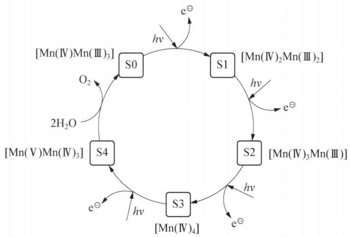

<details>
<summary>flowchart</summary>

```mermaid
graph TD
  S0 -->|hv| S1
  S1 -->|hv| S2
  S2 -->|hv| S3
  S3 -->|hv| S4
  S4 -->|2H₂O| S0
  S0 --> O2
  S1 --> e["e⁻"]
  S2 --> e
  S3 --> e
  S4 --> e
  S0 --> [Mn(IV)Mn(III)₃]
  S1 --> [Mn(IV)₂Mn(III)₂]
  S2 --> [Mn(IV)₃Mn(III)]
  S3 --> [Mn(IV)₄]
  S4 --> e
```
</details>

(1) 光合作用中, 水的氧化是几个电子转移的过程?

(2) $25^{\circ}$ C, 标态下, 下列电极反应的电极电势分别为:

① $MnO_{4}^{3-} + 4H^{+} + e^{-} = MnO_{2} + 2H_{2}O$ $E^{\theta}(MnO_{4}^{3-}/MnO_{2}) = 2.90\ V$

② $MnO_{2} + 4H^{+} + e^{-} = Mn^{3+} + 2H_{2}O$ $E^{\theta}(MnO_{2}/Mn^{3+}) = 0.95\ V$

③ $\mathrm{O}_2 + 4\mathrm{H}^+ +4\mathrm{e}^- = 2\mathrm{H}_2\mathrm{O}$ $E^{\theta}(\mathrm{O}_2 / \mathrm{H}_2\mathrm{O}) = 1.23\mathrm{V}$

计算上述半反应在中性条件下的电极电势。假定 $MnO_{4}^{3-}$ 和 $Mn^{3+}$ 的浓度均为 0.10 mol/L，氧气分压等于其在空气中的分压。回答此条件下， $MnO_{4}^{3-}$ 和 $MnO_{2}$ 能否氧化水？

(3) 在模拟锰氧簇的人工光合作用研究中, 研究者注意到如下 $\mathrm{Mn(III) / Mn(II)}$ 体系 $(25^{\circ} \mathrm{C})$ :

④ $Mn^{3+} + e^{-} = Mn^{2+}$ $E^{\theta}(Mn^{3+}/Mn^{2+}) = 1.51\ V$

在 $\left[\mathrm{H}_{2} \mathrm{P}_{2} \mathrm{O}_{7}^{2-}\right] = 0.40 \mathrm{~mol} / \mathrm{L}, \left[\mathrm{Mn}(\mathrm{H}_{2} \mathrm{P}_{2} \mathrm{O}_{7})_{3}^{3-}\right] = \left[\mathrm{Mn}(\mathrm{H}_{2} \mathrm{P}_{2} \mathrm{O}_{7})_{2}^{2-}\right]$ 的溶液中：

⑤ $\mathrm{Mn(H_2P_2O_7)_3^{3 - } + 2H^+ + e^- = Mn(H_2P_2O_7)_2^{2 - } + H_4P_2O_7}$ $E = 1.15\mathrm{V}$

计算⑤半反应的标准电极电势。(已知 $H_{4}P_{2}O_{7}$ 的四级解离常数 $pK_{a1}=0.92, pK_{a2}=3.10, pK_{a3}=7.70, pK_{a4}=9.35$ )

计算 $\mathrm{Mn(H_{2}P_{2}O_{7})_{3}^{3-}}$ 和 $\mathrm{Mn(H_{2}P_{2}O_{7})_{2}^{2-}}$ 的稳定常数之比。

(注：本题法拉第常数 F 均取 96470 C/mol)

## 第九讲 离子反应

## 知识精讲


第六、七、八讲分别介绍了配位平衡、水中的一些平衡、氧化还原平衡。从这些平衡发生的体系看，上述平衡绝大多数都是在水溶液中进行；而从发生这些反应的微粒看，大部分是离子间的反应。因此，本讲中将讨论、归纳这些离子反应的实质以及规律，作为对之前所学内容的整理和总结。

## 一、离子反应的类型

在反应中有离子参加或有离子生成的反应称为离子反应。离子反应一般指在溶液中进行的反应，一般情况下默认为水溶液，但也可以是其他物质作为溶剂，如液氨、液态 $SO_{2}$ 等。离子反应具有如下特点：离子反应的反应速率快，相应离子间的反应不易受其他离子的干扰。下面以水溶液为例，分别讨论常见的离子反应。

## 1. 酸碱反应

这里的酸、碱不仅仅局限于高中阶段的定义,根据酸碱质子理论:

凡是能给出质子 $\left(\mathrm{H}^{+}\right)$ 的物质是酸，如： $H_{2}SO_{4}$ 、HCl、 $H_{2}CO_{3}$ 、 $CH_{3}COOH$ 等；

凡是能接受质子的物质是碱,如: $\mathrm{NaOH}$ 、 $\mathrm{Ba(OH)}_{2}$ 、 $\mathrm{NH}_{3}$ 、 $\mathrm{CH}_{3} \mathrm{COO}^{-}$ 、 $\mathrm{CO}_{3}^{2-}$ 等;

既能给出质子 $\left(\mathrm{H}^{+}\right)$ ，又能接受质子 $\left(\mathrm{H}^{+}\right)$ 的物质可以看作两性物质，如： $HCO_{3}^{-}$ 、 $HS^{-}$ 、 $HC_{2}O_{4}^{-}$ 等。

判断上述这些酸、碱或者两性物质之间能否发生反应或者能否在水溶液中共存,可以用电离平衡常数 $K_{a}$ 或 $K_{b}$ 通过计算说明。

示例如下：

根据电离平衡常数 K 的数据, 判断下列离子反应能否发生:

① $CH_{3}COO^{-} + H^{+} \rightleftharpoons CH_{3}COOH$  
② $CH_{3}COO^{-} + HCO_{3}^{-} \rightleftharpoons CH_{3}COOH + CO_{3}^{2-}$  
③ $NH_{4}^{+} + CO_{3}^{2-} + H_{2}O \rightleftharpoons NH_{3} \cdot H_{2}O + HCO_{3}^{-}$  
④ $\mathrm{HSO}_3^-$ + $\mathrm{HCO}_3^-\rightleftharpoons \mathrm{H}_2\mathrm{CO}_3 + \mathrm{SO}_3^{2-}$

已知 $25^{\circ}C$ 时， $K_{\mathrm{a}}(\mathrm{CH}_{3}\mathrm{COOH})=1.7\times10^{-5}$ ， $K_{\mathrm{b}}(\mathrm{NH}_{3}\cdot\mathrm{H}_{2}\mathrm{O})=1.7\times10^{-5}$ ， $K_{\mathrm{a1}}(\mathrm{H}_{2}\mathrm{CO}_{3})=4.3\times10^{-7}$ ， $K_{\mathrm{a2}}(\mathrm{H}_{2}\mathrm{CO}_{3})=5.6\times10^{-11}$ ， $K_{\mathrm{a1}}(\mathrm{H}_{2}\mathrm{SO}_{3})=1.5\times10^{-2}$ ， $K_{\mathrm{a2}}(\mathrm{H}_{2}\mathrm{SO}_{3})=1.0\times10^{-7}$ 。

## 解析

对于①: $K_{1} = 1 / K_{\mathrm{a}}(\mathrm{CH}_{3}\mathrm{COOH}) = 5.9 \times 10^{4} \gg 1$ , 正向进行得很完全。本反应实质就是高中阶段强酸制弱酸的反应。

对于②： $K_{2}=K_{a2}(H_{2}CO_{3})/K_{a}(CH_{3}COOH)=3.3\times10^{-6}\ll1$ ，正向几乎不反应；反之，逆向可以进行得很完全。

对于③: $K_{3} = \frac{K_{\mathrm{w}}}{K_{\mathrm{b}}(\mathrm{NH}_{3} \cdot \mathrm{H}_{2}\mathrm{O})K_{\mathrm{a2}}(\mathrm{H}_{2}\mathrm{CO}_{3})} = 10.5 > 1$ , 正向可以反应, 且进行得较为完全。通过计算可知 $\mathrm{NH}_{4}^{+}$ 和 $\mathrm{CO}_{3}^{2-}$ 无法大量共存, 会发生一定程度的双水解。

对于④: $K_{4} = K_{\mathrm{a2}}(\mathrm{H}_{2}\mathrm{SO}_{3}) / K_{\mathrm{a1}}(\mathrm{H}_{2}\mathrm{CO}_{3}) = 0.23 < 1$ , 正向能发生, 但进行得不完全。下面我们以浓度均为 $0.1 \mathrm{~mol} / \mathrm{L}$ 的 $\mathrm{NaHSO}_{3}$ 和 $\mathrm{NaHCO}_{3}$ 混合溶液为例计算反应后各微粒的浓度:

对于平衡： $\mathrm{HSO}_3^-$ + $\mathrm{HCO}_3^-\rightleftharpoons \mathrm{H}_2\mathrm{CO}_3 + \mathrm{SO}_3^{2-}$

平衡时： $0.1 - x$ 0.1- $x$ $x$

由平衡常数 $K_{4}$ 表达式可以列式： $\frac{x^2}{(0.1 - x)^2} = 0.23$ ，解得 $x = 0.032$

于是反应达平衡时,溶液中 $\left[HSO_{3}^{-}\right]=\left[HCO_{3}^{-}\right]=0.068\ mol/L,\left[H_{2}CO_{3}\right]=\left[SO_{3}^{2-}\right]=0.032\ mol/L$ , 由计算可见,反应进行得不彻底。

需要指出,对于金属氢氧化物(以 MOH 代表氢氧化物),存在两种离解方式:

$\mathrm{MOH} = \mathrm{M}^{+} + \mathrm{OH}^{-}$ , 称为碱式离解; $\mathrm{MOH} = \mathrm{MO}^{-} + \mathrm{H}^{+}$ , 称为酸式离解。

MOH 酸碱性的判断可以用 Z/r 作为依据，Z 表示离子的电荷密度，r 表示离子半径，Z/r 称为离子势，用符号 $\phi$ 表示，即 $\phi = Z/r$ 。显然 $\phi$ 值越大，静电引力越大，M 吸引氧原子电子云的能力越强。O—H 键越易被削弱，越易酸式电离；反之，越易碱式电离。表 9-1 列出了一些金属正离子电荷密度 Z 的数值。

表 9-1 碱金属和碱土金属正离子的电荷密度 $Z\left( {\mathrm{C} \cdot  {\mathrm{{mm}}}^{-3}}\right)$

<table><tr><td>正离子</td><td> $Li^{+}$ </td><td> $Na^{+}$ </td><td> $K^{+}$ </td><td> $Rb^{+}$ </td><td> $Cs^{+}$ </td></tr><tr><td>电荷密度</td><td>98</td><td>24</td><td>11</td><td>8</td><td>6</td></tr><tr><td>正离子</td><td> $Be^{2+}$ </td><td> $Mg^{2+}$ </td><td> $Ca^{2+}$ </td><td> $Sr^{2+}$ </td><td> $Ba^{2+}$ </td></tr><tr><td>电荷密度</td><td>1100</td><td>120</td><td>52</td><td>33</td><td>23</td></tr></table>

若离子半径 r 以 $10^{-10}$ m 为单位，则 $\sqrt{\phi} < 2.2$ 时，MOH 为碱性； $2.2 < \sqrt{\phi} < 3.2$ 时，MOH 为两性； $\sqrt{\phi} > 3.2$ 时，MOH 为酸性。同一主族元素的金属氢氧化物，由于离子的电荷数和构型均相同，故其 $\sqrt{\phi}$ 值主要取决于离子半径的大小，见表 9-2：

表 9-2 碱金属和碱土金属氢氧化物的 $\sqrt{\phi}$ 值和碱性递变规律

<table><tr><td colspan="3">碱金属氢氧化物 $\sqrt{\phi }$ </td><td colspan="3">碱土金属氢氧化物 $\sqrt{\phi }$ </td></tr><tr><td>LiOH</td><td>1.2</td><td rowspan="5">碱性增强</td><td> $\mathrm{Be(OH)_2}$ </td><td>2.54</td><td rowspan="5">碱性增强</td></tr><tr><td>NaOH</td><td>1.0</td><td> $\mathrm{Mg(OH)_2}$ </td><td>1.76</td></tr><tr><td>KOH</td><td>0.87</td><td> $\mathrm{Ca(OH)_2}$ </td><td>1.42</td></tr><tr><td>RbOH</td><td>0.82</td><td> $\mathrm{Sr(OH)_2}$ </td><td>1.33</td></tr><tr><td>CsOH</td><td>0.77</td><td> $\mathrm{Ba(OH)_2}$ </td><td>1.22</td></tr><tr><td colspan="6">碱性增强</td></tr></table>

## 2. 水解反应

## (1) 狭义的水解反应

高中阶段对盐类水解的定义是: 溶液中盐电离出来的正、负离子与水电离出来的 $\mathrm{H}^{+}$ 或 $\mathrm{OH}^{-}$ 结合生成弱电解质的过程, 水解反应的对象是盐类物质。但根据酸碱质子理论, 盐类水解的过程无非是水中 $\mathrm{H}^{+}$ 和 $\mathrm{OH}^{-}$ 在不同离子间的传递和结合的过程。因此, 根据共轭酸碱对的关系, 我们可以将强碱弱酸盐中水解呈碱性的负离子看作碱 (可以接受水电离出的 $\mathrm{H}^{+}$ ); 而将强酸弱碱盐中水解呈酸性的正离子看作酸 (可以结合水电离出的 $\mathrm{OH}^{-}$ ); 对于弱酸弱碱盐, 由于其电离出的负、正离子分别可以结合水电离出的 $\mathrm{H}^{+}$ 与 $\mathrm{OH}^{-}$ , 所以可以看作两性物质。这样处理就可以将盐类水解的过程当作酸碱的反应, 从而用电离平衡常数作相关的计算。

示例如下：

根据电离平衡常数 K、溶度积常数 $K_{sp}$ 数据, 计算下列过程的平衡常数 K:

① $CH_{3}COO^{-} + H_{2}O \rightleftharpoons CH_{3}COOH + OH^{-}$  
② $\mathrm{Fe}^{3+} + 3\mathrm{H}_{2}\mathrm{O}\rightleftharpoons \mathrm{Fe(OH)}_{3} + 3\mathrm{H}^{+}$  
③ $NH_{4}^{+} + CH_{3}COO^{-} + H_{2}O \rightleftharpoons NH_{3} \cdot H_{2}O + CH_{3}COOH$  
④ $Al^{3+} + 3ClO^{-} + 3H_{2}O = Al(OH)_{3}\downarrow + 3HClO$

已知 $25^{\circ}C$ 时， $K_{\mathrm{a}}(\mathrm{CH}_{3}\mathrm{COOH}) = 1.7 \times 10^{-5}$ ， $K_{\mathrm{b}}(\mathrm{NH}_{3} \cdot \mathrm{H}_{2}\mathrm{O}) = 1.7 \times 10^{-5}$ ， $K_{\mathrm{a}}(\mathrm{HClO}) = 3.0 \times 10^{-8}$ ， $K_{\mathrm{sp}}(\mathrm{Fe(OH)}_{3}) = 2.8 \times 10^{-39}$ ， $K_{\mathrm{sp}}(\mathrm{Al(OH)}_{3}) = 3.0 \times 10^{-34}$ 。

## 解析

对于①: $K_{1} = K_{\mathrm{w}} / K_{\mathrm{a}}(\mathrm{CH}_{3}\mathrm{COOH}) = 5.9 \times 10^{-10} \ll 1$ , 正向进行得很不完全。因此, 高中阶段一般认为盐类水解程度是微弱的。

对于②： $K_{2}=K_{\mathrm{w}}^{3}/K_{\mathrm{sp}}(\mathrm{Fe}(\mathrm{OH})_{3})=3.6\times10^{-4}<1$ ，正向也不完全，但相对于 $CH_{3}COO^{-}$ 的水解程度已经大了很多。

对于③: $K_{3} = \frac{K_{\mathrm{w}}}{K_{\mathrm{b}}(\mathrm{NH}_{3} \cdot \mathrm{H}_{2}\mathrm{O})K_{\mathrm{a}}(\mathrm{CH}_{3}\mathrm{COOH})} = 3.5 \times 10^{-5} < 1$ , 正向进行不完全, 水中依然有大量 $\mathrm{NH}_{4}^{+}$ 和 $\mathrm{CH}_{3}\mathrm{COO}^{-}$ 的存在, 但正、负离子之间存在相互促进水解的情况。

对于④: $K_{4} = \frac{K_{\mathrm{w}}^{3}}{K_{\mathrm{sp}}(\mathrm{Al(OH)}_{3})K_{\mathrm{a}}^{3}(\mathrm{HClO})} = 1.2 \times 10^{14} \gg 1$ ，正向进行得很完全，即发生了彻底的双水解反应。

通过上述计算过程可以看出,水解能力较强的离子对应的弱电解质的电离平衡常数 K 或是溶度积 $K_{sp}$ 都相对很小,因此更易与水电离出的 $H^{+}$ 与 $OH^{-}$ 结合。常见的一些水解能力较强的离子有:

正离子： $Al^{3+}$ 、 $Fe^{2+}$ 、 $Fe^{3+}$ 、过渡金属的高价正离子等；

负离子: $\mathrm{CO}_{3}^{2-}$ 、 $\mathrm{HCO}_{3}^{-}$ 、 $\mathrm{AlO}_{2}^{-}$ 、 $\mathrm{S}^{2-}$ 等。

需要指出的是当正、负离子的水解程度均较大的情况下,可能会出现双水解反应。所谓双水解反应是指一种盐的正离子水解显酸性,另一种盐的负离子水解显碱性,当两种盐溶液混合时,由于 $H^{+}$ 和 $OH^{-}$ 结合生成水而相互促进水解,使水解程度变大甚至完全进行的反应。

① 不完全的双水解反应

虽然正、负离子的水解可以促进两者进一步的水解,但仍然无法进行得很彻底(如上例中的③),因此,离子方程式的书写依然要使用可逆符号,且不标明气体或沉淀,离子间仍然可以大量共存。如 $NH_{4}^{+}$ 与 $CH_{3}COO^{-}$ 、 $HCO_{3}^{-}$ 等弱酸负离子。

② 完全的双水解反应

由于水解反应进行得很彻底(如上例中的④)，因此，书写离子方程式时，必须用“——”，不再使用“←→”，且必须标明气体和沉淀符号，离子间不能大量共存。常见的可互相促进趋于完全的双水解离子有：

正离子： $Al^{3+}$ 、 $Fe^{3+}$ 等；

负离子： $CO_{3}^{2-}$ 、 $HCO_{3}^{-}$ 、 $S^{2-}$ 、 $HS^{-}$ 、 $AlO_{2}^{-}$ 等。

需要指出的是: ①可以发生双水解的离子包括但不限于上述的离子, 判断是否能发生双水解的方法可以参照上例用平衡常数计算。②有些正、负离子之间除了可以发生双水解, 还可以发生氧化还原反应(如 $\mathrm{Fe}^{3+}$ 和 $\mathrm{S}^{2-}$ 、 $\mathrm{Fe}^{3+}$ 和 $\mathrm{SO}_3^{2-}$ 等), 本讲后续将做简单讨论。

(2) 广义的水解反应

广义的水解反应可以定义为化合物中带正电荷的部分和带负电荷的部分分别与水中的 $H^{+}$ 和 $OH^{-}$ 结合的反应。常见的其他广义的水解反应有以下一些类型：

① 产物为碱式盐的水解

如： $SnCl_{2} + H_{2}O = Sn(OH)Cl + HCl, BiCl_{3} + H_{2}O = BiOCl + 2HCl$ 等。

② 产物为含氧酸的水解

如： $BCl_{3} + 3H_{2}O = H_{3}BO_{3} + 3HCl$ ， $PCl_{3} + 4H_{2}O = H_{3}PO_{4} + 5HCl$ 等。

③ 金属碳化物的水解

如： $CaC_{2}+2H_{2}O=Ca(OH)_{2}+C_{2}H_{2}\uparrow$ ， $Al_{4}C_{3}+12H_{2}O=4Al(OH)_{3}+3CH_{4}\uparrow$ 等。

④ 聚合和配位水解

如： $3SiF_{4} + 4H_{2}O = H_{4}SiO_{4} + 2H_{2}SiF_{6}$

$$
\mathrm{Fe} ^ {3 +} + \mathrm{H} _ {2} \mathrm{O} = \mathrm{H} ^ {+} + [ \mathrm{Fe(OH)} ] ^ {2 +}, 2 [ \mathrm{Fe(OH)} ] ^ {2 +} = [ \mathrm{Fe} _ {2} (\mathrm{OH}) _ {2} ] ^ {4 +}.
$$

$\left[Fe_{2}(OH)_{2}\right]^{4+}$ 的结构式为：

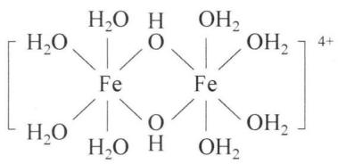

<details>
<summary>chemical</summary>

Chemical structure of a iron(II) complex with hydroxyl groups and water molecules
</details>

⑤ 氧化还原水解

如： $2XeF_{2} + 2H_{2}O = 2Xe\uparrow + O_{2}\uparrow + 4HF$ 等。

⑥ 歧化水解

如： $6XeF_{4}+12H_{2}O=2XeO_{3}+4Xe\uparrow+3O_{2}\uparrow+24HF,3BrF_{3}+6H_{2}O=2HBrO_{3}+HBr+9HF,3I(NO_{3})_{3}+6H_{2}O=2HIO_{3}+HI+9HNO_{3}$ 等。

⑦ 一些有机物的水解

某些有机反应,如卤代烃、酯、羧酸衍生物也可发生水解反应,但本讲不作相关讨论。

## 3. 沉淀反应

除难溶性碱(如: $\mathrm{Fe(OH)_3}$ 、 $\mathrm{Mg(OH)_2}$ 等)和少数不溶于水的酸(如: $\mathrm{H_2SiO_3}$ 等)之外,大多数能发生沉淀反应的离子一般而言都生成微溶或难溶性的物质。通过对许多离子型盐类在水中溶解度大小的分析,可得出如下一些规律:

（1）正离子的半径越大、电荷越小的盐，往往易溶。例如碱金属的氟化物比碱土金属的氟化物的溶解度大。  
(2) 负离子的半径较大时, 其盐的溶解度常随金属原子序数的增大而减小。例如 $SO_{4}^{2-}$ 、 $I^{-}$ 、 $CrO_{4}^{2-}$ 的半径大, 从 $Li^{+} \sim Cs^{+}$ , $Be^{2+} \sim Ba^{2+}$ 的相应的盐溶解度减小。  
(3) 负离子半径较小时, 其盐的溶解度常随金属原子序数的增大而增大。例如 $\mathrm{F}^{-}$ 、 $\mathrm{OH}^{-}$ 的半径小, 从 $\mathrm{Li}^{+} \sim \mathrm{Cs}^{+}, \mathrm{Be}^{2+} \sim \mathrm{Ba}^{2+}$ 相应化合物的溶解度增大。

解释上述这些离子型盐类在水中溶解度的规律,可以从热力学角度来进行讨论。根据热力学原理: $\Delta G = \Delta H - T\Delta S$ 。在溶解过程中 $\Delta S$ 一般很小,这是因为破坏离子型盐的晶格导致 $\Delta S$ 升高,溶剂分子在金属正离子周围呈规则取向,又导致 $\Delta S$ 降低,所以 $\Delta H$ 是离子型盐类溶解的主要依赖因素。溶解过程的热效应( $\Delta H$ )主要由晶格能(U)和水合热( $\Delta H_{\mathrm{w}}$ )决定,即 $\Delta H = U + \Delta H_{\mathrm{w}}$ ,半径小、电荷大的离子对U和 $\Delta H_{\mathrm{w}}$ 都有利,区别在于U和 $\Delta H_{\mathrm{w}}$ 随正、负离子大小变化存在如下不同的变化规律:

$$
U = f _ {1} \left(\frac {1}{r _ {\mathrm{M} ^ {+}} + r _ {\mathrm{X} ^ {-}}}\right), \Delta H _ {\mathrm{w}} = f _ {2} \left(\frac {1}{r _ {\mathrm{M} ^ {+}}}\right) + f _ {3} \left(\frac {1}{r _ {\mathrm{X} ^ {-}}}\right)
$$

计算表明：当正、负离子半径接近时，有利于 $U$ 的增大；当负离子半径大于正离子半径时，有利于 $\Delta H_{\mathrm{w}}$ 增大。

如果正、负离子差别较大，则以水合热 $\left(\Delta H_{\mathrm{w}}\right)$ 大小来判断溶解度大小。例如 $M^{+}$ 与 $ClO_{4}^{-}$ 组成的盐，由于 $ClO_{4}^{-}$ 离子半径大，从 $Li^{+}\sim Cs^{+}$ 离子的水合热减小，所以 $LiClO_{4}$ 溶解度较大， $NaClO_{4}$ 在水中的溶解度比 $LiClO_{4}$ 约小3～12倍，而 $KClO_{4}$ 、 $RbClO_{4}$ 和 $CsClO_{4}$ 的溶解度仅是 $LiClO_{4}$ 的0.001倍。

如果正、负离子差别不大, 则以晶格能 $(U)$ 大小来判断溶解度大小。例如 $\mathrm{M}^{+}$ 和 $\mathrm{F}^{-}$ 离子组成的盐, 由于离子半径相近, 而 LiF 的晶格能最大, 所以 LiF 是碱金属氟化物中溶解度最小的。一般来说, 大的正离子需要大的负离子作为沉淀剂, 因为大的正离子与大的负离子形成的离子型的盐溶解度小。例如 $\mathrm{Na}[\mathrm{Sb(OH)}_{6}]$ 、 $\mathrm{NaZn(UO_2)_3(CH_3COO)_9\cdot 6H_2O}$ 、 $\mathrm{K}_3[\mathrm{Co(NO_2)_6}]$ 、 $\mathrm{K}_2[\mathrm{PtCl}_6]$ 、 $\mathrm{K[B(C_6H_5)_4]}$ 等都是难溶的钠盐、钾盐。铷、铯比相应的钾盐还要难溶。

应当指出的是: 当溶液中存在多种离子均可以和沉淀剂发生反应时, 应该通过溶度积常数来判断沉淀的先后和是否能分步沉淀。

示例如下：

向含 $0.05 \, mol/L \, Fe^{3+}$ 和 $0.1 \, mol/L \, Mg^{2+}$ 的混合溶液中逐滴加入 NaOH 溶液，通过计算说明沉淀的先后、 $Fe^{3+}$ 和 $Mg^{2+}$ 能否分步沉淀？（已知： $K_{\mathrm{sp}}(\mathrm{Fe}(\mathrm{OH})_{3}) = 2.8 \times 10^{-39}, K_{\mathrm{sp}}(\mathrm{Mg}(\mathrm{OH})_{2}) = 1.9 \times 10^{-13}$ ）

## 解析

分别计算 $\mathrm{Fe}^{3+}$ 和 $\mathrm{Mg}^{2+}$ 开始沉淀时的 $\mathrm{pH}$ :

$$
\begin{array}{l} \left[ \mathrm{OH} ^ {-} \right] _ {\mathrm{Fe} ^ {3 +}} = \sqrt [ 3 ]{\frac {K _ {\mathrm{sp}} (\mathrm{Fe(OH)} _ {3})}{\left[ \mathrm{Fe} ^ {3 +} \right]}} \\ = \sqrt [ 3 ]{\frac {2 . 8 \times 1 0 ^ {- 3 9}}{0 . 0 5}} = 3. 8 \times 1 0 ^ {- 1 3}, \text {所以} \mathrm{pH} = 1. 5 8; \\ \end{array}
$$

$$
\begin{array}{l} \left[ \mathrm{OH} ^ {-} \right] _ {\mathrm{Mg} ^ {2 +}} = \sqrt {\frac {K _ {\mathrm{sp}} (\mathrm{Mg} (\mathrm{OH}) _ {2})}{\left[ \mathrm{Mg} ^ {2 +} \right]}} \\ = \sqrt {\frac {1 . 9 \times 1 0 ^ {- 1 3}}{0 . 1}} = 1. 4 \times 1 0 ^ {- 6} \text {, 所以 pH } = 8. 1 4 。 \\ \end{array}
$$

因此， $Fe^{3+}$ 先开始沉淀。

假设 $Fe^{3+}$ 完全沉淀时的浓度为 $1.0 \times 10^{-5}$ ，则 $Fe^{3+}$ 完全沉淀时的 $[OH^{-}]$ ：

$$
\left[ \mathrm{OH} ^ {-} \right] = \sqrt [ 3 ]{\frac {K _ {\mathrm{sp}} (\mathrm{Fe(OH)} _ {3})}{\left[ \mathrm{Fe} ^ {3 +} \right]}} = \sqrt [ 3 ]{\frac {2 . 8 \times 1 0 ^ {- 3 9}}{1 . 0 \times 1 0 ^ {- 5}}} = 6. 5 \times 1 0 ^ {- 1 2};
$$

该 $\left[\mathrm{OH}^{-}\right]$ 对于 $\mathrm{Mg}^{2+}$ 而言： $\mathrm{Q} = \left[\mathrm{Mg}^{2+}\right]\left[\mathrm{OH}^{-}\right]^{2} = 4.3 \times 10^{-24} \ll K_{\mathrm{sp}}(\mathrm{Mg(OH)}_{2})$ 。因此，当 $\mathrm{Fe}^{3+}$ 完全沉淀时， $\mathrm{Mg}^{2+}$ 还没有开始沉淀，所以，这两种离子可以分步沉淀。

## 4. 配位反应(络合反应)

离子间发生络合反应生成配位化合物的稳定性同样可以通过配合物的稳定常数 $K_{稳}$ 来判断，并且可以与其他一些反应的平衡常数 K 相结合讨论反应的方向和完全程度。

示例如下：

向 $AgNO_{3}$ 溶液中加入 NaCl 溶液，产生白色沉淀 A；过滤出 A 后向 A 中加入浓氨水，沉淀 A 溶解得到溶液 B；向 B 中加入溴化钠溶液，产生淡黄色沉淀 C；过滤出 C 后向 C 中加入 $Na_{2}S_{2}O_{3}$ 溶液，沉淀 C 溶解得到溶液 D；向 D 中加入碘化钾溶液，产生黄色沉淀 E；过滤出 E 后向 E 中加入 KCN 溶液，沉淀 E 溶解得到溶液 F；向 F 中加入硫化钠溶液，产生黑色沉淀 G。写出 A～G 的化学式，并通过计算说明反应发生的原因。

解析 上述变化实际上涉及配位平衡与沉淀平衡组成的多重平衡的竞争关系。涉及的平衡有：

① $Ag^{+} + Cl^{-} \rightleftharpoons AgCl$  
② $\mathrm{AgCl} + 2\mathrm{NH}_3 \rightleftharpoons [\mathrm{Ag(NH_3)_2}]^+ + \mathrm{Cl^-}$  
③ $\left[\mathrm{Ag}(\mathrm{NH}_{3})_{2}\right]^{+} + \mathrm{Br}^{-} \rightleftharpoons \mathrm{AgBr} \downarrow + 2\mathrm{NH}_{3}$  
④ $\mathrm{AgBr} + 2\mathrm{S}_2\mathrm{O}_3^{2-} \rightleftharpoons [\mathrm{Ag}(\mathrm{S}_2\mathrm{O}_3)_2]^{3-} + \mathrm{Br}^-$  
⑤ $\left[\mathrm{Ag}(\mathrm{S}_2\mathrm{O}_3)_2\right]^{3-} + \mathrm{I}^- \rightleftharpoons \mathrm{AgI}\downarrow + 2\mathrm{S}_2\mathrm{O}_3^{2-}$  
⑥ $\mathrm{AgI} + 2\mathrm{CN}^{-}\rightleftharpoons [\mathrm{Ag(CN)}_2]^{-} + \mathrm{I}^{-}$  
⑦ $2\left[\mathrm{Ag}(\mathrm{CN})_{2}\right]^{-}+\mathrm{S}^{2-}\rightleftharpoons\mathrm{Ag}_{2}\mathrm{S}\downarrow+4\mathrm{CN}^{-}$

所以 A\~F 分别为：

A: AgCl, B: $[\mathrm{Ag}(\mathrm{NH}_{3})_{2}]\mathrm{Cl}$ , C: AgBr, D: $\mathrm{Na}_{3}[\mathrm{Ag}(\mathrm{S}_{2}\mathrm{O}_{3})_{2}]$ , E: AgI, F: K[Ag(CN) $_{2}$ ], G: Ag $_{2}$ S。

相关计算以⑦为例,根据方程式可知,反应涉及 $\left[\mathrm{Ag}(\mathrm{CN})_{2}\right]^{-}$ 配位平衡的逆向反应和 $Ag_{2}S$ 沉淀平衡的逆向反应,因此总反应的平衡常数K为:

$$
K _ {\mathrm{总}} = \frac {1}{K _ {\mathrm{稳}} ^ {2} K _ {\mathrm{sp}}}
$$

查表知： $K_{\text{稳}}(\mathrm{Ag}(\mathrm{CN})_2]^- = 1.3 \times 10^{21}$ ， $K_{\mathrm{sp}}(\mathrm{Ag}_2\mathrm{S}) = 1.1 \times 10^{-49}$ ，代入上式，得：

$K_{总}=5.4\times10^{6}\gg1$ ，因此反应正向进行得很完全。其他反应的计算可以用类似的方法求解。

由上述转化可看出争夺和束缚 $\mathrm{Ag^{+}}$ 能力次序为： $\mathrm{Cl^{-} < NH_{3} < Br^{-} < S_{2}O_{3}^{2-} < }$ $\mathrm{I^{-} < CN^{-} < S^{2-}}$ ，这在生产实际和科学实验中有广泛的应用。例如：摄影胶片上为感光的 $\mathrm{AgBr}$ 乳胶，应用 $\mathrm{Na_{2}S_{2}O_{3}}$ 溶液来溶解而不宜用 $\mathrm{NH_{3} \cdot H_{2}O}$ ；含有 $[\mathrm{Ag(S_2O_3)_2}]^{3-}$ 的废定影液，或者含有 $[\mathrm{Ag(CN)_2}]^{-}$ 的废电镀液，可以用 $\mathrm{S^{2-}}$ 转化为 $\mathrm{Ag_2S}$ 沉淀的方法来富集和回收 $\mathrm{Ag}$ 。

## 5. 氧化还原反应

(1) 一般的离子间的氧化还原反应的方向、进行的完全程度可以用氧化还原

电对的电极电势和能斯特方程来判断。

示例如下:

已知 298.15 K 时, 溶液中存在平衡: $\mathrm{Pb}^{2+}(\mathrm{aq}) + \mathrm{Sn}(\mathrm{s}) \rightleftharpoons \mathrm{Pb}(\mathrm{s}) + \mathrm{Sn}^{2+}(\mathrm{aq})$ 。若反应分别从下列情况开始, 试判断反应进行的方向。已知: $\varphi^{\theta}(\mathrm{Pb}^{2+}/\mathrm{Pb}) = -0.1262\mathrm{V}, \varphi^{\theta}(\mathrm{Sn}^{2+}/\mathrm{Sn}) = -0.1375\mathrm{V}$ 。

① $Pb^{2+}$ 和 $Sn^{2+}$ 的浓度均为 0.10 mol/L;  
② $Pb^{2+}$ 的浓度为 0.10 mol/L, $Sn^{2+}$ 的浓度为 1.0 mol/L。

解析 ①、②两种情况均可代入能斯特方程求解：

① $E = \varphi^{\theta}(\mathrm{Pb}^{2+}/\mathrm{Pb}) - \varphi^{\theta}(\mathrm{Sn}^{2+}/\mathrm{Sn}) + \frac{0.0592}{2}\lg\frac{[\mathrm{Pb}^{2+}]}{[\mathrm{Sn}^{2+}]} = 0.0113\ \mathrm{V}$ ，再由 $-nFE = -RT\ln K$ ，求得 K = 2.4。反应正向发生，但进行得不完全， $Pb^{2+}$ 和 $Sn^{2+}$ 的平衡浓度可由下列方法求得：

$$
\mathrm{Pb} ^ {2 +} (\mathrm{aq}) + \mathrm{Sn} (\mathrm{s}) \rightleftharpoons \mathrm{Pb} (\mathrm{s}) + \mathrm{Sn} ^ {2 +} (\mathrm{aq})
$$

平衡时：0.10-x 0.10+x

由平衡常数 K 表达式: $K=\frac{[Sn^{2+}]}{[Pb^{2+}]}=\frac{0.10+x}{0.10-x}=2.4$ , 解得 x=0.041。因此, 反应平衡后, 溶液中的 $[Pb^{2+}]=0.059\ mol/L$ , $[Sn^{2+}]=0.141\ mol/L$ 。

② $E = \varphi^{\theta}(\mathrm{Pb}^{2+}/\mathrm{Pb}) - \varphi^{\theta}(\mathrm{Sn}^{2+}/\mathrm{Sn}) + \frac{0.0592}{2}\lg\frac{[\mathrm{Pb}^{2+}]}{[\mathrm{Sn}^{2+}]} = -0.0183\mathrm{V}$ ，反应逆向发生，但同样进行不完全，用①的方法可以求得，反应达到平衡后，溶液中的 $[Pb^{2+}] = 0.887\ mol/L, [Sn^{2+}] = 0.213\ mol/L$ 。

## (2) 歧化反应和归中反应

对于同种元素的歧化反应和归中反应(逆歧化反应)可以利用元素电势图判断。同一元素不同氧化数的任意三种物质组成的两个电对按氧化数由高到低排列如下：

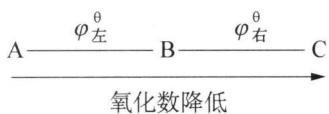

<details>
<summary>text_image</summary>

A——φ左^θ——B——φ右^θ——C
氧化数降低
</details>

若 $\varphi_{左}^{\theta} > \varphi_{右}^{\theta}$ ，则反应 A + C = 2B 的 $E^{\theta} = \varphi_{左}^{\theta} - \varphi_{右}^{\theta} > 0$ ，即能发生归中反应；反之，若 $\varphi_{左}^{\theta} < \varphi_{右}^{\theta}$ ，则反应 2B = A + C 的 $E^{\theta} = \varphi_{右}^{\theta} - \varphi_{左}^{\theta} > 0$ ，即能发生歧化反应。

(3) 溶液酸碱性对氧化还原能力的影响(高锰酸根、 $I^{-}$ 和 $Fe^{3+}$ )

有些离子间的反应会随着溶液酸碱性的改变而改变,因此,需要注意反应的酸碱性环境对氧化还原方向和产物的影响。

如： $MnO_{4}^{-}$ 在强酸性环境下通常被还原为 $Mn^{2+}$ ，中性或弱碱性环境下被还原为 $MnO_{2}$ ，强碱性的环境下则被还原为 $MnO_{4}^{2-}$ ，且电极电势也随着溶液酸碱性的改变而发生变化： $\varphi^{\theta}(MnO_{4}^{-}/Mn^{2+}) = +1.507\ V,\quad \varphi^{\theta}(MnO_{4}^{-}/MnO_{2}) = +0.595\ V,\quad \varphi^{\theta}(MnO_{4}^{-}/MnO_{4}^{2-}) = +0.558\ V$ 。显然， $MnO_{4}^{-}$ 的氧化性随着溶液酸性的减弱在降低。

示例如下:

已知 298.15 K 时， $\varphi^{\theta}(I_{2}/I^{-})=+0.5355\ V,\ \varphi^{\theta}(Fe^{3+}/Fe^{2+})=0.771\ V,$ $\varphi^{\theta}(Fe(OH)_{3}/Fe(OH)_{2})=-0.56V$ 。判断酸性、碱性溶液中，由 $I_{2}$ 、 $I^{-}$ 、 $Fe^{+3}$ 、 $Fe^{+2}$ 形成的混合体系中可能发生的反应，并写出离子方程式。

## 解析

酸性环境中， $\varphi^{\theta}(\mathrm{Fe}^{3+}/\mathrm{Fe}^{2+})>\varphi^{\theta}(\mathrm{I}_{2}/\mathrm{I}^{-})$ ，因此， $Fe^{3+}$ 可以将 $I^{-}$ 氧化，并且可以求得标准平衡常数 $K^{\theta}=9.27\times10^{7}\gg1$ ，所以反应进行得很彻底。反应的离子方程式为： $2Fe^{3+}+2I^{-}=2Fe^{2+}+I_{2}$ 。

碱性环境中， $\varphi^{\theta}(I_{2}/I^{-})>\varphi^{\theta}(Fe(OH)_{3}/Fe(OH)_{2})$ ，且 $K^{\theta}\gg1$ 。所以 $I_{2}$ 可以氧化 $Fe(OH)_{2}$ ，且反应进行得很完全。反应离子方程式为： $2Fe(OH)_{2}+I_{2}+2OH^{-}=2Fe(OH)_{3}+2I^{-}$ 。

## 6. 复杂的离子反应讨论

有些离子之间可能发生多种不同类型的反应。如 $Fe^{3+}$ 和 $S^{2-}$ ， $Fe^{3+}$ 和 $SO_{3}^{2-}$ 等离子之间既可以发生双水解反应，也可以发生氧化还原反应。最终到底发生哪种反应不光取决于热力学上总反应的平衡常数 K，还取决于动力学的一些因素，应该根据实验现象来确定。下面做简单讨论：

(1) $Fe^{3+}$ 和 $S^{2-}$ 的反应

若考虑 $Fe^{3+}$ 和 $S^{2-}$ 之间的双水解反应，则反应方程式为： $2Fe^{3+} + 3S^{2-} + 6H_{2}O = 2Fe(OH)_{3} \downarrow + 3H_{2}S \uparrow$ 。不考虑其他因素的影响，则总反应的平衡常数 $K_{双水解} = \frac{K_{w}^{6}}{K_{a1}^{3} K_{a2}^{3} K_{sp}^{2}} = 1.05 \times 10^{53} \gg 1$ 。

若考虑 $Fe^{3+}$ 和 $S^{2-}$ （过量）之间的氧化还原反应，则反应方程式为： $2Fe^{3+} + 3S^{2-} = 2FeS\downarrow + S\downarrow$ 。不考虑其他因素的影响，查表计算得反应的 $\Delta G^{\theta} =$ - 444 kJ/mol, 则总反应的平衡常数 $K_{氧化还原}^{\theta} = 6.74 \times 10^{77} \gg 1$ 。

由上述计算可知,仅从热力学角度考虑,两种反应都能进行得很完全,其中氧化还原反应可以进行得更完全。从实际的实验情况来看,试剂的用量和添加顺序也会对反应历程造成不同的影响:

① 把 $Na_{2}S$ 溶液逐滴加入 $FeCl_{3}$ 溶液中（一开始 $Na_{2}S$ 少量， $FeCl_{3}$ 过量），溶液由于 $Fe^{3+}$ 的水解呈酸性，所以发生 $Fe^{3+}$ 和 $S^{2-}$ 的氧化还原反应： $2Fe^{3+} + S^{2-} = 2Fe^{2+} + S \downarrow$ 。随着 $Na_{2}S$ 的滴入， $Fe^{3+}$ 浓度下降，同时溶液 pH 上升，继续滴加 $Na_{2}S$ 溶液后会发生反应： $Fe^{2+} + S^{2-} = FeS \downarrow$ ，也可能发生 $2Fe^{3+} + 3S^{2-} = Fe_{2}S_{3}$ 。 $Fe_{2}S_{3}$ 不稳定立即发生分解反应： $Fe_{2}S_{3} = 2FeS \downarrow + S \downarrow$ 。因此，总体看来这种情况下 $Fe^{3+}$ 和 $S^{2-}$ 发生的是氧化还原反应。

② 把 $FeCl_{3}$ 溶液逐滴加入 $Na_{2}S$ 溶液中（一开始 $FeCl_{3}$ 少量， $Na_{2}S$ 过量），溶液由于 $S^{2-}$ 的水解呈较强的碱性，一开始的反应为： $\mathrm{Fe}^{3+} + 3\mathrm{OH}^{-} = \mathrm{Fe(OH)}_{3}\downarrow$ 。反应过程中溶液 pH 下降到一定程度后发生反应： $2\mathrm{Fe}^{3+} + 3\mathrm{S}^{2-} = \mathrm{Fe}_{2}\mathrm{S}_{3}, \mathrm{Fe}_{2}\mathrm{S}_{3}$ 不稳定并迅速分解： $Fe_{2}S_{3} = 2FeS\downarrow + S\downarrow$ 。整个过程虽然生成少量 $\mathrm{Fe(OH)}_{3}$ ，但没有明显的臭鸡蛋气味气体的生成，因此，同样是以氧化还原反应为主。

(2) $Fe^{3+}$ 和 $SO_{3}^{2-}$ 的反应

若考虑 $Fe^{3+}$ 和 $SO_{3}^{2-}$ 之间的双水解反应，则反应方程式为： $2Fe^{3+} + 3SO_{3}^{2-} + 6H_{2}O = 2Fe(OH)_{3} \downarrow + 3H_{2}SO_{3}$ 。不考虑其他因素的影响，则总反应的平衡常数 $K_{\text{双水解}} = \frac{K_{\mathrm{w}}^{6}}{K_{\mathrm{a1}}^{3} K_{\mathrm{a2}}^{3} K_{\mathrm{sp}}^{2}} = 1.87 \times 10^{20} \gg 1$ 。

若考虑 $Fe^{3+}$ 和 $SO_{3}^{2-}$ 之间的氧化还原反应，则反应方程式为： $2Fe^{3+} + SO_{3}^{2-} + H_{2}O = 2Fe^{2+} + SO_{4}^{2-} + 2H^{+}$ 。不考虑其他因素的影响，查表计算得反应的电动势 $E^{\theta} = 0.599 V$ ，则总反应的平衡常数 $K_{氧还}^{\theta} = 1.83 \times 10^{20} \gg 1$ 。

由上述计算可知,仅从热力学角度考虑,两种反应都能进行得很完全,且完成程度接近,没有明显差异。实验情况如下:

① 将 0.1 mol/L 的 $Na_{2}SO_{3}$ 溶液逐滴加入 0.1 mol/L 的 $FeCl_{3}$ 溶液。观察到溶液颜色黄色变深，呈现出少量红褐色，没有观察到气泡生成，也没有沉淀生成。将该溶液分成三等份，分别置于 A、B、C 三根试管中。向 A 试管中加足量 HCl 酸化的 $BaCl_{2}$ 溶液有白色沉淀生成，说明溶液中生成了 $SO_{4}^{2-}$ ，有氧化还原反应的发生；用光束照射 B 试管中的溶液，有光亮的通路，因此生成的红褐色物质可能是 $\mathrm{Fe(OH)}_{3}$ 胶体，证明有双水解反应的发生；向 C 试管中加入少量品红溶液，品红褪色，说明存在 $SO_{2}$ ，但由于 $SO_{2}$ 的溶解度较大，所以主要以 $H_{2}SO_{3}$ 的形式存在于溶液中。综上所述, $Fe^{3+}$ 和 $SO_{3}^{2-}$ 稀溶液之间的反应既有双水解,又有氧化还原反应。

② 用浓的 $Na_{2}SO_{3}$ 溶液和浓的 $FeCl_{3}$ 溶液做上述实验, 同样得到相同的实验现象, 因此, 证明了 $Fe^{3+}$ 与 $SO_{3}^{2-}$ 之间会同时发生氧化还原反应和双水解反应。

## 7. 几种常见的非水体系中的反应

非水体系中的溶剂往往也会像水一样发生自耦电离。下面做一些简单介绍。

## (1) 液氨

由于液氨中存在自耦电离: $2 \mathrm{NH}_{3}(\mathrm{l}) \rightleftharpoons \mathrm{NH}_{4}^{+} + \mathrm{NH}_{2}^{-}$ 。因此, 在液氨中 $\mathrm{NH}_{3}$ 、 $\mathrm{NH}_{4}^{+}$ 、 $\mathrm{NH}_{2}^{-}$ 、 $\mathrm{NH}^{2-}$ 可以类比水溶液体系中的 $\mathrm{H}_{2} \mathrm{O}$ 、 $\mathrm{H}_{3} \mathrm{O}^{+}(\mathrm{H}^{+})$ 、 $\mathrm{OH}^{-}$ 、 $\mathrm{O}^{2-}$ , 如反应: $2 \mathrm{NH}_{4} \mathrm{Cl} + \mathrm{Ca}(\mathrm{NH}_{2})_{2} = \mathrm{CaCl}_{2} + 4 \mathrm{NH}_{3}$ 可理解为水体系中的酸碱中和反应; $\mathrm{CaNH} + 2 \mathrm{NH}_{4} \mathrm{Cl} = \mathrm{CaCl}_{2} + 3 \mathrm{NH}_{3}$ 可以看成水体系中的 $\mathrm{CaO}$ 和 $\mathrm{HCl}$ 的反应。

需要指出的是,由于液氨的碱性比水强,因此,大多数在水中的弱酸在液氨中是强酸,如乙酸等。只有少数化合物,如碱金属的氢化物及氧化物等的碱性比 $NH_{2}^{-}$ 离子强,它们能从氨分子中夺走质子,如: $LiH + NH_{3} = LiNH_{2} + H_{2}$ 、 $Na_{2}O + NH_{3} = NaNH_{2} + NaOH$ 等。

## (2) 金属-液氨溶液

在水溶液中的电极电位低于 $-2.5\mathrm{V}$ 的金属能溶解于液氨中，形成一种较稳定的含有氨化电子和氨化金属正离子的溶液，即金属-液氨溶液。通式为： $\mathrm{M} + (x + y)\mathrm{NH}_3 = \mathrm{M}(\mathrm{NH}_3)_y^+ +[\mathrm{e}(\mathrm{NH}_3)_x]^-$ 。这些金属包括碱金属、碱土金属以及稀土金属等所谓电正性金属，其共同特点是电离能低，离子的溶剂化能高，原子化焓低。稀的金属-液氨溶液呈亮蓝色，溶液的电子光谱中一个很强、很宽的吸收带（最大吸收位置在 $1500~\mathrm{cm}^{-1}$ 处），被认为是由氨化电子产生的。氨化电子非常活泼，体现出很强的还原性，在合成化学中有很重要的应用。例如，可以用氨化电子还原金属羰基化合物，可以制备得到羰基化合物负离子，其中的金属元素可以认为呈现负价： $\mathrm{Mn_2(CO)_{10} + 2[e(NH_3)_x]^- = 2Mn(CO)_5^- + 2xNH_3}$ 。此外，金属-液氨溶液在无机合成，尤其对于合成低氧化态的化合物更是一种优良的介质。这是因为金属-液氨溶液本身具有还原性，能使低价态物质趋向于稳定，如ⅣA、VA、VIA等主族元素可以在金属-液氨溶液中形成特殊的原子簇状化合物： $\mathrm{NaPb_2}$ 、 $\mathrm{Na_4Pb_9}$ 、 $\mathrm{KP_5}$ 等。

## (3) 液态 $\mathrm{SO}_{2}$

类似的,在液态 $SO_{2}$ 中存在: $2SO_{2}(1) \rightleftharpoons SO^{2+} + SO_{3}^{2-}$ 。类比水溶液,同样可以发生许多反应,主要类型有:

① 溶剂分解反应(类似水解反应), 如: $PCl_{5} + SO_{2} = POCl_{3} + SOCl_{2}$

② 中和反应, 如: $SOCl_{2} + CaSO_{3} = CaCl_{2} + 2SO_{2} \uparrow$  
③ 复分解反应, 如: $2KBr + SOCl_{2} = 2KCl + SOBr_{2}$  
④ 氧化还原反应, 如: $6KI + 3SbCl_{5} = 3I_{2} + SbCl_{3} + 2K_{3}SbCl_{6}$  
⑤ 配位反应, 如在液态 $SO_{2}$ 中: $\mathrm{Co(SCN)_{2} + 2H_{2}O = [Co(SCN)_{2}(H_{2}O)_{2}]}$

## (4) 液态 $BrF_{3}$

液态 $BrF_{3}$ 中存在： $2BrF_{3} \rightleftharpoons BrF_{2}^{+} + BrF_{4}^{-}$ 。因此，在液态 $BrF_{3}$ 中， $SbF_{5}$ 的电离方程式为： $SbF_{5} + BrF_{3} = BrF_{2}^{+} + SbF_{6}^{-}$ ，可以看作是一元强酸；而 KF 的电离方程式为： $KF + BrF_{3} = K^{+} + BrF_{4}^{-}$ ，可以看作是一元碱。

## (5) 无水 HF

HF 是酸性很强的溶剂, 其酸度与无水硫酸相当, 但比氟磺酸弱。在 HF 作为溶剂的体系中, HF 本身可以看作能够发生电离: $\mathrm{HF} \rightleftharpoons \mathrm{H}^{+} + \mathrm{F}^{-}$ 。然而无论在水溶液中还是在其他溶剂体系中, 裸质子 $(\mathrm{H}^{+})$ 都是不可能独立存在的, 所以在 HF 溶剂中, 裸质子 $(\mathrm{H}^{+})$ 和 $\mathrm{F}^{-}$ 离子都是溶剂化的。因此, 可用下式表示其电离过程: $3\mathrm{HF} \rightleftharpoons \mathrm{H}_{2}\mathrm{F}^{+} + \mathrm{HF}_{2}^{-}$ 。其中 $\mathrm{HF}_{2}^{-}$ 是一个具有对称性的负离子, $\mathrm{H}_{2}\mathrm{F}^{+}$ 离子可能存在于一些盐中, 如: $[\mathrm{H}_{2}\mathrm{F}]^{+}[\mathrm{SbF}_{6}]^{-}, [\mathrm{H}_{2}\mathrm{F}]^{+}[\mathrm{AsF}_{6}]^{-}$ 等。

在水溶液中许多呈酸性的化合物在 HF 溶剂中却呈碱性或两性。如：

$$
\mathrm{HNO} _ {3} + 2 \mathrm{HF} \rightleftharpoons \mathrm{H} _ {2} \mathrm{NO} _ {3} ^ {+} + \mathrm{HF} _ {2} ^ {-} (\text {反应中 HNO} _ {3} \text {显碱性})
$$

$$
\mathrm{HClO} _ {4} + 2 \mathrm{HF} \rightleftharpoons \mathrm{H} _ {2} \mathrm{ClO} _ {4} ^ {+} + \mathrm{HF} _ {2} ^ {-} (\text {反应中} \mathrm{HClO} _ {4} \text {显碱性})
$$

$$
\mathrm{HClO} _ {4} + \mathrm{HF} \rightleftharpoons \mathrm{H} _ {2} \mathrm{F} ^ {+} + \mathrm{ClO} _ {4} ^ {-} (\text {反应中 HClO} _ {4} \text {显酸性})
$$

## 二、离子反应的实质

1. 复分解反应(包括酸碱反应、水解反应、沉淀反应)发生的条件是离子间反应能生成难溶、难电离或易挥发(如气体)的物质。这类反应的规律是反应往溶液中离子浓度减少的方向进行。

## 示例如下:

(1990 年全国联赛初赛试题)下表列出了四种物质分别在水中、液氨中的溶解度(g/100 g 溶剂):

<table><tr><td>溶质、溶剂</td><td> $AgNO_{3}$ </td><td> $Ba(NO_{3})_{2}$ </td><td>AgCl</td><td> $BaCl_{2}$ </td></tr><tr><td>水</td><td>170</td><td>9.3</td><td> $1.5 \times 10^{-4}$ </td><td>33.3</td></tr><tr><td>液氨</td><td>86</td><td>97.2</td><td>0.8</td><td>0</td></tr></table>

在水或液氨中,这四种化合物中的某两种可能发生复分解反应,其化学方程式分别为:

在水中：

在液氨中：\_\_\_\_

## 解析

要判定这四种物质在水中、液氨中发生反应的方向,实质就是向溶解度最小的生成物方向进行,故在水中向生成 AgCl 的方向进行;而在液氨中则向着生成 $BaCl_{2}$ 的方向进行。方程式分别为:

水中： $2AgNO_{3} + BaCl_{2} = 2AgCl \downarrow + Ba(NO_{3})_{2}$ ;

在液氨中： $2\mathrm{AgCl}+\mathrm{Ba}(\mathrm{NO}_{3})_{2}=\mathrm{BaCl}_{2}\downarrow+2\mathrm{AgNO}_{3}$

另外，在高中阶段学习的侯德榜制碱法(侯氏制碱法)的主要反应可以归纳为以下三步：

① $NH_{3} + H_{2}O + CO_{2} = NH_{4}HCO_{3}$ (首先通入氨气, 然后再通入二氧化碳)  
② $NH_{4}HCO_{3} + NaCl = NH_{4}Cl + NaHCO_{3} \downarrow$  
③ $2NaHCO_{3}\xlongequal{\triangle}Na_{2}CO_{3}+CO_{2}\uparrow+H_{2}O$

副产物 $NH_{4}Cl$ 可以在低温下向②中的溶液加入 NaCl 予以析出，析出的 $NH_{4}Cl$ 可以用作化肥，同时循环 NaCl 母液，提高了 NaCl 的利用率。其中反应②也是依据离子反应发生的原理进行的。从表 9-3 可以看出：在 $20^{\circ}C \sim 30^{\circ}C$ 时， $NaHCO_{3}$ 的溶解度最小，因此，当溶液中存在大量的 $NH_{4}HCO_{3}$ 和 NaCl 时，会形成 $NaHCO_{3}$ 沉淀，从而降低溶液中的离子浓度。

表 9-3 不同温度下几种物质的溶解度

<table><tr><td>温度(T)</td><td>0°C</td><td>10°C</td><td>20°C</td><td>30°C</td><td>40°C</td><td>50°C</td></tr><tr><td>NaCl</td><td>29.4</td><td>33.3</td><td>36.0</td><td>36.3</td><td>36.6</td><td>37.0</td></tr><tr><td>NH4HCO3</td><td>35.7</td><td>35.8</td><td>21.0</td><td>27.0</td><td>—</td><td>—</td></tr><tr><td>NaHCO3</td><td>11.9</td><td>15.8</td><td>9.6</td><td>11.1</td><td>12.7</td><td>14.5</td></tr><tr><td>NH4Cl</td><td>6.9</td><td>8.15</td><td>37.2</td><td>41.1</td><td>45.8</td><td>50.4</td></tr></table>

需要指出的是, 复分解反应发生的方向也有个别例外。例如: $\mathrm{Cu}^{2+} + \mathrm{H}_{2} \mathrm{~S} = \mathrm{CuS} \downarrow + 2 \mathrm{H}^{+}$ , 反应过程中的溶液离子浓度是增加的。这是由于 $\mathrm{CuS}$ 的 $K_{\mathrm{sp}}$ 极小 $(6.3 \times 10^{-36})$ , 上述反应的平衡常数 $K_{\text {总}} = \frac{K_{\mathrm{a} 1} K_{\mathrm{a} 2}}{K_{\mathrm{sp}}} = 1.5 \times 10^{14} \gg 1$ , 因此正向进行

得很完全。

2. 配位反应和氧化还原反应不遵循“往离子浓度减小的方向进行”的规律。配位反应的反应方向取决于形成的配位化合物的稳定常数 $K_{稳}$ 。氧化还原反应则取决于反应物的氧化性和还原性的强弱，更确切地说，应由氧化剂与还原剂所构成电对的电极电位大小来定。

如： $\left[\mathrm{Pb}(\mathrm{CH}_3\mathrm{COO})_4\right]^{2 - } + \mathrm{Y}^{2 - }$ (EDTA二钠） $\mathrm{PbY + 4CH_3COO^-}$

$K_{\text{总}} = \frac{K_{\text{稳}}(\text{PbY})}{K_{\text{稳}}(\left[\text{Pb}(\text{CH}_3\text{COO})_4\right]^{2-})} = 3.7 \times 10^9 \gg 1$ ，平衡正向进行得很完全，但离子浓度在增加。

又如： $2Fe^{3+} + H_{2}S = 2Fe^{2+} + S \downarrow + 2H^{+}$ ， $E^{\theta} = 0.629 V$ ，求得 $K^{\theta} = 1.9 \times 10^{21} \gg 1$ ，正向进行也很完全，离子浓度同时也在增加。

## 三、离子共存和离子方程式的书写

## 1. 离子共存

判断溶液中离子是否共存,实际上就是判断溶液中各离子之间是否发生反应。凡是离子间能够相互反应的就不能共存;反之,能够共存,必要时可以用各类平衡常数 K 进行计算。

(1) 离子间通常发生的三种类型反应

① 复分解反应：包括酸碱反应、沉淀反应、水解反应。

酸碱反应：如 $OH^{-}$ 、 $CH_{3}COO^{-}$ 、 $PO_{4}^{3-}$ 、 $HPO_{4}^{2-}$ 、 $H_{2}PO_{4}^{-}$ 等与 $H^{+}$ 不能大量共存，主要是由于 $OH^{-} + H^{+} = H_{2}O$ 、 $CH_{3}COO^{-} + H^{+} = CH_{3}COOH$ ；一些酸式弱酸根不能与 $OH^{-}$ 大量共存是因为 $HCO_{3}^{-} + OH^{-} = CO_{3}^{2-} + H_{2}O$ 、 $HPO_{4}^{2-} + OH^{-} = PO_{4}^{3-} + H_{2}O$ 、 $NH_{4}^{+} + OH^{-} = NH_{3} \cdot H_{2}O$ 等。

沉淀反应：如 $Ba^{2+}$ 、 $Ca^{2+}$ 、 $Mg^{2+}$ 等不能与 $SO_{4}^{2-}$ 、 $CO_{3}^{2-}$ 等大量共存主要是由于 $Ca^{2+} + CO_{3}^{2-} = CaCO_{3}\downarrow$ 等； $Cu^{2+}$ 、 $Fe^{3+}$ 等不能与 $OH^{-}$ 大量共存也是因为 $Cu^{2+} + 2OH^{-} = Cu(OH)_{2}\downarrow$ 、 $Fe^{3+} + 3OH^{-} = Fe(OH)_{3}\downarrow$ 等。

水解反应：如 $\mathrm{Al}^{3+}$ 、 $\mathrm{Fe}^{3+}$ 和 $\mathrm{CO}_{3}^{2-}(\mathrm{HCO}_{3}^{-})$ 、 $\mathrm{S}^{2-}(\mathrm{HS}^{-})$ 、 $AlO_{2}^{-}$ 、 $ClO^{-}$ 等； $NH_{4}^{+}$ 和 $SiO_{3}^{2-}$ 、 $AlO_{2}^{-}$ 等。

② 氧化还原反应：具有较强还原性的离子不能与具有较强氧化性的离子大量共存。

常见的氧化性离子： $MnO_{4}^{-}$ 、 $ClO^{-}$ 、 $Cr_{2}O_{7}^{2-}$ 、 $Fe^{3+}$ 、 $NO_{3}^{-}(H^{+})$ 等；

常见的还原性离子： $S^{2-}(HS^{-})$ 、 $SO_{3}^{2-}(HSO_{3}^{-})$ 、 $I^{-}$ 、 $Fe^{2+}$ 等。

注：某些氧化还原的离子反应需要注意溶液的酸碱性，如 $MnO_{4}^{-}$ 在强酸、强碱和中性的环境下分别被还原为 $Mn^{2+}$ 、 $MnO_{4}^{2-}$ 、 $MnO_{2}$ ；又如 $NO_{3}^{-}$ 在酸性不是那么强的环境中可以和 $Fe^{2+}$ 共存。

③ 配位反应：如 $Fe^{3+}$ 和 $SCN^{-}$ 、 $C_{6}H_{5}O^{-}$ ，由于 $Fe^{3+} + SCN^{-} \rightleftharpoons [Fe(SCN)]^{2+}$ 等络合反应而不能大量共存。

(2) 审题时应注意题中给出的附加条件和隐含条件

① 溶液的颜色: 溶液无色时, 则溶液中肯定没有有色离子存在, 如: $MnO_{4}^{-}$ 、 $Fe^{3+}$ 、 $Fe^{2+}$ 、 $Cu^{2+}$ 等有色离子。

② 注意题目要求“一定能大量共存”还是“可能大量共存”; “能大量共存”还是“不能大量共存”。

## 2. 离子反应方程式的书写

(1) 将可溶于水的强电解质写成离子形式, 其他(包括难溶于水的强电解质)写化学式。例如: $\mathrm{Na}_{2} \mathrm{CO}_{3}$ 与 HCl 反应的离子方程式为: $\mathrm{CO}_{3}^{2-} + 2 \mathrm{H}^{+} = \mathrm{CO}_{2} \uparrow + \mathrm{H}_{2} \mathrm{O}$ ; $\mathrm{CaCO}_{3}$ 与 HCl 反应的离子方程式为: $\mathrm{CaCO}_{3} + 2 \mathrm{H}^{+} = \mathrm{CO}_{2} \uparrow + \mathrm{H}_{2} \mathrm{O} + \mathrm{Ca}^{2+}$ 。因此, 熟记哪些物质属于强电解质、哪些强电解质能溶于水是写好离子方程式的基础和关键。需要指出的是: 固体物质间的离子反应, 有关物质均写化学式,不能书写离子方程式。例如: 实验室用 $\mathrm{Ca(OH)}_{2}$ 固体与 $\mathrm{NH}_{4} \mathrm{Cl}$ 固体混合共热制取 $\mathrm{NH}_{3}$ 的反应。另外, 浓 $\mathrm{H}_{2} \mathrm{SO}_{4}$ 与固体物质反应, 有关物质也均写化学式, 不能书写离子方程式。例如: $\mathrm{Cu}$ 与浓 $\mathrm{H}_{2} \mathrm{SO}_{4}$ 的反应; 浓 $\mathrm{H}_{2} \mathrm{SO}_{4}$ 与相应的固体物质反应制取 HCl、HF、 $\mathrm{HNO}_{3}$ 等反应。

(2) 明确了离子符号、化学式的书写后,一般就能正确完成离子方程式的书写。但对一些具体的离子反应,还需根据具体题给条件,对一些特殊情况进行处理,使所写化学式、离子符号及离子方程式与实际情况相符。

① 有酸式盐参加的离子反应, 在书写离子方程式时, 对于弱酸酸根不能拆成 $\mathrm{H}^{+}$ 与酸根 ( $\mathrm{HSO}_{4}^{-}$ 除外)。如: $\mathrm{NaHCO}_{3}$ 和 $\mathrm{NaOH}$ 反应, 应写成 $\mathrm{HCO}_{3}^{-} + \mathrm{OH}^{-} = \mathrm{H}_{2} \mathrm{O} + \mathrm{CO}_{3}^{2-}$ , 不能写成 $\mathrm{H}^{+} + \mathrm{OH}^{-} = \mathrm{H}_{2} \mathrm{O}$ 。  
②有微溶物参加(或微溶物生成)的离子方程式书写时,如果微溶物是反应物且澄清,写成离子形式;如果微溶物浑浊,则要写成化学式形式;微溶物是生成物时,通常用化学式表示。例如:澄清 $\mathrm{Ca(OH)_2}$ 溶液中通入适量 $CO_2$ 的离子方程式应写成 $Ca^{2+} + 2OH^- + CO_2 = CaCO_3 \downarrow + H_2O$ ;石灰乳 $\left[\mathrm{Ca(OH)_2}\right.$ 浑浊液] 和 $Na_2CO_3$ 溶液作用的离子方程式应写成 $\mathrm{Ca(OH)_2} + \mathrm{CO}_3^{2-} = \mathrm{CaCO}_3 + 2\mathrm{OH}^-$ 。

③ 遵循质量守恒和电荷守恒定律。离子方程式不仅要配平原子个数, 还要配平离子电荷数。例如: Fe 与 $FeCl_{3}$ 溶液反应的离子方程式应写成 $Fe + 2Fe^{3+} = 3Fe^{2+}$ , 而不能写成 $Fe + Fe^{3+} = 2Fe^{2+}$ , 这样配平的话只满足了质量守恒, 但不满足左右两边的电荷守恒或氧化还原得失电子总数守恒。配平策略详见本课程第一分册。

④ 在约简系数时不能破坏关系量。删除未反应的离子是必要的,但约简系数时,若只约部分离子而违反实际反应中各物质的关系量就不符合反应过程。例如: $\mathrm{H}_{2}\mathrm{SO}_{4}$ 和 $\mathrm{Ba(OH)}_{2}$ 溶液作用的离子方程式为: $\mathrm{Ba}^{2+} + 2\mathrm{OH}^{-} + 2\mathrm{H}^{+} + \mathrm{SO}_{4}^{2-} = \mathrm{BaSO}_{4} \downarrow + 2\mathrm{H}_{2}\mathrm{O}$ , 若只简约 $\mathrm{OH}^{-}$ 和 $\mathrm{H}^{+}$ 的系数写成 $\mathrm{Ba}^{2+} + \mathrm{OH}^{-} + \mathrm{H}^{+} + \mathrm{SO}_{4}^{2-} = \mathrm{BaSO}_{4} \downarrow + \mathrm{H}_{2}\mathrm{O}$ , 就不符合实际上生成1份 $\mathrm{BaSO}_{4}$ 并有2份 $\mathrm{H}_{2}\mathrm{O}$ 生成的事实, 因此是错误的。

## (3) 反应物相对量对离子反应的影响

有些反应,反应物间的相对量无论如何改变,物质间的反应情况不变;也有许多反应,当物质间的相对量不同时,物质间的反应情况就不同,离子方程式也就不同。

## ① 生成的产物与过量物质能继续反应

此类反应需要注意题目所给条件,判断产物是否与过量物质继续反应,只要正确确定最终产物即可写出相应的离子方程式。例如:向 $AgNO_{3}$ 溶液中滴加少量氨水的离子方程式为: $Ag^{+} + NH_{3} \cdot H_{2}O = AgOH \downarrow + NH_{4}^{+}$ 。向 $AgNO_{3}$ 溶液中滴加过量氨水的离子方程式为: $Ag^{+} + NH_{3} \cdot H_{2}O = AgOH \downarrow + NH_{4}^{+}$ , $AgOH + 2NH_{3} \cdot H_{2}O = [Ag(NH_{3})_{2}]^{+} + OH^{-} + 2H_{2}O$ ; 两式反应生成的 $NH_{4}^{+}$ 与 $OH^{-}$ 又反应: $NH_{4}^{+} + OH^{-} = NH_{3} \cdot H_{2}O$ ; 所以, 总的离子方程式为: $Ag^{+} + 2NH_{3} \cdot H_{2}O = [Ag(NH_{3})_{2}]^{+} + 2H_{2}O$ 。

## ② 与滴加物质顺序有关的反应

有许多化学反应, 反应物的滴加顺序不同则化学反应不同。对于此类化学反应, 要特别注意两物质的滴加顺序及滴加的量。例如: 向 $\mathrm{AlCl}_{3}$ 溶液中滴加少量或过量的 $\mathrm{NaOH}$ 溶液的离子方程式分别为: $\mathrm{Al}^{3+} + 3\mathrm{OH}^{-} = 3\mathrm{Al(OH)}_{3} \downarrow$ , $\mathrm{Al}^{3+} + 4\mathrm{OH}^{-} = \mathrm{AlO}_{2}^{-} + 2\mathrm{H}_{2}\mathrm{O}$ ; 而向 $\mathrm{NaOH}$ 溶液中滴加少量或过量的 $\mathrm{AlCl}_{3}$ 溶液的离子方程式分别为: $4\mathrm{OH}^{-} + \mathrm{Al}^{3+} = \mathrm{AlO}_{2}^{-} + 2\mathrm{H}_{2}\mathrm{O}, \mathrm{Al}^{3+} + 3\mathrm{OH}^{-} = 3\mathrm{Al(OH)}_{3} \downarrow$ 。

## ③ 反应有先后顺序的反应

此类反应是一种物质中的几种粒子均会与另一种物质反应, 只要注意反应的先后顺序, 即可正确写出有关离子方程式。例如: $\mathrm{FeBr}_{2}$ 溶液和 $\mathrm{FeI}_{2}$ 溶液中各通入 $Cl_{2}$ 时，离子方程式按反应先后分别为： $2I^{-}+Cl_{2}=I_{2}+2Cl^{-}$ ， $2Fe^{2+}+Cl_{2}=2Fe^{3+}+2Cl^{-}$ ， $2Br^{-}+Cl_{2}=Br_{2}+2Cl^{-}$ 。这是因为还原性 $I^{-}>Fe^{2+}>Br^{-}$ 的缘故。

④ 有酸式盐参与的反应

此类反应要注意酸式盐与另一反应物量之间的关系,量不同,化学反应不同,只要注意题给的量,即可写出正确的离子方程式。例如: $\mathrm{NaHCO_{3}}$ 溶液与少量澄清石灰水反应的离子方程式为: $2\mathrm{HCO_{3}^{-}}+\mathrm{Ca^{2+}}+2\mathrm{OH^{-}}=\mathrm{CaCO_{3}}\downarrow+\mathrm{H_{2}O}+\mathrm{CO_{3}^{2-}}$ , $\mathrm{NaHCO_{3}}$ 溶液与过量澄清石灰水反应的离子方程式为: $\mathrm{HCO_{3}^{-}}+\mathrm{Ca^{2+}}+\mathrm{OH^{-}}=\mathrm{CaCO_{3}}\downarrow+\mathrm{H_{2}O}$ 。

(4) 反应条件对离子反应的影响

有些反应,外界条件(浓度、温度)对反应影响不大;也有些反应,外界条件改变,相互间的反应就不一样。

① 温度的影响

中学化学有许多化学反应与反应的温度有关,写这类离子方程式时要特别注意反应的温度。例如:常温下, $\mathrm{NH_{4}Cl}$ 与 $\mathrm{NaOH}$ 两种稀溶液反应的离子方程式为: $\mathrm{NH_{4}^{+} + OH^{-} = NH_{3} \cdot H_{2}O}$ ,而不写成 $\mathrm{NH_{4}^{+} + OH^{-} = NH_{3}\uparrow + H_{2}O}$ ;又如: $\mathrm{Cl_{2}}$ 与冷的 $\mathrm{NaOH}$ 溶液反应的离子方程式为: $\mathrm{Cl_{2} + 2OH^{-} = ClO^{-} + Cl^{-} + H_{2}O}$ ,而与浓热的 $\mathrm{NaOH}$ 溶液反应的离子方程式为: $5\mathrm{Cl_{2}} + 6\mathrm{OH^{-}} = \mathrm{ClO_{3}^{-}} + 5\mathrm{Cl^{-}} + 3\mathrm{H_{2}O}$ 。

② 浓度的影响

有一些化学反应与物质的浓度有关,写这类离子方程式时要注意物质的浓度,特别要注意浓度的变化会引起化学反应的变化。例如:足量的铜与一定量的浓 $HNO_{3}$ 反应的离子方程式先后为: $Cu+4H^{+}+2NO_{3}^{-}=Cu^{2+}+NO_{2}\uparrow+2H_{2}O$ 、 $3Cu+8H^{+}+2NO_{3}^{-}=3Cu^{2+}+2NO\uparrow+4H_{2}O$ ,这是由于随反应的进行,浓 $HNO_{3}$ 变成了稀 $HNO_{3}$ 之故。又如:饱和的食盐水中先后分别通入足量的 $NH_{3}$ 和 $CO_{2}$ 的离子方程式为: $Na^{+}+NH_{3}+CO_{2}+H_{2}O=NaHCO_{3}\downarrow+NH_{4}^{+}$ ,这是由于 $NaHCO_{3}$ 溶解度较小,生成的 $NaHCO_{3}$ 大部分析出的缘故。

③ 酸碱性强弱的影响

反应物酸、碱性不同,有时会影响到反应进行的程度。例如:苯酚钠溶液中通入少量或过量 $CO_{2}$ 的离子方程式均为: $C_{6}H_{5}O^{-} + CO_{2} + H_{2}O = C_{6}H_{5}OH + HCO_{3}^{-}$ ; 而苯酚钠溶液中通入少量或过量的 $SO_{2}$ 时的离子方程式分别为: $2C_{6}H_{5}O^{-} + SO_{2} + H_{2}O = 2C_{6}H_{5}OH + SO_{3}^{2-}$ ; $C_{6}H_{5}O^{-} + SO_{2} + H_{2}O = C_{6}H_{5}OH + HSO_{3}^{-}$ 。这是由于通常状况下酸性相对强弱为： $H_{2}SO_{3}>HSO_{3}^{-}>C_{6}H_{5}OH$ ; $H_{2}CO_{3}>C_{6}H_{5}OH>HCO_{3}^{-}$ 的缘故。

④ 溶解度大小的影响

溶液中的离子相互间总有结合成更难溶物质的趋势,如溶液中一种离子均能和另外几种离子结合成难溶物,要注意它们相互间结合的难易程度,此时不能随意书写离子方程式,特别不能任意编造离子方程式。例如: $\mathrm{NaH_{2}PO_{4}}$ 溶液与 $\mathrm{Ca(OH)_{2}}$ 澄清液按物质的量8∶5之比反应的离子方程式为: $8\mathrm{H_{2}PO_{4}^{-}+5Ca^{2+}+10OH^{-}=Ca_{3}(PO_{4})_{2}\downarrow+2CaHPO_{4}\downarrow+4HPO_{4}^{2-}+10H_{2}O}$ ,因为 $\mathrm{Ca_{3}(PO_{4})_{2}}$ 比 $\mathrm{CaHPO_{4}}$ 更难溶, $\mathrm{Ca^{2+}}$ 首先与 $\mathrm{PO_{4}^{3-}}$ 结合成 $\mathrm{Ca_{3}(PO_{4})_{2}}$ 沉淀,而后再与 $\mathrm{HPO_{4}^{2-}}$ 结合成 $\mathrm{CaHPO_{4}}$ 沉淀。

⑤ 氧化性还原性强弱的影响

溶液中如有一种离子能和另外几种离子发生氧化还原反应,此时要注意它们间反应的难易程度。一般同一种氧化剂易与还原性强的还原剂先发生氧化还原反应;同理,同一种还原剂易与氧化性强的氧化剂先发生氧化还原反应。例如:4 mol FeBr₂ 溶液中通入 3 mol Cl₂ 的离子方程式为: $4\mathrm{Fe}^{2+} + 2\mathrm{Br}^{-} + 3\mathrm{Cl}_{2} = 4\mathrm{Fe}^{3+} + \mathrm{Br}_{2} + 6\mathrm{Cl}^{-}$ ,该反应中 Cl₂ 先将 $\mathrm{Fe}^{2+}$ 氧化,过量的 Cl₂ 继续将一部分 Br⁻ 氧化。

(5) 重视挖掘隐含因素

在注意之前所述的离子方程式书写的一些规则和方法外, 还需着重提一下隐含因素对离子方程式正确书写的影响。因为许多反应包含隐含条件及隐含的离子反应, 书写离子方程式时如不注意挖掘隐含因素, 往往容易发生错误。例如: $\mathrm{Fe(OH)}_{2}$ 溶于足量稀 $\mathrm{HNO}_{3}$ 的离子方程式为: $3\mathrm{Fe(OH)}_{2} + 10\mathrm{H}^{+} + \mathrm{NO}_{3}^{-} = 3\mathrm{Fe}^{3+} + \mathrm{NO}\uparrow + 8\mathrm{H}_{2}\mathrm{O}$ ; 而不是 $\mathrm{Fe(OH)}_{2} + 2\mathrm{H}^{+} = \mathrm{Fe}^{2+} + 2\mathrm{H}_{2}\mathrm{O}$ , 因为该反应隐含了过量的稀 $\mathrm{HNO}_{3}$ 将 $\mathrm{Fe}^{2+}$ 继续氧化成 $\mathrm{Fe}^{3+}$ 的离子反应。又如: 足量的 $\mathrm{SO}_{2}$ 通入 $\mathrm{BaCl}_{2}$ 溶液中不反应, 而通入 $\mathrm{Ba(NO}_{3})_{2}$ 溶液中则发生反应, 其离子方程式为: $3\mathrm{SO}_{2} + \mathrm{Ba}^{2+} + 2\mathrm{NO}_{3}^{-} + 2\mathrm{H}_{2}\mathrm{O} = \mathrm{BaSO}_{4}\downarrow + 2\mathrm{NO}\uparrow + 4\mathrm{H}^{+} + 2\mathrm{SO}_{4}^{2-}$ , 因为该反应隐含了 $\mathrm{SO}_{2}$ 溶于水呈酸性, $\mathrm{Ba(NO}_{3})_{2}$ 溶液中的 $\mathrm{NO}_{3}^{-}$ 与溶液中的 $\mathrm{H}^{+}$ 会把 $+4$ 价的 S 氧化成 $+6$ 价的 S 这一隐含因素。

## 典型例题


【例 1】书写下列反应的化学方程式：

(1) 含有 $Cu^{+}$ 的人体酶的活化中心, 使 $NO_{2}^{-}$ 转化为 NO。

(2) 叠氮酸根离子 $N_{3}^{-}$ 由 $NH_{2}^{-}$ 与 $NO_{3}^{-}$ 在一定温度下合成。

(3) 黄铜矿炼铜的总反应可写成: $\mathrm{CuFeS}_{2} + \mathrm{SiO}_{2} + \mathrm{O}_{2} —— \mathrm{Cu} + \mathrm{FeSiO}_{3} + \mathrm{SO}_{2}$ (未配平)。事实上冶炼是分步进行的: ①黄铜矿在氧气作用下生成 $\mathrm{Cu}_{2} \mathrm{~S}$ 和 $\mathrm{FeS}$ ; ②FeS在氧气作用下生成 $\mathrm{FeO}$ , 并进一步与矿物反应生成矿渣; ③硫化亚铜与氧气反应生成氧化亚铜; ④硫化亚铜与氧化亚铜反应生成铜。写出分步反应方程式。

解析 此类题书写时不仅要注意运用氧化还原反应的原理,分析出哪种元素的化合价升高,哪种元素的化合价降低;还需要运用整体思维方法来确定反应方程式的最终产物的形态。

(1) 分析化合价: $\mathrm{NO}_{2}^{-}$ 中的 N 氧化数为 +3, NO 中 N 的氧化数为 +2。因此发生的反应为 $\mathrm{NO}_{2}^{-}$ 氧化 $\mathrm{Cu}^{+}$ , 反应方程式有: $\mathrm{Cu}^{+} + \mathrm{NO}_{2}^{-} = \mathrm{Cu}^{2+} + \mathrm{NO}$ (未配平)。考查反应发生的环境和介质: O 原子个数发生改变, 应该考虑 $\mathrm{H}_{2} \mathrm{O}$ 出现在反应体系中, 不妨先假设方程式写为: $\mathrm{H}_{2} \mathrm{O} + \mathrm{Cu}^{+} + \mathrm{NO}_{2}^{-} = \mathrm{Cu}^{2+} + \mathrm{NO} + 2 \mathrm{OH}^{-}$ (未配平), 显然生成的 $\mathrm{Cu}^{2+}$ 与 $\mathrm{OH}^{-}$ 无法共存, 会生成沉淀, 在人体组织中显然不会发生这种情况。因此方程式改写为: $2 \mathrm{H}^{+} + \mathrm{Cu}^{+} + \mathrm{NO}_{2}^{-} = \mathrm{Cu}^{2+} + \mathrm{NO} + \mathrm{H}_{2} \mathrm{O}$ 更为合理。

(2) 由 $\mathrm{NH}_{2}^{-}$ 与 $\mathrm{NO}_{3}^{-}$ 离子在一定温度下生成 $\mathrm{N}_{3}^{-}$ , 分析化合价可知为归中反应 (逆歧化反应), 即: $\mathrm{NH}_{2}^{-} + \mathrm{NO}_{3}^{-} = \mathrm{N}_{3}^{-}$ 。反应过程中的 H、O 原子的处理需要从整体出发考查反应物或生成物会在哪种介质或环境中能稳定存在。由于 $\mathrm{NH}_{2}^{-}$ 的存在, 溶剂一定属于非水溶剂, 因此反应体系中不会出现 $\mathrm{H}_{2} \mathrm{O}$ , 因此方程式应写成: $3 \mathrm{NH}_{2}^{-} + \mathrm{NO}_{3}^{-} = \mathrm{N}_{3}^{-} + 3 \mathrm{OH}^{-} + \mathrm{NH}_{3}$ 。

(3) 书写分步反应方程式应紧扣题干中的总方程式。对于①应有方程式: $\mathrm{CuFeS}_{2} + \mathrm{O}_{2} = \mathrm{Cu}_{2} \mathrm{~S} + \mathrm{FeS}$ , 考虑 S 和 O 的守恒, 显然生成物中还应有 $\mathrm{SO}_{2}$ , 配平后得方程式: $2\mathrm{CuFeS}_{2} + \mathrm{O}_{2} = \mathrm{Cu}_{2} \mathrm{~S} + 2\mathrm{FeS} + \mathrm{SO}_{2}$ 。对于②: FeS 在氧气作用下除了生成 FeO, 也生成 $\mathrm{SO}_{2}$ , 但另外提到的“矿渣”是什么? 根据总方程式可以推测应为 $\mathrm{FeSiO}_{3}$ , 于是得到方程式: $2\mathrm{FeS} + 3\mathrm{O}_{2} + 2\mathrm{SiO}_{2} = 2\mathrm{FeSiO}_{3} + 2\mathrm{SO}_{2}$ 。③类似于②, 反应方程式写成 $2\mathrm{Cu}_{2} \mathrm{~S} + 3\mathrm{O}_{2} = 2\mathrm{Cu}_{2} \mathrm{O} + 2\mathrm{SO}_{2}$ 。④ $\mathrm{Cu}_{2} \mathrm{~S}$ 和 $\mathrm{Cu}_{2} \mathrm{O}$ 反应生成 Cu, 另一种产物从总方程式中可以判断只能是 $\mathrm{SO}_{2}$ , 可以写出方程式: $\mathrm{Cu}_{2} \mathrm{~S} + 2\mathrm{Cu}_{2} \mathrm{O} = 6\mathrm{Cu} + \mathrm{SO}_{2}$ 。最终得到配平的总反应为: $2\mathrm{CuFeS}_{2} + 2\mathrm{SiO}_{2} + 5\mathrm{O}_{2} = 2\mathrm{Cu} + 2\mathrm{FeSiO}_{3} + 4\mathrm{SO}_{2}$ 。

【例 2】（2008 年挪威化学竞赛试题改编、1988 年全国决赛）

(1) $\mathrm{BrF}_{3}$ 在液态氟化氢中有一定的导电性。用 $\mathrm{SbF}_{5}$ 的氟化氢溶液中和时, 导电性下降。用方程式解释上述事实。

(2) $\mathrm{N}_{2} \mathrm{O}_{4}$ 作为一种非水溶剂已进行了广泛的研究, 试写出 $\mathrm{N}_{2} \mathrm{O}_{4}$ 与无水硫酸反应的方程式。若将铜溶于乙酸乙酯的 $\mathrm{N}_{2} \mathrm{O}_{4}$ 溶液中, 可制得无水硝酸铜, 写出该反应的方程式。

（3）用凝固点降低的方法测定在 100% 的 $H_{2}SO_{4}$ 中，下列酸碱平衡产物（离子）的物质的量 (n)。写出配平的方程式。

① $HNO_{3} + 2H_{2}SO_{4}$ ，产物的 n = 4；

② $H_{3}BO_{3} + 6H_{2}SO_{4}$ ，产物的 n = 6；

③ $7I_{2} + HIO_{3} + 8H_{2}SO_{4}$ ，产物的 n = 16。

解析 （1） $BrF_{3}$ 可以进行 $F^{-}$ 传递，发生自耦电离，形成 $BrF_{2}^{+}$ 和 $BrF_{4}^{-}$ 两种离子，因此本身既是路易斯酸，又是路易斯碱。在液态氟化氢中， $BrF_{3}$ 可以给出 $F^{-}$ ，作为路易斯碱，HF 接受 $F^{-}$ 作为路易斯酸，方程式为： $BrF_{3} + HF \rightleftharpoons BrF_{2}^{+} + HF_{2}^{-}$ 。由于产生的 $BrF_{2}^{+}$ 、 $HF_{2}^{-}$ 离子能在液态 HF 中自由运动，因此， $BrF_{3}$ 在液态氟化氢中有一定的导电性。

同理，在 $SbF_{5}$ 的氟化氢溶液中， $SbF_{5}$ 作为强路易斯酸，可以接受 $F^{-}$ ，方程式为： $SbF_{5} + 2HF \rightleftharpoons SbF_{6}^{-} + H_{2}F^{+}$ ，因此溶液同样有导电性。

但当用 $SbF_{5}$ 的氟化氢溶液中和液态氟化氢中的 $BrF_{3}$ 时, 会发生如下的反应:

$$
[ \mathrm{BrF} _ {2} ] [ \mathrm{HF} _ {2} ] + [ \mathrm{H} _ {2} \mathrm{F} ] [ \mathrm{SbF} _ {6} ] = [ \mathrm{BrF} _ {2} ] [ \mathrm{SbF} _ {6} ] + 3 \mathrm{HF}
$$

即在 HF 溶液中, $BrF_{3}$ 和 $SbF_{5}$ 发生如下反应:

$$
\mathrm{BrF} _ {3} + \mathrm{SbF} _ {5} = [ \mathrm{BrF} _ {2} ] [ \mathrm{SbF} _ {6} ]
$$

由于存在 $BrF_{2}^{+}$ 和 $SbF_{6}^{-}$ 离子, 因此溶液还是有一定的导电性, 但在中和后, 液态 HF 溶液中正、负离子浓度减少, 因此导电性减弱。

(2) $\mathrm{N}_{2} \mathrm{O}_{4}$ 作为非水溶剂存在如下平衡: $\mathrm{N}_{2} \mathrm{O}_{4} \rightleftharpoons \mathrm{NO}^{+} + \mathrm{NO}_{3}^{-}$ 。加入硫酸后, $\mathrm{NO}_{3}^{-}$ 与 $\mathrm{H}^{+}$ 结合生成 $\mathrm{HNO}_{3}$ , 即: $\mathrm{N}_{2} \mathrm{O}_{4} + \mathrm{H}_{2} \mathrm{SO}_{4} = \mathrm{HNO}_{3} + \mathrm{NO}^{+} \mathrm{HSO}_{4}^{-}$ (相当于一个复分解反应), $\mathrm{HNO}_{3}$ 作为碱可与 $\mathrm{H}_{2} \mathrm{SO}_{4}$ 进一步反应: $\mathrm{HNO}_{3} + \mathrm{H}_{2} \mathrm{SO}_{4} = \mathrm{NO}_{2}^{+} \mathrm{HSO}_{4}^{-} + \mathrm{H}_{2} \mathrm{O}$ (实质是硝酸中 $\mathrm{HO}-\mathrm{NO}_{2}$ 键断裂)。则总反应方程式为: $\mathrm{N}_{2} \mathrm{O}_{4} + 2 \mathrm{H}_{2} \mathrm{SO}_{4} = \mathrm{NO}^{+} + \mathrm{NO}_{2}^{+} + 2 \mathrm{HSO}_{4}^{-} + \mathrm{H}_{2} \mathrm{O}$ 或 $\mathrm{N}_{2} \mathrm{O}_{4} + 3 \mathrm{H}_{2} \mathrm{SO}_{4} = \mathrm{NO}^{+} + \mathrm{NO}_{2}^{+} + 3 \mathrm{HSO}_{4}^{-} + \mathrm{H}_{3} \mathrm{O}^{+}$ 。

在乙酸乙酯中铜与 $N_{2}O_{4}$ 反应生成硝酸铜，显然 $N_{2}O_{4}$ 被还原，因此可以得到方程式： $2N_{2}O_{4} + Cu = Cu(NO_{3})_{2} + 2NO$ 。

(3) ① 由(2)中分析知,在硫酸和硝酸的混合溶液中,硫酸是路易斯酸,硝酸是路易斯碱, 故: $\mathrm{HNO}_{3} + \mathrm{H}_{2} \mathrm{SO}_{4} = \mathrm{NO}_{2}^{+} + \mathrm{HSO}_{4}^{-} + \mathrm{H}_{2} \mathrm{O}$ , 但题目告知反应系数比为 $1:2$ , 且产物中有 $4 \mathrm{~mol}$ 离子, 因此需考虑形成水合氢离子才能满足题意。所以改写方程式得: $\mathrm{HNO}_{3} + 2 \mathrm{H}_{2} \mathrm{SO}_{4} = \mathrm{NO}_{2}^{+} + 2 \mathrm{HSO}_{4}^{-} + \mathrm{H}_{3} \mathrm{O}^{+}$ 。

② $H_{3}BO_{3}$ 可改写成 $\mathrm{B(OH)}_{3}$ ，在硫酸溶液中作碱，因此发生电离： $\mathrm{B(OH)}_{3} \rightleftharpoons \mathrm{B}^{3+} + 3\mathrm{OH}^{-}$ ，而此时 $B^{3+}$ 外围4个电子轨道全空，所以可以与4个 $HSO_{4}^{-}$ 结合，形成 $\mathrm{B(HSO_{4})_{4}^{-}}$ ，结合题目所给信息，可以写出反应方程式： $H_{3}BO_{3} + 6H_{2}SO_{4} = \mathrm{B(HSO_{4})_{4}^{-}} + 2HSO_{4}^{-} + 3H_{3}O^{+}$ 。

③ $I_{2}$ 与 $HIO_{3}$ 显然发生了氧化还原反应,由于 $H_{2}SO_{4}$ 作为酸,反应后生成了 $HSO_{4}^{-}$ ,所以只有生成卤素正离子才能符合题意,不难想到 $I_{3}^{+}$ ,结合题目信息写出反应方程式:

$$
7 \mathrm{I} _ {2} + \mathrm{HIO} _ {3} + 8 \mathrm{H} _ {2} \mathrm{SO} _ {4} = 5 \mathrm{I} _ {3} ^ {+} + 8 \mathrm{HSO} _ {4} ^ {-} + 3 \mathrm{H} _ {3} \mathrm{O} ^ {+} 。
$$

【例 3】（2013 年全国初赛、2011 年全国初赛改编）

写出下列反应的离子方程式：

(1) 将 KCN 加入过量的 $CuSO_{4}$ 水溶液中。

(2) 碱性溶液中, $Cr_{2}O_{3}$ 和 $K_{3}Fe(CN)_{6}$ 反应。

(3) 碱性条件下, $\mathrm{Zn(CN)}_{4}^{2-}$ 和甲醛反应。

(4) 向 $\mathrm{TiOSO}_{4}$ 水溶液中加入锌粒, 反应后溶液变为紫色。在清液中滴加适量 $\mathrm{CuCl}_{2}$ 水溶液, 产生白色沉淀。继续滴加 $\mathrm{CuCl}_{2}$ 水溶液, 白色沉淀消失。

(5) 已知 $\varphi(\mathrm{FeO}_{4}^{2-}/\mathrm{Fe}^{3+})=2.20\mathrm{~V},\varphi(\mathrm{FeO}_{4}^{2-}/\mathrm{Fe}(\mathrm{OH})_{3})=0.72\mathrm{~V}$

① 氯气和三氯化铁反应形成高铁酸根；

② 高铁酸钾在酸性水溶液中分解；

③ 高铁酸钾与镁组成碱性电池的电极反应。

解析 （1）本问表面上看考查的是铜的元素化学,实质上考查配位平衡对氧化还原反应的影响。Cu(I)在溶液中通常不稳定,极易歧化为 Cu 单质与 Cu(II);然而在特定配体,如 CN⁻、I⁻ 等存在的情况下,Cu(I)能够与它们生成稳定的配合物,改变了 φ(Cu²⁺/Cu⁺) 和 φ(Cu⁺/Cu),使得反应逆转。在题目条件下,Cu²⁺ 从 CN⁻ 处得到电子,形成 Cu(I) 氰化物,CN⁻ 被氧化为剧毒的 (CN)₂ 气体。Cu(I) 氰化物随着 CN⁻ 含量的不同有多种可能的存在形式:CuCN、Cu(CN)₂、Cu(CN)₂⁻ 等。注意到反应条件 Cu²⁺ 过量,因此只能得到 CuCN。所以反应方程式为:4CN⁻ + 2Cu²⁺ = 2CuCN + (CN)₂ ↑。

(2) 本问考查了配位平衡与酸碱平衡对氧化还原电极电势的影响。注意到本问的反应环境为碱性,因此无论从溶液的酸碱性还是配位条件来看,都是 Fe(Ⅲ) 去氧化 Cr(Ⅲ) 更为合理。所以反应方程式为:

$$
\mathrm{Cr} _ {2} \mathrm{O} _ {3} + 6 \mathrm{Fe(CN)} _ {6} ^ {3 -} + 1 0 \mathrm{OH} ^ {-} = 2 \mathrm{CrO} _ {4} ^ {2 -} + 6 \mathrm{Fe(CN)} _ {6} ^ {4 -} + 5 \mathrm{H} _ {2} \mathrm{O}
$$

(3) 本问难度较大, 反应出自分析化学中用 EDTA 滴定 $\mathrm{Mg}^{2+}$ 和 $\mathrm{Zn}^{2+}$ 的混合溶液时, 需要先加入 $\mathrm{CN}^{-}$ 配位掩蔽 $\mathrm{Zn}^{2+}$ 后, 用 EDTA 单独滴定溶液中的 $\mathrm{Mg}^{2+}$ , 然后加入甲醛对 $\mathrm{Zn(CN)}_{4}^{2-}$ 解蔽, 再用 EDTA 即可滴定溶液中的 $\mathrm{Zn}^{2+}$ 。实质是 $\mathrm{Zn(CN)}_{4}^{2-}$ 分解出的 $\mathrm{CN}^{-}$ 对甲醛进行了亲核进攻, 形成稳定常数更大的氰醇 $(\mathrm{HOCH}_{2} \mathrm{CN})$ , 水解出的 $\mathrm{OH}^{-}$ 可以与 $\mathrm{Zn}^{2+}$ 结合, 从而使得 $\mathrm{Zn(CN)}_{4}^{2-}$ 的分解趋于完全, 最终形成 $\mathrm{Zn(OH)}_{4}^{2-}$ 。反应方程式如下:

$$
\mathrm{Zn(CN)} _ {4} ^ {2 -} + 4 \mathrm{HCHO} + 4 \mathrm{H} _ {2} \mathrm{O} = 4 \mathrm{HOCH} _ {2} \mathrm{CN} + \mathrm{Zn(OH)} _ {4} ^ {2 -}
$$

(4) 本问是一道较为基础的元素性质题目。Ti 是第四周期第 IV B 族元素, 价电子构型为 $3 \mathrm{~d}^{2} 4 \mathrm{~s}^{2}$ , 主要化合价为 +3 和 +4, 其中 Ti (III) 在水中呈紫色, 而 Ti (IV) 为无色。因此向 $\mathrm{TiOSO}_{4}$ 加入 Zn 后呈紫色的方程式为: $2 \mathrm{TiO}^{2+} + \mathrm{Zn} + 4 \mathrm{H}^{+} = \mathrm{Zn}^{2+} + 2 \mathrm{Ti}^{3+} + 2 \mathrm{H}_{2} \mathrm{O}$ ;

$\mathrm{Ti}^{3+}$ 是一种较强的还原剂, 因此加入 $\mathrm{CuCl}_{2}$ 后, $\mathrm{Cu}^{2+}$ 可能被 $\mathrm{Ti}^{3+}$ 还原为 $\mathrm{Cu}^{+}$ 或 $\mathrm{Cu}$ 。但 $\mathrm{Cu}$ 为红亮的固体, 显然不符合题意。另外考虑到溶液中存在的 $\mathrm{Cl}^{-}$ , 于是不难想到 $\mathrm{Cu}^{+}$ 与 $\mathrm{Cl}^{-}$ 形成了溶解度较小且为白色的 $\mathrm{CuCl}$ 沉淀, 因此方程式为: $\mathrm{Ti}^{3+} + \mathrm{Cu}^{2+} + \mathrm{Cl}^{-} + \mathrm{H}_{2} \mathrm{O} = \mathrm{TiO}^{2+} + 2 \mathrm{H}^{+} + \mathrm{CuCl} \downarrow$ ;

当溶液中 $Cl^{-}$ 浓度继续增大, 多余的 $Cl^{-}$ 会与 CuCl 发生配位反应, 形成二配位的 Cu(I) 离子, 从而使 CuCl 沉淀溶解, 方程式为: $CuCl + Cl^{-} = CuCl_{2}^{-}$ 。

(5) 本问考察对高铁酸根离子 $FeO_{4}^{2-}$ 性质的掌握。

① $FeO_{4}^{2-}$ 在酸性条件下有很强的氧化性 $\left(\varphi^{\theta}\left(\mathrm{FeO}_{4}^{2-}/\mathrm{Fe}^{3+}\right)=2.20\mathrm{~V}\right)$ ，可以氧化 $Cl^{-}$ ; 而在碱性条件下 $FeO_{4}^{2-}$ 的氧化性不高 $\left(\varphi^{\theta}\left(\mathrm{FeO}_{4}^{2-}/\mathrm{Fe}(\mathrm{OH})_{3}\right)=0.72\mathrm{~V}\right)$ 。显然 $Cl_{2}$ 只能在碱性环境下氧化 $\mathrm{Fe(III)}$ 得到 $FeO_{4}^{2-}$ ，所以方程式为： $2Fe^{3+}+3Cl_{2}+16OH^{-}=2FeO_{4}^{2-}+6Cl^{-}+8H_{2}O$ 。

② 根据①中分析可知,酸性环境下,高铁酸钾可以氧化水,生成氧气,自身被还原到 $Fe^{3+}$ , 所以离子方程式为: $4FeO_{4}^{2-} + 20H^{+} = 4Fe^{3+} + 3O_{2}\uparrow + 10H_{2}O$ 。

③ 本问考察电极反应的书写。需要注意的是在碱性环境下， $\mathrm{FeO}_{4}^{2-}$ 将被还原生成 $\mathrm{Fe(OH)}_{3}$ ，而 $\mathrm{Mg}$ 将被氧化为 $\mathrm{Mg(OH)}_{2}$ 。所以电池的正负极反应分别为：

正极： $FeO_{4}^{2-} + 4H_{2}O + 3e^{-} = Fe(OH)_{3} + 5OH^{-}$ ;

负极： $\mathrm{Mg} + 2\mathrm{OH}^{-} - 2\mathrm{e}^{-} = \mathrm{Mg(OH)}_{2}$ 。

【例 4】（2013 年全国初赛）某同学从书上得知，一定浓度的 $Fe^{2+}$ 、 $Ni^{2+}$ 、 $\mathrm{Cr(OH)_4^-$ 、 $MnO_4^{2-}$ 和 $CuCl_3^-$ 的水溶液都呈绿色。于是，请老师配制了这些离子的溶液。老师要求该学生用蒸馏水、稀硫酸以及试管、胶头滴管、白色点滴板等物品和尽可能少的步骤鉴别它们，从而了解这些离子溶液的颜色。请为该同学设计一个鉴别方案，用离子方程式表述并说明发生的现象（若 A 与 B 混合，必须写清是将 A 滴加到 B 中还是将 B 滴加到 A 中）。

解析 本题是一道以实验为背景的元素化学题,知识点虽然较为基础,但对实验方案的设计能力提出了一定的要求。在鉴别离子时,选用特征反应,遵循“从易到难,逐一排除”的原则。

由于提供的试剂只有蒸馏水和稀硫酸,因此首先考虑各样品加入水或稀硫酸后的现象,列出表格有:

<table><tr><td></td><td> $Fe^{2+}$ </td><td> $Cr(OH)_4^-$ </td><td> $Ni^{2+}$ </td><td> $MnO_4^{2-}$ </td><td> $CuCl_3^-$ </td></tr><tr><td> $H_2O$ </td><td>无明显现象</td><td>无明显现象</td><td>无明显现象</td><td>久置缓慢歧化为紫色溶液和棕黑色沉淀</td><td>蓝色溶液</td></tr><tr><td> $H_2SO_4$ </td><td>无明显现象</td><td>绿色沉淀</td><td>无明显现象</td><td>紫色溶液和棕黑色沉淀</td><td>蓝色溶液</td></tr></table>

通过上述实验操作,可以检验出 $\mathrm{Cr(OH)}_{4}^{-}$ 、 $MnO_{4}^{2-}$ 、 $CuCl_{3}^{-}$ ,涉及的反应方程式为:

$$
\mathrm{Cr} (\mathrm{OH}) _ {4} ^ {-} + \mathrm{H} ^ {+} = \mathrm{Cr} (\mathrm{OH}) _ {3} \downarrow + \mathrm{H} _ {2} \mathrm{O}
$$

$$
3 \mathrm{MnO} _ {4} ^ {2 -} + 4 \mathrm{H} ^ {+} = 2 \mathrm{MnO} _ {4} ^ {-} + \mathrm{MnO} _ {2} \downarrow + 2 \mathrm{H} _ {2} \mathrm{O}
$$

$$
\mathrm{CuCl} _ {3} ^ {-} + 4 \mathrm{H} _ {2} \mathrm{O} = \mathrm{Cu} (\mathrm{H} _ {2} \mathrm{O}) _ {4} ^ {2 +} + 3 \mathrm{Cl} ^ {-}
$$

剩下的 $\mathrm{Fe}^{2+}$ 和 $\mathrm{Ni}^{2+}$ 离子可以用已经鉴别出的离子进行检验:

<table><tr><td></td><td> $Fe^{2+}$ </td><td> $Ni^{2+}$ </td></tr><tr><td> $Cr(OH)_4^-$ </td><td>产生绿色沉淀,最终变为红褐色 $Fe^{2+} + 2Cr(OH)_4^- = Fe(OH)_2 \downarrow + 2Cr(OH)_3 \downarrow$  $4Fe(OH)_2 + O_2 + 2H_2O = 4Fe(OH)_3$ </td><td>绿色沉淀 $Ni^{2+} + 2Cr(OH)_4^- = Ni(OH)_2 \downarrow + 2Cr(OH)_3 \downarrow$ </td></tr><tr><td> $MnO_{4}^{2-}$ </td><td>滴入少量  $MnO_{4}^{2-}$ ,由于  $Fe^{2+}$  溶液呈弱酸性, $MnO_{4}^{2-}$  会先歧化为  $MnO_{4}^{-}$  和  $MnO_{2}$ ,然后 $MnO_{4}^{-}$  将  $Fe^{2+}$  氧化为  $Fe^{3+}$ ,同时被还原为 $Mn^{2+}$ ,因此溶液呈黄色,出现棕黑色沉淀。 $3MnO_{4}^{2-} + 4H^{+} = 2MnO_{4}^{-} + MnO_{2} \downarrow + 2H_{2}O$  $MnO_{4}^{2-} + 4Fe^{2+} + 8H^{+} = Mn^{2+} + 4Fe^{3+} + 4H_{2}O$  $MnO_{4}^{-} + 5Fe^{2+} + 8H^{+} = Mn^{2+} + 5Fe^{3+} + 4H_{2}O$ </td><td> $Ni^{2+}$  无法被  $MnO_{4}^{2-}$  氧化,仅发生 $MnO_{4}^{2-}$  的歧化,因此溶液呈紫红色,出现棕黑色沉淀。 $3MnO_{4}^{2-} + 4H^{+} = 2MnO_{4}^{-} + MnO_{2} \downarrow + 2H_{2}O$ </td></tr></table>

考虑到具体实验操作的现象显著性因素,较好的是用 $\mathrm{Cr(OH)}_{4}^{-}$ 鉴别: 将 $\mathrm{Cr(OH)}_{4}^{-}$ 分别滴加到 $Fe^{2+}$ 和 $Ni^{2+}$ 溶液中, 一开始都得到绿色的氢氧化物沉淀, 但迅速发生颜色变化的是 $Fe^{2+}$ , 不发生颜色变化的是 $Ni^{2+}$ 。

## 本讲习题


1. 实验室含碘废液可回收利用,一般先用还原剂(如亚硫酸钠)将碘还原为 I $^{-}$ 储存起来,收集到一定量再进行回收。回收时向含碘废液中先加入固体亚硫酸钠,再滴加饱和硫酸铜溶液,生成白色沉淀,然后再加入浓硝酸,最后用升华方法收集碘。写出上述过程涉及的离子反应方程式。

2. 氯化亚砜 $\left(\mathrm{SOCl}_{2}\right)$ 是无色液体,沸点为 $79^{\circ}C$ ,是一种很重要的化学试剂,可以作为氯化剂(将ROH转化为RCl)和脱水剂(遇水分解为 $SO_{2}$ 和HCl)。在液态 $SO_{2}$ 中,存在 $SO^{+}$ 和 $SO_{3}^{2-}$ 离子。

（1）写出氯化亚砜与水完全反应的方程式，并设计简单的实验装置来验证产物；

(2) 写出氯化亚砜与乙醇、乙酸反应的方程式；

（3）比较(1)、(2)中化学反应的共同之处，并指出反应完成后，去除多余氯化亚砜的方法；

（4）氯化亚砜可以除去水合氯化物 $\left(\mathrm{MCl}_{n}\cdot x\mathrm{H}_{2}\mathrm{O}\right)$ 中的结晶水，用方程式表示这一反应；

(5) 写出亚硫酸钙和五氯化磷共热制备氯化亚砜的方程式;

(6) 写出在液态 $SO_{2}$ 中, 用 $Cs_{2}SO_{3}$ 滴定 $SOCl_{2}$ 反应的方程式。

3. (1) 在新生代的海水里有一种铁细菌, 它们提取海水中的亚铁离子, 把它转变成它们的皮鞘(可以用 $\mathrm{Fe}_{2} \mathrm{O}_{3}$ 来表示其中的铁), 后来便沉积下来形成铁矿; 这个用酶为催化剂的反应的另一个反应物是 $\mathrm{CO}_{2}$ , 它在反应后转变成有机物, 可用甲醛 (HCHO) 来表示, 试写出配平的离子方程式。

(2) 地球化学家用实验证实, 金矿常与磁铁矿共生的原因是: 在高温高压的水溶液 (即所谓“热液”) 里, 金的存在形式是 $\left[\mathrm{AuS}\right]^{-}$ 络离子, 在溶液接近中性时, 它遇到 $\mathrm{Fe}^{2+}$ 离子会发生反应, 同时沉积出磁铁矿和金矿, 试写出配平的化学方程式。

4. (2015年全国初赛改编)

(1) 实验室现有试剂: 盐酸、硝酸、乙酸、氢氧化钠、氨水。从中选择一种试剂,分别分离以下各组固体混合物(不要求复原,括号内数据是溶度积),指出溶解的固体。

① $\mathrm{CaCO_{3}(2.5\times10^{-9})}$ 和 $\mathrm{CaC_{2}O_{4}(2.5\times10^{-9})}$

② $BaSO_{4}(1.1 \times 10^{-10})$ 和 $BaCrO_{4}(1.1 \times 10^{-10})$

③ $\mathrm{Zn(OH)_{2}(3.0\times10^{-17})}$ 和 $\mathrm{Ni(OH)_{2}(5.5\times10^{-16})}$

④ $\mathrm{AgCl}(1.8\times10^{-10})$ 和 $\mathrm{AgI}(8.5\times10^{-17})$

⑤ $\mathrm{ZnS}(2.5\times10^{-22})$ 和 $\mathrm{HgS}(1.6\times10^{-52})$

(2) 在酸化的 KI 溶液中通入 $\mathrm{SO}_2$ , 观察到溶液变黄并出现浑浊 (a), 继续通 $\mathrm{SO}_2$ , 溶液变为无色 (b), 写出与现象 a 和 b 相对应的反应方程式。写出总反应方程式 (c), 指出 KI 在反应中的作用。

5. 为探究菠菜能否与豆腐同食, 某同学设计了如下实验探究菠菜的某种成分:

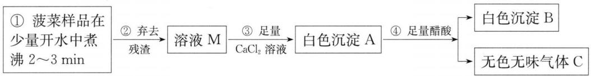

<details>
<summary>flowchart</summary>


</details>

有关数据如下：

$$
K _ {\mathrm{sp}} \left(\mathrm{CaCO} _ {3}\right) = 2. 5 \times 1 0 ^ {- 9}, K _ {\mathrm{sp}} \left(\mathrm{CaC} _ {2} \mathrm{O} _ {4}\right) = 2. 5 \times 1 0 ^ {- 9};
$$

$$
\begin{array}{r l} & K _ {\mathrm{a}} (\mathrm{HAc}) = 1. 8 \times 1 0 ^ {- 5}; K _ {\mathrm{a1}} (\mathrm{H} _ {2} \mathrm{C} _ {2} \mathrm{O} _ {4}) = 5. 9 \times 1 0 ^ {- 2}; K _ {\mathrm{a2}} (\mathrm{H} _ {2} \mathrm{C} _ {2} \mathrm{O} _ {4}) = 6. 4 \times \\ & 1 0 ^ {- 5}; \end{array}
$$

$$
K _ {\mathrm{a1}} (\mathrm {H_ {2} CO_ {3}}) = 4. 2 \times 1 0 ^ {- 7}; K _ {\mathrm{a2}} (\mathrm {H_ {2} CO_ {3}}) = 5. 6 \times 1 0 ^ {- 1 1} 。
$$

(1) 请根据上述数据,通过计算说明沉淀 A 与沉淀 B 分别是什么物质?

(2) 为检验菠菜中是否含有铁, 某同学直接取溶液 M, 加入 KSCN 检验, 是否

正确？说明理由。

(3) 你认为菠菜与豆腐同食, 在胃中可形成结石吗? 为什么?

6. (2015年全国初赛)写出下列各化学反应的方程式:

(1) 将热的硝酸铅溶液滴入热的铬酸钾溶液, 产生碱式铬酸铅沉淀 $\left[\mathrm{Pb}_{2}(\mathrm{OH})_{2}\mathrm{CrO}_{4}\right]$ ;

(2) 向含氰化氢的废水中加入铁粉和 $K_{2}CO_{3}$ 制备黄血盐 $\left[K_{4}Fe(CN)_{6}\cdot3H_{2}O\right]$ ;

(3) 酸性溶液中, 黄血盐用 $\mathrm{KMnO}_{4}$ 处理, 被彻底氧化, 产生 $\mathrm{NO}_{3}^{-}$ 和 $\mathrm{CO}_{2}$ ;

(4) 在水中, $Ag_{2}SO_{4}$ 与单质 S 作用, 沉淀变为 $Ag_{2}S$ , 分离, 所得溶液中加碘水不褪色。

7. 从含银、铜、金和铂的金属废料中提取 Au、Ag、Pt 的一种工艺如下:

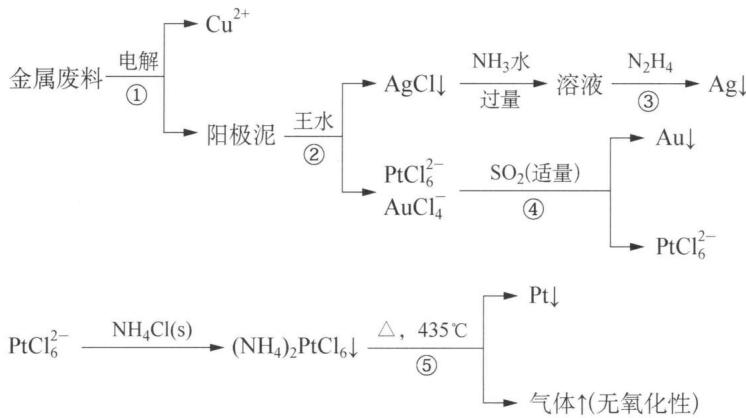

<details>
<summary>flowchart</summary>

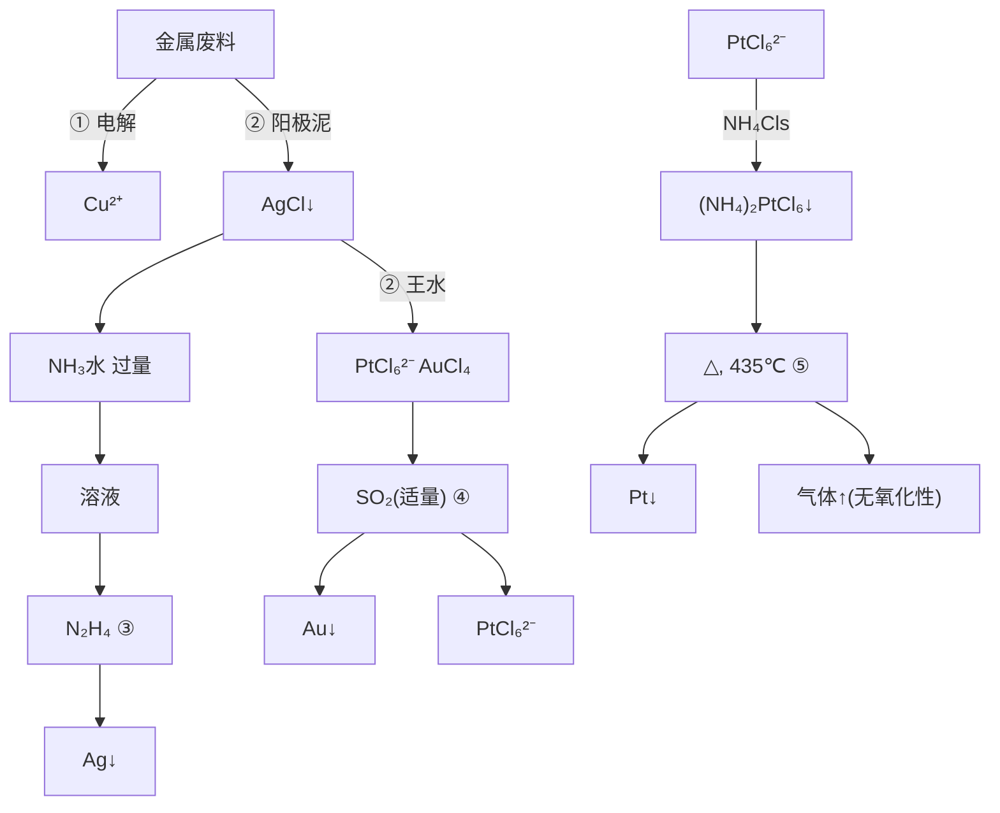
</details>

请回答下列问题:

（1）电解时，金属废料应与电源的哪一极相连，并指出另外一极的电极材料是什么？电解液的成分是什么？

(2) 写出王水处理阳极泥的反应方程式;

(3) 写出用 $N_{2}H_{4}$ 处理制得 Ag 的方程式；

(4) 写出工艺④所示步骤的反应方程式;

(5) 写出工艺⑤所示步骤的反应方程式。

8. (2015年全国初赛)最近报道了一种新型可逆电池。该电池的负极为金属铝, 正极为 $\mathrm{C}_{n}[\mathrm{AlCl}_{4}]$ , 化学式中 $\mathrm{C}_{n}$ 表示石墨; 电解质为烃基取代咪唑正离子 $(\mathrm{R}^{+})$ 和 $\mathrm{AlCl}_{4}^{-}$ 负离子组成的离子液体。电池放电时, 在负极附近形成双核配合物。充放电过程中离子液体中的正离子始终不变。

(1) 写出电池放电时, 正极、负极以及电池的反应方程式;

(2) 该电池所用石墨按如下方法制得: 甲烷在大量氢气存在下热解, 所得炭沉积在泡沫状镍模板表面。写出甲烷热解反应的方程式。采用泡沫状镍的作用何在? 简述理由;

(3) 写出除去制得石墨后的镍的反应方程式;

（4）该电池的电解质是将无水氯化铝溶于烃代咪唑氯化物离子液体中制得，写出反应方程式。

## 第十讲 滴定分析

## 知识精讲


定量分析在实际工作中的应用非常广泛,可以说是渗透到工业、农业、国防及科学技术的各个领域。在定量分析中,以滴定分析的应用最为广泛,如工业生产中的原料、中间体、成品分析;农业生产中的土壤、肥料、粮食、农药分析和各种矿物质的矿物分析等,都离不开滴定分析。为了更好地学习和掌握滴定分析法,确保滴定分析结果的准确性,还必须了解滴定过程中有关误差和分析数据处理方面的知识,因此,本讲在讲解化学过程中的误差和分析数据处理的基础上,介绍了滴定分析法的基本知识,并以滴定分析法中的酸碱滴定为例,讨论了酸碱滴定曲线、指示剂的选择和应用。

## 一、误差和分析数据的处理

定量分析是分析化学的一个组成部分,它的目的是准确地测定试样中被测组分的含量,并使分析结果达到一定的准确度。由于受分析方法、仪器、试剂、分析工作者的主观因素和操作水平等方面的限制,实验结果不可能与真实值完全一致,总伴有一定的误差。即使采用最好的仪器和方法,由操作技术最熟练的分析工作者进行多次重复分析,也很难得到完全一致的结果。这说明,在分析过程中,误差是客观存在的,只是程度不同而已。因此,为了得到正确的分析结果,我们必须要了解分析过程中产生误差的原因及其规律,才能对分析数据进行正确的处理。

## 1. 误差和偏差

在分析过程中,分析结果与真实值之差称为误差。分析结果与平均值之差称为偏差。在定量分析中,根据误差的性质和产生的原因,可将误差分为系统误差和偶然误差。

## (1) 系统误差

系统误差也称可定误差,它是由分析过程中某种确定的原因引起的,一般有固定的方向(正或负)和大小,在同一条件下重复测定时,它会重复出现。

根据系统误差的来源,可分为方法误差、仪器误差、试剂误差和操作误差四种。

① 方法误差

由分析方法本身不完善或选用不当所造成的误差。例如，重量分析中，由于沉淀的溶解、共沉淀、沉淀分解、挥发等因素造成的误差；在滴定分析中的反应不完全或有副反应、指示剂不合适、干扰离子的影响、滴定终点和化学计量点不符合等，都会产生系统误差。

② 仪器误差

仪器误差是由于仪器不够准确或未经校准所引起的误差。例如，天平两臂不等长、天平的灵敏度低、砝码本身重量不准、砝码生锈或沾有灰尘及容量仪器刻度不够准确等引起的误差。

③ 试剂误差

由于试剂或蒸馏水中含有微量杂质或干扰物质而引起的误差。

④ 操作误差

由于分析工作者的主观原因造成的,使操作不符合要求,形成的误差叫操作误差。例如,滴定管读数偏高或偏低,对滴定终点颜色的判断总偏深或偏浅,辨别不敏锐等所造成的误差。

(2) 偶然误差

偶然误差也称随机误差或不可定误差。它是由某些偶然的因素引起的。例如：测量过程中温度、湿度、气压的微小变化，分析仪器的微小波动等，都会引起测量数据的波动。

引起偶然误差的因素难以察觉,也难以控制。但偶然误差服从一般的统计规律。可以通过增加平行测定次数予以减少。在消除系统误差的前提下,随着测定次数的增多,偶然误差的算术平均值将趋于零。测定次数越多测定结果的平均值越接近于真实值。

除上述两类误差外,有时还可能由于分析工作者的粗心大意,或者不按章操作等引起的过失误差。例如,溶液溅失、加错试剂、读错刻度、记录和计算错误等。这些都是不应有的过失,因此在分析工作中,当出现较大的误差时,应查明原因,如系由过失所引起的错误,则应将该次测定结果弃去不用。

## 2. 准确度和误差

分析结果与真实值相接近的程度称为准确度。准确度用误差表示。误差是指分析结果与真实值的差，差值越小则分析结果的准确度高，反之则低。测量值中的误差，有两种表示方法：绝对误差和相对误差。

绝对误差(E)指测量值(X)与真实值(T)之差：E=X-T。

相对误差(RE)指绝对误差占真实值的百分率: RE = $\frac{E}{T} \times 100\%$ .

例如：用万分之一分析天平称量某试样两份，分别为 1.9562 g 和 0.1950 g。而两份试样的真实值各为 1.9564 g 和 0.1952 g。

它们的绝对误差分别为： $E_{1}=1.9562-1.9564=-0.0002\ g$ ;

$$
E _ {2} = 0. 1 9 5 0 - 0. 1 9 5 2 = - 0. 0 0 0 2 \mathrm{g。}
$$

相对误差分别为： $RE_{1}=\frac{-0.0002}{1.9564}\times100\%=-0.01\%$ ;

$$
\mathrm{RE} _ {2} = \frac {- 0.0002}{0.1952} \times 100\% = -0.1\%
$$

从上述两组计算数据可见,两份试样的绝对误差相等,但相对误差不同。当被测定的量大时,相对误差小,测定的准确度高。反之,被测定的量小时,相对误差大,测定的准确度低。因此,采用相对误差来表示测定结果的准确度更为确切。

误差有正负之分,正值表示分析结果偏高,负值表示分析结果偏低。

## 3. 精密度和偏差

精密度是指在相同的条件下,多次平行分析结果相互接近的程度。它表明测定数据的再现性。精密度常用偏差、相对平均偏差、标准偏差和相对标准偏差来表示。数值越小,说明测定结果的精密度越高。

## (1) 偏差和相对平均偏差

① 偏差分为绝对偏差和相对偏差

绝对偏差 $(d_{i})$ 表示测量值 $(X_{i})$ 与平均值 $(\overline{X})$ 之差： $d_{i}=X_{i}-\overline{X}$ 。

平均值 X 表示多次测量结果的算术平均值, 即每次测定值的总和除以测定次数:

$$
\overline {{{X}}} = \frac {x _ {1} + x _ {2} + \cdots + x _ {n}}{n} = \frac {1}{n} \sum_ {i = 1} ^ {n} x _ {i}
$$

相对偏差 $(d_{r})$ 是指单次测量值的绝对偏差在平均值中所占的百分率：

相对偏差 $= \frac{\text{绝对偏差}}{\text{测定结果的平均值}} \times 100\%$

即： $d_{ri}=\frac{d_{i}}{X}\times100\%$

绝对偏差和相对偏差均有正、负之分，正值时表示分析结果偏高；负值时表示分析结果偏低。绝对偏差和相对偏差只能表示相应的单次测量值与平均值的偏离程度,不能表示一组测量值中各测量值间的分散程度。在实际工作中,为了表示一组数据的精密度,我们常使用平均偏差和相对平均偏差。

② 平均偏差 $(\bar{d})$ ：各单个偏差绝对值的平均值。

$$
\bar {d} = \frac {\sum_ {i = 1} ^ {n} | x _ {i} - \bar {x} |}{n}, \text {式中:} n \text {表示测量次数。}
$$

③ 相对平均偏差 $(\bar{d}_{r})$ ：平均偏差占平均值的百分率。

$$
\overline{d}_{r} = \frac{\overline{d}}{\overline{x}}\times 100\% = \frac{\sum_{i = 1}^{n}|x_{i} - \overline{x}| / n}{\overline{x}}\times 100\%
$$

平均偏差和相对平均偏差都是正值。

## (2) 标准偏差和相对标准偏差

用平均偏差和相对平均偏差来表示一组测量数据的精密度的方法比较简单，但有不足之处。因为在同一组的测定中，小的偏差的测定总是占多数，大的偏差测定总是相对占少数，如果按总的测定次数去求平均偏差，必然会导致所得结果偏小，而大的偏差又得不到反映。所以用平均偏差表示精密度的方法在数理统计上是不适用的。为了更好地反映测定数据的精密度，衡量测量值分散程度用得最多的指标是标准偏差。

标准偏差(也称标准离差或均方根差)是反映一组测量数据离散程度的统计指标。

样本标准差用 s 表示:

$$
s = \sqrt {\frac {\sum_ {i = 1} ^ {n} (x _ {i} - \bar {x}) ^ {2}}{n - 1}} = \sqrt {\frac {(x _ {1} - \bar {x}) ^ {2} + (x _ {2} - \bar {x}) ^ {2} + \cdots + (x _ {n} - \bar {x}) ^ {2}}{n - 1}}.
$$

例如对某一试样分析,甲、乙两组测量的结果如下:

<table><tr><td>组别</td><td colspan="8">测量数据</td><td>平均值</td><td>平均偏差</td><td>标准偏差</td></tr><tr><td>甲组</td><td>5.3</td><td>5.0</td><td>4.6</td><td>5.1</td><td>5.4</td><td>5.2</td><td>4.7</td><td>4.7</td><td>5.0</td><td>0.25</td><td>0.31</td></tr><tr><td>乙组</td><td>5.0</td><td>4.3</td><td>5.2</td><td>4.9</td><td>4.8</td><td>5.6</td><td>4.9</td><td>5.3</td><td>5.0</td><td>0.25</td><td>0.39</td></tr></table>

从以上两组数据中可见,乙组中的一个数据 4.3 有较大的偏差,数据较分散,但两组的平均偏差一样,不能比较出精密度的差异,而使用标准偏差则可反映出甲组的精密度要好于乙组。

在比较两组或几组测量值波动的相对大小时,常常采用相对标准偏差。相对标准偏差以标准偏差在平均值中占有的百分率表示,简写 RSD,或称变动系数或偏离系数,简写 CV。

$$
\mathrm{RSD} = \frac {s}{\bar {x}} \times 100
$$

示例如下：

某标准溶液五次标定的结果为：0.1022、0.1029、0.1025、0.1020、0.1027 mol/L。计算平均值、平均偏差、相对平均偏差、标准偏差及相对标准偏差。

## 解析

平均值： $\bar{x}=\frac{0.1022+0.1029+0.1025+0.1020+0.1027}{5}=0.1025\ mol/L$

平均偏差： $\overline{d}=\frac{0.0003+0.0004+0.0000+0.0005+0.0002}{5}=0.0003\ mol/L$

相对平均偏差： $\frac{\bar{d}}{\bar{x}}\times100\%=\frac{0.0003}{0.1025}\times100\%=0.29\%$

标准偏差：

$$
\begin{array}{l} s = \sqrt {\frac {(0 . 0 0 0 3) ^ {2} + (0 . 0 0 0 4) ^ {2} + (0 . 0 0 0 0) ^ {2} + (0 . 0 0 0 5) ^ {2} + (0 . 0 0 0 2) ^ {2}}{5 - 1}} \\ = 0. 0 0 0 4 \mathrm{mol} / \mathrm{L} \\ \end{array}
$$

相对标准偏差： $\mathrm{RSD} = \frac{0.0004}{0.1025} \times 100\% = 0.39\%$ 。

我们讨论了误差和偏差的基本知识,知道误差和偏差具有不同的含义,但事实上误差和偏差是很难区别的。因为真实值往往不可能准确知道,只能说真实值是一个可以接近而不可达到的理论值。人们只能通过多次重复实验,得出一个相对准确的平均值,代替真实值来计算误差的大小。因此,在实际工作中,并不强调误差和偏差两个概念的区别,生产部门一般都称之为误差。

## 4. 准确度和精密度的关系

我们知道准确度是表示分析结果与真实值相接近的程度,它说明测定的可靠性。精密度是指相同条件下,多次平行分析结果相互接近的程度。如果几次测定的数据比较接近,表示分析结果的精密度高。那么准确度和精密度之间有什么关

系呢？

例如：甲、乙、丙、丁4人分析同一试样（设其真实值为 $10.15\%$ ），各分析4次，测定结果见图10-1。由4人的分析结果来看，甲的分析结果准确度和精密度都好，结果可靠；乙是精密度高，准确度低；丙是精密度与准确度均差；丁是平均值接近于真实值处，但精密度不好，只能说这个结果是凑巧得来的，因此不可靠。

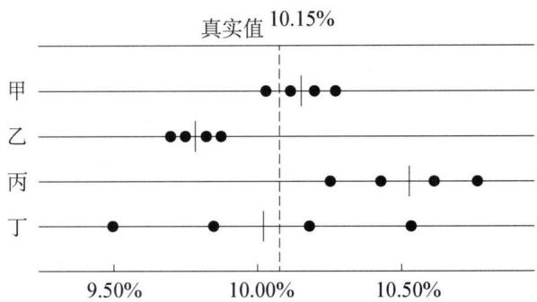

<details>
<summary>dot plot</summary>

| 类别 | 真实值 (%) |
|---|---|
| 甲 | 10.15 |
| 乙 | 9.75 |
| 丙 | 10.25 |
| 丁 | 9.50 |
</details>

图10-1 4人分析同一试样的结果  
(● 表示个别测定值, |表示平均值)

由此可见,精密度高的准确度不一定高,精密度是确保准确度的先决条件,这是前提。只有在消除系统误差的情况下,才可用精密度同时表达准确度。测量值的准确度表示测量的正确性,测量值的精密度表示测量的重现性。

## 5. 提高分析结果准确度的方法

## (1) 选择合适的分析方法

在实际分析过程中,要想得到准确的分析结果,首先要选择合适的分析方法。由于不同的分析方法具有不同的准确度和灵敏度。对常量组分的测定,常采用重量分析法或滴定分析法。对微量或痕量组分的测定,一般都选用灵敏度较高的仪器分析法;如果采用滴定分析法,往往做不出结果。因此,在选择分析方法时,必须根据分析对象、样品情况及对分析结果的要求来选择合适的分析方法。

## ① 减小测量误差

为了提高分析结果的准确度,必须尽量减小各测量步骤的误差。在消除系统误差的前提下,所有的仪器都有一个最大不确定值。例如 50 mL 滴定管每次读数的最大不确定值为 0.01 mL,万分之一天平每次称量的最大不确定值为 0.01 mg。因此,可以增大被测物的总量来减小测量的相对误差。

如滴定管两次读数的最大可能误差为 $\pm0.02\ mL$ ，当消耗滴定液的体积为20 mL时：

$$
\mathrm{相对误差} = \frac {\pm 0 . 0 2}{2 0} \times 1 0 0
$$

当滴定液的体积为 $10 \mathrm{~mL}$ 时:

$$
\mathrm{相对误差} = \frac {\pm 0 . 0 2}{1 0} \times 1 0 0
$$

一般滴定分析的相对误差要求其绝对值 $\leqslant0.1\%$ ,所以滴定液的体积应 $\geqslant20~mL$ 。

又如使用万分之一天平,为使称量的相对误差 $\leqslant0.1\%$ ,所需称量试样的最少量为:

$$
m _ {\mathrm{样品}} = \frac {0 . 0 0 0 2}{0 . 0 0 1} = 0. 2 \mathrm{g}
$$

② 减小偶然误差

在消除系统误差的前提下,增加平行测定次数可以减小偶然误差。

③ 消除系统误差

选择最佳的分析方法,使用符合要求的分析试剂,以减小因方法或试剂不纯而引起的误差。为消除系统误差,通常还可以做以下实验:

(i) 做对照试验: 对照试验是检验系统误差的有效方法。把含量已知的标准试样或纯物质当作样品, 按所选用的测定方法, 与未知样品平行测定。由分析结果与已知含量的差值, 便可得出分析误差; 用此误差值对未知试样的测定结果加以校正。对照试验可用于减免分析方法系统误差、检验试剂是否失效或反应条件是否正常和分析仪器的误差。  
（ii）做空白试验：以溶剂代替样品，按着与样品相同的方法和步骤进行分析，再把所得结果作为空白值从样品的分析结果中减去。这样可以消除或减小由溶剂及实验器皿带入的杂质引起的误差，使分析结果更准确。  
（iii）校准仪器，在精确的分析中，必须对仪器进行校正以减小系统误差。如砝码、移液管、滴定管和容量瓶等，并把校正值应用到分析结果的计算中去。此外，在同一个操作过程中使用同一种仪器，可以使仪器误差相互抵消，这是一种简单而有效的减免系统误差的办法。

## 6. 有效数字及其应用

(1) 有效数字的概念

有效数字是指分析工作中测量到的具有实际意义的数字,它包括所有准确数字和最后一位可疑数字(有 $\pm0.1$ 的误差)。记录数据和计算结果时,确定几位数字作为有效数字,必须和测量方法及所用仪器的精密度相匹配。不可以任意增加或减少有效数字。

例如：称一烧杯质量，记录为：

<table><tr><td>烧杯质量</td><td>有效数字位数</td><td>使用的仪器</td></tr><tr><td>16.5 g</td><td>3</td><td>托盘天平</td></tr><tr><td>16.561 g</td><td>5</td><td>电子天平</td></tr><tr><td>16.5614 g</td><td>6</td><td>分析天平</td></tr></table>

所以在记录测量数据和分析结果时,应根据所用仪器的准确度和在应保留的有效数字中的最后一位数字是“可疑数字”的原则下进行记录和计算。

在判断数据的有效数字位数时,要注意以下几点:

① 数字“0”在有效数字中的作用。

数字中的“0”有两方面的作用,一是和小数点一并起定位作用,不是有效数字;二是和其他数字一样作为有效数字使用。

数字中间的“0”都是有效数字。

数字前面的“0”都不是有效数字,它们只起定位作用。

数字后面的“0”要依具体情况而定。例如 25.00 mL, “0”就是有效数字, 共包含四位有效数字。但 2500 L, “0”就不好确定, 这个数可能是两位、三位或四位有效数字, 为表示清楚它的有效数字, 常采用科学计数法, 分别写成 $2.5 \times 10^{3}$ L (两位)、 $2.50 \times 10^{3}$ L (三位)、 $2.500 \times 10^{3}$ L (四位)。

<table><tr><td>例如:2.0007 g、1.0004 g</td><td>五位有效数字</td></tr><tr><td>0.6000 g、45.05%、2.023× $10^{3}$ </td><td>四位有效数字</td></tr><tr><td>0.0340 g、1.80× $10^{-3}$ </td><td>三位有效数字</td></tr><tr><td>0.0023 g、0.040%</td><td>两位有效数字</td></tr><tr><td>0.3 g、0.01%、2× $10^{2}$ </td><td>一位有效数字</td></tr></table>

② 在变换单位时,有效数字位数不变。

例如：10.00 mL 可写成 0.010 00 L 或 $1.000 \times 10^{-2}$ L；9.56 L 可写成 $9.56 \times 10^{3}$ mL。

③ 不是测量得到的数字,如倍数、分数关系等,可看作无误差数字或无限多位的有效数字。例如: 5 mol 硫酸、 $\frac{1}{2}$ mol 氯化钠等,其中 5、 $\frac{1}{2}$ 是倍数或分数,非测量所得数,就可以看作是无限多位的有效数字。

④ 在分析化学中还常遇到 pH、 $pK_{a}$ 、 $\lg K$ 等对数数据，其有效数字位数只决定于小数部分数字的位数，因为整数部分只代表原值是 10 的方次部分。如 pH = 11.02，表示 $[H^{+}] = 9.6 \times 10^{-12}$ ，有效数字是两位，而不是四位。pH = 7.13，表示 $[H^{+}] = 7.4 \times 10^{-8}$ ，它的有效数字是两位而不是三位。

⑤ 首位数字≥8时,其有效数字位数可多算一位,例如9.66,虽然只有三位,但已接近10.00,故可认为它是四位有效数字。

## (2) 有效数字的修约规则

在运算时按一定的规则确定有效数字的位数后,弃去多余的尾数,称为数字的修约。其规则如下:

① 四舍六入五成双(尾留双)

四舍：是指测量值中被修约数 $\leqslant4$ 时，则舍弃；

六入：是指测量值中被修约数≥6时，则进位；

五成双(或尾留双): 是指测量值中被修约数的后面数等于 5, 且 5 后无数或均为 0 时, 若 5 前面为偶数 (0 以偶数计), 则舍弃; 若 5 前面为奇数, 则进 1。

例：将下列数字修约只留一位小数。

1.05→1.0 （被修约数为 0,0 以偶数计，故不进）

0.15→0.2 （被修约数为奇数，故进1）

0.25→0.2 （被修约数为偶数，故不进）

测量值中被修约数的后面数等于 5, 且 5 后面还有不为 0 的任何数时, 无论 5 前面是偶数还是奇数一律进 1。

例如：将下列数字修约为两位有效数字。

$$
1. 0 5 0 1 \rightarrow 1. 1; 2. 3 5 1 \rightarrow 2. 4; 3. 2 5 2 \rightarrow 3. 3; 5. 0 5 0 \rightarrow 5. 0
$$

过去沿用“四舍五入”，见五就进，能引入明显的舍入误差（误差累计），使修约后的数值偏高。“四舍六入五成双”规则是逢五有舍、有人，使由五的舍、入引起的误差，可以自行抵消。因此，数字修约中多采用此规则。

② 只允许对原测量值一次修约到所需位数,不能分次修约。例如: 2.1346 修约为三位有效数字只能修约为 2.13,不能先修约为 2.135,再修约为 2.14。

③ 在大量的数据运算过程中,为了减少舍入误差,防止误差迅速累积,对参加运算的所有数据可先多保留一位有效数字(不修约),运算后,再按运算法则将结果修约至应有的有效数字的位数。

④ 在修约标准偏差值或其他表示准确度和精密度的数值时,修约的结果应使准确度和精密度的估计值变得更差一些。

例如：s=0.113，如取两位有效数字，宜修约为0.12；如取一位，宜修约为0.2。

## (3) 有效数字的运算规则

在分析测定过程中,一般都要经过几个测量步骤,获得几个准确度不同的数据。由于每个测量数据的误差都要传递到最终的分析结果中去,因此必须根据误差传递规律,按照有效数字的运算法则合理取舍,才能不影响分析结果的正确表述。为了不影响分析结果的准确度,运算时,必须遵守加减法和乘除法的运算规则。

## ① 加减法

做加减法数据的运算,实质上是各数值绝对误差的传递。因此当几个测量数据相加减时,它们的和或差的有效数字的保留应以小数点后位数最少(即绝对误差最大)的数据为准,使计算结果的绝对误差与此数据的绝对误差相当。即几个数据相加或相减时,先把各数据修约至小数点后位数最少的位数再加减。

例如：12.61、0.5674、0.0142三个数相加，由有效数字的含义可知，这三个数中的最后一位都是欠准的，是可疑数字。即12.61中的1已是可疑数字，其他两个数据小数点后第三、第四位再准确也是没有意义的。所以在运算之前，应以12.61为准，其他两个数据均修约为0.57、0.01，然后再相加得： $12.61+0.57+0.01=13.19$ 。

## ② 乘除法

乘除法的积或商的误差是各个数据相对误差的传递结果。当几个测量数据相乘除时,它们的积或商的有效数字的保留,应以有效数字位数最少(即相对误差最大)的测量值为准。为了便于计算,可按照有效数字位数最少的那个数修约其他各数的位数,然后再相乘除。这样经过计算的结果,其相对误差才与该测量数据的相对误差相当。

例如，求 0.0121、25.64、和 1.05782 三个数之积。

此三个相乘之积有效数字的保留应以 0.0121 为依据来确定其他数据的位数，修约后进行计算。上面三个数的相对误差分别为：

$$
\pm \frac {0.0001}{0.0121} \times 100 \% = \pm 0.8 \%
$$

$$
\pm \frac {0 . 0 1}{25.64} \times 100 \% = \pm 0.04 \%
$$

$$
\pm \frac {0.00001}{1.05782} \times 100 \% = \pm 0.0009 \%
$$

0.0121 有效数字位数最少, 相对误差最大, 应以此数为依据将其余两数修约成三位有效数字后再相乘, 即: $0.0121 \times 25.6 \times 1.06 = 0.328$ 。

③ 对数运算

所取对数位数(对数首数除外)应与真数的有效数字相同。真数有几位有效数字,则其对数的尾数亦应有几位有效数字。例如,溶液中 $\left[H^{+}\right]=1.3\times10^{-3}$ mol/L,则该溶液的 pH=-lg $\left[H^{+}\right]=2.89$ 。

④ 表示准确度或精密度时,大多数情况下,只取一位有效数字即可,最多取两位。

目前,使用电子计算器计算定量分析的结果已相当普遍,要特别注意最后结果中有效数字的位数,虽然计算器上显示的数字位数很多,切不可全部照抄,应根据前述规则决定取舍。

(4) 有效数字的运算在分析化学实验中的应用

① 正确地记录

在分析样品的过程中,正确地记录测量数据,对确定有效数字的位数具有非常重要的意义。因为有效数字是反应测量准确到什么程度的,因此,记录测量结果时,其位数必须按照有效数字的相关规则,不可夸大或缩小。例如:用万分之一分析天平称量时,必须记录到小数点后四位,切不可只写到小数点后三位,即16.5500 g不能写成16.55 g,也不能写成16.550 g。在读取滴定管数据时,必须记录到小数点后二位,如消耗溶液体积为20 mL时,要写成20.00 mL。

② 选择适当的仪器

根据对测量结果准确度要求,要正确称取样品用量,必须选用适当的仪器。例如,一般分析天平的称量误差为万分之一,即绝对误差为 $\pm0.1\ mg$ 。为使称量的相对误差 $<0.1\%$ ,样品的称取量必须不能低于0.1 g。如果称取样品质量在1 g以上时,选用千分之一天平进行称量,准确度也可以达到0.1%的要求。因此,要得到正确的称量结果,必须选用适当的仪器,方可保证测量结果的准确度。

③ 正确地表示分析结果

在分析某样品含量时,必须正确地表示分析结果。例如,甲、乙两同学用同样的方法来测定甘露醇原料,称取样品 0.2000 g, 测定结果: 甲报告含量为 0.8896, 乙报告含量为 0.880, 其中甲的报告结果正确, 原因如下:

$$
\mathrm{称样的准确度:} \frac {\pm 0 . 0 0 0 1}{0 . 2 0 0 0} \times 1 0 0 \% = \pm 0. 0 5 \%;
$$

甲分析结果的准确度： $\frac{\pm0.0001}{0.8896}\times100\%= \pm0.01\%$ ;

乙分析结果的准确度： $\frac{\pm0.001}{0.880}\times100\%= \pm0.1\%$

由此可见，甲报告的准确度和称样的准确度一致，乙报告的准确度不符合称样的准确度，报告没有意义。

## 二、滴定分析法

## 1. 滴定分析法的特点

滴定分析法又称容量分析法,是化学分析中重要的方法之一。这种方法是将一种已知准确浓度的试剂溶液,通过滴定管滴加到被测物质的溶液中,或将被测物质的溶液滴加到已知准确浓度的溶液中,直到所加的试剂溶液与被测物质按化学计量关系完全反应时,称为反应达到了化学计量点,亦称等量点或等当点。根据所用试剂溶液的浓度和消耗的体积,计算被测物质含量的方法。这种分析方法的操作手段主要是滴定,因此称为滴定分析法。又因这一类分析方法是以测量容积为基础的分析方法,所以又称为容量分析法。

许多滴定反应在到达化学计量点时外观上没有明显的变化,为了确定化学计量点的到达,在实际滴定操作时,常在被测物质的溶液中加入一种辅助试剂,借助于其颜色变化作为化学计量点到达的标志,这种能通过颜色变化指示到达化学计量点的辅助试剂称为指示剂。在滴定过程中,指示剂发生颜色变化的转变点称为滴定终点。化学计量点是根据化学反应的计量关系求得的理论值,而滴定终点是实际滴定时的测得值,只有在理想情况下滴定终点才能与化学计量点完全一致。在实际测定中,指示剂往往不是恰好在到达化学计量点的一瞬间变色,两者不一定完全符合,这种由滴定终点与化学计量点不一定恰好符合而造成的分析误差称为终点误差或滴定误差。它的大小取决于化学反应的完全程度和指示剂的选择是否恰当。因此,为了减小终点误差,应选择合适的指示剂,使滴定终点尽可能接近化学计量点。

滴定分析法通常适用于被测组分的含量在 1% 以上的常量组分的分析, 具有所用仪器简单, 操作简便、快速、便于掌握, 分析准确度较高等特点。一般情况下相对误差在 0.2% 以下。

## 2. 滴定分析法的分类

根据标准溶液与被测物质间所发生的化学反应类型不同,将滴定分析法分为

以下四大类：

(1) 酸碱滴定法(又称中和滴定法)

以酸碱中和反应(质子传递反应)为基础的一种滴定分析法。其反应实质可表示为： $H^{+} + OH^{-} = H_{2}O$ 。可用酸为标准溶液测定碱或碱性物质，也可用碱为标准溶液测定酸或酸性物质。

(2) 沉淀滴定法

利用沉淀反应进行滴定的方法。这类方法在滴定过程中,有沉淀产生,常用硝酸银为标准溶液测定卤化物、硫氰酸盐等,也可用硫氰酸铵或硫氰酸钾为标准溶液测定银盐。

(3) 配位滴定法

利用络合反应进行滴定的一种方法。其中最常用 EDTA 标准溶液测定各种金属离子的含量, 其反应如下: $M^{2+} + y^{4-} = My^{2-}$ , 式中 $y^{4-}$ 表示 EDTA 的阴离子。

(4) 氧化还原滴定法

利用氧化还原反应进行滴定的一种方法。可用氧化剂为标准溶液测定还原性物质，也可以用还原剂为标准溶液测定氧化性物质。根据所用的标准溶液不同，氧化还原法又分为高锰酸钾法、重铬酸钾法、碘量法等。

## 3. 滴定分析法的基本条件

滴定分析是以化学反应为基础的分析方法,在各种类型的化学反应中,并不都能用于滴定分析,适用于滴定分析的化学反应,必须具备以下四个条件:

(1) 反应要完全

标准溶液与被测物质之间的反应要按一定的化学反应方程式进行,反应定量完成的程度要达到99.9%以上,无副反应发生,这是定量计算的基础。

(2) 反应速度要快

滴定反应要求瞬间完成,对于速度较慢的反应,需通过加热或加入催化剂等方法提高反应速度。

(3) 反应选择性要高

标准溶液只能与被测物质反应,被测物质中的杂质不得干扰主要反应,否则必须用适当的方法分离或掩蔽来消除杂质的干扰。

(4) 要有适宜的指示剂或其他简便可靠的方法确定滴定终点。

## 4. 滴定分析法的滴定方式

滴定分析法中常用的滴定方式有四种：

## (1) 直接滴定法

如果滴定反应符合上述滴定分析反应必须具备的条件就可用标准溶液直接滴定被测物质, 这种滴定方法称为直接滴定法。如以 NaOH 标准溶液滴定 HAc 溶液, 以 $\mathrm{KMnO}_{4}$ 标准溶液滴定 $\mathrm{Fe}^{2+}$ 等, 都属于直接滴定法。当标准溶液与被测物质的反应不完全符合上述要求时, 则应考虑采用下述几种滴定方式。

## (2) 返滴定法

当反应速度慢或反应物难溶于水时,加入等量的标准溶液后,反应不能立即定量完成或没有合适指示剂等原因无法直接滴定时,可先在被测物质的溶液中加入一定量过量的标准溶液(A),待反应完全后,再用另一种标准溶液(B)滴定剩余的标准溶液(A),根据两种标准溶液的浓度和用量,即可求得被测物质的含量,这种滴定方式称为返滴定法。例如,氧化锌难溶于水,可先加入定量过量的盐酸标准溶液使之溶解,然后再用 NaOH 的标准溶液滴定剩余的盐酸即可测定氧化锌。反应原理如下:

$$
\mathrm{ZnO} + 2 \mathrm{HCl} = \mathrm{ZnCl} _ {2} + \mathrm{H} _ {2} \mathrm{O}
$$

(定量) (过量)

$$
\mathrm{HCl} + \mathrm{NaOH} = \mathrm{NaCl} + \mathrm{H} _ {2} \mathrm{O}
$$

(剩余)

## (3) 置换滴定法

对于不按确定的反应式进行(伴有副反应)的反应,不能直接滴定被测物质,而是先用适当的试剂与被测物质反应,使之定量地置换生成另一可直接滴定的物质,再用标准溶液滴定此生成物,这种滴定方法称为置换滴定法。例如,还原剂 $\mathrm{Na}_{2}\mathrm{S}_{2}\mathrm{O}_{3}$ 与氧化剂 $\mathrm{K}_{2}\mathrm{Cr}_{2}\mathrm{O}_{7}$ 之间发生反应时, $\mathrm{Na}_{2}\mathrm{S}_{2}\mathrm{O}_{3}$ 一部分被氧化生成 $\mathrm{SO}_{4}^{2-}$ ,另一部分被氧化生成 $\mathrm{S}_{4}\mathrm{O}_{6}^{2-}$ ,反应无确定的计算关系。但是 $\mathrm{K}_{2}\mathrm{Cr}_{2}\mathrm{O}_{7}$ 在酸性条件下氧化KI,定量地生成 $\mathrm{I}_{2}$ 。此时再用 $\mathrm{Na}_{2}\mathrm{S}_{2}\mathrm{O}_{3}$ 标准溶液滴定生成的 $\mathrm{I}_{2}$ ,这一反应符合滴定分析的要求,反应原理为: $\mathrm{Cr}_{2}\mathrm{O}_{7}^{2-}+6\mathrm{I}^{-}+14\mathrm{H}^{+}=2\mathrm{Cr}^{3+}+3\mathrm{I}_{2}+7\mathrm{H}_{2}\mathrm{O}$ ,生成的 $\mathrm{I}_{2}$ 与 $\mathrm{NaS}_{2}\mathrm{O}_{3}$ 标准溶液反应: $\mathrm{I}_{2}+2\mathrm{S}_{2}\mathrm{O}_{3}^{2-}=2\mathrm{I}^{-}+\mathrm{S}_{4}\mathrm{O}_{6}^{2-}$ 。

## (4) 间接滴定法

当被测物质不能与标准溶液直接反应时, 可将试样通过和另一种物质反应后, 再用适当的标准溶液滴定反应产物。这种滴定方式称为间接滴定。例如, 硼酸的离解常数 $K_{a}$ 太小, 不能用标准溶液直接滴定, 但硼酸与多元醇反应生成的配合酸的离解常数为 $10^{-6}$ , 可以用 NaOH 标准溶液滴定生成的配合酸, 测出硼酸的含量。

在滴定分析中由于采用了返滴定、置换滴定、间接滴定等滴定方法，大大拓展了滴定分析的应用范围。

## 5. 标准溶液与基准物质

在滴定分析中,无论采用何种滴定方法,都需使用标准溶液并进行滴定,然后通过计算得到分析结果。因此正确地配制和使用标准溶液,准确地测定标准溶液的浓度,对于保证滴定分析的准确度是有重要意义的。

(1) 标准溶液浓度的表示方法

① 物质的量浓度

单位体积溶液中所含溶质 B 的物质的量, 称为 B 的物质的量浓度, 以符号 $c_{B}$ 表示, 即:

$$
c _ {\mathrm{B}} = \frac {n _ {\mathrm{B}}}{V _ {\mathrm{B}}} n _ {\mathrm{B}} = \frac {m _ {\mathrm{B}}}{M _ {\mathrm{B}}}
$$

② 滴定度

在实际工作中,经常需要对大批试样测定其中同一组分的含量,这种情况下用滴定度来表示标准溶液的浓度,则计算待测组分含量就比较方便。滴定度有两种表示方法,一种是每毫升标准溶液中所含溶质的质量(g/mL或mg/mL),称为滴定度,以符号T表示。如 $T_{NaOH}=0.004000g/mL$ ,表示1mL NaOH标准溶液中含0.004000g NaOH。另一种是指每毫升标准溶液相当于被测物质的克数,以符号 $T_{M1/M2}$ 表示。 $M_{1}$ 是标准溶液溶质的化学式, $M_{2}$ 是被测物质的化学式。如 $T_{NaOH/HCl}=0.003646g/mL$ ,表示1mL NaOH溶液可与0.003646g HCl反应。若已知滴定度,再乘以滴定中所消耗标准溶液的体积,就可以直接得出被测物质的质量。

示例如下：

用 $T_{KMnO_{4}/Fe}=0.005800\ g/mL$ 的 $KMnO_{4}$ 标准溶液滴定样品中的亚铁，用去该标准溶液 18.00 mL，求试样中亚铁的质量。

解析 $m_{Fe} = T_{KMnO_{4}/Fe} \cdot V_{KMnO_{4}} = 0.005800 \, g/mL \times 18.00 \, mL = 0.1044 \, g$ 。

上述两种滴定度的表示方法中,在分析化学中以第二种表示法应用的范围比较广泛。

(2) 标准溶液的配制

标准溶液是已知准确浓度的溶液,根据物质的性质,通常有两种配制的方法,即直接法和间接法(标定法)。

① 直接法

准确称取一定量的基准物质,溶解后,转移至一定体积的容量瓶中,加水稀释至刻度。根据称取物质的质量和容量瓶的体积,即可求出标准溶液的准确浓度,这种方法称为直接法。能用来直接配制和标定标准溶液的物质,叫基准物质(或基准试剂)。凡是基准物质应具备下列条件:

(i) 纯度高：一般要求其纯度在 99.9% 以上。  
(ii) 组成恒定: 物质的组成与化学式相符。若含结晶水, 其结晶水的含量也应与化学式相符。如硼砂 $Na_{2}B_{4}O_{7} \cdot 10H_{2}O$ 、草酸 $H_{2}C_{2}O_{4} \cdot 2H_{2}O$ 等。  
（iii）性质稳定：在保存或称量中组成与质量不变。如不吸收 $CO_{2}$ ，不吸 $H_{2}O$ ，不被空气中 $O_{2}$ 所氧化，在加热干燥时不分解等。  
(iv) 具有较大的摩尔质量: 摩尔质量越大, 称取的量越多, 称量的相对误差就可相应地减小。

分析化学中常用的基准物质有无水碳酸钠 $\left(\mathrm{Na}_{2}\mathrm{CO}_{3}\right)$ 、硼砂 $\left(\mathrm{Na}_{2}\mathrm{B}_{4}\mathrm{O}_{7}\cdot10\mathrm{H}_{2}\mathrm{O}\right)$ 、邻苯二甲酸氢钾 $\left(\mathrm{KHC}_{8}\mathrm{H}_{4}\mathrm{O}_{4}\right)$ 、草酸 $\left(\mathrm{H}_{2}\mathrm{C}_{2}\mathrm{O}_{4}\cdot2\mathrm{H}_{2}\mathrm{O}\right)$ ，还有纯金属如Zn、Cu等。

② 间接法(标定法)

许多化学试剂,由于不容易提纯、保存或组成不固定。如 NaOH 很容易吸收空气中的 $CO_{2}$ 和 $H_{2}O$ , 所称取的质量不能代表纯 NaOH 的质量; 高锰酸钾 $\left(\mathrm{KMnO}_{4}\right)$ 见光易分解, 硫代硫酸钠 $\left(\mathrm{Na}_{2}\mathrm{S}_{2}\mathrm{O}_{3} \cdot 5\mathrm{H}_{2}\mathrm{O}\right)$ 不易提纯等。它们均不符合对基准物质的要求, 不能用直接法配制标准溶液, 而要采用间接法, 也称标定法。

称取一定量物质或量取一定量体积浓溶液,配制成近似于所需浓度的溶液,然后用基准物质或另一种标准溶液来测定其准确浓度,该方法称为间接法(或标定法)。利用基准物质或已知准确浓度的溶液来滴定标准溶液浓度的操作过程称为“标定”。

(3) 标准溶液的标定

① 基准物质标定法

(i) 多次称量法: 精密称取若干份同样的基准物质, 分别溶于适量的水或酸中, 然后用待标定的溶液滴定, 根据所称量的基准物质的质量和所消耗的待标定溶液的体积, 即可计算出该溶液的准确浓度, 最后取其平均值作为滴定液的浓度。  
（ii）移液管法：称取较大的一份基准物质，溶解后，定量转移到容量瓶中，稀释至一定体积，摇匀。用移液管取出若干份该溶液，用待标定的标准溶液滴定，最后取其平均值。

② 标准溶液比较法

准确移取一定量的待标定溶液,用已知准确浓度的标准溶液滴定,或者用待标定溶液滴定准确移取的标准溶液。根据两种溶液所消耗的体积及标准溶液的浓度可计算出待标定溶液的浓度。这种用标准溶液来测定待标定溶液准确浓度的操作称为标准溶液比较法。

显然,这种方法不及用基准物质直接标定好,因为,如果已知标准溶液的浓度不够准确,就会直接影响比较的标准溶液浓度的准确性。

当然,在进行标准溶液标定时,无论采用哪种方法,一般规定要平行标定3\~4次,并且相对平均偏差不大于0.2%。标定好的标准溶液应妥善保管。对不稳定的溶液还要定期进行复定。例如,对见光易分解的 $AgNO_{3}$ 、 $KMnO_{4}$ 标准溶液应贮存在棕色瓶中,并放置暗处。对NaOH、 $Na_{2}S_{2}O_{3}$ 等不够稳定的标准溶液,放置2\~3个月后,需重新标定。

## 三、酸碱指示剂

酸碱滴定是以水溶液中的质子转移反应为基础的滴定分析。一般酸、碱以及能与酸碱直接或间接发生质子转移反应的物质，几乎都可以用酸碱滴定法测定。但在酸碱滴定的过程中，滴定反应达到计量点时，通常没有任何外观变化，必须借助酸碱指示剂颜色的改变来指示滴定终点。因此，在学习酸碱滴定时，不仅要了解指示剂的变色原理和变色范围，同时也要了解滴定过程中溶液 pH 值的变化规律和指示剂的选择依据，以便能正确地选择合适的指示剂，获得准确的分析结果。

## 1. 指示剂的变色原理

用于酸碱滴定的指示剂均称为酸碱指示剂。酸碱指示剂是一类结构复杂的有机弱酸或有机弱碱，分别称酸型指示剂和碱型指示剂，其中酸型指示剂用 HIn 表示，碱型指示剂用 InOH 表示。由于指示剂在溶液中能部分电离，电离后产生与指示剂本身具有不同结构的复杂离子，且其离子与指示剂分子颜色不同。当改变溶液的 pH 值时，指示剂会失去或得到质子，而使结构发生变化，导致溶液的颜色也随之变化。

如用 HIn 代表指示剂的酸式成分, In $^{-}$ 代表指示剂碱式成分, 上式可简化为:

$$
\mathrm{HIn} \rightleftharpoons \mathrm{H} ^ {+} + \mathrm{In} ^ {-}
$$

(酸式色) (碱式色)

## 2. 指示剂的变色范围

讨论指示剂的变色范围,目的是了解指示剂的颜色变化与溶液 pH 的关系。指示剂在什么 pH 变色,对于酸碱滴定分析非常主要。下面以酸型指示剂(HIn)为例来说明指示剂变色与溶液 pH 的定量关系。弱酸型指示剂在溶液中的电离平衡为: HIn(酸式色)⇌H $^{+}$ +In $^{-}$ (碱式色)。根据电离平衡常数 K 的表达式有[H $^{+}$ ] = K $_{HIn}$ $\frac{[HIn]}{[In^{-}] }$ ,两边取负对数得 pH = pK $_{HIn}$ - lg $\frac{[HIn]}{[In^{-}] }$ 。其中,K $_{HIn}$ 为指示剂的电离常数,也称为指示剂常数,在一定温度下是一个常数。所以,指示剂的颜色取决于 $\frac{[HIn]}{[In^{-}] }$ 的比值,由于人眼对颜色分辨能力的限制,通常只有一种型体的浓度超过另一种型体浓度的 10 倍,或 10 倍以上时,才能观察到其中浓度较大的那种型体对应的颜色。因此,我们只能在一定浓度比范围内看到指示剂的颜色变化,这一范围是: $\frac{[HIn]}{[In^{-}] }$ = 10 至 $\frac{[HIn]}{[In^{-}] }$ = $\frac{1}{10}$ 。此时,溶液 pH 分别为:

$$
\begin{array}{l} \mathrm{pH} = \mathrm{pK} _ {\mathrm{HIn}} - \lg \frac {[ \mathrm{HIn} ]}{[ \mathrm{In} ^ {-} ]} = \mathrm{pK} _ {\mathrm{HIn}} - 1 \\ \mathrm{pH} = \mathrm{pK} _ {\mathrm{HIn}} - \lg \frac {[ \mathrm{HIn} ]}{[ \mathrm{In} ^ {-} ]} = \mathrm{pK} _ {\mathrm{HIn}} + 1 \\ \end{array}
$$

当 $\frac{[\mathrm{HIn}]}{[\mathrm{In}^{-}]}\geqslant 10$ 时， $\mathrm{pH}\leqslant \mathrm{pK}_{\mathrm{HIn}} - 1$ ，看到酸式色；

当 $\frac{[\mathrm{HIn}]}{[\mathrm{In}^{-}]}\leqslant \frac{1}{10}$ 时， $\mathrm{pH}\geqslant \mathrm{pK}_{\mathrm{HIn}} + 1$ ，看到碱式色。

由此可见, 只有当溶液的 pH 由 $pK_{HIn}-1$ 变化到 $pK_{HIn}+1$ 时, 人们才能观察到指示剂颜色的变化, 我们将观测到的指示剂颜色发生变化时的 pH 范围叫作指示剂的变色范围, 也叫变色区间。指示剂的变色范围是: $pH = pK_{HIn} \pm 1$ 。

当 $\frac{[HIn]}{[In^{-}]} = 1$ 时，指示剂的酸式色浓度等于碱式色浓度，溶液呈现混合色，此时 $pH = pK_{HIn}$ ，人们称此 pH 为指示剂的理论变色点。

指示剂的理论变色范围一般约为2个pH单位(从 $pH = pK_{HIn} - 1$ 过渡到 $pH = pK_{HIn} + 1$ )，实际的变色范围是根据实验测得，并不都是2个pH单位，而略有上下，这是由人的眼睛对混合色调中两种颜色的敏感程度不同造成的。例如甲基红 $pK_{HIn} = 5.1$ 理论变色范围应为4.1～6.1，实际测得为4.4～6.2，这是因为人的肉眼辨别红色比黄色更敏感的缘故。

常用酸碱指示剂的变色范围见表10-1：

表 10-1 几种常用的酸碱指示剂

<table><tr><td rowspan="2">指示剂</td><td rowspan="2">变色范围pH</td><td colspan="2">颜色</td><td rowspan="2"> $pK_{HIn}$ </td><td rowspan="2">配制</td><td rowspan="2">用量滴/10 mL试液</td></tr><tr><td>酸色</td><td>碱色</td></tr><tr><td>百里酚蓝</td><td>1.2~2.8</td><td>红</td><td>黄</td><td>1.65</td><td>0.1%的20%酒精溶液</td><td>1~2</td></tr><tr><td>甲基黄</td><td>2.9~4.0</td><td>红</td><td>黄</td><td>3.25</td><td>0.1%的90%酒精溶液</td><td>1</td></tr><tr><td>甲基橙</td><td>3.1~4.4</td><td>红</td><td>黄</td><td>3.45</td><td>0.05%的水溶液</td><td>1</td></tr><tr><td>溴酚蓝</td><td>3.0~4.6</td><td>黄</td><td>紫</td><td>4.1</td><td>0.1%的20%酒精溶液或其钠盐的水溶液</td><td>1</td></tr><tr><td>溴甲酚绿</td><td>3.8~5.4</td><td>黄</td><td>蓝</td><td>4.9</td><td>同上</td><td>1~3</td></tr><tr><td>甲基红</td><td>4.4~6.2</td><td>红</td><td>黄</td><td>5.1</td><td>0.1%的60%酒精溶液或其钠盐的水溶液</td><td>1</td></tr><tr><td>溴百里酚蓝</td><td>6.2~7.6</td><td>黄</td><td>蓝</td><td>7.3</td><td>0.1%的20%酒精溶液或其钠盐的水溶液</td><td>1</td></tr><tr><td>中性红</td><td>6.8~8.0</td><td>红</td><td>黄橙</td><td>7.4</td><td>0.1%的60%酒精溶液</td><td>1</td></tr><tr><td>酚红</td><td>6.7~8.4</td><td>黄</td><td>红</td><td>8.0</td><td>0.1%的60%酒精溶液或其钠盐水溶液</td><td>1</td></tr><tr><td>酚酞</td><td>8.0~10.0</td><td>无</td><td>红</td><td>9.1</td><td>0.5%的90%酒精溶液</td><td>1~3</td></tr><tr><td>百里酚酞</td><td>9.4~10.6</td><td>无</td><td>蓝</td><td>10.0</td><td>0.1%的90%酒精溶液</td><td>1~2</td></tr></table>

## 3. 影响指示剂变色范围的因素

## (1) 温度

温度的变化会引起指示剂离解常数 $K_{HIn}$ 的变化, 因此指示剂的变色范围也随之变动。例如, $18^{\circ}C$ 时, 甲基橙的变色范围为 $3.1 \sim 4.4$ ; 而 $100^{\circ}C$ 时, 为 $2.5 \sim 3.7$ 。

## (2) 指示剂的用量

指示剂的用量不宜过多,否则溶液颜色较深,变色不敏锐。此外,指示剂本身是弱酸或弱碱,如果用量多,消耗滴定液多,带来较大误差。但指示剂用量也不能太少,如果用量太少,不易观察颜色的变化。一般 25 mL 被测溶液中加 1\~2 滴指示剂较为适宜。

## (3) 滴定的顺序

指示剂的变色范围是靠肉眼观察出来的,由于肉眼观察显色比观察褪色容易;观察深色较观察浅色容易。所以用碱滴定酸时,常用甲基红作指示剂,甲基红由酸式色变为碱式色,即由黄色变到橙色,颜色变化明显,易于辨别;用酸滴定碱时,一般用甲基橙作指示剂,终点由黄色变为橙色,颜色变化亦很明显,便于观察。

## (4) 混合指示剂

混合指示剂具有变色范围窄,变色敏锐的特点。在酸碱滴定中,有时需要将滴定终点限制在很窄的 pH 范围内,这时就可采用混合指示剂。混合指示剂有以下几种:

① 是由两种或两种以上的指示剂混合而成,利用颜色之间的互补作用,使变色更加敏锐。

② 是由某种指示剂和一种惰性染料组成的, 其作用也是利用颜色的互补, 借以提高颜色变化的敏锐性。例如, 甲基橙中加入靛蓝, 组成混合指示剂。在滴定过程中靛蓝不变色, 只作甲基橙的蓝色背景。该混合指示剂随 $\mathrm{H}^{+}$ 浓度变化而发生如下的颜色变化:

<table><tr><td>溶液的酸度</td><td>甲基橙的颜色</td><td>甲基橙+靛蓝的颜色</td></tr><tr><td>pH $\geqslant$ 4.4</td><td>黄色</td><td>绿色</td></tr><tr><td>pH=4.0</td><td>橙色</td><td>浅灰色</td></tr><tr><td>PH $\leqslant$ 3.1</td><td>红色</td><td>紫色</td></tr></table>

单一的甲基橙由黄变到红，中间有一过渡的橙色，难于辨别；而混合指示剂由绿变到紫，不仅中间是几乎无色的浅灰色，而且绿色与紫色明显不同，所以变色非常敏锐，容易辨别。配制混合指示剂时，应严格控制两种组分的比例，否则颜色变化也将不明显，常用的混合指示剂见表10-2。

表 10-2 常用的混合指示剂

<table><tr><td rowspan="2">混合指示剂的组成</td><td rowspan="2">变色点pH</td><td colspan="2">变色情况</td><td rowspan="2">备注</td></tr><tr><td>酸色</td><td>碱色</td></tr><tr><td>一份0.1%甲基黄乙醇溶液一份0.1%次甲基蓝乙醇溶液</td><td>3.25</td><td>蓝紫</td><td>绿</td><td>pH=3.4绿色,pH=3.2蓝紫色</td></tr><tr><td>一份0.1%甲基橙水溶液一份0.25%靛蓝二磺酸钠水溶液</td><td>4.1</td><td>紫</td><td>黄绿</td><td></td></tr><tr><td>三份0.1%溴甲酚绿乙醇溶液一份0.2%甲基红乙醇溶液</td><td>5.1</td><td>酒红</td><td>绿</td><td></td></tr><tr><td>一份0.1%溴甲酚绿钠盐水溶液一份0.1%氯酚红钠盐水溶液</td><td>6.1</td><td>黄绿</td><td>蓝紫</td><td>pH=5.4蓝绿色,pH=5.8蓝色,pH=6.0蓝带紫,pH=6.2蓝紫</td></tr><tr><td>一份0.1%中性红乙醇溶液一份0.1%次甲基蓝乙醇溶液</td><td>7.0</td><td>蓝紫</td><td>绿</td><td>pH=7.0紫蓝</td></tr><tr><td>一份0.1%甲酚红钠盐水溶液三份0.1%百里酚蓝钠盐水溶液</td><td>8.3</td><td>黄</td><td>紫</td><td>pH=8.2玫瑰色,pH=8.4清晰的紫色</td></tr><tr><td>一份0.1%百里酚蓝50%乙醇溶液三份0.1%酚酞50%乙醇溶液</td><td>9.0</td><td>黄</td><td>紫</td><td>从黄到绿再到紫</td></tr><tr><td>二份0.1%百里酚酞乙醇溶液一份0.1%茜素黄乙醇溶液</td><td>10.2</td><td>黄</td><td>紫</td><td></td></tr></table>

另外在实际工作中,还经常会用到一种能粗略地测定溶液的 pH 的混合指示剂,它是将几种指示剂混合制成的。如 pH 试纸就是将纸条浸泡于多种混合指示剂溶液中,晾干后制成的。

## 四、酸碱滴定类型及指示剂的选择

酸碱滴定法是利用酸碱反应来进行滴定的分析方法。下面分别讨论不同类型的酸碱滴定的滴定曲线和指示剂的选择，以及与此相关的酸碱滴定问题。

## 1. 强酸(碱)滴定强碱(酸)

现以 0.1000 mol/L 的 NaOH 溶液滴定 20.00 mL，0.1000 mol/L 的 HCl 溶液为例进行讨论。强酸强碱之间相互滴定的基本反应是： $H^{+} + OH^{-} = H_{2}O$ 。

## (1) 滴定过程中 $\mathrm{pH}$ 的计算

为了便于掌握溶液在整个滴定过程中 pH 的变化情况, 特将整个滴定过程分为四个阶段。

① 滴定前：溶液的 pH 由 HCl 的原始浓度决定。pH = -lg[H $^{+}$ ] = 1.00。

② 滴定开始至化学计量点前：溶液的酸度取决于剩余的盐酸溶液的体积，其计算公式为：

$$
\left[ \mathrm{H} ^ {+} \right] = \frac {n _ {\mathrm{HCl}} - n _ {\mathrm{滴入的NaOH}}}{V _ {\mathrm{总}}} = \frac {c _ {\mathrm{HCl}} V _ {\mathrm{剩余HCl}}}{V _ {\mathrm{总}}}
$$

例如：滴入 NaOH 标准溶液 18.00 mL，剩余 HCl 0.1000×2.00 mmol，溶液总体积增加至 18.00+20.00 mL，则：

$$
[ \mathrm{H} ^ {+} ] = \frac {0 . 1 0 0 0 \times 2 . 0 0}{2 0 . 0 0 + 1 8 . 0 0} = 5. 3 \times 1 0 ^ {- 3} \mathrm{mol/L}, \text {所以} \mathrm{pH} = 2. 2 8 _ {\circ}
$$

当滴入 NaOH 标准溶液 19.98 mL, HCl 被中和百分数为 99.9%, 剩余 HCl 0.02×0.1000 mmol 时, 溶液总体积增加至 20.00+19.98 mL, 则:

$$
[ \mathrm{H} ^ {+} ] = \frac {0 . 1 0 0 0 \times 0 . 0 2}{2 0 . 0 0 + 1 9 . 9 8} = 5. 0 \times 1 0 ^ {- 5} \mathrm{mol/L}, \text {所以} \mathrm{pH} = 4. 3 0 。
$$

③ 化学计量点时：当滴入 NaOH 溶液为 20.00 mL 时，到达化学计量点，此时，NaOH 和 HCl 以等物质的量作用，溶液呈中性，因此 pH=7.00。

④ 化学计量点后: 溶液的 $\mathrm{pH}$ 取决于过量的 $\mathrm{NaOH}$ , 其计算公式如下:

$$
[ \mathrm{OH} ^ {-} ] = \frac {n _ {\mathrm{NaOH}} - n _ {\mathrm{HCl}}}{V _ {\text {总}}} = \frac {c _ {\mathrm{NaOH}} V _ {\mathrm{NaOH}} - c _ {\mathrm{HCl}} V _ {\mathrm{HCl}}}{V _ {\mathrm{NaOH}} + V _ {\mathrm{HCl}}}
$$

例如: 滴入 NaOH 溶液 20.02 mL (HCl 被中和百分数 100.1%) 时, 过量

NaOH 体积为 0.02 mL, 此时:

$$
[ \mathrm{OH} ^ {-} ] = \frac {0 . 1 0 0 0 \times 0 . 0 2}{2 0 . 0 0 + 2 0 . 0 2} = 5. 0 \times 1 0 ^ {- 5} \mathrm{mol/L}, \text {所以} \mathrm{pOH} = 4. 3 0,
$$

$$
\mathrm{pH} = 1 4 - 4. 3 0 = 9. 7 0 _ {\circ}
$$

依次把消耗的 NaOH 体积数代入上述公式,逐一计算滴定过程中各点的 pH 并列于表 10-3。

表 10-3 用 ${0.1000}\mathrm{{mol}}/\mathrm{L}$ 的 $\mathrm{{NaOH}}$ 溶液滴定 ${20.00}\mathrm{\;{mL}}{0.1000}\mathrm{{mol}}/\mathrm{L}$ 的 $\mathrm{{HCl}}$ 溶液

<table><tr><td>滴入 NaOH体积 $V_{\text{NaOH}}/\text{mL}$ </td><td>滴入 NaOH物质的量 $n_{\text{NaOH}}/\text{mmol}$ </td><td>HCl 被中和的百分数</td><td>剩余 HCl物质的量 $n_{\text{HCl}}/\text{mmol}$ </td><td>过量 NaOH体积 $V_{\text{NaOH}}/\text{mL}$ </td><td>pH</td></tr><tr><td>0.00</td><td>0.00</td><td>0.00</td><td></td><td></td><td>1.00</td></tr><tr><td>18.00</td><td>1.800</td><td>90.00</td><td>2.000</td><td></td><td>2.28</td></tr><tr><td>19.80</td><td>1.980</td><td>99.00</td><td>0.200</td><td></td><td>3.30</td></tr><tr><td>19.98</td><td>1.998</td><td>99.90</td><td>0.020</td><td></td><td>4.30</td></tr><tr><td>20.00</td><td>2.000</td><td>100.0</td><td>0.002</td><td></td><td>7.00</td></tr><tr><td>20.02</td><td>2.002</td><td>100.1</td><td>0.000</td><td>0.02</td><td>9.70</td></tr><tr><td>20.20</td><td>2.020</td><td>101.0</td><td></td><td>0.20</td><td>10.70</td></tr><tr><td>22.00</td><td>2.200</td><td>110.0</td><td></td><td>2.00</td><td>11.70</td></tr><tr><td>40.00</td><td>4.000</td><td>200.0</td><td></td><td>20.00</td><td>12.50</td></tr></table>

以滴入的 NaOH 溶液的体积(或 HCl 被中和百分数)为横坐标,pH 为纵坐标,绘制曲线,称为强碱(酸)滴定强酸(碱)的滴定曲线,如图 10-2 实线(或虚线)所示。

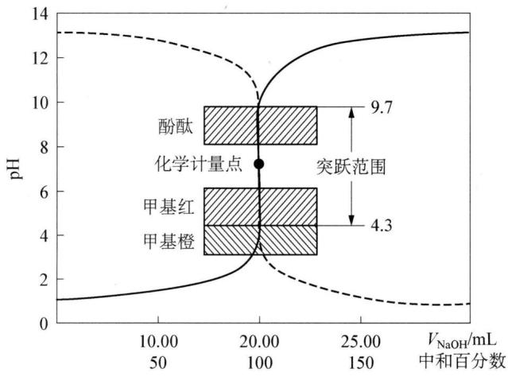

<details>
<summary>bar-line hybrid chart</summary>

| 水相 | pH   | 中和百分比 |
|------|------|------------|
| 酚酞 | 9.7  | 20.00      |
| 甲基红 | 4.3  | 150        |
| 甲基橙 | 4.3  | 150        |
</details>

图10-2 $0.1000\mathrm{mol / LNaOH}$ 溶液与 $0.1000\mathrm{mol / L}$ HCl溶液的滴定曲线（实线表示用NaOH溶液滴定HCl溶液，虚线表示用HCl溶液滴定 $\mathrm{NaOH}$ 溶液）

## (2) pH 的突跃范围

从表 10-3 和图 10-2 可以看出,从滴定开始到滴入 19.98 mL 的 NaOH 溶液,溶液的 pH 变化较慢,从 1.00 增大到 4.30,仅仅改变了 3.30 个 pH 单位,滴定曲线比较平坦;但从 19.98 mL(溶液中只剩下 0.1%HCl 溶液)到 20.02 mL(溶液中过量了 0.1%NaOH 溶液),即在化学计量点前后只相差 0.04 mL(约 1 滴)NaOH 溶液,就使得 pH 从 4.30 跃到 9.70,改变了 5.40 个 pH 单位,溶液也由酸性变成了碱性。因此,在分析化学中,将化学计量点前后的滴定百分数±0.1%范围内 pH 的变化,称为滴定的突跃范围。

## (3) 指示剂的选择

滴定的突跃范围是选择指示剂的依据。应当说最理想的指示剂应该化学计量点和指示剂的变色点一致，但在实际的分析中一般无法做到。因此，只要选择在滴定突跃范围内发生变化的指示剂，即凡变色点的 pH 处于滴定突跃范围内的指示剂均适用，都能保证滴定有足够的准确度（相对误差在 0.1% 以内）。对本例来说，如图 pH 的突跃范围为 4.30～9.70，由表 10-1 可知能用的指示剂较多，如酚酞、甲基红、甲基橙等。

## (4) 浓度的影响

滴定突跃范围的大小和溶液的浓度有关,若分别用 1.0 mol/L、0.1 mol/L、0.01 mol/L 三种浓度的 NaOH 标准溶液,滴定相同浓度的 HCl 溶液时,它们的 pH 突跃范围分别为 3.3\~10.7、4.3\~9.7、5.3\~8.7。如图 10-3 所示,随着溶液浓度的增大,pH 的突跃范围也不断地增大,突跃范围越大则可供选择的指示剂就越多; 反之, 溶液越稀, 突跃范围越小, 可供选择的指示剂就越少。因此, 常用的标准溶液的浓度一般采用 $0.1 \mathrm{~mol} / \mathrm{L} \sim 1 \mathrm{~mol} / \mathrm{L}$ 。如果太浓, 试剂取量太多; 太稀, 则突跃又不明显, 指示剂的选择也比较困难。如果用 $0.1000 \mathrm{~mol} \cdot \mathrm{L}^{-1} \mathrm{HCl}$ 溶液滴定相同浓度的 $\mathrm{NaOH}$ 溶液, 则情况相似但 $\mathrm{pH}$ 值变化方向相反, 如图 10-2 中虚线所示。这时的甲基橙指示剂就不适合了。

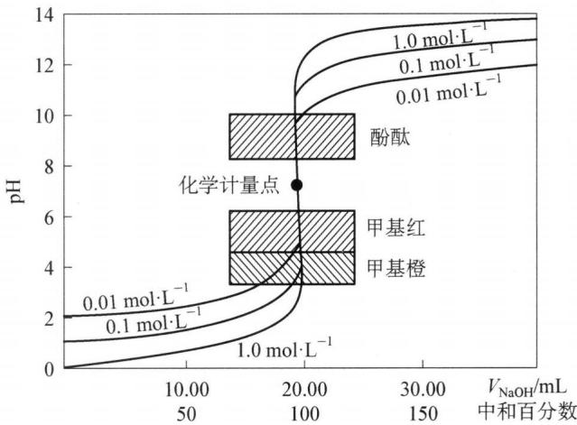

<details>
<summary>line chart</summary>

| V_NaOH/mL | pH | Concentration (mol·L⁻¹) |
| --- | --- | --- |
| 10.00 | 2.0 | 0.01 |
| 10.00 | 2.0 | 0.1 |
| 10.00 | 2.0 | 1.0 |
| 10.00 | 2.0 | 1.0 |
| 10.00 | 2.0 | 1.0 |
| 10.00 | 2.0 | 1.0 |
| 10.00 | 2.0 | 1.0 |
| 10.00 | 2.06 | 0.01 |
| 10.00 | 2.06 | 0.1 |
| 10.00 | 2.06 | 1.0 |
| 10.00 | 2.06 | 1.0 |
| 10.00 | 2.06 | 1.0 |
| 10.00 | 2.13 | 0.01 |
| 10.00 | 2.13 | 0.1 |
| 10.00 | 2.13 | 1.0 |
| 10.00 | 2.13 | 1.0 |
| 10.00 | 2.28 | 0.01 |
| 10.00 | 2.28 | 0.1 |
| 10.00 | 2.28 | 1.0 |
| 10.00 | 2.28 | 1.0 |
| 15.5 | - | - |
| 25.5 | - | - |
| 35.5 | - | - |
| 45.5 | - | - |
| 55.5 | - | - |
| 65.5 | - | - |
| 75.5 | - | - |
| 85.5 | - | - |
| 95.5 | - | - |
| 155 | - | - |
| 255 | - | - |
| 355 | - | - |
| 455 | - | - |
| 555 | - | - |
| 655 | - | - |
| 755 | - | - |
| 855 | - | - |
| 955 | - | - |
| 155 | - | - |
| 255 | - | - |
| 355 | - | - |
| 455 | - | - |
| 555 | - | - |
| 655 | - | - |
| 755 | - | - |
| ... | ... | ... |
| ... | ... | ... |
| **化学计量点**** | **化学计量点**** | **化学计量点** |
| **甲基红** | **甲基红** | **甲基红** |
| **甲基橙** | **甲基橙** | **甲基橙** |
| **酚酞** | **酚酞** | **酚酞** |
| **乙酰丁醇** | **乙酰丁醇** | **乙酰丁醇** |
| **氯化钠** | **氯化钠** | **氯化钠** |
| **氯化钠** | **氯化钠** | **氯化钠** |
| **氯化钠** | **氯化钠** | **氯化钠** |
| **氯化钠** | **氯化钠** | **氯化钠** |
| **氯化钠** | **氯化钠** | **氯化钠** |
| **氯化钠** | **氯化的** | **氯化钠** |
| **氯化钠** | **氯化的** | **氯化钠** |
| **氯化钠** | **氯化的** | **氯化钠** |
| **氯化钠** | **氯化的** | **氯化钠** |
| **氯化钠** | **氯化的** | **氯化钠** |
| **氯化钠** * 酚酞** | **酚酞** | **酚酞** |
| **酚酞** | **酚酞** | **酚酞** |
| **酚酞** | **酚酞** | **酚酞** |
| **酚酞** | **酚酞** | **酚酞** |
| **酚酞** | **酚酞** | **酚酞** |
| **酚酞** | **酚酞** | **酚酞** |
| **酚酞** | **酚酞* | **酚酞* |
| **酚酞** | **酚酞* | **酚酞* |
| **酚酞** | **酚酞* | **酚酞* |
| **酚酞** | **酚酞* | **酚酞* |
| **酚酞** | **酚酞* | **酚酞* |
| **酚酞** | **酚酞* | **酚酞* |
| **酚氨酸** | *** | *** |
| *** | *** | *** |
| *** | *** | *** |
| *** | *** | *** |
| *** | *** | *** |
| *** | *** | *** |
| *** | *** | *** |
| *** | *** | *** |
| *** | *** | *** |
| *** | *** | *** |
| *** | *** | *** |
| *** | *** | *** |
| *** | *** | *** |
| *** | *** | *** |
| *** | *** | *** |
| *** | *** | *** |
| *** | *** | *** |
| *** | *** | *** |
| *** | *** | *** |
| *** | *** | *** |
| *** | *** | *** |
| *** | *** | *** |
| *** | *** | *** |
| *** | *** | *** |
| *** | *** | *** |
| *** | *** | *** |
| *** | *** | *** |
| *** | *** | *** |
| *** | *** | *** |
| *** | *** | *** |
| *** | *** | *** |
| *** | *** | *** |
| *** | *** | *** |
| *** | *** | *** |
| *** | *** | *** |
| *** | *** | *** |
| *** | *** | *** |
| *** | *** | *** |
| *** | *** | *** |
| *** | *** | *** |
| *** | *** | *** |
| *** | *** | *** |
| *** | *** | *** |
| *** | *** | *** |
| *** | *** | *** |
| *** | *** | *** |
| *** | *** | *** |
| *** | *** | *** |
</details>

图10-3 不同浓度的 $\mathrm{NaOH}$ 溶液滴定 $0.1000\mathrm{mol / L}$ HCl溶液的滴定曲线

## 2. 强碱滴定弱酸

## (1) 滴定过程中 $\mathrm{pH}$ 的计算

以 0.1000 mol/L NaOH 溶液滴定 0.1000 mol/L HAc( $K_{a}=1.8\times10^{-5}$ ) 溶液 20.00 mL 为例, 讨论在滴定过程中溶液 pH 的变化情况。滴定过程中发生如下中和反应: HAc + OH $^{-}$ $\rightleftharpoons$ Ac $^{-}$ + H $_{2}$ O。滴定过程 pH 的变化分四个阶段进行计算:

① 滴定前：0.1000 mol/L HAc 溶液， $[H^{+}]$ 可按一元弱酸的最简式计算：

$$
\left[ \mathrm{H} ^ {+} \right] = \sqrt {K _ {\mathrm{a}} c} = \sqrt {1 . 8 \times 1 0 ^ {- 5} \times 0 . 1 0 0 0} = 1. 3 4 \times 1 0 ^ {- 3} \mathrm{mol/L}, \text {所以} \mathrm{pH} = 2. 8 7 。
$$

② 滴定开始至化学计量点前: 由于 NaOH 的滴入, 溶液中存在 HAc-NaAc 缓冲体系, 其 pH 可按缓冲溶液公式求得:

$$
\mathrm{pH} = \mathrm{pK} _ {\mathrm{a}} - \lg \frac {[ \mathrm{HAc} ]}{[ \mathrm{Ac} ^ {-} ]}
$$

当加入 NaOH 19.98 mL 时, 剩余 0.02×0.1000 mmol HAc: pH=7.70。

③ 在化学计量点时: HAc 全部被中和生成 NaAc, 由于 $\mathrm{Ac}^{-}$ 为一元弱碱, 按一元弱碱的最简式计算得:

$$
\begin{array}{l} \left[ \mathrm{OH} ^ {-} \right] = \sqrt {K _ {\mathrm{b}} c} = \sqrt {\frac {K _ {\mathrm{w}}}{K _ {\mathrm{a}}} c} = \sqrt {\frac {1 . 0 \times 1 0 ^ {- 1 4}}{1 . 8 \times 1 0 ^ {- 5}} \times 0 . 0 5 0 0 0} \\ = 5. 2 7 \times 1 0 ^ {- 6} \mathrm{mol} / \mathrm{L} \\ \end{array}
$$

所以 pH=8.72(注：NaOH 溶液的加入使得溶液体积变为原来的 2 倍，溶液浓度减半)。

④ 在化学计量点后: 由于 $\mathrm{NaOH}$ 过量, 抑制了 $\mathrm{Ac}^{-}$ 离解, 溶液的 $\mathrm{pH}$ 主要取决于过量的 $\mathrm{NaOH}$ , 其计算方法和强碱滴定强酸相同。

依次把消耗的 NaOH 体积数代入上述公式,逐一计算滴定过程中各点的 pH 并列于表 10-4 中。

表 10-4 用 $0.1000 \mathrm{~mol} / \mathrm{L}$ NaOH 溶液滴定 $20.00 \mathrm{~mL} 0.1000 \mathrm{~mol} / \mathrm{L}$ 的 HAc 溶液 ( $K_{\mathrm{a}} = 1.8 \times 10^{-5}$ )

<table><tr><td>滴入 NaOH体积 $V_{\text{NaOH}}/\text{mL}$ </td><td>滴入 NaOH物质的量 $n_{\text{NaOH}}/\text{mmol}$ </td><td>HAc 被中和的百分数</td><td>剩余 HAc物质的量 $n_{\text{HAc}}/\text{mmol}$ </td><td>过量 NaOH体积 $V_{\text{NaOH}}/\text{mL}$ </td><td>pH</td></tr><tr><td>0.00</td><td>0.00</td><td>0</td><td>2.000</td><td></td><td>2.87</td></tr><tr><td>18.00</td><td>1.800</td><td>90.0</td><td>0.200</td><td></td><td>5.70</td></tr><tr><td>19.80</td><td>1.980</td><td>99.0</td><td>0.020</td><td></td><td>6.73</td></tr><tr><td>19.98</td><td>1.998</td><td>99.9</td><td>0.002</td><td></td><td>7.70</td></tr><tr><td>20.00</td><td>2.000</td><td>100.0</td><td>0.000</td><td></td><td>8.72突跃范围</td></tr><tr><td>20.02</td><td>2.002</td><td>100.1</td><td></td><td>0.02</td><td>9.70</td></tr><tr><td>20.20</td><td>2.020</td><td>101.0</td><td></td><td>0.20</td><td>10.70</td></tr><tr><td>22.00</td><td>2.200</td><td>110.0</td><td></td><td>2.00</td><td>11.70</td></tr><tr><td>40.00</td><td>4.000</td><td>200.0</td><td></td><td>20.00</td><td>12.50</td></tr></table>

根据表 10-4 的计算结果绘出滴定曲线, 如图 10-4 所示。

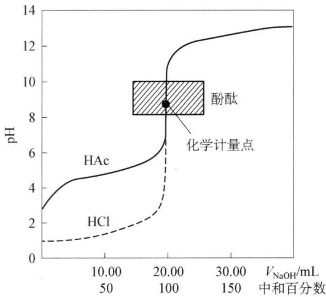

<details>
<summary>line chart</summary>

| V_NaOH/mL | pH    |
| --------- | ----- |
| 10.00     | 3.0   |
| 50        | 4.5   |
| 100       | 6.0   |
| 20.00     | 8.5   |
| 30.00     | 12.0  |
| 150       | 13.0  |
</details>

图10-4 $0.1000\mathrm{mol / LNaOH}$ 溶液滴定 $20~\mathrm{mL}0.1000\mathrm{mol / L}$ HAc溶液的滴定曲线  
(虚线为 0.1000 mol/L HCl 滴定曲线)

## ⑤ pH 的突跃范围

由表 10-4 和图 10-4 可见, 滴定前由于 HAc 是弱酸, 在溶液中不是全部离解, 溶液中的 $\left[\mathrm{H}^{+}\right]$ 不等于醋酸的原始浓度, pH 也不等于 1, 而是等于 2.87, 因而滴定前比同浓度的强酸溶液的 pH 高 1.87, 其滴定曲线的起点比强碱滴定强酸的滴定曲线高。

随着滴定开始,溶液中生成的 $Ac^{-}$ 产生同离子效应,抑制 HAc 离解, $[H^{+}]$ 较快地降低，pH 较快增加；当继续滴入 NaOH，由于 NaAc 不断生成，在溶液中构成 NaAc-HAc 缓冲体系，使溶液 pH 变化缓慢，因此这一段曲线变化较为平坦。在接近化学计量点时，溶液中剩余的 HAc 越来越少，其缓冲作用显著降低，再继续滴入 NaOH，溶液的 pH 较快地增大，直到达到化学计量点时，溶液的 pH 发生突变，形成突跃。

## (2) 指示剂的选择

由表 10-4 可以看出, 强碱滴定弱酸的突跃范围比滴定同样浓度的强酸的突跃小得多, 而且是在弱碱性区域, 突跃范围是 $7.70 \sim 9.70$ 。因此只能选择在碱性范围内变色的指示剂如酚酞、百里酚蓝等。在酸性范围变色的指示剂如甲基橙、甲基红等均不能使用。

## (3) 滴定突跃范围与弱酸强度的关系

讨论滴定突跃范围与弱酸强度的关系是为了判断弱酸能否被强碱准确滴定。图10-5是 $0.1000 \mathrm{~mol} / \mathrm{L}$ 的 $\mathrm{NaOH}$ 溶液滴定相同浓度不同强度一元弱酸的滴定曲线。

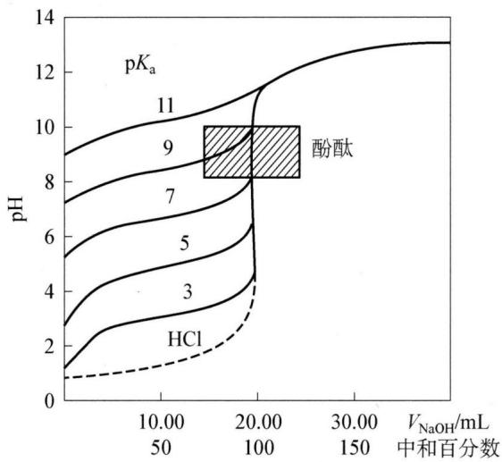

<details>
<summary>line chart</summary>

| 中和百分数 | pH    |
| ---------- | ----- |
| 50         | 1     |
| 100        | 4     |
| 150        | 8     |
| 200        | 10    |
| 250        | 12    |
| 300        | 13    |
</details>

图10-5 $0.1000\mathrm{mol / LNaOH}$ 溶液滴定不同强度 $(K_{\mathrm{a}})0.1000\mathrm{mol / L}$ 弱酸的滴定曲线

从图中可见：

浓度相同时,突跃范围的大小与弱酸的强度有关。 $K_{a}$ 愈大,即酸愈强时,滴定突跃范围也愈大。 $K_{a}$ 值愈小,滴定突跃范围也愈小。当 $K_{a} \leqslant 10^{-9}$ 时,在滴定曲线上已无明显的滴定突跃,因此,无法选择指示剂确定滴定终点。根据滴定误差 $\leqslant 0.1\%$ 的要求,对于弱酸的滴定,以 $cK_{a} \geqslant 10^{-8}$ 为判断能否用强碱准确滴定的界限。

若不满足该条件, 就不能按通常的酸碱滴定的方法来确定滴定终点。例如 HCN, 因 $K_{a} \approx 10^{-10}$ , 即使浓度为 1 mol/L, 也不能按通常的方法准确滴定。

## 3. 强酸滴定弱碱

现以 0.1000 mol/L HCl 溶液滴定 20.00 mL 0.1000 mol/L 氨水为例简单说明。HCl 与 $NH_{3} \cdot H_{2}O$ 的反应为： $H^{+} + NH_{3} \cdot H_{2}O \rightleftharpoons NH_{4}^{+} + H_{2}O$ 。HCl 滴定 $NH_{3} \cdot H_{2}O$ 与 NaOH 滴定 HAc 相似，只是 pH 变化方向相反，如表 10-5 所示。

由表可见：

(1) 滴定曲线与强碱滴定弱酸相似,但 pH 变化方向相反。

(2) 突跃范围的 $\mathrm{pH}$ 为 $6.30 \sim 4.30$ , 处于酸性区域内。只能选甲基橙或溴甲酚绿等。

(3) 化学计量点时 pH 为 5.28。

因此,强酸滴定弱碱的限度也是由弱碱的浓度和强度来决定的。只有当弱碱的 $cK_{b} \geqslant 10^{-8}$ 时,才能用强酸直接准确滴定。

表 10-5 ${0.1000}\mathrm{{mol}}/\mathrm{L}$ HCl 滴定 ${20.00}\mathrm{\;{mL}}{0.1000}\mathrm{{mol}}/\mathrm{L}{\mathrm{{NH}}}_{3} \cdot  {\mathrm{H}}_{2}\mathrm{O}$ 时 $\mathrm{{pH}}$ 的变化

<table><tr><td>加入 HCl(mL)</td><td> $NH_{3} \cdot H_{2}O$ 被滴定百分数</td><td>剩余  $NH_{3} \cdot H_{2}O$ (mL)</td><td>过量 HCl(mL)</td><td>pH</td></tr><tr><td>0.00</td><td>0.00</td><td>20.00</td><td></td><td>11.13</td></tr><tr><td>10.00</td><td>50.00</td><td>10.00</td><td></td><td>9.26</td></tr><tr><td>18.00</td><td>90.00</td><td>2.00</td><td></td><td>8.30</td></tr><tr><td>19.80</td><td>99.00</td><td>0.20</td><td></td><td>7.30</td></tr><tr><td>19.98</td><td>99.90</td><td>0.02</td><td></td><td>6.30</td></tr><tr><td>20.00</td><td>100.0</td><td>0.00</td><td></td><td>5.28突跃范围</td></tr><tr><td>20.02</td><td></td><td></td><td>0.02</td><td>4.30</td></tr><tr><td>20.20</td><td></td><td></td><td>0.20</td><td>3.30</td></tr><tr><td>40.00</td><td></td><td></td><td>20.00</td><td>1.48</td></tr></table>

## 4. 多元酸(碱)的滴定

## (1) 多元酸的滴定

多元酸的滴定比较复杂,由于多元酸绝大多数为弱酸,在水溶液中的离解是分步进行的,因此,它与 0.1000 mol/L 强碱的中和反应也是分步进行的。现以 0.1000 mol/L 的 NaOH 溶液滴定 0.1000 mol/L 的 $H_{3}PO_{4}$ 溶液 20.00 mL 为例进行讨论。

$H_{3}PO_{4}$ 是多元酸,在水溶液中的电离平衡如下:

$$
\mathrm{H} _ {3} \mathrm{PO} _ {4} \rightleftharpoons \mathrm{H} ^ {+} + \mathrm{H} _ {2} \mathrm{PO} _ {4} ^ {-} \quad K _ {\mathrm{a1}} = 7. 5 \times 1 0 ^ {- 3}
$$

$$
\mathrm{H} _ {2} \mathrm{PO} _ {4} ^ {-} \rightleftharpoons \mathrm{H} ^ {+} + \mathrm{HPO} _ {4} ^ {2 -} \quad K _ {\mathrm{a} 2} = 6. 3 \times 1 0 ^ {- 8}
$$

$$
\mathrm{HPO} _ {4} ^ {2 -} \rightleftharpoons \mathrm{H} ^ {+} + \mathrm{PO} _ {4} ^ {3 -} \quad K _ {\mathrm{a} 3} = 4. 4 \times 1 0 ^ {- 1 3}
$$

用 $\mathrm{NaOH}$ 滴定 $\mathrm{H}_3\mathrm{PO}_4$ 时的中和反应为：

$$
\mathrm{H} _ {3} \mathrm{PO} _ {4} + \mathrm{NaOH} \rightleftharpoons \mathrm{NaH} _ {2} \mathrm{PO} _ {4} + \mathrm{H} _ {2} \mathrm{O}
$$

$$
\mathrm{NaH} _ {2} \mathrm{PO} _ {4} + \mathrm{NaOH} \rightleftharpoons \mathrm{Na} _ {2} \mathrm{HPO} _ {4} + \mathrm{H} _ {2} \mathrm{O}
$$

$$
\mathrm{Na} _ {2} \mathrm{HPO} _ {4} + \mathrm{NaOH} \rightleftharpoons \mathrm{Na} _ {3} \mathrm{PO} _ {4} + \mathrm{H} _ {2} \mathrm{O}
$$

我们可以把多元酸看成是不同强度的一元酸混合物的滴定。因此，可以根据 $cK_{a}\geqslant10^{-8}$ 来判断多元酸各步电离的 $H^{+}$ 能否被滴定。例如： $H_{3}PO_{4}$ 的第一步电离常数为 $K_{a1}=7.5\times10^{-3}$ ，溶液浓度为0.1000mol/L，则 $c_{H_{3}PO_{4}}K_{a1}=0.1000\times7.5\times10^{-3}=7.5\times10^{-4}>10^{-8}$ ，因此这一级电离出的 $H^{+}$ 能被滴定，有一个滴定突跃。可根据化学计量点pH=4.66，选择甲基橙为指示剂。 $H_{3}PO_{4}$ 的第二步电离常数为 $K_{a2}=6.3\times10^{-8}$ ， $cK_{a}\approx10^{-8}$ ，则这一级电离出的 $H^{+}$ 勉强能被滴定，有一个滴定突跃。化学计量点pH为9.94，在碱性范围内，可选择酚酞作指示剂。但 $H_{3}PO_{4}$ 的第三步电离常数 $K_{a3}=4.4\times10^{-13}$ ， $cK_{a}$ 远远小于 $10^{-8}$ ，故第三步离解产生的 $H^{+}$ 无法被准确滴定，在滴定曲线上也没有明显的滴定突跃。滴定曲线如图10-6所示。

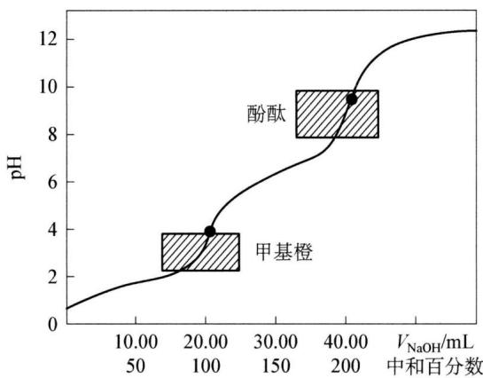

<details>
<summary>line chart</summary>

| 中和百分数 | pH  |
| ---------- | --- |
| 10.00      | 0   |
| 20.00      | 4   |
| 40.00      | 9   |
</details>

图10-6 $0.1000\mathrm{mol / LNaOH}$ 溶液滴定 $20.00~\mathrm{mL}$ $0.1000\mathrm{mol / L}$ $\mathrm{H}_3\mathrm{PO}_4$ 溶液的滴定曲线

由 $\mathrm{NaOH}$ 与 $\mathrm{H}_3\mathrm{PO}_4$ 的滴定得知，虽然多元酸的离解和中和都是分步进行的，但是在多元酸的实际滴定过程中，并不是每一级离解的 $\mathrm{H}^+$ 都能被准确滴定，它的分步滴定也同样遵循强碱滴定弱酸的条件，即当 $cK_{\mathrm{a}} \geqslant 10^{-8}$ 时，这一级解离的 $\mathrm{H}^+$ 才能被准确滴定；只有当相邻两级解离常数 $K_{\mathrm{a}}$ 值之比大于或等于 $10^{4}$ 时，即 $K_{\mathrm{a1}} / K_{\mathrm{a2}} \geqslant 10^{4}$ 时，才会产生两个滴定突跃，满足分步滴定的要求。反之，只能形成一个滴定突跃,不能分步滴定,只能作为二元酸被一次滴定。

## (2) 多元碱的滴定

与多元酸的滴定类似,判断原则有两条:

① $c_{b}K_{b} \geqslant 10^{-8}$ 能准确滴定；  
② $K_{b1}/K_{b2} \geqslant 10^{4}$ 时能分步滴定。

多元碱能用强酸滴定的不多,其中最重要的是 $Na_{2}CO_{3}$ 。它是标定盐酸的基准物质,也是工业纯碱的主要成分。

$Na_{2}CO_{3}$ 是二元弱碱,在水中分两步离解,其离解反应式为:

$$
\begin{array}{l} \mathrm{CO} _ {3} ^ {2 -} + \mathrm{H} _ {2} \mathrm{O} \rightleftharpoons \mathrm{HCO} _ {3} ^ {-} + \mathrm{OH} ^ {-} \quad K _ {\mathrm{b1}} = K _ {\mathrm{w}} / K _ {\mathrm{a2}} = 1. 8 \times 1 0 ^ {- 4} \\ \mathrm{HCO} _ {3} ^ {-} + \mathrm{H} _ {2} \mathrm{O} \rightleftharpoons \mathrm{H} _ {2} \mathrm{CO} _ {3} + \mathrm{OH} ^ {-} \quad K _ {\mathrm{b2}} = K _ {\mathrm{w}} / K _ {\mathrm{a1}} = 2. 3 \times 1 0 ^ {- 8} \\ \end{array}
$$

用 HCl 滴定 $Na_{2}CO_{3}$ 时, 分步进行的化学反应式为:

$$
\mathrm{HCl} + \mathrm{Na} _ {2} \mathrm{CO} _ {3} = \mathrm{NaHCO} _ {3} + \mathrm{NaCl}
$$

$$
\mathrm{HCl} + \mathrm{NaHCO} _ {3} = \mathrm{NaCl} + \mathrm{CO} _ {2} \uparrow + \mathrm{H} _ {2} \mathrm{O}
$$

如用 0.1000 mol/L 的 HCl 溶液滴定浓度为 0.1000 mol/L 的 $Na_{2}CO_{3}$ 溶液，因为 $c_{CO_{3}^{2-}}K_{b1}=1.8\times10^{-5}>10^{-8}$ ， $c_{HCO_{3}^{-}}K_{b2}=1.2\times10^{-9}$ 接近 $10^{-8}$ ，且 $K_{b1}/K_{b2}=7.8\times10^{3}\approx10^{4}$ 。因此 $CO_{3}^{2-}$ 这个二元碱可以用标准酸溶液进行分步滴定，并且在两个化学计量点时分别出现两个 pH 突跃。在第一个化学计量点时，pH 为 8.32，如果选用酚酞作指示剂，变色不敏锐，如果采用甲酚红和百里酚蓝混合指示剂，可得到较为准确的结果。在第二个化学计量点时，溶液是 $CO_{2}$ 的饱和溶液，pH 为 3.89，可用甲基橙作指示剂，滴定曲线如图 10-7 所示。

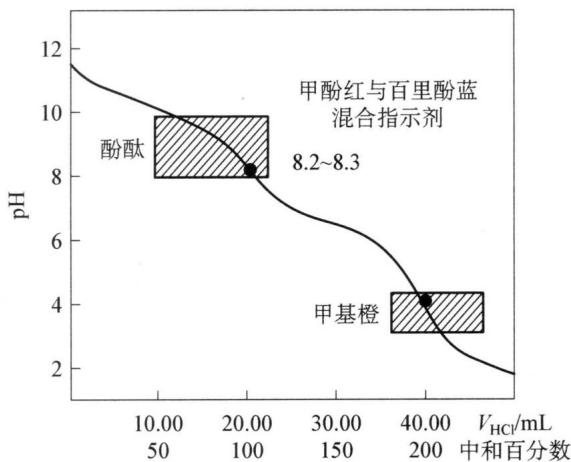

<details>
<summary>line chart</summary>

| 溶液 | 中和百分数 | pH   |
| ---- | ---------- | ---- |
| 酚酞 | 10.00      | 9.0  |
| 甲酚红与百里酚蓝混合指示剂 | 20.00     | 8.2~8.3 |
| 甲基橙 | 40.00      | 4.0  |
</details>

图10-7 0.1000 mol/L HCl 溶液滴定 $20.00\mathrm{mL}$ 0.1000 mol/L $\mathrm{Na_2CO_3}$ 溶液的滴定曲线

应注意,在接近第二个计量点时,容易形成 $CO_{2}$ 的过饱和溶液而导致滴定终点提前,必须将 $CO_{2}$ 加热煮沸除去,待冷却后继续滴定;或在接近计量点时充分振摇锥形瓶以加速 $H_{2}CO_{3}$ 的分解,使终点时指示剂变色敏锐,以保证得到准确的分析结果。

## 五、标准溶液的配制与标定

## 1. 酸碱标准溶液的配制

在酸碱滴定中,一般用强酸配制酸标准溶液,因为由强酸配成的标准溶液,既可以用来滴定各种强碱,又可以用来滴定各种弱碱和多元碱。一般常用盐酸和硫酸配制标准溶液。由于盐酸易挥发,硫酸吸湿性强,所以都不能用直接配制法配制,而采用间接配制法。在盐酸和硫酸标准溶液中,盐酸的应用范围更广泛。

配制碱标准溶液一般常用强碱来配制。常用的有 NaOH 和 KOH，由于 KOH 较贵，应用不普遍，所以常用 NaOH 来配制。由于 NaOH 易吸收空气中的水分和 $CO_{2}$ ，也不能采用直接配制法。为了配制没有 $CO_{3}^{2-}$ 的碱标准溶液，常采用浓碱法配制，即先用 NaOH 配成饱和溶液，取上层清液稀释成所需浓度，再进行标定。

## 2. 酸碱标准溶液的标定

标定 HCl 溶液可选用在 $270^{\circ}C \sim 300^{\circ}C$ 下干燥至恒重的无水碳酸钠或硼砂作基准物质。

标定 NaOH 溶液常用的基准物质是邻苯二甲酸氢钾、草酸等。

## 六、其他滴定分析法简介

## 1. 沉淀滴定法

沉淀滴定法是以沉淀反应为基础的滴定分析法。用于沉淀滴定法的沉淀反应必须符合下列条件：①沉淀的溶解度很小；②沉淀反应必须定量且迅速地发生；③能采用适当的方法确定滴定终点。目前，比较有实际意义的、应用较多的是利用生成微溶性银盐的沉淀反应，如利用 $Ag^{+} + Cl^{-} \rightleftharpoons AgCl \downarrow$ 和 $Ag^{+} + SCN^{-} \rightleftharpoons AgSCN \downarrow$ 进行的沉淀滴定法，此法称为银量法。银量法主要用于测定 $Cl^{-}$ 、 $Br^{-}$ 、 $I^{-}$ 、 $Ag^{+}$ 及 $SCN^{-}$ 等。本讲我们重点介绍两种银量法：

## (1) 莫尔法——用铬酸钾作指示剂

此法是在中性或弱碱性溶液中，以 $\mathrm{K}_2\mathrm{CrO}_4$ 为指示剂，用 $\mathrm{AgNO}_3$ 标准溶液直

接滴定 $Cl^{-}$ （或 $Br^{-}$ ）。

AgCl 的溶解度比 $Ag_{2}CrO_{4}$ 小, 根据分步沉淀原理, 当向含 $Cl^{-}$ 的溶液中滴入 $AgNO_{3}$ 时, 首先沉淀析出的是 AgCl; 当 AgCl 定量沉淀后, 稍过量一点的 $AgNO_{3}$ 溶液与 $CrO_{4}^{2-}$ 生成砖红色的 $Ag_{2}CrO_{4}$ 沉淀, 即为滴定终点。反应如下:

$$
\mathrm{Ag} ^ {+} + \mathrm{Cl} ^ {-} \rightleftharpoons \mathrm{AgCl} \downarrow (\text {白色})
$$

$$
2 \mathrm{Ag} ^ {+} + \mathrm{CrO} _ {4} ^ {2 -} \rightleftharpoons \mathrm{Ag} _ {2} \mathrm{CrO} _ {4} \downarrow (\text {砖红色})
$$

莫尔法中指示剂的用量和溶液的酸度是两个主要问题。

① 指示剂的用量

据溶度积原理,可计算出计量点时 $Ag^{+}$ 和 $Cl^{-}$ 的浓度为:

$$
\left[ \mathrm{Ag} ^ {+} \right] _ {\mathrm{sp}} = \left[ \mathrm{Cl} ^ {-} \right] _ {\mathrm{sp}} = \sqrt {K _ {\mathrm{sp(AgCl)}}} = \sqrt {1 . 8 \times 1 0 ^ {- 1 0}} = 1. 3 \times 1 0 ^ {- 5} \mathrm{mol/L}
$$

那么在化学计量点时要刚好析出 $Ag_{2}CrO_{4}$ 沉淀以指示终点, 此时 $CrO_{4}^{2-}$ 的浓度应为:

$$
\left[ \mathrm{CrO} _ {4} ^ {2 -} \right] = \frac {K _ {\mathrm{sp(Ag} _ {2} \mathrm{CrO} _ {4})}}{\left[ \mathrm{Ag} ^ {+} \right] _ {\mathrm{sp}} ^ {2}} = \frac {2 . 0 \times 1 0 ^ {- 1 2}}{(1 . 3 \times 1 0 ^ {- 5}) ^ {2}} = 1. 2 \times 1 0 ^ {- 2} \mathrm{mol} \cdot \mathrm{L} ^ {- 1}
$$

在实际工作中, 若 $CrO_{4}^{2-}$ 的浓度太高, 颜色太深, 会影响终点的判断; 但 $CrO_{4}^{2-}$ 的浓度太低, 又会使终点出现过缓, 影响滴定的准确度。实验证明加入 $K_{2}CrO_{4}$ 的浓度以 $5.0 \times 10^{-3} \, mol/L$ 为宜。这样实际使用的 $CrO_{4}^{2-}$ 的浓度较计算值偏低, 那么要使 $Ag_{2}CrO_{4}$ 沉淀析出, 必然要使 $AgNO_{3}$ 溶液过量得稍多一点。计算结果表明, 这样不会引起较大的误差, 完全可以满足滴定分析的要求。

② 溶液的酸度

$H_{2}CrO_{4}$ 的 $K_{a2}$ 为 $3.2 \times 10^{-7}$ ，酸性较弱，因此 $Ag_{2}CrO_{4}$ 易溶于酸，即：

$$
\mathrm{Ag} _ {2} \mathrm{CrO} _ {4} + \mathrm{H} ^ {+} \rightleftharpoons 2 \mathrm{Ag} ^ {+} + \mathrm{HCrO} _ {4} ^ {-}
$$

所以滴定不能在酸性溶液中进行。但如果溶液的碱性太强，又将产生 $Ag_{2}O$ 沉淀。

莫尔法测定的最适宜的 pH 范围为 6.5～10.5 之间。若试液碱性太强，可用稀 $HNO_{3}$ 调节；酸性太强，可用 $NaHCO_{3}$ 、 $CaCO_{3}$ 或 $Na_{2}B_{4}O_{7}$ 等调节。

当溶液中的铵盐存在时,要求溶液的酸度范围更窄,pH为6.5\~7.2之间。这是因为pH再大时,便有相当数量的 $NH_{3}$ 释放出来, $Ag^{+}$ 生成 $\mathrm{Ag(NH_{3})_{2}^{+}}$ ,使 $\mathrm{AgCl}$ 和 $\mathrm{Ag_{2}CrO_{4}}$ 的溶解度增大,影响滴定。

③ 莫尔法的适用范围

莫尔法能直接滴定 $Cl^{-}$ 或 $Br^{-}$ ，当两者共存时，滴定的是 $Cl^{-}$ 和 $Br^{-}$ 的总量。从原则上讲，此法也可应用于滴定 $I^{-}$ 及 $SCN^{-}$ ，但由于 AgI 及 AgSCN 沉淀能强烈地吸附 $I^{-}$ 或 $SCN^{-}$ 而使终点过早出现，且终点变化不明显，误差较大。

莫尔法不适用于以 NaCl 标准溶液直接滴定 $Ag^{+}$ ，这是因为，这时滴入指示剂立即生成 $Ag_{2}CrO_{4}$ 沉淀，在用 NaCl 标准溶液滴定时， $Ag_{2}CrO_{4}$ 沉淀十分缓慢地转化为 AgCl 沉淀，误差较大。如果要用此法测定 $Ag^{+}$ ，则应在试液中加入一定过量的 NaCl 标准溶液，然后用 $AgNO_{3}$ 标准溶液滴定过量的 $Cl^{-}$ 。

另外应当指出, 莫尔法的选择性较差, 凡能与 $\mathrm{Ag}^{+}$ 生成微溶物 (如 $\mathrm{PO}_{4}^{3-}$ 、 $\mathrm{SO}_{3}^{2-}$ 、 $\mathrm{S}^{2-}$ 、 $\mathrm{CO}_{3}^{2-}$ 、 $\mathrm{AsO}_{4}^{3-}$ ) 或配负离子 (如 $\mathrm{C}_{2} \mathrm{O}_{4}^{2-}$ ) 或能与 $\mathrm{CrO}_{4}^{2-}$ 生成微溶性化合物的正离子 (如 $\mathrm{Ba}^{2+}$ 、 $\mathrm{Pb}^{2+}$ 、 $\mathrm{Hg}^{2+}$ 等) 以及在中性或弱碱性溶液中易发生水解的离子 (如 $\mathrm{Fe}^{3+}$ 、 $\mathrm{Bi}^{3+}$ 、 $\mathrm{Sn}^{4+}$ 、 $\mathrm{Al}^{3+}$ 等) 均干扰滴定, 应预先分离。

(2) 佛尔哈德法——用铁铵矾 $\left[NH_{4}Fe(SO_{4})_{2}\cdot12H_{2}O\right]$ 作指示剂

佛尔哈德法分为直接滴定法和返滴定法。

① 直接滴定法测定 $\mathrm{Ag}^{+}$

此法是在含有 $Ag^{+}$ 的酸性溶液中，以铁铵矾作指示剂，用 $NH_{4}SCN$ （或 KSCN、NaSCN）标准溶液滴定 $Ag^{+}$ 的方法。随着滴定剂的加入，首先析出 AgSCN 沉淀，当 $Ag^{+}$ 定量沉淀后，稍过量的 $NH_{4}SCN$ 立即与 $Fe^{3+}$ 反应生成红色配合物，即为终点。其反应如下：

$$
\mathrm{Ag} ^ {+} + \mathrm{SCN} ^ {-} \rightleftharpoons \mathrm{AgSCN} \downarrow (\text {白色}) K _ {\mathrm{sp}} = 1. 0 \times 1 0 ^ {- 1 2}
$$

$$
\mathrm{Fe} ^ {3 +} + \mathrm{SCN} ^ {-} \rightleftharpoons [ \mathrm{Fe(SCN)} ] ^ {2 +} (\text {   红色   }) K _ {\mathrm{稳}} = 2 0 0
$$

滴定时, 溶液的酸度一般控制在 $\mathrm{pH}$ 为 $0 \sim 1$ 之间。此时, $\mathrm{Fe}^{3+}$ 主要以 $\mathrm{Fe(H_2O)_6^{3+}}$ 的形式存在, 颜色较浅。如果酸度较低, $\mathrm{Fe}^{3+}$ 水解形成棕色 $[\mathrm{Fe(H_2O)_5OH}]^{2+}$ 等颜色较深, 影响终点的观察。

实验证明： $\left[\mathrm{Fe}(\mathrm{SCN})\right]^{2+}$ 的最低浓度要达到 $6.0 \times 10^{-6} \, mol/L$ 时，才能观察到明显的红色。通常指示剂 $Fe^{3+}$ 的浓度保持在 0.015 mol/L，则在终点：

$$
[ \mathrm{SCN} ^ {-} ] = \frac {[ \mathrm{Fe(SCN)} ^ {2 +} ]}{K _ {\mathrm{稳}} [ \mathrm{Fe} ^ {3 +} ]} = \frac {6 . 0 \times 1 0 ^ {- 6}}{2 0 0 \times 0 . 0 1 5} = 2. 0 \times 1 0 ^ {- 6} \mathrm{mol/L}
$$

若被滴定的 $\mathrm{Ag^{+}}$ 溶液的体积为 $V \mathrm{~mL}$ , $\mathrm{SCN^{-}}$ 和 $\mathrm{Ag^{+}}$ 的浓度均为 $0.1 \mathrm{~mol} / \mathrm{L}$ , 在化学计量点时:

$$
\left[ \mathrm{SCN} ^ {-} \right] _ {\mathrm{sp}} = \sqrt {K _ {\mathrm{sp(AgSCN)}}} = \sqrt {1 . 0 \times 1 0 ^ {- 1 2}} = 1. 0 \times 1 0 ^ {- 6} \mathrm{mol/L}
$$

在化学计量点后 $0.1\%$ 时：

$$
\begin{array}{l} [ \mathrm{SCN} ^ {-} ] ^ {\prime} = \frac {0 . 1 \times V \times 0 . 1 \%}{2 V} = 5. 0 \times 1 0 ^ {- 5} \mathrm{mol/L} \\ [ \mathrm{SCN} ^ {-} ] _ {\mathrm{sp}} <   [ \mathrm{SCN} ^ {-} ] <   [ \mathrm{SCN} ^ {-} ] ^ {\prime} \\ \end{array}
$$

由此可见能够观察到滴定终点颜色时,其相对误差将小于 0.1%,准确度符合滴定要求。由于 AgSCN 沉淀能吸附部分 $Ag^{+}$ ,因此此法在滴定过程中应充分摇动溶液,使被吸附的 $Ag^{+}$ 及时地释放出来,否则易产生终点出现过早而造成误差。

② 返滴定法测定卤素离子

此法首先向试液中加入已知量过量的 $AgNO_{3}$ 标准溶液, 再加铁铵矾指示剂, 用 $NH_{4}SCN$ 标准溶液返滴定过量的 $Ag^{+}$ , 此时的情况和直接滴定 $Ag^{+}$ 是一样的。

使用此法滴定氯化物,由于 AgCl 的溶解度比 AgSCN 大,过量的 $SCN^{-}$ 将与 AgCl 反应,使 AgCl 沉淀转化为溶解度更小的 AgSCN。

$$
\mathrm{AgCl} + \mathrm{SCN} ^ {-} = \mathrm{AgSCN} + \mathrm{Cl} ^ {-}
$$

这样必然引起误差。为了避免这样的误差产生,通常采用下列两种措施:

(i) 当加入过量的 $\mathrm{AgNO}_{3}$ 标准液后, 将溶液加热煮沸, 使 $\mathrm{AgCl}$ 沉淀凝聚, 以减小 $\mathrm{AgCl}$ 沉淀对 $\mathrm{Ag}^{+}$ 的吸附。过滤, 将 $\mathrm{AgCl}$ 沉淀滤去, 并用稀 $\mathrm{HNO}_{3}$ 洗涤沉淀, 洗涤液并入滤液中。然后用 $\mathrm{NH}_{4} \mathrm{SCN}$ 标准溶液滴定滤液中过量的 $\mathrm{Ag}^{+}$ 。  
(ii) 加入一定过量的 $AgNO_{3}$ 标准溶液后, 加入 1 mL\~2 mL 有机溶剂, 如 1,2-二氯乙烷, 用力摇动, 使有机溶剂将 AgCl 沉淀包裹, 使它与溶液隔开。这样便阻止了 $SCN^{-}$ 与 AgCl 的反应, 此法比较简便。

用返滴定法测定溴化物或碘化物时,由于 AgBr、AgI 的溶解度均比 AgSCN 的溶解度小,不会出现沉淀转化反应,所以不必采用上述措施。但在测定碘化物时,必须在加入过量的 $AgNO_{3}$ 溶液后加入指示剂,否则会发生如下反应: $2Fe^{3+} + 2I^{-} \rightleftharpoons 2Fe^{2+} + I_{2}$ , 影响结果的准确性。

佛尔哈德法的最大优点是可以在酸性溶液中进行滴定,许多弱酸根离子如 $PO_{4}^{3-}$ 、 $AsO_{4}^{3-}$ 、 $CrO_{4}^{2-}$ 等都不干扰测定,因此,此法的选择性较高。但滴定不能在中性或碱性溶液中进行,因为此时, $Fe^{3+}$ 易生成羟基配合物或氢氧化物沉淀。另外强氧化剂、氮的低价氧化物以及铜盐、汞盐等能与 $SCN^{-}$ 起作用,干扰测定,必须预

先除去。

## 2. 配位滴定法

配位滴定法是以配位反应为基础的滴定分析方法。配位反应也是路易斯酸碱反应，所以，配位滴定法与酸碱滴定法有许多相似之处，但也有一些不同的地方。

## (1) 配位剂的选用

配位滴定使用的配位剂一般为乙二胺四乙酸二钠(EDTA 二钠,以下简称 Y),相对于乙二胺四乙酸(EDTA)而言,EDTA 二钠有以下优点:

① 常温下有更大的溶解度(EDTA: 0.2 g/L; Y: 111 g/L);
② pH 改变时, 以 Y 为主要微粒形式存在的 pH 范围大(EDTA: pH 为 1.60\~2.07; Y: pH 为 2.75\~6.24), 即 Y 受酸度影响不大;

③ 配位能力强，Y 几乎能与所有的金属离子形成配合物；

④形成的配合物稳定性好(一般 $\lg K>15$ ),即反应很彻底;

⑤ 反应系数比简单,大多数金属离子 M 与 Y 形成 1:1 型配合物,可视 M 为路易斯酸,Y 为路易斯碱,与一元酸碱滴定类似;

⑥ 反应速度快,水溶性好。

但是,由于金属正离子 M 在水中有其他配位效应(水合)和水解效应(羟合)等副反应,Y 有酸效应和共存离子效应,所以配位滴定要比酸碱滴定复杂。酸碱滴定中,酸的 $K_{a}$ 或碱的 $K_{b}$ 是不变的,而配位滴定 MY 的 $K_{稳}$ 是随滴定体系中反应的条件而变化的。欲使滴定过程中 $K_{稳}$ 基本不变,常用酸碱缓冲溶液控制酸度。

## (2) 配位滴定曲线方程及图像

设金属离子 M 的初始浓度为 $c_{M}$ ，体积为 $V_{\mathrm{M}}(\mathrm{mL})$ ，用等浓度的滴定剂 Y 滴定，滴入的体积为 $V_{\mathrm{Y}}(\mathrm{mL})$ ，则滴定分数：

$$
a = \frac {V _ {\mathrm{Y}}}{V _ {\mathrm{M}}}
$$

由物料平衡方程式得：

$$
\mathrm{MBE} \left\{ \begin{array}{l} {[ \mathrm{M} ] + [ \mathrm{MY} ] = c _ {\mathrm{M}}} \\ {[ \mathrm{Y} ] + [ \mathrm{MY} ] = c _ {\mathrm{Y}} = a c _ {\mathrm{M}}} \end{array} \right. \tag {①}
$$

由配位平衡方程得：

$$
K _ {\mathrm{MY}} = \frac {[ \mathrm{MY} ]}{[ \mathrm{M} ] [ \mathrm{Y} ]} \tag {③}
$$

由①及②式可得：

$$
[ \mathrm{MY} ] = c _ {\mathrm{M}} - [ \mathrm{M} ] = a c _ {\mathrm{M}} - [ \mathrm{Y} ] \tag {4}
$$

$$
[ \mathrm{Y} ] = a c _ {\mathrm{M}} - c _ {\mathrm{M}} + [ \mathrm{M} ] \tag {⑤}
$$

将④⑤式代入③式得：

$$
K _ {\mathrm{MY}} = \frac {c _ {\mathrm{M}} - [ \mathrm{M} ]}{[ \mathrm{M} ] (a c _ {\mathrm{M}} - c _ {\mathrm{M}} + [ \mathrm{M} ])} = K _ {t} \tag {6}
$$

展开 $c_{\mathrm{M}} - [\mathrm{M}] = K_t[\mathrm{M}]^2 -K_t[\mathrm{M}]c_{\mathrm{M}} + K_t[\mathrm{M}]ac_{\mathrm{M}}$

整理得 $K_{t}[\mathrm{M}]^{2} + [K_{t}c_{\mathrm{M}}(a - 1) + 1][\mathrm{M}] - c_{\mathrm{M}} = 0$

上式即配位滴定曲线方程,与强酸强碱滴定过程中 $\left[H^{+}\right]$ 的计算方程十分相似。

在化学计量点时，a=1.00，配位滴定曲线方程可简化为：

$$
K _ {\mathrm{MY}} [ \mathrm{M} ] _ {\mathrm{sp}} ^ {2} + [ \mathrm{M} ] _ {\mathrm{sp}} - c _ {\mathrm{M}} = 0
$$

$$
[ \mathrm{M} ] _ {\mathrm{sp}} = \frac {- 1 \pm \sqrt {1 ^ {2} + 4 K _ {\mathrm{MY}} c _ {\mathrm{M}}}}{2 K _ {\mathrm{MY}}}
$$

一般配位滴定要求 $K_{\mathrm{MY}} \geqslant 10^{7}$ ，若 $c_{\mathrm{M}} = 10^{-2} \mathrm{~mol} / \mathrm{L}$ ，即 $c_{\mathrm{M}} K_{\mathrm{MY}} \geqslant 10^{5}$ 。由于 $4 K_{\mathrm{MY}} c_{\mathrm{M}} \gg 1$ ， $\sqrt{4 K_{\mathrm{MY}} c_{\mathrm{M}}} \gg 1$ 。因此有：

$$
[ \mathrm{M} ] _ {\mathrm{sp}} \approx \frac {\sqrt {4 K _ {\mathrm{MY}} c _ {\mathrm{M}}}}{2 K _ {\mathrm{MY}}} = \sqrt {\frac {c _ {\mathrm{M}}}{K _ {\mathrm{MY}}}}
$$

若 $c_{M}$ 使用化学计量点时浓度, 对上式取对数, 得到:

$$
\mathrm{pM} _ {\mathrm{sp}} = \frac {1}{2} (\lg K _ {\mathrm{MY}} + \mathrm{pc} _ {\mathrm{M}} ^ {\mathrm{sp}})
$$

当已知 $K_{MY}$ 、 $c_{M}$ 和 a 值，或已知 $K_{MY}$ 、 $c_{M}$ 、 $V_{M}$ 和 $V_{Y}$ 时，便可求得 [M]。以 pM 对 a（或对 $V_{Y}$ ）作图，即得到滴定曲线。若 M、Y 或 MY 有副反应时，上式中的 $K_{MY}$ 用 $K_{MY}'$ 取代，[M] 应为 $[M']$ ；而滴定曲线图上的纵坐标与横坐标分别为 $pM'$ 及 a （或 $V_{Y}$ ）。

设金属离子的初始浓度为 0.010 mol/L，用 0.010 mol/L EDTA 滴定，若 $\lg K_{MY}^{\prime}$ 分别是 2、4、6、8、10、12、14，应用上述推导出的计算式计算出相应的滴定曲线，如图 10-8 所示。当 $\lg K_{MY}^{\prime}=10$ ， $c_{M}$ 分别是 $10^{-1}$ mol/L～ $10^{-4}$ mol/L，分别用等浓度的 EDTA 滴定，所得的滴定曲线如图 10-9 所示。

由图可知,影响配位滴定中 pM 突跃大小的主要因素是 $K_{MY}^{\prime}$ 和 $c_{M}$ 。

配位滴定所用的指示剂是金属指示剂，在酸性条件下可用二甲酚橙(XO)作指示剂，测定 $Bi^{3+}$ 、 $Pb^{2+}$ 、 $Zn^{2+}$ 、 $Al^{3+}$ 等金属离子；在碱性条件下(pH=10)，可用铬黑 T(EBT)作指示剂，测定 $Zn^{2+}$ 、 $Pb^{2+}$ 、 $Ca^{2+}$ 、 $Mg^{2+}$ 等金属离子。

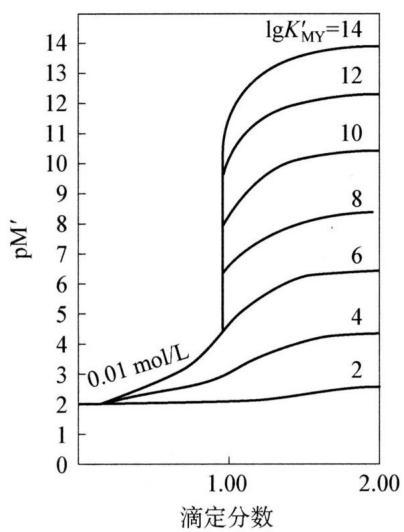

<details>
<summary>line chart</summary>

| 滴定分数 | lgK'_MY=14 (pM') |
| -------- | ---------------- |
| 0.01 mol/L | 2.0              |
| 1.00     | 14.0             |
| 2.00     | 14.0             |
</details>

图10-8

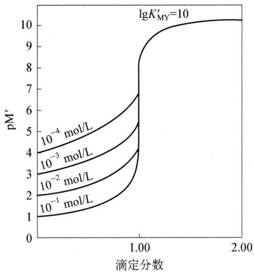

<details>
<summary>line chart</summary>

| 滴定分数 | pM' (10⁻⁴ mol/L) | pM' (10⁻³ mol/L) | pM' (10⁻² mol/L) | pM' (10⁻¹ mol/L) |
| -------- | ---------------- | ---------------- | ---------------- | ---------------- |
| 0.0      | 4.0              | 3.5              | 3.0              | 2.5              |
| 1.0      | 6.0              | 5.5              | 5.0              | 4.5              |
| 2.0      | 10.0             | 9.5              | 9.0              | 8.5              |
</details>

图10-9

## (3) 配位滴定法的应用

## ① 水的总硬度(钙和镁离子总量)测定

取一定体积的水样( $V_{水}$ ),加入氨缓冲溶液(控制 pH=10)和铬黑 T 指示剂,用 EDTA 标准溶液滴定至溶液由酒红色变为纯蓝色,即达终点。记下所用 EDTA 标准溶液的体积( $V_{EDTA}$ )。照下式计算水的硬度:

$$
\mathrm{硬度} (\mathrm{mmol} \bullet \mathrm{L} ^ {- 1}) = \frac {V _ {\mathrm{EDTA}} c _ {\mathrm{EDTA}} \times 1 0 0 0}{V _ {\mathrm{水}}}
$$

注意：水中 $Fe^{3+}$ 、 $Al^{3+}$ 、 $Mn^{2+}$ 、 $Cu^{2+}$ 、 $Pb^{2+}$ 等离子量略大时会发生干扰，需加掩蔽剂。

## ② 石灰石中钙和镁的测定

试样经酸溶解, 在 pH=10 时, 直接滴定溶液中钙和镁离子总量(方法同①)。在 pH>12.5 时, 镁离子生成氢氧化物沉淀, 可单独滴定钙离子。方法如下:

取一定体积的试样,加适量掩蔽剂(5%酒石酸钾钠和1:2三乙醇胺溶液),加20% NaOH溶液,控制pH>12.5,再加一定量的铜试剂。摇匀后,加入钙指示剂,用 EDTA 标准溶液滴定至溶液由红色变为纯蓝色, 即达终点。记下所用 EDTA 标准溶液的体积。计算试样中含 CaO 的质量分数。

③ 铝盐中铝的测定

铝离子与 EDTA 配位反应速率甚慢, 故不能直接滴定。测定时都是在 pH=3 的条件下, 加入过量的 EDTA, 使铝离子完全发生配位反应, 此时其他金属离子 (如铁等) 也发生配位反应。再调整 pH 至 5\~6, 用铜盐 (或锌盐) 标准溶液返滴过量的 EDTA。然后利用氟离子能与铝离子生成更稳定的配合物这一性质, 加入氟化铵, 置换出与铝配位的 EDTA, 再用铜盐标准溶液滴定。

## 3. 氧化还原滴定法

氧化还原滴定法是以氧化还原反应为基础的滴定分析方法。同酸碱滴定法和配位滴定法一样,氧化还原滴定法也有反映滴定过程的滴定曲线,只不过在此滴定过程中发生变化的、反映氧化还原反应(滴定反应)进行程度的是电极电势。在氧化还原滴定中,随着滴定剂的不断滴入,物质的氧化型和还原型的浓度逐渐改变,有关电对的电势也逐渐改变,在化学计量点附近发生突变。现以 0.1000 mol/L Ce(SO $_{4}$ ) $_{2}$ 标准溶液滴定 20.00 mL 0.1000 mol/L Fe $^{2+}$ 溶液为例:

$$
\begin{array}{l} \mathrm{Ce} ^ {4 +} + \mathrm{Fe} ^ {2 +} \xlongequal {1 \mathrm{mol} / \mathrm{L} \mathrm{H} _ {2} \mathrm{SO} _ {4}} \mathrm{Ce} ^ {3 +} + \mathrm{Fe} ^ {3 +} \\ E ^ {\theta} \left(\mathrm{Ce} ^ {4 +} / \mathrm{Ce} ^ {3 +}\right) = 1. 4 4 \mathrm{V} E ^ {\theta} \left(\mathrm{Fe} ^ {3 +} / \mathrm{Fe} ^ {2 +}\right) = 0. 6 8 \mathrm{V} \\ \end{array}
$$

## (1) 滴定前

由于空气中氧的作用, 在 0.1000 mol/L 的 $Fe^{2+}$ 溶液中, 必有少量的 $Fe^{3+}$ 存在, 组成电对 $Fe^{3+}/Fe^{2+}$ , 由于 $Fe^{3+}$ 的浓度不知道, 故此时的电势无法计算。

滴定开始后,体系中就同时存在两个电对。在滴定过程中,任何一点达到平衡时,两电对的电势均相等:

$$
E = E ^ {\theta} \left(\mathrm{Fe} ^ {3 +} / \mathrm{Fe} ^ {2 +}\right) + 0. 0 5 9 2 \lg \frac {c _ {\mathrm{Fe}} {} ^ {3 +}}{c _ {\mathrm{Fe}} {} ^ {2 +}} = E ^ {\theta} \left(\mathrm{Ce} ^ {4 +} / \mathrm{Ce} ^ {3 +}\right) + 0. 0 5 9 2 \lg \frac {c _ {\mathrm{Ce}} {} ^ {4 +}}{c _ {\mathrm{Ce}} {} ^ {3 +}}
$$

因此在滴定开始后的不同阶段,可任选一电对计算体系的电势。

## (2) 滴定开始至化学计量点前

在这个阶段,加入的 $Ce^{4+}$ 几乎全部被还原成 $Ce^{3+}$ , $Ce^{4+}$ 的浓度极小, 计算其浓度比较麻烦, 但根据滴定的百分数, 可以很容易地计算出 $c_{Fe^{3+}} / c_{Fe^{2+}}$ , 这时可根据 $Fe^{3+} / Fe^{2+}$ 电对来计算电位。

若滴入 $10\mathrm{mL}$ $\mathrm{Ce^{4 + }}$ 溶液，则：

$$
c _ {\mathrm{Fe} ^ {3 +}} = c _ {\mathrm{Fe} ^ {2 +}} = \frac {0 . 2}{3} \mathrm{mol} / \mathrm{L}
$$

$$
E = E ^ {\theta} \left(\mathrm{Fe} ^ {3 +} / \mathrm{Fe} ^ {2 +}\right) + 0. 0 5 9 2 \lg \frac {c _ {\mathrm{Fe}} {} ^ {3 +}}{c _ {\mathrm{Fe}} {} ^ {2 +}} = 0. 6 8 \mathrm{V}
$$

同理可计算出滴入 $Ce^{4+}$ 溶液 1.00、2.00、4.00、8.00、18.00、19.80、19.98 mL 时的电势，见表 10-6。

表 10-6 不同滴定点的电势(计算值)

<table><tr><td>滴定百分数</td><td>5</td><td>20</td><td>50</td><td>90</td><td>99</td><td>99.9</td><td>100</td><td>100.1</td><td>101</td><td>110</td><td>200</td></tr><tr><td>电势E/V</td><td>0.60</td><td>0.64</td><td>0.68</td><td>0.74</td><td>0.80</td><td>0.86</td><td>1.06</td><td>1.26</td><td>1.32</td><td>1.38</td><td>1.44</td></tr></table>

## (3) 化学计量点时

此时， $\mathrm{Ce}^{4+}$ 和 $\mathrm{Fe}^{2+}$ 都定量地变成 $\mathrm{Ce}^{3+}$ 和 $\mathrm{Fe}^{3+}$ ， $c_{\mathrm{Ce}}^{4+}$ 和 $c_{\mathrm{Fe}}^{3+}$ 的浓度很小不便求得，故不能单独用某一电对来计算电势值，而需要由两电对的能斯特方程联立求解：

$$
\left\{ \begin{array}{l} E _ {\mathrm{sp}} = E ^ {0} \left(\mathrm{Fe} ^ {3 +} / \mathrm{Fe} ^ {2 +}\right) + 0. 0 5 9 2 \lg \frac {c _ {\mathrm{Fe} ^ {3 +}}}{c _ {\mathrm{Fe} ^ {2 +}}} \\ E _ {\mathrm{sp}} = E ^ {0} \left(\mathrm{Ce} ^ {4 +} / \mathrm{Ce} ^ {3 +}\right) + 0. 0 5 9 2 \lg \frac {c _ {\mathrm{Ce} ^ {4 +}}}{c _ {\mathrm{Ce} ^ {3 +}}} \end{array} \right.
$$

两式相加得

$$
E _ {\mathrm{sp}} = \frac {E ^ {\theta} (\mathrm{Fe} ^ {3 +} / \mathrm{Fe} ^ {2 +}) + E ^ {\theta} (\mathrm{Ce} ^ {4 +} / \mathrm{Ce} ^ {3 +})}{2} + \frac {0 . 0 5 9 2}{2} \lg \frac {c _ {\mathrm{Fe} ^ {3 +}} c _ {\mathrm{Ce} ^ {4 +}}}{c _ {\mathrm{Fe} ^ {2 +}} c _ {\mathrm{Ce} ^ {3 +}}}
$$

在计量点时， $c_{\mathrm{Ce}}^{4 + } = c_{\mathrm{Fe}}^{3 + }$ 、 $c_{\mathrm{Ce}}^{3 + } = c_{\mathrm{Fe}}^{2 + }$

故 $E_{sp}=\frac{0.68+1.44}{2}=1.06V$

## (4) 化学计量点后

当滴入 $\mathrm{Ce}^{4+}$ 溶液 $20.02 \mathrm{~mL}$ 时:

$$
E _ {\mathrm{sp}} = 1. 4 4 + 0. 0 5 9 2 \lg \frac {0 . 0 0 2}{2 . 0} = 1. 2 6 \mathrm{V}
$$

同样可计算滴入 $Ce^{4+}$ 溶液 22.00、30.00、40.00 mL 时的电势，见表 10-6。将不同滴定点的电势绘制成滴定曲线，如图 10-10 所示。

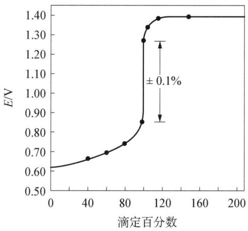

<details>
<summary>line chart</summary>

| 滴定百分数 | E/V   |
| ---------- | ----- |
| 0          | 0.60  |
| 40         | 0.68  |
| 80         | 0.75  |
| 120        | 1.35  |
| 160        | 1.40  |
| 200        | 1.40  |
</details>

图10-10 $0.1000\mathrm{mol / L}$ $\mathrm{Ce(SO_4)_2}$ 标准溶液滴定 $20.00~\mathrm{mL}0.1000\mathrm{mol / LFe^{2 + }}$ 溶液电势变化曲线

## (4) 氧化还原滴定法的应用

## ① 高锰酸钾作氧化剂进行的滴定反应

高锰酸钾是一种强的氧化剂,本身又具有颜色,在滴定反应中不需要再加指示剂。高锰酸钾作氧化剂,其还原产物与溶液的酸度有关。在强酸性溶液中, $\mathrm{MnO}_{4}^{-}$ 被还原到 $\mathrm{Mn}^{2+}$ ;在焦磷酸盐或氟化物存在下, $\mathrm{MnO}_{4}^{-}$ 被还原到 $\mathrm{Mn(III)}$ 的配合物;在弱酸性、中性、弱碱性溶液中, $\mathrm{MnO}_{4}^{-}$ 被还原到 $\mathrm{MnO}_{2}$ ;在强碱溶液中, $\mathrm{MnO}_{4}^{-}$ 被还原到 $\mathrm{MnO}_{4}^{2-}$ 。

$KMnO_{4}$ 标准溶液的浓度是以草酸钠来标定的。在 $H_{2}SO_{4}$ 溶液中， $MnO_{4}^{-}$ 和 $C_{2}O_{4}^{2-}$ 反应为： $2MnO_{4}^{-} + 5C_{2}O_{4}^{2-} + 16H^{+} = 2Mn^{2+} + 10CO_{2}\uparrow + 8H_{2}O$ 。滴定终点时 $KMnO_{4}$ 的紫色在 $0.5 \sim 1 min$ 不消失。

高锰酸钾作标准溶液可直接滴定具有还原性的物质, 如 $\mathrm{H}_{2} \mathrm{O}_{2} 、 \mathrm{C}_{2} \mathrm{O}_{4}^{2-} 、 \mathrm{NO}_{2}^{-} 、 \mathrm{Fe}^{2+}$ 等无机物和甲醇、甲醛、苯酚、柠檬酸、甘油、葡萄糖等一些有机化合物。对于有机物的测定可以采用返滴定法, 即在弱碱性溶液中加入一定量的过量的标准 $\mathrm{KMnO}_{4}$ , 它能与这些有机物发生定量的氧化还原反应。如 $\mathrm{KMnO}_{4}$ 与甲酸的反应: $\mathrm{HCOO}^{-} + 2 \mathrm{MnO}_{4}^{-} + 3 \mathrm{OH}^{-} = \mathrm{CO}_{3}^{2-} + 2 \mathrm{MnO}_{4}^{2-} + 2 \mathrm{H}_{2} \mathrm{O}$ 。反应后再将溶液酸化, 加入过量标准 $\mathrm{Fe}^{2+}$ 溶液, 使溶液中的 $\mathrm{MnO}_{4}^{2-}$ 和 $\mathrm{MnO}_{4}^{2-}$ 还原到 $\mathrm{Mn}^{2+}$ , 再以标准 $\mathrm{KMnO}_{4}$ 溶液滴定过量的 $\mathrm{Fe}^{2+}$ 。

某些不能与 $\mathrm{KMnO}_{4}$ 直接反应的物质也可用 $\mathrm{KMnO}_{4}$ 作标准溶液通过间接方法来测定。如 $Ca^{2+}$ 、 $Th^{4+}$ 等在溶液中不与 $KMnO_{4}$ 反应，但它们却能与 $C_{2}O_{4}^{2-}$ 发生反应生成草酸盐沉淀，将沉淀从溶液中分离出来后，可用 $KMnO_{4}$ 滴定 $C_{2}O_{4}^{2-}$ ，通过测 $C_{2}O_{4}^{2-}$ 间接地测出 $Ca^{2+}$ 、 $Th^{4+}$ 的含量。

② 重铬酸钾作氧化剂进行的滴定反应

$K_{2}Cr_{2}O_{7}$ 也是一种强氧化剂，在酸性溶液中， $Cr_{2}O_{7}^{2-}$ 被还原成 $Cr^{3+}$ 。重铬酸钾法的优点是 $K_{2}Cr_{2}O_{7}$ 试剂易于提纯，可以直接称量后配制成标准溶液，不必进行标定； $K_{2}Cr_{2}O_{7}$ 相当稳定，可以长期保存；在酸性溶液中， $Cr_{2}O_{7}^{2-}$ 作氧化剂，不会把 $Cl^{-}$ 氧化，故不受溶液中 $Cl^{-}$ 的干扰。使用 $K_{2}Cr_{2}O_{7}$ 滴定时，需使用氧化还原指示剂，如二苯胺磺酸钠等。

③ 碘量法

碘量法是以 $I_{2}$ 作为氧化剂或以 $I^{-}$ 作为还原剂进行滴定分析的方法。 $I_{2}$ 是较弱的氧化剂，能与一些较强的还原剂作用； $I^{-}$ 是中等强度的还原剂，能被许多氧化剂氧化。因此，碘量法分为直接和间接两种方法：

直接碘量法：一些还原性物质可用 $I_{2}$ 标准溶液直接滴定。例如，亚硫酸盐可用直接碘量法测定。反应为： $I_{2} + SO_{3}^{2-} + H_{2}O = 2I^{-} + SO_{4}^{2-} + 2H^{+}$ 。

间接碘量法：先用氧化性物质把 $\mathrm{I}^{-}$ 氧化为 $\mathrm{I}_{2}$ ，然后用 $\mathrm{Na}_{2} \mathrm{~S}_{2} \mathrm{O}_{3}$ 标准溶液滴定生成的 $\mathrm{I}_{2}$ 。这种方法叫间接碘量法，其反应为： $\mathrm{I}_{2} + 2 \mathrm{~S}_{2} \mathrm{O}_{3}^{2-} = 2 \mathrm{I}^{-} + \mathrm{S}_{4} \mathrm{O}_{6}^{2-}$ 。

用一定量的过量的 $I_{2}$ 还可氧化甲醛、葡萄糖、硫脲、丙酮等有机物质，再用标准 $Na_{2}S_{2}O_{3}$ 溶液滴定过量 $I_{2}$ ，从而可求有机物含量。碘量法中常使用的标准溶液有 $Na_{2}S_{2}O_{3}$ 和 $I_{2}$ 。硫代硫酸钠可用 $KIO_{3}$ 、 $KBrO_{3}$ 、 $K_{2}Cr_{2}O_{7}$ 等基准物质进行标定。如 $KIO_{3}$ 作基准物质时，它在酸性溶液中与 KI 发生反应为： $IO_{3}^{-} + 5I^{-} + 6H^{+} = 3I_{2} + 3H_{2}O$ 。定量析出的 $I_{2}$ 以淀粉作指示剂，用 $Na_{2}S_{2}O_{3}$ 滴定，以此为基础，计算 $Na_{2}S_{2}O_{3}$ 的浓度。

## 典型例题


【例 1】通常用克氏定氮法来测定农产品中的氮。该法涉及：用热浓硫酸处理样品把有机氮转化为铵离子；然后加入浓氢氧化钠，再把生成的氨蒸馏，用已知体积和已知浓度的盐酸来吸收；然后再用标准氢氧化钠溶液来返滴过剩的盐酸，从而测定样品中的氮。

(1) 0.2515 g 的谷物样品用浓硫酸处理后, 加入浓氢氧化钠, 把生成的氨蒸馏到 50.00 mL 0.1010 mol·L $^{-1}$ 的盐酸中。过量的酸用 19.30 mL 0.1050 mol·L $^{-1}$ 氢氧化钠溶液返滴定,请计算存在样品中的氮的含量(用质量分数表示)。

(2) 试计算在上题的滴定过量盐酸的过程中, 加入 $0 \mathrm{~mL} 、 9.65 \mathrm{~mL} 、 19.30 \mathrm{~mL}$ 和 $28.95 \mathrm{~mL}$ 的氢氧化钠时, 被滴定溶液的 $\mathrm{pH}$ 。在计算时忽略体积的变化 $(\mathrm{NH}_{4}^{+}$ 的 $K_{\mathrm{a}} = 5.7 \times 10^{-10}$ 。

(3) 根据(2)的计算结果画出滴定曲线。

(4) 用于上述返滴定的指示剂的 $\mathrm{pH}$ 变化范围是什么?

(5) 克氏法也可以用于测定氨基酸的分子量。某实验中, 被测定的天然氨基酸为 $0.2345 \mathrm{~g}$ 纯酸, 生成的氨用 $50.00 \mathrm{~mL}$ 的盐酸来吸收, 用 $0.1050 \mathrm{~mol} \cdot \mathrm{L}^{-1}$ 的氢氧化钠滴定, 用去的体积为 $17.50 \mathrm{~mL}$ 。分别设氨基酸分子中氮原子数为 1 和 2, 试计算此两种氨基酸的相对分子质量。

解析 该题为酸碱滴定计算题。内容涉及酸碱溶液(一元弱酸溶液、强酸弱酸混合溶液和缓冲溶液) $H^{+}$ 浓度的计算,滴定突跃范围的计算(酸碱指示剂的选择),以及滴定分析结果计算。在计算时应注意以下几个问题:

① 酸碱溶液 $\mathrm{H}^{+}$ 浓度的计算: $\mathrm{H}^{+}$ 浓度计算的最好方法是先写出质子条件式,并与离解平衡式相结合推出精确计算式,然后再根据具体情况近似处理得到近似式或最简式。近似处理通常表现在取主要组分而舍弃次要组分和用分析浓度代替平衡浓度两个方面,一般相对误差不超过 $5 \%$ 为近似处理的依据。

② 酸碱指示剂的选择: 指示剂选择是否恰当, 直接决定着滴定误差的大小, 比较简单和常用的指示剂选择方法是计算出化学计量点的 $\mathrm{pH}$ , 选择能够在计量点 (或接近计量点) $\mathrm{pH}$ 变色的指示剂。另一种方法是计算出滴定突跃范围, 选择能够在突跃范围内变色的指示剂, 本题即属这种情况。

③ 滴定分析结果计算：滴定分析结果计算的关键在于根据滴定反应方程式确定化学计量关系。酸碱滴定所涉及的反应比较简单，因而计量关系易于确定。

（1）本实验涉及的方程式较简单：吸收过程： $NH_{3}+HCl=NH_{4}Cl$ ；滴定过程： $NaOH+HCl=NaCl+H_{2}O$ 。反应计量关系均为1:1，因此， $n_{N}=n_{NH_{3}}=n_{HCl}-n_{NaOH}$ 。所以：

$$
\begin{aligned} \mathrm{N}\% & = \frac{n_{\mathrm{N}}M_{\mathrm{N}}}{S}\times 100\% = \frac{(50.00\times 0.1010 - 19.30\times 0.1050)\times\frac{1}{1000}\times 14.01}{0.2515}\times 100\% \\ & = 16.84\% \end{aligned}
$$

(2) ①滴定前 $(V_{\mathrm{NaOH}}=0)$ 时, 被滴定溶液为盐酸和铵盐(弱酸)的混合液。因盐酸浓度较大, 而 $NH_{4}^{+}$ 的 $K_{a}$ 很小, 故可按盐酸溶液计算。盐酸的量与滴定至计量点所

需 NaOH 的量相等, 即:

$$
[ \mathrm{H} ^ {+} ] = \frac {c _ {\mathrm{NaOH}} V _ {\mathrm{NaOH}}}{V} = \frac {0 . 1 0 5 0 \times 1 9 . 3 0}{5 0 . 0 0} = 0. 0 4 0 5 3 \mathrm{mol} \cdot \mathrm{L} ^ {- 1}, \text {所以} \mathrm{pH} = 1. 3 9;
$$

② 滴入 9.65 mL NaOH 时, 仍为混酸溶液:

$$
[ \mathrm{H} ^ {+} ] = \frac {0 . 1 0 5 0 \times (1 9 . 3 0 - 9 . 6 5)}{5 0 . 0 0 + 9 . 6 5} = 0. 0 1 6   9 9   \mathrm{mol} \cdot \mathrm{L} ^ {- 1}, \text { 所以 }   \mathrm{pH} = 1. 7 7;
$$

③ 滴入 19.30 mL NaOH 时, 盐酸恰好被中和完全, 被滴定溶液为一元弱酸 $\left(\mathrm{NH}_{4}^{+}\right)$ 溶液:

$c_{NH_{4}^{+}}=\frac{0.1010\times50.00-0.1050\times19.30}{50.00+19.30}=0.04364\ \mathrm{mol/L}$ ; 由于 $cK_{a}>20K_{w}$ ，且 $\frac{c}{K_{w}}>500$ ，所以 $[H^{+}]=\sqrt{K_{a}c}=\sqrt{5.7\times10^{-10}\times0.04364}$ ，解得：pH=5.30；

④ 滴入 28.95 mL NaOH 时, 部分 $NH_{4}^{+}$ 被中和, 被滴定溶液成为 $NH_{4}^{+}-NH_{3}$ 缓冲溶液。根据缓冲溶液公式有: $pH = pK_{a} - \lg \frac{c_{NH_{4}^{+}}}{c_{NH_{3}}}$ , 分别计算 $c_{NH_{4}^{+}}$ 和 $c_{NH_{3}}$ :

$$
\begin{array}{r l} & c _ {\mathrm {NH_ {4} ^ {+}}} = \frac {(0 . 1 0 1 0 \times 5 0 . 0 0 - 0 . 1 0 5 0 \times 1 9 . 3 0) - 0 . 1 0 5 0 \times (2 8 . 9 5 - 1 9 . 3 0)}{5 0 . 0 0 + 2 8 . 9 5} = \\ & \frac {2 . 0 1}{7 8 . 9 5} \mathrm{mol} \cdot \mathrm{L} ^ {- 1}; \end{array}
$$

$$
c _ {\mathrm{NH} _ {3}} = \frac {0 . 1 0 5 0 \times (2 8 . 9 5 - 1 9 . 3 0)}{5 0 . 0 0 + 2 8 . 9 5} = \frac {1 . 0 1}{7 8 . 9 5} \mathrm{mol} \cdot \mathrm{L} ^ {- 1};
$$

所以， $\mathrm{pH} = 9.24 - \lg \frac{2.01}{1.01} = 8.94$ 。

(3) 滴定曲线如下图所示:

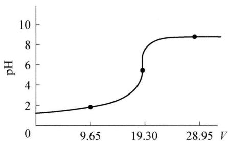

<details>
<summary>line chart</summary>

| V     | pH  |
|-------|-----|
| 9.65  | 2   |
| 19.30 | 5   |
| 28.95 | 9   |
</details>

滴入NaOH溶液的体积/mL

（4）用于滴定的指示剂的变色范围应落在滴定突跃范围内，故本题的实质是计算突跃范围。

滴定至计量点前 0.1%, 即加入 19.28 mL NaOH 溶液时:

$$
[ \mathrm{H} ^ {+} ] = 0. 1 0 5 0 \times \frac {0 . 0 2}{5 0 . 0 0 + 1 9 . 2 8} = 3. 0 \times 1 0 ^ {- 5}, \text {所以} \mathrm{pH} = 4. 5 2;
$$

滴定至计量点后 0.1%，则有 0.1% $NH_{4}^{+}$ 被中和为 $NH_{3}$ ，形成缓冲溶液：

$$
\mathrm{pH} = \mathrm{pK} _ {\mathrm{a}} - \lg \frac {c _ {\mathrm{NH} _ {4} ^ {+}}}{c _ {\mathrm{NH} _ {3}}} = 9. 2 4 - \lg 1 0 ^ {3} = 6. 2 4
$$

因此,用于滴定的指示剂应当能在 pH 为 4.52\~6.24 的范围内变色。

(5) 样品中氮的含量为:

$$
\omega (\mathrm{N}) = \frac {(50.00\times 0.1010 - 17.50\times 0.1050)\times\frac{1}{1000}\times 14.01}{0.2345} \times 100\% = 19.19\%
$$

若氨基酸分子中含1个氮原子，则： $M=\frac{M_{N}}{19.19}\times100=\frac{14.01}{19.19}\times100=73.01$ ;

若氨基酸分子中含2个氮原子，则： $M=\frac{2M_{N}}{19.19}\times100=\frac{2\times14.01}{19.19}\times100=$ 146.02。

【例 2】（2008 年全国初赛）在 $900^{\circ}$ C 的空气中合成出一种镧、钙和锰（摩尔比为 2:2:1）的复合氧化物，其中锰可能以 +2、+3、+4 或者混合价存在。为确定该复合氧化物的化学式，进行如下分析：

(1) 准确移取 $25.00 \mathrm{~mL}, 0.05301 \mathrm{~mol} / \mathrm{L}$ 的草酸钠水溶液, 放入锥形瓶中, 加入 $25 \mathrm{~mL}$ 蒸馏水和 $5 \mathrm{~mL}, 6 \mathrm{~mol} / \mathrm{L}$ 的 $\mathrm{HNO}_{3}$ 溶液, 微热至 $60^{\circ} \mathrm{C} \sim 70^{\circ} \mathrm{C}$ , 用 $\mathrm{KMnO}_{4}$ 溶液滴定, 消耗 $27.75 \mathrm{~mL}$ 。写出滴定过程发生的反应的方程式; 计算 $\mathrm{KMnO}_{4}$ 溶液的浓度。

(2) 准确称取 $0.4460 \mathrm{~g}$ 复合氧化物样品, 放入锥形瓶中, 加 $25.00 \mathrm{~mL}$ 上述草酸钠溶液和 $30 \mathrm{~mL}, 6 \mathrm{~mol} / \mathrm{L}$ 的 $\mathrm{HNO}_{3}$ 溶液, 在 $60^{\circ} \mathrm{C} \sim 70^{\circ} \mathrm{C}$ 下充分摇动, 约半小时后得到无色透明溶液。用上述 $\mathrm{KMnO}_{4}$ 溶液滴定, 消耗 $10.02 \mathrm{~mL}$ 。根据实验结果推算复合氧化物中锰的价态, 给出该复合氧化物的化学式, 写出样品溶解过程的反应方程式。(已知 La 的相对原子质量为 138.9)

解析 (1) 本操作用草酸钠标定 $\mathrm{KMnO}_{4}$ 溶液浓度, 涉及的反应方程式为:

$$
2 \mathrm{MnO} _ {4} ^ {-} + 5 \mathrm{C} _ {2} \mathrm{O} _ {4} ^ {2 -} + 1 6 \mathrm{H} ^ {+} = 2 \mathrm{Mn} ^ {2 +} + 1 0 \mathrm{CO} _ {2} \uparrow + 8 \mathrm{H} _ {2} \mathrm{O}
$$

所以,根据 $KMnO_{4}$ 的用量可以得到 $KMnO_{4}$ 溶液浓度为: $(2/5)\times0.05301\times$

$$
2 5. 0 0 / 2 7. 7 5 = 0. 0 1 9 1 0 \mathrm{mol} / \mathrm{L} _ {\circ}
$$

(2) 根据化合物中金属离子摩尔比为 $\mathrm{La}: \mathrm{Ca}: \mathrm{Mn} = 2:2:1$ , 镧和钙的氧化数分别 $+3$ 和 $+2$ , 锰的氧化态为 $+2 \sim +4$ , 可以设复合物的化学式为: $\mathrm{La}_{2} \mathrm{Ca}_{2} \mathrm{MnO}_{6+x}$ , 其中 $x = 0 \sim 1$ 。

滴定过程中加入 $C_{2}O_{4}^{2-}$ 总量为：25.00 mL×0.05301 mol/L=1.3253 mmol；样品溶解后，用高锰酸钾返滴定过量的 $C_{2}O_{4}^{2-}$ ，根据反应系数比解得样品溶解后剩余 $C_{2}O_{4}^{2-}$ 的量为：5/2×10.02 mL×0.01910 mol/L=0.4785 mmol；因此，样品溶解过程中所消耗的 $C_{2}O_{4}^{2-}$ 的量为：1.3253 mmol-0.4785 mmol=0.8468 mmol。

考虑到 $La^{3+}$ 和 $Ba^{2+}$ 在溶解过程中化合价不发生变化, 因此与 $C_{2}O_{4}^{2-}$ 发生氧化还原反应的应该是 $\mathrm{Mn}(+2\sim+4)$ , 考察得失电子的微粒有:

在溶解过程中, $C_{2}O_{4}^{2-}$ 变为 $CO_{2}$ 给出电子: $2 \times 0.8468 \, mmol = 1.694 \, mmol$ ;

复合氧化物（ $\mathrm{La_2Ca_2MnO_{6 + x}}$ ）样品物质的量为： $0.4460 \mathrm{~g} / (508.9 + 16.0x) \mathrm{~g} / \mathrm{mol}$ ； $\mathrm{La_2Ca_2MnO_{6 + x}}$ 中，锰的价态为： $2 \times (6 + x) - 2 \times 3 - 2 \times 2 = (2 + 2x)$ ，溶解后锰得到电子，化合价下降到 $+2$ 价，因此，锰的价态变化为： $(2 + 2x - 2) = 2x$ 。

根据氧化还原得失电子守恒可知: 锰的得电子数与 $\mathrm{C}_{2} \mathrm{O}_{4}^{2-}$ 的失电子数相等, 于是有:

$$
\begin{array}{r l} & 2 x \times 0. 4 4 6 0 \mathrm{g} / (5 0 8. 9 + 1 6. 0 x) \mathrm{g} / \mathrm{mol} = 2 \times 0. 8 4 6 8 \times 1 0 ^ {- 3} \mathrm{mol}, \text {解得:} x = \\ & 1. 0 1 2 \approx 1 _ {\circ} \end{array}
$$

结论：该复合物氧化物的化学式为 $La_{2}Ca_{2}MnO_{7}$ ，溶解过程中的反应方程式为： $La_{2}Ca_{2}MnO_{7} + C_{2}O_{4}^{2-} + 14H^{+} = 2La^{3+} + 2Ca^{2+} + Mn^{2+} + 2CO_{2}\uparrow + 7H_{2}O$ 。

【例 3】某研究团队提出了一个间接测定自然界中(如海水、工业废水中) $SO_{4}^{2-}$ 的方式。这一方法建立在: ①让 $SO_{4}^{2-}$ 生成 $PbSO_{4}$ 沉淀; ②让 $PbSO_{4}$ 溶解在含有过量 EDTA 的氨溶液中, 形成 $PbY^{2-}$ 配合物; ③用 $Mg^{2+}$ 标准溶液滴定多余的 EDTA。一些已知数据如下:

$$
\begin{array}{l} \mathrm{PbSO} _ {4} (\mathrm{s}) \rightleftharpoons \mathrm{Pb} ^ {2 +} + \mathrm{SO} _ {4} ^ {2 -} \quad K _ {\mathrm{sp}} = 1. 6 \times 1 0 ^ {- 8} \\ \mathrm{Pb} ^ {2 +} + \mathrm{Y} ^ {4 -} \rightleftharpoons \mathrm{PbY} ^ {2 -} \quad K _ {\text {稳}} = 1. 1 \times 1 0 ^ {1 8} \\ \mathrm{Mg} ^ {2 +} + \mathrm{Y} ^ {4 -} \rightleftharpoons \mathrm{MgY} ^ {2 -} \qquad K _ {\text {稳}} = 4. 9 \times 1 0 ^ {8} \\ \mathrm{Zn} ^ {2 +} + \mathrm{Y} ^ {4 -} \rightleftharpoons \mathrm{ZnY} ^ {2 -} \quad K _ {\text {稳}} = 3. 2 \times 1 0 ^ {1 6} \\ \end{array}
$$

通过计算回答下列问题：

(1) 沉淀可否溶于含有 $\mathrm{Y}^{4-}$ 的溶液?

(2) 有人提出了用 $\mathrm{Zn}^{2+}$ 作滴定剂的类似方法, 却发现结果的准确率很低, 一种解释是 $\mathrm{Zn}^{2+}$ 可能与 $\mathrm{PbY}^{2-}$ 反应形成 $\mathrm{ZnY}^{2-}$ , 用前面的平衡常数说明用 $\mathrm{Zn}^{2+}$ 作滴定剂存在这个问题, 而用 $\mathrm{Mg}^{2+}$ 作滴定剂却不存在这个问题的原因。 $\mathrm{Pb}^{2+}$ 被 $\mathrm{Zn}^{2+}$ 置换导致实验的结果偏高还是偏低?

(3) 在一次分析中, $25.00 \mathrm{~mL}$ 的工业废水试样通过上述过程共消耗 $50.00 \mathrm{~mL}$ , $0.05000 \mathrm{~mol} / \mathrm{L}$ 的EDTA。滴定多余的EDTA需要 $12.24 \mathrm{~mL}, 0.1000 \mathrm{~mol} / \mathrm{L}$ 的 $\mathrm{Mg}^{2+}$ , 试计算废水试样中 $\mathrm{SO}_{4}^{2-}$ 的浓度。

解析 (1) 总反应为: $\mathrm{PbSO_4(s)} + \mathrm{Y}^{4-} \rightleftharpoons \mathrm{PbY}^{2-} + \mathrm{SO}_4^{2-}$

可由题中所给的下面两个方程相加得到：

$$
\mathrm{PbSO} _ {4} (\mathrm{s}) \rightleftharpoons \mathrm{Pb} ^ {2 +} + \mathrm{SO} _ {4} ^ {2 -} \quad K _ {\mathrm{sp}} = 1. 6 \times 1 0 ^ {- 8}
$$

$$
\mathrm{Pb} ^ {2 +} + \mathrm{Y} ^ {4 -} \rightleftharpoons \mathrm{PbY} ^ {2 -} \qquad K _ {\text {稳}} = 1. 1 \times 1 0 ^ {1 8}
$$

因此,总反应的 K 为:

$$
\begin{array}{l} K = \frac {[ \mathrm{PbY} ^ {2 -} ] [ \mathrm{SO} _ {4} ^ {2 -} ]}{[ \mathrm{Y} ^ {4 -} ]} = \frac {[ \mathrm{SO} _ {4} ^ {2 -} ] [ \mathrm{Pb} ^ {2 +} ]}{\frac {[ \mathrm{Y} ^ {4 -} ] [ \mathrm{Pb} ^ {2 +} ]}{[ \mathrm{PbY} ^ {2 -} ]}} = \frac {K _ {\mathrm{sp}}}{\frac {1}{K _ {\text {稳}}}} = 1. 6 \times 1 0 ^ {- 8} \times 1. 1 \times 1 0 ^ {1 8} \\ = 1. 7 6 \times 1 0 ^ {1 0} \gg 1 0 ^ {7} \\ \end{array}
$$

故沉淀可以溶于含有 $Y^{4-}$ 的溶液。

(2) 考察方程式: $Zn^{2+} + Y^{4-} \rightleftharpoons ZnY^{2-}$ ①

$$
\mathrm{Pb} ^ {2 +} + \mathrm{Y} ^ {4 -} \rightleftharpoons \mathrm{PbY} ^ {2 -} \tag {②}
$$

①式一②式得： $Zn^{2+} + PbY^{2-} \rightleftharpoons ZnY^{2-} + Pb^{2+}$

则： $K=\frac{\left[ZnY^{2-}\right]\cdot\left[Pb^{2+}\right]}{\left[Zn^{2+}\right]\cdot\left[PbY^{2-}\right]}=\frac{\frac{\left[ZnY^{2-}\right]}{\left[Zn^{2+}\right]\left[Y^{4-}\right]}}{\frac{\left[PbY^{2-}\right]}{\left[Y^{4-}\right]\cdot\left[Pb^{2+}\right]}}=\frac{3.2\times10^{16}}{1.1\times10^{18}}=0.029<10^{7}$

可见 $Zn^{2+}$ 会置换出 $Pb^{2+}$ ，使得返滴定过程中消耗了更多的 $Zn^{2+}$ ，最终造成测定 $SO_{4}^{2-}$ 的结果偏低。

而用 $Mg^{2+}$ 时： $Mg^{2+} + PbY^{2-} \rightleftharpoons MgY^{2-} + Pb^{2+}$

反应的平衡常数 K 为：

$$
K = \frac {\frac {[ \mathrm{MgY} ^ {2 -} ]}{[ \mathrm{Mg} ^ {2 +} ] [ \mathrm{Y} ^ {4 -} ]}}{\frac {[ \mathrm{PbY} ^ {2 -} ]}{[ \mathrm{Y} ^ {4 -} ] \cdot [ \mathrm{Pb} ^ {2 +} ]}} = \frac {4 . 9 \times 1 0 ^ {8}}{1 . 1 \times 1 0 ^ {1 8}} = 4. 4 5 6 \times 1 0 ^ {- 1 0}
$$

$K \ll 1$ , 故该反应正向不能发生。即用 $Mg^{2+}$ 返滴定过量的 EDTA 不会与 PbY

反应,因此不存在问题。

(3) 滴定多余 EDTA 用去 $\mathrm{Mg}^{2+}$ 的物质的量为: $12.24 \times 10^{-3} \times 0.1000 = 1.224 \times 10^{-3} \mathrm{~mol}$ 。

由于 25.00 mL 废水中的 $Pb^{2+}$ 的物质的量为： $50 \times 10^{-3} \times 0.05000 - 1.224 \times 10^{-3} = 1.276 \times 10^{-3} \, mol$ 。因此： $n(\mathrm{SO}_{4}^{2-}) = 1.276 \times 10^{-3} \, \mathrm{mol}$ ，故： $c(\mathrm{SO}_{4}^{2-}) = 0.05104 \, \mathrm{mol/L}$ 。

## 本讲习题


1. 测得某溶液 $\mathrm{pH}$ 为3.005, 该值具有\_\_\_\_位有效数字, 氢离子活度应表示为\_\_\_\_ $\mathrm{mol} \cdot \mathrm{L}^{-1}$ ; 某溶液氢离子活度为 $2.5 \times 10^{-4} \mathrm{~mol} \cdot \mathrm{L}^{-1}$ , 其有效数字为\_\_\_\_位, $\mathrm{pH}$ 为\_\_\_\_; 已知 $\mathrm{HAc}$ 的 $\mathrm{pK}_{\mathrm{a}} = 4.74$ , 则 $\mathrm{HAc}$ 的 $\mathrm{K}_{\mathrm{a}}$ 值为\_\_\_\_。

2. 将以下数修约为四位有效数字:

① 0.025 354 1 修约为，② 0.025 356 1 修约为，

③ 0.025 355 0 修约为，④ 0.025 365 0 修约为，

⑤ 0.025 365 1 修约为，⑥ 0.025 354 9 修约为。

3. 分析天平每次称量的误差为±0.1 mg, 称样量分别为 0.05 g、0.2 g、1.0 g 时可能引起的相对误差各为多少? 这些结果说明什么问题?

4. 三次标定 NaOH 溶液浓度(mol·L $^{-1}$ )结果为 0.2085、0.2083、0.2086，计算测定结果的平均值、个别测定值的平均偏差、相对平均偏差、标准差和相对标准偏差。

5. 葡萄糖含量的测定可用碘量法：

准备称取约 10.00 g 葡萄糖试样于 100 mL 烧杯中，加少量水溶解后定量转移到 250 mL 容量瓶中，定容并摇匀。用移液管吸取该试液 50.00 mL 于 250 mL 碘量瓶中，准确加入 0.050 00 mol·L $^{-1}$ I $_{2}$ 标准溶液 30.00 mL（过量）。在摇动下缓缓滴加 1.0 mol·L $^{-1}$ NaOH 溶液，直至溶液变成浅黄色。盖上表面皿，放置约 15 min，使之反应完全。用少量水冲洗表面皿和碘量瓶内壁，然后加入 8 mL，0.5 mol·L $^{-1}$ HCl，析出的 I $_{2}$ 立即用 0.1000 mol·L $^{-1}$ Na $_{2}$ S $_{2}$ O $_{3}$ 标准溶液滴定至浅黄色。加 2 mL 淀粉指示剂，继续滴定至蓝色恰好消失即为终点，消耗了 9.96 mL。（已知 M $_{C_{6}H_{12}O_{6}}$ =180.2）

(1) 根据实验内容写出相应反应方程式来说明其测定原理,并配平。

(2) 导出计算葡萄糖含量的公式。

(3) 计算试样中葡萄糖的含量。

6. 称取苯巴比妥钠 $\left(\mathrm{C}_{12} \mathrm{H}_{11} \mathrm{~N}_{2} \mathrm{O}_{3} \mathrm{Na}, M = 254.2 \mathrm{~g} / \mathrm{mol}\right)$ 试样 $0.2014 \mathrm{~g}$ , 于稀碱溶液中加热 $(60^{\circ} \mathrm{C})$ , 使之溶解, 冷却, 以乙酸酸化后转移至 $250 \mathrm{~mL}$ 容量瓶中, 加入 $25.00 \mathrm{~mL}, 0.03000 \mathrm{~mol} / \mathrm{L} \mathrm{Hg}(\mathrm{ClO}_{4})_{2}$ 标准溶液, 稀释至刻度, 放置待下述反应完毕:

$$
\mathrm{Hg} ^ {2 +} + 2 \mathrm{C} _ {1 2} \mathrm{H} _ {1 1} \mathrm{N} _ {2} \mathrm{O} _ {3} ^ {-} = \mathrm{Hg} (\mathrm{C} _ {1 2} \mathrm{H} _ {1 1} \mathrm{N} _ {2} \mathrm{O} _ {3}) _ {2} \downarrow
$$

干过滤弃去沉淀, 滤液用干烧杯承接。移取 25.00 mL 滤液, 加入 10 mL, 0.01 mol/L MgY 溶液, 释放出的 $Mg^{2+}$ 在 pH = 10 时以 EBT 为指示剂, 用 0.010 00 mol/L EDTA 滴定至终点, 消耗 3.60 mL。计算试样中苯巴比妥钠的质量分数。

7.（2007年全国初赛）甲苯与干燥氯气在光照下反应生成氯化苄，用下列方法分析粗产品的纯度：称取 $0.255\mathrm{g}$ 样品，与 $25\mathrm{mL}, 4\mathrm{mol} \cdot \mathrm{L}^{-1}$ 氢氧化钠水溶液在 $100\mathrm{mL}$ 圆底烧瓶中混合，加热回流1小时；冷至室温，加入 $50\mathrm{mL} 20\%$ 硝酸后，用 $25.00\mathrm{mL}, 0.1000\mathrm{mol} \cdot \mathrm{L}^{-1}$ 硝酸银水溶液处理，再用 $0.1000\mathrm{mol} \cdot \mathrm{L}^{-1}\mathrm{NH}_{4}\mathrm{SCN}$ 水溶液滴定剩余的硝酸银，以硫酸铁铵为指示剂，消耗了 $6.75\mathrm{mL}$ 。

(1) 写出分析过程的反应方程式。  
(2) 计算样品中氯化苄的质量分数(%)。  
(3) 通常,上述测定结果高于样品中氯化苄的实际含量,指出原因。  
(4) 上述分析方法是否适用于氯苯的纯度分析？请说明理由。

8. 固溶体 $BaIn_{x}Co_{1-x}O_{3-\delta}$ 是兼具电子导电性与离子导电性的功能材料，Co 的氧化数随组成和制备条件而变化，In 则保持 +3 价不变。为测定化合物 $BaIn_{0.55}Co_{0.45}O_{3-\delta}$ 中 Co 的氧化数，确定化合物中的氧含量，进行了如下分析：称取 0.2034 g 样品，加入足量 KI 溶液和适量 HCl 溶液，与样品反应使其溶解。以淀粉作指示剂，用 $0.050\,00\,mol \cdot L^{-1}Na_{2}S_{2}O_{3}$ 标准溶液滴定，消耗 10.85 mL。

(1) 写出 $BaIn_{0.55}Co_{0.45}O_{3-\delta}$ 与 KI 和 HCl 反应的离子方程式。

(2) 写出滴定反应的离子方程式。

（3）计算 $BaIn_{0.55}Co_{0.45}O_{3-\delta}$ 样品中 Co 的氧化数 $S_{Co}$ 和氧缺陷的量 $\delta$ (保留到小数点后两位)。

9. 移取 20.00 mL 乙二醇试液, 加入 50.00 mL, 0.020 00 mol·L $^{-1}$ KMnO $_{4}$ 碱性溶液。反应完全后, 酸化溶液, 加入 0.1010 mol·L $^{-1}$ Na $_{2}$ C $_{2}$ O $_{4}$ 20.00 mL, 还原过剩的 MnO $_{4}^{-}$ 及 MnO $_{4}^{2-}$ 的歧化产物 MnO $_{2}$ 和 MnO $_{4}^{-}$ ; 再以 0.020 00 mol·L $^{-1}$ KMnO $_{4}$ 溶液滴定过量的 Na $_{2}$ C $_{2}$ O $_{4}$ , 消耗了 15.20 mL。计算乙二醇试液的浓度。

10. 人体中三分之二的负离子是氯离子,主要存在于胃液和尿液中。可用汞量法测定体液中的氯离子:以硝酸汞(Ⅱ)为标准溶液,二苯卡巴腙为指示剂。滴定中 $\mathrm{Hg}^{2+}$ 与 $\mathrm{Cl}^{-}$ 生成电离度很小的 $\mathrm{HgCl}_{2}$ ,过量的 $\mathrm{Hg}^{2+}$ 与二苯卡巴腙生成紫色螯合物。

(1) 简述配制硝酸汞溶液时必须用硝酸酸化的理由。

(2) 称取 $1.713 \mathrm{~g} \mathrm{Hg}(\mathrm{NO}_{3})_{2} \cdot x \mathrm{H}_{2} \mathrm{O}$ , 配制成 $500 \mathrm{~mL}$ 溶液作为滴定剂。取 $20.00 \mathrm{~mL}, 0.0100 \mathrm{~mol} / \mathrm{L} \mathrm{NaCl}$ 标准溶液注入锥形瓶, 用 $1 \mathrm{~mL}, 5 \% \mathrm{HNO}_{3}$ 酸化, 加入 5 滴二苯卡巴腙指示剂, 用上述硝酸汞溶液滴定至紫色, 消耗 $10.20 \mathrm{~mL}$ 。推断该硝酸汞水合物样品的化学式。

(3) 取 $0.500 \mathrm{~mL}$ 血清放入小锥形瓶, 加 $2 \mathrm{~mL}$ 去离子水、4 滴 $5 \%$ 的硝酸和 3 滴二苯卡巴腙指示剂, 用上述硝酸汞溶液滴定至终点, 消耗 $1.53 \mathrm{~mL}$ 。为使测量结果准确, 以十倍于血清样品体积的水为试样进行空白实验, 消耗硝酸汞溶液 $0.80 \mathrm{~mL}$ 。计算该血清样品中氯离子的浓度 (毫克/100 毫升)。

11. (2012年全国决赛)甲酸和乙酸都是重要的化工原料。移取 $20.00 \mathrm{~mL}$ 甲酸和乙酸的混合溶液, 以 $0.1000 \mathrm{~mol} / \mathrm{L} \mathrm{NaOH}$ 标准溶液滴定至终点, 消耗 $25.00 \mathrm{~mL}$ 。另取 $20.00 \mathrm{~mL}$ 上述混合溶液, 加入 $50.00 \mathrm{~mL}, 0.02500 \mathrm{~mol} / \mathrm{L} \mathrm{KMnO}_{4}$ 强碱性溶液, 反应完全后, 调节至酸性, 加入 $40.00 \mathrm{~mL}, 0.02000 \mathrm{~mol} / \mathrm{L} \mathrm{Fe}^{2+}$ 标准溶液, 用上述 $\mathrm{KMnO}_{4}$ 标准溶液滴定至终点, 消耗 $24.00 \mathrm{~mL}$ 。

(1) 计算混合溶液中甲酸和乙酸的总量。

(2) 写出氧化还原滴定反应的化学方程式。

(3) 计算混合酸溶液中甲酸和乙酸的浓度。

12. (2005年全国决赛)用EDTA配位滴定法可测定与 $\mathrm{Cu}^{2+}$ 和 $\mathrm{Zn}^{2+}$ 共存的 $\mathrm{Al}^{3+}$ 的含量,以PAN为指示剂,测定的相对误差 $\leqslant \pm 0.1\%$ 。测定过程可表述如下(注:表中的配合物电荷数被省略;游离的EDTA的各种形体均被简写为Y):

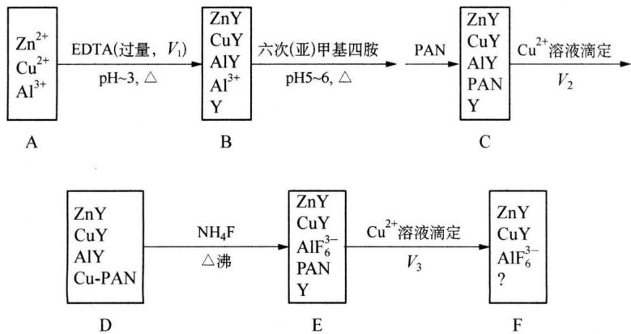

<details>
<summary>flowchart</summary>

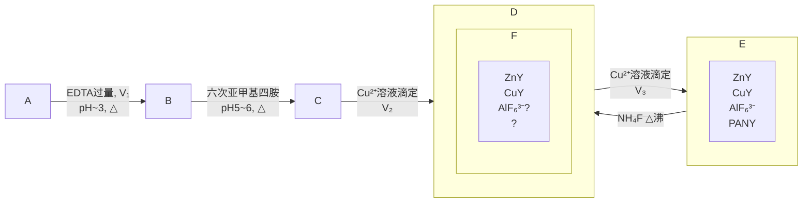
</details>

附：配合物稳定常数的对数值 $\lg K_{稳}$ 的数据：

CuY 18.8 ZnY 16.5 AlY 16.1 $\mathrm{AlF}_6^{3-}$ 19.7 Cu-PAN 16

(1) 写出从 D 框状态到 E 框状态的反应式并配平。  
(2) F 框状态内还应存在何种物质?  
（3）是否需确知所用 EDTA 溶液的准确浓度？ $V_{1}$ 是否需要准确读取并记录？简述原因。  
(4) 若从 C 框状态到 D 框状态时 $Cu^{2+}$ 溶液滴过量了, 问:

① 对最终的测定结果将引入正误差还是负误差？还是无影响？

② 如你认为有影响,在实验方面应如何处理?

(5) 设试液取量 $V_{0}$ 和 $V_{1}$ 、 $V_{2}$ 、 $V_{3}$ 均以 mL 为单位， $M_{Al}$ 为 Al 的摩尔质量 (g/mol)， $c(\text{EDTA})$ 、 $c(\text{Cu})$ 分别为 EDTA 和 $Cu^{2+}$ 溶液的浓度 (mol/L)，列出试液中 Al 含量 (g/L) 的计算式。

## 参考答案

## 第一讲 气体

1. $pV = nRT, n = \frac{m}{M}$ , 所以 $pV = \frac{m}{M} RT, M = \frac{mRT}{pV}$ 。代入计算得 $M = 274(\mathrm{g} \cdot \mathrm{mol}^{-1})$

2. $p_{\mathrm{O_2}} = 9.09\times 10^{5}\mathrm{Pa}\times \frac{6}{6 + 12} = 3.03\times 10^{5}\mathrm{Pa}, p_{\mathrm{N_2}} = 3.03\times 10^5\mathrm{Pa}\times \frac{6}{6 + 12} =$ $2.02\times 10^{5}\mathrm{Pa}$

3. (1) $\overline{M}_{\mathrm{r}}$ (呼) $= 28.0\mathrm{g}\cdot \mathrm{mol}^{-1}\times 75.1\% +32.0\mathrm{g}\cdot \mathrm{mol}^{-1}\times 15.2\% +44.0\mathrm{g}\cdot \mathrm{mol}^{-1}\times$ $3.8\% +18.0\mathrm{g}\cdot \mathrm{mol}^{-1}\times 5.9\% = 28.6\mathrm{g}\cdot \mathrm{mol}^{-1}$ 。所以， $p_{\mathrm{CO_2}} = 1.01\mathrm{Pa}\times 10^{5}\times$ $3.8\% = 3.84\times 10^{3}\mathrm{Pa}$

(2) $\overline{M}_{\mathrm{r}}$ (吸) $= 28.0\mathrm{g}\cdot \mathrm{mol}^{-1}\times 79\% +32.0\mathrm{g}\cdot \mathrm{mol}^{-1}\times 21.0\% = 28.8\mathrm{g}\cdot \mathrm{mol}^{-1}$ 。因为 $\overline{M}_{\mathrm{r}}$ (呼) $< \overline{M}_{\mathrm{r}}$ (吸)，所以呼出的空气比吸入的空气的密度小

4. (1) 303 K 空气中水蒸气的分压为: $\frac{p_{\mathrm{H_2O}}}{4239.6} \times 100\% = 100\%$ , $p_{\mathrm{H_2O}} = 4239.6 \mathrm{~Pa}$ , 代入 $m = \frac{pVM}{RT}$ 得 $m = 0.03 \mathrm{~g}$

(2) 同理 m = 0.07 g

5. $6.08 \times 10^{4} \mathrm{~Pa}$

6. $2.02 \times 10^{6}$ Pa $1.88 \times 10^{6}$ Pa

7. $1.63 \times 10^{3}$ Pa

8. 将 pV 对 p 作图得直线, 直线外延到 $p \rightarrow 0$ 时, 求得 $\widetilde{p}V$ 为 $22.41\ Pa \cdot dm^{3} \cdot mol^{-1}$ 。理想气体的 $\widetilde{p}V$ 不随压强变化, 由图知, 在标准状况下 $O_{2}$ 的摩尔体积为 $22.414\ (dm^{3} \cdot mol^{-1})$

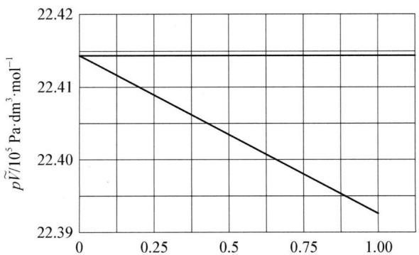

<details>
<summary>line chart</summary>

| x    | p̃V/10⁵ Pa·dm⁻³·mol⁻¹ |
| ---- | --------------------- |
| 0.00 | 22.41                 |
| 1.00 | 22.39                 |
</details>

$O_{2}$ 在 $0^{\circ}C$ 时的 $p\tilde{V}-p$ 图

9. $\mathrm{N}_{2}, \mathrm{O}_{2}, \mathrm{CO}_{2}, \mathrm{H}_{2} \mathrm{O}$

解析：呼出气中的 $N_{2}$ 的分压小于吸入气中的分压的主要原因是呼出气中的 $CO_{2}$ 和水蒸气有较大分压，总压不变，因而 $N_{2}$ 的摩尔分数下降；呼出气中的 $O_{2}$ 的分压小于吸入气中的分压的主要原因是吸入的 $O_{2}$ 被人体消耗了。后 2 种气体的确定可以根据 $CO_{2}$ 在空气中的百分含量约为 0.04% 得出第三行数据为 $CO_{2}$

10. $(\mathrm{AlCl}_{3})_{2}$

11. 59. 14

12. $0.570P^{\theta}$ ，甲球 0.3 mol，乙球 0.4 mol

13. (1) $M(\mathrm{C}_{6}\mathrm{H}_{6}) = 78.5 \, \text{g/mol}$ $M(\mathrm{CH}_{3}\mathrm{OH}) = 33 \, \text{g/mol}$

$$
M (\mathrm{HAc} ①) = 1 1 8. 9 \mathrm{g/mol} M (\mathrm{HAc} ②) = 9 9. 8 \mathrm{g/mol}
$$

(2) 误差是由蒸气分子的性质偏离理想气体分子的性质引起的。此外在甲醇分子中有少量的分子缔合, 而在醋酸分子中有二聚分子 $\left(\mathrm{CH}_{3} \mathrm{COOH}\right)_{2}$

14. (1) HF

(2) HF 以氢键结合成 $(HF)_{2}$ 、 $(HF)_{3}$

(3) 在稀溶液中其摩尔浓度之比(25、80、90℃)为: 2.90:1.03:1.00

15. (1) 沸水温度高于 $\mathrm{CCl}_{4}$ 的沸点 $(76.5^{\circ} \mathrm{C})$ , 使 $\mathrm{CCl}_{4}$ 迅速气化并充满烧瓶, $\mathrm{CCl}_{4}$ 蒸气是 $100^{\circ} \mathrm{C}$ 、常压下的体积

(2) 将有部分 $CCl_{4}$ 蒸气逸出, 使瓶内含少量空气, 冷凝得到的 $CCl_{4}$ 质量较小, pV/RT = m/M, 等号左边为定值, 等号右边质量小了, 求得的 $CCl_{4}$ 的摩尔质量偏小

(3) 烧瓶体积是 $250 \mathrm{~mL}$ , $\mathrm{CCl}_{4}$ 密度大约 $1.5 \mathrm{~g} / \mathrm{mL}$ , 冷凝的液态 $\mathrm{CCl}_{4}$ 的体积大约为 $1 \mathrm{~mL}$ , 若未倒掉 $\mathrm{CCl}_{4}$ , 则烧瓶 (瓶内质量换算成) 容积将增大 $1 \mathrm{~mL}$ 。引入误差 $0.4\%$ , 低于约 $2 \mathrm{~mL} \mathrm{CCl}_{4}$ 的质量约 $3 \mathrm{~g}$ (称准到 $0.1 \mathrm{~g}$ ), 相对误差 $3\%$ , 影响不大

(4) 未全部没入, 表明瓶内部分空间低于 $100^{\circ} \mathrm{C}$ (在相同压强下), 这部分空间的 $\mathrm{CCl}_{4}$ 蒸气的温度比 $100^{\circ} \mathrm{C}$ 下降许多。若露在水面上空间小, 不会影响到实验结果

## 第二讲 溶液和胶体

1. 解析: $\mathrm{CO}_{2}$ 通入澄清石灰水中产生浑浊, 继续通入过量的 $\mathrm{CO}_{2}$ 浑浊“消失”。本题借助于一些数据, 定量地分析这一常见实验的各种可能发生的变化, 加深对实验的认识。在数据处理时, 由于是等物质的量进行转化, 即 $1 \mathrm{~mol} \mathrm{Ca(OH)}_{2}$ 吸收 $1 \mathrm{~mol} \mathrm{CO}_{2}$ , 生成 $1 \mathrm{~mol} \mathrm{CaCO}_{3}$ 。因此将溶解度中溶质的克数换算成物质的量, 便于分析得出结论。 $20^{\circ} \mathrm{C}$ 时饱和石灰水溶解度为 $0.165 \mathrm{~g}$ , 相当于 $0.165 / 74 = 0.00223 \mathrm{~mol}$ , 而当 $\mathrm{CO}_{2}$ 压力为 $1.01 \times 10^{5} \mathrm{~Pa}$ 时, $\mathrm{CaCO}_{3}$ 溶解度为 $0.109 \mathrm{~g}$ , 相当于 $0.109 / 100 =$

0.001 09 mol。由于 0.001 09 mol < 0.002 23 mol，所以把过量 $CO_{2}$ 通入饱和石灰水后产生的沉淀不能全部消失。

(1) 由 $\mathrm{CaCO}_{3}$ 和 $6 \mathrm{~mol} / \mathrm{L}$ 盐酸制取的 $\mathrm{CO}_{2}$ 中混有逸出的 $\mathrm{HCl}$ 气体, 当过量的该气体通入饱和石灰水中, 开始产生的沉淀溶于盐酸及生成 $\mathrm{Ca(HCO}_{3})_{2}$ 而消失。用水洗过的 $\mathrm{CO}_{2}$ , 因除去了混有的 $\mathrm{HCl}$ 气体, 所以沉淀不消失

(2) 饱和石灰水吸收空气中的 $\mathrm{CO}_{2}$ , 在表面形成一层硬壳, 取硬壳下面的溶液, 由于产生表面的硬壳, 消耗了一定量的 $\mathrm{Ca(OH)}_{2}$ 。当 $\mathrm{CO}_{2}$ 通入时产生 $\mathrm{CaCO}_{3}$ 的量将减少, 通入过量水洗的 $\mathrm{CO}_{2}$ 可能沉淀消失, 得澄清溶液。若将硬壳全部放回, 由于生成的沉淀 $\mathrm{CaCO}_{3}$ 总量不变, 再通入水洗过的过量 $\mathrm{CO}_{2}$ , 沉淀不消失

(3) 要使开始产生的沉淀消失, 必须将 $\mathrm{Ca(OH)_2}$ 在 100 g 水中溶解量降到 0.00109 mol, 这样产生的 $CaCO_3$ 也是 0.00109 mol, 过量水洗过的 $CO_2$ 通入, 沉淀将消失。所以加水量是: $\left(\frac{0.00223}{0.00109}-1\right)=1.05$ 倍

2. $100^{\circ}$ C 析出的 NaCl 质量: $m_{高温} = 15.58 \, g$ ; $10^{\circ}$ C 析出 NaCl 晶体质量为: 0.68 克; 析出 $KNO_{3}$ 晶体的质量为 36.22 克; 析出晶体总质量 $m_{低温} = 36.9 \, g$

3. 溶液中碘的含量为: $m = 1 \times 10 = 10 \mathrm{mg}$ , 用 $6 \mathrm{~mL} \mathrm{CCl}_{4}$ 一次萃取后水相中碘的剩余量为:

$$
m _ {a} = m \cdot \frac {1}{1 + K \frac {V _ {0}}{V _ {a}}} = 1 0 \cdot \frac {1}{1 + 8 5 \frac {6}{1 0}} \approx 0. 1 9 \mathrm{mg};
$$

若每次萃取用 $2 \, mL \, CCl_{4}$ (相当于水相体积的 $\frac{1}{5}$ ) 进行三次萃取, 则水相中碘的剩余量应为:

$$
m _ {a (3)} = m \Big (\frac {5}{5 + K} \Big) ^ {3} = 1 0 \Big (\frac {5}{5 + 8 5} \Big) ^ {3} \approx 0. 0 0 1 7 \mathrm{mg。}
$$

显然后一种方法比前一种方法的萃取效果要好,后者碘在水相中的剩余量为前者的 $\frac{1}{112}$

4. (1) $\frac{MS_1}{100 + S_1} + \frac{NS_2}{100 + S_2} - P$

(2) $P > \frac{(M + N - P)S_3}{100}$

5. 利用 $p = p_{\mathrm{A}}^{\theta} \cdot x_{\mathrm{A}}$ , $p = p_{\mathrm{A}}^{\theta} \cdot \frac{n_{\mathrm{A}}}{n_{\mathrm{A}} + n_{\mathrm{B}}} = 3.166 \times \frac{95.0 / 18}{95.0 / 18 + 5.0 / 60} = 3.12 \mathrm{kPa}$

6. 利用 $\Delta T = K_{b} \cdot b$ ，解得 $M = 1.5 \times 10^{2} \, g/mol$ ，所以分子式为 $C_{10}H_{14}N_{2}$

7. 利用 $\Delta T_{f} \approx K_{f} \cdot b$ ，解得：M = 270

8. 由渗透压公式: $\Pi = cRT$ , 可知树枝小管内外的渗透压分别为:

$\Pi_{内}=c_{内}RT$ 和 $\Pi_{外}=c_{外}RT$ ，所以： $\Pi_{内}-\Pi_{外}=(c_{内}-c_{外})RT=mgh=(0.20-0.01)\mathrm{mol}\cdot\mathrm{L}^{-1}\times8.314\mathrm{kPa}\cdot\mathrm{L}\cdot\mathrm{K}^{-1}\cdot\mathrm{mol}^{-1}\times298\mathrm{K}=470.7\mathrm{kPa}$ ，因此最大上升高度：h=48.0m

9. 胶体制备时 $AgNO_{3}$ 过量, 因此, 制得的 AgCl 胶团结构为:

$\left[(\mathrm{AgCl})_{m}\cdot n\mathrm{Ag}^{+}\cdot(n-x)\mathrm{NO}_{3}^{-}\right]^{x+}\cdot x\mathrm{NO}_{3}^{-}$ ，故该溶胶的胶粒在电场中向负极移动。由于胶粒带正电荷，因此对该溶胶聚沉能力最大的是 $K_{3}\left[\mathrm{Fe(CN)}_{6}\right]$ ， $Na_{2}SO_{4}$ 次之， $AlCl_{3}$ 最小

10. (1) ① 将表面 $\mathrm{Cr}_{2} \mathrm{O}_{3} \cdot x \mathrm{H}_{2} \mathrm{O}$ 溶解产生 $\mathrm{Cr}^{3+}$ , 使胶粒带正电荷

② 多加：溶解产生大量的 $Cr^{3+}$ ，溶胶少， $Cr_{2}O_{3}$ 产率低

③ 少加：产生的 $Cr^{3+}$ 太少，在胶核上难以形成保护层，得不到稳定的胶体，最终产率低

(2) ① $Cr_{2}O_{3} \cdot xH_{2}O$ 胶粒带正电荷, 产生静电排斥

②胶粒带电形成的水化膜,可阻止粒子在碰撞中聚结变大

(3) $Cr_{2}O_{3} \cdot xH_{2}O/Cr^{3+}/(-)$ (其他正确表达合理即可)

(4) ① 带电胶粒被 DBS 包覆后带上了憎水基

②通过相转移,消除了无机离子的干扰

(5) ① 降解中消耗水中的 $O_{2}$ ，使水质变坏；它易形成泡沫覆盖于水面，使水中的溶解氧减少，危及水生生物及鱼类的生存等

②最终产物为 $CO_{2}$ 与 $Na_{2}SO_{4}$

## 第三讲 化学热力学基础

1. $Q_{5} = -Q_{1} - Q_{2} + Q_{3} + Q_{4}$

2. 在开口烧杯进行时热效应为 $Q_{p}$ ，在密封容器中进行时热效应为 $Q_{V}$ ，后者因不做膨胀功，故放热多，多出的部分为 $\Delta nRT = 3814 J$

3. 待求的反应 = 反应(1) - 反应(2) - 反应(3) - $\frac{1}{2}$ 反应(4)

按盖斯定律，有：

$$
\begin{array}{l} \Delta_ {\mathrm{r}} H _ {\mathrm{m}} ^ {\theta} = \Delta_ {\mathrm{r}} H _ {\mathrm{m} (1)} ^ {\theta} - \Delta_ {\mathrm{r}} H _ {\mathrm{m} (2)} ^ {\theta} - \Delta_ {\mathrm{r}} H _ {\mathrm{m} (3)} ^ {\theta} - \Delta_ {\mathrm{r}} H _ {\mathrm{m} (4)} ^ {\theta} \times \frac {1}{2} \\ = 2 5. 9 \mathrm{kJ} \cdot \mathrm{mol} ^ {- 1} - 2 1 8 \mathrm{kJ} \cdot \mathrm{mol} ^ {- 1} - 7 5. 7 \mathrm{kJ} \cdot \mathrm{mol} ^ {- 1} - 6 2. 3 \mathrm{kJ} \cdot \mathrm{mol} ^ {- 1} \times \frac {1}{2} = \\ \end{array}
$$

$$
- 2 9 9 \mathrm{kJ} \cdot \mathrm{mol} ^ {- 1}
$$

4. 解析: $10 \mathrm{~g} \mathrm{Li}$ 与水反应放热: $Q = 284.42 \mathrm{~kJ}$ , 反应过程中消耗水: $25.71 \mathrm{~g}$ , 生成 LiOH: $34.28 \mathrm{~g}$ , 即 $1.43 \mathrm{~mol}$ , 反应所放出的热分别用于以下几种过程: ①冰的融化: $33 \mathrm{~kJ}$ ; ②水由 $0^{\circ} \mathrm{C}$ 升至 $100^{\circ} \mathrm{C}: 31.20 \mathrm{~kJ}$ ; ③LiOH 由 $0^{\circ} \mathrm{C}$ 升至 $100^{\circ} \mathrm{C}: 7.09 \mathrm{~kJ}$ 。因此, 可以蒸发水量为: $92.7 \mathrm{~g}$ 。所剩水量为: $74.29 \mathrm{~g} < 92.7 \mathrm{~g}$ , 故产物中无氢氧化锂的一水合物

5. (1) $\Delta H = -47.05 \mathrm{~kJ} \cdot \mathrm{mol}^{-1}$ (2) $\Delta H = 8.95 \mathrm{~kJ} \cdot \mathrm{mol}^{-1}$

6. (1) $\Delta_{\mathrm{r}} U_{\mathrm{m}}^{\theta} = 148.24 \mathrm{~kJ} \cdot \mathrm{mol}^{-1}$ , $\Delta_{\mathrm{r}} H_{\mathrm{m}}^{\theta} = 136.82 \mathrm{~kJ} \cdot \mathrm{mol}^{-1}$

(2) $Q = \Delta H = -9.665 \times 10^{4} \mathrm{~kJ}, W = 2.771 \times 10^{4} \mathrm{~kJ}, \Delta U = 6.894 \times 10^{4} \mathrm{~kJ}$

7. (1) $\mathrm{Mg}_{3} \mathrm{~N}_{2} + 6 \mathrm{HCl} = 3 \mathrm{MgCl}_{2} + 2 \mathrm{NH}_{3}, \mathrm{NH}_{3} + \mathrm{HCl} = \mathrm{NH}_{4} \mathrm{Cl}, \mathrm{Mg} + 2 \mathrm{HCl} = \mathrm{MgCl}_{2} + \mathrm{H}_{2} \uparrow$

(2) $-478.4\mathrm{kJ}\cdot \mathrm{mol}^{-1}$

8. (1) $\Delta_{\mathrm{r}}G_{\mathrm{m},298}^{\theta} = \sum \Delta_{\mathrm{f}}G_{\mathrm{m},298}^{\theta}$ (生) $-\sum \Delta_{\mathrm{f}}G_{\mathrm{m},298}^{\theta}$ (反) $= -228.59 - 394.36 - 1048+$ $2\times 852 = 32.95\mathrm{kJ}\cdot \mathrm{mol}^{-1} > 0$ 即表明 $298\mathrm{K}$ 及标态下，该反应逆向自发

(2) $\Delta_{\mathrm{r}}H_{\mathrm{m},298}^{\theta} = \sum \Delta_{\mathrm{f}}H_{\mathrm{m},298}^{\theta}$ (生) $-\sum \Delta_{\mathrm{f}}H_{\mathrm{m},298}^{\theta}$ (反) $= -241.82 - 393.51 - 1130.8+$ $2\times 948 = 129.87\mathrm{kJ}\cdot \mathrm{mol}^{-1}$

$\Delta_{r}S_{m,298}^{9}=\sum S_{m,298}^{9}(生)-\sum S_{m,298}^{9}(反)=189+214+135-2\times102=$ $334 J \cdot mol^{-1} \cdot K^{-1}$

$$
\Delta_ {\mathrm{r}} G _ {\mathrm{m}} ^ {\theta} (T) = \Delta_ {\mathrm{r}} H _ {\mathrm{m}, 2 9 8} ^ {\theta} - T \times \Delta_ {\mathrm{r}} S _ {\mathrm{m}, 2 9 8} ^ {\theta} = 1 2 9. 8 7 - T \times 3 3 4 \times 1 0 ^ {- 3}
$$

当 $\Delta_{\mathrm{r}}G_{\mathrm{m}}^{0}(T)<0$ ，才能使上述反应方向发生逆转，变为正向自发过程，因此有：129.87-0.334T<0，解不等式得：

$T > \frac{129.87}{0.334} = 389\ K$ ，即标态下 $\mathrm{NaHCO}_{3}(\mathrm{s})$ 自发分解的最低温度为 $389\ K$

9. (1) 由吉布斯自由能公式: $\Delta_{\mathrm{r}} G^{\theta} = \Delta_{\mathrm{r}} H^{\theta} - T \Delta_{\mathrm{r}} S^{\theta}$ 可以看出, 若不考虑 $\Delta_{\mathrm{r}} H^{\theta}$ 、 $\Delta_{\mathrm{r}} S^{\theta}$ 随温度改变而改变时, $\Delta_{\mathrm{r}} G^{\theta}$ 是一条斜率为 $-\Delta_{\mathrm{r}} S^{\theta}$ 的与温度有关的直线。对于反应:

① $\mathrm{Si(s)+O_{2}(g)=SiO_{2}(s)}$ ，随着气体分子数的减少， $\Delta_{r}S^{\theta}<0$ ，因此反应的 $\Delta_{r}G^{\theta}$ 直线方程斜率为正

② $\mathrm{C(s)+O_{2}(g)=CO_{2}(g)}$ ，反应前后气体分子数没有变化，因此 $\Delta_{r}S^{\theta}\approx0$ ，因此 $\Delta_{r}G^{\theta}\approx\Delta_{r}H^{\theta}$ ，斜率为0，是一条平行于x轴的直线

③ $2C(s)+O_{2}(g)=2CO(g)$ ，气体分子数增加， $\Delta_{r}S^{\theta}>0$ ，因此反应的 $\Delta_{r}G^{\theta}$ 直线方程斜率为负

(2) C 与 $O_{2}$ 的反应体系可能发生以下 3 个反应:

$$
① \mathrm{C} + \mathrm{O} _ {2} = \mathrm{CO} _ {2} \quad ② 2 \mathrm{C} + \mathrm{O} _ {2} = 2 \mathrm{CO} \quad ③ 2 \mathrm{CO} + \mathrm{O} _ {2} = 2 \mathrm{CO} _ {2}
$$

当反应温度为 $500 \, K$ 时，反应 ② $2C + O_{2} = 2CO$ 的 $\Delta_{r} G^{\theta}$ 最大，因此分别与另外两个反应相减消除氧气后均可得到总反应 $C + CO_{2} = 2CO$ ，且 $\Delta_{r} G^{\theta}$ < 0，因此反应产物为 CO。

当反应温度为 $2000 \, K$ 时，反应 ③ $2CO + O_{2} = 2CO_{2}$ 的 $\Delta_{r}G^{\theta}$ 最大，因此分别与另外两个反应相减消除氧气后均可得到总反应 $2CO = C + CO_{2}$ ，且 $\Delta_{r}G^{\theta}_{总} < 0$ ，因此反应产物为 $CO_{2}$

(3) 根据(2)的方法可以判断: 在温度约为 $2050 \mathrm{~K}$ 以上, C 能将 $\mathrm{MgO}$ 中的 $\mathrm{Mg}$ 还原。其中 $2050 \mathrm{~K} \sim 2400 \mathrm{~K}$ 时产物为 $\mathrm{CO}$ 和 $\mathrm{Mg}$ , 超过 $2400 \mathrm{~K}$ 时产物为 $\mathrm{CO}_{2}$ 和 $\mathrm{Mg}$

10. 解析(1) 第一种制备方法:

$$
\begin{array}{l} \Delta_ {\mathrm{r}} H _ {\mathrm{m}} ^ {\theta} = \Delta_ {\mathrm{f}} H _ {\mathrm{m}} ^ {\theta} (\mathrm{HCHO}, \mathrm{g}) - \Delta_ {\mathrm{f}} H _ {\mathrm{m}} ^ {\theta} (\mathrm{CH} _ {3} \mathrm{OH}, \mathrm{g}) \\ = [ (- 1 0 8. 5 7) - (- 2 0 0. 6 6) ] \mathrm{kJ} \cdot \mathrm{mol} ^ {- 1} = 9 2. 0 9 \mathrm{kJ} \cdot \mathrm{mol} ^ {- 1}, \\ \Delta_ {\mathrm{r}} S _ {\mathrm{m}} ^ {\theta} = S _ {\mathrm{m}} ^ {\theta} (\mathrm{HCHO}, \mathrm{g}) + S _ {\mathrm{m}} ^ {\theta} (\mathrm{H} _ {2}, \mathrm{g}) - S _ {\mathrm{m}} ^ {\theta} (\mathrm{CH} _ {3} \mathrm{OH}, \mathrm{g}) \\ = (2 1 8. 7 7 + 1 3 0. 6 8 4 - 2 3 9. 8 1) \mathrm{J} \cdot \mathrm{K} ^ {- 1} \cdot \mathrm{mol} ^ {- 1} = 1 0 9. 6 4 \mathrm{J} \cdot \mathrm{K} ^ {- 1} \cdot \mathrm{mol} ^ {- 1}, \\ \end{array}
$$

根据吉布斯自由能公式有：

$$
\begin{array}{l} \Delta_ {\mathrm{r}} G _ {\mathrm{m}} ^ {\theta} = \Delta_ {\mathrm{r}} H _ {\mathrm{m}} ^ {\theta} - \mathrm{T} \Delta_ {\mathrm{r}} S _ {\mathrm{m}} ^ {\theta} = [ 9 2. 0 9 - 2 9 8. 1 5 \times 1 0 9. 6 4 \times 1 0 ^ {- 3} ] \mathrm{kJ} \cdot \mathrm{mol} ^ {- 1} = \\ 5 9. 4 0 \mathrm{kJ} \cdot \mathrm{mol} ^ {- 1} 。 \end{array}
$$

可见，由于 $\Delta_{r}G_{m}^{\theta}>0$ ，所以工业上不宜在 298.15 K 下采用此法制甲醛。

第二种制备方法：

$$
\begin{array}{l} \Delta_ {\mathrm{r}} H _ {\mathrm{m}} ^ {\theta} = \Delta_ {\mathrm{f}} H _ {\mathrm{m}} ^ {\theta} (\mathrm{HCHO}, \mathrm{g}) + \Delta_ {\mathrm{f}} H _ {\mathrm{m}} ^ {\theta} (\mathrm{H} _ {2} \mathrm{O}, \mathrm{g}) - \Delta_ {\mathrm{f}} H _ {\mathrm{m}} ^ {\theta} (\mathrm{CH} _ {3} \mathrm{OH}, \mathrm{g}) = [ (- 1 0 8. 5 7) + \\ (- 2 4 1. 8 1 8) - (- 2 0 0. 6 6) ] \mathrm{kJ} \cdot \mathrm{mol} ^ {- 1} = - 1 4 9. 7 3 \mathrm{kJ} \cdot \mathrm{mol} ^ {- 1}, \end{array}
$$

$$
\begin{array}{l} \Delta_ {\mathrm{r}} S _ {\mathrm{m}} ^ {\theta} = S _ {\mathrm{m}} ^ {\theta} (\mathrm{HCHO}, \mathrm{g}) + S _ {\mathrm{m}} ^ {\theta} (\mathrm{H} _ {2} \mathrm{O}, \mathrm{g}) - S _ {\mathrm{m}} ^ {\theta} (\mathrm{CH} _ {3} \mathrm{OH}, \mathrm{g}) - \frac {1}{2} S _ {\mathrm{m}} ^ {\theta} (\mathrm{O} _ {2}, \mathrm{g}) = (2 1 8. 7 7 + \\ 1 8 8. 8 2 5 - 2 3 9. 8 1 - \frac {1}{2} \times 2 0 5. 1 3 8) \mathrm{J} \cdot \mathrm{K} ^ {- 1} \cdot \mathrm{mol} ^ {- 1} = 6 5. 2 2 \mathrm{J} \cdot \mathrm{K} ^ {- 1} \cdot \mathrm{mol} ^ {- 1}, \end{array}
$$

同理得： $\Delta_{r}G_{m}^{\theta}=\Delta_{r}H_{m}^{\theta}-T\Delta_{r}S_{m}^{\theta}=[(-149.73)-298.15\times65.22\times10^{-3}]kJ\cdot mol^{-1}=-169.18kJ\cdot mol^{-1}$ 。

因为 $\Delta_{r}G_{m}^{\theta}<0$ , 所以 298.15 K 下用此法制甲醛是可行的

(2) 甲醇脱氢 $\mathrm{CH}_3\mathrm{OH}(\mathrm{g}) = \mathrm{HCHO}(\mathrm{g}) + \mathrm{H}_2(\mathrm{g})$ 是一个吸热反应， $\Delta_{\mathrm{r}}H_{\mathrm{m}}^{\theta}(298.15\mathrm{K}) = 92.09\mathrm{kJ}\cdot \mathrm{mol}^{-1}$ 。氢与氧化合 $\mathrm{H}_2 + \frac{1}{2}\mathrm{O}_2 = \mathrm{H}_2\mathrm{O}$ 是一个放热反应， $\Delta_{\mathrm{r}}H_{\mathrm{m}}^{\theta}(298.15\mathrm{K}) = -241.818\mathrm{kJ}\cdot \mathrm{mol}^{-1}$ 。两反应之和，使总反应（即甲醇氧化成甲醛的反应）为放热反应， $\Delta_{r}G_{m}^{\theta}$ 有很大的负值，对制甲醛极为有利

(3) 根据方程式: $2 \mathrm{Ag}(\mathrm{s}) + \frac{1}{2} \mathrm{O}_{2}(\mathrm{~g}) = \mathrm{Ag}_{2} \mathrm{O}(\mathrm{s})$ , 分别计算反应的 $\Delta_{\mathrm{r}} H_{\mathrm{m}}^{\theta}$ 、 $\Delta_{\mathrm{r}} S_{\mathrm{m}}^{\theta}$ 和 $\Delta_{\mathrm{r}} G_{\mathrm{m}}^{\theta}$ :

$$
\Delta_ {\mathrm{r}} H _ {\mathrm{m}} ^ {\theta} (2 9 8. 1 5 \mathrm{K}) = \Delta_ {\mathrm{f}} H _ {\mathrm{m}} ^ {\theta} (\mathrm{Ag} _ {2} \mathrm{O}, \mathrm{s}) = - 3 1. 0 5 \mathrm{kJ} \cdot \mathrm{mol} ^ {- 1},
$$

$$
\Delta_ {\mathrm{r}} S _ {\mathrm{m}} ^ {\theta} (2 9 8. 1 5 \mathrm{K}) = S _ {\mathrm{m}} ^ {\theta} (\mathrm{Ag} _ {2} \mathrm{O}, \mathrm{s}) - 2 S _ {\mathrm{m}} ^ {\theta} (\mathrm{Ag}, \mathrm{s}) - \frac {1}{2} S _ {\mathrm{m}} ^ {\theta} (\mathrm{O} _ {2}, \mathrm{g}) = (1 2 1. 3 - 2 \times
$$

$$
4 2. 5 5 - \frac {1}{2} \times 2 0 5. 1 3 8) \mathrm{J} \cdot \mathrm{K} ^ {- 1} \cdot \mathrm{mol} ^ {- 1} = - 6 6. 4 \mathrm{J} \cdot \mathrm{K} ^ {- 1} \cdot \mathrm{mol} ^ {- 1},
$$

因此， $\Delta_{\mathrm{r}}G_{\mathrm{m}}^{\theta}(823.15\mathrm{K}) = \Delta_{\mathrm{r}}H_{\mathrm{m}}^{\theta}(823.15\mathrm{K}) - 823.15\mathrm{K}\times \Delta_{\mathrm{r}}S_{\mathrm{m}}^{\theta}(823.15\mathrm{K})$

$$
= [ (- 3 1. 0 5) - 8 2 3. 1 5 \times (- 6 6. 4) \times 1 0 ^ {- 3} ] \mathrm{kJ} \cdot \mathrm{mol} ^ {- 1} =
$$

$$
2 3. 6 \mathrm{kJ} \cdot \mathrm{mol} ^ {- 1} 。
$$

不妨假设混合气体中氧的分压 $p_{\mathrm{O}_{2}} = (101325 \times 0.21) \mathrm{~Pa}$ ，则由等温方程式知：

$$
\Delta_ {\mathrm{r}} G _ {\mathrm{m}} (8 2 3. 1 5 \mathrm{K}) = \Delta_ {\mathrm{r}} G _ {\mathrm{m}} ^ {\theta} (8 2 3. 1 5 \mathrm{K}) + R T \ln \frac {1}{(p _ {\mathrm{O} _ {2}} / p ^ {\theta}) ^ {1 / 2}}
$$

$$
= 2 3. 6 \times 1 0 ^ {3} \mathrm{J} \cdot \mathrm{mol} ^ {- 1} + R T \ln \left(\frac {1 0 1 3 2 5 \times 0 . 2 1}{1 0 0 \times 1 0 ^ {3}}\right) ^ {- 1 / 2} > 0
$$

显然 Ag 不可能被氧化, 因此不是由于 Ag 被氧化生成 $Ag_{2}O$ 所致

## 第四讲 化学平衡

1. (1) $K^{\theta} = \frac{[\mathrm{BrCl}]}{[\mathrm{Br}_2][\mathrm{Cl}_2]} = 7.0$

(2) 设平衡再次建立时, 进一步转化了 $Br_{2}$ 和 $Cl_{2}$ 的浓度为 $x \, mol \cdot L^{-1}$ , 则浓度关系为:

$$
\mathrm{Br} _ {2} + \mathrm{Cl} _ {2} \rightleftharpoons 2 \mathrm{BrCl}
$$

初次平衡时：0.0043 0.0043 0.0114

变化量： $x$ $x$ $2x$

再次平衡时：0.01-x 0.0043-x 0.0114+2x

由平衡常数 $K^{\theta}$ 列式有： $K^{\theta} = \frac{(0.0114 + 2x)^{2}}{(0.01 - x)(0.0043 - x)} = 7.0$

解得: $x = 1.2 \times 10^{-3} \, mol/L$

所以： $\left[\mathrm{Br}_2\right] = 8.8\times 10^{-3}\mathrm{mol / L},\left[\mathrm{Cl}_2\right] = 3.1\times 10^{-3}\mathrm{mol / L},\left[\mathrm{BrCl}\right] = 0.0138\mathrm{mol / L}$

(3) 可见, 增加反应物浓度, 平衡向正反应方向移动, 以消除这种影响。但不能完全消除, 被增加的物种 $\mathrm{Br}_{2}$ 的浓度比初次平衡浓度高, 其转化率也是降低的。相应 $\mathrm{Cl}_{2}$ 的转化率提高了

2. 提示：首先根据数据计算反应的平衡常数 $K^{\theta}$ ，继而根据公式 $-RT\ln K^{\theta} = \Delta_{r}G_{m}^{\theta} = \Delta_{r}H_{m}^{\theta} - T\Delta_{r}S_{m}^{\theta}$ 可以计算得出反应的标准摩尔熵变 $\Delta_{r}S_{m}^{\theta} = -15.0 J \cdot mol^{-1} \cdot K^{-1}$

3. (1) 0.347, 37.1%

(2) 由于温度降低, K 变大, 所以反应为放热反应  
(3) 是。考查以下方程式:

$$
\mathrm{CO(g)} + 3 \mathrm{H} _ {2} (\mathrm{g}) = \mathrm{CH} _ {4} (\mathrm{g}) + \mathrm{H} _ {2} \mathrm{O(g)}, \mathrm{Co(s)} + \mathrm{H} _ {2} \mathrm{O(g)} = \mathrm{CoO(s)} + \mathrm{H} _ {2} (\mathrm{g}),
$$

可以得总反应：

$$
\mathrm{Co(s)} + \mathrm{CO(g)} + 2 \mathrm{H} _ {2} (\mathrm{g}) = \mathrm{CoO(s)} + \mathrm{CH} _ {4} (\mathrm{g}) 。
$$

该反应的 $K_{总} = 6.8 \times 10^{-3} \times 1.98 \times 10^{10} = 1.35 \times 10^{8} \gg 1$ ，因此可以进行完全，意味着一定会发生这个副反应

(4) 0.000325

(5) 控制副反应,又催化主反应进行

4.（1）根据 $\Delta_{r}G_{m}^{\theta}$ 解得 $K_{p}^{\theta}=2.12\times10^{-4}$ ，根据 $K_{p}^{\theta}$ 的表达式有：

$K_{\mathrm{p}}^{\theta}=\left(\frac{p_{\mathrm{Hg}}}{p^{\theta}}\right)^{2}\left(\frac{p_{\mathrm{O}_{2}}}{p^{\theta}}\right)=2.12\times10^{-4}$ ，设 $p_{O_{2}}=x,\;p_{Hg}=2x$ ，代入解得 $x=3791.4\;Pa$ 。
因此分解压 $p = 3x = 11374.2 \, Pa$

(2) 设反应分解出的 $p_{O_{2}} = x$ , $p_{Hg} = 2x$ , 根据题意有:

$K_{p}^{\theta}=\left(\frac{p_{Hg}}{p^{\theta}}\right)^{2}\left(\frac{p_{O_{2}}}{p^{\theta}}\right)=\left(\frac{2x}{p^{\theta}}\right)\left(\frac{x+10^{5}}{p^{\theta}}\right)=2.12\times10^{-4}$ ，解得 $x=740\ Pa$ 。

因此 $p_{Hg} = 1480 Pa$

5. $Ag_{2}O$ 分解方程式为: $Ag_{2}O \rightleftharpoons 2Ag + \frac{1}{2}O_{2}$

(1) 298 K, 标准状况下, 上述反应的 $\Delta_{r}G_{m}^{\theta}=11.2\ kJ/mol$ , 因此 $K_{p}^{\theta}=0.0109<1$ , 因此, 298 K 时 $Ag_{2}O$ 不分解。若要反应发生, 则 $K_{p}^{\theta}\geqslant1$ , 根据温度对 $K_{p}^{\theta}$ 影响的公式有:

$\ln\frac{K_{1}}{K_{2}}=-\frac{\Delta_{r}H_{m}^{\theta}}{R}\left(\frac{1}{T_{1}}-\frac{1}{T_{2}}\right)$ ，代入数据解得 $T_{2}=465.6K$

(2) 考查反应商 Q:

$Q=\left(\frac{p_{O_{2}}}{p^{\theta}}\right)^{\frac{1}{2}}=\left(\frac{1}{5}\right)^{\frac{1}{2}}=0.447>K_{p}^{\theta}=0.0109$ 。故 $Ag_{2}O$ 在常温常压的空气中不能分解

6. 解析：

(1) 由于投料比恰好为 $\mathrm{N}_{2}$ 和 $\mathrm{H}_{2}$ 的反应系数比, 因此当平衡时氨的摩尔分数为

0.0385 时, $N_{2}$ 和 $H_{2}$ 的摩尔分数分别为: 0.240 和 0.720, 由于总压为1000 kPa, 所以体系中各气体的分压为: $p(N_{2}) = 240 \text{ kPa}, p(H_{2}) = 720 \text{ kPa}, p(NH_{3}) = 38.5 \text{ kPa}$ , 所以平衡常数 $K_{p}^{\theta}$ 有:

$$
K _ {p} ^ {\theta} = \frac {\left(\frac {p _ {\mathrm{NH} _ {2}}}{p ^ {\theta}}\right) ^ {2}}{\left(\frac {p _ {\mathrm{H} _ {2}}}{p ^ {\theta}}\right) ^ {3} \left(\frac {p _ {\mathrm{N} _ {2}}}{p ^ {\theta}}\right)} = \frac {\left(\frac {3 8 . 5}{1 0 0}\right) ^ {2}}{\left(\frac {7 2 0}{1 0 0}\right) ^ {3} \left(\frac {2 4 0}{1 0 0}\right)} = 1. 6 4 \times 1 0 ^ {- 4}
$$

(2) 要使平衡时氨的摩尔分数为 0.05, 设平衡时总压为 $p \mathrm{kPa}$ , 根据 (1) 中的分析可知平衡时各气体分压为: $p(\mathrm{N}_{2}) = 0.238 p \mathrm{kPa}$ , $p(\mathrm{H}_{2}) = 0.712 p \mathrm{kPa}$ , $p(\mathrm{NH}_{3}) = 0.05 p \mathrm{kPa}$ , 代入平衡常数 $K_{\mathrm{p}}^{\theta}$ 有:

$$
K _ {\mathrm{p}} ^ {\theta} = \frac {\left(\frac {p _ {\mathrm {NH_ {3}}}}{p ^ {\theta}}\right) ^ {2}}{\left(\frac {p _ {\mathrm {H_ {2}}}}{p ^ {\theta}}\right) ^ {3} \left(\frac {p _ {\mathrm {N_ {2}}}}{p ^ {\theta}}\right)} = \frac {\left(\frac {0 . 0 5 p}{1 0 0}\right) ^ {2}}{\left(\frac {0 . 7 1 2 p}{1 0 0}\right) ^ {3} \left(\frac {0 . 2 3 8 p}{1 0 0}\right)} = 1. 6 4 \times 1 0 ^ {- 4}
$$

解得 $p = 1316\mathrm{kPa}$

7. 解析：气、液之间的变化可以用下列平衡表示：

$$
\mathrm{Br} _ {2} (\mathrm{l}) \xrightarrow {2 9 8 \mathrm{K} , p ^ {\theta}} \mathrm{Br} _ {2} (\mathrm{g})
$$

(1) 对上述平衡: $\Delta_{\mathrm{r}} G_{\mathrm{m}}^{\theta}$ (298 K) = - $RT \ln K_{\mathrm{p}}^{\theta}$ = - $RT \ln \frac{p_{\mathrm{Br}_{2}}}{p^{\theta}}$ , 代入数据后解得: $p_{\mathrm{Br}_{2}} = 28.53 \mathrm{kPa}$

(2) 根据克劳修斯-克拉珀龙方程:

$$
\ln \frac {K _ {p} ^ {\theta} (3 2 3 \mathrm{K})}{K _ {p} ^ {\theta} (2 9 8 \mathrm{K})} = \ln \frac {p _ {\mathrm{Br} _ {2}} (3 2 3 \mathrm{K})}{p _ {\mathrm{Br} _ {2}} (2 9 8 \mathrm{K})} = - \frac {\Delta_ {\mathrm{r}} H _ {\mathrm{m}} ^ {\theta}}{R} \Big (\frac {1}{3 2 3 \mathrm{K}} - \frac {1}{2 9 8 \mathrm{K}} \Big)
$$

代入题目和(1)中数据, 解得 323 K 时 $p_{Br_{2}} = 74.46 \, kPa$

(3) 沸腾时 $p_{Br_{2}} = p^{\theta} = 101.325 \, kPa$ ，再次利用克劳修斯-克拉珀龙方程求解可得： $T_{b}=332K$

8. (1) 3个热力学上相互独立的化学反应

(2) 反应 1 平衡常数与对、间、邻二甲苯的含量 x, y, z 的关系式为:

$$
K _ {1} = \frac {x (x + y + z)}{\left[ 1 - (x + y + z) \right] ^ {2}}
$$

（3）反应平衡常数可由表格中的数据先求出 $\Delta_{r}G_{m}^{\theta}$ ，再求得 $K_{p}^{\theta}$ ：

$$
\Delta_ {\mathrm{r}} H _ {\mathrm{m}} ^ {\theta} = \sum v \Delta_ {\mathrm{f}} H _ {\mathrm{m}} ^ {\theta} = (1 7. 9 5 - 2 4 1. 8 2) - (5 0. 0 0 - 2 0 1. 1 7) = - 7 2. 7 0 \mathrm{kJ/mol},
$$

$$
\Delta_ {\mathrm{r}} S _ {\mathrm{m}} ^ {\theta} = \sum v S _ {\mathrm{m}} ^ {\theta} = (3 5 2. 4 2 + 1 8 8. 7 2) - (2 3 7. 7 0 + 3 1 9. 7 4) = - 1 6. 3 0 \mathrm{J} \cdot \mathrm{mol} ^ {- 1} \cdot \mathrm{K} ^ {- 1},
$$

$$
\Delta_ {\mathrm{r}} G _ {\mathrm{m}} ^ {\theta} = \Delta_ {\mathrm{r}} H _ {\mathrm{m}} ^ {\theta} - T \Delta_ {\mathrm{r}} S _ {\mathrm{m}} ^ {\theta} = - 7 2. 7 0 \times 1 0 ^ {3} - 5 0 0 \times (- 1 6. 3 0) = - 6 4. 5 5 \mathrm{kJ/mol。}
$$

再由 $\Delta_{r}G_{m}^{\theta}=-RT\ln K_{p}^{\theta}$ ，求得 $K_{p}^{\theta}=5.54\times10^{6}$

9. 解析：（1）根据平衡时的数据计算得到： $K_{c}=1.9\times10^{3}L^{2}/mol^{2}$

恒压容器加入 $4.0 \, mol \, N_{2}$ 后，体积变为原来的 5.0 倍，则物质浓度分别变为： $c(\mathrm{N}_{2}) = 0.822 \, \mathrm{mol/L}, c(\mathrm{H}_{2}) = 0.028 \, \mathrm{mol/L}, c(\mathrm{NH}_{3}) = 0.15 \, \mathrm{mol/L}$ ，可以计算得到反应商 $Q = 1.2 \times 10^{3} \, L^{2}/mol^{2}$ ，由于 $Q < K_{c}$ ，所以平衡向右移动

(2) 按照(1)的思路, 分别计算在加入 xV 的 $N_{2}$ 后的各物质浓度:

$$
c (\mathrm{N} _ {2}) = \frac {c (\mathrm{N} _ {2}) V + \frac {x V}{V _ {0}}}{V + x V}, c (\mathrm{H} _ {2}) = \frac {c (\mathrm{H} _ {2}) V}{V + x V}, c (\mathrm{NH} _ {3}) = \frac {c (\mathrm{NH} _ {3}) V}{V + x V}
$$

化简后代入反应商 Q 的表达式有：

$$
\begin{array}{l} Q = \frac {\frac {c (\mathrm{NH} _ {3}) ^ {2}}{(1 + x) ^ {2}}}{\frac {c (\mathrm{N} _ {2}) + \frac {x}{V _ {0}}}{1 + x} \frac {c (\mathrm{H} _ {2}) ^ {3}}{(1 + x) ^ {3}}} = \frac {c (\mathrm{NH} _ {3}) ^ {2} (1 + x) ^ {2}}{c (\mathrm{H} _ {2}) ^ {3} \left[ c (\mathrm{N} _ {2}) + \frac {x}{V _ {0}} \right]} = \frac {c (\mathrm{NH} _ {3}) ^ {2} (1 + x) ^ {2}}{c (\mathrm{H} _ {2}) ^ {3} c (\mathrm{N} _ {2}) \left[ 1 + \frac {x}{c (\mathrm{N} _ {2}) V _ {0}} \right]} \\ = K _ {c} \frac {(1 + x) ^ {2}}{1 + \frac {x}{c (N _ {2}) V _ {0}}} \\ \end{array}
$$

显然，当 $\frac{(1 + x)^2}{1 + \frac{x}{c(\mathrm{N}_2)V_0}} > 1$ 时， $Q > K_c$ ，平衡左移，解得 $x > \frac{1}{c(\mathrm{N}_2)V_0} - 2$ ；

当 $\frac{(1 + x)^2}{1 + \frac{x}{c(\mathrm{N}_2)V_0}} < 1$ 时， $Q < K_{c}$ ，平衡右移，解得 $x < \frac{1}{c(\mathrm{N}_2)V_0} -2;$

当 $\frac{(1+x)^{2}}{1+\frac{x}{c(N_{2})V_{0}}}=1$ 时, $Q=K_{c}$ ,平衡不移动,处于平衡状态,解得 $x=\frac{1}{c(N_{2})V_{0}}-2$

## 第五讲 化学动力学基础

1. 解析: 本题没有反应物的浓度, 无法用 $k = \frac{1}{t} \ln \frac{c_{\mathrm{A}, 0}}{c_{\mathrm{A}}}$ 进行计算, 所以应寻找 $\mathrm{O}_{2}$ 体积与反应物浓度之间的线性关系, 进而可以利用 $\mathrm{O}_{2}$ 的体积进行计算。

对于反应： $H_{2}O_{2}(l)=H_{2}O(l)+\frac{1}{2}O_{2}(g)$

$$
\begin{array}{l} t = 0 \quad V _ {0} \\ t = t \quad V _ {t} \\ t = \infty \quad V _ {\infty} \\ \end{array}
$$

可知： $\frac{c_{A,0}}{c_{A}}=\frac{V_{\infty}-V_{0}}{V_{\infty}-V_{t}}$ 。由于是一级反应，存在： $k=\frac{1}{t}\ln\frac{c_{A,0}}{c_{A}}$ ，所以推得：

$$
k = \frac {1}{t} \ln \frac {V _ {\infty} - V _ {0}}{V _ {\infty} - V _ {t}}
$$

说明：实验室中我们也可以测一系列不同反应时刻 $\mathrm{O}_2$ 的体积，依据 $\ln (V_{\infty} - V_{t}) / [V] = -kt + \ln (V_{\infty} - V_0) / [V]$ ，可作 $\ln (V_{\infty} - V_{t}) / [V] - t$ 图，得一直线，由直线斜率可求得反应速率常数

2. 解析：对于反应： $\mathrm{A} + \mathrm{B} = \mathrm{C}$ ，可以写出微分式： $-\frac{\mathrm{dc}_{\mathrm{A}}}{\mathrm{dt}} = kc_{\mathrm{A}}^{\alpha}c_{\mathrm{B}}^{\beta},$

对实验 C、D， $c_{A,0}=c_{B,0}$ ，A 和 B 的化学计量数也为 1，因为存在： $c_{A}=c_{B}$ ，所以有： $-\frac{dc_{A}}{dt}=kc^{\alpha+\beta}_{A}$

分析各组实验数据：

实验 C: $c_{A,0} = 0.1 \, mol \cdot dm^{-3}$ , $c_{A} = \frac{1}{2} c_{A,0} = 0.05 \, mol \cdot dm^{-3}$ , $t = t_{1/2} = 1000 \, h$ 实验 D: $c_{A,0}^{\prime}=0.2\,mol\cdot dm^{-3}$ , $c_{A}^{\prime}=\frac{1}{2}c_{A,0}^{\prime}=0.1\,mol\cdot dm^{-3}$ , $t^{\prime}=t_{1/2}^{\prime}=500\,h$ 由此可见，半衰期与初始浓度成反比，这是二级反应的特征。

所以： $\alpha+\beta=2$ ，又因为： $t_{1/2}=\frac{1}{kc_{A,0}}$ ，所以得到：

$$
k = \frac {1}{c _ {\mathrm{A} , 0} t _ {1 / 2}} = \frac {1}{0 . 1 \mathrm{mol} \cdot \mathrm{dm} ^ {- 3} \times 1 0 0 0 \mathrm{h}} = 0. 0 1 \mathrm{mol} ^ {- 1} \cdot \mathrm{dm} ^ {3} \cdot \mathrm{h} ^ {- 1}
$$

对实验 A、B, $c_{B,0} \gg c_{A,0}$ ，反应过程中 $c_{B} \approx c_{B,0}$ ，所以： $-\frac{dc_{A}}{dt} = kc_{B,0}^{\beta} c_{A}^{\alpha} = k' c_{A}^{\alpha}$ 。由于只有两个实验数据点，可采用尝试法进行计算确定。

假定 $\alpha=1$ ，则 $-\frac{dc_{A}}{dt}=k^{\prime}c_{A}$ ，所以 $\beta=2-1=1$ ，于是得到速率常数 $k^{\prime}$ 的积分式： $k'=\frac{1}{t}\ln\frac{c_{A,0}}{c_{A}}$

实验 A: $k_{A}^{\prime}=\frac{1}{5.15\ h}\times\ln\frac{0.1\ mol\cdot dm^{-3}}{0.095\ mol\cdot dm^{-3}}=9.96\times10^{-3}\ h^{-1}$ ，所以有：

$$
k _ {\mathrm{A}} = \frac {k _ {\mathrm{A}} ^ {\prime}}{c _ {\mathrm{B,0}}} = \frac {9 . 9 6 \times 1 0 ^ {- 3} \mathrm{h} ^ {- 1}}{1 . 0 \mathrm{mol} \cdot \mathrm{dm} ^ {- 3}} = 9. 9 6 \times 1 0 ^ {- 3} \mathrm{mol} ^ {- 1} \cdot \mathrm{dm} ^ {3} \cdot \mathrm{h} ^ {- 1}
$$

实验 B: $k_{B}^{\prime}=\frac{1}{11.20\ h}\times\ln\frac{0.1\ mol\cdot dm^{-3}}{0.08\ mol\cdot dm^{-3}}=1.992\times10^{-2}\ h^{-1}$ ，所以有：

$$
k _ {\mathrm{B}} = \frac {k _ {\mathrm{B}} ^ {\prime}}{c _ {\mathrm{B,0}}} = \frac {1 . 9 9 2 \times 1 0 ^ {- 2} \mathrm{h} ^ {- 1}}{2 . 0 \mathrm{mol} \cdot \mathrm{dm} ^ {- 3}} = 9. 9 6 \times 1 0 ^ {- 3} \mathrm{mol} ^ {- 1} \cdot \mathrm{dm} ^ {3} \cdot \mathrm{h} ^ {- 1}
$$

由此可见 $\alpha = 1, \beta = 1$ ，因此 $\alpha + \beta = 2$ ，反应为二级反应

3. 解析：本题的关键是求得反应速率常数，知道了反应速率常数，利用 $k = \ln 2/t_{1/2}$ ， $v_{0} = kc_{0}$ 公式，可求得半衰期和初始浓度。但仅凭速率方程的微分形式求不出 k 来，若利用 $v_{0} = kc_{0}$ ，v = kc 两式相比，再利用一级反应速率方程的积分形式进行计算，即可求出 k 来。

(1) 对于一级反应: v = kc, $v_{0} = kc_{0}$ 。

所以： $\frac{v_0}{v} = \frac{kc_0}{kc} = \frac{c_0}{c} = \frac{1.00\times 10^{-5}\mathrm{mol}\cdot\mathrm{dm}^{-3}\cdot\mathrm{s}^{-1}}{3.26\times 10^{-6}\mathrm{mol}\cdot\mathrm{dm}^{-3}\cdot\mathrm{s}^{-1}} = 3.067$

因此, $k=\frac{1}{t}\ln\frac{c_{0}}{c}=\frac{1}{1\ h}\times\ln3.067=1.121\ h^{-1}$

(2) $t_{1 / 2} = \frac{\ln 2}{k} = \frac{0.693}{1.121\mathrm{h}^{-1}} = 0.618\mathrm{h}$

(3) $c_{0} = \frac{v_{0}}{k} = \frac{1.00\times 10^{-5}\mathrm{mol}\cdot\mathrm{dm}^{-3}\cdot\mathrm{s}^{-1}}{1.121\mathrm{h}^{-1}\times\frac{\mathrm{h}}{3600\mathrm{s}}} = 0.0321\mathrm{mol}\cdot\mathrm{dm}^{-3}$

4. 解析：由提供的实验数据看，判断反应是否为零级反应可以用半衰期法。利用零级反应的速率方程的积分形式求速率常数，由于已知多组实验数据，可以用作图法；也可以用计算平均法。典型的零级反应是表面反应和光化学反应初级过程。

(1) 分析三组数据:

$$
\frac {3 5 4 6 4 \mathrm{Pa}}{1 7 2 2 5 \mathrm{Pa}} = \frac {7 . 6 \mathrm{min}}{3 . 7 \mathrm{min}}, \frac {1 7 2 2 5 \mathrm{Pa}}{7 5 9 9 \mathrm{Pa}} = \frac {3 . 7 \mathrm{min}}{1 . 7 \mathrm{min}}
$$

半衰期与初始压力成正比,符合零级反应的特征。所以该反应为零级反应

(2) 对于零级反应: $p_{A} = -kt + p_{A,0}$ ，半衰期公式有: $t_{1/2} = \frac{p_{A,0}}{2k}$ ,

所以根据 $k=\frac{p_{A,0}}{2t_{1/2}}$ ，可算出不同初始压力下的速率常数：

$$
\begin{array}{l l l l} p _ {0} / \mathrm{Pa} & 3 5 4 6 4 & 1 7 2 2 5 & 7 5 9 9 \\ k / \mathrm{Pa} \cdot \min ^ {- 1} & 2 3 3 3 & 2 3 2 8 & 2 2 3 5 \end{array}
$$

$$
\overline {{k}} = \frac {2 3 3 3 \mathrm{Pa} \cdot \min ^ {- 1} + 2 3 2 8 \mathrm{Pa} \cdot \min ^ {- 1} + 2 2 3 5 \mathrm{Pa} \cdot \min ^ {- 1}}{3} = 2 2 9 9 \mathrm{Pa} \cdot \min ^ {- 1}
$$

5.（1）由于 $E_{\mathrm{a},1} > E_{\mathrm{a},2}$ ，所以升高温度，反应①的速率常数增加较快

(2) 根据公式: $k = A \exp\left(-\frac{E_{a}}{RT}\right)$

所以两个平行反应的速率常数比值： $\frac{k_{1}}{k_{2}}=\frac{A_{1}\exp\left(-\frac{E_{a,1}}{RT}\right)}{A_{2}\exp\left(-\frac{E_{a,2}}{RT}\right)}=\exp\left(\frac{E_{a,2}-E_{a,1}}{RT}\right)=$ $\exp\left(-\frac{25.12\times10^{3}\mathrm{J}\cdot\mathrm{mol}^{-1}}{RT}\right)<1$ , 因此, 提高温度不可能使 $k_{1}$ 大于 $k_{2}$

(3) 由于两个反应均为一级反应, 因此有: $\frac{\mathrm{d}c_{\mathrm{B}}}{\mathrm{d}t} = k_{1}c_{\mathrm{A}}, \frac{\mathrm{d}c_{\mathrm{C}}}{\mathrm{d}t} = k_{2}c_{\mathrm{A}}$ 。

所以，两者的浓度比值： $\frac{c_{B}}{c_{C}}=\frac{k_{1}}{k_{2}}=\exp\left(\frac{E_{a,2}-E_{a,1}}{RT}\right)$

因此： $\left(\frac{c_{\mathrm{B}}}{c_{\mathrm{C}}}\right)_{1000\mathrm{K}} / \left(\frac{c_{\mathrm{B}}}{c_{\mathrm{C}}}\right)_{300\mathrm{K}} = \left(\frac{k_1}{k_2}\right)_{1000\mathrm{K}} / \left(\frac{k_1}{k_2}\right)_{300\mathrm{K}}$

$$
\begin{array}{l} = \frac {\exp \left(\frac {E _ {\mathrm{a} , 2} - E _ {\mathrm{a} , 1}}{1 0 0 0 \mathrm{K} \times R}\right)}{\exp \left(\frac {E _ {\mathrm{a} , 2} - E _ {\mathrm{a} , 1}}{3 0 0 \mathrm{K} \times R}\right)} \\ = \exp \left[ \frac {E _ {\mathrm{a} , 2} - E _ {\mathrm{a} , 1}}{R} \left(\frac {1}{1 0 0 0 \mathrm{K}} - \frac {1}{3 0 0 \mathrm{K}}\right) \right] \\ = \exp \left[ \frac {8 3 . 6 8 \times 1 0 ^ {3} \mathrm{J} \cdot \mathrm{mol} ^ {- 1} - 1 0 8 . 8 \times 1 0 ^ {3} \mathrm{J} \cdot \mathrm{mol} ^ {- 1}}{8 . 3 1 4 \mathrm{J} \cdot \mathrm{mol} ^ {- 1} \cdot \mathrm{K} ^ {- 1}} \times \right. \\ \left(\frac {1}{1 0 0 0 \mathrm{K}} - \frac {1}{3 0 0 \mathrm{K}}\right) \\ = 1. 1 5 \times 1 0 ^ {3} \\ \end{array}
$$

所以升高温度, $[B]/[C]$ 的比值将变大

6.（1）因为 T、V 恒定，所以 $n_{A}:n_{B}=p_{A}^{0}:p_{B}^{0}=2:1$ ，即 $p_{A}^{0}=2p_{B}^{0}$ 和 $p_{A}=2p_{B}$ ，则：

$$
- \frac {\mathrm{d} p _ {\mathrm{B}}}{\mathrm{d} t} = k _ {p} p _ {\mathrm{A}} ^ {1. 5} p _ {\mathrm{B}} ^ {0. 5} = k _ {p} (2 p _ {\mathrm{B}}) ^ {1. 5} p _ {\mathrm{B}} ^ {0. 5} = k _ {1} p _ {\mathrm{B}} ^ {2}
$$

反应过程中总压力与 B 的分压间的关系:

$$
\begin{array}{r l r l r l r l} & & {2 \mathrm{A(g)} + \mathrm{B(g)} \longrightarrow \mathrm{G(g)} + \mathrm{H(s)}} \\ {t = 0} & & {2 p _ {\mathrm{B}} ^ {0}} & {p _ {\mathrm{B}} ^ {0}} & {0} & {0} & & {p _ {\text {总}} ^ {0} = 3 p _ {\mathrm{B}} ^ {0}} \\ {t = t} & & {2 p _ {\mathrm{B}}} & {p _ {\mathrm{B}}} & {p _ {\mathrm{B}} ^ {0} - p _ {\mathrm{B}}} & {0} & & {p _ {\text {总}} = p _ {\mathrm{B}} ^ {0} + 2 p _ {\mathrm{B}}} \end{array}
$$

二级反应的积分方程为： $\frac{1}{p_{B}}-\frac{1}{p_{B}^{0}}=k_{1}t$ 。

当 $t = 60 \, s$ 时：

$$
p _ {\mathrm{B}} = \frac {1}{2} (p _ {\text {总}} - p _ {\mathrm{B}} ^ {0}) = \frac {1}{2} \Big [ p _ {\text {总}} - \frac {1}{3} p _ {\text {总}} ^ {0} \Big ] = \frac {1}{2} \Big [ 2 - \frac {1}{3} \times 3 \Big ] \mathrm{kPa} = 0. 5 \mathrm{kPa}
$$

$$
\frac {1}{0 . 5 \mathrm{kPa}} - \frac {1}{1 . 0 \mathrm{kPa}} = k _ {1} \times 6 0 \mathrm{s}, k _ {1} = 0. 0 1 6 7 (\mathrm{kPa} \cdot \mathrm{s}) ^ {- 1} 。
$$

当 $t = 150\mathrm{s}$ 时：

$\frac{1}{p_{B}}-\frac{1}{1.0\ kPa}=0.0167\ (kPa\cdot s)^{-1}\times150\ s,$ 解得 $p_{B}=0.285\ kPa$

(2) 设 500 K 时反应的速率常数为 $k_{2}$ 。

$\ln\frac{k_{2}}{k_{1}}=-\frac{E_{a}}{R}\left(\frac{1}{T_{2}}-\frac{1}{T_{1}}\right)$ ，值得注意的是，这里的k是 $k_{c}$ ，而本题中的k是 $k_{p}$ ，对二级反应 $k_{c}=k_{p}\cdot RT$ ，则 $\ln\frac{k_{2}}{k_{1}}=-\frac{E_{a}}{R}\left(\frac{1}{T_{2}}-\frac{1}{T_{1}}\right)-\ln\frac{T_{2}}{T_{1}}$ ，代入数据有：

$$
\ln \frac {k _ {2}}{0 . 0 1 6 7 (\mathrm{kPa} \cdot \mathrm{s}) ^ {- 1}} = - \frac {1 0 0 \times 1 0 ^ {3} \mathrm{J} \cdot \mathrm{mol} ^ {- 1}}{8 . 3 1 4 \mathrm{J} \cdot \mathrm{K} ^ {- 1} \cdot \mathrm{mol} ^ {- 1}} \times \left(\frac {1}{5 0 0 \mathrm{K}} - \frac {1}{4 0 0 \mathrm{K}}\right) - \ln \frac {5 0 0 \mathrm{K}}{4 0 0 \mathrm{K}}
$$

解得 $k_{2}=5.466\ (kPa\cdot s)^{-1}$

50 s 后, $\frac{1}{p_{B}} - \frac{1}{1.0 kPa} = 5.466 (kPa \cdot s)^{-1} \times 50 s$ , 解得 $p_{B} = 3.646 \times 10^{-3} kPa = 3.646 Pa$

7. 因为 $\frac{\mathrm{d}c_{\mathrm{CH_4}}}{\mathrm{d}t} = k_2c_{\mathrm{CH_3}}.c_{\mathrm{H_2}} + k_3c_{\mathrm{C_2H_6}}c_{\mathrm{H}}.$ ①

$$
\frac {\mathrm{d} c _ {\mathrm{H} \cdot}}{\mathrm{d} t} = k _ {2} c _ {\mathrm{CH} _ {3} \cdot} c _ {\mathrm{H} _ {2}} - k _ {3} c _ {\mathrm{C} _ {2} \mathrm{H} _ {6}} c _ {\mathrm{H} \cdot} = 0
$$

所以 $k_{2}c_{CH_{3}}.c_{H_{2}}=k_{3}c_{C_{2}H_{5}}c_{H}.$ 代入式①, 得到 $\frac{dc_{CH_{4}}}{dt}=2k_{2}c_{H_{2}}c_{CH_{3}}.$ ②

依据化学平衡常数 $K = c_{CH_{3}}^{2} / c_{C_{2}H_{5}}$ ，整理得 $c_{CH_{3}} = K^{1/2} c_{C_{2}H_{5}}^{1/2}$ ，代入式②

整理得 $\frac{dc_{CH_{4}}}{dt}=2k_{2}K^{1/2}c_{C_{2}H_{5}}^{1/2}c_{H_{2}}$

8.（1）以产物 AB 表示的速率方程为 $v_{AB} = \frac{dc_{AB}}{dt} = k_{3}c_{A}c_{B}$

中间产物 A 与 B 的浓度 $c_{A}$ 、 $c_{B}$ 需转换为反应物 $A_{2}$ 、 $B_{2}$ 的浓度 $c_{A_{2}}$ 与 $c_{B_{2}}$ 。由于反应物 A 的生成很慢，而消耗却很快，故可以认为 A 很活泼，反应过程中其浓度很小且不变。B 在反应过程中始终与 $B_{2}$ 保持平衡，即消耗的 B 可随时得到 $B_{2}$ 的补充。因此本题采用稳态近似法处理。

中间产物 A 的净速率方程为 $\frac{dc_{A}}{dt}=k_{1}c_{A_{2}}-k_{3}c_{A}c_{B}=0$ ，则 $c_{A}=\frac{k_{1}c_{A_{2}}}{k_{3}c_{B}}$ ，将此式代入产物表示的速率方程中，得： $v_{AB}=\frac{dc_{AB}}{dt}=k_{3}\frac{k_{1}c_{A_{2}}}{k_{3}c_{B}}c_{B}=k_{1}c_{A_{2}}$

(2) 本问前两步均处于快速平衡,而第三步最慢,属于典型的适用平衡态近似法处理的反应机理。整个反应的反应速率取决于最慢步骤,故:

$$
v _ {\mathrm{AB}} = \frac {\mathrm{d} c _ {\mathrm{AB}}}{\mathrm{d} t} = k _ {3} c _ {\mathrm{A}} c _ {\mathrm{B}}
$$

前两步均为快速平衡反应,采用平衡态近似法处理,可得:

$$
K _ {1} = \frac {c _ {\mathrm{A}} ^ {2}}{c _ {\mathrm{A} _ {2}}}, \text {即} c _ {\mathrm{A}} = (K _ {1} c _ {\mathrm{A} _ {2}}) ^ {1 / 2}; K _ {2} = \frac {c _ {\mathrm{B}} ^ {2}}{c _ {\mathrm{B} _ {2}}}, \text {即} c _ {\mathrm{B}} = (K _ {2} c _ {\mathrm{B} _ {2}}) ^ {1 / 2}
$$

将 $c_{A}$ 、 $c_{B}$ 代入反应速率方程中, 得:

$$
v _ {\mathrm{AB}} = k _ {3} \left(K _ {1} c _ {\mathrm{A} _ {2}}\right) ^ {1 / 2} \left(K _ {2} c _ {\mathrm{B} _ {2}}\right) ^ {1 / 2} = k _ {3} K _ {1} ^ {1 / 2} K _ {2} ^ {1 / 2} c _ {\mathrm{A} _ {2}} ^ {1 / 2} c _ {\mathrm{B} _ {2}} ^ {1 / 2} = k c _ {\mathrm{A} _ {2}} ^ {1 / 2} c _ {\mathrm{B} _ {2}} ^ {1 / 2}
$$

式中， $k = k_{3}K_{1}^{1/2}K_{2}^{1/2}$

(3) 中间产物 $A_{2}B_{2}$ 的生成速率慢而消耗速率快, 是活泼的中间产物, 故采用稳态近似法处理。设 $k_{2}$ 是以 $c_{AB}$ 变化(生成速率)表示的速率常数, 则:

$$
v _ {\mathrm{AB}} = \frac {\mathrm{d} c _ {\mathrm{AB}}}{\mathrm{d} t} = k _ {2} c _ {\mathrm{A} _ {2} \mathrm{B} _ {2}}
$$

而 $\frac{\mathrm{d}c_{\mathrm{A_B}}}{\mathrm{d}t} = k_1c_{\mathrm{A_2}}c_{\mathrm{B_2}} - \frac{1}{2} k_2c_{\mathrm{A_B_2}} = 0$ ，解得： $c_{\mathrm{A_B_2}} = \frac{2k_1}{k_2} c_{\mathrm{A_2}}c_{\mathrm{B_2}}$ ，代入原速率方程中得：

$$
v _ {\mathrm{AB}} = \frac {\mathrm{d} c _ {\mathrm{AB}}}{\mathrm{d} t} = k _ {2} c _ {\mathrm{A} _ {2} \mathrm{B} _ {2}} = k _ {2} \frac {2 k _ {1}}{k _ {2}} c _ {\mathrm{A} _ {2}} c _ {\mathrm{B} _ {2}} = 2 k _ {1} c _ {\mathrm{A} _ {2}} c _ {\mathrm{B} _ {2}}
$$

## 第六讲 配位化合物基础

1. (1)

<table><tr><td>配合物</td><td>命名</td><td>中心原子或离子</td><td>配位数</td><td>配体</td><td>配位原子</td></tr><tr><td>1</td><td>硝酸氯·异硫氰酸根·四氨合钴(III)</td><td> $Co^{3+}$ </td><td>6</td><td> $Cl^{-}$ 、 $NCS^{-}$ 、 $NH_{3}$ </td><td>Cl、N、N</td></tr><tr><td>2</td><td>二氯化氯·五氨合钴(III)</td><td> $Co^{3+}$ </td><td>6</td><td> $Cl^{-}$ 、 $NH_{3}$ </td><td>Cl、N</td></tr><tr><td>3</td><td>四羟基合铝(III)配离子</td><td> $Al^{3+}$ </td><td>4</td><td> $OH^{-}$ </td><td>O</td></tr><tr><td>4</td><td>三氯化三(乙二胺)合钴(III)</td><td> $Co^{3+}$ </td><td>6</td><td>en</td><td>N</td></tr><tr><td>5</td><td>硫酸氯·硝基·四氨合铂(IV)</td><td> $Pt^{4+}$ </td><td>6</td><td> $Cl^{-}$ 、 $NO_{2}^{-}$ 、 $NH_{3}$ </td><td>Cl、N、N</td></tr><tr><td>6</td><td>六亚硝酸根合钴(III)酸钠钾</td><td> $Co^{3+}$ </td><td>6</td><td> $ONO^{-}$ </td><td>O</td></tr><tr><td>7</td><td>四羰基合镍(0)</td><td>Ni</td><td>4</td><td>CO</td><td>C</td></tr><tr><td>8</td><td>二(硫代硫酸根)合银(I)酸钠</td><td> $Ag^{+}$ </td><td>2</td><td> $S_{2}O_{3}^{2-}$ </td><td>O</td></tr></table>

浅析：① NCS $^{-}$ 表示 N 为配位原子，代表异硫氰酸根，如果写成 SCN $^{-}$ ，表示 S 为配位原子，代表硫氰酸根

② 当 $OH^{-}$ 作为配体时，以“羟基”命名，而不以“氢氧根”命名

③ $NO_{2}^{-}$ 表示 N 配位原子, 代表硝基, 如果写为 $ONO^{-}$ , 表示 O 为配位原子, 代表亚硝酸根

(2) ① $\mathrm{Na}_{2}[\mathrm{Zn(OH)}_{4}]$ ② $\mathrm{K[PtCl}_5(\mathrm{NH}_3)]$ ③ $[\mathrm{Cu(NH_3)_4}][\mathrm{PtCl}_4]$

④ $\left[\mathrm{CrCl}\left(\mathrm{NH}_{3}\right)(\mathrm{en})_{2}\right]\mathrm{SO}_{4}$ ⑤ $\mathrm{NH_4}\left[\mathrm{Cr(NCS)_4(NH_3)_2}\right]$

2. (1) 中心原子的价层电子构型为 $d^{1} \sim d^{9}$ 的配合物, 在白光照射下, 因会发生 $d-d$ 跃迁, 而呈现吸收光的互补色光的颜色。因此, $\left[\mathrm{CrCl}_{3} \left(\mathrm{H}_{2} \mathrm{O}\right)_{3}\right] 、 \mathrm{Na}_{3} \left[\mathrm{Co} (\mathrm{ONO})_{6}\right] 、 \mathrm{K} \left[\mathrm{FeCl}_{2} \left(\mathrm{C}_{2} \mathrm{O}_{4}\right) (\mathrm{en})\right]$ 可能有色; 内部电子全部配对的物质, 在外加磁场内表现出反磁性, 所以 $\mathrm{K}_{2} \left[\mathrm{Zn} (\mathrm{CN})_{4}\right] 、 \left[\mathrm{AlF}_{6}\right]^{3-} 、 \mathrm{Na}_{3} \left[\mathrm{Co} (\mathrm{ONO})_{6}\right]$ 具有反磁性

(2) $\mathrm{Na}_{3}\left[\mathrm{Co}(\mathrm{ONO})_{6}\right]$ ：六亚硝酸根合钴（Ⅲ）酸钠，中心原子 $Co^{3+}$ 的配位数为 6； $\mathrm{K}\left[\mathrm{FeCl}_{2}\left(\mathrm{C}_{2}\mathrm{O}_{4}\right)(\mathrm{en})\right]$ ：二氯·草酸根·乙二胺合铁（Ⅲ）酸钾，中心原子 $Fe^{3+}$ 的配位数为 6

(3) $\mathrm{K}_{2}\left[\mathrm{Zn}(\mathrm{CN})_{4}\right]$ 的中心原子 $Zn^{2+}$ 的杂化轨道类型为 $sp^{3}$ ; $\mathrm{Na}_{3}\left[\mathrm{Co}(\mathrm{ONO})_{6}\right]$ 中的 $Co^{3+}$ 采取 $d^{2}sp^{3}$ 杂化

3. 若为三角双锥构型, 则有以下异构体:

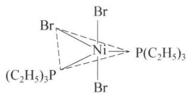

<details>
<summary>chemical</summary>

Molecular structure diagram of a nickel complex with bromine and phosphorus ligands
</details>

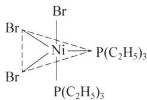

<details>
<summary>chemical</summary>

Chemical structure showing a nickel complex with bromine ligands and phosphorus centers
</details>

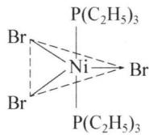

<details>
<summary>chemical</summary>

Chemical structure showing a nickel complex with bromine ligands and phosphorus-containing C2H5 ligands
</details>

若为四方锥构型,则有以下异构体:

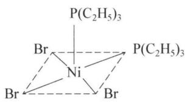

<details>
<summary>chemical</summary>

Molecular structure of nickel complex with bromine ligands and phosphorus ligands
</details>

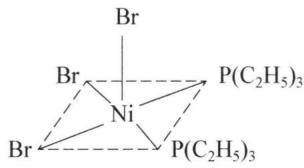

<details>
<summary>chemical</summary>

Molecular structure diagram of a nickel complex with bromine and phosphorus ligands
</details>

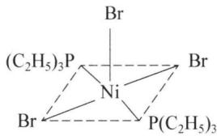

<details>
<summary>chemical</summary>

Molecular structure of a nickel complex with bromine ligands and phosphorus centers
</details>

以上异构体均无对映体(存在对称元素)

4. (1) 52.00 (2) 1:4 (3) $\mathrm{H}_2\mathrm{O}$ (4) $\mathrm{Cr}_2(\mathrm{CH}_3\mathrm{COO})_4(\mathrm{H}_2\mathrm{O})_2$

(5) 注意到配合物 B 中 Cr 满足 EAN18 电子规则, 因此中间存在一根特殊的 Cr—Cr 四重金属键, 因此结构如下:

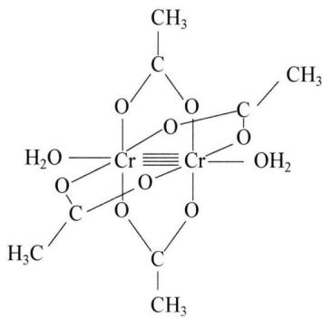

<details>
<summary>chemical</summary>

Chemical structure of a chromium complex with multiple hydroxyl groups and methyl substituents
</details>

5. (1) $\left[\mathrm{Bi}_{2} \mathrm{Cl}_{8}\right]^{2-}$ 的结构:

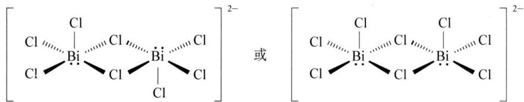

<details>
<summary>chemical</summary>

Chemical structure of bismuth chloride (BiCl2) showing two identical units with chlorine atoms and bridging Bi atoms
</details>

杂化轨道类型： $\mathrm{sp}^{3}\mathrm{d}^{2}$

(2) 根据题意知羟基作为桥基对 Co 配位, 因此化学式中总共 6 个羟基对中心原子 Co 进行 6 配位, 周围的 Co 则分别与 2 个羟基和 4 个氨分子配位。另外注意存在 “手性” 的信息, 因此书写结构时注意楔形式的表示, 结构如下:

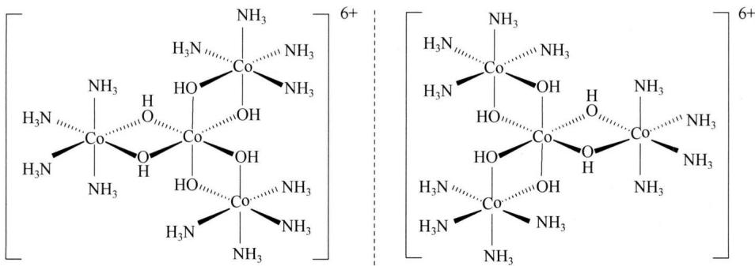

<details>
<summary>chemical</summary>

Chemical structure of a cobalt complex with two CO ligands and 6+ charge, showing hydrogen bonding interactions
</details>

(3) 解法一:

$Pd[C_{x}H_{y}N_{z}](ClO_{4})_{2}$ 中，C和H的比例为(30.15/12.01):(5.06/1.008)=1:2，即y=2x ①；

$\mathrm{Pd}[\mathrm{C}_x\mathrm{H}_y\mathrm{N}_z](\mathrm{SCN})_2$ 中，C和H的比例为(40.46/12.01):(5.94/1.008)=0.572，即 $(x + 2) / y = 0.572$ ②。

综合式①、②，解得： $x = 13.89 \approx 14$ ，y = 28。

设 $\mathrm{Pd}\left[\mathrm{C}_{x}\mathrm{H}_{y}\mathrm{N}_{z}\right](\mathrm{ClO}_{4})_{2}$ 的摩尔质量为 M：则 $14 \times 12.01/M = 30.15\%$ , 得 M = 557.7(g/mol);

于是， $z=\{557.7-\left[106.4+12.01\times14+1.008\times28+2\times(35.45+64.00)\right]\}/14.01=3.99=4$ 。

因此， $\mathrm{Pd}\left[\mathrm{C}_{x}\mathrm{H}_{y}\mathrm{N}_{z}\right](\mathrm{ClO}_{4})_{2}$ 的组成为 $\mathrm{Pd}\left[\mathrm{C}_{14}\mathrm{H}_{28}\mathrm{N}_{4}\right](\mathrm{ClO}_{4})_{2}$

解法二：

设 $\mathrm{Pd}\left[\mathrm{C}_{x}\mathrm{H}_{y}\mathrm{N}_{z}\right](\mathrm{ClO}_{4})_{2}$ 的摩尔质量为 M，比较 $\mathrm{Pd}\left[\mathrm{C}_{x}\mathrm{H}_{y}\mathrm{N}_{z}\right](\mathrm{ClO}_{4})_{2}$ 和 $\mathrm{Pd}\left[\mathrm{C}_{x}\mathrm{H}_{y}\mathrm{N}_{z}\right](\mathrm{SCN})_{2}$ 知， $\mathrm{Pd}\left[\mathrm{C}_{x}\mathrm{H}_{y}\mathrm{N}_{z}\right](\mathrm{SCN})_{2}$ 的摩尔质量为： $M-2\times[35.45+64.00-(32.01+12.01+14.01)]=M-82.74(\mathrm{g}/\mathrm{mol})$ ，根据 C 的质量分数，有：

12.01x = 0.3015M ①;

12.01×(x+2)=0.4046×(M-82.74) ②

联立式 ①、②，解得：M = 557.7, x = 14；

根据 H 的质量分数, 有: $y = 557.7 \times 0.0506 / 1.008 = 27.99 = 28$ ,

则： $z=\{557.7-\left[106.4+12.01\times14+1.008\times28+2\times(35.45+64.00)\right]\}/14.01=3.99=4$ 。

同样可以求得化学式为： $\mathrm{Pd}\left[\mathrm{C}_{14}\mathrm{H}_{28}\mathrm{N}_4\right](\mathrm{ClO}_4)_2$

6. 解析：吡啶甲酸根 $\left(\mathrm{C}_{6}\mathrm{H}_{4}\mathrm{O}_{2}\mathrm{N}^{-}\right)$ 的相对分子质量为122。设钒与2个吡啶甲酸根络合，50.9+244=295，氧的质量分数为21.7%；设钒与3个吡啶甲酸根络合，50.9+366=417，氧的质量分数为23.0%；设钒与4个吡啶甲酸根结合，50.9+488=539，氧的质量分数为23.7%；设钒与5个吡啶甲酸根结合，50.9+610=661，氧的质量分数为21.7%；钒与更多吡啶甲酸根络合将使钒的氧化态超过+5而不可能，因而应假设该配合物的配体除吡啶甲酸根外还有氧，设配合物为 $\mathrm{VO}(\mathrm{C}_{6}\mathrm{H}_{4}\mathrm{O}_{2}\mathrm{N})_{2}$ ，相对分子质量为 $50.9+16.0+244=311$ ，氧的质量分数为25.7%，符合题设。

因此，该配合物的结构如下：

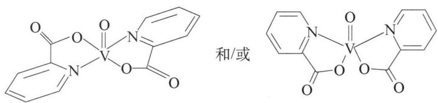

<details>
<summary>chemical</summary>

Two organic molecular structures with V centers and phenyl substituents, labeled '和/或'
</details>

钒与吡啶甲酸根形成的五元环呈平面结构,因此,该配合物的配位结构为四角锥体(四方锥体),氧原子位于锥顶。钒的氧化态为+4

7.（1）结构式如下，存在一对旋光异构体：

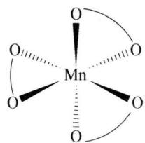

<details>
<summary>chemical</summary>

Molecular structure of molybdenum (MnO₄) showing Mn center bonded to four oxygen atoms and one oxygen atom with curved arrows indicating electron flow or bond direction.
</details>

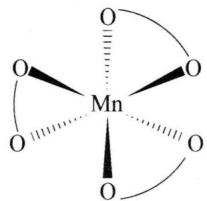

<details>
<summary>chemical</summary>

Molecular structure of molybdenum (MnO₄) showing Mn center bonded to four oxygen atoms and one oxygen atom with dashed bonds
</details>

(2) 未成对电子数: 4; 存在手性, 因为该化合物不存在对称面或对称中心, 只有旋转轴 (第 1 类对称元素)

(3) 本问考查离域 $\pi$ 键的计算和画法。首先应找出所有非 $\mathrm{sp}^3$ 杂化和端基上能够提供垂直于平面的 p 轨道的原子，并计算 p 轨道上的总电子数。2,4-戊二酮负离子结构如下：

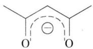

中间的 3 个 C 原子均采取 $sp^{2}$ 杂化，并且在垂直于平面的 $p_{z}$ 轨道上各提供一个电子，端基的两个 O 原子各用 $p_{z}$ 轨道提供一个电子，加上本身的 1 个负电荷，因此形成离域 $\pi$ 键为： $\pi_{5}^{6}$

(4) Co 的常见化合价有 +2、+3，一般情况下 +3 价的 Co 具有强氧化性，会被还原至 +2 价的 Co，但与 $NH_{3}$ 形成配合物后，由于 $\left[\mathrm{Co}\left(\mathrm{NH}_{3}\right)_{6}\right]^{2+}$ 中 Co 采取外轨型的 $sp^{3}d^{2}$ 杂化，而 $\left[\mathrm{Co}\left(\mathrm{NH}_{3}\right)_{6}\right]^{3+}$ 中 Co 采取内轨型的 $d^{2}sp^{3}$ 杂化，因此 $\left[\mathrm{Co}\left(\mathrm{NH}_{3}\right)_{6}\right]^{2+}$ 易被氧化为 $\left[\mathrm{Co}\left(\mathrm{NH}_{3}\right)_{6}\right]^{3+}$ 。根据题意，配位取代反应得到了双核配离子 $B^{4+}$ ，可以推断其中的桥基配体是 $H_{2}O_{2}$ 分子，由于过氧键 O—O 不稳定，因此后续的氧化过程实质就是过氧键的断裂，形成羟基配位，最后配合物中的羟基再次被溶液中的 $NH_{3}$ 取代，从而得到 $\mathrm{Co}\left(\mathrm{NH}_{3}\right)_{6}^{3+}$ 配离子。由此得到：

反应方程式为： $2\mathrm{CoCl}_{2} + 10\mathrm{NH}_{3} + 2\mathrm{NH}_{4}\mathrm{Cl} + \mathrm{H}_{2}\mathrm{O}_{2} = 2[\mathrm{Co}(\mathrm{NH}_{3})_{6}]\mathrm{Cl}_{3} + 2\mathrm{H}_{2}\mathrm{O}$ 离子的结构为：


<details>
<summary>chemical</summary>

Chemical structure of a cobalt complex with ammonia ligands and a B4+ charge, labeled as 4+
</details>


<details>
<summary>chemical</summary>

Chemical structure of a cobalt complex with amino and hydroxyl groups, labeled C²⁺
</details>

8. (1) A: $\left[\begin{array}{c} \mathrm{I} \\ \backslash \\ \mathrm{Pt} \\ \backslash \\ \mathrm{I} \end{array}\right]^{2-}$

B: $\begin{array}{c}\mathrm{I}\\ \mathrm{I} \end{array}$ $\begin{array}{c}\mathrm{NH}_{2}\mathrm{CH}_{3}\\ \mathrm{NH}_{2}\mathrm{CH}_{3} \end{array}$

C: $CH_{3}H_{2}N$ $\begin{array}{c} I \\ | \\ Pt \end{array}$ $\begin{array}{c} I \\ | \\ Pt \end{array}$ $\begin{array}{c} I \\ | \\ NH_{2}CH_{3} \end{array}$

D: $\begin{array}{c}\mathrm{I}\\ \mathrm{I} \end{array}\begin{array}{c}\mathrm{NH}_{2}\mathrm{CH}_{3}\\ \mathrm{NH}_{3}\end{array}$

E: $\begin{array}{c}\mathrm{O}\\ \mathrm{H}_{2}\mathrm{C} \\\mathrm{CO} \\\mathrm{CO} \\\mathrm{O}\end{array}$ Pt(NH $_{2}$ CH $_{3}$ NH $_{3}$ )

(2) 将 $K_{2}PtCl_{4}$ 转化为 A 目的是使 $CH_{3}NH_{2}$ 更容易取代 A 中的碘

(3) ① $Ag_{2}CO_{3}$ 与丙二酸生成丙二酸银盐, 再与 D 作用形成 AgI 沉淀, 加速丙二酸根与铂配位 ② $Ag_{2}CO_{3}$ 与 D 发生下列反应: $D + Ag_{2}CO_{3} = DCO_{3} + 2AgI$ 。 $DCO_{3}$ 再与丙二酸根发生配体取代反应, 形成 E

9. (1) $\left[\mathrm{Fe}(\mathrm{H}_{2}\mathrm{O})_{6}\right]^{3+} + \mathrm{H}_{2}\mathrm{O} \rightleftharpoons \left[\mathrm{FeOH}(\mathrm{H}_{2}\mathrm{O})_{5}\right]^{2+} + \mathrm{H}_{3}\mathrm{O}^{+}$

(2) 反应方程式:

$$
2 \left[ \mathrm{Fe} (\mathrm{H} _ {2} \mathrm{O}) _ {5} \mathrm{OH} \right] ^ {2 +} \Longleftrightarrow \left[ \begin{array}{c} \mathrm{H} \\ \mathrm{O} \\ (\mathrm{H} _ {2} \mathrm{O}) _ {4} \mathrm{Fe} \\ \mathrm{Fe} (\mathrm{H} _ {2} \mathrm{O}) _ {4} \\ \mathrm{O} \\ \mathrm{H} \end{array} \right] ^ {4 +} + 2 \mathrm{H} _ {2} \mathrm{O}
$$

链状多聚物的结构式：

$$
\left[ \right.\begin{array}{c}\mathrm{H} _ {2} \mathrm{O}\\\mathrm{H} _ {2} \mathrm{O}\\\mathrm{Fe}\\\mathrm{H} _ {2} \mathrm{O}\end{array}\begin{array}{c c c c c c c c c c c c c c c c c c c c c c c c c c c c c c c c c c c c c c c c c c c c c c c c c c c c c c c c}\mathrm{H} _ {2} \mathrm{O}\\\mathrm{H} _ {2} \mathrm{O}\\\mathrm{Fe}\\\mathrm{H} _ {2} \mathrm{O}\end{array}\begin{array}{c c c c c c c c c c c c c c c c c c c c c c c c c c c c c c c c c c c c}\mathrm{H} _ {2} \mathrm{O}\\\mathrm{H} _ {2} \mathrm{O}\\\mathrm{Fe}\\\mathrm{H} _ {2} \mathrm{O}\end{array}\begin{array}{c c c}\mathrm{H} _ {2} \mathrm{O}\\\mathrm{H} _ {2} \mathrm{O}\\\mathrm{Fe}\\\mathrm{H} _ {2} \mathrm{O}\end{array}\begin{array}{c c c}\mathrm{H} _ {2} \mathrm{O}\\\mathrm{H} _ {2} \mathrm{O}\\\mathrm {H_ {2} O}\end{array}\begin{array}{c c c}\mathrm{H} _ {2} \mathrm{O}\\\mathrm{H} _ {2} \mathrm{O}\\\mathrm {H_ {2} O}\end{array}\begin{array}{c c c}\mathrm{H} _ {2} \mathrm{O}\\\mathrm{H} _ {2} \mathrm{O}\\H _ {2} O\end{array}
$$

(3) $\mathrm{Al}_{2}\mathrm{O}_{3} + 6\mathrm{HCl} + 9\mathrm{H}_{2}\mathrm{O} = 2[\mathrm{Al}(\mathrm{H}_{2}\mathrm{O})_{6}]\mathrm{Cl}_{3}$

$$
\left[ \mathrm{Al} \left(\mathrm{H} _ {2} \mathrm{O}\right) _ {6} \right] \mathrm{Cl} _ {3} = \left[ \mathrm{Al} (\mathrm{OH}) _ {2} \left(\mathrm{H} _ {2} \mathrm{O}\right) _ {4} \right] \mathrm{Cl} + 2 \mathrm{HCl}
$$

$$
\left[ \mathrm{Al} (\mathrm{OH}) _ {2} \left(\mathrm{H} _ {2} \mathrm{O}\right) _ {4} \right] \mathrm{Cl} + \mathrm{NH} _ {3} \cdot \mathrm{H} _ {2} \mathrm{O} = \mathrm{Al} (\mathrm{OH}) _ {3} + \mathrm{NH} _ {4} \mathrm{Cl} + 4 \mathrm{H} _ {2} \mathrm{O}
$$

$$
(n m - 4 m) \mathrm{Al} (\mathrm{OH}) _ {3} + (6 m - n m) \left[ \mathrm{Al} (\mathrm{OH}) _ {2} \left(\mathrm{H} _ {2} \mathrm{O}\right) _ {4} \right] \mathrm{Cl} = \left[ \mathrm{Al} _ {2} (\mathrm{OH}) _ {n} \mathrm{Cl} _ {6 - n} \right] _ {m} +
$$

$$
(2 4 m - 4 n m) \mathrm{H} _ {2} \mathrm{O}
$$

(4) 结构如下:


<details>
<summary>natural_image</summary>

Geometric wireframe structure composed of interconnected polyhedra (no text or symbols)
</details>

## 第七讲 水中的几种平衡

1. 本题的关键是理解用 $\mathrm{Na}_{2} \mathrm{~S}_{2} \mathrm{O}_{3}$ 标准溶液测得的 $c(\mathrm{I}_{2})$ 是指溶液中 $\mathrm{I}_{2}$ 和 $\mathrm{I}_{3}^{-}$ 的总浓度。

设萃取平衡时,水溶液中 $c(\mathrm{I}_{2})$ 为 x,由分配比可知:

$c(\mathrm{I}_{2},\mathrm{CCl}_{4})/c(\mathrm{I}_{2},\mathrm{H}_{2}\mathrm{O})=2.60\times10^{-3}\mathrm{mol}\cdot\mathrm{L}^{-1}/x=85$ ，解得： $x=3.06\times10^{-5}\mathrm{mol}\cdot\mathrm{L}^{-1}$ 。

水溶液中存在平衡： $\mathrm{I}_2 + \mathrm{I}^- \rightleftharpoons \mathrm{I}_3^-$

平衡浓度 $(\mathrm{mol}\cdot \mathrm{L}^{-1})$ ： $\mathrm{I}_2$ ： $3.06\times 10^{-5},\mathrm{I}^{-}:0.100 + 3.06\times 10^{-5} = 0.100,\mathrm{I}_3^-$ ：(4.85-

2.60) $\times 10^{-3} - 3.06 \times 10^{-5} = 2.22 \times 10^{-3}$ 。由此可求得平衡常数 $K = \frac{[I_3^-]}{[I_2][I^-]} = 7.25 \times 10^2$

2. (1) $M = 337.1$

(2) $1.26 \times 10^{-5}$

(3) 8.75

(4) 根据(3)计算出的化学计量点的 $\mathrm{pH}$ , 滴定时应选择酚酞作为指示剂

3. (1) 3.67

(2) 6.39

4. 最多能配 3.29 L, 其中 $c(\mathrm{NH}_{3} \cdot \mathrm{H}_{2}\mathrm{O}) = 0.108 \, \mathrm{mol/L}$ , $c(\mathrm{NH}_{4}\mathrm{Cl}) = 0.196 \, \mathrm{mol/L}$

5.（1）本问可用分布系数解答：

$$
\begin{array}{r l} & {\left[ \mathrm{H} _ {3} \mathrm{PO} _ {4} \right] = 0. 1 6 5 3 \mathrm{mol} / \mathrm{L}, \left[ \mathrm{H} _ {2} \mathrm{PO} _ {4} ^ {-} \right] = 0. 0 3 4 6 \mathrm{mol} / \mathrm{L}, \left[ \mathrm{HPO} _ {4} ^ {2 -} \right] = 6. 2 9 \times} \\ & {1 0 ^ {- 8} \mathrm{mol} / \mathrm{L}, \left[ \mathrm{PO} _ {4} ^ {3 -} \right] = 7. 5 6 \times 1 0 ^ {- 1 9} \mathrm{mol} / \mathrm{L}.} \end{array}
$$

(2) 本问可先假定完全反应, 再根据题意忽略相关离子的水解, 用物料守恒和质子守恒解决: 根据磷酸和 $NH_{3}$ 的物质的量为 1:2, 可以假设发生如下反应:

$$
\mathrm{H} _ {3} \mathrm{PO} _ {4} + 2 \mathrm{NH} _ {3} = (\mathrm{NH} _ {4}) _ {2} \mathrm{HPO} _ {4}
$$

完全反应后，产物 $(\mathrm{NH}_4)_2\mathrm{HPO}_4$ 浓度为 $0.1\mathrm{mol / L}$ 。根据质子守恒有：

$$
\left[ \mathrm{H} ^ {+} \right] + 2 \left[ \mathrm{H} _ {3} \mathrm{PO} _ {4} \right] + \left[ \mathrm{H} _ {2} \mathrm{PO} _ {4} ^ {-} \right] = \left[ \mathrm{OH} ^ {-} \right] + \left[ \mathrm{PO} _ {4} ^ {3 -} \right] + \left[ \mathrm{NH} _ {3} \right]
$$

由于磷酸一氢盐溶液的 pH 在 7～9 之间, 所以上述质子守恒式中的 $\left[H^{+}\right]$ 、 $\left[H_{3}PO_{4}\right]$ 、 $\left[OH^{-}\right]$ 、 $\left[PO_{4}^{3-}\right]$ 可以忽略不计, 于是质子守恒式简化为:

$$
[ \mathrm{H} _ {2} \mathrm{PO} _ {4} ^ {-} ] = [ \mathrm{NH} _ {3} ]
$$

由分布系数可得:

$$
\frac {\left[ \mathrm{H} ^ {+} \right] ^ {2} K _ {1} \times 0 . 1}{\left[ \mathrm{H} ^ {+} \right] ^ {3} + \left[ \mathrm{H} ^ {+} \right] ^ {2} K _ {1} + \left[ \mathrm{H} ^ {+} \right] K _ {1} K _ {2} + K _ {1} K _ {2} K _ {3}} = \frac {K _ {\mathrm{NH} _ {\mathrm{t}} ^ {+}} \times 0 . 2}{\left[ \mathrm{H} ^ {+} \right] + K _ {\mathrm{NH} _ {\mathrm{t}} ^ {+}}}
$$

解得： $[\mathrm{H}^{+}] = 8.81\times 10^{-9}$ ，因此 $\mathrm{pH} = 8.06$

(3) 用(2)的方法计算出溶液中各离子浓度后, 利用反应商 Q 和 $K_{sp}$ 大小的关系得出是否会产生 $NH_{4}MgPO_{4}$ 沉淀。

生成沉淀的离子反应为： $\mathrm{NH_4^+ + Mg^{2 + } + PO_4^{3 - } = NH_4MgPO_4(s)}$

溶液混合后： $\left[Mg^{2+}\right]=0.1\ mol/L$ 。由于 $\left(\mathrm{NH}_{4}\right)_{2}\mathrm{HPO}_{4}$ 可以看作缓冲溶液，因此混合溶液的pH依然为8.06，所以利用分布系数可以求得：

$$
\left[ \mathrm{NH} _ {4} ^ {+} \right] = \frac {K _ {\mathrm{NH} _ {4} ^ {+}} \times 0 . 1}{\left[ \mathrm{H} ^ {+} \right] + K _ {\mathrm{NH} _ {4} ^ {+}}} = 0. 0 9 4 \mathrm{mol/L},
$$

$$
\left[ \mathrm{PO} _ {4} ^ {3 -} \right] = \frac {K _ {1} K _ {2} K _ {3} \times 0 . 0 5}{\left[ \mathrm{H} ^ {+} \right] ^ {3} + \left[ \mathrm{H} ^ {+} \right] ^ {2} K _ {1} + \left[ \mathrm{H} ^ {+} \right] K _ {1} K _ {2} + K _ {1} K _ {2} K _ {3}} = 2. 0 6 \times 1 0 ^ {- 8} 。
$$

所以 $Q = [NH_{4}^{+}][Mg^{2+}][PO_{4}^{3-}] = 1.93 \times 10^{-8} > K_{\mathrm{sp}}(\mathrm{NH}_{4}\mathrm{MgPO}_{4}) = 2.5 \times 10^{-13}$

因此,会产生 $NH_{4}MgPO_{4}$ 沉淀。沉淀质量为: 2.74 g

(4) 根据题意忽略 $Ca^{2+}$ 水解, 因此本问只需考虑 $PO_{4}^{3-}$ 的水解即可:

考查溶解平衡： $\mathrm{Ca_3(PO_4)_2\rightleftharpoons 3Ca^{2 + } + 2PO_4^{3 - }}$

设 $\mathrm{Ca}_{3}(\mathrm{PO}_{4})_{2}$ 溶解度为 s mol/L，则达到溶解平衡后溶液中的 $\left[Ca^{2+}\right]=3s\ mol/L$ ，但由于 $PO_{4}^{3-}$ 会水解： $PO_{4}^{3-}+H_{2}O\rightleftharpoons HPO_{4}^{2-}+OH^{-}$ ，因此有 $\left[PO_{4}^{3-}\right]+\left[HPO_{4}^{2-}\right]=2s\ mol/L$ ，并且由于水解剧烈 $(pK_{b}=1.62)$ ，因此可以认为溶液中的 $\left[HPO_{4}^{2-}\right]\approx\left[OH^{-}\right]\approx2s\ mol/L$ ，代入 $K_{a3}$ 表达式可以计算溶液中的 $\left[PO_{4}^{3-}\right]$ ：

$$
\begin{array}{l} \left[ \mathrm{PO} _ {4} ^ {3 -} \right] = \frac {K _ {\mathrm{a} 3} \times \left[ \mathrm{HPO} _ {4} ^ {2 -} \right]}{\left[ \mathrm{H} ^ {+} \right]} = \frac {K _ {\mathrm{a} 3} \times \left[ \mathrm{HPO} _ {4} ^ {2 -} \right] \left[ \mathrm{OH} ^ {-} \right]}{K _ {\mathrm{w}}} = \frac {4 . 8 \times 1 0 ^ {- 1 3} \times 2 s \times 2 s}{1 0 ^ {- 1 4}} = \\ 1 6 7 s ^ {2} \mathrm{mol/L} \end{array}
$$

所以根据 $K_{\mathrm{sp}} = [\mathrm{Ca}^{2 + }]^3 [\mathrm{PO}_4^{3 - }]^2 = (3s)^3 (2\times 167s^2)^2 = 3012012s^7 = 2.22\times 10^{-25}$ 解得： $s = 3.6\times 10^{-5}\mathrm{mol / L}$

6.（1）由于第一、二级解离常数相差不大，因此不能忽略，而第三、四级解离常数较小，因此可以忽略不计，于是得到：

$[\mathrm{H}^{+}] = \sqrt{\frac{K_{1}(K_{2}c + K_{\mathrm{w}})}{K_{1} + c}}$ ，解得 $[\mathrm{H}^{+}] = 0.018\mathrm{mol / L}$ ，所以 $\mathrm{pH} = 1.74$

(2) $-\mathrm{OOCCH}_2\mathrm{NH}_2^+\mathrm{CH}_2\mathrm{PO}_2^-$ (OH) 根据酸碱质子理论可看作两性物质, 因此计算 $[\mathrm{H}^{+}]$ 的最简式为: $[\mathrm{H}^{+}] = \sqrt{K_{2}K_{3}}$ 。由此解得溶液 $\mathrm{pH} = 4.15$

(3) 由(2)的计算可知溶液呈酸性, 因此主要存在型体还有 $\mathrm{OOCCH_{2}NH_{2}^{+}CH_{2}PO_{2}(OH)_{2}}$ ,

根据分布系数计算公式可知：

$$
\delta [ ^ {-} \mathrm{OOCCH} _ {2} \mathrm{NH} _ {2} ^ {+} \mathrm{CH} _ {2} \mathrm{PO} _ {2} ^ {-} (\mathrm{OH}) ] = 0. 9 9
$$

$$
\delta \left[ ^ {-} \mathrm{OOCCH} _ {2} \mathrm{NH} _ {2} ^ {+} \mathrm{CH} _ {2} \mathrm{PO} _ {2} (\mathrm{OH}) _ {2} \right] = 0. 0 1 4
$$

7.（1）根据质子自递平衡知： $\left[\mathrm{H}_{2} \mathrm{~F}^{+}\right] = \left[\mathrm{HF}_{2}^{-}\right] = \sqrt{K} = 2.8 \times 10^{-6} \mathrm{~mol} / \mathrm{L}$ 。

纯HF浓度为： $[\mathrm{HF}] = \frac{1000\rho}{M_{\mathrm{HF}}} = 50.1\mathrm{mol / L}$ ，所以 $\delta (\mathrm{H}_2\mathrm{F}^+)\equiv \frac{[\mathrm{H}_2\mathrm{F}^+]}{[\mathrm{HF}]} = 5.65\times 10^{-8}$

(2) 根据物料守恒和电荷守恒有以下关系:

$\left[HF\right]_{总}=\left[HF\right]+\left[F^{-}\right]+2\left[HF_{2}^{-}\right](F原子守恒)$

$\left[OH^{-}\right]+\left[F^{-}\right]+\left[HF_{2}^{-}\right]=\left[H_{3}O^{+}\right]$ （电荷守恒，由于 HF 水溶液酸性较强，因此 $\left[OH^{-}\right]$ 可忽略不计）

将电荷守恒变形为： $\left[F^{-}\right]=\left[H_{3}O^{+}\right]-\left[HF_{2}^{-}\right]$ 代入 F 的物料守恒式有： $\left[HF\right]=\left[HF\right]_{总}-\left[H_{3}O^{+}\right]-\left[HF_{2}^{-}\right]$ 。

由两个平衡常数 K 的表达式可得:

$$
K _ {1} = \frac {[ \mathrm{H} _ {3} \mathrm{O} ^ {+} ] [ \mathrm{F} ^ {-} ]}{[ \mathrm{HF} ]} = \frac {[ \mathrm{H} _ {3} \mathrm{O} ^ {+} ] ([ \mathrm{H} _ {3} \mathrm{O} ^ {+} ] - [ \mathrm{HF} _ {2} ^ {-} ])}{[ \mathrm{HF} ]} = 1. 1 \times 1 0 ^ {- 3}
$$

$$
K _ {2} = \frac {[ \mathrm{HF} _ {2} ^ {-} ]}{[ \mathrm{HF} ] [ \mathrm{F} ^ {-} ]} = \frac {[ \mathrm{HF} _ {2} ^ {-} ]}{[ \mathrm{HF} ] ([ \mathrm{H} _ {3} \mathrm{O} ^ {+} ] - [ \mathrm{HF} _ {2} ^ {-} ])} = 2. 6 \times 1 0 ^ {- 1}
$$

当 $\left[H_{3}O^{+}\right]=0.01\ mol/L$ 时，联立上述两个等式解得： $[HF]=0.0889\ mol/L$ ，所以 $\left[HF\right]_{总}=0.0991\ mol/L$

(3) 根据(2)的分析, 如果考虑平衡式(b), 则对于平衡式(a)的平衡常数 $K_{1}$ 应表示为下列式子:

$$
K _ {1} = \frac {[ \mathrm{H} _ {3} \mathrm{O} ^ {+} ] [ \mathrm{F} ^ {-} ]}{[ \mathrm{HF} ]} = \frac {[ \mathrm{H} _ {3} \mathrm{O} ^ {+} ] ([ \mathrm{H} _ {3} \mathrm{O} ^ {+} ] - [ \mathrm{HF} _ {2} ^ {-} ])}{[ \mathrm{HF} ] _ {\text {总}} - [ \mathrm{H} _ {3} \mathrm{O} ^ {+} ] - [ \mathrm{HF} _ {2} ^ {-} ]}
$$

但如果忽略平衡式(b)，则平衡式(a)的平衡常数 $K_{1}^{\prime}$ 表达式为：

$$
K _ {1} ^ {\prime} = \frac {[ \mathrm{H} _ {3} \mathrm{O} ^ {+} ] [ \mathrm{F} ^ {-} ]}{[ \mathrm{HF} ]} = \frac {[ \mathrm{H} _ {3} \mathrm{O} ^ {+} ] ^ {2}}{[ \mathrm{HF} ] _ {\text {总}} - [ \mathrm{H} _ {3} \mathrm{O} ^ {+} ]}
$$

显然, 只有在特定情况下 $K_{1} = K_{1}^{\prime}$ , 所以得到等式:

$$
\frac {[ \mathrm{H} _ {3} \mathrm{O} ^ {+} ] ([ \mathrm{H} _ {3} \mathrm{O} ^ {+} ] - [ \mathrm{HF} _ {2} ^ {-} ])}{[ \mathrm{HF} ] _ {\text {总}} - [ \mathrm{H} _ {3} \mathrm{O} ^ {+} ] - [ \mathrm{HF} _ {2} ^ {-} ]} = \frac {[ \mathrm{H} _ {3} \mathrm{O} ^ {+} ] ^ {2}}{[ \mathrm{HF} ] _ {\text {总}} - [ \mathrm{H} _ {3} \mathrm{O} ^ {+} ]}
$$

解得关系式： $\left[HF\right]_{总}=2\left[H_{3}O^{+}\right]$ ，代入 $K_{1}$ 表达式得： $K_{1}=\left[H_{3}O^{+}\right]$ ，所以有：

$$
[ \mathrm{HF} ] _ {\text {总}} = 2 K _ {1} = 0. 0 0 2 2 \mathrm{mol/L}
$$

(4) 显然本问中的平衡式是由(2)中的平衡式(a)+平衡式(b)得到, 所以:

$$
K = K _ {1} \cdot K _ {2} = 2. 8 6 \times 1 0 ^ {- 4}
$$

(5) NaOH、CaCl、 $Na_{2}CO_{3}$ 、 $FeCl_{3}$ 、 $AlCl_{3}$ 等, 合理即可

## 第八讲 电化学基础

1. (1) 左: $\mathrm{NaBr}_{3} / \mathrm{NaBr}$ ; 右: $\mathrm{Na}_{2} \mathrm{~S}_{2} / \mathrm{Na}_{2} \mathrm{~S}_{4}$

(2) 阳极: $3 \mathrm{NaBr} - 2 \mathrm{e}^{-} = \mathrm{NaBr}_{3} + 2 \mathrm{Na}^{+}$

阴极： $\mathrm{Na_2S_4 + 2Na^+ + 2e^- = 2Na_2S_2}$

(3) $2Na_{2}S_{2}+NaBr_{3}\xlongequal{放电}Na_{2}S_{4}+3NaBr$

(4) ${\mathrm{{Na}}}^{ + }$ 的流向为从左到右

2. (1) $\mathrm{Pb} + \mathrm{PbO}_{2} + 4\mathrm{H}^{+} + 2\mathrm{SO}_{4}^{2-} = 2\mathrm{PbSO}_{4} + 2\mathrm{H}_{2}\mathrm{O}$

负极： $\mathrm{Pb} + \mathrm{SO}_4^{2-} - 2\mathrm{e}^- = \mathrm{PbSO}_4$

正极： $\mathrm{PbO_{2} + 4H^{+} + SO_{4}^{2-} + 2e^{-} = PbSO_{4} + 2H_{2}O}$

(2) $\mathrm{Li} + \mathrm{LiMn}_2\mathrm{O}_4 = \mathrm{Li}_2\mathrm{Mn}_2\mathrm{O}_4$

负极： $Li-e^{-}=Li^{+}$

正极： $\mathrm{LiMn_2O_4 + Li^+ + e^- = Li_2Mn_2O_4}$

(3) 锂离子占有 $O^{2-}$ 离子围成的正四面体空隙, 所以配位数是 4; 锰离子占有 $O^{2-}$ 离子围成的正八面体空隙, 所以配位数为 6

3.（1）Fe、Ag的标准电极电势相差不大，用 $\mathrm{FeCl}_3$ 时产生 AgCl 沉淀，大大降低了 $[\mathrm{Ag}^+]$ ，便于 $\mathrm{Fe}^{3+}$ 氧化 Ag

(2) 由于 $\mathrm{Fe(OH)}_{3}$ 的 $K_{sp}$ 极小, $Fe^{3+}$ 一定呈强酸性, $\mathrm{Fe(NO_{3})_{3}}$ 溶液同时就是一个 $HNO_{3}$ 溶液, 可参与对 Ag 的氧化

4.（1）从电势图可看出 $Br_{2}$ 能歧化为 $Br^{-}$ 与 $BrO^{-}:Br_{2}+2OH^{-}=Br^{-}+BrO^{-}+H_{2}O;Br_{2}$ 作氧化剂的电极反应： $Br_{2}+2e^{-}=2Br^{-};Br_{2}$ 作还原剂的电极反应：

$$
\mathrm{Br} _ {2} + 4 \mathrm{OH} ^ {-} = 2 \mathrm{BrO} ^ {-} + 2 \mathrm{H} _ {2} \mathrm{O} + 2 \mathrm{e} ^ {-}
$$

$Br_{2}$ 歧化为 $Br^{-}$ 与 $BrO_{3}^{-}:3Br_{2}+6OH^{-}=5Br^{-}+BrO_{3}^{-}+3H_{2}O;Br_{2}$ 作氧化剂的电极反应： $Br_{2}+2e^{-}=2Br^{-};Br_{2}$ 作还原剂的电极反应： $Br_{2}+12OH^{-}=2BrO_{3}^{-}+6H_{2}O+10e^{-}$

(2) $\mathrm{BrO}^{-}$ 也能发生歧化反应: $3\mathrm{BrO}^{-} = 2\mathrm{Br}^{-} + \mathrm{BrO}_{3}^{-}$ ; $\mathrm{BrO}^{-}$ 作氧化剂的电极反应: $\mathrm{BrO}^{-} + \mathrm{H}_{2}\mathrm{O} + 2\mathrm{e}^{-} = \mathrm{Br}^{-} + 2\mathrm{OH}^{-}$ ; $\mathrm{BrO}^{-}$ 作还原剂的电极反应: $\mathrm{BrO}^{-} + 4\mathrm{OH}^{-} = \mathrm{BrO}_{3}^{-} + 2\mathrm{H}_{2}\mathrm{O} + 4\mathrm{e}^{-}$

5. (1) $\mathrm{PbO}_{2} + \mathrm{Pb} + 4 \mathrm{H}^{+} + 2 \mathrm{SO}_{4}^{2-} = \mathrm{PbSO}_{4} + 2 \mathrm{H}_{2} \mathrm{O}$

(2) 电池电压为 2.08 V

(3) $2\mathrm{PbSO}_4 + 2\mathrm{H}_2\mathrm{O} = \mathrm{PbO}_2 + \mathrm{Pb} + 4\mathrm{H}^+ + 2\mathrm{SO}_4^{2-}$ ; 转换 $\mathrm{PbSO}_4$ 的总量为: $113\mathrm{g}$

6. 解析: 熟悉 Co 性质的同学们知道 $\left[\mathrm{Co}\left(\mathrm{NH}_{3}\right)_{6}\right]^{2+}$ 很容易被氧化成三价 Co, 所以本题是根据这个原理而来的。

(1) $\left[\mathrm{Co}(\mathrm{H}_{2}\mathrm{O})_{6}\right]^{2+}$ (粉红色) $+6\mathrm{NH}_{3} = \left[\mathrm{Co}(\mathrm{NH}_{3})_{6}\right]^{2+}$ (黄色) $+6\mathrm{H}_{2}\mathrm{O}$

$4\left[\mathrm{Co}\left(\mathrm{NH}_{3}\right)_{6}\right]^{2+}+\mathrm{O}_{2}+2\mathrm{H}_{2}\mathrm{O}=4\left[\mathrm{Co}\left(\mathrm{NH}_{3}\right)_{6}\right]^{3+}$ (橙黄色) $+4\mathrm{OH}^{-}$

(2) 正极: $4 \mathrm{e}^{-} + \mathrm{O}_{2} + 2 \mathrm{H}_{2} \mathrm{O} = 4 \mathrm{OH}^{-}$

负极： $\left[\mathrm{Co}(\mathrm{NH}_3)_6\right]^{2 + } - \mathrm{e}^{-} = \left[\mathrm{Co}(\mathrm{NH}_3)_6\right]^{3 + }$

原电池符号： $(-)\mathrm{Pt}\mid [\mathrm{Co}(\mathrm{NH}_3)_6]^{2 + }(c_1),[\mathrm{Co}(\mathrm{NH}_3)_6]^{3 + }(c_2)\parallel \mathrm{OH}^ - (c_3)\mid \mathrm{O}_2(p_1)\mid \mathrm{Pt}(+)$

(3) $\varphi^{\theta}(+) = \varphi^{\theta}(\mathrm{O}_{2}/\mathrm{OH}^{-}) = 0.401 \, \mathrm{V}$ ，这个时候需要计算负极的半电势，联立 $K_{稳}$ 和能斯特方程得：

$$
\varphi^ {\theta} (-) = \varphi^ {\theta} \left(\left[ \mathrm{Co} \left(\mathrm{NH} _ {3}\right) _ {6} \right] ^ {3 +} / \left[ \mathrm{Co} \left(\mathrm{NH} _ {3}\right) _ {6} \right] ^ {2 +}\right) = \varphi^ {\theta} \left(\mathrm{Co} ^ {3 +} / \mathrm{Co} ^ {2 +}\right) + 8. 3 1 4 5 \times 2 9 8. 1 5 \times
$$

$$
2. 3 0 3 \div (9 6 4 8 5. 4) \lg [ 1. 2 8 \times 1 0 ^ {5} \div (1. 6 0 \times 1 0 ^ {3 5}) ] = 0. 0 5 9 \mathrm{V。}
$$

因此， $E^{\theta}=0.342\ V,\ K^{\theta}=1.33\times10^{23}$

7.（1）根据电极电势大小推测可能生成的杂质固体有：

① CuO 或 $\mathrm{Cu(OH)_2}$ $\mathrm{Cu^{2+}} + 2\mathrm{H_2O} = \mathrm{Cu(OH)_2} \downarrow + 2\mathrm{H^+}$

② $Cu_{2}O$ 或 CuOH $Cu^{+} + H_{2}O = CuOH \downarrow + H^{+}$

③ FeO 或 $\mathrm{Fe(OH)}_{2}$ $\mathrm{Fe}^{2+} + 2\mathrm{H}_{2}\mathrm{O} = \mathrm{Fe(OH)}_{2} \downarrow + 2\mathrm{H}^{+}$

④ $\mathrm{Fe}_{2}\mathrm{O}_{3}$ 或 $\mathrm{Fe(OH)}_{3}$ $4\mathrm{Fe(OH)}_{2}+\mathrm{O}_{2}+2\mathrm{H}_{2}\mathrm{O}=4\mathrm{Fe(OH)}_{3}\downarrow$

(2) 若生成 $\mathrm{CuOH}$ , 则反应为: $\mathrm{Cu}^{2+} + \mathrm{Cu} + 2\mathrm{H}_{2}\mathrm{O} = 2\mathrm{CuOH} \downarrow + 2\mathrm{H}^{+}$

该反应可拆分成两个半反应：负极： $Cu + H_{2}O - e^{-} = CuOH + H^{+}$ ;

正极： $Cu^{2+} + H_{2}O + e^{-} = CuOH + H^{+}$ 。

由能斯特方程可得：

$$
E = E ^ {0} - \frac {0 . 0 5 9 2}{1} \lg \frac {[ \mathrm{H} ^ {+} ] ^ {2}}{[ \mathrm{Cu} ^ {2 +} ]} = - 0. 3 6 4 - 0. 0 5 9 2 \lg \frac {1 0 ^ {- 8}}{0 . 0 4 0} = 0. 0 2 7 \mathrm{V}
$$

总反应的电动势 E > 0，所以反应正方向自发，能生成 CuOH

(3) 可以考虑以下的方法:

① 缓冲剂, 控制酸度, 抑制放 $H_{2}$ 、水解、沉淀等  
② 配合剂,降低 $\left[Cu^{2+}\right]$ (即电位下降),阻止与新生态 Cu 反应  
③ 抗氧剂,抑制氧化反应  
④ 稳定剂,防止累积的 $Fe^{2+}$ 对铜的沉积产生不良影响和减缓 $Fe^{2+}$ 氧化为 $Fe^{3+}$

8. (1) $\varphi_{\mathrm{A}}^{\theta}(\mathrm{IO}_{3}^{-}/\mathrm{I}^{-}) = 1.09 \mathrm{~V}, \varphi_{\mathrm{B}}^{\theta}(\mathrm{IO}_{3}^{-}/\mathrm{I}^{-}) = 0.26 \mathrm{~V}, \varphi_{\mathrm{A}}^{\theta}(\mathrm{ClO}_{4}^{-}/\mathrm{HClO}_{2}) = 1.22 \mathrm{~V}$

(2) 大于

(3) ① 将氯气通入浓缩的酸性(或弱酸性)海水中, 发生反应: $Cl_{2} + 2Br^{-}$

$$
2 \mathrm{Cl} ^ {-} + \mathrm{Br} _ {2}
$$

② 压缩空气将溴吹出，碱性溶液吸收 $3Br_{2} + 3CO_{3}^{2-} = BrO_{3}^{-} + 5Br^{-} + 3CO_{2}\uparrow$ 或 $3Br_{2} + 6OH^{-} = BrO_{3}^{-} + 5Br^{-} + 3H_{2}O$  
③ 浓缩  
④ 酸化,压缩空气将溴吹出,发生反应: $BrO_{3}^{-} + 5Br^{-} + 6H^{+} = 3Br_{2}\uparrow + 3H_{2}O$  
⑤ 冷凝： $Br_{2}(g)=Br_{2}(l)$  
⑥ 流程框图


<details>
<summary>flowchart</summary>


</details>

9. (1) 4 个电子转移

(2) 注意到本题中的信息“中性条件”, 因此计算时的 $\left[\mathrm{H}^{+}\right]$ 应该用 $10^{-7} \mathrm{~mol} / \mathrm{L}$ 代入。由能斯特方程列式有:

$$
\begin{array}{l} ① E (\mathrm {MnO_ {4} ^ {3 - } / MnO_ {2}}) = E ^ {0} (\mathrm {MnO_ {4} ^ {3 - } / MnO_ {2}}) + \frac {R T}{n F} \ln ([ \mathrm {MnO_ {4} ^ {3 - }} ] [ \mathrm {H^ {+}} ] ^ {4}) \\ = 2. 9 0 + \frac {8 . 3 1 4 \times 2 9 8}{9 6 4 7 0} \ln (0. 1 \times 1 0 ^ {- 2 8}) \mathrm{V} = 1. 1 9 \mathrm{V} \\ \end{array}
$$

$$
\begin{array}{l} ② E (\mathrm {MnO_ {2} /Mn^ {3 + }}) = E ^ {\theta} (\mathrm {MnO_ {2} /Mn^ {3 + }}) + \frac {R T}{n F} \ln \left(\frac {[ \mathrm{H} ^ {+} ] ^ {4}}{[ \mathrm{Mn} ^ {3 +} ]}\right) \\ = 0. 9 5 + \frac {8 . 3 1 4 \times 2 9 8}{9 6 4 7 0} \ln \left(\frac {1 0 ^ {- 2 8}}{0 . 1}\right) \mathrm{V} = - 0. 6 5 \mathrm{V} \\ \end{array}
$$

$$
③ E (\mathrm{O} _ {2} / \mathrm{H} _ {2} \mathrm{O}) = E ^ {\theta} (\mathrm{O} _ {2} / \mathrm{H} _ {2} \mathrm{O}) + \frac {R T}{n F} \ln \left(\frac {p _ {\mathrm{O} _ {2}}}{p ^ {\theta}} [ \mathrm{H} ^ {+} ] ^ {4}\right)
$$

$$
= 1. 2 3 + \frac {8 . 3 1 4 \times 2 9 8}{4 \times 9 6 4 7 0} \ln (0. 2 1 \times 1 0 ^ {- 2 8}) \mathrm{V} = 0. 8 1 \mathrm{V}
$$

从计算所得的电极电势比较可知该条件下, $MnO_{4}^{3-}$ 可以将 $H_{2}O$ 氧化,而 $MnO_{2}$ 不能氧化 $H_{2}O$

（3）由反应式 $\mathrm{Mn(H_{2}P_{2}O_{7})_{3}^{3-}} + 2\mathrm{H}^{+} + \mathrm{e}^{-} = \mathrm{Mn(H_{2}P_{2}O_{7})_{2}^{2-}} + \mathrm{H_{4}P_{2}O_{7}}$ 可写出能斯特方程：

$$
E = E ^ {\theta} + \frac {R T}{n F} \ln \left(\frac {[ \mathrm{H} ^ {+} ] ^ {2} [ \mathrm{Mn} (\mathrm{H} _ {2} \mathrm{P} _ {2} \mathrm{O} _ {7}) _ {3} ^ {3 -} ]}{[ \mathrm{H} _ {4} \mathrm{P} _ {2} \mathrm{O} _ {7} ] [ \mathrm{Mn} (\mathrm{H} _ {2} \mathrm{P} _ {2} \mathrm{O} _ {7}) _ {2} ^ {2 -} ]}\right)
$$

其中 $\left[\mathrm{Mn}(\mathrm{H}_2\mathrm{P}_2\mathrm{O}_7)^{3-}\right] = \left[\mathrm{Mn}(\mathrm{H}_2\mathrm{P}_2\mathrm{O}_7)^{2-}\right],\frac{\left[\mathrm{H}^{+}\right]^{2}}{\left[\mathrm{H}_{4}\mathrm{P}_{2}\mathrm{O}_{7}\right]} = \frac{K_{a1}K_{a2}}{\left[\mathrm{H}_{2}\mathrm{P}_{2}\mathrm{O}_{7}^{2-}\right]}$ 代入上述能

斯特方程解得 $E^{\theta}=1.31\ V$ 。

$\mathrm{Mn(H_{2}P_{2}O_{7})_{2}^{2-}}$ 和 $\mathrm{Mn(H_{2}P_{2}O_{7})_{3}^{3-}}$ 的稳定常数之比的计算可将反应⑤与反应④的标准电极电势联系起来，用能斯特方程求解：

$$
E (\mathrm{Mn} (\mathrm{H} _ {2} \mathrm{P} _ {2} \mathrm{O} _ {7}) _ {3} ^ {3 -} / \mathrm{Mn} (\mathrm{H} _ {2} \mathrm{P} _ {2} \mathrm{O} _ {7}) _ {2} ^ {2 -}) = E ^ {9} (\mathrm{Mn} ^ {3 +} / \mathrm{Mn} ^ {2 +}) + \frac {R T}{n F} \ln \left(\frac {[ \mathrm{Mn} ^ {3 +} ]}{[ \mathrm{Mn} ^ {2 +} ]}\right)
$$

其中 $\left[\mathrm{Mn}^{3+}\right] = \frac{K_{\text{稳}}^{\text{III}}\left[\mathrm{Mn}\left(\mathrm{H}_{2}\mathrm{P}_{2}\mathrm{O}_{7}\right)_{3}^{3-}\right]}{\left[\mathrm{H}_{2}\mathrm{P}_{2}\mathrm{O}_{7}^{2-}\right]^{3}},\left[\mathrm{Mn}^{2+}\right] = \frac{K_{\text{稳}}^{\text{II}}\left[\mathrm{Mn}\left(\mathrm{H}_{2}\mathrm{P}_{2}\mathrm{O}_{7}\right)_{2}^{2-}\right]}{\left[\mathrm{H}_{2}\mathrm{P}_{2}\mathrm{O}_{7}^{2-}\right]^{2}}$ 代入上述能斯特方程有：

$$
\begin{array}{l} E \left(\mathrm{Mn} \left(\mathrm{H} _ {2} \mathrm{P} _ {2} \mathrm{O} _ {7}\right) _ {3} ^ {3 -} / \mathrm{Mn} \left(\mathrm{H} _ {2} \mathrm{P} _ {2} \mathrm{O} _ {7}\right) _ {2} ^ {2 -}\right) \\ = E ^ {0} \left(\mathrm{Mn} ^ {3 +} / \mathrm{Mn} ^ {2 +}\right) + \frac {R T}{n F} \ln \left(\frac {K _ {\text {稳}} ^ {\mathrm{III}} \left[ \mathrm{Mn} \left(\mathrm{H} _ {2} \mathrm{P} _ {2} \mathrm{O} _ {7}\right) _ {3} ^ {3 -} \right]}{K _ {\text {稳}} ^ {\mathrm{II}} \left[ \mathrm{Mn} \left(\mathrm{H} _ {2} \mathrm{P} _ {2} \mathrm{O} _ {7}\right) _ {2} ^ {2 -} \right] \left[ \mathrm{H} _ {2} \mathrm{P} _ {2} \mathrm{O} _ {7} ^ {2 -} \right]}\right) \\ \end{array}
$$

代入数据： $1.15\mathrm{V} = 1.51\mathrm{V} + \frac{8.314\times 298}{96470}\ln \left(\frac{K_{\text{稳}}^{\text{III}}}{K_{\text{稳}}^{\text{II}}\times 0.40}\right)$ ，解得： $\frac{K_{\text{稳}}^{\text{III}}}{K_{\text{稳}}^{\text{II}}} =$ $3.3\times 10^{-7}$

## 第九讲 离子反应

1. 涉及的离子方程式有：

$$
\begin{array}{l} \mathrm{I} _ {2} + \mathrm{SO} _ {3} ^ {2 -} + \mathrm{H} _ {2} \mathrm{O} = 2 \mathrm{I} ^ {-} + \mathrm{SO} _ {4} ^ {2 -} + 2 \mathrm{H} ^ {+} \\ 2 \mathrm{I} ^ {-} + 2 \mathrm{Cu} ^ {2 +} + \mathrm{SO} _ {3} ^ {2 -} + \mathrm{H} _ {2} \mathrm{O} = 2 \mathrm{CuI} \downarrow + \mathrm{SO} _ {4} ^ {2 -} + 2 \mathrm{H} ^ {+} \\ 2 \mathrm{CuI} + 8 \mathrm{H} ^ {+} + 4 \mathrm{NO} _ {3} ^ {-} = 2 \mathrm{Cu} ^ {2 +} + 4 \mathrm{NO} _ {2} \uparrow + \mathrm{I} _ {2} + 4 \mathrm{H} _ {2} \mathrm{O} \\ \end{array}
$$

2. (1) $\mathrm{SOCl}_2 + \mathrm{H}_2\mathrm{O} = \mathrm{SO}_2 \uparrow + 2\mathrm{HCl}$ 。向水解后的溶液中分别滴加品红（溶液褪色证明生成 $\mathrm{SO}_2$ ）、硝酸银（产生白色沉淀证明有 HCl 生成）

(2) 与乙醇: $\mathrm{SOCl}_{2} + \mathrm{CH}_{3} \mathrm{CH}_{2} \mathrm{OH} = \mathrm{CH}_{3} \mathrm{CH}_{2} \mathrm{Cl} + \mathrm{SO}_{2} \uparrow + \mathrm{HCl}$

与乙酸： $\mathrm{SOCl}_2 + \mathrm{CH}_3\mathrm{COOH} = \mathrm{CH}_3\mathrm{COCl}$ （乙酰氯） $+\mathrm{SO}_2\uparrow +\mathrm{HCl}$

(3) 均为分子中的羟基(—OH)被 Cl 原子取代, 同时生成 $SO_{2}$ 和 HCl。利用 $SOCl_{2}$ 沸点较低, 可通过蒸馏去除(注意避免 $H_{2}O$ 蒸气进入)

(4) $\mathrm{MCl}_n\cdot x\mathrm{H}_2\mathrm{O} + x\mathrm{SOCl}_2\xrightarrow{\triangle}\mathrm{MCl}_n + x\mathrm{SO}_2\uparrow +2x\mathrm{HCl}$  
(5) $\mathrm{CaSO_3 + 2PCl_5\xlongequal{\triangle} CaCl_2 + 2POCl_3 + SOCl_2}$  
(6) $\mathrm{SOCl}_2 + \mathrm{Cs}_2\mathrm{SO}_3 = 2\mathrm{SO}_2\uparrow +2\mathrm{CsCl}$

3. (1) $\mathrm{CO}_{2} + 4\mathrm{Fe}^{2+} + 5\mathrm{H}_{2}\mathrm{O} = \mathrm{HCHO} + 2\mathrm{Fe}_{2}\mathrm{O}_{3} + 8\mathrm{H}^{+}$

(2) $2[\mathrm{AuS}]^{-} + 3\mathrm{Fe}^{2+} + 4\mathrm{H}_{2}\mathrm{O} = 2\mathrm{Au} + \mathrm{Fe}_{3}\mathrm{O}_{4} + 2\mathrm{H}_{2}\mathrm{S} + 4\mathrm{H}^{+}$

4. 解析：（1）本问通过分析沉淀的溶度积，结合基本的元素化学知识解答。

① $CaCO_{3}$ 和 $CaC_{2}O_{4}$ 的 $K_{sp}$ 大小接近，但 $H_{2}C_{2}O_{4}$ 是比 $CH_{3}COOH$ 更强的酸， $H_{2}CO_{3}$ 是比 $CH_{3}COOH$ 更弱的酸，因此可使用乙酸，将 $CaCO_{3}$ 溶解即可得到分离

② 两种物质的 $K_{sp}$ 大小也接近, 但 $CrO_{4}^{2-}$ 是比 $SO_{4}^{2-}$ 更强的碱, 因此可用硝酸或盐酸使 $BaCrO_{4}$ 溶解

③ $Zn^{2+}$ 具有两性, 可以与 $OH^{-}$ 形成配离子; 而 $Ni^{2+}$ 不行, 因此可用 NaOH 溶解 $\mathrm{Zn(OH)}_{2}$ , 从而得到分离

④ 选用氨水溶解 AgCl

⑤ 选用 HCl 或硝酸溶解 ZnS

(2) 本问的反应体系比较简单, 只涉及下列几种微粒: $\mathrm{H}^{+} 、 \mathrm{H}_{2} \mathrm{O} 、 \mathrm{KI} 、 \mathrm{SO}_{2}$ 。根据题意, 通入 $\mathrm{SO}_{2}$ 后溶液变黄, 不难推测出生成了 $\mathrm{I}_{2}$ 。因此, 可以确定发生了氧化还原反应, 即 $\mathrm{SO}_{2}$ 氧化了 $\mathrm{KI}$ , 注意到题目信息“出现了浑浊”, 因此 $\mathrm{SO}_{2}$ 被还原为单质 $\mathrm{S}_{\circ}$ 。反应方程式为:

$$
\mathrm{SO} _ {2} + 4 \mathrm{I} ^ {-} + 4 \mathrm{H} ^ {+} = 2 \mathrm{I} _ {2} + \mathrm{S} \downarrow + 2 \mathrm{H} _ {2} \mathrm{O} 。
$$

继续通入 $SO_{2}$ ，黄色消失，显然 $I_{2}$ 被消耗。即可得出是碘单质作为氧化剂将 $SO_{2}$ 氧化为 $SO_{4}^{2-}$ ，方程式如下：

$$
\mathrm{I} _ {2} + \mathrm{SO} _ {2} + 2 \mathrm{H} _ {2} \mathrm{O} = \mathrm{SO} _ {4} ^ {2 -} + 2 \mathrm{I} ^ {-} + 4 \mathrm{H} ^ {+}
$$

需要指出的是: 溶液浑浊与否和有色与否是两个概念。题目所述“溶液变为无色”指的是黄色消失, 并不是溶液变澄清, 沉淀也并没有消失

5. 解析：(1) 考察反应: $\mathrm{{CaC}{O}_{3} + 2HAc}\rightleftharpoons  {\mathrm{{Ca}}}^{2 + } + {\mathrm{H}}_{2}{\mathrm{{CO}}}_{3} + 2{\mathrm{{Ac}}}^{ - }$

$$
\begin{array}{l} K _ {\text {总}} = K _ {\mathrm{sp}} \left(\mathrm{CaCO} _ {3}\right) \times K _ {a} (\mathrm{HAc}) ^ {2} \times \frac {1}{K _ {\mathrm{al}} \left(\mathrm{H} _ {2} \mathrm{CO} _ {3}\right) \cdot K _ {\mathrm{a2}} \left(\mathrm{H} _ {2} \mathrm{CO} _ {3}\right)} \\ = 0. 0 3 4 。 \\ \end{array}
$$

$$
\mathrm{CaC} _ {2} \mathrm{O} _ {4} + 2 \mathrm{HAc} \rightleftharpoons \mathrm{Ca} ^ {2 +} + \mathrm{H} _ {2} \mathrm{C} _ {2} \mathrm{O} _ {4} + 2 \mathrm{Ac} ^ {-}
$$

$$
\begin{array}{l} K _ {\text {总}} = K _ {\mathrm{sp}} \left(\mathrm{CaC} _ {2} \mathrm{O} _ {4}\right) \times K _ {\mathrm{a}} (\mathrm{HAc}) ^ {2} \times \frac {1}{K _ {\mathrm{a} 1} \left(\mathrm{H} _ {2} \mathrm{C} _ {2} \mathrm{O} _ {4}\right) \cdot K _ {\mathrm{a} 2} \left(\mathrm{H} _ {2} \mathrm{C} _ {2} \mathrm{O} _ {4}\right)} \\ = 2. 1 \times 1 0 ^ {- 1 3} 。 \\ \end{array}
$$

从反应的平衡常数可以判断, $CaC_{2}O_{4}$ 无法溶于HAc。而 $CaCO_{3}$ 虽然与HAc反应的平衡常数也不大,但由于 $H_{2}CO_{3}$ 不稳定,会分解为 $CO_{2}$ 离开体系,从而使得平衡正向移动,表现为 $CaCO_{3}$ 能溶解于HAc。因此沉淀A为 $CaCO_{3}$ 和 $CaC_{2}O_{4}$ ,沉淀B为 $CaC_{2}O_{4}$

(2) 不正确。菠菜中的草酸有较强的还原性, 因此溶液中存在的 Fe 应该以 $Fe^{2+}$ 的形式存在, 因此无法用 KSCN 直接检验。(可以向溶液中加入氧化剂如 $HNO_{3}$ 、

$H_{2}O_{2}$ 等将 $Fe^{2+}$ 氧化为 $Fe^{3+}$ 后再用 KSCN 检验即可）

(3) 可能, 结石的成分主要是 $\mathrm{CaC}_{2} \mathrm{O}_{4}$ 。计算如下: 胃酸的主要成分可视作盐酸, 考察方程: $\mathrm{CaCO}_{3} + 2 \mathrm{H}^{+} \rightleftharpoons \mathrm{Ca}^{2+} + \mathrm{H}_{2} \mathrm{CO}_{3}$

$$
K _ {\mathrm{总}} = K _ {\mathrm{sp}} (\mathrm {CaCO_ {3}}) \times \frac {1}{K _ {a 1} (\mathrm {H_ {2} CO_ {3}}) \bullet K _ {a 2} (\mathrm {H_ {2} CO_ {3}})} = 1. 1 \times 1 0 ^ {8} 。
$$

平衡常数很大,正向进行很完全,因此胃中不会残留 $CaCO_{3}$ 。

而对于 $CaC_{2}O_{4}$ ，考察方程： $CaC_{2}O_{4} + 2H^{+} \rightleftharpoons Ca^{2+} + H_{2}C_{2}O_{4}$

$$
K _ {\mathrm{总}} = K _ {\mathrm{sp}} (\mathrm {CaC_ {2} O_ {4}}) \times \frac {1}{K _ {a 1} (\mathrm {H_ {2} C_ {2} O_ {4}}) \bullet K _ {a 2} (\mathrm {H_ {2} C_ {2} O_ {4}})} = 6. 6 \times 1 0 ^ {- 4} 。
$$

平衡常数远小于1,因此反应很难进行完全,因此会有 $CaC_{2}O_{4}$ 生成,从而有产生结石的可能

6. 解析: (1) 这是一个非氧化还原的离子反应。首先要明确硝酸铅溶液为酸性, 而铬酸钾溶液为碱性, 将硝酸铅滴入铬酸钾溶液时, 反应体系为碱性, 生成的 $\mathrm{H}^{+}$ 将被中和。由此写出离子方程式: $2\mathrm{Pb}^{2+} + 3\mathrm{CrO}_{4}^{2-} + \mathrm{H}_{2}\mathrm{O} = \mathrm{Pb}_{2}(\mathrm{OH})_{2}\mathrm{CrO}_{4} \downarrow + \mathrm{Cr}_{2}\mathrm{O}_{7}^{2-}$

(2) 反应环境为酸性, 因此氰化氢与加入的 $K_{2}CO_{3}$ 反应生成 $CN^{-}$ , Fe 与 $H^{+}$ 反应生成氢气, 接着 $CN^{-}$ 与 $Fe^{2+}$ 配位形成黄血盐, 离子反应如下: $Fe + 6HCN + 2CO_{3}^{2-} + 4K^{+} = K_{4}Fe(CN)_{6} \downarrow + 2CO_{2} \uparrow + H_{2} \uparrow + 2H_{2}O$

(3) 本问氧化数的分析可以用“零价配平法”的思想简化: 根据离子的电荷数可设黄血盐中的 Fe、C、N 的氧化数分别为: +2、+4、-5, 则根据产物来看, Fe 的化合价上升 1, C 的氧化数不变, N 的氧化数从 -5 → +5, 则 1 mol 黄血盐的化合价上升 61, $MnO_{4}^{-}$ 化合价下降 5, 由此可得到方程式: $5\mathrm{Fe}(\mathrm{CN})_{6}^{4-} + 61\mathrm{MnO}_{4}^{-} + 188\mathrm{H}^{+} = 5\mathrm{Fe}^{3+} + 61\mathrm{Mn}^{2+} + 30\mathrm{NO}_{3}^{-} + 30\mathrm{CO}_{2}\uparrow + 94\mathrm{H}_{2}\mathrm{O}$

(4) 显然 $Ag_{2}S$ 的生成必然是由于 S 发生了歧化反应, 最终溶液无法使碘水褪色可知 S 歧化后应该生成 $SO_{4}^{2-}$ , 所以得到方程式为: $3Ag_{2}SO_{4} + 4S + 4H_{2}O = 3Ag_{2}S + 4H_{2}SO_{4}$

7. (1) 金属废料与电源正极相连,作为阳极;另一电极为阴极,考虑到最终回收的是 Cu,因此最好采用纯铜作为电极材料。电解液成分应该是可溶性的铜盐,如 $CuSO_{4}$ 水溶液

$$
\begin{array}{l} 3 \mathrm{Ag} + 3 \mathrm{HCl} + \mathrm{HNO} _ {3} = 3 \mathrm{AgCl} \downarrow + \mathrm{NO} \uparrow + 2 \mathrm{H} _ {2} \mathrm{O} \\ \mathrm{Au} + 4 \mathrm{HCl} + \mathrm{HNO} _ {3} = \mathrm{HAuCl} _ {4} + \mathrm{NO} \uparrow + 2 \mathrm{H} _ {2} \mathrm{O} \\ 3 \mathrm{Pt} + 1 8 \mathrm{HCl} + 4 \mathrm{HNO} _ {3} = 3 \mathrm{H} _ {2} \mathrm{PtCl} _ {6} + 4 \mathrm{NO} \uparrow + 8 \mathrm{H} _ {2} \mathrm{O} \\ \end{array}
$$

(3) $4[\mathrm{Ag(NH_3)_2}]^+ +\mathrm{N}_2\mathrm{H}_4 + 4\mathrm{OH}^- = 4\mathrm{Ag}\downarrow +\mathrm{N}_2\uparrow +8\mathrm{NH}_3 + 4\mathrm{H}_2\mathrm{O}$  
(4) $2\mathrm{AuCl}_4^- + 3\mathrm{SO}_2 + 6\mathrm{H}_2\mathrm{O} = 2\mathrm{Au}\downarrow + 3\mathrm{HSO}_4^- + 8\mathrm{Cl}^- + 9\mathrm{H}^+$  
(5) $3(\mathrm{NH}_4)_2\mathrm{PtCl}_6\xrightarrow{\triangle} 3\mathrm{Pt} + 2\mathrm{NH}_3\uparrow + 2\mathrm{N}_2\uparrow + 18\mathrm{HCl}\uparrow$

8. 解析: (1) 本问的难点在于确定正负极分别得失电子后与离子液体环境作用的产物。正极显然是由 $\mathrm{C}_{n}^{+}$ 得电子形成稳定的石墨, 故不会和离子液体中的物质反应, 因此正极方程式为: $\mathrm{C}_{n}[\mathrm{AlCl}_{4}] + \mathrm{e}^{-} = \mathrm{AlCl}_{4}^{-} + \mathrm{C}_{n}$ 。负极 Al 失去电子后, 根据电解质环境和题目信息, 结合配位化学知识可知产物为 Al—Cl—Al 桥连的配合物 $\mathrm{Al}_{2} \mathrm{Cl}_{7}^{-}$ , 因此负极方程式为: $\mathrm{Al} + 7 \mathrm{AlCl}_{4}^{-} - 3 \mathrm{e}^{-} = 4 \mathrm{Al}_{2} \mathrm{Cl}_{7}^{-}$ 。电池工作的总方程式为: $\mathrm{Al} + 3 \mathrm{C}_{n}[\mathrm{AlCl}_{4}] + 4 \mathrm{AlCl}_{4}^{-} = 4 \mathrm{Al}_{2} \mathrm{Cl}_{7}^{-} + 3 \mathrm{C}_{n}$

(2) 甲烷热解方程式: $\mathrm{CH}_{4} \longrightarrow \mathrm{C} + 2 \mathrm{H}_{2}$ 。多孔镍的比表面积大, 反应更充分  
(3) 用酸溶法即可去除 Ni, 得到石墨电极。方程式为: $Ni + 2H^{+} = Ni^{2+} + H_{2}\uparrow$  
(4) $\mathrm{AlCl}_3 + \mathrm{R}^+ \mathrm{Cl}^- = \mathrm{R}^+ + \mathrm{AlCl}_4^-$

## 第十讲 滴定分析

1. 三; $9.89 \times 10^{-4}$ ; 2; 3.60; $1.8 \times 10^{-5}$

2. ① 0.025 35 ② 0.025 36 ③ 0.025 36 ④ 0.025 36 ⑤ 0.025 37 ⑥ 0.025 35

3. 由于分析天平的每次读数误差为 $\pm 0.1\mathrm{mg}$ , 因此, 二次测定平衡点最大极值误差为 $\pm 0.2\mathrm{mg}$ , 故读数的绝对误差 $E = (\pm 0.0001\times 2)\mathrm{mg}$ , 根据 $E_{\mathrm{r}} = \frac{E}{T} \times 100\%$ 可得:

$$
\begin{array}{l} E_{\mathrm{r,0.05}} = \frac{\pm 0.0002}{0.05}\times 100\% = \pm 0.4\% \\ E_{\mathrm{r},0.2} = \frac{\pm 0.0002}{0.2}\times 100\% = \pm 0.1\% \\ E_{\mathrm{r,1}} = \frac{\pm 0.0002}{1}\times 100\% = \pm 0.02\% \\ \end{array}
$$

结果表明,称量的绝对误差相同,但它们的相对误差不同,也就是说,称样量越大,相对误差越小,测定的准确程度也就越高。定量分析要求误差小于0.1%,称样量大于0.2g即可

4. 平均值： $\bar{x}=\frac{0.2085+0.2083+0.2086}{3}=0.2085(mol\cdot L^{-1})$

平均偏差： $\overline{d}=\frac{\sum_{i=1}^{n}|x_{i}-\bar{x}|}{n}=\frac{0+0.0002+0.0001}{3}=0.0001(mol\cdot L^{-1})$

相对平均偏差： $\overline{d}_{r}=\frac{\sum\limits_{i=1}^{n}|x_{i}-\bar{x}|}{n\bar{x}}=\frac{0+0.0002+0.0001}{3\times0.2085}=0.05\%$

标准差： $s = \sqrt{\frac{\sum_{i = 1}^{n}(x_i - \bar{x})^2}{n - 1}} = 0.00016(\mathrm{mol}\cdot \mathrm{L}^{-1})$

相对标准偏差： $s_{r}=\frac{s}{\bar{x}}\times100\%=\frac{0.00016}{0.2085}\times100\%=0.08\%$

5. (1) 相关的反应方程式为:

① $\mathrm{I}_2 + 2\mathrm{OH}^- = \mathrm{IO}^- +\mathrm{I}^- +\mathrm{H}_2\mathrm{O}$  
② $\mathrm{CH_2OH(CHOH)_4CHO + IO^- + OH^- = CH_2OH(CHOH)_4COO^- + I^- + H_2O}$  
③ $3IO^{-}=IO_{3}^{-}+2I^{-}$  
④ $IO_{3}^{-} + 5I^{-} + 6H^{+} = 3I_{2} + 3H_{2}O$  
⑤ $2\mathrm{S}_2\mathrm{O}_3^{2-} + \mathrm{I}_2 = 2\mathrm{I}^- + \mathrm{S}_4\mathrm{O}_6^{2-}$

(2) 葡萄糖含量的公式:

$$
\mathrm{C} _ {6} \mathrm{H} _ {1 2} \mathrm{O} _ {6} \% = [ (C V) _ {\mathrm{I} _ {2}} - \frac {1}{2} (C V) _ {\mathrm{Na} _ {2} \mathrm{S} _ {2} \mathrm{O} _ {3}} ] \times M _ {\mathrm{C} _ {6} \mathrm{H} _ {1 2} \mathrm{O} _ {6}} \times 1 0 0 / \left(S _ {\text {样品}} \times \frac {5 0 . 0 0}{2 5 0 . 0} \times 1 0 0 0\right)
$$

(3) 9.03%

6. 解: $25.00 \mathrm{~mL}$ 滤液中 $\mathrm{Hg}^{2+}$ 的物质的量为: $n_{\mathrm{Hg}^{2+}\text {剩}} = 0.01000 \times 3.60 \times 10^{-3} = 0.0360 \times 10^{-3} \mathrm{~mol}$ 。故总的滤液中 $\mathrm{Hg}^{2+}$ 的量为: $n_{\mathrm{Hg}^{2+}} = 0.0360 \times 10^{-3} \times 10 = 0.36 \times 10^{-3} \mathrm{~mol}$ 。

由于加入的 $\mathrm{Hg(ClO_{4})_{2}}$ 的量为： $25.00 \times 10^{-3} \times 0.03000 = 0.75 \times 10^{-3} \, mol$ ，因此与 $C_{12}H_{11}N_{2}O_{3}Na$ 发生反应的 $Hg^{2+}$ 的物质的量为： $n_{反} = 0.75 \times 10^{-3} - 0.36 \times 10^{-3} = 0.39 \times 10^{-3} \, mol$ 。

由方程式可知： $n_{c_{12}H_{11}N_{2}O_{3}Na}=2n_{反}=0.78\times10^{-3}\ mol$ ，故苯巴比妥钠的质量分数为：

$$
\frac {0.78 \times 10^{-3} \times 254.2}{0.2014} \times 100\% = 98.40\%
$$

7. (1) $\mathrm{C}_{6} \mathrm{H}_{5} \mathrm{CH}_{2} \mathrm{Cl} + \mathrm{NaOH} \longrightarrow \mathrm{C}_{6} \mathrm{H}_{5} \mathrm{CH}_{2} \mathrm{OH} + \mathrm{NaCl}$

$$
\mathrm{NaOH} + \mathrm{HNO} _ {3} = \mathrm{NaNO} _ {3} + \mathrm{H} _ {2} \mathrm{O}
$$

$$
\mathrm{AgNO} _ {3} + \mathrm{NaCl} = \mathrm{AgCl} \downarrow + \mathrm{NaNO} _ {3}
$$

$$
\mathrm{NH} _ {4} \mathrm{SCN} + \mathrm{AgNO} _ {3} = \mathrm{AgSCN} \downarrow + \mathrm{NH} _ {4} \mathrm{NO} _ {3}
$$

$Fe^{3+} + SCN^{-} = Fe(SCN)^{2+}$ 或 $Fe^{3+} + 3SCN^{-} = Fe(SCN)_3$ 也可

(2) 样品中氯化苄的摩尔数等于 $AgNO_{3}$ 溶液中 $Ag^{+}$ 的摩尔数与滴定所消耗的 $NH_{4}SCN$ 的摩尔数的差值, 因而, 样品中氯化苄的质量分数为:

$$
\begin{array}{l} \{M (\mathrm{C} _ {6} \mathrm{H} _ {5} \mathrm{CH} _ {2} \mathrm{Cl}) \times [ 0. 1 0 0 0 \times (2 5. 0 0 - 6. 7 5) ] / 2 5 5 \} \times 100 \% = \{126.6 \times [0.1000 \\ \times (25.00 - 6.75)] / 255\} \times 100\% = 91\% \\ \end{array}
$$

(3) 测定结果偏高的原因是在甲苯与 $\mathrm{Cl}_{2}$ 反应生成氯化苄的过程中, 可能生成少量的多氯代物如: $\mathrm{C}_{6} \mathrm{H}_{5} \mathrm{CHCl}_{2}$ 和 $\mathrm{C}_{6} \mathrm{H}_{5} \mathrm{CCl}_{3}$ ; 另外, 反应物 $\mathrm{Cl}_{2}$ 及另一个产物 $\mathrm{HCl}$ 在氯化苄中也有一定的溶解, 这些杂质在与 $\mathrm{NaOH}$ 反应中均可以产生氯离子, 从而导致测定结果偏高

(4) 不适用。氯苯中, Cl 原子与苯环共轭, 结合紧密, 难以被 $OH^{-}$ 交换下来, 氯苯与碱性水溶液的反应须在非常苛刻的条件下进行; 而且氯苯的水解也是非定量的

8. (1) $\mathrm{BaIn}_{0.55}\mathrm{Co}_{0.45}\mathrm{O}_{3 - \delta} + (1.45 - 2\delta)\mathrm{I}^{-} + (6 - 2\delta)\mathrm{H}^{+} = \mathrm{Ba}^{2 + } + 0.55\mathrm{In}^{3 + } + 0.45\mathrm{Co}^{2 + }+$

(1.45-2δ)/2I₂+(3-δ)H₂O

(2) $2S_{2}O_{3}^{2-}+I_{2}=S_{4}O_{6}^{2-}+2I^{-}$

(3) $BaIn_{0.55}Co_{0.45}O_{3-\delta}$ 样品中, Co 的氧化数 $S_{Co}$ 和氧缺陷的量 $\delta$ 直接相关, 根据化合物的电中性原则, 得: $2 + 0.55 \times 3 + 0.45S_{Co} = 2 \times (3 - \delta)$ , 整理得:

$$
S _ {\mathrm{Co}} = 5. 2 2 2 - 4. 4 4 4 \delta \quad \text {式(a)}
$$

样品溶解后，Co 的氧化数由 $S_{Co}$ 变为 2，变化量为 $(S_{\mathrm{Co}}-2)$ ; $I^{-}$ 被氧化成为 $I_{2}$ ，生成的 $I_{2}$ 量通过 $Na_{2}S_{2}O_{3}$ 标准溶液来滴定求得：滴定消耗的 $Na_{2}S_{2}O_{3}$ 量为 $n(S_{2}O_{3}^{2-})=0.05000\mathrm{mol}\cdot\mathrm{L}^{-1}\times10.85\mathrm{mL}=0.5425\mathrm{mmol}$ ，根据(2)中的计量关系， $I_{2}$ 的量为： $n(I_{2})=n(S_{2}O_{3}^{2-})/2=0.05000\mathrm{mol}\cdot\mathrm{L}^{-1}\times10.85\mathrm{mL}/2=0.2712\mathrm{mmol}$

化合物 $BaIn_{0.55}Co_{0.45}O_{3-\delta}$ 的摩尔质量为： $M = 137.77 + 0.55 \times 114.82 + 0.45 \times 58.93 + (3 - \delta) \times 16.00 = (275.0 - 16.00\delta)g/mol$ ，所以样品的摩尔数为 $n(\text{样品}) = 0.2034\mathrm{g}/[(275.0 - 16.00\delta)\mathrm{gmol}^{-1}]$ 。

根据(1)中的电子得失关系有： $0.45 \times (S_{\mathrm{Co}} - 2) \times n$ （样品） $= 0.2712 \times 10^{-3} \times 2$ ，即：

$$
0. 4 5 \times (S _ {\mathrm{Co}} - 2) \times 0. 2 0 3 4 / (2 7 5. 0 - 1 6. 0 0 \delta) = 0. 2 7 1 2 \times 1 0 ^ {- 3} \times 2 \text {   式   (b)   }
$$

解(a)和(b)的联立方程,得: $S_{Co}=3.58,\delta=0.37$

9. 本题涉及的反应为:

$$
\mathrm{HO} - \mathrm{CH} _ {2} \mathrm{CH} _ {2} - \mathrm{OH} + 1 0 \mathrm{MnO} _ {4} ^ {-} + 1 4 \mathrm{OH} ^ {-} = 1 0 \mathrm{MnO} _ {4} ^ {2 -} + 2 \mathrm{CO} _ {3} ^ {2 -} + 1 0 \mathrm{H} _ {2} \mathrm{O} \tag {1}
$$

$$
3 \mathrm{MnO} _ {4} ^ {2 -} + 4 \mathrm{H} ^ {+} = 2 \mathrm{MnO} _ {4} ^ {-} + \mathrm{MnO} _ {2} \downarrow + 2 \mathrm{H} _ {2} \mathrm{O} \tag {2}
$$

$$
2 \mathrm{MnO} _ {4} ^ {-} + 5 \mathrm{C} _ {2} \mathrm{O} _ {4} ^ {2 -} + 1 6 \mathrm{H} ^ {+} = 2 \mathrm{Mn} ^ {2 +} + 1 0 \mathrm{CO} _ {2} \uparrow + 8 \mathrm{H} _ {2} \mathrm{O} \tag {3}
$$

$$
\mathrm{MnO} _ {2} + \mathrm{C} _ {2} \mathrm{O} _ {4} ^ {2 -} + 4 \mathrm{H} ^ {+} = \mathrm{Mn} ^ {2 +} + 2 \mathrm{CO} _ {2} \uparrow + 2 \mathrm{H} _ {2} \mathrm{O} \tag {4}
$$

本题属于较复杂的返滴定问题,下面介绍两种解法:

解法1: 由反应(1), (2)可知 $3 \mathrm{~mol}$ 乙二醇与 $30 \mathrm{~mol} \mathrm{KMnO}_{4}$ 反应生成 $6 \mathrm{~mol} \mathrm{CO}_{3}^{2-}$ 和 $30 \mathrm{~mol} \mathrm{MnO}_{4}^{2-}$ , 而 $30 \mathrm{~mol} \mathrm{MnO}_{4}^{2-}$ 又歧化为 $20 \mathrm{~mol} \mathrm{MnO}_{4}^{-}$ 和 $10 \mathrm{~mol} \mathrm{MnO}_{2}$ 。综合起来相当于 $3 \mathrm{~mol}$ 乙二醇与 $10 \mathrm{~mol} \mathrm{KMnO}_{4}$ 反应生成 $6 \mathrm{~mol} \mathrm{CO}_{3}^{2-}$ 与 $10 \mathrm{~mol} \mathrm{MnO}_{2}$ 。即:

$$
3 \mathrm{mol} \mathrm{HOCH} _ {2} \mathrm{CH} _ {2} \mathrm{OH} \sim 1 0 \mathrm{mol} \mathrm{MnO} _ {4} ^ {-}
$$

再由反应(3)和(4)得:

$$
\begin{array}{l} 2 \mathrm{mol} \mathrm{MnO} _ {4} ^ {-} \sim 5 \mathrm{mol} \mathrm{C} _ {2} \mathrm{O} _ {4} ^ {2 -} \\ 1 \mathrm{mol} \mathrm{MnO} _ {2} \sim 1 \mathrm{mol} \mathrm{C} _ {2} \mathrm{O} _ {4} ^ {2 -} \\ \end{array}
$$

现设真正与乙二醇反应的 $\mathrm{KMnO_4}$ 的物质的量为 $x(\mathrm{mmol})$ 。由题意有：

$$
\begin{array}{l} x = c (V _ {1} + V _ {2}) _ {\mathrm{KMnO} _ {4}} - \frac {2}{5} [ (c V) _ {\mathrm{Na} _ {2} \mathrm{C} _ {2} \mathrm{O} _ {4}} - x ] = 0. 0 2 0 0 0 \mathrm{mol} \cdot \mathrm{L} ^ {- 1} \times 6 5. 2 0 \mathrm{mL} - \\ \frac {2}{5} (0. 1 0 1 0 \mathrm{mol} \cdot \mathrm{L} ^ {- 1} \times 2 0. 0 0 \mathrm{mL} - x) \\ \end{array}
$$

解之： $x = 0.8267\mathrm{mmol}$

因此，20.00 mL 乙二醇的浓度为：

$$
c _ {\mathrm{乙二醇}} = \frac {\frac {3}{1 0} \times 8 . 2 6 7 \mathrm{mmol} \times 1 0 ^ {- 4}}{2 0 . 0 0 \mathrm{mL} \times 1 0 ^ {- 3}} = 0. 0 1 2 4 0 \mathrm{mol} \cdot \mathrm{L} ^ {- 1}
$$

解法 2: 在测定中, 氧化剂为 $\mathrm{KMnO}_{4}$ , 还原剂为 $\mathrm{Na}_{2} \mathrm{C}_{2} \mathrm{O}_{4}$ 和待测组分的乙二醇。 $\mathrm{KMnO}_{4}$ 经多步还原, 最终还原产物为 $\mathrm{Mn}^{2+}$ , $\mathrm{Mn}$ 的氧化数由 7 降为 2, 得到 5 个电子; 乙二醇氧化为 $\mathrm{CO}_{3}^{2-}$ , $\mathrm{C}$ 的氧化数由 -1 升到 4, 乙二醇分子中有 2 个 $\mathrm{C}$ 电子, 故其失去 10 个电子; 同理 1 个 $\mathrm{Na}_{2} \mathrm{C}_{2} \mathrm{O}_{4}$ 分子失去 2 个电子。根据氧化还原反应电子得失守恒的原则, 即:

$$
\mathrm{HO} - \mathrm{CH} _ {2} \mathrm{CH} _ {2} - \mathrm{OH} \sim 2 \mathrm{MnO} _ {4} ^ {-} \sim 5 \mathrm{C} _ {2} \mathrm{O} _ {4} ^ {2 -} \sim 1 0 \mathrm{e} ^ {-}
$$

因此有： $5n_{\mathrm{KMnO_4}} = 10n_{\mathrm{乙二醇}} + 2n_{\mathrm{Na_2C_2O_4}}$

$$
n _ {\mathrm{乙二醇}} = \frac {1}{2} \left(n _ {\mathrm {KMnO_ {4}}} - \frac {2}{5} n _ {\mathrm {Na_ {2} C_ {2} O_ {4}}}\right)
$$

所以： $c_{\mathrm{乙二醇}} = \frac{\frac{1}{2}\left[c(V_1 + V_2)_{\mathrm{KMnO_4}} - \frac{2}{5}(cV)_{\mathrm{Na}_2\mathrm{C}_2\mathrm{O}_4})\right]}{20.00}$

$$
\begin{array}{l} = \frac {\frac {1}{2} \left[ 0 . 0 2 0 0 0 \mathrm{mol} \cdot \mathrm{L} ^ {- 1} \times 6 5 . 2 0 \mathrm{mL} - \frac {2}{5} \times 0 . 1 0 1 0 \mathrm{mol} \cdot \mathrm{L} ^ {- 1} \times 2 0 . 0 0 \mathrm{mL} \right]}{2 0 . 0 0 \mathrm{mL}} \\ = 0. 0 1 2 4 0 \mathrm{mol} / \mathrm{L} \\ \end{array}
$$

10. (1) 抑制 $\mathrm{Hg}^{2+}$ 水解。 $\mathrm{H}_{3} \mathrm{O}^{+}$ 浓度增大, 阻止 $\mathrm{Hg(OH)NO}_{3}$ 的生成。

(2) 所配硝酸汞溶液的浓度: $c[\mathrm{Hg}(\mathrm{NO}_3)_2] = 1/2 \times 20.00 \mathrm{~mL} \times 0.0100 \mathrm{~mol} \cdot \mathrm{L}^{-1} \div 10.20 \mathrm{~mL} = 9.80 \times 10^{-3} \mathrm{~mol} \cdot \mathrm{L}^{-1}$

500 mL 溶液中含硝酸汞的摩尔数(即样品中硝酸汞的摩尔数): $n\left[\mathrm{Hg}\left(\mathrm{NO}_{3}\right)_{2}\right]=9.80\times10^{-3}\ \mathrm{mol}\cdot\mathrm{L}^{-1}\times0.500\ \mathrm{L}=4.90\times10^{-3}\ \mathrm{mol}$

样品中含水的摩尔数： $n(\mathrm{H}_{2}\mathrm{O})=\{1.713\ \mathrm{g}-4.90\times10^{-3}\ \mathrm{mol}\times M[\mathrm{Hg}(\mathrm{NO}_{3})_{2}]\}/(18.0\ \mathrm{g}\cdot\mathrm{mol}^{-1})=(1.713\ \mathrm{g}-4.90\times10^{-3}\ \mathrm{mol}\times 324.6\ \mathrm{g}\cdot\mathrm{mol}^{-1})/18.0\ \mathrm{g}\cdot\mathrm{mol}^{-1}=6.78\times10^{-3}\ \mathrm{mol}$ 。

则： $x = n(\mathrm{H}_2\mathrm{O}) / n[\mathrm{Hg}(\mathrm{NO}_3)_2] = 6.78\times 10^{-3}\mathrm{mol} / 4.90\times 10^{-3}\mathrm{mol} = 1.38$

因此,该硝酸汞水合物样品的化学式为: $\mathrm{Hg(NO_{3})_{2}\cdot1.38H_{2}O}$

(3) $\mathrm{Cl}\% = \frac{2\times 9.80\times 10^{-3}\times(1.53 - 0.80\times 0.1)\times 35.45\times 100}{0.50} = 2.01\times$ $10^{2}\mathrm{mg / 100mL}$

11. (1) 酸的总量 $n(\mathrm{HCOOH}) + n(\mathrm{HAc})$ 为: $2.500 \times 10^{-3} \mathrm{~mol}$

(2) 氧化还原滴定过程中的方程式: $5 \mathrm{Fe}^{2+} + \mathrm{MnO}_{4}^{-} + 8 \mathrm{H}^{+} = 5 \mathrm{Fe}^{3+} + \mathrm{Mn}^{2+} + 4 \mathrm{H}_{2} \mathrm{O}$  
(3) 本题如仔细地分析, 每一步的氧化还原情况会涉及较为复杂的计算, 可以根据氧化还原的特性, 这样就只需要考虑最后的得失电子守恒即可:

前后加入的共 74.00 mL, 0.02500 mol/L 的 KMnO $_{4}$ 溶液最终均被还原至 Mn $^{2+}$ , 而还原剂为 40.00 mL, 0.2000 mol/L 的 Fe $^{2+}$ 标准溶液和 20.00 mL 的待测溶液中的甲酸。因此, 甲酸的物质的量的计算式为:

$$
\begin{array}{l} n (\mathrm{HCOOH}) = 1 / 2 \times (5 \times 0. 0 2 5 0 0 \mathrm{mol} / \mathrm{L} \times 7 4. 0 0 \mathrm{mL} - 0. 2 0 0 0 \mathrm{mol} / \mathrm{L} \times 4 0. 0 0 \mathrm{mL}) \\ \times 1 0 ^ {- 3} \mathrm{L} / \mathrm{mL} = 6. 2 5 \times 1 0 ^ {- 4} \mathrm{mol}. \end{array}
$$

根据(1)求得的酸的总量可知 $n(\mathrm{HAc}) = 1.875 \times 10^{-3} \, \mathrm{mol}$ 。

所以,混合酸溶液中的 HCOOH 和 HAc 浓度分别为:

$$
c (\mathrm{HCOOH}) = 0. 0 3 1 2 5 \mathrm{mol} / \mathrm{L}; c (\mathrm{HAc}) = 0. 0 9 3 7 5 \mathrm{mol} / \mathrm{L}
$$

12. (1) $\mathrm{AlY^{-} + 6F^{-}\longrightarrow AlF_{6}^{3 - } + Y^{4 - }}$

$$
\mathrm{Cu} - \mathrm{PAN} + \mathrm{Y} ^ {4 -} \longrightarrow \mathrm{CuY} + \mathrm{PAN}
$$

(2) 还应存在 Cu-PAN

(3) 不需确知 EDTA 溶液的准确浓度, 也不需要准确读取、记录其用量 $V_{1}$ 。因为 $V_{1}$ 不影响最终测定结果

(4) ① 将对最终的测定结果引入负误差

② 加入少量(不必准确计量)EDTA 溶液,使被滴定液重新回到 C 框状态,再用 $Cu^{2+}$ 溶液除去过量的 Y,正确进入 D 框状态

(5) Al 含量 = $\frac{c(\mathrm{Cu})\cdot V_{3}\times10^{-3}\cdot M_{\mathrm{Al}}}{V_{0}\times10^{-3}}=\frac{c(\mathrm{Cu})\cdot V_{3}\cdot M_{\mathrm{Al}}}{V_{0}}$ g/L

## 主要参考书目

1. 张祖德. 无机化学[M]. 第2版. 合肥：中国科学技术大学出版社，2008.  
2. 华彤文, 王颖霞, 卞江, 等. 普通化学原理 [M]. 第 4 版. 北京: 北京大学出版社, 2013.  
3. 北京师范大学无机化学教研室, 华中师范大学无机化学教研室, 南京师范大学无机化学教研室. 无机化学: 上册 [M]. 第四版. 北京: 高等教育出版社, 2002.  
4. 裴坚, 卞江, 柳晗宇. 中国化学奥林匹克竞赛试题解析 [M]. 第 3 版. 北京: 北京大学出版社, 2018.

## 上海市上海中学概况

上海市上海中学创始于 1865 年的龙门书院,秉承 “储人才,备国家之用” 的办学宗旨,为国家的发展、民族的振兴培育了一大批杰出人才。校友中有中国科学院、中国工程院院士 57 名。

进入新时代，上海中学对标“国际一流”，着力构建国际一流的研究型、创新型学校，致力于集聚资优生的志、趣、能的开发与全面素养的提升，每年进入全国重点大学与国外一流大学的比例超过99%。

在培育数学、物理、化学等学科领域强潜能的学生上，上海中学在全国同类学校中发挥了示范引领作用。

(封面中的龙门楼为上海中学主教学楼，楼名取自上海中学发轫于1865年的龙门书院。)

  
出版社公众号

  
天猫旗舰店

  
华师社视听


<details>
<summary>text_image</summary>

ISBN 978-7-5675-7296-6
9 787567 572966 >
</details>

定价：56.00元

www.ecnupress.com.cn