# Shanghai High School

总主编 冯志刚

# 上海中学竞赛课程

化学(第三分册)

陆晨刚 编著

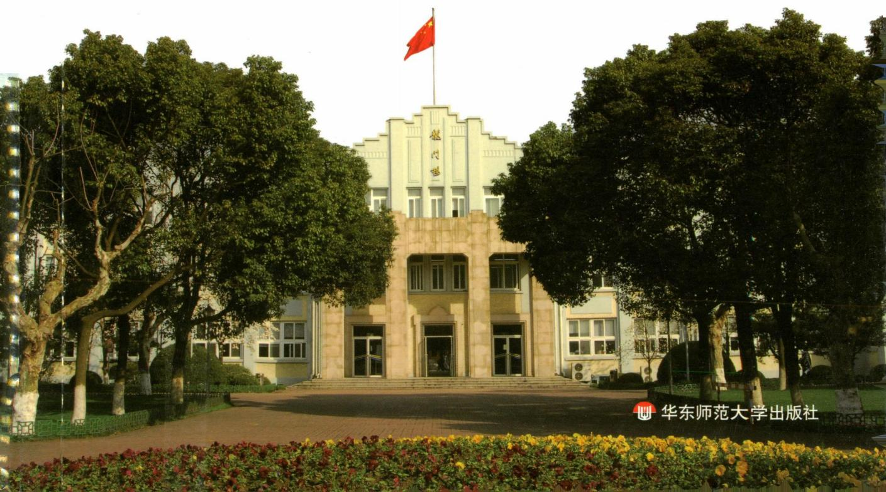

text_image

华东师范大学出版社

# Shanghai High School

总主编 冯志刚

# 上海中学竞赛课程

## 化学（第三分册）

陆晨刚 编著

## 图书在版编目(CIP)数据

上海中学竞赛课程. 化学. 第三分册/陆晨刚编著. — 上海: 华东师范大学出版社, 2020

ISBN 978-7-5675-5822-9

I. ①上…
II. ①陆…
III. ①中学化学课—高中—教学参考资料
IV. ①G634

中国版本图书馆 CIP 数据核字(2020)第 129673 号

## 上海中学竞赛课程 化学(第三分册)

总主编 冯志刚

编 著 陆晨刚

责任编辑 倪明(策划)

孔令志(项目)

应向阳(组稿)

特约审读 陈俊水

版式设计 黄惠敏

封面设计 高山

出版发行 华东师范大学出版社

社 址 上海市中山北路3663号 邮编200062

网址 www.ecnupress.com.cn

电话 021-60821666 行政传真 021-62572105

客服电话 021-62865537 门市(邮购)电话 021-62869887

地址 上海市中山北路3663号华东师范大学校内先锋路口

网店 http://hdsdcbs.tmall.com

印刷者 常熟市文化印刷有限公司

开 本 787×1092 16开

印 张 17.25

字 数 309 千字

版 次 2020年9月第1版

印 次 2020年9月第1次

书号 ISBN 978-7-5675-5822-9

定 价 48.00 元

出版人 王焰

## 总序

人的一生总要面对各种“竞赛”，有些“赛道”是有形的，也有些是无形的。正是在各种不同的“赛道”上不断拼搏，才有了“精彩”与“味道”。形象地说，学科竞赛是基础教育阶段的一条“专用赛道”，不必人人参与，也不应过于功利。学科竞赛凸显的教育理念：“普及的基础上提高”，公平竞争(Fair Play)的设计原则，“跳一跳才能够得着”的命题思路等，对基础教育的发展一直都发挥着无可替代的作用，在任何时代都不过时。

有竞赛自然会有针对性的培训,但无论是校内还是校外的老师辅导,都不及自主学习的效果好,书才是最好的“老师”。

在我国进入新时代之际,我们组织学校的相关教师团队编写这套《上海中学竞赛课程》,是想为数学、物理、化学领域有浓厚学习兴趣和良好发展潜质的高中资优生自主学习备一些素材、身边有一套可随时翻阅的书。希望学生们通过自学,在学习兴趣方面能够得到进一步提升,在学科潜能方面得到进一步激发。藉此与同行们分享上海中学在学校课程建设方面的一些理念与实践,希望得到共鸣,起到抛砖引玉的作用。

上海中学是一所有 150 多年历史的名校，“储人才备国家之用”是学校的办学宗旨，学校在办学的各方面都处于领先地位，学科竞赛也颇有建树。我大学毕业就到上海中学工作，一开始就热衷于数学竞赛方面教学，喜欢通过自己的教学，让孩子们把握数学知识的“脉络”，向他们展示数学的“美”，与他们一起做题（看谁做得快，看谁的解答更漂亮、更本质）。此外，我还经常参加一些大型比赛（例如：西部数学竞赛）的命题工作，带学生出国比赛（曾 5 次出任 IMO 中国国家队副领队），也写过不少书和文章（数学竞赛方面的居多），带出了很多学生，也影响了很多老师。生活一直很简单，也很开心。

我们一直想让学校课程发挥更大的作用,组织老师们出一些专著,推出一些有质量的东西。这套关于数学、物理和化学的学科竞赛丛书就是学校课程建设中的一个重点项目。选择这三门学科是基于它们在人们提升自己认识世界的能力中起到的基础性作用，偏重于竞赛是为了给学有余力的高中生经常“跳一跳”的机会，通过“试错”来提升能力。

在丛书编写过程中,作者们参阅了大量专业书籍,选用了一些“漂亮”的竞赛题,许多“精妙”解答来自学生的“灵感”,因此,丛书会有一定的难度。读者在阅读过程中,宜量力而行。正如“参加学科竞赛是奔着成绩去的,但更重要的是发现自己的不足”一样,不必强求自己一遍读懂,不行就多读几遍,拿张纸、拿支笔放在身旁,边读边写,养成良好的读书习惯,读得多了自然就懂了。

希望这套竞赛丛书的出版,能给在数学、物理、化学领域有一定潜质和浓厚兴趣的学生进一步发展提供一个平台,能给他们搭个“梯子”,让他们站在学长与前辈的肩上,起点更高、视野更宽,在认识自身特长的“志、趣、能”匹配之路上走得更好、更远。

参与丛书编写的作者都是在上海中学长期从事数学、物理、化学学科竞赛教学的老师，一些外聘教授也参与了审稿和部分撰写工作，他们的专业水准、教学经验和全身心投入是这套丛书的质量保证。当然，囿于作者的学识，书中会出现不足，甚至错误，请读者批评指正。

丛书从立项到付梓,历时四年多,其间华东师范大学出版社的各位编辑付出了很大的努力,深表感谢!

上海市上海中学校长 冯志刚

2020年8月

## 前言

自 1984 年以来,中国化学会已成功举办了三十余届化学奥林匹克活动。化学奥林匹克活动致力于揭示化学学科知识的全貌,鼓励学生接触化学发展的前沿,引导他们理解化学学科的科学原理和学科思想,掌握化学学科的研究方法,强化科学探究的意识,逐步形成和发展创新精神和实践能力。广大中学化学教师通过参与这项活动,探索早期发现和培养化学资优生的思路、方法和途径,促进了化学教学新思想与新方法的交流,推动大学与中学的化学教学改革。高考综合改革的不断深化和《普通高中化学课程标准(2017年版2020年修订)》的实施,必将推动高中化学教学的变革和化学资优生早期培养模式的创新,化学奥林匹克活动将持续受到学生及社会的高度关注。

上海中学一直重视化学资优生的早期发现和培养,将对化学兴趣浓厚且有志于参加化学奥林匹克活动的学生经选拔组成小班,利用课余时间以分班教学和分层教学相结合的方式进行培养。很多学生在这项活动中崭露头角,并升入到国内顶尖大学的化学及其相关专业深造,更重要的是他们树立了为化学科学的发展贡献自己力量的决心。

上海中学参与化学竞赛教学的老师们准备上课材料时常参考大量专业书籍，融入个人思考后再整合为培训讲义。历多轮培训，老师们逐步修订完善各知识点并根据整体知识架构调整知识块的顺序，从而形成了一套符合要求、经得起检验的课程讲义，这也是本套《上海中学竞赛课程 化学》（以下简称“课程”）的“根”。本套课程是参照新版高中化学课程标准和2008年4月修订的《全国高中学生化学竞赛基本要求》的内容，并以编者使用多年的培训讲义为蓝本编著而成。课程涵盖的知识略高于中国化学奥林匹克(初赛)的要求，并按照化学专业学科体系分为四册，其中第一、二分册主要介绍物质结构基础知识和化学基本原理等内容，而第三、四分册则分别介绍了元素化学和有机化学知识。

全套课程四个分册均分别由十余讲内容构成,每讲设置下列栏目:

“知识精讲”梳理竞赛基本要求的知识点,突出重点知识,点拨难点知识,是与竞赛有关的中学化学内容的自然生长、延伸和拓展。帮助参加化学奥林匹克活动的学生做好知识准备。

“典型例题”精选例题,解析到位。在例题解析过程中注重培养学科思想方法,点拨解题策略和技巧。帮助参加化学奥林匹克活动的学生学会加工处理信息,提高推理能力,激发创新意识。

“本讲习题”精选了历年各地省级化学竞赛、全国化学竞赛、国际化学竞赛试题以及自编习题。习题参考答案附在全书后面，部分习题提供详解或解题思路。这些习题具有代表性和挑战性，有助于参加化学奥林匹克活动的学生巩固知识、开阔思路，提高综合运用能力。

本套课程可供对化学有兴趣且学有余力的资优生选读,而对参加化学奥林匹克活动的学生更有重要的参考价值和指导意义。

本套课程在编写过程中,得到了许多前辈老师的帮助和支持,特别是叶佩玉老师在百忙之中审读全稿,并提出详细的修改意见。在此谨向他们深致谢忱。由于时间仓促和水平有限,书中难免疏漏之处,敬请读者批评指正。

编者

2020年7月

## 目录

第一讲 卤族元素 / 1

第二讲 氧族元素 / 20

第三讲 氮族元素 / 49

第四讲 碳族元素、硼族元素 / 76

第五讲 碱金属、碱土金属、氢、稀有气体 / 111

第六讲 钛、钒分族元素 / 135

第七讲 铬分族元素 / 157

第八讲 锰分族元素 / 176

第九讲 铁系元素、铂系元素 / 193

第十讲 铜、锌分族元素 / 213

参考答案 / 243

主要参考书目 / 267

## 第一讲 卤族元素

## 知识精讲

## 一、概述

卤族元素位于周期表第ⅦA族，价层电子构型为 $ns^{2}np^{5}$ ，包括F、Cl、Br、I、At五种元素。因它与稀有气体外层的8电子稳定结构只差一个电子，卤素都有获得一个电子形成 $X^{-}$ 离子的趋势，因此卤素是活泼非金属，以化合态形式存在于矿石和海水中。

F: 存在于萤石 $CaF_{2}$ 、冰晶石 $Na_{3}AlF_{6}$ 、氟磷灰石 $Ca_{5}F(PO_{4})_{3}$ ，在地壳中的质量百分含量约 0.015%，占第十五位。

Cl: 主要存在于海水、盐湖、盐井中,主要有钾石盐(KCl)、光卤石(KCl·MgCl₂·6H₂O)。海水中大约含氯1.9%,地壳中的质量百分含量约0.031%,占第十一位。

Br: 主要存在于海水中, 海水中溴的含量相当于氯的 1/300, 盐湖和盐井中也存在少许的溴, 地壳中的质量百分含量约 $1.6 \times 10^{-4}\%$ 。

I: 碘在海水中存在的更少, 仅为 $5 \times 10^{-8}\%$ , 碘主要被海藻所吸收, 碘也存在于某些盐井、盐湖中, 南美洲智利硝石含有少许的碘酸钠。

At: 放射性元素,研究的不多,对它了解的也很少,本讲不加讨论。

## 二、卤素单质

## 1. 物理性质

(1) 存在状态和颜色

<table><tr><td>卤素单质</td><td> $F_{2}$ </td><td> $Cl_{2}$ </td><td> $Br_{2}$ </td><td> $I_{2}$ </td></tr><tr><td>状态(常温常压)</td><td>气</td><td>气</td><td>液</td><td>固</td></tr><tr><td>颜色</td><td>浅黄绿色</td><td>黄绿色</td><td>红棕色</td><td>紫黑色</td></tr></table>

卤素单质是分子晶体,随分子量增大,分子间作用力增大,分别以气体—气体—液体—固体状态存在。

卤素单质颜色由浅到深的递变,可利用分子轨道理论加以解释。由 $X_{2}$ 的分子轨道可知: 卤素分子中的电子吸收可见光中光子的能量后,由能量最高的基态的电子占有轨道( $\pi_{np}^{*}$ )激发1个电子到能量最低的空轨道( $\sigma_{np}^{*}$ ),即:

$$
\left(\sigma_ {n p}\right) ^ {2} \left(\pi_ {n p}\right) ^ {4} \left(\pi_ {n p} ^ {*}\right) ^ {4} \rightarrow \left(\sigma_ {n p}\right) ^ {2} \left(\pi_ {n p}\right) ^ {4} \left(\pi_ {n p} ^ {*}\right) ^ {3} \left(\sigma_ {n p} ^ {*}\right) ^ {1}
$$

基态

激发态

其中 $F_{2}$ 的反键轨道 $(\pi_{2p}^{*})$ 与 $(\sigma_{2p}^{*})$ 的能量相差较大，所以 $F_{2}$ 吸收可见光中能量高、波长短的那部分光，而显示出长波段那部分光的颜色，变成浅黄绿色。随 n 的增大，反键轨道 $(\pi_{np}^{*})$ 与 $(\sigma_{np}^{*})$ 的能量差逐渐减小，吸收光波由短到长， $I_{2}$ 主要吸收可见光中能量低、波长长的那部分光而显紫黑色。

## (2) 溶解度

卤素单质均不易溶于水( $F_{2}$ 除外, 可与水剧烈反应), 相对来说溶解度 $Br_{2}$ 最大, $I_{2}$ 最小。卤素单质易溶于有机溶剂, 因此可用有机溶剂萃取。

## 2. 化学性质

卤素单质化学活泼性很强,价电子层结构 $ns^{2}np^{5}$ , 易形成 $X^{-}$ , 是强氧化剂。其中 $F_{2}$ 氧化性最强, 随 n 增大, 氧化能力变弱。碘以 -1 价的离子存在于自然界中, 还能以 +5 价态存在于碘酸钠中, 说明卤素具有一定的还原性, 随 n 增大, 还原能力变强。它们的化学活泼性从 $F_{2}$ 到 $I_{2}$ 依次减弱。

## (1) 与水反应

$\mathrm{F}_{2}$ 与 $\mathrm{H}_{2} \mathrm{O}$ 剧烈反应放出氧气: $2 \mathrm{~F}_{2} + 2 \mathrm{H}_{2} \mathrm{O} = 4 \mathrm{HF} + \mathrm{O}_{2}$

其他卤素单质仅有少量和水发生歧化反应,大部分以单质分子形态存在于水溶液中: $Cl_{2} + H_{2}O \rightleftharpoons HCl + HClO$ , $K = 5.6 \times 10^{-5}$ ; $3Br_{2} + 3H_{2}O \rightleftharpoons 5HBr + HBrO_{3}$ , $K = 2.5 \times 10^{-9}$ ; $3I_{2} + 3H_{2}O \rightleftharpoons 5HI + HIO_{3}$ , $K = 4.8 \times 10^{-16}$ 。

在碱性介质中反应可以进行完全, 在酸性环境中发生归中反应。 $Cl_{2}$ 与碱作用, 在温度较低时生成 $ClO^{-}$ , 在温度较高时生成 $ClO_{3}^{-}$ 。

## (2) 与金属反应

$F_{2}$ 在任何温度下都可与金属直接化合，生成高价氟化物， $F_{2}$ 与 Cu、Ni、Mg 作用时由于金属表面生成一薄层氟化物致密保护膜而中止反应，所以 $F_{2}$ 可储存在 Cu、Ni、Mg 或合金制成的容器中。 $Cl_{2}$ 可与各种金属作用，但干燥的 $Cl_{2}$ 不与 Fe 反应，因此 $Cl_{2}$ 可储存在铁罐中。 $Br_{2}$ 、 $I_{2}$ 常温下只能与活泼金属作用，与不活泼金属只有加热条件下反应。

## (3) 与非金属反应

$F_{2}$ ：除 $O_{2}$ 、 $N_{2}$ 、稀有气体 He、Ne 外，可与所有非金属作用，直接化合成高价氟化物。低温下可与 C、Si、S、P 剧烈反应，生成的氟化物大多具有挥发性。

$Cl_{2}$ ：能与大多数非金属单质直接作用，但不及 $F_{2}$ 剧烈。

$Br_{2}$ 、 $I_{2}$ ：反应不如 $F_{2}$ 、 $Cl_{2}$ 剧烈，与非金属作用不能氧化到最高价。

(4) 与 $\mathrm{H}_{2}$ 反应

$F_{2}$ 低温黑暗中即可与 $H_{2}$ 直接化合放出大量热导致爆炸。 $Cl_{2}$ 点燃条件下可与 $H_{2}$ 迅速化合，强光照时发生爆炸反应。 $Br_{2}$ 加热时可与 $H_{2}$ 反应，但高温下 HBr 不稳定，易分解。 $I_{2}$ 加热时可与 $H_{2}$ 反应，且为可逆反应。

## 3. 单质的制备

通常情况下采用氧化卤素离子的方法来制备卤素单质。

(1) $F_{2}$

① 电解法：欲使 $F^{-} \rightarrow F_{2}$ ，只能用最强的氧化还原方法——电解法。

电解质：氟氢化钾 $(\mathrm{KHF}_2) +$ 氟化氢(HF)

阳极(氧化反应): 石墨: $2\mathrm{F}^{-}-2\mathrm{e}=\mathrm{F}_{2}\uparrow$ ;

阴极(还原反应): 钢: $2 \mathrm{HF}_{2}^{-} + 2 \mathrm{e}^{-} = \mathrm{H}_{2} \uparrow + 4 \mathrm{F}^{-}$ 。

总反应方程式： $2KHF_{2}\xlongequal{电解}2KF+H_{2}\uparrow+F_{2}\uparrow$ 。

阴极与阳极用钢网隔开,避免 $F_{2}$ 和 $H_{2}$ 接触发生爆炸。

② 实验室制备

1986 年, 克里斯特(K. Christe)采用氧化络合置换法用强路易斯酸 $SbF_{5}$ 将弱易斯酸 $MnF_{4}$ 从 $\left[MnF_{6}\right]^{2-}$ 中置换出来, 并利用其热力学上不稳定分解制得 $F_{2}: 2KMnO_{4} + 2KF + 10HF + 3H_{2}O_{2} = 2K_{2}MnF_{6} + 8H_{2}O + 3O_{2}\uparrow$ , $SbCl_{5} + 5HF = SbF_{5} + 5HCl$ 。再以 $K_{2}MnF_{6}$ 和 $SbF_{5}$ 为原料制备 $MnF_{4}$ , $MnF_{4}$ 不稳定, 分解放出 $F_{2}: K_{2}MnF_{6} + SbF_{5} \xlongequal{423\mathrm{~K}} KSbF_{6} + KF + MnF_{4}, MnF_{4} = MnF_{3} + 1/2F_{2}\uparrow$ 。

(2) $\mathrm{Cl}_2$

① 工业：电解食盐水

$$
2 \mathrm{NaCl} + 2 \mathrm{H} _ {2} \mathrm{O} \xlongequal {\text {电解}} 2 \mathrm{NaOH} + \mathrm{H} _ {2} \uparrow + \mathrm{Cl} _ {2} \uparrow
$$

② 实验室制备：选择合适的氧化剂与 HCl 反应，如：

$$
\begin{array}{l} \mathrm{MnO} _ {2} + 4 \mathrm{HCl} \xlongequal {\text {加热}} \mathrm{MnCl} _ {2} + \mathrm{Cl} _ {2} \uparrow + 2 \mathrm{H} _ {2} \mathrm{O} \\ 2 \mathrm{KMnO} _ {4} + 1 6 \mathrm{HCl} = 2 \mathrm{KCl} + 2 \mathrm{MnCl} _ {2} + 5 \mathrm{Cl} _ {2} \uparrow + 8 \mathrm{H} _ {2} \mathrm{O} \\ \end{array}
$$

(3) $\mathrm{Br}_2$

① 工业：

氯气通入酸化的苦卤中： $Cl_{2}+2Br^{-}=2Cl^{-}+Br_{2}(pH=3.5)$ ，热空气吹出 $Br_{2}$ 。

② 实验室制备：

$$
\mathrm{MnO} _ {2} + 2 \mathrm{NaBr} + 3 \mathrm{H} _ {2} \mathrm{SO} _ {4} = \mathrm{Br} _ {2} + \mathrm{MnSO} _ {4} + 2 \mathrm{NaHSO} _ {4} + 2 \mathrm{H} _ {2} \mathrm{O}
$$

(4) $I_{2}$

① 工业：

方法一：用还原剂 $HSO_{3}^{-}$ 还原 $IO_{3}^{-}$

$IO_{3}^{-}$ 来源于智利硝石 $(NaNO_{3} + \text{少量 } NaIO_{3})$ 制备 $KNO_{3}$ 的母液。分两步反应：

$$
2 \mathrm{IO} _ {3} ^ {-} + 5 \mathrm{HSO} _ {3} ^ {-} = \mathrm{I} _ {2} + 5 \mathrm{SO} _ {4} ^ {2 -} + 3 \mathrm{H} ^ {+} + \mathrm{H} _ {2} \mathrm{O}
$$

$$
\mathrm{IO} _ {3} ^ {-} + 5 \mathrm{I} ^ {-} + 6 \mathrm{H} ^ {+} = 3 \mathrm{I} _ {2} + 3 \mathrm{H} _ {2} \mathrm{O}
$$

方法二：利用海洋生物(海藻、海带)提取

$2I^{-}+Cl_{2}=2Cl^{-}+I_{2}$ （防止 $Cl_{2}$ 过量： $I_{2}\xrightarrow{过量Cl_{2}}IO_{3}^{-}$ ）

② 实验室制备

利用 $MnO_{2}$ 在酸性条件下氧化 $I^{-}$ 制取 $I_{2}: 2I^{-} + MnO_{2} + 4H^{+} = Mn^{2+} + I_{2} + 2H_{2}O$ 。

## 三、卤化氢和氢卤酸

## 1. 物理性质

HX 均为具有强烈刺激性臭味的无色气体。

(1) 沸点: 沸点除 HF 外, 随分子间作用力增大逐渐升高, HF 形成分子间氢键, 所以是本族沸点最高的一个。液态 HF 为无色液体, 无酸性, 不导电。

(2) 气体分子聚集态: 常温常压下, 因为 HF 分子间存在氢键, 蒸气密度测定表明: 常温下 HF 主要存在形式是 $(\mathrm{HF})_{2}$ 和 $(\mathrm{HF})_{3}$ , 在 359 K 以上, HF 才以单分子状态存在。其他卤化氢气体, 常温下以单分子状态存在。

(3) 水中溶解度: HF 分子极性大, 可与水任意比互溶。1 L 的水可溶解 500 L HCl。常压下蒸馏氢卤酸, 溶液的沸点和组成都在不断的变化, 最后溶液的组成和沸点恒定不变时的溶液叫恒沸溶液。

## 2. 化学性质

(1) 酸性: 卤化氢溶解于水得到相应的氢卤酸, 在水的作用下解离成 $\mathrm{H}^{+}$ 和 $\mathrm{X}^{-}$ 。酸性: $\mathrm{HF} < \mathrm{HCl} < \mathrm{HBr} < \mathrm{HI}$ , 其中 $\mathrm{HF}$ 是弱酸: $\mathrm{HF} \rightleftharpoons \mathrm{H}^{+} + \mathrm{F}^{-}, K_{\mathrm{a}} =$

$$
3. 5 \times 1 0 ^ {- 4} 。
$$

当 HF 浓度增大时酸性增强。因为： $HF + F^{-} \rightleftharpoons HF_{2}^{-}$ ，K = 5。

HF的特性：可以腐蚀玻璃： $\mathrm{SiO_2 + 4HF = SiF_4\uparrow + 2H_2O}$

## (2) 还原性

由于氧化能力： $F_{2}>Cl_{2}>Br_{2}>I_{2}$ ，因此还原能力：HI>HBr>HCl>HF。例： $4\mathrm{HI(aq)}+\mathrm{O}_{2}=2\mathrm{I}_{2}+2\mathrm{H}_{2}\mathrm{O}$ 。HBr(aq)不易被空气氧化，HCl不能被空气氧化，HF找不到能氧化它的氧化剂。

## (3) 热稳定性

HF > HCl > HBr > HI, HF 加热至 1000℃ 无明显分解。

## 3. 卤化氢的制备

(1) 金属卤化物与浓硫酸的反应(不挥发性酸制挥发性酸)

$$
\mathrm{CaF} _ {2} + \mathrm{H} _ {2} \mathrm{SO} _ {4} (\text {浓}) = \mathrm{CaSO} _ {4} + 2 \mathrm{HF} \uparrow
$$

$NaCl + H_{2}SO_{4}(浓) \xlongequal{微热} NaHSO_{4} + HCl \uparrow, 2NaCl + H_{2}SO_{4}(浓) \xlongequal{加热} Na_{2}SO_{4} + 2HCl \uparrow$

其中 HF 会腐蚀玻璃, 制备必须在铅皿中进行。HBr、HI 由于会被浓硫酸氧化, 只能用 $H_{3}PO_{4}$ 与 NaBr、NaI 反应来制取。

## (2) 卤素与氢直接化合

由于 $F_{2}$ 和 $H_{2}$ 反应激烈，冷暗处爆炸；而 $Br_{2}$ 、 $I_{2}$ 与 $H_{2}$ 化合反应缓慢，且反应不完全，因此工业上仅用 $Cl_{2}$ 和 $H_{2}$ 直接化合制备 HCl。

$\mathrm{H}_{2}$ 在 $\mathrm{Cl}_2$ 中燃烧： $\mathrm{H}_{2} + \mathrm{Cl}_{2}\xrightarrow{\text{点燃}} 2\mathrm{HCl}$

## (3) 卤化物水解法

$$
\mathrm{PX} _ {3} + 3 \mathrm{H} _ {2} \mathrm{O} = \mathrm{H} _ {3} \mathrm{PO} _ {3} + 3 \mathrm{HX(X=Br,I)}
$$

## 四、卤化物

除 He、Ne、Ar 外，其他元素几乎都与 $X_{2}$ 化合生成卤化物。 $F_{2}$ 氧化能力强，元素形成氟化物往往呈现最高价，例如： $SiF_{4}$ 、 $SF_{6}$ 、 $IF_{7}$ 、 $OsF_{8}$ ；而 $I_{2}$ 与 $F_{2}$ 相比氧化能力小得多，所以元素在形成碘化物时，往往呈现较低的氧化态，例如：CuI、 $Hg_{2}I_{2}$ 。

卤化物按化学键类型可分为：

离子型卤化物：碱金属、碱土金属以及较活泼金属、镧系和锕系元素的低价态卤化物。

共价型卤化物：大多数金属的高价态卤化物及非金属卤化物，如 $AlCl_{3}$ 、 $FeCl_{3}$ 、 $SnCl_{4}$ 、 $TiCl_{4}$ 等。

## 1. 金属卤化物

## (1) 金属卤化物的制备

① 金属直接与卤素单质化合

例： $2Na + Cl_{2} \xlongequal{点燃} 2NaCl, Cu + Cl_{2} \xlongequal{点燃} CuCl_{2}$

② 卤化氢与相应物质反应

例： $\mathrm{MgO} + 2\mathrm{HCl} = \mathrm{MgCl}_2 + \mathrm{H}_2\mathrm{O},\mathrm{CaCO}_3 + 2\mathrm{HCl} = \mathrm{CaCl}_2 + \mathrm{CO}_2\uparrow +$ $\mathrm{H}_2\mathrm{O}$

③ 金属氧化物的卤化

例： $\mathrm{TiO_2 + 2C + 2Cl_2\xrightarrow{\text{加热}}TiCl_4 + 2CO}$

## (2) 金属卤化物的离子极化

碱金属、碱土金属的卤化物是典型的离子型化合物, 其离子性随金属氧化数的增高、半径减小而减弱, 逐渐由离子型向共价型转化。同一种金属低价态显离子型, 高价态显共价型。例如: $\mathrm{SnCl}_{2}$ (离子型), $\mathrm{SnCl}_{4}$ (共价型), 而金属氟化物主要显离子型。

由于离子极化现象导致的一些物理性质的递变：

① 溶解度：Hg(I)、Ag(I)的氟化物中，因为 $F^{-}$ 变形性小，与Hg(I)、Ag(I)形成的氟化物表现离子型而溶于水。而 $Cl^{-}$ 、 $Br^{-}$ 、 $I^{-}$ 在极化能力强的金属离子作用下呈现不同程度的变形性，生成化合物显共价性，溶解度依次减小，重金属卤化物溶解度较小。如：溶解度 AgCl > AgBr > AgI。

② 颜色：离子极化作用使外层电子变形，价电子活动范围加大，与原子核结合松弛，有可能吸收部分可见光而使化合物的颜色变深。如：AgCl（白色），AgBr（浅黄色），AgI（黄色）。

③ 熔点：由于离子极化，使化学键由离子键向共价键转变，化合物也相应由离子型向共价型过渡，其熔点、沸点也随共价成分的增多而降低。例如：熔点： $MgCl_{2} > CuCl_{2}$ 。

## (3) 形成配位化合物

$\mathrm{CuCl}$ (白色沉淀) $+\mathrm{Cl}^{-} = [\mathrm{CuCl}_{2}]^{-}$ （无色溶液）， $\mathrm{CuCl}_2 + 2\mathrm{Cl}^-$

$\left[CuCl_{4}\right]^{2-}$ （绿色溶液）

$Hg^{2+} + 2I^{-} = HgI_{2} \downarrow$ （黄色沉淀）， $HgI_{2} + 2I^{-} = HgI_{4}^{2-}$ （无色溶液）

## 2. 卤素互化物和多卤化物

(1) 卤素互化物: 由两种卤素组成的化合物叫卤素互化物。  
(2) 形成卤素互化物的条件:

中心原子：电负性小的卤素，如 I。

配体：电负性大的卤原子，如 F，配体多为奇数。F 因半径小，配位数可高达 7，如： $IF_{7}$ 。

Cl、Br 随半径增大,配位数减小,如 $IF_{7}$ 、 $BrF_{5}$ 、 $ClF_{3}$ 、 $ICl_{3}$ 。卤素互化物的空间构型可用 VSEPR 理论解释。

## (3) 多卤化物

卤素离子与半径较大的碱金属可以形成多卤化物,结构与性质与卤素互化物近似。

多卤化物特点：

① 稳定性差

受热易分解,分解产物为卤化物、卤素或互卤化物。

如： $CsBr_{3}\xlongequal{加热}CsBr+Br_{2},CsICl_{2}\xlongequal{加热}CsCl+ICl$

② 水解反应

从反应结果可知：高价态的中心原子与水中的 $OH^{-}$ 发生亲核取代，结合生成含氧酸，低价态的配体与 $H^{+}$ 结合生成氢卤酸。如： $ICl + H_{2}O = HIO + HCl$ （其中 HIO 可继续歧化）， $BrF_{5} + 3H_{2}O = HBrO_{3} + 5HF$ 。

## 3. 拟卤素和拟卤化物

## (1) 拟卤素

某些负一价的负离子在形成离子化合物或共价化合物时,表现出与卤离子相似的性质,在自由状态时,其性质与卤素单质相似,这种物质称为拟卤素。

拟卤素主要包括：氰 $(\mathrm{CN})_{2}$ ，硫氰 $(\mathrm{SCN})_{2}$ ，氧氰 $(\mathrm{OCN})_{2}$ ，硒氰 $(\mathrm{SeCN})_{2}$ 。

## (2) 物理性质

$(\mathrm{CN})_{2}$ 剧毒, 苦杏仁味, 273K 下, 1L 水溶解 4L 氰, 常温下为无色气体。 $(\mathrm{SCN})_{2}$ 不稳定, 易聚合, 生成 $(\mathrm{SCN})_{x}$ 多聚物, 不溶于水, 砖红色固体。

## (3) 化学性质

① 与氢形成酸,除 HCN 外,其余酸性较强。

$$
\mathrm{HCN} \left(K _ {\mathrm{a}} = 4. 0 \times 1 0 ^ {- 1 0}\right) \text {、HSCN} \left(K _ {\mathrm{a}} = 1. 4 \times 1 0 ^ {- 1}\right) \text {、HOCN} \left(K _ {\mathrm{a}} = 1. 2 \times 1 0 ^ {- 4}\right) 。
$$

② 与水作用

在 $\mathrm{H}_2\mathrm{O}$ 、 $\mathrm{OH}^{-}$ 中可发生歧化反应： $(\mathrm{CN})_2 + \mathrm{H}_2\mathrm{O} = \mathrm{HCN} + \mathrm{HOCN},$ $(\mathrm{CN})_2 + 2\mathrm{OH}^- = \mathrm{CN}^+ +\mathrm{OCN}^- +\mathrm{H}_2\mathrm{O}$

③ 与金属离子成盐及配位

重金属氰化物不溶于水(如 AgCN、Pb(CN) $_{2}$ 、Hg $_{2}$ (CN) $_{2}$ 等)，碱金属氰化物溶解度很大，在水中强烈水解而显碱性并放出 HCN。

大多数硫氰酸盐溶于水, 重金属盐难溶于水(如 AgSCN、Pb(SCN) $_{2}$ 、Hg(SCN) $_{2}$ 等)。

以上的重金属难溶盐在 $\mathrm{NaCN}$ 、KCN或 $\mathrm{NaSCN}$ 溶液中形成可溶性配位化合物：

$$
\mathrm{AgCN} + \mathrm{CN} ^ {-} = \mathrm{Ag(CN)} _ {2} ^ {-}, \mathrm{AgI} + 2 \mathrm{CN} ^ {-} = \mathrm{Ag(CN)} _ {2} ^ {-} + \mathrm{I} ^ {-}
$$

$$
\mathrm{Fe} ^ {3 +} + x \mathrm{SCN} ^ {-} = \mathrm{Fe(SCN)} _ {x} ^ {3 - x} \quad \text {血红色} \quad x = 1 \sim 6
$$

④ 氧化还原

根据标准电极电位可知,氧化性: $\mathrm{F}_{2} > (\mathrm{OCN})_{2} > \mathrm{Cl}_{2} > \mathrm{Br}_{2} > (\mathrm{CN})_{2} > (\mathrm{SCN})_{2} > \mathrm{I}_{2} > (\mathrm{SeCN})_{2}$ 。例如: $\mathrm{Pb(SCN)}_{2} + \mathrm{Br}_{2} = \mathrm{PbBr}_{2} + (\mathrm{SCN})_{2}$ 。

总体来说,拟卤素的氧化能力较 $Cl_{2}$ 、 $Br_{2}$ 低。

(4) 氰化物的处理

所有的氰化物都有剧毒,毫克量级的 KCN 或 NaCN 就可致人死亡。氰化物可以通过下列反应,变成无毒物质。

$$
2 \mathrm{CN} ^ {-} + 5 \mathrm{O} _ {3} + \mathrm{H} _ {2} \mathrm{O} \xlongequal {\text {加热}} 2 \mathrm{HCO} _ {3} ^ {-} + \mathrm{N} _ {2} + 5 \mathrm{O} _ {2}
$$

或 $CN^{-}+ClO^{-}=OCN^{-}+Cl^{-}$ ，其中 $OCN^{-}$ 也有一定毒性，需用 $ClO^{-}$ 在酸性环境下进一步氧化为完全无毒的 $CO_{2}$ 和 $N_{2}:2OCN^{-}+3ClO^{-}+2H^{+}=2CO_{2}\uparrow+N_{2}\uparrow+3Cl^{-}+H_{2}O$ 。

## 五、卤素的氧化物

卤素的氧化物大多不稳定,主要介绍以下几种:

## 1. 氟的氧化物 OF $_{2}$

$OF_{2}$ 的一般制备方法是将氟通过 2% 的 NaOH 溶液：

$$
2 \mathrm{F} _ {2} + 2 \mathrm{OH} ^ {-} = \mathrm{OF} _ {2} + \mathrm{H} _ {2} \mathrm{O} + 2 \mathrm{F} ^ {-}
$$

制备时碱的浓度要低,否则会使 $OF_{2}$ 分解: $OF_{2} + 2OH^{-} = O_{2} + 2F^{-} + H_{2}O$

## 2. 氯的氧化物

通常情况下,氯与氧不能直接化合。二氧化氯早在19世纪就已由硫酸与氯酸钾作用而制得。1834年曾报道用氧化汞直接氧化氯气生成一氧化二氯 $\left(\mathrm{Cl}_{2}\mathrm{O}\right)$ 。1900年将高氯酸脱水分离出七氧化二氯 $\left(\mathrm{Cl}_{2}\mathrm{O}_{7}\right)$ 。其他氧化物是1967年后才开始研究的。

二氧化氯 $(\mathrm{ClO}_2)$

① 制备

i) 亚氯酸钠氯化法： $2NaClO_{2} + Cl_{2} = 2ClO_{2} + 2NaCl$

ii) 草酸还原氯酸盐： $2ClO_{3}^{-}+C_{2}O_{4}^{2-}+4H^{+}=2ClO_{2}\uparrow+2CO_{2}\uparrow+2H_{2}O$

iii) 在工业上还可以用 $SO_{2}$ 还原氯酸钠制备 $ClO_{2}$ 。

② 物理性质

淡黄色气体,在 $11^{\circ}$ C 时凝聚成液体,易溶于水、 $CCl_{4}$ 。

## 3. 溴的氧化物

二氧化溴 $(\mathrm{BrO}_2)$

① 制备

低温下，以 $CF_{3}Cl$ 为溶剂，将溴与臭氧作用可以制得亮黄色 $BrO_{2}$ 晶体。

$$
\mathrm{Br} _ {2} + 4 \mathrm{O} _ {3} \xrightarrow [ \text {低温} ]{\mathrm{CF} _ {3} \mathrm{Cl}} 2 \mathrm{BrO} _ {2} + 4 \mathrm{O} _ {2}
$$

② 化学性质

i) 不稳定性： $2BrO_{2}\xlongequal{0^{\circ}C}Br_{2}+2O_{2}$

ii) 歧化： $\mathrm{BrO}_{2}$ 在碱性溶液中歧化： $6\mathrm{BrO}_{2} + 6\mathrm{OH}^{-} = 5\mathrm{BrO}_{3}^{-} + \mathrm{Br}^{-} + 3\mathrm{H}_{2}\mathrm{O}$

## 4. 碘的氧化物

(1) $I_{2}O_{5}$

$\mathrm{I}_2\mathrm{O}_5$ 是最重要和热稳定性最好的碘氧化物。

① 制备

较简便的制备方法是在 $200^{\circ}C$ 用干燥的空气流使 $HIO_{3}$ 脱水制得。 $I_{2}O_{5}$ 是容易吸潮的白色固体。

② 化学性质

i) 碘酸酐，溶于水生成碘酸。

ii) 氧化性: $I_{2}O_{5} + 5CO = I_{2} + 5CO_{2}$ ，该反应可用来测定空气或其他气体中的 CO 含量。

(2) $\mathrm{I}_4\mathrm{O}_9$

黄色吸湿物质。 $I_{4}O_{9}$ 实际上是三碘酸碘 $\mathrm{I}(\mathrm{IO}_{3})_{3}$ ，该组成是根据它与水和氯化氢按化学计量反应计算得出的。

## 六、卤素的含氧酸及其盐

## 1. 次卤酸

(1) 化学性质

① 酸性

$$
\mathrm{HClO} (K _ {\mathrm{a}} = 3. 4 \times 1 0 ^ {- 8}), \mathrm{HBrO} (K _ {\mathrm{a}} = 2 \times 1 0 ^ {- 9}), \mathrm{HIO} (K _ {\mathrm{a}} = 1 \times 1 0 ^ {- 1 1}) 。
$$

因为随半径增大,分子 H—O—X 中,X—O 结合力减小,X 对 $H^{+}$ 斥力变小,导致酸性减小。

② 热稳定性

HXO 均不稳定,仅存在于水溶液中,从 Cl 到 I 稳定性减小,分解方程式:

$$
\begin{array}{l} 2 \mathrm{HClO} \xlongequal {\text {光照}} 2 \mathrm{HCl} + \mathrm{O} _ {2} \uparrow \\ 3 \mathrm{HClO} \stackrel {\text {   加热   }} {=} 2 \mathrm{HCl} + \mathrm{HClO} _ {3} \\ \end{array}
$$

HOF 常温下即自发分解为 HF 和 $O_{2}$ ，HOF 能与 $H_{2}O$ 迅速反应生成 HF、 $H_{2}O_{2}$ 或 $O_{2}$ （在稀酸溶液中是 $H_{2}O_{2}$ ，而在碱性溶液中 $O_{2}$ 是主要产物）。 $BrO^{-}$ 室温下发生歧化反应，只有在 273 K 时才有 $BrO^{-}$ 存在；323 K～353 K 时， $BrO^{-}$ 完全转变为 $BrO_{3}^{-}$ 。 $IO^{-}$ 歧化速率更快，溶液中不存在次碘酸盐，HIO 几乎不存在。

③ 氧化性

HXO 不稳定,表明 HXO 的氧化性很强: $2HClO + 2HCl = 2Cl_{2} \uparrow + 2H_{2}O$ , $3HClO + S + H_{2}O = H_{2}SO_{4} + 3HCl$ 。

$XO^{-}$ 盐比 HXO 酸稳定性高, 所以经常用其盐在酸性介质中作氧化剂: $KClO + PbCl_{2} + H_{2}O = PbO_{2} + 2HCl + KCl$ 。

(2) HClO 的制备

① 次氯酸酐 $Cl_{2}O$ 溶于水制得 HClO: $Cl_{2}O + H_{2}O = 2HClO$ 。

② 工业上采用电解冷的稀 NaCl 溶液的方法, 同时搅拌电解液, 使产生的氯气与 NaOH 充分反应制得次氯酸钠: $Cl_{2} + 2NaOH = NaCl + NaClO + H_{2}O$ , 酸化后得 HClO: $ClO^{-} + H^{+} = HClO$ 。

## 2. 亚卤酸及其盐

## (1) 化学性质

亚卤酸中仅存在 $HClO_{2}$ ，酸性大于 HClO， $K_{a}=5.0\times10^{-3}$ 。

$HClO_{2}$ 不稳定， $ClO_{2}^{-}$ 在溶液中较稳定，具有强氧化性。 $NaClO_{2}$ 盐较稳定，加热、撞击爆炸分解，在溶液中受热分解。

## (2) 制备

① 实验室

$$
\mathrm{H} _ {2} \mathrm{SO} _ {4} + \mathrm{Ba(ClO} _ {2}) _ {2} = \mathrm{BaSO} _ {4} \downarrow + 2 \mathrm{HClO} _ {2}
$$

过滤去除 $BaSO_{4}$ 可制得纯净的 $HClO_{2}$ ，但 $HClO_{2}$ 不稳定，很快分解： $8HClO_{2}=Cl_{2}\uparrow+6ClO_{2}\uparrow+4H_{2}O$ 。

② $ClO_{2}$ 与碱作用可得到亚氯酸盐和氯酸盐： $2ClO_{2} + 2NaOH = NaClO_{2} + NaClO_{3} + H_{2}O$ 。

③ $Na_{2}O_{2}$ 与 $ClO_{2}$ 制备纯净的 $NaClO_{2}:Na_{2}O_{2}+2ClO_{2}=2NaClO_{2}+O_{2}\uparrow$

## 3. 卤酸及其盐

(1) 制备

① 利用卤素单质在碱性介质中歧化的特点制取： $3X_{2} + 6OH^{-} = 5X^{-} + XO_{3}^{-} + 3H_{2}O$ ，此法优点： $X^{-}$ 、 $XO_{3}^{-}$ 易分离，反应彻底。缺点： $XO_{3}^{-}$ 转化率只有1/6。

② 卤酸盐与酸反应: $\mathrm{H}_{2} \mathrm{SO}_{4} + \mathrm{Ba}\left(\mathrm{ClO}_{3}\right)_{2} = \mathrm{BaSO}_{4} \downarrow + 2 \mathrm{HClO}_{3}, \mathrm{H}_{2} \mathrm{SO}_{4}$ 浓度不宜太高, 否则易发生爆炸分解。

③ 直接氧化法: $\mathrm{I}^{-} + 3\mathrm{Cl}_{2} + 6\mathrm{OH}^{-} = \mathrm{IO}_{3}^{-} + 6\mathrm{Cl}^{-} + 3\mathrm{H}_{2}\mathrm{O}, \mathrm{I}_{2} + 10\mathrm{HNO}_{3} = 2\mathrm{HIO}_{3} + 10\mathrm{NO}_{2} + 4\mathrm{H}_{2}\mathrm{O}$ 。 $\mathrm{HClO}_{3}$ 可存在的最大百分比浓度为 $40\%$ ， $\mathrm{HBrO}_{3}$ 为 $50\%$ ， $\mathrm{HIO}_{3}$ 可以固体形式存在，可见酸的稳定性依次增强。

(2) 化学性质

① 酸性： $HClO_{3}>HBrO_{3}>HIO_{3}$

随质子数增大,半径增大,反极化作用减小,所以酸性减弱。

② 稳定性: $\mathrm{HXO}_{3} > \mathrm{HXO}$ , 但也极易分解。

$HClO_{3}$ 、 $HBrO_{3}$ 仅存在于溶液中，减压蒸馏冷溶液可得到黏稠的浓溶液。

分解反应的类型：

i) 光催化： $2HClO_{3}\xlongequal{光照}2HCl+3O_{2}\uparrow$

ii）歧化： $4HClO_{3}\xlongequal{加热}HCl+3HClO_{4}$

iii) 浓溶液受热分解: $8 \mathrm{HClO}_{3} \stackrel{\text {加热}}{=} 4 \mathrm{HClO}_{4} + 2 \mathrm{Cl}_{2} \uparrow + 3 \mathrm{O}_{2} \uparrow + 2 \mathrm{H}_{2} \mathrm{O}$

$$
4 \mathrm{HBrO} _ {3} \xlongequal {\text {加热}} 2 \mathrm{Br} _ {2} + 5 \mathrm{O} _ {2} \uparrow + 2 \mathrm{H} _ {2} \mathrm{O}
$$

$$
2 \mathrm{HIO} _ {3} \xlongequal {\text {加热}} \mathrm{I} _ {2} \mathrm{O} _ {5} + \mathrm{H} _ {2} \mathrm{O}
$$

盐的稳定性大于相应酸的稳定性,但受热时也发生分解:

$$
\begin{array}{l} 2 \mathrm{KClO} _ {3} \xlongequal [ \text {加热} ] {\mathrm{MnO} _ {2}} 2 \mathrm{KCl} + 3 \mathrm{O} _ {2} \uparrow \\ 4 \mathrm{KClO} _ {3} \stackrel {\text {加热}} {=} \mathrm{KCl} + 3 \mathrm{KClO} _ {4} \\ \end{array}
$$

③ 氧化性: $\mathrm{HBrO}_{3} > \mathrm{HClO}_{3} > \mathrm{HIO}_{3}$

$HBrO_{3}$ 氧化能力最强的原因：在分子构型相同的情况下，Br 同 Cl 比，外层 18e 的 Br 吸引电子能力大于 8e 的 Cl，Br 与 I 相比，都是 18e，但半径 Br < I，得电子能力 Br > I，所以 $BrO_{3}^{-}$ 的氧化能力最强。

## (3) 盐类的溶解度

氯酸盐基本可溶,但溶解度不大。溴酸盐中 $AgBrO_{3}$ 、 $\mathrm{Pb(BrO_{3})_{2}}$ 、 $\mathrm{Ba(BrO_{3})_{2}}$ 难溶,其余可溶。可溶性碘酸盐更少, $\mathrm{Cu(IO_{3})_{2}}$ 水合物蓝色,无水盐绿色, $AgIO_{3}$ 、 $\mathrm{Pb(IO_{3})_{2}}$ 、 $\mathrm{Hg(IO_{3})_{2}}$ 及 Ca、Sr、Ba 的碘酸盐均难溶。

综上所述,溶解度的大小规律: $MClO_{3} > MBrO_{3} > MIO_{3}$ 。

## 4. 高卤酸及其盐

## (1) 高卤酸的制备

① 酸置换法(制备高氯酸): $KClO_{4} + H_{2}SO_{4} = KHSO_{4} + HClO_{4}$ ，减压蒸馏把 $HClO_{4}$ 从混合物中分离出来，要求低于 365 K。

②电解法制高氯酸(工业生产)

电解氧化 HCl(aq)制取 $HClO_{4}$ ，Pt 做阳极，Ag、Cu 做阴极。

Pt阳极： $\mathrm{Cl^- + 4H_2O - 8e^- = ClO_4^- + 8H^+}$

Ag(Cu)阴极： $2H^{+}+2e^{-}=H_{2}\uparrow$

电解法可得到质量分数为 20% 的 $HClO_{4}$ ，经减压蒸馏可得 70% 的 $HClO_{4}$ 。质量分数低于 60% 的 $HClO_{4}$ 溶液加热不分解。质量分数 72.4% 的 $HClO_{4}$ 溶液是恒沸混合物，加热到 476 K 时分解。

## ③ 高溴酸的制备

用 $\mathrm{XeF_2}$ 或 $\mathrm{F_2}$ 氧化 $\mathrm{NaBrO_3}$ 制备 $\mathrm{HBrO_4}$ ： $\mathrm{NaBrO_3 + XeF_2 + H_2O = NaBrO_4 + }$ $\mathrm{Xe + 2HF, BrO_3^- + F_2 + 2OH^- = BrO_4^- + 2F^- + H_2O.}$ 质量分数 $55\%$ 的 $\mathrm{HBrO_4}$ 溶液稳定,不易分解,但高于55%则不稳定。

④ 高碘酸的制备

i) 将氯气通入碘酸盐的碱性溶液中, 可得高碘酸盐: $\mathrm{Cl}_{2} + 6\mathrm{OH}^{-} + \mathrm{IO}_{3}^{-} = 2\mathrm{Cl}^{-} + \mathrm{IO}_{6}^{5-} + 3\mathrm{H}_{2}\mathrm{O}$ 。

ii）酸化高碘酸盐： $\mathrm{Ba}_{5}(\mathrm{IO}_{6})_{2} + 5\mathrm{H}_{2}\mathrm{SO}_{4} = 5\mathrm{BaSO}_{4}\downarrow +2\mathrm{H}_{5}\mathrm{IO}_{6}$

iii）工业制法：电解氧化碘酸盐溶液得高碘酸盐，但浓度高也不稳定。

(2) 化学性质

① 酸性： $HClO_{4} > HBrO_{4} > H_{5}IO_{6}(HIO_{4})$

最强 很强 $K_{\mathrm{a1}} = 2.3$

高氯酸是无机酸中最强的酸,在水中完全解离成 $H^{+}$ 、 $ClO_{4}^{-}$ , 这是因为 $\mathrm{Cl}(+7)$ 对 $\mathrm{O}(-2)$ 的吸引力大于 $\mathrm{H}(+1)$ 与 $\mathrm{O}(-2)$ 的结合力, 且抵抗 $H^{+}$ 的反极化能力强,使 O—H 键的结合力被削弱。Cl—Br—I, 半径逐渐增大, 反极化力逐渐减小, 所以酸性逐渐减弱。

正高碘酸 $H_{5}IO_{6}$ 是无色单斜晶体，结构如右图，I采取 $sp^{3}d^{2}$ 杂化，六配位，正八面体。在强酸中以 $H_{5}IO_{6}$ 的形式存在，在碱中以 $H_{3}IO_{6}^{2-}$ 形式存在。

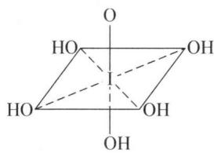

chemical

Chemical structure of a diol with multiple hydroxyl groups and central oxygen bridge

② 稳定性和氧化性

浓高氯酸以分子状态存在的数目多,此时 $H^{+}$ 的反极化作用使 $HXO_{4}$ 不稳定,因而表现出强氧化性: $HBrO_{4} > H_{5}IO_{6} > HClO_{4}$ 。

稀 $HClO_{4}$ 不能被 Zn 还原说明 $HClO_{4}$ 氧化能力小。这是因为稀 $HClO_{4}$ 完全解离， $ClO_{4}^{-}$ 结构对称性高，正四面体结构稳定，所以氧化能力低。

(3) 盐类的溶解度

$ClO_{4}^{-}$ 的 $K^{+}$ 、 $Rb^{+}$ 、 $Cs^{+}$ 、 $NH_{4}^{+}$ 溶解度小，其余易溶； $BrO_{4}^{-}$ 的 $K^{+}$ 、 $Rb^{+}$ 、 $Cs^{+}$ 溶解度小，其他盐基本上难溶。

综上所述，氯的含氧酸及其盐的主要性质可归纳如下：

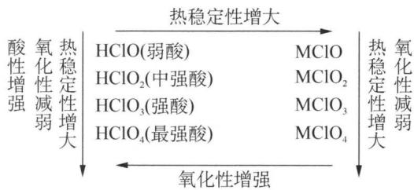

flowchart

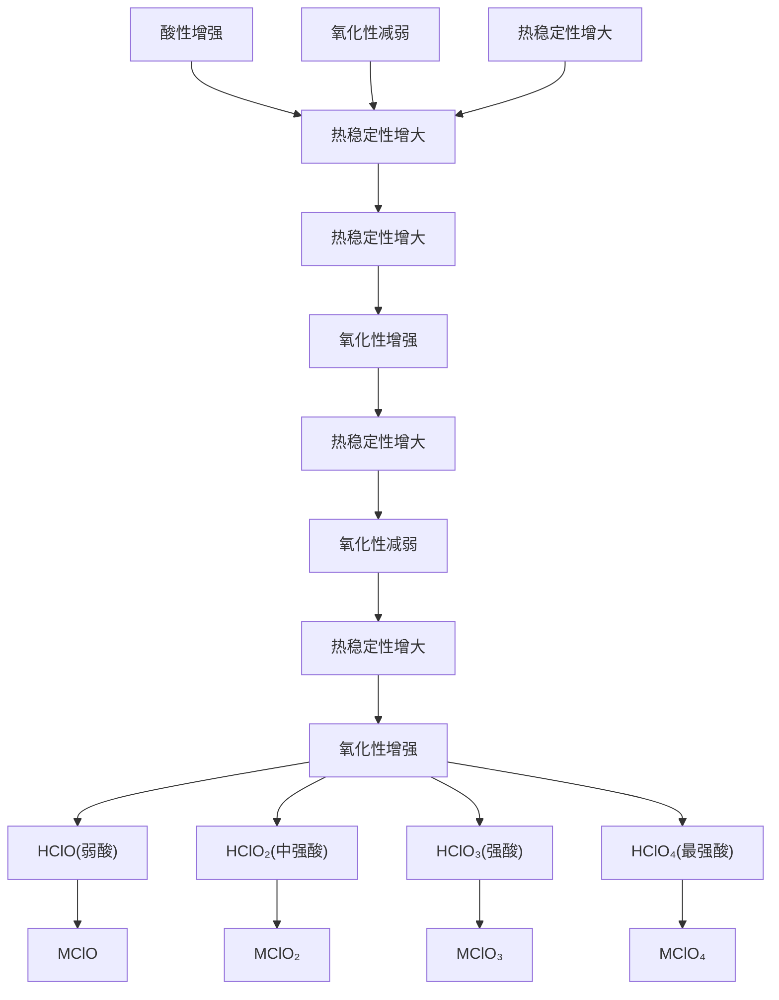

## 典型例题

【例 1】已知每次 $Ag^{+}$ 与 $Cl^{-}$ 反应生成的 AgCl 中有 10% 分解生成 Ag 和 $Cl_{2}$ ，又与水反应生成 HCl 和 $HClO_{3}$ ，其中生成的 $Cl^{-}$ 又与过量的 $Ag^{+}$ 反应生成 AgCl，这样循环往复直到最终，现有含 NaCl 为 1.1 mol 的食盐溶液与过量的 $AgNO_{3}$ 溶液反应。

(1) 最终能生成难溶物多少克?  
(2) 若最后溶液为 1.2 L, 则其溶液的 pH 是多少?

解析 （1）解法一：根据题意可知最终反应完成后，沉淀中应该有 Ag 和 AgCl，且物质的量之比为 1:9，可设生成 x mol Ag、9x mol AgCl，则由氯原子守恒知生成的 $HClO_{3}$ 为 $(1.1-9x)\mathrm{mol}$ 。

从得失电子角度看， $\mathrm{AgCl}\xrightarrow{+\mathrm{e}^{-}}\mathrm{Ag}$ ， $\mathrm{AgCl}\xrightarrow{-6\mathrm{e}^{-}}\mathrm{HClO}_{3}$

根据得失电子守恒有： $x \times 1 = (1.1 - 9x) \times 6$ ，解得 x = 0.12 mol。

难溶物的质量为 $143.5 \times 9 \times 0.12 + 108 \times 0.12 = 167.9 \, g$ 。

解法二：本题涉及三个化反应： $Ag^{+} + Cl^{-} = AgCl \downarrow$ ， $2AgCl = 2Ag + Cl_{2}\uparrow$ ， $3Cl_{2} + 3H_{2}O = 6H^{+} + ClO_{3}^{-} + 5Cl^{-}$ 。

若有 ① $60\mathrm{Ag}^{+} + 60\mathrm{Cl}^{-} = 60\mathrm{AgCl}$ , 则应有 ② $6\mathrm{AgCl} = 6\mathrm{Ag} + 3\mathrm{Cl}_{2}\uparrow$ , ③ $3\mathrm{Cl}_{2} + 3\mathrm{H}_{2}\mathrm{O} = \mathrm{ClO}_{3}^{-} + 5\mathrm{Cl}^{-} + 6\mathrm{H}^{+}$ , 消去循环量, 可运用总反应式求解, ① + ② + ③ 得:

$$
6 0 \mathrm{Ag} ^ {+} + 5 5 \mathrm{Cl} ^ {-} + 3 \mathrm{H} _ {2} \mathrm{O} = 5 4 \mathrm{AgCl} \downarrow + 6 \mathrm{Ag} \downarrow + \mathrm{ClO} _ {3} ^ {-} + 6 \mathrm{H} ^ {+} 。
$$

(2) 根据溶液中离子电荷消耗与生成数守恒有 $n(\mathrm{H}^{+}) = n(\mathrm{Ag}^{+}) = 0.12 \, \mathrm{mol}$ ， $c(\mathrm{H}^{+}) = 0.1 \, \mathrm{mol/L}$ ，pH = 1。

【例 2】（1992 年全国初赛）取 2.5 g KClO₃ 粉末置于冰水冷却的锥形瓶中，加入 5.0 g 研细的 I₂，再注入 3 cm³ 水，在 45 分钟内不断振荡，分批加入 9～10 cm³ 浓 HCl，直到 I₂ 完全消失为止（整个反应过程保持在 40℃以下，KClO₃、I₂ 几乎完全反应完）。将锥形瓶置于冰水中冷却，得到橙黄色的晶体 A。将少量 A 置于室温下的干燥的试管中，发现 A 有升华现象，用湿润的 KI-淀粉试纸在管口检测，试纸变蓝。接着把试管置于热水浴中，有黄绿色的气体生成，管内的固体逐渐变成红棕色液体。将少量 A 分别和 Na₂S₂O₃、H₂S 等溶液反应，均首先生成 I₂ 而后 I₂ 又消失。酸性的 KMnO₄ 可将 A 氧化，得到的反应产物是无色的溶液（无气体释放）。

(1) 写出 A 的化学式。

(2) 指出分子 A 中中心原子的杂化类型和分子构型。

(3) 写出上述制备 A 的配平的化学方程式。

(4) 写出 A 和 KI 反应的化学方程式。

(5) 分步写出 A 分别和 $Na_{2}S_{2}O_{3}$ 、 $H_{2}S$ 反应的方程式。

(6) 写出酸性 $KMnO_{4}$ 氧化 A 的反应方程式。

解析 （1）浓 HCl 的加入为反应提供酸性环境, 加强 $KClO_{3}$ 的氧化性, 并作酸的作用与 $K^{+}$ 形成 KCl。因此根据参加反应的 $KClO_{3}$ 和 $I_{2}$ 的物质的量为 1:1, 猜测 A 为 ICl 或 $ICl_{3}$ 。再根据“把试管置于热水浴中, 有黄绿色的气体生成, 管内的固体逐渐变成红棕色液体。”可以确定 A 为 $ICl_{3}$ 。

(2) 根据 VSEPR 理论可以得出中心原子 I 的价层电子对数为 5, 所以是 $\mathrm{sp}^{3} \mathrm{~d}$ 杂化。但配位原子只有 3 个 Cl, 所以有两对孤对电子对, 根据 VSEPR 理论可以得出这两对孤对电子对应该占据三角双锥平面上的两个伸展方向, 最后分子呈 T 型。

(3) 根据(1)的分析, 可以确定 $KClO_{3}$ 和 $I_{2}$ 的反应系数比应为 1:1, 反应过程中 HCl 作酸的作用, 由氧化还原方程式的配平方法可以得到: $KClO_{3} + I_{2} + 6HCl = 2ICl_{3} + KCl + 3H_{2}O$

(4) 根据题目信息, 应该生成 $I_{2}$ , 显然是由 $ICl_{3}$ 中 +3 的 I 氧化了 KI 中 -1 价的 $I^{-}$ , 由此可以得到方程式: $ICl_{3} + 3I^{-} = 2I_{2} + 3Cl^{-}$

(5) 根据题目信息可以得出 $ICl_{3}$ 中 +3 价的 I 先被还原为 $I_{2}$ ，之后由于 $Na_{2}S_{2}O_{3}$ 和 $Na_{2}S$ 过量，可以进一步将生成的 $I_{2}$ 还原为 $I^{-}$ ，由此可以写出方程式如下：

$2\mathrm{ICl}_{3} + 6\mathrm{Na}_{2}\mathrm{S}_{2}\mathrm{O}_{3} = \mathrm{I}_{2} + 3\mathrm{Na}_{2}\mathrm{S}_{4}\mathrm{O}_{6} + 6\mathrm{NaCl}$ （氧化产物写 $\mathrm{Na}_{2}\mathrm{SO}_{4}$ 也可）

$$
\mathrm{I} _ {2} + 2 \mathrm{Na} _ {2} \mathrm{S} _ {2} \mathrm{O} _ {3} = \mathrm{Na} _ {2} \mathrm{S} _ {4} \mathrm{O} _ {6} + 2 \mathrm{NaI}
$$

$$
2 \mathrm{ICl} _ {3} + 3 \mathrm{H} _ {2} \mathrm{S} = \mathrm{I} _ {2} + 3 \mathrm{S} \downarrow + 6 \mathrm{HCl}
$$

$$
\mathrm{I} _ {2} + \mathrm{H} _ {2} \mathrm{S} = 2 \mathrm{HI} + \mathrm{S} \downarrow
$$

(6) 题目信息中提到没有气体生成,说明 $Cl^{-}$ 没有被 $MnO_{4}^{-}$ 氧化,所以应该只有 +3 价的被氧化为 $IO_{3}^{-}$ ,由此可以写出反应方程式:

$$
5 \mathrm{ICl} _ {3} + 2 \mathrm{MnO} _ {4} ^ {-} + 7 \mathrm{H} _ {2} \mathrm{O} = 5 \mathrm{IO} _ {3} ^ {-} + 2 \mathrm{Mn} ^ {2 +} + 1 5 \mathrm{Cl} ^ {-} + 1 4 \mathrm{H} ^ {+}
$$

【例 3】某微绿色气体 A 是某常见酸的酸酐, 由短周期 2 种元素组成。若将标准状况下该气体 20.00 mL 溶入足量的 KI 溶液(假设反应完全进行), 再用 0.1000 mol/L 的 $Na_{2}S_{2}O_{3}$ 标准溶液滴定生成的 $I_{2}$ , 消耗 35.70 mL。该气体加热会爆炸性分解为 B 和 C, 将 B 溶于水可生成 D, A 溶于水也可得到 D, D 为弱酸性物质, 具有强氧化性。气体 A 在液态空气中与 $NH_{3}$ 反应生成一种常温下为固体的 E，一种常温下为气体的 F 和水。

(1) 请写出从 A\~F 的化学式。

(2) 某一气体单质通过 $Na_{2}CO_{3}$ 溶液可制备 A, 请写出化学方程式。

(3) 写出气体 A 在液态空气中与 $NH_{3}$ 反应的化学方程式。

解析 （1）由“微绿色气体 A 是某常见酸的酸酐”猜测可能是 $Cl_{2}O$ 或 $ClO_{2}$ ，根据 $Na_{2}S_{2}O_{3}$ 的用量可以计算得出 A 应该为 $Cl_{2}O$ 。由“A 溶于水可得到 D，D 为弱酸性物质，具有强氧化性”可以推出 D 是 HClO，其他可以逐一推出。A: $Cl_{2}O$ ，B: $Cl_{2}$ ，C: $O_{2}$ ，D: HClO。

(2) 单质制备 $Cl_{2}O$ ，则必须为 $Cl_{2}$ ，根据氧化还原有化合价升高的元素，必然有化合价降低的元素， $Na_{2}CO_{3}$ 溶液又是碱性环境，不难猜测应该是 $Cl_{2}$ 发生了歧化反应，所以反应方程式如下： $2Cl_{2} + Na_{2}CO_{3} = 2NaCl + Cl_{2}O + CO_{2}$ 。

(3) 由于 $Cl_{2}O$ 的强氧化性, 应考虑 $NH_{3}$ 中 -3 价的 N 被氧化为 $N_{2}$ , 即为气体 F, 而 $Cl_{2}$ 应该被还原为 -1 价, 显然应该推定固体 E 应该是离子晶体 $NH_{4}Cl$ , 于是得到反应方程式: $10NH_{3} + 3Cl_{2}O = 6NH_{4}Cl + 2N_{2} + 3H_{2}O$ 。

## 本讲习题

1. 研究表明,洋流中的氯离子浓度变化会对海洋生物的生态环境造成一定影响,而江河入海口处的氯离子浓度随着四季雨水量的变化发生改变。现取一定量长江入海口的水进行分析:向 50.00 mL 水样中加几滴 $K_{2}CrO_{4}$ 指示剂,用 16.16 mL 浓度为 0.00164 mol/L 的 $AgNO_{3}$ 溶液滴定,终点时形成明亮的砖红色沉淀。

已知： $K_{\mathrm{sp}}(\mathrm{AgCl}) = [\mathrm{Ag}^{+}][\mathrm{Cl}^{-}] = 1.78 \times 10^{-10} \quad K_{\mathrm{sp}}(\mathrm{Ag}_{2}\mathrm{CrO}_{4}) = [\mathrm{Ag}^{+}]^{2}[\mathrm{CrO}_{4}^{2-}] = 1.00 \times 10^{-12}$ 。

(1) 写出滴定终点颜色变化的配平的离子反应式。

(2) 样品中氯离子的摩尔浓度是多少?

(3) 在滴定终点, 铬酸根离子的浓度是 $0.020 \mathrm{~mol} / \mathrm{L}$ 。计算当砖红色沉淀出现时溶液中 $\mathrm{Cl}^{-}$ 的浓度。

(4) 为使滴定更有效, 被滴定溶液必须是中性或弱碱性。写出用来描述在酸性介质中所发生的竞争反应的配平的方程式(这个反应影响滴定终点的观察)。

2. 1951 年, 化学家首次在实验室中合成了一种无色的四面体分子气体 A。A 是由 KClO₃ 在 -40℃时与 F₂ 反应氟化而成的。

(1) 写出制备 A 的化学反应方程式。  
(2) 在 $300^{\circ} \mathrm{C}$ 时将 A 通入浓 $\mathrm{NaOH}$ 溶液中, 在高压下的密封管中发生非氧化还原反应。试写出该化学反应方程式。  
(3) A 能与足量的 $NH_{3}$ 发生非氧化还原反应,生成等物质的量的两种铵盐 B 和 C。试写出该化学反应方程式。  
(4) 在 B 的水溶液中, 加入过量的 NaOH 溶液, 可得盐 C。经研究表明, 盐 C 与 $\mathrm{K}_{2} \mathrm{SO}_{4}$ 类质同晶。试写出该化学反应方程式。  
(5) 在有机化学反应中, A 广泛用作温和的氟化剂。试写出 A 与苯基锂发生反应的化学方程式。

3. 把某卤素互化物 $XY_{n}(n$ 为奇数 $)5.20\ g$ 溶于水，再通入过量的 $SO_{2}$ ，当向生成的溶液中加入过量的 $\mathrm{Ba(NO_{3})_{2}}$ 溶液时，则生成 $10.5\ g$ 沉淀。除去沉淀后，将所得滤液再用过量的 $AgNO_{3}$ 处理，可生成沉淀 $15.0\ g$ ，试推断：

(1) 依题意在原化合物中不含什么元素?  
(2) 卤素互化物的组成如何?

4. 黄金的提取通常采用氰化—氧化法。

(1) 氰化法是向含氰化钠的矿粉(Au 粉)混合液中鼓入空气, 将金转移到溶液, 再用锌粉还原提取 Au。试写出反应过程的离子方程式, 计算两个反应的平衡常数。(已知: $\varphi^{\ominus}(\mathrm{Au}^{+}/\mathrm{Au}) = 1.68 \mathrm{~V}, \varphi^{\ominus}(\mathrm{O}_{2}/\mathrm{OH}^{-}) = 0.401 \mathrm{~V}, \varphi^{\ominus}(\mathrm{Zn}^{2+}/\mathrm{Zn}) = -0.70 \mathrm{~V}, K_{\text {稳}}(\mathrm{Au}(\mathrm{CN})_{2}^{-}) = 2.0 \times 10^{38}, K_{\text {稳}}(\mathrm{Zn}(\mathrm{OH})_{4}^{2-}) = 1.0 \times 10^{16}$ )  
(2) 为保护环境, 必须对含 $\mathrm{CN}^{-}$ 废水进行处理, 处理此类污水时, 可在催化剂 $\mathrm{TiO}_{2}$ 作用下用 $\mathrm{NaClO}$ 将 $\mathrm{CN}^{-}$ 氧化成 $\mathrm{CNO}^{-}$ 。 $\mathrm{CNO}^{-}$ 在酸性条件下继续被 $\mathrm{NaClO}$ 氧化生成 $\mathrm{N}_{2}$ 与 $\mathrm{CO}_{2}$ 。某环保部门用下图装置进行实验, 以证明该处理方法的有效性并测定 $\mathrm{CN}^{-}$ 被处理的百分率。

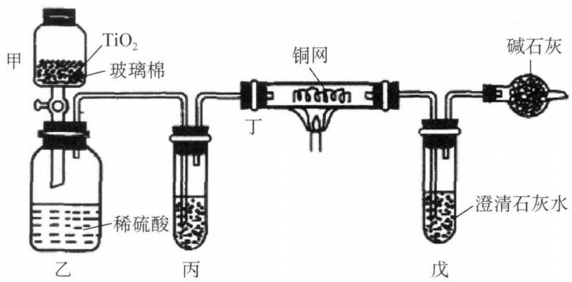

chemical

Chemical experiment setup diagram for sulfuric acid production and purification, showing gas collection, reaction tube, and drying apparatus

将浓缩后含 $CN^{-}$ 的废水与过量 NaClO 溶液的混合液（其中 $CN^{-}$ 浓度为 0.05 mol/L）200 mL 倒入甲中，塞上橡皮塞，一段时间后，打开活塞，使溶液全部放入乙中，关闭活塞。

① 甲中反应的离子方程式为；乙中反应的离子方程式为。

② 乙中生成的气体除 $CO_{2}$ 、 $N_{2}$ 外还有 HCl 及副反应生成的 $Cl_{2}$ 等, 上述实验是通过测定 $CO_{2}$ 的量来确定 $CN^{-}$ 的处理效果。

丙中加入的除杂试剂是\_\_\_\_（填标号）。

(A) 饱和食盐水

(B) 饱和 $NaHCO_{3}$ 溶液

(C) 浓 NaOH 溶液

(D)浓硫酸

丁在实验中的作用是\_\_\_\_。

戊中盛有足量的石灰水,若实验后戊中共生成 0.8 g 沉淀,则该实验中 CN $^{-}$ 被处理的百分率 \_\_\_\_ 80%(填“>”、“=”或“<”)。

5. 220 K 时在全氟代戊烷溶剂中, $Br_{2}$ 和 $O_{2}$ 反应得到固体 A, A 在 NaOH 水溶液中歧化为 NaBr 和 $NaBrO_{3}$ 。用过量 KI 和稀硫酸处理 A 生成 $I_{2}$ , 1 mol A 所产生的 $I_{2}$ 需 5 mol $Na_{2}S_{2}O_{3}$ 才能与其完全反应。(以下化学式均指最简式)

(1) 确定 A 的化学式, 写出 A 在 NaOH 溶液中歧化的化学方程式。  
(2) A 在全氟代戊烷中与 $F_{2}$ 反应得到无色晶体 B, B 含有 61.1% 的 Br, 确定 B 的化学式。  
(3) 将 B 微热, 每摩尔 B 放出 $1 \, mol \, O_{2}$ 和 $1/3 \, mol \, Br_{2}$ , 并留下 C, C 是一种黄色液体, 确定 C 的化学式。  
(4) 如果 C 跟水反应时物质的量之比为 3:5, 生成溴酸、氢氟酸、溴单质和氧气, 写出化学反应方程式; 若有 9 g 水被消耗时, 计算被还原 C 的物质的量。  
(5) 液态 C 能发生微弱的电离, 所得负、正离子的式量比约是 4:3, 写出电离反应方程式。  
(6) 指出分子 B、C 中中心原子的杂化类型和分子的构型。

6. (2001年全国初赛试题)据报道,在 $-55^{\circ}\mathrm{C}$ 令 $\mathrm{XeF}_{4}(\mathrm{A})$ 和 $\mathrm{C}_{6}\mathrm{F}_{5}\mathrm{BF}_{2}(\mathrm{B})$ 化合,得一离子化合物(C),测得 $\mathrm{Xe}$ 的质量分数为 $31\%$ ,负离子为四氟硼酸根离子,正离子结构中有B的苯环。C是首例有机氙(IV)化合物, $-20^{\circ}\mathrm{C}$ 以下稳定。C为强氟化剂和强氧化剂,如与碘反应得到五氟化碘,放出氙,同时得到B。

(1) 写出 C 的化学式, 正负离子应分开写。

(2) 根据什么结构特征把 C 归为有机氙化合物?

(3) 写出 C 的合成反应方程式。

(4) 写出 C 和碘的反应。  
(5) 画出五氟化碘分子的立体结构。

7. (1) 已知 $\mathrm{Cl}_{2}$ 分子的键能为 $242 \mathrm{~kJ} \cdot \mathrm{mol}^{-1}$ , 而 $\mathrm{Cl}$ 原子和 $\mathrm{Cl}_{2}$ 分子的第一电离能分别为 1250 和 $1085 \mathrm{~kJ} \cdot \mathrm{mol}^{-1}$ , 试计算 $\mathrm{Cl}_{2}^{+}$ 的键能, 写出计算过程。

(2) 已知 $\mathrm{HClO} \xrightarrow{()\mathrm{V}} \mathrm{Cl}_2 \xrightarrow{1.36\mathrm{V}} \mathrm{Cl}^-$ 和 $\mathrm{OCl}^-\xrightarrow{()\mathrm{V}} \mathrm{Cl}_2 \xrightarrow{1.36\mathrm{V}} \mathrm{Cl}^-$

① 将 0.40 和 1.63 两个数值填入上述空格,说明判断理由。

② 计算 $25^{\circ}C$ 氯气分压力为 101.3 kPa 时的氯水的 pH(已知: $nFE_{电池}=RT\ln K$ , n 为反应转移电子数, F=96500 C/mol, $E_{电池}=E_{(+)}-E_{(-)}$ , R=8.314 J/mol·K)。

## 第二讲 氧族元素

## 知识精讲

## 一、概述

氧族元素位于周期表第ⅥA族，价层电子构型 $ns^{2}np^{4}$ ，包括O、S、Se、Te、Po五种元素。在地球上的存在情况如下：

氧 O: 存在形式主要有 $O_{2}$ (大气圈)、 $H_{2}O$ (水圈)、 $SiO_{2}$ 及硅酸盐以及其他含氧化合物 (岩石圈)。

硫 S: 主要存在形式为天然单质硫矿; 硫化物矿, 如: 方铅矿 PbS, 闪锌矿 ZnS; 硫酸盐矿, 如: 石膏 $CaSO_{4} \cdot 2H_{2}O$ , 芒硝 $Na_{2}SO_{4} \cdot 10H_{2}O$ , 重晶石 $BaSO_{4}$ , 天青石 $SrSO_{4}$ 等。

硒 Se: 硒铅矿 PbSe, 硒铜矿 CuSe 等。

碲 Te: 碲铅矿 PbTe。

钋 Po: 放射性元素,本讲不作介绍。

氧族元素随原子序数的增加原子半径增大,电负性减小,从典型的非金属元素O和S过渡到准金属元素Se和Te, Po为金属元素。O与大多数金属元素形成离子型化合物(如 $Li_{2}O$ , MgO, $Na_{2}O$ , $Al_{2}O_{3}$ 等);而S, Se, Te只与电负性较小的金属元素形成离子型化合物(如 $Na_{2}S$ , BaS, $K_{2}Se$ 等),与大多数金属元素形成共价化合物(如CuS, HgS等)。O常见的氧化数是-2(除过氧化物和氟氧化物 $OF_{2}$ 外),S的氧化数有-2、+4、+6。其他元素常以正氧化态出现,氧化数有+2、+4、+6。从S到Te正氧化态的化合物的稳定性逐渐增强。

## 二、氧气 $\mathrm{O}_{2}$

## 1. 氧元素的存在

氧是地壳中含量最多的元素,质量分数约为 48.6%。氧以单质和化合物两种形式存在于自然界,游离态氧大量存在于大气中,在海洋及地球表面各种水中也溶解了相当多的氧,空气中 $O_{2}$ 的体积分数约为 21%。这些氧几乎都来自 $H_{2}O$ 和 $CO_{2}$ 在绿色植物中发生的光合作用。

$$
\mathrm{H} _ {2} \mathrm{O} + \mathrm{CO} _ {2} + h \nu \xrightarrow [ \text {酶} ]{\text {叶绿素}} \mathrm{O} _ {2} + \{\mathrm{CH} _ {2} \mathrm{O} \} (\text {碳水化合物})
$$

氧的化合物广泛分布于地壳岩石、矿物、土壤及水中。氧占大气质量的 23%，岩石质量的 46%，水质量的 85%。就目前所知，氧还是月球表面丰度最高的元素，占其质量的 44.6%。

氧在自然界有 $^{16}$ O、 $^{17}$ O、 $^{18}$ O三种稳定同位素，其中 $^{16}$ O的含量最高，占氧原子数的99.76%。 $^{18}$ O是一种稳定的同位素，可以通过水的分馏以重氧水的形式富集。 $^{18}$ O常作为示踪原子用于化学反应机理的研究。氧能形成氧气 $O_{2}$ 和臭氧 $O_{3}$ 两种单质，它们互为同素异形体。

## 2. 氧气的分子结构

O 原子的价电子构型为 $2s^{2}2p^{4}$ ，2 个 O 原子结合成 1 个 $O_{2}$ 分子，从价键理论的电子配对来看， $O_{2}$ 分子中应存在 O=O 双键。但从氧的分子光谱得知，它应有 2 个自旋平行的未成对电子。由分子轨道理论推断， $O_{2}$ 分子的结构简式应为：

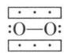

式中 $\cdots\cdots$ 表示由 3 个电子构成的 $\pi$ 键，称为 3 电子 $\pi$ 键。即 $O_{2}$ 分子中存在着 1 个 $\sigma$ 键和 2 个 3 电子 $\pi$ 键，每个 3 电子 $\pi$ 键中有 1 个未成对电子，2 个 3 电子 $\pi$ 键则有 2 个未成对电子，并且自旋方向相同，从而使 $O_{2}$ 表现出顺磁性。

## 3. 氧气的性质

常温下, 氧气为无色无味的气体, 液态氧为淡蓝色, 固态氧为蓝色。液态和固态氧有明显的顺磁性。 $O_{2}$ 是非极性分子, 不易溶于极性溶剂——水中, 在 273 K 时 $O_{2}$ 在水中的溶解度为 49.1 mL/L, 在 293 K 时为 30.8 mL/L。氧在水中的溶解

度小,存在一定量的水合氧气分子(如 $O_{2} \cdot H_{2}O$ : $\begin{array}{c} O \\ H \\ \cdots \\ O-O \end{array}$ 、 $O_{2} \cdot 2H_{2}O$ :

$\begin{array}{c} \mathrm{H} \\ | \\ \mathrm{O} \\ | \\ \mathrm{H} \\ | \\ \cdots \\ | \\ \mathrm{O}-\mathrm{O} \end{array} \quad \begin{array}{c} \mathrm{H} \\ | \\ \mathrm{O} \\ | \\ \mathrm{H} \\ | \\ \cdots \\ | \\ \mathrm{O}-\mathrm{O} \end{array} )$ ，是水生动植物赖以生存的基础。

氧的电负性(3.44)仅次于氟(3.98), 比氯(3.16)、溴(2.96)、碘(2.66)都大, 但事实上氧的化学性质却不如卤素活泼。最主要的原因在于 $\mathrm{O}_{2}$ 分子中除存在 $\sigma$ 键外, 还存在着 2 个 3 电子 $\pi$ 键。所以与氯不同, 氧能以单质形态存在于大气中。

氧的化学性质主要表现在它具有强的氧化性, 即在反应过程中能从别的单质或化合物中夺取电子。在常温下, 氧的化学性质不活泼, 仅能使一些还原性强的物质如 NO、 $SnCl_{2}$ 、KI、 $H_{2}SO_{3}$ 等氧化。在加热条件下, 除卤素、少数贵金属(如 Au 和 Pt)和稀有气体外, 氧几乎能与所有元素直接化合生成相应的化合物。氧还可氧化一些具有还原性的化合物, 如 $H_{2}S$ 、 $CH_{4}$ 、CO、 $NH_{3}$ 等能在氧中燃烧。如: $2Mg + O_{2} = 2MgO$ , $2H_{2}S + 3O_{2} = 2SO_{2} + 2H_{2}O$ , $4NH_{3} + 3O_{2} = 2N_{2} + 6H_{2}O$ 。

## 4. 氧气的用途

氧的用途广泛,主要用于助燃和呼吸,是人类赖以生存的最重要的一种元素。

在工业上,利用乙炔在氧气中燃烧产生的高温(2273 K 以上)熔化金属,达到焊接或切割金属的目的;可利用氧气代替空气,不但可加速化学反应,还可以降低能耗。用氧气冶炼钢铁、用富氧(空气中掺入一部分纯 $O_{2}$ )生产氮肥,都能取得较好的效果。

另外,利用液态氧、液态氢剧烈反应放出大量热的性质,可制成火箭燃料使航天器飞向太空。可利用木屑、煤粉浸泡在液氧中制成使用方便、成本低廉的“液态炸药”;氧在医疗中还常用于抢救缺氧或呼吸困难的危重病人。

## 5. 氧气的制备

实验室制备 $\mathrm{O}_{2}$ 常采用 $\mathrm{KClO}_{3}$ 或 $\mathrm{KMnO}_{4}$ 等含氧化合物的热分解法。

$$
2 \mathrm{KClO} _ {3} \xrightarrow [ \text {加热} ]{\mathrm{MnO} _ {2}} 2 \mathrm{KCl} + 3 \mathrm{O} _ {2} \uparrow , 2 \mathrm{KMnO} _ {4} \xrightarrow {\text {加热}} \mathrm{K} _ {2} \mathrm{MnO} _ {4} + \mathrm{MnO} _ {2} + \mathrm{O} _ {2} \uparrow
$$

氧气的工业制法常采用分馏液态空气或电解水的方法。分馏液态空气是工业上制取氧气最重要的方法。氧气的沸点(90 K)比氮气的沸点(77.2 K)高,因此当液态空气蒸发时,液相中氧的含量将增加,而气相中氮的含量将增加。若使用工艺精密的分馏柱,可得到高纯度的氮气和氧气。

电解法制氧气一般是以 Fe 或 Ni 作为电极来电解质量分数为 20% 的 NaOH 溶液。在阳极得到氧气，阴极得到氢气：阳极： $4OH^{-}=2H_{2}O+O_{2}\uparrow+4e^{-}$ ，阴极： $4H^{+}+4e^{-}=2H_{2}\uparrow$ 。

电解法制取氧气,实质上是电解水。由于纯水电导率差,电解时需要加入不改变电极反应的电解质。但由于酸性溶液对设备的腐蚀比碱性溶液更严重,因此一般采用 NaOH 溶液来制取纯的氧气和氢气。

## 三、臭氧 $\mathrm{O}_3$

## 1. 物理性质

在一般状况下， $O_{3}$ 是有特殊鱼腥臭味的淡蓝色气体， $O_{3}$ 在稀薄状态下并不臭，闻起来有清新爽快之感。人们一般都有这种体验，雷雨过后或在松树林里散步，令人呼吸舒畅，沁人心脾，就是因为有少量 $O_{3}$ 存在的缘故。

$O_{3}$ 比 $O_{2}$ 易液化，在 161 K 时凝聚成深蓝紫色液体，在 81 K 时，液态臭氧凝聚成黑色晶体。由于 $O_{3}$ 的色散力大于 $O_{2}$ ，所以其沸点高于 $O_{2}$ 。 $O_{3}$ 是极性分子，根据相似相溶原理，可以预测 $O_{3}$ 在水中的溶解度比 $O_{2}$ 的大。实验测定结果证实了这一点，273 K 时 $O_{3}$ 在水中的溶解度为 494 ml/L。

## 2. 分子结构

$\mathrm{O_3}$ 的分子结构如右图所示。在 $\mathrm{O_3}$ 分子中，中心的O原子以 $\mathrm{sp^2}$ 杂化与两旁的配位O原子键合生成2个 $\sigma$ 键，使 $\mathrm{O_3}$ 分子呈折线形，键角 $117^{\circ}$ 。在3个O原子之间还存在1个三中心四电子的离域大 $\Pi_3^4$ 键。 $\mathrm{O_3}$ 是唯一的极性单质分子。

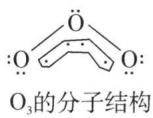

## 3. 化学性质

不稳定性和强氧化性是 $O_{3}$ 的特征化学性质。 $O_{3}$ 的稳定性不如 $O_{2}$ ， $O_{3}$ 在常温下就可分解： $2\mathrm{O}_{3}(\mathrm{~g})=3\mathrm{O}_{2}(\mathrm{~g});\Delta_{\mathrm{r}}H_{\mathrm{m}}^{\ominus}=-285.4\mathrm{kJ}\cdot\mathrm{mol}^{-1}$ 。 $O_{3}$ 分解是一个放热反应，说明 $O_{3}$ 比 $O_{2}$ 具有更大的化学活性。若无催化剂或紫外线照射， $O_{3}$ 分解很慢。

$O_{3}$ 的化学性质比氧活泼, 即 $O_{3}$ 比 $O_{2}$ 具有更强的氧化能力, 这可从它们的标准电极电势的数据看出。

酸性溶液 $O_{2} + 4H^{+} + 4e^{-} \rightleftharpoons 2H_{2}O;$ $\varphi^{\ominus} = +1.229 V$

$$
\mathrm{O} _ {3} + 2 \mathrm{H} ^ {+} + 2 \mathrm{e} ^ {-} \rightleftharpoons \mathrm{O} _ {2} + \mathrm{H} _ {2} \mathrm{O}; \quad \varphi^ {\ominus} = + 2. 0 7 \mathrm{V}
$$

碱性溶液 $O_{2} + 2H_{2}O + 4e^{-} \rightleftharpoons 4OH^{-}$ ; $\varphi^{\ominus} = +0.401 V$

$$
\mathrm{O} _ {3} + \mathrm{H} _ {2} \mathrm{O} + 2 \mathrm{e} ^ {-} \rightleftharpoons \mathrm{O} _ {2} + 2 \mathrm{OH} ^ {-}; \quad \varphi^ {\ominus} = + 1. 2 4 \mathrm{V}
$$

可见,无论在酸性还是碱性溶液中, $O_{3}$ 都是比 $O_{2}$ 强得多的氧化剂。 $O_{3}$ 能氧化一些只具有弱还原性的单质或化合物,并且有时可把某些元素氧化到不稳定的高价状态。例如: $PbS+4O_{3}=PbSO_{4}+4O_{2}$ 、 $2Ag+2O_{3}=Ag_{2}O_{2}+2O_{2}$ 、 $O_{3}+XeO_{3}+2H_{2}O=H_{4}XeO_{6}+O_{2}$ 。 $O_{3}$ 是极强的氧化剂,煤气、松节油等在 $O_{3}$ 中能自燃,许多有机色素能被 $O_{3}$ 氧化,使发色基团遭到破坏而变为无色物质。在室温下, $O_{3}$ 能氧化许多不十分活泼的单质(如 S、Hg、Ag 等),而 $O_{2}$ 则不能: $S+$

$3O_{3} + H_{2}O = H_{2}SO_{4} + 3O_{2}$ 。 $O_{3}$ 还能迅速且定量地氧化 $I^{-}$ 成 $I_{2}$ ，此反应被用来鉴定 $O_{3}$ 和测定 $O_{3}$ 的含量： $O_{3} + 2I^{-} + H_{2}O = I_{2} + O_{2} + 2OH^{-}$ 。碘遇淀粉呈蓝色，因此浸过 KI 的淀粉试纸可用来检验臭氧的存在。 $O_{3}$ 还能将 $CN^{-}$ 氧化成 $CO_{2}$ 和 $N_{2}$ ，因此常被用来处理电镀工业中的含氰废水。

氧和臭氧可彼此互相转变。自 $O_{3}$ 转变为 $O_{2}$ 易于进行；由 $O_{2}$ 转变为 $O_{3}$ ，则需要在一定条件下吸收能量才能实现： $3\mathrm{O}_{2}(\mathrm{~g}) \rightleftharpoons 2\mathrm{O}_{3}(\mathrm{~g})$ ; $\Delta_{r}H_{m}^{\ominus} = -285.4\mathrm{kJ}\cdot\mathrm{mol}^{-1}$ 。

## 4. 臭氧的存在及用途

雷击、高压或在电焊时，空气中的部分氧气会被转变成臭氧。在电动机和复印机旁边也可闻到臭氧的特殊腥味。在有些物质如潮湿的磷、松节油、树脂等被空气氧化的过程中也同时伴生臭氧。

实验室利用臭氧发生器对 $O_{2}$ 无声放电制取 $O_{3}$ 。从臭氧发生器出来的气体中约含 3%\~10% 的 $O_{3}$ ，利用 $O_{2}$ 和 $O_{3}$ 沸点相差大的特点，通过分级液化的方法可制取更纯净、浓度较高的 $O_{3}$ 。

在离地面 20～40 km 处的大气平流层中的臭氧层(浓度为 0.2 ppm)对于生命极其重要,它保护着地球表面生物免受过量的紫外线辐射。否则,农业减产、食物链断裂等种种可预见的灾难将向人类袭来。

臭氧层中的 $O_{3}$ 主要是由太阳的紫外辐射引发 $O_{2}$ 分子离解成 O 原子，O 原子与 $O_{2}$ 分子作用生成的：

$$
\begin{array}{l} \mathrm{O} _ {2} \stackrel {h \nu} {=} 2 \mathrm{O} \\ \mathrm{O} _ {2} + \mathrm{O} = \mathrm{O} _ {3} \\ \end{array}
$$

生成的 $O_{3}$ 在紫外辐射的作用下又能重新分解为 O 和 $O_{2}$ ，从而保证了 $O_{3}$ 在臭氧层中的平衡，也避免了过多的太阳紫外线到达地球表面对地球生物造成伤害：

$$
\mathrm{O} _ {3} \stackrel {h \nu} {=} \mathrm{O} _ {2} + \mathrm{O}
$$

已经发现南极和北极上空的臭氧层先后出现空洞。研究表明,能使臭氧层遭到破坏的污染物很多,主要是还原性气体污染物,如 NO、 $NO_{2}$ 、CO、 $SO_{2}$ 、 $H_{2}S$ 、 $CCl_{2}F_{2}$ 等,其中 $NO_{2}$ 和 $CCl_{2}F_{2}$ 被公认为危害最大的臭氧消耗剂。 $NO_{2}$ 可引发 $O_{3}$ 分解反应的发生,而本身只作为催化剂。

氟利昂 $CCl_{2}F_{2}$ 是一类含氟有机物, 化学性质稳定, 易挥发, 不溶于水, 曾被广泛应用于制冷系统、发泡剂、洗净剂、杀虫剂等。由于对大气的臭氧层有破坏作用, 氟利昂逐步被淘汰。氟利昂进入大气层后受紫外线辐射而分解产生 Cl 原子, Cl 能

反复起分解 $\mathrm{O}_3$ 的作用。

$O_{3}$ 最主要的用途是其强氧化性，且具有其还原产物不导致二次污染的优点，广泛应用于杀菌、消毒、漂白、脱色、除臭、净化等。例如用 $O_{3}$ 代替 $Cl_{2}$ 对饮水进行消毒，杀菌效果好，还不会带入异味； $O_{3}$ 还常用作棉麻、纸浆、面粉、油脂等的漂白剂； $O_{3}$ 能使有毒的酚类、氰化物等变为无毒物质； $O_{3}$ 也常用于某些废水、废气的净化；在化工生产中，若用臭氧氧化代替催化氧化和高温氧化，能简化工艺流程，提高产率。

## 四、过氧化氢 $H_{2}O_{2}$

过氧化氢 $H_{2}O_{2}$ ，俗称双氧水，在自然界很少见到，仅以微量存在于雨雪和某些植物的汁液中。市售试剂有质量分数为 30% 和 3% $H_{2}O_{2}$ 溶液两种规格。用于消毒的为 3% $H_{2}O_{2}$ 溶液。

## 1. 分子结构

$H_{2}O_{2}$ 的结构如右图所示, 中间部分的“—O—O—”称为过氧键。价键理论认为每个 O 原子采取不等性的 $sp^{3}$ 杂化, 2 个 O 原子间借助 $sp^{3}-sp^{3}$ 杂化轨道重叠形成 O—O σ 键, 每个 O 原子与 H 原子借助 $sp^{3}-s$ 轨道重叠形成 O—H σ 键, 每个 O 原子还有 2

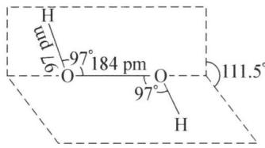

chemical

Molecular geometry diagram showing bond angles and distances between oxygen and hydrogen atoms

个孤电子对。2个H原子和O原子并非在同一个平面上，过氧键在相当于书本的书脊位置上，而2个H原子在半展开的两页纸面位置上。 $\mathrm{H}_{2} \mathrm{O}_{2}$ 是极性分子，极性比 $\mathrm{H}_{2} \mathrm{O}$ 大。

## 2. 物理性质

纯净的 $H_{2}O_{2}$ 为淡蓝色黏稠液体，熔点为 272 K，沸点为 423 K。能与 $H_{2}O$ 以任意比例互溶。 $H_{2}O_{2}$ 分子间存在着氢键而有缔合作用，其缔合程度大于水，所以其介电常数和沸点都比水高。

## 3. 化学性质

$H_{2}O_{2}$ 的化学性质主要表现在热稳定性差、呈弱酸性、具有氧化性和还原性三方面。

(1) 热稳定性差: 由于过氧键—O—O—的键能较小, 因而 $\mathrm{H}_{2} \mathrm{O}_{2}$ 较不稳定, 在一定条件下能发生分解: $2 \mathrm{H}_{2} \mathrm{O}_{2} (\mathrm{l}) = 2 \mathrm{H}_{2} \mathrm{O} (\mathrm{l}) + \mathrm{O}_{2} (\mathrm{~g})$ ; $\Delta_{\mathrm{r}} H_{\mathrm{m}}^{\ominus} = -196 \mathrm{~kJ} \cdot \mathrm{mol}^{-1}$ 。

事实上,纯 $H_{2}O_{2}$ 相当稳定,质量分数为 90% 的 $H_{2}O_{2}$ 在 323 K 时每小时仅分解 0.001%。加热(426 K 以上)、光照(波长 320 nm～380 nm)、碱性介质或在一些重金属离子(如 $Fe^{2+}$ 、 $Mn^{2+}$ 、 $Cu^{2+}$ 、 $Cr^{3+}$ 等)的作用下都能使 $H_{2}O_{2}$ 的分解速度加快。为了防止 $H_{2}O_{2}$ 的分解，除常将 $H_{2}O_{2}$ 装入棕色瓶中并放于阴凉处外，还常常加入一些稳定剂，如微量的锡酸钠 $Na_{2}SnO_{3}$ 、焦磷酸钠 $Na_{4}P_{2}O_{7}$ 、8-羟基喹啉等。

$H_{2}O_{2}$ 的不稳定性对储存和运输是不利的,但作为试剂特别是作氧化剂时,多余的可分解,不引进杂质又是有利的。

(2) 弱酸性: $\mathrm{H}_{2} \mathrm{O}_{2}$ 是极弱的二元酸:

$$
\mathrm{H} _ {2} \mathrm{O} _ {2} \rightleftharpoons \mathrm{H} ^ {+} + \mathrm{HO} _ {2} ^ {-}; K _ {1} = 2. 4 \times 1 0 ^ {- 1 2} (2 9 8 \mathrm{K})
$$

$$
\mathrm{HO} _ {2} ^ {-} \rightleftharpoons \mathrm{H} ^ {+} + \mathrm{O} _ {2} ^ {2 -}; K _ {2} = 1. 0 \times 1 0 ^ {- 2 5} (2 9 8 \mathrm{K})
$$

其酸强度比 HCN 弱,不能使石蕊溶液变红,可与碱发生中和反应生成特殊的盐:

$$
\mathrm{H} _ {2} \mathrm{O} _ {2} + \mathrm{Ca(OH)} _ {2} = \mathrm{CaO} _ {2} + 2 \mathrm{H} _ {2} \mathrm{O}
$$

$$
\mathrm{H} _ {2} \mathrm{O} _ {2} + \mathrm{Ba(OH)} _ {2} = \mathrm{BaO} _ {2} + 2 \mathrm{H} _ {2} \mathrm{O}
$$

在工业上,常利用上述两个反应制取 $CaO_{2}$ 和 $BaO_{2}$ 。

## (3) 具有氧化性和还原性

$H_{2}O_{2}$ 分子中，O 的氧化数为 -1，介于 0 和 -2 之间，因此 $H_{2}O_{2}$ 既具有氧化性又具有还原性，且其还原产物和氧化产物分别为 $H_{2}O$ （或 $OH^{-}$ ）和 $O_{2}$ ，不会带入杂质，是一种理想的氧化剂或还原剂。氧的元素电势图如下：

$$
\varphi_ {\mathrm{A}} ^ {\ominus} / \mathrm{V}: \mathrm{O} _ {2} \xrightarrow {0 . 6 8 2} \mathrm{H} _ {2} \mathrm{O} _ {2} \xrightarrow {1 . 7 7 6} \mathrm{H} _ {2} \mathrm{O}
$$

$$
\varphi_ {\mathrm{B}} ^ {\ominus} / \mathrm{V}: \mathrm{O} _ {2} \xrightarrow {- 0 . 0 7 6} \mathrm{HO} _ {2} ^ {-} \xrightarrow {0 . 8 7} \mathrm{OH} ^ {-}
$$

从氧元素电势图看,不管酸性还是碱性介质,都是 $\varphi_{右}^{\ominus}>\varphi_{左}^{\ominus}$ ,故 $H_{2}O_{2}$ 发生歧化反应的趋势很大。但由于歧化反应速率很小,事实上,温度不高时,浓度很大的 $H_{2}O_{2}$ 甚至纯的 $H_{2}O_{2}$ 都能稳定存在。

值得注意的是，在酸性介质中， $\varphi_{\mathrm{A}}^{\ominus}(\mathrm{H}_{2}\mathrm{O}_{2}/\mathrm{H}_{2}\mathrm{O}) = +1.776\mathrm{V}$ ， $\mathrm{H}_{2}\mathrm{O}_{2}$ 应该为很强的氧化剂，它甚至可以氧化 $\mathrm{Mn}^{2+}$ 为 $\mathrm{MnO}_{2}$ 或 $\mathrm{MnO}_{4}^{-}$ ，但实际上不能。这是因为： $\mathrm{H}_{2}\mathrm{O}_{2} + \mathrm{Mn}^{2+} = \mathrm{MnO}_{2} + 2\mathrm{H}^{+}$ ，由于 $\varphi_{\mathrm{A}}^{\ominus}(\mathrm{MnO}_{2}/\mathrm{Mn}^{2+}) = +1.23\mathrm{V}$ ， $\varphi_{\mathrm{A}}^{\ominus}(\mathrm{O}_{2}/\mathrm{H}_{2}\mathrm{O}_{2}) = +0.682\mathrm{V}$ ，生成的 $\mathrm{MnO}_{2}$ 又将 $\mathrm{H}_{2}\mathrm{O}_{2}$ 氧化为 $\mathrm{O}_{2}: \mathrm{MnO}_{2} + \mathrm{H}_{2}\mathrm{O}_{2} + 2\mathrm{H}^{+} = \mathrm{Mn}^{2+} + \mathrm{O}_{2} \uparrow + 2\mathrm{H}_{2}\mathrm{O}$ ，反应中 Mn 元素先被氧化后又被还原，使其在 $\mathrm{Mn}^{2+}$ 和 $\mathrm{MnO}_{2}$ 两种形态间交替变换，且保持反应前后形态不变，故反应中的 $\mathrm{Mn}^{2+}$ 或 $\mathrm{MnO}_{2}$ 实际上起着催化剂的作用，催化 $\mathrm{H}_{2}\mathrm{O}_{2}$ 歧化反应：

$$
2 \mathrm{H} _ {2} \mathrm{O} _ {2} \xlongequal {\mathrm{MnO} _ {2}} 2 \mathrm{H} _ {2} \mathrm{O} + \mathrm{O} _ {2} \uparrow
$$

事实上，在酸性介质中， $\varphi_{\mathrm{A}}^{\ominus}$ 介于 $+1.776 \mathrm{~V}$ 和 $+0.682 \mathrm{~V}$ 之间的电对，如 $\mathrm{MnO}_{4}^{-} / \mathrm{MnO}_{2}$ 、 $\mathrm{Cr}_{2} \mathrm{O}_{7}^{2-} / \mathrm{Cr}^{3+}$ 、 $\mathrm{PbO}_{2} / \mathrm{Pb}^{2+}$ 、 $\mathrm{Hg}^{2+} / \mathrm{Hg}_{2}^{2+}$ 、 $\mathrm{Fe}^{3+} / \mathrm{Fe}^{2+}$ 、 $\mathrm{Cl}_{2} / \mathrm{Cl}^{-}$ 、 $\mathrm{Br}_{2} / \mathrm{Br}^{-}$ 等的还原态大多数都可以作为 $\mathrm{H}_{2} \mathrm{O}_{2}$ 发生歧化反应的有效催化剂，因此通常不把 $\mathrm{H}_{2} \mathrm{O}_{2}$ 看成为强氧化剂。

对于那些 $\varphi_{A}^{\ominus}<+0.682\ V$ 的电对的还原态与 $H_{2}O_{2}$ 发生的氧化还原反应还是容易进行的。例如： $H_{2}O_{2}+2I^{-}+2H^{+}=I_{2}+2H_{2}O$ 、 $H_{2}O_{2}+2Fe^{2+}+4OH^{-}=2Fe(OH)_{3}\downarrow$ 。

油画或壁画的染料中含 Pb，长期与空气中的 $H_{2}S$ 作用生成黑色 PbS 而变暗，用 $H_{2}O_{2}$ 涂刷能使黑色的 PbS 氧化成白色的 $PbSO_{4}$ ，因此 $H_{2}O_{2}$ 常被用于修复早期的壁画和油画。反应为： $4H_{2}O_{2} + PbS = PbSO_{4} + 4H_{2}O$ 。

$H_{2}O_{2}$ 的还原性相对较弱, 只有遇到比它更强的氧化剂时才表现出来。例如:

$$
\mathrm{H} _ {2} \mathrm{O} _ {2} + \mathrm{Cl} _ {2} = 2 \mathrm{HCl} + \mathrm{O} _ {2} \tag {①}
$$

$$
\mathrm{H} _ {2} \mathrm{O} _ {2} + \mathrm{MnO} _ {2} + 2 \mathrm{H} ^ {+} = \mathrm{Mn} ^ {2 +} + \mathrm{O} _ {2} \uparrow + 2 \mathrm{H} _ {2} \mathrm{O} \tag {②}
$$

$$
5 \mathrm{H} _ {2} \mathrm{O} _ {2} + 2 \mathrm{MnO} _ {4} ^ {-} + 6 \mathrm{H} ^ {+} = 2 \mathrm{Mn} ^ {2 +} + 5 \mathrm{O} _ {2} \uparrow + 8 \mathrm{H} _ {2} \mathrm{O} \tag {③}
$$

上述反应①常用于除去残留氯, 反应②用于清洗粘附有 $MnO_{2}$ 污迹的器皿, 反应③可用于测定 $H_{2}O_{2}$ 的含量。

## (4) 过氧键的转移

向重铬酸钾 $K_{2}Cr_{2}O_{7}$ 的酸性溶液中加入有机溶剂(乙醚)，再加入少量 $H_{2}O_{2}$ ，振荡，有机层中有 $CrO_{5}$ 生成，显蓝色 $\left[\mathrm{CrO}_{5}\cdot\left(\mathrm{C}_{2}\mathrm{H}_{5}\right)_{2}\mathrm{O}\right]$ ：

$$
\mathrm{Cr} _ {2} \mathrm{O} _ {7} ^ {2 -} + 4 \mathrm{H} _ {2} \mathrm{O} _ {2} + 2 \mathrm{H} ^ {+} = 2 \mathrm{CrO} _ {5} + 5 \mathrm{H} _ {2} \mathrm{O}
$$

其中 $\mathrm{CrO}_{5}(\bigcirc\mathrm{Cr}\bigcirc\mathrm{O})$ 的结构中存在 2 个过氧键，可用于检验过氧键的存在。久置后，由于 $CrO_{5}$ 不稳定，发生氧化还原反应： $4CrO_{5} + 12H^{+} = 4Cr^{3+} + 6H_{2}O + 7O_{2}\uparrow$ 。

## 4. 制备方法

实验室中制备少量 $H_{2}O_{2}$ 常利用复分解法。如：

$$
\mathrm{Na} _ {2} \mathrm{O} _ {2} + \mathrm{H} _ {2} \mathrm{SO} _ {4} + 1 0 \mathrm{H} _ {2} \mathrm{O} \stackrel {\text {低温}} {=} \mathrm{Na} _ {2} \mathrm{SO} _ {4} \cdot 1 0 \mathrm{H} _ {2} \mathrm{O} + \mathrm{H} _ {2} \mathrm{O} _ {2}
$$

$$
\mathrm{BaO} _ {2} + \mathrm{H} _ {2} \mathrm{SO} _ {4} = \mathrm{BaSO} _ {4} \downarrow + \mathrm{H} _ {2} \mathrm{O} _ {2}
$$

工业上制备 $H_{2}O_{2}$ ，过去采用电解法，由于能耗大成本高，现已被乙基蒽醌法逐渐取代。

(1) 电解—水解法: 以石墨(或铅)作为阴极, 铂(或钽)作为阳极, 电解 $\mathrm{NH}_{4} \mathrm{HSO}_{4}$ (或 $\mathrm{KHSO}_{4}$ ) 溶液, 两极分别发生反应:

阳极： $2\mathrm{HSO}_4^-$ $\mathrm{S}_2\mathrm{O}_8^{2 - } + 2\mathrm{H}^+ +2\mathrm{e}^-$

阴极： $2H^{+}+2e^{-}=H_{2}\uparrow$

然后加入适量 $H_{2}SO_{4}$ 以水解过二硫酸铵，即得到 $H_{2}O_{2}$ 溶液。

$$
\left(\mathrm{NH} _ {4}\right) _ {2} \mathrm{S} _ {2} \mathrm{O} _ {8} + 2 \mathrm{H} _ {2} \mathrm{SO} _ {4} = \mathrm{H} _ {2} \mathrm{S} _ {2} \mathrm{O} _ {8} + 2 \mathrm{NH} _ {4} \mathrm{HSO} _ {4}
$$

$$
\mathrm{H} _ {2} \mathrm{S} _ {2} \mathrm{O} _ {8} + 2 \mathrm{H} _ {2} \mathrm{O} = 2 \mathrm{H} _ {2} \mathrm{SO} _ {4} + \mathrm{H} _ {2} \mathrm{O} _ {2}
$$

上述两式相加得总反应式: $\left(\mathrm{NH}_{4}\right)_{2} \mathrm{~S}_{2} \mathrm{O}_{8} + 2 \mathrm{H}_{2} \mathrm{O} = 2 \mathrm{NH}_{4} \mathrm{HSO}_{4} + \mathrm{H}_{2} \mathrm{O}_{2}$ , 生成的 $\mathrm{NH}_{4} \mathrm{HSO}_{4}$ 可循环使用。

电解法制取 $H_{2}O_{2}$ ，因其原料易得、设备比较简单、投资较少，有些需要量不大的地区现仍在采用。

(2) 乙基蒽醌法: 在钯或镍催化剂的作用下, 将乙基蒽醌用 $\mathrm{H}_{2}$ 氢化, 再经空气或 $\mathrm{O}_{2}$ 氧化即得, 其反应过程为:

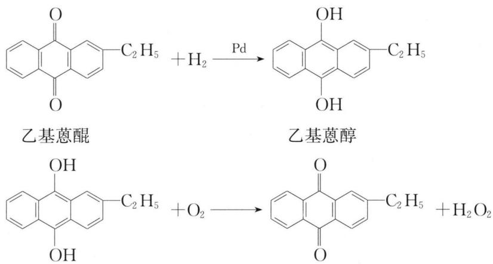

chemical

Chemical reaction equations showing oxidation of anthracene to benzoic acid via palladium catalyst, with hydrogenation steps

乙基蒽醌法与电解法相比,优点主要有: 能耗低;蒸气和水的消耗量较少;可利用空气中的氧作为原料;乙基蒽醌可重复使用。所以这种方法在工业上已被广泛采用。

## 5. 用途

$H_{2}O_{2}$ 是重要的化工原料和化学试剂, 其主要用途是利用它的氧化性。在医疗上用 $3\% H_{2}O_{2}$ 作为消毒剂; 在纺织工业中用于漂白不宜用 $Cl_{2}$ 漂白的物质, 还用作脱氯剂；用 $H_{2}O_{2}$ 制备过碳酸盐或过硼酸盐用作消毒水；在精细化工生产中，由于 $H_{2}O_{2}$ 无论作氧化剂还是还原剂都不会引入新杂质而被广泛应用；纯 $H_{2}O_{2}$ 曾被用作火箭燃料。

$H_{2}O_{2}$ 浓溶液和蒸气对人体都有较强的刺激作用和烧蚀性。30% $H_{2}O_{2}$ 溶液如与皮肤接触，有灼热刺痛感，且会使皮肤变白。人体若接触浓的 $H_{2}O_{2}$ ，应立即用大量的水冲洗。 $H_{2}O_{2}$ 蒸气对眼睛粘膜有强烈的刺激作用，使用时要特别小心。

## 五、氧化物

氧化物是指氧与其他元素(F除外)形成的二元化合物。除了一些较轻的稀有气体(He、Ne、Ar)外,其他所有元素都能直接或间接与氧生成二元氧化物,而且大多数元素可以形成多种氧化物。所以,氧化物的数量和种类较多。

## 1. 氧化物的键型与晶体类型

按化学键类型,氧化物可分为离子型、共价型和介于二者之间的过渡型氧化物。活泼金属氧化物(如 $Na_{2}O$ 、CaO、 $Al_{2}O_{3}$ 等)属于离子型化合物,非金属氧化物都属于共价型化合物,准金属氧化物(如 $Sb_{2}O_{3}$ 等)也具有共价性, $Fe_{2}O_{3}$ 和 ZnO 属于过渡型氧化物。氧化物的键型和晶体类型的关系如表 2-1 所示。

表 2-1 氧化物的键型和晶体类型

<table><tr><td>键型</td><td>晶体类型</td><td>举例</td></tr><tr><td>离子键</td><td>离子晶体</td><td> $Na_{2}O$ 、 $K_{2}O$ 、MgO、CaO、 $Al_{2}O_{3}$ </td></tr><tr><td rowspan="4">共价键</td><td>分子晶体</td><td> $CO$ 、 $CO_{2}$ 、 $N_{2}O$ 、 $N_{2}O_{3}$ 、 $NO_{2}$ 、 $N_{2}O_{4}$ 、 $N_{2}O_{5}$ 、 $P_{4}O_{6}$ 、 $P_{4}O_{10}$ 、 $SO_{2}$ 、 $SO_{3}$ 、 $(SO_{3})_{3}$ 、 $Cl_{2}O$ 、 $Cl_{2}O_{7}$ 、 $As_{4}O_{6}$ </td></tr><tr><td>共价晶体</td><td> $SiO_{2}$ </td></tr><tr><td>链状晶体</td><td> $SeO_{2}$ 、 $Sb_{2}O_{3}$ 、 $(SO_{3})_{n}$ </td></tr><tr><td>层状晶体</td><td> $B_{2}O_{3}$ 、 $As_{2}O_{3}$ </td></tr></table>

## 2. 氧化物的种类

氧化物按其酸碱性一般可分为酸性、碱性、两性、不成盐和其他复杂氧化物5类。

（1）酸性氧化物：溶于水生成酸，或与碱反应生成盐和水的氧化物。如 $B_{2}O_{3}$ 、 $CO_{2}$ 、 $SiO_{2}$ 、 $N_{2}O_{3}$ 、 $N_{2}O_{5}$ 、 $P_{4}O_{6}$ 、 $P_{4}O_{10}$ 、 $SO_{2}$ 、 $SO_{3}$ 、 $CrO_{3}$ 、 $MoO_{3}$ 、 $WO_{3}$ 、 $Cl_{2}O$ 、 $Cl_{2}O_{7}$ 、 $I_{2}O_{5}$ 、 $I_{2}O_{7}$ 、 $MnO_{3}$ 、 $Mn_{2}O_{7}$ 等。如： $P_{4}O_{10} + 6H_{2}O = 4H^{+} + 4H_{2}PO_{4}^{-}$ ， $SiO_{2} + 2OH^{-} = SiO_{3}^{2-} + H_{2}O$ 。

(2) 碱性氧化物: 溶于水生成碱, 或与酸反应生成盐和水的氧化物, 一般是活泼金属或氧化数较低的过渡金属氧化物。除碱金属、碱土金属(铍除外)氧化物外,其他常见的还有 $\mathrm{Hg}_{2} \mathrm{O}$ 、 $\mathrm{HgO}$ 、 $\mathrm{MnO}$ 、 $\mathrm{FeO}$ 、 $\mathrm{CoO}$ 、 $\mathrm{NiO}$ 、 $\mathrm{Fe}_{2} \mathrm{O}_{3}$ 等。如: $\mathrm{BaO} + \mathrm{H}_{2} \mathrm{O} = \mathrm{Ba}^{2+} + 2 \mathrm{OH}^{-}, \mathrm{NiO} + 2 \mathrm{H}^{+} = \mathrm{Ni}^{2+} + \mathrm{H}_{2} \mathrm{O}$ 。

（3）两性氧化物：既能与酸反应，又能与碱反应的氧化物。常见的两性氧化物有 $\mathrm{BeO}$ 、 $\mathrm{ZnO}$ 、 $\mathrm{Al_2O_3}$ 、 $\mathrm{Cr_2O_3}$ 等。如： $\mathrm{ZnO} + 2\mathrm{H}^{+} = \mathrm{Zn}^{2+} + \mathrm{H}_{2}\mathrm{O}$ ， $\mathrm{ZnO} + 2\mathrm{OH}^{-} + \mathrm{H}_{2}\mathrm{O} = \mathrm{Zn(OH)}_{4}^{2-}$ 。

(4) 不成盐氧化物: 不与水也不与酸或碱反应的氧化物。它们不会影响水的酸碱性。这类氧化物为数不多, 如 $\mathrm{H}_{2} \mathrm{O} 、 \mathrm{NO} 、 \mathrm{CO} 、 \mathrm{N}_{2} \mathrm{O} 、 \mathrm{NO}_{2} 、 \mathrm{N}_{2} \mathrm{O}_{4} 、 \mathrm{TeO} 、 \mathrm{ClO}_{2} 、 \mathrm{I}_{2} \mathrm{O}_{4} 、 \mathrm{MnO}_{2}$ 等。如 CO 能与 NaOH 反应生成甲酸钠, 但在生成盐时没有生成水; 锰和氮的含氧酸对应这两种元素的氧化数都不是 +4 , 所以 $\mathrm{MnO}_{2} 、 \mathrm{NO}_{2}$ 和 CO 是不成盐氧化物。

(5) 其他复杂氧化物: 不属于上述四种类型的氧化物, 其结构比较复杂。如过氧化物 $\left(\mathrm{H}_{2} \mathrm{O}_{2}, \mathrm{Na}_{2} \mathrm{O}_{2}\right)$ 和超氧化物 $\left(\mathrm{KO}_{2}\right)$ , 金属钝化形成的氧化膜, $\mathrm{Fe}_{3} \mathrm{O}_{4}$ 等。

## 六、硫及其化合物

硫在地壳中的质量分数仅约为 0.052%，含量少但在自然界中的分布却很广。硫的矿物常以三种形态存在，即单质硫、硫化物和硫酸盐，其中以硫化物矿为主。游离态硫的矿床常蕴藏在火山的附近；硫化物矿主要有闪锌矿 ZnS、黄铁矿 $FeS_{2}$ 、方铅矿 PbS、辉锑矿 $Sb_{2}S_{3}$ 等几十种；硫酸盐矿主要有石膏 $CaSO_{4}$ 、重晶石 $BaSO_{4}$ 、天青石 $SrSO_{4}$ 等。我国游离态硫矿较少，却有大量的硫化物矿和硫酸盐矿。

## 1. 单质硫

单质硫有多种同素异形体,其中主要的有斜方硫和单斜硫。天然硫即为斜方硫,也称菱形硫,为柠檬黄色的固体,在室温下稳定,密度为 $2.06 \, g \cdot cm^{-3}$ ,熔点为 $385.8 \, K$ ; 单斜硫在 $368.6 \, K$ 以上稳定,密度为 $1.99 \, g \cdot cm^{-3}$ ,熔点为 $392 \, K$ ,颜色较深。单斜硫在室温时能逐渐转变为斜方硫:

$$
\mathrm{斜方硫} \xrightarrow [ \mathrm{室温} ]{3 6 8 . 6 \mathrm{K} \mathrm{以上}} \mathrm{单斜硫}
$$

斜方硫和单斜硫都属于分子晶体,且每个硫分子都是由8个S原子组成的环状结构,其区别在于硫环的堆积方式不同。由于 $S_{8}$ 分子间主要存在着微弱的范德华力,故这两种硫的熔点都比较低,都不溶于水,而易溶于 $CS_{2}$ 和 $CCl_{4}$ 等有机溶剂。

单质硫经加热熔融后,得到浅黄色易流动的透明液体,这时其分子结构仍为 $S_{8}$ ;继续加热至443 K时, $S_{8}$ 环就会发生断裂而形成长链状巨型分子,粘度增大,颜色变深,473 K时达最大值;继续加热,长链断裂,粘度降低;达到717.6 K时沸腾,硫蒸气中含有 $S_{8}$ 、 $S_{6}$ 、 $S_{4}$ 、 $S_{2}$ 等分子,温度再升高, $S_{8}$ 减少, $S_{2}$ 增多;当达到2273 K时, $S_{2}$ 开始离解为单原子S。

把加热至约 473 K 的熔融硫迅速倒入冷水中骤冷,使缠绕在一起的链状硫来不及成环,可得到棕黄色玻璃状弹性硫。弹性硫不溶于任何溶剂,在空气中可以缓慢地转化为晶态硫,在室温下需要 1 年以上时间方能转化完全。

S 原子的价层电子构型为 $3s^{2}3p^{4}$ ，能形成 -2、+2、+4、+6 等多种氧化数的化合物。

硫的化学性质不如氧活泼,但在一定条件下也能与许多金属或非金属作用,形成硫化物,表现出氧化性。如: $H_{2} + S \xlongequal{\triangle} H_{2}S$ , $C + 2S \xlongequal{\triangle} CS_{2}$ , $Fe + S \xlongequal{\triangle} FeS$ 。

硫还能与强氧化性酸反应,表现出还原性。如: $S + 2H_{2}SO_{4}$ (浓) $\xlongequal{\triangle} 3SO_{2} \uparrow + 2H_{2}O$ , $S + 2HNO_{3} \xlongequal{\triangle} H_{2}SO_{4} + 2NO \uparrow$ 。

硫在碱性溶液中可发生歧化反应,表现出氧化性和还原性。如: $3S + 6KOH \xlongequal{\triangle} 2K_{2}S + K_{2}SO_{3} + 3H_{2}O$ 。

单质硫主要用于生产硫酸、硫化橡胶、黑火药、杀虫剂、硫磺软膏等。在造纸、漂染等行业中也有广泛应用。

## 2. 硫化氢和氢硫酸

硫化氢 $H_{2}S$ 为无色、具有臭鸡蛋气味的有毒气体，是唯一能稳定存在的硫的氢化物，由于火山和细菌的作用而存在于自然界中。其熔点 187 K，沸点 202 K。在通常压力下，293 K 时 1 L 水能溶解 2.61 L 的 $H_{2}S$ ，298 K 时饱和溶液的浓度为 $0.1 \, mol \cdot L^{-1}$ 。

$H_{2}S$ 的毒性主要是麻醉人的中枢神经,伤害呼吸系统。空气中如果含 $H_{2}S$ 达到0.1%时,就会迅速引起头痛、头晕和恶心。吸入大量 $H_{2}S$ 后会造成昏迷而导致死亡。 $H_{2}S$ 的臭鸡蛋气味,嗅觉正常的人对其是很敏感的。但经常吸入 $H_{2}S$ 后,就会使嗅觉失灵,这样的危害性更大。 $H_{2}S$ 的慢性中毒症状是使人消瘦和头痛。因此在制取和使用 $H_{2}S$ 时要注意通风。 $H_{2}S$ 在空气中的最大允许浓度为 $0.01\ mg\cdot L^{-1}$ 。

$H_{2}S$ 分子是极性分子, 其结构与 $H_{2}O$ 相似, 但因硫的电负性比氧小, 因此 $H_{2}S$ 分子的极性明显比 $H_{2}O$ 分子弱。 $H_{2}S$ 的熔点和沸点比水低得多, 不如水稳定, 加

热到 673 K 时就开始分解。

完全干燥的 $H_{2}S$ 气体是很稳定的, 不易和空气中的 $O_{2}$ 作用。但 $H_{2}S$ 水溶液的稳定性较弱, 将其在空气中放置一段时间会出现浑浊: $2H_{2}S + O_{2} = 2S \downarrow + 2H_{2}O$ 。

$H_{2}S$ 及硫化物中的硫,都处于 -2 的氧化态。因此 $H_{2}S$ 及硫化物都具有还原性。它们的标准电极电势如下:

$$
\mathrm{S} + 2 \mathrm{H} ^ {+} + 2 \mathrm{e} ^ {-} \rightleftharpoons \mathrm{H} _ {2} \mathrm{S}; \varphi_ {\mathrm{A}} ^ {\ominus} = + 0. 1 4 1 \mathrm{V}, \mathrm{S} + 2 \mathrm{e} ^ {-} \rightleftharpoons \mathrm{S} ^ {2 -}; \varphi_ {\mathrm{B}} ^ {\ominus} = - 0. 5 0 8 \mathrm{V} 。
$$

从上可以看出, $H_{2}S$ 及硫化物在碱性溶液中的还原性较酸性溶液更强一些。

在酸性溶液中， $\mathrm{H}_{2} \mathrm{~S}$ 能使 $\mathrm{Fe}^{3+} 、 \mathrm{MnO}_{4}^{-} 、 \mathrm{I}_{2}$ 等还原，而它本身一般被氧化为单质硫。如： $5 \mathrm{H}_{2} \mathrm{~S} + 2 \mathrm{KMnO}_{4} + 3 \mathrm{H}_{2} \mathrm{SO}_{4} = \mathrm{K}_{2} \mathrm{SO}_{4} + 2 \mathrm{MnSO}_{4} + 5 \mathrm{S} \downarrow + 8 \mathrm{H}_{2} \mathrm{O}, \mathrm{H}_{2} \mathrm{~S} + \mathrm{I}_{2} = \mathrm{S} \downarrow + 2 \mathrm{HI}$ 。当氧化剂较强并且过量时， $\mathrm{H}_{2} \mathrm{~S}$ 可被氧化为硫酸。如： $\mathrm{H}_{2} \mathrm{~S} + 4 \mathrm{Br}_{2} + 4 \mathrm{H}_{2} \mathrm{O} = \mathrm{H}_{2} \mathrm{SO}_{4} + 8 \mathrm{HBr}$ 。

实验室中需要少量硫化氢时,常在启普发生器中用 FeS 与非氧化性酸(如 HCl 或稀 $H_{2}SO_{4}$ 等)反应制取: $FeS + 2HCl = FeCl_{2} + H_{2}S \uparrow$ 。工业上需要较大量的 $H_{2}S$ 时,一般也是用金属硫化物(多用 $Na_{2}S$ )与非氧化性酸作用来制取的。大量的 $H_{2}S$ 则主要来源于石油炼制工业中在加工高含硫原油过程中的副产品。

$\mathrm{H}_{2} \mathrm{~S}$ 的水溶液称为氢硫酸, 它是二元弱酸:

$$
\mathrm{H} _ {2} \mathrm{S} \rightleftharpoons \mathrm{H} ^ {+} + \mathrm{HS} ^ {-}; K _ {\mathrm{al}} ^ {\ominus} = 1. 3 2 \times 1 0 ^ {- 7}
$$

$$
\mathrm{HS} ^ {-} \rightleftharpoons \mathrm{H} ^ {+} + \mathrm{S} ^ {2 -}; K _ {\mathrm{a} 2} ^ {\ominus} = 7. 1 0 \times 1 0 ^ {- 1 5}
$$

从上述平衡关系可以得出：

$$
K ^ {\ominus} = K _ {\mathrm{al}} ^ {\ominus} \bullet K _ {\mathrm{a2}} ^ {\ominus} = \frac {[ c ^ {\prime} (\mathrm{H} ^ {+}) ] ^ {2} c ^ {\prime} (\mathrm{S} ^ {2 -})}{c ^ {\prime} (\mathrm{H} _ {2} \mathrm{S})} = 9. 3 7 \times 1 0 ^ {- 2 2}
$$

已知饱和溶液 $c(\mathrm{H}_{2}\mathrm{S})=0.1\ \mathrm{mol}\cdot\mathrm{L}^{-1}$ ，溶液中 $[S^{2-}]$ 计算式为：

$$
c ^ {\prime} (\mathrm{S} ^ {2 -}) = \frac {9 . 3 7 \times 1 0 ^ {- 2 2} \times 0 . 1}{[ c ^ {\prime} (\mathrm{H} ^ {+}) ] ^ {2}} = \frac {9 . 3 7 \times 1 0 ^ {- 2 3}}{[ c ^ {\prime} (\mathrm{H} ^ {+}) ] ^ {2}}
$$

从上式可看出, 氢硫酸溶液中的 $S^{2-}$ 浓度的大小, 取决于溶液中的 $H^{+}$ 浓度。在碱性溶液中通入 $H_{2}S$ , 它可供给较高浓度的 $S^{2-}$ 。而在酸性溶液中通入 $H_{2}S$ , 它只能供给极低浓度的 $S^{2-}$ 。

金属硫化物在水中的溶解度差异很大,我们可通过改变溶液中的 $H^{+}$ 浓度来控制溶液中 $S^{2-}$ 的浓度,这样就可以使溶液中各种金属硫化物发生分级沉淀,从而

实现分离。

## 3. 金属硫化物

硫与电负性比它小的元素所形成的化合物叫做硫化物。硫化物可看作是氢硫酸所生成的正盐。硫化物经燃烧后易转化为更稳定的氧化物。氧化物比硫化物易呈现高氧化态，如银有 Ag(Ⅱ)O，但不存在 Ag(Ⅱ)S。

（1）水解性：金属硫化物无论是易溶还是难溶，遇水都会发生不同程度的水解。如：

$$
\mathrm{Na} _ {2} \mathrm{S} + \mathrm{H} _ {2} \mathrm{O} \rightleftharpoons \mathrm{NaOH} + \mathrm{NaHS} (\text {水解程度很大})
$$

$$
2 \mathrm{PbS} + 2 \mathrm{H} _ {2} \mathrm{O} \rightleftharpoons \mathrm{Pb(OH)} _ {2} + \mathrm{Pb(HS)} _ {2} (\text {微弱水解})
$$

$$
\mathrm{Al} _ {2} \mathrm{S} _ {3} + 6 \mathrm{H} _ {2} \mathrm{O} = 2 \mathrm{Al} (\mathrm{OH}) _ {3} \downarrow + 3 \mathrm{H} _ {2} \mathrm{S} \uparrow (\text {完全水解})
$$

在常温下， $0.1 \mathrm{~mol} \cdot \mathrm{L}^{-1} \mathrm{Na}_{2} \mathrm{~S}$ 溶液中的水解度可高达 $95\%$ ，这是 $\mathrm{Na}_{2} \mathrm{~S}$ 常作为碱使用的原因。多价金属硫化物（如 $\mathrm{Al}_{2} \mathrm{~S}_{3} 、 \mathrm{Cr}_{2} \mathrm{~S}_{3}$ 等）遇水几乎完全水解，这类硫化物只能用干法制备。

(2) 溶解性: 金属硫化物在水中的溶解度差别很大, 根据溶解度的大小, 大致可分为三类: ①溶于水的、②不溶于水但溶于稀酸的、③不溶于水也不溶于稀酸的硫化物, 见表 2-2。

金属硫化物在酸中的溶解情况与其溶度积的大小有关。这里以MS型硫化物为例加以讨论。若要使MS溶解，必须使 $c^{\prime}(M^{2+})\cdot c^{\prime}(S^{2-})<K_{sp}$ ，这势必要求降低溶液中的 $M^{2+}$ 或 $S^{2-}$ 浓度。要降低 $M^{2+}$ 浓度，可加入配位剂与 $M^{2+}$ 配合。要使 $S^{2-}$ 浓度降低，一般有两种方法：一是可采用氧化剂，将 $S^{2-}$ 氧化；二是可提高溶液的 $H^{+}$ 浓度，从而抑制 $H_{2}S$ 的离解。

一般地说,对于 $K_{sp} > 10^{-24}$ 以上的金属硫化物 MS, 可使用提高溶液的 $H^{+}$ 浓度的办法来降低 $S^{2-}$ 浓度, 从而使其溶解。如: $FeS + 2HCl = H_{2}S \uparrow + FeCl_{2}$ 。

对于 $K_{sp}$ 介于 $10^{-25} \sim 10^{-32}$ 的金属硫化物 MS，可使用加入浓 HCl 方法来显著降低 $S^{2-}$ 的浓度。高浓度的 $Cl^{-}$ 又往往能与 $M^{2+}$ 发生配合而降低了 $M^{2+}$ 的浓度，从而共同促使硫化物溶解。如： $PbS + 2H^{+} + 4Cl^{-} = H_{2}S \uparrow + [PbCl_{4}]^{2-}$ 。

对于 CuS、 $\mathrm{Ag}_{2}\mathrm{S}$ 等 $K_{\mathrm{sp}}$ 更小的金属硫化物 MS，需用 $\mathrm{HNO}_{3}$ 使 $\mathrm{S}^{2-}$ 氧化，从而使其溶解。如： $3\mathrm{CuS} + 8\mathrm{HNO}_{3} = 3\mathrm{Cu(NO}_{3})_{2} + 3\mathrm{S}\downarrow + 2\mathrm{NO}\uparrow + 4\mathrm{H}_{2}\mathrm{O}$ 。

对于 $\mathrm{HgS}$ 等 $K_{\mathrm{sp}}$ 极小的金属硫化物MS，只能溶于王水。如： $3\mathrm{HgS} + 2\mathrm{HNO}_3 + 12\mathrm{HCl} = 3\mathrm{H}_2[\mathrm{HgCl}_4] + 3\mathrm{S}\downarrow +2\mathrm{NO}\uparrow +4\mathrm{H}_2\mathrm{O}$

另外,有些金属硫化物还能与 $Na_{2}S$ 形成配合物而溶解。如: $HgS + Na_{2}S =$

$$
\mathrm{Na} _ {2} \left[ \mathrm{HgS} _ {2} \right]
$$

(3) 颜色: 大多数金属硫化物都有特征的颜色。利用金属硫化物的溶解性和颜色, 可以初步分离和鉴别出各种金属离子。部分金属硫化物的颜色和溶解性见表 2-2。

表 2-2 金属硫化物的颜色和溶解性

<table><tr><td colspan="3">溶于水的硫化物</td><td colspan="3">不溶于水而溶于稀酸*的硫化物</td><td colspan="3">不溶于水和稀酸的硫化物</td></tr><tr><td>化学式</td><td>颜色</td><td> $K_{sp}$ </td><td>化学式</td><td>颜色</td><td> $K_{sp}$ </td><td>化学式</td><td>颜色</td><td> $K_{sp}$ </td></tr><tr><td> $Na_2S$ </td><td>白</td><td>/</td><td>MnS</td><td>肉红</td><td> $2.5\times10^{-10}$ </td><td> $SnS_2$ </td><td>深棕</td><td> $2.5\times10^{-27}$ </td></tr><tr><td> $K_2S$ </td><td>白</td><td>/</td><td>FeS</td><td>黑</td><td> $6.3\times10^{-18}$ </td><td>CdS</td><td>黄</td><td> $8.0\times10^{-27}$ </td></tr><tr><td>BaS</td><td>白</td><td>/</td><td>NiS(α)</td><td>黑</td><td> $3.0\times10^{-19}$ </td><td>PbS</td><td>黑</td><td> $8.0\times10^{-32}$ </td></tr><tr><td></td><td></td><td></td><td>CoS(α)</td><td>黑</td><td> $4.0\times10^{-21}$ </td><td>CuS</td><td>黑</td><td> $6.3\times10^{-36}$ * *</td></tr><tr><td></td><td></td><td></td><td>ZnS</td><td>白</td><td> $2.5\times10^{-24}$ </td><td> $Ag_2S$ </td><td>黑</td><td> $6.3\times10^{-50}$ </td></tr><tr><td></td><td></td><td></td><td></td><td></td><td></td><td>HgS</td><td>黑</td><td> $1.6\times10^{-52}$ </td></tr><tr><td colspan="9">说明:*稀酸指 $0.3\ mol\cdot L^{-1}\ HCl$ ;**此线及以下的硫化物,浓HCl也不能溶。</td></tr></table>

常见的金属硫化物有 20 种左右, 它们有着广泛的用途。

$Na_{2}S$ 在工业上称为硫化碱,价格较低,常代替 NaOH 作为碱使用。用于制造硫化染料,皮革脱毛剂,金属冶炼,照相,人造丝脱硝等。广泛用于制革、造纸、选矿、染料生产、有机中间体、印染、制药、味精、人造纤维、特种工程塑料等。还用于制备硫氢化钠、多硫化钠、硫代硫酸钠等。CdS 可用于制焰火、玻璃釉、瓷釉、发光材料,并用作油漆、纸、橡胶和玻璃等的颜料(镉黄和镉红)。高纯度 CdS 是良好的半导体材料。另外,ZnS 可用于制荧光粉、涂料、油漆、白色或不透明玻璃,充填橡胶、塑料等;CaS 可用于制发光漆,还用于医药工业、重金属处理等;SrS 可用作发光涂料的原料、生皮的脱毛剂等;HgS 用作油画颜料、印泥及朱红雕刻漆器等;BaS 可用于制造钡盐、立德粉和发光油漆,也可作为橡胶硫化剂及皮革脱毛剂等; $Sb_{2}S_{3}$ 可用于制造火柴、烟火、各种锑盐和有色玻璃等。

## 4. 硫的氧化物

硫的氧化物主要有 $\mathrm{SO}_2$ 和 $\mathrm{SO}_3$ 两种。

## (1) 二氧化硫

工业上 $SO_{2}$ 一般由硫或黄铁矿在空气中焙烧生成： $S + O_{2} \xlongequal{燃烧} SO_{2}$ ， $4FeS_{2} + 11O_{2} \xlongequal{焙烧} 2Fe_{2}O_{3} + 8SO_{2}$ 。

实验室可用固体 $Na_{2}SO_{3}$ 与质量分数为 75% 左右的 $H_{2}SO_{4}$ 反应制得： $Na_{2}SO_{3} + H_{2}SO_{4} = Na_{2}SO_{4} + SO_{2} \uparrow + H_{2}O$ 。

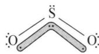

① 分子构型和物理性质

根据 VSEPR 理论, $SO_{2}$ 分子结构与 $O_{3}$ 相同, 中心原子 S 采取不等性的 $sp^{2}$ 杂化, 分子中存在离域 $\pi$ 键 $\Pi_{3}^{4}$ , 分子构型为折线型。

$SO_{2}$ 是有强烈刺激性气味的无色气体, 熔点 197 K, 沸点为 263 K, 易溶于水, 常温下 1 体积水可溶解 40 体积的 $SO_{2}$ 。 $SO_{2}$ 容易被液化, 在 273 K 时 $SO_{2}$ 的液化压强仅为 193 kPa。液态 $SO_{2}$ 是一种良好的溶剂, 它能溶解 $CCl_{4}$ 、 $SnCl_{4}$ 、 $SiCl_{4}$ 、醇、醛、酯类等物质。液态 $SO_{2}$ 也可作致冷剂, 它可以使冷冻体系的温度降至 223 K。 $SO_{2}$ 是有毒气体, 其毒性主要表现在对人的呼吸系统和消化系统的伤害作用。如果停留在 $SO_{2}$ 体积分数大于 0.2% 的空气中, 就会使人嗓子变哑、食欲减退、大便不通和引起气管炎等, 严重时会发生窒息甚至死亡。

② 化学性质

$SO_{2}$ 中的 S 的氧化数为 +4，处于 S 的中间氧化态，因此它既具有氧化性又具有还原性，但以还原性为主。

在工业上 $SO_{2}$ 主要用于生产 $H_{2}SO_{3}$ 及 $H_{2}SO_{4}$ ，也是制取亚硫酸盐的基本原料，在造纸、食品加工等行业中可作为漂白剂、防腐剂，在致冷等领域也有广泛应用。

$SO_{2}$ 是造成大气污染的重要因素。目前,硫化矿冶炼厂、火力发电厂等是产生 $SO_{2}$ 污染物的主要污染源。

在大气中的 $SO_{2}$ 可以通过气相或液相的氧化反应生成 $H_{2}SO_{4}$ :

气相反应： $2SO_{2} + O_{2}\xlongequal{催化剂}2SO_{3}, SO_{3} + H_{2}O = H_{2}SO_{4}$

液相反应： $\mathrm{SO}_2 + \mathrm{H}_2\mathrm{O} = \mathrm{H}_2\mathrm{SO}_3$ ， $2\mathrm{H}_2\mathrm{SO}_3 + \mathrm{O}_2\xrightarrow{\text{催化剂}} 2\mathrm{H}_2\mathrm{SO}_4$ 。

大气中的烟尘、臭氧等都是上述反应的催化剂，臭氧同时还是氧化剂。因此， $\mathrm{SO}_2$ 是对农业、林业、建筑物、机械设备等造成危害极大的“酸雨”（ $\mathrm{pH} < 5.6$ 的雨水）的罪魁祸首。含 $\mathrm{SO}_2$ 废气的处理方法有很多。当废气中 $\mathrm{SO}_2$ 含量较高时，可将 $\mathrm{SO}_2$ 氧化为 $\mathrm{SO}_3$ 再制成 $\mathrm{H}_2\mathrm{SO}_4$ ；也可用碱性物质吸收而生成亚硫酸盐。若 $\mathrm{SO}_2$ 的含量较少，可用 $\mathrm{Ca(OH)}_2$ 或 $\mathrm{Na}_2\mathrm{CO}_3$ 水溶液吸收而除去： $\mathrm{Ca(OH)}_2 + \mathrm{SO}_2 = \mathrm{CaSO}_3 \downarrow + \mathrm{H}_2\mathrm{O}$ ， $2\mathrm{Na}_2\mathrm{CO}_3 + \mathrm{SO}_2 + \mathrm{H}_2\mathrm{O} = \mathrm{Na}_2\mathrm{SO}_3 + 2\mathrm{NaHCO}_3$ 。

(2) 三氧化硫

纯净的 $SO_{3}$ 是无色易挥发的固体, 熔点 290 K, 沸点 318 K, 有强吸水性, 在空气中易形成酸雾。固态 $SO_{3}$ 中一种是三聚体 $(\mathrm{SO}_{3})_{3}$ ，一种是链状结构 $(\mathrm{SO}_{3})_{n}$ ，在三聚和链聚两种结构中，分别至少有两种氧原子，一种是端基氧，一种是桥氧，前者形成较强的键。

三聚体 $\left(\mathrm{SO}_{3}\right)_{3}$ ：链状结构 $\left(\mathrm{SO}_{3}\right)_{n}$ ：

$SO_{3}$ 加热到 740 K 分解为 $SO_{2}$ 和 $O_{2}$ ; 溶于水生成 $H_{2}SO_{4}$ , 同时放出大量的热; 与金属氧化物作用生成硫酸盐。

$SO_{3}$ 是强氧化剂, 它可以使单质磷燃烧, 将碘化钾氧化为单质碘:

$$
5 \mathrm{SO} _ {3} + 2 \mathrm{P} = \mathrm{P} _ {2} \mathrm{O} _ {5} + 5 \mathrm{SO} _ {2}, 2 \mathrm{KI} + \mathrm{SO} _ {3} = \mathrm{K} _ {2} \mathrm{SO} _ {3} + \mathrm{I} _ {2}
$$

工业上,一般是在加热及催化作用下 $SO_{2}$ 被氧化为 $SO_{3}$ : $2SO_{2} + O_{2} \xlongequal{V_{2}O_{5}} 723K$ $2SO_{3}$ 。

实验室里,一般是由发烟硫酸与 $P_{2}O_{5}$ 反应制得:

$$
3 \mathrm{H} _ {2} \mathrm{SO} _ {4} \cdot x \mathrm{SO} _ {3} + \mathrm{P} _ {2} \mathrm{O} _ {5} = 2 \mathrm{H} _ {3} \mathrm{PO} _ {4} + (3 x + 3) \mathrm{SO} _ {3} \uparrow
$$

## 5. 硫的含氧酸

硫的各种含氧酸汇总于表 2-3 中。由于硫的含氧酸的组成和结构不同，有“焦”、“代”、“过”、“连”等类型，其他无机含氧酸也类似。

焦酸是指 2 个含氧酸分子失去 1 分子 $H_{2}O$ 所得产物, 如焦硫酸 $H_{2}S_{2}O_{7}$ 是由 2 个 $H_{2}SO_{4}$ 分子脱去 1 分子 $H_{2}O$ 而形成的。

代酸是 O 原子被其他原子所代替的含氧酸, 如硫代硫酸 $H_{2}S_{2}O_{3}$ 就是 $H_{2}SO_{4}$ 中的 1 个 O 原子被 1 个 S 原子所代替的结果。

过酸是指含有过氧基—O—O—的含氧酸，如过二硫酸 $H_{2}S_{2}O_{8}$ 。

连酸是指中心原子互相连在一起的含氧酸, 如 2 个 S 原子相连的连二亚硫酸 $H_{2}S_{2}O_{4}$ 。

① 亚硫酸

$SO_{2}$ 溶于水生成亚硫酸 $H_{2}SO_{3}$ 。 $H_{2}SO_{3}$ 只存在于水溶液中，至今还未能制得纯的 $H_{2}SO_{3}$ 。 $H_{2}SO_{3}$ 是二元中强酸：

$$
\mathrm{H} _ {2} \mathrm{SO} _ {3} \rightleftharpoons \mathrm{H} ^ {+} + \mathrm{HSO} _ {3} ^ {-}; K _ {\mathrm{al}} ^ {\ominus} = 1. 3 \times 1 0 ^ {- 2}
$$

$$
\mathrm{HSO} _ {3} ^ {-} \rightleftharpoons \mathrm{H} ^ {+} + \mathrm{SO} _ {3} ^ {2 -}; K _ {\mathrm{a2}} ^ {\ominus} = 6. 1 \times 1 0 ^ {- 8}
$$

$H_{2}SO_{3}$ 既有氧化性又有还原性,但以还原性为主。如: $SO_{3}^{2-}+Cl_{2}+H_{2}O=$

$$
2 \mathrm{Cl} ^ {-} + \mathrm{SO} _ {4} ^ {2 -} + 2 \mathrm{H} ^ {+}, 5 \mathrm{SO} _ {3} ^ {2 -} + 2 \mathrm{MnO} _ {4} ^ {-} + 6 \mathrm{H} ^ {+} = 2 \mathrm{Mn} ^ {2 +} + 5 \mathrm{SO} _ {4} ^ {2 -} + 3 \mathrm{H} _ {2} \mathrm{O} 。
$$

$H_{2}SO_{3}$ 只有遇到较强的还原剂时，才表现出氧化性。如： $H_{2}SO_{3} + 2H_{2}S = 3S \downarrow + 3H_{2}O$ 。

表 2-3 硫的各种含氧酸

<table><tr><td>名称</td><td>化学式</td><td>结构简式</td><td>存在形式</td></tr><tr><td>次硫酸</td><td> $H_2SO_2$ </td><td>HO—S—OH</td><td>盐</td></tr><tr><td>亚硫酸</td><td> $H_2SO_3$ </td><td></td><td>盐、酸式盐</td></tr><tr><td>连二亚硫酸</td><td> $H_2S_2O_4$ </td><td></td><td>盐</td></tr><tr><td>硫酸</td><td> $H_2SO_4$ </td><td></td><td>纯酸、盐和水溶液</td></tr><tr><td>焦硫酸</td><td> $H_2S_2O_7$ </td><td></td><td>纯酸、盐</td></tr><tr><td>硫代硫酸</td><td> $H_2S_2O_3$ </td><td></td><td>盐</td></tr><tr><td>过二硫酸</td><td> $H_2S_2O_8$ </td><td></td><td>酸、盐</td></tr><tr><td>连多硫酸</td><td> $H_2S_xO_6(x=2~6)$ </td><td></td><td>盐和水溶液</td></tr></table>

② 硫酸

纯 $H_{2}SO_{4}$ 是一种无色油状液体，熔点 283 K，沸点 590 K（573 K 以上即分解），挥发性小，这些性质与 $H_{2}SO_{4}$ 分子间能形成氢键有关。浓 $H_{2}SO_{4}$ 的密度为 $1.827 \, g \cdot mL^{-1}$ ，浓度为 $18 \, mol \cdot L^{-1}$ ，能与水以任意比互溶，浓 $H_{2}SO_{4}$ 溶于水产生大量的热, 又因其密度大于水, 所以稀释浓 $\mathrm{H}_{2} \mathrm{SO}_{4}$ 时, 只能将浓 $\mathrm{H}_{2} \mathrm{SO}_{4}$ 慢慢倾入水中, 并不断搅拌, 绝不能将水倾入浓 $\mathrm{H}_{2} \mathrm{SO}_{4}$ 中, 否则因产生大量的热使酸液溅出, 甚至爆炸。工业品 $\mathrm{H}_{2} \mathrm{SO}_{4}$ 因含有杂质而呈淡黄色或稍微浑浊。

硫酸的化学性质主要表现在：强酸性、浓硫酸的吸水性及氧化性。

i) 强酸性： $H_{2}SO_{4}$ 为二元强酸，其第一步解离可认为是完全的，即： $H_{2}SO_{4}=H^{+}+HSO_{4}^{-}$ ；而第二步解离则不完全， $HSO_{4}^{-}$ 只相当于中强酸： $HSO_{4}^{-}\rightleftharpoons H^{+}+SO_{4}^{2-}$ ； $K_{2}^{\ominus}=1.2\times10^{-2}$ 。

在实际工作中,有时利用浓 $H_{2}SO_{4}$ 的强酸性、难挥发性、高沸点等特性来制备具有挥发性的 HCl 和 $HNO_{3}$ 。 $\mathrm{NaCl(s)} + \mathrm{H}_{2}\mathrm{SO}_{4}$ （浓） $\xlongequal{\triangle} NaHSO_{4} + HCl\uparrow$ ， $\mathrm{NaNO}_{3}(s) + \mathrm{H}_{2}\mathrm{SO}_{4}$ （浓） $\xlongequal{\triangle} NaHSO_{4} + HNO_{3}\uparrow$ 。

ii) 浓 $H_{2}SO_{4}$ 的脱水性：由于浓 $H_{2}SO_{4}$ 的水合热大，因此具有强的脱水性，不仅可以吸收化合物中的游离水（用作干燥剂），而且能使有机物脱水碳化，例如浓 $H_{2}SO_{4}$ 能从碳水化合物或其他有机物质中按 $H_{2}O$ 的组成比把 H 和 O 脱出来： $C_{m}H_{2n}O_{n} + H_{2}SO_{4}$ （浓） $= mC + H_{2}SO_{4} \cdot nH_{2}O$ 。

iii) 浓 $H_{2}SO_{4}$ 的氧化性: 虽然 $\varphi^{\ominus}\left(\mathrm{SO}_{4}^{2-}/\mathrm{SO}_{2}\right)$ 仅为 0.17 V, 但热的浓 $H_{2}SO_{4}$ 是强的氧化剂, 几乎能氧化所有的金属及某些非金属, 其还原产物视还原剂和反应条件的不同而异, 可以是 $SO_{2}$ 、S、甚至 $H_{2}S$ , 一般为 $SO_{2}$ 。如: $4Zn + 5H_{2}SO_{4}$ (浓) = $4ZnSO_{4} + H_{2}S \uparrow + 4H_{2}O$ , $Cu + 2H_{2}SO_{4}$ (浓) = $CuSO_{4} + SO_{2} \uparrow + 2H_{2}O$ , $C + 2H_{2}SO_{4}$ (浓) = $CO_{2} \uparrow + 2SO_{2} \uparrow + 2H_{2}O$ 。

冷的浓硫酸可以使金属铁、铝等金属的表面生成一层致密的氧化膜,使之不再进一步被腐蚀,这种现象称为金属的钝化,因此可用铁罐或铝罐贮存或运输浓硫酸。

由于浓硫酸具有强的吸水性和氧化性,它能严重地破坏动植物的组织,如损坏衣服或烧伤皮肤等,因此使用时要特别注意安全。如果不小心将硫酸滴落在皮肤上,应立即用大量水冲洗,然后用稀氨水湿润受伤处,最后再用水冲洗,以避免严重灼伤。

$H_{2}SO_{4}$ 是最重要的化工原料之一,世界上往往用硫酸的年产量来衡量一个国家的工业生产水平。 $H_{2}SO_{4}$ 大量用于生产磷肥,同时也广泛应用于无机化工、有机化工、轻工、纺织、石油、医药、冶金及国防等领域。

③ 发烟硫酸和焦硫酸

通常把含有过量 $SO_{3}$ 的浓 $H_{2}SO_{4}$ 称为发烟硫酸 $H_{2}SO_{4} \cdot xSO_{3}$ 。当 $H_{2}SO_{4}$ 与 $SO_{3}$ 的物质的量比为 1:1 时，这种发烟硫酸称为焦硫酸 $H_{2}SO_{4} \cdot SO_{3}$ 或

$H_{2}S_{2}O_{7}$ 。发烟硫酸比浓 $H_{2}SO_{4}$ 具有更强的氧化性。它主要是作为硝化反应中的脱水剂以及有机合成的磺化剂等。焦硫酸在常温下是一种无色晶体，熔点 308 K。当冷却发烟硫酸时可以析出焦硫酸晶体。焦硫酸主要用于制造染料、炸药和其他有机磺酸类化合物。

## 6. 硫的含氧酸盐

## ① 硫酸盐

硫酸能生成正盐和酸式盐,通常所说的硫酸盐指的是其正盐。除 $CaSO_{4}$ 、 $SrSO_{4}$ 、 $BaSO_{4}$ 、 $PbSO_{4}$ 、 $Ag_{2}SO_{4}$ 、 $Hg_{2}SO_{4}$ 等微溶或难溶于水外,大多数硫酸盐都可溶于水。

硫酸盐受热分解所需的温度差别很大。一般地说，ⅠA、ⅡA族的硫酸盐对热稳定，加热到1273 K也不分解；过渡元素硫酸盐在高温下可以分解； $\left(\mathrm{NH}_{4}\right)_{2}\mathrm{SO}_{4}$ 只需加热至373 K便可分解。

含有结晶水的硫酸盐称为矾, 如胆矾 $\mathrm{CuSO}_{4} \cdot 5 \mathrm{H}_{2} \mathrm{O}$ 、绿矾 $\mathrm{FeSO}_{4} \cdot 7 \mathrm{H}_{2} \mathrm{O}$ 等。它们在受热时会逐步失去其结晶水。许多硫酸盐从溶液中析出时会带结晶水, 制备这些水合硫酸盐通常是在室温下晾干, 以免使结晶水脱去。带结晶水的硫酸盐还往往能以复盐的形成存在, 例如 $(\mathrm{NH}_{4})_{2} \mathrm{SO}_{4} \cdot \mathrm{FeSO}_{4} \cdot 6 \mathrm{H}_{2} \mathrm{O}$ 、 $\mathrm{K}_{2} \mathrm{SO}_{4} \cdot \mathrm{Al}_{2} (\mathrm{SO}_{4})_{3} \cdot 24 \mathrm{H}_{2} \mathrm{O}$ 等。在一般情况下, 将两种硫酸盐按某一比例混合, 可制得相应的硫酸复盐。

酸式硫酸盐一般都溶于水,其水溶液呈酸性: $\mathrm{NaHSO}_{4} = \mathrm{Na}^{+} + \mathrm{H}^{+} + \mathrm{SO}_{4}^{2-}$ 。

酸式硫酸盐受热可以生成焦硫酸盐： $2KHSO_{4}\xlongequal{\triangle}K_{2}S_{2}O_{7}+H_{2}O$ 。焦硫酸盐极易吸潮，遇水又会发生水解反应生成酸式硫酸盐，故须密闭保存。 $K_{2}S_{2}O_{7}$ 可与一些难溶的碱性或两性金属氧化物共熔生成可溶性的硫酸盐。如：

$$
\mathrm{Fe} _ {2} \mathrm{O} _ {3} + 3 \mathrm{K} _ {2} \mathrm{S} _ {2} \mathrm{O} _ {7} \stackrel {\triangle} {=} \mathrm{Fe} _ {2} (\mathrm{SO} _ {4}) _ {3} + 3 \mathrm{K} _ {2} \mathrm{SO} _ {4}
$$

$$
\mathrm{Al} _ {2} \mathrm{O} _ {3} + 3 \mathrm{K} _ {2} \mathrm{S} _ {2} \mathrm{O} _ {7} \stackrel {\triangle} {=} \mathrm{Al} _ {2} (\mathrm{SO} _ {4}) _ {3} + 3 \mathrm{K} _ {2} \mathrm{SO} _ {4}
$$

## ② 过硫酸盐

过硫酸的分子可以看成是过氧化氢 $\mathrm{H}-\mathrm{O}-\mathrm{O}-\mathrm{H}$ 分子中的 $\mathrm{H}$ 被— $\mathrm{SO}_{3} \mathrm{H}$ 基所取代的衍生物。 $\mathrm{H}-\mathrm{O}-\mathrm{O}-\mathrm{SO}_{3} \mathrm{H}$ 称为过一硫酸； $\mathrm{HO}_{3} \mathrm{~S}-\mathrm{O}-\mathrm{O}-\mathrm{SO}_{3} \mathrm{H}$ 称为过二硫酸。纯的过一硫酸和过二硫酸都是无色晶体，也有强的吸水性和脱水性，两者都不稳定，在实际工作中常用的是它们的盐。过硫酸盐中较为重要的是过二硫酸钾 $\mathrm{K}_{2} \mathrm{~S}_{2} \mathrm{O}_{8}$ 和过二硫酸铵 $(\mathrm{NH}_{4})_{2} \mathrm{~S}_{2} \mathrm{O}_{8}$ 。常温下， $(\mathrm{NH}_{4})_{2} \mathrm{~S}_{2} \mathrm{O}_{8}$ 为白色结晶状固体,干燥制品较为稳定,潮湿状态或在水溶液中易发生水解: $\left(\mathrm{NH}_{4}\right)_{2}\mathrm{S}_{2}\mathrm{O}_{8}+2\mathrm{H}_{2}\mathrm{O}=2\mathrm{NH}_{4}\mathrm{HSO}_{4}+\mathrm{H}_{2}\mathrm{O}_{2}$ ,在工业上常利用该反应制备 $H_{2}O_{2}$ 。

过硫酸盐的分子中都含有过氧键,它们都具有强的氧化性。与苯、酚等有机物混合时会发生爆炸。在 $Ag^{+}$ 的催化下,它能将 $Mn^{2+}$ 迅速氧化成紫色的 $MnO_{4}^{-}$ :

$$
2 \mathrm{Mn} ^ {2 +} + 5 \mathrm{S} _ {2} \mathrm{O} _ {8} ^ {2 -} + 8 \mathrm{H} _ {2} \mathrm{O} \xlongequal {\mathrm{Ag} ^ {+}} 2 \mathrm{MnO} _ {4} ^ {-} + 1 0 \mathrm{SO} _ {4} ^ {2 -} + 1 6 \mathrm{H} ^ {+}
$$

此反应在钢铁分析中用于锰含量的测定。

③ 亚硫酸钠

亚硫酸钠 $Na_{2}SO_{3}$ 为白色晶体或粉末，易溶于水，其水溶液呈碱性。亚硫酸钠晶体 $Na_{2}SO_{3} \cdot 7H_{2}O$ 在空气中风化并易被氧化为 $Na_{2}SO_{4}$ 。向 $Na_{2}CO_{3}$ 溶液中通入 $SO_{2}$ ，可制得 $Na_{2}SO_{3}: Na_{2}CO_{3} + SO_{2} = Na_{2}SO_{3} + CO_{2}$ 。

比较下列电极电势：

$$
\mathrm{SO} _ {4} ^ {2 -} + 4 \mathrm{H} ^ {+} + 2 \mathrm{e} ^ {-} \rightleftharpoons \mathrm{H} _ {2} \mathrm{SO} _ {3} + \mathrm{H} _ {2} \mathrm{O}; \varphi_ {\mathrm{A}} ^ {\ominus} = + 0. 1 7 \mathrm{V}
$$

$$
\mathrm{SO} _ {4} ^ {2 -} + \mathrm{H} _ {2} \mathrm{O} + 2 \mathrm{e} ^ {-} \rightleftharpoons \mathrm{SO} _ {3} ^ {2 -} + 2 \mathrm{OH} ^ {-}; \varphi_ {\mathrm{B}} ^ {\ominus} = - 0. 9 2 \mathrm{V}
$$

可知,在碱性介质中 $SO_{3}^{2-}$ 的还原性比在酸性介质中强得多。这正是 $Na_{2}SO_{3}$ 水溶液易被氧化的原因: $2Na_{2}SO_{3} + O_{2} = 2Na_{2}SO_{4}$ 。

$Na_{2}SO_{3}$ 有着广泛用途, 医药工业上用于生产氯仿和苯甲醛等; 橡胶工业用作凝固剂; 常作为织物漂白和脱氯剂; 照相业中用作显影剂; 食品工业用作漂白剂、防腐剂、疏松剂、抗氧化剂、护色剂及保鲜剂。

④ 硫代硫酸钠

五水硫代硫酸钠 $Na_{2}S_{2}O_{3}\cdot5H_{2}O$ ，俗称大苏打或“海波”，为无色透明晶体，易溶于水，水溶液呈弱碱性，373 K 时会失去全部结晶水，温度更高则分解成硫化钠与硫酸钠。

在沸腾的 $Na_{2}SO_{3}$ 碱性溶液中加入硫磺粉, 可制得 $Na_{2}S_{2}O_{3}: Na_{2}SO_{3} + S\xlongequal{\triangle}Na_{2}S_{2}O_{3}$ 。

$\mathrm{Na_2S_2O_3}$ 遇强酸易分解： $\mathrm{S}_2\mathrm{O}_3^{2 - } + 2\mathrm{H}^+ = \mathrm{S}\downarrow +\mathrm{SO}_2\uparrow +\mathrm{H}_2\mathrm{O}$

$Na_{2}S_{2}O_{3}$ 为中等强度的还原剂，它与 $I_{2}$ 的反应快速而又定量进行，是定量分析中碘量法测定物质含量的基础： $I_{2} + 2Na_{2}S_{2}O_{3} = 2NaI + Na_{2}S_{4}O_{6}$ 。

若遇到强氧化剂，则 $S_{2}O_{3}^{2-}$ 可被氧化为 $SO_{4}^{2-}$ 。如： $4Cl_{2} + Na_{2}S_{2}O_{3} + 5H_{2}O = 2NaCl + 2H_{2}SO_{4} + 6HCl$ 。

$Na_{2}S_{2}O_{3}$ 为常用分析试剂，也常作为织物漂白后的脱氯剂、照相业中的定影剂，也应用于鞣革、电镀、医药等行业。

## 七、硒和碲

## 1. 单质

硒有两类同素异形体：无定形为棕红色粉末，软化点 323 K；晶体最稳定的一种为黑色，熔点 490 K，密度较无定形大，分子式为 $Se_{8}$ ，蒸气中有 $Se_{2}$ 。

碲也有两类同素异形体：无定形为棕黑色；晶体为银白色，有金属光泽。蒸气中有 $Te_{2}$ 分子。

## 2. 氢化物

$H_{2}Se$ 和 $H_{2}Te$ 均无色且有恶臭气味，其毒性大于 $H_{2}S$ 。 $H_{2}S$ ， $H_{2}Se$ 和 $H_{2}Te$ 的熔沸点依次升高，呈规律性变化。这说明其分子间作用力依次增强。但是分子内部，原子之间的作用力却依次减弱。故 $H_{2}S$ ， $H_{2}Se$ 和 $H_{2}Te$ 的水溶液的酸性依次增强。不过 $H_{2}Se$ 和 $H_{2}Te$ 与 $H_{2}S$ 一样仍属于弱酸。

$H_{2}S$ 、 $H_{2}Se$ 、 $H_{2}Te$ 的还原性依次增强，呈规律性变化。可用下面反应制取 $H_{2}Se$ 和 $H_{2}Te$ ：

$$
\mathrm{Al} _ {2} \mathrm{Se} _ {3} + 6 \mathrm{H} _ {2} \mathrm{O} = 2 \mathrm{Al} (\mathrm{OH}) _ {3} + 3 \mathrm{H} _ {2} \mathrm{Se}
$$

$$
\mathrm{Al} _ {2} \mathrm{Te} _ {3} + 6 \mathrm{H} _ {2} \mathrm{O} = 2 \mathrm{Al} (\mathrm{OH}) _ {3} + 3 \mathrm{H} _ {2} \mathrm{Te}
$$

与硫化物相似,大多数的硒化物和碲化物难溶于水。

## 3. 氧化物与含氧酸

硒和碲在空气中燃烧可分别得到 $SeO_{2}$ 和 $TeO_{2}$ ，这两种氧化物均为白色固体。 $SO_{2}$ 、 $SeO_{2}$ 、 $TeO_{2}$ 其还原性依次减弱，但其氧化性却依次增强。 $SeO_{2}$ 和 $TeO_{2}$ 主要显氧化性，属于中等强度的氧化剂，可以将 $SO_{2}$ 和 HI 氧化。

$\mathrm{SeO_2}$ 溶于水得亚硒酸 $\mathrm{H}_2\mathrm{SeO}_3$ 。但是 $\mathrm{TeO_2}$ 不溶于水。亚碲酸 $\mathrm{H}_2\mathrm{TeO}_3$ 是由 $\mathrm{TeO_2}$ 溶于碱中再酸化结晶而得到的。

亚硒酸和亚碲酸均属弱酸，比亚硫酸弱。 $H_{2}SeO_{3}:K_{1}=2.4\times10^{-3},H_{2}TeO_{3}:K_{1}=2.0\times10^{-3}$ 。

将 $\mathrm{Se(IV)}$ 和 $\mathrm{Te(IV)}$ 氧化成 $\mathrm{Se(VI)}$ 和 $\mathrm{Te(VI)}$ , 需要强的氧化剂:

$$
5 \mathrm{H} _ {2} \mathrm{SeO} _ {3} + 2 \mathrm{HClO} _ {3} = 5 \mathrm{H} _ {2} \mathrm{SeO} _ {4} + \mathrm{Cl} _ {2} \uparrow + \mathrm{H} _ {2} \mathrm{O}
$$

$$
3 \mathrm{TeO} _ {2} + \mathrm{H} _ {2} \mathrm{Cr} _ {2} \mathrm{O} _ {7} + 6 \mathrm{HNO} _ {3} + 5 \mathrm{H} _ {2} \mathrm{O} = 3 \mathrm{H} _ {6} \mathrm{TeO} _ {6} + 2 \mathrm{Cr} (\mathrm{NO} _ {3}) _ {3}
$$

根据标准电极电位,氧化性: $H_{2}SeO_{4} > H_{6}TeO_{6} > H_{2}SO_{4}$ 。

但是 $H_{2}SO_{4}$ 、 $H_{2}SeO_{4}$ 、 $H_{6}TeO_{6}$ 的酸性却依次减弱： $H_{2}SeO_{4}$ 还属于强酸， $H_{6}TeO_{6}$ 是弱酸 $(K_{1}=6\times10^{-7})$ ， $H_{6}TeO_{6}$ 的分子结构如右图所示，中心原子 Te 采取 $sp^{3}d^{2}$ 杂化，形成正八面体结构，分子之间可形成氢键。

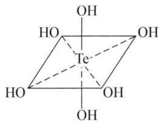

chemical

Molecular structure of a tellurium(II) complex with hydroxyl groups and tetrahedral geometry

## 典型例题

【例 1】 A 与 $SO_{2}$ 属于等电子体, 常温下是一种无色的气体, 当冷却到 77 K 时, 变成橙红色液体。A 的一种制备方法是: 在真空中, 将 CuO 和硫一起混合加热, 可生成 A, 同时生成一种黑色固体。

(1) 画出 A 的结构式。写出上述制备 A 的化学反应方程式。  
(2) 若将 $S_{2}Cl_{2}$ 与 CuO 在 100～400℃ 加热时也能生成 A。试写出该化学反应方程式。  
(3) A 在碱性条件下能发生歧化反应: $\mathrm{A} + \mathrm{OH}^{-} = \mathrm{S}^{2-} + \mathrm{S}_{2} \mathrm{O}_{4}^{2-} + \mathrm{SO}_{3}^{2-} + \mathrm{H}_{2} \mathrm{O}$

① 上述反应包含两个独立的歧化反应,分别写出它们的离子方程式。

② 若参加反应的 A 和 $OH^{-}$ 的物质的量之比为 4:7，配平该离子方程式。

(4) A 可以被酸性 $KMnO_{4}$ 溶液氧化, 写出配平的反应方程式。

解析 （1）根据信息：A 由 CuO 和 S 共热制得，且与 $SO_{2}$ 为等电子体可以推出分子式为 $S_{2}O$ 。根据等电子体原理可以确定 $S_{2}O$ 的结构和 $SO_{2}$ 相同，属于 V 形分子，结构如下： $\ce{S-S-O}$

反应方程式： $2CuO + 5S = 2S_{2}O + Cu_{2}S$ 。

(2) 根据 $S_{2}O$ 的平均氧化数可知本反应不涉及化合价变化, 方程式为: $S_{2}Cl_{2} + CuO = S_{2}O + CuCl_{2}$ 。

(3) ① 注意到 $\mathrm{S}_2\mathrm{O}_4^{2-}$ 中 $\mathrm{S}$ 的平均氧化数为 $+3$ , 可以写出如下两个歧化方程式: $5\mathrm{S}_2\mathrm{O} + 14\mathrm{OH}^- = 4\mathrm{S}^{2-} + 3\mathrm{S}_2\mathrm{O}_4^{2-} + 7\mathrm{H}_2\mathrm{O}, \mathrm{S}_2\mathrm{O} + 4\mathrm{OH}^- = \mathrm{S}^{2-} + \mathrm{SO}_3^{2-} + 2\mathrm{H}_2\mathrm{O}$ 。

② 系数比介于上述两个歧化反应系数比之间, 可用待定系数法求得各项系数得到总方程式: $12S_{2}O + 42OH^{-} = 11S^{2-} + 3S_{2}O_{4}^{2-} + 7SO_{3}^{2-} + 21H_{2}O$ 。

(4) 酸性 $\mathrm{KMnO}_{4}$ 氧化性很强, 可将 $\mathrm{S}_{2} \mathrm{O}$ 氧化至 $\mathrm{SO}_{4}^{2-}$ , 方程式为: $\mathrm{S}_{2} \mathrm{O} + 2 \mathrm{MnO}_{4}^{-} + 2 \mathrm{H}^{+} = 2 \mathrm{SO}_{4}^{2-} + 2 \mathrm{Mn}^{2+} + \mathrm{H}_{2} \mathrm{O}$ 。

【例 2】（2005 年全国初赛备用） $H_{2}O_{2}$ 是一种绿色氧化剂，应用十分广泛。1979 年化学家将 $H_{2}O_{2}$ 慢慢加入到 $SbF_{5}$ 的 HF 溶液中得一白色固体 A，A 是一种盐类，其负离子呈八面体结构。

(1) 确定 A 的结构简式; 写出生成 A 的化学反应方程式。

（2）在室温或高于室温的条件下，A 能定量地分解，B 是产物之一，其中亦含有八面体结构。

① 确定 B 的结构简式；

② 写出 B 中正、负离子各中心原子的杂化形态；

③ 写出分解反应方程式。

(3) 若将 $H_{2}S$ 气体通入 $SbF_{5}$ 的 HF 溶液中, 则得晶体 C, C 中仍含有八面体结构。

① 写出 C 的结构简式；

② 生成 C 的化学反应方程式。

(4) 若将 $\mathrm{H}_{2} \mathrm{O}_{2}$ 投入到液氨中, 可得到白色固体 D。红外光谱显示, 固态 D 存在正、负两种离子, 其中一种离子呈现正四面体。试确定 D 的结构简式。

(5) 上述实验事实说明 $H_{2}O_{2}$ 、 $H_{2}S$ 共同具有什么性质?

解析 （1）考虑到 $SbF_{5}$ 是一个强路易斯酸，结合题目信息 A 中的负离子呈八面体结构，易得出负离子是 $[SbF_{6}]^{-}$ ，正离子可以类比 $NH_{3}$ 与 $H^{+}$ 的反应生成 $NH_{4}^{+}$ ，得到 A 的结构为： $\left[H_{3}O_{2}\right]^{+}\left[SbF_{6}\right]^{-}$ ，反应方程式： $H_{2}O_{2} + HF + SbF_{5} = \left[H_{3}O_{2}\right]^{+}\left[SbF_{6}\right]^{-}$ 。

(2) A 能分解, 且产物不唯一, 而负离子的八面体结构相对稳定, 只能考虑正离子中的过氧键 “—O—O—” 分解为氧气, 可类比 $H_{2}O_{2}$ 常温下的分解, 得出 B: $\left[H_{3}O\right]^{+}\left[SbF_{6}\right]^{-}$ 其中 O: $sp^{3}$ 杂化; Sb: $sp^{3}d^{2}$ 杂化。反应方程式: $2\left[H_{3}O_{2}\right]^{+}\left[SbF_{6}\right]^{-}=2\left[H_{3}O\right]^{+}\left[SbF_{6}\right]^{-}+O_{2}\uparrow$ 。

(3) 本问可由第(2)问类推得到,由于 $\mathrm{H}_{2} \mathrm{~S}$ 中 $\mathrm{S}$ 有孤对电子,同样可通过配位键形成类似的离子化合物 $[\mathrm{SH}_{3}]^{+}[\mathrm{SbF}_{6}]^{-}$ , 这个过程中 $\mathrm{H}_{2} \mathrm{~S}$ 给出孤对电子对体现碱性。反应方程式: $\mathrm{H}_{2} \mathrm{~S} + \mathrm{HF} + \mathrm{SbF}_{5} = [\mathrm{SH}_{3}]^{+}[\mathrm{SbF}_{6}]^{-}$ 。

(4) 由正离子结构是正四面体可推出正离子是 $\mathrm{NH}_{4}^{+}$ , $\mathrm{H}^{+}$ 显然是由 $\mathrm{H}_{2} \mathrm{O}_{2}$ 的弱酸性电离产生的, 于是得出 D 的结构为: $[\mathrm{NH}_{4}]^{+}[\mathrm{HOO}]^{-}$ 。

(5) 它们都可以在不同条件下体现出酸性、碱性; 且均是比水弱得多的碱。

【例 3】 A-B 体系是一种新型的催化剂。化学家对 A-B 体系进行了深入的研究: A=Te(晶体), B是 $\mathrm{TeCl}_{4}$ 与 $\mathrm{AlCl}_{3}$ 按物质的量之比1:4化合得到的。已知B是一种共价型离子化合物, 其负离子为四面体结构, B中铝元素、氯元素的化学环境相同。A和B以物质的量7:2和7:1反应可生成两种新化合物I和II。生成化合物II时没有其他副产物生成, 但是生成化合物I时伴随着挥发性的 $\mathrm{TeCl}_{4}$ 生成, 每生成2 mol化合物I就生成1 mol $\mathrm{TeCl}_{4}$ 。在熔融的 $\mathrm{NaAlCl}_{4}$ 里的导电性研究表明, 化合物I和II在一起时总共会解离成三种离子。进一步对化合物I和II研究表明: 用凝固点下降法测定I和II的摩尔质量分别为1126 g/mol和867 g/mol。化合物I和II的红外光谱测定只有一种振动, 分子中不存在Te=Te, 而且结构中都只有一种四面体配位的铝, 但是铝原子在这两种化合物中的化学环境是不同的。

(1) 确定 B 的化学式。  
(2) 写出化合物Ⅰ和Ⅱ的分子式。  
(3) 写出化合物Ⅰ和Ⅱ中负离子和正离子的化学式。  
（4）指出 Te、Al 原子的杂化形态，画出其负离子、正离子的结构式，说明其正离子具有什么特点。  
（5）已知： $AlCl_{3}$ 具有很高的挥发性。化合物Ⅰ在加热时很容易转化成化合物 D。请说明这是为什么？写出该化学反应方程式。

解析 （1）由题意 B 的生成是一个化合反应,再根据 $AlCl_{3}$ 作为典型的路易斯酸容易与 $Cl^{-}$ 结合生成四面体结构的负离子可以推出 B 的化学式为： $\mathrm{Te[AlCl_{4}]_{4}}$ 。

(2) ①当 $\mathrm{Te}:\mathrm{Te}[\mathrm{AlCl}_4]_4$ 以 $7:2$ 反应时, 总摩尔质量为 $2499\mathrm{g / mol}$ , 而生成 $2\mathrm{mol}$ 化合物 I 时放出 $1\mathrm{mol}$ $\mathrm{TeCl}_4$ (摩尔质量 $269\mathrm{g / mol}$ ), 因此 I 的摩尔质量为 $1126\mathrm{g / mol}$ , 即 I 的化学式为 $\mathrm{Te}_4\mathrm{Al}_4\mathrm{Cl}_{14}$ 。②化合物 II 中, $\mathrm{Te}:\mathrm{Te}[\mathrm{AlCl}_4]_4$ 按 $7:1$ 反应, 总摩尔质量为 $1679.9\mathrm{g / mol}$ , 由于 II 摩尔质量为 $867\mathrm{g / mol}$ , 可推出 II 的化学式为: $\mathrm{Te}_4[\mathrm{AlCl}_4]_2$ 。

(3) 化合物 I 和 II 在一起总共会解离成三种离子, 而每个化合物中只有一种四面体配位的铝, 且两种化合物中 Al 原子的化学环境不同, 故 I、II 中的正离子均为 $\mathrm{Te}_{4}^{2+}$ , 而 I 中的负离子为 $[\mathrm{Al}_{2} \mathrm{Cl}_{7}]^{-}$ ; II 中的负离子为 $[\mathrm{AlCl}_{4}]^{-}$ 。

（4）Te 的杂化形态为 $sp^{2}$ ，由于 Te 有两对孤对电子，一对用于价层，一对作为 p 电子在垂直于 $sp^{2}$ 杂化轨道的 p 轨道上，因此 $Te_{4}^{2+}$ 的 $\pi$ 电子为 6，满足休克尔 $4n+2$ 规则，因此 $Te_{4}^{2+}$ 具有此大 $\pi$ 键，因此具有芳香性。Al 的杂化为 $sp^{3}$ 杂化。

三种离子的空间结构如图：

$$
\mathrm{Te} _ {4} ^ {2 +}: \left[ \begin{array}{c} \ddot {\mathrm{Te}} - \mathrm{Te} \\ | \bigcirc | \\ \dot {\mathrm{Te}} - \mathrm{Te} \end{array} \right] ^ {2 +} \quad [ \mathrm{AlCl} _ {4} ] ^ {-}: \left[ \begin{array}{c} \mathrm{Cl} \\ | \\ \mathrm{Al} \\ \mathrm{Cl} \end{array} \right] ^ {-} \quad [ \mathrm{Al} _ {2} \mathrm{Cl} _ {7} ] ^ {-}: \left[ \begin{array}{c c} \mathrm{Cl} & \mathrm{Cl} \\ | & | \\ \mathrm{Al} & \mathrm{Al} \\ \mathrm{Cl} \end{array} \right] ^ {-}
$$

（5）因为 $\left[Al_{2}Cl_{7}\right]^{-}$ 结构没有 $\left[AlCl_{4}\right]^{-}$ 结构稳定，在加热条件下， $\left[Al_{2}Cl_{7}\right]^{-}$ 分解生成 $AlCl_{3}$ 和 $\left[AlCl_{4}\right]^{-}$ ， $\left[AlCl_{4}\right]^{-}$ 结构高度对称，较为稳定； $AlCl_{3}$ 具有很高的挥发性使反应不断正向进行。反应方程式为： $Te_{4}\left[Al_{2}Cl_{7}\right]_{2}=Te_{4}\left[AlCl_{4}\right]_{2}+2AlCl_{3}$ 。

## 本讲习题

1. 2000 年美国《科学》杂志报道, 意大利科学家合成了一种新型氧分子, 它是由 4 个氧原子构成的 $O_{4}$ 分子, 专家认为它液化后的能量密度比普通氧分子高得多。

(1) ${\mathrm{O}}_{4}$ 分子可看作 2 个 ${\mathrm{O}}_{2}$ 聚合得到。试解释 ${\mathrm{O}}_{2}$ 为什么能聚合成为 ${\mathrm{O}}_{4}$ ?

(2) 试判断 $O_{4}$ 的结构。

(3) 从结构的角度解释 $\mathrm{O}_{4}$ 和 $\mathrm{O}_{2}$ 分子的稳定性、氧化性强弱。

2.（1998年全国初赛）保险粉是 $Na_{2}S_{2}O_{4}$ 的工业名称，是最大宗的无机盐之一，年产量30万吨，大量用于印染业，并用来漂白纸张、纸浆和陶土。

(1) 甲酸法是生产保险粉的主要生产方法之一, 其中最主要的步骤是把甲酸与溶于甲醇和水混合溶剂里的 NaOH 混合, 再通入 $\mathrm{SO}_{2}$ 气体。

① 写出甲酸法生产保险粉的化学反应方程式。

②甲酸法中使用的甲醇并不参加反应,你认为它的作用是什么?

③ 反应后的混合物中分离保险粉应当采用的操作是什么？

(2) $\mathrm{S}_{2} \mathrm{O}_{4}^{2-}$ 中的 4 个 O 原子是完全等价的, 写出它的电子式。 $\mathrm{S}_{2} \mathrm{O}_{4}^{2-}$ 所有 6 个原子最多可能共面的有几个? 试举一常见的分子, 空间结构与 $\mathrm{S}_{2} \mathrm{O}_{4}^{2-}$ 类似。

(3) 实验室中用锌粉作用于亚硫酸氢钠和亚硫酸的混合溶液, 可生成 $Na_{2}S_{2}O_{3}$ , 写出反应方程式。

3. 氧及卤素反应生成许多不同的化合物(硫原子是中心原子), 这些化合物大多数是分子, 其中有许多种在水中容易水解。

(1) 写出 $SCl_{2}$ 、 $SO_{3}$ 、 $SO_{2}ClBr$ 、 $SF_{4}$ 及 $SBrF_{5}$ 等分子的路易斯结构式。

(2) 画出上述五种分子的几何构型。

(3) 化合物 A 含硫(每个分子中只含一个硫原子)、氧及氟、氯、溴、碘中的一种或几种卤素; 少量的 A 和水反应, 可完全水解而不被氧化或还原; 所有反应产物都是可溶的;将该物质配成溶液,稀释后分成几份,分别加入一系列的 0.1 mol/L 的试剂:

① 加入硝酸和硝酸银,产生微黄色沉淀;

② 加入 $\mathrm{Ba(NO_{3})_{2}}$ ，无沉淀；

③用 $NH_{3}$ 将 pH 调节至 7, 然后加入 $\mathrm{Ca(NO_{3})_{2}}$ , 无可见反应;

④ 向该物质的酸性溶液中加入 $KMnO_{4}$ ， $KMnO_{4}$ 褪色，再加入 $\mathrm{Ba(NO_{3})_{2}}$ ，产生白色沉淀；

⑤ 加入 $\mathrm{Cu(NO_{3})_{2}}$ ，无沉淀；

⑥ 最后进行简单的定量分析: 称取 7.190 g 该物质溶于水, 稀释至 250.0 mL, 取 25.00 mL 该溶液加入稀 $HNO_{3}$ 和足量的 $AgNO_{3}$ (以保证沉淀完全), 沉淀经洗涤, 干燥后称重, 质量为 1.452 g。写出化合物 A 的分子式。

(4) 写出该物质和水反应的方程式。

4. 臭氧既可以防护紫外线保护生命,也可对生命造成伤害。20亿年前地球大气层中氧气浓度开始显著增加,与此同时,高层大气中的臭氧浓度也逐渐增大。臭氧层能有效阻止紫外线辐射,使地球上形成生命成为可能。如今,臭氧层出现了大的空洞,臭氧几乎要被耗尽,因此臭氧层的命运引起了人们极大的关注。另一方面,地表环境中的臭氧是光化学烟雾的主要组分,对于健康是有危害的。回答下列问题:

(1) 相同条件下, $O_{3}$ 的溶解度比 $O_{2}$ 大得多,为什么?

(2) 电解法产生臭氧是利用直流电电解含氧电解质产生臭氧的。目前, 最流行的电化学产生臭氧技术是采用固体聚合物电解质(SPE)膜复合电极电解水产生臭氧。

① 写出两极反应方程式。

② 制得的 $O_{3}$ 中往往存在 $O_{2}$ ，如何进行分离？

(3) 碘量法是测量地表大气中臭氧浓度的一个简单方法。写出测定原理的反应方程式。

(4) 在一定条件下, Cu、HCl 和空气反应生成一种酸 A, A 含单电子, 是自由基, 有极高的活性, 曾认为 A 为 B, 可后来发现 B 不存在。

① 试写出 B 的化学式。

② 解释 B 不存在的原因。

5. (1999 年全国初赛)水中氧的含量测定步骤如下: ①水中的氧在碱性溶液中将 $\mathrm{Mn}^{2+}$ 氧化为 $\mathrm{MnO(OH)}_{2}$ 。②加入碘离子将生成的 $\mathrm{MnO(OH)}_{2}$ 再还原成 $\mathrm{Mn}^{2+}$ 离子。③用硫代硫酸钠标准溶液滴定步骤②中生成的碘。有关的测定数据如下：① $Na_{2}S_{2}O_{3}$ 溶液的标定。取25.00 mL $KIO_{3}$ 标准溶液( $KIO_{3}$ 浓度：174.8 mg·L $^{-1}$ )与过量KI在酸性介质中反应，用 $Na_{2}S_{2}O_{3}$ 溶液滴定，消耗12.45 mL。②取20.0℃下新鲜水样103.5 mL，按上述测定步骤滴定，消耗 $Na_{2}S_{2}O_{3}$ 标准溶液11.80 mL。已知该温度下水的饱和 $O_{2}$ 含量为9.08 mg·L $^{-1}$ 。③在20.0℃下密闭放置5天的水样102.2 mL，按上述测定步骤滴定，消耗硫代硫酸钠标准溶液6.75 mL。

（1）说明用溶解氧氧化 $Mn^{2+}$ 只有在碱性溶液中才是可能的（已知：pH = 0 时， $E^{\ominus}\left(\mathrm{Mn}^{3+}/\mathrm{Mn}^{2+}\right)=1.51, E^{\ominus}\left(\mathrm{O}_{2}/\mathrm{H}_{2}\mathrm{O}\right)=1.23; \mathrm{pH}=14, E^{\ominus}\left(\mathrm{MnO(OH)/Mn(OH)}_{2}\right)=0.13, E^{\ominus}\left(\mathrm{O}_{2}/\mathrm{H}_{2}\mathrm{O}\right)=0.39$ 。

(2) 写出上面 3 步所涉及的化学反应方程式。

(3) 实验中塞子必需塞紧(尤其震荡中), 开塞操作时间必须短。解释原因。

(4) 计算标准溶液的浓度(单位 $mol \cdot L^{-1}$ )。

(5) 计算新鲜水样中氧的含量(单位 mg·L $^{-1}$ )。

(6) 计算陈放水样中氧的含量(单位 mg·L $^{-1}$ )。

(7) 以上测定结果说明水样具有什么性质?

6. 多硫化物 $S_{x}^{2-}(2\sim6)$ 在碱性溶液中被 $BrO_{3}^{-}$ 氧化为 $SO_{4}^{2-}$ ; 多硫化物在酸性溶液中析出多硫化氢, 多硫化氢是一种极不稳定的黄色液体, 能迅速分解。

(1) 写出碱性溶液中 $BrO_{3}^{-}$ 氧化 $S_{x}^{2-}$ 的离子反应方程式。

(2) 如果上述反应中 $BrO_{3}^{-}$ 和 $OH^{-}$ 的物质的量之比为 2:3，计算 $S_{x}^{2-}$ 中 x 的值；如果生成 0.1 mol $Br^{-}$ ，计算转移的电子的物质的量。

(3) $Na_{2}S_{x}$ 溶液中滴入稀硫酸, 可观察到什么现象? 写出总反应方程式。

(4) 过量 S 和 NaOH 溶液共煮, 产物之一是 $\mathrm{Na}_{2} \mathrm{~S}_{x}$ , 写出总反应方程式。上述溶液中通入 $\mathrm{SO}_{2}$ , 可以除去 $\mathrm{Na}_{2} \mathrm{~S}_{x}$ , 得到无色溶液, 写出总反应方程式。

（5）多硫化钙在空气中与二氧化碳等酸性物质接触易析出多硫化氢，说明多硫化钙具有杀虫作用的原因。

7. (1) 测定硫磺的纯净度, 可采用如下的方法: 准确称取一定量的硫磺, 与已知浓度和质量的氢氧化钠溶液(过量)反应(反应 I), 直到硫磺完全溶解。冷却至室温, 缓缓加入 $15\%$ 的过氧化氢溶液至过量, 并不断摇动(反应 II, 硫元素全部转化为 S(VI))。反应完成后, 加热至沸腾, 冷却至室温, 加 $2 \sim 3$ 滴酚酞, 将已知浓度的盐酸滴入, 至溶液刚好褪色。记录盐酸的消耗量。

① 写出反应Ⅰ、Ⅱ的各步化学方程式。

② 简述这一方法如何能知道硫磺的纯度？（不必列式计算，只需把原理说明）

③“反应完成后,加热至沸腾”这一操作是否必要,为什么?

(2) 称取含有 $\mathrm{FeS}$ 和 $\mathrm{Sb}_{2} \mathrm{~S}_{3}$ 的试样 $0.2000 \mathrm{~g}$ , 溶于浓盐酸, 加热, 生成的 $\mathrm{H}_{2} \mathrm{~S}$ 被 $50.00 \mathrm{~mL}$ 的酸性碘标准液吸收, 滴定剩余的碘消耗了 $0.02000 \mathrm{~mol} / \mathrm{L} \mathrm{Na}_{2} \mathrm{~S}_{2} \mathrm{O}_{3}$ 标准溶液 $10.00 \mathrm{~mL}$ 。将除去 $\mathrm{H}_{2} \mathrm{~S}$ 的试液调为弱碱性, 用上述碘标准溶液滴定锑, 消耗了 $10.00 \mathrm{~mL}$ 。另称取试样 $0.2000 \mathrm{~g}$ 燃烧, 把生成的 $\mathrm{SO}_{2}$ 通入 $\mathrm{FeCl}_{3}$ 溶液中, 然后用浓度为 $0.00800 \mathrm{~mol} / \mathrm{L}$ 的 $\mathrm{KMnO}_{4}$ 溶液滴定 $\mathrm{FeCl}_{2}$ , 计用去 $\mathrm{KMnO}_{4}$ 溶液 $20.00 \mathrm{~mL}$ 。计算试样中 $\mathrm{Na}_{2} \mathrm{~S}$ 和 $\mathrm{Sb}_{2} \mathrm{~S}_{3}$ 的百分含量。

## 第三讲 氮族元素

## 知识精讲

## 一、概述

氮族元素包括氮(N)、磷(P)、砷(As)、锑(Sb)和铋(Bi)五种元素。随着原子半径的递增,电负性递减,从非金属元素N和P到准金属元素As和Sb,Bi为金属元素。

氮族元素的价电子构型为 $ns^{2}np^{3}$ ，与氧族、卤素比较，它们若要获得三个电子而形成－3价的离子是较困难的。仅电负性较大的N和P可与碱金属或碱土金属形成极少数离子型固态化合物，如 $Li_{3}N$ ， $Mg_{3}N_{2}$ ， $Na_{3}P$ ， $Mg_{3}N_{2}$ ， $Ca_{3}P_{2}$ 等。由于 $N^{3-}$ 、 $P^{3-}$ 离子半径大容易变型， $N^{3-}$ 和 $P^{3-}$ 只能存在于固态，遇水强烈水解。

氮族元素形成的化合物大多数是共价化合物。形成三个共价单键，如 $NH_{3}$ 中 N 为 $sp^{3}$ 杂化；形成一个共价双键和一个共价单键，如 -N = O 中 N 为 $sp^{2}$ 杂化；形成一个共价叁键，如 $N_{2}$ 、 $CN^{-}$ 中 N 为 sp 杂化。N 原子还可以有氧化数为 +5 的氧化态，如 $NO_{3}^{-}$ 。

形成-3氧化数的趋势从N到Sb降低，Bi不能形成-3氧化数的稳定化合物。在氢化物中除 $\mathrm{NH}_3$ 外，其余元素氢化物都不稳定。N、P氧化数为 $+5$ 的化合物比 $+3$ 的化合物稳定。As和Sb常见氧化数为 $+3$ 和 $+5$ ，Bi氧化数主要是 $+3$ 。

## 二、氮及其化合物

## 1. 氮气

氮气 $N_{2}$ 为无色无味的气体, 密度为 1.25 g/L (标准状况), 熔点 63 K, 沸点 77 K, 难溶于水, 在 283 K 时 1 体积水约可溶解 0.02 体积的 $N_{2}$ 。

$N_{2}$ 的化学性质很不活泼，在高温、高压及催化剂存在下才能和 $H_{2}$ 化合生成 $NH_{3}$ ; 在放电的情况下才能和 $O_{2}$ 化合生成 NO; 即使 Ca、Mg、Sr 和 Ba 等活泼金属也只有在加热的情形下才能与其反应。

$N_{2}$ 的这种高度化学稳定性与其分子结构有关。N 原子的价层电子构型是 $2s^{2}2p^{3}$ ，2 个 N 原子以叁键结合成为 $N_{2}$ 分子，其中包含 1 个 $\sigma$ 键和 2 个 $\pi$ 键，如图所示。因为在化学反应中首先受到攻击的是 $\pi$ 键，而在 $N_{2}$ 分子中 $\pi$ 键的能级比 $\sigma$ 键低，打开 $\pi$ 键困难，使 $N_{2}$ 难以参与化学反应。

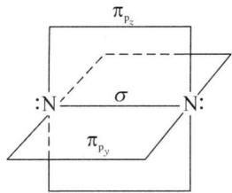

text_image

πp_c
: N — σ — N:
π_p_y

氮主要是从大气中分离或含氮化合物的分解制得。工业上由分馏液态空气而得到 $N_{2}$ 。实验室最常用的是

$NH_{4}NO_{2}$ 的分解,实际上是将 $NaNO_{2}$ 饱和溶液慢慢加到热的饱和 $NH_{4}Cl$ 溶液中: $NaNO_{2} + NH_{4}Cl \xlongequal{\triangle} N_{2} \uparrow + NaCl + 2H_{2}O$ 。

在室温下将 $Cl_{2}$ 或 $Br_{2}$ 和 $NH_{3}$ 反应、将 $NH_{3}$ 通过红热的 CuO、 $(\mathrm{NH}_{4})_{2}\mathrm{Cr}_{2}\mathrm{O}_{7}$ 热分解都可制取 $N_{2}:8NH_{3}+3Br_{2}=N_{2}+6NH_{4}Br,3CuO+2NH_{3}\xlongequal{\triangle}N_{2}+3Cu+3H_{2}O$ 。

$N_{2}$ 在工业上最大的用途是用于合成氨, 氨不但是制造一系列铵盐及尿素的原料, 还大量用于生产硝酸。利用其具有高度的化学稳定性, $N_{2}$ 作为保护气广泛应用于电子、机械、钢铁、食品等工业生产或科学研究中。液氮可作低温制冷剂。

## 2. 氮的氢化物

## (1) 氨

氨 $NH_{3}$ 在常温下是一种无色有刺激性臭味的气体。由于 $NH_{3}$ 分子间存在氢键，所以其沸点 (240 K) 比同族其他元素的氢化物都高。常温下加压即可液化，液氨汽化时吸收大量的热，故 $NH_{3}$ 常作为制冷剂。

$NH_{3}$ 为三角锥形分子, $NH_{3}$ 分子中的正、负电荷中心不重合,是一个强极性分子,易溶于极性溶剂(如水或酒精)。常温下1体积 $H_{2}O$ 能溶解约700体积的 $NH_{3}$ 。

氨的水溶液称为氨水。 $NH_{3}$ 溶于水后溶液体积显著增大，故氨水越浓，密度越小。市售氨水含 $NH_{3}$ 的质量分数 25%\~28%，其密度大约为 $0.9 \, g \cdot cm^{-3}$ 。

液氨和水一样也能发生微弱的解离： $NH_{3}+NH_{3}\rightleftharpoons NH_{4}^{+}+NH_{2}^{-},\quad K=1\times10^{-33}$ 。

液氨是一种良好的非水极性溶剂。Li、Na、K、Rb、Ca、Sr、Ba等金属均能溶于液氨成为蓝色溶液，该溶液也同样具有导电性。

$NH_{3}$ 的化学性质主要表现在三个方面：

① 具有还原性

$NH_{3}$ 中 N 的氧化数为 -3，为其最低氧化态，因此 $NH_{3}$ 只具有还原性。

$NH_{3}$ 经催化氧化可得到 NO, 这是制硝酸的基础反应:

$$
4 \mathrm{NH} _ {3} + 5 \mathrm{O} _ {2} \xrightarrow [ 1 0 7 3 \mathrm{K} ]{\mathrm{Pt-Rh}} 4 \mathrm{NO} + 6 \mathrm{H} _ {2} \mathrm{O}
$$

$NH_{3}$ 很难在空气中燃烧,但却能在纯氧中燃烧:

$$
4 \mathrm{NH} _ {3} + 3 \mathrm{O} _ {2} \xlongequal {\text {点燃}} 2 \mathrm{N} _ {2} + 6 \mathrm{H} _ {2} \mathrm{O}
$$

$NH_{3}$ 在空气中的爆炸极限的体积分数为 $16\% \sim 27\%$ , 因此在使用 $NH_{3}$ 时要注意防止明火。 $NH_{3}$ 和 $H_{2}$ 一样, 能从某些金属氧化物中夺取氧生成水。 $NH_{3}$ 能与氯、溴等发生强烈反应, 因此, 可用浓氨水检查氯气或液溴管道是否漏气, 若漏气, 有白色烟雾生成。

② 能发生取代反应

$NH_{3}$ 中的N—H键能较小,若遇到活泼金属时,其中的H可被取代,生成氨基 $(-NH_{2})$ 、亚氨基(=NH)和氮(≡N)的衍生物,如: $2NH_{3}(l)+2Na=2NaNH_{2}+H_{2}\uparrow$ , $2NH_{3}(l)+2Al=2AlN+3H_{2}\uparrow$ 。

③ 能发生加合反应

$NH_{3}$ 中的 N 原子有孤对电子, 因此倾向于能与其他分子或离子加合形成配位键, 如: $Ag^{+} + 2NH_{3} \rightleftharpoons [Ag(NH_{3})_{2}]^{+}$ 。

$NH_{3}$ 易溶于水, 这和 $NH_{3}$ 与水通过氢键形成氨的水合物有关。 $NH_{3}$ 溶于水生成水合物的同时, 能发生部分解离而使氨水显碱性: $NH_{3} + H_{2}O \rightleftharpoons NH_{3} \cdot H_{2}O \rightleftharpoons NH_{4}^{+} + OH^{-}$ 。

$NH_{3}$ 能与固体无水 $CaCl_{2}$ 发生加合反应，因此不能用其干燥 $NH_{3}: 8NH_{3} + CaCl_{2} = CaCl_{2} \cdot 8NH_{3}$ 。

氨的实验室制法常用碱分解铵盐制得： $2NH_{4}Cl + Ca(OH)_{2} \xlongequal{\triangle} CaCl_{2} + 2NH_{3}\uparrow + 2H_{2}O$ 。也可采用加热浓氨水的方法制得： $NH_{3} \cdot H_{2}O(\text{浓}) \xlongequal{\triangle} NH_{3}\uparrow + H_{2}O$ 。

工业上 $NH_{3}$ 是在高温、高压和催化剂条件下由 $N_{2}$ 和 $H_{2}$ 直接合成：

$$
\mathrm{N} _ {2} (\mathrm{g}) + 3 \mathrm{H} _ {2} (\mathrm{g}) \xrightarrow [ \mathrm{Al} _ {2} \mathrm{O} _ {3} , \mathrm{Fe} _ {2} \mathrm{O} _ {3} ]{2 0 \sim 3 0 \mathrm{MPa} , 7 2 3 \mathrm{K}} 2 \mathrm{NH} _ {3} (\mathrm{g}); \Delta_ {\mathrm{r}} H _ {\mathrm{m}} ^ {\ominus} = - 9 2. 3 8 \mathrm{kJ} \cdot \mathrm{mol} ^ {- 1}
$$

$NH_{3}$ 的合成是一个体积缩小的放热反应。若增大体系压强和降低体系温度对合成反应有利。但是,如果增大体系压强,需要具有足够的机械强度的设备,而且这种材质要不被 $H_{2}$ 所穿透。另一方面,降低体系温度,不仅达不到所要求的反应速率,并且催化剂往往需要在一定的温度下才具有较高的催化活性。

工业上氨主要用于生产化肥, 如 $\mathrm{NH}_{4} \mathrm{HCO}_{3} 、 \mathrm{NH}_{4} \mathrm{NO}_{3} 、 (\mathrm{NH}_{4})_{2} \mathrm{SO}_{4} 、 \mathrm{CO}(\mathrm{NH}_{2})_{2}$ 等, $\mathrm{NH}_{3}$ 本身也是化肥; 大量的 $\mathrm{NH}_{3}$ 还用于生产 $\mathrm{HNO}_{3}$ ; 氨可用作冷冻机和制冰机中的循环制冷剂; 液氨是一种良好的极性溶剂。

(2) 联氨(肼)

① 分子结构： $N_{2}H_{4}$ 可以看成是 $NH_{3}$ 中的一个 H 被 $NH_{2}$ 取代，联氨又叫肼，N 上仍有孤对电子。结构有两种，以顺式为主，如下图所示：

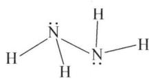

chemical

Molecular structure of ammonia (NH₃) showing nitrogen bonded to two hydrogen atoms

反式

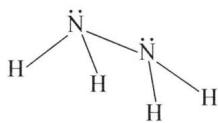

chemical

Lewis structure of ammonia (NH₃) showing lone pairs and hydrogen bonding

顺式

② 物理性质：纯的联氨是无色液体，熔点：1.4℃，沸点：113.5℃。

③ 联氨的性质

i) 碱性

其碱性的机理与 $NH_{3}$ 一样，是二元弱碱，碱性比 $NH_{3}$ 弱： $N_{2}H_{4} + H_{2}O \rightleftharpoons N_{2}H_{5}^{+} + OH^{-}$ ， $K_{bl} = 3.0 \times 10^{-6}$ 。

ii) 还原性

$N_{2}H_{4}$ 中 N 显 -2 价，既有氧化性又有还原性，但以还原性为主： $N_{2}H_{4} + 4AgBr = 4Ag + N_{2}\uparrow + 4HBr, N_{2}H_{4} + 2H_{2}O_{2} = N_{2}\uparrow + 4H_{2}O$ 。 $N_{2}H_{4}$ 是一种火箭燃料。

iii）配位能力

因为 $N_{2}H_{4}$ 中 N 有孤电子对，所以可与过渡金属正离子形成配合物，如： $Co^{3+} + 6N_{2}H_{4} = [Co(N_{2}H_{4})_{6}]^{3+}$ ， $Pt^{2+} + 2NH_{3} + 2N_{2}H_{4} = [Pt(NH_{3})_{2}(N_{2}H_{4})_{2}]^{2+}$ 。

④ 联氨的制备

用 NaClO 氧化过量 $NH_{3}$ 水制取 $N_{2}H_{4}$ : $NH_{3} + ClO^{-} = NH_{2}Cl + OH^{-}$ (快), $NH_{3} + NH_{2}Cl + OH^{-} = N_{2}H_{4} + Cl^{-} + H_{2}O$ (慢)。副反应: $2NH_{2}Cl + N_{2}H_{4} = N_{2}\uparrow + 2NH_{4}^{+} + 2Cl^{-}$ 。

痕量的过渡金属离子的存在可加速 $N_{2}H_{4}$ 的分解, 因此实验中常加入明胶(吸附)或络合剂。

(3) 羟氨

$NH_{2}OH$ 可看成是 $NH_{3}$ 中的 H 被 OH 取代，仍有孤对电子，有弱碱性 ( $K_{b}=9.1\times10^{-9}$ )，可以配位。纯羟氨是白色固体，又叫胺，其氧化还原性能和联氨相似，由于动力学原因作氧化剂时反应速度慢,在酸或碱中均是还原剂。如: $2\mathrm{NH}_{2}\mathrm{OH} + 2\mathrm{AgBr} = 2\mathrm{Ag} + \mathrm{N}_{2} \uparrow + 2\mathrm{HBr} + 2\mathrm{H}_{2}\mathrm{O}$ 。

羟氨也可以与 HCl、 $H_{2}SO_{4}$ 成盐 $NH_{3}OHCl$ 或 $(\mathrm{NH}_{2}\mathrm{OH} \cdot \mathrm{HCl})$ 、 $(\mathrm{NH}_{3}\mathrm{OH})_{2}\mathrm{SO}_{4}$ 或 $\left[\left(\mathrm{NH}_{2}\mathrm{OH}\right)_{2} \cdot \mathrm{H}_{2}\mathrm{SO}_{4}\right]$ 。

(4) 叠氨酸

① 分子结构：见下图，N(2)采取 sp 杂化分别和 N(1) 和 N(3) 形成一个 $\sigma$ 键，并与 N(1) 另一 p 轨道形成定域 $\pi$ 键；N(3) 则采取 $sp^{2}$ 杂化，并与 N(1)、N(2) 共同形成离域 $\pi$ 键 $\Pi_{3}^{4}$ 。当叠氮酸电离出 $H^{+}$ 形成叠氮酸根 $N_{3}^{-}$ 后，由于和 $CO_{2}$ 是等电子体，可以推出是直线型的结构，并含有 2 套互相垂直的 $\Pi_{3}^{4}$ 。

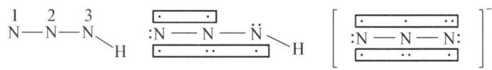

chemical

Chemical structure diagram showing a polymer chain with nitrogen and hydrogen atoms, including repeating units and terminal groups

② 性质

$HN_{3}$ 为无色液体, $N_{3}^{-}$ 是一种拟卤离子,反应类似于卤素离子。

i) 酸性：与醋酸接近 $(K_{a}=1.8\times10^{-5})$ ，它是氮的氢化物中唯一的酸性物质。

ii) 重金属盐难溶： $\mathrm{AgN}_{3}$ ， $\mathrm{Pb(N_{3})_{2}}$ ， $\mathrm{HgN}_{3}$ 均为难溶盐（白色）。

iii) 稳定性: $HN_{3}$ 不稳定, 受热爆炸分解为 $H_{2}$ 和 $N_{2}$ 。活泼金属的叠氮酸盐较稳定, Pb、Ag 等叠氮酸盐不稳定, 易爆炸, $\mathrm{Pb(N_{3})_{2}}$ 可以做雷管的引火物。

③ 制法： $N_{2}H_{4} + HNO_{2} = 2H_{2}O + HN_{3}$

## 3. 铵盐

铵盐是含有 $NH_{4}^{+}$ 化合物的总称。铵盐大多为无色晶体，一般易溶于水。铵盐的晶型及溶解度和钾盐或铷盐相似，例如 $KClO_{4}$ 及 $NH_{4}ClO_{4}$ 都难溶于水。铵盐具有热稳定性低、易水解的特点。

(1) 热稳定性低

铵盐受热极易分解,其分解情况与酸根的性质有关。

① 若对应的酸为非氧化性的挥发性酸, 则加热铵盐时, 它完全分解而没有固态的残留物。如: $NH_{4}HCO_{3}\xlongequal{\triangle}NH_{3}\uparrow+CO_{2}\uparrow+H_{2}O\uparrow$ , $NH_{4}Cl\xlongequal{\triangle}NH_{3}\uparrow+HCl\uparrow$ 。

② 若对应的酸为非氧化性的不挥发性酸, 则加热铵盐时, 除分解放出 $\mathrm{NH}_{3}$ 外, 还有游离酸或酸式盐留下。如: $(\mathrm{NH}_{4})_{2} \mathrm{SO}_{4} \xlongequal{\triangle} \mathrm{NH}_{3} \uparrow + \mathrm{NH}_{4} \mathrm{HSO}_{4}, (\mathrm{NH}_{4})_{3} \mathrm{PO}_{4} \xlongequal{\triangle} 3 \mathrm{NH}_{3} \uparrow + \mathrm{H}_{3} \mathrm{PO}_{4}$ 。

③ 若对应的酸为氧化性酸, 则分解生成的 $\mathrm{NH}_{3}$ 会被氧化。如: $\mathrm{NH}_{4} \mathrm{NO}_{3} \xlongequal{\triangle} \mathrm{N}_{2} \mathrm{O} \uparrow + 2 \mathrm{H}_{2} \mathrm{O} \uparrow$ , $(\mathrm{NH}_{4})_{2} \mathrm{Cr}_{2} \mathrm{O}_{7} \xlongequal{\triangle} \mathrm{N}_{2} \uparrow + 4 \mathrm{H}_{2} \mathrm{O} \uparrow + \mathrm{Cr}_{2} \mathrm{O}_{3}$ 。

## (2) 易水解

铵盐水解程度的大小及溶液的酸碱性取决于铵盐的酸根离子。

① 由强酸组成的铵盐, 其水溶液显酸性。例如 $\mathrm{NH}_{4} \mathrm{Cl} 、 (\mathrm{NH}_{4})_{2} \mathrm{SO}_{4} 、 \mathrm{NH}_{4} \mathrm{NO}_{3}$ 等的水解: $\mathrm{NH}_{4}^{+} + \mathrm{H}_{2} \mathrm{O} \rightleftharpoons \mathrm{NH}_{3} + \mathrm{H}_{3} \mathrm{O}^{+}$ , 若在铵盐水溶液中加入强碱并稍微加热, 则上述平衡会向右移动, 有氨气逸出。这一反应常用来鉴定水溶液中是否含有 $\mathrm{NH}_{4}^{+}$ 离子。  
② 由弱酸生成的铵盐, 其水解作用更大, 因为 $\mathrm{NH}_{4}^{+}$ 、酸根离子都能起水解作用, 且相互促进。这类盐的水溶液的酸碱性取决于酸和碱的酸碱性的相对强弱。例如, 因为 HAc 的 $K_{\mathrm{a}} = 1.76 \times 10^{-5}$ , 所以 $\mathrm{NH}_{4} \mathrm{Ac}$ 溶液接近中性; 因为 HCN 的 $K_{\mathrm{a}} = 4.93 \times 10^{-10}$ , 所以 $\mathrm{NH}_{4} \mathrm{CN}$ 溶液呈碱性。

铵盐在工农业生产上有重要用途。大量的铵盐用作氮肥，如 $NH_{4}NO_{3}$ 、 $(NH_{4})_{2}SO_{4}$ 、 $NH_{4}Cl$ 、 $NH_{4}HCO_{3}$ 等。 $NH_{4}NO_{3}$ 还是某些炸药的成分， $NH_{4}Cl$ 广泛应用于制备干电池和染料工业，它也常用在金属的焊接上，以除去金属表面的氧化物薄层。

## 4. 氮的氧化物

氮的氧化物有 $N_{2}O$ 、NO、 $N_{2}O_{3}$ 、 $NO_{2}$ 、 $N_{2}O_{4}$ 、 $N_{2}O_{5}$ 等多种，其中 N 的氧化数从 +1 到 +5。除了 $N_{2}O$ 毒性较小外，其他毒性都很强。

$N_{2}O$ 为无色有甜味的气体,又称笑气,有生理作用,可用作麻醉剂,稍溶于水,溶于乙醇、乙醚及浓硫酸。 $N_{2}O$ 与 $CO_{2}$ 为等电子体,中心 N 原子采取 sp 杂化,分子构型为直线型。 $N_{2}O$ 是一种温室气体,其效果是 $CO_{2}$ 的 296 倍。

NO 为无色无味气体, 稍溶于水、乙醇, 溶于 $CS_{2}$ , NO 为奇电子化合物, 有机反应中可看作自由基。

$N_{2}O_{3}$ 为红棕色有刺激性气体,液态时为深蓝色,有挥发性,固态时为蓝色。

$\mathrm{NO}_2$ 又称为过氧化氮，在常温下为红棕色有刺激性气味的气体，溶于碱、 $\mathrm{CS}_2$ 和氯仿，易溶于水。中心原子N采取不等性的 $\mathfrak{sp}^2$ 杂化，与配位的O原子形成 $\Pi_3^4$ 的离域 $\pi$ 键。由于中心原子N上存在一个单电子，结构不稳定，通常情况下与其二聚体形式： $\mathrm{N}_2\mathrm{O}_4$ 混合存在， $\mathrm{NO}_2$ 在降温或加压等条件下向生成 $\mathrm{N}_2\mathrm{O}_4$ 的方向转化。

$\mathrm{N}_{2} \mathrm{O}_{4}$ 气态时为无色, 液态时为黄色, 固态时为无色。分子中两个 $\mathrm{N}$ 都采取

$sp^{2}$ 杂化, 形成平面分子, 整个分子中存在 $\Pi_{6}^{8}$ 的离域 $\pi$ 键。通常见到的 $N_{2}O_{4}$ 制成品是黄褐色高密度液体, 这是由于其中混有 $NO_{2}$ 的原因。

$N_{2}O_{5}$ 在通常状态下为无色柱状晶体，熔点 306 K，易升华并发生分解。微溶于水，水溶液呈酸性，溶于热水时生成硝酸。分子中有一个 O 位于中心采取 sp 杂化，与两侧的 $-NO_{2}$ 分别形成一套 $\Pi_{4}^{6}$ 。

低氧化态的氮的氧化物,例如 $N_{2}O$ 和 NO,属中性氧化物,它们不与水也不与碱作用。当氧化物中 N 的氧化数增大后,则过渡为酸性氧化物,如 $N_{2}O_{3}$ 、 $NO_{2}$ 、 $N_{2}O_{5}$ ,它们与水作用生成酸,与碱作用生成盐。

氮的不同氧化物,其化学活性相差较大。 $N_{2}O$ 的化学性质不活泼,既难氧化,也难还原。从 NO 开始,表现出随着氧化数增加,还原性逐渐减弱,氧化性逐渐增强的态势。

氮氧化物是造成大气污染的一个重要原因,其危害仅次于硫氧化物。在工业制备 $HNO_{3}$ 、硝酸盐、硝基化合物等过程中,都会排出含有大量 NO 和 $NO_{2}$ (通常用 $NO_{x}$ 表示)的废气。

工业上一般用碱液吸收法处理 $NO_{x}$ 废气。所用碱通常为 NaOH 或 $Na_{2}CO_{3}$ 的废碱液。吸收反应包含着歧化和逆歧化两方面的过程：

歧化过程： $2NO_{2} + 2NaOH = NaNO_{3} + NaNO_{2} + H_{2}O$ ;

逆歧化过程： $\mathrm{NO} + \mathrm{NO}_2 + 2\mathrm{NaOH} = 2\mathrm{NaNO}_2 + \mathrm{H}_2\mathrm{O}$

## 5. 硝酸和硝酸盐

## (1) 硝酸

纯硝酸为无色透明的油状液体, 易挥发, 有刺激性气味, 231 K 时可凝结为无色晶体, 沸点为 356 K, 可与水按任意比互溶。市售硝酸按浓度一般可分为硝酸、发烟硝酸、红色发烟硝酸三种。

硝酸是指质量分数为 $65\% \sim 68\%$ 的硝酸，为无色透明液体，密度为 $1.39 \mathrm{~g} / \mathrm{cm}^{3} \sim 1.42 \mathrm{~g} / \mathrm{cm}^{3}$ 。在受热或光照时，硝酸会分解出少量的 $\mathrm{NO}_{2}$ 而使酸液显浅黄色。

发烟硝酸是指质量分数约为 $98\%$ 的硝酸, 密度在 $1.5 \mathrm{~g} / \mathrm{cm}^{3}$ 以上, 因含有 $\mathrm{NO}_{2}$ 而呈黄色, 具有挥发性, 逸出的 $\mathrm{HNO}_{3}$ 蒸气与空气中的水分形成的酸雾看似发烟, 故称发烟硝酸。

红色发烟硝酸是指质量分数为 100% 的 $HNO_{3}$ 。因溶有过量的 $NO_{2}$ ，故呈红棕色。当敞开容器盖时，会不断逸出红棕色的 $NO_{2}$ 气体。它比普通硝酸具有更强的氧化性，可作火箭燃料的氧化剂。

实验室一般使用质量分数为 $65\%$ 左右的 $\mathrm{HNO}_3$ ，工业上常使用发烟硝酸，因为发烟硝酸具有如下优点：①氧化能力强。制备无机盐时发烟硝酸能直接溶解许多金属。有机合成如硝化反应等更需要发烟硝酸。此外，发烟硝酸与金属作用时，所含的 $NO_{2}$ 还具有催化加速反应的作用。②可用铝罐贮运。冷的发烟硝酸对金属铝、铁、铬等金属有钝化作用。金属铝质轻价廉，加工容易，是理想的 $HNO_{3}$ 贮运材料。

在常见的无机酸中,以 $HNO_{3}$ 的氧化性最为突出,表现在:

① 能氧化 C、S、P、 $I_{2}$ 等非金属，如： $P + 5HNO_{3}$ （浓） $\xlongequal{\triangle} H_{3}PO_{4} + 5NO_{2}\uparrow + H_{2}O, 3I_{2} + 10HNO_{3}$ （发烟） $\xlongequal{\triangle} 6HIO_{3} + 10NO\uparrow + 2H_{2}O$ 。

② 能氧化除金、铂、铱、钌、铑、钛、铌、钽等外的金属。 $HNO_{3}$ 与金属反应，可以有多种氧化态的还原产物：

$$
\mathrm{NO} _ {2} \text {、} \mathrm{HNO} _ {2} \text {、} \mathrm{NO} \text {、} \mathrm{N} _ {2} \mathrm{O} \text {、} \mathrm{N} _ {2} \text {、} \mathrm{NH} _ {4} ^ {+}
$$

$HNO_{3}$ 的还原产物究竟是哪一种, 主要决定于金属的活泼性和 $HNO_{3}$ 的浓度。一般地说, 浓 $HNO_{3}$ 的还原产物是 $NO_{2}$ , 稀 $HNO_{3}$ 为 NO。当稀 $HNO_{3}$ 与活泼金属(如 Mg、Zn 等)反应时, 也有可能进一步被还原成 $N_{2}O$ 、 $N_{2}$ 甚至 $NH_{4}^{+}$ :

$$
\mathrm{Cu} + 4 \mathrm{HNO} _ {3} (\text {浓}) = \mathrm{Cu(NO} _ {3}) _ {2} + 2 \mathrm{NO} _ {2} \uparrow + 2 \mathrm{H} _ {2} \mathrm{O}
$$

$$
3 \mathrm{Cu} + 8 \mathrm{HNO} _ {3} (\text {   稀   }) = 3 \mathrm{Cu(NO} _ {3}) _ {2} + 2 \mathrm{NO} \uparrow + 4 \mathrm{H} _ {2} \mathrm{O}
$$

$$
4 \mathrm{Zn} + 1 0 \mathrm{HNO} _ {3} (\text {   稀   }) = 4 \mathrm{Zn} (\mathrm{NO} _ {3}) _ {2} + \mathrm{N} _ {2} \mathrm{O} \uparrow + 5 \mathrm{H} _ {2} \mathrm{O}
$$

$$
4 \mathrm{Zn} + 1 0 \mathrm{HNO} _ {3} (\text {   很稀   }) = 4 \mathrm{Zn} (\mathrm{NO} _ {3}) _ {2} + \mathrm{NH} _ {4} \mathrm{NO} _ {3} + 3 \mathrm{H} _ {2} \mathrm{O}
$$

从氮的元素电势图来看, 因为 $\varphi^{\ominus}\left(\mathrm{NO}_{3}^{-}/\mathrm{N}_{2}\right)=+1.25\mathrm{~V}$ 为最大, 所以 $HNO_{3}$ 被还原成 $N_{2}$ 的趋势最大, 但事实并非如此, $HNO_{3}$ 被还原为 $N_{2}$ 速率太慢。

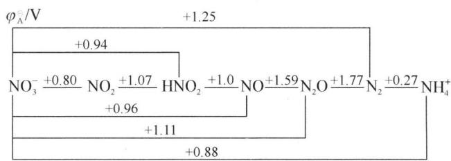

chemical

Redox potential diagram for ammonia (NH₄⁺) showing oxidation states and charge values

多数金属的氧化产物为硝酸盐, 只有氧化物难溶于 $HNO_{3}$ 的金属(如 Sn、Sb、W、Mo 等)才生成氧化物。如: $Sn + 4HNO_{3} = SnO_{2} + 4NO_{2} \uparrow + 2H_{2}O$ 。

若金属有多种氧化态时,要确定产物的形式比较困难。金属在硝酸盐中的氧化数,与其相应电对的电极电势值有关。例如:已知下列电对的电极电势:

$$
\begin{array}{l} \mathrm{Fe} ^ {3 +} / \mathrm{Fe} ^ {2 +} \quad \mathrm{PbO} _ {2} / \mathrm{Pb} ^ {2 +} \quad \mathrm{NO} _ {3} ^ {-} / \mathrm{NO} _ {2} \\ \varphi^ {\ominus} / \mathrm{V} + 0. 7 7 1 + 1. 4 4 5 + 0. 8 0 \\ \end{array}
$$

由此可推知 $HNO_{3}$ 还可将 $Fe^{2+}$ 氧化为 $Fe^{3+}$ ，而不能将 $Pb^{2+}$ 氧化为 $PbO_{2}$ 。所以过量的 $HNO_{3}$ 与铁反应时能生成 $\mathrm{Fe(NO_{3})_{3}}$ ，而与铅反应则只能生成 $\mathrm{Pb(NO_{3})_{2}}$ 。

Au、Pt 等金属不能被 $HNO_{3}$ 溶解，只能溶于王水。王水是由 1 体积浓硝酸和 3 体积浓盐酸混合而成的溶液，有更强的氧化性。如： $Au + HNO_{3} + 4HCl = HAuCl_{4} + NO \uparrow + 2H_{2}O$ ， $3Pt + 4HNO_{3} + 18HCl = 3H_{2}PtCl_{6} + 4NO \uparrow + 8H_{2}O$ 。

③ 能氧化某些有机化合物及具有还原性的无机化合物。例如，松节油与浓硝酸接触会发生燃烧； $HNO_{3}$ 能将 $Fe^{2+}$ 氧化为 $Fe^{3+}$ 等。如： $3FeO + 10HNO_{3} = 3Fe(NO_{3})_{3} + NO \uparrow + 5H_{2}O$ 。

浓硝酸与苯等有机物能发生硝化反应：

$$
\mathrm{C} _ {6} \mathrm{H} _ {5} + \mathrm{HO} - \mathrm{NO} _ {2} \xrightarrow [ \triangle ]{\text {浓硫酸}} \mathrm{C} _ {6} \mathrm{H} _ {5} - \mathrm{NO} _ {2} + \mathrm{H} _ {2} \mathrm{O}
$$

目前,工业上主要采用氨的催化氧化法制取 $HNO_{3}$ 。将氨和空气的混合气体通过加热的铂铑合金网可生成 NO; NO 进一步与空气中的 $O_{2}$ 反应生成 $NO_{2}$ ; $NO_{2}$ 遇水发生歧化反应生成 $HNO_{3}$ 。此法一般只能制得质量分数为 50%\~55% 的 $HNO_{3}$ 。因浓 $H_{2}SO_{4}$ 具有强的脱水性, 将制得的 $HNO_{3}$ 与浓 $H_{2}SO_{4}$ 混合加热, 将挥发出来的 $HNO_{3}$ 蒸气冷凝, 即可制得浓 $HNO_{3}$ 。

实验室制备 $HNO_{3}$ 不常进行。若要制备，可由浓硫酸与硝酸钠共热制得： $NaNO_{3} + H_{2}SO_{4} \xlongequal{\triangle} NaHSO_{4} + HNO_{3}$ 。

硝酸是无机化学工业中三大强酸之一，在国民经济及国防工业等占据重要地位。硝酸是重要基本化工原料，广泛应用于制染料、炸药、医药、塑料、氮肥、化学试剂以及用于冶金、有机合成等。

## (2) 硝酸盐

金属和金属氧化物、氢氧化物及碳酸盐均可与硝酸作用生成硝酸盐。大多数硝酸盐为无色晶体，几乎所有的硝酸盐都易溶于水。

固体硝酸盐在常温下一般都比较稳定,但受热则能分解放出 $O_{2}$ ,并表现出极强的氧化性,其热分解产物取决于硝酸盐中正离子的性质。无水硝酸盐的热分解一般有四种形式:

① 碱金属和碱土金属的硝酸盐热分解时放出 $O_{2}$ ，并生成亚硝酸盐。如：

$$
2 \mathrm{NaNO} _ {3} \stackrel {\triangle} {=} 2 \mathrm{NaNO} _ {2} + \mathrm{O} _ {2} \uparrow 。
$$

② 电势序在 Mg～Cu 之间的金属硝酸盐, 分解时得到相应的金属氧化物、 $NO_{2}$ 和 $O_{2}$ 。如: $2\mathrm{Pb}(\mathrm{NO}_{3})_{2}\xlongequal{\triangle}2\mathrm{PbO}+4\mathrm{NO}_{2}\uparrow+\mathrm{O}_{2}\uparrow$ 。

③ 电势序在 Cu 以后的金属硝酸盐, 分解时得到相应金属单质、 $NO_{2}$ 和 $O_{2}$ 。如: $2AgNO_{3}\xlongequal{\triangle}2Ag+2NO_{2}\uparrow+O_{2}\uparrow$ 。

④ 硝酸铵的分解产物与温度有关：如 $200^{\circ}C \sim 260^{\circ}C$ 时分解为 $N_{2}O$ 和 $H_{2}O$ ，超过 $300^{\circ}C$ 则分解为 $N_{2}$ 、 $O_{2}$ 和 $H_{2}O$ 。

带结晶水的硝酸盐受热时会先失去结晶水,同时熔化或水解,最后才分解。例如: $\mathrm{Al(NO_{3})_{3}\cdot9H_{2}O}$ 晶体在 343 K 能熔化并失去 3 分子水,在 413 K 时能生成碱式盐 $2\mathrm{Al}_{4}(\mathrm{OH})_{9}(\mathrm{NO}_{3})_{3}\cdot5\mathrm{H}_{2}\mathrm{O}$ , 473 K 时能分解生成 $Al_{2}O_{3}$ 。

硝酸盐有着广泛用途。硝酸钠、硝酸钾和硝酸钙是很好的化肥，硝酸钾可用来制造黑火药及焰火等，硝酸铵可作肥料，也可制炸药。

因为几乎所有的硝酸盐受热分解都有氧气放出,所以硝酸盐在高温下大都是供氧剂。它与可燃物混合在一起时,受热会迅猛燃烧甚至爆炸。因此贮存、使用时需特别注意安全。

## 6. 亚硝酸及其盐

亚硝酸 $HNO_{2}$ 为一元弱酸， $K^{\ominus}=7.2\times10^{-4}$ ，极不稳定，只能存在于稀的冷溶液中，浓度稍大或加热时会立即分解： $2HNO_{2}=H_{2}O+NO\uparrow+NO_{2}\uparrow$ 。

将 $NO_{2}$ 和 NO 的混合物溶解在接近 273 K 时的水中, 可生成 $HNO_{2}$ 水溶液: $NO_{2} + NO + H_{2}O = 2HNO_{2}$ 。

在亚硝酸盐溶液中加入稀 $H_{2}SO_{4}$ ，也可得到 $HNO_{2}$ 溶液： $NaNO_{2} + H_{2}SO_{4} = HNO_{2} + NaHSO_{4}$ 。

亚硝酸不稳定,其盐却相当稳定。 $NaNO_{2}$ 和 $KNO_{2}$ 是两种最主要的亚硝酸盐,都是白色或微黄色晶体,吸湿性强,易溶于水,其水溶液呈碱性。

亚硝酸及其盐中 N 的氧化数是 +3，处在 N 的中间氧化态，因此，它们具有氧化、还原性，而氧化性比还原性突出。例如， $HNO_{2}$ 在水溶液中能将 $I^{-}$ 氧化为单质碘： $2HNO_{2} + 2I^{-} + 2H^{+} = I_{2} + 2NO \uparrow + 2H_{2}O$ 。

当亚硝酸盐遇到了强氧化剂时, 可被氧化成硝酸盐。如: $5KNO_{2} + 2KMnO_{4} + 3H_{2}SO_{4} = 2MnSO_{4} + 5KNO_{3} + K_{2}SO_{4} + 3H_{2}O$ 。

$NO_{2}^{-}$ 是很好的配体, 可与许多金属离子形成配合物, 如: $3K^{+} + Co^{3+} + 6NO_{2}^{-} = K_{3}[Co(NO_{2})_{6}] \downarrow$ (黄色), 此方法可用于检出 $K^{+}$ 离子。

亚硝酸在工业上用于有机合成,使胺类转变成重氮化合物,制备偶氮染料等。 $NaNO_{2}$ 和 $KNO_{2}$ 广泛应用于硝基化合物、偶氮染料的制备,还常用作漂白剂、媒染剂、电镀缓蚀剂、金属热处理剂等;在肉类制品加工中 $NaNO_{2}$ 虽能用作发色剂、防腐剂,但它是有毒的,食用 0.3 g 可使人急性中毒,3 g 可致人死亡,长期食用会导致细胞变异,产生癌变。蔬菜中含有较多的硝酸盐,若在较高温度下存放时间过长,在细菌和酶的作用下,硝酸盐易被还原成为亚硝酸盐,因此隔夜的剩菜尽可能不吃。同样地,各种肉类罐头、腌制时间不够长的咸菜等都不宜吃得过多。

## 三、磷及其化合物

## 1. 单质磷

磷有多种同素异形体,常见的是白磷、红磷和黑磷,它们熔化为液体或汽化为气体时皆为四面体 $P_{4}$ 分子,只是白磷加热到 1073 K 以上时可产生 $P_{2}$ 分子。

纯的白磷为无色透明晶体，见光逐渐变为黄色，故又称黄磷。白磷是由 $\mathrm{P}_{4}$ 分子构成的非极性分子，属分子晶体。白磷质软，熔点 $317\mathrm{K}$ ，沸点 $554\mathrm{K}$ ，着火点 $323\mathrm{K}$ ，不溶于水，易溶于 $\mathrm{CS}_{2}$ 。白磷剧毒，对眼睛、皮肤和呼吸道有破坏作用，人的致死量为 $0.1\mathrm{g}$ 。皮肤接触白磷受伤后，可用 $0.2\mathrm{mol} \cdot \mathrm{L}^{-1}\mathrm{CuSO}_{4}$ 溶液浸洗，它也是白磷中毒的解毒剂。 $\mathrm{2P} + 5\mathrm{CuSO}_{4} + 8\mathrm{H}_{2}\mathrm{O} = 5\mathrm{Cu} + 2\mathrm{H}_{3}\mathrm{PO}_{4} + 5\mathrm{H}_{2}\mathrm{SO}_{4}$ 。

磷的化学活泼性远高于氮。磷易与卤素剧烈反应生成相应的卤化物。磷与适量的卤素单质作用生成 $\mathrm{PX}_{3}(\mathrm{X}=\mathrm{Cl},\mathrm{Br},\mathrm{I})$ ，与过量的卤素单质作用生成 $\mathrm{PX}_{5}$ 。磷也能与一些金属反应。强氧化剂如浓硝酸能将磷氧化成磷酸。白磷溶解在浓碱溶液中生成次磷酸盐和膦（ $PH_{3}$ ，大蒜味，剧毒）： $4P + 3NaOH + 3H_{2}O = 3NaH_{2}PO_{2} + PH_{3}\uparrow$ 。

白磷是一种强的还原剂，在空气中会发生自燃，在暗处可看到发光现象。白磷贮存时需与空气隔绝，常保存于水中。白磷在隔绝空气的条件下加热到 533 K，则逐渐转变为红磷。若将红磷在隔绝空气的条件下加热到 737 K，则升华变为蒸气，迅速冷却后又得到白磷。

红磷又称赤磷, 是暗红色粉末, 473 K 以下不会着火, 不溶于水和有机溶剂, 无毒。红磷的结构较复杂, 属巨分子结构。有观点认为红磷是由 $\mathrm{P}_{4}$ 分子断裂一个键后互相结合起来的长链分子。红磷化学性质虽不如白磷活泼, 但仍比较活泼。它在室温下能与空气中的氧缓慢反应生成吸水性很强的氧化物而变潮发黏, 所以红磷需密闭保存。

黑磷是一种有金属光泽的晶体或无定型固体,熔点 861 K,不溶于水和有机溶剂,无毒,有导电性。黑磷也属巨分子,具有类似石墨的层状结构。黑磷在干燥空气及室温下化学性质稳定,不易着火。黑磷可由红磷在压强 $1.2 \times 10^{9}$ Pa、温度 773 K 的条件下制得。

工业上制备单质磷是以磷矿石为原料,通常是将磷酸钙矿石、石英砂 $SiO_{2}$ 和煤按一定的比例混合后在电弧炉中熔烧而制得,反应中 $SiO_{2}$ 先将 $P_{4}O_{10}$ 从磷酸钙矿石中置换出来,随即被还原:

$$
2 \mathrm{Ca} _ {3} (\mathrm{PO} _ {4}) _ {2} + 6 \mathrm{SiO} _ {2} + 1 0 \mathrm{C} \xlongequal {1 6 7 3 \sim 1 7 7 3 \mathrm{K}} 6 \mathrm{CaSiO} _ {3} + 1 0 \mathrm{CO} \uparrow + \mathrm{P} _ {4} \uparrow
$$

将生成的磷蒸气导入水中迅速冷却,即凝结成白磷。

白磷主要用于制备纯度较高的 $P_{4}O_{10}$ 、 $H_{3}PO_{4}$ 、 $PCl_{3}$ 、 $POCl_{3}$ 、 $P_{4}S_{10}$ 等，少量用于生产红磷，军事上用它制作磷燃烧弹、烟幕弹等。红磷则主要用于制造农药及安全火柴等。

## 2. 磷的氢化物

磷有多种氢化物 $P_{n}H_{n+2}(n=1\sim6)$ ，主要有膦 $PH_{3}$ 和联膦 $P_{2}H_{4}$ ，膦较稳定。 $PH_{3}$ 是无色、有类似大蒜臭味的剧毒气体。 $PH_{3}$ 的极性比 $NH_{3}$ 小，分子间不存在氢键，因此， $PH_{3}$ 的熔点 140 K、沸点 186 K，比 $NH_{3}$ 低，在水中的溶解度比 $NH_{3}$ 小，在 290 K 时 1 体积水仅能溶解 0.26 体积的 $PH_{3}$ 。

$\mathrm{PH}_{3}$ 的化学性质与 $\mathrm{NH}_{3}$ 相似, 具有还原性、加合性、碱性。 $\mathrm{PH}_{3}$ 的还原性比 $\mathrm{NH}_{3}$ 强, 它能将 $\mathrm{CuSO}_{4}$ 还原为 $\mathrm{Cu}_{3}\mathrm{P}$ 和 $\mathrm{Cu}$ ; 纯 $\mathrm{PH}_{3}$ 在 423 K 时能在空气中着火燃烧, 生成磷酸; 若 $\mathrm{PH}_{3}$ 中混有更易自燃的 $\mathrm{P}_{2}\mathrm{H}_{4}$ , 则在室温下就能自燃。 $\mathrm{PH}_{3}$ 的碱性比 $\mathrm{NH}_{3}$ 弱, 在水溶液中不能形成磷盐, 例如: 碘化磷 $\mathrm{PH}_{4}\mathrm{I}$ 溶于水后完全水解: $\mathrm{PH}_{4}\mathrm{I} + \mathrm{H}_{2}\mathrm{O} = \mathrm{PH}_{3}\uparrow + \mathrm{I}^{-} + \mathrm{H}_{3}\mathrm{O}^{+}$ 。

${\mathrm{{PH}}}_{3}$ 的衍生物 ${\mathrm{{PR}}}_{3}$ (R 为烷基或苯基)有较强的加合性。

制备 $\mathrm{PH}_3$ 一般可采用下述几种方法：

(1) 活泼金属磷化物的水解: 此法可制得高达 $10 \mathrm{~mol}$ 的 $\mathrm{PH}_{3}$ , 且反应几乎是定量进行: $\mathrm{Ca}_{3} \mathrm{P}_{2} + 6 \mathrm{H}_{2} \mathrm{O} = 3 \mathrm{Ca(OH)}_{2} \downarrow + 2 \mathrm{PH}_{3} \uparrow$ 。

(2) 碘化磷和强碱反应: 此法可制纯度很高的 $\mathrm{PH}_{3}: \mathrm{PH}_{4} \mathrm{I} + \mathrm{NaOH} = \mathrm{NaI} + \mathrm{PH}_{3} \uparrow + \mathrm{H}_{2} \mathrm{O}$ 。

(3) 白磷在热碱溶液中歧化: $\mathrm{P}_{4} + 3\mathrm{KOH} + 3\mathrm{H}_{2}\mathrm{O}\stackrel{\triangle}{=} \mathrm{PH}_{3}\uparrow + 3\mathrm{KH}_{2}\mathrm{PO}_{2}$ 。

## 3. 磷的氧化物

常见磷的氧化物有六氧化四磷 $P_{4}O_{6}$ （简写 $P_{2}O_{3}$ ）和十氧化四磷 $P_{4}O_{10}$ （简写 $P_{2}O_{5}$ ），分别是磷在空气不足和空气充足情况下燃烧的产物，其结构都与 $P_{4}$ 的四面体结构有关，见下图：

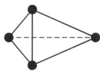

natural_image

Geometric diagram of a tetrahedron with vertices marked by solid and dashed lines (no text or labels)

$P_{4}$

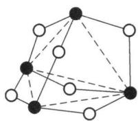

natural_image

Geometric diagram of a polyhedron with solid and dashed lines indicating bonds or connections (no text or labels)

$P_{4}O_{6}$

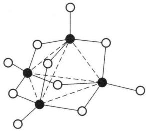

chemical

Molecular structure diagram showing a central atom bonded to surrounding atoms, with dashed lines indicating bonds or interactions.

$\mathrm{P}_{4}\mathrm{O}_{10}$

(1) 六氧化四磷

$P_{4}O_{6}$ 又称亚磷酸酐, 气味似蒜, 熔点 297 K, 沸点 447 K, 溶于苯、乙醚和 $CS_{2}$ 等有机溶剂, 有毒。固态时为有滑腻感的白色晶体, 在 297 K 时能熔融为易流动的无色透明液体。

$P_{4}O_{6}$ 能缓缓溶解于冷水而生成亚磷酸： $P_{4}O_{6} + 6H_{2}O$ （冷）—— $4H_{3}PO_{3}$ 。

$P_{4}O_{6}$ 在热水中能激烈地发生歧化反应,生成磷酸和膦: $P_{4}O_{6} + 6H_{2}O$ (热) = $3H_{3}PO_{4} + PH_{3}\uparrow$ 。

(2) 十氧化四磷

$P_{4}O_{10}$ 又称磷酸酐，工业上常称为无水磷酸，为难挥发、强吸湿性的白色雪花状固体，熔点 $853 \sim 858 \, K$ ， $573 \, K$ 升华。它能浸蚀皮肤和粘膜，人体切勿与其接触。

$P_{4}O_{10}$ 极易与水反应,放出大量的热 $(-284.5\ \text{kJ}\cdot\text{mol}^{-1})$ ,生成 P(V)的各种含氧酸,首先生成偏磷酸,然后转化为焦磷酸,最后生成正磷酸:

$$
\mathrm{P} _ {4} \mathrm{O} _ {1 0} \longrightarrow (\mathrm{HPO} _ {3}) _ {3} \longrightarrow 2 \mathrm{H} _ {4} \mathrm{P} _ {2} \mathrm{O} _ {7} \longrightarrow 4 \mathrm{H} _ {3} \mathrm{PO} _ {4}
$$

为了加快转化, 反应必须在有 $HNO_{3}$ 存在的条件下煮沸进行: $P_{4}O_{10} + 6H_{2}O \xlongequal[\triangle]{HNO_{3}} 4H_{3}PO_{4}$ 。

$P_{4}O_{10}$ 具有强的亲水性, 不但能有效地吸收气体或液体中的水, 而且还能从许多化合物中夺取水, 如: $P_{4}O_{10} + 12HNO_{3} = 4H_{3}PO_{4} + 6N_{2}O_{5} \uparrow$ , $P_{4}O_{10} + 6H_{2}SO_{4} = 4H_{3}PO_{4} + 6SO_{3} \uparrow$ 。

$\mathrm{P}_{4} \mathrm{O}_{10}$ 是化学工业中常见的原料和试剂。广泛用于医药、涂料、印染、有机合成等行业。还常用于制造高纯磷酸以及有机磷酸酯等。 $P_{4}O_{10}$ 还常用作气体或液体的干燥剂。从表 3-1 中可以看出它的干燥性能优于其他常用的干燥剂。

表 3-1 几种常用干燥剂的干燥能力

<table><tr><td>干燥剂</td><td> $P_{4}O_{10}$ </td><td>KOH</td><td> $H_{2}SO_{4}$ </td><td>NaOH</td><td> $CaCl_{2}$ </td><td> $ZnCl_{2}$ </td><td> $CuSO_{4}$ </td></tr><tr><td>278 K经干燥后气体中水蒸气含量( $g·m^{-3}$ )</td><td> $1.0×10^{-5}$ </td><td> $2.0×10^{-3}$ </td><td> $3.0×10^{-3}$ </td><td>0.16</td><td>0.34</td><td>0.8</td><td>1.4</td></tr></table>

## 4. 磷的含氧酸及其盐

(1) 磷的含氧酸: 磷的主要含氧酸汇总于表 3-2 中。

磷的含氧酸中的 P 的氧化数有 +1、+3、+5 三种，氧化数为 +5 的含氧酸还有正、焦、偏之分，它们都能由 $P_{4}O_{10}$ 与水直接反应而得到： $P_{4}O_{10} + 2H_{2}O = 4HPO_{3}$ （偏磷酸）， $P_{4}O_{10} + 4H_{2}O = 2H_{4}P_{2}O_{7}$ （焦磷酸）， $P_{4}O_{10} + 6H_{2}O = 4H_{3}PO_{4}$ （正磷酸）。

加热 $H_{3}PO_{4}$ 使其脱水, 可制得其他两种酸: $2H_{3}PO_{4}\xlongequal{573\ K}H_{4}P_{2}O_{7}+H_{2}O\uparrow$ , $4H_{3}PO_{4}\xlongequal{523\ K}(HPO_{3})_{4}+4H_{2}O\uparrow$ 。

表 3-2 磷的各种含氧酸

<table><tr><td>名称</td><td>分子式</td><td>P氧化数</td><td>结构式</td><td>酸性强弱</td></tr><tr><td>正磷酸</td><td> $H_{3}PO_{4}$ </td><td>+5</td><td></td><td>三元酸, $K_{1}^{\ominus}=7.1\times10^{-3}$ </td></tr><tr><td>焦磷酸</td><td> $H_{4}P_{2}O_{7}$ </td><td>+5</td><td></td><td>四元酸, $K_{1}^{\ominus}=3.0\times10^{-2}$ </td></tr><tr><td>偏磷酸</td><td> $HPO_{3}$ </td><td>+5</td><td></td><td>一元酸, $K^{\ominus}=1.0\times10^{-1}$ </td></tr><tr><td>亚磷酸</td><td> $H_{3}PO_{3}$ </td><td>+3</td><td></td><td>二元酸, $K_{1}^{\ominus}=6.3\times10^{-2}$ </td></tr><tr><td>次磷酸</td><td> $H_{3}PO_{2}$ </td><td>+1</td><td></td><td>一元酸, $K^{\ominus}=1.0\times10^{-2}$ </td></tr></table>

① 正磷酸： $H_{3}PO_{4}$ ，简称磷酸，是无色透明晶体，熔点 315 K，可与水按任意比例互溶。市售磷酸的质量分数约为 83%，无色透明的黏稠液体，密度约 $1.6 \, g/cm^{3}$ 。当磷酸的质量分数达到 88% 以上时，在常温下就会凝结为固体。

磷酸为无氧化性、无挥发性的三元中强酸。磷酸、亚磷酸及次磷酸分子中都只含有一个非羟基的 P—O 键，它们都是酸性相近的中强酸。

磷酸对许多金属离子有较强的配位能力,能形成可溶性的配位化合物。例如,含有 $Fe^{3+}$ 的溶液一般呈黄色,但加入 $H_{3}PO_{4}$ 后黄色立即消失,这是由于溶液中的 $Fe^{3+}$ 转化为 $\left[\mathrm{Fe}\left(\mathrm{HPO}_{4}\right)\right]^{+}$ 、 $\left[\mathrm{Fe}\left(\mathrm{HPO}_{4}\right)_{2}\right]^{-}$ 等无色配离子的缘故。浓 $H_{3}PO_{4}$ 可以溶解 W、Zr 等金属,也能够形成稳定的配合物。

工业上常使用质量分数为 76% 左右的 $H_{2}SO_{4}$ 分解磷矿石制备磷酸： $\mathrm{Ca}_{3}\left(\mathrm{PO}_{4}\right)_{2} + 3\mathrm{H}_{2}\mathrm{SO}_{4} = 3\mathrm{CaSO}_{4} + 2\mathrm{H}_{3}\mathrm{PO}_{4}$ 。

试剂级磷酸可用白磷在充足的空气中燃烧得到 $\mathrm{P}_4\mathrm{O}_{10}$ , 然后溶于水制取。

磷酸是重要的无机酸,大量用于生产 $KH_{2}PO_{4}$ 、 $\mathrm{Ca(H_{2}PO_{4})_{2}}$ 等磷肥。它也是制备某些磷酸盐及医药的重要原料。此外,它在塑料、金属表面处理、有机合成催化、食品加工等方面也有广泛的应用。

② 焦磷酸： $H_{4}P_{2}O_{7}$ ，为无色针状晶体，熔点334 K。焦磷酸为四元酸，酸性比磷酸强，易溶于水，用水稀释变为磷酸。焦磷酸可由磷酸加热至523 K失水而制得。纯焦磷酸可由磷酸氢钠加热得焦磷酸钠，将其溶解，转化成焦磷酸铅沉淀，再通入硫化氢，过滤将滤液真空低温浓缩即得。焦磷酸在化学化工中常用作催化剂、有机过氧化物稳定剂以及制造有机磷酸酯等。

③ 偏磷酸: $\mathrm{HPO}_{3}$ , 是硬而透明的玻璃固体, 熔点 $347 \mathrm{~K}$ , 易潮解, 易溶于水, 有剧毒。常见的偏磷酸是三聚偏磷酸 $(\mathrm{HPO}_{3})_{3}$ 和四聚偏磷酸 $(\mathrm{HPO}_{3})_{4}$ , 其化学式均可简写为 $\mathrm{HPO}_{3}$ 。偏磷酸为一元中强酸, 易溶于水并生成正磷酸。偏磷酸可由磷酸加热脱水或由五氧化二磷跟适量冷水反应制得。偏磷酸在化学化工中常用作化学试剂、脱水剂、催化剂等。

④ 亚磷酸： $H_{3}PO_{3}$ ，为无色晶体，熔点334 K，易溶于水和醇，易吸湿，易潮解，有腐蚀性。亚磷酸是中强酸，其酸性比磷酸稍强。因为 $H_{3}PO_{3}$ 分子中有1个H原子直接与P原子相连，在水溶液中此H原子不会解离，所以亚磷酸属于二元酸。亚磷酸受热易发生歧化反应，生成 $H_{3}PO_{4}$ 和 $PH_{3}:4H_{3}PO_{3}\xlongequal{\triangle}3H_{3}PO_{4}+PH_{3}\uparrow$ 。

亚磷酸具有相当强的还原性,在保存过程中容易被逐渐氧化成 $H_{3}PO_{4}$ ; 在溶液中也能将不活泼金属离子还原为相应的金属单质。如: $CuSO_{4} + H_{3}PO_{3} +$

$$
\begin{array}{r l} & \mathrm{H} _ {2} \mathrm{O} = \mathrm{Cu} \downarrow + \mathrm{H} _ {3} \mathrm{PO} _ {4} + \mathrm{H} _ {2} \mathrm{SO} _ {4}, \mathrm{HgCl} _ {2} + \mathrm{H} _ {3} \mathrm{PO} _ {3} + \mathrm{H} _ {2} \mathrm{O} = \mathrm{Hg} \downarrow + \mathrm{H} _ {3} \mathrm{PO} _ {4} + \\ & 2 \mathrm{HCl} _ {\circ} \end{array}
$$

亚磷酸在化学化工中常用作还原剂、尼龙增白剂等，也用作亚磷酸盐原料、制农药中间体等。

⑤ 次磷酸： $H_{3}PO_{2}$ ，为无色油状液体或吸湿性晶体，熔点 300 K，能与水或乙醇以任意比混溶。次磷酸的酸性比磷酸稍强。由于 $H_{3}PO_{2}$ 分子中有 2 个 H 直接与 P 相连，在水溶液中这 2 个 H 不会解离，所以次磷酸属于一元酸。次磷酸受热易发生歧化反应，生成 $H_{3}PO_{4}$ 和 $PH_{3}: 2H_{3}PO_{2} \xlongequal{\triangle} H_{3}PO_{4} + PH_{3} \uparrow$ 。

次磷酸还原性能力很强,易分解,须保存于棕色瓶并放置于阴暗的地方。次磷酸在化学化工中常用作还原剂;在制药工业中常用来制次磷酸盐,其钠盐、锰盐、铁盐等通常用作滋补药品。

⑥ 多聚磷酸：又分为链状多聚磷酸(通式： $H_{n+2}P_{n}O_{3n+1}$ )和环状多聚磷酸(通式： $H_{n}P_{n}O_{3n}$ )，常见的有链状三聚磷酸、环状三聚磷酸、环状四聚磷酸：

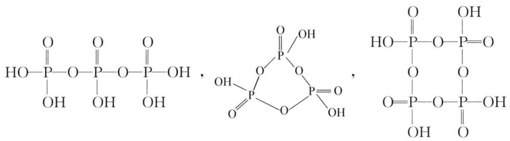

chemical

Chemical structures of phosphate and phosphate groups forming a cyclic phosphate compound

## (2) 磷酸盐

$H_{3}PO_{4}$ 是一种三元酸,除生成正盐外,还可生成磷酸一氢盐、磷酸二氢盐两种酸式盐。磷酸的三种盐在水中的溶解度差别较大。所有的磷酸二氢盐都易溶于水,而磷酸一氢盐和磷酸盐除了 $K^{+}$ 、 $Na^{+}$ 、 $NH_{4}^{+}$ 盐外一般都难溶于水。

可溶性磷酸盐在溶液中有不同程度的水解作用, 其中第一步水解是主要的。例如 $Na_{3}PO_{4}$ 水溶液: $PO_{4}^{3-} + H_{2}O \rightleftharpoons HPO_{4}^{2-} + OH^{-}$ , 因此, $Na_{3}PO_{4}$ 溶液显强碱性。 $HPO_{4}^{2-}$ 在水中有解离和水解的双重作用, 由于解离常数 $K_{3}^{\ominus}$ 值较小, 因此 $Na_{2}HPO_{4}$ 溶液中以水解作用为主, 溶液呈弱碱性。 $H_{2}PO_{4}^{-}$ 在水中也有解离和水解的双重作用, 由于解离作用比水解作用占优势, 因此 $NaH_{2}PO_{4}$ 溶液呈弱酸性。

磷酸盐有着十分广泛的用途。 $KH_{2}PO_{4}$ 是重要的磷钾肥， $Na_{3}PO_{4}$ 为锅炉除垢剂、橡胶乳汁凝固剂、金属防护剂、发酵剂、洗涤剂、织物丝光增强剂、耐火材料结合剂等。

造成江河湖泊水质富营养化的磷污染的主要根源,是流失的磷肥和生活污水中的含磷洗涤剂。因此,推广使用无磷洗涤剂是减少磷污染的有效措施。

## 5. 磷的卤化物和卤氧化物

磷和氟、氯、溴、碘都能生成相应的化合物，并且大都有重要用途，这里只讨论几种重要的化合物。

(1) 三氯化磷 $\mathrm{PCl}_{3}$ : 无色透明液体, 在空气中发烟, 有刺激性气味, 溶于苯、乙醚、 $\mathrm{CS}_{2}$ 、 $\mathrm{CCl}_{4}$ 等有机溶剂。 $\mathrm{PCl}_{3}$ 可作为配位体与金属离子形成配合物, 能与 $\mathrm{Cl}_{2}$ 、 $\mathrm{O}_{2}$ 、S 反应分别生成 $\mathrm{PCl}_{5}$ 、三氯氧磷 $\mathrm{POCl}_{3}$ 及三氯硫磷 $\mathrm{PSCl}_{3}$ 。

$PCl_{3}$ 易水解生成亚磷酸及氯化氢, 因此, $PCl_{3}$ 遇到潮湿空气会冒烟: $PCl_{3} + 3H_{2}O = H_{3}PO_{3} + 3HCl$ 。

$PCl_{3}$ 可由干燥的氯气和过量的磷反应制得： $2P + 3Cl_{2} = 2PCl_{3}$ 。为了避免发生水解，在制备 $PCl_{3}$ 的整个过程中，一切原料、设备、容器都必须经过严格的干燥。

$PCl_{3}$ 有广泛用途,用于制硫氯化磷 $PSCl_{3}$ 、 $POCl_{3}$ 、 $H_{3}PO_{3}$ 、亚磷酸酯等制剂,用于制农药敌百虫等,也用作氯化剂、催化剂、溶剂等。

（2）五氯化磷 $PCl_{5}$ ：白色或淡黄色结晶，易潮解，有刺激性气味，溶于 $CS_{2}$ 、 $CCl_{4}$ 等有机溶剂，熔点 421 K，加热到 433 K 时升华，并能可逆地分解为 $PCl_{3}$ 和 $Cl_{2}$ ，超过 573 K 时完全分解。

固态的 $PCl_{5}$ 和 $PBr_{5}$ 都不具有三角双锥结构： $PCl_{5}$ 晶体中，含有正四面体的 $[PCl_{4}]^{+}$ 和正八面体的 $[PCl_{6}]^{-}$ ； $PBr_{5}$ 晶体中却是 $[PBr_{4}]^{+}$ 和 $Br^{-}$ ，气态分子的结构符合价层电子对互斥理论结构，为三角双锥结构。

$PCl_{5}$ 易水解生成 HCl 等物质, 因此遇到潮湿空气会冒烟。若水不足, 生成 $POCl_{3}$ 和 HCl; 若水过量, 则生成 $H_{3}PO_{4}$ 和 HCl: $PCl_{5} + H_{2}O$ (不足) = $POCl_{3} + 2HCl$ , $POCl_{3} + 3H_{2}O$ (过量) = $H_{3}PO_{4} + 3HCl$ 。

$\mathrm{PCl}_{5}$ 可由 $\mathrm{PCl}_{3}$ 和过量的 $\mathrm{Cl}_{2}$ 作用而制得： $\mathrm{PCl}_{3} + \mathrm{Cl}_{2}$ （过量） $= \mathrm{PCl}_{5}$ 。

$PCl_{5}$ 常用作氯化剂、催化剂、脱水剂和分析试剂等，应用于医药、染料、化纤等行业中。

（3）三氯氧磷 $POCl_{3}$ ：也称氯氧化磷，为无色透明液体，有刺激性臭味和强烈的腐蚀性，常因溶有 $Cl_{2}$ 和 $PCl_{5}$ 而呈红黄色， $POCl_{3}$ 在潮湿空气中剧烈发烟，水解成 $H_{3}PO_{4}$ 和 HCl。

工业上常用氯化水解法制备 $POCl_{3}$ ，它是将 $Cl_{2}$ 通入 $PCl_{3}$ 中，滴加水，同时进行氯化和水解两种反应： $PCl_{3} + Cl_{2} + H_{2}O = POCl_{3} + 2HCl$ 。最后进行分馏，挥发出的 HCl 气体常用 $H_{2}O$ 吸收而得到盐酸，若用 $NH_{3} \cdot H_{2}O$ 吸收得 $NH_{4}Cl$ 。

POCl $_{3}$ 用于制取磷酸酯、塑料增塑剂、有机磷农药、长效磺胺药物等，还可用作染料中间体、有机合成的氯化剂和催化剂、阻燃剂。在太阳能行业、集成电路、分离器件等领域也有应用。

## 四、砷、锑、铋

## 1. 单质

## (1) 物理性质

熔点: $\mathrm{N}_{2}(-210^{\circ}\mathrm{C})$ ， $\mathrm{P}_{4}(44^{\circ}\mathrm{C})$ ， $\mathrm{As}(817^{\circ}\mathrm{C})$ ， $\mathrm{Sb}(630^{\circ}\mathrm{C})$ ， $\mathrm{Bi}(271^{\circ}\mathrm{C})$ 。砷的熔点突然升高，这说明由分子晶体发生晶体类型的转变，已变为金属晶体，金属键随半径的增大减弱，故 $\mathrm{Sb}$ 、 $\mathrm{Bi}$ 又越来越低， $\mathrm{Bi}$ 已是低熔点金属。砷蒸气的分子为 $\mathrm{As}_{4}$ ，与 $\mathrm{P}_{4}$ 相似，也是四面体结构， $\mathrm{Sb}$ 、 $\mathrm{Bi}$ 具有导电性，液态导电性大于固态。

## (2) 化学性质

① 与非金属单质反应

可与 $O_{2}$ 、S、 $X_{2}$ 等直接化合成三价化合物，和 $F_{2}$ 反应有五价化合物生成，体现还原性。

② 与金属反应

与碱金属生成 $Na_{3}M$ 型化合物，与碱土金属生成 $Mg_{3}M_{2}$ 型化合物，与ⅢA族形成 GaAs、InAs、GaSb、AlSb，是重要的半导体材料，体现氧化性。

③ 与酸反应

金属活动性介于 H 和 Cu 之间, 不与盐酸反应, 可与氧化性酸反应:

$$
3 \mathrm{P} + 5 \mathrm{HNO} _ {3} + 2 \mathrm{H} _ {2} \mathrm{O} = 3 \mathrm{H} _ {3} \mathrm{PO} _ {4} + 5 \mathrm{NO} \uparrow (\mathrm{As}, \mathrm{Sb})
$$

$$
\mathrm{Bi} + 4 \mathrm{HNO} _ {3} = \mathrm{Bi} (\mathrm{NO} _ {3}) _ {3} + \mathrm{NO} \uparrow + 2 \mathrm{H} _ {2} \mathrm{O} (\text {   不形成   } + 5 \text {   价化合物   })
$$

④ 与碱的反应

$$
2 \mathrm{As} + 6 \mathrm{NaOH} = 2 \mathrm{Na} _ {3} \mathrm{AsO} _ {3} + 3 \mathrm{H} _ {2} \uparrow (\text {熔融条件}) (\mathrm{Sb、Bi无此反应}) 。
$$

与酸碱的反应说明 As—Sb—Bi 金属性增强, 到 Bi 完全是金属性, 而 As 主要是非金属。

## 2. 砷、锑、铋的氢化物

(1) 氢化物的制备

① 水解法(不变价)

$$
\mathrm{Na} _ {3} \mathrm{As} + 3 \mathrm{H} _ {2} \mathrm{O} = 3 \mathrm{NaOH} + \mathrm{AsH} _ {3}, \mathrm{Na} _ {3} \mathrm{As} + 3 \mathrm{HCl} (\text {盐酸}) = 3 \mathrm{NaCl} + \mathrm{AsH} _ {3}
$$

而 $Na_{3}N$ 在盐酸中不能放出 $NH_{3}$ 气体，说明 $AsH_{3}$ 的碱性极弱。

$$
\mathrm{Mg} _ {3} \mathrm{Sb} _ {2} + 6 \mathrm{HCl} = 3 \mathrm{MgCl} _ {2} + 2 \mathrm{SbH} _ {3}, \mathrm{Mg} _ {3} \mathrm{Bi} _ {2} + 6 \mathrm{HCl} = 3 \mathrm{MgCl} _ {2} + 2 \mathrm{BiH} _ {3}
$$

② 还原法(由+3价到-3价)

$As_{2}O_{3} + 6Zn + 6H_{2}SO_{4} = 2AsH_{3} + 6ZnSO_{4} + 3H_{2}O$ ，用 $KBH_{4}$ （强还原剂）还原 $KSb(C_{4}H_{4}O_{6})_{2}$ 酒石酸锑钾得 $SbH_{3}$ ，用更强的还原剂 $LiAlH_{4}$ 还原 $BiCl_{3}$ 可得 $BiH_{3}$ ，需在 $-100^{\circ}C$ 下进行。

(2) 化学性质

① 不稳定性

$BiH_{3}$ 在常温下很快分解, 要在液氮温度保存, 在无氧化剂时: $2SeH_{3}=2Se+3H_{2}$ (加热), $2AsH_{3}=2As+3H_{2}(300^{\circ}C)$ 可以形成砷镜, 黑色, 具有金属光泽。砷镜反应可以检测出 As 的存在。含 $As_{2}O_{3}$ (砒霜, 0.1 g 致命) 的样品, 和 Zn、盐酸等混合, 将产生出的气体导入玻璃管中隔绝空气加热, 就是法医鉴定 As 中毒常用的马氏试砷法。这个方法可检查出 0.007 mg 的 As, 砷镜可溶于 NaClO 溶液中, 所以用 NaClO 可以洗掉玻璃上的砷镜: $2As+5ClO^{-}+3H_{2}O=2H_{3}AsO_{4}+5Cl^{-}$ 。

$SbH_{3}$ 也有锑镜反应,但不能用NaClO洗掉锑镜,需用硝酸或硫酸洗。

② 还原性

从制备可以看出： $AsH_{3}$ 、 $SbH_{3}$ 、 $BiH_{3}$ 的还原性依次增强。可以还原 $KMnO_{4}$ 、 $K_{2}CrO_{7}$ 、 $H_{2}SO_{4}$ 、 $H_{2}SO_{3}$ 等，还可以和重金属的盐类反应，产生重金属： $2AsH_{3}+12AgNO_{3}+3H_{2}O=As_{2}O_{3}+12HNO_{3}+12Ag$ 。当 $AgNO_{3}$ 溶液浓时，有 $Ag_{3}As$ 沉淀产生： $AsH_{3}+6AgNO_{3}$ （浓）= $Ag_{3}As$ （沉淀）+3 $AgNO_{3}$ （黄色复合物）+3 $HNO_{3}$ 。这个反应是古氏试砷法的原理，可检出0.005mg的 $As_{2}O_{3}$ 。

③ 碱性

从制备上可看出 $AsH_{3}$ 、 $SbH_{3}$ 和 $BiH_{3}$ 碱性极弱，以致可以从盐酸中逸出。

## 3. 砷、锑、铋的氧化物及其水化物

$Bi_{2}O_{3}$ 黄色, $Bi_{2}O_{5}$ 棕色,其余氧化物为白色。

(1) 酸碱性

① +3 价化合物

$$
\mathrm{As} _ {2} \mathrm{O} _ {3} + 6 \mathrm{NaOH} = 2 \mathrm{Na} _ {3} \mathrm{AsO} _ {3} + 3 \mathrm{H} _ {2} \mathrm{O} (\mathrm{Sb} _ {2} \mathrm{O} _ {3})
$$

$$
\mathrm {As_ {2} O_ {3} + 6HCl = 2AsCl_ {3} + 3H_ {2} O(Sb_ {2} O_ {3} ,Bi_ {2} O_ {3})}
$$

$Bi_{2}O_{3}$ 与 NaOH 不反应。

以上反应可以看出： $As_{2}O_{3}$ 两性偏酸， $Sb_{2}O_{3}$ 两性偏碱， $Bi_{2}O_{3}$ 碱性。

② +5 价化合物

$As_{2}O_{5}$ ， $Sb_{2}O_{5}$ ， $Bi_{2}O_{5}$ ， $H_{3}AsO_{4}$ ， $H_{3}SbO_{4}$ ， $HBiO_{3}$ 均为酸性物质。

(2) 氧化-还原性

① 三价砷的还原性

+3 价含氧酸中, 还原性最强的是 $\mathrm{H}_{3} \mathrm{AsO}_{3}(\mathrm{AsO}_{3}^{3-})$ , 在碱性介质中: $\mathrm{AsO}_{3}^{3-} + \mathrm{I}_{2} + 2 \mathrm{OH}^{-} = \mathrm{AsO}_{4}^{3-} + 2 \mathrm{I}^{-} + \mathrm{H}_{2} \mathrm{O}$ 。而在强酸中, 即 $\mathrm{pH} = 0$ 时, 根据电极电位得出氧化性: $\mathrm{H}_{3} \mathrm{AsO}_{4} > \mathrm{I}_{2}$ , 所以, 在碱中 $\mathrm{I}_{2}$ 可以氧化 $\mathrm{AsO}_{3}^{3-}$ , 在酸介质中却是其逆反应: $\mathrm{H}_{3} \mathrm{AsO}_{4} + 2 \mathrm{I}^{-} + 2 \mathrm{H}^{+} = \mathrm{H}_{3} \mathrm{AsO}_{3} + \mathrm{I}_{2} + \mathrm{H}_{2} \mathrm{O}$ 。

② 五价铋的氧化性

+5 价含氧酸中以 Bi(V) 的氧化性为最强。从单质的性质中已经看到硝酸不能把 Bi 氧化成 Bi(V)，而可以把 Sb、As 氧化到五价。Bi(V) 要在碱中生成： $Bi^{3+} + Cl_{2} + 6OH^{-} = BiO_{3}^{-} + 2Cl^{-} + 3H_{2}O$ ，生成的 $NaBiO_{3}$ 是相当强的氧化剂： $5BiO_{3}^{-} + 2Mn^{2+} + 14H^{+} = 5Bi^{3+} + 2MnO_{4}^{-} + 7H_{2}O$ 。

## 4. 砷、锑、铋的三卤化物

## (1) 物理性质

分子量越大,熔点越高,颜色越深。 $AsF_{3}$ 、 $AsCl_{3}$ 为液体,其余为固体。 $AsI_{3}$ 、 $SbI_{3}$ 为红色, $BiBr_{3}$ 为黄色, $BiI_{3}$ 为棕色,其余为白色。

## (2) 三卤化物的水解性

P、As、Sb、Bi 金属性增强， $P(OH)_{3}$ 、 $As(OH)_{3}$ 、 $Sb(OH)_{3}$ 、 $Bi(OH)_{3}$ 碱性渐强。

$PCl_{3} + 3H_{2}O = H_{3}PO_{3} + 3HCl$ ，水解彻底，P 和 $OH^{-}$ 结合强，碱性弱， $H_{3}PO_{3}$ 其实是酸，不放出 $OH^{-}$ 。

$AsCl_{3} + 3H_{2}O = H_{3}AsO_{3} + 3HCl$ ，水解不如 $PCl_{3}$ 彻底， $H_{3}AsO_{3}$ 为弱酸，碱性比 $H_{3}PO_{3}$ 强，As和 $OH^{-}$ 结合弱于P和 $OH^{-}$ ，若用浓盐酸抑制水解，体系中会有 $As^{3+}$ 存在，但用浓盐酸抑制 $PCl_{3}$ 水解，溶液中也不会有 $P^{3+}$ 产生。

$\mathrm{Sb(OH)_3}$ 和 $\mathrm{Bi(OH)_3}$ 碱性更强, 水解不完全: $\mathrm{SbCl_3 + H_2O = SbOCl(白) + 2HCl}$ 。加盐酸可以完全抑制 $\mathrm{SbCl_3}$ 、 $\mathrm{BiCl_3}$ 的水解, 配制 $\mathrm{SbCl_3}$ 水溶液和 $\mathrm{BiCl_3}$ 水溶液时, 要用盐酸配制, 以抑制水解。

## (3) 三卤化物的制备

卤素和单质直接作用： $2M+3X_{2}=2MX_{3}(M=P,As,Sb,Bi)$ 。

盐酸和氧化物反应： $M_{2}O_{3}+6HCl=2MCl_{3}+3H_{2}O(M=Sb,Bi)$ 。

## 5. 砷、锑、铋的硫化物

## (1) 物理性质

颜色： $As_{2}S_{3}$ ， $As_{2}S_{5}$ 黄色， $Sb_{2}S_{3}$ ， $Sb_{2}S_{5}$ 橙色， $Bi_{2}S_{3}$ 黑色，均属在 0.3 mol/L 的盐酸中不可溶的硫化物。

## (2) 化学性质

## ① 酸碱性

i) +3 价: As₂S₃ 酸性, Sb₂S₃ 两性, Bi₂S₃ 碱性。如: Sb₂S₃ + 6HCl = 2SbCl₃ + 3H₂S, Bi₂S₃ + 6HCl = 2BiCl₃ + 3H₂S, As₂S₃ + 6NaOH = Na₃AsS₃ + Na₃AsO₃ + 3H₂O。

ii) +5 价：Bi(V)氧化性极强，故 $Bi_{2}S_{5}$ 不能稳定存在。 $As_{2}S_{5}$ 酸性更强， $Sb_{2}S_{5}$ 两性，但酸性强些。如： $4As_{2}S_{5} + 24NaOH = 5Na_{3}AsS_{4} + 3Na_{3}AsO_{4} + 12H_{2}O(Sb)$ ， $Sb_{2}S_{5} + 6HCl = 2SbCl_{3} + 3H_{2}S + 2S$ ，反应过程：先变成 $\mathrm{Sb}_{2}\mathrm{S}_{3}\left(\mathrm{Sb}_{2}\mathrm{S}_{5} = \mathrm{Sb}_{2}\mathrm{S}_{3} + 2\mathrm{S}\right)$ 再溶解。

## ② 和碱性硫化物的反应

i) +3 价：只有两性、酸性硫化物才能与碱性硫化物反应，如： $As_{2}S_{3} + 3Na_{2}S = 2Na_{3}AsS_{3}$ （硫代亚砷酸钠）。 $Bi_{2}S_{3}$ 是碱性硫化物不反应。

ii) +5 价均显酸性, 如: $\mathrm{As}_{2} \mathrm{~S}_{5} + 3 \mathrm{Na}_{2} \mathrm{~S} = 2 \mathrm{Na}_{3} \mathrm{AsS}_{4}$ (硫代砷酸钠)。硫代酸盐只能在中性或碱性中存在, 遇酸分解。可以看成是硫代酸, 再分解成 $\mathrm{H}_{2} \mathrm{~S}$ 和硫化物, 如: $2 \mathrm{Na}_{3} \mathrm{AsS}_{4} + 6 \mathrm{HCl} = 6 \mathrm{NaCl} + \mathrm{As}_{2} \mathrm{~S}_{5} + 3 \mathrm{H}_{2} \mathrm{~S}, 2 (\mathrm{NH}_{4})_{3} \mathrm{SbS}_{4} + 6 \mathrm{HCl} = 6 \mathrm{NH}_{4} \mathrm{Cl} + \mathrm{Sb}_{2} \mathrm{~S}_{5} + 3 \mathrm{H}_{2} \mathrm{~S}$ 。

## 典型例题

【例 1】（2004 年全国初赛）在铜的催化作用下氨和氟反应得到一种铵盐和一种三角锥体分子 A（键角 $102^{\circ}$ ，偶极矩 $0.78 \times 10^{-30} \, C \cdot m$ ；对比：氨的键角 $107.3^{\circ}$ ，偶极矩 $4.74 \times 10^{-30} \, C \cdot m$ ）；

(1) 写出 A 的分子式和它的合成反应的化学方程式。  
(2) A 分子质子化放出的热明显小于氨分子质子化放出的热。为什么?  
(3) A 与汞共热, 得到一种汞盐和一对互为异构体的 B 和 C (相对分子质量 66)。写出化学方程式及 B 和 C 的立体结构。  
(4) B与四氟化锡反应首先得到平面构型的D和负二价单中心负离子E构成的离子化合物;这种离子化合物受热放出C,同时得到D和负一价单中心负离子F

构成的离子化合物。画出 D、E、F 的立体结构；写出得到它们的化学方程式。

(5) A 与 $\mathrm{F}_{2} 、 \mathrm{BF}_{3}$ 反应得到一种四氟硼酸盐, 它的正离子水解能定量地生成 A 和 HF, 而同时得到的 $\mathrm{O}_{2}$ 和 $\mathrm{H}_{2} \mathrm{O}_{2}$ 的量却因反应条件不同而不同。写出这个正离子的化学式和它的合成反应的化学方程式, 并用化学方程式和必要的推断对它的水解反应产物作出解释。

解析 （1）首先确定 $NH_{4}F$ 之后根据化合价守恒及分子 A 的构型可以推测是 $NF_{3}$ ，方程式： $4NH_{3} + 3F_{2} = NF_{3} + 3NH_{4}F$ 。

(2) N—F 键的偶极方向与氮原子孤对电子的偶极方向相反, 导致分子偶极矩很小, N 的孤对电子对不易给出与 $H^{+}$ 结合, 因此质子化能力远比氨质子化能力小。

（3）可设分子式为 $N_{x}F_{y}$ ，根据分子量讨论可解得分子式为 $N_{2}F_{2}$ ，方程式： $2NF_{3} + 2Hg = N_{2}F_{2} + 2HgF_{2}$ 。由价键理论可以得出存在 N=N，分子结构书写时应注意到存在顺反异构： $F_{N}$ $F_{N}$ $F_{N}$ $F_{N}$

(4) $\mathrm{SnF_4}$ 作为路易斯酸易接受2个 $\mathbf{F}^{-}$ 形成负二价的负离子E: $\mathrm{SnF_6^{2 - }}$ ，正离子D不能是 $\mathbf{N}_2^{2 + }$ ，否则无法解释后续受热分解的产物，所以推测D应该是 $\mathbf{N}_2\mathbf{F}^+$ 则后续产物及构型均能解释。D： $\left[ \begin{array}{c}\mathrm{F} - \mathrm{N}\\ \mathrm{N} \end{array} \right]^+$ E: $\left[ \begin{array}{c}\mathrm{F}\\ \mathrm{F} \\ \mathrm{F} \end{array} \right]^{2 - }$ F: $\left[ \begin{array}{c}\mathrm{F}\\ \mathrm{F} \\ \mathrm{F} \end{array} \right]^{-}$ 方程式： $2\mathrm{N}_2\mathrm{F}_2 + \mathrm{SnF}_4 = [\mathrm{N}_2\mathrm{F}^+]_2[\mathrm{SnF}_6]^{2 - },[\mathrm{N}_2\mathrm{F}^+]_2[\mathrm{SnF}_6]^{2 - } = [\mathrm{N}_2\mathrm{F}]^+ [\mathrm{SnF}_5]^-$ $+$ $\mathrm{N}_2\mathrm{F}_2$ 。

(5) 容易得出该四氟硼酸盐的化学式为 $\left[\mathrm{NF}_{4}\right]^{+}\left[\mathrm{BF}_{4}\right]^{-}$ , 方程式: $\mathrm{NF}_{3} + \mathrm{F}_{2} + \mathrm{BF}_{3} = \mathrm{NF}_{4}^{+} \mathrm{BF}_{4}^{-}$ 。 $\mathrm{NF}_{4}^{+}$ 水解反应首先得到 HOF (否则写不出配平的 $\mathrm{NF}_{4}^{+}$ 水解反应): $\mathrm{NF}_{4}^{+} + \mathrm{H}_{2} \mathrm{O} = \mathrm{NF}_{3} + \mathrm{HOF} + \mathrm{H}^{+}$ , 本反应可定量生成 $\mathrm{NF}_{3}$ , 而反应 $2 \mathrm{HOF} = 2 \mathrm{HF} + \mathrm{O}_{2}$ 和反应 $\mathrm{HOF} + \mathrm{H}_{2} \mathrm{O} = \mathrm{HF} + \mathrm{H}_{2} \mathrm{O}_{2}$ , 哪一反应为主与反应条件有关, 但无论哪一反应为主却总是定量生成 HF。

【例 2】（1997 年全国初赛）NO 的生物活性已引起科学家高度重视。它与超氧离子 $\left(\mathrm{O}_{2}^{-}\right)$ 反应，该反应的产物本题用 A 为代号。在生理 pH 条件下，A 的半衰期为 1～2 秒。A 被认为是人生病，如炎症、中风、心脏病和风湿病等引起大量细胞和组织毁坏的原因。A 在巨噬细胞里受控生成却是巨噬细胞能够杀死癌细胞和入侵的微生物的重要原因。科学家用生物拟态法探究了 A 的基本性质，如它与硝酸根的异构化反应等。他们发现，当 $^{16}$ O 标记的 A 在 $^{18}$ O 标记的水中异构化得到的硝酸根有 11% $^{18}$ O，可见该反应历程复杂。回答如下问题：

(1) 写出 A 的化学式。写出 NO 跟超氧离子的反应。你认为 A 离子的可能结构是什么？试写出它的路易斯结构式（即用短横表示化学键和用小黑点表示未成键电子的结构式）。  
(2) A 离子和水中的 $\mathrm{CO}_{2}$ 迅速一对一地结合。试写出这种物种可能的路易斯结构式。  
（3）含 $Cu^{+}$ 离子的酶的活化中心，亚硝酸根转化为一氧化氮。写出 $Cu^{+}$ 和 $NO_{2}^{-}$ 在水溶液中的反应。  
(4) 在常温下把 NO 气体压缩到 100 个大气压, 在一个体积固定的容器里加热到 $50^{\circ} \mathrm{C}$ , 发现气体的压力迅速下降, 压力降至略小于原压力的 $2 / 3$ 就不再改变, 已知其中一种产物是 $\mathrm{N}_{2} \mathrm{O}$ , 写出化学方程式。并解释为什么最后的气体总压力略小于原压力的 $2 / 3$ 。

解析 （1）根据题目信息“与硝酸根为异构体”，另考虑到 NO 和 $O_{2}^{-}$ 均存在奇电子，可以考虑是两者各自提供奇电子成键，得到化学式： $ONO_{2}^{-}$ ，方程式： $NO + O_{2}^{-} = ONO_{2}^{-}$ 。路易斯结构式如下：

$$
\ddot {\mathrm{O}} = \dot {\mathrm{N}} - \ddot {\mathrm{O}} - \ddot {\mathrm{O}}:
$$

(2) 本反应实质是带负电荷的 O 进攻 $CO_{2}$ 中带正电荷的 C 原子, 注意到两端的 O 的形式电荷都是负, 因此都可以进攻 C 原子, 于是得到两个结构 $O_{2}NOCO_{2}^{-}$ 或 $ONO_{2}CO_{2}^{-}$ :

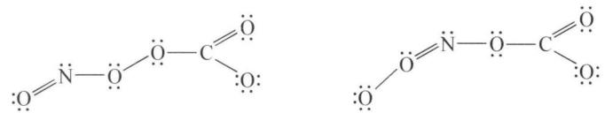

chemical

Two organic molecular structures: one with lone pairs and one with double bonds, both featuring a carbonyl group

（3）本问根据化合价守恒可以写出： $NO_{2}^{-} + Cu^{+} + 2H^{+} \longrightarrow NO + Cu^{2+} + H_{2}O$ 。  
(4) 依然根据化合价守恒可以得出: $3 \mathrm{NO} = \mathrm{N}_{2} \mathrm{O} + \mathrm{NO}_{2}$ , 发生 $2 \mathrm{NO}_{2} = \mathrm{N}_{2} \mathrm{O}_{4}$ 的聚合反应, 因此最后压力仅略低于 $2 / 3$ 。

【例 3】（改编自 1992 年全国决赛）元素 Bi 在自然界储量较低，其存在形式有元素态和化合态（主要为 $Bi_{2}O_{3}$ 和 $Bi_{2}S_{3}$ ）。Bi 是较弱的导体，其电导随温度的升高而降低，但熔融后迅速增加。Bi 的熔点是 545 K，熔融后体积缩小。Bi 的沸点为 1883 K ( $P=1.014\times10^{5}$ Pa)，该温度下的蒸气密度为 3.011 g/L，而在 2280 K 和 2770 K 时蒸气密度则分别是 1.122 g/L 和 0.919 g/L。

Bi 不与无氧化性的稀酸反应,但可被浓 $\mathrm{H}_{2} \mathrm{SO}_{4}$ 或王水氧化为硫酸盐或氯化物 (Bi 的氧化态为 III)。Bi(III)的盐可与碱金属卤化物或硫酸盐作用形成络合物 (如 $\mathrm{BiCl}_{4}^{-}$ 、 $\mathrm{BiCl}_{5}^{2-}$ 、 $\mathrm{BiCl}_{6}^{3-}$ 和 $\mathrm{Bi(SO}_{4})_{2}^{-}$ 等)。Bi 也可形成 BiN 和 $\mathrm{BiH}_{3}$ 等化合物,在这些化合物中,Bi 的氧化态为 III, Bi 还可生成 $\mathrm{Bi}_{2} \mathrm{O}_{4}$ ,其中 Bi 的氧化态为 IV。Bi(III)的卤化物也可由 Bi 和卤素直接反应生成。Bi(III)的许多盐可溶解在乙醇和丙酮中。这些盐在强酸性介质中是稳定的,在中性介质中则生成含氧酸盐(羟基盐)沉淀,并渐渐转化成如 $\mathrm{XONO}_{3}$ 的型体。Bi(III)的盐在碱性溶液中可被强氧化剂氧化成 Bi(V)的化合物,在酸性介质中 Bi(V)的化合物能将 $\mathrm{Mn}^{2+}$ 氧化为 $\mathrm{MnO}_{4}^{-}$ 。

Bi 的化合物有毒。在治消化道溃疡药及杀菌药中含少量 Bi 的化合物。在碱性介质中，用亚锡酸盐可将 Bi 的化合物还原为游离态的 Bi，这可用于 Bi 的定性分析。

请回答下列问题：

(1) 写出 Bi 原子的电子构型和在门捷列夫元素周期表中的位置。  
(2) 在沸点或沸点以上, 气态 Bi 分子的型体是什么? 写出它们互变过程的平衡常数表达式。  
(3) 写出 Bi 与浓 $H_{2}SO_{4}$ 、稀 $HNO_{3}$ 反应的方程式。  
(4) 写出 $Bi^{3+}$ 与卤化物、碱金属硫酸盐络合反应的方程式, 画出 $BiCl_{6}^{3-}$ 的几何构型, 说明 Bi 用什么轨道成键。  
(5) 写出 Bi(Ⅲ)盐水解反应的方程式。  
(6) 写出在酸性介质中五价 Bi 化合物与 $Mn^{2+}$ 反应的离子方程式。

解析 (1) Bi 的电子构型为: $\left[\mathrm{Xe}\right]4\mathrm{f}^{14}5\mathrm{d}^{10}6\mathrm{s}^{2}6\mathrm{p}^{3}$ 第六周期 VA 族。

(2) 根据理想气体状态方程式得: $T = 1883 \mathrm{~K}$ 时, $M = 464.9 \mathrm{~g} / \mathrm{mol}$ , Bi 的相对原子质量为 208.98。在沸点 $1883 \mathrm{~K}$ 时以 $\mathrm{Bi}_{2}(\mathrm{~g})$ 型体存在; $T = 2280 \mathrm{~K}$ 时, $M = 209.75 \mathrm{~g} / \mathrm{mol}$ ; $T = 2770 \mathrm{~K}$ 时, $M = 208.7 \mathrm{~g} / \mathrm{mol}$ ; 故在沸点以上时以 $\mathrm{Bi}(\mathrm{g})$ 状态存在。互变方程式及平衡常数表达式如下: $\mathrm{Bi}_{2}(\mathrm{~g}) \xrightarrow[K_{p}^{\prime}] {K_{p}} 2 \mathrm{Bi}(\mathrm{g}) K_{p} = \frac{p_{\mathrm{Bi}}^{2}}{p_{\mathrm{Bi}_{2}}} K_{p}^{\prime} = (K_{p})^{-1} = \frac{p_{\mathrm{Bi}_{2}}}{p_{\mathrm{Bi}}^{2}}$ 。

(3) 根据题目信息 Bi(V) 有强氧化性, 因此只能被硫酸、硝酸氧化为 Bi(Ⅲ), 方程式为: $2\mathrm{Bi} + 6\mathrm{H}_{2}\mathrm{SO}_{4} = \mathrm{Bi}_{2}(\mathrm{SO}_{4})_{3} + 3\mathrm{SO}_{2} \uparrow + 6\mathrm{H}_{2}\mathrm{O}, \mathrm{Bi} + 4\mathrm{HNO}_{3} = \mathrm{Bi}(\mathrm{NO}_{3})_{3} + \mathrm{NO} \uparrow + 2\mathrm{H}_{2}\mathrm{O}$ 。  
(4) 方程式: $\mathrm{BiCl}_{3} + \mathrm{KCl} = \mathrm{KBiCl}_{4}, \mathrm{Bi}_{2}(\mathrm{SO}_{4})_{3} + \mathrm{K}_{2} \mathrm{SO}_{4} = 2 \mathrm{KBi}(\mathrm{SO}_{4})_{2}$ 。 $\mathrm{BiCl}_{6}^{3-}$ 的几何构型: 正八面体, 中心原子 Bi 以 $\mathrm{sp}^{3} \mathrm{~d}^{2}$ 杂化轨道成键。  
(5) $\mathrm{Bi(III)}$ 水解不完全, 形成 $\mathrm{BiO}^{+}$ 的沉淀: $\mathrm{Bi(NO_{3})_{3}} + \mathrm{H}_{2} \mathrm{O} = \mathrm{BiONO}_{3} \downarrow +$

$$
2 \mathrm{HNO} _ {3}, \mathrm{BiCl} _ {3} + \mathrm{H} _ {2} \mathrm{O} = \mathrm{BiOCl} \downarrow + 2 \mathrm{HCl} 。
$$

(6) 根据题目信息可得: $5 \mathrm{BiO}_{3}^{-} + 2 \mathrm{Mn}^{2+} + 14 \mathrm{H}^{+} = 2 \mathrm{MnO}_{4}^{-} + 5 \mathrm{Bi}^{3+} + 7 \mathrm{H}_{2} \mathrm{O}$ 。

## 本讲习题

1. $N_{2}H_{4}$ 称为肼或联氨， $N_{2}H_{4}$ 和 $NH_{3}$ 的关系有如 $H_{2}O_{2}$ 和 $H_{2}O$ 的关系：

(1) $N_{2}H_{4}$ 是几元碱, 比较 $N_{2}H_{4}$ 和 $NH_{3}$ 的碱性、还原性及热稳定性的大小。

(2) 指出 $N_{2}H_{4}$ 中 N 原子的杂化方式, 已知该分子具有极性, 最多会有几个原子共一个平面。

（3） $25^{\circ}$ C时水溶液中肼与强酸反应结合一个质子的平衡常数为 $3.0 \times 10^{8}$ 。求 $N_{2}H_{4}$ 的碱式电离常数 $K_{b}$ 及其共轭酸的酸式电离常数 $K_{a}$ 。

(4) 写出 $H_{2}SO_{4}$ 介质中 $N_{2}H_{4}$ 与高锰酸钾反应的化学方程式。

(5) 写出碱性介质中 $N_{2}H_{4}$ 在原电池正极上所发生的电极反应方程式。

2. 据报道, 近来已制得了化合物 A(白色晶体), 它是用 $NaNO_{3}$ 和 $Na_{2}O$ 在银皿中于 573 K 条件下反应 7 天后制得的。经分析, A 中的负离子与 $SO_{4}^{2-}$ 是等电子体, 电导实验表明: A 的电导与 $Na_{3}PO_{4}$ 相同。

(1) 写出 A 的化学式并命名; 写出 A 的负离子的立体结构图并说明成键情况。

(2) 预测 A 的化学性质是否活泼？为什么？

（3）实验表明：A 对潮湿的 $CO_{2}$ 特别敏感，反应相当剧烈，试写出该反应化学方程式。

（4）近年来，化学家已经制备了物质 B。其中，组成 A 和 B 的元素完全相同，B 的负离子与 A 的负离子表观形式相同（元素和原子个数均相同），但电导实验表明，其电导能力与 NaCl 相同。试写出 B 负离子的结构式，并写出其与水反应的离子方程式。

3. (1997 年全国初赛) $PCl_{5}$ 是一种白色固体, 加热到 $160^{\circ}C$ 不经过液态阶段就变成蒸气, 测得 $180^{\circ}C$ 下的蒸气密度(折合成标准状况)为 $9.3\ g/L$ , 极性为零, P—Cl 键长为 $204\ pm$ 和 $211\ pm$ 两种。继续加热到 $250^{\circ}C$ 时测得压力为计算值的两倍。 $PCl_{5}$ 在加压下于 $148^{\circ}C$ 液化, 形成一种能导电的熔体, 测得 P—Cl 的键长为 $198\ pm$ 和 $206\ pm$ 两种。(P、Cl 相对原子质量为 31.0、35.5) 回答如下问题:

(1) $180^{\circ}$ C 下 $PCl_{5}$ 蒸气中存在什么分子？为什么？写出分子式，画出立体结构。

(2) 在 $250^{\circ}C$ 下 $PCl_{5}$ 蒸气中存在什么分子？写出方程式，指出分子的空间构型。

(3) $PCl_{5}$ 熔体为什么能导电？用最简洁的方式作出解释。

(4) $\mathrm{PBr}_{5}$ 气态分子结构与 $\mathrm{PCl}_{5}$ 相似, 它的熔体也能导电, 但经测定其中只存在一种 $\mathrm{P}-\mathrm{Br}$ 键长。 $\mathrm{PBr}_{5}$ 熔体为什么导电? 用最简洁的方式作出解释。

4. 叠氮酸是无色有刺激性气味的液体, 是一种爆炸物, 对热十分稳定, 但受撞击就爆炸, 常用于引爆剂。人反复吸入蒸气 $5.28 \mathrm{mg} / \mathrm{m}^{3}$ 不到 1 小时, 可产生症状。一次吸入可引起鼻、眼刺激, 头痛、眩晕、软弱无力、支气管炎、血压降低、脉率增快或徐缓, 头痛较其他症状持续时间长。回答下列问题:

（1）写出与 $N_{3}^{-}$ 互为等电子体的分子，写出 $N_{3}^{-}$ 的空间构型和结构式，杂化方式和成键方式。

(2) $\mathrm{HN}_{3}$ 有哪些可能的共振结构？标明每个共振结构中所有原子的形式电荷。

(3) 比较 $HN_{3}$ 与 HX(卤化氢)的酸性, 热稳定性及还原性的大小。

(4) 叠氮离子 $\mathrm{N}_{3}^{-}$ 经由氨基钠与 $\mathrm{NO}_{3}^{-}$ 离子或 $\mathrm{N}_{2} \mathrm{O}$ 在一定温度下合成, 试写出这些反应的离子方程式 (产物中有氨放出)。

（5）离子型叠氮化物是不稳定的，但它可以在室温下进行操作，可以作为机动车的“空气袋”，为什么？

(6) $HN_{3}$ 与银盐作用, 可得一种不溶于水的白色固体, 该固体加热时, 会发生爆炸。写出反应方程式。

5. 长期以来,多磷酸钠是制备洗涤剂的重要原料。

（1）试写出由磷酸脱水制备不同结构多磷酸的化学反应方程式（设多磷酸中有 n 个磷原子）。

(2) 画出含 4 个磷原子的各种多磷酸的结构式。

(3) 试说明多磷酸钠作为洗衣粉中的配料成分的作用是什么?

(4) 红磷在 KOH 溶液中的悬浊液和 KOCl 作用, 可以生成 $\mathrm{K}_{6} \mathrm{P}_{6} \mathrm{O}_{12}$ 的钾盐。该盐酸根 $(\mathrm{P}_{6} \mathrm{O}_{12}^{6-})$ 结构式中磷元素和氧元素的化学环境完全一样。 $\mathrm{K}_{6} \mathrm{P}_{6} \mathrm{O}_{12}$ 用稀酸酸化则生成 $\mathrm{H}_{6} \mathrm{P}_{6} \mathrm{O}_{12}, \mathrm{H}_{6} \mathrm{P}_{6} \mathrm{O}_{12}$ 在强酸性条件下可以水解, 生成含单个磷元素的含氧酸。请回答:

① 写出 $K_{6}P_{6}O_{12}$ 生成的化学方程式。

② 指出 $P_{6}O_{12}^{6-}$ 中 P 元素杂化类型和其中的 $\Pi$ 键类型，画出 $P_{6}O_{12}^{6-}$ 的结构式。

③ 写出 $K_{6}P_{6}O_{12}$ 两步酸解的反应方程式。

6. 一些锑的有机配合物可以应用于医药研究, A 是其中一种, 合成方法如下: 将 $2.3 \mathrm{~g}$ 三氯化锑与 $3.0 \mathrm{~g}$ 疏基乙酸溶于 $20 \mathrm{~mL}$ 无水甲醇中, 溶解后加入 $60 \mathrm{~mL}$ 蒸馏水, 搅拌并加热至 $80^{\circ} \mathrm{C}$ 左右, 反应约 $2 \mathrm{~h}$ , 然后逐滴加入 $4 \mathrm{~mol} / \mathrm{L} \mathrm{NaOH}$ 溶液至大量白色固体物质析出。过滤, 蒸馏水洗涤数次, 固体物再用蒸馏水重结晶, 室温下于 $\mathrm{P}_{2} \mathrm{O}_{5}$ 真空干燥箱中干燥, 得白色晶体 $\mathrm{A} 2.6 \mathrm{~g}$ 。进一步检测得 $\mathrm{A}$ 的晶胞参数为: $a = 1.40 \mathrm{~nm}, b = 1.20 \mathrm{~nm}, c = 1.24 \mathrm{~nm}, \beta = 126^{\circ}$ ; 由比重瓶法测得 $\mathrm{A}$ 物的密度为 $D = 2.44 \mathrm{~g} / \mathrm{cm}^{3}$ ; 元素分析得 $\mathrm{A}$ 中含有 $\mathrm{Sb} 40.2 \%$ 。

(1) 确定配合物 A 的化学式和结构简式。  
(2) 计算 A 晶胞中有几个原子。  
(3) 写出合成 A 的反应方程式。  
(4) 滴加 NaOH 溶液的体积是否越多越好,为什么?  
(5) 直接碘量法可分析 A 中 Sb 的含量, 写出滴定反应方程式。  
(6) 计算合成 A 的产率。

7. 亚硝酸盐广泛存在于自然环境中,如蔬菜、肉类、豆类等都可以测出一定量的亚硝酸盐。一般情况下,当人体一次性摄取大于 $300 \mathrm{mg}$ 的亚硝酸钠时,就会引起中毒。某研究性学习小组用碘量法测定泡菜中亚硝酸盐的含量。取 $1 \mathrm{~kg}$ 泡菜榨汁,将榨出的液体收集后,加入提取剂和氢氧化钠,使得到的泡菜汁中的亚硝酸盐都成为亚硝酸钠。在过滤后的滤液中加入氢氧化铝乳液。再次过滤后得到滤液,将该滤液稀释至 $1 \mathrm{~L}$ ,取 $25.00 \mathrm{~mL}$ 菜汁与过量的稀硫酸和碘化钾溶液的混合液反应,再选用合适的指示剂,用较稀的硫代硫酸钠溶液进行滴定。共消耗 $0.050 \mathrm{~mol} \cdot \mathrm{L}^{-1} \mathrm{Na}_{2} \mathrm{~S}_{2} \mathrm{O}_{3}$ 溶液 $20.00 \mathrm{~mL}$ 。请回答下列问题:

(1)该实验中可选用的指示剂是什么？加入氢氧化铝乳液的目的是什么？

(2) 写出菜汁与稀硫酸和碘化钾溶液反应的化学方程式。

(3) 通过计算判断若某人一次食入0.125kg这种泡菜,是否会引起中毒?

（4）有经验的厨师在做泡菜时往往加入适量的橙汁，以减轻亚硝酸盐的危害。解释原因。

# 第四讲 碳族元素、硼族元素

## 知识精讲

## 一、概述

硼和硅在周期表中处于对角线位置,有相似性。因此,本讲将碳族元素和硼族元素列在一起介绍。

碳族元素包括碳(C)、硅(Si)、锗(Ge)、锡(Sn)和铅(Pb)五种元素。C 和 Si 是非金属元素；Ge 是准金属元素，性质与硅相似，都是半导体材料；Sn 和 Pb 是金属元素，但都有两性。碳族元素的价电子构型为 $ns^{2}np^{2}$ ，不易形成离子，以形成共价化合物为特征。在化合物中，C 的主要氧化数有 +4 和 +2，Si 的氧化数都是 +4，而 Ge、Sn、Pb 的氧化数有 +2 和 +4。C 和 Si 能与氢形成稳定的氢化物。碳族元素氧化数为 +4 的化合物主要是共价型的。

硼族元素包括硼(B)、铝(Al)、镓(Ga)、铟(In)和铊(Tl)五种元素。B为非金属元素,其余为金属元素。本族元素均能导电,硼的导电性最差。铝在地壳中的含量仅次于氧和硅,其丰度(以质量计)居第三位,而在金属元素中铝的丰度居于首位。硼族元素的价电子构型为 $ns^{2}np^{1}$ 。与同周期的卤素、氧族元素、氮族元素、碳族元素相比,有较大的给电子趋势,它们的化合物以正氧化数为主要特征,前四种元素都是+3,Tl主要为+1。硼的原子半径较小,电负性较大,所以硼的化合物都是共价型的,在水溶液中也不存在 $B^{3+}$ ,而其他元素均可形成 $M^{3+}$ 和相应的化合物。但由于 $M^{3+}$ 具有较强的极化作用,这些化合物中的化学键也容易表现出共价性。在硼族元素化合物中形成共价键的趋势自上而下依次减弱。由于惰性电子对效应的影响,低氧化值的Tl(I)的化合物较稳定,所形成的键具有较强的离子键特征。和电负性较大的O有较大的亲和力,B和Al尤为突出。

## 二、碳及其化合物

## 1. 碳

碳在地壳中的质量分数仅约为 0.03%，但分布却极为广泛。碳是地球上一切生物有机体的骨架元素，可以说没有碳就没有生命。煤、石油、天然气、石灰石、

$CO_{2}$ 等是天然的重要含碳化合物。在自然界中还有以碳单质存在的石墨和金刚石等。

金刚石和石墨是人们熟知的碳的两种同素异形体。过去人们认为无定形碳是碳的另一种同素异形体，但现已确认它是一种微晶形石墨。碳纤维是一种力学性能优异的新材料，对其研制及应用已取得了长足进展。1985年发现的碳家族中的新成员—— $C_{60}$ 富勒烯、1991年发现的纳米碳管以及2004年从石墨中分离出的二维材料石墨烯均具有优异的性能，其应用前景更是不可估量。

(1) 石墨: 为灰黑色的不透明固体, 熔点为 $3925 \mathrm{~K}$ , 密度为 $2.258 \mathrm{~g} \cdot \mathrm{cm}^{-3}$ , 硬度小 (莫氏硬度: 1), 质软而有滑腻感, 能传热、导电。石墨质软滑腻、能导电等特点与石墨呈层状结构 (见图 4-1 左) 有关。石墨在工业上有广泛用途, 可用来制造电极、润滑剂、铅笔芯、冶金用的坩埚、原子反应堆中的中子减速剂等。

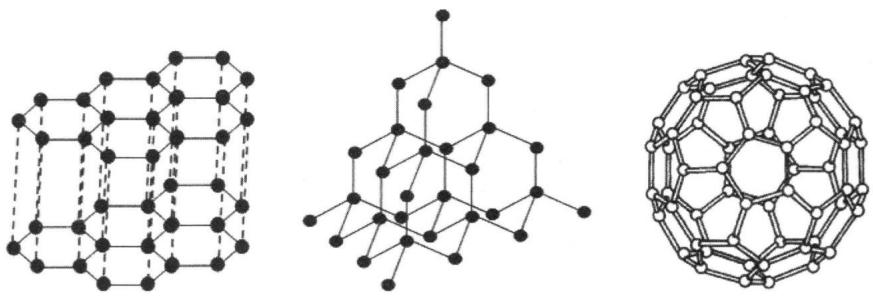

chemical

Three molecular structures: a hexagonal lattice, a polyhedral network, and a fullerene cage-like framework.

图4-1 石墨、金刚石、 $\mathrm{C}_{60}$ 的结构

（2）金刚石：纯金刚石是无色透明晶体，熔点 3823 K，沸点 5100 K，密度 $3.5 \, g \cdot cm^{-3}$ ，硬度大（莫氏硬度：10），是所有单质中熔点最高、硬度最大的物质，不导电，化学性质不活泼，室温时不与酸（强氧化性酸除外）、碱或其他化学物质反应。金刚石熔点高、硬度大、不导电以及化学性质不活泼等特点与其晶体结构（见图 4-1 中）直接有关。

透明的金刚石制品折光率很大,对光的色散作用特别强,在有光处常显出五颜六色,其价格昂贵,一般只是作为装饰品。工业中用的是价格便宜的黑色和不透明的金刚石制品,利用其硬度大、熔点高的优良性能,常用来制造钻探矿床的钻头、切割玻璃、作为研磨材料及制造精密切削工具等。金刚石存在于自然界,也可以人工合成。人工合成的基本条件为:

C(石墨) $\frac{Cr、Ni、Fe、Mn等合金}{6\times10^{3}MPa,1600\sim1800K}$ C(金刚石); $\Delta_{r}H_{m}^{\ominus}=+1.9kJ\cdot mol^{-1}$

(3) 无定形碳: 木炭、焦炭、骨炭等具有石墨的精致结构, 但其晶粒较小且排列不规则。木材干馏制得的木炭,可用于冶金及作为吸附剂;煤干馏制得的焦炭,可用于冶金及作为化工原料;骨头脱脂后干馏制得的骨炭,可用作吸附(脱色)剂等。

活性炭是用特殊方法制备的具有石墨精致结构的碳单质,因其表面积很大,有很强的吸附能力,可用作化工、制糖工业的脱色剂,也可作为气体或水的净化剂等。

（4）碳纤维：以一些含碳的有机纤维如聚丙烯腈纤维、粘胶丝或酚醛纤维等为原料，在施加一定张力及隔绝氧气的条件下，加热到 $1273 \sim 2273 \mathrm{~K}$ ，使纤维中的氢、氮、氧等元素挥发而去，即得到黑色、纤维状的碳纤维。

碳纤维是一种新型材料,它具有许多优良性能,其抗拉强度比钢铁大4倍多,密度比铝小,比不锈钢还耐腐蚀,导电性可与铜媲美。碳纤维在人造卫星、航天飞船、火箭导弹及原子能工业中有重要用途。

碳纤维除用作绝热保温材料外,一般不单独使用,多作为增强材料加入到树脂、金属、陶瓷、混凝土等材料中,构成复合材料。碳纤维增强的复合材料可用作飞机结构材料、电磁屏蔽除电材料、人工韧带等身体代用材料以及用于制造火箭外壳、工业机器人、汽车板簧和驱动轴等。

(5) $C_{60}$ : 20 世纪 80 年代中期发现的 $C_n$ 原子簇 ( $40 < n < 200$ ), 其中 $C_{60}$ 具有最大的丰度和很高的稳定性, 它是由 60 个碳原子构成的近似于足球的 32 面体, 即由 12 个正五边形和 20 个正六边形组成 (见图 4-1 右)。因为这类球形 $C_n$ 分子具有烯烃的一些特点, 所以被称为球烯, 又称为富勒烯。

20 世纪 90 年代以来, 富勒烯化学得到蓬勃发展, 人们对 $C_{n}$ 的结构、合成、性质和应用等方面的研究不断深入, 富勒烯在超导、储存气体、新型催化剂、高分子材料、光学材料、生物学及医学应用等方面不断展现出其潜在的应用价值。

（6）纳米碳管：为管状的纳米级石墨晶体，它是由单层或多层石墨片围绕中心轴按一定的螺旋角卷曲而成的无缝纳米级管，是1991年日本科学家发现的，它具有一些特异的性能，如会随着管壁曲卷结构不同而呈现出半导体或良导体的奇特导电性能等。

我国科学家在纳米碳管的制备、性能和应用等方面开展了比较深入、系统的研究,取得了一系列突破性进展,合成出了世界上最长的纳米碳管,研制出具备良好储氢性能的纳米碳管和初步具备显示功能的纳米碳管显示器等。

(7) 石墨烯(Graphene): 2004年,英国曼彻斯特大学物理学家安德烈·盖姆和康斯坦丁·诺沃肖洛夫成功从石墨中分离出石墨烯,它是由碳原子组成的只有一层原子厚度的二维晶体,两人也因此共同获得2010年诺贝尔物理学奖。石墨烯既是最薄的材料,也是最强韧的材料,断裂强度比最好的钢材还要高200倍;同时它又有很好的弹性,拉伸幅度能达到自身尺寸的20%,是目前自然界最薄、强度最高的材料。石墨烯最有潜力的应用是成为硅的替代品,制造超微型晶体管,用来生产未来的超级计算机,用石墨烯取代硅,计算机处理器的运行速度将会快数百倍。另外,石墨烯几乎是完全透明的,只吸收2.3%的光,同时它非常致密,即使是最小的气体原子(氦原子)也无法穿透,这些特征使得它非常适合作为透明电子产品的原料,如透明的触摸显示屏、发光板和太阳能电池板。

## 2. 碳的氧化物

## (1) 一氧化碳

一氧化碳 CO 是无色无味的有毒气体, 难液化, 难溶于水, 在 293 K 时 1 体积水仅能溶解 0.023 体积的 CO。

CO 具有还原性。CO 不助燃, 但在空气或氧气中能燃烧, 呈蓝色火焰, 并放出大量的热: $2 \mathrm{CO}(\mathrm{g}) + \mathrm{O}_{2}(\mathrm{~g}) = 2 \mathrm{CO}_{2}(\mathrm{g}), \Delta_{\mathrm{r}} H_{\mathrm{m}}^{\ominus} = -569 \mathrm{~kJ} \cdot \mathrm{mol}^{-1}$ 。

CO 是冶炼金属的重要还原剂。如： $Fe_{2}O_{3} + 3CO\xlongequal{\triangle} 2Fe + 3CO_{2}$ ， $CuO + CO\xlongequal{\triangle} Cu + CO_{2}$ 。

在室温下，CO 能与 Pd(Ⅱ)盐反应生成颗粒微小的灰色钯，这一性质可用来检验 CO 的存在： $PdCl_{2} + CO + H_{2}O = Pd \downarrow + 2HCl + CO_{2}$ 。

在加热情况下，CO 能与白色的 $I_{2}O_{5}$ 固体反应生成 $I_{2}$ ，常用这一反应来测定 CO 的含量： $I_{2}O_{5} + 5CO \xlongequal{\triangle} I_{2} + 5CO_{2}$ 。

CO 具有加合性。CO 分子中的 C 和 O 各有一对孤对电子，由于配位键的形成，使 C 原子上有较大的电子密度，增强了 C 原子上孤对电子的配位能力。因此 CO 作为配位体时，C 是配位原子。CO 易与过渡金属原子或离子形成羰基化合物，如 $\mathrm{Fe}(\mathrm{CO})_{5}$ 、 $\mathrm{Ni}(\mathrm{CO})_{4}$ 、 $\mathrm{Cr}(\mathrm{CO})_{6}$ 。

工业上一般是将水蒸气通入红热的碳层制得：C(红热) $+H_{2}O(g)\xlongequal{\triangle}H_{2}+CO,\Delta_{r}H_{m}^{\ominus}=131.3kJ\cdot mol^{-1}$ 。

实验室常将甲酸滴加到热的浓 $H_{2}SO_{4}$ 或将草酸晶体与浓 $H_{2}SO_{4}$ 一起加热制取： $HCOOH \xlongequal[\triangle]{浓硫酸} CO \uparrow + H_{2}O$ 或 $H_{2}C_{2}O_{4} \xlongequal[\triangle]{浓硫酸} CO \uparrow + CO_{2} \uparrow + H_{2}O$ 。

CO 有毒,人吸入一定量后,会引起中毒。这是由于 CO 与血红蛋白中的 $Fe^{3+}$ 的配合能力比 $O_{2}$ 大 230～270 倍,因此,人一旦吸入 CO 后,血红蛋白就先与 CO 配合而失去了与 $O_{2}$ 结合的能力,这样就破坏了血液的输氧功能,会导致缺氧症。如果血液中有 50% 血红蛋白与 CO 结合,即可引起心肌坏死。在空气中只要有

1/800体积的 CO, 就能使人在半小时内死亡。因此, 在使用或制取 CO 时要特别小心。

CO 有着广泛用途。它是一种良好的燃料,生活中常用的发生炉煤气、水煤气、干馏煤气等都含有成分很高的 CO; CO 是冶金工业中常用的还原剂;CO 还用于有机合成中。

## (2) 二氧化碳

二氧化碳 $CO_{2}$ 是无色无味的气体, 溶于水, 在 293 K 时 1 体积水能溶解 0.88 体积的 $CO_{2}$ 。 $CO_{2}$ 易液化, 在常温下加压即可使之液化, 液态 $CO_{2}$ 气化时能吸收大量的热, 可使部分液态 $CO_{2}$ 凝固成雪花状固体, 常称作“干冰”。干冰是分子晶体, 194.6 K 升华, 升华热大, 因此可作为低温制冷剂。

$CO_{2}$ 的化学性质不活泼，在高温下才能与一些活泼金属反应： $CO_{2} + 2Mg \xlongequal{点燃} 2MgO + C, 3CO_{2} + 4Al \xlongequal{\triangle} 2Al_{2}O_{3} + 3C$ 。

$CO_{2}$ 是酸性氧化物, 能与碱作用生成碳酸盐或酸式碳酸盐。如: $2KOH + CO_{2} = K_{2}CO_{3} + H_{2}O$ , $KOH + CO_{2} = KHCO_{3}$ 。

植物通过光合作用将 $CO_{2}$ 转化为糖、淀粉、纤维素等碳水化合物，并放出 $O_{2}$ ： $H_{2}O + CO_{2} + h\nu \xrightarrow[\text{酶}]{\text{叶绿素}} O_{2} + \{CH_{2}O\}$ （碳水化合物）。

实验室常用稀 HCl 和 $CaCO_{3}$ 反应制备 $CO_{2}: CaCO_{3} + 2HCl = CaCl_{2} + CO_{2}\uparrow + H_{2}O$ 。

工业上， $\mathrm{CO}_{2}$ 主要来自煅烧石灰石或酿酒工业的副产品： $\mathrm{CaCO}_{3} \xlongequal{\text{高温}} \mathrm{CaO} + \mathrm{CO}_{2} \uparrow$ ， $\mathrm{C}_{6} \mathrm{H}_{12} \mathrm{O}_{6}$ （葡萄糖） $\xlongequal{\text{发酵}} 2 \mathrm{C}_{2} \mathrm{H}_{5} \mathrm{OH}$ （乙醇） $+ 2 \mathrm{CO}_{2} \uparrow$ 。

$CO_{2}$ 大量用于制造 $Na_{2}CO_{3}$ 、 $NaHCO_{3}$ 、 $CO(NH_{2})_{2}$ 及饮料等，在灭火、冷冻等方面也都有广泛应用。用“干冰”冷冻水果、蔬菜、肉类等食品，不但温度低，而且干净卫生，因为在 $CO_{2}$ 气氛中，绝大多数细菌不能生存。

大气中 $CO_{2}$ 的质量分数仅约为 0.03%，海洋中的约为 0.014%。 $CO_{2}$ 主要来自含碳物质的燃烧、碳酸盐矿石的热分解以及人与动物的呼吸等。但地面植物、海洋中的浮游生物通过光合作用以及碳酸盐的生成等都会将 $CO_{2}$ 转化为 $O_{2}$ 。这样就可以保持 $CO_{2}$ 在大气及海洋中的平衡。 $CO_{2}$ 有吸收太阳光中红外线的功能，如同给地球罩上一层硕大无比的塑料薄膜，留下温暖的红外线使地球成为昼夜温差不大的温室，为生命提供了合适的生存环境。近几十年来，由于人口快速增多，工业及交通业等迅速发展，煤、石油、天然气等的用量增加，使释放出来的 $CO_{2}$ 越来越多。同时，由于森林被大片砍伐，水污染使海洋的浮游生物日渐减少，从而将 $\mathrm{CO}_{2}$ 转化为 $\mathrm{O}_{2}$ 的量越来越少，造成大气中的 $\mathrm{CO}_{2}$ 含量越来越高。这就是造成地球“温室效应”的主要原因。

## 3. 碳酸和碳酸盐

(1) 碳酸: $\mathrm{CO}_{2}$ 溶于水中只有部分生成碳酸 $\mathrm{H}_{2} \mathrm{CO}_{3}$ , 在常温下, 饱和 $\mathrm{H}_{2} \mathrm{CO}_{3}$ 溶液的 $\mathrm{pH}$ 为 4 左右。 $\mathrm{H}_{2} \mathrm{CO}_{3}$ 很不稳定, 只能在水溶液中存在。 $\mathrm{H}_{2} \mathrm{CO}_{3}$ 是二元弱酸, 分两步电离:

$$
\mathrm{H} _ {2} \mathrm{CO} _ {3} \rightleftharpoons \mathrm{H} ^ {+} + \mathrm{HCO} _ {3} ^ {-}, K _ {1} ^ {\ominus} = 4. 4 \times 1 0 ^ {- 7},
$$

$$
\mathrm{HCO} _ {3} ^ {-} \rightleftharpoons \mathrm{H} ^ {+} + \mathrm{CO} _ {3} ^ {2 -}, K _ {2} ^ {\ominus} = 4. 7 \times 1 0 ^ {- 1 1} 。
$$

（2）碳酸盐：碳酸能形成正盐和酸式盐，通常所说的碳酸盐是正盐。碳酸盐的性质主要表现在水解性、溶解性和热稳定性三方面。

水解性：由于 $H_{2}CO_{3}$ 为弱酸，因此碳酸盐都能发生水解作用。

① 由可溶性强碱形成的碳酸盐,水解后溶液呈碱性。例如 $Na_{2}CO_{3}$ 的水解:

$$
\mathrm{CO} _ {3} ^ {2 -} + \mathrm{H} _ {2} \mathrm{O} \rightleftharpoons \mathrm{HCO} _ {3} ^ {-} + \mathrm{OH} ^ {-} \quad (\mathrm{i})
$$

$$
\mathrm{HCO} _ {3} ^ {-} + \mathrm{H} _ {2} \mathrm{O} \rightleftharpoons \mathrm{H} _ {2} \mathrm{CO} _ {3} + \mathrm{OH} ^ {-} \quad (\mathrm{ii})
$$

一级水解是主要的, 如 $0.1 \, mol \cdot L^{-1} \, Na_{2}CO_{3}$ 溶液的 pH 为 11 左右, 而 $0.1 \, mol \cdot L^{-1} \, NaHCO_{3}$ 溶液的 pH 为 8 左右。

② $\left(\mathrm{NH}_{4}\right)_{2}\mathrm{CO}_{3}$ 的水解作用比 $Na_{2}CO_{3}$ 大,但溶液的碱性却低于 $Na_{2}CO_{3}$ 。原因在于由 $CO_{3}^{2-}$ 水解产生的 $OH^{-}$ 与 $NH_{4}^{+}$ 结合形成 $NH_{3}\cdot H_{2}O$ ,使得溶液碱性减弱。

③ 溶解度极小的弱碱, 在水溶液中不能生成碳酸盐, 它们会完全水解生成氢氧化物沉淀并放出 $CO_{2}$ 。例如: $2Al^{3+} + 3CO_{3}^{2-} + 3H_{2}O = 2Al(OH)_{3}\downarrow + 3CO_{2}\uparrow$ 。

④ 若金属离子的氢氧化物及碳酸盐的溶解度都较小且接近时,则能生成碱式碳酸盐沉淀。如: $2 \mathrm{Cu}^{2+} + 2 \mathrm{CO}_{3}^{2-} + \mathrm{H}_{2} \mathrm{O} = \mathrm{Cu}_{2}(\mathrm{OH})_{2} \mathrm{CO}_{3} \downarrow + \mathrm{CO}_{2} \uparrow$ 。

溶解性：碳酸盐在水中的溶解性有如下特点：

① 碱金属(除 Li 外)及铵的碳酸盐能溶于水,其他碳酸盐都难溶于水。

② 难溶碳酸盐, 其对应的酸式碳酸盐的溶解度比碳酸盐略大。例如 $CaCO_{3}$ 难溶于水, 而 $\mathrm{Ca(HCO_{3})_{2}}$ 却可溶于水。

③ 易溶碳酸盐,其对应的酸式碳酸盐的溶解度比碳酸盐小,如 $NaHCO_{3}$ 的溶解度比 $Na_{2}CO_{3}$ 小。原因是 $HCO_{3}^{-}$ 有分子间氢键，发生缔合，形成双聚酸根，降低了水中溶解度。

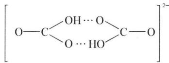

chemical

Chemical structure of a triacrylate ester compound with hydroxyl and ether linkages

热稳定性: 大多数碳酸盐的热稳定性都较差, 且它们的热稳定性有下列的规律:

① 酸式碳酸盐＜碳酸盐。例如：

$$
2 \mathrm{NaHCO} _ {3} \xlongequal {4 2 3 \mathrm{K}} \mathrm{Na} _ {2} \mathrm{CO} _ {3} + \mathrm{H} _ {2} \mathrm{O} \uparrow + \mathrm{CO} _ {2} \uparrow
$$

$$
\mathrm{Na} _ {2} \mathrm{CO} _ {3} \xlongequal {> 2 0 7 3 \mathrm{K}} \mathrm{Na} _ {2} \mathrm{O} + \mathrm{CO} _ {2} \uparrow
$$

②铵盐<过渡金属盐<碱土金属盐<碱金属盐。如：

$$
(\mathrm{NH} _ {4}) _ {2} \mathrm{CO} _ {3} \xlongequal {3 2 3 \mathrm{K}} 2 \mathrm{NH} _ {3} \uparrow + \mathrm{CO} _ {2} \uparrow + \mathrm{H} _ {2} \mathrm{O}
$$

$$
\mathrm {ZnCO_ {3} \xlongequal {623K} ZnO + CO_ {2} \uparrow}
$$

$$
\mathrm{CaCO} _ {3} \xlongequal {1 1 8 3 \mathrm{K}} \mathrm{CaO} + \mathrm{CO} _ {2} \uparrow
$$

以上分解规律均与离子极化有关,正离子极化作用越大,越易分解。

## 4. 碳化物

碳与电负性比它小的元素所形成的二元化合物称为碳化物。碳化物一般分为离子型、共价型和间充型三类。

(1) 离子型碳化物: 周期表中 I A、II A、III A(B 除外)族金属均可与碳形成离子型碳化物, 如 $\mathrm{CaC}_{2} 、 \mathrm{Al}_{4} \mathrm{C}_{3}$ 等。这类碳化物遇水一般易水解并生成乙炔或甲烷: $\mathrm{CaC}_{2} + 2 \mathrm{H}_{2} \mathrm{O} = \mathrm{Ca(OH)}_{2} + \mathrm{C}_{2} \mathrm{H}_{2} \uparrow$ , $\mathrm{Al}_{4} \mathrm{C}_{3} + 12 \mathrm{H}_{2} \mathrm{O} = 4 \mathrm{Al(OH)}_{3} + 3 \mathrm{CH}_{4} \uparrow$ 。

(2) 共价型碳化物: 碳与具有较高电负性元素形成的共价型碳化物, 以碳化硅 SiC 最具代表性, SiC 俗称金刚砂, 其结构相当于金刚石中的一半 C 原子被硅取代的产物, 为共价晶体。SiC 具有很高的熔点和硬度, 工业上常用作研磨材料和耐高温材料。

(3) 间充型碳化物: 主要是过渡金属(原子半径 $>130 \mathrm{pm}$ ) 的碳化物, 它们具有很高的熔点 (一般为 $3273 \sim 4273 \mathrm{~K}$ ) 和硬度, 在这类碳化物中, 碳原子填充到过渡金属晶格的空隙中, 它们属于合金, 具有金属光泽, 能导电, 并基本保持原来金属的性质, 但化学活泼性不如相应的金属强。制成金属型碳化物, 对改善金属性能有重要意义。

其中重过渡金属半径大,在晶格中充填碳原子,仍有金属光泽,但硬度和熔点比原来的金属还高。如 Zr、Hf、Nb、Ta、Mo、W 等可形成 MC 式碳化物。轻过渡金属的碳化物,其活性介于重过渡金属间充型碳化物和离子型碳化物之间,可以水解。

## 三、硅及其化合物

硅在地壳中的含量极其丰富,质量分数约为 27%,仅次于氧。在自然界中不存在游离态硅,主要以二氧化硅和硅酸盐的形式存在。泥土、沙砾、岩石、砖瓦、水泥、玻璃等都含有硅的化合物,可以说,硅是无机世界的骨干。

## 1. 单质硅

硅有晶形硅和无定形硅两种同素异形体。晶形硅为有金属光泽的银灰色晶体，具有硬度(莫氏7.0)大、熔点(1683 K)高的特点。晶形硅具有和金刚石一样的结构，属共价晶体。因 Si—Si 键能比 C—C 键能小，Si—Si 的半径比 C—C 半径大，所以晶形硅的硬度和熔点比金刚石小。无定形硅则为灰黑色粉末，是由许多排列不规则的细小的晶体硅组成。

硅的化学性质不活泼,室温时不与氧、水、氢卤酸反应,但能与强碱溶液或硝酸和氢氟酸的混合溶液反应。如: $\mathrm{Si} + 2\mathrm{NaOH} + \mathrm{H}_{2}\mathrm{O} = \mathrm{Na}_{2}\mathrm{SiO}_{3} + 2\mathrm{H}_{2}\uparrow$ , $3\mathrm{Si} + 4\mathrm{HNO}_{3} + 12\mathrm{HF} = 3\mathrm{SiF}_{4}\uparrow + 8\mathrm{H}_{2}\mathrm{O} + 4\mathrm{NO}\uparrow$ 。

晶形硅的导电性介于非金属和金属之间,是重要的半导体材料。但是,只有高纯单晶硅才能作为半导体材料,其纯度要求在99.999 99%以上。所谓单晶硅,是指整块硅是一个完整的大晶体。当高纯单晶硅掺入少量磷后,由于磷原子比硅原子多一个电子,与硅成键时余下一个电子,这种硅就是n型半导体;当高纯单晶硅掺入少量硼后,由于硼原子比硅原子少一个电子,与硅成键时尚缺一个电子,这种硅就是p型半导体。

高纯单晶硅的制取方法如下：

首先由石英砂和焦炭在电弧炉中反应制得粗硅：

$$
\mathrm{SiO} _ {2} + 2 \mathrm{C} \xlongequal {3 2 7 3 \mathrm{K}} \mathrm{Si} + 2 \mathrm{CO} \uparrow
$$

然后将粗硅制成具有挥发性并易提纯的 $\mathrm{SiCl}_4$ ：

$$
\mathrm{Si} + 2 \mathrm{Cl} _ {2} \xlongequal {7 2 3 \sim 7 7 3 \mathrm{K}} \mathrm{SiCl} _ {4}
$$

经精馏法提纯 $SiCl_{4}$ ，在电炉中用氢气还原可得到纯度较高的硅：

$$
\mathrm{SiCl} _ {4} + 2 \mathrm{H} _ {2} \xlongequal {\text {电炉}} \mathrm{Si} + 4 \mathrm{HCl}
$$

最后再用区域熔炼法进一步提纯并制成单晶硅。

迄今为止,单晶硅和掺杂单晶硅仍是单质半导体中性能最好的,也是应用最广的半导体材料。

## 2. 硅的氢化物

Si 和 H 也能形成一系列硅氢化合物, 称为硅烷, 如甲硅烷 $SiH_{4}$ 、乙硅烷 $Si_{2}H_{6}$ 等, 它们的通式为 $\mathrm{Si}_{n}\mathrm{H}_{2n+2}(1\leqslant n<7)$ 。

(1) 硅烷的特点: 与烷烃相比, 硅烷有如下特点:

① 硅烷种类少。迄今为止，只有甲硅烷 $SiH_{4}$ 到己硅烷 $Si_{6}H_{14}$ 等 6 种。原因在于 Si—Si 键能小，不牢固。

② 热稳定性低。所有硅烷的热稳定性都很低，且随相对分子质量增大，热稳定性降低。如： $SiH_{4}\xlongequal{>773K}Si+2H_{2}$ 。

③ 还原性强。硅烷在空气中能发生自燃，也能使 $AgNO_{3}$ 还原析出 Ag 等。

④ 易水解。硅烷在酸性或中性水溶液中尚稳定,但当水中存在微量碱时,由于碱的催化作用,会发生强烈的水解作用。如: $\mathrm{SiH}_{4} + (n + 2)\mathrm{H}_{2}\mathrm{O} \xlongequal{\text{碱}} \mathrm{SiO}_{2} \cdot n\mathrm{H}_{2}\mathrm{O} + 4\mathrm{H}_{2}$ 。

(2) 硅烷的制取: 可将 $\mathrm{SiO}_{2}$ 与 $\mathrm{Mg}$ 混合后灼烧反应, 然后加入 $\mathrm{HCl}$ 后制得:

$$
\mathrm{SiO} _ {2} + 4 \mathrm{Mg} \xlongequal {\text {灼烧}} \mathrm{Mg} _ {2} \mathrm{Si} + 2 \mathrm{MgO}, \mathrm{Mg} _ {2} \mathrm{Si} + 4 \mathrm{HCl} = \mathrm{SiH} _ {4} \uparrow + 2 \mathrm{MgCl} _ {2},
$$

$$
4 \mathrm{Mg} _ {2} \mathrm{Si} + 1 6 \mathrm{HCl} = \mathrm{Si} _ {4} \mathrm{H} _ {1 0} \uparrow + 8 \mathrm{MgCl} _ {2} + 3 \mathrm{H} _ {2} \uparrow 。
$$

## 3. 硅的卤化物

在硅的卤化物中,以四氯化硅 $SiCl_{4}$ 和四氟化硅 $SiF_{4}$ 最为重要。

(1) 四氯化硅: 无色液体, 有窒息性气味, 易溶于 $\mathrm{CS}_{2}$ 中, 遇水强烈水解, 产生冒浓烟现象, 关键是 Si 有空的 d 轨道, 可以形成 $\mathrm{sp}^{3} \mathrm{~d}$ 五配位的中间体 (见下图), 故 $\mathrm{SiX}_{4}$ 易水解, 而 $\mathrm{CCl}_{4}$ 中 C 无空轨道, 不易水解。该水解反应在军事上常用于制烟幕弹: $\mathrm{SiCl}_{4} + 3 \mathrm{H}_{2} \mathrm{O} = \mathrm{H}_{2} \mathrm{SiO}_{3} \downarrow + 4 \mathrm{HCl}$ 。

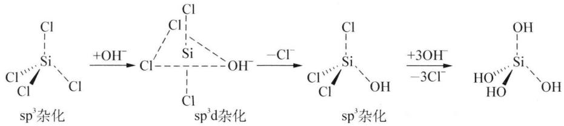

chemical

Chemical reaction mechanism showing silylation of silane with chloride ions and hydroxide ion formation

(2) 四氟化硅: 无色气体, 有窒息性气味, 溶于无水乙醇等, 遇水强烈水解: $\mathrm{SiF}_{4} + 3\mathrm{H}_{2}\mathrm{O} = \mathrm{H}_{2}\mathrm{SiO}_{3} \downarrow + 4\mathrm{HF}$ 。HF与 $\mathrm{SiF}_{4}$ 作用生成氟硅酸 $\mathrm{H}_{2}\mathrm{SiF}_{6}$ , 它是一种强酸, 其酸性与 $\mathrm{H}_{2}\mathrm{SO}_{4}$ 相当: $\mathrm{SiF}_{4} + 2\mathrm{HF} = \mathrm{H}_{2}\mathrm{SiF}_{6}$ 。HF及 $\mathrm{SiF}_{4}$ 对人畜及农作物都有很大的危害作用, 可用 $\mathrm{Na}_{2}\mathrm{CO}_{3}$ 溶液吸收制成白色难溶于水的 $\mathrm{Na}_{2}\mathrm{SiF}_{6}: 3\mathrm{SiF}_{4} + 2\mathrm{Na}_{2}\mathrm{CO}_{3} + \mathrm{H}_{2}\mathrm{O} = 2\mathrm{Na}_{2}\mathrm{SiF}_{6} \downarrow + \mathrm{H}_{2}\mathrm{SiO}_{3} + 2\mathrm{CO}_{2} \uparrow, \mathrm{H}_{2}\mathrm{SiO}_{3} + \mathrm{Na}_{2}\mathrm{CO}_{3} + 6\mathrm{HF} = \mathrm{Na}_{2}\mathrm{SiF}_{6} \downarrow + 4\mathrm{H}_{2}\mathrm{O} + \mathrm{CO}_{2} \uparrow$ 。

## 4. 二氧化硅

二氧化硅 $SiO_{2}$ 又称硅石，分为晶形和无定形两大类。天然的晶态二氧化硅有石英、鳞石英和方石英三种变体。无色透明的纯石英称为水晶。水晶被染成有色的透明晶体，紫色称为紫水晶，淡褐色的称为茶晶，黑色的称为墨晶。砂子是混有杂质的石英细粒，纯砂是白色的，但常被铁的化合物染成黄色或淡红色。硅藻土是天然的无定形二氧化硅。

纯净的二氧化硅为无色透明晶体, 密度 2.17\~2.65 g·cm $^{-3}$ , 熔点 1873\~1996 K(随不同晶体结构而异), 沸点 2503 K, 硬度大, 不溶于水。

二氧化硅的化学性质很不活泼,室温下仅与氟、氟化氢(氢氟酸)反应: $SiO_{2} + 2F_{2} = SiF_{4} + O_{2}$ , $SiO_{2} + 4HF = SiF_{4} \uparrow + 2H_{2}O$ 。

在加热条件下能与浓 NaOH 反应： $SiO_{2} + 2NaOH \xlongequal{\triangle} Na_{2}SiO_{3} + H_{2}O$ 。

在熔融条件下能与 $CaCO_{3}$ 等反应： $SiO_{2} + CaCO_{3} \xlongequal{\text{熔融}} CaSiO_{3} + CO_{2} \uparrow$ 。

高温时能跟活泼金属镁、铝反应： $3SiO_{2} + 4Al \xlongequal{高温} 2Al_{2}O_{3} + 3Si$ 。

$SiO_{2}$ 与 $CO_{2}$ 的化学组成相似,但结构和物理性质迥然不同, $CO_{2}$ 是分子晶体, $SiO_{2}$ 是 Si 原子跟 4 个 O 原子形成的四面体结构(如图 4-2)的共价晶体, $SiO_{2}$ 是最简式,并不表示单个分子。

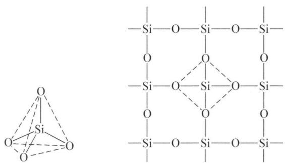

chemical

Chemical structure diagram showing a silicate tetrahedral coordination complex and its 2D unit cell arrangement

图4-2 二氧化硅的晶体结构示意图

二氧化硅在日常生活、生产和科研等方面有着重要的用途。它用于制造普通玻璃、石英玻璃、水玻璃、玻璃钢、光学仪器、化学器皿、陶瓷、耐火材料、光导纤维等。硅藻土是多孔性物质，工业上常用作吸附剂、催化剂的载体及作为绝热隔音的建筑材料等。

## 5. 硅酸

硅酸是 $SiO_{2}$ 的水合物(但不能由 $SiO_{2}$ 与 $H_{2}O$ 作用制得, 因 $SiO_{2}$ 不溶于水), 由可溶性硅酸盐与酸反应制得。其反应过程比较复杂, 反应产物随反应条件而变。先生成正硅酸 $H_{4}SiO_{4}$ , 然后脱水生成偏硅酸 $H_{2}SiO_{3}$ 、焦硅酸 $H_{6}Si_{2}O_{7}$ 及其他多种酸, 可用通式 $xSiO_{2} \cdot yH_{2}O$ 表示。因为偏硅酸的组成最简单, 所以常以 $H_{2}SiO_{3}$ 表示硅酸。

硅酸是比 $H_{2}CO_{3}$ 还弱的二元酸， $K_{1}^{\ominus}=1.7\times10^{-10}$ ， $K_{2}^{\ominus}=1.6\times10^{-12}$ 。其溶解度很小，很容易被其他酸从硅酸盐中析出： $SiO_{3}^{2-}+2H^{+}=H_{2}SiO_{3}\downarrow$ 。

起初生成的硅酸是单分子的,可溶于水而不能立即沉淀出来。随着反应的进行,这些单分子硅酸逐渐缩聚成多硅酸,开始发生絮状作用,生成硅酸凝胶。再经老化、洗涤、干燥便成为硅胶。硅胶是一种白色稍透明的固体物质,比表面积很大,每克硅胶的内表面积可达到 $800 \sim 900 \mathrm{~m}^{2}$ ,因此吸附能力很强,是优良的干燥剂和吸附剂。如果在制备硅胶时加入 $\mathrm{CoCl}_{2}$ ,可制得变色硅胶。因无水 $\mathrm{Co}^{2+}$ 离子呈蓝色,水合钴离子 $[\mathrm{Co(H_{2}O)}_{6}]^{2+}$ 呈粉红色,所以干燥硅胶为蓝色,吸足了水分后则变为粉红色。吸水后的硅胶再经加热脱水后又能变为蓝色,从而重新恢复吸湿能力。

## 6. 硅酸盐

## (1) 硅酸盐的结构

## ① 硅酸盐结构的图示法

硅酸盐种类极多,其结构可分为链状、片状和三维网络状,但基本单元都是硅氧四面体。如:

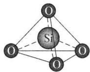

chemical

Molecular structure diagram of a silicon atom (Si) bonded to four oxygen atoms in a tetrahedral arrangement

$\mathrm{SiO}_{4}^{4-}$ 的结构(正硅酸根)

若沿顶端的 O—Si 键连线投影得到平面图形, 中心是 Si 和 O 的重叠, 则正硅

酸根 $\left(\mathrm{SiO}_{4}^{4-}\right)$ 结构为：焦硅酸根 $\left(\mathrm{Si}_{2}\mathrm{O}_{7}^{6-}\right)$ 结构为：

② 硅酸盐结构的分类

i) 链状：硅氧四面体通过共用顶点形成长链，如： $Si_{n}O_{3n+1}^{(2n+2)-}$

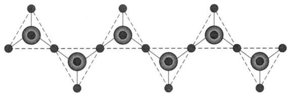

natural_image

Pure geometric diagram of interconnected nodes with dashed lines, no text or symbols present

，这种链状硅酸根之间用正离子相互

结合成束,即成为纤维状硅酸盐,如石棉。

ii）片状：硅氧四面体共用三个顶点可形成片状结构，层与层之间通过正离子约束得到片层状硅酸盐，如云母 $\left(\mathrm{KMg}_{3}\left(\mathrm{OH}\right)_{2}\mathrm{Si}_{3}\mathrm{AlO}_{10}\right)$ ：

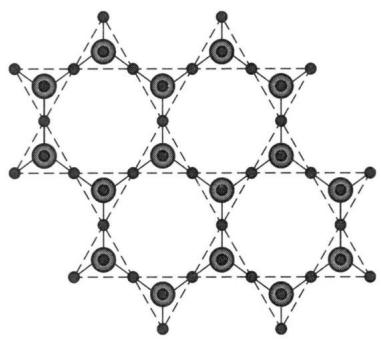

natural_image

Geometric lattice structure composed of interconnected nodes and lines (no text or symbols)

iii) 硅氧四面体共用四个顶点结成三维网络状结构, 如沸石类, 有微孔、有笼、有吸附性。但沸石孔道均一, 因为是晶体, 不同于硅胶, 称之为分子筛, 根据孔径的大小, 可以筛选分子, 故称沸石分子筛。如 A 型分子筛的晶体结构:

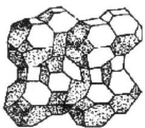

natural_image

Abstract geometric pattern composed of interconnected hexagonal shapes (no text or symbols)

A型分子筛的晶体结构

(2) 天然硅酸盐种类繁多、数量大, 结构复杂, 均难溶于水。例如: 长石 $\left(\mathrm{K}_{2} \mathrm{O} \cdot \mathrm{Al}_{2} \mathrm{O}_{3} \cdot 6 \mathrm{SiO}_{2}\right)$ 、高岭土 $\left(\mathrm{Al}_{2} \mathrm{O}_{3} \cdot 2 \mathrm{SiO}_{2} \cdot 2 \mathrm{H}_{2} \mathrm{O}\right)$ 、云母 $\left(\mathrm{K}_{2} \mathrm{O} \cdot 3 \mathrm{Al}_{2} \mathrm{O}_{3} \cdot 6 \mathrm{SiO}_{2} \cdot 2 \mathrm{H}_{2} \mathrm{O}\right)$ 、泡沸石 $\left(\mathrm{Na}_{2} \mathrm{O} \cdot \mathrm{Al}_{2} \mathrm{O}_{3} \cdot 3 \mathrm{SiO}_{2} \cdot n \mathrm{H}_{2} \mathrm{O}\right)$ 、石棉 $\left(\mathrm{CaO} \cdot 3 \mathrm{MgO} \cdot 4 \mathrm{SiO}_{2}\right)$ 、滑石 $\left(3 \mathrm{MgO} \cdot 4 \mathrm{SiO}_{2} \cdot \mathrm{H}_{2} \mathrm{O}\right)$ 等。

硅酸盐矿石长期受到空气中的 $CO_{2}$ 和水的侵蚀后,会逐渐风化水解,生成的可溶性物质随雨水带到江河湖海,留下大量的粘土(主要成分是高岭土)和砂子(石英)。例如:

$$
\mathrm{K} _ {2} \mathrm{O} \cdot \mathrm{Al} _ {2} \mathrm{O} _ {3} \cdot 6 \mathrm{SiO} _ {2} + \mathrm{CO} _ {2} + 2 \mathrm{H} _ {2} \mathrm{O} = \mathrm{Al} _ {2} \mathrm{O} _ {3} \cdot 2 \mathrm{SiO} _ {2} \cdot 2 \mathrm{H} _ {2} \mathrm{O} + \mathrm{K} _ {2} \mathrm{CO} _ {3} + 4 \mathrm{SiO} _ {2}
$$

(长石)

(高岭土)

高岭土是粘土的基本成分,纯高岭土是制造瓷器的原料。正长石、云母和石英是构成花岗岩的主要成分。

硅酸盐中只有碱金属的硅酸盐可溶于水,其中以硅酸钠 $Na_{2}SiO_{3}$ 最有实用价值。

制备硅酸钠时,可将石英砂、纯碱按一定比例混合放入反应炉内,用煤加热至1373\~1623 K熔融即得硅酸钠熔融体。这种熔融体呈玻璃状态,能溶于水,故有水玻璃之称,工业上称为泡花碱。水玻璃因常含有铁一类的少量杂质而呈浅绿色。将玻璃状固体 $Na_{2}SiO_{3}$ 破碎后,在一定压力下用水蒸气溶解成黏稠液体,即得商品水玻璃。

水玻璃在工业上有广泛用途,如建筑及造纸工业的粘合剂、木材及纤维织物的防腐剂及防火剂、洗涤剂的填充剂和发泡剂、调制耐酸砂浆及耐酸混凝土等。

## 四、锗、锡、铅

## 1. 单质

## (1) 物理性质

锗：银白色，硬金属；铅：暗灰色，软金属，密度大；锡：有三种同素异形体：

$$
\begin{array}{c c c} \text {灰锡} & \xrightarrow {2 8 6 \mathrm{K}} & \text {白锡} \\ & \xrightarrow {4 3 4 \mathrm{K}} & \text {脆锡} \\ \alpha & & \beta \\ & & \gamma \end{array}
$$

灰锡呈灰色粉末状，白锡在 286 K 下变成灰锡，自行毁坏，从一点变灰，蔓延开来，称为锡疫。所以锡制品不宜冬季放在室外。白锡是稳定的单质，银白色（带蓝色），有延展性。

## (2) 化学性质

① 与非强氧化性酸反应：

Ge+HCl 不反应。

$Sn + 2HCl = SnCl_{2} + H_{2}\uparrow$ （与稀盐酸反应缓慢）

$Pb + 2HCl = PbCl_{2} + H_{2} \uparrow$ (生成 $PbCl_{2}$ 覆盖反应物而终止)

$2\mathrm{Pb}+6\mathrm{HCl}(\text{浓})=2\mathrm{HPbCl}_{3}+2\mathrm{H}_{2}\uparrow$

② 与氧化性酸的反应

$\mathrm{Ge} + 4\mathrm{HNO}_3$ (浓) $\mathrm{GeO_2\cdot H_2O\downarrow + 4NO_2\uparrow + H_2O}$

$$
\begin{array}{l} \mathrm{Sn} + 4 \mathrm{HNO} _ {3} (\text {浓}) = \mathrm{H} _ {2} \mathrm{SnO} _ {3} \downarrow + 4 \mathrm{NO} _ {2} \uparrow + \mathrm{H} _ {2} \mathrm{O} \\ 3 \mathrm{Pb} + 8 \mathrm{HNO} _ {3} (\text {稀}) = 3 \mathrm{Pb} (\mathrm{NO} _ {3}) _ {2} + 2 \mathrm{NO} \uparrow + 4 \mathrm{H} _ {2} \mathrm{O} \\ \end{array}
$$

③ 与碱的反应

$$
\begin{array}{l} \mathrm{Pb} + 2 \mathrm{OH} ^ {-} = \mathrm{PbO} _ {2} ^ {2 -} + \mathrm{H} _ {2} \uparrow \\ \mathrm{Sn} + 2 \mathrm{OH} ^ {-} + 2 \mathrm{H} _ {2} \mathrm{O} = \mathrm{Sn(OH)} _ {4} ^ {2 -} + \mathrm{H} _ {2} \uparrow \\ \mathrm{Ge} + 2 \mathrm{OH} ^ {-} + \mathrm{H} _ {2} \mathrm{O} = \mathrm{GeO} _ {3} ^ {2 -} + 2 \mathrm{H} _ {2} \uparrow \\ \end{array}
$$

## 2. 锗、锡、铅的含氧化合物

## (1) 酸碱性

Ge、Sn、Pb 都有两种氧化物 MO、 $MO_{2}$ 。MO 两性偏碱， $MO_{2}$ 两性偏酸，均不溶于水。氧化物的水合物也不同程度的具有两性。在水溶液中有两种电离方式：

$$
\begin{array}{l} \mathrm{M} ^ {2 +} + 2 \mathrm{OH} ^ {-} \rightleftharpoons \mathrm{M} (\mathrm{OH}) _ {2} \rightleftharpoons \mathrm{H} ^ {+} + \mathrm{HMO} _ {2} ^ {-} \\ \mathrm{M} ^ {4 +} + 4 \mathrm{OH} ^ {-} \rightleftharpoons \mathrm{M} (\mathrm{OH}) _ {4} \rightleftharpoons \mathrm{H} ^ {+} + \mathrm{HMO} _ {3} ^ {-} + \mathrm{H} _ {2} \mathrm{O} \\ \end{array}
$$

碱性最强的是 $\mathrm{Pb(OH)}_{2}$ ，酸性最强的是 $\mathrm{Ge(OH)}_{4}$ 。

## (2) 氧化还原性

① Pb(Ⅳ)的氧化性

$\mathrm{PbO_2}$ 要在碱性条件下制备，用浓硝酸不能制得 $\mathrm{Pb(IV)}$ ： $\mathrm{Pb(OH)_3^- + }$ $\mathrm{ClO^{-} = PbO_{2} + Cl^{-} + OH^{-} + H_{2}O}$ ，其中 $\mathrm{Pb^{2 + } + 3OH^{-} = Pb(OH)_3^-}$ 。

$PbO_{2}$ 棕黑色, 强氧化剂: $5PbO_{2} + 2Mn^{2+} + 4H^{+} = 5Pb^{2+} + 2MnO_{4}^{-} + 2H_{2}O$ 。与氮族元素的 Bi 相同, $6s^{2}$ 上的电子很难失去, 一旦失去, 夺回的倾向很强; 同样, Tl(Ⅲ)也有这种效应, Hg(Ⅱ)也有, 称为 $6s^{2}$ 惰性电子对效应, 镧系收缩的结果。

② Sn(Ⅱ)的还原性

不论在酸碱中, 还原能力都比较强。 $Sn^{2+}$ 在空气中被氧气氧化: $2Sn^{2+} + O_{2} + 4H^{+} = 2Sn^{4+} + 2H_{2}O$ 。要加入单质 Sn 保护 $Sn^{2+}: Sn^{4+} + Sn = 2Sn^{2+}$ 。

$Sn^{2+}$ 最典型的还原反应是还原 $Hg^{2+}$ ： $2HgCl_{2} + SnCl_{2} + 2HCl = Hg_{2}Cl_{2} \downarrow$ （氯化亚汞、甘汞，白） $+H_{2}SnCl_{6}$ ， $Sn^{2+}$ 过量时进一步得单质 Hg： $Hg_{2}Cl_{2} + SnCl_{2} + 2HCl = 2Hg \downarrow$ （黑） $+H_{2}SnCl_{6}$ 。在碱中，亚锡酸的还原性更强： $3HSnO_{2}^{-} + Bi^{3+} + 9OH^{-} + 3H_{2}O = 3Sn(OH)_{6}^{3-} + Bi \downarrow$ （黑）。

## (3) 其他主要含氧化合物

① 黄丹和红丹

黄丹，PbO，又名密陀僧，溶于 $HNO_{3}$ 或 HAc 中成可溶性 Pb(Ⅱ) 盐，药材，制铅玻璃、陶瓷。

红丹, $\mathrm{Pb}_{3} \mathrm{O}_{4}$ , 又名铅丹, 可以认为是铅酸铅 $\mathrm{Pb(II)}_{2} \mathrm{Pb(IV)} \mathrm{O}_{4}$ , 其组成可由下面的实验加以说明: $\mathrm{Pb}_{3} \mathrm{O}_{4} + 4 \mathrm{HNO}_{3} = 2 \mathrm{Pb(NO}_{3})_{2} + \mathrm{PbO}_{2} \downarrow$ (棕黑) $+ 2 \mathrm{H}_{2} \mathrm{O}$ , 过滤, 将产物分离。 $\mathrm{Pb(NO}_{3})_{2}$ 通过与 $\mathrm{Na}_{2} \mathrm{CrO}_{4}$ 生成 $\mathrm{PbCrO}_{4}$ 黄色沉淀得以证实; $\mathrm{PbO}_{2}$ 可由反应: $\mathrm{PbO}_{2} + 4 \mathrm{HCl} = \mathrm{PbCl}_{2} + \mathrm{Cl}_{2} \uparrow + 2 \mathrm{H}_{2} \mathrm{O}$ 得以证实。

② $\alpha$ -锡酸和 $\beta$ -锡酸

$\alpha$ -锡酸性质活泼，能溶于酸和碱。 $\mathrm{SnCl_4}$ 溶于碱得 $\alpha$ -锡酸： $\mathrm{SnCl_4 + 4NH_3\cdot H_2O}$ $= \mathrm{H}_2\mathrm{SnO}_3\downarrow (\alpha) + 4\mathrm{NH}_4\mathrm{Cl} + \mathrm{H}_2\mathrm{O}$ 或 $\mathrm{Sn(IV)}$ 低温水解也可得到 $\alpha$ -锡酸。

β-锡酸性质不活泼,不溶于酸,几乎不溶于碱,锡和浓硝酸反应,或 $SnCl_{4}$ 高温水解,或 α-锡酸在溶液中静置或加热得 β-锡酸。

## 3. 锗、锡、铅的卤化物和硫化物

## (1) 卤化物

$MX_{2}$ 一般属离子型化合物， $MX_{4}$ 属共价型化合物，易成络离子： $SnCl_{4} + 2Cl^{-} = SnCl_{6}^{2-}$ ， $PbI_{2} + 2I^{-} = PbI_{4}^{2-}$ 。Pb(Ⅳ)氧化性强，与还原性离子 $I^{-}$ 不易形成 $PbI_{4}$ ， $PbBr_{4}$ 也很难形成。同时在水中易水解： $SnCl_{2} + H_{2}O = Sn(OH)Cl\downarrow$ （白）+HCl。所以，配制 $SnCl_{2}$ 溶液要使用盐酸配制，抑制水解 $Sn^{2+}$ 。

## (2) 硫化物

高价态硫化物可与碱性硫化物反应,如: $\mathrm{GeS}_{2} + \mathrm{Na}_{2}\mathrm{S} \longrightarrow \mathrm{Na}_{2}\mathrm{GeS}_{3}$ (硫代锗酸钠), $\mathrm{SnS}_{2} + \mathrm{Na}_{2}\mathrm{S} = \mathrm{Na}_{2}\mathrm{SnS}_{3}$ , $SnS_{2}$ 是金黄色金粉涂料的主要成分。

低价态硫化物有较强的还原性,GeS 和 SnS 均可与 $Na_{2}S_{2}$ 反应: $GeS + Na_{2}S_{2} = GeS_{2} + Na_{2}S = Na_{2}GeS_{3}$ , $SnS + Na_{2}S_{2} = SnS_{2} + Na_{2}S = Na_{2}SnS_{3}$ 。

## 五、硼及其化合物

## 1. 单质

## (1) 自然界存在

硼(B)在地壳中的质量分数约为 0.001%。在自然界主要以含氧化合物的形式存在,如硼酸 $\left(\mathrm{H}_{3}\mathrm{BO}_{3}\right)$ 和硼砂 $\left(\mathrm{Na}_{2}\mathrm{B}_{4}\mathrm{O}_{7}\cdot10\mathrm{H}_{2}\mathrm{O}\right)$ 等。硼在地壳中含量虽少,却有富集的矿床,我国西藏及青海地区有丰富的硼砂矿。

单质硼有晶体硼和无定形硼两类。

## (2) 物理性质

晶体硼有多种同素异形体,其中较普通的是 $\alpha$ -菱形硼。晶体硼呈黑灰色,密度约为 $2.3 \, g/cm^{3}$ , 熔点约 $2573 \, K$ , 沸点约 $2820 \, K$ , 硬度很大(莫氏硬度: 9.5), 在单质中仅次于金刚石, 属共价晶体。无定形硼为棕色至黑色粉末。单质硼对人体

无毒。

## (3) 化学性质

晶体硼的化学性质不活泼,在常温下几乎不与其他物质反应。无定形硼的化学性质比晶体硼活泼,在常温时能与氟反应,加热时能和氧、氯、溴及硫反应。在更高温度时能与碳、氮或氨反应生成碳化硼 $\mathrm{B}_{4} \mathrm{C}$ 和氮化硼(BN)。如: $4 \mathrm{~B} + 3 \mathrm{O}_{2} = 2 \mathrm{~B}_{2} \mathrm{O}_{3}, 2 \mathrm{~B} + 3 \mathrm{Cl}_{2} = 2 \mathrm{BCl}_{3}, 2 \mathrm{~B} + \mathrm{N}_{2} = 2 \mathrm{BN}$ (均在高温下进行)。晶体硼能和氧化性酸起反应, 比硅活泼些: $\mathrm{B} + 3 \mathrm{HNO}_{3}$ (浓) $= \mathrm{H}_{3} \mathrm{BO}_{3} + 3 \mathrm{NO}_{2} \uparrow$ ; 也能和强碱起反应: $2 \mathrm{~B} + 2 \mathrm{NaOH}$ (浓) $+ 2 \mathrm{H}_{2} \mathrm{O} = 2 \mathrm{NaBO}_{2} + 3 \mathrm{H}_{2}$ (气体)。

## (4) 硼的制备和用途

① 制备

用 $\mathrm{Mg}$ 或 Al 还原 $\mathrm{B}_{2} \mathrm{O}_{3}$ (相当于用 C 还原 $\mathrm{SiO}_{2}$ ): $\mathrm{B}_{2} \mathrm{O}_{3} + 3 \mathrm{Mg} \xlongequal{\text {高温}} 3 \mathrm{MgO} + 2 \mathrm{B}$ 。

或用 $H_{2}$ 还原三溴化硼（相当于用 $H_{2}$ 还原 $SiCl_{4}$ ）： $2BBr_{3} + 3H_{2} \xlongequal{钨丝} 2B + 6HBr$ 。

② 用途：硼的用途广泛。大量用于生产硼钢、锰硼合金以及钕铁硼合金等。可作为火箭使用的冲压式喷气发动机燃料，这使得硼粉在军事工业中有重要应用。硼粉在汽车安全气囊中常用作引发叠氮化钠的引发剂。硼在电子工业中作为掺杂源使用。

## 2. 硼烷

硼氢化合物虽没有碳氢化合物种类多,但远比硅烷多。其结构比烷烃、硅烷复杂。

## (1) 结构

最简单的硼烷,理应是 $BH_{3}$ ,但结构研究表明它的分子式是 $B_{2}H_{6}$ , 分子间键联

关系：B: sp³不等性杂化

端基上的 H 和 B 之间形成 $\sigma$ 键 $(sp^{3}-s)$ 。四个端 H 和两个 B 形成分子平面，中间两个 H 不在分子平面内，其连线垂直于分子平面，上下各一个。成键方式比较特别：上方的 H 与左右两边的 B 各自提供一个轨道，H 和其中一个 B 原子各给出 1 个电子形成三中心二电子键（3c2e 键），又称为氢桥键，如下图所示：

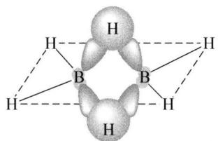

chemical

Molecular structure diagram of boron (B₂H₃) showing tetrahedral geometry with hydrogen atoms and boron-bonded interactions

再如 $B_{4}H_{10}$ 结构如图：结构中有 6 根 B—H，1 根 B—B 键，4 根氢桥键 (3c2e 键)：

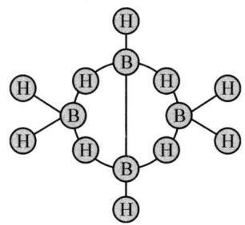

chemical

Molecular structure diagram of ethylene (B2H4) showing carbon and hydrogen atoms in a ring arrangement

## (2) 乙硼烷的制备

质子置换法： $2MnB+6H^{+}=B_{2}H_{6}\uparrow+2Mn^{3+}$ ，相当于 $Mg_{2}Si$ 和盐酸反应制备 $SiH_{4}$ 。

还原法： $4BCl_{3} + 3LiAlH_{4} = 2B_{2}H_{6}\uparrow + 3LiCl + 3AlCl_{3}$ ，相当于 $SiCl_{4}$ 和 $LiAlH_{4}$ 反应制 $SiH_{4}$ 。

## (3) 乙硼烷的性质

① 稳定性： $B_{2}H_{6}=2B+3H_{2}$ ， $B_{2}H_{6}$ 要在 $100^{\circ}C$ 以下保存，稳定性不如硅烷。

② 还原性: $B_{2}H_{6} + 3O_{2} = B_{2}O_{3} + 3H_{2}O$ , 自燃, 属高能燃料, 但毒性极大, 不易储存。

③ 水解性： $B_{2}H_{6} + 6H_{2}O = 2B(OH)_{3} + 6H_{2}$

④ 路易斯酸的反应(缺电子结构): 化学上通常把由价电子数少于价层轨道数的缺电子原子形成的化合物称为缺电子化合物。B 的价电子构型为 $2s^{2}2p^{1}$ ，价电子层有 4 个轨道只有 3 个电子，属缺电子原子，所以 $BF_{3}$ 、 $BCl_{3}$ 等为缺电子化合物，它们容易和其他分子或离子的孤对电子形成配合物。如： $B_{2}H_{6} + 2LiH = 2Li(BH_{4})$ ，白色固体，火箭推进剂； $BF_{3} +:NH_{3} = [F_{3}B:NH_{3}]$ ; $BF_{3} +:F^{-} = [BF_{4}]^{-}$ 。

## 3. 三氧化二硼

(1) 物理性质: $\mathrm{B}_{2} \mathrm{O}_{3}$ , 又称氧化硼、硼酸酐或硼酐, 可由单质硼燃烧或硼酸脱

水得 $B_{2}O_{3}$ ，为白色固体，熔点 723 K，沸点 2523 K，微溶于冷水，易溶于热水中。

## (2) 化学性质:

$B_{2}O_{3}$ 性质比较稳定, 灼烧时才能被镁、铝等活泼金属还原, 不能用碳还原 $B_{2}O_{3}$ , 因为在高温时硼与碳能生成碳化硼。

三氧化二硼具有强烈吸水性而转变为硼酸： $B_{2}O_{3} + 3H_{2}O = 2H_{3}BO_{3}$ 。所以 $B_{2}O_{3}$ 应放在干燥环境下密闭保存。

$B_{2}O_{3}$ 和许多种金属氧化物在熔融时生成有特征颜色的硼珠，可用于鉴定： $CoO + B_{2}O_{3} = Co(BO_{2})_{2}$ （深蓝色）； $Cr_{2}O_{3}$ 的硼珠：绿色；CuO 的硼珠：蓝色；MnO 的硼珠：紫色；NiO 的硼珠：绿色； $Fe_{2}O_{3}$ 的硼珠：黄色。

(3) 用途: $\mathrm{B}_{2} \mathrm{O}_{3}$ 用途广泛, 可用作硅酸盐分解时的助熔剂、半导体材料的掺杂剂、油漆的耐火添加剂及制取硼及多种硼化物等, 也用作有机合成的催化剂, 油漆、高温润滑剂、陶瓷、特种玻璃及焊料的添加剂等。

## 4. 硼酸

## (1) 物理性质

硼酸 $H_{3}BO_{3}$ ，为白色鳞片状有光泽的三斜晶体或白色粉末，无臭，有滑腻手感，288 K 时密度为 $1.435 \, g/cm^{3}$ ，溶于水、乙醇、甘油等，在水中的溶解度随温度升高而增大，并能随水蒸气挥发。

## (2) 分子结构

在硼酸分子中，B原子以 $\mathrm{sp}^2$ 杂化轨道与3个羟基—OH中的O原子分别形成 $\sigma$ 键。在硼酸晶体中， $\mathrm{H}_3\mathrm{BO}_3$ 分子中的每一个O原子同其他 $\mathrm{H}_3\mathrm{BO}_3$ 分子的H原子又通过氢键形成片状结构，层与层之间则通过微弱的范德华力相结合，如下图所示。因此硼酸晶体呈片状，有解理性，可作润滑剂。

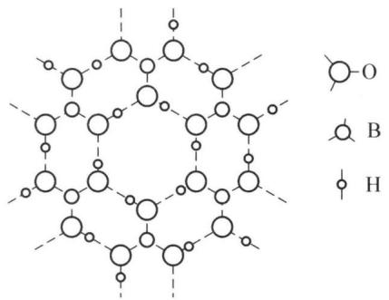

chemical

Molecular structure diagram showing oxygen (O), boron (B), and hydrogen (H) atoms in a lattice arrangement

## (3) 化学性质

$H_{3}BO_{3}$ 是一元弱酸， $K^{\ominus}=5.8\times10^{-10}$ ，其酸性比碳酸还弱，它在水中所表现出来的酸性并非硼酸本身解离出来的 $H^{+}$ ，而是由B原子接受 $H_{2}O$ 所解离出来的

$OH^{-}$ 形成配离子 $B(OH)_{4}^{-}$ ，从而使溶液中 $H^{+}$ 浓度增大：

$$
\mathrm{H} _ {3} \mathrm{BO} _ {3} + \mathrm{H} _ {2} \mathrm{O} = \left[ \begin{array}{c} \mathrm{OH} \\ | \\ \mathrm{HO} - \mathrm{B} \xrightarrow {\quad} \mathrm{OH} \\ | \\ \mathrm{OH} \end{array} \right] ^ {-} + \mathrm{H} ^ {+}
$$

这种解离方式正好表现出了硼化合物的缺电子特点。在 $H_{3}BO_{3}$ 中加入甘油（丙三醇），酸性可增强，原因是显酸性的机理发生了变化：

$$
\mathrm{HO} - \mathrm{B} \left\langle \begin{array}{c c} \mathrm{OH} & \mathrm{HOH} _ {2} \mathrm{C} \\ \mathrm{OH} & \mathrm{HOH} _ {2} \mathrm{C} \end{array} \right\rangle \mathrm{CHOH} = \left[ \mathrm{O} - \mathrm{B} \left\langle \begin{array}{c c} \mathrm{OCH} _ {2} \\ \mathrm{OCH} _ {2} \end{array} \right\rangle \mathrm{CHOH} \right] ^ {-} + \mathrm{H} ^ {+} + 2 \mathrm{H} _ {2} \mathrm{O}
$$

$H_{3}BO_{3}$ 遇到某种比它强的酸时,有显碱性的可能: $\mathrm{B(OH)_{3} + H_{3}PO_{4} = BPO_{4} + 3H_{2}O}$ (中和反应)。

把硼酸加热至 373 K 时逐渐脱水生成偏硼酸 $HBO_{2}$ ，加热至 413 K 时生成焦硼酸 $H_{2}B_{4}O_{7}$ ，加热至 573 K 时生成硼酸酐 $B_{2}O_{3}$ 。反之，将 $B_{2}O_{3}$ 、 $H_{2}B_{4}O_{7}$ 、 $HBO_{2}$ 溶于 $H_{2}O$ ，又可重新生成 $H_{3}BO_{3}$ 。

## (4) 硼酸的鉴定反应

$3C_{2}H_{5}OH + H_{3}BO_{3} = (C_{2}H_{5}O)_{3}B \uparrow$ （硼酸三乙酯）+ $3H_{2}O$ ，点燃时：硼酸三乙酯燃烧显绿色火焰。

## (5) 制备和用途

① 制备：在工业上，常用 $H_{2}SO_{4}$ 分解硼砂矿或硼镁矿制备 $H_{3}BO_{3}$ $Na_{2}B_{4}O_{7}\cdot10H_{2}O+H_{2}SO_{4}=4H_{3}BO_{3}+Na_{2}SO_{4}+5H_{2}O$ ， $Mg_{2}B_{2}O_{5}\cdot H_{2}O+2H_{2}SO_{4}=2H_{3}BO_{3}+2MgSO_{4}$ 。

② 用途：硼酸大量用于玻璃、陶瓷和搪瓷工业中。在医药上常作为防腐消毒剂。在金属焊接、皮革、照相等行业以及染料、耐热防火织物、人造宝石、化妆品的制造等方面都有应用。

## 5. 硼砂

(1) 物理性质: 硼砂 $\mathrm{Na}_{2} \mathrm{~B}_{4} \mathrm{O}_{5} (\mathrm{OH})_{4} \cdot 8 \mathrm{H}_{2} \mathrm{O}$ , 常写成 $\mathrm{Na}_{2} \mathrm{~B}_{4} \mathrm{O}_{7} \cdot 10 \mathrm{H}_{2} \mathrm{O}$ , 又称十水四硼酸钠或焦硼酸钠。硼砂为无色半透明晶体或白色结晶粉末, 密度 $1.73 \mathrm{~g} / \mathrm{cm}^{3}$ , 无臭, 味咸, 易溶于水、甘油等。硼砂在水中的溶解度随温度的升高而明显增大, 水溶液呈弱碱性。

## (2) 结构与化学性质

硼砂负离子结构如下图所示,其中左右2个B是 $sp^{2}$ 杂化,3配位;上下2个B是 $sp^{3}$ 杂化,四配位。400℃时脱去8个结晶水和2个羟基水,生成 $Na_{2}B_{4}O_{7}$ ,可看成是2个 $NaBO_{2}$ 和1个 $B_{2}O_{3}$ 的复合物,因此硼砂和过渡金属氧化物 $Cr_{2}O_{3}$ , CuO, MnO, NiO, $Fe_{2}O_{3}$ 等也发生硼珠反应,而实际上的硼珠反应是用硼砂来做。

硼砂的水解： $\mathrm{B}_{4}\mathrm{O}_{5}(\mathrm{OH})_{4}^{2-}+5\mathrm{H}_{2}\mathrm{O}=2\mathrm{H}_{3}\mathrm{BO}_{3}+2\mathrm{B}(\mathrm{OH})_{4}^{-}$ ，生成等摩尔的弱酸和弱酸盐，形成缓冲溶液，0.01 mol/L 的硼砂溶液 pH=9.24。

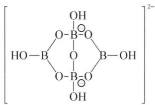

chemical

Chemical structure of a borate ester compound with two boron groups and two hydroxyl groups

## (3) 制备和用途

① 制备：硼砂虽在自然界中存在，但矿藏资源比较少。工业上大量硼砂是由硼锰矿制取的。将硼锰矿与加热的 NaOH 溶液反应，生成偏硼酸钠 $NaBO_{2}$ ，过滤除去 $\mathrm{Mg(OH)}_{2}$ 等不溶物后，通入 $CO_{2}$ 气体以降低溶液的 pH，蒸发结晶便得硼砂： $\mathrm{Mg}_{2}\mathrm{B}_{2}\mathrm{O}_{5} \cdot \mathrm{H}_{2}\mathrm{O} + 2\mathrm{NaOH} = 2\mathrm{NaBO}_{2} + 2\mathrm{Mg(OH)}_{2} \downarrow, 4\mathrm{NaBO}_{2} + \mathrm{CO}_{2} + 10\mathrm{H}_{2}\mathrm{O} = \mathrm{Na}_{2}\mathrm{B}_{4}\mathrm{O}_{7} \cdot 10\mathrm{H}_{2}\mathrm{O} + \mathrm{Na}_{2}\mathrm{CO}_{3}$ 。

② 用途：硼砂大量用于玻璃、陶瓷和搪瓷等工业。它在玻璃中可增加紫外线的透射率，从而提高玻璃的透明度和耐热性能。在搪瓷制品中，它可使瓷釉不易脱落并使其具有光泽。在焊接金属时，利用硼砂能溶解金属氧化物的性质可除去金属表面的氧化物。在农业上，常用硼砂作为植物微量元素的肥料，对小麦、棉花等有显著的增产效果。在医药上硼砂常作为防腐剂和消毒剂。硼砂是制取含硼化合物的基本原料，几乎所有的含硼化物都可经硼砂来制得。

## 6. 硼与硅的相似性

除硼与硅氧化物及含氧酸不相似以外，硼与硅单质的制备，与酸碱的作用，氢化物的制备与性质等都相似。硼和硅的卤化物水解性也相似： $\mathrm{SiCl_4 + 4H_2O = H_4SiO_4 + 4HCl}$ ， $\mathrm{BCl_3 + 2H_2O = HBO_2 + 3HCl}$ ； $3\mathrm{SiF_4 + 4H_2O = H_4SiO_4 + 2H_2SiF_6}$ （氟硅酸）， $4\mathrm{BF_3 + 2H_2O = HBO_2 + 3HBF_4}$ （氟硼酸）。这些相似性的实质是原子或离子的电场力引起的，电场力相近，对外层电子的约束力相近。

## 六、铝及其化合物

铝是地壳中分布最广的金属元素(质量分数为8.3%)，在所有元素中仅次于O(45.5%)和Si(25.7%)。铝在自然界中以各种矿物存在，其中最重要的是铝土矿(矾土， $Al_{2}O_{3}\cdot xH_{2}O$ )，冰晶石 $\left(\mathrm{Na}_{3}\mathrm{AlF}_{6}\right)$ 和明矾石 $\left[\mathrm{KAl}(\mathrm{SO}_{4})_{2}\cdot2\mathrm{Al}(\mathrm{OH})_{3}\right]$ 。

## 1. 铝的性质

铝是银白色的金属,最重要的性质是质轻,密度为 $2.7 \, g \cdot cm^{-3}$ ,属轻金属,质软,硬度为 1.5,熔点为 $660.37^{\circ}C$ ,沸点为 $2467^{\circ}C$ 。无毒,富有延展性(延性仅次于

Au), 具有很好的导电性、传热性(导电、导热能力仅次于 Ag 和 Cu), 抗氧化、抗酸碱(表面生成一层致密、惰性的氧化膜, 最厚达 10 nm), 不发生火花放电, 无磁性。

铝及其合金能被铸、辗、挤、锻、拉或用机床加工，易于制成各种形状的用材，如电线、包装用薄膜、炊具、建筑材料、航空航天材料等等，使它在国民经济中占有重要地位。铝表面有一层氧化物薄膜，经过阳极化处理，其具有更好的抗腐蚀性和抗磨损性。

表 4-1 常见铝制合金及其主要用途

<table><tr><td>铝制合金\成分</td><td>Al</td><td>Mg</td><td>Cu</td><td>Mn</td><td>Fe、Si</td><td>主要用途</td></tr><tr><td>工业纯铝</td><td>99.7</td><td></td><td></td><td></td><td>0.3</td><td>铝箔、电缆、导电机件材料等</td></tr><tr><td>硬铝</td><td>95~96</td><td>0.2~0.8</td><td>2.0~3.5</td><td>0.2~0.8</td><td>杂质 $\leqslant$ 1.3%</td><td>做管、棒、板、线材以及自由锻件等</td></tr><tr><td>坚铝</td><td>93~95</td><td>0.5~2</td><td>2.5~5.5</td><td>0.5~1.2</td><td>0.2~1</td><td>飞机中仪器零件、航空发动机气缸等</td></tr><tr><td>镁铝</td><td>70~90</td><td>10~30</td><td></td><td></td><td></td><td>飞机结构材料等</td></tr></table>

铝的化学性质活泼, 具有较强的还原性, $\varphi^{\ominus}(\mathrm{Al}^{3+}/\mathrm{Al}) = -1.676\mathrm{V}$ , 在不同温度下能与 $\mathrm{O}_{2} 、 \mathrm{Cl}_{2} 、 \mathrm{Br}_{2} 、 \mathrm{I}_{2} 、 \mathrm{N}_{2} 、 \mathrm{P}$ 等非金属直接化合。根据铝的原子结构特点, 铝的典型化学性质有缺电子性、亲氧性和两性。

(1) 缺电子性: Al 原子的价层电子结构是 $3 \mathrm{~s}^{2} 3 \mathrm{p}^{1}$ , 价电子数少于价轨道数, 为缺电子原子, 其化合物具有缺电子性。如三氯化铝在气态存在双聚分子 $\mathrm{Al}_{2} \mathrm{Cl}_{6}$ 。在 $\mathrm{Al}_{2} \mathrm{Cl}_{6}$ 中每个 Al 原子都是 $\mathrm{sp}^{3}$ 杂化, 其相邻的 4 个 Cl—Al 键, 3 个是共价键, 1 个是配位共价键, 其几何构型为共用一条棱边的双四面体, 表现出铝 (Ⅲ) 的化合物为缺电子化合物:

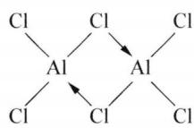

chemical

Chemical structure diagram of a dithium cluster with chlorine substituents

(2) 亲氧性: 铝的最突出的化学性质就是亲氧性, 这可从 $\mathrm{Al}_{2} \mathrm{O}_{3}$ 的生成焓很高得到说明: $2 \mathrm{Al} (\mathrm{s}) + \frac{3}{2} \mathrm{O}_{2} (\mathrm{~g}) = \mathrm{Al}_{2} \mathrm{O}_{3}, \Delta_{\mathrm{f}} H_{\mathrm{m}}^{\ominus} = -1669.7 \mathrm{~kJ} \cdot \mathrm{mol}^{-1}$ 。Al与 $\mathrm{O}_{2}$ 反应的自发性程度很大, Al一接触空气, 表面立即被氧化, 生成一层致密的氧化膜,此膜可阻止铝继续被氧化,此膜不溶于水和酸,使铝在空气及水中都很稳定,故铝被广泛用来制造日用器皿。 $Al_{2}O_{3}$ 的生成焓比一般金属氧化物及 $SiO_{2}$ 、 $B_{2}O_{3}$ 的大得多,见表 4-2。

表 4-2 一些氧化物的标准摩尔生成焓

<table><tr><td>氧化物</td><td>CaO</td><td>MgO</td><td>Fe2O3</td><td>Cr2O3</td><td>NiO</td><td>SiO2</td><td>B2O3</td><td>Al2O3</td></tr><tr><td> $\Delta_{f}H_{m}^{\ominus}/kJ·mol^{-1}$ </td><td>-635.5</td><td>-601.8</td><td>-824.2</td><td>-1129</td><td>-240</td><td>-910.9</td><td>-1272.8</td><td>-1669.7</td></tr></table>

Al 的亲氧性还表现在 Al 能夺取许多金属氧化物中的氧, 在冶金工业上常用作还原剂。例如, 将铝粉和 $Fe_{2}O_{3}$ 按一定比例混合, 用引燃剂点燃, 即剧烈反应, 同时放出大量的热, 温度能达到 $3000^{\circ}C$ , 铁的熔点为 $1535^{\circ}C$ , 此时被还原出来的铁呈熔化状态, 常用于野外焊接铁轨: $Fe_{2}O_{3} + 2Al = Al_{2}O_{3} + 2Fe$ , $\Delta_{r}H_{m}^{\ominus} = -853.8 kJ \cdot mol^{-1}$ 。在冶金工业中, 此法被称为铝热冶金法或铝热法, 用来冶炼一些难熔金属, 如 Cr、Mn、V 等。

Al 的亲氧性还被广泛用来作炼钢的脱氧剂, 还用于制取耐高温陶瓷: 将 Al 粉、石墨、 $TiO_{2}$ 等高熔点金属氧化物按一定比例混合均匀, 涂在金属表面, 在高温下煅烧: $4Al + 3TiO_{2} + 3C = 2Al_{2}O_{3} + 3TiC$ 。留在金属表面的涂层是耐高温的物质, 它们广泛应用于火箭和导弹技术中。

（3）两性：铝是典型的两性金属，普通的铝既能溶于稀盐酸和稀硫酸，又能溶于强碱。如： $2\mathrm{Al} + 6\mathrm{HCl} = 2\mathrm{AlCl}_{3} + 3\mathrm{H}_{2}\uparrow$ ， $2\mathrm{Al} + 2\mathrm{NaOH} + 6\mathrm{H}_{2}\mathrm{O} = 2\mathrm{Na}\left[\mathrm{Al(OH)}_{4}\right] + 3\mathrm{H}_{2}\uparrow$ 。

(4) 钝化现象: 铝在冷的浓 $\mathrm{H}_{2} \mathrm{SO}_{4}$ 或浓 $\mathrm{HNO}_{3}$ 中被钝化, 所以常用铝桶装运这些酸。加热时能溶于浓硫酸: $2 \mathrm{Al} + 6 \mathrm{H}_{2} \mathrm{SO}_{4}$ (浓, 热) $\mathrm{Al}_{2}(\mathrm{SO}_{4})_{3} + 3 \mathrm{SO}_{2} \uparrow + 6 \mathrm{H}_{2} \mathrm{O}$ 。高纯度的铝 (99.95%) 不与一般的酸作用, 只溶于王水。

## 2. 氧化铝

$Al_{2}O_{3}$ 为难溶于水的白色无定形粉末,属于离子晶体,熔点高,硬度大。根据制备方法不同,有多种变体,其中人们最熟悉的是 $\alpha-Al_{2}O_{3}$ 和 $\gamma-Al_{2}O_{3}$ 。

自然界存在的刚玉为 $\alpha-Al_{2}O_{3}$ ，其晶体属于六方紧密堆积结构，其中 $Al^{3+}$ 和 $O^{2-}$ 两种离子间的吸引力很强，晶格能很大，所以熔点高（2045℃）和硬度大（莫氏硬度：8.8），挥发性小，绝缘性好，耐腐蚀，广泛用于生产高硬度的研磨材料、耐火材料和陶瓷制品。

天然的或人造刚玉由于含有不同的微量过渡金属离子而呈现特征的颜色,常

称为宝石。红宝石中含有少量 Cr(Ⅲ)，蓝宝石中含有微量 Fe(Ⅱ，Ⅲ) 和 Ti(Ⅳ)。

将 $\mathrm{Al(OH)_{3}}$ 、偏氢氧化铝 $\mathrm{AlO(OH)}$ 或铝铵矾 $(\mathrm{NH_{4}})_{2}\mathrm{SO_{4}}\cdot\mathrm{Al_{2}(SO_{4})_{3}}\cdot24\mathrm{H_{2}O}$ 加热到 723 K，就有 $\gamma-Al_{2}O_{3}$ 生成，它属于面心立方密堆积结构，这种结构使 $\gamma-Al_{2}O_{3}$ 硬度不高，颗粒小，具有较大的表面积，有较高的吸附能力和催化活性，性质比 $\alpha-Al_{2}O_{3}$ 活泼，可溶于酸或碱溶液中： $\mathrm{Al_{2}O_{3}+6H^{+}=2Al^{3+}+3H_{2}O}$ ， $\mathrm{Al_{2}O_{3}+2OH^{-}+3H_{2}O=2[Al(OH)_{4}]^{-}}$ 。所以又称活性氧化铝，常用作吸附剂和催化剂。

透明的 $Al_{2}O_{3}$ 陶瓷(玻璃)有优良的光学性能,且耐高温(2000℃),耐冲击,耐腐蚀,耐磨,可用来做高压钠灯,防弹汽车窗、坦克观察窗和轰炸机的瞄准器等。

## 3. 氢氧化铝

$Al_{2}O_{3}$ 难溶于水, 故其氢氧化物只能通过其他方法制得。一般所谓的氢氧化铝实际上是指 $Al_{2}O_{3}$ 的水合物, 其化学组成有从 $AlO \cdot OH$ 到 $\mathrm{Al(OH)}_{3}$ 几种形式。

$\mathrm{AlO(OH)}$ 称为偏氢氧化铝, 它是将氨水加入沸腾的铝盐溶液中生成的, 而 $\mathrm{Al(OH)}_{3}$ 是将 $\mathrm{CO}_{2}$ 通入碱性铝酸盐溶液中生成的白色沉淀: $2[\mathrm{Al(OH)}_{4}]^{-} + \mathrm{CO}_{2} = 2\mathrm{Al(OH)}_{3} \downarrow + \mathrm{CO}_{3}^{2-} + \mathrm{H}_{2}\mathrm{O}$ 。

$\mathrm{Al(OH)_3}$ 为白色无定形粉末，广泛用于医药、玻璃、陶瓷工业中。 $\mathrm{Al(OH)_3}$ 具有两性，能溶于酸和碱： $\mathrm{Al(OH)_3 + 3H^+ = Al^{3+} + 3H_2O, \mathrm{Al(OH)_3 + OH^- = [Al(OH)_4]^-}$ 。

## 4. 铝盐

(1) 铝盐和铝酸盐的生成及其水解性

Al、 $Al_{2}O_{3}$ 、 $\mathrm{Al(OH)}_{3}$ 与酸反应得到铝盐，与碱反应得到铝酸盐：Al 或 $\mathrm{Al}_{2}\mathrm{O}_{3}$ 、 $\mathrm{Al(OH)}_{3} + \mathrm{H}^{+} = \mathrm{Al}^{3+}$ （铝盐），Al 或 $\mathrm{Al}_{2}\mathrm{O}_{3}$ 、 $\mathrm{Al(OH)}_{3} + \mathrm{OH}^{-} = [\mathrm{Al(OH)}_{4}]^{-}$ （铝酸盐）。

铝盐都含有铝离子，在水溶液中铝离子以八面体水合配离子 $\left[\mathrm{Al}\left(\mathrm{H}_{2} \mathrm{O}\right)_{6}\right]^{3+}$ 的形式存在。由于铝离子电荷高、半径小、具有较高的正电场，所以铝盐的共同特征是强烈的水解性，其水解使溶液显酸性： $\left[\mathrm{Al}\left(\mathrm{H}_{2} \mathrm{O}\right)_{6}\right]^{3+} + \mathrm{H}_{2} \mathrm{O} \rightleftharpoons \left[\mathrm{Al}\left(\mathrm{H}_{2} \mathrm{O}\right)_{5}(\mathrm{OH})\right]^{2+} + \mathrm{H}_{3} \mathrm{O}^{+}$ 。 $\left[\mathrm{Al}\left(\mathrm{H}_{2} \mathrm{O}\right)_{5}(\mathrm{OH})\right]^{2+}$ 还将逐级水解。因为 $\mathrm{Al(OH)}_{3}$ 是难溶于水的弱碱，一些弱酸（如碳酸、氢氰酸、氢硫酸等）的铝盐在水中几乎完全水解，因此 $\mathrm{Al}_{2} \mathrm{~S}_{3} 、 \mathrm{Al}_{2} (\mathrm{CO}_{3})_{3}$ 不能用湿法制得。在铝盐溶液中加入碳酸盐或硫化物会促使铝盐完全水解： $2 \mathrm{Al}^{3+} + 3 \mathrm{CO}_{3}^{2-} + 3 \mathrm{H}_{2} \mathrm{O} = 2 \mathrm{Al(OH)}_{3} \downarrow + 3 \mathrm{CO}_{2} \uparrow$ 。

铝酸盐溶液中含 $\left[\mathrm{Al(OH)}_{4}\right]^{-}$ （或 $\left[\mathrm{Al(OH)}_{4}\left(\mathrm{H}_{2}\mathrm{O}\right)_{2}\right]^{-}$ 、 $\left[\mathrm{Al(OH)}_{6}\right]^{3-}$ ）等配离子，拉曼光谱证实pH>13时，以四面体形式配位的 $\left[\mathrm{Al(OH)}_{4}\right]^{-}$ 存在。铝酸盐水解使溶液显弱碱性： $\mathrm{Al(OH)}_{4}^{-}\rightleftharpoons\mathrm{Al(OH)}_{3}+\mathrm{OH}^{-}$ ，向溶液中通入 $CO_{2}$ 气体，可促进水解的进行，得到 $\mathrm{Al(OH)}_{3}$ 沉淀： $2\mathrm{Na}\left[\mathrm{Al(OH)}_{4}\right]+\mathrm{CO}_{2}=2\mathrm{Al(OH)}_{3}\downarrow+\mathrm{Na}_{2}\mathrm{CO}_{3}+\mathrm{H}_{2}\mathrm{O}$ 。工业上正是利用这个反应从铝土矿中制取 $\mathrm{Al(OH)}_{3}$ ，而后制备 $Al_{2}O_{3}$ 。

## (2) 几种重要的铝盐

## ① 卤化铝

三卤化铝 $AlX_{3}$ 是铝的重要卤化物。 $AlF_{3}$ 可由 $Al_{2}O_{3}$ 与氟化氢气体加热至 $700^{\circ}C$ 左右反应制得，其他 $AlX_{3}$ 可由单质直接化合而成。固态 $AlX_{3}$ 的某些性质见表 4-3。

表 4-3 固态 ${\mathrm{{AlX}}}_{3}$ 的某些性质

<table><tr><td>性质</td><td> $AlF_{3}$ </td><td> $AlCl_{3}$ </td><td> $AlBr_{3}$ </td><td> $AlI_{3}$ </td></tr><tr><td>状态(常温)</td><td>无色晶体</td><td>白色晶体</td><td>无色晶体</td><td>棕色片状晶体(含微量 $I_{2}$ )</td></tr><tr><td>熔点 $t_{m}/°C$ </td><td>1040</td><td>193(加压)</td><td>97.5</td><td>191</td></tr><tr><td>沸点 $t_{b}/°C$ </td><td>1260</td><td>178(升华)</td><td>268</td><td>382</td></tr><tr><td> $\Delta_{f}H_{m}^{\ominus}/kJ·mol^{-1}$ </td><td>-1498</td><td>-707</td><td>-527</td><td>-310</td></tr><tr><td>键型</td><td>离子型</td><td>共价型</td><td>共价型</td><td>共价型</td></tr></table>

由于 $Al^{3+}$ 离子电荷高，半径小，极化能力强，所以除 $AlF_{3}$ 是离子型化合物外， $AlCl_{3}$ 、 $AlBr_{3}$ 和 $AlI_{3}$ 均为共价型化合物。蒸气密度实验证明， $AlCl_{3}$ 、 $AlBr_{3}$ 和 $AlI_{3}$ 均为二聚分子，这是由于它们都是由缺电子的铝原子和多电子的卤素原子组成。高于 1100 K 时，氯化铝蒸气分子完全分解为单分子。三氯化铝溶于有机溶剂时均以双聚分子形式存在。但溶于水时，由于它的水合热很大，二聚分子即变为 $\left[\mathrm{Al}\left(\mathrm{H}_{2}\mathrm{O}\right)_{6}\right]^{3+}$ 和 $Cl^{-}$ 。

无水 $AlCl_{3}$ 在常温下是一种白色粉末, 或颗粒状结晶。工业级 $AlCl_{3}$ 因含有杂质铁等而呈淡黄或红棕色, 大量用作有机合成反应中的催化剂, 如石油裂解、合成橡胶、树脂及洗涤剂等的合成, 还用于制备铝的有机化合物。

无水 $AlCl_{3}$ 的制备只能用干法，工业上常采用以下两种方法：a. 熔融的金属铝与 $Cl_{2}$ 反应： $2Al + 3Cl_{2} \xlongequal{\triangle} 2AlCl_{3}$ ，b. 氧化铝和碳的混合物中通入 $Cl_{2}: Al_{2}O_{3} + 3C + 3Cl_{2} \xlongequal{1100\ K} 2AlCl_{3} + 3CO$ 。

无水 $AlCl_{3}$ 遇水发生强烈水解并放热,甚至在潮湿的空气中也强烈的冒烟: $\mathrm{AlCl}_{3} + \mathrm{H}_{2}\mathrm{O} = \mathrm{Al(OH)Cl}_{2} + \mathrm{HCl}\uparrow$ , $\mathrm{Al(OH)Cl}_{2} + \mathrm{H}_{2}\mathrm{O} = \mathrm{Al(OH)}_{2}\mathrm{Cl} + \mathrm{HCl}\uparrow$ , $\mathrm{Al(OH)}_{2}\mathrm{Cl} + \mathrm{H}_{2}\mathrm{O} = \mathrm{Al(OH)}_{3}\downarrow + \mathrm{HCl}\uparrow$ 。

与 $BF_{3}$ 一样， $AlCl_{3}$ 容易与电子对给予体形成配离子或加合物： $AlCl_{3} + Cl^{-} = AlCl_{4}^{-}$ ， $AlCl_{3} + NH_{3} = AlCl_{3} \cdot NH_{3}$ 。这一性质使 $AlCl_{3}$ 成为有机合成中常用的催化剂。

碱式氯化铝是一种高效净水剂。它是由介于 $\mathrm{AlCl}_{3}$ 和 $\mathrm{Al(OH)}_{3}$ 之间的一系列中间水解产物聚合而成的高分子化合物，组成是 $\left[\mathrm{Al}_{2}(\mathrm{OH})_{n}\mathrm{Cl}_{6-n}\right]_{m}(1\leqslant n\leqslant5, m\leqslant10)$ ，是一种多羟基多核配合物，通过羟基架桥而聚合。因其化学式量比一般絮凝剂 $\mathrm{Al}_{2}(\mathrm{SO}_{4})_{3}$ 、明矾或 $FeCl_{3}$ 大得多，而且有桥式结构，所以它有强的吸附能力，能除去水中的铁、锰、氟、放射性污染物、重金属、泥沙、油脂、木质素以及印染废水中的疏水性染料等。

用湿法只能得到 $AlCl_{3} \cdot 6H_{2}O$ 。由金属铝或煤矸石（含 $Al_{2}O_{3}$ 35%以上）与盐酸反应，所得溶液经除去杂质后，蒸发浓缩、冷却即析出 $AlCl_{3} \cdot 6H_{2}O$ 晶体。 $AlCl_{3} \cdot 6H_{2}O$ 为无色晶体，工业级呈淡黄色，易潮解同时水解，受热能被其结晶水水解，生成 $\mathrm{Al(OH)}_{3}$ ，而不能脱水得到无水 $AlCl_{3}$ 固体。 $AlCl_{3} \cdot 6H_{2}O$ 主要用作精密铸造的硬化剂、净化水的凝聚剂以及木材防腐及医药等方面。

② 硫酸铝和矾

硫酸铝：无水硫酸铝为白色粉末，易溶于水，水解呈酸性。从饱和溶液中析出的白色针状结晶为 $\mathrm{Al}_{2}(\mathrm{SO}_{4})_{3} \cdot 18\mathrm{H}_{2}\mathrm{O}$ 。受热时会逐渐失去结晶水，至 $250^{\circ}C$ 失去全部结晶水。约 $600^{\circ}C$ 时即分解成 $Al_{2}O_{3}$ 。用硫酸处理铝土矿可得 $\mathrm{Al}_{2}(\mathrm{SO}_{4})_{3} : \mathrm{Al}_{2}\mathrm{O}_{3} + 3\mathrm{H}_{2}\mathrm{SO}_{4} = \mathrm{Al}_{2}(\mathrm{SO}_{4})_{3} + 3\mathrm{H}_{2}\mathrm{O}$ 。显然这种产品是不纯的，欲制纯品，则用： $2\mathrm{Al(OH)}_{3} + 3\mathrm{H}_{2}\mathrm{SO}_{4} = \mathrm{Al}_{2}(\mathrm{SO}_{4})_{3} + 6\mathrm{H}_{2}\mathrm{O}$ 。

矾: $\mathrm{Al}_{2}(\mathrm{SO}_{4})_{3}$ 与钾、钠、铵的硫酸盐可形成溶解度相对较小的复盐, 称为矾。广义地说, 组成为 $\mathrm{M}_{2}^{(\mathrm{I})}\mathrm{SO}_{4} \cdot \mathrm{M}_{2}^{(\mathrm{III})}(\mathrm{SO}_{4})_{3} \cdot 24\mathrm{H}_{2}\mathrm{O}$ 的化合物均为矾, 其中 $\mathrm{M(I)}$ 可以是 $\mathrm{K}^{+} 、 \mathrm{Na}^{+}$ 或 $\mathrm{NH}_{4}^{+}, \mathrm{M(III)}$ 可以是 $\mathrm{Al}^{3+} 、 \mathrm{Cr}^{3+}$ 或 $\mathrm{Fe}^{3+}$ 等。

铝钾矾是铝矾中最为常见的, 组成为 $\mathrm{K}_{2} \mathrm{SO}_{4} \cdot \mathrm{Al}_{2} (\mathrm{SO}_{4})_{3} \cdot 24 \mathrm{H}_{2} \mathrm{O}$ , 俗称明矾, 又称白矾、钾矾等。易溶于水, 水解生成 $\mathrm{Al(OH)}_{3}$ 或碱式盐的胶状沉淀。明矾被广泛用于水的净化、造纸业的上浆剂、印染业的媒染剂、以及医药上的防腐、收敛和止血剂等。

(3) 应用: 无机阻燃剂

随着科学技术的发展,大量有机高分子合成材料(包括塑料、合成纤维、合成橡胶等)被广泛用于工农业生产、城市建筑和人们日常生活用品中。这些合成材料大都是容易燃烧,而且在燃烧时常常会放出大量浓烟和毒气。为确保合成材料制品的安全性,减少因火灾造成的损失,迫切需要解决合成材料的阻燃问题。阻燃剂是添加到有机高分子合成材料中去的一种添加剂,它可以实现使聚合物难燃的目的。

传统阻燃材料,广泛采用含卤聚合物,一旦发生火灾,由于热分解和燃烧,会产生大量的烟雾和有毒的腐蚀性气体,妨碍救火和人员疏散、腐蚀仪器和设备,特别是火灾中的死亡事故80%以上是由产生的浓烟和有毒气体造成的。因此有机阻燃剂的应用受到了限制。而无毒、高效、抑烟的无机系列阻燃剂,特别是 $\mathrm{Al(OH)}_{3}$ 和 $\mathrm{Mg(OH)}_{2}$ 完全符合当今阻燃剂向环保型发展的大趋势,它们的市场越来越广阔。

研究发现 $\mathrm{Al(OH)_3}$ (或水合氧化铝 $Al_2O_3 \cdot 3H_2O$ )、 $\mathrm{Mg(OH)_2}$ 、硼的化合物（如硼酸和锌的硼酸盐）等是一类优良的无机阻燃剂。当 $\mathrm{Al(OH)_3}$ 和 $\mathrm{Mg(OH)_2}$ 混合使用时效果更佳。 $\mathrm{Al(OH)_3}$ 分解时的吸热量（以 J/g 计）比 $\mathrm{Mg(OH)_2}$ 要大得多，前者为 1965 J/g，后者为 769 J/g；它们的分解温度也相差较大。由于无机阻燃剂具有毒性小、发烟率低、热稳定性好、价格低廉等优点，它们的应用日益引起人们的重视。

$\mathrm{Al(OH)_3}$ 和 $\mathrm{Mg(OH)_2}$ 是用量较大的无机阻燃剂, 它们具有阻燃和填料的双重功能。氢氧化物的阻燃作用是几种机理协同作用的结果, 其阻燃机理可以归纳如下:

① 吸热作用：氢氧化物在 $300^{\circ}C \sim 350^{\circ}C$ 分解时要吸收大量的热，可降低燃烧区的温度；  
② 稀释作用: 氢氧化物分解放出的大量水分在燃烧温度下迅速变为水蒸气, 除降低周围温度外, 水蒸气还能稀释可燃性气体, 降低其浓度, 阻断空气, 降低 $\mathrm{O}_{2}$ 含量, 抑制燃烧反应进行;  
③ 覆盖作用：氢氧化物热解产生的氧化物如 $Al_{2}O_{3}$ 等在可燃物表面形成保护膜隔绝氧气，阻止燃烧；  
④ 碳化作用：阻燃剂在燃烧条件下产生强烈脱水性物质，使塑料碳化而不易产生可燃性挥发物，从而阻止火焰蔓延。

另外， $\mathrm{MgCO_3}$ （或碱式碳酸镁）、铝酸钙（ $3\mathrm{CaO} \cdot \mathrm{Al}_2\mathrm{O}_3 \cdot 6\mathrm{H}_2\mathrm{O}$ ）、碱式碳酸铝 $[\mathrm{NaAl(OH)}_2\mathrm{CO}_3$ 或 $\mathrm{Na}_2\mathrm{O} \cdot \mathrm{Al}_2\mathrm{O}_3 \cdot 2\mathrm{CO}_2 \cdot 2\mathrm{H}_2\mathrm{O}]$ 等，也是价廉物美的无机阻燃剂。

## 七、镓、铟、铊及其化合物

## (1) 单质

## ① 物理性质

Ga、In、Tl都是银白色的软金属，比铅软。熔点都很低。Ga熔点29.78℃，在手中熔化，但Ga的沸点为2403℃，以液相存在的温度范围最大。

## ② 化学性质

## i) 和非氧化性酸反应

$$
2 \mathrm{Ga} + 3 \mathrm{H} _ {2} \mathrm{SO} _ {4} = \mathrm{Ga} _ {2} (\mathrm{SO} _ {4}) _ {3} + 3 \mathrm{H} _ {2} (\text {气体}) (\mathrm{In} \text {的反应相同})
$$

$$
2 \mathrm{Tl} + \mathrm{H} _ {2} \mathrm{SO} _ {4} = \mathrm{Tl} _ {2} \mathrm{SO} _ {4} + \mathrm{H} _ {2} (\text {气体})
$$

## ii）和强氧化性酸反应

$$
\mathrm{Ga} + 6 \mathrm{HNO} _ {3} = \mathrm{Ga(NO} _ {3}) _ {3} + 3 \mathrm{NO} _ {2} \uparrow + 3 \mathrm{H} _ {2} \mathrm{O(In的反应相同)}
$$

$$
\mathrm{Tl} + 2 \mathrm{HNO} _ {3} = \mathrm{TlNO} _ {3} + \mathrm{NO} _ {2} \uparrow + \mathrm{H} _ {2} \mathrm{O}, \text {   无法将   Tl   氧化到   Tl(III)   }
$$

## iii）和碱反应

$$
2 \mathrm{Ga} + 2 \mathrm{NaOH} + 2 \mathrm{H} _ {2} \mathrm{O} = 2 \mathrm{NaGaO} _ {2} + 3 \mathrm{H} _ {2} (\text {气体}), \mathrm{Ga} \text {有两性。}
$$

## (2) 氧化物及氢氧化物

$Ga_{2}O_{3}$ 和 $\mathrm{Ga(OH)_{3}}$ 两性偏酸。 $\mathrm{Ga(OH)_{3}}$ 可溶于 $NH_{3}\cdot H_{2}O$ ， $\mathrm{Al(OH)_{3}}$ 不溶于 $NH_{3}\cdot H_{2}O$ ，所以 $\mathrm{Ga(OH)_{3}}$ 的酸性比 $\mathrm{Al(OH)_{3}}$ 强。

$In_{2}O_{3}$ 和 $\mathrm{In(OH)}_{3}$ 几乎无两性表现, $In_{2}O_{3}$ 溶于酸,不溶于碱。

$Tl_{2}O_{3}$ 易分解： $Tl_{2}O_{3}$ （棕色）—— $Tl_{2}O$ （黑色）+ $O_{2}$ （加热）， $Tl_{2}O$ 易溶于水，形成 TlOH 也易溶于水： $Tl_{2}O$ （黑）+ $H_{2}O$ ——2TlOH（黄）。

氢氧化物中, 按 $\mathrm{Ga(OH)}_{3}, \mathrm{In(OH)}_{3}, \mathrm{Tl(OH)}_{3}$ 顺序, 越来越易脱水, 生成氧化物: $2 \mathrm{M(OH)}_{3} = \mathrm{M}_{2} \mathrm{O}_{3} + 3 \mathrm{H}_{2} \mathrm{O}(\mathrm{In}_{2} \mathrm{O}_{3}$ 黄), $\mathrm{Tl(OH)}_{3}$ 几乎不存在。TlOH 是强碱 (碱性不如 KOH), $\mathrm{Ga(OH)}_{3}$ 酸性最强。

## (3) Tl(Ⅲ)的氧化性

Tl有(Ⅲ)和(I)的盐及化合物，Ga(I)和In(I)难生成，而Al(I)不存在。 $\mathrm{MF}_3$ 为离子型化合物，其余卤化物为共价型，沸点低，由于惰性电子对效应， $\mathrm{Tl(Ⅲ)}$ 有较强的氧化性，易被还原为 $\mathrm{Tl(I)}$ ： $\mathrm{Tl(NO_3)_3 + SO_2 + 2H_2O = TlNO_3 + H_2SO_4 + 2HNO_3, 2Tl^{3+} + 3S^{2-} = Tl_2S + 2S}$ 。

TlX 与 AgX 相似, 难溶, 光照分解; Tl(I) 与变形性小的负离子成盐时, 与 K $^{+}$ 、Rb $^{+}$ 等相似, 如 Tl $_{2}$ SO $_{4}$ 易溶于水, 易成矾。

## 典型例题

【例 1】膨胀石墨作为新一代工程塑料,其优良的性能和广泛的用途,日益受到化学家的青睐。膨胀石墨的制备原理是将天然石墨置于氧化剂,如浓 $H_{2}SO_{4}$ 介质中氧化,得氧化石墨,酸分子或酸根离子进入石墨层间,其方程式为: $C_{x} + n/2[O] + nH_{2}SO_{4} = C_{x}^{n+}(HSO_{4})_{n}^{n-} + n/2H_{2}O$ ,再将 $C_{x}^{n+}(HSO_{4})_{n}^{n-}$ 水洗、过滤、干燥、高温加热后,其中 $H_{2}SO_{4}$ 、 $HSO_{4}^{-}$ 及水分子在高温下迅速挥发,产生的气体使石墨膨胀而制得膨胀石墨。

(1) 氧化石墨的组成随氧化程度而异。化学家通过对一种氧化石墨 A 的红外光谱研究, 发现其结构有 (a) 和 (b) 两种, 其中 (a) 如左下图所示, 则结构 (b) 是什么? 请在下面的空白处画出。(a) 或 (b) 的化学式是什么? 简要说出理由。

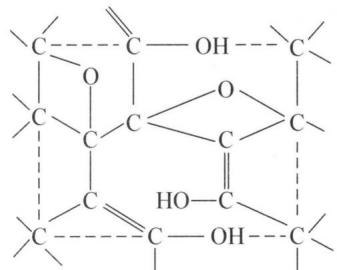

chemical

Chemical structure of a diol compound with carboxylic acid and hydroxyl groups

(a)

natural_image

Empty white rectangle with a thin black border (no text or symbols)

(b)

（2）从中学酸、碱、盐角度看，氧化石墨如氧化石墨 A 和 $\mathrm{C}_{x}^{n+}\left(\mathrm{HSO}_{4}\right)_{n}^{n-}$ 分别属于哪一类物质？  
（3）氧化石墨为层型结构，将它置于碱性溶液中，如 0.01 mol/L NaOH 溶液中，有何现象发生？为什么？  
(4) 在石油污染的海面,我们可用膨胀石墨进行有效处理。为什么?  
（5）在潮湿的空气中，有的膨胀石墨会腐蚀金属。请你阐述该膨胀石墨腐蚀金属的原因。

解析 （1）A 有两种结构, 注意到给出的结构(a) 中存在烯醇式的结构, 可以容易想到本问中的结构(b) 应是烯醇式和醛(酮) 式结构的互变:

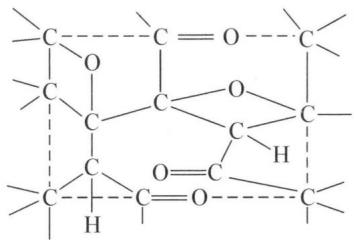

chemical

Chemical structure diagram showing a polymer chain with repeating units and functional groups including ester, oxygen, and hydrogen atoms

该图形中,碳原子数: 8; 氢原子数: 2; 氧原子数: 4, 因此氧化石墨 A 的化学式为 $C_{8}H_{2}O_{4}$ 。

(2) 上题中得到 A 的分子式为 $H_{2}C_{8}O_{4}$ ，因此可将 A 看作酸，也可写成 $\mathrm{C}_{8}\mathrm{O}_{2}(\mathrm{OH})_{2}\circ\mathrm{C}_{x}^{n+}(\mathrm{HSO}_{4})_{n}^{n-}$ 则明显可以看成酸式盐。  
(3) NaOH 作为强碱可与氧化石墨反应, 反应过程中氧化石墨层间吸收了正离子, 使之发生了膨胀。  
(4) 因膨胀石墨内部有许多网状结构的孔, 表面积大, 对于重油等石油产品有较强的吸附能力, 可吸收石油, 降低污染程度。  
(5) 由于膨胀石墨中有许多杂质(如 $\mathrm{SO}_{2} 、 \mathrm{SO}_{3} 、 \mathrm{HSO}_{4}^{-}$ 等), 石墨作为一种惰性电极, 所接触的金属作为另一极, 发生了电化学腐蚀。同时水蒸气进入了膨胀石墨的缝隙, 溶解了上述杂质, 发生了金属腐蚀。

【例 2】（2006 年全国决赛）沸石分子筛是重要的石油化工催化材料。沸石是硅酸盐的一种，下图甲是一种沸石晶体结构的一部分，其中多面体的每一个顶点均代表 1 个 A 原子（A 可以是 Si 或 Al），每一条边代表 1 个氧桥（连接两个 A 原子的氧原子）。该结构可以看成是由正八面体切顶形成 6 个正方形和 8 个正六边形围成的凸多面体（称为 β 笼），通过六方柱笼与相邻的 4 个 β 笼相连形成的三维立体结构，如图甲所示。若以切口的四边形对接则形成图乙。请回答：

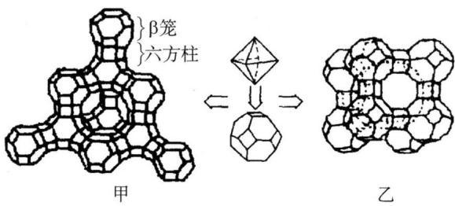

chemical

Chemical structure transformation diagram showing β cage and hexagonal lattice with arrow indicating equivalence

(1) 若将每个 $\beta$ 笼看作一个原子, 六方柱笼看作原子之间的化学键, 上图甲可以简化成什么结构? 请画出这种结构的图形。  
(2) 若从晶体类型来看, 它可以看成是以 $\beta$ 笼 Ⓤ 为基本粒子, 形成氯化钠型晶体结构。该晶胞中含有几个 $\beta$ 笼?  
(3) 如果图乙是一个纳米粒子, 写出该纳米硅氧负离子的化学组成。

解析 本题看似复杂,实则是由简单到复杂,再由复杂到简单的抽象概括。

(1) 若将β笼看做1个原子,六方柱看做连接原子的化学键,那么甲就可以抽

象为类似金刚石的结构：

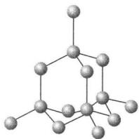

chemical

Molecular structure diagram showing a central atom bonded to surrounding atoms in a hexagonal lattice arrangement

(2) 氯化钠晶体是面心立方结构, 用 $\beta$ 笼代替氯离子和钠离子, 则氯化钠晶胞中的 $\beta$ 笼个数为 8 个。

(3) $\left[\mathrm{Si}_{192} \mathrm{O}_{432}\right]^{96-}$ 一个 $\beta$ 笼有 36 条棱边: 6 个分立的四边形, 新切出的, 加上原来八面体的自身 12 条棱边; 每个棱心一个氧, 加上 24 个顶; 每个顶上外伸一个氧原子, 顶心一个硅; 故有 60 个 O, 24 个 Si, 通过三个切口与其他 $\beta$ 笼对接, 构成纳米粒子立方体的边, 这样每个 $\beta$ 笼有三个四边形须接过去, 硅原子数不变, 氧原子数减半, 即 $12/2 = 6$ 。因此, 图乙纳米粒子中硅原子数 $24 \times 8 = 192$ 个, 氧原子数 $(60 - 6) \times 8 = 432$ 个。

【例 3】（2003 年全国决赛）上世纪九十年代初发现了碳纳米管，它们是管径仅几纳米的微管，其结构相当于石墨结构层卷曲连接而成。近年，人们合成了化合物 E 的纳米管，其结构与碳纳米管十分相似。

气体 A 与气体 B 相遇立即生成一种白色的晶体 C。已知在同温同压下，气体 A 的密度约为气体 B 的密度的 4 倍；气体 B 易溶于水，向其浓水溶液通入 $CO_{2}$ 可生成白色晶体 D；晶体 D 的热稳定性不高，在室温下缓慢分解，放出 $CO_{2}$ 、水蒸气和 B；晶体 C 在高温下分解生成具有润滑性的白色晶体 $E_{1}$ ； $E_{1}$ 在高温高压下可转变为一种硬度很高的晶体 $E_{2}$ 。 $E_{1}$ 和 $E_{2}$ 是化合物 E 的两种不同结晶形态，分别与碳的两种常见同素异形体的晶体结构相似，都是新型固体材料；E 可与单质氟反应，主要产物之一是 A。

(1) 写出 A、B、C、D、E 的化学式。
(2) 写出 A 与 B 反应的化学反应方程式, 按酸碱理论的观点, 这是一种什么类型的反应? A、B、C 各属于哪一类物质?

(3) 分别说明 $E_{1}$ 和 $E_{2}$ 的晶体结构特征、化学键特征和它们的可能用途。

(4) 化合物 A 与 $C_{6}H_{5}NH_{2}$ 在苯中回流, 可生成它们的 1:1 加合物; 将这种加合物加热到 $280^{\circ}C$ , 生成一种环状化合物 (其中每摩尔加合物失去 2 摩尔 HF); 这种环状化合物是一种非极性物质。写出它的分子式和结构式。

解析 （1）根据题意可知 A 与 B 的反应类似 HCl 与 $NH_{3}$ 的反应现象，并可根据后续描述推测 B 为 $NH_{3}$ ，考虑缺电子化合物结合分子量可推知 A 是 $BF_{3}$ ，进一步确定 C 为 $F_{3}BNH_{3}$ ，D 是 $NH_{4}HCO_{3}$ ，而两种 E 的结构可以用等电子体原理确定是 $(\mathrm{BN})_{x}$ 。

(2) $BF_{3} + NH_{3} = F_{3}BNH_{3}$ 。酸碱加合反应， $BF_{3}$ 为路易斯酸， $NH_{3}$ 为路易斯碱， $F_{3}BNH_{3}$ 为酸碱加合物。

(3) 根据等电子体原理以及产物性质的描述, 可以确定 $E_{1}$ 的结构应该与石墨相似, 为六方晶系, 层状结构, 层中 B 原子与 N 原子通过 $sp^{2}$ 杂化轨道成键, B 和 N 之间的共价键长小于其共价半径之和, 有部分双键特征, 层与层之间通过分子间力结合。 $E_{2}$ 的结构与金刚石相似, 为立方晶系, B 原子与 N 原子以 $sp^{3}$ 杂化轨道形成共价单键, 交替连接形成三维结构。 $E_{1}$ 可用作耐高温材料、高温润滑材料和绝缘材料, $E_{2}$ 因与金刚石的硬度相似, 可以代替金刚石作磨料、切割材料等。

(4) 可类比无机苯的结构: $\mathrm{B}_{3} \mathrm{~N}_{3} \mathrm{H}_{6}$ , 推测生成的化合物的分子式为

$(C_{6}H_{5}NBF)_{3}$ ，结构式如下： $C_{6}H_{5}$ $\begin{array}{c} F \\ N=B \\ F-B \\ N-B \\ C_{6}H_{5} \end{array}$

【例 4】（1992 年全国初赛改编）金属钠和金属铅的 2:5（摩尔比）的合金可以部分地溶解于液态氨，得到深绿色的溶液 A，残留的固体是铅，溶解的成分和残留的成分的质量比为 9.44:1，溶液 A 可以导电，摩尔电导率的测定实验证实，溶液 A 中除液氨原有的少量离子 $\left(\mathrm{NH}_{4}^{+}\right.$ 和 $\left.\mathrm{NH}_{2}^{-}\right)$ 外只存在一种正离子和一种负离子（不考虑溶剂合，即氨合的成分），而且它们的个数比是 4:1，正离子只带一个电荷。通电电解，在阳极上析出铅，在阴极上析出钠。用可溶于液氨并在液氨中电离的盐 $PbI_{2}$ 配制的 $PbI_{2}$ 的液氨溶液来滴定溶液 A，达到等当点时，溶液 A 的绿色褪尽，同时溶液里的铅全部以金属铅的形式析出。回答下列问题：

(1) 写出溶液 A 中的电解质的化学式。

(2) 写出上述滴定反应的配平的离子方程式。

（3）已知用于滴定的碘化铅的浓度为 0.009854 mol/L，达到等当点时消耗掉碘化铅溶液 21.03 mL，问共析出金属铅多少克？

有人曾经将化学计量的 K 和 Pb 在 $900^{\circ}$ C 时熔融反应, 经过恒速冷却后得到黑灰色的 PL 晶体, 产率很高, PL 晶体参数为 $a = 9.648 \, \AA$ , $b = 13.243 \, \AA$ , c =

15.909 Å, $\beta = 103.24^{\circ}$ , 密度 $6.785 \, g \cdot cm^{-3}$ ,
右图是 PL 晶体沿着轴方向的视图并且已经勾勒出晶胞。

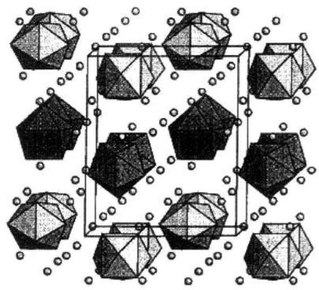

chemical

Crystal structure diagram of a cubic unit cell with octahedral and tetrahedral units

(4) 指出晶体 PL 是何种晶系?

（5）请具体指出右图中的各个图形各代表什么？

(6) 写出 PL 的化学式。

解析 (1) 首先确定是 $\mathrm{Na}$ 和 $\mathrm{Pb}$ 形成的二元

化合物,根据题目信息可知正离子为 $Na^{+}$ , 负离子只能是由 Pb 构成, 根据数据定量可知该化合物中的负离子应为: $Pb_{9}^{4-}$ , 于是得出 A 的化学式为 $Na_{4}Pb_{9}$ 。

(2) $Na^{+}$ 不显色, 显然绿色是由 $Pb_{9}^{4-}$ 造成的, 最后绿色褪去可以得出滴定过程中发生的反应应该为 $2Pb^{2+} + Pb_{9}^{4-} = 11Pb$ 。

(3) 根据(2)的方程式可以得出析出 Pb 共 236.2 mg。

(4) 单斜晶系。

(5)、(6)产物必然是二元化合物,再由晶胞可以看出其中必然存在 Pb 的团簇负离子,且一个晶胞中团簇负离子个数 Z 为 4,由此根据晶胞参数可以得到产物的摩尔质量,之后即可得知产物化学式为 $K_{4}Pb_{9}$ 。晶胞中小圆球代表 $K^{+}$ ,大的几何体代表 $Pb_{9}^{4-}$ 聚负离子,其中有两种形态,如下图:

a)  
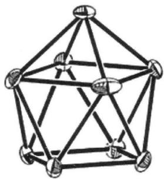

chemical

Molecular structure diagram of a dodecium cluster with labeled atoms and bonds

单帽四方反棱柱体

b)  
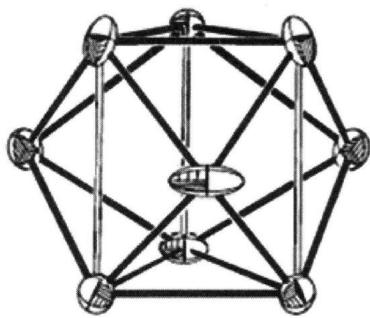

natural_image

Geometric diagram of a polyhedron with interconnected nodes and edges (no text or symbols)

三帽三角棱柱体

## 本讲习题

1. 1998 年, 中国科大的化学家把 $\mathrm{CCl}_{4}(\mathrm{l})$ 和 $\mathrm{Na}$ 混合放入真空容器中, 再置于高压容器中逐渐加热, 可得一些固体颗粒。经 X-射线研究发现: 该固体颗粒实际由 A 和 B 两种物质组成, 其中 A 含量较少, B 含量较多。试回答下列问题:

(1) $\mathrm{CCl}_{4}$ 和 $\mathrm{Na}$ 为何要放在真空容器中？随后为何要置于高压容器中？

(2) 指出 $CCl_{4}$ 分子的结构特点和碳原子的杂化态。

(3) 上述实验的理论依据是什么？请从化学反应的角度加以说明。

(4) 试确定 A、B 各为何物？A、B 之间有何关系？

(5) 写出上述反应方程式, 并从热力学的角度说明 A 为何含量较少, B 为何含量较多?

(6) 请你从纯理论的角度说明: 采取什么措施后, A 的含量将大幅度增多?

(7) 请评述一下上述实验有何应用前景?

2. 化合物 A 为红色固体粉末, 将 A 在高温下加热, 最终得到黄色固体 B。B 溶于硝酸得到无色溶液 C, 向 C 中滴加适量 NaOH 溶液得到白色沉淀 D, 加入过量 NaOH 溶液时, D 溶解得到无色溶液 E, 向 E 中加入 NaClO 溶液并微热, 有棕黑色沉淀 F 生成。将 F 洗净后在一定温度下加热又得到 A。用硝酸处理 A 得到沉淀 F 和溶液 C。将 A 加入酸性 $\mathrm{Mn}^{2+}$ 溶液中并微热, 有紫红色溶液 G 生成。请写出 A、B、C、D、E、F、G 各代表何物质 (或离子), 并写出 D→E、E→F、A 与 $\mathrm{Mn}^{2+}$ 反应的方程式。

3. 三卤化硼都是硼原子配位未达饱和的缺电子化合物, 因此都是很强的路易斯酸。

(1) 写出 $\mathrm{BF}_{3}$ 的结构式和其成键特点。分子的极性又如何？

(2) 如果把 $BF_{3}$ 与乙醚放在一起, B—F 键长从 130 pm 增加到 141 pm, 试问所生成的新化合物成键情况及其极性如何? $BF_{3}$ 分子结构发生了哪些变化?

(3) $\mathrm{BF}_{3}$ 有两种水合物 $\mathrm{BF}_{3} \cdot \mathrm{H}_{2} \mathrm{O}$ 和 $\mathrm{BF}_{3} \cdot 2 \mathrm{H}_{2} \mathrm{O}$ 。经测定在一水合物的液相中存在着与分子数相同的离子, 其中一半为 $+1$ 价正离子, 一半为 $-1$ 价负离子。而在二水合化合物中, 存在着与分子数相同的 $+1$ 价正离子和同样数目的 $-1$ 价负离子。写出它们的结构。

(4) $BF_{3}$ 和弱酸 HF 作用, 可以得到一个很强的酸。写出该反应的化学方程式。

(5) $BF_{3}$ 与 $NH_{3}$ 反应得到一个加合物 $H_{3}NBF_{3}$ ，后者在 $125^{\circ}C$ 以上分解得到两种晶体，一种晶体的结构与石墨相似，另一种晶体中含有两种离子，均为正四面体结构，比例为 1:1。写出 $H_{3}NBF_{3}$ 分解的化学反应方程式。

(6) $\mathrm{BF}_{3}$ 和 $\mathrm{BCl}_{3}$ 的水解性能差别很大, 前者可以得到一系列的中间产物, 而后者则迅速彻底地水解。写出二者水解反应的化学方程式, 并解释两者差别的原因。

4. $Si^{4+}$ 半径 41 pm, $Al^{3+}$ 半径 50 pm, $Mg^{2+}$ 为 65 pm, $Na^{+}$ 为 133 pm, $Ca^{2+}$ 为 99 pm, $O^{2-}$ 为 140 pm。 $Al^{3+}$ 可以取代共价晶体中的 $Si^{4+}$ ，不足的正电荷用等物质的量的 $Na^{+}$ 和 $Ca^{2+}$ 补充，当有 37.5% 的硅被铝原子取代时，则形成中长石。中长石能与水和 $CO_{2}$ 同时作用发生风化，变成高岭土 $\left[\mathrm{Al}_{2}\mathrm{Si}_{2}\mathrm{O}_{5}(\mathrm{OH})_{4}\right]$ ，同时 $Na^{+}$ 和 $Ca^{2+}$ 以酸式碳酸盐的形式流出来。又知高岭土中硅元素物质的量为反应物中硅元素物质的量的 3/5，其余的硅以化合态沉淀物的形式析出。问：

(1) 写出中长石的分子组成(用化学式表示)。

(2) 根据你所学的知识说明: 为什么铝能部分取代硅? 镁能否部分取代硅? 为什么?

(3) 写出中长石风化成高岭土的离子方程式。并简述该反应为什么能够发生？

(4) 风化后 Al 为什么不能像 $Na^{+}$ 、 $Ca^{2+}$ 一样被地下水溶解？

(5) 近年来,由于经济的发展,环境的破坏,岩石(如中长石)的风化速率加快。为什么?

(6) 某江河流经正长石等花岗岩地区,请你估计一下江水的 $\mathrm{pH}$ 。

5. $NaBH_{4}$ 由布朗(Brown)等人合成, $NaBH_{4}$ 被称为有机化学家的“万能还原剂”,也是许多有机反应的催化剂,在有机合成里有极广泛的用途。

(1) 在 60 年代, 德国拜耳药厂把 $NaBH_{4}$ 的合成发展成工业规模:

$$
\mathrm{Na} _ {2} \mathrm{B} _ {4} \mathrm{O} _ {7} + \mathrm{Na} + \mathrm{H} _ {2} + \mathrm{SiO} _ {2} - \mathrm{NaBH} _ {4} + \mathrm{Na} _ {2} \mathrm{SiO} _ {3}
$$

请配平这个方程式。

(2) $NaBH_{4}$ 易溶于水, 并会和水反应产生氢气, 设以 $BO_{2}^{-}$ 离子为产物的 B 元素的存在形式, 试写出该反应的离子方程式。  
(3) $\mathrm{NaBH}_{4}$ 与水反应的速率受温度、浓度及溶液的 $\mathrm{pH}$ 影响, 根据你的知识, 说明 $\mathrm{pH}$ 的变化将导致反应速率怎样变化。  
(4) $\mathrm{NaBH}_{4}$ 可以将许多金属离子还原成金属, 并使得到的金属沉积在金属、玻璃、陶瓷、塑料上, 从而有广泛的应用场合。例如, 它把镍沉积在玻璃上, 形成极薄的镍膜, 用于太阳能电池; 把金或铜沉积在塑料板上形成印刷板电路; 还原废液中的贵重金属。试以 $\mathrm{Ru}^{3+}$ 为例写出一个配平的离子方程式。

6. 某元素 A 能直接与ⅦA族某一元素 B 反应生成 A 的最高价化合物 C, C 为一无色而有刺鼻臭味的气体, 对空气相对密度约为 3.61 倍, 在 C 中 B 的含量占 73.00%, 在 A 的最高价氧化物 D 中, 氧的质量占 53.24%。

(1) 列出算式, 写出字母 A、B、C、D 所代表的元素符号或分子式。

(2) C 为某工厂排放的废气, 污染环境, 提出一种最有效的清除 C 的化学方法, 写出其化学方程式。

(3) A 的最简单氢化物可与 $AgNO_{3}$ 反应, 写出化学方程式。

(4) 以 A 为中心原子的含氧酸盐晶体, 其基本结构单位是 $\mathrm{AO}_{4}$ 四面体, 可通过共用角顶氧原子, 连结成双链式、片式和架式结构的复杂负离子, 推算这些结构中 A 与氧原子个数比各是多少?

7. 碳酸钙是自然界中分布最广的一种碳酸盐, 碳酸钙难溶于水, 但能溶于 $\mathrm{CO}_{2}$ 的水溶液中。碳酸钙矿床的地下水流出地面后, 由于压强减小而放出 $\mathrm{CO}_{2}$ , 年深日久可形成石笋或钟乳石。 $25^{\circ} \mathrm{C}$ 时, 大气中的 $\mathrm{CO}_{2}$ 分压约为 $P_{\mathrm{CO}_{2}} = 3 \times 10^{-4} \approx 10^{-3.54} \mathrm{atm}$ 。已知:

$$
\mathrm{CO} _ {2} (\mathrm{g}) + \mathrm{H} _ {2} \mathrm{O} = \mathrm{H} _ {2} \mathrm{CO} _ {3} \qquad K _ {0} = 1 0 ^ {- 1. 4 7}
$$

$$
\mathrm{H} _ {2} \mathrm{CO} _ {3} \rightleftharpoons \mathrm{H} ^ {+} + \mathrm{HCO} _ {3} ^ {-} \quad K _ {1} = 1 0 ^ {- 6. 4} \quad \mathrm{pK} _ {2} = 1 0. 3
$$

$$
\mathrm{CaCO} _ {3} (\mathrm{s}) \rightleftharpoons \mathrm{Ca} ^ {2 +} + \mathrm{CO} _ {3} ^ {2 -} \quad K _ {\mathrm{sp}} = 1 0 ^ {- 8. 3}
$$

(1) 写出石灰岩地区形成钟乳石的化学方程式。

(2) 试计算雨水的 $\mathrm{pH}$ 及 $\mathrm{CO}_{3}^{2-}$ 浓度。若测得某时某地雨水的 $\mathrm{pH}$ 为 5.4，试分析产生此结果的两种可能的原因。

（3）石灰岩地区的地下水流入河水，设河水 pH=7，在 $25^{\circ}C$ 、 $P_{CO_{2}}=10^{-3.54}$ atm 下，当达到平衡时， $Ca^{2+}$ 浓度是多少？

(4) 已知: $298 \mathrm{~K}$ 时:

<table><tr><td></td><td> $SrCO_3(s)$ </td><td> $SrO(s)$ </td><td> $CO_2(g)$ </td></tr><tr><td> $\Delta H_f^{\ominus}/(kJ/mol)$ </td><td>-1220</td><td>-592.0</td><td>-393</td></tr><tr><td> $S_f^{\ominus}/(J \cdot K \cdot mol^{-1})$ </td><td>97.1</td><td>54.4</td><td>214</td></tr></table>

① 计算 $SrCO_{3}(s)$ 的分解温度。

② 试推断 $CaCO_{3}$ 、 $SrCO_{3}$ 、 $BaCO_{3}$ 分解温度的高低顺序。

(5) 试述 $\mathrm{NaHCO}_{3}$ 比 $\mathrm{Na}_{2} \mathrm{CO}_{3}$ 溶解度小的原因。

## 第五讲 碱金属、碱土金属、氢、稀有气体

## 知识精讲

## 一、概述

元素周期表的ⅠA族金属元素称为碱金属，包括锂、钠、钾、铷、铯和钫6种元素。碱金属属于s区元素，其原子价电子层构型为 $ns^{1}$ ，次外层为稀有气体的稳定8电子结构（锂除外）。锂、铷和铯是稀有金属，钫是放射性元素。碱金属是银白色的柔软、易熔轻金属，密度较小，可以用刀切割。与同一周期其他元素相比，碱金属的原子半径最大，固体中的金属键较弱，原子间的作用力较小，故密度、硬度小，熔点低。

碱土金属是周期表的ⅡA族、s区元素，其原子的价电子构型为 $ns^{2}$ 。碱土金属包括铍、镁、钙、锶、钡和镭6种元素，由于钙、锶、钡的氧化物在性质上介于“碱性的”碱金属氧化物和“土性的”难溶的 $Al_{2}O_{3}$ 之间，因此称为碱土金属。习惯上把铍、镁也包括在内，铍属于较稀有金属，镭是放射性元素。碱土金属和碱金属的性质大致相似，但也有一些不同之处：主要表现在：单质的密度、硬度、熔点、沸点相对较高；同周期碱土金属的活泼性低于碱金属；碱土金属的盐类大多是难溶的，且热稳定性相对较低，受热易分解。

氢是周期表中的第一个元素,它在所有元素中具有最简单的原子结构,原子核外只有一个电子,基态时该电子处于其价电子轨道1s轨道上。氢位于周期表中的第1周期、IA族,是一种性质非常特别的元素,与碱金属、卤素原子的原子结构、性质既有相似性又有区别。它与碱金属的性质有很大的差别,在多数化合物中氧化态为+1,也可以形成 $H^{+}$ ,这与碱金属相似。H也可以接受一个电子,形成负离子 $H^{-}$ ,这又与卤素相似。氢的电离能远大于碱金属的第一电离能,而电子亲合能又远小于卤素的,同时氢还可以和其他元素形成极性范围很宽的共价键,从H一端带部分正电荷到H一端带部分负电荷的情况都有,这是碱金属和卤素都不具有的性质。氢的独特性质是由其独特的原子结构、特别小的半径和低的电负性决定的。

周期表中零族有氦、氖、氩、氪、氙、氡六种元素，这些元素以气体状态存在，化学性质极不活泼,过去曾称其为惰性气体元素。自20世纪60年代起,人们陆续制备出了一些这类元素的化合物,现在改称它们为稀有气体元素。

## 二、碱金属及其化合物

## 1. 单质

碱金属元素的特点可从表 5-1 中得出: 在同周期元素中, 原子半径最大, 核电荷最少, 最外层的 $n\mathrm{s}^{1}$ 电子离核较远, 很易失去, 第一电离能最低, 表现出强的金属性。它们与氧、硫、卤素以及其他非金属都能剧烈反应, 并能从许多金属化合物中置换出金属。碱金属自上而下原子半径和离子半径依次增大, 其活泼性有规律地增强。例如, 钠和水剧烈反应, 钾更为剧烈, 而铷、铯遇水则有爆炸危险。锂的活泼性比其他碱金属大为逊色, 与水的反应较缓慢。

表 5-1 碱金属的性质

<table><tr><td></td><td>Li/锂</td><td>Na/钠</td><td>K/钾</td><td>Rb/铷</td><td>Cs/铯</td></tr><tr><td>原子序数</td><td>3</td><td>11</td><td>19</td><td>37</td><td>55</td></tr><tr><td>价电子层构型</td><td> $2s^1$ </td><td> $3s^1$ </td><td> $4s^1$ </td><td> $5s^1$ </td><td> $6s^1$ </td></tr><tr><td>金属半径  $r_{\text{met}}/\text{pm}$ </td><td>152</td><td>190</td><td>227.2</td><td>247.5</td><td>265.4</td></tr><tr><td>离子半径  $r_{\text{ion}}/\text{pm}$ </td><td>60</td><td>95</td><td>133</td><td>148</td><td>169</td></tr><tr><td>氧化值</td><td>+1</td><td>+1</td><td>+1</td><td>+1</td><td>+1</td></tr><tr><td>电负性</td><td>1.0</td><td>0.9</td><td>0.8</td><td>0.8</td><td>0.7</td></tr><tr><td>电离能  $I/\text{kJ} \cdot \text{mol}^{-1}$ </td><td>520.2</td><td>495.8</td><td>418.8</td><td>403.0</td><td>272.5</td></tr><tr><td>电子亲和能  $Y/\text{kJ} \cdot \text{mol}^{-1}$ </td><td>60</td><td>53</td><td>48</td><td>47</td><td>46</td></tr><tr><td>电极电势  $\varphi^{\ominus}(\text{M}^{+}/\text{M})/\text{V}$ </td><td>-3.045</td><td>-2.714</td><td>-2.925</td><td>-2.925</td><td>-2.923</td></tr><tr><td>密度  $\rho/\text{g} \cdot \text{cm}^{-3}$ </td><td>0.53</td><td>0.97</td><td>0.86</td><td>1.53</td><td>1.90</td></tr><tr><td>熔点  $t_m/^{\circ}\text{C}$ </td><td>180.6</td><td>97.8</td><td>63.6</td><td>39.0</td><td>28.7</td></tr><tr><td>沸点  $t_b/^{\circ}\text{C}$ </td><td>1347</td><td>881.4</td><td>756.5</td><td>694</td><td>702</td></tr><tr><td>硬度(金刚石=10)</td><td>0.6</td><td>0.4</td><td>0.5</td><td>0.3</td><td>0.2</td></tr></table>

锂的性质非常特殊。锂及其化合物的许多性质与同族其他元素不同，熔点、沸点远高于同族其他金属。 $\varphi^{\ominus}\left(\mathrm{Li}^{+}/\mathrm{Li}\right)=-3.045\mathrm{V}$ 在碱金属一族中是最低的，这与Li有较大的水合热有关，所以含有结晶水的锂盐多于其他碱金属盐。

钾和钠的性质十分相似,质软似蜡,可以用小刀进行切割。新切面呈银白色光泽,但暴露在空气中会因氧化而迅速变暗。钠遇到水会发生剧烈反应,生成 NaOH 和 $H_{2}$ ,因此需密闭储存在煤油或石蜡中。钾比钠更活泼,因此制备、储运和使用时应更加小心。

钠、钾常用作冶金业的重要还原剂，用以还原金属氯化物制取相应金属；在原子能工业中做核反应堆的导热剂。金属钠、钾还用在制备过氧化物、氢化物及有机合成等方面。

钠、钾是英国化学家戴维(Davy. H)于1807年分别电解熔融的KOH和NaOH时获得并被发现的。现在工业制取钠多采用电解熔融NaCl的方法，金属锂也可以采用电解熔盐的方法。而工业制备钾多采用置换法。即在熔融状态下，用金属钠从KCl中置换出钾，经分级蒸馏(800℃～880℃)得到金属钾：KCl+Na $\xlongequal{熔融}$ NaCl+K。

之所以不用电解熔盐的方法制备金属钾，一方面是因为金属钾易溶于它的熔盐中，而不宜完全分离；另一方面由于钾的沸点较低，操作温度下易气化冲出，造成危险。碱金属中的铷和铯也可用类似方法制取。

碱金属的价电子易受光激发而电离,是制造光电管的优质材料。如铯光电管制成的自动报警装置,可以报告远处火警。碱金属元素在火焰中加热,各具特征的焰色:锂(洋红色)、钠(黄色)、钾(浅紫色)、铷(紫红色)、铯(天蓝色),根据焰色反应可以对碱金属做定性鉴别。

## 2. 氢化物

碱金属与氢气在高温下化合,生成白色离子型氢化物,其中氢以 $H^{-}$ 形式存在。LiH、NaH 最常见,市售品常因含有痕量碱金属而呈灰色。

碱金属氢化物极不稳定,受热易分解出氢气而游离出碱金属,其中只有 LiH 比较稳定,分解温度为 $850^{\circ}C$ ,高于其熔点( $650^{\circ}C$ )。碱金属氢化物遇水剧烈反应,放出氢气,在潮湿空气中能够自燃, $H^{-}$ 和由 $H_{2}O$ 电离出的 $H^{+}$ 结合成 $H_{2}:NaH+H_{2}O=NaOH+H_{2}\uparrow,\varphi^{\ominus}(H_{2}/H^{-})=-2.23V$ ,可见 $H^{-}$ 比 $H_{2}$ 的还原性强很多,碱金属氢化物是强还原剂。例如: $TiCl_{4}+4NaH=Ti+4NaCl+2H_{2}\uparrow$ 。

LiH 和 $AlCl_{3}$ 在乙醚中制得的氢化锂铝为多孔性轻质粉末, 常用作有机合成中的还原剂: $4LiH + AlCl_{3} \xlongequal{乙醚} Li[AlH_{4}] + 3LiCl$ 。

## 3. 氧化物

碱金属在充足的空气中燃烧时,所得产物并不相同。通常,锂生成氧化锂 $Li_{2}O$ ,钠生成过氧化钠 $Na_{2}O_{2}$ ,而钾、铷和铯则生成超氧化物 $KO_{2}$ 、 $RbO_{2}$ 、 $CsO_{2}$ 。

(1) 正常氧化物: 碱金属中除锂外, 其他碱金属的正常氧化物是用金属与它们的过氧化物或硝酸盐作用制得的。例如, 用金属钠还原过氧化钠, 可以制得白色氧化钠固体: $\mathrm{Na}_{2} \mathrm{O}_{2} + 2 \mathrm{~Na} = 2 \mathrm{~Na}_{2} \mathrm{O}, 2 \mathrm{KNO}_{3} + 10 \mathrm{~K} = 6 \mathrm{~K}_{2} \mathrm{O} + \mathrm{N}_{2} \uparrow$ 。碱金属氧化物与水反应生成相应的氢氧化物。

(2) 过氧化物: 所有的碱金属都可以形成过氧化物, 其中只有钠的过氧化物是由金属在空气中燃烧直接得到的。过氧化钠 $\mathrm{Na}_{2} \mathrm{O}_{2}$ 具有重要的现实意义。将金属钠加热到 $300^{\circ} \mathrm{C}$ , 并通以不含二氧化碳的干燥空气流, 可以制得淡黄色的过氧化钠粉末。纯的 $\mathrm{Na}_{2} \mathrm{O}_{2}$ 是白色粉末, 工业品含有一定量杂质。在碱性介质中 $\mathrm{Na}_{2} \mathrm{O}_{2}$ 是强氧化剂, 常用做分解矿石的溶剂, 使不溶于水和酸的矿石, 被氧化分解为可溶于水的化合物, 如: $\mathrm{Cr}_{2} \mathrm{O}_{3} + 3 \mathrm{Na}_{2} \mathrm{O}_{2} \stackrel{\text {共融}}{=} 2 \mathrm{Na}_{2} \mathrm{CrO}_{4} + \mathrm{Na}_{2} \mathrm{O}, \mathrm{MnO}_{2} + \mathrm{Na}_{2} \mathrm{O}_{2} \stackrel{\text {共融}}{=} \mathrm{Na}_{2} \mathrm{MnO}_{4}$ 。

由于 $Na_{2}O_{2}$ 呈强碱性，熔融时不可使用瓷质容器或石英容器，宜用铁、镍器皿。又由于 $Na_{2}O_{2}$ 具有强氧化性，熔融时遇有铝粉、炭粉或棉花等还原性物质就会发生爆炸，使用时必须注意安全。 $Na_{2}O_{2}$ 与水或稀酸作用可以产生过氧化氢： $Na_{2}O_{2} + 2H_{2}O = 2NaOH + H_{2}O_{2}$ 、 $Na_{2}O_{2} + H_{2}SO_{4} = Na_{2}SO_{4} + H_{2}O_{2}$ 。 $Na_{2}O_{2}$ 与 $CO_{2}$ 产生下列反应： $2Na_{2}O_{2} + 2CO_{2} = 2Na_{2}CO_{3} + O_{2}$ 。基于这个反应， $Na_{2}O_{2}$ 应用于高空飞行或水下工作时的二氧化碳吸收剂和供氧剂，以此来吸收人体呼出的二氧化碳和补充人体所需的氧气。

(3) 超氧化物: 钾、铷、铯在过量的氧气中燃烧, 可制得黄色至橙色的固体超氧化物 $\mathrm{MO}_{2}$ 。实际上金属钾的生产主要用于制造 $\mathrm{KO}_{2}$ , 超氧化钾具有强氧化性, 与水、二氧化碳反应生成氧气: $2\mathrm{KO}_{2} + 2\mathrm{H}_{2}\mathrm{O} = \mathrm{O}_{2} \uparrow + 2\mathrm{K}^{+} + 2\mathrm{OH}^{-} + \mathrm{H}_{2}\mathrm{O}_{2}, 4\mathrm{KO}_{2} + 2\mathrm{CO}_{2} = 2\mathrm{K}_{2}\mathrm{CO}_{3} + 3\mathrm{O}_{2}$ 。 $\mathrm{KO}_{2}$ 和 $\mathrm{Na}_{2}\mathrm{O}_{2}$ 一样, 多用于宇航、水下、矿井、高山作业时需用的 $\mathrm{CO}_{2}$ 吸收剂和供氧剂。

## 4. 氢氧化物

碱金属的氢氧化物都是白色固体,容易潮解和吸收空气中的 $CO_{2}$ (须密封保存),易溶于水,溶解时放出大量的热,仅 LiOH 的溶解度较小。

碱金属氢氧化物中除 LiOH 是中强碱外, 其余都是强碱, 对于纤维、皮肤有强烈的腐蚀作用, 因此叫苛性碱。碱性按以下顺序变化: LiOH < NaOH < KOH < RbOH < CsOH。

氢氧化钠 NaOH, 又称火碱、烧碱、苛性钠, 是国民经济中重要化工原料之一,广泛用于造纸、制革、制皂、纺织、玻璃、搪瓷、无机和有机合成等工业中。NaOH 的强碱性不仅表现在能与非金属及其化合物反应, 还可以与一些两性金属及氧化物反应, 生成钠盐: $4 \mathrm{~S} + 6 \mathrm{NaOH} = 2 \mathrm{Na}_{2} \mathrm{~S} + \mathrm{Na}_{2} \mathrm{~S}_{2} \mathrm{O}_{3} + 3 \mathrm{H}_{2} \mathrm{O}$ 、 $\mathrm{Si} + 2 \mathrm{NaOH} + \mathrm{H}_{2} \mathrm{O} = \mathrm{Na}_{2} \mathrm{SiO}_{3} + 2 \mathrm{H}_{2} \uparrow$ 、 $\mathrm{SiO}_{2} + 2 \mathrm{NaOH} = \mathrm{Na}_{2} \mathrm{SiO}_{3} + \mathrm{H}_{2} \mathrm{O}$ 。NaOH 能与 $\mathrm{SiO}_{2}$ 反应, 因此在制备浓碱溶液或熔融烧碱时, 不能用玻璃、陶瓷器皿盛装, 而常采用铸铁、镍或银制器皿。实验室盛 NaOH 溶液的玻璃瓶需用橡胶塞, 不能用玻璃塞。否则存放时间过长, NaOH 与瓶口玻璃中的 $\mathrm{SiO}_{2}$ 生成粘性的 $\mathrm{Na}_{2} \mathrm{SiO}_{3}$ , 把玻璃塞和瓶口粘结在一起而不易打开。固体 NaOH 具有很强的吸水性, 是常用的干燥剂。

工业上生产 NaOH 有苛化法、水银电解法、隔膜电解法及新兴的离子膜法。除苛化法外，都以食盐为原料，因为生产过程中同时产生氯气，所以通称为氯碱工业。

苛性法是最古老的方法,因其成本高、产品纯度低,已逐渐被淘汰。反应如下: $\mathrm{Ca(OH)_2 + Na_2CO_3 = 2NaOH + CaCO_3\downarrow}$ 。

水银电解法用石墨作阳极,汞作阴极,虽制得的 NaOH 浓度和纯度都较高,但因汞污染严重而很少使用。

我国约有 85% 的 NaOH 是用隔膜法生产的。隔膜法是以石墨作阳极，用衬有石棉隔膜的铁网作阴极，将除去 $Ca^{2+}$ 、 $Mg^{2+}$ 、 $Fe^{3+}$ 、 $SO_{4}^{2-}$ 等杂质的食盐水注入阳极区，电解浓缩后制得浓度 95% 以上的 NaOH。

离子膜法是目前新兴的制碱方法,此法具有耗能低、产品质量好,对环境无汞污染和石棉污染等特点。其主要原理是使用了正离子交换膜,该膜有特殊的选择

透过性, 只允许正离子通过而阻止负离子和气体通过, 即只允许 $H^{+}$ 、 $Na^{+}$ 通过, 而 $Cl^{-}$ 、 $OH^{-}$ 和两极产物 $H_{2}$ 和 $Cl_{2}$ 无法通过, 因而起到了防止阳极产物 $Cl_{2}$ 和阴极产物 $H_{2}$ 相混合而可能导致爆炸的危险, 还起到了避免 $Cl_{2}$ 和阴极另一产物 NaOH 反应而生成 NaClO 影响烧碱纯度的作用, 见右图。

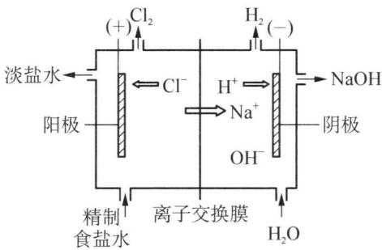

chemical

Electrolysis and ion exchange diagram of a sodium hydroxide ion, showing ion movement and electron flow

## 5. 盐

在碱金属形成的盐中,钠盐和钾盐是最为常见的盐。常见负离子构成的盐如卤化物、硫化物、硫酸盐、硝酸盐、碳酸盐、磷酸盐、硅酸盐等。这里主要介绍它们的一些共性,并简单介绍几种重要的盐。

(1) 碱金属盐类的通性

① 晶体类型: 绝大多数碱金属盐的晶体属于离子晶体, 碱金属中由于 $Li^{+}$ 半径很小, 极化力较强, 它的某些盐如卤化物表现出不同程度的共价性。它们具有较高的熔点和沸点。常温下是固体, 熔化时能导电, 在水中完全离解。

② 颜色：碱金属离子都是无色的，只要负离子是无色的，它们的化合物一般都是无色或白色的（少数氧化物除外）；若负离子是有色的，则它们的化合物一般常显负离子的颜色。如 $CrO_{4}^{2-}$ 是黄色的， $K_{2}CrO_{4}$ 也为黄色； $MnO_{4}^{-}$ 是紫红色的， $KMnO_{4}$ 也为紫红色。

③ 热稳定性：碱金属盐一般具有较高的热稳定性。唯有其硝酸盐的热稳定性差，加热易分解。如： $4LiNO_{3}\xlongequal{650^{\circ}C}2Li_{2}O+4NO_{2}\uparrow+O_{2}\uparrow$ ， $2NaNO_{3}\xlongequal{830^{\circ}C}2NaNO_{2}+O_{2}\uparrow$ ， $2KNO_{3}\xlongequal{630^{\circ}C}2KNO_{2}+O_{2}\uparrow$ 。

④ 溶解度：碱金属的盐类一般都易溶于水，仅有少数难溶。一类是部分锂盐如 $LiF、Li_{2}CO_{3}、Li_{3}PO_{4}$ 等；另一类是 $K^{+}$ 、 $Rb^{+}$ 、 $Cs^{+}$ （以及 $NH_{4}^{+}$ ）同某些较大负离子所形成的盐，例如高氯酸钾 $KClO_{4}$ 、四苯硼酸钾 $\mathrm{K}\left[\mathrm{B}\left(\mathrm{C}_{6}\mathrm{H}_{5}\right)_{4}\right]$ 、六氯铂酸钾 $K_{2}\left[PtCl_{6}\right]$ 等；此外还有醋酸铀酰锌钠 $\mathrm{NaAc}\cdot\mathrm{Zn(Ac)}_{2}\cdot3\mathrm{UO}_{2}(Ac)_{2}\cdot9H_{2}O$ 、锑酸二氢钠 $NaH_{2}SbO_{4}$ 等。

(2) 某些重要的盐

① 碳酸钠 $Na_{2}CO_{3}$ ：碳酸钠有无水和一水、七水、十水结晶水合物，常见工业品不含结晶水，为白色粉末，又称纯碱、碱面或苏打，是基本化工产品之一。纯碱是“三酸两碱”中的两碱之一，它的碱性来自水解作用， $Na_{2}CO_{3}$ 溶于水并能强烈水解，其饱和状态（质量分数约为 20%）的 pH 达到 12。

工业上常用氨碱法或联合制碱法制取 $Na_{2}CO_{3}$ 。

氨碱法又称索尔维(E Solvay)法,生产时先向饱和食盐水中通入氨气至饱和,再通入 $\mathrm{CO}_{2}$ ,生成的 $\mathrm{NH}_{4} \mathrm{HCO}_{3}$ 立即与 $\mathrm{NaCl}$ 发生复分解反应,析出溶解度小的 $\mathrm{NaHCO}_{3}: \mathrm{NH}_{3} + \mathrm{CO}_{2} + \mathrm{H}_{2} \mathrm{O} = \mathrm{NH}_{4} \mathrm{HCO}_{3}, \mathrm{NH}_{4} \mathrm{HCO}_{3} + \mathrm{NaCl} = \mathrm{NaHCO}_{3} \downarrow + \mathrm{NH}_{4} \mathrm{Cl}$ , 滤出 $\mathrm{NaHCO}_{3}$ , 经焙烧分解即得 $\mathrm{Na}_{2} \mathrm{CO}_{3}: 2 \mathrm{NaHCO}_{3} \xlongequal{\triangle} \mathrm{Na}_{2} \mathrm{CO}_{3} + \mathrm{CO}_{2} \uparrow + \mathrm{H}_{2} \mathrm{O} \uparrow$ 。母液中含有大量 $\mathrm{NH}_{4} \mathrm{Cl}$ , 加入石灰水按下式置换出 $\mathrm{NH}_{3}$ , 再返回循环使用: $2 \mathrm{NH}_{4} \mathrm{Cl} + \mathrm{Ca(OH)}_{2} = \mathrm{CaCl}_{2} + 2 \mathrm{NH}_{3} \uparrow + 2 \mathrm{H}_{2} \mathrm{O}$ 。此法的优点是原料经济, 能连续生产, 副产物 $\mathrm{NH}_{3}$ 和 $\mathrm{CO}_{2}$ 可循环使用。缺点是大量的 $\mathrm{CaCl}_{2}$ 用途不大, 致使 $\mathrm{NaCl}$ 随之损耗, 食盐利用率不高(仅 $70\%$ )。

联合制碱法(又称侯氏制碱法),它是由我国著名化工专家侯德榜在索尔维法的基础上做了重大改进,于20世纪40年代研究成功的。此法将合成氨和制碱联合在一起,所以称为联合制碱法。他利用 $NH_{4}Cl$ 在低温时的溶解度比NaCl小的特性,于5\~10℃下往母液中加入NaCl粉末,产生同离子效应,使 $NH_{4}Cl$ 结晶析出,剩余的NaCl溶液返回使用。这样做不仅提高了NaCl的使用率(达91%),得到的 $NH_{4}Cl$ 可做氮肥,同时可利用合成氨厂的废气 $CO_{2}$ ,且不生成无用的 $CaCl_{2}$ 废液,收到综合利用的效果。

工业 $Na_{2}CO_{3}$ 中含有 $SO_{4}^{2-}$ 、 $Cl^{-}$ 、 $Ca^{2+}$ 、 $Mg^{2+}$ 、 $Fe^{3+}$ 等杂质，可利用水解、沉淀和重结晶方法分离除去。向热的 $Na_{2}CO_{3}$ 溶液中加入适量的 NaOH，正离子杂质转化为沉淀 $CaCO_{3}$ 、 $\mathrm{Mg(OH)}_{2}$ 、 $\mathrm{Fe(OH)}_{3}$ 而过滤除去，母液中的 $SO_{4}^{2-}$ 、 $Cl^{-}$ 在重结晶的过程中除去。母液经蒸发、浓缩、析出晶体 $Na_{2}CO_{3} \cdot H_{2}O$ ，再经焙烧脱水，得到纯净的 $Na_{2}CO_{3}$ 。

②氯化钠 NaCl: 是生命的物质基础,也是重要的化工原料,主要用于生产烧碱、氯气、盐酸和金属钠。NaCl 广泛存在于海洋、盐湖和盐岩中。发达国家多以盐水的形式直接供应化学工业。我国采用卤水曝晒或盐岩开采方法,得到固体食盐后再使用。纯净的 NaCl 不潮解,粗盐中含有 $MgCl_{2}$ 和 $CaCl_{2}$ 而有吸潮现象。NaCl 的溶解度随温度的变化不大,因此不能用冷却结晶的方法提纯 NaCl,工业上采用重结晶法精制 NaCl。粗盐中常含有 $SO_{4}^{2-}$ 、 $Ca^{2+}$ 、 $Mg^{2+}$ 、 $Fe^{3+}$ 、 $K^{+}$ 等杂质,依次加入适量的 $BaCl_{2}$ 、 $Na_{2}CO_{3}$ 和 NaOH 使其沉淀析出,得到精盐。

③ 碳酸氢钠 $NaHCO_{3}$ ：又称小苏打、重碳酸钠或焙碱，加热至 $65^{\circ}C$ 便分解失去 $CO_{2}$ ，是食品业常用的膨化剂。 $NaHCO_{3}$ 溶液中存在着水解和离解的双重平衡，溶液显弱碱性。

## 6. 用途

碱金属用途很广。锂用来制备有机锂化合物，是有机合成中的重要试剂，在有机合成的生产及研究中应用很广。因为锂的密度特别小，它与镁、铝制成的合金，被称为超轻金属，具有质轻、强度大、塑性好等优点，被广泛用于航空、航天器的制造中。锂也是制造电池的一种重要原料，可制成锂电池和锂离子电池，它们均是发展前途广阔的高能电池。锂电池质量轻、体积小、寿命长，被用于心脏起搏器。金属钾和钠主要用来作还原剂。钾和钠的合金在很宽的温度范围内为液态，此合金被用作原子能增殖反应堆的交换液，通过循环将反应堆核心的热能转移出来。钾和钠是动物生存的必需元素。铷和铯大多与锂共生，铯被广泛用在光电管、铯原子钟等。钫是放射性元素，半衰期很短，目前仅具有科学研究价值。

锂电池和锂离子电池简介：

## (1) 锂电池

锂是当前高能电池理想的负极活性物质,在金属元素中,锂元素具有最小的密度和最大的电负性,因而具有最高的比能量(比能量是指单位质量或单位体积的电池所输出的能量,分别以 $W \cdot h \cdot kg^{-1}$ 和 $W \cdot h \cdot L^{-1}$ 表示)和比功率(比功率是指单位质量或单位体积的电池所输出的功率,分别以 $W \cdot kg^{-1}$ 和 $W \cdot L^{-1}$ 表示),同时锂电池具有使用寿命长、质量轻、放电电压稳定、绿色环保等特点,因而广泛应用于飞机、导弹点火系统、电子手表、计算器、录音机、心脏起搏器等方面。

由于锂金属十分活泼,遇水会剧烈反应生成 LiOH,甚至燃烧或爆炸,所以通常采用有机溶剂或非水无机溶剂电解液制成锂非水电池、用熔融盐制成锂熔融盐电池和用固体电解质制成锂固体电解质电池。常用的有机溶剂有四氢呋喃、乙腈、二甲基甲酰胺等等, $LiClO_{4}$ 、 $LiAlCl_{4}$ 、LiBr 等作支持电解质,非水无机溶剂则有 $SOCl_{2}$ 、 $SO_{2}Cl_{2}$ 、 $POCl_{3}$ 等,也可兼作正极活性物质。

各种锂电池的负极大致相同,把锂片压在焊有导电引线的镍网上或其他金属网上,采用小孔径的隔膜与阳极隔开。正极活性物质可采用 $SO_{2}$ 、 $SOCl_{2}$ 、 $SO_{2}Cl_{2}$ 、 $V_{2}O_{5}$ 、CuS、FeS、CuO 等等。通过下表对锂电池与其他电池的性能进行比较:

<table><tr><td>电池</td><td>比能量/ $(W \cdot h \cdot kg^{-1})$ </td><td>比功率/ $(W \cdot kg^{-1})$ </td><td>开路电压/V</td><td>工作温度/°C</td><td>储存寿命/年(20°C)</td></tr><tr><td> $Li/SO_{2}$ </td><td>330</td><td>110</td><td>2.9</td><td>-40~+70</td><td>5~10</td></tr><tr><td> $Li/SOCl_{2}$ </td><td>550</td><td>550</td><td>3.7</td><td>-60~+75</td><td>5~10</td></tr><tr><td> $Zn/MnO_{2}$ </td><td>66</td><td>55</td><td>1.5</td><td>-10~+55</td><td>1</td></tr><tr><td> $Zn/HgO$ </td><td>99</td><td>11</td><td>1.35</td><td>-30~+70</td><td>&gt;2</td></tr></table>

$\mathrm{Li} / \mathrm{SO}_2$ 电池是锂一次电池中放电电压非常稳定的一种, 它在电量用尽前的电压接近稳定电源的水平。电池符号为: (一) $\mathrm{Li} \mid \mathrm{LiBr} \mid \text{乙腈} \mid \mathrm{SO}_2, \mathrm{C}(+)$ 。该电池中以多孔的碳和 $\mathrm{SO}_2$ 作正极, 以 $\mathrm{SO}_2$ 、乙腈和可溶性 $\mathrm{LiBr}$ 组成非水电解质, 电池反应为: $2\mathrm{Li} + 2\mathrm{SO}_2 = \mathrm{Li}_2\mathrm{S}_2\mathrm{O}_4$ 。

Li/SOCl₂ 电池是目前世界上实际应用的锂电池系列中比能量(W·h·kg⁻¹)最高的一种电池,电池符号为: (一) Li/LiAlCl₄, SOCl₂/C(+)。电池中以多孔碳作正极,SOCl₂既是溶剂,又是正极活性物质,电池反应为: 4Li + 2SOCl₂ = 4LiCl + S + SO₂↑。

Li 与 S 在高温下会发生反应(放热), 引发事故, 因此使用时应注意避免短路、过度放电, 电池储存温度不宜过高。

## (2) 锂离子电池

人们对锂电池的最初开发是在上世纪六十年代，但由于锂反应时的安全性不易控制，尤其是在反复的充放电中累积的高活性粉状锂单质能引起短路等严重问题，因此以上所提锂电池均为一次性电池。1990年，日本索尼公司成功研发出二次锂离子电池，锂离子电池以自身的诸多优点在商业上得到了广泛的应用。

锂离子电池是把锂离子嵌入碳(石油焦炭和石墨)中形成负极(传统锂电池用锂金属或锂合金作负极)。正极材料常用 $Li_{x}CoO_{2}$ ，也用 $Li_{x}NiO_{2}$ 和 $Li_{x}MnO_{4}$ ，电解液用 $LiPF_{6}+$ 二乙烯碳酸酯(EC)+二甲基碳酸酯(DMC)。

石油焦炭和石墨作负极材料无毒，且资源充足，锂离子嵌入碳中，克服了锂的高活性，解决了传统锂电池存在的安全问题，正极 $Li_{x}CoO_{2}$ 在充放电性能和寿命上均能达到较高水品，使成本降低，总之锂离子电池的综合性能提高了。锂离子电池也以自身的良好性能迅速的占有了市场。

锂离子二次电池充放电时的反应式为： $\mathrm{LiCoO_2 + C\xrightarrow[\text{放电}]{\text{充电}} Li_{1 - x}CoO_2 + Li_xC}$

## 三、碱土金属及其化合物

## 1. 单质

碱土金属的相关性质见表5-2：

表 5-2 碱土金属的性质

<table><tr><td></td><td>Be/铍</td><td>Mg/镁</td><td>Ca/钙</td><td>Sr/锶</td><td>Ba/钡</td></tr><tr><td>原子序数</td><td>4</td><td>12</td><td>20</td><td>38</td><td>56</td></tr><tr><td>价电子层构型</td><td> $2s^{2}$ </td><td> $3s^{2}$ </td><td> $4s^{2}$ </td><td> $5s^{2}$ </td><td> $6s^{2}$ </td></tr><tr><td>金属半径  $r_{\text{met}}/\text{pm}$ </td><td>110</td><td>160</td><td>197</td><td>215</td><td>217</td></tr><tr><td>离子半径  $r_{\text{ion}}/\text{pm}$ </td><td>31</td><td>65</td><td>99</td><td>113</td><td>135</td></tr><tr><td>氧化值</td><td>+2</td><td>+2</td><td>+2</td><td>+2</td><td>+2</td></tr><tr><td>电负性</td><td>1.5</td><td>1.2</td><td>1.0</td><td>1.0</td><td>0.9</td></tr><tr><td>电离能  $I/\text{kJ} \cdot \text{mol}^{-1}$ </td><td>899.4</td><td>737.9</td><td>589.8</td><td>549.5</td><td>502.9</td></tr><tr><td>电极电势  $\varphi^{\ominus}(\text{M}^{2+}/\text{M})/\text{V}$ </td><td>-1.85</td><td>-2.37</td><td>-2.87</td><td>-2.89</td><td>-2.90</td></tr><tr><td>密度  $\rho/\text{g} \cdot \text{cm}^{-3}$ </td><td>1.85</td><td>1.74</td><td>1.55</td><td>2.63</td><td>3.62</td></tr><tr><td>熔点  $t_{\text{m}}/\text{°C}$ </td><td>1288</td><td>647</td><td>838</td><td>768</td><td>727</td></tr><tr><td>沸点  $t_{\text{b}}/\text{°C}$ </td><td>2502</td><td>1105</td><td>1494</td><td>1381</td><td>1851</td></tr><tr><td>硬度(金刚石=10)</td><td>4</td><td>2.0</td><td>1.5</td><td>1.8</td><td>—</td></tr></table>

碱土金属和碱金属的性质大致相似,但也有一些不同之处:

（1）碱土金属的价电子层构型为 $ns^{2}$ ，和同周期的碱金属元素相比，价电子多一个，原子半径较小，金属键较强，单质的密度、硬度、熔点、沸点也相对较高。

(2) 同周期碱土金属的活泼性低于碱金属。因为碱土金属的原子半径小于同周期碱金属的原子半径, 核对电子的吸引力较强, 金属的活泼性较低。在ⅡA族中, 随着原子半径的增大, 活泼性依次递增。

（3）碱土金属和碱金属一样，也能形成离子型氢化物，且热稳定性要高一些。碱土金属氢化物中 $CaH_{2}$ 最稳定，分解温度约为 $1000^{\circ}C$ ，是工业上重要的还原剂。

(4) 碱土金属的盐类大多是难溶的,且热稳定性相对较低,受热易分解。

（5）金属钙、锶、钡及它们挥发性的盐在灼热时能发出特征的颜色。钙能发出砖红色光芒、锶为艳红色、钡为绿色。

## 2. 氧化物和氢氧化物

碱土金属和碱金属不同,在空气中燃烧时,只能得到正常的氧化物,只有Ba在高压氧中燃烧能够得到 $BaO_{2}$ 。与碱金属氧化物不同,碱土金属氧化物受热难于分解,它们都是难溶的白色粉末。由于氧化镁、氧化铍的熔点很高(MgO 2825℃, BeO 2508℃),因此常用于制作耐火砖、坩埚等耐火器材。

氧化钙 CaO 又名石灰、生石灰，由自然界的大理石、方解石、石灰石等矿石高温煅烧而得： $CaCO_{3}\xlongequal{高温}CaO+CO_{2}\uparrow$ 。石灰广泛用于建筑、筑路和生产水泥，在冶金工业上，石灰用作熔剂，去除钢中多余的 P、S 和 Si。此外，石灰还广泛用于造纸、食品工业和水处理等方面。CaO 遇水剧烈反应，生成 $\mathrm{Ca(OH)}_{2}$ 并放出大量的热，这一过程称为石灰的熟化或消化，所得 $\mathrm{Ca(OH)}_{2}$ 俗称熟石灰或消石灰。

碱土金属的氢氧化物同碱金属一样,都是白色固体,容易潮解,在空气中易与 $CO_{2}$ 反应生成碳酸盐。碱土金属氢氧化物的溶解度比碱金属氢氧化物小的多。其中 $\mathrm{Be(OH)}_{2}$ 、 $\mathrm{Mg(OH)}_{2}$ 是难溶的氢氧化物。由 $\mathrm{Be(OH)}_{2}$ 到 $\mathrm{Ba(OH)}_{2}$ 溶解度依次增大。

碱土金属的氢氧化物中, 以 $\mathrm{Ca(OH)}_{2}$ 最为常见, $\mathrm{Ca(OH)}_{2}$ 在水中溶解度不大, 其饱和溶液即石灰水, 通常使用的是 $\mathrm{Ca(OH)}_{2}$ 在水中的悬浮液或浆状物称作石灰乳, 被大量用在建筑业中。

含氧酸、氢氧化物都可以用简化通式 R—O—H 表示。在水中有两种离解方式：

$$
\mathrm{R} - \mathrm{O} - \mathrm{H} \rightleftharpoons \mathrm{R} ^ {+} + \mathrm{OH} ^ {-} \quad \text {   碱式离解   }
$$

$$
\mathrm{R} - \mathrm{O} - \mathrm{H} \rightleftharpoons \mathrm{RO} ^ {-} + \mathrm{H} ^ {+} \quad \text {酸式离解}
$$

ROH 的酸碱性取决于它的离解方式,而这又与 R 的电荷数 z 和半径 r 的比值 $\phi = z / r$ (称为“离子势”)有关。若 R 离子的电荷数少,离子半径大,即 $\phi$ 值较小时,则 R 和 O 原子之间的作用力小于 O 原子与氢原子之间的作用力,ROH 倾向于碱式电离,ROH 溶液呈碱性;反之,若 R 离子的电荷数多,离子半径小,即 $\phi$ 值较大时,R 和 O 原子之间的作用力大于 O 原子与氢原子之间的作用力,ROH 发生酸式电离,ROH 溶液呈酸性。

判断 $\mathrm{R(OH)}_n$ 酸碱性的经验公式如下(R的半径以 $\mathrm{pm}$ 为单位):

$$
\begin{array}{l} \sqrt {\phi} <   0. 2 2 \\ \mathrm{R(OH)} _ {n} \text {显碱性} \\ 0. 2 2 <   \sqrt {\phi} <   0. 3 2 \\ \mathrm{R(OH)} _ {n} \text {显两性} \\ \sqrt {\phi} > 0. 3 2 \\ \mathrm{R(OH)} _ {n} \text {显酸性} \\ \end{array}
$$

在周期表同一周期中, 自左至右, R 离子的电荷依次增多, r 依次减小, 故 $\phi$ 值趋于增大, 氢氧化物碱性逐渐减弱, 酸性逐渐增强。碱土金属与同周期碱金属相比, 离子的电荷多, 半径小, $\phi$ 值相对较大, 它们的氢氧化物的碱性比相邻的碱金属弱。在同一主族中, 自上而下, R 离子的电荷不变, r 依次增大, 故 $\phi$ 值趋于减小。氢氧化物碱性逐渐增大, 酸性逐渐减弱。碱土金属族中, $\mathrm{Li(OH)_2}$ 呈两性, $\mathrm{Mg(OH)_2}$ 是中强碱, $\mathrm{Ca(OH)_2}$ 、 $\mathrm{Sr(OH)_2}$ 、 $\mathrm{Ba(OH)_2}$ 都属于强碱, 变化非常明显。

## 3. 盐

(1) 碱土金属盐类的通性

① 晶体类型: 多数碱土金属盐为离子晶体, 具有较高的熔点。只有 $Be^{2+}$ 半径小, 电荷较多, 极化力较强, 当它与易变形的负离子如 $Cl^{-}$ 、 $Br^{-}$ 、 $I^{-}$ 结合时, 其化合物已过渡为共价化合物。

② 热稳定性: 与碱金属相比, 碱土金属含氧酸盐的热稳定性较差。碱土金属的碳酸盐在常温下是稳定的( $BeCO_{3}$ 除外), 在较高的温度下, 分解为相应的 MO 和 $CO_{2}$ 。

③ 溶解度：与碱金属不同，碱土金属的盐大多难溶于水。除氯化物和硝酸盐外，多数碱土金属的盐溶解度较小。在试剂生产中，常利用 $BaSO_{4}$ 的难溶性，除去物质中的杂质 $SO_{4}^{2-}$ 。

(2) 重要的碱土金属盐

①氯化钙：常见的钙盐之一，大量的氯化钙来自索尔维法制碱的副产物。实验室用石灰石和盐酸反应制得。氯化钙有无水物和二水、六水结晶水合物。无水 $CaCl_{2}$ 有强吸水性，是重要的干燥剂，可用于干燥 $H_{2}$ 、 $Cl_{2}$ 、 $O_{2}$ 、 $N_{2}$ 、 $CO_{2}$ 、 $H_{2}S$ 、HCl 等气体及醛、酮、醚等有机试剂。由于能与氨、乙醇形成 $CaCl_{2} \cdot 4NH_{3}$ 、 $CaCl_{2} \cdot 4C_{2}H_{5}OH$ 等加合物，因此不能用来干燥氨和乙醇。 $CaCl_{2} \cdot 2H_{2}O$ 常用作制冷剂，把它与冰混合，可获得 $-55^{\circ}C$ 的低温，如果用来融化公路上的积雪，效果比 NaCl 好（食盐和冰的混合物只能达到 $-21^{\circ}C$ ）。

② 钡盐: $\mathrm{BaCl}_{2}$ 是最重要的可溶性钡盐。工业上通常将重晶石与炭一起焙烧, 使之还原为 $\mathrm{BaS}$ , 再与盐酸反应生成 $\mathrm{BaCl}_{2}: \mathrm{BaSO}_{4} + 2\mathrm{C} \xlongequal{\triangle} \mathrm{BaS} + 2\mathrm{CO}_{2} \uparrow$ , $\mathrm{BaS} + 2\mathrm{HCl} = \mathrm{BaCl}_{2} + \mathrm{H}_{2}\mathrm{S} \uparrow$ 。 $\mathrm{BaCl}_{2}$ 和其他可溶性的钡盐都有毒。 $\mathrm{BaSO}_{4}$ 是唯一无毒的钡盐, 在胃肠道内无吸收, 能阻止 X 射线通过, 医疗上用作“钡餐”造影, 生产这种 $\mathrm{BaSO}_{4}$ 时, 一定要将可溶的 $\mathrm{BaCl}_{2}$ 彻底洗掉。

③ 硫酸钙: 硫酸钙的二水合物 $\mathrm{CaSO}_{4} \cdot 2 \mathrm{H}_{2} \mathrm{O}$ 叫石膏, 加热至 $120^{\circ} \mathrm{C}$ 左右, 部分失水成为 $\mathrm{CaSO}_{4} \cdot \frac{1}{2} \mathrm{H}_{2} \mathrm{O}$ 叫烧石膏: $2 \mathrm{CaSO}_{4} \cdot 2 \mathrm{H}_{2} \mathrm{O} = 2 \mathrm{CaSO}_{4} \cdot \mathrm{H}_{2} \mathrm{O} + 3 \mathrm{H}_{2} \mathrm{O}$ 。烧石膏粉末与少量水混合, 可逐渐膨胀硬化, 因此可以用来铸造模型。

## 4. 自然界存在

碱土金属在自然界的存在相当丰富,用途也很广泛。铍的主要矿物为绿柱石 $(3\mathrm{BeO}\cdot\mathrm{Al}_{2}\mathrm{O}_{3}\cdot6\mathrm{SiO}_{2})$ 。镁在自然界的丰度居第八位,海水中含镁量达0.13%,陆地上含镁矿石主要有白云石 $(\mathrm{MgCO}_{3}\cdot\mathrm{CaCO}_{3})$ 、菱镁矿 $(\mathrm{MgCO}_{3})$ 和光卤石 $(2\mathrm{KCl}\cdot\mathrm{MgCl}_{2}\cdot6\mathrm{H}_{2}\mathrm{O})$ 。钙、锶、钡多以难溶的碳酸盐或硫酸盐存在,如方解石 $(\mathrm{CaCO}_{3})$ 、天青石 $(\mathrm{SrSO}_{4})$ 、重晶石 $(\mathrm{BaSO}_{4})$ 等。

## 四、氢

## 1. 分子结构和物理性质

单质氢是由两个 H 原子以共价单键的形式结合而成的双原子分子, 其键长为 74 pm。常温下, $H_{2}$ 是已知的最轻的气体, 比空气轻 14.38 倍, 无色无臭, 易燃。当空气中 $H_{2}$ 的体积分数在 4%\~74% 之间, 一经点燃, 立即爆炸。这个浓度范围叫做氢的爆炸极限。

氢几乎不溶于水(273 K 时 $1 \, dm^{3}$ 的水仅能溶解 $0.02 \, dm^{3}$ 的氢)，具有很大的扩散速度和很高的导热性。 $H_{2}$ 是一种极难液化的气体，其临界温度为 $-240^{\circ}C$ 。通常将氢气压缩在钢瓶中备用。液态氢可把除氦外的其他气体冷却转变成固体。同温同压下，氢气的密度最小，常用来填充气球。氢的一些性质列于表 5-3 中。

表 5-3 氢的一些性质

<table><tr><td colspan="2">H原子的性质</td><td colspan="2"> $H_2$ 的性质</td></tr><tr><td>原子序数</td><td>1</td><td>键能/ $(kJ·mol^{-1})$ </td><td>436</td></tr><tr><td>价电子构型</td><td> $1s^1$ </td><td>键长/pm</td><td>74</td></tr><tr><td>原子半径/pm</td><td>32</td><td>熔点/K</td><td>13.95</td></tr><tr><td> $H^+离子半径/pm$ </td><td> $10^{-3}$ </td><td>沸点/K</td><td>20.38</td></tr><tr><td> $H^-离子半径/pm$ </td><td>208</td><td>临界温度/K</td><td>33.19</td></tr><tr><td>电离能/ $(kJ·mol^{-1})$ </td><td>1312</td><td>临界压力/kPa</td><td>1297</td></tr><tr><td>电子亲和能/ $(kJ·mol^{-1})$ </td><td>72.9</td><td>密度/ $(g·dm^{-3})$ </td><td>0.08988</td></tr><tr><td>电负性</td><td>2.1</td><td>溶解度/ $(cm^3·dm^{-3}H_2O)$ </td><td>0.0182(20°C)</td></tr></table>

## 2. 化学性质

除稀有气体外, 氢几乎能与所有的元素化合。在其化合物中主要有三种成键形式: 与 p 区非金属通过共用电子对, 以共价键结合, 例如 $\mathrm{HX}, \mathrm{H}_{2} \mathrm{O}, \mathrm{NH}_{3}$ 等; 与 s 区元素 (Be 和 Mg 除外) 化合时, 获得 1 个电子形成 $\mathrm{H}^{-}$ 负离子, 以离子键相结合, 例如 $\mathrm{NaH}, \mathrm{CaH}_{2}$ 等; 过渡性键存在于非化学计量氢化物中, 如 $\mathrm{LaH}_{2.87}$ , 它是由氢原子填充在镧金属的晶格间隙中形成的非整比化合物。

此外，在化合物中氢原子还能形成一些特殊的键型，例如氢键、氢桥键 $\left(\mathrm{B}_{2}\mathrm{H}_{6}\right)$ 等。

(1) $\mathrm{H}_{2}$ 的键能比一般单键键能高很多, 所以常温下 $\mathrm{H}_{2}$ 的化学性质并不活泼, 除能与单质氟在暗处迅速反应生成 $\mathrm{HF}$ , 与其他卤素或氧不发生反应。  
(2) 在加热、光照或其他合适的条件下, $\mathrm{H}_{2}$ 能同许多单质或化合物发生反应。 $\mathrm{H}_{2}$ 是一个非常好的还原剂。

① 同非金属单质反应,生成共价型氢化物。在空气中燃烧生成水, $H_{2}$ 燃烧时火焰可达到3273 K左右,工业上常利用此反应切割和焊接金属。

② 能与活泼金属反应,生成金属氢化物: $H_{2} + 2Na \xlongequal{653\ K} 2NaH$ 。

③ 能还原许多金属氧化物或金属卤化物为金属： $2H_{2} + 4TiCl \xlongequal{\triangle} 4Ti + 4HCl$ 。

(3) 在有机化学中, 氢可发生加氢反应(还原反应)。这类反应广泛应用于将植物油通过加氢反应, 由液体变为固体, 生产人造黄油, 也用于把硝基苯还原成苯胺(印染工业), 把苯还原成环己烷(生产尼龙-66的原料)。

## 3. 制备

实验室制备少量的氢气,常用中等活泼的金属 Zn 或 Fe 与稀 $H_{2}SO_{4}$ 作用,或用两性金属 Zn 或 Al 与 NaOH 溶液反应。工业上制氢的方法很多,主要有水煤气法和烃类裂解法。

(1) 实验室制法: 常利用稀盐酸或稀硫酸与锌或铁等活泼金属作用制备氢气。需经纯化后才能得到纯净的氢气: $\mathrm{Zn} + \mathrm{H}_{2} \mathrm{SO}_{4} = \mathrm{ZnSO}_{4} + \mathrm{H}_{2} \uparrow$ 。

(2) 工业制法

① 用碳来还原水蒸气制取氢气：

用赤热的碳与水蒸气在 1273 K 的高温下反应得 $H_{2}$ 与 CO 的混合气体：水煤气。C(赤热) + $\mathrm{H}_{2}\mathrm{O}(\mathrm{g}) \xlongequal[\mathrm{Ni}, \mathrm{Co}]{1273\mathrm{K}} \mathrm{H}_{2}(\mathrm{g}) + \mathrm{CO}(\mathrm{g})$ ; 水煤气再与水蒸气反应，其中的 CO 被氧化成 $CO_{2}$ ，同时还原出 $H_{2}: CO + H_{2}O \xlongequal[Fe, Cr]{773\mathrm{K}} CO_{2} + H_{2}$ 。分离出混合气中的 $CO_{2}$ ，就得到比较纯的氢气。这是目前工业上氢的主要来源。

② 采用烃类裂解的方法(乙烷高温裂解)制取氢。其他烃类如石脑油和柴油也可以用作制氢原料: $\mathrm{C}_{2} \mathrm{H}_{6} (\mathrm{~g}) \xrightarrow{\text {高温}} \mathrm{CH}_{2} = \mathrm{CH}_{2} (\mathrm{~g}) + \mathrm{H}_{2} (\mathrm{~g})$ 。

③ 盐型氢化物与水反应也可以制取氢气： $\mathrm{NaH} + \mathrm{H}_{2}\mathrm{O} = \mathrm{NaOH} + \mathrm{H}_{2}\uparrow$ ， $\mathrm{CaH}_{2} + 2\mathrm{H}_{2}\mathrm{O} = \mathrm{Ca(OH)}_{2} + 2\mathrm{H}_{2}\uparrow$ 。

④ 野外工作的简便制法,用硅与碱反应制备氢气: $\mathrm{Si} + 2\mathrm{NaOH} + \mathrm{H}_{2}\mathrm{O} = \mathrm{Na}_{2}\mathrm{SiO}_{3} + 2\mathrm{H}_{2}\uparrow$ 。

## 4. 用途和开发

(1) 用途: 氢的许多性质决定了它的用途广泛。因为氢气能与非金属作用, 可以直接合成氨、氯化氢等化工原料, 还能将植物油 (不饱和脂肪酸甘油三酯) 加氢制得人造黄油。氢具有还原性, 可将氧化物、氯化物还原得到金属或非金属, 如还原 $\mathrm{WO}_{3}$ 制钨, 还原 $\mathrm{SiHCl}_{3}$ 制纯硅。此外, 氢的同位素氘和氚也有独特用处。在原子能工业中, 重水 $\mathrm{D}_{2} \mathrm{O}$ 在反应堆里作中子减速剂。氘和氚进行热核反应时放出巨大的核能。氘和重水还是宝贵的示踪材料。

(2) 开发: 氢能源的开发涉及三大研究课题: 氢气的产生、氢气的储存、氢气的利用。而如何生产出廉价的氢气及找到安全而方便的储存和运输方式是必须首先要解决的两个问题。

① 氢气的产生: 利用太阳能来光解水产生氢气是一种最理想的制氢方法, 太阳能取之不尽, 而水用之不竭。如果能在工业装置中实现用太阳能直接光解水制氢的过程,将是氢能源开发的重大突破。研究和寻找光解水的高效催化剂是实现这一目标的关键,目前这一研究工作虽有一定的进展,但还远远达不到工业化生产的要求。

② 氢气的储存：氢气是一种密度最低的气体。常温常压下，每升氢气不到0.09 g。作为燃料，装载和运输都不方便。另外，它同空气接触容易引起爆炸，不够安全。怎样把氢气储存起来备用和运输，就成为氢能源利用的一项很重要的课题。

关于氢气的储存问题,一种办法是在高压下使氢气连续冷冻和绝热膨胀,使之液化成为液态氢。由于液氢的沸点很低,常温下它的蒸气压又很大,所以必须把它装在特制的高压容器里储存,这是利用液氢的一个很大的障碍。

另一种方法是使氢气与某些金属生成金属型氢化物的储氢方法。将过渡金属同氢气在一定条件下作用,可以得到金属型氢化物;在另一条件下,这类氢化物即会分解成相应的金属和氢气。这是一种金属或合金吸收氢和放出氢的可逆过程,因此叫做可逆储氢。这类金属或合金即称为储氢材料。如: $2\mathrm{Pd}+\mathrm{H}_{2}\xrightarrow[\text{减压 }373\mathrm{K}]{\text{常温常压}}2\mathrm{PdH}$ 。

但钯是价格昂贵的金属材料,用它储氢不经济。我国稀土资源丰富,近年来,人们研究的镧镍合金由于价格较便宜,在空气中稳定,储氢量大,因而被认为是一种很有希望的储氢材料: $LaNi_{5}+3H_{2}\xlongequal[微热]{3atm}LaNi_{5}H_{6}$ 。

## (3) 氢气的利用

氢气燃烧产生的化学能可以用做能源, 氢还可以通过核聚变反应产生核能。氢可作为直接燃料用于火箭、燃氢汽车、燃氢飞机、电池等。

## 五、稀有气体

## 1. 结构和物理性质

稀有气体的熔、沸点都很低，氦的沸点是所有单质中最低的。它们的蒸发热和在水中的溶解度都很小，这些性质随着原子序数的增加而逐渐升高。

氦是所有气体中最难液化的气体。当液化后的氦继续降温大约至 2.2 K 时，氦会由一种液态转变为另一种液态，在 2.2 K 以上为 He(I)，具有通常液体的性质，而在 2.2 K 以下时为 He(II)，He(II)有许多反常性质，它是一种超流体，其粘度非常小，可以流过普通液体无法流过的毛细管；He(II)的导热性比 He(I)大 $10^{6}$ 倍，其导电性也极强，成为一种超导体。

除氦 $(1s^{2})$ 以外,稀有气体的外电子层都有相对饱和的结构,均为稳定的8电子构型: $ns^{2}np^{6}$ 。稀有气体的电子亲合势都接近于零,与其他元素相比较,它们都有很高的电离能。因此,稀有气体原子在一般条件下不容易得到或失去电子而形成化学键。表现出化学性质很不活泼,不仅很难与其他元素化合,而且自身也是以单原子分子形式存在,分子之间仅存在着微弱的范德华力(主要是色散力)。

表 5-4 稀有气体的基本性质

<table><tr><td>性质\名称</td><td>氦</td><td>氖</td><td>氩</td><td>氪</td><td>氙</td><td>氡</td></tr><tr><td>元素符号</td><td>He</td><td>Ne</td><td>Ar</td><td>Kr</td><td>Xe</td><td>Rn</td></tr><tr><td>原子序数</td><td>2</td><td>10</td><td>18</td><td>36</td><td>54</td><td>86</td></tr><tr><td>原子量</td><td>4.003</td><td>20.18</td><td>39.95</td><td>83.80</td><td>131.3</td><td>222.0</td></tr><tr><td>价电子层结构</td><td> $1s^{2}$ </td><td> $2s^{2}p^{6}$ </td><td> $3s^{2}p^{6}$ </td><td> $4s^{2}p^{6}$ </td><td> $5s^{2}p^{6}$ </td><td> $6s^{2}p^{6}$ </td></tr><tr><td>原子半径(pm)</td><td>93</td><td>112</td><td>154</td><td>169</td><td>160</td><td>220</td></tr><tr><td>第一电离能(kJ/mol)</td><td>2372</td><td>2081</td><td>1521</td><td>1351</td><td>1170</td><td>1037</td></tr><tr><td>蒸发热(kJ/mol)</td><td>0.09</td><td>1.8</td><td>6.3</td><td>9.7</td><td>13.7</td><td>18.0</td></tr><tr><td>熔点(K)</td><td>0.95</td><td>24.48</td><td>83.95</td><td>116.55</td><td>161.15</td><td>202.15</td></tr><tr><td>沸点(K)</td><td>4.25</td><td>27.25</td><td>87.45</td><td>120.25</td><td>166.05</td><td>208.15</td></tr><tr><td>临界温度(K)</td><td>5.25</td><td>44.45</td><td>153.15</td><td>2010.65</td><td>289.75</td><td>377.65</td></tr><tr><td>临界压强(Pa)</td><td> $2.29\times10^{5}$ </td><td> $27.25\times10^{5}$ </td><td> $48.94\times10^{5}$ </td><td> $55.01\times10^{5}$ </td><td> $58.36\times10^{5}$ </td><td> $63.23\times10^{5}$ </td></tr><tr><td>在水中的溶解度( $cm^{3}/dm^{3}$ )</td><td>8.8</td><td>10.4</td><td>33.6</td><td>62.6</td><td>123</td><td>222</td></tr><tr><td>在大气中的丰度</td><td> $5.2\times10^{-6}$ </td><td> $1.8\times10^{-5}$ </td><td> $9\times10^{-3}$ </td><td> $1.1\times10^{-5}$ </td><td> $8.7\times10^{-8}$ </td><td>—</td></tr></table>

稀有气体的原子半径都很大，在族中自上而下递增。应该注意的是，这些半径都是未成键的半径，应该仅把它们与其他元素的范德华半径进行对比，不能与共价半径或成键半径进行对比。稀有气体元素的第一电离能在族中自上而下依次降低，较重的元素有一定的化学反应活性。现已合成出的稀有气体元素的化合物多数是氙的化合物，也有氪和氡的化合物。有一定稳定性的氦、氖、氩的化合物至今尚未制得。

空气是稀有气体的主要来源,液态空气经过分级蒸馏,化学法除去氧气和氮气,即得以氩为主的稀有气体。氦的主要来源是天然气,有的含氦量高达7%\~8%。

## 2. 稀有气体的化合物

1962 年, 在加拿大工作的英国年轻化学家巴特列 (Bartlett), 当他用氧化性很强的六氟化铂 $\left(\mathrm{PtF}_{6}\right)$ 与氧分子反应成功地得到一种新的化合物 $\mathrm{O}_{2}\left[\mathrm{PtF}_{6}\right]$ 以后, 他又注意到氧分子的第一电离能和氙分子的第一电离能几乎相同的事实, 就把 $\mathrm{PtF}_{6}$ 和 $\mathrm{Xe}$ 在室温下等体积混合, 结果看到它们立即反应, 生成一种橙黄色的晶体, 经 X 射线分析证明该晶体是 $\mathrm{Xe}\left[\mathrm{PtF}_{6}\right]$ 。这是稀有气体的第一个真正以化学键结合的化合物, 同年六月巴特列发表了制成六氟合铂酸氙的简报, 震惊了全世界化学界。

(1) 氙的主要化合物: 见表 5-5

表 5-5 氙的主要化合物

<table><tr><td>氧化态</td><td>化合物</td><td>颜色、状态</td><td>熔点(K)</td><td>分子构型</td><td>附注</td></tr><tr><td>II</td><td> $XeF_{2}$ </td><td>无色晶体</td><td>402</td><td>直线型</td><td>水解为  $Xe$  和  $O_{2}$ ,易溶于液态 HF</td></tr><tr><td rowspan="2">IV</td><td> $XeF_{4}$ </td><td>无色晶体</td><td>390</td><td>平面正方形</td><td></td></tr><tr><td> $XeOF_{2}$ </td><td>无色晶体</td><td>304</td><td>三角形</td><td></td></tr><tr><td rowspan="4">VI</td><td> $XeF_{6}$ </td><td>无色晶体</td><td>322.5</td><td>变形八面体</td><td>稳定化合物</td></tr><tr><td> $Cs_{2}XeF_{8}$ </td><td>黄色固体</td><td>—</td><td>—</td><td>稳定至 673 K</td></tr><tr><td> $XeOF_{4}$ </td><td>无色液体</td><td>227</td><td>四方锥</td><td>稳定</td></tr><tr><td> $XeO_{3}$ </td><td>无色晶体</td><td>—</td><td>三角锥</td><td>吸潮,爆炸性分解</td></tr><tr><td>VIII</td><td> $XeO_{4}$ </td><td>无色气体</td><td>—</td><td>正四面体</td><td>易爆炸</td></tr></table>

其中大部分化合物均能用 VSEPR 理论解释相关的分子构型。但 $XeF_{6}$ 比较特别，按照 VSEPR 理论，Xe 采用 $sp^{3}d^{3}$ 杂化，6 个 F 原子位于八面体的 6 个顶点，多出的一个孤电子对伸向一个棱的中点，也可能伸向一个面的中心或介于这两种情况。如下图所示：

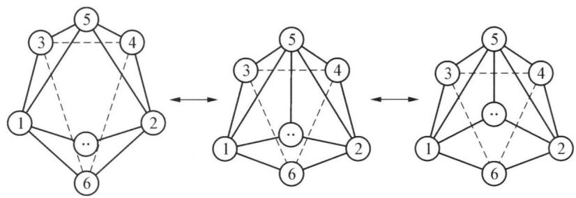

flowchart

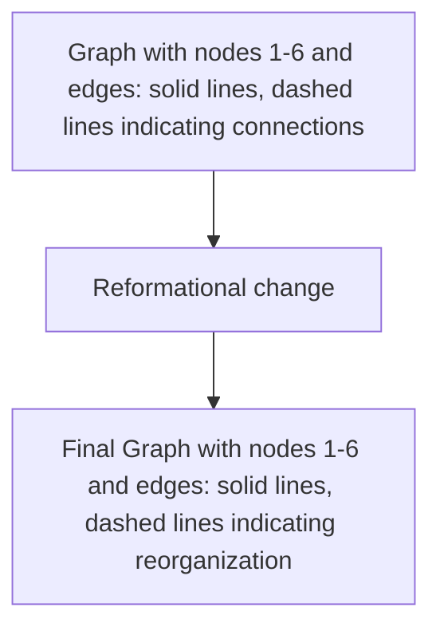

氙的三种氟化物 $XeF_{2}$ ， $XeF_{4}$ ， $XeF_{6}$ 全部都是强氧化剂： $XeF_{2} + 2Cl^{-} = Xe\uparrow + Cl_{2}\uparrow + 2F^{-}$ ， $XeF_{4} + 2H_{2} = Xe + 4HF$ ， $XeF_{4} + Ce = Xe\uparrow + CeF_{4}$ ，

$XeF_{4} + Pt = Xe \uparrow + PtF_{4}$ 。这三种氟化物都可与水反应： $2XeF_{2} + 2H_{2}O = 2Xe \uparrow + O_{2} \uparrow + 4HF$ ， $6XeF_{4} + 12H_{2}O = 2XeO_{3} + 4Xe \uparrow + 24HF + 3O_{2} \uparrow$ ， $XeF_{6} + 3H_{2}O = XeO_{3} + 6HF$ ， $XeF_{6} + H_{2}O = XeOF_{4} + 2HF$ 。其中 $XeF_{6}$ 可以和 $SiO_{2}$ 反应，故不能用玻璃或石英来做盛装氟化氙的容器： $2XeF_{6} + SiO_{2} = 2XeOF_{4} + SiF_{4}$ 。

氙在含氧化合物中,氧化数最高可以达到8,如 $XeO_{4}$ 及高氙酸盐。三氧化氙是一种易爆炸的固体。向 $XeO_{3}$ 的水溶液中通入 $O_{3}$ 将生成高氙酸: $XeO_{3} + O_{3} + 2H_{2}O = H_{4}XeO_{6} + O_{2}$ 。若向 $XeO_{3}$ 的碱性溶液中通入 $O_{3}$ 将生成高氙酸盐: $XeO_{3} + 4NaOH + O_{3} + 6H_{2}O = Na_{4}XeO_{6} \cdot 8H_{2}O + O_{2}$ 。 $Na_{2}XeO_{4}$ 和 $Na_{4}XeO_{6}$ 都是很强的氧化剂。

## 3. 用途

稀有气体的许多用途与这些元素不活泼及其某些物理特性有密切关系。目前，氦和氩已成为重要的工业用气。

氦的密度仅次于氢,无燃烧性,使用安全,常用来填充高空气球和汽艇。用氦代替氮来和氧混合制成“人造空气”供潜水员呼吸用。氦在血液里的溶解度比氮小,当潜水员出水时,不会像氮那样因压力骤减而使溶解在血液里的氮气逸出,并形成气泡阻塞血管,以至出现“潜水病”。液态氦的沸点是已知物质中最低的,可作冷源用于超低温技术。氦气还可用于低温温度计。

稀有气体还广泛应用到光学、冶金和医学等领域中。例如：氦氖激光器、氩离子激光器等在国防和科研上有着广泛的用途。氖在放电管内放射出美丽的红光，加入一些汞蒸气后又发射出蓝光，所以，氖被广泛用来制造霓虹灯。

氩在化学制备中常用作保护气体,防止氧化、氮化、氢化等,也用作电焊保护气氛(称氩弧焊)。氪可用作 X 射线的遮光材料(氮能吸收 X 射线)。

氙在电场的激发下能放出强烈的白光,高压长弧氙灯俗有“人造小太阳”之称,用于电影摄影、舞台照明等,氙与20%氧气混合使用,可作无副作用的麻醉剂。

氡在医疗上用于恶性肿瘤的放射性治疗,但在居室中长期接触微量氡(释自建筑石料或地基岩层等)会导致肺癌。

## 典型例题

【例 1】 s 区金属低于族氧化态(Ⅰ)的化合物在特殊条件下才能形成。例如供氧不足时铷能形成一系列富金属氧化物,这些暗色化合物都是活泼性很高的金属性导体,其中一种簇合物(以 A 表示)两个 O 原子分别以八面体(体心)方式联系着 6 个 Rb 原子,2 个相邻八面体共用一个面。

(1) 请写出 A 的化学式。

(2) 如果从该簇合物分子中两个 O 原子的连线方向上观察, 将 Rb 原子投影在垂直该连线的平面上, 则投影在平面上除 1 个 O 原子外还有几个 Rb 原子? 画出它们的平面构型。

(3) 请解释 A 能导电的原因。

(4) 在这种结构单元里, Rb—Rb 的距离仅为 352 pm, 比 Rb 单质中的 Rb—Rb 的距离 485 pm 小。请分析该物质中存在哪些典型作用力?

解析 （1）根据两个八面体共用一个面形成铷的氧化物可知：2个孤立铷八面体有12个Rb，共用一个面则少3个Rb，O分别占据两个八面体的体心，由此得到化学式为： $Rb_{9}O_{2}$ 。

(2) 本题可借用立方体考虑, 将其中一个八面体的 O 原子置于体心, 6 个铷原子位于立方体的六个面的面心, 另一个八面体的 O 位于立方体顶角, Rb 位于立方体棱心顶角, 容易得出两个 O 的连线方向就是立方体的体对角线方向, 投影观察 Rb 有 6 个, 平面构型如图:

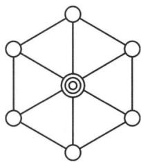

natural_image

Pure geometric diagram of interconnected nodes forming a symmetric diamond-like structure (no text or symbols)

（3）由于该氧化物中氧原子较少，铷的电子没有完全被氧夺去，仍有电子能自由移动，故能导电。

(4) 离子键,金属键,配位键,分子间作用力。

【例 2】1962 年英国青年化学家巴特列第一次制得了 $XePtF_{6}$ 化合物，突破了“惰性元素”的禁区。此后人们相继合成了氙的系列化合物，以及原子序数较大的稀有气体氪、氡的化合物。对于原子序数较小的氦、氖尚未制得化合物。有人从理论上预言了它们的化合物是可以制得的。不久澳洲国立大学的拉多姆宣布了化学上一奇闻，氦能够与碳结合形成分子。像 $CHe_{x}^{x+}$ 不仅存在，而且能够用实验手段观察到 $CHe_{3}^{3+}$ 、 $CHe_{4}^{4+}$ 的存在。

(1) Ne、He 的化合物难以合成的主要原因是什么?

(2) 请预测 $CHe_{3}^{3+}$ 、 $CHe_{4}^{4+}$ 的空间结构。

(3) 写出与 $CHe_{3}^{3+}$ 、 $CHe_{4}^{4+}$ 互为等电子体的物质(或原子团)的名称。

(4) 完成下列化学方程式:

$$
\mathrm{CHe} _ {4} ^ {4 +} + \mathrm{H} _ {2} \mathrm{O}
$$

$$
\mathrm{CHe} _ {4} ^ {4 +} + \mathrm{HCl} -
$$

解析 （1）原子半径小，原子核对外层电子引力大。

(2) 根据 VSEPR 理论中心原子 C 有 4 个价电子, 配位原子 He 提供 2 个电子, $CHe_{3}^{3+}$ 的价电子数为 7, 所以可知为非等性的 $sp^{3}$ 杂化, 三角锥形; 而 $CHe_{4}^{4+}$ 按照上述方法可知价电子数为 8, 中心 C 为等性 $sp^{3}$ 杂化, 因此离子构型是正四面体。

(3) 甲基, 甲烷。

(4) $CHe_{4}^{4+} + 2H_{2}O = CO_{2}\uparrow + 4He\uparrow + 4H^{+}, \quad CHe_{4}^{4+} + 4HCl = CCl_{4} + 4He\uparrow + 4H^{+}$

【例 3】 $XeF_{2}$ 的还原电势约为+2.2 V, 却能在稀 HF 水溶液中比较稳定地存在。

(1) 由 $XeF_{2} + 2OH^{-} = Xe + 1/2O_{2} + 2F^{-} + H_{2}O$ 的反应设计出一个原电池。

(2) 求此电池的 $E^{\ominus}$ 。

(3) 画出电池的草图并说明电极、电解槽、盐桥分别要用什么材料。

(4) 定量地说明 HF 在水溶液中离解产生的 $H_{3}O^{+}$ 离子是否会使 $E^{\ominus}$ 增加?

已知： $1/2O_{2}+2H^{+}+2e^{-}\rightleftharpoons H_{2}O$ $\varphi^{\ominus}(O_{2}/H_{2}O)=1.23V$

解析 （1）根据原电池反应，此电池的构造可为： $C\left|OH^{-}\right|O_{2}\parallel XeF_{2}\mid Xe\mid C$ 。

(2) 该原电池反应是在碱性环境中进行, 因此在该溶液中的 $\left[H^{+}\right]$ 为 $1 \times 10^{-14}$ mol/L, 由此计算出 $O_{2}$ 的标准电极电势为 0.40 V, 则总的电池电动势 $E^{\ominus}$ 为 +1.8 V。

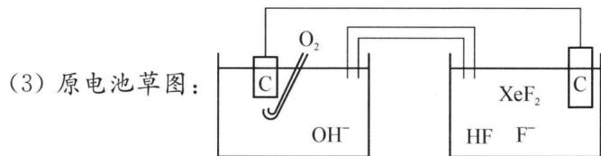

chemical

原电池草图，展示电极、电解质和电极的连接结构

，槽中盛有 HF 溶液，且

用盐桥相连,其均不能用玻璃材料,因为 HF 能腐蚀玻璃,可用聚四氟乙烯(一种碳卤化合物)作材料。又因为 $XeF_{2}$ 是很强的氯化剂,能溶解普通的材料,所以可选用碳作电极。

(4) $XeF_{2} + 2e^{-} = Xe \uparrow + 2F^{-}$ 。在此半反应中没有 $H^{+}$ 参与，所以由 HF 在水中电离出的 $H^{+}$ 的浓度对其电极电势没有影响，因此可以采用 HF (1 mol/L) 和 $F^{-}$ (1 mol/L) 的混合溶液（但若额外加入过量的强酸，则能与 $F^{-}$ 结合生成弱电解质 HF 从而降低氟离子的浓度，从而增大该半反应的电极电势）。

## 本讲习题

1. 通常都认为钠与钾性质相似。它们的盐大多易溶，因此 $\mathrm{K}^{+}$ 和 $\mathrm{Na}^{+}$ 也很难分离。然而人们从人体只能注射生理食盐水 NaCl 溶液，而不能注射 KCl 溶液的事实得到启示，进一步研究发现在细胞膜上 $Na^{+}$ 、 $K^{+}$ 的行为是不同的，不仅细胞膜，而且有些无机的钠盐和钾盐在溶解度上有明显的区别。

（1）例如： $\mathrm{KI} <   \mathrm{NaI},\mathrm{K}_2\mathrm{SO}_4 <   \mathrm{Na}_2\mathrm{SO}_4,\mathrm{K}_2\mathrm{Cr}_2\mathrm{O}_7 <   \mathrm{Na}_2\mathrm{Cr}_2\mathrm{O}_7,\mathrm{KF} > \mathrm{NaF},$ $\mathrm{KCN} > \mathrm{NaCN},\mathrm{K}_2\mathrm{CO}_3 > \mathrm{Na}_2\mathrm{CO}_3,\mathrm{KSCN} > \mathrm{NaSCN},\mathrm{KNO}_2 > \mathrm{NaNO}_2,\mathrm{K}_2\mathrm{C}_2\mathrm{O}_4>$ $\mathrm{Na_2C_2O_4}$ 。

从以上信息可以总结出无机的钠盐和钾盐溶解度什么规律？

（2）离子化合物溶解过程的焓变一般取决于晶格能和离子总水合能两项，下表列出钠，钾碘化物和氟化物的 $\Delta_{\mathrm{s}}H^{\ominus}$ （ $298\mathrm{K},\mathrm{kJ}\cdot \mathrm{mol}^{-1})$ 。 $\Delta_{\mathrm{s}}H^{\ominus} = -U+$ $\Delta_{\mathrm{h}}H^{\ominus}\left[\mathrm{M}_{(\mathrm{g})}^{+}\right] + \Delta_{\mathrm{h}}H^{\ominus}\left[\mathrm{X}_{(\mathrm{g})}^{-}\right]$ 。

<table><tr><td colspan="4">水化焓</td><td rowspan="2"></td><td>水化焓差</td><td>总水化焓</td><td>晶格能</td><td>溶解焓</td></tr><tr><td colspan="2"> $\Delta_{\text{h}}H^{\ominus}[\text{M}_{(\text{g})}^{+}]$ </td><td colspan="2"> $\Delta_{\text{h}}H^{\ominus}[\text{X}_{(\text{g})}^{-}]$ </td><td> $\Delta_{\text{h}}H^{\ominus}$ </td><td> $\Delta_{\text{h}}H^{\ominus}$ </td><td>U</td><td> $\Delta_{\text{s}}H^{\ominus}$ </td></tr><tr><td> $\text{Na}^{+}$ </td><td>-406</td><td> $\text{I}^{-}$ </td><td>-305</td><td>NaI</td><td>101</td><td>-711</td><td>-703</td><td></td></tr><tr><td> $\text{K}^{+}$ </td><td>-322</td><td> $\text{I}^{-}$ </td><td>-305</td><td>KI</td><td>17</td><td>-627</td><td>-647</td><td></td></tr><tr><td> $\text{Na}^{+}$ </td><td>-406</td><td> $\text{F}^{-}$ </td><td>-515</td><td>NaF</td><td>109</td><td>-921</td><td>-916</td><td></td></tr><tr><td> $\text{K}^{+}$ </td><td>-322</td><td> $\text{F}^{-}$ </td><td>-515</td><td>KF</td><td>193</td><td>-837</td><td>-817</td><td></td></tr></table>

① 在表格中填写各物质的溶解焓。

② 请根据上表数据来说明正、负离子的结构、水化焓差和溶解焓之间关系，借此解释第一问的规律？

2. 水是地球上数量最多的分子型化合物。据估算, 地球上水的总量达 $1.4 \times 10^{21} \mathrm{~kg}$ 。若地球表面平滑而没有起伏, 地球表面将形成平均水深达 $2713 \mathrm{~m}$ 无边无际的汪洋。下图是水分子在不同条件下发生的一系列变化:

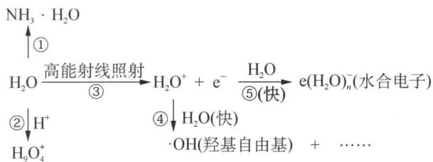

chemical

Chemical reaction equations showing water electrolysis of ammonia and hydrogen peroxide with electron transfer

试回答下列问题：

(1) 在气相中 $\mathrm{H}_{2} \mathrm{O}$ 易与 $\mathrm{HF} 、 \mathrm{HCl} 、 \mathrm{HCN}$ 及 $\mathrm{NH}_{3}$ 通过氢键以加合物形式存在, 写出下列加合物的结构式。

$$
\mathrm{H} _ {2} \mathrm{O} \cdot \mathrm{HCN}: \quad \mathrm{NH} _ {3} \cdot \mathrm{H} _ {2} \mathrm{O}:
$$

（2）在水溶液中，水以多种微粒的形式与其他化合物形成水合物。试画出如下微粒的结构图式。

$$
\mathrm{H} _ {5} \mathrm{O} _ {2} ^ {+}: \quad \mathrm{H} _ {9} \mathrm{O} _ {4} ^ {+}:
$$

（3）当用高能射线照射液态水时，水分子便按一种新的方式如图反应③电离，生成的微粒在水中迅速发生如图④⑤的一系列变化，最终生成 $\mathrm{e(H_2O)_n^-}$ （水合电子）、·OH(羟基自由基)等微粒。

① 请写出水分子在高能射线照射下的电离方程式。

② 水电离的正离子通过反应④生成羟基自由基。写出该步反应的离子方程式。

③ 写出高能射线照射水的净反应的离子方程式。

④ 请指出经高能射线照射的水的最主要化学性质。

3. 能源是当今社会发展的三大支柱之一, 是制约国家经济发展的瓶颈。目前, 我国的能源结构主要是煤, 还有石油、天然气、核能等, 这些能源都是一次不可再生且污染环境的能源, 研究和开发清洁而又用之不竭的能源是未来发展的首要任务。科学家预测“氢能”将是未来 21 世纪最理想的新能源。氢能是利用氢气的燃烧反应放热提供能量, 即 $\mathrm{H}_{2} + 1 / 2\mathrm{O}_{2} = \mathrm{H}_{2}\mathrm{O}, \Delta H = -284 \mathrm{~kJ}$ 。

(1) 当今社会发展的三大支柱除能源外, 还包括哪 2 项;

(2) 试分析为什么“氢能”将是未来 21 世纪最理想的新能源?

（3）目前世界上的氢绝大部分是从石油、煤炭和天然气中制取。如：用水蒸气与炽热的碳反应为： $C+H_{2}O=CO+H_{2}$ 。请写出由天然气制取氢的反应方程式。并分析此类制氢方法是否是理想的长久方法。

（4）利用硫—碘热循环法制取氢也是化学家常用的一种方法，总反应方程式为 $2H_{2}O\xlongequal{SO_{2}/I_{2}}2H_{2}+O_{2}$ ，其循环过程分三步进行：

$$
\mathrm{a.} \mathrm{SO} _ {2} + \mathrm{I} _ {2} + \mathrm{H} _ {2} \mathrm{O} \longrightarrow \mathrm{A} + \mathrm{B} \quad \text {b.} \mathrm{A} \longrightarrow ? +? \quad \text {c.} \mathrm{B} \longrightarrow ? +? +?
$$

① 完成以上三步反应,并确定哪步反应最难进行。

② 请对硫—碘热循环法制取氢的优劣和前景作一分析。

(5) 目前, 氢总量只有 4% 左右由电解水的方法制取。

① 每生产 $1 \, m^{3}$ 氢气需要耗电约 4 度, 请估算电解水中能量的利用率。

② 电解水法制氢一方面消耗的电能比氢能释放的能量还要高,另一方面电能本身就是高效、清洁能源,以电能换氢能,成本很高,显然消耗电能来获得氢能的方法是得不偿失。请问用什么方法可以降低电解法制氢的成本。

4. 某元素 X, 在自然界中只有一种稳定同位素, X 呈灰白色, 坚硬而质轻。密度是 $1.85 \mathrm{~g} / \mathrm{cm}^{3}$ , 熔点 $1278^{\circ} \mathrm{C}$ , 标准电极电位 $E_{(\mathrm{X}^{2+}/\mathrm{X})}^{-} = -1.70 \mathrm{~V}$ 。能溶于除冷硝酸以外的稀酸或碱溶液中。X 用于制造飞机合金, 在原子核反应堆中用作减速剂及反射剂, 高纯度的 X 可作中子源。X 在自然界中的最重要矿石是 Y, Y 是复盐, 其晶体一般为白色带绿, Y 中含有 $5.03 \%$ 的 X 和 $31.35 \%$ 的硅, 但不含氢元素。Y 是提炼 X 的最重要矿物原料, 也可做为宝石的材料。

(1) 写出 X 的元素符号和其最稳定的同位素。

(2) 写出 X 溶于稀酸和稀碱的离子反应方程式。

（3）X 的氯化物是白色固体，加热时易升华，液态时不导电，已知 X 的氯化物在不同温度时以不同形式存在，请分别写出温度从低到高时它们存在的结构简式。

(4) 写出 Y 的化学式和 Y 与 NaOH 共融的化学方程式。

(5) 在 Y 的硅酸根离子中, 所有硅原子都是等价的, 画出结构示意图。

5. $XeF_{2}$ 的晶体结构已由中子衍射测定，晶体属四方晶系，a = 431.5 pm, c = 699.0 pm，晶胞中有两个分子，其中 Xe: (0, 0, 0)、(1/2, 1/2, 1/2)，F: (0, 0, z1)、(0, 0, z2)、(1/2, 1/2, z3)、(1/2, 1/2, z4)。

(1) 画出一个晶胞图。

(2) 假设 Xe—F 键长 200 pm, 计算非键 F…F、Xe…F 的最短距离。

(3) 计算晶体 $XeF_{2}$ 的密度。

6. 把一份质量为 0.1978 g 的 $XeF_{2}$ 、 $XeF_{4}$ 、 $XeF_{6}$ 混合样品用水处理，得到混合气体 A 和混合溶液 B。气体 A 在 290 K 和 100 kPa 下的体积为 60.2 mL，将 A 通入焦性没食子酸溶液和浓硫酸后，气体体积缩小到原来的 60.0%。将 B 溶液用 0.100 mol/L $FeSO_{4}$ 水溶液滴定以测定水中 $XeO_{3}$ 含量，共用 36.0 mL $FeSO_{4}$ 溶液。再取一份相同量的 $XeF_{2}$ 、 $XeF_{4}$ 、 $XeF_{6}$ 混合样品，用 KI 溶液处理，生成的 $I_{2}$ 被 0.400 mol/L $Na_{2}S_{2}O_{3}$ 滴定，用去 $Na_{2}S_{2}O_{3}$ 19.0 mL。

（1）根据价电子层电子互斥理论(VSEPR)， $XeF_{2}$ 和 $XeF_{4}$ 分子的几何构型各是什么？

(2) 计算 0.1978 g 的混合样品中 $XeF_{2}$ 、 $XeF_{4}$ 、 $XeF_{6}$ 各物质的量。

(3) 写出 $XeF_{2}$ 、 $XeF_{4}$ 、 $XeF_{6}$ 分别与水反应的化学方程式。

7. 蛋壳的主要成分是 $CaCO_{3}$ ，其次是 $MgCO_{3}$ 、蛋白质、色素等。为测定其中钙的含量，洗净蛋壳，加水煮沸约 5 min，置于蒸发皿中用小火烤干，研细。

(1) 称取 0.3 g (设为 0.3000 g) 蛋壳样品, 置于锥形瓶中逐滴加入已知浓度$c(\text{HCl})$ 的盐酸 40.00 mL, 而后用小火加热使之溶解, 冷却后加 2 滴甲基橙溶液, 用已知浓度 $c(\text{NaOH})$ 回滴, 消耗 $V(\text{NaOH})\text{L}$ 达终点。

① 写出计算钙含量的算式。  
② 计算得到的是钙的含量吗?  
(2) 称取 0.3 g(设为 0.3000 g) 蛋壳样品, 用适量强酸溶解, 然后加 $\left(\mathrm{NH}_{4}\right)_{2}\mathrm{C}_{2}\mathrm{O}_{4}$ 得沉淀, 经过滤、洗涤, 沉淀溶于 $H_{2}SO_{4}$ 溶液, 再用已知浓度 $c(\mathrm{KMnO}_{4})$ 滴定 (生成 $Mn^{2+}$ 和 $CO_{2}$ ), 消耗 $V(\mathrm{KMnO}_{4})\mathrm{L}$ 达到终点。  
① 写出计算钙含量的算式。  
② 此法求得的钙含量略低于上法。为什么？

## 第六讲 钛、钒分族元素

## 知识精讲

## 一、d区元素概述

过渡元素包括 I B 到 VII B 族和第 VIII 族共 30 多个元素。通常又把过渡元素分成第一过渡系（从钪到锌），第二过渡系（从钇到镉）和第三过渡系（从镧到汞，不包括镧系元素）。第一过渡系的元素及其化合物应用较广，并有一定的代表性，本书重点讨论第一过渡系，对第二、第三过渡系作简单介绍。

## 1. 氧化数

过渡元素的价电子不仅包括最外层的 s 电子, 还包括次外层全部或部分 d 电子(Zn、Cd、Hg 除外)。这样的电子构型使得它们能形成多种氧化数的化合物。它们的最高氧化数等于最外层 s 电子和次外层 d 电子数的总和。但在第Ⅷ族、ⅠB、ⅡB族中这一规律不完全适用。另外, 除ⅢB及ⅡB族中的 Zn、Cd 外, 其他过渡元素的氧化数都是可变的。具有较低氧化数的过渡元素, 大都以“简单”离子 $(M^{+}$ 、 $M^{2+}$ 、 $M^{3+})$ 存在。

## 2. 主要物理性质

过渡元素大都是高熔点、高沸点(Zn、Cd、Hg除外)、密度大、导电和导热性能良好的重金属。它们广泛地被用在冶金工业上制造合金钢，例如不锈钢(含镍和铬)、弹簧钢(含钒)、锰钢等。熔点最高的单质是钨，硬度最大的是铬，单质密度最大的是锇(Os)。

## 3. 主要化学性质

钪 Sc、钇 Y、镧 La 是过渡元素中最活泼的金属。例如，在空气中 Sc、Y、La 能迅速地被氧化，与水作用放出氢。它们的活泼性接近于碱土金属。Sc、Y、La 的性质之所以比较活泼，是因为它们的原子次外层 d 轨道中仅有一个电子，这个电子对它们的影响尚不显著，所以它们的性质较活泼并接近于碱土金属。

同一族的过渡元素除ⅢB族外,其他各族都是自上而下活泼性降低。一般认为这是由于同族元素自上而下原子半径增加不大,而核电荷数却增加较多,对电子吸引增强,所以第二、三过渡系元素的活泼性急剧下降。特别是镧以后的第三过渡系的元素, 又受镧系收缩的影响, 它们的原子半径与第二过渡系相应的元素的原子半径几乎相等。因此第二、三过渡系的同族元素及其化合物, 在性质上很相似。例如, 锆与铪在自然界中彼此共生在一起, 把它们的化合物分离开比较困难。铌和钽也是这样。同一过渡系的元素在化学活泼性上, 总的来说自左向右减弱, 但是减弱的程度不大。

过渡元素的原子或离子都具有空的价电子轨道,这种电子构型为接受配位体的孤对电子形成配价键创造了条件,因此它们的原子或离子都有形成配合物的倾向。

## 4. 离子的颜色

过渡元素的大多数水合离子常带有一定的颜色。关于离子有颜色的原因是很复杂的，过渡元素的水合离子之所以具有颜色，与它们的离子具有未成对的 d 电子有关。过渡元素的许多离子具有未成对的 d 电子，没有未成对 d 电子的离子如 $Sc^{3+}$ 、 $Zn^{2+}$ 、 $Ag^{+}$ 、 $Cu^{+}$ 等都是无色的，而具有未成对 d 电子的离子则呈现出颜色，如 $Cu^{2+}$ 、 $Cr^{3+}$ 、 $Co^{2+}$ 等。

综上所述,过渡元素主要有以下几个特点: ①同一种元素有多种氧化数; ②金属活泼性; ③易于形成多种配合物; ④水合离子和酸根离子常带有颜色。

## 二、钛分族

## 1. 钛单质

(1) 物理性质: 银白色, 密度 $4.54 \mathrm{~g} / \mathrm{cm}^{3}$ , 较轻, 强度接近钢铁, 兼有铝铁的优点, 既轻强度又高, 且耐高温 (于 $800 \mathrm{~K}$ 性能不变), 用于制航天飞机、火箭、导弹。钛的耐腐蚀性能好、浸于海水中的钛片, 十年无锈斑, 用于制潜艇、轮船、深水探测和重要的化工设备。钛还能承受超低温, 用于制盛液氮、液氧的器皿。此外钛能与骨骼, 肌肉生长在一起, 用于接骨和人工关节, 故誉名为“生物金属”。在地壳中储量高, 是极有前途的结构材料, 被誉为“第三金属”和“二十一世纪金属”。

## (2) 化学性质

查表知： $\varphi^{\ominus}\left(\mathrm{Ti}^{2+}/\mathrm{Ti}\right)=-1.63\mathrm{~V}$ ，因此 Ti 在热力学上很活泼，但由于表面形成致密氧化层而钝化，在常温下极稳定，常温不与 $X_{2}$ 、 $O_{2}$ 、 $H_{2}O$ 反应，不与强酸（包括王水），以及强碱反应。

## ① 与非金属单质

高温时钛相当活泼： $Ti + O_{2} = TiO_{2}$ （红热）， $Ti + 2Cl_{2} = TiCl_{4}$ （600 K）， $3Ti + 2N_{2} = Ti_{3}N_{4}$ （800 K）。钛在高温时还能与其他非金属如碳、硼反应生成碳化钛 TiC,硼化钛 TiB,它们质硬、难熔、稳定,常被称为金属陶瓷,氮化钛为青铜色,涂层能仿金。钛与氢化合形成一类非整比的氢化物,这种氢化物在较高温度下会释放出氢。钛铁和氢形成的氢化物可作储氢材料。钛与氧反应很易形成氧化钛 $TiO_{2}$ 。由于钛与氧、氯、氮、氢有很大的亲力,造成炼制纯金属的困难。

② 与酸和碱

Ti 可溶于热的浓 HCl 形成 $Ti^{3+}$ 的配位化合物: $2Ti + 6HCl = 2TiCl_{3}$ (紫色) + $3H_{2}\uparrow$ 。最好的溶剂是氢氟酸或氢氟酸与盐酸的混合液, 可产生配离子 $TiF_{6}^{2-}$ : $Ti + 6HF = TiF_{6}^{2-} + 2H^{+} + 2H_{2}\uparrow$ 。

Ti 不溶于热碱,但可与熔融碱作用: $2Ti + 6KOH \xlongequal{熔融} 2K_{3}TiO_{3} + 3H_{2}\uparrow$ 。

## 2. 钛的重要化合物

由下图的钛的电势图可知,钛的较稳定氧化态为+4,低于+4氧化态的化合物均不稳定,具有较强的还原性。+4氧化态是失去 $3d^{2}$ 和 $4s^{2}$ 电子,Ti(Ⅳ)电子构型为 $3d^{0}$ 。它形成的化合物没有明显的过渡金属化合物的特性,而恰恰与ⅥA族下面的元素(Si、Ge、Sn、Pb)的相应化合物相似。较常见的重要Ti(Ⅳ)化合物有二氧化钛、钛酸盐及四氯化钛。+3氧化钛Ti(Ⅲ)电子构型 $3d^{1}$ ,所以其化合物必然是顺磁性的和有颜色的,其重要化合物是三氯化钛。Ti(Ⅱ)化合物极不稳定,不作讨论。

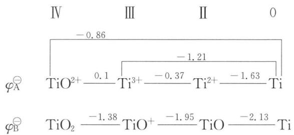

chemical

Chemical reaction equations showing titanium species transformations with labeled bond lengths and values

(1) 二氧化钛

① 与酸的作用

$\mathrm{TiO_2}$ 为白色粉末, 俗称钛白, 不溶于 $\mathrm{H_2O}$ 、稀酸和稀碱中, 在一定的条件下可溶于热浓 $\mathrm{H_2SO_4}$ 中: $\mathrm{TiO_2 + 2H_2SO_4}$ (浓) $\xlongequal{\triangle} \mathrm{Ti(SO_4)_2 + 2H_2O}$ , $\mathrm{Ti^{4+}}$ 电荷数高, 在水中易水解成 $\mathrm{TiO^{2+}}$ , $\mathrm{TiO^{2+}}$ 称为钛氧基或钛酰基, 因此上述反应可写成: $\mathrm{TiO_2 + H_2SO_4}$ (浓) $\xlongequal{\triangle} \mathrm{TiOSO_4 + H_2O}$ 。水溶液中不能析出 $\mathrm{Ti(SO_4)_2}$ , 却可以析出白色粉末 $\mathrm{TiOSO_4} \cdot \mathrm{H_2O}$ 。

$\mathrm{TiO_2}$ 与 $\mathrm{KHSO_4}$ 共熔，得可溶性盐类： $\mathrm{TiO_2 + 2KHSO_4\xrightarrow{\text{熔融}}TiOSO_4 + K_2SO_4 + }$

$H_{2}O$

也可溶于 HF 中形成配位化合物： $TiO_{2} + 6HF = H_{2}[TiF_{6}] + 2H_{2}O$ 。

② 与碱性化合物作用

$TiO_{2} + MgO \xlongequal{熔融} MgTiO_{3}$ (熔融)

$TiO_{2} + BaCO_{3} \xlongequal{熔融} BaTiO_{3} + CO_{2}$ （气体），人工制得的钛酸钡 $BaTiO_{3}$ 介电常数较大，具有压电效应，即受压可产生电流，通电又可改变体积。 $BaTiO_{3}$ 是制造大容量电容器、扩音器及超声波发生器的极好材料。

③ 晶体结构

天然二氧化钛是金红石,属于简单四方晶系,它是典型的 $AB_{2}$ 型化合物的结构,通常称具有这种结构的物质为金红石(Rutile)型。 $SnO_{2}$ 、 $MnO_{2}$ 、 $VO_{2}$ 等都是金红石结构。 $TiO_{2}$ 的结构见

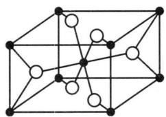

chemical

Crystal lattice structure diagram showing atomic positions in a cubic unit cell

○ O原子
• Ti原子

右图所示。在 $TiO_{2}$ 晶体中，Ti 的配位数为 6，O 为 3，正离子和负离子的半径比 $R^{+}/R^{-}=0.68/1.40=0.486$ ，晶体中 $Ti^{4+}$ 和 $O^{2-}$ 相互接触，而 $O^{2-}$ 之间互不接触。

④ 用途和制备

纯净 $TiO_{2}$ 俗称钛白, 是一种优良的白色颜料, 具有折射率高, 着色力强, 遮盖力大, 化学稳定性等优点, 用于制高级白色油漆、白色橡胶和白色皮带, 也在造纸工业中作填充剂, 人造纤维中作消光剂。二氧化钛与其他金属氧化物一起可配制成彩釉。在陶瓷或搪瓷中加入二氧化钛可增强耐酸性。此外 $TiO_{2}$ 还是许多反应的催化剂, 如用于使乙醇脱水或脱氢等。

钛酸铁 $FeTiO_{3}$ 是一种天然存在矿物, 是重要的钛资源之一。工业上常用硫酸分解钛铁矿制取 $TiO_{2}$ , 制备过程如下图所示:

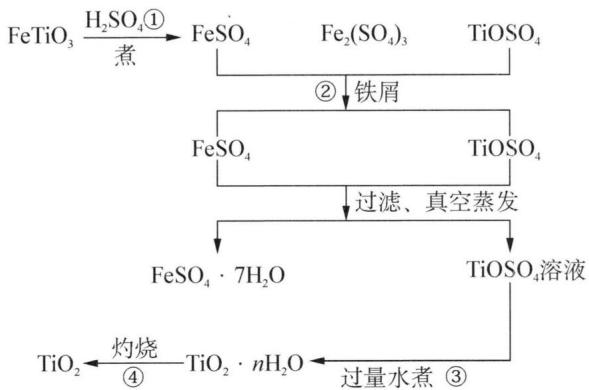

flowchart

涉及到的化学反应如下：

① $FeTiO_{3} + 2H_{2}SO_{4} = TiOSO_{4} + FeSO_{4} + 2H_{2}O, Fe_{2}O_{3} + 3H_{2}SO_{4} = Fe_{2}(SO_{4})_{3} + 3H_{2}O;$

② $\mathrm{Fe} + \mathrm{Fe}_{2}\left(\mathrm{SO}_{4}\right)_{3} = 3\mathrm{FeSO}_{4}$ ;

③ $TiOSO_{4} + nH_{2}O = TiO_{2} \cdot (n - 1)H_{2}O + H_{2}SO_{4}$ ;

④ $\mathrm{TiO_{2}}\cdot(n-1)\mathrm{H_{2}O}=$ $\mathrm{TiO_{2}}+(n-1)\mathrm{H_{2}O}$

## (2) 钛酸

在钛盐中加碱, 可得 $\alpha$ -钛酸(氢氧化钛): $\mathrm{TiBr}_{4} + 4\mathrm{NaOH} = \mathrm{Ti(OH)}_{4} \downarrow + 4\mathrm{NaBr}$ 。 $\alpha$ -钛酸活性大, 可溶于酸或碱, 也可写成 $\mathrm{H}_{4} \mathrm{TiO}_{4}$ 或 $\mathrm{TiO}_{2} \cdot x \mathrm{H}_{2} \mathrm{O}$ 等形式。将钛酸溶液煮沸, 水解生成 $\beta$ -钛酸, 这种水解即使加强酸也不能抑制: $\mathrm{Ti(SO}_{4})_{2} + 4 \mathrm{H}_{2} \mathrm{O} = \mathrm{Ti(OH)}_{4} \downarrow + 2 \mathrm{H}_{2} \mathrm{SO}_{4}$ , 得到的 $\beta$ -钛酸稳定, 不溶于酸也不溶于碱。

## (3) 四氯化钛

生产金属钛的中间产物四氯化钛是钛的最常见重要化合物, 钛的很多化合物都是由它制备的。 $TiCl_{4}$ 是四面体型共价化合物, 是无色液体, 熔点为 250 K, 沸点 409 K, 有刺激性气味, 它在水中或潮湿空气中都极易水解, 其水解的最终产物为白色的二氧化钛水合物, 常简写作钛酸 ( $H_{2}TiO_{3}$ ) 或二氧化钛: $TiCl_{4} + 3H_{2}O = H_{2}TiO_{3} + 4HCl$ , 制 $TiCl_{4}$ 关键是防止水解。若水量不足或有酸存在时, 则发生部分水解, 生成白色的氯化钛酰: $TiCl_{4} + H_{2}O = TiOCl_{2} \downarrow + 2HCl$ 。根据这一性质, 常用 $TiCl_{4}$ 作烟雾剂。

$\mathrm{TiCl_4}$ 与浓 $\mathrm{HCl}$ 反应生成 $\mathrm{H}_2[\mathrm{TiCl}_6]$ ： $\mathrm{TiCl_4 + 2HCl}$ （浓） $= \mathrm{H}_2[\mathrm{TiCl}_6]$ ，这种配酸只存在溶液中，若加入 $\mathrm{NH_4^+}$ ，则可析出黄色的 $(\mathrm{NH_4})_2[\mathrm{TiCl}_6]$ 晶体。

在中等酸度的钛（Ⅳ）盐溶液中，加入 $H_{2}O_{2}$ 可生成较稳定的橘黄色的 $\left[\mathrm{TiO}\left(\mathrm{H}_{2}\mathrm{O}_{2}\right)\right]^{2+}: \mathrm{TiO}^{2+} + \mathrm{H}_{2}\mathrm{O}_{2} = \left[\mathrm{TiO}\left(\mathrm{H}_{2}\mathrm{O}_{2}\right)\right]^{2+}$ ，利用此反应可进行钛的定性检验和比色分析。

## (4) 三氯化钛

单质钛在加热情况下与盐酸反应得 $TiCl_{3}$ 紫色溶液。 $TiCl_{3}$ 也可以由 $TiCl_{4}$ 还原制得： $2TiCl_{4} + H_{2} = 2TiCl_{3} + 2HCl$ 或 $2TiCl_{4} + Zn = 2TiCl_{3} + ZnCl_{2}$ 。

从水溶液中可以析出 $TiCl_{3} \cdot 6H_{2}O$ 的紫色晶体，配合物的构成是 $\left[\mathrm{Ti}\left(\mathrm{H}_{2}\mathrm{O}\right)_{6}\right]\mathrm{Cl}_{3}$ 。若用乙醚从 $TiCl_{3}$ 的饱和溶液中萃取，可得 $TiCl_{3} \cdot 6H_{2}O$ 绿色晶体，配合物的构成是 $\left[\mathrm{Ti}\left(\mathrm{H}_{2}\mathrm{O}\right)_{5}\mathrm{Cl}\right]\mathrm{Cl}_{2} \cdot \mathrm{H}_{2}\mathrm{O}$ ，两者互为水合异构。

有关 Ti(Ⅳ) 和 Ti(Ⅲ) 的电极电势如下: $TiO^{2+} + 2H^{+} + e^{-} \rightleftharpoons Ti^{3+} + H_{2}O$ , $\varphi^{\ominus}(Ti^{3+}/TiO^{2+}) = 0.099\ V$ 。可见说不上 Ti(Ⅳ) 有很强氧化性, 反而可以考虑

Ti(Ⅲ)的还原性,如: $\mathrm{Ti}^{3+} + \mathrm{Fe}^{3+} + \mathrm{H}_{2} \mathrm{O} = \mathrm{TiO}^{2+} + \mathrm{Fe}^{2+} + 2 \mathrm{H}^{+}$ 。 $\mathrm{Ti}^{3+}$ 的还原性从电极电势看比 $\mathrm{Sn}^{2+}$ 还强 $(\varphi^{\ominus} (\mathrm{Sn}^{4+}/\mathrm{Sn}^{2+}) = 0.15 \mathrm{~V})$ , 在空气中易被氧化, 因此必须保存在 $\mathrm{N}_{2}$ 或 $\mathrm{CO}_{2}$ 惰性气氛中。

$TiCl_{3}$ 是广泛使用的还原剂, 如能将 $Cu(Ⅱ)$ 还原为 $Cu(Ⅰ)$ , $Fe(Ⅲ)$ 还原为 $Fe(Ⅱ)$ , 将硝基有机化合物还原为胺。如: $2Ti^{3+} + 2Cu^{2+} + 2Cl^{-} + 2H_{2}O = 2CuCl \downarrow + 2TiO^{2+} + 4H^{+}$ 。虽然它的热力学还原趋势不如 $Cr^{2+}$ , 但在动力学上是快速还原剂, 如它能还原 $ClO_{4}^{-}$ 至 $Cl^{-}: 8Ti^{3+} + ClO_{4}^{-} + 8H^{+} = 8Ti^{4+} + Cl^{-} + 4H_{2}O$ 。因此 $TiCl_{3}$ 常用于定量测定中, 此外还用作烯烃定向聚合的催化剂。

## 3. 钛的冶炼

目前大规模生产钛一般采用 $\mathrm{TiCl_4}$ 的金属热还原法。先将 $\mathrm{TiO_2}$ （或天然金红石）和炭粉混合加热至 $1000\sim 1100\mathrm{K}$ ，进行氯化处理制 $\mathrm{TiCl_4}$ ，这一步氯化反应必须加入炭，不能由 $\mathrm{TiO_2}$ 直接氯化制得。根据热力学分析： $\mathrm{TiO_2(s)} + 2\mathrm{Cl}_2(\mathrm{g}) = \mathrm{TiCl}_4(\mathrm{g}) + \mathrm{O}_2(\mathrm{g}), \Delta H = 148.9\mathrm{kJ} \cdot \mathrm{mol}^{-1}, \Delta S = 0.041\mathrm{kJ} \cdot \mathrm{K}^{-1} \cdot \mathrm{mol}^{-1}$ ，若 $T = 2000\mathrm{K}$ 时， $\Delta G = 66.9\mathrm{kJ} \cdot \mathrm{mol}^{-1}, \Delta G > 0$ 反应不自发。 $\mathrm{TiO_2(s)} + 2\mathrm{Cl}_2(\mathrm{g}) + 2\mathrm{C(s)} = \mathrm{TiCl_4(g)} + 2\mathrm{CO(g)}, \Delta H = -72.4\mathrm{kJ} \cdot \mathrm{mol}^{-1}, \Delta S = 0.220\mathrm{kJ} \cdot \mathrm{K}^{-1} \cdot \mathrm{mol}^{-1}$ ，若 $T = 1000\mathrm{K}$ 时， $\Delta G = -292.4\mathrm{kJ} \cdot \mathrm{mol}^{-1}, \Delta G < 0$ 反应自发。可知在有炭存在下氯化反应在 $1000\mathrm{K}$ 即能进行，而没有炭时，即使在 $2000\mathrm{K}$ 反应也不能自发进行，因此由氯化法制四氯化钛，炭是不可缺少的。

制得 $\mathrm{TiCl_4}$ 后用镁（或钠）在 $1070\mathrm{K}$ 、氩气氛中还原得到钛： $\mathrm{TiCl_4 + }$ $2\mathrm{Mg}\frac{1070\mathrm{K}}{\mathrm{Ar}}\mathrm{Ti} + 2\mathrm{MgCl}_2$ ， $\Delta G = -510.2\mathrm{kJ}\cdot \mathrm{mol}^{-1}$ 。反应后产物中过量 $\mathrm{Mg}$ 和 $\mathrm{MgCl_2}$ 用稀HCl溶解，这样得到的金属钛状如海绵，称“海绵钛”。由海锦钛制高纯钛可用碘化物热分解法： $\mathrm{TiI_4}\xrightarrow[413\mathrm{K}]{1573\mathrm{K}}\mathrm{Ti} + 2\mathrm{I}_2$ ，这样得到纯度为 $99.95\%$ 的钛。

## 4. 锆与铪

## (1) 单质

锆和铪位于周期表第四副族,电子构型分别为 $4\mathrm{d}^2 5\mathrm{s}^2$ 、 $5\mathrm{d}^2 6\mathrm{s}^2$ ，由于“镧系收缩”，使锆与铪的性质非常相似。锆是具有浅钢灰色的可煅金属，铪是银白色、可煅的柔软性金属。致密锆在空气中是稳定的，加热到 $673\sim 873\mathrm{K}$ 时，其表面形成氧化物保护膜，在更高的温度下，锆的氧化速度增大，并同时发现有氧溶解在锆中，溶解的氧即使在真空中加热也不能除去。粉状的锆在空气中加热到 $453\sim 558\mathrm{K}$ ，开始着火燃烧。锆与氧的亲力很强，高温时能夺氧化镁、氧化铍和氧化钍等坩埚材料中的氧,所以锆只能在金属坩埚中熔融,锆强烈吸收氢气,在573\~673 K时能生成一系列氢化物: $Zr_{2}H$ 、ZrH、 $ZrH_{2}$ 。在真空中加热到1273\~1473 K时,氢气几乎可以全部排出。锆在高温下与炭及含碳的气体( $CO$ 、 $CH_{4}$ )作用生成熔点达3448±50 K坚硬的碳化锆,与硼作用生成熔点达3673 K的硼化锆( $ZrB_{2}$ )。在1173 K以上猛烈吸收氮形成固熔体和氮化锆。锆的化学抗腐蚀性强,优于钛和不锈钢,接近于钽。在373 K以下,锆能抵抗各种浓度的盐酸和硝酸以及浓度低于50%硫酸的作用。锆不与碱液作用,但可溶于氢氟酸、浓硫酸和王水中,也可被熔融碱所侵蚀。

铪类似于锆，在高温下会生成氧化物薄膜，其氧化速度稍低于锆，也可吸收氢气，也能生成氮化铪(熔点3583 K)、碳化铪(熔点4163±50 K)和硼化铪(熔点3523 K)等金属陶瓷材料。铪的抗腐蚀性稍弱于锆，能抵抗冷稀酸和碱液的侵蚀，但可溶于硫酸中。

## (2) 重要化合物

锆、铪的主要氧化态是+4，在水溶液中的化学反应较简单，由于M(Ⅳ)是 $d^{0}$ 结构，因此化合物都为无色。它们的元素电势图如下：

<table><tr><td colspan="3">锆、铪的元素电势图 $\varphi^{\ominus} / V$ </td></tr><tr><td>IV</td><td></td><td>0</td></tr><tr><td> $Zr^{4+}$ </td><td>-1.55</td><td>Zr</td></tr><tr><td> $Hf^{4+}$ </td><td>-0.170</td><td>Hf</td></tr><tr><td> $HfO_{2}$ </td><td>-1.57</td><td>Hf</td></tr></table>

由电势图可见,锆、铪是活泼金属,但由于它们的抗腐性强,常温下不易被酸、碱侵蚀。它们的氧化态为+4的含氧化合物是非常稳定的,广泛存在于自然界中。

① 氧化物

二氧化锆 $\left(\mathrm{ZrO}_{2}\right)$ 和二氧化铪 $\left(\mathrm{HfO}_{2}\right)$ 可由分别加热它们的水合氧化物脱水制取。 $ZrO_{2}$ 和 $HfO_{2}$ 都是白色固体，不溶于水。单斜晶体（斜锆石）与一种 $HfO_{2}$ 是同晶型的。它们均具有两性，难溶于碱易溶于酸。当将氧化物加强热，即变为难熔物，它们不溶于酸（氢氟酸除外）和碱。难熔二氧化物用作高温绝热体。 $ZrO_{2}$ 由于生成热和燃烧热很大，可制照相用闪光灯炮、导火剂，还可用作炉衬，制造坩埚。 $ZrO_{2}$ 是高质量的耐火材料、优良高温陶瓷。

二氧化锆水合物 $ZrO_{2} \cdot xH_{2}O$ 可由氯化氧锆水解制得: $\mathrm{ZrOCl_{2}+(x+1)H_{2}O=}$ $ZrO_{2} \cdot xH_{2}O + 2HCl$ 。得到的二氧化锆水合物 $ZrO_{2} \cdot xH_{2}O$ 是一种白色凝胶，含水