量不定,也称为 $\alpha$ 型锆酸,它可溶解在稀酸中,并容易生成溶胶,即被所吸附的酸或碱所胶溶。加热下沉淀下来的叫作 $\beta$ 型锆酸。它具较少的水含量,并难溶于水中,这些情况和钛酸的两种构型相似。二氧化锆水合物 $\mathrm{ZrO}_{2} \cdot x \mathrm{H}_{2} \mathrm{O}$ 既能与酸反应呈碱性,又能与碱作用,呈现弱酸性,它的酸性比 $\mathrm{TiO}_{2} \cdot x \mathrm{H}_{2} \mathrm{O}$ 更弱。它和碱金属形成的强碱(M(I))熔融时,生成晶状的偏锆酸盐 $\mathrm{M}_{2} \mathrm{ZrO}_{3}$ ,同时也能生成正锆酸盐 $\mathrm{M}_{4} \mathrm{ZrO}_{4}$ 。碱金属锆酸盐在水中的溶解度很小,和其他的弱酸盐一样,它们在水溶液中也容易水解: $\mathrm{Na}_{2} \mathrm{ZrO}_{3} + 2 \mathrm{H}_{2} \mathrm{O} = \mathrm{ZrO(OH)}_{2} + 2 \mathrm{NaOH}$ 。在浓的强碱中加入锆盐,并不生成组成固定的锆酸盐,所得到的是吸附了碱金属氢氧化物的二氧化锆水合物沉淀。

## ② 卤化物

四氯化锆是制备金属锆的重要原料。四氯化锆为白色晶体粉末，在604 K升华，密度2.8 g·cm $^{-3}$ ，在潮湿空气中产生盐酸烟雾，遇水剧烈水解： $ZrCl_{4} + 9H_{2}O = ZrOCl_{2} \cdot 8H_{2}O + 2HCl$ 。水解所得的产物是水合氯化锆酰，难溶于冷浓盐酸中，但能溶于水，从溶液中析出的是四方形棱晶或针状晶体的 $ZrOCl_{2} \cdot 8H_{2}O$ ，可用于鉴定锆和提纯锆。在 $ZrOCl_{2} \cdot 8H_{2}O$ 晶体中含有 $\left[\mathrm{Zr}_{4}\left(\mathrm{OH}\right)_{8}\left(\mathrm{H}_{2}\mathrm{O}\right)_{16}\right]^{8+}$ 离子。它的结构式为 $\left[\mathrm{Zr}_{4}\left(\mathrm{OH}\right)_{8}\left(\mathrm{H}_{2}\mathrm{O}\right)_{16}\right]\mathrm{Cl}_{8} \cdot 12\mathrm{H}_{2}\mathrm{O}$ ，其组成与 $4\left(\mathrm{ZrOCl}_{2} \cdot 8\mathrm{H}_{2}\mathrm{O}\right)$ 相符。当HCl浓度小于8～9 mol·L $^{-1}$ 时， $HfOCl_{2} \cdot 8H_{2}O$ 的溶解度与 $ZrOCl_{2} \cdot 8H_{2}O$ 相同，但HCl的浓度大于8～9 mol·L $^{-1}$ 时，则锆盐的溶解度比铪盐大。因此，可以利用两盐在浓盐酸中的溶解度差别来分离锆和铪。四氯化锆和碱金属氯化物配位，可以生成 $M_{2}ZrCl_{6}$ 型配合物。

四氟化锆是一种具有强折射的无色单斜晶体, 密度 $4.6 \mathrm{~g} / \mathrm{cm}^{3}$ , 几乎不溶于水, 它与碱金属氟化物作用生成 $\mathrm{M}_{2} \mathrm{ZrF}_{6}$ 型配合物, 其中最重要的为 $\mathrm{K}_{2}[\mathrm{ZrF}_{6}]$ , 它在热水中的溶解度比在冷水中大得多, 化学性质稳定, 冶炼中利用 $\mathrm{K}_{2}[\mathrm{ZrF}_{6}]$ 的可溶性, 将锆英石 $\mathrm{ZrSiO}_{4}$ 与氟硅酸钾烧结, 以氯化钾为填充剂, 在 $923 \sim 973 \mathrm{~K}$ 发生下列反应: $\mathrm{ZrSiO}_{4} + \mathrm{K}_{2} \mathrm{SiF}_{6} = \mathrm{K}_{2}[\mathrm{ZrF}_{6}] + 2 \mathrm{SiO}_{2}$ 。用 $1 \%$ 的盐酸在 $85^{\circ} \mathrm{C}$ 左右进行沥取, 沥取液冷却便结晶析出氟锆酸钾。六氟锆酸铵 $(\mathrm{NH}_{4})_{2}[\mathrm{ZrF}_{6}]$ 在稍加热下分解, 释出 $\mathrm{NH}_{3}$ 和 $\mathrm{HF}$ , 留下四氟化锆: $(\mathrm{NH}_{4})_{2}[\mathrm{ZrF}_{6}] = \mathrm{ZrF}_{4} + 2 \mathrm{NH}_{3} \uparrow + 2 \mathrm{HF} \uparrow$ 。四氟化锆在 $873 \mathrm{~K}$ 开始升华, 可利用于将锆与铁及其他杂质分离。也可利用锆和铪的含氟配合物的溶解度差别来分离锆与铪。

## (3) 提取与分离

锆在地壳中的含量为 162 ppm, 海水中为 $2.6 \times 10^{-5} \mathrm{ppm}$ , 比铜、锌和铅的总量还多, 但分布非常分散。主要矿物为斜锆石 $\left(\mathrm{ZrO}_{2}\right)$ 和锆英石 $\left(\mathrm{ZrSiO}_{4}\right)$ 。铪在地壳中的含量为 2.8 ppm, 海水中 < 0.008 ppm, 没有独自的矿物, 在自然界中常与锆共生, 存在于锆矿石中, 铬与锆原子比为 0.02。

锆、铪的化学性质与钛相似，在高温下极易与氧、氮等非金属元素化合，而且锆与铪的性质又极为相似，因此纯金属的制取较困难。由于原子能工业的需要，对它们的提取和分离曾进行过许多研究，方法较多，工业上通常采用与制金属钛相似的克鲁尔(Kroll)法，即用氯化物的镁还原法制得粗金属。再用碘化物热分解法制纯金属。氯化物一般从锆英石 $\left(\mathrm{ZrSiO}_{4}\right)$ 或斜锆石 $\left(\mathrm{ZrO}_{2}\right)$ 中提取。由锆矿石制取金属锆可分为以下三个步骤：

① 由矿石提取 $\mathrm{ZrCl}_{4}$

i) 用炭还原熔炼锆英石, 然后氯化制 $\mathrm{ZrCl}_{4}(\mathrm{ZrSiO}_{4} \rightarrow \mathrm{ZrC} \rightarrow \mathrm{ZrCl}_{4})$ :

$$
\mathrm {ZrSiO_ {4} + 3C\xlongequal{电弧炉} ZrC+ SiO_ {2} + 2CO\uparrow, ZrC + 2Cl_ {2} \xlongequal{623\sim726K} ZrCl_ {4} + C}
$$

该反应在较低温度下进行,放出的热量足以使反应自持进行。

ii）斜锆石与炭、氯化制 $ZrCl_{4}$

$$
\mathrm {ZrO_ {2} + 2C + 2Cl_ {2} \xlongequal {1173K} ZrCl_ {4} + 2CO}
$$

② 镁还原制粗锆

$ZrCl_{4} + 2Mg \xlongequal{1150\ K} Ar$ $2MgCl_{2} + Zr$ ，产物于1198K真空蒸馏去除 $MgCl_{2}$ 及剩余Mg，冷却得粗海绵锆。

③ 纯化——碘化物热分解法

$$
\mathrm{Zr(粗)} + 2 \mathrm{I} _ {2} \xlongequal {4 7 3 \mathrm{K}} \mathrm{ZrI} _ {4}, \mathrm{ZrI} _ {4} \xlongequal {1 6 7 3 \mathrm{K}} \mathrm{Zr(纯)} + 2 \mathrm{I} _ {2} 。
$$

铪总是存在所有的锆矿中,伴随在制取锆的各种步骤中,因原子半径很相近,化学分离非常困难。早期的分离方法是分步结晶法,利用 $\left(\mathrm{NH}_{4}\right)_{2}\mathrm{ZrF}_{6}$ 和 $\left(\mathrm{NH}_{4}\right)_{2}\mathrm{HfF}_{6}$ 溶解度差异或 $K_{2}ZrF_{6}$ 和 $K_{2}HfF_{6}$ 在HF中溶解度的差异进行分离。目前改用离子交换法或溶剂萃取法,例如利用强碱型酚醛树脂 $R-N(CH_{3})_{3}^{+}Cl^{-}$ 负离子交换剂,Zr和Hf的六氟负离子与负离子树脂进行吸附交换,由于它们与负离子树脂结合能力不同,用HF和HCl混合溶液洗提,这两负离子先后被淋洗下来,此法可达到满意的分离效果:

$$
\begin{array}{l} 2 \mathrm{RN} \left(\mathrm{CH} _ {3}\right) _ {3} \mathrm{Cl} + \left(\mathrm{NH} _ {4}\right) _ {2} \mathrm{ZrF} _ {6} = \left[ \mathrm{RN} \left(\mathrm{CH} _ {3}\right) _ {3} \right] _ {2} \mathrm{ZrF} _ {6} + 2 \mathrm{NH} _ {4} \mathrm{Cl}; \\ 2 \mathrm{RN} (\mathrm{CH} _ {3}) _ {3} \mathrm{Cl} + (\mathrm{NH} _ {4}) _ {2} \mathrm{HfF} _ {6} = [ \mathrm{RN} (\mathrm{CH} _ {3}) _ {3} ] _ {2} \mathrm{HfF} _ {6} + 2 \mathrm{NH} _ {4} \mathrm{Cl}; \\ \end{array}
$$

$$
\left[ \mathrm{RN} \left(\mathrm{CH} _ {3}\right) _ {3} \right] _ {2} \mathrm{ZrF} _ {6} + 2 \mathrm{HCl} = \mathrm{H} _ {2} \mathrm{ZrF} _ {6} + 2 \mathrm{RN} \left(\mathrm{CH} _ {3}\right) _ {3} \mathrm{Cl};
$$

$$
\left[ \mathrm{RN} \left(\mathrm{CH} _ {3}\right) _ {3} \right] _ {2} \mathrm{HfF} _ {6} + 2 \mathrm{HCl} = \mathrm{H} _ {2} \mathrm{HfF} _ {6} + 2 \mathrm{RN} \left(\mathrm{CH} _ {3}\right) _ {3} \mathrm{Cl} 。
$$

溶剂萃取法是利用 Zr、Hf 的 $HNO_{3}$ 溶液以磷酸三丁酯或三辛胺(N235)的甲基异丁基酮溶液萃取,由于锆的配位能力比铪强,比较容易进入有机溶剂相中。

## (4) 用途

锆和铪主要用于原子能工业上，锆主要用作核反应堆中核燃料的包套材料（Hf含量 $< 0.01\%$ ）。铪吸收热中子能力特别强，用作原子反应堆的控制棒，主要用于军舰和潜艇的反应堆。锆的合金（与Nb、Cu、Mo等合金）强度大，宜作反应堆的结构材料。铪的合金特别难熔，具有抗氧化性，用作火箭喷嘴、发动机、宇宙飞行器等。锆不与人体的血液骨骼及各组织发生作用，已用作外科和牙科医疗器械，并能强化和代替骨骼。锆还可用于化工设备及电子管的吸气剂等。

## 三、钒分族

## 1. 钒单质

钒(Vanadium)是1830年由瑞典化学家塞夫斯特姆(Sefstrom)在一种铁矿中肯定了钒作为一种新元素。钒是多价态元素(由+2至+5)，各种氧化态的化合物都有美丽的颜色，五彩缤纷，故以瑞典美丽的女神凡纳第斯命名为钒。钒是一个奇异的元素，它的分布很广很分散，在地球上很少有聚居点，蕴藏量是银的1000倍，地壳中的丰度为136 ppm，占所有元素的第23位，称为稀有金属。海洋中含钒不多，仅2～35 ppb。但海洋生物中含钒较多，海鞘体内含钒量比海水中高出几千倍，实际上海洋生物起到了浓缩海水中钒的作用，称为生物富矿。钒的主要矿物为绿硫钒矿 $VS_{2}$ 或 $V_{2}S_{5}$ ，铅钒矿(或褐铅矿) $Pb_{5}(VO_{4})_{3}Cl$ 等，我国四川攀枝花地区蕴藏着极丰富的钒钛铁矿。

钒是银灰色的金属,纯钒具有延展性,不纯时硬而脆,有高的熔点,是难熔金属。钒容易呈钝态,因此在常温下活泼性较低,块状钒在常温下不与空气、水、苛性碱作用,也不和非氧化性的酸作用,但溶于氢氟酸,它也溶于强的氧化性酸中,如硝酸和王水。在高温下,钒与大多数的非金属元素反应,并可与熔融的苛性碱发生反应。

制取钒的纯金属是非常困难的,因为它甚至比钛更容易与氢、碳、氮和氧化合。用金属热还原法(如用钙)制金属钒 $V_{2}O_{5} + 5Ca = 5CaO + 2V$ 。

钒有金属“维生素”之称，含百分之几钒的钢，组织颗粒细腻，具有很大的强度、弹性以及优良的抗磨损和抗冲击变曲的性能,故广泛用于结构钢、弹簧钢、工具钢、装甲钢和钢轨,特别对汽车和飞机制造业有重要意义,是汽车工业的基础。钒与人体有密切的关系,是20世纪70年代发现的人体必需的微量元素。人体含15 mg钒,能发育正常,有旺盛的生命力。动物试验表明严重缺钒,会使骨骼畸形,生长迟缓,生殖机能下降。最近研究证明,钒对糖尿病的治疗有特殊的疗效,患者饮用偏钒酸钠和食盐的混合溶液,4天后血液中的糖量即可恢复正常。此外,钒还能抑制胆固醇的合成,以减少血液中的胆固醇。钒(V)酸盐与磷盐相似,对各种酶的功能有重要作用。钒酸盐能自动与羟基(葡萄糖)发生酯化后可作为酶基质代替普通的磷酸盐基质。钒酸盐能使 $Na^{+}$ 、 $K^{+}-ATP(Na^{+}$ 、 $K^{+}-三磷酸腺苷)$ 酶反应受阻,是这类酶反应的强抑制剂。高等动物很难吸收钒,典型的摄入量只占食入量的0.1%\~1.0%。而奇怪的是无脊椎动物却有积累钒的本领。如海鞘类蠕虫血里钒的浓度达1900 ppm,还有一种海鞘的血细胞中钒的浓度竟达14 500 ppm,它们能浓缩海水中的钒,成为钒的来源。钒的化合物有毒,人吸收多了会得肺水肿。

## 2. 钒的重要化合物

钒是多氧化态元素,它的元素电势图如下:

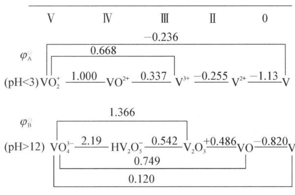

chemical

Electrochemical potential diagram for vanadium (V) and boron (B) under pH conditions, showing oxidation states and potentials at different potentials.

由上图可知,在强酸性介质中 V(Ⅳ)较稳定,V(V)具有中等强度的氧化性,V(Ⅲ)和 V(Ⅱ)的还原性较强,易被空气氧化为 V(Ⅳ):VO $^{2+}$ 。本讲主要介绍五氧化二钒、钒酸盐和多钒酸盐及不同价钛钒化合物的相互转化。

## (1) 五氧化二钒

$V_{2}O_{5}$ 是棕黄色固体,难溶于水(室温、溶解度为 $0.07\ g/100\ g\ H_{2}O$ ),水溶液显弱酸性。加热分解偏矾酸铵 $NH_{4}VO_{3}$ 可得到 $V_{2}O_{5}:2NH_{4}VO_{3}\xlongequal{873K}V_{2}O_{5}+2NH_{3}\uparrow+H_{2}O$ 。 $V_{2}O_{5}$ 是两性氧化物,以酸性为主,溶于强碱生成钒酸盐: $V_{2}O_{5}+6NaOH=2Na_{3}VO_{4}+3H_{2}O$ ,溶于强酸生成钒氧基 $VO_{2}^{+}$ 离子的盐 $V_{2}O_{5}+$

$$
\mathrm{H} _ {2} \mathrm{SO} _ {4} = (\mathrm{VO} _ {2}) _ {2} \mathrm{SO} _ {4} + \mathrm{H} _ {2} \mathrm{O} 。
$$

$V_{2}O_{5}$ 有一定的氧化性, 若将其溶于浓 HCl, 由于发生了氧化还原反应, 得到 $V(\mathrm{IV})$ 盐和 $Cl_{2}: V_{2}O_{5} + 6HCl = 2VOCl_{2} + Cl_{2} \uparrow + 3H_{2}O$ 。

## (2) 钒酸盐和多钒酸盐

钒酸盐和磷酸盐相似,都有缩合性,有正钒酸盐、焦钒酸盐、偏钒酸盐、多钒酸盐等。向钒酸盐溶液加酸,降低溶液的 $\mathrm{pH}$ ,使钒酸根离子质子化的同时发生脱水而进行缩合。随着 $\mathrm{pH}$ 的下降,多钒酸根中含钒原子越多,就是缩合度增大,其缩合平衡为: $\mathrm{VO}_{4}^{3-} + \mathrm{H}^{+} \rightleftharpoons [\mathrm{VO}_{3}(\mathrm{OH})]^{2-}$ ; $2[\mathrm{VO}_{3}(\mathrm{OH})]^{2-} + \mathrm{H}^{+} \rightleftharpoons [\mathrm{V}_{2}\mathrm{O}_{6}(\mathrm{OH})]^{3-} + \mathrm{H}_{2}\mathrm{O}(\mathrm{pH} \geqslant 13)$ ; $3[\mathrm{VO}_{3}(\mathrm{OH})]^{2-} + 3\mathrm{H}^{+} \rightleftharpoons \mathrm{V}_{3}\mathrm{O}_{9}^{3-} + 3\mathrm{H}_{2}\mathrm{O}(\mathrm{pH} \geqslant 8.4)$ ; $10\mathrm{V}_{3}\mathrm{O}_{9}^{3-} + 12\mathrm{H}^{+} \rightleftharpoons 3\mathrm{V}_{10}\mathrm{O}_{28}^{6-} + 6\mathrm{H}_{2}\mathrm{O}(3 < \mathrm{pH} < 8)$ 。 $\mathrm{VO}_{4}^{3-}$ 、 $\mathrm{V}_{2}\mathrm{O}_{6}(\mathrm{OH})^{3-}$ 是无色的,随着缩合度增大,溶液的颜色逐渐加深,由淡黄色变为深红色,溶液转变为酸性后,缩合度不变,而是获得质子的反应: $\mathrm{V}_{10}\mathrm{O}_{28}^{6-} + \mathrm{H}^{+} \rightleftharpoons [\mathrm{HV}_{10}\mathrm{O}_{28}]^{5-}, [\mathrm{HV}_{10}\mathrm{O}_{28}]^{5-} + \mathrm{H}^{+} \rightleftharpoons [\mathrm{H}_{2}\mathrm{V}_{10}\mathrm{O}_{28}]^{4-}$ 。 $\mathrm{pH} \approx 2$ 时,则有五氧化二钒水合物的红色沉淀析出,如果加足够的酸( $\mathrm{pH}=1$ ),溶液中存在稳定的黄色 $\mathrm{VO}_{2}^{+}$ 离子: $[\mathrm{H}_{2}\mathrm{V}_{10}\mathrm{O}_{28}]^{4-} + 14\mathrm{H}^{+} \rightleftharpoons 10\mathrm{VO}_{2}^{+} + 8\mathrm{H}_{2}\mathrm{O}(\mathrm{pH}=1)$ 。溶液中 $\mathrm{V}$ 的存在形式与 $\mathrm{V}$ 的总浓度和溶液的 $\mathrm{pH}$ 有关,见下图:

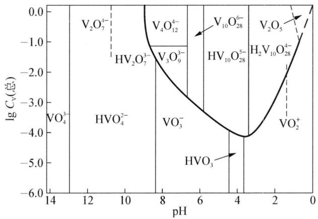

line chart

| pH  | IgCv(总) |
| --- | -------- |
| 12  | -1.0     |
| 10  | -2.0     |
| 8   | -3.0     |
| 6   | -4.0     |
| 4   | -5.0     |
| 2   | -3.0     |
| 0   | 0.0      |

由此可见，钒酸盐的缩合与磷酸盐不同：①缩合酸盐形成的条件不同。②钒的缩合酸盐有颜色。③从结构上看，缩合钒酸盐不仅与磷酸盐相同，有钒氧四面体共用角相连成链状，如偏钒酸铵结构与偏磷盐相似（如下图左），也有钒氧八面体共用棱边（倾斜棱边，水平棱边）组成的十钒酸根离子 $\mathrm{V}_{10}\mathrm{O}_{28}^{6-}$ （如下图右）：

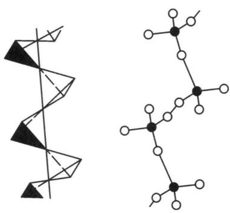

chemical

Two molecular structures: a zigzag chain and a branched chain with black and white atoms

偏钒酸铵中 $VO_{3}^{-}$ 离子结构

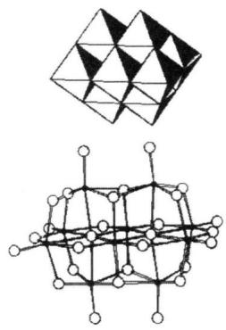

chemical

Two molecular structures: a triangular crystal lattice and a polyhedral network structure.

十钒酸根离子结构

(3) 不同价态钒化合物的相互转化

钒(V)是较强的氧化剂,能与许多还原剂反应,被还原的低价产物都有丰富多彩的颜色。例如: $\mathrm{VO}_{2}^{+}+\mathrm{Fe}^{2+}+2\mathrm{H}^{+}= \mathrm{VO}^{2+}$ (蓝色) $+\mathrm{Fe}^{3+}+\mathrm{H}_{2}\mathrm{O},\mathrm{VO}_{2}^{+}+2\mathrm{I}^{-}+4\mathrm{H}^{+}= \mathrm{V}^{3+}$ (绿色) $+\mathrm{I}_{2}+2\mathrm{H}_{2}\mathrm{O},2\mathrm{VO}_{2}^{+}+3\mathrm{Zn}+8\mathrm{H}^{+}=2\mathrm{V}^{2+}$ (紫色) $+3\mathrm{Zn}^{2+}+4\mathrm{H}_{2}\mathrm{O}$ 。其中与Zn的反应颜色由蓝→绿→紫,最终为紫色。由于还原剂强弱不同,V(V)被还原的产物是不同的;Zn还原性最强,能将V(V)还原为 $V^{2+}$ ,而 $Fe^{2+}$ 只能还原V(V)至 $VO^{2+}$ ,此反应用于容量法测定V; $I^{-}$ 只能将V(V)还原为 $V^{3+}$ 。

在低价钒的化合物中，V(Ⅳ)最稳定， $V^{3+}$ 不稳定， $V^{2+}$ 最不稳定，易被空气中氧气氧化，为强还原剂。如： $5V^{2+} + MnO_{4}^{-} + 8H^{+} = Mn^{2+} + 5V^{3+} + 4H_{2}O$ ， $5V^{3+} + MnO_{4}^{-} + H_{2}O = Mn^{2+} + 5VO^{2+} + 2H^{+}$ ， $5VO^{2+} + MnO_{4}^{-} + H_{2}O = Mn^{2+} + 5VO_{2}^{+} + 2H^{+}$ 。

在钒酸盐溶液中加 $H_{2}O_{2}$ ，若溶液是弱碱性、中性或弱酸性，得到黄色的二过氧钒酸离子 $\left[\mathrm{VO}_{2}\left(\mathrm{O}_{2}\right)_{2}\right]^{3-}$ ；若溶液是强酸性，得到红棕的过氧钒正离子 $\left[\mathrm{V}\left(\mathrm{O}_{2}\right)\right]^{3+}$ ，两者之间存在下列平衡： $\left[\mathrm{VO}_{2}\left(\mathrm{O}_{2}\right)_{2}\right]^{3-} + 6\mathrm{H}^{+} \rightleftharpoons \left[\mathrm{V}\left(\mathrm{O}_{2}\right)\right]^{3+} + \mathrm{H}_{2}\mathrm{O}_{2} + 2\mathrm{H}_{2}\mathrm{O}$ 。钒酸盐与过氧化氢的反应，在分析上可用作鉴定钒和比色测定之用。

## 3. 铌和钽

(1) 单质的性质与制备

铌、钽分别位于第二、第三过渡系的VB族。这两种金属的原子和离子半径基本相同，所以化学性质极相似。铌、钽都是钢灰色的金属，但略带蓝色。铌在一般温度下不与空气中的氧发生反应。有人把铌放在空气中搁置15年，放在浓、热硝酸里两个月，放在王水中六个月，基本没被腐蚀。钽对酸也有特殊的稳定性，是所有金属中最耐腐蚀的。钽不但不怕硝酸、盐酸和王水，即使加热到1200 K左右的高温，在熔融的钠、钾的金属中也不受腐蚀。铌、钽在冶金工业中有广泛的应用。

铌、钽的重要性质是具有吸收氧、氢、氮等气体的能力。以铌为例，在常温下，1克铌可吸收 $100 \, cm^{3}$ 氢气，这种性能在生产高真空度的电子管时大有用途。铌、钽都溶于氢氟酸中，特别溶在氢氟酸和硝酸的热混合液中，在熔融碱中被氧化为铌酸盐或钽酸盐。

铌、钽在自然界中共生,但比例不总是相同的。铌、钽的矿物可以通式 $\mathrm{Fe}(\mathrm{MO}_{3})_{2}$ 表示,若 M 以铌为主,称为铌铁矿;若 M 以钽为主,称为钽铁矿。铌、钽的提取过程可表示如下:

$$
\mathrm{矿石} + \mathrm{碱} \longrightarrow \mathrm{多铌(钽)酸盐} \longrightarrow \mathrm {Nb_ {2} O_ {5} (Ta_ {2} O_ {5})}
$$

以活泼金属或炭还原 $M_{2}O_{5}$ 或电解熔融的氟配合物 $K_{2}[TaF_{7}]$ 均可获得金属 Nb 和 Ta: $Ta_{2}O_{5}\xrightarrow{Na}Ta$ , $Nb_{2}O_{5}\xrightarrow[C]{C}Nb$ 。利用 $Nb_{2}O_{5}$ 和 $Ta_{2}O_{5}$ 溶于 $KF+HF$ 溶液时生成 $K_{2}[NbOF_{5}]$ 和 $K_{2}[TaF_{7}]$ 。前者的溶解度大于后者，可以分离出 $K_{2}[TaF_{7}]$ 。目前采用的分离方法是多级萃取法，萃取剂为甲基异丁基酮。

铌、钽对人的肌肉和细胞没有任何不良影响，而细胞却可在其上面生长发育，如用钽片可以弥补头盖骨的损伤，钽丝可以缝合神经和肌腱，钽条可代替骨头，它是亲生物金属，在医学上有重要作用。目前约有一半以上的钽用来生产大容量、小体积、高稳定性的固体电解电容器，工作温度范围大，使用寿命长，已广泛用于电子计算机、雷达、导弹、彩电等电子线路中。

## (2) 重要的化合物

铌和钽最稳定的氧化态为+5，它们的低氧化态不稳定。它们的元素电势图如下：

<table><tr><td colspan="4">铌、钽的元素电势图φ°/V</td></tr><tr><td></td><td>V</td><td>III</td><td>0</td></tr><tr><td>φ_A^Θ</td><td>Nb₂O₃-0.1
-0.65</td><td>Nb</td><td>-1.1
Nb</td></tr><tr><td></td><td colspan="2">Ta₂O₅-0.81</td><td>Ta</td></tr></table>

把铌(V)化合物放在酸溶液中,用锌还原,得到铌(Ⅲ))化合物的溶液,其中 $Nb^{3+}$ 离子呈蓝色,它容易被氧化。在同样条件下,钽不发生这种作用。

铌、钽有极大的耐腐蚀性，对酸有特殊稳定性，而 M(V) 化合物也是较稳定的。

①铌(V)和钽(V)含氧化合物

$Nb_{2}O_{5}$ 和 $Ta_{2}O_{5}$ 是重的白色粉末, 它们具有化学惰性。除浓氢氟酸外, 其他酸都不能侵蚀它们,但它们能和熔融碱金属硫酸氢盐、碱金属碳酸盐或苛性碱作用。它们是通过水合氧化物(所谓的“铌酸”和“钽酸”)脱水,或通过在过量氧气中灼烧其他某些化合物来制得。具有可变水量的水合氧化物是胶状白色沉淀,可由中和 $\mathrm{Nb(V)}$ 和 $\mathrm{Ta(V)}$ 的卤化物的酸性溶液得到。 $\mathrm{Ta}_{2}\mathrm{O}_{5}$ 和 $\mathrm{Nb}_{2}\mathrm{O}_{5}$ 不同,在加热时,它不被氯化氢或溴化氢所侵蚀,在真空中加热至红热会分解为 $\mathrm{Ta}$ 和 $\mathrm{O}_{2}$ 。当在氢气中加热还原 $\mathrm{Ta}_{2}\mathrm{O}_{5}$ 时,它不生成二氧化物,这也与 $\mathrm{Nb}_{2}\mathrm{O}_{5}$ 不同。 $\mathrm{Ta}_{2}\mathrm{O}_{5}$ 相能在 $\mathrm{Ta}_{2}\mathrm{O}_{2.0}$ 到 $\mathrm{Ta}_{2}\mathrm{O}_{2.5}$ 范围内作为间充物的多余 $\mathrm{Ta}$ 原子一同存在,因而它有金属导体性质。

将五氧化物与过量苛性碱或碱金属碳酸盐共熔，并将熔体溶于水，则得到同多铌酸根和同多钽酸根负离子。这些溶液仅在较高 $\mathrm{pH}$ 稳定，铌酸盐在 $\mathrm{pH} < 7$ 和钽酸盐在 $\mathrm{pH} < 10$ 时，就生成沉淀了。可以存在于溶液中的唯一物种是 $[\mathrm{H}_x\mathrm{M}_6\mathrm{O}_{19}]^{(8 - x) - }$ 离子（ $x = 0,1$ 或2）。

除少数不溶性镧系铌酸盐和钽酸盐,例如 $ScNbO_{4}$ (它含单个的,四面体 $MO_{4}^{3-}$ 离子)外, $Nb(V)$ 和 $Ta(V)$ 相同,氧的配位数基本上总是6。各种不同的“铌酸盐”和“钽酸盐”实际是混合氧化物。

②铌(V)与钽(V)的卤化物

铌和钽在加热时，同所有的卤素反应生成五卤化物。如将铌的氧化物同过量四氯化碳在隔绝空气条件下作用，即得 $NbCl_{5}$ （黄色固体）。五氯化铌在氧气氛中加热分解为氯氧化铌 $NbOCl_{3}$ ，它是白色丝光针状晶体，约在 673 K 时升华。易水解： $2\mathrm{NbOCl}_{3} + (n + 3)\mathrm{H}_{2}\mathrm{O} = \mathrm{Nb}_{2}\mathrm{O}_{5} \cdot n\mathrm{H}_{2}\mathrm{O} + 6\mathrm{HCl}$ 。三氯氧铌能生成两种类型配合物： $NbOCl_{3} + NaCl = NaNbOCl_{4}$ ， $NbOCl_{3} + 2NaCl = Na_{2}NbOCl_{5}$ 。

五氯化钽与五氯化铌不同，五氯化钽在氧气氛中加热不生成 $TaOCl_{3}$ ，此外五氯化钽没有生成配合物的倾向。五氯化钽被水分解时，直接生成钽酸凝胶 $Ta_{2}O_{5} \cdot nH_{2}O$ 。

铌(V)和钽(V)的氧化物与液态氟化氢作用生成 $NbF_{5}$ 和 $TaF_{5}$ 。与 $TaF_{5}$ 不同， $NbF_{5}$ 在弱酸溶液中(如 HF 浓度低于 7%时)会发生水解作用，而生成氧氟化物 $NbOF_{3}$ 和相应的铌氧氟氢酸 $H_{2}[NbOF_{5}]$ ，这两个氟化物形成配合物的倾向是铌和钽的卤化物中最大的，不仅五氟化铌可以根据氢氟酸的量和浓度的不同而生成铌氟酸盐 $M_{2}NbF_{7}$ 或氟氧铌酸盐 $M_{2}NbOF_{5}$ ，五氟化钽也可以生成 $M_{2}TaF_{7}$ 。 $K_{2}TaF_{7}$ 溶解度比 $M_{2}NbOF_{5} \cdot H_{2}O$ 溶解度小得多，此一性质的差异被应用于铌钽分离中。

## 典型例题

【例 1】4f 元素 $_{58}$ Ce 至 $_{71}$ Lu 及其化合物通常以三价正离子方式出现, 近年来, 发现它们有令人感兴趣的技术应用价值, 例如, 用于微电子学, 作催化剂、发光材料、磁性材料、高温超导体等等。因它们在化学性质上极其相似, 在自然界里是共生的, 其化学性质的递变可以部分地如同讨论周期系里所有元素那样借助于离子半径得以解释。4f 元素的个性对它们的彼此分离和实际使用具有重要意义。经常以氢氧化物沉淀从矿物里得到 4f 元素。

现有镧系元素(Ln)的硝酸盐溶液 $c_{\mathrm{Ln}(\mathrm{NO}_{3})_{2}} = 0.1 \, \mathrm{mol/L}$ ，298 K 下各镧系离子的沉淀 pH 如下：

<table><tr><td>Ln</td><td> $_{58}Ce$ </td><td> $_{60}Nd$ </td><td> $_{65}Tb$ </td><td> $_{69}Tm$ </td><td> $_{70}Yb$ </td></tr><tr><td>pH $_F$ </td><td>7.10</td><td>6.78</td><td>6.47</td><td>5.98</td><td>5.87</td></tr></table>

沉淀 pH 与离子半径之间有如下线性关系: $r_{\mathrm{Ln}^{3+}} = 2.32 + 14.13 \mathrm{pH}_{\mathrm{F}} (r_{\mathrm{Ln}^{3+}}$ 以 pm 为单位)

(1) 任选三个例子计算镧系元素氢氧化物的溶度积,说明镧系的溶度积的递变情况。  
(2) 用上面的关系式计算 $\mathrm{Tb}^{3+}$ 、 $\mathrm{Tm}^{3+}$ 和 $\mathrm{Yb}^{3+}$ 的离子半径, 镧系元素离子半径的递变情况如何? 由此对其氢氧化物的碱性递变产生什么影响。  
(3) 已知氢氧化钇(粒子 $_{39}$ Y, 第三副族元素)的沉淀 pH 为 6.16, 试用上式计算 Y $^{3+}$ 的离子半径, 它可在镧系里安插到何处? 解释之。  
(4) 元素铪 $_{72}$ Hf, 1923 年才由考斯特(D. Coster)和海维西(G. Hevesy)发现, 这一事实和第 2 小题确定的镧系元素的离子半径随原子序数的递变有何关系?

解析 (1) $K_{\mathrm{sp}}[\mathrm{Ce(OH)}_3] = [\mathrm{Ce}^{3+}][\mathrm{OH}^-]^3 = 2.00 \times 10^{-22}$ , $K_{\mathrm{sp}}[\mathrm{Nd(OH)}_3] = [\mathrm{Nd}^{3+}][\mathrm{OH}^-]^3 = 2.19 \times 10^{-23}$ , $K_{\mathrm{sp}}[\mathrm{Tb(OH)}_3] = [\mathrm{Tb}^{3+}][\mathrm{OH}^-]^3 = 2.57 \times 10^{-24}$ 。由计算结果知，随着原子序数递增，溶度积依次减小。

(2) $r_{\mathrm{Tb}^{3+}} = 97.3 \, \mathrm{pm}, r_{\mathrm{Tm}^{3+}} = 86.8 \, \mathrm{pm}, r_{\mathrm{Yb}^{3+}} = 85.3 \, \mathrm{pm}$ 。由此可知，半径 $r_{\mathrm{Ln}^{3+}}$ 随原子序数递增而减小（即镧系收缩），因而它们氢氧化物碱性越来越小。  
(3) $r_{Y^{3+}} = 89.4 \, \text{pm}$ 。由于其半径界于 $\mathrm{Tb}^{3+}$ 与 $\mathrm{Tm}^{3+}$ 之间，应安插在 $\mathrm{Tb}$ 与 $\mathrm{Tm}$ 之间。  
(4) 镧系收缩补偿了由于电子层数增加对离子半径的影响,使第六周期的元

素 Hf 和第五周期的元素 Zr 的离子半径极为相近,从而使锆与铪分离十分困难,这是铪很晚发现的原因,实际上铪在自然界里以杂质形式存在于锆英石等锆的矿物中,它因与锆的离子半径相近,化学性质相近而难以检出。

【例 2】 $TiO_{2}$ 导电粉无毒, 具有良好的导电性和稳定性, 是良好的抗静电剂和电磁屏蔽剂。高温下 $TiO_{2}$ 将部分失去氧, 形成缺陷中心, 匀速通入氨气进行高浓度 N 掺杂, N 进入 $TiO_{2}$ 晶格取代 O 原子而释放出空穴, 从而使导电性能显著提高。实验测得, 在 $950^{\circ}C$ 焙烧 3 h 后, 形成的 $TiN_{x}O_{y}$ 晶体 (以 A 表示) 中, N 质量分数为 7.90%, 平均粒径约为 240 nm, 电阻率低达 $6.5 \times 10^{-3} \Omega \cdot cm$ 。

(1) 通过计算, 确定 A 的化学式。  
(2) 写出制备 A 的化学方程式。  
(3) 计算 A 中空穴占金红石晶格的原子分数。  
（4）已知金红石属于四方晶系，晶胞参数： $a=459\ pm,\ c=296\ pm,\ z=2$ 。假设在掺杂过程中晶胞参数没有明显变化，计算A的比表面积(BET，单位： $m^{2}/g$ )。

解析 （1）根据氧化数之和为零，列出方程： $3x + 2y = 4$ 。根据 N 质量分数为 7.9%，列出方程： $14.01x/(47.87 + 14.01x + 16.00y) = 7.9\%$ 。联立方程组，解之得：x = 0.426, y = 1.36。故 A 的化学式为 $TiN_{0.426}O_{1.36}$ 。

(2) $\mathrm{TiO_2 + 0.426NH_3 = TiN_{0.426}O_{1.36} + 0.64H_2O}$

(3) $(2-0.426-1.36)/2\times100\%=10.7\%$

(4) $\rho = 2 \times (47.87 + 0.426 \times 14.01 + 1.36 \times 16.00) / [6.022 \times 10^{23} \times (4.59 \times 10^{-8})^2 \times 2.96 \times 10^{-8}] = 4.03 \mathrm{~g/cm^3}$ 。又粒径为 $240 \mathrm{~nm}$ ，则半径为 $120 \mathrm{~nm} = 1.20 \times 10^{-7} \mathrm{~m} = 1.20 \times 10^{-5} \mathrm{~cm}, V = 4/3 \times \pi \times (1.20 \times 10^{-5} \mathrm{~cm})^3 = 7.238 \times 10^{-15} \mathrm{~cm}^3, S = 4 \times \pi \times (1.20 \times 10^{-7} \mathrm{~m})^2 = 1.810 \times 10^{-13} \mathrm{~m}^2$ ，可得 $\mathrm{BET} = 1.810 \times 10^{-13} \mathrm{~m}^2 / (4.03 \mathrm{~g/cm^3} \times 7.238 \times 10^{-15} \mathrm{~cm}^3) = 6.21 \mathrm{~m}^2/\mathrm{g}$ 。

【例 3】钒的定量分析：称取 2.00 g 的铬钒样品，经酸溶后：

① 用 $\left(\mathrm{NH}_{4}\right)_{2}\mathrm{S}_{2}\mathrm{O}_{8}\left(\mathrm{Ag}^{+}\right.$ 作催化剂)氧化 $Cr^{3+}$ 和 $VO^{2+}$ 成为 $Cr_{2}O_{7}^{2-}$ 和 $VO_{4}^{3-}$ 离子；  
② 氧化完毕后,在溶液中加入 25.0 mL 浓度为 $0.050 \, 50 \, mol \cdot L^{-1}$ 的 $FeSO_{4}$ 溶液与之反应;  
③ 然后用浓度为 0.0560 mol/L 的 $KMnO_{4}$ 溶液滴定, 共耗去 12.0 mL, 此 $KMnO_{4}$ 用于氧化 $VO^{2+}$ 离子和过量的 $FeSO_{4}$ ;  
④ 氧化后加入不计量的 $FeSO_{4}$ ，用以还原 $VO^{2+}$ ，然后用 $(\mathrm{NH}_{4})_{2}\mathrm{S}_{2}\mathrm{O}_{8}$ （不加 $Ag^{+}$ ）氧化掉过量的 $FeSO_{4}$ ，此时 $Cr^{3+}$ 、 $VO^{2+}$ 因无催化剂而均不被氧化，然后用上

述浓度的 $\mathrm{KMnO}_4$ 滴定溶液中的 $\mathrm{VO}^{2+}$ 离子, 共耗 $0.90 \mathrm{~mL}$ 。

(1) 写出四步操作的反应方程式。

(2) 计算钢样中钒、铬的百分含量。

解析 (1) 各步操作的反应方程式:

$$
① 2 \mathrm{Cr} ^ {3 +} + 3 \mathrm{S} _ {2} \mathrm{O} _ {8} ^ {2 -} + 7 \mathrm{H} _ {2} \mathrm{O} = \mathrm{Cr} _ {2} \mathrm{O} _ {7} ^ {2 -} + 6 \mathrm{SO} _ {4} ^ {2 -} + 1 4 \mathrm{H} ^ {+}
$$

$$
2 \mathrm{VO} ^ {2 +} + \mathrm{S} _ {2} \mathrm{O} _ {8} ^ {2 -} + 6 \mathrm{H} _ {2} \mathrm{O} = 2 \mathrm{VO} _ {4} ^ {3 -} + 2 \mathrm{SO} _ {4} ^ {2 -} + 1 2 \mathrm{H} ^ {+}
$$

$$
② \mathrm{Cr} _ {2} \mathrm{O} _ {7} ^ {2 -} + 6 \mathrm{Fe} ^ {2 +} + 1 4 \mathrm{H} ^ {+} = 2 \mathrm{Cr} ^ {3 +} + 6 \mathrm{Fe} ^ {3 +} + 7 \mathrm{H} _ {2} \mathrm{O}
$$

$$
\mathrm{VO} _ {4} ^ {3 -} + \mathrm{Fe} ^ {2 +} + 6 \mathrm{H} ^ {+} = \mathrm{VO} ^ {2 +} + \mathrm{Fe} ^ {3 +} + 3 \mathrm{H} _ {2} \mathrm{O}
$$

$$
③ \mathrm{MnO} _ {4} ^ {-} + 5 \mathrm{Fe} ^ {2 +} + 8 \mathrm{H} ^ {+} = 5 \mathrm{Fe} ^ {3 +} + \mathrm{Mn} ^ {2 +} + 4 \mathrm{H} _ {2} \mathrm{O}
$$

$$
5 \mathrm{VO} ^ {2 +} + \mathrm{MnO} _ {4} ^ {-} + 1 1 \mathrm{H} _ {2} \mathrm{O} = 5 \mathrm{VO} _ {4} ^ {3 -} + \mathrm{Mn} ^ {2 +} + 2 2 \mathrm{H} ^ {+}
$$

$$
④ 2 \mathrm{Fe} ^ {2 +} + \mathrm{S} _ {2} \mathrm{O} _ {8} ^ {2 -} = 2 \mathrm{Fe} ^ {3 +} + 2 \mathrm{SO} _ {4} ^ {2 -}
$$

(2) $\mathrm{FeSO_4}$ 的量/mol=25.0×0.0505mol/1000=1.26×10-3mol

第一次用去 $\mathrm{KMnO_4}$ 的量 $/ \mathrm{mol} = 12.0\times 0.0560\mathrm{mol} / 1000 = 6.72\times 10^{-4}\mathrm{mol}$

$$
\mathrm{Fe} ^ {2 +}: \mathrm{MnO} _ {4} ^ {-} = 1: 1 / 5 = 5: 1 = \mathrm{VO} ^ {2 +}: \mathrm{MnO} _ {4} ^ {-}
$$

设 $\mathrm{FeSO_4}$ 一部分用来还原 $\mathrm{Cr_2O_7^{2 - }}$ ，为 $X\mathrm{mol}$ ，另一部分还原 $\mathrm{VO}_4^{3 - }$ ，为 $Y\mathrm{mol}$ ，则剩余的 $\mathrm{FeSO_4}$ 为 $Z\mathrm{mol}$ ，有 $X + Y + Z = 1.26\times 10^{-3}\mathrm{mol}(\mathrm{I}),5(Y + Z) = 6.72\times$ $10^{-4}\mathrm{mol}(\mathrm{II})$ 。第二次用去 $\mathrm{KMnO_4}$ 的物质的量 $= 0.90\mathrm{mol}\times 0.0560\mathrm{mol / L}\div$ $1000\mathrm{mol / mL} = 5.04\times 10^{-5}\mathrm{mol} = 5Y$ ，可知 $Y = 1.008\times 10^{-5}\mathrm{mol}$ ，于是钒的百分量 $= 1.008\times 10^{-5}\times 50.94\times 100\% /2.00 = 0.026\%$

由(Ⅱ)知 $Z=6.72\times10^{-4}\ mol/5-1.008\times10^{-5}\ mol=1.24\times10^{-4}\ mol$ ，由(Ⅰ)知 $X=1.26\times10^{-3}\ mol-1.24\times10^{-4}\ mol-1.008\times10^{-5}\ mol=1.126\times10^{-3}\ mol$ 。由 $n(\mathrm{Cr}_{2}\mathrm{O}_{7}^{2-}):n(\mathrm{Fe}^{2+})=1:6$ 推出 $n(\mathrm{Cr}^{3+}):n(\mathrm{Fe}^{2+})=1:3$ ，可得铬的百分含量 $=(1.126\times10^{-3}\div3)\times52\times100\%/2.00=0.98\%$ 。

## 本讲习题

1. 钛有未来金属之称,具有超众的性能和储藏量大的特点,应用在飞机、火箭、导弹、人造卫星、宇宙飞船、军工、轻工、化工、纺织、医疗以及石油化工等领域。钛酸亚铁 $FeTiO_{3}$ 是一种天然存在矿物,是重要的钛资源之一。

(1) 利用金属钛对空气的强大吸收力, 几乎可以形成真空。写出钛加热时吸收空气的反应方程式: \_\_\_\_ ; 上述产物中的一种外观酷似黄金, 但比黄金耐磨, 镀在工艺品外, 保持其灿烂金光, 它的化学式为: \_\_\_\_ 。

(2) 钛白的化学制法有两种: 一种是用干燥的氧气在 $923 \mathrm{~K} \sim 1023 \mathrm{~K}$ 时对 $\mathrm{TiCl}_{2}$ 进行氧化, 其反应方程式: ; 其二是硫酸法, 首先使磨细的钛铁矿用浓硫酸在不断通入空气搅拌的条件下进行反应, 制得可溶性二水合硫酸氧盐, 其反应方程式: ; 趁热过滤, 所得滤液叫钛液, 加热钛液, 促进水解, 制得一水合二氧化钛沉淀。其水解反应方程式: ; 把水合氧化钛在 $1173 \mathrm{~K} \sim 1223 \mathrm{~K}$ 煅烧即得钛白。

(3) 钛白在自然界中以金红石矿存在。目前大规模生产钛的方法是: 首先将金红石、炭粉混合, 在高温条件下通入氯气制得 $\mathrm{TiCl}_{4}$ , 其反应方程式为: \_\_\_\_ ; 第二是氮气氛围中用过量的镁在加热条件下与 $\mathrm{TiCl}_{4}$ 反应制得金属钛, 此步反应方程式: \_\_\_\_ ; 如何从上述所得产物中获得纯净金属钛? 简述主要步骤: \_\_\_\_ 。

2. 铌(Nb)是钢灰色的金属,具有很强的耐腐蚀性,在冶金工业上有广泛应用。

(1) 铌的元素符号是 41, 写出它的核外电子排布式, 并指出它在元素周期表中的位置。

(2) 将 $Nb_{2}O_{5}$ 与苛性钾共熔后, 可以生成溶于水的铌酸钾, 将其慢慢浓缩可以得到晶体 $K_{p}[Nb_{m}O_{n}] \cdot 16H_{2}O$ , 同时发现在晶体中存在 $[Nb_{m}O_{n}]^{p-}$ 离子。该离子结构由 6 个 $NbO_{6}$ 正八面体构成。每个 $NbO_{6}$ 八面体中的 6 个氧原子排布如下: 4 个氧原子分别与 4 个 $NbO_{6}$ 八面体共顶点; 第 5 个氧原子与 5 个八面体共享一个顶点; 第 6 个氧原子单独属于这个八面体。列式计算并确定该晶体的化学式。计算该离子结构中距离最大的氧原子间的距离是距离最短的铌原子间距离的多少倍?

（3）晶体 $\left[Nb_{6}Cl_{12}\right]SO_{4}\cdot7H_{2}O$ 中正离子 $\left[Nb_{6}Cl_{12}\right]^{2+}$ 的结构为：6个金属原子构成八面体骨架，每个卤离子形成双桥基位于八面体的每条棱边上。借助右边的立方体，画出氯离子在空间的排布情况（用“·”表示）。另有一种含卤离子 $\left[Nb_{6}I_{x}\right]^{y+}$ ，

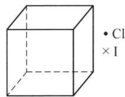

text_image

• Cl
× I

6个Nb原子形成八面体骨架结构,碘原子以三桥基与与Nb原子相连。确定x的值,并也在右图上画出I原子的空间分布情况(用“×”表示)。x=

(4) Nb 金属的晶格类型为体心立方晶格, 原子半径为 143 pm, 相对原子质量为 92.9。试计算该晶体铌的密度。 $\rho=$ \_\_\_\_

(5) 据最新报导,我国化学家将分子比为 6:1:5 的分析纯 $K_{2}CO_{3}$ 、 $Fe_{2}O_{3}$ 、 $Nb_{2}O_{5}$ 混合研磨强热,通过一系列反应后得到一种新铌酸盐,写出该盐的化学式。

3. X 是由瑞典化学家塞夫斯特姆在一种铁矿中发现的一个新元素, 它是多价态元素 (由 +2 至 +5), 以 +5 价最稳定, 各种氧化态的化合物都有美丽的颜色, 五彩缤纷。X 是银灰色的金属, 纯金属具有延展性, 不纯时硬而脆, 有高的熔点, 是难熔金属。X 容易呈钝态, 因此在常温下活泼性较低; 耐盐酸、碱、氯、盐腐蚀的性能比不锈钢强, 但不耐硝酸、硫酸、氢氟酸、王水的腐蚀; 高温下能与大多数非金属化合, 一般生成非化学计量的化合物。X 在现代化工业和国防技术中有着广泛而重要的用途, 我国四川攀枝花地区蕴藏着世界上少有的极为丰富的矿藏, 为我国四化建设提供了优厚的物质条件。

(1) X 的元素符号是\_\_\_\_, 基态电子构型是\_\_\_\_。  
(2) X 的最高价氧化物是棕黄色固体, 难溶于水, 是化学工业中重要的催化剂, 可以由它的一种含氧酸的铵盐加热分解得到, 生成氨气的物质的量和铵盐相等, 请写出制备该氧化物的化学反应方程式。  
(3) X 的最高价氧化物是两性氧化物, 以酸性为主, 溶于强碱 (如氢氧化钠) 生成最高价含氧酸盐; 溶于强酸 (如硫酸) 生成氧基离子形式的盐。请写出化学方程式; 它有一定的氧化性, 若将其溶于浓盐酸, 会发生氧化还原反应, $1 \mathrm{~mol}$ 该氧化物完全反应, 转移电子 $2 \mathrm{~mol}$ 。  
(4) 第 3 问中与硫酸反应得到的产物正离子有较强的氧化性, 能与许多还原剂反应, 被还原的低价产物都有丰富多彩的颜色。比如和 $\mathrm{Fe}^{2+}$ 、 $\mathrm{I}^{-}$ 、 $\mathrm{Zn}$ 三种物质在酸性条件下反应, 由于还原剂强弱不同, 反应产物 (溶液) 颜色由蓝 $\rightarrow$ 绿 $\rightarrow$ 紫, 请分别写出反应离子方程式。  
（5）如果 $10.00 \, g \, X$ 的最高价氧化物在酸中溶解并被 Zn 还原成紫色产物，那么加入多少摩尔 $I_{2}$ 可将紫色变成蓝色？  
(6) 将 X 的最高价含氧酸的铵盐溶液置于热的草酸铵和草酸溶液中, 能制得蓝色络合物晶体, 应用下述实验结果, 先写出可能发生的离子反应方程式, 再计算求其化学式 $\left(\mathrm{NH}_{4}\right)_{a}\mathrm{XO}\left(\mathrm{C}_{2}\mathrm{O}_{4}\right)_{b} \cdot 2\mathrm{H}_{2}\mathrm{O}$ 中的 a 和 b 值。

称取蓝色络合物 237.4 mg, 溶解在过量的热的稀硫酸中, 用 0.0194 mol/L 的 KMnO $_{4}$ 溶液滴定, 需要 38.95 mL。当再加少量亚硫酸钠晶体于此溶液中, 加热, 溶液又变成蓝色。使溶液沸腾, 以除去过量的 SO $_{2}$ , 然后冷却。再用 0.0194 mol/L 的 KMnO $_{4}$ 溶液滴定, 只需要 7.8 mL。

4. (1) 化合物 A 为无色液体, A 在潮湿的空气中冒白烟。取 A 的水溶液加入 $\mathrm{AgNO}_{3}$ 溶液则有不溶于硝酸的白色沉淀 B 生成, B 易溶于氨水。取锌粒投入 A 的盐酸溶液中, 最终得到紫色溶液 C。向 C 中加入 NaOH 溶液至碱性则有紫色沉淀 D 生成。将 D 洗净后置于稀硝酸中得到无色溶液 E。将溶液 E 加热得到白色沉淀 F。

① 确定各字母所代表的物质。

② 请解释 A 在潮湿的空气中冒白烟的原因。

(2) 固体材料的制备中, 常遇到缺陷和非整比 (非化学计量) 的化合物, $\mathrm{Na}_{1-x+y}\mathrm{Ca}_{x/2}\mathrm{LaTiO}_{4}$ 就是非整比化合物, 也是一类新的高温超导体。它的制备方法如下: 用 $\mathrm{NaLaTiO}_{4}(\mathrm{I})$ 作为母体化合物, 和无水 $\mathrm{Ca(NO_{3})_{2}}$ 混合, 封闭在耐热玻管中, 加热到 $350^{\circ}\mathrm{C}$ , 维持 3 天, 然后打开, 取出样品, 用水冲洗, 直到没有杂质 (用 X 射线衍射证实)。得到 $\mathrm{Ca}^{2+}$ 交换产物, 记为 $\mathrm{Na}_{1-x}\mathrm{Ca}_{x/2}\mathrm{LaTiO}_{4}(\mathrm{II})$ , 光谱实验证明, 上述过程中 (I) 有 $86\%$ 的 Na 被交换, 所以产生离子空位 (即部分原本 $\mathrm{Na}^{+}$ 的位置空置了)。将样品 (II) 放入 $300^{\circ}\mathrm{C}$ 下的钠蒸气中, 经历数天, 该物质由白色渐变为黑色, 这是 $\mathrm{Na}^{+}$ 插入空位所致, 光谱实验证明, 有 $88\%$ 的离子空位被 $\mathrm{Na}^{+}$ 插入了, 生成目标化合物 $\mathrm{Na}_{1-x+y}\mathrm{Ca}_{x/2}\mathrm{LaTiO}_{4}(\mathrm{III})$ 。

① 制备时,为何选用 $\mathrm{Ca(NO_{3})_{2}}$ 而不用其他钙盐?

② 产物(Ⅲ)中 x 和 y 分别是多少?

③ 当化合物(Ⅱ)中的离子空位被 $Na^{+}$ 插入时,为保持晶体的电中性,部分 Ti 的化合价发生了改变,求化合物(Ⅲ)中高、低价态钛离子的个数比为何?

5. 钒酸根在溶液中以多种离子形式存在, 如 $VO_{4}^{3-}$ 、 $V_{2}O_{7}^{4-}$ 、 $V_{3}O_{10}^{5-}$ 、 $VO_{2}^{+}$ 等, pH 决定着其主要以什么形式存在。

(1) 你认为 pH 越小,哪种离子越多? pH 越大,哪种离子越多?

(2) 画出 $VO_{4}^{3-}$ 、 $V_{2}O_{7}^{4-}$ 、 $V_{3}O_{10}^{5-}$ 离子的结构图。

(3) 某同学在研究金属钒晶体时, 以 1 个金属原子为中心, 考查其他原子与它的距离。已知该晶体属于立方晶系, 与该金属原子最近的原子核间距离为 $262.0 \mathrm{pm}$ , 次近距离为 $302.5 \mathrm{pm}$ 。请计算能放入金属钒晶体空隙中的最大原子半径。

(4) 某些金属或非金属在杂化材料中主要采用四面体构型, 如图 1 表示, 端位原子位于正四面体的顶点, 中心原子位于正四面体的体心 (俯视图中被端位原子挡住)。图 2 至图 5 中, 这些多面体通过共角、共边及共面堆积成不同的构筑块, 为杂化材料提供无机负离子骨架。

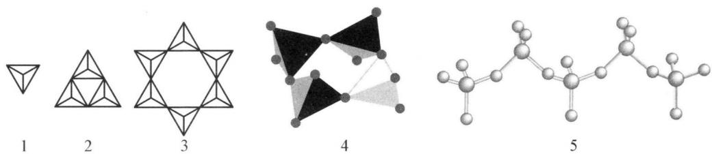

chemical

Five molecular structures labeled 1 to 5, including polyhedral, star-shaped, tetrahedral, and organic forms.

① 图 3 是绿柱石的硅氧四面体形成的负离子骨架, 绿柱石是铍、铝的硅酸复盐。写出绿柱石溶解于过量 NaOH 溶液的离子方程式。  
② 图 4 是锰、钒与氧、氟形成的四面体的电中性四元环, 其中锰(Ⅳ)、钒(Ⅴ)个数比为 1:3。1 个乙二胺分子可以通过形成多点氢键嵌入其中, 写出该嵌合物的化学式。  
③ 图 5 是钒氧四面体的单链。十钒酸簇的负离子是钒(V)氧四面体的无支链单链, 写出其钾盐的化学式。

6. (1) 测定钒含量的方法是先将其转化成 $\mathrm{V}_{2} \mathrm{O}_{5}$ , 然后用 2 种方法进行测定: ①在酸性溶液里与草酸反应, 再用 $\mathrm{KMnO}_{4} / \mathrm{H}^{+}$ 溶液滴定; ②在酸性溶液里与 KI 反应, 再用 $\mathrm{Na}_{2} \mathrm{~S}_{2} \mathrm{O}_{3}$ 溶液滴定。已知上述 2 种 $\mathrm{V}_{2} \mathrm{O}_{5}$ 的还原产物中 V 的价态相同, 且其离子只带一个单位正电荷。

① 写出上述反应方程式。

② 在 2 种滴定方案中, 草酸或 KI 的用量是否需要定量, 为什么?

(2) 金属钒的某种缺氧(V与O非整比)氧化物组成为 $\mathrm{V}_{2}\mathrm{O}_{(5-n)}(n<0.2)$ 。取2.648 g这种样品溶于 $H_{2}SO_{4}$ 后用0.100 mol/L的 $\mathrm{Ce(ClO_{4})_{4}}$ 滴定 $(\mathrm{Ce}^{4+}\rightarrow\mathrm{Ce}^{3+})$ ，耗41.3 mL，给出此氧化物的组成。

7. (1) 制造钛白过程中, 需要测定钛白 Ti(IV) 的含量。测定时首先取 10 mL 钛液用水冲稀 10 倍, 加过量铝粉, 充分振荡, 使其完全反应, Ti(IV) + Al ——Ti $^{3+}$ + Al $^{3+}$ 。过滤后, 取出滤液 20 mL, 向其中滴加 2\~3 滴 KSCN 溶液, 再加 5 mL 蒸馏水振荡, 用酸式滴定管滴加 0.1 mol/L FeCl $_{3}$ 溶液, 终点到来时, 用去了 30 mL 的 FeCl $_{3}$ 溶液。求原钛液的物质的量浓度。

（2）为分析硅酸岩中铁、铝、钛含量，称取试样 0.6050 g。除去 $SiO_{2}$ 后，用氨水沉淀铁、铝、钛为氢氧化物沉淀。沉淀灼烧为氧化物后重 0.4120 g；再将沉淀用 $K_{2}S_{2}O_{7}$ 熔融，浸取液定容于 100 mL 容量瓶，移取 25.00 mL 试液通过锌汞还原器，此时 $Fe^{3+} \rightarrow Fe^{2+}$ ， $Ti^{4+} \rightarrow Ti^{3+}$ ，还原液流入 $Fe^{3+}$ 溶液中。滴定时消耗了 0.01388 mol/L 的 $K_{2}Cr_{2}O_{7}$ 10.05 mL；另移取 25.00 mL 试液用 $SnCl_{2}$ 还原 $Fe^{3+}$ 后，再用上述 $K_{2}Cr_{2}O_{7}$ 溶液滴定，消耗了 8.02 mL。计算试样中 $Fe_{2}O_{3}$ 、 $Al_{2}O_{3}$ 、 $TiO_{2}$ 的质量分数。

## 第七讲 铬分族元素

## 知识精讲

## 一、概述

铬(Chromium)、钼(Molybdenum)、钨(Tungsten)同属VIB族元素,它们在地壳中的丰度分别是:铬0.0083%,钼1.1×10 $^{-4}$ % ,钨1.3×10 $^{-4}$ % 。

铬铁矿 $\left(\mathrm{FeCr}_{2}\mathrm{O}_{4}\right)$ 是铬在自然界的主要矿物。钼常以硫化物存在，如辉钼矿 $\left(\mathrm{MoS}_{2}\right)$ 。我国的钼矿和钨矿储量都很丰富，重要的钨矿有：黑色的钨锰矿 $\left(\mathrm{Fe},\mathrm{Mn}\right)\mathrm{WO}_{4}$ ，又称黑钨矿；黄灰色的钨酸钙矿 $CaWO_{4}$ ，又称白钨矿。

铬是 1797 年法国化学家沃克兰(Vauquelin L N)在分析铬铅矿时首先发现的,因为它的化合物都有美丽的颜色而得名。由于辉钼矿和石墨在外表上相似,是一种黑色柔软的矿物,因而在很长时间内被认为是同一物质。直到 1778 年瑞典化学家舍勒(Scheele K W)用硝酸分解辉钼矿时发现有白色的三氧化钼生成,这种错误才得到纠正。舍勒于 1781 年又发现了钨。

铬和钼的价电子层结构为 $(n-1)\mathrm{d}^{5}\mathrm{ns}^{1}$ ，钨为 $5d^{4}6s^{2}$ ，均可提供6个价电子形成较强的金属键，它们的最高氧化态为+6，都具有d区元素多种氧化态的特征。它们的最高氧化态的稳定性按Cr、Mo、W的顺序增强，而低氧化态则相反。即Cr有稳定的低氧化态 $(+3)$ 的化合物，而Mo和W以高氧化态 $(+6)$ 的化合物最稳定。

铬是银白色有光泽的金属,纯铬具有延展性,含有杂质的铬硬而且脆。块状钼和钨是银白色的,且有金属光泽,粉末状的钼和钨是深灰色的。由于铬副族元素可提供6个电子,形成较强的金属键,因此,单质的熔点和沸点都非常高。钨的熔点和沸点是所有金属中最高的。

## 二、铬

## 1. 铬单质

铬,银白色,由于成单电子数多,金属键强,故硬度及熔沸点均高,铬是硬度最高的过渡金属,因此广泛用作电镀保护层。

由标准电极电势 $\varphi^{\ominus}\left(\mathrm{Cr}^{3+}/\mathrm{Cr}\right)=-0.74\mathrm{V},\varphi^{\ominus}\left(\mathrm{Cr}^{2+}/\mathrm{Cr}\right)=-0.91\mathrm{V}$ 可以看出铬比较活泼，但由于表面可以在空气中迅速钝化，常温下 Cr 不活泼，不溶于硝酸及王水。

铬能缓慢地溶于稀盐酸和稀硫酸中，先有 $\mathrm{Cr(II)}$ 生成， $\mathrm{Cr(II)}$ 在空气中迅速被氧化成 $\mathrm{Cr(III)}$ ： $\mathrm{Cr + 2HCl = CrCl_2}$ （蓝色） $+\mathrm{H}_2\uparrow$ ， $4\mathrm{CrCl}_2 + 4\mathrm{HCl} + \mathrm{O}_2 = 4\mathrm{CrCl}_3$ （绿色） $+2\mathrm{H}_2\mathrm{O}$ 。

铬在硝酸、磷酸或 $HClO_{4}$ 中是惰性的, 这是由于生成氧化物保护层而钝化, 它不和碱作用, 高温下, 铬和卤素、硫、氮等非金属直接反应生成相应的化合物。

高温时铬活泼, 和 $X_{2}$ 、 $O_{2}$ 、S、C、 $N_{2}$ 直接化合, 一般生成 Cr(Ⅲ) 化合物。高温时也和酸反应, 熔融时也可以和碱反应。

铬的主要氧化态是+6、+3、+2，铬(Ⅲ)是最稳定的，铬(Ⅱ)、铬(Ⅵ)化合物相对不稳定，铬(Ⅵ)是强氧化剂，铬(Ⅱ)是强还原剂。以下列出铬元素电势图：

$$
\begin{array}{l l} & \text {VI} \\ \varphi_ {\mathrm{A}} ^ {2 -} & \mathrm{Cr} _ {2} \mathrm{O} _ {7} ^ {2 -} \xrightarrow {1 . 3 8} \mathrm{Cr} ^ {3 +} \xrightarrow {- 0 . 4 2 4} \mathrm{Cr} ^ {2 +} \xrightarrow {- 0 . 9 0} \mathrm{Cr} \\ & \text {Cr(OH)} _ {3} ^ {- 1. 3 3} \\ \varphi_ {\mathrm{B}} ^ {2 -} & \mathrm{CrO} _ {4} ^ {2 -} \xrightarrow {- 0 . 1 1} \mathrm{Cr(OH)} _ {3} ^ {- 1. 3 3} \\ & \text {Cr(OH)} _ {4} ^ {- 1. 3 3} \end{array}
$$

## 2. $\mathrm{{Cr}}\left( \mathrm{{III}}\right)$ 的性质

## (1) Cr(Ⅲ)的特性

铬的+3氧化态是最常见的,它在水溶液中是最稳定的,具有 $3d^{3}$ 电子的 $Cr^{3+}$ 离子能形成许许多多配合物,一般型式为 $\left[CrX_{6}\right]$ 的八面体配合物,它们通常有颜色,而且在动力学上是惰性的,即X被其他配位体取代的速度是非常慢的,因此许多这样的配合物已被分离出来。

六水合铬(Ⅲ)离子 $\left[\mathrm{Cr}\left(\mathrm{H}_{2}\mathrm{O}\right)_{6}\right]^{3+}$ 是正八面体,存在于水溶液和许多盐中,如紫色的水合物 $\left[\mathrm{Cr}\left(\mathrm{H}_{2}\mathrm{O}\right)_{6}\right]\mathrm{Cl}_{3}$ 及多种矾 $\mathrm{M}^{\mathrm{I}}\mathrm{Cr}^{\mathrm{III}}\left(\mathrm{SO}_{4}\right)_{2}\cdot12\mathrm{H}_{2}\mathrm{O}$ 中。氯化物有三种水合异物体,其他两种,一种为深绿色的 $\left[\mathrm{CrCl}_{2}\left(\mathrm{H}_{2}\mathrm{O}\right)_{4}\right]\mathrm{Cl}\cdot2\mathrm{H}_{2}\mathrm{O}$ ,它是普通市售的试剂 $\mathrm{CrCl}_{3}\cdot6\mathrm{H}_{2}\mathrm{O}$ ,另一种为浅绿色的 $\left[\mathrm{CrCl}\left(\mathrm{H}_{2}\mathrm{O}\right)_{5}\right]\mathrm{Cl}_{2}\cdot\mathrm{H}_{2}\mathrm{O}$ ,这三种水合异物体能被分离制得,就是由于它们在水溶液中能较稳定存在, $\left[\mathrm{CrCl}_{2}\left(\mathrm{H}_{2}\mathrm{O}\right)_{4}\right]^{+}$ 水合转化为 $\left[\mathrm{Cr}\left(\mathrm{H}_{2}\mathrm{O}\right)_{6}\right]^{3+}$ 反应速度极慢,需放置很长时间才能见到绿色变为紫色。另外,无水 $\mathrm{CrCl}_{3}$ 是极难溶于水的桃红色鳞片状固体,只有当有痕量还原剂存在时,才能溶于水,很快成绿色溶液,这是因为加入还原剂破坏了 $\mathrm{Cr}^{3+}(d^{3})$ 的动力学稳定性,通过电子转移反应促使 $\mathrm{CrCl}_{3}$ 迅速转化为 $\mathrm{Cr(III)}$ 的水合离子。若 $\left[\mathrm{Cr}\left(\mathrm{H}_{2}\mathrm{O}\right)_{6}\right]^{3+}$ 内界中的 $H_{2}O$ 被其他配体取代能形成许多配合物,如用 $NH_{3}$ 取代后,能形成氨配合物,颜色发生如下变化: $\left[\mathrm{Cr}\left(\mathrm{H}_{2}\mathrm{O}\right)_{6}\right]^{3+}$ (紫) $\xrightarrow{NH_{3}}\left[\mathrm{Cr}\left(\mathrm{NH}_{3}\right)_{3}\left(\mathrm{H}_{2}\mathrm{O}\right)_{3}\right]^{3+}$ (浅红) $\xrightarrow{NH_{3}}\left[\mathrm{Cr}\left(\mathrm{NH}_{3}\right)_{6}\right]^{3+}$ (黄)。

(2) $\mathrm{Cr(III)}$ 的存在形式与 $\mathrm{pH}$ 的关系

三价铬的水合离子水解显酸性 $(\mathrm{pK} = 4)$ ，水解生成羟基离子能缩合形成双聚羟桥键物种： $\left[\mathrm{Cr}\left(\mathrm{H}_{2} \mathrm{O}\right)_{6}\right]^{3+} + \mathrm{H}_{2} \mathrm{O} \rightleftharpoons \left[\mathrm{Cr}\left(\mathrm{H}_{2} \mathrm{O}\right)_{5} \mathrm{OH}\right]^{2+} + \mathrm{H}_{3} \mathrm{O}^{+},$ $2\left[\mathrm{Cr}\left(\mathrm{H}_{2} \mathrm{O}\right)_{5} \mathrm{OH}\right]^{2+} \rightleftharpoons \left[(\mathrm{H}_{2} \mathrm{O})_{4} \mathrm{Cr}\right)_{\text {H}}^{\text {H}} \mathrm{Cr}\left(\mathrm{H}_{2} \mathrm{O}\right)_{4}]^{4+} + 2 \mathrm{H}_{2} \mathrm{O}$ 。进一步加碱形成浅绿色胶状 $\mathrm{Cr(OH)}_{3}(\mathrm{H}_{2} \mathrm{O})_{3}$ 沉淀，新生成的沉淀能再溶于酸： $\mathrm{Cr(OH)}_{3} + 3 \mathrm{H}^{+} = \mathrm{Cr}^{3+} + 3 \mathrm{H}_{2} \mathrm{O}$ ，几分钟后，这沉淀聚合成难溶的聚合物。

氢氧化铬和氢氧化铝相似,具有吸附能力,可用铬化合物作媒染剂。氢氧化铬是两性氢氧化物,当在氢氧化铬沉淀中继续加碱,则沉淀溶解生成 $\left[\mathrm{Cr(OH)}_{4}\right]^{-}$ 配离子: $\mathrm{Cr(OH)}_{3}+\mathrm{OH}^{-}=\left[\mathrm{Cr(OH)}_{4}\right]^{-}$ 。

$\mathrm{Cr(OH)_3}$ 的溶解和沉淀与溶液的酸度密切有关, 下图给出了 $\mathrm{Cr(OH)_3}$ 溶解度—酸度 $(S-pH)$ 的关系图:

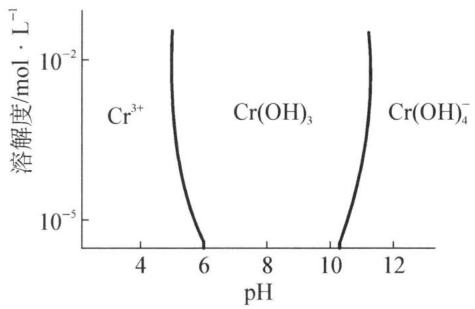

line chart

| pH  | Cr³⁺ (mol·L⁻¹) | Cr(OH)₃ (mol·L⁻¹) | Cr(OH)₄⁻ (mol·L⁻¹) |
| --- | --------------- | ------------------ | ------------------- |
| 4   | ~10⁻²           | -                  | -                   |
| 6   | ~10⁻⁵           | -                  | -                   |
| 8   | -               | -                  | -                   |
| 10  | -               | ~10⁻⁵              | -                   |
| 12  | -               | -                  | ~10⁻²              |

由上图可知，在 $0.01 \, mol \cdot L^{-1} Cr^{3+}$ 离子溶液中，pH < 5 时以 $Cr^{3+}$ 存在，pH = 5 开始生成 $\mathrm{Cr(OH)}_{3}$ 沉淀，pH > 12 时沉淀溶解，以 $[\mathrm{Cr(OH)}_{4}]^{-}$ 形式存在。

(3) $\mathrm{Cr(III)}$ 和 $\mathrm{Al(III)}$ 的比较

① Cr(Ⅲ)和 Al(Ⅲ)的相似性

i) 氧化物

$Cr_{2}O_{3}$ 也有两性,绿色固体: $Cr_{2}O_{3}+3H_{2}SO_{4}=Cr_{2}(SO_{4})_{3}$ (蓝紫色)+

$3H_{2}O$ , $Cr_{2}O_{3} + 2NaOH = 2NaCrO_{2}$ (绿色) + $H_{2}O$ 。类比： $\gamma-Al_{2}O_{3}$ 两性，既溶于酸，又溶于碱。

高温灼烧过的 $Cr_{2}O_{3}$ ，对酸和碱均为惰性，需与 $K_{2}S_{2}O_{7}$ 共熔后，再转入溶液中： $Cr_{2}O_{3} + 3K_{2}S_{2}O_{7} = 3K_{2}SO_{4} + Cr_{2}(SO_{4})_{3}$ ，与 $\alpha - Al_{2}O_{3}$ 相似。

ii) 氢氧化物

$\mathrm{Cr(OH)_3}$ 两性, 灰蓝色沉淀: $\mathrm{Cr(OH)_3 + 3H^+ = Cr^{3+} + 3H_2O, Cr(OH)_3 + OH^- = [Cr(OH)]_4^-}$ 。与 $\mathrm{Al(OH)_3}$ 的两性相似。

iii）盐类

盐类多带结晶水, $\mathrm{CrCl}_{3}\cdot6\mathrm{H}_{2}\mathrm{O}$ 、 $\mathrm{Cr}_{2}\left(\mathrm{SO}_{4}\right)_{3}\cdot18\mathrm{H}_{2}\mathrm{O}$ 、 $\mathrm{K}_{2}\mathrm{SO}_{4}\cdot\mathrm{Cr}_{2}\left(\mathrm{SO}_{4}\right)_{3}\cdot24\mathrm{H}_{2}\mathrm{O}$ ，与 $\mathrm{AlCl}_{3}\cdot6\mathrm{H}_{2}\mathrm{O}$ 、 $\mathrm{Al}_{2}\left(\mathrm{SO}_{4}\right)_{3}\cdot18\mathrm{H}_{2}\mathrm{O}$ 、 $\mathrm{K}_{2}\mathrm{SO}_{4}\cdot\mathrm{Al}_{2}\left(\mathrm{SO}_{4}\right)_{3}\cdot24\mathrm{H}_{2}\mathrm{O}$ 一致。

含水氯化物脱水时水解： $CrCl_{3}\cdot6H_{2}O=Cr(OH)Cl_{2}+5H_{2}O+HCl$ 。硫酸盐加热脱水时不水解，因为 $H_{2}SO_{4}$ 不挥发。 $Cr^{3+}$ 还能与 $S^{2-}$ 、 $CO_{3}^{2-}$ 等发生双水解反应： $2Cr^{3+}+3S^{2-}+6H_{2}O=2Cr(OH)_{3}\downarrow+3H_{2}S\uparrow$ ， $2Cr^{3+}+3CO_{3}^{2-}+6H_{2}O=2Cr(OH)_{3}\downarrow+3CO_{2}\uparrow+3H_{2}O$ 。

② Cr(Ⅲ)和 Al(Ⅲ)的不同点

i) 颜色

$Cr^{3+}$ 因配体不同显出不同颜色, 而 $Al^{3+}$ 无色。

ii）与氧化剂的反应

$Al^{3+}$ 不表现还原性,与氧化剂不反应。Cr(Ⅲ)在碱中易被氧化至 Cr(VI): $2CrO_{2}^{-} + 3H_{2}O_{2} + 2OH^{-} = 2CrO_{4}^{2-} + 4H_{2}O$ , Cr(Ⅲ)在酸中需强氧化剂方可被氧化至 Cr(VI): $10Cr^{3+} + 6MnO_{4}^{-} + 11H_{2}O = 6Mn^{2+} + 5Cr_{2}O_{7}^{2-} + 22H^{+}$ 。

iii）配合物的形成

$Al^{3+}$ 与 $NH_{3}\cdot H_{2}O$ 作用生成的 $\mathrm{Al(OH)}_{3}$ 不溶于过量的 $NH_{3}\cdot H_{2}O$ 。 $Cr^{3+}$ 则易形成内轨型配合物，可以和 $NH_{3}$ 形成配合物： $\mathrm{Cr(NH_{3})_{6}^{3+}}$ ，表现为 $\mathrm{Cr(OH)}_{3}$ 可溶于过量的 $NH_{3}\cdot H_{2}O$ 。

## 3. $\mathrm{Cr(VI)}$ 的性质

(1) $\mathrm{Cr(VI)}$ 的缩合平衡

铬酸根 $CrO_{4}^{2-}$ 离子呈黄色，重铬酸根 $Cr_{2}O_{7}^{2-}$ 呈橙黄色。当向黄色 $CrO_{4}^{2-}$ 溶液中加酸，溶液变为橙色，溶液中存在 $CrO_{4}^{2-}$ 缩合成 $Cr_{2}O_{7}^{2-}$ 的平衡： $2CrO_{4}^{2-} + 2H^{+} \rightleftharpoons Cr_{2}O_{7}^{2-} + H_{2}O (K = 4.2 \times 10^{14})$ 。溶液中的组份明显受 pH 的制约。pH > 6，以 $CrO_{4}^{2-}$ 存在；pH = 6， $CrO_{4}^{2-}$ 和 $Cr_{2}O_{7}^{2-}$ 同时存在于平衡体系中；pH < 1，以

$Cr_{2}O_{7}^{2-}$ 形式存在。

由于铬酸的酸性较强： $\mathrm{H}_{2}\mathrm{CrO}_{4}\rightleftharpoons\mathrm{HCrO}_{4}^{-}+\mathrm{H}^{+}(K_{1}=1.8\times10^{-1})$ ， $HCrO_{4}^{-}\rightleftharpoons CrO_{4}^{2-}+H^{+}(K_{2}=3.2\times10^{-7})$ 。它的缩合性不如钒酸强，钒酸能形成许多种缩合酸，而铬酸只形成 $Cr_{2}O_{7}^{2-}$ 、 $Cr_{3}O_{10}^{2-}$ （三铬酸根）等少数几种缩合酸，与硫酸类似。

以上缩合平衡除受 $\mathrm{pH}$ 影响外，加入正离子形成难溶的铬酸盐也能影响平衡，使 $\mathrm{Cr_2O_7^{2-}}$ 转化为 $\mathrm{CrO_4^{2-}}$ ： $4\mathrm{Ag}^{+} + \mathrm{Cr}_{2}\mathrm{O}_{7}^{2-} + \mathrm{H}_{2}\mathrm{O} = 2\mathrm{Ag}_{2}\mathrm{CrO}_{4}\downarrow$ （砖红色） $+2\mathrm{H}^{+}$ ， $\mathrm{Cr_2O_7^{2-}} + 2\mathrm{Pb}^{2+} + \mathrm{H}_2\mathrm{O} = 2\mathrm{H}^{+} + 2\mathrm{PbCrO}_{4}\downarrow$ （橙黄色）， $\mathrm{Cr_2O_7^{2-}} + 2\mathrm{Ba}^{2+} + \mathrm{H}_2\mathrm{O} =$ $2\mathrm{H}^{+} + 2\mathrm{BaCrO}_{4}\downarrow$ （黄色）。实验室中常利用 $\mathrm{Ag^{+}}$ 、 $\mathrm{Pb^{2+}}$ 、 $\mathrm{Ba^{2+}}$ 离子来检验 $\mathrm{CrO_4^{2-}}$ 离子的存在。这是由于除碱金属、铵和镁的铬酸盐易溶外，其他铬酸盐均难溶，而重铬酸盐均易溶。

当在上述缩合平衡体系中继续酸化(用浓硫酸),便缩合析出 $CrO_{3}$ 红色晶体: $nCr_{2}O_{7}^{2-} + 2nH^{+} = (CrO_{3})_{2n} + nH_{2}O$ 。实际上 $CrO_{3}$ 是由 $CrO_{4}$ 四面体通过共同顶角的氧原子连接成无限链状结构:

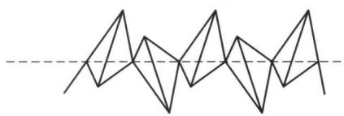

natural_image

Abstract geometric line drawing with interlocking triangles and a dashed horizontal line (no text or symbols)

$CrO_{3}$ 是铬酸酐，熔点为 $167^{\circ}C$ ，溶于水为铬酸，遇热不稳定，为强氧化剂，温度高于熔点便逐步分解放出氧气，最终产物是 $Cr_{2}O_{3}$ ，有机物与 $CrO_{3}$ 接触即着火，大量用于电镀工业。

## (2) $\mathrm{Cr(VI)}$ 的氧化性

铬(Ⅵ)化合物中， $\mathrm{K}_{2} \mathrm{Cr}_{2} \mathrm{O}_{7}$ 是常用的氧化剂，它由 $\mathrm{Na}_{2} \mathrm{Cr}_{2} \mathrm{O}_{7}$ 和 KCl 复分解制得 ( $\mathrm{Na}_{2} \mathrm{Cr}_{2} \mathrm{O}_{7}$ 制法见 Cr 的冶炼)。在酸性介质中 $\mathrm{K}_{2} \mathrm{Cr}_{2} \mathrm{O}_{7}$ 是强氧化剂，常用于容量分析中： $\mathrm{Cr}_{2} \mathrm{O}_{7}^{2-} + 14 \mathrm{H}^{+} + 6 \mathrm{e} \rightleftharpoons 2 \mathrm{Cr}^{3+} + 7 \mathrm{H}_{2} \mathrm{O} (\varphi^{\ominus} = 1.38 \mathrm{~V})$ 。在上式中有 $\mathrm{H}^{+}$ 参与，因此 $\mathrm{H}^{+}$ 浓度越大，则氧化性越强， $\mathrm{Cr}_{2} \mathrm{O}_{7}^{2-}$ 能将 Fe(Ⅱ) 氧化为 Fe(Ⅲ)(分析化学上用于测定铁)，将 $\mathrm{SO}_{3}^{2-}$ 氧化为 $\mathrm{SO}_{4}^{2-}$ ，将 I- 氧化为 I₂，将 As(Ⅲ) 氧化为 As(V) 酸盐等： $\mathrm{Cr}_{2} \mathrm{O}_{7}^{2-} + 6 \mathrm{Fe}^{2+} + 14 \mathrm{H}^{+} = 6 \mathrm{Fe}^{3+} + 2 \mathrm{Cr}^{3+} + 7 \mathrm{H}_{2} \mathrm{O}, \mathrm{Cr}_{2} \mathrm{O}_{7}^{2-} + 6 \mathrm{I}^{-} + 14 \mathrm{H}^{+} = 2 \mathrm{Cr}^{3+} + 3 \mathrm{I}_{2} + 7 \mathrm{H}_{2} \mathrm{O}$ 。还可将乙醇氧化为乙酸： $3 \mathrm{CH}_{3} \mathrm{CH}_{2} \mathrm{OH} + 2 \mathrm{Cr}_{2} \mathrm{O}_{7}^{2-} + 16 \mathrm{H}^{+} = 3 \mathrm{CH}_{3} \mathrm{COOH} + 4 \mathrm{Cr}^{3+} + 11 \mathrm{H}_{2} \mathrm{O}$ ，利用该反应可检测司机是否酒后开车。 $\mathrm{K}_{2} \mathrm{Cr}_{2} \mathrm{O}_{7}$ 虽是强氧化剂，然而它的反应速度较慢，因为由 Cr(Ⅵ) 转变为 Cr(Ⅲ) 是三电子转移反应，一般较慢，明显的例子是 $\mathrm{K}_{2} \mathrm{Cr}_{2} \mathrm{O}_{7}$ 氧化浓 HCl 反应，需加热才能进行，一旦停止加热，则反应停止，不再放出 Cl₂，常用此法制少量的 Cl₂，可以减少环境污染。在碱性介质中， $\mathrm{K}_2\mathrm{Cr}_2\mathrm{O}_7$ 转化为 $\mathrm{K}_2\mathrm{CrO}_4$ ，它的氧化性大大减弱， $\mathrm{K}_2\mathrm{CrO}_4$ 是一个微弱的氧化剂。

$K_{2}Cr_{2}O_{7}$ 饱和溶液和浓 $H_{2}SO_{4}$ 混合用作实验室的洗液。使用过程随 $CrO_{3}$ 逐渐被还原为 $Cr^{3+}$ ，洗液由橙红变为绿色而失效。将浓 $H_{2}SO_{4}$ 加到 $K_{2}Cr_{2}O_{7}$ 与 NaCl 的混合固体中，产生一种红色气体二氯铬酰 $CrO_{2}Cl_{2}:K_{2}Cr_{2}O_{7}+4KCl+3H_{2}SO_{4}=2CrO_{2}Cl_{2}\uparrow+3K_{2}SO_{4}+3H_{2}O$ 。二氯铬酰有强氧化性，能与有机物发生剧烈的氧化还原反应。

## (3) $\mathrm{Cr(VI)}$ 的毒性

进入人体的铬(VI)被积存在人体组织中,代谢和被清除的速度缓慢。六价铬进入血液后,主要与血浆中的铁球蛋白、白蛋白、r-球蛋白结合。15分钟内可以有50%的六价铬进入细胞,进入红细胞后与血红蛋白结合。六价铬对人主要是慢性毒害,它可以通过消化道、呼吸道、皮肤和黏膜侵入人体,在体内主要积聚在肝、肾和内分泌腺中。通过呼吸道进入的则易积存在肺部。六价铬有强氧化作用,所以慢性中毒往往以局部损害开始逐渐发展到不可救药。经呼吸道侵入人体时,开始侵害上呼吸道,引起鼻炎、咽炎和喉炎、支气管炎等病症。

## 4. $\mathrm{Cr(III)}$ 与 $\mathrm{Cr(VI)}$ 的相互转化及检验

## (1) $\mathrm{Cr(III)}$ 与 $\mathrm{Cr(VI)}$ 的相互转化

铬(Ⅲ)和铬(VI)在酸碱性溶液中以不同形式存在: 酸性溶液以 $\mathrm{Cr}^{3+}$ 、 $\mathrm{Cr}_{2} \mathrm{O}_{7}^{2-}$ 形式存在, 碱性溶液中以 $[\mathrm{Cr(OH)}_{4}]^{-}$ 、 $\mathrm{CrO}_{4}^{2-}$ 形式存在。根据 $\mathrm{Cr(III)}$ 和 $\mathrm{Cr(VI)}$ 的电极反应方程式及标准电极电位: $\mathrm{Cr}_{2} \mathrm{O}_{7}^{2-} + 14 \mathrm{H}^{+} + 6 \mathrm{e}^{-} \rightleftharpoons 2 \mathrm{Cr}^{3+} + 7 \mathrm{H}_{2} \mathrm{O} (\varphi^{\ominus} = 1.38 \mathrm{~V})$ , $\mathrm{CrO}_{4}^{2-} + 4 \mathrm{H}_{2} \mathrm{O} + 3 \mathrm{e}^{-} \rightleftharpoons [\mathrm{Cr(OH)}_{4}]^{-} + 4 \mathrm{OH}^{-} (\varphi^{\ominus} = -0.72 \mathrm{~V})$ , 我们可以得出它们之间相互转化的条件: 在酸性介质中由 $\mathrm{Cr(VI)}$ 转化为 $\mathrm{Cr(III)}$ 有利, 即 $\mathrm{Cr}_{2} \mathrm{O}_{7}^{2-}$ 在酸性介质中是强氧化剂, 用一般还原剂都能将它转化为 $\mathrm{Cr}^{3+}$ 。而在碱性介质中由 $\mathrm{Cr(III)}$ 转化为 $\mathrm{Cr(VI)}$ 较有利。例如由铬铁矿提取金属铬的第一步反应, 就是在碱性条件下进行的。在溶液中也类似。如在定性分析中, 用 $\mathrm{H}_{2} \mathrm{O}_{2}$ 或 $\mathrm{Br}_{2}$ 将 $[\mathrm{Cr(OH)}_{4}]^{-}$ 氧化为 $\mathrm{CrO}_{4}^{2-}$ , 从而将 $\mathrm{Cr}^{3+}$ 离子分离检出: $2[\mathrm{Cr(OH)}_{4}]^{-} + 3 \mathrm{HO}_{2}^{-} = 2 \mathrm{CrO}_{4}^{2-} + 5 \mathrm{H}_{2} \mathrm{O} + \mathrm{OH}^{-}, 2[\mathrm{Cr(OH)}_{4}]^{-} + 3 \mathrm{Br}_{2} + 8 \mathrm{OH}^{-} = 2 \mathrm{CrO}_{4}^{2-} + 6 \mathrm{Br}^{-} + 8 \mathrm{H}_{2} \mathrm{O}$ 。若在酸性介质中, $\mathrm{Cr}^{3+}$ 的还原性就弱得多, 因而只有像过硫酸铵、 $\mathrm{Ag}^{+}$ 催化剂, 高锰酸钾等很强的氧化剂才能将 $\mathrm{Cr(III)}$ 氧化为 $\mathrm{Cr(VI)}$ : $2 \mathrm{Cr}^{3+} + 3 \mathrm{S}_{2} \mathrm{O}_{8}^{2-} + 7 \mathrm{H}_{2} \mathrm{O} \xlongequal{\mathrm{Ag}^{+}} \mathrm{Cr}_{2} \mathrm{O}_{7}^{2-} + 6 \mathrm{SO}_{4}^{2-} + 14 \mathrm{H}^{+}$ 。

由此可见，低价转化为高价化合物必须碱性介质加氧化剂，而由高价转化为低

价化合物应酸性介质加还原剂，这是一般的规律。

(2) $\mathrm{Cr(III)}$ 与 $\mathrm{Cr(VI)}$ 的检验

在 $Cr_{2}O_{7}^{2-}$ 的溶液中加入 $H_{2}O_{2}$ ，可生成蓝色的过氧化铬 $CrO_{5}$ 或写成 $\mathrm{CrO(O_{2})_{2}}$ ，其结构为： $\mathrm{O}\underset{\mathrm{O}}{\overset{\mathrm{O}}{\rightleftharpoons}}\mathrm{Cr}\underset{\mathrm{O}}{\overset{\mathrm{O}}{\rightleftharpoons}}$

方程式为： $Cr_{2}O_{7}^{2-} + 4H_{2}O_{2} + 2H^{+} = 2CrO_{5} + 5H_{2}O$ 或 $CrO_{4}^{2-} + 2H_{2}O_{2} + 2H^{+} = CrO_{5} + 3H_{2}O$ 。 $CrO_{5}$ 很不稳定，很快分解为 $Cr^{3+}$ 并放出 $O_{2}$ 。它在乙醚或戊醇溶液中较稳定。这一反应，常用来鉴定 $CrO_{4}^{2-}$ 或 $Cr_{2}O_{7}^{2-}$ 的存在。

铬(Ⅲ)的鉴定是先把铬(Ⅲ)氧化到铬(Ⅵ)后再鉴定,方法如下: $\mathrm{Cr}^{3+}\xrightarrow{\mathrm{OH}^{-}过量}\mathrm{Cr(OH)}_{4}^{-}\xrightarrow[\mathrm{OH}^{-}]{\mathrm{H}_{2}\mathrm{O}_{2}}\mathrm{CrO}_{4}^{2-}\xrightarrow[\text{乙醚}]{\mathrm{H}^{+}+\mathrm{H}_{2}\mathrm{O}_{2}}\mathrm{Cr}_{2}\mathrm{O}_{5}(\text{蓝色})\text{或}\mathrm{Cr}^{3+}\xrightarrow{\mathrm{OH}^{-}过量}\mathrm{Cr(OH)}_{4}^{-}\xrightarrow[\mathrm{OH}^{-}]{\mathrm{H}_{2}\mathrm{O}_{2}}\mathrm{CrO}_{4}^{2-}\xrightarrow{\mathrm{Pb}^{2+}}\mathrm{PbCrO}_{4}\downarrow(\text{黄色})$ 。

## 5. 铬的冶炼和用途

## (1) 冶炼

欲得到较纯的铬,常用的方法是用固体 $Na_{2}CO_{3}$ 或 NaOH 和氧气熔炼,使 Cr(Ⅲ) 转化为 Cr(VI): $4FeCr_{2}O_{4} + 8Na_{2}CO_{3} + 7O_{2} = 2Fe_{2}O_{3} + 8Na_{2}CrO_{4} + 8CO_{2}$ , 然后用水浸取 $Na_{2}CrO_{4}$ 经酸化浓缩得到 $Na_{2}Cr_{2}O_{7}$ 结晶, 再用炭还原得 $Cr_{2}O_{3}: Na_{2}Cr_{2}O_{7} + 2C \xlongequal{加热} Cr_{2}O_{3} + Na_{2}CO_{3} + CO \uparrow$ , 最后用铝热反应将 $Cr_{2}O_{3}$ 还原得到金属 Cr: $Cr_{2}O_{3} + 2Al \xlongequal{加热} 2Cr + Al_{2}O_{3}$ 。

（2）用途：铬主要用于炼钢和电镀。铬能增强钢的耐磨性、耐热性和耐腐蚀性能，并可使钢的硬度、弹性和抗磁性增强，因此用它冶炼多种合金钢，普通钢中含铬量大多在0.3%以下，含铬在1%～5%的钢叫铬钢，不锈钢中含铬量亦达20%。由于镀铬层耐磨、耐腐蚀又极光亮，在汽车、自行车、精密仪器制造工业中用铬较多。

## 6. 含铬废水的处理

未受污染的天然水中含铬甚微,而且多以对人体低毒或无毒的 Cr(Ⅲ)存在。受铬污染的水中主要是 Cr(VI),它主要来自冶炼、电镀、试剂、鞣革、颜料、催化剂工厂及有色金属矿山。我国规定,Cr(VI)在废水中的最高允许排放浓度为 0.5 mg/L。处理含铬废水的方法主要分为化学法、电解法及离子交换法三类。

## (1) 化学法

在酸性条件下,先将还原性物质如 $FeSO_{4}$ 加入含铬废水,此时发生如下反应:

$Cr_{2}O_{7}^{2-} + 6Fe^{2+} + 14H^{+} = 2Cr^{3+} + 6Fe^{3+} + 7H_{2}O$ 。将含铬废水的pH调至6～8，此时即可产生 $\mathrm{Cr(OH)}_{3}$ 沉淀，过滤除去。如控制好 $FeSO_{4}$ 的量，使 $Fe^{2+}$ 与 $Fe^{3+}(Cr^{3+})$ 的比例恰当，可产生组成类似于铁氧体 $\left(\mathrm{Fe}_{3}\mathrm{O}_{4} \cdot x\mathrm{H}_{2}\mathrm{O}\right)$ 的铁磁性沉淀，后者称为铁氧体法，显然铁氧体法可以变废为宝，比较优越。

## (2) 电解法

将含铬废水放入电解槽内, 发生如下反应: 阳极: $\mathrm{Fe}-2\mathrm{e}^{-}=\mathrm{Fe}^{2+}$ , 阴极: $2\mathrm{H}_{2}\mathrm{O}+2\mathrm{e}^{-}=\mathrm{H}_{2}\uparrow+2\mathrm{OH}^{-}$ 。阳极区产生的 $\mathrm{Fe}^{2+}$ 与废水中的 $\mathrm{Cr}_{2}\mathrm{O}_{7}^{2-}$ 也发生化学法中的氧化还原反应, 生成的 $\mathrm{Fe}^{3+}$ 和 $\mathrm{Cr}^{3+}$ 在阴极区形成氢氧化物沉淀, 过滤除去。依此法处理的废水中含 $\mathrm{Cr(VI)}$ 量可降低到 $0.001\mathrm{mg/L}$ 。

## (3) 离子交换法

将含铬废水通过强碱型负离子交换树脂 $\left(\mathrm{R}-\mathrm{N}^{+}\mathrm{OH}^{-}\right)$ ，即发生如下交换反应： $\mathrm{CrO}_{4}^{2-}+2\mathrm{R}-\mathrm{N}^{+}\mathrm{OH}^{-}\xlongequal[\text{再生}]{\text{交换}}\left(\mathrm{R}-\mathrm{N}\right)_{2}\mathrm{CrO}_{4}+2\mathrm{OH}^{-}$ 。借助于交换-再生平衡，当交换一段时间后，停止进废水，改为通入NaOH溶液，即可将 $Cr_{2}O_{7}^{2-}$ 反交换出来，形成高浓度的Cr(VI)溶液，供回收利用。与此同时，树脂也得到再生，供重复使用。该法的主要优点是可以处理前面两类方法很难处理的、大量的含Cr(VI)浓度低的废水。

## 三、钼、钨

## 1. 单质

钼和钨是银白色高熔点金属，在常温下很不活泼，化学性质稳定，它们的表面易呈钝态，与大多数非金属 $\left(\mathrm{F}_{2}\right.$ 除外）不作用，但在高温下易与氧、硫、卤素、碳及氢反应。钼既不与稀酸反应，也不与浓盐酸反应，只与浓硝酸和王水反应。钨不溶于盐酸、硫酸和硝酸，只溶于王水或HF和 $HNO_{3}$ 的混合酸。它们不被碱溶液侵蚀，但被熔融的碱性氧化剂迅速腐蚀，如 $KNO_{3}$ 。铬副族元素的金属活泼性是按铬到钨的顺序逐渐降低的：氟可与这些金属剧烈反应；铬在加热时能与氯、溴和碘反应；钼在同样条件下只与氯和溴化合；钨则不能与溴和碘化合。

## 2. 钼、钨的重要化合物

钼和钨在化合物中的氧化态可以表现为+2到+6，其中最稳定的氧化态为+6，例如三氧化钼 $MoO_{3}$ 和三氧化钨 $WO_{3}$ 、钼酸、钨酸及其相应的盐。钼（Ⅳ）化合物则有二硫化钼 $MoS_{2}$ （辉钼矿）和 $MoO_{2}$ ，它们存在于自然界中，而钨（Ⅳ）化合物较不稳定，钨（Ⅵ）化合物较稳定，它们的元素电势图如下：

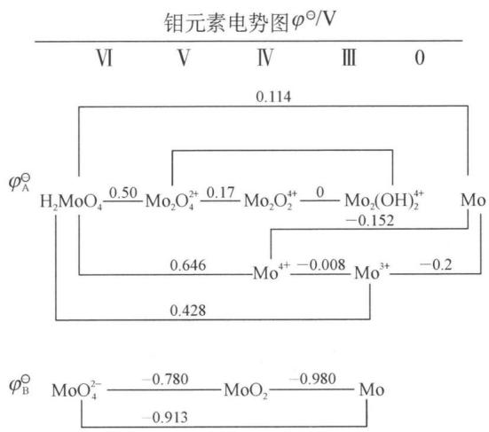

chemical

Molecular potential diagram of molybdenum oxide (MoO₄²⁻) showing oxidation states and charge values

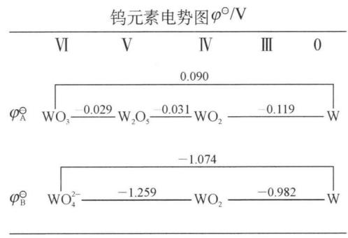

line chart

| Phase | φ_A^⊖ (V) | φ_B^⊖ (V) |
|-------|-----------|-----------|
| 0     | 0.090     | -1.074    |
| Ⅲ    |           | -1.259    |
| 0     |           | -0.982    |

## (1) 三氧化钼与三氧化钨

三氧化钼 $MoO_{3}$ 白色粉末, 加热时变黄, 熔点为 1068 K, 沸点为 1428 K, 即使在低于熔点的情况下, 它也有显著的升华现象。三氧化钨为淡黄色粉末, 加热时变为橙黄色, 熔点为 1746 K, 沸点为 2023 K, 它们都不溶于水, 能溶于氨水和强碱。

$\mathrm{MoO}_{3}$ 虽可由钼或 $\mathrm{MoS}_{2}$ 在空气中灼烧得到，但通常是由往钼酸铵中加盐酸，析出钼酸，再加热焙烧而得： $(\mathrm{NH}_{4})_{2}\mathrm{MoO}_{4} + 2\mathrm{HCl} = \mathrm{H}_{2}\mathrm{MoO}_{4}\downarrow + 2\mathrm{NH}_{4}\mathrm{Cl},$ $\mathrm{H}_{2}\mathrm{MoO}_{4} \stackrel{\text{加热}}{=} \mathrm{MoO}_{3} + \mathrm{H}_{2}\mathrm{O}$ 。

同样， $WO_{3}$ 也可由往钨酸钠溶液中加入盐酸，析出钨酸，再加热脱水而得。

## (2) 钼酸盐与钨酸盐

将钼和钨的三氧化物溶于碱金属氢氧化物, 可结晶出简单(或正)钼酸盐和钨酸盐, 通式为 $\mathrm{MMoO}_{4}$ 和 $\mathrm{MWO}_{4}$ , 其中的负离子是简单的四面体形 $\mathrm{MoO}_{4}^{2-}$ 和 $\mathrm{WO}_{4}^{2-}$ 离子。其他许多金属的含氧酸盐都可用复分解反应制得。碱金属、铵、镁和亚铊盐都溶于水, 但其他金属盐皆不溶。钼酸盐、钨酸盐与铬酸盐不同, 它们的氧化性很弱。在酸性溶液中, 只能用强还原剂才能将 $\mathrm{Mo(VI)}$ 还原为 $\mathrm{Mo}^{3+}$ 。例如向 $(\mathrm{NH}_{4})_{2}\mathrm{MoO}_{4}$ 溶液中加入浓盐酸, 再用金属锌还原, 溶液最初显蓝色(钼蓝, 为 $\mathrm{Mo(VI)}$ 、 $\mathrm{Mo(V)}$ 混合氧化态化合物), 然后还原为红棕色的 $\mathrm{Mo(V)}$ : $\mathrm{MoO}_{2}^{+}$ , 若 $\mathrm{HCl}$ 浓度很大会出现翡翠绿色物种 $[\mathrm{MoOCl}_{5}]^{2-}: 2\mathrm{MoO}_{4}^{2-} + \mathrm{Zn} + 8\mathrm{H}^{+} = 2\mathrm{MoO}_{2}^{+} + \mathrm{Zn}^{2+} + 4\mathrm{H}_{2}\mathrm{O}, 2\mathrm{MoO}_{4}^{2-} + \mathrm{Zn} + 12\mathrm{H}^{+} + 10\mathrm{Cl}^{-} = 2[\mathrm{MoOCl}_{5}]^{2-} + \mathrm{Zn}^{2+} + 6\mathrm{H}_{2}\mathrm{O}$ 。继续还原最终黑棕色物种为 $\mathrm{Mo(III)}: \mathrm{MoCl}_{3}: 2\mathrm{MoO}_{4}^{2-} + 3\mathrm{Zn} + 16\mathrm{H}^{+} + 6\mathrm{Cl}^{-} = 2\mathrm{MoCl}_{3} + 3\mathrm{Zn}^{2+} + 8\mathrm{H}_{2}\mathrm{O}$ 。钨酸盐的氧化性更弱。

使钼酸盐溶液呈强酸性时,往往得到称为钼酸和钨酸的物质,它们都是三氧化物的水合物,在水中的溶解度很小,例如,在浓的硝酸溶液中,钼酸盐可转化为黄色的水合钼酸 $MoO_{3} \cdot 2H_{2}O$ , 加热脱水变为白色的钼酸 $MoO_{3} \cdot H_{2}O$ 。在正钨酸盐的热溶液中加强酸, 析出黄色的钨酸 $WO_{3} \cdot H_{2}O$ , 在冷的溶液中加入过量的酸, 则析出白色的胶体钨酸 $WO_{3} \cdot xH_{2}O$ , 白色的钨酸经长时间煮沸后, 就转变为黄色。

钼酸根和钨酸根离子中的氧原子可被硫原子取代而生成硫代钼酸根和硫代钨酸根离子, 它们在碱金属盐如 $K_{2}MoO_{4}$ 中与 $SO_{4}^{2-}$ 同类型。

## (3) 钼、钨的酸及其盐

钼酸盐和钨酸盐在弱酸性溶液中有很强的缩合倾向,能形成重钼(钨)酸、三钼(钨)酸等较为复杂的多酸及其盐。钼(钨)的多酸盐是较容易得到的,最常见的试剂钼酸铵由 $MoO_{3}$ 溶于稀氨水,蒸发、结晶所得, $7MoO_{3} + 6NH_{3} \cdot H_{2}O = (NH_{4})_{6}[Mo_{7}O_{24}] + 3H_{2}O$ 。它实际上是一种多钼酸盐 $(\mathrm{NH}_{4})_{6}\mathrm{Mo}_{7}\mathrm{O}_{24} \cdot 4\mathrm{H}_{2}\mathrm{O}$ ,为区别于正钼酸盐称为仲钼酸铵。这种多钼酸盐的形成与溶液的 pH 有关,例如当酸化一个只含有 $MoO_{4}^{2-}$ 和碱金属或铵根离子的碱性溶液时,钼酸根离子按一定步骤缩合形成一系列多钼酸根离子: $\mathrm{MoO}_{4}^{2-} + \mathrm{H}^{+} = [\mathrm{MoO}_{3}(\mathrm{OH})]^{-}$ , $[\mathrm{MoO}_{3}(\mathrm{OH})]^{-} + 2\mathrm{H}_{2}\mathrm{O} = [\mathrm{MoO}(\mathrm{OH})_{5}]^{-}$ , $2[\mathrm{MoO}(\mathrm{OH})_{5}]^{-} = [(\mathrm{HO})_{4}\mathrm{Mo}-\mathrm{O}-\mathrm{Mo}(\mathrm{OH})_{4}]^{2-} + \mathrm{H}_{2}\mathrm{O}$ 。当 pH 下降至 6 时主要形成仲钼酸根离子: $7MoO_{4}^{2-} + 8H^{+} = Mo_{7}O_{24}^{6-} + 4H_{2}O$ 。在更强的酸性溶液中则生成八钼酸根离子 $[Mo_{8}O_{26}]^{4-}$ ,在很强的酸性溶液中(pH < 1),则发生解聚作用生成 $MoO_{3} \cdot H_{2}O$ 。

一般溶液中合成的钼酸铵 pH 为 6 左右, 符合形成七钼酸根离子的条件, 即以缩合多钼酸盐形式存在。因此所谓钼酸铵仅是习惯叫法而已。所有多负离子都含有 $MoO_{6}$ 八面体结构单元, 由 X 射线测定, 证明钼位于 6 个氧原子构成的正八面体体心。这些含氧多负离子是由 $MoO_{6}$ 八面体以公用棱边和公用角 (但不公用面) 的方式构成。在 $(\mathrm{NN}_{4})_{6}\mathrm{Mo}_{7}\mathrm{O}_{24} \cdot 4\mathrm{H}_{2}\mathrm{O}$ 中是由 7 个 $MoO_{6}$ 八面体公用边和角构成七钼酸根离子 $[Mo_{7}O_{24}]^{6-}$ , 其结构如下图所示:

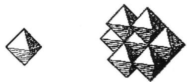

natural_image

Two geometric diagrams: a diamond shape and a triangular pyramid-like structure (no text or symbols)

在某些多酸中,除了由同一种酸酐组成的同多酸外,也可以由不同的酸酐组成多酸,称为杂多酸。例如,十二钼硅酸 $\mathrm{H}_{4}\left[\mathrm{Si}\left(\mathrm{Mo}_{12}\mathrm{O}_{40}\right)\right]$ 、十二钨硼酸 $\mathrm{H}_{5}\left[\mathrm{B}\left(\mathrm{W}_{12}\mathrm{O}_{40}\right)\right]$ ,相应的盐称为杂多酸盐。例如,向磷酸钠的热溶液中加入 $WO_{3}$ 达到饱和, 就析出 12-钨磷酸钠, 它的化学式为 $\mathrm{Na}_{3}[\mathrm{P}(\mathrm{W}_{12}\mathrm{O}_{40})]$ 或 $3\mathrm{Na}_{2}\mathrm{O} \cdot \mathrm{P}_{2}\mathrm{O}_{5} \cdot 24\mathrm{WO}_{3}$ , 其中 $\mathrm{P}: \mathrm{W} = 1:12$ , 又如, 把用硝酸酸化的钼酸铵溶液加热到约 $323\mathrm{K}$ , 加入 $\mathrm{Na}_{2}\mathrm{HPO}_{4}$ 溶液, 可得到黄色晶状沉淀 12-钼磷酸铵: $12\mathrm{MoO}_{4}^{2-} + 3\mathrm{NH}_{4}^{+} + \mathrm{HPO}_{4}^{2-} + 23\mathrm{H}^{+} = (\mathrm{NH}_{4})_{3}[\mathrm{P}(\mathrm{Mo}_{12}\mathrm{O}_{40})] \cdot 6\mathrm{H}_{2}\mathrm{O} + 6\mathrm{H}_{2}\mathrm{O}$ 。

总之, 当酸化正钼酸盐或钨酸盐的碱性溶液时, 如存在 $\mathrm{PO}_{4}^{3-}$ 、 $\mathrm{AsO}_{4}^{3-}$ 、 $\mathrm{SiO}_{4}^{4-}$ 、 $\mathrm{IO}_{4}^{-}$ 、 $\mathrm{FeO}_{4}^{2-}$ 等负离子时, 都能形成钼、钨的杂多酸盐。上面所述钼、钨和磷的杂多酸及其盐常用于分析化学上鉴定 $\mathrm{MoO}_{4}^{2-}$ 或 $\mathrm{PO}_{4}^{3-}$ 离子。在这些杂多酸盐中, 磷 (V) 是中心原子, $\mathrm{W}_{3} \mathrm{O}_{10}^{2-}$ 是配位体, 在多酸中能作为中心原子的元素很多, 最重要的有 V、Nb、Ta、Cr、Mo、W 等过渡元素和 Si、P 等非金属元素。

多酸及其盐具有优异的性能,有广泛的应用前景。例如,杂多酸具有酸性和氧化还原性以及在水溶液和固体中具有稳定均一的确定结构,从而显示出良好的催化性能,用于有机合成反应中,还可用作新颖树脂交换剂。最近发现一些杂多化合物具有较好的抗病毒、抗癌作用,如曾报道 $NaSb_{9}W_{21}O_{86}$ 和 $(\mathrm{NH}_{4})_{16}\left[\mathrm{Sb}_{8}\mathrm{W}_{20}\mathrm{O}_{88}\right]\cdot32\mathrm{H}_{2}\mathrm{O}$ 具有这种性质。

## (4) 硫化物

已知的硫化物中重要的有 $MS_{2}$ 、 $MS_{3}$ ，其他氧化态的硫化物是很少见的。 $MoS_{2}$ 在自然界的辉钼矿存在，在实验室中可用单质直接合成，也可用 $MoO_{3}$ 在 $H_{2}S$ 中加热或 $MoO_{3}$ 与 S 粉和 $K_{2}CO_{3}$ 一同加热制得。在高温下它是钼的硫化物中最稳定的，其他硫化物在真空中受热都转变为 $MoS_{2}$ ，但强热时，则分解为其组成元素。它是逆磁性的，约在 473 K，其晶体有金属导电性。在化学性质上，它十分惰性，仅溶于像王水和煮沸的浓硫酸这样的强氧化性酸中。

$\mathrm{MoS}_2$ 是层型结构的化合物，在两层位置相同的S的密堆积层中，形成许多三方棱柱体孔隙，钼原子处在由六个硫原子形成的三方棱柱配位体空隙中，这种三棱柱配位体数为钼原子数的一倍，所以钼原子仅占据其中的一半，由于层型分子堆积的不同，有多种形式，通常的六方 $\mathrm{MoS}_2$ 的结构为沿C轴按AbABaB……方式堆积，重复的周期是两个层型分子，它的结构如下图所示：

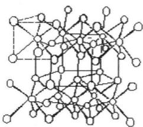

chemical

Molecular structure diagram showing interconnected atoms and bonds

由于层间的结合力弱,层间分子在受到外力时易滑动,有类似石墨的润滑性。经测定表明:如在汽车底盘的润滑油中加 $3\%$ $MoS_{2}$ ,可使理想行车的距离从 1500 千米提高到 6000 千米,它在加压或高速旋转情况下摩擦力反而减小,故是一种高效固体润滑剂。

$\mathrm{MoS}_{3}$ 是以 $\mathrm{H}_{2} \mathrm{~S}$ 通入钼酸盐微酸性溶液中得棕色的水合硫化物后, 经脱水得到: $(\mathrm{NH}_{4})_{2} \mathrm{MoO}_{4} + 3 \mathrm{H}_{2} \mathrm{~S} + 2 \mathrm{HCl} = \mathrm{MoS}_{3} + 2 \mathrm{NH}_{4} \mathrm{Cl} + 4 \mathrm{H}_{2} \mathrm{O}$ 。这种水合硫化物沉淀, 溶于过量硫化碱溶液, 生成硫代钼酸盐。

$WS_{3}$ 不能用上述制 $MoS_{3}$ 的方法得到，而在钨酸钠中通 $H_{2}S$ ，首先生成硫代钨酸盐 $\left(\mathrm{Na}_{2}\mathrm{WS}_{4}\right)$ ，它在酸性溶液中分解生成亮棕色 $WS_{3}$ 沉淀： $Na_{2}WO_{4} + 4H_{2}S = Na_{2}WS_{4} + 4H_{2}O$ ， $Na_{2}WS_{4} + 2HCl = WS_{3}\downarrow + H_{2}S\uparrow + 2NaCl$ 。

## 3. 冶炼和用途

## (1) 冶炼

钼、钨在自然界有独立的矿物,提取和分离要容易得多,可由辉钼矿和黑钨矿提取制金属。其提炼过程及反应如下:

① 钼的冶炼：

$$
\mathrm{MoS} _ {2} \xrightarrow [ 8 7 3 \mathrm{K} ]{\text {熔融}} \mathrm{MoO} _ {3} \xrightarrow {\mathrm{NH} _ {3} \text {水}} (\mathrm{NH} _ {4}) _ {2} \mathrm{MoO} _ {4} \xrightarrow {\text {加热}} \mathrm{MoO} _ {3} \xrightarrow [ 1 3 7 3 \mathrm{K} ]{\mathrm{H} _ {2}} \mathrm{Mo}
$$

涉及到的反应： $2MoS_{2}+7O_{2}\xlongequal{873\ K}2MoO_{3}+4SO_{2},\quad MoO_{3}+2NH_{3}\cdot H_{2}O=$ $(NH_{4})_{2}MoO_{4}+H_{2}O,\quad(NH_{4})_{2}MoO_{4}\xlongequal{加热}MoO_{3}+2NH_{3}\uparrow+H_{2}O,\quad MoO_{3}+3H_{2}\xlongequal{1373\ K}Mo+3H_{2}O。$

②钨的冶炼：

$$
(\mathrm{Fe}, \mathrm{Mn}) \mathrm{WO} _ {4} \xrightarrow [ \text {熔融} ]{\mathrm{Na} _ {2} \mathrm{CO} _ {3} , \text {空气}} \mathrm{Na} _ {2} \mathrm{WO} _ {4} \xrightarrow [ ]{\mathrm{H} _ {2} \mathrm{O}} \text {溶液} \xrightarrow [ ]{\mathrm{HCl}} \mathrm{WO} _ {3} \cdot \mathrm{H} _ {2} \mathrm{O} \xrightarrow [ ]{\text {加热}} \mathrm{WO} _ {3} \xrightarrow [ 1 4 7 3 \mathrm{K} ]{\mathrm{H} _ {2}} \mathrm{W}
$$

涉及到的反应： $4FeWO_{4} + 4Na_{2}CO_{3} + O_{2} \xlongequal{加热} 2Fe_{2}O_{3} + 4Na_{2}WO_{4} + 4CO_{2}$ ， $6MnWO_{4} + 6Na_{2}CO_{3} + O_{2} \xlongequal{加热} 2Mn_{3}O_{4} + 6Na_{2}WO_{4} + 6CO_{2}$ ， $Na_{2}WO_{4} + 2HCl = 2NaCl + H_{2}WO_{4}$ ， $H_{2}WO_{4} \xlongequal{加热} WO_{3} + H_{2}O$ ， $WO_{3} + 3H_{2} \xlongequal{1473K} W + 3H_{2}O$ 。

(2) 用途: 钼和钨大量用于制合金钢, 可提高钢的耐高温强度、耐磨性、耐腐蚀性等。在机械工业中, 钼钢和钨钢可做刀具、钻头等各种机器零件; 钼和金属的合金在武器制造, 以及导弹火箭等尖端领域里有重要地位。此外, 钨丝用于制作灯丝，高温电炉的发热元件。金属钼易加工成丝、带、片、棒等，在电子工业中有广泛应用。钼丝用作支撑电灯泡中加热丝的小钩，电子管的栅极等。

## 典型例题

【例 1】工业上为了处理含 $Cr_{2}O_{7}^{2-}$ 离子的酸性废水,采用以下处理方法:

(1) 往工业废水中加入适量食盐。  
(2) 以铁作为阳极进行电解。  
(3) 鼓入空气。经过一段时间后,使废水中含铬量降到可排放的标准。

请用已学过的化学知识解释上述处理含 $Cr_{2}O_{7}^{2-}$ 离子的工业废水的原因。

已知： $\mathrm{Fe(OH)_3}$ 开始沉淀的 pH 为 2.7，沉淀完全的 pH 为 3.7。 $\mathrm{Fe(OH)_2}$ 开始沉淀的 pH 为 7.6，沉淀完全的 pH 为 9.6，并且 $\mathrm{Fe(OH)_2}$ 呈絮状，不易从溶液除去。

解析 （1）加入少量食盐，是增加污水中离子浓度，增强导电能力。

(2) 选择以铁做阳极: 电极反应式为: 阳极 $\mathrm{Fe}-2\mathrm{e}^{-}=\mathrm{Fe}^{2+}$ ; 阴极 $2\mathrm{H}^{+}+2\mathrm{e}^{-}=\mathrm{H}_{2}\uparrow$ 。生成的 $\mathrm{Fe}^{2+}$ 可以作为还原剂, 在酸性溶液中与 $\mathrm{Cr}_{2}\mathrm{O}_{7}^{2-}$ 离子发生氧化还原反应, 将 $\mathrm{Cr}_{2}\mathrm{O}_{7}^{2-}$ 离子还原成 $\mathrm{Cr}^{3+}$ 。在电解过程中, 由于 $\mathrm{H}^{+}$ 在阴极不断放电, 打破了水的电离平衡、促进水的电离, 溶液的 $\mathrm{pH}$ 上升, 溶液中的正离子以 $\mathrm{Cr(OH)}_{3}$ 、 $\mathrm{Fe(OH)}_{2}$ 、 $\mathrm{Fe(OH)}_{3}$ 形成沉淀。  
（3）由信息可知， $\mathrm{Fe(OH)}_2$ 开始沉淀的 $\mathrm{pH}$ 为7.6，沉淀完全的 $\mathrm{pH}$ 为9.6，并且 $\mathrm{Fe(OH)}_2$ 呈絮状沉淀不便分离，不易从溶液中除去。根据已学的知识， $\mathrm{Fe(OH)}_2$ 极易被 $\mathrm{O}_2$ 氧化，所以在处理过程中鼓入空气，让空气中 $\mathrm{O}_2$ 充分与 $\mathrm{Fe(OH)}_2$ 反应，成为容易分离的 $\mathrm{Cr(OH)}_3$ 、 $\mathrm{Fe(OH)}_3$ ，使废水含铬量降到可排放标准。

【例 2】（2005 年，四川省高中学生化学竞赛预赛改编）钨是我国丰产元素。白钨矿 CaWO $_{4}$ 是一种重要的含钨矿物。在 80℃～90℃时，浓盐酸和白钨矿作用生成黄钨酸。黄钨酸在盐酸中溶解度很小，过滤可除去可溶性杂质。黄钨酸易溶于氨水，生成钨酸铵溶液，而与不溶性杂质分开。浓缩钨酸铵溶液，溶解度较小的五水仲钨酸铵从溶液中结晶出来。仲钨酸铵是一种同多酸盐，仲钨酸根含 12 个 W 原子，带 10 个负电荷。仲钨酸铵晶体灼烧分解可得 WO $_{3}$ 。

(1) 写出上述化学反应方程式:

A: \_\_\_\_ ; B: \_\_\_\_ ;

C: \_\_\_\_ ; D: \_\_\_\_。

(2) 已知(298 K 下):

<table><tr><td> $\mathrm{WO}_{3}(\mathrm{s})$ </td><td> $\Delta H_{f}^{\ominus}=-842.9\mathrm{kJ/mol}$ </td><td> $\Delta G_{f}^{\ominus}=-764.1\mathrm{kJ/mol}$ </td></tr><tr><td> $\mathrm{H}_{2}\mathrm{O}(\mathrm{g})$ </td><td> $\Delta H_{f}^{\ominus}=-242\mathrm{kJ/mol}$ </td><td> $\Delta G_{f}^{\ominus}=-228\mathrm{kJ/mol}$ </td></tr></table>

问：在什么温度条件下，可用 $\mathrm{H}_{2}$ 还原 $\mathrm{WO}_{3}$ 制备W?

(3) 钨丝常用作灯丝, 在灯泡里加入少量碘, 可延长灯泡使用寿命, 为什么?

（4）三氯化钨实际上是一种原子簇化合物 $W_{6}Cl_{18}$ ，其中存在 $W_{6}Cl_{18-n}^{n+}$ 离子结构单元，该离子中含有 W 原子组成的八面体，且知每个 Cl 原子与两个 W 原子形成桥键，而每个 W 原子与四个 Cl 原子相连。试推断 $W_{6}Cl_{18-n}^{n+}$ 的 n 值。

解析 (1) A. $\mathrm{CaWO_4 + 2HCl = H_2WO_4 + CaCl_2}$ ;

B. $H_{2}WO_{4} + 2NH_{3} \cdot H_{2}O = (NH_{4})_{2}WO_{4} + 2H_{2}O$ ;

C. $12(\mathrm{NH}_4)_2\mathrm{WO}_4 + 12\mathrm{H}_2\mathrm{O} = (\mathrm{NH}_4)_{10}\mathrm{W}_{12}\mathrm{O}_{41}\cdot 5\mathrm{H}_2\mathrm{O} + 14\mathrm{NH}_3\cdot \mathrm{H}_2\mathrm{O};$

D. $(\mathrm{NH}_4)_{10}\mathrm{W}_{12}\mathrm{O}_{41}\cdot 5\mathrm{H}_2\mathrm{O}\stackrel {\triangle}{=} 12\mathrm{WO}_3 + 10\mathrm{H}_2\mathrm{O} + 10\mathrm{NH}_3\uparrow$

(2) 反应方程式为: $3 \mathrm{H}_{2} + \mathrm{WO}_{3} = 3 \mathrm{H}_{2} \mathrm{O} + \mathrm{W}$ 。 $\Delta G^{\ominus} = 3 \times (-228) - (-764.1) = 80.1 = -RT \ln K \times 10^{-3}, K = 9.1042 \times 10^{-15}, \Delta H^{\ominus} = 3 \times (-242) - (-842.9) = 116.9 \mathrm{kJ/mol}, \ln (K_{2} / K_{1}) = \Delta H^{\ominus}(1 / T_{1} - 1 / T_{2}) / R$ ，当 $K_{2} = 1$ 时， $T_{2} = 946.64 \mathrm{~K}$ 。

(3) $W(s) + I_{2}(g) \rightleftharpoons WI_{2}(g)$ ，当生成 $WI_{2}(g)$ 扩散到灯丝附近的高温区时，又会立即分解出 W 而重新沉积在灯管上。

（4）每个 W 平均键合的 Cl 原子数 $4 \times 1/2 = 2$ 个，则 $18 - n = 6 \times 2$ ，得 n = 6 或每个 W 原子与四个 Cl 原子相连；共 $6 \times 4 = 24$ 个 Cl。而每个 Cl 与两个 W 相连。所以 Cl 原子一共有 24/2 = 12 个，因此 n = 18 - 12 = 6；或 Cl 原子只能在八面体的 12 条棱上。

【例 3】（1990 年、1992 年全国决赛改编）钼是我国丰产元素，探明储量居世界之首。钼有广泛用途，例如白炽灯里支撑钨丝的就是钼丝；钼钢在高温下仍有高强度，用以制作火箭发动机、核反应堆等。钼是固氨酶活性中心元素，施钼肥可明显提高豆种植物产量，等等。

（1）钼的元素序号是 42，写出它的核外电子排布式，并指出它在元素周期表中的位置。  
(2) 钼金属的晶格类型为体心立方晶格, 原子半径为 136 pm, 相对原子质量为

95.94。试计算该晶体钼的密度和空间利用率(原子体积占晶体空间的百分率)。

$$
\rho = \quad ; \eta = \quad 。
$$

（3）钼有一种含氧酸根 $\left[Mo_{x}O_{y}\right]^{z-}$ （如右图所示），式中x、y、z都是正整数；Mo的氧化态为+6，O呈-2。可按下面的步骤来理解该含氧酸根的结构：

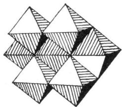

natural_image

Geometric pattern of interlocking triangles with shaded and unshaded sections (no text or symbols)

① 所有 Mo 原子的配位数都是 6，形成 $\left[MoO_{6}\right]^{6-}$ ，呈正八面体，称为“小八面体”（图 A）；

② 6个“小八面体”共棱连接可构成一个“超八面体”（图 B），化学式为 $\left[\mathrm{Mo}_{6} \mathrm{O}_{19}\right]^{2-}$ ；

③ 2个“超八面体”共用2个“小八面体”可构成一个“孪超八面体”（图C），化学式为 $\left[Mo_{10}O_{28}\right]^{4+}$ ;

④ 从一个“挛超八面体”里取走3个“小八面体”，得到的“缺角挛超八面体”（图D）便是本题的 $\left[Mo_{x}O_{y}\right]^{z-}$ （图D中用虚线表示的小八面体是被取走的）。

  
A

  
B

natural_image

Geometric line drawing of interconnected triangles forming a diamond-like structure (no text or symbols)

C

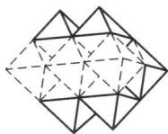

natural_image

Geometric wireframe diagram of a polyhedron with solid and dashed lines indicating visible and hidden edges (no text or symbols)

D

$\left[Mo_{x}O_{y}\right]^{z-}$ 的化学式为 \_\_\_\_。

（4）钼能形成六核簇合物，如一种含卤离子 $\left[Mo_{6}Cl_{8}\right]^{4+}$ ，6个Mo原子形成八面体骨架结构，氯原子以三桥基与Mo原子相连。则该离子中8个 $Cl^{-}$ 的空间构型为\_\_\_\_。

（5）辉钼矿 $\left(\mathrm{MoS}_{2}\right)$ 是最重要的铝矿，它在403 K、202 650 Pa氧压下跟苛性碱溶液反应时，钼便以 $MoO_{4}^{2-}$ 型体进入溶液。

① 在上述反应中硫也氧化而进入溶液,试写出上述反应的配平的方程式。

② 在密闭容器里用硝酸来分解辉钼矿,氧化过程的条件为 $423 \, K \sim 523 \, K$ , $1114575 \, Pa \sim 1823850 \, Pa$ 氧压。反应结果钼以钼酸形态沉淀,而硝酸的实际消耗量很低(相当于催化剂的作用),为什么?试通过化学方程式(配平)来解释。

解析 （1）[Kr] $4d^{5}5s^{1}$ ，第五周期VIB族。

(2) Mo 的晶胞中含 2 个 Mo 原子, 可根据 $N_{\mathrm{A}} \cdot d \cdot a^{3} = 2M$ 计算得到金属密度为: $10.3 \mathrm{~g} / \mathrm{cm}^{3}$ , 体心立方空间利用率: $68.0 \%$ 。

(3) 抽取 3 个小八面体后剩余 7 个 Mo—O 八面体, 因此 Mo 的原子个数为 7,

O原子个数可以对该结构进行水平面的逐层剖析得到,从顶部至底部一共5个水平面,分别有O原子:2,6,8,6,2个,共计24个,根据化合价可以写出负离子的化学式为: $\left[Mo_{7}O_{24}\right]^{6-}$ 。

(4) 可以将 6 个 Mo 放在立方体的 6 个面心考虑, 很显然 8 个 Cl $^{-}$ 要以三桥基链接 Mo, 只能位于立方体的 8 个顶角, 因此 Cl $^{-}$ 围成的空间构型为立方体。

(5) 根据题目信息, 硝酸在反应过程中的量很少, 相当于催化剂的量, 又考虑到反应中的氧压很高, 因此基本可以确定本反应过程中硝酸的还原产物在后续过程中又被 $\mathrm{O}_{2}$ 重新氧化, 并在水的存在下重新生成硝酸, 由此写出分步反应方程式: $2\mathrm{MoS}_{2} + 9\mathrm{O}_{2} + 12\mathrm{OH}^{-} = 2\mathrm{MoO}_{4}^{2-} + 4\mathrm{SO}_{4}^{2-} + 6\mathrm{H}_{2}\mathrm{O}, \mathrm{MoS}_{2} + 6\mathrm{HNO}_{3} = \mathrm{H}_{2}\mathrm{MoO}_{4} + 2\mathrm{H}_{2}\mathrm{SO}_{4} + 6\mathrm{NO}\uparrow, 2\mathrm{NO} + \mathrm{O}_{2} = 2\mathrm{NO}_{2}, 3\mathrm{NO}_{2} + \mathrm{H}_{2}\mathrm{O} = 2\mathrm{HNO}_{3} + \mathrm{NO}$ , 叠加后得到总方程式: $2\mathrm{MoS}_{2} + 9\mathrm{O}_{2} + 6\mathrm{H}_{2}\mathrm{O} \xlongequal{\mathrm{HNO}_{3}} 2\mathrm{H}_{2}\mathrm{MoO}_{4} + 4\mathrm{H}_{2}\mathrm{SO}_{4}$ 。

## 本讲习题

1. 暗绿色固体 A 不溶于水, 将 A 与 NaOH 固体共熔得到易溶于水的化合物 B。将 B 溶于水后加入 $H_{2}O_{2}$ 得到黄色溶液 C。向 C 中加入稀硫酸至酸性后转化为橙色溶液 D。向酸化的 D 溶液中滴加 $Na_{2}SO_{3}$ 溶液得到绿色溶液 E。向 E 中加入氨水得到灰蓝色沉淀 F, 再加入 $NH_{4}Cl$ 并微热则 F 溶解得到紫红色溶液 G。请确定各字母所代表的物质并写出有关反应的化学方程式。

2. 铬是一种典型的过渡元素,它能形成许多色彩鲜艳的化合物,并呈现出不同的氧化态。

(1) 将一种铬(Ⅲ)盐溶于水, 加入过量 NaOH 溶液, 得到一种绿色溶液 A, 在 A 溶液中添加 $H_{2}O_{2}$ , 得到黄色的 B 溶液, 再酸化, 又得到橙色的 C 溶液。写出反应方程式。

(2) 在足量 $\mathrm{H}_{3} \mathrm{O}^{+}$ 离子存在下, 在 $\mathrm{C}$ 溶液里再加入 $\mathrm{H}_{2} \mathrm{O}_{2}$ , 呈现一种深蓝色, 该蓝色物质为 $\mathrm{CrO}_{5}$ , 不久溶液又转变为绿色。蓝色中间物 $\mathrm{CrO}_{5}$ 的结构简式如何? $\mathrm{C}$ 生成 $\mathrm{CrO}_{5}$ 的反应是否为氧化还原反应? 当用 $\mathrm{C}$ 溶液滴定 $\mathrm{H}_{2} \mathrm{O}_{2}$ 时, 请计算每毫升 $0.020 \mathrm{~mol} / \mathrm{L}$ 的 $\mathrm{C}$ 相当于多少摩尔的 $\mathrm{H}_{2} \mathrm{O}_{2}$ ?

(3) 固体 $\mathrm{CrCl}_{3} \cdot 6 \mathrm{H}_{2} \mathrm{O}$ 溶于水可能有几种不同组成的配离子。现用以下离子交换实验, 测定属于哪种组成的配离子。实验将含 $0.219 \mathrm{~g} \mathrm{CrCl}_{3} \cdot 6 \mathrm{H}_{2} \mathrm{O}$ 的溶液通过氢离子交换树脂, 交换出来的酸用 $0.125 \mathrm{~mol} / \mathrm{L}$ 的 $\mathrm{NaOH}$ 溶液滴定, 用去 $\mathrm{NaOH}$ 溶液 $6.57 \mathrm{~mL}$ 。已知配离子呈八面体结构, 试确定该配离子, 并画出它的所

有可能结构式。

3. (1999 年全国初赛)铬的化学丰富多彩,实验结果常出人意料。将过量 $30\% H_{2}O_{2}$ 加入 $(\mathrm{NH}_{4})_{2}\mathrm{CrO}_{4}$ 的氨水溶液,热至 $50^{\circ}C$ 后冷至 $0^{\circ}C$ ,析出暗棕红色晶体 A。元素分析报告: A 含 Cr 31.1%, N 25.1%, H 5.4%。在极性溶剂中 A 不导电。红外图谱证实 A 有 N—H 键,且与游离氨分子键能相差不太大,还证实 A 中的铬原子周围有 7 个配位原子提供孤对电子与铬原子形成配位键,呈五角双锥构型。

(1) 以上信息表明 A 的化学式为 ; 可能的结构式为 \_\_\_\_ 。  
(2) A 中铬的氧化数为 \_\_\_\_。  
(3) 预期 A 最特征的化学性质为  
(4) 生成晶体 A 的反应是氧化还原反应, 方程式是

4. 铬位于周期表中VIB族元素,化合价可以是0→+6的整数价态。

(1) 在特定条件下, $\mathrm{K}_{2} \mathrm{CrO}_{4}$ 与 $\mathrm{H}_{2} \mathrm{O}_{2}$ 发生氧化还原反应, 生成化合物 A, A 是一种钾盐 (不带结晶水), 含有 $43.05 \%$ 的 O。写出 A 的化学式和结构简式, 并写出反应的离子方程式。  
(2) 在特定条件下, $\mathrm{K}_{2} \mathrm{Cr}_{2} \mathrm{O}_{7}$ 与 $\mathrm{H}_{2} \mathrm{O}_{2}$ 发生反应, 并用乙醚萃取, 得到化合物 B, B 是一种配合物分子晶体, 含有 $46.6 \%$ 的 O。写出 A 的化学式和结构简式, 并写出反应的离子方程式。  
(3) 某元素与氧元素形成的化合物 X, 具有强氧化性。一定条件下取 0.2640 g X, 与足量 $\mathrm{KI}-\mathrm{H}_{2} \mathrm{SO}_{4}$ 溶液反应, 所得溶液需要消耗 0.488 mol/L 的 $\mathrm{Na}_{2} \mathrm{~S}_{2} \mathrm{O}_{3}$ 溶液 28.68 mL 完全滴定到终点。

① 通过计算和讨论,确定 X 的化学式。  
② 写出 X 的结构式。  
③ 写出 X 与 KI 反应的离子方程式。

5. 杂多化合物是一类含有氧桥的多核配合物,由于具有独特的分子结构及分子易于设计和组装的特点,现已广泛用作新型高效催化剂、药物、磁性材料、高质子导体等。特别是含钒混合杂多化合物作为一系列新型高效的氧化型催化剂更倍受人们的青睐。通过调变钒原子比例的方法,可控制其氧化性和酸性,使其具有更广泛的适应性。

(1) 将用硝酸酸化的 $(\mathrm{NH}_{4})_{2} \mathrm{MoO}_{4}$ 溶液加热到 $230^{\circ} \mathrm{C}$ , 加入 $\mathrm{Na}_{2} \mathrm{HPO}_{4}$ 溶液, 生成磷钼酸铵黄色晶体沉淀。经 X 射线分析结果得知, 该杂多酸根是以 $\mathrm{PO}_{4}$ 四面体为核心, 它被 $\mathrm{MoO}_{6}$ 八面体所围绕, 如下图左。该图可以这样来剖析它: 它的构成, 由外而内, 把它分为四组, 每组三个 $\mathrm{MoO}_{6}$ 八面体共用三条边, 三个 $\mathrm{MoO}_{6}$ 共顶的氧再与 $PO_{4}$ 四面体中的氧重合为一。每组如下图右所示：每组之间再通过两两共顶，连成一个整体，形成杂多酸根 $PMo_{x}O_{y}^{z-}$ 。

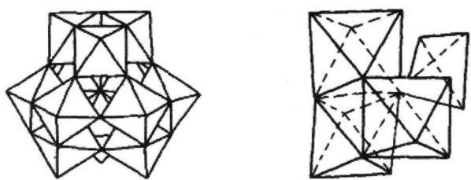

① 写出 x、y、z 的具体数值；并扼要叙述推导过程。

② 完成制备磷钼酸铵的离子方程式。

(2) 将 $V_{2}O_{5}$ 溶于 $(\mathrm{NH}_{4})_{2}\mathrm{CO}_{3}$ 溶液，并将该溶液在搅拌下加入上述磷钼酸铵混合液中，在 $90^{\circ}C$ 反应 30 min，得到 A 晶体，A 的酸根可看作其中 1 个 Mo 被 1 个 V 所取代。写出上述化学反应方程式。

6. (2006年全国化学联赛决赛改编)(1) 在酸化钨酸盐的过程中, 钨酸根 $\left(\mathrm{WO}_{4}^{2-}\right)$ 可能在不同程度上缩合形成多钨酸根。多钨酸根的组成常因溶液的酸度不同而不同, 它们的结构都由含一个中心 W 原子和六个配位 O 原子的钨氧八面体 $\mathrm{WO}_{6}$ 通过共顶或共边的方式形成。写出下面三张结构图中多钨酸根的化学式。

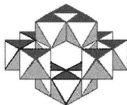

natural_image

Geometric pattern composed of interlocking triangles and polygons (no text or symbols)

①

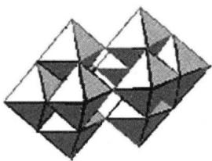

natural_image

Abstract geometric pattern composed of interlocking triangles (no text or symbols)

②

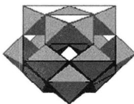

natural_image

Geometric pattern composed of interlocking triangles and polygons (no text or symbols)

③

(2) 在 $80^{\circ} \mathrm{C} \sim 90^{\circ} \mathrm{C}$ 时, 浓盐酸和白钨矿作用生成黄钨酸。黄钨酸在盐酸中溶解度很小, 过滤可除去可溶性杂质。黄钨酸易溶于氨水, 生成钨酸铵溶液, 而与不溶性杂质分开。浓缩钨酸铵溶液, 溶解度较小的五水仲钨酸铵从溶液中结晶出来。仲钨酸铵是一种同多酸盐, 仲钨酸根结构如上图①所示。仲钨酸铵晶体灼烧分解可得 $\mathrm{WO}_{3}$ 。写出上述化学反应方程式。

（3）仲钨酸的肼盐在热分解时会发生内在氧化还原反应，我国钨化学研究的奠基人顾翼东先生采用这一反应制得了蓝色的、非整比的钨氧化物 $WO_{3-x}$ 。这种蓝色氧化钨具有比表面大、易还原的优点，在制钨粉时温度容易控制，目前冶炼拉制钨丝的金属钨都用蓝色氧化钨为原料。经分析，得知蓝色氧化钨中钨的质量分

数为 0.7985。

① 计算写出 $WO_{3-x}$ 中的 x 值。

② 一般认为,蓝色氧化钨的颜色和非整比暗示了在化合物中存在五价和六价两种价态的钨。试计算蓝色氧化钨中这两种价态的钨原子数比。

(4) 把 $1.000 \mathrm{~g}$ 钨酸钠 $\left(\mathrm{Na}_{2} \mathrm{WO}_{4} \cdot 2 \mathrm{H}_{2} \mathrm{O}\right)$ 加到 $50 \mathrm{~mL}$ 水中, 又加入 $0.8 \mathrm{~g}$ (过量) 锌粒, 并加热, 不发生反应。再加入 $75 \mathrm{~mL} 3 \mathrm{~mol} / \mathrm{L}$ 硫酸, 反应立即发生, 生成一种蓝色化合物 (非整比氧化物)。用 $0.044 \mathrm{~mol} / \mathrm{L}$ 高锰酸钾溶液滴定这种蓝色化合物, 使它氧化成一种黄色化合物 (整比氧化物), 共用了 $8.33 \mathrm{~mL}$ 高锰酸钾溶液。

① 写出这种蓝色化合物和黄色化合物的化学式。

② 锌与钨酸钠的反应为什么必须在酸性溶液中进行?

7. 1:6 系列的杂多负离子具有典型的安德森结构, 配离子 M(Mo, W 氧化态均为 +6) 与氧 (O 氧化态为 -2) 形成八面体配位, 杂原子 X (化合价设为 +n, 可以是 $Te^{6+}$ , $I^{7+}$ , $Cr^{3+}$ , $Co^{3+}$ 等)。安德森结构配合物分为 A 系列和 B 系列。

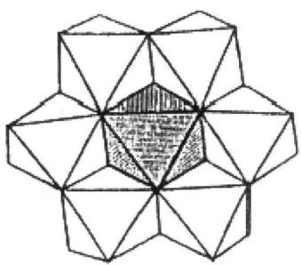

natural_image

Geometric polyhedral structure composed of interconnected triangles and polygons (no text or symbols)

图1

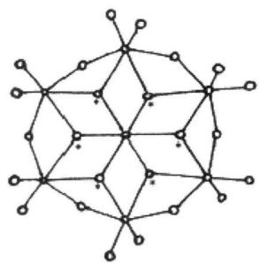

chemical

Molecular structure diagram showing a cage-like arrangement of atoms with bonds and charge indicators

图2

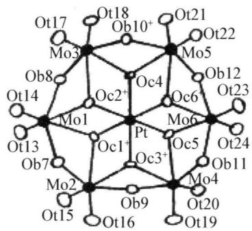

chemical

Crystal structure diagram of a platinum complex with Mo, Pt, and O atoms labeled

图3

(1) 上图 1 是 B 系列负离子的示意图, 中心八面体 $\mathrm{XO}_{6}$ 被六个 $\mathrm{MO}_{6}$ (M 为 Mo 或 W) 八面体包围, 这六个 $\mathrm{MO}_{6}$ 八面体处于同一平面且每个八面体与相邻八面体共用边相连, 请写出该负离子的化学式通式 \_\_\_\_。

(2) 图 2 表示杂原子与六个 OH 基团形成八面体配位, 与杂原子相配位的氧原子和氢原子成键, 当 X 是 $\mathrm{Cr}^{3+}$ M 是 Mo 时, 请写出这种类型 B 系列负离子的化学式 \_\_\_\_。

(3) 第 2 题中结构的负离子还可以形成双聚体, 双聚体中两个负离子之间形成了 7 个氢键, 所带电荷为 -7, 但其晶胞所含的原子个数仍可以表示为传统的分子式形式如图 3 所示。图中 Ot 表示端氧, Ob 是与两个 Mo 相连的氧, Oc 是与两个 Mo 和一个 Pt (氧化态 +4) 相连的氧。写出双聚体的化学式 \_\_\_\_。

## 第八讲 锰分族元素

## 知识精讲

## 一、概述

周期表中的ⅧB族包括锰(Manganese)、锝(Technetium)和铼(Rhenium)三种元素,锰是丰度较高的元素(在地壳中的含量为0.1%),地壳上锰的主要矿石有:软锰矿 $\left(\mathrm{MnO}_{2}\cdot x\mathrm{H}_{2}\mathrm{O}\right)$ ,黑锰矿 $\left(\mathrm{Mn}_{3}\mathrm{O}_{4}\right)$ 和水锰矿 $\left(\mathrm{Mn}_{2}\mathrm{O}_{3}\cdot\mathrm{H}_{2}\mathrm{O}\right)$ 。中国锰矿资源较多,分布广泛,有探明储量的矿区213处,总储量矿石5.66亿吨,居世界第3位。锰在自然界的储量尽管比较丰富,但因锰钢需求量迅速增长,锰资源日益紧缺。1973年,美国深海调查船“挑战者”号发现海底矿石,含锰25%、铁20%,还含有钴、钼、钛、铜等稀缺金属,人们把这种矿石称为“锰结核”。它是一种层层铁锰氧化物被粘土重重包围着的一个个同心圆状的团块,据估计,仅太平洋中锰结核内所含的Mn、Cu、Co、Ni,就相当于陆地总储量的几十到几百倍。

锝是 1937 年由佩里厄(Perrier C)和塞格瑞(Segre B)用人工方法合成的元素，后来在铀的裂变产物中也发现有锝的放射性同位素生成。

铼是丰度很小的元素之一(在地壳中的含量为 $7 \times 10^{-3} \%$ ), 没有单独的矿物, 主要和辉钼矿伴生, 含量一般不超过 0.001%, 还存在于稀土矿、铌钽矿等矿物中。

锰副族元素的价电子构型为 $(n-1)\mathrm{d}^{5}ns^{2}$ ，7个价电子都可以参加成键，因此，具有多种氧化态。锰副族的高氧化态按Mn、Tc、Re的顺序逐渐趋向稳定，低氧化态则相反，以 $Mn^{2+}$ 为最稳定。

## 二、锰及其化合物

## 1. 锰单质

块状金属锰是银白色的，粉末状为灰色，密度 $7.20 \, g \cdot cm^{-3}$ 。熔点 $1244^{\circ}C$ ，沸点 $2097^{\circ}C$ 。锰是活泼金属，锰在空气中氧化时生成 $Mn_{3}O_{4}$ （类似 $Fe_{3}O_{4}$ ），可认为是 $\mathrm{Mn}^{\mathrm{II}}(\mathrm{Mn}_{2}^{\mathrm{III}}\mathrm{O}_{4})$ ： $3\mathrm{Mn} + 2\mathrm{O}_{2} \xlongequal{\triangle} \mathrm{Mn}_{3}\mathrm{O}_{4}$ ，在高温时锰可直接与卤素、氮、硫、碳、硅、硼、磷等非金属反应，锰不与氢作用，在有氧化剂存在时，锰同熔融的碱作用生成锰酸盐： $2\mathrm{Mn} + 4\mathrm{KOH} + 3\mathrm{O}_{2} = 2\mathrm{K}_{2}\mathrm{MnO}_{4} + 2\mathrm{H}_{2}\mathrm{O}$ 。锰的氧化态有 +2、+3、+4、+5、+6 和 +7，其中 +2、+4、+6、+7 为常见氧化态。Mn 元素的电势图如下：

$$
\begin{array}{l l} & \text {   VII   } \\ \varphi_ {\mathrm{A}} ^ {\ominus} & \mathrm {MnO_ {4} ^ {-}} \xrightarrow [ 1 . 6 7 9 ]{0 . 5 6 4} \mathrm {MnO_ {4} ^ {2 - }} \xrightarrow [ ]{2 . 6 7} \mathrm {MnO_ {2}} \xrightarrow [ ]{1 . 2 2 4} \mathrm {Mn^ {2 + }} \xrightarrow {- 1 . 1 7} \mathrm{Mn} \\ \varphi_ {\mathrm{B}} ^ {\ominus} & \mathrm {MnO_ {4} ^ {-}} \xrightarrow [ 0 . 5 9 5 ]{0 . 5 5 8} \mathrm {MnO_ {4} ^ {2 - }} \xrightarrow [ ]{0 . 6 0} \mathrm {MnO_ {2}} \xrightarrow [ ]{- 0 . 0 5} \mathrm {Mn(OH) _ {2}} \xrightarrow {- 1 . 5 6} \mathrm{Mn} \end{array}
$$

锰能分解水, 易溶于稀的非氧化性酸生成 Mn(II)盐和放出氢气: $\mathrm{Mn} + 2\mathrm{H}_{2}\mathrm{O} = \mathrm{Mn(OH)}_{2} + \mathrm{H}_{2} \uparrow$ , $\mathrm{Mn} + 2\mathrm{H}^{+} = \mathrm{Mn}^{2+} + \mathrm{H}_{2} \uparrow$ 。锰与冷浓 $H_{2}SO_{4}$ 作用缓慢。有氧化剂存在时, 锰与熔融碱作用生成锰酸盐: $2\mathrm{Mn} + 4\mathrm{KOH} + 3\mathrm{O}_{2} \xlongequal{\triangle} 2\mathrm{K}_{2}\mathrm{MnO}_{4} + 2\mathrm{H}_{2}\mathrm{O}$ 。高温时, Mn 和 $X_{2}$ 、 $O_{2}$ 、S、B、C、Si、P 等非金属直接化合, 更高温度时可与 $N_{2}$ 化合: $\mathrm{Mn} + \mathrm{X}_{2} \xlongequal{\triangle} \mathrm{MnX}_{2}$ , $3\mathrm{Mn} + \mathrm{C} \xlongequal{\triangle} \mathrm{Mn}_{3}\mathrm{C}$ , $3\mathrm{Mn} + \mathrm{N}_{2} \xlongequal{\triangle} \mathrm{Mn}_{3}\mathrm{N}_{2}$ 。

单质锰可由铝热法还原软锰矿而制得。因铝和软锰矿的反应剧烈，故先将软锰矿强热，使之转变为 $Mn_{3}O_{4}$ 与铝粉混合燃烧： $3MnO_{2}\xlongequal{加热}Mn_{3}O_{4}+O_{2}\uparrow$ ， $3Mn_{3}O_{4}+8Al\xlongequal{高温}9Mn+4Al_{2}O_{3}$ 。用此法制得的锰，纯度不超过 $95\%\sim98\%$ 。纯的金属锰则是由电解法制备的，一般电解 $MnCl_{2}$ 能得纯度很高的电解锰。

纯锰用途不多,但它的合金非常重要。锰钢(含 Mn 12%\~15%、Fe 83%\~87%、C 2%)很坚硬,抗冲击,耐磨损,可用于制钢轨、钢甲和破碎机等。锰可代替镍用于制造不锈钢(16%\~20% Cr、8%\~10% Mn、0.1% C),在镁铝合金中加入锰可使抗腐蚀性和机械性能都得到改进。锰铜还有一个优异特性——不会被磁化,用在船舰需要防磁的部位正合适。锰对植物体的光合作用以及一些酶的活动、维生素的转化起着十分重要的作用,小麦、玉米缺锰,叶子会出现红和褐色斑点,果树叶子也会因缺锰变黄。锰是人体必需的微量元素,它在体内一部分作为金属酶的组成成分,一部分作为酶的激活剂。锰的缺乏可引起神经衰弱综合症,影响智力发育,还可导致胰岛素合成和分泌的降低,影响糖代谢。

## 2. Mn(Ⅱ)化合物

$Mn^{2+}$ 的价电子构型为较稳定的半充满 $d^{5}$ 结构，因此 $Mn^{2+}$ 是 Mn 的最稳定状态。在酸性溶液中 $Mn^{2+}$ 的还原性很弱， $\varphi_{\mathrm{A}}^{\ominus}\left(\mathrm{MnO}_{4}^{-}/\mathrm{Mn}^{2+}\right)=+1.5\mathrm{~V}$ ，要想将溶液中 $Mn^{2+}$ 氧化成 $MnO_{4}^{-}$ 是很困难的，只有在高酸度的热溶液中，与过二硫酸铵、铋酸钠等强氧化剂 $(\varphi_{\mathrm{A}}^{\ominus}>+1.5\mathrm{~V})$ 作用，才能将 $Mn^{2+}$ 氧化成 $MnO_{4}^{-}:2Mn^{2+}+5S_{2}O_{8}^{2-}+$

$$
\begin{array}{r l} & 8 \mathrm{H} _ {2} \mathrm{O} \xlongequal {\triangle} 2 \mathrm{MnO} _ {4} ^ {-} + 1 0 \mathrm{SO} _ {4} ^ {2 -} + 1 6 \mathrm{H} ^ {+}, 2 \mathrm{Mn} ^ {2 +} + 5 \mathrm{NaBiO} _ {3} + 1 4 \mathrm{H} ^ {+} \xlongequal {\triangle} 2 \mathrm{MnO} _ {4} ^ {-} + 5 \mathrm{Na} ^ {+} + \\ & 5 \mathrm{Bi} ^ {3 +} + 7 \mathrm{H} _ {2} \mathrm{O} 。 \text {   由于   } \mathrm{MnO} _ {4} ^ {-} \text {   是紫色的，故这些反应常用于定性检验   } \mathrm{Mn} ^ {2 +} \text {   离子。   } \end{array}
$$

由于 $\varphi_{\mathrm{B}}^{\ominus}[\mathrm{MnO}_{2}/\mathrm{Mn(OH)}_{2}] = -0.05\mathrm{V}, \varphi_{\mathrm{B}}^{\ominus}(\mathrm{O}_{2}/\mathrm{OH}^{-}) = +0.401\mathrm{V}$ , 所以在碱性溶液中, $\mathrm{Mn(II)}$ 的稳定性比在酸性溶液中差得多, 还原性较强, 很容易被氧化成 $\mathrm{Mn(IV)}$ 化合物。例如当向可溶性锰 (II) 盐中加入强碱或氨水时, 可生成白色的 $\mathrm{Mn(OH)}_{2}$ 沉淀, 它在碱性介质中很不稳定, 溶解在水中的氧也能将其氧化成棕褐色的 $\mathrm{MnO(OH)}_{2}$ 沉淀: $\mathrm{Mn}^{2+} + 2\mathrm{OH}^{-} = \mathrm{Mn(OH)}_{2} \downarrow$ (白), $\mathrm{Mn}^{2+} + 2\mathrm{NH}_{3} \cdot \mathrm{H}_{2}\mathrm{O} = \mathrm{Mn(OH)}_{2} \downarrow$ (白) + $2\mathrm{NH}_{4}^{+}$ , $2\mathrm{Mn(OH)}_{2} + \mathrm{O}_{2} = 2\mathrm{MnO(OH)}_{2} \downarrow$ (棕褐)。 $\mathrm{Mn(OH)}_{2}$ 与 $\mathrm{Mg(OH)}_{2}$ 有相同的晶体结构, 性质相似, $\mathrm{Mn(OH)}_{2}$ 的 $K_{\mathrm{sp}} = 1.4 \times 10^{-15}$ 和 $\mathrm{Mg(OH)}_{2}$ 的 $K_{\mathrm{sp}} = 1.8 \times 10^{-11}$ 相近, 因此用 $\mathrm{NH}_{3} \cdot \mathrm{H}_{2}\mathrm{O}$ 沉淀 $\mathrm{Mn}^{2+}$ 的反应很不完全, 在有大浓度的 $\mathrm{NH}_{4}^{+}$ 存在时, 得不到 $\mathrm{Mn(OH)}_{2}$ 沉淀。 $\mathrm{Mn(OH)}_{2}$ 与 $\mathrm{O}_{2}$ 的反应在水质分析中用于测定水中的溶氧量。

多数锰(Ⅱ)盐如 $MnX_{2}$ 、 $\mathrm{Mn(NO_{3})_{2}}$ 、 $MnSO_{4}$ 等皆溶于水。在水溶液中， $Mn^{2+}$ 以淡粉红色的 $\left[\mathrm{Mn}\left(\mathrm{H}_{2}\mathrm{O}\right)_{6}\right]^{2+}$ 水合离子存在。从溶液中结晶出的锰(Ⅱ)盐是带有结晶水的淡红色晶体。如 $\mathrm{Mn(NO_{3})_{2}\cdot6H_{2}O}$ 、 $MnSO_{4}\cdot7H_{2}O$ 、 $\mathrm{Mn(ClO_{4})_{2}\cdot6H_{2}O}$ 等。

无水 $MnSO_{4}$ 是白色晶体, 加热到红热亦不分解, 所以硫酸盐是最稳定的锰(Ⅱ)盐。若锰(Ⅱ)盐的酸根有氧化性, $\mathrm{Mn(II)}$ 盐分解时被氧化: $\mathrm{Mn(NO_{3})_{2}} \xlongequal{\triangle} \mathrm{MnO_{2}} + 2\mathrm{NO_{2}} \uparrow$ , $\mathrm{Mn(ClO_{4})_{2}} \xlongequal{\triangle} \mathrm{MnO_{2}} + \mathrm{Cl_{2}} \uparrow + 3\mathrm{O_{2}} \uparrow$ 。 $MnO_{2}$ 与浓 $H_{2}SO_{4}$ 和 C 作用可制得硫酸锰: $2MnO_{2} + C + 2H_{2}SO_{4} = 2MnSO_{4} + CO_{2} \uparrow + 2H_{2}O$ 。

锰（Ⅱ）的弱酸盐和氢氧化物难溶于水，如 MnS、 $MnCO_{3}$ 、 $MnC_{2}O_{4}$ 、 $\mathrm{Mn(OH)}_{2}$ 等。 $MnCO_{3}$ 是白色粉末，可用作白色颜料（锰白）。 $Mn^{2+}$ 可与 $S^{2-}$ 、 $CO_{3}^{2-}$ 发生下列沉淀反应： $Mn^{2+} + S^{2-} = MnS \downarrow$ （肉色）， $Mn^{2+} + CO_{3}^{2-} = MnCO_{3} \downarrow$ （白）。MnS 或 $MnCO_{3}$ 沉淀在空气中放置或加热，都会被空气中的 $O_{2}$ 氧化成棕褐色的 $\mathrm{MnO(OH)}_{2}:\mathrm{MnS}+\mathrm{O}_{2}+\mathrm{H}_{2}\mathrm{O}=\mathrm{MnO(OH)}_{2}+\mathrm{S},2\mathrm{MnCO}_{3}+\mathrm{O}_{2}+2\mathrm{H}_{2}\mathrm{O}=2\mathrm{MnO(OH)}_{2}+2\mathrm{CO}_{2}$ 。

$Mn^{2+}$ 在溶液中能形成各种配合物，这些配离子可能是四面体型，例如 $[MnCl_{4}]^{2-}$ ，或是八面体型，例如 $[MnCl_{6}]^{4-}$ 。向锰（Ⅱ）盐加入氨得到 $\mathrm{Mn(OH)}_{2}$ 沉淀，而氨与无水 $\mathrm{Mn(II)}$ 盐反应能够生成 $[\mathrm{Mn(NH_{3})_{6}}]^{2+}$ 。 $Mn^{2+}$ 与 $SCN^{-}$ 、 $CN^{-}$ 形成 $[\mathrm{Mn(SCN)}_{6}]^{4-}$ 和 $[\mathrm{Mn(CN)}_{6}]^{4-}$ 。但 $\mathrm{Mn(II)}$ 配合物在水溶液中的平衡常数与后续元素 $\mathrm{Fe(II)-Cu(II)}$ 的二价正离子相比是较低的。因为 $Mn^{2+}$ 离子是这些离子中最大的，同时由于 $d^{5}$ 构型，不易形成稳定的配合物。

## 3. Mn(Ⅲ)化合物

$Mn^{3+}$ 是不稳定的,由 Mn 的电势图可以看出 $Mn^{3+}$ 会在水溶液中发生歧化: $2Mn^{3+} + 2H_{2}O = MnO_{2} + Mn^{2+} + 4H^{+}$ 。同时,它非常容易水解 $Mn^{3+} + H_{2}O = Mn(OH)^{2+} + H^{+} (K = 0.93)$ , 水解初始产物 $Mn(OH)^{2+}$ , 慢慢聚合成多聚物种, 然而强酸性溶液中 $Mn^{3+}$ 是稳定的, 因为当 $[H^{+}] > 3 mol/L$ 时, 歧化不明显, 水解也受到抑制。因而常利用酸性溶液来稳定 $Mn^{3+}$ 。

$Mn^{3+}$ 是强氧化剂,能慢慢地被水还原,放出氧气: $4Mn^{3+} + 2H_{2}O = 4Mn^{2+} + 4H^{+} + O_{2}\uparrow$ 。

较稳定的 Mn(Ⅲ)化合物并不多, 它通过 Mn(Ⅱ)溶液的电解或过二硫酸盐的氧化或 $MnO_{4}^{-}$ 的还原制得, 如 $\mathrm{CsMn(SO_{4})_{2}\cdot12H_{2}O}$ 中含有 $Mn^{3+}$ 离子, 在一些有锰的化合物参加的反应过程中, 有时会有 Mn(Ⅲ)形成, 如在 413 K 以下, $MnO_{2}$ 和浓 $H_{2}SO_{4}$ 的反应过程中有红色水合硫酸锰(Ⅲ)产生。Mn(Ⅲ)化合物有颜色, 一般 $\left[\mathrm{Mn(H_{2}O)_{6}}\right]^{3+}$ 为酒红色(硫酸介质中最大吸收峰 490 nm)。

Mn(Ⅲ)离子在溶液中也能被 $CN^{-}$ 、 $PO_{4}^{3-}$ 、 $C_{2}O_{4}^{2-}$ 、多基配体（如 EDTA 等）、大环配体等其他配位负离子所稳定，形成稳定的配离子，例如 $\left[\mathrm{Mn}\left(\mathrm{PO}_{4}\right)_{2}\right]^{3-}$ 、 $\left[\mathrm{Mn}\left(\mathrm{CN}\right)_{6}\right]^{3-}$ 等。应当指出，Mn(Ⅲ)的大环配合物（如卟啉、酞菁等配体）很重要，光合过程中氧的放出依赖于锰。它们还是光解水的有效催化剂。Mn(Ⅲ)离子在更高价态的锰的复杂的氧化还原过程中起着重要的作用。

## 4. Mn(IV)化合物

锰(Ⅳ)化合物中最重要的是二氧化锰 $MnO_{2}$ ，它在通常情况下很稳定，但锰(Ⅳ)的盐不稳定。 $MnO_{2}$ 是一种黑色粉末状物质，不溶于水、稀酸和稀碱，在酸碱中均不歧化。天然存在的二氧化锰是软锰矿。

锰(Ⅳ)氧化数居中， $\mathrm{MnO}_{2}$ 既可做氧化剂又可做还原剂。在酸性介质中， $\mathrm{MnO}_{2}$ 是一种强氧化剂： $\mathrm{MnO}_{2} + 4\mathrm{H}^{+} + 2\mathrm{e}^{-} \rightleftharpoons \mathrm{Mn}^{2+} + 2\mathrm{H}_{2}\mathrm{O}, \varphi_{\lambda}^{\ominus} = 1.23\mathrm{V}$ 。它与浓盐酸反应产生 $\mathrm{Cl}_{2}$ ，在实验室中常用此反应制备氯气； $\mathrm{MnO}_{2} + 4\mathrm{HCl}$ （浓） $\xlongequal{\triangle} \mathrm{MnCl}_{2} + \mathrm{Cl}_{2} \uparrow + 2\mathrm{H}_{2}\mathrm{O}$ 。与浓硫酸作用，可得硫酸锰并放出 $\mathrm{O}_{2}: 2\mathrm{MnO}_{2} + 2\mathrm{H}_{2}\mathrm{SO}_{4}$ （浓） $= 2\mathrm{MnSO}_{4} + \mathrm{O}_{2} \uparrow + 2\mathrm{H}_{2}\mathrm{O}$ 。 $\mathrm{MnO}_{2}$ 还能氧化 $\mathrm{H}_{2}\mathrm{O}_{2}$ 和 $\mathrm{Fe}^{2+}$ 等： $\mathrm{MnO}_{2} + \mathrm{H}_{2}\mathrm{O}_{2} + \mathrm{H}_{2}\mathrm{SO}_{4} = \mathrm{MnSO}_{4} + \mathrm{O}_{2} \uparrow + 2\mathrm{H}_{2}\mathrm{O}, \mathrm{MnO}_{2} + 2\mathrm{FeSO}_{4} + 2\mathrm{H}_{2}\mathrm{SO}_{4} = \mathrm{MnSO}_{4} + \mathrm{Fe}_{2}(\mathrm{SO}_{4})_{3} + 2\mathrm{H}_{2}\mathrm{O}$ 。

在碱性条件下 $\left(\varphi_{\mathrm{B}}^{\ominus}\left(\mathrm{MnO}_{4}^{2-}/\mathrm{MnO}_{2}\right)=+0.60\mathrm{~V}\right)$ ，有氧化剂存在时， $MnO_{2}$ 可被氧化至 $\mathrm{Mn(VI)}$ 酸盐。例如，在空气中 $MnO_{2}$ 与KOH的混合物，或者与硝酸钾、氯酸钾等氧化剂一起加热熔融,可产生锰酸钾。这是由软锰矿制备高锰酸钾的第一步反应: $2\mathrm{MnO}_{2} + 4\mathrm{KOH} + \mathrm{O}_{2}\xlongequal{\triangle}2\mathrm{K}_{2}\mathrm{MnO}_{4}$ (绿) $+2\mathrm{H}_{2}\mathrm{O},3\mathrm{MnO}_{2} + 6\mathrm{KOH}+$ $\mathrm{KClO_3\xlongequal{\triangle}3K_2MnO_4}$ (绿) $+\mathrm{KCl} + 3\mathrm{H}_2\mathrm{O}$ 。

$MnO_{2}$ 的制备有干法和湿法两种。干法由灼烧 $\mathrm{Mn(NO_{3})_{2}}$ 制取： $\mathrm{Mn(NO_{3})_{2}} \xlongequal{\triangle} \mathrm{MnO_{2}} + 2\mathrm{NO_{2}} \uparrow$ ，湿法是利用 $\mathrm{Mn(VII)}$ 和 $\mathrm{Mn(II)}$ 的逆歧化反应制得：因为 $\varphi_{\mathrm{A}}^{\ominus}(\mathrm{MnO}_{4}^{2-}/\mathrm{MnO}_{2}) = 1.695 \mathrm{~V} > \varphi_{\mathrm{A}}^{\ominus}(\mathrm{MnO}_{2}/\mathrm{Mn}^{2+}) = 1.23 \mathrm{~V}$ ，所以 $2KMnO_{4} + 3MnSO_{4} + 2H_{2}O = 5MnO_{2} \downarrow + K_{2}SO_{4} + 2H_{2}SO_{4}$ 。

$MnO_{2}$ 用途很大,大量用于制造干电池以及玻璃、陶瓷、火柴、油漆等工业,也是制备其他锰化合物的主要原料。基于 $MnO_{2}$ 的氧化还原性,特别是氧化性,使它在工业上有很重要的用途。例如大量的 $MnO_{2}(70\% \sim 80\%)$ 用于电池行业中,在碳锌干电池中作“去极化剂”,目的是防止释放出氢,其作用是通过下列反应实现的: $MnO_{2} + H^{+} + e^{-} = MnO(OH)$ 。又如在玻璃制造业中,二氧化锰作为“漂白剂”,即所谓“玻璃制造者的肥皂”。因为普通玻璃常因痕量铁(Ⅱ)而呈绿色。若在熔炼时加入 $MnO_{2}$ ,玻璃就变成无色透明。这是由于 $MnO_{2}$ 将 Fe(Ⅱ)氧化成 Fe(Ⅲ), Mn(Ⅳ)被还原 Mn(Ⅲ)。硅酸铁(Ⅲ)显黄色,硅酸锰(Ⅲ)呈紫色,黄色与紫色互为补色,即成无色。在油漆工业中,将 $MnO_{2}$ 加入熬制的半干性油中,可以促进这些油在空气中的氧化作用,作催化剂。在化工上用于将苯胺氧化成氢醌等,并且 $MnO_{2}$ 是催化剂(如催化 $KClO_{3}$ 分解制氧气)和制造锰盐的原料。

## 5. Mn(VI)化合物

锰酸钾 $K_{2}MnO_{4}$ 是最重要的 Mn(VI) 化合物，它是由 $MnO_{2}$ 在熔融碱中氧化而制得 [见前 Mn(IV) 化合物]。

锰酸钾是无水深绿(近似于黑)色晶体。它溶于强碱溶液显绿色,但在酸性、中性及弱碱性介质中发生歧化反应: $3\mathrm{K}_{2}\mathrm{MnO}_{4} + 2\mathrm{H}_{2}\mathrm{O} = 2\mathrm{KMnO}_{4} + \mathrm{MnO}_{2}\downarrow +$ $4\mathrm{KOH}(K\sim 10^{58})$ 。

锰酸盐是制备高锰酸盐的中间体。将锰酸盐转化为高锰酸盐有三种方法：

(1) 歧化反应: $3 \mathrm{K}_{2} \mathrm{MnO}_{4} + 2 \mathrm{H}_{2} \mathrm{O} = 2 \mathrm{KMnO}_{4} + \mathrm{MnO}_{2} \downarrow + 4 \mathrm{KOH}$ 。得到 $\mathrm{KMnO}_{4}$ 溶液和 $\mathrm{MnO}_{2}$ 沉淀, 过滤、浓缩溶液得到 $\mathrm{KMnO}_{4}$ 晶体。这一方法只有 $2 / 3$ 的 $\mathrm{K}_{2} \mathrm{MnO}_{4}$ 转化为 $\mathrm{KMnO}_{4}$ , 产率较低。  
(2) 用氯氧化 $\mathrm{K}_{2} \mathrm{MnO}_{4}$ 溶液, 得到 $\mathrm{KMnO}_{4}$ 和 $\mathrm{KCl}: 2 \mathrm{~K}_{2} \mathrm{MnO}_{4} + \mathrm{Cl}_{2} = 2 \mathrm{KMnO}_{4} + 2 \mathrm{KCl}$ , 所得 $\mathrm{KMnO}_{4}$ 和 $\mathrm{KCl}$ 较难分离干净。  
(3) 用电解氧化法制备 $\mathrm{KMnO}_{4}$ : 阳极反应: $2 \mathrm{MnO}_{4}^{2-}-2 \mathrm{e}^{-}=2 \mathrm{MnO}_{4}^{-}$ ; 阴极

反应 $2H_{2}O + 2e^{-} = H_{2}\uparrow + 2OH^{-}$

以上三种制备方法中电解法最好,此法所得产品产率高、质量好。

## 6. Mn(VII)化合物

锰(Ⅶ)的化合物中最重要的是高锰酸钾 $KMnO_{4}$ ，高锰酸钾是深紫色的晶体，极易溶于水，其水溶液呈紫红色，是一种较稳定的化合物。

将固体的 $KMnO_{4}$ 加热到 $200^{\circ}C$ 以上，就分解放出氧气，这是实验室制备氧气的一种简便方法： $2KMnO_{4}\xlongequal{>200^{\circ}C}K_{2}MnO_{4}+MnO_{2}+O_{2}\uparrow$ 。

高锰酸钾的溶液并不十分稳定，在酸性溶液中明显分解，在中性或微碱性溶液中缓慢地分解： $4MnO_{4}^{-}+4H^{+}=4MnO_{2}\downarrow+3O_{2}\uparrow+2H_{2}O$ 。光对高锰酸盐的分解具有催化作用， $KMnO_{4}$ 溶液必须保存于棕色瓶中。

$\mathrm{KMnO_4}$ 是最重要和常用的氧化剂之一。它的氧化能力和还原产物因介质的酸碱性不同而不同。在酸性溶液中， $\mathrm{MnO_4^-}$ 是很强的氧化剂。例如，它可以氧化 $\mathrm{Fe}^{2+}$ 、 $\mathrm{I}^-$ 、 $\mathrm{Cl}^-$ 、 $\mathrm{SO}_3^{2-}$ 、 $\mathrm{C}_2\mathrm{O}_4^{2-}$ 等离子，本身被还原为 $\mathrm{Mn}^{2+}: \mathrm{MnO}_4^- + 5\mathrm{Fe}^{2+} + 8\mathrm{H}^+ = \mathrm{Mn}^{2+} + 5\mathrm{Fe}^{3+} + 4\mathrm{H}_2\mathrm{O}$ 。

分析化学中, 常用 $\mathrm{KMnO}_{4}$ 的酸性溶液来测定铁的含量。如果 $\mathrm{MnO}_{4}^{-}$ 过量, 它可能和 $\mathrm{Mn}^{2+}$ 发生氧化还原反应而析出 $\mathrm{MnO}_{2}: 2\mathrm{MnO}_{4}^{-} + 3\mathrm{Mn}^{2+} + 2\mathrm{H}_{2}\mathrm{O} = 5\mathrm{MnO}_{2} \downarrow + 4\mathrm{H}^{+}, 2\mathrm{MnO}_{4}^{-} + 16\mathrm{H}^{+} + 10\mathrm{Cl}^{-} = 2\mathrm{Mn}^{2+} + 5\mathrm{Cl}_{2} \uparrow + 8\mathrm{H}_{2}\mathrm{O}$ 。 $\mathrm{MnO}_{4}^{-}$ 与还原剂的反应最初较慢, 当有 $\mathrm{Mn}^{2+}$ 的存在时, 可催化该反应。因此, 随着 $\mathrm{Mn}^{2+}$ 离子的生成, 反应速度迅速加快。

在微酸性、中性及微碱性溶液中 $MnO_{4}^{-}$ 与还原剂反应时，被还原成 $MnO_{2}$ ： $2KMnO_{4} + 3K_{2}SO_{3} + H_{2}O = 2MnO_{2} \downarrow + 3K_{2}SO_{4} + 2KOH, 2MnO_{4}^{-} + I^{-} + H_{2}O = 2MnO_{2} \downarrow + IO_{3}^{-} + 2OH^{-}$ 。在强碱性溶液中，则被还原为锰酸盐： $2KMnO_{4} + K_{2}SO_{3} + 2KOH = 2K_{2}MnO_{4} + K_{2}SO_{4} + H_{2}O$ 。

高锰酸钾是一种良好的氧化剂, 常用于棉、毛漂白或油类脱色, 还广泛用于一些过渡金属离子的容量分析, 如 $\mathrm{Ti}^{3+}$ 、 $\mathrm{VO}^{2+}$ 、 $\mathrm{Fe}^{2+}$ 以及过氧化氢、草酸盐、甲酸盐和亚硝酸盐等。它的稀溶液 (0.1%) 可用来对水果、碗、杯等进行消毒和杀菌, 5% 的 $\mathrm{KMnO}_{4}$ 溶液可治疗轻度烫伤。在化工生产中用于生产苯甲酸、维生素 C、糖精及烟酸等。

粉末状的 $KMnO_{4}$ 与 90% $H_{2}SO_{4}$ 反应，生成绿色油状的高锰酸酐 $Mn_{2}O_{7}$ 。它在 $0^{\circ}C$ 以下能稳定存在，但在常温下会爆炸分解成 $MnO_{2}$ 、 $O_{2}$ 和 $O_{3}$ 。这种氧化物有很强的氧化性，遇有机物立即发生燃烧。将 $Mn_{2}O_{7}$ 溶于水成可生成高锰酸 $HMnO_{4}$ 。

锰从某氧化态转化为另一氧化态，与溶液的酸碱性以及与它反应的氧化剂或还原剂的相对强弱等条件有关。锰的各种氧化态的氧化物和氧化物对应的水合物归纳如下：

锰能生成以下各种氧化物：

<table><tr><td>MnO氧化锰碱性</td><td> $Mn_{2}O_{3}$ 三氧化二锰弱碱性</td><td> $MnO_{2}$ 二氧化锰两性</td><td> $(MnO_{3})$ 锰酸酐酸性</td><td> $Mn_{2}O_{7}$ 高锰酸酐酸性</td></tr><tr><td colspan="5">和上述氧化物相对应的氧化物的水合物:碱性增强</td></tr><tr><td> $Mn(OH)_{2}$ </td><td> $Mn(OH)_{3}$ </td><td> $Mn(OH)_{4}$ </td><td> $H_{2}MnO_{4}$ 酸性增强</td><td> $HMnO_{4}$ </td></tr><tr><td></td><td></td><td>氧化性增强</td><td></td><td></td></tr></table>

## 三、锝、铼及其化合物

锝(Tc)和铼(Re)，电子构型分别为 $4\mathrm{d}^{5}5\mathrm{s}^{2}$ 、 $5\mathrm{d}^{5}6\mathrm{s}^{2}$ 。锝是过渡金属中唯一的人造元素。锝和铼的性质很相似，与锰不同，实际上不形成 $+2$ 氧化态的化合物，而 $+3$ （铼）、 $+4$ 、 $+6$ 、 $+7$ 氧化态化合物是普遍的。 $\mathrm{TcO_4^-}$ 和 $\mathrm{ReO_4^-}$ 离子较 $\mathrm{MnO_4^-}$ 离子的氧化性弱得多。锝和铼的电势图如下：

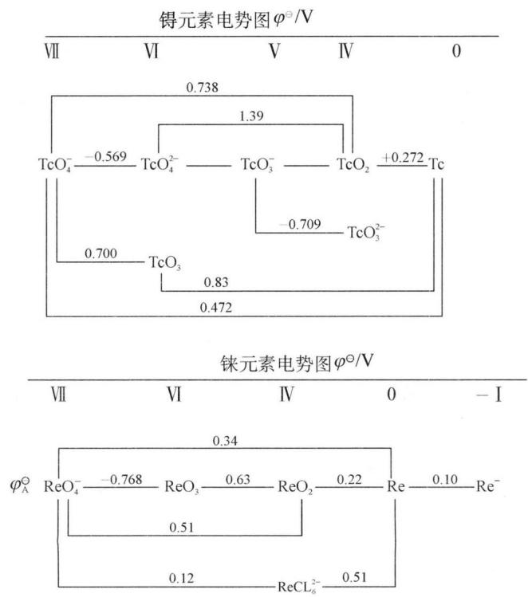

chemical

镍元素电势图，展示VII-VIII、VI-VIV、0-VIII、IX-VIII、IX-VIII六种材料的电势变化

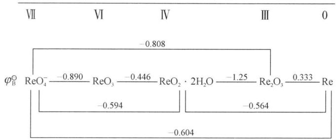

chemical

Energy level diagram of a reaction pathway involving ReO₄, ReO₃, and Re₂O₃ with labeled energy values

## 1. 单质

锝在自然界不存在,是用人工方法制备的第一个元素,锝的希腊文的原意是“人工制造”的意思。1937年美国加利福尼亚州立大学的两位教授用能量约500万电子伏特的氘核轰击Mo而制得: $\ce{^{96}_{42}Mo+^{2}_{1}H\longrightarrow^{97}_{43}Tc+^{1}_{0}n}$ 。现在从 $^{235}U$ 的裂变产物中取得较多的 $^{97}_{43}Tc$ 。

铼是稀有金属, 直到 1925 年才被发现。铼在地壳中的丰度 0.0007 ppm, 主要从焙烧辉钼矿 $\left(\mathrm{MoS}_{2}\right)$ 的烟道灰中提取。铼是以 $\mathrm{Re}_{2}\mathrm{O}_{7}$ 存在于烟道灰中, 它的制备反应如下: $\mathrm{Re}_{2}\mathrm{O}_{7} + \mathrm{H}_{2}\mathrm{O} = 2\mathrm{HReO}_{4}, \mathrm{HReO}_{4} + \mathrm{KCl} = \mathrm{KReO}_{4} + \mathrm{HCl}, 2\mathrm{KReO}_{4} + 7\mathrm{H}_{2} = 2\mathrm{Re} + 2\mathrm{KOH} + 6\mathrm{H}_{2}\mathrm{O}$ 。较纯铼的制备方法: $\mathrm{KReO}_{4} + \mathrm{HCl} = \mathrm{HReO}_{4} + \mathrm{KCl}, 2\mathrm{HReO}_{4} + 7\mathrm{H}_{2}\mathrm{S} = \mathrm{Re}_{2}\mathrm{S}_{7} + 8\mathrm{H}_{2}\mathrm{O}, \mathrm{Re}_{2}\mathrm{S}_{7} + 28\mathrm{H}_{2}\mathrm{O}_{2} + 16\mathrm{NH}_{3} \cdot \mathrm{H}_{2}\mathrm{O} = 7\left(\mathrm{NH}_{4}\right)_{2}\mathrm{SO}_{4} + 2\mathrm{NH}_{4}\mathrm{ReO}_{4} + 36\mathrm{H}_{2}\mathrm{O}, 2\mathrm{NH}_{4}\mathrm{ReO}_{4} + 7\mathrm{H}_{2} \xlongequal{973\mathrm{K}} 2\mathrm{Re} + 2\mathrm{NH}_{3} + 8\mathrm{H}_{2}\mathrm{O}$ , 这样制得的铼纯度为 99.98%。

锝、铼都是银白色金属，粉末是灰色的，铼的熔点很高，仅次于钨、锝。铼在空气中失去金属光泽，缓慢氧化，当温度高于673 K时，在氧气中燃烧生成能升华的 $M_{2}O_{7}$ ，溶于浓硝酸和浓硫酸中，但不溶于氢氟酸和盐酸中，铼和锝不同的是它可溶于过氧化氢的氨溶液中生成含氧酸盐，而锝不溶解： $2Re + 7H_{2}O_{2} + 2NH_{3} = 2NH_{4}ReO_{4} + 6H_{2}O$ 。

锝已成为产量以公斤计的人造化学元素。金属锝有较好的抗腐蚀性能，并不易吸收中子，因而是建造核反应堆防腐层的理想材料，锝及其合金是超导体，短寿命的锝99的同质异能素 $^{99m}$ Tc(半衰期6小时)具有良好的γ放射性能，是公认最优良的显象核素，用于诊断各种疾病。

铼是一种活性大的催化剂,选择性好,抗毒能力强,广泛用于石化工业,铂铼催比剂性能优于纯铂。铼及铼合金(特别是铼钨合金)在电子管中用作加热灯丝、阳极、阴极、栅极及结构材料。

## 2. 氧化物和含氧酸盐

锝、铼的氧化物有 $M_{2}O_{7}$ 、 $MO_{3}$ 和 $MO_{2}$ 。 $M_{2}O_{7}$ 为易挥发的黄色固体。 $Tc_{2}O_{7}$

是由 2 个 $TcO_{4}$ 四面体共用一个氧原子, Tc—O—Tc 是线形的, 见下图:

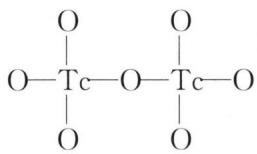

chemical

Chemical structure of a cerium-based compound with two oxygen atoms and two tert-butyl groups

$Re_{2}O_{7}$ 与 $Tc_{2}O_{7}$ 不同， $\mathrm{Re(VII)}$ 具有不同的配位数，它是由配位数为 6 变形八面体与配位数为 4 的四面体，彼此共角无限交替地排列，结构见下图：

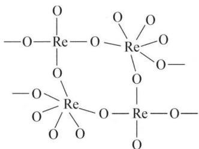

chemical

Chemical structure of a rhenium complex with two oxygen atoms and bridging ligands

$\mathrm{Tc}_{2} \mathrm{O}_{7}$ 和 $\mathrm{Re}_{2} \mathrm{O}_{7}$ 是将金属在空气或氧气中加热时生成的黄色固体。前者的熔点为 $393 \mathrm{~K}$ , 后者为 $493 \mathrm{~K}$ , 这两种氧化物都能溶解在水中生成无色的高锝酸 $\mathrm{HTcO}_{4}$ 和高铼酸 $\mathrm{HReO}_{4}$ 。在水溶液中 $\mathrm{HTcO}_{4} 、 \mathrm{HReO}_{4}$ 都是强酸。高铼酸盐的溶解度类似于高氯酸盐。 $\mathrm{TcO}_{4}^{-} 、 \mathrm{ReO}_{4}^{-}$ 与 $\mathrm{MnO}_{4}^{-}$ 一样都是正四面体结构, $\mathrm{MnO}_{4}^{-}$ 离子在强碱性溶液中不稳定, 但 $\mathrm{TcO}_{4}^{-}$ 和 $\mathrm{ReO}_{4}^{-}$ 离子却是相当稳定的。微量浓度的 $\mathrm{TcO}_{4}^{-}(6 \mathrm{mg/L})$ 能抑制介质对钢材的腐蚀, 可用于原子反应堆作缓蚀剂。较稳定的 $\mathrm{MO}_{2}$ , 可用锌和盐酸还原 $\mathrm{MO}_{4}^{-}$ 得到相应的二氧化物的水化物, 然后脱水生成 $\mathrm{TcO}_{2}$ 和 $\mathrm{ReO}_{2}$ 。 $\mathrm{TcO}_{2}$ 不溶于强碱中, 但 $\mathrm{ReO}_{2}$ 能与熔融的碱作用生成亚铼酸盐 $\mathrm{ReO}_{3}^{2-}$ , 这两种氧化物含有强的金属-金属键, 晶体类型为变形的金红石结构。 $\mathrm{MO}_{3}$ 中, 仅已知有红色的 $\mathrm{ReO}_{3}$ 存在, $\mathrm{TcO}_{3}$ 的存在不能肯定。

## 典型例题

【例 1】（1997 年全国初赛）将固体 $MnC_{2}O_{4} \cdot 2H_{2}O$ 放在一个可以称出质量的容器里加热，固体质量随温度变化的关系如右图所示。（相对原子质量：H 1.0，C 12.0，O 16.0，Mn 55.0）。

纵坐标是固体的相对质量。

说出在下列五个温度区间各发生什么

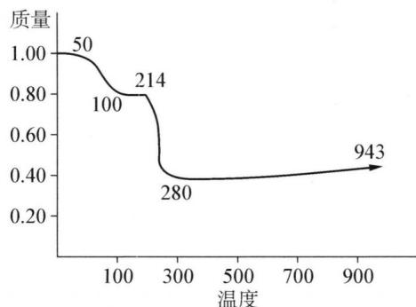

line chart

| 温度 | 质量 |
| ---- | ---- |
| 0    | 1.00 |
| 100  | 0.80 |
| 280  | 0.40 |
| 943  | 0.45 |

变化,并简述理由:

$$
0 \sim 5 0 ^ {\circ} \mathrm{C}:
$$

$$
5 0 \sim 1 0 0 ^ {\circ} \mathrm{C}:
$$

$$
1 0 0 \sim 2 1 4 ^ {\circ} \mathrm{C}:
$$

$$
2 1 4 \sim 2 8 0 ^ {\circ} \mathrm{C}:
$$

$$
2 8 0 \sim 9 4 3 ^ {\circ} \mathrm{C}:
$$

解析 本题涉及的是热重分析,试题的题面并没有介绍相关的实验装置,可以避免信息过多分散精力(这种仪器叫做热分析仪)。本题的解必须通过计算,计算的基础是图中的相对失重,要假设发生一个化学方程,然后进行失重的计算来论证,是否与题面的图中的实验数据相吻合。这种工作方法是实实在在的热重分析方法。当然,这种分析在很大程度上仍然有猜测的成分,因此最后的证实还要靠更多的分析手段,特别是热分解产物的结构分析(本题没有涉及)。

$$
0 \sim 5 0 ^ {\circ} \mathrm{C} \quad \mathrm {MnC_ {2} O_ {4} \cdot 2H_ {2} O} \text {   稳定区   }
$$

$$
5 0 \sim 1 0 0 ^ {\circ} \mathrm{C} \quad \mathrm{MnC} _ {2} \mathrm{O} _ {4} \cdot 2 \mathrm{H} _ {2} \mathrm{O} = \mathrm{MnC} _ {2} \mathrm{O} _ {4} + 2 \mathrm{H} _ {2} \mathrm{O}
$$

式量：179 143 验证： $143 / 179 = 0.80$

$$
1 0 0 \sim 2 1 4 ^ {\circ} \mathrm{C} \quad \mathrm{MnC} _ {2} \mathrm{O} _ {4} \text {   稳定区域   }
$$

$$
2 1 4 \sim 2 8 0 ^ {\circ} \mathrm{C} \quad \mathrm{MnC} _ {2} \mathrm{O} _ {4} = \mathrm{MnO} + \mathrm{CO} \uparrow + \mathrm{CO} _ {2} \uparrow
$$

式量：143 71 验证： $71 / 179 = 0.40$

$$
2 8 0 \sim 9 4 3 ^ {\circ} \mathrm{C} \quad 3 \mathrm{MnO} + 1 / 2 \mathrm{O} _ {2} = \mathrm{Mn} _ {3} \mathrm{O} _ {4} \quad \text { 验   证 }: 7 6. 3 / 1 7 9 = 0. 4 3
$$

【例 2】某地有软锰矿和闪锌矿两座矿山,它们的主要成分为:

软锰矿： $MnO_{2}$ 含量≥65% $Al_{2}O_{3}$ 含量为4%

闪锌矿：ZnS 含量≥80% FeS、CuS、CdS 含量各为 2%

$MnO_{2}$ 和锌是制造干电池的主要原料。

电解法生产 $MnO_{2}$ 传统的工艺主要流程为：软锰矿加煤还原焙烧；用硫酸浸出焙烧料；浸出液经净化后再进行电解， $MnO_{2}$ 在电解池的阳极析出。

电解锌的传统生产工艺为：闪锌矿高温氧化脱硫再还原得粗锌：

$$
2 \mathrm{ZnS} + 3 \mathrm{O} _ {2} \xlongequal {\text {高温}} 2 \mathrm{ZnO} + 2 \mathrm{SO} _ {2} \quad 2 \mathrm{C} + \mathrm{O} _ {2} \xlongequal {\text {高温}} 2 \mathrm{CO} \quad \mathrm{ZnO} + \mathrm{CO} \xlongequal {\text {高温}} \mathrm{Zn(g)} + \mathrm{CO} _ {2}
$$

将用热还原法制得的粗锌溶于硫酸,再电解 $ZnSO_{4}$ 溶液可生产纯度为 99.95% 的锌。

90 年代生产 $MnO_{2}$ 和锌的新工艺主要是通过电解获得 $MnO_{2}$ 和锌，副产品是硫、金属铜和镉。简化流程框图如下：

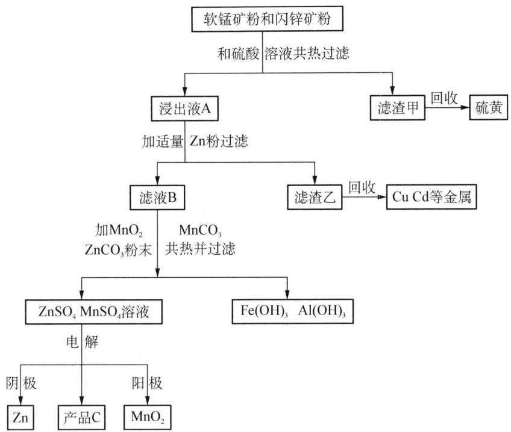

flowchart

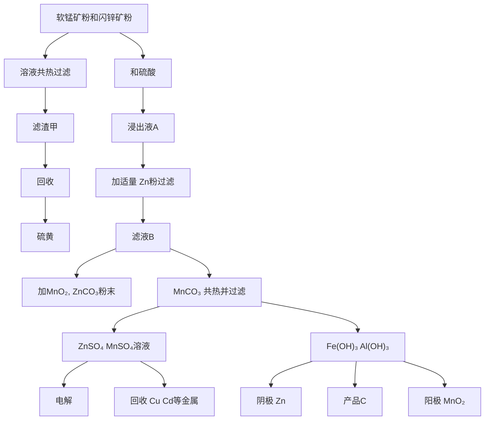

试回答下列问题：

(1) 软锰矿、闪锌矿粉末与硫酸溶液共热时析出硫的反应为氧化-还原反应。写出 $\mathrm{MnO}_2$ 在酸性溶液中分别和 $\mathrm{CuS}$ 、FeS 和 CdS 发生氧化一还原反应的化学方程式。  
(2) 用离子方程式表示浸出液 A 与适量 Zn 粉作用得到滤液 B 与滤渣乙的过程。  
(3) 产品 C 的化学式是 \_\_\_\_ 。写出电解的化学方程式。  
(4) 试从环境保护和能量消耗的角度评价 90 年代新工艺有哪些优点。

解析 （1）本题根据题意发生一系列氧化还原反应后均有 S 的生成，并且工业流程图中也有“回收硫磺”的信息，因此不难推断在反应中应由 Mn(Ⅳ) 在酸性环境中做氧化剂将 -2 价的 S 氧化为 S 单质。但注意到 FeS 中 Fe(Ⅱ) 有较强的还原性，考虑高中阶段学过的实验室制 Cl₂ 的方程式应该得出 Mn(Ⅳ) 在酸性环境还可以将 Fe(Ⅱ) 氧化为 Fe(Ⅲ)，一降二升的配平可用零价配平法。于是得到各类金属硫化物与 MnO₂ 的反应方程式：MnO₂ + CuS + 2H₂SO₄ = MnSO₄ + CuSO₄ + S↓ + 2H₂O, 3MnO₂ + 2FeS + 6H₂SO₄ = Fe₂(SO₄)₃ + 3MnSO₄ + 2S↓ + 6H₂O, CdS + 2H₂SO₄ + MnO₂ = MnSO₄ + CdSO₄ + S↓ + 2H₂O。

(2) 本题较为简单,根据(1)的方程式可以得出 Zn 的加入主要是将各类其他金属正离子还原的过程。但注意到本步骤中仅仅是回收了 Cu 和 Cd 金属,而在下一步中才有 Fe 的化合物的去除,因此本步骤中 Fe(Ⅲ) 只能被还原到 Fe(Ⅱ): Zn + Cu $^{2+}$ = Cu + Zn $^{2+}$ , Zn + Cd $^{2+}$ = Cd + Zn $^{2+}$ , Zn + 2Fe $^{3+}$ = 2Fe $^{2+}$ + Zn $^{2+}$ 。

(3) $\mathrm{H}_{2} \mathrm{SO}_{4} 。 \mathrm{ZnSO}_{4} + \mathrm{MnSO}_{4} + 2 \mathrm{H}_{2} \mathrm{O} \xlongequal{\text {电解}} \mathrm{Zn} + \mathrm{MnO}_{2} + 2 \mathrm{H}_{2} \mathrm{SO}_{4}$ 。

(4) 对比题目信息中传统的处理方法不难得出新工艺的优点。从环境保护角度评价: 无 $\mathrm{SO}_{2}$ 对大气的污染; 从能量消耗角度评价: 无高温焙烧热污染, 不需要高温焙烧节约燃料。

【例 3】 $Mn_{3}O_{4}$ 又名黑锰矿，主要用于生产优质软磁铁氧体。软磁铁氧体是由锰、锌、铁的氧化物按一定比例混合后烧结成型，在电子工业中有着广泛的用途。通常所说的 $Mn_{3}O_{4}$ 中，锰的价态实际上既有 +2，也有 +3 和 +4。

(1) $Mn_{3}O_{4}$ 可写成 $\left[Mn^{2+}\right]\left[Mn^{3+}\right]_{2}O_{4}$ ，是一种典型的尖晶石结构，晶胞参数 a = 0.86 nm。

① 右图的晶胞中包括\_\_\_\_个 $Mn_{3}O_{4}$ ;
② A 位置的离子是\_\_\_\_，占据的是\_\_\_\_空隙，占有率是\_\_\_\_；B 位置的离子是\_\_\_\_，占据的是\_\_\_\_空隙，占有率是\_\_\_\_。

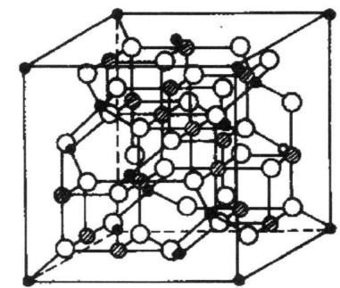

chemical

Crystal lattice structure diagram showing atomic positions in a cubic unit cell

A位置  
B位置  
○ 负离子

③ 估算该 $Mn_{3}O_{4}$ 的密度。

(2) 在某研究工作中, 要求得知 $\mathrm{Mn}_{3} \mathrm{O}_{4}$ 中不同价态锰的比值, 采用的测定方法步骤如下: (i) 称取三份质量相同的试样。第一份以 $(\mathrm{NH}_{4})_{2} \mathrm{SO}_{4} - \mathrm{H}_{2} \mathrm{SO}_{4}$ 溶液选择性溶解试样中的二价锰, 过滤洗涤后, 滤液用氨水中和并用 $\mathrm{NH}_{3} - \mathrm{NH}_{4} \mathrm{Cl}$ 缓冲溶液调至 $\mathrm{pH} = 10$ , 加入必要的试剂和指示剂, 用 EDTA 标准溶液 $(a_{1} \mathrm{~mol} \cdot \mathrm{L}^{-1})$ 滴定至终点, 耗去 $b_{1} \mathrm{~mL}$ 。(ii) 第二份试样中, 准确加入过量的 $\mathrm{Na}_{2} \mathrm{C}_{2} \mathrm{O}_{4}$ 标准溶液 $(a_{2} \mathrm{~mol} \cdot \mathrm{L}^{-1}, b_{2} \mathrm{~mL})$ 和适量 $\mathrm{H}_{2} \mathrm{SO}_{4}$ , 加热使试样全部溶解, 立即用 $\mathrm{KMnO}_{4}$ 标准溶液 $(a_{3} \mathrm{~mol} \cdot \mathrm{L}^{-1})$ 滴定剩余的还原剂至终点, 耗去 $b_{3} \mathrm{~mL}$ 。(iii) 第三份试样中, 同样加入过量的 $\mathrm{Na}_{2} \mathrm{C}_{2} \mathrm{O}_{4}$ 标准溶液和适量 $\mathrm{H}_{2} \mathrm{SO}_{4}$ , 加热使全部溶解。冷却后用氨水中和并用 $\mathrm{NH}_{3} - \mathrm{NH}_{4} \mathrm{Cl}$ 缓冲溶液调至 $\mathrm{pH} = 10$ , 加入必要的试剂和指示剂, 用 EDTA 标准溶液滴定至终点, 耗去 $b_{4} \mathrm{~mL}$ 。

① 写出步骤(ii)溶解试样时,不同价态锰的氧化物同草酸之间反应的化学方程式;写出用高锰酸钾滴定剩余还原剂的化学方程式。

② 用 $a_1$ 、 $a_2$ 、 $a_3$ 、 $b_1$ 、 $b_2$ 、 $b_3$ 和 $b_4$ 写出试样中二价、三价和四价锰含量（分别以 $x$ 、 $y$ 、 $z$ 表示）的计算式，单位用 mmol 表示。

解析 (1) 典型的尖晶石结构(通式 $\mathrm{AB}_{2} \mathrm{O}_{4}$ 型)是离子晶体中的一个大类, 属于等轴晶系。上图中 A 为二价正离子, 如 $\mathrm{Mg}^{2+} 、 \mathrm{Fe}^{2+} 、 \mathrm{CO}^{2+} 、 \mathrm{Ni}^{2+} 、 \mathrm{Mn}^{2+} 、 \mathrm{Zn}^{2+} 、 \mathrm{Cd}^{2+}$ 等; B 为三价正离子, 如 $\mathrm{Al}^{3+} 、 \mathrm{Fe}^{3+} 、 \mathrm{CO}^{3+} 、 \mathrm{Cr}^{3+} 、 \mathrm{Ga}^{3+}$ 等。结构中负离子 $(\mathrm{O}^{2-})$ 作立方紧密堆积, 其中 A 离子填充在四面体空隙中, B 离子在八面体空隙中, 即 $\mathrm{A}^{2+}$ 离子为 4 配位, 而 $\mathrm{B}^{3+}$ 为 6 配位。由上图可以看出 A 离子分别占据顶点、面心及八个小立方体中的四个的体心, 由此确定晶胞中的 $\mathrm{Mn}_{3} \mathrm{O}_{4}$ 的个数为 8 , 其余的问题可相应解得:

① 8个 ② $Mn^{2+}$ ，四面体，1/8； $Mn^{3+}$ ，八面体，1/2 ③ $\rho = 8M/N_{A}a^{3} = 4.8 g/cm^{3}$

(2) 根据题意可知步骤(i)消耗的 EDTA 即为二价锰的含量, 步骤(ii)中则是加入过量的 $C_{2}O_{4}^{2-}$ 将所有 Mn(III) 和 Mn(IV) 还原为 $Mn^{2+}$ , 并用 $KMnO_{4}$ 反滴定求出 Mn(III) 和 Mn(IV) 的总量, 最后步骤(iii)则求出总的锰含量, 可以写出涉及的反应方程式:

① $Mn_{2}O_{3} + H_{2}C_{2}O_{4} + 2H_{2}SO_{4} = 2MnSO_{4} + 2CO_{2}\uparrow + 3H_{2}O$

$$
\mathrm{MnO} _ {2} + \mathrm{H} _ {2} \mathrm{C} _ {2} \mathrm{O} _ {4} + \mathrm{H} _ {2} \mathrm{SO} _ {4} = \mathrm{MnSO} _ {4} + 2 \mathrm{CO} _ {2} \uparrow + 2 \mathrm{H} _ {2} \mathrm{O}
$$

$$
2 \mathrm{KMnO} _ {4} + 5 \mathrm{H} _ {2} \mathrm{C} _ {2} \mathrm{O} _ {4} + 3 \mathrm{H} _ {2} \mathrm{SO} _ {4} = 2 \mathrm{MnSO} _ {4} + \mathrm{K} _ {2} \mathrm{SO} _ {4} + 1 0 \mathrm{CO} _ {2} \uparrow + 8 \mathrm{H} _ {2} \mathrm{O}
$$

② 设试样中含二价锰 x mmol, 三价锰 y mmol, 四价锰 z mmol

根据①中的方程可以联立得到方程组： $x=a_{1}b_{1}$ ; $y+2z=2a_{2}b_{2}-5a_{3}b_{3}$ ; $x+y+z=a_{1}b_{4}$ 。解方程式后，得：

$$
x = a _ {1} b _ {1}
$$

$$
y = 2 a _ {1} b _ {4} - 2 a _ {1} b _ {1} - 2 a _ {2} b _ {2} + 5 a _ {3} b _ {3}
$$

$$
z = 2 a _ {2} b _ {2} - 5 a _ {3} b _ {3} + a _ {1} b _ {1} - 5 a _ {1} b _ {4}
$$

## 本讲习题

1. 在混合高锰酸钾和亚硫酸钾溶液时生成了棕色的沉淀。如果在高锰酸钾的溶液中预先加入酸或碱,那么沉淀不生成并且制得了无色或绿色的溶液。如何解释以下事实,即有时在酸性介质或在碱性介质中,上述盐溶液相互作用时可以观察到有沉淀析出?写出题中所有涉及到的反应的方程式。

2. 在一定条件下可实现下图所示物质之间的变化:

已知 D 为黄绿色气体,请回答下列问题:

(1) 写出 A\~F 的化学式。

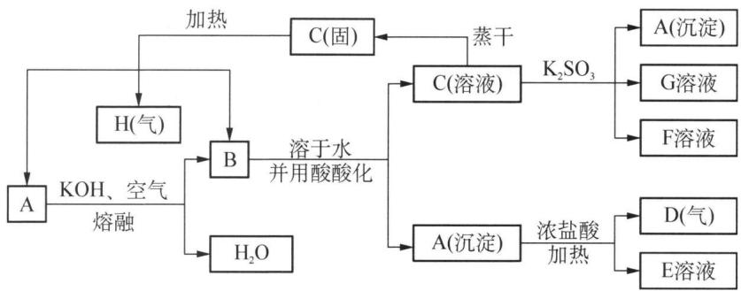

flowchart

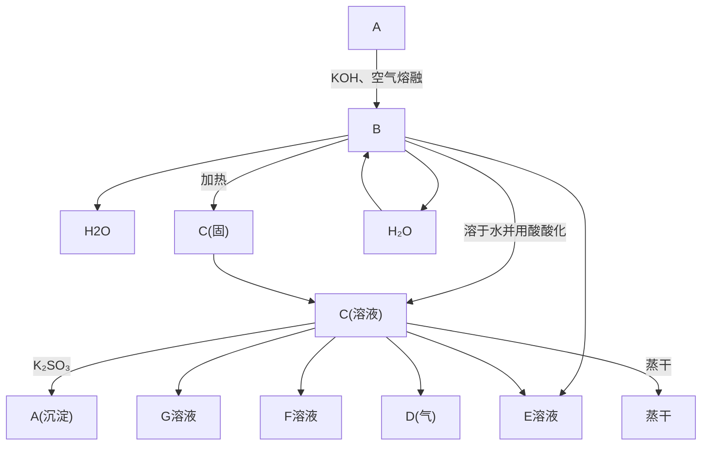

(2) 写出下列变化的离子方程式:

$$
\begin{array}{l} \mathrm{B} \longrightarrow \mathrm{C} + \mathrm{A} \\ \mathrm{A} \longrightarrow \mathrm{D} + \mathrm{E} \\ \mathrm{C} \longrightarrow \mathrm{A} + \mathrm{F} + \mathrm{G} \\ \end{array}
$$

3. 元素周期表中有 3 种金属 A、B 和 C。已知其有关性质：

① 所有 3 种金属都可形成二价离子, 稳定程度不同。  
②金属C的二价离子比金属A的三价离子和金属B的二价离子多2个电子。  
③ 元素 A 和 B 在此周期中表现为较高的氧化态。  
④ 元素 B 和 C 表现为最高氧化态, B 和 C 均有高氧化态。所有 3 种金属都能形成带色的含氧酸根 $\mathrm{MO}_{n}^{m-}(\mathrm{M}=\mathrm{A},\mathrm{B},\mathrm{C})$ , 它们在强碱性介质中稳定。  
⑤ 金属 B 的一种含氧酸的最高氧化态在酸性条件下与冷的 $H_{2}O_{2}$ 乙醚溶液反应, 可使溶液显兰色。

(1) 指出元素 A、B 和 C。  
(2) 给出 $M^{2+}$ 的稳定性顺序(大→小)。  
(3) 指出 $\mathrm{MO}_{n}^{m-}$ 氧化性增强的次序, 并指出颜色和它们的几何构型。  
(4) 用化学反应指出其负离子在酸化其碱性溶液的行为。

4. 1937 年美国加利福尼亚州立大学的两位教授用能量约 500 万电子伏特的氘核轰击质量数为 96 的某元素原子, 两种原子核融合制得了第一个人造元素锝 Tc, 同时释放出等量的另一种常见粒子。

(1) 写出第一次制得 Tc 的核反应方程式。  
(2) 金属 Tc 属于六方最密堆积, Tc 原子的金属半径为 0.136 nm, 求金属 Tc 的密度。  
(3) 下图是立方和六方最密堆积中原子的配位多面体, 请指出哪一种对应晶体属于 Tc 原子的配位多面体。

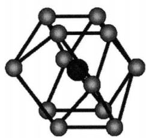

chemical

Molecular structure diagram showing a cage-like arrangement of atoms with bonds

图(a)

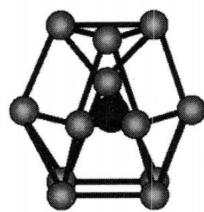

chemical

Molecular structure diagram of a cage-like compound with atoms at vertices and center

图(b)

（4）对锰副族的最高价氧化物的水化物 $HMnO_{4}$ 、 $HTcO_{4}$ 、 $HReO_{4}$ ，酸性顺序如何？

5. 銖是 1925 年由诺达克(W. Noddack)等人发现的,并以莱茵河的名字给它取名为铢。

(1) 镊是以 $Re_{2}O_{7}$ 存在于烟道灰中, 它的制备反应如下:

$$
\mathrm{Re} _ {2} \mathrm{O} _ {7} + \mathrm{H} _ {2} \mathrm{O} \longrightarrow \mathrm{X} \xrightarrow {\mathrm{KCl}} \mathrm{Y} \xrightarrow {\mathrm{H} _ {2}} \mathrm{Re}
$$

其中第二步反应是复分解反应;请写出各步反应的化学方程式。

(2) 但是上面的方法制得的铼纯度不高, 所以改用以下方法: 将上面所得的 Y 酸化, 再通入足量硫化氢气体, 只有两种产物生成, 两产物组成元素都不相同。其中一种 Z 可溶于过氧化氢的氨溶液中生成含氧酸盐, 用氢气还原即得 $99.98\%$ 的铼。

① 请写出 Z 的化学式。

② 写出由 Z 制得 Re 的两个化学方程式。

（3）在乙二胺水溶液中，用金属钾与 $KReO_{4}$ 反应可得到无色化合物 M，已知该化合物含 K 28.59%，含 Re 68.09%。

① 写出 M 的化学式。

② 写出制备 M 的化学方程式。

③ M 是顺磁性还是抗磁性的,为什么?

④ 在 M 的负离子结构中, Re 处于中心位置, 另一原子 L 与之配位, L 有两种不同的位置, 其比例关系为 1:2, 试画出该负离子的草图。

(4) A 物质是铼的氯化物, 为深棕色或黑色晶体, 它可由 $\mathrm{CCl}_{4}$ 和 $\mathrm{Re}_{2} \mathrm{O}_{7}$ 在封闭管中于 $400^{\circ} \mathrm{C}$ 反应而成。A 的熔点为 $220^{\circ} \mathrm{C}$ , 在晶态时, 用 X 射线测得其结构为 A 的二聚体, 该二聚体为两个八面体共用一条棱得到。

① 试写出 A 的分子式。

② 写出生成 A 的化学反应方程式。

6.（2006年全国初赛改编）锰是活泼的黑色金属，钢产品几乎都含有锰。全球锰矿产品年产量约30万吨，我国是锰的主要生产国之一。

(1) 我国高锰酸钾的生产和使用占全球首位, 年生产能力达到 5 万吨。

① 最初的生产方法是：先将软锰矿在碱性溶液中露置空气中氧化，再通入二氧化碳得到高锰酸钾溶液。这个生产方法中，锰原子的理论利用率仅 2/3。写出相应的化学方程式。

② 工业上制备高锰酸钾, 将第二步改为通电电解, 锰原子理论上可以全部利用。写出锰元素在电解时的变化方程式(电极反应)。

③ 事实上,锰酸钾溶液隔绝空气静置一段时间,也会全部转化为高锰酸钾溶液,同时产生可燃性气体。写出反应的化学方程式。

（2）已探明我国锰矿储量占世界第三位，但富矿仅占6.4%，每年尚需进口大量锰矿石。有人设计了把我国的菱锰矿(贫矿)转化为高品位“菱锰矿砂”的绿色工艺。该工艺首先将矿砂与硫酸铵一起焙烧，较佳条件是：投料比 $m[(NH_{4})_{2}SO_{4}]/m[MnCO_{3}]=1.5$ ；焙烧温度450℃；焙烧时间1.5小时。

① 写出焙烧反应方程式；

② 其次,将焙烧产物转化为高品位的“菱锰矿砂”,写出反应方程式;

③ 若焙烧温度过高或时间过长,将导致什么结果?

④ 从物料平衡角度看,生产过程中是否需要添加 $\left(\mathrm{NH}_{4}\right)_{2}\mathrm{SO}_{4}$ ?说明理由。

7.（1）化合物 X 不能独立存在, 是某常见反应的中间产物; 但 X 的配合物 Y 却能稳定存在。将 $KMnO_{4}$ 与 KCl 加入冷却的 40% 浓盐酸中并搅拌可得 Y, Y 与锰酸钾类质同晶, 但其负离子是正八面体构型。

① 写出 X、Y 的化学式。

② 写出合成 Y 的化学方程式。

③ X 是哪个反应的中间产物, 分步写出反应方程式。

(2) 化合物 A 是一不溶于水的暗红色固体, 它能溶于酸生成浅粉色的溶液 B, 将 B 与浓 $\mathrm{HNO}_{3}$ 和 $\mathrm{KClO}_{3}$ 共煮沸生成棕色沉淀 C, 将 C 与 $\mathrm{NaOH}$ 和 $\mathrm{Na}_{2} \mathrm{O}_{2}$ 共熔转化为暗绿色化合物 D, D 可溶于酸溶液生成紫红色溶液 E 及少量 C, 将 C 加入酸性 $\mathrm{H}_{2} \mathrm{O}_{2}$ 溶液中有气体产生, 同时生成溶液 B, 在溶液 B 中加入少量 $\mathrm{NaOH}$ 溶液生成白色沉淀 F, F 很快转变为褐色沉淀 G, F、G 分别失水得到 A、C。回答下列问题:

① A\~G 各是什么物质, 写出分子式。

② 写出 C 在酸性条件与 $H_{2}O_{2}$ 反应及在碱性条件与 $Na_{2}O_{2}$ 反应的方程式。

③ 写出 E 的负离子的空间构型。

(3) 锰能形成多种配合物, X 是其中一种羰基配合物, 存在类似于萘的芳香环, 环上只有碳原子。质量分析结果表明, X 中各元素的质量分数为: Mn 为 $28.92\%$ , C 为 $44.25\%$ , O 为 $25.26\%$ 。写出 X 的化学式及其比较稳定的构型图。

## 第九讲 铁系元素、铂系元素

## 知识精讲

## 一、铁系元素

## 1. 概述

铁在地壳中的含量约为 5%，居第四位，仅次于金属铝。在常用金属中，铁算得上最丰富、最重要和最廉价的了。铁矿有赤铁矿 $\left(\mathrm{Fe}_{2}\mathrm{O}_{3}\right)$ 、磁铁矿 $\left(\mathrm{Fe}_{3}\mathrm{O}_{4}\right)$ 、褐铁矿 $\left(\mathrm{Fe}_{2}\mathrm{O}_{3} \cdot 3\mathrm{H}_{2}\mathrm{O}\right)$ 、菱铁矿 $\left(\mathrm{FeCO}_{3}\right)$ 、黄铁矿 $\left(\mathrm{FeS}_{2}\right)$ 、钛铁矿 $\left(\mathrm{FeTiO}_{3}\right)$ 和铬铁矿 $\left[\mathrm{Fe}\left(\mathrm{CrO}_{2}\right)_{2}\right]$ 等。我国东北的鞍山、本溪，华北的包头、宣化，华中的大冶等地都有较好的铁矿。

钴相对来说是一种不常见的金属,地壳中的含量为 0.0023%,但它分布很广,它通常和硫或砷结合,如辉钴矿 CoAsS。它还存在于维生素 B $_{12}$ (一种钴(Ⅲ)的配合物)中。

镍比钴更丰富地存在于自然界,地壳中的含量为 0.018%,它主要与砷、锑和硫结合为针镍矿、镍黄铁矿等,在陨石中含有铁镍合金。

铁、钴、镍主要用于制造合金。铁有生铁、熟铁之分，生铁含碳在1.7%\~4.5%之间，熟铁含碳在0.1%以下，而钢的含碳量介于二者之间。如果再加入Cr、Ni、Mn、Ti等制成合金钢、不锈钢，可大大改善普通钢的性质。铁、钴、镍位于周期表第四周期、第Ⅷ族，其物理性质和化学性质都比较相似，合称铁系元素。

## 2. 单质

铁系元素单质都是具有金属光泽的白色金属, 铁、钴略带灰色, 镍为银白色。依 Fe、Co、Ni 顺序, 原子半径略有减小, 密度增大。它们的密度都比较大, 熔点也比较高, 熔点随原子序数的增加而降低, Fe、Co、Ni 分别为 $1535^{\circ} \mathrm{C}$ 、 $1495^{\circ} \mathrm{C}$ 、 $1453^{\circ} \mathrm{C}$ 。这可能是因为 3d 轨道中成单电子数按 Fe、Co、Ni 的顺序依次减少 (4、3、2), 金属键依次减弱的缘故。钴比较硬而脆, 铁和镍却有很好的延展性。它们都表现有铁磁性, 其合金是很好的磁性材料。

由于第一过渡系列元素原子的电子填充过渡到第Ⅷ族时,3d 电子已经超过 5 个,所以它们的价电子全部参加成键的可能性减少,因而铁系元素已经不再呈现出与族数相当的最高氧化态。铁的常见氧化态是+2和+3，与强氧化剂作用，铁可以生成不稳定的+6氧化态的高铁酸盐；钴和镍的常见氧化态都是+2，与强氧化剂作用，钴可以生成不稳定的+3氧化态，而镍的+3氧化态更少见。

在酸性溶液中， $\mathrm{Fe}^{2+}$ 、 $\mathrm{Co}^{2+}$ 和 $\mathrm{Ni}^{2+}$ 离子分别是铁、钴、镍的最稳定状态。空气中的氧能把酸性溶液中的 $\mathrm{Fe}^{2+}$ 氧化成 $\mathrm{Fe}^{3+}$ ，但是不能氧化 $\mathrm{Co}^{2+}$ 和 $\mathrm{Ni}^{2+}$ 成为 $\mathrm{Co}^{3+}$ 和 $\mathrm{Ni}^{3+}$ 。高氧化态的铁（VI）、钴（III）、镍（IV）在酸性溶液中都是很强的氧化剂。在碱性介质中，铁的最稳定氧化态是 +3、而钴和镍的最稳定氧化态仍是 +2；在碱性介质中把低氧化态的铁、钴、镍氧化为高氧化态比在酸性介质中容易。低氧化态氢氧化物的还原性按 $\mathrm{Fe(OH)}_2$ 、 $\mathrm{Co(OH)}_2$ 、 $\mathrm{Ni(OH)}_2$ 的顺序依次降低。例如：向 $\mathrm{Fe}^{2+}$ 的溶液中加入碱，能生成白色的 $\mathrm{Fe(OH)}_2$ 沉淀，但空气中的氧立即把 $\mathrm{Fe(OH)}_2$ 氧化成红棕色的 $\mathrm{Fe(OH)}_3$ 沉淀；在同样条件下生成的粉红色的 $\mathrm{Co(OH)}_2$ 则比较稳定，但在空气中放置，也能缓慢地被空气中的氧氧化成棕褐色的 $\mathrm{Co(OH)}_3$ ；而在同样条件下生成的绿色的 $\mathrm{Ni(OH)}_2$ 最稳定，根本不能被空气中的氧所氧化。由此可见， $\mathrm{Fe(OH)}_2$ 的还原性最强，也最不稳定； $\mathrm{Ni(OH)}_2$ 的还原性最差，也最稳定。这是由它们在碱性介质中的标准电极电势的大小决定的。

铁系元素易溶于稀酸中,只有钴在稀酸中溶解得很慢。它们遇到浓硝酸都呈“钝态”。铁能被热的浓碱液侵蚀,而钴和镍在碱溶液中的稳定性比铁高。在没有水汽存在时,一般温度下,铁系元素与氧、硫、氯、磷等非金属几乎不起作用,但在高温下却发生猛烈反应。

铁系元素的电势图如下：

$$
\begin{array}{l} \varphi_ {\mathrm{A}} ^ {\ominus} \quad \mathrm{FeO} _ {4} ^ {2 -} \xrightarrow {2 . 2 0} \mathrm{Fe} ^ {3 +} \xrightarrow {0 . 7 7 1} \mathrm{Fe} ^ {2 +} \xrightarrow {- 0 . 4 4} \mathrm{Fe} \\ \mathrm{Co} ^ {3 +} \xrightarrow {1 . 9 2} \mathrm{Co} ^ {2 +} \xrightarrow {- 0 . 2 7 7} \mathrm{Co} \\ \mathrm{NiO} _ {2} \xrightarrow {1 . 5 9 3} \mathrm{Ni} ^ {2 +} \xrightarrow {- 0 . 2 5 7} \mathrm{Ni} \\ \varphi_ {\mathrm{B}} ^ {\ominus} \quad \mathrm{FeO} _ {4} ^ {2 -} \xrightarrow {0 . 7 2} \mathrm{Fe(OH)} _ {3} \xrightarrow {- 0 . 5 6} \mathrm{Fe(OH)} _ {2} \xrightarrow {- 0 . 8 7 7} \mathrm{Fe} \\ \mathrm{Co} (\mathrm{OH}) _ {3} \xrightarrow {0 . 1 7} \mathrm{Co} (\mathrm{OH}) _ {2} \xrightarrow {- 0 . 7 5 3} \mathrm{Co} \\ \mathrm{NiO} _ {2} \xrightarrow {0 . 4 9 0} \mathrm{Ni(OH)} _ {2} \xrightarrow {- 0 . 7 2} \mathrm{Ni} \\ \end{array}
$$

在过渡元素中,铁的生物作用最重要,植物缺铁会得萎黄病,人体缺铁会患贫血症。一个成年人平均含铁量在4 g以上,但每天只需吸收约1 mg铁就足以补充和维持人体内铁的平衡。人体中的铁约3/4在血红素(血红蛋白)中,它是体内运载氧的工具,如以 Hem 代表血红素,则动物体内吸氧和供氧过程可用下列平衡表示: $\mathrm{Hem} + \mathrm{O}_{2} \rightleftharpoons \mathrm{HemO}_{2}$ 。所谓煤气中毒,就是 CO 取代了 $\mathrm{O}_{2}$ 的位置,造成缺氧症状。

钴的生物作用一直到 1948 年才被认识到。科学家从数以吨计的肝里分离出其中的抗贫血因子，并将它称为维生素 $B_{12}$ 。维生素 $B_{12}$ 是一种含钴的配合物，能抗恶性贫血。

1974 年证实了镍是动物和人必需的微量元素。镍与体内许多酶的活性有关，缺镍可使淀粉酶与肝中脱氢酶的活性降低，适量的镍对发挥正常生理功能是必需而且是有益的。但人体中镍含量超标时，它又是一种致癌性很强的元素。

## 3. 铁系元素的氧化物和氢氧化物

## (1) 铁系元素氧化物

铁系元素的氧化物有以下几种,颜色各异: FeO(黑色), CoO(灰绿色), NiO(暗绿色), $Fe_{2}O_{3}$ (红棕色), $Co_{2}O_{3}$ (黑色), $Ni_{2}O_{3}$ (黑色)。

铁系(Ⅱ)氧化物显碱性,能溶于酸性溶液中,铁系(Ⅲ)氧化物是难溶于水的两性氧化物, $\mathrm{Fe_{2}O_{3}}$ 以碱性为主, $\mathrm{Co_{2}O_{3}}$ 、 $\mathrm{Ni_{2}O_{3}}$ 偏碱性。 $\mathrm{Fe_{2}O_{3}}$ 与酸作用时,生成铁(Ⅲ)盐,与 $\mathrm{NaOH}$ 、 $\mathrm{Na_{2}CO_{3}}$ 或 $\mathrm{Na_{2}O}$ 这类碱物质共熔,生成铁(Ⅲ)酸盐: $\mathrm{Fe_{2}O_{3}}+\mathrm{Na_{2}CO_{3}}=2\mathrm{NaFeO_{2}}+\mathrm{CO_{2}}\uparrow$ 。工业上常用草酸亚铁焙烧制取 $\mathrm{FeO}$ ,反应过程如下: $\mathrm{FeC_{2}O_{4}}\xlongequal{\triangle}\mathrm{FeO}+\mathrm{CO_{2}}\uparrow+\mathrm{CO}\uparrow$ 。铁系(Ⅲ)氧化物具有较强的氧化性,其氧化能力按 $\mathrm{Fe}-\mathrm{Co}-\mathrm{Ni}$ 顺序增强,稳定性依次降低: $\mathrm{Co_{2}O_{3}}+6\mathrm{HCl}=2\mathrm{CoCl_{2}}+\mathrm{Cl_{2}}\uparrow+3\mathrm{H_{2}O}$ , $\mathrm{Ni_{2}O_{3}}+6\mathrm{HCl}=2\mathrm{NiCl_{2}}+\mathrm{Cl_{2}}\uparrow+3\mathrm{H_{2}O}$ 。

四氧化三铁 $Fe_{3}O_{4}$ ，又称磁性氧化铁，为 Fe(Ⅱ) 和 Fe(Ⅲ) 混合价态的氧化物 $\left(\mathrm{FeO}\cdot\mathrm{Fe}_{2}\mathrm{O}_{3}\right)$ 。经研究证明 $Fe_{3}O_{4}$ 是一种铁(Ⅲ)酸盐，即 $\mathrm{Fe}^{\mathrm{III}}\left[\left(\mathrm{Fe}^{\mathrm{II}}\mathrm{Fe}^{\mathrm{III}}\right)\mathrm{O}_{4}\right]$ 。磁性氧化铁用于医药、冶金、电子和纺织等工业，以及用作催化剂、抛光剂、油漆和陶瓷等的颜料、玻璃着色剂等。

## (2) 铁系元素氢氧化物

铁系元素可溶性二价盐与碱作用可制取氢氧化物（M = Fe、Co、Ni）： $M^{2+} + 2OH = M(OH)_2 \downarrow$ 。白色的 $\mathrm{Fe(OH)_2}$ 很容易被空气氧化成红棕色的 $\mathrm{Fe(OH)_3}$ ，玫瑰红色的 $\mathrm{Co(OH)_2}$ 也可被空气缓慢地氧化成暗棕色的氢氧化高钴 $\mathrm{Co(OH)_3}$ ： $4\mathrm{Fe(OH)_2} + \mathrm{O_2} + 2\mathrm{H_2O} = 4\mathrm{Fe(OH)_3} \downarrow$ （红褐色）， $4\mathrm{Co(OH)_2} + \mathrm{O_2} + 2\mathrm{H_2O} = 4\mathrm{Co(OH)_3} \downarrow$ （棕褐色）。绿色的 $\mathrm{Ni(OH)_2}$ 不被空气氧化，欲使其氧化为黑色高价氢氧化物，必需使用强氧化剂，如： $2\mathrm{Ni(OH)_2} + \mathrm{Cl_2} + 2\mathrm{NaOH} = 2\mathrm{Ni(OH)_3}$ （黑色）↓ + 2NaCl， $2\mathrm{Ni(OH)}_{2} + \mathrm{NaClO} + \mathrm{H}_{2}\mathrm{O} = 2\mathrm{Ni(OH)}_{3}$ （黑色）↓ + NaCl。

三价氢氧化物既可与酸反应又可与碱反应： $\mathrm{Fe(OH)}_{3} + 3\mathrm{HCl} = \mathrm{FeCl}_{3} + 3\mathrm{H}_{2}\mathrm{O}, \mathrm{Fe(OH)}_{3} + 3\mathrm{NaOH} = \mathrm{Na}_{3}[\mathrm{Fe(OH)}_{6}], \mathrm{Co(OH)}_{3} + \mathrm{NaOH} = \mathrm{NaCoO}_{2} + 2\mathrm{H}_{2}\mathrm{O}$ 。

由于铁系元素的氧化还原性不同,它们与盐酸作用时产物不同,氢氧化铁和盐酸进行酸碱中和反应, $\mathrm{Fe(III)}$ 不能氧化 $Cl^{-}$ ,而后两者(M=Co、Ni)都是强氧化剂,可氧化 $Cl^{-}:2M(OH)_{3}+6HCl=2MCl_{2}+Cl_{2}\uparrow+6H_{2}O$ 。

铁系氢氧化物的化学性质表现总结如下：

<table><tr><td colspan="3">M(II)</td><td colspan="3">M(III)</td></tr><tr><td> $Fe(OH)_2$ (白色)碱性</td><td> $Co(OH)_2$ (粉红色)碱性</td><td> $Ni(OH)_2$ (绿色)碱性</td><td> $Fe(OH)_3$ (红棕色)两性偏碱</td><td> $Co(OH)_3$ (棕黑色)两性偏碱</td><td> $Ni(OH)_3$ (黑色)两性偏碱</td></tr><tr><td colspan="3">还原性增强</td><td colspan="3">氧化性增强</td></tr></table>

## 4. 铁系元素的盐

## (1) $\mathrm{Fe(II)}$ 盐

铁(Ⅱ)盐中,最重要的是硫酸亚铁 $FeSO_{4} \cdot 7H_{2}O$ ,俗称绿矾。由铁和硫酸反应制得,它易溶于水,加热时它首先生成白色的无水盐 $FeSO_{4}$ ,然后分解: $2FeSO_{4} \xlongequal{\triangle} Fe_{2}O_{3} + SO_{2} \uparrow + SO_{3} \uparrow$ 。绿矾在空气中可逐渐失去一部分水,并且表面容易氧化为黄褐色碱式硫酸铁(Ⅲ) $\mathrm{Fe(OH)SO_{4}}: 4\mathrm{FeSO_{4}} + 2\mathrm{H_{2}O} + \mathrm{O_{2}} = 4\mathrm{Fe(OH)SO_{4}}$ 。绿矾在酸性溶液中能被强氧化剂氧化,如 $K_{2}Cr_{2}O_{7}$ 、 $KMnO_{4}$ 、 $Cl_{2}$ 等,分析化学中经常用作还原剂。绿矾与鞣酸反应可生成易溶的鞣酸亚铁,由于它在空气中被氧化成黑色的鞣酸铁,可用于制蓝黑墨水。 $FeSO_{4}$ 的还原性还用作照相显影剂、纺织染色、除臭剂、木材防腐剂、农药等。最近日本研究用 $FeSO_{4}$ 作食物防腐、鲜度保持剂有较好的效果。

## (2) $\mathrm{Fe(III)}$ 盐

铁(Ⅲ)盐中,最重要的是三氯化铁。将铁屑和氯气在高温下直接作用可得到无水三氯化铁红褐色六方晶系晶体: $2\mathrm{Fe} + 3\mathrm{Cl}_2 \xlongequal{\triangle} 2\mathrm{FeCl}_3$ 。无水 $\mathrm{FeCl}_3$ 的熔点为 $555\mathrm{K}$ ,沸点为 $588\mathrm{K}$ ,易溶于有机溶剂,它基本上属共价型化合物,它可以升华,常用升华法提纯 $\mathrm{FeCl}_3$ 。在 $673\mathrm{K}$ $\mathrm{FeCl}_3$ 蒸气中有双聚分子 $\mathrm{Fe}_2\mathrm{Cl}_6$ 存在,其结构和 $\mathrm{Al}_2\mathrm{Cl}_6$ 相似, $1023\mathrm{K}$ 以上分解为单分子。无水 $\mathrm{FeCl}_3$ 在空气中易潮解,常见的三氯化铁为棕黄色 $FeCl_{3} \cdot 6H_{2}O$ 水合晶体，它易潮解、易水解。铁（Ⅲ）盐有较强的氧化性： $2FeCl_{3} + H_{2}S = 2FeCl_{2} + S + 2HCl, 2FeCl_{3} + Cu = 2FeCl_{2} + CuCl_{2}$ 。三氯化铁能腐蚀铜板而被广泛用于印刷制板中。

Fe(Ⅲ)能与大多数负离子(除还原性负离子外)从溶液中析出浅紫色或近于无色的盐,例如 $\mathrm{Fe(ClO_4)_3\cdot 10H_2O}$ , $\mathrm{Fe(NO_3)_3\cdot 9H_2O}$ 或 $\mathrm{Fe(NO_3)_3\cdot 6H_2O}$ 及 $\mathrm{Fe_2(SO_4)_3\cdot 10H_2O}$ 。然而 $\mathrm{Fe(III)}$ 盐的水溶液却为黄色。这是由于 $\mathrm{Fe(III)}$ 在水溶液中的水解所造成的。 $\mathrm{Fe(III)}$ 水溶液中的水解状况是很复杂的,与溶液的 $\mathrm{pH}$ 有关。当 $\mathrm{pH} < 1$ , 完全以浅紫色的 $[\mathrm{Fe(H_2O)_6}]^{3+}$ 存在,但 $\mathrm{pH}$ 在 1 以上即发生逐级水解,溶液为黄色(水合羟基铁离子),显酸性: $[\mathrm{Fe(H_2O)_6}]^{3+} \rightleftharpoons [\mathrm{Fe(OH)(H_2O)_5}]^{2+} + \mathrm{H}^+$ , 水解过程中第二步发生缩合,形成逆磁性的 $\mu-$ 氧·二(五水合铁(Ⅲ))离子: $2[\mathrm{Fe(OH)(H_2O)_5}]^{2+} \rightleftharpoons [(\mathrm{H_2O})_5\mathrm{FeOFe(H_2O)_5}]^{4+} + \mathrm{H}_2\mathrm{O}$ 。随溶液酸度降低, $\mathrm{pH} > 2$ , 缩合度可能增大, 溶液由黄棕色逐渐变为红棕色, 产生红棕色凝胶状水合氧化铁沉淀。由于铁是多种物质中普遍含有的成分, 因此利用加热促进水解, 使 $\mathrm{Fe}^{3+}$ 生成水合氧化铁沉淀而除去。

## (3) 钴盐

Co 能形成 Co(Ⅱ)、Co(Ⅲ) 两种氧化态的化合物。Co(Ⅱ) 盐在某些方面与 Fe(Ⅱ) 盐相似，例如，可溶盐有相同结晶水 $CoSO_{4} \cdot 7H_{2}O$ 、 $FeSO_{4} \cdot 7H_{2}O$ ，水合离子有颜色， $\left[\mathrm{Co}\left(\mathrm{H}_{2}\mathrm{O}\right)_{6}\right]^{2+}$ 为桃红色， $\left[\mathrm{Fe}\left(\mathrm{H}_{2}\mathrm{O}\right)_{6}\right]^{2+}$ 为浅绿色。然而 Co(Ⅱ) 水合离子还原性比 Fe(Ⅱ) 弱，在水溶液中稳定存在，在碱性介质中能被空气氧化。

常见的 $\mathrm{Co(II)}$ 盐是 $\mathrm{CoCl}_2 \cdot 6\mathrm{H}_2\mathrm{O}$ , 由于所含结晶水的数目不同而呈现不同颜色:

$$
\mathrm{CoCl} _ {2} \cdot 6 \mathrm{H} _ {2} \mathrm{O} \rightleftharpoons \mathrm{CoCl} _ {2} \cdot 2 \mathrm{H} _ {2} \mathrm{O} \rightleftharpoons \mathrm{CoCl} _ {2} \cdot \mathrm{H} _ {2} \mathrm{O} \rightleftharpoons \mathrm{CoCl} _ {2}
$$

粉红色

紫红色

蓝紫色

蓝色

此性质用于指示硅胶干燥剂吸水情况。当干燥硅胶吸水后，逐渐由蓝色变为粉红色。在烘箱中受热可再生，失水由粉红色变为蓝色，可重复使用。

$\mathrm{Co}^{3+}$ 是强氧化剂: $\mathrm{Co}^{3+} + \mathrm{e} \rightleftharpoons \mathrm{Co}^{2+} \quad \varphi^{\ominus} = 1.92 \mathrm{~V}$ , 因此 $\mathrm{Co}^{3+}$ 在水溶液中极不稳定, 易转变为 $\mathrm{Co}^{2+}$ , 所以 $\mathrm{Co(III)}$ 只存在于固态和配合物中。固体 $\mathrm{Co(III)}$ 化合物有 $\mathrm{CoF}_{3} 、 \mathrm{Co}_{2} \mathrm{O}_{3} 、 \mathrm{Co}_{2} (\mathrm{SO}_{4})_{3} \cdot 18 \mathrm{H}_{2} \mathrm{O}$ 等。重要的 $\mathrm{Co(III)}$ 配合物有 $[\mathrm{Co(NH}_{3})_{6}] \mathrm{Cl}_{3} 、 \mathrm{K}_{3} [\mathrm{Co(CN)}_{6}] 、 \mathrm{Na}_{3} [\mathrm{Co(NO}_{2})_{6}]$ 。

## (4) 镍盐

常见的 Ni(Ⅱ)盐有：黄绿色的 $NiCl_{2} \cdot 7H_{2}O$ 和绿色的 $\mathrm{Ni(NO_{3})_{2} \cdot 6H_{2}O}$ ，以及复盐 $(\mathrm{NH}_{4})_{2}\mathrm{SO}_{4} \cdot \mathrm{NiSO}_{4} \cdot 6\mathrm{H}_{2}\mathrm{O}$ 。将金属镍溶于 $H_{2}SO_{4}$ 或 $HNO_{3}$ 可制得相应的盐。制备 $NiSO_{4}$ 时，为了加快反应速度，常加入一些氧化剂如 $HNO_{3}$ 或 $H_{2}O_{2}$ ： $Ni + H_{2}SO_{4} + 2HNO_{3} = NiSO_{4} + 2NO_{2} \uparrow + 2H_{2}O$ 。

(5) 铁系元素常见化合物颜色总结如下:

表 9-1 铁系元素常见化合物颜色总结

<table><tr><td></td><td>Fe(II)</td><td>Fe(III)</td><td>Co(II)</td><td>Ni(II)</td></tr><tr><td>水合离子</td><td>淡绿</td><td>淡紫</td><td>粉红</td><td>绿</td></tr><tr><td>氢氧化物</td><td>白</td><td>红褐</td><td>粉红</td><td>绿</td></tr><tr><td>氧化物</td><td>黑</td><td>红棕</td><td>灰绿</td><td>暗绿</td></tr><tr><td>硫化物</td><td>黑</td><td>黑</td><td>黑</td><td>黑</td></tr></table>

## 5. 铁系元素的配位化合物

## (1) 铁的配合物

Fe(Ⅱ)、Fe(Ⅲ)的价电子构型 $3\mathrm{d}^6$ 、 $3\mathrm{d}^5$ 都有未充满的d轨道, 因此能与许多离子如 $\mathrm{CN}^{-}$ 、 $\mathrm{F}^{-}$ 、 $\mathrm{SCN}^{-}$ 、 $\mathrm{C}_2\mathrm{O}_4^{2-}$ 等形成配合物, Fe(Ⅲ)不能与氨形成配合物: $\left[\mathrm{Fe}\left(\mathrm{H}_{2} \mathrm{O}\right)_6\right]^{3+} + 3 \mathrm{NH}_{3} = \mathrm{Fe}(\mathrm{OH})_{3} \downarrow + 3 \mathrm{NH}_{4}^{+} + 3 \mathrm{H}_{2} \mathrm{O}$ 。Fe(Ⅱ)和Fe(Ⅲ)都能形成稳定的铁氰配合物, 使亚铁盐与KCN溶液反应得 $\mathrm{Fe(CN)}_{2}$ 沉淀, KCN过量时沉淀溶解: $\mathrm{FeSO}_{4} + 2 \mathrm{KCN} = \mathrm{Fe(CN)}_{2} \downarrow + \mathrm{K}_{2} \mathrm{SO}_{4}$ , $\mathrm{Fe(CN)}_{2} + 4 \mathrm{KCN} = \mathrm{K}_{4}[\mathrm{Fe(CN)}_{6}]$ 。从溶液中析出的黄色晶体 $\mathrm{K}_{4}[\mathrm{Fe(CN)}_{6}] \cdot 3 \mathrm{H}_{2} \mathrm{O}$ 称六氰合铁(Ⅱ)酸钾或亚铁氰化钾, 俗称黄血盐。在黄血盐溶液中通入氯气(或用其他氧化剂)把 $\mathrm{Fe}^{2+}$ 氧化成 $\mathrm{Fe}^{3+}$ , 得到六氰合铁(Ⅲ)酸钾(或铁氰化钾) $\mathrm{K}_{3}[\mathrm{Fe(CN)}_{6}]$ , 其晶体为深红色, 俗称赤血盐: $2 \mathrm{K}_{4}[\mathrm{Fe(CN)}_{6}] + \mathrm{Cl}_{2} = 2 \mathrm{KCl} + 2 \mathrm{K}_{3}[\mathrm{Fe(CN)}_{6}]$ 。 $\left[\mathrm{Fe(CN)}_{6}\right]^{3-}$ 和 $\left[\mathrm{Fe(CN)}_{6}\right]^{4-}$ 在热力学上都是比较稳定的, $\left[\mathrm{Fe(CN)}_{6}\right]^{3-}(K_{\text {稳}} = 10^{42})$ 虽比 $\left[\mathrm{Fe(CN)}_{6}\right]^{4-}(K_{\text {稳}} = 10^{35})$ 稳定, 但由于动力学上前者是活性的, 后者是惰性的(即配体 $\mathrm{CN}^{-}$ 很难与其他配体交换), 前者在溶液中的离解反应远比后者迅速, 例如在中性溶液里 $\left[\mathrm{Fe(CN)}_{6}\right]^{3-}$ 可微弱地水解: $\left[\mathrm{Fe(CN)}_{6}\right]^{3-} + 3 \mathrm{H}_{2} \mathrm{O} = \mathrm{Fe(OH)}_{3} + 3 \mathrm{CN}^{-} + 3 \mathrm{HCN}$ 。 $\left[\mathrm{Fe(CN)}_{6}\right]^{4-}$ 不易水解, 因此赤血盐的毒性比黄血盐大。基于这个原因, 在处理含 $\mathrm{CN}^{-}$ 废水时, 常用 $\mathrm{Fe}^{2+}$ 使形成相当稳定的 $\left[\mathrm{Fe(CN)}_{6}\right]^{4-}$ , 能达到排放要求。

$\mathrm{Fe}^{3+}$ 和 $[\mathrm{Fe(CN)}_{6}]^{4-}$ 生成的蓝色沉淀称普鲁士蓝， $\mathrm{Fe}^{2+}$ 和 $[\mathrm{Fe(CN)}_{6}]^{3-}$ 生成的蓝色沉淀称为滕氏蓝。经实验证明两者是同一种物质 $\mathrm{Fe}_{4}^{\mathrm{III}}[\mathrm{Fe}^{\mathrm{II}}(\mathrm{CN})_{6}]_{3} \cdot x\mathrm{H}_{2}\mathrm{O}$ 六氰合亚铁酸铁(Ⅲ)，见下图。该配合物的颜色特别深而重，这是由于这个物质中的同一元素 Fe 存在两种不同氧化态 Fe(Ⅱ)、Fe(Ⅲ)的缘故。

$\mathrm{Fe}_{4}^{\mathrm{III}}\left[\mathrm{Fe}^{\mathrm{II}}(\mathrm{CN})_{6}\right]_{3}\cdot x\mathrm{H}_{2}\mathrm{O}(\mathrm{KFe}^{\mathrm{III}}\left[\mathrm{Fe}^{\mathrm{II}}(\mathrm{CN})_{6}\right]\cdot\mathrm{H}_{2}\mathrm{O})$ 这种对光强烈吸收现象是与电子从存在着两种氧化态元素中的一个原子转移到另一个原子的价间吸收有关。由于价间吸收的能量较低，电子跃迁的几率较大，故颜色深而重，一般具有混合氧化态的物质都具有这种特性。普鲁士蓝主要用作颜料、油漆和油墨工业，在分析化学上用于检定 $Fe^{2+}$ 、 $Fe^{3+}$ 离子。

在 $Fe^{3+}$ 溶液中，加入 KSCN 或 $NH_{4}SCN$ ，溶液即出现血红色硫氰铁配离子： $\mathrm{Fe}^{3+} + n\mathrm{SCN}^{-} = [\mathrm{Fe}(\mathrm{SCN})_{n}]^{(3-n)+}$ （血红色）。n = 1, 2, …, 6，随 $SCN^{-}$ 的浓度而异。这一反应非常灵敏，常用来检出 $Fe^{3+}$ 和比色测定 $Fe^{3+}$ 离子。该反应需在酸性环境中进行，否则 $Fe^{3+}$ 会发生水解。该配合物能溶于乙醚、异戊醇。当

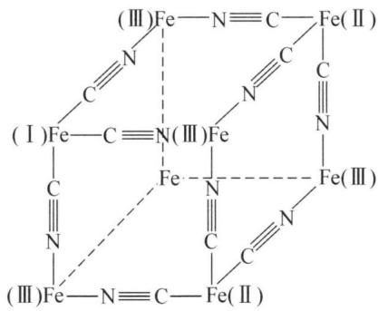

chemical

Molecular structure diagram of iron carbonyl compounds with labeled positions (I) to (III)

$Fe^{3+}$ 浓度很低时, 可用乙醚或异戊醇萃取, 得到较好的效果。

$Fe^{3+}$ 与 $F^{-}$ 有较强的亲合力，易形成配离子，为 $[FeF]^{2+}$ 、 $[FeF_{2}]^{+}$ 、 $[FeF_{3}]$ 、 $[FeF_{4}]^{-}$ 、 $[FeF_{5}]^{2-}$ 、 $[FeF_{6}]^{3-}$ ，它们的 $K_{稳}$ 较大。

单质铁还能与 CO 作用形成羰基化合物, 如 $\mathrm{Fe}(\mathrm{CO})_{5}$ 、 $\mathrm{Fe}_{2}(\mathrm{CO})_{9}$ 、 $\mathrm{Fe}_{3}(\mathrm{CO})_{12}$ 等, 其中 CO 既可作端基配位, 又可作桥基配位, 中心原子均满足 EAN18 电子规则, 见下图:

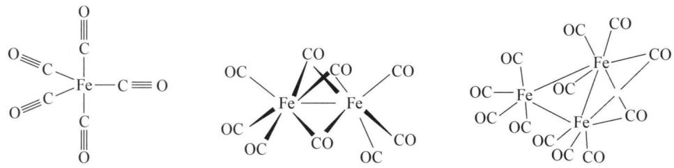

chemical

Molecular structures of iron carbonyl compounds with Fe center and organic ligands

夹心式配合物 $\left(\mathrm{C}_{5}\mathrm{H}_{5}\right)_{2}\mathrm{Fe}$ ，称为二茂铁，橙色固体，合成于1951年，是第一个重要的有机金属化合物，其制备反应与结构如下： $2\mathrm{C}_{5}\mathrm{H}_{5}\mathrm{MgBr}+\mathrm{FeCl}_{2}=\left(\mathrm{C}_{5}\mathrm{H}_{5}\right)_{2}\mathrm{Fe}+\mathrm{MgBr}_{2}+\mathrm{MgCl}_{2}$ 。

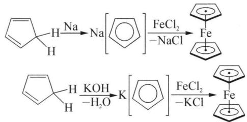

chemical

Two-step organic reaction sequence involving sodium dichloride and potassium chloride intermediates

## (2) 钴的配合物

Co(Ⅱ)的简单盐很稳定,但其配合物却不如 Co(Ⅲ)的稳定,主要是 Co(Ⅱ)的价电子构型为 $3d^{7}$ , 只能形成外轨型的配位化合物; 而 Co(Ⅲ)的价电子构型 $3d^{6}$ , 可以形成稳定的内轨型配位化合物。例如 $\left[\mathrm{Co}\left(\mathrm{NH}_{3}\right)_{6}\right]^{2+}$ 溶液很容易被空气中氧氧化为 $\left[\mathrm{Co}\left(\mathrm{NH}_{3}\right)_{6}\right]^{3+}:4\left[\mathrm{Co}\left(\mathrm{NH}_{3}\right)_{6}\right]^{2+}+\mathrm{O}_{2}+2\mathrm{H}_{2}\mathrm{O}=4\left[\mathrm{Co}\left(\mathrm{NH}_{3}\right)_{6}\right]^{3+}+4\mathrm{OH}^{-}$ 。同样, 亚硝酸根 $NO_{2}^{-}$ 作为配体存在时, Co(Ⅱ)容易被氧化。例如在醋酸存在下, 加 $NaNO_{2}$ 到 Co(Ⅱ)溶液中, $Co^{2+}$ 被 $NO_{2}^{-}$ 氧化, 当 $NO_{2}^{-}$ 过量时, 生成六硝基钴(Ⅲ)酸根配离子: $Co^{2+}+7NO_{2}^{-}+2H^{+}=NO\uparrow+H_{2}O+\left[\mathrm{Co}\left(\mathrm{NO}_{2}\right)_{6}\right]^{3-}$ 。可见, Co(Ⅲ)配合物的稳定性大于 Co(Ⅱ)配合物, 一般配位体配位能力越强, Co(Ⅲ)配合物越稳定, 由于 $CN^{-}$ 的配位能力强, 因此 $\left[\mathrm{Co}\left(\mathrm{CN}\right)_{6}\right]^{3-}(K_{\text {稳}}=1\times10^{64})$ 的稳定性大于 $\left[\mathrm{Co}\left(\mathrm{NH}_{3}\right)_{6}\right]^{3+}(K_{\text {稳}}=1.4\times10^{35})$ 。

Co(Ⅱ)能与 $\mathrm{SCN}^{-}$ 生成蓝色的 $[\mathrm{Co(SCN)}_4]^{2-}$ 配离子，它在水溶液中易离解： $[\mathrm{Co(SCN)}_4]^{2-} \rightleftharpoons \mathrm{Co}^{2+} + 4\mathrm{SCN}^{-}(K_{\text{不稳}} = 10^{-3})$ 。[Co(SCN) $_4$ ] $^{2-}$ 溶于丙酮或戊醇，在有机溶剂中比较稳定，可用于比色分析。

Co 单质同样可与 CO 形成羰基化合物。但无论是 $\mathrm{Co(CO)_4}$ 还是 $\mathrm{Co(CO)_5}$ 中 Co 原子最外层均不满足 EAN18 电子规则，所以 $\mathrm{Co(CO)_4}$ 只能以二聚的形式满足 18 电子规则： $\mathrm{Co_2(CO)_8}$ ，其中每个 Co 都是六配位，有 3 个端基配位的 CO，2 个桥基配位的 CO，另外两个 Co 之间还存在一根金属键 (Co—Co)，价键理论的解释如下：

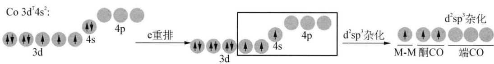

chemical

Co 3d⁷4s² hybridization reaction diagram showing electron transfer and d²sp³杂化 steps

研究表明,实际 $\mathrm{Co}_{2}(\mathrm{CO})_{8}$ 的结构是下面两种结构互变的结果:

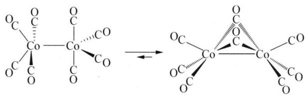

chemical

Chemical reaction showing the formation of a cobalt complex from a cobalt complex, forming a bridged cobalt ion.

同样存在多原子簇状的羰基配合物,如 $\mathrm{Co}_{4}(\mathrm{CO})_{12}$ 等:

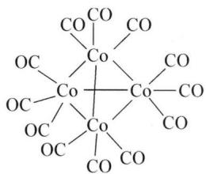

chemical

Molecular structure diagram of a cobalt complex with multiple Co and OC ligands

## (3) 镍的配合物

Ni(Ⅱ)能形成许多配合物,简单的水合离子 $\left[\mathrm{Ni}\left(\mathrm{H}_{2}\mathrm{O}\right)_{6}\right]^{2+}$ 是八面体,把过量浓氨水加入Ni(Ⅱ)盐溶液中,由于配位体的取代得到蓝紫色的八面体形配合物 $\left[\mathrm{Ni}\left(\mathrm{NH}_{3}\right)_{6}\right]^{2+}$ ,它与一些负离子如 $Br^{-}$ 生成微溶性盐。当将丁二酮肟加入镍(Ⅱ)溶液中时,生成猩红色螯合物,这一反应在定性分析中用于鉴定 $Ni^{2+}$ :

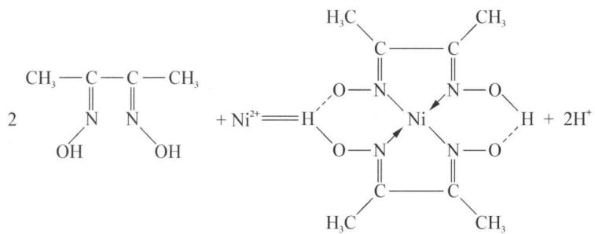

chemical

Chemical reaction equation showing nickel complex formation with nickel²⁺ and hydrogen bonding

如果将氰化镍(Ⅱ) $\mathrm{Ni(CN)_2}$ 溶于过量的氰化钾中,能结晶出橙红色配合物 $\mathrm{K_2[Ni(CN)_4] \cdot H_2O}$ ,它是平面正方形构型。

$\mathrm{Ni(CO)_4}$ 为无色液体，正四面体构型。利用分解 $\mathrm{Ni(CO)_4}$ 可制得极纯的 $\mathrm{Ni(99.99\%)} : \mathrm{Ni} + 4\mathrm{CO} \xrightarrow{50^{\circ}\mathrm{C} \sim 100^{\circ}\mathrm{C}} \mathrm{Ni(CO)_4}, \mathrm{Ni(CO)_4} \xrightarrow{200^{\circ}\mathrm{C}} \mathrm{Ni} + 4\mathrm{CO} \uparrow$ 。

## 二、铂系元素

铂系元素包括Ⅷ族中的钌、铑、钯和锇、铱、铂六种元素。根据它们的密度可分为两组，钌、铑、钯的密度约为 $12 \, g \cdot cm^{-3}$ ，称为轻铂系元素；锇、铱和铂的密度约为 $22 \, g \cdot cm^{-3}$ ，称为重铂系元素。但由于这两组元素在性质上很相似，并在自然界里也常共生存在，因此统称为铂系元素。它们都是稀有元素，地壳中的丰度（ppm）分别为：钌 Ru(0.0001)、铑 Rh(0.0001)、钯 Pd(0.015)、锇 Os(0.005)、铱 Ir(0.001)、铂 Pt(0.01)。

铂系元素在自然界能以游离态存在,如天然铂矿和锇铱矿等,也可共生于铜和镍的硫化物中,因此在电解精炼铜和镍后,铂系金属及银、金常以阳极泥形式存在于电解槽中。

铂系元素气态原子的电子构型特例较多,除饿、铱的 ns 为 2 以外,其余都是 1 或 0。一般说来,4d 与 5s 以及 5d 与 6s 轨道能级差比 3d 与 4s 轨道能级差小,因此出现 $(n+1)$ s 与 nd 能级交错的情况就更多些,即铂系元素原子的最外层电子有从 ns 层填入 $(n-1)$ d 层的强烈趋势,而且这种趋势在三元素组里随原子序数的增高而增强。它们的氧化态变化和铁、钴、镍相似,即每一个三元素组形成高氧化态的倾向,都是从左到右逐渐降低,重铂系元素形成高氧化态的倾向比轻铂系相应各元素大。

铂系元素的主要氧化态及其稳定性的递变规律如下：

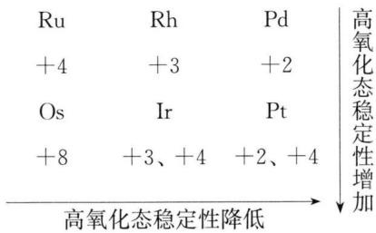

text_image

Ru	Rh	Pd
+4	+3	+2
Os	Ir	Pt
+8	+3、+4	+2、+4
高氧化态稳定性降低
高氧化态稳定性增加

## 1. 铂系单质

铂系金属的颜色除饿(Os)是蓝灰色外,其余都是银白色的。熔沸点很高,密度很大。除钌和锇硬而脆外,其余都有延展性。其中特别是纯净的金属铂有高度的可塑性,可以冷轧制成厚度为0.0025 mm的箔。

大多数的铂系金属能吸收气体,特别是氢气、氧气,钯吸收氢气的能力最大,一体积的钯能溶解700体积以上的氢气。铂吸收氧气的能力最大,一体积的铂能溶解70体积的氧气。由于铂系金属具有吸收气体的特性,因而具有高度的催化活性,是优良的催化剂。如铂是烯烃和炔烃氧化作用的催化剂,又是氨氧化制硝酸的催化剂。钌是苯氢化作用的催化剂等。

铂系金属的化学稳定性很高。在常温下和氧、氟、氮等非金属都不起作用。许多铂系金属都是抗腐蚀的。Ru、Rh、Ir 和块状的 Os 不溶于王水；Pd 和 Pt 较活泼，能溶于王水。Pd 能溶于浓硝酸和浓硫酸中。在有氧化剂如 $KNO_{3}$ 、 $KClO_{3}$ 等存在时，铂系金属与碱共熔，可转变成可溶性化合物。如 Ru 和 $KNO_{3}$ 和 KOH 共熔，可转变为 $K_{2}RuO_{4} \cdot H_{2}O$ 。

铂系金属除用作催化剂外, 还有许多实际的用途。铂可做坩埚、蒸发皿及电极。由铂或铂铑合金制成的热电偶可测量高温。铂铱合金可制成金笔的笔尖和国际标准米尺。顺— $\mathrm{Pt(NH_3)_2Cl_2}$ 是抗癌药物。据报导 $\{\left[\mathrm{Pt}\left(\mathrm{NH}_{3}\right)_{4}\right]\left[\mathrm{PtCl}_{4}\right]\}_{n}$ 和 $\{\left[\mathrm{Pd}\left(\mathrm{NH}_{3}\right)_{2}\mathrm{Cl}_{2}\right]\left[\mathrm{Pd}\left(\mathrm{NH}_{3}\right)_{2}\mathrm{Cl}_{4}\right]\}_{n}$ 是很有发展前途的半导体材料。Pd 除应用于电子工业外, 还可制成银白色装饰品, 等等。

铂系元素电势图如下：

钌元素电势图 $\varphi^{\ominus}/V$  
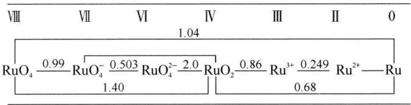

chemical

Redox potential diagram of ruthenium oxide showing oxidation states and their corresponding RuO2, Ru3+, Ru2+ species

铑元素电势图 $\varphi^{\ominus} / \mathrm{V}$  
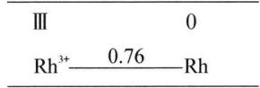

text_image

III 0
Rh³⁺ 0.76 Rh

<table><tr><td rowspan="2" colspan="5">钯元素电势图 $\varphi^{\ominus} / V$ </td><td colspan="5">俄元素电势图 $\varphi^{\ominus} / V$ </td></tr><tr><td>VIII</td><td>IV</td><td>III</td><td>II</td><td>0</td></tr><tr><td></td><td>VI</td><td>IV</td><td>II</td><td>0</td><td colspan="5">0.85</td></tr><tr><td> $\varphi_{A}^{\ominus}$ </td><td></td><td colspan="3"> $PdO_{2} \xrightarrow{1.263} Pd^{2+} \xrightarrow{0.915} Pd$ </td><td colspan="5"> $OsO_{4} \xrightarrow{1.005} OsO_{2} \xrightarrow{0.687} Os$ </td></tr><tr><td> $\varphi_{B}^{\ominus}$ </td><td>“ $PdO_{3}$ ”</td><td colspan="3"> $\xrightarrow{2.03} PdO_{3}^{2-} \xrightarrow{1.283} Pd(OH)_{2}^{-0.19} Pd$ </td><td colspan="5"> $OsCl_{6}^{2-} \xrightarrow{0.45} OsCl_{6}^{3-}$ </td></tr><tr><td></td><td></td><td colspan="3"></td><td colspan="5"> $Os(CN)_{4}(OH)_{2}^{3-} \xrightarrow{0.634} Os(CN)_{4}(OH)_{2}^{4-}$ </td></tr></table>

<table><tr><td colspan="3">铱元素电势图 $\varphi^{\ominus}$ /V</td></tr><tr><td>IV</td><td>III</td><td>0</td></tr><tr><td rowspan="2"> $IrO_{2}$ </td><td> $0.223$  $Ir^{3+}$ </td><td rowspan="2"> $-1.156$ Ir</td></tr><tr><td> $0.926$ </td></tr><tr><td> $IrCl_{6}^{2-}$ </td><td> $0.867$  $IrCl_{6}^{3-}$ </td><td> $0.86$ Ir</td></tr></table>

<table><tr><td colspan="4">铂元素电势图 $\varphi^{\ominus} / V$ </td></tr><tr><td>VI</td><td>IV</td><td>II</td><td>0</td></tr><tr><td> $PtO_{3}$ </td><td> $\underline{2.0}$ </td><td> $PtO_{2}$ </td><td> $\underline{1.045}$   $PtO$   $\underline{0.98}$  Pt</td></tr><tr><td></td><td> $PtO_{2}$ </td><td> $\underline{0.837}$ </td><td> $Pt^{2+}$   $\underline{1.188}$  Pt</td></tr><tr><td></td><td> $PtCl_{6}^{2-}$ </td><td> $\underline{0.726}$ </td><td> $PtCl_{4}^{2-}$   $\underline{0.758}$  Pt</td></tr></table>

## 2. 简单化合物

## (1) 氧化物和含氧酸盐

Ru 和 Os 有 $MO_{4}$ 氧化物，氧化数为 8， $OsO_{4}$ 可以由单质 Os 在空气中直接与 $O_{2}$ 化合制得： $Os + 2O_{2} = OsO_{4}(500^{\circ}\mathrm{C})$ ， $OsO_{4}$ 是浅黄色晶体，极毒，易挥发。 $RuO_{4}$ 不能直接制得： $Ru + 3Na_{2}O_{2} = Na_{2}RuO_{4} + 2Na_{2}O$ （熔融，Ⅵ）， $3Na_{2}RuO_{4} + NaClO_{3} + 3H_{2}SO_{4} \xlongequal{\triangle} 3RuO_{4} + NaCl + 3Na_{2}SO_{4} + 3H_{2}O$ ， $RuO_{4}$ 是黄色针状晶体，极毒，易挥发。Pd 只有二价氧化物，PdO 为黑色，直接氧化制得： $2Pd + O_{2} = 2PdO$ （黑）。其余铂系氧化物均为 $MO_{2}$ （Ⅳ）氧化物。

铂系金属的氧化物主要有 $RuO_{2}$ 、 $RuO_{4}$ 、 $OsO_{4}$ 、 $OsO_{2}$ 、 $RhO_{2}$ 、 $Rh_{2}O_{3}$ 、 $IrO_{2}$ 、 $Ir_{2}O_{3}$ 、PdO 和 $PtO_{2}$ 。 $RuO_{4}$ 和 $OsO_{4}$ 都是低熔点 ( $RuO_{4}$ ：298 K， $OsO_{4}$ ：313 K)，易挥发并有强氧化性的物质。通常制备方法为： $Ru + 3KNO_{3} + 2KOH = K_{2}RuO_{4} + 3KNO_{2} + H_{2}O$ ， $RuO_{2} + KNO_{3} + 2KOH = K_{2}RuO_{4} + KNO_{2} + H_{2}O$ ， $K_{2}RuO_{4} + NaClO + H_{2}SO_{4} = RuO_{4}\uparrow + K_{2}SO_{4} + NaCl + H_{2}O$ ， $Os + 2O_{2} = OsO_{4}$ 。值得注意的是， $RuO_{4}$ 和 $OsO_{4}$ 是有刺激性，类似于臭氧气味的有毒物质。 $OsO_{4}$ 的蒸气没有颜色，对呼吸道有剧毒，尤其有害于眼睛，会造成暂时失明。 $RuO_{4}$ 和 $OsO_{4}$ 微溶于水，极易溶于 $CCl_{4}$ 中， $OsO_{4}$ 比 $RuO_{4}$ 稳定。如： $4RuO_{4} + 4OH^{-} = 4RuO_{4}^{-} + 2H_{2}O + O_{2}\uparrow$ 或 $2RuO_{4} + 4OH^{-} = 2RuO_{4}^{2-} + 2H_{2}O + O_{2}\uparrow$ ， $OsO_{4} + 2OH^{-} =$

$\left[\mathrm{OsO}_{4}\left(\mathrm{OH}\right)_{2}\right]^{2-}$ ， $2RuO_{4} + 16HCl = 2RuCl_{3} + 5Cl_{2} \uparrow + 8H_{2}O$ 。由于 $RuO_{4}$ 、 $OsO_{4}$ 具有很大的挥发性，故常用此方法使 Ru 和 Os 与其他铂系元素分离。

将金属铑在空气中燃烧, 可制得 $Rh_{2}O_{3}$ , 将金属铱在空气中燃烧生成 $IrO_{2}$ , 但高温时氧化物又发生分解: $IrO_{2}\xlongequal{1473\mathrm{K}}Ir+O_{2}\uparrow$ , $2Rh_{2}O_{3}\xlongequal{1473\mathrm{K}}4Rh+3O_{2}\uparrow$ 。其中 $IrO_{2}$ 不溶于水, 将 $IrO_{2}$ 溶于浓 HCl, 则生成六氯铱酸: $IrO_{2}+6HCl=H_{2}[IrCl_{6}]+2H_{2}O$ 。六氯铱酸易被还原, 不稳定, 通常保持在硝酸的氧化气氛中。

## (2) 卤化物

除钯外, 所有铂系元素的六氟化物都是已知的, 其中以 $\mathrm{PtF}_{6}$ 研究最多, 并最有实际用途。 $\mathrm{PtF}_{6}$ 沸点 $342.1 \mathrm{~K}$ , 气态和液态呈红色, 固态几乎呈黑色, 为八面体结构, $\mathrm{PtF}_{6}$ 的化学反应性很高, 在室温甚至干燥时会与硬质玻璃和石英容器反应而慢慢分解, 但在镍容器中是稳定的。 $\mathrm{PtF}_{6}$ 是已知最强的氧化剂之一, 它能从 $\mathrm{O}_{2}$ 和 $\mathrm{Xe}$ 中夺取电子生成 $\mathrm{O}_{2}^{+} \mathrm{PtF}_{6}^{-}$ 、 $\mathrm{Xe}^{+} \mathrm{PtF}_{6}^{-}$ 、 $\mathrm{Xe}[\mathrm{PtF}_{6}]_{x}(x=1 \sim 2)$ 为橙红色固体, 它的生成, 结束了把稀有气体看作惰性气体的历史。 $\mathrm{PtF}_{6}$ 不稳定, 迅速被水分解。

五氟化物, 如 $\mathrm{PtF}_{5} 、 \mathrm{OsF}_{5}$ 等, 通常具有四聚体结构, 在这些化合物中, 八面体配位的金属原子是通过 M—F—M 桥连接的。五氟化物也很活泼, 易水解。

四氟化物可通过以下的反应来制取： $10RuF_{5} + I_{2} = 10RuF_{4} + 2IF_{5}$ 、 $Pd_{2}F_{6}(Pd^{II}Pd^{IV}F_{6}) + F_{2} = 2PdF_{4}$ 、 $H_{2}PtCl_{6}\xrightarrow{570K}PtCl_{4}\xrightarrow{F_{2}}PtF_{4}$ 。四氯化物遇水后激烈地水解。铂的四溴化物或四碘化物为深褐色，均是通过元素直接合成的。

大多数三卤化物是由元素直接合成,或者是从溶液中析出沉淀。如: $2\mathrm{Rh} + 3\mathrm{Cl}_{2} \stackrel{573\mathrm{K}}{=} 2\mathrm{RhCl}_{3}, \mathrm{RhCl}_{3} + 3\mathrm{I}^{-} = \mathrm{RhI}_{3} \downarrow + 3\mathrm{Cl}^{-}$ 。 $\mathrm{RhCl}_{3}$ 是铑的最常见的化合物,是红色的固体, $1073\mathrm{K}$ 时挥发。其结构类似于 $\mathrm{AlCl}_{3}$ 层状结构,以 Cl 为桥基,配位数为 6 ,化学惰性,通常不溶于水。将 $\mathrm{RhCl}_{3} \cdot 3\mathrm{H}_{2}\mathrm{O}$ 在干燥 HCl 中,于 $435\mathrm{K}$ 脱水可得很活泼的红色 $\mathrm{RhCl}_{3}$ 。此时, $\mathrm{RhCl}_{3}$ 可溶于水,若继续加热到 $573\mathrm{K}$ 以上又失去了这种性质。

二卤化物以 Pt 和 Pd 较多。在红热的条件下，金属钯直接氯化得二氯化钯。823 K 以上得到不稳定的 $\alpha-PdCl_{2}$ ，823 K 以下转变为 $\beta-PdCl_{2}$ 。 $\alpha-PdCl_{2}$ 的结构呈扁平的链状， $\beta-PdCl_{2}$ 的分子结构以 $Pd_{6}Cl_{12}$ 为单元（见下图），在 $\alpha-PdCl_{2}$ 和 $\beta-PdCl_{2}$ 这两种结构中，钯（Ⅱ）都具有正方形配位的特征。 $PdCl_{2}$ 溶液可用鉴定 CO 气体： $PdCl_{2}+CO+H_{2}O=Pd(黑色)+CO_{2}+2HCl$ 。二氯化铂通常用 $PtCl_{4}$ 热分解制得。铂、钯的二氯化物都是抗磁性物质。氯化亚钯和氯化亚铂可溶解在盐酸中形成 $H_{2}MCl_{4}$ （M 为 Pd 和 Pt）。溴和碘化物的氧化数较低，一般只有 $MX_{2}$ ， $MX_{3}$ ，这是因为 $Br^{-}$ 、 $I^{-}$ 的半径较大，空间排列不开。

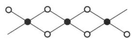  
○ Cl ● Pd  
$\alpha-PdCl_{2}$ 结构

chemical

Molecular structure diagram showing a grid of black and white atoms connected by bonds

○ Cl ● Pd  
$\beta-PdCl_{2}$ 结构

## 3. 配合物

铂系元素能形成许多种配合物。如卤配合物、含氮和氮氧的配合物、含磷的配合物、羰基配合物及与有机配体形成的许多金属有机化合物。这是铂系元素的重要特性。本节主要介绍铂的卤配合物。

## (1) 卤素配合物

大多数铂系元素都能生成卤配合物,其中以氯配合物最为常见,尤为重要的是 $\mathrm{H}_{2} \mathrm{PtCl}_{6}$ 及其盐。将金属铂溶于王水中或将四氯化铂溶于盐酸,都可生成氯铂酸,反应式如下: $3 \mathrm{Pt} + 4 \mathrm{HNO}_{3} + 18 \mathrm{HCl} = 3 \mathrm{H}_{2} \mathrm{PtCl}_{6} + 4 \mathrm{NO} \uparrow + 8 \mathrm{H}_{2} \mathrm{O}, \mathrm{PtCl}_{4} + 2 \mathrm{HCl} = \mathrm{H}_{2} \mathrm{PtCl}_{6}$ 。在 $\mathrm{Pt(IV)}$ 化合物中加碱可以得到两性的氢氧化铂,它溶于盐酸得氯铂酸,溶于碱得铂酸盐: $\mathrm{PtCl}_{4} + 4 \mathrm{NaOH} = \mathrm{Pt(OH)}_{4} + 4 \mathrm{NaCl}, \mathrm{Pt(OH)}_{4} + 6 \mathrm{HCl} = \mathrm{H}_{2} \mathrm{PtCl}_{6} + 4 \mathrm{H}_{2} \mathrm{O}, \mathrm{Pt(OH)}_{4} + 2 \mathrm{NaOH} = \mathrm{Na}_{2}[\mathrm{Pt(OH)}_{6}]$ 。氯铂酸: $\mathrm{H}_{2} \mathrm{PtCl}_{6} \cdot 6 \mathrm{H}_{2} \mathrm{O}$ 为橙红色晶体,易溶于水和酒精。将固体氯铂酸与硝酸钾灼烧,可得 $\mathrm{PtO}_{2}: \mathrm{H}_{2} \mathrm{PtCl}_{6} + 6 \mathrm{KNO}_{3} \xrightarrow{\text {灼烧}} \mathrm{PtO}_{2} + 6 \mathrm{KCl} + 4 \mathrm{NO}_{2} \uparrow + \mathrm{O}_{2} \uparrow + 2 \mathrm{HNO}_{3}$ 。将氯化铵加到氯铂酸中生成氯铂酸铵。加热分解得海绵状铂: $2 \mathrm{NH}_{4} \mathrm{Cl} + \mathrm{H}_{2} \mathrm{PtCl}_{6} = (\mathrm{NH}_{4})_{2}[\mathrm{PtCl}_{6}] + 2 \mathrm{HCl}, (\mathrm{NH}_{4})_{2}[\mathrm{PtCl}_{6}] \xrightarrow{\triangle} \mathrm{Pt} + 2 \mathrm{Cl}_{2} \uparrow + 2 \mathrm{NH}_{3} \uparrow + 2 \mathrm{HCl} \uparrow$ 。除氯化铵外,氯铂酸和碱金属氯化物作用生成相应的氯铂酸盐。氯铂酸钠 $\mathrm{Na}_{2} \mathrm{PtCl}_{6}$ 是橙红色的三斜晶体,极易溶于水和酒精。氯铂酸的铵盐、钾盐、铷盐、铯盐等则都是难溶于水的黄色八面体晶体。因此在分析化学上,有时可用 $\mathrm{H}_{2} \mathrm{PtCl}_{6}$ 来检验 $\mathrm{NH}_{4}^{+}, \mathrm{K}^{+}, \mathrm{Rb}^{+}, \mathrm{Cs}^{+}$ 等离子。工业上常利用氯铂酸铵溶解度小,且易分解,用来分离提纯铂。铂氯酸溶液在镀铂时用作电镀液。将 $\mathrm{PtCl}_{2}$ 溶于 HCl 溶液中得深红色的氯亚铂酸溶液: $\mathrm{PtCl}_{2} + 2 \mathrm{HCl} = \mathrm{H}_{2} \mathrm{PtCl}_{4}$ 。在铂黑催化下,用草酸钾、二氧化硫等还原剂与氯铂酸盐反应,可生成氯亚铂酸盐: $\mathrm{K}_{2} \mathrm{PtCl}_{6} + \mathrm{K}_{2} \mathrm{C}_{2} \mathrm{O}_{4} = \mathrm{K}_{2} \mathrm{PtCl}_{4} + 2 \mathrm{KCl} + 2 \mathrm{CO}_{2} \uparrow$ 。将 $\mathrm{K}_{2} \mathrm{PtCl}_{4}$ 与醋酸铵作用可得顺式 $\mathrm{Pt(NH_3)_2Cl_2}: \mathrm{K}_2\mathrm{PtCl}_4 + 2\mathrm{CH}_3\mathrm{COONH}_4 = \mathrm{Pt(NH_3)_2Cl_2} + 2\mathrm{CH}_3\mathrm{COOK} + 2\mathrm{HCl}$ 。顺式 $\mathrm{Pt(NH_3)_2Cl_2}$ 通常表示为 cis— $\mathrm{Pt(NH_3)_2Cl_2}$ ,药名叫“顺铂”。

## (2) 羰基配合物

如 $\mathrm{Os}_2(\mathrm{CO})_9$ ， $\mathrm{Os}_3(\mathrm{CO})_{12}$ 等。其中Os均为六配位，CO做端基或桥基配位，另有金属键Os—Os，均满足18电子规则：

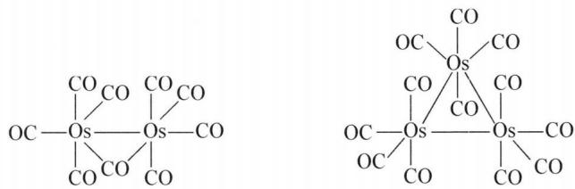

chemical

Two organosulfide silicate structures with cobalt (CO) and oxygen (Os) atoms, showing bridging geometry

CO 配位情况小结: 一般情况下 CO 与中心原子可以有 3 种配位方式, 分别为端基配位、桥基配位、面桥基配位:

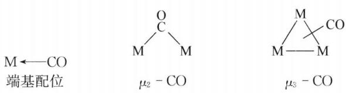

chemical

Molecular orbital diagrams showing M←CO and μ₂−CO, and μ₃−CO with labeled bond angles

## 典型例题

【例 1】（1992 年全国决赛）铁盐的基本性质有四方面：① $Fe^{2+}$ 与 $Fe^{3+}$ 间的相互转变；②它们的水解；③难溶氢氧化物或盐的形成和溶解；④络合物的形成。这些性质决定铁盐在自然环境中和在生物体内的存在状态和它们的作用。例如，在我国南方某些地区，刚从地下打上来的水是透明的，但放置一段时间后便出现红棕色沉淀，表面上形成一层“油皮”。用此水洗过的毛巾经晾晒后也会被染成红棕色。

(1) 在含 $\mathrm{Fe}^{3+}$ 溶液中, $\mathrm{Fe}^{3+}$ 逐渐水解, 无颜色变暗, 然后生成无定形红棕色 $\mathrm{Fe(OH)}_{3}$ 沉淀, 长期放置后变成 $\alpha - \mathrm{Fe}_{2} \mathrm{O}_{3}$ (赤铁矿) 或 $\alpha - \mathrm{FeOOH}$ (针铁矿), 这是地球表面这两种矿物形成的原因, 写出这一过程的所有反应方程式。讨论为什么最后形成赤铁矿或针铁矿, 为什么一开始不形成赤铁矿或针铁矿。  
(2) 在新配制的 $0.010 \mathrm{~mol} / \mathrm{L} \mathrm{FeSO}_{4}$ 酸性溶液中加少量稀 $\mathrm{NaOH}$ 溶液至 $\mathrm{pH} = 8.0$ 时, 先生成白色沉淀, 后变成红棕色沉淀。实验是在接触 $p_{\mathrm{CO}_{2}}$ 为 $10^{-3.5} \mathrm{bar}$ 的空气中进行的。请用计算说明所得沉淀各为什么化合物 (NaOH 体积可忽略)。  
（3）室温下 $Fe^{2+}$ 被空气中的氧氧化的反应速率表达式为： $v = k[Fe^{2+}][OH^{-}]p_{O_{2}}$ ; $k = 4/3 \times 10^{12}s^{-1} \cdot bar^{-1} \cdot mol^{-2}$ 。

① pH 增加一个单位,速率有多大变化?

② 在 pH 及 $p_{CO_{2}}$ 一定时， $\lg[Fe^{2+}]$ 随时间如何变化？

③ 若用氮气置换容器中绝大部分空气,使容器内 $O_{2}$ 占 0.01%(体积),pH 为 7.0,计算此时的反应速率与在接触纯氧、pH 为 3.0 的水溶液中进行的反应速率之比值。

附数据：

$$
\begin{array}{l} \lg K _ {\mathrm{sp}}: \mathrm{Fe} (\mathrm{OH}) _ {2} \quad \mathrm{FeCO} _ {3} \quad \mathrm{Fe} (\mathrm{OH}) _ {3} \quad \alpha - \mathrm{Fe} _ {2} \mathrm{O} _ {3} \quad \alpha - \mathrm{FeOOH} \\ - 1 4. 4 \quad - 1 0. 4 \quad - 3 7. 1 \quad - 4 1. 3 \quad - 4 1. 5 \\ \end{array}
$$

$$
\mathrm{pKa} \quad (\mathrm{H} _ {2} \mathrm{CO} _ {3}) \quad \mathrm{pK} _ {1} = 6. 3 \mathrm{pK} _ {2} = 1 0. 3
$$

$CO_{2}$ 的亨利系数: $K_{H} = 10^{-1.5} \, mol \cdot L \cdot bar^{-1} (298 \, \text{K})$

注：亨利定律， $CO_{2}$ 在溶液中的总浓度 $\left[CO_{2}\right]=K_{H}p_{CO_{2}}$

解析 (1) $\mathrm{Fe}^{3+} + \mathrm{OH}^{-} \rightleftharpoons \mathrm{FeOH}^{2+}, \mathrm{FeOH}^{2+} + \mathrm{OH}^{-} \rightleftharpoons \mathrm{Fe(OH)}_{2}^{+}, \mathrm{Fe(OH)}_{2}^{+} + \mathrm{OH}^{-} = \mathrm{Fe(OH)}_{3} \downarrow, \mathrm{Fe(OH)}_{3} = \mathrm{FeOOH} + \mathrm{H}_{2} \mathrm{O}, 2 \mathrm{FeOOH} = \mathrm{Fe}_{2} \mathrm{O}_{3} + \mathrm{H}_{2} \mathrm{O}$ 。溶液中 $\mathrm{OH}^{-}$ 浓度明显大于 $\mathrm{O}^{2-}$ 的浓度，故生成 $\mathrm{Fe(OH)}_{3}$ 沉淀，脱水后成 $\mathrm{FeOOH}$ 或 $\mathrm{Fe}_{2} \mathrm{O}_{3}$ ，因而一开始不形成赤铁矿或针铁矿。

(2) pH=8.0 时, 根据 $H_{2}CO_{3}$ 的平衡常数可以计算出 $\left[CO_{3}^{2-}\right]=10^{-5.6}$ mol/L, 因此 $\left[Fe^{2+}\right]\left[CO_{3}^{2-}\right]=10^{-7.6}>K_{\mathrm{sp}}(\mathrm{FeCO}_{3})$ , 而 $\left[Fe^{2+}\right]\left[OH^{-}\right]^{2}=10^{-14}$ , 略大于 $\mathrm{Fe(OH)}_{2}$ 的 $K_{sp}$ , 故白色沉淀主要是 $\mathrm{FeCO}_{3}$ (有少量 $\mathrm{Fe(OH)}_{2}$ )。白色沉淀 $FeCO_{3}$ 生成后, 溶液中 $\left[Fe^{2+}\right]=10^{-4.8}$ mol/L, 氧化后 $\left[Fe^{3+}\right]\left[OH^{-}\right]^{3}=10^{-22.8}>K_{\mathrm{sp}}(\mathrm{Fe(OH)}_{3})$ , 故生成红棕色 $\mathrm{Fe(OH)}_{3}$ 沉淀。

(3) ① pH 增加一个单位, 即 $\left[H^{+}\right]$ 降低 10 倍, 则 $\left[OH^{-}\right]$ 增大到 10 倍, 根据速率表达式可知, 反应速率增大到 100 倍。

② $2.303\lg\left[Fe^{2+}\right]=-k't+c$ 故 $\lg\left[Fe^{2+}\right]$ 随时间 t 增加而直线下降。

③ 根据速率方程计算可得出速率比为 1。

【例 2】向一定量的 $CoCO_{3}$ 中加入浓氢溴酸使之溶解, 再加入浓氨水和 $NH_{4}Br$ , 搅拌下加入 30% 的 $H_{2}O_{2}$ , 向溶液中通空气除去过量的氨气, 再加浓氢溴酸到溶液为中性时开始出现红色沉淀 A, A 中含五种元素, 其中 Co 为 14.67%, N 为 17.43%, 2.0 g A 与 0.920 mol/L 的 $AgNO_{3}$ 溶液反应消耗 16.30 mL $AgNO_{3}$ 溶液。将 A 过滤、洗涤、干燥, 在 110℃ 时加热 1\~2 小时得到蓝紫色晶体 B, 失重率为 4.48%, 在 B 的冷浓溶液中加稀盐酸可以得到暗紫色晶体 C, C 中含 Co 为 20.0%, 含 N 为 23.74%, A、B、C 式量均不超过 500, 且其中 N-H 键键长与氨

分子键长接近。

(1) 通过计算, 推测 A、B、C 的化学式。

(2) 写出制备 A 的方程式, 并命名 A。

(3) 如果事先不知道 A、B、C 本身的颜色, 如何鉴别 A、B、C 三种物质?

解析 （1）A 中只含 Co, N, H, O, Br 五种元素，可以计算得 Co:N=1:5，且式量不超过 500，则式量为 401.7（含一个钴），扣除一钴，五氨还余 257.77，钴应被双氧水氧化为 +3 价，扣除 3 个 Br，恰好余 18.07 为 1 个水。推得：A: $\left[\mathrm{Co}\left(\mathrm{NH}_{3}\right)_{5}\mathrm{H}_{2}\mathrm{O}\right]\mathrm{Br}_{3}$ ，B: $\left[\mathrm{CoBr}\left(\mathrm{NH}_{3}\right)_{5}\right]\mathrm{Br}_{2}$ ，C: $\left[\mathrm{CoBr}\left(\mathrm{NH}_{3}\right)_{5}\right]\mathrm{Cl}_{2}$ 。

(2) $CoCO_{3} + 2HBr = CoBr_{2} + CO_{2} \uparrow + H_{2}O, 2CoBr_{2} + 2NH_{4}Br + 8NH_{3} + H_{2}O_{2} = 2[Co(NH_{3})_{5}H_{2}O]Br_{3}$ ，三溴化五氨一水合钴(Ⅲ)。

(3) 将 A、B、C 溶于水, 先加 $AgNO_{3}$ , 白色沉淀者为 C, 其余两者均为淡黄色沉淀; A、B 由于正离子所带电荷不同可以通过电导率测出。

【例 3】 浅黄色固体 A 是一种重金属 M 的氧化物, 在含 A 63.55 g 的盐酸溶液中加入 KCl 和乙醇, 使 A 完全反应, 制得了一种红色晶体 B, 使 B 完全析出后称量得 B 的质量为 120.3 g。将 B 置于水中, 通入足量 $H_{2}S$ , 使 B 完全反应后。仅生成三种产物。其中一种是黑色固体沉淀 C, C 具有黄铁矿的晶体结构, 且生成的 C 的质量与原溶液中 A 的质量相同, 也为 63.55 g。另两种产物为 HCl 和 KCl。C 溶于 $HNO_{3}$ 完全转化为 A, 且生成的 A 的质量与 C 的质量也相同。

(1) 根据题目中有关条件推出 A、B、C 的化学式。

(2) A 反应生成 B 的化学反应方程式,说明该过程中乙醇主要起什么作用?

(3) B 反应生成 C 的过程是否是一个氧化还原反应过程?

(4) A 溶于强碱转化为深红色的 $\left[\mathrm{A}(\mathrm{OH})_{2}\right]^{2-}$ 离子(代号 D)，向含 D 的水溶液中通入氨，生成 E(离子)，溶液的颜色转为淡黄色。E 十分稳定。E 是 A 的等电子体，其中的金属的氧化态不变。红外图谱可以检测出分子中某些化学键的振动吸收。红外谱图显示 E 有一个 A 所没有的吸收。E 的含钾化合物是黄色的晶体，与高锰酸钾类质同晶。

① 给出 E 的化学式

② 写出由 A 在强碱性介质中与氨反应制备 E 的离子方程式。

③ 给出 D、E 的结构式。

解析 C 和黄铁矿的晶体结构相同, 可设化学式为 $MS_{2}$ ; 又 C 和 A 的质量相同, 猜测 A 的化学式为 $MO_{4}$ 。设 B 为 $K_{x}MCl_{y}$ , 根据 B 与 $H_{2}S$ 反应的产物可以解得 y - x = 4。分别将 y = 5, x = 1 或 y = 6, x = 2 代入, 讨论 C 和 B 质量比值, 解得当y=6, x=2 时, 有金属 M 原子量为 190.7, 从而确定是金属 Os:

(1) A: $OsO_{4}$ B: $K_{2}OsCl_{6}$ C: $OsS_{2}$

(2) 注意到 $OsO_{4}$ 中的 Os 为 +8 价, 而 $K_{2}OsCl_{6}$ 中 Os 的化合价为 +4, 因此在盐酸溶液中的反应是氧化还原反应: $OsO_{4} + 8HCl + 2KCl = K_{2}OsCl_{6} + 4H_{2}O + 2Cl_{2}\uparrow$ 。 $C_{2}H_{5}OH$ 作溶剂, 降低 B 的溶解度, 使之析出, 相当于醇析。

(3) B 反应生成 C 的过程是一个氧化还原反应 (Os 的化合价由 +4→+2)。

(4) E 与高锰酸钾类质同晶可知 E 带 1 个单位负电荷, 而 Os 氧化态不变, 多出的 1 个负电荷显然只能由 $NH_{3}$ 中的 -3 价的 N 原子来提供, 于是得到:

① $\mathrm{OsO_3N^-}$ ② $\mathrm{OsO_4 + OH^- + NH_3 = [OsO_3N]^-$ $+2\mathrm{H}_2\mathrm{O}$

③ D: $\left[\begin{array}{c}O\\|\\Os\\|\\OH\end{array}\right]^{2-}$ 或 $\left[\begin{array}{c}HO\\|\\Os\\|\\OH\end{array}\right]^{2-}$

E: $\left[\begin{array}{c}O\\|\\O-Os-N\\|\\O\end{array}\right]^{-}$ 或 $\left[\begin{array}{c}N\\||\\Os\\O-O\end{array}\right]^{-}$

## 本讲习题

1. 在氧化还原反应进行过程中测定 pH 常常十分重要。用铁(Ⅲ)离子腐蚀铜生产印刷线路需要在酸性介质中进行, 而在碱性溶液里铁(Ⅱ)离子是极强还原剂, 例如, 可将高氯酸根离子还原成氯离子。

(1) 铁(Ⅱ)和铁(Ⅲ)在酸性、中性和碱性介质里以什么方式存在?

(2) 写出铁(Ⅲ)离子在水溶液里布朗斯特酸碱反应。

(3) 在碱性介质里铁(Ⅱ)离子与高氯酸根离子的反应应当如何表示?

（4）试写出铜和铁(Ⅲ)离子反应的化学方程式,该反应的平衡常数 $\lg K$ 多大?设298K下标准电极电势为： $E^{\ominus}\left(\mathrm{Fe}^{3+}/\mathrm{Fe}^{2+}\right)=0.7704\mathrm{V};E^{\ominus}\left(\mathrm{Cu}^{2+}/\mathrm{Cu}\right)=0.3460\mathrm{V}$ ;活度系数f=1。

(5) 从表观看, (3)、(4)两题的反应跟 pH 有关系吗?

(6) 为何铁(Ⅱ)在碱性介质是良好还原剂?

2. 有人曾经用电解法制得过 $\mathrm{Co(NO_{3})_{3}}$ 的水溶液, 但却未能分离出它的固体水合盐。最近, 有化学家用 $N_{2}O_{5}$ 作用于 $CoF_{2}$ , 得到了绿色吸湿性的无水 $\mathrm{Co(NO_{3})_{3}}$ , 与此同时, 所有的生成物中有一种化合物 A, A 是一种含有 N、O 和 F 的共价型离子化合物, 其正离子为直线型。

(1) 试写出制备 $\mathrm{Co(NO_{3})_{3}}$ 的化学反应方程式。

(2) 试确定 A 的组成式。

(3) 研究表明: $\mathrm{Co(NO_3)_3}$ 中钴原子周围的配位环境基本上是八面体的, 每个 $\mathrm{NO}_3^-$ 中有两个 $\mathrm{N}-\mathrm{O}$ 键基本等长。试画出 $\mathrm{Co(NO_3)_3}$ 的结构式。

(4) 写出 Co(Ⅲ) 离子的核外电子排布式。

3. 高铁酸盐可由三种方法进行制备:

(1) 熔融法: 又称干法, 是在有苛性碱存在下, 于 $500^{\circ} \mathrm{C} \sim 1000^{\circ} \mathrm{C}$ , 硝酸盐或过氧化物经固相反应将低价铁化合物氧化成高铁酸盐的方法。该法特点是产物为多种价态铁酸盐的混合物, 反应容器腐蚀严重。目前倾向于用过氧化物或过氧硫酸盐作为氧化剂 (代替硝酸盐), 并添加硫酸盐。

① $Na_{2}O_{2}/FeSO_{4}$ 体系在 $N_{2}$ 流中于 $700^{\circ}C$ 反应 1 小时，可得到高铁酸盐，已知反应过程中的失重率为 4.15%（假设反应物完全反应），试写出并配平这一反应方程式。

②以硝酸盐为氧化剂时的最大不足之处是什么？

③ 添加硫酸盐的目的是什么？

(2) 次氯酸盐氧化法: 又称湿法, 是在低温下用次氯酸盐的苛性碱溶液将 $Fe^{3+}$ 盐 [主要是 $\mathrm{Fe(NO_{3})_{3}}$ ] 氧化成高铁酸盐。湿法主要用于制备低浓度的 $Na_{2}FeO_{4}$ 溶液。

① 写出该制备反应的离子方程式。

②能否通过浓缩的办法或其他办法得到高铁酸盐固体,为什么?

(3) 电解法: 以铂为阴极, 铁为阳极, 以饱和 $\mathrm{NaOH} / \mathrm{Ba(OH)}_{2}$ 溶液为电解液, 以某正离子交换膜为隔膜, 此反应在惰性气体保护下进行。

① 写出电极反应和总反应方程式。

② 隔膜的作用是什么？

③电解中溶液的温度在60℃左右，不易太高或太低，为什么？

④该方法相对上面两种方法的显著优点是什么？

4. 在周期表中, 钴和铁相邻, 所以有常见氧化态 +2 和 +3; 下面是钴的系列实验, 为了说明以下四个问题: ① $CoCl_{2} \cdot 6H_{2}O$ 的乙醇溶液与水溶液的颜色及物种的结构; ② $Co(II)$ 难溶物的转化; ③ $Co(II)$ 、 $Co(III)$ 的单盐与配合物的氧化还原稳定性比较; ④ 配离子的稳定性。[步骤] 将 250 mL 干燥的烧杯放在磁搅拌器上, 放入磁子, 按下列顺序操作:

$\text{CoCl}_2 \cdot 6\text{H}_2\text{O}$ 0.3 g $\xrightarrow{(1)\text{无水乙醇 } 25\ \text{mL}}$ A $\xrightarrow{(2)\text{纯水 } 4\ \text{mL}}$ B $\xrightarrow{(3)\ 0.1\ \text{mol/L Na}_2\text{CO}_3\ 13\ \text{mL}}$ (红色晶体) (蓝色溶液) (红色溶液)

C $\xrightarrow{(4)0.1\mathrm{mol / LNaOH}25\mathrm{mL}}$ D $\xrightarrow{(5)3\%H_2O_22\mathrm{mL}}$ E $\xrightarrow{(6)2\mathrm{mol / LHCl}2\mathrm{mL}}$ B （紫红色沉淀，碱式盐） （蓝色沉淀） （棕褐色沉淀） （红色溶液） (7)饱和KSCN $5\mathrm{mL}$ F $\xrightarrow{(8)}$ G $\xrightarrow{(9)}$ H $\xrightarrow{(10)0.1\mathrm{mol / L KCN}8\mathrm{mL}}$ I （蓝色溶液，N配位化合物） （黄红色溶液） （深红色溶液） （黄色溶液）

(1) 请写出 A、B 的离子形式化学式，并说明其空间构型。

（2）请写出第③⑤⑥⑧⑨的相应离子反应方程式，注意：只有在有活性炭作为催化剂时，才生成六氨合钴（Ⅲ）配离子，而当没有催化剂活性炭时，常常发生取代反应。在此情况下六配位氨合物中的氨分子易被水分子取代而得到一水五氨合钴配离子。

（3）已知 $\varphi^{\ominus}\left(\mathrm{Co}(\mathrm{CN})_{6}^{3-}/\mathrm{Co}(\mathrm{CN})_{6}^{4-}\right)=-0.81\mathrm{~V}$ ，当在 H 溶液中加入 KCN 溶液，常能见到有气泡产生，请分析原因。

5. 下面是有关 Ni(Ⅱ)系列实验:

$NiSO_{4} \cdot 6H_{2}O \xrightarrow[2.5\ mL]{① 12\ mol/L\ HCl} A(黄色) \xrightarrow[50\ mL]{② 纯水} B(绿色) \xrightarrow[11.5\ mL]{③ 2.5\ mol/L\ Na_{2}CO_{3}} C(黄绿色沉淀) \xrightarrow[6\ mL]{④ 6\ mol/L\ HNO_{3}} B \xrightarrow[55\ mL]{⑤ 0.5\ mol/L\ NaOH} D(绿色沉淀) \xrightarrow[10\ mL]{⑥ 15\ mol/L\ NH_{3} \cdot H_{2}O} E(蓝紫色溶液) \xrightarrow[8\ mL]{⑦ 25\%乙二胺(en)} F(紫红色) \xrightarrow[13\ mL]{⑧ 1\%丁二酮肟} G(红色沉淀) \xrightarrow[8\ mL]{⑨ 1\ mol/L\ Na_{2}S} H(黑色沉淀)$

(1) 该实验的目的是为了说明什么?

(2) 写出 A、B 的化学式、中心离子杂化类型和空间构型。

(3) 已知 F 为 $\left[\mathrm{Ni}(\mathrm{en})_{3}\right]^{2+}$ ，请画出其空间结构。

（4）已知配合常数E的 $\beta_{6}\left(\left[\mathrm{Ni}\left(\mathrm{NH}_{3}\right)_{6}\right]^{2+}\right)=1.1\times10^{8}$ ，F的 $\beta_{3}\left(\left[\mathrm{Ni}\left(\mathrm{en}\right)_{3}\right]^{2+}\right)=3.9\times10^{18}$ ，G的 $=4.17\times10^{17}$ 。⑧反应之所以能够发生，还需要\_\_\_\_（填写一种物理量的字母）的数据进行。计算验证，还可以判断该化合物中有\_\_\_\_存在，丁二酮肟的结构简式如下图，已知它与F生成的G是一种中心离子呈平面正方形的化合物，画出G的空间结构。

丁二酮肟结构：

6. (2013年全国初赛)二氯化钯是乙烯氧化制乙醛的工业催化剂, 这是一种重要的配位络合催化反应。下图是 $\mathrm{PdCl}_{2}$ 为催化剂, 氧化乙烯为乙醛的流程图:

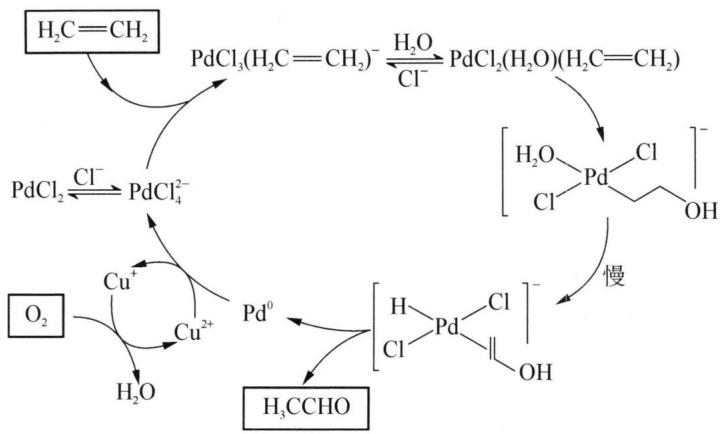

chemical

Palladium-catalyzed reaction mechanism involving hydrogenation, decarboxylation, and radical intermediates

(1) 写出 $PdCl_{2}$ 将乙烯氧化为乙醛的总化学方程式。  
(2) 流程中 Pd 的配合物中 $Pd^{2+}$ 都处于四边形的中央, 这些配离子的 $Pd^{2+}$ 是以什么杂化形式。  
（3）配离子 $\left[\mathrm{Pd}\left(\mathrm{C}_{2} \mathrm{H}_{4}\right) \mathrm{Cl}_{3}\right]^{-}$ 中 $\mathrm{C}_{2} \mathrm{H}_{4}$ 与 $\mathrm{Pd}^{2+}$ 之间形成的是什么键，试画出该配合的结构示意图。  
（4）该流程中还使用了 $CuCl_{2}$ ，它的作用是什么？写出其参与反应并再生的离子方程式。

7. 某铂配合物 A 是单核配合物分子, 由 11 个原子组成; 微热后失重 $11.35\%$ 得到 B, B 进一步加热又失重 $26.66\%$ (相对 B) 得到金属 C。B 极难溶于水, 不溶于乙醇、乙醚, 能溶于浓盐酸。A 有 2 种异构体 $\mathrm{A}_{1} 、 \mathrm{~A}_{2}$ , 其中 $\mathrm{A}_{2}$ 能与草酸盐反应得到一种式量比 A 略大的配合物分子 $\mathrm{D(A_{1}}$ 无相似反应)。

(1) 写出 A、B、C 的化学式。

(2) 写出 B 溶于盐酸后产物的名称。

(3) 试画出 $\mathrm{A}_{1} 、 \mathrm{~A}_{2} 、 \mathrm{D}$ 的结构, 并比较 $\mathrm{A}_{1} 、 \mathrm{~A}_{2}$ 在水中溶解性的大小。

(4) A 还有若干种实验式相同的离子化合物。它们每个还满足如下条件: 是由分立的、单核的离子配合物实体构成的; 仅含 1 种正离子和 1 种负离子。

① 符合上述条件的离子化合物的精确的分子式有多少种?

② 其中 1 种与 $AgNO_{3}$ 反应(物质的量比 1:2)得到两种组成不同的配合物(物质的量比 1:1)，写出反应的化学方程式。

## 第十讲 铜、锌分族元素

## 知识精讲

## 一、概述

铜族元素的铜（Copper）、银（Silver）、金（Gold）和锌族元素的锌（Zinc）、镉（Cadmium）、汞（Mercury）是六种发现较早，应用较广的金属元素。例如：黄金、白银和紫铜由于它们有悦目的外观，能较长期保持美丽的色泽，很早就被人们用作饰物及钱币，故有货币金属（Currency metals）之称。铜是人类最早用来制作工具、器皿及武器的金属。取代“石器时代”的“青铜时代”所用的青铜，即是铜与锡的合金。铜族元素优良的导电性、延展性、抗腐蚀性广泛用于电子工业航天工业上。银大量用于摄影工业。估计世界上每年用于摄影业上的银子多达150吨。金常作为货币储备。估计世界上最大的黄金（金条）储备约为8万吨。金的纯度用“K”表示。纯金为24K。锌族元素主要用于电镀（镀层）、电池、催化剂工业上。

这两族元素原子的价电子层构型分别为 $(n-1)\mathrm{d}^{10}\mathrm{ns}^{1}$ 和 $(n-1)\mathrm{d}^{10}\mathrm{ns}^{2}$ 。外层为1或2个电子，分别与碱金属和碱土金属元素相似，能生成相同的氧化态为+1、+2的化合物。但由于铜族、锌族元素与碱金属、碱土金属元素的电子构型不同，它们不如碱金属、碱土金属元素活泼，并且铜族元素有大于族数为1的氧化态。

铜族和锌族元素的次外层都是18电子结构,所以当它们分别形成与族数相同的氧化数的化合物时,相应的离子都是18电子构型,所以这两族的离子都有强的极化力,这就使它们的二元化合物一般都部分地或完全地带有共价性。这两族元素与其他过渡元素类似,易形成配合物,但由于ⅡB族元素的离子 $M^{2+}$ 中d轨道已填满,电子不能发生d—d跃迁,因此它们的配合物一般无色。

铜族和锌族元素位于周期表的 ds 区, 左边与 d 区过渡元素, 右边与过渡后 p 区元素相连接。这种特殊的位置使它们的性质在某些方面与过渡元素相似。如铜族元素表现明显过渡元素的特性(有变价、有颜色及配位能力强等), 因此也有人把它作为过渡元素。锌族中的镉、汞也有相当多的过渡元素特性。汞与位于它前面的铂、金有十分密切的关系。它们在某些方面又与过渡后 p 区元素相似。如锌族元素自上至下低价趋于稳定(Hg 的零价稳定)与过渡后 p 区元素 Ga、Ge、As 分族的自上至下的低价趋于稳定相一致,并且它们异常低的熔沸点也与过渡后 p 区金属相似,称为低熔点金属。

## 二、铜族元素

## 1. 铜族元素通性

铜族元素价电子构型为 $(n-1)d^{10}ns^{1}$ ，铜族元素原子不仅可以失去 $ns^{1}$ 电子，也可进一步失去部分 $(n-1)d$ 的电子。因此铜族元素有+1、+2、+3三种氧化态，由于其稳定性不同，铜常见的氧化态为+2，银为+1，金为+3。由于铜族元素次外层具有18个电子，它对核的屏蔽作用小于次外层为8电子的碱金属，使得铜族元素的有效核电荷较大，因此铜族元素具有较小的原子半径和较大的电离能，活泼性较低。由于离子属于18电子构型，有很强的极化力和明显的变形性，所以除少数氟化物、硝酸盐、硫酸盐等是离子型化合物外，一般容易形成共价化合物。另外，铜族元素离子的d、s、p轨道能量相差不大，能级较低的空轨道较多，又有较多的d电子，有利于形成 $\sigma$ 键和反馈 $\pi$ 键，所以铜族元素形成配合物的倾向比较显著。氧化数为+1的以形成二配位的直线型配合物为主，如 $\left[\mathrm{Ag}\left(\mathrm{NH}_{3}\right)_{2}\right]^{+}$ 、 $\left[\mathrm{Au}\left(\mathrm{CN}\right)_{2}\right]^{-}$ 等。氧化数为+2、+3的主要形成四配位的平面正方形配合物，如 $\left[\mathrm{Au}\left(\mathrm{CN}\right)_{4}\right]^{-}$ 、 $\left[\mathrm{Cu}\left(\mathrm{CN}\right)_{4}\right]^{2-}$ 等。配位数为三及六的配合物也已发现。

铜族元素的一些基本性质列于表 1。

表 1 铜族元素的一些基本性质

<table><tr><td>性质</td><td>铜 Cu</td><td>银 Ag</td><td>金 Au</td></tr><tr><td>原子序数</td><td>29</td><td>47</td><td>79</td></tr><tr><td>相对原子质量</td><td>63.55</td><td>107.87</td><td>196.97</td></tr><tr><td>价电子构型</td><td> $3d^{10}4s^1$ </td><td> $4d^{10}5s^1$ </td><td> $5d^{10}6s^1$ </td></tr><tr><td>常见氧化态</td><td>+1,+2</td><td>+1</td><td>+1,+3</td></tr><tr><td> $I_1/kJ·mol^{-1}$ </td><td>745.3</td><td>730.8</td><td>889.9</td></tr><tr><td>原子半径/pm</td><td>128</td><td>144</td><td>144</td></tr><tr><td>电负性</td><td>1.90</td><td>1.93</td><td>2.54</td></tr><tr><td>熔点/°C</td><td>1083</td><td>962</td><td>1064</td></tr><tr><td>沸点/°C</td><td>2570</td><td>2155</td><td>2808</td></tr><tr><td>密度/(g·cm-3)20°C</td><td>8.95</td><td>10.49</td><td>19.32</td></tr><tr><td> $φ^{\ominus}(M^+/M)/V$ </td><td>0.521</td><td>0.799</td><td>1.68</td></tr><tr><td> $φ^{\ominus}(M^{2+}/M)/V$ </td><td>0.337</td><td>—</td><td> $φ^{\ominus}(Au^{3+}/Au)=1.50V$ </td></tr></table>

## 2. 单质

铜、银、金是人类发现和使用最早的金属。由于它们有悦目的外观和能长期保持其美丽色泽之特点，很早就用来作钱币和饰物，所以被称为“货币金属”。黄金、白银和紫铜为“五金”（金、银、铜、铁、锡）之首，并称“唯金三品”。

铜、银、金都可以以单质状态存在于自然界中。铜在自然界分布很广，属丰产元素。自然铜(游离铜)的矿床很少，铜多以硫化物矿和氧化物矿存在，还分散于铅、锌、镍等金属的硫化物矿中，主要铜矿有辉铜矿 $Cu_{2}S$ 、黄铜矿 $CuFeS_{2}$ 、斑铜矿 $Cu_{3}FeS_{4}$ 、赤铜矿 $Cu_{2}O$ 、蓝铜矿 $2CuCO_{3}\cdot Cu(OH)_{2}$ 和孔雀石 $CuCO_{3}\cdot Cu(OH)_{2}$ 等。银除较少的闪银矿 $Ag_{2}S$ 外，常以硫化银与方铅矿 PbS 共生。我国含银的铅锌矿非常丰富。

金因其化学性质不活泼,以游离态单质存在于自然界中。金的分布很广,但通常含量很低。金矿主要是自然金,存在于岩石(岩脉金)和砂砾(冲积金)中。我国金矿资源丰富,现在已成为世界主要产金国家之一。

铜、银、金的熔点和沸点都不太高(比相应的碱金属高)，它们的延展性、导电性和导热性比较突出(它们的导电和导热性在所有的金属中是最好的，银第一，铜第二，金第三)，都是热和电的良导体，都是电子和电气工业的重要物资。铜银金很柔软，有极好的延展性和可塑性，金的延展性最好，1 g 金可碾压成只有 230 个原子厚度，约 $1 \, m^{2}$ 的薄片，拉成直径 $20 \, \mu m$ 长达 $165 \, m$ 的金线。铜银金有特征颜色，分别为：紫红、银白、金黄。铜和金是所有金属中呈现特殊颜色的 2 种金属，容易形成合金。常见的铜合金有黄铜（锌 40%）、青铜（锡 15%，锌 5%）和白铜（镍 13%～15%），分别用作仪器零件和刀具。

铜在生命系统中有重要作用,人体中有30多种蛋白质和酶含有铜。现已知铜最重要的生理功能是人血清中的铜蓝蛋白,有协同铁的功能。

铜族元素的化学活泼性远较碱金属低，并按 Cu、Ag、Au 的顺序递减，这主要表现在与空气中氧的反应及与酸的反应上，常温下它们不与非氧化性酸反应。铜、银、金都不能与稀盐酸或稀硫酸作用放出氢气，但有空气存在时铜可以缓慢溶解于稀酸中，铜还可溶于热的浓盐酸中；铜和银溶于硝酸或热的浓硫酸，而金只能溶于王水（硝酸做氧化剂，盐酸做配位剂）。例如： $2Cu + 2H_{2}SO_{4} + O_{2} = 2CuSO_{4} + 2H_{2}O$ ， $2Cu + 8HCl$ （浓，热） $= 2H_{3}[CuCl_{4}] + H_{2}\uparrow$ ， $Cu + 2H_{2}SO_{4}$ （浓） $\xlongequal{\triangle} CuSO_{4} + 2H_{2}O + SO_{2}\uparrow$ ， $3Ag + 4HNO_{3} = 3AgNO_{3} + 2H_{2}O + NO\uparrow$ ， $Au + 4HCl + HNO_{3} = HAuCl_{4} + 2H_{2}O + NO\uparrow$ 。

铜在干燥空气中稳定,在潮湿空气中它先变成棕色,形成一层很薄而牢固粘附于铜表面的氧化物或硫化物膜。长期放置能缓慢地被腐蚀生成一层碱式碳酸铜的绿色膜层,称为“铜绿”。反应如下: $2\mathrm{Cu} + \mathrm{O}_{2} + \mathrm{H}_{2}\mathrm{O} + \mathrm{CO}_{2} = \mathrm{Cu}_{2}(\mathrm{OH})_{2}\mathrm{CO}_{3}$ 。

与非金属反应：铜、银、金都能与卤素反应。铜在常温下便能与卤素反应，加热的铜在氯气中燃烧生成 CuCl。银与卤素作用缓慢，金必须在加热时才能与干燥的卤素作用。铜与氟反应时，在铜表面生成一层氟化物薄膜，能防止铜进一步被腐蚀，所以铜可以作为电解法制备氟的电极材料。

铜、银在加热时能与硫直接化合生成 CuS 和 $Ag_{2}S$ ，金不能直接生成硫化物。空气中若含有 $H_{2}S$ 气体，与银接触后，银的表面很快会生成一层 $Ag_{2}S$ 黑色薄膜而使银失去银白色光泽。这是由于 $Ag^{+}$ 是软酸，它与软碱结合特别稳定，所以银对 S 和 $H_{2}S$ 很敏感。反应如下： $4Ag + 2H_{2}S + O_{2} = 2Ag_{2}S + 2H_{2}O$ （银为亲硫元素）。铜在空气中加热时可与氧发生反应生成黑色氧化铜，而金、银加热也不与氧作用。反应如下： $2Cu + O_{2} \xlongequal{\triangle} 2CuO$ （黑色）， $4CuO \xlongequal{\triangle} 2Cu_{2}O$ （黄或红色） $+ O_{2}\uparrow$ 。

## 3. 铜的化合物

铜的常见化合物的氧化数为+1和+2。Cu(I)为 $d^{10}$ 构型,没有d—d跃迁,其化合物一般是白色或无色的。Cu(II)为 $d^{9}$ 构型,其化合物常因 $Cu^{2+}$ 发生d—d跃迁而呈现颜色。一般说来,在高温、固态时,Cu(I)的化合物比Cu(II)的化合物稳定。在水溶液中,Cu(I)易被氧化为Cu(II),水溶液中Cu(II)的化合物较稳定。

(1) $\mathrm{Cu(I)}$ 的化合物

① 氧化亚铜 $Cu_{2}O$

含有酒石酸钾钠的硫酸钠碱性溶液或碱性铜酸盐 $\mathrm{Na_{2}Cu(OH)_{4}}$ 溶液用葡萄糖还原，可以得到棕红色 $Cu_{2}O$ 沉淀。反应如下： $2\left[\mathrm{Cu(OH)}_{4}\right]^{2-}+\mathrm{C}_{6}\mathrm{H}_{12}\mathrm{O}_{6}$ （葡萄糖） $=\mathrm{Cu_{2}O}\downarrow+\mathrm{C_{6}H_{11}O_{7}}$ （葡萄糖酸根，棕红色） $+3OH^{-}+3H_{2}O$ 。分析化学上利用这个反应测定醛，由于制备方法和条件的不同， $Cu_{2}O$ 晶粒大小各异，而呈现多种颜色，如黄、桔黄、鲜红或深棕。 $Cu_{2}O$ 溶于稀硫酸，立即发生歧化反应，反应如下： $Cu_{2}O+H_{2}SO_{4}=Cu_{2}SO_{4}+H_{2}O$ ， $Cu_{2}SO_{4}=CuSO_{4}+Cu$ 。

$Cu_{2}O$ 对热十分稳定，在 1508 K 时熔化而不分解。 $Cu_{2}O$ 不溶于水，具有半导体性质，常用它和铜装成亚铜整流器。

$\mathrm{Cu}_{2} \mathrm{O}$ 溶于氨水和氢卤酸, 分别形成稳定的无色配合物 $[\mathrm{Cu}(\mathrm{NH}_{3})_{2}]^{+}$ 和 $[\mathrm{CuX}_{2}]^{-}, [\mathrm{Cu}(\mathrm{NH}_{3})_{2}]^{+}$ 很快被空气中的 $\mathrm{O}_{2}$ 氧化成蓝色的 $[\mathrm{Cu}(\mathrm{NH}_{3})_{4}]^{2+}$ , 利用这个反应可以除去气体中的 $\mathrm{O}_{2}$ , 反应如下: $\mathrm{Cu}_{2} \mathrm{O} + 4 \mathrm{NH}_{3} \cdot \mathrm{H}_{2} \mathrm{O} =$

$$
\begin{array}{l} 2 \left[ \mathrm{Cu} \left(\mathrm{NH} _ {3}\right) _ {2} \right] ^ {+} + 2 \mathrm{OH} ^ {-} + 3 \mathrm{H} _ {2} \mathrm{O}, 4 \left[ \mathrm{Cu} \left(\mathrm{NH} _ {3}\right) _ {2} \right] ^ {+} + 8 \mathrm{NH} _ {3} \cdot \mathrm{H} _ {2} \mathrm{O} + \mathrm{O} _ {2} = \\ 4 \left[ \mathrm{Cu} \left(\mathrm{NH} _ {3}\right) _ {4} \right] ^ {2 +} + 4 \mathrm{OH} ^ {-} + 6 \mathrm{H} _ {2} \mathrm{O}. \end{array}
$$

合成氨工业常用醋酸二氨合铜(I) $\left(\left[\mathrm{Cu}\left(\mathrm{NH}_{3}\right)_{2}\right]\mathrm{Ac}\right)$ 溶液吸收原料气中对催化剂有毒害的CO气体： $\left[\mathrm{Cu}\left(\mathrm{NH}_{3}\right)_{2}\right]\mathrm{Ac}+\mathrm{CO}=\left[\mathrm{Cu}\left(\mathrm{NH}_{3}\right)_{2}\right]\mathrm{Ac}\cdot\mathrm{CO}$ 。这是一个放热和体积减小的反应，降温、加压有利于吸收CO。吸收CO以后的醋酸铜氨溶液，经减压和加热，又能将气体放出而再生，继续循环使用： $\left[\mathrm{Cu}\left(\mathrm{NH}_{3}\right)_{2}\right]\mathrm{Ac}\cdot\mathrm{CO}=\left[\mathrm{Cu}\left(\mathrm{NH}_{3}\right)_{2}\right]\mathrm{Ac}+\mathrm{CO}\uparrow$ 。

② 卤化亚铜 CuX

往硫酸铜溶液中逐滴加入KI溶液,可以看到生成白色的碘化亚铜沉淀和棕色的碘: $2\mathrm{Cu}^{2+} + 4\mathrm{I}^{-} = 2\mathrm{CuI}\downarrow + \mathrm{I}_{2}\downarrow$ 。由于CuI是沉淀,所以在碘离子存在时, $\mathrm{Cu}^{2+}$ 的氧化性大大增强,这时半电池反应式: $\mathrm{Cu}^{2+} + \mathrm{I}^{-} + \mathrm{e}^{-} \rightleftharpoons \mathrm{CuI}(\varphi^{\ominus} = +0.86\mathrm{V})$ , $\mathrm{I}_{2} + 2\mathrm{e}^{-} \rightleftharpoons 2\mathrm{I}^{-} (\varphi^{\ominus} = +0.536\mathrm{V})$ , 所以 $\mathrm{Cu}^{2+}$ 能氧化 $\mathrm{I}^{-}$ 离子。由于这个反应能迅速定量进行, 反应析出的碘能用 $\mathrm{Na}_{2}\mathrm{S}_{2}\mathrm{O}_{3}$ 标准溶液滴定: $2\mathrm{Na}_{2}\mathrm{S}_{2}\mathrm{O}_{3} + \mathrm{I}_{2} = \mathrm{Na}_{2}\mathrm{S}_{4}\mathrm{O}_{6} + 2\mathrm{NaI}$ , 所以分析化学常用此反应定量测定铜。

在含有 $CuSO_{4}$ 及 KI 的热溶液中，通入 $SO_{2}$ ，由于溶液中棕色的碘与 $SO_{2}$ 反应而褪色，白色 CuI 沉淀就看得更清楚，其反应为： $2Cu^{2+} + 4I^{-} = 2CuI + I_{2}$ ， $I_{2} + SO_{2} + 2H_{2}O = H_{2}SO_{4} + 2HI$ 。

$\mathrm{CuCl}_{2}$ 或 $\mathrm{CuBr}_{2}$ 的热溶液与各种还原剂如 $\mathrm{SO}_{2}$ 、 $\mathrm{SnCl}_{2}$ 等反应可以得到白色 $\mathrm{CuCl}$ 或 $\mathrm{CuBr}$ 沉淀： $2\mathrm{CuCl}_{2} + \mathrm{SO}_{2} + 2\mathrm{H}_{2}\mathrm{O} = 2\mathrm{CuCl} + \mathrm{H}_{2}\mathrm{SO}_{4} + 2\mathrm{HCl}$ 。在热、浓盐酸中，用 $\mathrm{Cu}$ 将 $\mathrm{CuCl}_{2}$ 还原，也可以制得 $\mathrm{CuCl}: \mathrm{Cu} + \mathrm{CuCl}_{2} = 2\mathrm{CuCl}$ 。氯化亚铜在不同浓度的KCl溶液中，可以形成 $[\mathrm{CuCl}_2]^-$ 、 $[\mathrm{CuCl}_3]^{2-}$ 及 $[\mathrm{CuCl}_4]^{3-}$ 等配离子。

③ 硫化亚铜 $Cu_{2}S$

硫化亚铜是难溶的黑色物质,它可由过量的铜和硫加热制得: $2Cu + S \xlongequal{\triangle} Cu_{2}S$ 。

在 $CuSO_{4}$ 溶液中，加入 $Na_{2}S_{2}O_{3}$ 溶液，加热，也能生成 $Cu_{2}S$ 沉淀，分析化学中常用此反应除去铜： $2Cu^{2+} + 2S_{2}O_{3}^{2-} + 2H_{2}O = Cu_{2}S\downarrow + S\downarrow + 2SO_{4}^{2-} + 4H^{+}$ 。

④ 配合物

$\mathrm{Cu}^{+}$ 与下述离子或分子都能形成稳定的配合物, 其稳定性按下列顺序增强: $\mathrm{Cl}^{-}<\mathrm{Br}^{-}<\mathrm{I}^{-}<\mathrm{SCN}^{-}<\mathrm{NH}_{3}<\mathrm{S}_{2}\mathrm{O}_{3}^{2-}<\mathrm{CS(NH}_{2})_{2}<\mathrm{CN}^{-}$ 。例如上述提到 $\mathrm{CuCl}$ 在过量的 $\mathrm{Cl}^{-}$ 溶液中形成的泥黄色的 $[\mathrm{CuCl}_{2}]^{-}$ , 当向 $[\mathrm{CuCl}_{2}]^{-}$ 溶液中加水稀释时又会产生 $\mathrm{CuCl}$ 白色沉淀。

Cu(I)的配合物常用它的难溶盐与具有相同负离子的其他易溶盐(或酸)，在溶液中借加合反应而形成。例如，CuCN溶于NaCN溶液中生成易溶的 $\mathrm{Na}[\mathrm{Cu}(\mathrm{CN})_{2}]$ ，其反应式为： $\mathrm{CuCN(s)} + \mathrm{CN}^{-} = [\mathrm{Cu(CN)}_{2}]^{-}$ 。这类反应能否进行，取决于难溶盐的溶度积和配合物的稳定常数的大小，还与易溶盐的浓度有关。由CuCN生成 $[\mathrm{Cu(CN)}_{2}]^{-}$ 的反应，其平衡常数表示式为：

$$
\begin{array}{l} K ^ {\ominus} = \frac {[ \mathrm{Cu(CN)} _ {2} ^ {-} ]}{[ \mathrm{CN} ^ {-} ]} = \frac {[ \mathrm{Cu(CN)} _ {2} ^ {-} ] \cdot [ \mathrm{Cu} ^ {+} ] \cdot [ \mathrm{CN} ^ {-} ]}{[ \mathrm{Cu} ^ {+} ] \cdot [ \mathrm{CN} ^ {-} ] ^ {2}} = \beta_ {2} \cdot K _ {\mathrm{sp}} ^ {\ominus} \\ = 1 0 ^ {2 4. 0} \times 3. 2 \times 1 0 ^ {- 2 0} = 3. 2 \times 1 0 ^ {4} \\ \end{array}
$$

可见反应向右进行的程度较大。在 $\mathrm{Cu(I)}$ 的配合物中， $\mathrm{Cu(I)}$ 的配位数常见的是2，当配位体的浓度增大时，也可形成配位数为3或4的配合物，如 $[\mathrm{Cu(CN)}_3]^{2-}(\beta_3 = 10^{28.59})$ 和 $[\mathrm{Cu(CN)}_4]^{3-}(\beta_4 = 10^{30.30})$ 。

在空气存在的情况下，Cu、Ag、Au 都能溶于氰化钾或氰化钠的溶液中： $4M+O_{2}+2H_{2}O+8CN^{-}=4[M(CN)_{2}]^{-}+4OH^{-}$ ，M 代表 Cu、Ag、Au。这种现象也是由于它们的离子能与 $CN^{-}$ 形成配合物，使它们单质的还原性增强，以致空气中的氧能把它们氧化。上述反应常用于从矿石中提取 Ag 和 Au。

当在非氧化性酸中,有适当的配位剂时,Cu 有时能从此溶液中置换出氢气。例如 Cu 能在溶有硫脲 CS(NH $_2$ ) $_2$ 的盐酸中置换出氢气:

$$
2 \mathrm{Cu} + 2 \mathrm{HCl} + 4 \mathrm {CS(NH_ {2}) _ {2}} = 2 [ \mathrm {Cu(CS(NH_ {2}) _ {2}) _ {2}} ] ^ {+} + \mathrm {H_ {2}} \uparrow + 2 \mathrm {Cl^ {-}}
$$

这是由于硫脲能与 $Cu^{+}$ 生成二硫脲合铜（I）离子 $\left[\mathrm{Cu}\left(\mathrm{CS}\left(\mathrm{NH}_{2}\right)_{2}\right)_{2}\right]^{+}$ ，使 Cu 增强了失去电子的能力。

(2) $\mathrm{Cu(II)}$ 的化合物

① 氧化铜 $\mathrm{CuO}$ 和氢氧化铜 $\mathrm{Cu(OH)}_{2}$

在 $CuSO_{4}$ 溶液中加入强碱，生成淡蓝色的 $\mathrm{Cu(OH)}_{2}$ 沉淀， $\mathrm{Cu(OH)}_{2}$ 的热稳定性比碱金属氢氧化物差得多，受热易分解，溶液加热至 353 K，脱水变为黑褐色的 CuO，CuO 对热是稳定的，加热到 1273 K 时才开始分解为 $Cu_{2}O$ 和 $O_{2}$ 。CuO 是碱性氧化物，加热时易被 $H_{2}$ 、C、CO、 $NH_{3}$ 等还原为铜。反应如下： $CuO + H_{2} \xlongequal{\triangle} Cu + H_{2}O$ ， $3CuO + 2NH_{3} \xlongequal{\triangle} 3Cu + 3H_{2}O + N_{2}$ 。

$\mathrm{Cu(OH)_2}$ 微显两性, 既溶于酸, 又溶于过量的浓碱溶液中: $\mathrm{Cu(OH)_2 + H_2SO_4 = CuSO_4 + 2H_2O, Cu(OH)_2 + 2NaOH = Na_2[Cu(OH)_4]}$ .

向 $\mathrm{CuSO_4}$ 溶液中加入少量氨水, 得到的不是氢氧化铜, 而是浅蓝色的碱式硫酸铜沉淀： $2\mathrm{CuSO}_{4} + 2\mathrm{NH}_{3} \cdot \mathrm{H}_{2}\mathrm{O} = (\mathrm{NH}_{4})_{2}\mathrm{SO}_{4} + \mathrm{Cu}_{2}(\mathrm{OH})_{2}\mathrm{SO}_{4} \downarrow$ ，若继续加入氨水，碱式硫酸铜沉淀就溶解，得到深蓝色的四氨合铜配离子： $\mathrm{Cu}_{2}(\mathrm{OH})_{2}\mathrm{SO}_{4} + 8\mathrm{NH}_{3} = 2[\mathrm{Cu}(\mathrm{NH}_{3})_{4}]^{2+} + \mathrm{SO}_{4}^{2-} + 2\mathrm{OH}^{-}$ 。

② 卤化铜 $CuX_{2}$

除碘化铜不存在外, 其他卤化铜都可用 $\mathrm{CuO}$ 和氢卤酸反应来制备: $\mathrm{CuO} + 2\mathrm{HCl} = \mathrm{CuCl}_{2} + \mathrm{H}_{2}\mathrm{O}$ 。 $\mathrm{CuCl}_{2}$ 在很浓的溶液中显黄绿色, 在浓溶液中显绿色, 在稀溶液中显蓝色。黄色是由于 $[\mathrm{CuCl}_4]^{2-}$ 配离子的存在, 而蓝色是由于 $[\mathrm{Cu(H_2O)_4}]^{2+}$ 配离子的存在, 两者并存时显绿色。 $\mathrm{CuCl}_{2}$ 在空气中易潮解, 它不但易溶于水, 而且易溶于乙醇和丙酮。 $\mathrm{CuCl}_{2}$ 与碱金属氯化物反应, 生成 $\mathrm{M[CuCl}_{3}]$ 或 $\mathrm{M}_{2}[\mathrm{CuCl}_{4}]$ 型配盐, 与盐酸反应生成 $\mathrm{H}_{2}[\mathrm{CuCl}_{4}]$ 配酸, 由于 $\mathrm{Cu}^{2+}$ 卤配离子不够稳定, 只能存在过量卤离子时形成。

$CuCl_{2}$ 吸收水分后变为含水盐 $CuCl_{2} \cdot 2H_{2}O$ ，它受热时分解形成碱式盐： $2CuCl_{2} \cdot 2H_{2}O = Cu(OH)_{2} \cdot CuCl_{2} + 2HCl + 2H_{2}O$ 。所以制备无水 $CuCl_{2}$ 时，要将 $CuCl_{2} \cdot 2H_{2}O$ 在 HCl 气流中，加热到 $413K \sim 423K$ 条件下进行。如果无水 $CuCl_{2}$ 进一步受热，加热到 $773K$ 则按下式进行分解： $2CuCl_{2} = 2CuCl + Cl_{2}\uparrow$ 。

③ 硫酸铜 $CuSO_{4}$

五水硫酸铜俗名胆矾或蓝矾, 是蓝色斜方晶体。它是用热浓硫酸溶解铜屑, 或在氧气存在下, 用热稀硫酸与铜屑作用而制得: $\mathrm{Cu} + 2\mathrm{H}_{2}\mathrm{SO}_{4}$ (浓) $\xlongequal{\triangle} \mathrm{CuSO}_{4} + \mathrm{SO}_{2} \uparrow + 2\mathrm{H}_{2}\mathrm{O}, 2\mathrm{Cu} + 2\mathrm{H}_{2}\mathrm{SO}_{4}$ (稀) $+\mathrm{O}_{2} = 2\mathrm{CuSO}_{4} + 2\mathrm{H}_{2}\mathrm{O}$ 。实验室中常用 $\mathrm{CuO}$ 与稀硫酸反应来制取硫酸铜, 生成的粗硫酸铜经蒸发浓缩可得到五水硫酸铜。硫酸铜在不同温度下, 可以逐步脱水发生下列变化:

$$
\mathrm{CuSO} _ {4} \cdot 5 \mathrm{H} _ {2} \mathrm{O} \xrightarrow {3 7 5 \mathrm{K}} \mathrm{CuSO} _ {4} \cdot 3 \mathrm{H} _ {2} \mathrm{O} \xrightarrow {3 8 6 \mathrm{K}} \mathrm{CuSO} _ {4} \cdot \mathrm{H} _ {2} \mathrm{O} \xrightarrow {5 3 1 \mathrm{K}} \mathrm{CuSO} _ {4} \xrightarrow {9 2 3 \mathrm{K}} \mathrm{CuO}
$$

无水硫酸铜为白色粉末,不溶于乙醇和乙醚,其吸水性很强,吸水后显出特征的蓝色。可利用这一性质来检验乙醇、乙醚等有机溶剂中的微量水分,也可以用作这些溶剂的脱水剂。无水硫酸铜加热到 923 K 时,即分解为 CuO: $2CuSO_{4}\xlongequal{923\ K}2CuO+2SO_{2}\uparrow+O_{2}\uparrow$ 。

硫酸铜是制备其他铜化合物的重要原料。硫酸铜与石灰乳混合制成的“波尔多液”，可以用作果树的杀虫剂及杀菌剂。通常配方是： $CuSO_{4}\cdot5H_{2}O:CaO:H_{2}O=1:1:100$ 。在储水池或游泳池中加入少量 $CuSO_{4}\cdot5H_{2}O$ 可以阻止藻类生长。

④ 硝酸铜 $\mathrm{Cu(NO_{3})_{2}}$

硝酸铜的水合物 $\mathrm{Cu(NO_{3})_{2}\cdot nH_{2}O}, n=1,6,9$ 。将 $\mathrm{Cu(NO_{3})_{2}\cdot3H_{2}O}$ 加热到 443 K 时，得到碱式盐 $\mathrm{Cu(NO_{3})_{2}\cdot Cu(OH)_{2}}$ ，进一步加热到 473 K 则分解为 $CuO$ 。

制备 $\mathrm{Cu(NO_{3})_{2}}$ 是将铜溶于乙酸乙酯的 $N_{2}O_{4}$ 溶液中，从溶液中结晶出 $\mathrm{Cu(NO_{3})_{2}\cdot N_{2}O_{4}}$ 。将它加热到 363 K，得到蓝色的 $\mathrm{Cu(NO_{3})_{2}, Cu(NO_{3})_{2}}$ 在真空中加热到 473 K，升华但不分解。

⑤ 硫化铜 CuS

向硫酸铜溶液中通入 $\mathrm{H}_2\mathrm{S}$ , 即有黑色 $\mathrm{CuS}$ 沉淀析出。 $\mathrm{CuS}$ 不溶于水 ( $K_{\mathrm{sp}} = 6.3 \times 10^{-36}$ ), 也不溶于稀酸, 但溶于热的稀 $\mathrm{HNO}_3$ 中: $3\mathrm{CuS} + 8\mathrm{HNO}_3 \xlongequal{\triangle} 3\mathrm{Cu(NO_3)_2 + 2NO\uparrow + 3S\downarrow + 4H_2O}$ 。

CuS溶于KCN溶液中，生成 $\left[\mathrm{Cu}(\mathrm{CN})_4\right]^{3-}$ ，在这一反应中 $\mathrm{CN^{-}}$ 既是配位剂又是还原剂。反应如下： $2\mathrm{CuS} + 10\mathrm{CN}^{-} = 2\left[\mathrm{Cu}(\mathrm{CN})_4\right]^{3-} + (\mathrm{CN})_2\uparrow +2\mathrm{S}^{2-}$ 。

⑥ 配合物

$\mathrm{Cu}^{2+}$ 离子的外层电子构型为 $3 \mathrm{~s}^{2} 3 \mathrm{p}^{6} 3 \mathrm{d}^{9} 。 \mathrm{Cu}^{2+}$ 离子带有两个正电荷, 因此, 比 $\mathrm{Cu}^{+}$ 更容易形成配位数为 2、4、6 的配合物, 配位数为 2 的很少。在 $\mathrm{Cu}^{2+}$ 的配合物中, $[\mathrm{CuCl}_{4}]^{2-}$ 稳定性较差 ( $\beta_{4} = 10^{-4.6}$ ), 在很浓的 $\mathrm{Cl}^{-}$ 溶液才有黄色的 $[\mathrm{CuCl}_{4}]^{2-}$ 存在。当加水稀释时, $[\mathrm{CuCl}_{4}]^{2-}$ 容易离解为 $[\mathrm{Cu(H_{2}O)}_{6}]^{2+}$ 和 $\mathrm{Cl}^{-}$ , 溶液的颜色由黄变绿 (是 $[\mathrm{CuCl}_{4}]^{2-}$ 和 $[\mathrm{Cu(H_{2}O)}_{6}]^{2+}$ 的混合色), 最后变为蓝色的 $[\mathrm{Cu(H_{2}O)}_{6}]^{2+}$ 。

在 $Cu^{2+}$ 的简单配合物中, 深蓝色的 $\left[\mathrm{Cu}\left(\mathrm{NH}_{3}\right)_{4}\right]^{2+}$ 较稳定, 它是平面正方形的配离子, 常以 $\left[\mathrm{Cu}\left(\mathrm{NH}_{3}\right)_{4}\right]^{2+}$ 的颜色来鉴定 $Cu^{2+}$ 的存在。

$\mathrm{Cu}^{2+}$ 离子还能与氰根离子、羟基、焦磷酸根等离子形成稳定程度不同的配离子。 $\mathrm{Cu}^{2+}$ 与 $\mathrm{CN}^{-}$ 形成的配合物在常温下是不稳定的。室温时，在铜盐溶液中加入 $\mathrm{CN}^{-}$ 离子，得到氰化铜的棕黄色沉淀。此物分解生成白色 $\mathrm{CuCN}$ 并放出氰气： $2\mathrm{Cu}^{2+} + 4\mathrm{CN}^{-} = 2\mathrm{CuCN} + (\mathrm{CN})_{2}\uparrow$ ，继续加入过量的 $\mathrm{CN}^{-}$ ， $\mathrm{CuCN}$ 溶解： $\mathrm{CuCN} + 3\mathrm{CN}^{-} = [\mathrm{Cu(CN)}_{4}]^{3-}$ 。

在合成氨工厂中不能用铜作阀门或管道, 这是因为有如下反应: $2 \mathrm{Cu} + 8 \mathrm{NH}_{3} + 2 \mathrm{H}_{2} \mathrm{O} + \mathrm{O}_{2} = 2 \left[ \mathrm{Cu}(\mathrm{NH}_{3})_{4} \right]^{2+} + 4 \mathrm{OH}^{-}$ 。这里铜所以被腐蚀, 也基于以上道理, 因为 $\mathrm{Cu}^{2+}$ 与 $\mathrm{NH}_{3}$ 能形成配合物, 使铜单质的还原性增强, 以致能把铜氧化。

(3) $\mathrm{Cu(I)}$ 和 $\mathrm{Cu(II)}$ 的相互转化

铜有氧化态为+1和+2的化合物。从离子结构来说, $Cu^{+}$ 的结构是 $3d^{10}$ ，应该比 $Cu^{2+}(3d^{9})$ 稳定。铜的第二电离势( $1970\ kJ\cdot mol^{-1}$ )较高，故在气态或固态时 $Cu^{+}$

的化合物是稳定的。从反应: $2 \mathrm{Cu}^{+}(\mathrm{~g}) = \mathrm{Cu}^{2 + }(\mathrm{~g}) + \mathrm{Cu}(\mathrm{s})(\Delta_{\mathrm{r}}H_{\mathrm{m}}^{\ominus} = 866.5 \mathrm{~kJ} \cdot \mathrm{mol}^{-1})$ 也可以看出是 $\mathrm{Cu}^{+}(\mathrm{~g})$ 的化合物比较稳定。但在水溶液中, $\mathrm{Cu}^{2 + }$ (电荷高、半径小)的水合热(2121 kJ·mol-1)比 $\mathrm{Cu}^{+}$ 的(582 kJ·mol-1)大得多, 因此可以说明 $\mathrm{Cu}^{+}$ 在溶液中是不稳定的, 它会歧化为 $\mathrm{Cu}^{2 + }$ 和 $\mathrm{Cu}$ :

$$
\begin{array}{l} 2 \mathrm{Cu} ^ {+} = \mathrm{Cu} + \mathrm{Cu} ^ {2 +} \\ \varphi_ {\mathrm{A}} ^ {\ominus} / \mathrm{V} \quad \mathrm{Cu} ^ {2 +} \xrightarrow {+ 0 . 1 5 3} \mathrm{Cu} ^ {+} \xrightarrow {+ 0 . 5 2} \mathrm{Cu} \\ \end{array}
$$

从铜的电势图可知 $\varphi^{\ominus}(\mathrm{Cu}^{+}/\mathrm{Cu}) > \varphi^{\ominus}(\mathrm{Cu}^{2+}/\mathrm{Cu}^{+})$ ， $\mathrm{Cu}^{+}$ 歧化为 $\mathrm{Cu}$ 和 $\mathrm{Cu}^{2+}$ 的趋势大，在 $293\mathrm{K}$ 时，歧化反应的平衡常数 $K = [\mathrm{Cu}^{2+}] / [\mathrm{Cu}^{+}]^{2} = 1.4 \times 10^{6}$ 。由于 $K$ 很大，溶液中只要有微量的 $\mathrm{Cu}^{+}$ 存在，几乎全部转化为 $\mathrm{Cu}^{2+}$ 和 $\mathrm{Cu}$ 。所以在水溶液中， $\mathrm{Cu}^{2+}$ 化合物是稳定的。 $\mathrm{Cu}^{+}$ 只有当形成沉淀或配合物时，使溶液中 $\mathrm{Cu}^{+}$ 浓度降低到非常小，逆歧化的电动势升高到 $E^{\ominus} > 0$ ，反应才能向反方向进行，例如，铜与氯化铜在热浓盐酸中形成一价铜的配合物： $\mathrm{Cu} + \mathrm{CuCl}_{2} = 2\mathrm{CuCl}$ ， $\mathrm{CuCl} + \mathrm{HCl} = \mathrm{HCuCl}_{2}$ 。由于生成了配离子 $[\mathrm{CuCl}_{2}]^{-}$ ，溶液中 $\mathrm{Cu}^{+}$ 浓度降低到非常小，反应可继续向右进行到完全程度。前面讲到的 $\mathrm{Cu}^{2+}$ 与 $\mathrm{I}^{-}$ 反应由于生成 $\mathrm{CuI}$ 沉淀，也使反应能向生成 $\mathrm{CuI}$ 的方向进行。可见在水溶液中， $\mathrm{Cu}^{+}$ 的化合物除不溶解的或以配离子的形式存在外，都是不稳定的。

由于 $Cu^{2+}$ 的极化作用比 $Cu^{+}$ 强，在高温下， $Cu^{2+}$ 化合物变得不稳定，受热变成稳定的 $Cu^{+}$ 化合物。例如，氧化铜加热到 1273 K 以上，就分解为 $O_{2}$ 和 $Cu_{2}O$ 。

其他如 $\mathrm{CuS}$ 、 $\mathrm{CuCl}_2$ 、 $\mathrm{CuBr}_2$ 加热至高温都有分解为相应的 $\mathrm{Cu}^+$ 化合物的现象。甚至有些化合物如 $\mathrm{CuI}_2$ 、 $\mathrm{Cu(CN)}_2$ 在普通常温下，就不能存在，要分解为 $\mathrm{Cu}^+$ 化合物。可见两种氧化态铜的化合物各以一定条件而存在，当条件变化时，又相互转化。

## 4. 银的化合物

银的化合物主要是氧化数为+1的化合物,氧化数为+2的化合物很少,如 $\mathrm{AgO}$ 、 $\mathrm{AgF}_{2}$ ,一般不稳定,是极强的氧化剂。氧化数为+3的化合物极少,如 $\mathrm{Ag}_{2}\mathrm{O}_{3}$ 。在+1氧化态时是 $\mathrm{d}^{10}$ 电子构型。除少数 $\mathrm{Ag(I)}$ 化合物(如 $\mathrm{Ag}_{2}\mathrm{O}$ 为棕色、 $\mathrm{AgI}$ 为黄色)有颜色外,多数是无色的。 $\mathrm{Ag(I)}$ 盐的水溶液是稳定的。大多数银盐难溶于水,能溶的只有 $\mathrm{AgNO}_{3}$ 、 $\mathrm{AgF}$ 、 $\mathrm{AgClO}_{4}$ 等少数几种。而 $\mathrm{Ag}_{2}\mathrm{SO}_{4}$ 、 $\mathrm{AgAc}$ 仅微溶于水。 $\mathrm{Ag}^{+}$ 和 $\mathrm{Cu}^{2+}$ 相似,形成配合物的倾向很大,把难溶盐转化成配合物是溶解难溶银盐的最重要方法。

(1) 氧化银 $\mathrm{Ag}_{2} \mathrm{O}$

在银盐溶液中加入 NaOH 溶液, 先析出白色 AgOH 沉淀, AgOH 立即脱水生成暗棕色的 $Ag_{2}O: AgNO_{3} + NaOH = AgOH \downarrow + NaNO_{3}, 2AgOH = Ag_{2}O + H_{2}O$ 。 $Ag_{2}O$ 微溶于水, 溶液显微碱性。 $Ag_{2}O$ 生成热很小 (31 kJ/mol), 不稳定, 加热到 573 K 时, 就完全分解。 $Ag_{2}O$ 是强氧化剂, 与有机物摩擦可引起燃烧, 容易被 CO 或 $H_{2}O_{2}$ 所还原: $Ag_{2}O + CO = 2Ag + CO_{2}, Ag_{2}O + H_{2}O_{2} = 2Ag + H_{2}O + O_{2} \uparrow$ 。

## (2) 硝酸银 $\mathrm{AgNO}_{3}$

硝酸银为无色透明晶体,是一种很重要的可溶性银盐,不仅因为它在感光材料、制镜、保温瓶、电镀、医药、电子等工业中用途广泛,还因为它容易制得,且是制备其他银化合物的原料。硝酸银有一定毒性,用作消毒剂和腐蚀剂。

$AgNO_{3}$ 在干燥空气中比较稳定,潮湿状态下见光容易分解,并因析出单质银而变黑: $2AgNO_{3}\xlongequal{光}2Ag+2NO_{2}\uparrow+O_{2}\uparrow$ , 因此其水溶液常被保存在棕色试剂瓶中。若遇到 $Cl^{-}$ 、 $Br^{-}$ 、 $I^{-}$ 等会发生反应生成不溶于水, 不溶于硝酸的 AgCl 白色沉淀、AgBr 淡黄色沉淀、AgI 黄色沉淀等。因此常被用于检验 $X^{-}$ 的存在。

$AgNO_{3}$ 是中强氧化剂, 可被肼还原为金属银: $4AgNO_{3} + N_{2}H_{4} = 4Ag + N_{2}\uparrow + 4HNO_{3}$ 。 $AgNO_{3}$ 的氨溶液能被醛和糖还原, 用于制备银镜: $Ag^{+} + NH_{3} \cdot H_{2}O = AgOH\downarrow + NH_{4}^{+}, AgOH + 2NH_{3} \cdot H_{2}O = [Ag(NH_{3})_{2}]OH + 2H_{2}O, CH_{3}CHO + 2Ag(NH_{3})_{2}OH = CH_{3}COONH_{4} + 2Ag\downarrow + 3NH_{3}\uparrow + H_{2}O$ 。

将银溶于硝酸中, 可制得 $\mathrm{AgNO}_{3}: \mathrm{Ag} + 2\mathrm{HNO}_{3}$ (浓) $= \mathrm{AgNO}_{3} + \mathrm{NO}_{2} \uparrow + \mathrm{H}_{2} \mathrm{O}, 3 \mathrm{Ag} + 4 \mathrm{HNO}_{3}$ (稀) $= 3 \mathrm{AgNO}_{3} + \mathrm{NO} \uparrow + 2 \mathrm{H}_{2} \mathrm{O}$ 。

原料银常从精炼铜的阳极泥得到,其中含有杂质铜,因此产品中含有硝酸铜,可将粗产品加热至 $473 \, K \sim 573 \, K$ ,根据硝酸盐的热分解温度不同而提纯:

$$
2 \mathrm{AgNO} _ {3} \xlongequal {7 1 3 \mathrm{K}} 2 \mathrm{Ag} + 2 \mathrm{NO} _ {2} \uparrow + \mathrm{O} _ {2} \uparrow , 2 \mathrm{Cu} (\mathrm{NO} _ {3}) _ {2} \xlongequal {4 7 3 \mathrm{K}} 2 \mathrm{CuO} + 4 \mathrm{NO} _ {2} \uparrow + \mathrm{O} _ {2} \uparrow
$$

这时硝酸铜分解为难溶于水的 CuO, 而 $AgNO_{3}$ 则安然无恙。将混合物中的硝酸银溶解后, 过滤除去 CuO 并重结晶, 便得到纯的硝酸银。

## (3) 卤化银 AgX

在 $\mathrm{AgNO_3}$ 溶液中加入卤化物, 可以生成卤化银 $\mathrm{AgX}$ 。 $\mathrm{AgX}$ 中只有 $\mathrm{AgF}$ 易溶于水, 在湿空气中潮解, 其余均微溶于水, 其溶解度依 $\mathrm{AgCl}$ , $\mathrm{AgBr}$ , $\mathrm{AgI}$ 的顺序降低, 颜色也依此顺序而加深。表 2 列出了卤化银的若干性质。

表 2 卤化银的性质

<table><tr><td>卤化银</td><td>AgF</td><td>AgCl</td><td>AgBr</td><td>AgI</td></tr><tr><td>颜色</td><td>白色</td><td>白色</td><td>淡黄色</td><td>黄色</td></tr><tr><td>溶解度(g/L)</td><td>180.0</td><td>0.03</td><td>0.0055</td><td> $5.6 \times 10^{-5}$ </td></tr><tr><td>溶度积(298 K)</td><td></td><td> $1.56 \times 10^{-10}$ </td><td> $7.7 \times 10^{-13}$ </td><td> $1.5 \times 10^{-16}$ </td></tr><tr><td>熔点/K</td><td>708</td><td>723</td><td>692</td><td>825</td></tr><tr><td>晶格类型</td><td>NaCl</td><td>NaCl</td><td>NaCl</td><td>ZnS</td></tr><tr><td>键的类型</td><td>离子键</td><td>过渡</td><td>过渡</td><td>共价键</td></tr></table>

## (4) 配合物

水合银离子一般认为是 $\left[\mathrm{Ag}\left(\mathrm{H}_{2}\mathrm{O}\right)_{4}\right]^{+}$ ，它在水中几乎不水解， $AgNO_{3}$ 的水溶液呈中性。向 $Ag^{+}$ 溶液中加入NaOH溶液，则析出 $Ag_{2}O$ 沉淀，因为AgOH极不稳定： $2Ag^{+}+2OH^{-}=Ag_{2}O\downarrow+H_{2}O$ 。

从电对 $Ag^{+}/Ag$ 的 $E^{\ominus}=0.799\ V$ 来看， $Ag^{+}$ 的氧化性不算弱，但在 $Ag^{+}$ 溶液中加入 $I^{-}$ 时， $Ag^{+}$ 却不能把 $I^{-}$ 氧化为 $I_{2}$ ，而是发生下列反应： $Ag^{+}+I^{-}=AgI\downarrow$ 。这是由于 $Ag^{+}$ 与 $I^{-}$ 生成 AgI 沉淀后，降低了溶液中 $Ag^{+}$ 的浓度，使 $Ag^{+}/Ag$ 的电极电势大大降低，以致 $Ag^{+}$ 氧化 $I^{-}$ 的反应不能发生。同样地，在 $Ag^{+}$ 溶液中通入 $H_{2}S$ ，也不会发生氧化还原反应，而是析出 $Ag_{2}S$ 沉淀。AgI 溶在过量的 KI 溶液中，可生成 $AgI_{2}^{-}$ 配离子： $AgI(s)+I^{-}=AgI_{2}^{-}$ 。当加水稀释 $AgI_{2}^{-}$ 溶液时，AgI 又重新析出。从反应的平衡常数表示式 $K^{\ominus}=[AgI_{2}^{-}]/[I^{-}]$ 来看，当溶液稀释时， $[I^{-}]$ 和 $[AgI_{2}^{-}]$ 同时减少，且比值不变，似乎平衡不会向左移动，即不应有 AgI 析出。但在 AgI 的溶液中还存在着下列平衡： $AgI\rightleftharpoons Ag^{+}+I^{-}$ 。总的反应为： $AgI_{2}^{-}\rightleftharpoons AgI+I^{-}\rightleftharpoons Ag^{+}+2I^{-}$ ，其平衡常数表示式为： $K^{\theta}=\frac{[Ag^{+}]\cdot[I^{-}]^{2}}{[AgI_{2}^{-}]}$ 。由此可以看出，当溶液稀释时，分子和分母中离子浓度的比值 Q 减小，即 $Q<K^{\ominus}$ ，所以会使平衡向生成 $I^{-}$ 和 $Ag^{+}$ 的方向移动。当稀释到一定程度，离解出来的 $Ag^{+}$ 和 $I^{-}$ 浓度乘积如果大于 AgI 的浓度积，就会有 AgI 沉淀析出。

在水溶液中， $\mathrm{Ag^{+}}$ 能与多种配位体形成配合物，其配位数一般是2。由于 $\mathrm{Ag^{+}}$ 的许多化合物都是难溶于水的，在 $\mathrm{Ag^{+}}$ 溶液中加入配位剂时，常首先生成难溶化合物。当配位剂过量时，此难溶化合物将形成配离子而溶解。例如，在 $\mathrm{Ag^{+}}$ 的溶液中加入氨水，首先生成难溶于水的 $\mathrm{Ag_{2}O}$ 沉淀： $2\mathrm{Ag^{+}} + 2\mathrm{NH_{3}} + \mathrm{H_{2}O} \rightleftharpoons \mathrm{Ag_{2}O} \downarrow + 2\mathrm{NH_{4}^{+}}$ 。溶液中氨水浓度增加时， $\mathrm{Ag_{2}O}$ 即溶解并生成 $[\mathrm{Ag(NH_{3})_{2}}]^{+}$ ：

$\mathrm{Ag_{2}O(s)+4NH_{3}+H_{2}O\rightleftharpoons2[Ag(NH_{3})_{2}]^{+}+2OH^{-}}$ 。含有 $\left[\mathrm{Ag}\left(\mathrm{NH}_{3}\right)_{2}\right]^{+}$ 的溶液能把醛和某些糖类氧化，本身被还原为 Ag。例如： $2\left[\mathrm{Ag}\left(\mathrm{NH}_{3}\right)_{2}\right]^{+}+\mathrm{HCHO}+3\mathrm{OH}^{-}=HCOO^{-}+2\mathrm{Ag}\downarrow+4\mathrm{NH}_{3}+2\mathrm{H}_{2}\mathrm{O}$ 。工业上利用这类反应来制镜子或在暖水瓶的夹层上镀银。

再如 $Ag^{+}$ 与 $S_{2}O_{3}^{2-}$ 作用先产生 $Ag_{2}S_{2}O_{3}$ ，产物迅速分解，颜色由白色经黄色、棕色，最后成黑色的 $Ag_{2}S$ 。但若 $S_{2}O_{3}^{2-}$ 过量，则反应最终产生配离子： $Ag^{+} + 2S_{2}O_{3}^{2-} = [Ag(S_{2}O_{3})_{2}]^{3-}(K_{\text{稳}} = 2.9 \times 10^{13})$ 。 $[Ag(S_{2}O_{3})_{2}]^{3-}$ 也是常见的银的一种配合物，照相底片上未曝光的溴化银在定影液 $(S_{2}O_{3}^{2-})$ 中形成 $[Ag(S_{2}O_{3})_{2}]^{3-}$ 而溶解： $AgBr + 2S_{2}O_{3}^{2-} = [Ag(S_{2}O_{3})_{2}]^{3-} + Br^{-}$ 。

Ag(I)的许多难溶于水的化合物可以转化为配离子而溶解,常利用这一特性,把 $\mathrm{Ag}^{+}$ 从混合离子溶液中分离出来。例如在含有 $\mathrm{Ag}^{+}$ 和 $\mathrm{Ba}^{2+}$ 的溶液中,若加入过量的 $\mathrm{K}_{2} \mathrm{CrO}_{4}$ 溶液时,会有 $\mathrm{Ag}_{2} \mathrm{CrO}_{4}$ 和 $\mathrm{BaCrO}_{4}$ 沉淀析出,再加入足量的氨水, $\mathrm{Ag}_{2} \mathrm{CrO}_{4}$ 转化为 $[\mathrm{Ag}(\mathrm{NH}_{3})_{2}]^{+}$ 而溶解: $\mathrm{Ag}_{2} \mathrm{CrO}_{4}(\mathrm{s}) + 4 \mathrm{NH}_{3} \rightleftharpoons 2[\mathrm{Ag}(\mathrm{NH}_{3})_{2}]^{+} + \mathrm{CrO}_{4}^{2-}$ 。 $\mathrm{BaCrO}_{4}$ 则不溶于氨水,这样可使混合的 $\mathrm{Ba}^{2+}$ 和 $\mathrm{Ag}^{+}$ 分离。

难溶于水的 $\mathrm{Ag_2S}$ 的溶解度太小, 难以借配位反应使它溶解, 通常借助于氧化还原反应使它溶解。例如, 用 $\mathrm{HNO}_3$ 来氧化 $\mathrm{Ag_2S}$ , 发生如下反应: $3\mathrm{Ag_2S(s)} + 8\mathrm{H}^+ + 2\mathrm{NO}_3^- \xlongequal{\triangle} 6\mathrm{Ag}^+ + 2\mathrm{NO} \uparrow + 3\mathrm{S} \downarrow + 4\mathrm{H}_2\mathrm{O}$ , 从而使 $\mathrm{Ag_2S}$ 溶解。CuS同样也可借此方法溶解。

## (5) 从废水、废渣中回收银

银是贵重金属,应作到点滴不弃。回收方法很多,这里介绍几种常用的方法。

① 从废水中回收银,处理含银废水的流程如下:

含 $Ag^{+}$ 废水 $\xrightarrow{加入盐酸}$ AgCl 沉淀及泥沙等物 $\xrightarrow{过滤}$ 沉淀物 $\xrightarrow{加入氨水}$ $\mathrm{Ag(NH_{3})_{2}Cl}\xrightarrow[除去泥沙]{过滤}\xrightarrow{加入硝酸}\mathrm{AgCl}\downarrow$ 。

② 从含有 $Ag_{2}O$ 的废渣中回收银, 主要的步骤如下:

含 $Ag_{2}O$ 废渣 $\xrightarrow[加热]{加硝酸} AgNO_{3}$ 和不溶泥砂 $\xrightarrow{过滤}$ 含有 $AgNO_{3}$ 的溶液 $\xrightarrow{加入盐酸}$ AgCl 沉淀及少量泥砂 $\xrightarrow{加入氨水}$ $\xrightarrow{过滤}$ $\mathrm{Ag(NH_{3})_{2}Cl\xrightarrow{HNO_{3}} AgCl\downarrow}$

③ 从氯化银中回收银,通常采用还原法,例如:

锌粉还原： $2\mathrm{AgCl} + \mathrm{Zn} = 2\mathrm{Ag}\downarrow +\mathrm{ZnCl}_2$

甲醛还原： $2AgCl + 3NaOH + HCHO = 2Ag \downarrow + 2NaCl + HCOONa +$

$2H_{2}O$

电解还原：阳极(锌棒)： $Zn=Zn^{2+}+2e^{-}$ ；阴极(铂片)： $AgCl+e^{-}=Ag\downarrow+Cl^{-}$ 。

## 5. IB和IA族元素性质比较

铜族元素的氧化态有+1、+2、+3三种，这是铜族元素原子的 $(n-1)$ d和ns轨道能量相近造成的，不仅ns电子能参加反应， $(n-1)$ d电子在一定条件下也可失去一个到两个，所以呈现变价。相比之下，碱金属ns与次外层 $(n-1)$ p轨道能量相差很大，在一般条件下很难失去次外层电子，通常只能为+1价。

铜族元素和碱金属元素的最外层电子层中都只有1个电子，s电子容易失去，失去后呈现+1氧化态。但IB比IA族元素多出10个d电子，所以这两族元素除了某些性质上相近外，也存在明显的差异。例如，NaCl和AgCl，前者易溶而后者难溶于水。铜族元素的金属性远比碱金属的弱，且铜族元素的金属性随着原子序数的增加而减弱，而碱金属恰恰相反。

与同周期的碱金属相比,铜族元素的原子半径较小,第一电离势较大,表现在物理性质上,ⅠA族金属的熔点、沸点、硬度均低,而ⅠB族金属具有较高的熔点和沸点,有良好的延展性、导热性和导电性。

化学活泼性：铜族元素的标准电极电势比碱金属为正。ⅠA族是极活泼的轻金属，在空气中极易被氧化，能与水剧烈反应，同族内的活泼性自上而下增大；ⅠB族都是不活泼的重金属，在空气中比较稳定，与水几乎不起反应，同族内的活泼性自上而下减小。

碱金属离子一般是无色的，铜族水合离子大多数显颜色。

ⅠA族所形成的化合物多数是离子型化合物，ⅠB族的化合物有相当程度的共价性。ⅠA族的氢氧化物都是极强的碱，并且非常稳定；ⅠB族的氢氧化物碱性较弱，且不稳定，易脱水形成氧化物。ⅠA族的离子一般很难成为配合物的形成体，ⅠB族的离子有很强的配合能力。

## 三、锌族元素

## 1. 锌族元素通性

锌族元素价电子构型为 $(n - 1)\mathrm{d}^{10}ns^2$ ，原子最外层和碱土金属一样，只有2个电子。碱土金属次外层为8个电子(铍只有2个电子)，而锌族元素次外层有18个电子，它对核的屏蔽作用小，有效核电荷较大，对最外层电子的吸引力较强，其第一、第二电离能之和以及电负性都比碱土金属大，因此锌族元素没有碱土金属那么活泼。Zn、Cd、Hg 价电子构型分别为 $3d^{10}4s^{2}$ 、 $4d^{10}5s^{2}$ 和 $5d^{10}6s^{2}$ ，d 电子与 s 电子的电离能相差较大，较难从已满的 d 轨道中失去电子，只能失去 s 电子呈 +2 氧化态。因此锌族元素的特征氧化数为 +2，镉和汞还能形成氧化态为 +1（ $Hg_{2}^{2+}$ ， $Cd_{2}^{2+}$ ）的化合物。

锌族元素离子是 18 电子构型, 具有很强的极化力和明显的变形性。除少数如氟化物、硝酸盐、硫酸盐等是离子型化合物外, 它们与变形性大的负离子易形成共价型化合物。另外, 锌族元素离子与铜族元素离子一样, 既有能级低的空轨道, 又有较多的 d 电子, 有利于形成 $\sigma$ 键和反馈 $\pi$ 键。因此锌族元素形成配位键的倾向较大, 易形成配位数为 4 的配合物, 如 $\left[\mathrm{Zn}\left(\mathrm{NH}_{3}\right)_{4}\right]^{2+} 、 \left[\mathrm{HgCl}_{4}\right]^{2-} 、 \left[\mathrm{HgI}_{4}\right]^{2-}$ 等。

锌族元素包括锌、镉、汞三种元素，是周期系ⅡB族元素。它们的一些基本性质列于表3中。

表 3 锌族元素的一些基本性质

<table><tr><td>性质</td><td>锌Zn</td><td>镉Cd</td><td>汞Hg</td></tr><tr><td>原子序数</td><td>30</td><td>48</td><td>80</td></tr><tr><td>相对原子质量</td><td>65.38</td><td>112.41</td><td>200.59</td></tr><tr><td>价电子构型</td><td> $3d^{10} 4s^{2}$ </td><td> $4d^{10} 5s^{2}$ </td><td> $5d^{10} 6s^{2}$ </td></tr><tr><td>金属半径/pm</td><td>134</td><td>151</td><td>151</td></tr><tr><td> $M^{2+}离子半径/pm$ </td><td>74</td><td>95</td><td>102</td></tr><tr><td>第一电离能 $I_{1}/(kJ·mol^{-1})$ </td><td>915</td><td>873</td><td>1013</td></tr><tr><td>第二电离势 $I_{2}/(kJ·mol^{-1})$ </td><td>1743</td><td>1641</td><td>1820</td></tr><tr><td>第三电离势 $I_{3}/(kJ·mol^{-1})$ </td><td>3837</td><td>3616</td><td>3299</td></tr><tr><td> $M^{2+}(g)水合热/(kJ·mol^{-1})$ </td><td>-2054</td><td>-1816</td><td>-1833</td></tr><tr><td>升华热/ $(kJ·mol^{-1})$ </td><td>131</td><td>112</td><td>62</td></tr><tr><td>气化热/ $(kJ·mol^{-1})$ </td><td>115</td><td>100</td><td>59</td></tr><tr><td>电负性</td><td>1.65</td><td>1.69</td><td>2.00</td></tr><tr><td>熔点/°C</td><td>419.58</td><td>320.9</td><td>-38.87</td></tr><tr><td>沸点/°C</td><td>907</td><td>765</td><td>356.58</td></tr><tr><td>密度/ $(g·cm^{-3})$ </td><td>7.14</td><td>8.642</td><td>13.59</td></tr><tr><td>常见氧化态</td><td>+2</td><td>+2</td><td>+2,+1</td></tr><tr><td> $φ^{\ominus}(M^{2+}/M)/V$ </td><td>-0.7618</td><td>-0.4030</td><td>0.851</td></tr><tr><td> $φ^{\ominus}(M_{2}^{2+}/M)/V$ </td><td>—</td><td>—</td><td>0.7973</td></tr></table>

从表 3 可以看出：锌族元素的原子半径和 $M^{2+}$ 离子半径都比同周期的碱土金属小，电负性比碱土金属大。因而锌族元素的电离能比碱土金属大，锌族元素不像碱土金属那么活泼。碱土金属都可以和稀酸甚至水反应放出氢气，而锌和镉在酸性或碱性条件下， $\varphi^{\ominus}$ 都是负值，它们能从稀酸中置换出氢气，但汞的 $\varphi^{\ominus}$ 都是正值，不能和非氧化性酸反应。锌族元素随原子序数的增加活泼性降低，这和碱土金属的活泼性顺序刚好相反。

锌族元素的第二电离能虽然较高,但由于离子水合能大,故可形成 $M^{2+}$ (aq)。同时从金属离子变成 $M^{2+}$ 水合离子时,Zn 所需要的能量最小,因此在锌族元素中,锌的化学性质最活泼,与铜族元素相比,形成水合离子时锌比铜需要的能量还要小,所以锌比铜活泼。因此锌族与铜族元素的活泼性顺序是:Zn > Cd > H > Cu > Hg > Ag > Au。

## 2. 单质

锌的主要矿石是闪锌矿(ZnS)、红锌矿(ZnO)、菱锌矿 $\left(\mathrm{ZnCO}_{3}\right)$ 等，锌矿常与铅、铜、镉等共存，成为多金属矿。我国的锌矿资源丰富，湖南长宁水口山和临湘桃林是全国著名的锌矿产地。镉是较稀有的元素，天然的镉矿有硫镉矿CdS和菱镉矿 $CdCO_{3}$ 等。汞的主要矿物是辰砂(又名朱砂)HgS，常以微量存在于闪锌矿中。

游离状态的锌、镉、汞都是银白色金属。锌表面因有一层 $\mathrm{ZnCO_{3}\cdot3Zn(OH)_{2}}$ 而略显蓝灰色。锌族金属的特点主要表现为熔、沸点低，它们不仅低于铜族金属，还低于碱土金属，并依 Zn、Cd、Hg 的顺序下降。汞是常温下唯一的液体金属，它们与周期表 p 区元素中的 Sn, Pb, Sb, Bi 等合称低熔点金属。

锌、镉、汞之间以及与其他金属容易形成合金。锌的最重要的合金是黄铜。制造黄铜是锌的主要用途之一。锌是活泼金属，能与许多非金属直接化合。它易溶于酸，也能溶于碱，是一种典型的两性金属。新制得的锌粉能与水作用，反应相当激烈，甚至能自燃。锌在潮湿空气中会氧化并在表面形成一层致密的碱式碳酸锌薄膜，像铝一样，也能保护内层不再被氧化： $4\mathrm{Zn} + 2\mathrm{O}_{2} + 3\mathrm{H}_{2}\mathrm{O} + \mathrm{CO}_{2} = \mathrm{ZnCO}_{3} \cdot 3\mathrm{Zn(OH)}_{2}$ 。

常说的“铅丝”、“铅管”，实际上都是镀锌的铁丝和铁管。据统计，全世界生产的锌有40%用于制造镀锌钢板和白铁皮等，将干净的铁片浸在熔化的锌里即可制得，这可以防止铁的腐蚀。锌也是制造干电池的重要材料。

镉的活泼性比锌差,镀镉材料比镀锌的更耐腐蚀和耐高温,故镉也是常用的电镀材料。镉的金属粉末常被用来制作镉镍蓄电池,它具有体积小,质量轻、寿命长等优点。

汞, 又名水银, 剧毒, 是常温下唯一的液态金属, 有许多宝贵性质得到应用。它的流动性好, 不润湿玻璃, 且在 $0 \sim 200^{\circ} \mathrm{C}$ 之间体积膨胀系数很均匀, 用来制造温度计及其他控制仪表。汞的密度很大 $(13.6 \mathrm{~g} \cdot \mathrm{cm}^{-3}$ , 是常温下液体中最大的), 蒸气压低, 用于制造压力计 (血压计、气压计) 及真空封口, 还可用于高压汞灯和日光灯。此外, 利用液态汞的导电性, 用作电化学分析仪器, 自动控制电路等。汞能溶解许多金属, 如钠、钾、银、金、锌、镉、锡、铅和铊等而形成汞齐。钠汞齐反应平稳, 是有机合成的常用还原剂, 银、锡、铜汞齐可做牙齿的填充材料。铊汞齐在 $213 \mathrm{~K}$ 才凝固, 可做低温温度计。

锌、镉、汞的活泼性依 Zn、Cd、Hg 递减。锌和镉都能溶于稀酸，与非氧化性稀酸反应放出 $H_{2}$ 。但纯锌与稀硫酸反应很慢，不纯的锌或在酸中含有少量 $CuSO_{4}$ 时反应速度大大加快。汞不与非氧化性酸作用，汞只能在热的浓硫酸或硝酸中溶解： $\mathrm{Hg} + 2\mathrm{H}_{2}\mathrm{SO}_{4}$ （浓） $\xlongequal{\triangle} \mathrm{HgSO}_{4} + \mathrm{SO}_{2} \uparrow + 2\mathrm{H}_{2}\mathrm{O}$ ， $3\mathrm{Hg} + 8\mathrm{HNO}_{3} = 3\mathrm{Hg}(\mathrm{NO}_{3})_{2} + 2\mathrm{NO} \uparrow + 4\mathrm{H}_{2}\mathrm{O}$ 。用过量的汞与冷的稀硝酸反应，得到的则是硝酸亚汞： $6\mathrm{Hg} + 8\mathrm{HNO}_{3} = 3\mathrm{Hg}_{2}(\mathrm{NO}_{3})_{2} + 2\mathrm{NO} \uparrow + 4\mathrm{H}_{2}\mathrm{O}$ 。需要特别指出，锌是两性元素，既能溶于酸，也能与强碱反应生成 $[\mathrm{Zn(OH)}_{4}]^{2-}$ ，并放出 $H_{2}: Zn + 2NaOH + 2H_{2}O = Na_{2}[Zn(OH)_{4}] + H_{2} \uparrow$ 。在干燥的空气中，它们都很稳定，当加热到足够温度时，锌和镉可以在空气中燃烧，生成氧化物，而汞须加热至沸腾（630 K）时才能与氧缓慢反应生成氧化汞。氧化汞加热至 773 K 时又分解为汞和氧气。它们都具有形成各种配合物的能力。锌能溶于氨水： $\mathrm{Zn} + 4\mathrm{NH}_{3} + 2\mathrm{H}_{2}\mathrm{O} = [\mathrm{Zn(NH}_{3})_{4}]^{2+} + H_{2} + 2OH^{-}$ 。

锌和镉在加热时能与卤素、硫反应生成卤化物、硫化物。汞与卤素、硫的反应比锌和镉更容易，在常温下即可进行，如将硫粉与汞放入研钵中研磨时，很快就生成 $\mathrm{HgS}$ ，当碘蒸气与汞蒸气相遇即可生成 $\mathrm{HgI}_2$ 。当室内空气受到汞污染时，可以把碘升华为气体以除去汞蒸气。汞蒸气吸入人体会产生慢性中毒，因此使用汞必须非常小心，如不慎将汞洒落在实验桌或地面上，必须尽量收集起来，对于遗留在缝隙处的汞，可撒盖硫磺粉使之生成难溶的 $\mathrm{HgS}$ 。可用涂有 $\mathrm{CuI}$ 的纸条检测空气中 $\mathrm{Hg}$ 的含量： $4\mathrm{CuI} + \mathrm{Hg} = \mathrm{Cu}_2\mathrm{HgI}_4 + 2\mathrm{Cu}$ 。一定时间内，白色 $\mathrm{CuI}$ 变为黄色或红色。

## 3. 锌的化合物

(1) 氧化锌 $\mathrm{ZnO}$ 和氢氧化锌 $\mathrm{Zn(OH)}_{2}$

氧化锌 ZnO 是最重要也是生产量最大的锌的化合物, 它是冶炼锌的中间产物, 也是制备其他锌化合物的原料。大量的 ZnO 是通过在空气中熔炼锌矿石产生的锌蒸气燃烧制得的。在 $400^{\circ}C$ 下，煅烧经纯化的碱式碳酸锌可得到分散性好，具有优良补强性能的活性氧化锌： $\mathrm{ZnCO_{3}\cdot2Zn(OH)_{2}\cdot2H_{2}O=3ZnO+CO_{2}\uparrow+4H_{2}O\uparrow}$ 。制得的 ZnO 为白色粉末，不溶于水，是两性氧化物，既溶于酸生成锌盐，又溶于碱生成锌酸盐： $\mathrm{ZnO+2HCl=ZnCl_{2}+H_{2}O,ZnO+2NaOH=Na_{2}ZnO_{2}+H_{2}O}$ 。

商品氧化锌又称锌氧粉或锌白, 是优良的白色颜料, 它遇 $H_{2}S$ 不变黑 (因为 ZnS 也是白色) 而优于铅白。ZnO 生成热较大, 较稳定、加热升华而不分解。ZnO 无毒, 具有收敛性和一定的杀菌能力, 在医药上常调制成软膏应用。ZnO 是橡胶制品的增强剂, 是制备各种锌化合物的基本原料。

在锌盐溶液中加入适量强碱, 可以得到氢氧化锌, 如: $\mathrm{ZnCl}_{2} + 2 \mathrm{NaOH} = \mathrm{Zn(OH)}_{2} + 2 \mathrm{NaCl}$ 。 $\mathrm{Zn(OH)}_{2}$ 是两性氢氧化物, 溶于强酸生成锌盐, 溶于强碱生成四羟基合物, 有的称为锌酸盐: $\mathrm{Zn(OH)}_{2} + 2 \mathrm{H}^{+} = \mathrm{Zn}^{2+} + 2 \mathrm{H}_{2} \mathrm{O}, \mathrm{Zn(OH)}_{2} + 2 \mathrm{OH}^{-} = \mathrm{Zn(OH)}_{4}^{2-}$ 。 $\mathrm{Zn(OH)}_{2}$ 还溶于氨水, 这一点与 $\mathrm{Al(OH)}_{3}$ 不同, 是由于生成了氨配离子: $\mathrm{Zn(OH)}_{2} + 4 \mathrm{NH}_{3} = \left[\mathrm{Zn(NH}_{3})_{4}\right]^{2+} + 2 \mathrm{OH}^{-}$ 。 $\mathrm{Zn(OH)}_{2}$ 加热时容易脱水变为 $\mathrm{ZnO}$ 。 $\mathrm{ZnO}$ 和 $\mathrm{Zn(OH)}_{2}$ 都是共价型化合物。

## (2) 硫化锌 ZnS

在锌盐溶液中通入 $H_{2}S$ ，即可产生 ZnS 沉淀。由于 ZnS 能溶于 $0.1 \, mol \cdot L^{-1}$ 盐酸，所以往酸性锌盐溶液中通入 $H_{2}S$ ，ZnS 沉淀不完全，因在沉淀过程中， $H^{+}$ 浓度的增加，阻碍了 ZnS 进一步沉淀。ZnS 不溶于醋酸。

ZnS 可用作白色颜料, 它同 $BaSO_{4}$ 共沉淀所形成的混合晶体 $ZnS \cdot BaSO_{4}$ 叫做锌钡白(立德粉), 是一种优良的白色颜料, 其遮盖力强, 无毒, 大量用于油漆工业。制备立德粉的反应简单, 用等物质的量的 $ZnSO_{4}$ 和 BaS 溶液混合即可发生共沉淀反应: $ZnSO_{4} + BaS = ZnS \downarrow + BaSO_{4} \downarrow$ 。

ZnS 在 $H_{2}S$ 气氛中灼烧, 即转变为晶体。若在 ZnS 晶体中加入微量的 Cu、Mn、Ag 作活化剂, 经光照后能发出不同颜色的荧光, 这种材料叫荧光粉, 可制作荧光屏、夜光表、发光油漆等。

## (3) 硫酸锌 $\mathrm{ZnSO}_{4}$

硫酸锌 $ZnSO_{4} \cdot 7H_{2}O$ 是常见的锌盐,俗称锌矾、皓矾。主要用于电镀工业、也用来制备锌钡白及其他锌盐,还用作媒染剂、木材防腐剂、医药用催吐剂、收敛剂等。工业上常用氧化锌和硫酸反应制备硫酸锌。

## (4) 氯化锌 $ZnCl_{2}$

无水氯化锌是白色容易潮解的固体,易溶于水、醇和醚中。它在水中的溶解度很大, 吸水性很强, 有机化学中常用它作去水剂和催化剂: $\mathrm{ZnCl}_{2} + \mathrm{H}_{2} \mathrm{O} = \mathrm{Zn(OH)Cl} + \mathrm{HCl}$ 。一般要在干燥 HCl 气氛中加热脱水制得无水氯化锌。在 $\mathrm{ZnCl}_{2}$ 浓溶液中, 由于生成配合酸, 有显著的酸性, 能溶解金属氧化物: $\mathrm{ZnCl}_{2} + \mathrm{H}_{2} \mathrm{O} = \mathrm{H}\left[\mathrm{ZnCl}_{2}(\mathrm{OH})\right], \mathrm{FeO} + 2 \mathrm{H}\left[\mathrm{ZnCl}_{2}(\mathrm{OH})\right] = \mathrm{Fe}\left[\mathrm{ZnCl}_{2}(\mathrm{OH})\right]_{2} + \mathrm{H}_{2} \mathrm{O}$ 。所以 $\mathrm{ZnCl}_{2}$ 浓溶液常被用作焊药, 清除金属表面的氧化物, 而又不致损害金属表面, 便于焊接。

## 4. 镉的化合物及含镉废水的处理

## (1) 氧化镉 $\mathrm{CdO}$ 和氢氧化镉 $\mathrm{Cd(OH)}_{2}$

氧化镉 CdO 为棕色粉末, 易溶于酸而难溶于碱。工业上用镉在空气中燃烧直接合成, 也用碳酸镉或硝酸镉的热分解制得 $\mathrm{CdO}: \mathrm{CdCO}_{3} = \mathrm{CdO} + \mathrm{CO}_{2} \uparrow$ 。CdO 的生成热较大, 较稳定、加热升华而不分解。CdO 用作催化剂、陶瓷釉彩。

在镉盐溶液中加入适量强碱, 可以得到氢氧化镉: $\mathrm{CdCl}_{2} + 2 \mathrm{NaOH} = \mathrm{Cd(OH)}_{2} + 2 \mathrm{NaCl}$ 。 $\mathrm{Cd(OH)}_{2}$ 的酸性特别弱, 不易溶解于强碱中, 当碱的浓度很大时, 也可溶解生成无色的 $\mathrm{Cd(OH)}_{4}^{2-}$ 。 $\mathrm{Cd(OH)}_{2}$ 可溶于氨水或 $\mathrm{NaCN}$ , 生成 $[\mathrm{Cd(NH_3)_4}]^{2+}, [\mathrm{Cd(CN)_4}]^{2-}$ 配合物: $\mathrm{Cd(OH)}_{2} + 4 \mathrm{NH}_{3} = [\mathrm{Cd(NH}_{3})_{4}]^{2+} + 2 \mathrm{OH}^{-}$ 。 $\mathrm{Cd(OH)}_{2}$ 加热时容易脱水变为 $\mathrm{CdO}$ 。镉的氧化物和氢氧化物都是共价型化合物。

## (2) 硫化镉 CdS

在镉盐溶液中通入 $H_{2}S$ ，便会产生 CdS 沉淀。CdS 具有鲜艳的黄色，是重要的黄色颜料，叫镉黄。CdS 的溶度积比 ZnS 的小，它不溶于稀酸，可溶于较浓的盐酸或硫酸中，所以控制溶液的酸度，可以使锌、镉分离。CdS 也可溶于稀硝酸（发生氧化还原反应）。纯净的 CdS 也用于制造半导体材料和发光材料。

## (3) 含镉废水的处理

镉类化合物毒性很大,国家标准规定含镉废水的排放标准不大于 0.1 mg/L。常用的废水处理方法有沉淀法、氧化法和离子交换法。

## ① 中和沉淀法

$Cd^{2+}$ 在碱性状态下水解生成难溶、稳定的 $\mathrm{Cd(OH)_2}$ 沉淀， $\mathrm{CN^-}$ 、 $\mathrm{NH_3}$ 与镉离子络合将影响 $\mathrm{Cd^{2+}}$ 的水解沉淀，故废水的处理首先必须去除 $\mathrm{CN^-}$ 和 $\mathrm{NH_3}$ 。镉离子在碱性状态下发生水解的反应式如下： $\mathrm{Cd^{2+} + 2H_2O = Cd(OH)_2\downarrow + 2H^+}$ 。这一平衡反应随着碱度升高向右移，从而利于 $\mathrm{Cd(OH)_2}$ 的沉淀。但随着碱度增加易生成 $\mathrm{HCdO_2^-}$ ，导致水溶液中总镉升高，故 pH 应准确控制在 11～12，才能使镉离子完全沉淀。

② 漂白粉氧化法

此法常用来处理电镀厂的含氰、镉废水，镉以 $\left[\mathrm{Cd}(\mathrm{CN})_{4}\right]^{2-}$ 配离子形式存在。加漂白粉处理时，将 $\mathrm{CN}^{-}$ 氧化， $\mathrm{Cd}^{2+}$ 则形成 $\mathrm{Cd(OH)}_{2}$ 沉淀析出，反应式如下： $\mathrm{Ca(OCl)}_{2} + 2\mathrm{H}_{2}\mathrm{O} = \mathrm{Ca(OH)}_{2} + 2\mathrm{HClO}, \left[\mathrm{Cd(CN)}_{4}\right]^{2-} = \mathrm{Cd}^{2+} + 4\mathrm{CN}^{-}, \mathrm{CN}^{-} + \mathrm{ClO}^{-} = \mathrm{OCN}^{-} + \mathrm{Cl}^{-}, 2\mathrm{OCN}^{-} + 3\mathrm{ClO}^{-} + 2\mathrm{OH}^{-} = 2\mathrm{CO}_{3}^{2-} + \mathrm{N}_{2} \uparrow + 3\mathrm{Cl}^{-} + \mathrm{H}_{2}\mathrm{O}, \mathrm{CO}_{3}^{2-} + \mathrm{Ca}^{2+} = \mathrm{CaCO}_{3} \downarrow, \mathrm{Cd}^{2+} + 2\mathrm{OH}^{-} = \mathrm{Cd(OH)}_{2} \downarrow$ 。

③ 离子交换法

使用正离子交换树脂。利用 $Cd^{2+}$ 与正离子交换树脂有较强的结合力，优先与树脂中的 $Na^{+}$ 发生交换反应，可从含镉废水中除去 $Cd^{2+}$ 。当树脂被 $Cd^{2+}$ 饱和后，可用 NaCl 饱和溶液进行再生。这种方法处理含镉废水，净化程度高，可以回收镉，无二次污染，但成本较高。

## 5. 汞的化合物

汞和锌、镉不同,有氧化数为+1 和 +2 两类化合物,Hg(I)的化合物通常称为亚汞化合物,如氯化亚汞、硝酸亚汞等。经 X 衍射实验证实,氯化亚汞的分子结构是 Cl—Hg—Hg—Cl,故其分子式是 Hg₂Cl₂ 而不是 HgCl,亚汞离子是 Hg₂²⁺ 而不是 Hg⁺。

汞元素电势图如下： $\varphi_{\mathrm{A}}^{\ominus} / \mathrm{V}$ $\mathrm{Hg}^{2+} \xrightarrow{0.920} \mathrm{Hg}_{2}^{2+} \xrightarrow{0.789} \mathrm{Hg}$ ，由于 $\varphi_{\text{左}}^{\ominus} > \varphi_{\text{右}}^{\ominus}, \mathrm{Hg}^{2+}$ 与 $\mathrm{Hg}$ 发生逆歧化反应而生成 $\mathrm{Hg}_{2}^{2+}$ 的趋势较大： $\mathrm{Hg}^{2+} + \mathrm{Hg} \rightleftharpoons \mathrm{Hg}_{2}^{2+}$ ， $K^{\ominus} = \frac{c(\mathrm{Hg}_{2}^{2+}) / c^{\ominus}}{c(\mathrm{Hg}^{2+}) / c^{\ominus}} = 166$ 。在汞（Ⅱ）盐溶液中只要有 $\mathrm{Hg}$ 存在，就会将 $\mathrm{Hg}^{2+}$ 还原成 $\mathrm{Hg}_{2}^{2+}$ ，这就是由金属汞和汞（Ⅱ）盐制备汞（Ⅰ）盐的基础。

(1) 氧化汞 $\mathrm{HgO}$

根据制备方法不同,氧化汞有两种不同颜色的变体:一种是红色氧化汞,鲜红色粉末,另一种是黄色氧化汞,橘黄色粉末。二者的晶体结构相同,只是晶粒大小不同,黄色细小,受热即变成红色。它们都不溶于水,也不溶于碱(即使是浓碱)中,有毒!773 K时分解为金属汞和氧气。红色HgO由干法制得,通常由 $\mathrm{Hg}(\mathrm{NO}_{3})_{2}$ 加热分解:

$$
2 \mathrm{Hg} (\mathrm{NO} _ {3}) _ {2} \xlongequal {3 0 0 ^ {\circ} \mathrm{C} \sim 3 3 0 ^ {\circ} \mathrm{C}} 2 \mathrm{HgO(红色)} + 4 \mathrm{NO} _ {2} \uparrow + \mathrm{O} _ {2} \uparrow
$$

操作时必须严格控制温度,否则氧化汞会进一步分解成金属汞。

黄色 HgO 可由湿法(反应在溶液中进行)制得, 在汞盐溶液中加入 NaOH 或 $Na_{2}CO_{3}$ 即得黄色 HgO: $HgCl_{2} + 2NaOH = HgO \downarrow$ (黄) + $2NaCl + H_{2}O$ ,

$\mathrm{Hg(NO_{3})_{2}+Na_{2}CO_{3}=HgO\downarrow(黄)+CO_{2}\uparrow+2NaNO_{3}}$ 。HgO用作医药制剂、分析试剂、陶瓷颜料等。黄色HgO的反应性能较好，需要量较大，由它能制得多种其他汞盐。

## (2) 硫化汞 $\mathrm{HgS}$

硫化汞的天然矿物叫做辰砂或朱砂,呈朱红色,中药用作安神镇静药。人工合成的朱砂是由汞与硫直接反应,加热升华而成: $\mathrm{Hg} + \mathrm{S} = \mathrm{HgS}$ 。实验室中,在汞盐溶液中通入 $\mathrm{H}_2\mathrm{S}$ , 便会产生 $\mathrm{HgS}$ 沉淀: $\mathrm{Hg}^{2+} + \mathrm{H}_2\mathrm{S} = \mathrm{HgS} \downarrow + 2\mathrm{H}^+$ 。黑色 $\mathrm{HgS}$ 变体加热到 $659\mathrm{K}$ 转变为比较稳定的红色变体。

HgS 是溶解度最小的金属硫化物， $K_{\mathrm{sp}}(\mathrm{HgS})=1.6\times10^{-52}$ ，即使在浓硝酸中也不易溶解，但可溶于硫化钠和王水中，也可溶于 HCl 和 KI 的混合物中： $\mathrm{HgS}+\mathrm{Na}_{2}\mathrm{S}=\mathrm{Na}_{2}\left[\mathrm{HgS}_{2}\right]$ ， $3\mathrm{HgS}+12\mathrm{HCl}+2\mathrm{HNO}_{3}=3\mathrm{H}_{2}\left[\mathrm{HgCl}_{4}\right]+3\mathrm{S}\downarrow+2\mathrm{NO}\uparrow+4\mathrm{H}_{2}\mathrm{O}$ ， $\mathrm{HgS}+2\mathrm{H}^{+}+4\mathrm{I}^{-}=\mathrm{HgI}_{4}^{2-}+\mathrm{H}_{2}\mathrm{S}\uparrow$ 。

## (3) 氯化汞 $\mathrm{HgCl}_{2}$

加热 $HgSO_{4}$ 和 NaCl 的混合物, 收集升华产物得到 $HgCl_{2}: HgSO_{4} + 2NaCl \xlongequal{\triangle} HgCl_{2} \uparrow + Na_{2}SO_{4}$ 。 $HgCl_{2}$ 为白色针状晶体, 微溶于水, 容易升华, 所以俗称升汞, 剧毒! 内服 $0.2\ g \sim 0.4\ g$ 可致死, 其稀溶液具有杀菌和防腐作用, 医院里用 $HgCl_{2}$ 的稀溶液作手术刀剪等的消毒剂。

$HgCl_{2}$ 熔融时不导电, 是共价型分子, 其水溶液导电能力很差, 说明它在水溶液中很少解离, 主要以 $HgCl_{2}$ 分子存在。其水溶液显酸性, 说明它有一定程度的水解: $HgCl_{2} + H_{2}O = Hg(OH)Cl + HCl$ 。 $HgCl_{2}$ 与氨水作用即析出白色氨基氯化汞沉淀: $HgCl_{2} + 2NH_{3} = Hg(NH_{2})Cl \downarrow (\text{白}) + NH_{4}^{+} + Cl^{-}$ 。在含有过量 $NH_{4}Cl$ 的氨水中, $HgCl_{2}$ 可与 $NH_{3}$ 形成配合物: $HgCl_{2} + 2NH_{3} \xlongequal{NH_{4}Cl} [Hg(NH_{3})_{2}Cl_{2}]$ , $[Hg(NH_{3})_{2}Cl_{2}] + 2NH_{3} \xlongequal{NH_{4}Cl} [Hg(NH_{3})_{4}]Cl_{2}$ 。

在酸性溶液中 $\mathrm{HgCl_2}$ 是较强的氧化剂，当与适量 $\mathrm{SnCl_2}$ 作用时，生成白色丝状的 $\mathrm{Hg_2Cl_2}$ 沉淀； $\mathrm{SnCl_2}$ 过量时， $\mathrm{Hg_2Cl_2}$ 会进一步被还原为金属汞，沉淀变黑： $2\mathrm{HgCl_2} + \mathrm{Sn}^{2+} + 4\mathrm{Cl^-} = \mathrm{Hg_2Cl_2} \downarrow$ （白） $+\left[\mathrm{SnCl}_6\right]^{2-}$ ， $\mathrm{Hg_2Cl_2} + \mathrm{Sn}^{2+} + 4\mathrm{Cl^-} = 2\mathrm{Hg} \downarrow$ （黑） $+\left[\mathrm{SnCl}_6\right]^{2-}$ 。分析化学常用上述反应鉴定 $\mathrm{Hg}^{2+}$ 或 $\mathrm{Sn}^{2+}$ 。

$HgCl_{2}$ 主要用作有机合成的催化剂(如氯乙烯的合成), 其他如干电池、染料、农药等也有应用。医药上用它作防腐、杀菌剂。

## (4) 氯化亚汞 $\mathrm{Hg}_{2} \mathrm{Cl}_{2}$

$Hg_{2}Cl_{2}$ 为微溶于水的白色粉末,无毒,味略甜,所以俗称甘汞。 $Hg_{2}Cl_{2}$ 可由固体 $HgCl_{2}$ 和汞混合在一起研磨而得(逆歧化反应): $HgCl_{2} + Hg = Hg_{2}Cl_{2}$ 。在硝酸亚汞溶液中加入盐酸, 也可生成 $Hg_{2}Cl_{2}$ 沉淀: $\mathrm{Hg}_{2}(\mathrm{NO}_{3})_{2} + 2\mathrm{HCl} = \mathrm{Hg}_{2}\mathrm{Cl}_{2} \downarrow + 2\mathrm{HNO}_{3}$ 。 $Hg_{2}Cl_{2}$ 不如 $HgCl_{2}$ 稳定, 见光易分解, 故应保存在棕色瓶中。

$Hg_{2}Cl_{2}$ 在医药上作轻泻剂，化学上用以制造甘汞电极。

(5) 硝酸汞 $\mathrm{Hg(NO_3)_2}$ 和硝酸亚汞 $\mathrm{Hg_2(NO_3)_2}$

$\mathrm{Hg(NO_{3})_{2}}$ 和 $\mathrm{Hg_{2}(NO_{3})_{2}}$ 都可由金属汞和 $\mathrm{HNO_{3}}$ 作用制得,区别在于两种原料的比例不同:使用65%的浓 $\mathrm{HNO_{3}}$ 且过量,在加热下反应得到 $\mathrm{Hg(NO_{3})_{2}}$ : $\mathrm{Hg+4HNO_{3}(浓)\xlongequal{\triangle}\mathrm{Hg(NO_{3})_{2}+2NO_{2}\uparrow+2H_{2}O}}$ 用冷的稀 $\mathrm{HNO_{3}}$ 与过量 $\mathrm{Hg}$ 作用则得 $\mathrm{Hg_{2}(NO_{3})_{2}:6Hg+8HNO_{3}(稀)=3Hg_{2}(NO_{3})_{2}+2NO\uparrow+4H_{2}O}$ . $\mathrm{Hg(NO_{3})_{2}}$ 也可由 $\mathrm{HgO}$ 溶于 $\mathrm{HNO_{3}}$ 制得: $\mathrm{HgO+2HNO_{3}=Hg(NO_{3})_{2}+H_{2}O}$ . 将 $\mathrm{Hg(NO_{3})_{2}}$ 溶液与 $\mathrm{Hg}$ 一起振荡也可得 $\mathrm{Hg_{2}(NO_{3})_{2}:Hg(NO_{3})_{2}+Hg=Hg_{2}(NO_{3})_{2}}$ .

$\mathrm{Hg(NO_{3})_{2}}$ 和 $\mathrm{Hg_{2}(NO_{3})_{2}}$ 都易溶于水，且易水解，配制溶液时需加入稀 $HNO_{3}$ 以抑制其水解： $\mathrm{Hg(NO_{3})_{2} + H_{2}O = Hg(OH)NO_{3} + HNO_{3}}$ 。 $\mathrm{Hg(NO_{3})_{2}}$ 是常用的化学试剂，也是制备其他含汞化合物的主要原料。

(6) $\mathrm{Hg}_{2}^{2+}$ 与 $\mathrm{Hg}^{2+}$ 的相互转化

$Hg^{2+} + Hg \rightleftharpoons Hg_{2}^{2+}$ 可逆反应的方向,在不同条件下是可以改变的。如果加入一种试剂与 $Hg^{2+}$ 形成沉淀或配合物,从而大大降低 $Hg^{2+}$ 的浓度,就会显著加速 $Hg_{2}^{2+}$ 歧化反应的进行。例如,在 $Hg_{2}^{2+}$ 溶液中加入强碱或硫化氢时,就发生下列反应: $Hg_{2}^{2+} + 2OH^{-} = Hg_{2}(OH)_{2} = Hg + HgO + H_{2}O$ , $Hg_{2}^{2+} + H_{2}S = Hg_{2}S + 2H^{+}$ , $Hg_{2}S = HgS + Hg$ 。

用氨水与 $Hg_{2}Cl_{2}$ 反应，由于 $Hg^{2+}$ 同 $NH_{3}$ 生成了比 $Hg_{2}Cl_{2}$ 溶解度更小的氨基化合物 $HgNH_{2}Cl$ ，使 $Hg_{2}Cl_{2}$ 发生歧化反应： $Hg_{2}Cl_{2} + 2NH_{3} = Hg(NH_{2})Cl \downarrow$ （白）+Hg↓（黑）+ $NH_{4}Cl$ 。氨基氯化汞是白色沉淀，金属汞为黑色分散的细珠，因此沉淀呈黑灰色。同样，加氨水于 $Hg_{2}(NO_{3})_{2}$ 溶液中，也会生成黑色沉淀： $Hg_{2}(NO_{3})_{2} + 2NH_{3} = Hg(NH_{2})NO_{3} \downarrow + Hg \downarrow + NH_{4}NO_{3}$ 。应用亚汞盐同氨水反应生成黑色沉淀的性质可以鉴定 $Hg_{2}^{2+}$ 。但在 $NH_{4}^{+}$ 离子存在下， $Hg_{2}Cl_{2}$ 与氨水作用得 $[Hg(NH_{3})_{4}]^{2+}$ 和 Hg。

(7) 含汞废水的处理

汞是一种毒性很强的金属,汞为积蓄性毒物,并有致癌和致突变作用。含汞废水是重金属污染中危害最大的工业废水之一。催化合成氯乙烯、含汞农药、各种汞化合物的制备以及由汞齐电解法制烧碱等都是含汞废水的来源,对环境和人体健康威胁极大,我国国家标准规定,汞的排放标准不大于0.05 mg/L。

含汞废水的处理方法很多,如化学沉淀法、还原法、活性炭吸附法、离子交换法等。

① 氢氧化物沉淀法

用氢氧化物作沉淀剂使工业废水中的许多重金属离子生成氢氧化物沉淀而除去。金属氢氧化物的生成条件和存在状态与溶液的 pH 有直接关系。需要注意的是,有些金属如 Zn、Pb、Cr、Al 等的氢氧化物为两性化合物,如 pH 过高,它们会重新溶解。

② 硫化物沉淀法

用 $\mathrm{Na_2S}$ 或 $\mathrm{H}_2\mathrm{S}$ 为沉淀剂，让汞生成难溶的硫化汞，这是经典的方法。由于 $\mathrm{HgS}$ 的溶解度极小（ $K_{\mathrm{sp}} = 1.6\times 10^{-52})$ ，除汞效果很好。但硫化物易造成二次污染，此乃美中不足。

虽然硫化物法比氢氧化物法可更完全地去除重金属离子,但是由于处理费用较高,硫化物沉淀困难,常常需要投加凝聚剂以加强去除效果,因此采用并不广泛,有时仅作为氢氧化物沉淀法的补充方法使用。

③ 还原法

(i) $\mathrm{NaBH}_{4}$ 还原法

非金属还原剂 $NaBH_{4}$ ，与汞反应后主要生成汞和偏硼酸、放出氢气： $Hg^{2+} + BH_{4}^{-} + 2OH^{-} = Hg\downarrow + 3H_{2}\uparrow + BO_{2}^{-}$ 。

(ii) 金属还原法

凡是氧化还原电位低于 $Hg^{2+}$ 的，如 Cu、Zn、Fe、Mn、Mg、Al 等，可将相应的金属屑装成填料塔，置换废水中的 $Hg^{2+}$ 。以铁为例： $Fe + Hg^{2+} = Fe^{2+} + Hg \downarrow$ 。

④ 吸附法

常采用活性炭为吸附剂,方法是先用 $Na_{2}S$ 使 $Hg^{2+}$ 转化为 HgS 沉淀,然后用活性炭吸附,这样处理过的净化液所含的残余汞能达到国家规定的排放标准。

⑤ 离子交换法

将几种树脂装柱组成废水净化系列,含汞废水通过几个交换柱后,汞被交换下来。此法操作简便,去汞效果好,得到普遍采用。但安装设备时需要一定投资。

⑥ 凝聚沉淀法

向含汞废水中投加石灰,生成的 $\mathrm{Ca(OH)_2}$ 对汞有凝聚吸附作用,在有 $Fe^{3+}$ 存在的情况下,效果更好。用硫酸铝作凝聚剂处理含汞废水,效果也较好。经凝聚沉淀后,出水水质含汞量可降到 $0.05 \, mg \cdot L^{-1}$ 以下。

## 6. 锌镉汞的配合物

由于 $Zn^{2+}$ 、 $Cd^{2+}$ 、 $Hg^{2+}$ 均为 18 电子构型离子，具有很强的极化力与明显的变形性，因此比ⅡA族元素有较强的形成配合物的倾向。

$Zn^{2+}$ 、 $Cd^{2+}$ 与过量氨水作用，均生成配位数为4的氨配合物： $Zn^{2+} + 4NH_{3} = [Zn(NH_{3})_{4}]^{2+}(K_{\text{稳}} = 2.9 \times 10^{9})$ ， $Cd^{2+} + 4NH_{3} = Cd(NH_{3})_{4}]^{2+}(K_{\text{稳}} = 1.3 \times 10^{7})$ 。在含有过量 $NH_{4}Cl$ 的氨水中， $HgCl_{2}$ 可与 $NH_{3}$ 形成氨配合物： $HgCl_{2} + 2NH_{3} \xlongequal{NH_{4}Cl} [Hg(NH_{3})_{2}Cl_{2}]$ ， $[Hg(NH_{3})_{2}Cl_{2}] + 2NH_{3} \xlongequal{NH_{4}Cl} [Hg(NH_{3})_{4}]Cl_{2}$ 。

$\mathrm{Zn^{2+}}$ 、 $\mathrm{Cd^{2+}}$ 、 $\mathrm{Hg^{2+}}$ 都能与 $\mathrm{CN^{-}}$ 作用生成稳定的配位数为4的氰配合物： $\mathrm{Zn^{2+}} + 4\mathrm{CN^{-}} = [\mathrm{Zn(CN)_4}]^{2-}(K_{\text{稳}} = 7.8\times 10^{16})$ ， $\mathrm{Cd^{2+} + 4CN^{-} = [Cd(CN)_4]^{2-}(K_{\text{稳}} = 7.1\times 10^{18})$ ， $\mathrm{Hg^{2+} + 4CN^{-} = [Hg(CN)_4]^{2-}(K_{\text{稳}} = 2.5\times 10^{41})}$ 。

$Hg^{2+}$ 可以与 $X^{-}$ 、 $SCN^{-}$ 形成一系列配位数为4的配离子。配离子的组成同配位体的浓度有密切关系。在0.1 mol·L $^{-1}$ Cl $^{-}$ 溶液中， $HgCl_{2}$ 、 $[HgCl_{3}]^{-}$ 、 $[HgCl_{4}]^{2-}$ 的浓度大致相等，在1 mol·L $^{-1}$ Cl $^{-}$ 溶液中主要是 $[HgCl_{4}]^{2-}$ 离子。 $Hg^{2+}$ 与 $X^{-}$ 形成配合物的倾向依Cl，Br，I顺序增强。 $Hg^{2+}$ 与过量KI反应，首先生成红色 $HgI_{2}$ 沉淀，该沉淀溶于过量的KI中，生成无色的 $[HgI_{4}]^{2-}$ 配离子： $Hg^{2+} + 2I^{-} = HgI_{2}\downarrow$ （红色）， $HgI_{2} + 2I^{-} = [HgI_{4}]^{2-}$ （无色）( $K_{稳} = 1.9\times10^{30}$ )。 $K_{2}[HgI_{4}]$ 和KOH的混合溶液，称为奈斯勒试剂，如溶液中有微量 $NH_{4}^{+}$ 存在时，滴入该试剂立即生成特殊的红棕色碘化氨基汞·氧合二汞沉淀。这个反应用于鉴定 $NH_{4}^{+}:NH_{4}Cl + 2K_{2}[HgI_{4}] + 4KOH = Hg_{2}NI\cdot H_{2}O\downarrow + KCl + 7KI + 3H_{2}O$ 。

## 7. ⅡB和ⅡA族元素性质比较

锌族元素由于次外层有 18 个电子, 对原子核的屏蔽较小, 有效核电荷较大, 对外层 s 电子的引力较大, 其原子半径、 $M^{2+}$ 离子半径都比同周期的碱土金属为小, 而其第一、第二电离势之和以及电负性都比碱金属为大。由于是 18 电子层结构, 所以锌族元素的离子具有很强的极化力和明显的变形性。因此锌族元素在性质上与碱土金属有许多不同。对比如下:

## (1) 主要物理性质

ⅡB族金属的熔、沸点都比ⅡA族低，汞在常温下是液体。ⅡA族和ⅡB族金属的导电性、导热性、延展性都较差（只有镉有延展性）。

## (2) 主要化学性质

锌族元素活泼性较碱土金属差。ⅡA族元素在空气中易被氧化,不但能从稀酸中置换出氢气,而且也能从水中置换出氢气。ⅡB族在干燥空气中常温下不起反应,不能从水中置换出氢气,在稀的盐酸或硫酸中,锌易溶解,镉较难,汞则完全不溶解。

化合物的键型及形成配合物的倾向：由于ⅡB族元素的离子具有18电子构型，因而它们的化合物所表现的共价性，不管在程度上或范围上都比ⅡA族元素的化合物所表现的共价性强。ⅡB族金属离子形成配合物的倾向比ⅡA族金属离子强得多。

氢氧化物的酸碱性：ⅡB族元素的氢氧化物是弱碱性的，且易脱水分解，ⅡA的氢氧化物则是强碱性的，不易脱水分解。而 $\mathrm{Be(OH)_2}$ 和 $\mathrm{Zn(OH)_2}$ 都是两性的。

盐的溶解度及水解：两族元素的硝酸盐都易溶于水。ⅡB族元素的硫酸盐易溶，而钙、锶、钡的硫酸盐则是微溶。两族元素的碳酸盐又都难溶于水。

ⅡB族元素的盐在溶液中都有一定程度的水解，而钙、锶和钡的盐则不水解。

ⅡB族元素的金属活泼性自上而下减弱,但它们的氢氧化物碱性则自上而下增强;而ⅡA族元素的金属活泼性以及它们的氢氧化物碱性,自上而下一致增强。

## 典型例题

【例 1】（1997 年全国初赛）次磷酸是一种强还原剂，将它加入 $CuSO_{4}$ 水溶液，加热到 $40^{\circ}C \sim 50^{\circ}C$ ，析出一种红棕色的难溶物 A。经鉴定：反应后的溶液是磷酸和硫酸的混合物；X 射线衍射证实 A 是一种六方晶体，结构类同于纤维锌矿（ZnS），组成稳定；A 的主要化学性质如下：①温度超过 $60^{\circ}C$ ，分解成金属铜和一种气体；②在氯气中着火；③与盐酸反应放出气体。写出 A 的生成反应方程式和 A 与氯气、盐酸反应的化学方程式。

(1) 写出 A 的分子式。

(2) 写出生成 A 的反应方程式。

(3) 写出 A 与 Cl₂、HCl 反应的化学方程式。

解析 解答本题的关键是确定 A 的化学式。因 A 经加热分解可以得到铜, 所以把 A 可写成 CuX。X 是什么? 这是本题的难点。根据 CuX 具有 ZnS 的结构, 得知 $n(\mathrm{Cu}): n(\mathrm{X}) = 1:1$ , 猜想 A 可能是 CuS, CuP, CuO 和 CuH (由 NaH 联想而知) 等, 若是 CuS 或 CuO, 生成反应中就找不到被强还原剂还原的元素, 而且它们是黑色的,与题目的红棕色不符;若是 CuP,与铜和磷的化合价相矛盾(按化合价,应是 $Cu_{3}P$ 或者 $Cu_{3}P_{2}$ ,均不是 ZnS 的组成);若是 CuH,与题目的信息完全一致。可以把有关的信息用如下的图形来综合:

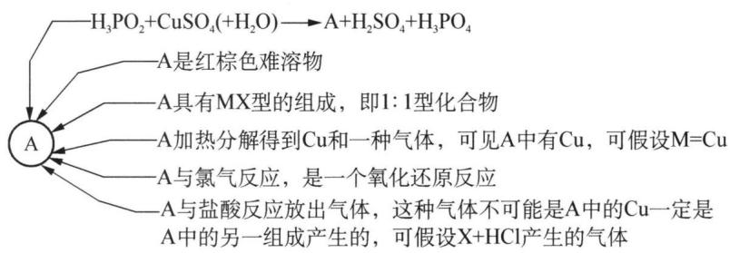

flowchart

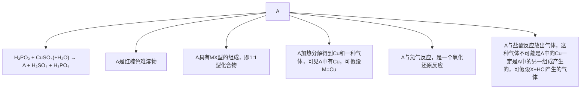

得出 A 的化学式后, 其余几问迎刃而解:

(1) $\mathrm{CuH}$  
(2) $4\mathrm{CuSO}_4 + 3\mathrm{H}_3\mathrm{PO}_2 + 6\mathrm{H}_2\mathrm{O} = 4\mathrm{CuH} + 3\mathrm{H}_3\mathrm{PO}_4 + 4\mathrm{H}_2\mathrm{SO}_4$  
(3) $2\mathrm{CuH} + 3\mathrm{Cl}_2 = 2\mathrm{CuCl}_2 + 2\mathrm{HCl}, \mathrm{CuH} + \mathrm{HCl} = \mathrm{CuCl} + \mathrm{H}_2 \uparrow$

【例 2】 $ZnCO_{3}$ 与醋酸溶液反应, 析出晶体, 并在氯仿中重结晶, 得到无水晶体 A。A 是具有很高对称性的配合物分子。将 A 在空气中灼烧, 得到 ZnO, 失重 48.4%。

(1) 通过计算确定 A 的化学式。  
(2) 写出制备 A 的化学方程式。  
(3) Zn 的常见配位数是 4, 画出 A 分子的空间结构, 说明中心原子 Zn 的杂化态。  
(4) 铍和锌分别为ⅡA及ⅡB族元素, 在很多性质上相类似。因此 Be 也可以形成结构与 A 相似的配合物 B。但 Zn 的配合物易水解, 而 Be 的配合物不易水解。请解释原因。

解析 （1）如果猜想 A 分子中只有 1 个 Zn 原子，则式量为 157.8，排除 $\mathrm{ZnAc}_{2}(\mathrm{M}=183.4)$ 的可能。设 A 的化学式为 $\mathrm{ZnO}_{x}\mathrm{Ac}_{2-2x}$ （或 $\mathrm{Zn(OH)}_{y}\mathrm{Ac}_{2-y}$ ）， $x=0.25(y=0.61$ ，不合理），所以 A 的化学式为 $Zn_{4}OAc_{6}$ 。

(2) $4\mathrm{ZnCO}_3 + 6\mathrm{CH}_3\mathrm{COOH} = 4\mathrm{CO}_2\uparrow +3\mathrm{H}_2\mathrm{O} + \mathrm{Zn}_4\mathrm{O}(\mathrm{OOCCH}_3)_6$

(3) $\mathrm{Ac}^{-}$ 作为双齿配体, 则 6 个 $\mathrm{Ac}^{-}$ 可提供 12 个配位的 O 原子, 每个 $\mathrm{Zn}^{2+}$ 可以接受 3 个配位的 O 原子。根据题目信息, Zn 在本题中是 4 配位, 显然化学式中的 $\mathrm{O}^{2-}$ 应该作为配位原子与 4 个 $\mathrm{Zn}^{2+}$ 形成化学键。考虑到对称性问题, 可以得出该物质的结构应该是由 4 个 $\mathrm{Zn}^{2+}$ 构成一个正四面体, 6 个 $\mathrm{Ac}^{-}$ 分布在 6 条棱上, $\mathrm{O}^{2-}$ 处于正四面体的体心, 得到如下图的结构:

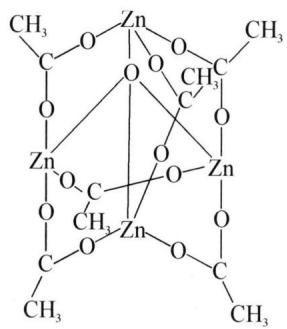

chemical

Molecular structure diagram of a zinc complex with multiple methyl groups and oxygen atoms

很明显 $Zn^{2+}$ 采取的是 $sp^{3}$ 杂化。

（4）因为 Be 是第二周期元素，Be 以 $sp^{3}$ 杂化成键后，四个价轨道已饱和，无 d 轨道， $H_{2}O$ 分子中 O 原子的电子难以进攻，故 $\mathrm{Be}_{4}\mathrm{O}(\mathrm{CH}_{3}\mathrm{COO})_{6}$ 不易水解。而 Zn 处于第四周期，有 d 轨道， $H_{2}O$ 分子可以进攻 Zn 的 d 轨道，所以 $\mathrm{Zn}_{4}\mathrm{O}(\mathrm{CH}_{3}\mathrm{COO})_{6}$ 易于水解。

【例 3】某些铂的化合物具有重要的生理作用,也可能作为防癌剂。

$$
\mathrm{PtCl} _ {4} ^ {2 -} + 2 \mathrm{e} ^ {-} = \mathrm{Pt} + 4 \mathrm{Cl} ^ {-} \quad \varphi^ {\ominus} = 0. 7 5 \mathrm{V}
$$

$$
\mathrm{PtCl} _ {6} ^ {2 -} + 2 \mathrm{e} ^ {-} = \mathrm{PtCl} _ {4} ^ {2 -} + 2 \mathrm{Cl} ^ {-} \quad \varphi^ {\ominus} = 0. 7 7 \mathrm{V}
$$

$$
\mathrm{O} _ {2} + 4 \mathrm{H} ^ {+} + 4 \mathrm{e} ^ {-} = 2 \mathrm{H} _ {2} \mathrm{O} \quad \varphi^ {\ominus} = 1. 2 2 9 \mathrm{V}
$$

$PtCl_{4}^{2-}$ 通常是用化学计量的盐酸肼还原 $PtCl_{6}^{2-}$ 来制备的。在水中， $PtCl_{4}^{2-}$ 的溶剂分解作用是彻底的，但反应速率慢：

$$
\mathrm{PtCl} _ {4} ^ {2 -} + \mathrm{H} _ {2} \mathrm{O} \rightleftharpoons \mathrm{PtCl} _ {3} (\mathrm{H} _ {2} \mathrm{O}) ^ {-} + \mathrm{Cl} ^ {-} \quad 2 5 ^ {\circ} \mathrm{C} \quad K = 1. 4 5 \times 1 0 ^ {- 2}
$$

$$
\mathrm{PtCl} _ {3} \left(\mathrm{H} _ {2} \mathrm{O}\right) ^ {-} + \mathrm{H} _ {2} \mathrm{O} \rightleftharpoons \mathrm{PtCl} _ {2} \left(\mathrm{H} _ {2} \mathrm{O}\right) _ {2} + \mathrm{Cl} ^ {-} \quad 2 5 ^ {\circ} \mathrm{C} \quad K = 1. 1 \times 1 0 ^ {- 3}
$$

所以， $10^{-3}$ mol/L K₂PtCl₄ 的溶液在平衡时仅含有 5% PtCl₄²⁻。

(1) 在空气存在的条件下, Pt 在 HCl 中是否溶解? (空气中 $O_{2}$ 按 1/5 计算) 若能, 写出其化学反应方程式。

(2) 写出 $PtCl_{6}^{2-}$ 与盐酸肼的化学反应方程式。

(3) ①计算 $25^{\circ} \mathrm{C}$ 、 $10^{-3} \mathrm{~mol} / \mathrm{L} \mathrm{K}_{2} \mathrm{PtCl}_{4}$ 溶液达平衡时 $\mathrm{PtCl}_{3}(\mathrm{H}_{2} \mathrm{O})^{-}$ 、 $\mathrm{PtCl}_{2}(\mathrm{H}_{2} \mathrm{O})_{2}$ 的百分含量。②画出 $\mathrm{PtCl}_{2}(\mathrm{H}_{2} \mathrm{O})_{2}$ 的结构图，指出中心原子的杂化形态。

(4) $K_{2}PtCl_{4}$ 的晶体结构与萤石相似,试画出其晶体结构示意图。

解析 （1）半反应： $\varphi_{O_{2}/H_{2}O}=\varphi^{\ominus}+0.059/4\lg K_{P_{O_{2}}}=1.229+0.059/4\lg 1/5=1.219(V)$ ，则电池电动势 $\varepsilon=\varphi_{O_{2}/H_{2}O}-\varphi_{PtCl_{4}^{2-}/Pt}=1.219-0.75>0$ ，所以能溶解。方程式为： $2Pt+8HCl+O_{2}=2H_{2}PtCl_{4}+2H_{2}O;4HCl+2H_{2}PtCl_{4}+O_{2}=2H_{2}PtCl_{6}+2H_{2}O$ 。

(2) $NH_{2}NH_{3}^{+} + 2PtCl_{6}^{2-} = N_{2}\uparrow + 2PtCl_{4}^{2-} + 4Cl^{-} + 5H^{+}$

(3) ① 根据题意 $\left[\mathrm{PtCl}_{4}^{2-}\right] = 10^{-3} \times 5\% = 5 \times 10^{-5} \mathrm{~mol} / \mathrm{L}$ , 由物料守恒得: $\left[\mathrm{PtCl}_{3}(\mathrm{H}_{2} \mathrm{O})^{-}\right] + \left[\mathrm{PtCl}_{2}(\mathrm{H}_{2} \mathrm{O})_{2}\right] = 9.5 \times 10^{-4} \mathrm{~mol} / \mathrm{L}$ , 根据两个反应的平衡常数 $K$ 可列出: $\left[\mathrm{PtCl}_{3}(\mathrm{H}_{2} \mathrm{O})\right]\left[\mathrm{Cl}^{-}\right] = 7.25 \times 10^{-7} \mathrm{~mol} / \mathrm{L}, \left[\mathrm{PtCl}_{2}(\mathrm{H}_{2} \mathrm{O})_{2}\right]\left[\mathrm{Cl}^{-}\right]^{2} = 7.975 \times 10^{-10} \mathrm{~mol} / \mathrm{L}$ 。解得: $\left[\mathrm{PtCl}_{3}(\mathrm{H}_{2} \mathrm{O})^{-}\right] = 5.276 \times 10^{-4} \mathrm{~mol} / \mathrm{L}, \left[\mathrm{PtCl}_{2}(\mathrm{H}_{2} \mathrm{O})_{2}\right] = 4.224 \times 10^{-4} \mathrm{~mol} / \mathrm{L}$ 。因此, $\left[\mathrm{PtCl}_{3}(\mathrm{H}_{2} \mathrm{O})^{-}\right] \% = 52.76\%$ , $\left[\mathrm{PtCl}_{2}(\mathrm{H}_{2} \mathrm{O})_{2}\right] \% = 42.24\%$ 。

② $\begin{array}{c} H_{2}O \\ | \\ Pt \\ | \\ H_{2}O \end{array}$ $\begin{array}{c} Cl \\ | \\ Cl \end{array}$ 或 $\begin{array}{c} H_{2}O \\ | \\ Pt \\ | \\ Cl \\ | \\ H_{2}O \end{array}$ ; Pt: $dsp^{2}$ 杂化。

(4) 由萤石 $\left(\mathrm{CaF}_{2}\right)$ 的结构作相应替换得到晶胞如图:

chemical

Crystal structure diagram of [PtCl₆²⁻] showing K⁺ and [PtCl₆²⁻] ion positions in a cubic lattice

## 本讲习题

1.（1988、1992全国初赛、2011浙江省初赛改编)根据信息书写下列反应的方程式：

(1) 硫酸铜溶液与碳酸钠溶液反应, 可以得到绿色的碱式碳酸铜沉淀, 写出这个反应的化学方程式。

(2) 矿物胆矾就是 $\mathrm{CuSO}_{4} \cdot 5 \mathrm{H}_{2} \mathrm{O}$ , 当它溶于水渗入地下, 遇到黄铁矿 $(\mathrm{FeS}_{2})$ , 铜将以辉铜矿 $(\mathrm{Cu}_{2} \mathrm{~S})$ 的形式沉积下来; 而反应得到的铁和硫则进入水溶液, 该溶液无臭味, 透明不浑浊, 绿色, 呈强酸性, 在有的矿区常可见到这种具有强腐蚀性的地下水 (俗称黑水) 渗出地面, 上述反应可以用一个化学方程式来表示, 试写出配平的化学方程式。

(3) 在酸性溶液中, 软锰矿与黄铜矿可以互相作用, 同时生产出铜盐与锰盐。反应中, 锰元素被还原, 写出配平的离子方程式。

(4) 火炮在射击后要用擦抹剂清除炮膛内的铜(俗称挂铜), 擦抹剂由 $K_{2}Cr_{2}O_{7}$ 和 $(\mathrm{NH}_{4})_{2}\mathrm{CO}_{3}$ 组成。写出铜与擦抹剂反应的方程式(产物都是水溶性的)。

(5) 把铜粉放入装有浓氨水的试管中, 塞紧试管塞, 振荡后发现试管塞越来越紧, 且溶液逐渐变为浅黄色 (近乎无色) 溶液 A, 打开试管塞后, 溶液迅速变为蓝色溶液 B。写出上述变化的化学方程式。

2. 从含金、银、铜、铂的金属废料中提取金、银、铂的一种工艺如下图所示：

chemical

Chemical reaction equations for metal waste and PtCl₆²⁻, showing transformations of Cu²⁺, AgCl, and PtCl₆²⁻ with reagents and conditions

(1) 电解时, 以纯铜为阴极, 金属废料为阳极, $\mathrm{CuSO}_{4}$ 溶液作为电解液, 说明为何铜能够与金、银、铂分离?

(2) 写出阳极泥用王水(一体积浓 $\mathrm{HNO}_3$ 与三体积浓盐酸的混合物)处理的化学反应方程式。

(3) 写出图中(3)示步骤的离子反应方程式。

(4) 写出图中(4)示步骤的离子反应方程式。

(5) $\left(\mathrm{NH}_{4}\right)_{2}\mathrm{PtCl}_{6}$ 沉淀加热到 $435^{\circ}C$ ，只留下金属铂，写出此步的化学反应方程式。

3. 金属金常常可以在铝硅酸盐岩石中发现, 它很细地分散在其他矿物之中。通过暴露在空气中的氰化钠溶液处理破碎后的矿石来提取, 在这个过程中金慢慢地转变成可溶于水的 $\mathrm{Au}[(\mathrm{CN})_{2}]^{-}$ (反应①)。达到平衡后, 被泵出的水相用锌与金的配合物反应转化为金属金, 而锌则转变成 $\mathrm{Zn}[(\mathrm{CN})_{4}]^{2-}$ (反应②)

(1) 写出反应①和②的配平的离子方程式。

金在自然界中经常和银形成合金,银也可以被暴露在空气中的氰化钠溶液氢化。

(2) 500 L 0.0100 mol/L 的 Au[(CN) $_{2}$ ] $^{-}$ 和 0.0030 mol/L 的 Ag[(CN) $_{2}$ ] $^{-}$ 的溶液经蒸发掉三分之二体积的液体后用锌处理 (40 g)。假设偏离标准条件是不重要的，而且所有的氧化还原反应都进行到底了，试计算在反应停止后 Au[(CN) $_{2}$ ] $^{-}$ 和 Ag[(CN) $_{2}$ ] $^{-}$ 的浓度。已知：

$$
\mathrm{Zn} [ (\mathrm{CN}) _ {4} ] ^ {2 -} + 2 \mathrm{e} ^ {-} = \mathrm{Zn} + 4 \mathrm{CN} ^ {-} \quad E ^ {\circ} = - 1. 2 6 \mathrm{V}
$$

$$
\mathrm{Au} [ (\mathrm{CN}) _ {2} ] ^ {-} + \mathrm{e} ^ {-} = \mathrm{Au} + 2 \mathrm{CN} ^ {-} \quad E ^ {\circ} = - 0. 6 0 \mathrm{V}
$$

$$
\mathrm{Ag} \left[ (\mathrm{CN}) _ {2} \right] ^ {-} + \mathrm{e} ^ {-} = \mathrm{Ag} + 2 \mathrm{CN} ^ {-} \quad E ^ {\circ} = 0. 3 1 \mathrm{V}
$$

(3) $\mathrm{Au}[(\mathrm{CN})_2]^{-}$ 在一定条件下是很稳定的络合物。欲使 $99\%$ 的金在溶液中以该氰配合物的形式存在，问需要多大浓度的氰化钠？已知： $\mathrm{Au}[(\mathrm{CN})_2]^{-}:K_{\mathrm{f}} = 4\times 10^{28}$ 。

4. 将一定量 $1.0 \, mol/L \, CuSO_{4}$ 溶液和 $2.0 \, mol/L \, NaOH$ 溶液混合，得到一种浅绿色沉淀 X。将 $0.500 \, g \, X$ 隔绝空气在 $1000^{\circ}C$ 以上强热，得到一种红色固体 Y，质量为 $0.316 \, g$ 。Y 溶于酸得到另一种红色固体 $0.141 \, g$ 。

(1) 如何检验得到的沉淀 X 组成中是否有 $SO_{4}^{2-}$ ?

(2) 通过计算确定 X 和 Y 的化学式。

(3) 计算混合时 $CuSO_{4}$ 和 NaOH 溶液的体积比。

(4) 写出 X→Y 的反应方程式。

5. 近年来,化学家将 $F_{2}$ 通入 KCl 和 CuCl 的混合物中,制得了一种浅绿色的晶体 A 和一种黄绿色气体 B。经分析,A 有磁性,其磁矩为 $\mu=2.8~B.M$ ,且很容易被氧化。将 A 在高温高压下继续和 $F_{2}$ 反应,可得 C,C 的负离子和 A 的负离子共价键数不变(负离子结构对称)。已知 A、C 中铜元素的质量分数分别为 21.55% 和 24.85%。

(1) 试写出 A\~C 的化学式, 分别指出 A、C 中铜的化合价和价电子构型。

(2) 写出上述化学反应方程式。

(3) 简述 A、C 负离子形成的原因。

6. 将 $ZnSO_{4}$ 溶液与 $H_{2}O_{2}$ 混合, 再往混合溶液中加入适量的 NaOH 溶液, 不久可沉淀出二元化合物 A。X 射线研究表明, A 与黄铁矿 $FeS_{2}$ 具有相同的结构。

(1) 写出生成 A 的离子反应方程式。

(2) $FeS_{2}$ 的结构与 NaCl 结构相似。将 $Na^{+}$ 用 A 中正离子（记为 X）取代， $Cl^{-}$ 用 A 中的负离子（记为 Y）取代，即得到 A 的结构。X 射线研究表明，A 的晶胞边长为 a=487 pm。

① 试计算 A 的密度。

② X 原子的 Y 原子的配位多面体是什么？配位数是多少？这些配位多面体按怎样的方式相互连接？解释 X—Y 的化学键类型。

③ X 射线测定结果表明, 在 A 负离子基团中 Y 原子间的键距为 148 pm, 而典型的 Y 的半径为 140 pm。这些事实说明 A 中负离子基团中的键型如何?

(3) A 微溶于水, 加热时能发生水解。当 pH<5 时, A 的溶解度增大, 这是为什么? 试用化学反应方程式解释。

(4) 在潮湿的空气中, A 到 $200^{\circ} \mathrm{C}$ 时, 会生成少量的 B。已知 B 的元素组成与 A 的元素组成完全相同, 且 B 的负离子的价电子数比 NO 的价电子数多 2 。试确定 B 的分子式, 并写出生成 B 的离子方程式。

7. 金的稳定性是相对的, 金能与多种物质发生反应。某同学将金与过量的 $\mathrm{N}_{2} \mathrm{O}_{5}$ 混合, 生成了化合物 A 和 B (A 与 B 物质的量相等)。经分析: A 的电导与 KCl 同类型。其中 A 的负离子具有平面正方形结构, 且配体为平面三角形; A 的正离子具有线型结构, 且与 $\mathrm{CO}_{2}$ 是等电子体。

(1) 试写出 A 的化学式和生成 A 的化学反应方程式。

(2) 画出 A 的负离子的结构式, 并指出中心原子金的氧化数。

(3) 配体是单齿配体还是多齿配体?

(4) 将 A 与 $NaNO_{3}$ 投入到硝酸中, 发现可以生成 C, 同时析出 $N_{2}O_{5}$ 。问:

① 此时的硝酸是无水硝酸,还是硝酸溶液? 为什么?

② 经电导分析, C 的电导仍然与 A 同类型。试写出生成 C 的化学反应方程式。

8. 重金属引起的污染中以汞的毒性最大。在汞蒸气浓度为 $10^{-5} \mathrm{~kg} / \mathrm{m}^{3}$ 的空气中停留一两天人就会中毒，因此水银温度计车间必须采取措施防止汞中毒。（已知下列电对的标准电极电势： $\varphi_{\mathrm{Hg}^{2+} / \mathrm{Hg}_{2}^{2+}} = 0.905 \mathrm{~V}, \varphi_{\mathrm{Hg}_{2}^{2+} / \mathrm{Hg}} = 0.799, \varphi_{\mathrm{Ag}^{+} / \mathrm{Ag}} = 0.800 \mathrm{~V}$ 。）

（1）试判断：Ag 与 $\mathrm{Hg(NO_{3})_{2}}$ 溶液能否反应？若能，则写出反应的离子方程式。若不能，则说明理由。

(2) 写出过量汞与稀硝酸反应的化学方程式。

(3) 液态汞的蒸气压与温度的关系式为 $\lg p = a - b / T$ (其中 $a = 7.08$ , $b = 3190$ , $p$ 的单位为 $\mathrm{kPa}$ ), 打碎一根温度计会洒失 $0.5 \mathrm{~g} \mathrm{Hg}$ , 某温度计厂一车间空间为 $30 \mathrm{~m}^{3}$ , 若在 $288 \mathrm{~K}$ 时不慎打破了一根水银温度计, 试通过计算判断在该车间工作是否会导致汞蒸气中毒。

## 参考答案

## 第一讲 卤族元素

1. (1) $2\mathrm{Ag}^{+} + \mathrm{CrO}_{4}^{2-} = \mathrm{Ag}_{2}\mathrm{CrO}_{4}$

(2) 0.000 530 mol/L

(3) $\left[\mathrm{Ag}^{+}\right] = 7.1\times 10^{-6}\mathrm{mol / L}$ $\left[\mathrm{Cl}^{-}\right] = 2.5\times 10^{-5}\mathrm{mol / L}$

(4) $2\mathrm{CrO}_4^{2-} + 2\mathrm{H}^+ = \mathrm{Cr}_2\mathrm{O}_7^{2-} + \mathrm{H}_2\mathrm{O}$

2. 分析: 首先考虑到 $\mathrm{F}_{2}$ 的强氧化性, 应可将 $\mathrm{ClO}_{3}^{-}$ 氧化到 $\mathrm{Cl(VII)}$ , 另外 $\mathrm{ClO}_{3}^{-}$ 是三角锥形分子, 要形成四面体分子还需额外有个配位原子。联系 (5) 中该四面体分子是温和的氟化剂, 可以确定是 $\mathrm{FCIO}_{3}$ 。(3) 中与 $\mathrm{NH}_{3}$ 反应主要是对 $\mathrm{Cl(VII)}$ 酸根的处理, 在非氧化还原的前提下, F 的位置只能被 $\mathrm{NH}_{2}^{-}$ 亲核取代后生成酸根 $\mathrm{HNClO}_{3}^{-}$ 。(4) 中根据题目信息显然需要 $2 \mathrm{~mol} \mathrm{NaOH}$ 参与, 在只有 1 个铵根的情况下, 应该是中和酸根中的 $\mathrm{H}^{+}$ 。

答案：(1) $KClO_{3} + F_{2} = KF + FClO_{3}$

(2) $\mathrm{FClO_3 + 2NaOH = NaClO_4 + NaF + H_2O}$

(3) $\mathrm{FClO_3 + 3NH_3 = [NH_4][HNClO_3] + NH_4F}$

(4) $\left[\mathrm{NH}_{4}\right]\left[\mathrm{HNClO}_{3}\right] + 2\mathrm{NaOH} = \mathrm{Na}_{2}\mathrm{NClO}_{3} + \mathrm{NH}_{3}\uparrow +2\mathrm{H}_{2}\mathrm{O}$

(5) $\mathrm{FClO_3 + PhLi = PhClO_3 + LiF}$

3. 解析: 假设有 F 元素, AgF 易溶, $BaF_{2}$ 微溶, 第二次的 15 g 沉淀就是另一种卤化银, 以 Cl 来说 15 g AgCl, Cl 元素有 3.71 g, 以 Br 来说就已经超了 5.2 g 了, 所以只可能是 Cl 和 F。但是 5.2 g $ClF_{n}$ 里, 就算 n=1, Cl 的质量也到不了 3.71 g, 所以这个假设不成立, 因此不含氟元素 (2) 15.0 - 5.20 = 9.8, 约含 X-9.8/108 = 0.09 mol, M = 5.20/0.09 = 57.8 g/mol。设 X 为 Br, Y 为 Cl, 则 $(79 + 35.5 \times 3)/4 = 185.5/4 = 46.4$ , 所以不是 $BrCl_{3}$ , 同理不是 $BrF_{3}$ 。设 X 为 I, Y 为 Cl, 则 $(127 + 35.5 \times 3)/4 = 58.4$ , 与 57.8 误差 1%, 考虑到实验操作误差, 所以可能是 $ICl_{3}$

4. (1) $4 \mathrm{Au} + 8 \mathrm{CN}^{-} + 2 \mathrm{H}_{2} \mathrm{O} + \mathrm{O}_{2} = 4 \mathrm{Au}(\mathrm{CN})_{2}^{-} + 4 \mathrm{OH}^{-}$

$K = [\mathrm{Au}(\mathrm{CN})_{2}^{-}]^{4} \times [\mathrm{OH}^{-}]^{4}/([\mathrm{CN}^{-}]^{8} \times p[\mathrm{O}_{2}]) = [\mathrm{Au}(\mathrm{CN})_{2}^{-}]^{4} \times [\mathrm{Au}^{+}]^{4} \times [\mathrm{OH}^{-}]^{4}/([\mathrm{Au}^{+}]^{4} \times [\mathrm{CN}^{-}]^{8} \times p[\mathrm{O}_{2}]) = (K_{\text {稳}} \mathrm{Au}(\mathrm{CN})_{2}^{-})^{4} \times K', \text { 其中 } \lg K' = n\varepsilon^{\ominus}/0.059, \varepsilon^{\ominus} = \varphi^{\ominus} (\mathrm{O}_{2}/\mathrm{OH}^{-}) - \varphi^{\ominus} (\mathrm{Au}^{+}/\mathrm{Au}) = 0.401 - 1.68 = -1.279 \mathrm{~V}. \text { 将 } n = 4, K' = 1.94 \times 10^{-87} \text { 代入求得: } K = (2.0 \times 10^{38})^{4} \times 1.94 \times 10^{-87} = 3.10 \times 10^{66}.$

$$
2 \mathrm{Au} (\mathrm{CN}) _ {2} ^ {-} + \mathrm{Zn} = 2 \mathrm{Au} + \mathrm{Zn} (\mathrm{CN}) _ {4} ^ {2 -}
$$

$$
\begin{array}{r l} {K = [ \mathrm{Zn(CN)} _ {4} ^ {2 -} ] / [ \mathrm{Au(CN)} _ {2} ^ {-} ] ^ {2}} & {= K _ {\text {稳}} (\mathrm{Zn(CN)} _ {4} ^ {2 -}) \times K _ {\text {稳}} (\mathrm{Au(CN)} _ {2} ^ {-}) ^ {- 2} \times} \\ {[ \mathrm{Zn} ^ {2 +} ] / [ \mathrm{Au} ^ {+} ] ^ {2}} \end{array}
$$

设 $K' = \left[\mathrm{Zn}^{2+}\right]/\left[\mathrm{Au}^{+}\right]$ ，为对应于以下反应的平衡常数 $2Au^{+} + Zn = 2Au + Zn^{2+}$ $\varepsilon^{\ominus} = \varphi^{\ominus} \left( \mathrm{Au}^{+}/\mathrm{Au} \right) - \varphi^{\ominus} \left( \mathrm{Zn}^{2+}/\mathrm{Zn} \right)$ ，n = 2， $\lg K' = n\varphi^{\ominus}/0.059$ ， $K' = 1.12 \times 10^{83}$ ，

解得 $K = 2.8 \times 10^{22}$ 。

(2) ① $\mathrm{CN}^{-} + \mathrm{ClO}^{-} = \mathrm{CNO}^{-} + \mathrm{Cl}^{-}, 2\mathrm{CNO}^{-} + 3\mathrm{ClO}^{-} + 2\mathrm{H}^{+} = \mathrm{N}_{2}\uparrow + 2\mathrm{CO}_{2}\uparrow + \mathrm{H}_{2}\mathrm{O} + 3\mathrm{Cl}^{-}$

② A;除去混合气体中 $Cl_{2}$ ，防止对 $CO_{2}$ 测定量的影响；>

5. 分析: 第(1)问可根据氧化出的 $\mathrm{I}_{2}$ 和硫代硫酸根的反应系数比可知 A 应为 $\mathrm{BrO}_{2}(\mathrm{Br}$ 被还原为负一价)。第(2)问可设产物化学式为 $\mathrm{BrO}_{2} \mathrm{~F}_{x}$ , 根据 Br 的百分含量可知分子式为 $\mathrm{BrO}_{2} \mathrm{~F}$ , 由电子守恒和原子守恒可推出(3)的分子式为 $\mathrm{BrF}_{3}$ 。第(6)问可根据 VSEPR 理论推出相关杂化类型和空间构型。

答案: (1) A 是 $\mathrm{BrO}_{2}$ ; $6 \mathrm{BrO}_{2} + 6 \mathrm{NaOH} = \mathrm{NaBr} + 5 \mathrm{NaBrO}_{3} + 3 \mathrm{H}_{2} \mathrm{O}$

(2) B 是 $BrO_{2}F$  
(3) C 是 BrF $_{3}$  
(4) $3\mathrm{BrF}_3 + 5\mathrm{H}_2\mathrm{O} = \mathrm{HBrO}_3 + \mathrm{Br}_2 + 9\mathrm{HF}\uparrow +\mathrm{O}_2\uparrow$ 0.2mol  
(5) $2\mathrm{BrF}_3 = \mathrm{BrF}_2^+ +\mathrm{BrF}_4^-$  
(6) B: $sp^{3}$ 三角锥; C: $sp^{3}d$ 正三角形

6. 分析: 通过计算离子化合物 C 中 Xe 的质量分数可知 A 和 B 生成离子化合物 C 是一个化合反应, 再根据题目信息: 该离子化合物的负离子为四氟硼酸根, 可以得出正离子是 $\mathrm{C}_{6} \mathrm{~F}_{5} \mathrm{XeF}_{2}^{+}$ , 且 Xe 与苯环的 C 原子连接。另外, 与碘的氧化还原反应方程可根据题目信息 Xe 的价态完成, $\mathrm{IF}_{5}$ 分子构型则可用 VSEPR 理论推出 I 采取 $\mathrm{sp}^{3} \mathrm{~d}^{2}$ 杂化的 $\mathrm{AX}_{5} \mathrm{E}$ 型的四方锥构型。

答案：(1) $\mathrm{C_6F_5XeF_2^+BF_4^-}$

(2) 分子中有 C—Xe 键  
(3) $\mathrm{XeF_4 + C_6F_5BF_2 = C_6F_5XeF_2^+ BF_4^-}$  
(4) $5\mathrm{C}_{6}\mathrm{F}_{5}\mathrm{XeF}_{2}^{+}5\mathrm{BF}_{4}^{-} + 2\mathrm{I}_{2} = 4\mathrm{IF}_{5} + 5\mathrm{Xe}\uparrow +5\mathrm{C}_{6}\mathrm{F}_{5}\mathrm{BF}_{2}$

(5)

chemical

Molecular structure diagram of a fluorinated organic compound with labeled atoms and bonds

7. (1) $E_{Cl_{2}^{+}} = 407 \, kJ \cdot mol^{-1}$

分析：根据热力学第一定律,利用本题所给数据,设计下列循环,即可求得 $Cl_{2}^{+}$ 的键能

chemical

Electrolysis reaction of chlorine showing electron transfer and ion exchange steps

(2) ① 1.63 0.40

理由：酸性条件下发生归中反应，碱性条件发生歧化反应， $E_{(+)} > E_{(-)}$ 反应自发

② 酸性介质中，反应 $Cl_{2} + H_{2}O = HClO + Cl^{-} + H^{+}$ 的 $\lg K = nFE/2.30RT = -4.57, K = 2.69 \times 10^{-5}$ ; 忽略 HClO 的电离， $c(H^{+}) = \sqrt[3]{K} = 0.0299, pH = 1.52$

## 第二讲 氧族元素

1.（1）从分子轨道的角度看， $\mathrm{O}_2$ 分子中有三电子键，属于奇电子，奇电子物质能够聚合；若从加成反应的角度看， $\mathrm{O}_2$ 中存在 $\mathrm{O} = \mathrm{O}$ 键，因此能够 2 分子加成。

(2) 从上一问的解释可以得出 $O_{4}$ 的结构为： $\begin{array}{c|c}O & -O \\ | & | \\ O & -O\end{array}$ (平面结构)

(3) 由于 $\mathrm{O}_{4}$ 中氧氧键为单键, 加之分子的张力较大, 因此 $\mathrm{O}_{4}$ 的稳定性较 $\mathrm{O}_{2}$ 低, 氧化性因而较 $\mathrm{O}_{2}$ 强

2. 分析: 首先可以确定 $\mathrm{S}_{2} \mathrm{O}_{4}^{2-}$ 中 $\mathrm{S}$ 的氧化数为 $+3$ , 而制备过程通入的是 $\mathrm{SO}_{2}$ , 所以可以确定甲酸钠应被氧化, 由此得出 (1) 中的方程式, $\mathrm{Na}_{2} \mathrm{~S}_{2} \mathrm{O}_{4}$ 的分离则是利用了醇析的分离方法, 可以类比高中阶段皂化反应中利用盐析分离提纯高级脂肪酸钠制肥皂的操作。第 (2) 问根据 $\mathrm{S}$ 的最外层电子数可以推出 $\mathrm{S}$ 是不等性的 $\mathrm{sp}^{3}$ 杂化, 根据等电子体理论可以类比 $\mathrm{N}_{2} \mathrm{H}_{4}$ , 其中 4 个 $\mathrm{O}$ 原子可以共面。

解答: (1) ① HCOONa + 2SO $_{2}$ + NaOH = Na $_{2}$ S $_{2}$ O $_{4}$ + CO $_{2}$ + H $_{2}$ O ② 降低水溶液的极性, 可使易溶于水的保险粉从混合溶剂里结晶出来 ③ 过滤

(2) $\left[\ddot{\mathrm{O}}:\ddot{\mathrm{S}}:\ddot{\mathrm{S}}:\ddot{\mathrm{O}}:\right]^{2-}$ 4 $\mathrm{N}_2\mathrm{H}_4$

(3) $\mathrm{Zn} + 2\mathrm{NaHSO}_3 + \mathrm{H}_2\mathrm{SO}_3 = \mathrm{Na}_2\mathrm{S}_2\mathrm{O}_4 + \mathrm{ZnSO}_3 + 2\mathrm{H}_2\mathrm{O}$

3. (1)(2)(如下表所示)

<table><tr><td> ${\mathrm{{SCl}}}_{2}$ </td><td>:Cl: S: Cl:</td><td></td></tr><tr><td> $SO_{3}$ </td><td>任一式</td><td> 平面三角形</td></tr><tr><td> $SO_{2}ClF$ </td><td>任一式</td><td> 四面体</td></tr><tr><td> $SF_{4}$ </td><td></td><td> 变形四面体</td></tr><tr><td> $SBrF_{5}$ </td><td></td><td> 八面体</td></tr></table>

(3) SOClBr  
(4) $\mathrm{SOClBr} + 2\mathrm{H}_2\mathrm{O} = \mathrm{HSO}_3^- +\mathrm{Cl}^- +\mathrm{Br}^- +3\mathrm{H}^+$

4. (1) $\mathrm{O}_{3}$ 是 V 形分子, 极性比 $\mathrm{O}_{2}$ 大得多

(2) ① 阳极: $3 \mathrm{H}_{2} \mathrm{O}-6 \mathrm{e}^{-} = \mathrm{O}_{3} \uparrow + 6 \mathrm{H}^{+}$ 阴极: $2 \mathrm{H}^{+} + 2 \mathrm{e}^{-} = \mathrm{H}_{2} \uparrow$  
② $O_{3}$ 沸点比 $O_{2}$ 高得多, 可液化后汽化分离  
(3) $\mathrm{O}_3 + 2\mathrm{I}^- + \mathrm{H}_2\mathrm{O} = \mathrm{I}_2 + 2\mathrm{OH}^- + \mathrm{O}_2, \mathrm{I}_2 + 2\mathrm{S}_2\mathrm{O}_3^{2-} = \mathrm{S}_4\mathrm{O}_6^{2-} + 2\mathrm{I}^-$ , 淀粉作指示剂  
(4) ① $HO_{3}$  
② 受 H 的极化很不稳定

5. (1) 在碱性溶液中 $\mathrm{O}_2 / \mathrm{H}_2\mathrm{O}$ 的标准电极电位大于 $\mathrm{MnO(OH) / Mn(OH)_2}$ 的标准电极电位; 而在酸性溶液中 $\mathrm{Mn}^{3+} / \mathrm{Mn}^{2+}$ 的标准电极电位大于 $\mathrm{O}_2 / \mathrm{H}_2\mathrm{O}$ 的标准电极电位, 故只有在碱性溶液中氧才能氧化 $\mathrm{Mn(OH)_2}$

(2) 三步反应分别为: ① $2 \mathrm{Mn}^{2+} + \mathrm{O}_{2} + 4 \mathrm{OH}^{-} = 2 \mathrm{MnO(OH)}_{2}$  
② $2\mathrm{I}^{-} + \mathrm{MnO(OH)}_{2} + 4\mathrm{H}^{+} = \mathrm{Mn}^{2 + } + \mathrm{I}_{2} + 3\mathrm{H}_{2}\mathrm{O}$ 或 $3\mathrm{I}^{-} + \mathrm{MnO(OH)}_{2} + 4\mathrm{H}^{+} =$ $\mathrm{Mn^{2 + } + I_3^- + 3H_2O}$  
③ $\mathrm{I}_2 + 2\mathrm{S}_2\mathrm{O}_3^{2-} = 2\mathrm{I}^- +\mathrm{S}_4\mathrm{O}_6^{2-}$ 或 $\mathrm{I}_3^- +2\mathrm{S}_2\mathrm{O}_3^{2-} = 3\mathrm{I}^- +\mathrm{S}_4\mathrm{O}_6^{2-}$

(3) 防止空气中 $O_{2}$ 溶入

(4) $9.841 \times 10^{-3} \, mol \cdot L^{-1}$

(5) 8.98 mg·L $^{-1}$

(6) $5.20 \, mg \cdot L^{-1}$

(7) 表明水样里存在好氧微生物或者存在能被氧气氧化的还原性物质

6. (1) $3 \mathrm{~S}_{x}^{2-} + (3 x + 1) \mathrm{BrO}_{3}^{-} + 6 (x - 1) \mathrm{OH}^{-} = 3 x \mathrm{SO}_{4}^{2-} + (3 x + 1) \mathrm{Br}^{-} + 3 (x - 1) \mathrm{H}_{2} \mathrm{O}$

(2) 5、0.6

(3) 溶液变浑浊, 产生臭鸡蛋气味气体。 $S_{x}^{2-} + 2H^{+} = H_{2}S \uparrow + (x - 1)S \downarrow$

(4) $(2x + 2)\mathrm{S} + 6\mathrm{OH}^{-}\stackrel {\triangle}{=} \mathrm{S}_{2}\mathrm{O}_{3}^{2 - } + 2\mathrm{S}_{x}^{2 - } + 3\mathrm{H}_{2}\mathrm{O}$

$$
(2 x + 2) \mathrm{SO} _ {2} + 2 \mathrm{S} _ {x} ^ {2 -} + (4 x - 2) \mathrm{OH} ^ {-} = (2 x + 1) \mathrm{S} _ {2} \mathrm{O} _ {3} ^ {2 -} + (2 x - 1) \mathrm{H} _ {2} \mathrm{O}
$$

(5) $CaS_{x} + H_{2}O + CO_{2} = CaCO_{3} + H_{2}S_{x}, H_{2}S_{x} = H_{2}S + (x - 1)S$ 。生成的硫具有杀虫作用

7. (1) ① $6 \mathrm{NaOH} + 3 \mathrm{~S} = \mathrm{Na}_{2} \mathrm{SO}_{3} + 2 \mathrm{Na}_{2} \mathrm{~S} + 3 \mathrm{H}_{2} \mathrm{O}, \mathrm{Na}_{2} \mathrm{~S} + 4 \mathrm{H}_{2} \mathrm{O}_{2} = \mathrm{Na}_{2} \mathrm{SO}_{4} + 4 \mathrm{H}_{2} \mathrm{O}, \mathrm{Na}_{2} \mathrm{SO}_{3} + \mathrm{H}_{2} \mathrm{O}_{2} = \mathrm{Na}_{2} \mathrm{SO}_{4} + \mathrm{H}_{2} \mathrm{O}$

② 与硫磺及硫代硫酸钠反应的 NaOH 是过量的,通过用盐酸滴定过量未反应的 NaOH 后,可知与硫磺及硫代硫酸钠反应消耗的 NaOH 的量,再根据反应式,通过计算可知参与反应的硫的质量,此质量与投入的不纯硫磺质量之比,即为硫的纯净度

③ 加热至沸腾的目的是除去过量的 $H_{2}O_{2}$ ，防止其影响中和滴定反应的显色，因而不能省略

(2) 解析: 反应涉及到的方程式为: $\mathrm{Sb}_{2} \mathrm{~S}_{3} + 6 \mathrm{HCl} = 2 \mathrm{SbCl}_{3} + 3 \mathrm{H}_{2} \mathrm{~S} \uparrow$ , $\mathrm{FeS} + 2 \mathrm{HCl} = \mathrm{FeCl}_{2} + \mathrm{H}_{2} \mathrm{~S} \uparrow$ , $\mathrm{I}_{2} + \mathrm{H}_{2} \mathrm{~S} = 2 \mathrm{HI} + \mathrm{S} \downarrow$ , $\mathrm{I}_{2} + 2 \mathrm{Na}_{2} \mathrm{~S}_{2} \mathrm{O}_{3} = 2 \mathrm{NaI} + \mathrm{Na}_{2} \mathrm{~S}_{4} \mathrm{O}_{6}$ , $\mathrm{Sb(III)} + \mathrm{I}_{2} = \mathrm{Sb(V)} + 2 \mathrm{I}^{-}, 4 \mathrm{FeS} + 7 \mathrm{O}_{2} \xrightarrow{\text {点燃}} 2 \mathrm{Fe}_{2} \mathrm{O}_{3} + 4 \mathrm{SO}_{2}, 2 \mathrm{Sb}_{2} \mathrm{~S}_{3} + 11 \mathrm{O}_{2} \xrightarrow{\text {点燃}} 2 \mathrm{Sb}_{2} \mathrm{O}_{5} + 6 \mathrm{SO}_{2}, \mathrm{SO}_{2} + 2 \mathrm{Fe}^{3+} + 2 \mathrm{H}_{2} \mathrm{O} = \mathrm{SO}_{4}^{2-} + 2 \mathrm{Fe}^{2+} + 4 \mathrm{H}^{+}, 5 \mathrm{Fe}^{2+} + \mathrm{MnO}_{4}^{-} + 8 \mathrm{H}^{+} = 5 \mathrm{Fe}^{3+} + \mathrm{Mn}^{2+} + 4 \mathrm{H}_{2} \mathrm{O}$ 。

根据上述方程式计算得到： $c(\mathrm{I}_{2})=\left[2.5n(\mathrm{KMnO}_{4})+0.5n(\mathrm{Na}_{2}\mathrm{S}_{2}\mathrm{O}_{3})\right]/V=0.01\ \mathrm{mol/L}$ ， $n(\mathrm{Sb}_{2}\mathrm{S}_{3})=0.050\ 00\ \mathrm{mmol}$ ， $n(\mathrm{FeS})=0.2500\ \mathrm{mmol}$ 。故 $Sb_{2}S_{3}\%=8.49\%$ , $FeS\%=10.99\%$

## 第三讲 氮族元素

1. (1) $\mathrm{N}_{2} \mathrm{H}_{4}$ 是二元碱, 由于受到相邻 $\mathrm{N}$ 的吸电子作用, 导致 $\mathrm{N}$ 的孤对电子云密度下降, 所以碱性: $\mathrm{NH}_{3} > \mathrm{N}_{2} \mathrm{H}_{4}$ ; 还原性: $\mathrm{N}_{2} \mathrm{H}_{4} > \mathrm{NH}_{3}$ ; 稳定性: $\mathrm{NH}_{3} > \mathrm{N}_{2} \mathrm{H}_{4}$

(2) $N_{2}H_{4}$ 原子采取不等性 $sp^{3}$ 杂化, 最多 4 个  
(3) 根据电离平衡及共轭酸碱对原理可以得出: $K_{a} = 3.3 \times 10^{-9}$ , $K_{b} = 3 \times 10^{-6}$

(4) $5\mathrm{N}_2\mathrm{H}_4 + 4\mathrm{KMnO}_4 + 6\mathrm{H}_2\mathrm{SO}_4 = 5\mathrm{N}_2\uparrow +4\mathrm{MnSO}_4 + 2\mathrm{K}_2\mathrm{SO}_4 + 16\mathrm{H}_2\mathrm{O}$

(5) $\mathrm{N}_2\mathrm{H}_4 + 2\mathrm{e}^- +4\mathrm{H}_2\mathrm{O} = 2\mathrm{NH}_4^+ +4\mathrm{OH}^-$

2. 解答: (1) 根据等电子原理可以得出 A: $\mathrm{Na}_{3} \mathrm{NO}_{4}$ , 原硝酸钠。由 VSEPR 可以得出

$NO_{4}^{3-}$ 中 N 采取 $sp^{3}$ 杂化, 正四面体, 结构如图: $\left[\begin{array}{c}O\\|\\O\\|\\O\end{array}\right]^{3-}$

(2) 活泼; 因为 $Na_{3}NO_{4}$ 中中心氮原子半径小, 按正常的配位应该是 3, 即 $NaNO_{3}$ 较为稳定。因此, 当再“挤”入一个氧原子后, 排斥能力增强, 因此负离子体系能量增大, 不稳定, 化学性质变得活泼

(3) $\mathrm{Na}_{3}\mathrm{NO}_{4} + \mathrm{CO}_{2} = \mathrm{NaNO}_{3} + \mathrm{Na}_{2}\mathrm{CO}_{3}$

（4）根据题目信息得出负离子化学式为： $NO_{4}^{-}$ ，考虑结构与 $NO_{4}^{3-}$ 不同只能推测其中有“—O—O—”： $\left[\begin{array}{c}O\\O\\N\\O-O\end{array}\right]^{-}$ ；遇水分解相当于水分子对 N 进行了亲核进攻取代掉“—O—O—”，方程式： $NO_{4}^{-} + H_{2}O = NO_{3}^{-} + H_{2}O_{2}$

3. 解答: (1) $\mathrm{M} = 9.5 \times 22.4 = 208.3 \mathrm{~g} / \mathrm{mol}$ , $\mathrm{PCl}_{5}$ 相对分子质量 $31.0 + 35.5 \times 5 =$ 208.5。蒸气组成为 $\mathrm{PCl}_{5}$ , 分子构型为三角双锥, $\mathrm{Cl} > \mathrm{P} - \mathrm{Cl}$ , 有两种键长

(2) $PCl_{5}=PCl_{3}+Cl_{2}\uparrow$ ，其中三氯化磷分子为三角锥形  
(3) 本题可类比水的自耦电离: $2 \mathrm{PCl}_{5} = \mathrm{PCl}_{4}^{+} + \mathrm{PCl}_{6}^{-}$ , 两种离子的构型分别为正

四面体和正八面体： $\left[\begin{array}{c}Cl\\ Cl\end{array}\right]^{+}\quad\left[\begin{array}{c}Cl\\ Cl\end{array}\right]^{-}$

(4) 由于 $\mathrm{Br}^{-}$ 体积较大, 不能形成 $\mathrm{PBr}_{6}^{-}$ , 因此根据题意只能产生 $\mathrm{Br}^{-}$ , 方程式: $\mathrm{PBr}_{5} = \mathrm{PBr}_{4}^{+} + \mathrm{Br}^{-}$ , 其中 $\mathrm{PBr}_{4}^{+}$ 结构同 $\mathrm{PCl}_{4}^{+}$

4. (1) $\mathrm{CO}_{2}$ , 直线型, $\left[\begin{array}{c} \text{:N-N-N:} \\ \text{:N-N-N:} \end{array}\right]^{-}$

(2) 稳定的共振结构有: $\begin{array}{c} 0 \\ \text{H} -1 +1 0 \\ \ddot{\text{N}} -\text{N} = \text{N}: \\ (\text{a}) (\text{b}) (\text{c}) \end{array}$ $\leftrightarrow$ $\begin{array}{c} 0 \\ \text{H} 0 +1 -1 \\ \ddot{\text{N}} = \text{N} = \ddot{\text{N}} \\ (\text{a}) (\text{b}) (\text{c}) \end{array}$ (3) 酸性: $\mathrm{HX} > \mathrm{HN}_{3}$ , 稳定性: $\mathrm{HX} > \mathrm{HN}_{3}$ , 还原性: $\mathrm{HX} < \mathrm{HN}_{3}$

(4) $3\mathrm{NH}_{2}^{-} + \mathrm{NO}_{3}^{-} = \mathrm{N}_{3}^{-} + 3\mathrm{OH}^{-} + \mathrm{NH}_{3}\uparrow ,2\mathrm{NH}_{2}^{-} + \mathrm{N}_{2}\mathrm{O} = \mathrm{N}_{3}^{-} + \mathrm{OH}^{-} + \mathrm{NH}_{3}\uparrow$

(5) 离子型叠氮化物虽然可以在室温下存在,但在加热或撞击时分解为氮气和金属(不爆炸),故可作为“空气袋”

(6) $\mathrm{HN}_{3} + \mathrm{AgNO}_{3} = \mathrm{AgN}_{3}\downarrow +\mathrm{HNO}_{3},2\mathrm{AgN}_{3} = 2\mathrm{Ag} + 3\mathrm{N}_{2}\uparrow$

5. (1) 链状多聚: $n \mathrm{H}_{3} \mathrm{PO}_{4} = \mathrm{H}_{n+2} \mathrm{P}_{n} \mathrm{O}_{3 n+1} + (n-1) \mathrm{H}_{2} \mathrm{O}$ , 环状多聚: $n \mathrm{H}_{3} \mathrm{PO}_{4} = (\mathrm{HPO}_{3})_{n} + n \mathrm{H}_{2} \mathrm{O}$

(2) 链状结构: HO-P(OH)-O-P(OH)-O-P(OH)-P(OH)

环状结构：
HO-P-O-P-OH
↓
O
↓
HO-P-O-P-OH
↓
O

(3) 多磷酸根是一种强络合剂, 能络合水中的 $Ca^{2+}$ 、 $Mg^{2+}$ , 降低水的硬度, 所以多磷酸钠起到软化水的作用(软水剂)

(4) ① $6\mathrm{P} + 9\mathrm{KOCl} + 6\mathrm{KOH} = \mathrm{K}_{6}\mathrm{P}_{6}\mathrm{O}_{12} + 3\mathrm{H}_{2}\mathrm{O} + 9\mathrm{KCl}$ ;

② $sp^{3}$ , $\Pi_{3}^{4}$ ,

③ $\mathrm{K}_{6}\mathrm{P}_{6}\mathrm{O}_{12} + 6\mathrm{HCl} = \mathrm{H}_{6}\mathrm{P}_{6}\mathrm{O}_{12} + 6\mathrm{KCl},\mathrm{H}_{6}\mathrm{P}_{6}\mathrm{O}_{12} + 6\mathrm{H}_{2}\mathrm{O} = 6\mathrm{H}_{3}\mathrm{PO}_{3}$

6. (1) 根据 $\mathrm{Sb}$ 的含量可算出相对分子质量。由于本反应是在碱性环境中进行, 考虑到—COOH和—SH均有酸性, 可推测出产物的化学式为: $\mathrm{H}[\mathrm{Sb}(\mathrm{SCH}_{2}\mathrm{COO})_{2}]$ ,

结构简式： $H^{+}$ $CH_{2}-S-Sb\cdots S-CH_{2}$ O=C-O-O-C=O

(2) $V = 1.40 \times 1.20 \times 1.24 \times \sin 126^\circ = 1.66 \, \text{nm}^3$ , $Z = N_A DV / M_r = 6.022 \times 10^{23} \times 2.44 \times 1.65 \times 10^{-21} / 302.95 = 8$ , 所以 1 个晶胞中有 $8 \times 16 = 128$ 个原子

(3) $\mathrm{SbCl}_3 + 2\mathrm{HSCH}_2\mathrm{COOH} + 3\mathrm{NaOH} = \mathrm{H}\left[\mathrm{Sb}\left(\mathrm{SCH}_2\mathrm{COO}\right)_2\right] \downarrow + 3\mathrm{NaCl} + 3\mathrm{H}_2\mathrm{O}$

(4) 不宜过多,否则会将 A 溶解

(5) $\mathrm{I}_2 + \mathrm{SbO}_2^- + 2\mathrm{OH}^- = 2\mathrm{I}^- + \mathrm{SbO}_3^- + \mathrm{H}_2\mathrm{O}$  
(6) 85%

7. (1) 淀粉溶液做指示剂。利用 $\mathrm{Al(OH)}_{3}$ 胶体表面积较大吸附并除去色素

(2) $2\mathrm{NaNO}_{2} + 2\mathrm{H}_{2}\mathrm{SO}_{4} + 2\mathrm{KI} = 2\mathrm{NO}\uparrow + \mathrm{I}_{2} + \mathrm{K}_{2}\mathrm{SO}_{4} + \mathrm{Na}_{2}\mathrm{SO}_{4} + 2\mathrm{H}_{2}\mathrm{O}$  
(3) 根据方程式反应系数为: $2 \mathrm{~NaNO}_{2} \sim \mathrm{I}_{2} \sim 2 \mathrm{Na}_{2} \mathrm{~S}_{2} \mathrm{O}_{3}$

$n(\mathrm{NaNO}_2) = 0.050\mathrm{mol / L}\times 20.00\mathrm{mL / 1000mL / L}\times 40 = 0.040\mathrm{mol}$ 。每公斤泡菜中

$\mathrm{NaNO}_2$ 含量为： $0.040\mathrm{mol}\times 69.00\mathrm{g / (mol\cdot kg)} = 2.76\mathrm{g / kg}$ ，则 $0.125\mathrm{kg}$ 泡菜中

$\mathrm{NaNO}_{2}$ 含量为： $2.76 \mathrm{~g} / \mathrm{kg} \times 0.125 \mathrm{~kg} = 345 \mathrm{mg} > 300 \mathrm{mg}$ ，会引起中毒

(4) 主要是因为橙汁中含有丰富的维生素 C, 维生素 C 具有还原性

## 第四讲 碳族元素、硼族元素

1.（1）放在真空容器中是为了防止 Na 被空气中的氧气氧化；随后放在高压容器中是为了生成金刚石，因为生成金刚石需要高温高压

(2) 正四面体; 碳原子的杂化形态为 $sp^{3}$  
(3) 上述实验是武慈反应, 即卤代烃与钠的反应, 生成碳原子数更大的烃。因为 $\mathrm{CCl}_{4}$ 中碳原子为 $\mathrm{sp}^{3}$ 杂化, 反应后, 许许多多的碳原子通过 $\mathrm{sp}^{3}$ 杂化形式成键, 即组成网状的金刚石  
(4) A 为金刚石; B 为石墨, 它们互为同素异形体  
(5) 化学反应为: $CCl_{4} + 4Na = C + 4NaCl$ 。金刚石和石墨的稳定形态相比, 金刚石的内能大, 不稳定, 易转化为内能较低的石墨  
(6) 从纯理论的角度看,采取高温高压,将使一部分石墨转化成金刚石,使金刚石的含量大幅增多  
(7) 上述实验开辟了人造金刚石的另一途径

2. A: $Pb_{3}O_{4}$ 、B: PbO、C: $\mathrm{Pb(NO_{3})_{2}}$ 、D: $\mathrm{Pb(OH)_{2}}$ 、E: $\mathrm{Na_{2}[Pb(OH)_{4}]}$ 、F: $PbO_{2}$ 、G: $MnO_{4}^{-}$ 。化学反应方程式：

$$
\begin{array}{l} \mathrm{D} \longrightarrow \mathrm{E}: 2 \mathrm{NaOH} + \mathrm{Pb(OH)} _ {2} = \mathrm{Na} _ {2} [ \mathrm{Pb(OH)} _ {4} ] \\ \mathrm{E} \longrightarrow \mathrm{F}: \mathrm{Na} _ {2} [ \mathrm{Pb(OH)} _ {4} ] + \mathrm{NaClO} = \mathrm{PbO} _ {2} \downarrow + \mathrm{NaCl} + 2 \mathrm{NaOH} + \mathrm{H} _ {2} \mathrm{O} \\ \end{array}
$$

A 与 $\mathrm{Mn}^{2+}: 5\mathrm{Pb}_{3}\mathrm{O}_{4} + 2\mathrm{Mn}^{2+} + 24\mathrm{H}^{+} = 15\mathrm{Pb}^{2+} + 2\mathrm{MnO}_{4}^{-} + 12\mathrm{H}_{2}\mathrm{O}$

3. (1) B 为 $\mathrm{sp}^2$ 杂化, 平面分子, 有 $\pi_4^6$ 大 $\pi$ 键; 非极性分子, 因结构对称

(2) B 由 $sp^{2}$ 杂化变为 $sp^{3}$ 杂化。因 B 缺电子, 有空轨道, 能接受乙醚分子中 O 的孤对电子, 形成新的化学键  
(3) $\mathrm{BF}_{3} \cdot \mathrm{H}_{2} \mathrm{O}: [\mathrm{H}_{3} \mathrm{O} \rightarrow \mathrm{BF}_{3}]^{+} [\mathrm{HO} \rightarrow \mathrm{BF}_{3}]^{-}; \mathrm{BF}_{3} \cdot 2 \mathrm{H}_{2} \mathrm{O}: [\mathrm{H}_{3} \mathrm{O}]^{+} [\mathrm{HO} \rightarrow \mathrm{BF}_{3}]^{-}$

(4) $\mathrm{BF}_3 + \mathrm{HF} = \mathrm{HBF}_4$  
(5) $4\mathrm{H}_{3}\mathrm{NBF}_{3} = \mathrm{BN} + 3\mathrm{NH}_{4}\mathrm{BF}_{4}$

(6) $BF_{3} + nH_{2}O = HB(OH)_{n}F_{4-n} + (n-1)HF \uparrow$ ; $BCl_{3} + 3H_{2}O = H_{3}BO_{3} + 3HCl$ ; 由于 B 和 F 位于同一周期, 大小相匹配, 因此 $BF_{3}$ 形成的大 $\pi$ 键较 $BCl_{3}$ 强, 导致 $BCl_{3}$ 的水解能力较 $BF_{3}$ 强

4. (1) $\mathrm{NaCaAl}_{3} \mathrm{Si}_{5} \mathrm{O}_{16}$

(2) 由于 $\mathrm{Si}^{4+}$ 的离子半径与 $\mathrm{Al}^{3+}$ 离子半径几乎相等, 因此 $\mathrm{Al}^{3+}$ 取代 $\mathrm{Si}^{4+}$ 后不会引起结构上较大的变化, 但当 $\mathrm{Mg}^{2+}$ 取代 $\mathrm{Si}^{4+}$ 后, 由于它们离子半径相差较大, 会引起结构上较大的变化, 因此不可行

(3) $2\mathrm{NaCaAl}_{3}\mathrm{Si}_{5}\mathrm{O}_{16} + 6\mathrm{H}_{2}\mathrm{CO}_{3} + 11\mathrm{H}_{2}\mathrm{O} = 2\mathrm{Na}^{+} + 2\mathrm{Ca}^{2+} + 6\mathrm{HCO}_{3}^{-} + 4\mathrm{H}_{4}\mathrm{SiO}_{4} + 3\mathrm{Al}_{2}\mathrm{Si}_{2}\mathrm{O}_{5}(\mathrm{OH})_{4}$ 。反应之所以能够发生，是强酸制备弱酸（酸性的强弱相比较而言）

(4) 铝在岩石中主要以共价形式存在

(5) 由于工业化发展, 大气中的酸性气体排放到空气中, 造成酸雨, 酸雨与中长石反应, 因此风化速率加快

(6) 江水的 pH 大于 7, 呈弱碱性

5. (1) $\mathrm{Na}_{2} \mathrm{~B}_{4} \mathrm{O}_{7} + 16 \mathrm{~Na} + 8 \mathrm{H}_{2} + 7 \mathrm{SiO}_{2} = 4 \mathrm{NaBH}_{4} + 7 \mathrm{Na}_{2} \mathrm{SiO}_{3}$

(2) $\mathrm{BH}_4^-$ + $2\mathrm{H}_2\mathrm{O} = \mathrm{BO}_2^-$ + $4\mathrm{H}_2\uparrow$

(3) 溶液的 pH 越大(越小)、和水反应的速率越小(越大)

(4) $8\mathrm{Ru}^{3+} + 3\mathrm{BH}_4^- +24\mathrm{OH}^- = 3\mathrm{BO}_2^- +8\mathrm{Ru} + 18\mathrm{H}_2\mathrm{O}$

6. (1) A: Si; B: F; C: $SiF_{4}$ ; D: $SiO_{2}$

(2) 用纯碱溶液吸收 $\mathrm{SiF}_{4}$ , 反应式为: $3\mathrm{SiF}_{4} + 2\mathrm{Na}_{2}\mathrm{CO}_{3} + 2\mathrm{H}_{2}\mathrm{O} = 2\mathrm{Na}_{2}\mathrm{SiF}_{6} \downarrow + \mathrm{H}_{4}\mathrm{SiO}_{4} + 2\mathrm{CO}_{2}$

(3) $\mathrm{SiH_4 + 8AgNO_3 + 2H_2O = 8Ag\downarrow + SiO_2\downarrow + 8HNO_3}$

(4) 双链式: 一半 $\mathrm{SiO}_{4}$ 四面体中 2 个 O 与其他四面体共用, 另一半 $\mathrm{SiO}_{4}$ 中 3 个 O 共用, 则 $\mathrm{Si}: \mathrm{O} = (1 + 1): (1 \times 2 + 1/2 \times 2 + 1 + 3 \times 1/2) = 2: 5.5$ , 化学式为: $(\mathrm{Si}_{4} \mathrm{O}_{11})_{n}^{2n-}$

片式：每个 $SiO_{4}$ 中 3 个 O 共用， $Si:O=1:(1+3\times1/2)=1:2.5$ ，化学式： $(\mathrm{Si}_{2}\mathrm{O}_{5})_{n}^{2n-}$

架式：每个 $\mathrm{SiO_4}$ 中4个O共用， $\mathrm{Si:O = 1:4\times 1 / 2 = 1:2}$ ，化学式： $\mathrm{SiO_2}$

7. (1) $\mathrm{Ca(HCO_3)_2 = CaCO_3\downarrow + CO_2\uparrow + H_2O, CaCO_3 + CO_2 + H_2O = Ca(HCO_3)_2}$

(2) 因为 $K_{a1} \gg K_{a2}$ ，所以可忽略 $HCO_{3}^{-}$ 的第二步电离。所以 $\left[H^{+}\right] = \left[HCO_{3}^{-}\right]$ 所以

$\left[\mathrm{H}^{+}\right] = \sqrt{P \cdot K_{0} \cdot K_{\mathrm{al}}} = 2.012 \times 10^{-6}$ ，所以 $\mathrm{pH} = 5.70$ ， $\left[\mathrm{CO}_{3}^{2-}\right] = \frac{K_{\mathrm{a}_{1}} \cdot K_{\mathrm{a}_{2}} \cdot \left[\mathrm{H}_{2} \mathrm{CO}_{3}\right]}{\left[\mathrm{H}^{+}\right]^{2}} = 5.012 \times 10^{-11}$ ，原因是可能雨水中溶解了 $\mathrm{SO}_{2}$ 、 $\mathrm{NO}_{2}$ 等酸性气体

(3) $\left[\mathrm{H}_{2} \mathrm{CO}_{3}\right] = P \cdot K_{0} = 3 \times 10^{-4} \times 10^{-1.47} = 1.0165 \times 10^{-5}, \left[\mathrm{CO}_{3}^{2-}\right] = \frac{K_{a_{1}} \cdot K_{a_{2}} \cdot \left[\mathrm{H}_{2} \mathrm{CO}_{3}\right]}{\left[\mathrm{H}^{+}\right]^{2}} = 2.0284 \times 10^{-8}$ , 所以 $\left[\mathrm{Ca}^{2+}\right] = \frac{K_{\mathrm{sp}}}{\left[\mathrm{CO}_{3}^{2-}\right]} = 0.247 \mathrm{~mol/L}$

(4) ① $\mathrm{SrCO_3} = \mathrm{SrO} + \mathrm{CO_2}\uparrow$ 中 $\Delta H^{\ominus} = 235\mathrm{kJ / mol},\Delta S^{\ominus} = 171.3\mathrm{J / mol}\cdot \mathrm{K}$ ，所以 $T = \frac{\Delta H^{\ominus}}{\Delta S^{\ominus}} = 1371.86\mathrm{K}$

② 因为半径增大,极化能力减小,而极化能力强的,易分解;所以 $CaCO_{3}$ 、 $SrCO_{3}$ 、 $BaCO_{3}$ 依次增大,或从离子匹配的角度、晶格能的大小解释

(5) 因为 $NaHCO_{3}$ 中 $HCO_{3}^{-}$ 能发生双聚或多聚 $\overset{-}{O}-\underset{\underset{O\cdots HO}{|}}{\overset{|}{C}}\overset{OH\cdots O}{|} \overset{O^{-}}{\underset{|}{C}}$ ，与水的作用比 $CO_{3}^{2-}$ 弱，所以使 $NaHCO_{3}$ 溶解度减小

## 第五讲 碱金属、碱土金属、氢、稀有气体

1. (1) 一般强酸组成的钾盐溶解度比钠盐小; 而弱酸组成的钾盐溶解度均比钠盐大

(2) ① -8, 20, -2, -20

② NaI 正、负离子半径差大，水化焓差大，溶解焓为负值，KI 离子水化焓差小，溶解焓为正值，NaI 溶解度大于 KI。相反，NaF 两者半径相差小，水化焓差小，溶解焓（负值）小于 KF，溶解度小于 KF。总之与正、负离子半径差，水化焓差有关。一般弱酸根离子对 $H^{+}$ 离子亲力大，把持水分子能力大，水化焓较大，与半径大的 $K^{+}$ 的水化焓差大，因此弱酸的钾盐溶解度大于钠盐

2. (1) $\ce{H-O\cdots H\cdots C\equiv N}$ $\ce{H-N\cdots H-O}$

(2) $\left[\begin{array}{c}H\\H\end{array}\begin{array}{c}O\\H\end{array}\begin{array}{c}H\\H\end{array}\begin{array}{c}H\\H\end{array}\right]^{+}\left[\begin{array}{c}H\\H-O\\H\end{array}\begin{array}{c}H\\H-O\\H\end{array}\begin{array}{c}H\\H-O-H\end{array}\right]^{+}$ (合理均可)

(3) ① $H_{2}O=H_{2}O^{+}+e^{-}$ ② $H_{2}O^{+}+H_{2}O=H_{3}O^{+}+\cdot OH$

③ $(n+2)\mathrm{H}_{2}\mathrm{O}=\mathrm{H}_{3}\mathrm{O}^{+}+\cdot\mathrm{OH}+\mathrm{e}(\mathrm{H}_{2}\mathrm{O})_{n}^{-}$ ④ 酸性, 强还原性

3. (1) 材料、信息。

(2) ① 氢能是最理想的清洁能源之一。氢气燃烧的唯一产物是水,无环境污染问题
② 氢能是一种二次能源。自然界不存在纯氢,必须从含氢的物质中制得,氢作为水的组成,可以说资源丰富。而且氢能是可以利用其他能源(如热能、电能、太阳能和核能等)来制取的二次可再生能源 ③ 氢作为能源放出的能量远远大于煤、石油、天然气等能源 ④ 另外,氢气是一种理想的能源载体。氢气具有可储、可输的性质,可作为一种能源储存和运输。储能可以达到合理利用能源的目的。氢能也可进行大规模运输

(3) $CH_{4} + H_{2}O = CO + 3H_{2}$ 碳、天然气、石油资源面临枯竭，该反应尚需消耗很高的能量（该反应为吸热反应），因此，此法不是理想的长久的方法

(4) ① a. $\mathrm{SO}_2 + \mathrm{I}_2 + 2\mathrm{H}_2\mathrm{O} = 2\mathrm{HI} + \mathrm{H}_2\mathrm{SO}_4$ b. $2\mathrm{HI} = \mathrm{H}_2\uparrow +\mathrm{I}_2$ c. $2\mathrm{H}_2\mathrm{SO}_4$ $= 2\mathrm{SO}_2\uparrow +\mathrm{O}_2\uparrow +2\mathrm{H}_2\mathrm{O}$ 反应c最难进行 ②该循环过程需要很高的热能，也就是说在较高温度下才能进行，生成的 $\mathrm{SO}_2$ 和 $\mathrm{I}_2$ 可以循环使用，其他产物对环境无污染，但耗能太大，所以此法也不可取，若把太阳能用到上述循环中，该工艺将是合理的 (5) ①电解 $1\mathrm{mol}$ 水消耗能量 $284\mathrm{kJ}$ （根据氢气燃烧热确定）， $1\mathrm{m}^3\mathrm{H}_2$ 约 $45\mathrm{mol}$ （标准状态估算），能量利用率约 $88\% (\pm 4\%)$ ②通过太阳能发电或风能、海洋能、生物能、地热能电站产生的电能来制氢，可以降低氢的成本

4. (1) Be ${}^{9}$ Be

(2) $\mathrm{Be} + 2\mathrm{H}^{+} = \mathrm{Be}^{2 + } + \mathrm{H}_{2}\uparrow$ $\mathrm{Be} + 2\mathrm{OH}^{-} = \mathrm{BeO}_{2}^{2 - } + \mathrm{H}_{2}\uparrow$

(3) $\left[\mathrm{Be}\left\langle\mathrm{Cl}\right\rangle_{n}\right]$ $Cl-Be\left\langle\begin{array}{c}Cl\\Cl\end{array}\right\rangle Be-Cl$

(4) $Be_{3}Al_{2}Si_{6}O_{18}$ 或 $3BeO \cdot Al_{2}O_{3} \cdot 6SiO_{2}$

$$
3 \mathrm{BeO} \cdot \mathrm{Al} _ {2} \mathrm{O} _ {3} \cdot 6 \mathrm{SiO} _ {2} + 2 0 \mathrm{NaOH} = 3 \mathrm{Na} _ {2} \mathrm{BeO} _ {2} + 2 \mathrm{NaAlO} _ {2} + 6 \mathrm{Na} _ {2} \mathrm{SiO} _ {3} + 1 0 \mathrm{H} _ {2} \mathrm{O}
$$

natural_image

Geometric diagram of a star-like structure with interconnected nodes and edges, labeled (5) (no text or symbols within the diagram itself)

(合理即可)

5. (1) $\mathrm{XeF}_{2}$ 晶胞结构如图:

chemical

Crystal structure diagram of Xe and P atoms showing interatomic distances in angstroms

(2) $R_{F\ldots F}=299\ pm,\ R_{Xe\ldots F}=340\ pm$

(3) $\rho = 2 \times 169.3 / N_{\mathrm{A}} \times 4.315^{2} \times 6.990 \times 10^{-24} \mathrm{~cm}^{3} = 4.32 \mathrm{~g} / \mathrm{cm}^{3}$

6. (1) $\mathrm{XeF}_{2}$ : 直线形; $\mathrm{XeF}_{4}$ : 平面正方形

(2) 解答: $n(\mathrm{Xe} \backslash \mathrm{O}_{2}) = 2.5 \mathrm{mmol}, n(\mathrm{Xe}) = 1.5 \mathrm{mmol}, n(\mathrm{O}_{2}) = 1.0 \mathrm{mmol}$ (注: 焦性没食子酸可以吸收 $\mathrm{O}_{2}$ ), $n(\mathrm{XeO}_{3}) = 2c(\mathrm{Fe}^{2+})\mathrm{V}(\mathrm{Fe}^{2+}) / 6 = 0.6 \mathrm{mmol}$ 。根据题意可设 $\mathrm{XeF}_{2}, \mathrm{XeF}_{4}, \mathrm{XeF}_{6}$ 分别为 $x, y, z \mathrm{~mol}$ , 可列出方程组:

$x+y+z=2.1\ mmol(Xe守恒)$

$2x+4y+6z=c(\mathrm{Na}_{2}\mathrm{S}_{2}\mathrm{O}_{3})V(\mathrm{Na}_{2}\mathrm{S}_{2}\mathrm{O}_{3})=7.6\ \mathrm{mmol}$ （氧化还原得失电子守恒） $M(\mathrm{XeF}_{2})x+M(\mathrm{XeF}_{4})y+M(\mathrm{XeF}_{6})z=0.1978\ \mathrm{g}$ （质量守恒）

解得： $n(\mathrm{XeF}_{2})=0.5\ \mathrm{mmol}$ 、 $n(\mathrm{XeF}_{4})=1.5\ \mathrm{mmol}$ 、 $n(\mathrm{XeF}_{6})=0.1\ \mathrm{mmol}$

$$
\begin{array}{l} 2 \mathrm{XeF} _ {2} + 2 \mathrm{H} _ {2} \mathrm{O} = 2 \mathrm{Xe} \uparrow + \mathrm{O} _ {2} \uparrow + 4 \mathrm{HF} \uparrow , 6 \mathrm{XeF} _ {4} + 1 2 \mathrm{H} _ {2} \mathrm{O} = 4 \mathrm{Xe} \uparrow + 3 \mathrm{O} _ {2} \uparrow \\ + 2 \mathrm{XeO} _ {3} + 2 4 \mathrm{HF} \uparrow , \mathrm{XeF} _ {6} + 3 \mathrm{H} _ {2} \mathrm{O} = \mathrm{XeO} _ {3} + 6 \mathrm{HF} \uparrow \\ \end{array}
$$

7. (1) ① $\{[c(\mathrm{HCl}) \times 0.0400 - c(\mathrm{NaOH}) \times V(\mathrm{NaOH})] \times (40.00 / 2) / 0.3000\} \times 100\%$ ② 否, 应是 $\mathrm{Ca}$ 、 $\mathrm{Mg}$ 的总量

(2) ① $\left[(2/5)c\left(\mathrm{MnO}_{4}^{-}\right)\times V\left(\mathrm{MnO}_{4}^{-}\right)\times (40.00/2)/0.3000\right]\times 100\%$

② $CaC_{2}O_{4}$ 为难溶物,能从溶液中完全沉淀,又能完全溶于过量稀 $H_{2}SO_{4}$ 。实验结果钙含量低,可能是 $MgC_{2}O_{4}$ 溶解度不是很小,无法沉淀完全的原因(注:18℃时, $MgC_{2}O_{4}\cdot10H_{2}O$ 溶解度:0.03 g)。因此,用 $H_{2}SO_{4}$ 溶解沉淀时产生的 $H_{2}C_{2}O_{4}$ 量偏低

## 第六讲 钛、钒分族元素

1. (1) $\mathrm{Ti} + \mathrm{O}_2 \xlongequal{\triangle} \mathrm{TiO}_2, 2\mathrm{Ti} + \mathrm{N}_2 \xlongequal{\triangle} 2\mathrm{TiN}$ TiN

(2) $\mathrm{TiCl}_2 + \mathrm{O}_2 \xlongequal{\triangle} \mathrm{TiO}_2 + \mathrm{Cl}_2 \quad \mathrm{FeTiO}_3 + 3\mathrm{H}_2\mathrm{SO}_4 = \mathrm{Fe(HSO}_4)_2 + \mathrm{TiOSO}_4 \cdot 2\mathrm{H}_2\mathrm{O} \quad \mathrm{TiOSO}_4 \cdot 2\mathrm{H}_2\mathrm{O} = \mathrm{TiO}_2 \cdot \mathrm{H}_2\mathrm{O}\downarrow + \mathrm{H}_2\mathrm{SO}_4$

(3) $2 \mathrm{C} + \mathrm{TiO}_{2} + 2 \mathrm{Cl}_{2} \xlongequal{\text {高温}} \mathrm{TiCl}_{4} + 2 \mathrm{CO} \quad 2 \mathrm{Mg} + \mathrm{TiCl}_{4} \xlongequal{\text {高温}} \mathrm{Ti} + 2 \mathrm{MgCl}_{2}$ 用过量的稀硫酸溶解过量的镁, 不断搅拌, 过滤, 洗净、干燥

2. (1) $[\mathrm{Kr}]4\mathrm{d}^{4}5\mathrm{s}^{1}$ 第五周期VB族

(2) $\mathrm{Nb:O = 1:(1 + 4\times 1 / 2 + 1\times 1 / 6) = 6:19,K_8\left[\mathrm{Nb}_6\mathrm{O}_{19}\right]\cdot 16\mathrm{H}_2\mathrm{O} 2\sqrt{2}}$

(3) 图略 12 条棱的中点画“·” x=8, 8 个顶点画“×”

(4) $\rho = 8.58\mathrm{g / cm^3}$

(5) $K_{6}FeNb_{15}O_{42}$

3. (1) V $[Ar]3d^{3}4s^{2}$

(2) $2NH_{4}VO_{3}\xlongequal{873K}V_{2}O_{5}+2NH_{3}\uparrow+H_{2}O$

(3) $\mathrm{V}_{2}\mathrm{O}_{5} + 6\mathrm{NaOH} = 2\mathrm{Na}_{3}\mathrm{VO}_{4} + 3\mathrm{H}_{2}\mathrm{O},\mathrm{V}_{2}\mathrm{O}_{5} + \mathrm{H}_{2}\mathrm{SO}_{4} = (\mathrm{VO}_{2})_{2}\mathrm{SO}_{4} + \mathrm{H}_{2}\mathrm{O},$ $\mathrm{V}_2\mathrm{O}_5 + 6\mathrm{HCl} = 2\mathrm{VOCl}_2 + \mathrm{Cl}_2\uparrow +3\mathrm{H}_2\mathrm{O}$

(4) $\mathrm{VO}_2^+ +\mathrm{Fe}^{2 + } + 2\mathrm{H}^+ = \mathrm{VO}^{2 + } + \mathrm{Fe}^{3 + } + \mathrm{H}_2\mathrm{O},\mathrm{VO}_2^+ +2\mathrm{I}^- +4\mathrm{H}^+ = \mathrm{V}^{3 + } + \mathrm{I}_2+$ $2\mathrm{H}_2\mathrm{O},2\mathrm{VO}_2^+ +3\mathrm{Zn} + 8\mathrm{H}^+ = 2\mathrm{V}^{2 + } + 3\mathrm{Zn}^{2 + } + 4\mathrm{H}_2\mathrm{O}$

(5) 0.11 mol I₂

(6) $5\mathrm{C}_2\mathrm{O}_4^{2-} + 2\mathrm{MnO}_4^- + 16\mathrm{H}^+ = 2\mathrm{Mn}^{2+} + 10\mathrm{CO}_2 \uparrow + 8\mathrm{H}_2\mathrm{O}, \mathrm{VO}_4^{3-} + 4\mathrm{H}^+ = \mathrm{VO}_2^+ + 2\mathrm{H}_2\mathrm{O}, 2\mathrm{VO}_2^+ + \mathrm{SO}_2 = 2\mathrm{VO}^{2+} + \mathrm{SO}_4^{2-}, 5\mathrm{VO}^{2+} + \mathrm{MnO}_4^- + \mathrm{H}_2\mathrm{O} = 5\mathrm{VO}_2^+ + \mathrm{Mn}^{2+} + 2\mathrm{H}^+$ 。化学式为： $(\mathrm{NH}_4)_2\mathrm{XO}(\mathrm{C}_2\mathrm{O}_4)_2 \cdot 2\mathrm{H}_2\mathrm{O}$ ，即 $a = 2, b = 2$

4. (1) ① A: $\mathrm{TiCl}_{4}$ , B: $\mathrm{AgCl}$ , C: $\mathrm{TiCl}_{3}$ , D: $\mathrm{Ti(OH)}_{3}$ , E: $\mathrm{TiO(NO)}_{2}$ , F: $\mathrm{TiO}_{2}$ 或 $\mathrm{H}_{2} \mathrm{TiO}_{3}$

② $Ti^{4+}$ 离子电荷高, 半径小 (68 pm), 极化能力强; $TiCl_{4}$ 在潮湿的空气中迅速水解, 生成的 HCl 气体在空气中遇到水蒸气而发烟: $TiCl_{4} + 3H_{2}O = H_{2}TiO_{3} + 4HCl \uparrow$

(2) ① 硝酸盐易分解完全, 易彻底用水洗去

② x = 0.86 y = 0.38(0.43 × 0.88)

③ 化合物(I)中 Ti 为 +4 价, 化合物(III)中, Ti 为 +3 和 +4 价, 1 mol 化合物(III)中有 0.38 mol Ti $^{3+}$ , 0.62 mol Ti $^{4+}$ , 则个数比 31:19

5. (1) pH 越小, $VO_{2}^{+}$ 离子越多, pH 越大, $VO_{4}^{3-}$ 离子越多

(2) 各离子结构如下:

chemical

Chemical structure of a vanadium(II) oxide compound with oxygen and V atoms, showing charge distribution

(3) 根据 $302.5 = 262.0 \times 3/2$ 可知, 金属钒采取体心立方堆积方式。其晶胞内有两种空隙, 变形八面体空隙和变形四面体空隙:

变形八面体空隙： $r_{0}=\frac{a-2r}{2}=\frac{302.5-262.0}{2}=20.25\ pm$ ;

变形四面体空隙： $r_{1}=\frac{\frac{\sqrt{5}}{2}a-2r}{2}=\frac{\frac{\sqrt{5}}{2}\times302.5-262.0}{2}=38.1\ pm$

比较可知,四面体空隙较大,可容纳的最大原子半径 $r=r_{t}=38.1\ pm$

(4) ① $\mathrm{Be}_{3} \mathrm{Al}_{2} \mathrm{Si}_{6} \mathrm{O}_{18} + 20 \mathrm{OH}^{-} = 3 \mathrm{BeO}_{2}^{2-} + 2 \mathrm{AlO}_{2}^{-} + 6 \mathrm{SiO}_{3}^{2-} + 10 \mathrm{H}_{2} \mathrm{O}$

② $\left[\mathrm{NH}_{2} \mathrm{CH}_{2} \mathrm{CH}_{2} \mathrm{NH}_{2}\right]\left[\mathrm{MnV}_{3} \mathrm{O}_{7} \mathrm{F}_{5}\right]$

③ $K_{12}V_{10}O_{31}$

6. (1) ① $\mathrm{V}_{2} \mathrm{O}_{5} + 2 \mathrm{C}_{2} \mathrm{O}_{4}^{2-} + 6 \mathrm{H}^{+} = 2 \mathrm{VO}^{+} + 4 \mathrm{CO}_{2} \uparrow + 3 \mathrm{H}_{2} \mathrm{O}, 5 \mathrm{C}_{2} \mathrm{O}_{4}^{2-} + 2 \mathrm{MnO}_{4}^{-} + 16 \mathrm{H}^{+} = 2 \mathrm{Mn}^{2+} + 10 \mathrm{CO}_{2} \uparrow + 8 \mathrm{H}_{2} \mathrm{O}, \mathrm{V}_{2} \mathrm{O}_{5} + 4 \mathrm{I}^{-} + 6 \mathrm{H}^{+} = 2 \mathrm{VO}^{+} + 2 \mathrm{I}_{2} + 3 \mathrm{H}_{2} \mathrm{O}, \mathrm{I}_{2} + 2 \mathrm{S}_{2} \mathrm{O}_{3}^{2-} = \mathrm{S}_{4} \mathrm{O}_{6}^{2-} + 2 \mathrm{I}^{-}$

② 草酸定量法属于反滴定原理,加入过量的草酸后用 $KMnO_{4}$ 反滴,因此需要对草酸定量;而 $KI—Na_{2}S_{2}O_{3}$ 法属于间接滴定,利用被 V(V) 氧化出的 $I_{2}$ 消耗的 $Na_{2}S_{2}O_{3}$ 的量可直接计算得出结果,不需要定量

(2) $V_{2}O_{4.86}$

7. (1) $1.5 \mathrm{~mol} / \mathrm{L}$

(2) 沉淀灼烧后 $(x\mathrm{Fe}_{2}\mathrm{O}_{3} \cdot y\mathrm{Al}_{2}\mathrm{O}_{3} \cdot z\mathrm{TiO}_{2})$ 重 0.4120 g

$SnCl_{2}$ 还原测 Fe 量, Zn-Hg 还原器测 Fe、Ti 总量 ( $M(Fe_{2}O_{3}) = 159.7$ , $M(TiO_{2}) = 79.88$ )

$$
w(\mathrm{Fe}_{2}\mathrm{O}_{3}) = \frac{6\times 0.01388\times 8.02\times M(1 / 2\mathrm{Fe}_{2}\mathrm{O}_{3})\times 4}{0.6050\times 10^{3}}\times 100\% = 35.26\%
$$

$$
w(\mathrm{TiO}_{2}) = \frac{6\times 0.01388\times(10.05 - 8.02)\times M(\mathrm{TiO}_{2})\times4}{0.6050\times10^{3}}\times 100\% = 8.93\%
$$

$$
w \left(\mathrm{Al} _ {2} \mathrm{O} _ {3}\right) = \frac {0 . 4 1 2 0 - 0 . 6 0 5 0 \times 3 5 . 2 6 \% - 0 . 6 0 5 0 \times 8 . 9 3 \%}{0 . 6 0 5 0} \times 100 \% = 23.91 \%
$$

## 第七讲 铬分族元素

1. A: $Cr_{2}O_{3}$ B: $NaCrO_{2}$ C: $Na_{2}CrO_{4}$ D: $Na_{2}Cr_{2}O_{7}$ E: $\mathrm{Cr}_{2}(\mathrm{SO}_{4})_{3}$ F: $\mathrm{Cr(OH)}_{3}$ G: $[\mathrm{Cr}(\mathrm{NH}_{3})_{2}(\mathrm{H}_{2}\mathrm{O})_{4}]Cl_{3}$ 。方程式略

2. (1) $\mathrm{Cr}^{3+} + 4\mathrm{OH}^{-} = \mathrm{Cr(OH)}_{4}^{-}$ , $2\mathrm{Cr(OH)}_{4}^{-} + 3\mathrm{H}_{2}\mathrm{O}_{2} + 2\mathrm{OH}^{-} = 2\mathrm{CrO}_{4}^{2-} + 8\mathrm{H}_{2}\mathrm{O}$ , $2\mathrm{CrO}_{4}^{2-} + 2\mathrm{H}^{+} = \mathrm{Cr}_{2}\mathrm{O}_{7}^{2-} + \mathrm{H}_{2}\mathrm{O}$

(2) $\mathrm{O} \underset{\mathrm{O}}{\overset{\mathrm{O}}{\rightleftharpoons}} \mathrm{Cr} \underset{\mathrm{O}}{\overset{\mathrm{O}}{\rightleftharpoons}} \mathrm{O}$ , 由于结构中存在两个— $\mathrm{O} - \mathrm{O}-$ , 因此 $\mathrm{Cr}$ 的化合价依然为 $+6$ , 因而不是氧化还原反应。酸性环境中发生的反应为: $2 \mathrm{Cr}_{2} \mathrm{O}_{7}^{2-} + 8 \mathrm{H}_{2} \mathrm{O}_{2} + 16 \mathrm{H}^{+} = 4 \mathrm{Cr}^{3+} + 7 \mathrm{O}_{2} \uparrow + 16 \mathrm{H}_{2} \mathrm{O}$ , 根据方程式可以算出相当于 $0.080 \mathrm{mmol} \mathrm{H}_{2} \mathrm{O}_{2}$

(3) 交换出 $n_{\mathrm{H}^{+}} = 0.821 \mathrm{~mmol}$ , 而 $n_{\text {配}} = 0.822 \mathrm{~mmol}$ , 因此确定该配合物的正离子应该为含 $\mathrm{Cr}$ 的 $+1$ 价正离子, 从而得到配离子的化学式: $[\mathrm{Cr(H_2O)_4Cl_2}]^+$ 。有两种结构, $\mathrm{Cl^-}$ 在邻位和对位:

3. 解析: 首先根据 $\mathrm{Cr} 、 \mathrm{~N} 、 \mathrm{H}$ 的质量分数可以得知配合物中的原子个数比 $\mathrm{Cr}: \mathrm{N}: \mathrm{H}=1:3:9$ , 由题目信息可以确定 $\mathrm{N} 、 \mathrm{H}$ 应该以 $\mathrm{NH}_{3}$ 的形式与 $\mathrm{Cr}$ 形成配位键, 又已知该配合物为五角双锥, 还差 4 个配位原子, 考虑到该配合物是加入 $\mathrm{H}_{2} \mathrm{O}_{2}$ 制备得到, 因此可以联想类比到 $\mathrm{CrO}_{5}$ 中的— $\mathrm{O}-\mathrm{O}-$ , 通过质量分数的验证可以确定还应该有两个— $\mathrm{O}-\mathrm{O}-$ , 从而解决分子式及结构的问题。值得注意的一个地方是本题信息中明确告知该配合物不导电, 因此 $\mathrm{Cr}$ 的化合价是较为罕见的 +4 价

答案：（1）配合物 $\mathrm{Cr(NH_{3})_{3}(O_{2})_{2}}$ 结构为： $\ce{Cr(OH)2}$ 或 $\ce{Cr(OH)2}$

(2) +4

(3) 氧化性、还原性

(4) $\mathrm{CrO_4^{2-} + 3NH_3 + 3H_2O_2 = Cr(NH_3)_3(O_2)_2 + O_2 + 2H_2O + 2OH^-}$

4. (1) 解答: 设盐 A 化学式为 $\mathrm{K}_{x} \mathrm{CrO}_{y}$ , 根据 O 的质量分数可列出不定方程: $16 y = (39 x + 16 y + 52) \times 43.05 \%$ ，讨论后有 $x = 3, y = 8$ 符合，可得化学式: $\mathrm{K}_{3} \mathrm{CrO}_{8}$ 。 $\mathrm{CrO}_{8}^{3-}$ 的结构是本题的难点，首先根据题目信息本反应是氧化还原反应，那么 8 个 O 显然应该考虑 — O— O— 的形式与 Cr 结合，并且在保证 Cr 的化合价下降的同时，还

能形成负3价的负离子，讨论下来只能是下面的结构： $\begin{array}{c} -\mathrm{O}-\mathrm{O}\\ -\mathrm{O}-\mathrm{O}-\mathrm{Cr} \\ -\mathrm{O}-\mathrm{O}\end{array}$ ，方程式：

$$
2 \mathrm{CrO} _ {4} ^ {2 -} + 9 \mathrm{H} _ {2} \mathrm{O} _ {2} + 2 \mathrm{OH} ^ {-} = 2 \mathrm{CrO} _ {8} ^ {3 -} + \mathrm{O} _ {2} \uparrow + 1 0 \mathrm{H} _ {2} \mathrm{O}
$$

(2) $\mathrm{CrO(O_2)_2\cdot O(C_2H_5)_2}$ , 结构: $\mathrm{Cr(O_2)_2O(C_2H_5)_2 + 5H_2O}$

(3) 解答: ① 设 X 的化合价降 n 价: $n(\mathrm{X}): n(\mathrm{Na}_{2}\mathrm{S}_{2}\mathrm{O}_{3}) = 1: n$ , $M(\mathrm{X}) = 0.2640/(0.488 \times 0.02868/n) = 18.86n$ 。讨论得 n = 7 时存在合理的化学式: $CrO_{5}$ 。

②
O-C=O
|   |
O   Cr   |   O

③ $2\mathrm{CrO}_5 + 14\mathrm{I}^- + 20\mathrm{H}^+ = 2\mathrm{Cr}^{3+} + 7\mathrm{I}_2 + 10\mathrm{H}_2\mathrm{O}$

5. 解答: (1) ① 推导过程: 首先每个杂多酸离子含一个 $\mathrm{PO}_{4}$ , 所以在化学式中有 1 个 P 原子; 有 12 个 $\mathrm{MoO}_{6}$ 八面体, 故有 12 个 Mo 原子; 其次每个 $\mathrm{MoO}_{6}$ 八面体有 1 个顶点氧原子, 为三个八面体共用, 四个顶点氧原子为两个八面体共用, 其中两个为同组八面体共用, 另两个与另一组八面体共用, 还有一个顶点氧原子不共用; 而每个 $\mathrm{MoO}_{6}$ 八面体含有的氧原子为 $1 \times 1/3 + 4 \times 1/2 + 1 = 10/3$ , 所以 12 个 $\mathrm{MoO}_{4}$ 共有氧原子: $12 \times 10/3 = 40$ ; 最后考虑化合价: P 的氧化数为 $+5$ , Mo 为 $+6$ , 故整个酸根带 3 个单位负电荷。从而得到 $x = 12$ , $y = 40$ , $z = 3$

② $12\mathrm{MoO}_4^{2-} + 3\mathrm{NH}_4^+ + \mathrm{HPO}_4^{2-} + 23\mathrm{H}^+ = (\mathrm{NH}_4)_3(\mathrm{PMo}_{12}\mathrm{O}_{40})\downarrow + 12\mathrm{H}_2\mathrm{O}$

(2) 注意到 V 的化合价与 Mo 不同, 因此形成杂多酸盐时还需要额外由碳酸铵提供铵根离子, 另外 Mo 被替换出来也应该形成铵盐, 于是可以得到方程式: $2(\mathrm{NH}_{4})_{3}(\mathrm{PMo}_{12}\mathrm{O}_{40}) + \mathrm{V}_{2}\mathrm{O}_{5} + 6(\mathrm{NH}_{4})_{2}\mathrm{CO}_{3} + 3\mathrm{H}_{2}\mathrm{O} = 2(\mathrm{NH}_{4})_{4}(\mathrm{PMo}_{11}\mathrm{VO}_{40}) + 2(\mathrm{NH}_{4})_{2}\mathrm{MoO}_{4} + 6\mathrm{NH}_{4}\mathrm{HCO}_{3}$

6. 解答: (1) 可以标记三种多酸负离子的顶点如下图:

chemical

Complex molecular structure diagram with interconnected nodes and bonds

chemical

Molecular structure diagram showing interconnected atoms and bonds

chemical

Molecular structure diagram showing a cage-like arrangement of atoms with bonds and spatial arrangement

① 展现在上图左的 12 个钨氧八面体的氧原子通过共顶共边排成图中所示的 6:15:15:6 四层结构。共有氧原子 $6+15+15+6=42$ 个，所以化学式是 $\left[W_{12}O_{42}\right]^{12-}$

② 结构应含 10 个钨氧八面体, 它们的氧原子通过共顶共边排列成 1:4:9:4:9:4:1 的层状结构。共有氧原子 $1 + 4 + 9 + 4 + 9 + 4 + 1 = 32$ 个, 所以化学式是 $\left[W_{10}O_{32}\right]^{4-}$

③ 图中有 12 个钨氧八面体, 形成了 4 个有 3 个八面体共顶又共 3 条边的 $W_{3}O_{13}$ 单元, 每个 $W_{3}O_{13}$ 单元的外侧面有 6 个氧原子, 内侧面有 7 个氧原子。4 个 $W_{3}O_{13}$ 单元又通过共用内侧面周边的氧原子形成四面体结构, 四面体的每条边上共用 2 个氧原子, 6 条边共用氧原子为 12 个。所以氧原子总数为 $4 \times 13 - 12 = 40$ 个, 所以化学式是 $\left[W_{12}O_{40}\right]^{8-}$

(2) $\mathrm{CaWO_4 + 2HCl = H_2WO_4 + CaCl_2, H_2WO_4 + 2NH_3\cdot H_2O = (NH_4)_2WO_4}$ $+2\mathrm{H}_2\mathrm{O},12(\mathrm{NH}_4)_2\mathrm{WO}_4 + 12\mathrm{H}_2\mathrm{O} = (\mathrm{NH}_4)_{10}\mathrm{W}_{12}\mathrm{O}_{41}\cdot 5\mathrm{H}_2\mathrm{O} + 14\mathrm{NH}_3\cdot \mathrm{H}_2\mathrm{O},$ $(\mathrm{NH}_4)_{10}\mathrm{W}_{12}\mathrm{O}_{41}\cdot 5\mathrm{H}_2\mathrm{O} = 12\mathrm{WO}_3 + 10\mathrm{H}_2\mathrm{O} + 10\mathrm{NH}_3\uparrow$

(3) ① 0.10; ② $\mathrm{WO}_{2.5}:\mathrm{WO}_{3}=1:4$

(4) ① 显然 Zn 将 W(VI) 还原到较低价态, 又通过高锰酸钾溶液重新将较低价态的 W 氧化为 W(VI), 由此得到黄色化合物的化学式为: $WO_{3}$ , 再通过高锰酸钾的消耗量可以求出蓝色化合物化学式为: $WO_{2.7}$

②钨的价态降低时要失去氧，需H+与之结合成水，有利于平衡向还原方向进行

7. 解答: (1) 图 1 中所有八面体的点均代表 O 原子, 可直接数出共 24 个 O, 再根据化合价得到化学式: $\left[\mathrm{XM}_{6} \mathrm{O}_{24}\right]^{(12-n)-}$

(2) 图 2 虽然和图 1 的表示完全不同,但仔细对比可以发现图 2 其实是将图 1 的结构抽象为球棍式模型,很明显中心的杂原子周围连接的 6 个小圆圈还带有小点,应该就是题目信息中与杂原子连接的 6 个 OH,结合化合价可得化学式为: $\left[\mathrm{CrMo}_{6} \mathrm{O}_{24} \mathrm{H}_{6}\right]^{3-}$

(3) 图 3 与图 2 基本一致, 根据信息得出负离子化学式中应该含有 2 个 Pt、12 个 Mo、48 个 O, 根据双聚体的电荷数可知还应有其他正离子, 注意到题目中提到该双聚体中含有氢键, 可以考虑用 $\mathrm{H}^{+}$ 平衡电荷数, 可得化学式: $\left[\mathrm{H}_{9}(\mathrm{PtMo}_{6}\mathrm{O}_{24})_{2}\right]^{7-}$

## 第八讲 锰分族元素

1. 在碱性介质中生成的锰酸钾(绿色)在稀溶液中可能分解而生成 $MnO_{2}$ 沉淀: $3K_{2}MnO_{4} + 2H_{2}O = 2KMnO_{4} + MnO_{2} \downarrow + 4KOH$ 。在微酸性或微碱性溶液中, $KMnO_{4}$ 与 $K_{2}SO_{4}$ 反应产物有 $MnO_{2}$ 生成, 在酸性介质中, 若 $KMnO_{4}$ 过量, 其分解可有 $MnO_{2}$ 生成: $4MnO_{4}^{-} + 4H^{+} = 3O_{2} \uparrow + 2H_{2}O + 4MnO_{2} \downarrow$

2. (1) A: $MnO_{2}$ 、B: $K_{2}MnO_{4}$ 、C: $KMnO_{4}$ 、D: $Cl_{2}$ 、E: $MnCl_{2}$ 、F/G: $K_{2}SO_{4}/KOH$

(2) $\mathrm{B} \longrightarrow \mathrm{C} + \mathrm{A}: 3\mathrm{MnO}_4^{2-} + 4\mathrm{H}^+ = 2\mathrm{MnO}_4^- + \mathrm{MnO}_2 \downarrow + 2\mathrm{H}_2\mathrm{O}$

$$
\mathrm{A} \longrightarrow \mathrm{D} + \mathrm{E}: \mathrm{MnO} _ {2} + 4 \mathrm{H} ^ {+} + 2 \mathrm{Cl} ^ {-} = \mathrm{Mn} ^ {2 +} + \mathrm{Cl} _ {2} \uparrow + 2 \mathrm{H} _ {2} \mathrm{O}
$$

$$
\mathrm{C} \longrightarrow \mathrm{A} + \mathrm{F} + \mathrm{G}: 2 \mathrm{MnO} _ {4} ^ {-} + 3 \mathrm{SO} _ {3} ^ {2 -} + \mathrm{H} _ {2} \mathrm{O} = 2 \mathrm{MnO} _ {2} \downarrow + 3 \mathrm{SO} _ {4} ^ {2 -} + 2 \mathrm{OH} ^ {-}
$$

3. (1) A: Mn、B: Cr、C: Fe

(2) 稳定性 $Mn^{2+} > Fe^{2+} > Cr^{2+}$

(3) 氧化性 $CrO_{4}^{2-}$ (黄) < $MnO_{4}^{2-}$ (绿) < $FeO_{4}^{2-}$ (红), 均为正四面体结构

(4) $2CrO_{4}^{2-} + 2H^{+} = Cr_{2}O_{7}^{2-} + H_{2}O$ 、 $3MnO_{4}^{2-} + 4H^{+} = 2MnO_{4}^{-} + MnO_{2}\downarrow + 2H_{2}O$ 、 $4FeO_{4}^{2-} + 20H^{+} \longrightarrow 4Fe^{3+} + 3O_{2}\uparrow + 10H_{2}O$

4. (1) $^{96}_{42}\text{Mo} + _{1}^{2}\text{H} \longrightarrow _{43}^{97}\text{Tc} + _{0}^{1}\text{n}$

(2) 计算式如下:

$$
\rho = \frac {2 M}{N _ {\mathrm{A}} \cdot V} = \frac {2 M}{N _ {\mathrm{A}} \cdot a ^ {2} \cdot \sin 6 0 ^ {\circ} \cdot c} = \frac {2 M}{N _ {\mathrm{A}} \cdot (2 R) ^ {2} \cdot \frac {\sqrt {3}}{2} \cdot \sqrt {\frac {8}{3}} \cdot 2 R} =
$$

$$
\frac {2 \times 9 8 \times 1 0 ^ {- 3}}{6 . 0 2 \times 1 0 ^ {2 3} \times \frac {\sqrt {3}}{2} \times \sqrt {\frac {8}{3}} \times (2 \times 0 . 1 3 6 \times 1 0 ^ {- 9}) ^ {3}} = 1. 1 4 \times 1 0 ^ {4} (\mathrm {kg/ m^ {3}}), \text {所以} \rho =
$$

11. $4 \mathrm{~g} / \mathrm{cm}^{3}$

(3) 解答: 图(a)的 12 个配位原子可以放在立方体的 12 条棱心, 见下图:

chemical

Crystal lattice structure diagram showing atomic positions in a cubic unit cell

可以确定图(a)对应的晶体为立方最密堆积,则图(b)对应的则是六方最密堆积

(4) 酸性: $\mathrm{HMnO}_{4} < \mathrm{HTcO}_{4} < \mathrm{HReO}_{4}$

5. (1) $\mathrm{Re}_{2} \mathrm{O}_{7} + \mathrm{H}_{2} \mathrm{O} = 2 \mathrm{H} \mathrm{ReO}_{4}, \mathrm{HReO}_{4} + \mathrm{KCl} = \mathrm{KReO}_{4} + \mathrm{HCl}, 2 \mathrm{KReO}_{4} + 7 \mathrm{H}_{2} = 2 \mathrm{Re} + 2 \mathrm{KOH} + 6 \mathrm{H}_{2} \mathrm{O}$

(2) ① $R_{2}S_{7}$ ② $Re_{2}S_{7} + 28H_{2}O_{2} + 16NH_{3} \cdot H_{2}O = 7(NH_{4})_{2}SO_{4} + 2NH_{4}ReO_{4} + 36H_{2}O$ , $2NH_{4}ReO_{4} + 7H_{2} = 2Re + 2NH_{3} + 8H_{2}O$

(3) ① $K_{2}ReH_{9}$ ② $18K+KReO_{4}+13H_{2}O=K_{2}ReH_{9}+17KOH$ ③ 抗磁性, 因为 Re 化合价为 +7, 所有电子参与成键

chemical

Chemical structure diagram showing a hydrogen atom (H) bonded to a central carbon atom (Re)

④ 结构如下：

(4) ① $ReCl_{5}$ ② $7CCl_{4} + 2Re_{2}O_{7} = 4ReCl_{5} + 7CO_{2}\uparrow + 4Cl_{2}\uparrow$

6. (1) ① $2 \mathrm{MnO}_{2} + 4 \mathrm{KOH} + \mathrm{O}_{2} = 2 \mathrm{K}_{2} \mathrm{MnO}_{4} + 2 \mathrm{H}_{2} \mathrm{O}, 3 \mathrm{K}_{2} \mathrm{MnO}_{4} + 2 \mathrm{CO}_{2} = 2 \mathrm{KMnO}_{4} + \mathrm{MnO}_{2} + 2 \mathrm{K}_{2} \mathrm{CO}_{3}$

② 阳极氧化 $MnO_{4}^{2-}-e^{-}=MnO_{4}^{-}$

③ $2K_{2}MnO_{4} + 2H_{2}O = 2KMnO_{4} + 2KOH + H_{2}\uparrow$

(2) ① $(\mathrm{NH}_4)_2\mathrm{SO}_4 + \mathrm{MnCO}_3 = \mathrm{MnSO}_4 + 2\mathrm{NH}_3\uparrow +\mathrm{CO}_2\uparrow +\mathrm{H}_2\mathrm{O}\uparrow$

② $MnSO_{4} + 2NH_{3} + CO_{2} + H_{2}O = (NH_{4})_{2}SO_{4} + MnCO_{3} \downarrow$

③ $MnSO_{4}$ ， $MnCO_{3}$ 分解生成高价锰的氧化物而导致锰浸出率下降

④ 不需要加。开始投料时 $\left(\mathrm{NH}_{4}\right)_{2}\mathrm{SO}_{4}(132\mathrm{~g}/\mathrm{mol})$ 过量 $\left(\mathrm{MnCO}_{3},115\mathrm{~g}/\mathrm{mol}\right)$ ，反应生成的 $NH_{3}$ 、 $CO_{2}$ 以及 $\left(\mathrm{NH}_{4}\right)_{2}\mathrm{SO}_{4}$ 可循环利用

7. (1) ① X: MnCl $_{4}$ Y: K $_{2}$ MnCl $_{6}$

② $2\mathrm{KMnO}_4 + 2\mathrm{KCl} + 16\mathrm{HCl} = 2\mathrm{K}_2\mathrm{MnCl}_6 + 3\mathrm{Cl}_2 \uparrow + 8\mathrm{H}_2\mathrm{O}$

③ $MnO_{2} + 4HCl = MnCl_{4} + 2H_{2}O$ $MnCl_{4} = MnCl_{2} + Cl_{2}\uparrow$

(2) ① A: MnO B: $Mn^{2+}$ C: $MnO_{2}$ D: $Na_{2}MnO_{4}$ E: $NaMnO_{4}$

F: $\mathrm{Mn(OH)_{2}}$ G: $\mathrm{MnO(OH)_{2}}$

② $MnO_{2} + H_{2}O_{2} + 2H^{+} = Mn^{2+} + 2H_{2}O + O_{2}\uparrow$ , $MnO_{2} + Na_{2}O_{2} = Na_{2}MnO_{4}$

③ 正四面体

(3) $Mn_{2}C_{14}O_{6}H_{6}$ ，结构如下：

chemical

Molecular structure of a manganese complex with bridging ligands

## 第九讲 铁系元素、铂系元素

1. (1) 在酸性介质中: $\left[\mathrm{Fe}\left(\mathrm{H}_{2} \mathrm{O}\right)_{6}\right]^{2+}$ 、 $\left[\mathrm{Fe}\left(\mathrm{H}_{2} \mathrm{O}\right)_{6}\right]^{3+}$ ; 在中性及碱性介质中; $\mathrm{Fe(OH)}_{2} 、 \mathrm{Fe(OH)}_{3}$

(2) $\left[\mathrm{Fe}(\mathrm{H}_2\mathrm{O})_6\right]^{3+} + \mathrm{H}_2\mathrm{O}\rightleftharpoons \left[\mathrm{Fe}(\mathrm{H}_2\mathrm{O})_5(\mathrm{OH})\right]^{2+} + \mathrm{H}_3\mathrm{O}^+$ , $\left[\mathrm{Fe}(\mathrm{H}_2\mathrm{O})_5(\mathrm{OH})\right]^{2+} + \mathrm{H}_2\mathrm{O}$

$$
\begin{array}{r l}&\rightleftharpoons \left[ \mathrm{Fe} (\mathrm{H} _ {2} \mathrm{O}) _ {4} (\mathrm{OH}) _ {2} \right] ^ {+} + \mathrm{H} _ {3} \mathrm{O} ^ {+}, 2 \left[ \mathrm{Fe} (\mathrm{H} _ {2} \mathrm{O}) _ {6} \right] ^ {3 +} \rightleftharpoons \left[ \mathrm{Fe} (\mathrm{H} _ {2} \mathrm{O}) _ {4} (\mathrm{OH}) _ {2} \mathrm{Fe} (\mathrm{H} _ {2} \mathrm{O}) _ {4} \right] ^ {4 +} +\\&2 \mathrm{H} _ {3} \mathrm{O} ^ {+} (\text {随着pH升高有Fe(OH)} _ {3} \text {红棕色胶状沉淀产生})\end{array}
$$

(3) $8\mathrm{Fe(OH)}_{2} + \mathrm{ClO}_{4}^{-} + 4\mathrm{H}_{2}\mathrm{O}\rightleftharpoons 8\mathrm{Fe(OH)}_{3} + \mathrm{Cl}^{-}$

(4) 14.34

(5) 由于反应式两边没有 $\mathrm{H}^{+}$ 或 $\mathrm{OH}^{-}$ , 所以从表现上看与 $\mathrm{pH}$ 无关 (在一定 $\mathrm{pH}$ 范围内)

(6) $\mathrm{Fe(II)}$ 在碱性介质中以 $\mathrm{Fe(OH)_2}$ 形式存在, 其对应的标准电极电势: $\mathrm{Fe(OH)_3} + \mathrm{e}^- \rightleftharpoons \mathrm{Fe(OH)_2} + \mathrm{OH}^-$ , $E^{\ominus} = -0.056 \mathrm{~V} < 0.770 \mathrm{~V}$ 。由于 $E^{\ominus}$ 较低, 所以 $\mathrm{Fe(OH)_2}$ 还原能力较强, 且随 $[\mathrm{OH}^{-}]$ 增加使 $E$ 降低, $\mathrm{Fe(OH)_2}$ 还原能力增强, 即有: $E = -0.56 - 0.0592[\mathrm{OH}^{-}]$

2. 解答: 本题突破点是化合物 A, 从正离子是直线型可以推测为 $\mathrm{NO}_{2}^{+}$ , 所以 A 的化学式为 $\mathrm{NO}_{2} \mathrm{~F}$ 。

(1) 根据化合价可以得出还有 $NO_{2}$ 的生成: $\mathrm{CoF}_{2} + 3\mathrm{N}_{2}\mathrm{O}_{5} = \mathrm{Co}(\mathrm{NO}_{3})_{3} + 2\mathrm{NO}_{2}\mathrm{F} + \mathrm{NO}_{2}$

(2) $NO_{2}^{+}F^{-}$

(3) 由题目信息可知 $\mathrm{NO}_{3}^{-}$ 应该以双齿配体与中心原子 Co 配位, 不难得出结构如下:

chemical

Chemical structure of a cobalt(II) complex with two nitrogen atoms and oxygen ligands

(4) $1\mathrm{s}^2 2\mathrm{s}^2 2\mathrm{p}^6 3\mathrm{s}^2 3\mathrm{p}^6 3\mathrm{d}^6$

3. (1) ① $2\mathrm{FeSO}_4 + 6\mathrm{Na}_2\mathrm{O}_2 = 2\mathrm{Na}_2\mathrm{FeO}_4 + 2\mathrm{Na}_2\mathrm{O} + 2\mathrm{Na}_2\mathrm{SO}_4 + \mathrm{O}_2 \uparrow$

② 硝酸盐的还原产物是氮氧化物

③ 形成 $M(Fe, S)O_{4}$ 形式的较为稳定的固态同构异质混合物或复盐

(2) ① $2\mathrm{Fe}^{3+} + 3\mathrm{ClO}^{-} + 10\mathrm{OH}^{-} = 2\mathrm{FeO}_{4}^{2-} + 3\mathrm{Cl}^{-} + 5\mathrm{H}_{2}\mathrm{O}$

② 根据高铁酸盐的热不稳定性,稀溶液无法采用传统加热蒸发溶剂的方法浓缩,同时易析出 NaCl。通过复分解反应可得到其他难溶性的高铁酸盐

(3) ① 阳极: $\mathrm{Fe} + \mathrm{Ba}^{2+} + 8\mathrm{OH}^{-} = \mathrm{BaFeO}_{4} + 4\mathrm{H}_{2}\mathrm{O} + 6\mathrm{e}^{-}$ , 阴极: $6\mathrm{H}_{2}\mathrm{O} + 6\mathrm{e}^{-} = 6\mathrm{OH}^{-} + 3\mathrm{H}_{2}\uparrow$

总反应方程式： $\mathrm{Fe}+\mathrm{Ba(OH)}_{2}+2\mathrm{H}_{2}\mathrm{O}=\mathrm{BaFeO}_{4}+3\mathrm{H}_{2}\uparrow$

② 阻止阳极产生的 $FeO_{4}^{2-}$ 扩散到阴极，允许阴极产生的 $OH^{-}$ 进入到阳极

③ 温度太高会使高铁酸盐发生分解；温度太低高铁酸盐的溶解度小，覆盖在电极表面，电流效率低，适当升温促进溶解

④ 绿色化学工艺,浓度大,成本低

4. (1) A: $\left[\mathrm{CoCl}_{4}\right]^{2-}$ , 四面体型。B: $\left[\mathrm{Co}(\mathrm{H}_{2} \mathrm{O})_{6}\right]^{2-}$ , 八面体型

(2) ③ $2\mathrm{Co}^{2+} + 3\mathrm{CO}_{3}^{2-} + 2\mathrm{H}_{2}\mathrm{O} = \mathrm{Co}_{2}(\mathrm{OH})_{2}\mathrm{CO}_{3} + 2\mathrm{HCO}_{3}^{-}$  
⑤ $2\mathrm{Co(OH)}_{2} + \mathrm{H}_{2}\mathrm{O}_{2} = 2\mathrm{Co(OH)}_{3}$  
⑥ $2\mathrm{Co(OH)}_{3} + 6\mathrm{HCl} = 2\mathrm{CoCl}_{2} + \mathrm{Cl}_{2} \uparrow + 6\mathrm{H}_{2}\mathrm{O}$  
⑧ $\left[\mathrm{Co}(\mathrm{NCS})_{4}\right]^{2-} + 6\mathrm{NH}_{3} = \left[\mathrm{Co}(\mathrm{NH}_{3})_{6}\right]^{2+} + 4\mathrm{SCN}^{-}$  
⑨ $4[\mathrm{Co}(\mathrm{NH}_3)_6]^{2+} + \mathrm{O}_2 + 6\mathrm{H}_2\mathrm{O} = 4[\mathrm{Co}(\mathrm{NH}_3)_5 \cdot \mathrm{H}_2\mathrm{O}]^{3+} + 4\mathrm{OH}^- + 4\mathrm{NH}_3$

(3) 由于在此溶液中尚有少量未被氧化的 $\left[\mathrm{Co}\left(\mathrm{NH}_{3}\right)_{6}\right]^{2+}$ , 当它遇 $\mathrm{CN}^{-}$ 时生成 $\left[\mathrm{Co}\left(\mathrm{CN}\right)_{6}\right]^{4-}$ , 由电极电势看出 $\left[\mathrm{Co}\left(\mathrm{CN}\right)_{6}\right]^{4-}$ 很不稳定, 还原性很强, 易被水氧化为 $\left[\mathrm{Co}\left(\mathrm{CN}\right)_{6}\right]^{3-}$ , 同时放出氢气

5. (1) Ni(Ⅱ)的配合物及螯合物的稳定性;难溶物、配合物的相互转化

(2) $\left[NiCl_{4}\right]^{2-},\quad sp^{3}$ ，四面体； $\left[Ni(H_{2}O)_{6}\right]^{2+},\quad sp^{3}d^{2}$ ，八面体

(3) 结构如下:

chemical

Molecular structure of a nickel complex with dimethylamino and ethylamine ligands

(4) $K_{sp}$ ; 氢键; 结构如下:

chemical

Chemical structure of a nickel complex with ethylene glycol ligands and terminal methyl groups

6. (1) $\mathrm{CH}_2 = \mathrm{CH}_2 + \mathrm{PdCl}_2 + \mathrm{H}_2\mathrm{O} = \mathrm{CH}_3\mathrm{CHO} + \mathrm{Pd} + 2\mathrm{HCl}$

(2) $dsp^{2}$

(5) $3(\mathrm{NH}_4)_2\mathrm{PtCl}_6 = 3\mathrm{Pt} + 2\mathrm{NH}_3\uparrow +2\mathrm{N}_2\uparrow +18\mathrm{HCl}\uparrow$

3. 解答：(1) $4 \mathrm{Au} + 8 \mathrm{CN}^{-} + \mathrm{O}_{2} + 2 \mathrm{H}_{2} \mathrm{O} = 4[\mathrm{Au}(\mathrm{CN})_{2}]^{-} + 4 \mathrm{OH}^{-}, \mathrm{Zn} + 2[\mathrm{Au}(\mathrm{CN})_{2}]^{-} = [\mathrm{Zn}(\mathrm{CN})_{4}]^{2-} + 2 \mathrm{Au}$

(2) $E^{\ominus}(\mathrm{Ag / Zn}) = -0.31 - (-1.26) = 0.95\mathrm{V}, E^{\ominus}(\mathrm{Au / Zn}) = -0.60 - (-1.26) = 0.66\mathrm{V}$ 。由于 $E^{\ominus}(\mathrm{Ag / Zn}) > E^{\ominus}(\mathrm{Au / Zn})$ ，所以 $\mathrm{Ag(I)}$ 络合物先还原 ① $\mathrm{Ag(I)}$ 在 $500~\mathrm{mL}$ 中 $= 500\times 0.0030 = 1.5\mathrm{mol}$ ② $\mathrm{Au(I)}$ 在 $500~\mathrm{mL}$ 中 $= 500\times 0.010 = 5.0\mathrm{mol}$ ③ $\mathrm{Zn}$ 在 $40\mathrm{g}$ 中 $= 40 / 65.38 = 0.61\mathrm{mol}, 0.61\mathrm{mol}$ $\mathrm{Zn}$ 消耗 $1.2\mathrm{mol}[\mathrm{Ag(CN)}_2]^{-}$ ，剩余的 $[\mathrm{Ag(CN)_2}]^- = 1.5 - 1.2 = 0.3\mathrm{mol}$ 。 $[\mathrm{Au(CN)_2}]^{-}$ 不会被还原。反应停止时 $[\mathrm{Au(CN)_2}]^{-}$ 的浓度 $= 0.010\times 3 = 0.030\mathrm{mol / L}$ ，反应停止时 $[\mathrm{Ag(CN)_2}]^{-}$ 的浓度 $= 0.3\times 3 / 500 = 0.0018\mathrm{mol / L}$

(3) $\mathrm{Au}^{+} + 2\mathrm{CN}^{-} \rightleftharpoons [\mathrm{Au}(\mathrm{CN})_{2}]^{-} K_{\mathrm{f}} = 4 \times 10^{28}, [\mathrm{Au}(\mathrm{CN})_{2}^{-}] / \{[\mathrm{Au}^{+}] + [\mathrm{Au}(\mathrm{CN})_{2}^{-}]\} = 99 / 100, [\mathrm{Au}^{+}] = [\mathrm{Au}(\mathrm{CN})_{2}^{-}] / 99, [\mathrm{CN}^{-}] = 5 \times 10^{-14} \mathrm{~mol} / \mathrm{L}$

4. (1) 把绿色沉淀 X 用蒸馏水多次洗涤, 至洗涤液中用 $\mathrm{BaCl}_{2}$ 溶液检验不出 $\mathrm{SO}_{4}^{2-}$ 后, 用稀盐酸溶解绿色沉淀, 此时再用 $\mathrm{BaCl}_{2}$ 溶液检验, 溶解液中有大量白色 $\mathrm{BaSO}_{4}$ 生成, 示绿色沉淀中有 $\mathrm{SO}_{4}^{2-}$

(2) Y 为 $Cu_{2}O$ ，因为 $Cu_{2}O:Cu=0.316:0.141$ 。设沉淀组成为 $m\mathrm{Cu(OH)}_{2}\cdot n\mathrm{CuSO}_{4}:(97.56m+159.60n):71.55(m+n)=0.500:0.316$ ，则 m:n=3:1。推得：X 为 $3\mathrm{Cu(OH)}_{2}\cdot\mathrm{CuSO}_{4}$ 或 $\mathrm{Cu}_{4}(\mathrm{OH})_{6}\mathrm{SO}_{4}$

(3) $4:3$

(4) $\mathrm{Cu_4(OH)_6SO_4 = 2Cu_2O + 3H_2O\uparrow + SO_3\uparrow + O_2\uparrow}$

5. (1) 解答: 不难得出 B 为 $\mathrm{Cl}_{2}$ 。另假设 A、C 结构中只有 1 个 Cu 原子, 根据 A 转变为 C 的分子量的变化: $63.5 / 0.2155 - 63.5 / 0.2485 = 39.2$ , 可知 A 和 C 的化学式中差了 1 个 K 原子。再由磁矩确认 A 中 Cu 有 2 个未成对电子, 因此铜的价电子构型为 $3 \mathrm{~d}^{8}$ , 为 +3 价 Cu, 根据电荷守恒得到 A 的化学式为: $\mathrm{K}_{3} \mathrm{CuF}_{6}, \mathrm{C}$ 的化学式为: $\mathrm{K}_{2} \mathrm{CuF}_{6} 。$ A、C 中铜原子价态分别为 +3、+4。价电子构型分别为 $3 \mathrm{~d}^{8}$ 和 $3 \mathrm{~d}^{7}$

(2) $3\mathrm{F}_2 + 3\mathrm{KCl} + \mathrm{CuCl} = \mathrm{K}_3\mathrm{CuF}_6 + 2\mathrm{Cl}_2, 2\mathrm{K}_3\mathrm{CuF}_6 + \mathrm{F}_2 = 2\mathrm{K}_2\mathrm{CuF}_6 + 2\mathrm{KF}$

(3) 主要是由于 $F^{-}$ 半径小, 电负性大, 配位能力强

6. (1) $\mathrm{Zn^{2+} + H_2O_2 + 2OH^- = ZnO_2 + 2H_2O}$

(2) ① $\rho = \frac{Z \cdot M}{V \cdot N_{\mathrm{A}}} = \frac{4 \times (65.39 + 16.00 \times 2)}{(487 \times 10^{-10})^3 \times 6.02 \times 10^{23}} = 5.6 \mathrm{~g/cm}^3$

② $ZnO_{2}$ 中 Zn 原子的 O 原子配位多面体是八面体，配位数为 6；Zn 原子的配位多面体可共面连接；在 $ZnO_{2}$ 晶体中 Zn—O 键包含相当大的共价键成分

(3) 配位键;

chemical

Molecular orbital diagram showing Pd (potassium) bonding and electron density distribution

（4）催化剂； $2Cu^{2+} + Pd + 6Cl^{-} = 2CuCl + PdCl_{4}^{2-}$ ， $4CuCl + O_{2} + 4H^{+} = 4Cu^{2+} + 4Cl^{-} + 2H_{2}O$

7. (1) A: $\mathrm{Pt(NH_3)_2Cl_2}$ B: $\mathrm{PtCl_2}$ C: Pt

(2) 四氯合铂(Ⅱ)酸

(3) 结构如下:

chemical

Chemical structures of platinum complexes A1, A2, and D with labeled atoms and bonds

其中 $A_{2}$ 的极性相对较大, 在水中溶解度更大

(4) ① 4 种 $\left[\mathrm{Pt}(\mathrm{NH}_{3})_{4}\right]^{2+}$ 、 $\left[\mathrm{Pt}(\mathrm{NH}_{3})_{3} \mathrm{Cl}\right]^{+}$ 与 $\left[\mathrm{Pt}(\mathrm{NH}_{3}) \mathrm{Cl}_{3}\right]^{-}$ 、 $\left[\mathrm{PtCl}_{4}\right]^{2-}$ 组合）

② $\left[\mathrm{Pt}(\mathrm{NH}_{3})_{4}\right]\left[\mathrm{PtCl}_{4}\right]+2\mathrm{AgNO}_{3}=\mathrm{Ag}_{2}\left[\mathrm{PtCl}_{4}\right]+\left[\mathrm{Pt}(\mathrm{NH}_{3})_{4}\right](\mathrm{NO}_{3})_{2}$

## 第十讲 铜、锌分族元素

1. (1) $2\mathrm{CuSO}_4 + 3\mathrm{Na}_2\mathrm{CO}_3 + 2\mathrm{H}_2\mathrm{O} = \mathrm{Cu}_2(\mathrm{OH})_2\mathrm{CO}_3\downarrow + 2\mathrm{NaHCO}_3 + 2\mathrm{Na}_2\mathrm{SO}_4$

(2) $14\mathrm{CuSO}_4 + 5\mathrm{FeS}_2 + 12\mathrm{H}_2\mathrm{O} = 7\mathrm{Cu}_2\mathrm{S} + 5\mathrm{FeSO}_4 + 12\mathrm{H}_2\mathrm{SO}_4$

(3) $2\mathrm{CuFeS}_2 + 5\mathrm{MnO}_2 + 20\mathrm{H}^+ = 2\mathrm{Cu}^{2 + } + 5\mathrm{Mn}^{2 + } + 2\mathrm{Fe}^{3 + } + 4\mathrm{S} + 10\mathrm{H}_2\mathrm{O}$

(4) $3\mathrm{Cu} + \mathrm{K}_2\mathrm{Cr}_2\mathrm{O}_7 + 12(\mathrm{NH}_4)_2\mathrm{CO}_3 = 2[\mathrm{Cu}(\mathrm{NH}_3)_4]\mathrm{CO}_3 + [\mathrm{Cu}(\mathrm{NH}_3)_4](\mathrm{HCO}_3)_2$ $+2[\mathrm{Cr}(\mathrm{NH}_3)_6](\mathrm{HCO}_3)_3 + 2\mathrm{KHCO}_3 + 7\mathrm{H}_2\mathrm{O}$

(5) $4\mathrm{Cu} + 8\mathrm{NH}_3 + \mathrm{O}_2 + 2\mathrm{H}_2\mathrm{O} = 4[\mathrm{Cu(NH_3)_2}] \mathrm{OH}, 4[\mathrm{Cu(NH_3)_2}] \mathrm{OH} + 8\mathrm{NH}_3 + \mathrm{O}_2 + 2\mathrm{H}_2\mathrm{O} = 4[\mathrm{Cu(NH_3)_4}](\mathrm{OH})_2$

2. (1) 根据金属活动性顺序(或标准电极电势), Cu 最先失去电子, 以 $\mathrm{Cu}^{2+}$ 进入溶液, 而 Au、Ag、Pt 从阳极上脱落, 形成阳极泥

(2) $3\mathrm{Ag} + 3\mathrm{HCl} + \mathrm{HNO}_3 = 3\mathrm{AgCl} + \mathrm{NO}\uparrow +2\mathrm{H}_2\mathrm{O},\mathrm{Au} + 4\mathrm{HCl} + \mathrm{HNO}_3 =$ $\mathrm{H[AuCl_4] + NO\uparrow + 2H_2O,3Pt + 18HCl + 4HNO_3 = 3H_2[PtCl_6] + 4NO\uparrow + }$ $8\mathrm{H}_2\mathrm{O}$

(3) $4[\mathrm{Ag(NH_3)_2}]^+ +\mathrm{N}_2\mathrm{H}_4 + 4\mathrm{OH}^- = 4\mathrm{Ag}\downarrow +\mathrm{N}_2\uparrow +8\mathrm{NH}_3\uparrow +4\mathrm{H}_2\mathrm{O}$

(4) $2[\mathrm{AuCl}_4]^- + 3\mathrm{SO}_2 + 6\mathrm{H}_2\mathrm{O} = 2\mathrm{Au}\downarrow + 3\mathrm{HSO}_4^- + 8\mathrm{Cl}^- + 9\mathrm{H}^+$

③ O—O 键距小于典型的 $O^{2-}$ 半径的 2 倍,说明两个 O 原子间的化学键是共价键。若是离子键,则键距非常接近于离子半径的两倍,而不是小于离子半径

(3) $\mathrm{ZnO_{2} + 2H_{2}O = Zn(OH)_{2} + H_{2}O_{2}}$ ; 当 pH < 5 时, $H^{+}$ 增大, $H^{+}$ 与 $\mathrm{Zn(OH)_{2}}$ 继续反应: $\mathrm{Zn(OH)_{2} + 2H^{+} = Zn^{2+} + 2H_{2}O}$ , 这样 $ZnO_{2}$ 的水解向右移动

(4) $\mathrm{Zn(O_2)_2:3O_2^{2 - } + 2H_2O = 2O_2^- + 4OH^-}$

7. (1) 解答: A 中的正离子根据等电子体原理可得到为 $\mathrm{NO}_{2}^{+}$ , $\mathrm{Au}$ 与 $\mathrm{NO}_{3}^{-}$ 形成的配合物为四配位, 根据电荷守恒可得 A 的化学式: $\mathrm{NO}_{2}[\mathrm{Au}(\mathrm{NO}_{3})_{4}], \mathrm{Au} + 3\mathrm{N}_{2}\mathrm{O}_{5} = \mathrm{NO}_{2}[\mathrm{Au}(\mathrm{NO}_{3})_{4}] + \mathrm{NO}\uparrow$

(2) 结构图如下: $\mathrm{O} \backslash \mathrm{O} \quad \mathrm{O} \backslash \quad \mathrm{Au}$ 的氧化数 $+3$

chemical

Chemical structure of a gold(II) complex with two nitrogen atoms and oxygen ligands

(3) 解答: 若 $\mathrm{NO}_{3}^{-}$ 作双齿配体, 则不能同时满足 $\mathrm{Au}$ 的化合价和 $\mathrm{A}$ 的电荷守恒, 因此为单齿配体

(4) ① 无水硝酸。因为若是硝酸水溶液, 则不会析出 $N_{2}O_{5}$ , 因为 $N_{2}O_{5}$ 会与水发生剧烈反应

② $\mathrm{NO}_2[\mathrm{Au}(\mathrm{NO}_3)_4] + \mathrm{NaNO}_3\xrightarrow{\text{无水 } \mathrm{HNO}_3}\mathrm{Na}[\mathrm{Au}(\mathrm{NO}_3)_4] + \mathrm{N}_2\mathrm{O}_5\uparrow$

8. (1) 由电极电位比较得出: $2 \mathrm{Ag} + 2 \mathrm{Hg}^{2+} = 2 \mathrm{Ag}^{+} + \mathrm{Hg}_{2}^{2+}$

(2) 根据电极电位可知, 过量的 Hg 可以与 $Hg^{2+}$ 发生归中反应: $6Hg + 8HNO_{3} = 3Hg_{2}(NO_{3})_{2} + 2NO \uparrow + 4H_{2}O$

(3) 汞蒸气浓度为 $8.38 \times 10^{-6} \, kg/m^{3}$ 不会导致中毒(利用理想气体方程进行计算，Hg 过量)

## 主要参考书目

1. 张祖德. 无机化学[M]. 第2版. 合肥: 中国科学技术大学出版社, 2008.  
2. 严宣申, 王长富. 普通无机化学 [M]. 北京: 北京大学出版社, 1999.  
3. 北京师范大学无机化学教研室, 华中师范大学无机化学教研室, 南京师范大学无机化学教研室. 无机化学: 下册 [M]. 第四版. 北京: 高等教育出版社, 2002.  
4. 唐宗薰. 中级无机化学[M]. 北京: 高等教育出版社, 2003.  
5. 格林伍德, 厄恩肖. 元素化学: 上册 [M]. 曹庭礼, 王致勇, 张弱非, 等译. 北京: 高等教育出版社, 1997.  
6. 格林伍德, 厄恩肖. 元素化学: 中册 [M]. 李学同, 孙玲, 单辉, 等译. 北京: 高等教育出版社, 1996.  
7. 格林伍德, 厄恩肖. 元素化学: 下册 [M]. 王曾隽, 张庆芳, 林蕴和, 等译. 北京: 高等教育出版社, 1996.  
8. 裴坚, 卞江, 柳晗宇. 中国化学奥林匹克竞赛试题解析 [M]. 第 3 版. 北京: 北京大学出版社, 2018.

## 上海市上海中学概况

上海市上海中学创始于 1865 年的龙门书院,秉承 “储人才,备国家之用” 的办学宗旨,为国家的发展、民族的振兴培育了一大批杰出人才。校友中有中国科学院、中国工程院院士 57 名。

进入新时代，上海中学对标“国际一流”，着力构建国际一流的研究型、创新型学校，致力于集聚资优生的志、趣、能的开发与全面素养的提升，每年进入全国重点大学与国外一流大学的比例超过99%。

在培育数学、物理、化学等学科领域强潜能的学生上，上海中学在全国同类学校中发挥了示范引领作用。

(封面中的龙门楼为上海中学主教学楼，楼名取自上海中学发轫于1865年的龙门书院。)

  
出版社公众号

  
天猫旗舰店

  
华师社视听

text_image

ISBN 978-7-5675-5822-9
9 787567 558229 >

定价：48.00元

www.ecnupress.com.cn