# Shanghai High School

总主编 冯志刚

# 上海中学竞赛课程

化学(第四分册)

李锋云 编著

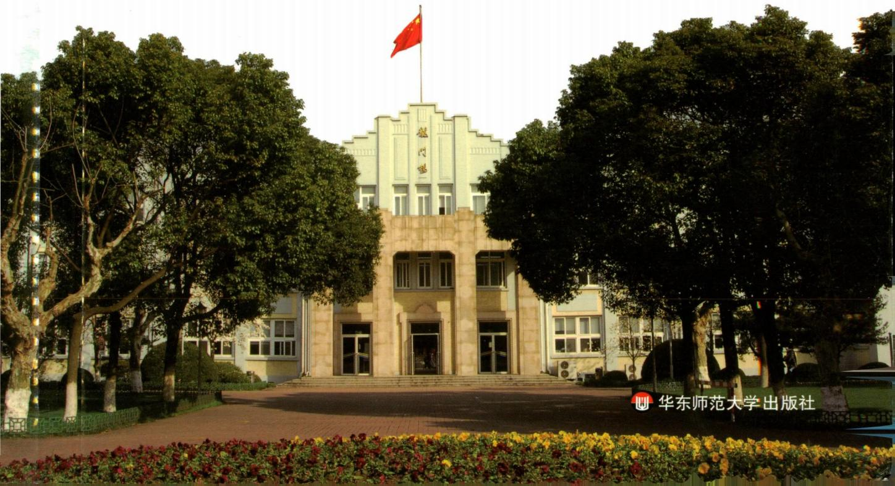

text_image

华东师范大学出版社

# Shanghai High School

总主编 冯志刚

## 上海中学竞赛课程

## 化学（第四分册）

李锋云 编著

## 总序

人的一生总要面对各种“竞赛”，有些“赛道”是有形的，也有些是无形的。正是在各种不同的“赛道”上不断拼搏，才有了“精彩”与“味道”。形象地说，学科竞赛是基础教育阶段的一条“专用赛道”，不必人人参与，也不应过于功利。学科竞赛凸显的教育理念：“普及的基础上提高”，公平竞争(Fair Play)的设计原则，“跳一跳才能够得着”的命题思路等，对基础教育的发展一直都发挥着无可替代的作用，在任何时代都不过时。

有竞赛自然会有针对性的培训,但无论是校内还是校外的老师辅导,都不及自主学习的效果好,书才是最好的“老师”。

在我国进入新时代之际,我们组织学校的相关教师团队编写这套《上海中学竞赛课程》,是想为数学、物理、化学领域有浓厚学习兴趣和良好发展潜质的高中资优生自主学习备一些素材、身边有一套可随时翻阅的书。希望学生们通过自学,在学习兴趣方面能够得到进一步提升,在学科潜能方面得到进一步激发。藉此与同行们分享上海中学在学校课程建设方面的一些理念与实践,希望得到共鸣,起到抛砖引玉的作用。

上海中学是一所有150多年历史的名校，“储人才备国家之用”是学校的办学宗旨，学校在办学的各方面都处于领先地位，学科竞赛也颇有建树。我大学毕业就到上海中学工作，一开始就热衷于数学竞赛方面教学，喜欢通过自己的教学，让孩子们把握数学知识的“脉络”，向他们展示数学的“美”，与他们一起做题（看谁做得快，看谁的解答更漂亮、更本质）。此外，我还经常参加一些大型比赛（例如：西部数学竞赛）的命题工作，带学生出国比赛（曾5次出任IMO中国国家队副领队），也写过不少书和文章（数学竞赛方面的居多），带出了很多学生，也影响了很多老师。生活一直很简单，也很开心。

我们一直想让学校课程发挥更大的作用,组织老师们出一些专著,推出一些有质量的东西。这套关于数学、物理和化学的学科竞赛丛书就是学校课程建设中的一个重点项目。选择这三门学科是基于它们在人们提升自己认识世界的能力中起到的基础性作用，偏重于竞赛是为了给学有余力的高中生经常“跳一跳”的机会，通过“试错”来提升能力。

在丛书编写过程中,作者们参阅了大量专业书籍,选用了一些“漂亮”的竞赛题,许多“精妙”解答来自学生的“灵感”,因此,丛书会有一定的难度。读者在阅读过程中,宜量力而行。正如“参加学科竞赛是奔着成绩去的,但更重要的是发现自己的不足”一样,不必强求自己一遍读懂,不行就多读几遍,拿张纸、拿支笔放在身旁,边读边写,养成良好的读书习惯,读得多了自然就懂了。

希望这套竞赛丛书的出版,能给在数学、物理、化学领域有一定潜质和浓厚兴趣的学生进一步发展提供一个平台,能给他们搭个“梯子”,让他们站在学长与前辈的肩上,起点更高、视野更宽,在认识自身特长的“志、趣、能”匹配之路上走得更好、更远。

参与丛书编写的作者都是在上海中学长期从事数学、物理、化学学科竞赛教学的老师，一些外聘教授也参与了审稿和部分撰写工作，他们的专业水准、教学经验和全身心投入是这套丛书的质量保证。当然，囿于作者的学识，书中会出现不足，甚至错误，请读者批评指正。

丛书从立项到付梓,历时四年多,其间华东师范大学出版社的各位编辑付出了很大的努力,深表感谢!

上海市上海中学校长 冯志刚

2020年8月

## 前言

自 1984 年以来,中国化学会已成功举办了三十余届化学奥林匹克活动。化学奥林匹克活动致力于揭示化学学科知识的全貌,鼓励学生接触化学发展的前沿,引导他们理解化学学科的科学原理和学科思想,掌握化学学科的研究方法,强化科学探究的意识,逐步形成和发展创新精神和实践能力。广大中学化学教师通过参与这项活动,探索早期发现和培养化学资优生的思路、方法和途径,促进了化学教学新思想与新方法的交流,推动大学与中学的化学教学改革。高考综合改革的不断深化和《普通高中化学课程标准(2017 年版 2020 年修订)》的实施,必将推动高中化学教学的变革和化学资优生早期培养模式的创新,化学奥林匹克活动将持续受到学生及社会的高度关注。

上海中学一直重视化学资优生的早期发现和培养,将对化学兴趣浓厚且有志于参加化学奥林匹克活动的学生经选拔组成小班,利用课余时间以分班教学和分层教学相结合的方式进行培养。很多学生在这项活动中崭露头角,并升入到国内顶尖大学的化学及其相关专业深造,更重要的是他们树立了为化学科学的发展贡献自己力量的决心。

上海中学参与化学竞赛教学的老师们准备上课材料时常参考大量专业书籍，融入个人思考后再整合为培训讲义。历多轮培训，老师们逐步修订完善各知识点并根据整体知识架构调整知识块的顺序，从而形成了一套符合要求、经得起检验的课程讲义，这也是本套《上海中学竞赛课程 化学》（以下简称“课程”）的“根”。本套课程是参照新版高中化学课程标准和2008年4月修订的《全国高中学生化学竞赛基本要求》的内容，并以编者使用多年的培训讲义为蓝本编著而成。课程涵盖的知识略高于中国化学奥林匹克(初赛)的要求，并按照化学专业学科体系分为四册，其中第一、二分册主要介绍物质结构基础知识和化学基本原理等内容，而第三、四分册则分别介绍了元素化学和有机化学知识。

全套课程四个分册均分别由十余讲内容构成,每讲设置下列栏目:

“知识精讲”梳理竞赛基本要求的知识点,突出重点知识,点拨难点知识,是与竞赛有关的中学化学内容的自然生长、延伸和拓展。帮助参加化学奥林匹克活动的学生做好知识准备。

“典型例题”精选例题,解析到位。在例题解析过程中注重培养学科思想方法,点拨解题策略和技巧。帮助参加化学奥林匹克活动的学生学会加工处理信息,提高推理能力,激发创新意识。

“本讲习题”精选了历年各地省级化学竞赛、全国化学竞赛、国际化学竞赛试题以及自编习题。习题参考答案附在全书后面，部分习题提供详解或解题思路。这些习题具有代表性和挑战性，有助于参加化学奥林匹克活动的学生巩固知识、开阔思路，提高综合运用能力。

本套课程可供对化学有兴趣且学有余力的资优生选读,而对参加化学奥林匹克活动的学生更有重要的参考价值和指导意义。

本套课程在编写过程中,得到了许多前辈老师的帮助和支持,特别是叶佩玉老师在百忙之中审读全稿,并提出详细的修改意见。在此谨向他们深致谢忱。由于时间仓促和水平有限,书中难免疏漏之处,敬请读者批评指正。

编者

2020年7月

## 目录

第一讲 有机化学准备知识 / 1

第二讲 有机化合物的命名 / 28

第三讲 烷烃与环烷烃 / 47

第四讲 烯烃 / 60

第五讲 二烯烃与炔烃 / 76

第六讲 芳香烃 / 89

第七讲 卤代烃与有机金属化合物 / 114

第八讲 醇、醚与环氧化物 / 134

第九讲 胺与酚 / 156

第十讲 醛与酮 / 192

第十一讲 羧酸及其衍生物 碳负离子反应 / 228

第十二讲 杂环化合物 / 281

第十三讲 糖、氨基酸 / 301

参考答案 / 320

主要参考书目 / 374

# 第一讲 有机化学准备知识

## 知识精讲

## 一、有机化合物概述

## 1. 有机化合物的定义

有机化合物,简称有机物,是指含有碳元素的化合物,但不包括 $CO$ 、 $CO_{2}$ 、碳酸及其盐、氰化物、氰酸及其盐、硫氰酸及其盐和金属碳化物等。

## 2. 有机物的特点

有机化合物具有和无机化合物不同的特性,主要有如下方面:

(1) 大多数有机物难溶于水, 易溶于酒精、汽油等有机溶剂。

(2) 大多数有机物对热不稳定, 受热易分解, 且容易燃烧。

(3) 大多数有机物是非电解质, 不易导电。

(4) 大多数有机物属于分子晶体, 熔点低。

（5）有机物的反应比较复杂，一般较慢，常需要加热或使用催化剂，且常伴有副反应发生。

## 3. 有机物的分类

有机物分类方法较多,下面介绍其中两种。

按分子结构中是否含有芳环结构分为：

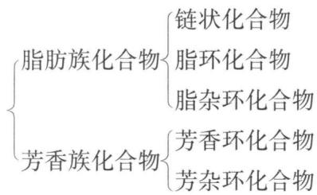

flowchart

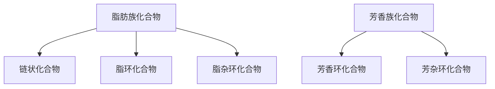

按官能团(决定有机物化学性质的原子或原子团)进行分类,如表1-1所示。

表 1-1 常见有机物的类别和相应官能团

<table><tr><td>有机物的类别</td><td>官能团</td><td>有机物的类别</td><td>官能团</td></tr><tr><td>烷烃</td><td>/</td><td>羧酸</td><td></td></tr><tr><td>烯烃</td><td> 碳碳双键</td><td>酯</td><td></td></tr><tr><td>炔烃</td><td> 碳碳叁键</td><td>酰卤</td><td></td></tr><tr><td>卤代烃</td><td>[AAYV] 卤素原子</td><td>酰胺</td><td> 酰胺</td></tr><tr><td>醇</td><td>[B88T] 羟基</td><td>酸酐</td><td> 酸酐</td></tr><tr><td>酚</td><td> 羟基</td><td>胺</td><td>—NH $_{2}$  氨基</td></tr><tr><td>醚</td><td> 醚键</td><td>硝基化合物</td><td>—NO $_{2}$  硝基</td></tr><tr><td>醛</td><td> 醛基</td><td>腈</td><td>—CN 氰基</td></tr><tr><td>酮</td><td> 羰基</td><td>磺酸</td><td>—SO $_{3}$  H 磺酸基</td></tr></table>

## 二、有机化合物的结构及其表示方法

有机化合物的结构决定了它的性质。碳原子成键方式的多样性导致了有机化合物中普遍存在同分异构现象。具有相同分子式而结构不同的化合物互为同分异构体。

## 1. 构造

构造是指描述组成分子的原子种类、数量及相互间的连接方式(包括单键或重键)而未考虑其空间结构。

有机物的结构有多种表示方式,以 1-丙醇为例:

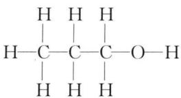

chemical

Structural formula of ethane molecule showing carbon, hydrogen, and oxygen atoms with single bonds

结构式

  
结构简式

  
键线式

键线式常用于表示碳原子数多的有机物结构,书写时应遵循以下规则:只用键线来表示碳架,每个端点和拐角处都代表一个碳,两根单键之间或一根双键和一根单键之间的夹角为 $120^{\circ}$ ,一根单键和一根叁键之间的夹角为 $180^{\circ}$ ,而分子中的碳氢键、碳原子及与碳原子相连的氢原子均省略,而其他杂原子及与杂原子相连的氢原子须保留。

构造异构是指两个有机物的分子式相同(即组成分子的原子的种类和数量相同)而原子间的连接方式(包括连接次序)不同。构造异构包括碳架异构、位置异构、官能团异构及互变异构等。

碳架异构体是指分子中碳原子相互连接的顺序不同的异构体。示例如下：

正戊烷 $\mathrm{CH}_3\mathrm{CH}_2\mathrm{CH}_2\mathrm{CH}_2\mathrm{CH}_3$ 异戊烷 $(\mathrm{CH}_3)_2\mathrm{CHCH}_2\mathrm{CH}_3$ 新戊烷 $\mathrm{C(CH_3)_4}$

位置异构体是指分子中官能团在碳架上位置不同的异构体。示例如下：

1-丙醇 $\mathrm{CH}_3\mathrm{CH}_2\mathrm{CH}_2\mathrm{OH}$ 2-丙醇 $(\mathrm{CH}_3)_2\mathrm{CHOH}$

官能团异构体是指分子中官能团不同的异构体。示例如下：

乙醇 $\mathrm{CH}_3\mathrm{CH}_2\mathrm{OH}$ 二甲醚 $\mathrm{CH}_3\mathrm{OCH}_3$

互变异构体是指因分子中某一原子在两个位置迅速移动而产生的异构体,它是一种特殊的官能团异构体。示例如下:

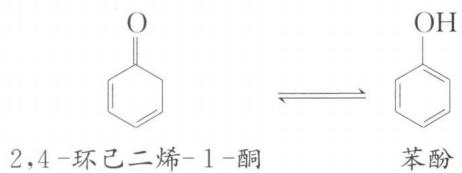

chemical

Chemical equilibrium showing 2,4-环己二烯-1-酮 to form phenol

## 2. 构型

构型是指由于原子上取代基在空间指向不同而引起的异构状态。构型异构是指两个有机物的分子式相同，分子中原子连接的次序也相同（即构造相同），但原子在空间的指向不同。

构型异构包括顺反异构(又称几何异构)和光学异构(又称旋光异构、对映异构)。

顺反异构体是指由于双键不能自由旋转而引起的异构体,其中相同基团在双键同侧称为顺式,相同基团在双键异侧称为反式。示例如下:

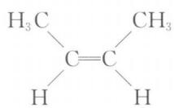

chemical

Structural formula of 2-methylcyclopropane showing carbon-carbon single bond and hydrogen atoms

顺-2-丁烯

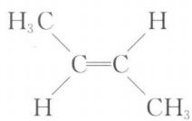

chemical

Structural formula of 2-butene showing carbon-carbon double bond with methyl and hydrogen substituents

反-2-丁烯

对映异构体是指两个互为镜像而不能重合的立体异构体。人的左右手互为实物和镜像的关系,但又不能完全重叠,是最典型的对映异构的实例。因此,这样的分子称为手性分子。导致分子有手性的一个最通常的因素是含有手性碳原子(常用 C\* 标记),即和四个不同原子或基团相连的碳原子。示例如下:

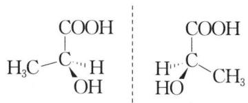

chemical

Two carbohydrate structures: 1-butanol and 2-methylglycol, showing their structural formulas with stereochemistry indicated.

乳酸

对映异构体在结构上的差别仅在于基团在空间的排列不同, 可用透视式、Fischer 投影式等表示立体结构状况。

## (1) 透视式

如上图中所示表示乳酸分子的式子为透视式,其中“—”表示键在纸平面上,“—”表示键指向纸平面外,“……”表示键指向纸平面内。

## (2) 费歇尔投影式

费歇尔(Fischer)投影式用一个“十”字,以其交点代表手性碳原子,四端与四个不同基团相连,并规定垂直线所连基团指向纸平面内,水平线所连的基团指向纸平面外,一般将较长碳链放在垂直线上,氧化态较高的碳原子放在上端。示例如下:

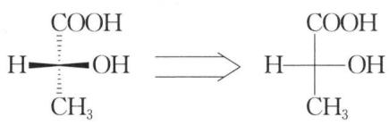

chemical

Chemical reaction showing conversion of a hydroxyl group to an alcohol with methyl substituent

为了区别因手性碳而引起的两种不同的立体结构,常采用 R、S 标记构型。手性碳构型的确定方法如下:将与手性碳原子相连的四个基团按次序规则排列,将最不优先的基团放在最远处,其他三个基团按次序规则依次排列,若为顺时针方向,手性碳为 R 构型;若为逆时针方向,手性碳为 S 构型。

“次序规则”内容如下：

（1）将各取代基的中心原子按原子序数由大到小排列，大者为“优先”基团；若为同位素则质量数大的为“优先”基团；孤对电子排在最后。例如：Cl > O > C > D > H > :。

(2) 若两个取代基的中心原子相同, 则比较与它直接相连的几个原子, 先比较各组中原子序数最大者, 若还是相同, 再依此类推比较第二个、第三个等等。例如:

$$
- \mathrm{OH} > - \mathrm{CH} _ {2} \mathrm{OCH} _ {3} > - \mathrm{CH} _ {2} \mathrm{OH} > - \mathrm{H} 。
$$

（3）含有双键或叁键的基团，则相当于连有二个或三个组成双键或叁键的原子。例如：

示例如下：

将该乳酸分子的最不优先基团即 H 原子放在距离观察者最远处, 其余三个基团按次序规则排列为 $-OH > -COOH > -CH_{3}$ , 如上图所示为顺时针方向, 则手性碳原子为 R 构型。

判断费歇尔投影式构型的一般方法是：最不优先的基团(或原子)在垂直线上下的，将其余三个基团按次序规则排列，顺时针为 R 构型，逆时针为 S 构型；最不优先的基团(或原子)在水平线左右的，将其余三个基团按次序规则排列，顺时针为 S 构型，逆时针为 R 构型。

费歇尔投影式在纸面上旋转 $180^{\circ}$ ，构型保持不变；但在纸面上旋转 $90^{\circ}$ ，则构型正好相反；任意互换两个基团的位置，构型也正好相反。

如果分子中有 n 个手性碳原子, 则最多可有 $2^{n}$ 个构型异构体。示例如下:

这四个构型异构体中，Ⅰ和Ⅱ、Ⅲ和Ⅳ分别是对映异构体，而Ⅰ和Ⅲ（或Ⅳ）、

Ⅱ和Ⅲ(或Ⅳ)是非对映异构体。

需要指出的是,分子中有手性碳原子,但分子不一定有手性。示例如下:

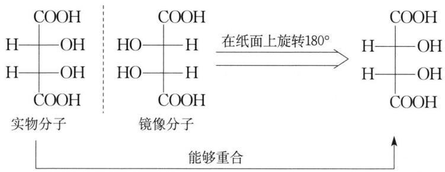

chemical

化学反应示意图，展示实物分子与镜像分子在纸面上旋转180°后生成有机碳的反应过程

由于费歇尔投影式在纸面上旋转 $180^{\circ}$ 构型不变, 镜像分子旋转 $180^{\circ}$ 后与实物分子重合, 因此它们是同一化合物, 即分子没有手性。这种分子称为内消旋体。

因此,判断一个分子是否具有手性,必须考虑它缺少哪些对称因素。通常只要当一个分子既没有对称面又没有对称中心,就可确定它是手性分子。上图所示分子中存在对称面,所以分子没有手性。

有些分子虽不含手性碳原子,但由于不含有对称面和对称中心,是手性分子。

## (1) 轴向手性

丙二烯型化合物两端的碳原子各连接两个不同的原子或基团时为手性分子。由于它的两个 $\pi$ 键是相互垂直的，使得两端碳原子所连的原子或基团不在同一平面上，没有对称面和对称中心，有一对对映异构体。示例如下：

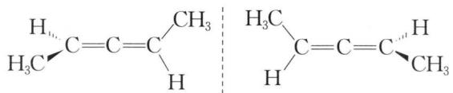

chemical

Chemical structure showing two alkene chains with methyl substituents and hydrogen atoms

联苯型化合物,两个苯环的连接碳原子的两邻位各连有两个不同的且体积较大的基团时,由于位阻大而不能自由旋转,因此也没有对称面和对称中心,成为手性分子,有一对对映异构体。示例如下:

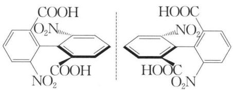

chemical

Chemical structure of a naphthalene derivative with carboxylic acid and nitro groups, showing two identical molecular conformations.

## (2) 螺旋手性

典型代表是螺旋烃,例如六螺并苯。这类分子中虽不存在手性碳原子,但由于

两个末端苯环有部分重叠,使分子缺乏对称因素而具有手性。

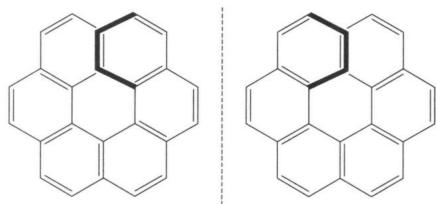

chemical

Two identical polycyclic aromatic hydrocarbon structures, each composed of fused benzene rings with a central hexagonal ring.

综上所述，含有手性碳与是不是手性分子之间是既不充分又不必要的关系。

手性分子能使通过的偏振光(只在一个平面内振动的光)平面发生旋转。根据它使平面旋转的方向是左旋还是右旋(对观察者而言)分别称之为左旋体或右旋体,并用符号“-”或“+”分别代表左旋或右旋。对映异构体在旋光性上表现为旋光度数相同,旋光方向相反。因而等量的对映异构体的混合物旋光性相互抵消,旋光度为0,称为外消旋体,以(±)表示。将组成外消旋体的一对对映异构体加以分开的过程叫做外消旋体的拆分。某一旋光化合物的一半转为其对映异构体,这样就成为外消旋体,这个过程称为外消旋化。

对映异构体除旋光性不同外,其余物理性质都相同。

需要指出的是,现在学术界提出把立体异构体分为对映异构体和非对映异构体两类。该提法认为:对映异构体仅由手性产生,而非对映异构体则由手性和顺反异构产生;手性体系可属于对映体也可属于非对映体,而顺反异构体则是非对映体,决不可能是对映体(除非也含有手性体系)。这种分类方法更为适宜。

除了用 R-S 标记构型外, 还用 D-L 标记构型。规定:

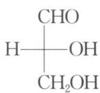  
D-甘油醛

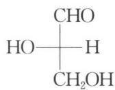  
L-甘油醛

其他化合物的构型以甘油醛的构型为参照标准,在保持手性碳构型不变的转化过程中,可由 D-甘油醛转化来的化合物标记为 D-, 可由 L-甘油醛转化而来的化合物标记为 L-。这种标记方法除在糖类、氨基酸构型中应用外已很少使用。

需要指出的是，R-S、D-L 与(+)、(-)无关。R-S、D-L 是构型标记方法，而(+)、(-)表示旋光方向，是通过旋光仪测出来的。

## 3. 构象

构象是指在一个给定构造、构型和排列方式的分子中，各原子围绕单键旋转而形成的空间形状。构象和构型同属于立体化学范畴。由于单键可以任意旋转，因此有机分子通常有无数个构象，一般讨论的是有代表性的构象。以乙烷分子为例，其有代表性的构象可用以下透视图表示：

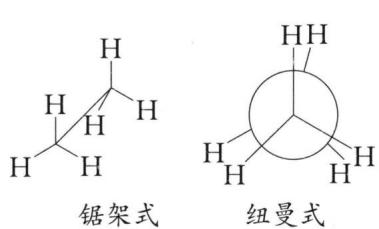  
重叠式构象

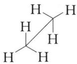  
锯架式

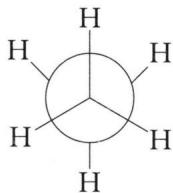

chemical

Molecular structure of methane (CH₄) showing a central carbon bonded to four hydrogen atoms in a ring configuration

纽曼式  
交叉式构象

注：锯架式是沿 C—C 键轴斜 $45^{\circ}$ 方向观察，纽曼(Newman)式是沿 C—C 键的轴线观察。纽曼式中圆圈表示后面的碳原子，交叉点表示前面的碳原子。

乙烷的各种构象中,交叉式能量最低,最稳定;重叠式能量最高,最不稳定。

## 4. 结构表示方式的转换

分子的立体构型常用透视式、费歇尔投影式、锯架式、纽曼式等表示，但用费歇尔投影式来判断分子的构型较其他表达式更为简单，所以将分子构型的其他表达式转换为费歇尔投影式后，再判断其构型是一个不错的方法。

## (1) 透视式转换为费歇尔投影式

含有单个手性碳原子的化合物沿一定方向旋转一定角度,其构型保持不变。可将透视式转动一定角度,使其中两个键位于纸面的前方,另外两个键位于纸面的后方,再按照费歇尔投影式的投影规则进行投影即可。示例如下:

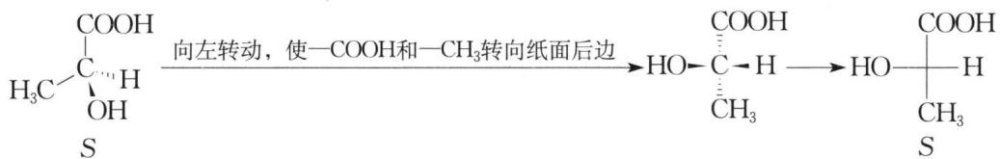

chemical

Chemical reaction equation showing conversion of a carboxylic acid to a hydroxyalkane using COOH and CH₃, with directional arrows indicating rotation.

## (2) 纽曼式、锯架式转换为费歇尔投影式

两个手性碳原子之间是以 $\sigma$ 键连接的, $\sigma$ 键可以自由转动但并不改变分子的构型, 因为相对于任何一个手性碳原子来说, 与其相连的三个基团空间位置不变, 另外一个基团本身内部的变化并不能导致分子构型的变化。先将纽曼式转换成锯架式, 然后通过 $\sigma$ 键的旋转, 将交叉式构象转化为重叠式构象, 最后再转换为费歇尔投影式。示例如下:

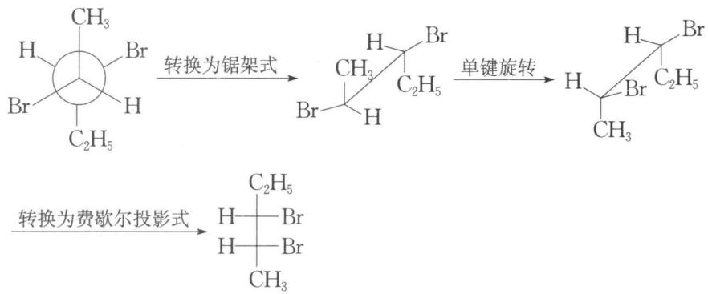

chemical

苯环化反应方程式，展示从梯度转换为单键旋转后由费歇尔投影转化为基底的过程

若将上述转化过程逆向进行,则可将费歇尔投影式转换为锯架式、纽曼式等。

## 三、电子效应

## 1. 诱导效应

诱导效应是指由于分子中原子或基团的极性(电负性)不同而引起成键电子云沿着原子链向某一方向移动的效应。诱导效应随着作用距离的增长而迅速减弱。

诱导效应通常以氢作为比较标准,若取代基的吸电子能力比氢强,则称其具有吸电子诱导效应,用—I表示,如— $NO_{2}$ 、—Cl、—OH等;若取代基的给电子能力比氢强,则称其具有给电子诱导效应,用+I表示,如— $CH_{3}$ 。

诱导效应的强弱可以通过测量偶极矩得知,或者通过测量酸或碱的解离常数来判断。诱导效应强弱的一般规律为:

(1) 带正电荷的基团具有吸电子诱导效应,带负电荷的基团具有给电子诱导效应。

(2) 与碳原子直接相连的原子, 若为同一族, 则随原子序数增加, 吸电子诱导效应减弱; 若为同一周期, 则随原子序数增加, 吸电子诱导效应增强。示例如下:

吸电子诱导效应： $-F > -Cl > -Br > -I, -F > -OR > -NR_{2}$ 。

（3）与碳原子直接相连的基团不饱和程度越大，吸电子能力越强，这是由于不同的杂化状态如 $sp$ 、 $sp^{2}$ 等杂化轨道中 s 成分不同引起的，s 成分越多，吸电子能力越强。示例如下：

吸电子诱导效应： $-C\equiv CR > -CH=CR_{2}$

(4) 烷基既有给电子的诱导效应, 同时又有给电子的超共轭效应。

综上所述,一些常见基团的诱导效应强弱顺序为: ①吸电子基团: $-NO_{2} > -CN > -F > -Cl > -Br > -I > -C \equiv C > -OCH_{3} > -H$ ; ②给电子基团: $-\mathrm{C}(\mathrm{CH}_{3})_{3} > -\mathrm{CH}(\mathrm{CH}_{3})_{2} > -\mathrm{CH}_{2}\mathrm{CH}_{3} > -\mathrm{CH}_{3} > -\mathrm{H}$ 。需要指出的是,上述各基团的诱导效应强弱,常常由于所连母体化合物的不同以及取代后原子间的相互影响等因素而有所不同,所以在不同的母体化合物中,诱导效应的强弱顺序不完全一致。

## 2. 共轭效应

共轭效应是指由于共轭体系中原子间的相互影响而使体系内的 $\pi$ 电子(或p电子)分布发生变化的一种电子效应。共轭效应只在共轭体系中传递，且能贯穿于整个共轭体系中。示例如下：

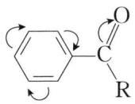

苯环可视为一个连续共轭体系,因此苯环任一位置上的取代基,其共轭效应可以通过苯环交替传递到其他任何位置。

若共轭体系上的取代基能降低体系 $\pi$ 电子云密度，则其具有吸电子共轭效应，用—C 表示，如 $-NO_{2}$ 、—CN、—COOH、—CHO、—COR 等；若共轭体系上的取代基能增大体系 $\pi$ 电子云密度，则其具有给电子共轭效应，用+C 表示，如 $-NH_{2}(R)$ 、—NHCOR、—OH(R) 等。

取代基的共轭效应和诱导效应方向有的一致,有的不一致。例如, $-NO_{2}$ 、-CHO有-I和-C效应;-Cl的-I>+C;- $NH_{2}$ 的-I<+C;- $OCH_{3}$ 的-I<+C。

## 3. 超共轭效应

超共轭效应是指由于 C—H $\sigma$ 键与 $\pi$ 键(或 p 轨道)处于共轭位置而产生的电子离域作用, 如图 1-1 所示。

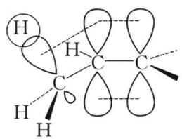

chemical

Molecular structure diagram of acetic acid (CH3COOH)

$\sigma-\pi$ 超共轭

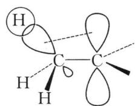

chemical

Molecular structure diagram of acetic acid (CH3COOH)

$\sigma - \mathrm{p}$ 超共轭  
图1-1 超共轭效应

超共轭效应产生的原因是：烷基上几个 C—H σ 键电子云之间相互排斥，且碳、氢原子对电子云屏蔽作用小，受到邻近 π 键轨道或 p 轨道的作用而趋向于它们并发生部分重叠，使得电荷更分散，体系更稳定。

超共轭效应的强弱与 $\pi$ 键轨道或 p 轨道相邻碳上的 C—H 键数量有关，C—H 键越多，超共轭效应越强，所以 $\pi$ 键轨道或 p 轨道相邻基团超共轭效应的强弱顺序为： $-CH_{3}>-CH_{2}R>-\mathrm{CHR}_{2}>-\mathrm{CR}_{3}$ 。

## 4. 场效应

场效应是指取代基在空间产生的电场对化合物中其他基团(或原子)的静电作用,而诱导效应是通过原子链的静电作用。以丙二酸为例,其羧基负离子对另一羧基既有给电子诱导效应又有场效应,且这两种效应均使质子不易离去,使酸性减弱,如图1-2所示。

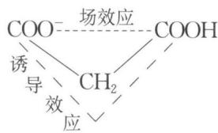

chemical

Chemical reaction diagram showing COO- reacting with CH2 to form COOH, with induced and induced reactions indicated.

图1-2 HOOC— $\mathrm{COO}^{-}$ 的诱导效应和场效应

场效应随作用距离的增大而减弱。场效应和诱导效应通常同时存在且作用方向相同,但在某些情况下作用方向相反。示例如下:

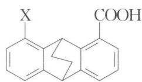

chemical

Chemical structure of a polycyclic aromatic compound with X and COOH substituents

若 X 为 H, $pK_{a} = 6.04$ ; 若 X 为 Cl, $pK_{a} = 6.25$ 。由此可见，氯原子取代后酸性减弱。若只考虑诱导效应，由于 Cl 的吸电子诱导效应通过原子链传递，酸性增强，与实际不符，如图(a)所示；若考虑场效应，负电性的 Cl 与羧基中的 H 距离较近，通过空间对 H 的静电作用使得酸性减弱，如图(b)所示。

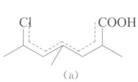

chemical

Chemical structure of a chlorinated ester with carboxylic acid group, labeled (a)

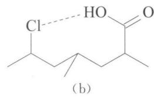

chemical

Chemical structure of a chlorinated ester with hydroxyl group and carbonyl group, labeled (b)

## 5. 电子效应对化合物性质的影响

(1) 对化合物酸、碱性强弱的影响

① 醇的酸性

由于烷基的给电子效应,当醇 $\alpha-$ 碳上的氢原子被烷基取代后,酸性减弱,即伯

醇＞仲醇＞叔醇，如：

$$
\mathrm{CH} _ {3} \mathrm{CH} _ {2} \mathrm{OH} \quad (\mathrm{CH} _ {3}) _ {3} \mathrm{COH}
$$

$\mathrm{pK_a}$ 值 15.9 19.2

若醇 $\alpha-$ 碳上的氢原子被吸电子基团取代, 则醇的酸性增强, 如:

$$
\mathrm{ClCH} _ {2} \mathrm{CH} _ {2} \mathrm{OH} \quad \mathrm{Cl} _ {3} \mathrm{CCH} _ {2} \mathrm{OH}
$$

$\mathrm{pK_a}$ 值 14.3 12.4

② 酚的酸性

苯环上连有给电子基团时,酚的酸性减弱;苯环上连有吸电子基团时,酚的酸性增强。如:

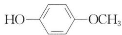

$\mathrm{pK}_{\mathrm{a}}$ 值 10.21

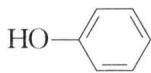

10.0

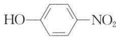

7.15

③ 羧酸的酸性

若羧酸 $\alpha-$ 碳上的氢原子被吸电子基团取代, 酸性增强, 且吸电子效应越强, 酸性越强。如:

$$
\mathrm{CH} _ {3} \mathrm{COOH} \quad \mathrm{ClCH} _ {2} \mathrm{COOH} \quad \mathrm{Cl} _ {3} \mathrm{CCOOH}
$$

$\mathrm{pK}_{\mathrm{a}}$ 值 4.76 2.86 0.64

$$
\mathrm{FCH} _ {2} \mathrm{COOH} \quad \mathrm{ClCH} _ {2} \mathrm{COOH} \quad \mathrm{BrCH} _ {2} \mathrm{COOH}
$$

$\mathrm{pK}_{\mathrm{a}}$ 值 2.66 2.86 2.90

若羧酸 $\alpha-$ 碳上的氢原子被给电子基团取代, 酸性减弱, 且给电子效应越强, 酸性越弱。如:

$$
\mathrm{CH} _ {3} \mathrm{COOH} \quad \left(\mathrm{CH} _ {3}\right) _ {2} \mathrm{CHCOOH} \quad \left(\mathrm{CH} _ {3}\right) _ {3} \mathrm{CCOOH}
$$

$pK_{a}$ 值 4.74 4.86 5.05

取代苯甲酸苯环上若为给电子基团(邻位除外),则酸性减弱;若为吸电子基团,则酸性增强。如:

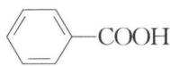

$\mathrm{pK_a}$ 值 4.20

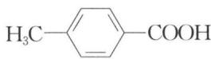

4.38

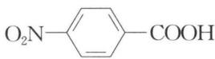

3.42

④ 胺的碱性

胺的碱性取决于氨基氮原子上电子云密度的高低。氮原子上电子云密度越高，胺的碱性越强。由于烷基的给电子效应使得氮原子上电子云密度增大，因此脂脂肪胺的碱性比氨强；由于 $p-\pi$ 共轭使得氮原子上电子云密度降低，因此芳香胺的碱性比脂肪胺和氨都弱。如：

碱性： $\mathrm{CH}_3\mathrm{CH}_2\mathrm{NH}_2 > \mathrm{CF}_3\mathrm{CH}_2\mathrm{CH}_2\mathrm{NH}_2 > \mathrm{CF}_3\mathrm{CH}_2\mathrm{NH}_2$

(2) 对化合物反应活性及活性中心位置的影响

① 苯环上的亲电取代反应

—R、—OH(R)、—NH $_{2}$ (R)等取代基团能活化苯环，亲电取代反应比苯容易进行，且反应主要发生在邻、对位。

卤素取代基钝化苯环，亲电取代反应比苯难于进行，反应主要发生在邻、对位。

$-NO_{2}$ 、 $-CN$ 、 $-SO_{3}H$ 、 $-COR$ 、 $-CHO$ 、 $-COOR$ 等取代基团钝化苯环，亲电取代反应比苯难于进行，且反应主要发生在间位。

② 亲核试剂对羰基化合物的加成反应

例如：

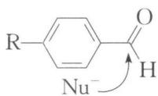

若 R 为吸电子基团时, 反应更易进行; 若 R 为给电子基团时, 反应更难进行。

(3) 对碳正离子、碳负离子、自由基稳定性的影响

共价单键的断裂方式有：①均裂，成键两原子各得一个电子成为自由基，如：

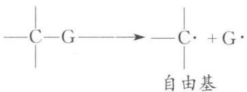

chemical

Chemical reaction diagram showing carbon-carbon double bond formation with free base

② 异裂,断裂的单键的一对电子不是均分给原成键两原子,而是属于其中的一个原子。异裂会产生带正电荷的原子团——碳正离子,或带负电荷的原子团——碳负离子,如:

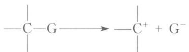

chemical

Chemical reaction diagram showing nucleophilic substitution of a carbon chain with positive charge on a proton

碳正离子

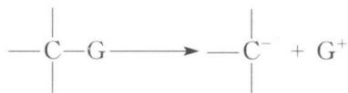

chemical

Chemical reaction equation showing nucleophilic substitution of a carbon chain to form a protonated alkene

碳负离子

烃中碳原子可根据其连接的碳原子数分成：连接1个碳原子的碳原子称为伯碳原子（或一级碳原子，用 $1^{\circ}$ 表示）；连接2个碳原子的碳原子称为仲碳原子（或二级碳原子,用 $2^{\circ}$ 表示);连接3个碳原子的碳原子称为叔碳原子(或三级碳原子,用 $3^{\circ}$ 表示);连接4个碳原子的碳原子称为季碳原子;甲基碳原子用 $0^{\circ}$ 表示。相应的,与伯碳原子相连的氢原子称为伯氢原子或 $1^{\circ}$ 氢原子,其余以此类推。自由基、碳正离子等也可按此分成伯、仲、叔、烯丙基和苄基等类型。

由于烷基的超共轭效应, 自由基的稳定性: $(\mathrm{CH}_{3})_{3}\mathrm{C} \cdot >(\mathrm{CH}_{3})_{2}\mathrm{CH} \cdot >\mathrm{CH}_{3}\mathrm{CH}_{2} \cdot >\mathrm{CH}_{3} \cdot$ 。

碳正离子中的碳原子是 $sp^{2}$ 杂化，3 个 $\sigma$ 键处于同一平面，而空的 p 轨道垂直于该平面。碳正离子的稳定性顺序为 $(\mathrm{CH}_{3})_{3}\mathrm{C}^{+} > (\mathrm{CH}_{3})_{2}\mathrm{CH}^{+} > \mathrm{CH}_{3}\mathrm{CH}_{2}^{+} > \mathrm{CH}_{3}^{+}$ 。这是因为烷基是给电子基团，带正电荷的碳原子上所连烷基越多，正电荷越分散，碳正离子越稳定。烯丙基碳正离子 $CH_{2}=CHCH_{2}^{+}$ 、苄基碳正离子 $PhCH_{2}^{+}$ 稳定性很高，这是由于共轭效应导致的。

以 $\mathrm{OCH_2COOH}$ 为例，由于两端羰基的吸电子作用，使得中间亚甲基上的氢更易以质子形式离去而形成碳负离子，其 $\mathrm{pK_a}$ 值等于9。类似的还有 $\mathrm{CH_2COCH_2OCH_3}$ 、 $\mathrm{RCH_2NO_2}$ 等。

## 四、共振论

## 1. 共振的概念

经典结构式难于表示具有共轭作用分子的真实状态,而用它们的共振结构式却能较好地表示共轭作用和分子状态。共振论认为,对电子离域体系的化合物,需要用几个可能的经典结构式表示,真实分子是这几个可能的经典结构的共振杂化体。这些经典的结构称为共振结构。共振使真实分子能量更低,更稳定。

## 2. 共振结构式书写规则

(1) 必须符合路易斯结构式。  
(2) 原子位置不动, 只是电子发生移动。  
(3) 未成对电子数相同。

示例如下：

指出下列共振结构中,哪个式子是错误的?为什么?

(1) $\mathrm{CH}_3\mathrm{CH}=\mathrm{CH}\dot{\mathrm{CH}}_2 \longleftrightarrow \mathrm{CH}_3\dot{\mathrm{CH}}-\mathrm{CH}=\mathrm{CH}_2 \longleftrightarrow \mathrm{CH}_3\dot{\mathrm{CH}}-\dot{\mathrm{CH}}\mathrm{CH}_3$ A B C解析 根据共振结构式的书写规则可知，(1)中C式是错误的，因为未成对电子数不一致。(2)中C式是错误的，它不符合路易斯结构式，氮原子价电子的电子数已超过8个。(3)中C式是错误的，因为C式改变了碳的骨架。(4)中B式是错误的，因为B式有原子的移动。

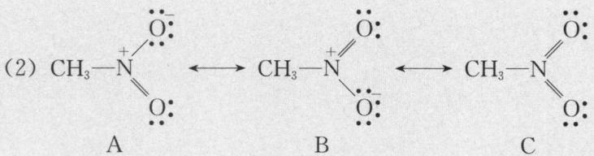

chemical

Chemical reaction diagram showing nucleophilic addition of a thiol group to form a tertiary amine, labeled A, B, and C

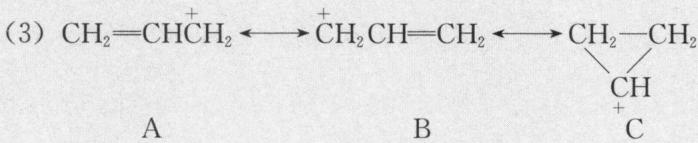

chemical

Chemical reaction equation showing acetic acid and alkene formation from A and B

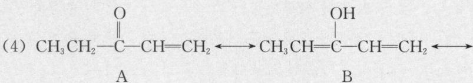

chemical

Chemical reaction equation showing conversion of compound A to B via intermediate with hydroxyl group

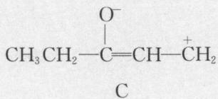

chemical

Chemical structure of a disulfide ion with ethyl and propyl groups

## 3. 共振结构对共振杂化体的贡献大小的规则

(1) 共价键多的共振结构比共价键少的共振结构更稳定, 贡献大。

(2) 共振结构式中所有的原子均有完整的电子层(八隅体), 则较稳定, 贡献大。

（3）电荷分离的共振结构不如没有分离的共振结构贡献大，且正、负电荷分离越远，贡献越小。

(4) 在共振结构式中, 负电荷在电负性较大的原子上较稳定, 贡献大。

示例如下：

下列各对共振结构式中,哪个共振结构式对共振杂化体的贡献较大?

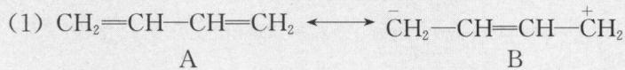

chemical

Chemical reaction equation showing acetic acid (A) reacting with ethylene (B) to form a radical intermediate (C=CH₂)

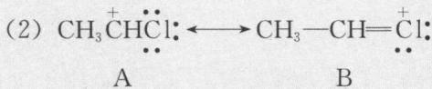

chemical

Chemical reaction equation showing acetic acid reacting with ethylene to form a chloride, forming a ketone and then to form a hydroxyl group.

(3) $\mathrm{CH}_2 = \mathrm{CH}-\mathrm{O} \longleftrightarrow \mathrm{CH}_2-\mathrm{CH}=\mathrm{O}$ A B

(4) $\overset{+}{\mathrm{CH}}_{2}\mathrm{CH}=\mathrm{CH}_{2}\longleftrightarrow\mathrm{CH}_{2}=\mathrm{CH}\overset{+}{\mathrm{CH}}\mathrm{CH}_{2}$ A B

(5) $CH_{2}=CH-\overset{+}{CH}-\overset{-}{O} \longleftrightarrow \overset{+}{CH}_{2}-CH=CH-\overset{-}{O}$ A B

解析 (1) 中 A 式贡献大, 共价键多的共振结构比共价键少的共振结构贡献大; (2) 中 B 式贡献大, A 中右边碳原子价电子层不完整; (3) 中 A 式贡献大, A 中负电荷在电负性大的氧原子上; (4) 中 A、B 贡献相等; (5) 中 A 式贡献较大, 正负电荷分离越远, 贡献越小。

## 五、有机反应中的热力学和动力学

在有机反应中,常常有动力学控制和热力学控制。热力学控制是指在较高的温度下,反应物分子可以经过活化能最高的途径,最后得到热力学稳定的产物。动力学控制是指在较低的温度下,反应物分子通过活化能最低的途径,以最快的反应速率得到产物(通常不是热力学稳定产物)。

有一个过渡态的反应是一步反应,有两个过渡态的反应是二步反应,其反应进程图如图 1-3 所示:

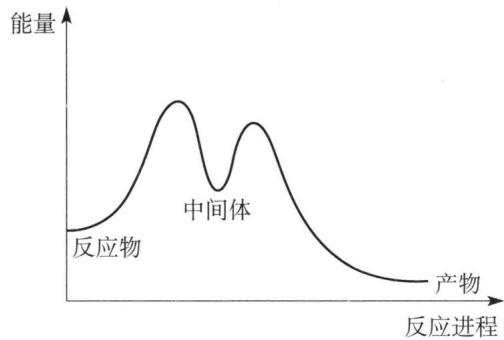

line chart

| 反应进程 | 能量 |
| -------- | ---- |
| 后反应物 | 0    |
| 中间体   | 高点 |

图1-3 二步反应进程图

曲线中间最低处是活泼中间体,通常为碳正离子、碳负离子和自由基等。

## 典型例题

【例 1】（2009 年全国初赛试题）（1）化合物 A 是一种重要化工产品，用于生产染料、光电材料和治疗疣的药物等。A 由第一、二周期元素组成，白色晶体，摩尔质量 114.06 g/mol，熔点 293℃，酸常数 $pK_{a1} = 1.5$ ， $pK_{a2} = 3.4$ ；酸根离子 $A^{2-}$ 中同种化学键是等长的，存在一根四重旋转轴。

①画出 A 的结构简式。②为什么 $A^{2-}$ 离子中同种化学键是等长的？③ $A^{2-}$ 离子有几个镜面？

（2）顺反丁烯二酸的四个酸常数为 $1.17 \times 10^{-2}$ ， $9.3 \times 10^{-4}$ ， $2.9 \times 10^{-5}$ 和 $2.60 \times 10^{-7}$ 。指出这些常数分别是哪个酸的几级酸常数，并从结构与性质的角度简述你作出判断的理由。

解析 （1）① 据题给信息“酸常数 $pK_{a1}=1.5$ , $pK_{a2}=3.4$ ”, 可知 A 为二元酸。A 可能为无机酸, 也有可能为有机酸。

若 A 为无机酸, 结合题设“A 由第一、二周期元素组成”, 则可能为 B、C、N 等的二元酸, 如 $H_{2}CO_{3}$ 、 $H_{2}B_{4}O_{7}$ 、 $H_{2}N_{2}O_{2}$ 等。但这些二元酸相应的 $A^{2-}$ 不存在四重旋转轴, 且式量也不符合, 因此不存在合适的简单无机酸。

若 A 为有机羧酸, 则可将 A 表示为 R(COOH) $_{2}$ , 由题可知 R 的式量约为 24(114.06-45×2), 即 R 为 C $_{2}$ , 因此 A 为 HOOCC≡CCOOH, 但其酸根中同种化学键不等长, 也不存在四重旋转轴, 不符合题意。

联想到电子效应的影响,则可能 A 中两个—OH 的相邻位置存在强吸电子基团 (如— $NO_{2}$ 、羰基等)而显较强酸性。那么,A 中至少有两个—OH,它们应分别连在两

个碳上,剩余式量恰为两个羰基。由此,可确定A为: (俗称方形酸)。

② $A^{2-}$ 结构为，其共振式为：

个离子共平面,存在离域 $\Pi_{8}^{10}$ 键,因而同种化学键是等长的。同时,也解释了 $A^{2-}$ 存在四重旋转轴。

③ $\mathrm{A}^{2-}$ 离子自身所在的平面就是一个镜面, 另外 4 个镜面如下图所示:

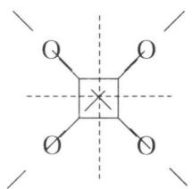

chemical

Simple molecular structure diagram with four oxygen atoms and a central atom

总计 5 个镜面。

(2) 顺式丁烯二酸任一羧基对另一羧基既有吸电子诱导效应又有场效应,且这两种效应均使第一质子易于离去,酸性增强;而对顺式丁烯二酸的一价负离子而言,其羧基负离子对另一羧基既有给电子诱导效应又有场效应,且这两种效应均使质子不易离去,酸性减弱。故顺式丁烯二酸的 $K_{1}$ 最大, $K_{2}$ 最小。如果仅从诱导效应考虑,顺式和反式是没有区别的。

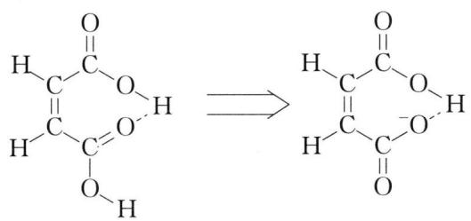

chemical

Chemical equilibrium reaction showing deprotonation of a cyclic ester to form a diester

故答案如下：

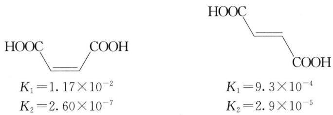

chemical

Two chemical structures of carboxylic acid with associated K1 and K2 values

【例 2】1964 年有科研团队报道了一种称为立方烷的化合物, 它的分子式为 $C_{8}H_{8}$ , 核磁共振谱表明其中的碳原子和氢原子的化学环境均无差别。若用四个重氢 (D) 原子取代氢原子而保持碳架不变, 则得到的四氘立方烷 ( $C_{8}H_{4}D_{4}$ ) 有异构体。

(1) 画出 $C_{8}H_{4}D_{4}$ 的所有立体异构体。

(2) 上述异构体中互为对映体的是哪些?

（3）用 5 个氘原子取代立方烷分子里的氢得到五氘立方烷 $C_{8}H_{3}D_{5}$ ，其立体异构体有多少？

解析 (1) 立方烷的结构如下:

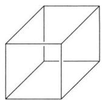

natural_image

Simple line drawing of a 3D cube with visible edges and faces (no text or symbols)

确定立方烷取代物异构体的方法为：二取代，看两者距离的长短，应为3种；

三取代,看能组成多少个平面,应为3种。四取代可在三取代的基础上,再观察第四个取代基的位置有多少情况。 $C_{8}H_{4}D_{4}$ 有7个异构体,它们分别是:

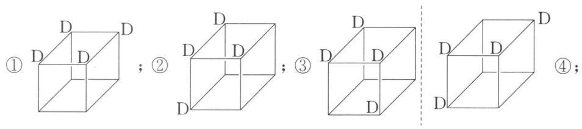

text_image

① D D
; ② D
D D
D D
; ③ D
D D
D
D
④;

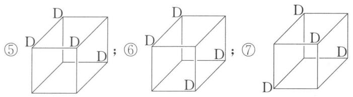

text_image

⑤ D D ; ⑥ D D ; ⑦ D
D D D

(2) ③和④互为对映异构体。

(3) 同理 $C_{8}H_{3}D_{5}$ 有 3 个异构体, 它们分别是 (未标出的为重氢 D):

text_image

① H
H
② H
H
H
③ H
H
H

【例 3】某有机物分子式为 $C_{11}H_{18}O$ ，其中所有的氢化学环境都相同，有 4 种不同化学环境的碳，试推测它可能的结构。

解析 由题述“18个氢原子的化学环境相同”, 所以该分子中应有2个叔丁基, 而且每个叔丁基有两种不同化学环境的碳, 因此这两个叔丁基应处于相同位置(即结构是对称的), 否则两个叔丁基就有四种不同化学环境的碳, 与题意不符。除去2个叔丁基只余下3个碳原子和1个氧原子。这3个碳原子只能有两种不同化学环境的碳, 则必然有两个碳原子是处于相同的化学环境, 那么这3个碳原子和氧原子应为环丙烯酮结构。因此它可能的结构为:

chemical

Chemical structure of a substituted cyclohexane with methyl and ethyl groups

【例 4】（2008 年全国初赛试题）化合物 A、B 和 C 互为同分异构体。它们的元素分析数据为：碳 92.3%，氢 7.7%。1 mol A 在氧气中充分燃烧产生 179.2 L 二氧化碳(标准状况)。A 是芳香化合物, 分子中所有的原子共平面; B 是具有两个支链的链状化合物, 分子中只有两种不同化学环境的氢原子, 偶极矩等于零; C 是烷烃, 分子中碳原子的化学环境完全相同。

(1) 写出 A、B 和 C 的分子式。

(2) 画出 A、B 和 C 的结构简式。

解析 （1）由题述“碳 92.3%，氢 7.7%”可求得化合物 A、B 和 C 中各元素原子个数比为： $C:H=\frac{92.3}{12}:\frac{7.7}{1}=1:1$ ，即最简式均为 $CH_{0}$ 。而且“1 mol A 在氧气中充分燃烧产生 179.2 L 二氧化碳（标准状况）”，则可确定碳原子个数为： $n_{C}=\frac{179.2}{22.4}=8$ ，即分子式均为 $C_{8}H_{8}$ ，不饱和度 $\Omega=\frac{2\times8+2-8}{2}=5$ 。

(2) A 为芳香化合物, 含苯环结构, 而苯环的不饱和度为 4 , 因此余下基团的不饱和度应为 1 。再结合“分子中所有的原子共平面”, 易知有一个碳碳双键, 因此 A 为苯乙烯, 其结构简式为: $\ce{C6H5-CH=CH2}$ 。

由题述“B是具有两个支链的链状化合物,偶极矩为0”,可知B是非极性分子,即B为一对称分子。结合B的不饱和度为5,应为2个叁键和1个双键的组合,且以1个双键为中心,2个端位叁键呈对称分布,余下2个碳应为2个支链甲基,这样恰符合题述“分子中只有两种不同化学环境的氢原子”。因此B的结构简式为:

chemical

Chemical structure of a diene with three carbon atoms and methyl substituents

由题述“C是烷烃,分子中碳原子的化学环境完全相同”,可知C应为立方烷,

其结构简式为：

【例 5】（2007 年全国初赛试题）2003 年 5 月报道，在石油中发现一种新的烷烃分子，因其结构类似于金刚石，被称为“分子钻石”，若能合成，有可能用作合成纳米材料的理想模板。该分子的结构简图如右：

natural_image

Abstract geometric line drawing of interlocking 3D shapes (no text or symbols)

(1) 该分子的分子式为 \_\_\_\_。  
(2) 该分子有无对称中心？\_\_\_\_。  
(3) 该分子有几种不同级的碳原子？\_\_\_\_。  
(4) 该分子有无手性碳原子？\_\_\_\_。  
(5) 该分子有无手性？\_\_\_\_。

解析 （1）观察该分子的结构简图, 可知该分子结构由 6 个 $CH_{2}$ ，18 个 CH 和 2 个 C 构成。因此其分子式为 $C_{26}H_{30}$ 。

(2) 该分子的对称中心位于 2 个季碳原子所成单键的中心上。  
(3) 由(1)可知该分子中有仲、叔、季3种不同级的碳原子。  
(4) 该分子中的部分叔碳原子为手性碳原子。  
(5) 由于分子中存在对称中心, 因此分子无手性。

【例 6】试指出下列各组化合物分别属于构造异构体、对映体、非对映体(包括顺反异构体)和相同化合物中的哪一种?

chemical

Two organic molecular structures labeled (1), showing carbon, hydrogen, bromine, and chlorine atoms with stereochemistry indicated

chemical

Chemical structure of a chlorinated alkane with methyl and ethyl substituents, labeled as compound (2)

chemical

Chemical structure of a brominated alkane with methyl and hydrogen substituents, labeled as compound (3)

chemical

Chemical structure of a diol with two hydroxyl groups and a central CHO group, labeled as (4)

chemical

Chemical structure of a cyclic ether with methyl and ethyl substituents, labeled as compound (5)

chemical

Chemical structure of ethyl acetate (CH₃) with methyl groups and hydrogen bonding

chemical

Chemical structure of brominated alkane with Br groups and Chinese annotation

chemical

Two organic molecular structures labeled (8), showing carbon and hydrogen atoms with stereochemistry indicated

chemical

Two tridentate alkane structures with chlorine substituents, labeled as (9)

chemical

Chemical structure of a tris(2,4-dihydroxy)ethanol with methyl and ethyl substituents labeled

解析 这类题的解答思路一般是：先比较该组化合物的构造是否相同，若分子式相同而构造不同，则互为构造异构体；若构造相同，再比较构型，若构型也相同，则为同一化合物；若构型不同，且互为镜像关系，则互为对映体；若构型不同，且又不互为镜像关系，则互为非对映体。

(1) 可将这两个纽曼式转换为相应的费歇尔投影式:

chemical

Chemical reaction diagram showing bromination of a cyclohexane with hydrogen bonding to form a trichloromethyl bromide compound

互为对映体。

(2) 可将透视式转换为费歇尔投影式:

chemical

Chemical reaction equation showing hydrogenation of a chlorinated alkane to form a trichlorinated alkane and then to form a diol

互为对映体。

（3）两费歇尔投影式中上面那个手性碳构型相反，而下面那个手性碳上两个基团互换位置，构型也相反，因此互为对映体。

(4) 双键构型不同, 手性碳构型不同, 互为非对映体。  
(5) 双键构型不同,互为非对映体。  
(6) 存在对称面, 非手性, 相同化合物。  
(7) 可将这两个构象表示为:

chemical

Chemical reaction diagram showing brominated alkene transformation to cyclopentadienyl bromide

互为对映体。

(8) 可将这两个构象表示为:

chemical

Chemical reaction diagram showing cycloaddition of a cyclohexane derivative with methyl substituents

翻转后两者可完全重叠,为相同化合物。

(9) 互为对映体。

(10) 分子式相同,构造不同,互为构造异构体。

【例 7】（第 30 届中国化学奥林匹克初赛试题）理论计算表明，甲酸的 Z- 和 E- 型两种异构体存在一定的能量差别。

chemical

Oxidation reaction of acetic acid with potassium peroxide, showing 16.9 kJ/mol increase

已知 Z-型异构体的 $pK_{a}=3.77$ ，判断 E-型异构体的 $pK_{a}$ ：

a) >3.77; b) <3.77; c) =3.77; d) 无法判断。

解析 按照“次序规则”,孤对电子排在氢原子后面,故甲酸的 Z-和 E-异构体分别是:

  
Z-型

  
$E$ -型

由题给反应可知，Z-型异构体转化为E-型异构体是吸热过程，则E-型异构体能量更高。两者电离后所得甲酸根离子和氢离子是完全相同的，因此，E-型异构体电离时所需吸收的能量比Z-型异构体少，即E-型异构体更易电离，其电离平衡常数 $K_{a}$ 更大。而Z-型异构体的 $pK_{a}=3.77$ ，故E-型异构体的 $pK_{a}<3.77$ ，选b。

## 本讲习题

1. 下列化合物中,哪些具有光学活性?

(1)

(2)

(3)

(4)

(5)

(6)

chemical

Chemical structure of a cyclohexane ring with methyl and hydrogen substituents

(7)

chemical

Chemical structure of a carbon-carbon double bond with methyl and hydrogen substituents

chemical

Chemical structure of 2-chloro-3-butene showing methyl and chlorine substituents on a central carbon chain

chemical

Chemical structure of a cyclohexane ring with methyl substituents at positions 3 and 4, labeled as (10)

chemical

Chemical structure of a naphthalene derivative with iodine substituent and two nitro groups

chemical

Chemical structure of a naphthalene derivative with hydroxyl and iodine substituents, labeled as compound (12)

chemical

Chemical structure of a diene with methyl and ethyl substituents, labeled as (13)

chemical

Chemical structure of a cyclic compound with HOOC and COOH groups, labeled as (14)

chemical

Chemical structure of a chlorinated cyclohexane with labeled chlorine and hydrogen positions

chemical

Chemical structure of a cyclic compound with two carboxylic acid groups and a hydroxyl group

2. 将下列各化合物的结构式改写成费歇尔投影式, 并标出各手性碳原子的构型。

chemical

Chemical structure of a hydroxyalkane with labeled carbon, hydrogen, and methyl groups

chemical

Chemical structure of a chiral alcohol with methyl and ethyl substituents, labeled as (2)

chemical

Chemical structure of a brominated alkane with methyl and chlorine substituents

chemical

Chemical structure of a brominated hydroxy ester with labeled carbon and hydrogen atoms

chemical

Chemical structure of a brominated alkane with methyl and ethyl substituents

3. 某一系列的烷烃分子均只有一种一卤取代物。如：

  
甲烷

  
戊烷

chemical

Chemical structure of a branched alkene with methyl and ethyl substituents

十七烷

这一系列烷烃具有一定的规律性,当一种烃分子的—H全部被— $CH_{3}$ 取代后,它的一卤代物异构体数目不变。试回答:

(1) 请写出这一系列第 4 种烷烃的分子式为 \_\_\_\_。  
(2) 请写出这一系列所有烷烃分子式的通式为 \_\_\_\_。  
(3) 这一系列烷烃中, 其中含碳量最高的烷烃其碳元素的质量分数为

\_\_\_\_。

(4) 另一系列烷烃分子也只有一种一卤取代物, 其分子式的通式为\_\_\_\_。

(5) 这两个系列烷烃分子间是否存在同分异构体？为什么？

4.（1997年全国初赛试题）1964年伊顿研究团队合成了一种新奇的烷，叫立方烷，化学式为 $\mathrm{C_8H_8(A)}$ 。20年后，在伊顿研究小组工作的博士后合成了这种烷的四硝基衍生物(B)，是一种烈性炸药。最近，有人计划将B的硝基用19种氨基酸取代，得到立方烷的四酰胺基衍生物(C)，认为极有可能从中筛选出最好的抗癌、抗病毒，甚至抗爱滋病的药物来。回答如下问题：

（1）四硝基立方烷理论上可以有多种异构体，但仅有一种是最稳定的，它就是(B)，请画出它的结构简式。

(2) 写出四硝基立方烷(B)爆炸反应方程式。

(3) C 中每个酰胺基是一个氨基酸基团。请估算, B 的硝基被 19 种氨基酸取代, 理论上总共可以合成多少种氨基酸组成不同的四酰胺基立方烷(C)?

(4) C 中有多少对对映异构体?

5.（1998年全国初赛试题）1932年捷克研究团队从南摩拉维亚油田的石油分馏物中发现一种烷(代号A)，次年借X-射线技术证实了其结构，竟是有人早就预言过了。后来A被大量合成，并发现它的胺类衍生物具有抗病毒、抗震颤的药物活性，开发为常用药。下图给出三种已经合成的由2,3,4个A为基本结构单元“模块”像搭积木一样“搭”成的较复杂笼状烷。

(1) 请根据这些图形画出 A 的结构, 并给出 A 的分子式。

(2) 图中 B、C、D 三种分子是否与 A 属于一个同系列中的 4 个同系物？为什么？

（3）如果在 D 上继续增加一“块”A“模块”，得到 E，给出 E 的分子式。E 有无异构体？若有，给出异构体的数目，并说明你得出结论的理由，也可以通过作图来说明。

  
B

  
C

natural_image

Abstract geometric line drawing of interlocking 3D cubes (no text or symbols)

D

6. (2000 年全国初赛试题)我国一留美化学家参与合成了一种新型炸药, 它跟三硝基甘油一样抗打击、抗震, 但一经引爆就发生激烈爆炸, 据说是迄今最烈性的非核爆炸品。该炸药的分子式为 $\mathrm{C}_{8} \mathrm{~N}_{8} \mathrm{O}_{16}$ , 同种元素的原子在分子中是毫无区别的。

(1) 画出它的结构简式。

(2) 写出它的爆炸反应方程式。

(3) 解释该物质为何是迄今最烈性的非核爆炸品。

7.（2002年全国初赛试题）组合化学是一种新型合成技术。对比于传统的合成反应如 $\mathrm{A} + \mathrm{B} = \mathrm{AB}$ ，组合化学合成技术则是将一系列 $\mathrm{A}_i (i = 1,2,3,\dots)$ 和一系列 $\mathrm{B}_j (j = 1,2,3,\dots)$ 同时发生反应，结果一次性地得到许多个化合物的库（library），然后利用计算机、自动检测仪等现代化技术从库中筛选出符合需要的化合物。今用21种氨基酸借组合化学技术合成由它们连接而成的三肽（注：三肽的组成可以是ABC，也可以是AAA或者AAB等等，还应指出，三肽ABC不等于三肽CBA：习惯上，书写肽的氨基酸顺序时，写在最左边的总有未键合的 $\alpha-$ 氨基而写在最右边的总有未键合的羧基）。

(1) 该组合反应能得到个三肽的产物库。

(2) 假设所得的库中只有一个三肽具有生物活性。有人提出,仅需进行不多次实验,即可得知活性三肽的组成(每次实验包括对全库进行一次有无生物活性的检测)。请问:该实验是如何设计的?按这种实验设计,最多需进行多少次实验,最少只需进行几次实验?简述理由。

8. (2003年全国初赛试题)(1)咖啡因对中枢神经有兴奋作用,其结构式如下。常温下,咖啡因在水中的溶解度为 $2 \mathrm{~g} / 100 \mathrm{~g} \mathrm{H}_{2} \mathrm{O}$ ,加适量水杨酸钠 $\left[ \mathrm{C}_{6} \mathrm{H}_{4} (\mathrm{OH})(\mathrm{COONa}) \right]$ ,由于形成氢键而增大咖啡因的溶解度。请在附图上添加水杨酸钠与咖啡因形成的氢键。

chemical

Chemical structure of a purine derivative with methyl substituents

（2）氯仿在苯中的溶解度明显比1,1,1-三氯乙烷的大，请给出一种可能的原因(含图示)。

9. (2003 年全国初赛试题) 中和 1.2312 g 平面构型的羧酸消耗 18.00 mL 1.20 mol/L NaOH 溶液, 将该羧酸加热脱水, 生成含碳量为 49.96% 的化合物。确定符合上述条件的摩尔质量最大的羧酸及其脱水产物的结构简式, 简述推理过程。

10.（2004年全国初赛试题）有一种测定多肽、蛋白质、DNA、RNA等生物大分子的相对分子质量的新实验技术称为ESI-FTICR-MS，精度很高。用该实验技术测得蛋白质肌红朊的图谱如下，图谱中的峰是质子化肌红朊的信号，纵坐标是质子化肌红朊的相对丰度，横坐标是质荷比 $m / Z$ ， $m$ 是质子化肌红朊的相对分子质量， $Z$ 是质子化肌红朊的电荷（源自质子化，取正整数），图谱中的相邻峰的电荷数相差1，右起第4峰和第3峰的 $m / Z$ 分别为1542和1696。求肌红朊的相对分子质量 $(M)$ 。

line chart

| m/Z   | Value |
|-------|-------|
| 1542  | 1542  |
| 1696  | 1696  |

## 第二讲 有机化合物的命名

## 知识精讲

有机化合物数量庞大,为便于交流,需要有专门的命名规则。现行通用的命名规则是由 IUPAC 制定的,其由系统命名和公认俗名两部分组成。1980 年,中国化学会在参考 IUPAC 命名规则的基础上结合中文字的特点制定了《有机化学命名原则》。本讲采用该原则的规定。

## 一、烷烃的命名

## 1. 无取代基的烷烃

若为无取代基的直链烷烃,采用天干命名法,即将从一个碳到十个碳的直链烷烃依次命名为甲、乙、丙、丁、戊、己、庚、辛、壬、癸烷,超过十个碳的则依次为十一烷、十二烷……。

## 2. 有取代基的烷烃

若为有取代基的烷烃则按如下系统命名原则进行命名：

（1）选取一条最长的碳链作主链，根据主链所含的碳原子数称为某烷。将主链以外的其他烷基看作取代基(或支链)。当具有相同长度的链作主链时，则应选定具有支链数目最多的碳链。若仍无法分出哪条链为主链，则依次考虑下面的原则，支链位次小的优先，各支链碳原子数多的优先，支链侧分支少的优先。示例如下：

chemical

Chemical structure of a branched alkane with multiple methyl and ethyl groups

该烷烃最长碳链(8个碳)有3种不同选法,接下来应考虑支链数目最多,横向长链的支链有4个,弯曲长链的支链有2个,所以横向长链为主链。

chemical

Chemical structure of a branched alkane with three methyl groups and a cyclohexene ring

该烷烃最长碳链(7个碳)有2种不同选法,且这两种选法支链数目均为3个,接下来应考虑支链位次小的优先,横向长链的支链位次为2、4、5,弯曲长链的支链位次为2、4、6,逐项比较选择最先遇到位次较小的,所以横向长链为主链。

（2）将主链碳原子从最靠近取代基的一端开始编号，取代基所在的位置就以它所连接的主链碳原子的编号数(阿拉伯数字)表示。当主链上有多个取代基时，从主链的任意一端开始编号，可得到两套表示取代基的位置的数字，应采取“最低系列”的编号方法，即逐个比较两种编号法中表示取代基位置的数字，最先遇到位次较小者，定为“最低系列”。示例如下：

chemical

Chemical structure of a branched alkane molecule with multiple methyl and ethyl groups

该烷烃横向长链为主链,从左向右进行编号,则支链位次为2、3、4、5、7、8;从右向左进行编号,则支链位次为2、3、5、6、7、8。逐项比较这两种编号法中的数字,选择最先遇到位次较小的,所以应选择从左向右2、3、4、5、7、8这套编号。

（3）取代基的名称及位置写在母体名称的前面，主链上连有多个不同取代基时，取代基的排列顺序按“次序规则”（见本书第一讲），将“优先”基团列在后面。示例如下：

该烷烃横向长链为主链,取代基有— $CH_{3}$ （甲基）和— $CH_{2}CH_{3}$ （乙基），按照次序规则，— $CH_{2}CH_{3}$ （乙基）为优先基团。无论从左向右还是从右向左进行编号，其支链位次均为3、5，此时应给优先基团即乙基以较大的编号，即选择从右向左的编号（甲基在3位，乙基在5位），并且将优先基团即乙基列在后面。

（4）命名中阿拉伯数字表示取代基的位置，汉文数字表示取代基的数目。阿拉伯数字与汉字之间必须用短横连接，连续表示位置的阿拉伯数字之间必须用逗号隔开，如有相同的取代基，可以合并起来用二、三等汉文数字表示。简而言之，有机化合物系统名称的基本格式为：

构型 + 取代基 + 母体
R, S; Z, E; 顺, 反 取代基位置号 + 个数 + 名称 官能团位置号 + 名称

因此，前述四个烷烃的系统名称依次为：2,3,5-三甲基-4-丙基辛烷；2,5-二甲基-4-异丁基庚烷或2,5-二甲基-4-(2-甲丙基)庚烷；2,3,4,7,8-五甲基-5-乙基壬烷；3-甲基-5-乙基庚烷。

示例如下：

命名下列烷烃： $CH_{3}-CH_{2}-C-CH_{2}-CH_{2}-CH_{3}$

解析 显然横向长链为主链,应从左向右进行编号,3、4位上均为甲基,接下来可判断3号位C的构型为R、4号位C的构型为S,所以系统名称为 $(3R,4S)-3,4-$ 二甲基庚烷。

## 二、烯烃和炔烃的命名

## 1. 烯基、亚基、炔基的名称

## (1) 烯基

烯烃去掉一个氢原子,称为某烯基。一些常见烯基名称如下:

$$
\begin{array}{c c c c} & & \mathrm{CH} _ {3} \\ \mathrm{CH} _ {2} = \mathrm{CH} - & \mathrm{CH} _ {3} \mathrm{CH} = \mathrm{CH} - & \mathrm{CH} _ {2} = \mathrm{CHCH} _ {2} - & \mathrm{CH} _ {2} = \mathrm{C} - \\ \text {乙烯基} & \text {丙烯基} & \text {烯丙基} & \text {异丙烯基} \end{array}
$$

## (2) 亚基

有两个自由价的基称为亚基。一些常见亚基名称如下：

$$
\begin{array}{r l r l} & {\mathrm {H_ {2} C =}} & {\mathrm {CH_ {3} CH =}} & {(\mathrm {CH_ {3}}) _ {2} \mathrm{C=}} & {- \mathrm {CH_ {2} CH_ {2} -}} \\ & {\text {亚甲基}} & {\text {亚乙基}} & {\text {亚异丙基}} & {1, 2 - \text {亚乙基}} \end{array}
$$

## (3) 炔基

炔烃去掉一个氢原子,称为某炔基。一些常见炔基名称如下:

$$
\begin{array}{c c c} \mathrm{HC} \equiv \mathrm{C} - & \mathrm{H} _ {3} \mathrm{CC} \equiv \mathrm{C} - & \mathrm{HC} \equiv \mathrm{CCH} _ {2} - \\ \text {乙炔基} & \text {丙炔基} & \text {炔丙基} \end{array}
$$

## 2. 单烯烃和单炔烃的命名

## (1) 单烯烃的系统命名原则如下:

① 选取含碳碳双键的最长碳链作为主链，并按主链中所含碳原子数把该化合物命名为某烯。若主链碳原子数超过十个，则在“某烯”中表示碳原子数的中文数字后面加一个“碳”字。

② 对主链的碳原子编号时应使碳碳双键的位置最小，并把碳碳双键中碳原子的最小编号写在烯的名称的前面。取代基的书写规则同烷烃。

③ 由于双键不能自由旋转,会产生顺反异构(或称几何异构)。相同基团在双键同侧称为顺式,相同基团在双键异侧称为反式。示例如下:

  
顺-2-丁烯

  
反-2-丁烯

若分子中两个双键碳原子与多个不同的基团相连,可采用 Z-E 构型来表示这两个立体异构体。按照次序规则,确定两个双键碳原子各自连接的优先基团,若在双键一侧称为 Z;若在双键两侧称为 E。示例如下:

该烯烃两个双键碳原子上各自的优先基团分别是氯原子和溴原子,两者在双键一侧,即构型为 Z,所以系统名称为(Z)-1-氟-1-氯-2-溴-1-丁烯。

示例如下：

命名该烯烃： $H_{3}CH_{2}CH_{2}C$ $C=C$ $CH_{3}CH_{2}CH_{3}$

解析 碳碳双键在主链中心位置,再考虑取代基位次小,应从右向左编号,3号碳的构型为S,双键构型为Z。所以系统名称为(3S,4Z)-3-甲基-4-辛烯。

(2) 单炔烃的系统命名方法与单烯烃相同,但不存在确定 Z-E 构型的问题。

示例如下：

命名该炔烃： $CH_{3}C-CH=CH-Br-CH_{2}H$

解析 由左向右编号,5号位碳的构型为 S, 所以系统名称为 $(5S)-2-$ 甲基-2-氯-5-溴-3-庚炔。

## 3. 多烯烃和多炔烃的命名

(1) 多烯烃的系统命名原则如下:

① 选取含碳碳双键最多的最长碳链作为主链,并按主链中所含碳原子数和碳碳双键数把该化合物命名为某几烯。

② 对主链的碳原子编号时应使碳碳双键的位置最小,多个碳碳双键的位置编号由小到大排列写在烯的名称的前面。取代基的书写规则同烷烃。

③ 碳碳双键若有构型,则应按书写规则标明 Z-E 构型。

示例如下：

命名该多烯烃： $H_{3}C$ $C=C$ $C_{2}H_{5}$

解析 横向长链为主链,应从左向右编号,2号位碳碳双键的构型为Z,4号位碳碳双键的构型也为Z,所以系统名称为 $(2Z,4Z)-3,4-$ 二甲基-2,4-庚二烯。

(2) 多炔烃的系统命名方法与多烯烃相同, 但不存在确定 Z-E 构型的问题。

示例如下：

命名该多炔烃：CH≡C—CH—C≡CH

解析 横向长链为主链,无论从哪一端开始编号均相同,所以系统名称为 3-甲基-1,4-戊二炔。

## 4. 烯炔的命名

若分子中同时含有碳碳双键与碳碳叁键,可用烯炔作词尾,给碳碳双键、碳碳叁键以尽可能小的编号,如果位次有选择时,使碳碳双键位次比碳碳叁键小,书写时先烯后炔。

示例如下：

命名该烯炔： $HC\equiv CCH_{2}CH=CH_{2}$

解析 无论从左向右编号还是从右向左编号,碳碳双键(或叁键)的位次均为1、4,此时应使碳碳双键位次比碳碳叁键小,即选择从右向左这套编号,所以系统名称为1-戊烯-4-炔。

示例如下：

命名该烯炔：
\$\begin{array}{c}\text{CH}\equiv\text{C}-\text{C}\\\text{H}\_{3}\text{C}\end{array}\begin{array}{c}\text{CH}\_{3}\\\text{H}\\\text{C}=\text{C}\\\text{CH}=\text{CH}\_{2}\end{array}\$

解析 从左向右编号,碳碳双键(或叁键)的位次为1、4、6;从右向左编号,则位次为1、3、6,因此选择从右向左1、3、6这套编号。而5号位碳原子的构型为R,3号位碳碳双键的构型为E,所以系统名称为 $(5R,3E)-4,5-$ 二甲基-1,3-庚二烯-6-炔。

## 三、脂环烃的命名

## 1. 环烷(烯)烃

连有取代基的环烷烃,命名时使取代基的编号最小。示例如下:

该环烷烃取代基的位次分别为 1、4，应给异丙基（优先基团）以大的编号并在后面列出，所以名称为 1-乙基-4-异丙基环己烷。

连有取代基的不饱和环烃,要从重键开始编号,并使取代基有较小的位次。示例如下:

该环烯烃分别从两个碳碳双键开始编号,便有内圈、外圈两套编号,如下图所示。内圈编号,取代基位次分别为2、5;外圈编号,取代基位次分别为3、6,因此应选择内圈编号,即名称为2-甲基-5-乙基-1,3-环己二烯。

chemical

Chemical structure of a substituted cyclohexane ring with numbered carbon positions

## 2. 螺环烃

螺环烃的命名是根据成环碳原子的总数称为螺某烷。在螺字后面的方括号内，用阿拉伯数字标出两个碳环除了共有碳原子以外的碳原子数目，将小的数字排在前面，数字间用圆点分开。编号从较小环中与螺原子(共有碳原子)相邻的一个碳原子开始，经过共有碳原子而到较大的环进行编号，在此编号规则基础上使取代基及官能团编号较小。示例如下：

该螺环烃先按规则进行编号,如下图所示。所以名称为1,5-二甲基螺[3.4]辛烷。

chemical

Chemical structure diagram with numbered carbon atoms and bonds

## 3. 桥环烃

桥环烃命名时先确定“桥”，并由桥头碳原子之一开始编号，其顺序是先经“大桥”再经“小桥”。环数以汉文数字书写于前，后面方括号内按由多到少顺序填写桥头碳原子之间的碳原子数，数字间用圆点分开，最后按照成环碳原子数称为某烷。若有取代基或官能团，则应使取代基或官能团编号较小。示例如下：

该桥环烃先按规则进行编号,如下图所示。所以名称为 1,3-二甲基二环 [3.2.1] 辛烷。

text_image

1
2
3
4
5
6
7
8

## 四、芳香烃的命名

## 1. 单环芳烃

(1) 苯的一元烃基取代物

命名的方法有两种：一种是将苯作为母体，烃基作为取代基，称为××苯；另一种是将苯作为取代基，称为苯基（苯分子减去一个氢原子后剩下的基团，可简写成Ph一），苯环以外的部分作为母体，称为苯(基)××。示例如下：

甲苯

异丙苯

(苯为母体)

苯乙烯

苯乙炔

(苯为取代基)

(2) 苯的二元烃基取代物

命名时常用“邻 $(o-)$ ”表示两个取代基处于邻位，用“间 $(m-)$ ”表示两个取代基处于中间相隔一个碳原子的两个碳上，用“对 $(p-)$ ”表示两个取代基处于对角位置，邻、间、对也可用“1,2-”、“1,3-”、“1,4-”表示。示例如下：

邻二甲苯

(1,2-二甲苯)

间二甲苯

(1,3-二甲苯)

对二甲苯

(1,4-二甲苯)

（3）若苯环上有三个相同的取代基，常用“连”为词头，表示三个基团处在1,2,3位；用“偏”为词头，表示三个基团处在1,2,4位；用“均”为词头，表示三个基团处在1,3,5位。示例如下：

chemical

Chemical structure of 1,3-dimethylbenzene showing three methyl groups attached to a benzene ring

1,2,3-三甲苯
(连三甲苯)

chemical

Chemical structure of 1,3-dimethylbenzene showing methyl and ethyl substituents on benzene ring

1,2,4-三甲苯
(偏三甲苯)

chemical

Chemical structure of 1,3-dimethylbenzene showing methyl groups at positions 3 and 4

1,3,5-三甲苯
(均三甲苯)

（4）当苯环上有两个或多个取代基时，苯环上的编号应符合最低系列原则。而当应用最低系列原则无法确定哪一种编号优先时，与环烷烃命名一样，应让次序规则中“不优”基团位次尽可能小。示例如下：

4-甲基-2-乙基-1-丙基苯

1-甲基-3,5-二乙基苯

## 2. 多环芳烃

## (1) 多苯代脂烃

链烃分子中的氢被两个或多个苯基取代的化合物称为多苯代脂烃。命名时，一般是将苯基作为取代基，链烃作为母体。示例如下：

二苯甲烷

1,2-二苯基乙烷

## (2) 联苯类芳烃

联苯类芳烃的编号总是从苯环和单键的直接连接处开始,第二个苯环上的编号都加上一撇“’”。苯环上如有取代基,编号的方向应使取代基位置尽可能小,命名时以联苯为母体。示例如下:

3,3'-二甲基联苯

$4'$ -甲基-3-乙基联苯

## (3) 稠环芳烃

萘、蒽、菲的编号都是固定的，如下所示。

蔡

蔥

菲

萘分子结构中的1,4,5,8位是等同的位置，称为 $\alpha$ 位，2,3,6,7位也是等同的位置,称为 $\beta$ 位。蒽分子结构中的 1,4,5,8 位等同,也称为 $\alpha$ 位,2,3,6,7 位等同,也称为 $\beta$ 位,9,10 位等同,称为 $\gamma$ 位。菲分子结构中有五对等同的位置,它们分别是:1,8、2,7、3,6、4,5 和 9,10。

示例如下：

  
2-甲基萘

chemical

Chemical structure of 1,3-dimethyl-2,4-dimethyl-1,3-dimethyl-1,4-dimethyl-1,5-dimethyl-1,6-dimethyl-1,7-dimethyl-1,8-dimethyl-1,9-dimethyl-1,10-dimethyl-1,11-dimethyl-1,12-dimethyl-1,13-dimethyl-1,14-dimethyl-1,15-dimethyl-1,16-dimethyl-1,17-dimethyl-1,18-dimethyl-1,19-dimethyl-1,20-dimethyl-1,21-dimethyl-1,22-dimethyl-1,23-dimethyl-1,24-dimethyl-1,25-dimethyl-1,26-dimethyl-1,27-dimethyl-1,28-dimethyl-1,29-dimethyl-1,30-dimethyl-1,31-dimethyl-1,32-dimethyl-1,33-dimethyl-1,34-dimethyl-1,35-dimethyl-1,36-dimethyl-1,37-dimethyl-1,38-dimethyl-1,39-dimethyl-1,40-dimethyl-1,41-dimethyl-1,42-dimethyl-1,43-dimethyl-1,44-dimethyl-1,45-dimethyl-1,46-dimethyl-1,47-dimethyl-1,48-dimethyl-1,49-dimethyl-1,50-dimethyl-1,51-dimethyl-1,52-dimethyl-1,53-dimethyl-1,54-dimethyl-1,55-dimethyl-1,56-dimethyl-1,57-dimethyl-1,58-dimethyl-1,59-dimethyl-1,60-dimethyl-1,61-dimethyl-1,62-dimethyl-1,63-dimethyl-1,64-dimethyl-1,65-dimethyl-1,66-dimethyl-1,67-dimethyl-1,68-dimethyl-1,69-dimethyl-1,70-dimethyl-1,71-dimethyl-1,72-dimethyl-1,73-dimethyl-1,74-dimethyl-1,75-dimethyl-1,76-dimethyl-1,77-dimethyl-1,78-dimethyl-1,79-dimethyl-1,80-dimethyl-1,81-dimethyl-1,82-dimethyl-1,83-dimethyl-1,84-dimethyl-1,85-dimethyl-1,86-dimethyl-1,87-dimethyl-1,88-dimethyl-1,89-dimethyl-1,90-dimethyl-1,91-dimethyl-1,92-dimethyl-1,93-dimethyl-1,94-dimethyl-1,95-dimethyl-1,96-dimethyl-1,97-dimethyl-1,98-dimethyl-1,99-dimethyl-2

9-乙基蒽

chemical

Chemical structure of 1,3-dimethyl-2,4-dimethyl-1,6-dimethyl-1,7-dimethyl-1,8-dimethyl-1,9-dimethyl-2,4-dimethyl-3,5-dimethyl-4,6-dimethyl-5,6-dimethyl-6,7-dimethyl-7,8-dimethyl-8,9-dimethyl-9,10-dimethyl-10,11-dimethyl-11,12-dimethyl-12,13-dimethyl-13,14-dimethyl-14,15-dimethyl-15,16-dimethyl-16,17-dimethyl-17,18-dimethyl-18,19-dimethyl-19,20-dimethyl-20,21-dimethyl-21,22-dimethyl-22,23-dimethyl-23,24-dimethyl-24,25-dimethyl-25,26-dimethyl-26,27-dimethyl-27,28-dimethyl-28,29-dimethyl-29,30-dimethyl-30,31-dimethyl-31,32-dimethyl-32,33-dimethyl-33,34-dimethyl-34,35-dimethyl-35,36-dimethyl-36,37-dimethyl-36,38-dimethyl-36,39-dimethyl-36,40-dimethyl-36,41-dimethyl-36,42-dimethyl-36,43-dimethyl-36,44-dimethyl-36,45-dimethyl-36,46-dimethyl-36,47-dimethyl-36,48-dimethyl-36,49-dimethyl-36,50-dimethyl-36,51-dimethyl-36,52-dimethyl-36,53-dimethyl-36,54-dimethyl-36,55-dimethyl-36,56-dimethyl-36,57-dimethyl-36,58-dimethyl-36,59-dimethyl-36,60-dimethyl-36,61-dimethyl-36,62-dimethyl-36,63-dimethyl-36,64-dimethyl-36,65-dimethyl-36,66-dimethyl-36,67-dimethyl-36,68-dimethyl-36,69-dimethyl-36,70-dimethyl-36,71-dimethyl-36,72-dimethyl-36,73-dimethyl-36,74-dimethyl-36,75-dimethyl-36,76-dimethyl-36,77-dimethyl-36,78-dimethyl-36,79-dimethyl-36,80-dimethyl-36,81-dimethyl-36,82-dimethyl-36,83-dimethyl-36,84-dimethyl-36,85-dimethyl-36,86-dimethyl-36,87-dimethyl-36,88-dimethyl-36,89-dimethyl-36,90-dimethyl-36,91-dimethyl-36,92-dimethyl-36,93-dimethyl-36,94-dimethyl-36,95-dimethyl-36,96-dimethyl-36,97-dimethyl-36,98-dimethyl-36,99-dimethyl-36

9-甲基菲

## 五、烃衍生物的系统命名

## 1. 常见官能团的词头、词尾名称

在有机化合物的命名中,官能团有时作为取代基,有时作为母体官能团。前者要用词头名称表示,后者要用词尾名称表示,如表2-1所示。

表 2-1 常见官能团词头、词尾名称

<table><tr><td>基团</td><td>词头名称</td><td>词尾名称</td></tr><tr><td>—COOH</td><td>羧基</td><td>酸</td></tr><tr><td>— $SO_{3}H$ </td><td>磺酸基</td><td>磺酸</td></tr><tr><td>—COOR</td><td>烃氧羰基</td><td>酯</td></tr><tr><td>—COX</td><td>卤甲酰基</td><td>酰卤</td></tr><tr><td>— $CONH_{2}$ </td><td>氨基甲酰基</td><td>酰胺</td></tr><tr><td></td><td></td><td>酸酐</td></tr><tr><td>—CN</td><td>氰基</td><td>腈</td></tr><tr><td>—CHO</td><td>甲酰基</td><td>醛</td></tr><tr><td></td><td>氧代</td><td>酮</td></tr><tr><td>—OH</td><td>羟基</td><td>醇</td></tr><tr><td>—OH</td><td>羟基</td><td>酚</td></tr><tr><td>— $NH_{2}$ </td><td>氨基</td><td>胺</td></tr><tr><td>—OR</td><td>烃氧基</td><td>醚</td></tr><tr><td>—R</td><td>烃基</td><td></td></tr><tr><td>—X(X=F、Cl、Br、I)</td><td>卤</td><td></td></tr><tr><td>—NO2</td><td>硝基</td><td></td></tr><tr><td>—NO</td><td>亚硝基</td><td></td></tr></table>

## 2. 单官能团化合物的系统命名

(1) 卤代烃、醚、脂肪胺、硝基(或亚硝基)化合物

以烷烃为母体,官能团作为取代基,按烷烃的系统命名原则来命名。示例如下:

chemical

Structural formulas of three organic compounds: chloromethyl-4-methylmethylbenzene, 3-bromomethyl-戊enyl, and methacrylate nitrate

2-二甲氨基丁烷或 2-(N,N-二甲基)氨基丁烷

(2) 羧酸及其衍生物、醛(酮)、醇

取含官能团的最长链作为母体化合物的主链，并从靠近官能团的一端开始编号。对于羧酸及其衍生物、醛而言，官能团都处于1号位，则官能团的位次均省略。示例如下：

chemical

Four organic compounds with Chinese labels: N,2-二甲基戊酰胺, 2-(4-二级丁基环己基)乙酸, 5-甲基-3-己酮, and 5-甲基-2-乙基-1-己醇

酯命名时把羧酸名称放在前面,醇烃基名称放在后面,再加一个“酯”字。羟基酸分子内的羟基和羧基失水可形成内酯,则按原分子主链中所含碳原子数把该化合物命名为某内酯,并标明羟基的位次。示例如下:

  
苯甲酸三级丁酯

  
4-甲基-5-戊内酯

## 3. 含多个相同官能团化合物的系统命名

分子中含有两个或多个相同官能团时,命名应选含官能团最多的最长链为主链,编号时要使主链上所有官能团的位次尽可能小,并根据主链的碳原子数称为某n酸(或某n醛、某n醇等),n为该相同官能团的数目,用中文数字表达。示例如下:

chemical

Chemical structure of a diol compound with two hydroxyl groups attached to a central carbon

3-羟甲基-1,7-庚二醇

chemical

Chemical structure of a branched-chain aldehyde with three hydroxyl groups and a methyl group

3-甲基-3-甲酰甲基戊二醛

## 4. 含多种官能团化合物的系统命名

分子中含有多种官能团时,先按照表2-1所列官能团的顺序选择排在前面的作为主官能团,并以之为母体,其他官能团作为取代基。然后选含有主官能团及尽可能含较多官能团的最长碳链为主链,编号时应使主官能团的位次尽可能小。示例如下:

  
5-甲基-1-羟基-3-己酮

chemical

Chemical structure of a carbonyl compound with methyl and ethyl substituents

(E)-4-甲基-4-己烯-1-炔-3-酮

  
3-氧代丁酸乙酯

## 5. 环氧化合物的命名

环氧化合物命名时用环氧作词头,写在母体烃名之前,还应用数字表明环氧的位置。示例如下:

  
2-甲基-1,3-环氧戊烷

## 六、杂环化合物的命名

## 1. 杂环母核的命名

杂环化合物的命名通常采用音译命名法,主要如下所示。

chemical

Naphthalene derivatives with Chinese labels for morpholine, thiophene, and benzene derivatives

## 2. 杂环母核的编号

（1）杂环母核编号时，通常将杂原子定为1号，杂原子旁边的碳原子可以按数字依次排序，也可以依次编为 $\alpha$ 、 $\beta$ 、 $\gamma$ 等。示例如下：

（2）若杂环上有两种或多种杂原子时，杂原子按价数先小后大，相同价数的杂原子，按杂原子原子序数先后列出，小的在前，大的在后。示例如下：

（3）当母核上有两个或多个杂原子同时还有取代基时，首先要使杂原子编号尽可能小，然后再按最低系列原则考虑取代基的编号。示例如下：

（4）苯并杂环的稠杂环化合物，编号方式与稠环芳烃相同，但编号一般从杂环开始，然后再编苯环。示例如下：

  
蔡  
稠环芳烃

  
喹啉

  
吲哚  
稠杂环

## 3. 取代杂环化合物的命名

取代杂环化合物的命名,一般先确定杂环母核,然后按规则进行编号,再根据“次序规则”写出其名称。

示例如下：

  
4-甲基-5-氯咪唑

chemical

Chemical structure of a naphthalene derivative with methyl and hydroxyl substituents

5-甲基-6-氨基-8-羟基异喹啉

## 典型例题

【例 1】试命名下列化合物。

chemical

Chemical structure of a branched alkane with two cyclohexane rings and methyl substituents

chemical

Chemical structure of a brominated alkene with methyl and ethyl substituents, labeled as compound (2)

chemical

Chemical structure of a fused-ring compound with methyl and alkyl substituents, labeled as (4)

chemical

Chemical structure of a brominated ester compound with carboxylic acid group

chemical

Chemical structure of a substituted benzene ring with carboxylic acid, hydroxyl, and nitro groups

(7) $\mathrm{CH}_3\mathrm{CH}_2\mathrm{CHCHN}(\mathrm{CH}_3)_2$ $\mathrm{CH}_3$

(8) Br
  \N
  |
  CH₂CH₃
  |
  COOH

解析 （1）该烷烃横向长链为主链，取代基有— $CH_{2}CH_{2}CH_{3}$ （丙基）和— $\mathrm{CH}(\mathrm{CH}_{3})_{2}$ （异丙基），按照次序规则，— $\mathrm{CH}(\mathrm{CH}_{3})_{2}$ （异丙基）为优先基团。无论从左向右还是从右向左进行编号，其支链位次均为4、8，此时应给优先基团即异丙基以较大的编号，即选择从左向右的编号（丙基在4位，异丙基在8位），并且将优先基团即异丙基列在后面。所以系统名称为4-丙基-8-异丙基十一烷。

(2) 该烯烃横向长链为主链, 应从左向右编号, 4 号位碳碳双键的构型为 E, 7 号碳的构型为 R。所以系统名称为 $(7R, 4E)-2,7-$ 二甲基 -5-溴 -4-壬烯。

(3) 烯炔命名时应选取含碳碳双键、碳碳叁键最多的最长碳链作为主链, 对主链编号时给碳碳双键、碳碳叁键以尽可能小的编号, 如下所示:

chemical

Numbered carbon chain structure with numbered atoms

3号位碳碳双键的构型为Z，所以系统名称为(3Z)-2-乙基-1,3-辛二烯-6-炔。

(4) 该桥环烃先按规则进行编号, 如下所示:

chemical

Numbered carbon chain structure with numbered positions

所以名称为 1,2,4-三甲基二环[4.4.0]癸烷。

(5) 羧基为主官能团, 因此母体为羧酸, 横向长链为主链, 羧基在 3 号位 (作取代基时应称为“氧代”), 4 号位碳碳双键的构型为 E, 6 号位碳碳双键的构型为 Z, 溴在 7 号位, 所以系统名称为 $(4E, 6Z)-7-$ 溴-3-氧代-4, 6-辛二烯酸。

（6）母体为苯甲酸，羟基在2号位，硝基在4号位，所以该化合物名称为4-硝基-2-羟基苯甲酸，或称为4-硝基水杨酸。

（7）母体为戊烷，2号位上有二甲氨基，3号位上有甲基，所以名称为3-甲基-2-二甲氨基戊烷。

(8) 该吡咯环编号如下所示:

chemical

Chemical structure of a brominated pyrimidine derivative with carboxylic acid substituent

所以名称为 1-乙基-5-溴-2-吡咯甲酸。

【例 2】（2005 年全国初赛试题）给出下列四种化合物的化学名称。

A: $\mathrm{H}-\mathrm{C}=\mathrm{O}-\mathrm{N}(\mathrm{CH}_{3})_{2}$ , B: $CH_{3}OCH_{2}CH_{2}OCH_{3}$ , C: $\ce{C6H5N=O}$ ,

D: $H_{3}C-S-CH_{3}$

解析 （1）该化合物为酰胺，名称为 N,N-二甲基甲酰胺。

(2) 应以乙烷为母体,名称为 1,2-二甲氧基乙烷。

(3) 以酰胺为母体,名称为丁内酰胺;或以杂环为母核,名称为α-吡咯烷酮。

(4) 二甲亚砜。

【例 3】给出下列四种化合物的化学名称。

(1) $\ce{CH2CH2C6H5COOH}$ ; (2) $CH3C(O)CCH2C(O)CH3$ ; (3) $\ce{H3C-C(=O)-NH}$ ;

(4) $\mathrm{CH}_3\mathrm{O}\mathrm{C}\mathrm{O}\mathrm{CH}_3$

解析 （1）母体为丙酸，主链2号位上有一个取代的苯基，苯基的4号位上有异丁基，所以名称为2-(4-异丁基苯基)丙酸。

(2) 以酮为母体, 羰基分别在 2、4 号位, 名称为 2,4-戊二酮。

(3) 以酰胺为母体,名称为α-甲基丁二酰亚胺。

(4) 以环戊烷为母体,1、3号位上均有氧杂原子,2号位上有两个甲基,所以名

称为 2,2-二甲基-1,3-二氧杂环戊烷。

【例 4】（2006 年全国初赛试题）下列反应在 $100^{\circ}$ C 时能顺利进行：

chemical

Two-step organic reaction converting a diene to an alkene under heat, forming products I and II

(1) 给出两种产物的系统命名。

(2) 这两种产物互为下列哪一种异构体?

A. 旋光异构体 B. 立体异构体 C. 非对映异构体 D. 几何异构体解析 （1）Ⅰ、Ⅱ均为二烯，若不把氘视为取代基，则主链编号如下：

chemical

Chemical structure diagram of a dimeric compound with methyl and ethyl substituents, labeled as I

chemical

Chemical structure diagram of a substituted cyclohexane derivative with methyl and ethyl groups, labeled as II

I: (7S, 3Z, 5Z)-3-甲基-7-氘代-3,5-辛二烯，Ⅱ：(7R, 3E, 5Z)-3-甲基-7-氘代-3,5-辛二烯。

若把氘视为取代基,则主链编号如下:

chemical

Chemical structure diagram of a substituted cyclohexene derivative with methyl and ethyl groups, labeled as I

chemical

Chemical structure diagram of a substituted cyclohexane derivative with methyl and ethyl groups, labeled as II

I: (2S, 3Z, 5Z)-2-氘代-6-甲基-3,5-辛二烯，Ⅱ：(2R, 3Z, 5E)-2-氘代-6-甲基-3,5-辛二烯。

（2）Ⅰ、Ⅱ分子结构中双键构型、手性碳构型均不同，属于立体异构体，应选B。而现在学术界提出把立体异构体分为对映异构体和非对映异构体两类，则C也符合。

## 本讲习题

1. 命名下列烃类化合物。

chemical

Chemical structure diagram of a branched alkane with methyl and ethyl substituents, labeled as (1)

chemical

Chemical structure of a bicyclic compound with methyl substituents on the carbon and oxygen atoms

chemical

Chemical structure of a cyclohexane derivative with methyl substituent

chemical

Chemical structure of a branched alkene with methyl and ethyl substituents

chemical

Chemical structure of a conjugated diene with two alkene chains, labeled as (5)

chemical

Chemical structure of a cyclohexane ring with methyl substituents and hydrogen atoms

chemical

Chemical structure of 1,3-dimethylbenzene showing methyl groups at positions 3 and 4

chemical

Chemical structure of a biphenyl derivative with two benzene rings, labeled as (10)

2. 命名下列烃的衍生物。

chemical

Chemical structure diagram of a dichlorinated alkane with chlorine substituents and stereochemistry indicated

chemical

Chemical structure of a branched alkene with methyl and ethyl groups, labeled as (3)

chemical

Chemical structure of a diol compound with hydroxyl group and methyl substituents

chemical

Chemical structure of 2-methyl-1,3-butadiene showing carbon chain and hydrogen bonding

chemical

Chemical structure of a branched alkene with methyl and CHO groups, labeled as (8)

chemical

Chemical structure of a branched alkane with methyl and ethyl substituents, labeled as (9)

chemical

Chemical structure of a cyclic ester with methyl and carbonyl groups, labeled as (10)

chemical

Chemical structure of a brominated alkane with methyl and ethyl substituents, labeled as (11)

chemical

Chemical structure of a fused heterocyclic compound with carboxylic acid and amine functional groups

3. (2009年全国初赛试题)系统命名下列化合物。

$$
\begin{array}{c} \mathrm{CH} _ {3} \\ \mid \\ \mathrm{Cl} _ {2} \mathrm{C} = \mathrm{CHCHCCH} _ {2} \mathrm{COOCH} _ {2} \mathrm{CH} _ {3} \\ \mid \\ \mathrm{Cl} \quad \mathrm{CH} _ {3} \end{array}
$$

4. (2010年全国决赛试题)用系统命名法命名下列化合物。

chemical

Chemical structure of a hydroxyalkene derivative with stereochemistry indicated

5. (2011年全国决赛试题)用系统命名法命名下列化合物。

chemical

Chemical structure of a brominated aromatic compound with methoxy and nitro substituents

chemical

Chemical structure of a substituted benzene ring with CH2CONHCH3 and NO2 groups

## 第三讲 烷烃与环烷烃

## 知识精讲

## 一、烷烃、环烷烃的结构

## 1. 烷烃的结构

烷烃中碳原子以 $sp^{3}$ 杂化轨道与其他碳原子的 $sp^{3}$ 杂化轨道或氢原子的 s 轨道重叠，形成了 C—C 或 C—H σ 键。由于 σ 键键能较大，故烷烃化学性质稳定，在常温下与强酸、强碱、强氧化剂、强还原剂都不起反应。

## 2. 环丙烷、环丁烷的结构

环丙烷中碳原子为 $sp^{3}$ 杂化, 正常键角约为 $109^{\circ}28'$ , 与平面正三角形构型 $60^{\circ}$ 键角相差较大, 环丙烷的角张力很大。因此, 环丙烷中碳原子在成键时, 形成重叠不充分的弯曲键, 以减少角张力, 如图 3-1 所示, 且容易开环。

chemical

Molecular structure diagram of a cyclic compound with hydrogen atoms and carbon atoms

图3-1 环丙烷中碳原子间成键时轨道重叠情况

环丁烷中碳原子也为 $\mathrm{sp}^3$ 杂化，若为平面正方形构型，则所有碳氢键均为重叠式，存在扭转张力，如图3-2(a)所示。因此，可采取将平面正方形沿对角线对折的方法，使处在重叠式的碳氢键错开，虽键角稍小一点，角张力略升高，但扭转张力降低，环的内能大大降低，故环丁烷的结构如图3-2(b)所示，且也容易开环。

  
(a)

  
(b)  
图3-2 环丁烷的结构

环戊烷、环己烷等较为稳定。

## 3. 环己烷的构象

环已烷有代表性的构象主要有椅式和船式,其中最稳定的是椅式构象。这是因为在椅式构象中,所有键角都接近 $109^{\circ}28'$ ,没有角张力,而且任意相邻两碳原子上所有碳氢键均为交叉式。椅式构象可表示如下:

chemical

Numbered molecular structure diagram with labeled atoms and bonds

锯架式

chemical

Molecular structure diagram of a cyclic compound with numbered atoms and hydrogen bonds

纽曼式

在环己烷椅式构象中，6个碳原子分别组成1,3,5号碳原子平面和2,4,6号碳原子平面，且两平面相互平行。分子中存在一个通过分子中心且垂直于两平行平面的 $C_{3}$ 对称轴。环己烷的12个碳氢键可分为两种情况：6个碳氢键与 $C_{3}$ 对称轴平行，称为直立键或a键，3个向上、3个向下交替排列；另外6个碳氢键与 $C_{3}$ 对称轴约成 $109^{\circ}$ 的夹角，称为平伏键或e键，3个向上斜伸、3个向下斜伸交替排列。

由于环己烷中碳碳键可以旋转,可从一个椅式构象变成另一个椅式构象,a 键和 e 键也同时转变,即 a 键变为 e 键,e 键变为 a 键,如下所示:

chemical

Chemical equilibrium reaction between two fused polycyclic hydrocarbon structures

环己烷的船式构象中 1,2 号碳原子(或 4,5 号碳原子)处于全重叠的位置,导致船式构象能量高,不如椅式构象稳定,具体表示如下:

chemical

Chemical structure diagram of a cyclic compound with numbered atoms and hydrogen bonds

锯架式

chemical

Molecular structure diagram showing two fused rings with labeled atoms and bonds

纽曼式

一取代的环己烷,取代基分别占据 a 键和 e 键会产生两种椅式构象。示例如下:

chemical

Numbered carbon chain structure with methyl and hydrogen substituents

甲基占据a键

chemical

Numbered carbon chain structure with methyl and hydrogen substituents

甲基占据e键

若甲基占据 a 键时,由于甲基半径较大,甲基和 3 号位碳、5 号位碳上的氢有排斥力,这是一种非键连的相互作用。而甲基占据 e 键时,则不存在这种非键连相互作用。因此,甲基占据 e 键的构象比甲基占据 a 键的构象稳定,即甲基环己烷的优势构象为甲基占据 e 键的构象。

所以，一取代环己烷的优势构象是取代基占据 e 键。

多取代的环己烷,若为相同取代基,则较多取代基占据 e 键的构象为优势构象;若为不同取代基,则较大基团占据 e 键的构象为优势构象。示例如下:

chemical

Chemical structure of a fused-ring compound with methyl substituents

反-1,2-二甲基环己烷的优势构象

chemical

Chemical structure of a substituted cyclohexane with methyl and ethyl groups

顺-1-甲基-4-叔丁基环己烷的优势构象

十氢合萘可看作是两个环己烷通过共用两个相邻的碳原子稠合而来,有顺、反两个异构体,可表示为:

chemical

Chemical structure of a fused bicyclic compound with stereochemistry indicated

顺式

chemical

Chemical structure of a fused bicyclic compound with stereochemistry indicated

反式

十氢合萘的构象如下所示：

chemical

Chemical structure transformation showing a cyclohexane ring with numbered atoms and double-headed arrow indicating equilibrium

顺式

chemical

Molecular structure of 2-butene showing two hydrogen atoms and a bridged cyclohexane ring

反式

## 二、烷烃的物理性质

烷烃的沸点随碳原子数增加而升高。同碳原子数的烷烃，支链越多，沸点越低，这与分子接触面积有关。烷烃熔点的高低与分子在晶体中能否排列整齐有关，分子越容易排列整齐，熔点越高。因此，对于同碳原子数的烷烃而言，分子对称性越高，熔点越高。烷烃的密度都比水小，且随碳原子数增加而增大。

## 三、烷烃的自由基卤代反应

$$
\mathrm{RH} + \mathrm{X} _ {2} \xrightarrow {h v} \mathrm{RX} + \mathrm{HX}
$$

烷烃的卤代反应是自由基反应,可分为以下三个阶段:

(1) 链引发

$$
\mathrm{X} _ {2} \xrightarrow {h v} 2 \mathrm{X} \cdot
$$

由于卤素分子的键能比烷烃中碳氢键的离解能小得多,所以卤素自由基先产生。卤素自由基的产生条件为紫外光照,或高温(400℃以上),或使用引发剂(如过氧化物)。由于氟代反应会引起爆炸,而碘代反应难以进行,所以此处卤素一般指氯或溴。

(2) 链继续(或链增长)

$$
\begin{array}{l} \mathrm{X} \bullet + \mathrm{RH} \longrightarrow \mathrm{R} \bullet + \mathrm{HX} \\ \mathrm{R} \bullet + \mathrm{X} _ {2} \longrightarrow \mathrm{RX} + \mathrm{X} \bullet \\ \end{array}
$$

上述两个反应循环往复。而 $X \cdot +RH \longrightarrow RX + H \cdot$ ，这个反应不能发生，这是由于氢自由基的能量很高，反应吸热。烷基自由基的稳定性顺序为 $3^{\circ}R \cdot >2^{\circ}R \cdot >1^{\circ}R \cdot >\cdot CH_{3}$ ，因此烷烃中氢原子被卤代的活性顺序为： $3^{\circ}H > 2^{\circ}H > 1^{\circ}H > CH_{3}-H$ 。

(3) 链终止

$$
\begin{array}{l} \mathrm{R} \bullet + \mathrm{X} \bullet \longrightarrow \mathrm{RX} \\ \mathrm{R} \bullet + \mathrm{R} \bullet \longrightarrow \mathrm{R-R} \\ \mathrm{X} \bullet + \mathrm{X} \bullet \longrightarrow \mathrm{X} _ {2} \\ \end{array}
$$

烷基自由基和卤素自由基碰撞结合，或自由基和器壁碰撞失去活性。

需要指出的是,烷烃中有多个氢原子,可以发生多次卤代,一般得到多种卤代烃的混合物。

## 四、环烷烃的化学性质

## 1. 催化氢化

环丙烷可以在催化剂和加热条件下催化加氢开环成丙烷, 若催化剂为 $\mathrm{Pd} / \mathrm{C}$ , 则反应温度为 $50^{\circ} \mathrm{C}$ ; 若催化剂为 $\mathrm{Ni}$ , 反应温度为 $80^{\circ} \mathrm{C}$ 。环丁烷催化氢化的温度更高, 而环戊烷和环己烷很难催化氢化。

含取代基的环丙烷催化氢化时,则环丙烷空间位阻最小的碳碳键优先被氢化,即开环断键发生在含取代基最少和次少的两个碳之间。示例如下:

chemical

Chemical reaction equation showing hydrogenation of cyclopentadiene with palladium catalyst

## 2. 与卤化氢反应

环丙烷很容易和氢卤酸反应开环生成卤代烃，环丁烷反应活性不如环丙烷，而环戊烷和环己烷不发生此反应。

由于该反应通过碳正离子进行,因此含取代基的环丙烷和氢卤酸的反应遵循烯烃加成的马尔可夫尼可夫规则(相关原理将在“烯烃”章节中具体阐述),即开环断键发生在含取代基最多和最少的两个碳之间,氢加在其中氢多的碳上,卤素加在氢少的碳上。示例如下:

chemical

Chemical reaction equation showing bromination of a cyclohexane derivative with methyl substituents

## 3. 与卤素反应

环烷烃和卤素反应有两种情况。其一是自由基卤代反应，示例如下：

chemical

Two chemical reaction equations showing chlorination and bromination steps with hv conditions

其二是环丙烷和卤素发生开环反应，但环丁烷、环戊烷和环己烷很难发生此反应。由于该反应可能通过碳正离子(或溴鎓离子)进行,因此含取代基的环丙烷开环断键位置也发生在含取代基最多和最少的两个碳之间。示例如下:

$$
\mathrm{CH} _ {3} + \mathrm{Br} _ {2} \xrightarrow {\text {室温}} \mathrm{BrCH} _ {2} \mathrm{CH} _ {2} \mathrm{CHCH} _ {3}
$$

4. 环丙烷、环丁烷、环戊烷和环己烷等均不与 $KMnO_{4}/H^{+}$ 反应，可区别于烯烃。

## 典型例题

【例 1】柏林大学化学家通过下述实验首先确定了烷烃光卤代反应的本质。

当四甲基铅 $\left[\left(\mathrm{CH}_{3}\right)_{4}\mathrm{Pb}\right]$ 的蒸气流通过一个在某一点加热的石英管时，在加热点便沉积出金属铅而形成铅镜，并发现自管内逸出的气体主要是乙烷；然后在铅镜的上游不远地方加热，同时通过更多的四甲基铅，在加热点出现铅镜而原来的铅镜消失了。这时发现自管中逸出的气体主要是四甲基铅。但如果在原先生成铅镜上游较远的地方加热，原先铅镜的消失速度变慢甚至不消失。

(1) 发生上述现象的根本原因是在反应过程中生成了一种显示电中性但有未成对电子、反应活性很强的物质微粒。写出这种微粒名称和其电子式。

(2) 写出生成铅镜的化学方程式。

(3) 用化学反应方程式表示铅镜消失的原因。

（4）当加热位置离原先生成铅镜的位置较远时，则原先铅镜消失速度变慢，甚至不能消失的原因是什么？

解析 （1）由题述“ $(\mathrm{CH}_{3})_{4}\mathrm{Pb}$ 在加热点产生铅，且主要逸出乙烷”，可知在反应过程中产生的“显电中性、有未成对电子、反应活性很强”的微粒是甲基自由基，其电子式为：H: C·。
H
H

(2) 生成铅镜的同时有乙烷生成,化学方程式为: $\left(\mathrm{CH}_{3}\right)_{4}\mathrm{Pb}\longrightarrow2\mathrm{CH}_{3}\mathrm{CH}_{3}+\mathrm{Pb}$ 。

(3) 由题述“铅镜消失后主要逸出四甲基铅气体”, 可知是甲基自由基和铅发生反应, 而甲基自由基显然是在铅镜上游不远处加热产生的。故化学方程式可表示为: 加热点反应为 $\left(\mathrm{CH}_{3}\right)_{4} \mathrm{Pb} \longrightarrow 4 \cdot \mathrm{CH}_{3} + \mathrm{Pb}$ ; 原先铅镜处反应为 $4 \cdot \mathrm{CH}_{3} + \mathrm{Pb} \longrightarrow \left(\mathrm{CH}_{3}\right)_{4} \mathrm{Pb}$ 。

（4）这是由于· $CH_{3}$ 的反应活性很高，产生距离较远时，在未到达原先铅镜处便已反应，其产物主要是乙烷。

【例 2】（1998 年全国初赛试题）三种等摩尔气态脂肪烷烃在室温(25℃)和常压下的体积为 2 升, 完全燃烧需氧气 11 升; 若将该气态脂肪烃混合物冷至 5℃, 体积减少到原体积的 0.933 倍。试写出这三种脂肪烃的结构简式, 给出推理过程。(注: 已知该混合物没有环烃, 又已知含 5 个或更多碳原子的烷烃在 5℃时为液态。)

解析 因为 $\frac{V_{278K}}{V_{298K}} = \frac{278}{298} = 0.933$ ，所以 $5^{\circ}C$ 时，三种烷烃均为气体，即它们碳原子数都小于 5。

烷烃燃烧通式为： $C_{n}H_{2n+2}+(1.5n+0.5)O_{2}\longrightarrow nCO_{2}+(n+1)H_{2}O$ 。设这三种烷烃碳原子数分别为 $n_{1}$ 、 $n_{2}$ 和 $n_{3}$ ，则根据题意可得： $2/3[(1.5n_{1}+0.5)+(1.5n_{2}+0.5)+(1.5n_{3}+0.5)]=11$ ，解得 $n_{1}+n_{2}+n_{3}=10$ 。再结合 $n_{1}$ 、 $n_{2}$ 、 $n_{3}$ 均小于5，经讨论可得 $n_{1}$ 、 $n_{2}$ 、 $n_{3}$ 可能为(2,4,4)和(3,3,4)这两种组合。但由于碳原子数为3的丙烷没有同分异构体，所以只能为(2,4,4)组合。即这三种烷烃的结构简式为 $CH_{3}CH_{3}$ 、 $CH_{3}CH_{2}CH_{2}CH_{3}$ 、 $(CH_{3})_{3}CH$ 。

【例 3】有一类烷烃 $C_{n}H_{2n+2}$ 不能由任何的 $C_{n}H_{2n}$ 催化加氢得到。若烷烃中只有伯 $(-CH_{3})$ 、仲 $(-CH_{2}-)$ 、季 $(-C-)$ 碳原子而无叔 $(-CH-)$ 碳原子。试回答：

(1) 季碳原子数目应满足什么范围(与 n 的关系)?  
(2) 写出 $C_{13}H_{28}$ 的结构简式。  
(3) $C_{16}H_{34}$ 的各类碳原子各有几个, 它有多少种满足条件的同分异构体。  
(4) 计算 $C_{20}H_{42}$ 满足已知条件的全部同分异构体数目。  
（5）若某类烷烃中任何相邻两个碳原子不都是季碳原子时，试给出该类烷烃的通式。

解析 （1）设伯、仲、季碳原子数分别为 x、y、z，结合烷烃分子式为 $C_{n}H_{2n+2}$ ，可得： $x+y+z=n$ ①； $3x+2y=2n+2$ ②。

由于该烷烃 $C_{n}H_{2n+2}$ 不能由任何的 $C_{n}H_{2n}$ 催化加氢而来，则伯碳原子必与季碳原子相连，仲碳原子两端必与季碳原子相连。接下来，根据仲碳原子数 y 进行讨论：

若 $y = 0$ ，代入①、②式解得 $z = \frac{n - 2}{3}$

若 y 尽可能大, 由于仲碳原子两端必与季碳原子相连, 则 y = z - 1, 代入①、②式解得 $z = \frac{n - 1}{4}$ 。

所以,季碳原子数 z 应满足关系式: $\frac{n-1}{4} \leqslant z \leqslant \frac{n-2}{3}$ 。

(2) 令 $n = 13$ , 则 $3 \leqslant z \leqslant \frac{11}{3}$ , 即 $z = 3$ , 代入 ①、② 式解得 $x = 8, y = 2$ 。结合题意可写出结构简式为: $\mathrm{CH}_{3}-\mathrm{C}=\mathrm{CH}_{3}$ $\mathrm{CH}_{3}-\mathrm{CH}_{2}-\mathrm{C}=\mathrm{CH}_{3}$ $\mathrm{CH}_{3}-\mathrm{CH}_{2}-\mathrm{C}=\mathrm{CH}_{3}$ 。

(3) 令 n=16，则 $\frac{15}{4} \leqslant z \leqslant \frac{14}{3}$ ，即 z=4，代入①、②式解得 x=10、y=2。
同理可写出如下3种结构：

$$
\begin{array}{c} \mathrm {CH_ {3} -C - C - CH_ {2} -C - CH_ {2} -C - CH_ {3}} \\ \mathrm {CH_ {3} -C - CH_ {3}} \\ \mathrm {CH_ {3} -C - CH_ {2} -C - CH_ {2} -C - CH_ {3}} \\ \mathrm {CH_ {3} -C - CH_ {3}} \\ \mathrm {CH_ {3} -C - CH_ {2} -C - CH_ {2} -C - CH_ {3}} \\ \mathrm {CH_ {3} -C - CH_ {3}} \\ \mathrm {CH_ {3}} \end{array}
$$

(4) 令 n=20，则 $\frac{19}{4} \leqslant z \leqslant 6$ ，同理可得 z=6，x=14，y=0，或 z=5，x=12，y=3。符合的碳架结构分别如下所示：

$$
\begin{array}{c} \mathrm{C} - \mathrm{C} - \mathrm{C} - \mathrm{C} - \mathrm{C} - \mathrm{C} - \mathrm{C} - \mathrm{C} - \mathrm{C} - \mathrm{C} - \mathrm{C} - \mathrm{C} - \mathrm{C} - \mathrm{C} - \mathrm{C} - \mathrm{C} - \mathrm{C} - \mathrm{CC} \\ \mathrm{C} - \mathrm{C} - \mathrm{C} - \mathrm{C} - \mathrm{C} - \mathrm{C} - \mathrm{C} - \mathrm{C} - \mathrm{C} - \mathrm{C} - \mathrm{C} - \mathrm{C} - \mathrm{C} - \mathrm{C} - \mathrm{C} - \mathrm{C} - \mathrm{CCC} \\ \mathrm{C} - \mathrm{C} - \mathrm{C} - \mathrm{C} - \mathrm{C} - \mathrm{C} - \mathrm{C} - \mathrm{C} - \mathrm{C} - \mathrm{C} - \mathrm{C} - \mathrm{C} - \mathrm{C} - \mathrm{C} \\ \mathrm{C} - \mathrm{C} - \mathrm{C} - \mathrm{C} - \mathrm{C} - \mathrm{C} - \mathrm{C} - \mathrm{C} - \mathrm{C} - \mathrm{C} - \mathrm{C} \\ \mathrm{C} - \mathrm{C} - \mathrm{C} - \mathrm{C} - \mathrm{C} - \mathrm{CC} \\ \mathrm{C} - \mathrm{C} - \mathrm{C} - \mathrm{C} - \mathrm{C} - \mathrm{C} - \mathrm{C} \\ \end{array}
$$

chemical

Structural formulas of various carbon-carbon chains with labeled carbon atoms and bonds

因此，共 $5+6=11$ 种。

（5）若某类烷烃中任何相邻两个碳原子不都是季碳原子，则仲碳原子应将季碳原子隔开，此时 $y$ 应尽可能大，则 $y = z - 1$ ，代入①、②式解得 $z = \frac{n - 1}{4}$ ，可得该类烷烃的通式： $\mathrm{C}_{4m + 1}\mathrm{H}_{8m + 4}$ 。

【例 4】（改编自 2002 年全国初赛试题）化合物 A 和 B 的元素分析数据均为 C 85.71%，H 14.29%。质谱数据表明 A 和 B 的相对分子质量均为 84。室温下 A 和 B 均能使溴水褪色，但均不能使高锰酸钾溶液褪色。A 与 HCl 反应得 2,3-二甲基-2-氯丁烷，A 催化加氢得 2,2-二甲基丁烷；B 与 HCl 反应得 2-甲基-3-氯戊烷，B 催化加氢得 2,3-二甲基丁烷。

(1) 写出 A 和 B 的结构简式。  
(2) 写出所有与 A、B 具有相同碳环骨架的同分异构体, 并写出其中一种异构体与 HCl 反应的产物。

解析 （1）A、B 分子中碳原子数： $84 \times 85.71\% / 12.01 = 6$ ，氢原子数： $84 \times 14.29\% / 1.008 = 12$ ，即 A、B 的分子式均为 $C_{6}H_{12}$ 。

再由“室温下 A 和 B 均能使溴水褪色,但均不能使高锰酸钾溶液褪色”,可知 A、B 均为取代的环丙烷。

由于 A 与 HCl 开环反应得 $CH_{3}-\overset{CH_{3}}{\underset{|}{C}}-CH-CH_{3}$ ，则 A 只能为 $\ce{CH3-CH3-CH3}$ 。

$CH_{3}$ 催化加氢得 $CH_{3}-C-CH_{2}-CH_{3}$ ，符合题意。

又由于 B 与 HCl 开环反应得 $\ce{CH3-CH-CH-CH2-CH3}$ ，则 B 可能为 $\ce{CH-CH-CH3}$ 或 $\ce{H3C-CH2CH3}$ 。B 若为 $\ce{CH-CH3}$ ，则催化加氢得 $\ce{CH3-CH-CH-CH3}$ ，符合题意；若为 $\ce{H3C-CH2CH3}$ ，则催化加氢得 $\ce{CH3-CH2-CH-CH2-CH3}$ ，与题意不符。因此，B 为 $\ce{CH-CH3}$ 。

(2) 与 A、B 具有相同碳环骨架的同分异构体及其与 HCl 反应产物如下表所示:

<table><tr><td>同分异构体</td><td>与 HCl 反应产物</td></tr><tr><td></td><td></td></tr><tr><td></td><td></td></tr><tr><td></td><td></td></tr><tr><td></td><td></td></tr></table>

【例 5】（改编自 2009 年上海市“华理-化工杯”化学竞赛试题）主链为 n 个碳原子的直链烷烃(已知 $n \geqslant 4$ ), 用 2 个甲基去取代主链碳上的氢原子, 规定 2 个甲基不能取代同一个碳原子上的氢原子, 这样所形成的主链仍为 $n$ 个碳原子的同分异构体数目可能为 \_\_\_\_ (不考虑立体异构)。

解析 先从简单的个例入手,从对个例的分析中寻找规律,由易及难推出通项表达式。过程如下:

  
图1

如图1(为使图示清晰,省略了H原子,下同)所示,以n=8为例,根据对称性可把主链从4号C和5号C之间一分为二。结合题意“用2个甲基去取代主链碳上的氢原子,规定2个甲基不能取代同一个碳原子上的氢原子,这样所形成的主链仍为n个碳原子”,可知甲基不能接在1号C和8号C上,故先把第一个甲基接在2号C上,则第二个甲基可分别接在3、4、5、6、7号C上,合计5种。然后再把第一个甲基接在3号C上,为避免重复第二个甲基显然不能接在2号C上,此时若把第二个甲基接在7号C上,如图2所示,易知重复了,所以第二个甲基可分别接在4、5、6号C上,合计3种。最后把第一个甲基接在4号C上,为避免重复,则第二个甲基只能接在5号C上,合计1种。显然,根据对称性若把第一个甲基接在如图1所示右半部分C上时,必重复前述结构。

chemical

Chemical structure transformation showing carbon chain rearrangement with numbered positions

图2

规律已然显现, n=8 时, $5+3+1=9$ 种, 是一个等差数列, 系差为 2, 共 3 项。据此可推知通项表达式: n 为偶数时, $(n-3)+(n-5)+\cdots+3+1=\frac{(n-3)+1}{2}\times\left(\frac{n}{2}-1\right)=\frac{(n-2)^{2}}{4}=\frac{n^{2}}{4}-n+1$ 。

chemical

Numbered carbon chain structure with carbon atoms labeled 1 to 9

图3

接下来再来讨论 n 为奇数时的情况, 如图 3 所示, 以 n=9 为例, 根据对称性可把主链从 5 号 C 一分为二。现在分析起来, 已然是轻车熟路了, 第一个甲基连在 2 号 C 上时, 第二个甲基可接在 3、4、5、6、7、8 号 C 上, 合计 6 种。然后把第一个甲基接在 3 号 C 上, 同理第二个甲基只能接在 4、5、6、7 号 C 上, 合计 4 种。最后把第一个甲基接在 4 号 C 上, 同理第二个甲基也只能接在 5、6 号 C 上, 合计 2 种。如若还把第一个甲基接在 5 号 C 上, 则第二个甲基只能也接在 5 号 C 上, 那么又与题意不符了, 所以不可能。规律如下, n=9 时, $6+4+2=12$ 种, 是一个等差数列, 系差为 2, 共 3 项。同理可推知通项表达式: n 为奇数时, $(n-3)+(n-5)+\cdots+4+2=\frac{(n-3)+2}{2}\times\frac{n-3}{2}=\frac{(n-1)(n-3)}{4}=\frac{n^{2}}{4}-n+\frac{3}{4}$ 。

因此, 若 n 为偶数, 同分异构体数目为 $\frac{n^{2}}{4}-n+1$ 个; 若 n 为奇数, 同分异构体数目为 $\frac{n^{2}}{4}-n+\frac{3}{4}$ 个。

## 本讲习题

1. 试将下列烷烃按沸点降低的次序排列。

(1) 3,3-二甲基戊烷 (2) 庚烷 (3) 2-甲基庚烷 (4) 戊烷 (5) 2-甲基己烷

2. 烷烃中伯氢、仲氢、叔氢被溴化时的相对活性比为 1:82:1600, 计算丙烷被一溴化时, 各一溴产物的相对比及各产物的百分比。

3. 画出下列化合物稳定的构象式。

(1) 顺-1-甲基-4-叔丁基环己烷

chemical

Chemical structure of a fused bicyclic compound with methyl group at position 3

chemical

Chemical structure of a steroid derivative with acetyl and hydroxyl substituents, labeled as (3)

4. 烷烃的自由基卤化反应中,通常是卤素在光照或加热情况下,首先引发卤素自由基,四乙基铅被加热到 $150^{\circ}$ C 时也可以引发氯产生氯自由基。试写出烷烃与氯在四乙基铅作用下发生氯化的反应机理。

5. 完成下列反应式。

chemical

Chemical reaction equation showing cycloaddition of a methyl-substituted cyclohexane with HBr as reagent

chemical

Chemical reaction diagram showing bromination of a bridged bicyclic compound at -60°C

chemical

Chemical reaction equation showing cyclohexane with methyl group and bromine under hv conditions

chemical

Chemical reaction equation showing cyclopropane reacting with HBr to form a brominated alkene

6. 某烃含 C 89.94%, H 10.06%, 相对分子质量为 80。该烃分子中只含有一种化学环境相同的氢原子和两种化学环境相同的碳原子。试写出该烃的结构简式。

7. 正 n 烷的二氯取代物的同分异构体数目是多少(不考虑立体异构)?

## 第四讲 烯烃

## 知识精讲

## 一、烯烃的结构

烯烃中双键碳原子采取 $sp^{2}$ 杂化, 3 个 $sp^{2}$ 杂化轨道处于同一平面, 未参与杂化的 p 轨道垂直于该平面。两个双键碳原子各以 $sp^{2}$ 杂化轨道通过“头碰头”的方式重叠形成 $\sigma$ 键, 还以未杂化的 p 轨道通过“肩并肩”的方式重叠形成 $\pi$ 键。由于 $\pi$ 键的引入使得 $\sigma$ 键不能旋转, 因此当两个双键碳原子均与不同的基团相连时, 烯烃会有顺、反异构体。由于 $\pi$ 键受原子核控制较弱, 反应活性较高, 因此烯烃易发生亲电加成反应。

## 二、亲电加成反应

## 1. 与 HX 加成

烯烃与氢卤酸的亲电加成反应通过碳正离子中间体机理进行,示例如下:

$$
\mathrm{CH} _ {2} = \mathrm{CH} _ {2} \xrightarrow [ - \mathrm{Cl} ^ {-} ]{\mathrm{H} - \mathrm{Cl}} \mathrm{CH} _ {3} ^ {+} \mathrm{CH} _ {2} \xrightarrow {\mathrm{Cl} ^ {-}} \mathrm{CH} _ {3} \mathrm{CH} _ {2} \mathrm{Cl}
$$

(注：弧线箭头 $\rightarrow$ 表示电子流向)

由反应机理可知,氢卤酸的酸性越强,烯烃双键电子云密度越高,反应活性越高。若为不对称烯烃与氢卤酸加成,则主产物遵循马尔可夫尼可夫规则,简称马氏规则。马氏规则的含义是酸的质子加到含氢较多的双键碳原子上,而其他基团加到含氢较少的双键碳原子上。现在已可用中间体碳正离子的稳定性来解释。

碳正离子中的碳原子采取 $sp^{2}$ 杂化，呈平面型结构，垂直于该平面的 p 轨道为空轨道，因此碳正离子是缺电子的活性中间体。碳正离子的稳定性顺序为： $PhCH_{2}^{+}$ ， $CH_{2}=CHCH_{2}^{+}$ ， $3^{\circ}R^{+}>2^{\circ}R^{+}>1^{\circ}R^{+}>CH_{3}^{+}$ 。示例如下：

$$
\mathrm{CH} _ {3} \mathrm{CH} = \mathrm{CH} _ {2} + \mathrm{HBr} \longrightarrow \mathrm{CH} _ {3} \mathrm{CHBrCH} _ {3}
$$

若 $-NR_{2}$ （或-NHR，或 $-NH_{2}$ ），-OR，-O-C-R，-HN-C-R等基团连在碳正离子上时,由于它们的给电子共轭效应大于吸电子诱导效应,为给电子基团,因此能增加双键碳上电子云密度,从而提高亲电加成活性,加成方向符合马氏规则。示例如下:

$$
\mathrm{CH} _ {3} \mathrm{OCH} = \mathrm{CH} _ {2} + \mathrm{HBr} \longrightarrow \mathrm{CH} _ {3} \mathrm{OCHBrCH} _ {3}
$$

若 $-\overset{\oplus}{\mathrm{NR}}_{3}$ （或 $-\overset{\oplus}{\mathrm{NH}}_{3}$ ）， $-\mathrm{CF}_{3}$ （或 $-\mathrm{CCl}_{3}$ ）， $-\mathrm{NO}_{2}$ ，—CN，—CHO，—COOH，O $-\mathrm{C}-\mathrm{NH}_{2}$ 等基团连在碳正离子上时，由于它们为吸电子基团，因此会降低双键碳上电子云密度，从而降低亲电加成活性，加成方向是反马氏规则的。示例如下：

$$
\mathrm{CF} _ {3} \mathrm{CH} = \mathrm{CH} _ {2} + \mathrm{HBr} \longrightarrow \mathrm{CF} _ {3} \mathrm{CH} _ {2} \mathrm{CH} _ {2} \mathrm{Br}
$$

若—X(卤素)连在碳正离子上时,由于卤原子的吸电子诱导效应大于给电子共轭效应,会使得双键碳上电子云密度下降,亲电加成活性降低,但由于卤原子的给电子共轭效应能稳定中间体碳正离子,故加成方向符合马氏规则。示例如下:

$$
\mathrm{ClCH} = \mathrm{CH} _ {2} + \mathrm{HBr} \longrightarrow \mathrm{ClCHBrCH} _ {3}
$$

碳正离子是一种很强的路易斯酸,其常见反应如下:

(1) 和带负电荷的离子(如 $\mathrm{X}^{-}$ 等)或带孤对电子的化合物(如 $\mathrm{H}_{2} \mathrm{O}$ 、ROH等)反应。示例如下:

chemical

Redox reaction mechanism of a diol compound showing radical species and radical intermediates

(2) 和烯烃反应,生成新的碳正离子。示例如下:

chemical

Chemical reaction diagram showing the addition of alkene to a tertiary alcohol

(3) 失去相邻碳原子上的氢生成烯烃。示例如下:

chemical

Chemical reaction equation showing hydrogenation of propene to form alkene and hydrogen

(4) 重排, 碳正离子会重排成更为稳定的碳正离子。示例如下:

chemical

Two-step organic reaction mechanism involving methyl and ethyl groups forming a cyclic ester intermediate

不同基团的迁移能力顺序一般为：—H＞—Ar(芳香基团)＞—R。

## 2. 与 $\mathbf{X}_{2}$ 加成

(1) 在非极性溶剂 $\left(\mathrm{CCl}_{4} 、 \mathrm{CS}_{2}\right)$ 中的加成

以烯烃和 $Br_{2}$ 反应为例, 其亲电加成反应机理如下:

chemical

Reaction mechanism diagram showing bromination and bromide substitution steps with labeled intermediates and products

在此过程中,溴分子瞬间极化,使得一个溴原子带正电,作为亲电试剂与烯烃结合形成碳正离子。由于溴原子半径大,其孤对电子所占轨道可以与碳正离子的空 p 轨道重叠成键,所形成的三元环正离子称为溴鎓离子。需要指出的是氯原子半径小,形成的通常是敞开的碳正离子。带负电的溴离子只能从该环正离子的背面进攻碳,得到反式加成产物。

以反-2-丁烯与溴反应为例,产物为内消旋的2,3-二溴丁烷,过程如下所示:

chemical

Organic reaction mechanism showing bromination and rearrangement steps with labeled intermediates and products

同理，顺-2-丁烯与溴反应，产物为2,3-二溴丁烷的一对对映体。

(2) 在极性溶剂 $\left(\mathrm{H}_{2} \mathrm{O}, \mathrm{ROH}\right)$ 中的加成

以烯烃和氯水反应为例,其反应机理如下:

chemical

Organic reaction mechanism showing chlorination and radical addition steps

该反应遵循马氏规则。由于水的碱性强于 $Cl^{-}$ ，且其浓度远大于 $Cl^{-}$ ，故碳正离子和水结合再脱去 $H^{+}$ 得反式加成产物。

若是溴水和烯烃反应,则先生成溴鎓离子,然后 $H_{2}O$ 中氧原子仍进攻中间的碳原子,反应也遵循马氏规则。示例如下:

chemical

Bromination reaction of cyclohexene to form a cyclic alcohol and bromoalkane

## 3. 与 $\mathrm{H}_{2} \mathrm{O}$ 加成

(1) 与 $\mathrm{H}_{2} \mathrm{SO}_{4}$ 加成——间接水合法

烯烃与硫酸的加成通过碳正离子机理进行,加成产物硫酸氢酯加热水解得醇。该反应遵循马氏规则,由于碳正离子会重排,常得重排产物。以丙烯和硫酸反应为例,其过程如下:

chemical

Chemical reaction equation showing acetic acid reacting with sulfonic acid to form a hydroxy acid and sulfuric acid

(2) 酸催化与 $\mathrm{H}_{2} \mathrm{O}$ 加成——直接水合法

烯烃可在酸催化下,生成碳正离子,再与水结合生成锌盐,最后失去质子得醇。该反应遵循马氏规则,也涉及碳正离子重排。示例如下:

$$
\mathrm{CH_3CH=CH_2\xrightarrow{H_3PO_4}CH_3^+CHCH_3\xrightarrow{H_2O}CH_3CHCH_3\xrightarrow{-H^+}CH_3CHCH_3}
$$

## 4. 羟汞化还原反应

烯烃与乙酸汞水溶液经环汞化、反式开环，生成有机金属化合物，再被硼氢化钠还原可得符合马氏规则的醇。示例如下：

chemical

Organic reaction mechanism showing hydrogenation and dehydration steps with intermediates R-CH=CH₂, Hg(OAc)₂, and R-CH=CH₂OH

若该反应在醇溶液里进行,则得到醚。

## 5. 硼氢化氧化反应

烯烃与甲硼烷先进行亲电加成反应生成烷基硼,然后烷基硼在碱性条件下与过氧化氢作用生成醇。由于甲硼烷一般不存在,常用乙硼烷在四氢呋喃(THF)溶剂中生成。以丙烯为例,反应过程如下:

chemical

Chemical reaction equation showing hydrogenation of a carbocation to form a ketone and then to form a methyl group

$$
(\mathrm{CH} _ {3} \mathrm{CH} _ {2} \mathrm{CH} _ {2}) _ {3} \mathrm{B}
$$

chemical

Chemical reaction equation showing boron reduction with water, forming a bipyridine derivative and water-oxide intermediate

$$
\begin{array}{c}
\mathrm{CH_3CH_2CH_2} \\
\mathrm{CH_3CH_2CH_2} 
\end{array} \mathrm{B-OCH_2CH_2CH_3}\xrightarrow[\text{重复两次}]{\mathrm{H_2O_2/OH^-}}(\mathrm{CH_3CH_2CH_2O})_3\mathrm{B}\xrightarrow{\mathrm{H_2O}}3\mathrm{CH_3CH_2CH_2OH}
$$

该反应的特点是：顺式加成；产物符合反马氏规则。

## 三、自由基加成反应

烯烃和溴化氢在过氧化物等引发剂作用下,进行反马氏规则的加成。示例如下:

$$
\mathrm{CH} _ {3} \mathrm{CH} = \mathrm{CH} _ {2} \xrightarrow [ \mathrm{ROOR} ]{\mathrm{HBr}} \mathrm{CH} _ {3} \mathrm{CH} _ {2} \mathrm{CH} _ {2} \mathrm{Br}
$$

该自由基加成反应主要过程如下：

(1) 链引发

$$
\mathrm{ROOR} \rightarrow 2 \mathrm{RO} \cdot ; \mathrm{RO} \cdot + \mathrm{HBr} \longrightarrow \mathrm{ROH} + \mathrm{Br} \cdot
$$

(2) 链继续

$$
\begin{array}{r l} & \mathrm {CH_ {3} CH = CH_ {2} + Br\cdot\longrightarrow CH_ {3} \overset {\bullet} {CHCH_ {2}} Br} \\ & \mathrm {CH_ {3} \overset {\bullet} {CHCH_ {2}} Br + HBr\longrightarrow CH_ {3} CH_ {2} CH_ {2} Br + Br\cdot} \end{array}
$$

注：自由基稳定性： $2^{\circ}R \cdot >1^{\circ}R \cdot$

需要指出的是,由于 H—Cl 键比 H—Br 键强得多,难以均裂成自由基,故氯化氢不能进行自由基加成反应。多卤代烷如 $BrCCl_{3}$ 等在过氧化物作用下,也能与烯烃发生自由基加成反应。多卤代烷在形成自由基时,一般最弱的键断裂,形成最稳定的自由基。示例如下:

$$
\mathrm{CH} _ {3} \mathrm{CH} = \mathrm{CH} _ {2} \xrightarrow [ \mathrm{ROOR} ]{\mathrm{CBrCl} _ {3}} \mathrm{CH} _ {3} \mathrm{CHBrCH} _ {2} \mathrm{CCl} _ {3}
$$

## 四、氧化反应

## 1. 臭氧化分解反应

烯烃和臭氧发生加成生成臭氧化物,二级臭氧化物用锌粉和水处理得醛或酮。锌粉的加入是为了避免醛被氧化为酸;若用二甲硫醚 $\left(\mathrm{CH}_{3}\mathrm{SCH}_{3}\right)$ 处理也可,则其被氧化为二甲亚砜 $\left(\mathrm{CH}_{3}\mathrm{SOCH}_{3}\right)$ 。反应过程如下:

chemical

化学反应方程式，展示一级臭氧化物与二级臭氧化物的转化过程

可通过此反应推测烯烃的结构。

## 2. 与高锰酸钾溶液反应

(1) 热的酸性高锰酸钾溶液

烯烃和热的酸性高锰酸钾溶液作用,会使碳碳双键完全断裂,生成酮、或酸等。示例如下:

chemical

Two-step organic reaction scheme showing amine and carboxylic acid transformations with KMnO4/H+ catalyst

(2) 冷的碱性高锰酸钾溶液

烯烃和冷的碱性高锰酸钾溶液(或 $OsO_{4}$ )作用,可生成顺式邻二醇。示例如下:

chemical

Chemical reaction equation showing oxidation of alkyne to alcohol using KMnO4/OH- under cold conditions

## 3. 与过氧酸发生环氧化反应

工业上常用乙烯在银催化下和氧气作用生成环氧乙烷。实验室中，烯烃在过氧酸作用下生成环氧化物。过氧酸现在常用的是间氯过氧苯甲酸(m - CPBA)。示例如下：

chemical

Chemical reaction showing acetylene ring substitution with RCOOOH

环氧化反应是顺式加成,生成的环氧化合物水解后得反式邻二醇。

## 五、催化氢化

烯烃可在金属催化下加氢生成烷烃。金属的催化能力顺序为：Pt > Pd > Ni。示例如下：

chemical

Palladium-catalyzed reaction of alkene to form a diethylbenzene derivative under room temperature

该反应为顺式加成,受立体位阻影响,少取代的烯烃易于反应。1 mol 烯烃催化加氢所放出的热量为氢化热。氢化热越高,说明烯烃越不稳定。从氢化热的大小可知烯烃的稳定性规律为:多取代的烯烃稳定,反式的烯烃比顺式的稳定。

## 六、 $\alpha-H$ 自由基卤代反应

烯烃与卤素在高温(500\~600℃)发生双键α位的自由基取代反应,示例如下:

$$
\mathrm {CH_ {3} CH = CH_ {2}} \xrightarrow [ 5 0 0 \sim 6 0 0 ^ {\circ} \mathrm{C} ]{\mathrm {Cl_ {2}}} \mathrm {ClCH_ {2} CH = CH_ {2}}
$$

该反应过程如下：

(1) 链引发

$$
\mathrm{Cl} _ {2} \xrightarrow {\text {高温}} 2 \mathrm{Cl} \cdot
$$

(2) 链继续

$$
\begin{array}{l} \mathrm{Cl} \bullet + \mathrm{CH} _ {3} \mathrm{CH} = \mathrm{CH} _ {2} \longrightarrow \bullet \mathrm{CH} _ {2} \mathrm{CH} = \mathrm{CH} _ {2} + \mathrm{HCl} \\ \mathrm{CH} _ {2} \mathrm{CH} = \mathrm{CH} _ {2} + \mathrm{Cl} _ {2} \longrightarrow \mathrm{ClCH} _ {2} \mathrm{CH} = \mathrm{CH} _ {2} + \mathrm{Cl} \\ \end{array}
$$

在实验室中进行烯烃 $\alpha-H$ 卤化的常用方法是：用 N-溴代丁二酰亚胺（简称 NBS）和引发剂（如过氧化苯甲酰），在惰性溶剂 $CCl_{4}$ 中与烯烃作用生成 $\alpha-$ 溴代烯烃。示例如下：

$$
\mathrm{C} _ {6} \mathrm{H} _ {5} + \mathrm{C} _ {6} \mathrm{H} _ {5} \mathrm{NBr} \xrightarrow [ \mathrm{CCl} _ {4} , \triangle ]{\left(\mathrm{C} _ {6} \mathrm{H} _ {5} \mathrm{COO}\right) _ {2}} \mathrm{C} _ {6} \mathrm{H} _ {5} + \mathrm{C} _ {6} \mathrm{H} _ {5} \mathrm{NH}
$$

此反应首先是 NBS 与反应体系里存在极少量的酸或水汽作用,产生少量的溴:

$$
\mathrm{NBr} + \mathrm{HBr} \longrightarrow \mathrm{NH} + \mathrm{Br} _ {2}
$$

然后,反应过程如下:

(1) 链引发

$$
(\mathrm{C} _ {6} \mathrm{H} _ {5} \mathrm{COO}) _ {2} \xrightarrow {\triangle} 2 \mathrm{C} _ {6} \mathrm{H} _ {5} \mathrm{COO} \cdot
$$

$$
\mathrm{C} _ {6} \mathrm{H} _ {5} \mathrm{COO} \bullet \xrightarrow {\text {自发分解}} \mathrm{C} _ {6} \mathrm{H} _ {5} \bullet + \mathrm{CO} _ {2}
$$

$$
\mathrm{C} _ {6} \mathrm{H} _ {5} \bullet + \mathrm{Br} _ {2} \longrightarrow \mathrm{C} _ {6} \mathrm{H} _ {5} \mathrm{Br} + \mathrm{Br} \bullet
$$

(2) 链继续

chemical

Two brominated cyclohexadiene structures forming bromo- and hydrogen bromide derivatives

NBS 在 $CCl_{4}$ 中不溶, 真正的反应在 NBS 固体表面上发生, 反应中生成的溴化氢不断地与 NBS 反应产生溴, 使反应能继续进行, 直到 NBS 用完, 反应完成。

此外，苄基型氢也能发生自由基卤代反应，示例如下：

$$
\mathrm{CH} _ {2} \mathrm{CH} _ {3} \xrightarrow [ \mathrm{CCl} _ {4} , \triangle ]{\mathrm{NBS} , (\mathrm{C} _ {6} \mathrm{H} _ {5} \mathrm{COO}) _ {2}} \mathrm{CHBrCH} _ {3}
$$

## 典型例题

【例 1】化合物 A 的分子式为 $C_{18}H_{32}$ ，在催化剂作用下 1 mol A 可与 2 mol 氢气加成。该化合物经臭氧化分解反应后只得到 2,6-二甲基-3,5-庚二酮，试写出 A 的结构简式。

解析 A 的分子式为 $C_{18}H_{32}$ ，则 A 的不饱和度为 3；且 1 mol A 催化加氢只吸收 2 mol $H_{2}$ ，说明 A 有两个碳碳双键和一个环。

A 经臭氧化分解反应只得 $\ce{CH2=CH-CH2-C(=O)-CH2}$ ，易知，A 的结构是由两个相同的

chemical

骨架拼接而成的结构简式，即A的结构简式为

【例 2】试写出 1-甲基-2-乙基环己烯催化加氢生成的化合物的结构简式并命名。
解析 1-甲基-2-乙基环己烯的结构为：

chemical

Chemical structure of a cyclohexane ring with methyl and ethyl substituents

催化加氢为顺式加成,两氢原子可同时从该分子平面上方(或下方)靠近碳碳

双键并与之加成,产物为一对对映体,结构简式分别为:

chemical

Chemical structure of a cyclopentane ring with methyl and ethyl substituents

I

chemical

Chemical structure of a cyclopentane ring with methyl and ethyl substituents, labeled H at two positions

II

命名时,应注意给乙基较大的编号,即甲基在1位,乙基在2位,并应判断1、2号位C的构型。故产物Ⅰ的系统名称为(1R,2S)-1-甲基-2-乙基环己烷;产物Ⅱ的系统名称为(1S,2R)-1-甲基-2-乙基环己烷。

【例 3】（改编自 2000 年全国初赛试题）烃 A 含碳 89.3%、氢 10.7%，式量不超过 100。烃 A 在室温时催化氢化可得烃 B，B 含碳 85.6%、氢 14.4%。A 和酸性高锰酸钾溶液反应可得 3-氧代己二酸 HOOCCH₂CH₂COCH₂COOH。试推测 A 的结构简式。

解析 烃 A 中碳氢原子个数比为: $\frac{n(\mathrm{C})}{n(\mathrm{H})} = \frac{89.3\% / 12.01}{10.7\% / 1.008} = \frac{7}{10}$ ，结合烃 A 的式量不超过 100，不难确定烃 A 的分子式为 $C_{7}H_{10}$ 。

烃 B 中碳氢原子个数比为: $\frac{n(\mathrm{C})}{n(\mathrm{H})} = \frac{85.6\% / 12.01}{14.4\% / 1.008} = \frac{1}{2}$ ，且烃 B 由烃 A 催化加氢而来，则烃 B 的分子式为 $C_{7}H_{14}$ 。

烃 A 为 $C_{7}H_{10}$ ，其不饱和度为 3，催化氢化时加成两分子氢得 $C_{7}H_{14}(B)$ ，因此 A 分子结构中有一个环和两个碳碳双键（或一个碳碳叁键）。A 被酸性高锰酸钾氧化所得产物 3-氧代己二酸比 A 少一个碳原子，则该碳原子一定转化成了 $CO_{2}$ 。结合产物 3-氧代己二酸和 $CO_{2}$ 分析可知共有四个氧化位置，应来源于两个碳碳双键。将骨架和拼接成两个碳碳双键的结构即为 A。因此，A 有三种可能的结构，依次为：

chemical

Three organic molecular structures: cyclohexene, propylene, and tetrahydroxybenzene

【例 4】化合物 A 分子式 $C_{10}H_{10}$ ，有三种化学环境相同的氢，比例为 6:3:1 和三种化学环境相同的碳，比例也是 6:3:1。A 的分子中有三元环，具有三重对称轴。A 经臭氧氧化再用锌粉和水处理，可得到 6 个醛基。A 可以通过烯烃复分解反应得到 B，B 的分子式也是 $C_{10}H_{10}$ 。B 也只有三种化学环境相同的氢和碳，比例也都是 6:3:1。试推测 A 和 B 的结构。

解析 由 A 臭氧化分解反应得 6 个醛基, 可知 A 中有三个“—CH=CH—”结构。A 分子式为 $C_{10}H_{10}$ , 其不饱和度为 6, 除去三个碳碳双键, 还有三个不饱和度。A 分子有三重对称轴, 而且有三元环, 则 A 可能有三个三元环, 即含三个环丙烯基团。结合题述“三种化学环境相同的碳和氢, 比例均为 6:3:1”, 可知 A 为三环丙烯基甲烷, 结构简式为:

chemical

Simple molecular structure diagram with three triangular units connected by a central bond

A 进行烯烃复分解反应生成的 B 分子式为 $C_{10}H_{10}$ ，而且 B 也有三种化学环境相同的碳和氢，比例也均为 6:3:1，则可能是 A 的三个碳碳双键全部拆开并重组成了三个新的碳碳双键。因此，B 的结构简式为：

【例 5】（2007 年全国初赛试题）石竹烯(Caryophyllene, $C_{15}H_{24}$ ) 是一种含有双键的天然产物，其中一个双键的构型是反式的，丁香花气味主要是由它引起的。可从下面的反应推断石竹烯及其相关化合物的结构。

反应1：石竹烯 $\xrightarrow[\mathrm{Pd / C}]{\mathrm{H}_2}\mathrm{C}_{15}\mathrm{H}_{28}$

反应2：石竹烯 $\xrightarrow{\mathrm{O_3, CH_2Cl_2}}$ $\xrightarrow{\mathrm{Zn, CH_3COOH}}$ +HCHO

反应3：石竹烯 $\xrightarrow{\text{等摩尔}\mathrm{BH}_3, \mathrm{THF}} \xrightarrow{\mathrm{H}_2\mathrm{O}_2, \mathrm{NaOH}, \mathrm{H}_2\mathrm{O}} \mathrm{C}(\mathrm{C}_{15}\mathrm{H}_{26}\mathrm{O})$

反应 4: C(C₁₅H₂₆O) →[O₃, CH₂Cl₂] [Zn, CH₃COOH] → D

石竹烯的异构体——异石竹烯在反应 1 和反应 2 中也分别得到产物 A 和 B，而在经过反应 3 后却得到了产物 C 的异构体，此异构体在经过反应 4 后仍得到了产物 D。

（1）在不考虑反应生成手性中心的前提下，画出化合物 A、C 以及 C 的异构体的结构简式。

(2) 画出石竹烯和异石竹烯的结构简式。

(3) 指出石竹烯和异石竹烯的结构差别。

解析 石竹烯的分子式为 $C_{15}H_{24}$ ，其不饱和度为 4，而且石竹烯 $C_{15}H_{24}$ 催化氢化得 $A(C_{15}H_{28})$ ，可知石竹烯有 2 个环和 2 个碳碳双键（或 1 个碳碳叁键）。结合题述“石竹烯含双键，其中一个双键的构型是反式”，可确定石竹烯有 2 个环和 2 个碳碳双键。由石竹烯臭氧化分解产物可知共有四个氧化位置，石竹烯是由骨架

H $_{3}$ C
H
CH $_{3}$ 和 || 拼接而来,其中拼接骨架 || 形成的是末端双键,该

碳碳双键是不存在顺反构型的。

石竹烯经硼氢化氧化反应生成 $\mathrm{C}(\mathrm{C}_{15}\mathrm{H}_{26}\mathrm{O})$ ， $\mathrm{C}(\mathrm{C}_{15}\mathrm{H}_{26}\mathrm{O})$ 再经臭氧化分解反应得 D，由 D 的结构可确定石竹烯在硼氢化氧化反应中末端双键被氧化为

$CHCH_{2}OH$ 。综上所得,石竹烯的结构简式为:

(1) 石竹烯催化加氢得 $\mathrm{A}(\mathrm{C}_{15} \mathrm{H}_{28})$ , 可知 2 个碳碳双键都被加成了, 因此 A 的结构简式为:

结合 D 的结构, 可知石竹烯经硼氢化氧化反应时是末端双键被氧化为 $\mathrm{CHCH_{2}OH}$ , 所以 C 的结构简式为: $\mathrm{HOH_{2}C}$

显然,异石竹烯的一个碳碳双键构型为顺式,其结构简式为:

异石竹烯经硼氢化氧化反应所得产物为 C 的异构体, 同理可得该 C 的异构体的结

构简式为：

(2) 石竹烯的结构简式: 。异石竹烯的结构简式:

（3）环内双键构型不同，石竹烯九元环中的双键构型为反式的，异石竹烯九元环中的双键构型为顺式的。

【例 6】（第 27 届中国化学奥林匹克初赛试题）画出下列反应中合理的、带电荷中间体 1、3 以及产物 2、4 的结构简式。

(1) $\ce{C6H5=CH2 ->[HBr] 1 -> 2}$ (2) $\ce{C6H5=CH2 ->[CH3SeCl] 3 -> 4}$

解析 （1）烯烃与 HBr 发生亲电加成，首先烯烃与 $H^{+}$ 反应生成符合马氏规则的叔碳正离子（中间体 1），然后该碳正离子与 $Br^{-}$ 反应生成（产物 2）。

(2) $CH_{3}SeCl$ 中 Se 原子是一个半径较大且带部分正电荷的原子, 类似于 BrCl 中的 Br 原子。Se 原子作为亲电试剂进攻碳碳双键, 且 Se—Cl 易断裂使得 $Cl^{-}$ 离

去,从而形成稳定的三元环正离子(类似于溴鎓离子) $CH_{3}$ (中间体3),然后 $Cl^{-}$

反式进攻开环得一对对映体Cl $\ce{SeCH3(±)}$ （产物4）。

## 本讲习题

1. 完成下列反应式(有“\*”标注的,写出反应产物的构型式)。

(1) $\mathrm{BrCH = CH_2\xrightarrow{HBr}}$  
(2) $\mathrm{CH}_3\mathrm{OCH} = \mathrm{CHCH}_3\xrightarrow{\mathrm{HBr}}$  
(3) $\ce{C6H5 -> CH3}$ HBr  
(4) $(\mathrm{CH}_3)_3\mathrm{CCH} = \mathrm{CH}_2\xrightarrow{\mathrm{HCl}}$  
(5) $\mathrm{CH}_2 = \mathrm{CHCOOCH} = \mathrm{CH}_2 \xrightarrow[\mathrm{CCl}_4]{1\mathrm{molBr}_2}$  
(6\*) $\ce{C6H5CH3 ->[1) B2H6][2) H2O2, OH-}$  
(7\*) $\ce{H-C(=CH3)-C(H)=CH3}$ $\xrightarrow[\text{2)}\ce{H3O+}]{1)\ce{C6H5CO3H}}$  
(8\*) $\begin{array}{c}CH=CH_{2}\\|\\CH_{2}\\H-Cl\\CH_{2}CH_{3}\end{array}$ $\xrightarrow{HBr\atop ROOR}$  
(9) $\ce{CH2} + Br2 \xrightarrow{hv}$  
(10\*) $\ce{C2H5-C(=CH3)-CH(OH)-CH3} \xrightarrow[\text{2) NaHSO}_3]{\text{1)} \text{ OsO}_4}$  
(11\*) $\ce{H3C-\overset{\cdots}{\underset{\cdots}{\chemfig{*6((=CH2)=-=)}}H}=\text{CH}_2\xrightarrow[\text{Pt}]{\ce{H2}}}$  
(12) $\ce{C6H5=CH2 ->[\text{1)} Hg(OOCCH3)_2, H_2O] NaBH_4}$

2. 写出下列反应的机理。

chemical

Chemical reaction showing hydrogenation of a chiral alkene to form a cyclohexane ring

chemical

Chemical reaction equation showing cyclohexane ring substitution with water to form a cyclic alcohol

chemical

Chemical reaction showing bromination of a naphthalene derivative using HBr and ROOR reagent

3. 烯烃 $C_{6}H_{12}$ 具有旋光性, 催化氢化后旋光性消失, 试画出该烯烃的结构简式 (以费歇尔投影式表示)。  
4. 某化合物 A, 分子式为 $C_{6}H_{12}$ , 能使 $Br_{2}/CCl_{4}$ 溶液褪色, A 经热的酸性高锰酸钾溶液氧化得到 $C_{4}H_{9}COOH$ , 此酸可以拆分为一对对映异构体。试推测 A 的结构简式。  
5. 化合物 A 的分子式为 $C_{15}H_{22}$ ，1 mol A 催化氢化最多只能吸收 4 mol $H_{2}$ ，产物为 1-正丁基-2-(1,2-二甲丙基)环己烷，A 经臭氧氧化，然后再用 Zn、 $H_{2}O$

处理得 1 分子丙醛、1 分子丙酮、1 分子丙二醛酮和 1 分子己醛-4,5-二酮。试推测 A 可能的结构简式。

6.（2003年全国初赛试题）某烯烃混合物的摩尔分数为十八碳-3,6,9-三烯9%，十八碳-3,6-二烯57%，十八碳-3-烯34%。

（1）烯烃与过氧乙酸可发生环氧化反应，请以十八碳-3,6,9-三烯为例，写出化学反应方程式。

(2) 若所有的双键均被环氧化, 计算 1 摩尔该混合烯烃需要多少摩尔过氧乙酸。

（3）若上述混合烯烃中只有部分不饱和键环氧化，请设计一个实验方案，用酸碱滴定法测定分离后产物的环氧化程度：简述实验方案；写出相关的反应方程式和计算环氧化程度(%)的通式。

## 第五讲 二烯烃与炔烃

## 知识精讲

## 一、二烯烃的分类与结构

## 1. 二烯烃的分类

二烯烃有三类,其一是两个碳碳双键共用一个碳原子的二烯烃,称为联烯;其二是两个碳碳双键相隔两个或以上碳原子的二烯烃,称为孤立二烯;其三是两个碳碳双键被一个碳碳单键隔开的,形成了 $\pi-\pi$ 共轭体系的二烯烃,称为共轭二烯。这里我们讨论的是共轭二烯。

## 2. 共轭二烯的结构

以最简单的共轭二烯即 1,3-丁二烯为例,如图 5-1 所示,由于共轭效应使得电子离域,使得 C—2、C—3 之间也具有双键的性质,整体电子云密度加大,亲电加成活性提高。

chemical

Molecular structure diagram of a carbon-oxygen compound with labeled carbon positions and hydrogen atoms

图5-1 1,3-丁二烯的 $\pi -\pi$ 共轭体系

## 二、炔烃的结构

炔烃中形成碳碳叁键的碳原子采取 sp 杂化,该碳原子的电负性较大,炔碳和氢之间的共用电子对主要位于碳原子周围,从而使得炔碳所连的氢比烯烃、烷烃中的氢酸性强, $pK_{a}$ 约在 25 左右。由于炔烃中 sp 杂化碳原子的电负性大于烯烃中 $sp^{2}$ 杂化碳原子,使得电子与 sp 碳原子结合更为紧密,导致炔烃中碳碳叁键虽然多一对共用电子,但亲电加成活性却比烯烃低。

## 三、二烯烃的化学性质

## 1. 亲电加成反应

以 1,3-丁二烯和 HCl 反应为例,反应通过碳正离子中间体机理进行,可能生成的碳正离子有 $CH_{2}=CH-^{+}CH-CH_{3}(I)$ 和 $CH_{2}=CH-CH_{2}-^{+}CH_{2}(II)$ 。由于Ⅰ为烯丙基型碳正离子，Ⅱ为伯碳正离子，前者稳定性远大于后者，故实际生成的是Ⅰ。根据共振论可知，Ⅰ有如下共振结构： $CH_{2}=CH-^{+}CH-CH_{3}\longleftrightarrow^{+}CH_{2}-CH=CH-CH_{3}$ 。然后， $Cl^{-}$ 加到 $CH_{2}=CH-^{+}CH-CH_{3}$ 上生成 $CH_{2}=CHCHClCH_{3}$ ，此为1,2-加成的产物；而 $Cl^{-}$ 加到 $CH_{2}-CH=CH-CH_{3}$ 上生成 $ClCH_{2}CH=CHCH_{3}$ ，此为1,4-加成的产物。

实验结果表明,温度较高时,得到热力学稳定的1,4-加成产物(多取代的烯烃);温度较低时,得到动力学控制的1,2-加成产物。反应进程如图5-2所示,动力学控制的1,2-加成产物在升温后,重新越过能垒Ⅱ,退回碳正离子中间体,再越过能垒Ⅲ,生成热力学稳定的1,4-加成产物。

chemical

Energy profile diagram of a chlorinated alkane with labeled peaks I, II, and III, showing energy levels and transition states.

图5-2 1,3-丁二烯与HCl亲电加成的反应进程图

## 2. 双烯合成反应

共轭二烯烃(双烯体)与含有碳碳双键或碳碳叁键的不饱和化合物(亲双烯体)进行1,4-环加成反应,生成六元环烯烃,该反应称为双烯合成反应,又称狄尔斯-阿尔德(Diels-Alder)反应。示例如下:

chemical

Chemical reaction equation showing cyclohexene reacting with ethylene oxide under heating

双烯合成反应是通过环状过渡态进行的协同反应,示例如下:

chemical

Chemical reaction equation showing cyclohexene reacting with propylene to form a cyclohexene derivative

双烯合成反应是立体专一的顺式加成反应,参与反应的亲双烯体在反应过程

中顺反关系保持不变。示例如下：

chemical

Chemical reaction equation showing cycloaddition of a ketene with two alkoxy groups under heating conditions

双烯合成反应过程中,电子从双烯体的最高占有轨道流入亲双烯体的最低空轨道。因此,双烯体上有给电子基团,亲双烯体上有吸电子基团,有利于反应。示例如下:

chemical

Chemical reaction equation showing oxidation of furan-2,4-dione to a fused bicyclic lactone under heating conditions

上述反应中,亲双烯体右侧碳碳双键所连的两个甲基是给电子基团,故反应在左侧碳碳双键进行。

1-取代的双烯体与单取代的亲双烯体反应主要生成邻位产物，2-取代的双烯体则主要生成对位产物。这是因为生成这些产物能使分子轨道达到最大程度的有效重叠。示例如下：

chemical

Two-step organic reaction sequence showing acylation and rearrangement of a propene derivative with methyl groups

若环状双烯体连有给电子基团,且亲双烯体连有不饱和的吸电子基团与其碳碳双键(或叁键)共轭,则两者主要生成动力学控制的内型(endo)产物,而非热力学稳定的外型(exo)产物。这是由于次级轨道作用使内型产物过渡态的稳定性比外型产物过渡态高。若亲双烯体上的吸电子基团与其碳碳双键(或叁键)没有共轭关系,则此时内型产物过渡态也没次级轨道作用,主要生产热力学稳定的外型产物。示例如下:

chemical

Chemical reaction equation showing cyclopentene reacting with ethyl ester to form a bicyclic alcohol product with stereochemistry indicated

碳碳双键与亲双烯体中碳碳双键(或叁键)所连基团处于连接平面同侧称内型产物

chemical

Chemical reaction equation showing cyclopentene reacting with acetyl group to form a bicyclic alcohol product with stereochemistry indicated

碳碳双键与亲双烯体中碳碳双键(或叁键)所连基团处于连接平面异侧称外型产物

双烯合成反应是一个可逆反应,高温下可以发生逆反应。示例如下:

## 四、炔烃的化学性质

## 1. 端炔氢、端炔负碳离子的反应

端炔氢有酸性,将端炔通入氨基钠的液氨溶液,可制备炔钠。示例如下:

$$
\mathrm{RC} \equiv \mathrm{CH} \xrightarrow [ \mathrm{NH} _ {3} (1) ]{\mathrm{NaNH} _ {2}} \mathrm{RC} \equiv \mathrm{CNa}
$$

端炔碳负离子是一个重要的亲核试剂,可以发生亲核取代反应和亲核加成反应。示例如下:

$$
\mathrm{RC} \equiv \mathrm{C} ^ {-} \mathrm{Na} ^ {+} + \mathrm{RCH} _ {2} \mathrm{X} \longrightarrow \mathrm{RC} \equiv \mathrm{CCH} _ {2} \mathrm{R} + \mathrm{NaX}
$$

亲核取代反应

$$
\mathrm{RC}\equiv \mathrm{C}^{-}\mathrm{Na}^{+} + \mathrm{R}_{1}-\mathrm{C}\stackrel{\mathrm{O}}{\parallel}-\mathrm{R}_{2}\longrightarrow \xrightarrow{\mathrm{H}_{2}\mathrm{O}}\mathrm{RC}\equiv \mathrm{C}\stackrel{\mathrm{OH}}{\mid}-\mathrm{R}_{1}
$$

亲核加成反应

端炔可以与银氨溶液或亚铜氨溶液反应生成金属炔化物,可通过此反应鉴别分子中是否含有端炔基团。示例如下:

$$
\mathrm{RC} \equiv \mathrm{CH} + \left[ \mathrm{Ag} (\mathrm{NH} _ {3}) _ {2} \right] ^ {+} \longrightarrow \mathrm{RC} \equiv \mathrm{CAg} \downarrow (\text {白色}) + \mathrm{NH} _ {4} ^ {+} + \mathrm{NH} _ {3}
$$

$$
\mathrm{RC} \equiv \mathrm{CH} + \left[ \mathrm{Cu} (\mathrm{NH} _ {3}) _ {2} \right] ^ {+} \longrightarrow \mathrm{RC} \equiv \mathrm{CCu} \downarrow (\text {   红色   }) + \mathrm{NH} _ {4} ^ {+} + \mathrm{NH} _ {3}
$$

## 2. 亲电加成反应

## (1) 与 HX 加成

炔烃与氢卤酸的加成比烯烃困难，需用汞盐催化，反应遵循马氏规则。示例

如下：

$$
\mathrm{CH} _ {3} \mathrm{CH} \equiv \mathrm{CH} + \mathrm{HCl} \xrightarrow {\mathrm{Hg} ^ {2 +}} \mathrm{CH} _ {3} \mathrm{CH} = \mathrm{CH} _ {2}
$$

(2) 与 $\mathrm{X}_2$ 加成

炔烃与卤素的加成比烯烃困难,反应机理与烯烃和卤素的加成相似。例如,乙炔使 $Br_{2}/CCl_{4}$ 溶液褪色要比乙烯慢,而乙炔的氯化则需在光或 $FeCl_{3}$ 或 $SnCl_{2}$ 催化下进行。示例如下:

$$
\mathrm{CH} \equiv \mathrm{CH} \xrightarrow [ \mathrm{FeCl} _ {3} ]{\mathrm{Cl} _ {2}} \begin{array}{c} \mathrm{H} \\ \mathrm{C} = \mathrm{C} \\ \mathrm{Cl} \end{array} \begin{array}{c} \mathrm{Cl} \\ \mathrm{H} \end{array}
$$

(3) 与 $\mathrm{H}_{2} \mathrm{O}$ 加成

炔烃和水的加成常在汞盐的催化下进行,反应先生成不稳定的烯醇,然后再转化成稳定的羰基化合物,反应遵循马氏规则。示例如下:

$$
\mathrm{CH} _ {3} \mathrm{C} \equiv \mathrm{CH} + \mathrm{H} _ {2} \mathrm{O} \xrightarrow [ \mathrm{H} _ {2} \mathrm{SO} _ {4} ]{\mathrm{HgSO} _ {4}} \mathrm{CH} _ {3} \underset {\text {OH}} {\overset {\text {OH}} {\mathrm{C}}} = \mathrm{CH} _ {2} \longrightarrow \mathrm{CH} _ {3} - \underset {\text {OH}} {\overset {\text {OH}} {\mathrm{C}}} - \mathrm{CH} _ {3}
$$

(4) 硼氢化氧化反应

末端炔烃经硼氢化和过氧化氢氧化生成不稳定的烯醇,然后异构化为醛,反应遵循反马氏规则。示例如下:

$$
\mathrm{CH} _ {3} \mathrm{C} \equiv \mathrm{CH} \xrightarrow [ 2) \mathrm{H} _ {2} \mathrm{O} _ {2} , \mathrm{OH} ^ {-} ]{1) \mathrm{B} _ {2} \mathrm{H} _ {6}} \mathrm{CH} _ {3} \mathrm{CH} = \mathrm{CH} \longrightarrow \mathrm{CH} _ {3} \mathrm{CH} _ {2} \stackrel {\mathrm{O}} {\underset {|} {\mathrm{C}}} - \mathrm{H}
$$

## 3. 自由基加成反应

炔烃和溴化氢在过氧化物等引发剂作用下,进行自由基加成反应,生成反马氏规则的产物。示例如下:

$$
\mathrm{CH} _ {3} \mathrm{C} \equiv \mathrm{CH} \xrightarrow [ \mathrm{ROOR} ]{\mathrm{HBr}} \mathrm{CH} _ {3} \mathrm{CH} = \mathrm{CHBr}
$$

$CH_{3}CH=CHBr$ 继续与 HBr 进行自由基加成时，由于溴原子的共轭效应使得

$CH_{3}CHBr\dot{CH}Br$ 比 $CH_{3}\dot{CH}CHBr_{2}$ 稳定，所以产物为 $CH_{3}CHBrCH_{2}Br$ 。

## 4. 亲核加成反应

乙炔可在碱的催化下与醇发生亲核加成反应,生成乙烯基醚。反应如下:

$$
\mathrm{CH} \equiv \mathrm{CH} \xrightarrow [ \mathrm{RONa} ]{\mathrm{ROH}} \mathrm{ROCH} = \mathrm{CH} _ {2}
$$

该反应历程为：

$$
\mathrm{CH} \equiv \mathrm{CH} \xrightarrow {\mathrm{RO} ^ {-}} ^ {-} \mathrm{CH} = \mathrm{CHOR} \xrightarrow [ - \mathrm{RO} ^ {-} ]{\mathrm{ROH}} \mathrm{ROCH} = \mathrm{CH} _ {2}
$$

乙炔可与乙酸发生亲核加成反应,生成乙酸乙烯酯。反应如下:

$$
\mathrm{CH} \equiv \mathrm{CH} \xrightarrow [ \mathrm{Zn(OAc)} _ {2} ]{\mathrm{CH} _ {3} \mathrm{COOH}} \mathrm{CH} _ {3} \mathrm{COOCH} = \mathrm{CH} _ {2}
$$

将乙酸乙烯酯聚合再水解可得聚乙烯醇。

乙炔可与氢氰酸发生亲核加成反应生成丙烯腈。反应如下：

$$
\mathrm{CH} \equiv \mathrm{CH} + \mathrm{HCN} \xrightarrow [ 7 0 ^ {\circ} \mathrm{C} ]{\mathrm{CuCl} _ {2} (\mathrm{aq})} \mathrm{CH} _ {2} = \mathrm{CH} - \mathrm{CN}
$$

由于乙炔成本高,现在普遍采用丙烯的氨氧化反应制丙烯腈。反应如下:

$$
2 \mathrm{CH} _ {2} = \mathrm{CHCH} _ {3} + 3 \mathrm{O} _ {2} + 2 \mathrm{NH} _ {3} \xrightarrow [ 4 0 0 \sim 5 0 0 ^ {\circ} \mathrm{C} ]{\text {催化剂}} 2 \mathrm{CH} _ {2} = \mathrm{CHCN} + 6 \mathrm{H} _ {2} \mathrm{O}
$$

## 5. 还原反应

## (1) 催化氢化

炔烃可在 Pt、Pd、Ni 等金属粉末的催化作用下与氢气加成，但反应活性不如烯烃。在 Pt、Pd、Ni 等催化剂作用下，炔烃催化氢化先生成烯烃，然后进一步加氢生成烷烃。若在林德拉(Lindlar)催化剂(钯沉积在碳酸钙和少量氧化铅上，使催化剂活性降低)作用下，炔烃可只加成 1 mol H₂ 生成顺式烯烃。示例如下：

$$
\mathrm{R} _ {1} \mathrm{C} \equiv \mathrm{CR} _ {2} \xrightarrow [ \mathrm{Pd/PbO,CaCO} _ {3} ]{\mathrm{H} _ {2}} \begin{array}{c} \mathrm{R} _ {1} \\ \mathrm{H} \end{array} \begin{array}{c} \mathrm{C} = \mathrm{C} \\ \mathrm{H} \end{array} \begin{array}{c} \mathrm{R} _ {2} \\ \mathrm{H} \end{array}
$$

## (2) 用碱金属和液氨还原

炔烃可在液氨中被钠或锂还原成反式烯烃。示例如下：

$$
\mathrm{R} _ {1} \mathrm{C} \equiv \mathrm{CR} _ {2} \xrightarrow [ \mathrm{NH} _ {3} (l) ]{\mathrm{Na}} \begin{array}{c} \mathrm{R} _ {1} \\ \mathrm{H} \end{array} \mathrm{C} = \mathrm{C} \begin{array}{c} \mathrm{H} \\ \mathrm{H} \end{array}
$$

反应历程如下：

$$
\mathrm{Na} + \mathrm{NH} _ {3} \longrightarrow \mathrm{Na} ^ {+} + \mathrm{e} (\mathrm{NH} _ {3})
$$

chemical

Chemical reaction mechanism showing electron transfer and ring expansion steps with amine and hydrogen groups

## 6. 氧化反应

炔烃经酸性高锰酸钾或臭氧氧化,可生成羧酸。示例如下:

$$
\begin{array}{l} \mathrm{R} _ {1} \mathrm{C} \equiv \mathrm{CR} _ {2} \xrightarrow [ \text {加热} ]{\mathrm{KMnO} _ {4} / \mathrm{H} ^ {+}} \mathrm{R} _ {1} \mathrm{COOH} + \mathrm{R} _ {2} \mathrm{COOH} \\ \mathrm{R} _ {1} \mathrm{C} \equiv \mathrm{CR} _ {2} \xrightarrow [ 2) \mathrm{H} _ {2} \mathrm{O} ]{1) \mathrm{O} _ {3}} \mathrm{R} _ {1} \mathrm{COOH} + \mathrm{R} _ {2} \mathrm{COOH} \\ \end{array}
$$

## 7. 乙炔的聚合反应

乙炔在氯化亚铜和氯化铵的催化下二聚生成乙烯基乙炔。反应如下：

$$
2 \mathrm{CH} \equiv \mathrm{CH} \xrightarrow [ \mathrm{NH} _ {4} \mathrm{Cl} ]{\mathrm{CuCl}} \mathrm{CH} _ {2} = \mathrm{CH} - \mathrm{C} \equiv \mathrm{CH}
$$

乙炔可在催化剂作用下三聚成苯。乙炔还可在四氢呋喃中经氰化镍催化生成环辛四烯。

## 典型例题

【例 1】 分子式为 $C_{7}H_{10}$ 的某链烃 A, 可发生下列反应: A 经催化加氢可生成 3-乙基戊烷; A 与银氨溶液反应可产生白色沉淀; A 在 $Pd/BaSO_{4}$ 作用下吸收 $1\ mol\ H_{2}$ 生成化合物 B; B 可以与顺丁烯二酸酐反应生成化合物 C。试推测 A、B 和 C 的结构简式。

解析 A 的分子式为 $C_{7}H_{10}$ ，则 A 的不饱和度为 3。A 催化加氢生成 3-乙基戊

烷, 可知 A 分子中碳链骨架为 C—C—C—C—C。A 能与银氨溶液反应生成白色沉淀,说明 A 为端炔,再结合 A 不饱和度为 3 , 可知 A 分子中还有 1 个碳碳双键。A 在 $Pd/BaSO_{4}$ 催化下碳碳叁键加成 $1\ mol\ H_{2}$ 转变为碳碳双键,生成的化合物 B 可与顺丁烯二酸酐进行双烯合成反应,说明 B 是共轭二烯烃,即 A 中碳碳双键与

末端的碳碳叁键共轭。所以 A 的结构简式为 $CH\equiv C-C=CH-CH_{3}$ ，B 为

chemical

Chemical structure of a diol with ethyl and methyl substituents, labeled as C for the diol

【例 2】化合物 A 的分子式为 $C_{5}H_{8}$ ，在液 $NH_{3}$ 中与 $NaNH_{2}$ 作用后，再与 1-溴丙烷作用，生成分子式为 $C_{8}H_{14}$ 的化合物 B；用 $KMnO_{4}$ 氧化 B 得到分子式为 $C_{4}H_{8}O_{2}$ 的两种不同的酸 C 和 D。A 在 $HgSO_{4}/H_{2}SO_{4}$ 溶液催化下与水作用，可得到酮 $E(C_{5}H_{10}O)$ 。试推测 A、B、C、D 和 E 的结构简式。

解析 A 的分子式为 $C_{5}H_{8}$ ，则 A 的不饱和度为 2。结合 A 能与 $NaNH_{2}/NH_{3}$ 作用，可知 A 为末端炔烃。A 与 $CH_{3}CH_{2}CH_{2}Br$ 作用生成的化合物 B 可表示为 $RC\equiv CCH_{2}CH_{2}CH_{3}$ 。B 被 $KMnO_{4}$ 氧化生成两种不同的酸，其中一种是 $CH_{3}CH_{2}CH_{2}COOH$ ，因此另一种只能为 $(\mathrm{CH}_{3})_{2}\mathrm{CHCOOH}$ 。所以 A 的结构简式为 $CH_{3}CHC\equiv CH$ $CH_{3}$ ，B 为 $(\mathrm{CH}_{3})_{2}\mathrm{CHC}\equiv\mathrm{CCH}_{2}\mathrm{CH}_{2}\mathrm{CH}_{3}$ ，C、D 为 $CH_{3}CH_{2}CH_{2}COOH$ 和 $(\mathrm{CH}_{3})_{2}\mathrm{CHCOOH}$ 。A 在 $Hg^{2+}$ 催化下和水作用，生成酮 E，其结构简式为 $CH_{3}CH-C-CH_{3}$ $CH_{3}O$

【例 3】化合物 A 分子式 $C_{8}H_{12}$ ，构型为 R。1 mol A 可在林德拉催化剂作用下加成 1 mol $H_{2}$ ，生成没有手性的化合物 B。1 mol A 在 Li/液 $NH_{3}$ 作用下也加成 1 mol $H_{2}$ ，却生成有手性的化合物 C。试推测 A 的结构简式。

解析 A 的分子式为 $C_{8}H_{12}$ ，则 A 的不饱和度为 3，结合 1 mol A 可在林德拉催化剂作用下加成 1 mol $H_{2}$ ，说明 A 中有 1 个碳碳叁键和 1 个碳碳双键。A 中碳碳叁键在林德拉催化剂作用下加氢，生成顺式双键或末端双键且分子失去手性，说明 A 中还有 1 个顺式双键或末端双键。而 A 中碳碳叁键在 Li/液 $NH_{3}$ 催化下加氢，生成反式双键或末端双键且分子仍有手性，可确定 A 中有 1 个顺式双键。因此，A

分子中有1个RC≡C—和1个 $\begin{array}{c}R\\H\end{array}$ C=C。若R为 $CH_{3}CH_{2}$ —，则与题述“A的

构型为 $R$ 不符；若 $\mathbf{R}$ 为 $\mathrm{CH}_3$ ，则余下的2个C、4个H，恰为1个甲基和1个CH基团，而此CH基团中的碳原子即为手性中心。所以，由A构型为 $R$ ，可得A的结构简式为：

chemical

Chemical structure of a substituted cyclohexane with methyl and ethyl groups

【例 4】（2009 年全国初赛试题）请根据以下转换填空：

chemical

Organic reaction pathway showing conversion of cyclopentene A to cyclohexane B and then to cyclohexane C via photoinduced step D

(1) A→B 的反应条件为\_\_\_\_，A→B 的反应类型为\_\_\_\_，B→C 的反应类型为\_\_\_\_。

(2) A 分子中有\_\_\_\_个一级碳原子, 有\_\_\_\_个二级碳原子, 有\_\_\_\_个三级碳原子, 有\_\_\_\_个四级碳原子, 至少有\_\_\_\_个氢原子共平面。

(3) B 的同分异构体 D 的结构简式为

(4) E 是 A 的一种同分异构体, E 含有 sp、 $sp^{2}$ 、 $sp^{3}$ 杂化的碳原子, 分子中没有甲基, E 的结构简式为 \_\_\_\_。

解析 （1）A 生成 B 为双烯合成反应, 其反应条件为加热, 反应类型为环加成反应。B 生成 C 为催化加氢反应, 反应类型为加成反应(或还原反应)。

(2) A 分子中有 2 个 $\mathrm{CH}_{3}$ 基团、4 个 CH 基团和 1 个 C 基团, 因此 A 分子中有 2 个一级碳原子、0 个二级碳原子、4 个三级碳原子、1 个四级碳原子。A 中共轭双键的 4 个氢原子一定共面, 即至少有 4 个氢原子共平面。

(3) B 在光照下异构化成 D, 应是 B 中 2 个碳碳双键在光照下发生 $[2+2]$ 环加成反应, 得:

natural_image

Abstract geometric line drawing with intersecting lines and a central cube-like structure (no text or symbols)

(4) E 是 A 的同分异构体, 则 E 的分子式为 $C_{7}H_{10}$ , 不饱和度为 3, 同时有 3 种杂化的碳原子, 又没有甲基, 因此有这样三种可能:

① 有一根叁键和一根双键的不饱和链烃,且没有支链(若有支链其末端就会有甲基),且不饱和键都要在末端才会没有甲基,这个化合物的结构为\_\_\_\_。

②有一根双键和一个联烯的不饱和链烃,不饱和键也都要在末端,这个化合物的结构为 \_\_\_\_。

③ 有一个环和一个联烯,联烯在环内,这个化合物的结构为;联烯在环外,一定要在末端,环可以是三元环、四元环和五元环。这三个化合物的结构依次为:

【例 5】（第 27 届中国化学奥林匹克初赛试题）画出下列反应中合理的、带电荷中间体 1、2 以及产物 3、4 的结构简式。

$$
\mathrm {CH_ {3} CH_ {2} C\equiv CH\xrightarrow [ \mathrm {H_ {2} O} ]{\mathrm {Br_ {2}}} 1\longrightarrow 2\longrightarrow 3\rightleftharpoons 4}
$$

解析 炔烃和溴水反应,先形成溴鎓离子 $\ce{CH3CH2-Br}$ (中间体1),然后 $H_{2}O$

中氧原子进攻中间碳原子,反式开环形成 $\ce{CH3CH2}$ $\ce{Br}$ $\ce{H2O}$ （中间体2），进一步失去

质子得 $\ce{CH3CH2}$ $\ce{HO}$ $\ce{H}$ (产物3)，最后异构化成稳定的羰基化合物

(产物 4)。该反应与炔烃的羟汞化反应相似。

【例 6】（第 29 届中国化学奥林匹克初赛试题）当溴与 1,3-丁二烯在环己烷溶液中发生加成反应时，会得到两个产物 A 和 B（不考虑立体化学）。在 $-15^{\circ}C$ 时 A 和 B 的比例为 62:38；而在 $25^{\circ}C$ 时 A 和 B 的比例为 12:88。

(1) 画出化合物 A 和 B 的结构简式; 并确定哪个为热力学稳定产物, 哪个为动力学产物。

(2) 根据以上的研究结果, 确定以下反应的产物:

解析 （1）溴与 1,3-丁二烯在环己烷溶液中发生加成反应时，既能生成 1,2-加成产物，又能生成 1,4-加成产物，过程如下所示：

chemical

Bromination reaction mechanism of 1,2-dichloro-4-methylbenzene showing two pathways to form 1,2-dicarboxylic acids and 4-dicarboxylic acids

其中 1,4-加成反应所需的活化能更高,但生成的 1,4-加成产物是多取代的烯烃,更加稳定。因此,1,4-加成产物是热力学稳定产物,而 1,2-加成产物是动力学产物。温度较高时,反应物能量高,更易克服活化能,能更多地生成热力学稳定产物;而温度较低时,反应物能量低,不易克服活化能,生成动力学产物的比例高。所以,A 为动力学产物,是 1,2-加成产物,其结构简式为:

$\mathrm{CH}_{2}=\mathrm{CH}-\mathrm{CH}-\mathrm{CH}_{2}\mathrm{Br}$ ; B为热力学稳定产物, 是1,4-加成产物, 其结构简式为: $BrCH_{2}-CH=CH-CH_{2}Br$ 。

(2) 不对称共轭二烯与 HX 加成时应考虑中间体碳正离子的稳定性, 过程如下所示:

需要指出的是，Cl 和 Cl 是同一物质，所以反应产物有：Cl、
Cl 、 Cl 。

## 本讲习题

1. 完成下列反应式(有“\*”标注的,写出反应产物的构型式)。

(1) $CF_{3}C\equiv CH\xrightarrow{过量 HBr}$  
(2) $\mathrm{CH}_2 = \mathrm{CHCH}_2\mathrm{C}\equiv \mathrm{CH}\xrightarrow[\mathrm{CCl}_4]{1\mathrm{molBr_2}}$  
(3) $\mathrm{CH}_2 = \mathrm{CHCH}_2\mathrm{C}\equiv \mathrm{CH}\xrightarrow[\mathrm{Pd / PbO, CaCO_3}]{\mathrm{H_2}}$  
(4) $CH_{2}=CHCH_{2}C\equiv CH\xrightarrow[COH]{C_{2}H_{5}OH}$  
(5) $\mathrm{CH}_3\mathrm{CH}_2\mathrm{C}\equiv \mathrm{CH}\xrightarrow[2)\mathrm{H}_2\mathrm{O}_2,\mathrm{OH}^- ]{1)\mathrm{B}_2\mathrm{H}_6}$  
(6) $\mathrm{CH}_3\mathrm{CH}_2\mathrm{OC}\equiv \mathrm{CH}\frac{\mathrm{H}_2\mathrm{O}}{\mathrm{Hg}^{2 + } / \mathrm{H}_2\mathrm{SO}_4}$  
(7) $\ce{= ->[B2H6]CH3COOH}$ $0^{\circ}C$  
(8\*) $H_{3}C\overset{\text{H}}{\underset{\text{CH}_{3}}{\rightleftharpoons}}C\equiv C-CH_{3}$ $\xrightarrow[液NH_{3}]{Na}$  
(9) $\mathrm{C6H5CH=CH-CH=CH_2}\xrightarrow{\mathrm{HBr}}$

chemical

Two organic reaction equations: (10*) and (11) showing bromination of a benzene ring with ethyl ether to form a hydroxy radical.

chemical

Chemical reaction equation showing formation of a cyanomethyl cyanide derivative with cyclopentadienyl group

chemical

Chemical reaction equation showing acetaldehyde reacting with methacrylate to form a carboxylic acid derivative, with heating and heating arrow

$$
\mathrm{CH_2 = CHCH = CHCH_2CH_2CH_2CH = CHCOOCH_3\xrightarrow{\triangle}}
$$

chemical

Chemical reaction equation showing bromination of a naphthalene derivative

2. 化合物 A 和 B 的相对分子质量均为 68, 且具有相同的碳架结构。A 能使溴的四氯化碳溶液褪色, 与 $\left[\mathrm{Cu}\left(\mathrm{NH}_{3}\right)_{2}\right]^{+}$ 反应产生红棕色沉淀, 用酸性高锰酸钾热溶液氧化放出二氧化碳和生成异丁酸。B 不与 $\left[\mathrm{Cu}\left(\mathrm{NH}_{3}\right)_{2}\right]^{+}$ 反应, 但也能使溴的四氯化碳溶液褪色, B 与 $\mathrm{Br}_{2}1:1$ 反应可得到六种产物。试推测 A、B 的结构简式。

3. 试以乙炔、丙酮 $\left(\mathrm{CH}_{3}\mathrm{COCH}_{3}\right)$ 为原料合成，其他无机试剂任选。

## 第六讲 芳香烃

## 知识精讲

## 一、苯的结构和芳香性

## 1. 苯的结构

苯分子中 6 个碳原子均采取 $sp^{2}$ 杂化, 每个碳原子与相邻 2 个碳原子和 1 个氢原子形成 $\sigma$ 键; 每个碳原子未杂化且含有单电子的 p 轨道相互平行, 以“肩并肩”方式重叠形成离域 $\pi$ 键。整个分子处于同一平面, 6 个碳原子组成正六边形, 碳碳键长相等, 且介于单键和双键之间, 所有键角均为 $120^{\circ}$ 。

## 2. 芳香性

苯等芳香族化合物组成上高度不饱和,但具有高度稳定性,难以发生加成反应和氧化反应,而易于发生取代反应,这一特殊性质称为芳香性。

若环状共轭多烯分子的能量比相同碳原子数的开链共轭烯烃的能量低,则称其为芳香性化合物,反之则为反芳香性化合物。

休克尔(Hückel)利用分子轨道法进行了简化的近似计算,提出:平面单环共轭多烯分子中, $\pi$ 电子数为 $4n+2(n=0,1,2,3,\cdots)$ 时,体系是芳香性的; $\pi$ 电子数为 $4n(n=0,1,2,3,\cdots)$ 时,体系是反芳香性的。

(1) 单环化合物芳香性的判别

环丙烯正离子,以环丙烯酮类化合物为例,其共振结构如下:

chemical

Chemical equilibrium diagram showing electron transfer between carbonyl oxygen and protonated oxygen

三元环有 2 个 $\pi$ 电子, 根据休克尔规则, 有芳香性。

环丁二烯□有4个π电子,根据休克尔规则,无芳香性。环丁烯二价正离子,以正方酸(3,4-二羟基环丁烯-1,2-二酮)为例,其共振结构如下:

chemical

Chemical reaction showing oxidation of a cyclic ester to form a 2+ charge

四元环有2个π电子,有芳香性。

由共振结构式可知,正方酸中两个羟基受到环中2个单位正电荷的影响而显酸性,其 $pK_{1}=1.5$ 、 $pK_{2}=3.4$ 。

环戊二烯负离子,环戊二烯失去一个质子形成负离子,结构如下:

五元环有6个 $\pi$ 电子,根据休克尔规则,有芳香性。

环戊二烯饱和碳上氢有酸性， $\mathrm{pK}_{\mathrm{a}}$ 约为16。

吡咯 H、呋喃 O 和噻吩 S 中, 杂原子提供的 2 个 p 电子和 4 个碳原子各提供的 1 个 p 电子形成 6 个 π 电子的离域体系。故根据休克尔规则, 有芳香性。

环庚三烯正离子,以卓酚酮(2-环庚三烯酚酮)为例,其共振结构如下:

chemical

Chemical reaction showing the formation of a protonated carboxylic acid from a ketone and water molecules

七元环只有6个 $\pi$ 电子，根据休克尔规则，有芳香性。

环辛四烯分子有 8 个 $\pi$ 电子, 且其为非平面结构, 根据休克尔规则, 无芳香性。环辛四烯二价负离子, 结构如下:

八元环有 10 个 $\pi$ 电子, 有芳香性。

(2) 轮烯芳香性的判别

[10]轮烯结构如下：

[10]轮烯虽有10个 $\pi$ 电子,但由于环内氢的相互作用,使碳原子不能处在同一平面内,无芳香性。

[14]轮烯结构如下：

[14]轮烯有14个 $\pi$ 电子，根据休克尔规则，有芳香性。

[16]轮烯结构如下：

chemical

Chemical structure of a polycyclic aromatic hydrocarbon with two methyl groups attached to the ring

[16]轮烯有16个 $\pi$ 电子，根据休克尔规则，无芳香性。

[18]轮烯结构如下：

chemical

Chemical structure of a polycyclic aromatic hydrocarbon with alternating double bonds and hydrogen atoms

[18]轮烯有18个 $\pi$ 电子，根据休克尔规则，有芳香性。

(3) 交叉共轭体系的芳香性

交叉共轭体系是指两个环共用一边,也共用这边上两个碳的 $\pi$ 电子,电子可以在两个环之间流动。可根据休克尔规则,判断其芳香性。

茚负离子结构如下：

每个环有6个 $\pi$ 电子，根据休克尔规则，有芳香性。

奠的共振结构如下：

chemical

Chemical reaction diagram showing electron transfer between a naphthalene derivative and a cyclopentadienyl radical

五元环和七元环均有6个π电子,根据休克尔规则,有芳香性。

(4) 周边共轭体系的芳香性

周边共轭体系是指在环状共轭多烯的环内引入一个或若干个原子,使环内原子与若干个成环的碳原子以单键相连。可根据休克尔规则,判断其芳香性。示例如下:

  
12个 $\pi$ 电子，无芳香性

  
10个π电子,无芳香性

对于其他多环体系,可先通过共振将其转成周边共轭体系,再根据休克尔规则判别其芳香性。示例如下:

chemical

Chemical resonance structure of polycyclic aromatic hydrocarbon showing electron delocalization

周边有14个 $\pi$ 电子，有芳香性

## 二、单环芳烃的化学性质

## 1. 亲电取代反应

苯的亲电取代反应,分两步进行,依次为:

chemical

Esterification reaction mechanism of benzene showing slow and rapid reactions with hydrogen emission

式中 $\mathrm{E}^{+}$ 代表亲电试剂

(1) 硝化反应

苯在浓硝酸和浓硫酸的混酸作用下,能发生硝化反应,示例如下:

$$
\mathrm{C} _ {6} \mathrm{H} _ {5} + \mathrm{HNO} _ {3} \xrightarrow [ 6 0 ^ {\circ} \mathrm{C} ]{\mathrm{H} _ {2} \mathrm{SO} _ {4}} \mathrm{C} _ {6} \mathrm{H} _ {5} \mathrm{NO} _ {2} + \mathrm{H} _ {2} \mathrm{O}
$$

该反应首先是 $HNO_{3}$ 在硫酸作用下生成亲电试剂 $NO_{2}^{+}$ ，然后 $NO_{2}^{+}$ 和苯环发生亲电加成，最后通过消除质子恢复芳香体系。反应机理如下：

chemical

Reduction reaction of benzene to benzoic acid using nitric acid and sulfuric acid, forming a radical intermediate

## (2) 卤代反应

苯能和氯或溴单质在路易斯酸(如 $FeX_{3}$ ) 催化下发生苯环上的卤代反应, 示例如下:

$$
\mathrm{C} _ {6} \mathrm{H} _ {5} + \mathrm{X} _ {2} \xrightarrow {\mathrm{FeX} _ {3}} \mathrm{C} _ {6} \mathrm{H} _ {5} ^ {\mathrm{X}} + \mathrm{HX} \quad \mathrm{X=Cl,Br}
$$

由于 Fe 与氯或溴单质作用能生成 $FeX_{3}$ ，因此该反应的催化剂可用 Fe 代替。

该反应先是苯和卤素形成 $\pi$ 络合物, 然后在路易斯酸作用下生成中间体碳正离子, 最后消除质子生成卤代苯。反应机理如下:

$$
\mathrm{C} _ {6} \mathrm{H} _ {5} + \mathrm{X} _ {2} \rightleftharpoons \mathrm{C} _ {6} \mathrm{H} _ {5} \rightarrow \mathrm{X} - \mathrm{X} \xrightarrow {\mathrm{FeX} _ {3}} \mathrm{C} _ {6} \mathrm{H} ^ {+} \mathrm{HFeX} _ {4} ^ {-} \rightarrow \mathrm{C} _ {6} \mathrm{H} _ {5} ^ {+} + \mathrm{HX} + \mathrm{FeX} _ {3}
$$

$F_{2}$ 很活泼, 不宜直接和苯卤代。但在 $CCl_{4}$ 溶液中, 苯与含催化量 HF 的 $XeF_{2}$ 反应可制得氟苯, 该反应为自由基取代反应, 示例如下:

$$
\mathrm{C} _ {6} \mathrm{H} _ {5} + \mathrm{XeF} _ {2} \xrightarrow [ \mathrm{CCl} _ {4} ]{\mathrm{HF}} \mathrm{C} _ {6} \mathrm{H} _ {5} ^ {\mathrm{F}} + \mathrm{Xe} + \mathrm{HF}
$$

$I_{2}$ 不活泼, 只能在 $HNO_{3}$ 等氧化剂作用下和苯反应生成碘苯, $HNO_{3}$ 氧化反应生成的 HI 促进反应的进行, 示例如下:

$$
\mathrm{I} + \mathrm{I} _ {2} + \mathrm{HNO} _ {3} \longrightarrow \mathrm{I} + \mathrm{N} _ {2} \mathrm{O} _ {3} + \mathrm{H} _ {2} \mathrm{O}
$$

通过重氮盐也可以制备卤苯,相关知识会在本书第九讲中介绍。

## (3) 磺化反应

苯可与浓硫酸、发烟硫酸等发生磺化反应,示例如下:

chemical

Chemical reaction equation showing phenol reacting with sulfuric acid under heat to form sulfonic acid and water

磺化反应过程中的亲电试剂通常为 $SO_{3}$ ，若以苯和浓硫酸反应为例，则反应机理如下：

chemical

Reaction mechanism diagram showing sulfonation and protonation steps of a sulfonated aromatic compound

由反应机理可知,磺化反应是可逆的,苯磺酸在加热条件下可与稀硫酸作用重新生成苯。该反应可以用于引导后续其他基团进入指定位置后,再水解除去磺酸基。

## (4) 烷基化反应(傅-克烷基化)

苯与亲电试剂烷基碳正离子可发生反应生成烷基苯,反应过程如下:

chemical

Reaction mechanism diagram showing radical addition and proton transfer between cyclohexene and propylbenzene

卤代烷、烯烃、醇、环氧乙烷等在合适的催化剂作用下均能产生碳正离子。

卤代烷可在三卤化铝 $AlX_{3}$ 的催化下生成碳正离子, 进而与苯发生亲电取代, 示例如下:

chemical

Chemical reaction equation showing oxidation of benzene with RX under AlX₃ to form a substituted benzene derivative with R and HX groups

由于碳正离子会发生重排,因此不能得到直链的烷基化产物,示例如下:

$$
\mathrm{CH} _ {3} \mathrm{CH} _ {2} \mathrm{CH} _ {2} \mathrm{Cl} \xrightarrow {\mathrm{AlCl} _ {3}} \mathrm{CH} (\mathrm{CH} _ {3}) _ {2} + \mathrm{HCl}
$$

烷基有推电子效应,会使苯环活化,更易发生亲电取代反应,从而生成多取代产物。

烯烃可与 $\mathrm{H}^{+}$ 反应产生碳正离子，进而与苯发生亲电取代，示例如下：

$$
\mathrm{CH} _ {2} + \mathrm{CH} _ {2} = \mathrm{CHCH} _ {3} \xrightarrow {\mathrm{H} ^ {+}} \mathrm{CH} (\mathrm{CH} _ {3}) _ {2}
$$

醇可在路易斯酸如 $AlX_{3}$ 或质子酸作用下产生碳正离子, 进而与苯发生亲电取代反应。其中产生碳正离子的过程如下:

$$
\left(\mathrm{CH} _ {3}\right) _ {2} \mathrm{CHOH} + \mathrm{AlCl} _ {3} \xrightarrow {- \mathrm{HCl}} \left(\mathrm{CH} _ {3}\right) _ {2} \mathrm{CHOAlCl} _ {2} \longrightarrow \left(\mathrm{CH} _ {3}\right) _ {2} \mathrm{CH} ^ {+} + ^ {-} \mathrm{OAlCl} _ {2}
$$

$$
(\mathrm{CH} _ {3}) _ {3} \mathrm{COH} \xrightarrow {\mathrm{H} ^ {+}} (\mathrm{CH} _ {3}) _ {3} \mathrm{COH} _ {2} ^ {+} \xrightarrow {- \mathrm{H} _ {2} \mathrm{O}} (\mathrm{CH} _ {3}) _ {3} \mathrm{C} ^ {+}
$$

环氧乙烷可在路易斯酸如 $AlX_{3}$ 催化下与苯发生亲电取代,示例如下:

$$
\text {   +   } \mathrm{O} \xrightarrow {\mathrm{AlCl} _ {3}} \mathrm{H} _ {2} \mathrm{O} \text {   →   } \mathrm{CH} _ {2} \mathrm{CH} _ {2} \mathrm{OH}
$$

(5) 酰基化反应(傅-克酰基化)

酰卤和酸酐在 $AlCl_{3}$ 催化下生成酰基正离子, 进而与苯发生亲电取代, 反应过程如下:

$$
\begin{array}{r l}&\mathrm {R - C(= O) - Cl + AlC l _ {3}} \longrightarrow \mathrm {R- C(= O)} ^ {+} + \mathrm {AlC l _ {4} ^ {-}}\\&\mathrm {\underset {\mathrm{C6H5}} {\overset {\mathrm{O}} {\rightleftharpoons}}} + \mathrm {R- C(= O)} ^ {+} \longrightarrow \mathrm {\underset {\mathrm{C6H5}} {\overset {\mathrm{O}} {\rightleftharpoons}}} \mathrm{H} ^ {+} \xrightarrow {- \mathrm{H} ^ {+}} \mathrm {\underset {\mathrm{C6H5}} {\overset {\mathrm{O}} {\rightleftharpoons}}} \mathrm{C} ^ {+} \mathrm{H} ^ {-}\end{array}
$$

由于 $AlCl_{3}$ 会与羰基络合，1 mol 酰卤酰化时 $AlCl_{3}$ 用量大于 1 mol，而 1 mol

酸酐酰化时 $AlCl_{3}$ 用量大于 2 mol。

酰基化后,苯环反应活性降低,不生成多取代产物。酰基化反应后再还原,可以得到烷基苯,还原方法之一是使用锌汞齐和盐酸,称为克莱门森(Clemmensen)还原法,示例如下:

chemical

Organic reaction sequence showing benzaldehyde reacting with acetone under AlCl3 to form a carboxylic acid and then hydrolysis with Zn/Hg in HCl

## (6) 氯甲基化反应

苯与甲醛、氯化氢在无水氯化锌作用下生成苄氯，称为氯甲基化反应，示例如下：

chemical

Chemical reaction equation showing benzaldehyde reacting with acetic acid under HCl in ZnCl₂ at 60°C to form a chlorinated benzene derivative

该反应过程如下：

chemical

Chemical reaction equations showing the formation of benzene derivatives from aldehyde and chloroalkane under acidic conditions

## (7) 加特曼-科赫反应

苯与一氧化碳、氯化氢在催化剂作用下生成苯甲醛，称为加特曼-科赫(Gattermann-Koch)反应，示例如下：

chemical

Chemical reaction equation showing benzaldehyde reacting with CO and HCl under AlCl₃/CuCl catalyst

该反应中，CO与HCl先在催化剂作用下生成亲电中间体 $\left[\mathrm{HC}^{+} = \mathrm{O}\right]\mathrm{AlCl}_{4}^{-}$ ，然后碳正离子与苯反应生成苯甲醛。

## 2. 亲电取代反应的基团定位效应

苯环上已连基团对后续基团进入的位置和难易程度的影响称为基团的定位效应。

## (1) 单取代苯的定位效应

若连有推电子基团,会使苯环电子云密度升高,有利于亲电取代反应的进行,并引导后续基团进入该取代基的邻位或对位,这类推电子基团称为第一类定位基或邻对位定位基。常见第一类定位基按其定位效应的强弱顺序排列如下: $-O^{-}>-NR_{2}>-OR>-NHCOR>-R>-X$ 。第一类定位基的定位效应可从苯环和亲电试剂形成的中间体正离子的共振结构稳定性来说明,示例如下:

的亲电取代：

若亲电试剂进攻邻位,则形成中间体正离子为:

chemical

Reaction mechanism of benzene showing electron delocalization and rearrangement steps

特别稳定的共振结构

若亲电试剂进攻对位,则形成中间体正离子为:

chemical

Chemical reaction mechanism showing electron transfer between a cyclopentadienyl radical and a benzene ring, forming a protonated intermediate.

特别稳定的共振结构

若亲电试剂进攻间位,则形成中间体正离子为:

chemical

Esterification reaction of cyclohexene showing electron delocalization and resonance formation

氧原子有推电子共轭效应,因此亲电试剂进攻苯环邻对位时形成的中间体正离子有特别稳定的共振结构式,而进攻间位时则没有,所以亲电试剂取代邻对位有利。

的亲电取代：

若亲电试剂进攻邻位,则形成中间体正离子为:

chemical

Esterification reaction of benzene showing electron delocalization between two carbocation intermediates

推电子基团与碳正离子相连

若亲电试剂进攻对位,则形成中间体正离子为:

chemical

Chemical resonance structures of a substituted cyclohexene with R and E substituents

推电子基团与碳正离子相连

若亲电试剂进攻间位,则形成中间体正离子为:

chemical

Esterification reaction of cyclopentadiene showing electron delocalization and rearrangement steps

烷基有推电子诱导效应(或还可能有推电子超共轭效应),因此亲电试剂进攻苯环邻对位时形成的中间体正离子有推电子基团与碳正离子相连的稳定共振结构式,而进攻间位时则没有,所以亲电试剂取代邻对位有利。

需要指出的是,卤原子的吸电子诱导效应大于推电子共轭效应,使得苯环上电子云密度下降,不利于亲电取代反应的进行。但亲电取代反应发生在邻、对位时,与—OR相同,中间体正离子存在卤原子通过推电子共轭效应稳定的共振结构式,而发生在间位时则没有,所以卤原子仍属于第一类定位基。

若连有吸电子基团,会使苯环电子云密度降低,不利于亲电取代反应的进行,并引导后续基团进入该取代基的间位,这类推电子基团称为第二类定位基或间位定位基。常见第二类定位基按其定位效应的强弱顺序排列如下: $-NR_{3}^{+}>-NO_{2}>-CN,-SO_{3}H>-COR$ ,此外,三卤甲基 $-CX_{3}$ 也是第二类定位基。第二类定位基的定位效应也可从苯环和亲电试剂形成的中间体正离子的共振结构稳定性来说明,示例如下:

的亲电取代：

若亲电试剂进攻邻位,则形成中间体正离子为:

chemical

Chemical reaction diagram showing electron transfer between two nitro-substituted benzene rings

吸电子基团与碳正离子相连

若亲电试剂进攻对位,则形成中间体正离子为:

chemical

Chemical reaction diagram showing electron transfer between nitro and hydrogen atoms

吸电子基团与碳正离子相连

若亲电试剂进攻间位,则形成中间体正离子为:

chemical

Chemical reaction diagram showing electron transfer between two nitroalkene molecules

硝基有吸电子诱导效应和吸电子共轭效应,因此亲电试剂进攻苯环邻对位时形成的中间体正离子有吸电子基团与碳正离子相连的特别不稳定的共振结构式,而进攻间位时则没有,所以亲电试剂取代间位有利。

## (2) 二取代苯的定位效应

若苯环上原有两个基团的定位指向相同时,则后续基团进入共同指向的位置,示例如下:

chemical

Chemical structure of a substituted benzene ring with hydroxyl and nitro groups

如上所示,苯环上 a、b 位是—OH 和— $NO_{2}$ 共同指向的位置,故亲电取代反应发生在苯环 a、b 位,若考虑空间阻碍的影响,b 位产物更多。

若苯环上原有两个基团的定位指向不同时,则遵循如下原则: 第二类定位基服从第一类定位基;同类定位基中,定位效应弱的服从定位效应强的,定位强度相近时,则会出现所有可能的情况。示例如下:

chemical

Chemical structure of a substituted benzene ring with hydroxyl, aldehyde, and methyl groups

如上所示,苯环上 a、c 位是—OH 指向的位置,而 b 位是—CHO 指向的位置。由于第二类定位基服从第一类定位基,故亲电取代反应发生在苯环 a、c 位。

如上所示,苯环上 a、b 位是—OH 指向的位置,而 c、d 位是— $CH_{3}$ 指向的位置。由于—OH 和— $CH_{3}$ 均属第一类定位基,且定位效应—OH＞— $CH_{3}$ ,故亲电取代反应发生在苯环 a、b 位。

如上所示,苯环上 a、b 位是—Cl 指向的位置,而 c、d 位是— $CH_{3}$ 指向的位置。由于—Cl 和— $CH_{3}$ 均属第一类定位基,且定位强度相近,故亲电取代反应可能发生在苯环 a、b、c、d 位。

需要指出的是,取代苯进行烷基化或酰基化反应时,若苯环上带有 $-NH_{2}$ 或—OH等基团时,它们会与催化剂 $AlCl_{3}$ 络合而使其失效。取代苯的亲电取代反应还需考虑热力学和动力学问题,如甲苯的磺化反应在低温时发生在甲基的邻位,而高温时发生在甲基的对位。

## (3) 定位效应在合成中的应用

以“从苯出发合成对硝基苯胺”为例,可从对硝基苯胺出发进行逆合成分析,过程如下:

chemical

Chemical reaction sequence showing nitration of a benzene derivative with amine and nitro groups

需要注意的是,苯胺直接硝化,易使氨基质子化而成为第二类定位基,从而引导后续基团硝基进入间位,因此需对氨基进行乙酰化保护,然后再硝化,最后水解去保护。故合成步骤如下:

chemical

Nitration reaction equation of benzene, showing sequential steps with reagents and products

乙酰化保护氨基,—NHCOR 仍为第一类定位基,且空间位阻大,引导后续基团主要进入对位,需要指出的是目前氨基保护多采用氯甲酸叔丁酯。

## 2. 还原反应

苯和碱金属(钠或锂)在液氨和醇的混合液中可被还原为1,4-环己二烯,该反应称为伯奇(Birch)还原。反应机理如下:

chemical

Chemical reaction scheme showing electron transfer and subsequent ring-opening of a benzene derivative with sodium salt and ammonia

由上述过程可知,反应经历了碳负离子中间体,若苯环上连有推电子基团,则碳负离子应远离推电子基团,只有这样碳负离子中间体才稳定,示例如下:

chemical

Organic reaction pathway showing electron transfer and ring opening steps of a substituted cyclohexene derivative

若苯环上连有吸电子基团,则碳负离子应接近吸电子基团,只有这样碳负离子中间体才稳定,示例如下:

chemical

Organic reaction pathway showing electron transfer and subsequent ring-opening of a phenol derivative

若苯环上所连取代基有与之共轭的双键,则共轭双键先被还原,再进行伯奇还原,示例如下:

chemical

Chemical reaction sequence showing the conversion of benzene to benzene with amine and hydroxyl groups

## 3. 氧化反应

苯在高温和五氧化二钒催化下可与氧气作用生成顺丁烯二酸酐,示例如下:

chemical

Nitration reaction equation of benzene with oxygen under basic conditions

烷基取代苯,若侧链与苯环相连的碳上有氢,则侧链可被氧化为羧基,示例如下:

chemical

Two-step organic synthesis reaction sequence: 1,2-dichloro-4-methylaniline and 3,4-dichloro-4-methylaniline

若侧链与苯环相连的碳上没有氢,则苯环被氧化为羧基,示例如下:

chemical

Chemical reaction equation showing benzene ring reacting with potassium permanganate to form a carbonated product

## 三、萘、蒽和菲的化学性质

## 1. 亲电取代反应

萘的亲电取代反应活性比苯高,亲电试剂进攻萘环有两种可能,其一是进攻

$\alpha$ -位，其二是进攻 $\beta$ -位，分别形成的碳正离子中间体（保留一个完整苯环）的共振结构式如下：

chemical

Chemical reaction diagram showing electron transfer between a naphthalene derivative and a hydroxylated aromatic ketone

亲电试剂 $\mathrm{E}^{+}$ 进攻 $\alpha$ -位有 2 个含完整苯环的共振结构式, 而进攻 $\beta$ -位只有 1 个, 因此萘的亲电取代反应主要发生在 $\alpha$ -位, 而主要发生在 $\beta$ -位的是热力学控制的高温条件下的磺化反应, 示例如下:

chemical

化学反应方程式，展示动力学与热力学控制产物的转化过程

萘的酰基化反应,若在 $CS_{2}$ 非极性溶剂中进行,由于反应物不存在溶剂络合现象,体积小,主要发生在活性较高的 $\alpha-$ 位;若在硝基苯极性溶剂中进行,由于反应物与溶剂存在络合现象,体积大,主要发生在位阻小的 $\beta-$ 位。反应示例如下:

chemical

Chemical reaction equation showing naphthalene reacting with acetic acid to form two naphthol derivatives with different alkylation and substitution conditions.

若萘环上连有第一类定位基,则亲电试剂主要进攻同环邻对位和 $\alpha$ -位相重合的位置,示例如下:

若萘环上连有第二类定位基,则亲电试剂主要进攻异环的 $\alpha$ -位,示例如下:

chemical

Chemical structure of a naphthalene derivative with nitro group substitution

但磺化反应和酰基化反应常在异环 $\beta$ -位发生,生成热力学控制产物。

蒽的亲电取代反应活性更强,亲电试剂进攻蒽的9-位,如硝化、卤化、酰化,且常伴有1,4-加成产物,示例如下:

chemical

Chemical reaction equation showing nitration of naphthalene with formaldehyde under basic conditions

但蒽的磺化反应发生在1-位,可能是体积因素。

菲的 9,10 - 位反应活性高, 故取代反应发生 9 - 位, 且由于 9,10 - 位双键具有烯烃性质, 常伴有 1,2 - 加成产物。

## 2. 氧化反应

萘在加热和五氧化二钒催化下可与氧气作用生成邻苯二甲酸酐,示例如下:

chemical

Chemical reaction equation showing oxidation of naphthalene to a fused bicyclic lactone using oxygen and vanadium catalyst

萘比苯易被氧化,可在室温下被三氧化铬的醋酸溶液氧化成1,4-萘醌,示例如下:

chemical

Chemical reaction equation showing oxidation of naphthalene to a ketone using CrO3 and CH3COOH

若萘环连有活化基团,则氧化同环生成二酸;若萘环连有钝化基团,则氧化异环生成二酸。反应示例如下:

chemical

Two-step organic synthesis reaction showing oxidation of naphthalene to carboxylic acid and nitrobenzene using KMnO4/H+ catalysts

蒽和菲的氧化反应发生在9,10-位。蒽可被三氧化铬的醋酸溶液或重铬酸钾的硫酸溶液氧化成9,10-蒽醌，菲则被氧化成9,10-菲醌，示例如下：

chemical

Two-step organic synthesis reaction showing oxidation of naphthalene to a ketone using potassium reagent and sulfuric acid catalyst

## 3. 还原反应

萘被钠和醇还原时,温度稍低时得1,4-二氢萘,温度较高时得1,2,3,4-四氢萘,示例如下:

chemical

Chemical reaction equations showing temperature-dependent conversion of naphthalene to naphthol via Na/ROH and ROH conditions

萘在高温高压下催化氢化时,使用不同的催化剂可得不同的产物,Pt 催化得顺式十氢合萘,而 Ni 催化得反式十氢合萘。

蒽和菲催化加氢优先发生在9,10-位。

## 典型例题

【例 1】根据休克尔规则判断下列各化合物是否具有芳香性。

(1)

(2)

(3)

(4)

(5)

(6)

chemical

Polycyclic aromatic hydrocarbon structure with fused benzene rings

(7)

(8)

(9)

(10)

解析 （1）五元环有 4 个 $\pi$ 电子，无芳香性。

(2) 非平面共轭体系,无芳香性。

(3) 八元环有 6 个 $\pi$ 电子, 有芳香性。

(4) $\text{C}_6\text{H}_5\text{CH}_3 \leftrightarrow \text{C}_6\text{H}_5^+\text{CH}_3$ ，共振结构中两个环均为 6 个 π 电子，有芳香性。

(5) 五元环有 6 个 $\pi$ 电子, 有芳香性。

(6) 共振结构为周边共轭体系, 有 14 个 π 电子, 有芳香性。

(7) 三元环上有一个 $\mathrm{sp}^{3}$ 杂化的碳原子, 非平面共轭体系, 无芳香性。

(8) $\text{O}^-$ ⇌ $\text{O}^-$ 共振结构中的环庚三烯正离子有6个π电子,有芳香性。

（9）若满足平面共轭多烯，则两个氮原子均为 $sp^{2}$ 杂化，且未杂化的两对 p 电子均参与共轭，则该体系有 8 个 $\pi$ 电子，无芳香性。

(10) 该交叉共轭体系有 12 个 $\pi$ 电子, 无芳香性。

【例 2】某芳烃 A $\left(\mathrm{C}_{9}\mathrm{H}_{8}\right)$ 与 Cu $\left(\mathrm{NH}_{3}\right)_{2}\mathrm{Cl}$ 水溶液反应生成红色沉淀，在温和条件下，A 用 Pd/C 催化加氢得 B $\left(\mathrm{C}_{9}\mathrm{H}_{12}\right)$ 。B 经 KMnO $_{4}$ 氧化生成酸性物质 C $\left(\mathrm{C}_{8}\mathrm{H}_{6}\mathrm{O}_{4}\right)$ ，C 经加热失水得 D $\left(\mathrm{C}_{8}\mathrm{H}_{4}\mathrm{O}_{3}\right)$ 。A 与丁二烯反应得化合物 E $\left(\mathrm{C}_{13}\mathrm{H}_{14}\right)$ ，E 在 Pd/C 催化下脱氢得 2-甲基联苯。请推测 A、B、C、D 和 E 的结构简式。

解析 芳烃 A 的分子式为 $C_{9}H_{8}$ ，则 A 的不饱和度为 6，可能有 1 个苯环。A 与 $\mathrm{Cu(NH_{3})_{2}^{+}}$ 反应生成红色沉淀，说明 A 含末端叁键。A 在 Pd/C 催化下可加成 $2\,mol\,H_{2}$ 生成 $\mathrm{B(C_{9}H_{12})}$ ，显然是碳碳叁键加氢，进一步确定 A 分子中有 1 个苯环。B 经 $KMnO_{4}$ 氧化为酸性物质 $\mathrm{C(C_{8}H_{6}O_{4})}$ ，且 C 加热可失水得 $\mathrm{D(C_{8}H_{4}O_{3})}$ ，

说明 C 为邻苯二甲酸，D 为邻苯二甲酸酐。由此可知，

A、B中苯环连有两个烃基，且互为邻位，所以A为 $\begin{array}{c}\mathrm{CH}_{3}\\ \mathrm{C}\equiv \mathrm{CH}\end{array}$ ，B为

$\text{CH}_3$ 、 $\text{CH}_2\text{CH}_3$ 。A与丁二烯发生双烯合成反应生成E为 $\ce{C6H5CH3}$ ，E在Pd/C催化下脱氢可得2-甲基联苯。

【例 3】化合物 A 和 B 具有相同分子式 $C_{9}H_{10}O$ ，A 有手性，B 无手性，当与浓 $H_{2}SO_{4}$ 反应时都得到化合物 C，分子式为 $C_{9}H_{8}$ ，C 经催化加氢得到 D，分子式为 $C_{9}H_{10}$ ，D 经 $HNO_{3}/H_{2}SO_{4}$ 硝化仅能得到两种一硝化产物。试推测 A、B、C 和 D 的结构简式。

解析 化合物 A 和 B 的不饱和度均为 5, 则分子可能含有苯环。A 和 B 在浓 $\mathrm{H}_{2} \mathrm{SO}_{4}$ 作用下反应得到分子式为 $\mathrm{C}_{9} \mathrm{H}_{8}$ 的 C, C 的不饱和度为 6, C 经催化氢化得到分子式为 $\mathrm{C}_{9} \mathrm{H}_{10}$ 的 D。这说明 C 中含有一个碳碳双键, 且该碳碳双键是由 A、B 中的羟基在浓 $\mathrm{H}_{2} \mathrm{SO}_{4}$ 作用下消除而来, 同时明确了这些化合物结构中存在苯环。而 D 的不饱和度为 5, 可能为一个苯环并上一个脂环的结构。根据 D 的分子式和硝化只得到两种一硝化产物, 说明苯环仅有两种不同的氢, 从而推出 D 的结构简式为 [icon], 则 C 的结构简式为 [icon]。再根据 A 有手性, B 无手性, 可确定

A 和 B 分别为 $\ce{C6H5OH}$ 和 $\ce{C10H12OH}$ 。

【例 4】（1998 年全国初赛试题）某芳香烃 A，分子式 $C_{9}H_{12}$ 。在光照下用 $Br_{2}$ 溴化 A 得到两种一溴衍生物 ( $B_{1}$ 和 $B_{2}$ )，产率约为 1:1。在铁催化下用 $Br_{2}$ 溴化 A 也得到两种一溴衍生物 ( $C_{1}$ 和 $C_{2}$ )； $C_{1}$ 和 $C_{2}$ 在铁催化下继续溴化则总共得到 4 种二溴衍生物 ( $D_{1}$ 、 $D_{2}$ 、 $D_{3}$ 、 $D_{4}$ )。

(1) 写出 A 的结构简式。

(2) 写出 $B_{1}$ 、 $B_{2}$ 、 $C_{1}$ 、 $C_{2}$ 、 $D_{1}$ 、 $D_{2}$ 、 $D_{3}$ 、 $D_{4}$ 的结构简式。

解析 芳香烃 A 的分子式为 $C_{9}H_{12}$ ，不饱和度为 4，说明分子中除苯环外，都为烷基。A 在光照下发生侧链溴代生成两种一溴代物 $B_{1}$ 、 $B_{2}$ ，说明 A 中有两种侧链 $\alpha-H$ ，则 A 可能为甲乙苯或连三甲苯。再考虑生成 $B_{1}$ 、 $B_{2}$ 的量约为 1:1，则可排除连三甲苯的可能性，因为连三甲苯侧链 $\alpha-$ 卤代所得两产物比例约为 2:1。实际上，连三甲苯苯环上的二溴代物才 2 种，这也是不符合题意的。A 在铁催化下发生苯环溴代生成两种一溴代物 $C_{1}$ 、 $C_{2}$ ，说明 A 中有两种苯环上的氢，则可确定 A 为对甲乙苯，即 A 的结构简式为 $H_{3}C-\ce{C6H5}-CH2CH3$ 。

因此， $\mathrm{B}_{1}$ 、 $\mathrm{B}_{2}$ 的结构简式为 $\begin{array}{c} \mathrm{C}_{2} \mathrm{H}_{5} \\ \mathrm{CH}_{2} \mathrm{Br} \end{array}$ 、 $\begin{array}{c} \mathrm{CHBrCH}_{3} \\ \mathrm{CH}_{3} \end{array}$ ； $\mathrm{C}_{1}$ 、 $\mathrm{C}_{2}$ 的结构简式为

$CH_{3}$ 、 $CH_{3}$ ； $D_{1}$ 、 $D_{2}$ 、 $D_{3}$ 、 $D_{4}$ 的结构简式为 $CH_{3}$ 、 $CH_{3}$

$\text{Br} \text{—} \text{C}_6\text{H}_3 \text{—} \text{Br} \text{—} \text{C}_2\text{H}_5 \text{—} \text{Br}$

【例 5】（1999 年全国初赛试题）曾有人用金属钠处理化合物 A（分子式 $C_{5}H_{6}Br_{2}$ ，含五元环），欲得产物 B，而事实上却得到芳香化合物 C（分子式 $C_{15}H_{18}$ ）。

(1) 请写出 A、B、C 的结构简式。

(2) 为什么该反应得不到 B 却得到 C?

(3) 预期用过量酸性高锰酸钾溶液处理 C, 得到的产物是 D, 写出 D 的结构简式。

解析 A 的分子式为 $C_{5}H_{6}Br_{2}$ ，则不饱和度为 2，且 A 含五元环，所以 A 为溴代环戊烯。比较原料 A 和产物 C 的分子式可发现 1 个 C 分子是由 3 个 A 分子在钠作用下脱去溴原子连接而成。由于 C 为芳香化合物，应含有共轭双键的苯环结构，所以 A 只能为 1,2-二溴环戊烯。A 脱去溴原子后应得环戊炔（产物 B），但由于炔碳原子为 sp 杂化，应为直线形结构，则五元环炔张力很大，不稳定。所以，环戊炔直接发生类似乙炔三聚成苯的反应得到产物 C。酸性高锰酸钾处理 C，应是苯环侧链 $\alpha-C$ 被氧化成羧基。

(1) A 的结构简式为: $\mathrm{Br} \xrightarrow{\text { —— }} \mathrm{Br}$ , B 的结构简式为: $\mathrm{C} \xrightarrow{\text { —— }} \mathrm{C}$ 的结构简式为:

(2) B 中炔碳原子采取 sp 杂化, 应为直线形结构, 故环炔的张力太大, 不稳定。

(3) D 的结构简式为:

【例 6】（1999 年全国初赛试题）盐酸普鲁卡因是外科常用药，化学名：4-氨基苯甲酸-2-(二乙胺基)乙酯盐酸盐，结构简式如下：

$$
\left[ \mathrm{H} _ {2} \mathrm{N} - \bigcirc \right] - \mathrm{C} = \mathrm{OCH} _ {2} \mathrm{CH} _ {2} \mathrm{NH} (\mathrm{C} _ {2} \mathrm{H} _ {5}) _ {2} ] \mathrm{Cl} ^ {-}
$$

作为局部麻醉剂,普鲁卡因在传导麻醉、浸润麻醉及封闭疗法中均有良好药效。它的合成路线如下图所示,请写出 A、B、C、D 和 E 的结构简式,以及反应条件 I、II、III。

flowchart

解析 分析目标产物 F 的骨架结构和原料分子, 不难发现从 F 分子的酯基处切断, 如下图所示, 则左侧片段源自甲苯, 右侧片段源自乙烯。

chemical

Chemical structure of a diazo compound with ethylamine side chain

乙烯先与氧气反应生成 A 后, 再与二乙胺反应得到 B, 那么 A 是什么? 根据高中有机化学知识, 首先会想到 A 为乙醛, 则 B 为 $\mathrm{CH}_{2}=\mathrm{CHN}\left(\mathrm{C}_{2} \mathrm{H}_{5}\right)_{2}$ , 那么 B 与 D 作用得到的 E 与目标产物骨架不符。此时, 应想到乙烯与氧气反应还能生成环氧乙烷 (A), 环氧乙烷与二乙胺发生开环反应生成 $\mathrm{HOCH}_{2} \mathrm{CH}_{2} \mathrm{~N}\left(\mathrm{C}_{2} \mathrm{H}_{5}\right)_{2} (\mathrm{B})$ 。因此, D 与 B 在酸催化下的反应是酸和醇反应成酯, 则 D 中含有羧基, 而且羧基显然来自于甲苯侧链氧化。F 中氨基位于酯基对位, 而且 $\mathrm{E} \rightarrow \mathrm{F}$ 为还原反应, 则该反应是硝基还原为氨基。所以, D 为对硝基苯甲酸, 考虑基团定位效应, 甲苯应先硝化再氧化才可生成 D, 则 C 为对硝基甲苯。

因此，A的结构简式为： $\bigcirc$ ，B为： $HOCH_{2}CH_{2}N(C_{2}H_{5})_{2}$ ，C为： $O_{2}N-\bigcirc-CH_{3}$ ，D为： $O_{2}N-\bigcirc-COOH$ ，E为： $O_{2}N-\bigcirc-C-OCH_{2}CH_{2}N(C_{2}H_{5})_{2}$ 。反应条件Ⅰ为： $HNO_{3}$ 和 $H_{2}SO_{4}$ 的混酸，Ⅱ为： $KMnO_{4}/H^{+}$ ，Ⅲ为：Fe和HCl酸。

【例 7】（第 28 届中国化学奥林匹克初赛试题）按稳定性顺序分别画出由氯甲基苯、对甲氧基氯甲基苯以及对硝基氯甲基苯生成的稳定正离子的结构简式。

解析 这三个化合物生成的稳定正离子为苄基碳正离子(或苯环上还有取代基)。苄基碳正离子可与苯环发生 $p-\pi$ 共轭而稳定,若苯环上电子云密度越大,则越稳定。若对位有甲氧基这一给电子基团,则推高苯环电子云密度;若对位有硝基这一吸电子基团,可降低苯环电子云密度。故三个化合物生成的正离子稳定性顺序如下所示:

chemical

Reaction mechanism showing benzaldehyde conversion to benzoic acid and then to nitrobenzene

## 本讲习题

1. 完成下列反应式。

(1) $CH_{3}-C=CH_{2}$ + $\ce{C6H5 -> H^{+}}$ $\ce{CH2Cl}$

(2) $\mathrm{C}_6\mathrm{H}_5 + \mathrm{CH}_2\mathrm{CH}_2 \xrightarrow{\mathrm{AlCl}_3} \mathrm{H}_2\mathrm{O}$

(3) $\ce{C6H5CH3O} \xrightarrow[\ce{H2SO4}]{\ce{HNO3}}$

(4) $\ce{H3CO-C6H4-CH2-CH2-Cl-C6H5 -> AlCl3}$

(5) $\ce{C6H5-CH2-C6H5-NO2 ->[Br2][Fe]}$

(6) $C_{6}H_{5}CHCHCOOH + \ce{C6H5 ->[AlCl3]}$

(7) $\mathrm{CH}_3\mathrm{C}\stackrel{\mathrm{O}}{\mathrm{C}} - \mathrm{NH}-\underset{\mathrm{||}}{\mathrm{C}_6\mathrm{H}_4} + \mathrm{ClCH}_2\mathrm{COCl}\xrightarrow{\mathrm{AlCl}_3}$

(8) $\ce{CH2CH2CHCH2C(CH3)2}$ $\ce{OH}$ $\xrightarrow{H^+}$

(9) $\mathrm{C(CH_3)_3}\xrightarrow[\triangle]{\mathrm{KMnO_4 / H^+}}$  
(10) $\ce{CH3-C6H4-CH3 ->[(CH3)3CCl][AlCl3, 100^\circ C]}$  
(11) $\text{C}_{10}\text{H}_{8} + \text{C}_4\text{H}_2\text{O}_3 \xrightarrow[\text{硝基苯}]{\text{AlCl}_3}$  
(12)  
(13) $\mathrm{CH_3COCl}$ $\mathrm{AlCl}_3$  
(14) $\ce{C6H5 -> C6H5 + O2 ->[V2O5][\Delta] }$  
(15) $\ce{C6H5-CH2=CH2} + CO + HCl \xrightarrow[\Delta]{AlCl3-CuCl} \ce{CH3CCl}$

2. (1) 解释苯乙烯中的乙烯基是第一类定位基。

(2) 藜的结构简式为 6, 有芳香性。试判断莫的亲电取代反应发生在几元环上？具体在哪个位置上发生取代？

3. 写出下列反应的机理。

(1) $\ce{C6H5CH3C=CH2 ->[H^+] C6H5}$

(2) $\mathrm{CH_3O}$ $\mathrm{C}_6\mathrm{H}_4\mathrm{COCl} + \mathrm{CH}_2 = \mathrm{CH}_2 \xrightarrow{\mathrm{AlCl}_3} \mathrm{CH}_3\mathrm{O}$

chemical

Chemical reaction equation showing benzene ring substitution with ethylene group under acidic conditions

4.（1）试以甲苯为原料合成2,6-二氯苯甲醛，其他无机试剂任选。

（2）试以苯和不超过两个碳的有机物为原料合成 2,6-二硝基苯胺，其他无机试剂任选。

5.（1990年全国初赛试题）化合物A的分子式为 $\mathrm{C_{10}H_{16}}$ ，在催化氢化时可吸收 $1\mathrm{mol}$ 氢气得B。A经催化脱氢可得一芳香烃C，C经酸性高锰酸钾氧化未见苯甲酸的生成。试推测A、B和C的结构简式。

6. 某个分子内的傅-克反应如下所示:

chemical

Chemical reaction equation showing esterification of biphenyl acetate under acidic conditions to form a fused bicyclic ketone

为这一反应提出可能的机理。

## 第七讲 卤代烃与有机金属化合物

## 知识精讲

## 一、卤代烃的亲核取代反应

卤代烷中,与卤原子相连的碳原子带部分正电荷,易受亲核试剂的进攻,卤原子带着电子对以负离子形式离去,称为卤代烃的亲核取代反应,示例如下:

$$
\mathrm{R} - \mathrm{X} + \mathrm{Nu} ^ {-} \longrightarrow \mathrm{R} - \mathrm{Nu} + \mathrm{X} ^ {-}
$$

卤代烃与氢氧化钠的水溶液共热水解生成醇,示例如下:

$$
\mathrm {CH_ {3} CH_ {2} Br + NaOH\xrightarrow [ \triangle ]{H_ {2} O} CH_ {3} CH_ {2} OH + NaBr}
$$

卤代烃与醇钠的醇溶液共热醇解生成醚,示例如下:

$$
\mathrm {CH_ {3} CH_ {2} Br + (CH_ {3}) _ {3} CONa\xrightarrow [ \triangle ]{(CH_ {3}) _ {3} COH} CH_ {3} CH_ {2} OC(CH_ {3}) _ {3} + NaBr}
$$

卤代烃与硝酸银的乙醇溶液反应,生成硝酸酯和卤化银沉淀,可利用此反应鉴别卤代烃,示例如下:

$$
\mathrm{RX} + \mathrm{AgNO} _ {3} \xrightarrow {\mathrm{C} _ {2} \mathrm{H} _ {5} \mathrm{OH}} \mathrm{RONO} _ {2} + \mathrm{AgX} \downarrow
$$

## 1. 反应机理

卤代烷的亲核取代反应有两种可能的反应历程：

其一是卤代烷先解离成碳正离子和卤素负离子,然后亲核试剂再和碳正离子结合,示例如下:

$$
\mathrm {(CH_ {3})_ {3} CBr\longrightarrow(CH_ {3})_ {3} C^ {+} + Br^ {-}}
$$

$$
\left(\mathrm{CH} _ {3}\right) _ {3} \mathrm{C} ^ {+} + \mathrm{OH} ^ {-} \longrightarrow \left(\mathrm{CH} _ {3}\right) _ {3} \mathrm{COH}
$$

该反应中决速步骤是第一步, 反应速率方程为 $r = k \left[ \left( \mathrm{CH}_{3} \right)_{3} \mathrm{CBr} \right]$ ，反应速率只与一个反应物的浓度相关，称为单分子亲核取代反应，以 $S_{N}1$ 表示。单分子亲核取代反应的立体化学如下所示：

chemical

Chemical reaction mechanism showing R-构型 (R-R) formation from Br and C₂H₅ to form S- and R-构型 (S-R) products via intermediates a and b

其二是亲核试剂从反应物离去基团的背面进攻与其连接的碳原子,亲核试剂与碳原子之间共价键的形成以及碳原子与离去基团之间共价键的断裂协同进行,示例如下:

$$
\mathrm{RX} + \mathrm{Nu} ^ {-} - \left[ \stackrel {\delta^ {-}} {\mathrm{Nu}} \dots \mathrm{R} \dots \stackrel {\delta^ {-}} {\mathrm{X}} \right] ^ {+} \rightarrow \mathrm{RNu} + \mathrm{X} ^ {-}
$$

该反应一步进行, 反应速率方程为 $r = k[RX][Nu^{-}]$ ，反应速率同时与两个反应物的浓度相关，称为双分子亲核取代反应，以 $S_{N}2$ 表示。双分子亲核取代反应的立体化学如下所示：

chemical

Chemical reaction diagram showing S- and R-构型 structures with labeled intermediates and electron transfer

单分子亲核取代反应与双分子亲核取代反应的比较如表 7-1 所示:

表 7-1 ${\mathrm{S}}_{\mathrm{N}}1$ 机理与 ${\mathrm{S}}_{\mathrm{N}}2$ 机理的比较

<table><tr><td> $S_{N}1$ 机理</td><td> $S_{N}2$ 机理</td></tr><tr><td>C—X键首先发生断裂,形成碳正离子,才能给亲核试剂创造与中心碳原子结合的机会</td><td>亲核试剂进攻中心碳原子,才导致C—X键断裂</td></tr><tr><td>碳正离子中间体,杂化态 $sp^{2}$ ,只连有3个基团,空间不拥挤</td><td>在过渡态,中心碳原子杂化态由 $sp^{3}$ 转化为 $sp^{2}$ ,但连有5个基团,空间拥挤</td></tr><tr><td>形成碳正离子</td><td>亲核试剂带来的负电荷被分散</td></tr><tr><td>产物外消旋化</td><td>产物构型翻转</td></tr></table>

## 2. 影响因素

## (1) 烃基的影响

对于 $S_{N}1$ 反应而言, 决速步骤是 C—X 键断裂生成碳正离子, 故反应活性的高低主要决定于碳正离子生成的难易。考查电子效应, 不同碳正离子的相对稳定性顺序为: $(\mathrm{CH}_{3})_{3}\mathrm{C}^{+} > (\mathrm{CH}_{3})_{2}\mathrm{CH}^{+} > \mathrm{CH}_{3}\mathrm{CH}_{2}^{+} > \mathrm{CH}_{3}^{+}$ 。考查空间因素, 叔卤代烃分子的中心碳原子上连有 3 个烃基, 比较拥挤, 解离成碳正离子后, 变为平面三角构型, 3 个烃基与中心碳原子所成键的键角互为 $120^{\circ}$ , 彼此距离较远, 互相排斥较小, 即中心碳原子从四面体构型的 $sp^{3}$ 变为平面构型的 $sp^{2}$ 可以缓解基团的拥挤, 松弛分子内部的张力, 这对碳正离子的生成是一种空间帮助效应, 显然由叔卤代烃解离成叔碳正离子的空助效应最强。因此, $S_{N}1$ 反应活性顺序为: 叔卤 > 仲卤 > 伯卤 > 甲基卤。 $CH_{2}=CHCH_{2}X$ 、 $PhCH_{2}X$ 型卤代烃的 $S_{N}1$ 活性和叔卤相当, 这是由于共轭效应导致 $CH_{2}=CHCH_{2}^{+}$ 、 $PhCH_{2}^{+}$ 稳定性很高。

对于 $S_{N}2$ 反应而言,由于反应过程中亲核试剂需要主动进攻中心碳原子,若中心碳原子上连有多个烃基,显然会阻碍亲核试剂与中心碳的接近,因而不利于反应。中心碳上所连烃基越多,体积越大,这种阻碍作用就越突出, $S_{N}2$ 反应活性就越低。因此, $S_{N}2$ 反应活性顺序为:甲基卤>伯卤>仲卤>叔卤。 $CH_{2}=CHCH_{2}X$ 、 $PhCH_{2}X$ 型卤代烃在 $S_{N}2$ 反应中所形成的过渡态可以通过相邻 $\pi$ 键对它们起稳定作用,如图 7-1 所示,因此, $CH_{2}=CHCH_{2}X$ 、 $PhCH_{2}X$ 型卤代烃在 $S_{N}2$ 反应中活性也很高。

chemical

Molecular orbital diagram showing electron density distribution with Nu and L orbitals

chemical

Molecular structure diagram showing Nu and L atoms with electron density clouds

图7-1 相邻 $\pi$ 键对烯丙基型、苄基型卤代烃形成的过渡态的稳定作用

一般情况下,叔卤倾向于按 $S_{N}1$ 机理反应;甲基卤、伯卤倾向于按 $S_{N}2$ 机理反应;仲卤则主要决定于反应条件。由于烯丙基型和苄基型卤代烃在 $S_{N}1$ 和 $S_{N}2$ 反应中活性都比较高,所以它们选择哪种机理,主要取决于具体反应条件。

卤原子连在桥头的桥环化合物无论按 $S_{N}1$ 还是 $S_{N}2$ 机理, 其活性都非常低, 很难发生亲核取代反应。若按 $S_{N}1$ 机理反应, 则首先必须离解成碳正离子, 但由于桥环系统的牵制, 桥头碳不能伸展成平面构型, 因此很难形成桥头碳正离子, 即很难发生 $S_{N}1$ 反应。若按 $S_{N}2$ 机理反应，则亲核试剂必须从背面进攻中心碳原子，而卤原子的背面是一个环，对亲核试剂进攻的位阻很大，所以也不容易发生 $S_{N}2$ 反应。

$\left(\mathrm{CH}_{3}\right)_{3}\mathrm{CCH}_{2}\mathrm{Br}$ 很难发生亲核取代反应, 若按 $S_{N}1$ 机理反应, 所生成的伯碳正离子, 稳定性较差; 若按 $S_{N}2$ 机理反应, 则中心碳原子所连叔丁基的体积太大, 不利于亲核试剂的进攻。

## (2) 离去基团的影响

一般来说,离去基团的碱性弱(即不易给出电子,有较强的容纳负电荷的能力),离开中心碳原子的倾向强,称为较好的离去基团,亲核取代反应活性高。反之,离去基团碱性强,离开中心碳原子的倾向小,称为较差的离去基团,亲核取代反应活性低。

离去基团的好差可以根据它们的碱性强弱来判断。但由于各种负离子(包括中性分子)的碱性强弱不易直接确定,因此可通过比较它们共轭酸的酸性强弱来确定。常见离去基团的离去能力顺序为: $p-\mathrm{O}_{2} \mathrm{NC}_{6} \mathrm{H}_{4} \mathrm{SO}_{3}^{-} > \mathrm{C}_{6} \mathrm{H}_{5} \mathrm{SO}_{3}^{-} > \mathrm{I}^{-} > \mathrm{H}_{2} \mathrm{O} > \mathrm{Br}^{-} > \mathrm{Cl}^{-} > \mathrm{F}^{-}$ 。

无论对于 $S_{N}1$ 还是 $S_{N}2$ 机理，离去性能好的基团总是有利于反应的顺利进行。但在不同的反应机理中，影响的程度有所不同。在 $S_{N}1$ 反应中，决速步骤是离去基团从中心碳原子上解离下来，所以离去基团的好差对其活性有着重要的影响。在 $S_{N}2$ 反应中，离去基团离开中心碳原子与亲核试剂的进攻是协同进行的，所以离去基团的好差对 $S_{N}2$ 活性的影响不明显。一般来说，好的离去基团倾向于 $S_{N}1$ 机理，较差的离去基团倾向于 $S_{N}2$ 机理。

## (3) 亲核试剂的影响

在 $S_{N}1$ 反应中, 反应速率只决定于 RX 的解离, 而与亲核试剂无关, 因此亲核试剂的性能对 $S_{N}1$ 的反应活性无明显影响。而在 $S_{N}2$ 反应中, 亲核试剂的亲核性越强, 浓度越大, 其反应速率就越快。一般而言, 试剂的亲核性主要与以下几个因素有关。

## ① 试剂的碱性

试剂的亲核性指的是提供电子对,与带正电荷碳原子结合的能力。试剂的碱性指的是提供电子对与质子(或其他路易斯酸)结合的能力。由于它们都是提供电子,和一个带正电荷微粒相结合的能力,因此在很多情况下,试剂的亲核性和碱性是一致的。

## (i) 具有相同进攻原子的亲核试剂

碱性(或亲核性)顺序为： $C_{2}H_{5}O^{-}>OH^{-}>C_{6}H_{5}O^{-}>CH_{3}COO^{-}$ ，这是因为

其相应共轭酸的酸性顺序为： $C_{2}H_{5}OH < H_{2}O < C_{6}H_{5}OH < CH_{3}COOH$ 。

(ii) 同周期元素组成的负离子试剂

碱性(或亲核性)顺序为: $R_{3}C^{-}>R_{2}N^{-}>RO^{-}>F^{-}$ ，这是因为其相应共轭酸的酸性顺序为： $R_{3}CH<R_{2}NH<ROH<HF$ 。

（iii）相同进攻原子的负离子和中性分子，前者的亲核性大于后者。示例如下： $RO^{-}>ROH; OH^{-}>H_{2}O; H_{2}N^{-}>NH_{3}$ 。

② 试剂的可极化性

亲核试剂的可极化性是指它的外层电子在外界电场作用下电子云发生变形的难易程度。亲核试剂的可极化性越大，它进攻中心碳原子时，其电子云就越易变形而伸向中心碳。试剂的可极化性越大，其亲核性就越强。

试剂的可极化性与进攻原子的体积有密切关系。原子的体积越大，其核对外层电子的束缚越小，在外电场作用下，电子云就越容易发生变形。因此，对同族元素来说，从上至下，试剂的亲核性逐渐增大。示例如下： $RS^{-}>RO^{-}$ ； $RSH>ROH$ 。

除碱性和可极化性外,有时试剂的空间因素也会影响它们的亲核性。示例如下:

$$
\xrightarrow [ \text {碱性增强,亲核性降低} ]{\mathrm{CH} _ {3} \mathrm{O} ^ {-} \quad \mathrm{CH} _ {3} \mathrm{CH} _ {2} \mathrm{O} ^ {-} \quad (\mathrm{CH} _ {3}) _ {2} \mathrm{CHO} ^ {-} \quad (\mathrm{CH} _ {3}) _ {3} \mathrm{CO} ^ {-}}
$$

这是由于与氧原子相连的碳上烷基越多,烷基的给电子效应越显著,使氧原子上负电荷更集中,碱性越强,但由于基团的体积也越大,影响与底物的碳原子接近,因此亲核性反而下降。

③ 溶剂的影响

溶剂可分为极性溶剂和非极性溶剂。而极性溶剂又可分为质子型(如酸、水、醇、氨等可以电离出 $\mathrm{H}^{+}$ 的溶剂)和非质子型(如二甲基亚砜 DMSO、N,N-二甲基甲酰胺 DMF、吡啶)。

亲核试剂的强弱与溶剂化作用有关。例如，卤负离子 $X^{-}$ 在非质子型溶剂 DMF 中，亲核性顺序与它们的碱性是一致的，即碱性（或亲核性）顺序为： $F^{-} > Cl^{-} > Br^{-} > I^{-}$ 。但在质子型溶剂（如乙醇、水）中，它们的亲核性顺序为： $F^{-} < Cl^{-} < Br^{-} < I^{-}$ 。这主要是因为在质子型溶剂中，体积小的 $F^{-}$ 易于形成氢键（溶剂化）而被溶剂包围，大大降低了它的亲核性；相反，体积大、电荷分散的 $I^{-}$ 溶剂化程度最小，其亲核性最强。

综合各种因素对试剂亲核性的影响,在质子型溶剂中试剂亲核性的强弱顺序是: $RS^{-} > ArS^{-} > CN^{-} \approx I^{-} > RO^{-} > HO^{-} > Br^{-} > ArO^{-} > Cl^{-} > C_{5}H_{5}N > CH_{3}COO^{-} > H_{2}O$ 。

在卤代烃的亲核取代反应中,强的亲核试剂倾向于 $S_{N}2$ 机理;弱的亲核试剂倾向于 $S_{N}1$ 机理。

## (4) 溶剂效应

在 $S_{N}1$ 反应中,从反应物到碳正离子的变化过程中,正负电荷集中,使体系极性增强,所以极性溶剂有利于稳定它们的过渡态,降低活化能,使反应速率加快。

在 $S_{N}2$ 反应中, 若亲核试剂带负电荷, 增加溶剂的极性, 对反应不利, 因为 $S_{N}2$ 机理在形成过渡态时, 由原来电荷比较集中的亲核试剂变成电荷比较分散的过渡态, 因而过渡态的极性不如亲核试剂大, 而增加溶剂的极性, 使极性大的亲核试剂溶剂化, 是不利于 $S_{N}2$ 过渡态形成的。

## (5) 小结

影响 $\mathrm{S_N1}$ 和 $\mathrm{S_N2}$ 机理的因素如表7-2所示：

表 7-2 ${\mathrm{S}}_{\mathrm{N}}1$ 机理与 ${\mathrm{S}}_{\mathrm{N}}2$ 机理的影响因素

<table><tr><td>因素</td><td> $S_{N}1$ 机理</td><td> $S_{N}2$ 机理</td></tr><tr><td>烃基</td><td>3°RX、 $CH_{2}=CHCH_{2}X$ 、 $PhCH_{2}X$ 生成稳定的碳正离子</td><td>1°RX、 $CH_{2}=CHCH_{2}X$ 、 $PhCH_{2}X$ 体积小,利于接近</td></tr><tr><td>离去基团</td><td>离去性能好对反应有利</td><td>离去性能好对反应有利</td></tr><tr><td>亲核试剂的亲核性</td><td>亲核性强弱与反应关系不大</td><td>亲核性强对反应有利</td></tr><tr><td>溶剂</td><td>强极性溶剂有利</td><td>弱极性溶剂有利</td></tr></table>

## 二、卤代烃的消除反应

## 1. 反应机理

卤代烃消除生成烯烃的反应机理也有两种。

其一是卤代烷先解离成碳正离子和卤素负离子,然后碳正离子失去相邻碳原子上的质子而生成烯烃。该反应中决速步骤是第一步,反应速率只与卤代烃浓度相关,称为单分子消除反应,以 E1 表示。示例如下:

$$
\begin{array}{l} \left(\mathrm{CH} _ {3}\right) _ {3} \mathrm{CBr} \longrightarrow \left(\mathrm{CH} _ {3}\right) _ {3} \mathrm{C} ^ {+} + \mathrm{Br} ^ {-} \\ \left(\mathrm{CH} _ {3}\right) _ {3} \mathrm{C} ^ {+} + \mathrm{B} ^ {-} \longrightarrow \left(\mathrm{CH} _ {3}\right) _ {2} \mathrm{C} = \mathrm{CH} _ {2} + \mathrm{HB} \\ \end{array}
$$

由于该反应通过碳正离子进行,故常伴随碳正离子重排。

其二是碱夺取质子,卤素负离子离去及 $\pi$ 键的生成是协同进行的。反应一步完成,反应速率和卤代烃、碱的浓度相关,称为双分子消除反应,以 E2 表示。示例如下:

$$
\mathrm{CH} _ {3} \mathrm{CH} _ {2} \mathrm{CH} _ {2} \mathrm{Br} + \mathrm{B} ^ {-} \longrightarrow \mathrm{CH} _ {3} \mathrm{CH} = \mathrm{CH} _ {2} + \mathrm{Br} ^ {-} + \mathrm{HB}
$$

## 2. 影响因素

## (1) 烃基的结构

对于 E1 反应而言,与 $S_{N}1$ 反应类似,其反应活性顺序为:叔卤＞仲卤＞伯卤,烯丙基型卤代烃若通过消除能生成共轭二烯烃,则其消除活性特别高。

对于 E2 反应而言,与 $S_{N} 2$ 反应不同,其反应活性顺序为:叔卤>仲卤>伯卤。在 $S_{N} 2$ 反应中,亲核试剂(实际上也是碱试剂)进攻中心碳原子,空间因素对反应速率有明显的影响,因此叔卤的活性最低。而在 E2 反应中,碱试剂进攻相邻碳原子上的质子,这种进攻基本上不受中心碳原子上所连基团的空间阻碍影响。若中心碳原子上所连烃基越多,则相邻碳原子上质子的数目就越多,它们被碱试剂进攻的机会就越多,反应就进行得越快。而且,叔卤消除后所得产物中碳碳双键所连的烃基数目比仲卤、伯卤的多,因此,叔卤消除所得烯烃稳定性更高。

由此可见,无论 E1 反应还是 E2 反应,卤代烃的消除活性顺序为:叔卤>仲卤>伯卤。

烯丙基型、苄基型卤代烃消除后，一般形成稳定的共轭烯烃，所以具有更高的消除活性。示例如下：

chemical

Chemical reaction equations showing the conversion of a chlorinated alkene to a benzyl alcohol using sodium hydroxide and ethanol

实际上,这些卤代烃在弱碱条件下就能发生消除。

有的卤代烃,消除产物也为共轭烯烃,这类卤代烃的消除活性也较高,示例如下:

chemical

Bromination reaction of toluene to benzenesulfone using NaOH in ethanol solvent

## (2) 卤素种类

若烃基相同,而卤素种类不同时,消除反应的活性顺序为: RI > RBr > RCl。无论 E1 反应还是 E2 反应,卤原子总是要带着电子对离开中心碳原子,所以含较好离去基团的碘代烃,其消除活性最高。

## (3) 碱试剂

E2 反应与碱试剂的碱性强弱、浓度有关,高浓度的强碱试剂可提高 E2 反应的速率。而 E1 反应不受试剂的碱性和浓度的直接影响。

## (4) 溶剂

E1 反应中 C—X 键的解离受溶剂的影响比较明显, 极性较大的溶剂可提高 E1 反应的速率, 而对 E2 反应是不利的。

## (5) 小结

叔卤倾向于 E1, 伯卤倾向于 E2, 仲卤居中, 但较倾向于 E2。高浓度的强碱有利于 E2, 而较低浓度的弱碱有利于 E1。高极性溶剂有利于 E1, 低极性溶剂有利于 E2。

## 3. 消除方向

卤素原子所连的碳称为 $\alpha-C$ ，而相邻碳称为 $\beta-C$ ，相应地 $\beta-C$ 上的氢称为 $\beta-H$ 。若卤代烃含有两种不同的 $\beta-H$ ，消除反应优先脱去含氢原子较少的 $\beta-C$ 上的氢，生成取代基较多的烯烃，此即为扎伊采夫(Zaitsev)规则。

## (1) E1 反应

在 E1 反应中,决定消除方向的是碳正离子脱去 $\beta-H$ 的反应,该反应的过渡态中已形成部分双键,若生成双键碳上连有较多烃基的烯烃时,相应过渡态比较稳定,能够优先进行反应,即反应遵循扎伊采夫规则。

## (2) E2 反应

在 E2 反应中, 若有不同的 $\beta-H$ 时, 碱试剂的进攻位置主要决定于相应过渡态的稳定性, 而此时过渡态已形成部分双键, 则双键碳上连有较多烃基的过渡态比较稳定, 容易发生消除, 即反应遵循扎伊采夫规则。

总之,无论 E1 还是 E2,消除的取向都是由产物烯烃的稳定性(实际上是相应过渡态的稳定性)决定的,一般遵循扎伊采夫规律。需要指出的是,有些情况下会消除含氢原子较多的 $\beta-C$ 上的氢,称为霍夫曼(Hofmann)规则。示例如下:

$$
\begin{array}{l l l} \mathrm{CH} _ {3} \mathrm{CH} _ {2} \mathrm{CH} _ {2} \mathrm{CH} _ {2} \mathrm{CHCH} _ {3} & \xrightarrow {\mathrm{RO} ^ {-}} \mathrm{CH} _ {3} \mathrm{CH} _ {2} \mathrm{CH} _ {2} \mathrm{CH} = \mathrm{CHCH} _ {3} + \mathrm{CH} _ {3} \mathrm{CH} _ {2} \mathrm{CH} _ {2} \mathrm{CH} _ {2} \mathrm{CH} = \mathrm{CH} _ {2} \\ | & \\ \mathrm{Cl} & \\ \mathrm{RO} ^ {-} = \mathrm{CH} _ {3} \mathrm{O} ^ {-} & 67 \% & 33 \% \\ \mathrm{RO} ^ {-} = (\mathrm{CH} _ {3}) _ {3} \mathrm{CO} ^ {-} & 9 \% & 91 \% \end{array}
$$

由此可见,碱试剂体积大小对消除取向的影响, $\left(\mathrm{CH}_{3}\right)_{3}\mathrm{CO}^{-}$ 体积大,它与3号碳上氢接近比较困难,而夺取1号碳上氢相对容易些,所以主要得到双键碳上连有较少烃基的烯烃,即遵循霍夫曼规则。

## 4. E2 反应的立体化学

E2 反应中, 碱夺取质子, 离去基团的离去, 及碳碳双键的生成同时进行。为有利于消除反应的进行, 大多数 E2 反应为反式共平面消除, 如下所示:

chemical

Chemical reaction diagram showing B⁻ and H molecules interacting with a central carbon, forming an L-ligand complex

L 代表离去基团

反应示例如下：

chemical

Chemical reaction equation showing brominated alkene reacting with sodium hydroxide under basic conditions

## 三、取代反应和消除反应的比较

卤代烃的取代反应和消除反应相伴发生、相互竞争。

## 1. 卤代烃的结构

一级卤代烃倾向于发生 $S_{N}2$ 取代反应, 只有在强碱条件下才以 E2 消除为主。某些含活泼 $\beta-H$ 的一级卤代烃以消除为主, 示例如下:

chemical

Chemical reaction equation showing bromination of benzene with sodium hydroxide in water

三级卤代烃倾向于发生消除,即使在弱碱性条件下(如 $Na_{2}CO_{3}$ 水溶液),也以消除为主,示例如下:

chemical

Chemical reaction equation showing acetylation of an alkene with sodium carbonate and water to form a ketone and methyl group

二级卤代烃介于前述两者之间,在一般条件下,有较大的取代倾向,但消除程度比一级卤代烃大得多,但在强碱(KOH/乙醇)作用下主要发生消除。

## 2. 试剂的碱性和亲核性

试剂的影响主要表现在双分子反应中,试剂的碱性越强,浓度越高,越有利于消除;反之,碱性较弱,浓度较低,则有利于取代。在消除反应中,消除 $\beta-H$ 需要强碱试剂,一般的碱性试剂都有一定的亲核性,但试剂的碱性和亲核性并不完全一致。有些试剂碱性虽弱,但其亲核性较强,有利于取代。

若碱试剂的体积大,则因空间阻碍而不易进攻中心碳原子发生 $S_{N}2$ 反应,但与 $\beta-H$ 接近不会受到明显影响,因而有利于消除。

## 3. 溶剂的极性

溶剂的极性的影响主要表现在双分子反应中,极性较高的溶剂有利于 $S_{N}2$ 取代反应,极性较低的溶剂有利于 E2 消除反应。这是因为在取代反应过渡态中负电荷分散程度比消除反应过渡态的小,如图 7-2 所示,较高极性溶剂对取代反应过渡态的稳定作用比消除大。所以,由卤代烃制备醇一般在 NaOH 水溶液中进行,而制备烯烃则在 NaOH 醇溶液中进行。

chemical

取代反应过渡态的化学结构式，显示HOδ⁻-C-Xδ⁻分子

chemical

Chemical structure of a disulfide reaction with labeled reactants and products

图7-2 双分子取代、消除反应的过渡态

## 4. 反应温度

消除反应过程中涉及碳氢键的断裂,活化能较高,升高温度有利于消除。

## 四、卤代烃与金属的反应

## 1. 有机金属化合物的制备

## (1) 格式试剂的制备

卤代烃在无水乙醚中与镁反应生成烃基卤化镁,称为格林尼亚(Grignard)试剂,简称格式试剂,示例如下:

$$
\mathrm{RX} + \mathrm{Mg} \xrightarrow {\text {无水乙醚}} \mathrm{RMgX}
$$

需要指出的是乙烯型卤代烃和氯苯应该用四氢呋喃作溶剂,这是由于四氢呋喃的沸点(66℃)高于乙醚(34.6℃),有利于不活泼的卤代烃生成格式试剂。

(2) 有机锂的制备

卤代烃与锂在烃、醚(低温)等溶剂中反应生成烃基锂,示例如下:

$$
\mathrm{RX} + 2 \mathrm{Li} \xrightarrow {\text {烃}} \mathrm{RLi} + \mathrm{LiX}
$$

有机锂应保存在烃中。

有机锂与卤化亚铜反应生成二烃基铜锂,示例如下:

$$
2 \mathrm{RLi} + \mathrm{CuX} \longrightarrow \mathrm {R_ {2} CuLi} + \mathrm{LiX}
$$

## 2. 有机金属化合物的反应

烷基锂(RLi)试剂与格氏试剂有很多相似之处,并比格氏试剂更活泼,反应活性更高。

(1) 与活泼氢的反应

RMgX、RLi 可与含活泼氢的化合物如酸、醇、水、氨、端炔等反应生成烃 RH，示例如下：

$$
\begin{array}{l} \mathrm{RMgX} + \mathrm{CH} \equiv \mathrm{CH} \longrightarrow \mathrm{CH} \equiv \mathrm{CMgX} + \mathrm{RH} \\ \mathrm{RMgX} + \mathrm {H_ {2} O} \longrightarrow \mathrm{RH} + \mathrm{Mg(OH)X} \\ \mathrm{RLi} + \mathrm {CH_ {3} OH} \longrightarrow \mathrm{RH} + \mathrm {CH_ {3} OLi} \\ \end{array}
$$

(2) 与二氧化碳反应

RMgX 与二氧化碳反应,酸化后得多一个碳原子的羧酸,示例如下:

$$
\mathrm{RMgX} + \mathrm{CO} _ {2} \longrightarrow \mathrm{RCOOMgX} \xrightarrow {\mathrm{H} _ {3} \mathrm{O} ^ {+}} \mathrm{RCOOH}
$$

RLi 与二氧化碳反应, 先生成羧酸锂, 而羧酸锂有一定溶解度, 易再与 RLi 反应, 最后水解得酮, 示例如下:

$$
\mathrm{RLi} + \mathrm{CO} _ {2} \longrightarrow \mathrm{RCOOLi} \xrightarrow {\mathrm{RLi}} \mathrm{R} _ {2} \mathrm{C(OLi)} _ {2} \xrightarrow {\text {水解}} \mathrm{R} - \mathrm{C} - \mathrm{R}
$$

(3) 与环氧乙烷反应

RMgX 与环氧乙烷反应生成多两个碳原子的伯醇,示例如下:

$$
\mathrm{RMgX} + \bigtriangleup^ {\mathrm{O}} \longrightarrow \mathrm {RCH_ {2} CH_ {2} OMg} \xrightarrow {\mathrm {H_ {3} O^ {+}}} \mathrm {RCH_ {2} CH_ {2} OH}
$$

(4) 与醛、酮反应

RMgX 与甲醛反应得多一个碳的一级醇,与其他醛反应得二级醇,与酮反应得

三级醇。示例如下：

chemical

Chemical reaction equations showing the formation of R-methylated hydroxyacetate from two monomers via isocyanate and methanol intermediates

## 五、卤代烃的偶联反应

卤代烷和钠反应生成烷烃,称为伍尔兹(Wurtz)反应,但该反应产率不高,示例如下:

$$
2 \mathrm{RX} + \mathrm{Na} \longrightarrow \mathrm{R} - \mathrm{R} + 2 \mathrm{NaX}
$$

RMgX、RLi 易与三级卤代烃、烯丙基型和苄基型卤代烃发生偶联反应生成烃,示例如下:

$$
\mathrm{CH} _ {3} \mathrm{MgCl} + \mathrm{CH} _ {2} = \mathrm{CHCH} _ {2} \mathrm{Cl} \longrightarrow \mathrm{CH} _ {2} = \mathrm{CHCH} _ {2} \mathrm{CH} _ {3} + \mathrm{MgCl} _ {2}
$$

二烃基铜锂与卤代烃可发生偶联反应,示例如下:

$$
\mathrm{RX} + \mathrm{R} _ {2} ^ {\prime} \mathrm{CuLi} \longrightarrow \mathrm{R} - \mathrm{R} ^ {\prime} + \mathrm{R} ^ {\prime} \mathrm{Cu} + \mathrm{LiX}
$$

卤代烃与烯烃在钯催化下发生偶联反应,称为赫克(Heck)反应,示例如下:

chemical

Chemical reaction equation showing palladium-catalyzed transformation of alkenes with X in a mixture

Z 代表 H、R、Ar、CN、COOR、OAc、NHAc 等

卤代烃与末端炔烃在催化下偶联生成取代炔烃,称为菌头(Sonogashira)反应,示例如下:

$$
\mathrm{R-X+CH=C-R} ^ {\prime} \xrightarrow [ \mathrm {CuI, (C_ {2} H_ {5}) _ {3} N} ]{\mathrm {PdCl_ {2} \cdot (PPh_ {3}) _ {2}}} \mathrm{R-C=C-R} ^ {\prime}
$$

## 六、卤代芳烃的亲核取代反应

## 1. 加成-消除机理

氯苯的亲核取代反应活性较低，但若氯苯的邻位或对位有吸电子基团如硝基

时,则反应变得容易,示例如下:

该类反应通过加成-消除机理进行,以对硝基氯苯为例,反应过程如下所示:

反应分两步进行,首先是亲核试剂的进攻,然后是氯离子的离去。硝基有吸电子诱导和共轭效应,若硝基处于氯的邻对位时,有特别稳定的共振结构,这与芳香烃的亲电取代反应不同。

## 2. 消除—加成机理

氯苯在强碱作用下先消除成苯炔中间体,再发生亲核加成得到相应产物,以氯苯在氨基钠的液氨溶液中反应为例,过程如下:

苯炔是对称结构,氮原子可进攻任一叁键碳原子,若其中有碳原子是标记的 $^{14}$ C,则得到的苯胺有两种。

氯苯与氢氧化钠在高温高压下反应生成苯酚钠的反应也是通过苯炔中间体进行的。

苯炔中间体很活泼,这是因为形成叁键中第三个键的是两个碳原子的 $sp^{2}$ 杂化轨道,重叠程度较小。

取代氯苯进行消除—加成反应时要考虑电子效应的影响,示例如下:

chemical

Chemical reaction pathway showing the synthesis of benzyl acetate from chloroacetyl and amino acids via amine intermediate

氨基负离子与取代的苯炔中间体加成时, 氨基负离子进入的位置主要受取代基诱导效应的影响, 这是由于形成苯炔中间体叁键中第三个键的 $sp^{2}$ 杂化轨道与苯环离域 $\pi$ 键相垂直, 从而导致取代基的共轭效应影响很小。

甲氧基有吸电子诱导效应,氨基负离子进入甲氧基的间位后,形成的负电荷离甲氧基较近,负电荷易分散而更稳定。

## 典型例题

【例 1】化合物 A 的分子式为 $C_{7}H_{12}$ ，同干燥的 HCl 气体在 $-20^{\circ}C$ 反应得 $\mathrm{B}(\mathrm{C}_{7}\mathrm{H}_{13}\mathrm{Cl})$ 。化合物 B 与叔丁醇钾在叔丁醇里进行反应，得少量产物 A 和大量产物 C。C 的分子式为 $C_{7}H_{12}$ ，C 臭氧化还原水解后，得环己酮和甲醛。试推测 A、B、C 的结构简式。

解析 由题给信息, 易知 A、C 应为烯烃。C 的分子式为 $C_{7}H_{12}$ , 且发生臭氧化分解反应可得环己酮和甲醛, 所以 C 为 $\ce{C6H5=CH2}$ 。而 C 由 B 消除得到, 且 B 消除可得两种烯烃, 则 B 为 $\ce{C6H5Cl}$ , 另一消除产物 A 为 $\ce{C6H5-CH3}$ 。由于 B 分子中六元环的位阻及 $(\mathrm{CH}_{3})_{3}\mathrm{COK}$ 的体积很大, 故以霍夫曼消除为主, 即主产物为少取代的烯烃 C。而 A 与 HCl 加成符合马氏规则, 故得 B。

因此，A为 $\ce{C6H5-CH3}$ ，B为 $\ce{C6H5-CH3}$ ，C为 $\ce{C6H5=CH2}$ 。

【例 2】4-甲基-4-氯-1-戊醇在中性的极性溶剂中,形成分子式为 $C_{6}H_{12}O$ 的产物,写出产物的结构简式。如果在碱性溶液中,产物的分子式仍然为 $C_{6}H_{12}O$ ,但结构不同,写出碱性溶液中产物的结构简式,并说明两种不同结果的原因。

解析 4-甲基-4-氯-1-戊醇在极性溶剂中氯原子易离去而形成叔碳正离子,而溶剂为中性,则不易发生消除。而该分子中含具有亲核性的羟基,故发生分子内的 $S_{N}$ 1反应,过程如下所示:

chemical

Organic reaction mechanism showing chlorination, dehydration, and ring opening steps

但在碱性溶液中,叔碳正离子的 $\beta-H$ 易受碱的进攻而发生消除反应,主要生成符合扎伊采夫规则的产物 $(\mathrm{CH}_{3})_{2}\mathrm{C}=\mathrm{CHCH}_{2}\mathrm{CH}_{2}\mathrm{OH}$ 。

【例 3】（第 28 届中国化学奥林匹克初赛试题）间硝基溴苯、2,4-二硝基溴苯、对硝基溴苯以及 2,4,6-三硝基溴苯在特定条件下均能与 $OH^{-}$ 反应，按其反应活性顺序分别画出上述化合物的结构简式。

解析 取代的溴苯与 $OH^{-}$ 发生芳香亲核取代反应, 亲核试剂进攻溴原子所在的碳原子, 若该碳原子的正电性越强, 则反应活性越高。

硝基是吸电子基团,硝基越多,苯环电子云密度越低,溴原子所在碳的正电性越强,反应活性越高。而且硝基使邻、对位碳原子比间位碳原子电子云密度降低得更多,因此反应活性顺序为:

chemical

Chemical reaction showing bromination of a nitro-substituted benzene derivative with two brominated products

【例 4】 已知有如下转化关系：

flowchart

烃 A 分子中碳的质量分数为 83.7%，A 一氯代只能得到 $B_{1}$ 和 $B_{2}$ 。C、D 和 E 分子中碳原子数相同，且 D 分子中含有一个氧原子。 $K_{1}$ 和 $K_{2}$ 互为同分异构体，其中含溴的质量分数约 66.1%。请写出上图中各字母所代表的化合物的结构简式。

解析 烃 A 分子中碳、氢原子个数比为： $\frac{0.837}{12.01}:\frac{1-0.837}{1.008}=3:7$ ，即 A 的最简式为 $C_{3}H_{7}$ ，则分子式为 $C_{6}H_{14}$ 。A 的五种异构体中只有 2,3-二甲基丁烷符合一氯代物仅有两种，即 A 的结构简式为 $(\mathrm{CH}_{3})_{2}\mathrm{CHCH}(\mathrm{CH}_{3})_{2}$ 。

$B_{1}$ 、 $B_{2}$ 分别为 $CH_{3}CH-CCH_{3}$ 和 $CH_{3}CH-CHCH_{2}Cl$ 两者中的一种。 $B_{1}$ 水

解得到的 C 为醇, D 由 C 氧化而来, 含一个氧原子, 并能进一步氧化为有酸性的 E, 而且 C、D、E 碳原子数相等, 因此 C 为伯醇, D 为醛, E 为羧酸。那么, $B_{1}$ 只能是

$CH_{3}CH-CHCH_{2}Cl$ ，则 $B_{2}$ 为 $CH_{3}CH-CCH_{3}$ ，C 为 $CH_{3}CH-CHCH_{2}OH$ ，D 为 Cl

$CH_{3}$ $CH_{3}$ $CH_{3}CH-CHCHO, E$ 为 $CH_{3}CH-CHCOOH$ 。

F 催化氢化得 A, 且 F 与 HCl 加成得 B₂, 则 F 可能为 CH₃CH—C=CH₂ 或 CH₃CH₃
CH₃C=CCH₃。若 F 为 2,3-二甲基-1-丁烯, 则 G 为 CH₃CH—C—CH₂Br。那 Br

么 G 消除得到的 J 为溴代烯烃, 则 J 与 $Br_{2}$ 加成只能生成一种产物 $C_{6}H_{11}Br_{3}$ , 该产

物中溴的质量分数不符合题意,故 F 只可能为 $CH_{3}C=CCH_{3}$ 。所以,G 为 $CH_{3}CH_{3}$ $CH_{3}C—CCH_{3}$ ，H 为 $CH_{3}CH—CCH_{3}$ ，I 为 $CH_{3}CH—CCH_{3}$ 。
Br Br

OH

同理, 若 G 只消除 1 个溴原子生成 J, J 再与 $Br_{2}$ 加成所得产物也不符合题意。

因此，G 只能把两个溴原子均消除，生成的 J 为 $CH_{2}=C-C=CH_{2}$ 。J 与 $Br_{2}$ 以 1:1 加成时，可得 1,2-加成产物或 1,4-加成产物，这两者的分子式均为 $C_{6}H_{10}Br_{2}$ ，

符合题意。因此， $K_{1}$ 、 $K_{2}$ 为 $CH_{2}=C-C-CH_{2}Br$ 和 $CH_{2}-C=C-CH_{2}$ 。

【例 5】（第 27 届中国化学奥林匹克初赛试题）某同学进行如下实验时在碱性条件下得到了两个产物 D 和 E，产率分别为 74.3% 和 25.7%。

chemical

Nitration reaction equation of benzene with nitrobenzene under specified conditions

(1) 写出产物 D 和 E 的结构简式。  
(2) 指明此反应所属的具体反应类型。  
(3) 简述 D 产率较高的原因。  
(4) 简述反应体系加入二氧六环的原因。

解析 由反应式可知,该反应是芳香亲核取代反应,主反应是正丁胺取代2,4-二硝基氯苯上的氯原子,故主产物D的结构简式为:

chemical

Chemical structure of a nitro-substituted benzene derivative with an amino group and methyl substituent

除此以外, 正丁胺与 2,4-二硝基氯苯不能发生其他反应, 因此副产物 E 应来自于溶剂对原料的进攻。二氧六环不活泼, 一般难以反应, 那么副反应只可能是亲核能力比正丁胺弱的溶剂 $\mathrm{H}_{2} \mathrm{O}$ 取代原料苯环上的氯原子, 故 E 的结构简式为:

chemical

Chemical structure of nitrobenzene, showing hydroxyl and two nitro groups attached to a benzene ring

(1) D、E 的结构简式如上所述。

(2) 芳香亲核取代反应。

(3) 由于正丁胺中氮原子的亲核能力比水中氧原子的强, 故 D 的产率较高。

(4) 2,4-二硝基氯苯在强极性溶剂水中难以溶解,而加入二氧六环可增大有机反应物在水中的溶解度。

## 本讲习题

1. 完成下列反应式(有“\*”标注的,写出反应产物的构型式)。

chemical

Three-step organic synthesis reaction sequence involving bromination, chlorination, and reduction steps

(4) $CH_{3}CH=CHCH_{2}Cl \xrightarrow{Ag_{2}O} OH^{-}$

chemical

Chemical reaction equation showing cyclohexane derivative with methyl and chlorine substituents under NaOH/醇 catalysis

(6) Ph—CH₂—Ph $\xrightarrow[hv]{Cl_{2}足量}$ (

) $\xrightarrow[\mathrm{H_2O}]{\mathrm{NaOH}}$ （ ） $\xrightarrow[\mathrm{FeCl_3}]{\mathrm{Cl}_2}$

( ) $\xrightarrow[\triangle]{\mathrm{NaNH_2}}$ ( )

(7) $\mathrm{ClCH_2}$ $\mathrm{Br} \xrightarrow{\mathrm{CN}^-}$

(8) $\mathrm{O}_2\mathrm{N}-\text{C}_6\mathrm{H}_3(\text{Cl})_2 \xrightarrow[\mathrm{CH}_3\mathrm{OH}]{\mathrm{CH}_3\mathrm{ONa}}$

(9) $\mathrm{CH}_2\mathrm{CH}_2\mathrm{NHCH}_3$ $\xrightarrow[\mathrm{Et}_2\mathrm{O}]{\mathrm{PhLi}}$

$\mathrm{CH_{3}I}$

(10) $\ce{H-Br-D} \xrightarrow[\Delta]{\ce{NaOH/C2H5OH}}$

(11) $\mathrm{CH_3CH_2CHCH_3}\xrightarrow[\triangle]{\mathrm{(CH_3)_3COK / (CH_3)_3COH}}$

(12) $\mathrm{F}-\underset{\text{苯环}}{\ce{C6H4}}-\overset{\text{O}}{\ce{CCH3}}+\mathrm{NH(CH3)}_{2}\rightarrow$

(13\*) $\ce{Br}$ $\xrightarrow[\Delta]{\text{KOH/C}_2\text{H}_5\text{OH}}$ ( ) $\xrightarrow[\text{H}_2\text{O}]{\text{Cl}_2}$ ( )

2. (1) 试以苯和丙烯为原料合成 $\ce{C6H5CH2CH2CN}$ ，其他无机试剂任选。

(2) 试以苯为原料合成 $\mathrm{C(OH)}_4\mathrm{CHO}$ , 其他无机试剂任选。

3. 化合物 A, 分子式为 $C_{16}H_{16}Br_{2}$ , 无光学活性, 强碱处理后得 $\mathrm{B}(\mathrm{C}_{16}\mathrm{H}_{14})$ 。B 催化氢化时可先与 $2\ mol\ H_{2}$ 加成。B 发生臭氧化分解反应后得到两个产物, 一个是分子式为 $C_{7}H_{6}O$ 的醛 C, 另一个是乙二醛。试推测 A、B、C 的结构简式。

4. 化合物 A 的分子式为 $C_{6}H_{14}$ ，光照氯化时得到 3 种一氯代烷 B、C 和 D。B 和 C 在叔丁醇钾-叔丁醇溶液中生成同一烯烃 E，D 不能发生消除反应。写出 A、B、C、D 和 E 的结构简式。

5. (2007年全国初赛试题)甲苯与干燥氯气在光照下反应生成氯化苄,用下列方法分析粗产品的纯度: 称取 0.255 g 样品, 与 25 mL 4 mol·L $^{-1}$ 氢氧化钠水溶液在 100 mL 圆底烧瓶中混合, 加热回流 1 小时; 冷至室温, 加入 50 mL 20% 硝酸后, 用 25.00 mL 0.1000 mol·L $^{-1}$ 硝酸银水溶液处理, 再用 0.1000 mol·L $^{-1}$ NH $_{4}$ SCN 水溶液滴定剩余的硝酸银, 以硫酸铁铵为指示剂, 消耗了 6.75 mL。

(1) 写出分析过程的反应方程式。  
(2) 计算样品中氯化苄的质量分数(%)。  
（3）通常，上述测定结果高于样品中氯化苄的实际含量，指出原因。  
(4) 上述分析方法是否适用于氯苯的纯度分析？请说明理由。

## 第八讲 醇、醚与环氧化物

## 知识精讲

## 一、醇的结构

醇的官能团是羟基(—OH)，由于氧原子的吸电子作用使醇羟基的氢有酸性，而且羟基所在碳原子上的氢也有活泼性，导致伯、仲醇可发生氧化反应。烷基的给电子作用又使醇羟基的氧具有一定的弱碱性和亲核性。由于醇中含有羟基，故醇分子间、醇和水分子之间均可形成氢键。

## 二、醇、醚的物理性质

由于醇能形成分子间氢键,故同碳原子数的醇沸点高于醚,例如 $CH_{3}CH_{2}OCH_{2}CH_{3}$ 的沸点为 $34^{\circ}C$ ,而 $CH_{3}CH_{2}CH_{2}CH_{2}OH$ 的沸点为 $118^{\circ}C$ 。

醇类中， $C_{1}\sim C_{3}$ 的醇与水互溶， $C_{4}$ 的醇溶解度约为 8%，高级醇不溶于水；醚类中， $CH_{3}OCH_{3}$ 与水互溶， $CH_{3}CH_{2}OCH_{2}CH_{3}$ 则微溶于水。

醇、醚的相对密度均小于1。

## 三、醇的化学性质

## 1. 醇羟基中氢、氧原子的性质

## (1) 羟基氢的酸性

醇的酸性一般比水弱,但可与金属钾、钠、镁、铝等发生置换反应生成氢气,示例如下:

$$
2 \mathrm{ROH} + 2 \mathrm{Na} \longrightarrow 2 \mathrm{RONa} + \mathrm{H} _ {2} \uparrow
$$

## (2) 氧原子的配位性

醇可与 $CaCl_{2}$ 形成配合物 $CaCl_{2} \cdot 4C_{2}H_{5}OH$ ，所以醇不能用无水 $CaCl_{2}$ 干燥。

## 2. 醇转化为卤代烃

## (1) 与氢卤酸反应

醇的羟基不是一个好的离去基团，羟基质子化后变成较好的离去基团 $H_{2}O$ 。

烯丙基型醇、苄基型醇、叔醇和仲醇等与氢卤酸反应一般以 $S_{N}1$ 机理进行，可能发生重排或外消旋化；而伯醇与氢卤酸反应以 $S_{N}2$ 机理进行。示例如下：

对于氢卤酸而言,反应活性顺序为: HI > HBr > HCl,这是由于 HI 的酸性最强,而且在质子型溶剂水中,I⁻ 的亲核性最强。对于醇而言,羟基被取代的活性顺序为:烯丙基型、苄基型醇、叔醇 > 仲醇 > 伯醇 < CH₃OH。甲醇以 S\_N2 机理进行反应,由于它的空间位阻较小,故 S\_N2 反应活性比伯醇高。

无水氯化锌与浓盐酸配成的溶液称为卢卡斯(Lucas)试剂,可用来鉴别六个碳及以下的一级、二级、三级醇。六个碳及以下的低级醇可以溶于卢卡斯试剂,发生反应生成氯代烃后,氯代烃不溶于卢卡斯试剂,会出现浑浊。卢卡斯试剂在室温下与三级醇反应立即产生浑浊;与二级醇稍加热便产生浑浊;而与一级醇需加热一段时间才产生浑浊。需要指出的是,卢卡斯试剂不能鉴别六个碳以上的一级、二级、三级醇,因为这类高级醇本身就不溶于卢卡斯试剂,将它们加入到卢卡斯试剂中,无论是否发生反应,都会有浑浊。

若与氢卤酸反应的醇分子中羟基邻位碳上有卤原子等基团时,这些基团会从反式共平面稳定碳正离子中间体,反应得到构型保持产物或重排产物。示例如下:

上述反应中,羟基首先质子化成较好的离去基团 $H_{2}O$ , 然后 $H_{2}O$ 离去形成碳正离子, 相邻碳上的溴原子再以其孤对电子所占轨道与碳正离子的空 p 轨道重叠成键, 形成三元环正离子。亲核试剂 $Cl^{-}$ 优先进攻承受正电荷能力较强的三元环中碳原子,生成构型保持的主产物;它还能进攻三元环中另一碳原子,生成重排的次产物。

若邻位碳上参与基团与亲核试剂为同一种卤原子,则产物通常为一对对映体,示例如下:

(2) 与 $\mathrm{PX}_3$ 反应

一级醇、二级醇与 $PX_{3}$ 进行 $S_{N}2$ 反应，反应过程示例如下：

醇羟基中的氧原子作为亲核试剂进攻三溴化磷中的磷原子,溴原子带着一对电子离去,生成亚磷酸酯中间体,然后 $Br^{-}$ 进攻中心碳原子, $^{-}OPBr_{2}$ 作为较好的离去基团离去。若中心碳原子有手性,则制得构型转化的溴代烃,碘代烃也可用此方法制备。但由于 $Cl^{-}$ 亲核性较弱,反应主要生成亚磷酸酯,不适合制备氯代烃。

三级醇与 $PX_{3}$ 进行 $S_{N}1$ 反应, 故不受亲核试剂的影响, 也可制备氯代烃, 示例如下:

(3) 与 $\mathrm{SOCl}_2$ 反应

醇和氯化亚砜 $SOCl_{2}$ 反应是制备氯代烃的好方法,示例如下:

反应过程示例如下：

氯代亚硫酸酯

该反应先生成氯代亚硫酸酯,然后 $Cl^{-}$ 作为离去基团( $^{-}$ OSOCl)中的一部分,向碳正离子正面进攻,得到构型保持的氯代烃。

若在醇和氯化亚砜的混合液中加入吡啶,则得到构型转化的氯代烃。这是因为中间产物氯代亚硫酸酯以及反应中生成的氯化氢均可和吡啶分别发生如下反应:

chemical

Chemical reaction equations showing sulfonation and chlorination of a diazo compound with pyridine and chloride

上述两产物都含有“自由”的 $Cl^{-}$ ，它可以从碳氧键的背面进攻中心碳原子，从而使该碳原子的构型发生转化，示例如下：

chemical

Chemical reaction mechanism showing nucleophilic substitution of a thioamide derivative with sulfonate and phenyl groups

## 3. 醇和浓硫酸反应

醇和浓硫酸在加热条件下可消除成烯烃,示例如下:

$$
\mathrm{C} _ {2} \mathrm{H} _ {5} \mathrm{OH} \xrightarrow [ 1 7 0 ^ {\circ} \mathrm{C} ]{\mathrm{H} _ {2} \mathrm{SO} _ {4}} \mathrm{CH} _ {2} = \mathrm{CH} _ {2} \uparrow + \mathrm{H} _ {2} \mathrm{O}
$$

该反应按 E1 机理进行, 过程如下所示:

chemical

Hydrogenation reaction of propargylic acid to form a carbocation intermediate

醇的反应活性主要取决于碳正离子的稳定性,其活性顺序为:烯丙基型、苄基型醇>叔醇>仲醇>伯醇。烯丙基型、苄基型醇脱水往往生成共轭烯烃,故反应活性很高。若醇能消除生成共轭烯烃,则其反应活性高。

醇的消除方向遵循扎伊采夫规则。某些不饱和醇、二元醇消除，优先生成稳定的共轭烯烃。

醇的消除反应通过碳正离子中间体进行,会生成重排产物,示例如下:

$$
\mathrm{CH} _ {3} - \underset {\mathrm{CH} _ {3}} {\overset {\mathrm{CH} _ {3} \mathrm{OH}} {\mathrm{C}}} - \mathrm{CH} - \mathrm{CH} _ {3} \xrightarrow [ \triangle ]{\mathrm{H} _ {2} \mathrm{SO} _ {4}} \underset {\mathrm{CH} _ {3}} {\overset {\mathrm{CH} _ {3}} {\mathrm{C}}} = \underset {\mathrm{CH} _ {3}} {\overset {\mathrm{CH} _ {3}} {\mathrm{C}}}
$$

上述反应过程如下所示：

$$
\begin{array}{r l} & \mathrm {CH_3 - \overset {\mathrm {CH_3OH}} {\underset {\mathrm {CH_3}} {\mathrm{C}}} -CH - CH_3} \xrightarrow {\mathrm {H^ {+}}} \mathrm {CH_3 - \overset {\mathrm {CH_3OH_2^ {+}}} {\underset {\mathrm {CH_3}} {\mathrm{C}}} -CH - CH_3} \xrightarrow {- \mathrm {H_ {2} O}} \mathrm {CH_3 - \overset {\mathrm {CH_3}} {\underset {\mathrm {CH_3}} {\mathrm{C}}} -CH - CH_3} \\ & \mathrm {CH_3 - \overset {\mathrm {CH_3CH_3}} {\underset {\mathrm {H^ {+}}} {\mathrm{C}}} -CH_3} \xrightarrow {- \mathrm {H^ {+}}} \mathrm {CH_3 - \overset {\mathrm {CH_3CH_3}} {\underset {\mathrm{H}} {\mathrm{C}}} = C-CH_3} \end{array}
$$

醇和浓硫酸在加热条件下也可发生取代反应生成醚,示例如下:

$$
2 \mathrm{C} _ {2} \mathrm{H} _ {5} \mathrm{OH} \xrightarrow [ 1 4 0 ^ {\circ} \mathrm{C} ]{\mathrm{H} _ {2} \mathrm{SO} _ {4}} \mathrm{CH} _ {3} \mathrm{CH} _ {2} \mathrm{OCH} _ {2} \mathrm{CH} _ {3} + \mathrm{H} _ {2} \mathrm{O}
$$

上述反应以 $S_{N}2$ 机理进行。

醇的消除和取代是两种互相竞争的反应,一般而言,较低温度有利于生成醚,较高温度有利于生成烯。

## 4. 氧化反应

一级醇、二级醇视反应条件不同可被氧化为醛、酮或羧酸。三级醇在酸性溶液中先消除成烯，然后烯烃再被氧化。

(1) $\mathrm{HNO}_3$

一级醇在稀硝酸中被氧化为酸。二级醇、三级醇在较浓硝酸中被氧化断裂成酸。示例如下：

$$
\mathrm{OH} \xrightarrow [ \triangle ]{\mathrm{HNO} _ {3}} \mathrm{HOOC} (\mathrm{CH} _ {2}) _ {4} \mathrm{COOH}
$$

(2) $\mathrm{KMnO_4}$

一级醇、二级醇在加热条件下被高锰酸钾氧化生成酸。三级醇在中性、碱性条件下不易被高锰酸钾氧化，但在酸性条件下，先消除成烯，再被氧化，示例如下：

$$
\begin{array}{r l} \mathrm{CH} _ {3} - \underset {\mathrm{CH} _ {3}} {\overset {\mathrm{CH} _ {3}} {\mathrm{C}}} - \mathrm{OH} & \xrightarrow [ \mathrm{H} ^ {+} ]{\mathrm{KMnO} _ {4}} \left[ \mathrm{CH} _ {3} \mathrm{C} = \mathrm{CH} _ {2} \right] + \mathrm{H} _ {2} \mathrm{O} \\ & \xrightarrow {} \mathrm{CH} _ {3} \mathrm{CCH} _ {3} + \mathrm{CO} _ {2} + \mathrm{H} _ {2} \mathrm{O} \end{array}
$$

(3) 铬(VI)试剂

由 $CrO_{3}$ 、硫酸与水配成的溶液称为琼斯(Jones)试剂。琼斯试剂可将一级、二级醇分别氧化为羧酸和酮，而不影响分子中存在的碳碳双键或碳碳叁键，反应一般在丙酮中进行。

在冷却条件下, 将 $\mathrm{CrO}_{3}$ 缓慢加入到吡啶的二氯甲烷溶液中所得橙红色晶体 $\mathrm{CrO}_{3} \cdot 2\mathrm{C}_{5} \mathrm{H}_{5} \mathrm{~N}$ , 称为科林斯 (Collins) 试剂。未经分离的 $\mathrm{CrO}_{3}$ 、吡啶和二氯甲烷的体系称为沙瑞特 (Sarrett) 试剂, 科林斯试剂氧化效率高于沙瑞特试剂。 $\mathrm{CrO}_{3}$ 与吡啶的盐酸盐反应所得的氯铬酸吡啶盐 $\mathrm{C}_{5} \mathrm{H}_{5} \mathrm{NH}^{+} \mathrm{CrO}_{3} \mathrm{Cl}^{-}$ 称为科里 (Corey) 试剂或 PCC 试剂。这些试剂可将一级、二级醇分别氧化为醛和酮, 且不影响分子中存在的碳碳双键或碳碳叁键。

重铬酸吡啶盐 $\left(\mathrm{C}_{5}\mathrm{H}_{5}\mathrm{NH}\right)_{2}\mathrm{Cr}_{2}\mathrm{O}_{7}$ 称为 PDC 试剂，能在中性条件下使用，若在二甲基甲酰胺(DMF)中进行，氧化性增强，能将一级醇氧化为羧酸。

(4) 新制 $MnO_{2}$

新制 $MnO_{2}$ 可将 $\beta-$ 碳上连有碳碳双键的一级、二级醇分别氧化为醛和酮，且碳碳双键不受影响，示例如下：

$$
\begin{array}{r l} & \mathrm{HO} - \text {   } \text {   } \text {   } \text {   } \text {   } \text {   } \text {   } \text {   } \text {   } \text {   } \text {   } \text {   } \text {   } \text {   } \text {   } \text {   } \text {   } \text {   } \text {   } \text {   } \text {   }
$$

(5) 沃氏氧化

二级醇在异丙醇铝存在下，与丙酮一起反应，醇被氧化为酮，而丙酮被还原为异丙醇，称为沃氏(Oppenauer)氧化。反应示例如下：

$$
\begin{array}{c} \mathrm{R} _ {1} \\ \mathrm{CHOH} + \mathrm{CH} _ {3} \mathrm{CCH} _ {3} \xrightarrow {\mathrm{Al} [ \mathrm{OCH} (\mathrm{CH} _ {3}) _ {2} ] _ {3}} \mathrm{R} _ {1} \\ \mathrm{R} _ {2} ^ {\prime} \end{array} \xrightarrow {\mathrm{OH}} \begin{array}{c} \mathrm{R} _ {1} \\ \mathrm{C} = \mathrm{O} + \mathrm{CH} _ {3} \mathrm{CHCH} _ {3} \\ \mathrm{R} _ {2} ^ {\prime} \end{array}
$$

从上述反应可知,体系中应加入大量丙酮,促使二级醇被氧化酮;而该反应逆向进行时,应加入大量异丙醇,同时移走丙酮,促使酮被还原为二级醇,称为麦尔外因-彭杜尔夫(Meerwein-Ponndorf)还原。

## 5. 多元醇的反应

## (1) 频哪醇重排

邻二醇在酸性条件下发生重排,示例如下:

chemical

Chemical reaction equation showing protonation of a diol to form a ketone and methylamine derivative

上述反应称为频哪醇(Pinacol)重排,反应过程如下所示:

chemical

Two-step organic reaction mechanism involving hydroxyl radical intermediates and water elimination steps

在频哪醇重排中,一般先生成稳定的碳正离子,然后能提供电子、稳定正电荷较多的基团优先迁移,重排成更加稳定的锌盐正离子,最后失去质子生成酮。示例如下:

chemical

Two-step organic reaction sequence showing protonation and rearrangement of a diol compound

注：Ph—代表苯基

该反应基团的迁移遵循反式共平面,示例如下:

chemical

Reaction mechanism of cyclohexanol showing protonation, dehydration, and ring opening steps

$\beta$ -卤代醇在 $\mathrm{Ag^{+}}$ 作用下，也可发生频哪醇重排，示例如下：

chemical

Chemical reaction mechanism showing silver ionation and proton transfer steps in a brominated alcohol compound

注：Ph—代表苯基

## (2) 高碘酸、四乙酸铅氧化邻二醇

高碘酸 $H_{5}IO_{6}$ 、四乙酸铅 $\mathrm{Pb(OAc)_{4}}$ 可将邻二醇（或含相邻羟基和羰基的化合物）氧化断裂成醛（酮）或甲酸。该反应氧化产物可通过如下方式判断：羟基所在碳原子之间的键断裂，断裂处各结合一个羟基，然后再失水，即为氧化产物。示例如下：

$$
\mathrm{R_1-CH-CH-C(=O)-R_3\xrightarrow{2H_5IO_6}R_1CHO + HCOOH + R_2-C(=O)-R_3}
$$

1,3-二醇或两个羟基相隔更远的二元醇不发生该反应。

## 四、醚的化学性质

## 1. 醚的酸性水解

醚比较稳定,但与氢卤酸一起加热,醚键会发生断裂而生成醇和卤代烃,在过量氢卤酸存在下,醇也会变成卤代烃。

醚一般先与质子结合形成质子化的醚,将较差的离去基团—OR(强碱)变成了较好的离去基团 ROH(弱碱),然后发生亲核取代反应。由于 $X^{-}$ 的亲核性强弱顺序为： $I^{-}>Br^{-}>Cl^{-}$ ，故氢卤酸反应活性顺序为：HI>HBr>HCl。

醚的酸性水解反应的机理主要取决于醚分子中烃基的结构。

含有叔烃基的醚,以 $S_{N}1$ 机理进行,醚键优先在叔烃基一边断裂,可生成较稳定的叔碳正离子,示例如下:

$$
\mathrm{CH} _ {3} \mathrm{OC} (\mathrm{CH} _ {3}) _ {3} \xrightarrow {\mathrm{H} ^ {+}} \mathrm{CH} _ {3} - \underset {\mathrm{H}} {\overset {+} {\mathrm{O}}} \xrightarrow [ ]{\mathrm{C} (\mathrm{CH} _ {3}) _ {3}} \longrightarrow (\mathrm{CH} _ {3}) _ {3} \mathrm{C} ^ {+} + \mathrm{CH} _ {3} \mathrm{OH}
$$

含有不同伯烃基的醚,以 $S_{N}2$ 机理进行,醚键优先在较小烃基一边断裂,亲核试剂优先进攻空间位阻较小的中心碳原子,示例如下:

$$
\mathrm{CH} _ {3} \mathrm{CH} _ {2} \mathrm{OCH} _ {3} \xrightarrow {\mathrm{H} ^ {+}} \mathrm{CH} _ {3} \mathrm{CH} _ {2} - \underset {\mathrm{H}} {\overset {+} {\mathrm{O}}} - \mathrm{CH} _ {3} \xrightarrow {\mathrm{Br} ^ {-}} \mathrm{CH} _ {3} \mathrm{Br} + \mathrm{CH} _ {3} \mathrm{CH} _ {2} \mathrm{OH}
$$

含有芳基的醚,醚键优先在脂肪烃基一边断裂,即使用过量的氢卤酸也得不到卤代芳烃,这是由于氧原子和与其相连的苯环碳原子有 $p-\pi$ 共轭作用。显然,二芳基醚在氢卤酸作用下,也不会发生醚键断裂反应。

烯基醚在酸性条件下,生成醛或酮,反应过程示例如下:

$$
\begin{array}{l} \mathrm{CH} _ {2} = \mathrm{CH} - \mathrm{OR} \xrightarrow {\mathrm{H} ^ {+}} \mathrm{CH} _ {3} - \stackrel {{+}} {{\mathrm{CH}}} - \mathrm{OR} \longleftrightarrow \mathrm{CH} _ {3} - \mathrm{CH} = \stackrel {{+}} {{\mathrm{O}}} - \mathrm{R} \xrightarrow {\mathrm{H} _ {2} \mathrm{O}} \\ \mathrm{CH} _ {3} - \stackrel {{+}} {{\mathrm{CH}}} - \mathrm{OR} \longrightarrow \mathrm{CH} _ {3} - \stackrel {{+}} {{\mathrm{CH}}} - \stackrel {{+}} {{\mathrm{OH}}} \xrightarrow {- \mathrm{ROH}} \mathrm{CH} _ {3} - \stackrel {{+}} {{\mathrm{CH}}} - \stackrel {{- \mathrm{H} ^ {+}}} {{\mathrm{OH}}} \xrightarrow {} \mathrm{CH} _ {3} \mathrm{CHO} \\ + \mathrm{OH} _ {2} \end{array}
$$

## 2. 生成过氧化物

脂肪醚在空气中久置,会缓慢发生自动氧化,生成过氧化物。由于醚容易生成过氧化物,使用时应特别注意,有机过氧化物遇热分解,容易引起爆炸,所以在蒸馏醚类溶剂(乙醚、四氢呋喃等)时,切记不可把醚蒸得太干。对于久置的醚使用前必须检查是否有过氧化物存在。若待检测的醚能使湿的淀粉-KI试纸变蓝或使 $FeSO_{4}$ —KSCN混合液显红色,则表明醚中含有过氧化物。醚可用硫酸亚铁溶液处理除去过氧化物。

## 3. 克莱森重排

苯基烯丙基醚在加热时，烯丙基从氧原子迁移到邻位碳原子上，该反应称为克

莱森(Claisen)重排,示例如下:

chemical

Chemical reaction equation showing phenol reacting with ethylene to form a hydroxyphenol under 200°C

若两个邻位均已被基团占据,则烯丙基迁移到对位碳原子上,示例如下:

chemical

Chemical reaction showing deprotonation of a substituted benzene derivative under 200°C

若烯丙基的 $\gamma-$ 碳原子有取代基, 则重排后烯丙基以该 $\gamma-$ 碳原子与苯环邻位相连, 示例如下:

chemical

Chemical reaction showing conversion of a phenyl ether to a hydroxyphenol with acetic anhydride and alkene

该反应机理如下所示：

chemical

环状过渡态的化学反应流程图，展示从苯环中生成二甲基乙酰胺的链式转化过程

若两个邻位均已被基团占据,则烯丙基迁移到对位碳原子上,且以 $\alpha-$ 碳原子与苯环对位碳原子相连,示例如下:

chemical

Chemical reaction showing deprotonation of a phenyl ether to form a hydroxyphenol derivative

该反应过程如下所示：

chemical

多质化学反应方程式，展示第一过渡态与第二过渡态的转化过程

乙烯基烯丙基醚也可发生重排,实际上,该重排最早是从这类化合物的反应中发现的。苯基烯丙基醚可看作是一种特殊的乙烯基烯丙基醚。乙烯基烯丙基醚的重排过程与苯基烯丙醚一样经历环状过渡态,但直接生成稳定产物(醛或酮),没有相应的质子转移、恢复苯环芳香结构的步骤,示例如下:

chemical

Organic reaction mechanism showing deprotonation and rearrangement of a cyclic ether with labeled intermediates and products

环状过渡态

## 4. 醚的合成

## (1) 威廉姆森(Willamson)法合成醚

一级卤代烃与醇钠发生 $S_{N}2$ 反应生成醚, 示例如下:

chemical

Chemical reaction equation showing bromoalkane reacting with sodium acetate to form sodium bromide and COCH3

而三级卤代烃会发生消除反应,示例如下:

chemical

Chemical reaction equation showing bromination of an alkene with sodium hydroxide to form a tertiary alcohol

## (2) 醇分子间脱水

如前所述，醇和浓硫酸在加热条件下可发生取代反应制备对称醚。

## (3) 烯烃的烷氧汞化还原反应

烯烃经烷氧汞化、再还原脱汞可得符合马氏规则的产物醚，示例如下：

$$
\mathrm{RCH} = \mathrm{CH} _ {2} + \mathrm{R} ^ {\prime} \mathrm{OH} \xrightarrow {\mathrm{Hg} (\mathrm{OOCCF} _ {3}) _ {2}} \xrightarrow {\mathrm{NaBH} _ {4}} \mathrm{RCHCH} _ {3}
$$

## (4) 乙烯基醚的制备

乙炔可在碱的催化下与醇发生亲核加成反应,生成乙烯基醚。反应如下:

$$
\mathrm{CH} \equiv \mathrm{CH} \xrightarrow [ \mathrm{RONa} ]{\mathrm{ROH}} \mathrm{ROCH} = \mathrm{CH} _ {2}
$$

炔烃在汞盐催化下，和醇发生亲电加成反应也可以制备乙烯基醚：

$$
\mathrm{CH} _ {3} \mathrm{C} \equiv \mathrm{CH} + \mathrm{ROH} \xrightarrow [ \mathrm{H} _ {2} \mathrm{SO} _ {4} ]{\mathrm{HgSO} _ {4}} \mathrm{CH} _ {3} \mathrm{C} = \mathrm{CH} _ {2}
$$

## 五、环氧化合物的化学性质

## 1. 含取代烷基的环氧乙烷开环反应

含取代烷基的环氧乙烷在碱性条件下的开环反应,一般是碱性亲核试剂进攻位阻较小(即取代基较少)的环碳原子,发生 $S_{N}2$ 反应,示例如下:

$$
\mathrm{CH} _ {3} \mathrm{CH} - \mathrm{CH} _ {2} \xrightarrow [ \mathrm{CH} _ {3} \mathrm{OH} ]{\mathrm{O}} \mathrm{CH} _ {3} \mathrm{CH} \mathrm{CH} _ {2} \mathrm{OCH} _ {3}
$$

该反应机理如下所示：

$$
\mathrm{CH} _ {3} \mathrm{CH} - \mathrm{CH} _ {2} \xrightarrow {\mathrm{O} ^ {-}} \mathrm{CH} _ {3} \mathrm{CHCH} _ {2} \mathrm{OCH} _ {3} \xrightarrow [ - \mathrm{CH} _ {3} \mathrm{O} ^ {-} ]{\mathrm{CH} _ {3} \mathrm{OH}} \mathrm{CH} _ {3} \mathrm{CH} - \mathrm{CH} _ {2} \mathrm{OCH} _ {3}
$$

含取代烷基的环氧乙烷在酸性条件下的开环反应,先是环氧化物的氧原子质子化,由于取代基的给电子效应会使正电荷分散而稳定环碳原子,故亲核试剂进攻连有较多取代基的环碳原子,发生类似 $S_{N}1$ 的 $S_{N}2$ 反应,示例如下:

$$
\mathrm{CH} _ {3} \mathrm{CH} - \mathrm{CH} _ {2} \xrightarrow [ \mathrm{H} ^ {+} ]{\mathrm{O}} \mathrm{CH} _ {3} \mathrm{CH} \mathrm{CH} _ {2} \mathrm{OH}
$$

该反应机理如下所示：

chemical

Organic reaction mechanism showing protonation, esterification, and dehydration steps

## 2. 环氧化合物的合成

## (1) 烯烃的过氧酸氧化

烯烃在过氧酸作用下生成环氧化物,示例如下:

chemical

Chemical reaction showing cyclohexene ring undergoing RCOOOH to form a cyclic ether product

## (2) 烯烃在 $Ag^{+}$ 催化下的氧化

工业上常用乙烯在银催化下和氧气作用生成环氧乙烷。

## (3) $\beta$ -卤代醇在碱性条件下反应

$\beta$ -卤代醇在碱性条件下发生分子内的 $S_{N}2$ 反应形成三元环,示例如下:

$$
\mathrm{BrCH} _ {2} \mathrm{CH} _ {2} \mathrm{OH} \xrightarrow {\mathrm{NaOH}} \bigtriangleup_ {\mathrm{O}}
$$

## 典型例题

【例 1】化合物 A $\left(\mathrm{C}_{7}\mathrm{H}_{14}\mathrm{O}\right)$ 在 $K_{2}Cr_{2}O_{7}-H_{2}SO_{4}$ 溶液作用下得 B $\left(\mathrm{C}_{7}\mathrm{H}_{12}\mathrm{O}\right)$ 。B 与 $CH_{3}MgI$ 作用后水解得 C $\left(\mathrm{C}_{8}\mathrm{H}_{16}\mathrm{O}\right)$ 。C 在浓硫酸作用下生成 D $\left(\mathrm{C}_{8}\mathrm{H}_{14}\right)$ 。D 与冷的碱性 $KMnO_{4}$ 溶液作用得 E $\left(\mathrm{C}_{8}\mathrm{H}_{16}\mathrm{O}_{2}\right)$ 。E 与硫酸作用生成两种酮 F 和 G，其中

F的结构简式为 $\mathrm{C}_{6}\mathrm{H}_{10}\mathrm{O}$ 。试写出A、B、C、D、E和G的结构简式。

解析 D 的分子式为 $C_{8}H_{14}$ ，不饱和度为 2，而 D 与冷的碱性 $KMnO_{4}$ 溶液作用生成 $C_{8}H_{16}O_{2}$ ，这显然是烯烃生成顺式邻二醇，因此，D 分子含一个碳碳双键和一个

环。邻二醇 E 在酸性条件下发生频哪醇重排生成了 $\ce{CH3-CH3=O}$ (F)，则 E 可能为

或。无论E为上述两种结构中的哪一种，G只可能

为 $\text{C}_6\text{H}_{10}\text{O}-\text{CH}(\text{CH}_3)-\text{CO}-\text{CH}_3$

若E为 $\begin{array}{c}\mathrm{HO}\\ \mathrm{CH}_3\\ \mathrm{CH}_3\end{array}$ ，则易倒推得D为 $\begin{array}{c}\mathrm{CH}_3\\ \mathrm{CH}_3\end{array}$ ，C为 $\begin{array}{c}\mathrm{OH}\\ \mathrm{CH}_3\\ \mathrm{CH}_3\end{array}$ ，B为

A为

若 E 为 $\ce{C6H5(OH)CH3}$ ，则易倒推得 D 为 $\ce{C6H5=CH3}$ ，C 为 $\ce{C6H5(=O)CH3}$

或 $\mathrm{CH(OH)CH-CH_3}$ 。但由于C由羰基化合物B与甲基格式试剂作用后水解所得，

则 C 只可能为 $\ce{C6H5OH}$ $\ce{CH3}$ 。所以，B 为 $\ce{C6H5O}$ $\ce{CH3}$ ，A 为 $\ce{C6H5OH}$ $\ce{CH3}$ 。

【例 2】化合物 A $\left(C_{6}H_{10}O\right)$ 经催化加氢生成 B $\left(C_{6}H_{12}O\right)$ ，A 与 Lucas 试剂反应立即出现混浊。B 经氧化生成 C $\left(C_{6}H_{10}O\right)$ ，C 与 CH $_{3}$ MgI 反应再水解得到 D $\left(C_{7}H_{14}O\right)$ 。D 在 H $_{2}$ SO $_{4}$ 作用下加热生成 E $\left(C_{7}H_{12}\right)$ ，E 与冷的碱性 KMnO $_{4}$ 溶液反应生成一个内消旋化合物 F。试推测 A、B、C、D、E 和 F 可能的结构简式。

解析 A 的分子式为 $C_{6}H_{10}O$ ，则不饱和度为 2。A 与卢卡斯试剂作用立即浑浊，则 A 可能为 $3^{\circ}$ 醇或烯丙醇等。A 催化氢化可得 $C_{6}H_{12}O(B)$ ，则 A 分子中含有一个碳碳双键和一个环。B 能发生去氢氧化生成 $C_{6}H_{10}O(C)$ ，则 A 不可能为 $3^{\circ}$ 醇，必为烯丙醇。C 中羰基碳原子与甲基格式试剂作用生成 D 后，成为连有一个羟基和一个甲基的碳原子。D 消除水再与冷的碱性 $KMnO_{4}$ 溶液作用生成的邻二醇 F 为

内消旋化合物, 则 $\mathrm{F}$ 中含有结构 $\mathrm{R} \begin{array}{c} \mathrm{OH} \\ | \\ \mathrm{CH}_{3} \end{array} \begin{array}{c} \mathrm{OH} \\ | \\ \mathrm{CH}_{3} \end{array} \mathrm{R}$ 。由 $\mathrm{E}$ 可推知 $\mathrm{F}$ 的分子式为

$C_{7}H_{14}O_{2}$ ，则不难确定F的结构简式为 $\begin{array}{c}OH\\CH_{3}\end{array}$ 。因此，可依次推得E为

$\text{ } CH_{3} \text{ } CH_{3} \text{ } CH_{3} \text{ } CH_{3} \text{ } CH_{3} \text{ } CH_{3} \text{ } CH_{3} \text{ } CH_{3} \text{ } CH_{3} \text{ } CH_{3} \text{ } CH_{3} \text{ } CH_{3} \text{ } CH_{3} \text{CH}_{2}\text{OH} \text{ } C \text{ 为 } \text{ } CH_{3} \text{ } OH \text{ } CH_{3} \text{ } CH_{3} \text{ } CH_{3} \text{ } CH_{3} \text{ } O \text{ } B \text{ 为 } \text{ } CH_{3} \text{ } OH \text{ } CH_{3} \text{ } OH \text{ } C \text{ 为 } A \text{ 为烯丙}$

醇,所以A可能为
或
或

【例 3】（2003 年全国初赛试题）二战期间日本是在战场上唯一大量使用毒气弹的国家，战争结束日军撤退时，在我国秘密地遗弃了大量未使用过的毒气弹，芥子气是其中一种毒气。芥子气的分子式为 $\left(\mathrm{ClCH}_{2}\mathrm{CH}_{2}\right)_{2}\mathrm{S}$ 。人接触低浓度芥子气并不会立即感受痛苦，然而，嗅觉不能感受的极低浓度芥子气已能对人造成伤害，而且，伤害是慢慢发展的。

(1) 用系统命名法命名芥子气。

(2) 芥子气可用两种方法制备。其一是 $ClCH_{2}CH_{2}OH$ 与 $Na_{2}S$ 反应，反应产物之一接着与氯化氢反应；其二是 $CH_{2}=CH_{2}$ 与 $S_{2}Cl_{2}$ 反应，反应物的摩尔比为 2:1。请写出反应方程式。

(3) 用碱液可以解毒,请写出反应方程式。

解析 (1) 芥子气的系统名称为 $\beta, \beta'$ -二氯二乙硫醚。

(2) 制备方法一: 由于 $\mathrm{Cl}^{-}$ 比 $\mathrm{OH}^{-}$ 更易离去, 故 $\mathrm{Na}_{2} \mathrm{~S}$ 中 $\mathrm{S}^{2-}$ 对 $\mathrm{ClCH}_{2} \mathrm{CH}_{2} \mathrm{OH}$ 中氯原子进行亲核取代, 反应方程式为: $2 \mathrm{ClCH}_{2} \mathrm{CH}_{2} \mathrm{OH} + \mathrm{Na}_{2} \mathrm{~S} \longrightarrow (\mathrm{HOCH}_{2} \mathrm{CH}_{2})_{2} \mathrm{~S} + 2 \mathrm{NaCl}$ 。

制备方法二：题述 $CH_{2}=CH_{2}$ 与 $S_{2}Cl_{2}$ 以物质的量之比 2:1 发生反应制备芥子气。由于 $S_{2}Cl_{2}$ 不稳定会发生分解，生成 S 和 $SCl_{2}$ ，然后 $SCl_{2}$ 再与 $CH_{2}=CH_{2}$ 反应，反应方程式为： $2CH_{2}=CH_{2}+S_{2}Cl_{2}\longrightarrow(ClCH_{2}CH_{2})_{2}S+S$ 。

(3) 在碱性条件下, $(\mathrm{ClCH}_{2} \mathrm{CH}_{2})_{2} \mathrm{~S}$ 中的氯原子被 $\mathrm{OH}^{-}$ 取代, 发生取代反应, 反应方程式为: $(\mathrm{ClCH}_{2} \mathrm{CH}_{2})_{2} \mathrm{~S} + 2 \mathrm{OH}^{-} \longrightarrow (\mathrm{HOCH}_{2} \mathrm{CH}_{2})_{2} \mathrm{~S} + 2 \mathrm{Cl}^{-}$ 或 $(\mathrm{ClCH}_{2} \mathrm{CH}_{2})_{2} \mathrm{~S} + 2 \mathrm{NaOH} \longrightarrow (\mathrm{HOCH}_{2} \mathrm{CH}_{2})_{2} \mathrm{~S} + 2 \mathrm{NaCl}$ 。

【例 4】 已知有如下转化关系：

chemical

Chemical reaction pathway showing oxidation of an amino acid to form a hydrogenated product, with reagents and reagents labeled

$C_{1}$ 、 $C_{2}$ ， $G_{1}$ 、 $G_{2}$ 是两对对映体；D、F均是内消旋体。请写出上图中各字母所代表的化合物的结构简式。

解析 A 的分子式为 $C_{4}H_{6}$ ，不饱和度为 2。A 能与 $Na/NH_{3}(l)$ 反应，则 A 很可能为炔烃。A 分别与 $Na/NH_{3}(l)$ 、 $H_{2}/Pd$ 反应得到不同产物 B 和 E，则 A 只可能为 2-丁炔。所以，B 为 $(E)-2-$ 丁烯，E 为 $(Z)-2-$ 丁烯。B 与过氧乙酸发生环氧化反

应所得 $C_{1}$ 、 $C_{2}$ 为一对对映体 $\mathrm{H}_{3}\mathrm{C} \stackrel{\mathrm{O}}{\underset{\mathrm{H}}{\mathrm{C}}} \mathrm{H} \stackrel{\mathrm{O}}{\underset{\mathrm{CH}_{3}}{\mathrm{C}}} \mathrm{H} (\pm)$ 。 $C_{1}$ 、 $C_{2}$ 在碱性条件下发生 $S_{N}2$ 开

环反应均得内消旋体  \( \ce{HO-CH3-CH(OH)-CH(OH)-CH(OH)-CH(OH)-CH(OH)-CH(OH)-CH(OH)-CH(OH)-CH(OH)-CH(OH)-CH(OH)-CH(OH)-CH(OH)-CH(OH)-CH(OH)-CH(OH)-CH(OH)-CH(OH)-CH(OH)-CH(OH)-CH(OH)-CH(OH)-CH(OH)-CH(OH)-CH(OH)-CH(OH) (D)。E与过氧乙酸发生环氧化反应生成内

消旋体 $\ce{H3C\overset{\displaystyle O}{\underset{\displaystyle H}{\vert}}CH3}$ (F)。F 在碱性条件下发生 $S_{N}2$ 开环反应得到一对对映体

$\mathrm{H_{3}C_{H}}\xrightarrow[\mathrm{OH}]{\mathrm{CH_{3}}}\left(\pm\right)\left(\mathrm{G_{1}}\text{、}\mathrm{G_{2}}\right)$ 。D、 $G_{1}$ 和 $G_{2}$ 在 $H^{+}$ 催化下发生频哪醇重排均生成 $\left(\mathrm{CH}_{3}\right)_{2}\mathrm{CHCHO}(\mathrm{H})$ 。

因此，各化合物结构简式分别为：A: $\mathrm{CH}_3\mathrm{C}\equiv \mathrm{CCH}_3$ ，B: $\begin{array}{c}\mathrm{H}_{3}\mathrm{C} \\ | \\ \mathrm{H} \end{array}\begin{array}{c}\mathrm{H}\\ |\\ \mathrm{CH}_{3}\end{array}$ ， $\mathrm{C_1}$ 和

$C_{2}: \text{H}_{3}\text{C} \begin{array}{c} \text{O} \\ | \\ \text{H} \\ | \\ \text{CH}_{3} \end{array} (\pm), \text{D}: \text{HO} \begin{array}{c} \text{H} \\ | \\ \text{H}_{3}\text{C} \end{array} \begin{array}{c} \text{CH}_{3} \\ | \\ \text{OH} \end{array}, \text{E}: \text{H}_{3}\text{C} \begin{array}{c} \text{CH}_{3} \\ | \\ \text{H} \\ | \\ \text{H} \end{array}, \text{F}: \text{H}_{3}\text{C} \begin{array}{c} \text{O} \\ | \\ \text{H} \\ | \\ \text{CH}_{3} \end{array},$

$G_{1}$ 和 $G_{2}$ : $\begin{array}{c} HO \\ | \\ H_{3}C \\ | \\ H \end{array}$ $\begin{array}{c} CH_{3} \\ | \\ H \\ | \\ OH \end{array}$ (±)。

【例 5】（2012 年全国初赛试题）烯烃羟汞化反应的过程与烯烃的溴化相似。现有

如下反应：

chemical

Chemical reaction equation showing hydrogenation of a branched alkane to form an alkyne

4-戊烯-1-醇在相同条件下反应的主要产物为B。画出化合物A和B的结构简式。

解析 烯烃与乙酸汞水溶液经环汞化、反式开环,生成有机金属化合物,再被硼氢化钠还原可得符合马氏规则的醇。过程如下所示:

chemical

Organic reaction pathway showing the synthesis of acetaldehyde from ethyl acetate and glyceraldehyde, followed by acid-catalyzed hydrolysis to yield alcohol A.

若原料为 4-戊烯-1-醇, 则在形成三元环正离子后, 羟基会进攻三元环, 发生分子内的亲核取代反应, 过程如下所示:

chemical

Organic reaction mechanism showing acetylation of a hydroxyalkene with acetic anhydride under acidic conditions to form a bicyclic alcohol and then acidified product B

【例 6】（2010 年全国初赛试题）化合物 A 由碳、氢、氧三种元素组成，分子量 72，碳的质量分数大于 60%。A 分子中的碳原子均为 $sp^{3}$ 杂化。A 与 2-苯基乙基溴化镁在适当条件下反应后经水解生成 B。B 在质子酸的催化作用下生成 C。经测定 B 分子只含 1 个不对称碳原子，其构型为 R。请根据上述信息回答下列问题：

(1) 写出 A 的分子式。

(2) 画出 A、B 和 C 的结构简式(列出所有可能的答案)。

(3) 简述由手性化合物 B 合成 C 时手性能否被保留下来的理由。

解析 （1）A 的分子量为 72，且含碳量大于 60%，则碳原子在该分子中个数大于 3。而该分子还含有氧，则碳原子个数应小于 5，所以该分子含有 4 个碳原子，分子式只能为 $C_{4}H_{8}O$ 。

(2) A 的不饱和度为 1, 且碳原子均为 $sp^{3}$ 杂化, 显然分子含有 1 个环。A 能与格氏试剂反应,则 A 只能为含氧杂三元环、含氧杂四元环或含氧杂五元环的环氧化合物。环氧化合物与格氏试剂反应时,格氏试剂进攻与氧原子相连且位阻较小的碳原子,发生 $S_{N}2$ 反应,该碳原子构型翻转,而另一与氧原子相连的碳原子构型不变。B 含有 1 个构型为 R 的不对称碳原子,则 A 中有一与氧原子相连构型为 R 的手性碳原子,而且该碳原子不会受到格氏试剂的进攻,故手性保留。所以,A 只可能为: $\ce{C6H5CH3}$ 或 $\ce{C6H5CH3}$

A 若为 $\ce{C6H5CH2OH}$ ，则 B 为 $\ce{Ph(CH2)3C2H5OH}$ 。B 在 $H^{+}$ 催化下生成碳正离子，然后发生分子内芳香亲电取代反应，则 C 为一对对映体 $\ce{C6H5C2H5}$ （±）。

同理，A若为 $\mathrm{OCH_3}$ ，则B为 $\mathrm{Ph(CH_2)_4CH_3OH}$ ，C为

(3) B 在质子酸的催化下生成平面型的碳正离子, 它的两侧均可与苯环反应, 从而生成一对外消旋体, 所以 B 的手性不能完全被保留下来。

## 本讲习题

1. 完成下列反应式(有“\*”标注的,写出反应产物的构型式)。

$(1^{*})(R)-CH_{3}CHCH_{2}CH=CH_{2}\xrightarrow[\mathrm{H_{2}SO_{4}}]{\mathrm{H_{2}O}}()+($

(2) $\mathrm{CH}_3\mathrm{-CH} = \mathrm{CH}-\mathrm{CH}_3\xrightarrow{\mathrm{HOCl}}$ （ ） $\xrightarrow{\mathrm{NaOH}}$ （

$\xrightarrow{CH_{3}MgBr}\xrightarrow{H_{3}O^{+}}($

(3) $\mathrm{CH}_3\mathrm{CHCH}_2\mathrm{CH}_2\mathrm{CH}=\mathrm{CH}_2\xrightarrow{\mathrm{Hg(OOCCH_3)_2}}\xrightarrow{\mathrm{NaBH_4}}$

(4) $\mathrm{CH}_2 = \mathrm{CH}-\underset{\mathrm{CH}_3}{\overset{\mathrm{O}}{\mathrm{C}}}-\mathrm{CH}_2 \xrightarrow{\mathrm{HCl}}$

chemical

Chemical reaction scheme showing deprotonation of cyclohexanol to form a chiral alcohol and hydrogen radical

chemical

Chemical reaction equation showing conversion of cyclohexanol to benzene using formaldehyde, producing 8* and chloroacetic acid

chemical

Chemical reaction equation showing hydroxyl group reacting with TsCl/吡啶 to form sodium iodide and sodium acetate

chemical

Chemical reaction equation showing acetic acid reacting with HCl to form a hydroxyethyl ether

chemical

Chemical reaction equation showing acetylation of propene with CrO3/吡啶

chemical

Chemical reaction equation showing phenol reacting with silver ion to form a chelate intermediate

chemical

Chemical reaction equation showing bromination of a substituted benzene derivative

chemical

Chemical reaction showing cyclohexanol reacting with formaldehyde under HCl conditions

chemical

Chemical reaction equation showing oxidation of a hydroxy ketone to a new MnO₂-substituted cyclohexanol

$$
(\mathrm{CH}_3)_2\mathrm{C}-\mathrm{CH}_2 \xrightarrow[\mathrm{CH}_3\mathrm{OH}]{\mathrm{CH}_3\mathrm{O}^-} \tag{16}
$$

(17) $(\mathrm{CH}_3)_3\mathrm{COCH}_3$ $\xrightarrow[\text{无水} \mathrm{HI}]{\mathrm{H}_2\mathrm{SO}_4}$ 乙醚 HI H2O  
(18) $\mathrm{H}_{3} \mathrm{C}$ $\xrightarrow[\mathrm{H}_{2} \mathrm{O}]{\mathrm{OH}^{-}}$  
(19) Ph— $\ce{ \chemfig{*6((=O)-(-[::+60]CH3)-(-[::+60]CH3)-(-[::+60]CH3)-)} }$  
(20) $\ce{C6H5O} \xrightarrow[\Delta]{HI}$  
(21) $HOCH_{2}CH_{2}Cl \xrightarrow[\triangle]{H^{+}} \xrightarrow[\triangle]{NaOH/醇}$  
(22) $\ce{C6H5O-CH2CH=CH-C6H5 ->[200^\circ C]}$  
(23\*) $\mathrm{O}\xrightarrow[\mathrm{2})\mathrm{H}^{+},\mathrm{H}_{2}\mathrm{O}]{1)\mathrm{LiAlD}_{4}}$

2. 写出下列反应的机理。

chemical

Chemical reaction showing protonation of a cyclopentenone derivative to form a bicyclic alcohol

3. (1) 试以丙烯为原料合成 $\left(\mathrm{CH}_{3}\right)_{2} \mathrm{CHOCH}_{2} \mathrm{CH}_{2} \mathrm{CH}_{3}$ , 其他无机试剂任选。

(2) 试以苯和环氧乙烷为原料合成 $\mathrm{O}-\mathrm{CH}_{2} \mathrm{CH}_{2}-\mathrm{C}$ , 其他无机试剂任选。

（3）试以丙烯为原料合成 $\left(\mathrm{CH}_{2}=\mathrm{CH}-\mathrm{CH}_{2}\mathrm{OCH}_{2}\right)_{2}\mathrm{CHOCH}_{2}\mathrm{CHCH}_{3}$ ，其他无机试剂任选。

4. 下列化合物在酸性条件下最难发生水解的是\_\_\_\_。

5. 写出下列化合物在酸作用下的重排产物。

(1)

chemical

Chemical structure of a cyclopentane derivative with hydroxyl and methyl substituents

(2)

chemical

Chemical structure of a substituted cyclohexene derivative with hydroxyl, methoxy, and ethyl groups

6. 请画出下列有机反应主要产物 A、B 的结构简式。

chemical

Two organic reaction equations showing conversion of styrene to phenyl and chloroethanol under acidic conditions

7. 化合物 A 的分子式为 $C_{5}H_{10}O$ ，在稀的盐酸或稀氢氧化钠水溶液中反应都得到 B。B 的分子式为 $C_{5}H_{12}O_{2}$ ，B 与等物质的量的高碘酸水溶液反应得到甲醛和 C。C 的分子式为 $C_{4}H_{8}O$ ，C 分子中含有两个甲基且不含支链。试推测 A、B、C 的结构简式。  
8.（2002年全国初赛试题）据报道，多年前我国酱油出口曾因“氯丙醇”含量超标而受阻。

(1) 据研究, 酱油中的“氯丙醇”的来源可能是酱油原料中的杂质脂肪水解产物甘油的羟基被氯取代的衍生物; 另一来源可能是用离子交换树脂纯化水配制酱油, 由于交换树脂采用 1,2-环氧-3-氯丙烷(代号 A)作交联剂, 残留的 A 水解会产生“氯丙醇”; 此外, A 还可能来自包装食品的强化高分子材料。试写出由甘油得到的“氯丙醇”的结构简式和 A 水解的反应方程式, 反应涉及的有机物用结构简式表示。

(2) 在同一个碳上同时有 2 个羟基或者一个羟基和一个氯原子的“氯丙醇”是不稳定的, 在通常条件下会发生消除反应, 请给出 2 个反应方程式作为例子。

9. 以乙烯为主要原料合成3-丁烯-1-醇的路线如下图所示：

chemical

Chemical reaction sequence showing conversion of a diethylamine derivative to an alcohol using bromide and cyanide reagents

3-丁烯-1-醇也可以用如下图所示的路线合成：

$$
\mathrm{F}\xrightarrow{\mathrm{H}_2\mathrm{O}}\mathrm{G}\xrightarrow{\mathrm{NaNH}_2}\mathrm{H}\xrightarrow{\mathrm{B}}\xrightarrow{\mathrm{H}_2\mathrm{O}}\mathrm{I}\xrightarrow[\text{Lindlar Pd}]{\mathrm{H}_2}\mathrm{CH}_2\mathrm{OH}
$$

请写出 A、B、C、D、E、F、G、H、I 所代表的化合物的结构简式或反应条件。

10. 二甲亚砜 DMSO 是一种常用的有机溶剂,也常用作氧化剂,其结构可表示为如下两个共振结构式:

chemical

Chemical reaction showing deprotonation of a thioester to form a sulfonate ion

DMSO 分子中氧原子的亲核性比硫原子的强。DMSO 作为氧化剂的氧化反应通常经历亲核取代反应 $(S_{N}2)$ 和消除反应(E2)两个关键步骤。

(1) 卤代烃在碱存在下能被 DMSO 氧化, 请写出下列氧化反应中 A、B、C 的结构简式, 其中 A 为带正电荷的中间体, B 为氧化产物。

$$
\text{C}_6\text{H}_5\text{CH}_2\text{Br} + \text{CH}_3\text{S}\overset{\text{O}}{\underset{\parallel}{\text{S}}} \text{CH}_3 \longrightarrow \text{A} \xrightarrow[\Delta]{\text{NaHCO}_3} \text{B} + \text{C}
$$

(2) DMSO 还能在酰氯、酸酐等活性试剂作用下氧化一级醇或二级醇。DMSO 在三氟乙酸酐活化下与醇发生氧化反应的过程如下, 其中 D 和 E 是带正电荷的中间体, F 是一种酸性物质, G 是氧化产物。请写出 D、E、F 和 G 的结构简式。

chemical

Chemical reaction equation showing esterification of a sulfonamide with trifluoromethyl groups, producing diethyl and fluorine products

# 第九讲 胺与酚

## 知识精讲

## 一、胺的结构及碱性、酚的酸性

胺中氮原子采取 $sp^{3}$ 杂化, 一对孤对电子占据一个 $sp^{3}$ 杂化轨道。胺类可以根据氮原子上所连烃基的数目不同分为伯、仲、叔胺及季铵盐, 示例如下:

<table><tr><td> $RNH_{2}$ </td><td> $R_{2}NH$ </td><td> $R_{3}N$ </td><td> $R_{4}N^{+}X^{-}$ </td></tr><tr><td>1°胺</td><td>2°胺</td><td>3°胺</td><td>四级铵盐</td></tr><tr><td>伯胺</td><td>仲胺</td><td>叔胺</td><td>季铵盐</td></tr></table>

胺的碱性强弱取决于氮原子上电子云密度的高低,氮原子上电子云密度越高,胺的碱性越强。给电子基团使得氮原子电子云密度升高,碱性增强;氮原子上所连基团体积越大,则空间位阻越大,碱性减弱。芳香胺中由于 $p-\pi$ 共轭使得氮原子上电子云密度降低,其碱性远比脂肪胺弱;若其苯环邻、对位上有给电子基团则碱性增强。

胺中氮原子上的氢的酸性仅比烷烃中氢的酸性强,相应的其共轭碱的碱性很强,如二异丙基氨基锂 $\left[\left(\mathrm{CH}_{3}\right)_{2}\mathrm{CH}\right]_{2}$ NLi(简称 LDA)是一个位阻很大的强碱。

酚的酸性比羧酸、碳酸弱，比水、醇强。苯环上连有给电子基团时，酚的酸性减弱；苯环上连有吸电子基团时，酚的酸性增强。示例如下：

chemical

Three pKa values: pKₐ, 10.21, 10.0, and 7.15 for hydroxybenzene derivatives

## 二、胺与酚的物理性质

$1^{\circ}$ 胺、 $2^{\circ}$ 胺自身能形成分子间氢键，但其氢键弱于醇的氢键，故沸点比具有相同相对分子质量的非极性化合物高，比醇和酸低。胺与水能形成分子间氢键，故 $C_{1}\sim C_{4}$ 脂肪胺与水互溶， $C_{5}$ 以上则微溶于水。

苯酚在常温下是无色固体,熔点 $40.9^{\circ}C$ , 在空气中放置时, 因被氧化而显粉红

色或深棕色。苯酚常温下稍溶于水，65℃以上与水混溶。

## 三、胺的化学性质

## 1. 胺的烷基化、酰基化

氨或胺与卤代烷反应生成级数更高的胺，如 $1^{\circ}$ 胺经一次烷基化生成 $2^{\circ}$ 胺，而且由于亲核性增强，继续与卤代烷反应，最终生成四级铵盐。示例如下：

$$
\mathrm{NH} _ {3} + \mathrm{CH} _ {3} \mathrm{Br} \longrightarrow \mathrm{CH} _ {3} \mathrm{NH} _ {2} \xrightarrow {\mathrm{CH} _ {3} \mathrm{Br}} (\mathrm{CH} _ {3}) _ {2} \mathrm{NH} \xrightarrow {\mathrm{CH} _ {3} \mathrm{Br}} (\mathrm{CH} _ {3}) _ {3} \mathrm{N} \xrightarrow {\mathrm{CH} _ {3} \mathrm{Br}} (\mathrm{CH} _ {3}) _ {4} \mathrm{N} ^ {+} \mathrm{Br} ^ {-}
$$

烷基化反应一般不使用叔卤代烃,这是因为叔卤代烃在胺这样的弱碱作用下也会发生消除反应,示例如下:

$$
\mathrm {(CH_ {3})_ {3} CBr + RNH_ {2} \longrightarrow (CH_ {3}) _ {2} C = CH_ {2} + RNH_ {3} ^ {+} Br^ {-}}
$$

胺可与酰氯、酸酐等发生酰基化反应生成酰胺。1°胺、2°胺、3°胺与磺酰氯反应称为兴斯堡(Hinsberg)反应，该反应可鉴别胺的级别。示例如下：

$$
\mathrm{H} _ {3} \mathrm{C} - \mathrm {\bigcirc} - \mathrm{SO} _ {2} \mathrm{Cl} \xrightarrow {\mathrm{RNH} _ {2}} \mathrm{H} _ {3} \mathrm{C} - \mathrm {\bigcirc} - \mathrm{SO} _ {2} \mathrm{NHR}
$$

$1^{\circ}$ 胺产生的磺酰胺,由于磺酰基的影响,—NHR 中的氢有弱酸性,可以溶于碱。

$$
\mathrm{H} _ {3} \mathrm{C} - \mathrm {\textcircled {- - }} - \mathrm{SO} _ {2} \mathrm{Cl} \xrightarrow {\mathrm{R} _ {2} \mathrm{NH}} \mathrm{H} _ {3} \mathrm{C} - \mathrm {\textcircled {- - }} - \mathrm{SO} _ {2} \mathrm{NR} _ {2}
$$

$2^{\circ}$ 胺产生的磺酰胺，由于氮上没有氢，不溶于碱，且由于氮原子碱性不强，也不溶于酸。

$$
\mathrm{H} _ {3} \mathrm{C} - \overline {{\left\langle \right.}} - \mathrm{SO} _ {2} \mathrm{Cl} \xrightarrow {\mathrm{R} _ {3} \mathrm{N}} \mathrm{H} _ {3} \mathrm{C} - \overline {{\left\langle \right.}} - \mathrm{SO} _ {2} \mathrm{NR} _ {3} \mathrm{Cl} ^ {-}
$$

$3^{\circ}$ 胺反应产生盐,会水解回 $3^{\circ}$ 胺,故可认为不反应。

## 2. 与亚硝酸反应

1°胺与亚硝酸在低温下(0\~5℃)作用可生成重氮盐,但脂肪族重氮盐不稳定,极易分解放出氮气,同时生成碳正离子,再与水作用生成醇;而芳香族重氮盐相对稳定,可发生取代反应和偶联反应。示例如下:

$$
\mathrm{RNH} _ {2} \xrightarrow [ \mathrm{HCl} ]{\mathrm{NaNO} _ {2}} \mathrm{R} - \stackrel {+} {\mathrm{N}} \equiv \mathrm{NCl} ^ {-} \xrightarrow {- \mathrm{N} _ {2}} \mathrm{R} ^ {+} \xrightarrow [ - \mathrm{H} ^ {+} ]{\mathrm{H} _ {2} \mathrm{O}} \mathrm{ROH}
$$

反应过程如下所示：

$$
\begin{array}{l} \begin{array}{r l} & \mathrm {HON = O\xrightarrow {H^ {+}} H_ {2} ON = O\xrightarrow {- H_ {2} O} ^ {+} NO\xrightarrow {RNH_ {2}} RNH_ {2} -NO\xrightarrow {- H^ {+}} RNH - N = O} \\ & \xrightarrow {\mathrm {H^ {+}}} \mathrm {RNH- N = OH\xrightarrow {- H^ {+}} RN = N - OH\xrightarrow {H^ {+}} RN = N- OH_ {2} \xrightarrow {- H_ {2} O}} \end{array} \\ \mathrm{R} - \stackrel {+} {\mathrm{N}} \equiv \mathrm{N} \xrightarrow {- \mathrm{N} _ {2}} \mathrm{R} ^ {+} \xrightarrow [ - \mathrm{H} ^ {+} ]{\mathrm{H} _ {2} \mathrm{O}} \mathrm{ROH} \\ \end{array}
$$

重氮氢氧化物

重氮盐

1-氨甲基环烷醇与亚硝酸作用生成增加一个碳原子的环酮，称为蒂芬欧-捷姆扬诺夫(Tiffeneau-Demjanov)反应，示例如下：

chemical

Chemical reaction equation showing cyclohexanol reacting with sodium nitrate under HCl to form a cyclic ketone

反应过程如下所示：

chemical

Reaction mechanism diagram showing nucleophilic addition of HNO₂ to cyclohexanone, followed by protonation and deprotonation steps

$2^{\circ}$ 胺与亚硝酸反应生成 N-亚硝基化合物(黄色油状物),该反应可用于鉴别 $2^{\circ}$ 胺,示例如下:

chemical

Chemical reaction equation showing diazotization of aniline with sodium nitrate under HCl conditions

N-亚硝基化合物可在还原剂如 $SnCl_{2}/HCl$ 作用下重新生成 $2^{\circ}$ 胺，故可用于提纯 $2^{\circ}$ 胺。

$3^{\circ}$ 脂肪胺与亚硝酸反应生成不稳定的盐,示例如下:

$$
\mathrm{R} _ {3} \mathrm{N} + \mathrm{HNO} _ {2} \longrightarrow \mathrm{R} _ {3} \mathrm{NH} ^ {+} \mathrm{NO} _ {2} ^ {-}
$$

而 $3^{\circ}$ 芳香胺可与亚硝酸发生亲电取代反应,示例如下:

chemical

Chemical reaction equation showing diazotization of aniline with sodium nitrate and HCl to form a nitrobenzene derivative

## 3. 芳香重氮盐的反应

## (1) 取代反应

芳香重氮盐在卤化亚铜(如 CuCl、CuBr 等)催化下, 重氮基被卤原子取代, 称为桑德迈尔(Sandmeyer)反应, 示例如下:

$$
\mathrm{N} _ {2} ^ {+} \mathrm{X} ^ {-} \xrightarrow {\mathrm{CuX}} \mathrm{X} + \mathrm{N} _ {2} \uparrow (\mathrm{X=Cl,Br})
$$

反应机理如下所示：

$$
\begin{array}{r l} & \text {络合物} \\ & \text {苯自由基} \end{array}
$$

$$
\mathrm {\bigcirc} \cdot + \mathrm{CuX} _ {2} \longrightarrow \mathrm {\bigcirc - X + CuX}
$$

用金属铜和氢卤酸(如盐酸、氢溴酸等)代替卤化亚铜也可反应生成卤代芳烃，称为加特曼(Gattermann)反应。

重氮基在氰化亚铜催化下,可被氰基取代,反应机理与桑德迈尔反应相同,示例如下:

$$
\mathrm{N} _ {2} ^ {+} \mathrm{X} ^ {-} \xrightarrow [ \mathrm{KCN} ]{\mathrm{CuCN}} \mathrm{CN}
$$

芳香重氮盐与碘化钾反应可生成碘代芳烃,示例如下:

$$
\mathrm{C} _ {6} \mathrm{H} _ {5} - \mathrm{N} _ {2} ^ {+} \mathrm{X} ^ {-} + \mathrm{KI} \longrightarrow \mathrm{C} _ {6} \mathrm{H} _ {5} - \mathrm{I} + \mathrm{KX} + \mathrm{N} _ {2} \uparrow
$$

芳香重氮盐与氟硼酸反应生成固体重氮氟硼酸盐,再经加热可得氟代芳香烃,称为席曼(Schiemann)反应,示例如下:

$$
\mathrm {\bigcirc} - \mathrm{N} _ {2} ^ {+} \mathrm{X} ^ {-} \xrightarrow {\mathrm{HBF} _ {4}} \mathrm {\bigcirc} - \mathrm{N} _ {2} ^ {+} \mathrm{BF} _ {4} ^ {-} \xrightarrow {\triangle} \mathrm {\bigcirc} - \mathrm{F} + \mathrm{BF} _ {3} + \mathrm{N} _ {2} \uparrow
$$

芳香重氮盐在酸性水溶液中水解生成酚,示例如下:

$$
\mathrm{N} _ {2} ^ {+} \mathrm{X} ^ {-} \xrightarrow [ \triangle ]{\mathrm{H} _ {3} \mathrm{O} ^ {+}} \mathrm{OH}
$$

芳香重氮盐在碱性条件下可与其他芳香环偶联生成联苯类化合物,称为冈伯格-巴赫曼(Gomberg-Bachmann)反应,示例如下:

chemical

Chemical reaction equation showing diazotization of aniline with sodium hydroxide under basic conditions

## (2) 还原反应

重氮盐在还原剂次磷酸或乙醇作用下,脱去重氮基。由于重氮基来源于氨基,也称为去氨基还原反应,示例如下:

chemical

Chemical reaction equation showing diazotization of aniline to form a hydrogen

该反应使用次磷酸比乙醇产率高。该反应在合成上很有用，以从苯出发合成1,3,5-三溴苯为例，其合成路线如下所示：

chemical

Multi-step organic synthesis reaction sequence starting from benzaldehyde and brominated phenylamine, involving reagents and conditions

芳香重氮盐在还原剂如硫代硫酸钠、亚硫酸钠、亚硫酸氢钠、氯化亚锡和盐酸等作用下，可被还原为苯肼，示例如下：

chemical

Chemical reaction equation showing diazotization of aniline to benzenesulfonamide

若在更强的还原剂如连二亚硫酸钠作用下,可被进一步还原生成苯胺。

## (3) 偶联反应

重氮盐正离子存在如下共振结构：

chemical

Chemical reaction showing the formation of a diazonium salt from a benzene ring and an imine group

故可作为弱亲电试剂，与活化苯环发生亲电取代反应，生成偶氮化合物。一般而言,重氮盐与芳香胺偶联应在弱酸性介质中进行,这是因为酸性条件有利于重氮盐的稳定,但酸性太强也会使 $-NH_{2}$ 质子化,转化为钝化基团,不利于反应进行。反应示例如下:

重氮盐与酚偶联应在弱碱性介质中进行,这是因为碱性条件下酚羟基转化为酚氧负离子,活化苯环,有利于亲电取代反应。但碱性太强,重氮盐会转化为重氮氢氧化物 Ph—N=N—OH ,无正电中心,则无偶联活性。反应示例如下:

## 4. 芳香胺的亲电取代反应

## (1) 硝化

苯胺易被硝酸氧化,通常先乙酰化保护氨基,然后硝化,最后水解除去乙酰基,示例如下:

## (2) 卤代

由于氨基活化苯环作用很强,故苯胺直接与氯水或溴水作用生成2,4,6-三卤苯胺,示例如下:

白色沉淀

若先将氨基乙酰化,则反应活性下降,考虑空间位阻,主要生成对位卤代产物。若对位连有取代基,则主要生成邻位卤代产物。反应示例如下:

## (3) 磺化

苯胺磺化时先生成苯胺的硫酸氢盐,加热后脱水再经重排得对氨基苯磺酸,该物质实际以内盐即偶极离子形式存在,示例如下:

## (4) 酰基化

由于氨基也会酰化,一般先将氨基通过酰基化保护后,苯环再发生酰基化反应,示例如下:

## (5) 维尔斯迈尔反应——叔芳胺的酰基化

N,N-二甲基苯胺与N,N-二甲基甲酰胺、三氯氧磷作用,在苯环对位上引入甲酰基的反应称为维尔斯迈尔(Vilsmeier)反应,示例如下:

chemical

Chemical reaction equation showing diazotization of an enamine to form a bisphenol derivative

该反应过程如下所示：

chemical

Chemical reaction mechanism involving phosphorus-chloride and chloroalkylate intermediates, showing electron transfer and radical formation steps

## 5. 氧化反应

$1^{\circ}$ 、 $2^{\circ}$ 胺易被氧化，氧化产物非常复杂，示例如下：

chemical

Chemical reaction equations showing nitration of a benzene derivative with copper catalyst and subsequent oxidation to form oxime and benzoate

$3^{\circ}$ 胺可被过氧化氢氧化,示例如下:

$$
(\mathrm{C} _ {2} \mathrm{H} _ {5}) _ {3} \mathrm{N} \xrightarrow {\mathrm{H} _ {2} \mathrm{O} _ {2}} (\mathrm{C} _ {2} \mathrm{H} _ {5}) _ {3} \mathrm{N} \rightarrow \mathrm{O}
$$

## 6. 消除反应

## (1) 季铵碱的热消除

季铵盐与氢氧化银反应可得季铵碱,而季铵碱在加热条件下发生霍夫曼消除主要生成少取代的烯烃,示例如下:

$$
\mathrm{CH} _ {3} \mathrm{CH} _ {2} \mathrm{CHCH} _ {3} \xrightarrow [ + \mathrm{N} (\mathrm{CH} _ {3}) _ {3} \mathrm{OH} ^ {-} ]{\triangle} \mathrm{CH} _ {3} \mathrm{CH} _ {2} \mathrm{CH} = \mathrm{CH} _ {2} + (\mathrm{CH} _ {3}) _ {3} \mathrm{N} + \mathrm{H} _ {2} \mathrm{O}
$$

在上例中,由于存在两种 $\beta-H$ , 则消除有两种可能。而 ${}^{+}NR_{3}$ 是一个强吸电子基团, 使得 $\beta-H$ 有酸性, 易在强碱作用下离去, 显然酸性强的 $\beta-H$ 更易消除。由于烷基有推电子效应, 因此, 1 号氢的酸性更强, 更易被碱夺取而生成少取代的烯烃, 即发生霍夫曼消除, 示例如下:

chemical

Chemical reaction diagram showing acid-base interaction with nitrogen and hydroxide ion

由于季铵碱中 $OH^{-}$ 以离子形式存在,从降低空间位阻的角度考虑,它应从 ${}^{+}\mathrm{N}(\mathrm{CH}_{3})_{3}$ 基团的反式共平面的位置与 $\beta-H$ 结合,示例如下:

chemical

Chemical reaction equation showing nucleophilic substitution of a cyclic amine with hydroxyl groups and formaldehyde to form a dihydropyridine derivative

## (2) 科普消除

氧化叔胺在加热条件下消除主要生成少取代的烯烃和羟胺,称为科普(Cope)消除,示例如下:

$$
\begin{array}{c} \mathrm {CH_ {3} CH_ {2} CHCH_ {3}} \\ \stackrel {{+}} {{\mathrm{N}}} (\mathrm {CH_ {3}}) _ {2} \\ \stackrel {{-}} {{\mathrm{O}}} \end{array} \xrightarrow {\triangle} \mathrm {CH_ {3} CH_ {2} CH = CH_ {2} + (CH_ {3}) _ {2} NOH}
$$

在科普消除中,同样是要消除掉酸性强的氢原子,因此消除方向也是霍夫曼的,如下所示:

chemical

Chemical reaction diagram showing nucleophilic attack of an amine with acid性强, forming a protonated intermediate

科普消除中的碱是氧化叔胺中的氧原子,它不能游离于整个分子之外,因此该反应为环状过渡态机理,反应的立体化学是顺式消除,示例如下:

chemical

Chemical reaction showing nucleophilic substitution of a dithiol group to form a dihydropyridine derivative and its nitro group

## 7. 重氮甲烷

## (1) 结构

重氮甲烷 $CH_{2}N_{2}$ 的共振结构如下所示：

chemical

Chemical reaction equation showing deprotonation of a diazene compound with iodide and alkyl halides

（Ⅰ）式说明重氮甲烷具有碳负离子的性质，而（Ⅱ）式则表明重氮甲烷有卡宾的性质。

## (2) 反应

a. 与含活泼氢的化合物反应

重氮甲烷可与酸形成甲酯，与醇、酚形成甲醚，示例如下：

$$
\begin{array}{l} \mathrm{RCOOH} + \mathrm{CH} _ {2} \mathrm{N} _ {2} \longrightarrow \mathrm{RCOOCH} _ {3} \\ \mathrm{ROH} + \mathrm{CH} _ {2} \mathrm{N} _ {2} \longrightarrow \mathrm{ROCH} _ {3} \\ \end{array}
$$

因此，重氮甲烷可作为甲基化试剂。

## b. 与醛、酮反应

重氮甲烷与醛、酮反应可得增加一个碳的酮，示例如下：

chemical

Two organic reaction equations showing amide and alkene formation with amine groups

该反应机理示例如下：

chemical

Chemical reaction mechanism showing nucleophilic addition of a radical to an amine and then to a carbonyl compound

## c. 与酰氯反应

重氮甲烷与酰氯反应先生成重氮酮,然后重氮酮在氧化银催化下与水共热生成酰基卡宾,再重排成烯酮,最后与水(或醇、胺)反应得酸(或酯、酰胺),该反应称为阿尔登特-埃斯特尔特(Arndt-Eistert)反应。反应过程示例如下:

## (3) 制备

重氮甲烷一般用 N-甲基-N-亚硝基酰胺类化合物在碱作用下分解来制备，示例如下：

该反应发生在乙醚和碱溶液的两相混合液中,生成的重氮甲烷溶在乙醚中。

## 8. 胺的合成

## (1) 卤代烃氨解

参见本讲“胺的烷基化”。

## (2) 加布里尔合成法

邻苯二甲酰亚胺中氮上的氢受两个羰基的影响,具有酸性,可与碱成盐,该盐中阴离子有亲核性,可与卤代烷取代,然后再水解可得一级胺,该方法称为加布里尔(Gabriel)合成法。反应过程如下所示:

chemical

N-乙基邻苯二甲酰亚胺的化学反应方程式，展示从邻苯二甲酰亚胺到N-乙基邻苯二甲酰亚胺的转化过程

chemical

Chemical reaction equation showing benzaldehyde and amino acid reactants

(3) 含氮化合物的还原

硝基化合物、腈、酰胺和肟可通过催化加氢还原为胺，示例如下：

chemical

Nitration reaction equation of benzene with nitrobenzene under platinum catalyst, followed by acid-catalyzed hydrogenation and heating

硝基可还原为氨基,常用试剂是金属加酸,示例如下:

chemical

Chemical reaction equation showing nitrobenzene reacting with trifluoromethylamine under acidic conditions to form a benzylamine derivative

二硝基化合物可用硫化铵 $\left(\mathrm{H}_{2}\mathrm{S}+\mathrm{NH}_{3}\cdot\mathrm{H}_{2}\mathrm{O}\right)$ 、硫氢化钠、硫化钠等试剂选择性还原,示例如下:

chemical

Two-step organic synthesis reaction showing nitro group transformation under NaSH and CH₃OH conditions

若还原剂过量，则继续还原。

## (4) 霍夫曼重排

酰胺与次卤酸盐(或卤素单质的氢氧化钠溶液)反应,生成少一个碳的一级胺,称为霍夫曼重排(或霍夫曼降解),示例如下:

$$
\mathrm{R} - \stackrel {\mathrm{O}} {\mathrm{C}} - \mathrm{NH} _ {2} \xrightarrow [ \mathrm{NaOH} ]{\mathrm{Br} _ {2}} \mathrm{RNH} _ {2}
$$

该反应过程如下所示：

chemical

Chemical reaction equations showing the formation of isocyanate and amide from a diazo compound, with reagents labeled in Chinese.

## (5) 联苯胺重排

氢化偶氮苯在酸催化下重排生成 $4,4'$ -二氨基联苯的反应,称为联苯胺重排,示例如下:

$$
\mathrm{C} _ {6} \mathrm{H} _ {5} - \mathrm{NHNH} - \mathrm{C} _ {6} \mathrm{H} _ {5} \xrightarrow {\mathrm{H} ^ {+}} \mathrm{H} _ {2} \mathrm{N} - \mathrm{C} _ {6} \mathrm{H} _ {5} - \mathrm{C} _ {6} \mathrm{H} _ {5} - \mathrm{NH} _ {2}
$$

该反应可能的反应过程如下所示：

chemical

Chemical reaction mechanism showing protonation and ring-opening of a benzene derivative with aniline, forming a bisphenol intermediate.

## 四、酚的化学性质

## 1. 酚羟基的反应

## (1) 与 $\mathrm{FeCl}_3$ 的颜色反应

酚和烯醇类化合物可与 $\mathrm{FeCl}_3$ 溶液反应生成配合物而呈现不同的特征颜色，

示例如下：

$$
6 \mathrm{C} _ {6} \mathrm{H} _ {5} \mathrm{OH} + \mathrm{FeCl} _ {3} \longrightarrow \mathrm{H} _ {3} [ \mathrm{Fe(C} _ {6} \mathrm{H} _ {5} \mathrm{O)} _ {6} ] + 3 \mathrm{HCl}
$$

## (2) 成醚反应

酚钠与卤代烃作用可以得到脂肪芳香混合醚,示例如下:

$$
\mathrm{ArONa} + \mathrm{RX} \longrightarrow \mathrm{ArOR} + \mathrm{NaX}
$$

此反应是卤代烃的亲核取代反应, $ArO^{-}$ 为亲核试剂,由于它是强碱,因此所用的RX须是伯卤,否则很容易发生消除。

工业上,可利用苯酚在加热加压、催化剂作用下脱水生成二苯醚,示例如下:

$$
2 \text {   } \text { OH } \xrightarrow [ \text { 加热加压 } ]{\text { ThO } _ {2}} \text {   } \text { O } \text {   } + \text { H } _ {2} \text { O }
$$

## (3) 成酯反应与弗莱斯重排

酚由于 $p-\pi$ 共轭，氧上电子向芳环方向转移，降低了氧原子周围的电子云密度，因此酚的亲核性比醇弱，与羧酸或其他无机酸不能成酯，必须和更活泼的酰氯或酸酐作用才形成酯，示例如下：

$$
\mathrm{OH} + \mathrm{R} - \mathrm{C} - \mathrm{Cl} \xrightarrow {\mathrm{H} ^ {+}} \mathrm{O} - \mathrm{C} - \mathrm{R} + \mathrm{HCl}
$$

酚酯在 $AlCl_{3}$ 等路易斯酸作用下, 酰基可从氧原子转移到苯环的邻位或对位, 生成酚酮, 该反应称为弗莱斯(Fries)重排, 示例如下:

$$
\mathrm{C} _ {6} \mathrm{H} _ {5} \mathrm{O} - \mathrm{C} = \mathrm{O} - \mathrm{R} \xrightarrow [ \triangle ]{\mathrm{AlCl} _ {3}} \text {可随水蒸气蒸出} + \mathrm{C} _ {6} \mathrm{H} _ {5} \mathrm{O} - \mathrm{C} = \mathrm{O} - \mathrm{R}
$$

反应过程如下所示：

$$
\mathrm{O} \xrightarrow {\text {   }} \mathrm{O} - \mathrm{C} - \mathrm{R} + \mathrm{AlCl} _ {3} \longrightarrow \mathrm{O} - \mathrm{C} - \mathrm{R} \xrightarrow {\text {   }} \mathrm{O} - \mathrm{AlCl} _ {3} ^ {-} + \mathrm{C} - \mathrm{R}
$$

一般而言,在较低温度下,主要生成对位产物;在较高温度下,主要生成邻位产物。反应示例如下:

## 2. 酚环上的亲电取代反应

## (1) 卤代

苯酚在酸性条件下或在 $CCl_{4}$ 等非极性溶剂中氯代或溴代，一般得一卤代物，示例如下：

苯酚在中性或碱性条件下卤代，则得2,4,6-三卤苯酚，示例如下：

在碱性条件下,苯酚以酚氧负离子形式存在,苯环上邻、对位电子云密度增高,亲电取代反应更易进行。

## (2) 硝化

苯酚易被氧化,故苯酚的硝化条件是稀硝酸和较低温度,反应生成邻硝基苯酚和对硝基苯酚的混合物,示例如下:

chemical

Nitration reaction equation of benzene with nitric acid under basic conditions

邻硝基苯酚可以在分子内形成氢键,而对硝基苯酚则只能在分子间形成氢键。在水溶液中,前者不能和水分子形成氢键,而后者能与水分子形成氢键。决定了它们在沸点和水溶性方面的差别,显然邻硝基苯酚的沸点(216℃)比对硝基苯酚的(297℃)低,在水中的溶解度(0.2 g/100 g $H_{2}O$ )比对硝基苯酚的(1.7 g/100 g $H_{2}O$ )小,所以邻硝基苯酚和对硝基苯酚可以用水蒸气蒸馏方法进行分离。

2,4,6-三硝基苯酚的制备可先用浓硫酸使苯酚磺化，当苯环上导入一个磺酸基后，由于磺酸基的吸电子效应，抗氧化性增强，再加硝酸硝化时，不发生氧化。最后加热，因为磺化反应是可逆的，故高温时磺酸基被硝基取代，生成2,4,6-三硝基苯酚。反应过程如下所示：

chemical

Chemical reaction sequence showing sulfonation and deprotection steps of a benzene derivative with nitro and hydroxyl groups

## (3) 亚硝化

苯酚与亚硝酸钠、硫酸可在较低温度下发生亚硝化，反应示例如下：

chemical

Chemical reaction equation showing nitration of phenol with sodium nitrate and sulfuric acid at 7°C–8°C

对亚硝基苯酚会重排成对苯醌单肟。

## (4) 磺化

苯酚和浓硫酸在较低温度下(25℃)反应,主要生成邻羟基苯磺酸;在较高温度下(100℃)反应,主要生成对羟基苯磺酸。上述两产物进一步磺化,均得4-羟基-1,3-苯二磺酸。反应示例如下:

chemical

Chemical reaction scheme showing phenol reacting with sulfuric acid under two different temperatures to form a sulfonic acid derivative.

磺化反应是可逆的，在稀硫酸中加热回流可除去磺酸基。

## (5) 傅-克反应

酚易进行傅-克反应,但一般不用 $AlCl_{3}$ 作催化剂,这是因为 $AlCl_{3}$ 可与酚羟基形成络合盐,从而使它失去催化活性。酚的傅-克反应常用 $H_{3}PO_{4}$ 、HF、 $BF_{3}$ 、聚磷酸(PPA)等作催化剂。反应示例如下:

chemical

Hydroxylation reaction of phenol with ethyl chloride under HF conditions

若用 $BF_{3}$ 、 $ZnCl_{2}$ 作催化剂时，苯酚和羧酸可直接酰化，主要得对位产物，示例如下：

chemical

Chemical reaction equation showing phenol reacting with acetic acid under BF₃ to form a benzoic acid derivative

## 3. 瑞穆尔-悌曼反应

苯酚和氯仿在碱性溶液中反应,主要生成邻羟基苯甲醛(水杨醛),该反应称为瑞穆尔-悌曼(Reimer-Tiemann)反应,示例如下:

chemical

Chemical reaction equation showing phenol reacting with sodium hydroxide to form a benzoic acid derivative

反应过程如下所示：

chemical

Chemical reaction pathway showing chlorination and dehydrolysis of benzaldehyde to form a substituted phenol derivative, with reagents labeled.

## 4. 科尔伯-施密特反应

苯酚钠或苯酚钾与二氧化碳在加热加压下反应生成羟基苯甲酸,称为科尔伯-施密特(Kolbe-Schmitt)反应,示例如下:

chemical

Two-step organic reaction sequence showing sodium hydroxide and carboxylic acid reacting with CO2 under different temperatures

一般而言,钠盐和较低反应温度有利于生成邻位产物,钾盐和较高反应温度有利于生成对位产物。

## 5. 酚的合成

(1) 磺酸盐碱熔融法

chemical

Chemical reaction sequence showing diazotization and acidification steps of benzaldehyde

该方法污染较重,产率不高,已逐渐被其他方法代替。

## (2) 氯苯水解法

氯苯中由于氯原子与苯环有 $p-\pi$ 共轭作用, 水解较困难, 需要在严格条件下才能进行, 示例如下:

chemical

Chemical reaction equation showing chlorination of benzene with sodium hydroxide under catalytic conditions

若邻、对位上连有吸电子基团，水解较易进行，不需要高压，甚至可用弱碱 $Na_{2}CO_{3}$ 。

## (3) 异丙苯法

目前异丙苯法是制备苯酚的主要方法,示例如下:

chemical

Chemical reaction equation showing oxidation of benzene to benzoic acid using formaldehyde and water

反应过程如下所示：

chemical

多反应方程式，展示双自由基与多个有机碳反应生成的化学反应过程

## (4) 重氮盐水解法

chemical

Nitration reaction equation of benzene with nitrobenzene under low temperature, followed by acidification to form phenol

## 典型例题

【例 1】化合物 A $\left(\mathrm{C}_{22}\mathrm{H}_{27}\mathrm{NO}\right)$ 不溶于酸和碱,但与浓盐酸一起加热得一溶液,冷却后有苯甲酸晶体析出,过滤出苯甲酸后的清液用碱处理,使之呈碱性,有液体 B 析出,在吡啶中将 B 与苯甲酰氯反应,又得到 A。B 用 $NaNO_{2}/HCl$ 水溶液处理,无气体逸出;B 与过量的 $CH_{3}I$ 反应后用湿的 $Ag_{2}O$ 处理,再加热,得化合物 C $\left(\mathrm{C}_{9}\mathrm{H}_{19}\mathrm{N}\right)$ 和苯乙烯。化合物 C 再与过量 $CH_{3}I$ 反应后用湿的 $Ag_{2}O$ 处理,再加热,得一烯烃 D $\left(\mathrm{C}_{7}\mathrm{H}_{12}\right)$ 。D 分子中含有环己烷的环状结构。试推测 A、B、C 和 D 的结构简式。

解析 将题中信息用简明图式表示如下:

chemical

Chemical reaction pathway showing acid-catalyzed transformation with nitro, acetic acid, and alkyl acetate intermediates

D 的分子式为 $C_{7}H_{12}$ ，含有环己烷的环状结构，且含双键，易知 D 为 $CH_{2}$ 。C 彻底甲基化并转化为季铵碱后，经霍夫曼热消除生成 D，结合 C 的分子式 $C_{9}H_{19}N$ 可推得 C 的结构简式为 $\mathrm{CH}_{2}\mathrm{N}(\mathrm{CH}_{3})_{2}$ 。B 溶于浓 HCl，加碱后又析出，可以判断 B 是碱。B 与 $NaNO_{2}-HCl$ 反应无气体逸出，且经彻底甲基化并转化为季铵碱后可发生霍夫曼热消除反应生成烯烃，可判断 B 是胺，但不是伯胺。又根据 A 在浓 HCl 中水解生成 $C_{6}H_{5}COOH$ 和 B 的盐，说明 B 不是叔胺，因而 B 只能是仲胺。根据 B 彻底甲基化并转化为季铵碱后发生霍夫曼热消除的产物，可推知 B 的结构简式为 $C_{6}H_{5}CH_{2}CH_{2}NHCH_{2}-$ 。B 与苯甲酰氯反应生成 A，则 A 为 $C_{6}H_{5}CH_{2}CH_{2}NCH_{2}-$ 。

【例 2】（改编自 1998 年全国初赛试题）化合物 C 是生命体中广泛存在的一种物质,它的人工合成方法是:(1)在催化剂存在下甲醇与氨气反应得到A。(2)在催化剂存在下乙烯跟氧气反应得到B,且B中碳原子均为 $sp^{3}$ 杂化。(3)在水存在下A和B反应得到C。C的脱水产物的结构如下:

$$
\mathrm{CH} _ {2} = \mathrm{CH} - \stackrel {+} {\mathrm{N}} (\mathrm{CH} _ {3}) _ {3} \mathrm{OH} ^ {-}
$$

试推测 A、B 和 C 的结构简式。

解析 C脱水后得 $CH_{2}=CH-N(CH_{3})_{3}OH^{-}$ ，则C可能为OH

$\mathrm{CH_{3}-CH-N(CH_{3})_{3}OH^{-}}$ 或 $\mathrm{OH}$ 。C由A和B在水存在下反应而得，再联系A、B的合成反应，可确定A为 $(\mathrm{CH_{3}})_{3}\mathrm{N}$ ，而B的结构与C具体为何种结构有关。若C为 $\mathrm{CH_{2}-CH_{2}-N(CH_{3})_{3}OH^{-}}$ ，则B为 $\bigcirc$ ，该分子中碳原子均为 $sp^{3}$ 杂化，符合题意。

$CH_{3}-CH-N^{+}(CH_{3})_{3}OH^{-}$ 若 C 为 OH，则 B 为 $CH_{3}CHO$ ，醛基碳原子为 $sp^{2}$ 杂化，与题

$CH_{2}-CH_{2}-N(CH_{3})_{3}OH^{-}$ 意不符。因此，可确定 B 为 $\bigtriangleup$ O，C 为 OH

【例 3】（2007 年全国初赛试题）用下列路线合成化合物 C:

chemical

Chemical reaction equation showing phosphorus-containing compound A reacting with dichloroacetyl group to form a chiral phosphonate intermediate B, then hydrolysis to form a chiral chloride product C.

反应结束后,产物中仍含有未反应的 A 和 B。

(1) 请给出从混合物中分离出 C 的合理操作步骤, 简述操作步骤的理论依据。

(2) 生成 C 的反应属于哪类基本有机反应类型?

解析 A 含叔胺基团, B 为仲卤代烃, 叔胺对卤代烃发生亲核取代反应生成的 C 为季铵盐。季铵盐 C 为离子化合物, 溶于水, 而 A、B 为脂溶性有机物, 不溶于水, 故可通过下述步骤分离出 C:

步骤 1：将反应混合物倒入水中，搅拌均匀，分离水相和有机相。

步骤 2：将水相用乙酸乙酯等极性有机溶剂萃取 2～3 次，保留水相。

步骤 3：将水相浓缩处理，分离出 C 的粗产品。

【例 4】（1998 年全国决赛试题）麻黄素又称麻黄碱，是我国特产的中药材麻黄中所含的一种生物碱。天然麻黄素是一种左旋体，经我国学者确定，其结构如下所示：

chemical

Chemical structure of a triphenylamine derivative with methyl and phenyl substituents

麻黄素的合成路线为：

$$
\mathrm{C} _ {6} \mathrm{H} _ {6} + \mathrm{CH} _ {3} \mathrm{CH} _ {2} \mathrm{COCl} \xrightarrow {\mathrm{AlCl} _ {3}} \mathrm{A} \xrightarrow {\mathrm{Br} _ {2} / \mathrm{CH} _ {3} \mathrm{COOH}} \mathrm{B} \xrightarrow {\mathrm{CH} _ {3} \mathrm{NH} _ {2}} \mathrm{C} \xrightarrow {\mathrm{H} _ {2} / \mathrm{Pd}} \mathrm{D}
$$

(1) 用费歇尔投影式分别写出化合物 A、B、C、D 的旋光异构体。

(2) 按此路线合成出的产物 D 是否具有旋光性？简述理由。

(3) 指出化合物 D 的各种旋光异构体间的关系(对映体、非对映体)。

(4) 写出化合物 C 的各种旋光异构体的最稳定构象(用纽曼式表示)。

解析 （1）苯与 $CH_{3}CH_{2}COCl$ 在 $AlCl_{3}$ 催化下发生酰基化反应生成 $C_{6}H_{5}-C-CH_{2}CH_{3}(A)$ ，显然 A 无旋光异构体。由麻黄素的结构可知，A 生成 B 的反应是羰基旁 $\alpha-$ 碳的卤代，反应后该碳原子成为手性碳原子，则 B 为一对对映体，可

表示为： $\begin{array}{c}CH_{3}\\H\end{array}$ $\begin{array}{c}Br\\C=O\\C_{6}H_{5}\end{array}$ 和 $\begin{array}{c}CH_{3}\\Br\end{array}$ $\begin{array}{c}H\\C=O\\C_{6}H_{5}\end{array}$ 。甲胺对 B 发生亲核取代反应生成 C，在该过程中，

反应中心的手性碳原子构型翻转,则 C 分别为: $CH_{3}NH-\begin{array}{c}CH_{3}\\|\\C=O\end{array}\begin{array}{c}H\\|\\C_{6}H_{5}\end{array}$ 和 $\begin{array}{c}CH_{3}\\|\\C=O\end{array}$ $NHCH_{3}$

C 催化氢化后,羰基碳原子也成为手性碳原子,则 D 分别为:

(2) 按此路线合成出的产物 D 为 $\mathrm{d}_{1} \mathrm{~d}_{4} 、 \mathrm{d}_{2} \mathrm{~d}_{3}$ 两对对映体组成的混合物, 且各组成成分的含量相同, 因此 D 无旋光性。  
(3) $d_{1}$ $d_{4}$ , $d_{2}$ $d_{3}$ 为对映体; $d_{1}$ $d_{2}$ , $d_{1}$ $d_{3}$ , $d_{2}$ $d_{4}$ , $d_{3}$ $d_{4}$ 为非对映体。  
(4) C 的两个旋光异构体的最稳定构象中氨基上的氢与羰基中的氧形成氢键, 纽曼式可表示如下:

【例 5】一个中性化合物 A $\left(\mathrm{C}_{11}\mathrm{H}_{14}\mathrm{O}\right)$ ，当加热到 $200^{\circ}C$ 时，异构为 B，A 与 $FeCl_{3}$ 溶液无作用，B 则发生颜色反应，A 经臭氧化分解反应生成乙醛和另一分子醛 C，而 B 经同一反应也生成乙醛和另一分子 D，D 和银氨溶液反应得到 E，E 在一定条件下可转化为内酯 F。请推测 A、B、C、D、E 和 F 的结构简式。

解析 A 的分子式为 $C_{11}H_{14}O$ ，不饱和度为 5。A 不与 $FeCl_{3}$ 发生显色反应，但加热至 $200^{\circ}C$ 异构为 B，B 可与 $FeCl_{3}$ 发生显色反应。不难确定，A 为苯基烯丙基醚类化合物，加热时发生克莱森重排，生成取代酚类化合物 B。考虑 A 的分子式，易知 A 中还含有 2 个甲基或 1 个乙基。苯基烯丙基醚发生克莱森重排的过程可表示为：

chemical

Chemical reaction equation showing deprotonation of a phenyl ether to form a hydroxyphenol under 200°C

A 经臭氧化分解反应生成乙醛, 可知 $\alpha-$ 碳上连有 1 个甲基。B 经臭氧化分解反应也生成乙醛, 可知 $\gamma-$ 碳上也连有 1 个甲基。因此, A 的结构简式为:

【例6】天然固体化合物 A $\left(\mathrm{C}_{14}\mathrm{H}_{12}\mathrm{NOCl}\right)$ 与 6 mol/L 盐酸回流可得到 B $\left(\mathrm{C}_{7}\mathrm{H}_{5}\mathrm{O}_{2}\mathrm{Cl}\right)$ 和 C $\left(\mathrm{C}_{7}\mathrm{H}_{10}\mathrm{NCl}\right)$ 两种物质。B 与 NaHCO $_{3}$ 溶液反应放出 CO $_{2}$ 。B 在 PCl $_{3}$ 存在下回流，然后与氨反应生成化合物 D $\left(\mathrm{C}_{7}\mathrm{H}_{6}\mathrm{ClNO}\right)$ 。D 经溴的氢氧化钠处理得到 E $\left(\mathrm{C}_{6}\mathrm{H}_{6}\mathrm{ClN}\right)$ 。E 与 NaNO $_{2}$ /H $_{2}$ SO $_{4}$ 反应得到对氯苯酚。C 与 NaOH 反应后，再与 HNO $_{2}$ 作用得黄色油状物，与苯磺酰氯反应生成不溶于碱的沉淀。当 C 与过量 CH $_{3}$ Cl 加热反应时，得一带有芳环的季铵盐。试推测 A、B、C、D 和 E 的结构简式。

解析 B 的分子式为 $C_{7}H_{5}O_{2}Cl$ ，不饱和度 5。B 经过一系列反应后最终生成对氯苯酚，可知 B 中含苯环结构。再根据 B 与 $NaHCO_{3}$ 溶液反应放出 $CO_{2}$ ，可知 B 中含羧基，且与氯原子处于对位，则 B 为 $Cl-\underset{\text{苯环}}{\overset{\text{苯环}}{\ce{C6H4}}}COOH$ 。B 与 $NH_{3}$ 反应生成 D ( $C_{7}H_{6}ClNO$ )，比较两者分子式，易知是羧基转化为了酰胺基团，即 D 为 $Cl-\underset{\text{苯环}}{\overset{\text{苯环}}{\ce{C6H4}}}O-NH_{2}$ 。D 经霍夫曼降解得到 E ( $C_{6}H_{6}ClN$ )，E 显然是 Cl- $\underset{\text{苯环}}{\overset{\text{苯环}}{\ce{C6H4}}}NH_{2}$ 。E 重氮化后再经酸性水解可得对氯苯酚。

$C(C_{7}H_{10}NCl)$ 能与 NaOH 反应,说明 C 呈酸性,因此 C 应为胺的盐酸盐,扣除 HCl 后,C 的不饱和度为 5。C 与过量 $CH_{3}Cl$ 作用得含芳环的季铵盐,所以 C 含有

1个苯环,其可能是伯胺、仲胺或叔胺的盐酸盐等。由于伯、仲、叔胺与亚硝酸反应的情况各不相同,因此与亚硝酸的反应常被用来鉴别这三类胺。伯胺与亚硝酸作用后生成重氮盐,再与水反应放出氮气,并生成ROH等物质。仲胺与亚硝酸作用生成黄色难溶的N-亚硝基胺,N-亚硝基胺是黄色的中性油状物,不溶于水。叔胺因氮上没有氢,与亚硝酸作用时只能生成不稳定的亚硝酸盐。因此,可确定C为仲胺的盐酸盐,即 $\ce{C6H5-NHCH3·HCl}$ 。 $\ce{C6H5-NHCH3}$ 与苯磺酰氯反应生成 $\ce{C6H5-SO2N-CH3}$ ,该物质不溶于碱。A( $C_{14}H_{12}NOCl$ )与盐酸反应生成B和C,可推得A为 $\ce{Cl-C(=O)-C(=N)-CH3}$ 。

【例 7】（2006 年全国初赛试题）环磷酰胺是目前临床上常用的抗肿瘤药物，国内学者近年打破常规，合成了类似化合物，其毒性比环磷酰胺小，若形成新药，可改善病人的生活质量。其中有一个化合物的合成路线如下，试推测试剂或中间体 A、B、C、D、E、F 和 G 的结构简式。

chemical

Chemical reaction equations showing synthesis of phosphonate and fluorinated amine from naphthalene and acetone

解析 第一步反应是氨基的乙酰化, 故 A 为 $\mathrm{O}_2\mathrm{N}-\mathrm{C}(\mathrm{CH}_3)_2-\mathrm{NH}-\mathrm{C}(\mathrm{CH}_3)-\mathrm{CH}_3$ 。A 在光照的情况下与 NBS 反应, 应是苯环侧链 $\alpha - H$ 的溴代, 因此 B 为 $\mathrm{O}_2\mathrm{N}-\mathrm{C}(\mathrm{CH}_2\mathrm{Br})-\mathrm{NH}-\mathrm{C}(\mathrm{CH}_3)-\mathrm{CH}_3$ 。B 与 $\mathrm{H}_2\mathrm{O}/\mathrm{CaCO}_3$ 的反应最有可能的是苄溴的水解, 则 C 为 $\mathrm{O}_2\mathrm{N}-\mathrm{C}(\mathrm{CH}_2\mathrm{OH})-\mathrm{NH}-\mathrm{C}(\mathrm{CH}_3)-\mathrm{CH}_3$ 。C 在酸性条件下水解, 酰胺键断裂, 中和后可得 D, 则 D 为 $\mathrm{O}_2\mathrm{N}-\mathrm{C}(\mathrm{CH}_2\mathrm{OH})-\mathrm{NH}_2$ 。 $\mathrm{O}_2\mathrm{N}-\mathrm{C}(\mathrm{CH}_2\mathrm{OH})-\mathrm{NH}_2$ (D) 与 E 反应生成

$\mathrm{O}_{2}\mathrm{N}-\underset{\mathrm{H}}{\overset{\mathrm{O}}{\mathrm{C}}}=\mathrm{P}(\mathrm{CH}_{2}\mathrm{CH}_{2}\mathrm{Cl})_{2}$ ，观察产物结构不难发现其含酰胺、酯的结构，这应是酰卤等的氨解、醇解生成的，则E为 $\underset{\mathrm{X}}{\overset{\mathrm{O}}{\mathrm{C}}}=\mathrm{P}(\mathrm{CH}_{2}\mathrm{CH}_{2}\mathrm{Cl})_{2}$ （X代表Cl、Br等）。若E为 $\underset{\mathrm{HO}}{\overset{\mathrm{O}}{\mathrm{C}}}=\mathrm{P}(\mathrm{CH}_{2}\mathrm{CH}_{2}\mathrm{Cl})_{2}$ ，则其可能发生分子内的酸碱反应，故不合适。

分子式为 $C_{11}H_{14}N_{3}O_{4}PCl_{2}$ ， $HN\bigcap N-CH_{3}$ 分子式为 $C_{5}H_{12}N_{2}$ ，此两者的分子式之和减去 F 的分子式得 HCl，可知仲胺对卤代烃发生了亲核取代反应，生成了 $O_{2}N\bigcap N\bigcap O\bigcap N\bigcap Cl^{-}$ (F) 和 HCl。
而 F 中右侧的氮原子上有孤对电子，可继续与 HCl 反应，生成 G： $O_{2}N\bigcap N\bigcap O\bigcap N\bigcap Cl^{-}$ $NH-CH_{3}$

【例 8】（2011 年全国初赛试题）维尔斯迈尔反应是在富电子芳环上引入甲酰基的有效方法。其过程首先是 N,N-二甲基甲酰胺与 $POCl_{3}$ 反应生成维尔斯迈尔试剂：

chemical

Chemical reaction equation showing nucleophilic substitution of an amide with POCl₃

接着维尔斯迈尔试剂与富电子芳环反应,经水解后在芳环上引入甲酰基。例如:

chemical

Chemical reaction equation showing nucleophilic substitution of an enamine to form a substituted benzene derivative with formaldehyde and water

(1) 用共振式表示维尔斯迈尔试剂正离子。

(2) 由甲氧基苯转化为对甲氧基苯甲醛的过程中,需经历以下步骤:

① 芳香亲电取代 ② 分子内亲核取代 ③ 亲核加成 ④ 质子转移 ⑤ 消除。

画出所有中间体的结构简式。

chemical

Two-step organic synthesis reaction sequence: benzaldehyde and aldehyde, both starting from methoxybenzene

(3) 完成下列反应:

chemical

Chemical reaction scheme showing conversion of a naphthalene derivative to a cyclohexane derivative via acid-catalyzed cyclization, followed by two steps: POCl₃ and H₂O.

解析 (1) 维尔斯迈尔试剂正离子的共振式可表示为:

chemical

Chemical equilibrium reaction showing protonation of a chlorine-substituted amine to form a chloride ion

(2) 由(1)的共振式不难发现, 维尔斯迈尔试剂的碳正离子有亲电性, 可对苯环进行芳香亲电取代反应。由于—OCH₃ 是邻、对位定位基, 再比较产物的结构,

可知反应位置在甲氧基的对位,故反应①得到 $\ce{Cl-N(CH3)2}$ 。反应②是分子内亲

核取代反应,应是氮原子上孤对电子对相邻碳上的氯原子进行亲核取代,故反应②

chemical

Chemical structure of a benzene derivative with quaternary ammonium chloride counterion and methoxy group

。反应③是亲核加成反应,根据题述“A与 $H_{2}O$ 作用最终可

得产物”，可知此步应是亲核试剂 $H_{2}O$ 进攻亚胺正离子，故反应③生成

chemical

Chemical structure of a dichlorinated aromatic compound with methoxy and dimethylamino groups

。反应④是质子转移反应, 只可能是氧上的 $H^{+}$ 转移至氮原子上,

增强氨基的离去能力,有利于最后一步反应消除成产物,故反应④生成

chemical

Chemical structure of a substituted benzene derivative with hydroxyl, amino, and methoxy groups

(3) 第一步反应只可能是甲酸酯的氨解,生成

chemical

Chemical structure of a complex organic molecule with methoxy, hydroxy, and amide functional groups

该步生成的甲酰胺可与 $POCl_{3}$ 反应生成维尔斯迈尔试剂：

chemical

Chemical structure of a substituted benzene derivative with methoxy, chloro, and hydroxyethyl groups

。由第(2)小题可知,首先维尔斯迈尔试剂的碳

正离子进攻含两个甲氧基、电子云密度最高的苯环发生分子内芳香亲电取代反应，

根据甲氧基的定位效应可知生成  \( \ce{H3CO-\underset{\ce{OCH3Cl}}{\chemfig{\*6((=O)-(-NH-[:30]OCH3)-(-[::+60]OCH3)-(-[::+60]OCH3)-(-[::+60]OCH3)-(-[::+60]OCH3)-(-[::+60]OCH3)-(-[::+60]OCH3)-(-[::+60]OCH3)-(-[::+60]OCH3)-(-[::+60]OCH3)-(-[::+65]OCH3)-(-[::+60]OCH3)-(-[::+60]OCH3)-(-[::+60]OCH3)-(-[::+60]OCH3)-(-[::+60]OCH3)-(-[::+60]OCH3)-(-[::+60]OCH3)-(-[::+60]OCH3)-(-[::+60

进行第(2)小题中所述的反应。但不同之处在于,此处亚胺不水解,这是因为碳氮

双键与苯环共轭, 比较稳定, 故最后产物为 $\text{H}_3\text{CO} \quad \text{OCH}_3 \quad \text{N} \quad \text{OCH}_3$

【例 9】（第 29 届中国化学奥林匹克初赛试题）Coniine 是一种有毒生物碱，可以通过麻痹呼吸系统导致死亡。致死量小于 0.1 g。公元前 399 年苏格拉底就是由于饮用了含 coniine 的混合物而被毒死的。霍夫曼在 1881 年确定 Coniine 分子式为 $C_{8}H_{17}N$ 。将 coniine 彻底甲基化后接着霍夫曼消除反应的产物为 $4S-(N,N-二甲基)-辛-7-烯-4-胺$ 。

(1) 画出 $4S - (N, N - \text{二甲基}) - \text{辛} - 7 - \text{烯} - 4 - \text{胺及其对映体的结构简式。}$

(2) 从霍夫曼消除反应的结果可以确定 Coniine 具有哪些结构特征？并以此结果画出你所推断的 coniine 所有可能的结构简式。

解析 （1）根据该系统名称不难写出该产物及其对映体的结构简式分别为：

chemical

Chemical structure of a quaternary ammonium compound with variable chain lengths labeled as 4S-(N,N-二甲基)-辛-7-烯-4-胺

chemical

Chemical structure of a quaternary ammonium compound with variable R groups and substituents N, 4R, N-二甲基, 辛-7-烯-4-胺

(2) 该产物分子式为 $\mathrm{C}_{10} \mathrm{H}_{21} \mathrm{~N}$ , 而 coniine 的分子式为 $\mathrm{C}_{8} \mathrm{H}_{17} \mathrm{~N}$ , 可知 coniine 经历了两次甲基化生成季铵盐。而且该季铵盐发生霍夫曼消除反应所得产物中同时含有碳碳双键和氨基, 则 coniine 应是环状二级胺。再由产物中碳碳双键位置可推得, coniine 分子可能含六元氮杂环或五元氮杂环。需要指出的是, 该霍夫曼消除反应的位点不涉及产物中 4-位碳原子, 故该手性碳原子在 coniine 中也为 $S$ -构型; 若 coniine 为五元氮杂环, 则会产生一个手性碳原子, 该新产生的手性碳原子的构型可能为 $R$ -或 $S$ -。因此, coniine 可能的结构简式为:

chemical

Three organic molecular structures with amine and ethyl substituents, labeled in Chinese characters

【例 10】（第 29 届中国化学奥林匹克初赛试题）Tropinone 是一个莨菪烷类生物碱，是合成药物阿托品硫酸盐的中间体。它的合成在有机合成史上具有里程碑意义，开启了多组分反应的研究。Tropinone 的许多衍生物具有很好的生理活性，从而可以进行各种衍生化反应。在研究 tropinone 和苄溴的反应中发现：

chemical

Chemical reaction equation showing bromination of a cyclic amine to form product A and B

此反应的两个产物 A 和 B 可以在碱性条件下相互转换。因此，纯净的 A 或 B 在碱性条件下均会变成 A 和 B 的混合物。画出 A、B 以及二者在碱性条件下相互转换的中间体的结构简式。

解析 在题给反应条件下, 只可能是三级胺对苄溴进攻, 发生 $S_{N}2$ 反应, 生成季铵盐。由于反应中心三级胺中氮原子的一对孤对电子可以自由翻转, 因此 tropinone 进攻苄溴时就有两个方向, 故得到两种产物 A 和 B, 它们的结构为:

chemical

Two organic molecular structures with bromine and amide groups, labeled as reactants or intermediates

A、B能在碱性条件相互转化,那么,应排除转化中间体是 tropinone 的可能性,因为碱性条件下 A、B 难以脱去苄基。A、B 中羰基旁 $\alpha-H$ 受到羰基和季铵盐中带正电氮原子的吸电子作用,酸性大大增强,在碱性条件下可以消除生成 $\alpha,\beta-$ 不饱和酮,此即为转化中间体,故其结构为:

chemical

Two organic molecular structures with substituents: methylamine and phenylamine, both featuring a carbonyl group

【例 11】（第 30 届中国化学奥林匹克初赛试题）以下两种生物碱可以在室温下相互转化，在达到平衡态时，两者的比例为 3:2。画出它们互相转化时中间体 A 的立体结构简式。

chemical

Chemical equilibrium reaction showing conversion of a chlorinated lactam to an intermediate with chlorine and alkyl chains

解析 氮原子上的孤对电子进攻氯原子所在碳原子发生分子内的亲核取代反应，形成新的三元环，即得中间体 A，过程如下所示：

chemical

Chemical reaction diagram showing nucleophilic substitution of a chiral amine with chlorine, forming a new chiral intermediate labeled A

氯离子可按两种方式亲核进攻三元环的不同碳原子,三元环开环分别得到两种生物碱,过程如下所示:

chemical

Chemical structure diagram showing a cyclohexane ring with chlorine and alkene substituents, labeled A

## 本讲习题

1. 完成下列反应式(有“\*”标注的,写出反应产物的构型式)。

(1) $(\mathrm{CH}_3\mathrm{CH}_2)_3\stackrel {+}{\mathrm{NCH}}_2\mathrm{CH}_2\mathrm{COCH}_3\mathrm{OH}^- \xrightarrow{\triangle}$

chemical

Chemical structure of a chiral amine with hydrogen and water groups, showing stereochemistry and reaction conditions

chemical

Chemical reaction equation showing a cyclohexane derivative undergoing nucleophilic substitution with an OH group

chemical

Chemical structure of a chiral molecule with nitrogen, methyl, and hydrogen substituents, showing stereochemistry and a triangle bond

chemical

Chemical reaction equation showing conversion of a cyclohexanone derivative to an alkene using CH3I and Ag2O

chemical

Chemical reaction equation showing formation of a hydroxyalkane derivative using sodium peroxide/HCl

chemical

Chemical reaction equation showing oxidation of a benzene ring to a cyclohexyl bromide using KOH

$$
\mathrm{Ph}\overset{\mathrm{C}_2\mathrm{H}_5}{\underset{\mathrm{H}}{\mathrm{C}}}-\mathrm{COOH}\xrightarrow[\mathrm{2})\mathrm{CH}_2\mathrm{N}_2]{1)\mathrm{SOCl}_2}(\tag{8*}
$$

chemical

Chemical reaction equation showing conversion of a hydroxyalkene to a substituted cyclohexane using sodium nitrate per hour per day

$$
\mathrm{NH} + \mathrm{Br}(\mathrm{CH}_2)_4\mathrm{Br} \tag{11}
$$

chemical

Chemical reaction equation showing hydrolysis of a cyanohydrin derivative with TsOH and N-amine to form an alkene product

chemical

Chemical reaction equation showing brominated alkene reacting with ammonia to form a new amine product

chemical

Chemical reaction showing conversion of a quinoline derivative to an oxygen-containing heterocycle

(14\*) $C_{2}H_{5}\overset{H}{\underset{n-C_{4}H_{9}}{\ce{C}}}-\overset{O}{\ce{C}}-NH_{2} \xrightarrow[\text{NaOH}]{Br_{2}}$

(15) $\mathrm{C}_6\mathrm{H}_3(\mathrm{OH})_2 + \mathrm{CH}_3\mathrm{I} \xrightarrow{\mathrm{NaOH}}$

$\text{OH}^{-}\xrightarrow{\text{(C}_2\text{H}_5\text{)}_2\text{SO}_4}$

(16) $\mathrm{CH}_3\text{-}\xrightarrow[\mathrm{OH}^-]{\mathrm{Cl}^*\mathrm{CH}_2\mathrm{CH}=\mathrm{CH}_2}$

) $\xrightarrow{200^{\circ}\mathrm{C}}$ ( )

$\frac{\mathrm{ClCH_{2}CH=CHCH_{3}}}{\mathrm{OH^{-}}}$

$200^{\circ}C$

(17) $N_{2}^{+}$ COO $^{-}$ $\xrightarrow{\triangle}$

) $\xrightarrow{\text{O}}$ ( ) $\xrightarrow{\mathrm{H}^{+}}$

( ) $\xrightarrow{-\mathrm{H}^{+}}$ (

)

(18) $\ce{C6H5-COOH}$ $\ce{H2N-C6H5}$ $\xrightarrow[\text{2)}\text{Cu/}\triangle]{\text{1)}\ce{HNO2}}$

(19) $\mathrm{C}_6\mathrm{H}_5\mathrm{NH}_2\xrightarrow[\mathrm{H_2O}]{\mathrm{Br}_2}$

$\frac{NaNO_{2}}{HCl}\xrightarrow{H_{3}PO_{2}}($

(20) $\mathrm{C6H5OH}\xrightarrow{\mathrm{Ag_2O}}$

(21) $\mathrm{H_2SO_4}$ $160^{\circ}\mathrm{C}$

$\frac{NaOH}{280^{\circ}C}\xrightarrow{H_{3}O^{+}}($

$\frac{NH_{3},NH_{4}HSO_{3}}{加热加压}$ ( )

(22) $\ce{C6H5CH2OH} \xrightarrow{PBr3}$

$\text{OH}^{-} \rightarrow (\text{NBS}) \rightarrow$

( )

(23) $\mathrm{CH}_3\text{-}\underset{\text{O}}{\overset{\text{O}}{\ce{C6H4}}} - \mathrm{OCC}_2\mathrm{H}_5 \xrightarrow[\Delta]{\mathrm{AlCl}_3}$

(24) $\ce{CH3-\underset{\vert}{\overset{\vert}{\ce{C6H5}}}-OH+CHCl3+NaOH\xrightarrow{\triangle} }$

(25) $\ce{C6H5OH + ClCCl ->[NaOH] O}$

(26) $\ce{CH3-\underset{\text{OH}}{\underset{|}{\ce{C6H4}}}-CH(CH3)_2 + NaNO2 -> HCl}$

(27) $\mathrm{C}_6\mathrm{H}_4\mathrm{OH}$ $\xrightarrow[2)\mathrm{H}_3\mathrm{O}^+]{1)\mathrm{K}_2\mathrm{S}_2\mathrm{O}_8}$

(28) $\ce{C6H5OH ->[\ce{(CH3O)2SO2}][NaOH]}$

$\text{)} \xrightarrow{n-C_{4}H_{9}Li} \text{ (}$

) $\xrightarrow{\mathrm{D}_2\mathrm{O}}$

( ) $\xrightarrow{DBr}$ ( ) $D_{2}O, \triangle$

2.（1）试以环戊酮为原料合成环己酮，其他无机试剂任选。

(2) 试以 $\mathrm{H}_{5} \mathrm{C}_{2} \stackrel{\mathrm{H}}{\underset{\mathrm{Ph}}{\rightleftharpoons}} \mathrm{C}-\mathrm{C}=\mathrm{O}$ 和含一个碳的有机物为原料合成 $\mathrm{H}_{5} \mathrm{C}_{2} \stackrel{\mathrm{H}}{\underset{\mathrm{Ph}}{\rightleftharpoons}} \mathrm{C}-\mathrm{CH}_{2} \mathrm{COOCH}_{3}$ , 其他无机试剂任选。

（3）试以2-氯丁烷、环氧乙烷、萘为原料合成 $CH_{3}CH_{2}CHCH_{2}CH_{2}NH_{2}$ ，其他无机试剂任选。
（4）（2006年全国初赛试题）试以氯苯为起始原料，用最佳方法合成1-溴-3-氯苯（限用具有高产率的各反应）。

（5）试以甲苯为原料合成，其他无机试剂任选。

3. 比较下列两组酚类化合物的酸性大小。

(1) $p - \mathrm{O}_2\mathrm{NC}_6\mathrm{H}_4\mathrm{OH}, m - \mathrm{O}_2\mathrm{NC}_6\mathrm{H}_4\mathrm{OH}, \mathrm{C}_6\mathrm{H}_5\mathrm{OH}$  
(2) $p - \mathrm{ClC}_{6}\mathrm{H}_{4}\mathrm{OH}, m - \mathrm{ClC}_{6}\mathrm{H}_{4}\mathrm{OH}, \mathrm{C}_{6}\mathrm{H}_{5}\mathrm{OH}$

4. 下列化合物中碱性最强的是\_\_\_\_。

  
A

  
B

  
C

  
D

5. 奴弗卡因(Novocaine)是一种局部麻醉剂, 它的分子式为 $\mathrm{C}_{13} \mathrm{H}_{20} \mathrm{~N}_{2} \mathrm{O}_{2}$ 。它不溶于水和稀碱, 但溶于稀酸中。用 $\mathrm{NaNO}_{2} / \mathrm{HCl}$ 处理后与 $\beta$ -萘酚作用得到红色固体。当奴弗卡因与稀碱溶液煮沸时可缓慢溶解。这个碱溶液用乙醚萃取, 分出醚层, 水层酸化得到白色沉淀 A, 若继续加酸则可使 A 溶解。分出 A, 测得其分子式为 $\mathrm{C}_{7} \mathrm{H}_{7} \mathrm{NO}_{2}$ , 并发现 A 可通过对硝基甲苯合成。醚层蒸出乙醚得到一个液体 B, B 的分子式为 $\mathrm{C}_{6} \mathrm{H}_{15} \mathrm{NO}$ 。B 可使石蕊试纸变蓝, 用醋酐处理 B 得到 $\mathrm{C}(\mathrm{C}_{8} \mathrm{H}_{17} \mathrm{NO}_{2})$ 。C 不溶于水和稀碱但溶于稀酸中。B 可由二乙胺和环氧乙烷作用制备。试推测 A、B、C 和奴弗卡因的结构简式。  
6. 某碱性化合物 A $\left(\mathrm{C}_{7}\mathrm{H}_{9}\mathrm{NO}\right)$ ，与 $\mathrm{NaNO}_{2}/\mathrm{HCl}$ 0℃时反应得到盐 B $\left(\mathrm{C}_{7}\mathrm{H}_{7}\mathrm{ClN}_{2}\mathrm{O}\right)$ ，B 在水溶液中加热得 C $\left(\mathrm{C}_{7}\mathrm{H}_{8}\mathrm{O}_{2}\right)$ ，C 与浓 HBr 反应得 D $\left(\mathrm{C}_{6}\mathrm{H}_{6}\mathrm{O}_{2}\right)$ ，D 在苯溶液中用 PbO₂ 氧化得到红色产物 E $\left(\mathrm{C}_{6}\mathrm{H}_{4}\mathrm{O}_{2}\right)$ ，E 与邻苯二胺反应很快得到 F $\left(\mathrm{C}_{12}\mathrm{H}_{8}\mathrm{N}_{2}\right)$ 。试推测 A、B、C、D、E 和 F 的结构简式。  
7. 根据下列转化关系, 推测 A、B、C、D、E、F 和 G 的结构简式:

$$
\mathrm{H} _ {3} \mathrm{C} \xrightarrow [ \mathrm{O} ]{\mathrm{N}} \xrightarrow {\mathrm{LiAlH} _ {4}} \mathrm{A} \xrightarrow [ \triangle ]{\mathrm{H} ^ {+}} \mathrm{B} \xrightarrow [ \text {过量} ]{\mathrm{CH} _ {3} \mathrm{I}} \mathrm{C} \xrightarrow [ 2) \triangle ]{1) \mathrm{AgOH}} \mathrm{D} \xrightarrow [ 2) \triangle ]{\mathrm{CH} _ {3} \mathrm{I}} \xrightarrow [ 2) \triangle ]{1) \mathrm{AgOH}} \mathrm{E}
$$

$$
\xrightarrow {\mathrm{Br} _ {2}} \mathrm{F} \xrightarrow [ 2) \mathrm{CH} _ {3} \mathrm{I} ]{1) \mathrm{HN} (\mathrm{CH} _ {3}) _ {2} (\text {过量})} \mathrm{G} \xrightarrow [ 2) \triangle ]{1) \mathrm{AgOH}}
$$

8. (1992年全国初赛试题)局部麻醉剂普鲁卡因的结构式如下式所示(代号: B)

chemical

Chemical structure of a bisphenol derivative with ethyl and methyl substituents

已知普鲁卡因的正离子(代号： $BH^{+}$ )的电离常数 $K_{a}=1\times10^{-9}$ 。

(1) 普鲁卡因作为局部麻醉剂的麻醉作用是由于它的分子能够透过神经鞘的膜,但它的正离子 $\mathrm{BH}^{+}$ 基本上不能透过神经鞘膜。试计算在 $\mathrm{pH}$ 为7时,盐酸普鲁卡因溶液里的B和 $\mathrm{BH}^{+}$ 的浓度比,并用来说明它的麻醉作用的药效跟用药量相比是高还是低。

(2) 已知如果把普鲁卡因分子里的叔氨基改成仲氨基(C), 伯氨基(D), 改造后的麻醉剂 C 和 D 的碱性顺序是 C > B > D, 问它们通过神经鞘膜的趋势是增大还是减小, 为什么?