## 第十讲 醛与酮

## 知识精讲

## 一、醛、酮的结构

醛和酮的羰基中碳原子采取 $sp^{2}$ 杂化, 和氧原子形成一个 $\sigma$ 键和一个 $\pi$ 键即碳氧双键。

羰基为极性基团,其中的碳原子带部分正电荷易受亲核试剂的进攻,发生亲核加成反应。羰基发生亲核加成后,碳原子由 $sp^{2}$ 杂化转变为 $sp^{3}$ 杂化,即碳原子由平面结构转变为四面体结构,空间效应影响亲核加成。若羰基中碳原子连有吸电子基团,则该碳原子正电性提高,有利于亲核加成。因此,醛酮的亲核加成反应活性顺序为:HCHO>RCHO>RCOR。

羰基的 $\alpha$ -碳原子上的氢具有酸性(p $K_{a}$ 约为 20), 可电离出质子, 则电子转移到 $\alpha$ -碳原子和羰基碳原子之间形成双键, 相应地, 碳氧双键的电子转移给氧原子形成氧负离子, 再结合质子转化为烯醇式。烯醇式和酮式的互变异构是可逆的。羰基的 $\alpha$ -C 若为含有氢原子的手性碳原子, 则将通过这种互变异构而外消旋化。

若碱存在时, $\alpha-$ 碳上的氢被碱夺去,使得该碳原子带负电荷,此负电荷可通过共振转移到电负性大的氧原子上,成为烯醇式的负离子。若遇到带有正电荷的反应中心时,氧原子上的负电荷恢复形成碳氧双键,碳负离子又恢复出来参与反应。

若酸存在时,羰基被质子化,此时氧原子带正电荷,导致碳氧双键上一对电子转移到氧原子上,同时 $\alpha-$ 碳上氢以质子形式离去,形成碳碳双键,转化为烯醇式。羟基氧原子的孤对电子形成碳氧双键时,碳碳双键的一对电子转移到 $\alpha-$ 碳上形成碳负离子。

由此可见，碱存在时在 $\alpha-$ 碳上生成的碳负离子是通过转化为烯醇式来稳定自身的，而酸存在时则是先生成烯醇式，再通过烯醇式转化为碳负离子。因此，醛和酮的 $\alpha-$ 碳可形成碳负离子，并能进行碳负离子相关的反应。

## 二、醛、酮的物理性质

醛(酮)分子间不能形成氢键,沸点比相对分子质量相近的羧酸和醇的低。但由于羰基的极性增强了分子间的吸引力,故醛酮的沸点比同碳原子数的烃和醚的高。常温下,甲醛为气体(沸点: $-19.5^{\circ}C$ ),其他醛、酮都为液体或固体。

由于醛、酮的羰基氧原子能与水分子中的氢原子形成氢键，所以低级醛、酮（如甲醛、乙醛、丙醛和丙酮）可以与水混溶，随相对分子质量的增大，在水中溶解度减小直至微溶或难溶。脂肪族醛、酮相对密度小于1，而芳香族醛、酮大于1。

## 三、亲核加成反应

## 1. 亲核加成反应的立体化学—克拉姆规则

亲核试剂可以从羰基平面的两侧进攻羰基碳原子,生成一对对映体。若醛、酮的 $\alpha-$ 碳上连有 3 个体积不同的基团,会导致羰基平面两侧的空间阻碍不同,则亲核试剂进攻羰基有空间上的选择性。若以 L、M、S 分别表示 $\alpha-$ 碳上体积大、中、小的三个基团,醛、酮的构象可用纽曼式表示如下:

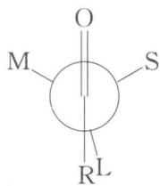

chemical

Simple molecular structure diagram with labeled atoms M, O, S, and R^L

上式中 R(H) 与 L 取重叠式的原因是, 亲核试剂中带正电荷的部分如金属会与羰基氧络合, 导致氧原子这端位阻增大, $\alpha-$ 碳上最大基团 L 应与羰基处于反式。

克拉姆(Cram)规则指出,亲核试剂主要从羰基旁体积较小的基团 S 一侧进攻羰基,示例如下:

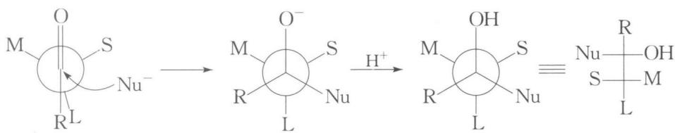

chemical

Chemical reaction mechanism showing nucleophilic substitution of a metal complex with sulfur and oxygen groups, forming a protonated intermediate and final product.

克拉姆规则适用于 $\alpha-$ 碳为手性碳原子的醛、酮与含碳、氧、硫亲核试剂的亲核加成反应。

## 2. 和含碳亲核试剂的加成

## (1) 和有机金属化合物的加成

有机金属化合物如 RMgX、RLi、CH≡CNa 等是强的亲核试剂，可与醛、酮的

羰基进行亲核加成,再经水解可得醇,这是制备醇的重要方法之一。示例如下:

RMgX 可与绝大多数醛、酮反应,但若酮羰基上的两个烃基体积太大时,反应较困难,此时可用有机锂试剂代替。示例如下:

## (2) 和氰化氢的加成

醛酮还可与较弱亲核试剂氰化氢加成得 $\alpha$ -羟基腈，示例如下：

反应机理如下所示：

该反应是可逆的,加少量碱可使平衡迅速建立。但当 $\alpha-$ 羟基腈生成后,在蒸馏之前必须加酸将碱除去,否则, $\alpha-$ 羟基腈会分解而生成原来的醛、酮和 HCN。在酸的存在下, $\alpha-$ 羟基腈是稳定的。

$\alpha-$ 羟基腈可水解成 $\alpha-$ 羟基酸,还可进一步失水生成 $\alpha,\beta-$ 不饱和酸,示例如下:

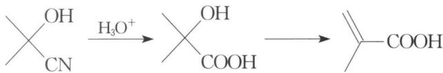

chemical

Chemical reaction equation showing nucleophilic addition of water to carboxylic acid

## 3. 和含氮亲核试剂的加成

氨、1°胺可与醛酮发生亲核加成，且加成产物不稳定，易进一步反应，示例如下：

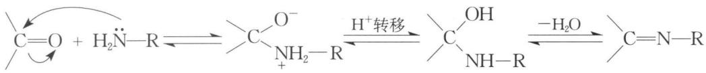

chemical

Chemical reaction equation showing nucleophilic addition of a hydroxyl group to an amino acid, forming a hydrazide ion and water

由上述反应过程可知,要使反应向右进行,关键是要移去水。亚胺在稀酸中加热可水解,又变回原来的醛酮及胺,这也是保护羰基的方法之一。需要指出的是,氨一般不用来制备亚胺,因为脂肪族亚胺不稳定。甲醛和氨反应生成六亚甲基四胺(乌洛托品,熔点260℃),可用于合成树脂和炸药,示例如下:

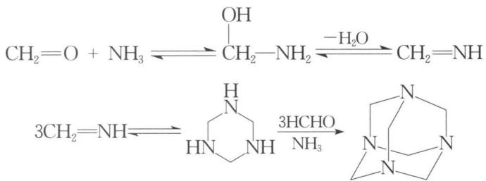

chemical

Chemical reaction equation showing nucleophilic substitution of a hydroxyl group with amine and formaldehyde to form a fused bicyclic compound

$2^{\circ}$ 胺若与醛酮反应,生成的 $\alpha-$ 氨基醇由于氮原子上没有氢,脱水时只能脱去相邻碳原子上的氢,故生成烯胺。反应示例如下:

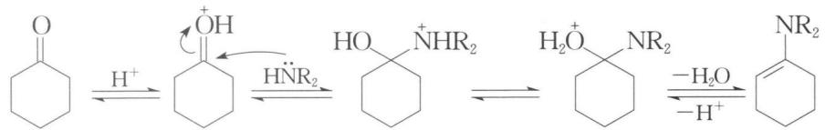

chemical

Reaction mechanism diagram showing protonation, resonance, and deprotonation steps of a cyclic amide compound

烯胺是一种重要的中间体,可通过共振在醛酮羰基的 $\alpha-C$ 上产生碳负离子,示例如下:

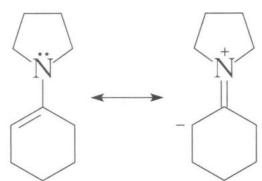

chemical

Chemical equilibrium diagram showing the transformation of a cyclopentylamine to a carbonyl compound

若醛酮羰基的 $\alpha -\mathrm{C}$ 上连有吸电子基团，由于吸电子基团可有效地稳定生成的碳负离子，所以烯胺的碳碳双键生成在羰基碳和连有吸电子取代基的 $\alpha -\mathrm{C}$ 之间，碳负离子生成在连有吸电子取代基的 $\alpha -\mathrm{C}$ 上，示例如下：

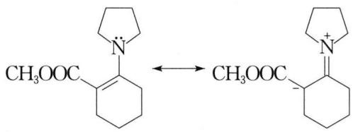

chemical

Chemical equilibrium reaction showing conversion of a cyclohexylamine derivative to a carbonyl compound

若醛酮羰基的 $\alpha -\mathrm{C}$ 上连有推电子基团如烃基时，则有如下两种烯胺：

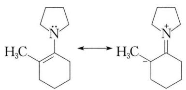

chemical

Chemical equilibrium reaction showing protonation of a cyclohexylamine derivative to form a carbonyl compound

I

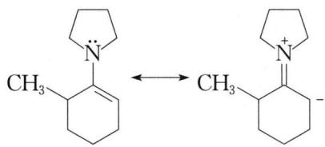

chemical

Chemical equilibrium reaction showing the conversion of a cyclohexylamine to a carbamate with a pyrrolidine ring

II

Ⅰ从结构上看是稳定的, 这是因为它是一个连有 4 个取代基的烯烃, 而Ⅱ是仅连有 3 个取代基的烯烃, 似乎不如Ⅰ稳定。但是, 烯胺的立体位阻导致 $\alpha - C$ 上有取代基时不共轭, 无取代基时易共轭而稳定。所以, 碳负离子主要生成在无取代基的 $\alpha - C$ 上。

烯胺在酸性条件下水解为原来的醛酮和 $2^{\circ}$ 胺。可通过酮与二级胺反应生成烯胺，然后烯胺作为亲核试剂与卤代烃发生 $\mathrm{S_N2}$ 反应完成烷基化，最后经酸性水解可得 $\alpha-$ 烷基化的酮。

醛酮还可与氨的衍生物反应,示例如下:

$$
\mathrm{C = O + H_2N - X\xrightarrow{-H_2O} C = N_X}
$$

X 代表 $\mathrm{NH}_{2} 、 \mathrm{NHC}_{6} \mathrm{H}_{5} 、 \mathrm{NHCONH}_{2}$ 等

生成的产物分别为腙、苯腙、缩胺脲等，一般都是棕黄色固体，很容易结晶，并有一定的熔点，所以常用该反应来鉴别醛、酮，根据是否生成黄色沉淀可以区别醛、酮和其他有机化合物。其中相对分子质量较大的2,4-二硝基苯肼和醛、酮生成的产物熔点较高，容易析出，鉴别醛、酮比较灵敏，效果更好，所以常称2,4-二硝基苯肼为羰基试剂，示例如下：

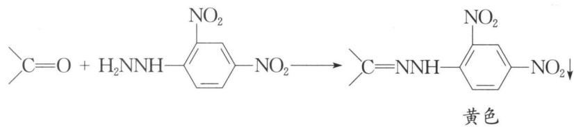

chemical

Chemical reaction equation showing nitration of a nitro group with amine to form a yellow compound

腙等在稀酸作用下,又可水解为原来的醛酮,示例如下:

$$
\mathrm{C} = \mathrm{NX} + \mathrm{H}_2\mathrm{O}\xrightarrow{\mathrm{H}^+}\mathrm{C} = \mathrm{O} + \mathrm{H}_2\mathrm{NX}
$$

醛酮与羟胺反应生成肟,示例如下:

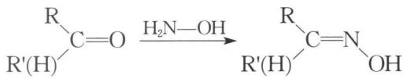

chemical

Chemical reaction equation showing nucleophilic substitution of a carbonyl group by water to form a tertiary amine and alcohol

肟有 Z、E 异构体，一般反应生成的 E 型产物比较稳定。

在酸性条件下,肟的羟基与反式位置的基团对调形成烯醇式,再转化为酮式,生成酰胺,称为贝克曼(Beckmann)重排。反应示例如下:

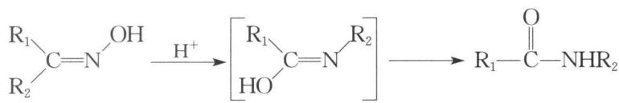

chemical

Chemical reaction equation showing nucleophilic addition of amine to a tertiary amine, forming an isocyanate ester and an amide group

该反应过程如下所示：

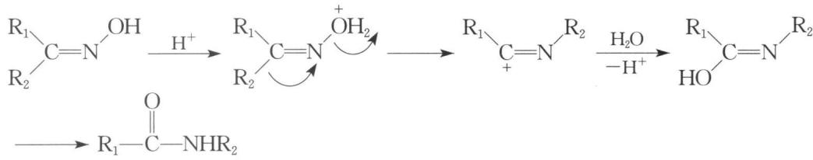

chemical

Reaction mechanism showing protonation and deprotonation steps of a cyclic amine compound

工业上，环己酮肟重排为己内酰胺，再开环聚合可合成尼龙-6。

## 4. 和含氧亲核试剂的加成

醛酮可与水在酸性条件下加成,示例如下:

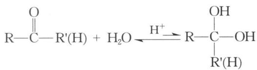

chemical

Chemical reaction equation showing esterification of alkyne with water, producing alcohol and hydrogen

该反应平衡有利于反应物方向,但高活性的醛如甲醛、三氯乙醛等,则反应平衡有利于生成物,示例如下:

醛酮可与醇在酸(如氯化氢、对甲苯磺酸等)催化下加成得半缩醛(酮),并可进一步生成缩醛(酮),可用于保护羰基,示例如下:

该反应过程如下所示：

要使上述平衡向右移动,则要移去水。半缩醛(酮)一般都不稳定,而缩醛(酮)在稀酸溶液中加热可水解得原来的醛酮。

需要指出的是,空间阻碍大的酮难以反应,应采用高活性的试剂如原甲酸三乙酯 $\mathrm{HC}(\mathrm{OC}_{2}\mathrm{H}_{5})_{3}$ ,示例如下:

## 5. 和含硫亲核试剂的加成

醛酮与饱和亚硫酸氢钠溶液反应所得加成物可沉淀析出,示例如下:

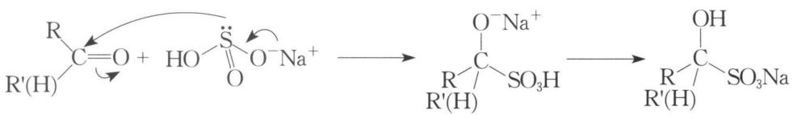

chemical

Chemical reaction mechanism showing nucleophilic addition of sodium salt to sulfate and then hydrolysis to sodium sulfide

该反应主要适用于醛、甲基酮、以及小于或等于8个碳的环酮，其他酮由于空间位阻而难以加成。

醛酮的亚硫酸氢钠加成物用盐酸或碳酸钠溶液等处理,又分解为原来的醛酮。

硫醇的亲核性比醇强,可与醛酮加成生成缩硫醛(酮),可进一步在雷尼镍(Raney Ni)催化下与氢气作用将原羰基还原为亚甲基,示例如下:

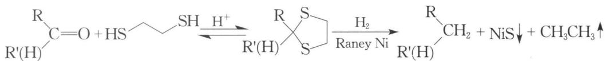

chemical

Chemical reaction equation showing the formation of a silyl ether from a diol and alkyl halide, with hydrogenation and Ni reagent

## 四、 $\alpha, \beta-$ 不饱和醛酮的反应

以 $-\mathrm{C} = \mathrm{C}-\mathrm{C}=\mathrm{O}$ 为例， $\alpha, \beta-$ 不饱和醛酮主要可发生 $1,2-$ 加成（碳氧双键上的亲核加成）、 $3,4-$ 加成（碳碳双键上的亲电加成）、 $1,4-$ 加成（共轭加成）等。

## 1. 3,4-加成

碳碳双键上的亲电加成主要是与卤素和次卤酸的加成以及室温下的催化氢化,示例如下:

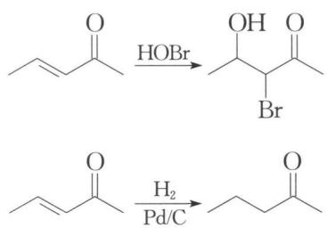

chemical

Two-step organic reaction sequence showing bromination and hydrogenation steps with Pd/C catalyst

## 2. 1,2-加成

一般而言,在小的、强的亲核试剂(如甲基格氏试剂、甲基锂等)进攻下主要发生1,2-加成,示例如下:

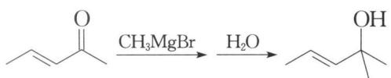

chemical

Organic reaction sequence showing bromination and dehydration steps

$\alpha,\beta-$ 不饱和醛由于羰基旁的氢位阻小,与烃基锂、格氏试剂反应时主要以1,2-加成为主,示例如下:

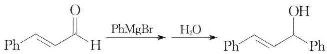

chemical

Organic reaction sequence showing conversion of allylic ketone to alcohol using PhMgBr and H2O

## 3. 1,4-共轭加成

氨和氨的衍生物，HX、 $H_{2}SO_{4}$ 、HCN等质子酸， $H_{2}O$ 或ROH等在酸催化下与 $\alpha,\beta-$ 不饱和醛酮的加成反应通常以1,4-共轭加成为主，示例如下：

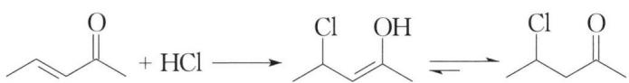

chemical

Chemical reaction equation showing acetylene reacting with HCl to form a hydroxy carbocation intermediate, followed by hydrogen elimination

格氏试剂与 $\alpha,\beta-$ 不饱和醛酮反应时, 若亲核试剂较大或羰基旁的基团较大, 则主要进行 1,4-共轭加成, 示例如下:

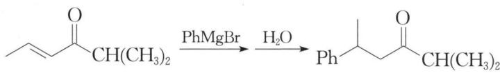

chemical

Organic reaction sequence showing conversion of a ketone to an alkene using PhMgBr and H2O

二烃基铜锂体积较大,主要发生1,4-共轭加成。

1,4-共轭加成可在酸性或碱性条件下进行,反应机理如下所示:

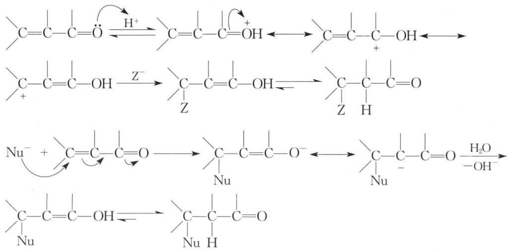

chemical

Reaction mechanism diagram showing nucleophilic substitution and proton transfer steps in a cyclic compound

能形成亲核碳负离子的试剂与 $\alpha,\beta-$ 不饱和醛酮、酯、腈、硝基化合物等在碱性条件下，发生 1,4-共轭加成称为迈克尔(Michael)加成，反应可表示为：

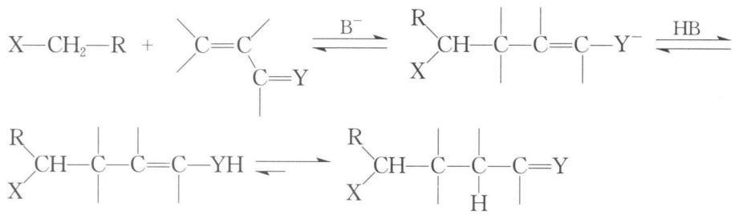

chemical

Chemical reaction mechanism showing deprotonation and subsequent rearrangement of a chiral alkene with X-CH₂-R and R-CH-R groups

X=醛基、酮基、酯基、硝基、氰基等；Y=O，NH，NR等

该反应中的碱主要有三乙胺、氢氧化钠、乙醇钠、氨基钠等。

若为不对称酮,则迈克尔加成主要发生在酮中多取代的 $\alpha-C$ 上,这是由于在强碱作用下,生成热力学控制的烯醇式负离子,多取代稳定。反应示例如下:

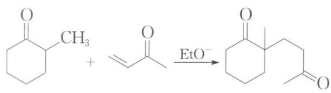

chemical

Organic reaction equation showing esterification of cyclohexanone with ethyl ether under basic conditions

## 五、 $\alpha-H$ 的反应

## 1. $\alpha - H$ 的卤代

在酸或碱的催化下，醛、酮的 $\alpha-H$ 可被卤素取代，示例如下：

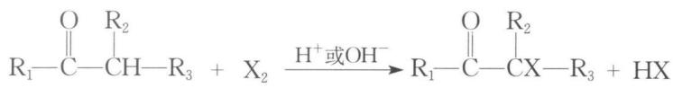

chemical

Chemical reaction equation showing acetylation of an enone with alkyl halide to form a cyanohexane derivative and hydrogen gas

该反应在酸催化下反应机理示例如下：

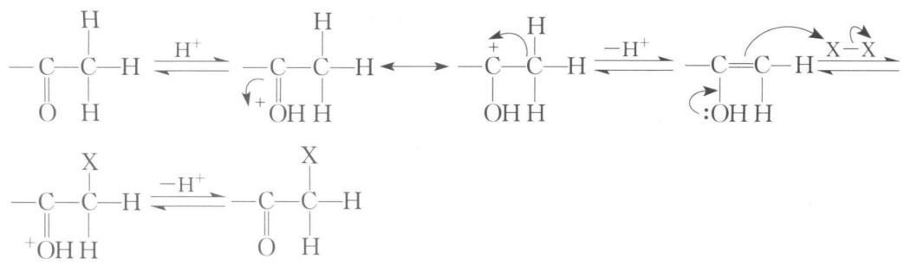

chemical

Hydrogenation reaction mechanism of acetic acid showing proton transfer and deprotonation steps

该反应一旦开始,就会产生酸,即可自催化。若为不对称酮,则取代基越多的 $\alpha-C$ 上的氢越易被卤代,这是因为取代基越多,超共轭效应越大,形成的烯醇越稳定。由于取代上去的卤原子有吸电子效应，可使羰基氧上电子云密度降低，则在质子化形成烯醇要比未卤代时困难，因此可控制在一卤代阶段。

该反应在碱催化下反应机理示例如下：

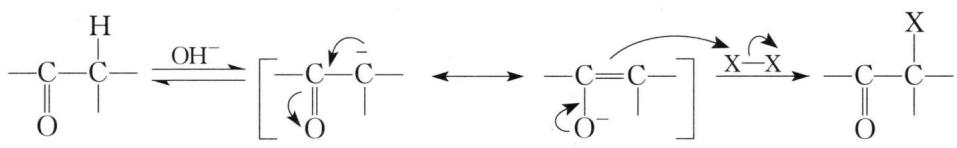

chemical

Reaction mechanism diagram showing dehydration and nucleophilic substitution steps with labeled intermediates

该反应中的碱除了催化外,还需要不断中和反应产生的酸,故用量须超过醛酮。若为不对称酮,则取代基越少的 $\alpha-C$ 上的氢越易被卤代,这是因为这种碳上的氢酸性强。由于取代上去的卤原子有吸电子效应,可使卤原子所在碳上的氢的酸性更强,更易被碱夺取,故反应会进行下去直至该 $\alpha-C$ 上的氢全被取代。

若为甲基酮类化合物,甲基上的氢全被卤代后形成的三卤甲基有强吸电子效应,使得羰基碳更易受到碱进攻而发生碳碳键断裂生成卤仿,称为卤仿反应。当然能被次卤酸氧化成甲基酮的化合物也能发生卤仿反应。反应示例如下:

$$
\mathrm{RCCH} _ {3} + \mathrm{NaOH} + \mathrm{X} _ {2} \longrightarrow \mathrm{RCOONa} + \mathrm{CHX} _ {3}
$$

该反应过程如下所示：

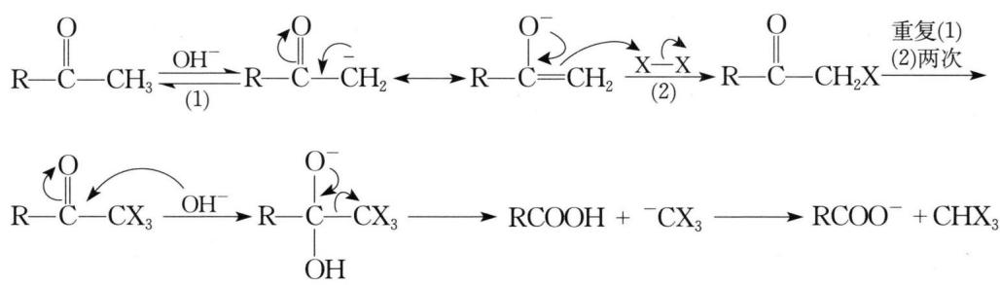

chemical

Chemical reaction mechanism showing deprotonation and ring-opening steps of a cyclic anhydride derivative

若为碘仿,则是不溶于碱液的黄色沉淀,故可用碘仿反应来鉴别甲基酮类化合物或能在反应条件下氧化成甲基酮类的化合物。

## 2. 羟醛缩合反应

有 $\alpha-H$ 的醛酮在稀碱液作用下，缩合生成 $\beta-$ 羟基醛酮，称为羟醛缩合反应。反应示例如下：

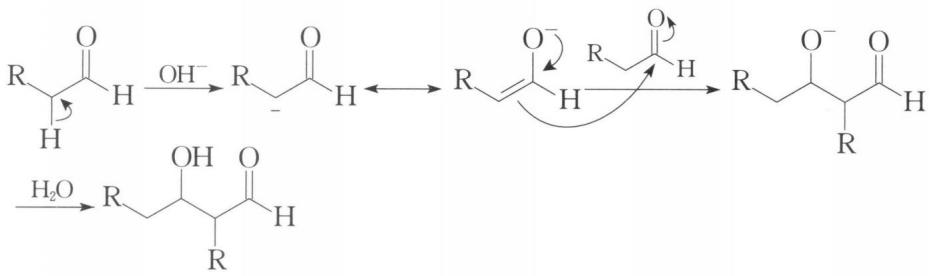

chemical

Reaction mechanism diagram showing dehydration and oxidation steps of a cyclic ester with R groups and water

羟醛缩合也可在酸性条件下进行,示例如下:

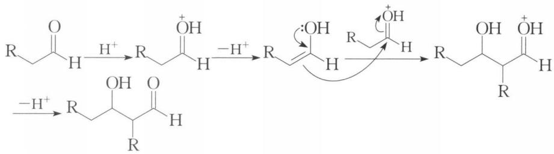

chemical

Reaction mechanism diagram showing protonation and ring-opening steps of a carbocation intermediate

$\beta-$ 羟基醛酮可在酸性或碱性条件下加热脱水生成 $\alpha,\beta-$ 不饱和醛酮，而且由于生成物中碳碳双键与羰基共轭，故比一般的醇更易脱水。

酮也可缩合,但其平衡偏向反应物一边,所得缩合产物的产率较低。

二羰基化合物可在稀碱液中发生分子内羟醛缩合,生成环状化合物。由于分子内缩合比分子间缩合更有利于熵增,因而反应产率较高。反应示例如下:

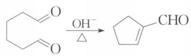

chemical

Chemical reaction equation showing oxidation of a cyclohexanone to a cyclopentenol using hydroxide ion

若有多种成环选择,则一般优先生成较稳定的五、六元环,示例如下:

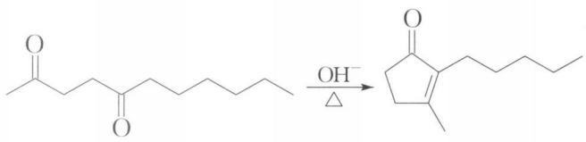

chemical

Chemical reaction showing the oxidation of a ketone to a cyclopentenone using hydroxide ion

两种不同的醛在稀碱液作用下,可发生交叉的羟醛缩合,得4种缩合产物,在合成上意义不大。若参与反应的一种醛有 $\alpha-H$ ,而另一种醛没有 $\alpha-H$ (如甲醛、苯甲醛等),此时可得产率较高的单一产物,示例如下:

$$
\mathrm{CHO} + \mathrm{CH} _ {3} \mathrm{CHO} \xrightarrow [ \triangle ]{\mathrm{OH} ^ {-}} \mathrm{CH} = \mathrm{CHCHO}
$$

醛和酮也可进行交叉的羟醛缩合,示例如下:

$$
\mathrm{CH} _ {3} \mathrm{CCH} _ {3} ^ {\mathrm{O}} + \mathrm{CH} _ {3} \mathrm{CHO} \xrightarrow [ \triangle ]{\mathrm{OH} ^ {-}} \mathrm{CH} _ {3} \mathrm{CCH} = \mathrm{CHCH} _ {3}
$$

若为不对称酮,则与醛酮 $\alpha-H$ 的卤代相似,碱催化缩合一般优先发生在取代较少的 $\alpha-C$ 上,酸催化缩合发生在取代较多的 $\alpha-C$ 上,示例如下:

$$
\mathrm{C} _ {6} \mathrm{H} _ {5} \mathrm{CHO} + \mathrm{CH} _ {3} \mathrm{CCH} _ {2} \mathrm{CH} _ {3} - \xrightarrow [ \triangle ]{\mathrm{OH} ^ {-}} \begin{array}{c} \mathrm{O} \\ \text {   } \\ \text {   } \\ \text {   } \\ \text {   } \\ \text {   } \\ \text {   } \\ \text {   } \\ \text {   } \\ \text {   } \\ \text {   } \\ \text {   } \\ \text {   } \\ \text {   } \\ \text {   } \\ \text {   } \\ \text {   } \\ \text {   } \\ \text {(CH)} _ {\Delta} \end{array} \begin{array}{c} \mathrm{O} \\ \text {   } \\ \text {   } \\ \text {   } \\ \text {   } \\ \text {   } \\ \text {   } \\ \text {   } \\ \text {   } \\ \text {   } \\ \text {   } \\ \text {   } \\ \text {   } \\ \text {   } \\ \text {   } \\ \text {(CH)} _ {\Delta} \end{array}
$$

## 六、还原反应

## 1. 羰基还原为羟基

## (1) 催化加氢

醛酮在 Pt、Ni 等催化下, 可加氢还原, 示例如下:

$$
\mathrm{R} \underset {\mathrm{R} ^ {\prime} (\mathrm{H})} {\overset {\mathrm{R}} {\mathrm{C}}} = \mathrm{O} \xrightarrow [ \mathrm{Ni} ]{\mathrm{H} _ {2}} \underset {\mathrm{R} ^ {\prime} (\mathrm{H})} {\overset {\mathrm{R}} {\mathrm{CH}}} - \mathrm{OH}
$$

若为 $\alpha, \beta-$ 不饱和醛酮，通常是先还原碳碳双键，再还原羰基，示例如下：

$$
\mathrm{O} \xrightarrow [ \mathrm{CH} _ {3} ]{\text {   }} + \mathrm{H} _ {2} (1 \mathrm{mol}) \xrightarrow {\mathrm{Pd/C}} \mathrm{O}
$$

## (2) 用氢化铝锂、硼氢化钠还原

氢化铝锂 $LiAlH_{4}$ 、硼氢化钠 $NaBH_{4}$ 等可以把醛酮还原为醇。氢化铝锂还原性很强，可将醛酮、羧酸及其衍生物都还原；而硼氢化钠还原性较低，只还原醛酮和酰卤，不还原酯基等。反应时，一般是负氢进攻羰基碳原子。

氢化铝锂很活泼,反应常在醚中进行,生成醇盐,再经水解得醇。硼氢化钠较稳定,反应常在醇中进行。

## (3) 用乙硼烷还原

乙硼烷 $\mathrm{B}_2\mathrm{H}_6$ 也可还原醛酮到醇，示例如下：

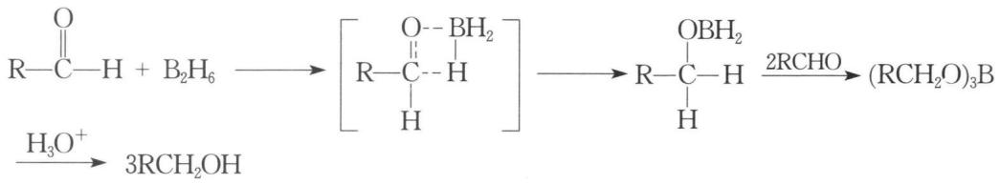

chemical

Chemical reaction equation showing the formation of a B-containing ester from alkenes and hydroxyl groups

若为 $\alpha,\beta-$ 不饱和醛酮，乙硼烷先还原羰基，再还原碳碳双键。

## (4) 麦尔外因-彭杜尔夫还原

麦尔外因-彭杜尔夫还原是本书第八讲介绍过的沃氏氧化的逆反应。反应示例如下：

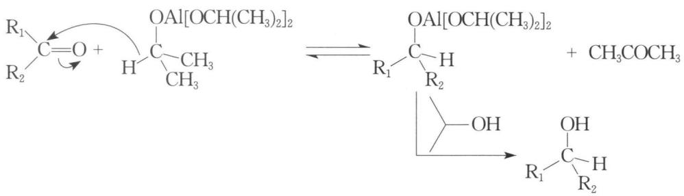

chemical

Chemical reaction mechanism showing alkylation of aldehyde with methanol to form alcohol and methyl acetate

## (5) 酮的双分子还原

酮在镁汞齐等催化下,可发生双分子还原偶联成频哪醇,示例如下:

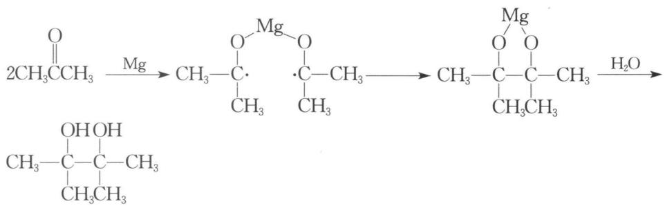

chemical

Chemical reaction sequence showing magnesium-alloyed complex formation with water, producing a hydroxyalkane derivative

## 2. 羰基还原为亚甲基

## (1) 克莱门森还原

醛酮与锌汞齐和浓盐酸一起回流反应,示例如下:

$$
\mathrm{C} = \mathrm{O} \xrightarrow [ \mathrm{HCl} ]{\mathrm{Zn-Hg}} \mathrm{CH} _ {2}
$$

(2) 沃尔夫-基希涅尔-黄鸣龙(Wolff L-Kishner-Huang minlon)还原醛酮与肼和氢氧化钾在一缩二乙二醇中一起加热,示例如下:

$$
\mathrm{R} ^ {\mathrm{O}} \mathrm{C} _ {\mathrm{R} ^ {\prime}} \xrightarrow [ (\mathrm{HOCH} _ {2} \mathrm{CH} _ {2}) _ {2} \mathrm{O} , \triangle ]{\mathrm{H} _ {2} \mathrm{NNH} _ {2} , \mathrm{KOH}} \mathrm{RCH} _ {2} \mathrm{R} ^ {\prime}
$$

## (3) 缩硫醇氢解

这是在中性条件下还原羰基到亚甲基的方法,示例如下:

$$
\mathrm{C} = \mathrm{O} + \mathrm{HS} \xrightarrow {\mathrm{H} ^ {+}} \mathrm{S} \xrightarrow [ \mathrm{S} ]{\mathrm{H} _ {2}} \mathrm{CH} _ {2}
$$

## 七、氧化反应

## 1. 醛的氧化

醛如苯甲醛等在空气中可被氧化,示例如下:

$$
\mathrm{RCH} + \mathrm{O} _ {2} \xrightarrow {\text { O }} \mathrm{RCOOH} \xrightarrow {\text { RCHO }} \mathrm{RCOH}
$$

醛除了能被强氧化剂如 $KMnO_{4}$ 、 $K_{2}Cr_{2}O_{7}$ 、溴水等氧化成酸，还能被弱氧化剂氧化。这类弱氧化剂也是检验醛基的方法，主要有银氨溶液、斐林(Fehling)试剂（可通过 $CuSO_{4}$ 、NaOH、酒石酸钾钠等配制）、班氏(Benedict)试剂（可通过 $CuSO_{4}$ 、NaOH、柠檬酸钠等配制）等，需要指出的是后两者不能氧化芳香醛。

## 2. 酮的氧化

酮一般不易被氧化,但遇强氧化剂如酸性高锰酸钾,羰基与 $\alpha-C$ 之间的碳碳键断裂,生成酸,示例如下:

$$
\mathrm{O} \xrightarrow [ \triangle ]{\mathrm {KMn O _ {4} / H ^ {+}}} \mathrm {HOOCCH_ {2} CH_ {2} CH_ {2} CH_ {2} COOH}
$$

但对于一般的酮,这种氧化产生多种羧酸混合物,意义不大。

酮用过氧酸处理,在羰基与旁边烃基间插入一个氧形成酯的反应,称为贝耶尔-维林格(Baeyer-Villiger)反应,反应过程示例如下:

若羰基两侧烃基不同,基团迁移能力顺序为 $3^{\circ} > 2^{\circ} > 1^{\circ}$ 。若迁移的碳原子有手性,则手性保持不变。

## 八、其他反应

## 1. 法沃尔斯基重排

$\alpha$ -卤代酮在醇钠、氢氧化钠、氨基钠等作用下，失去卤原子，重排成相同碳原子数的羧酸酯、羧酸、酰胺的反应，称为法沃尔斯基(Favorskii)重排，示例如下：

环状的 $\alpha-$ 卤代酮在醇钠的作用下发生法沃尔斯基重排时, 发生缩环反应, 生成比反应物少一个环碳原子的环烷甲酸酯, 示例如下:

该反应过程如下所示：

## 2. 二苯乙醇酸重排

二苯乙二酮在约 70% NaOH 溶液中加热,重排成二苯乙醇酸,称为二苯乙醇酸重排,示例如下:

该反应过程如下所示：

## 3. 康尼扎罗反应

无 $\alpha-H$ 的醛在浓碱的作用下发生歧化反应,一分子醛被氧化成酸,另一分子的醛被还原成醇,称为康尼扎罗(Cannizzaro)反应,示例如下:

$$
2 \mathrm{PhCHO} \xrightarrow {\mathrm{OH} ^ {-}} \mathrm{PhCH} _ {2} \mathrm{OH} + \mathrm{PhCOO} ^ {-}
$$

该反应过程如下所示：

若没有 $\alpha-H$ 的苯甲醛和甲醛发生康尼扎罗反应,由于甲醛在醛类中的还原性最强,故甲醛被氧化成甲酸盐,苯甲醛被还原成苯甲醇,反应如下所示:

$$
\mathrm{PhCHO} + \mathrm{HCHO} \xrightarrow {\mathrm{OH} ^ {-}} \mathrm {PhCH_ {2} OH} + \mathrm {HCOO^ {-}}
$$

## 4. 叶立德反应

磷叶立德又称维蒂希(Wittig)试剂,可通过卤代烃来制备,卤代烃可以是甲基卤、伯卤或仲卤,但不能是叔卤(无 $\alpha-H$ )。反应过程如下所示:

$$
\begin{array}{r l} & \mathrm {(C_ {6} H_ {5})_ {3} P: + RCH_ {2} \longrightarrow X \longrightarrow [(C_ {6} H_ {5})_ {3} P^ {+} - CH_ {2} R] X ^ {-}} \\ & [ (\mathrm C_ {6} H_ {5})_ {3} P^ {+} - CHR ] X ^ {-} \xrightarrow [ - \mathrm{HX} ]{n - C _ {4} H _ {9} Li} (\mathrm {C_ {6} H_ {5})_ {3} P = CHR + LiX + C_ {4} H_{10}} \\ & \text { 维蒂希试剂 } \end{array}
$$

醛酮与维蒂希试剂作用,脱去三苯基氧磷生成烯烃,称为维蒂希反应,示例如下:

$$
\mathrm{C} = \mathrm{O} + (\mathrm{C} _ {6} \mathrm{H} _ {5}) _ {3} \mathrm{P} = \mathrm{CR} _ {2} \longrightarrow \mathrm{C} = \mathrm{CR} _ {2} + (\mathrm{C} _ {6} \mathrm{H} _ {5}) _ {3} \mathrm{P} = \mathrm{O}
$$

该反应机理可能为：

$$
\begin{array}{l} \mathrm{C=O} + \mathrm{RHC} ^ {-} \stackrel {+} {\mathrm{P}} (\mathrm{C} _ {6} \mathrm{H} _ {5}) _ {3} \longrightarrow \underset {\mathrm{RHC} - \mathrm{P} (\mathrm{C} _ {6} \mathrm{H} _ {5}) _ {3}} {\overset {\mathrm{C-O} ^ {-}} {\longrightarrow}} \longrightarrow \underset {\mathrm{RHC} - \mathrm{P} (\mathrm{C} _ {6} \mathrm{H} _ {5}) _ {3}} {\overset {\mathrm{C-O}} {\longrightarrow}} \\ \longrightarrow \underset {\mathrm{C=CHR+O=P(C} _ {6} \mathrm{H} _ {5}) _ {3}} {\overset {\mathrm{C=CHR+O=P(C} _ {6} \mathrm{H} _ {5}) _ {3}} {\longrightarrow}} \end{array}
$$

醛酮与硫叶立德反应,生成环氧化物,示例如下:

$$
\mathrm{C} = \mathrm{O} + \mathrm{H} _ {2} \mathrm{C} - \stackrel {+} {\mathrm{S}} (\mathrm{CH} _ {3}) _ {2} \longrightarrow \underset {\mathrm{H} _ {2} \mathrm{C}} {\overset {\mathrm{C}} {\rightleftarrows}} \mathrm{O} ^ {-} \quad \longrightarrow \quad \mathrm{O} + \mathrm{CH} _ {3} \mathrm{SCH} _ {3}
$$

## 典型例题

【例 1】 比较下列指定性质。

(1) 环丁酮(A)、环戊酮(B)、环己酮(C)与 $NaBH_{4}$ 反应的活泼性次序如何?  
(2) 下列各化合物的烯醇化程度大小次序如何?

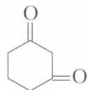  
A

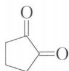  
B

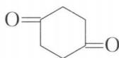  
C

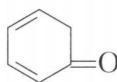  
D

(3) 下列化合物的亲核加成反应活性次序如何?

A: $CF_{3}CHO$ , B: $CH_{3}CHO$ , C: $ClCH_{2}CHO$ , D: $CH_{3}COCH_{3}$ ,
E: $CH_{3}COCH=CHCH_{3}$

(4) 下列化合物的氧化性强弱次序如何?

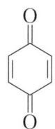  
A

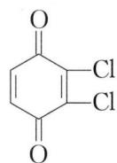  
B

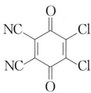

chemical

Chemical structure of a substituted benzene ring with chlorine and cyano groups

C

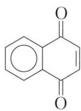

chemical

Molecular structure of 1,4-dimethoxyquinoline

D

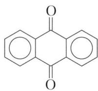

chemical

Molecular structure of 1,4-dimethoxyquinoline

E

(5) 下列化合物与银氨溶液反应的速率大小次序如何?

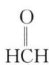  
A

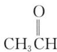  
B

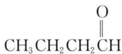  
C

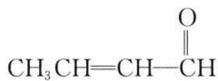  
D

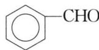  
E

解析 （1）环丁酮分子内张力较大, 还原成环丁醇时 $sp^{2}$ 杂化的碳原子变为饱和, 张力解除较大, 所以反应活性最大。环戊酮的还原过渡态是重叠构象, 存在扭转张力, 内能较高, 热力学稳定性较差, 所以反应活性相对最小。环己酮的还原产物是椅式构象, 比较稳定, 故反应活性居中。所以, 与 $NaBH_{4}$ 反应的活性次序为: A > C > B。

(2) 烯醇化程度大小次序取决于 $\alpha - H$ 的酸性大小及烯醇式的稳定性大小。因此, 烯醇化程度次序为: $D > B > A > C$ , 即热力学稳定性为:

chemical

Chemical reaction sequence showing oxidation of cyclohexanol to cyclopentenone and then to cyclohexanone

(3) 羰基碳原子的正电性越大、空间位阻越小, 亲核加成反应活性越大。因此, 亲核加成反应活性次序为: A > C > B > D > E。

(4) 醌环上有吸电子基时, 其氧化还原电位越高, 氧化性越大, 易于被还原。因此, 氧化性强弱次序为: C > B > A > D > E。

(5) 醛被 $\left[\mathrm{Ag}\left(\mathrm{NH}_{3}\right)_{2}\right]^{+}/\mathrm{OH}^{-}$ 氧化的反应是否易发生,主要取决于醛羰基的活性。若羰基上连接的基团有给电子作用时，羰基活性下降，不易被银氨溶液氧化。所以，反应活性次序为：A>B>C>D>E。

【例 2】 A 和 B 的分子式均为 $C_{8}H_{14}O$ ，A 能发生碘仿反应，B 不能。B 能发生银镜反应，而 A 不能。A、B 分别经臭氧化分解反应后均得到 2-丁酮和化合物 C，C 既能发生碘仿反应又能发生银镜反应。请写出 A、B、C 的结构简式。

解析 A、B 均为八碳化合物, 经臭氧化分解反应后都得到 2-丁酮和 C, 则 C 应是四碳化合物。C 能发生碘仿反应, 应有甲基酮基团; C 又能发生银镜反应, 应有醛基, 余下的一个碳要把这两个基团连接在一起, 则只能是亚甲基。由此可推断 C

O
的结构简式为 $CH_{3}CCH_{2}CHO$ 。根据臭氧化分解反应的特点，可将 C 中醛基碳原

子与2-丁酮中羰基碳原子以碳碳双键相连可得 $\mathrm{CH}_3\mathrm{CCH}_2\mathrm{CH}=\mathrm{C}\begin{array}{c}\mathrm{O}\\||\\\mathrm{CH}_3\end{array}\begin{array}{c}\mathrm{CH}_2\mathrm{CH}_3\\|\\\mathrm{CH}_3\end{array}$ ，该

物质能发生碘仿反应, 所以为 A。同理, 将 C 中羰基碳原子与 2-丁酮中羰基碳原子以碳碳双键相连, 得 $CH_{3}CH_{2}C=CCH_{2}CHO$ , 该物质能发生银镜反应, 所以 $\begin{array}{c} | \\ | \\ CH_{3}CH_{3} \end{array}$

为B。

【例 3】某化合物 A, 分子式为 $C_{10}H_{16}O$ ，与银氨溶液反应生成银镜。A 经 Ni 催化加氢可先后得到化合物 B、分子式为 $C_{10}H_{20}O$ 和化合物 C、分子式为 $C_{10}H_{22}O$ 。A 经臭氧化还原性水解得到乙二醛、丙酮和化合物 D。D 被 $AgNO_{3}$ 的氨水溶液氧化为化合物 E，E 的分子式为 $C_{5}H_{8}O_{3}$ ，E 经 $I_{2}-NaOH$ 溶液作用生成碘仿。A 与 $H_{2}SO_{4}$ 共热可得到对异丙基甲苯。试推测 A、B、C、D 和 E 的结构简式。

解析 A 的分子式为 $C_{10}H_{16}O$ ，不饱和度为 3。根据题意，化合物 A 含 1 个醛基，2 个碳碳双键。再根据 A 经臭氧化分解反应得到乙二醛、丙酮和 D，则 A 中 1 个碳

碳双键与醛基构成 $\mathrm{C} = \mathrm{CHCHO}$ 结构，另1个碳碳双键是 $\begin{array}{c}\mathrm{CH}_3\\ \mathrm{CH}_3\end{array}\mathrm{C} =$ 结构。而E

又为具有甲基酮结构的五碳酸。根据 A 与 $H_{2}SO_{4}$ 共热可得到对异丙基甲苯，可知

A 应具类似的碳架结构。综上所述，A 可能的结构简式为： $CH_{3}$ $CHO$ 。因此，B【例 4】化合物 A $\left(\mathrm{C}_{7}\mathrm{H}_{12}\mathrm{O}\right)$ 不与卢卡斯试剂及银氨溶液作用，与 2,4-二硝基苯肼反应生成腙，但无碘仿反应。A 与 NH $_{2}$ OH 作用只生成一个肟 B $\left(\mathrm{C}_{7}\mathrm{H}_{13}\mathrm{ON}\right)$ ，B 的贝克曼重排产物也只有一种；A 与 NaBH $_{4}$ 反应得到环己烷的衍生物 C $\left(\mathrm{C}_{7}\mathrm{H}_{14}\mathrm{O}\right)$ ，C 只有顺反异构。A 与 HCHO、NH $\left(\mathrm{CH}_{3}\right)_{2} \cdot \mathrm{HCl}$ 反应的产物经中和得到 D $\left(\mathrm{C}_{10}\mathrm{H}_{19}\mathrm{ON}\right)$ ，D 受热分解得到 E $\left(\mathrm{C}_{8}\mathrm{H}_{12}\mathrm{O}\right)$ ，E 与 HSCH $_{2}$ CH $_{2}$ SH 作用得 F，F 与 H $_{2}$ 在雷尼镍催化下控制加氢后生成化合物 G $\left(\mathrm{C}_{8}\mathrm{H}_{14}\right)$ ；G 氧化可得 A 的异构体 H $\left(\mathrm{C}_{7}\mathrm{H}_{12}\mathrm{O}\right)$ 。G 吸收 1 mol H $_{2}$ 后生成 I $\left(\mathrm{C}_{8}\mathrm{H}_{16}\right)$ ，I 可有三个立体异构体；而 E 与 LiAlH $_{4}$ 作用，水解产物是可有四个立体异构体的 J $\left(\mathrm{C}_{8}\mathrm{H}_{14}\mathrm{O}\right)$ ，E 与 HCN 的反应产物是也有四个立体异构体的 K $\left(\mathrm{C}_{9}\mathrm{H}_{13}\mathrm{ON}\right)$ ；当 E 与 NH $\left(\mathrm{CH}_{3}\right)_{2}$ 反应时，又可生成化合物 D。A 与四氢吡咯反应脱水后生成一碱性化合物 L，L 与 E 作用后水解得化合物 M $\left(\mathrm{C}_{15}\mathrm{H}_{24}\mathrm{O}_{2}\right)$ ，M 在 Mg-MgI $_{2}$ /苯中缓慢回流后再水解可得到一个二元醇 N $\left(\mathrm{C}_{15}\mathrm{H}_{26}\mathrm{O}_{2}\right)$ ；N 在 HIO $_{4}$ 的作用下又可转变为 M。试推测 A、B、C、D、E、F、G、H、I、J、K、L、M 和 N 的结构简式。

chemical

Three organic molecular structures labeled C, D, and E, showing carbon chain with methyl and carboxyl groups

解析 A 的分子式为 $C_{7}H_{12}O$ ，不饱和度为 2。A 不与卢卡斯试剂、银氨溶液反应，可与 2,4-二硝基苯肼反应生成腙，说明 A 分子中含有羰基，不存在羟基和醛基。但 A 不能进行碘仿反应，说明 A 不是甲基酮类物质。A 与 $NH_{2}OH$ 反应只得到 1 个肟 B，且 B 发生贝克曼重排也只得一个产物，可知羰基两侧结构对称。A 中羰基

被 $\mathrm{NaBH}_4$ 还原生成环己烷衍生物, 至此可确定 A 的结构简式为 $\begin{array}{c}\text{O}\\|\\\text{C} \\\hline\text{CH}_3\end{array}$ 。因此, 可

chemical

Chemical structure of a cyclohexanone derivative with B and C substituents, labeled in Chinese

A 通过胺甲基化反应所得 D 为 $\ce{C6H5OCH2N(CH3)2}$ ，该曼氏碱受热分解生成

$\alpha, \beta-$ 不饱和酮 E, 则 E 为 $\mathrm{CH}_{3}$ 。E 与 $\mathrm{HSCH}_{2} \mathrm{CH}_{2} \mathrm{SH}$ 反应生成的缩硫酮 F

为 $\mathrm{S}$ =CH $_2$ ，该缩硫酮在雷尼镍作用下催化氢化生成G，则G为 $\mathrm{C}_{10}\mathrm{H}_{13}\mathrm{O}$ 。G

氧化可得 A 的异构体 H, 则 H 为 $\ce{C6H5=O}$ 。G 催化氢化所得的 I 为 $\ce{C6H5-CH3}$ ，

I的立体异构体有顺式、反式及其对映体共三种。E中羰基被 $\mathrm{LiAlH_4}$ 还原后水解

得 J, 则 J 为 $\ce{C6H5OH=CH2}$ ，该分子中羟基和甲基可位于同侧或异侧，再加上两者均有

对映体, 故共有四种立体异构体。E 与 HCN 发生 1,4-共轭加成所得的 K 为

$\text{CH}_3\text{COO} \text{—CH}_2\text{CN}$ ，同理，K也有四种立体异构体。

A与四氢吡咯发生亲核加成脱水后可得L，则L为 $\mathrm{H}_3\mathrm{C}-\mathrm{C}_6\mathrm{H}_4-\mathrm{N}-\mathrm{C}_6\mathrm{H}_4$ 。L有共振结构，可表示为： $\mathrm{H}_3\mathrm{C}-\mathrm{C}_6\mathrm{H}_4-\mathrm{N}-\mathrm{C}_6\mathrm{H}_4 \longleftrightarrow \mathrm{H}_3\mathrm{C}-\mathrm{C}_6\mathrm{H}_4=\mathrm{N}^+$ ，该碳负离子

对E进行共轭加成再水解后生成
(M)。二酮M在镁催化下,可

发生分子内还原偶联成邻二醇 ${\mathrm{H}}_{3}\mathrm{C}$ —— ${\mathrm{{CH}}}_{3}\left( \mathrm{\;N}\right) ,\mathrm{N}$ 在 ${\mathrm{{HIO}}}_{4}$ 作用下又可转变为 $\mathrm{M}$ 。

【例 5】（第 27 届中国化学奥林匹克初赛试题）画出下列反应中合理的、带电荷中间体 A 以及产物 B 的结构简式。

chemical

Chemical reaction equation showing conversion of a carbonyl compound to an alkene using (n-C5H11)2CuLi, followed by hydrogenation to yield product B

解析 二烃基铜锂是体积较大的亲核试剂, 对 $\alpha, \beta-$ 不饱和醛酮发生 1,4-共轭加成, 然后加入水, 得到质子, 生成产物。过程如下所示:

chemical

Organic reaction sequence showing conversion of ketone to alkene via hydrogenation and dehydration steps

【例 6】（2010 年全国初赛试题）画出下列两个转换中产物 A、B 和 C 的结构简式，并简述在相同条件下反应，对羟基苯甲醛只得到一种产物，而间羟基苯甲醛却得到两种产物的原因。

chemical

Two organic reaction equations showing bromination of a phenol with acetic anhydride, followed by acid-catalyzed rearrangement to form B and C.

解析 酚羟基在碱性条件下转化为酚氧负离子,有很强的亲核性,可对卤代烃进

行亲核取代反应,故 A 为 $\ce{C6H5CHO}$ $\ce{O(CH2)11CH3}$ B 为 $\ce{C6H5CHO}$ $\ce{O(CH2)11CH3}$ 。产物 C 则只可

能是由醛基反应而来,那么为何对羟基苯甲醛也有醛基却只有一种产物呢?不难发现,这是由于羟基所在位置不同所导致的。苯环上的烷氧基对间位比对对位有更强的吸电子诱导效应和更弱的给电子共轭效应,导致间位醛基碳比对位醛基碳有更强的正电性,反应活性更高。仔细搜索反应体系中各物质,不难发现溶剂丙酮

可与间位醛基发生羟醛缩合反应,故产物 C 为 $\ce{CH=CHC(=O)O(CH2)11CH3}$

故答案如下所示：

chemical

Chemical structure of a substituted benzene ring with CHO and O(CH2)11CH3 groups

A

chemical

Chemical structure of a substituted benzene ring with CHO and O(CH2)11CH3 groups

B

chemical

Chemical structure of a substituted benzene derivative with ethyl and methyl groups

C(注：B、C可互换)

原因：连在苯环的烷氧基对苯环的间位比对苯环的对位有更强的吸电子诱导效应和更弱的给电子共轭效应，致使羟基间位的醛基比对位的醛基有更强的亲电性，所以在碳酸钾的弱碱条件下，对羟基苯甲醛与丙酮不发生缩合反应而间位羟基苯甲醛可与丙酮发生羟醛缩合反应。

【例 7】（2010 年全国初赛试题）灰黄霉素是一种抗真菌药，可由 A 和 B 在三级丁醇钾/三级丁醇体系中合成，反应式如下：

chemical

Chemical reaction equation showing conversion of compound A to B using formaldehyde and acetic anhydride

chemical

Chemical structure of a substituted cyclohexane derivative with methoxy and chloro substituents

灰黄霉素

(1) 在下面灰黄霉素结构式中标出不对称碳原子的构型。

chemical

Chemical structure of a substituted cyclohexane derivative with methoxy and chloro groups

(2) 写出所有符合下列两个条件的 B 的同分异构体的结构简式: ①苯环上只有两种化学环境不同的氢; ②分子中只有一种官能团。

(3) 写出由 A 和 B 生成灰黄霉素的反应名称。

解析 （1）根据手性碳构型的判断规则可以确定如下：

chemical

Chemical structure of a chlorinated organic compound with methoxy and methyl substituents

(2) B 的分子式为 $C_{7}H_{8}O_{2}$ ，不饱和度为 4，恰为 1 个苯环的不饱和度。而 B 只有一种官能团，则两个氧原子可能为：

① 两个羟基

若两个羟基均为酚羟基,则苯环上只有两种氢的同分异构体可能为:

chemical

Two substituted benzene rings, one with hydroxyl and methyl groups, the other with hydroxyl and methyl groups

若一个为醇羟基,一个为酚羟基,则苯环上只有两种氢的同分异构体只能为:

② 一个过氧基

苯环上只有两种氢的同分异构体只能为：

$$
\mathrm{H} _ {3} \mathrm{C} - \mathrm{C} _ {6} \mathrm{H} _ {4} - \mathrm{OOH}
$$

(3) B 中碳碳叁键、碳碳双键均与羰基共轭, 有 2 个 $\alpha, \beta-$ 不饱和酮的结构。A 中羰基旁的亚甲基上的氢可在强碱作用下离去, 形成碳负离子, 可对 B 进行两次 1,4-共轭加成 (即迈克尔加成) 生成灰黄霉素。

【例 8】（第 28 届中国化学奥林匹克初赛试题）异靛蓝及其衍生物是一类具有生理活性的染料，目前在有机半导体材料中有重要的应用。其合成路线如下：

chemical

Chemical reaction scheme showing bromination of indole derivatives via methanol and acidification steps

（1）画出第一步反应的关键中间体 G(电中性)的结构简式和说明此反应的类型。

但在合成非对称的异靛蓝衍生物时,却得到3个化合物。

chemical

Chemical reaction equation showing bromination of indole derivatives using CH3COOH/HCl in HCl, yielding products H, I, J with specified yields and conditions.

(2) 画出产物 H、I 及 J 的结构简式, 并画出生成 I 和 J 的反应过程。

解析 （1）由第一步反应的产物易知,该反应是羟醛缩合反应。B中羰基在酸性条件下烯醇化,进攻A中3-位羰基碳原子,生成电中性中间体G,过程如下所示:

chemical

Chemical reaction pathway showing bromination of compound B to form compound G via intermediate A

(2) 参考 C→D 的反应, 可知 F 中氮原子首先甲基化, 所得产物的分子式恰为 $C_{17}H_{12}BrN_{3}O_{2}$ , 即为 H, 如下所示:

chemical

Chemical reaction converting compound F to compound H under CH₃I, K₂CO₃ in DMF at 100°C

H、I、J的不饱和度均为13，说明三者的分子骨架很相似。I相比H多了1个C、1个Br，但少了1个N，如同是H中方框内部分叠加而成。

chemical

Chemical structure of a brominated indole derivative with methyl substituents and a fused ring system

不难想到,H发生了羟醛缩合的逆反应,过程如下所示:

其中， $H_{2}O$ 来自于氮原子甲基化产生的 HI 与 $K_{2}CO_{3}$ 反应。

a 和 c 发生羟醛缩合反应可得 I，过程如下：

b 和 d 发生羟醛缩合反应可得 J, 过程如下:

而 a 与 b、c 与 d 发生羟醛缩合均重新生成 H。

【例 9】臭氧化反应是有机反应中非常重要的一种,其基本的机理是由克里吉(Criegee)提出的。

（1）对于一个对称烯烃 $R_{2}C=CR_{2}$ ，先与臭氧发生 1,3-偶极环加成形成分子 A，A 迅速分解为两个碎片 B 和 C，写出 A、B、C 的结构简式。

(2) 一般来说 B、C 会重新结合生成分子 D, 称作臭氧化物。对于一个不对称烯烃 $\mathrm{R}^{1} \mathrm{CH} = \mathrm{CHR}^{2}$ , 写出在甲醛存在时发生臭氧化产生的所有可能的臭氧化物。

(3) 化合物 E 与 $\mathrm{O}_{3}$ 反应产生最稳定的臭氧化物 F, F 在氢氧化钠水溶液中加热可生成甲酸盐和 G, 如下所示:

写出 F、G 的结构简式。

解析 （1）对称烯烃 $R_{2}C=CR_{2}$ 先与 $O_{3}$ 发生 1,3-偶极环加成，生成一级臭氧化物 A，A 迅速分解为两个碎片 B 和 C，过程如下所示：

一级臭氧化物

(2) C 中氧负离子可进攻 B 中羰基碳原子发生亲核加成, 得到二级臭氧化物 D, 过程如下:

二级臭氧化物

不对称烯烃 $R^{1}CH=CHR^{2}$ 经臭氧化得到的碎片有：

再加上体系存在的 HCHO, 经上述生成二级臭氧化物的反应, 生成的产物有:

chemical

Four organic molecular structures with R groups and O atoms, showing structural formulas and stereochemistry

（3）E 与 $O_{3}$ 反应生成稳定臭氧化物 F 的过程如前所述，不同之处在于生成二级臭氧化物时，E 中羟基参与反应，如下所示：

chemical

Reaction mechanism diagram showing dehydration and oxidation steps of a cyclic compound with hydroxyl and methyl groups

F 中半缩醛羟基在 NaOH 水溶液中失去质子, 然后发生一系列消除反应, 过程如下所示:

chemical

Chemical reaction mechanism showing fluorination and dehydrolysis steps of a cyclic ester with hydroxyl and carboxylic acid groups

生成的二羰基化合物在碱性条件下会继续发生分子内的羟醛缩合反应,生成

六元环状 $\alpha, \beta$ -不饱和酮 G: $\mathrm{H}_3\mathrm{C}$ $\xrightarrow[\mathrm{H}_2\mathrm{O}]{\mathrm{NaOH}}$ $\mathrm{CH}_3\mathrm{CH}_3$ 。

## 本讲习题

1. 完成下列反应式(有“\*”标注的,写出反应产物的构型式)。

(1) PhCOCHO $\xrightarrow[H_{2}O]{NaOH}$  
(2) $\mathrm{CH}_3\mathrm{C}\xrightarrow{\mathrm{O}}\mathrm{C}_6\mathrm{H}_4=\mathrm{O}\xrightarrow{\mathrm{OH}^-}$  
(3) $2\mathrm{CH}_3\mathrm{COCH}_3 + \mathrm{NH}_2\mathrm{NH}_2\xrightarrow{\mathrm{H}^+}$  
(4) PhC—CPh $\xrightarrow[\text{2)}\text{H}^{+}]{1)\text{KOH}}$

(5) $\ce{C6H5CHO ->[LiAlH4][H2Ni][H2] ->[H2O] ->Pd-C}$

(6) $\ce{CHO} + \ce{CH3CC2H5} \rightarrow \ce{H+}$ OH⁻

(7) $\mathrm{PhCH_2CCH_2Cl\xrightarrow{C_2H_5O^-}}$

(8) $\ce{C6H5O ->[Mg-Hg][苯] H3O^+}$

(9) $\mathrm{CH}_2 = \mathrm{CHCHO} + 3\mathrm{C}_2\mathrm{H}_5\mathrm{SH}\xrightarrow{\mathrm{H}^+}$

(10) $CH_{3}CH=CHCHO+3HCHO\xrightarrow{稀 OH^{-}}$

(11) $\mathrm{Ph}_2\mathrm{CO} + \text{ } \xrightarrow[\triangle]{\mathrm{OH}^-}$

(12) $\mathrm{(CH_3)_2N}$ + HCN

chemical

Organic reaction scheme showing cyclohexene derivative reacting with 2C₂H₅OH under HCl to form two products: 1) C₂H₅MgBr and 2) H₃O⁺

$$
2\text{ } \xrightarrow[\Delta]{\text{O}} (\text{Al}[\mathrm{OCH}(\mathrm{CH}_3)_2]_3)(\mathrm{CH}_3)_2\mathrm{CHOH} \tag{14}
$$

$$
2\mathrm{PhCHO} + \mathrm{CH}_3\mathrm{COCH}_3\xrightarrow[\triangle]{\text{稀} \mathrm{OH}^-} (\quad) \xrightarrow{\mathrm{PhCH} = \mathrm{PPh}_3} (\quad)
$$

chemical

Chemical reaction equation showing oxidation of a benzene ring to yield hydrogen radical

chemical

Chemical reaction equations showing oxidation and reduction steps of a naphthalene derivative with sodium hydroxide, water, and sulfate

$$
\mathrm{CH_3O - \bigcirc - CHO + (CH_3)_2S = CHPh} \tag{18}
$$

chemical

Chemical reaction equation showing oxidation of cyclohexene to propyl ether using (CH₃)₂CuLi catalyst

$$
\mathrm{CH_3CCH_2CH_2CH_2CH_2CH_2CH} \xrightarrow[\triangle]{\mathrm{OH^-}}
$$

$$
\mathrm{C_6H_5C(OH)CHC_6H_5 + HIO_4}
$$

chemical

Organic reaction equation showing alkylation of a carbonyl compound with lithium alkoxide

chemical

Chemical reaction equation showing cycloaddition of a ketone under trifluoroacetic acid catalysis

chemical

Chemical reaction equation showing conversion of a cyclohexane derivative to a hydroxyalkene using NaC≡CH and H₃O⁺

chemical

Chemical reaction equation showing conversion of a phenyl ether to a chiral alcohol using a diester solvent

$$
\mathrm{HOCH_2CH_2OH} \xrightarrow{\mathrm{HCl}} (\quad)
$$

$$
\frac{\mathrm{Mg}}{\mathrm{Et}_2\mathrm{O}} (\quad) \xrightarrow[2)\mathrm{H}_3\mathrm{O}^+, \triangle]{1)\mathrm{CH}_3\mathrm{COCH}_3}
$$

)

$$
\text{(28)} \left[\begin{array}{c}\text{CHO}\\\text{CHO}\end{array}\right]\rightarrow (\text{CHO}) \tag{28}
$$

$$
\mathrm{CH_2OHCH_2OH} \xrightarrow[\mathrm{HCl}]{\mathrm{CH_2OHCH_2OH}} (\mathrm{H_2N_i}) \xrightarrow[\mathrm{Ni}]{\mathrm{H_2N_i}}
$$

chemical

Chemical reaction equation showing conversion of 2HCHO to PCC using OH⁻ as reagent

( )

2. (1) 试以不超过四个碳的有机物为原料合成

chemical

Chemical structure of a glycoside with multiple hydroxyl groups and a central cyclic ether backbone

其他无机试剂任选。

(2) 试以苯及不超过两个碳的有机物为原料合成D— $\ce{C6H5COCH3}$ ，其他无机试剂任选。

3. 有一光学活性化合物 A, 分子式为 $\mathrm{C}_{14} \mathrm{H}_{24}$ , A 经催化氢化得到两个均具有光学活性的同分异构体 B 和 C。A 经臭氧化分解反应只得到一种光学活性化合物 D, 分子式为 $\mathrm{C}_{7} \mathrm{H}_{12} \mathrm{O}$ 。D 能与羟胺反应生成 E, E 在酸性条件下会转变成化合物 F, F 的结构简式为:

试画出 A、B、C、D 和 E 的结构简式。

4. 化合物 $\mathrm{A}(\mathrm{C}_{12} \mathrm{H}_{20})$ 具有旋光活性。A 加成一分子氢后的产物为 $\mathrm{B}(\mathrm{C}_{12} \mathrm{H}_{22})$ ，B 也有旋光活性。A 经臭氧化还原水解得到 $\mathrm{C}(\mathrm{C}_{6} \mathrm{H}_{10} \mathrm{O})$ ，C 仍具有旋光活性。C 与 $\mathrm{NH}_{2} \mathrm{OH}$ 反应生成肟 D，C 在 $\mathrm{CH}_{3} \mathrm{CO}_{3} \mathrm{H}$ 作用下生成 5-甲基-δ-戊内酯。试画出 A、B、C 和 D 的结构简式。

5. 一不饱和酮 $\mathrm{A}(\mathrm{C}_{5} \mathrm{H}_{8} \mathrm{O})$ 与 $\mathrm{CH}_{3} \mathrm{MgI}$ 反应, 水解后得产物 $\mathrm{B}(\mathrm{C}_{6} \mathrm{H}_{12} \mathrm{O})$ 和 $\mathrm{C}(\mathrm{C}_{6} \mathrm{H}_{12} \mathrm{O})$ 。B与 $\mathrm{Br}_{2} / \mathrm{NaOH}$ 作用转变成3-甲基丁酸钠。C在硫酸氢钾存在下受热脱水生成 $\mathrm{D}(\mathrm{C}_{6} \mathrm{H}_{10})$ 。D与乙炔二羧酸二甲酯反应生成 $\mathrm{E}(\mathrm{C}_{12} \mathrm{H}_{16} \mathrm{O}_{4})$ 。E在DDQ作用下生成3,5-二甲基邻苯二甲酸二甲酯。试写出A、B、C、D和E的结构简式。

6. 丙三醇在浓 $\mathrm{H}_{2} \mathrm{SO}_{4}$ 共热生成化合物 A, A 有如下反应: ①A 能与银氨溶液反应, 生成化合物 B, B 能聚合成高分子化合物 C; ②A 能被 $\mathrm{NaBH}_{4}$ 还原为 D, D 能使溴水褪色; ③A 能与 HCN、RMgX 等发生 1,4-共轭加成; ④A 在稀 $\mathrm{H}_{2} \mathrm{SO}_{4}$ 作用下生成化合物 E, E 在金属铜催化下与氧气作用生成 F。试回答:

(1) 写出 A、C、D 和 F 的结构简式。

(2) A 的一种同系物 G(比 A 多一个碳原子)有两种异构体, 经 $NaBH_{4}$ 还原后仍有两种异构体, 写出 G 的异构体, 并用系统命名法命名。

（3）化合物 E 是否有光学活性,若有,画出异构体的费歇尔投影式并用系统命名法命名。

(4) 写出丙三醇与浓 $H_{2}SO_{4}$ 作用生成 A 的反应过程。

7. 白色固体 A 是一种常用的有机试剂。A 与斐林试剂共热，可生成红色沉淀。在 HCl 存在时，A 与过量的甲醇反应，只生成无光学活性的挥发性化合物 B（不是外消旋体）。60 mg A 在过量的氧气中燃烧，生成 44.8 mL（标况下）气体 C 和 0.036 mL 的液体 D，C 的分子量为 44。B 与液体 D 在酸催化下加热可生成气体 E，E 极易溶于水得到一溶液，该溶液广泛应用于化学品、医药、生物学等方面，是廉价的且作用力很强的杀菌剂和防腐剂。试写出 A、B、E 的结构简式，以及 C 和 D 的分子式。

8. 心环烯(Corannulene)在 1966 年首次被报道合成,主要被用于主客体化学的研究。心环烯的其中一种合成路线如下所示:

chemical

Chemical reaction pathway showing conversion of naphthalene to a cyclic ketone via KCN, SOCl₂, and E steps

chemical

Chemical reaction pathway showing fluorination, hydrolysis, and ring-opening steps of a brominated polycyclic aromatic ketone using TiCl4/Zn catalyst

(1) 写出 A、B、C、D、E、F 和 H 代表的反应试剂和条件或化合物结构简式。

(2) 化合物 I 为 G 后产物, II 为 H 前反应物。I → II 反应中脱掉两个小分子, 写出它们的结构简式, 并写出 I → II 反应的历程。

9.（第 47 届 IChO 预备题）在 NMR 发明之前，测定有机物结构的主要方法就是舒贝因(Schönbein)提出的臭氧化反应。假设你就处于那个年代(但你有现代的试剂)，你发现一种烃可以发生如下反应：

chemical

Chemical reaction scheme showing conversion of ethyl acetate to a cyclohexanone using Zn and NaBH4 under different conditions

其中 C 和 D 是原料烃的同分异构体, 且 C 臭氧化后再用碱性过氧化氢处理得到单一产物, 而 D 得到 2 种产物。

(1) 写出原料烃 $C_{10}H_{16}$ 、A、B、C 和 D 的结构简式。

另一种烃 E，E 中碳的质量分数为 90.6%，E 经臭氧化反应后（① $O_{3}$ ， $CH_{2}Cl_{2}$ ， $-78^{\circ}C$ ；② $Me_{2}S$ ）产生三种产物 $F(C_{2}H_{2}O_{2})$ 、 $G(C_{3}H_{4}O_{2})$ 和 $H(C_{4}H_{6}O_{2})$ ，三种产物比为 3:2:1。而且 E 不能使溴水褪色。

(2) 写出 E、F、G 和 H 的结构简式。

10.（第 47 届 IChO 预备题）对很多人来说，松露是食中珍馐，它的价格已经可以与黄金媲美。化合物 X 就是产生这种美味的物质。用酸性 $HgSO_{4}$ 溶液处理 0.1080 g X 会产生一些沉淀 Z。用过量 $\mathrm{Ag(NH_{3})_{2}OH}$ 处理产生的有机物 A 会产生 0.4320 g 银。0.6480 g X 燃烧产生的气体被等分为两份，一份通入 $\mathrm{Ba(OH)_{2}}$

溶液,产生 3.075 g 沉淀,另一份通入 NaOH 溶液中,一段时间后再加入过量 $BaCl_{2}$ 溶液,产生 3.171 g 沉淀。

通过计算写出化合物 X、Z、A 的结构简式，并计算 Z 的质量。假定所有反应产率均为 100%。

11.（第40届IChO试题）根据下面图示中所给出的信息确定化合物A、B、C、D、E、F、G和H的结构简式(不需标明立体化学)：

chemical

Chemical reaction pathway showing palladium-catalyzed oxidation of alkyl halides to form cyanide and hydrogen peroxide, with intermediate steps labeled in Chinese.

提示：

A 是一种常见的芳香烃。

C的己烷溶液与金属钠反应(可以观察到有气体放出)，但C不与铬酸反应。

$^{13}$ C NMR 核磁共振谱图显示 D 和 E 均仅含有 2 种 CH $_{2}$ 基团。

当把 E 的溶液与碳酸钠加热时,首先生成一种不稳定的中间产物,此中间产物脱水生成 F。

## 第十一讲 羧酸及其衍生物 碳负离子反应

## 知识精讲

## 一、羧酸及其衍生物的结构

羧酸及其衍生物一般可表示为 R—C—G，其中—G 可以是—OH、—X、—OCOR'、—OR'、—NR₂'(R' 可为 H) 等，分别称为羧酸、酰卤、酸酐、酯、酰胺等。G 中与碳氧双键中碳相连的原子均有孤对电子，孤对电子占有的 p 轨道可以与碳氧双键的 π 键形成 p-π 共轭，形成包括 C=O 和—G 在内的 $\Pi_{3}^{4}$ 键。

对于羧酸而言,离域 $\pi$ 键的形成引起的电子平均化使得 $\ce{C=O}$ 中碳原子正电性下降,—OH 中氧原子的负电性下降,从而导致羧基中的 $\ce{C=O}$ 的亲核加成活性比醛酮低得多,羧基中的—OH 在作为亲核试剂时的亲核性比 ROH 低得多。—OH 的氢氧键一旦断裂,氧原子的负电荷可以向 $\ce{C=O}$ 上分散,因此羧基中—OH 的酸性比 ROH 中的—OH 强得多。

对于酰卤而言,由于—X 的—I＞+C,给电子的能力较小,同时 $X^{-}$ 又是好的离去基团,因此 RCOX 的亲核加成-消除反应活性最高。

对于酸酐和酯而言,与碳氧双键中碳相连的是氧原子,氧原子的给电子能力强于卤原子,与 $\mathrm{C}=\mathrm{O}$ 形成 $\pi$ 键能力强,特别是酯,这是因为— $\mathrm{OR}'$ 的给电子能力强于— $\mathrm{OCOR}'$ ;而且 $\mathrm{R}'\mathrm{COO}^{-}$ 的离去能力强于 $\mathrm{R}'\mathrm{O}^{-}$ ,但弱于 $\mathrm{X}^{-}$ ,因此酸酐的亲核加成-消除反应活性比酯高,但都比酰卤低。

对于酰胺而言,氮原子的给电子能力更强,与 $\ce{C=O}$ 形成的 $\pi$ 键更强,同时 $NH_{2}^{-}$ 不是一个好的离去基团,所以酰胺的亲核加成-消除反应活性比前三者都低。至于腈,在反应过程中它首先要水解成酰胺,而后再参与其他反应,故反应活性低。

总之，亲核加成（-消除）反应的活性顺序为： $RCHO > RCOR' > RCOX > (RCO)_{2}O > RCOOR' > RCONH_{2}(>RCONHR' > RCONR'_{2}) > RCN > RCOOH$ 。

## 二、羧酸及其衍生物的物理性质

常温下,低级脂肪酸是液体,可溶于水,随碳原子数增加,在水中溶解度减小。高级脂肪酸通常是固体,不溶于水。芳香酸是固体,在水中溶解度不大。二元羧酸都是固体,低级的溶于水,随碳原子数增加,在水中溶解度减小。

羧酸的沸点比相对分子质量相当的烷烃、卤代烃的沸点要高,甚至比醇的沸点还高,这是因为羧酸可通过分子间氢键形成稳定的二缔合体,如下所示:

$$
\begin{array}{c} \mathrm{O} \dots \mathrm{H} - \mathrm{O} \\ \mathrm{R} - \mathrm{C} \\ \mathrm{O} - \mathrm{H} \dots \mathrm{O} \end{array} \begin{array}{c} \mathrm{C} - \mathrm{R} \\ \mathrm{O} - \mathrm{H} \dots \mathrm{O} \end{array}
$$

在固态及液态时,羧酸以二缔合体的形式存在,甚至在气态时,相对分子质量较小的羧酸如甲酸、乙酸也以二缔合体存在。

酰卤和酸酐一般不溶于水,但碳原子数少的酰卤和酸酐遇水分解。酯微溶于水。酰胺一般不溶于水,但 $\mathrm{HCON(CH_{3})_{2}}$ 、 $\mathrm{CH_{3}CON(CH_{3})_{2}}$ 与水互溶。

酰卤和酸酐无分子间缔合,沸点相对较低。而 $\left(\mathrm{RCO}\right)_{2}\mathrm{O}$ 相对分子质量大, $RCONH_{2}$ 易形成分子间氢键,故沸点都较高。

## 三、羧酸的化学性质

## 1. $\alpha - H$ 卤代反应

在 $PX_{3}$ 的催化下, 羧酸的 $\alpha-H$ 可被卤素取代, 称为赫尔-乌尔哈-泽林斯基 (Hell-Volhard-Zelinski) 反应, 示例如下:

$$
\mathrm {RCH_ {2} COOH + Br_ {2} \xrightarrow [ \text {或P} ]{PBr_ {3}} RCHCOOH + HBr}
$$

该反应过程如下所示：

$$
\begin{array}{l}\mathrm {RCH_ {2} COOH\xrightarrow {PBr_ {3}} RCH_ {2} C - Br\rightleftharpoons RCH = CBr\xrightarrow {Br_ {2}} RCH- CBr\rightleftharpoons}\\\mathrm {\overset {+} {Br} RCH - CBr\xrightarrow {- H^ {+}} RCHC - Br\xrightarrow {RCH_ {2} COOH} RCHCOOH + RCH_ {2} CBr}\end{array}
$$

## 2. 酯化反应

羧酸与醇在酸催化下生成酯的反应称为酯化反应。酯化反应主要有如下三种反应机理。

## (1) 加成-消除机理

在大多数情况下,羧酸提供羟基,醇提供氢。以乙酸和乙醇反应为例:

chemical

Chemical reaction mechanism showing dehydration and oxidation steps of a cyclic compound with hydroxyl groups

该反应是一个平衡反应,要使反应向右进行,可采取蒸出酯、除去水、和多加廉价的酸(或醇)等方法。在加成-消除过程中,羧基碳原子的杂化状态经历了从 $sp^{2} \rightarrow sp^{3} \rightarrow sp^{2}$ 的过程。由于 $sp^{3}$ 杂化比 $sp^{2}$ 杂化拥挤,受立体位阻的影响,体积大的羧酸或醇的酯化产率低。

羧酸与 $1^{\circ}$ 醇、 $2^{\circ}$ 醇酯化时，绝大多数属于这个反应机理，且反应速率为： $\mathrm{HCOOH} > \mathrm{CH}_{3} \mathrm{COOH} > \mathrm{RCH}_{2} \mathrm{COOH} > \mathrm{R}_{2} \mathrm{CHCOOH} > \mathrm{R}_{3} \mathrm{CCOOH}, \mathrm{CH}_{3} \mathrm{OH} > \mathrm{RCH}_{2} \mathrm{OH} > \mathrm{R}_{2} \mathrm{CHOH}$ 。

## (2) 碳正离子机理

羧酸与 $3^{\circ}$ 醇发生酯化反应时,由于 $3^{\circ}$ 醇的体积较大,不易形成四面体中间体,而叔碳正离子又较易形成,所以这类酯化反应以碳正离子机理进行。以叔丁醇为例:

chemical

Chemical reaction mechanism showing protonation, deprotonation, and ring-opening steps of a carbocation intermediate

## (3) 酰基正离子机理

2,4,6-三甲基苯甲酸的酯化因空间位阻大,醇分子接近羰基的碳很困难,难以按上述机理进行。若将该羧酸先溶于100%硫酸中,形成酰基正离子,然后将其倒入待酯化的醇中，酯化反应得以进行。反应示例如下：

chemical

Reaction mechanism of benzaldehyde showing dehydration, oxidation, and hydrolysis steps with reagents H2SO4, -H2O, and ROH

酰基正离子的碳原子是 sp 杂化,为直线形结构,并且与苯环共平面,醇分子可以从平面上方或下方进攻酰基碳。

## 3. 生成酰卤、酸酐、酰胺及腈的反应

## (1) 生成酰卤

羧酸与 $\mathrm{PX}_3$ 、 $\mathrm{PX}_5$ 、 $\mathrm{SOCl}_2$ 等反应可生成酰卤，示例如下：

$$
\mathrm{RCOOH} + \mathrm{SOCl} _ {2} \longrightarrow \mathrm{RCOCl} + \mathrm{SO} _ {2} + \mathrm{HCl}
$$

该反应过程如下所示：

chemical

Chemical reaction mechanism showing nucleophilic substitution and radical formation of a chlorinated sulfonamide compound

## (2) 生成酸酐

相对分子质量较大的羧酸在醋酸酐存在下失水生成酸酐,可通过把乙酸蒸出使反应完全,示例如下:

$$
2 \mathrm{RCOOH} + \mathrm{CH} _ {3} \stackrel {\mathrm{O}} {\parallel} \stackrel {\mathrm{O}} {\parallel} \mathrm{COCCH} _ {3} \rightleftharpoons \stackrel {\mathrm{O}} {\parallel} \stackrel {\mathrm{O}} {\parallel} \mathrm{RCOCR} + 2 \mathrm{CH} _ {3} \mathrm{COOH}
$$

有些二元羧酸可以直接加热,发生分子内脱水,生成五、六元环酐,示例如下:

chemical

Chemical reaction showing conversion of a dicarboxylic acid to a cyclic ester under heating

乙酸还可在磷酸铝催化下,加热脱水生成乙烯酮,示例如下:

$$
\mathrm {CH_ {3} COOH\xrightarrow [ \triangle ]{AlPO_ {4}} CH_ {2} = C = O+ H_ {2} O}
$$

乙烯酮中两个 $\pi$ 键的电子云相互垂直, 易于破坏。它的羰基易与多种含活泼氢的化合物如水、卤化氢、羧酸、醇、氨等发生加成反应。加成时, 总是活泼氢加在氧上, 另一部分加在碳上, 生成的烯醇经互变异构可得羧酸、酰卤、酸酐、酯、酰胺等。反应示例如下:

$$
\begin{array}{l} \mathrm{CH} _ {2} = \mathrm{C} = \mathrm{O} + \mathrm{H} _ {2} \mathrm{O} \longrightarrow \mathrm{CH} _ {3} \mathrm{COOH} \\ \mathrm{CH} _ {2} = \mathrm{C} = \mathrm{O} + \mathrm{HCl} \longrightarrow \mathrm{CH} _ {3} \mathrm{COCl} \\ \mathrm{CH} _ {2} = \mathrm{C} = \mathrm{O} + \mathrm{CH} _ {3} \mathrm{COOH} \longrightarrow (\mathrm{CH} _ {3} \mathrm{CO}) _ {2} \mathrm{O} \\ \mathrm{CH} _ {2} = \mathrm{C} = \mathrm{O} + \mathrm{C} _ {2} \mathrm{H} _ {5} \mathrm{OH} \longrightarrow \mathrm{CH} _ {3} \mathrm{COOC} _ {2} \mathrm{H} _ {5} \\ \mathrm{CH} _ {2} = \mathrm{C} = \mathrm{O} + \mathrm{NH} _ {3} \longrightarrow \mathrm{CH} _ {3} \mathrm{CONH} _ {2} \\ \end{array}
$$

## (3) 生成酰胺、腈

羧酸与氨或胺可形成铵盐,这是一个平衡反应,温度较低时有利于铵盐的形成,加热时铵盐分解成羧酸和氨或胺,示例如下:

chemical

Chemical reaction equation showing nucleophilic addition of amine to form a radical ion

氨或胺的氮上的孤对电子也可以对羧基碳进行亲核进攻,生成酰胺,示例如下:

chemical

Chemical reaction mechanism showing nucleophilic addition of amine to hydroxyl radical and subsequent nucleophilic substitution with water

酰胺进一步加热,可失水生成腈,示例如下:

chemical

Chemical reaction equation showing nucleophilic addition of hydroxyl group to amine and hydrogen peroxide

## 4. 还原反应

羧酸难以催化加氢,但可被 $LiAlH_{4}$ 或 $B_{2}H_{6}$ 还原为 $1^{\circ}$ 醇,反应机理示例如下:

chemical

Organic reaction mechanism showing alkylation and subsequent hydrolysis of aldehydes and alkyl halides

## 5. 羧酸的脱羧反应

在一定条件下,羧酸能发生脱羧反应,反应机理可能有如下几种:

## (1) 环状过渡态机理

若羧酸的 $\alpha-C$ 与不饱和键相连,一般都通过六元环状过渡态机理脱羧,以 $\beta-$ 羰基酸为例:

chemical

Organic reaction mechanism showing deprotonation and ring-opening of a cyclic ester with CO₂ elimination

丙二酸加热也以相同过程脱羧。

该类物质脱羧反应可表示为：

$$
\begin{array}{c}
\mathrm{A-CH_2COOH}\xrightarrow{\triangle} \mathrm{A-CH_3} + \mathrm{CO_2}\\ 
\mathrm{A=R-C-},\mathrm{HOC-},-\mathrm{CN},-\mathrm{NO_2}
\end{array}
$$

## (2) 负离子机理

若羧基与一个强吸电子基团相连，以负离子机理脱羧，以三氯乙酸为例：

chemical

Chemical reaction equation showing acetic acid hydrolysis to form acetic acid chloride and hydrogen gas

$\alpha-$ 羰基酸的脱羧以负离子机理进行,示例如下:

chemical

Chemical reaction equation showing esterification of alkenes with proton transfer and CO2 elimination

邻、对位有给电子基团的芳香酸在强酸(如 $H_{2}SO_{4}$ )作用下的脱羧反应也是按负离子机理进行的,示例如下:

chemical

Reaction mechanism of phenol showing protonation, ring opening, and dehydration steps

## 6. 羧酸盐的脱羧反应

## (1) 汉斯狄克反应

干燥纯净的羧酸银盐在 $CCl_{4}$ 中与溴一起加热, 可以放出 $CO_{2}$ 生成溴代烃, 称为汉斯狄克 (Hunsdiecker) 反应, 示例如下:

$$
\mathrm{RCOOAg} + \mathrm{Br} _ {2} \xrightarrow [ \triangle ]{\mathrm{CCl} _ {4}} \mathrm{RBr} + \mathrm{CO} _ {2} + \mathrm{AgBr}
$$

该反应为自由基反应,过程如下所示:

chemical

Chemical reaction equations showing esterification and subsequent ring expansion with CO₂ and RBr groups

## (2) 科奇反应

四乙酸铅、金属卤化物如氯化锂和羧酸反应，可脱羧卤化生成卤代烃，称为科奇(Kochi)反应，示例如下：

$$
\begin{array}{l} \mathrm{RCOOH} + \mathrm {Pb(OOCCH_ {3}) _ {4}} + \mathrm{LiCl} \xrightarrow {\triangle} \mathrm{RCl} + \mathrm {CO_ {2}} + \mathrm {Pb(OOCCH_ {3}) _ {2}} + \\ \mathrm{CH} _ {3} \mathrm{COOH} + \mathrm{CH} _ {3} \mathrm{COOLi} \\ \end{array}
$$

该反应始于 RCOOPb(OOCCH $_{3}$ ) $_{3}$ ，可看作羧酸盐的脱羧。该反应为自由基反应，过程如下所示：

$$
\begin{array}{l} \mathrm{Pb(OAc)} _ {4} + \mathrm{LiCl} \longrightarrow \mathrm{PbCl(OAc)} _ {3} + \mathrm{LiOAc} \\ \mathrm{Pb(OAc)} _ {4} + \mathrm{RCOOH} \longrightarrow \mathrm{RCOOPb(OAc)} _ {3} + \mathrm{HOAc} \\ \mathrm{RCOOPb(OAc)} _ {3} \longrightarrow \mathrm{RCOO} \bullet + [ \bullet \mathrm{Pb(OAc)} _ {3} ] \\ \mathrm{RCOO} \cdot \longrightarrow \mathrm{R} \cdot + \mathrm{CO} _ {2} \\ \mathrm{R} \bullet + \mathrm{PbCl(OAc)} _ {3} \longrightarrow \mathrm{RCl} + [ \bullet \mathrm{Pb(OAc)} _ {3} ] \\ \end{array}
$$

$\left[\cdot \mathrm{Pb(OAc)}_{3}\right]$ 可以形成 $\mathrm{Pb(OAc)}_4$ 及 $\mathrm{Pb(OAc)}_2$ ，其中 $\mathrm{Pb(OAc)}_4$ 可进一步使用。

## (3) 科尔伯电解

电解脂肪酸钠盐或钾盐的浓溶液可脱羧生成两羧酸烃基相连的产物,称为科尔伯(Kolbe)反应,示例如下:

$$
2 \mathrm{RCOONa} + 2 \mathrm{H} _ {2} \mathrm{O} \xrightarrow {\text {电解}} \mathrm{R} - \mathrm{R} + 2 \mathrm{CO} _ {2} + \mathrm{H} _ {2} + 2 \mathrm{NaOH}
$$

该反应为自由基反应,过程如下所示:

$$
\begin{array}{r l} & {\mathrm{阳极:} \mathrm {RCO^ {-} - e\longrightarrow RCO\cdot}} \\ & {\quad 2 \mathrm{RCO} \cdot \xrightarrow {- 2 \mathrm {CO_ {2}}} 2 \mathrm{R} \cdot \longrightarrow \mathrm{R-R}} \end{array}
$$

$$
\text { 阴极: } \mathrm{H} _ {2} \mathrm{O} + \mathrm{e} \longrightarrow \mathrm{OH} ^ {-} + 1 / 2 \mathrm{H} _ {2}
$$

## 7. 二元羧酸的反应

二元羧酸 $\mathrm{HOOC}(\mathrm{CH}_{2})_{n}\mathrm{COOH}$ 加热后，反应有如下几种情况：

(1) n=0、1（即乙二酸、丙二酸）

加热时可按照一元羧酸处理,即乙二酸相当于羧基的 $\alpha$ -位是一个吸电子基团(—COOH),丙二酸相当于羧基的 $\beta$ -位是一个吸电子基团(—COOH),如前所述,

反应示例如下：

chemical

Two-step organic reaction sequence showing COOH and CH2COOH transformations with heating/deprotonation steps

(2) n=2、3(即丁二酸、戊二酸)

加热脱水生成丁二酸酐和戊二酸酐,示例如下:

chemical

Two-step organic reaction showing acetic acid and dihydroxyacetone forming a cyclic ester with water as byproduct

(3) n=4、5（即己二酸、庚二酸）

加热时既脱羧又脱水生成环戊酮、环己酮，示例如下：

chemical

Two-step organic reaction sequence showing cycloaddition of alcohols to form cyclic ketone and then to cyclohexanone with CO₂ and H₂O

(4) n>6, 生成链状聚酸酐。

## 8. 羟基酸的反应

α-羟基酸在酸性条件下加热生成交酯,示例如下:

chemical

Chemical reaction equation showing the addition of a hydroxyl group to a cyclic ketone under acidic conditions

但 $\alpha-$ 羟基酸和浓硫酸温热可生成羰基化合物,示例如下:

$\beta-$ 羟基酸在酸性条件下加热生成 $\alpha,\beta-$ 不饱和羧酸,示例如下:

$\gamma-$ 与 $\delta-$ 羟基酸在酸性条件下加热生成内酯,示例如下:

上述羟基酸在酸性条件下加热还有可能生成聚酯。

## 四、羧酸衍生物的化学性质

## 1. 亲核取代反应

羧酸衍生物的亲核取代反应可表示为：

该反应在碱性条件下反应的过程如下所示：

该反应在酸性条件下反应的过程如下所示：

(1) 水解生成羧酸

① RCOX、 $(RCO)_{2}O$

低级的酰卤和酸酐遇水分解,示例如下:

$$
\mathrm{CH} _ {3} \mathrm{COCl} + \mathrm{H} _ {2} \mathrm{O} \longrightarrow \mathrm{CH} _ {3} \mathrm{COOH} + \mathrm{HCl}
$$

$$
\mathrm {(CH_ {3} CO) _ {2} O+ H_ {2} O\longrightarrow 2CH_ {3} COOH}
$$

② RCOOR'

酯在酸性条件可以水解,是酯化反应的逆反应,但水解时间长且不完全。但在碱性条件下水解较快且完全,反应过程示例如下:

chemical

Chemical reaction mechanism showing nucleophilic addition of hydroxide ion to carboxylic acid and alcohol, forming a radical intermediate

羧酸 $\alpha-C$ 上连有吸电子基团越多, 吸电子能力越强, 反应速率越快; 羧酸 $\alpha-C$ 上空间位阻越大, 或醇中与氧连接的碳上取代基越多, 反应速率越慢。

③ RCONH $_{2}$ 、RCN

酰胺在酸性(或碱性)条件下加热可水解为羧酸(或羧酸盐)和铵盐(或氨),示例如下:

$$
\begin{array}{c}
\mathrm{R-C(=O)-NH_2 + H_3O^+ \xrightarrow{\triangle} R-C(=O)-OH + NH_4^+} \\
\mathrm{R-C(=O)-NH_2 + OH^- \xrightarrow{\triangle} R-C(=O)^- + NH_3}
\end{array}
$$

腈在酸性(或碱性)条件下加热先水解成酰胺,然后进一步水解。

在酸性条件下水解成酰胺的过程如下所示：

chemical

Chemical reaction equation showing nucleophilic addition of anions to a tertiary amine and then to an amide, forming a tertiary amine and amino acid.

在碱性条件下水解成酰胺的过程如下所示：

chemical

Chemical reaction mechanism showing nucleophilic substitution and dehydration steps in a peptide chain

(2) 醇解生成酯

① RCOX、 $(RCO)_{2}O$

酰卤、酸酐容易醇解,示例如下:

② RCOOR'

酯在酸性条件下和醇反应生成新的酯和醇,也称为酯交换反应,示例如下:

酯交换反应可用于合成难以直接合成的体积较大的醇的酯,一般先制成甲酯,然后加入体积较大的醇,通过不断蒸除生成的甲醇促使平衡右移,得到新的酯。

③ RCONH $_{2}$ 、RCN

酰胺醇解时,需要用较多的酸使醇解下来的氨成为铵盐,或在碱性条件下加热把生成的氨赶走,才能使反应完全。反应示例如下:

腈在酸性条件下可与醇反应,生成酯,反应过程示例如下:

(3) 氨解生成酰胺

① RCOX、 $(RCO)_{2}O$

酰氯很容易与氨、 $1^{\circ}$ 胺或 $2^{\circ}$ 胺反应形成酰胺，示例如下：

$$
\mathrm{RCOCl} + 2 \mathrm{R} _ {2} ^ {\prime} \mathrm{NH} \longrightarrow \mathrm{RCONR} _ {2} ^ {\prime} + \mathrm{R} _ {2} ^ {\prime} \mathrm{NH} \cdot \mathrm{HCl}
$$

酸酐氨解生成酰胺和羧酸铵,示例如下:

$$
(\mathrm{RCO}) _ {2} \mathrm{O} + 2 \mathrm{R} _ {2} ^ {\prime} \mathrm{NH} \longrightarrow \mathrm{RCONR} _ {2} ^ {\prime} + \mathrm{RCOO} ^ {+} \mathrm{H} _ {2} \mathrm{NR} _ {2} ^ {\prime}
$$

② RCOOR'

酯可以和氨、 $1^{\circ}$ 胺反应，但和 $2^{\circ}$ 胺很难反应，示例如下：

$$
\mathrm{RCOOEt} + \mathrm{NH} _ {3} \longrightarrow \mathrm{RCONH} _ {2} + \mathrm{EtOH}
$$

③ RCONH $_{2}$

酰胺与氨(胺)反应生成新的酰胺和胺,示例如下:

$$
\mathrm{RCONH} _ {2} + \mathrm{CH} _ {3} \mathrm{NH} _ {2} \cdot \mathrm{HCl} \xrightarrow {\triangle} \mathrm{RCONHCH} _ {3} + \mathrm{NH} _ {4} \mathrm{Cl}
$$

## 2. 与有机金属化合物反应

## (1) 酰卤与有机金属化合物反应

酰卤与格氏试剂或有机锂化合物反应第一步生成酮,进一步反应得 $3^{\circ}$ 醇,反应过程示例如下:

chemical

Organic reaction mechanism showing carbocation rearrangement with MgX and NH4Cl under acidic conditions

酰氯与二烃基镉反应生成酮,示例如下:

$$
2 \mathrm{RCOCl} + \mathrm{R} _ {2} ^ {\prime} \mathrm{Cd} \longrightarrow 2 \mathrm{RCOR} ^ {\prime} + \mathrm{CdCl} _ {2}
$$

但有机镉试剂毒性太大,限制了它的应用,现已改用二烃基铜锂。二烃基铜锂比格氏试剂反应性能低,可与醛、酰卤反应生成酮,示例如下:

$$
2 \mathrm{RCOCl} + \mathrm{R} _ {2} ^ {\prime} \mathrm{CuLi} \longrightarrow 2 \mathrm{RCOR} ^ {\prime} + \mathrm{CuCl} + \mathrm{LiCl}
$$

## (2) 酸酐与有机金属化合物反应

酸酐与格氏试剂或有机锂化合物反应第一步生成酮,进一步反应得 $3^{\circ}$ 醇。但格氏试剂与二元酸的酸酐反应可制备酮酸,示例如下:

chemical

Chemical reaction equation showing oxidation of a cyclic ester with RMgX to form a carbonyl compound via hydrogenation

## (3) 酯与有机金属化合物反应

酯与格氏试剂反应先得酮，进一步反应得 $3^{\circ}$ 醇。

chemical

Organic reaction mechanism showing carbocation rearrangement with MgX and H2O reagents

## (4) 酰胺与有机金属化合物反应

酰胺氨基上的氢具有酸性,遇到格氏试剂将先反应,放出烃,示例如下:

chemical

Chemical reaction equation showing the formation of NHMGX from amine and magnesium reagent

所得物质进一步与格氏试剂反应可得酮,示例如下:

chemical

Chemical reaction equation showing the synthesis of a carbonyl compound from amine and magnesium oxides

该反应消耗有机金属化合物较多,一般不用来合成酮。

## (5) 腈与有机金属化合物反应

腈与有机金属化合物反应生成酮,示例如下:

$$
\mathrm{R - C\equiv N + R'MgX}\longrightarrow \mathrm{R}^{\mathrm{NMgX}}\mathrm{R}'\xrightarrow{\mathrm{H_3O^+}}\mathrm{R}^{\mathrm{O}}\mathrm{R}'
$$

## 3. 还原反应

酰卤、酸酐、酯催化氢化可得醇，酰胺、腈催化氢化得胺。

酰氯可在催化剂(把钯附着在硫酸钡上,再用硫和喹啉处理,降低活性)作用下,催化氢化还原为醛,称为罗森蒙德(Rosenmund)还原,示例如下:

$$
\mathrm{RCOCl} + \mathrm{H} _ {2} \xrightarrow [ \mathrm{S} , \text {喹啉} ]{\mathrm{Pd/BaSO} _ {4}} \mathrm{RCHO}
$$

但此法因催化剂制备麻烦,现已不使用,而是用可购置的三叔丁氧基氢化铝锂 $\mathrm{LiAlH}(t-\mathrm{BuO})_{3}$ 将酰氯直接还原为醛,示例如下:

$$
\mathrm{R} \stackrel {\mathrm{O}} {\mathrm{C}} \mathrm{Cl} + \mathrm{LiAlH} (t - \mathrm{BuO}) _ {3} \longrightarrow \mathrm{Al} (\mathrm{OBu} - t) _ {3} + \stackrel {\mathrm{OLi}} {\mathrm{R}} \stackrel {\mathrm{H}} {\mathrm{C}} \mathrm{Cl} \longrightarrow \stackrel {\mathrm{O}} {\mathrm{R}} \stackrel {\mathrm{H}} {\mathrm{C}} + \mathrm{LiCl}
$$

氢化铝锂可将酰氯、酸酐、酯等还原为 $1^{\circ}$ 醇，酰胺、腈则被还原为胺。硼氢化钠只能将酰氯、酸酐还原为 $1^{\circ}$ 醇，但若有氯化钙、三氯化铝等路易斯酸存在， $\mathrm{NaBH}_{4}$ 的还原能力能大大提高，可将酯甚至羧酸还原成相应的醇。

酯和金属钠/醇反应,被还原为 $1^{\circ}$ 醇,称为鲍维特-勃朗克(Bouveault-Blanc)还原,示例如下:

$$
\mathrm{R} - \stackrel {\mathrm{O}} {\mathrm{C}} - \mathrm{OR} ^ {\prime} \xrightarrow [ \mathrm{R} ^ {\prime \prime} \mathrm{OH} ]{\mathrm{Na}} \mathrm{RCH} _ {2} \mathrm{OH}
$$

该反应过程如下所示：

$$
\mathrm{R} \xrightarrow {\mathrm{O}} \mathrm{OR} ^ {\prime} + \mathrm{Na} \xrightarrow [ (1) ]{} \mathrm{R} - \underset {\mathrm{OR} ^ {\prime}} {\overset {\mathrm{O} ^ {-} \mathrm{Na} ^ {+}} {\longrightarrow}} \xrightarrow [ (2) ]{\mathrm{Na}} \mathrm{R} - \underset {\mathrm{OR} ^ {\prime}} {\overset {\mathrm{O} ^ {-} \mathrm{Na} ^ {+}} {\longrightarrow}} \xrightarrow [ (3) ]{\mathrm{R} ^ {\prime \prime} \mathrm{OH}} \mathrm{R} - \underset {\mathrm{OR} ^ {\prime}} {\overset {\mathrm{O} ^ {-} \mathrm{Na} ^ {+}} {\longrightarrow}} \xrightarrow [ ]{- \mathrm{R} ^ {\prime} \mathrm{ONa}}
$$

$$
\mathrm{R} - \stackrel {\mathrm{O}} {\mathrm{C}} - \mathrm{H} \xrightarrow {\text {重复(1)(2)(3)}} \mathrm{RCH} _ {2} \mathrm{O} ^ {-} \mathrm{Na} ^ {+} \xrightarrow {\mathrm{H} ^ {+}} \mathrm{RCH} _ {2} \mathrm{OH}
$$

脂肪酸酯和金属钠/甲苯反应,生成 $\alpha-$ 羟基酮,称为偶姻缩合(或酮醇缩合),示例如下:

$$
\mathrm{R} - \stackrel {\mathrm{O}} {\mathrm{C}} - \mathrm{OR} ^ {\prime} \xrightarrow [ \text {甲苯} ]{\mathrm{Na}} \mathrm{R} - \stackrel {\mathrm{O}} {\mathrm{C}} - \mathrm{CHR}
$$

该反应过程如下所示：

$$
\mathrm{Na} \longrightarrow \mathrm{Na} ^ {+} + \mathrm{e} \xrightarrow {\text {O}} \mathrm{R} - \mathrm{C} - \mathrm{OR} ^ {\prime} \xrightarrow {\mathrm{O} ^ {-} \mathrm{Na} ^ {+}} \mathrm{R} - \underset {\cdot} {\mathrm{C}} - \mathrm{OR} ^ {\prime} \xrightarrow {\text {双自由基偶合}} \mathrm{R} - \underset {\mid} {\mathrm{C}} - \underset {\mid} {\mathrm{C}} - \mathrm{R} \xrightarrow {- \mathrm{R} ^ {\prime} \mathrm{O} ^ {-}}
$$

$$
\mathrm{R} - \stackrel {\mathrm{O}} {\mathrm{C}} - \stackrel {\mathrm{O}} {\mathrm{C}} - \mathrm{R} \xrightarrow [ 2 \mathrm{Na} ]{\mathrm{R} - \mathrm{C} - \mathrm{ONa}} \stackrel {\mathrm{O}} {\mathrm{R} - \mathrm{C} - \mathrm{ONa}} \xrightarrow [ \mathrm{H} _ {2} \mathrm{O} ]{\mathrm{O}} \mathrm{R} - \stackrel {\mathrm{O}} {\mathrm{C}} - \stackrel {\mathrm{OH}} {\mathrm{CHR}}
$$

若为二羧酸酯,则生成 $\alpha-$ 羟基环酮,示例如下:

chemical

Chemical reaction equation showing conversion of a naphthalene derivative to a ketone using sodium acetate and phenol

## 4. 酯缩合反应

在强碱性条件下,酯的 $\alpha-C$ 形成的碳负离子对另一个酯的羰基进行亲核加成-消除反应,生成 $\beta-$ 羰基酯,称为克莱森缩合反应,示例如下:

chemical

Chemical reaction equation showing esterification of 2RCH₂C(=O)OR' with sodium alkoxide and hydrogen radical

该反应过程如下所示：

chemical

Chemical reaction mechanism showing esterification and deprotonation steps with intermediates RCH₂C, RCH=C, and RCH₂O⁻

由此可见反应 4 是缩合反应完成的关键一步,而要使这步顺利进行,两个羰基之间的碳上必须有活泼氢,因此原料酯的 $\alpha-C$ 上至少要有两个氢。一个用于反应 1,另一个用于反应 4。

若原料酯的 $\alpha-C$ 上只有一个氢，则缩合反应必须在更强碱的作用下才能完成。例如，异丁酸乙酯在乙醇钠的作用下，不能发生酯缩合反应，但在三苯基钠的作用下，就可进行，示例如下：

$$
(\mathrm{CH}_3)_2\mathrm{CH}-\overset{\mathrm{O}}{\mathrm{C}}-\mathrm{OC}_2\mathrm{H}_5 \xrightarrow[2)\mathrm{H}^+]{1)(\mathrm{C}_6\mathrm{H}_5)_3\mathrm{CNa}} (\mathrm{CH}_3)_2\mathrm{CH}-\overset{\mathrm{O}}{\mathrm{C}}-\underset{\mathrm{CH}_3}{\mathrm{C}}-\mathrm{COOC}_2\mathrm{H}_5
$$

与羟醛缩合相似, 若有两个不同的并都含有 $\alpha-H$ 的酯进行酯缩合反应, 可得 4 种缩合产物, 在合成上意义不大。故可考虑选用一种酯有 $\alpha-H$ , 而另一种酯没有 $\alpha-H$ (如苯甲酸酯、甲酸酯、碳酸酯和草酸酯等), 示例如下:

$$
\mathrm{HCOOC} _ {2} \mathrm{H} _ {5} + \mathrm{CH} _ {3} \mathrm{COOC} _ {2} \mathrm{H} _ {5} \xrightarrow [ 2) \mathrm{H} ^ {+} ]{1) \mathrm{C} _ {2} \mathrm{H} _ {5} \mathrm{ONa}} \mathrm{HCOCH} _ {2} \mathrm{COOC} _ {2} \mathrm{H} _ {5}
$$

$$
\mathrm{C} _ {2} \mathrm{H} _ {5} \mathrm{O} - \stackrel {\mathrm{O}} {\mathrm{C}} - \mathrm{OC} _ {2} \mathrm{H} _ {5} + \mathrm{CH} _ {3} - \stackrel {\mathrm{O}} {\mathrm{C}} - \mathrm{OC} _ {2} \mathrm{H} _ {5} \xrightarrow [ 2) \mathrm{H} ^ {+} ]{1) \mathrm{C} _ {2} \mathrm{H} _ {5} \mathrm{ONa}} \mathrm{C} _ {2} \mathrm{H} _ {5} \mathrm{O} - \stackrel {\mathrm{O}} {\mathrm{C}} - \mathrm{CH} _ {2} - \stackrel {\mathrm{O}} {\mathrm{C}} - \mathrm{OC} _ {2} \mathrm{H} _ {5}
$$

若二元羧酸酯中两酯基相隔四个或五个碳原子,则可发生分子内的酯缩合反应,形成五元环或六元环的 $\beta-$ 羰基酯,称为迪克曼(Dieckmann)反应,示例如下:

若该二元羧酸酯不对称,则应判断哪个 $\alpha-C$ 更容易生成碳负离子,示例如下:

一个有 $\alpha-H$ 的酮在碱性条件下形成的碳负离子对一个没有 $\alpha-H$ 的酯的羰基进行亲核加成-消除反应, 可生成 $\beta-$ 二羰基化合物, 示例如下:

反应过程示例如下：

## 5. 瑞弗尔马斯基反应

α-溴代酸酯、锌和醛酮在惰性溶剂中反应，生成β-羟基酸酯，称为瑞弗尔马斯基(Reformatsky)反应，示例如下：

chemical

Two-step organic synthesis reaction sequence: bromination and oxidation of cyclohexanol to form a cyclic alcohol

## 6. 达参反应

在强碱性条件下, $\alpha-$ 卤代酸酯的 $\alpha-C$ 形成的碳负离子对醛酮的羰基亲核加成,然后再发生分子内亲核取代反应,生成 $\alpha,\beta-$ 环氧酸酯,称为达参(Darzen)反应,示例如下:

$$
\mathrmR - C(=O) - R'(H) + R'' - CH - COOC_2H_5\xrightarrow{C_2H_5ONa} R - \overset\underset\underset\underset\underset\underset\underset\underset\underset\underset\underset\underset\underset\underset\underset\underset\underset{\underset{\underset{\underset{\underset{\underset{\underset{\underset{\underset{\underset{\underset{\underset{\underset{\underset{\underset{\underset{\underset{\underset{\undersup{6.8}{10}}}}}}}}}}}}}}}}{|}}(H)R'}R''COOC_2H_5}
$$

该反应过程如下所示：

chemical

Chemical reaction mechanism showing nucleophilic substitution and ring-opening of a carboxylic acid derivative

—COOC $_{2}$ H $_{5}$ 和—X 的双重作用稳定碳负离子,先与醛酮发生亲核加成反应,生成的—O $^{-}$ 发生分子内 S $_{N}$ 2 取代。

## 7. 斯陶柏反应

丁二酸酯和酮在醇钠的醇溶液中发生缩合反应,称为斯陶柏(Stobbe)反应,示例如下:

chemical

Chemical reaction equation showing esterification with sodium acetate under EtONa/EtOH conditions

该反应过程如下所示：

chemical

Two-step organic reaction mechanism involving ester and carboxylic acids, showing intermediates and products with electron transfer arrows

## 8. 酯的热消除反应

酯在高温下分解,生成烯烃和羧酸,反应过程示例如下:

chemical

Thermal decomposition reaction of a cyclic acetal under high temperature to form a ketone and RCOOH

该反应是顺式的霍夫曼消除,主要生成少取代的烯烃。

## 五、碳负离子反应

## 1. 曼尼希反应

甲醛与 $2^{\circ}$ 胺在弱酸性介质中亲核加成, 再脱水形成的碳正离子与醛酮、羧酸、酯、硝基化合物、腈的 $\alpha - \mathrm{C}$ , 以及端炔、酚的邻对位等具有碳负离子性质的位置偶联, 生成曼氏碱, 称为曼尼希 (Mannich) 反应 (或称胺甲基化反应), 示例如下:

$$
\mathrm{R_1CCH_2R_2 + R - C - H + R_3NHR_4\xrightarrow{H^+} R_1CCH - CH - N\overset{R_3}{\underset{R_4}{\vert}} + H_2O}
$$

目前，胺也包括伯胺，醛也不仅限于甲醛。

该反应过程如下所示：

chemical

Chemical reaction mechanism showing nucleophilic addition of an alkyne to a tertiary amine and then deprotonation to form a tertiary amine and an isocyanate group

弱酸性介质有两个作用：（1）使醛与胺亲核加成的产物脱水，形成碳正离子；（2）质子化羰基使 $\alpha-C$ 成为碳负离子。

曼氏碱(或其盐)通常比较稳定,容易保存。曼氏碱可以通过蒸馏时发生分解、碱作用下分解、甲基化和霍夫曼消除反应等途径,生成 $\alpha,\beta-$ 不饱和酮,示例如下:

$$
\mathrm{RCCH} _ {2} \mathrm{CH} _ {2} \mathrm{NR} _ {2} ^ {\prime} \xrightarrow {\text {蒸馏}} \mathrm{RCCH} = \mathrm{CH} _ {2} + \mathrm{R} _ {2} ^ {\prime} \mathrm{NH}
$$

## 2. 罗宾逊增环反应

迈克尔加成后所得产物,再发生分子内的羟醛缩合,形成六元环状 $\alpha,\beta-$ 不饱和酮,称为罗宾逊(Robinson)增环反应,示例如下:

$C_{1'}=C_{2'}$ 之间的双键是由羟醛缩合形成的，原为 C=O； $C_{1}-C_{2}$ 之间的单键原为 C=C，是由迈克尔加成饱和的； $C_{2}-C_{3}$ 之间的单键原来没有，是迈克尔加成连接形成的。

若为不对称酮，在强碱介质中生成 $\alpha, \beta-$ 不饱和酮的过程示例如下：

该碳负离子对应的烯醇式稳定

但以烯胺中间体得到不同的 $\alpha, \beta-$ 不饱和酮的过程示例如下：

该位置产生的碳负离子稳定

由此可见，在强碱介质和通过烯胺中间体产生碳负离子的位置不同，导致迈克尔加成的位置也不同，接下来的罗宾逊成环的结果也不同。

若在迈克尔加成后,再发生分子内酮酯缩合,则形成1,3-环己二酮,示例如下:

通过该反应可合成 1,3-环己二酮, 如果带有取代基, 则需要选用带有该取代基的不饱和酮。

## 3. 普尔金反应

酸酐在相应的羧酸盐作用下生成的 $\alpha-$ 碳负离子与芳香醛亲核加成后再脱水，生成 $\alpha,\beta-$ 不饱和芳香酸，称为普尔金(Perkin)反应，示例如下：

$$
\mathrm{Ar-CHO} + (\mathrm {RCH_ {2} CO}) _ {2} \mathrm{O} \xrightarrow [ \triangle ]{\mathrm {RCH_ {2} COONa}} \mathrm{Ar-CH=C-COOH} + \mathrm {RCH_ {2} COOH}
$$

该反应过程如下所示：

苯甲醛和乙酸酐在乙酸钠作用下,生成肉桂酸,示例如下:

chemical

Chemical reaction equation showing phenol reacting with acetic anhydride under basic conditions to form benzoic acid

普尔金反应一般得到大基团处于反式的产物,但也会受到其他因素的影响,以香豆素的合成为例:

chemical

Chemical reaction equation showing oxidation of phenol to naphthol using sodium carbonate and acetic anhydride

在该反应中,内酯的形成促使普尔金反应主要生成顺式产物。

需要指出的是,普尔金反应存在反应温度较高,催化剂碱性较强等缺点。

## 4. 克诺文盖尔反应

含活泼亚甲基的化合物在弱碱作用下形成的碳负离子对醛酮羰基的亲核加成-消除反应,称为克诺文盖尔(Knoevenagel)反应,可表示为:

chemical

Chemical reaction equation showing nucleophilic addition of a halogenate to an alkene using boron counterion

$G_{1}$ 、 $G_{2}$ 为吸电子基团； $B^{-}$ 为弱碱

该反应过程如下所示：

chemical

Chemical reaction mechanism showing deprotonation and dehydration steps of a cyclic compound with labeled intermediates and reagents

克诺文盖尔反应是对普尔金反应的改进,活泼亚甲基化合物可在弱碱下产生碳负离子,弱碱的使用,可避免醛酮自身缩合,将适用范围扩大到了脂肪醛和酮。

## 5. 安息香缩合反应

芳香醛如苯甲醛在 $CN^{-}$ 催化作用下, 发生双分子缩合, 称为安息香缩合反应, 示例如下:

chemical

Chemical reaction equation showing conversion of benzene to benzoic acid using cyanoate ion

安息香

该反应过程如下所示：

chemical

Two-step organic reaction mechanism involving benzaldehyde and cyanide intermediates

对于取代苯甲醛, 以 $\mathrm{G}-\underset{\text{二}}{\mathrm{C}}-\mathrm{CHO}$ 为例, 若 $\mathrm{G}$ 为吸电子基团, 醛基中碳的正电性上升, 有利于亲核加成, 但使碳负离子的负电荷分散到苯环上, 亲核性下降, 不利于反应; 若 $\mathrm{G}$ 为给电子基团, 醛基中碳的正电性下降, 不利于亲核加成, 但使碳负离子的负电荷更集中, 亲核性升高, 有利于反应。因此, 若有一种芳香醛含吸电子基团, 另一种芳香醛含给电子基团, 则可得专一产物, 可表示为:

chemical

Chemical structure of a bisphenol compound with two G1 groups and a vinyl group on the adjacent carbon

$G_{1}$ 代表给电子基团, $G_{2}$ 代表吸电子基团

由于氰化钠剧毒,后来对安息香缩合反应有一个重大改进,即采用维生素 $B_{1}$ (硫胺素)作为催化剂产生碳负离子。

## 六、 $\beta$ -二羰基化合物在合成中的应用

乙酰乙酸乙酯和丙二酸二乙酯这两种重要的 $\beta-$ 二羰基化合物, 是有机合成的重要中间体。

## 1. 酮式分解和酸式分解

乙酰乙酸乙酯或取代的乙酰乙酸乙酯在稀碱的溶液中水解,再酸化,然后加热脱羧,生成丙酮或丙酮的衍生物,称为酮式分解,示例如下:

$$
\mathrm{CH} _ {3} \stackrel {\mathrm{O}} {\mathrm{C}} \mathrm{CH} _ {2} \stackrel {\mathrm{O}} {\mathrm{C}} \mathrm{OC} _ {2} \mathrm{H} _ {5} \xrightarrow [ \mathrm{H} _ {2} \mathrm{O} ]{\mathrm{NaOH}} \xrightarrow [ \triangle ]{\mathrm{H} ^ {+}} \mathrm{CH} _ {3} \stackrel {\mathrm{O}} {\mathrm{C}} \mathrm{CH} _ {3} + \mathrm{CO} _ {2}
$$

丙二酸二乙酯或取代的丙二酸二乙酯经酮式分解得乙酸或乙酸的衍生物,示例如下:

$$
\mathrm{C} _ {2} \mathrm{H} _ {5} \mathrm{OC} - \mathrm{CH} _ {2} - \mathrm{COC} _ {2} \mathrm{H} _ {5} \xrightarrow [ \mathrm{H} _ {2} \mathrm{O} ]{\mathrm{NaOH}} \xrightarrow [ \triangle ]{\mathrm{H} ^ {+}} \mathrm{CH} _ {3} \mathrm{COOH} + \mathrm{CO} _ {2}
$$

但乙酰乙酸乙酯在浓的强碱溶液中加热,得到的主要产物是酸,称为酸式分解,示例如下:

$$
\mathrm{CH} _ {3} \stackrel {\mathrm{O}} {\mathrm{C}} \mathrm{CH} _ {2} \stackrel {\mathrm{O}} {\mathrm{C}} \mathrm{OC} _ {2} \mathrm{H} _ {5} \xrightarrow [ ]{\text {浓NaOH}} \xrightarrow [ \triangle ]{\mathrm{H} ^ {+}} \mathrm{CH} _ {3} \mathrm{COOH} + \mathrm{CH} _ {3} \mathrm{COOH} + \mathrm{C} _ {2} \mathrm{H} _ {5} \mathrm{OH}
$$

该反应过程如下所示：

$$
\mathrm{CH} _ {3} \mathrm{CCH} _ {2} \mathrm{COC} _ {2} \mathrm{H} _ {5} \xrightarrow {\mathrm{OH} ^ {-}} \mathrm{CH} _ {3} \mathrm{C} - \mathrm{CH} _ {2} - \mathrm{COC} _ {2} \mathrm{H} _ {5} \xrightarrow {\mathrm{O} ^ {-}} \mathrm{CH} _ {3} \mathrm{COOH} + \mathrm{CH} _ {2} = \mathrm{COC} _ {2} \mathrm{H} _ {5}
$$

$$
\mathrm{CH} _ {2} = \stackrel {\mathrm{O} ^ {-}} {\mathrm{COC} _ {2} \mathrm{H} _ {5}} \xrightarrow {\mathrm{H} ^ {+}} \mathrm{CH} _ {2} = \stackrel {\mathrm{OH}} {\mathrm{COC} _ {2} \mathrm{H} _ {5}} \xrightarrow {} \mathrm{CH} _ {3} \stackrel {\mathrm{O}} {\mathrm{COC} _ {2} \mathrm{H} _ {5}} \xrightarrow [ \triangle ]{\mathrm{H} ^ {+}} \mathrm{CH} _ {3} \mathrm{COOH} + \mathrm{C} _ {2} \mathrm{H} _ {5} \mathrm{OH}
$$

丙二酸二乙酯经酸式分解得乙酸,示例如下:

$$
\mathrm{C} _ {2} \mathrm{H} _ {5} \mathrm{OC} - \mathrm{CH} _ {2} - \mathrm{COC} _ {2} \mathrm{H} _ {5} \xrightarrow [ \triangle ]{\text {浓NaOH}} \xrightarrow [ \triangle ]{\mathrm{H} ^ {+}} \mathrm{CH} _ {3} \mathrm{COOH} + \mathrm{CO} _ {2} + \mathrm{C} _ {2} \mathrm{H} _ {5} \mathrm{OH}
$$

取代的乙酰乙酸乙酯或丙二酸二乙酯经酸式分解都得到乙酸的衍生物。

## 2. 乙酰乙酸乙酯合成法

乙酰乙酸乙酯合成法用来合成取代丙酮,反应可表示为:

chemical

Chemical reaction equation showing oxidation of a ketone to an alkene using sodium hydroxide and heat

以甲基二酮的合成为例,合成路线示例如下:

chemical

Chemical reaction equations showing the synthesis of a diacrylate ester from ethyl acetate and sodium hydroxide, with intermediate steps labeled.

以环状化合物的合成为例,合成路线示例如下:

chemical

Chemical reaction equations showing the formation of (CH₂)ₙ and CHCOCH₃ from acetic anhydride and sodium hydroxide

## 3. 丙二酸二乙酯合成法

丙二酸二乙酯合成法用来合成取代乙酸,反应可表示为:

chemical

Chemical reaction pathway showing radical intermediates and radical species formation

以二羧酸的合成为例,合成路线示例如下:

$$
\begin{array}{rl} & {\mathrm{CH}_2(\mathrm{COOC}_2\mathrm{H}_5)_2\xrightarrow[\mathrm{X(CH_2)_nX}]{\mathrm{C_2H_5ONa}}\mathrm{X(CH_2)_nCH(COOC_2H_5)_2}\xrightarrow[\mathrm{CH_2(COOC_2H_5)_2}]{\mathrm{C_2H_5ONa}}} \\ & {(\mathrm{C_2H_5COO})_2\mathrm{CH(CH_2)_nCH(COOC_2H_5)_2}\xrightarrow[\mathrm{2)~H^+,~\triangle}]{1)\mathrm{OH^-}}\mathrm{HOOCCH_2(CH_2)_nCH_2COOH}} \end{array}
$$

以环状化合物的合成为例,合成路线示例如下:

$$
\begin{array}{l} \mathrm{CH} _ {2} (\mathrm{COOC} _ {2} \mathrm{H} _ {5}) _ {2} \xrightarrow [ \mathrm{X} (\mathrm{CH} _ {2}) _ {n} \mathrm{X} ]{\mathrm{C} _ {2} \mathrm{H} _ {5} \mathrm{ONa}} \mathrm{X} (\mathrm{CH} _ {2}) _ {n} \mathrm{CH} (\mathrm{COOC} _ {2} \mathrm{H} _ {5}) _ {2} \xrightarrow [ ]{\mathrm{C} _ {2} \mathrm{H} _ {5} \mathrm{ONa}} (\mathrm{CH} _ {2}) _ {n} \widehat {\mathrm{C}} (\mathrm{COOC} _ {2} \mathrm{H} _ {5}) _ {2} \\ \frac {1) \mathrm{OH} ^ {-}}{2) \mathrm{H} ^ {+} , \triangle} \xrightarrow {} (\mathrm{CH} _ {2}) _ {n} \widehat {\mathrm{CHCOOH}} \end{array}
$$

## 典型例题

【例 1】化合物 A $\left(\mathrm{C}_{10}\mathrm{H}_{22}\mathrm{O}_{2}\right)$ ，与碱不作用，在稀酸中可水解生成 B $\left(\mathrm{C}_{4}\mathrm{H}_{8}\mathrm{O}\right)$ 和 C $\left(\mathrm{C}_{3}\mathrm{H}_{8}\mathrm{O}\right)$ 。C 与金属钠作用可放出气体，但 C 无碘仿反应。B 能进行银镜反应，B 与 $K_{2}Cr_{2}O_{7}$ 在 $H_{2}SO_{4}$ 存在下反应生成化合物 D。D 与 $Cl_{2}/P$ 作用后再水解得到化合物 E，E 在浓硫酸中加热得到化合物 F $\left(\mathrm{C}_{3}\mathrm{H}_{6}\mathrm{O}\right)$ 。F 的同分异构体 G 可由化合物 C 氧化得到。试推测 A、B、C、D、E、F 和 G 的结构简式。

解析 A 不与碱作用,但 1 mol A 可在稀酸中水解成 1 mol B 和 2 mol C,再考虑 B、C 的分子式,显然 A 只能是缩醛或缩酮。C 的分子式为 $C_{3}H_{8}O$ ,与钠反应放出氢气,但无碘仿反应,则 C 为 $CH_{3}CH_{2}CH_{2}OH$ 。B 的分子式为 $C_{4}H_{8}O$ ,且能进行银镜反应,则 B 是醛,可能为 $CH_{3}CH_{2}CH_{2}CHO$ 或 $(\mathrm{CH}_{3})_{2}\mathrm{CHCHO}$ 。

若 B 为 $CH_{3}CH_{2}CH_{2}CHO$ ，被 $K_{2}Cr_{2}O_{7}/H_{2}SO_{4}$ 氧化成 $CH_{3}CH_{2}CH_{2}COOH(D)$ 。D 发生 $\alpha-H$ 卤代后再水解得到 $CH_{3}CH_{2}CHCOOH(E)$ 。该 $\alpha-$ 羟基酸在浓硫酸 OH

存在下加热脱去 $H_{2}O$ 和 CO，生成 $\mathrm{CH_{3}CH_{2}CHO(F)}$ 。这与“F 的同分异构体 G 可由 C 氧化得到”相矛盾。

故 B 只能为 $\left(\mathrm{CH}_{3}\right)_{2}\mathrm{CHCHO}$ ，相应地 D 为 $\left(\mathrm{CH}_{3}\right)_{2}\mathrm{CHCOOH}$ ，E 为 $\mathrm{(CH_{3})_{2}C-COOH}$ ，F 为 $CH_{3}COCH_{3}$ ，G 为 $CH_{3}CH_{2}CHO$ 。根据 B 和 C 可推得，A 为 $\left(\mathrm{CH}_{3}\right)_{2}\mathrm{CHCH}\left(\mathrm{OCH}_{2}\mathrm{CH}_{2}\mathrm{CH}_{3}\right)_{2}$ 。

【例 2】（1997 年全国初赛试题）乙酸在磷酸铝的催化作用下生成一种重要的基本有机试剂 A。核磁共振谱表明 A 分子中的氢原子没有差别；红外光谱表明 A 分子里存在羰基，而且，A 分子里的所有原子在一个平面上。A 很容易与水反应重新变成乙酸。回答如下问题：

(1) 写出 A 的结构简式。

(2) 分别写出 A 与水、氢氧化钠、氨、乙醇的反应方程式。

解析 乙酸可生成 A, 且 A 易与水反应变回乙酸。一般会先想到 A 为乙酸酐, 但

A 若为乙酸酐, 则与题述“A 分子里的所有原子在一个平面上”不符。此时, 应想到可能是一分子乙酸脱去一分子水生成了乙烯酮(A)。乙烯酮的结构简式为 $CH_{2}=C=O$ , 其结构特征符合题述。

乙烯酮中两个 $\pi$ 键的电子云相互垂直, 易于破坏。它的羰基易与多种含活泼氢的化合物如水、醇、氨等发生加成反应。加成时, 总是活泼氢加在氧上, 另一部分加在碳上, 生成的烯醇经互变异构可得羧酸、酯、酰胺等。故乙烯酮与水、氢氧化钠、氨、乙醇的反应方程式如下所示:

$$
\begin{array}{l} \mathrm{CH} _ {2} = \mathrm{C} = \mathrm{O} + \mathrm{H} _ {2} \mathrm{O} \longrightarrow \mathrm{CH} _ {3} \mathrm{COOH} \\ \mathrm{CH} _ {2} = \mathrm{C} = \mathrm{O} + \mathrm{NaOH} \longrightarrow \mathrm{CH} _ {3} \mathrm{COONa} \\ \mathrm{CH} _ {2} = \mathrm{C} = \mathrm{O} + \mathrm{NH} _ {3} \longrightarrow \mathrm{CH} _ {3} \mathrm{CONH} _ {2} \\ \mathrm{CH} _ {2} = \mathrm{C} = \mathrm{O} + \mathrm{C} _ {2} \mathrm{H} _ {5} \mathrm{OH} \longrightarrow \mathrm{CH} _ {3} \mathrm{COOC} _ {2} \mathrm{H} _ {5} \\ \end{array}
$$

【例 3】（2001 年全国初赛试题）1997 年 BHC 公司因改进常用药布洛芬的合成路线获得美国绿色化学挑战奖。

旧合成路线：

chemical

Two-step organic synthesis reaction sequence involving alkylation, acidification, and esterification steps

新合成路线：

chemical

Chemical reaction equation showing alkylation of propylbenzene using (CH₃CO)₂O under AlCl₃ to form a diol and then to yield benzoquinone

(1) 写出 A、B、C 和 D 的结构简式。  
(2) 写出布洛芬的系统命名。

解析 （1）原料在 $AlCl_{3}$ 催化下与乙酸酐发生酰基化反应，考虑烷基的定位效应

和布洛芬的结构可知 A 为 $\ce{CH3-CH=CH-C(=O)-CH3}$ 。在 $C_{2}H_{5}ONa$ 作用下， $ClCH_{2}COOC_{2}H_{5}$ 的 $\alpha-C$ 形成的碳负离子对 A 中羰基进行亲核加成，然后再发生分子内亲核取代反应，生成 $\alpha,\beta-$ 环氧酸酯。

中醛基与羟胺发生亲核加成再经脱水生成肟

(B)。B再脱水生成腈

(C)。C中氰基在酸性条件下水解生成羧基,即得产物布洛芬。

A 中羰基催化氢化生成羟基, 即 D 为

(2) 布洛芬系统命名时, 应以丙酸为母体, 故可命名为 2-(4-异丁基苯基)丙酸或 2-[4-(2-甲基丙基)苯基]丙酸。

【例 4】（2004 年全国初赛试题）家蝇的雌性信息素可用芥酸（来自菜籽油）与羧酸 X（摩尔比 1:1）在浓 NaOH 溶液中进行阳极氧化得到。

家蝇雌性信息素

芥酸

(1) 写出羧酸 X 的名称和结构简式以及生成上述信息素的电解反应的化学方程式。

(2) 该合成反应的理论产率(摩尔分数)多大? 说明理由。

解析 (1) 芥酸和羧酸 X 在 NaOH 浓溶液先转化为羧酸盐, 然后在通电条件下被氧化

失去电子变成羧基自由基,再经脱羧分别变成\$\text{CH}\_2\cdot\$和

$RCH_{2}\cdot$ 。这两种烃基自由基偶联后可得家蝇雌性信息素：

chemical

Molecular structure diagram of a long-chain alkane with multiple methyl groups

因此， $\mathrm{RCH}_2 \cdot$ 实际是 $\mathrm{CH}_3\mathrm{CH}_2 \cdot$ ，则羧酸 $X$ 为丙酸 $\mathrm{CH}_3\mathrm{CH}_2\mathrm{COOH}$ 。该电解反应的方程式为：

chemical

Chemical reaction equation showing decomposition of a long-chain fatty acid with sodium hydroxide and sodium carbonate to form sodium carbonate and water

(2) 芥酸和丙酸氧化脱羧形成摩尔分数相等的两种烃基自由基, 同种烃基自由基偶联的摩尔分数各占 $25\%$ , 异种烃基自由基偶联形成家蝇雌性信息素的摩尔分数占 $50\%$ 。

【例 5】（2008 年全国初赛试题）化合物 A、B、C 和 D 互为同分异构体，分子量为 136，分子中只含碳、氢、氧，其中氧的含量为 23.5%。实验表明：化合物 A、B、C 和 D 均是一取代芳香化合物，其中 A、C 和 D 的芳环侧链上只含一个官能团。4 个化合物在碱性条件下可以进行如下反应：

$$
\begin{array}{r l} & {\mathrm{A} \xrightarrow {\mathrm{NaOH} \text {溶液}} \xrightarrow {\text {酸化}} \mathrm{E} (\mathrm{C} _ {7} \mathrm{H} _ {6} \mathrm{O} _ {2}) + \mathrm{F}} \\ & {\mathrm{B} \xrightarrow {\mathrm{NaOH} \text {溶液}} \xrightarrow {\text {酸化}} \mathrm{G} (\mathrm{C} _ {7} \mathrm{H} _ {8} \mathrm{O}) + \mathrm{H}} \\ & {\mathrm{C} \xrightarrow {\mathrm{NaOH} \text {溶液}} \xrightarrow {\text {酸化}} \mathrm{I} (\text {芳香化合物}) + \mathrm{J}} \\ & {\mathrm{D} \xrightarrow {\mathrm{NaOH} \text {溶液}} \mathrm{K} + \mathrm{H} _ {2} \mathrm{O}} \end{array}
$$

(1) 写出 A、B、C 和 D 的分子式。  
(2) 画出 A、B、C 和 D 的结构简式。  
(3) A 和 D 分别与 NaOH 溶液发生了哪类反应?  
(4) 写出 H 分子中官能团的名称。

解析 （1）这些分子中氧原子个数为： $136 \times 23.5\% / 16 = 2$ ，余下的分子量为： $136 - 16 \times 2 = 104$ ，只可能为 $C_{8}H_{8}$ 。故，A、B、C 和 D 的分子式均为 $C_{8}H_{8}O_{2}$ 。

(2) 这些化合物分子式为 $\mathrm{C}_{8} \mathrm{H}_{8} \mathrm{O}_{2}$ , 不饱和度为 5, 扣除苯环的不饱和度 4, 余下 1。而 A、B、C 和 D 均为一取代芳香化合物, 则余下的 1 个不饱和度只可能是碳氧双键。A、B 和 C, 与 NaOH 溶液作用后再酸化可得碳原子数减少的物质, 不

难得出 A、B 和 C 为酯类物质。

酯 A 碱性水解再酸化后得 $\mathrm{E}(\mathrm{C}_{7}\mathrm{H}_{6}\mathrm{O}_{2})$ ，E 应为酸，其不饱和度为 5，除去苯环的不饱和度 4，恰还有 1 个羧基，则 E 为苯甲酸 $\ce{C6H5-COOH}$ ，F 为甲醇 $CH_{3}OH$ ，因此 A 为 $\ce{C6H5-COOCH_{3}}$ 。

酯 B 碱性水解再酸化后得 $\mathrm{G}(\mathrm{C}_{7}\mathrm{H}_{8}\mathrm{O})$ ，G 的不饱和度为 4，恰为一个苯环，则 G 为芳香醇或酚。考虑 B 为一取代芳香化合物，则 G 为苯甲醇 $\ce{C6H5-CH2OH}$ ，H 为甲酸 HCOOH，因此 B 为 $\ce{C6H5-CH2OCH}$ 。

酯 C 也为一取代芳香化合物, 且与 A、B 互为同分异构体, 则 C 只可能为乙酸苯酚酯 $\ce{C6H5-OCCH3}$ , 则 I 为苯酚, J 为乙酸。

D 能与碱反应生成 K 和水, 说明 D 为含苯环的羧酸, 而 D 也为一取代芳香化合物, 则 D 为 $\ce{C6H5-CH2COOH}$ 。

(3) A 与 NaOH 溶液发生了酯的碱性水解反应。D 与 NaOH 溶液发生了酸碱中和反应。

(4) H 为甲酸 HCOOH, 分子含有醛基和羧基。

【例 6】（2008 年全国初赛试题）1941 年从猫薄荷植物中分离出来的荆芥内酯可用作安眠药、抗痉挛药、退热药等。通过荆芥内酯的氢化反应可以得到二氢荆芥内酯，后者是有效的驱虫剂。为研究二氢荆芥内酯的合成和性质，进行如下反应：

chemical

Organic synthesis reaction pathway showing conversion of a cyclohexanol derivative to aldehydes via intermediates A, B, C, D with reagents and conditions labeled

写出 A、B、C、D 和 E 的结构简式(不考虑立体异构体)。

解析 原料在低温下被 $CrO_{3}/H_{2}SO_{4}$ 氧化时, 碳碳双键因活性低而保持不变, 只

有醛基被氧化为羧基, 即 A 为 COOH 。A 在酸性条件下与 CH₃OH 发生酯

化反应生成 B, 所以 B 为 $COOCH_{3}$ 。B 在过氧化物条件下与 HBr 进行自由基

加成,得到反马氏规则的产物,则 C 为 $\ce{C6H5COOCH3}$ 。C 在 $LiOH/CH_{3}OH$ 中发生

酯基和溴原子的水解,生成
COOLi
，酸化后得
COOH
，再经加热发

生分子内的酯化反应,则 D 为 $\mathrm{O}$ 。D 中的酯基可被 $\mathrm{LiAlH_4}$ 还原成两个

羟基，则E为

【例 7】（2009 年全国初赛试题）高效低毒杀虫剂氯菊酯（Ⅰ）可通过下列合成路线制备：

$$
\mathrm{A} (\mathrm{C} _ {4} \mathrm{H} _ {8}) + \mathrm{B} (\mathrm{C} _ {2} \mathrm{HOCl} _ {3}) \xrightarrow {\mathrm{AlCl} _ {3}} \mathrm{Cl} _ {3} \mathrm{CCHCH} _ {2} \mathrm{C} = \mathrm{CH} _ {2} \xrightarrow {\mathrm{H} _ {3} \mathrm{C} - \mathrm{SO} _ {3} \mathrm{H}}
$$

$$
\mathrm{Cl} _ {3} \mathrm{CCHCH} = \mathrm{CCH} _ {3} \xrightarrow {\mathrm{CH} _ {3} \mathrm{C} (\mathrm{OC} _ {2} \mathrm{H} _ {5}) _ {3}} \mathrm{Cl} _ {2} \mathrm{C} = \mathrm{CHCH} \xrightarrow [ \mathrm{Cl} ]{\mathrm{CH} _ {3}} \mathrm{CCH} _ {2} \mathrm{COOCH} _ {2} \mathrm{CH} _ {3} \xrightarrow [ \mathrm{CH} _ {3} \mathrm{CH} _ {2} \mathrm{OH} ]{\mathrm{CH} _ {3} \mathrm{CH} _ {2} \mathrm{ONa}}
$$

D

E

chemical

Chemical reaction scheme showing synthesis of compound I from F and G under NaOH/CH3CH2OH conditions, followed by addition of phenylacetylene to yield I and H.

（1）化合物 A 能使溴的四氯化碳溶液褪色且不存在几何异构体。请写出 A 和 B 的结构简式。  
(2) 写出化合物 E 的系统名称和化合物 I 中官能团的名称。  
(3) 由化合物 E 生成化合物 F 经历了\_\_\_\_步反应, 每步反应的反应类别分别是\_\_\_\_。  
(4) 在化合物 E 转化成化合物 F 的反应中, 能否用 $\mathrm{NaOH} / \mathrm{C}_{2} \mathrm{H}_{5} \mathrm{OH}$ 代替 $\mathrm{C}_{2} \mathrm{H}_{5} \mathrm{ONa} / \mathrm{C}_{2} \mathrm{H}_{5} \mathrm{OH}$ 溶液? 为什么?  
(5) 化合物 G 和 H 反应生成化合物 I、 $\mathrm{N}(\mathrm{CH}_{2}\mathrm{CH}_{3})_{3}$ 和 NaCl, 由此推断 H 的结构简式以及 H 分子中氧原子至少与多少个原子共平面?  
(6) 芳香化合物 J 比 F 少两个氢, J 中有三种不同化学环境的氢, 它们的数目比是 9:2:1, 画出 J 可能的结构简式。

解析 （1）A 的分子式为 $C_{4}H_{8}$ ，不饱和度为 1。且 A 能使溴的四氯化碳溶液褪色，说明 A 中存在 1 个碳碳双键，则 A 可能为 $CH_{2}=CHCH_{2}CH_{3}$ 、 $CH_{3}CH=CHCH_{3}$ 或 $\mathrm{CH}_{2}=\mathrm{C}(\mathrm{CH}_{3})_{2}$ 。而 A 不存在几何异构体，则 2-丁烯不符。再考虑 C 的结构，可确定 A 为 $\mathrm{CH}_{2}=\mathrm{C}(\mathrm{CH}_{3})_{2}$ 。B 的分子式为 $C_{2}HOCl_{3}$ ，不饱和度为 1，则 B 为 $CCl_{3}CHO$ 。

(2) E 为某酸乙酯, 其羧酸部分应从酯基碳开始编号, 则 E 的系统名称为 3,3-二甲基-4,6,6-三氯-5-己烯酸乙酯。化合物 I 中官能团的名称是氯原子、碳碳双键、酯基和醚键。  
(3) F 与 E 相比, 只是将 E 中酯基左边的三个碳原子成为三元环, 其余不变。这应是 E 中酯基旁 $\alpha-C$ 在 $C_{2}H_{5}ONa/C_{2}H_{5}OH$ 作用下成为碳负离子, 然后对氯原子所在的 $\gamma-C$ 进行分子内的亲核取代反应, 过程如下所示:

chemical

Two-step organic reaction sequence showing chlorination and deprotonation steps of a diol compound

因此由化合物 E 生成化合物 F 经历了 2 步反应, 分别是酸碱反应和亲核取代反应。

(4) 不能。若用 $\mathrm{NaOH} / \mathrm{C}_{2} \mathrm{H}_{5} \mathrm{OH}$ 代替 $\mathrm{C}_{2} \mathrm{H}_{5} \mathrm{ONa} / \mathrm{C}_{2} \mathrm{H}_{5} \mathrm{OH}$ 溶液, 则 E 中酯基会发生皂化反应、烯丙位的氯会被取代, 而且 $\mathrm{NaOH}$ 的碱性不够强, 不能使酯的 $\alpha - \mathrm{C}$ 生成碳负离子。

(5) 根据题述过程:

chemical

Chemical reaction equation showing synthesis of compound I from G and COONa under acidic conditions

可知 H 是氯化季铵盐, 而且 G 和 H 通过取代反应生成 I, 则 H 为:

chemical

Chemical structure of a quaternary ammonium salt with ethyl and chloride counterions

H 分子中氧原子至少与 11 个原子共平面。

(6) F 的分子式为 $C_{10}H_{14}O_{2}Cl_{2}$ ，则 J 的分子式 $C_{10}H_{12}O_{2}Cl_{2}$ ，不饱和度为 4，故除去苯环外，无不饱和基团。而且 J 中有三种不同化学环境的氢，其数目比是 9:2:1，则 J 中应有叔丁基— $\mathrm{C(CH_{3})_{3}}$ 。此外，J 中肯定还有 2 个氯原子，至于 2 个氧原子，则有如下可能：

两个氧原子均为酚羟基,符合的有:

chemical

Chemical structure of a substituted benzene ring with hydroxyl, chlorine, and methyl groups

chemical

Chemical structure of a substituted benzene ring with chlorine and hydroxyl groups

两个氧原子为过氧基,符合的有:

chemical

Chemical structure of a substituted benzene ring with chlorine, hydroxyl, and methyl groups

chemical

Chemical structure of a substituted benzene ring with chlorine, hydroxyl, and methyl groups

chemical

Chemical structure of a chlorinated benzene derivative with OOC(CH₃)₃ group

chemical

Chemical structure of a substituted benzene ring with OOC(CH₃)₃ and two chlorine atoms

两个氧原子分别为酚羟基和叔丁氧基,符合的有:

chemical

Chemical structure of a substituted benzene ring with chlorine, hydroxyl, and methoxy groups

chemical

Chemical structure of a substituted benzene ring with chlorine, hydroxyl, and methoxy groups

【例 8】（2010 年全国初赛试题）画出下列转换中 A、B、C 和 D 的结构简式（不要求标出手性）。

A $(\mathrm{C_{14}H_{26}O_4})\xrightarrow[2)\mathrm{H_2O}]{1)\mathrm{Mg / 苯,回流}}$ B $(\mathrm{C_{12}H_{22}O_2})\xrightarrow[2)\mathrm{H_2O}]{1)\mathrm{LiAlH_4 / 无水醚}}$ C $(\mathrm{C_{12}H_{24}O_2})\longrightarrow$

chemical

Chemical reaction showing conversion of compound D to a cyclohexane derivative

解析 本题宜采用逆推法解题,由产物结构简式可知其分子式为 $C_{12}H_{22}$ 。而 D 的分子式 $C_{12}H_{22}Br_{2}$ ，由 D 到产物减少 2 个溴原子，应是在金属 Mg 等作用下的消除

反应,所以 D 为 Br。比较 C 和 D 的分子式可知,该步反应将 2 个羟基

转变成了 2 个溴原子, 应是醇在酸性条件下与 HBr 发生了亲核取代反应, 故 C 为

chemical

Chemical structure of a hydroxyalkane molecule with two hydroxyl groups on the cyclohexane ring

B 相比 C, 不饱和度多 1, 该步反应应是 B 中羰基被氢化铝锂还

原为羟基,且C中2个羟基的化学环境相同,则B为 $\ce{C6H5OCH2OH}$ 。B为α-羟

基酮, 可通过酯的双分子还原得到。因此, 第一步反应应该是二元羧酸酯 A 在活泼金属 Mg 催化下发生酮醇缩合得到 B, 而 A 比 B 多 2 个碳原子, 故 A 应为二甲

酯, 则 A 为 $\begin{array}{c} COOCH_{3} \\ COOCH_{3} \end{array}$

【例 9】（2007 年全国初赛试题）根据文献报道，醛基可和双氧水发生如下反应：

chemical

Chemical reaction equation showing the synthesis of a bisphenol derivative from a substituted benzene ring and water, forming a diol with R groups.

为了合成一类新药,选择了下列合成路线:

chemical

Multi-step organic synthesis reaction sequence showing chlorination, hydrolysis, and ring opening steps with reagents A, B, C, D, E, F, G

(1) 请写出 A 的化学式; 画出 B、C、D 和缩醛 G 的结构简式。

(2) 由 E 生成 F 和由 F 生成 G 的反应分别属于哪类基本有机反应类型。

(3) 请画出化合物 G 的所有光活异构体。

解析 （1）第一步反应是将苯环侧链烃基氧化为羧基，易知 A 为 $KMnO_{4}/H^{+}$ 溶

液(或其他合理答案)。第二步反应是二羧酸脱水生成酸酐, 则 B 为

chemical

Chemical structure of a chlorinated benzodiazepine derivative with a carbonyl group

B 在酸性条件下与 $CH_{3}OH$ 反应成酯，则 C 为

chemical

Chemical structure of a chlorinated benzene ring with two carboxyl groups

。C中酯基可被 $\mathrm{LiAlH_4}$ 还原为羟基，故D为

chemical

Chemical structure of 1-chloro-4-methoxybenzene showing two chlorine atoms and two hydroxyl groups attached to the benzene ring

最后一步反应是,半缩醛 F 在酸性条件下与 ROH 进一步反应生成缩醛 G,则 G

chemical

Chemical structure of a chlorinated aromatic compound with OR substituents and Chinese character '为'

(2) E 的分子式为 $C_{8}H_{4}Cl_{2}O_{2}$ ，而 F 的分子式为 $C_{8}H_{6}Cl_{2}O_{4}$ ，两者刚好相差 1 个 $H_{2}O_{2}$ ，因此由 E 生成 F 的反应属于加成反应；而由 F 生成 G 的反应属于缩合反应。

(3) G 中 2 个缩醛碳原子为手性碳原子, 故 G 的光活异构体有:

chemical

Chemical structure of a chlorinated aromatic compound with OR substituents, showing structural formulas and stereochemistry

【例 10】（2012 年全国初赛试题）克诺文盖尔反应是一类有用的缩合反应。如下图所示，丙二酸二乙酯与苯甲醛在六氢吡啶催化下生成 2-苯亚甲基丙二酸二乙酯。

chemical

Chemical reaction equation showing acetylation of a benzene derivative with a cyclohexylamine to form a substituted benzoic acid derivative

(1) 指出该反应中的亲核试剂。  
(2) 简述催化剂六氢吡啶在反应中的具体作用。  
(3) 化合物 A 是合成抗痉挛药物 D(gabapentin) 的前体。根据上述反应式, 写

出合成 A 的 2 个起始原料的结构简式。

chemical

Chemical structure of a cyclohexene derivative with two carboxyl groups attached to the ring

(4) 画出由 A 制备 D 过程中中间体 B、C 和产物 D 的结构简式。

$$
\mathrm{A} \xrightarrow [ \mathrm{H} _ {2} \mathrm{O} ]{\mathrm{NaCN}} \mathrm{B} \xrightarrow [ \triangle ]{\mathrm{H} _ {2} , \text {催化剂}} \mathrm{C} _ {\mathrm{C} _ {1 2} \mathrm{H} _ {1 9} \mathrm{NO} _ {3}} \xrightarrow [ \triangle ]{\mathrm{NaOH} , \mathrm{H} _ {2} \mathrm{O}} \mathrm{D} _ {\mathrm{C} _ {9} \mathrm{H} _ {1 7} \mathrm{NO} _ {2}}
$$

解析 （1）克诺文盖尔反应是含活泼亚甲基的化合物在弱碱作用下形成的碳负离子对醛酮羰基的亲核加成-消除反应。如上反应中，二羧基化合物提供碳负离子，故亲核试剂是丙二酸二乙酯 $\mathrm{CH}_{2}(\mathrm{COOCH}_{2}\mathrm{CH}_{3})_{2}$ 。

(2) 六氢吡啶可与苯甲醛缩合形成亚胺正离子,该亚胺正离子中碳原子的正电性比醛羰基碳原子的高,故增强苯甲醛的亲电能力。此外,六氢吡啶作为碱可与丙二酸二乙酯的 $\alpha$ -氢反应产生碳负离子,增强丙二酸二乙酯的亲核能力。

(3) 根据克诺文盖尔反应的特点, 易知合成 A 的 2 个原料分别为 $\mathrm{CH}_2(\mathrm{COOCH}_2\mathrm{CH}_3)_2$ 。

(4) A 先与 $\mathrm{NaCN / H_2O}$ 发生 1,4-共轭加成得到 $\mathrm{CN} \xrightarrow{\mathrm{COOCH}_2\mathrm{CH}_3} \mathrm{COOCH}_2\mathrm{CH}_3$ (B), B 的分子式为 $\mathrm{C_{14}H_{21}NO_4}$ 。C 相比 B 少了 2 个碳原子和 1 个氧原子，很可能有 1 个乙氧基离去。而该步反应是催化氢化，可联想到是 B 中氰基加氢后形成的氨基对某一酯基进行了亲核取代，过程如下所示：

chemical

Chemical reaction pathway showing hydrogenation and dehydration steps of a cyclic compound with cyanomethyl and methyl groups

因此，C为 $\mathrm{CH}_3\mathrm{CH}_2\mathrm{OOC}$ NH。C中酯基和酰胺键在 $\mathrm{NaOH / H_2O}$ 中可发生水

解,生成的取代丙二酸盐在加热时脱羧生成 D, 则 D 为 $\ce{C6H5NH2}$ 或 $\ce{C6H5NH3}$ $\ce{COO^{-}}$

【例 11】（2012 年全国初赛试题）辣椒的味道主要来自于辣椒素类化合物。辣椒素 F 的合成路线如下：

chemical

Organic synthesis reaction pathway showing bromination, acidification, and subsequent hydrolysis to form amine and nitroalkene products

画出化合物 A、B、C、D、E 和 F 的结构简式。

解析 第一步反应是羟基与 $\mathrm{PBr}_3$ 反应转化为溴原子, 则 A 为 $\mathrm{CH=CHBr}$ 。第二步反应是丙二酸二乙酯负离子对 A 进行亲核取代, 溴离子离去得到 B, 则 B 为 $\mathrm{CH=CHCOOC_2H_5}$ 。B 中酯基在碱溶液中水解后再酸化得 C, 故 C 为 $\mathrm{CH=CHCOOH}$ 。

C 为取代丙二酸, 加热脱羧生成 $\ce{CH=CH-CH2-COOH}$ , 即为 D。D 中羧基与 $SOCl_2$ 作用变成酰氯, 则 E 为 $\ce{CH=CH-CH2-COCl}$ 。E 的分子式为 $C_{10}H_{17}OCl$ , $\ce{HO-C6H4-CH2NH2}$ 的分子式为 $C_8H_{11}NO_2$ , 而产物 F 的分子式为 $C_{18}H_{27}NO_3$ ,

可知两者以 1:1 反应生成 F 和 HCl。 $\ce{HO-\underset{\text{ }}{\overset{\text{H3CO}}{\ce{<=>[6]C6H4-CH2NH2}}}-CH2}$ 中羟基、氨基均能对 E 中酰基碳原子亲核进攻。但在中性条件下，氨基亲核性比羟基强，故酰氯 E 与氨

基反应生成酰胺F，故F为 $\text{CH}_2=\text{CH}-\text{CH}_2-\text{CH}_2-\text{CH}_2-\text{CONHCH}_2-\text{C}_6\text{H}_4-\text{OH}$

【例 12】（第 27 届中国化学奥林匹克初赛试题）根据所列反应条件，画出 A、B、C、D 和 F 的结构简式。

chemical

Organic synthesis reaction sequence showing conversion of a cyclohexane derivative to aldehydes and subsequent reactions with reagents and products

解析 第一步是原料被臭氧氧化再被二甲硫醚 $CH_{3}SCH_{3}$ 还原为醛酮, 则 A 为

chemical

Chemical reaction equation showing A neutralization of a cyclohexanone derivative with CrO3/H2SO4 to form B, using oxygen reduction to form a羧基

chemical

Chemical structure of a carboxylic acid derivative with B and C substituents in acetic acid conditions

C中酮羰基旁的 $\alpha -\mathrm{H}$ 活性最强，在醇钠作用下离去形成碳负离子，再对分子内的

酯基进行亲核加成-消除生成D,故D为。最后,D中羰基被

LiAlH $_4$ 还原为羟基, 故 F 为

【例 13】（第 27 届中国化学奥林匹克初赛试题）常用同位素标记法研究有机反应历程。如利用 $^{18}$ O 标记的甲醇钠研究如下反应，发现最终产物不含 $^{18}$ O。根据实验事实画出中间体的结构简式。

chemical

Chemical reaction equation showing nucleophilic substitution of a sugar derivative with sodium acetate and methoxy groups

解析 对比原料和产物,不难发现反应的位点在甲磺酰基。因此,首先 $CH_{3}^{18}O^{-}$ 进攻甲磺酰基中硫原子,发生亲核加成-消除反应,相当于酯交换反应,过程如下所示:

chemical

Chemical reaction mechanism showing the conversion of a sugar derivative to a sulfated sugar via methanol intermediate, with acetic anhydride and sulfonic acid reagents.

故中间体 A 为亲核加成-消除反应的中间体, 结构简式为: $\mathrm{H}_{3} \mathrm{CO}$ $\mathrm{H}_{3} \mathrm{CO}$ $\mathrm{O}^{-}$ $\mathrm{S}$ $\mathrm{OCH}_{3}$ $\mathrm{H}_{3} \mathrm{C}$ $\mathrm{OCH}_{3}$ , B 和 C 则为消除后的氧负离子和甲磺酸甲酯, 结构简式

为： $\ce{H3CO-CH2-C(=O)-O-CH3}$ 和 $CH3SO2^{18}OCH3$ 。

而甲磺酸甲酯是一个甲基化试剂,故最后氧负离子甲基化所得产物中不含 $^{18}$ O,过程如下所示:

chemical

Chemical reaction equation showing the synthesis of a sulfonated ester from a sugar derivative and methanol under oxygen atmosphere

【例 14】（第 28 届中国化学奥林匹克初赛试题）在有机反应中，反式邻二醇是一类重要原料，可以通过烯烃的氧化反应制备。下式给出了合成反式邻二醇的一种路线：

第一步反应：

chemical

Chemical reaction equation showing iodination of a benzene ring to form a ketone and then to form a diester

第二步反应：

$$
\mathrm{D} \xrightarrow [ 2) \mathrm{H} ^ {+} , \mathrm{H} _ {2} \mathrm{O} ]{1) \mathrm{OH} ^ {-} , \mathrm{H} _ {2} \mathrm{O}} \textcircled {\mathrm{HO}} (\pm)
$$

画出上述反应的 4 个关键中间体 A、B、C 和 D 的结构简式。

如在第一步反应过程中,当碘完全消耗后,立即加入适量的水,反应的主要产物则为顺式邻二醇。画出生成顺式邻二醇的两个主要中间体 E 和 F 的结构简式。

解析 首先, 环己烯在 $Ag^{+}$ 作用下, 生成碘鎓离子 (A)。接下来, $CH_{3}COO^{-}$ 反式共平面进攻碘鎓离子 A, 三元环正离子开环得一对对映体 B:

chemical

Chemical structure of a symmetric organic molecule with two cyclohexane rings and a central alkyne group

$I^{-}$ 是好的离去基团,且在 $Ag^{+}$ 作用下更易离去。一方面,由于 $p-\pi$ 共轭,羰基氧亲核性比羟基氧强;另一方面,分子内亲核取代反应比分子间的更易进行。综上所述,分子内羰基氧从背面进攻碘原子所在碳原子,碘离子离去生成C,则C为:

chemical

Chemical resonance structure of a cyclic ester with methyl substituents

然后, $CH_{3}COO^{-}$ 再从背面进攻,开环生成一对反式邻二醇的乙酸酯D,则D为:

chemical

Chemical reaction showing acetaldehyde reacting with a cyclohexane derivative

第二步反应中，D 中酯基在碱性条件下水解再经酸化，可生成反式邻二醇。

若在第一步反应过程中,碘消耗完后,实际以较稳定的中间体 C 的形式存在。

若此时加入亲核试剂水,则水进攻羰基碳原子生成缩醛E,则E为:

然后,缩醛 E 在碱性条件下失去羟基氢成为氧负离子,再恢复碳氧双键开环水解得一对对映体 F,过程如下所示:

chemical

Chemical reaction mechanism showing dehydration of a cyclohexane derivative to form a hydroxy ester and then to a cyclic alcohol

同理,可得其对映体,故 F 为:

chemical

Chemical reaction showing cyclohexanol reacting with acetic acid to form a hydroxy ketone

F 碱性水解再经酸化后即得顺式邻二醇。

【例 15】（第 29 届中国化学奥林匹克初赛试题）高效绿色合成一直是有机化学家追求的目标，用有机化合物替代金属氧化剂是重要的研究方向之一。硝基甲烷负离子是一种温和的有机氧化剂。画出硝基甲烷负离子的共振式（氮原子的形式电荷为正），并完成以下反应（写出所有产物）：

chemical

Chemical reaction equation showing sulfonation of a benzyl ether to form a bis-sulfonamide derivative and then to yield a final product

解析 根据共振结构的书写规则, 可知硝基甲烷负离子的共振式为:

chemical

Chemical reaction equation showing nucleophilic addition of a hydroxyl group to form a tertiary amine and water

原料中 $^{-}$ OTs是好的离去基团,故硝基甲烷负离子进攻苯环侧链 $\alpha-C$ 发生 $S_{N}2$ 反应。而由硝基甲烷的共振式可知带负电荷的碳原子或氧原子均有可能进攻该 $\alpha-C$ ,若以碳原子进攻,则无法进行合理的氧化反应,故进攻方只能是氧原子。所以,中间体为:

chemical

Two organic compounds with amide and nitro groups, one showing a negative charge and the other a positive charge

原料磺酸酯中醇的部分为伯醇, 经此氧化反应后应生成醛, 那么 $\alpha-C$ 上应失去 1 个氢, 而充当夺氢角色的可能是中间体中的氧负离子或碳负离子。因此, 产物有 $\left\langle\right\rangle-CHO$ 、 $CH_{3}N=O$ 或 $CH_{2}=NOH$ 。

【例 16】（第 30 届中国化学奥林匹克初赛试题）画出以下反应过程中化合物 A、B、C、D、E 和 F 的结构简式。

chemical

Organic synthesis reaction pathway showing conversion of cyclohexanone to a fused bicyclic compound via intermediates A, B, C, D and E, F

解析 甲醛与 $2^{\circ}$ 胺在弱酸性介质中亲核加成, 再脱水形成的碳正离子与原料酮中易形成碳负离子的 $\alpha-C$ 偶联, 得到胺甲基化产物 A, 则 A 为:

chemical

Chemical structure of a substituted cyclohexane derivative with methyl and ethyl groups

A 在过量 $CH_{3}I$ 作用下彻底甲基化生成 B, 则 B 为:

chemical

Chemical structure of a quaternary ammonium salt with methyl and iodine substituents

B 在碱的作用下发生霍夫曼消除生成 C, 故 C 为:

乙酰乙酸乙酯在碱的作用下亚甲基脱氢形成碳负离子,对 C 进行 1,4-共轭加成,然后再发生分子内的羟醛缩合反应,得到 D,过程如下所示:

chemical

Multi-step organic reaction mechanism involving esterification, dehydration, and ketone formation with labeled intermediates

D 中酯基在碱性条件下水解再经酸化生成 E, 则 E 为:

chemical

Chemical structure of a steroid derivative with hydroxyl and carbonyl functional groups

E 中有 $\beta-$ 羰基酸结构, 在加热条件下脱羧生成 F, 则 F 为:

chemical

Chemical structure of a fused-ring compound with ketone and methyl substituents

【例 17】（第 30 届中国化学奥林匹克初赛试题）氨基乙醇在盐酸中与乙酸酐反应如下：

chemical

Chemical reaction equation showing amine reacting with acetic acid under HCl to form an amide ion

当此反应在 $K_{2}CO_{3}$ 中进行, 得到了另一个非环状的产物 B; 化合物 A 在 $K_{2}CO_{3}$ 作用下也转化为化合物 B。

(1) 画出化合物 B 的结构简式。  
(2) 为什么在 HCl 作用下, 氨基乙醇与乙酸酐反应生成化合物 A; 而在 $\mathrm{K}_{2} \mathrm{CO}_{3}$ 作用下, 却生成化合物 B?  
(3) 为什么化合物 A 在 $\mathrm{K}_{2} \mathrm{CO}_{3}$ 作用下转化为化合物 B?

解析 在碱性条件下,氨基未质子化,是游离的,氨基中氮原子的孤对电子的亲核能力比氧原子的强,因此氨基进攻乙酸酐中的羰基碳原子发生亲核加成-消除反应

生成 B, 故 B 为 $\ce{C(=O)NH-CH2OH}$ 。

而在酸性条件下,氨基被质子化,铵根中的氮没有亲核能力,羟基进攻乙酸酐中的羰基碳原子发生亲核加成-消除反应生成A,则A为 $\ce{CH2=CH2OCH2CH2NH3+Cl-}$

在碱性条件下，A 中铵根离子被中和成氨基，氨基中氮原子的孤对电子的亲核能力强，氨基对酯基的碳原子进行分子内亲核加成形成五元环中间体，然后消除生成比酯稳定的酰胺。

【例 18】（第 30 届中国化学奥林匹克初赛试题）画出下面反应过程中合理的关键反应中间体的结构简式(3 个)。

chemical

Chemical reaction scheme showing conversion of a ketone to a cyclic carbonate using CH3OH under UV light

解析 本题考查沃尔夫重排。氮气离去后形成 $\alpha$ -羰基卡宾, 然后与羰基相连烷基迁移, 重排成烯酮。烯酮与甲醇加成后, 互变异构成羧酸甲酯。反应过程如下所示:

chemical

Reaction mechanism diagram showing photochemical transformations of a steroid derivative under light irradiation and hydrolysis to form a ketone intermediate.

因此,反应过程中的三个关键中间体是:

chemical

Four stereoisomers of a steroid derivative with hydroxyl and methoxy groups, showing different stereochemistry

## 本讲习题

1. 完成下列反应式(有“\*”标注的,写出反应产物的构型式)。

(1) $\ce{C6H5COOH ->[△]}$  
(2) $CH_{3}CHCH_{2}CH_{2}COOH \xrightarrow[\triangle]{H^{+}} OH$

(3) $\mathrm{CH}_3\mathrm{-C(O)}\mathrm{-CH}_2\mathrm{-CH}_2\mathrm{-C(O)}\mathrm{-OH}\xrightarrow[\triangle]{\mathrm{H}^+}$

(4) $CH_{3}CH_{2}CH_{2}CHCOOH \xrightarrow[\triangle]{OH} 浓 H_{2}SO_{4}}$

(5) HOOC—CH—CH—COOH $\xrightarrow[\triangle]{NaHSO_{4}}$

(6) $\ce{C6H5COOH ->LiAlH4}$

(7) $\mathrm{CH}_3\mathrm{OOCCH}_2\mathrm{CH}_2\mathrm{COCl} + \mathrm{H}_2\xrightarrow[\mathrm{S,}\text{喹啉}]{\mathrm{Pd/BaSO_4}}$

(8) $\mathrm{PhCOOLi + (CH_3)_3CLi}\longrightarrow \xrightarrow{\mathrm{H}_3\mathrm{O}^+}$

$(CH_{3})_{3}C$ COOH
(9 $^{*}$ ) H COOH

(10) $\mathrm{C6H5COOH}$ $\xrightarrow[\Delta]{\mathrm{(CH_3CO)_2O}}$

(11) $\mathrm{HC} - \mathrm{OC}_2\mathrm{H}_5 + 2\mathrm{CH}_2 = \mathrm{CHCH}_2\mathrm{MgBr}\longrightarrow \xrightarrow{\mathrm{H}_3\mathrm{O}^+}$

(12) $CH_{3}CHCH_{2}CH_{2}COOAg \xrightarrow[\triangle]{Br_{2}/CCl_{4}} CH_{3}$

(13) $\ce{C6H5-C(=O)-N-CH2COOCH3 -> NaBH4}$

(14) $\mathrm{CH}_3\mathrm{CCH}_2\mathrm{COC}_2\mathrm{H}_5\xrightarrow[2)\mathrm{C}_2\mathrm{H}_5\mathrm{Br}]{1)2\mathrm{KNH}_2}\frac{\mathrm{NH}_4\mathrm{Cl}}{\mathrm{H}_2\mathrm{O}}$

(15) $\mathrm{CH}_3\mathrm{CCH}_2\mathrm{COC}_2\mathrm{H}_5 \xrightarrow{\text{1)} \mathrm{C}_2\mathrm{H}_5\mathrm{MgBr}} \xrightarrow{\text{2)}} \xrightarrow{\text{3)} \mathrm{H}_3\mathrm{O}^+}$

(16) $2\mathrm{CH}_3\mathrm{CHO}\xrightarrow[\triangle]{\mathrm{OH}^-}$ （ ） $\xrightarrow{\mathrm{NaBH}_4}$ （ ） $\xrightarrow{\mathrm{PBr}_3}$ （ ） $\frac{\mathrm{Mg}}{\text{无水乙醚}}\xrightarrow[\text{2)}\mathrm{H}_3\mathrm{O}^+ ]{\text{1)}\mathrm{CO}_2}$ （ ）  
(17) $\mathrm{C}_6\mathrm{H}_4=\mathrm{O} + \mathrm{CH}_3\mathrm{CO}_3\mathrm{H}\longrightarrow (\quad)\xrightarrow[\Delta]{\mathrm{C}_2\mathrm{H}_5\mathrm{OH}/\mathrm{H}^+} (\quad)$ $\xrightarrow{\mathrm{PCC}}$ ( )  
(18) $\mathrm{C}_6\mathrm{H}_4\mathrm{CH}_2\mathrm{Cl} \xrightarrow{\mathrm{NaCN}} (\quad)\xrightarrow[\Delta]{\mathrm{C}_2\mathrm{H}_5\mathrm{OH}/\mathrm{H}^+} (\quad)$ $\xrightarrow[\mathrm{C_2H_5ONa}]{\mathrm{HCO_2C_2H_5}} (\quad)$  
(19) $\mathrm{CH}_3\mathrm{CCH}_2\mathrm{COC}_2\mathrm{H}_5\xrightarrow[\mathrm{C}_2\mathrm{H}_5\mathrm{ONa}]{\mathrm{CH}_2 = \mathrm{CHCO}_2\mathrm{C}_2\mathrm{H}_5}\xrightarrow[2)\mathrm{H}^+,\triangle]{1)\mathrm{OH}^-}()\xrightarrow[\triangle]{\mathrm{C}_2\mathrm{H}_5\mathrm{OH} / \mathrm{H}^+}$ $(\quad)\xrightarrow{\mathrm{C}_2\mathrm{H}_5\mathrm{ONa}}(\quad)\xrightarrow{\mathrm{CH}_2 = \mathrm{CHCOCH}_3}()\xrightarrow{\mathrm{C}_2\mathrm{H}_5\mathrm{ONa}}$  
(20) $\ce{C6H5CHO + CH3C(O)CH2COOC2H5 ->[NH][\Delta] H^+}$ (21) $\ce{C6H5O - CH2C6H5 ->[\text{1)} CH3OK, \text{2)} CH3I] ( ) ->[\text{1)} CH3OK, \text{2)} H2O] ( }$  
(22) $\mathrm{COCl}_2 + (\mathrm{CH}_3)_3\mathrm{COH}\longrightarrow (\quad)\xrightarrow[\mathrm{N(C_2H_5)_3}]{\mathrm{C_6H_5OH}} (\quad)$ (23) $\xrightarrow[\mathrm{OH}^{-},\triangle]{\mathrm{HCHO}} (\quad)\xrightarrow[\mathrm{(CH_3)_2CHONa}]{\mathrm{OCH_3}} (\quad)$ $\xrightarrow[\mathrm{H_2O}]{\mathrm{KOH}}\frac{\mathrm{H_3O^+}}{\triangle} (\quad)$  
(24) $\mathrm{COOC_2H_5 + CH_2 = CH - C(=O) - CH_3\xrightarrow{C_2H_5O^-} (\quad)\xrightarrow{C_2H_5O^-}}$ （ ）  
(25) $\mathrm{CH}_2(\mathrm{COOC}_2\mathrm{H}_5)_2\xrightarrow[\mathrm{BrCH_2CH_2Br}]{\mathrm{C_2H_5ONa}} (\quad)\xrightarrow[\mathrm{H_2O}]{\mathrm{OH^-}}\frac{\mathrm{H_3O^+}}{\triangle} (\quad)$

chemical

Chemical reaction equation showing esterification of a cyclic compound with methanol and hydroxyl groups

$$
\begin{array}{r}
\mathrm{CH_3CH_2CCH_3} \xrightarrow{\mathrm{LDA}} (\quad) \xrightarrow{\mathrm{CH_2(CH_2COOC_2H_5)_2}} (\quad) \\
\xrightarrow{\mathrm{C_2H_5ONa}} (\quad) 
\end{array} \tag{27}
$$

$$
(\mathrm{CH}_3)_2\mathrm{C} = \mathrm{O} + \frac{\mathrm{CH}_2\mathrm{COOC}_2\mathrm{H}_5}{\mathrm{CH}_2\mathrm{COOC}_2\mathrm{H}_5}\xrightarrow{\mathrm{CH}_3\mathrm{CH}_2\mathrm{ONa}} \tag{28}
$$

2.（1）试以丙二酸二乙酯和不超过两个碳的有机物为原料合成HOOC—COOH，其他无机试剂任选。

(2) 试以乙酰乙酸乙酯和不超过两个碳的有机物为原料合成 $CH_{3}-C(=O)-\text{cyclopentane}-C(=O)-CH_{3}$ ，其他无机试剂任选。

（3）试以乙酰乙酸乙酯和不超过两个碳的有机物为原料合成
其他无机试剂任选。

3. 化合物 $\mathrm{A}(\mathrm{C}_{10}\mathrm{H}_{16})$ 用 $\mathrm{OsO}_4$ 氧化得到饱和化合物 $\mathrm{B}(\mathrm{C}_{10}\mathrm{H}_{18}\mathrm{O}_2)$ 。B用高碘酸氧化得到一个酮 $\mathrm{C}(\mathrm{C}_5\mathrm{H}_8\mathrm{O})$ 。B与 $20\%$ 的 $\mathrm{H}_2\mathrm{SO}_4$ 共热得到另一个酮 $\mathrm{D}(\mathrm{C}_{10}\mathrm{H}_{16}\mathrm{O})$ ，D在冰醋酸中与 $\mathrm{Br}_2$ 反应生成化合物 $\mathrm{E}(\mathrm{C}_{10}\mathrm{H}_{15}\mathrm{OBr})$ 。E与吡啶共沸得化合物 $\mathrm{F}(\mathrm{C}_{10}\mathrm{H}_{14}\mathrm{O})$ ，F与 $N-$ 溴代丁二酰亚胺作用转变为化合物 $\mathrm{G}(\mathrm{C}_{10}\mathrm{H}_{13}\mathrm{OBr})$ ，G与吡啶共热则转变成化合物 $\mathrm{H}(\mathrm{C}_{10}\mathrm{H}_{12}\mathrm{O})$ 。在温和条件下用铬酸处理H得到了产物 $\mathrm{I}(\mathrm{C}_8\mathrm{H}_{10}\mathrm{O}_5)$ ，缓慢加热I脱一分子 $\mathrm{CO}_2$ 后生成了 $\mathrm{J}(\mathrm{C}_7\mathrm{H}_{10}\mathrm{O}_3)$ 。J有银镜反应，该反应产物酸化后得化合物K，K再加热脱羧生产了环戊酸。用臭氧处理化合物H，在Zn存在下水解，没有得到甲醛。试画出化合物A、B、C、D、E、F、G、H、I和K的结构简式。

4. 蜜蜂的蜂王浆可按如下方法合成: 酮 $\mathrm{A}(\mathrm{C}_{7} \mathrm{H}_{12} \mathrm{O})$ 用甲基碘化镁处理后, 水解生成醇 $\mathrm{B}(\mathrm{C}_{8} \mathrm{H}_{16} \mathrm{O})$ , B 经脱水成为烯烃 $\mathrm{C}(\mathrm{C}_{8} \mathrm{H}_{14})$ , C 臭氧化然后还原水解得化合物 $\mathrm{D}(\mathrm{C}_{8} \mathrm{H}_{14} \mathrm{O}_{2})$ 。D 与丙二酸二乙酯在碱中反应得到一个产物, 此产物经热酸水解得到蜂王浆 $\mathrm{E}(\mathrm{C}_{10}\mathrm{H}_{16}\mathrm{O}_{3})$ 。E 经催化氢化得到酮酸 $\mathrm{F}(\mathrm{C}_{10}\mathrm{H}_{18}\mathrm{O}_{3})$ ，F 与碘在 NaOH 中反应后酸化得到碘仿和壬二酸。试画出 A、B、C、D、E 和 F 的结构简式。

5. 柠檬酸 HO—COOH 和浓硫酸在 40～50℃ 时, 会生成一个化合物 C₅H₆O₅, 这个化合物只有 2 种化学环境相同的氢, 3 种化学环境相同的碳。试画出这个化合物的结构简式。

6. $\gamma$ -酮酸乙酯用乙醇钠的乙醇溶液处理, 酸化后就能得到 2-烃基-1,3-环戊二酮, 试写出反应过程。2-烃基-1,3-环戊二酮用硼氢化钠还原得到二醇, 试画出这些二醇的结构简式。并说明其中哪些是手性分子?

7. 异油酸可由下面的方法合成:

$$
\begin{array}{r l} & {\mathrm {CH_ {3} CH_ {2} CH_ {2} CH_ {2} CH_ {2} CH_ {2} Cl + CH\equiv CNa\longrightarrow A(C_ {8} H_ {14}) \xrightarrow [ 2) I(CH_ {2}) _ {9} Cl ]{1) Na / NH_ {3}} B(C_ {17} H_ {31} Cl)}} \\ & {\longrightarrow \mathrm {C(C_ {18} H_ {31} N)\xrightarrow {OH^ {-}} \xrightarrow {H_ {3} O^ {+}} D(C_ {18} H_ {32} O_ {2}) \xrightarrow [ Pd ]{H_ {2}} 异油酸(C_ {18} H_ {34} O_ {2})}} \end{array}
$$

试画出 A、B、C、D 和异油酸的结构简式，并写出异油酸的系统名称。

8. 结核菌烯酸 $\mathrm{A}(\mathrm{C}_{27}\mathrm{H}_{52}\mathrm{O}_2)$ 经臭氧化分解反应后所得化合物之一是丙酮酸。A 可被酸性高锰酸钾氧化为羧酸 $\mathrm{B}(\mathrm{C}_{24}\mathrm{H}_{48}\mathrm{O}_2)$ ，B 的甲酯用 2 份苯基格氏试剂处理后水解得到 $\mathrm{C}(\mathrm{C}_{36}\mathrm{H}_{58}\mathrm{O})$ 。C 在酸性条件下加热生成 $\mathrm{D}(\mathrm{C}_{36}\mathrm{H}_{56})$ 。D 与 $\mathrm{CrO}_3$ 作用生成二苯酮和酮 $\mathrm{E}(\mathrm{C}_{23}\mathrm{H}_{46}\mathrm{O})$ ，E 有碘仿反应。B 与 $\mathrm{Br}_2 / \mathrm{P}$ 作用后生成 F，F 在 KOH/EtOH 溶液中加热生成 $\mathrm{G}(\mathrm{C}_{24}\mathrm{H}_{46}\mathrm{O}_2)$ 。G 与高锰酸钾经特殊的氧化反应生成 2-二十酮。试推断结核菌烯酸的结构简式。

9.（2004年全国初赛试题）2004年是俄国化学家马尔可夫尼可夫(1838-1904)逝世100周年。马尔可夫尼可夫因提出C=C双键加成的马氏规则而著称于世。本题就涉及该规则。写出下列有机反应过程中的A、B、C、D、E、F和G的结构简式，并给出D和G的系统名称。

$$
\begin{array}{r l} & \mathrm {CH_ {3} CH = CH_ {2}} \xrightarrow {\mathrm{HBr}} \mathrm{A} \xrightarrow {\mathrm{KCN}} \mathrm{B} \xrightarrow {2 \mathrm{H} _ {2} \mathrm{O}, \mathrm{H} ^ {+}} \mathrm{C} \xrightarrow {\mathrm{Br} _ {2}, \mathrm{P}} \mathrm{D} \xrightarrow {\mathrm{KCN}} \mathrm{E} \xrightarrow {2 \mathrm{H} _ {2} \mathrm{O}, \mathrm{H} ^ {+}} \mathrm{F} \\ & \xrightarrow {2 \mathrm{C} _ {2} \mathrm{H} _ {5} \mathrm{OH} , \mathrm{H} ^ {+}} \mathrm{G} \end{array}
$$

10. (2005年全国初赛试题)写出下列反应的每步反应的主产物(A、B、C)的结构简式。若涉及立体化学,请用Z、E、R、S等符号具体标明。

$$
\begin{array}{c} \mathrm{CH} _ {2} \mathrm{COOH} \\ | \\ \mathrm{CH} _ {2} \mathrm{COOH} \end{array} \xrightarrow [ \triangle ]{- \mathrm{H} _ {2} \mathrm{O}} \mathrm{A} \xrightarrow [ \text {无水丁二酸钠，} \triangle ]{\mathrm{CH} _ {3} \mathrm{CHO（等摩尔）}} \mathrm{B} \xrightarrow [ ]{\mathrm{HBr}} \mathrm{C}
$$

B 是两种几何异构体的混合物。

11.（2011年全国初赛试题)化合物 B 是以 $\beta-$ 紫罗兰酮为起始原料制备维生素 A 的中间体。

chemical

β-紫罗兰酮与维生素A的化学反应方程式

由 $\beta$ -紫罗兰酮生成 B 的过程如下所示：

chemical

Multi-step organic synthesis reaction scheme involving chloroacetic acid, acetic acid, and aldehyde intermediates

(1) 维生素 A 分子的不饱和度为 \_\_\_\_。

(2) 芳香化合物 C 是 $\beta$ -紫罗兰酮的同分异构体, C 经催化氢解生成芳香化合物 D, D 的 $^{1}\mathrm{H}$ NMR 图谱中只有一个单峰。画出 C 的结构简式。

(3) 画出中间体 B 的结构简式。

（4）以上由 $\beta-$ 紫罗兰酮合成中间体 B 的过程中，(2)、(3)、(4)、(6) 步反应分别属于什么反应类型（反应类型表述须具体，例如取代反应必须指明是亲电取代、亲核

取代还是自由基取代）。

12. (2011年全国初赛试题)化合物A、B和C的分子式均为 $\mathrm{C}_{7} \mathrm{H}_{8} \mathrm{O}_{2}$ 。它们分别在催化剂作用和一定反应条件下加足量的氢, 均生成化合物 $\mathrm{D}(\mathrm{C}_{7} \mathrm{H}_{12} \mathrm{O}_{2})$ 。D在 $\mathrm{NaOH}$ 溶液中加热反应后再酸化生成 $\mathrm{E}(\mathrm{C}_{6} \mathrm{H}_{10} \mathrm{O}_{2})$ 和 $\mathrm{F}(\mathrm{CH}_{4} \mathrm{O})$ 。A能发生如下转化:

$$
\mathrm{A} + \mathrm{CH} _ {3} \mathrm{MgI} \longrightarrow \xrightarrow {\mathrm{H} _ {2} \mathrm{O}} \mathrm{M} (\mathrm{C} _ {8} \mathrm{H} _ {1 2} \mathrm{O}) \xrightarrow [ \triangle ]{\text {浓硫酸}} \mathrm{N} (\mathrm{C} _ {8} \mathrm{H} _ {1 0})
$$

生成物 N 分子中只有 3 种不同化学环境的氢, 它们的数目比为 1:1:3。

(1) 画出化合物 A、B、C、D、E、M 和 N 的结构简式。

(2) A、B 和 C 互为哪种异构体 (在正确选项的标号前打钩)?

① 碳架异构体 ② 位置异构体 ③ 官能团异构体 ④ 顺反异构体

(3) A 能自发转化为 B 和 C, 为什么?

(4) B 和 C 在室温下反应可得到一组旋光异构体 L, 每个旋光异构体中有个不对称碳原子。

13.（第28届IChO预备题）两种一元羧酸酯的混合物质量为0.74 g，该混合物完全进行碱性水解需要7.0 g 8%的氢氧化钾水溶液。若该混合物与80%的硫酸一起加热，最初这种酯的混合物有气体放出，使之冷却，收集并称重，而后该气体缓慢通入过量的溴的水溶液，气体的质量减少三分之一，而气体的密度几乎保持不变。假定所有反应过程都是定量进行。

(1) 计算混合酯的平均相对分子质量。

(2) 确定冷却的气体混合物的组成, 计算其质量。

(3) 确定原始酯混合物的组成, 计算混合酯中两种酯的含量。

(4) 写出一种酯与银氨溶液反应的化学方程式。

14.（第30届Icho预备题)蜂皇酸Q含碳65.2%，氢8.75%，其余为氧。Q具有酸性，43.7 mg Q需用23.7 mL 0.0100 mol/L氢氧化钠水溶液来滴定达到滴定终点。经测定，Q的相对分子质量不大于200。

(1) 写出 Q 的分子式; Q 中可能有什么官能团使它具有酸性?

在铂粉存在下 Q 与氢气反应得到新化合物 A。A 在乙醇中与硼氢化钠反应得到 B。B 与浓硫酸共热时容易脱水，得到烯烃 C。C 的 ${}^{13}$ C 核磁共振表明在碳碳双键上有一个甲基。C 经臭氧氧化后氧化性水解只得到两个断片，乙酸和直链的二羧酸 D。将 Q 进行类似的断裂，得到草酸和含有一个羧基的物质 E。

(2) 试推测 D、E 和 Q 的结构简式。

## 第十二讲 杂环化合物

## 知识精讲

## 一、杂环化合物的结构

  
呋喃

  
噻吩

  
吡咯

呋喃、噻吩、吡咯环中每个碳原子和杂原子均为 $sp^{2}$ 杂化，四个碳原子各提供 1 个 p 电子和杂原子提供的 2 个 p 电子形成 $\Pi_{5}^{6}$ 键。根据休克尔规则，这些五元杂环都有芳香性，再由杂原子和碳原子电负性的相近程度，可知芳香性强弱次序为：苯 > 噻吩 > 吡咯 > 呋喃。五元杂环上 5 个原子共用 6 个电子，故电子云密度较苯环高，所以它们比苯更易发生亲电取代反应，亲电取代反应活性次序为：吡咯 > 呋喃 > 噻吩 > 苯。

  
吡啶

吡啶环中每个碳原子和氮原子均为 $sp^{2}$ 杂化, 每个碳原子和氮原子各提供 1 个 p 电子形成 $\Pi_{6}^{6}$ 键。根据休克尔规则, 吡啶具有芳香性。由于氮的电负性比碳强, 因此吡啶环上电子云密度比苯要低, 其亲电取代反应活性与硝基苯相似。吡啶中氮原子的一对孤对电子, 显碱性, 碱性强弱次序为: 脂肪胺 > 吡啶 > 苯胺 > 吡咯。

## 二、五元杂环的化学性质

## 1. 亲电取代反应

五元杂环有 $\alpha-$ 和 $\beta-$ 两个位置可以接受亲电试剂的进攻,具体情况分析如下:亲电试剂进攻 $\alpha-$ 位:

chemical

Chemical reaction equation showing electron transfer from a zirconium complex to an alkene under acidic conditions

亲电试剂进攻 $\beta$ -位：

chemical

Reduction reaction of a cyclopentene derivative to form a zwitterionic intermediate, with Z=O, S, NH group noted

从上述中间体的共振结构可知,亲电试剂进攻 $\alpha$ -位形成的中间体碳正离子比进攻 $\beta$ -位形成的中间体碳正离子稳定,因此,亲电取代反应主要发生在 $\alpha$ -位。

五元杂环的亲电取代反应活性较高,为避免副反应的发生,通常采用较温和的亲电试剂,避免强酸、强氧化剂的使用。

## (1) 磺化反应

吡咯、呋喃磺化不能用浓硫酸，通常采用吡啶与三氧化硫的加合物，示例如下：

chemical

Chemical reaction equation showing the formation of a sulfonamide ion from aniline and sulfonate ions

磺化后的吡咯、呋喃较稳定，可酸化生成相应的磺酸。

噻吩可用硫酸直接磺化,示例如下:

chemical

Chemical reaction equation showing sulfonation of a thioamide to form sulfonic acid and water

## (2) 硝化反应

为避免氧化,一般采用硝酸乙酰酯 $CH_{3}COONO_{2}$ 作硝化试剂,硝酸乙酰酯是由乙酸酐和硝酸反应制得的,反应示例如下:

chemical

Nitration reaction equation of benzene

呋喃在此反应中会生成 2,5-加成产物,用吡啶除去乙酸,可得 2-硝基呋喃,反应如下所示:

chemical

Chemical reaction equation showing oxidation of furan to nitrobenzene using formaldehyde and benzyl acetate

(3) 卤代反应

五元杂环的氯代、溴代反应很强烈,不需要催化剂,而且为避免多取代物生成,往往采用温和条件,如用溶剂稀释和采用低温,示例如下:

chemical

Bromination reaction of furan with Br₂ catalyst under 0°C conditions

(4) 傅-克酰基化反应

酰基化反应时,呋喃可用 $BF_{3}$ 作催化剂,噻吩可用 $ZnCl_{2}$ 作催化剂,吡咯可用酸酐直接反应,示例如下:

chemical

Three-step organic synthesis reaction sequence involving furan, thiocarbonyl, and amide under BF3 and ZnCl2 conditions

(5) 取代呋喃、噻吩、吡咯的定位效应

若五元杂环的 $\beta-$ 位有第二类取代基，则后续基团进入不相邻的 $\alpha-$ 位；若在 $\beta-$ 位的是第一类定位基，则后续基团进入相邻的 $\alpha-$ 位。

若吡咯和噻吩的 $\alpha-$ 位有第二类取代基，则后续基团进入不相邻的 $\beta-$ 位；若在 $\alpha-$ 位的是第一类定位基，则后续基团进入另一 $\alpha-$ 位。

上述结论,可通过分析亲电试剂进攻后形成的中间体碳正离子的共振结构得出。

但对于呋喃而言,无论 $\alpha$ -位是何种类型定位基,后续基团均进入另一 $\alpha$ -位。

## 2. 加成反应

呋喃、吡咯催化氢化，生成饱和的杂环化合物，示例如下：

但噻吩中含硫,会使一般的催化剂中毒,氢化时必须采用特殊催化剂,示例如下:

chemical

Chemical reaction showing thiol group substitution with sulfuric acid catalyst

呋喃很容易和亲双烯体发生狄尔斯-阿尔德反应,示例如下:

chemical

Chemical reaction showing cyclopentenone reacting with a cyclic ester under heat to form a fused bicyclic product

## 3. 吡咯的特殊反应

吡咯氮上的氢有弱酸性， $pK_{a}$ 约为 17.5，比醇强，比酚弱。吡咯可与格氏试剂、强碱等反应生成盐，示例如下：

chemical

Chemical reaction showing nucleophilic substitution of aniline with KOH to form a protonated imine ion

该吡咯盐可发生如下反应：

chemical

Three-step organic synthesis reaction sequence involving diazotization, chlorination, and acetylation steps

## 三、吡啶的化学性质

## 1. 亲电取代反应

吡啶与硝基苯相似,亲电取代反应发生在间位,即 $\beta-$ 位,具体情况分析如下:

亲电试剂进攻 $\alpha$ -位：

chemical

Nucleophilic reaction mechanism showing electron transfer and stability of a pyridine ring

亲电试剂进攻 $\beta$ -位：

chemical

Reaction mechanism showing nucleophilic substitution of a pyridine to form a radical intermediate, followed by protonation and rearrangement

亲电试剂进攻 $\gamma$ -位：

chemical

Esterification reaction of pyridine to form a new cyclic product, showing electron transfer and stability condition

由此可见,亲电试剂只有进攻 $\beta-$ 位才能有效地避免氮原子带正电荷的共振式,所以吡啶的亲电取代反应发生在 $\beta-$ 位。

吡啶的亲电取代反应需要在强烈条件下进行,且产率不高,示例如下:

chemical

Nitration reaction equation of benzene with nitro, showing three steps: Fe-catalyzed hydrolysis, HgSO4-mediated hydrolysis, and bromination

吡啶不能发生傅-克反应。

## 2. 亲核取代反应

氮的吸电子作用使环上电子云密度降低,有利于亲核取代反应。吡啶的亲核取代反应发生在2-位和4-位,具体情况分析如下:

亲核试剂进攻 2 -位：

chemical

核磁共振氢键转移示意图，标注了核磁结构与特别稳定

亲核试剂进攻 3 - 位：

chemical

Chemical reaction diagram showing nucleophilic substitution of a pyridine derivative

亲核试剂进攻 4 - 位：

chemical

Chemical reaction diagram showing nucleophilic substitution of a pyridine derivative with Nu⁻ counterion

特别稳定

由此可见,进攻 2-位及 4-位可形成特别稳定的氮负离子的八隅体,因而亲核取代反应主要发生在 2、4 位上。

若吡啶 2-位或 4-位有好的离去基团如卤素等,则可与氨、醇钠等发生亲核取代反应,示例如下:

chemical

Two-step organic synthesis reaction converting a chlorinated pyridine to an amino-substituted indole using ZnCl₂ and ROH under ammonia and nitric conditions

若吡啶上没有好的离去基团,则需要很强的亲核试剂才能反应。如吡啶与氨基钠在甲苯或 N,N-二甲基苯胺中加热,再经水解可得 2-氨基吡啶,称为齐齐巴

宾(Chichibabin)反应,示例如下:

chemical

Chemical reaction equation showing diazotization of aniline with sodium ammonium salt under heat

吡啶与强碱性的烷基锂或芳基锂反应,可使吡啶直接烃基化,示例如下:

$$
\mathrm{C}_6\mathrm{H}_5\mathrm{Li} + \mathrm{C}_6\mathrm{H}_5\mathrm{Li} \xrightarrow{\Delta} \mathrm{C}_6\mathrm{H}_5\mathrm{Li} + \mathrm{LiH}
$$

## 3. 侧链 $\alpha - H$ 的反应

2,4,6-位烷基吡啶的侧链 $\alpha -\mathrm{H}$ 具有酸性，其酸性与甲基酮的 $\alpha -\mathrm{H}$ 相当，可通过脱去 $\alpha -\mathrm{H}$ 后形成的碳负离子稳定性来说明，具体分析如下：

2-位甲基脱 $\alpha-H$ :

chemical

Chemical reaction diagram showing a naphthalene derivative undergoing ring closure under specific stability conditions

3-位甲基脱 $\alpha -\mathrm{H}$

chemical

Chemical reaction sequence showing electron transfer between a pyridine and a carbonyl compound

4 - 位甲基脱 $\alpha - H$ :

chemical

Chemical resonance structure of 2-methylpyridine showing electron delocalization and ring symmetry

特别稳定

由此可见，2,4,6-位甲基脱去 $\alpha -\mathrm{H}$ 后可形成特别稳定的氮负离子，故酸性较强。

2,4,6-位烷基吡啶在强碱的催化下可进行缩合反应,示例如下:

chemical

Chemical reaction sequence showing conversion of a substituted pyridine derivative to a substituted benzene derivative via ammonium salt and iodomethane

$$
\mathrm{N} \xrightarrow {\mathrm{CH} _ {3}} + \mathrm{PhCHO} \xrightarrow [ \triangle ]{\mathrm{ZnCl} _ {2}} \mathrm{N} \xrightarrow {\mathrm{CH=CHPh}}
$$

## 4. 氧化反应

吡啶的抗氧化性比苯的强,氧化时一般只氧化环上的侧链得相应的吡啶甲酸,它常用作三氧化铬的溶剂,示例如下:

$$
\mathrm{N} - \mathrm{CH} _ {3} \xrightarrow {\mathrm{KMnO} _ {4}} \mathrm{N} - \mathrm{COOH}
$$

吡啶与过氧化氢或过氧酸反应,得到吡啶 N-氧化物,示例如下:

$$
\text {   +   } 30 \% \mathrm{H} _ {2} \mathrm{O} _ {2} \xrightarrow [ \Delta ]{\mathrm{CH} _ {3} \mathrm{COOH}} \text {   } \text {   } \text {   } \text {   } \text {   } \text {   } \text {   } \text {   } \text {   } \text {   } \text {   } \text {   } \text {   } \text {   } \text {   } \text {   } \text {   } \text {   } \text {   } \text {   } \text {   }
$$

吡啶 N-氧化物与吡啶不同,它易进行亲电取代反应,且主要发生在 $\gamma$ -位,示例如下:

$$
\mathrm{O} ^ {+} + \mathrm{HNO} _ {3} \xrightarrow [ \triangle ]{\mathrm{H} _ {2} \mathrm{SO} _ {4}} \mathrm{NO} _ {2}
$$

## 5. 还原反应

吡啶在加热加压下催化加氢生成六氢吡啶(又称哌啶),示例如下:

$$
\mathrm{N} \xrightarrow [ \text {加热加压} ]{\mathrm{H} _ {2} / \mathrm{Ni}} \mathrm{N}
$$

六氢吡啶具有一般二级胺的碱性，比吡啶的强。

## 6. 汉奇法合成取代吡啶

用两分子 $\beta-$ 羰基酸酯、一分子醛和一分子氨发生缩合作用制备吡啶及其衍生物，称为汉奇(Hantzsch)合成法，可表示为：

反应过程如下反应：

## 四、喹啉、异喹啉的化学性质

## 1. 亲电取代反应

喹啉、异喹啉可看作是苯并吡啶，由于吡啶环电子云密度比苯环低，故亲电取代反应发生在苯环上，且主要发生在5,8-位，具体情况分析如下：

亲电试剂进攻 5,8-位：

亲电试剂进攻 6,7 -位：

chemical

Electron transfer reaction of a naphthalene derivative to an enolate ion

由此可见,亲电试剂进攻5,8-位时,可产生两个共振结构,而亲电试剂进攻6,7-位时,只产生一个共振结构,因而亲电取代反应主要发生在5,8-位。反应示例如下:

chemical

Nitration reaction equation of benzene

## 2. 亲核取代反应

喹啉、异喹啉含有吡啶环，可以发生亲核取代反应。喹啉的亲核取代反应主要发生在杂环的2,4-位，而异喹啉则主要发生在1-位。反应示例如下：

chemical

Two-step organic synthesis reaction converting indole to naphthylamine via ammonium salt and magnesium reagent

## 3. 侧链 $\alpha - \mathbf{H}$ 的反应

喹啉、异喹啉类似于吡啶，若在喹啉2,4-位侧链或异喹啉1-位侧链上有活泼的 $\alpha -\mathrm{H}$ ，则可进行缩合反应和亲核取代反应，示例如下：

chemical

Two-step organic synthesis reaction scheme involving naphthalene derivatives and a zirconium catalyst

## 4. 氧化反应

喹啉发生氧化反应时,苯环被破坏而吡啶环保持不变,示例如下:

chemical

Chemical reaction showing conversion of a naphthalene derivative to a carboxylic acid using CrO3

## 5. 还原反应

喹啉发生还原反应时,吡啶环先被还原,示例如下:

chemical

Chemical reaction showing hydrogenation of a fused bicyclic compound to form a fused bicyclic amine

## 6. 斯克劳普法合成喹啉

苯胺、甘油、硫酸和硝基苯等反应生成喹啉，称为斯克劳普(Skraup)合成法，示例如下：

chemical

Chemical reaction equation showing phenylamine reacting with ethylene glycol to form a naphthylamine derivative, using concentrated sulfuric acid catalyst

该反应放热,反应越来越剧烈,通常加些缓解剂如硫酸亚铁、硼酸等。

该反应过程如下所示：

chemical

多维化学反应方程式，展示从硝酸乙酯到异丙烯的多种反应路径及产物生成

反应过程中硝基苯转化为苯胺,可作原料循环使用。

若苯胺环对位有取代基,生成6-取代喹啉;若苯胺环邻位有取代基,生成8-取代喹啉;若苯胺环间位有给电子基团,主要在给电子基团对位关环,生成7-取代喹啉;若苯胺环间位有吸电子基团,主要在吸电子基团邻位关环,生成5-取代喹啉。

若用 R—CH=CHCHO 代替甘油，则生成 2-取代喹啉；若用 $CH_{2}=CHCOR$ 代替甘油，则生成 4-取代喹啉。

## 五、吲哚的化学性质

  
吲哚

吲哚其实是苯并吡咯，具有芳香性。杂环上电子云密度高于苯环，故亲电取代反应主要在杂环上发生。而且亲电取代反应主要在3-位发生，具体情况分析如下：

亲电试剂进攻2-位：

chemical

Electron transfer reaction of a naphthalene derivative to an enolate ion

亲电试剂进攻 3 -位：

chemical

Emission reaction of a naphthalene derivative to form a carbamate ion

由此可见,亲电试剂进攻2-位时,只产生一个含完整苯环的共振结构,而亲电试剂进攻3-位时,可产生两个含完整苯环的共振结构,因而亲电取代反应主要发生在3-位。反应示例如下:

chemical

Chemical reaction showing the substitution of a naphthalene derivative with sulfonate group to form a sulfonamide product

## 典型例题

【例 1】 比较下列各对化合物的碱性强弱。

(1)

与

(2)

与

(3)

与

(4)

与

解析 （1）后者碱性强, 因为 $\ce{C6H5N}$ 中两个氮原子均有一对未共用电子不参与形成共轭体系。而 $5\ce{C6H5N}$ 中只有 3 号氮原子有一对未共用电子不参加共轭体系。故 $\ce{C6H5N}$ 的碱性较强。

(2) 后者碱性强, 因为前者邻位上的甲基阻碍了氮原子与 $H^{+}$ 的结合。  
(3) 后者碱性较强。因为后者的共轭酸有两个能量相同的共振结构式:

chemical

Chemical reaction equation showing protonation of a pyrrolidine derivative

正电荷主要分布在氮原子上,且满足八隅体结构,从而使其稳定性增加,因而碱性较强。

(4) 前者碱性较强。因为氧的电负性大于硫。

【例 2】 比较下列各对化合物的酸性强弱。

(1)

与

(2)

与

(3)

与

(4)

与

解析 （1）后者酸性较强,因其共轭碱的负电荷能分散到电负性较强的氮原子上:

chemical

Chemical reaction diagram showing a naphthalene derivative undergoing ring closure under stability conditions

而前者的共轭碱的负电荷不能分散到电负性较强的氮原子上：

chemical

Chemical reaction sequence showing electron delocalization of a pyridine derivative with methyl and ethyl substituents

(2) 前者酸性强, 因其共轭碱较稳定。

chemical

Chemical equilibrium diagram showing electron delocalization of a pyridine derivative with negative charge on nitrogen

(3) 前者酸性强, 因其共轭碱的碱性较弱。

(4) 前者酸性强, 因其共轭碱有稳定的共振结构式: 负电荷在电负性较大的氮原子上, 同时还保留了一个完整的苯环。而后者的共轭碱无此稳定的共振结构。

【例 3】化合物 A, 分子式为 $C_{6}H_{9}N$ , 不溶于酸, A 经 $H_{2}/Pd$ 加氢得到 B。B 的分子式为 $C_{6}H_{13}N$ , 溶于酸, B 与等物质的量的 $CH_{3}I$ 反应得到 C。C 与 $Ag_{2}O$ 水溶液共热得到 D, D 的分子式为 $C_{7}H_{15}N$ , D 经彻底甲基化和霍夫曼降解得到 2-甲基-1,3-丁二烯。试推测 A、B、C 和 D 的结构简式。

解析 A 的分子式为 $C_{6}H_{9}N$ ，不饱和度为 3。A 催化氢化所得 B 的分子式为 $C_{6}H_{13}N$ ，不饱和度为 1，说明 A 分子中有 2 个双键和 1 个环。再考虑 A 不溶于酸，而 B 溶于酸，可确定 A 分子中有吡咯环。这是因为吡咯环中氮原子的 1 对电子参与形成共轭体系，故碱性很弱，而催化氢化后，共轭体系被破坏，四氢吡咯环中氮原子的 1 对电子可表现碱性。B 与等摩尔 $CH_{3}I$ 反应生成 C，C 经 $Ag_{2}O/H_{2}O$ 处理即可发生霍夫曼降解,说明 B 为三级胺,则 A 为 N-取代吡咯结构。

若 A 为 N-乙基吡咯，则经题述反应后所得 C 为 $\ce{H3C-N+CH2CH3}$ ，C 经 $Ag_{2}O/H_{2}O$ 处理后再发生霍夫曼降解生成 $\ce{N(CH3)-CH=CH-CH2}$ 和 $CH_{2}=CH_{2}$ ，不符合题意。

若 A 为 N-甲基取代吡咯 $\ce{C6H5NCH3}$ （另一甲基可能在 $\alpha$ -位或 $\beta$ -位），则经题述反应后所得 D 为 $\ce{C6H5NCH3}$ 。而 D 经彻底甲基化和霍夫曼降解得到

可确定另一甲基在 $\beta$ -位。因此，A为 $\begin{array}{c}\text{CH}_3\\ \text{N} \\ \text{CH}_3\end{array}$ ，B为 $\begin{array}{c}\text{CH}_3\\ \text{N} \\ \text{CH}_3\end{array}$ ，C为

$\text{I}^{-}$ ，D为 $\text{CH}_3\text{NCH}_3$

【例 4】1886 年德国化学家拉登堡用 2-甲基吡啶和乙醛在氢氧化钠水溶液中进行反应, 得到一个化合物 A 分子式为 $C_{8}H_{9}N$ 。A 在加热加压下催化氢化得到 B 毒芹碱 $C_{8}H_{17}N$ 。试推测 A 和 B 的结构简式。

解析 2-甲基吡啶的侧链 $\alpha-\mathrm{H}$ 具有酸性, 其酸性与甲基酮的 $\alpha-\mathrm{H}$ 相当。在强碱的作用下 $\alpha-\mathrm{H}$ 离去, 形成碳负离子, 然后对乙醛进行亲核加成再脱水后生成 A (该反应类似羟醛缩合), 则 A 为 $\ce{C6H5NCH=CH2}$ 。反应过程如下所示:

chemical

Chemical reaction sequence showing dehydration and oxidation steps of a nitrile compound

由 A 和 B 的分子式可知, A 催化氢化时加成 4 分子氢气, 则 B 为

【例 5】（2012 年全国初赛试题）2,3-吡啶二羧酸，俗称喹啉酸，是一种中枢神经毒素，阿尔兹海默症、帕金森症等都与它有关。常温下喹啉酸呈固态，在 185～190℃ 下释放 CO₂ 转化为烟酸。

（1）晶体中，喹啉酸采取能量最低的构型，画出此构型（碳原子上的氢原子以及孤对电子可不画）。  
（2）喹啉酸在水溶液中的 $pK_{a1}=2.41$ ，写出其一级电离的方程式（共轭酸碱用结构简式表示）。  
(3) 画出烟酸的结构简式。

解析 (1) 2,3-吡啶二羧酸的结构简式为 $\mathrm{COOH}$ 。由于氮原子的吸电子作用, 吡啶环中 2-位羧基酸性更强, 能与有碱性的氮原子 (1 对电子未参与共轭) 发生分子内的酸碱反应以偶极离子形式存在。与此同时, 2-位羧基上的氧负离子会与 3-位羧基中的氢原子形成氢键。故喹啉酸能量最低的构型为:

chemical

Chemical structure of a protonated uracil derivative with two carbonyl groups and a hydroxyl group

(2) 以偶极离子形式存在的化合物, 其一级电离的酸是指所有碱性位点质子化的型体, 再考虑 2-位羧基酸性更强, 则一级电离方程式为:

chemical

Chemical reaction equation showing nucleophilic aromatic substitution with water and oxygen

(3) 2,3-吡啶二羧酸中,由于氮原子的吸电子作用,吡啶环中2-位碳原子上的电子云密度降低得更多,使得2-位羧基更容易离去。故在加热脱羧时首先脱去2-位羧基生成3-吡啶羧酸,即烟酸。因此,烟酸的结构简式为:

chemical

Chemical structure of pyridine carboxylic acid and its protonated formamide

【例 6】（2003 年全国决赛试题）吲哚环广泛存在于天然产物中。在吲哚环的合成中，应用最广的合成方法是费歇尔合成法，它是将醛、酮、酮酸、酮酸酯或二酮的芳基取代腙在氯化锌、三聚磷酸或三氯化硼等路易斯酸的催化下加热制得。例如：

chemical

Chemical reaction equation showing conversion of aniline to a naphthalene derivative under triphosphate at 100°C

“褪黑素”(melatonin)是吲哚环衍生物,它具有一定的生物活性,可用对氨基苯甲醚为原料进行合成,反应过程如下:

chemical

Chemical reaction pathway showing transformation of a benzylamine derivative to a naphthalene derivative with BF4- counterion, labeled as褪黑素 (black matter)

请写出 A、B、C、D、E、F、G、H、I 所代表的化合物的结构简式或反应条件。
解析 分析 D 和 E 反应所得产物的结构, 不难发现该步反应是肼基对羰基亲核

加成再脱去水, 故 D 为 $\ce{CH3O-\underset{\ce{NHNH2}}{\ce{C6H5}}}$ , E 为 $CH3COOH$ 。原料→D 实际就是氨基转化为肼基, 首先氨基应重氮化, 然后再将重氮盐还原为肼。所以, A 为

$NaNO_{2}/HCl$ ，B为 $CH_{3}O$ $N^{+} \equiv NCl^{-}$ ，C为 $Na_{2}S_{2}O_{3} + NaOH$ 水溶液或 $SnCl_{2}/HCl$ 或 $NaHSO_{3}$ 饱和溶液+盐酸+氢氧化钠。

根据题给信息, 可知:

chemical

Chemical reaction equation showing nucleophilic substitution of a phenylamine derivative with methyl groups under triosephosphate catalysis

故 F 为三聚磷酸、加热，G 为 $\text{CH}_3\text{O}$ $\text{ } \begin{array}{c} \text{ } \\ \text{ } \end{array} \text{ } \text{N} \text{ } \text{COOH}$ 。G 经加热脱羧即可

得 $CH_{3}O$ N
H,所以H为加热。

最后一步反应是将氨基乙酰化,故 I 为 $\left(\mathrm{CH}_{3}\mathrm{CO}\right)_{2}\mathrm{O}$ 。

## 本讲习题

1. 完成下列反应式。

(7) $\mathrm{CH}_3\mathrm{N}\mathrm{CH}_3 + \mathrm{PhCHO} \xrightarrow{\mathrm{ZnCl}_2}$

(8) $\ce{C6H5N2CH3} \xrightarrow[\ce{H2SO4}]{\ce{HNO3}}$

(9) $\mathrm{N}-\mathrm{CH}=\mathrm{CH}_{2}+\mathrm{CH}_{2}(\mathrm{COOEt})_{2}\xrightarrow{\mathrm{EtONa}}$

(10) $\mathrm{C}_{10}\mathrm{H}_{8}\mathrm{N} \xrightarrow[\triangle]{\mathrm{KMnO}_{4}/\mathrm{H}^{+}} (\quad) \xrightarrow{\triangle} (\quad)$

(11) $\ce{C6H5Cl-CH2CH2NHCH3 ->[C6H5Li][乙醚]}$

(12) $\mathrm{N} \xrightarrow{\mathrm{H}_2\mathrm{O}_2} (\quad) \frac{\mathrm{HNO}_3}{\mathrm{H}_2\mathrm{SO}_4} (\quad) \xrightarrow{\mathrm{PCl}_3} (\quad)$

(13) $\ce{CH3-C6H2-CH3-N(CH3)2} \xrightarrow[\text{100°C}]{\text{PhCHO, ZnCl}_2}$

(14) $\ce{C6H5N(H)-CH2 ->[CHCl3][KOH]}$

(15) $\ce{Cl-C6H4-Cl ->[\text{EtONa}][\text{EtOH}] Cl}$

(16) $\mathrm{CHO} \xrightarrow[\mathrm{CH_3CH_2COONa,}\triangle]{\mathrm{(CH_3CH_2CO)_2O}}$

(17) $\mathrm{C}_{10}\mathrm{H}_{12}\mathrm{N}-\mathrm{CH}_{3} + \mathrm{O}-\mathrm{CHO} \xrightarrow[\Delta]{\mathrm{NaNH}_{2}}$

chemical

Chemical reaction equation showing benzaldehyde reacting with ethyl alcohol under sulfuric acid catalysis to form a nitrobenzene derivative

2. (1) 试以 $\ce{C6H5CHO}$ 为原料合成 $\ce{C6H5OH}$ , 其他无机试剂任选。

(2) 试以 2-甲基吡啶和不超过四个碳的有机物为原料合成 $\mathrm{C}_{10}\mathrm{H}_{10}\mathrm{N}$ 其他无机试剂任选。

3. 2,4,6-三氯均三嗪可由氯化氰单体三聚而来。

(1) 2,4,6-三氯均三嗪和水反应生成 $\mathrm{A}(\mathrm{C}_{3}\mathrm{H}_{3}\mathrm{O}_{3}\mathrm{N}_{3})$ ，写出 A 及其单体 B 的结构简式并命名。

(2) A 是有羟基的, 一经生成马上转变为它的较稳定的同分异构体 C, 写出 C 及其单体 D 的结构简式并命名。

(3) C 和氢氧化钠反应生成三钠盐, 此三钠盐和氯气反应得到 $\mathrm{E}(\mathrm{C}_{3}\mathrm{O}_{3}\mathrm{N}_{3}\mathrm{Cl}_{3})$ , 写出 E 及其单体 F 的结构简式并命名。

(4) E 是一种净水消毒剂, 它和水反应放出次氯酸, 写出反应方程式。

(5) C 可以由尿素三聚而成, 试写出反应方程式。

4. 氧化吡啶和溴乙烷起反应得到 A, A 和等摩尔氢氧化钠反应得到有机化合物 B、C(含有吡啶环)和 2 个无机化合物 D、E。试推测 A、B 和 C 的结构简式以及 D、E 的化学式，并指出这两步反应的反应类型。

5. 在下面的反应中, E 和 F 为互变异构体。A、B、C、D 均为带负电荷的中间体。画出 A、B、C、D、E 和 F 的结构简式。

chemical

Chemical reaction sequence showing conversion of a naphthalene derivative with trifluoromethylamino to products A through F

## 第十三讲 糖、氨基酸

## 知识精讲

## 一、糖的结构

甘油醛的构型可用 $D - L$ 标记如下：

  
D-甘油醛

  
L-甘油醛

糖的结构可从甘油醛衍生而来,相当于在甘油醛的一CHO和手性碳之间加上了若干个—CHOH。判断糖的构型时,可除去这些新加上的—CHOH,还原为甘油醛再进行判断,即糖的结构中倒数第一个手性碳的羟基在右侧为D-型、左侧为L-型。天然糖的构型均为D-型。

一般用费歇尔投影式来表达糖的结构,例如葡萄糖和果糖的结构可分别表示为:

chemical

Structural formula of a carbohydrate molecule with CHO, OH, and CH2OH groups

D-葡萄糖

chemical

Structural formula of a branched-chain organic molecule with hydroxyl and carbon functional groups

D-果糖

(2R, 3S, 4R, 5R)-2,3,4,5,6-五羟基己醛

(3S, 4R, 5R)-1,3,4,5,6-五羟基-2-己酮

费歇尔投影式在表述糖的结构时可简化,以葡萄糖为例,最终以“△”代表—CHO,以短横线代表—OH,以长横线代表— $CH_{2}OH$ ,示例如下:

chemical

Chemical reaction diagram showing the simplification of a carbohydrate from CHO to CH2OH, with intermediate steps labeled in Chinese.

糖类可分为单糖、寡糖和多糖。单糖是不能再被简单地水解为更小的糖分子的糖类，如葡萄糖，果糖等。寡糖是两个到十个单糖失水而成的糖类，如蔗糖、麦芽糖等。多糖是十个以上单糖失水而成的糖类，如淀粉、纤维素等。

由于糖是多羟基醛或多羟基酮, 当其可以形成五元或六元环状半缩醛或半缩酮时, 则主要以环状结构存在, 通常用哈沃斯(Haworth)式表示其环状结构。将糖的链状改写为哈沃斯式, 要经历基团交换、向右平放、向内成环三个步骤。以 D-葡萄糖为例:

chemical

多糖正向反应生成环戊二醇的化学反应示意图，展示交换基团、向右平放和内成环的转化过程

$\alpha-D-$ 吡喃葡萄糖 $\beta-D-$ 吡喃葡萄糖

新生成的—OH 与—CH₂OH 在同侧称为 β-D-吡喃葡萄糖，在异侧称为 α-D-吡喃葡萄糖，是两种不同的化合物。可从构象角度分析 α-D-吡喃葡萄糖和 β-D-吡喃葡萄糖哪一种更稳定。

chemical

Chemical structure of a sugar derivative with hydroxyl and methoxy groups

chemical

Chemical structure of a sugar molecule with hydroxyl and methoxy groups

$\beta - D$ -吡喃葡萄糖中所有的大基团均在e键 $\alpha - D$ -吡喃葡萄糖中有一个羟基在a键

由此可见， $\beta-D-$ 吡喃葡萄糖更稳定。

糖在形成了分子内半缩醛后,新生成的羟基还可以再与醇发生缩醛反应,其产物称为苷,或称甙。苷的结构分为两个部分:糖的残基(糖的部分)、配基(非糖的部分)。示例如下:

chemical

糖的残基与配基反应示意图，展示羧酸酯衍生物生成苷键和残基的过程

天然产物中的葡萄糖很少以游离形式存在,多数情况下是以糖苷的形式存在。这些天然产物的糖苷在盐酸中加热可发生分解反应,实质上就是醚的分解反应,从糖的残基部分得到相应的糖,从配基部分得到相应的苷元。

## 二、单糖的化学性质

## 1. 糖的转化

醛糖和酮糖在碱的作用下,会发生相互转化,示例如下:

chemical

Chemical reaction mechanism showing dehydration and acidification steps of a fatty acid derivative

因此，酮糖也会被银氨溶液、斐林试剂等氧化。

## 2. 还原反应

醛糖可以催化氢化或被硼氢化钠还原为糖醇,示例如下:

## 3. 氧化反应

醛糖能被银氨溶液、斐林试剂、班氏试剂等氧化为糖酸，酮糖也能被上述试剂氧化。可以和上述试剂反应的称为还原性糖。

醛糖可以被溴水氧化为糖酸,而酮糖不能发生此反应,可用来鉴别醛糖和酮糖,示例如下:

在工业上改进为电解氧化法, 即在 $CaBr_{2}/CaCO_{3}$ 存在下电解氧化, 直接得到葡萄糖酸钙。

醛糖和稀硝酸反应,醛基和羟甲基均被氧化为羧基,示例如下:

酮糖如果糖和稀硝酸反应,则羰基和羟甲基间碳碳键断裂,示例如下:

醛糖、酮糖和浓硝酸反应时，由于 $2^{\circ}$ 醇也能被氧化，故碳碳键断裂。

醛糖和酮糖被高碘酸氧化时,其中邻二醇结构或邻羟基醛酮结构都会断裂碳碳键,并在每个断键的碳原子上加上一个羟基,而且每破坏一个碳碳键需消耗一分子高碘酸,示例如下:

## 4. 成脎反应

醛糖、酮糖可与苯肼缩合生成糖脎，示例如下：

该反应过程可能为：

糖脎是黄色结晶,不同的糖形成的脎的晶形是不同的,因此可以通过糖脎的晶

形来鉴别糖。

## 5. 升级反应——克利安尼(Kiliani)氰化增碳法

醛糖和氰化氢反应生成羟基腈,分子中就多了一个CHOH,水解得内酯,再用钠汞齐还原为醛基,最终可得比原醛糖多一个碳的醛糖,示例如下:

chemical

Chemical reaction scheme showing nucleophilic addition of HCN to a cyclic sugar derivative, followed by deprotonation and ring-opening reactions with Na-Hg catalysts.

可采用氧化法或还原法分辨这两种糖：

chemical

Chemical reaction diagram showing conversion of a hydroxymethyl group to a carboxylic acid using NaBH4 and HNO3

无论氧化还是还原,得到的产物均不具有旋光性

chemical

Chemical reaction diagram showing conversion of a hydroxyalkyl alcohol to a carboxylic acid using NaBH4 and HNO3

无论氧化还是还原,得到的产物均具有旋光性

通过测定得到的产物是否具有旋光性就可以区分这两种糖。

## 6. 降级反应

醛糖被氧化成糖酸,再制成钙盐,然后用铁盐和过氧化氢处理,可得比原醛糖少一个碳的醛糖,称为拉夫(Ruff)降级,示例如下:

chemical

Chemical reaction equation showing the formation of calcium carbonate ion from a sugar derivative and bromoalkane, forming a glycerol chain.

醛糖和羟胺反应生成糖肟,脱水成腈,然后羟基腈脱去氰化氢,可得比原醛糖少一个碳的醛糖,称为武尔(Wohl)降级,示例如下:

chemical

Chemical reaction pathway showing conversion of a carbohydrate to a glycerol via nucleophilic substitution and hydrolysis steps

通过将糖逐级降级、氧化,测定产物是否具有旋光性就可以推测糖的结构。

## 三、氨基酸的化学性质

## 1. 等电点

氨基酸既有氨基又有羧基,是偶极离子,因此它的结构可表示为: $\mathrm{H}_{3}\mathrm{N}^{+}\mathrm{CHRCOO}^{-}$ 。如同内盐,氨基酸是不挥发的晶体,具有较高的熔点(实际上是熔融即分解)。

氨基酸在酸碱性环境中存在如下平衡：

chemical

Chemical reaction mechanism showing nucleophilic addition of hydroxide ion to carboxylate ion, forming a triacylonitrile derivative with R substituents

将氨基酸的水溶液置于电场中,在合适的 pH 时,正、负离子的浓度完全相等,此时向阳极移动和向阴极移动的离子恰好抵消,电场中没有净的迁移,此时的 pH 称为该氨基酸的等电点。如果 pH 小于等电点,酸度增大,偶极离子就会和质子结合,溶解度增大,并因带正电荷在电场中向负极移动;反之,当 pH 大于等电点,偶极离子就会失去质子带负电荷,在电场中向正极移动,溶解度也增大。因此在等电点时,氨基酸的溶解度最小,但是偶极离子的浓度最大。

以甘氨酸为例,计算其等电点的过程如下:

$$
\begin{array}{c}\mathrm{H} _ {3} \mathrm{N} ^ {+} \mathrm{CH} _ {2} \mathrm{COOH} \stackrel {K _ {1}} {\rightleftharpoons} \mathrm{H} _ {3} \mathrm{N} ^ {+} \mathrm{CH} _ {2} \mathrm{COO} ^ {-} + \mathrm{H} ^ {+}\\\text {记为A} \quad \text {记为C}\end{array}
$$

$$
\begin{array}{c c} \mathrm{H} _ {3} \mathrm{N} ^ {+} \mathrm{CH} _ {2} \mathrm{COO} ^ {-} \stackrel {{K _ {2}}} {{=}} \mathrm{H} _ {2} \mathrm{NCH} _ {2} \mathrm{COO} ^ {-} + \mathrm{H} ^ {+} \\ \text {记为C} & \text {记为B} \end{array}
$$

则 $K_{1}=\frac{[C][H^{+}]}{[A]}$ , $K_{2}=\frac{[B][H^{+}]}{[C]}$

所以， $\mathrm{pK_1 + pK_2 = -\lg\frac{[C][H^+]}{[A]} - \lg\frac{[B][H^+]}{[C]} = -2\lg[H^+] - \lg\frac{[B]}{[A]}}$

当 $[B]=[A]$ ，即偶极离子浓度最大，这时的pH即为等电点。

$\mathrm{pK_1 + pK_2 = -2\lg[H^+] = 2pH}$ 即 $\mathrm{pI = pH = \frac{pK_1 + pK_2}{2}}$

而甘氨酸的 $pK_{1}=2.35$ , $pK_{2}=9.78$ , 所以它的等电点是 6.065。

## 2. 与茚三酮反应

chemical

Chemical structure of a fused bicyclic compound with two carbonyl groups and a benzene ring

茚三酮

chemical

Chemical structure of a substituted benzene ring with two hydroxyl groups

水合茚三酮

茚三酮中两侧的羰基有吸电子效应,故中间羰基易与水加成为两个羟基,称为水合茚三酮。

具有游离氨基的氨基酸和水合茚三酮反应生成紫色物质——鲁厄曼(Ruhemann)紫,反应示例如下:

chemical

Chemical reaction equation showing nucleophilic addition of a pyridine derivative to form a carbamate intermediate, followed by decarboxylation

chemical

Chemical reaction sequence showing nucleophilic substitution of a naphthalene derivative with an amino group under acidic conditions

chemical

Chemical structure of a symmetric diamine compound with two benzene rings and oxygen atoms

该反应十分灵敏,是鉴定氨基酸最简便的方法。脯氨酸只有亚氨基,它和水合茚三酮反应得到的是黄色的产物。

## 四、氨基酸的合成

## 1. 斯特雷克(Strecker)法

醛和氰化氢、氨反应后得 $\alpha-$ 氨基腈，再经水解，可得 $\alpha-$ 氨基酸，示例如下：

chemical

Chemical reaction sequence showing nucleophilic addition of RCHO to amide and then to carboxylic acid

## 2. 加布里尔法

邻苯二甲酰亚胺盐与 $\alpha-$ 卤代酸酯反应, 再经水解可得 $\alpha-$ 氨基酸, 为合成后分离方便, 最后可用肼解代替酸(碱)性水解, 示例如下:

chemical

Two-step organic reaction scheme showing bromination and amine formation of a quinoline derivative with RCHCOOCH3 and R groups

## 3. 赫尔-乌尔哈-泽林斯基法

羧酸 $\alpha-$ 溴代后, 和氨反应, 反应需加压, 示例如下:

chemical

Chemical reaction equation showing bromination of carboxylic acid under ammonia to form a carboxylate ion

## 4. 乙酰氨基取代的丙二酸酯合成法

现在大多用这个方法合成氨基酸。

chemical

Chemical reaction sequence showing esterification and subsequent ring-opening of a carboxylic acid derivative

chemical

Chemical reaction equation showing acetic acid reacting with amine and carboxylic acid to form a carboxylic acid derivative

需要指出的是,用上述方法合成的 $\alpha-$ 氨基酸都是外消旋体,需用天然的手性生物碱进行拆分。外消旋的酸碱拆分的原理是把外消旋的酸(或碱)和旋光纯的碱(或酸)生成盐,反应可表示为:

(±)-酸+(+) -碱→(±)-盐+(干)-盐

生成的两种盐是非对映体,可以利用它们的溶解度不同而加以分离。

## 典型例题

【例 1】 A 是一个五碳醛糖, 将其氧化为糖二酸 B 就不具有旋光性了。将 A 降级为四碳醛糖 C, 再将 C 氧化得到的糖二酸 D 有旋光性。将 C 降级则生成 L-甘油醛, 推测 A、B、C 和 D 的结构简式。

解析 由醛糖 A 最终可转化为 L-甘油醛, 可确定 A 的基本骨架为:

chemical

Structural formula of a carbohydrate molecule with CHO, HO, and CH2OH groups

A 氧化生成的糖二酸 B 不具有旋光性, 则 B 有两种可能的结构:

chemical

Structural formula of a carbohydrate molecule with CHO, HO, and CH2OH groups

和  

chemical

Chemical structure of a carbohydrate molecule with CHO, HO, OH, and CH2OH groups

A 降级生成的 C 再氧化为糖二酸 D, 也具有旋光性, 上述 A 的两种可能结构经此转化所得的 D 分别为:

chemical

Two carbohydrate structures showing carboxyl groups and hydroxyl groups with cross-linking

显然,后者符合题意。因此,上述四种化合物分别为:

chemical

Chemical structure of a carbohydrate molecule with CHO, HO, H, OH, and CH2OH groups

chemical

Chemical structure of a dicarboxylic acid with labeled hydroxyl groups and carbon positions

chemical

Chemical structure of a carbohydrate molecule with CHO, OH, COOH, and C groups

chemical

Chemical structure of a dicarboxylic acid with labeled functional groups and hydroxyl groups

【例 2】（2003 年全国初赛试题）美国孟山都(Monsando)公司生产了一种除草剂，结构如下图，酸式电离常数如下： $pK_{1}$ 0.8， $pK_{2}$ 2.3， $pK_{3}$ 6.0， $pK_{4}$ 11.0。

chemical

Chemical structure of a phosphorylated amino acid with carboxylic acid and hydroxyl groups

与它配套出售的是转基因作物(大豆、棉花、玉米、油菜籽)的种子,转入了抗御该除草剂的基因,喷洒该除草剂后其他植物全部死光,唯独这些作物茁壮成长,由此该除草剂得名 Roundup,可意译为“一扫光”。这四种转基因作物已在美国大量种植,并已向我国和巴西等国大量出口,但欧洲至今禁止进口。

(1) Roundup 为无色晶体, 熔点高达 $200^{\circ} \mathrm{C}$ , 根据如上结构简式进行的分子间作用力 (包括氢键) 的计算, 不能解释其高熔点。试问: Roundap 在晶体中以什么型式存在? 写出它的结构简式。

(2) 加热至 $200 \sim 230^{\circ} \mathrm{C}$ , Roundup 先熔化, 后固化, 得到一种极易溶于水的双聚体 A, 其中有酰胺键, 在 $316^{\circ} \mathrm{C}$ 高温下仍稳定存在, 但在无机强酸存在下回流, 重新转化为 Roundup。画出 A 的结构简式。

(3) Roundup 的植物韧皮的体液的 pH 约为 8; 木质部和细胞内液的 pH 为 5\~6。试写出 Roundop 后三级电离的方程式(方程式中的型体附加(1)(2)(3)(4)标注), 并问: Roundup 在植物韧皮液和细胞内液的主要存在型体(用你定义的(1)(2)(3)(4)表达)。提示: 通常羧酸的电离常数介于磷酸的一、二级电离常数之间。

（4）只有把 Roundup 转化为它的衍生物, 才能测定它的 $pK_{1}$ , 问: 这种衍生物是什么?

解析 （1）观察 Roundup 的结构简式不难发现, 其结构相当于氨基酸。故 Roundup 是以偶极离子形式存在的化合物, 其一级电离是指所有碱性位点质子化的型体的一级电离。因此 Roundup 虽然只有 3 个可电离的羟基, 但其亚氨基可以质子化为共轭酸, 共有四级解离常数。

Roundup 晶体的高熔点说明其以内盐(或偶极离子)形式存在,这是发生分子内酸碱反应而得的。显然,羧基和磷羟基中酸性强的先与亚氨基发生反应,而题干中说明通常羧酸的电离常数介于磷酸的一、二级电离常数之间。因此,Roundup 的内盐形式为:

chemical

Chemical structure of a phosphorus-containing compound with hydroxyl and ester functional groups

(2) 由于 A 是 $\mathrm{O}=\mathrm{C}\mathrm{CH}_{2}-\mathrm{NH}-\mathrm{CH}_{2}-\mathrm{P}(\mathrm{OH})$ 的双聚体, 且存在酰胺键, 说明两分子 $\mathrm{O}=\mathrm{C}\mathrm{CH}_{2}-\mathrm{NH}-\mathrm{CH}_{2}-\mathrm{P}(\mathrm{OH})$ 交叉进行亚氨基对羧基碳的亲核进攻, 生成酰胺, 因此 A 为:

chemical

Chemical structure of a phosphorylated sugar derivative with multiple hydroxyl groups

（3）由于 Roundup 的一级电离是指亚氨基质子化后的型体进行的第一步电离，故为：

chemical

Chemical reaction equation showing phosphorylation of a phosphate group by hydroxyl radical, forming a protonated ester and water

考虑题述羧酸的电离常数介于磷酸的一、二级电离常数之间,则后三步电离分

别为：

根据分布系数,如型体(1)的分布系数为:

$$
\delta_ {(1)} = \frac {[ \mathrm{H} ^ {+} ] ^ {4}}{[ \mathrm{H} ^ {+} ] ^ {4} + [ \mathrm{H} ^ {+} ] ^ {3} K _ {1} + [ \mathrm{H} ^ {+} ] ^ {2} K _ {1} K _ {2} + [ \mathrm{H} ^ {+} ] K _ {1} K _ {2} K _ {3} + K _ {1} K _ {2} K _ {3} K _ {4}}
$$

其余型体分布系数可依次类推。然后分别代入植物韧皮体液的 pH、木质部和细胞内的 pH 计算, 即可求得: 植物韧皮液的主要存在型体为(3); 细胞内液的主要存在型体为(2)和(3)。

（4）由于 Roundup 既具有酸性基团羟基，又具有碱性基团亚氨基。因此只有将亚氨基质子化后，才能测定 Roundup 的 $K_{1}$ ，即这种衍生物是 Roundup 的强酸盐。

【例 3】某 D-型糖 A( $C_{5}H_{10}O_{4}$ )，用 $Br_{2}/H_{2}O$ 氧化得到酸 B( $C_{5}H_{10}O_{5}$ )。A 用稀 $HNO_{3}$ 氧化得到无旋光性的化合物 C，A 与 $Ac_{2}O$ 反应生成三乙酸酯 D，用 $HIO_{4}$ 氧化 1 mol A 只消耗 2 mol $HIO_{4}$ 。推测 A、B、C 和 D 的结构简式。

解析 该 D-型糖 A( $C_{5}H_{10}O_{4}$ ) 可被 $Br_{2}/H_{2}O$ 氧化为 B( $C_{5}H_{10}O_{5}$ ), 可知 1 个醛基氧化为 1 个羧基, 则可确定 A 的基本骨架为:

chemical

Structural formula of a carbohydrate molecule with CHO, OH, and CH2OH groups

A 的分子式中只有 4 个氧原子, 且 A 与 $\mathrm{Ac}_{2} \mathrm{O}$ 反应生成三乙酸酯 D, 或用 $\mathrm{HIO}_{4}$ 氧化 $1 \mathrm{~mol} \mathrm{A}$ 只消耗 $2 \mathrm{~mol} \mathrm{HIO}_{4}$ , 不难确定 3-位或 4-位有一个是亚甲基。A 用稀硝酸氧化后转化为 C, 则 C 的骨架可相应表示为:

chemical

Structural formula of a dicarboxylic acid with labeled functional groups

而 C 无旋光性, 则 2-位碳上羟基与 4-位碳上羟基位于同侧, 且 3-位应为亚甲基, 则 C 为:

chemical

Structural formula of a dicarboxylic acid with hydroxyl groups at positions 1 and 3

因此，A、B、D的结构分别为：

chemical

Structural formula of a carbohydrate molecule with CHO, OH, and CH2OH groups

A

chemical

Structural formula of a dicarboxylic acid with hydroxyl groups at positions 1, 2, and 3

B

chemical

Chemical structure of a triacrylate ester with CHO, OOCCH₃, and CH₂OOCCH₃ substituents

D

【例 4】某 D-型非还原性糖类化合物 A, 分子式为 $C_{7}H_{14}O_{6}$ ，无旋光现象。A 经稀盐酸水解得到还原性糖 B, B 的分子式为 $C_{6}H_{12}O_{6}$ 。B 经稀硝酸氧化得到非光学活性的二元酸 C, C 的分子式为 $C_{6}H_{10}O_{8}$ 。B 经拉夫降解得到还原性糖 D, D 的分子式为 $C_{5}H_{10}O_{5}$ 。D 经稀硝酸氧化生成光学活性的二元酸 E, E 的分子式为 $C_{5}H_{8}O_{7}$ 。若把 A 用 $(\mathrm{CH}_{3}\mathrm{O})_{2}\mathrm{SO}_{2}-\mathrm{NaOH}$ 处理后再用稀盐酸处理，然后用浓 $HNO_{3}$ 加热，得到 2,3-二甲氧基丁二酸和 2-甲氧基丙二酸。试写出 A、B、C、D 和 E 的结构简式。

解析 A 是 D-型糖类, 在反应过程中 D-型结构保持不变, 而 E 为有旋光活性的五碳二元酸, 则 E 的结构可能为:

或

由此可推知 D 的结构相应为：

或

由于 D 为 B 的拉夫降解产物, 所以 B 的结构相应为:

及

或

及

由于 B 的 $HNO_{3}$ 氧化产物是非光学活性的二酸, 所以 B 的结构只能为:

因此,可推得 D、C、E 的结构分别为:

D

C

E

根据题意可推知，A 为 B 的甲基糖苷，它可能为吡喃型或呋喃型环状结构。由 A 经过 $\left(\mathrm{CH}_{3}\mathrm{O}\right)_{2}\mathrm{SO}_{2}-\mathrm{NaOH}$ ，稀盐酸，热浓 $HNO_{3}$ 处理后生成的产物分析，可以

chemical

糖元结构式，标注A的结构为：含糖元、环状结构及氢键位置

该反应过程如下所示：

chemical

Chemical reaction pathway showing the ring-opening of a sugar molecule under basic conditions to form a glycoside, followed by acidification and dehydration.

chemical

Chemical reaction equation showing esterification of 2-hydroxyethylglyoxymethyl acetate with formaldehyde and formaldehyde groups

## 本讲习题

1. 完成下列反应式(有“\*”标注的,写出反应产物的构型式)。

chemical

Chemical reaction showing conversion of a cyclic sugar derivative to form a hydroxylated product with 2HIO4 as the counterion

chemical

Chemical reaction equation showing nucleophilic substitution of a sugar derivative with methoxy and hydroxyl groups

chemical

Chemical reaction equations showing transformations of hydroxyacetic acid and sulfonate with phosphoric acid, including intermediates (3) and (4*)

2. 试以邻苯二甲酰亚胺钾、 $\alpha-$ 溴代丙二酸二乙酯、苄氯为原料合成(±)苯丙氨酸, 其他无机试剂任选。
3. (2000 年全国初赛试题) 某中学生在一本英文杂志上发现 2 张描述结构变化的简图如下(图中“—～—”是长链的省略符号):

chemical

Two chemical structures labeled 图I and 图II, showing polymer backbone with amide linkages and functional groups like NH2, COO-, and CH2OH.

未读原文,他已经理解: 图Ⅰ是生命体内最重要的一大类有机物质\_\_\_\_(填中文名称)的模型化的结构简图,图Ⅱ是由于图Ⅰ物质与\_\_\_\_(结构简式),即\_\_\_\_(中文名称)发生反应后的模型化的结构简图。由Ⅰ至Ⅱ的变化的主要科学应用场合是\_\_\_\_;但近年来我国一些不法奸商却利用这种变化来坑害消费者,消费者将因\_\_\_\_

4. (2003年全国初赛试题)沃森(Watson)和克里克(Crick)因发现DNA双螺旋而获得诺贝尔化学奖。DNA的中文化学名称是\_\_\_\_；构成DNA的三种基本组分是：\_\_\_\_、\_\_\_\_和\_\_\_\_；DNA中的遗传基因是以\_\_\_\_的排列顺序存储的；DNA双键之间的主要作用力是\_\_\_\_。给出DNA双螺旋结构在现代科技中应用的一个实例：\_\_\_\_。

5. (2002年全国初赛试题)离子液体是常温下呈液态的离子化合物,已知品种几十种,是一类“绿色溶剂”。据2002年4月的一篇报道,最近有人进行了用离子液体溶解木浆纤维素的实验,结果如下表所示:向溶解了纤维素的离子液体添加约1.0%(质量)的水,纤维素会从离子液体中析出而再生;再生纤维素跟原料纤维素的聚合度相近;纤维素分子是葡萄糖( $\mathrm{C}_{6} \mathrm{H}_{12} \mathrm{O}_{6}$ )的缩合高分子,可粗略地表示如下图,它们以平行成束的高级结构形成纤维;葡萄糖缩合不改变葡萄糖环的结构;纤维素溶于离子溶液又从离子液体中析出,基本结构不变。

chemical

Chemical structure of a polysaccharide polymer with repeating glucose units and repeating hydroxyl groups, showing repeating unit length n=400~1000

表 木浆纤维在离子液体中的溶解性

<table><tr><td>离子液体</td><td>溶解条件</td><td>溶解度(质量%)</td></tr><tr><td> $[C_4min]Cl$ </td><td>加热到100°C</td><td>10%</td></tr><tr><td> $[C_4min]Cl$ </td><td>微波加热</td><td>25%,清澈透明</td></tr><tr><td> $[C_4min]Br$ </td><td>微波加热</td><td>5~7%</td></tr><tr><td> $[C_4min]SCN$ </td><td>微波加热</td><td>5~7%</td></tr><tr><td> $[C_4min][BF_4]$ </td><td>微波加热</td><td>不溶解</td></tr><tr><td> $[C_4min][PF_4]$ </td><td>微波加热</td><td>不溶解</td></tr><tr><td> $[C_6min]Cl$ </td><td>微波加热</td><td>5%</td></tr><tr><td> $[C_8min]Cl$ </td><td>微波加热</td><td>微溶</td></tr></table>

表中 $\left[\mathrm{C}_{4} \min\right] \mathrm{Cl}$ 是 1-丁基-3-甲基咪唑正一价离子的代号，“咪唑”的结构如右上图所示。

回答如下问题:

(1) 画出以 $\left[C_{4}\min\right]^{+}$ 为代号的离子的结构简式。

(2) 符号 $\left[C_{6}\min\right]^{+}$ 和 $\left[C_{8}\min\right]^{+}$ 里的 $C_{6}$ 和 $C_{8}$ 代表什么?

(3) 根据上表所示在相同条件下纤维素溶于离子液体的差异可见, 纤维素溶于离子液体的主要原因是纤维素分子与离子液体中的 \_\_\_\_ 之间形成了 \_\_\_\_ 键; 纤维素在 $\left[\mathrm{C}_{4} \min\right] \mathrm{Cl}$ 、 $\left[\mathrm{C}_{4} \min\right] \mathrm{Br}$ 、 $\left[\mathrm{C}_{4} \min\right]\left[\mathrm{BF}_{4}\right]$ 中的溶解性下降可用 \_\_\_\_ 来解释, 而纤维素在 $\left[\mathrm{C}_{4} \min\right] \mathrm{Cl}$ 、 $\left[\mathrm{C}_{6} \min\right] \mathrm{Cl}$ 和 $\left[\mathrm{C}_{8} \min\right] \mathrm{Cl}$ 中溶解度下降是由于 \_\_\_\_ 的摩尔分数 \_\_\_\_ 。

(4) 在离子液体中加入水会使纤维素在离子液体里的溶解度下降, 可解释为:

(5) 假设在 $\left[\mathrm{C}_{4} \min\right] \mathrm{Cl}$ 里溶解了 $25 \%$ 的聚合度 $n = 500$ 的纤维素, 试估算, 向该体系添加 $1.0 \%$ (质量)的水, 占整个体系的摩尔分数多少? 假设添水后纤维素全部析出, 析出的纤维素的摩尔分数多大?

6. 一个 D-己醛糖 A 用稀硝酸氧化生成有旋光性的糖二酸 B。A 经拉夫降级生成一个戊醛糖 C。C 经还原得到有旋光活性的糖醇 D。C 经拉夫降级生成丁醛糖 E，E 被硝酸氧化给出有旋光活性的糖二酸 F。写出 A、B、C、D、E 和 F 的结构简式。

7. 由 $\mathrm{NaBH}_{4}$ 还原 $D$ -己醛糖 A 得到具有旋光活性的糖醇 B。A 经拉夫降级再用 $\mathrm{NaBH}_{4}$ 还原生成非旋光活性的糖醇 C。若把 $D$ -己醛糖 A 中—CHO 和— $\mathrm{CH}_{2} \mathrm{OH}$ 交换位置所得结构与 A 完全相同。写出 A、B、C 的结构简式。

8. 某具有光活性的 D-型糖 A, 其化学式为 $C_{6}H_{12}O_{5}$ , 其 C-3 为 S-构型。A 用溴水氧化得 B, B 有光活性。A 用 $NaBH_{4}$ 还原得 C, C 无光活性。A 用稀硝酸氧化得 D, D 为一三元羧酸, 也无光活性。1 mol A 用高碘酸处理, 需消耗 2 mol 高碘酸。试推断 A、B、C 和 D 的结构简式。

9. 已知 A 为某有光活性的 D-己醛糖，以 A 为原料，用克利安尼氰化增碳法合成两个新的 D-庚醛糖 B 和 C，B 经 $NaBH_{4}$ 还原得 D，D 有光活性。C 经 $NaBH_{4}$ 还原得 E，E 无光活性。A 用拉夫降级法得 F，F 用稀 $HNO_{3}$ 氧化得 G，F 和 G 均有光活性。F 再用拉夫降级法得 H，H 有光活性。H 用稀 $HNO_{3}$ 氧化得 I，I 无光活性。请写出 A、B、C、D、E、F、G、H 和 I 的结构简式。

## 参考答案

## 第一讲 有机化学准备知识

1. 一般可通过分子中是否具有对称面或对称中心来判断该分子是否有光学活性。

(1)、(2)、(3)、(5)、(9)、(10)、(11)、(14)、(15)、(16)有对称面,无光学活性。

(4)、(6)、(7)、(8)、(12)、(13)、(17)无对称面和对称中心,有光学活性。

2.

chemical

Chemical structure of a hydroxyl group with methyl and hydrogen substituents, labeled R and S

chemical

Chemical structure of a silyl ether with hydroxyl and methyl substituents, labeled as (2)

chemical

Chemical structure diagram showing a tridentate with two alkyl chains and substituents R, labeled as (4)

(5)

(6)

chemical

Chemical structure diagram showing bromine and hydrogen atoms with labeled substituents R and S

3. 分析: 考查分子结构, 这一系列中任一分子所有的—H 被— $CH_{3}$ 取代后所得分子也属于该系列, 即 H 原子个数由一变三, 且该系列的第一个分子为 $CH_{4}$ , 由等比数列知识可求得该系列分子氢原子通项可表示为 $H_{4\times3^{n-1}}$ , 然后根据烷烃分子通项公式 $C_{n}H_{2n+2}$ 可知该系列烷烃通项公式为 $C_{2\times3^{n-1}-1}H_{4\times3^{n-1}}$ 。

答案：(1) $\mathrm{C}_{53} \mathrm{H}_{108}$

(2) $C_{2\times3^{n-1}-1}H_{4\times3^{n-1}}(n=1,2,3,4\cdots)$

(3) $\lim_{n\to \infty}\frac{12\times(2\times3^{n - 1} - 1)}{12\times(2\times3^{n - 1} - 1) + 4\times3^{n - 1}} = 85.7\%$

(4) $C_{3\times3^{n-1}-1}H_{6\times3^{n-1}}(n=1,2,3,4\cdots)$

(5) 不存在。这两系列烷烃没有相同的分子式。

4. 解析: (1)

chemical

Chemical structure of nitrate (NO₂) oxide showing two nitro groups and one oxygen atom in a cubic unit cell

(2) $\mathrm{C_8H_4(NO_2)_4 = 2C + 6CO\uparrow + 2H_2O + 2N_2\uparrow}$

(3) 若用 abcde…代表 19 种不同的氨基酸,且考虑到 4 个酰胺基呈四面体分布,则计算过程如下:

① 若为 $Aa_{4}$ 型，则 $C_{19}^{1}=19$ ；② 若为 $Aa_{3}b$ 型，则 $C_{19}^{1}C_{18}^{1}=19\times18=342$ ；③ 若为

$Aa_{2}b_{2}$ 型，则 $C_{19}^{2}=19\times18\div2=171$ ；④若为 $Aa_{2}bc$ 型，则 $C_{19}^{2}C_{17}^{1}=19\times18\div2\times17=2907$ ；⑤若为Aabcd型，则 $C_{19}^{4}=19\times18\times17\times16\div(4\times3\times2\times1)=3876$ ，且该种类型分子结构中没有镜面和对称中心，存在对映体。

因此，共计 $19 + 342 + 171 + 2907 + 3876 \times 2 = 11191$ 种

(4) Aabcd 型有对映异构体, 共 3876 对。

5. 解析: (1) 由题述“B、C、D分别由2、3、4个A为基本结构单元以搭积木的方式构建成的笼状烷”, 再结合题给B、C、D的结构图, 不难发现它们均以A即金刚烷为基本单元通过共用六元环而形成。因此, A的分子式为 $C_{10}H_{16}$ , 结构简式为:

(2) A、B、C、D 在结构上具有相同的特征, 在组成上的系差为 $C_{4}H_{4}$ , 该系列分子的通式为: $C_{4n+6}H_{4n+12}(n=1,2,3,4\cdots)$ , 属于同系物。

(3) 在 D 上继续增加一“块”A“模块”，得到 E，此时 n=5 时，E 的分子式为 $C_{26}H_{32}$ 。D 中六元环取向有 3 组，因此 E 的构造异构体有 3 种，如下所示：

  
$E_{1}$

  
$E_{2}$

  
$E_{3}$

其中 $E_{1}$ 分子中存在镜面,无对映异构体,而 $E_{2}$ 、 $E_{3}$ 都没有对称中心和镜面,都存在对映异构体,所以总共有 5 种异构体。

6. 解析: (1) 由题述“分子式为 $\mathrm{C}_{8} \mathrm{~N}_{8} \mathrm{O}_{16}$ , 且同种元素的原子在分子中是毫无区别的”不难推出 8 个 C 原子形成立方烷骨架, 8 个硝基取代了立方烷中的 8 个氢原子。故

结构简式为：

(2) $\mathrm{C_8(NO_2)_8 = 8CO_2 + 4N_2}$

(3) ① 八硝基立方烷分解得到的两种气体都是最稳定的化合物,且由于分解产物完全是气体,体积膨胀将引起激烈爆炸。② 立方烷的碳架键角只有 $90^{\circ}$ ,远小于 $109^{\circ}28'$ ,环的张力很大,因而八硝基立方烷是一种高能化合物,分解时将释放大量能量。

7. (1) $21^{3} = 9261$

(2) 实验设计: 每次减少 1 个氨基酸用 20 个氨基酸进行同上组合反应, 若发现所得库没有生物活性, 即可知被减去的氨基酸是活性肽的组分。

按这种实验设计,若前三次实验发现所得库均无生物活性,则可知被减去的三种氨基酸是活性肽的组成。因此,最少只需进行3次实验就可完成实验。

8. 解析: (1) 形成氢键时, $\mathrm{C}_{6} \mathrm{H}_{4} (\mathrm{OH})(\mathrm{COONa})$ 中的羟基应是质子的给体, 而咖啡因中氮原子上的孤对电子应是质子的受体。但咖啡因分子结构中共有 4 个氮原子, 所以应比较这些氮原子给出孤对电子能力的强弱。咖啡因分子结构中两个酰胺键氮上孤对电子占有的 p 轨道参与形成离域 $\pi$ 键而不易给出。咪唑环上连有甲基的氮上孤对电子在未杂化的 p 轨道中, 参与形成离域 $\pi$ 键而不易给出; 而另一氮上孤对电子在 $\mathrm{sp}^{2}$ 杂化轨道中, 未参与形成离域 $\pi$ 键, 能给出, 应是氢键质子的受体。如下所示:

chemical

Chemical structure of a quinolinone derivative with methoxy and phenyl substituents

(2) 氯仿 $CHCl_{3}$ 为四面体构型, 极性分子, 1, 1, 1-三氯乙烷 $CH_{3}CCl_{3}$ 也为极性分子, 但是苯 $C_{6}H_{6}$ 为非极性分子, 根据“相似相溶”经验规律, 氯仿在 1, 1, 1-三氯乙烷中溶解度应大于在苯中。但这与题述相矛盾, 说明有其他因素在影响氯仿的溶解度。此时, 应考虑到氢键也是影响溶解度的重要因素。在 $CHCl_{3}$ 分子中, 3 个 Cl 原子和 C 原子相连, 由于 Cl 原子的强吸电子效应, 使和 3 个 Cl 相连的 C 原子正电性大大增强, C—H 键极性增强, 此时氢原子可参与形成氢键。而苯环离域 $\pi$ 键体系作为质子的受体, 可与 $Cl_{3}C—H$ 形成 X—H… $\pi$ 氢键即芳香氢键。图示如下:

chemical

Chemical structure of dichloromethane showing a carbon-carbon double bond and hydrogen atom attached to a cyclopentadienyl ring

9. 解析: 设羧酸为 $n$ 元酸; 则羧酸的摩尔质量为 $M = 1.2312 / [(1.20 \times 18.00 \div 1000) / n] = 57n(\text{g/mol})$ 。羧基(—COOH)的摩尔质量为 $45\text{ g/mol}$ , 对于 $n$ 元酸, 则 $n$ 个羧基的摩尔质量为 $45n\text{ g/mol}$ ; $n$ 元酸分子中除羧基外的基团的摩尔质量为 (57-

45)×n=12n(n=1,2,3,4,…); 因此该基团只能是 n 个碳原子才符合题意。

若为一元酸：n = 1，结构为：C—COOH，不存在。

若为二元酸：n=2，结构为：HOOC—C≡C—COOH，非最大摩尔质量平面结构。

若为三元酸：n=3，无论3个碳呈链状结构还是三元环结构，都不存在。

若为四元酸：n = 4，结构可能为：

chemical

Chemical structure of a dicarboxylic acid with carboxyl groups and a cyclic ester group

第一个结构符合题意,但非最大摩尔质量的平面结构羧酸;后两者非平面结构,不符合题意。

若为五元酸,与三元酸一样不能存在,实际上 n 为奇数均不能成立。

若为六元酸：n=6，羧酸及其脱水产物结构为：

羧酸的结构简式：HOOC-COOH
HOOC-COOH
COOH
COOH
COOH
，脱水产物的结构简式；

chemical

羧酸的化学结构式，表明为平面结构，符合题意。脱水产物含碳量

题意。

若 n 更大, 则不存在平面结构的羧酸。

10. 解析: 设右起第 4 峰质子化肌红朊的电荷数为 Z, 则其相对分子质量为 $M + Z$ ; 而右起第 3 峰质子化肌红朊的电荷数为 Z - 1, 则其相对分子质量为 $M + Z - 1$ 。据题意, 可列式:

$$
(M + Z) / Z = 1 5 4 2
$$

$$
[ M + (Z - 1) ] / (Z - 1) = 1 6 9 6
$$

联立解得 M = 16951, Z = 11

或设右起第3峰质子化肌红朊的电荷数为Z，则其相对分子质量为 $M+Z$ ；而右起第4峰质子化肌红朊的电荷数为 $Z+1$ ，则其相对分子质量为 $M+Z+1$ 。据题意，可列式：

$$
(M + Z) / Z = 1 6 9 6
$$

$$
[ M + (Z + 1) ] / (Z + 1) = 1 5 4 2
$$

联立解得 M = 16950, Z = 10

所以,肌红朊的相对分子质量为 16 951(或 16 950)。

## 第二讲 有机化合物的命名

1. (1) 4,7-二甲基-7-(2-甲基丁基)十二烷 (2) 1,7,7-三甲基二环[2.2.1]庚烷 (3) 1,5-二甲基螺[2.5]辛烷 (4) (5R, 2E)-5-甲基-3-丙基-2-庚烯 (5) (7E, 9E)-2,10-二甲基-1,7,9-十二碳三烯 (6) 4,8-壬二烯-1-炔 (7) 反-1-甲基-4-异丙基环己烷 (8) (1S, 2R, 4S)-1,2,4-三甲基环己烷 (9) 2,4-二甲基-1-乙基苯 (10) 2,3,3'-三甲基联苯

2. (1) $(2S, 3S, 4R)-2, 3, 4-$ 三氯己烷 (2) $3-$ 甲氨基己烷 (3) $2, 4-$ 二甲基-1,3-环氧戊烷 (4) $5-$ 甲氧基-2-戊醇 (5) 螺[2.5]辛-6-酮 (6) $3-$ 乙烯基-4-己炔酸 (7) $4-(2-$ 萘基)丁酸 (8) $3-$ 甲基-3-烯丙基-1,5-戊二醛 (9) N,3-二甲基丁酰胺 (10) $(3R)-3-$ 甲基-4-丁内酯 (11) $(2R, 3S)-3-$ 溴-2-碘戊烷 (12) $4-(3-$ 吲哚)-2-氨基丁酸

3. 3,3-二甲基-4,6,6-三氯-5-己烯酸乙酯

4. (1) $(3R)-3,7-$ 二甲基-6-辛烯醛 (2) $(1R,2S,5R)-5-$ 甲基-2-(2-丙烯基)环己醇,或 $(1R,2S,5R)-5-$ 甲基-2-(1-甲基乙烯基)环己醇

5. (1) 1-(4-硝基苯氧基)-2-溴乙烷 (2) N-甲基-2-(4-硝基苯基)乙酰胺

## 第三讲 烷烃与环烷烃

1. (3)>(2)>(5)>(1)>(4)

2. 解析：丙烷为 $CH_{3}CH_{2}CH_{3}$ ，具有两种化学环境不同的氢，一溴化后分别得到：

chemical

Two chemical reaction equations showing bromination of 1-butadiene and bromoethane

相对比为 $a:b=(6\times1):(2\times82)=6:164=3:82$ 。

百分比为 $a=\frac{3}{82+3}\times100\%=3.5\%$ , $b=\frac{82}{82+3}\times100\%=96.5\%$ .

chemical

Two organic molecular structures labeled (1) and (2), showing carbon backbone with methyl and hydrogen substituents

chemical

Chemical structure of a cyclic ester with methyl and hydrogen substituents, labeled as (3)

4. 解析: 四乙基铅中由于 $\mathrm{C}-\mathrm{Pb}$ 键比较弱, 在 $150^{\circ} \mathrm{C}$ 时会发生均裂, 产生 $\mathrm{CH}_{3} \mathrm{CH}_{2} \cdot$ 自由基, 从而引发氯产生氯自由基, 使氯化反应能顺利进行。

$$
(\mathrm{C} _ {2} \mathrm{H} _ {5}) _ {4} \mathrm{Pb} \longrightarrow \cdot \dot {\mathrm{Pb}} \cdot + 4 \mathrm{CH} _ {3} \mathrm{CH} _ {2} \cdot
$$

$$
\mathrm{CH} _ {3} \mathrm{CH} _ {2} \cdot + \mathrm{Cl} _ {2} \longrightarrow \mathrm{CH} _ {3} \mathrm{CH} _ {2} \mathrm{Cl} + \mathrm{Cl} \cdot
$$

$$
\begin{array}{l} \mathrm{Cl} \cdot + \mathrm{RH} \longrightarrow \mathrm{R} \cdot + \mathrm{HCl} \\ \mathrm{R} \cdot + \mathrm{Cl} _ {2} \longrightarrow \mathrm{RCl} + \mathrm{Cl} \cdot \end{array} \text {链增长}
$$

5. (1) $\mathrm{CH}_3\mathrm{-C} \begin{array}{c}\mathrm{CH}_3 \\ | \\ \mathrm{Br} \end{array} \mathrm{-CH}-\mathrm{CH}_3$ (2) (提示：三元环、四元环张力同时被解

除。）（3） $\mathrm{CH}_3$ Br （4） $\mathrm{Br}$ （5） $\mathrm{C_6H_5CHCH_2CH_3}$ Br

6. 解析：该烃分子中碳原子数： $80 \times 89.94\% / 12.01 = 6$ ，氢原子数： $80 \times 10.06\% / 1.008 = 8$ ，即该烃分子式为 $C_{6}H_{8}$ 。由于只有一种化学环境相同的氢原子，只可能是4个 $CH_{2}$ 形成2个 $-CH_{2}CH_{2}-$ ，而且这两个1,2-亚乙基两端相连的基团相同。此时，去掉了8个化学环境相同的氢原子，同时也去掉了4个化学环境相同的碳原子。只剩下2个碳原子而且要化学环境相同，那只可能是这2个碳原子形成双键，且每个碳原子和一个1,2-亚乙基的两端相连，或每个碳原子和两个1,2-亚乙基的一端相连。因此，该烃可能是或。

7. n 为奇数： $(n+1)^{2}/4$ ; n 为偶数： $n(n+2)/4$ 。

## 第四讲 烯烃

1. (1) $\mathrm{Br}_2\mathrm{CHCH}_3$

(2) $CH_{3}OCHCH_{2}CH_{3}$ Br

(3) $\mathrm{C_6H_5}$ Br CH₃

(4) $\left(\mathrm{CH}_{3}\right)_{2}\mathrm{CCH}(\mathrm{CH}_{3})_{2}$ （提示：二级碳正离子重排成更稳定的三级碳正离子。）
Cl

(5) $CH_{2}=CHCOOCH-CH_{2}$ Br Br

(6) $\text{CH}_3\text{CH}=\text{CH}-\text{CH}=\text{CH}-\text{OH}$ + (提示：顺式加成，产物符合反马氏规则。)

(7) $\mathrm{HOCH_3}$ + $\mathrm{HOCH_3}$

(8) $\mathrm{H}-\begin{array}{c}\mathrm{CH}_{2} \mathrm{CH}_{2} \mathrm{CH}_{2} \mathrm{Br} \\ \mid \\ \mathrm{Cl} \\ \mathrm{CH}_{2} \mathrm{CH}_{3}\end{array}$

(9) $\mathrm{CH_2Br} + \mathrm{CH_2Br}$ （提示：反应为自由基机理， $\alpha - H$ 被卤素取代，中间体

为 $CH_{2}$ ⇌ $CH_{2}$

(10) $\begin{array}{c}\mathrm{CH_2CH_3}\\ \mathrm{H} - \mathrm{OH}\\ \mathrm{HO} - \mathrm{H}\\ \mathrm{H} - \mathrm{OH}\\ \mathrm{CH_3}\end{array} +\quad \begin{array}{c}\mathrm{CH_2CH_3}\\ \mathrm{HO} - \mathrm{H}\\ \mathrm{H} - \mathrm{OH}\\ \mathrm{H} - \mathrm{OH}\\ \mathrm{CH_3}\end{array}$

(11) $\text{CH}_3\text{CH}$ (提示: 顺式加成, 发生在位阻较小的面的一侧。)

(12)

(13) HO Br(±)

(14) $\text{C}_6\text{H}_{10}\text{CH}_2\text{CH}_2\text{D}$ (提示: $\text{C}_6\text{H}_{10}\text{CH}=\text{CH}_2 \xrightarrow[\text{2BH}_3]{\text{B}_2\text{H}_6} \left[ \text{C}_6\text{H}_{10}\text{CH}=\text{CH}_2 \right]^+$

$\text{CH}_2\text{CH}_2\text{BH}_2 \xrightarrow{\text{CH}_3\text{COD}} \left[ \text{CH}_2\text{CH}_2\text{B} \begin{array}{c} \text{H} \\ | \\ \text{H} \\ | \\ \text{O} \end{array} \right]^+$

$CH_{2}CH_{2}D + CH_{3}COBH_{2}$

(15) $\ce{H3C-\overset{\text{Cl}}{\underset{\text{CH}_3}{\text{C}}}-\text{CH}_3(\pm)-}\cdot\ce{\underset{\text{CH}_3}{\text{C}}-CH_3(\pm)}$

(16)

(17) $\mathrm{H}_3\mathrm{C}$ Br CC $Cl_{3}$

(18)

2. (1) $\mathrm{CH=CH-CH_2CH=CH_2}\xrightarrow{\mathrm{H}^+}\mathrm{CH=CH-CH_2CH_2}\xrightarrow{\oplus}\mathrm{C}_6\mathrm{H}_{10}\xrightarrow{-\mathrm{H}^+}\mathrm{C}_6\mathrm{H}_{10}$

chemical

Two-step organic reaction mechanism involving cyclohexane and cyclohexene derivatives, showing protonation, resonance, and dehydration steps

(3) 链引发: ROOR → 2RO ·, RO · + HBr → ROH + Br ·

chemical

Two brominated alkane structures with hydrogen bonding, showing structural formulas and reaction conditions

3. H—CH₂CH₃ CH=CH₂
    |   CH₃CH₂—H CH=CH₂

4. $CH_{3}CH_{2}CH=CH_{2}$ $CH_{3}$

5. 解析: 化合物 A 的催化加氢产物为 1-正丁基-2-(1,2-二甲丙基)环己烷, 则 A 的

分子骨架为。结合 A 臭氧化分解反应的产物, 可知 A 除了有 1 个

环外,还有4个碳碳双键,且4个碳碳双键的位置应为\_\_\_\_。2号位碳

碳双键的构型有顺式、反式，所以化合物 A 可能的结构简式为：

chemical

Two organic molecular structures: a polycyclic aromatic ketone and a fused bicyclic ketone with a methyl group

6. 解析：（1）烯烃在过氧酸作用下生成环氧化物，以十八碳-3,6,9-三烯与过氧乙酸反应为例,化学方程式为: $C_{2}H_{5}-CH=CH-CH_{2}-CH=CH-CH_{2}-CH=CH-C_{8}H_{17}+3CH_{3}COOOH\rightarrow C_{2}H_{5}-CH-CH-CH_{2}-CH-CH-CH_{2}-CH-CH-C_{8}H_{17}+$

$3CH_{3}COOH$ 。

(2) 1 mol 十八碳三烯环氧化需 3 mol 过氧乙酸, 1 mol 十八碳二烯环氧化需 2 mol 过氧乙酸, 1 mol 十八烯环氧化需 1 mol 过氧乙酸。因此: 1 mol 混合烯完全过氧化需过氧乙酸: $0.09 \times 3 + 0.57 \times 2 + 0.34 \times 1 = 1.75 \, mol$ 。  
(3) 环氧化物在酸的作用下, 开环生成反式邻二醇, 1 mol 环氧结构需要消耗 1 mol HCl。

实验方案：用过量且定量的 $c_{1} \, mol \cdot L^{-1}$ 盐酸 $(V_{1} \, \text{mL})$ 与环氧化并经分离后的混合烯烃反应，反应完成后，用 $c_{2} \, mol \cdot L^{-1}$ 的氢氧化钠标准溶液滴定反应剩余的酸，记录滴定终点氢氧化钠溶液的体积 $(V_{2} \, \text{mL})$ 。

相关方程式：R—CH—CH—R' + HCl $\longrightarrow$ R—CH—CH—R'，NaOH + O
OH Cl

$$
\mathrm{HCl} \longrightarrow \mathrm{NaCl} + \mathrm{H} _ {2} \mathrm{O} 。
$$

计算式：该混合烯烃环氧化程度 $(\%) = [(c_{1}V_{1} - c_{2}V_{2})\times 10^{-3} / 1.75]\times 100\%$

若设 x, y, z 分别为某混合烯烃中三烯、二烯和单烯的摩尔分数，则计算通式为：环氧化程度（%）= $\left[(c_{1}V_{1}-c_{2}V_{2})\times10^{-3}/(3x+2y+z)\right]\times100\%$ .

## 第五讲 二烯烃与炔烃

1. (1) $\mathrm{CF}_3\mathrm{CH}_2\mathrm{CHBr}_2$

(2) $CH_{2}-CHCH_{2}C\equiv CH$ (提示: 碳碳双键比碳碳叁键更易发生亲电加成反应。)
Br Br

(3) $CH_{2}=CHCH_{2}CH=CH_{2}$

(4) $CH_{2}=CHCH_{2}C=CH_{2}$ (提示: 碳碳叁键发生亲核加成反应。) $OC_{2}H_{5}$

(5) $CH_{3}CH_{2}CH_{2}CHO$ (提示: 反应遵循反马氏规则。)

(6) $CH_{3}CH_{2}OC—CH_{3}$ (提示: 反应遵循马氏规则。)
O

(7) $(\mathrm{CH}_{3})_{2}\mathrm{CH}=\begin{array}{c}\mathrm{CH}_{3}\\\mathrm{H}\end{array}$ （提示：硼氢化还原反应，顺式加成。）

(8) $\mathrm{H}_3\mathrm{C}\begin{array}{c}\text{CH}_3\\ \text{CH}_3\end{array}$ （提示：碳碳叁键还原成反式双键。）

(9) $\ce{C6H5CH=CH-CH(CH3)Br}$ （提示：发生1,2-加成，产物中双键与苯环共轭，使其比1,4-加成产物稳定。）

(10) Br
H
(±)

(11) (提示: 2-取代双烯体发生双烯合成反应, 主要生成对位产物。)

(12) $\mathrm{C_2H_5}$ CN（提示：1-取代双烯体发生双烯合成反应，主要生成邻位产物。）

(13)

(14) COOCH₃

(15)

2. 解析: A、B 的相对分子质量均为 68, 则分子式只可能为 $\mathrm{C}_{5} \mathrm{H}_{8}$ , 不饱和度为 2。A 能与 $[\mathrm{Cu}(\mathrm{NH}_{3})_{2}]^{+}$ 反应产生红棕色沉淀, 说明 A 为末端炔烃。而且 A 被酸性高锰酸钾氧化生成 $\mathrm{CO}_{2}$ 和 $(\mathrm{CH}_{3})_{2} \mathrm{CHCOOH}$ , 因此 A 为 $(\mathrm{CH}_{3})_{2} \mathrm{CHC} \equiv \mathrm{CH}$ 。B 与 A 的碳架结构相同, 且不与 $[\mathrm{Cu}(\mathrm{NH}_{3})_{2}]^{+}$ 反应, 但能使 $\mathrm{Br}_{2} / \mathrm{CCl}_{4}$ 褪色, 说明 B 只能为

$CH_{3}$ $CH_{2}=C-CH=CH_{2}$ 。B与 $Br_{2}$ 1:1反应生成产物为： $BrCH_{2}-C-CH=CH_{2}(\pm)$ 、Br

$CH_{3}$ $CH_{3}$ $CH_{2}=C-CH-CH_{2}Br(\pm)$ 、 $BrCH_{2}C=CHCH_{2}Br(Z或E)$ 。

3. $\mathrm{CH}\equiv \mathrm{CH}\xrightarrow[\mathrm{Pd / BaSO_4}]{\mathrm{H}_2}\mathrm{CH}_2 = \mathrm{CH}_2$

$\mathrm{CH}\equiv\mathrm{CH}\xrightarrow[\mathrm{NH_{3}(l)}]{\mathrm{NaNH_{2}}}\mathrm{CH}\equiv\mathrm{CNa}\xrightarrow{\mathrm{CH_{3}-C-CH_{3}}}\xrightarrow{\mathrm{H_{2}O}}\mathrm{CH}\equiv\mathrm{C}-\underset{\mathrm{CH_{3}}}{{\overset{\mathrm{OH}}{\vert}}}-\mathrm{CH}_{3}\xrightarrow[\Delta]{\mathrm{H^{+}}}$

$\mathrm{CH}\equiv\mathrm{C}-\underset{\mathrm{CH}_{3}}{\mathrm{C}}=\mathrm{CH}_{2}\xrightarrow[\mathrm{Pd/BaSO_{4}}]{\mathrm{H}_{2}}\mathrm{CH}_{2}=\mathrm{CH}-\underset{\mathrm{CH}_{3}}{\mathrm{C}}=\mathrm{CH}_{2}\xrightarrow[\Delta]{\mathrm{CH}_{2}=\mathrm{CH}_{2}}$

## 第六讲 芳香烃

1. (1) $\mathrm{C} - \mathrm{CH}_2\mathrm{Cl}$ （提示：催化剂是 $\mathrm{H}^+$ ，而不是 $\mathrm{AlCl}_3$ 等。）

(2) $\mathrm{C6H5CH_3OH}$

(3) (提示：—OR定位效应强于—R。)

(4) (提示: 电子云密度大的苯环上较易发生亲电取代反应。)

(5) Br— $\ce{C6H5CH2C6H5NO2}$ 或 $\ce{C6H5CH2C6H5NO2}$ （提示：电子云密度大的苯环上较易发生亲电取代反应。）

chemical

Chemical structure of a brominated aromatic compound with a phenyl group and hydroxyl group

(7) $\mathrm{CH}_{3} \mathrm{C} \parallel \mathrm{NH}-\left\langle \right\rangle - \mathrm{COCH}_{2} \mathrm{Cl}$ (提示: —NHCOR 为第一类定位基, 酰氯比氯代烃活泼。)

(8) (提示: 分子内傅-克烷基化反应, 生成稳定的五元环。)

(9) HOOC— $\ce{C(CH3)3}$ （提示：含α-H的侧链氧化成羧基。）

chemical

Chemical structure of 1,3-dimethylbenzene showing benzene ring with methyl substituents and methyl groups

(提示: 生成热力学稳定产物。)

(11) $\mathrm{C} - \mathrm{CH}_2\mathrm{CH}_2\mathrm{COOH}$ （提示：由于反应物与极性溶剂存在络合现象，体积大，主要发生在位阻小的 $\beta$ -位。）

chemical

Chemical structure of a fused-ring compound with cyclohexene and lactone functional groups, labeled as (12)

(提示: 葱的 9,10 - 位有共轭双键的性质, 和顺丁烯二酸

酐发生环加成反应。)

chemical

Chemical structure of a naphthalene derivative with COCH₃ substituent, labeled as compound (13)

(提示：蒽的亲电取代反应主要发生在9-位。)

chemical

Chemical structure of a fused tricyclic compound with two carbonyl groups and a central ring

(15) $\mathrm{CH_{3}C=O}-\mathrm{C}_{6}\mathrm{H}_{4}-\mathrm{C}_{6}\mathrm{H}_{4}-\mathrm{CHO}$ (提示: 先发生加特曼-科赫反应, 再在异环上发生酰基化反应。)

2. 解析: (1) 若亲电试剂 $\mathrm{E}^{+}$ 进攻对位:

chemical

Esterification reaction of benzene to form a ketone, showing electron transfer and ring opening steps

乙烯基参与分散正电荷,有利于碳正离子中间体稳定,进攻邻位也有相同效果。若亲电试剂 $E^{+}$ 进攻间位:

chemical

Esterification reaction of benzene to propene using hydrogen and ethylene

乙烯基没有起到分散正电荷的作用,且只有三个共振式,故没有进攻邻对位所产生的中间体稳定,故乙烯基是第一类定位基。

(2) 藥的共振结构式如下所示:

chemical

Chemical reaction diagram showing electron transfer between a fused bicyclic compound and a bridged bicyclic intermediate

五元环上电子云密度高,易受亲电试剂进攻。亲电试剂进攻1,3-位时,可形成较稳定的中间体,示例如下:

chemical

核反应方程式，展示两个核素（1和2）在不同位数下的转化过程

chemical

Organic reaction sequence showing hydrogenation and rearrangement of a benzene derivative with methyl groups

chemical

Chemical reaction showing the formation of a substituted cyclohexene derivative from a hydroxyl group and protonated form

chemical

Chemical reaction equation showing acylation of a substituted benzene derivative using AlCl₃ and CH₂CHO

chemical

Chemical reaction sequence showing methylation of a benzene derivative to form a ketone and hydrogen radical

chemical

Chemical structure of a naphthalene derivative with methyl and carbonyl substituents

chemical

Chemical reaction equation showing hydrogenation of toluene to benzenesulfone

chemical

Chemical reaction pathway showing the formation of a naphthalene derivative from a propyl group and an alkene, with proton loss indicated.

chemical

Chemical reaction equation showing chlorination of biphenylmethane to form sulfonic acid chloride and chloroacetic acid chloride

chemical

Chemical reaction sequence showing chlorination and hydrolysis steps with hydrogenation/dehydration conditions

chemical

Nitration reaction equation of benzene using formaldehyde and formaldehyde, forming a benzylamine derivative

chemical

Two-step organic synthesis reaction sequence showing nitration of a benzene derivative with sulfur and nitro groups under different conditions

5. 解析: A 的分子式为 $\mathrm{C}_{10} \mathrm{H}_{16}$ , 不饱和度为 3。A 催化氢化可加成 $1 \mathrm{~mol}$ 氢气, 可知 A 中有 1 个双键和 2 个环。A 经催化脱氢生成芳香烃 C, 则 C 分子中至少含有 1 个苯环。但 C 不能被酸性高锰酸钾氧化成苯甲酸, 则 C 中苯环不含侧链或侧链不含 $\alpha - \mathrm{H}$ 。C 应和 A 一样, 含有 2 个环, 则 C 只可能是萘, 其结构简式为:

因此，B的结构简式为： $\text{C}_{10}$ ，而A可能的结构简式有： $\text{C}_{12}$ 、

chemical

Three identical polycyclic aromatic hydrocarbon structures, each with fused cyclohexane rings and a central benzene ring

chemical

Reaction mechanism of benzyl acetate showing protonation, resonance, and dehydration steps

chemical

Hydrogenation reaction mechanism of naphthalene to form a methyl-substituted cyclohexane derivative

## 第七讲 卤代烃与有机金属化合物

1. (1) NC—H (提示: 强亲核试剂对仲卤代烷发生 $\mathrm{S}_{\mathrm{N}}2$ 反应, 手性碳构型翻转。)

(2) $\ce{H3C-C(=CH-)-Cl}$ (提示: 在弱碱性条件下, 主要发生叔卤代烷的消除反应, 产物符合扎伊采夫规则。)

(3) BrCH₂SH (提示: 伯卤代烷在较强亲核试剂的作用下发生 Sₙ2 反应, 而

桥头的叔卤代烷因刚性结构及空间位阻,使其不能发生亲核取代反应。)

(4) $CH_{3}CH=CHCH_{2}OH$ 和 $CH_{3}CHCH=CH_{2}$ （提示： $S_{N}1$ 反应，中间体烯丙基碳 OH）

正离子有共振结构： $CH_{3}CH=CH-CH_{2}\longleftrightarrow CH_{3}CHCH=CH_{2}$ ，得到两个醇。

(5) $\ce{C6H5R}$ $CH_{3}$ (提示: E2 反应, 反式共平面消除, 反应物叔碳上的 H 与 Cl 是同侧的, 不利于消除。)

(6) $\mathrm{PhCCl_2Ph, Ph-C(=O)-Ph}$ , $\ce{C6H5CO-CH2-CH2Cl}$ , $\ce{C6H5CO-CH2-CH2NH2}$

(7) $\mathrm{NCCH}_2\text{—}\overline{\bigcirc}\text{—Br}$ (提示: 苄基氯的亲核取代反应活性高。)

(8) O₂N-Cl-OCH₃ (提示：硝基对位氯易被亲核取代。)

(9) $\mathrm{C}_{10}\mathrm{H}_{12}\mathrm{N}_{3}\mathrm{O}$ , $\mathrm{C}_{10}\mathrm{H}_{12}\mathrm{N}_{3}\mathrm{O}\mathrm{I}^{-}$ (提示：反应底物在强碱的作用下经由苯炔机理生

成了分子内的取代产物,然后与 $CH_{3}I$ 作用生成季铵盐。

(10) D （提示：该 $\beta-$ 消除反应是按同面顺式方式进行的。反应物中

2-位和3-位的两个碳是重叠式构象关系。)

(11) $CH_{3}CH_{2}CH=CH_{2}$

(12) $\mathrm{CH}_3\mathrm{-C}(=\mathrm{O})\mathrm{-}\mathrm{C}_6\mathrm{H}_4\mathrm{-N(CH_3)_2}$

(13)

2. (1) $\mathrm{CH}_2 = \mathrm{CHCH}_3 \xrightarrow[\text{高温}]{\mathrm{Br}_2} \mathrm{CH}_2 = \mathrm{CHCH}_2\mathrm{Br}$

chemical

Multi-step organic synthesis reaction scheme involving bromination, hydrolysis, and cyclization steps

3. 解析: B 的分子式为 $\mathrm{C}_{16} \mathrm{H}_{14}$ , 不饱和度为 10, 而催化氢化时可先与 $2 \mathrm{~mol} \mathrm{H}_{2}$ 加成, 说明含有两个碳碳双键, 则余下的不饱和度可能是两个苯环形成的。醛 C 的分子式为 $\mathrm{C}_{7} \mathrm{H}_{6} \mathrm{O}$ , 应是 $\mathrm{C}_{6} \mathrm{H}_{5} \mathrm{CHO}$ 。B 臭氧化分解反应得到 C 和乙二醛, 则不难确定 B 为 $\mathrm{C}_{6} \mathrm{H}_{5} \mathrm{CH}=\mathrm{CH}-\mathrm{CH}=\mathrm{CHC}_{6} \mathrm{H}_{5}$ 。A 分子消除 2 个 HBr 后得 B, 且无光学活性, 则 A 可能为 $\mathrm{C}_{6} \mathrm{H}_{5}-\mathrm{C}-\mathrm{CH}_{2} \mathrm{CH}_{2}-\mathrm{C}-\mathrm{C}_{6} \mathrm{H}_{5}$ 或 $\mathrm{C}_{6} \mathrm{H}_{5}-\mathrm{CH}_{2}-\mathrm{C}-\mathrm{C}-\mathrm{CH}_{2}-\mathrm{C}_{6} \mathrm{H}_{5}$ 。

4. A: $(\mathrm{CH}_3)_3\mathrm{CCH}_2\mathrm{CH}_3$ , B: $(\mathrm{CH}_3)_3\mathrm{CCHClCH}_3$ , C: $(\mathrm{CH}_3)_3\mathrm{CCH}_2\mathrm{CH}_2\mathrm{Cl}$ D: $(\mathrm{CH}_3)_2(\mathrm{CH}_2\mathrm{Cl})\mathrm{CCH}_2\mathrm{CH}_3$ , E: $(\mathrm{CH}_3)_3\mathrm{CCH} = \mathrm{CH}_2$

5. 解析: 实验分析粗产品纯度的过程为: 先将卤代烃中卤原子通过亲核取代反应转化为卤离子, 再利用沉淀滴定法中的佛尔哈德法返滴定测定卤离子的量, 最后, 通过计算将卤离子的量换算成卤代烃的含量。

(1) 氯化苄分析过程的反应方程式: $\mathrm{C}_{6} \mathrm{H}_{5} \mathrm{CH}_{2} \mathrm{Cl} + \mathrm{NaOH} \longrightarrow \mathrm{C}_{6} \mathrm{H}_{5} \mathrm{CH}_{2} \mathrm{OH} + \mathrm{NaCl}, \mathrm{NaOH} + \mathrm{HNO}_{3} = \mathrm{NaNO}_{3} + \mathrm{H}_{2} \mathrm{O}, \mathrm{AgNO}_{3} + \mathrm{NaCl} = \mathrm{AgCl} \downarrow + \mathrm{NaNO}_{3}, \mathrm{NH}_{4} \mathrm{SCN} + \mathrm{AgNO}_{3} = \mathrm{AgSCN} \downarrow + \mathrm{NH}_{4} \mathrm{NO}_{3}, \mathrm{Fe}^{3+} + \mathrm{SCN}^{-} = \mathrm{Fe(SCN)}^{2+}$ 。

(2) 样品中氯化苄的物质的量: $n(\text{氯化苄}) = n(\mathrm{Cl}^{-}) = n(\mathrm{Ag}^{+}) - n(\mathrm{SCN}^{-})$ 。所以, 样品中氯化苄的质量分数为: $M(\mathrm{C}_{6}\mathrm{H}_{5}\mathrm{CH}_{2}\mathrm{Cl}) \times [0.1000 \times (25.00 - 6.75)] / 255 = \{126.6 \times [0.1000 \times (25.00 - 6.75)] / 255\} \times 100\% = 91\%$ 。(注: $91\%$ 相当于三位

有效数字)

(3) 测定结果偏高的原因是在甲苯与 $\mathrm{Cl}_{2}$ 反应生成氯化苄的过程中, 可能生成少量的多氯代物 $\mathrm{C}_{6} \mathrm{H}_{5} \mathrm{CHCl}_{2}$ 和 $\mathrm{C}_{6} \mathrm{H}_{5} \mathrm{CCl}_{3}$ , 反应物 $\mathrm{Cl}_{2}$ 及另一个产物 $\mathrm{HCl}$ 在氯化苄中也有一定的溶解, 这些杂质在与 $\mathrm{NaOH}$ 反应中均可以产生氯离子, 从而导致测定结果偏高。

(4) 不适用。氯苯中, 氯原子与苯环 $\mathrm{p} - \pi$ 共轭, 结合牢固, 难以被 $\mathrm{OH}^{-}$ 取代下来。因此, 氯苯与氢氧化钠需在高温高压下才能反应, 而且该反应进行得也不彻底。

## 第八讲 醇、醚与环氧化物

chemical

Chemical structures of a triol compound with hydroxyl and methyl substituents, labeled as (1)

(2) $CH_{3}CH—CHCH_{3}$ , $CH_{3}CH—CHCH_{3}$ , $CH_{3}CH—CHCH_{3}$ OH Cl O CH₃ OH

(3) $H_{3}C \xrightarrow{O} CH_{3}$ (提示：分子内的烷氧汞化-脱汞反应。)

(4) $ClCH_{2}CH=C-CH_{2}OH$ (提示：反应过程如下所示： $CH_{3}$

chemical

Chemical reaction equation showing acetic acid reacting with HCl to form a radical intermediate, followed by hydrogenation

chemical

Chemical reaction equation showing acetic acid reacting with potassium dichloride to form a hydroxyalkane intermediate

chemical

Chemical structure of 2-chloro-1,3-butadiene showing carbon chain with hydroxyl group and methyl substituent

生成稳定的热力学产物。)

(5) (提示: 在碱性条件下, 羟基转变为氧负离子, 从氯原子背面进攻中心碳原子,

发生分子内的 $S_{N}2$ 反应。过程如下所示： $\ce{Cl-\underset{\displaystyle OH}{\underset{|}{\ce{C6H4}}}-\ce{Cl}\xrightarrow{\ce{OH^-}}\ce{Cl}-\underset{\displaystyle O^-}{\underset{|}{\ce{C6H4}}}-\ce{Cl}\xrightarrow{\ce{O^+}}\ce{Cl}}$

(6) $\mathrm{CH_{3}CH=CH(CH_{3})_{2}}$ （提示：以 E1 机理进行，中间体碳正离子重排，主要生成多取代的烯烃。）

(7) (提示: 邻二醇在酸作用下发生频哪醇重排, 过程如下所示:

chemical

Two-step organic reaction mechanism showing protonation and deprotonation steps of a cyclohexanol derivative

(8) $CH_{3}\overset{\text{H}}{\underset{\text{Cl}}{\text{C}}}$ $C_{2}H_{5}$

(9) $C_{2}H_{5}CH_{2}CHCH_{3}$ I

(10) $\mathrm{CH_3CH = CH - CH = CH - CH - CH_3}$

(11) $\mathrm{CH}_3\mathrm{CH} = \mathrm{CH}-\mathrm{C}(=\mathrm{O})-\mathrm{CH}=\mathrm{CH}-\mathrm{CH}_3$

(12) Ph—C—CH₂Ph（提示：β-卤代醇在 Ag⁺ 作用下发生频哪醇重排，过程如下所

示： $\mathrm{Ph}_{2}\mathrm{C} \stackrel{\mathrm{OH}}{|}- \mathrm{CH}_{2}\mathrm{I} \xrightarrow{\mathrm{Ag}^{+}} \mathrm{Ph}_{2}\mathrm{C} \stackrel{\mathrm{OH}}{|}- \mathrm{CH}_{2}^{+} \longrightarrow \mathrm{Ph}-\stackrel{\mathrm{OH}}{|}- \mathrm{CH}_{2}-\mathrm{Ph}$

$\overset{+}{\underset{\parallel}{\mathrm{OH}}}$ $\xrightarrow{-H^{+}}$ Ph—C—CH $_{2}$ Ph $\xrightarrow{\|}$ Ph—C—CH $_{2}$ Ph )

chemical

Chemical structure of a brominated aromatic compound with hydroxyl and cyclopentenyl substituents

(14) (提示: 醇与二氢吡喃反应生成醚, 是常用的羟基保护反应。)

chemical

Chemical structure of a naphthalene derivative with hydroxyl and carbonyl groups, labeled as (15)

(16) $\left(\mathrm{CH}_{3}\right)_{2}\mathrm{C}-\mathrm{CH}_{2}\mathrm{OCH}_{3}$ （提示：环氧乙烷在 $CH_{3}O^{-}$ 作用下以 $S_{N}2$ 机理开环，OH

$CH_{3}O^{-}$ 进攻取代基少的碳原子。)

(17) 甲基叔丁基醚在不同的酸性介质中发生分解的产物不同,这是由不同的反应机理决定的。

在 $H_{2}SO_{4}$ 中加热时, 主要以 $E_{1}$ 机理进行, 过程如下所示:

$$
\begin{array}{r l} & (\mathrm{CH} _ {3}) _ {3} \mathrm{COCH} _ {3} \xrightarrow [ \triangle ]{\mathrm{H} ^ {+}} (\mathrm{CH} _ {3}) _ {3} \mathrm{C} - \stackrel {+} {\mathrm{O}} - \mathrm{CH} _ {3} \longrightarrow (\mathrm{CH} _ {3}) _ {3} \stackrel {+} {\mathrm{C}} + \mathrm{HOCH} _ {3} \\ & \quad \downarrow \\ & (\mathrm{CH} _ {3}) _ {2} \mathrm{C} = \mathrm{CH} _ {2} \end{array}
$$

在较低极性的 $Et_{2}O$ 介质中, 质子化的醚中, 体积较小的甲基受到 $I^{-}$ 的攻击, 以 $S_{N}2$ 机理发生醚键断裂, 生成叔醇和碘甲烷:

$$
\begin{array}{l} \mathrm {(CH_ {3}) _ {3} COCH_ {3}} + \mathrm {H^ {+}} \longrightarrow \mathrm {(CH_ {3}) _ {3} C - \overset {+} {\underset {\mathrm{H}} {\mathrm{O}}} -\overset {+} {\underset {\mathrm{I} ^ {-}} {\mathrm{C}}} -CH_ {3}} \\ \mathrm {(CH_ {3}) _ {3} COH} + \mathrm {CH_ {3} I} \end{array}
$$

在 HI 的水溶液中,较高极性的 $H_{2}O$ 促使醚以 $S_{N}1$ 机理发生醚键断裂,生成较稳定的碳正离子,而后与 $I^{-}$ 结合形成叔丁基碘:

$$
\begin{array}{r l} & (\mathrm{CH} _ {3}) _ {3} \mathrm{COCH} _ {3} + \mathrm{H} ^ {+} \longrightarrow (\mathrm{CH} _ {3}) _ {3} \mathrm{C} - \stackrel {+} {\mathrm{O}} - \mathrm{CH} _ {3} \longrightarrow (\mathrm{CH} _ {3}) _ {3} \stackrel {+} {\mathrm{C}} + \mathrm{HOCH} _ {3} \\ & \quad \downarrow \mathrm{I} ^ {-} \\ & \quad (\mathrm{CH} _ {3}) _ {3} \mathrm{CI} \end{array}
$$

chemical

Chemical structure of 1,3-dihydroxypropan-1-ol (18)

(提示: $OH^{-}$ 进攻与氧原子相连且取代基少的碳原子, 另一与氧原子相连的碳原子手性保留。)

chemical

Chemical structure of a brominated alkane with hydroxyl group, labeled as compound (19)

chemical

Chemical structure of naphthalene with labeled substituents ICH₂CH₂ and OH

chemical

Chemical structure of a substituted cyclohexene derivative with phenyl and vinyl groups

chemical

Chemical structure of a cyclohexane derivative with hydroxyl and hydrogen substituents, labeled (±)

chemical

Organic reaction mechanism showing protonation, resonance rearrangement, and radical addition steps

chemical

Chemical reaction showing protonation of a cyclohexanol derivative to form a ketone

chemical

Chemical reaction equation showing acetic acid reacting with hydrogen peroxide to form a brominated alkene

$$
\left(\mathrm{CH} _ {3}\right) _ {2} \mathrm{CHOH} \xrightarrow {\mathrm{Na}} \left(\mathrm{CH} _ {3}\right) _ {2} \mathrm{CHONa} \xrightarrow {\mathrm{CH} _ {3} \mathrm{CH} _ {2} \mathrm{CH} _ {2} \mathrm{Br}} \left(\mathrm{CH} _ {3}\right) _ {2} \mathrm{CHOCH} _ {2} \mathrm{CH} _ {2} \mathrm{CH} _ {3}
$$

方法二： $CH_{3}-CH=CH_{2}\xrightarrow[HBr]{ROOR}CH_{3}CH_{2}CH_{2}Br\xrightarrow[\triangle]{NaOH/H_{2}O}CH_{3}CH_{2}CH_{2}OH$

$$
\begin{array}{l} \mathrm{CH} _ {3} - \mathrm{CH} = \mathrm{CH} _ {2} + \mathrm{CH} _ {3} \mathrm{CH} _ {2} \mathrm{CH} _ {2} \mathrm{OH} + \mathrm{Hg} (\mathrm{OCCF} _ {3}) _ {2} \xrightarrow {\text { O }} \xrightarrow {\mathrm{NaBH} _ {4}} \\ (\mathrm{CH} _ {3}) _ {2} \mathrm{CHOCH} _ {2} \mathrm{CH} _ {2} \mathrm{CH} _ {3} \end{array}
$$

(3) $\mathrm{CH}_2 = \mathrm{CH}-\mathrm{CH}_3 + \mathrm{Cl}_2 \xrightarrow{\text{高温}} \mathrm{CH}_2 = \mathrm{CH}-\mathrm{CH}_2\mathrm{Cl} \xrightarrow[\triangle]{\mathrm{NaOH}/\mathrm{H}_2\mathrm{O}}$

$$
\mathrm{CH} _ {2} = \mathrm{CH} - \mathrm{CH} _ {2} \mathrm{OH} \xrightarrow {\mathrm{Na}} \mathrm{CH} _ {2} = \mathrm{CH} - \mathrm{CH} _ {2} \mathrm{ONa}
$$

$$
\mathrm{CH} _ {2} = \mathrm{CH} - \mathrm{CH} _ {3} \xrightarrow {\mathrm{CH} _ {3} \mathrm{COOOH}} \mathrm{CH} _ {2} - \mathrm{CH} - \mathrm{CH} _ {3}
$$

$$
\mathrm{CH} _ {2} = \mathrm{CH} - \mathrm{CH} _ {2} \mathrm{Cl} \xrightarrow {\mathrm{CH} _ {3} \mathrm{COOOH}} \mathrm{CH} _ {2} - \mathrm{CH} - \mathrm{CH} _ {2} \mathrm{Cl}
$$

$$
\mathrm{CH} _ {2} = \mathrm{CH} - \mathrm{CH} _ {2} \mathrm{O} ^ {-} \xrightarrow {\bigtriangledown_ {\mathrm{O}} ^ {\mathrm{CH} _ {2} \mathrm{Cl}}} \mathrm{CH} _ {2} = \mathrm{CH} - \mathrm{CH} _ {2} - \mathrm{O} - \mathrm{CH} _ {2} - \mathrm{CH} - \mathrm{CH} _ {2}
$$

$$
\xrightarrow {\mathrm{CH} _ {2} = \mathrm{CH} - \mathrm{CH} _ {2} \mathrm{O} ^ {-}} \mathrm{CH} _ {2} = \mathrm{CH} - \mathrm{CH} _ {2} - \mathrm{O} - \mathrm{CH} _ {2} - \underset {\mathrm{O} ^ {-}} {\overset {\mathrm{CH}} {\mid}} - \mathrm{CH} _ {2} - \mathrm{O} - \mathrm{CH} _ {2} - \mathrm{CH} = \mathrm{CH} _ {2}
$$

$$
\xrightarrow [ \mathrm{O} ]{\mathrm{CH} _ {3}} \xrightarrow {\mathrm{ROH}} \mathrm{CH} _ {2} = \mathrm{CH} - \mathrm{CH} _ {2} - \mathrm{O} - \mathrm{CH} _ {2} - \mathrm{CH} - \mathrm{CH} _ {2} - \mathrm{O} - \mathrm{CH} _ {2} - \mathrm{CH} = \mathrm{CH} _ {2}
$$

4. C

6. 解析：

chemical

Organic reaction mechanism showing chlorination, dichlorination, and hydrolysis steps forming compound B

7. 解析: A 的分子式为 $C_{5}H_{10}O$ ，不饱和度为 1，可能是碳氧双键、碳碳双键或环形成的。B 的不饱和度为 0，而 B 可由 A 经酸或碱水溶液作用得到，因此 A 是环氧化合物，B 为邻二醇。C 的分子式为 $C_{4}H_{8}O$ ，含两个甲基，且不含支链，则 C 只能为 $CH_{3}CH_{2}CCH_{3}$ 。因此，B 为 $CH_{3}CH_{2}C—CH_{2}OH$ ，A 为 $CH_{3}CH_{2}C—CH_{2}$ 。

8.（1）“氯丙醇”的结构简式可能有： $\mathrm{ClCH_{2}OH}$ 、 $\mathrm{HOCH_{2}ClOH}$ 、 $\mathrm{ClCH_{2}OH}^{(\pm)}$ 、 $\mathrm{ClCH_{2}ClOH}^{(\pm)}$ 。

A 水解的反应方程式为： $\ce{O-CH2-Cl + H2O ->[H^+] HO-CH2-CH2-Cl (±)}$

(2) $\ce{ClCH(OH)CH=CH2OH ->[-H2O]ClCH=CH2O}$ $\ce{ClCH(Cl)CH(OH)CH=CH2Cl ->[-HCl]ClCH=CH2O}$

9. 解析：乙烯与 $Br_{2}$ 加成得到 C，则 C 为 $BrCH_{2}CH_{2}Br$ 。C 在醇钠作用下消除生成 D，D 只能为 $CH_{2}=CHBr$ ，若为乙炔，则无法进行后续反应。D 在四氢呋喃中与 Mg 作用生成格氏试剂 E，E 为 $CH_{2}=CHMgBr$ 。 $CH_{2}=CHMgBr$ 与 B 反应后水解生成 $\ce{CH=CHOH}$ ，则 B 为 $\ce{O}$ ，所以反应条件 A 为 $O_{2}/Ag$ 。

I 在林德拉催化剂作用下催化氢化得到 $\ce{CH2OH}$ ，则 I 为 $\ce{CH2OH}$ 。H 与 $\ce{O}$ 反应后水解得到 $\ce{CH2OH}$ ，且 H 由 G 与 $NaNH_{2}$ 反应而来，则 H 为 $CH\equiv CNa$ ，G 为 $CH\equiv CH$ 。最后可根据 F 与 $H_{2}O$ 反应生成乙炔，可推得 F 为 $CaC_{2}$ 。

10. (1) A: $\ce{C6H5-CH2O-S(CH3)+CH3}$ , B: $\ce{C6H5-CHO, C: CH3SCH3}$

(2) D: $\ce{O-C(=O)-CF3, E: CH3-S-CH3}$ $\ce{CH3-S-CH3}$ $(\ce{CH3})2\ce{CHCH2-O}$ F: $CF_{3}COOH$

G: $(\mathrm{CH}_{3})_{2}\mathrm{CHCHO}$

## 第九讲 胺与酚

1. (1) $\mathrm{CH}_3\mathrm{COCH} = \mathrm{CH}_2 + (\mathrm{CH}_3\mathrm{CH}_2)_3\mathrm{N}$ (提示: 霍夫曼消除时, 酸性较强的 $\beta - \mathrm{H}$ 更易离去。)

(2) $\mathrm{H}_3\mathrm{C} \xrightarrow{\mathrm{CH}_3}$ , (提示: 氧化叔胺在加热条件发生科普消除, 顺式消

除;季铵碱在加热时发生霍夫曼消除,反式消除。)

(3) $\ce{C6H5CH3}$ (提示：反式消除。)

(4) $\ce{C6H5\overset{H}{\underset{\vert}{C}}=C\overset{CH3}{\underset{\vert}{D}}}$ （提示：稳定构象上的顺式消除，如下所示：

$\text{O} \xrightarrow{\Delta} \text{H} \text{C}=\text{CH}_3$ (CH₃)₂CH₃ $\text{N(CH₃)}_2 \text{D} \equiv (\text{CH}_3)_2\text{N} \text{H}_3\text{C} \text{D} \xrightarrow{\Delta} \text{C}_6\text{H}_5 \text{C}=\text{CH}_3$

(5) COOCH₃
CH₃

(6) $\mathrm{CH}_3\mathrm{COCHPh}$

(7) $\mathrm{C}_{10}\mathrm{H}_{12}\mathrm{N}-\mathrm{CH}_{2}-\mathrm{C}_{10}\mathrm{H}_{12}-\mathrm{CH}_{2}\mathrm{NH}_{2}$

(8) $\mathrm{Ph} \stackrel{\mathrm{C}_{2} \mathrm{H}_{5}}{\underset{\mathrm{H}}{\rightleftharpoons}} \mathrm{COCHN}_{2}, \quad \mathrm{Ph} \stackrel{\mathrm{C}_{2} \mathrm{H}_{5}}{\underset{\mathrm{H}}{\rightleftharpoons}} \mathrm{CH}_{2} \mathrm{COOH}$

(9) $CH_{3}NHCOOCH_{2}CH_{3}$

chemical

Chemical structure of a cyclohexanone derivative with methyl substituent

chemical

Chemical structure of a triazine derivative with OTs and H2N-CH(CH3)3 groups, labeled as reaction to form reactant

碳,反应时要注意手性碳构型是否发生变化。第一步反应,对甲苯磺酰氯醇解时不对称碳的构型保持。第二步反应,是 $S_{N}2$ 反应,不对称碳的构型翻转。第三步反应,不对称碳的构型保持。)

chemical

Chemical structure of a hydrazine derivative with labeled carbon and hydrogen atoms

chemical

Chemical structure of a substituted benzene derivative with methoxy and hydroxy groups

(提示: 在碱性条件下首先是酚羟基以氧负离子的形

态与 $CH_{3}I$ 按 $S_{N}2$ 机理生成醚，然后是较活泼的苄羟基与硫酸乙酯反应生成乙基醚。

chemical

Two organic molecular structures: 1,2-dimethylphenyl ether and 3,4-dimethylphenol, both with hydroxyl groups and asterisked substituents.

chemical

Two organic molecular structures: a benzene ring with methoxy and aldehyde groups, and a substituted cyclohexene ring with hydroxyl and methyl groups.

CH₃—C₆H₄(OH)—CH₂—CH=CH₂
CH₂CH=CHCH₃

(提示: 在最后一步的克莱森重排中,有两个产物生

成,它们是由同一个中间体分别迁移不同的烯丙基到对位得到的,如下所

示： $CH_{3}-\underset{\text{OCH}_{2}\text{CH=CHCH}_{3}}{\overset{\text{OCH}_{2}\text{CH=CHCH}_{3}}{\ce{C6H5}}} \xrightarrow{\triangle} \left[ \ce{CH3-C6H5-C(=O)-CH(CH3)=CH2-CH2-CH2-CH2-CH2-CH2-CH2-CH2-CH2-CH2-CH2-CH2-CH2-CH2-CH2-CH2-CH2-CH2-CH2-CH2-CH2-CH2-CH2-CH2-CH2-CH2-CH2-CH2-} \right]$

→ 两个重排产物。)

(17) $\ce{C6H5, C6H5OH, C6H5OH}^+$ , $\ce{C6H5OH}$

(18)

(19) Br— $\ce{C6H4BrNH2}$ , Br— $\ce{C6H4BrBr}$

(20)

(21) $\text{C}_{10}\text{H}_{13}\text{SO}_{3}\text{H}, \text{C}_{10}\text{H}_{14}\text{OH}, \text{C}_{10}\text{H}_{15}\text{NH}_{2}$

(22) $\ce{C6H5CH2BrOH}$ , $\ce{C10H10O}$ , $\ce{C10BrO}$

(23) $\mathrm{CH}_3\text{-}\underset{\mathrm{O}=\mathrm{C}}{\underset{|}{\mathrm{C}}}-\mathrm{OH}$

chemical

Chemical structure of 1,3-dihydroxybenzene (lactone) with labeled substituents OH, CHO, and CH₃

chemical

Chemical structure of a substituted benzene ring with hydroxyl, methyl, and nitro groups

chemical

Chemical structure of a substituted benzene ring with hydroxyl, carboxyl, and methoxy groups, labeled as [提示: 埃尔布斯(Elbs)氧化制对位二酚。]

chemical

Chemical structures of a lithium-containing organic compound with methoxy and hydroxy substituents

chemical

Organic reaction sequence showing cyanomethylcyclopropane reacting with sodium cyanide under HCl to form a cyclopropyl intermediate, then hydrogenation with Ni catalyst and cyclization by NaNO2.

chemical

Chemical reaction equation showing the conversion of a diol compound to a chiral alcohol using SOCl₂ and CH₂N₂

chemical

Chemical reaction equation showing silver oxide reacting with ethyl acetate to form a carboxylic acid derivative

$$
\mathrmCH_3CH_2CHCH_3\xrightarrow[\mathrm{Et_2O}]{Mg} CH_3CH_2CHMgCl\xrightarrow[\mathrm{2)}\mathrm{H}_3\mathrm{O}^+]{1)\overset{\bigtriangledown}{\mathrm{O}}}\mathrm{CH_3CH_2CHCH_2CH_2OH}
$$

chemical

Chemical reaction equation showing acetylation of a chloroalkane using SOCl₂

chemical

Chemical reaction sequence showing oxidation of naphthalene to quinone using oxygen and trioxide under basic conditions

3. 解析: (1) $p - \mathrm{O}_{2} \mathrm{NC}_{6} \mathrm{H}_{4} \mathrm{OH} > m - \mathrm{O}_{2} \mathrm{NC}_{6} \mathrm{H}_{4} \mathrm{OH} > \mathrm{C}_{6} \mathrm{H}_{5} \mathrm{OH}$ 。硝基是吸电子基团, 有利于酚氧负离子上负电荷的分散, 使酚的酸性增强。而且硝基处于酚羟基邻、对位时比间位吸电子效应更显著。

(2) $m - \mathrm{ClC}_{6} \mathrm{H}_{4} \mathrm{OH} > p - \mathrm{ClC}_{6} \mathrm{H}_{4} \mathrm{OH} > \mathrm{C}_{6} \mathrm{H}_{5} \mathrm{OH}$ 。氯原子有给电子共轭效应和吸电子诱导效应，但共轭效应小于诱导效应，故氯原子从整体上看是吸电子的。氯原子处于对位时给电子共轭效应强于间位，但吸电子诱导效应弱于间位，故氯原子处于间位时比对位更有利于酚氧负离子上负电荷的分散，相应酚的酸性更强。

4. C

5. 解析: A 的分子式为 $\mathrm{C}_{7} \mathrm{H}_{7} \mathrm{NO}_{2}$ , 且可由对硝基甲苯合成, 不难确定 A 为 $\left\{ \begin{array}{c} \mathrm{COOH} \\ | \\ \mathrm{NH}_{2} \end{array} \right.$ 。B

的分子式为 $C_{6}H_{15}NO$ ，且可由二乙胺和环氧乙烷制备，则 B 为 $\mathrm{HOCH}_{2}\mathrm{CH}_{2}\mathrm{N}(\mathrm{C}_{2}\mathrm{H}_{5})_{2}$ 。B 与醋酐反应生成 C，C 不溶于水和稀碱液，但溶于稀酸中，说明反应生成了酯，而胺的结构得以保留。所以，C 为 $\mathrm{CH}_{3}-\mathrm{C}=\mathrm{OCH}_{2}\mathrm{CH}_{2}\mathrm{N}(\mathrm{C}_{2}\mathrm{H}_{5})_{2}$ 。奴弗卡因与稀碱液共热后酸化得 A 和 B，这应是酯的水解反应，故奴弗卡因的结构简式为

$H_{2}N-\text{C}_6\text{H}_4-\text{O}-\text{OCH}_2\text{CH}_2\text{N}(\text{C}_2\text{H}_5)_2$ ，符合题意。

6. A: $\ce{C6H5NH2OCH3}$ , B: $\ce{C6H5N2+Cl-}$ , C: $\ce{C6H5OH}$ , D: $\ce{C6H5OH}$ ,

E: $\ce{C6H5O}$ , F: $\ce{C10H12N}$

7. A: HO-CH(CH₃)₂, B: CH₃N⁺-CH(CH₃)I⁻, C: CH₃N⁺-CH(CH₃)I⁻, D: CH₃N-CH(CH₃)

E: $\ce{C6H5 -> C6Br -> Br} \quad \text{with } F: \ce{C6H5 -> Br -> Br} \quad \text{with } G: \ce{C6H5 -> N(CH3)3I- -> N(CH3)3I-} \quad \text{with } HCl = CH3\text{CH}_2\text{Br} + CH_3\text{Br} + CH_3\text{Br} + CH_3\text{Br} + CH_3\text{Br} + CH_3\text{Br} + CH_3\text{Br} + CH_3\text{Br} + CH_3\text{Br} + CH_3\text{Br} + CH_3\text{Br} + CH_3\text{Br} + CH_3$

8. 解析: (1) $K_{a} = \frac{[B][H^{+}]}{[BH^{+}]}$ , 则 $\frac{[B]}{[BH^{+}]} = \frac{K_{a}}{[H^{+}]} = \frac{1 \times 10^{-9}}{1 \times 10^{-7}} = \frac{1}{100}$ , 显然药效与用药量相比较低。

(2) 药效的顺序为 D>B>C, 因为碱性越强, 其共轭酸越难电离, 中性分子对正离子的浓度比越小, 药效越低。

## 第十讲 醛与酮

OH
1. (1) PhCHCOO $^{-}$ （提示：无 $\alpha-H$ 的二羰基化合物在碱的作用下，发生歧化反应，其中醛羰基被氧化，酮羰基被还原。）

(2) (提示： $\delta$ -二酮在碱的作用下发生分子内的缩合反应。)

(3) $\begin{array}{c} CH_{3} \\ | \\ C=N-N=C \\ | \\ CH_{3} \end{array}$ (提示：肼与酮的亲核加成生成腙，后者的氨基可再与一分子酮作用，生成连氮化合物。)

(4) $\ce{Ph2C(OH)-COOH}$ (提示：二苯乙醇酸重排。)

(5) $\text{C}_6\text{H}_5\text{OH}$ ; $\text{C}_6\text{H}_5\text{OH}$ ; $\text{C}_6\text{H}_5\text{O}$

(6) $\mathrm{CH}=\mathrm{C}-\mathrm{COCH}_{3}$ ； $\mathrm{CH}=\mathrm{CHCOC}_{2} \mathrm{H}_{5}$ （提示：苯甲醛的羰基比较活泼，与酮的 $\alpha-\mathrm{C}$ 发生缩合反应时，催化条件不同，缩合主产物也不同。在酸性介质中，酮的烯醇化主要生成热力学控制的较稳定的烯醇型；而在碱催化条件下，酮发生去质子烯醇盐化，则 $\alpha-\mathrm{H}$ 酸性强者及生成的碳负离子稳定性好的动力学控制的中间产物是主要的，并由此决定了交叉缩合的主产物。）

(7) $\mathrm{PhCH}_{2} \mathrm{CH}_{2} \mathrm{COOC}_{2} \mathrm{H}_{5}$ (提示: $\alpha$ -卤代酮在强碱作用下, 发生法沃尔斯基重排, 过程

如下： $\mathrm{PhCH_2C(=O)CH_2Cl}\xrightarrow[\mathrm{-C_2H_5OH}]{\mathrm{C_2H_5O^-}}\mathrm{Ph}-\mathrm{CHCH}_2-\mathrm{Cl}\xrightarrow[-\mathrm{Cl^-}]{- \mathrm{Cl^-}}\mathrm{Ph}-\mathrm{CH}-\mathrm{CH}_2\xrightarrow{\mathrm{C_2H_5O^-}}$

$\mathrm{Ph}-\mathrm{CH}-\mathrm{CH}_{2}\longrightarrow \mathrm{Ph}-\mathrm{CH}-\mathrm{CH}_{2}-\mathrm{C}=\mathrm{O}-\mathrm{OC}_{2}\mathrm{H}_{5}\xrightarrow{\mathrm{C}_{2}\mathrm{H}_{5}\mathrm{OH}} \mathrm{PhCH}_{2}\mathrm{CH}_{2}$ $\mathrm{C}_{2}\mathrm{H}_{5}\mathrm{O}-\mathrm{C}=\mathrm{O}$ (提示: 酮在镁汞齐等催化下, 可发生双分子还原偶联再水解得邻

chemical

Chemical structure of cyclohexane with a carbonyl group, labeled as (8)

二醇,然后发生频哪醇重排得到酮。)

(9) $C_{2}H_{5}SCH_{2}CH_{2}CH(SC_{2}H_{5})_{2}$ (提示: $C_{2}H_{5}SH$ 与丙烯醛反应, 先发生 1,4-共轭加成, 而后生成硫代缩醛。)

(10) $(\mathrm{HOCH}_2)_3\mathrm{CCH} = \mathrm{CHCHO}$

(11) $\mathrm{Ph_{2}C=}\left(\text{提示: 环戊二烯的 }\alpha-\mathrm{H}\text{也有一定的酸性, 在碱的作用下生成的碳负离子与二苯基酮亲核加成。}\right)$

chemical

Chemical structure of a quinolinium derivative with hydroxyl and cyano substituents

(提示: 二甲胺基的对位受到更强的共轭给电子效应和

更弱的诱导吸电子效应,使得对位羰基的正电性下降,亲核加成活性减弱。)

chemical

Three organic molecular structures with stereochemistry indicated by wedges and dashes, numbered 13

(提示: 醛羰基活性高, 与 $C_{2}H_{5}OH$

生成缩醛,然后酮与格氏试剂加成再水解生成叔醇,水解后恢复的醛再与 HCN 加成得到 $\alpha-$ 羟基腈。)

chemical

Two organic molecular structures: a ketone and a hydroxyl group, labeled as (14)

(提示: 环己酮分子间缩合, 受热脱水生成

$\alpha,\beta-$ 不饱和酮,然后选择性还原生成醇。)

(15) PhCH=CH-C-CH=CHPh; PhCH=CH-C-CH=CHPh (提示: 丙酮与苯甲醛以 1:2 缩合得二苯乙烯基酮, 然后与维蒂希试剂作用得烯烃。)

chemical

Two naphthalene derivatives with hydroxyl and methyl substituents, labeled as (16)

(提示: 醌与格氏试剂发生 1,2-加成,生成

的醌醇在酸的作用下重排成酚。)

chemical

Chemical structures of three aromatic compounds with labeled functional groups: carboxylic acid, carbonyl, and amide

在碱的作用下发生二苯乙醇酸重排生成 $\alpha-$ 羟基酸， $KMnO_{4}$ 又将其氧化为芴酮，后者与 $NH_{2}OH$ 反应生成酮肟，最后在 $H_{2}SO_{4}$ 作用下重排为酰胺。

(18) $CH_{3}O-\bigcirc-CH-CH-Ph$ (提示: 醛与硫叶立德先亲核加成, 后分子内取代反应。)

chemical

Chemical structure of a cyclohexanone derivative with methyl substituents

chemical

Chemical structure of cyclopentenone showing a benzene ring attached to a carbonyl group and a methyl substituent

chemical

Chemical reaction diagram showing cyclopentenone ring undergoing intramolecular cyclization to form a cyclic ether with hydrogen bonding

(22) $\mathrm{C_6H_5COOH + C_6H_5CHO}$

chemical

Chemical structure of a chiral alcohol with phenyl and methyl substituents, labeled as compound (23)

chemical

Chemical structure diagram of a bridged bicyclic compound with oxygen and carbonyl groups, labeled as (24)

chemical

Chemical structure of a steroid derivative with hydroxyl and vinyl functional groups, labeled as compound (25)

(26) Ph—C—C—Ph; Ph—C—COOCH₃ (提示: 斐林试剂能使 α-羟基酮的 α-活

泼羟基氧化成 $\alpha-$ 二酮。)

(27) $\mathrm{BrCH_2CHO}$ ; $\mathrm{BrCH_2CH(O)}$ ; $\mathrm{BrMgCH_2CH(O)}$ ; $(\mathrm{CH}_3)_2\mathrm{C} = \mathrm{CHCHO}$

(28) $\text{C}_6\text{H}_5\text{CHO}$ ; $\text{C}_6\text{H}_5\text{CH(O)}$ ; $\text{C}_6\text{H}_5\text{CH(O)}$ ; $\text{C}_6\text{H}_5\text{CHO}$ ;

$CH_{2}OH$ $CH_{2}OH$ ; $CHO$

2. (1) $\mathrm{CH}_3\mathrm{CHO} + 3\mathrm{HCHO}\xrightarrow{\text{稀} \mathrm{OH}^-} (\mathrm{HOCH}_2)_3\mathrm{CCHO}\xrightarrow[\text{浓} \mathrm{OH}^-]{\mathrm{HCHO}} (\mathrm{HOCH}_2)_4\mathrm{C}$

2 $\ce{C6H5CHO} + (HOCH2)4C \xrightarrow{\text{HCl}} \ce{C6H5O-CH2-O-C6H5O-CH2-O-C6H5O-CH2-O-C6H5O-CH2-O-C6H5O-CH2-O-C6H5O-CH2-O-C6H5O-CH2-O-C6H5O-CH2-O-C6H5O-CH2-O-C6H5O-CH2-O-C6H5O-CH2-O-C6H5O-CH2-O-C10} \xrightarrow{\text{O3} \xrightarrow{\text{H2O}} \xrightarrow{\text{Zn}}} \ce{OHC-CH2-O-C6H5O-CH2-O-C6H5O-CH2-O-C6H5O-CH2-O-C6H5O-CH2-O-C6H5O-CH2-O-C10} \xrightarrow{\text{OHC}} \ce{OHC-CH2-O-C6H5O-CH2-O-C6H5O-CH2-O-C6H5O-CH2-O-C6H5O-CH2-O-C10} \end{equation}$

(2) $\ce{C6H5 ->[Br_2][Fe] Br-C6H5 ->[CH_3COCl][AlCl_3] Br-C6H5-COCH_3 ->[HOCH_2CH_2OH][H^+]}$

Br— $\ce{C6H5OCH3}$ $\xrightarrow[\text{乙醚}]{\text{Mg}}$ BrMg— $\ce{C6H5OCH3}$ $\xrightarrow{\text{D}_3\text{O}^+}$

D-C $_{6}$ H $_{5}$ OCH $_{3}$ CH $_{3}$ → D-C $_{6}$ HCOCH $_{3}$

3. 解析：本题应以 F 为突破口，逐步倒推，即可推出 A、B、C、D 和 E 的结构。

催化剂
A
B
+
C
↓1) O₃
↓2) Zn, H₂O

D \$\xrightarrow{\text{NH}\_2\text{OH}}\$ E \$\xrightarrow{\text{H}^+}\$ F

4. A: CH₃
或
B: CH₃
或

C: $\begin{array}{c}\text{O}\\ \text{ }\\ \text{ }\end{array}$ CH₃, D: $\begin{array}{c}\text{NOH}\\ \text{ }\\ \text{ }\end{array}$

5. A: $CH_{3}C-CH=CHCH_{3}$ , B: $CH_{3}COCH_{2}CH(CH_{3})_{2}$ ,

C: $CH_{3}-\overset{OH}{\underset{CH_{3}}{C}}-CH=CHCH_{3}$ , D: $CH_{2}=C-CH=CHCH_{3}$ ,

E: CH₃
  CO₂CH₃
  CH₃
  CO₂CH₃

6. (1) A: $\mathrm{CH}_2 = \mathrm{CHCHO}$ , C: $[\mathrm{CH}_2 - \mathrm{CH}]_n$ , D: $\mathrm{CH}_2 = \mathrm{CHCH}_2\mathrm{OH}$ , COOH

F: $CH_{3}COCHO$

(2) $\begin{array}{c}\mathrm{CH}_{3}\\\mathrm{C}=\mathrm{C}\\\mathrm{H}\end{array}$ (Z)-2-丁烯醛 $\begin{array}{c}\mathrm{CH}_{3}\\\mathrm{C}=\mathrm{C}\\\mathrm{H}\end{array}$ (E)-2-丁烯醛

(3) $\begin{array}{c}\mathrm{CHO}\\ \mathrm{H} - \mathrm{OH}\\ \mathrm{CH}_3\end{array}$ $\begin{array}{c}\mathrm{CHO}\\ \mathrm{HO} - \mathrm{H}\\ \mathrm{CH}_3\end{array}$

(R)-2-羟基丙醛 (S)-2-羟基丙醛

(4) 丙三醇中仲碳原子上的羟基最活泼, 反应过程如下所示:

$\begin{array}{c}CH_{2}OH \\ |\\CHOH \\ |\\CH_{2}OH\end{array}\xrightarrow[H_{2}SO_{4}/\triangle]{-H_{2}O}\begin{array}{c}CHOH \\ ||\\CH \\ |\\CH_{2}OH\end{array}\xrightarrow{重排}\begin{array}{c}HC=O\\ |\\CH_{2}\\ |\\CH_{2}OH\end{array}\xrightarrow[H_{2}SO_{4}/\triangle]{-H_{2}O}\begin{array}{c}HC=O\\ |\\CH \\ ||\\CH_{2}\end{array}$

7. 解析: 由气体 C 的分子量, 不难推断出 C 是 $\mathrm{CO}_{2}$ 。而有机物 A 燃烧生成的另一产物

D一定是水。60 mg A中： $n(\mathrm{C})=n(\mathrm{CO}_{2})=0.002\ \mathrm{mol},\ n(\mathrm{H})=2n(\mathrm{H}_{2}\mathrm{O})=0.004\ \mathrm{mol}$ ，则 $n(\mathrm{O})=(0.06-0.002\times12-0.004)/16=0.002\ \mathrm{mol}$ ，因此A的最简式为 $CH_{2}O$ 。事实上，具有该最简式的物质是很多的，比如很多糖类化合物都符合，但是糖类化合物及衍生物大多是有旋光性的。而B无光学活性且易挥发，所以A不大可能是糖类化合物。而A含有醛基，且为固体，则A应是甲醛的聚合物 $(\mathrm{CH}_{2}\mathrm{O})_{n}$ 。据此推断，B为甲醛缩二甲醇 $H_{2}C(OCH_{3})_{2}$ ，B在酸性条件下水解生成甲醛E。甲醛水溶液常用作防腐剂。故，A为 $(\mathrm{CH}_{2}\mathrm{O})_{n}$ ，B为 $\mathrm{CH}_{2}(\mathrm{OCH}_{3})_{2}$ ，C为 $CO_{2}$ ，D为 $H_{2}O$ ，E为HCHO。

8. (1) A: HCHO/HCl, $ZnCl_{2}$ ; B: $\ce{C6H5CN}$ ; C: $H_{3}O^{+}$ , 加热; D:

chemical

Chemical structure of a naphthalene derivative with COCl substituent

; E: $AlCl_{3}$ ; F: $SeO_{2}$ ; G:

; H: NBS/光照

(2) 两个小分子分别为 $\bigcirc$ 和 CO。I→II 反应的历程如下所示：

chemical

Chemical reaction diagram showing transformation from compound I to a cyclopentene derivative via intermediate and loss

chemical

Chemical reaction diagram showing conversion of a ketone to carboxylic acid (II) via loss of CO

9. (1) 原料烃 $\mathrm{C}_{10} \mathrm{H}_{16}$ : A: $\mathrm{C}_{10} \mathrm{H}_{16}$ , B: $\mathrm{C}_{10} \mathrm{H}_{16}$ , C: $\mathrm{C}_{10} \mathrm{H}_{16}$ ,

(2) E: $\ce{C6H5 -> C6H5}$ , F: $\ce{C(OH)-C(OH)-CH3}$ , G: $\ce{C(OH)-C(OH)-CH3}$ , H: $\ce{C(OH)-C(OH)-CH3}$

10. 解析: 根据题述“直接通入 $\mathrm{Ba(OH)}_{2}$ 溶液”产生沉淀质量小于“先通入 $\mathrm{NaOH}$ 溶液中, 一段时间后再加入过量 $\mathrm{BaCl}_{2}$ 溶液”产生沉淀质量, 可知燃烧后混合气体中含有 $\mathrm{SO}_{2}$ , 因为“直接通入 $\mathrm{Ba(OH)}_{2}$ 溶液”产生沉淀为 $\mathrm{BaCO}_{3} 、 \mathrm{BaSO}_{3}$ , 而“先通入 $\mathrm{NaOH}$ 溶液中”产生 $\mathrm{Na}_{2} \mathrm{CO}_{3} 、 \mathrm{Na}_{2} \mathrm{SO}_{3}$ , 一段时间后 $\mathrm{Na}_{2} \mathrm{SO}_{3}$ 被空气中的氧气氧化为 $\mathrm{Na}_{2} \mathrm{SO}_{4}$ , “再加入过量 $\mathrm{BaCl}_{2}$ 溶液”产生 $\mathrm{BaCO}_{3} 、 \mathrm{BaSO}_{4}$ 。

3.171-3.075=0.096g，对应6mmol氧原子，所以混合气体中共12mmol $\mathrm{SO}_2$ ，一份混合气直接通入 $\mathrm{Ba(OH)_2}$ 溶液可产生 $1.773\mathrm{g}(9\mathrm{mmol})\mathrm{BaCO}_3$ 和 $1.302\mathrm{g}$ (6mmol) $\mathrm{BaSO}_3$ 。另一份混合气先通入NaOH溶液中，一段时间后再加入过量 $\mathrm{BaCl}_2$ 溶液可产生 $1.773\mathrm{g}\mathrm{BaCO}_3$ 和 $1.398\mathrm{g}\mathrm{BaSO}_4$ 。所以， $0.6480\mathrm{gX}$ 包含 $0.2160\mathrm{g}$ (18mmol)碳、 $0.3840\mathrm{g}(12\mathrm{mmol})$ 硫和 $0.6480 - 0.2160 - 0.3840 = 0.0480\mathrm{g}$ (48mmol)氢。因此，X的最简式是 $\mathrm{C_3H_8S_2}$ ，也是唯一可能的分子式。

0.4320 g(4 mmol) 银的生成，意味着 2 mmol 醛基参与反应，对应着 1 mmol HCHO(化合物 A)。HCHO + 4Ag(NH₃)₂OH → (NH₄)₂CO₃ + 4Ag + 6NH₃ + 2H₂O。所以，化合物 X 可能是 CH₃SCH₂SCH₃，在酸性 Hg²⁺ 水解产生 Hg(SCH₃)₂(化合物 Z) 和甲醛。0.1080 g(1 mmol)X 产生 1 mmol 甲醛的同时还生成 1 mmol Hg(SCH₃)₂ 即为 294.8 mg。

11. A: $\ce{C6H5}$ , B: $\ce{C6H5}$ , C: $\ce{C6H5OH}$ , D: $\ce{C6H5}$ ,

## 第十一讲 羧酸及其衍生物 碳负离子反应

1. (1) $\bigcirc$ —COOH (提示: 丙二酸脱羧过程与 $\beta$ -羰基酸脱羧相同。)

(2) $CH_{3}-\text{C}_6\text{H}_4=\text{O}$ (提示： $\gamma-$ 羟基酸在酸性条件下加热，分子内脱水形成环内酯。)

(3) $\mathrm{CH}_{3}-\text{ } \begin{array}{c} \text{O} \\ | \\ \text{O} \end{array}\mathrm{=O}$ (提示: $\gamma$ -酮酸在酸性条件下加热, 分子内脱水形成 $\beta$ -不饱和内酯。)

(4) $CH_{3}CH_{2}CH_{2}CHO$ (提示: $\alpha-$ 羟基酸在浓 $H_{2}SO_{4}$ 中受热, 脱去水和一氧化碳, 生成减少一个碳原子的醛。)

(5) $CH_{3}C—COOH$ (提示: 酒石酸在 $NaHSO_{4}$ 中受热, 脱去水和二氧化碳, 生成丙酮酸。)

(6) $\ce{CH2OH}$ (提示: $LiAlH_{4}$ 可还原羧基, 而对碳碳双键不起作用。)

(7) ${\mathrm{{CH}}}_{2}{\mathrm{{OOCCH}}}_{2}{\mathrm{{CH}}}_{2}\mathrm{{CHO}}$ (提示：酰氯的选择性还原,生成醛,而酯不被还原。)

(8) PhC—C(CH₃)₃ (提示：烷基锂与羧酸锂反应再经酸化后生成酮。)

(9) (提示: 取代丙二酸受热脱羧, 其反式产物中叔丁基和羧基均可处于 e 键。)

(10) （提示：在醋酸酐作用下，分子内脱水生成酸酐。）

(11) $\left(\mathrm{CH}_{2}=\mathrm{CH}-\mathrm{CH}_{2}\right)_{2}\mathrm{CHOH}$ （提示：甲酸酯与格氏试剂作用生成二级醇。）

(12) $CH_{3}CHCH_{2}CH_{2}Br$ (提示: 羧酸银与 $Br_{2}/CCl_{4}$ 共热发生汉斯狄克反应生成少 $CH_{3}$ 一个碳的溴代烷。)

(13) $C_{6}H_{5}-$ $\overset{\displaystyle OH}{\underset{\displaystyle O}{\vert}}$ $\overset{\displaystyle N}{\underset{\displaystyle CH_{2}COOCH_{3}}{\vert}}$

醛酮。)

(14) $C_{2}H_{5}CH_{2}CCH_{2}COC_{2}H_{5}$ （提示：在过量的强碱中，乙酰乙酸乙酯生成双负离子： $CH_{2}CCHCOC_{2}H_{5}$ ，而下一步的烷基化反应发生在 $\alpha-C$ 上有利。）

(15) (提示: 乙酰乙酸乙酯在 RMgBr 作用下, 其亚甲基上

形成碳负离子，再与 $\alpha, \beta-$ 不饱和酮发生1,4-共轭加成。）

(16) $\mathrm{CH_3CH = CHCHO;CH_3CH = CHCH_2OH;CH_3CH = CHCH_2Br;}$

$CH_{3}CH=CHCH_{2}COOH$ （提示： $\alpha,\beta-$ 不饱和醛与 $NaBH_{4}$ 作用选择性还原羰基， $PBr_{3}$ 与烯丙醇作用得伯溴代烃。）

(17) $\ce{C6H5O}$ ; $\ce{HO(CH2)5COC2H5}$ ; $\ce{OHC(CH2)4COC2H5}$ (提示: 环己酮过氧酸氧化生成内酯, 再与乙醇发生酯交换反应, 然后醇羟基被氧化为醛基。)

(18) $\mathrm{C6H5CH2CN}$ ; $\mathrm{C6H5CH2COOC_2H_5}$ ; $\mathrm{C6H5CHCOOC_2H_5CHO}$ (提示: 甲酸酯的交叉缩合反应用于合成增加一个碳的醛。)

(19) $CH_{3}CCH_{2}CH_{2}CH_{2}C=OH$ ; $CH_{3}CCH_{2}CH_{2}CH_{2}C=OC_{2}H_{5}$ ;

提示：利用乙酰乙酸乙酯合成酮酸，酯化反

应后分子内进行缩合反应生成 $\beta-$ 二酮，后者与 $\alpha,\beta-$ 不饱和酮发生共轭加成反应，最后进行分子内羟酮缩合。

(20) $\ce{C6H5O-C(=O)-C(=O)-O}$ (21) $\ce{C6H5O-C(=O)-CH3-CH2C6H5}$ ; $CH3O-C(=O)-CH2CH2CH2-C(=O)-CH(CH3)-CH2C6H5$

(22) $\mathrm{Cl}-\mathrm{C}=\mathrm{O}\mathrm{OC}(\mathrm{CH}_{3})_{3}$ ; $\mathrm{PhO}-\mathrm{C}=\mathrm{O}\mathrm{OC}(\mathrm{CH}_{3})_{3}$

(23) $\text{C}_6\text{H}_{10}\text{O}=\text{CH}_2$ ; $\text{C}_{10}\text{H}_{14}\text{COOC}_2\text{H}_5$ ;

chemical

Chemical structure of a cyclic ester with cyclopentenone and cyclohexanone rings, labeled as compound (24)

$$
\begin{array}{c}
\mathrm{CH_2} \\
|\mathrm{CH_2} \mathrm{C(CO_2C_2H_5)_2; CH_2CHCOOH} \\
\end{array} \tag{25}
$$

chemical

Chemical structure of a cyclopentenone derivative with β-二酮, labeled as (26) (提示:分子内的酮酯缩合反应通常优先生成五元或六元环的β-二酮。)

chemical

Chemical reaction equation showing esterification of a diol compound with isocyanate groups

chemical

Chemical formula of a cyclic compound with LDA and reaction note on the reaction to form an athlete's product

chemical

Chemical structure of a carboxylic acid derivative with methyl and ethyl substituents, labeled as (28) 提示: 斯陶柏反应。

2. (1) $\mathrm{CH}_3\mathrm{CHO} + \mathrm{HCHO}\xrightarrow{\mathrm{OH}^-} (\mathrm{HOCH}_2)_3\mathrm{C}-\mathrm{CHO}\xrightarrow[\mathrm{OH}^-]{\mathrm{HCHO}} (\mathrm{HOCH}_2)_4\mathrm{C}$

$$
\xrightarrow {\mathrm{SOCl} _ {2}} \left(\mathrm{ClCH} _ {2}\right) _ {4} \mathrm{C} \xrightarrow [ 4 \mathrm{EtONa} ]{2 \mathrm{CH} _ {2} (\mathrm{CO} _ {2} \mathrm{C} _ {2} \mathrm{H} _ {5}) _ {2}} \left(\mathrm{C} _ {2} \mathrm{H} _ {5} \mathrm{O} _ {2} \mathrm{C}\right) _ {2} \bigotimes \bigotimes \left(\mathrm{CO} _ {2} \mathrm{C} _ {2} \mathrm{H} _ {5}\right) _ {2}
$$

$$
\xrightarrow [ \mathrm{H} _ {2} \mathrm{O} ]{\mathrm{NaOH}} \xrightarrow [ \triangle ]{\mathrm{H} ^ {+}} \xrightarrow [ \triangle ]{- \mathrm{CO} _ {2}} \mathrm{HOOC} - \bigcirc - \mathrm{COOH}
$$

$$
\mathrm {2CH_ {3} COCH_ {2} COC_ {2} H_ {5} + BrCH_ {2} CH_ {2} Br\xrightarrow {2C_ {2} H_ {5} ONa} \begin{array}{c}\mathrm{CH} _ {3} \mathrm{COCHCO} _ {2} \mathrm{C} _ {2} \mathrm{H} _ {5} \\ \mathrm{CH} _ {2} \\ \mathrm{CH} _ {2} \\ \mathrm{CH} _ {3} \mathrm{COCHCO} _ {2} \mathrm{C} _ {2} \mathrm{H} _ {5} \end{array} \xrightarrow[ \mathrm{CH} _ {2} \mathrm{I} _ {2} ]{\mathrm{2C} _ {2} \mathrm{H} _ {5} \mathrm{ONa}}}
$$

4. 分析: 本题可先根据 F 发生碘仿反应所得产物, 推得 F 为 9-氧代癸酸, 然后根据反应关系, 依次推出其他化合物的结构简式。

答案：A: $\text{C}_6\text{H}_{10}\text{O}$ ，B: $\text{C}_6\text{H}_{10}\text{OH}$ ，C: $\text{C}_6\text{H}_{10}\text{CH}_3$ ，D: $\text{CH}_3\text{C}(\text{CH}_2)_5\text{CHO}$ ，E: $\text{CH}_3\text{C}(\text{CH}_2)_5\text{CH}=\text{CHCO}_2\text{H}$ ，F: $\text{CH}_3\text{C}(\text{CH}_2)_7\text{COOH}$ 。

5. 解析: 柠檬酸的分子式为 $\mathrm{C}_{6} \mathrm{H}_{8} \mathrm{O}_{7}$ , 而所得产物的分子式为 $\mathrm{C}_{5} \mathrm{H}_{6} \mathrm{O}_{5}$ , 两者相差 $\mathrm{CH}_{2} \mathrm{O}_{2}$ 。不难想到, 该反应就是 $\alpha$ -羟基酸在浓硫酸存在下加热失去一分子水和一分子一氧化碳, 故可确定该化合物为 $\mathrm{HOOCCH}_{2} \mathrm{CCH}_{2} \mathrm{COOH}$ 。这与题述“该化合物只有 2 种化学环境相同的氢, 3 种化学环境相同的碳”相符。

6. 解析：该反应实际上是分子内的酮酯缩合。过程如下所示：

chemical

Chemical reaction mechanism showing esterification and ring-opening steps with intermediates and reagents labeled

用硼氢化钠还原后得到 4 个二醇, 其中 2 个是非手性化合物, 另 2 个是手性化合物, 且互为对映异构体, 如下所示:

chemical

对映异构体的四种结构式，展示三元环状分子及其对应的碳原子与氧原子

7. A: $\mathrm{CH_{3}(CH_{2})_{5}C\equiv CH}$ , B: $\mathrm{CH_{3}(CH_{2})_{5}C\equiv C(CH_{2})_{8}CH_{2}Cl}$ ,
C: $\mathrm{CH_{3}(CH_{2})_{5}C\equiv C(CH_{2})_{8}CH_{2}CN}$ , D: $\mathrm{CH_{3}(CH_{2})_{5}C\equiv C(CH_{2})_{8}CH_{2}COOH}$ ，异油酸： $\mathrm{CH_{3}(CH_{2})_{4}CH_{2}}=\left(\begin{array}{c}\mathrm{H}\\ \mathrm{H}\end{array}\right)\mathrm{CH_{2}(CH_{2})_{8}COOH}$ 。异油酸的系统名称是：(Z)-11-十八碳烯酸。

8. 解析：A 的分子式 $C_{27}H_{52}O_{2}$ ，不饱和度为 2，其一是羧基，此外应有一个碳碳双键。

A 经臭氧化分解反应生成了丙酮酸, 则 A 的结构是 $\ce{HOOC-C_{24}H_{48}}$ 。A 被酸性高锰酸钾氧化为 $C_{24}$ 羧酸的过程应是碳碳双键断裂, 则 A 的结构是 $\ce{H3C-CHC_{23}H_{47}}$ , B 应是 $C_{23}H_{47}COOH$ 。B 的甲酯用 2 份苯基格氏试剂处理后水 HOOC

解得到 C, 则 C 的结构是 $\ce{Ph-\overset{\displaystyle OH}{\underset{\displaystyle Ph}{\vert}}-C_{23}H_{47}}$ (分子式 $C_{36}H_{58}O$ )。C 酸性条件下脱水生成烯烃 $\mathrm{D(C_{36}H_{56})}$ ，而氧化得到两个酮，其中酮 $\mathrm{E(C_{23}H_{46}O)}$ 有碘仿，应是甲基酮。因

此，D为 $\begin{array}{c}\mathrm{Ph}\\ \mathrm{Ph}\end{array} = \begin{array}{c}\mathrm{C}_{21}\mathrm{H}_{43}\\ \mathrm{CH}_3\end{array}$ ，E为 $\mathrm{O} = \begin{array}{c}\mathrm{C}_{21}\mathrm{H}_{43}\\ \mathrm{CH}_3\end{array}$ ，可推得B为 $\begin{array}{c}\mathrm{HOOC}\\ \mathrm{CH}_3\end{array}$ 。B发生

$\alpha$ -溴代后得到F，则F为 $\mathrm{HOOC}$ $\mathrm{C_{21}H_{43}}$ 。F消除溴化氢生成G，则G为 $\mathrm{HOOC}$ $\mathrm{CHC_{20}H_{41}}$ 。G氧化得到的产物之一是2-二十酮，那么 $\mathrm{C_{20}H_{41}}$ 的结构是

$C_{18}H_{37}$ ，该氧化反应比较特殊，脱去羧基生成酮。综上所述，A的结构简式

是
HOOC-CH(CH₃)₂-CH(CH₃)₂-CH(CH₃)₂-C₁₈H₃₇

9. A: $CH_{3}CHBrCH_{3}$ , B: $CH_{3}CHCH_{3}$ , C: $CH_{3}CHCH_{3}$ , D: $CH_{3}CCH_{3}$ , CN: COOH: COOH

E: $CH_{3}CCH_{3}$ , F: $CH_{3}CCH_{3}$ , G: $CH_{3}CCH_{3}$ 。D: 2-甲基-2-溴丙酸，

G: 2,2-二甲基丙二酸二乙酯。

10. 分析：丁二酸受热脱水成酸酐 A。A 在碱作用下羰基旁 $\alpha-C$ 形成碳负离子，对乙醛发生亲核加成，然后脱水成 $\alpha,\beta-$ 不饱和化合物，由于碳碳双键连有不同基团，故

B有 Z-、E-两种异构体。B中碳碳双键上连有吸电子的酯基，故与 HBr 加成时方向是反马氏规则的，生成反式加成产物。

答案：A: O, B: Z 和 E，

C: O
O
R
H
Br
CH₃
和
O
S
H
Br
CH₃
O
R
S
H
Br
CH₃

对应于 $E$

对应于 $Z$

11. 解析：（1）观察维生素 A 的结构简式，可发现其有 1 个环和 5 个碳碳双键，故不饱和度为 6。

(2) $\beta$ -紫罗兰酮的分子式为 $\mathrm{C}_{13} \mathrm{H}_{20} \mathrm{O}$ , 不饱和度为 4。C 经催化氢解生成芳香化合物 D, 说明 C、D 均含苯环, 且其余取代基均饱和。D 只有一种化学环境的氢, 说明苯环上的氢均已被相同取代基所替代, 且 D 分子中碳原子个数不超过 13, 则不难确定 D 为六甲苯。C 催化氢解后少了 1 个碳和氧, 则可确定 C 为甲基苄基醚, 即:

chemical

Chemical structure of a substituted benzene ring with methyl and methoxy groups

(3) 烯醇式互变异构为酮式, 故 B 为:

chemical

Chemical structure of a substituted cyclohexane with methyl and CHO groups

(4) 反应(2)是碳负离子对羰基亲核加成, 故为亲核加成反应。反应(3)是氧负离子进攻氯原子所在碳, 氯原子被取代下来, 故为分子内的亲核取代反应。反应(4)是酯基在碱性条件下水解成羧酸钠, 故为水解反应。反应(6)为脱羧反应。

12. 解析: (1) A、B 和 C 的分子式均为 $\mathrm{C}_{7} \mathrm{H}_{8} \mathrm{O}_{2}$ , 则不饱和度均为 4。它们催化氢化加成 2 倍量的氢气生成 $\mathrm{D}(\mathrm{C}_{7} \mathrm{H}_{12} \mathrm{O}_{2})$ , D 的不饱和度为 2, 这可能是环或碳氧双键形成的。D 在 NaOH 溶液中加热反应后再酸化生成 $\mathrm{E}(\mathrm{C}_{6}\mathrm{H}_{10}\mathrm{O}_{2})$ 和 $\mathrm{F}(\mathrm{CH}_{4}\mathrm{O})$ ，由此不难确定 D 为酯，相应的 E 为羧酸，F 只能是甲醇。E 的不饱和度为 2，扣除羧基，应还有 1 个环。优先考虑稳定的五元环，则 E 为 COOH（实际上，可验证四元环、三元环结构是不符合题意的）。因此，D 为 $COOCH_{3}$ 。

A、B 和 C 的结构相比 D 多 2 个碳碳双键, 显然双键也只能加在环上, 则 3 种结构如下所示:

chemical

Three substituted cyclohexane groups: 1,2-dimethyl-1,3-dimethyl-1,4-dimethyl-1,5-dimethyl-1,6-dimethyl-1,7-dimethyl-1,8-dimethyl-1,9-dimethyl-1,10-dimethyl-1,11-dimethyl-1,12-dimethyl-1,13-dimethyl-1,14-dimethyl-1,15-dimethyl-1,16-dimethyl-1,17-dimethyl-1,18-dimethyl-1,19-dimethyl-1,20-dimethyl-1,21-dimethyl-1,22-dimethyl-1,23-dimethyl-1,24-dimethyl-1,25-dimethyl-1,26-dimethyl-1,27-dimethyl-1,28-dimethyl-1,29-dimethyl-1,30-dimethyl-1,31-dimethyl-1,32-dimethyl-1,33-dimethyl-1,34-dimethyl-1,35-dimethyl-1,36-dimethyl-1,37-dimethyl-1,38-dimethyl-1,39-dimethyl-1,40-dimethyl-1,41-dimethyl-1,42-dimethyl-1,43-dimethyl-1,44-dimethyl-1,45-dimethyl-1,46-dimethyl-1,47-dimethyl-1,48-dimethyl-1,49-dimethyl-1,50-dimethyl-1,51-dimethyl-1,52-dimethyl-1,53-dimethyl-1,54-dimethyl-1,55-dimethyl-1,56-dimethyl-1,57-dimethyl-1,58-dimethyl-1,59-dimethyl-1,60-dimethyl-1,61-dimethyl-1,62-dimethyl-1,63-dimethyl-1,64-dimethyl-1,65-dimethyl-1,66-dimethyl-1,67-dimethyl-1,68-dimethyl-1,69-dimethyl-1,70-dimethyl-1,71-dimethyl-1,72-dimethyl-1,73-dimethyl-1,74-dimethyl-1,75-dimethyl-1,76-dimethyl-1,77-dimethyl-1,78-dimethyl-1,79-dimethyl-1,80-dimethyl-1,81-dimethyl-1,82-dimethyl-1,83-dimethyl-1,84-dimethyl-1,85-dimethyl-1,86-dimethyl-1,87-dimethyl-1,88-dimethyl-1,89-dimethyl-1,90-dimethyl-1,91-dimethyl-1,92-dimethyl-1,93-dimethyl-1,94-dimethyl-1,95-dimethyl-1,96-dimethyl-1,97-dimethyl-1,98-dimethyl-1,99-dimethyl-2

酯 A 与甲基格氏试剂发生亲核加成再水解后得到叔醇 M(C₈H₁₂O)，易知 M 可能为：

chemical

Three substituted benzene rings with methyl and hydroxyl groups, shown in separate structures

叔醇 M 在浓硫酸作用下受热脱水得 $\mathrm{N}(\mathrm{C}_{8}\mathrm{H}_{10})$ ，则 N 可能为：

chemical

Three substituted benzene rings with methyl groups, likely propyl or isopropylbenzene derivatives

考虑 N 分子中 3 种不同化学环境的氢的数目比为 1:1:3，则 N 只能为 $\ce{C6H5=CH3}$ 。因此，M 为 $\ce{C6H5-CH3OH}$ ，A 为 $\ce{C6H5-COOCH3}$ ，B、C 为 $\ce{C6H5-COOCH3}$ 和 $\ce{C6H5-COOCH3}$ 。

(2) A、B、C 中只是碳碳双键位置不同,应属于位置异构体。  
(3) B、C 分子中两个碳碳双键还与碳氧双键共轭,有更大的共轭体系,更稳定。  
(4) B、C 可发生狄尔斯-阿尔德反应, 亲双烯体和双烯体的端位碳原子共计 4 个都成为不对称碳原子, 而 B、C 原本不含有不对称碳原子, 因此, 每个旋光异构体 L 有 4 个不对称碳原子。

13. 解析: 从 $\mathrm{RCOOR}^{\prime} + \mathrm{KOH} \longrightarrow \mathrm{RCOOK} + \mathrm{R}^{\prime} \mathrm{OH}$ 得出酯的总物质的量等于 $\mathrm{KOH}$ 的物质的量: $n_{\text {酯}} = n_{\mathrm{KOH}} = \frac{7.0 \times 8\%}{56} = 0.01 (\mathrm{mol})$ , 所以, 酯混合物平均相对分子

质量：

$$
\overline {{{M}}} = \frac {0 . 7 4}{0 . 0 1} = 7 4
$$

假设 1: 两种酯具有 74 的相同相对分子质量, 则分别是甲酸乙酯 $HCOOC_{2}H_{5}$ 和乙酸甲酯 $CH_{3}COOCH_{3}$ 。

假设 2：两种酯中有一种酯的相对分子质量小于 74，则为甲酸甲酯，而另一种酯大于 74。

在上述两种情况中,这些酯中的一种均为甲酸的衍生物。在硫酸存在条件下,甲酸受热分解成 CO(M=28)。除 CO 气体外,气体混合物中应含有一些烯烃,它是由酯中醇的部分消去反应产生的。在经过溴处理后,烯烃定量地转换成二溴化物,因此,可将烯烃从气体混合物中除去。因为在通过溴溶液之后,气体混合物的密度没有改变,则第二种气体必须具有与 CO 相同的相对分子质量,即 28,显然该气体为乙烯,因此,其中一种酯为乙醇的衍生物。

若为假设1,则混合物中含有甲酸乙酯 $\mathrm{HCOOC_2H_5}$ 和乙酸甲酯 $\mathrm{CH}_3\mathrm{COOCH}_3$ ，在浓硫酸存在的条件下加热混合物， $\mathrm{HCOOC_2H_5}\longrightarrow \mathrm{CO} + \mathrm{C}_2\mathrm{H}_4 + \mathrm{H}_2\mathrm{O}$ ，将会产生CO和 $\mathrm{C}_2\mathrm{H}_4$ 等摩尔的混合物。在与溴发生反应之后，气体混合物的质量将减少二分之一，但是我们知道减少却是三分之一。故假设1不成立。

由此可见，甲酰基和乙氧基是处在不同的酯中，故只可能为假设2，且可以断定混合物中含有甲酸甲酯 $(x\mathrm{mol})$ 和乙醇的一种未知酯 $\mathrm{RCOOC}_2\mathrm{H}_5$ （ $y\mathrm{mol}$ ）。

$$
\mathrm{HCOOCH} _ {3} \longrightarrow \mathrm{CO} + \mathrm{CH} _ {3} \mathrm{OH}, \mathrm{RCOOC} _ {2} \mathrm{H} _ {5} \longrightarrow \mathrm{RCOOH} + \mathrm{C} _ {2} \mathrm{H} _ {4}
$$

气体混合物中含有 $x \mathrm{~mol}$ 的 $\mathrm{CO}$ 和 $y \mathrm{~mol}$ 的 $\mathrm{C}_{2} \mathrm{H}_{4}$ ， $\mathrm{CO}$ 的质量为 $\mathrm{C}_{2} \mathrm{H}_{4}$ 质量的二倍，所以 $x = 2y$ ①。

酯为 0.01 mol，所以 $x + y = 0.01$ ②。联立①、②式，解得 x = 0.02/3，y = 0.01/3。
气体混合物的质量： $28x+28y=28\times0.01=0.28(g)$ 。

酯的总质量 $\frac{0.02}{3} \times 60 + \frac{0.01}{3} \times (R + 73) = 0.74$ ，解得 R = 29，它与丙酸乙酯 $C_{2}H_{5}COOC_{2}H_{5}$ 相符。

在起始混合物中各个酯的含量为： $W(\mathrm{HCOOCH}_{3})=4/7.4=0.541$ ， $W(\mathrm{C}_{2}\mathrm{H}_{5}\mathrm{COOC}_{2}\mathrm{H}_{5})=3.4/7.4=0.459$ 。

甲酸甲酯与银氨溶液反应的化学方程式为： $\mathrm{HCOOCH_{3} + 2Ag(NH_{3})_{2}OH \longrightarrow 2Ag\downarrow + CH_{3}OH + (NH_{4})_{2}CO_{3} + 2NH_{3}}$ 。

14. 解析: (1) Q 分子中 C、H、O 原子个数比为:

$$
n_{\mathrm{C}}: n_{\mathrm{H}}: n_{\mathrm{O}} = \frac{65.2\%}{12}:\frac{8.75\%}{1}:\frac{26.05\%}{16} = 10:16:3
$$

所以，Q最简式 $C_{10}H_{16}O_{3}$ ，而 $M_{Q}\leqslant200$ ，因此Q分子式为 $C_{10}H_{16}O_{3}$ ，其相对分子质量为184.2。

由于 Q 分子中含有 3 个氧原子, 又具有酸性, 所以应有一个羧基。43.7 mg Q 的物质的量为: $n = \frac{43.7 \times 10^{-3}}{184.2} = 2.37 \times 10^{-4} \, (\text{mol})$ , 与 NaOH 物质的量相等, 两者正好完全反应。

(2) Q 的分子式为 $C_{10}H_{16}O_{3}$ ，不饱和度为 3，扣除一个羧基外，还有两个不饱和度。A 在乙醇中与硼氢化钠反应得到 B，而 B 在浓硫酸中加热脱水成烯烃 C，说明 A 中羰基被还原为羟基。故 Q 中有羰基，这也说明 Q 生成 A 是其碳碳双键催化氢化。B 中羟基消除成水所得烯烃 C 中的碳碳双键连有一个甲基，说明 Q 中含有结构

$$
\mathrm{CH} _ {3} - \stackrel {\mathrm{O}} {\mathrm{C}} - \mathrm{R} 。
$$

C 经臭氧氧化后再水解, 得乙酸和直链二羧酸 D, 则 C 为

$CH_{3}CH=CH(CH_{2})_{6}COOH$ ，D为 $HOOC(CH_{2})_{6}COOH$ 。

因此，Q的骨架为 $CH_{3}-C-C-C-C-C-C-C-C-C-COOH$ ，而Q经臭氧化水解后得草酸，说明Q中与羧基相连的碳原子上有一个双键，所以Q为

$\mathrm{CH_{3}C(CH_{2})_{5}CH=CHCOOH}$ ，E为 $\mathrm{CH_{3}C(CH_{2})_{5}COOH}$ 。

## 第十二讲 杂环化合物

1. (1) $\ce{C6H5CH3}$ $\ce{C6H5NO2}$ (提示：甲基为邻、对位定位基，故2-取代产物为主产物。)

(2) $\mathrm{Cl}-\text{ } O-\text{CHO}, \mathrm{Cl}-\text{ } O-\text{CH}_2\text{OH}$ 和 $\mathrm{Cl}-\text{ } O-\text{COONa}$ （提示：对于呋喃而言，无论 $\alpha-$ 位是何种类型定位基，后续基团均进入另一 $\alpha-$ 位。第二步反应是无 $\alpha-H$ 的醛在浓碱液中发生康尼扎罗反应。）

(3) COOCH₃ (提示：狄尔斯-阿尔德反应。)

(4) $\mathrm{CH}_3\mathrm{C}-\mathrm{CH}_2\mathrm{CH}_2\mathrm{C}-\mathrm{CH}_3$ （提示：呋喃遇酸不稳定，易水解成二烯醇再互变异构为较稳定的二酮。）

(5) $\ce{C6H5N, C6H5N-COOH}$ （提示：吡咯与强碱成盐，再发生科尔伯-施密特反应。）

(6) $\ce{C10H5N2N=N-C6H4-CH3}$

(7) CH=CHPh
（提示：吡啶4-位上的甲基氢酸性较强。）

(8) $\mathrm{O}_2\mathrm{N}-\underset{\mathrm{CH}_3}{\underset{|}{\mathrm{C}}} - \mathrm{N}$ （提示：咪唑5-位上电子云密度较大。）

(9) $\ce{C6H5N-CH2CH2CH(COOEt)2}$ （提示：共轭加成。）

(10) $\mathrm{COOH}$ , (提示: 苯环更易被氧化。2,3-吡啶二羧酸中, 由于氮原子的吸电子作用, 吡啶环中 2-位碳原子上的电子云密度降低得更多, 使得 2-位羧基更容易离去。)

(11) (提示：先生成苯炔，然后加成。)

(12) $NO_{2}$

chemical

Chemical structure of a fused heterocyclic compound with methyl and vinyl substituents

chemical

Chemical structure of a substituted pyridine derivative with OEt and Cl groups

chemical

Chemical structure of a chiral alcohol with ester and carboxylate groups, labeled as (提示: 普尔金反应。)

chemical

Chemical structure of a fused heterocyclic compound with a phenyl group attached to nitrogen and a methyl substituent

chemical

Chemical structure of naphthol with Chinese annotation indicating its role as a synthesis product from Szech and Western countries.

chemical

Chemical reaction equation showing conversion of a cyclic ether to a cyclic carbonate using KCN and EtOH as reagents

chemical

Chemical reaction equation showing oxidation of a glycerol to a carboxylic acid derivative using KOH and H3O+ reagents

chemical

Chemical reaction equation showing the synthesis of a pyridine derivative using KMnO4/H+ and EtOH/H2SO4

chemical

Chemical reaction equation showing nucleophilic substitution of a pyridine derivative with acetyl ester under acidic conditions

3. 分析：Cl—C≡N三聚反应与乙炔三聚成苯相似，故2,4,6-三氯均三嗪的结构简式为：

chemical

Chemical structure of a substituted pyrimidine derivative with two chlorine atoms and two nitrogen atoms

2,4,6-三氯均三嗪水解时氯原子转化为羟基，则2,4,6-均三嗪三酚为：

chemical

Chemical structure of a purine base with hydroxyl groups at positions 1 and 3

该烯醇式结构可通过互变异构转化为较稳定的酮式结构 C:

chemical

Molecular structure of uracil, a purine base with two carbonyl groups and one amide group

由于 C 中亚氨基旁边的两个羰基有吸电子作用, 使得氮上的氢有弱酸性, 可与氢氧化钠反应生成三钠盐。该三钠盐再与 $Cl_{2}$ 反应得 E, 考虑 E 的分子式为 $C_{3}O_{3}N_{3}Cl_{3}$ , 不难确定 E 为:

chemical

Chemical structure of a quaternary ammonium chloride compound with chlorine substituents

E 的水解与 $NCl_{3}$ 水解相似, 会产生 HClO。

答案：（1）A: 2,4,6-均三嗪三酚， $\ce{HO-C(=N)-N}$ ; B: 氰酸，HOCN。

(2) C: 2,4,6-均三嗪三酮， $HN\overset{O}{\underset{||}{C}}NH$ ; D: 异氰酸，H—N=C=O。

(3) E: 1,3,5-三氯-2,4,6-均三嗪三酮， $Cl-N=Cl$ ; F: 异氰酰氯，Cl-N=C=O。

chemical

Chemical reaction equation showing nucleophilic substitution of a chlorinated pyrimidine derivative with water, producing 3HCl and 3H2O

chemical

Chemical reaction equation showing nucleophilic substitution of amine to form a cyclic urea derivative with NH3 as reactant

4. 解析: 氧化吡啶中的氧负离子对溴乙烷亲核取代生成 A, 然后 $OH^{-}$ 进攻氧原子所在碳上的氢, 反应过程如下所示:

chemical

Chemical reaction mechanism showing bromination and dehydration steps of an enol compound

因此，A为 $\mathrm{N}^+$ $\mathrm{Br}^-$ ，B为 $\mathrm{CH}_3\mathrm{CHO}$ ，C为 $\mathrm{N}^+$ ，D、E为 $\mathrm{NaBr}$ 和 $\mathrm{H}_2\mathrm{O}$ 。第一步

是 $S_{N}2$ 亲核取代反应, 第二步是 E2 消除反应。

5. 解析：

chemical

Chemical reaction pathway showing conversion of compound A to B via intermediate A, with NaH as reagent

chemical

Chemical reaction pathway showing transformation from compound C to D with intermediate O⁻ and CF₃ groups

chemical

Chemical equilibrium showing transformation of compound E to compound F with CF₃ substituent

## 第十三讲 糖、氨基酸

1. (1) $\mathrm{CH}_2\mathrm{OH}$ $\mathrm{OHC} - \mathrm{O}$ + HCOOH

(2) $CH_{3}OH_{2}C \begin{array}{c} H \\ | \\ OCH_{3} \end{array}$ $\begin{array}{c} OCH_{3} \\ | \\ HCH_{3}O \end{array}$ ; $\begin{array}{c} CHO \\ | \\ CH_{3}O—H \\ | \\ H—OCH_{3} \\ | \\ HO—H \\ | \\ CH_{2}OCH_{3} \end{array}$ ; $\begin{array}{c} CH_{2}OH \\ | \\ CH_{3}O—H \\ | \\ H—OCH_{3} \\ | \\ HO—H \\ | \\ CH_{2}OCH_{3} \end{array}$

(3) $\mathrm{HOCH}_2\text{—CH—COOCH}_3$ ； $\mathrm{ClCH}_2\text{—CH—COOCH}_3$ + $\mathrm{NH}_3\mathrm{Cl}^-$ + $\mathrm{NH}_3\mathrm{Cl}^-$

(4) $PhCH_{2}\xrightarrow[\text{NHCOPh}]{\text{COONa}}$ ; $PhCH_{2}\xrightarrow[\text{NHCOPh}]{\text{COCl}}$ ; $PhCH_{2}\xrightarrow[\text{NHCOPh}]{\text{CONH}_{2}}$

(5) Ph-NH-C≡NHC-CH-COO $^{-}$ ; Ph-N-C≡NHC-CH(CH3)2

2. $\mathrm{C_{10}H_{10}N(K + Br - CH(COO C_{2}H_{5})_{2})_{2}}$ $\xrightarrow{\mathrm{NaOEt}}$ $\mathrm{PhCH_2Cl}$ $\mathrm{C_{10}H_{10}N - C(OH)(COOC_2H_5)_2}$ $\xrightarrow{\mathrm{NaOH}}$ $\xrightarrow{\mathrm{H_3O^+}}$ $\xrightarrow[\Delta]{-\mathrm{CO_2}}$ $\mathrm{PhCH_2CHCOOH(+)}$ $\mathrm{NH_2}$

3. 蛋白质(或多肽); HCHO; 甲醛; 制作(动物)标本(或保存尸体); 食物中残余甲醛可与人体蛋白质发生同图Ⅱ所示的反应而受害。

4. 脱氧核糖核酸;脱氧核糖(基);磷酸(基);碱基;碱基;氢键;基因重组(或基因工程、转基因作物、人类全基因图谱……)。

chemical

Chemical structure of a pyrrolidine derivative with methyl and ethyl substituents, labeled as compound 5.

(2) $C_{6}$ 代表己基, $C_{8}$ 代表辛基。  
(3) 负离子; 氢; $Cl^{-}$ 、 $Br^{-}$ 、 $BF_{4}^{-}$ 结合氢的能力下降; $Cl^{-}$ ; 降低。  
(4) 水与离子液体中的阴离子形成氢键的能力更强, 加入的水分子几乎将离子液体中的负离子包围而溶剂化了, 就丧失了与纤维素结构中的羟基氢亲合的能力, 于是纤维素就难以溶入离子液体。  
(5) 溶解于离子液体中的纤维素的摩尔质量为: $(6 \times 12 + 10 + 5 \times 16) \times 1000 = 1.62 \times 10^{5} \, (\text{g/mol})$ ，离子液体的摩尔质量为: $8 \times 12 + 15 + 14 \times 2 + 35.5 = 96 + 15 + 28 + 35.5 = 174.5 \, (\text{g/mol})$ 。

水的摩尔分数为： $(1.0/18)/(1.0/18+75/174.5+25/1.62\times10^{5})=0.12$

析出的纤维素的摩尔分数为： $(25/162\ 000)/(1.0/18+75/174.5+25/1.62\times10^{5})=3.2\times10^{-4}$

chemical

Chemical structures of three glucose molecules (A, B, C, D) with labeled functional groups and stereochemistry

chemical

Chemical structure of a carbohydrate molecule with labeled atoms and bonds

chemical

Chemical structures of three glycosidic carboxylic acids (CHO, CH₂OH, CH₂OH) with labeled hydroxyl groups and positions

8. A: $HOCH_{2}-\overset{CHO}{\underset{H}{\vert}}-OH$ , B: $HOCH_{2}-\overset{COOH}{\underset{H}{\vert}}-OH$ , C: $HOCH_{2}-\overset{CH_{2}OH}{\underset{H}{\vert}}-OH$ ,

D: HOOC—H
H—OH
COOH

9. A: CHO
H—OH
HO—H
H—OH
H—OH
CH₂OH

B: CHO
HO—H
H—OH
HO—H
H—OH
H—OH
CH₂OH

C: CHO
H—OH
H—OH
HO—H
H—OH
H—OH
CH₂OH

D: CH₂OH
HO—H
H—OH
H—OH
CH₂OH

E: HO—H, F: HO—H, G: HO—H, H: CHO
CH₂OH CH₂OH CH₂OH CH₂OH CH₂OH

I: $\begin{array}{c}\mathrm{COOH}\\ \mathrm{H} - \mathrm{OH}\\ \mathrm{H} - \mathrm{OH}\\ \mathrm{COOH}\end{array}$

## 主要参考书目

1. 刑其毅, 裴伟伟, 徐瑞秋, 等. 基础有机化学: 上册 [M]. 第三版. 北京: 高等教育出版社, 2005.  
2. 刑其毅, 裴伟伟, 徐瑞秋, 等. 基础有机化学: 下册 [M]. 第三版. 北京: 高等教育出版社, 2005.  
3. 精英化学编写组. 精英化学提高读本 [M]. 北京: 世界图书出版公司, 2011.  
4. 王积涛, 张宝申, 王永梅, 等. 有机化学 [M]. 第二版. 天津: 南开大学出版社, 2003.  
5. 刘在群. 有机化学学习笔记[M]. 第二版. 北京: 科学出版社, 2008.  
6. 姜文凤, 陈宏博. 有机化学学习指导及考研试题精解 [M]. 大连: 大连理工大学出版社, 2001.  
7. 裴坚, 卞江. 中国化学奥林匹克竞赛试题解析 [M]. 北京: 北京大学出版社, 2016.

## 图书在版编目(CIP)数据

上海中学竞赛课程. 化学. 第四分册/李锋云编著. — 上海: 华东师范大学出版社, 2020

ISBN 978-7-5675-7290-4

I. ①上…
II. ①李…
III. ①中学化学课—高中—教学参考资料
IV. ①G634

中国版本图书馆 CIP 数据核字(2020)第 129656 号

## 上海中学竞赛课程 化学(第四分册)

总主编 冯志刚

编 著 李锋云

责任编辑 倪明(策划)

孔令志(项目)

应向阳(组稿)

特约审读 曹彬彬

版式设计 黄惠敏

封面设计 高山

出版发行 华东师范大学出版社

社 址 上海市中山北路 3663 号 邮编 200062

网址 www.ecnupress.com.cn

电话 021-60821666 行政传真 021-62572105

客服电话 021-62865537 门市(邮购)电话 021-62869887

地址 上海市中山北路3663号华东师范大学校内先锋路口

网店 http://hdsdcbs.tmall.com

印刷者 常熟市文化印刷有限公司

开 本 787×1092 16开

印 张 24

字 数 431 千字

版 次 2020 年 9 月第 1 版

印 次 2020 年 9 月第 1 次

书号 ISBN 978-7-5675-7290-4

定 价 58.00 元

出版人 王焰

## 上海市上海中学概况

上海市上海中学创始于 1865 年的龙门书院,秉承 “储人才,备国家之用” 的办学宗旨,为国家的发展、民族的振兴培育了一大批杰出人才。校友中有中国科学院、中国工程院院士 57 名。

进入新时代，上海中学对标“国际一流”，着力构建国际一流的研究型、创新型学校，致力于集聚资优生的志、趣、能的开发与全面素养的提升，每年进入全国重点大学与国外一流大学的比例超过99%。

在培育数学、物理、化学等学科领域强潜能的学生上，上海中学在全国同类学校中发挥了示范引领作用。

(封面中的龙门楼为上海中学主教学楼，楼名取自上海中学发轫于1865年的龙门书院。)

  
出版社公众号

  
天猫旗舰店

  
华师社视听

text_image

ISBN 978-7-5675-7290-4
9 7 8 7 5 6 7 5 7 2 9 0 4 >

定价：58.00元

www.ecnupress.com.cn