# 第一部分

# 无机化学

## 阅读提示

无机化学是研究无机化合物的化学分支学科。通常来说,无机化合物与有机化合物相对,指不含C—H键的化合物,但两者界限并不严格,两者之间有较大的重叠,金属有机化学即是一例。

本部分包括在 CChO 中被认为是无机化学、结构化学和元素化学的内容,一般分为原子结构、分子结构、配位化学、元素化合物等部分。

无机化学部分的知识架构较为混乱,却经常在竞赛早期进行教学,所以同学们对其中概念的理解和理论的认识常有不足。本书的叙述将着重进行理论的澄清和补强,力求消除逻辑混乱之部分。此外,无机化学内容的庞杂造成了此部分竞赛试题常出现“杂题”,同学们见到题目便想要和书上的内容对应,并为此大量阅读,这种浪费时间的做法当然不足为训。因此,我们在解题中特别强调利用基本的理论和简单的经验进行推理,希望达到事半功倍的效果。

综上,阅读本部分时,请同学们务必重视利用理论对现象的预测和解释,以及推理判断的常见技术。在做推断题时,一定要动笔尝试;在做解释题时,务必不要“瞎说”。

If you want to have good ideas you must have many ideas. Most of them will be wrong, and what you have to learn is which ones to throw away.

—Linus Pauling

## 第1讲 反应方程式

方程式书写题常见于初赛中。除了第一题之外，在各小题中它也作为考查形式频繁出现。因此正确书写方程式是解题的基本功之一。不过，方程式的书写并非易事，有时具有比较强的技巧性，遇到复杂反应时可用一些特殊手段加以辅助；同时，经常有不少细节问题，在分析时要格外注意，避免失分。

本讲讨论书写方程式的注意事项和有趣的技术。我们的目标是，以合理的经验、有力的计算和讨论来尽可能多而准确地获取结果，同时为元素化合物部分做技术铺垫。同学们在阅读本讲之前，应当先确保自己在配平氧化还原反应方程式上具有比较高的速度和熟练度。

## § 1.1 叠加法

叠加法是书写反应方程式的最实用技巧之一。一方面，正如“方程式”这一名词所说，配平的化学反应方程式本质上就是等式，它们可以进行叠加（只不过新的方程式可能在化学上不存在）。利用这一性质可将较复杂的反应方程式书写拆成多步，分而治之，以达成解题目的。

另一方面，配平方程式的过程，即是解方程组：通过 $y$ 个元素守恒和一个互质条件约束，确定 $x$ 个反应物和产物前的计量系数。若 $y + 1 = x$ ，则方程式唯一配平；若 $y + 1 < x$ ，则有多组配平系数，必须分析化学反应途径，将方程式拆开配平；若 $y + 1 > x$ ，则方程式配平的可能性较低（但仍有可能配平），如果无法配平则需要考虑改变反应物和产物，不要再过分浪费时间。

【例题 1.1】配平反应方程式 $BrF_{3} + H_{2}O \longrightarrow HBrO_{3} + Br_{2} + HF + O_{2}$ 。

解 此为一经典题目。方程两边有6个未知系数，却只有H、Br、O、F4个元素对应的守恒方程，故方程系数不定。此时一般要求配通式或最小系数，需要通过把复杂反应拆成简单反应来配平。该化学反应可写成， $\mathrm{BrF}_3$ 歧化为 $\mathrm{Br}_2$ 、 $\mathrm{HBrO}_3$ ，或者 $\mathrm{BrF}_3$ 氧化水得到 $\mathrm{Br}_2$ 、 $\mathrm{O}_2$ 。故拆开并配平得

$$
5 \mathrm{BrF} _ {3} + 9 \mathrm{H} _ {2} \mathrm{O} \longrightarrow 3 \mathrm{HBrO} _ {3} + \mathrm{Br} _ {2} + 1 5 \mathrm{HF},
$$

$$
4 \mathrm{BrF} _ {3} + 6 \mathrm{H} _ {2} \mathrm{O} \longrightarrow 2 \mathrm{Br} _ {2} + 3 \mathrm{O} _ {2} + 1 2 \mathrm{HF} 。
$$

合并两个方程式,配得通解

$$
(5 a + 4 b) \mathrm{BrF} _ {3} + (9 a + 6 b) \mathrm{H} _ {2} \mathrm{O} \longrightarrow 3 a \mathrm{HBrO} _ {3} + (a + 2 b) \mathrm{Br} _ {2} + (1 5 a + 1 2 b) \mathrm{HF} + 3 b \mathrm{O} _ {2}.
$$

【习题1.2】酸性条件下，用 $\mathrm{KMnO_4}$ 溶液滴定 $\mathrm{H}_2\mathrm{O}_2$ 以定量分析医用双氧水浓度：

$$
2 \mathrm{MnO} _ {4} ^ {-} + 3 \mathrm{H} _ {2} \mathrm{O} _ {2} + 6 \mathrm{H} ^ {+} \longrightarrow 2 \mathrm{Mn} ^ {2 +} + 4 \mathrm{O} _ {2} + 6 \mathrm{H} _ {2} \mathrm{O} 。
$$

此方程式是否正确？简述理由。

【习题 1.3\*】 在 230℃ 的真空中分解 $CsB_{3}H_{8}$ ，可得 $Cs_{2}B_{9}H_{9}$ 、 $Cs_{2}B_{10}H_{10}$ 、 $Cs_{2}B_{12}H_{12}$ 、 $CsBH_{4}$ 和 $H_{2}$ ，试写出反应方程式。

【习题 1.4】用方程式拆开的方法(而不是待定系数法或其他方法)配平：

$$
\mathrm{P} _ {4} + \mathrm{P} _ {2} \mathrm{I} _ {4} + \mathrm{H} _ {2} \mathrm{O} \longrightarrow \mathrm{PH} _ {4} \mathrm{I} + \mathrm{H} _ {3} \mathrm{PO} _ {4} 。
$$

## § 1.2 存在形体的判断

判断存在形体是贯穿方程式书写始终的一个重要细节问题。确定反应方程式的骨架时,需要知道各种反应物、产物在相应条件下的形态;配平反应方程式时,需要通过相应条件的分析,补充反应式可能要涉及的其他物种。为此,在写出方程式前要拟出大致的框架,写出反应式后也须考察各种物质存在形体的合理性。

最为常见也最为简单的存在形体问题,涉及反应所在介质的酸碱性。

【例题1.5】保险粉 $\left(\mathrm{Na}_{2} \mathrm{~S}_{2} \mathrm{O}_{4} \cdot 2 \mathrm{H}_{2} \mathrm{O}\right)$ 是重要的化工产品, 用途广泛, 可用来除去废水 $(\mathrm{pH} \approx 8)$ 中的 $\mathrm{Cr(VI)}$ , 所得含硫产物中硫以 $\mathrm{S(IV)}$ 存在。写出反应的离子方程式。

解 按照一般方法,写出基本的反应方程式是很容易的:写好氧化剂、还原剂和相应产物,配平电子转移。这里要注意 pH≈8 下 Cr(Ⅲ)的存在形式(氢氧化物)及两边补配 H 和 O 的情况。

$$
2 \mathrm{CrO} _ {4} ^ {2 -} + 3 \mathrm{S} _ {2} \mathrm{O} _ {4} ^ {2 -} + 2 \mathrm{OH} ^ {-} + 2 \mathrm{H} _ {2} \mathrm{O} \longrightarrow 6 \mathrm{SO} _ {3} ^ {2 -} + 2 \mathrm{Cr(OH)} _ {3}
$$

对于这种附加酸碱反应的离子反应,一定要注意各物种的实际存在形式。在弱碱性体系中,我们知道 $c(\mathrm{OH}^{-})$ 是很低的,上式将 $\mathrm{OH}^{-}$ 和其他大浓度物种并列是不合理的,而 $\mathrm{OH}^{-}$ 可以通过亚硫酸根水解代为产生,因此我们要配入缓冲体系消去 $\mathrm{OH}^{-}$ :

$$
2 \mathrm{SO} _ {3} ^ {2 -} + 2 \mathrm{H} _ {2} \mathrm{O} \rightleftharpoons 2 \mathrm{OH} ^ {-} + 2 \mathrm{HSO} _ {3} ^ {-} 。
$$

两式相加就得到答案：

$$
2 \mathrm{CrO} _ {4} ^ {2 -} + 3 \mathrm{S} _ {2} \mathrm{O} _ {4} ^ {2 -} + 4 \mathrm{H} _ {2} \mathrm{O} \longrightarrow 4 \mathrm{SO} _ {3} ^ {2 -} + 2 \mathrm{Cr(OH)} _ {3} + 2 \mathrm{HSO} _ {3} ^ {-}
$$

【例题 1.6】关于地球的演化, 目前的主要观点是, 原始地球上没有氧气, 在无氧或氧气含量很低时, 原核生物可利用自然存在的有机质(用 $CH_{2}O$ 表示)与某些无机物反应获得能量。例如, $SO_{4}^{2-}$ 和 $MnO_{2}$ 可分别作为上述过程的氧化剂, 前者生成黄色浑浊物, 二者均放出无色无味气体。

1. 写出 $SO_{4}^{2-}$ 参与的释能反应的离子方程式。

2. 写出 $MnO_{2}$ 参与的释能反应的离子方程式。

约 27 亿年前光合作用开始发生,随着这一过程的进行,地球上氧气不断积累,经过漫长的演变终于达到如今的含量。氧气的形成和积累,导致地球上自然物质的分布发生变化。

3. 溶解在海洋中的 $Fe^{2+}$ 被氧化转变成针铁矿 $\alpha-FeO(OH)$ 而沉积，写出离子方程式。

4. 与铁的沉积不同,陆地上的 $MoS_{2}$ 被氧化而导致钼溶于海洋且析出单质硫,写出离子方程式。

解 这是2018年以来CChO初赛方程式书写题的典型难度,可以说比较容易,但正因如此,同学们不能失分。本题也主要难在配平时酸碱环境的选择:一般来说,不要在反应物一侧强行外加酸碱,除非有充足理由。

1、2 两小题两个方程式均如出一辙，配平时注意：因为有二氧化碳产生，故右边最好不要出现 $OH^{-}$ ，故只好左边配 $H^{+}$ 。

1. $3 \mathrm{CH}_{2} \mathrm{O} + 2 \mathrm{SO}_{4}^{2-} + 4 \mathrm{H}^{+} \longrightarrow 3 \mathrm{CO}_{2} + 2 \mathrm{~S} + 5 \mathrm{H}_{2} \mathrm{O}$ ;

2. $\mathrm{CH}_2\mathrm{O} + \mathrm{MnO}_2 + 4\mathrm{H}^+ \longrightarrow \mathrm{CO}_2 + 2\mathrm{Mn}^{2+} + 3\mathrm{H}_2\mathrm{O}$

同理,3、4两小题可以得到答案。注意:三价铁的水解产物在酸性溶液中可以存在,因为 $\mathrm{Fe(OH)}_{3}$ 在pH较低时已经完全沉淀,故方程式右边可以出现 $H^{+}$ 。钼酸是弱酸,因此右侧不要出现钼酸根。

3. $4\mathrm{Fe}^{2+} + \mathrm{O}_{2} + 6\mathrm{H}_{2}\mathrm{O}\longrightarrow 4\mathrm{FeO(OH)} + 8\mathrm{H}^{+}$

4. $2\mathrm{MoS}_2 + 3\mathrm{O}_2 + 2\mathrm{H}_2\mathrm{O}\longrightarrow 2\mathrm{H}_2\mathrm{MoO}_4 + 4\mathrm{S}$

有时候生成的酸碱也会引发一些反应。

【例题 1.7】将硫酸锰溶于过量氰化钠溶液，并对所得体系在空气氛围中加热，溶液中生成了一种棕黑色的沉淀和一种新的配合物。写出该过程的方程式。

解 显然, 先形成 $\mathrm{Mn(CN)}_{6}^{4-}$ 。Mn 的电势降低, 可以被氧化为 $\mathrm{Mn(CN)}_{6}^{3-}$ (类比一下 Co 的氟配合物), 这就是题目所说的新配合物。可是棕色沉淀是什么? 先尝试写一下形成新配合物的方程式. 即

$$
4 \mathrm{Mn} ^ {2 +} + 2 4 \mathrm{CN} ^ {-} + 2 \mathrm{H} _ {2} \mathrm{O} + \mathrm{O} _ {2} \longrightarrow 4 \mathrm{OH} ^ {-} + 4 \mathrm{Mn(CN)} _ {6} ^ {3 -}
$$

观察到反应生成了 $OH^{-}$ ，我们联想到 $OH^{-}$ 可以沉淀锰离子，而锰离子由配合物解离而来，又注意到 $\mathrm{Mn(OH)}_{2}$ 极易被氧化，所以知道产生了 $\mathrm{MnO(OH)}$ 、 $Mn_{2}O_{3}$ 、 $MnO_{2}$ 之类的沉淀（均可，因为体系是缓慢氧化，确定最终价态需要更多条件）。于是，两边补

$$
4 \mathrm{Mn} ^ {2 +} + 8 \mathrm{OH} ^ {-} + \mathrm{O} _ {2} \longrightarrow 4 \mathrm{MnO(OH)} + 2 \mathrm{H} _ {2} \mathrm{O},
$$

消掉 $OH^{-}$ ，再补

$$
\mathrm{Mn(CN)} _ {6} ^ {4 -} \rightleftharpoons \mathrm{Mn} ^ {2 +} + 6 \mathrm{CN} ^ {-},
$$

消去 $\mathbf{Mn}^{2+}$ , 叠加得到一个可能的答案是

$$
3 \mathrm{Mn} (\mathrm{CN}) _ {6} ^ {4 -} + \mathrm{O} _ {2} \longrightarrow \mathrm{MnO} _ {2} + 2 \mathrm{Mn} (\mathrm{CN}) _ {6} ^ {3 -} + 6 \mathrm{CN} ^ {-}
$$

另一类存在形体问题,便是各种元素化合物在(给定酸碱性环境的)溶液(水溶液、可自耦电离的溶剂、其他有机溶剂等)中,具体形态的判断。此类问题,往往可以先大胆书写,再检验产物之间是否能反应,产物是否能与过量的反应物反应,如果不能,再令它们相互反应,以得到正确答案。

【例题 1.8】定量检测硝基化合物含量的一种方法是使用紫色的 Ti(Ⅲ) 发生氧化还原反应, 以硝基乙烷为例写出其离子方程式。

解 首先确定, 硝基能被还原为氨基, Ti(Ⅲ)被氧化为 Ti(Ⅳ), 这是有机化学中熟知的还原反应。主要需要小心的是反应物和产物的存在形式。注意: 四价 Ti 离子势高, 在水溶液中水解为 $TiO^{2+}$ , 为主要存在形式。体系必然是强酸性, 不然 Ti 将沉淀, 由此确定最后硝基乙烷的存在形式是质子化的胺 $CH_{3}CH_{2}NH_{3}^{+}$ 。从而方程式为

$$
\mathrm{CH} _ {3} \mathrm{CH} _ {2} \mathrm{NO} _ {2} + 6 \mathrm{Ti} ^ {3 +} + 4 \mathrm{H} _ {2} \mathrm{O} \longrightarrow \mathrm{CH} _ {3} \mathrm{CH} _ {2} \mathrm{NH} _ {3} ^ {+} + 6 \mathrm{TiO} ^ {2 +} + 5 \mathrm{H} ^ {+}
$$

注记 如果写出了错误的存在形式,只需叠加改写即可。例如,如果写出了

$$
\mathrm{CH} _ {3} \mathrm{CH} _ {2} \mathrm{NO} _ {2} + 6 \mathrm{Ti} ^ {3 +} + 4 \mathrm{H} _ {2} \mathrm{O} \longrightarrow \mathrm{CH} _ {3} \mathrm{CH} _ {2} \mathrm{NH} _ {2} + 6 \mathrm{TiO} ^ {2 +} + 6 \mathrm{H} ^ {+},
$$

发现产物之间可以相互反应,就令一分子胺与一个质子结合,得到正确解。

【习题 1.9】鉴定 $Bi^{3+}$ 的一种方法是加入 $SnCl_{2}$ 和适量碱的混合液，立即产生黑色沉淀，则证明试样含 $Bi^{3+}$ 。

1. 写出反应的方程式。  
2. 若缓慢产生沉淀, 则可能是另一种离子, 指出这种离子。

【习题 1.10】制备硫代硫酸盐的一种方法是令甲酸盐在碱性条件下还原亚硫酸盐,写出反应的离子方程式。已知反应过程中没有产生气体。

【习题 1.11】 氨基磺酸 $\left(\mathrm{NH}_{3}\mathrm{SO}_{3}\right)$ 的制备有多种方法, 其中一种是用 $NH_{3}$ 与 $SO_{3}$ 直接反应, 另一种则是令尿素与发烟硫酸反应。请写出两个反应的方程式, 要求各物种以体系中实际存在的主要形式表示。

【习题 1.12】一定条件下，在氯化亚铁的溶液中加入碳酸钠溶液后得到一种绿色沉淀，其化学式为 $\mathrm{Fe}_{12}(\mathrm{OH})_{24}(\mathrm{CO}_{3})\mathrm{Cl}_{2}$ ，该沉淀进一步被空气氧化为氢氧化铁。写出后一步反应的化学方程式。

【习题 1.13】向 $Co^{2+}$ 溶液中加入丙酮和 KSCN 后，滴入 $Hg^{2+}$ ，产生沉淀。写出化学方程式。

【习题 1.14\*】二甘醚具有配位性质,可用作溶剂,其另一个名称为二乙二醇二甲醚,化学式为 $C_{6}H_{14}O_{3}$ 。写出 $NaBH_{4}$ 与 $Hg_{2}Cl_{2}$ 在二甘醚中反应的化学方程式,二甘醚用化学式或结构式表示均可。

## § 1.3 化学图景

有的问题,给出的提示较少,且所涉及的反应也比较陌生。在此种情况下,切忌胡乱猜测产物,而是要通过对反应物性质的推测,寻找最合理的、能发生的反应。必要时可假想反应过程,进行方程式的叠加。只有一切手段均无效时,才进行猜测,但猜测亦必须有前提,不能有

【例题 1.15】在水中， $Ag_{2}SO_{4}$ 与单质 S 作用，沉淀变为 $Ag_{2}S$ ，分离，所得溶液中加碘水不褪色。写出方程式。

解 本题乍一看有点稀奇古怪,出现了低价的 S——如果 $\mathrm{SO}_{4}^{2-}$ 被还原了,那化合价就会发生交叉,这不可能,只能是 S 自己发生歧化了。可是这样, $\mathrm{Ag}_{2}\mathrm{SO}_{4}$ 有什么用呢?联想到 S 一般不会发生歧化以及 S 歧化产物中通常有 -2 价的硫,那 $\mathrm{Ag}_{2}\mathrm{SO}_{4}$ 就是通过与硫离子形成难溶沉淀来促进反应进行了!回忆碱性条件下非金属单质发生歧化的通性,我们可以确证这一思路的合理性.

利用我们刚刚看清楚的这个反应的图景,我们几乎能保证正确性,而且方程式也能更快配出。注意产物加碘水不褪色说明歧化产物是+6价硫,仍然拆开得

$$
4 \mathrm{S} + 4 \mathrm{H} _ {2} \mathrm{O} \rightleftharpoons \mathrm{H} _ {2} \mathrm{SO} _ {4} + 3 \mathrm{H} _ {2} \mathrm{S},
$$

$$
\mathrm{Ag} _ {2} \mathrm{SO} _ {4} + \mathrm{H} _ {2} \mathrm{S} \rightleftharpoons \mathrm{Ag} _ {2} \mathrm{S} + \mathrm{H} _ {2} \mathrm{SO} _ {4},
$$

叠加得

$$
3 \mathrm{Ag} _ {2} \mathrm{SO} _ {4} + 4 \mathrm{S} + 4 \mathrm{H} _ {2} \mathrm{O} \longrightarrow 4 \mathrm{H} _ {2} \mathrm{SO} _ {4} + 3 \mathrm{Ag} _ {2} \mathrm{S} 。
$$

【例题 1.16】一种常用的晒图方法是把透明图纸覆盖在用 $\mathrm{K}_{3}[\mathrm{Fe}(\mathrm{CN})_{6}]$ 和 $\mathrm{K}_{3}[\mathrm{Fe}(\mathrm{C}_{2}\mathrm{O}_{4})_{3}]$ 混合物浸过且干燥的感光纸上，在强光下曝晒一会，再把感光纸浸入水中，洗出蓝图。用方程式解释原理

解 本题也无须猜测。根据题意,反应要在感光纸上留色,就要出现有色沉淀,根据体系中出现的铁氰化物和铁元素信息,毋庸置疑,沉淀是普鲁士蓝。有光照就应该有光敏物质反应,而体系中光敏物质应该是 $K_{3}[Fe(C_{2}O_{4})_{3}]$ ,则唯一可能的还原剂就是 $Fe(C_{2}O_{4})_{3}^{3-}$ 了。

依然采用叠加的方法, 只要能凑出 $\mathrm{Fe(II)}$ 即可, 因为铁要被还原, 因此需要氧化某个元素, 体系中只有 +3 价的 C 满足要求, 所以可以让 $\mathrm{K}_{3} \mathrm{Fe}(\mathrm{C}_{2} \mathrm{O}_{4})_{3}$ 发生自氧化还原反应 (实际上这是三草酸合铁酸钾的一条性质):

$$
\mathrm{K} _ {3} \mathrm{Fe} (\mathrm{C} _ {2} \mathrm{O} _ {4}) _ {3} \longrightarrow \mathrm{FeC} _ {2} \mathrm{O} _ {4} + \mathrm{CO} _ {2} + 1. 5 \mathrm{K} _ {2} \mathrm{C} _ {2} \mathrm{O} _ {4}
$$

这时产生的草酸亚铁与 $\mathrm{K}_{3}\mathrm{Fe}(\mathrm{CN})_{6}$ 发生沉淀反应：

$$
\mathrm{FeC} _ {2} \mathrm{O} _ {4} + \mathrm{K} _ {3} \mathrm{Fe(CN)} _ {6} \longrightarrow \mathrm{KFe} _ {2} (\mathrm{CN}) _ {6} + \mathrm{K} _ {2} \mathrm{C} _ {2} \mathrm{O} _ {4}
$$

叠加得

$$
\mathrm{K} _ {3} \mathrm{Fe} (\mathrm{C} _ {2} \mathrm{O} _ {4}) _ {3} + \mathrm{K} _ {3} \mathrm{Fe} (\mathrm{CN}) _ {6} \xrightarrow {\mathrm{h} \nu} \mathrm{KFe} _ {2} (\mathrm{CN}) _ {6} + \mathrm{CO} _ {2} + 2. 5 \mathrm{K} _ {2} \mathrm{C} _ {2} \mathrm{O} _ {4}
$$

实际上，由电子转移守恒知道，反应物必须1：1，由此直接去写右侧产物，亦可轻松得到正确答案。

如果能看清反应图景,则存在的形体问题更加简单,有时甚至无需考虑产物是什么。看下面的一个例子。

【例题 1.17】工业上用碳酸氢铵和镁硼石 $\mathrm{Mg_{2}B_{2}O_{4}(OH)_{2}}$ 制备硼酸。试写出反应方程式。

解 如果直接对反应的产物进行猜测,最大的问题在于 $\mathrm{Mg}$ 之后转化为什么—— $\mathrm{Mg(OH)}_2$ 、 $\mathrm{MgCO}_3$ 甚至 $\mathrm{Mg}_2(\mathrm{OH})_2\mathrm{CO}_3$ 都有可能。实际上,镁硼石这种典型的“复合氧化物”,我们可以将它拆成 $2\mathrm{MgO} \cdot \mathrm{B}_2\mathrm{O}_3 \cdot \mathrm{H}_2\mathrm{O}$ ,由此立刻知道, $\mathrm{NH}_4\mathrm{HCO}_3$ 的作用可(形式地)看成溶解 $\mathrm{MgO}$ 。由于 $\mathrm{NH}_4\mathrm{HCO}_3$ 为弱碱性(pH=7.8),因此生成 $\mathrm{Mg(OH)}_2$ 稍显不合理。实际上从尽量简单的角度想,也应该直接生成碳酸镁,碳酸氢铵给出质子即可。生成硼酸则是 $\mathrm{B}_2\mathrm{O}_3$ 的水合而已。据此,采用叠加的办法,有

$$
\mathrm{MgO} + \mathrm{NH} _ {4} \mathrm{HCO} _ {3} \longrightarrow \mathrm{MgCO} _ {3} + \mathrm{NH} _ {3} + \mathrm{H} _ {2} \mathrm{O},
$$

$$
\mathrm{B} _ {2} \mathrm{O} _ {3} + 3 \mathrm{H} _ {2} \mathrm{O} \longrightarrow 2 \mathrm{H} _ {3} \mathrm{BO} _ {3} 。
$$

于是得到

$$
\mathrm{Mg} _ {2} \mathrm{B} _ {2} \mathrm{O} _ {4} (\mathrm{OH}) _ {2} + 2 \mathrm{NH} _ {4} \mathrm{HCO} _ {3} \longrightarrow 2 \mathrm{MgCO} _ {3} + 2 \mathrm{NH} _ {3} + 2 \mathrm{H} _ {3} \mathrm{BO} _ {3}
$$

顺便一提,同一般印象截然相反, $B_{2}O_{3}$ 极易吸水。

注记 如果反应真的生成了 $\mathrm{Mg(OH)}_{2}$ ，亦无须紧张。只要知道碳酸镁在水中加热可转化为更难溶的 $\mathrm{Mg(OH)}_{2}$ ，叠加反应即可。

【例题 1.18】书写方程式: $ClO_{3}F$ 是有机化学中常用的氟化剂, 其与 PhLi 在 Lewis 酸催化下发生反应。

解 此题的题干具有一定的误导性,需要仔细甄别。在 $ClO_{3}F$ 中 Cl 显正性,F 显负性,因此依据简单的正负吸引的规律,知道反应必须是

$$
\mathrm{ClO} _ {3} \mathrm{F} + \mathrm{PhLi} \longrightarrow \mathrm{PhClO} _ {3} + \mathrm{LiF。}
$$

而氟化剂则是不用考虑了(若单纯考虑这一点,就会写出生成氟苯的错误答案)。

注记 实际上 $ClO_{3}F$ 与碳负离子反应时到底是给出 F 还是 $ClO_{3}$ 是比较灵活的，二者都有可能。上述题目只是给了一个能够“正常推出”的例子。

【习题 1.19】某含 Cr、Cl(ω(Cl)=45.77%)的化合物可由下述两种方法得到。

1. NaCl 与 $K_{2}Cr_{2}O_{7}$ 和浓硫酸一起加热；

2. $K_{2}Cr_{2}O_{7}$ 晶体与过量 $PCl_{5}$ 混合加热。

分别写出反应的化学方程式。

【习题 1.20\*】 Pb(OAc) $_{2}$ 与硒代酰胺 R $^{1}$ NHC(Se)NR $^{2}$ R $^{3}$ 反应可以制备一种微晶,反应需要在非水溶剂中进行,据此写出反应的方程式。

【习题 1.21】 在水溶液中, $\mathrm{Ti(SO_{4})_{2}}$ 与 $\mathrm{Na_{2}S_{2}O_{3}}$ 可发生反应,生成 $\mathrm{TiO(OH)_{2}}$ 沉淀和一系列含 S 物质。试写出反应的方程式。

【习题1.22】氯化银与硒单质在强碱溶液中长时间共煮发生反应。写出反应的方程式。
【习题1.23】冰乙酸、乙酸酐与PbO₄溶液相合

【习题 1.23】冰乙酸、乙酸酐与 $Pb_{3}O_{4}$ 在激烈搅拌下可以发生反应，生成一种细小的沉淀。写出反应的方程式。

【习题 1.24】 $Al_{4}C_{3}$ 与 $HgCl_{2}$ 的盐酸溶液反应, 得到一种极度危险的有机汞化合物。写出反应的方程式。

## § 1.4 机理与配凑

当遇到特别困难的问题,不容易看出体系中究竟发生了怎样的变化时,或者当遇到了特别复杂的反应,题目中的数据较少或没有,难以进行计算时,就要将叠加法和化学反应“机理”结合起来,通过二者的折中,快速获得一个既合理、又能满足题目条件的答案。

我们应当记住,凡是含有数据的题目,一般都能通过种种手段配凑得到正确答案,切忌没有条理地猜测产物,再反过来验证数据,浪费大量时间。

【例题 1.25】 $NaBH_{4}$ 与 $NiCl_{2}$ 在水溶液中以摩尔比 2:1 反应，得到摩尔比 1:3 的硼化镍和硼酸。给出反应的方程式。

解 本题初看没给出硼化镍的化学式, 是不可做的题目, 实际上不是这样的 (别忘了, 有数据, 一般通过种种手段都能得解)。让我们设硼化镍的化学式为 $\mathrm{Ni}_{x}\mathrm{B}_{y}(x,y$ 是正整数), 则反应的骨架可写为 (没有配平):

$$
\mathrm{NaBH} _ {4} + \mathrm{NiCl} _ {2} + \mathrm{H} _ {2} \mathrm{O} \longrightarrow \mathrm{Ni} _ {x} \mathrm{B} _ {y} + \mathrm{H} _ {3} \mathrm{BO} _ {3} + \mathrm{NaCl} + \mathrm{H} _ {2}
$$

注意氧化产物应为 $H_{2}$ ，否则 O 元素将无法配平（注意水必然在左边提供氧，但左侧 H:O 大于 1，右侧单纯硼酸无法凑平，所以必须有氢气）。

写入题干给出的比例并用观察法确定所有化学计量数：

$$
2 x \mathrm{NaBH} _ {4} + x \mathrm{NiCl} _ {2} + 9 \mathrm{H} _ {2} \mathrm{O} \longrightarrow \mathrm{Ni} _ {x} \mathrm{B} _ {y} + 3 \mathrm{H} _ {3} \mathrm{BO} _ {3} + 2 x \mathrm{NaCl} + (8 x + 9) / 2 \mathrm{H} _ {2}
$$

由于要求最大公因数 $(x,y)=(2x-3,x)=(4y+5)$

考虑到简洁性, 只取 x<3 的解, 否则化学式太复杂。

又要求 $y = 2x - 3 > 0$ ，所以 $x = 2$ 。因此方程式是

$$
8 \mathrm{NaBH} _ {4} + 4 \mathrm{NiCl} _ {2} + 1 8 \mathrm{H} _ {2} \mathrm{O} \longrightarrow 2 \mathrm{Ni} _ {2} \mathrm{B} + 6 \mathrm{H} _ {3} \mathrm{BO} _ {3} + 8 \mathrm{NaCl} + 2 5 \mathrm{H} _ {2}
$$

注记 由上可见,如果有较难求解的问题,未知量还是要大胆设出,获得方程后进行求解与讨论。含数据的问题不要轻易放弃,亦不要自乱阵脚。

下面是一个略困难的问题,同学们先思考再看解答。

【例题 1.26】 $P_{4}S_{3}$ 含有 $C_{3}$ 轴，它与 $OH^{-}$ 以摩尔比 3:37 加热反应，产生摩尔比 1:3 的两种气体，试写出反应方程式。

解 这种复杂体系, 直接猜测反应产物是很困难的。我们先推理几个可能的反应, 再将分步反应叠加, 最后依据数据进行配凑。对于本题, 根据大家熟知的笼状结构, 我们知道, $P_{4}S_{3}$ 中有一个 $P(\mathrm{III})$ 和 3 个 $P(\mathrm{I})$ 。先从简单的情况考虑, 若先发生了非氧化还原反应, 将 $P_{4}S_{3}$ 骨架裂解, 则:

$$
\mathrm{P} _ {4} \mathrm{S} _ {3} + 1 1 \mathrm{OH} ^ {-} \longrightarrow 3 \mathrm{H} _ {2} \mathrm{PO} _ {2} ^ {-} + \mathrm{HPO} _ {3} ^ {2 -} + 3 \mathrm{S} ^ {2 -} + 2 \mathrm{H} _ {2} \mathrm{O}
$$

大家熟知 P(I) 还原性强, 也易歧化, 氧化产物是亚磷酸根 (磷酸根一般不可能, 也可通过假设和数据检验排除)。由于题给条件出现两种气体, 因此还原产物可能是氢气或者膦。故我们容易想到 $\mathrm{H}_{2} \mathrm{PO}_{2}^{-}$ 的两个后续反应:

$$
\begin{array}{l} 3 \mathrm{H} _ {2} \mathrm{PO} _ {2} ^ {-} + \mathrm{OH} ^ {-} \longrightarrow \mathrm{PH} _ {3} + 2 \mathrm{HPO} _ {3} ^ {2 -} + \mathrm{H} _ {2} \mathrm{O}, \\ \mathrm{H} _ {2} \mathrm{PO} _ {2} ^ {-} + \mathrm{OH} ^ {-} \longrightarrow \mathrm{HPO} _ {3} ^ {2 -} + \mathrm{H} _ {2} 。 \\ \end{array}
$$

此时我们就可以用叠加的方法了。若叠加得到的解不够合理，则还可以考虑 $\mathrm{HPO}_3^{2-}$ 歧化，还原水等等。

设 $H_{2}PO_{2}^{-}$ 歧化和还原水的反应各进行了 x, y 份，进行叠加，得到总反应（无关紧要的物种暂略去）：

$$
\mathrm{P} _ {4} \mathrm{S} _ {3} + (1 1 + x + y) \mathrm{OH} ^ {-} \longrightarrow (3 + 3 x + y) \mathrm{H} _ {2} \mathrm{PO} _ {2} ^ {-} + (2 x + 1 + y) \mathrm{HPO} _ {3} ^ {2 -} + x \mathrm{PH} _ {3} + y \mathrm{H} _ {2}
$$

根据题设比例关系,要么 x=3y,要么 3x=y。而要求 3-3x-y>0(因为上式 P 元素未守恒,根据 P 元素守恒得到亚磷酸根的系数为 3-3x-y),因此只能 3x=y(或者根据 $3+3x+y=3-3x-y$ 直接得出),故 $11+4x=37/3$ ,从而 x=1/3,所以答案为

$$
3 \mathrm{P} _ {4} \mathrm{S} _ {3} + 3 7 \mathrm{OH} ^ {-} \longrightarrow 3 \mathrm{H} _ {2} \mathrm{PO} _ {2} ^ {-} + 8 \mathrm{HPO} _ {3} ^ {2 -} + \mathrm{PH} _ {3} + 3 \mathrm{H} _ {2} + 9 \mathrm{S} ^ {2 -} + 7 \mathrm{H} _ {2} \mathrm{O}
$$

在缺乏数据,反应又比较复杂时,可以借助化学反应机理的力量。

【例题 1.27】甲基橙(4-{[4-(二甲氨基)苯基]重氮基}苯磺酸钠)可用于自来水中 $Cl_{2}$ 含量的测定。酸性条件下它与 $Cl_{2}$ 以摩尔比 1:2 反应，定量产生空气中的常见组分。试通过推断写出反应方程式。

解 显然,空气中的常见组分是氮气,联系甲基橙的结构,我们能想到这是由诸如重氮盐分解的反应产生的。当 $Cl_{2}$ 进攻甲基橙时,后者的亲核位点只有四种:其一是重氮基,其二是二甲氨基,其三是接磺基的苯环,其四是接二甲氨基的苯环。将 Cl 连接在 N 上不好收场,亦不利于得到重氮盐(形式上,之后通过水亲核进攻的芳香取代反应也可以得到)。因此第一步进攻富电子的芳环,通过芳香亲电取代反应得到重氮盐(请同学们自己标明电子转移的箭头,下同):

之后就是重氮盐水解了：

现在,就需要考虑第二份 $Cl_{2}$ 的去处。因为吸电子基团的存在,对羟基苯磺酸不容易被氧化,而将 Cl 接在 N 上还是不好收场,所以仍然在相同的位点发生氧化反应。得到的偕二氯代物容易水解为醌式结构。

至此，反应全部完成。进行叠加即可得到总反应(下式中 $MO^{-}$ 表示甲基橙负离子):

【习题 1.28】 强热下， $Ag_{2}SO_{4}$ 分解，生成的若干种气体的平均式量为 54.90。写出反应的方程式

【习题 1.29】氰胺与亚硝酸反应的产物如何？写出反应方程式。

【习题1.30】 $\mathrm{SOCl}_2$ 与 $\mathrm{NaN}_3$ 在 $-30^{\circ}\mathrm{C}$ 的条件下反应生成无色晶体 $\mathbf{X}$ , 其中含有 $36.4\%$ (质量分数)的 $\mathrm{Cl}$ 。 $\mathbf{X}$ 由环状三聚体构成。写出反应方程式, $\mathbf{X}$ 要用结构式表示。又, 无色液体 $\mathbf{Y}$ 由 $\mathbf{X}$ 与 $\mathrm{SbF}_3$ 反应得到。在过量 $\mathrm{Ba(CH_3COO)_2}$ 溶液中加入 $1.00\mathrm{g}$ $\mathbf{Y}$ 生成 $3.96\mathrm{g}$ 沉淀(两种常见含钡的白色沉淀)。试问: 产生沉淀的化学方程式是什么?

【习题1.31】人们常用靛酚蓝分光光度法测定空气中的氨浓度。该方法首先用稀硫酸吸收空气中的氨，在亚硝基铁氰化钠和次氯酸钠存在下，与苯酚反应生成蓝绿色的靛酚蓝染料，最后用分光光度法测定其浓度。在弱碱性环境中生成靛酚蓝的过程包含以下5步反应：氨与次氯酸钠反应得到A；A与苯酚反应得到B；B被次氯酸钠氧化为对亚胺醌；对亚胺醌与次氯酸钠反应得到C；C与苯酚反应得到靛酚蓝。请依次写出反应方程式(有机物用结构简式表示)。

## § 1.5 借助数据写方程

在方程式书写题中,另一种常见的条件是质量分数或反应物的比例。我们已经看到了使用比例来凑方程式的技术,现在来看看如何用质量分数等数据把方程式正确地写出来。这种类型的问题并不受初赛青睐(初赛中很少有这样的方程式书写题),但其中进行推算的方法是具有很强的通用性的,在之后的推断中能够派上大用场。

【例题1.32】四氟铵盐曾被当作火箭燃料研究。有一种四氟铵盐含氟 $65.6\%$ （质量分数）。热分解时，其中的氟全部转化，以 $\mathrm{NF}_3$ 和 $\mathbf{F}_2$ 形式存在，摩尔比为 $1:2.5$ 。试写出反应方程式。

解 由于生成一份 $\mathrm{NF}_3$ 共需要8份F元素，N：F远低于1：4，所以断定盐的阴离子中含有F。从简单的角度看，可以设盐的化学式为 $(\mathrm{NF}_4)_x\mathrm{MF}_y,x,y$ 均为正整数。方程式可以构建为

$$
8 / (4 x + y) \left(\mathrm{NF} _ {4}\right) _ {x} \mathrm{MF} _ {y} \longrightarrow 8 / (4 x + y) \mathrm{M} + 2. 5 \mathrm{F} _ {2} + \mathrm{NF} _ {3}
$$

于是得到

$$
\left\{ \begin{array}{l l} \frac {8 x}{4 x + y} = 1, \\ \frac {1 9 (4 x + y)}{M + 1 9 (4 x + y) + 1 4 . 0 1 x} = 0. 6 5 6, \end{array} \right. \text {   简化得   } M = 6 5. 7 0 x 。
$$

考虑价态因素,要求 $x - y \geqslant 8$ , 故 $x = 1,2$ 。当 $x = 1$ 时, M 为 Zn, 但 Zn 没有Ⅲ价, 且 Zn 的氟配合物分解应该得到相应氟化物; 当 $x = 2$ 时, M 为 Xe, 符合条件。因此方程式为

$$
\left(\mathrm{NF} _ {4}\right) _ {2} \mathrm{XeF} _ {8} \longrightarrow 2 \mathrm{NF} _ {3} + 5 \mathrm{F} _ {2} + \mathrm{Xe} 。
$$

【例题1.33】 $14.44\mathrm{g}$ $[\mathrm{Bu}_4\mathrm{N}]\mathrm{MnO}_4$ 、10mmol吡啶和一定量的 $\mathrm{Mn(CH_3COO)_2\cdot 4H_2O}$ 在乙醇溶液中混合，再加入适量的乙酸，可得到非电解质Y。对Y进行元素分析： $21.34\%$ Mn, $41.98\%$ C, $4.31\%$ H, $5.44\%$ N。试给出反应方程式。

解 按照惯例,遇到多个质量分数时可先算一下元素的比例:假如 Y 有一个 Mn,则由质量分数数据马上得 Y 含有 9 个 C、11 个 H 和 1 个 N。除此之外只能是 O 了,除去其他元素的质量后可以算得含 O 4.333 个。所以要将 Mn 的个数三倍化——含有 3 个 Mn。Y 的化学式为 $Mn_{3}C_{27}H_{33}N_{3}O_{13}$ 。

从化学图景上看，N 只能来源于吡啶，除去吡啶之外，剩下的 C 只能来源于乙酸根，所以化学式可以改写为 $\mathrm{Mn}_{3}\mathrm{O}(\mathrm{CH}_{3}\mathrm{COO})_{6}(\mathrm{C}_{5}\mathrm{H}_{5}\mathrm{N})_{3}$ 。由此写出反应方程式（注意题目没有说恰好反应，所以投料数据仅供参考）：

$$
1 3 \mathrm{Mn} (\mathrm{CH} _ {3} \mathrm{COO}) _ {2} \cdot 4 \mathrm{H} _ {2} \mathrm{O} + 1 5 \mathrm{C} _ {5} \mathrm{H} _ {5} \mathrm{N} + 2 [ \mathrm{Bu} _ {4} \mathrm{N} ] \mathrm{MnO} _ {4} + 6 \mathrm{HOAc} \longrightarrow
$$

$$
5 \mathrm{Mn} _ {3} \mathrm{O} (\mathrm{CH} _ {3} \mathrm{COO}) _ {6} (\mathrm{C} _ {5} \mathrm{H} _ {5} \mathrm{N}) _ {3} + 2 [ \mathrm{Bu} _ {4} \mathrm{N} ] \mathrm{OAc} + 5 5 \mathrm{H} _ {2} \mathrm{O} 。
$$

【例题 1.34】 SHMP 是一种工业上广泛运用的多价螯合剂, 如作为食品添加剂, 亦可以将碳酸钠加入 SHMP 中, 提高其 pH 值至 8.0\~8.6, 作为硬水软化剂和清洁剂。SHMP 可由磷酸二氢钠加热脱水制得, 其摩尔质量为 611.76g/mol, 其中钠的质量分数为 22.55%。

1. 上述制备反应可视为两步反应, 反应物与两生成物的计量比为 2:1:1, 生成物之一为水。另一生成物经加热继续脱水生成 SHMP。写出两步反应的方程式。

2. 在酸性溶液中 SHMP 可水解生成计量比为 1:3 的两种盐, 其中一种生成物的阴离子不含氢, 但结构中含有一个六元环。写出该水解反应的方程式。

解 设 $x$ 分子 $\mathrm{NaH_2PO_4}$ 脱去 $y$ 分子 $\mathrm{H}_2\mathrm{O}$ 得到一分子所说的盐。于是根据题给条件可列出方程119.976x-18.016y=611.76, 22.99x/611.71=22.55%, 得到 $x=y=6$ 。故 SHMP 为 $\mathrm{Na_6P_6O_{18}}$ (六偏磷酸钠), 或者写成 $(\mathrm{NaPO_3})_6$ (由此能看出其结构含有大环)。第 1 问反应方程式是很容易写的, 两分子磷酸二氢盐脱一分子水形成焦磷酸二氢盐。后者继续脱水即可得到答案。

$$
2 \mathrm{NaH} _ {2} \mathrm{PO} _ {4} \longrightarrow \mathrm{Na} _ {2} \mathrm{H} _ {2} \mathrm{P} _ {2} \mathrm{O} _ {7} + \mathrm{H} _ {2} \mathrm{O},
$$

$$
3 \mathrm{Na} _ {2} \mathrm{H} _ {2} \mathrm{P} _ {2} \mathrm{O} _ {7} \longrightarrow \mathrm{Na} _ {6} \mathrm{P} _ {6} \mathrm{O} _ {1 8} + 3 \mathrm{H} _ {2} \mathrm{O} 。
$$

另外一问则要考虑产物结构,因为其中有六元环而又与六偏磷酸钠不同,故它应该是环状的三个磷酸脱水,从而得到六元环,所以很可能是 $Na_{3}P_{3}O_{9}$ (三聚磷酸钠)和另一种盐。三聚磷酸钠与单磷酸钠盐相比,共脱去3个水;SHMP生成时则相应脱去6个水,二者相比差了3个。不妨认为另一种是单磷酸钠盐,在SHMP中加3个水去凑平元素,得到另一种盐是磷酸二氢钠:

$$
\mathrm{Na} _ {6} \mathrm{P} _ {6} \mathrm{O} _ {1 8} + 3 \mathrm{H} _ {2} \mathrm{O} \longrightarrow \mathrm{Na} _ {3} \mathrm{P} _ {3} \mathrm{O} _ {9} + 3 \mathrm{NaH} _ {2} \mathrm{PO} _ {4}
$$

【习题 1.35】化合物 $\left[\mathrm{Ag}\left(\mathrm{NH}_{3}\right)_{2}\right]\left[\mathrm{Ag}_{3}\left(\mathrm{N}_{5}\right)_{4}\right]$ 是一种新合成的含有 $N_{5}^{-}$ 的物种，其热重实验曲线表明，108℃附近发生失重19.5%，303℃附近发生失重28%。给出两步反应的化学方程式。

【习题 1.36】将镀件置于 $NiCl_{2}$ 的氢氧化钠浓溶液中，再加入适量 $NaBH_{4}$ 的氢氧化钠浓溶液，在镀件表面得到一层 B 的质量分数为 12.14% 的镀层。写出反应方程式。

【习题 1.37】 $KMnO_{4}$ 在不同温度下分解得到的产物有所不同。给出下三种情况下高锰酸钾分解的方程式。

1. 固态 $KMnO_{4}$ 在 $200^{\circ}C$ 加热，失重 10.1%。  
2. 固态 $KMnO_{4}$ 在 $240^{\circ}C$ 加热，失重 15.2%。  
3. 固态 $KMnO_{4}$ 在 $240^{\circ}C \sim 300^{\circ}C$ 加热，失重 12.2%。

【习题1.38】一定条件下制备的 $\mathrm{CoCO_3}$ 与过量硫混合并加热至红热，生成一种含硫 $52.01\%$ 的黑色固体。产生的气体为混合物，若将其缓慢地通入少量澄清石灰水中，可发生先变浑浊，后又澄清的现象。写出第一步反应的方程式。

【习题 1.39】一定条件下,叠氮化钡于无水溶剂中热分解可以得到一种含氮 11.98% 的化合物。后者与水反应生成 $\mathrm{Ba(OH)_2}$ 、 $NH_3$ 和 $N_2$ 。写出第二步反应的方程式。

## § 1.6 问题的简单处理

解决任何问题都应该从简单的地方入手。书写方程式时，最忌天马行空，胡思乱想（解其他推断问题也是如此）。有一些看上去“明明应该给出条件”却没有给出条件的问题，所涉及的反应往往是极其简单的（如最基本的四种无机反应、Lewis酸碱反应等），或者是较容易分析出的。

【例题 1.40】化合物 A 合成于 1929 年, 至 1969 年才被用作牙膏的添加剂和补牙填充剂成分。A 是离子晶体, 由 NaF 与 $NaPO_{3}$ 在熔融状态下反应得到。写出 A 生成的反应方程式。

解 什么也没有, 反应似乎并没有什么可分析的, 这样一想, 反应应该不会太复杂, 不然不给条件就是命题人的失误了。因此可以猜是一个化合反应 $\mathrm{NaF} + \mathrm{NaPO}_{3} \longrightarrow \mathrm{Na}_{2} \mathrm{PO}_{3} \mathrm{~F}$ 。检验一下, $\mathrm{PO}_{3} \mathrm{~F}^{-}$ 的结构还是很明显的, 即氟代磷酸根, 由“加成”反应生成, 比较合理。

【习题 1.41】电解精炼镍或铜时会产生阳极泥, 其中有多种贵金属。这些阳极泥用王水溶解, 金、钯、铂都形成可溶性配合物, 随后用 $FeCl_{2}$ 还原, 得到金单质。分离后的溶液再加入 $NH_{4}Cl$ , 得到沉淀 X; 随后再次分离, 加入氨水, 分离得到沉淀 Y。试写出以上所有反应的方程式。

【习题1.42】将 $\mathrm{Hg}_2(\mathrm{NO}_3)_2$ (aq)注入新制 $\mathrm{KHCO}_3$ (aq)中，立即生成沉淀。将沉淀溶于HF(aq)中，蒸干得到晶体。其与 $\mathrm{Cl}_2$ 反应后得到两产物。其一溶于水剧烈水解。另一可溶于水，但溶液电导率极低。写出各步反应的方程式。

【习题 1.43】固体 $NH_{4}ClO_{4}$ 与 $BaCl_{2}$ 按 1:1 的摩尔比在球磨机中粉碎后，在 $250^{\circ}C$ 下加热反应。试写出反应的方程式。

【习题 1.44 $^{*}$ 】 $K_{2}FeIO_{6}$ 与 LiCl 反应，生成黄色沉淀，其中锂的质量分数为 2.137%，试写出反应的方程式。

【习题 1.45】 $NaBH_{4}$ 可在高压 $H_{2}$ 气氛中用 Na 还原硼砂和 $SiO_{2}$ 的混合物得到。而 $BH_{3}NH_{3}$ 可用 $NaBH_{4}$ 与硫酸铵在干燥的 THF 中低温下反应得到。试写出两个反应的方程式。

## 第1讲习题

【习题1.46】有化合物A的较浓的溶液，加入少量 $\mathrm{AgNO_3}$ 溶液出现白色沉淀。若再加入稀 $\mathrm{HNO}_3$ 后沉淀不溶解，若再滴加几滴浓NaOH溶液，振荡后沉淀立即溶解。写出A的化学式和沉淀溶解的离子方程式。

【习题 1.47】实验室制备少量 $N_{2}$ 常以 $\mathrm{NH}_{4}\mathrm{Cl}(\mathrm{aq})$ 和 $\mathrm{NaNO}_{2}(\mathrm{aq})$ 混合温热至 $80^{\circ}C$ 实现。将产生的气体通过一系列装置得到纯净、干燥的 $N_{2}$ 。

1. 研究表明该反应分 3 步进行。分步写出反应方程式。  
2. 推测主要的副反应；据此按顺序写出洗气试剂（不多于 2 个）。

【习题 1.48】 钢铁表面发蓝(即在钢铁表面形成一层致密的氧化物 $Fe_{3}O_{4}$ ) 可提高其耐磨、耐蚀性能。其原理包括：

① 在 NaOH 环境下, 将铁粉溶解在 $NaNO_{2}$ 溶液中, 除水之外, 还可产生 A 和 C。其中 C 为气体, 能使湿润的红色石蕊试纸变蓝。(反应 1)

② A 能在过量的 $NaNO_{2}$ 溶液中继续反应,生成 B 和 C。(反应 2)

③ A 与 B 的溶液能继续反应,生成 $Fe_{3}O_{4}$ 。(反应 3)

经研究发现: A 和 B 的焰色反应均为黄色, 其导电性实验均为 $K_{2}SO_{4}$ 型。生成物中 A 与 C、B 与 C 的物质的量之比均为 3:1。

1. 写出反应 1、2、3 的方程式。  
2. 实践中发现适当提高温度或增大 $NaNO_{2}$ 溶液的浓度有利于氧化膜增厚,但加大 NaOH 溶液浓度对膜层厚度影响不大。试说明原因。  
3. 发蓝层遇光气 $\left(\mathrm{COCl}_{2}\right)$ , 若不及时清洗, 则发蓝层的完整性将被破坏。写出有关的化学反应方程式。

【习题 1.49】根据所给条件按照要求书写化学反应方程式(要求系数为最简整数比)。

1. 电解 $K_{2}MnO_{4}$ 水溶液制备高锰酸钾时，若电解时间过长，溶液又变回绿色。  
2. 氯铂(Ⅳ)酸与硝酸钠在 $400^{\circ}$ C 熔融得 Adams 催化剂( $PtO_{2}$ ), 并放出 3 种常见气体。  
3. 用去离子水溶解质量比为 0.86:1 的大苏打和醋酸锌混合物可制备纳米 ZnS。  
4. 等摩尔的 HgO 与 $Cl_{2}$ 作用, 产生 $Cl_{2}O$ , 产物中无液体且所有产物的物质的量相等。

【习题 1.50】根据所给条件按照要求书写化学反应方程式(要求系数为最简整数比)。

1. 在 Pt 管中将 AgF 加热至 513K 并通入 $NO_{2}Cl$ 与之反应（同时解释反应的动力）。  
2. 熟石灰中常含有少量电石，加热可除去，产物不影响熟石灰的一般使用。  
3. 亚铁氰化钾溶液用二氧化碳饱和后通入氧气会放出氰化氢。  
4. 向氯酸钠溶液中加入稀硫酸酸化,再通入 $SO_{2}$ 可得一种黄色的、具有顺磁性的气体。  
5. 奈斯勒试剂 $\left(\mathrm{K}_{2}\mathrm{HgI}_{4}\right)$ 检验 $NH_{4}^{+}$ ，产生一种沉淀。

【习题 1.51】根据所给条件按照要求书写化学反应方程式(要求系数为最简整数比)。

1. 工业上通过煅烧 Al、焦炭和 $TiO_{2}$ 的混合物来制备一种高温陶瓷材料，该材料由两种二元化合物组成。  
2. 在乙二胺的水溶液中，K 与 KReO₄ 反应得到另一种 Re(VII) 的离子化合物，该化合物有强还原性且 Re 为九配位。  
3. 以王水溶解辰砂(HgS)，产生一种单质。  
4. 将 $\mathrm{Cu(NO_{3})_{2}\cdot3H_{2}O}$ 和过量 $PPh_{3}$ 置于乙醇中回流，冷却后可得一种白色的非电解质 X，其中铜为四配位（同时注明 X 的立体构型）。

【习题 1.58】根据所给条件按照要求书写化学反应方程式(要求系数为最简整数比)。

1. $Cl_{2}O$ 遇少量 $NH_{3}$ 可发生氧化还原反应而导致剧烈爆炸。

2. 红色照明弹主要成分为镁粉和 $\mathrm{Sr(NO_{3})_{2}}$ ，发射时放出耀眼而稳定的光芒。

3. $\mathrm{Pb(CH_{3}COO)_{2}}$ 与碘水加热进行反应，液体黄色加深，产物加淀粉不显色。

4. 向磷酸酸化的 $CrO_{3}$ 溶液中滴加一水合肼，得到一含氧 57.14% 的青绿色沉淀，该沉淀含有结晶水。

【习题 1.59】根据所给条件按照要求书写化学反应方程式(要求系数为最简整数比)。

1. 正丁基锂与丙炔在正己烷溶剂中加热回流反应得到锂的某种碳化物。

2. 硼氢化铍与三苯基膦反应得到纯的氢化铍。

3. 低温下， $\mathrm{CoF}_{2}$ 与 $\mathrm{N}_{2} \mathrm{O}_{5}$ 作用，生成了有深绿色光泽与强吸湿性的无水 $\mathrm{Co(NO_{3})_{3}}$ 固体。

4. 对固态 $Na_{2}S_{2}O_{4}$ 加强热, 得到若干稳定的化合物。

【习题 1.60】根据所给条件按照要求书写化学反应方程式(要求系数为最简整数比)。

1. 在“铋黑”反应中，在含 $Bi^{3+}$ 的溶液中加入含 Sn(Ⅱ) 的 NaOH 溶液以得到黑色的 Bi 沉淀，该反应需要较低的温度，若温度过高则会发生副反应，也得到黑色沉淀。（两个反应）

2. 将尿素与钠分散液在合适温度发生反应, 然后加热可制备 NaCNO。该方法与氧化法相比, 能够制备较纯净的氰酸盐。

3. 一硒代连五硫酸盐在碱性溶液中分解,生成了红色沉淀和两种含硫的盐。(注意:阴离子的化学式为 $SeS_{4}O_{6}^{2-}$ )

4. 制取 CuCN 的最好方法是将 $NaHSO_{3}$ 、KCN、 $CuSO_{4}$ 的混合物加热到 $60^{\circ}C$ ，此法可以避免有毒气体的产生，且有一产物中含有 S—S 键。

【习题 1.61】根据所给条件按照要求书写化学反应方程式(要求系数为最简整数比)。

1. $CHI_{3}$ 与 $O_{2}$ 在日光照射下可以发生反应得到 $I_{2}$ 和 $CO_{2}$ 。

2. 一定条件下， $Na_{2}C_{2}O_{4}$ 热分解得到四种含碳产物，其中两种为气体，一种为单质。 $Na_{2}C_{2}O_{4}$ 和单质在理论上的化学计量比为 7:2。

3. 一定条件下， $KIO_{3}$ 的水溶液中通入 $SO_{2}$ 可按 2:5 发生反应，溶液的酸性增强，最后呈现强酸性。

4. 用溶于乙醚的 P 单质的溶液可以还原 HAuCl₄ 与 K₂CO₃ 的混合溶液, 得到 Au 单质并放出 CO₂, 其理论上的化学计量比为 5:12。此外还产生了一对常见的可构成酸性缓冲溶液的含磷盐。

【习题 1.62】根据所给条件按照要求书写化学反应方程式(要求系数为最简整数比)。

1. $PoCl_{4}$ 在液氨中被还原为单质。

2. 铬铁矿 $\left[\mathrm{Fe}\left(\mathrm{CrO}_{2}\right)_{2}\right]$ 在空气中与纯碱煅烧，反应中铬和铁均被氧化。

3. 硬硼钙石 $\left[\mathrm{CaB}_{3}\mathrm{O}_{4}(\mathrm{OH})_{3}\cdot\mathrm{H}_{2}\mathrm{O}\right]$ 与硫酸加热反应，产生可滤出的石膏沉淀。

4. 联膦与铯(摩尔比 3:5)在低温下反应得到一种铯盐, 其阴离子为芳香性四核阴离子; 同时生成 $CsPH_{2}$ 和一种单质气体。

5. 为了制备纯净的 $K_{2}O$ ，采用硝酸钾与钾反应。

【习题 1.63】根据所给条件按照要求书写化学反应方程式(要求系数为最简整数比)。

1. 将羟胺的酸性溶液加热,得到了一种具有麻醉效果的气体。

2. 用 $Na_{2}CO_{3}$ 和 S 的混合熔剂处理 $SnO_{2}$ 固体，副产物为两种常见气体。

3. 将一水合碘酸锶加强热至恒重，产生两种单质，残余固体为原高碘酸锶。

4. $\mathrm{Mn(CH_{3})(CO)_{5}}$ 与等量三乙基膦反应生成一种单核配合物(无气体放出)。

5. 往 $LaCl_{3}$ 水溶液中加入过量的 $\mathrm{CO(NH_{2})_{2}}$ 后加热沸腾，可得到一种沉淀（含有一个结晶水，且 La 的质量分数为 61.75%），将该沉淀加热至 $300^{\circ}C$ 可得到另一种固体（其中 La 的质量分数为 75.12%），已知 La 的相对原子质量 138.9。（两个反应）

【习题 1.52】根据所给条件按照要求书写化学反应方程式(要求系数为最简整数比)。

1. 用黄血盐与硝酸反应制备硝普盐，产物中有一个物种为正四面体构型。  
2. 在 $\mathrm{KMnO_4}$ 溶液中加入KF-HF和 $\mathrm{H}_2\mathrm{O}_2$ 溶液，得到物种A。A的理论唯自旋磁矩约为3.9B.M.。  
3. 地球科学家发现金矿与磁铁矿经常共生,原因是在高温高压的水溶液中 $AuS^{-}$ 与 $Fe^{2+}$ 反应,该过程有气体放出。  
4. 将变黑的银器( $Ag_{2}S$ )放入含有小苏打和食盐水的铝制容器中,从而使银器复原。

【习题 1.53】根据所给条件按照要求书写化学反应方程式(要求系数为最简整数比)。

1. $\mathrm{Fe(CO)}_{5}$ 在常温下被 $\mathrm{I}_{2}$ 氧化生成符合18电子规则的化合物。  
2. 加热氨基氯化汞分解, 产生无毒含汞物质。  
3. 工业上使用氰化钠溶液浸取乙炔银以提纯乙炔。  
4. 将过量三氧化二铬固体与过氧化钠加热共熔。  
5. 将含杂质的一定质量的 $XeO_{3}$ 投入乙醇溶液中完全反应并产生大量气泡，将生成的气体通过碱石灰后测量标准状况下剩余气体体积，可定量计算 $XeO_{3}$ 的含量。

【习题 1.54】 根据所给条件按照要求书写化学反应方程式(要求系数为最简整数比)。

1. FXeOSO $_{2}$ F 在 20℃时发生分解,生成两种气体和一种具有分子—自由基平衡的物种。  
2. 液体 $N_{2}O_{4}$ 是一种良好的制取无水硝酸盐的试剂: $TiI_{4}$ 与 $N_{2}O_{4}$ 反应。  
3. $S_{4}N_{4}$ 与浓碱反应,产生一种气体和两种常见的具有还原性的盐。  
4. $\mathrm{FeCl}_3$ 与过量的 $\mathrm{BBr}_3$ 发生反应(并指出该反应发生的原因)。

【习题1.55】根据所给条件按照要求书写化学反应方程式(要求系数为最简整数比)。

1. 由于 $\mathrm{Zn}$ 中含有少量的 $\mathrm{As}_{2} \mathrm{O}_{3}$ , 所以吸入 $\mathrm{Zn}$ 与酸反应生成的 $\mathrm{H}_{2}$ 有很大的危险性。  
2. KOH 可以与 $O_{3}$ 反应生成臭氧化钾, 反应气体分子数与生成气体分子数之比为 4:1。指出 KOH 的作用。

3. $\mathrm{Ce(NO_3)_3}$ 在碱性介质中被高锰酸钾氧化为 $\mathrm{CeO_2}$ , Mn 元素被沉淀出来

4. $CaH_{2}$ 与纯碱溶液反应。

5. $\mathrm{Fe}_{2}(\mathrm{SO}_{4})_{3}$ 水溶液溶解煤中的 $FeS_{2}$ ，用过的溶液经处理可循环使用。

【习题1.56】根据所给条件按照要求书写化学反应方程式(要求系数为最简整数比)。

1. 加热环乙亚砜可以得到一种特殊的化合物 A。A 非常不稳定，以至于遇水便歧化；它与烧碱溶液反应生成一种盐。（只需写出最后一个反应的方程式）  
2. $SeOF_{6}$ 在碱性溶液中分解, 底物用结构简式表示。  
3. 浓硫酸与尿素发生非氧化还原反应得到一种一元酸, 它又与 HCl、 $NaNO_{2}$ 反应生成一种二元强酸。(只需写出后一个反应)  
4. 近中性溶液中, 1mol 高碘酸与过量碘化物反应产生 1mol 碘, 将所得溶液酸化, 又产生 3mol 碘。(两个反应)  
5. $\left(\mathrm{NH}_{4}\right)_{2}\mathrm{SeO}_{3}$ 受热分解。

【习题 1.57】根据所给条件按照要求书写化学反应方程式(要求系数为最简整数比)。

1. 高锰酸钾与硫酸铝反应析出两种盐，有一种带有结晶水。  
2. 氯铂酸可以加速硼氢化钠的水解反应,碱性条件下生成铂单质。  
3. 火炮在射击后要用擦抹剂清除炮膛内的铜，擦抹剂由 $K_{2}Cr_{2}O_{7}$ 和 $(\mathrm{NH}_{4})_{2}\mathrm{CO}_{3}$ 组成，当温度低于 $10^{\circ}C$ 时，还要用少量 NaOH 以促进反应。（写出 NaOH 促进反应的化学方程式）

4. 照相时若曝光不足,则已显影和定影的黑白底片图像淡薄,需对其进行“加厚”,加厚的一种方法是:把底片放入由硝酸铅、赤血盐溶于水配成的溶液,取出,洗净,再用硫化钠溶液处理。(分为4个反应)

【习题1.64】根据所给条件按照要求书写化学反应方程式(要求系数为最简整数比)。

1. 二氧化硫的水溶液与铝反应得到澄清的溶液，生成的气体具有毒性。

2. 新制 $\mathrm{Fe(OH)}$ 。可在碳酸氢钠中将 $1 / 12$ 当量的 $\mathrm{NaNO}_3$ 还原为 $\mathrm{NH}_3$ 。

3. 在氧化镁存在下，羟胺可用碘滴定，羟胺的物质的量等于消耗的碘的物质的量。

4. 在 50% 硫酸中，硫酸肼被 3% 过氧化氢溶液缓慢氧化得到叠氮酸。

5. 氯仿被臭氧氧化，产生两种常见强酸性气体。

【习题1.65】抗坏血酸(AA)是一种重要的维生素和抗氧化剂,其结构如下图所示:

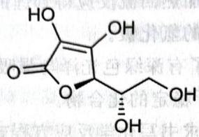

chemical

Chemical structure of a cyclic ester with multiple hydroxyl groups and a ketone group

药物中的抗坏血酸含量测定可在淀粉指示下用碘酸钾在 0.5mol/L 盐酸介质中滴定。反应形成碘单质和 $C_{6}H_{6}O_{6}(DHA)$ 。

1. 写出滴定反应的化学方程式和产生碘单质的反应方程式。

DHA 会缓慢地转换为戊沙罗糖 $C_{5}H_{8}O_{5}$ ，这是由于水的加成与脱羧反应。戊沙罗糖迅速地（至少比前一阶段快）减少，与第二分子 AA 反应产生木糖 $C_{5}H_{10}O_{5}$ 和另一分子的 DHA。然后木糖徐徐环化产生糠醛 $C_{5}H_{4}O_{2}$ 。

2. 写出在 AA 溶液储藏过程中发生上面转化的化学方程式。

3. 除了上述提到的反应外,还有什么副反应同样也可以降低储藏过程中 AA 在溶剂中的浓度?

如果 AA 在碘酸盐中的转化发生在 5mol/L 的盐酸介质中,那么碘酸盐也会被进一步还原为碘化物,所以控制 pH 是十分重要的。7.00mL 的 0.100mol/L 的碘酸盐溶液会被 0.300mmol 的 AA 还原。

4. 在这个条件下抗坏血酸的氧化产物又是什么？推理写下转化的反应和产物的结构，已知没有其他含碳产物在反应中出现。

【习题 1.66\*】根据所给条件按照要求书写化学反应方程式(要求系数为最简整数比)。

1. 将 $Ag_{2}O$ 投入 $KMnO_{4}$ 的强碱性溶液中, 得到少量 $AgO_{2}$

2. 在 213K 温度条件下, $\mathrm{AlB}_{3}\mathrm{H}_{12}$ 与氯化氢迅速反应,生成一种常见固体和两种还原性气体

3. 反滴定法测定砷的含量时,采用 $Na_{2}HPO_{4}-I_{2}$ 溶液溶解含有 $AsCl_{3}$ 的样品。

4. 六氰合钴(Ⅲ)酸钾在 1:1 硫酸中煮解,生成两种气态化合物。

5. $PSCl_{3}$ 在 NaOH 中煮解，仅生成两种盐。

6. NaCN 存在下 Cu 从 Bi(OH) $_{3}$ 中沉淀出 Bi。

## 第2讲 原子结构

本讲我们回顾原子结构。

## § 2.1 原子轨道的获得

现代化学的基础是物理学的量子力学理论,对原子结构的研究是从求解或近似求解系统的量子力学方程开始的,所以在谈论构造原理之前,我们先简要说说 s、p、d、f 等轨道是如何得到的,以便于对量子数的取值和原子轨道有更好的理解。

为了描述微观体系,一种方法是假定体系的电子状态(严格地说是定态)能由波函数 $\psi$ 描述,例如 H 原子就用一个电子的 $\psi(x,y,z)$ 表示(这里实际上还隐含了 Born-Oppenheimer 近似,即我们在数学上将原子核的波函数和电子的波函数分离开来了。这样做的合理性在于原子核的质量远大于电子,而且在化学的讨论中,我们一般只关心电子的波函数)。通过求解 Schrödinger 方程可以得到电子的波函数(在原子中,电子的波函数也称为原子轨道)。

利用一系列数学手段可精确求解 H 原子, 求解时为了分离变量, 要取球坐标 $\psi = R(r)Y(\theta, \varphi)$ 。求解完毕后, 系统自然地出现量子化——发现波函数的具体形式中, R 与主量子数 n 及角量子数 l 有关, Y 则与角量子数及磁量子数 m 有关, 加上一个格拉赫实验引入的自旋量子数 $m_{s}$ , 它们构成了原子中电子的组态。由于一般微分方程都有多组解, 故各量子数取不同的适当值时都是合理的电子波函数。不过其中能量最低的才是我们最关心的, 整个原子能量最低的状态称为基态。这些量子数的取值和意义如下

1. 主量子数 n: 规定电子出现最大概率区域离核的远近和电子能量的高低。在单电子原子中, 轨道能由主量子数唯一确定。  
- 电子径向分布(即 $kr^2 R^2(r)$ , 正比于离核距离为 $r$ 的球壳上电子出现的概率密度)的主峰位置随主量子数增加而离核渐远, 可粗略地认为电子离核的距离随着主量子数的增加而增加。  
- 凡 n 相同的电子称为同层电子, 依次用光谱学符号 KLMNOP…表示。  
- 取值: 0,1,2,…。

2. 角量子数 $l$ : 决定电子角动量的大小, 规定了电子在空间角度分布情况, 与电子云的形状相关。例如 s、p、d 轨道形状不同, 主要是因为角量子数不同。

\- 多电子原子中 $l$ 与电子能量有关, 通常将 $l$ 相同的同层电子归为一亚层。

\- 取值: 0,1,…,n-1。取这些角量子数的轨道依次用光谱学符号 s、p、d、f、g 等表示。

3. 磁量子数 $m$ : 反映原子轨道在空间上的取向。不同取向的电子在磁场作用下能级分裂。例如 $\mathbf{p}_x, \mathbf{p}_y, \mathbf{p}_z$ 之间的区别主要在磁量子数。

\- 取值: $-l, -(l-1), \cdots, 0, \cdots, l-1, l$ 。

4. 自旋量子数 $m_{s}$ : 表示电子自旋。

\- 取值: ±0.5。

从上述量子数的取值中可以算出,第 n 层最多容纳 $2n^{2}$ 个电子。

波函数的形状对分析物质的化学性质很有用处,请大家注意 d、f 轨道的取向(即它们分别位于空间中的哪些点集上)和波相(下图中用黑色和灰色球分别表示波函数取正值和负值的点集)取值,下图示出了常见轨道的形状。这些轨道的命名通常与其表达式和节面(波函数为零的空间点集)有关。例如 $d_{x^{2}-y^{2}}$ 轨道的波函数正比于 $(x^{2}-y^{2})/r^{2}$ , 它在 $x=\pm y$ 的位置有节面。注意, 几何上具有 4 个花瓣状的 d 轨道电子云密度最大的地方是波瓣的中心附近。

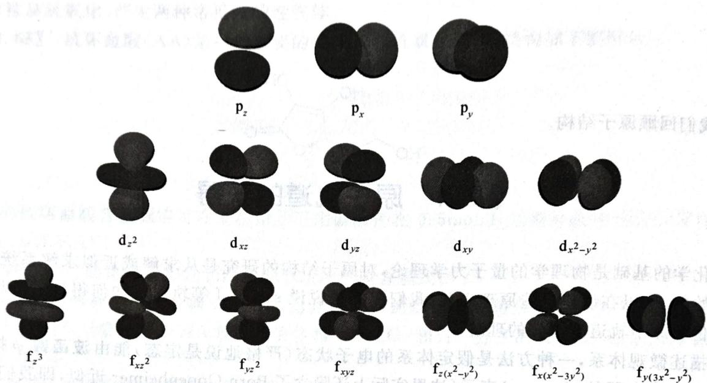

text_image

p_z
p_x
p_y
d_z^2
d_xz
d_yz
d_xy
d_x^{2-y^2}
f_z^3
f_xz^2
f_yz^2
f_xyz
f_{z(x^2-y^2)}
f_{x(x^2-3y^2)}
f_{y(3x^2-y^2)}

常见原子轨道的形状

## § 2.2 构造原理

前一节获得原子轨道时,考虑的是最简单的单电子原子(氢原子)。现在要考虑多电子原子的求解。由于电子之间有相互作用,因此 Schrödinger 方程中的势能算符格外复杂,分离变量有困难,在数学上精确求解比较难。但可以证明,每个电子都有一定的波函数,不同的电子占据不同的轨道,而且波函数的形状还是与氢原子类似的,因此我们在上一节列出的波函数形状仍然有用。

那么,多电子原子的电子结构与单电子原子有何不同呢?由于电子之间的相互作用,多电子原子中电子的能量不仅与主量子数有关,而且它们之间还会相互影响,因此要注意电子在原子轨道上的排布顺序问题(即基态时各电子波函数中量子数的取值),基态原子中电子的这一排布规则就是我们说的构造原理。叙述如下:

1. 电子总是首先填入能量最低的原子轨道。(能量最低原理)  
2. 不存在四个量子数完全相同的电子。(Pauli 不相容原理)  
3. 电子在能量相同的轨道上分布时,总是尽可能以相同自旋分占不同的轨道。(Hund 规则)让我们来简要解释一下这些规则背后的原理。

Pauli 不相容原理与电子的某些特性有关。电子是不可区分的费米子，它的波函数必须关于状态交换反对称 $(\psi(x_1, x_2) = -\psi(x_2, x_1))$ 。由该原理非常容易地就能推出，假定有两个电子四个量子数完全相同，则体系的波函数为 0，所以是不合理的。

Hund规则则与一种称作交换能的非经典能量有关。交换能是指，自旋相同的电子相互交换而不可区分所导致的能量降低。例如，下图所示轨道中的电子可以相互交换而不能相互区分。可以作12、13、23三种交换，所以贡献了 $3K_{0}$ 的能量降低， $K_{0}$ 为一份交换能。

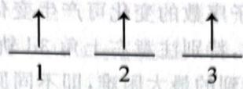  
交换能

回忆 N 反常的第一电离能, Cu 和 Cr 反常的电子排布等现象, 我们常用半充满和全充满的轨道稳定性较高解释它们。虽然这个解释的演绎能力不强(考虑不够全面), 但仍然有一定的道理。因为我们注意到, 半充满和全充满的轨道具有很高的交换能。

从以上讨论中容易发现,原子的电子排布仍然取决于能量,能量最低原理是最本质的因素,故从能量上理解是比较重要的。Koopmans 证明了电子的能量可以近似写为

$$
E = E _ {\mathrm{p}} + E _ {\mathrm{k}} + \sum_ {i <   j} J _ {i j} - \sum_ {i <   j} K _ {i j},
$$

上式中，右侧各项分别为势能（单电子轨道能）、动能、粒子间排斥能和粒子间交换能，而电子的电离能 $I$ 近似等于轨道能量的负值 $-E$ ，由此我们可以对一些轨道的能量进行讨论。下面是一个电子排布的经典问题。

【例 2.1】我们可使用下述实验数据唯象地解释为何 Sc 先填 4s 电子,却又先电离 4s 电子。

$$
\left\{\begin{array}{l l}\mathrm{Sc} ^ {2 +} (3 \mathrm{d} ^ {1} 4 \mathrm{s} ^ {0}) \rightarrow \mathrm{Sc} ^ {3 +} (3 \mathrm{d} ^ {0} 4 \mathrm{s} ^ {0})&E _ {1} = 2 4. 7 5 \mathrm{eV},\\\mathrm{Sc} ^ {2 +} (3 \mathrm{d} ^ {0} 4 \mathrm{s} ^ {1}) \rightarrow \mathrm{Sc} ^ {3 +} (3 \mathrm{d} ^ {0} 4 \mathrm{s} ^ {0})&E _ {2} = 2 1. 6 0 \mathrm{eV},\\\mathrm{Sc} ^ {+} (3 \mathrm{d} ^ {1} 4 \mathrm{s} ^ {1}) \rightarrow \mathrm{Sc} (3 \mathrm{d} ^ {1} 4 \mathrm{s} ^ {2})&E _ {3} = - 6. 6 2 \mathrm{eV},\\\mathrm{Sc} ^ {+} (3 \mathrm{d} ^ {0} 4 \mathrm{s} ^ {2}) \rightarrow \mathrm{Sc} (3 \mathrm{d} ^ {1} 4 \mathrm{s} ^ {2})&E _ {4} = - 7. 9 8 \mathrm{eV},\\\mathrm{Sc} (3 \mathrm{d} ^ {1} 4 \mathrm{s} ^ {2}) \rightarrow \mathrm{Sc} (3 \mathrm{d} ^ {2} 4 \mathrm{s} ^ {1})&E _ {5} = 2. 0 3 \mathrm{eV}.\end{array}\right.
$$

(数据来源:周公度,段连云.结构化学基础.北京:北京大学出版社,2002)

下面我们计算 Sc 和相应离子的不同电子排布的能量。暂时忽略交换能(这里交换能占比不大)，并以 Ar 为能量参比。由 Koopmans 的近似公式知道，确定 Sc 的电子排布需要下列参数：在 4s 上填一个电子的势能 $U_{4}$ 、在 3d 上填一个电子的势能 $U_{3}$ 、3d-3d 排斥能 $J_{dd}$ 、3d-4s 排斥能 $J_{ds}$ 和 4s-4s 排斥能 $J_{ss}$ 。据此可利用已知数据列出方程组

$$
\left\{ \begin{array}{l} U _ {3} = - 2 4. 7 5, \\ U _ {4} = - 2 1. 6 0, \\ U _ {4} + J _ {\mathrm{ds}} + J _ {\mathrm{ss}} = - 6. 6 2, \\ U _ {3} + 2 J _ {\mathrm{ds}} = - 7. 9 8, \\ U _ {3} - U _ {4} - J _ {\mathrm{ss}} + J _ {\mathrm{dd}} = 2. 0 3, \end{array} \right.
$$

解出三个库仑排斥: $J_{dd}=11.78, J_{ds}=8.38, J_{ss}=6.60$ 。
中性 Sc 的电子排布可能包括 $3d^{1}4s^{2}$ 、 $3d^{3}4s^{0}$ 、 $3d^{2}4s^{1}$ 三种。根据 Koopmans 定理很容易给出这三种排布对应的能量：

$$
\left\{ \begin{array}{l} E _ {3 \mathrm{d} ^ {1} 4 \mathrm{s} ^ {2}} = 2 U _ {4} + U _ {3} + 2 J _ {\mathrm{ds}} + J _ {\mathrm{ss}} = - 4 4. 5 9, \\ E _ {3 \mathrm{d} ^ {3} 4 \mathrm{s} ^ {0}} = 3 U _ {3} + 3 J _ {\mathrm{ss}} = - 3 8. 9 1, \\ E _ {3 \mathrm{d} ^ {2} 4 \mathrm{s} ^ {1}} = 2 U _ {3} + U _ {4} + 2 J _ {\mathrm{ds}} + J _ {\mathrm{dd}} = - 4 2. 5 6 。 \end{array} \right.
$$

从计算中我们得到结论: Sc 的电子排布是 $[Ar]3d^{1}4s^{2}$ ，因为它是三种排布不能完全的，3d 能量低于 4s（在填入电子前）。在 $Sc^{3+}$ 中填三个电子时，第一个电子因 3d 能量低而填入，接下来的电子为了避开 d 电子之间较高的排斥而填入 4s。

显然，这样的讨论对 $Sc^{+}$ 和 $Sc^{2+}$ 都适用（同学们不妨计算验证）。所以在表观上，Sc 是先填 4s 电子，又先电离 4s 电子。

从上例中可看出,轨道能量随着原子序数的变化可产生变化,影响原子基态的电子排布。轨道能量随原子序数变化的详细图像如下图所示,特别注意右上角3d轨道能量对4s相应图线的一次穿越。这正是处理多电子原子轨道排布顺序时遇到的最大困难,即不同原子序数的多电子原子中,低主量子数的轨道不一定是能量低的,换言之,发生能级交错。

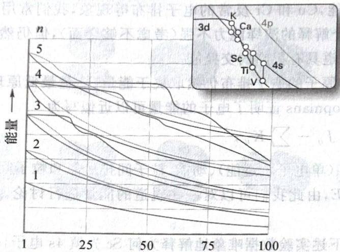

line chart

| n  | 能量 (Line 1) | 能量 (Line 2) | 能量 (Line 3) | 能量 (Line 4) | 能量 (Line 5) |
|----|----------------|----------------|----------------|----------------|----------------|
| 1  | ~1.5           | ~1.8           | ~2.0           | ~2.2           | ~2.5           |
| 25 | ~1.2           | ~1.6           | ~1.9           | ~2.1           | ~2.4           |
| 50 | ~1.0           | ~1.4           | ~1.7           | ~1.9           | ~2.2           |
| 75 | ~0.8           | ~1.2           | ~1.5           | ~1.7           | ~1.9           |
| 100| ~0.6           | ~1.0           | ~1.3           | ~1.5           | ~1.7           |

原子序数 $Z$  
轨道能量随原子序数变化的图像

(数据来源: Atkins, Peter, and Tina Overton. Inorganic Chemistry. Oxford University Press, USA, 2010)

Pauling 通过总结大量光谱数据导出了电子排布的一般顺序, 即

$$
n s > (n - 1) d > (n - 2) f > n p 。
$$

电子排布按这个顺序依次进行,如果有 d、f 轨道则其优先于 p 轨道排布电子,排满之后再进入下一层 s 轨道。

这样的排布规则可以对周期表不少原子基态的电子排布作出正确预言。然而这一能级交错规则还有很多反例:即便使用了有一定合理性的半满和全满规则,也存在一些奇怪的例子(比如 Nb、Ru、Rh、Pd 等元素)。利用能量的观点可以定性地去解释这种现象(参阅 Rich, Ronald. Periodic Correlations. WA Benjamin, USA, 1965)。

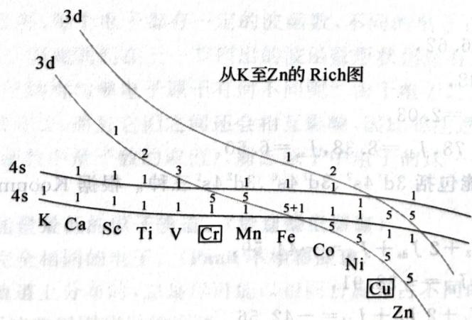

line chart

| Element | Value |
| ------- | ----- |
| K       | 1     |
| Ca      | 1     |
| Sc      | 1     |
| Ti      | 1     |
| V       | 1     |
| Cr      | 5     |
| Mn      | 5     |
| Fe      | 5+1   |
| Co      | 5     |
| Ni      | 5     |
| Cu      | 5     |
| Zn      | 5     |

第四周期过渡元素的电子填充解释(不规则元素加框表示)

如上图所示,为解释第四周期过渡元素的电子填充,我们画出3d和4s轨道的能量随着原子序数Z变化的粗略曲线,两个轨道的能量都随着原子序数的增加而下降。两条“平行”的曲线之间的能量差一个轨道成对能。电子总是先填满较低能量的轨道,再向上填。当出现电子成对时,填充降低的能量会变少。易看出,Cr处第一次出现4s能量低于一个3d加上成对能的能量,而Cu处第一次出现3d与成对能的能量低于4s与成对能的能量,因此体系出现了“反常”。下图也示出了对第五周期过渡元素类似的解释。

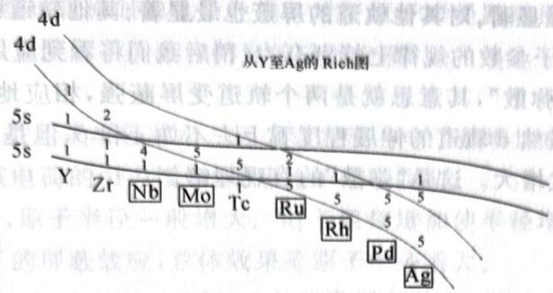

text_image

4d
4d
从Y至Ag的 Rich图
5s
1 2
5s
1 4 5 2 1 1
Y Zr Nb Mo Tc Ru Rh Pd Ag

第五周期过渡元素的电子填充解释(不规则元素加框表示)

【习题 2.2】仿照上述例子,解释第六周期过渡元素的电子排布。

## § 2.3 屏蔽效应和钻穿效应

上文反复强调,多电子原子的 Schrödinger 方程求解十分困难,因为电子之间的相互作用影响了势能的表达;我们可以引进多种方法定性处理这一困难。

从具体求解方程的角度看,依照势能项的物理意义,我们知道它描写了电子之间的相互排斥,相当于核对电子的吸引被削弱了,故这一势能项应该能近似等效地看成核电荷Z被削弱为有效核电荷 $Z^{*}$ 。设法优化该有效核电荷,使得体系的能量最低,就能以单电子近似处理多电子原子。这就是有效核电荷的来源。这一结果在定性意义上定义为屏蔽效应,是我们前面引出的“电子排斥”现象的一种近似刻画。

在多电子的中性原子中,每个电子除了受原子核的吸引外,同时还受其他电子的排斥,相当于部分抵消了原子核对该电子的吸引,这种由核外电子云抵消部分核电荷作用的现象称为屏蔽效应。

另一个类似且重要的效应是钻穿效应。

另一个类似且重要的效应是钻穿效应。钻穿效应是指 $n$ 相同、 $l$ 不同的轨道，由于电子云径向分布不同，电子穿过内层钻穿到核附近回避其他电子屏蔽的能力不同从而使其能量不同的现象。

我们来看看两个效应的定量反映和性质。

我们来看看两个效应的定量反映和性质。
对于一个半径为 r，厚度为 dr 的球壳，其体积为 $4\pi r^{2} \, dr$ ，电子在球壳中出现的概率正比于 $4\pi r^{2} R^{2}(r)$ ，这就是径向概率密度分布函数 P。径向概率密度分布函数可以部分地反映电子云的稀疏程度随着与核之间距离 r 的变化而变化的情况。由此以 r 对 P 作图，得到 3s、3p、3d 的相应分布函数如下图所示。

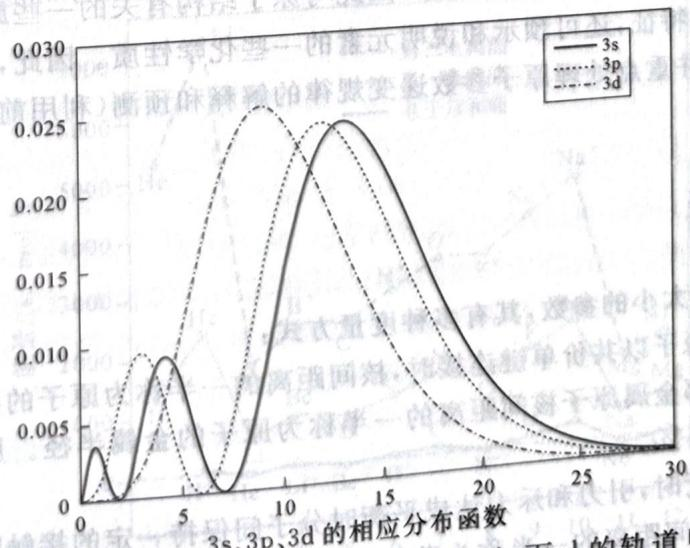

line chart

| 轨道量 | 3s     | 3p     | 3d     |
| ------ | ------ | ------ | ------ |
| 0      | 0.0000 | 0.0000 | 0.0000 |
| 5      | 0.0100 | 0.0100 | 0.0100 |
| 10     | 0.0250 | 0.0250 | 0.0250 |
| 15     | 0.0250 | 0.0250 | 0.0250 |
| 20     | 0.0150 | 0.0150 | 0.0150 |
| 25     | 0.0050 | 0.0050 | 0.0050 |
| 30     | 0.0000 | 0.0000 | 0.0000 |

3s、3p、3d 的相应分布函数
从图中容易看出，s 轨道在近核处有一小峰，p 的小峰略远；而 d 的轨道只有一个主峰，s 轨道可能出现的位置比其他轨道更深。因此可以给出下面的性质：

性质 s 轨道钻穿效应最显著,对其他轨道的屏蔽也最显著;其他轨道则依次变弱。

这条性质在解释一些原子参数的规律上特别有力(稍后我们将看到应用)。

有人常说“d、f轨道比较弥散”，其意思就是两个轨道受屏蔽强，相应地屏蔽其他轨道的能力也弱。下图中示出了概率散点图，虽然d轨道的伸展程度看上去不如s和p，但是对点较多的高概率区域进行比较，发现s、p、d的范围依次增大。这是“弥散”的直观理解。

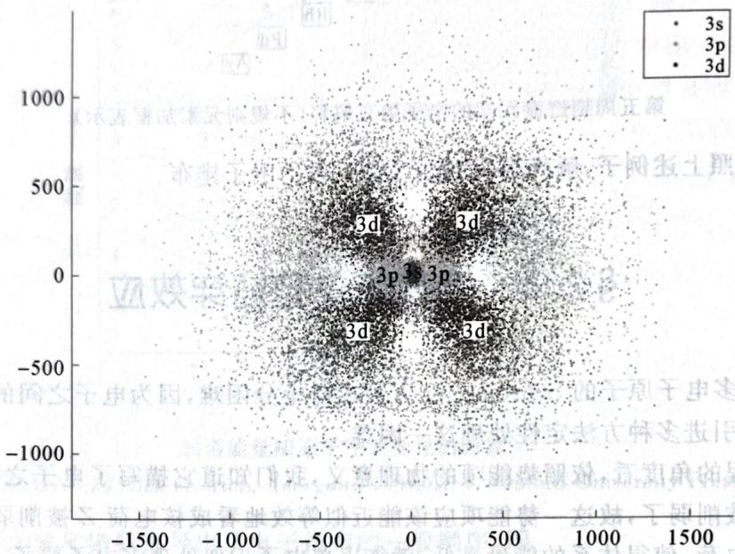

scatterplot

| x     | y     | Label |
|-------|-------|-------|
| -200  | 200   | 3d    |
| 0     | 0     | 3p    |
| 200   | -200  | 3d    |
| 400   | -400  | 3d    |
| 600   | 400   | 3d    |

3s、3p、3d 轨道的密度散点图

屏蔽和钻穿效应也可以解释能级交错现象。我们再次强调，不论是我们在前一节引入的成对能、交换能，还是本节的屏蔽效应，都是对势能算符中排斥项的理解，因此，解释电子排布的规律（尤其是能级交错），重要的是引入一些“电子相关作用”。更详细地解释反常电子构型还需要更多物理上的知识，这里就不再介绍了。

## § 2.4 原子参数

原子的电子层结构具有周期性的变化规律,因此与原子结构有关的一些原子基本性质(原子参数),不仅足以描述一个原子的特征,还可预示和说明元素的一些化学性质。因此,我们在本节重申原子参数的各种概念的正确叙述,并重点处理原子参数递变规律的解释和预测(利用前文谈电子结构时提及的各种原理)。

## 2.4.1 原子半径

原子半径是描述原子大小的参数,其有多种度量方式:

- 同种元素的两个原子以共价单键连接时，核间距离的一半称为原子的共价半径。  
- 在金属晶格中相邻金属原子核间距离的一半称为原子的金属半径。原子的金属半径一般比其单键共价半径大 $10\% \sim 15\%$ 。  
- 两个分子相互接近时，引力和斥力达成平衡时分子间保持一定的接触距离。相邻两个分子中相互接触的那两个原子的核间距离的一半称为范德华半径。一般只有稀有气体才使用这种原子半径定义，显然范德华半径会非常大。

通常原子半径相近的元素具有相似的化学性质。对于原子半径跟随原子序数递变的规律，我们可观察并解释如下，注意我们大量使用了屏蔽和钻穿效应的性质。

## 【例 2.3】

1. 同一短周期中自左至右原子半径减小。因为自左至右电子都增加在同一外层，电子在同一层内的相互屏蔽作用较小，所以核电荷的引力增强，导致原子半径收缩。  
2. 同一主族中由上而下，原子半径一般增大。电子层数增加使半径增大，虽然核电荷增加会使半径趋于缩小，但由于内层电子的屏蔽效应，总体效果是原子半径增大。  
3. 过渡元素由于电子逐一填入 $(n - 1)\mathrm{d}$ 层，d电子受屏蔽较大，因此半径减少幅度较主族元素小。内过渡元素的电子填入 $(n - 2)\mathrm{f}$ 层，f电子受屏蔽作用更大，收缩幅度更小。这一现象具有重要的化学意义，参看马上要提到的镧系收缩和次级周期性。

## 2.4.2 镧系收缩

镧系收缩是一个比较容易混淆的概念。镧系收缩现象一般可以概括为以下两点：

1. 镧系元素的原子半径比正常预期小。  
2. 镧系元素原子半径的下降速度很慢。

利用屏蔽效应,可以对该现象作如下解释:

镧系元素电子第一次填入 f 轨道，f 电子受屏蔽大，对外层屏蔽差。这致使有效核电荷相比主族下降慢得多，因此原子半径比预期小，而且原子半径下降也很慢。实际上，第一次出现 f 电子的断言还可以用于其他现象的解释。例如，类似地，第一次出现 d 电子的周期亦应该出现一些反常现象，我们之后会看到这些例子（次级周期性）。

会看到这些例子(次级周期性)。
由于原子半径比预期小,部分抵消了之后周期增加导致的半径增大,因此第五、六周期过渡元素的原子半径相近,它们的化学性质非常相近,分离有一定困难。

## 2.4.3 电离能

基态的气体原子失去最外层的第一个电子成为气态+1价离子所需的能量叫第一电离能 $(I_{1})$ ，再相继逐个失去电子所需的能量称为第二、第三电离能 $(I_{2}, I_{3}, \cdots)$ ，等等。电离能是决定元素常见价态的重要因素之一。

因系之一。
下图示出了两级电离能和电子亲和能的部分变化图线。

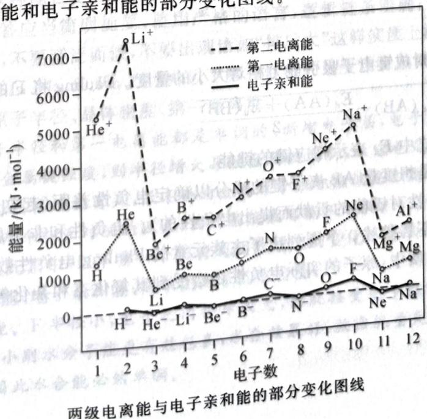

line chart

| 电子数 | 第二电离能 (kJ·mol⁻¹) | 第一电离能 (kJ·mol⁻¹) | 电子亲和能 (kJ·mol⁻¹) |
| ------ | --------------------- | --------------------- | --------------------- |
| 1      | 5500                  | 1500                  | 0                     |
| 2      | 7500                  | 2500                  | 0                     |
| 3      | 2000                  | 1000                  | 0                     |
| 4      | 2500                  | 1200                  | 0                     |
| 5      | 2800                  | 1300                  | 0                     |
| 6      | 3200                  | 1500                  | 0                     |
| 7      | 3800                  | 1800                  | 0                     |
| 8      | 4000                  | 1900                  | 0                     |
| 9      | 4500                  | 2200                  | 0                     |
| 10     | 5200                  | 2800                  | 100                   |
| 11     | 2500                  | 1500                  | 50                    |
| 12     | 2800                  | 1800                  | 100                   |

电离能的数值与原子的有效核电荷密切相关。第一电离能的变化规律总体与原子半径变化规律一致。但是有几个现象值得注意：

1. 主族元素第一电离能的递变会出现非单调，例如 C、N、O 中 N 第一电离能最大。  
2. 第六周期元素的电离能明显增大,甚至出现所谓 $6s^{2}$ 惰性电子对效应(即这对电子很难电离,而电离了相应电子的物种氧化性强,如四价铅;保留相应电子的物种稳定,如亚汞离子以二聚形式存在).  
半满和全充满规则能对上述第一个现象做出解释。而第六周期元素电离能的增大，实际上就部分来自镧系收缩：由于f电子对外屏蔽差，因此外层电子能量相对降低，电离能会增加。

## 2.4.4 次级周期性

利用上述理论,可以预见周期表中元素化合物的另一个重要性质,即次级周期性。次级周期性一般指第四、六周期主族元素高价化合物不同寻常的氧化性和酸性。譬如,浓热的 $H_{2}SeO_{4}$ 可以氧化 Au, $SeO_{2}$ 可以氧化空气中的有机尘埃; $PbO_{2}$ 、 $Tl_{2}O_{3}$ 、 $NaBiO_{3}$ 都较难制备,而且可以把 $Mn^{2+}$ 氧化为 $MnO_{4}^{-}$ ,等等。利用我们给出的屏蔽效应和钻穿效应的论点,我们可解释说:

【例 2.4】第四周期和第六周期分别第一次出现 d、f 轨道, 这些轨道对外层电子的屏蔽较差, 有效核电荷增加, 导致外层电子难以电离, 相应高价化合物的氧化性增强。此外, 由于 s 电子强的钻穿效应, 其能量变得更低。对于第六周期, 我们还指出, 由于重原子的相对论性效应, s 电子质量增加, 能量降低, 导致氧化性更强。(如果用经典 Bohr 模型去理解相对论性效应, 就是说高周期的电子做半径较大的圆周运动, 速度较快, 甚至接近光速, 因此质量增加。)

## 2.4.5 电子亲和能

电子亲和能是一个相对不重要的概念。

原子的电子亲和能是指一个气态原子得到一个电子形成气态负离子所放出的能量, 常以符号 $E_{a}$ 表示。电子亲和能等于电子亲和反应焓变的负值, 其值相对于电离能一般都比较小 (因为电离时降低了电子之间的排斥, 而添加电子则增加了不少新的排斥)。

提请同学们注意,电子亲和能在半充满、全充满电子构型,以及卤素中可能出现不单调的情况。例如,卤素中 Cl 的电子亲和能最大,这是因为 F 的半径太小,虽然有较低的轨道势能,但增加电子后其排斥能较大,导致 F 的电子亲和能不太大。

## 2.4.6 电负性

电负性是分子中原子对成键电子吸引能力相对大小的量度。Pauling 将 F 的电负性规定为 4.00，并以

$$
\mid \chi_ {\mathrm{A}} - \chi_ {\mathrm{B}} \mid = \sqrt {E _ {\mathrm{d}} (\mathrm{AB}) - \frac {E _ {\mathrm{d}} (\mathrm{AA}) + E _ {\mathrm{d}} (\mathrm{BB})}{2}}
$$

计算其他元素的电负性,式中 $E_{d}$ 表示相应键的键能。

Pauling 提出电负性是想度量 AB 离子键的成分以确定电负性差距(起初 Pauling 单纯是为了衡量不同原子之间成键的离子性对键能的贡献而提出电负性的)。电负性和非金属性、金属性、电离能等性质的递变规律几乎一样,不再赘述。下图列出了主族元素的 Pauling 电负性数据,其中带有括号的数据准确性稍差。在具体的物质中,原子的实际电负性还会受到其氧化态和杂化等因素的影响。

主族元素的Pauling电负性数据

<table><tr><td>1</td><td>2</td><td>12</td><td>13</td><td>14</td><td>15</td><td>16</td><td>17</td><td>18</td></tr><tr><td>H</td><td></td><td></td><td></td><td></td><td></td><td></td><td></td><td>He</td></tr><tr><td>2.300</td><td></td><td></td><td></td><td></td><td></td><td></td><td></td><td>4.160</td></tr><tr><td>Li</td><td>Be</td><td></td><td>B</td><td>C</td><td>N</td><td>O</td><td>F</td><td>Ne</td></tr><tr><td>0.912</td><td>1.576</td><td></td><td>2.051</td><td>2.544</td><td>3.066</td><td>3.610</td><td>4.193</td><td>4.787</td></tr><tr><td>Na</td><td>Mg</td><td></td><td>Al</td><td>Si</td><td>P</td><td>S</td><td>Cl</td><td>Ar</td></tr><tr><td>0.869</td><td>1.293</td><td></td><td>1.613</td><td>1.916</td><td>2.253</td><td>2.589</td><td>2.869</td><td>3.242</td></tr><tr><td>K</td><td>Ca</td><td>Zn</td><td>Ga</td><td>Ge</td><td>As</td><td>Se</td><td>Br</td><td>Kr</td></tr><tr><td>0.734</td><td>1.034</td><td>1.588</td><td>1.756</td><td>1.994</td><td>2.211</td><td>2.424</td><td>2.685</td><td>2.966</td></tr><tr><td>Rb</td><td>Sr</td><td>Cd</td><td>In</td><td>Sn</td><td>Sb</td><td>Te</td><td>I</td><td>Xe</td></tr><tr><td>0.706</td><td>0.963</td><td>1.521</td><td>1.656</td><td>1.824</td><td>1.984</td><td>2.158</td><td>2.359</td><td>2.582</td></tr><tr><td>Cs</td><td>Ba</td><td>Hg</td><td>Tl</td><td>Pb</td><td>Bi</td><td>Po</td><td>At</td><td>Rn</td></tr><tr><td>0.659</td><td>0.881</td><td>1.765</td><td>1.789</td><td>1.854</td><td>(2.01)</td><td>(2.19)</td><td>(2.39)</td><td>(2.60)</td></tr></table>

(数据来源: Miessler, Gary L. Inorganic Chemistry. Pearson Education, 2008)

## § 2.5 核反应

核反应指的是某种微观粒子与原子核相互作用(碰撞),使核的结构发生变化,形成新核,放出一个或几个粒子的过程;重核可以发生裂变。

在核反应前后,质子数、质量数均守恒,这是书写核反应方程式的依据。

【例题 2.5】 $^{48}$ Ca 轰击 $^{249}$ Cf，生成第 118 号元素 Og 并放出三个中子，写出配平的核反应方程式。

解 根据质子数守恒, 得 Cf 是第 118-20=98 号元素; 根据质量数守恒, 知道合成的 Og 质量数是 $48+249-3=294$ 。据此不难写出方程式:

$$
{ } _ { 2 0 } ^ { 4 8 } \mathrm{Ca} + { } _ { 9 8 } ^ { 2 4 9 } \mathrm{Cf} \longrightarrow { } _ { 1 1 8 } ^ { 2 9 4 } \mathrm{Og} + 3 _ { 0 } ^ { 1 } \mathrm{n} 。
$$

## § 2.6 问题选讲

本节开始我们会接触到无机解释题,解释(预测)题是非常杂的一类题目,要求同学们对理论有深刻的理解和灵活的运用。这种题目是比较容易因为逻辑不清而丢分的。

解这种题,要注意回答应当简明扼要,使用严格的语言,逻辑链条明确;切忌长篇大论,不着边际。此外,回答时要具体分析,不要泛泛而谈,不要出现诸如“排斥大”这样实质上没有回答问题的宽泛答案。

【例题 2.6】 碱金属 Li、Na、K、Rb、Cs 中，以下哪种性质的递变没有单调性？解释原因。

供选择项:熔沸点、原子半径、晶体密度、第一电离能。

解 一看就知道原子半径和第一电离能都是单调的(新增电子层,电子能量和原子半径都必然增大)。熔沸点一般须考虑金属键强度,则半径增大导致金属键削弱,故它也是单调的。因此答案可能是晶体密度。原因是密度与晶格结构有关,低半径的金属原子堆积应该要比高半径的更密,而高半径的相对原子质量却更大,存在两个相互对抗的因素,因此密度最可能不单调。

【例题 2.7】ⅦA族元素中,以下哪一个随着周期数增加的变化不是单调的?说明推测理由。

供选择项:第一电离能、电子亲和能、简单阴离子的水合能。

解 选择电子亲和能。F 半径小，电子之间排斥较大，因此接受电子放出的能量不如 Cl。水合能当然取决于离子半径，越小则水分子能更有效包裹，水合效果好，放出能量大；况且 F 还能与水分子形成氢键，放出大量能量，因此水合能必然单调。

【例题2.8】铁系元素(Fe、Co、Ni)按原子序数变大的顺序熔点递减。请你考虑它们的原子结构，从电子排布和金属键的角度给出一个可能的解释。

解 Fe 开始之后电子开始填入反键轨道,金属键减弱。

【习题 2.9】对卤族元素,随着原子序数增加,以下何者的递变不是单调的?说明为何不单调。

供选择项: 负离子半径、电负性、单质熔沸点、单质键能。

## 第2讲习题

【习题2.10】 $\mathbf{f}_{\mathbf{z}}^{3}$ 轨道的角向函数为

$Y \propto \frac{z(5z^{3}-3r^{2})}{r^{3}}$ ，式中 r 代表相应点到原点（原子核）的距离。

指出该原子轨道有几个径向节面,有几个角向节面。写出角向节面的表达式并画出该轨道的简图。(提示:节面是指波函数为0的几何点的集合。)

【习题 2.11】 在第一过渡系元素的电子结构中,经验表明,电子总是先填 4s 轨道却又是 4s 轨道上的电子优先电离。定性解释原因。

【习题 2.12】下列有关同周期元素化合物的判断中只有一项错误,指出错误并说明理由。

a. 酸性: HI>HCl b. 氧化性: 浓 $H_{2}SO_{4}$ >浓 $H_{2}SeO_{4}$ c. 键偶极矩: C—Cl>C—F

【习题 2.13】 对如下现象做逐一解释：

1. ⅢA族元素的电离能(单位:kJ/mol):B 801、Al 578、Ga 579、In 558、Tl 589。Al和Ga的电离能几乎一样,Tl的电离能反而比In大。

2. IB族元素从上至下最稳定的价态(水溶液中)分别是+2、+1、+3。

3. I A 族元素从 Li 到 Ca 电离能下降得比 Ca 到 Cs 快得多。

【习题 2.14\*】 在英国,许多街道都是由效率很高的低压放电钠灯照明的。这种灯主要发出黄光,但光谱表明它实际上放出多种色光。仔细的光谱分析能够让我们得到 Na 的第一电离能。

1. 给出 Na 的外层电子排布和价电子排布。  
2. 我们熟知的黄光是由 Na 的电子从 3p 轨道到 3s 轨道的跃迁放出的, 其波长为 589.3nm。计算其能量(单位: kJ/mol)。  
3. 下表是一组 Na 的发射光谱谱线波长数据。Na 的价电子被激发到 $nd(n$ 即主量子数) 轨道，该电子落至 3p 轨道发射出了这些谱线。

<table><tr><td>波长/nm</td><td>466.6</td><td>498.0</td><td>568.1</td><td>818.1</td></tr><tr><td>轨道</td><td>6d</td><td>5d</td><td>4d</td><td>3d</td></tr></table>

使用合理近似求 Na 的第一电离能。

【习题 2.15】已知 $N_{2}$ 的键解离能为 946kJ/mol, $O_{2}$ 的键解离能为 498kJ/mol; N 和 O 的 Pauling 电负性分别为 3.04 和 3.44。估算吸热反应 $\mathrm{N}_{2}(\mathrm{~g}) + \mathrm{O}_{2}(\mathrm{~g}) \longrightarrow 2\mathrm{NO}(\mathrm{g})$ 的焓变 $\Delta H$ 。

【习题 2.16\*】与一般的印象不同,就事实而言,同位素会影响许多物质的化学性质,H 和 D 这一对同位素就是一个典型的例子。

1. H 和 D 在原子结构上有何不同？据此判断， $ND_{3}H^{+}$ 与 $NH_{4}^{+}$ 的 $pK_{a}$ （假设前者的数值为电离 $H^{+}$ 和 $D^{+}$ 的平均化的数值）哪个更大，并说明理由。  
2. 承上一问的思想, 已知二氧化碳在 $\mathrm{H}_{2} \mathrm{O}$ 和 $\mathrm{D}_{2} \mathrm{O}$ 中的 $\mathrm{pK}_{\mathrm{a}}$ 有微小的差异 (不考虑碳酸的影响), 比较在哪一种溶剂中的 $\mathrm{pK}_{\mathrm{a}}$ 更大, 并说明理由。

【习题 2.17】实验表明,第四周期过渡元素的正二价离子 $M^{2+}$ 水合热呈现出由 Sc 至 Cr,由 Mn 至 Cu 递增,其余部分递减的 M 形曲线。这和元素周期律的预测不符。

1. 若只按照元素周期律预测,应该呈现怎样的趋势?

2. 解释这种曲线出现的原因,并指出根据元素周期律作出预言的依据有何问题。(提示:考虑配合物相关理论。)

【习题 2.18】已知 N 和 Cl 的 Pauling 电负性分别为 3.04 和 3.16。

1. 根据 Pauling 电负性判断, $NH_{2}Cl$ 水解应该产生什么产物?

然而， $\mathrm{NH_2Cl}$ 实际上水解产生的产物与Pauling电负性的预测不符。现在考虑Allred-Rochow电负性，该电负性的定义为：

$$
\chi_ {\mathrm{AR}} = 3 5 9 0 \left(\frac {Z _ {\mathrm{eff}} - 0 . 3 5}{r ^ {2}}\right) + 0. 7 4 4,
$$

其中 $\chi_{AR}$ 为电负性，r 表示原子的共价半径（单位：pm）， $Z_{eff}$ 是原子的价层电子所受到的有效核电荷。已知 N 和 Cl 的共价半径分别为 70.0 和 99.0 pm，价层电子所受的有效核电荷可用 Slater 规则计算。

附 Slater 规则如下：

给定的电子(设其主量子数为 n, 角量子数为 l) 受到的有效核电荷 $Z_{eff}$ 等于核电荷数 Z 减去屏蔽常数 $\sigma$ , 其中屏蔽常数由其他电子对它的影响计算得出, 具体确定如下。

- 主量子数大于 $n$ 的电子忽略。  
- 每个具有相同主量子数 $n$ 的电子贡献 0.35 (对于 $n = 1$ 只记 0.3)。

\- 主量子数为 $(n - 1)$ 的电子，对于角量子数 $l = 0$ (s轨道)和 $l = 1$ (p轨道)，每个贡献0.85；对于角量子数 $l = 2$ (d轨道)和 $l = 3$ (f轨道)，每个贡献1.00。

\- 主量子数为 $(n - 2)$ 或更少的电子每个贡献1.0。

2. 确定 N 和 Cl 的 Allred-Rochow 电负性。由此给出的水解产物是什么？思考：为什么 Allred-Rochow 电负性在水解产物上的预测能力比 Pauling 电负性好？

【习题 2.19】1937 年,科学家用能量约 500MeV 的氘核轰击质量数为 96 的某一元素,两种原子核融合制得了第一个人造元素锝 Tc,同时释放出等量的另一种常见粒子。写出第一次制得 Tc 的核反应方程式。

【习题 2.20】1994 年诺贝尔和平奖获得者, 巴勒斯坦解放组织领导者阿拉法特, 在 2004 年 11 月突然不明不白地去世了。2012 年, 他的尸体被进行化验, 发现他竟然是被 X 的一种同位素毒害的。平均地看, 1mg 此物质 (半衰期 138.4 天) 的毒性与 $4.55g^{226}Ra$ (半衰期 1601 年) 相当。

1. 写出 $^{226}$ Ra 衰变的方程式。

2. 计算 X 的摩尔质量。

若尸体(70kg)的总 $\alpha$ 放射量减少到了 0.3Bq/kg，就难以发现隐藏在阴影中的真相了……(提示: Bq 的定义是每秒衰变的原子数目)设：(a) 最小致死量 $1\mu g$ ; (b) 正常人体(70kg)的 $\alpha$ 放射量为 0.2Bq/kg，这个值即使很长时间也不会变；(c) 有一种无放射性的同位素由 X 的 $\alpha$ 衰变生成。

3. 那么, 最迟在多久以前必须对尸体进行化验?

事实上，X 的中子数与质子数之比 $(N/Z)$ 为 1.50。 $1cm^{3}$ 的 X（密度为 $9.2g/cm^{3}$ ）单位时间能释放相当可观的能量（1210W），能与电熨斗媲美。这是它剧毒的原因。

4. 确定 X, 用元素符号表示之。

5. 计算 X 衰变生成的 $\alpha$ 粒子的初动能（以 MeV 为单位），假设动能完全转化为热能。

## 第3讲 分子结构

本讲我们回顾分子结构的基本理论。许多物质都是原子通过各种化学键，例如共价键和离子键结合形成的，因此描述分子的结构可以理解它们的化学性质。描述分子结构有多种方式，如从最简单的Lewis结构理论到(对我们来说)最复杂的分子轨道理论，对分子结构理论的理解程度影响着我们在之后有机化学等更深入话题中能达到的高度。

## § 3.1 Lewis 结构理论

Lewis 结构理论(1916)是经典的共价键理论,其主要观点是,共价键即共用电子对,在分子中共用电子对的形成使每个原子都达到稀有气体稳定结构,这是 Lewis 结构理论所指出的化学键的本质。它是非常有力的经典工具,也是有机化学基本理论的基础之一。
绘制 Lewis 结构式时的要求有:

(a)原子通过共用电子对形成分子：

(b)每个原子均达到稀有气体结构：

(c)用短线表示共价键,用点表示孤对电子,不要忘记标注孤对电子。

对于很多分子,原子形成稀有气体结构时,所成的共价键的电子来源可能不是均等的,即某些电子对完全由自己提供,或者完全由别的原子提供,这就好像“出现”了电荷,故需要引入形式电荷的概念。当然,形式电荷绝不是真实存在的电荷,其计算公式为:

$$
n _ {\mathrm{F}} = n _ {\mathrm{VE}} - n _ {\mathrm{LP}} - b,
$$

式中 $n_{F}$ 指形式电荷数，上式右边各项分别为原价电子数、孤电子数和成键数。例如，碳正离子的形式电荷为 4-3=1； $SOCl_{2}$ 中 S 的形式电荷为 6-2-3=1；等等。

一个能够加快形式电荷标注速度,快速给出体系中待画出的键数的规则如下(请同学们思考一下其中的原理):

(a)(价层电子数计数规则)每形成一根共价键,相当于原子多一个电子;配位键受体多2个电子,配位键给体不变。体系中应成的键数等于所有原子成键后希望得到的总电子数减去总价电子数再除以2。 $n_{成键数}=\frac{1}{2}\left(\sum n_{希望得到的电子数}-\sum n_{价电子数}\right)$ 。

(b)在保持稀有气体结构的前提下,若成键数比特征键数(一般指族数,例如碳为4,硼为3)多1,则形式电荷增加1,否则减少1;若不满足稀有气体结构,一般情况下特征键数减少1,则形式电荷增加1。(c)形式电荷的总和等于物种净电荷。这可用于检验形式电荷标注是否正确。

有时对于同一化合物,可画出多种 Lewis 结构式,对此 Pauling 引入了共振式的概念以完善对结构的描述。我们把某个化合物所有合理的 Lewis 结构式统称为(极限)共振式,它们形成的共振杂化体被认为是化合物的真实结构,但任何一种共振式都不是化合物的真实结构,最多只能反映其性质的一个侧面。

画共振式的时候可以运用电子推动的方法快速获得新的共振式。

共振式对化学反应的分析具有非常重要的作用,具体分析时可采用最稳定和次稳定的共振式;判断共振式稳定性次序时,应采用下述规则(此处按重要性不断降低排序):

(a) 满足稀有气体结构；  
(b)形式电荷绝对值不超过1;  
(c)电负性高的原子不承受正的形式电荷,电负性低的原子不承受负的形式电荷;  
(d)键数最多,键能要高;  
(e)形式电荷正负相邻。

后三条的排序需要相机而行,其重要性实际上差不多。通过对共振式稳定性的分析,我们能对物质的一些化学性质做出预测。

【例题 3.1】2013 年,科学家通过计算预测了高压下固态氮的一种新结构: $N_{8}$ 分子晶体。在分子晶体中, $N_{8}$ 分子呈首尾不分的链状结构;按价键理论,氮原子有 4 种成键方式;除端位以外,其他氮原子采用 3 种不同类型的杂化轨道。试给出其 Lewis 结构式。

解 由于 $\mathbf{N}_8$ 为链状分子, 因此一共要成 $8 \times (8 - 5) / 2 = 12$ 根键(按键数计算公式)。依照首尾不分的性质, 知道它有 $\sigma$ (镜面) 对称性, 连接中间两个 $\mathbf{N}$ 的键必为偶重, 从而为 2 , 有顺反异构; 于是两边各还有 $2 + 2 + 1$ 或 $3 + 1 + 1$ 根键。知道了这一点后就很好画了, 连好之后根据满足 8 电子的性质快速算出形式电荷。依同号形式电荷尽量不相邻(稳定性规则第 5 条), 选 $3 + 1 + 1$ (下图中右侧加粗的结构)。杂化已经在图中标出。

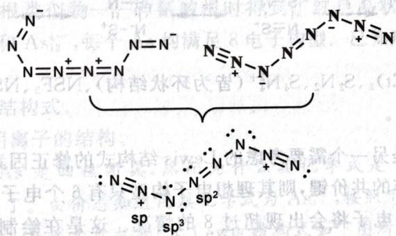

chemical

Chemical structure diagram showing a symmetric molecule with nitrogen and sp ligands, including a central N-N bond and a pyridine ring

上面已经说到,它有顺反异构体,即

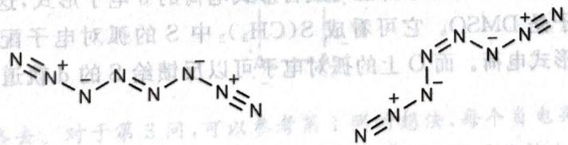

chemical

Chemical structure of a quaternary ammonium compound with N and N+ groups, showing charge distribution in 2D plane

【习题 3.2】在低温下 $NO_{2}Cl$ 和 $TMSN_{3}$ 发生反应得到了化学式为 $N_{4}O_{2}$ 的分子,该分子不含有 N—O—N 的连接方式。按价键理论,该分子中氮除端位之外,杂化形式包含了 $sp, sp^{2}, sp^{3}$ 。画出其 Lewis 结构式,标明形式电荷。

【例题 3.3】 Becker 在 1992 年首次合成了氰酸根的等电子体——磷氰酸根。一项研究表明，25℃、45℃下用 TMSOTf 对磷氰酸根“质子化”（硅基可看成大的质子）得到的产物不同。

1. 画出磷氰酸根的共振结构式，并分析各共振式的贡献大小。

2. 指出在不同温度下得到的产物分别为何,说明理由。

2. 指出在不同温度下得到的产物分别为何,说明理由。

解 容易画出共振式: $P \equiv C - O^{-} \longleftrightarrow^{-} P = C = O$ 。根据共振式稳定性规则,负电荷在高电负性的原子上稳定,因此左边的共振式贡献更大。由此,电荷在氧上更多,动力学上吸引较强,反应快,低温下生成 TMSOCP;而 $\pi$ 键 $C = O$ 比 $C \equiv P$ 更强,因此高温下生成热力学产物 TMSPCO。(稀释导体 57, No. 52 (2018): 16968-16994)

(Angewandte Chemie International Edition

共振式还有一种非正式但有用的形式:无键共振。顾名思义,一般的共振式中要求不能断开σ键,但无键共振中可以。无键共振往往能反映有机体系中的电子效应。例如,若要将超共轭效应用共振式表示,则可以进行如下图所示的无键共振:

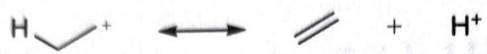  
无键共振  
(注意:无键共振仅仅是一种分析上的形式,不能作为正式的共振式列入)

在共振式的分析中可引入键级的概念:假定所有合理共振式的贡献都相等,键级可定义为所有共振式中该键连的平均重数。

键级可有效预测共价分子的键长。

【例 3.4】新近由中国科学家合成的 $N_{5}^{-}$ 有 5 种经典共振式, 每个键的键级都是 $(1+2+1+2+1)/5=1.4$ 。

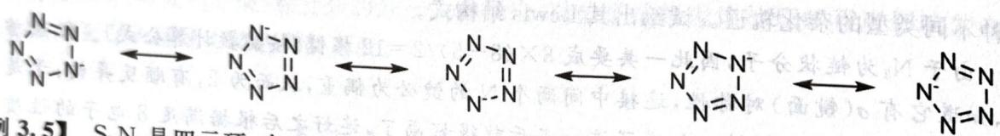

chemical

Chemical reaction diagram showing electron transfer between a pyridine ring and a tetrahydrofuran derivative

【例 3.5】 $S_{2}N_{2}$ 是四元环,有 4 种经典共振式,每个键的键级都是 $(1+1+1+2)/4=1.25$ 。如果考虑富电子的共振式(下图最右侧两个共振式),则每个键的键级都是 $(2+2+1+1+1+1)/6=1.33$ 。

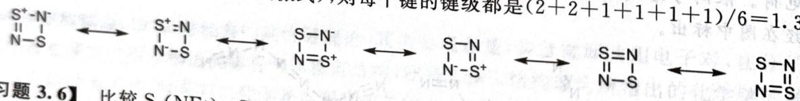

chemical

Chemical reaction diagram showing S-N bond formation with N-S and N-S+ intermediates

【习题3.6】比较 $S_{4}(NEt)_{2}, S_{2}N_{2}, S_{4}N_{4}^{2+}$ （皆为环状结构）、 $\mathrm{NSF}_{3}, \mathrm{NS}_{2}^{+}$ 中的 $\mathrm{N}-\mathrm{S}$ 键长（已知热）的 $\mathrm{N}-\mathrm{S}$ 键都等价），说明理由。

富电子和缺电子的原子是另一个需要考虑的 Lewis 结构式的修正因素。例如，B 需要 5 个电子，但只有 3 个电子能用来形成纯粹的共价键，则其理想电子构型只有 6 个电子。而在 P、S 等原子中，有时周围会有多于 3 个的配位原子，电子将会出现超过 8 的情况。这是在绘制了原理的。

实际上,很多富电子和缺电子的体系都能写成含形式电荷的8电子形式,这里我们也推荐大家写成该形式。一个经典的例子是DMSO。它可看成 $S(CH_{3})_{2}$ 中S的孤对电子配一对给O,从而形成了DMSO,S上因而出现了形式电荷。而O上的孤对电子可以反馈给S的d轨道,因此可以写成10电子的富电子构型。

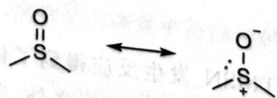

chemical

Chemical reaction diagram showing sulfonate ion reacting with a radical intermediate to form a disulfide ion

DMSO 的共振式

但是,如果写成10电子的构型,很容易忽略DMSO具体的分子立体结构( $sp^{3}$ 杂化,不是平面);此外也容易忽略O的亲核性和S上的孤对电子。因此对于富电子和缺电子的体二振式去作分析非常重要。(参见第10讲)

【例题3.7】含有2个以上原子的顺磁性共价化合物A是气体的共（方程式已经配平）：

$Q_{2}+xNaQO_{2}\longrightarrow yA+zNaQ,x+y+z\leqslant7$ 。

(2) 是所有因化氢中沸点最低的。画出没有形式电荷的化合物 A 的 Lewis 结构式(使用元素符号绘制)。

解 由 HQ 是所有卤化氢中沸点最低的, 知道 Q 是 Cl。因为 A 是共价化合物, 所以不含有 Na。则方程式可改写为

$$
\mathrm{Cl} _ {2} + x \mathrm{NaClO} _ {2} \longrightarrow y \mathrm{Cl} _ {2 / y} \mathrm{O} _ {2 x / y} + z \mathrm{NaCl} _ {\circ}
$$

$y$ 可以取1,2（因为 $2 / y$ 是正整数），而 $(2x + 2) / y$ 必须是大于2的整数，当 $y = 1$ 时， $x = z = 2$ ，这是合理解；当 $y = 2$ 时， $x = z = 3$ ，已经超出题设限制的 $x + y + z \leqslant 7$ 。所以方程式中A是 $\mathrm{ClO}_2$ 。由于要画出不含形式电荷的Lewis结构式，所以O必须均形成两根键，此时Cl是9电子构型，具体见下图。

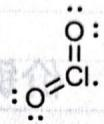

有关 Lewis 结构式绘制的最后一个重要技巧便是等电子体。

具有相同的通式(电子数和非 H 原子相同)而且价电子总数相等的分子或离子一般具有相同的结构特征,它们互称为等电子体。

【例 3.8】 $CO_{2}$ 、 $SCN^{-}$ 、 $NO_{2}^{+}$ 、 $N_{3}^{-}$ 具有相同的通式，价电子总数都为 16，都为直线型结构。

【例 3.9】 $SO_{2}, O_{3}, NO_{2}^{-}$ 具有相同的通式，价电子总数都为 18，都为平面三角形结构。

【例题 3.10】 Zintl 相是指典型的金属与第 13～16 族中的半金属或非金属形成的化合物。这类化合物由德国化学家 Eduard Zintl 首先在 20 世纪 30 年代研究。

1. $CoAs_{3}$ 是一种 Zintl 相。结构中，Co 以 $Co^{3+}$ 形式存在，As 以四核团簇的 Zintl 阴离子形式存在，每个 As 均满足 8 电子构型。画出 Zintl 阴离子的 Lewis 结构式。

有人在尝试制备异氰酸根类似物——砷氰酸根时得到了红色晶状固体。经分析知其中含三种Zintl笼状阴离子，包括 $\mathrm{As}_7^{3-}$ 和 $\mathrm{As}_{12}^{4-}$ ，每个As均满足8电子构型。已知后者含有一根四重轴和垂直于四重轴的镜面。

2. 画出砷氰酸根的共振结构式。

3. 画出上述两个 Zintl 阴离子的结构。

解 按照题目的描述, As 是四核团簇, 然而为什么其化学式是 $CoAs_{3}$ 呢? 想必这是最简式, $\mathrm{Co}_{4}(\mathrm{As}_{4})_{3}$ 才是其真实化学式了。由价态知道团簇化学式为 $As_{4}^{4-}$ , 按照形式电荷标注规则第 2 条, 刚好形成一个四元环, 每个砷各有一个形式负电荷, 其 Lewis 结构式如下图所示。

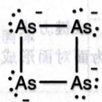

第2问是简单的,略去。对于第3问,可以参考第1问的想法,每个负电荷均可用一个只连两根键的As实现,故二者分别以 $P_{4}S_{3}$ 和 $P_{8}S_{4}$ 为等电子体。S是可以嵌在多面体棱上的,故前者是 $P_{4}$ 四面体棱上放入3个S,后者是 $P_{8}$ 正方体(四方反棱柱的可能性用 $\sigma_{h}$ 镜面排除)的棱上放入4个S。由此结构如下图所示(这里为了清楚,用小球表示As)。

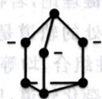

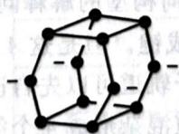

(Crystals 1, No. 3 (2011): 87-98)

【习题 3.11】在液态 $SO_{2}$ 中，将硫黄 $(S_{8})$ 、碘和 $AsF_{5}$ 的混合物加热，得到一种化合物 X。结构分析表明，X 中含有一种正八面体结构的阴离子和一种与 $P_{2}I_{4}$ 互为等电子体的环状阳离子。

1. 写出生成 X 的反应式, 式中要示出 X 的结构。

2. 比较 X 中 I-I 键与碘单质中 I-I 键的键长大小, 解释原因。

【习题 3.12】 $N_{2}O_{3}$ 和 $H_{2}S$ 简单反应可得到化学式为 A 的物质。在水溶液中它可发生互变异构，共有三种存在形式 X、Y、Z，均不含 S—O 键。

1. 画出 X、Y、Z 的 Lewis 结构式。  
2. 推测三者的相对稳定性，简述理由。

(Journal of the American Chemical Society 138, No. 36 (2016): 11441–11444)

## § 3.2 价键理论

Schrödinger 方程是描述微观体系的基本方程之一,所以它也可以用来处理分子体系。 $H_{2}$ 可以被认为是最简单的分子,但是求解其对应的方程仍然比较困难。为了解决求解 $H_{2}$ 分子的 Schrödinger 方程的数学困难,Heitler 和 London 认为,如果两个电子没有相关作用,则该对成键电子的波函数为 $\psi_{1}(1)\psi_{2}(2)$ 或者 $\psi_{2}(1)\psi_{1}(2)$ (这里 1 和 2 分别表示两个电子),实际波函数被猜测为两个函数的线性组合: $\psi=c_{1}\psi_{1}(1)\psi_{2}(2)+c_{2}\psi_{2}(1)\psi_{1}(2)$ 。用变分法确定最优的 $c_{1}$ 、 $c_{2}$ 和最低能量,并做一些其他的数学处理就能得到对氢分子中化学键的定量描述。这就是价键理论的基本想法。

推而广之,价键理论以原子轨道作为近似基函数描述分子;在成键时,价键理论认为一对自旋反平行的电子互相接近时彼此呈现互相吸引,使体系能量降低形成化学键,即所谓电子配对法。与分子轨道理论相比,粗略地说,价键理论处理化学键时一般只考虑一对一对的电子,而分子轨道理论则是以整个体系为研究对象的。

在价键理论中,电子可能成的键包括 $\sigma, \pi, \delta$ 等键,可以简单理解为“头碰头”“肩并肩”和“面对面”的成键方式(已经图示在下图中)。在价键理论的成键中,根本性的要求是对称性匹配、方向正确、能量相近。有关价键理论的分析实例,我们在 §3.5 中给出。

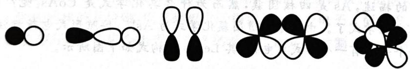

natural_image

Five abstract black-and-white line drawings of molecular or atomic-like structures, no text or symbols present.

成键方式  
(最左侧二者为头碰头形成 $\sigma$ 键, 最右侧为面对面形成 $\delta$ 键, 中间剩余二者为肩并肩形成 $\pi$ 键)

## § 3.3 杂化轨道理论

杂化轨道理论解决了分子几何构型的解释问题。按价键理论, 若存在 $\mathrm{CH}_{4}$ 这个分子, 则 $\mathrm{CH}_{4}$ 使用 4 个价层电子分别与 H 的 1s 轨道成键。但是这 4 个电子所处的轨道是不同的, 此情况下体系不会是均匀的正四面体。Pauling 认为原子轨道可以先自己进行线性组合, 均等化后再与配位原子成键。例如在甲烷中, 一个 s 轨道和三个 p 轨道混杂形成 4 个等同的 $\mathfrak{sp}^{3}$ 杂化轨道, 后者再与 H 的 1s 轨道成键。

杂化轨道理论是用来解释分子几何构型的,并不能预测构型。

下表列出了常见主族元素化合物的各种几何构型(包含孤对电子的位置)所对应的杂化。

杂化轨道与分子几何构型的关系

<table><tr><td>几何构型(包含孤对电子)</td><td>杂化轨道</td></tr><tr><td>直线型</td><td>sp</td></tr><tr><td>平面三角形</td><td> $sp^{2}$ </td></tr><tr><td>四面体</td><td> $sp^{3}$ </td></tr><tr><td>三角双锥</td><td> $sp^{3}d$ </td></tr><tr><td>八面体</td><td> $sp^{3}d^{2}$ </td></tr><tr><td>五角双锥</td><td> $sp^{3}d^{3}$ </td></tr></table>

相同原子采用不同杂化成键得到的化合物,其化学性质有较大区别,一般来说,s轨道成分越大,键长越短,键能越高,实际表现的电负性越高,因此杂化对分子性质可以产生相应影响。

## § 3.4 VSEPR 理论

价层电子对互斥理论(VSEPR 理论)是预测分子几何构型的理论。该理论认为, 分子或离子的几何构型主要决定于与中心原子相关的电子对之间的排斥作用。Pauling 等人使用理论计算的方法确定了当主族元素中心原子附近含有 $n$ 对电子时, 价层电子对的几何构型和分子的实际几何构型, 其结论见下表:

分子几何构型和电子对数的关系

<table><tr><td>电子对数</td><td>杂化</td><td>价层电子对构型</td><td>孤电子对数</td><td>分子几何构型</td></tr><tr><td>2</td><td>sp</td><td>直线型</td><td>0</td><td>直线型</td></tr><tr><td rowspan="2">3</td><td rowspan="2"> $sp^2$ </td><td rowspan="2">平面三角形</td><td>0</td><td>平面三角形</td></tr><tr><td>1</td><td>V型</td></tr><tr><td rowspan="3">4</td><td rowspan="3"> $sp^3$ </td><td rowspan="3">四面体</td><td>0</td><td>四面体</td></tr><tr><td>1</td><td>三角锥型</td></tr><tr><td>2</td><td>V型</td></tr><tr><td rowspan="4">5</td><td rowspan="4"> $sp^3d$ </td><td rowspan="4">三角双锥</td><td>0</td><td>三角双锥</td></tr><tr><td>1</td><td>变形四面体</td></tr><tr><td>2</td><td>T型</td></tr><tr><td>3</td><td>直线型</td></tr><tr><td rowspan="5">6</td><td rowspan="5"> $sp^3d^2$ </td><td rowspan="5">八面体</td><td>0</td><td>八面体</td></tr><tr><td>1</td><td>四方锥</td></tr><tr><td>2</td><td>平面四方形</td></tr><tr><td>3</td><td>T型</td></tr><tr><td>4</td><td>直线型</td></tr><tr><td rowspan="3">7</td><td rowspan="3"> $sp^3d^3$ </td><td rowspan="3">五角双锥</td><td>0</td><td>五角双锥</td></tr><tr><td>1</td><td>五角锥</td></tr><tr><td>2</td><td>五边型</td></tr></table>

确定价层电子对数的通用法则是绘制 Lewis 结构式的数电子规则的第一条。得到价层电子对的构型后，从中心原子原有的价电子数中扣去所有用去成键的电子来计算孤对电子数目。利用电子对排斥大小的规律确定去掉孤对电子之后分子的实际几何构型（参考上表，注意思考分子的实际几何构型是如何从电子构型中得到的）。

【例 3.13】对 $SF_{4}$ ，价电子数为 $6+4=10$ ，整体构型为三角双锥。孤对电子 6-4=2 个，因此有一个位置要放孤对电子。在赤道面的孤对电子与其他电子对所成角度为 $\pi/2$ 的比在径向少，所以孤对电子放在赤道面，分子几何构型为变形四面体。

最后，VSEPR 还可以用于定性预测键角，其想法也是使得电子对之间的斥力最小，而斥力的排序如下（也请同学们注意思考如下排斥顺序是如何得到的）。

1. 孤对电子之间的排斥。  
2. 孤对电子和重键之间的排斥。  
3. 孤对电子和单键之间的排斥。  
4. 重键之间的排斥。  
5. 重键和单键之间的排斥。  
6. 单键之间的排斥。

【例题 3.14】 $NH_{3}$ 中 $\angle HNH=106.7^{\circ}$ ，而 $\mathrm{Zn(NH_{3})_{6}^{2+}}$ 中 $\angle HNH=109.5^{\circ}$ 。解释原因。

解 这个题非常容易。锌氨离子相比于氨分子,孤对电子和键对电子之间的斥力变为键对电子之间的斥力,HNH之间不再有孤对电子的“压缩”,因此键角变大。

【例题 3.15】 $CH_{2}SF_{4}$ 是一种极性溶剂, 符合 VSEPR 理论, 试问其结构如何。

解 容易看出, 这可看成 $\mathrm{SF}_{4}$ 与卡宾 $\mathrm{CH}_{2}(\mathrm{O}$ 的等电子体) 结合, 于是相当于 S 给出一对电子之后, $\mathrm{CH}_{2}$ 上孤对电子又反馈形成了 $\mathrm{d}-\mathrm{p}\pi$ 键。所以价层电子对数是 $(6+4)/2=5$ , 即无孤对电子的 $\mathrm{sp}^{3}\mathrm{d}$ 杂化, 故系统是三角双锥型。那么 $\mathrm{CH}_{2}$ 的位置如何? 电负性大的氧原子应该放在轴向 (考察排斥), 所以必须是如下图所示的结构。考虑重键的排斥较大, 可以略微产生一点畸变。

$$
\mathrm{H} _ {2} \mathrm{C} = \mathrm{S} \begin{array}{c} \mathrm{F} \\ \mathrm{F} \\ \mathrm{F} \end{array}
$$

注记 在三角双锥构型中,电负性大的原子/基团应放在轴向。这是因为电负性小的原子使得成键电子对更像孤对电子,因而放在赤道面更合适。

【例题 3.16】在浓硫酸中 $I_{2}$ 与 $HIO_{3}$ 以 2:1 反应,电导实验证明阳离子总数为加入 $HIO_{3}$ 的 8 倍。所有阳离子都不含硫。

1. 给出含碘阳离子的化学式。  
2. 类似地,体系中还生成了少量 $I_{5}^{+}$ ,它有 N 型和 W 型两种构型的异构体。分别画出两种异构体的结构(标明形式电荷)。

解 参照第2问,第1问的答案肯定是与 $I_{5}^{+}$ 具有类似结构的物种;体系必然发生归中反应,于是它应该形如 $I_{m}^{n+}$ 。方程式可写为

$$
(5 m + n) \mathrm{I} _ {2} + 2 n \mathrm{HIO} _ {3} + 1 6 n \mathrm{H} _ {2} \mathrm{SO} _ {4} \longrightarrow 6 n \mathrm{H} _ {3} \mathrm{O} ^ {+} + 1 0 \mathrm{I} _ {m} ^ {n +} + 1 6 n \mathrm{HSO} _ {4} ^ {-}
$$

于是根据条件列出 $(10 + 6n) / (2n) = 8, (5m + n) / (2n) = 2$ ，得到 $n = 1, m = 1$ ，含碘阳离子是 $\mathbf{I}^{+}$ 。另一做法是直接由比例算出产物中 $\mathbf{I}$ 的价态，然后配平。对于第2问， $\mathrm{I}_{5}^{+}$ 可看成由一个 $\mathrm{I}^{+}$ 得到两个 $\mathrm{I}_{2}$ 配位而成，形式电荷仍按之前谈到的规则标注即可。

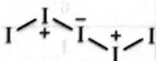  
N型异构体

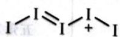  
W型异构体

两种异构体依照题中说明的形状绘制。从结构上分析，存在 $\mathrm{I - I^{+} - I^{-} - I^{+} - I}$ 和 $\mathrm{I - I = I - I^{+} - I}$ 。观察杂化，前者依次是8、10、8个价电子和4、6、4个孤对电子，中心为直线型，两边为弯曲型，为N型异构体；后者依次是8、8、8个价电子和4、4、4个孤对电子，因此都是弯曲型，是W型异构体。

【例题3.17】画出小分子 $\mathrm{C}_3\mathrm{F}_4$ 的Lewis结构式，标出三个碳原子成键时所采用的杂化轨道。

解 $C_{3}F_{4}$ 不饱和度为 2，不饱和度的来源有多种，环、烯、炔均可，因而答案有多种，如下图所示，同学们在解题时特别注意不要只写出一种就停止思考。

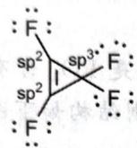

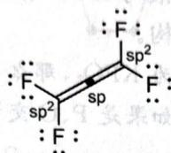

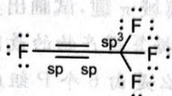

杂化是容易明确的,已经标在图上。

【习题 3.18】 连二亚硫酸钠是一种常用的还原剂。硫同位素交换和顺磁共振实验证实, 其水溶液中存在亚磺酰自由基负离子。

1. 写出该自由基负离子的结构简式,根据 VSEPR 理论推测其形状。  
2. 连二亚硫酸钠与 $CF_{3}Br$ 反应得到三氟甲烷亚硫酸钠，写出机理。

【习题3.19】将 $\mathrm{I(py)_2ClO_4}$ 放入浓硫酸中，发生歧化反应生成 $\mathbf{I}_3^+$ 和一种高价碘的硫酸氢盐A（视为非电解质）。生成的阳离子总数为 $\mathrm{I(py)_2ClO_4}$ 的2.25倍。

1. 画出 $\mathrm{I(py)}_2\mathrm{ClO}_4$ 中阳离子的结构, 标明形式电荷。  
2. 写出反应的方程式, 方程式中请示出 A 的立体结构。

## § 3.5 经典成键理论的几个结论

## 3.5.1 离域键

离域键是价键理论在考察具有平面性的分子的结构时所用到的理论。其观点是，孤对电子所处的p、d轨道或者空的p、d轨道可以与对称性、方向性匹配的 $\pi$ 键（或者p轨道）产生化学键的作用，作为共轭降低体系的能量（注意此种作用涉及的总电子数必须少于相应p、d轨道数的两倍）。这种离域性有时可在Lewis结构的共振式中反映出来作为印证。

【例 3.20】在 $CO_{2}$ 直线型分子中，中心原子 C 采取 sp 杂化，C 中余下的两个 p 轨道相互正交，一侧与 O 的一个电子形成普通 $\pi$ 键，另一侧与 O 的一个孤对电子形成 $\pi_{3}^{4}$ 离域键，由此一共有两套 $\pi_{3}^{4}$ 。在共振式中表现为 $O=C=O\longleftrightarrow^{+}O\equiv C-O^{-}$ 。

【例 3.21】 $ClO_{2}$ 不容易二聚，单电子应被稳定化。于是，Cl 取 $sp^{2}$ 杂化，其中一个放置孤对电子，另外两个轨道中含有的电子均配给 O 使其满足 8 电子（O 出 p 轨道）。未杂化的 p 轨道含有单电子，与 O 的两个满的 p 轨道形成 $\pi_{3}^{5}$ 。用 Lewis 结构式表示则需要使用 7 电子和 9 电子的共振结构，如下图所示。

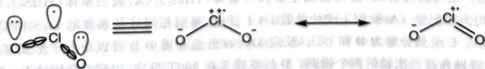

chemical

Chemical equilibrium diagram showing chlorine species bonded to oxygen atoms with electron cloud notation

$NO_{2}$ 容易二聚,单电子不应该被稳定化。使用相同的分析可知 N 取 $sp^{2}$ 杂化,其中一个放置单电

子,另外两个轨道中含有的电子均配给O使其满足8电子(O出p轨道)。未杂化的p轨道是空的,与0的两个满的p轨道形成 $\pi_{3}^{4}$ 。

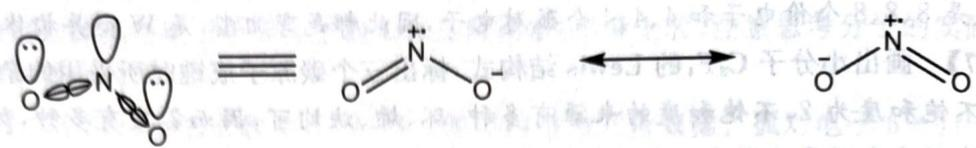

chemical

Chemical equilibrium reaction showing protonation of an N-heterocyclic carbene to form a radical ion

【例题3.22】红磷在KOH溶液中的悬浊液与KOCl作用，生成含磷 $30.34\%$ 的化合物，阴离子只含两种元素，有六元环和离域 $\pi$ 键，试画出其结构。

解 利用质量分数数据算得产物的最简式为 $KPO_{2}$ ，那么只能是 $PO_{2}^{-}$ 含有六元环。这个六元环要么是由 P、O 交替组成，要么是由 6 个 P 组成。如果是 P、O 交替，则结构如下图左，否则如下图右。

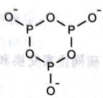

chemical

Chemical structure of a phosphorus-oxygen compound with four phosphate groups and oxygen atoms

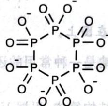

chemical

Chemical structure of a phosphorus-oxygen compound with phosphate groups and oxygen atoms

面对两个都比较合理的结构,考虑一下题给离域键条件,左图没有而右图存在 d-p 反馈键,可看成离域键的一种。此外大家熟知 P 亲 O,而且左图是 3 价 P,容易被 KOCl 氧化,又依成键数尽量多的原则,选择右图的结构。

注记 遇到可能纠结的情况时,如果能用题目条件予以排除则最好,否则就要尽可能合理且多地运用基本理论说服自己:各个答案分别有什么合理之处,又有什么不合理之处?

【例题3.23】在20世纪60年代，稀有气体化合物的合成是化学领域的重要突破之一。Bartlett从 $\left[\mathrm{O}_2\right]^+ \left[\mathrm{PtF}_6\right]^{-}$ 的生成得到启发，推测可以形成 $\left[\mathrm{Xe}\right]^+ \left[\mathrm{PtF}_6\right]^{-}$ 。于是尝试通过 $\mathrm{Xe}$ 与 $\mathrm{PtF}_6$ 反应合成相应的稀有气体化合物，这一工作具有深远的意义。后续研究发现，Bartlett当时得到的并非 $\left[\mathrm{Xe}\right]^+ \left[\mathrm{PtF}_6\right]^{-}$ ，而可能是 $\left[\mathrm{XeF}\right]^+ \left[\mathrm{Pt}_2\mathrm{F}_{11}\right]^{-}$ 。

1. 写出 $\left[XeF\right]^{+}\left[Pt_{2}F_{11}\right]^{-}$ 中 Xe 的氧化数。  
2. 在 $\left[Pt_{2}F_{11}\right]^{-}$ 结构中，沿轴向有四次轴。画出 $\left[Pt_{2}F_{11}\right]^{-}$ 的结构。  
3. 后来, 大量含 $\mathrm{Xe}-\mathrm{F}$ 和 $\mathrm{Xe}-\mathrm{O}$ 键的化合物被合成出来, 如 $\mathrm{XeOF}_{2}$ 。根据价层电子对互斥理论, 写出 $\mathrm{XeOF}_{2}$ 的几何构型及中心原子所用杂化轨道类型。

解 容易看出 $\left[XeF\right]^{+}$ 中 Xe 的氧化数为 +2。 $\left[Pt_{2}F_{11}\right]^{-}$ 中含有四重轴，故根据对称性要求，Pt 位于一条直线上，每边 Pt 各独有 4 个 F 形成四方形，而剩余 3 个 F 沿着四重轴的轴向排布，得到 $\left[F-PtF_{4}-F-PtF_{4}-F\right]^{-}$ 。我们须特别注意沿着四重轴方向，两个 $PtF_{4}$ 投影的对称性。因为中间桥连 F 的孤对电子可以与 Pt 形成两套相互正交的 d-pπ 键，故应该是全重叠式：

$$
\left[ \begin{array}{c c c c} F & F & F & F \\ F - P t - F - P t - F \\ F & F & F & F \end{array} \right] ^ {-}
$$

第3问是容易的，含有 $8 + 2 = 10$ 个价层电子，因此是 $\mathfrak{sp}^3\mathrm{d}$ 杂化，而孤对电子数有 $10 - 4 - 2 = 4$ 个，因此其几何构型是T型。

【例题 3.24】 $\mathrm{B(OH)_3}$ 是一种重要的无机化合物。在尝试合成硫代硼酸的过程中得到了最简式为 $\mathrm{HBS}_2$ 的化合物。结构研究发现，这类物质主要以二聚体 $(\mathrm{HBS}_2)_2(\mathbf{A})$ 或三聚体 $(\mathrm{HBS}_2)_3(\mathbf{B})$ 的形式存在，其中的 B 均为三配位。A 和 $\mathrm{BCl}_3$ 按计量数 1:1 反应，得到相同计量系数的 $\mathrm{H}_2\mathrm{S}$ 和 C（反应 1）。C 易水解（反应 2）。C 受热分解为 D 和 $\mathrm{BCl}_3$ （反应 3）。在低温介质中 D 可以单分子形式存在，结构中有且仅有二次旋转轴和过二次轴的两个镜面。D 与单质 S 在 $300^\circ\mathrm{C}$ 反应，生成白色固体 E。E 的分子采用类似卟吩的平面大环结构（参看下图，每个圆点代表一个原子）。

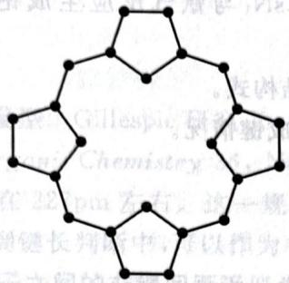

chemical

Chemical structure diagram of a polycyclic aromatic hydrocarbon with labeled atoms and bonds

1. 画出 A\~D 的结构。  
2. 写出反应 1\~3 的方程式。  
3. 写出表示 E 结构特点的结构简式, 并示出元素的氧化态。  
4. 画出 E 的 Lewis 结构式, 并用 Hückel 规则判断它是否有芳香性。

解 $\mathrm{HBS}_2$ 可以改写为B(SH)S，体系中没有硫与硫直接相连，故可以推测B通过S桥连，SH作为端基。注意到桥连与端基S和B的数量都一样，便可画出如下图所示交替性的结构：

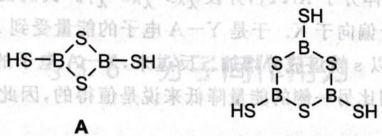

chemical

Chemical structure of a boron-containing compound with sulfur and thiol groups, labeled A

B

对于 C, 按照条件给出的比例可直接写出 $\left(\mathrm{HBS}_{2}\right)_{2} + \mathrm{BCl}_{3} \longrightarrow \mathrm{H}_{2}\mathrm{S} + \mathrm{B}_{3}\mathrm{S}_{3}\mathrm{Cl}_{3}$ (反应 1), 由此可看出 C 的结构也是一个六元环 (类似于无机苯)。 $B_{3}S_{3}Cl_{3}$ 去掉 $BCl_{3}$ 后得到 $B_{2}S_{3}$ (反应 2), 此即为 D。C 水解的反应方程式很容易写出, 即根据正性和负性结合: $\mathrm{B}_{3}\mathrm{S}_{3}\mathrm{Cl}_{3} + 9\mathrm{H}_{2}\mathrm{O} \longrightarrow 3\mathrm{B}(\mathrm{OH})_{3} + 3\mathrm{H}_{2}\mathrm{S} + 3\mathrm{HCl}$ (反应 3)。因为 D 只有二次轴和相应的两个 $\sigma_{v}$ 镜面, 可见与水类似, 故可写出:

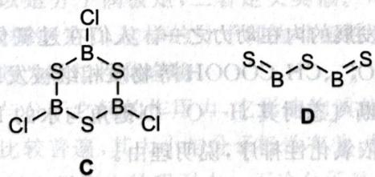

chemical

Chemical structure of a boron-sulfur compound with labeled atoms and bonds

最后,观察卟吩的结构,其中连有两根键的应该给 S,剩下连有 3 根键的应该给 B,由此立刻得到结构:

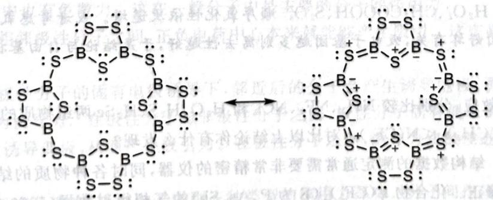

chemical

Chemical structure of a boron-sulfur compound with S and B atoms shown in 3D arrangement

系统中有两种化学环境的 S，一种是连接硼的，一种是二硫键的，根据电负性，前者氧化数为 -2，后者为 -1，因此 E 的结构简式可写成 $\mathrm{B}_{8}\mathrm{S}_{6}(\mathrm{S}_{2})_{4}$ ，B 的氧化数为 +3。需要注意的是，E 中 S 有孤对电子，B 有空的 p 轨道，可形成共轭系统（因此有多种共振式，以上只写出一种）。但其外圈的总电子数为 $2 \times 12 = 24$ ，内圈的总电子数为 $2 \times 8 = 16$ ，均不符合 $4n + 2$ 规则，所以没有芳香性。

【习题 3.25】在液态 $SO_{2}$ 中用 $CsN_{3}$ 与氰气反应生成铯的离子化合物。其阴离子中含氮量为 74.47%。

1. 推出该离子化合物中阴离子的结构式。

2. 说明每个原子的杂化类型, 讨论成键情况。

## 3.5.2 Bent规则

Bent 规则是对键角、键长等分子参数的一个有道理且实用的规则 (Chemical Reviews 61, No. 3 (1961): 275-311)。尽管它基于杂化轨道理论而杂化轨道理论被认为是人为制造的不自然的规则，但 Bent 规则在现代成键理论中仍能得到相应的合理性证明。

Bent 规则是说, 在分子中, 指向低电负性原子/基团的杂化轨道的 s 成分增加, 反过来则 p 轨道成分增加。由于 s、p 成分会影响键角和键长, 因此 Bent 规则对该类分子参数有较广泛而一般的预测能力。首先让我们来解释 Bent 规则的正确性。

【例 3.26】考虑一个四面体分子 $XAY_{3}$ ，并设 $\chi_{X} > \chi_{A} > \chi_{Y}$ 。我们说由于电负性的差异，Y-A 电子偏向于中心原子，而 X-A 电子偏向于 X。于是 Y-A 电子的能量受到 A 指向 Y 的杂化轨道的影响较大，考虑到 s 轨道能量更低，所以 s 轨道成分增加。反过来，X-A 电子的能量受到 A 指向 X 的杂化轨道的影响较小，稍微增加能量相比另一侧的能量降低来说是值得的，因此 p 轨道成分增加。这就导出了 Bent 规则的结论。

Bent 规则是对杂化轨道成分进行估计和分析, 这种想法是可以用于其他问题求解的, 而不仅限于本节所讲。下面列出了几个 Bent 规则的推论:

- 基团电负性增加时,相应键角降低。(原因:电负性增加,p 轨道成分增加,依照杂化轨道理论,键角变小。)  
- 基团电负性增加时,低电负性一侧对应的键长缩短,高电负性一侧则反之。(原因:低电负性一侧 s 轨道成分增加,键长缩短。)

【例题 3.27】好奇心是科学发展的内在动力之一。人们在过氧化氢被发现后便联想:是否会有类似含有过氧键的氧化剂?于是, $S_{2}O_{8}^{2-}$ 、 $CH_{3}COOOH$ 等物质相继被发现、发展。

1. 画出 $\mathrm{H}_{2} \mathrm{O}_{2}$ 的立体结构, 判断气态时其 $\mathrm{H}-\mathrm{O}-\mathrm{O}$ 键角与水的 $\mathrm{H}-\mathrm{O}-\mathrm{H}$ 何者大? 2. 将题中提到的三种氧化剂依氧化性排序, 说明理由。

解 $H_{2}O_{2}$ 为椅式结构,两个 H 处在不同的平面上,图略。因为 O 的电负性比 H 大,所以依照 Bent 规则,立得 H—O—O 键角比 H—O—H 小。对于第 2 问,容易推测过氧键的氧化性来源于 O—O 基的缺电子性,故按 $H_{2}O_{2}$ 、 $CH_{3}COOOH$ 、 $S_{2}O_{8}^{2-}$ 顺序氧化性依次递增。或者考虑氧化时使用离子机理,则氧化性与离去基团好坏有关,吸电子基团越多则离去性越好,于是结论与自由基机理一致。

## 【习题3.28】

1. 只考虑电子效应,分别比较 $NH_{3}$ 、 $NF_{3}$ 、 $NCl_{3}$ 和 $H_{2}O$ 、 $H_{2}S$ 、 $H_{2}Se$ 两组物质的键角大小关系。
2. 已知键角 $\mathrm{N}(\mathrm{CH}_{3})_{3}<\mathrm{N}(\mathrm{CF}_{3})_{3}$ ，对比以上结论你有什么发现？

【习题 3.29\*】结构数据的测定通常需要非常精密的仪器,同时各种物质的结构参数也随着测量仪器的发展不断被修正。化合物 $E(CF_3)_3(E$ 为 P、As、Sb) 的气相衍射数据(1950 年测定)表明三个分子的 C—E—C 键角分别为 $99.6^\circ$ 、 $100.1^\circ$ 和 $100.0^\circ$ 。然而,2010 年的一项实验显示, $As(CF_3)_3$ 的 C—As—C 键角是 $95.4^\circ$ 。这个结果与理论计算得到的 $95.9^\circ$ 一致。若新数据是可信的,则 $99.6^\circ$ 、 $100.0^\circ$ 两个数据中,哪一个是肯定要重新测量的?简述理由。

(Journal of Molecular Structure 978, No. 1-3 (2010): 205-208)

## 3.5.3 LCP 模型

LCP 模型基本上是一个纯经验的模型。Gillespie 研究了一系列简单分子中相同配位原子的非键间距，发现它们具有惊人的一致性(Inorganic Chemistry 36, No. 14 (1997): 3022-3030)。例如在 B 的含 F 配位的化合物中， $d(F - F)$ 总是在 227pm 左右。这一规则称为“配体密堆积”，有比较好的适用性，且能够把 VSEPR 的键角判断转移到键长判断中，可以作为一个理论参考。具体而言，即：

规则 同中心原子下,同种配位原子之间的非键间距近似为常数。

【习题 3.30】在 $CCl_{4}$ 中 C—Cl 键长为 171.1pm。试问：根据已有信息， $COCl_{2}$ 中 C—Cl 键长能否较准确地估算？如果能，估算之；如果不能，给出一个尽可能小的范围。

以上 2 节所介绍的预测方法比较有效,但不一定绝对有效,可能还要考虑非键排斥、基团大小等问题。如果遇到解释性问题,只要使用合理的理论,解释得通即可;如果是预测性问题,一般都是比较“正常”的,使用已知理论即可。

## § 3.6 分子间作用力

下面简要复习一下极性和分子间作用力。

偶极矩是表示分子电荷分布情况的物理量,它定义为

$$
\mu = q d,
$$

d 是分子正负电荷重心之间的距离, q 是电荷中心所带的电量。注意对于双原子分子的偶极矩, d 不等于键长(可能比键长略短, 但目前的实验手段无法单独测定 q 或者 d, 只能测定 $\mu$ )。根据讨论对象的不同, 偶极矩可以指键偶极矩, 也可以是分子偶极矩, 二者定义类似。可以简单认为, 键矩和为 0 的体系(例如具有对称性的分子), 分子偶极矩为 0, 这样的分子即为非极性分子, 否则为极性分子。在有机化学中有时也把极性很弱的化合物归为非极性化合物。

分子间作用力指存在于分子与分子之间的作用力,它影响物质的许多物理性质。它包括范德华力和次级键两种。范德华力的存在比较普遍,其大小与分子极性有关,包括以下几种:

1. 色散力。色散力是瞬时偶极之间产生的吸引力。不论分子是否存在极性，分子中的原子核和核外电子在振动或运动过程中，正负电荷重心可能不重合，产生瞬时偶极，此时就能诱导相邻分子产生瞬时诱导电极，从而分子间产生吸引力。应该说：这是正负电荷中心发生一些额外的瞬时变化所产生的作用。

用力，所以极性分子中也有色散力。这在一般分子中是主要的分子间作用力。

2. 取向力。在相邻极性分子之间，正负电荷中心本来就能够产生吸引。这在高极性分子中占比较高，例如水分子。

3. 诱导力。在极性分子的固有电极诱导下，邻近后的分子会产生诱导电极，诱导电极与固有电极之间的电性引力称为诱导力。在极性分子与非极性分子之间，极性分子固有偶极的电场使非极性分子的电子云极化，产生诱导偶极，从而产生吸引力。在极性分子之间，诱导力使极性进一步增加，因此极性分子中也有诱导力。

非极性分子中只有色散力,极性分子中则三种类型的作用力都有。分子间作用力与熔沸点、在溶剂中的溶解性都有很大关系。

【例 3.31】稀有气体在水中的溶解度随着原子序数的增大而增大,这是因为原子半径增大,电子云体积和弥散程度增加,与水分子电子云产生的极化诱导力增加。

分子间作用力中的“霸王”便是氢键。氢键是次级键的典型代表，它可看成一种特殊的静电吸引，发生在已经以共价键与其他原子结合的氢原子与另一个原子之间，通常发生氢键作用的氢原子，其两边的原子都是电负性较强的原子。氢键既可以是分子间氢键，也可以是分子内氢键。其“键能”最大约为 $200\mathrm{kJ / mol(HF_2^-)}$ ，一般为 $5\sim 30\mathrm{kJ / mol}$ ，比一般的共价键、离子键和金属键要小，但强于静电引力。

氢键基本上是大家熟知的,这里提请注意几点:

1. 氢键可以泛泛地被认为是缺电子的氢和富电子的体系发生作用, 因此有非常多非常规氢键的例子 (例如 $\mathrm{BH}_{3} \mathrm{NH}_{3}$ 中的双氢键, 及下图中示出的氢键)。

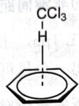  
特殊的氢键

2. 氢键对各种性质产生非常显著的影响(熔沸点降低、稳定性(指非化学键的稳定性)增加等等).  
3. 氢键的键角不一定是 $\pi$ ，氢键的键长一般指的是 X—H…Y 中的 H…Y 距离。

【例题 3.32】 $BF_{3}$ 有三种水合物 $BF_{3} \cdot nH_{2}O$ ，我们考察 n=2 的情形。

1. 晶体中存在以 O—H…O 氢键形成的一维链，给出体系的结构。  
2. 在 $6.2^{\circ}$ C 以上, 体系转化为离子态的液体。给出阴阳离子的立体结构。

解 显然, B 可作为 O 上孤对电子的受体, 因此水与三氟化硼可有相互作用, 但是硼不能使用五配位构型, 因此一个单元中只能有一个水与 B 配位。为了将单元进行首尾连接, 体系一侧的水分子作为氢键给体, 另一边作为氢键受体。水合物熔化后的结构是容易给出的, 为了产生离子, 异裂一个水分子即可: $\left[\mathrm{H}_{3} \mathrm{O}^{+}\right]\left[\mathrm{BF}_{3}(\mathrm{OH})\right]$ 。具体结构分别如下图所示:

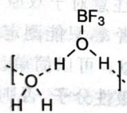  
第1小题图

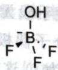

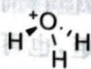  
第2小题图

【例题 3.33】某温度、某压强下取三份等体积无色气体 A，于 298K、353K、363K 下分别测定其相对分子质量为 58.0g/mol、20.6g/mol、20.0g/mol；将三份气体各取 1L 分别溶于 10L 水中，均显酸性。假定体系均为理想气体。试通过计算：

1. A 是什么物质?  
2. 各温度下, 摩尔质量不同的原因是什么?  
3. 若三份气体体积相同(设溶解后温度也相同), 溶解

解 随着温度升高，A 的摩尔质量在下降，说明存在一些物理或化学变化的过程。注意到三份气体下 20g/mol 的数据是 A 的摩尔质量，这么小的摩尔质量和酸性气体的条件告诉我们它是 HF。由于对分子质量下降。

物质的量浓度比值是容易计算的,因为初体积相等,故n与M/T

【习题 3.34】三氟化氮是一种出乎意料稳定的化合物。有趣的是，与之相关的一氟代氨 $NH_{2}F$ 和二氟代氨 $NHF_{2}$ 非常不稳定。

1. 在 $NF_{3}$ 、 $NHF_{2}$ 和 $NH_{2}F$ 三种化合物中，哪一种凝聚温度最低？说明理由。
2. 测得这些分子中的 N—F 键长分别为 136pm、140pm 和 140

38. $142 \mathrm{pm}$ 和 $142 \mathrm{pm}$ 。指认对应的分子。

## § 3.7 分子对称性

一般的无机分子都具有一定的对称性,研究分子对称性对分子轨道理论、分子光谱等有重要作用,在中学范围内我们只需要学会寻找对称元素,判断分子的对称性即可。

首先来看分子对称性涉及的元素,这些元素都对应于对分子进行某种操作使其复原(对称操作)。

1. 旋转轴 $C_n$ 。绕某轴旋转 $2\pi / n$ （称为基转角）进行复原操作，拥有最大 $n$ 的是主轴，余下的称副轴。考察分子整体对称性时一般取主轴为 $z$ 轴。  
2. 对称面(或镜面) $\sigma$ 。以某个平面作为镜面进行反射复原操作,如经过反射后恢复原状,则该平面为分子的对称面。对称面可下标 h、v、d,分别表示垂直于主轴、包含主轴和包含主轴且平分两个副轴 $C_{2}$ 夹角。 $\sigma_{d}$ 必然是 $\sigma_{v}$ ,因此分类时,能说 $\sigma_{d}$ 就不说 $\sigma_{v}$ 。

3. 对称中心 i。按照某个点能进行反演复原操作, 这个点即为对称中心。

4. 映轴 $S_{n}$ 。绕某个轴旋转 $2\pi/n$ 并沿垂直于该轴的平面进行反射复原，该轴称为映轴。这是分子对称性特有的操作。注意 $S_{1}$ 、 $S_{2}$ 没有意义（不独立，相当于其他对称元素或其组合）。

5. 群的乘法单位元 $E$ 。即恒等操作，在化学上平凡，但在数学上有一定意义。

【例题 3.35】 在一定条件下， $AlMe_{3}$ 与 $MeNH_{2}$ 发生反应生成 A，后者的分子式为 $Al_{8}C_{16}N_{8}H_{48}$ 。A 是多面体分子，多面体的骨干由四边形和六边形组成，分子中除了一条 $S_{4}$ 之外，没有其他独立的对称元素。画出 A 的结构。

解 此为 2018 年 CChO 决赛题,考查一个多面体结构的推测。注意到体系的对称性很差,因此靠经验去画是比较难的。先把分子式改写成 $(\mathrm{AlMe})_{8}(\mathrm{NMe})_{8}$ ,只需等价地考虑黑白两种球(分别代表 Al 和 N)组成的多面体:去掉 Me 的键之后应该每个球都与 2 条棱相接,但是这样无法形成多面体。考虑到 N 可以与 Al 进行配位,所以每个球与 3 条棱相连是允许的(连更多的键不可能,因为 N 没有孤对电子了),体系可直接看成其等电子体 $C_{16}Me_{16}$ 。

设多面体中有 $x$ 个四边形， $y$ 个六边形，按欧拉定理有

$$
\left\{ \begin{array}{l l} 4 x + 6 y = 3 \times 1 6 (\text {   原子数目   }), \\ 1 6 - \frac {1 6 \times 3}{2} + x + y = 2 (\text {   欧拉公式   }), \end{array} \right.
$$

解得 x=6, y=4。

排布这6个四边形和4个六边形就需要一定的经验了。首先注意 $S_{4}$ 分子的特征图像是两条相互垂直的异面直线，所以我们可把三个四边形共棱连在一起，六个四边形构成两组抽象链，然后使得两条抽象链异面垂直，此时添加4根键就得到了六边形。

答案如下图所示：

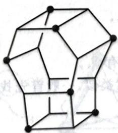

natural_image

Geometric wireframe structure resembling a 3D polyhedron or crystal lattice (no text or symbols)

图中圆点和无圆点的顶点分别表示 NMe 和 AlMe, 即

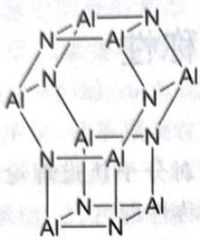

chemical

Molecular structure of a dithiopyrrole complex with aluminum centers and nitrogen atoms

或  
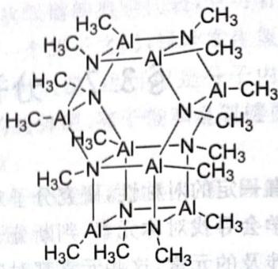

chemical

Chemical structure of a aluminum complex with multiple methyl and alkyl groups

注记 这并不是一道很好的试题,因为条件实在太少。也可以从 $S_{4}$ 型的环辛四烯(但它不是 $S_{4}$ 点群)开始构建多面体结构。总之不能通过尝试的方式,而应该先尽可能多地获取信息。

在寻找给定分子的对称元素时,应先寻找主轴,再参考下述定理找全剩余的对称元素。定理的证明可简单使用矩阵方法,这里就略去了。

- 若有一个 $C_2$ 轴与主轴 $C_n$ 垂直, 则必有 $n$ 个 $C_2$ 轴与主轴垂直, 且相邻两个 $C_2$ 轴夹角为主轴基转角的一半。  
- 若有一个镜面通过主轴 $C_n$ ，则必有 $n$ 个镜面通过主轴，且相邻两个镜面夹角为主轴基转角的一半。  
- $C_{2n}, \sigma_h, i$ 中任意两个可推出第三个。

分子的所有对称元素在对称操作的复合意义下可构成乘法群,对这些群进行分类就得到分子点群的概念。点群虽然不是初赛要求的内容,但如果先判断出点群,对体系对称元素的寻找也有一定的帮助,这里将常见的点群列出如下。

1. 低或高对称性组。

\- $C_1$ ，没有非平凡的对称操作元素。

\- $C_{s}$ , 只有镜面。

\- $C_i$ ，只有对称中心。

\- $C_{\infty \mathrm{v}}$ ，线性无对称中心。

\- $D_{\infty \mathrm{h}}$ ，线性有对称中心。

\- $T_{\mathrm{d}}$ ，四面体对称性。

\- $O_{\mathrm{h}}$ ，八面体对称性。

\- $I_{\mathrm{h}}$ ，十二面体对称性。

2. 中对称性组。

\- $C_{n}$ , 最高主轴 $n$ , 无 $C_{2}$ 副轴, 没有镜面。

\- $D_{n}$ , 最高主轴 $n$ , 有 $C_{2}$ 副轴, 没有镜面。

\- $C_{nh}$ , 最高主轴 $n$ , 无 $C_2$ 副轴, 含有 $\sigma_h$ 。

\- $C_{nv}$ , 最高主轴 $n$ , 无 $C_2$ 副轴, 含有 $\sigma_v$ 。

\- $D_{nh}$ , 最高主轴 $n$ , 有 $C_2$ 副轴, 含有 $\sigma_h$ 。

\- $D_{nd}$ , 最高主轴 $n$ , 有 $C_2$ 副轴, 含有 $\sigma_d$ 。

\- $S_{2n}$ , 只含有一个 $S_{2n}$ , 一般常见的只有 $S_4$ 。

判断点群,其基本方式与寻找对称元素类似,一般首先找出主轴,再找副轴,再看镜面(流程见下面框图)。必要时也可以灵活变通。

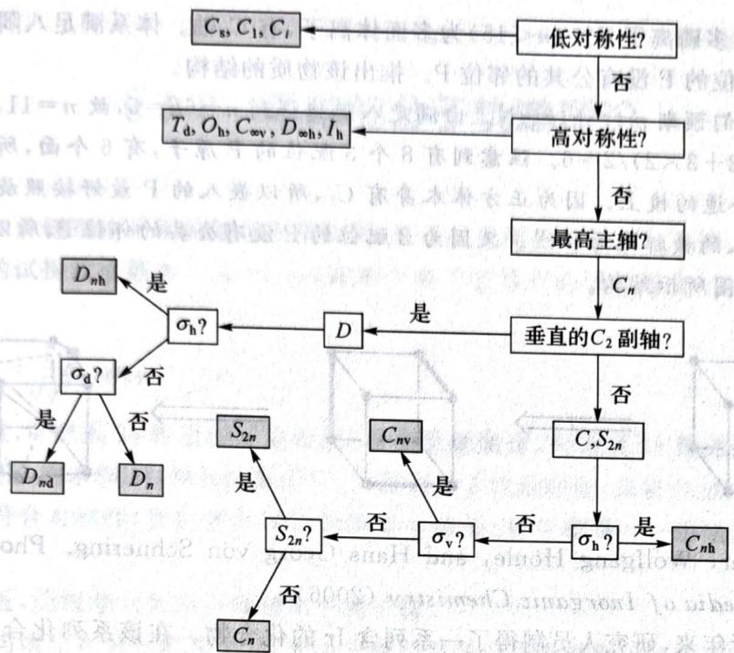

flowchart

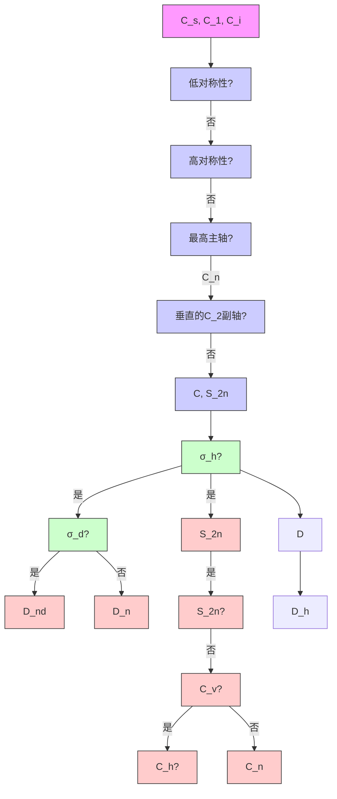

点群判断流程

【例 3.36】 环辛四烯分子结构是“澡盆式”结构, 如右图所示。

考虑其对称元素和所属的点群。

竖直方向的 $C_2$ 是显然的，问题在于寻找副轴。观察图中的一些空间关系：前侧用黑色加粗的键与后侧浅色的键所在的平面并不是平行的（注意键角），前后各有一定的向纸外和纸内的伸展，因此可以发现 $C_2$ 轴也是 $S_4$ 。由于不存在 $\sigma_h$ ，因此体系不可能是 $C$ 点群（ $C_{n_v}$ 没有映轴），也不会是 $S$ 点群（因为有其他对称元素），因此必然是 $D$ 点群。如果单纯判断点群，已经可以给出是 $D_{2d}$ 了，因为体系没有 $\sigma_h$ 。抱着这样的信条，可推断两个 $\sigma_v$ 的角平分面上，必然有 $C_2$ 副轴，于是它

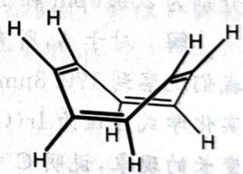

chemical

Chemical structure of a substituted cyclohexane with hydrogen atoms and stereochemistry indicated

环辛四烯

应该穿过对棱两条键的中心(观察各个原子在旋转下的变化)。这就分析完了这个分子的对称性。

【例题3.37】金属离子在一定条件下水解可得多核离子，如 $\mathrm{Bi}_{6}(\mathrm{OH})_{12}^{6+}$ 和 $\mathrm{Pb}_{6}\mathrm{O}(\mathrm{OH})_{6}^{4+}$ 即为两种经水解得到的六核阳离子。 $\mathrm{Bi}_{6}(\mathrm{OH})_{12}^{6+}$ 与 $\mathrm{SF}_{6}$ 具有相同的对称性，同种原子的化学环境完全相同；而 $\mathrm{Pb}_{6}\mathrm{O}(\mathrm{OH})_{6}^{4+}$ 与 $\mathrm{H}_2\mathrm{O}$ 具有相同的对称性，6个铅形成三个四面体，氧均为四配位。画出二者的结构。

解 $\mathrm{SF}_6$ 即为八面体型的对称性。这个体系的结构是很容易画出的，八面体的每个顶点放一个Bi，每条棱上放一个OH（对顶点数、面数和棱数要敏感）。 $\mathrm{H}_2\mathrm{O}$ 是 $C_{2v}$ 对称性，由此可见铅对应的离子的中央应该有一个O。3个四面体只有6个铅，于是需要共用6个顶点。从而体系是三个铅的四面体按面线性连接，每个铅各接一个OH或者把每个OH放在两边两个四面体的面心附近，氧原子位于中间四面体的中心。具体结构如下图所示。

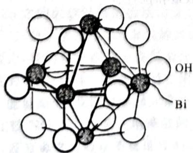

chemical

Crystal structure diagram of a boron-oxygen compound showing Bi and OH atoms in a polyhedral arrangement

(a) $\mathrm{Bi}_{6}(\mathrm{OH})_{12}^{6+}$

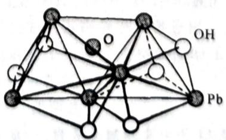

chemical

Molecular structure diagram of a platinum complex with oxygen and hydroxide ligands

(b) $Pb_{6}O(OH)_{6}^{4+}$

(Greenwood, Norman Neill, and Alan Earnshaw. Chemistry of the Elements. Elsevier, 2012)

【例题3.38】某多磷离子 $\mathrm{P}_n^{m-}(n < 15)$ 为多面体离子，有 $C_3$ 轴。体系满足八隅律且3配位的 $\mathbf{P}$ 比2配位的多5个、2配位的 $\mathbf{P}$ 没有公共的邻位 $\mathbf{P}$ 。推出该物质的结构。

解 由对称性我们预期 $m = 3k, k \in \mathbb{N}$ 。由满足八隅律得到 $n - 6k = 5$ ，故 $n = 11, m = 3$ 。面数为 $2$ , $V + E = 2 - 11 + (8 \times 3 + 3 \times 2) / 2 = 6$ 。注意到有8个3配位的P原子，有6个面，所以从正方体开始构建：2配位的P嵌在合适的棱上。因为正方体本身有 $C_3$ ，所以嵌入的P最好按照旋转轴的对称性进行分布，可以把要被嵌入的棱标记为粗线。又因为2配位的P没有公共的邻位P，所以标有粗线的棱不可相交。由此可得到下图所示结构。

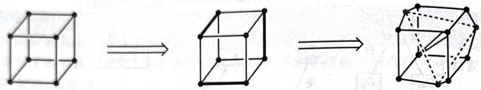

chemical

Three-step molecular transformation diagram showing unit cell deformation

(Pöttgen, Rainer, Wolfgang Hönle, and Hans Georg von Schnering. Phosphides: Solid-state chemistry. Encyclopedia of Inorganic Chemistry (2006))

【例题 3.39】近年来,研究人员制得了一系列含 Ir 的化合物。在该系列化合物中, $\left[IrO_{4}\right]^{+}$ 有 A、B、C 三种异构体。A 无对称中心,Ir—O 键的键长均为 170.8pm。B 中 Ir 的配位数为 4,氧化态为 +7,只有两种 Ir—O 键,键长分别为 188.8pm 和 168.0pm。C 中只有一个镜面,也只有两种 Ir—O 键,键长分别为 209.6pm 和 167.9pm。画出 A、B、C 的结构。

解 对于 A, 所有键长都相等, 说明对称性较好, 而又无对称中心, 因此这是四面体结构。对于 B, 我们观察到 170.8pm 和 168.0pm 接近, 所以仍然存在 Ir-O 单键。注意到 Ir 的价态下降了, 所以其真实化学式应该为 $\mathrm{Ir(O_2)O_2^+}$ 。对于 C, 我们发现 Ir-O 的键长进一步增长, 类比 B 中出现过氧导致键长变长的现象, 说明 C 中 Ir 的价态在进一步下降, 故 C 应该是超氧配合物 $\mathrm{Ir(O_2)O_2^+}$ , 但其形状将成为平面三角形。

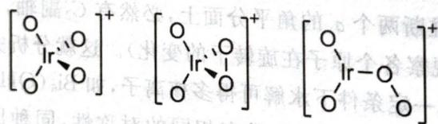

chemical

Chemical structure of a Ir(II) complex with oxygen and oxygen atoms, showing two possible configurations.

上图中从左至右分别为 A、B、C。

【习题 3.40】 理论计算表明 $O_{4}$ 分子可能有三种不同的结构。第一种具有 $S_{4}$ 轴，第二种兼具 $S_{4}$ 轴和四条 $C_{3}$ 轴，第三种为平面型结构，其中含有一条 $C_{3}$ 轴和三条垂直于 $C_{3}$ 轴的 $C_{2}$ 轴。画出这三种 $O_{4}$ 分子的可能结构；在理论预测的条件下，第一种结构最稳定，简述原因。

(Chemical Physics 48, No. 2 (1980), 215)

【习题 3.41\*】 $\left[Bi_{7}I_{24}\right]^{3-}$ 的理想结构由 $BiI_{6}$ 正八面体连接而成，三层八面体呈 $Bi_{2}Bi_{3}Bi_{2}$ 分布。请画出其结构，判断其点群，列出其所有的对称元素及数量和位置。

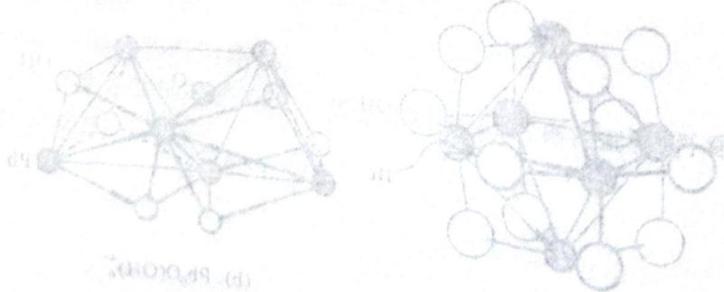

chemical

Molecular structure diagrams showing two configurations of d9 and d8 atoms with labeled atoms and bonds

## § 3.8 简单的分子轨道理论

分子轨道理论和价键理论采用的数学方法相同，只不过选用的变分函数不同。对于氢分子，分子轨道理论设整个分子的试探波函数为 $c_{1}\psi_{1} + c_{2}\psi_{2}$ （即两个电子波函数的线性组合）并求解出最优的 $c_{1}, c_{2}$ 。例如， $\mathrm{H}_{2}$ 的结果是

$$
\psi_ {\mathrm{成键}} = \frac {1}{\sqrt {2}} \psi_ {1} + \frac {1}{\sqrt {2}} \psi_ {2}, \psi_ {\mathrm{反键}} = \frac {1}{\sqrt {2}} \psi_ {1} - \frac {1}{\sqrt {2}} \psi_ {2}.
$$

前者是成键轨道,可看成 1s 轨道同相重叠;后者是反键轨道,可看成 1s 轨道异相重叠。反键轨道的能量比成键轨道高。将求解 $H_{2}$ 的方法推而广之,得到分子轨道理论,其要点是:

1. 成键时必须符合对称性(我们暂时可认为就是头碰头、肩并肩等)，一组轨道相互作用形成成键轨道和反键轨道。

2. 能量必须相近,能级差太大将导致偏向于离子键。

3. 所有的电子均填充在分子轨道上, 填充电子时仍然符合构造原理的三条规则。

【例 3.42】下图中示出了 $O_{2}$ 的分子轨道。图中 2s 轨道在下部形成 $\sigma$ 键；上部两个 2p 轨道形成 $\sigma$ 键，对应的反键轨道为 LUMO；剩余两组 2p 轨道形成 $\pi$ 键，对应的反键轨道为 HOMO。键级为 $(2+2+2-1-1+2-2)/2=2$ 。键级 = (成键电子数 - 反键电子数)/2。图中标出了 HOMO（最高占有轨道）、LUMO（最低未占轨道）、SOMO（单占轨道）等概念，请同学们注意。另外，反键轨道在用符号标记时会用 \* 上标注明。

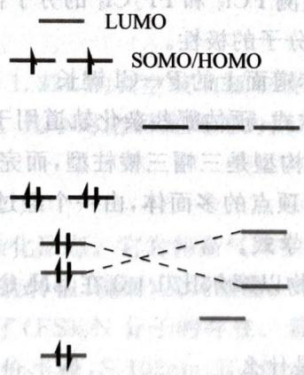

text_image

LUMO
SOMO/HOMO

$\mathrm{O}_2$ 的分子轨道

第二周期双原子分子的分子轨道存在交错现象(图中虚线)，随着原子序数减小，2s 和 2p 越来越接近，于是 s 轨道将参与到附近 $\sigma$ 键的形成(这个扰动的想法是很重要的)，导致 2s 形成的反键轨道的反键性质增加，而上面 2p 之间的成键轨道性质增加，从而发生交错。换言之，第二周期较小原子序数的原子形成的双原子分子，其分子轨道中，2s 形成的反键轨道的能量要高于 2p 形成的成键轨道的能量。

对于分子轨道理论,我们只需要学会在复杂分子的局部进行分子轨道分析。首先给出定域的分析,再引入一些其他轨道的作用(就像上面处理第二周期双原子分子的交错现象时采用的办法),给出相应的结论。关于轨道的能量高低,我们可参照元素电负性进行判断。

【例题3.43】比较 $\mathrm{NO},\mathrm{N}_2,\mathrm{O}_2$ 第一电离能的大小，说明理由。

解 $\mathbf{N}_2$ 比 $\mathrm{O}_2$ 大，因为由它们的分子轨道可知，电离 $\mathbf{N}_2$ 将导致键级变小而 $\mathrm{O}_2$ 则增加。 $\mathrm{O}_2$ 比NO大，因为它们电离都升高键级，但NO中N电负性小，轨道能量高，电离能略低，况且NO中还有一个不稳定的单电子。

【习题3.44】 $\mathrm{O}_2\mathrm{F}_2$ 的构型与 $\mathrm{H}_2\mathrm{O}_2$ 相似，但 $\mathrm{O}_2\mathrm{F}_2$ 中 $\mathrm{O}-\mathrm{O}$ 键长为 $121\mathrm{pm}, \mathrm{H}_2\mathrm{O}_2$ 中 $\mathrm{O}-\mathrm{O}$ 键长为 $148\mathrm{pm}$ ，解释两者键长的巨大差异。

## 第3讲习题

【习题3.45】 $\mathrm{NH}_3$ 的键角与 $\mathrm{NF}_3$ 的键角略有不同。 $\mathrm{NF}_3$ 中 $\angle \mathrm{FNF}$ 为 $102.5^{\circ},\mathrm{NH}_3$ 中 $\angle \mathrm{HNO}$

【习题 3.46】下图示出了葱的结构。

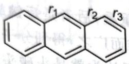

设碳碳双键的键长为 $r_{\mathrm{d}}$ ，碳碳单键的键长为 $r_{\mathrm{c}}$ 。请为

【习题3.47】为什么与过渡金属配位能力对比， $\mathrm{NH}_{3}<\mathrm{PH}_{3}, \mathrm{NF}_{3}<\mathrm{PF}_{3}$ 面与 $\mathrm{NH}_{3}>\mathrm{PH}_{3}$ ？

【习题3.48】根据杂化轨道理论,判断 $SOCl_{2}$ 和 $N(SiH_{2})_{6}$ 的中心原子的杂化。

【习题3.49】磷与过量卤素反应生成如 $\mathrm{PCl}_{5}$ 的五配位化合物，而像 $\mathrm{PF}_{2} \mathrm{Cl}_{6}$ 这样的混合物由一种卤素与另一种卤素形成的三卤化磷反应制组。

1. 画出 $PCl_{5}$ 和 $PF_{2}Cl_{3}$ 的 I $_{2}$ 分析。  
2. 根据 VSEPD 的 Lewis 结构式。  
3. 估计 $PCl_{5}$ 和 $PF_{2}Cl_{3}$ 的分子构型。  
4. 比较 $\mathrm{{PCl}}$ 的极性。  
5. 给出 $PF_{2}Cl_{3}$ 的杂化方式。

【习题3.50】 $\left[\mathrm{Bi}_{9}\right]^{5+}$ 的构型是三帽三棱柱型,而定 $A_{1}$

[2] $\alpha_{1}$ 的构型是三帽三棱柱型, 而完全由 Sn 组成的它的等电子体的构型与它不同。后者可视为一种以 Sn 原子为顶点的多面体, 由一个经过扭转的柱体和一个锥体构成, 其对称元素包含 $C_{4}$ 轴。请画出其结构, 标明化学式。

【习题3.51】两种化合物以摩尔比 $1:3$ 在 $\mathrm{CH}_2\mathrm{Cl}_2$ 中化合得到 $\mathrm{C_6H_9R_4L}$ 。

1. 推断两种化合物分别是什么。  
2. 画出阴离子的结构,给出存在杂化的原子的杂化类型。(Inorganic Chemistry 40, No. 1, 6)

【习题3.52\*】激发态时，10:1（2001）：25-28）

【习题3.53】具有良好机械性质的材料。简述原因。

17.9% C、35.8% O)具有三维立体结构,含8个等价的Si,所有C和O。简述原因。结构。

【习题3.54】将 $\mathrm{XeF_4}$ 通入 $\mathrm{CH}_3\mathrm{CN}$ 水溶液，可结晶得到 $\mathrm{XeH_3NC_2OF_2}$ ，后者在真空中能分解得到较纯的 $\mathrm{XeOF_2}$ 。画出 $\mathrm{XeH_3NC_2OF_2}$ 和 $\mathrm{XeOF_2}$ 的分子结构示意图，指出由A的化学环境都相同。推出A的 Journal of the American Chemistry

【习题3.55】2000年，赫尔辛基大学的科学家制备了氩的第一个化合物HArF，它在27K以下可以稳定存在。实验表征与理论计算表明，在HArF分子中有一个3中心4电子键，请指出Ar的杂化方式。该分子是直线型还是V型？

【习题 3.56】等电子体往往具有类似的化学键和几何构型。运用(广义)等电子体的概念可以推测某些物质的构型和预测新化合物的结构。

1. 在高压下，Cs 与 $F_{2}$ 反应可以形成共价化合物 $CsF_{5}$ ，指出 Cs 的杂化方式并指出 $CsF_{5}$ 的几何构型。

在液氨中 $CH_{3}SiCl_{3}$ 与金属钠反应，生成了 $C_{6}H_{27}N_{9}Si_{6}$ 。该分子所有原子都达到稀有气体稳定结构，有一个 $C_{3}$ 轴，Si 原子在该分子中不可区分。

2. 画出 $C_{6}H_{27}N_{9}Si_{6}$ 的结构。

【习题 3.57】 考虑 S(VI) 的氯氧化物 $SO_{2}Cl_{2}$ 、 $SOCl_{4}$ 。

1. 预测: 相比于 $SO_{2}Cl_{2}$ , $SO_{2}F_{2}$ 中的 $\angle OSO$ 和 $\angle FSF$ 是更大还是更小? 简述理由。

2. 实际上 $SOCl_{4}$ 是未知的化合物。简述原因。

【习题 3.58】 $0^{\circ} \mathrm{C}$ 下在 $\mathrm{XeF}_{2}$ 的水溶液中加入 $\mathrm{NaN}_{3}$ , 光谱指出产生了 $\mathrm{FXeN}_{3}$ 中间体, 后者水解产生 $\mathrm{X}, \mathrm{X}$ 分解只产生 $\mathrm{N}_{2} 、 \mathrm{~N}_{2} \mathrm{O}$ 和 $\mathrm{H}_{2} \mathrm{O}$ 。

1. 推出 $FXeN_{3}$ 中, 中心原子的杂化。中心原子附近分子呈什么构型?

2. 画出 X 的 Lewis 结构式(给出所有共振式), 要求示出键角。

【习题 3.59】1. 用分子轨道理论解释下列物质的 O—O 键级、磁性(顺磁性、逆磁性)。

A. $O_{2}^{+}$

B. $O_{2}$

C. $O_{2}^{-}$

D. $O_{2}^{2-}$

2. 试判断 $O_{3}$ 中 O—O 间距与以上何者最接近。

3. 比较 $SOF_{2}$ 、 $SOCl_{2}$ 、 $SOBr_{2}$ 中硫氧键强度，并简要说明理由。

【习题 3.60】 在光照条件下, $ClO_{3}F$ 能与氟气发生反应得到一种抗磁性的五原子分子 Y。有人认为,该反应的机理可能是 $ClO_{3}F$ 先光解形成三原子分子 A,A 再与氟气化合得到 Y。A 分子与 Y 分子的对称性相同。

1. 画出 A 的 Lewis 结构式。

2. 画出 Y 的立体结构。

【习题 3.61】在 21.0℃ 和常压下，在一个 1.22L 的真空玻璃瓶中装满某二元化合物气体（含金属 M），增重为 15.1g。加入一滴水之后将它密封。几小时之后发现压力恰增加了 50%；瓶子的内壁变得没有光泽，出现淡黄色的痕迹。

1. 通过计算,确定发生的反应的方程式。

2. 画出该气体的立体结构, 并指出 M 的杂化形态。它为何是气体?

3. 指出气体分子具有的所有对称元素(限旋转轴、镜面)及其数量。

【习题 3.62\*\*】有人通过理论计算预测了 $(\mathrm{FS})_{3}\mathrm{N}$ 分子的存在。若其某一可能构象A有三重旋转轴，键长S-N=170pm,S-F=160pm（共价半径：S 102pm,F 72pm,N 75pm），键角∠NSF接近π/2。

1. 写出构象 A 中 N 原子的杂化方式，并计算其中相邻的不成键的 S—F 间距。

2. 通过分析,指出这一构象的一个稳定因素和一个不稳定因素。

(Inorganic Chemistry 11, No. 9 (1972): 2192–2195)

【习题 3.63】在气相和 $CS_{2}$ 中均测得 $GaCl_{3}$ 的偶极矩为 0，但 $CS_{2}$ 中 $GaCl_{3}$ 的摩尔质量是气相的两倍；在苯中测得 $GaCl_{3}$ 的偶极矩为 3.05D。试画出气相、 $CS_{2}$ 、苯中 $GaCl_{3}$ 分别的存在形态结构。

【习题 3.64 $^{*}$ 】将 $S_{4}N_{4}$ 溶于二氯化二硫溶液中加热反应，然后冷却可以得到一种离子化合物 K，K 的阳离子 $\left(\mathrm{S}_{3}\mathrm{N}_{2}\mathrm{Cl}^{+}\right)$ 中含有一个五元环。K 中有且仅有一根 S—S 键，没有 N—Cl 键。

1. 画出 K 的最稳定共振式。  
2. 写出五元环中五根键的键长大小关系, 简述理由。

(Polyhedron 2, No. 3 (1983): 149-152)

【习题 3.65】丙烷选择性氧化制备的丙烯醛催化剂中常含有 Te, A-B 型体系是一种新型催化剂。有化学家仔细研究了 A-B 体系的催化剂: A 为 Te, B 由 $TeCl_{4}$ 与 $AlCl_{3}$ 按物质的量之比 1:4 化合制得。已知 B 是一种共价型离子化合物, 其阴离子为四面体结构, B 中铝元素、氯元素的化学环境相同。A 与 B 反应生成三种新化合物 (I、II、III), 其中 A 的物质的量分数分别为 77.8%、87.5% 和 91.7%。生成化合物 I 时还伴随着挥发性 $TeCl_{4}$ 生成, 每生成 2 mol 化合物 I 就生成 1 mol $TeCl_{4}$ ; 生成化合物 II 和 III 时没有其他副产物。对熔融的 $NaAlCl_{4}$ 导电性研究表明, 化合物 I 和 II 在一起时总共会解离成三种离子。进一步用凝固点下降法测定确定 I 和 II 的摩尔质量分别为 $1126 \pm 43$ 和 $867 \pm 48$ g/mol。化合物 I 和 II 的红外光谱测定表明只有一种振动; 分子中不存在 Te=Te 键; 结构中都只有一种四面体配位的铝, 但是铝原子在这两种化合物中的化学环境是不同的。

1. 确定 B 的化学式。  
2. 确定配合物 I、II 中的 Te: Al: Cl 的最简原子比。  
3. 写出化合物Ⅰ、Ⅱ中阴离子和阳离子的化学式。  
4. 指出 I、II 中 Te 和 Al 原子的杂化形态。

【习题 3.66】 回答下列有关 VA 族元素结构的问题。

1. 在 195K 条件下， $P_{4}O_{6}$ 与 $O_{3}$ 在二氯甲烷中反应得到了一种高度不稳定的化合物，其中不存在氧化态为 +3 或者配位数为 3 的 P 原子，1mol 该分子在 238K 以上可以爆炸性分解得 $P_{4}O_{10}$ 和 4mol $O_{2}$ ，试画出其结构。  
2. $P_{4}S_{3}$ 的结构在 As 的化合物中十分常见, $\mathrm{As}_{7}\left(\mathrm{SiMe}_{3}\right)_{3}$ 属于它的一种广义等电子体, 请画出 $\mathrm{As}_{7}\left(\mathrm{SiMe}_{3}\right)_{3}$ 的结构。  
3. 加合物 $SbCl_{5} \cdot ICl_{3}$ 含有 $[SbCl_{6}^{-}]$ 的变形八面体单元，其中阳离子和配阴离子可视为无限链状结构，请画出其立体结构。  
4. Bi 的低卤化物 $BiCl_{1.167}$ 是一种黑色晶状的化合物，化学式为 $Bi_{24}Cl_{28}$ 。该化合物是抗磁性的，具有很奇怪的结构。它含有 Bi 原子组成的阳离子簇以及两种氯配阴离子。氯配阴离子中 Bi 的氧化数均为 +3。请推测这三种离子的化学式。

【习题 3.67】在减压和 $250 \sim 300^{\circ}C$ 下将 $S_{4}N_{4}$ 蒸气通过 $Ag/Ag_{2}S$ ，可以得到环状的 $S_{2}N_{2}$ ， $S_{2}N_{2}$ 是一种很不稳定的无色晶体，室温下会自发地发生聚合得到 $(\mathrm{SN})_{x}$ ，后者是一种有潜在超导性的一维聚合物。 $S_{2}N_{2}$ 的聚合机理十分复杂，随着条件的不同而不同，但总的来说是开环聚合的过程。

1. 用共振式表示 $S_{2}N_{2}$ 的结构，并判断其是否具有芳香性。

2. 为何 $\mathrm{S}_2\mathrm{N}_2$ 很不稳定？

3. 给出 $(\mathrm{SN})_{x}$ 的 Lewis 结构式。

(Journal of the Chemical Society, Chemical Communications 12 (1975): 476–477; Inorganic Chemistry 25, No. 24 (1986): 4404–4408)

【习题 3.68】硝酸是很有趣的物质,试考虑以下问题:

1. 气相中的 $HNO_{3}$ 为平面型结构, 请写出其结构中存在的离域 $\pi$ 键。

2. 三硝酸二氢铵中的阴离子存在很大的对称非平面氢键体系,请尝试画出。

【习题 3.69】设想存在链状结构的 $N_{6}H_{6}$ 分子，N 是 CH 的等电子体，它们有相似的结构特征。

1. 试写出 $N_{6}H_{6}$ 所有可能的链状同分异构体的结构式(不考虑立体异构)。

2. 试写出 $N_{3}^{-}$ 和 $N_{5}^{+}$ 的 Lewis 结构式, 已知它们的几何构型不同。

【习题 3.70\*】碳硼烷酸是一种超强酸。将 $\left[H_{3}O\right]\left[CHB_{11}Cl_{11}\right]$ 溶于苯中，得到一种不含硼的阳离子。计算证实阳离子在气相中存在 $C_{3}$ ，离子内存在较强的分子间作用力。画出阳离子的结构。

(Journal of the American Chemical Society 127, No. 21 (2005): 7664–7665)

# 第4讲 配合物

配合物是化合物中较大的一个子类别,广泛应用于日常生活、工业生产及生命科学中,近些年来的发展尤其迅速。它不仅与无机化合物、有机金属化合物相关联,并且与现今化学前沿的原子簇化学、配位催化及分子生物学都有很大的重叠。本讲我们回顾配合物的基本理论,同时顺带提及相关的酸碱理论。配合物的基本理论其实是比较简单的,在初赛中主要的问题是技术性的——如何推断。

## § 4.1 酸碱理论

由于配位反应一定程度上可看成酸碱反应,而酸碱理论可对配合物形成的倾向做出解释和预测,我们先谈论酸碱反应。

化学反应包括两类,即氧化还原反应和非氧化还原反应。对于非氧化还原反应的分类在化学尚未诞生的时代就已经开始了:炼金术士们已经有了酸碱反应的概念,他们知道酸和碱能发生中和反应。后来的化学家则尝试用酸碱反应来概括全部的非氧化还原反应(甚至氧化还原反应)。

理解氧化还原反应,主要是考虑物种的得失电子能力(HOMO 和 LUMO 的高低);对非氧化还原反应,主要是考虑广义的酸碱反应,通过物种的成键性质(HOMO 和 LUMO 的能级差异)理解之。

## 4.1.1 质子酸碱理论

Brønsted 和 Lowry 认为, 酸是能给出质子的物种, 碱是能接受质子的物种。而按该定义, 酸和碱分别失去质子、得到质子变成了碱和酸, 这些碱和酸分别称为原来酸碱的共轭碱和共轭酸。

质子酸碱理论是大家熟知的,这里我们只需要为之后有机化学的章节做一些铺垫,考虑质子酸碱的强弱递变规律,即电子效应和空间效应初步。

## 4.1.1.1 诱导效应

诱导效应指的是电负性高的原子或基团连接在所考虑的位点附近时,位点的性质会发生相应变化,其本质是对电子的吸引,一般作用不超过3根化学键。依照前一章我们知道,杂化也会对原子的电负性产生影响,s成分多的轨道能量低,相当于电负性较高。

【习题4.1】用Bent规则解释诱导效应的来源。

诱导吸电子效应会导致酸性增强，而给电子效应导致碱性增强。例如，我们有以下酸碱性的递变规律。

【习题3.71】X射线晶体学研究表明，非金属阳离子多硼酸盐M的酸根由两个分离的多硼酸根组成，其中一个为四硼酸根（即硼砂中的酸根），另一个为不常见的多硼酸根（含有2个四配位B和5个三配位的B）。两个分离的多硼酸根可以在一个固态结构中共存是非常有意义的，是多硼酸化学重要的新进展。该化合物M由乙二胺与硼酸在 $\mathrm{H}_2\mathrm{O} / \mathrm{MeOH}$ 中制备，其中硼的质量分数为 $17.64\%$ ，碳的质量分数为 $7.13\%$ ，其余元素为N、H、O。

1. 通过计算推导出该盐的化学式(体现其结构组成)。

2. 画出该盐中两种阴离子的结构, 已知二者均以 B—O 六元环为基本骨架。

3. 这种非金属阳离子多硼酸盐可以形成超分子结构,请解释原因。

4. 该物质的热分析失重显示在空气中加热，在 $1000^{\circ}\mathrm{C}$ 下剩余残渣为原物质质量的 $56.1\%$ ，请写出残渣组成。

【习题 3.72】六亚基四胺 $\left(\mathrm{CH}_{2}\right)_{6}\mathrm{N}_{4}$ 中存在 C—H…N 氢键。

1. 在六亚甲基四胺中, 每摩尔该分子有几摩尔氢键?

2. 为何电负性较小的 C 也能参与形成氢键?

【习题 3.73】 纯硫酸中存在右图所示离子通道。

$H_{3}SO_{4}^{+}$ 通过该通道进行迁移(具体迁移方式未标明)，这使得纯硫酸中 $H_{3}SO_{4}^{+}$ 的迁移速率可以与水中的

chemical

Chemical structure of a sulfonic acid with hydroxyl groups and ester linkages

$H^{+}$ 相比。参照上述研究结果,画出纯硫酸中 $HSO_{4}^{-}$ 的迁移通道(至少画出3个通道上的分子),并表示出 $HSO_{4}^{-}$ 具体的迁移方式(画出示意图即可)。

【习题 3.74】 化合物 X 由 C、H 及未知元素 Y 组成, 其碳、氢质量分数分别是 55.79%、12.88%。

1. 通过计算确定该未知元素 Y, 写出 X 的最简式和结构简式。

2. 已知 X 分子呈现中心对称, 确定 X 的化学式, 画出 X 的结构图。

3. 指出 Y 原子的杂化类型和分子中心部分的成键特点。

【习题3.75】在制备Zintl化合物时，半径适宜的粒子有可能被包含在Zintl多面体内部。例如将Na、Sn和Ca的单质熔融反应，得到一种化学式为 $\mathrm{Na}_{10}[\mathrm{CaSn}_{12}]$ 的钠盐，其阴离子 $[\mathrm{CaSn}_{12}]^{10-}$ 具有与甲烷相同的对称性，Sn原子均满足八隅律。请画出 $[\mathrm{CaSn}_{12}]^{10-}$ 的结构示意图。

【习题 3.76】 $KrF_{2}$ 是一种比较少见的稀有气体化合物, 其具有很强的氧化性。例如, 在 $O_{2}$ 氛围中, $PdF_{4}$ 与 $KrF_{2}$ 反应, 得到离子化合物 D。D 为 1:1 型盐, 其阳离子为双核阳离子, 键级为 2.5; 阴离子为八面体配离子。写出生成 D 的反应方程式。

【习题 3.77】近年来芳香性的概念有所拓宽,人们发现平面 $\sigma$ 系统也可以有芳香性,而且判定芳香性也一般地适用 Hückel 规则。下面给出了五个例子:

a）质荷比为3的一种星际离子A；

b) 在激光下蒸发 Al 和 $Na_{2}CO_{3}$ 的混合物, 得到质荷比为 131 的阴离子 B, 其中有四重对称轴;

c) 在 $Li_{12}Si_{7}$ 晶体中出现的离子 $\mathbf{C}:(\mathrm{Li}_{6}^{6+}[\mathbf{C}])_{2}(\mathrm{Li}_{12}^{10+}[\mathrm{Si}_{4}]^{10-})_{2}$ ;

d) 合金 $Na_{3}Hg_{2}$ 中存在一种平面正方形的阴离子 D;

e) 在使用 Pt/Zn 系统进行催化氢化时, 发现其中存在一种含 Pt 的一价阴离子 E, 具有五重对称轴, 质荷比为 265。

给出上述五种物质的结构,标明电荷并写出形成其芳香体系的电子数。

【习题 3.78 $^{*}$ 】 NO 分子的结构可用分子轨道理论来描述。

1. 画出 NO 分子的定性分子轨道图。注意在图上反映 N 和 O 的电负性差异。

2. 写出键级和未成对电子数。

3. 若 NO 与 H 原子结合, 理论上应得到 HNO 还是 HON? 简述理由。

(The Journal of Chemical Physics 91, No. 5 (1989): 2939–2948)

【例 4.2】对以下取代的吡啶, 其共轭酸的 $pK_{a}$ 按如下顺序递增。

chemical

Chemical structures of chlorinated benzene derivatives with bromine substituents, showing structural differences

最后一个碱因为存在比较大的位阻,常常用作有机反应的碱。

【例题4.3】丁二酸和戊二酸的四个 $\mathsf{pK}_{\mathrm{a}}$ 为4.21、4.34、5.41和5.64，指出这些常数分别是哪个酸的几级酸常数，并从结构与性质的角度简述你做出判断的理由。

解 考虑诱导效应,丁二酸和戊二酸的区别在于链长不同。羧基距离近,则吸电子诱导效应强,第一级电离容易;而电离后羧酸根和羧基距离近,则给电子诱导效应(和场效应)强,第二级电离困难。因此丁二酸的第一级和第二级酸常数分别为4.21、5.64,戊二酸则占有4.34、5.41。

## 4.1.1.2 (超)共轭效应

(超)共轭效应指共轭体系中电子因相互影响而导致的性质变化,它可反映在经典结构式中,亦能用价键理论的方式予以图示,因此经典结构理论在此是一个有力的工具。共轭效应是长程效应,只要存在共轭体系,就能发生作用。共轭作用可以稳定正电荷和负电荷,使得碱性或酸性增强;对孤对电子的共轭效应则会导致碱性大大降低。

强烈的共轭效应是某些有机物显色的一个重要原因。

【例 4.4】氰基甲烷的 $pK_{a}$ 如下：

$CH_{3}CN,31;CH_{2}(CN)_{2},11;HC(CN)_{3},5。$

我们能预见氰基增多,酸性增强,因为增加了共轭效应和诱导效应,氰基可更好地分散 C 上的负电荷。此外,我们还注意到氰基从 2 个增加到 3 个,酸性的增强程度不如从 1 个增加到 2 个的情形,这是因为 3 个氰基不能完全同时与碳负离子的 p 轨道发生平面的重叠,共轭效应受到削弱。

【习题 4.5】下图所示 4 个酚(从左至右分别编号为 1、2、3、4)的酸性,正确的判断是\_\_\_\_(填上所有正确判断的代号)。

A. $1 \approx 2$

B. $3 \approx 4$

C. 2 > 4

D. 2 > 3

【习题 4.6】下图示出了环戊二烯、茚和芴的结构, 它们的 $pK_{a}$ 分别为 15、20、25。为什么有这样的变化趋势?

chemical

Three organic molecular structures: cyclohexene, fused benzene, and fused polycyclic aromatic hydrocarbon

## 4.1.1.3 空间效应

4.1.1.3 空间效应

空间效应泛指基团在空间上接近等因素导致分子的性质发生变化,最常见的便是所谓的“位阻”。由于空间效应有各种各样的效果,例如阻碍共轭、提供有利的结合位点,因此空间效应一般要结合体系的整体结构进行具体的分析。

【例 4.7】下图示出的物质是一种超强碱,其强碱性来源于质子化之前两个 $NMe_{2}$ 基团的排斥和质子化后形成的六元环对称氢键。

chemical

Chemical reaction showing conversion of a naphthalene derivative to a fused bicyclic compound with methyl and NMe2 groups

## 4.1.2 Lewis 酸碱理论

Lewis 提出了一个较广泛也较本质的酸碱理论,他认为在化学反应中,凡是给出电子的都称为碱,凡是接受电子的都称为酸。Lewis 酸碱的概括性是如此强大,以至于它甚至能对一些有机化学中的氧化还原反应作出本质的解释(参见 11.4 节),而且还能在定性分子轨道理论中得到更好的解释。

【例 4.8】大家熟知反应 $BF_{3} + NH_{3} \longrightarrow BF_{3} \cdot NH_{3}$ 。这是一个 Lewis 酸碱加合反应， $BF_{3}$ 作为酸接受碱 $NH_{3}$ 的一对孤对电子。在这一反应中， $BF_{3}$ 的 LUMO 和 $NH_{3}$ 的 HOMO 相互作用，形成配位键。

text_image

LUMO
HOMO

从上图我们能看出形成配位键的稳定作用。在此图中我们还可以考虑不同卤素原子 X 对 $BX_{3}$ 的 Lewis 酸性的影响。由于 X 上的孤对电子与 B 的 p 轨道可有共轭作用，因此 LUMO 的反键性质应该增加（如上图，中间在此扰动下应略有升高）。因为 F 相比于 Cl，轨道能量与 B 更加匹配（2p 与 3p 对比），因此 $BF_{3}$ 中 LUMO 升高更多，Lewis 酸性也就更弱。

【例 4.9】 $I_{2}$ 在不同有机溶剂中溶解，呈现不同的颜色。在己烷中为紫色，在苯中为红色，在乙醚中为红棕色。这可以使用 Lewis 酸碱理论进行解释。下图左侧示出了溶液中碘显色的原因：从 $\pi_{g}^{*}$ 反键轨道到 $\sigma_{u}^{*}$ 轨道可发生电子的跃迁。

chemical

Energy level diagram showing spin states σu* (5p) and πg* (5p) with electron transitions

苯和乙醚均有给出电子的能力,其中乙醚给出电子的能力更强。己烷没有给出电子的能力,因此在己烷中碘分子仅保持上图中最左侧虚线箭头示出的跃迁。碘的 LUMO 和溶剂给体的 HOMO 作用之后,进行 Lewis 酸碱反应,HOMO 降低,LUMO 升高,产生图中中间虚线箭头表示的新的给-受体跃迁和右侧虚线箭头表示的荷移跃迁(charge transfer,意指电子从给体向受体产生转移的跃迁),吸收光波长变短,发生蓝移,给体给出电子的能力越强,蓝移也越剧烈。此时显色(补色)便发生红移,即产生了所说的颜色递变。荷移跃迁也是高锰酸钾显浓重紫色的原因之一。