状况下的气体,其密度比空气略高。F 含 66.46% 的 A 中元素。当我们分离出干燥的 F,在砂芯漏斗上慢慢用冷水洗涤时,可得到 G。G 和 D 的定性组成完全相同,但 D 中氧的质量分数是 G 的 1.190 倍。

1. 通过计算与推理, 给出 A\~D、X、Y 和 Z 的化学式。

2. 写出制备 B 的三种方法的反应方程式。

3. 推出 E、F，写出生成它们的反应的方程式；推出 G，写出含 G 的相关反应的方程式。

4. 在室温水溶液中，B 和某酸 H 反应生成了两种新酸。写出一个符合条件的反应的方程式。

【习题6.40】下表给出了一些N或者P的钠盐中元素质量分数的数据。同一行中N和P的氧化数相等。

<table><tr><td colspan="3">含N的盐</td><td colspan="3">含P的盐</td></tr><tr><td>代号</td><td>Na质量分数</td><td>N质量分数</td><td>代号</td><td>Na质量分数</td><td>P质量分数</td></tr><tr><td>A</td><td>46.9%</td><td>9.5%</td><td>E</td><td>42.1%</td><td>18.9%</td></tr><tr><td>B</td><td>27.1%</td><td>16.5%</td><td>F</td><td>22.5%</td><td>30.4%</td></tr><tr><td>C</td><td>33.3%</td><td>20.3%</td><td>G</td><td>36.5%</td><td>24.6%</td></tr><tr><td>D</td><td>43.4%</td><td>26.4%</td><td>H</td><td>26.1%</td><td>35.2%</td></tr></table>

D 和 H 分别是酸 I 和 J 的盐。I 和 J 都是对热不稳定的白色固体。I 分解得到气体 K 和水，J 分解首先得到气体 Q 和 L，L 进一步分解为气体 Q 和 M。

1. 给出 A\~H 的阴离子的结构。

2. 写出 I、J、K、L、M、Q 的化学式。

【习题 6.41】三种元素 A、B、C 能形成三种二元化合物, 其中每个元素的化合价的绝对值都相等。在 A 和 B 形成的化合物中 A 的质量分数为 75%, 在 B 和 C 形成的化合物中 B 的质量分数为 7.8%。确定 C 与 A 形成的化合物中 C 的质量分数, 并给出三种化合物的化学式(用元素符号表示)。

【习题 6.42】某氟化物 X 具有强氧化性。X 与 $NH_{3}$ 反应，得到两种气体和一种盐，其中混合气体的平均摩尔质量为 69.86g/mol，标准状况下 0.224L 的 X 与足量的 KI 反应，生成的 $I_{2}$ 需要用 25.00mL 0.8000mol/L $Na_{2}S_{2}O_{3}$ 溶液完全滴定。

1. 通过计算, 确定 X 的化学式。  
2. 写出 X 与 $NH_{3}$ 、 $H_{2}O$ 分别反应的化学方程式。

3. 将溶于液态 HF 的 X 与金属 B 反应可得到离子化合物 Y，将 Y 缓慢加热至 $60^{\circ}$ C 得橙红色物质 Z。经分析，Y 与 Z 中分别含 F 32.14%、32.53%。写出 Y、Z 的化学式和 Y 分解为 Z 的反应方程式。

【习题 6.43】化合物 A 由前四周期元素构成,能与水反应生成白色沉淀 B 和无色气体 C,B 能溶于强酸、强碱、氨水。C 是可燃性非极性气体。1.000g A 与水反应产生的气体 C 完全燃烧的产物干燥后得到 0.922g 气体 D,D 也是非极性分子。

1. 写出 B、C、D 的化学式。  
2. 写出 A 的化学式, 给出 A 的一种用途。  
3. A 可以在 $-78^{\circ}C$ 下与 $SO_{2}$ 反应，写出化学方程式。

4. 写出 B 溶于氨水的产物与 B 溶于盐酸的产物进行反应的离子方程式。

【习题 6.44】 Pt 催化剂的提取可以用 $HSO_{3}^{-}$ 络合法—— $H_{2}PtCl_{6}$ 中加入适量 $NaHSO_{3}$ :

(1) 发生氧化还原形成 A, 同时还有一种酸, 两种正盐。

(2) 过氧化氢氧化 A 生成 B。

(3)加热 B 生成 Pt 催化剂。

已知: A 是一种亚硫酸根络合物, 其中 Pt 的质量分数为 52.0%, S 的质量分数为 17.1%。B 是一种催化加氢时可用到的催化剂。请写出 A、B 的化学式以及这三步所发生的反应。

【习题 6.45】1. 向低温的 Li 的 $NH_{3}(l)$ 溶液中加入臭氧，得到一种含锂元素 5.64% 的化合物 A。将化合物 A 结晶，加热到室温，分解得到化合物 B 和两种气体，体积比约为 4:1。少量化合物 B 溶于稀硫酸的溶液具漂白性。写出 A 的化学式以及生成 B 的化学反应方程式。

2. 0.5243g 锂单质被投入一种液体中, 反应非常剧烈, 并放出一种无色气体。在 $28^{\circ} \mathrm{C}$ 和 $745 \mathrm{~mmHg}$ 下测得其体积为 $990 \mathrm{~mL}$ , 且其密度为 $0.1809 \mathrm{~g} / \mathrm{L}$ 。余下的溶液用二氧化碳饱和后蒸干, 得到了质量为 $2.790 \mathrm{~g}$ 的白色固体。 $28^{\circ} \mathrm{C}$ 下水的饱和蒸汽压为 $28.3 \mathrm{~mmHg}$ 。所有气体都为理想气体。通过计算和推理写出所有反应的方程式。

【习题 6.46°】元素 X 为短周期非金属元素, 它可以分别与金属 Li、非金属 P 生成化合物 A 和 B, 将 A、B 按 3:1 计量比在四氢呋喃 $\left(\mathrm{C}_{4}\mathrm{H}_{8}\mathrm{O}\right)$ 溶液中混合搅拌 12h 后生成白色沉淀 C。元素分析结果显示在沉淀 C 中 X 的质量分数为 32.3%, 沉淀 C 加热到 80℃ 后得到化合物 D, X 在 D 中含量为 71%, 化合物 D 也可以直接由 A、B 按 3:1 计量比在 520℃ 高温下反应得到。

1. 推断 X 是什么元素, 写出推断过程。  
2. 写出 A、B、C、D 的化学式。  
3. 写出相关化学反应方程式。  
4. 在制备 C 和高温合成 D 时应注意什么条件？

【习题 6.47】取 5.26g A 晶体,溶于适量水得到无色溶液。往溶液中通入足量无色 B 气体,无明显的浑浊现象。再通入适量无色无味 C 气体,得到大量沉淀 D。继续通气体至沉淀不再增加为止,过滤、洗涤、干燥沉淀 D,称重为 2.40g。滤液中加入足量硝酸银溶液,没有白色沉淀产生(有少量气体逸出)。

另取 5.26g A 晶体和 1.44g 有机物 E 一起溶于适量水中,也得到无色溶液。将该溶液持续缓缓加热,溶液变浑浊,并析出大量沉淀 D。过滤、干燥 D,称重也为 2.40g。滤液中加入足量硝酸银溶液,有大量白色沉淀产生(没有气体逸出)。过滤、洗涤、干燥沉淀,称重为 6.88g。

1. 写出 A\~D 的化学式。  
2. 写出上述涉及的所有化学反应式。

【习题 6.48】无机盐 X 中仅含有一种金属元素, 将其加热到 $220^{\circ}$ C 使得 2/3 的物质的量的 X 脱水后 (反应 1), 升温至 $240^{\circ}$ C 剩余物质可相互反应并脱水得到新物质 Y (反应 2)。再提高温度加热至恒重后, 系统相比于最初共失重 13.24%, 残余固体是完全脱水的产物 (反应 3)。

1. 计算推出 X 和 Y 的化学式。  
2. 写出所有化学反应的方程式。

【习题 6.49】 将重 30.000g 的两种无水氯化物的混合物溶解在 300g 水中，并将所得溶液分成三等份。向第一份溶液中加入过量的硝酸银水溶液得到 25.859g 不溶于硝酸的白色沉淀物。第二份中加入过量硫化钠溶液可得 1.401g 黑色沉淀。向第三份溶液中逐滴滴加 100g 5% NaOH 溶液无沉淀产生，但溶液颜色发生了变化。通过推理和计算确定混合物的定量组成（每组分）

【习题6.50】U与另一种主族元素A形成复合氧化物的水合物X在空气中热分解情况如下：在150\~200℃失重6.62%，对应全部的结晶水，同时生成B。B在290\~350℃可以分解为复合氧化物C和氧化物D，C在550℃加热生成D、E和O₂。已知在X、B、C、D、E中含氧量分别为26.47%、22.05%、20.15%、28.84%、15.20%。U的相对原子质量为238.0。

1. 请通过计算给出 A、B、C、D、E 的化学式。  
2. 请写出每一步反应的方程式。

【习题6.51】19世纪，法国企业家B.Courtois专门生产用于制造火药的硝酸盐 $\mathbf{A}(\mathbf{M}_{\mathrm{A}}(\mathrm{NO}_{3})_{n})$ 与藻类中的化合物C进行置换反应而制得。量分数不超过 $1\%$ 的非金属杂质，而另一种则含有 $9 \pm 3\%$ 的杂质。样品中金属 $\mathbf{M}_{\mathrm{A}}$ 和 $\mathbf{M}_{\mathrm{B}}$ 的含量分别为 $38.4\%$ 和 $22.4\%$ 。

为了获得 A, 将 262.2g 固体化合物 C 加入含有 442.8g B (过量) 的溶液中, 结果生成 190.0g 白色沉淀 D, 过滤除去沉淀 D。蒸干滤液, 并加热所得固体混合物 E, 直到样品 (仅含亚硝酸盐) 质量恒定。仅有的气体产物为氧气, 其在 0℃、1 大气压时体积为 60.48L (视为理想气体)。

2. 计算混合物 E 的组成(以质量分数表示)。E 中只含化合物 A 和 B, 无其他杂质, 其中的 C 为无水纯净物。

3. 确定化合物 C 和 D 的化学式, 写出 B 和 C 反应的方程式并配平。

【习题 6.52】这世界上有很多种水泥。最著名是波特兰水泥。波特兰水泥的性质常常由两种钙硅酸盐 X 和 Y 确定。X 和 Y 中的钙含量分别为 52.66% 和 46.54%。下面是制造波特兰水泥的炉料组成：

<table><tr><td>国际记号</td><td>?</td><td>?</td><td> $C_{4}AF$ </td><td> $C_{3}A$ </td><td>M</td></tr><tr><td>化学式</td><td>X</td><td>Y</td><td> $Ca_{4}Al_{2}Fe_{2}O_{10}$ </td><td> $Ca_{3}Al_{2}O_{6}$ </td><td>MgO</td></tr><tr><td>质量分数/%</td><td>62.0</td><td>16.0</td><td>8.50</td><td>12.0</td><td>1.50</td></tr></table>

(第一排是水泥化学中的国际记号)

制造波特兰水泥的原料包括 $CaCO_{3}$ 、高岭土 $\left(\mathrm{Al}_{2}\mathrm{O}_{3} \cdot 2\mathrm{SiO}_{2} \cdot 2\mathrm{H}_{2}\mathrm{O}\right)$ 、MgO、 $Fe_{2}O_{3}$ 和 $SiO_{2}$ 。今有一批这样的原材料，经化学分析发现，其中所有的物质都含 8.50%（质量分数，下同）的 $SiO_{2}$ 杂质，且 $Fe_{2}O_{3}$ 中含有 4.10% $Al_{2}O_{3}$ 杂质，高岭土中含有 4.60% $Fe_{2}O_{3}$ 杂质。这些材料以一定比例混合可以制造波特兰水泥：在 1500℃ 下烧结之后，稍冷，加入适量的生石膏使得最终产品的 $SO_{3}$ 含量为 3.00%。此时生石膏会部分脱水生成熟石膏而进入水泥组分中。

根据以上信息,试通过计算给出 X 和 Y 的化学式并推测 X 和 Y 在水泥化学中的通用记号。求生产 100 吨水泥需要的各种原料的质量。(注意:相对原子质量取整数,结果保留三位有效数字)

【习题6.53\*\*】合成某过渡金属X的一些化合物的步骤描述如下：

【习题6.53】 合成果过渡金属A的三氧化钡溶液中将2g非常细的粉末A溶于50mL 28% NaOH中,然后与3.5g研细的 $\mathrm{Na}_{2}\mathrm{SO}_{3} \cdot 7\mathrm{H}_{2}\mathrm{O}$ 在小的锥形瓶中冰浴下搅拌。10min后将得到浅蓝色的糊状物,随后在冰冷的砂芯漏斗上抽滤并以冰冷的28% NaOH彻底洗涤。迅速将产物摊平在黏土上,在没有干燥剂的真空干燥器中干燥。

NaOH 彻底洗涤。迅速将产物摊平在黏土上，在没有干燥时，通过水煮沸沸。上述制备需要特别注意防止产物被任何铝酸盐或硅酸盐污染。产物 B 是天蓝色棒状晶体，在 $0^{\circ}$ C 无水和 $CO_{2}$ 的环境下可保持稳定。B 的 50% KOH 溶液在加热或稀释的情况下会变为草绿色，同时产生 C 的沉淀。

生C的沉淀。
可在固相制备B的主要部分(指constituent)D。首先在银坩埚中400℃加热使NaOH彻底脱水，然后以摩尔比Na:X=3:1混合C和NaOH。在800℃的氧气流中恒温5h再迅速冷到室温，可得纯的对CO₂显惰性的产物D。

的对 $CO_{2}$ 显惰性的产物 D。

最后，将 30g KOH 溶于 50mL 水并加入 10g A，充分煮沸直到溶液显单纯的绿色，然后蒸干溶液并冷却到冰点，得到有紫色光泽的黑绿色晶体。在高负压下抽滤并用 1mol/L KOH 洗涤再以 $P_{2}O_{5}$ 干燥就得到产品 E。后者可以在稀的 KOH 中重结晶。

就得到产品 E。后者可以在稀的 KOH 中里总结。
1. 已知 B 中 Na 的质量分数为 18.1%，X 在 A、B、C、D、E 中的质量分数分别为 34.8%、13.3%、63.2%、29.3%、27.9%。试通过推理和计算确定 X、A～E。
2. 写出上面叙述中所有反应的方程式。

【习题6.54】某同学将 $10.0\mathrm{g}$ 某金属氧化物与 $43.2\mathrm{g}$ 氰化体在研解中混合物，嵌入锥形瓶中。在低温下滴加 $75\mathrm{mL}$ 水，产生棕黄色溶液。向溶液中添加 $11.0\mathrm{g}85\% \mathrm{N}_2\mathrm{H}_4\cdot \mathrm{H}_2\mathrm{O}$ 溶液，继续搅拌。滴加 $44.5\mathrm{mL}$ 的浓盐酸。溶液变暖后，再滴加盐酸有气体产生。混合液用水蒸气浴加热 $1\mathrm{h}$ ，再冷却到室温，溶液变为黄绿色，分离出产品后重结晶，得 $30.0\mathrm{g}$ 金黄色固体A(产率 $87.0\%$ )。该固体受光照易放出HCN而分解。取 $10.0\mathrm{g}$ 固体A溶于水，用 $\mathrm{Ce^{4+}}$ 氧化后，经后处理得钾盐B $6.10\mathrm{g}$ (产率 $71.9\%$ )。固体A经元素分析知含K $31.5\%$ 。

2. 写出 A 的制备反应方程式。

1. 计算推出 A 和 B 的化学式, 开画图 2. 则用 3. 能能确定的

【习题 6.55\*】 文明古国的矿物颜料具有独特的化学魅力。

埃及蓝由 10.00g A 与 21.7g SiO₂ 和 9.05g B 在 85℃ 加热而成。在加热过程中，释出 2 种气体，总体积 16.7L (850℃、1atm)，获得埃及蓝 34.0g（无副产物）。冷却气体混合物至 273K，气体体积减小到 3.04L。

1. 计算加热 A、B 和 $SiO_{2}$ 时生成的气体混合物的定性与定量组成。

若不存在 B(不溶于水且不含结晶水的离子化合物), 10.00g A(A 只含一种金属元素)与 21.7g SiO₂ 加热形成的气体体积为 8.34L(850℃、1atm)。

2. 计算 B 的摩尔质量并确定 B 的化学式。

在实验室里,中国蓝的制备用 17.8g C 代替 B,所用的 A 与 $SiO_{2}$ 的量与制备埃及蓝时相同,产生的气体种类和量亦同。

3. 推出 A、C、埃及蓝和中国蓝的化学式。

然而真正的中国蓝经元素分析表明含有微量的 S, 这是用 D 代替 C 导致的。

4. 写出 D 的化学式。

5. 若用 D 代替 C, 制备中国蓝的温度如何变化? 解释原因。

在实验室,若加入的硅量减少,补加一种由两元素组成的化合物 E(其中一种元素是 A 中含量最高的元素),则可以得到紫色的颜料,可命名为中国紫,在秦始皇兵马俑的着色颜料中可见这种中国紫。

6. 写出 E 的化学式。

【习题6.56】将 $6.360\mathrm{g}$ 碳酸钠和 $6.414\mathrm{g}$ 固体单质A混合，于 $280^{\circ}\mathrm{C}$ 恒温 $2\mathrm{h}$ 可得到极易溶于水的橙黄色盐X，同时放出 $1.967\mathrm{L}(128^{\circ}\mathrm{C}, 101.7\mathrm{kPa}$ ，视为理想气体）气体B。固体残余物含盐X和另一种盐Y, Na的总质量分数为 $27.25\%$ 。鉴于其中一种可溶于乙醇而另一种不溶，因此可用乙醇溶解分离X和Y。最后理论上可得到 $6.968\mathrm{g}$ X。

1. 通过计算确定 A、B、X、Y 的化学式并写出合成反应的方程式。

2. 画出 X 和 Y 中阴离子的结构。

## 第7讲 晶体结构

晶体结构是一个既需要清晰的概念,又需要聪明的头脑的领域。有些参考书籍在讲述晶体结构时概念比较混乱,容易导致竞赛选手出现概念混淆,因此本讲我们力求澄清重要的概念。同时,在解答不少较为困难的晶体结构题目时需要敏锐的观察和有效的计算手段,这里也一并讨论。

## § 7.1 点阵和晶胞

我们首先介绍点阵理论。由于该理论和后面的晶体对称性概念实际上是纯几何的考量,因此先于具体的晶体成键和例子介绍,这样有助于厘清概念,减少混淆。待讲完金属键和离子键后,在本讲最后我们才处理具体的例子和问题。

X射线衍射证实,晶体外形的对称性是其组成原子在空间做有规律的周期性排列的结果。为了描述晶体内部原子排列的方式,我们把晶体中按周期重复排列的那一部分原子(结构基元)抽象成一个几何点来表示——忽略重复周期中所包含的具体结构单元内容而集中反映周期重复方式,这个从晶体结构中抽象出来几何点的集合称为点阵。对点阵的定义如下:

一个无穷几何点的集合称为点阵,若沿连结其中任意两点的矢量平移每个点,无法区分是否发生平移。

也就是说,具体的点阵点中可以包括多个原子、离子或分子,我们关心的是点阵点的重复模式。每个点阵点在几何上完全等同,所以,有下面大家熟知的说法:

晶体结构=点阵(反映原子周期排列的模式)+结构基元(反映晶体结构的基本内容)

为了更加仔细考察点阵的结构,可以抽取点阵的基矢和单位。在空间点阵中,可以选取三个互不平行的矢量 a、b、c,这三个矢量(基矢)将空间点阵划分为平行六面体单位,称为点阵单位。三个矢量的长度和两两之间的夹角组成点阵参数。

同时，根据 $a, b, c$ 建立右手坐标系 $Oxyz$ ，使得基矢分别对应 $x, y, z$ 轴。选定基矢和坐标后，点阵中的每个点都可以用矢量 $xa + yb + zc$ 表示，其中 $x, y, z$ 都是整数。用线性代数的语言表述，就是选定一组基，然后坐标化点阵。

坐标 $(x, y, z)$ 必须为整点，这是点阵点一个非常重要的性质。

类似地, 对于一个具体的晶体, 按照其点阵参数可以划分出大小、形状相同的平行六面体, 称为晶胞, 基矢方向称为晶轴。原则上说, 晶胞的参数和点阵的参数是一样的。在实际选取晶胞时, 通常还需要遵循一些额外的规则, 其一, 晶胞应当反映晶体内部结构的对称性 (这包括结构基元本身的对称性), 因此晶胞参数需要满足一些条件; 其二, 晶胞尽量要小。满足这些条件的晶胞称为正当晶胞。如果取消第一点要求, 则最小的、能满足平移周期条件的晶胞称为素晶胞。晶胞内各个点一样可以写成基矢的组合: $xa + yb + zc$ , 这里 $0 \leqslant x, y, z < 1$ , 称为晶胞中粒子的坐标参数。

现在我们暂时不讲如何在特定的晶体中抽出点阵和结构基元,而是先谈晶体对称性,然后考察点阵/晶体的分类,最后一起介绍例子(7.2.4节)。

# § 7.2 晶体对称性初步

## 7.2.1 晶体的对称元素

晶体除了一般的宏观对称性之外,还有一些与点阵结构相关的微观对称性(即宏观对称性和平移操作的组合)。其对称操作及对应的对称元素包括:

1. 旋转，旋转轴 $C_n$ 。  
2. 反演，反演中心 i。  
3. 反映, 镜面 $\sigma$ 。  
4. 旋转反演, 反轴 $I_{n}$ 。分子对称性中这一条一般为旋转反映。旋转反演是指沿旋转轴转动 $2\pi / n$ 后, 再沿轴上一点反演使得晶体复原。  
5. 螺旋旋转, 螺旋轴 $n_{m}$ 。指绕螺旋轴旋转 $2\pi/n$ , 再沿此轴平移 m/n 个单位向量的长度。  
6. 反映滑移, 滑移面。滑移面种类较多, 依次列举如下。

(1) 轴向滑移面 a, b, c。沿此面反映后，选择 a/2, b/2, c/2 中的一个方向和距离进行滑移。  
(2) 对角线滑移面 n。沿此面反映后，选择面对角线 $(a+b)/2, (b+c)/2, (c+a)/2$ 或体对角线 $(a+b+c)/2$ 中的一个方向和距离进行滑移。  
(3)金刚石滑移面 d。沿此面反映后,选择面对角线 $(a+b)/4,(b+c)/4,(c+a)/4$ 或体对角线 $(a+b+c)/4$ 中的一个方向和距离进行滑移。

晶体中上述对称元素不是任意存在的,含有旋转的,旋转轴轴次需要受到限制;含有平移的,平移的长度也要受到限制。

轴次定理:晶体中旋转轴、反轴和螺旋轴只存在1,2,3,4,6五种轴次。

## 阅读材料:轴次定理的证明

由于晶体对称性总是不大于结构基元的对称性,所以可以直接考虑点阵的对称元素。这里我们只以旋转轴为例进行证明。考虑 n 次旋转轴, $\theta=2\pi/n$ ,如果选定欧氏坐标,且旋转轴为 z 轴,其矩阵为

$$
C _ {n} = \left[ \begin{array}{c c c} \cos \theta & - \sin \theta & 0 \\ \sin \theta & \cos \theta & 0 \\ 0 & 0 & 1 \end{array} \right] 。
$$

注意到 $\operatorname{tr}(C_n) = 1 + 2\cos \theta$ 是相似不变量，所以无论选取何种基矢，旋转轴对应的矩阵的迹都是 $1 + 2\cos \theta$ 。另一方面，每个点的坐标 $(x, y, z)$ 是整数，经过变换得到的 $(x', y', z')$ 也必须是整点，故迹 $1 + 2\cos \theta$ 是整数。可以证明满足这种条件的 $\theta$ 只能是 $\theta = 2\pi / n, n = 1, 2, 3, 4, 6$ 。

## 7.2.2 晶系和晶族

根据晶体的对称性,将晶体分为7大晶系。我们将对称性要求和正当晶胞的选取方法依次列举如下:

1. 立方晶系。4个按立方体体对角线取向的三次旋转轴。其正当晶胞为立方体，特征对称元素为晶胞的体对角线。  
2. 六方晶系。有六次对称轴。其正当晶胞中，c 平行于六次对称轴，a=b,α=β=π/2,γ=2π/3。  
3. 四方晶系。有四次对称轴。其正当晶胞中，c 平行于四次对称轴， $a=b,\alpha=\beta=\gamma=\pi/2$ 。

4. 三方晶系。有三次对称轴。三方晶系一般有两种正当晶胞选取方式。第一种为菱面体晶胞，晶轴 $a, b, c$ 和三次对称轴的夹角都相等，且 $a = b = c, \alpha = \beta = \gamma$ 。第二种是六方晶胞，除了 $c$ 平行于三次对称轴之外，其他要求和六方晶系一样。  
5. 正交晶系。有 3 个相互正交的二次对称轴或 2 个相互正交的对称面。其正当晶胞中，晶轴分别平行于三个二次对称轴或者垂直于对称面， $\alpha=\beta=\gamma=\pi/2$ 。  
6. 单斜晶系。有 1 个二次对称轴或对称面。其正当晶胞中，晶轴 b 平行于二次对称轴或者垂直于对称面，a, c 和 b 正交， $\alpha = \gamma = \pi / 2$ 。  
7. 三斜晶系。无特征对称元素。晶轴选择三个不共面的方向即可。

上面分类中要求的对称轴可以是旋转轴、反轴或螺旋轴。同学们需要特别注意，不可以通过晶胞的型式判断晶系，因为晶系的唯一决定因素是特征对称元素。晶族是一个略显冗余的概念，除了三方晶系和六方晶系共同组成六方晶族之外，其他晶系均自成一族，名称不变。

## 7.2.3 点阵型式

根据晶体中抽取的点阵的对称性,可以选择点阵点的正当晶胞,根据这些正当晶胞的形状和带心型式,可以将点阵型式分为14种,称为Bravais点阵型式。下面依次阐述。

## 7.2.3.1 立方

立方点阵型式包括 cP、cF、cI 三种，如下图所示，其晶胞为一个正方体。

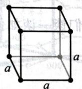  
简单立方

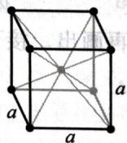  
体心立方

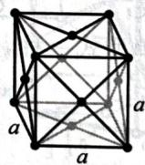  
面心立方

没有 C 心立方, 是因为该型点阵不符合立方的特征对称元素要求, 而应该被划入简单四方中。

## 7.2.3.2 六方

六方点阵型式包括 hP、hR 两种, 如下图所示, 简单六方晶胞的底面是两个正三角形拼成的菱形。

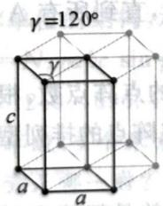

text_image

γ=120°
γ
c
a
a

简单六方

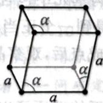  
R 心六方, 菱面体格子

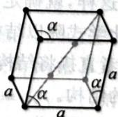  
R 心六方, 六方格子

R 心六方有两种格子,前者(菱面体)的使用主要是历史原因。

## 7.2.3.3 四方

四方点阵型式包括 tP、tI 两种, 如下图所示, 其晶胞是一个底面为正方形的长方体。

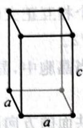

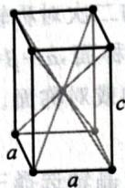  
简单四方  
体心四方

没有 C 心四方, 是因为 C 心四方有更小的简单四方素格子; 没有面心四方, 是因为面心四方有更小的体心四方格子。

## 7.2.3.4 正交

正交点阵型式包括 oP、oC、oI、oF 四种，如下图所示，其晶胞是边长不等的长方体。

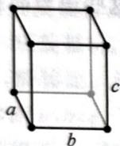  
简单正交

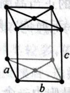  
C心正交

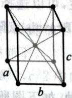  
体心正交

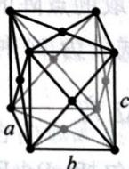  
面心正交

单斜和三斜都只有简单型式一种,这里不再画出。接下来我们谈一谈如何抽取结构基元、判断对称性、点阵型式等。

## 7.2.4 例子选讲

由于点阵点是一个抽象的点,所以实际上点阵点对应结构基元中的任何一个元素,但若放在数目最少的元素上则最方便。例如,若一个晶体的化学式是 $\mathrm{AB}_{2}\mathrm{O}_{3}$ ,则寻找点阵型式时只需要观察A元素,这样最简单。接着,确定是否所有A元素都是点阵点,或者说一个点阵点是否包含多个A粒子?可以用等效点法,一个点阵点中不能有等效点:首先确定一个A元素的位置为点阵点,再看其他位置A元素的周围几何环境是否完全相同,如果不同,则将其加入同一个点阵点中,直到所有A都与点阵点中包含的某个A元素几何等效。这样,就确定了一个结构基元中包含的内容。

用一个正当晶胞的化学式除以结构基元可得到一个正当晶胞中的点阵点数,根据点阵点数和晶体对称性,确定点阵型式。或者直接将结构基元抽象成点后,观察晶体中点阵点的排列型式,确定点阵型式。

【例 7.1】金刚石的结构。

在金刚石中,一部分碳原子作 ccp堆积,剩下的碳原子以四面体的骨架填充到四面体空隙中。观察C—C键的伸展方向,顶点及面心C原子是等效点,而晶胞内的4个C原子(图中有黑点的)周围C—C键的伸展方向与前二者不同。所以一个结构基元里一共有2个碳原子,点阵型式为cF,如下图所示。

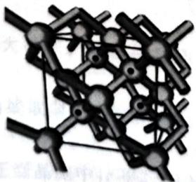

chemical

Molecular structure diagram showing interconnected atoms and bonds

金刚石

【例 7.2】 石墨的结构。

石墨有两种常见结构,分别是石墨单层通过 ABAB 型堆积得到和通过 ABCABC 型堆积得到。下图分别示出了六方石墨和三方石墨的晶体结构。

在六方石墨中,看似不存在六次轴,实际上稍作观察可以发现,z轴为 $I_{6}$ 和 $6_{3}$ 。在三方石墨中,z轴为 $C_{3}$ 。在六方石墨中,下底面顶点和中心的两个碳原子是不同的(分别称为1、2)。考虑c轴中心的碳原子,因为上侧有碳原子,故它至多只能与1等效,但是其右侧 $\frac{a}{\sqrt{3}}$ 处没有原子,所以其几何环境与1、2都不同,记为3。同理,中间层菱形内部的原子与1、2、3都不同。所以结构基元为4C,点阵型式为hP。

在三方石墨中,需要分析的碳原子稍微多一些。下底面顶点和中心的两个碳原子是不同的(分别称为1、2)。第二层两个碳原子相互不同,观察环境可发现,左侧的与1等同,右侧的与2等同。第三层顶点的碳原子与2等同,内部的碳原子与1等同。所以结构基元为2C,点阵型式为hR。菱面体晶胞已经在图中示出。

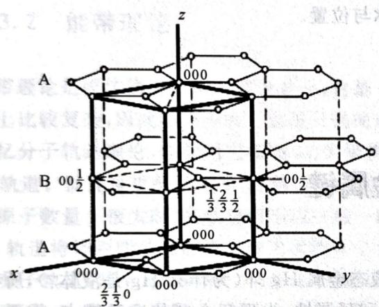

chemical

Crystal lattice structure diagram showing atomic positions and unit cell dimensions in a 3D lattice

六方石墨

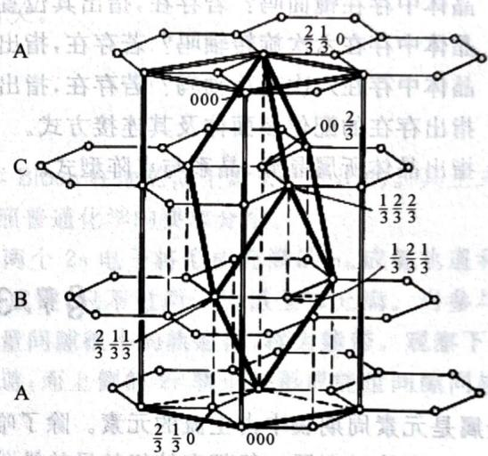

chemical

Crystal lattice structure diagram with labeled unit cell values and atomic positions A, B, C

三方石墨

【例题 7.3】从尿素和草酸的水溶液中得到一种超分子晶体。X 射线衍射实验表明，该晶体属于单斜晶系，晶胞参数 a=505.8pm, b=1240pm, c=696.4pm, $\beta=98.13^{\circ}$ 。晶体中两种分子通过氢键形成二维分子结构，晶体密度 $d=1.614g/cm^{3}$ 。

1. 推求晶体中草酸分子和尿素分子的比例。  
2. 画出一个化学单位的结构, 示出其中的氢键。

解 首先由 $ZM = N_{A} \rho abc \sin \beta$ 很容易推算一个晶胞的式量：

$$
M = 5 0 5. 8 \times 1 2 4 0 \times 6 9 6. 4 \times \sin 9 8. 1 3 ^ {\circ} \times 1 0 ^ {- 3 0} \times 1. 6 1 4 \times 6. 0 2 2 \times 1 0 ^ {2 3} = 4 2 0. 3 \mathrm{g/mol。}
$$

设晶胞内有 $x$ 个草酸， $y$ 个尿素，则 $90.04x + 60.06y = 420.3$ ，有两组合理整数解 $x = 4, y = 1; x = 2, y = 4$ 。如何确定究竟是哪一种？可以参看下一问确定。假如 $x = 4, y = 1$ ，则一个化学单元内一个尿素需要结合四个草酸，考虑到晶体的对称性不会高于分子本身，只能每个氨基各结合一个草酸，这样的结构形成氢键数不足，而且空间拥挤程度高，不是非常合理。假如 $x = 2, y = 4$ ，则一个化学单元内两个尿素结合一个草酸，故可形成类似羧酸二聚的氢键，较为合理。因此后一种情况更为可能，化学单元作图如下。

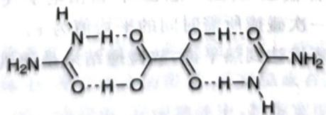

chemical

Chemical structure of a tripeptide with amino acid residues and side chain

【习题 7.4】下图为 $Me_{4}NPbI_{3}$ 在 RTP 时晶胞的投影图。此温度下有机基团的各向异性可以忽略，晶体中多面体视为正多面体。

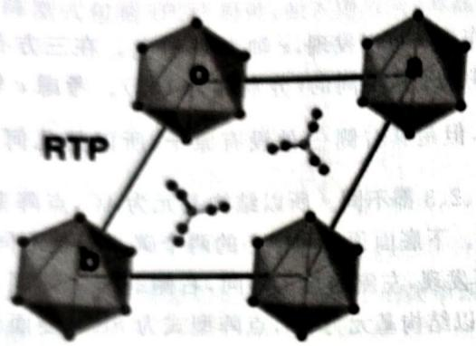

chemical

Molecular structure diagram showing a central atom bonded to four surrounding atoms, labeled RTP and B

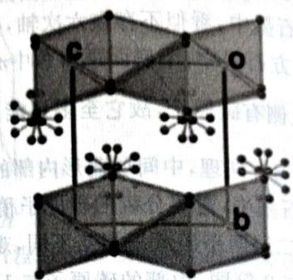

chemical

Crystal structure diagram showing atomic positions labeled a, b, c with electron density clouds

1. 晶体中存在镜面吗？若存在，指出其位置。  
2. 晶体中存在六次旋转轴吗？若存在，指出其位置。  
3. 晶体中存在六次对称轴吗？若存在，指出其名称与位置。  
4. 指出存在的配位多面体及其连接方式。  
5. 指出晶体所属晶族、晶系与点阵型式。

## §7.3 金属键

金属是元素周期表中占主流的元素。除了唯一的液态金属 Hg 外(为什么 Hg 是液体?), 所有已知的金属都是固体。金属一般都有较好的导热性、导电性和延展性, 为理解金属的这种特点, 需要金属理论予以解释。

金属键一般指由自由电子和金属正离子之间产生的静电吸引所造成的键连。理论常见两种：自由电子论和能带理论。自由电子论在解释金属性质上相当成功。虽然之后发展起来的能带理论的适用范围更具有普遍性，理论说明更加严格，但由于自由电子论的简明直观特点，直到今天依然常被人们所利用。

## 7.3.1 自由电子论

首先回顾一下中学化学中已经讲过的经典自由电子论对金属键的描述:在凝聚相的金属中价电子成为自由电子,金属正离子沉浸在“自由电子气”构成的海洋(气体)中,通过静电吸引成键。显然这样的金属键不具有方向性和饱和性。

我们稍微严格化一下这个自由电子论，使得它听上去不那么随意。模型作如下简单假设：

1. 金属由金属离子和电子构成，其中离子不动，电子运动。  
2. 忽略电子—电子和电子—离子间相互作用, 电子在金属中运动并发生碰撞; 把电子看成的碰撞理论(类似于理想气体模型, 所以一般也叫“自由电子气”)。  
3. 每个电子距离上一次或下一次碰撞所需时间的平均值为 $\tau$ 。  
4. 电子只能通过碰撞才能与环境达到热平衡，故碰撞结果是随机的，只与温度有关。

## 阅读材料:自由电子论的简单推论

利用上面的假设,可以对某些定律做一些解释。例如,我们用这个模型来导出电阻率 $\rho$ 与温度 T 的一般关系。设金属中电子的密度为 n, 其平均运动速度为 v, 则电流可以写为 j = -nev。外加电场时, 设距离上一次碰撞的时间为 t, 则 $v = v_{0} - eEt/m$ , 对所有电子平均, $\bar{t} = \tau$ , 并考虑时刻 0 时平均速度为 0, 得 $\bar{v} = eE\tau/m$ , 故而由微观形式的欧姆定律 $j = E/\rho$ 得到

$$
j = \frac {n e ^ {2} \tau}{m} E \Rightarrow \rho = \frac {m}{n e ^ {2} \tau} 。
$$

考虑到温度越高,碰撞的概率越高,弛豫时间越短,故温度变高时电阻率增大,这和实际情况一致。

这样一来,自由电子论解释了电子的以下性质:

1. 导电性,而且温度升高时导电性变差。  
2. 延展性, 可以看出形变不影响键的稳定性。

经典自由电子论是建立在经典物理上的。更为现代的金属键理论是能带理论，它在导电性的解释上也比较重要，亦与导体、半导体和绝缘体性质的理解有关。

## 7.3.2 能带理论

能带理论是固体物理的核心理论之一,它是1928年Bloch在他的博士论文中提出的。其正式描述在数学上比较复杂,因此略去不表。这里只是简单地按照普通化学的要求介绍。

回忆分子轨道理论,假如用它描述 $Li_{2}$ 的结构,那么两个 2s 电子将形成充满的 $\sigma_{2s}$ 成键轨道和空的 $\sigma_{2s}^{*}$ 反键轨道。而能量更低的两个 1s 轨道也将类似组合成键,只不过两个轨道全部充满。当参与成键的金属原子数量 n 很大时,各轨道将形成一组一组的能量间隙很小的轨道群,称为能带。观察下图,下侧的 1s 轨道将排列能量间隙极小的充满的 n 个分子轨道;而上侧的 2s 轨道将形成能量间隙同样很小的 n 个分子轨道,其中充满的和空的轨道各有 n/2 个。

由于 1s、2s 能量差异较大, 因此上述两个带之间有能量差。

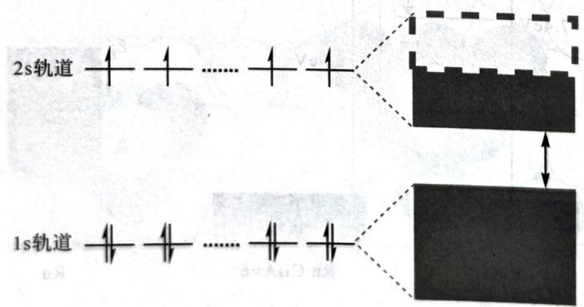

text_image

2s轨道
1s轨道

能带结构示意图

最高全充满的一群分子轨道称为满带,最高有电子填充的一群分子轨道称为价带,无电子的一群分子轨道称为空带,价带之后(含价带)未填满或空的能带称为导带。于是,对于导电性可以这样非常不严格地理解:在外电场的作用下,价带电子被激发到较高无电子的能级发生“定向运动”,形成电流。因此,对是否能导电的分类,就取决于这种激发难易程度,即取决于导带和价带之间的能量差,这个带隙也被称为禁带,能量差称为禁带宽度。

在导体中,或者填满的价带和导带有部分重叠(如下图所示),或者价带就是导带(如上图的 Li),不需要明显的激发就能导电;在半导体中,存在较小的带隙,在室温或者其他温和的激发下,电子可以部分跃迁到导带中,而在低温等情况下,则不能导电;在绝缘体中,禁带宽度较大,电子无法激发到导带,所以不能导电。

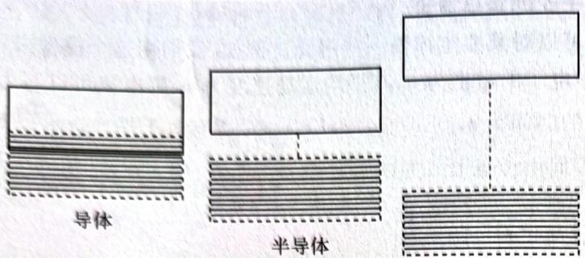

text_image

导体
半导体

绝缘体

除了 Si、Ge 等天然半导体之外, 还可使用掺杂的方式获得半导体。掺杂可理解为将部分原子替换为新原子, 例如在 Si 中掺杂 P, 由于 P 的价电子比 Si 多一个, 在禁带附近将产生填有富余电子的能带,导致禁带宽度减小, 通过这种方式掺杂得到的半导体称为 n 型半导体。类似地, 如果掺杂价电子更少的原子, 则在禁带附近将产生空带, 禁带宽度也减小, 这种半导体称为 p 型半导体。一言以蔽之, p 型半导体通过引入空穴获得, 而 n 型半导体通过引入额外的电子获得。

【例题7.5】近来科学家发现电子盐载 $\mathrm{Ru}$ 可高效催化合成氨反应: 这种电子盐的理想化学式为 $12\mathrm{CaO} \cdot 7\mathrm{Al}_{2}\mathrm{O}_{3}$ 。部分氧离子被电子取代, $\mathrm{Ru}$ 原子簇附于表面, 可记为 $\mathrm{Ru} \cdot \mathrm{C}_{12}\mathrm{A}_{7} \cdot \mathrm{e}^{-}$ 。此催化剂可将 $\mathrm{N}_{2}$ 解离并吸附的活化能降低。

观察下面的能带示意图,确定 CaO、Ru、Ru·C $_{12}$ A $_{7}$ ·e $^{-}$ 的导电性。

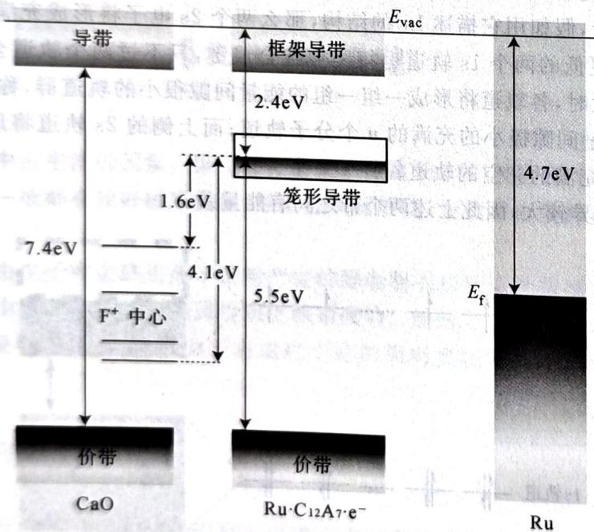

energy level diagram

| Component         | Energy (eV) |
| ----------------- | ----------- |
| F⁺ 中心           | 4.1         |
| 集形导带         | 2.4         |
| 阶段              | 1.6         |
| 阶段              | 5.5         |
| 阶段              | 4.7         |
| 价带              | -           |
| 价带             | -           |
| CaO               | -           |
| Ru·C₁₂A₇·e⁻        | -           |

解 分别是绝缘体、导体、导体。注意 $Ru \cdot C_{12}A_{7} \cdot e^{-}$ 的能带图中，笼形导带是部分填充的，故得。
(Nature Communications 6, No. 1 (2015): 1-9)

## 7.3.3 金属的密堆积模型

现在要考虑金属晶体中金属离子的堆积型式。我们可以把金属单质的结构型式问题归结为一种等径圆球的密堆积模型，这是因为每个金属离子的电子云分布基本上是球形对称的，可以看成具有一定体积的圆球；因为金属键不具有方向性，故在每一个离子的周围，可以按几何原理排布尽可能多的邻近离子，以使体系的能量尽可能低。接下来从二维密置层开始，考察密堆积问题。

## 7.3.3.1 二维密置层

将互相平行并共平面的硬球紧密地靠拢就组成了密置层。密置层是二维结构，在密置层中，每个球与6个球相邻接，有6重旋转轴通过每个球。如将密置层划为正当格子，可得六方格子，每个格子中有一个球和两个空隙，如下图所示。

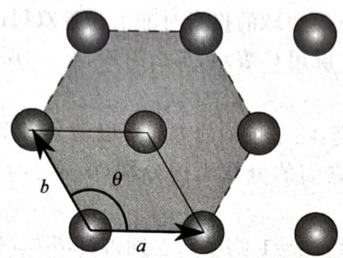

text_image

b
θ
a

密置(单)层

## 7.3.3.2 三维密置层

三维密置层的情形则相对比较复杂。首先从所谓密置双层开始讨论。密置双层是将两个密置层平行、紧密地靠拢得到的，我们把两层分别称为A和B层。在密置双层中，存在四面体空隙和八面体空隙。从俯视图上看，四面体空隙对应一个A层球构成的正三角形和球心投影落在该三角形中心的B层球；八面体空隙对应两个分别由A层球和B层球构成的中心在同一竖直线上的正三角形，且两个正三角形的投影形成了类似于六角星的形状。

请同学们观察下图,从图左面的 A、B 层堆积示意图中,找出八面体和四面体空隙。

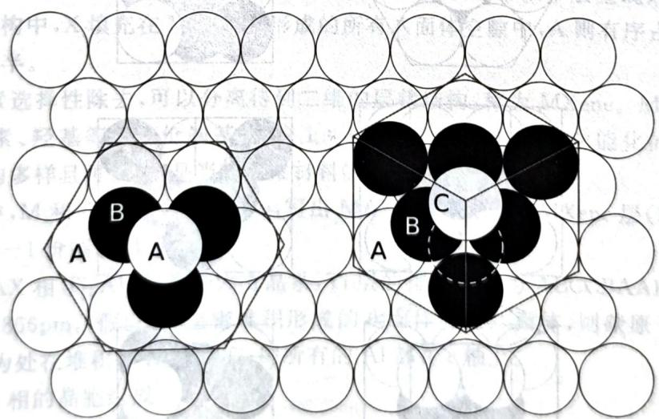

text_image

A
B
A
C
A
B

三维密置层

在密置双层中,每次选取同一层中两个正三角形组成的菱形,则它净包含1个球,该菱形对应了顶点4个四面体,中心1个四面体、1个八面体,平摊后对应2个四面体和1个八面体。又因存在2层,故球数:四面体数:八面体数为2:2:1。

在密置双层中,继续堆积新的二维密置层,则有两种堆积方式,分别称为 hcp(六方最密堆积, $A_{3}$ )和 ccp(立方最密堆积, $A_{1}$ ),叙述如下。

1. hcp

a) 如果将一密置层堆积在密置双层上，并使此密置层中每个球的位置正好与第一层每个球的位置重合，然后再将第四密置层堆积上去，其位置正好与第二层重合。以此类推，即所有奇数层的投影位置与第一层相同，偶数层的投影位置与第二层相同，这样所得的等径圆球的密堆积称为 A, 型密堆积，用符号 ABABAB…表示。

b) 从 ABAB 密置层中可看到，它被划为平面六方格子，通过每个球都有一个 $C_{6}$ 轴，hcp 并没有破坏六重旋转轴的对称性，可以划分出六方晶胞，所以这种堆积又称六方密堆积。在六方晶胞中有两个球，它们的分数坐标分别 $(0,0,0)$ ， $(1/3,2/3,1/2)$ 。

c) 球数：八面体空隙：四面体空隙 = 1:1:2；空间占有率为 74.05%。

2. ccp

a) 在密置双层的基础上，将第三层中球的投影对准了密置双层的八面体空隙中心来与第二层相紧邻，如第一层用 A, 第二层用 B, 第三层用 C 表示，那么第四、五、六层的投影位置分别依次与第一、二、三层相同。  
b) 从 ABCABC 密置层中可看到，在三重轴的方向可以划分出立方晶胞，所以这种堆积又称立方最密堆积。在立方晶胞中有四个球，它们的分数坐标分别 $(0, 0, 0)$ ， $(0, 1/2, 1/2)$ ， $(1/2, 0, 1/2)$ ， $(1/2, 1/2, 0)$ 。  
c) 球数：八面体空隙：四面体空隙=1:1:2；空间占有率为74.05%。

【习题7.6】仿照密置双层的推理,具体导出hcp和ccp堆积中,空隙球数比和空间占有率等性质。另外请给出相应的六方和立方晶胞中,所有八面体和四面体空隙中心的分数坐标。

金属晶体中在密度最高(即周期最短,垂直于密置层方向)的原子列方向滑动所需要的能量最小,而 $A_{3}$ 型晶体只有垂直于竖直方向可以滑动, $A_{1}$ 型晶体可以在垂直于立方晶胞的四个体对角线方向滑动,所以 $A_{1}$ 型金属常常较软,例如 Ag、Au、Ni、Cu 都相对较软。

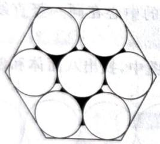

natural_image

Geometric diagram of eight inscribed circles arranged in a hexagon (no text or symbols)

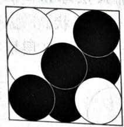

natural_image

Abstract geometric pattern of black and white circles arranged in a grid (no text or symbols)

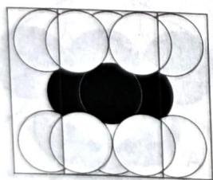

natural_image

Geometric pattern of overlapping circles and a central black circle within a square frame (no text or symbols)

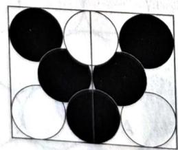

natural_image

Geometric pattern of black and white circles arranged in a symmetrical cross shape (no text or symbols)

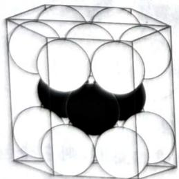

natural_image

Diagram of a cube containing multiple white spheres arranged in a 3x3 pattern, with one sphere partially filled in black (no text or symbols)

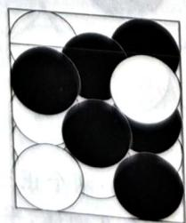

natural_image

Black and white stones arranged in a grid pattern (no text or symbols)

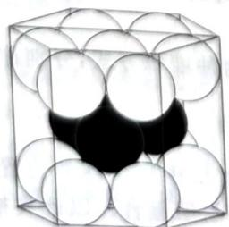

natural_image

Diagram of a cube containing multiple white spheres arranged in a 3x3 grid, with one sphere partially filled (no text or symbols)

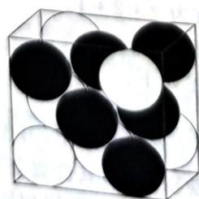

natural_image

3D diagram of black and white spheres arranged in a cube (no text or symbols)

三维密置层的不同角度示意

上图示出了 hcp 和 ccp 堆积观察的各个角度,请同学们仔细观察。左边是 hcp 堆积,右边是 ccp 堆积。属于不同密置层的硬球以黑白颜色交替示出。

## 阅读材料:Kepler 猜想

或许并不为很多人所知,简单的密堆积问题实际上蕴含了比较复杂的数学问题。Kepler 曾提出了如下猜想:

密堆积是三维空间中等径球堆积中空间利用率最高的。(...many mathematicians believe, and all physicists know, that the density cannot exceed 0.7404. ——Rogers, 1958)

然而, 这个形象的命题在数百年间一直未得到彻底的证明(尽管物理学家和化学家都认为它是正确的)。高斯于 1831 年证明, 如果规定球心构成一个晶格, 那么面心立方堆积是所有晶格中最密集的堆积方式。1953 年, Fejes Tóth 证明, 对于给定的构型, 找出最大空间占有率只需要有限几步。1958 年, Rogers 证明三维球堆的最大空间占有率小于 $78\%$ 。Tóth 的结果表明其实可以用穷举法证明该问题。Hales 带领学生用计算机, 生成了超过 5000 个不同的构型, 然后对每一个构型解一个含 150 个变量的线性规划问题, 证明了该问题。但可被接受的数学证明必须是人类可读的, 而且是可验证的 (写出的程序可能有漏洞), 因此后来又发起了一个项目去做形式化证明。经过数年的努力, 这个猜想于 2017 年正式解决。

更深入的话题是希尔伯特第18问题的一部分:在n维欧氏几何空间中最佳的装球模式是什么?该问题至今尚未完全解决,只有部分维数的结果是已知的。乌克兰数学家马林娜·维亚佐夫斯卡因为在8维和24维的装球问题上的贡献而获得了2022年菲尔兹奖。

【例题 7.6-1, 新增】 MAX 相是一大类具有层状结构的金属碳化物或氮化物的总称, 其中 M 为 Ti、V、Nb 等前过渡金属, X 为碳或氮, A 为 Al、Sn、Ge、Sb 等 p 区元素。MAX 的结构中, M 原子形成理想的密置层, M 层之间采取密堆积(可连续分布)与简单六方堆积(通常以单层呈现)按一定方式有序堆叠形成三维结构。结构中, X 填充在 M 密堆积形成的所有八面体空隙中, A 则有序占据 M 层简单六方堆积所形成空隙的一半。

将其中的 A 元素选择性除去, 可以分离得到二维的层状结构, 称为 MXene。MXene 层中, 最外层的 M 可进一步与卤素、羟基等 -1 价端基 T 按 1:1 结合, 形成端基 T 功能化的 T-MXene。因此 MXene 的组成和结构多样且可调控, 是当前二维材料的研究热点。

1. 若 MAX 相中, M 和 A 的原子数比为 n, 写出 MAX 相(O)、二维 MXene 层(P) 和 T-MXene(Q) 的组成通式。Q 中的一 1 价端基用 T 表示。

2. 某碳化物 MAX 相 $Ti_{x}Al_{y}C_{z}$ 属于六方晶系，Ti 层的排列方式为 ABCCBAABCCBA……。晶胞参数 a=306pm, c=1856pm。假设 Ti 层密堆积形成的八面体为正八面体，则碳原子处在八面体的中心；若将晶胞原点选为处在堆积中 B 层的 Ti，则所有的 Al 都在 c 轴上。

a. 写出该 MAX 相的晶胞组成。

b. 计算简单六方排布相邻层的间距。

c. 写出晶胞中所有碳原子的坐标参数。

解 第2问给出的MAX的例子可以帮助我们理解题干的描述,由此我们可以发现密堆积指的是ABC型结构,而简单六方堆积指的是出现了AA、BB、CC等结构。六方密堆积空隙中球数与八面体空隙数之比为1:1(一个六方最密堆积晶胞中有2个八面体空隙,2个球),所以每出现一个X就要补出一个M;简单六方空隙中球数与三棱柱空隙数之比为1:2(一个简单六方晶胞中有2个三棱柱空隙,1个球),但填隙率是50%,所以每出现一个A也对应一个M。于是O是 $M_{n}AX_{n-1}$ ,六方密堆积与简单六方堆积空隙层的比是(n-1):1。将A去掉得到 $M_{n}X_{n-1}$ ,这就是P。

对于 $\mathbf{Q}$ , 所谓的层状结构应该是指多层六方密堆积形成结构 (在第 2 问的例子中就是 ABC 为一层 MXene), 如果我们认为每个二维密置层有 1 份 M, 那么分离得到的 MXene 中有 $n$ 份 M ( $n-1$ 个空隙层, $n$ 个密置层), 仅最外层两份 M 结合 T, 所以 Q 是 $\mathrm{M}_n\mathrm{X}_{n-1}\mathrm{T}_2$ 。

分析清楚了第1问之后第2问就不难了。因为题目要求B层作为顶点，所以一个的晶胞周期是BAABCCB,Ti的排布如下图左侧所示：

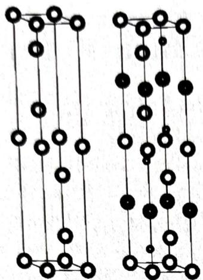

chemical

Two identical molecular lattice structures with black and white spheres representing atoms, connected by lines indicating bonds or interactions.

现在填充 C 和 Al:C 填入所有八面体空隙(回忆六方晶胞的八面体位置!),Al 在棱上,所以它填入 AA 层和 CC 层之间的三棱柱空隙,得到上图右侧所示的晶胞(小球为 C,粗线大球为 Al)。

晶胞已经画出, 计算就很简单, 晶胞组成是 $\mathrm{Ti}_{6} \mathrm{Al}_{2} \mathrm{C}_{4}$ 。晶胞的高度由 2 个简单六方层间距和 4 个六方密堆积层间距组成。六方密堆积层间距为一个棱长为 $306 \mathrm{pm}$ 的正四面体高度, 即 $\sqrt{6} / 3 \times 306 = 249.8 \mathrm{pm}$ , 所以简单六方层间距是 $\frac{1856 - 249.8 \times 4}{2} = 428 \mathrm{pm}$ 。C 在 ab 平面上的投影都在正三角形的中心, 其高度自下而上分别是 $249.8 / 2$ 、 $1856 / 2 - 249.8 / 2$ 、 $1856 / 2 + 249 / 8 / 2$ 和 $1856 - 249.8 / 2$ , 即分别对应于 $c$ 轴坐标 $0.0673$ 、 $0.433$ 、 $0.567$ 、 $0.933$ , 所以它们的坐标是 $(2 / 3, 1 / 3, 0.0673)$ 、 $(2 / 3, 1 / 3, 0.433)$ 、 $(1 / 3, 2 / 3, 0.567)$ 、 $(1 / 3, 2 / 3, 0.933)$ 。

【习题 7.7】同学们可能都听过《乌鸦喝水》这个寓言故事,乌鸦通过在一个长的细颈瓶中投鹅卵石排开水使得它能顺利喝到水。现在我们来考虑一个简化的模型:

a) 瓶子可近似看作一个直径为 10.0cm，高 50.0cm 的完美圆柱体。  
b)一颗鹅卵石可近似看作是一个完美的硬球，球的直径均相等；  
c) 球会尽可能紧密地排布, 因此相邻的它们互相接触;  
d) 这瓶水可近似视为纯水；  
e)所有的鹅卵石都在罐子里面(即没有一颗鹅卵石超过这个圆柱体的边缘)。试进行以下计算：

1. 设球的半径 r=5cm，计算此圆柱体被球占据的最大体积分数和此时可以超过该体积的体积积

2. 假设堆积每一层的俯视图都如下图所示, 计算此圆柱体被球占据的最大体积分数和此时可以被水填充的自由体积。水填充的自由体积。

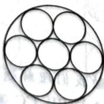

3. 假设堆积的俯视图采用如下图所示的 ABABAB…形式进行,再次做上面的计算。

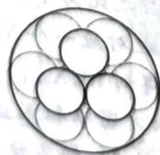

若 $r \to 0$ ，计算此圆柱体被这些球占据的体积分数的极限和此时可以被水填充的自由体积。

## § 7.4 离子键

离子化合物是由正负离子通过静电引力结合形成的化合物,总体来说,离子键的性质要比共价键容易处理。

## 7.4.1 晶格能

离子键的强弱可以用晶格能来衡量,它既可以通过实验测定也可以进行理论计算。

晶格能是 0K 时, 1mol 离子化合物对应的气态正负离子, 由相距无穷远结合成固相晶体所放出的能量:

$$
y \mathrm{A} ^ {x +} (\mathrm{g}) + x \mathrm{B} ^ {y -} (\mathrm{g}) \longrightarrow \mathrm{A} _ {\mathrm{y}} \mathrm{B} _ {x} (\mathrm{s}) 。
$$

晶格能一般是负值。

虽然晶格能有 Madelung 公式等方法予以理论估计,但这里我们并不打算讲述它,而是谈一下实验测定方法:Born-Haber 循环。

Born-Haber 循环可利用实验数据来计算晶格能或利用晶格能推算其他重要数据。其原理是生成焓等于蒸发焓、键能、电离能、电子亲和能和晶格能之和。下图所示是 LiF 体系的 Born-Haber 循环。

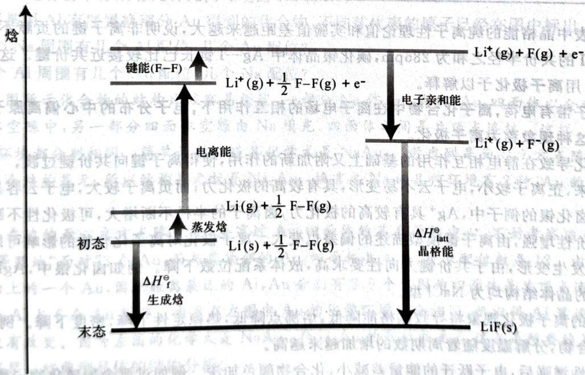

flowchart

```mermaid
graph TD
  A["初态"] -->|ΔH_f^e 生成焓| B["LiF(s)"]
  B --> C["电子亲和能"]
  C --> D["Li⁺(g) + F⁻(g)"]
  D --> E["Li⁺(g) + e⁻"]
  E --> F["Li⁺(g) + F(g) + e⁻"]
  F --> G["Li⁺(s) + ½F-F(g)"]
  G --> H["Li⁺(s) + ½F-G"]
  H --> I["Li⁺(s) + ½F-G"]
  I --> J["Li⁺(s) + ½F-G"]
  J --> K["Li⁺(s) + ½F-G"]
  K --> L["Li⁺(s) + ½F-G"]
  L --> M["Li⁺(s) + ½F-G"]
  M --> N["Li⁺(s) + ½F-G"]
  N --> O["Li⁺(s) + ½F-G"]
  O --> P["Li⁺(s) + ½F-G"]
  P --> Q["Li⁺(s) + ½F-G"]
  Q --> R["Li⁺(s) + ½F-G"]
  R --> S["Li⁺(s) + ½F-G"]
  S --> T["Li⁺(s) + ½F-G"]
  T --> U["Li⁺(s) + ½F-G"]
  U --> V["Li⁺(s) + ½F-G"]
  V --> W["Li⁺(s) + ½F-G"]
  W --> X["Li⁺(s) + ½F-G"]
  X --> Y["Li⁺(s) + ½F-G"]
  Y --> Z["Li⁺(s) + ½F-G"]
  Z --> AA["Li⁺(s) + ½F-G"]
  AA --> AB["Li⁺(s) + ½F-G"]
  AB --> AC["Li⁺(s) + ½F-G"]
  AC --> AD["Li⁺(s) + ½F-G"]
  AD --> AE["Li⁺(s) + ½F-G"]
  AE --> AF["Li⁺(s) + ½F-G"]
  AF --> AG["Li⁺(s) + ½F-G"]
  AG --> AH["Li⁺(s) + ½F-G"]
  AH --> AI["Li⁺(s) + ½F-G"]
  AI --> AJ["Li⁺(s) + ½F-G"]
  AJ --> AK["Li⁺(s) + ½F-G"]
  AK --> AL["Li⁺(s) + ½F-G"]
  AL --> AM["Li⁺(s) + ½F-G"]
  AM --> AN["Li⁺(s) + ½F-G"]
  AN --> AO["Li⁺(s) + ½F-G"]
  AO --> AP["Li⁺(s) + ½F-G"]
  AP --> AQ["Li⁺(s) + ½F-G"]
  AQ --> AR["Li⁺(s) + ½F-G"]
  AR --> AS["Li⁺(s) + ½F-G"]
  AS --> AT["Li⁺(s) + ½F-G"]
  AT --> AU["Li⁺(s) + ½F-G"]
  AU --> AV["Li⁺(s) + ½F-G"]
  AV --> AW["Li⁺(s) + ½F-G"]
  AW --> AX["Li⁺(s) + ½F-G"]
  AX --> AY["Li⁺(s) + ½F-G"]
  AY --> AZ["Li⁺(s) + ½F-G"]
  AZ --> BA["Li⁺(s) + ½F-G"]
  BA --> BB["Li⁺(s) + ½F-G"]
  BB --> BC["Li⁺(s) + ½F-G"]
  BC --> BD["Li⁺(s) + ½F-G"]
  BD --> BE["Li⁺(s) + ½F-G"]
  BE --> BF["Li⁺(s) + ½F-G"]
  BF --> BG["Li⁺(s) + ½F-G"]
  BG --> BH["Li⁺(s) + ½F-G"]
  BH --> BI["Li⁺(s) + ½F-G"]
  BI --> BJ["Li⁺(s) + ½F-G"]
  BJ --> BK["Li⁺(s) + ½F-G"]
  BK --> BL["Li⁺(s) + ½F-G"]
  BL --> BM["Li⁺(s) + ½F-G"]
  BM --> BN["Li⁺(s) + ½F-G"]
  BN --> BO["Li⁺(s) + ½F-G"]
  BO --> BP["Li⁺(s) + ½F-G"]
  BP --> BQ["Li⁺(s) + ½F-G"]
  BQ --> BR["Li⁺(s) + ½F-G"]
  BR --> BS["Li⁺(s) + ½F-G"]
  BS --> BT["Li⁺(s) + ½F-G"]
  BT --> BU["Li⁺(s) + ½F-G"]
  BU --> BV["Li⁺(s) + ½F-G"]
  BV --> BW["Li⁺(s) + ½F-G"]
  BW --> BX["Li⁺(s) + ½F-G"]
  BX --> BY["Li⁺(s) + ½F-G"]
  BY --> BZ["Li⁺(s) + ½F-G"]
  BZ --> CA["Li⁺(s) + ½F-G"]
  CA --> CB["Li⁺(s) + ½F-G"]
  CB --> CC["Li⁺(s) + ½F-G"]
  CC --> CD["Li⁺(s) + ½F-G"]
  CD --> CE["Li⁺(s) + ½F-G"]
  CE --> CF["Li⁺(s) + ½F-G"]
  CF --> CG["Li⁺(s) + ½F-G"]
  CG --> CH["Li⁺(s) + ½F-G"]
  CH --> CI["Li⁺(s) + ½F-G"]
  CI --> CJ["Li⁺(s) + ½F-G"]
  CJ --> CK["Li⁺(s) + ½F-G"]
```

LiF 的 Born-Haber 循环

严格说来,这些数据不能使用标准热力学数据,而应该换算到绝对零度,但一般造成的误差不大。可以通过 Born-Haber 循环估计晶格能的物种,在成键时离子性占主导。Born-Haber 循环的思想在处理一些比较复杂的晶体的性质中比较重要,例如:

【例题7.8】试解释以下与物质的溶解有关的现象。

1. NaOH 溶于水是放热体系,但升高温度溶解度增大。

2. 结晶水合物,例如 $FeSO_{4} \cdot 7H_{2}O$ 的溶解度随温度的升高先增加后减小。

解 类似于 Born-Haber 循环的思维方式, 我们可粗略把晶体溶解的主要能量拆分为晶格能、水合能两部分。既然 NaOH 溶解度随温度升高而增大, 这就说明其实质性溶解过程仍然是吸热的。那么哪个过程是放热的呢? 注意到 NaOH 极易吸水/潮解的性质, 可以推断其溶解是先形成水合物, 而后水合

物再溶解。第一步强烈放热，而第二步是吸热的，所以表现出较为“反常”的现象。

考察结晶水合物的溶解过程,它比非结晶水合物的溶解要增加断裂氢键的过程。而结晶水合物在较高的温度下是会脱水的,即在高温下 $\mathrm{FeSO_{4}\cdot7H_{2}O}$ 并非含有7个结晶水。因此,在低温下,可以认为断裂氢键的能量与晶格能高于水合能,溶解吸热;而在高温下,结晶水减少,断裂氢键需要的能量减少,溶解总体放热。从上述思考过程中还能发现一个解释,若问题在高温时偷换了 $\mathrm{FeSO_{4}\cdot7H_{2}O}$ 的化学式,那么高温下摩尔质量减少,溶解度自然减少。这样两方面共同解释,就比较合理、完整。

## 7.4.2 键型变异和离子极化

不少离子化合物的性质都可以用离子键模型处理:晶格能的理论计算数值和实验值非常接近。虽然如此,比较单纯的离子键一般只在电负性差异很大的物种之间形成,多数晶体仍然兼具离子键、共价键的性质。一个经典例子就是卤化银 AgX,四种卤化银的晶格能和离子半径数据如下表所示。

四种卤化银的一些基本数据

<table><tr><td>物种</td><td> $d(Ag-X)/pm$ </td><td>晶格能的绝对值/ $(kJ·mol^{-1}$ ,计算值/实验值)</td></tr><tr><td>AgF</td><td>246</td><td>954/921(+3.6%)</td></tr><tr><td>AgCl</td><td>277</td><td>904/833(+8.5%)</td></tr><tr><td>AgBr</td><td>289</td><td>895/816(+9.7%)</td></tr><tr><td>AgI</td><td>281</td><td>883/778(+13.5%)</td></tr></table>

注意到表中晶格能的纯离子性理论值和实验值差距越来越大,说明非离子键的贡献不断增加。特别地,Ag 和 I 的共价半径之和为 286pm,碘化银晶体中 Ag—I 键长已比较接近共价键。这种键型变异的情况,可以用离子极化予以解释。

由于离子带有电荷,离子化合物中在离子电场的相互作用下,电子分布的中心偏离原子核,发生电子云变形。这种现象称为离子极化。

离子极化导致在静电相互作用的基础上又附加新的作用,使得离子键向共价键过渡。

通常说来,正离子较小,电子云不易变形,具有较高的极化力;而负离子较大,电子云容易变形,容易被极化。在卤化银的例子中, $Ag^{+}$ 具有较高的极化力,卤离子的半径不断增大,可极化性不断增大,使得卤化银的共价性增强,由离子键模型描述的偏差也变大。离子极化对离子化合物的影响可以总结如下:

1. 晶格发生变形,由于共价键方向性要求高,故体系配位数下降。例如卤化银中,AgI为ZnS型,而其他物种的晶体结构均为NaCl型。

2. 较强的离子极化现象将导致晶格能降低,熔沸点降低,热稳定性下降,密度下降。例如碱土金属的 $MCO_{3}$ 化合物,分解温度随着周期数的增加越来越高。

3. 共价性增强后,电子跃迁的能量差减小,化合物颜色加深。例如过渡金属硫化物一般都有色。

## §7.5 常见晶体与分析

最后,我们综合利用前面谈过的内容,分析一些常见晶体,提供经验上的参考。在此之前,首先厘清两个概念。

晶体中的配位数,是指晶格中与某一微粒相距最近的微粒的个数。

注记 以上定义不要求是异号离子,通常也不包括相距次近的微粒。虽然如此,遇到概念不清的题目,也需要仔细斟酌。

微粒周围的几何环境,包括微粒附近的微粒种类及其位置取向;几何环境相同要求前二者都相同。微粒周围的化学环境,则可视为允许对称操作的几何环境,化学环境相同要求附近微粒相同且它们的取向可以通过旋转、平移使其一样。

判断配位数和环境,一定要灵活处理,切忌只依赖图片本身;这一点对之后观察更复杂的体系也适用,甚至可以说是晶体结构解题技术的根本。

【例题 7.9】下左图是一种 Na 和 Au 的整比化合物的晶胞, 不同球代表的原子已经在图中标出。

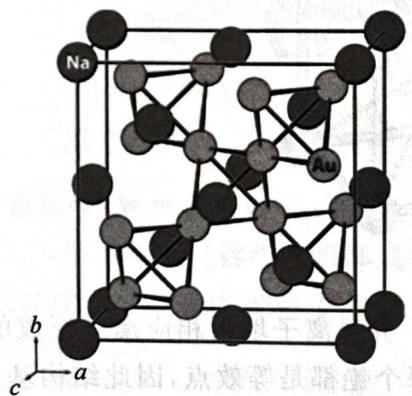

chemical

Crystal structure diagram of sodium and aluminum atoms in a cubic lattice, labeled with axes a, b, c and element symbols Na, Au

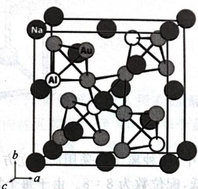

chemical

Crystal structure diagram of a sodium-aluminum alloy showing atomic positions and unit cell axes

1. 给出该化合物的化学式。  
2. 指出 $Au_{4}$ 四面体的连接方式。  
3. 指出该化合物中分别有几种化学环境的 Na 和 Au?  
4. 指出该化合物中分别有几种几何环境的 Na 和 Al?

上右图是用 Al 有序置换部分 Au 得到的化合物, 不同球代表的原子已经在图中标出。

5. 每个 Na 周围有几个 Al 配位, 几个 Au 配位?  
6. 每个 Al 周围有几个 Au 配位, 几个 Na 配位?

解 左图所示化合物的结构比较容易描述,一部分 Na 作 ccp 堆积, $Au_{4}$ 四面体以全部相同的取向填入四面体空隙中,另一部分四面体空隙由 Na 填充,四面体之间是共顶点连接。这样,所有的 Na 和 Au 的化学环境都分别相同。简单计数知道其化学式是 $NaAu_{2}$ 。考虑到是面心立方点阵,因此一个晶胞中含有 4 个结构基元,所以结构基元就是 $Na_{2}Au_{4}$ ,换言之 Na 的几何环境有 2 种,Au 的几何环境有 4 种。

注意在左边的面心立方点阵中， $C_{3}$ 应穿过 $Au_{4}$ 四面体的某个面的中心，不妨考察顶点的Na，每个Na都恰好等距地“面对”3个Au，而与其紧邻的 $Au_{4}$ 四面体共4个，所以配位数是12。由于Al有序地置换每个面上的一个Au，因此距离最近的Al，Au分别有3、9个。因为四面体是共顶点连接，所以很容易知道每个Al与6个Au紧邻。由于在左图中Au的化学环境完全相同，所以将Al置换进入后，其配位数应当没有改变。因为左图的化学式是 $NaAu_{2}$ ，所以Au的配位数是6，这也是所要的答案。

接下来是一些典型晶体的结构分析。

【例 7.10】 NaCl

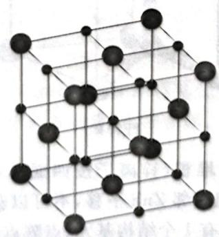

chemical

Crystal lattice structure diagram showing atomic positions in a cubic unit cell

NaCl

在氯化钠晶体中,两种离子都采用 ccp堆积。异号离子填入相应离子形成的所有八面体空隙,配位数为6:6。由于每个氯和每个钠都是等效点,因此结构基元是一个NaCl,每个晶胞含有4个结构基元(点阵点),也就是面心立方点阵型式,属于立方晶系、立方晶族。

【例 7.11】 CsCl

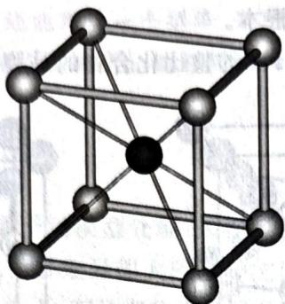

chemical

Crystal lattice structure diagram showing a unit cell with atoms at vertices and face centers

CsCl

在氯化铯晶体中,两种离子都采用简单立方堆积。异号离子填入相应离子形成的所有立方体空隙中,空间利用率较低,配位数为8:8。由于每个氯和每个铯都是等效点,因此结构基元是一个CsCl,每个晶胞含有1个结构基元(点阵点),也就是简单立方点阵型式,属于立方晶系、立方晶族。

【例 7.12】 闪锌矿

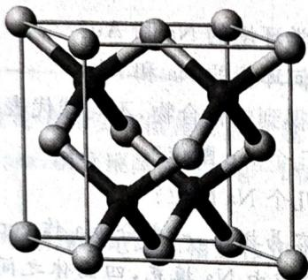

chemical

Crystal lattice structure diagram showing atomic positions in a cubic unit cell

闪锌矿

在闪锌矿晶体中, 硫离子采用 ccp堆积, 锌离子按四面体型式填入四个四面体空隙, 填隙率为 $50\%$ , 配位数为 $4:4$ 。注意, 相邻的一组 $\mathrm{ZnS}$ 是完全可以平移获得整个晶体的, 因此这就是一个结构基元, 每个晶胞含有 4 个结构基元 (点阵点), 也就是面心立方点阵型式, 属于立方晶系、立方晶族。【例 7.13】纤锌矿

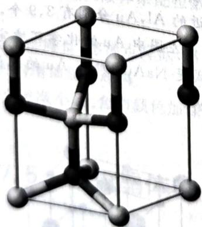

chemical

3D molecular structure diagram showing a cubic unit cell with atoms at vertices and face centers

纤锌矿

在纤锌矿晶体中，硫离子采用 hcp 堆积，锌离子按四面体型式填入两个四面体空隙，填隙率为 50%，配位数为 4:4。注意，竖直的一组相邻 ZnS 平移，不可以获得整个晶体（注意观察内部的和棱上晶系、六方晶族。

【例 7.14】 萤石

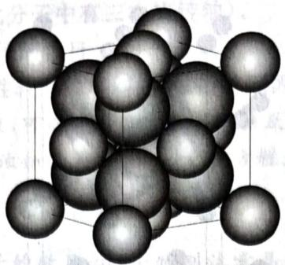

chemical

Crystal structure diagram of a molecular unit cell with spherical atoms

萤石

在萤石 $\left(\mathrm{CaF}_{2}\right)$ 晶体中，钙离子采取ccp堆积，氟离子按四面体型式填入所有四面体空隙，配位数为4:8。注意，每组 $CaF_{2}$ 平移可以获得整个晶体，因此结构基元就是一个 $CaF_{2}$ ，每个晶胞含有4个结构基元（点阵点），也就是面心立方点阵型式，属于立方晶系、立方晶族。反萤石结构是存在的，在萤石结构中互换阴阳离子。例如 $Na_{2}O$ 。

【例7.15】金红石

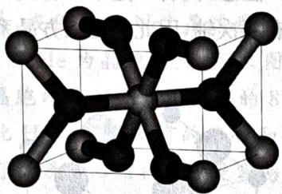

chemical

Molecular structure diagram showing a central atom bonded to multiple surrounding atoms in a cubic lattice

金红石

在金红石 $(\mathrm{TiO}_2)$ 晶体中，每个钛填入氧所组成的畸变八面体中，配位数为 $6:3$ 。注意到两种 Ti 是不一样的，因此一个结构基元是 $2\mathrm{TiO}_2$ ，从而每个晶胞含有 1 个结构基元（点阵点），也就是简单四方点阵型式，属于四方晶系、四方晶族。

【例 7.16】 NiAs

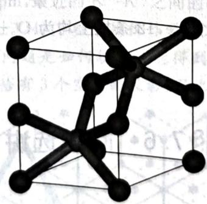

chemical

Crystal lattice structure diagram showing atomic positions in a cubic unit cell

NiAs

在 NiAs 晶体中，镍形成二维密置层。在二维密置层间，As 填入 50% 的三棱柱空隙，但注意，Ni 在 As 的八面体空隙中。注意，两种 Ni 是不一样的，因此结构基元是 2NiAs，每个晶胞含有 1 个结构基元（点阵点），也就是简单六方点阵型式，属于六方晶系、六方晶族。

【例 7.17】 $CdI_{2}$

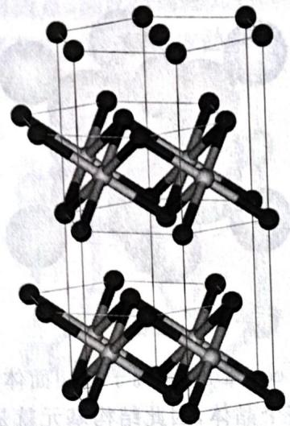

chemical

Crystal lattice structure diagram showing repeating unit cells with black and gray spheres representing different atoms

$CdI_{2}$

在 $CdI_{2}$ 晶体中，碘离子作 hcp 堆积，镉离子按层交替地填入一半的八面体空隙。一般的晶胞绘为：Cd 的二维密置层间，填入两个碘离子。注意，两种 I 是不一样的，因此结构基元是 $CdI_{2}$ ，每个晶胞含有 1 个结构基元（点阵点）。注意，此晶体只有三次轴，因此它是三方晶系、六方晶族，点阵型式为 R 心六方。

【例7.18】 $\mathrm{ReO}_3$

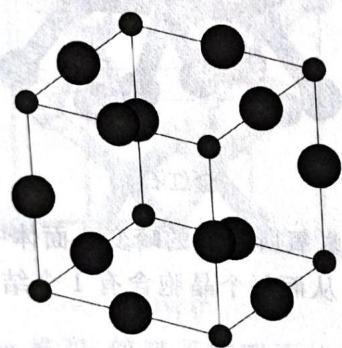

chemical

Crystal lattice structure diagram showing atomic positions in a cubic arrangement

$\mathrm{ReO}_{3}$

在 $\mathrm{ReO}_3$ 晶体中，每个顶点都是一个Re,12条棱上均为O。显然，此体系结构基元就是一个化学式，是一个简单立方点阵。

## § 7.6 问题选讲

晶体结构的问题不仅在于概念,还在于技术,特别是结合对称性观察晶胞示意图和进行简单的几何计算。此类技术一般只能通过较多的练习来掌握,所以本节我们提供一些例子。

## 7.6.1 对称性与晶胞推断

【例题7.19】电解乙酸钠水溶液，在阳极收集到X和Y的混合气体。气体通过澄清石灰水，X被完全吸收，得到白色沉淀。纯净的Y冷却到90.23K，析出无色晶体。X射线衍射表明，晶体属立方晶
a=422.6pm,b=562.3pm,c=584.5pm, $\beta=90.41^{\circ}$ 。继续冷却，晶体转换为单斜晶体

1. 写出 X 的化学式, 写出它和石灰水反应的方程式。  
2. 通过计算推出 Y 的化学式(此分子中有三次旋转轴)。  
3. 写出单斜晶系的晶胞中 Y 分子的数目。  
4. 降温过程中晶体转换为对称性较低的单斜晶体，简述原因。

解 如果足够熟悉经典有机反应,可以看出这就是 Kolbe 反应(羧酸盐电解时以自由基机理发生脱羧二聚生成烷烃)。根据石灰水变浑浊知道 X 是 $CO_{2}$ , 反应方程式尽人皆知。照密度计算:

$$
M = \frac {\rho a ^ {3} N _ {\mathrm{A}}}{2} = 3 0. 0 5 \mathrm{g/mol。}
$$

这是乙烷。从而单斜晶系中分子的数目为2。特别注意晶体的对称性不会超过分子本身的对称性，低温下乙烷热运动减弱，构象对称性降低，因此退化为单斜。

【例题 7.20】在超高压(300GPa)下,金属钠和氦可形成化合物。结构中,钠离子按简单立方排布,形成立方体空隙(如右图所示),电子对 $(2e^{-})$ 和氦原子交替分布填充在立方体的中心。

1. 写出晶胞中的钠离子数。  
2. 写出体现该化合物结构特点的化学式。  
3. 若将氦原子放在晶胞顶点, 写出所有电子对 $(2e^{-})$ 在晶胞中的位置。  
4. 晶胞边长 $a = 395\mathrm{pm}$ 。计算此结构中 $\mathrm{Na}-\mathrm{He}$ 的间距 $d$ 和晶体的密度 $\rho$ 。

解 观察图中立方体的排布方式,我们知道 $Na^{+}$ 是这些立方体的顶点,He 和 $2e^{-}$ 都在这些立方体的中心。不妨以 He 为晶胞顶点,那么图中的 He 原子恰

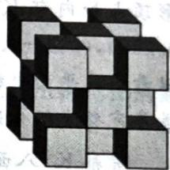

natural_image

Abstract 3D geometric pattern composed of interlocking cubes (no text or symbols)

好形成一个ccp堆积的结构，在这个晶胞内的 $\mathrm{Na}^{+}$ 就是内部的8个四面体空隙所填充的物种，有8个。余下“透明”的立方体内都是 $2\mathrm{e}^{-}$ ，因此He分布在所有的棱心和体心。于是其化学式为(2e) $\mathrm{Na}_{2}\mathrm{He}$ ，同学们不难看出，这就是额外填充了电子的反萤石结构。于是容易算出

$$
d (\mathrm{Na} - \mathrm{He}) = \frac {\sqrt {3}}{4} a = 1 7 1 \mathrm{pm}, \rho = \frac {4 \times 4 9 . 9 8}{3 9 5 ^ {3} \times 1 0 ^ {- 3 0} \times 6 . 0 2 2 \times 1 0 ^ {2 3}} = 5. 3 9 \mathrm{g/cm} ^ {3} 。
$$

【例题 7.21】近似的 $K_{3}N$ 晶体结构中， $K^{+}$ 作六方最密堆积， $N^{3-}$ 填入其中的八面体空隙。沿 c 轴方向，每一层 $N^{3-}$ 的投影均重合。

1. 画出一层 $\mathbf{K}^{+}$ 的堆积情况, 在其中示意出 $\mathbf{N}^{3-}$ 的位置并给出以 $\mathbf{N}^{3-}$ 为顶点的晶胞。  
2. 若一个 $K^{+}$ 的坐标为 $(0.000, 0.260, 0.250)$ ，由此给出晶胞中所有 $K^{+}$ 的分数坐标。  
3. 接上一问, 晶胞参数 c=759.2pm, 最近的 $K^{+}-K^{+}$ 之间的距离为 351.2pm, 求晶体的理论密度。

解 熟知空隙位置为 $(2/3,1/3,\pm1/4)$ (c轴坐标仅作示意);球数与八面体数的比例为1:1,故空隙填充率只有1/3。我们需要考虑的问题是如何填充才能得到因子3。通过画图可以发现,在投影图上,每个 $K^{+}$ 所组成的带心六棱柱中,恰有3个空隙的投影,因此 $N^{3-}$ 填充每个六棱柱中唯一一个空隙。

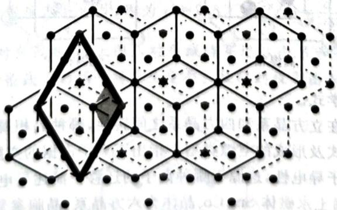

chemical

Crystal lattice structure diagram showing atomic positions and unit cell arrangement

上图中, 黑点表示 $\mathbf{K}^{+}$ , 使用虚线连结的点都是八面体空隙, 其中用粗线框出的是填充的八面体空隙 (灰色圆点) 的重复单位。我们特别观察到, 每个 $\mathbf{N}^{3-}$ 的顶点都和一个 $\mathbf{K}^{+}$ 八面体对应, 而且这些八面体是分立的。因此还可以把这个结构视为 $\mathbf{K}^{+}$ 形成共面八面体链, $\mathbf{N}^{3-}$ 填充其中心, 这些八面体连在 $c$ 轴方向上构成二维六方格子。上述分析就解决了第 1、3 问。很容易据此画出晶胞的结构图如下 (小球为 $\mathbf{K}^{+}$ );

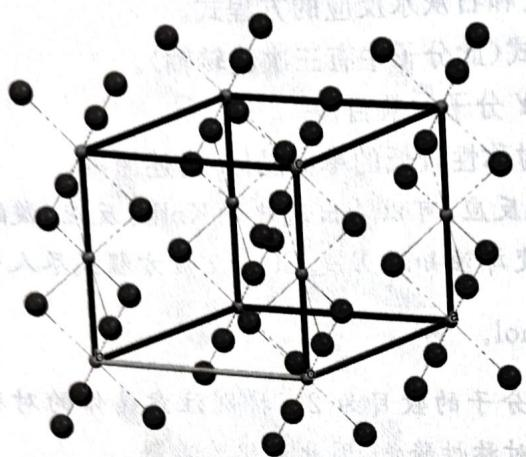

chemical

Crystal lattice structure diagram of a cubic unit cell with atoms at vertices and face centers

在晶胞中， $\mathbf{N}^{3-}$ 只有 $(0,0,0)$ 和 $(0,0,1/2)$ 。由题设条件知道八面体正三角形外接圆半径为 0.260，两个正三角形所在平面之间的距离为 0.250。注意我们前面分析得出的粗线框出的投影图，以及六边形顶点和内部 $\mathbf{K}^{+}$ 在 $c$ 方向上的位置关系，知道晶胞面上还有 $(0.260,0,0.250), (1-0.260,0,1-0.250), (0,1-0.260,1-0.250)$ 三个点。在晶胞内部的点也很容易考虑，从图中灰色小菱形的结构可以看出其平面坐标为 $(1-0.260,1-0.260)$ 和 $(0.260,0.260)$ 。最后注意 $c$ 方向八面体空隙的位置，知道其完整坐标分别是 $(0.260,0.260,1-0.250)$ 和 $(1-0.260,1-0.260,0.250)$ 。

考察 $\mathbf{K}^{+}$ 八面体, 最近的 $\mathrm{K}^{+}-\mathrm{K}^{+}$ 之间的距离就是 $\sqrt{3} a$ , 所以 $a=779.9\mathrm{pm}, Z=2$ , 因此密度:

$$
\rho = \frac {2 \times 1 3 1 . 3 1}{7 7 9 . 9 ^ {2} \times \sin \frac {\pi}{3} \times 7 5 9 . 2 \times 1 0 ^ {- 3 0} \times 6 . 0 2 2 \times 1 0 ^ {2 3}} = 1. 0 9 \mathrm{g/cm} ^ {3} 。
$$

【习题7.22】现有一种由正离子 $\mathbf{A}^{n+}$ 、 $\mathbf{B}^{m+}$ 和负离子 $\mathbf{X}^{-}$ 组成的固体电解质。该物质在 $50.7^{\circ} \mathrm{C}$ 以上形成无序结构（高温相），以下变为有序结构（低温相），二者结构示意见下图。图中浅色球为负离子，高温相中的深色球为正离子或空位，低温相中深色大球为 A 离子，深色小球为 B 离子。

chemical

Crystal lattice structure diagram showing alternating black and white spheres representing atoms in a unit cell

高温相

chemical

Crystal structure diagram of a compound showing atomic arrangement in a unit cell

低温相

1. 推出这种电解质的化学式。  
2. 温度变化会导致晶体在立方晶系和四方晶系之间转换,哪种晶相属于立方晶系  
3. 写出负离子的堆积方式及形成的空隙类型。指出正离子上  
4. 高温相具有良好的离子导电性,这源于哪种离子的迁移?简述导电性与热能的关系。

【习题7.23\*】第一代稀土永磁体 $\mathrm{Sm}_x\mathrm{Co}_y$ 晶体为六方晶系，晶胞参数 $a = 498.9\mathrm{pm}, c = 398.1\mathrm{pm}$ ， $c$ 轴方向投影无重叠。Sm的相对原子质量为150.4。

1. 求 x, y。  
2. 画出 Sm、Co 层的二维晶胞。  
3. 简明清楚地画出其晶胞。

## 7.6.2 投影图观察

【例题7.24】铂很难和硫化合，但仍可设法制得它的一种硫化物。在硫化铂中铂原子以 $\mathrm{dsp}^2$ 杂化，硫原子采用 $\mathfrak{sp}^3$ 杂化。硫化铂属于四方晶系，沿 $c$ 轴在平面上的投影如下图所示。

natural_image

Abstract pattern of black and white circles arranged in a grid (no text or symbols)

1. 推出硫化铂的化学式。

2. 硫化铂可看作是 Pt、S 原子沿 c 轴分层堆积；Pt 层有 2 种，S 层只有 1 种。据此画出硫化铂的晶胞（以 S 原子作顶点，忽略键角形变）。

3. 已知晶体中 Pt-S 的距离约为 $2.6 \times 10^{-10}$ m，估算其密度。

4. 画出硫化铂的晶胞中全部原子沿对角线方向的投影(忽略键角形变,重叠原子需要标明)。

解 比较重要的信息是杂化, 这说明 Pt、S 的配位数分别都是 4 , 其中 Pt 周围的 S 为平面四方形, 而 S 周围的 Pt 为四面体。因为 S 层只有一种, 所以每层必然都是投影图中白色点构成的二维层。Pt 在这样的层间的排列填充方式为四面体对称性, 在 $S_{4}$ 四方形中按此种方式填入 Pt 即可得到晶胞:

chemical

Crystal lattice structure diagram showing atomic positions and bonding

假设 S 直接是密接的, 则密度容易计算, 因为 $d=2.6 \times 10^{-8} \, cm = \frac{a}{\sqrt{2}}$ , c = 2a, 故密度为 $7.6 \, g/cm^{3}$ 。从连接两个标有阴影的 S 的对角线观察(上图), 对角线将穿过 3 个 S 和一个 Pt, 将与对角线平行的线用细线标出(观察上图), 这两条线上的原子将发生重叠。故得到投影图如下:

flowchart

【习题7.25】某金属间化合物属立方晶系，其 $c$ 轴投影图如下图所示，其 $b$ 轴投影图与之相同。将 $c$ 轴投影图旋转 $\pi / 2$ ，即为 $a$ 轴投影图。黑球为Ge，灰球为Nb。

chemical

Crystal lattice structure diagram showing atomic positions and bonds

1. 画出晶胞图, 求出最简式。  
2. 写出 Nb、Ge 原子的配位数及其所占空隙的类型。  
3. 已知 $d(\mathrm{Nb}-\mathrm{Nb})=227\mathrm{pm}$ ，计算该化合物的理论密度。

## 7.6.3 复杂晶胞计数

【例题 7.26】有一类复合氧化物具有奇特的性质:受热后密度不降反升。这类复合氧化物的理想结构属立方晶系,晶胞示意图如下图所示。图中八面体中心是锆原子,位于晶胞的顶角和面心;四面体中心是钨原子,均在晶胞中。八面体和四面体之间通过共用顶点连接。锆和钨的氧化数分别等于它们在周期表里的族数。

chemical

Crystal lattice structure diagram showing tetrahedral units in a cubic arrangement

1. 写出晶胞中锆原子和钨原子的数目。  
2. 写出这种复合氧化物的化学式。  
3. 晶体中,氧原子的化学环境有几种? 各是什么类型? 在一个是 Phoenix  
4. 已知晶胞参数 a=0.916nm，计算该晶体的密度。

解 易知 Zr 在顶角和面心, 共有 4 个; W 在 8 个小四面体的中心; W 的氧化数为 +6, Zr 的氧化数为 +4, 故化学式为 $ZrW_{2}O_{8}$ 。

本题比较关键的是化学环境的观察,化学环境相同不要求周围原子的几何取向相同,故而我们只需体的四个氧原子都完全属于晶胞,且每个四面体都单独拥有4个氧原子,共有 $4\times8=32$ 个,因此可以每一个孤立的氧原子,故数量分别是24、8个。密度留给同学们计算。

## 7.6.4 几何估算

【例题 7.29】一定条件下, $CO_{2}$ 可形成俗称干冰的晶体。如下图所示,在干冰的立方晶胞中,碳原子位于顶点和面心位置,分子轴平行于立方体的体对角线。晶体中 C—O 键长为 116pm。

chemical

Crystal lattice structure diagram showing atomic arrangement in a unit cell with lattice parameter 'a'

1. 写出干冰的结构基元和点阵型式。  
2. 已知干冰的密度为 $1.64 \, g/cm^{3}$ ，计算晶胞参数 a 和两个二氧化碳分子中心的最短距离 L。  
3. 取右手坐标系, 计算晶胞顶点上 $CO_{2}$ 中对应 O 的坐标参数。

解 观察晶胞发现顶点和面心的 $CO_{2}$ 取向不同, 而面心 $CO_{2}$ 之间的取向也不同, 因此结构基元中至少有 4 组二氧化碳, 从而其点阵型式为简单立方。

晶胞参数很容易计算, 即 $\rho = \frac{ZM}{N_{\mathrm{A}}a^{3}}$ , 算出 $a = 563\mathrm{pm}$ 。最近的碳原子即顶点和面心, 故 $L = \frac{a}{\sqrt{2}} = 398\mathrm{pm}$ 。最后, 因为晶体是立方晶系, 有三重轴, 为了保障对称性, 顶点的二氧化碳的取向和三重轴平行。因此两个氧相对于顶点的位移分别是 $\left(\pm \frac{116}{\sqrt{3}}, \pm \frac{116}{\sqrt{3}}, \pm \frac{116}{\sqrt{3}}\right)$ , 相对于晶胞参数为 $(\pm 0.119, \pm 0.119, \pm 0.119)$ , 即 (0.119, 0.119, 0.119) 和 (0.881, 0.881, 0.881)。

【例题 7.30】 AgI 存在多种晶型, 温度对其晶型有较大影响: 常压下低于 409K 时为 $\gamma-AgI$ , 是立方 ZnS 结构; 409K\~419K 时为 $\beta-AgI$ , 是六方 ZnS 结构; 高于 419K 时为 $\alpha-AgI$ , 是体心立方结构。 $\alpha-AgI$ 的结构较为复杂, 下图是晶胞示意图, I $^{-}$ 作体心立方堆积(图中大白球)。

natural_image

Diagram of interconnected circular nodes with connecting lines, no text or symbols present

在一个晶胞内 $Ag^{+}$ 可能分布于 42 个空隙中，空隙分为 3 类，如上图中三种小球：

- $\mathrm{Ag^{+}}$ 填入了 $\mathrm{I}^{-}$ 形成的八面体空隙中, 与 2 个 $\mathrm{I}^{-}$ 距离最近, 如图中双环球。  
- $\mathrm{Ag^{+}}$ 填入了 $\mathrm{I}^{-}$ 形成的四面体空隙中, 与 4 个 $\mathrm{I}^{-}$ 距离最近, 如图中小白球。  
- $\mathrm{Ag^{+}}$ 填入了I-形成的三角形空隙中，如图中黑球；其中有一类和2个I-

1. 分别求出 3 种空隙中 $Ag^{+}$ 与相距最近的 $I^{-}$ 的间距，并求出每种空隙在一个图示晶胞中的数目。晶胞参数 a=504pm。

2. 分别求出 $\gamma$ -AgI、 $\beta$ -AgI、 $\alpha$ -AgI 的密度，并用化学键理论解释 AgI 的密度随着温度的变化趋势，晶胞参数： $\gamma$ -AgI $a = 649.5\mathrm{pm}$ ， $\beta$ -AgI $a = 458.0\mathrm{pm}$ ， $c = 749.5\mathrm{pm}$ 。

【例题 7.27】群青是一种蓝色颜料，主要成分为双硅酸铝盐和钠盐以及其他一些硫化物。下图是一种恰含有铝硅酸盐骨架 $S_{3}$ 自由基阴离子和钠离子的群青晶体的结构。下面晶胞的参数 a = 90.9pm，化合物中 Al : Si = 1 : 1。

chemical

Crystal structure diagram of (Al, Si)O4 with labeled atomic positions and unit cell axes

1. 解释群青晶体常有比较浓烈颜色的原因。  
2. 给出该群青晶体的化学式, 并计算该晶体的密度。  
3. 假设 Al 和 Si 是相同的原子, 指出一个晶胞中所有对称轴的种类、数量。

解 显然,颜色的显现源于多硫离子和自由基中的单电子,它们容易被激发。

弄清晶胞组成是最重要的。容易看出体系中有2个 $S_{3}^{-}$ ，分别在顶点和体心，后侧的可能是另一个晶胞的。现在计数 $AO_{4}$ 四面体，可以看出每个面上各有4个A，两个 $AO_{4}$ 四面体共用一个O，所以晶胞中含有 $\left(\mathrm{S}_{3}\right)_{2}\mathrm{Al}_{6}\mathrm{Si}_{6}\mathrm{O}_{24}$ ，根据电中性得到含有钠离子8个，化学式为 $Na_{4}Al_{3}Si_{3}O_{12}$ 。得到化学式之后密度计算是容易的，留给同学们自己完成，结果为2.41g/cm³。

观察顶点 $S_{3}^{\bullet-}$ 和四面体的取向, 知道体系为立方晶系。因此有 4 个穿过体对角线的 $C_{3}$ 、6 个穿过对棱心的 $C_{2}$ 和 3 个穿过面心的 $C_{4}$ 。

注记 此类题目,找准化学式为题目要旨,如果观察不清,可以猜测几种情况,答案很可能相同(原因是均摊);或者用对称性和计算辅助。切忌硬数。

【习题 7.28】 硫酸铜有多种结晶水合物,下图示出了其中一种的结构,其中白球为 S、灰球为 Cu、黑球为 O,氢已经省去。

chemical

3D molecular crystal structure diagram showing atomic arrangement within a unit cell labeled a, b, c

1. 给出上述结晶水合物的化学式。  
2. 已知晶胞参数: $a=559pm, b=1303pm, c=734nm, \beta=106.02^{\circ}$ ，计算其密度。  
3. 另一种硫酸铜的结晶水合物称为 Boothite, 它于 1903 年在 California 的 Alameda 县被发现。它是浅蓝色的针状结晶, 在常温下暴露于干燥的空气中会迅速风化, 失重 12.61%。给出其化学式。其结构和上图相似, 晶胞参数为 $a = 14.19\text{Å}$ , $b = 6.537\text{Å}$ , $c = 10.825\text{Å}$ , $\beta = 106.02^\circ$ ，推算 Boothite 的密度。

(Australia Journal of Mineralogy 10, No. 1 (2004): 3–6)

解 首先处理八面体空隙。双环球有 $6 / 2 + 12 / 4 = 6$ 个。容易看出距离是 $a / 2 = 252\mathrm{pm}$ 。四面体空隙都在面上，共有 $6\times 4 / 2 = 12$ 个，设白球到面上最近的棱的距离为 $r$ ，那么

$$
r ^ {2} + \left(\frac {a}{2}\right) ^ {2} = \left(\frac {a}{2}\right) ^ {2} + \left(\frac {a}{2} - r\right) ^ {2}, \text {解得} r = \frac {a}{4},
$$

故间距为 $\frac{\sqrt{5}}{4}a=282pm$ 。

最后处理三角形空隙。黑球有两种，其一是晶胞面上由等腰直角三角形划分而成的，一共有 $6 \times 4 / 2 = 12$ 个；其二是由一条棱上两个 $\mathrm{I}^{-}$ 和体心一个 $\mathrm{I}^{-}$ 构成的三角形，一共有12个。后者在一个边长分别为 $a, \frac{\sqrt{3}}{4} a, \frac{\sqrt{3}}{4} a$ 的三角形的中心，顶角余弦值为 $\frac{1.5a - a}{2 \times 0.75a} = \frac{1}{3}$ ，正弦值为 $\frac{2\sqrt{2}}{3}$ ，故半径为 $\frac{a}{2 \times \frac{2\sqrt{2}}{3}} = 267\mathrm{pm}$ 。前者并不在面中三角形的中心（否则就在正方形的中心），但在两个白球连线的中点处，故正方形中心到黑球的距离为 $\frac{a}{4\sqrt{2}}$ ，所求距离是 $\left(\frac{\sqrt{2}}{2} - \frac{1}{4\sqrt{2}}\right)a = 267\mathrm{pm}$ 。

密度很容易计算,结果分别为 $2.36g/cm^{3}$ 、 $2.38g/cm^{3}$ 、 $2.53g/cm^{3}$ 。这是因为温度升高离子性增强,键长缩短,因而密度增加。

【习题7.31】在某四方晶系的复合硫化物中，硫原子作ABCABC型堆积，铜原子和磷原子共计占据 $1 / 3$ 的四面体空隙，从而形成了独特的平面层结构。其晶胞示意图如下图所示。图中铜原子位于晶胞的面上，磷原子则位于棱上和晶胞内。所有四面体视为正四面体。

chemical

Crystal structure diagram of a layered material showing tetrahedral units and unit cell boundaries

1. 该晶体的磁矩为 0, 写出其中存在的孤立阴离子的化学式。  
2. 写出该硫化物的化学式以及全部铜原子的原子坐标。  
3. 已知该晶体的密度 $\rho=2.91g/cm^{3}$ ，求其晶胞参数 a 和 c 的估计值。  
4. 指出该晶体的点阵形式, 结构基元。

## 第7讲习题

【习题 7.32】试确定下面两种情形得到的材料是何种类型的半导体，并简述判断理由。

1. $FeO_{x}(1,04<x<1,17)$  
2. 在 $In_{2}O_{3}$ 中引入约 10% $SnO_{2}$ (质量分数)。

【习题 7.33】 $TiO_{2}$ 在一定温度下的 $H_{2}$ 气氛中展现 n 型半导体的性质，简述原因。

【习题7.34】研究表明， $\mathrm{IBr}_2^-$ 阴离子可由MI(M是碱金属)与 $\mathrm{Br}_2$ 定量反应得到。但是反应过程有所区别。CsI与 $\mathrm{Br}_2$ 直接加和，而其他碱金属碘化物与 $\mathrm{Br}_2$ 分三步进行。

1. 写出三步反应的化学方程式。  
2. 说明为什么会有这种差别。

【习题7.35】请通过合理的计算和推断将硫化铍、硫化钛、硫化铷、硫化锶的晶体结构和下面的描述一一对应起来。

- 硫离子作六方最密堆积，阳离子占据一半的八面体空隙。  
- 硫离子作立方最密堆积，阳离子占据一半的四面体空隙。  
- 硫离子作立方最密堆积,阳离子占据全部的八面体空隙。  
- 硫离子作立方最密堆积，阳离子占据全部的四面体空隙。

【习题 7.36】金属 M 为我国华南淡水湖区的盛产金属, 其晶格类型为体心立方晶格, 原子半径为 143pm, 密度为 8.58g/cm³。已知 M 的氧化物 (M 元素的质量分数为 69.90%) 与 KOH 共熔后, 可以生成水溶性的盐, 将其慢慢浓缩可以得到晶体。该晶体阴离子 N 具有正八面体对称性, 而且由 6 个 MO₆ 正八面体构成, 每个 MO₆ 正八面体的 6 个氧原子中有 1 个单独属于这个八面体。

1. 推出 M 的元素符号和该晶体的化学式。给出阴离子的结构。

晶体 $M_{6}Cl_{x}SO_{4}\cdot12H_{2}O$ 中阳离子 $M_{6}Cl_{x}^{2+}$ 结构为 6 个 M 原子构成的八面体骨架，每个氯原子形成边桥基位于八面体每条棱上。另有一种含碘的阳离子 $M_{6}I_{z}^{y+}$ ，6 个 M 原子构成八面体骨架，每个碘形成面桥基与 3 个 M 原子成键。

2. 求 x 和 z。

【习题 7.37】γ-MgAgSb 属立方晶系, 其晶体结构可以视为 MgSb 作 NaCl 结构, Ag 掺杂入某种空隙得到。晶胞参数 a=670pm。

1. 请画出 $\gamma$ -MgAgSb 的正当晶胞。  
2. 计算说明在高温下银离子能否自由移动而导电。离子半径数据: $r(\mathrm{Mg}^{2+}) = 72\mathrm{pm}, r(\mathrm{Sb}^{3-}) = 220\mathrm{pm}, r(\mathrm{Ag}^{+}) = 115\mathrm{pm}$ 。

【习题7.38】1. 将 $\mathrm{ZnO}$ 和 $\mathrm{Zn}$ 混合后隔绝空气加热可得到 $\mathrm{ZnO}_{1 - x}$ ，通过调整 $\mathrm{ZnO} / \mathrm{Zn}$ 的比例可以得到不同颜色的化合物，解释原因。

2. ZnO 呈白色, 而 HgO 有红色、黄色。红黄颜色的差异是由颗粒大小决定的, 黄色氧化汞的颗粒较小。试写出以下方程式并推测固体产物的颜色。

(a) $\mathrm{Hg(NO_{3})_{2}}$ 热分解为 HgO;

(b) $\mathrm{Hg(NO_{3})_{2}}$ 与足量 NaOH 溶液反应 HgO。

HgS 同样有红、黑两种颜色，两者晶型不同；红色的 $\alpha$ -HgS 为岩盐(NaCl)型，黑色的 $\beta$ -HgS 为闪锌矿型。

3. 假设两种矿石中 Hg-S 键长相同，求 $\alpha$ -HgS 和 $\beta$ -HgS 的密度比。

4. 实际上， $\alpha$ -HgS 和 $\beta$ -HgS 的密度分别为 $8.10\mathrm{g/cm^3}$ 和 $7.73\mathrm{g/cm^3}$ 。通过计算写出 $\alpha$ -HgS 和 $\beta$ -HgS 中 Hg—S 键长并解释这种差异。

【习题7.39】已知以下数据: Ca 的升华热为 193kJ/mol, Ca 的第一和第二电离能分别为 590 和 1010kJ/mol, O₂ 的键能为 498kJ/mol, O 的第一和第二电子亲和能分别为 141 和 -878kJ/mol, CaO 的标准摩尔生成焓为 -635kJ/mol。

1. 从实验数据中求出 CaO 的晶格能。

2. 晶格能也可以从理论上求出。已知 CaO 是 NaCl 型结构，晶胞参数为 0.480nm。假设我们只考虑一个 $Ca^{2+}$ 周围最近和次近的离子，求该 $Ca^{2+}$ 静电势能的大小。

【习题7.40】欲制备 $\mathrm{CaCl}$ 晶体，现通过热力学计算对其可行性进行判断。

1. 理论计算表明离子半径 $r(\mathrm{Ca}^{+})=120\mathrm{pm}, r(\mathrm{Cl}^{-})=167\mathrm{pm}$ ，下表列出了 MX 型化合物的有关情况。试推测 CaCl 的晶体结构。

<table><tr><td>配位方式</td><td> $CaCl$  晶格能  $U_1/(kJ·mol^{-1})$ </td></tr><tr><td>四面体配位</td><td>-751.9</td></tr><tr><td>八面体配位</td><td>-758.4</td></tr><tr><td>立方体配位</td><td>-704.8</td></tr></table>

其他有关数据如下表所示：

<table><tr><td>Ca熔化热 $\Delta_{\text{fus}} H_{\text{m}}^{\ominus}$ </td><td>9.30kJ·mol $^{-1}$ </td></tr><tr><td>Ca第一电离能 $I_1$ </td><td>589.7kJ·mol $^{-1}$ </td></tr><tr><td>Ca第二电离能 $I_2$ </td><td>1145.0kJ·mol $^{-1}$ </td></tr><tr><td>Ca汽化热L</td><td>150.0kJ·mol $^{-1}$ </td></tr><tr><td>Cl $_2$ 键解离能</td><td>240.0kJ·mol $^{-1}$ </td></tr><tr><td>CaCl $_2$ 晶格能 $U_2$ </td><td>-2232kJ·mol $^{-1}$ </td></tr><tr><td>Cl电子亲和能E</td><td>349.0kJ·mol $^{-1}$ </td></tr></table>

2. 求 CaCl 的标准摩尔生成焓。

3. 从热力学角度考虑, CaCl 可能合成吗? 计算说明。

【习题7.41】回答下列问题。

1. 氟化氢和氯化氢可以由氟化钙、氯化钠分别与浓硫酸反应制得，但溴化氢、碘化氢却无法如此制备，为什么？

2. 硫离子为无色离子,但在空气中久置的硫化钠溶液会变为深红色,请解释原因。

3. 钙、锶、钡均为碱土金属，它们与水反应的剧烈程度逐渐增大，请解释原因。

【习题 7.42】 回答下列问题。

1. 在镁橄榄石 $(\mathrm{Mg}_2\mathrm{SiO}_4)$ 晶体中，每个 $\mathrm{Mg}$ 均形成一个 $[\mathrm{MgO}_6]$ 八面体。每个O原子与几个 $\mathrm{Mg}$ 原子连接？每个O原子与几个Si原子连接？

2. 锌橄榄石与镁橄榄石的结构相似(已知 $Zn^{2+}$ 和 $Mg^{2+}$ 的离子半径分别为 74 和 72pm, $O^{2-}$ 半径为 140pm), 与镁橄榄石相比, 锌橄榄石的密度更大还是更小? 简述理由。

3. 给镁橄榄石逐渐加压,镁橄榄石由正交晶系转化为立方晶系,此过程中其体积是变大还是变小?

【习题 7.43】一种过渡金属的二元化合物的晶体结构如下图所示, 图中仅画出了晶胞中的部分原子, 大灰球为金属元素, 小黑球为短周期非金属元素, 后者所占的质量分数为 28.03%。该晶体的正当晶胞参数 $a=5.58\text{Å}, b=5.93\text{Å}, c=6.04\text{Å}$ 。

1. 通过计算和推理写出该物质的化学式。

chemical

3D molecular crystal structure diagram showing atomic arrangement within a unit cell labeled a and b

2. 画出该晶体中阴离子的共轭结构式并解释其成键方式。  
3. 补全该晶胞的所有原子。  
4. 该晶体的结构基元是什么？一个晶胞中有多少个结构基元？  
5. 计算该晶体的密度。

【习题7.44】有汞的两种氨解产物结构如下：

chemical

Crystal lattice structure diagram showing atomic positions and unit cell boundaries

A

● Hg  
O Cl  
$NH_{3}$

chemical

Crystal lattice structure diagram showing atomic positions and bonding

B

● Hg  
○ Cl  
$NH_{2}$

1. 写出 A、B 的化学式和生成 B 的反应方程式。  
2. 晶体 A 中, $NH_{3}$ 和 Cl 的堆积方式是否相同? 为什么?  
3. 晶体 A 的 Hg 占据什么空隙？占有率为多少？  
4. 写出 B 晶胞的结构基元。  
5. 比较 A 和 B 在水溶液中的溶解性大小。

【习题 7.45】 NaOH 是同学们熟知的化合物,一般是片状晶体。它在不同条件下可结晶成不同结构型式的晶体。以下是三个例子(从左向右依次标记为 1、2、3)。

chemical

Three 3D molecular crystal structures labeled A, B, and C showing atomic arrangements and unit cell boundaries

1 中, 灰球为 Na, 白球为 OH; 2 中, 大灰球为 Na, 黑球为 O, 小白球为 H, 晶胞面上存在原子; 3 中, 大灰球为 Na, 黑球为 O, H 已略去, 所有原子都在晶胞内部。
晶胞参数: 1 中, a = 0.5102 nm; 2 中, a = 0.3401 nm, b = 1.138 nm, c = 0.3398 nm, $\alpha = \beta = \gamma = 90^{\circ}$ ;

3中， $a = 0.6213\mathrm{nm},b = 1.172\mathrm{nm},c = 0.605\mathrm{nm},\alpha = \beta = \gamma = 90^{\circ}$

1. 分别写出 1、2、3 中，晶胞所代表单元的化学式。

2. 已知 1 是在 578K 时获得的晶体, 简述温度升高使 NaOH 晶体对称性升高的原因。

3. 设2可近似视为由Na和O的平面层堆积而成(忽略H)。画出平面层中Na和O堆积的正当格子, 计算格子的参数和 $d(\mathrm{Na}-\mathrm{O})$ 。此种堆积型式解释了NaOH的何种宏观性质?

4. 列式计算晶体 3 的密度。

【习题 7.46】一种钐钴化合物的六方 $Sm_{2}Co_{17}$ 晶胞如图所示。

1. 推断并画出三方 $Sm_{2}Co_{17}$ 晶胞。

2. 指出六方晶体中 Sm 的配位数。

chemical

Crystal lattice structure diagram showing atomic arrangement with black and white spheres representing different elements

习题7.46图

chemical

Crystal structure diagram of CuO6 with atomic positions and interplanar spacings labeled

习题7.47图

【习题7.47】如图示出了复合氧化物A的四方晶胞。图中 $\left[\mathrm{CuO}_6\right]$ 八面体存在Jahn-Teller效应， $\mathrm{Cu}$ 和O之间的距离在 $z$ 轴方向（记为 $l_{z}$ ）比在 $x$ 轴方向（记为 $l_{x}$ ）长。

1. 计算 $l_{x}$ 、 $l_{z}$ 和晶体的密度。

A 可以通过配合物 B 的热分解得到, B 可以由金属氯化物加入含有方酸 $C_{4}H_{2}O_{4}$ (二元酸) 的稀氨水溶液中混合得到。在干燥的空气中, B 受热分解, 至 $200^{\circ}C$ 失重 29.1%, 对应于结晶水的失去; 随后, 继续失重至 $700^{\circ}C$ , 对应于二氧化碳的放出。从 B 到 A 的总失重为 63.6%。已知在热解反应中只释放出水和 $CO_{2}$ 。

2. 给出 B 的化学式。

A 是绝缘体。当一个 $La^{3+}$ 被一个 $Sr^{2+}$ 取代时，晶格中会产生一个可以导电的空穴。不过掺杂 $Sr^{2+}$ 的 A 在温度低于 38K 时具有超导性。当 A 发生取代反应后，每立方米产生空穴数 $2.05 \times 10^{27}$ 个。

3. 计算 $Sr^{2+}$ 取代 $La^{3+}$ 的百分率。

【习题7.48】具有高温超导性的钇钡铜氧化合物的晶体结构与钙钛矿密切相关。钙钛矿型晶胞属于立方晶系，其结构(本题中该种晶胞称A型)可以描述为较大的阳离子A处于体心，较小的阳离子B处于晶胞原点，而晶胞中所有棱心均被阴离子X占据。

1. 以 A 为顶点画出钙钛矿的晶胞(本题中该种晶胞称 B 型)。指出其所有对称元素。

2. 一种钇钡铜氧化合物的晶体结构可以近似看成三个 A 型钙钛矿型晶胞沿 c 轴堆叠而成，并在上下两个底面的两个相对的棱心去掉氧原子，在中间层的 c 轴方向所有棱心去掉氧原子。请画出其晶胞并写出它的化学式(标明价态)。

3. 晶体中铜的配位数是多少？写出其配位型式并预测铜的价态与其配位数的关系。

【习题 7.49\*】 右图中称为 Eldfellite 的矿物被认为是一种潜在的廉价钠离子电池的正极材料。

图中最小的球为 O，最大的球为 Na，浅灰色的四面体中心均有一个 S，而深灰色的正八面体中心均有一个 Fe。晶胞参数：a=0.8043nm, b=0.5139nm, c=0.7115nm, $\beta=92.13^{\circ}$

chemical

Crystal lattice structure diagram showing atomic positions and unit cell axes (a, b, c)

1. 在图中框出一个晶胞，并给出晶胞的化学组成。

2. 晶体中共有几种化学环境的氧原子？每种各有几个？每种化学环境的氧原子分别连接了几个 Na、S 和 Fe?

3. 计算该晶体的密度。

(Mineralogical Magazine 73, No.1 (2009): 51-57)

【习题 7.50】复杂的金属间合金通常有比较复杂的结构,晶体中每个晶胞经常有超过一百的原子。晶体由两种结构组成,一种是原子簇(原子簇结构的存在可稳定该物质),另一种是不属于原子簇的其他原子,后者称为“胶水原子”。

化学式为 $X_{13}Y_{4}$ 的金属间合金结晶成正交晶体， $a=8.16\mathring{A}$ ， $b=12.34\mathring{A}$ ， $c=14.45\mathring{A}$ ，密度为 $4.018g/cm^{3}$ 。晶体由如下图所示的原子簇 A 和“胶水原子”构成，每个晶胞中有两个原子簇，“胶水原子”的个数不超过 30 个。

chemical

Molecular structure diagram showing atomic arrangements with labeled axes (X, Y, k, m, n) and labeled positions A, m, n

1. 原子簇 A 中有多少个几何结构为线性的 Y-X-Y 键？

2. 求 $X_{13}Y_{4}$ 晶体中一个晶胞包含的原子个数。

3. 已知 $X_{13}Y_{4}$ 中“胶水原子”的质量分数为 12.27%，确定 $X_{13}Y_{4}$ 的化学式（如： $x_{13}$ 和 $x_{23}$ 的量表示）

【习题7.51】将Cs和金属M置于钽制安瓿瓶中于973K加热2天，冷却后分离得到了一种透明共同组成的类石墨单层(Y、Z)以…XYXZXYXZ…的形式堆积而成。若将所有原子视为相同，则Y、Z 947.1pm, $Z=2$ ;密度为5.78g/cm³。

1. 通过计算, 确定 P 的化学式。  
2. 以 Cs 为顶点画出 P 的正当晶胞。  
3. 求 Cs-M 键长和 Cs 的配位数。  
4. 推测该金属间化合物具有相当稳定性的结构原因。

(Angewandte Chemie International Edition 42, No. 39 (2003): 4818-4821)

【习题 7.52】二维材料日益得到广泛应用,这类材料有石墨烯、黑磷、二硫化钼、氮化硼、硅烯、锗烯等。写出下图三种 MXenes 材料的化学式。

text_image

X层
(a)
A层
(b)
M层
(c)
c
c
dx
dc
a

【习题7.53】高岭土又称为中国黏土,它是制作陶瓷的重要原料,其名称起源于我国江西省景德镇市北部的高岭村。高岭土的化学式为 $\mathrm{Al}_{2} \mathrm{Si}_{2} \mathrm{O}_{5} (\mathrm{OH})_{4}$ , 下图示出了其结构。它是由两种层排列而成的。一种层是 $\mathrm{Si}_{2} \mathrm{O}_{5}^{2-}$ 四面体层(图a),另一种层是 $\mathrm{Al}_{2} \mathrm{O}_{2} (\mathrm{OH})_{4}^{2-}$ 八面体层(图b)。在后者中,O可近似视为密堆积,Al填充2/3的八面体空隙。两层共用一部分氧原子(图c、d)。由此,两层重复形成高岭土的结构。

chemical

Molecular structure diagram showing a hexagonal lattice with labeled (a)

natural_image

3D molecular or crystal structure diagram with interconnected hexagonal and triangular units, labeled (c) at bottom (no text or symbols on the structure itself)

natural_image

Geometric pattern of interlocking hexagons forming a symmetrical tessellated structure (no text or symbols)

natural_image

Diagram of a layered material structure with triangular and circular features, labeled (d) at bottom (no text or symbols on the diagram itself)

1. 长石风化是高岭石形成的有效途径之一, 写出钾长石 $\left(\mathrm{K}_{2} \mathrm{Al}_{2} \mathrm{Si}_{6} \mathrm{O}_{16}\right)$ 在水和二氧化碳作用下转化为高岭石的反应式。  
2. 若将高岭土中的 $Al^{3+}$ 置换为 $Mg^{2+}$ ，则得到温石棉。写出温石棉的化学式。  
3. 加热高岭土, 首先失水得到偏高岭土; 然后两份偏高岭土在更高的温度下反应, 得到铝硅酸盐相 S 和二氧化硅; 最后 S 分解为莫来石 $\mathrm{Si}_{2} \mathrm{Al}_{6} \mathrm{O}_{13}$ 和二氧化硅。S 的结构可视为有缺陷的尖晶石结构——尖晶石的理想化学式为 $\mathrm{MgAl}_{2} \mathrm{O}_{4}$ , 其中 $\mathrm{Mg}$ 填充 O 的四面体空隙, Al 填充 O 的八面体空隙。在 S 中, $\mathrm{Mg}$ 的位置仅有 3/4 填充, Al 的位置仅有 2/3 填充, O 无缺陷。给出 S 的化学式并写出上述所有反应的方程式。

【习题7.54】沸石是一种含有水架状结构的铝硅酸盐矿物，结构中有许多空腔（笼）和连接空腔的通道，水分子可由通道运输。它最早发现于1756年，瑞典矿物学家克朗斯提发现有一类天然铝硅酸盐矿石在灼烧时会产生沸腾现象，因此命名为沸石。方钠石是一种典型的沸石，分子式为 $\mathrm{NaAlSiO_4}$ 。其框架结构由方钠石笼组成（如下图所示），后者是由 $\mathrm{SiO_4}$ 四面体共顶点连接而成的，可以抽象地看成是截断八面体。这些笼子通过共面连接得到方钠石的三维结构。

natural_image

Two geometric polyhedra, one wireframe and one solid, shown in perspective (no text or symbols)

(a)

natural_image

Geometric pattern composed of interlocking octagons and squares (no text or symbols)

(b)

natural_image

Abstract geometric pattern composed of interconnected polygons (no text or symbols)

(c)

1. 用硅酸盐负离子的形式写出方钠石笼的组成。  
2. 考虑方钠石的晶胞, 求 Z。

【习题 7.55】 石墨是由碳原子的二维六方堆积层层叠得到的,每一层的位置可能为 A、B、C 三种。三种石墨的立体结构分别为 AAAAAAA…,ABABAB…,ABCABC…(分别记为 1、2、3)。

1. 确定下面示出的立体结构分别对应石墨的类型。

chemical

Molecular structure diagram showing interconnected atoms with solid and dashed bonds

chemical

Molecular structure diagram showing layered arrangement of atoms with solid and dashed bonds

chemical

Crystal lattice structure diagram showing repeating unit cells with black and white nodes

通过在类型 3 的石墨中沿垂直于层平面的方向位移碳原子, 可以得到立方金刚石的几何结构; 通过在类型 1 的石墨中沿垂直于层平面的方向位移碳原子, 可以得到一种叫作 Lonsdaleite 的物种的结构。理论计算预言后者比金刚石还要硬。

2. 以下哪一种结构是 Lonsdaleite?

chemical

Molecular structure diagram showing a hexagonal lattice with alternating black and white nodes

chemical

Molecular structure diagram showing a lattice of black spheres connected by solid and dashed lines, representing a crystal lattice.

3. 室温下，石墨中碳碳键长为 1.42Å，层间距离为 3.35Å；金刚石中碳碳键长为 1.54Å。求石墨和金刚石的理论密度。

【习题 7.56】铬铜酸铵 $\left(\left(\mathrm{NH}_{4}\right)_{2}\mathrm{Cu}\left(\mathrm{CrO}_{4}\right)_{2}\right)$ 受热分解会得到一种棕黑色粉状固体，这种固体可用于催化加氢，其中一种组分A的结构如右图所示。

1. 写出铬铜酸铵分解生成 A 的化学反应方程式。  
2. 该晶体可看成 O 作立方最密堆积, Cu 和 Cr 分别填入四面体和八面体空隙, 请分别写出其填隙率。  
3. 计算系统中所有 Cu 和 Cr 的分数坐标。

【习题 7.57】 BiF $_{5}$ 的晶体为四方晶系,一部分 Bi 处于晶胞的顶点上,且所有的 Bi 都在 F 的八面体空穴中,其中三个 F 原子坐标为:(0,0,0.500),(0.767,0.609,0.500),(0.891,0.267,0)。

chemical

Crystal lattice structure diagram showing atomic positions in a cubic unit cell

Cr
Cu
O

1. 画出该晶体的正当晶胞，指出其结构基元以及晶胞中结构基元的个数。  
2. 给出晶体沿各轴方向的投影图,说明晶体中 Bi 的配位多面体的连接方式。  
3. 在晶体中距离最近和次近的 F—F 距离分别为 2.68 和 2.84Å，推算晶体的密度。

【习题 7.58】一过渡金属 M 与一短周期元素 X 形成 1:1 型晶体。在其某种四方晶胞中，X 位于 $(0,0,0)(0.5,0.5,0)(0.5,0.5,0.5)(0,0,0.5)$ ，晶胞中所有的四个 M 对中心的 X 形成正四面体的配位，所有相同粒子化学环境相同。

1. 请画出该晶体的正当晶胞。  
2. 指出 M 的配位数,说明 M 原子周围粒子形成的配位多面体或平面图形为何种。  
3. 若该晶体密度为 $9.867 \, g/cm^{3}$ ，正当晶胞参数 $\alpha = \beta = \gamma = 90^{\circ}, a = b = 3.534 \, \AA, c = 6.122 \, \AA$ ，请结合计算给出 M 与 X 的元素符号。

【习题 7.59】下图为一种碱式碳酸铜的晶体结构(晶胞中只示出了部分原子)。图中大灰球为 Cu, 小灰球为 O, 黑球为 C。碳原子占据氧原子三角形中心, 铜原子位于氧原子四边形中, 氢原子没有示出, 有一部分氧原子和氢原子相连。晶胞参数: a=501pm, b=586pm, c=1037pm, $\beta=92.33^{\circ}$ 。

chemical

Crystal structure diagram of a compound with labeled axes a, b, c and atomic positions

1. 写出上面这种碱式碳酸铜的化学式, 计算该晶体的密度。  
2. 晶体中共有几种化学环境的氧原子？每种各有几个？每种化学环境的氧原子分别连接了几个 $\mathrm{Cu}$ 和 $\mathrm{C}$ ?  
3. 已知晶胞中一个 C 原子坐标为 $(0.3290, 0.2000, 0.8180)$ ，与之相连的一个 O 原子的坐标为 $(0.4500, 0.2920, 0.9170)$ ，求晶体中碳酸根的 C—O 键长。

【习题 7.60】 $N_{2}$ 在常温下的化学性质以不活泼著称。但 Li 单质在常温下即可与 $N_{2}$ 反应，生成稳定的 $Li_{3}N$ 。 $Li_{3}N$ 的晶胞颇耐人寻味。

在一种 $Li_{3}N$ 晶体中，N 原子以 hcp 形式堆积，Li 占据的空隙仅有四面体空隙、八面体空隙两种。

1. 请写出以 N 原子为顶点的晶胞中所有 Li 原子的分数坐标。

2. 分别给出晶胞中四面体和八面体空隙的填隙率。

另一种 $\mathrm{Li}_3\mathrm{N}$ 晶体中，Li原子形成了类似石墨单层的堆积，由Li原子形成的每一个正六边形中心都有一个N原子，形成了Li-N层。晶体中是由Li-N层和另一种层交替排布。层与层之间间距相等，且所有N原子在 $xy$ 平面上的投影都被另一层中的Li挡住。

3. 分别以 N 和 Li 为顶点画出这种 $Li_{3}N$ 的晶胞。

【习题 7.61】 Bi 的一种化合物可用于医疗,用于治疗胃及十二指肠溃疡、肠炎和腹泻等,在 X 光诊断中用作遮光剂。文献报道其晶体结构如下:

chemical

Crystal structure diagram of a BiO-C material showing atomic positions and interlayer spacing of 6.83 Å

其部分正当晶胞参数为 $a=386pm, b=386pm, \alpha=\beta=\gamma=90^{\circ}$ 。

1. 以 Bi 为顶点在上图中框出正当晶胞，确定晶胞的组成。

2. 给出晶体的结构基元、点阵形式和所属晶系(假设碳酸根可视为球形)。

3. 晶体中共有几种化学环境的氧原子？每种各有几个？每种化学环境的氧原子分别连接了几个 Bi 和 C?

4. 计算该晶体的密度。

(Cryst. Growth Des. 18, No. 8 (2018): 4334-4346)

【习题 7.62】钙钛矿是具有通式 $ABX_{3}$ 结构的一类化合物, 其名称源自同名矿物钙钛矿 ( $CaTiO_{3}$ )。理想情况下, X 和 A 共同进行立方最密堆积, B 填入一部分的八面体空隙。已知物质 $BaScO_{x}H_{y}$ 可视为理想的钙钛矿结构。

1. 写出该物质的化学式。推断哪些原子参与了面心立方堆积, 哪些原子填入八面体空隙?

2. O 和 H 是按一定规律排列还是随机地分布？

3. 分别写出 Ba 和 Sc 的配位数。

4. 已知该晶体的晶胞参数为 $a=41.5034\mathring{A}$ ，计算该晶体的密度。

【习题7.63】Verbeekite是2002年科学家在刚果民主共和国境内发现的Pd/Se二元化合物。晶胞结构如下图所示(分别为从 $a, b, c$ 轴方向观察的结果)。

chemical

Molecular structure diagram showing a repeating unit with labeled axes b and c

chemical

Crystal structure diagram of a palladium-selenium alloy showing layered arrangement with Pd and Se atoms

chemical

Crystal structure diagram of a palladium-selenium alloy showing Pd and Se atomic positions in a lattice

上图中,白球为 Pd,黑球为 Se。

单斜晶胞参数: $a=671.0\mathrm{pm}, b=415.4\mathrm{pm}, c=891.4\mathrm{pm}, \beta=92.42^{\circ}$ 。

1. 推出 Verbeekite 的化学式, 指出 Pd 的价态。  
2. 求 Verbeekite 的理论密度。

(Inorganic Chemistry 56, No. 10 (2017): 5885-5891)

【习题 7.64】冷却硒的热苯胺溶液可以得到硒晶体 S。X 射线衍射研究表明,该晶体中 Se 具有螺旋链状结构。其 a、b、c 轴的投影图(从左至右)分别如下左三图所示。

chemical

Molecular structure diagram showing a square ring with atoms at vertices and bonds forming a chain

chemical

Molecular structure diagram showing a square ring surrounded by atoms, likely representing a cyclic compound or molecular model.

chemical

Molecular structure diagram showing a central atom bonded to multiple surrounding atoms, likely representing a hydrocarbon or phosphorus compound.

chemical

Crystal structure diagram of a compound with spherical atoms and bonds, labeled with Chinese characters for atomic positions

相关测量发现,其晶胞参数为: $a = b = 436.6\mathrm{pm}, c = 495.4\mathrm{pm}, \alpha = \beta = \pi / 2, \gamma = 2\pi / 3$ 。Se-Se 键长为 $237.3\mathrm{pm}$ 。已知 $c$ 轴投影图中 Se 原子所围成的三角形均可视为正三角形。晶胞的透视图如上右图所示。

1. 指出 S 属于什么类型的晶体。  
2. 求 S 的理论密度。  
3. 求在 S 晶体中, 距离最近的非同一链的 Se 原子之间的距离。

【习题 7.65】在 MeLi 晶体中 Li 只以 $Li_{4}$ 四面体（视为正四面体）的聚集形式存在。在该晶体中， $Li_{4}$ 四面体作体心立方堆积，而碳原子与两个 $Li_{4}$ 正四面体配位，其中一个是与顶点 Li 连接，而另一个是与面“连接”。已知与面配位的 Li 与 C 的距离为 230.7pm，与顶点配位的 Li 与 C 的距离为 237.0pm， $Li_{4}$ 四面体中 Li 与 Li 的距离为 268.3pm。体心的 $Li_{4}$ 正四面体的四根 $C_{3}$ 为正当晶胞的四根体对角代

1. 画出 MeLi 的正当晶胞(不必画出 H 原子)。  
2. 判断晶体的结构基元和点阵型式。  
3. 求 MeLi 的理论密度。

【习题 7.66】量子点是直径为 2～10nm 的微小颗粒或纳米晶体，在这个尺度下，尺寸的改变会改变其光学和电子性质（而相同组成的普通物质则一般不具有这些性质）。首次合成的胶体量子点是 1:1 二元化合物 XY。已知在一个半径 2.0nm 的理想量子点微粒中有 298 个 X 原子，XY 的密度为 5.67g/cm $^{3}$ 。将 XY 溶解在浓盐酸中可得到密度为 3.31g/L（298K,1atm）的恶臭气体。X 为金属，Y 为非金属。

1. 给出 XY 的化学式(用元素符号表示)。

2、XY 有多种合成方法。第一种: 将 X 的氯化物溶于氨水, Y 的常见氧化物溶于氢氧化钠并混合, 用 $N_{2}H_{4}$ 还原(反应 1)。第二种: Y 用硼氢化钠处理(反应 2)后在硫酸中加热(反应 3), 最后与 X 的氯化物在氢氧化钠溶液中反应(反应 4)。给出反应 1\~4 的方程式。

XY 材料的带隙可由下式计算：

$$
E _ {\mathrm{g}} ^ {\mathrm{纳米微粒}} = E _ {\mathrm{g}} ^ {\mathrm{大块物质}} + \frac {h ^ {2}}{8 r ^ {2} \mu} - \frac {1 . 8 e ^ {2}}{4 \pi \varepsilon \varepsilon_ {0} r}.
$$

式中 $E_{g}^{大块物质}$ 为相同组成的普通大块物质的带隙，h 为普朗克常数，r 是量子点微粒的半径，e 为电子电量， $\mu$ 为电子和空穴的折合质量（值为 $7.30 \times 10^{-32} ~kg$ ）， $\varepsilon_{0}$ 为真空介电常数， $\varepsilon$ 为 XY 的相对介电常数（值为 10.6）。实验发现半径 2.0 nm 的微粒的最大吸收波长为 446 nm。

3. 通过计算判断半径为 $3.3 \mathrm{~nm}$ 的 $\mathbf{XY}$ 量子点是否为半导体, 并预测其颜色。已知半导体的带隙一般在 $1 \sim 3 \mathrm{eV}$ , 颜色与最大吸收波长的对应关系如下表所示:

<table><tr><td>颜色</td><td>蓝</td><td>绿</td><td>黄</td><td>橙</td></tr><tr><td>最大吸收波长/nm</td><td>435~480</td><td>500~560</td><td>580~600</td><td>600~615</td></tr></table>

text_image

Diagram showing a 3D cube with labeled points and a schematic of a mechanical or electrical component, possibly illustrating a physical or engineering concept.

## 第二部分物理化学

## 阅读提示

物理化学是一门从物理学角度分析物质体系化学行为的原理、规律和方法的学科，可谓现代化学的原理根基。它可以说是化学走出Rutherford所称的“集邮”模式的根本。

本部分包括简单的物理化学内容。这里物理化学包括化学热力学、化学动力学等内容。注意到溶液在化学学科中的地位以及溶液中平衡的复杂性，亦将溶液作为独立一讲，借此涵盖分析化学的内容而不新增分析化学部分，以求篇幅短小精悍。

CChO 对物理化学和数学基础要求较低,因而一般情况下同学不太重视,仅依样画葫芦使用公式。考虑到 IChO 试题较重视物化,且中国化学会历年来增强物化要求的意图越发明显,因此本部分含有微积分和必要的辅助理解的数学推导,部分内容的难度和计算量也可能较大。希望同学们务必重视基本原理的推导和计算、近似的技术,准备好稿纸,一切都要经过自己推证才算放心。

One of the principal objects of theoretical research is to find the point of view from which the subject appears in the greatest simplicity.

—Josiah Gibbs

$$
Z = \frac {V _ {\mathrm{m}}}{V _ {\mathrm{m}} ^ {*}} = \frac {V _ {\mathrm{m}}}{\frac {R T}{p}} = \frac {p V _ {\mathrm{m}}}{R T}, V _ {\mathrm{m}} \text {指气体的摩尔体积。}
$$

对于理想气体来说，Z=1；对于高度压缩的气体或者分子体积是造成偏离的主要因素的气体来说，Z>1；而对于一般情形或者吸引力为主导的气体，Z<1。

【例题 8.1】25℃时， $H_{2}$ 和 He 的压缩系数(Z)随压力提高而上升，而且其中 $H_{2}$ 的偏离更加显著。试解释其中原因。

解 使实际气体行为偏离理想气体的因素有两个:一是气体分子间存在相互作用,二是气体分子具有一定体积。气体分子间的吸引力使Z变小,气体分子的实际体积使Z增大。所以使 $H_{2}$ 和He的Z随压力上升的是气体的体积。由于 $H_{2}$ 的体积大于He,所以 $H_{2}$ 的偏离也更大。

对实际气体,其状态方程一般为半经验方程。如果我们假设 $Z=f(V_{\mathrm{m}},T,p)$ 或者 $Z=f(p,T,V_{\mathrm{m}})$ 具有较好的性质,则我们可以将函数展开成幂级数以逼近实际方程:

$$
\frac {p V _ {\mathrm{m}}}{R T} = 1 + B ^ {\prime} p + C ^ {\prime} p ^ {2} + \dots ,
$$

或者

$$
\frac {p V _ {\mathrm{m}}}{R T} = 1 + \frac {B}{V _ {\mathrm{m}}} + \frac {C}{V _ {\mathrm{m}} ^ {2}} + \dots 。
$$

上述方程称为 Virial 方程, 其中 $B, C, B', C', \cdots$ 称为 Virial 系数, 它们是温度的函数。通过测量压缩因子可以获得 Virial 系数。通常比较重要的是一阶系数。

【习题 8.2】由上述 Virial 方程导出 $B'$ , $C'$ 和 B, C 之间的关系。

【例题 8.3】在 $0^{\circ}$ C 下测得某元素的简单氢化物在不同压力下的密度, 如下表所示。

<table><tr><td>p/kPa</td><td>101.325</td><td>67.533</td><td>33.772</td></tr><tr><td>ρ/(g·cm-3)</td><td>3.6444</td><td>2.4221</td><td>1.2073</td></tr></table>

试确定其相对分子质量,并指出是何种氢化物。

解 如果用理想气体模型处理该气体, 则 $\rho / p$ 应该为常数 $M / RT$ 。容易验算上表数据并不满足这一点, 因此需要用实际气体方程处理。我们用展开到一阶的 Virial 方程:

$$
\frac {p V}{n} = R T (1 + B p) \Rightarrow \frac {p}{\rho} = \frac {R T}{M} (1 + B p) 。
$$

由此 p 对 $p/\rho$ 应为线性关系，只需求出截距即得到相对分子质量。使用 g/L 为密度单位，线性回归得截距为 0.02806，故其摩尔质量为 $8.314 \times 273.15 \times 10^{-3}/0.02806 = 80.93 \, g/mol$ ，这是 HBr。

注记 此题如果直接使用理想气体状态方程,误差大约+0.5%。

【习题 8.4】取某镁铝合金样品与足量稀硫酸反应，在 1atm、25℃下，收集到 0.5052L 气体。另取等量样品在足量氧气中充分燃烧，燃烧产物用足量稀硫酸处理，不溶物烘干后称重为 0.3399g。又取等量样品在足量空气中燃烧，燃烧产物用足量 NaOH 处理，残渣高温灼烧至恒重，得到固体 0.7090g。常温下，水的饱和蒸汽压为 3167Pa，气体按理想气体处理。试求解样品组成。

另一个更加常见的实际气体状态方程是范德华方程,它按照物理意义对理想气体状态方程进行修正:

$$
\left(p + a \frac {n ^ {2}}{V ^ {2}}\right) (V - n b) = n R T,
$$

式中 a 是与分子间的吸引力有关的经验参数(内聚参数)，可以想见，因为内聚减少的压力与 $c^{2}$ （均方根速率平方）成正比；b 是与分子体积有关的经验参数（体积参数）。

# 第8讲 热力学和动力学初步

本讲我们处理简单的宏观热力学和动力学问题。虽然在 CChO 初赛中, 物理化学的基础知识并不作要求, 但为了内容连贯, 这里还是稍微对其理论做一些超出大纲的讲述。

作要求,但为了内容连贯,这里还是稍微对其理论做一些之。不过,我们会回避大多数需要微积分的内容,只做半定量或定性处理,主要目的是自然地引入平衡常数等熟知的概念,让同学们对基本概念有一个较清晰的认识。此外,在物理化学的学习中,同学们要特别注意计算能力的提高,这点也将在本讲的各种例子中得到展示。

## § 8.1 气体

## 8.1.1 状态方程

为了描述物质的状态,一般可用状态方程,其通用形式为

$$
p = f (T, V, n),
$$

即四个状态参量由一个方程形成约束。相比凝聚相,气体是更加简单的物种,状态方程更加简单。现在关心的是气体状态方程的具体形式。

早在化学刚出现其雏形之时,经验上就有与气体相关的如下定律。

Boyle: 温度不变时,一定量气体的压力与体积成反比。

Charles: 体积(压力)不变时,一定量气体的压力(体积)与温度成正比。

Avogadro: 恒温恒压下, 气体的体积与其物质的量成正比。

Dalton: 气体混合物中某一组分的分压等于该组分单独存在于混合气体的温度 T 及总体积 V 的条件下所具有的压力。

依照前三个定律,并结合状态函数的性质,通过数学上的简单分析可以导出理想气体状态方程:对于理想气体,pV=nRT。其中R=8.314 J/(mol·K)。

注意使用理想气体状态方程时,应选用合适的单位进行计算,单位不同时,常量 R 的数值也不同。

理想气体是对实际气体的一种抽象,虽然它事实上不存在,但确实是某些气体性质很好的近似(如 $\mathrm{H}_{2}$ )。它应满足如下条件:

1. 气体分子本身不占有体积。

2. 气体分子间无作用力。

3. 气体分子持续以直线运动，并且与容器器壁发生弹性碰撞，因而对器壁施加压强。

对于实际气体,因为它们都存在分子间的作用力和分子的大小,因而会不同程度地偏离理想气体状态方程。我们可以用压缩因子 Z 来衡量其偏离理想气体的程度,即实际的摩尔体积与理想情况摩尔体积的比:

## 8.1.2 分子动理论

理想气体的有关宏观定律是同学们已经熟知的。但宏观性质实质上是微观性质的统计表象，因此我们还需要从微观层次对理想气体进行建模。这里讨论一个简单的模型，并借此回忆中学物理的知识。

对于理想气体,做如下假设:

1. 气体中, 质量为 $m$ 的气体分子可视为质点 (换言之, 其大小与两次碰撞之间运动的距离相比可以忽略), 不断地进行随机运动。

2. 分子之间只通过完全弹性碰撞发生相互作用。

由此可以导出如下“微观状态方程”: 满足上述假设的气体体系服从

$$
p V = \frac {1}{3} n M c ^ {2},
$$

式中 M 为摩尔质量， $(\overline{v^{2}})^{\frac{1}{2}}=c$ 称为均方根速率（即系统中分子速率平方的平均值的平方根）。

证明 平均地考虑 x 方向速度分量大小为 $v_{x}$ 的粒子。设想在 $\Delta t$ 时间内，在体积为 $v_{x}\Delta tS$ 的空间内，气体分子都将撞击面积为 S 的区域，x 方向动量改变量为 $2mv_{x}$ 。若所有气体分子的分布是均匀的，一半具有向左的 x 速度，一半具有向右的 x 速度，则该空间内总动量的改变量为

$$
\Delta p = \frac {n N _ {A}}{2 V} \times S v _ {x} \Delta t \times 2 m v _ {x} = \frac {n M S v _ {x} ^ {2} \Delta t}{V},
$$

从而压强

$$
p = \frac {F}{S} = \frac {\dot {p}}{S} = \frac {n M v _ {x} ^ {2}}{V} 。
$$

最后考虑 $v^{2}=v_{x}^{2}+v_{y}^{2}+v_{z}^{2}$ ，各方向速度均匀就完成了证明。

从上面的模型容易看出 Boyle 定律等经验定律得到了解释。另外,由于均方根速率正比于 $\sqrt{\frac{1}{M}}$ ,故 Graham 扩散定律也得到了解释:(理想)气体扩散的速率与 $\sqrt{\frac{1}{M}}$ 成正比。Graham 扩散定律是在某种浓缩铀的方法中,分级得到 $^{235}\mathrm{UF}_{6}$ 和 $^{238}\mathrm{UF}_{6}$ 的理论基础。

## § 8.2 热力学第一定律

为自然地引入中学阶段涉及的热力学概念和定律,需要从少量的基本概念开始讲起。

## 8.2.1 系统与环境

在化学热力学中,整个空间(universe)被划分为两个部分,其一是我们关心的系统,其二是剩余的
部分,称为环境。对系统做测量,实际上是在环境中完成的。环境常常可以视为一个比较稳定的大系
统。不同的化学热力学定律对所考察的系统有所限定,需要仔细区别。系统一般根据是否与外界有热
交换和物质交换分为三类。

- 开放系统: 同时存在物质交换和热交换。  
- 封闭系统: 只存在热交换, 不存在物质交换。  
- 孤立系统:两种交换都不存在。

系统的选择具有一定的相对性,例如在之后看到的热力学第二定律的应用中,常把体系和环境合并视为一个系统,此时该系统就是一个孤立系统。特别地,universe 是一个孤立系统。

## 8.2.2 热和功

热和功是热力学中重要的概念,定义是比较困难的。宏观而粗略地说:

1. 功是克服作用力发生位移的过程。  
2. 能量是系统做功的本领的度量。因此如果系统对环境做功，要消耗能量。  
3. 如果能量的变化以温度的形式改变,则称为热的改变。

需要注意的是,热并非实体(更非物质),而是一种过程,热交换的实质是通过温度体现的能量改变。由过程中热的传递情况,可把过程分为放热、吸热和绝热过程。

更加本质的理解是从分子层面看,微观地说:

1. 热是利用分子无规则运动的能量转换。吸收热，则分子无规则运动加剧。  
2. 功是利用环境中某些分子定向运动的能量转换。例如气体在有活塞的筒中膨胀，活塞发生定向运动。

## 8.2.3 内能和状态函数

以下引入第一个重要的热力学函数:内能。

内能是指系统能量的总和,用 U 表示;其改变量用 $\Delta U$ 表示。这里的能量不包括系统整体因运动具有的能量,例如我们不考虑系统随地球自转而具有的能量。

内能是状态函数,所谓状态函数具有类似势能的性质,它仅与系统当前状态有关,而与系统如何演化(制备)无关。

对理想气体,内能只与物质的量 n 和温度 T 有关。

现在可以介绍热力学第一定律了:孤立系统的内能是常数。更一般地,其数学表达式为

$$
\Delta U = Q + W,
$$

Q 是过程中传递的热, W 是过程中做的功。放热和对外做功时, 其值均为负, 否则为正。

【例 8.5】某弹簧被压缩, 外力做功 100J, 但压缩过程中有 15J 热量损失, 则内能变化量为 $100 + (-15) = 85J$ 。

【例 8.6】（可逆过程）设想一个带有活塞的箱子，里面有初始体积为 $V_{0}$ ，温度恒为 T 的气体。我们每次调整外压，将体积增大 $\Delta V$ ，一共 n 次，直到 $V_{1}$ ，则体系对外做功，功可写为

$$
W = - \sum p \Delta V = - \sum_ {i = 1} ^ {n} \frac {n R T}{V _ {0} + i \Delta V} \Delta V.
$$

回忆我们在高中物理所学,做功的几何意义就是 p-V 图中某些区域的面积。上式在下图中就是许许多多的细长的长方形。

text_image

p
A
p = nRT/V
W_A→B
B
V_A
V_B
O
V

可逆过程示例

如果增大的速度无限缓慢,则功可以写为积分(理解其物理意义和几何意义):

$$
W = - \int_ {V _ {0}} ^ {V _ {1}} \frac {n R T}{V} \mathrm{d} V = n R T \ln \frac {V _ {0}}{V _ {1}} 。
$$

上式在图中的意义就是阴影部分的面积。

上面的例子是热力学中考察的一类基本过程,即可逆过程。热力学系统由某一状态出发,经过某一过程到达另一状态后,如果存在另一过程,它能使系统和外界完全复原,同时又完全消除原来过程对外界所产生的一切影响,则这就是可逆过程。

可以证明,可逆过程中,对外体积功最大,消耗外界做功最少。利用状态函数的性质和可逆过程的构造,可以解决很多热力学问题。

## 8.2.4 焓和状态函数

在化学反应中我们更加关心的是焓。通常的化学体系都是等压的，即体系会对外做功，讨论内能还需要额外计算 $p\Delta V$ 一项，较为不便。因此可引入焓：

$$
H = U + p V _ {\circ}
$$

利用热力学第一定律,我们知道在恒压下:

$$
\Delta H = Q + W + p \Delta V + V \Delta p = Q + W + p \Delta V = Q _ {\circ}
$$

因此粗略地表述，恒压下，焓的变化量就是热。类似地，恒容下，内能的变化量就是热。

引入了焓的概念后,可以考察化学反应的热效应,即热化学。化学变化的热效应(焓变)一般是在某些标准的情况下测量的,在大多数情况下我们将考虑反应的标准焓变 $\Delta_{\mathrm{r}}H^{\ominus}$ ,即标准状态下(用上标表示)测量的数据。

某温度 T 下物质的标准状态是指压力 1bar 下的纯物质。注意虽然常用的温度是 298.15K，一般我们都用这个温度，但标准状态的定义实际上没有要求特定的温度。另外，请同学们区别标准状态和标准状况，标况是指 273.15K 和 1atm。

因为焓是状态函数,因此化学反应的标准焓变可以直接计算:

$$
\Delta_ {\mathrm{r}} H ^ {\ominus} = \sum_ {\mathrm{生成物}} \nu H _ {\mathrm{m}} ^ {\ominus} - \sum_ {\mathrm{反应物}} \nu H _ {\mathrm{m}} ^ {\ominus},
$$

式中右侧为反应物和生成物的标准焓(实际难以测量,参见下面的标准摩尔生成焓),下标 r 表示“反应”,下标 m 表示摩尔焓。同样因为焓是状态函数,我们有熟知的 Hess 定律:反应在定压或定容条件下,不论是一步完成还是分几步完成,其反应热是相同的。

度量反应热时，还可引入反应进度的概念。对反应 $0 = \sum_{B} \nu_{B} B$ ，反应进度 $\xi$ 定义为

即反应进度等于物质变化的摩尔数除以其在方程式中的系数。再定义一个反应的标准摩尔反应焓 $\Delta_{\mathrm{r}}H_{\mathrm{m}}$ 为

$$
\Delta_ {\mathrm{r}} H _ {\mathrm{m}} = \Delta_ {\mathrm{r}} H / \Delta \xi^ {\prime},
$$

即反应进度恰为 1mol 时的焓变, 下标 m 的含义即为此。由此可见热化学方程式中 $mol^{-1}$ 的含义是反应进度, 反应标准摩尔反应焓与方程式的系数有关。

不过,因为物质的标准焓的绝对数是难以测量的,所以在具体计算中,需要用参比物质作为零水平,获得其他物质的标准摩尔生成焓以进行计算。

物质的标准摩尔生成焓是指其组成元素在参比态下，化合生成1mol该物质的反应的标准焓变(反应的标准摩尔反应焓)，其中参比态是指元素在给定温度，1bar下的最稳定单质。在水溶液中，参比离子为 $H^{+}$ 。

## 8.3.2 自由能

自由能是在某些特殊条件下自发反应的判据。其本质仍然是熵判据，但具体使用时比较直观。

考虑体系在恒温恒容条件下不做任何功，由 Clausius 不等式和热力学第一定律，有

$$
T \Delta S \geqslant \Delta U _ {\circ}
$$

定义 Hemholtz 自由能为 A=U-TS,

因此恒容恒温不做额外功,过程自发等价于 $\Delta A\geqslant0$ 。另一方面,假如过程可逆,有

$$
\Delta A = Q + W - T \Delta S = W,
$$

故在恒温恒容情况下,体系能自发对外做的最大额外功(包括但不限于膨胀功)为 $\Delta A$ 。

同理,定义 Gibbs 自由能为 G=H-TS,

则恒压恒温不做额外功，过程自发等价于 $\Delta G \leqslant 0$ 。体系能自发对外做的最大非膨胀功为 $\Delta G$ 。

【习题8.8\*】证明：恒压恒温体系能自发对外做的最大非膨胀功为 $\Delta G$ 。

对于等压等温化学反应,其标准 Gibbs 自由能变定义为

$$
\Delta G _ {\mathrm{r}} ^ {\ominus} = \Delta H _ {\mathrm{r}} ^ {\ominus} - T \Delta S _ {\mathrm{r}} ^ {\ominus} 。
$$

我们同样有物质的标准生成 Gibbs 自由能的概念,请同学们自己补出。

最后,我们介绍化学热力学基本方程,这是化学热力学的核心方程(之一),其导出不外乎几个定义,简单但非常有用。我们将在稀溶液的依数性中用到它们。

在恒温恒压封闭系统中,有

$$
\mathrm{d} G = V \mathrm{d} p - S \mathrm{d} T 。
$$

证明 由热力学第一定律和熵的定义得

$$
\mathrm{d} G = \mathrm{d} (H - T S) = (\underbrace {W + p \mathrm{d} V} _ {= 0}) + V \mathrm{d} p + (\underbrace {Q - T \mathrm{d} S} _ {= 0}) - S \mathrm{d} T = V \mathrm{d} p - S \mathrm{d} T.
$$

上式虽然由可逆过程导出,但是式中变量都是状态函数,因此广泛成立,由此即明所证。

## § 8.4 化学平衡

具体导出平衡常数等热力学量对我们来说仍有较大困难,故这里略去不讲。本节主要列出重要的结论并进行计算技术上的训练。

## 8.4.1 平衡常数

在恒定温度下达到的化学平衡,参与反应的各物种的状态由平衡常数约束。凡是不加说明且不带单位的,都是所谓标准平衡常数,可以写为

$$
K ^ {\ominus} = \prod_ {j} a _ {j} ^ {\nu_ {j}} 。
$$

在我们的应用中，式中 $a_{J}$ 对气体为 $p_{J} / p^{\ominus}$ ，对溶液中的物种为 $c_{J} / c^{\ominus}$ ，对纯的凝聚相均为1；标准态 $p^{\ominus}$ 和 $c^{\ominus}$ 分别为1bar和 $1\mathrm{mol} / \mathrm{L}$ 。式中 $\nu$ 表示物质在方程式中的计量数。

除了标准平衡常数外,还有浓度平衡常数、压力平衡常数和摩尔分数平衡常数等经验平衡常数,我们与标准平衡常数的区别就是 $a_{j}$ 取相应的浓度、压力或者摩尔分数。注意对于等摩尔反应,这些平衡常数在数值上都是一致的。

【例题 8.7】在量热器中用 100.0mL 0.2000mol/L 盐酸溶解 1.3584g $CH_{3}COONa \cdot 3H_{2}O$ ，温度下降 0.397℃：

$$
\mathrm{H} _ {3} \mathrm{O} ^ {+} (\mathrm{aq}) + \mathrm{CH} _ {3} \mathrm{COONa} \cdot 3 \mathrm{H} _ {2} \mathrm{O} (\mathrm{s}) \longrightarrow \mathrm{Na} ^ {+} (\mathrm{aq}) + \mathrm{CH} _ {3} \mathrm{COOH} (\mathrm{aq}) + 4 \mathrm{H} _ {2} \mathrm{O} (\mathrm{l}) 。
$$

忽略乙酸电离，试确定 $Na^{+}$ 的标准摩尔生成焓。已知量热器的热容为 91.0J/K，酸溶液单位体积的热容为 4.144J/(K·mL)， $\Delta_{f}H_{m}(H_{2}O)=-285.83kJ/mol$ ， $\Delta_{f}H_{m}(NaOAc\cdot3H_{2}O)=-1604kJ/mol$ ， $\Delta_{f}H_{m}(HOAc)=-485.76kJ/mol$ 。

解 一方面

$$
\begin{array}{l} \Delta_ {\mathrm{r}} H = \Delta_ {\mathrm{f}} H _ {\mathrm{m}} (\mathrm{Na} ^ {+}) + \Delta_ {\mathrm{f}} H _ {\mathrm{m}} (\mathrm{CH} _ {3} \mathrm{COOH}) + 3 \Delta_ {\mathrm{f}} H _ {\mathrm{m}} (\mathrm{H} _ {2} \mathrm{O}) \\ - \Delta_ {\mathrm{f}} H _ {\mathrm{m}} \left(\mathrm{H} ^ {+}\right) - \Delta_ {\mathrm{f}} H _ {\mathrm{m}} \left(\mathrm{CH} _ {3} \mathrm{COONa} \cdot 3 \mathrm{H} _ {2} \mathrm{O}\right), \\ \end{array}
$$

注意参比定义 $H^{+}$ , $H_{2}O$ 的系数为 3 而不为 4。

另一方面，反应热为

$$
\Delta_ {\mathrm{r}} H = - \frac {c \Delta T M}{m} = - (9 1. 0 + 4. 1 4 4 \times 1 0 0) \times (- 0. 3 9 7) \times \frac {1 3 6 . 0 8}{1 . 3 5 8 4} = 2 0. 1 \mathrm{kJ/mol}.
$$

故结合上述两式并代入数据解得 $\Delta_{\mathrm{f}}H_{\mathrm{m}}(\mathrm{Na}^{+})=-241\mathrm{kJ/mol}$

最后需要指出,由于物质均存在热容,标准摩尔生成焓等热力学数据是随温度变化的,反应焓也会随温度而变化,这种变化可用 Kirchhoff 定律描述,但是这里我们不打算讲述它。在我们的应用中,一般近似认为热力学数据不随温度改变而改变。

## § 8.3 热力学第二定律

## 8.3.1 熵

要对热力学第二定律背后的原理做详细说明较为复杂,本节我们也基本上只介绍结论。

一个球从高处落下,与地板碰撞后,动能一部分损失为地板分子的动能(以热交换的过程),然而在一个热的地板上,该球却不能自发弹起:不能让分子的热运动集中于某个区域并向某个方向运动而自发做功。这样的经验告诉我们,某些过程即便能降低能量,也不一定是自发的,自发过程需要某种能量的“分发”过程。

热力学第一定律用能量判据给出了“允许”的过程，而第二定律则用熵判据给出了“自发过程”。讨论这方面的深入内容超出了本书的范围，我们这里只简单介绍其定义。

熵的变化量基于下式定义：

$$
\Delta S = \frac {\Delta Q _ {\text {可逆}}}{T},
$$

即熵变是可逆过程热和温度的商。

熵是状态函数。其常见的微观解释就是所谓“可能状态数”。统计上，体系中的粒子可以占有某些能级，Boltzmann认为总能量是不变的，微观可能状态数 $w$ 的自然对数和熵可以建立起 $S = k\ln w$ 的关系，其中 $k$ 是Boltzmann常数。有了熵的概念，我们就可表述热力学第二定律：

孤立系统的熵永不减少, $\Delta S_{孤立}\geq0$ 。这是判定自发过程的熵判据。

或者等价地,有 Clausius 不等式:对于任何一个过程, $\Delta S\geqslant\Delta Q/T$ 。

热力学第三定律说完美晶体在 0K 下的熵为 0，因此物质的绝对熵（同样有标准摩尔熵的定义）是可以通过熵变的定义来获得的。因熵是状态函数，故化学反应的熵变计算方法和 Hess 定律类同。

【习题8.9】作为练习，请你导出 $K_{\mathrm{p}}, K_{\mathrm{c}}, K_{\mathrm{x}}, K^{\ominus}$ 之间的关系。假设参与反应的物质都是理想气体。

利用更深入的化学热力学知识可以导出平衡常数与标准反应 Gibbs 自由能变的关系。首先有等温情况下自由能和系统状态的如下关系：

$$
\Delta G = \Delta G _ {\mathrm{r}} ^ {\ominus} + R T \ln Q,
$$

Q称为反应商，其形式和平衡常数相同。特别地，当反应达到平衡时， $\Delta G=0$ ，那么

$$
\Delta G _ {\mathrm{r}} ^ {\ominus} = - R T \ln K ^ {\ominus} 。
$$

进一步,很容易由上面的式子导出温度与化学平衡之间的关系,即 van't Hoff 等温方程。

假设 $\Delta H_{r}^{\ominus}$ 不随温度改变而改变, 则

$$
\ln \frac {K _ {2}}{K _ {1}} = - \frac {\Delta H _ {\mathrm{r}} ^ {\ominus}}{R} \left(\frac {1}{T _ {2}} - \frac {1}{T _ {1}}\right) 。
$$

证明 反应商与自由能之间的关系可改写为

$$
\ln K = - \frac {\Delta G _ {\mathrm{r}} ^ {\ominus}}{R T} = - \frac {\Delta H _ {\mathrm{r}} ^ {\ominus}}{R T} + \frac {\Delta S _ {\mathrm{r}} ^ {\ominus}}{R} 。
$$

因为假定焓变和熵变均与温度无关,故上式差分一次即明所证。

有关平衡常数的计算稍显复杂,需要耐心和技巧,下面选取几例。

【例题 8.10】 考虑 $N_{2}O_{4} \rightleftharpoons 2NO_{2}$ ，其平衡常数数据为

$$
\left\{ \begin{array}{l} T _ {1} = 2 9 5 \mathrm{K}, K _ {1} = 0. 1 0 0, \\ T _ {2} = 3 1 5 \mathrm{K}, K _ {2} = 0. 4 0 0. \end{array} \right.
$$

设有两个相同的外压恒为 $100 \, kPa$ 的带活塞容器中初始各有 $n(\mathrm{N}_{2}\mathrm{O}_{4}) = n_{0}$ ，分别在 $T_{1}, T_{2}$ 下达到平衡，试求解此时的 $V_{1}/V_{2}, n_{1}/n_{2}$ 。

解 设两个体系的反应进度分别为 $x_{1}, x_{2}$ ，由平衡条件有

$$
K _ {i} = \frac {\left(\frac {2 x _ {i}}{n _ {0} + x _ {i}}\right) ^ {2}}{\frac {n _ {0} - x _ {i}}{n _ {0} + x _ {i}}} = \frac {4 x _ {i} ^ {2}}{n _ {0} ^ {2} - x _ {i} ^ {2}}, i = 1, 2,
$$

解得

$$
x _ {i} = \sqrt {\frac {K _ {i}}{4 + K _ {i}}}, i = 1, 2 。
$$

将要求解的目标写出并代入即得答案：

$$
\left\{ \begin{array}{l} \frac {n _ {1}}{n _ {2}} = \frac {n _ {0} + x _ {1}}{n _ {0} + x _ {2}} = \frac {1 + \sqrt {\frac {K _ {1}}{4 + K _ {1}}}}{1 + \sqrt {\frac {K _ {2}}{4 + K _ {2}}}} = 0. 8 8 8, \\ \frac {V _ {1}}{V _ {2}} = \frac {n _ {1} T _ {1}}{n _ {2} T _ {2}} = 0. 8 8 8 \times \frac {2 9 5}{3 1 5} = 0. 8 3 2. \end{array} \right.
$$

【例题8.11】在 $V \equiv 1.0\mathrm{L}$ 的恒容容器中放入 $n(\mathrm{I}_2) = n(\mathrm{H}_2) = 0.0167\mathrm{mol}$ 作为起始物料，加热至 $T = 1500\mathrm{K}$ 使得以下平衡建立：

$$
\left\{\begin{array}{l}{\mathrm{I} _ {2} (\mathrm{g}) \rightleftharpoons 2 \mathrm{I} (\mathrm{g}), K _ {1} = 2. 0 0,}\\{\mathrm{I} _ {2} (\mathrm{g}) + \mathrm{H} _ {2} (\mathrm{g}) \rightleftharpoons 2 \mathrm{HI} (\mathrm{g}), K _ {2},}\\{\mathrm{HI} (\mathrm{g}) \rightleftharpoons \mathrm{H} (\mathrm{g}) + \mathrm{I} (\mathrm{g}), K _ {3} = 8. 0 \times 1 0 ^ {- 6},}\\{\mathrm{H} _ {2} (\mathrm{g}) \rightleftharpoons 2 \mathrm{H} (\mathrm{g}), K _ {4},}\end{array}\right.
$$

平衡时测得总压 $p_{总}=4.56bar$ 。试求出 $K_{2}, K_{4}$ 。

解 体系非常复杂,可以设法进行适当近似。注意到 $K_{3}$ 很小,而 $\mathrm{H}_{2}$ 的键能比HI更大,因此可以想见 $K_{4}$ 也很小,H的压力应该非常小,可以作近似(但仍有待计算检验自洽性)。

首先建立精确的方程如下：

$$
\left\{ \begin{array}{l} p ^ {2} (\mathrm{I}) = 2 p (\mathrm{I} _ {2}), \\ p (\mathrm{H}) p (\mathrm{I}) = 8. 0 \times 1 0 ^ {- 6} p (\mathrm{HI}), \\ p (\mathrm{I}) + p (\mathrm{HI}) + 2 p (\mathrm{I} _ {2}) = 0. 0 2 n _ {0} R T, \\ p (\mathrm{H}) + p (\mathrm{HI}) + 2 p (\mathrm{H} _ {2}) = 0. 0 2 n _ {0} R T, \\ p (\mathrm{H}) + p (\mathrm{HI}) + p (\mathrm{I} _ {2}) + p (\mathrm{H} _ {2}) + p (\mathrm{I}) = 4. 5 6, \end{array} \right.
$$

忽略 $p(\mathrm{H})$ 得到

$$
\left\{ \begin{array}{l} p ^ {2} (\mathrm{I}) = 2 p (\mathrm{I} _ {2}), \\ p (\mathrm{I}) + p (\mathrm{HI}) + 2 p (\mathrm{I} _ {2}) = 0. 0 2 n _ {0} R T, \\ p (\mathrm{HI}) + 2 p (\mathrm{H} _ {2}) = 0. 0 2 n _ {0} R T, \\ p (\mathrm{HI}) + p (\mathrm{I} _ {2}) + p (\mathrm{H} _ {2}) + p (\mathrm{I}) = 4. 5 6, \end{array} \right.
$$

然后消去 $p(\mathrm{I}_{2})$ 得

$$
\left\{ \begin{array}{l} p (\mathrm{I}) + p (\mathrm{HI}) + 2 p ^ {2} = 0. 0 2 n _ {0} R T, \\ p (\mathrm{HI}) + 2 p (\mathrm{H} _ {2}) = 0. 0 2 n _ {0} R T, \\ p (\mathrm{HI}) + 0. 5 p ^ {2} (\mathrm{I}) + p (\mathrm{H} _ {2}) + p (\mathrm{I}) = 4. 5 6, \end{array} \right.
$$

再消去 $p(\mathrm{HI})$ 得

$$
\left\{ \begin{array}{l} p (\mathrm{I}) + p ^ {2} (\mathrm{I}) = 2 p \left(\mathrm{H} _ {2}\right), \\ 0. 5 p ^ {2} (\mathrm{I}) + p (\mathrm{I}) = 0. 3 9 4 6 9 + p \left(\mathrm{H} _ {2}\right), \end{array} \right.
$$

最后消去 $p(\mathrm{H}_{2})$ 解得 $p(\mathrm{I})=0.7894$ 。

逐步回代,得到

$$
p (\mathrm{H} _ {2}) = 0. 7 0 6 3,
$$

$$
p (\mathrm{I} _ {2}) = 0. 3 1 1 6,
$$

$$
p (\mathrm{HI}) = 2. 7 5 2,
$$

$$
p (\mathrm{H}) = 2. 7 8 9 \times 1 0 ^ {- 5} 。
$$

可见近似是合理的。

将平衡浓度代入方程获得 $K_{2}=34, K_{4}=1.1\times10^{-9}$ 。

注记 本题在竞赛时的原题中有引导性的小题,使用其中的方法可以较快得出问题的解,这里我们只是展现一种计算的技术,请同学们关注。

【习题 8.12\*\*】恒温恒压下，在反应炉中通入原料气 $\mathrm{N}_{2}(\mathrm{~g})$ 和 $\mathrm{H}_{2}(\mathrm{~g})$ ，通过合适的催化剂进行合成氨反应。设 $\mathrm{N}_{2}(\mathrm{~g})$ 和 $\mathrm{H}_{2}(\mathrm{~g})$ 的物质的量之比为 1: x, $\mathrm{N}_{2}(\mathrm{~g})$ 的平衡转化率为 $\alpha$ 。证明：x=3 时，平衡气相中 $NH_{3}$ 的摩尔分数 y 达到最大。

【习题8.13】室温时反应 $\mathrm{N}_2\mathrm{O}_4(\mathrm{g})\rightleftharpoons 2\mathrm{NO}_2(\mathrm{g})$ 反应平衡常数 $K = 0.146$

1. 现在有一底面积为 $1.00 \, dm^{2}$ 的向上开口玻璃容器，其中 $0.100 \, mol \, N_{2}O_{4}$ 用活塞与外界隔开。求达到平衡时活塞的高度 h（温度恒为室温， $NO_{2}$ 不进一步分解，玻璃缸足够高；不计活塞重力并且活塞摩擦滑动）。

2. 向第 1 问中的活塞上增加压力, 使平衡时活塞高度为 $h/2$ 。通过计算判断: 与加压前对比, 从玻璃缸旁边水平观察, 颜色如何变化; 从玻璃缸活塞上方垂直向下观察, 颜色如何变化。