## 8.4.2 勒夏特列原理

勒夏特列原理是大家熟知的:当封闭体系的化学平衡遇到单一热力学量的改变,则化学平衡就被破坏,并向减弱这种改变的方向移动。

原理本身无须多言,只需使用下面的例子帮助同学们加深理解。

【例题 8.14】1884 年,法国化学家勒夏特列提出:“一个稳定的化学平衡体系,当受到一种迫使它变更其温度和凝聚状态(压力、浓度)的外力时,它的整体或者局部能够进行内部调节,所引起的变化将与外力所引起的变化相反。”后人称之为勒夏特列原理。

1. 某气相化学反应 $A + 3B \rightleftharpoons 2C$ 在 298K 时平衡常数 $K_{p} = 8.33$ ，初始通入 1.10mol A 与 3.00mol B，体系温度恒定，总压恒为 $p^{\ominus}$ ，计算平衡时 A 的物质的量分数 $x_{1}$ 。  
2. 若在第1问的平衡体系中充入 $11.00\mathrm{mol}$ A, 体系温度压力均恒定不变。证明: 平衡移动的方向不符合勒夏特列原理。同时请计算再次平衡时A的物质的量分数 $x_{2}$ 。  
3. 有人指出应将勒夏特列原理修改为：“一个稳定平衡的均相封闭体系，当体系的某一热力学量改变，离开原平衡态，此时体系中必然激发起一种热力学过程，促使体系向减弱那种作用的方向转移。”由此，指出第2问中的情境为何不在修改后原理的适用范围内。  
4. 事实上, 根据定量方法判断平衡移动状况更为明确、清晰。对于一个仅含 A、B、C 的气相平衡体系, 总压恒为 $100 \mathrm{kPa}$ , 温度恒定, 体系中 A 的物质的量分数为 $x$ 。若在平衡时通入任意量的气体 A, 平衡都将向生成 A 的方向移动, 求 $x$ 的取值范围。

5. 若第1问中的反应体系在平衡时通入一定量的气体A,则平衡可能会()

A. 正向移动

B. 逆向移动

C. 不移动

解 题给平衡常数没有单位, 按标准平衡常数计算, 由于外压恒为 $p^{\ominus}, K_{\mathrm{x}} = K^{\ominus}$ 。设 $\mathbf{A}$ 消耗了 $x$ 摩尔, 则

$$
\frac {\left(\frac {2 x}{4 . 1 0 - 2 x}\right) ^ {2}}{\left(\frac {1 . 1 0 - x}{4 . 1 0 - 2 x}\right) \left(\frac {3 . 0 0 - 3 x}{4 . 1 0 - 2 x}\right) ^ {3}} = 8. 3 3,
$$

得 x=0.553，故 $x_{1}=(1.10-2x)/(4.10-2x)=0.183$ 。

同样解方程处理第2问的转化量，x=0.550，因而平衡发生了逆向移动，与勒夏特列原理预测不符。 $x_{2}=0.825$ 。

按照新的表述,现在这个体系不是封闭的,有物质交换,且V,n都发生改变,热力学量的改变不单一,因此不符合勒夏特列原理。

现在考虑第4问，使用反应商来处理这个体系。由于 $K_{\mathrm{x}} = K^{\ominus}$ ，故不妨设平衡时体系总物质的量为1mol。又设B的摩尔分数为 $y$ ，平衡时

$$
K ^ {\ominus} = \frac {(1 - x - y) ^ {3}}{x y ^ {3}},
$$

要求对于任意的 $a \geqslant 0$ ，都有

$$
\frac {\left(\frac {1 - x - y}{1 + a}\right) ^ {3}}{\left(\frac {x + a}{1 + a}\right) \left(\frac {y}{1 + a}\right) ^ {3}} > \frac {(1 - x - y) ^ {3}}{x y ^ {3}},
$$

略作化简得到 $\frac{(1+a)^{2}}{x+a}>\frac{1}{x},\forall a\geqslant0.$

这可整理成关于 $a$ 的二次不等式 $f(a) = xa^2 + (2x - 1)a > 0$ ，对一切 $a \geqslant 0$ 恒成立。注意到 $f(0) = 0$ ，所以要求二次函数的对称轴 $(1 - 2x) / (2x) < 0$ ，即 $x > 0.5$ 。

由此推导可知,最后一问均有可能,选择 ABC。

## § 8.5 电化学

电化学现象也是大家较为熟知的,本节我们主要介绍一些定量的定律。

## 8.5.1 电解定律

Na、K 等活泼碱金属是由 Davy 发现的, 他和他的学生 Faraday 是研究电解现象的先驱。Faraday 叙述了电解定律: 电解时, 每通过 96485C 电量, 就有相当于给出或获得 1mol 电子的物质发生反应。F = 96485C/mol 称为 Faraday 常数。

【例题8.15】 $100.0 \mathrm{~g}$ 纯的无水 KOH 溶于 $100.0 \mathrm{~g}$ 水, 在 $T$ 温度下以电流强度 $I = 6.00 \mathrm{~A}$ 电解 $10.00 \mathrm{~h}$ 。电解结束后, 使温度恢复到 $T$ , 分离出溶液中析出的 $\mathrm{KOH} \cdot 2 \mathrm{H}_{2} \mathrm{O}$ (不计分离时水的损失), 测得剩余溶液质量为 $164.8 \mathrm{~g}$ 。设电流效率为 $100 \%$ ，不同温度下 $100 \mathrm{~g} \mathrm{KOH}$ 饱和溶液中 KOH 的质量如下表所示。

<table><tr><td>温度/°C</td><td>0</td><td>10</td><td>20</td><td>30</td></tr><tr><td>KOH/g</td><td>49.2</td><td>50.8</td><td>52.8</td><td>55.8</td></tr></table>

试估计 T。

解 由 Q=It=216000C，故转移了 Q/F=2.24mol 电子，因此电解水的质量为 $m=2.24/2\times18.016=20.2g$ 。

溶液减少的质量为 200.0-164.8=35.2g，其中 20.2g 为水，因此有 KOH·2H₂O 15.0g，后者对应 KOH 9.15g。

因此此时饱和溶液的质量分数为(100-9.15)/164.8=55.1%。

考虑温度与饱和溶液质量分数大致呈线性关系，

回归得到 s=0.218T+48.88, R=0.99。

则 55.1=0.218T+48.88,

得到 $T=28.5^{\circ}C$ 。

【习题8.16】高能射线可引发化学反应，而对水的辐照是最重要的放射化学过程之一。该辐照过程中放出氢气的现象由德国科学家F.Giesel于1902年在 $\mathrm{RaBr}_2$ 水溶液中发现。居里夫人称这种现象“不用电极的电解”。

在第一个实验中,我们用 2.0g 的 $^{60}\mathrm{Co}$ (半衰期 5.3 年)所放出的 γ 射线照射水。γ 射线的释放占整 0.10% (除此之外还有 β 衰变)。每个 γ 粒子的能量为 1.332MeV, 氢气的产率 G=

在第二个实验中，以恒定电流 I=8A 电解水，持续时间为 1h，假设电流效率为 100%。

2. 计算并比较两个实验所产生的 $H_{2}$ 体积(STP)。提示: STP 指标准状况。

## 8.5.2 电极电势

同学们已经熟悉原电池的概念。在锌铜原电池中，锌是负极，失去电子，这说明其电极的电势要比铜电极的低，但是电势是如何产生的呢？

将金属片插入水中时,极性很大的水分子和构成晶格的金属离子可以发生相互吸引,导致一部分金属离子的金属键作用减弱,部分离子甚至可以进入金属表面的水层中。金属失去正离子带负电荷,而溶液局部带有少量正电荷,而两种异号电荷又相互吸引,使得溶解金属离子距离金属表面很近,阻碍进一步溶解,这样的溶解和沉淀形成动态平衡,就产生了电位差。在不同的电解质溶液中,这样的电势是不同的。

电势作为一个绝对量进行测量也比较困难,因此需要引入参比。使用标准氢电极,即 $1 \, bar \, H_{2}$ 和 $1 \, mol/L \, H^{+}$ 作为0电势参考,其余电对的电极电势用电位差参比标准氢电极计算得到。

【例 8.17】测得 $\varphi(\mathrm{Zn}^{2+}/\mathrm{Zn})=-0.76\mathrm{V},\varphi(\mathrm{Cu}^{2+}/\mathrm{Cu})=0.34\mathrm{V}$ ，则标准状态下锌铜原电池的电动势为 $0.34-(-0.76)=1.10\mathrm{V}$ 。电极电势越低，则还原性越强，反之氧化性越强。

回忆 8.3.2 节讲到的 Gibbs 自由能的性质: 恒温恒压下最大非膨胀功。假如化学反应所有的自由能都被用来做电功, 则这就是理想可逆电池的情形, 满足

$$
- n E F = \Delta G = - R T \ln K ^ {\ominus},
$$

式中 $n$ 为反应转移的电子数， $E$ 为电动势， $F$ 为 Faraday 常数。这一式可以用来转换电动势和 Gibbs 自由能变。

【例题 8.18】下图是硫的 Latimer 图(pH=0, 温度为 298K)。

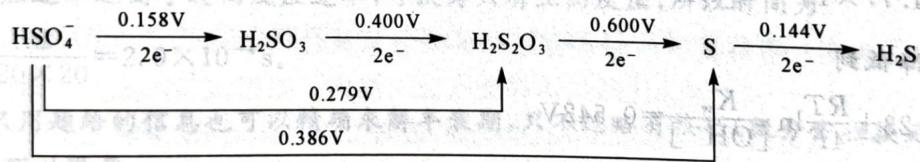

flowchart

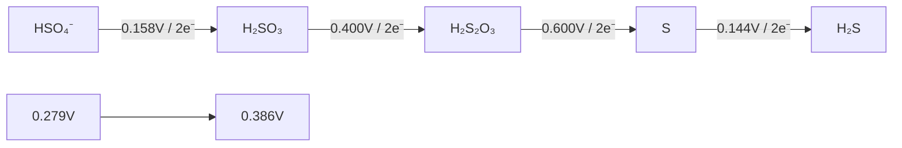

上图表明 $HSO_{4}^{-}/H_{2}SO_{3}$ 的 E=0.158V, $H_{2}SO_{3}/0.5H_{2}S_{2}O_{3}$ 的 E=0.400V。同时，我们可以计算任何相连物种的电极电势。

1. 写出酸性介质中由 $HSO_{4}^{-}$ 到 $H_{2}SO_{3}$ 、 $H_{2}S_{2}O_{3}$ 、S 和 $H_{2}S$ 的半反应方程式。  
2. 求 $E(\mathrm{HSO}_{4}^{-}/\mathrm{H}_{2}\mathrm{S})$ 。  
3. 在 pH=0 和 298K 下，用 Cu 还原硫酸的主要还原产物为何？ $\varphi(\mathrm{Cu}^{2+}/\mathrm{Cu})=0.34\mathrm{V}$ 。  
4. 硫代硫酸在酸性溶液中是不稳定的。请通过计算它歧化为 S 和 $H_{2}SO_{3}$ 的 Gibbs 自由能来说明之。

解 半反应方程式是容易写出的。

$$
\mathrm{HSO} _ {4} ^ {-} + 3 \mathrm{H} ^ {+} + 2 \mathrm{e} ^ {-} \rightleftharpoons \mathrm{H} _ {2} \mathrm{SO} _ {3} + \mathrm{H} _ {2} \mathrm{O},
$$

$$
\mathrm{HSO} _ {4} ^ {-} + 5 \mathrm{H} ^ {+} + 4 \mathrm{e} ^ {-} \rightleftharpoons 0. 5 \mathrm{H} _ {2} \mathrm{S} _ {2} \mathrm{O} _ {3} + 2. 5 \mathrm{H} _ {2} \mathrm{O},
$$

$$
\mathrm{HSO} _ {4} ^ {-} + 7 \mathrm{H} ^ {+} + 6 \mathrm{e} ^ {-} \rightleftharpoons \mathrm{S} + 4 \mathrm{H} _ {2} \mathrm{O},
$$

$$
\mathrm{HSO} _ {4} ^ {-} + 9 \mathrm{H} ^ {+} + 8 \mathrm{e} ^ {-} \rightleftharpoons \mathrm{H} _ {2} \mathrm{S} + 4 \mathrm{H} _ {2} \mathrm{O}
$$

Latimer 图本质就是对电极电势集中列出而已。要计算电对的电极电势，可以利用 Gibbs 自由能是状态函数这一性质，即 $E_{12}, E_{23}, E_{13}$ 之间满足

$$
n _ {1 2} E _ {1 2} + n _ {2 3} E _ {2 3} = n _ {1 3} E _ {1 3},
$$

所以 $E(\mathrm{HSO}_{4}^{-}/\mathrm{H}_{2}\mathrm{S})=2\times(0.158+0.400+0.600+0.144)/8=0.326\mathrm{V}$

注意到只有 $E(\mathrm{HSO}_{4}^{-}/\mathrm{S})$ 电对的电极电势大于 0.34V，因此主要还原产物是 S。

硫代硫酸歧化反应的电动势为 0.600-0.400=0.200V，故其 Gibbs 自由能变为 $-2\times0.200\times96485=-38.6kJ/mol$ 。

【习题8.19】气态废弃物中的硫化氢可用电化学的方法转化为可利用的硫：配制一份电解质溶液，主要成分为 $\mathrm{K}_4[\mathrm{Fe}(\mathrm{CN})_6](200\mathrm{g / L})$ 和 $\mathrm{KHCO_3}(60\mathrm{g / L})$ 。通电电解，控制电解池的电流密度和槽电压，通入 $\mathrm{H}_2\mathrm{S}$ 气体。已知 $\varphi (\mathrm{Fe(CN)}_6^{3 - } / \mathrm{Fe(CN)}_6^{4 - }) = 0.35\mathrm{V}$ ，该溶液中 $\varphi (\mathrm{H}^{+} / \mathrm{H}_{2}) = -0.5\mathrm{V}$ ， $\varphi (\mathrm{S} / \mathrm{S}^{2 - }) = -0.3\mathrm{V}$ 。试写出电解反应的方程式。

## 8.5.3 Nernst方程

这里我们只简单介绍 Nernst 方程, 不要求灵活应用。Nernst 方程刻画了浓度对氧化还原反应趋势的影响。只需合并反应商与 Gibbs 自由能变的关系及 Gibbs 自由能变与电极电势的关系即得

$$
E = E ^ {\ominus} + \frac {R T}{n F} \ln \frac {[ O x ]}{[ R e d ]},
$$

式中 $E^{\ominus}$ 是反应或者半反应的标准电势，n 是转移电子数， $\frac{[Ox]}{[Red]}$ 是氧化侧-还原侧物种的反应商。

从 Nernst 方程可以看出影响电极电势的因素。例如，形成配合物 $\mathrm{Ag(NH_{3})_{2}^{+}}$ 会降低 $Ag^{+}/Ag$ 电对的电势，而形成沉淀 AgI 则会升高该电势，等等。

【例题8.20】计算说明在 $1\mathrm{mol} / \mathrm{L}$ 的 $\mathrm{NH}_3$ 中， $\mathrm{Co}^{3+}$ 能否氧化水。已知 $\varphi^{\ominus}(\mathrm{Co}^{3+} / \mathrm{Co}^{2+}) = 1.84\mathrm{V}$ ， $\varphi^{\ominus}(\mathrm{O}_2 / \mathrm{H}_2\mathrm{O}) = 1.23\mathrm{V}$ ；稳定常数 $\beta_6(\mathrm{Co}(\mathrm{NH}_3)_6^{3+}) = 2.0 \times 10^{35}, \beta_6(\mathrm{Co}(\mathrm{NH}_3)_6^{2+}) = 1.3 \times 10^5$ ；氨的碱常数为 $1.77 \times 10^{-5}$ 。

解 $1\mathrm{mol} / \mathrm{L}$ $\mathrm{NH}_3$ 溶液中，设 $\mathrm{OH}^{-}$ 的浓度为 $c$ ，则

$$
\frac {c ^ {2}}{1 - c} = 1. 7 7 \times 1 0 ^ {- 5} \Rightarrow [ \mathrm{OH} ^ {-} ] = 4. 2 0 \mathrm{mmol/L}, [ \mathrm{NH} _ {3} ] = 0. 9 9 6 \mathrm{mol/L},
$$

因此氧气的电势降低到

$$
\varphi_ {\mathrm{red}} = 1. 2 3 + \frac {R T}{4 F} \ln \frac {K _ {\mathrm{w}}}{[ \mathrm{OH} ^ {-} ]} = 0. 5 4 2 \mathrm{V},
$$

Co(Ⅲ)的电势则降低到

$$
\varphi_ {\mathrm{oxd}} = 1. 8 4 + \frac {R T}{F} \ln \frac {\beta_ {6} \left(\mathrm{Co} \left(\mathrm{NH} _ {3}\right) _ {6} ^ {2 +}\right)}{\beta_ {6} \left(\mathrm{Co} \left(\mathrm{NH} _ {3}\right) _ {6} ^ {3 +}\right)} = 0. 0 5 4 \mathrm{V} <   0. 5 4 2 \mathrm{V},
$$

因此无法氧化。

## § 8.6 简单的化学动力学

在化学的动力学方面,选手一般对基础的化学反应速率都有所了解。考虑到近年初赛中不时出现少量更深入的动力学问题,尽管它实际上是超纲内容,综合考虑,本节还是通过一些例子讲述简单的化学动力学。

## 8.6.1 一级反应

化学反应速率是关于反应进度的速率,定义为

$$
v = \frac {1}{\nu_ {\mathrm{B}}} \frac {\mathrm{d} [ \mathrm{B} ]}{\mathrm{d} t},
$$

上式中 $\nu_{B}$ 表示物质 B 的计量数, 因此给定反应的化学反应速率的数值不随着所考虑物种或者方程式的系数而改变。

对于可以直接表示反应过程的反应式(即基元反应),其反应速率可根据反应式中各反应物的计算数直接给出;否则须通过实验测定给出。

【例 8.21】对基元反应 $aA + bB \longrightarrow cC + dD$ ，反应速率为 $v = k[A]^{a}[B]^{b}$ 。即基元反应的速率正比于所有反应物的浓度按其计量数求幂后的乘积。

对于一类最简单的反应,其反应物只有一种,反应速率正比于其浓度,这种反应称为一级反应。

【例 8.22】对一级反应 A → B，初始状态 A 的浓度为 $c_{0}$ 。速率为

$$
v = \frac {1}{\nu_ {\mathrm{A}}} \frac {\mathrm{d} [ \mathrm{A} ]}{\mathrm{d} t} = - k [ \mathrm{A} ] 。
$$

用 $a(t)$ 表示A的浓度随着时间 $t$ 的变化，即 $\dot{a}(t) = -ka(t)$ ，此微分方程的解为 $a(t) = Ce^{-kt}$ ， $C$ 为待定常数。又因为 $a(0) = c_0$ ，故 $C = c_0$ 。于是对一级反应，其半衰期 $\tau$ （指反应物消耗一半的时间）满足 $0.5 = e^{-kt}$ ，即 $\tau = (\ln 2) / k$ 。一级反应的半衰期与初始反应物的量无关。

## 8.6.2 问题选讲

【例题 8.23】考虑血红蛋白(Mb)和氧气的结合反应 $Mb + O_{2} \rightleftharpoons MbO_{2}$ ，反应的平衡常数 K = 2.00kPa $^{-1}$ 。

研究发现,正向反应速率 $v_{1}=k_{1}[Mb]p(O_{2})$ , 逆向反应速率 $v_{-1}=k_{-1}[MbO_{2}]$ , $k_{-1}=60s^{-1}$ 。当保持氧分压为 20.0kPa 时, 计算结合度达 50% 所需的时间。

提示:对于单纯的逆向反应, $MbO_{2}$ 分解50%所需时间为 $t=0.693/k_{-1}$ 。

解 此题实质上是一个对峙反应。由化学平衡时正逆反应速率相等得到

$$
K = \frac {k _ {1}}{k _ {- 1}} \Rightarrow k _ {1} = 1 2 0 \mathrm{s} ^ {- 1} \cdot \mathrm{kPa} ^ {- 1} 。
$$

注意到正向反应速率远高于逆向反应速率,可认为只有正向反应,所以时间为

$$
t \approx \frac {\ln 2}{1 2 0 \times 2 0} = 2. 9 \times 1 0 ^ {- 4} \mathrm{s。}
$$

实际上,只用题给的信息也可以精确求解半衰期,只不过略有技巧(微分方程换元),这里就略去了,感兴趣的读者可以思考。

【例题8.24】1947年Langmar发明一种断代法，它以钐(Sm)和钕(Nd)的同位素为基础。 $^{143}\mathrm{Nd}$ 量的增加归因于 ${}^{147}\mathrm{Sm}$ 的衰变 $(\tau_{1/2} = 1.06\times 10^{11}$ 年）。另一方面， ${}^{144}\mathrm{Nd}$ 的量并未随时间变化，这就保证了能通过光谱法测定 ${}^{143}\mathrm{Nd}$ 和 ${}^{144}\mathrm{Nd},{}^{147}\mathrm{Sm}$ 和 ${}^{144}\mathrm{Nd}$ 的比例来测定岩石的年龄。1940年，人们在澳大利亚发现了一块陨石并将其取名为Moama。人们确信它的年龄和太阳系的年龄相当。1978年，两种矿物——Plagioclase和Pyroxene从Moama中被分离出来。下表为分析结果：

<table><tr><td>样品</td><td> $n(^{143}\text{Nd})/n(^{144}\text{Nd})$ </td><td> $n(^{147}\text{Sm})/n(^{144}\text{Nd})$ </td></tr><tr><td>Plagioclase</td><td>0.510</td><td>0.111</td></tr><tr><td>Pyroxene</td><td>0.515</td><td>0.280</td></tr></table>

已知放射性元素的衰变反应满足 $n=n_{0}e^{-kt}, k=(\ln2)/\tau$ 是衰变常数，t 是时间，n 是物质的量。

1. 写出 $^{147}$ Sm 的衰变方程式并计算衰变常数。

2. 计算起初陨石形成时 $^{143}Nd$ 和 $^{144}Nd$ 的比例。

3. 计算 Moama 的年龄。

4. 是否有可能用 Langmar 的方法计算公元前 3～5 世纪形成的岩石？请通过计算说明。

解 核反应的问题主要是使用一个一级反应的公式,其余均比较常规。

第1问是容易的,按照题给提示求得

$$
{ } ^ { 1 4 7 } \mathrm{Sm} \longrightarrow { } ^ { 1 4 3 } \mathrm{Nd} + { } ^ { 4 } \mathrm{He} , k = 6 . 5 4 \times 1 0 ^ { - 1 2 } \text {年} ^ { - 1 }
$$

把两块岩石分别记为 X 和 Y，现设 X 中的 ${}^{144}Nd$ 量为 a，Y 中则为 b。那么，X 中的 ${}^{147}Sm$ 有 0.111a, ${}^{143}Nd$ 为 0.510a；同理 Y 中 ${}^{147}Sm$ 有 0.280b, ${}^{143}Nd$ 有 0.515b。

再设 $X$ 和 $Y$ 中发生衰变的量分别为 $x$ 和 $y$ , 则依照年代相等和岩石初态相同可写出下面的方程:

$$
\left\{ \begin{array}{l} \frac {0 . 1 1 1 a}{0 . 1 1 1 a + x} = \frac {0 . 2 8 0 b}{0 . 2 8 0 b + y} = a, \\ \frac {0 . 5 1 0 a - x}{a} = \frac {0 . 5 1 5 b - y}{b}. \end{array} \right.
$$

另一方面，根据核反应特点和半衰期定义有 $\alpha=0.5^{\frac{t}{r}}$ 。

联立解得 $t = 4.5 \times 10^{9}$ 年， $(0.510a - x) / a = 0.506$ 。这就完成了第2、3问。最后一问是显然的，即使是5万年内，Sm的衰变也仅仅进行了0.000000326，是难以测准的，因此不可行。

【习题8.25】年代测定是地质学的一项重要工作。Lu-Hf法是20世纪80年代随着等离子发射光谱、质谱等技术的发展而建立的一种新断代法。Lu有两种天然同位素： ${}^{176}\mathrm{Lu}$ 和 ${}^{177}\mathrm{Lu}$ ；Hf有六种天然同位素： ${}^{176}\mathrm{Hf}$ 、 ${}^{177}\mathrm{Hf}$ 、 ${}^{178}\mathrm{Hf}$ 、 ${}^{179}\mathrm{Hf}$ 、 ${}^{180}\mathrm{Hf}$ 和 ${}^{181}\mathrm{Hf}$ 。 ${}^{176}\mathrm{Lu}$ 发生 $\beta$ 衰变生成 ${}^{176}\mathrm{Hf}$ ，半衰期为 $3.716\times 10^{10}$ 年。 ${}^{177}\mathrm{Hf}$ 为稳定同位素且无放射性。地质工作者获得一块岩石样品，从该样品的不同部位取得多个样本进行分析。其中的两组有效数据如下。样本1中， ${}^{176}\mathrm{Hf}$ 与 ${}^{177}\mathrm{Hf}$ 的比值为0.28630（原子比，记为 ${}^{176}\mathrm{Hf}/{}^{177}\mathrm{Hf})$ ， ${}^{176}\mathrm{Lu}/{}^{177}\mathrm{Hf}$ 为0.42850。另一份样本则分别为0.28239、0.01470。（核素衰变服从一级反应规律， $c = c_0e^{-k}, k$ 是衰变常数）

计算该岩石的年龄。

## 第8讲习题

【习题 8.26】有人用一可称量气体的平衡型天平测量某新合成的氟代烃 X 的摩尔质量。天平两边各有一个相同的玻璃泡，待测气体和比照气体都充入玻璃泡内。通过调整两边充入气体的压力，可使天平达到平衡。327.10 torr 的 X 和 423.22 torr 的 CHF₃ 或者 293.22 torr 的 X 和 427.22 torr 的 CHF₃，均可使天平平衡。试估算 X 的摩尔质量并推断可能的分子式。提示：torr 为非标准压力单位 mmHg。

【习题 8.27】在真空容器中放入足量 $NH_{4}Cl$ 固体，当加热到 T 时，容器内的平衡压力为 104.7 kPa。在同样条件下，若改放入 $NH_{4}I$ 则平衡压力为 18.85 kPa。

1. 若不考虑 HI 分解, 求固态 $NH_{4}Cl$ 和固态 $NH_{4}I$ 的混合物在 T 时的平衡压力。  
2. 若 $2\mathrm{HI}(g) \rightleftharpoons \mathrm{H}_{2}(g) + \mathrm{I}_{2}(g)$ 的平衡常数为 K，请计算此时的平衡压力；定性讨论你的答案。

【习题 8.28】 $CO_{2}$ 和 $H_{2}S$ 在高温下的反应为: $\mathrm{CO}_{2}(g)+\mathrm{H}_{2}\mathrm{S}(g)\rightleftharpoons\mathrm{COS}(g)+\mathrm{H}_{2}\mathrm{O}(g)$ 。今在610K下将4.40g的 $\mathrm{CO}_{2}(g)$ 加入体积为2.500L的空瓶中,然后再充入 $H_{2}S(g)$ 使总压为1000kPa。达平衡后分析得知其中 $H_{2}O(g)$ 的摩尔分数为0.02000;将温度升至620K重复试验,达平衡后再次分析得 $H_{2}O(g)$ 的摩尔分数为0.03000。采用合理近似,求:

1.610K 下反应的 $\Delta_{r}G_{m}$  
2. 该反应的 $\Delta_{r}H_{m}$

【习题 8.29】对于 $V_{2}O_{5}$ 和 $SO_{2}$ 的体系。在 T=773.15K 存在下列平衡。

$$
\begin{array}{l} \mathrm{V} _ {2} \mathrm{O} _ {5} (\mathrm{s}) + \mathrm{SO} _ {2} (\mathrm{g}) \rightleftharpoons 2 \mathrm{VO} _ {2} (\mathrm{s}) + \mathrm{SO} _ {3} (\mathrm{g}) K _ {1} = 0. 0 1 1 8 6, \\ 2 \mathrm{VOSO} _ {4} (\mathrm{s}) \rightleftharpoons \mathrm{V} _ {2} \mathrm{O} _ {5} (\mathrm{s}) + \mathrm{SO} _ {2} (\mathrm{g}) + \mathrm{SO} _ {3} (\mathrm{g}) K _ {2} = 9. 1 7 4 \times 1 0 ^ {- 5}, \\ 2 \mathrm{SO} _ {3} (\mathrm{g}) \rightleftharpoons 2 \mathrm{SO} _ {2} (\mathrm{g}) + \mathrm{O} _ {2} (\mathrm{g}) K _ {3} = 3. 6 2 1 \times 1 0 ^ {- 4} \\ \end{array}
$$

1. 计算反应 $\mathrm{VOSO}_{4}(\mathrm{s}) \rightleftharpoons \mathrm{VO}_{2}(\mathrm{s}) + \mathrm{SO}_{2}(\mathrm{g}) + 1/2\mathrm{O}_{2}(\mathrm{g})$ 的标准平衡常数。

1. 计算反应 $VOSO_{4}$ 的恒温恒容容器放入 $0.100 \mathrm{~mol}$ 的 $\mathrm{VOSO}_{4}$ , 计算平衡时的气相组成和 $\mathrm{VOSO}_{4}$ 的分解百分数。  
3. 以下哪些方式一定可以促进 $\mathrm{VOSO}_{4}$ 分解？A. 升高温度；B. 通入惰性气体加压；C. 将恒容容器换为无摩擦滑动的活塞；D. 在体系中加入 CaO 吸收 $\mathrm{SO}_{2}$

【习题 8.30】酯化反应生产乙酸乙酯一般控制在 $110^{\circ}$ C，常压下进行。已知该反应在 $25^{\circ}$ C 平衡常数 $K_{x}=4.233$ ，假定此温度附近酯化反应的反应焓恒为 8.238kJ/mol，反应体系视为理想液态混合物。

1. 假设乙酸与乙醇投料比为 1: x，计算 $20^{\circ}$ C 时乙酸平衡转化率的表达式 $\alpha = f(x)$ 。  
2. 欲使乙酸平衡转化率达到 95.5%，求投料比的值。  
3. 为什么工业生产中酯化温度一般控制在 $110^{\circ}$ C?

【习题8.31】工业上苯乙烯通过乙苯催化脱氢制成，并在常压下进行。基本流程为：在蒸发器中将乙苯蒸发为气体，离开蒸发器后与水蒸气混合，经过脱氢炉中的预热器后进入换热器，再进入脱氢炉中的过热器；在过热器中，混合气体被加热到约 $600^{\circ}\mathrm{C}$ ，然后进入装有催化剂的列管反应器进行催化反应。已知 $600^{\circ}\mathrm{C}$ 的标准平衡常数 $K = 0.178$ ，标准压力 $p = 100\mathrm{kPa}$ 。

1. 计算温度 $600^{\circ}C$ ，总压 100kPa 时乙苯的理论转化率。  
2. 在原料气中加入水蒸气, 控制乙苯与水的摩尔比为 1:9, 计算温度 $650^{\circ}C$ , 总压 100kPa 时乙苯的理论转化率。此温度区间中反应焓变恒为 124.4kJ/mol。  
3. 指出在实际生产中常采用添加水蒸气的理由。

【习题 8.32】 $760^{\circ} \mathrm{C}$ 和 $1.01 \times 10^{5} \mathrm{~Pa}$ 下, 令 $\mathrm{H}_{2}$ 和某稀有气体以体积比 $1:1$ 缓缓通过盛有熔融 AgI 的器皿, AgI 被部分还原。反应后的气体通过盛有 $20.00 \mathrm{~mL} 0.1000 \mathrm{~mol} / \mathrm{L}$ 的 NaOH 洗气瓶, 收集干燥后的尾气。某次实验后, 洗气瓶后的溶液可被 $4.500 \mathrm{~mL} 0.1000 \mathrm{~mol} / \mathrm{L} \mathrm{HCl}$ 溶液中和, 尾气在 $17.0^{\circ} \mathrm{C} 、 1.013 \times 10^{5} \mathrm{~Pa}$ 下体积为 $254.9 \mathrm{~mL}$ 。已知 $760^{\circ} \mathrm{C}$ 时, 纯 HI 有 $30.00 \%$ 分解为单质。

1. 计算尾气中 $H_{2}$ 和器皿中剩余 Ag 的物质的量。  
2. 如何将 Ag 从器皿中的残渣中分离出来?

【习题 8.33】计算化学研究表明,反应 $H_{2}S + SO_{2}$ 的焓变 $\Delta H = 16kJ/mol$ 。反应过程中,先产生中间体 $H_{2}S_{2}O_{2}$ 。其中一种中间体转化为产物的焓变为 -14kJ/mol,由原料转化为中间体的活化能为 136kJ/mol。画出反应过程中的势能图,并计算由中间体 $H_{2}S_{2}O_{2}$ 转化为原料的反应的活化能与焓变。

## 【习题8.34】

1. 金属羰基化合物常用作一氧化碳加氢反应的催化剂。金属羰基化合物 $\mathrm{Os}_{2}(\mathrm{CO})_{9}$ 可在 $1100\mathrm{K}$ 下催化反应 $\mathrm{CO(g)} + 3\mathrm{H}_{2}(\mathrm{g}) \rightleftharpoons \mathrm{CH}_{4}(\mathrm{g}) + \mathrm{H}_{2}\mathrm{O}(\mathrm{g})$ 。在总压 $100\mathrm{kPa}$ , CO 和 $\mathrm{H}_{2}$ 投料比为 $1:3$ 时, 平衡时 CO 的物质的量分数为 $16.1\%$ 。求该温度下的平衡常数和 CO 的转化率。  
2. 如果该反应采用纳米钴为催化剂, 会发生副反应 $\mathrm{Co(s)} + \mathrm{H}_{2} \mathrm{O(g)} \rightleftharpoons \mathrm{CoO(s)} + \mathrm{H}_{2}(\mathrm{g})$ , $500 \mathrm{~K}$ 时该反应的平衡常数为 $6.8 \times 10^{-3}$ , 反应 $\mathrm{CO(g)} + 3 \mathrm{H}_{2}(\mathrm{g}) \rightleftharpoons \mathrm{CH}_{4}(\mathrm{g}) + \mathrm{H}_{2} \mathrm{O(g)}$ 的平衡常数为 $1.98 \times 10^{10}$ 。计算在 $500 \mathrm{~K}$ , 总压与投料比不变的情况下, 足量纳米钴催化平衡时 CO 的分压; 根据上述计算, 分析纳米钴催化剂在该工艺中具有的优点。

【习题8.35】下图示出了一个横截面积为 $S$ ，带有可以无摩擦滑动活塞的长方体透明容器。容器沿着 $x$ 方向的长度为 $l_{x}$ 。

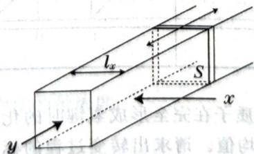

text_image

lₓ
S
x
y

现在在维持外压为 p 的情况下向其中充入物质的量为 $n_{0}$ 的气体 D，此时 D 的体积为 $V_{0}$ 。气体 D 有色，其摩尔吸光系数为 $\varepsilon_{D}$ 。在恒定温度下使其发生如下可逆反应：

$$
\mathbf {D} \rightleftharpoons 2 \mathbf {M} 。
$$

产物 M 也是有色气体, 其摩尔吸光系数为 $\varepsilon_{\mathrm{M}}$ 。系统达到平衡后, D 和 M 的分压分别为 $p_{\mathrm{D}}, p_{\mathrm{M}}$ , 物质的量分别为 $n_{\mathrm{D}}, n_{\mathrm{M}}$ , 总体积为 $V$ 。

1. 若沿着 $x$ 方向观察，平衡前后吸光度相等，求 $\mathbf{D}$ 和 $\mathbf{M}$ 的摩尔吸光系数比值 $\varepsilon_{\mathrm{D}} / \varepsilon_{\mathrm{M}}$ 。  
2. 若沿着 y 方向观察, 平衡前后吸光度相等, 求 D 和 M 的摩尔吸光系数比值 $\varepsilon_{D}/\varepsilon_{M}$ 。

【习题 8.36】银可能受到硫化氢腐蚀而变黑,若在 $H_{2}S$ 和 $H_{2}$ 的常温常压混合气体中,Ag 不会被腐蚀,求 $H_{2}S$ 的最大分压。热力学数据如下表所示:

<table><tr><td>物质</td><td>Ag(s)</td><td> $H_2S(g)$ </td><td> $Ag_2S(s)$ </td><td> $H_2(g)$ </td></tr><tr><td> $\Delta_fH_m/(kJ·mol^{-1})$ </td><td>-20.6</td><td>-32.6</td><td></td><td></td></tr><tr><td> $S_m/[J·(mol·K)^{-1}]$ </td><td>42.6</td><td>205.8</td><td>144</td><td>130.7</td></tr></table>

【习题8.37】在北方的冬天，人们可以使用液化气取暖。液化气中的主要成分是丙烷和丁烷。假设有一间面积 $20\mathrm{m}^2$ ，高 $2.5\mathrm{m}$ 的小屋在 $-10^{\circ}\mathrm{C}, 760\mathrm{mmHg}$ 的大气中达到平衡，房主使用放置在室外的丙烷气球取暖。下表给出了相关热力学数据：

<table><tr><td>热力学数据</td><td> $C_3H_8(l)$ </td><td> $C_3H_8(g)$ </td><td> $O_2(g)$ </td><td> $CO_2(g)$ </td><td> $H_2O(l)$ </td><td> $H_2O(g)$ </td></tr><tr><td> $\Delta_fH_m/(kJ·mol^{-1})$ </td><td>-120.9</td><td>-103.9</td><td></td><td>-393.5</td><td>-285.8</td><td>-241.8</td></tr><tr><td> $S_m/[J·(mol·K)^{-1}]$ </td><td>195.2</td><td>269.9</td><td>205.0</td><td>213.7</td><td>70.0</td><td>188.7</td></tr></table>

1. 假设大气中只有氮气和氧气且为理想气体, 求将室温加热到 $20^{\circ}C$ 所需要消耗的丙烷的质量。提示: 双原子理想气体的等容摩尔热容为 2.5R, 等压摩尔热容为 3.5R, 其中 R 为气体常量。  
2. 求丙烷的饱和蒸汽压。

【习题8.38】为了通过实验确定下述分子中分子内氢键的强度,研究人员测定了酰胺质子在不同温度下的化学位移值 $\delta_{\mathrm{obs}}$ (见下表)。假设系统中存在如下平衡:

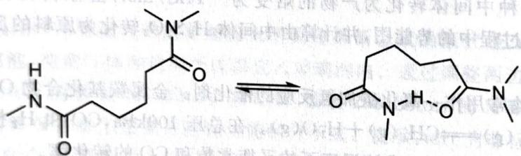

chemical

Chemical reaction equation showing nucleophilic substitution of a peptide bond to form a cyclic amide structure

<table><tr><td>温度/K</td><td> $\delta_{obs} / ppm$ </td></tr><tr><td>220</td><td>6.67</td></tr><tr><td>240</td><td>6.50</td></tr><tr><td>260</td><td>6.37</td></tr><tr><td>280</td><td>6.27</td></tr><tr><td>300</td><td>6.19</td></tr></table>

表观化学位移值 $\delta_{\mathrm{obs}}$ 是酰胺NH质子在完全形成氢键时的化学位移值 $\delta_{\mathrm{i}} = 5.7\mathrm{ppm}$ 的加权平均值。请求出转变过程的标准摩尔焓变和标准摩尔熵，讨论你得出结果的化学意义。

【习题 8.39】某电池左半部分由 Fe 电极、0.010mol/L 的 Fe(NO₃)₃ 溶液组成，右半部分为石墨电极和 0.050mol/L Fe(NO₃)₂ 和 0.30mol/L Fe(NO₃)₃ 溶液。两侧容器中溶液的体积约为 1.0 kJ

1. 指出阴阳极和两侧电极种类, 写出半反应和总反应。

2. Fe(s)、 $Fe^{2+}(aq)$ 、 $Fe^{3+}(aq)$ 室温下的标准熵分别为 27.3、-137.7 和 -316.0J/(mol·K)。每升温 20K 导致电池反应的平衡常数降为原来的 1/85。

a)哪一种离子的标准熵在水溶液中是0?

b) 解释为何三价离子的标准熵比二价离子高。  
c) 计算 $25^{\circ}C$ 时反应的 $\Delta H, \Delta S, \Delta G$ 。  
d) 此电池在 200.0min 内被用完, 计算平均电流。

【习题8.40】Frost图的横坐标为氧化态，而纵坐标为该氧化态与单质构成电对时的标准电极电势数值与该氧化态氧化数的乘积。下图为两种重元素的Frost图。（+5以上价态都以二氧酰阳离子形式存在）

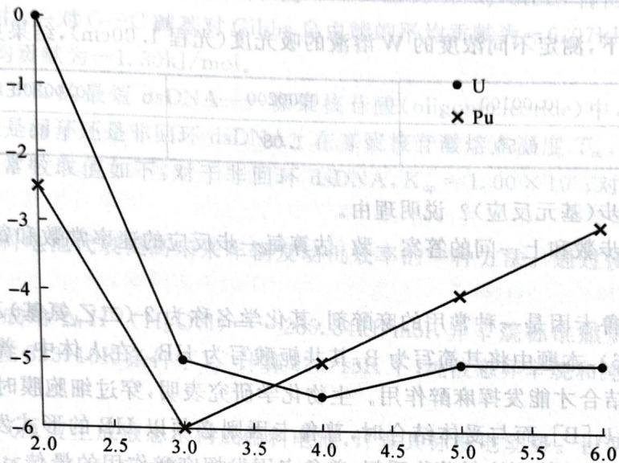

line chart

| x    | U     | Pu    |
| ---- | ----- | ----- |
| 2.0  | 0.0   | -2.5  |
| 3.0  | -5.0  | -6.0  |
| 4.0  | -5.5  | -5.0  |
| 5.0  | -5.5  | -4.0  |
| 6.0  | -5.5  | -3.0  |

1. 写出 Pu 溶于酸的反应方程式, 并写出在酸性水溶液中稳定的铀阳离子。  
2. 写出 $Pu^{2+}$ 歧化方程式, 计算 $\varphi(\mathrm{Pu}^{3+}/\mathrm{Pu}^{2+})$ 。  
3. 处理废料 $\mathrm{AnO}_{2}(\mathrm{NO}_{3})_{2}(\mathrm{TBP})_{2}(\mathrm{TBP}$ 为磷酸三丁酯, $\mathrm{An}=\mathrm{U},\mathrm{Pu}$ 时可用亚铁盐分离 U 和 Pu。试解释能分离的原因。  
4. 对于图中各元素能自发歧化的物种, 分别求歧化反应的平衡常数。

【习题 8.41】常温下用惰性电极电解 200mL 一定浓度的 NaCl 与 $CuSO_{4}$ 混合溶液, 理论上两极所得气体的体积随时间变化的关系如下图所示(STP)。

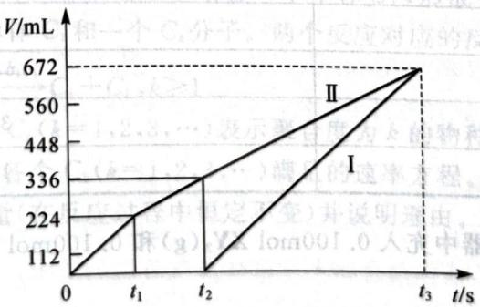

line chart

| t/s | V/mL (I) | V/mL (II) |
| --- | -------- | --------- |
| 0   | 112      | 112       |
| t₁  | 224      | 224       |
| t₂  | 336      | 336       |
| t₃  | 672      | 672       |

1. 根据上图, 求:

a) 原混合溶液 NaCl 和 $CuSO_{4}$ 的物质的量浓度。

b) $t_{2}$ 时所得溶液的pH。

2. 若用惰性电极电解 NaCl 和 $CuSO_{4}$ 的混合溶液 200mL，经过一段时间后两极均得到 224mL 气体。求原溶液中，向量 $(c(\mathrm{Cl}^{-}), c(\mathrm{Cu}^{2+}))$ 的取值。

【习题8.42】加热 $\mathrm{PbMe_4}$ 时，它会分解生成一种不稳定的物种X，后者可以与Sb反应。现将 $\mathrm{PbMe_4}$ 通过惰性气体承载以 $v = 14.0\mathrm{m / s}$ 的速度通过一长直石英管并在点 $P$ 加热。 $P$ 点之后保持恒温，其后 $22.0\mathrm{cm}$ 和 $37.0\mathrm{cm}$ 处各有等量Sb。Sb分别在45.0s和150s后消失。求物质X及其在此条件下的半衰期 $\tau$ 。设X的消耗是一级反应。（

【习题8.43\*\*】在溶液中，物质W可由物质X经过连续的、不可逆的一级反应步骤得到。取0.00131mol/L的纯X溶液于光程0.50cm的比色皿中，在 $\lambda_{1} = 320\mathrm{nm}$ 的波长下研究该反应，得到吸光度随时间的变化数据见下表：

<table><tr><td>t/min</td><td>0.00</td><td>2.00</td><td>4.00</td><td>6.00</td><td>10.0</td><td>20.0</td><td>50.0</td><td>100.0</td><td>∞</td></tr><tr><td>A</td><td>0.982</td><td>2.073</td><td>2.538</td><td>2.727</td><td>2.883</td><td>2.713</td><td>2.369</td><td>1.919</td><td>0.681</td></tr></table>

又在相同波长 $\lambda_{1}$ 下，测定不同浓度的 W 溶液的吸光度（光程 1.00cm），结果见下表：

<table><tr><td> $c/(mol \cdot L^{-1})$ </td><td>0.00100</td><td>0.00200</td><td>0.00300</td><td>0.00500</td></tr><tr><td>A</td><td>0.56</td><td>1.08</td><td>1.60</td><td>2.64</td></tr></table>

1. 反应至少有几步(基元反应)? 说明理由。  
2. 设反应的实际步数和上一问的答案一致,估算每一步反应的速率常数和每个中间体的摩尔消光系数。

【习题8.44】普鲁卡因是一种常用的麻醉剂，其化学名称为2-(二乙氨基)乙基-4-氨基苯甲酸酯。它具有碱性 $(\mathrm{pK_b} = 6.6)$ ，本题中将其简写为B，其共轭酸写为HB。在人体中，普鲁卡因需要穿过细胞膜后与细胞内的受体结合才能发挥麻醉作用。生物化学研究表明，穿过细胞膜时普鲁卡因必须以B的形式通过，其速率 $r_1 = k_1[\mathrm{B}]$ ；而与受体结合时，普鲁卡因则必须以HB的形式发挥作用，其速率 $r_2 = k_2[\mathrm{HB}]$ 。画出其结构，并计算刚注射药物瞬间，普鲁卡因发挥麻醉作用的最佳 $\mathrm{pH}$ 。提示： $x \ll 1$ 时有 $e^x \approx 1 + x$ ；已知 $k_1 = k_2 = 0.0010s^{-1}$ 。

【习题8.45】4000K下，在 $\mathbf{X}(\mathrm{s})$ 和 $\mathbf{Y}_2(\mathrm{g})$ 的平衡体系中，可能存在以下物种，它们的化学式和标准摩尔Gibbs生成自由能列于下表中：

<table><tr><td>物质</td><td> $\Delta_{\mathrm {f}}G^{\ominus}/(\mathrm {kJ}\cdot\mathrm {mol}^{-1})$ </td></tr><tr><td>X(s)</td><td>0</td></tr><tr><td>X(g)</td><td>92.427</td></tr><tr><td>Y2(g)</td><td>0</td></tr><tr><td>Y(g)</td><td>-15.541</td></tr><tr><td>XY2(g)</td><td>353.687</td></tr><tr><td>XY(g)</td><td>194.335</td></tr></table>

在 4000K 下, 向某恒压容器中充入 0.100mol $XY_{2}(g)$ 和 0.100mol $Y_{2}(g)$ 并达平衡, 此时容器的体积为 20.0L。求:

1. 体系中 X(s) 的物质的量。  
2. 体系中 $\mathbf{X}(\mathbf{g})$ 、 $\mathbf{Y}_2(\mathbf{g})$ 、 $\mathbf{Y}(\mathbf{g})$ 、 $\mathbf{XY}_2(\mathbf{g})$ 、 $\mathbf{XY}(\mathbf{g})$ 各自的分压。

【习题8.46】回环(Palindromic)序列是DNA的一种有趣特征。在一个双链DNA(dsDNA)物种中，一条沿 $5^{\prime}\rightarrow 3^{\prime}$ 方向的链与另一条沿 $5^{\prime}\rightarrow 3^{\prime}$ 方向的链互补相配。因此，回环DNA(dsDNA)由两条互补的等同链组成。名为Drew-Dickerson的十二核苷酸就是一个例子：

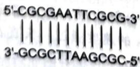

1. 对于十二核苷酸(即含有 12 个碱基对的 dsDNA 物种), 可能形成多少种不同的回环双链 DNA? 对于十一核苷酸呢?

现在来分析由单链形成双螺旋 DNA 的热力学及其与 DNA 链长和温度的关系。对于回环和非回环双链 DNA(dsDNA)，由单链形成双链 DNA(dsDNA) 的缔合平衡常数不同。取初始浓度 $c_{init}=1.00 \times 10^{-6}$ mol/L 的 dsDNA 溶液，加热至 $T_{m}$ 并使之达平衡。dsDNA 的熔点 $T_{m}$ 的定义是：DNA 双链解离 50% 时的温度。

2. 对于回环和非回环 dsDNA, 计算温度 $T_{m}$ 下单链缔合的平衡常数。

在一定的实验条件下,两条单链缔合形成双链 DNA(dsDNA) 对 Gibbs 自由能的平均贡献的估算结果如下:在 dsDNA 中,一对 G—C 碱基对 Gibbs 自由能的平均贡献为 -6.07kJ/mol,一对 A—T 碱基对 Gibbs 自由能的平均贡献为 -1.30kJ/mol。

3. 熔点 $T_{\mathrm{m}}$ 高于 $330\mathrm{K}$ 的最短 dsDNA——寡聚核苷酸 (oligonucleotide) 中, 有多少个碱基对? 并问: 最短的寡聚核苷酸是回环还是非回环 dsDNA? 在寡聚核苷酸熔点温度 $T_{\mathrm{m}}$ , 由单链形成双链 DNA (dsDNA) 的缔合平衡常数取值如下: 对于非回环 dsDNA, $K_{\mathrm{np}} = 1.00 \times 10^{6}$ ; 对于回环 dsDNA, $K_{\mathrm{p}} = 1.00 \times 10^{5}$ 。

【习题8.47】燃料电池代表提高未来车辆发动机效率的一种方法。通过使用氢燃料电池可提高发动机的效率。

1. 液态水标准生成焓 $\Delta_{\mathrm{f}}H^{\ominus}(\mathrm{H}_{2}\mathrm{O},\mathrm{l})=-285.84\mathrm{kJ}/\mathrm{mol}$ ，异辛烷标准燃烧焓 $\Delta_{\mathrm{c}}H^{\ominus}(\mathrm{C}_{8}\mathrm{H}_{18},\mathrm{l})=-5065.08\mathrm{kJ}/\mathrm{mol}$ （均在323.15K条件下）。计算323.15K下，纯液态异辛烷和纯气态氢的比燃烧焓（单位质量的燃烧焓）。

2. 利用氧气和氢气反应生成液态水构成燃料电池, 计算其标准电动势。设两种气体均为理想气体且在 $100 \mathrm{kPa}$ 和 323.15K 条件下工作。熵数据 (323.15K) 如下: $S^{\ominus}(\mathrm{H}_{2} \mathrm{O}, 1) = 70 \mathrm{~J} / (\mathrm{K} \cdot \mathrm{mol})$ , $S^{\ominus}(\mathrm{H}_{2}, \mathrm{g}) = 131 \mathrm{~J} / (\mathrm{K} \cdot \mathrm{mol})$ , $S^{\ominus}(\mathrm{O}_{2}, \mathrm{g}) = 205 \mathrm{~J} / (\mathrm{K} \cdot \mathrm{mol})$ 。

3. 确定 353.15K 下通过燃料电池生成液态水的理想热力学效率。此温度下，水的生成焓是 $\Delta_{\mathrm{f}}H^{\ominus}(\mathrm{H}_{2}\mathrm{O},\mathrm{l})=-281.64\mathrm{kJ/mol}$ ，相应的反应 Gibbs 自由能变化为 $\Delta_{r}G^{\ominus}=-225.85kJ/mol$ 。

【习题8.48】在298.15K条件下， $\Delta_{\mathrm{f}}G_{\mathrm{m}}^{\ominus}(\mathrm{Ca(OH)}_{2}, \mathrm{s}) = -895.7 \mathrm{~kJ/mol}$ ， $\Delta_{\mathrm{f}}G_{\mathrm{m}}^{\ominus}(\mathrm{H}_{2} \mathrm{O}, \mathrm{l}) = -237.1 \mathrm{~kJ/mol}$ ， $E^{\ominus}(\mathrm{Ca}^{2+}/\mathrm{Ca}) = -2.868 \mathrm{~V}$ ， $K_{\mathrm{w}} = 1.00 \times 10^{-14}$ ，请计算 $\mathrm{Ca(OH)}_{2}$ 的溶解度 $(\mathrm{g/L})$ 。

【习题8.49】Becker-Döring模型是一个关于凝结核的物理化学模型，类似于高聚反应。本题只考虑以下两种类型的反应。其一是一个 $C_k$ 分子结合一个单体 $C_1$ ，形成一个 $C_{k + 1}$ 分子；其二是其逆反应，一个 $C_{k + 1}$ 分子分解成一个单体 $C_1$ 和一个 $C_k$ 分子。两个反应对应的反应速率常数分别为 $a_{k}$ 和 $b_{k + 1}$

$$
C _ {1} + C _ {k} \xrightarrow {a _ {k}} C _ {k + 1}; C _ {k + 1} \xrightarrow {b _ {k + 1}} C _ {k} + C _ {1}, k \geqslant 1 。
$$

滥用一下记号,我们同时用 $C_{k}(k=1,2,3,\cdots)$ 表示聚合度为 k 的物种的浓度。

1. 根据质量作用定律, 写出各个 $C_{k}(k=1,2,3,\cdots)$ 满足的速率方程。

2. 找出体系中的一个守恒量(在反应过程中恒定不变)并说明理由。

# 第9讲 溶液与化学分析

溶液在化学中具有根本性的地位,几乎所有重要的化学反应都需要在溶液中进行。如果没有溶液,化学在自然科学中就很难有一级学科的地位。本讲中,我们将上一讲学习的基础化学热力学和化学平衡延伸应用到溶液这一复杂的化学体系中。讲述溶液中的化学平衡时,我们主要讨论比较简单的酸碱平衡和沉淀溶解平衡的计算,Nernst方程和配位平衡只在例子中提及。

## § 9.1 溶液的基本性质

类似于气体,对于溶液的宏观热力学描述也是基于唯象定律,建立完全服从唯象定律的理想模型(理想溶液)进行处理。

在混合物体系中,化学势具有重要的意义。为了进行推导,我们引入化学势的一个非正式定义:对于纯物质,化学势就是单位物质的量的物质的 Gibbs 自由能。之后我们将用 $G_{m}$ 来表示化学势,而不是用通用符号 $\mu$ 来写,以表示我们的推导并非严格。

## 9.1.1 Raoult定律

在房间里放一杯水,过了较长时间后,杯子中的水会减少,这是因为液体具有蒸气压。液体表面的分子如果具有一定动能,就可以离开液面进入气相,反之亦然,液相和气相之间建立了动态平衡。设想在某密闭的容器中有足量液体,平衡时液体上方容器内的压力称为液体的蒸气压。液体的蒸气压是温度的函数。

蒸气压是沸腾、冷凝等现象的本质来源。当液体的蒸气压达到环境压力(例如大气压)时,液体将全部蒸发以达到平衡;而当蒸气压低于环境压力时,气体将冷凝达到平衡。

法国化学家 Raoult 研究了液体混合物上方液体蒸气分压的情况,总结了 Raoult 定律:平衡时,液体 \* 上标的量表示对应于纯物质的物理量,例如 $T^{*}$ 、 $G_{m}^{*}$ 等等。

完全服从 Raoult 定律的混合物称为理想溶液。化学上，理想溶液要求混合时溶质和溶剂之间的作用力与它们自身的相互作用力完全相同，理想溶液混合时不产生热效应。通常来说，结构特别相似的物质的混合物，基本上就是理想溶液，例如甲苯和苯的混合物；在较稀的溶液中，Raoult 定律对溶剂适用程度也较高。

现在推导理想溶液中各组分 $G_{\mathrm{m}}$ 与 $G_{\mathrm{m}}^{*}$ 的关系式。

考虑反应 B(1)⇌B(g)，类比化学平衡，知道 $G_{m}^{*}=G_{m}^{\ominus}+RT\ln p_{B}^{*}$ ，Raoult 定律， $G_{m}=G_{m}^{\ominus}+RT\ln(x_{B}p_{B}^{*})$ 。

合并得到 $G_{m}=G_{m}^{*}+RT\ln x_{B}$ ,

即混合物中某一组分的摩尔分数下降会导致其化学势下降。上式我们在依数性的具体推导中还会用到。

## 9.1.2 Henry定律

在理想溶液中,溶质和溶剂都满足 Raoult 定律。但是在实际的稀溶液中,英国化学家 Henry 发现,虽然溶质的蒸气压仍然正比于摩尔分数,比例系数却不是纯物质的蒸气压,而是所谓的亨利常数,这就是 Henry 定律:

平衡时,稀溶液表面溶质 B 的蒸气分压,等于其摩尔分数乘以其亨利常数: $p_{B}=x_{B}H_{B}$ 。亨利常数 H 也是温度的函数。

完全服从 Henry 定律的混合物称为理想稀溶液。

注记 请同学们特别注意理想溶液和理想稀溶液的区别。

【例题9.1】一定温度下氯气在水中达到溶解平衡时，设1L水中可溶解物质的量为 $m$ 的氯气，氯气的平衡分压为 $p$ 。

1. 证明: $m / p^{1/3}$ 和 $p^{2/3}$ 具有线性关系。  
2. 设计实验, 测定一定温度下氯气在水中的亨利常数 H 及其与水反应的平衡常数 K。

解 利用 Henry 定律有

$$
p \left(\mathrm{Cl} _ {2}\right) = H \left[ \mathrm{Cl} _ {2} \right] 。
$$

忽略 HOCl 电离, 则化学反应条件为 $\frac{(m-\left[\mathrm{Cl}_{2}\right])^{3}}{\left[\mathrm{Cl}_{2}\right]}=K$ ,

消去 $\left[\mathrm{Cl}_{2}\right]$ 并整理得到 $\left(m - \frac{p}{H}\right)^3 = \frac{Kp}{H} \Rightarrow \frac{m}{p^{\frac{1}{3}}} = \frac{1}{H} p^{\frac{2}{3}} + \left(\frac{K}{H}\right)^{\frac{1}{3}}$

这就完成了证明。

利用上式即可设计实验:在密闭容器中放置恒定量的水,测定平衡时容器上方的压力和氯的溶解度,根据第1问物理量的线性关系,作图回归即可。

## 9.1.3 稀溶液的依数性

每种溶液都具有一定的特性,但有一些性质只与溶液浓度有关,与溶质的性质无关,这些性质称为溶液的依数性。其本质都是液体混合物中,溶剂的 $G_{m}$ 下降使得液体分子逃逸的倾向降低,导致凝固点降低、沸点升高,并出现渗透压。现在我们利用理想溶液 $G_{m}$ 的关系式定量描述这些现象。我们用A表示溶剂,用B表示溶质(溶质不挥发)。

1. 沸点升高 当体系达到平衡时, $\Delta G=0$ ,气相和液相的 $G_{m}$ 相等(注意气相是纯物质得到),

$$
G _ {\mathrm{m}} ^ {*} (\mathbf {g}) = G _ {\mathrm{m}} ^ {*} (1) + R T \ln x _ {\mathrm{A}} 。 \text { 即 }
$$

改写得到(下式中 vap 表示蒸发, 下同)

$$
\ln x _ {A} = \frac {G _ {\mathrm{m}} ^ {*} (\mathrm{g}) - G _ {\mathrm{m}} ^ {*} (1)}{R T} = \frac {\Delta_ {\mathrm{vap}} G _ {\mathrm{m}}}{R T},
$$

两边对 T 微分， $\frac{d\ln x_{A}}{dT}=-\frac{\Delta_{vap}H_{m}}{RT^{2}}$

最后积分

$$
\int_ {0} ^ {\ln x _ {\mathrm{A}}} \mathrm{d} \ln x _ {\mathrm{A}} = \int_ {T ^ {*}} ^ {T} - \frac {\Delta_ {\mathrm{vap}} H _ {\mathrm{m}}}{R T ^ {2}} \mathrm{d} T,
$$

得 $\ln(1-x_{\mathrm{B}})=\frac{\Delta_{\mathrm{vap}}H_{\mathrm{m}}}{R}\left(\frac{1}{T}-\frac{1}{T^{*}}\right)$ 。

利用扰动不大时， $T \approx T^{*}$ ， $\ln(1-x_{\mathrm{B}}) \approx -x_{\mathrm{B}}$ 得到

$$
\Delta T = T - T ^ {*} = \frac {R T ^ {* 2}}{\Delta_ {\mathrm{vap}} H _ {\mathrm{m}}} x _ {\mathrm{B}} 。
$$

这就是说，沸点升高正比于溶质摩尔分数。容易看出稀溶液中 $x_{\mathrm{B}}$ 和质量摩尔浓度 $m_{\mathrm{B}}$ 与 $c_{\mathrm{B}}$ 都近似成正比，所以沸点升高的常数也有使用不同单位的其他版本，同学们可以自行导出。下面几种依数性也是这样。

2. 凝固点下降 推导和沸点升高完全一样（式中 fus 表示熔化），结果为

$$
\Delta T = T ^ {*} - T = \frac {R T ^ {* 2}}{\Delta_ {\mathrm{fus}} H _ {\mathrm{m}}} x _ {\mathrm{B}} 。
$$

3. 渗透压 在一个 U 形管中间放入一层半透膜, 后者只允许溶液中小分子如水分子通过, 而不允许大的溶质水合离子通过。在管的两边分别装入浓溶液和稀溶液, 可以观察到稀溶液一侧的水渗透进入浓溶液的一侧, 导致浓溶液一侧液面升高。只有在浓溶液一侧施加适当的压力, 才能使两边液面等高, 这个压力就是渗透压。

现在来推导渗透压的理想表达式。平衡时，设想左侧是纯溶剂，渗透压为 $\pi$ ，则

$$
G _ {\mathrm{m}} ^ {*} (p) = G _ {\mathrm{m}} \left(x _ {\mathrm{A}}, p + \pi\right) = G _ {\mathrm{m}} ^ {*} (p + \pi) + R T \ln x _ {\mathrm{A}} 。
$$

利用化学热力学基本方程, $dG_{m}=V_{m}dp$ ,代入

$$
G _ {\mathrm{m}} ^ {*} (p + \pi) = G _ {\mathrm{m}} ^ {*} (p) + \int_ {p} ^ {p + \pi} V _ {\mathrm{m}} \mathrm{d} p,
$$

式中 $V_{m}$ 是纯溶剂的摩尔体积, 小范围内可视为不随压力变化而变化, 于是

$$
\pi V _ {\mathrm{m}} = - R T \ln x _ {\mathrm{A}} \approx R T x _ {\mathrm{B}} 。
$$

最后，因为溶液很稀， $x_{B}\approx n_{B}/n_{A}$ ，又 $n_{A}V_{m}\approx V,V$ 为溶液体积，故

$$
\pi \approx c R T _ {\circ}
$$

这就是说，渗透压正比于物质的量浓度和温度。

【例题 9.2】在苯溶液中,叠氮二异丁基铝(DBAA)以单体和三聚体这两种形式存在并达成以下解离平衡:

$$
\left[\left(i - \mathrm{C} _ {4} \mathrm{H} _ {9}\right) _ {2} \mathrm{AlN} _ {3} \right] _ {3} \rightleftharpoons 3 \left(i - \mathrm{C} _ {4} \mathrm{H} _ {9}\right) _ {2} \mathrm{AlN} _ {3}.
$$

为测定上述反应的平衡常数 $K_{d}$ ，在氮气保护下，将 0.3586g DBAA 溶于 26.9234g 苯中，测得溶液的凝固点下降 $\Delta T_{f}=0.176K$ 。已知苯的凝固点下降常数 $K_{f}=5.12K\cdot kg\cdot mol^{-1}$ ，该溶液的体积为 V=31.7mL，请据此计算该解离反应的平衡常数 $K_{d}$ 和三聚体的解离度 $\alpha$ 。

解 由凝固点下降公式, DBAA 及其多聚体的平均摩尔质量为

$$
M = m _ {\mathrm{B}} K _ {\mathrm{f}} / m _ {\mathrm{A}} \Delta T _ {\mathrm{f}} = 0. 3 5 8 6 \times 5. 1 2 / (2 6. 9 2 3 4 \times 0. 1 7 6) = 3 8 7. 5 \mathrm{g} / \mathrm{mol} 。
$$

再由 $M=\frac{(1-\alpha)\times3M_{\mathrm{mono}}+(3\alpha)\times M_{\mathrm{mono}}}{1+\alpha}$ 解得 $\alpha=0.209$ 。

三聚体初始浓度为: $c=0.3568/(549.7\times31.7)=2.06\times10^{-2}\mathrm{mol/L}$ 。

故平衡常数为： $K_{d}=\frac{(3\alpha c)^{3}}{(1-\alpha)c}=1.32\times10^{-4}L^{2}/mol^{2}$

【习题9.3\*】模仿上面的推导方法，证明描述液体蒸气压和温度的关系的Clapeyron方程：

$$
\ln \frac {p _ {2}}{p _ {1}} = - \frac {\Delta_ {\mathrm{vap}} H _ {\mathrm{m}}}{R} \left(\frac {1}{T _ {2}} - \frac {1}{T _ {1}}\right) 。
$$

提示:两相 $G_{m}$ 必须相等,先导出 $\frac{dp}{dT}=\frac{\Delta_{trans}S}{\Delta_{trans}V}$ 。

接下来我们将考虑溶液中的离子平衡。

## § 9.2 酸碱平衡

对于酸碱平衡,我们应当减少公式的使用。尽量从原初的 PBE——质子守恒方法出发,以免遇到复杂体系时束手无策。

配平质子守恒的方法为:选定初始参比物质,参比物质失去质子和得到质子形成的物种进入质子守恒式。

【例 9.4】在 $Na_{2}HPO_{4}$ 溶液中，选用 $HPO_{4}^{2-}$ 和 $H_{2}O$ 为参比物质，那么

$$
\left[ \mathrm{PO} _ {4} ^ {3 -} \right] + \left[ \mathrm{OH} ^ {-} \right] = \left[ \mathrm{H} ^ {+} \right] + \left[ \mathrm{H} _ {2} \mathrm{PO} _ {4} ^ {-} \right] + 2 \left[ \mathrm{H} _ {3} \mathrm{PO} _ {4} \right] 。
$$

对于混合溶液,质子守恒一般通过电荷守恒和物料守恒联立、变换获得。

现在我们举例说明处理酸碱平衡的方式,并导出计算 pH 的公式。

对一个酸 HA 我们容易写出

$$
\left[ \mathrm{A} ^ {-} \right] + \left[ \mathrm{OH} ^ {-} \right] = \left[ \mathrm{H} ^ {+} \right] 。
$$

用 $K_{a}$ 和 $K_{w}$ 代入可得

$$
\frac {K _ {\mathrm{a}} [ \mathrm{HA} ]}{[ \mathrm{H} ^ {+} ]} + \frac {K _ {\mathrm{w}}}{[ \mathrm{H} ^ {+} ]} = [ \mathrm{H} ^ {+} ].
$$

情形 1 当 $K_{a}[HA] \gg K_{w}$ 时, 我们有

$$
\left[ \mathrm{H} ^ {+} \right] = \sqrt {K _ {\mathrm{a}} [ \mathrm{HA} ]},
$$

若电离度小, 即 $c \approx [HA]$ , 易见

$$
[ \mathrm{H} ^ {+} ] \approx \sqrt {c K _ {\mathrm{a}}}, \alpha = \sqrt {\frac {K _ {\mathrm{a}}}{c}}.
$$

上式称为弱酸溶液 pH 计算的最简式。

要求的电离度 $\alpha$ 较小, 可以 5% 为限, 以导出使用上述近似的条件, 则

$$
\sqrt {\frac {K _ {\mathrm{a}}}{c}} \leqslant 5 \% \Rightarrow \frac {c}{K _ {\mathrm{a}}} \geqslant 400 。
$$

然而电离度较大时上述近似不成立,我们就必须代入分配系数的公式:

$$
\frac {c [ \mathrm{H} ^ {+} ]}{K _ {\mathrm{a}} + [ \mathrm{H} ^ {+} ]} \cdot \frac {K _ {\mathrm{a}}}{[ \mathrm{H} ^ {+} ]} = [ \mathrm{H} ^ {+} ] \Rightarrow [ \mathrm{H} ^ {+} ] = \frac {- K _ {\mathrm{a}} + \sqrt {K _ {\mathrm{a}} ^ {2} + 4 c K _ {\mathrm{a}}}}{2} 。
$$

据此我们可以计算使用最简式带来的误差,即

$$
E_{\mathrm{r}} = \sqrt{\frac{K_{\mathrm{a}}}{4c} + 1} +\sqrt{\frac{K_{\mathrm{a}}}{4c}} -1\leqslant 5\% \Rightarrow \frac{c}{K_{\mathrm{a}}}\geqslant 105, \text{或} E_{\mathrm{r}}\leqslant 1\% \Rightarrow \frac{c}{K_{\mathrm{a}}}\geqslant 2525.
$$

注意误差总是正的,这是因为我们忽略了解离——根据勒夏特列原理,电离度比实际高。可以看到,在5%的误差内,使用最简式的条件并非特别苛刻(即5%误差只需要100倍,1%误差需要2500倍)。结论是,只要c是 $K_{a}$ 的100倍以上,我们就可以直接用最简式计算。

情形2 当 $K_{\mathrm{a}}[\mathrm{HA}] \approx K_{\mathrm{w}}$ 时。

此时,若我们假定 $[HA]\approx c$ ,则很容易知道

$$
[ \mathbf {H} ^ {+} ] = \sqrt {c K _ {\mathrm{a}} + K _ {\mathrm{w}}} 。
$$

如果所有近似都难以成立,就只能代入全部分配系数,通过解三次方程来求得答案。

【例题 9.5】 计算 0.10mol/L $(\mathrm{NH}_{4})_{2}\mathrm{S}$ 的 pH。

解 我们写出质子守恒式：

$$
\left[ \mathrm{H} ^ {+} \right] + \left[ \mathrm{HS} ^ {-} \right] + 2 \left[ \mathrm{H} _ {2} \mathrm{S} \right] = \left[ \mathrm{OH} ^ {-} \right] + \left[ \mathrm{NH} _ {3} \right] 。
$$

因为溶液为碱性,而且水解程度极大,所以我们略去酸碱项可得

$$
\left[ \mathrm{HS} ^ {-} \right] \approx \left[ \mathrm{NH} _ {3} \right] 。
$$

仍注意水解程度大,所以不能认为某些物种的浓度和分析浓度相等,于是我们代入分配系数,得到

$$
\frac {c \left[ \mathrm{H} ^ {+} \right] K _ {\mathrm{a} _ {1}}}{\left[ \mathrm{H} ^ {+} \right] ^ {2} + \left[ \mathrm{H} ^ {+} \right] K _ {\mathrm{a} _ {1}} + K _ {\mathrm{a} _ {1}} K _ {\mathrm{a} _ {2}}} = \frac {2 c K _ {\mathrm{w}}}{K _ {\mathrm{b}} \left[ \mathrm{H} ^ {+} \right] + K _ {\mathrm{w}}} 。
$$

上式是可约去 $c$ 的二次方程，取 $K_{\mathrm{a_1}} = 10^{-7.04}, K_{\mathrm{a_2}} = 10^{-11.96}, K_{\mathrm{b}} = 10^{-4.74}$ ，解得 $\mathrm{pH} = 9.25$ 。

观察前面的解答,我们发现在此前提下 $\left(\mathrm{NH}_{4}\right)_{2}\mathrm{S}$ 体系可被视为一个“主平衡”:

$$
\mathrm{NH} _ {4} ^ {+} + \mathrm{S} ^ {2 -} \rightleftharpoons \mathrm{NH} _ {3} + \mathrm{HS} ^ {-},
$$

所以我们可以用相同的观点来处理任何浓度不小的一般两性溶液。这并不奇怪，因为两性物质同时电离出 $H^{+}$ 和 $OH^{-}$ ，而且二者浓度又不大，相互抵消后几乎不能在质子守恒中有实质性的影响。

【例题 9.6】 计算 0.10mol/L NaHCO₃ 的 pH。

解 用例题9.5的结论立得

$$
\left[ \mathrm{CO} _ {3} ^ {2 -} \right] \approx \left[ \mathrm{H} _ {2} \mathrm{CO} _ {3} \right],
$$

即

$$
\mathrm{pH} = \frac {1}{2} \left(\mathrm{pK} _ {\mathrm{a} _ {1}} + \mathrm{pK} _ {\mathrm{a} _ {2}}\right) = 0. 5 \times (6. 3 8 + 1 0. 3 3) = 8. 3 6 。
$$

一类实用中很重要的酸碱溶液是缓冲溶液。缓冲溶液指由弱酸及其共轭碱之盐类或弱碱及其共轭酸之盐类所组成的缓冲对配制的，能够在加入一定量其他物质时减缓 pH 改变的溶液。最后我们仍要提一提缓冲溶液的计算公式：

$$
\mathrm{pH} = \mathrm{pK} _ {\mathrm{a}} + \lg \frac {c _ {\mathrm{盐}}}{c _ {\mathrm{酸}}},
$$

它是由 $K_{a}$ 的定义近似导出的，所以使用时要求 $c_{盐} \approx c_{酸}$ ，且两者都不能太小（否则水解太大，平衡浓度约等于分析浓度的近似不能成立）。

【习题 9.7】 化合物 X 仅含有 C、H、O 三种元素, 具有顺反异构, 经高锰酸钾氧化则生成内消旋酒石酸。经元素分析测得 C、H 质量百分比分别为 41.39%、3.474%。称取 0.2900g 该化合物于锥形瓶中, 加入 25.0mL 蒸馏水, 用 0.1000mol/L 的氢氧化钠标准溶液滴定。该化合物的物种分布分数曲线如下图所示。

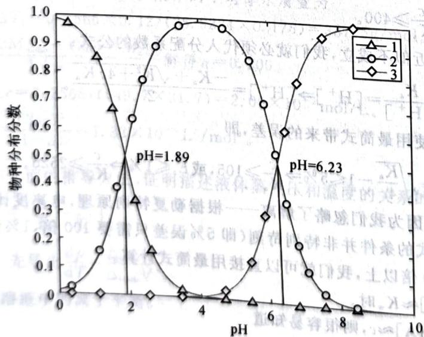

line chart

| pH    | 物种分布分数 (1) | 物种分布分数 (2) | 物种分布分数 (3) |
|-------|------------------|------------------|------------------|
| 0     | 1.0              | 0.0              | 0.0              |
| 1     | 0.85             | 0.15             | 0.0              |
| 2     | 0.65             | 0.4              | 0.0              |
| 3     | 0.3              | 0.75             | 0.0              |
| 4     | 0.1              | 0.9              | 0.0              |
| 5     | 0.0              | 0.95             | 0.1              |
| 6     | 0.0              | 0.8              | 0.3              |
| 7     | 0.0              | 0.5              | 0.6              |
| 8     | 0.0              | 0.2              | 0.9              |
| 9     | 0.0              | 0.1              | 0.95             |
| 10    | 0.0              | 0.0              | 1.0              |

未知物 $\mathbf{X}$ 的物种分布曲线

给出该化合物的结构式;确定滴定时两个化学计量点的 pH 并分别选定能使误差最小的常用指示剂。

$$
\left\{ \begin{array}{l} {\left[ \mathrm{Cl} ^ {-} \right] = 0. 0 1 3 7 8 \mathrm{mol/L},} \\ {\left[ \mathrm{TI} ^ {-} \right] = 6. 4 5 5 \times 1 0 ^ {- 6} \mathrm{mol/L},} \\ {\left[ \mathrm{TI} ^ {+} \right] = 0. 0 1 3 7 9 \mathrm{mol/L},} \\ {\left[ \mathrm{Ag} ^ {+} \right] = 1. 3 1 7 \times 1 0 ^ {- 1 1} \mathrm{mol/L}.} \end{array} \right.
$$

于是由物料守恒得到固相组成为 0.10mol AgI、0.086mol TlCl 和 0.10mol TlI。

## § 9.4 问题选讲

在这一节中我们看一些体系更复杂的问题。

## 9.4.1 平衡常数的测定

【例题9.12】将银电极插入常温下 $1.000 \times 10^{-1} \mathrm{~mol} / \mathrm{L} \mathrm{NH}_{4} \mathrm{NO}_{3}$ 和 $1.000 \times 10^{-3} \mathrm{~mol} / \mathrm{L} \mathrm{AgNO}_{3}$ 混合溶液中，测得其电极电势 $\varphi(\mathrm{Ag}^{+} / \mathrm{Ag})$ 随溶液 $\mathrm{pH}$ 的变化如下图所示。已知氨水的解离常数 $K_{\mathrm{b}} = 1.780 \times 10^{-5}$ ，气体常数 $R = 8.314 \mathrm{~J} / (\mathrm{mol} \cdot \mathrm{K})$ ，法拉第常数 $F = 96500 \mathrm{C} / \mathrm{mol}$ 。求银氨络离子的逐级稳定常数 $K_{1}$ 和 $K_{2}$ 。

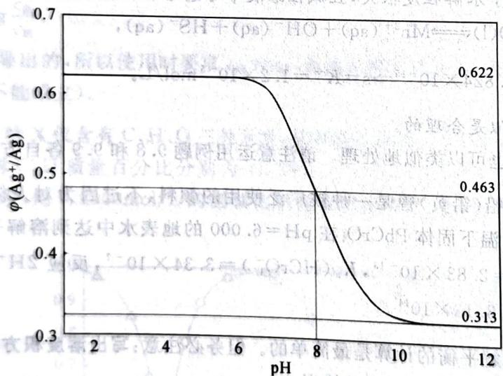

line chart

| pH  | φ(Ag⁺/Ag) |
| --- | --------- |
| 8   | 0.622     |
| 8   | 0.463     |
| 10  | 0.313     |

银的电极电势变化图

解 在高酸度的情况下由 Nernst 方程立得

$$
\varphi_ {(\mathrm{Ag} ^ {+} / \mathrm{Ag})} = 0. 6 2 2 - \frac {R T}{F} \ln 0. 0 0 1 0 0 \Rightarrow \varphi_ {(\mathrm{Ag} ^ {+} / \mathrm{Ag})} = 0. 7 9 9 \mathrm{V。}
$$

对于高 pH 和低 pH 的情形, 计算还不算繁杂(因为有明显的优势物种, 近似可以取得很明显而且精确), 但在中间酸度时, 一级和二级络合共存, 其计算有一定难度。先介绍常规解法。

观察给出的银和氨的分析浓度, $c(\mathrm{Ag})\gg c(\mathrm{NH}_{3})$ ,我们假定银的络合对氨的酸碱平衡没有影响,于是,任何pH下的氨浓度都可以由下式近似计算:

$$
\left[ \mathrm{NH} _ {3} \right] \approx \frac {c _ {\mathrm{NH} _ {3}} K _ {\mathrm{w}}}{K _ {\mathrm{w}} + \left[ \mathrm{H} ^ {+} \right] K _ {\mathrm{b}}}.
$$

而银的物料守恒是用氨浓度和银离子浓度给出的：

$$
c _ {\mathrm{Ag}} = \left[ \mathrm{Ag} ^ {+} \right] + K _ {1} \left[ \mathrm{Ag} ^ {+} \right] \left[ \mathrm{NH} _ {3} \right] + K _ {1} K _ {2} \left[ \mathrm{Ag} ^ {+} \right] \left[ \mathrm{NH} _ {3} \right] ^ {2}
$$

所以在 pH=8 的情况下， $\left[NH_{3}\right]=5.319\times10^{-3}mol/L,\left[Ag^{+}\right]=2.044\times10^{-6}mol/L$ ；在 pH>12 的情况下， $\left[NH_{3}\right]=0.1000mol/L,\left[Ag^{+}\right]=5.931\times10^{-9}mol/L$ 。

## § 9.3 沉淀溶解平衡

难溶物在水中达成动态平衡,其平衡常数称为溶度积。现在我们展示运用溶度积进行计算的例子。如果某物种在水中没有副反应,则其溶解度可由溶度积直接求算。对于易产生水解等多重平衡的沉淀,则计算相对复杂一些,需要用到不同的技巧。请看例子。

【例题 9.8】求 CuS 在纯水中的溶解度。

解 对于这种溶度积很小的物质,从化学结果上看它对纯水的 pH 不产生影响。故我们假定 pH=7.0,并设溶解度为 s,则有

$$
K _ {\mathrm{sp}} = s ^ {2} \cdot \frac {K _ {\mathrm{a1}} K _ {\mathrm{a2}}}{1 + [ \mathrm{H} ^ {+} ] K _ {\mathrm{a1}} + K _ {\mathrm{a1}} K _ {\mathrm{a2}}},
$$

算得 $s=1.0\times10^{-15}mol/L$ 。

容易验证体系确实是中性,从而计算自洽。

【例题 9.9】 求晶形 MnS 在纯水中的溶解度。

解 MnS 的溶解度不大,但足以改变水的 pH,因为可看到 $pK_{sp} \leqslant 14$ 。但溶液的分析浓度非常低,接近无限稀情况下硫离子水解程度很大,且碱性溶液中可忽略硫化氢浓度,即溶液可以近似看成主平衡

$$
\mathrm{MnS(s)} + \mathrm{H} _ {2} \mathrm{O(l)} \rightleftharpoons \mathrm{Mn} ^ {2 +} (\mathrm{aq}) + \mathrm{OH} ^ {-} (\mathrm{aq}) + \mathrm{HS} ^ {-} (\mathrm{aq}),
$$

$$
K = \frac {K _ {\mathrm{sp}} K _ {\mathrm{w}}}{K _ {\mathrm{a2}}} = 1. 8 2 4 \times 1 0 ^ {- 1 5} \Rightarrow \mathrm{s} = K ^ {\frac {1}{3}} = 1. 2 \times 1 0 ^ {- 5} \mathrm{mol/L。}
$$

检验知道这样做出的近似是合理的。

其他物质的溶解度也可以类似地处理。请注意运用例题9.8和9.9各自方法的条件为何。

【习题9.10】铬酸铅(铅黄)曾是一种被广泛使用的颜料,不过因为对人体的危害和对环境的污染,它已经被弃用。设常温下固体 $\mathrm{PbCrO_{4}}$ 在 $\mathrm{pH}=6.000$ 的地表水中达到溶解平衡。计算体系中所有物种的浓度。已知 $K_{\mathrm{sp}}=2.83\times10^{-13},K_{\mathrm{a}}(\mathrm{HCrO}_{4}^{-})=3.34\times10^{-7}$ ,反应 $2\mathrm{H}^{+}+2\mathrm{CrO}_{4}^{2-}\rightleftharpoons\mathrm{H}_{2}\mathrm{O}+\mathrm{Cr}_{2}\mathrm{O}_{7}^{2-}$ 的平衡常数 $K_{\mathrm{D}}=3.13\times10^{14}$ 。

从原理上看,沉淀溶解平衡的计算是最简单的。但务必注意:写出溶度积方程时一定要判断该物种是否达到溶解平衡!否则就会犯下严重的错误。

【例题9.11】以下物质都难溶： $\mathrm{AgCl}$ 、 $\mathrm{AgI}$ 、 $\mathrm{TlCl}$ 与 $\mathrm{TlI}$ 。今将 $0.100\mathrm{mol}$ 氯化银和 $0.200\mathrm{mol}$ 碘化铊置于在 $1.00\mathrm{L}$ 水中达平衡态。设溶液体积恒定。已知前四者的 $K_{\mathrm{sp}}$ 分别为 $1.7 \times 10^{-10} 、 8.5 \times 10^{-17} 、 1.9 \times 10^{-4}$ 和 $8.9 \times 10^{-8}$ 。试求解固相组成。

解 固相组成是很难直接确定的,因为纯固相反应连平衡常数都难以写出,故我们先确定溶液组成。

确定溶液组成需要4个参数(显然不存在水解),有1个电荷守恒约束方程和4个可能的 $K_{sp}$ 方程。因此必定有一个物种是不饱和的。考虑到加入了两倍量的碘化铊,故银离子会被碘离子沉淀得比较彻底,由此估计AgCl是不饱和的。这样去写方程

$$
\left\{ \begin{array}{l} {\left[ \mathrm{Ag} ^ {+} \right] + \left[ \mathrm{Tl} ^ {+} \right] = \left[ \mathrm{Cl} ^ {-} \right] + \left[ \mathrm{I} ^ {-} \right],} \\ {\left[ \mathrm{Ag} ^ {+} \right] \left[ \mathrm{I} ^ {-} \right] = K _ {\mathrm{AgI}},} \\ {\left[ \mathrm{Tl} ^ {+} \right] \left[ \mathrm{I} ^ {-} \right] = K _ {\mathrm{TII}},} \\ {\left[ \mathrm{Tl} ^ {+} \right] \left[ \mathrm{Cl} ^ {-} \right] = K _ {\mathrm{TICl}}.} \end{array} \right.
$$

解得溶液组成为

由此得到两个方程：

$$
\left\{ \begin{array}{l} 1. 0 0 0 \times 1 0 ^ {- 3} = 2. 0 4 4 \times 1 0 ^ {- 6} + 1. 0 8 7 \times 1 0 ^ {- 8} \beta_ {1} + 5. 7 8 2 \times 1 0 ^ {- 1 1} \beta_ {2}, \\ 1. 0 0 0 \times 1 0 ^ {- 3} = 5. 9 3 1 \times 1 0 ^ {- 9} + 5. 9 3 1 \times 1 0 ^ {- 1 0} \beta_ {1} + 5. 9 3 1 \times 1 0 ^ {- 1 1} \beta_ {2}, \end{array} \right.
$$

解得 $K_{1}=2.2\times10^{3}, K_{2}=7.5\times10^{3}$

事实上这个近似(即假设银的络合对氨的酸碱平衡没有影响)是很粗略的。另外,这种类型的计算对中间过程取的有效数字位数非常敏感,故误差可能较大。下面我们尝试更精确地处理一下。

当 $\mathrm{pH} > 12$ 时，我们认为 $[\mathrm{NH}_3] = 0.09800\mathrm{mol / L}$ 故而 $[\mathrm{Ag(NH_3)_2^+}] = 0.00100\mathrm{mol / L}\Rightarrow \beta_{2} = 1.756\times 10^{7}$

然后来考察 pH=8 的情况：

$$
\left[ \mathrm{Ag} ^ {+} \right] = \frac {c _ {\mathrm{Ag}}}{1 + \beta_ {1} \left[ \mathrm{NH} _ {3} \right] + \beta_ {2} \left[ \mathrm{NH} _ {3} \right] ^ {2}},
$$

此时氨的酸碱平衡可以写成

$$
\left[ \mathrm{NH} _ {3} \right] = \frac {K _ {\mathrm{w}}}{K _ {\mathrm{w}} + \left[ \mathrm{H} ^ {+} \right] K _ {\mathrm{b}}} \cdot \left(c _ {\mathrm{NH} _ {3}} - \frac {c _ {\mathrm{Ag} ^ {+}} \left(\beta_ {1} \left[ \mathrm{NH} _ {3} \right] + 2 \beta_ {2} \left[ \mathrm{NH} _ {3} \right] ^ {2}\right)}{1 + \beta_ {1} \left[ \mathrm{NH} _ {3} \right] + \beta_ {2} \left[ \mathrm{NH} _ {3} \right] ^ {2}}\right) 。
$$

从上两式中消去 $\beta_{1}$ 并略作计算整理可得关于氨的二次方程

-1.909 $\left[\mathrm{NH}_{3}\right]^{2}-\left[\mathrm{NH}_{3}\right]+5.266\times 10^{-3}=0\Rightarrow\left[\mathrm{NH}_{3}\right]=5.214\mathrm{mmol/L}$ , 回代可得 $K_{1}=2.1\times 10^{3}, K_{2}=8.4\times 10^{3}$ 。

## 9.4.2 多重平衡

【例题 9.13】将 $3.0 \, mg \, PbSO_{4}$ 放在 $50.0 \, mL$ 水中，以摩尔比 1:9 加入醋酸/醋酸钠。设溶液体积保持不变。数据： $HOAc, pK_{a} = 4.75; Pb^{2+}-OAc^{-}, lg\beta_{2} = 3.3, lg\beta_{3} = 3.45; PbSO_{4}, K_{sp} = 1.6 \times 10^{-8}$

1. 求沉淀恰完全溶解时加入醋酸钠的量,并计算此时溶液的 $\mathrm{pH}$ 。忽略 $\mathrm{Pb}^{2+}-\mathrm{OAc}^{-}$ 的一级配合和三级以上配合。  
2. 考虑 $Pb^{2+}-OAc^{-}$ 的一级配合 $\lg\beta_{1}=1.9$ 和硫酸根二级电离不完全 $K_{a_{2}}=0.012$ ，请讨论前面结果与实际的偏差方向。不可进行计算。

解 恰好溶解时溶液中

$$
c _ {0} = \left[ \mathrm{SO} _ {4} ^ {2 -} \right] = 1. 9 7 8 \times 1 0 ^ {- 4} \mathrm{mol} / \mathrm{L} \Rightarrow \left[ \mathrm{Pb} ^ {2 +} \right] = 8. 0 8 7 \times 1 0 ^ {- 5} \mathrm{mol} / \mathrm{L}
$$

设溶液中 $\left[OAc^{-}\right]=x,\left[H^{+}\right]=y$ ，写出铅的物料守恒

$$
\left[ \mathrm{SO} _ {4} ^ {2 -} \right] = \left[ \mathrm{Pb} ^ {2 +} \right] \left(1 + \beta_ {2} x ^ {2} + \beta_ {3} x ^ {3}\right) 。
$$

由上式解得 $x=0.02457\,mol/L$ 。然后列出其他守恒式，略掉氢氧根得

$$
\left\{ \begin{array}{l} \left[ \mathrm{Na} ^ {+} \right] + 2 \left[ \mathrm{Pb} ^ {2 +} \right] + y = x + \left[ \mathrm{Pb} ^ {2 +} \right] \beta_ {3} x ^ {3} + 2 \left[ \mathrm{SO} _ {4} ^ {2 -} \right], \\ \frac {1 0}{9} \left[ \mathrm{Na} ^ {+} \right] = x + \left[ \mathrm{Pb} ^ {2 +} \right] \left(3 \beta_ {3} x ^ {3} + 2 \beta_ {2} x ^ {2}\right) + \frac {x y}{K _ {\mathrm{a}}} 。 \end{array} \right.
$$

现在上面的方程属二元一次方程,解得

$$
y = 1. 9 8 9 \times 1 0 ^ {- 6}, [ \mathrm{Na} ^ {+} ] = 0. 0 2 4 7 9 \mathrm{mol} / \mathrm{L}, \mathrm{pH} = 5. 7 0 \Rightarrow m = 0. 1 0 2 \mathrm{g。}
$$

讨论: 注意到 pH=5.70 的时候硫酸肯定完全电离, 所以主要是第一级络合在影响体系的平衡。因此刚刚算出的 0.102g 是偏多的。

## 9.4.3 萃取

虽然萃取也属于多重平衡的一种,但考虑到它的常见性,我们仍将它单独抽离作为一个小节。

萃取是利用系统中组分在溶剂中有不同的溶解度来分离混合物的操作。在一定温度下，设想我们使用有机溶剂萃取水中的物质 A，则平衡时水相和有机相的 A 的浓度之比是定值，这就是分配定律：

$$
K _ {\mathrm{D}} = \frac {[ \mathrm{A} ] _ {\circ}}{[ \mathrm{A} ] _ {\mathrm{w}}} = f (T) 。
$$

分配定律只在稀溶液中近似成立。

【例题 9.14】配制 0.100mol/L KI 溶液，向其中加入适量 $I_{2}$ ，随后用标准 $Na_{2}S_{2}O_{3}$ 溶液测得 $c(I_{2})=0.00485\text{mol/L}$ 。准确移取 50.0mL KI- $I_{2}$ 溶液和等体积的 $CCl_{4}$ 于分液漏斗中，振荡，平衡后测得有机相中 $c(I_{2})=0.00260\text{mol/L}$ 。该温度下 $K_{D}=85$ 。计算反应 $I^{-}+I_{2}\rightleftharpoons I_{3}^{-}$ 的平衡常数。

解 对我们来说,萃取问题只不过增加了一个平衡而已。水相 $I_{2}$ 浓度为

$$
[ \mathrm{I} _ {2} ] _ {\mathrm{w}} = \frac {[ \mathrm{I} _ {2} ] _ {\mathrm{o}}}{K _ {\mathrm{D}}} = 0. 0 3 0 6 \mathrm{mol/L。}
$$

利用物料守恒

$$
\left\{ \begin{array}{l} {\left[ \mathrm{I} ^ {-} \right] + 2 \left[ \mathrm{I} _ {2} \right] _ {\mathrm{o}} + 2 \left[ \mathrm{I} _ {2} \right] _ {\mathrm{w}} + \left[ \mathrm{I} _ {3} ^ {-} \right] = 0. 0 0 4 8 5 \times 2 + 0. 1 0 0,} \\ {\left[ \mathrm{I} _ {3} ^ {-} \right] + \left[ \mathrm{I} _ {2} \right] _ {\mathrm{w}} + \left[ \mathrm{I} _ {2} \right] _ {\mathrm{o}} = 0. 0 0 4 8 5,} \end{array} \right.
$$

解得 $[\mathrm{I}_3^-] = 0.00222\mathrm{mol / L}, [\mathrm{I}^-] = 0.0977\mathrm{mol / L}$ ,

从而 $K_{c}=\frac{[I_{3}^{-}]}{[I^{-}][I_{2}]}=7.43\times10^{2}$ 。

## § 9.5 化学分析技术

## 9.5.1 容量分析

容量分析即滴定分析,是指将一种已知准确浓度的标准溶液和待测试液定量反应,根据试剂的浓度和用量,计算被测物质含量的化学分析方式。分析时,要求反应定量而且快速,没有副反应,终点容易指示。

标准溶液和待测试液恰好完全反应时的位置称为化学计量点,而通过指示剂指示反应结束的位置称为滴定终点。滴定终点和化学计量点有少许偏移,该因素造成的分析结果的误差称为终点误差。

有一些分析体系无法满足上述对滴定反应的要求,故有如下变通的滴定方法:

返滴定 如果试液和标准溶液反应很慢,例如 $\mathrm{Al}^{3+}+\mathrm{EDTA}$ ,或者缺乏有效的指示剂,反应不能立即完成,则首先加入定量过量标准溶液,使得反应完全后,再用另一种标准溶液滴定过量的标准溶液。

直接滴定 将侧组分和标准溶液反应性质较差,例如重铬酸钾不能直接用硫代硫酸钠滴定,而是先需要加入过量 KI 将其转化为 $I_{2}$ ,再行滴定。

应对化学分析的问题,主要还是需要对化合物的性质以及滴定的原则有较清楚的认识,同时要对常见滴定方法中的注意事项有所了解(例如准确滴定的判据、常见的指示剂和添加剂的作用等,限于篇幅就不一一列举了)。此类经验亦可从练习中积累。

下面举若干例,我们会借例题中谈一些常见测定方法及其注意事项。

【例题 9.15】 解答下列问题。

1. 取阿司匹林试样 0.250g，加入 50.00mL 0.1020mol/L NaOH 溶液，煮沸 10min，冷却后以酚酞为指示剂用 $H_{2}SO_{4}$ 滴定，消耗 0.05050mol/L $H_{2}SO_{4}$ 溶液 25.00mL。计算试样中乙酰水杨酸的质量分数。

2. 测定锆英石中 $ZrO_{2}$ 、 $Fe_{2}O_{3}$ 含量时，称取 1.000g 试样，以适当方法制成 200.0mL 试样溶液。移取 50.00mL 试液，调至 pH=0.8，加入盐酸羟胺（作为还原剂），以二甲酚橙为指示剂，用 0.01000mol/L EDTA 滴定，用去 10.00mL。加入浓硝酸，加热，（冷却后）将溶液调至 pH=1.5，以磺基水杨酸作指示

剂，用上述EDTA溶液滴定，用去 $20.00\mathrm{mL}$ 。计算试样中 $\mathrm{ZrO_2}$ 和 $\mathrm{Fe_2O_3}$ 的质量分数。

3. 在一锰的矿物分析中, $0.5165 \mathrm{~g}$ 试样被溶解, $\mathrm{Mn}$ 被还原为 $\mathrm{Mn}^{2+}$ , 碱化该溶液至近中性并用 $0.03358 \mathrm{~mol} / \mathrm{L} \mathrm{KMnO}_{4}$ 滴定该溶液, 达到滴定终点时需 $34.88 \mathrm{~mL} \mathrm{KMnO}_{4}$ 。计算矿物中 $\mathrm{Mn}$ 的含量。  
4. 为了测定长石中 K、Na 含量，称取试样 0.5034g，首先使其中的 K 和 Na 定量转化为 KCl 和 NaCl(共 0.1208g)，溶于水，用 AgNO₃ 溶液处理，得到 AgCl 沉淀 0.2513g。计算长石中 K₂O 和 Na₂O 的质量分数。

解 选用此题,主要是展示一些测定方法。

第1问测定阿司匹林是典型的酸碱滴定法。进行酸碱滴定时，须注意被滴定酸碱的强度不能太低，若酸常数低于 $10^{-8}$ ，就必须采用置换滴定等方法。例如滴定硼酸时，加入甘醇进行配位，螯合物稳定性高，酸性增强；滴定过于弱的碱，在冰乙酸溶剂中进行；等等。典型的酸碱滴定包括硼砂 $Na_{2}B_{4}O_{7}\cdot10H_{2}O$ 测定盐酸（甲基红）、邻苯二甲酸氢钾测定NaOH（酚酞）、克氏定氮法（盐酸吸收氨气、返滴定、甲基橙）、磷的测定 $\left(\left(\mathrm{NH}_{4}\right)_{2}\mathrm{HPMo}_{12}\mathrm{O}_{40}\cdot\mathrm{H}_{2}\mathrm{O}\right)$ 等。

滴定到酚酞恰好褪色时,体系是乙酸钠和乙酰水杨酸一钠盐的混合物,根据始终态钠离子守恒 $C_{10}H_{10}O_{4}\sim2NaOH$ ,消耗NaOH $0.05000\times0.1020-0.05050\times2\times0.02500=0.002575mol$ ,故乙酰水杨酸的质量分数为 $0.002575/2\times180.16/0.250=92.8\%$ .

第2问是配位滴定法。配位滴定一般都是用EDTA与金属离子在特定环境下定量等摩尔反应进行(Mo元素的化学计量比为例外)。在混合金属离子的滴定中,可能还需要加入合适的掩蔽剂解除干扰(必要时使用软硬酸碱理论等进行推测),例如 $F^{-}$ 掩蔽 $Fe^{3+}$ 、 $CN^{-}$ 掩蔽多种离子。典型的配位滴定包括在氨性缓冲溶液中滴定Ca、Mg(EBT)、在弱酸性环境下滴定Pb、Zn(二甲酚橙)、在强酸性环境下滴定Fe(Ⅲ)(磺基水杨酸)、在弱酸性环境下测定Cu(PAN)、返滴定法测定Al等。

首先磺基水杨酸滴定 Fe，则 $Fe_{2}O_{3}$ 质量分数为 $4 \times 0.02000 \times 0.01000 / 2 \times 159.7 / 1.000 = 6.39\%$ 。因为铁被还原又被氧化，Zr 较难被还原，可推断前一个条件是单独滴定 Zr，羟胺是铁的掩蔽剂。所以 $ZrO_{2}$ 质量分数为 $4 \times 0.01000 \times 0.01000 \times 123.22 / 1.000 = 4.93\%$ 。

第3问是氧化还原滴定法。氧化还原滴定法主要包括 $\mathrm{KMnO_4}$ 、 $\mathrm{K_2Cr_2O_7}$ 、碘量法三种方法。在高锰酸钾的滴定中，需要除去氯离子，一般使用 $\mathrm{Ag_2SO_4}$ 或 $\mathrm{HgSO_4}$ 。重铬酸钾法滴定常用的指示剂比较不常见，为二苯胺磺酸钠；在其直接滴定 $\mathrm{Fe}^{2+}$ 中，还需加磷酸掩蔽三价铁，使终点明显。碘量法最为复杂，一般是加入过量KI使得氧化剂转换为 $\mathrm{I}_2$ 后用硫代硫酸钠处理；淀粉指示剂需要迟加，因为淀粉会吸附碘，使得终点提前；在碘量法测Cu中，沉淀CuI也会吸附碘，故需要用KSCN转化为不吸附碘的 $\mathrm{CuSCN}$ 。

此问很容易， $2\mathrm{MnO}_{4}^{-}\sim3\mathrm{Mn}^{2+}$ ，答案为 $18.69\%$ 。

第4问是沉淀重量法。与此相关的是沉淀滴定法，该法使用的分析试剂通常是 $\mathrm{AgNO}_3$ ，用来测定 $\mathrm{SCN}^{-},X^{-}$ 等离子。沉淀滴定指示剂很复杂，如果是使用 $\mathrm{AgNO}_3$ 滴定，终点可使用 $\mathrm{K}_2\mathrm{CrO}_4$ 指示；如果是使用 $\mathrm{NH_4SCN}$ 滴定，则终点可用三价铁指示；通常也有吸附指示剂，例如荧光黄等等。

利用第 4 问的题设关系, 设有 $K_{2}O$ 和 $Na_{2}O$ 分别为 x, y, 则

$$
\left\{ \begin{array}{l} 2 (x + y) = \frac {0 . 2 5 1 3}{1 4 3 . 3 5}, \\ 2 (7 4. 5 5 x + 5 8. 4 4 y) = 0. 1 2 0 8, \end{array} \right.
$$

得 $x=5.696\times10^{-4}$ ， $y=3.070\times10^{-4}$ ，所以质量分数分别为 10.66%、3.78%。

【例题9.16】腐殖质是土壤中结构复杂的有机物，土壤肥力与腐殖质含量密切相关。可采用重铬酸钾法测定土壤中腐殖质的含量：称取 $0.1500\mathrm{g}$ 风干的土样，加入 $5\mathrm{mL}0.10\mathrm{mol / L}$ $\mathrm{K}_2\mathrm{Cr}_2\mathrm{O}_7$ 的 $\mathrm{H}_2\mathrm{SO}_4$ 溶液，充分加热，氧化其中的碳（ $\mathrm{C}\rightarrow \mathrm{CO}_{2}$ ，腐殖质中含碳 $58\%$ ，其中 $90\%$ 的碳可被氧化）。以邻菲罗啉为指示剂，用去 $0.1221\mathrm{mol / L(NH_4)_2SO_4}\cdot \mathrm{FeSO_4}$ 溶液 $10.02\mathrm{mL}$ 。空白实验如下：上述土壤样品经高温灼烧后，称取相同质量，采用相同的条件处理和滴定，消耗 $(\mathrm{NH}_4)_2(\mathrm{SO}_4)\cdot \mathrm{FeSO}_4$ 22.35mL。求土壤中腐殖质的质量分数。

解 邻菲罗啉和亚铁可形成有色配合物，在终点时出现颜色指示滴定结束。

因 $Cr_{2}O_{7}^{2-}\sim6Fe^{2+}$ ，故样品测定和空白实验分别剩余 $K_{2}Cr_{2}O_{7}$ 0.1221×0.01002/6=0.002039mol 和 0.1221×0.02235/6=0.004548mol。故而腐殖质消耗了 0.002509mol 的重铬酸钾。

利用 $Cr_{2}O_{7}^{2-}\sim1.5C$ 得

$$
\omega = \frac {0 . 0 0 2 5 0 9 \times 1 . 5 \times 1 2 . 0 1}{0 . 9 0 \times 0 . 5 8 \times 0 . 1 5 0 0} = 5. 8 \%.
$$

下面是一个展示遇到陌生反应时推断策略的例子。

【例题 9.17】某同学按照如下步骤分析一种特别的 Cu-Be 合金。

准确称取 0.6869g KIO₃ 溶于水, 定容至 200mL。移取 25.00mL, 加入 7.5mL 20% HCl 和 2.5g KI, 用 Na₂S₂O₃ 标准溶液滴定。终点所耗 Na₂S₂O₃ 标准溶液为 23.08mL。完成后清洗仪器时, 他发现某组中出现了少量白色沉淀。仔细回忆, 他想起在做该组实验时, 不慎多滴了几滴。

1. 求 $Na_{2}S_{2}O_{3}$ 标准溶液的浓度。

2. 写出白色沉淀生成的反应方程式。

准确称取三份质量分别为 0.3802、0.3991、0.3887g 的硼砂, 加水溶解并以甲基红指示用 HCl 滴定。终点时消耗盐酸分别为 20.19、21.18、20.63mL。准确称取 1.5232g Cu-Be 合金, 设法溶解试样并将溶液定容至 200mL。移取上述溶液 25.00mL, 加入 5g 氯化铵、10mL 100g/L Na₂ EDTA, 煮沸 3min, 用浓氨水中和至 pH=9.0\~10.0, 静置 2h。

过滤,用稀 $\mathrm{NH}_{3} / \mathrm{NH}_{4} \mathrm{Cl}$ 溶液洗涤后,用盐酸溶解并将溶液收集到 $250 \mathrm{~mL}$ 锥形瓶中。加入 $5 \mathrm{~mL} 200 \mathrm{~g} / \mathrm{L}$ 酒石酸钾钠溶液、 $0.5 \mathrm{~mL}$ 酚酞。加 $\mathrm{NaOH}$ 至析出沉淀,并用稀 $\mathrm{NaOH}$ 调至红色,静置 $10 \mathrm{~min}$ 。用上述盐酸标准溶液滴定至无色,此时不记读数。又加入 $20 \mathrm{~mL}$ 饱和氟化钠溶液,再滴定至无色,消耗盐酸 $29.87 \mathrm{~mL}$ 。

3. 简述加入 $Na_{2}EDTA$ 和浓氨水的作用。

另取配制的试液 25.00mL 至锥形瓶中,加入 20mL 5% HOAc 和 2g KI,等待 5min 后,溶液变成棕色并发现浅色沉淀物。用 $Na_{2}S_{2}O_{3}$ 标准溶液滴定样品,终点时消耗 26.11mL。

4. 写出反应的方程式，并解释为什么需要等待？若等待 2h，对实验有什么影响？
5. 计算合金中 Be、Cu 的含量。

解 由 $KIO_{3}\sim3I_{2}\sim6S_{2}O_{3}^{2-}$ ，所以 $c(\mathrm{Na}_{2}\mathrm{S}_{2}\mathrm{O}_{3})=0.6869/214.0/8\times6/0.02308=0.1043\mathrm{mol/L}$ 。多滴即 $Na_{2}S_{2}O_{3}$ 过量，只可能在酸性较强的溶液中歧化生成 S，由题干还可以知道在此条件下产生的 S 为白色。

做下面问题时可先算 HCl 浓度, 注意 $Na_{2}B_{4}O_{7}\cdot10H_{2}O\sim2HCl$ , 所以得到平均浓度为 0.09879mol/L。现在观察测定过程。显然碘量法是测定 Cu:

$$
2 \mathrm{Cu} ^ {2 +} + 4 \mathrm{I} ^ {-} \longrightarrow 2 \mathrm{CuI} + \mathrm{I} _ {2}, \mathrm{I} _ {2} + 2 \mathrm{S} _ {2} \mathrm{O} _ {3} ^ {2 -} \longrightarrow 2 \mathrm{I} ^ {-} + \mathrm{S} _ {4} \mathrm{O} _ {6} ^ {2 -}
$$

在中间段落中，Cu-Be 合金中 Cu、Be 组分在浓氨水作用下，应分别形成 $\mathrm{Cu(NH_{3})_{4}^{2+}}$ 和 $\mathrm{Be(OH)_{2}}$ ，因此铜被除去。EDTA 预计同样也是络合 $Cu^{2+}$ 和其他过渡金属离子，使得 Be 分离。因此可回答 EDTA 除去 $Cu^{2+}$ 和其他过渡金属离子，浓氨水沉淀 Be。

需要仔细关注的是对 $\mathrm{Be(OH)_2}$ 的处理方式。溶解后再次沉淀得 $\mathrm{Be(OH)_2}$ ，产生沉淀时酚酞尚未 Be 完全以 $\mathrm{Be(OH)_2}$ 形式而不是 $\mathrm{Be(OH)_4^{2-}}$ 形式存在——两性氢氧化物一般需要强碱性才能溶解的通被盐酸滴定。只有这部分需要定量。有了这样的反应分析基础，故此时置换出 $OH^-$ ，这些 $OH^-$

$$
\mathrm{Be} \sim 2 \mathrm{OH} ^ {-} \sim 2 \mathrm{H} ^ {+}, \omega (\mathrm{Be}) = 0. 0 2 9 8 7 \times 0. 0 9 8 7 9 / 2 \times 9. 0 1 4 \times 8 / 3
$$

碘量法部分很容易。照碘量法一般性质，等待是为了使得 $\mathrm{I}^{-}$ 被充分氧化，如果时间太长则 $\mathrm{I}_2$ 挥发，导致测定结果偏低。铜含量直接按方程式计算得

$$
\omega (\mathrm{Cu}) = 0.02611 \times 0.1043 \times 63.55 \times 8 / 1.5232 = 90.89 \% .
$$

【习题9.18】融雪剂通过增加溶液中的粒子数降低水的凝固点。这一效应可用 $\Delta T = imK$ 定量描述，其中 $K$ 是凝固点下降常数（对水是 $1.86\mathrm{K}\cdot \mathrm{kg / mol},m$ 为质量摩尔浓度， $i$ 为等渗效应系数）。甲酸的酸常数满足 $\mathrm{pK_a = 3.75}$ 。融雪剂A包含NaCl、 $\mathrm{CaCl_2}$ 、 $\mathrm{Ca(HCOO)_2}$ 和 $\mathrm{HCOONH_4}$ 和一定量的沙子。实际使用时也可在A中加入非电解质X来抗结块。

1. 仅含 C、H、N、O 元素的化合物 X 16.15g 可令 1L 水在 -0.50℃ 凝固。推出 X 的结构。

质量浓度 30.0g/L 的 A 溶液过滤除去沙子后, 定量移取 4 份 10.00mL 的样品进行滴定。在第 1 份样品中加入过量 $\mathrm{CH}_{2}\mathrm{O}$ 后以 0.1000mol/L KOH 滴定到终点 (酚酞为指示剂), 消耗 7.20mL (加入 $\mathrm{CH}_{2}\mathrm{O}$ 反应产生了 $(\mathrm{CH}_{2})_{6}\mathrm{N}_{4}$ 。在第 2 份中加入 30.00mL 0.1000mol/L 碱性标准 $\mathrm{Br}_{2}$ 溶液, 随后加入过量酸性 KI 溶液, 最后用 0.1000mol/L $\mathrm{Na}_{2}\mathrm{S}_{2}\mathrm{O}_{3}$ 滴定到终点, 消耗 27.20mL。在第 3 份样品中加入氨性缓冲溶液和 EBT (金属指示剂), 以 0.1000mol/L EDTA 滴定到终点, 消耗 12.70mL。在第 4 份样品中加入少量 $\mathrm{K}_{2}\mathrm{Cr}_{2}\mathrm{O}_{7}$ 后以 0.1000mol/L $\mathrm{AgNO}_{3}$ 滴定到淡橙色, 消耗 23.90mL。

2. 写出滴定反应; 计算样品 A 中各组分的质量分数。(不计化合物 X)  
3. NaCl、CaCl₂、HCOONH₄三者中，何者融冰效率最高？  
4. 从题干中推断等渗系数的含义, 计算 $1.00 \mathrm{~mol} / \mathrm{L} \mathrm{Ca}(\mathrm{HCOO})_{2}$ 的等渗系数 $i_{\mathrm{h}}$ , 考虑水解。

## 9.5.2 终点误差

计算终点误差似乎是困难的。我们知道有所谓的 Ringbom 误差公式,但其写出来比较复杂,而且适用范围很窄,随着体系变化而变化。所以我们仍然希望用基本的方法处理它。

事实上,使用下述方法就能较快解答:

1. 在滴定终点,算出溶液各形体的浓度(用各物种的总分析浓度 $c_{1}, c_{2}, \cdots, c_{n}$ 表示)。  
2. 用电荷守恒给出加入物种的浓度。  
3. 利用加入物种“算两次”的物料守恒得到答案。

【例题 9.19】今有人利用 0.100mol/L HCl 滴定某样品。该溶液体积为 20.0mL，其中含有 0.100mol/L CH₃NH₂ 和 0.050mol/L 吡啶。若选用溴百里酚蓝 (pK₁ₙ = 6.80) 为指示剂，试求理论误差。已知甲胺 K\_b = 4.2 × 10⁻⁴，吡啶 K\_b = 1.7 × 10⁻⁹。

解 设 2c 是溶液中 $CH_{3}NH_{2}$ 的分析浓度, c 则为吡啶的分析浓度。用分配系数容易算得终点时的体系为

$$
\begin{array}{l} [ \mathrm{H} ^ {+} ] = 1 0 ^ {- 6. 8 0}, [ \mathrm{OH} ^ {-} ] = 1 0 ^ {- 7. 2 0}, \\ [ \mathrm{CH} _ {3} \mathrm{NH} _ {3} ^ {+} ] = 0. 9 9 9 8 \times 2 c, [ \mathrm{pyH} ^ {+} ] = 0. 0 2 6 2 c. \\ \end{array}
$$

利用电荷守恒得 $\left[Cl^{-}\right]=\left[H^{+}\right]+\left[CH_{3}NH_{3}^{+}\right]+\left[pyH^{+}\right]-\left[OH^{-}\right]=2.0258c$ 。

上式定出了加入盐酸的量(通过氯离子浓度反映),故联立计算就知道加入了多少盐酸,并给出理论误差:

$$
c (\mathrm{HCl}) V (\mathrm{HCl}) = 2.0258 c _ {0} V _ {0}, V (\mathrm{HCl}) = 20.258 \mathrm{mL}, E _ {\mathrm{r}} = +1.3 \% .
$$

## 9.5.3 分光光度法简介

分光光度法是通过测定被测物质在特定波长处或一定波长范围内光的吸收度,对该物质进行定性和定量分析的方法。其主要发挥作用的测量目标范围比容量分析稍低,精确度也比容量分析低(误差1%\~5%)。

当某个特定波长的光射入某个溶液，一部分光会被物质吸收。我们把透射光和入射光强度的比称为透射比 $T = I_{\mathrm{t}} / I_{\mathrm{o}}$ ，而吸光度则是透射比的常用对数的负数 $A = -\lg T$ 。不难想象，溶液的浓度越高，其吸收光的能力越强，从而 $A$ 越大，这是利用分光光度法对物质的浓度进行定量的基本想法。

Lambert 和 Beer 研究了光射入溶液时透射比的变化情况, 得出了如下定律:

$$
A = - \lg T = \varepsilon l c _ {\circ}
$$

也就是说，在一定范围内，吸光度和物质的量浓度 c、光路长度 l 均成正比，比例系数 $\varepsilon$ 为物质的摩尔吸光系数。吸光度具有加和性，若溶液中各物质不发生化学反应，则体系的吸光度为各物种在该波长下吸光度的和。

【例题9.20】钒和钛在我国主要以伴生矿的形式存在于钒钛磁铁矿中。Ti和V与 $\mathrm{H}_2\mathrm{O}_2$ 作用生成有色配合物。现分别取 $25.00\mathrm{mL} 2.12\times 10^{-3}\mathrm{mol / L}$ 的Ti标准溶液和 $6.28\times 10^{-3}\mathrm{mol / L}$ 的V标准溶液，各自发色并定容至两个 $100\mathrm{mL}$ 容量瓶中。准确称取 $1.000\mathrm{g}$ 含Ti和V的钢样，用酸溶解后，稀释定容至 $100\mathrm{mL}$ 。移取 $25.00\mathrm{mL}$ 该试样溶液，经同样方法发色后定容至 $100\mathrm{mL}$ 容量瓶中。这三份有色溶液分别用厚度为 $1.00\mathrm{cm}$ 的吸收池在 $415\mathrm{nm}$ 和 $455\mathrm{nm}$ 处测得吸光度值如下表所示：

<table><tr><td>溶液</td><td> $A_{415}$ </td><td> $A_{455}$ </td></tr><tr><td>Ti</td><td>0.435</td><td>0.246</td></tr><tr><td>V</td><td>0.251</td><td>0.377</td></tr><tr><td>样品</td><td>0.806</td><td>0.694</td></tr></table>

试根据测定结果计算该钢样中 Ti 和 V 的质量分数。

解 首先根据 $A = \varepsilon lc$ 定出 Ti 和 V 在两个波长下的摩尔吸光系数, 容易计算出为

<table><tr><td>溶液</td><td> $\epsilon_{415}$ </td><td> $\epsilon_{455}$ </td></tr><tr><td>Ti</td><td>205</td><td>116</td></tr><tr><td>V</td><td>40.0</td><td>60.0</td></tr></table>

注:单位均为 $cm^{-1} \cdot L \cdot mol^{-1}$ 。

再设溶解样品中 Ti 和 V 的浓度分别为 x, y，根据吸光度的加和性可列出

$$
2 0 5 x + 4 0. 0 y = 0. 8 0 6,
$$

$$
1 1 6 x + 6 0. 0 y = 0. 6 9 4,
$$

解得 $x = 0.00269\mathrm{mol / L},y = 0.00637\mathrm{mol / L}$ 。因而样品中Ti和V的质量分数分别为 $5.15\% ,13.0\%$

在分光光度法测量中,对于没有颜色或颜色太浅的待测试液,还需要加入显色剂。例如测量 $Fe^{3+}$ , 应在强酸性条件下加入磺基水杨酸,得到紫红色配合物。由于加入的显色剂(以及纯水)也具有一定的吸光度,所以在测试时要注意进行对照实验,先测量所谓参比溶液的吸光度,然后结果中扣去该空白吸光度。参比溶液的选择方法如下,可以从单一变量原则中理解:

\- 待测试液和显色剂都是无色，参比选蒸馏水。

\- 显色剂无色，但待测试液有色，参比选被测试液。

\- 显色剂有颜色，但待测试液无色，用显色剂作为参比。

\- 显色剂和待测试液都有颜色，较麻烦。首先要将待测离子掩蔽起来，然后正常加入显色剂，作为参比。也可以改变试剂加入顺序，使体系不显色，作为参比。

【例题 9.21】利用示差法能大大提高分光光度法的准确度。现在有一 $10.0 \, mg/L \, KMnO_{4}$ 溶液，其对水的透射比 T=0.200。由该溶液调节透射比为 100%，测得未知溶液的透射比是 $T_{x}=0.400$ 。吸收池长 $10.0 \, mm$ 。

1. 计算摩尔吸收系数 $\varepsilon$ 。

2. 计算未知溶液的浓度。

解 本题关键是要理解参比溶液的含义,以 $10.0\mathrm{mg / L}$ 溶液为参比,则待测溶液的实际透射比是经过两次透射之后得到,因而其实际透射比是 $0.200\times 0.400 = 0.0800$ 。所以按比例,待测溶液的浓度为 $\lg 0.0800 / \lg 0.200\times 10.0 = 15.7\mathrm{mg / L}$ 。摩尔吸收系数很容易计算,留给同学们。

【例题 9.22】 $25^{\circ}$ C 下，银离子在溶液中与间苯二胺和对苯二胺定量发生如下反应：

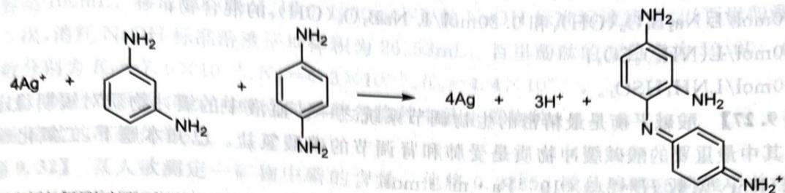

chemical

Chemical reaction equation showing silver ion reacting with a diamine to form an alkyl hydrazine derivative, producing 4Ag and 3H+.

氧化得到的偶联产物在 550nm 波长处的摩尔消光系数为 $1.8 \times 10^{4}$ L/(mol·cm)，利用这一反应，通过分光光度法可测定起始溶液中的银离子浓度。

25℃下，在纯水中配得乙酸银饱和水溶液。取1.00mL溶液，按计量比加入两种苯二胺，至显色稳定后，稀释定容至1L。用1cm比色皿，测得550nm处吸光度为0.225。计算乙酸银的溶度积 $K_{sp}$ 。

解 1L 溶液中银离子的浓度为 $4 \times 0.225 / (1.8 \times 10^{4} \times 1) = 5.0 \times 10^{-5} \, \text{mol/L}$ ，故原溶液中有银离子 $5.0 \times 10^{-2} \, mol/L$ ，溶度积为 0.0025。

## 第9讲习题

【习题9.23】 $T$ 温度下 $\mathrm{Cl}_2$ 在 $\mathrm{H}_2\mathrm{O}$ 中达到溶解平衡时， $\mathrm{Cl}_2$ 的溶解度为 $s$ ，溶液上方压力为 $p$ 。实验数据如下：

<table><tr><td>p/kPa</td><td> $s/(mol \cdot L^{-1})$ </td></tr><tr><td>101.3</td><td>0.104</td></tr><tr><td>143.2</td><td>0.135</td></tr></table>

设氯水可视为理想稀溶液,求该温度下亨利常数 H。保留三位有效数字。

【习题9.24】设气体A和B溶于水都遵循Henry定律，Henry常数分别为 $1.0 \times 10^{4}$ 和 $2.0 \times 10^{4}\mathrm{bar}$ 。在常温下，密闭的2.0L刚性容器中有1.0L液态水并充入A、B使得二者的分压均为2.0bar。溶于水的A和B会反应生成物质AB，反应的摩尔分数平衡常数为500（摩尔分数的计算包括水）。

1. 求平衡时的气相和水相组成。

2. 若将 A 的初始分压提高到 10.0 bar, 预测液相中 B 的摩尔分数是升高还是降低? 定性预测之后再计算出具体的值。

【习题 9.25】所谓酸雨是指大气中的二氧化硫和氮氧化物与水、氧气发生化学反应,生成 $H_{2}SO_{4}$ 、 $HNO_{3}$ 使雨水的 pH 值下降的现象。酸雨的 pH 值最低可达 1.7,危害严重。我国的华北地区又是世界上最大的酸雨区之一,防治酸雨刻不容缓。

1. $SO_{2}$ 在分压为 101.325kPa, 25℃下，在每升水中溶解度为 $33.9dm^{3}$ 。假定溶解过程中体积不变，计算该饱和溶液中 $SO_{2}$ 的总浓度。

$SO_{2}$ 水溶液中,我们主要考虑到以下两个平衡:

$$
\mathrm{SO} _ {2} (\mathrm{aq}) + \mathrm{H} _ {2} \mathrm{O} (1) \rightleftharpoons \mathrm{HSO} _ {3} ^ {-} (\mathrm{aq}) + \mathrm{H} ^ {+} (\mathrm{aq}) \quad K _ {\mathrm{a} _ {1}} = 1 0 ^ {- 1. 9 2},
$$

$$
\mathrm{HSO} _ {3} ^ {-} (\mathrm{aq}) \rightleftharpoons \mathrm{SO} _ {3} ^ {2 -} (\mathrm{aq}) + \mathrm{H} ^ {+} (\mathrm{aq}) \quad K _ {\mathrm{a} _ {2}} = 1 0 ^ {- 7. 1 8} 。
$$

2. 计算前一问中溶液的 pH。

在 $NaHSO_{3}$ 溶液中, 以下的这个平衡是最重要的:

$$
2 \mathrm{HSO} _ {3} ^ {-} (\mathrm{aq}) \rightleftharpoons \mathrm{SO} _ {3} ^ {2 -} (\mathrm{aq}) + \mathrm{SO} _ {2} (\mathrm{aq}) + \mathrm{H} _ {2} \mathrm{O} (\mathrm{l}) 。
$$

3. 现在我们只考虑这最重要的平衡, 计算 $0.0100 \mathrm{~mol} / \mathrm{dm}^{3}$ 的 $\mathrm{NaHSO}_{3}$ 水溶液中 $\mathrm{SO}_{2}$ 的浓度。

4. 已知 $BaSO_{3}$ 在水中的溶解度为 $0.160 \, g/dm^{3}$ ，求 $BaSO_{3}$ 的 $R_{sp}$ 。

【习题 9.26】 求下列体系的 pH(数据自查):

1. 0.10mol/L $Na_{2}B_{4}O_{6}(OH)_{4}$ 和 0.20mol/L $NaB_{5}O_{6}(OH)_{4}$ 的混合物；  
2.0.10mol/L(NH $_{4}$ ) $_{2}$ SO $_{3}$ ;  
3.0.10mol/LNH $_{4}$ HSO $_{3}$ .

【习题9.27】酸碱平衡是最精密的生物调节系统之一。血液中的缓冲物质对短期稳定 $\mathrm{pH}$ 起到重要作用，其中最重要的酸碱缓冲物质是受肺和肾调节的碳酸氢盐。已知本题下，二氧化碳解离常数 $pK_{n} = 6.1$ ，Henry常数 $H = 2.3\times 10^{-4}\mathrm{Pa}\cdot \mathrm{m}^{3}\cdot \mathrm{mol}^{-1}$ 。

1. 我们每天向体内 6.00L 血液排放 0.060mol 酸。假设血液的碳酸氢盐缓冲系统是封闭的，起初只含有 pH=7.4 的缓冲溶液， $CO_{2}$ 的分压 $p(\mathrm{CO}_{2})=5.3\mathrm{kPa}$ 。排出的酸都被碳酸氢盐缓冲系统缓冲，计算 $37^{\circ}C$ 时体系的 pH。  
2. 然而, 血液实际上是一个开放系统, 设二氧化碳的分压保持不变, 试问: 加入酸后 pH 是否能保持在正常范围? (正常范围是 7.35\~7.45)

【习题 9.28】 大气中二氧化碳浓度增加可能导致水体的酸度增加。考虑常温下的如下平衡：

$$
\mathrm{CO} _ {2} (\mathrm{g}) \rightleftharpoons \mathrm{CO} _ {2} (\mathrm{aq}), \quad K _ {1} = 1 0 ^ {- 1. 4 6},
$$

$$
\mathrm{CO} _ {2} (\mathrm{aq}) + \mathrm{H} _ {2} \mathrm{O} (\mathrm{l}) \rightleftharpoons \mathrm{H} _ {2} \mathrm{CO} _ {3} (\mathrm{aq}), \quad K _ {2} = 1 0 ^ {- 2. 7 0},
$$

$$
\mathrm{H} _ {2} \mathrm{CO} _ {3} (\mathrm{aq}) \rightleftharpoons \mathrm{H} ^ {+} (\mathrm{aq}) + \mathrm{HCO} _ {3} ^ {-} (\mathrm{aq}), \quad K _ {3} = 1 0 ^ {- 3. 6 5},
$$

$$
\mathrm{HCO} _ {3} ^ {-} (\mathrm{aq}) \rightleftharpoons \mathrm{H} ^ {+} (\mathrm{aq}) + \mathrm{CO} _ {3} ^ {2 -} (\mathrm{aq}), \quad K _ {4} = 1 0 ^ {- 1 0. 3 3} 。
$$

1. 假设大气中二氧化碳的比例为 $410 \times 10^{-6}$ （即大气分压恒为 $410 \times 10^{-6}$ bar），求平衡时水体的 pH。  
2. 若在水中分别添加酸碱,使得 pH 增加 1 或者 pH 减少 1,然后再让系统达到平衡。判断以下说法的正确性:

a) 若添加碱使得 pH 增加 1, 系统达到平衡后, 水中吸收的 $CO_{2}$ 总量比原来的两倍还多。  
b) 若添加酸使得 $\mathrm{pH}$ 减少1, 系统达到平衡后, 水中吸收的 $\mathrm{CO}_{2}$ 总量比原来的一半要多。

3. 若因为化石燃料的燃烧, 大气中二氧化碳的比例增加到 $820 \times 10^{-6}$ , 平衡时水体的 $\mathrm{pH}$ 为多少?

【习题 9.29】有人研究了 0.5mol/L 硼酸溶液中硼元素的存在形态, 并绘制了平衡时各含硼物质分布系数与溶液 pH 的函数关系图。溶液中硼原子主要存在形式为硼酸分子、 $\mathrm{B(OH)_4^-}$ 、 $\mathrm{B_4O_5(OH)_4^{2-}}$ 和 $\mathrm{B_3O_3(OH)_4^-}$ 。指出下图中每条曲线分别对应哪个物种。

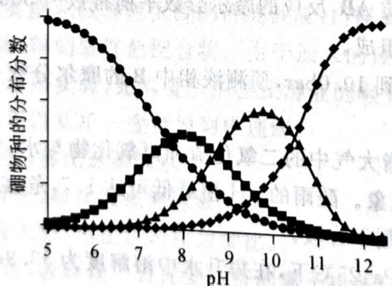

line chart

| pH  | 硼物种的分布分数 |
| --- | ----------------- |
| 5   | 1.0               |
| 6   | 0.8               |
| 7   | 0.6               |
| 8   | 0.4               |
| 9   | 0.2               |
| 10  | 0.0               |
| 11  | -0.2              |
| 12  | -0.4              |

【习题 9.30】电导即电阻的倒数,单位是西门子(S)。摩尔电导率 $\Lambda_{m}$ 是指把含有 1mol 电解质的溶液置于相距为单位距离的电导池的两个平行电极之间,这时具有的电导。已知无限稀的下列溶液的摩尔电导率如下:

<table><tr><td>物质</td><td>HCl</td><td>NaCl</td><td>NaA</td></tr><tr><td> $A_{m}/[S \cdot (m \cdot mol)^{-1}]$ </td><td>0.04262</td><td>0.01266</td><td>0.0086</td></tr></table>

又取 $2.00 \times 10^{-3} \, mol/L$ 的一元酸 HA 溶液测得电导率为 $6.16 \times 10^{-3} \, S/m$ 。请通过合理的计算和推理，求出该酸 HA 的电离平衡常数 K。

【习题9.40】考虑氢氧化锌在水溶液中的如下平衡：

$$
\mathrm{Zn} (\mathrm{OH}) _ {2} (\mathrm{s}) \rightleftharpoons \mathrm{Zn} ^ {2 +} (\mathrm{aq}) + 2 \mathrm{OH} ^ {-} (\mathrm{aq}), \quad K _ {\mathrm{sp}} = 1. 7 4 \times 1 0 ^ {- 1 7},
$$

$$
\mathrm{Zn} (\mathrm{OH}) _ {2} (\mathrm{s}) \rightleftharpoons \mathrm{Zn} (\mathrm{OH}) _ {2} (\mathrm{aq}), \quad K _ {1} = 2. 6 2 \times 1 0 ^ {- 6},
$$

$$
\mathrm{Zn} (\mathrm{OH}) _ {2} (\mathrm{s}) + 2 \mathrm{OH} ^ {-} = \mathrm{Zn} (\mathrm{OH}) _ {4} ^ {2 -}, \quad K _ {2} = 6. 4 7 \times 1 0 ^ {- 2},
$$

水的溶度积为 $1.00 \times 10^{-14}$

1. 若在一定 pH 下上述所有反应都达到平衡，且 $\mathrm{Zn(OH)_{2}(aq)}$ 的浓度是水相所有含锌物种浓度中最大的，求系统 pH 的取值范围。

2. 在 pH=7.00 时制备氢氧化锌的饱和水溶液, 然后取滤液, 用 NaOH 调 pH 至 12.00 (设溶液体积不变), 求锌的沉淀率。

【习题 9.41】二甲基黄由于颜色会随 pH 值改变, 可作为酸碱指示剂。

在波长 513nm 时,二甲基黄与其共轭酸的吸收有最大的差异。借由波长 513nm 的吸收,可以测量二甲基黄与其共轭酸的比例。在不同的 pH 下,测得数据(其中 A 为吸光度)如下表所示。

<table><tr><td>pH</td><td>1</td><td>3</td><td>3.2</td><td>3.4</td><td>3.6</td><td>3.8</td><td>4</td><td>4.2</td><td>9</td></tr><tr><td>A</td><td>0.865</td><td>0.640</td><td>0.395</td><td>0.308</td><td>0.260</td><td>0.164</td><td>0.131</td><td>0.112</td><td>0.097</td></tr></table>

计算二甲基黄的碱解离常数 $K_{b}$ 。

【习题 9.42】胶体金的摩尔消光系数极高而制备容易,因此是一种运用广泛的分析化学试剂,常用的 COVID-19 的抗原检测试剂便是基于胶体金。胶体金可用维生素 C 还原氯金酸 $\left(\mathrm{HAuCl}_{4}\cdot3\mathrm{H}_{2}\mathrm{O}\right)$ 溶液得到。

1. 在 100mL 水中溶解 41mg 三水合氯金酸溶液(体积变化忽略不计)并将全部的金元素转化为胶体金, 所得溶液的吸光度为 0.8(光程 1cm)。假设胶体金颗粒为完美的球形, 直径为 10nm。金的密度为 $19.3 \, g/cm^{3}$ 。请计算一个胶体金中含有的金原子个数以及胶体金的摩尔消光系数。

2. 某种植物的提取液中含有维生素 C。0.20mL 的提取液和某氯金酸溶液反应得到直径 10nm 的胶体金，所得溶液稀释到 1.0mL 后测量吸光度为 0.3（光程 1cm）。另外，相同体积的标准 5μg/mL 的维生素 C 溶液经过相同处理得到的吸光度为 1.0（光程 1cm）。求植物提取液中维生素 C 的浓度。

【习题 9.43】某人配制并标定了 $0.1024 \, mol/L \, CuCl_{2}$ 和 $0.1192 \, mol/L \, NiCl_{2}$ 溶液。首先他确定了两种溶液在 $1.000 \, cm$ 石英比色皿中在不同波长下的吸光度：

<table><tr><td>波长/nm</td><td>260</td><td>395</td><td>720</td><td>815</td></tr><tr><td> $Cu^{2+}$ </td><td>0.6847</td><td>0.0110</td><td>0.9294</td><td>1.428</td></tr><tr><td> $Ni^{2+}$ </td><td>0.0597</td><td>0.6695</td><td>0.3000</td><td>0.1182</td></tr></table>

现将某硬币溶于硝酸中, 得到一含有 $Cu^{2+}$ 、 $Ni^{2+}$ 的混合溶液, 在同样的石英比色皿中测试, 在 815nm 波长下吸光度为 1.061, 在 395nm 波长下吸光度为 0.1583, 在 720nm 下吸光度为 0.7405。但是, 他吃惊地发现, 在 260nm 下, 吸光度达到 6.000。在 1.00mm 光程的石英比色皿中做同样的事情, 结果仍为 6.000。

1. 实际上的读数应该是多少？

2. 解释这个令人吃惊的现象并设计一个实验验证。

【习题 9.44\*\*】磺基水杨酸即 2-羟基-5-磺基苯甲酸，其第一级解离完全， $pK_{2}=2.6$ 、 $pK_{3}=11.6$ 。磺基水杨酸全部电离后所生成的负离子 L 可与铜离子发生两级配合反应。随着 pH 的调节，配位情况将因酸效应的不同而产生变化。一级配位反应常数为 $K_{CuL}$ ，二级配位反应常数（非累积）为 $K_{CuL_{2}}$ ，且已知 $K_{CuL}/K_{CuL_{2}}>100$ 。

取甲、乙溶液各 50.00mL。甲含 5.00mL 0.1000mol/L 磺基水杨酸、20mL 0.2mol/L 高氯酸钠和【习题9.31】将某磷酸钠盐水合物 $0.5000\mathrm{g}$ 溶解在 $50.00\mathrm{mL}0.1000\mathrm{mol / L}$ $\mathrm{H}_2\mathrm{SO}_4$ 溶液中，用水稀释并定容至 $100\mathrm{mL}$ 。移取 $20.00\mathrm{mL}$ 用 $0.1000\mathrm{mol / L}$ 的NaOH标准溶液滴定，以百里酚酞作指示剂，平行进行3次，消耗NaOH标准溶液平均体积为 $26.53\mathrm{mL}$ 。百里酚酞的变色点为10.00。已知磷酸三级电离常数分别为 $K_{1} = 7.6\times 10^{-3}, K_{2} = 6.3\times 10^{-8}, K_{3} = 4.4\times 10^{-13}$ 。

1. 通过计算分布系数,确定在终点时磷酸各物种中的主要物种。

2. 确定该盐的准确化学式。

【习题9.32】某人欲测定一矿物中磷的含量。他将0.2235g样品溶解在硝酸中并加入 $NH_{3}$ 和 $Mg^{2+}$ ，得到白色沉淀。后者在873K下灼烧至恒重后，其残余物重0.1356g。然而事实上他在洗涤白色沉淀时，用了过多的水——100.0mL。求理论真值和理论误差。

数据： $H_{3}PO_{4}$ ， $pK_{1}=2.15$ 、 $pK_{2}=7.20$ 、 $pK_{3}=12.32$ ； $NH_{3}$ ， $pK_{b}=4.74$ ； $NH_{4}MgPO_{4}\cdot6H_{2}O$ ， $pK_{sp}=12.60$ 。

【习题9.33】弱酸溶液中 $\mathrm{H^{+}}$ 浓度可由最简式 $(cK_{\mathrm{a}})^{1 / 2}$ 算得。然而，该公式的使用是有条件的。有趣的是，当将这个式子用于 $c\mathrm{mol} / \mathrm{L}$ 的 $\mathrm{CH}_3\mathrm{COOH}$ 时，方程仍然给出正确答案（尽管并不满足适用条件）。求 $c$ 。数据： $\mathrm{pK_a = 4.74}$ 。

【习题9.34】利用返滴定法测定阿司匹林药片中乙酰水杨酸含量时,采用以下步骤:加入定量标准NaOH水解之,然后用标准硫酸溶液滴定到酚酞恰好褪色。若定量反应后碱浓度和水解产物浓度均为0.10mol/L,硫酸浓度为0.1000mol/L,以甲基红为指示剂滴定到pH=4.4,试问:会有多大滴定误差(指最终乙酰水杨酸的含量测定误差)?已知水杨酸的 $pK_{1}=3.1$ 、 $pK_{2}=13.1$ ;乙酸的 $pK_{a}=4.74$ 。

【习题 9.35】有人用酸碱滴定法测定二元弱酸的相对分子质量,实验过程如下。

步骤一:标定 NaOH 标准溶液的浓度为 0.1055mol/L。NaOH 溶液在未密闭的情况放置两天后(溶剂挥发忽略不计),按下列方法测定了氢氧化钠标准溶液吸收的 $CO_{2}$ 的量:取 25.00mL 该碱液用 0.1152mol/L 的 HCl 滴定至酚酞变色,消耗 22.78mL。

步骤二:取纯的有机酸 $H_{2}B$ 样品 0.1963g。将样品定量溶解在 50.00mL 纯水中,选择甲基橙为指示剂进行滴定,当加入新标定的 0.0950mol/L 的氢氧化钠标准溶液 9.21mL 时,发现该法不当,遂停止滴定,用酸度计测定了停止滴定时溶液的 pH=2.87。已知 $H_{2}B$ 的 $pK_{1}=2.86$ 、 $pK_{2}=5.70$ 。

请按步骤二估算该二元弱酸 $H_{2}B$ 的相对分子质量；并计算用吸收了二氧化碳的标准溶液以正确步骤滴定时测定结果的理论相对误差。

【习题9.36】EGTA(记为 $\mathrm{H}_4\mathrm{E}$ ) 是 EDTA 之外的一种常见络合滴定试剂, 其化学名称为乙二醇双氨乙基醚四乙酸。它含有两个氨基, 氨基结合了两个质子的 $\mathrm{H}_6\mathrm{E}^{2+}$ 为二元强酸, 其三至六级酸常数分别为 $10^{-2.08}, 10^{-2.73}, 10^{-8.93}$ 和 $10^{-9.53}$ 。EGTA 和 $\mathrm{Ca}^{2+}, \mathrm{Mg}^{2+}$ 分别可以以 1:1 形成配合物, 稳定常数分别为 $10^{10.97}, 10^{5.21}$ 。

1. 配制 0.020mol/L EGTA 溶液时,需要将 $H_{4}E$ 溶于 NaOH 溶液而不是去离子水,为什么?  
2. 在 pH = 10.0 的氨性缓冲溶液中，以铬黑 T 为指示剂用 0.01000 mol/L EGTA 滴定 0.01000 mol/L Ca $^{2+}$ 和 0.01000 mol/L Mg $^{2+}$ 的混合溶液来测定 Mg $^{2+}$ ，终点时 [Ca $^{2+}$ ] = 10 $^{-5.4}$ mol/L，[Mg $^{2+}$ ] = 10 $^{-3.8}$ mol/L。求滴定误差。  
3. 改用钙羧酸为指示剂，于 pH = 12.0 时滴定，终点时 $\left[Ca^{2+}\right] = 10^{-5.6} \, mol/L$ 。已知 $K_{sp}[Mg(OH)_{2}] = 10^{-10.74}$ ，求滴定误差。

【习题 9.37】求 $CaCO_{3}$ 在下列情况下的溶解度: 纯水; 饱和 $\mathrm{CO}_{2}\left(\left[\mathrm{CO}_{2}\right]=0.033\mathrm{mol/L}\right)$ 。其他数据自查。

【习题9.38】求 $\mathrm{PbCl}_2$ 在纯水中的溶解度。数据： $\mathrm{Pb}^{2+}-\mathrm{Cl}^{-}, \beta_1 = 41.69, \beta_2 = 275.42, \beta_3 = 50.12, \beta_4 = 39.81$ 。其他数据自查。

【习题 9.39】求 AgBr 在 0.10mol/L(初态)氨水中的溶解度。其他数据自查。

水；乙在甲的基础上增加 0.01000mol/L CuSO₄ 10.00mL，并相应减少水的量以保持体积相同。
用 0.1000mol/L NaOH 溶液分别滴定甲、乙至 pH=4.30 时，甲溶液消耗 9.77mL，乙溶液消耗 27mL；当滴定到 pH=6.60 时，甲溶液消耗 10.05mL，乙溶液消耗 11.55mL。

1. 证明：在误差不高于 $0.1\%$ 的意义下，当平均配位数 $\overline{n} = 0.50$ 时， $\lg K_{\mathrm{CuL}} = \mathrm{p}[\mathrm{L}]$ ；当平均配位数 $\overline{n} = 1.50$ 时， $\lg K_{\mathrm{CuL}_2} = \mathrm{p}[\mathrm{L}]$ 。（p表示负对数）

2. 计算两个 pH 下的平均配位数。

3. 求铜-磺基水杨酸配合物的 $\beta_{1}$ 、 $\beta_{2}$ 。

【习题 9.45°】设苯甲酸在苯中二聚的平衡常数为 $K_{D}$ ，在水相的解离常数为 $K_{a}$ ，在水和苯之间的分配系数为 $K_{ex}$ 。有人进行了三个实验确定上述常数。实验中，每次都取 0.100mol/L 苯甲酸溶液 100.0mL，用不同体积的苯处理，达到萃取平衡后测定水相 pH。数据如下表所示。

<table><tr><td>序号</td><td>苯的体积/mL</td><td>平衡时水相pH</td></tr><tr><td>1</td><td>0.00</td><td>2.61</td></tr><tr><td>2</td><td>50.00</td><td>2.73</td></tr><tr><td>3</td><td>100.00</td><td>2.80</td></tr></table>

1. 计算三个平衡常数的值。

2. 若苯甲酸溶液中还含有 0.100mol/L HCl。求萃取率。(苯不能萃取氯化氢)

3. 接上一问,此时若要令萃取率达到 90%,至少需要多少苯?

【习题 9.46\*】二(2-乙基己基)膦酸(DEHPA)将 $UO_{2}^{2+}$ 从水相萃取到有机相中；在水/煤油双相体系中使用它络合 $UO_{2}^{2+}$ 以富集之，称为磷酸二烷基萃取法。

在水相中，DEHPA 是一个一元弱酸（记为 HA），解离常数 $K_{a}=3.16\times10^{-4}$ 。HA 在水相和煤油相的分配比为 $K_{D}=189$ 。此外，在非极性溶剂中，二聚反应 $2\mathrm{HA}\rightleftharpoons(\mathrm{HA})_{2}$ 平衡常数为 $K_{p}=2.14\times10^{4}$ 。

DEHPA 的阴离子可在水中和 $UO_{2}^{2+}$ 形成一中性配合物，反应 $2A^{-} + UO_{2}^{2+} \rightleftharpoons UO_{2}A_{2}$ ，平衡常数 $\beta_{2} = 4.31 \times 10^{11}$ 。这个中性配合物可以被萃取到煤油中，其分配系数 $K'_{D} = 169$ 。

在水相中，该中性配合物存在副反应，反应式为 $\mathrm{UO}_{2}^{2+} + i\mathrm{OH}^{-} \rightleftharpoons [\mathrm{UO}_{2}(\mathrm{OH})_{i}]^{2-}$ ，副反应的稳定常数分别为 $\lg\beta_{1} = 10.5, \lg\beta_{2} = 21.2, \lg\beta_{3} = 28.1, \lg\beta_{4} = 31.5$ 。

设萃取前瞬间,煤油中 HA 分析浓度为 0.500mol/L,水中不含 HA。有机相和水相体积相等,且 $c(\mathrm{UO}_{2}^{2+})\ll c(\mathrm{HA})$ 。请计算,分别从 $c(\mathrm{HNO}_{3})=20.00\mathrm{mmol/L}$ 和 $c(\mathrm{NaOH})=20.00\mathrm{mmol/L}$ 的水相中萃取 $UO_{2}^{2+}$ 的萃取率。

【习题 9.47】已知硫化氢 $K_{1}=1.1\times10^{-7}, K_{2}=1.3\times10^{-13}$ ，硫化锌 $K_{sp}=2.5\times10^{-22}$ 。硫化氢饱和溶液的浓度恒为 0.100mol/L。天平两盘各有相同的盛有 1.00L 水的烧杯。假定操作过程中溶液体积恒定。

1. 向左杯溶入 $2.72 \, g \, ZnCl_{2}$ ，试通过计算给出欲使天平平衡，需要向右杯加入 $Na_{2}O_{2}$ 的质量。

2. 天平再次平衡后, 向左杯通入 $\mathrm{H}_{2} \mathrm{~S}$ 气体, 充分反应并使之达到饱和。接着亦向右杯通入 $\mathrm{H}_{2} \mathrm{~S}$ 气体, 试通过计算求出天平平衡时右杯溶液的 $\mathrm{pH}$ 。

3. 天平第三次平衡后, 向左杯中缓缓通入 HCl 气体。试通过计算求出当杯中的沉淀恰好溶解一半时, 溶液中的 $[Cl^{-}]$ 。

4. 拟使天平第四次平衡,需要向右杯中通入多少 HCl 气体? 通过计算加以说明。

【习题9.48】298.15K、1.00L的 $1.00\mathrm{mol} / \mathrm{L}$ 的 $\mathrm{SO}_2$ 氯仿溶液上方二氧化硫的分压为 $53702\mathrm{Pa}$ ，而 $1.00\mathrm{L} 1.00\mathrm{mol} / \mathrm{L} \mathrm{SO}_2$ 水溶液上方其分压为 $70927.5\mathrm{Pa}$ 。在一个 $5.00\mathrm{L}$ 的没有空气的容器中装入 $1.00\mathrm{L} \mathrm{CHCl}_3$ 和 $1.00\mathrm{L}$ 水，并通入一定量的 $\mathrm{SO}_2$ ，平衡时测得水中 $\mathrm{SO}_2$ 的分析浓度为 $0.200\mathrm{mol} / \mathrm{L}$ 。

今将其中的 $SO_{2}$ 完全提取出来，稀释到 1.00L 后准确移取 10.00mL，用 0.1926mol/L NaOH 溶液滴定到酚酞变红。计算需要多少体积的 NaOH？你只需要给出 3 位有效数字。已知 $SO_{2}$ 的 $pK_{1}=1.85, pK_{2}=7.20$ 。酚酞的变色点为 8.20。

【习题9.49】渗透方法可以用来研究小分子物质(如小分子药物、荧光探针)和大分子(如蛋白质、DNA)的结合情况。这在药物化学等领域十分重要。试考虑以下理论模型:某渗析袋中含有分析浓度为 $c_{M}$ 的大分子物质M和分析浓度为 $c_{A}$ 的小分子物质A。其中渗析袋中存在自由(free)的A和结合(bound)的A,因此我们可以写 $c_{A}=[A_{free}]+[A_{bound}]$ 。当达到渗透平衡时,设法测量袋子外的A的浓度 $[A_{out}]$ 。引入结合率 $v=[A_{bound}]/c_{M}$ ,且认为结合平衡为

$$
\mathbf {X} + \mathbf {A} \longrightarrow \mathbf {X A}, K = \frac {[ \mathbf {X A} ]}{[ \mathbf {X} _ {\text { free }} ] [ \mathbf {A} _ {\text { free }} ]}.
$$

1. 证明： $K=\frac{v}{(1-v)[A_{\mathrm{out}}]}$ 。  
2. 更实际地，若每分子 M 可结合 N 个 A。证明： $\frac{v}{[A_{out}]} = KN - Kv$ 。  
3. 溴化乙锭(EB)可以通过芳环插入DNA的碱基对之间从而与DNA结合。现在利用EB对1.00μmol/L的DNA做上述实验,测得渗析袋内EB的总浓度(单位:μmol/L)变化如下表所示。请求出结合常数和平均结合位点数。

<table><tr><td>外侧EB总浓度</td><td>0.042</td><td>0.092</td><td>0.204</td><td>0.526</td><td>1.150</td></tr><tr><td>内侧EB总浓度</td><td>0.292</td><td>0.590</td><td>1.204</td><td>2.531</td><td>4.150</td></tr></table>

【习题 9.50】为测定某硫酸铵、硫酸氢铵的混合物中氮元素的质量分数,将不同质量的铵盐分别加入 50.00mL 相同浓度的 NaOH 溶液中,沸水浴加热至气体全部逸出(此温度下铵盐不分解),该气体经干燥后用浓硫酸吸收完全,测定浓硫酸增加的质量。当铵盐分别为 10.00g 和 20.00g 时,浓硫酸增加的质量相同;铵盐质量为 30.00g 时,浓硫酸增加的质量为 0.68g;铵盐质量为 40.00g 时,浓硫酸的质量不变。

1. 计算混合物中 N 的质量分数。  
2. 若铵盐质量为 15.00g，求浓硫酸增加的质量。

【习题 9.51】检出限量是痕量元素分析的基本参数之一。它被定义为，在给定方法的精确度一定时，被测元素的最小检出质量。微量铋的测定即为一例。1927 年德国化学家 Bergh 提出用形成 8-羟基喹啉与四碘合铋酸的难溶盐 $\left[\mathrm{C}_{9}\mathrm{H}_{6}(\mathrm{OH})\mathrm{NH}\right]\left[\mathrm{BiI}_{4}\right]$ 的方法沉淀铋。为测定痕量的铋，来自伯明翰的化学家创立了一种多步法，进行一系列反应后对最终的产物进行滴定。该法的描述如下：

1. 在冷却条件下向含 $B^{i3+}$ 的酸化了的溶液加入 50mg $K_{3}[Cr(SCN)_{6}]$ ，使铋定量沉淀。  
2. 沉淀经过滤,冷水洗涤后用 5mL 10% NaHCO₃溶液处理,沉淀转化成(BiO)₂CO₃,同时生成的六硫氰酸合铬(Ⅲ)酸根离子进入溶液中。  
3. 将稍加酸化的滤液转移到一个分液漏斗中, 加入 0.5mL 含碘的饱和氯仿溶液, 激烈振摇, 碘把配合物里的配体氧化成 ICN 和硫酸根离子。  
4.5min 后向混合物加入 4mL 2mol/L 硫酸溶液，挥发出碘分子（设此过程中 HCN 不挥发）。  
5. 分四次用氯仿定量萃取碘, 水相转入一个烧瓶, 加入 1mL 溴水, 摇匀, 放置 5min(过量的溴水可以跟氢氰酸反应, 释放出 BrCN, I⁻ 则被氧化成 IO₃⁻)。  
6. 为除去过量的溴，向混合物加入 3mL 90% 的甲酸。  
7. 向稍加酸化的溶液加入过量 1.5g 的碘化钾。  
8. 用 0.00200mol/L 的 $Na_{2}S_{2}O_{3}$ 标准溶液滴定上面得到的溶液。

试回答：

1. 若该盐的沉淀最小检测质量是 50.0mg，用 Bergh 法估算测定铋的最小质量。
2. 写出多非法中步骤 1\~7 的配平的离子方程式。

2. 写出多步法中步骤 1\~7 的配平的离子方程式。

3. 假定可靠的测定所用的 0.00200mol/L $Na_{2}S_{2}O_{3}$ 标准溶液的量不低于 1mL，则用此法能够测定的铋的最低量为多少？上述多步法比 Bergh 重量法的灵敏度高多少倍？

【习题9.52】某含砷的二元化合物为橘红色。称取该化合物 $0.1070\mathrm{g}$ ，用稀硝酸处理并除去生成的黄色粉末。用 $\mathrm{NaHCO_3}$ 调节滤液 $\mathrm{pH} = 8$ 左右，以淀粉指示，用 $2.50 \times 10^{-2} \mathrm{~mol} / \mathrm{L}$ 的 $\mathrm{I}_2$ 溶液，消耗 $20.00\mathrm{mL}$ 。酸化滴定液，加入过量的KI粉末后用 $1.00 \times 10^{-1} \mathrm{~mol} / \mathrm{L}$ 的 $\mathrm{Na}_2\mathrm{S}_2\mathrm{O}_3$ 溶液滴定，消耗 $20.00\mathrm{mL}$ 。计算推导该化合物的化学式，写出整个过程中发生的所有反应。

【习题9.53】某小组测量某样品中 $\mathrm{PCl}_5$ 的含量。取样品 $0.9555\mathrm{g}$ ，投入 $100\mathrm{mL}$ 水中，再加入 $5\mathrm{mL}$ $6\mathrm{mol/L}$ 硝酸，加热使反应进行完全。定容至 $250\mathrm{mL}$ ，准确移取 $25.00\mathrm{mL}$ ，加入过量硝酸酸化的钼酸铵溶液，生成黄色的磷钼酸铵沉淀 $(\mathrm{NH}_4)_2\mathrm{HPMo}_{12}\mathrm{O}_{40} \cdot \mathrm{H}_2\mathrm{O}$ 。沉淀定量溶于 $150.00\mathrm{mL} 0.09792\mathrm{mol/L}$ NaOH溶液，过量的氢氧化钠用 $0.1013\mathrm{mol/L}$ 硝酸溶液返滴定，消耗硝酸溶液 $35.28\mathrm{mL}$ （终点时 $\mathrm{pH}=8$ ）。已知： $\mathrm{H}_3\mathrm{PO}_4, K_1 = 7.6 \times 10^{-3}, K_2 = 6.3 \times 10^{-8}, K_3 = 4.4 \times 10^{-11}; \mathrm{NH}_4^+, K_a = 5.5 \times 10^{-10}$ 。

1. 写出生成磷钼酸铵沉淀的方程式。

2. 写出沉淀溶解和用硝酸返滴定时发生反应的方程式。

3. 根据该小组同学的思路, 计算样品中 $PCl_{5}$ 的含量, 并分析计算结果与实际不符的原因。

4. 实际上用硝酸返滴定时,各有一个因素分别引起正负误差,但由于这两种误差基本抵消,使得实际上滴定的误差并不大,通过计算分别指出正负误差的来源。

【习题 9.54】 Z 城某君家的孩子在选考中获得了 300 分, 某君便择日在家中大宴宾客。席间某宾客突然毒发, 暴毙而亡。某君怀疑是某道菜被人下了毒, 便将这道菜的残渣送至某化学实验室检验。实验员们怀疑其中有俗称“鹤顶红”的剧毒物质, 便用以下方法检验: 酸性条件下用锌粉处理残渣, 生成一种气体。将气体通入硬质玻璃管并加热, 如果生成明亮的镜, 那么不幸吃了这道菜的人恐怕就要死翘翘了。之后负责任的实验员们还要用 NaClO 溶液将玻璃管中的镜洗去。

1. 写出以上检验中的三个方程式。

经查,下毒者是某君家的一位厨师。凶手所用的毒物是该元素常见氧化物的混合物。有好事实验员准备分析其中两种氧化物的质量分数。他精确地取了0.1500g样品,用适量 $NaHCO_{3}$ 溶解后,用0.05150mol/L的 $I_{2}$ 滴定,用去15.80mL;酸化后再加入过量KI,析出的 $I_{2}$ 用0.1300mol/L的硫代硫酸钠溶液滴定,耗去20.70mL。鹤顶红中的其他组分为惰性。

2. 写出好事实验员滴定过程中的反应方程式。

已知该元素最高价含氧酸的 $pK_{a_{1}}=2.26, pK_{a_{2}}=6.76, pK_{a_{3}}=11.29$ 。

3. 实验所用的 $NaHCO_{3}$ 须过量以维持体系的弱碱性,请你解释原因。

4. 计算鹤顶红中两种氧化物质量分数。请清楚标明求出的质量分数对应的是什么氧化物。

【习题 9.55】 Fe-Cu-Se 合金是一种新的超导体合金。其中的铜全部以 Cu(I) 的形式填入铁的空位中，对超导体的结构和电学、磁学性质产生深远影响。测定此合金中各组分质量分数的方法如下：

①准确称取 0.4639g 合金样品于 100mL 烧杯中，加入 6mL 浓硝酸，加热至样品全部溶解，溶解过程中根据情况适量补加浓盐酸。搅拌下微热溶液，并滴加 2% 的盐酸羟胺溶液，至沉淀完全，保温一段时间后用已经恒重的滤纸过滤，小心滤出沉淀并用去离子水洗涤几次。沉淀在低温下烘干至恒重，得到 0.2565g 沉淀。

②准确称取 0.3957g 氧化锌基准物质于 100mL 烧杯后加入 6mL HCl 溶解,溶解过程中适时补加少量去离子水,待溶液恢复至室温后转移至 250mL 容量瓶中,并用去离子水定容。用移液管准确移取 25.00mL 锌标准液于锥形瓶中,加入 20\~30mL 蒸馏水,两滴二甲酚橙指示剂和一定量 1.43mol/L 的六次甲基四胺溶液,用 EDTA 标准液滴定。平行滴定三次,消耗 EDTA 23.89mL。

③准确称取 0.8527g 样品于 100mL 烧杯中, 加入 10mL 浓硝酸, 10mL 浓盐酸, 并加热至样品全部溶解, 溶解过程中适量补加浓盐酸。样品全部溶解后转移并定容至 100mL 容量瓶中。

④移取 25.00mL 上述溶液于锥形瓶中，用 1:1 氨水调节 pH=3\~4 后，加入 5g 固体氟化铵，摇动使之溶解。溶解后加入 5mL 2mol/L 的醋酸—醋酸钠缓冲液，5 滴 PAN 指示剂，用③中已标定的 EDTA 滴定至紫红色变为蓝绿色，平行滴定 3 组，消耗 EDTA 13.94mL。

⑤移取③中配制的溶液 10.00mL 于 100mL 容量瓶中定着。移取 20.00mL 溶液，置于小烧杯中，

用银量法以回滴方式测定目标产物 B 的相对分子质量,实验过程及实验数据如下:

1. 用 $250 \mathrm{~mL}$ 容量瓶配制约 $0.05 \mathrm{~mol} / \mathrm{L}$ 的 $\mathrm{AgNO}_{3}$ 溶液, 同时配制浓度相近的 $\mathrm{NH}_{4} \mathrm{SCN}$ 溶液。

2. 准确称量烘干的 NaCl 207.9mg，用 100mL 容量瓶定容。

3. 用 $10 \mathrm{~mL}$ 移液管移取上述 $\mathrm{AgNO}_{3}$ 溶液到 $50 \mathrm{~mL}$ 锥瓶中, 加入 $4 \mathrm{~mL} 4 \mathrm{~mol} / \mathrm{L} \mathrm{HNO}_{3}$ 和 $1 \mathrm{~mL}$ 饱和铁铵矾溶液, 用 $\mathrm{NH}_{4} \mathrm{SCN}$ 溶液滴定, 粉红色保持不褪色时为滴定终点, 三次实验的平均值为 $6.30 \mathrm{~mL}$ 。

4. 用 $10 \mathrm{~mL}$ 移液管移取 $\mathrm{NaCl}$ 溶液到 $50 \mathrm{~mL}$ 锥瓶中, 加入 $10 \mathrm{~mL} \mathrm{AgNO}_{3}$ 溶液, $4 \mathrm{~mL} 4 \mathrm{~mol} / \mathrm{L} \mathrm{HNO}_{3}$ 和 $1 \mathrm{~mL}$ 饱和铁铵矾溶液, 用 $\mathrm{NH}_{4} \mathrm{SCN}$ 溶液回滴过量的 $\mathrm{AgNO}_{3}$ , 三次实验结果平均为 $1.95 \mathrm{~mL}$ 。

5. 准确称量 84.0mg 产品 B, 转移到 50mL 锥瓶中, 加水使其溶解, 加入 10mL AgNO₃ 溶液, 4mL 4mol/L HNO₃ 和 1mL 饱和铁铵矾溶液, 用 NH₄ SCN 溶液回滴, 消耗了 1.65mL。

6. 重复操作步骤 5: 称量的 B 为 81.6mg, 消耗的 $NH_{4}$ SCN 溶液为 1.77mL; 称量的 B 为 76.8mg, 消耗的 $NH_{4}$ SCN 溶液为 2.02mL。

7. 用质谱法测得液相中 B 的最大正离子的相对式量为 183。

试按以上实验数据计算推导中间产物 A 和目标产物 B 的结构式。

【习题 9.59】 目前市场上出售的二氧化氯消毒剂中均含有 $ClO_{2}$ 、 $ClO_{2}^{-}$ 、 $ClO_{3}^{-}$ 、 $Cl_{2}$ 等成分，对这 4 种组分含量进行测定是评价产品质量的关键。

五步碘量法通过控制测定过程中溶液的 $\mathrm{pH}$ , 可同时测定样品中这 4 种组分的含量。其测定原理是基于在不同 $\mathrm{pH}$ 下, $\mathrm{I}^{-}$ 与这 4 种物质间发生了不同的化学反应而实现。当溶液的 $\mathrm{pH} = 7$ 时, 仅 $\mathrm{Cl}_{2}$ 完全被 $\mathrm{I}^{-}$ 还原为 $\mathrm{Cl}^{-}$ , 而 $\mathrm{ClO}_{2}$ 则被还原为 $\mathrm{ClO}_{2}^{-}$ ; 当溶液的 $\mathrm{pH} = 2$ 时, $\mathrm{Cl}_{2}, \mathrm{ClO}_{2}, \mathrm{ClO}_{2}^{-}$ 都完全被 $\mathrm{I}^{-}$ 还原为 $\mathrm{Cl}^{-}$ ; 在强酸条件下 $(\mathrm{pH} \leqslant 0.1), \mathrm{Cl}_{2}, \mathrm{ClO}_{2}, \mathrm{ClO}_{2}^{-}$ 和 $\mathrm{ClO}_{3}^{-}$ 都完全被 $\mathrm{I}^{-}$ 还原为 $\mathrm{Cl}^{-}$ 。五步碘量法的具体步骤如下:

1. 在 250mL 碘量瓶中加入 50mL 蒸馏水, 5mL pH=7 的缓冲溶液和 10.00mL 二氧化氯水溶液, 再加入过量 KI。用 0.02000mol/L 的 $Na_{2}S_{2}O_{3}$ 标准溶液滴定至淡黄色时, 加入 1mL 淀粉指示剂, 继续滴定到蓝色刚好消失为终点, 消耗 $Na_{2}S_{2}O_{3}$ 标准溶液 $V_{1}$ (单位为 mL, 下同)。

2. 在第一步的碘量瓶中, 用稀盐酸调节 $\mathrm{pH} = 2$ 后, 将碘量瓶置于暗处反应 $5 \mathrm{~min}$ , 继续用 $\mathrm{Na}_{2} \mathrm{~S}_{2} \mathrm{O}_{3}$ 标准溶液滴定至蓝色消失, 消耗 $\mathrm{Na}_{2} \mathrm{~S}_{2} \mathrm{O}_{3}$ 标准溶液为 $V_{2}$ 。

3. 另取一个 250mL 碘量瓶, 加入 50mL 蒸馏水, 5mL pH=7 的缓冲溶液和 10.00mL 二氧化氯水溶液, 通入氮气吹至黄绿色消失, 假设此时溶液中 $ClO_{2}$ 已被除尽, 部分 $Cl_{2}$ 被吹掉。再加入过量 KI, 用 0.02000mol/L 的 $Na_{2}S_{2}O_{3}$ 标准溶液滴定至淡黄色时, 加入 1mL 淀粉指示剂, 继续滴定到蓝色刚好消失为终点, 消耗 $Na_{2}S_{2}O_{3}$ 标准溶液 $V_{3}$ 。

4. 在第三步的碘量瓶中, 用稀盐酸调节 $\mathrm{pH} = 2$ 后, 将碘量瓶置于暗处反应 $5 \mathrm{~min}$ , 继续用 $\mathrm{Na}_{2} \mathrm{~S}_{2} \mathrm{O}_{3}$ 标准溶液滴定至蓝色消失, 消耗 $\mathrm{Na}_{2} \mathrm{~S}_{2} \mathrm{O}_{3}$ 标准溶液为 $V_{4}$ 。

5. 再取一个 250mL 的碘量瓶, 加入 10.00mL 二氧化氯水溶液和 1mL 50g/L 的 KBr 溶液, 用浓盐酸调节至强酸性 (pH≤0.1), 置暗处反应 20min。再加入过量 KI、25mL 饱和 $Na_{2}HPO_{4}$ 溶液和 50mL 蒸馏水, 摇匀。用 0.02000mol/L 的 $Na_{2}S_{2}O_{3}$ 标准溶液滴定至淡黄色时, 加入 1mL 淀粉指示剂, 继续滴定到蓝色刚好消失为终点, 消耗 $Na_{2}S_{2}O_{3}$ 标准溶液 $V_{5}$ 。

试回答：

1. 测定过程中为什么需用 $Na_{2}S_{2}O_{3}$ 标准溶液滴定至淡黄色时再加淀粉指示剂？

2. 第五步测定中先加 KBr 然后加 KI 的目的是什么？

3. 若 $V_{1}, \cdots, V_{5}$ 分别为 13.00、24.20、3.90、0.85 和 37.40mL，计算该二氧化氯水溶液中 $ClO_{2}$ 、 $ClO_{2}^{-}$ 、 $ClO_{3}^{-}$ 、 $Cl_{2}$ 的含量(mg/L)。

【习题 9.60】库仑分析通过测量电解所消耗的电能来确定待测物质的量。为测定 $H_{2}SO_{4}$ 的浓度，移取 1.00mL 样品、25mL 0.1mol/L $K_{2}SO_{4}$ 和 1 滴酚酞加入电解池中并浸入 Pt 电极 1 和含隔膜的玻璃管 2；后者装满 0.1mol/L $K_{2}SO_{4}$ 并含另一根 Pt 电极 3。在恒温 25℃与 100% 电流效率下以 4.50mA 电流电解直到出现淡粉色，耗时 8min 48.6sec。法拉第常数 F=96485C/mol。

加入 7mL 1:1 氨水后加热一段时间，待沉淀明显团聚后过滤。用去离子水洗涤沉淀三次后弃去滤液。沉淀转移至另一烧杯中，用 0.4mol/L 的硫酸溶解，溶液全部转入锥形瓶中。加入 10mL 去离子水，5滴磺基水杨酸指示剂，用已标定的 0.008140mol/L EDTA 滴定至紫红色退去，消耗 EDTA 14.53mL。

1. 氧化镁也可通过一系列手段得到纯度高于 99.9% 的粉末, 然而标定 EDTA 时为什么不使用氧化镁作为基准物质?  
2、设若原先 25mL 锌标准液中有 HCl 0.00263mol，加入蒸馏水 30mL，六次甲基四胺溶液 10mL。忽略加入二甲酚橙指示剂的一切影响和 $Zn^{2+}$ 的水解。六次甲基四胺按一元碱处理。计算滴定伊始（即还未加入 EDTA 时）锥形瓶内溶液的 pH。要求给出尽可能完整的推导过程。已知六次甲基四胺的 $K_{b}=1.4\times10^{-9}$ 。

实验室中常用于掩蔽 Cu 的方法有抗坏血酸-硫脲掩蔽法和氰离子法。

3. 写出抗坏血酸-硫脲法掩蔽铜的方程式。

抗坏血酸的结构见下图。

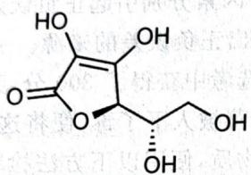

chemical

Chemical structure of a sugar derivative with multiple hydroxyl groups and a ketone group

4. 本实验中为什么不采用掩蔽铜而直接在溶液中滴定铁的方式？  
5. 用方程式说明加入盐酸羟胺的作用。  
6. 计算合金中 Fe、Cu、Se 的质量分数。  
7. 若该合金中的铁仅有 +2、+3 两种价态且其化学式可用 $Fe_{m}Cu_{n}Se$ 表示。推出此合金能够表明价态组成的化学式（最后结果保留两位小数）。

【习题 9.56】 定性分析中常常用到硫化铵。制备这种试剂的方法是将硫化氢慢慢鼓泡通过 4\~5mol/L 的氨水溶液，随后加入少量水。这样给出的溶液是很不纯的，因为谁都不知道是否通入了过量或者不足量的气体，所以要进行定量分析以确定其组成。

有 10mL 这样的样品, 稀释到 1000mL 后加入蒸馏烧瓶中, 然后加入 40mL 水。之后在收集瓶中倾入 25.00mL 0.1mol/L 的硝酸镉溶液, 在蒸馏瓶中加入 20.00mL 0.02498mol/L 稀硫酸溶液。

然后开始蒸馏。大约一半的液体被蒸到了收集瓶中，并可以看到黄色的沉淀。蒸馏瓶中残余的物种被完全转移到锥形瓶中，用 0.05002mol/L 的氢氧化钠溶液滴定，消耗 10.97mL。

用溴水处理蒸出的物质,过量的溴煮沸除去。溴将所有的硫离子都氧化为硫酸根。此时又用0.1012mol/L的氢氧化钠溶液滴定,消耗14.01mL。

求试样的定性和定量组成。

【习题 9.57】 按国标方法(GB29203-2012)测定某含量不低于90%的食品添加剂KI试样。

a) $KIO_{3}$ 标准溶液的配制: 称取 5.3643g 纯 $KIO_{3}$ 溶于 80mL 蒸馏水中, 定容至 500mL。

b)样品测定:称取0.5232g KI样品并加水溶解,加入35mL 12mol/L HCl和5mL分析纯 $CHCl_{3}$ （密度约1.5g/mL）。用 $KIO_{3}$ 标准溶液滴定,直到 $CHCl_{3}$ 层无色且5min内不复紫色即为终点。消耗 $KIO_{3}$ 标准溶液29.02mL。

1. 上述测定对实验用水有何要求？写出不符合要求时可能发生的副反应。

2. 写出滴定时发生反应的方程式；据此讨论实验现象和确定终点的化学原理。

3. 求出样品中 KI 的质量分数, 要求列出计算公式。

【习题 9.58】一种鲜花保存剂 B 可按以下方法制备: 把丙酮肟、溴乙酸、氢氧化钾混合在二氧六环中反应, 酸化后用乙醚提取, 蒸去乙醚后经减压蒸馏析出中间产物 A, A 用 6mol/L 盐酸水溶液水解, 水解液浓缩后加入异丙醇, 冷却, 即得到晶态目标产物 B。B 的熔点为 152\~153℃, 可溶于水, 与 AgNO₃ 溶液形成 AgCl 沉淀。

1. 指出工作电极(1或3)，写出工作电极的电极反应式。  
2. 计算样品 $H_{2}SO_{4}$ 的浓度。  
3. 酚酞的变色 pH 为 8.5，计算上述测定的相对误差。

现在考虑有关 Ni 的库仑分析。

4. 电解 1.00mmol/L NiSO₄，在何电势下会析出 Ni? φ(Ni²⁺/Ni) = -0.228V。  
5. 电解 pH=6.0 的 1.00mmol/L NiSO₄，在电流效率即将低于 100% 的瞬间停止电解。求溶液中 Ni²⁺ 的浓度。  
6. 求在以下情况中, 定量分析 $(\mathrm{Ni}^{2+}$ 的最终残余浓度低于 $1\mu \mathrm{mol} / \mathrm{L})$ Ni 的 pH 需满足的条件: 1.00mmol/L $\mathrm{Ni}^{2+}$ 、2.00mol/L $\mathrm{NH}_{3}$ , 电流效率 $100\%$ 。已知 $\beta_{6}[\mathrm{Ni}(\mathrm{NH}_{3})_{6}^{2+}] = 2.0 \times 10^{8}$ , 不考虑其他配合物的存在。

## 第三部分 有机化学

## 阅读提示

有机化学是研究有机化合物及有机物质的结构、性质和反应的学科，其研究对象是以不同形式包含碳原子的物质。在竞赛中，它是不使用数学而具有最高灵活性的部分。

因为种种复杂的原因,有机化学在 CChO(特别是初赛)得到不一般的重视,又因为它是后期主要学习内容,所以选手一般都比较熟悉。但仍要指出,须格外小心陷入反应“集邮”的陷阱:有机化学的基本理论是非常重要的,利用这些基本理论可在有难度的试题中充分发挥灵活性。故本部分会特别强调基本理论和基本反应,即简单的物理有机化学和将复杂反应拆解为基本反应的技术。

此外,由于近年 CChO 开始隐性引入波谱学的内容,在本部分的最后对有机波谱学进行简单介绍,但我们也不要求对波谱数据进行大量记忆。希望同学们在阅读本部分时注意各种反应之间的对比与联系,理解有机化学的基本想法。

The unique challenge which chemical synthesis provides for the creative imagination and the skilled hand ensures that it will endure as long as men write books, paint pictures, and fashion things which are beautiful, or practical, or both.

—Robert Woodward

## 第10讲 有机化学基本原理

有机反应纷繁复杂,其中不可避免地带有经验性的因素,我们的目标是在这些经验性的因素中引入尽可能多的具有一定演绎能力的内容。本讲的内容有二,其一是对反应性的解释和预测做完整的理论总结,其二是对有机化学反应进行简要分类,对基本反应进行复习。按照近年 CChO 的趋势,本讲特别针对有机化学部分第一题,即基本原理;这当然对整个有机化学起着基础性的作用。

要理解有机反应,首先要在结构、热力学和动力学层面对有机反应进行描述。我们关心的话题是:

1. 影响有机反应的因素。  
2. 分析预测这些因素。  
3. 利用这些因素对实际反应进行理解。

本讲不外乎灵活运用之前学习的结构理论的内容,主要以例子的形式展现。

## § 10.1 静态:电子结构

电子结构提供了反应底物静态的信息。总结起来，在这方面我们主要用到的理论工具是电负性、共振式和前线轨道理论（即少量分子轨道理论）。部分知识（如电子效应）我们已经在4.1节提到过，请同学们复习。

## 10.1.1 共振式分析

共振式提供了一个简便的分析反应路径中稳定性因素的方法。回忆 Lewis 结构式稳定性的判断规则,我们曾强调满足八电子规则是最重要的因素。这在碳正离子稳定性的分析中使用得尤其多。

【例 10.1】在傅-克酰基化反应中,出现了(部分的)酰基正离子中间体。初看酰基正离子,因为其含有一个连接了双键的碳原子带正电荷,且邻接高电负性的 O 原子,似乎不稳定。但是由于其有可能存在一个满足八电子规则的共振式:

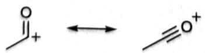

因而其稳定性较高,实际上和三级碳正离子相当。从该分析中我们还得出,酰基正离子为了进行满足上述共振式的共轭,碳必须取 sp 杂化,为直线型。

芳香亲电取代获得的是相对稳定的碳正离子,因此其中的定位效应分析也可用相同的办法处理。

【例 10.2】在带一个取代基的芳香亲电取代反应中, 如果亲电试剂 $E^{+}$ 进入邻、对位(下图中只示出了邻位情况), 则正电荷更多存在于 R 基附近, 而进人间位则相对远离 R。

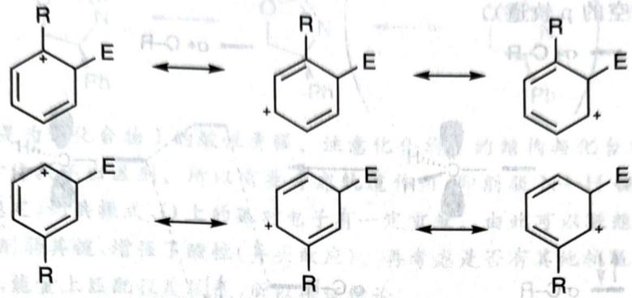

chemical

Reaction mechanism diagram showing electron transfer between benzene and hydrogenated phenyl radicals

因此给电子基团使得亲电试剂进入邻、对位，而吸电子基团则使亲电试剂进入间位；当存在双或多个取代基时，我们还知道给电子基团将占主导地位。这一分析同样适合其他类型的芳环中间体，Birch 还原也是重要的例子。

【习题 10.3】确定下述反应的中间体 A 以及 A 到产物的反应机理。

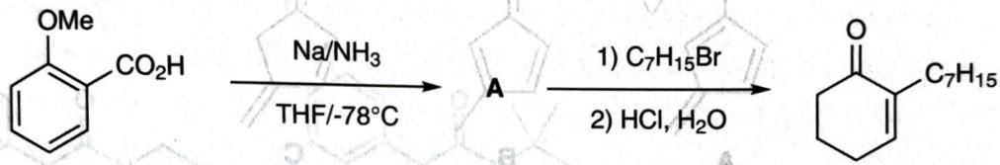

chemical

Organic synthesis reaction sequence showing conversion of a methoxy-substituted benzene derivative to a ketone using sodium amine and bromination steps

(Org. Synth., Coll, No. 6 (1983): 249)

我们可以看出,共振式在分析共轭效应的时候能发挥最大作用,现在再看一个例子。

【例题 10.4】下述体系中,碱性最强的氮原子是哪一个?简述理由。

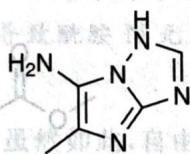

解 首先排除孤对电子被共轭的氮原子,即被双环共用的氮原子及其相邻的氮原子,因为它们的孤对电子须形成芳香结构而被共轭,没有碱性。同时正因为共轭效应,我们可写出如下共振式:

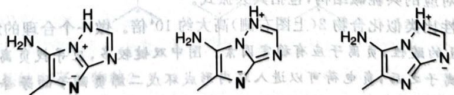

chemical

Three identical pyridine derivatives with negative charge signs, likely for a chemical reaction or molecular structure.

注意到粗体标出的氮原子,存在两个共振式使得其上有负电荷,而且该环上还有氨基给电子,因此碱性最强。

【习题10.5】N,N-二甲基-4-氨基吡啶与 $\mathrm{CH}_3\mathrm{I}$ 以 $1:1$ 的比例发生甲基化反应,产物是什么?解释反应的选择性。

## 10.1.2 轨道作用

有些时候,单纯的共振式分析不能发现某些重要的结论,还需要考虑轨道之间的某些关系。这里我们讨论的轨道作用,主要是在价键理论上,额外增加一些轨道之间的相互作用,可称为“定域分子轨道理论”,使用时只需要运用双原子分子的轨道作用方式进行分析即可。

【例 10.6】超共轭效应是稳定碳正离子的一个重要因素。从轨道作用层面上看，它就是邻位 $\sigma$ 键的电子部分和 p 轨道产生了一定的相互作用，使得体系稳定（观察下图中轨道能量的降低，左侧为 C—R 键的成键轨道，右侧为空的 p 轨道）。

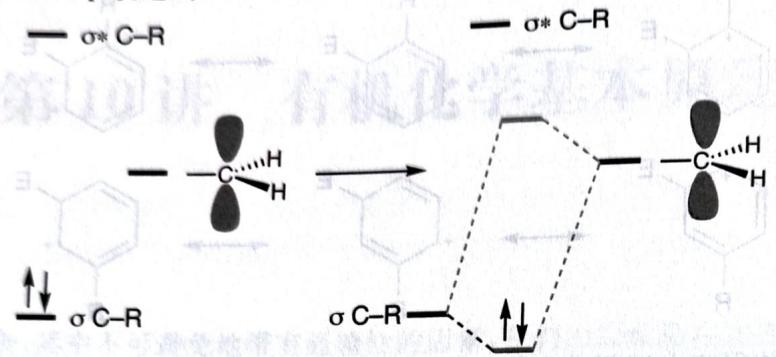

chemical

Molecular orbital diagram showing σ-C-R bonding between carbon and hydrogen atoms in a cyclic compound

【例题10.7】下图是三种骨架完全一样，互为同分异构体的有机化合物A、B、C。尽管如此，其中有一个化合物酸性要比余下两个显著强。

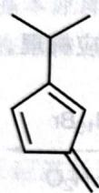  
A

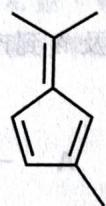  
B

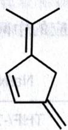  
C

1. 找出这个化合物,画图并在图中圈出它的酸性位点。  
2. 为它的显著酸性做一个合理的解释。

酰胺 1(下图左侧)在合成上用途很多,例如它具有不对称催化辅助基团的基本骨架。

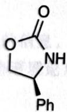  
化合物1

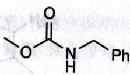  
化合物2

3. 画出化合物 1 对应的共轭碱结构, 包括其共振式。  
4. 化合物 1 的酸性比类似化合物 2(上图右侧)高大约 $10^{4}$ 倍。做一个合理的解释。

意到 B 的甲基形成负离子之后, 负电荷可以进入环内形成环戊二烯负离子的芳香结构, 因此酸性最强,如下图所示。

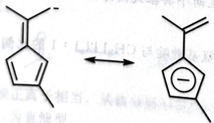

chemical

Chemical reaction diagram showing conversion of a cyclopentenone to a substituted cyclopentanone with negative charge on the ring

化合物1的酸性位点是明显的,酰胺氮上的H因为羰基和N吸电子,酸性较强,共振式容易书写,如下图所示。

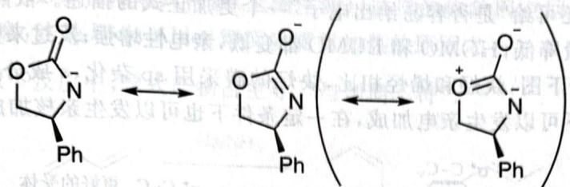

chemical

Chemical reaction diagram showing nucleophilic substitution of a pyrrolidine derivative with phenyl groups

比较重要的问题是为何化合物1的酸性更强。注意化合物1的结构与化合物2相比，只差一个环系，且用经典共振式方法找不出区别。所以需要考虑轨道作用，即削弱N—H键的轨道作用。观察上图括号中(尽管不够稳定)的共振式，O上的孤对电子有一定贡献。由此可以联想到O的孤对电子进入了N—H的 $\sigma^{*}$ 轨道，削弱其键，增强了酸性(异头效应)。再考虑是否有其他轨道发生作用，发现其他的轨道一般为成键轨道，能量上匹配程度较低，所以确证结论。

【例题10.8】分别判断下面两组物质中酸性最强的分别为哪一个并说明理由。

1.

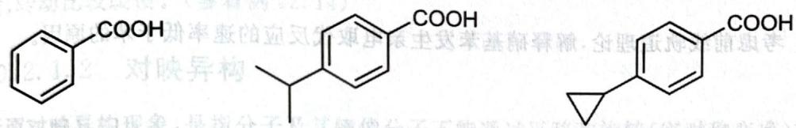

chemical

Three organic molecular structures with carboxylic acid, methyl, and cyclohexene functional groups

2.

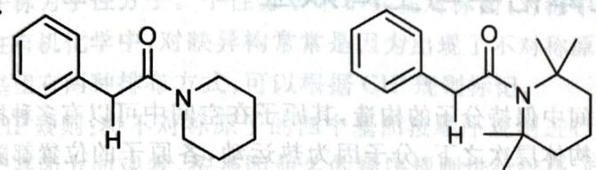

chemical

Two organic molecular structures with benzene rings, amide groups, and cyclohexane rings, featuring stereochemistry indicated by wedges and dashes.

解 第1问中,苯甲酸酸性最强,异丙基取代的苯甲酸因为给电子诱导效应而酸性减弱;环丙烷因为环张力,p轨道外露,因此电子云密度更大,给电子诱导效应更强,酸性更弱。第2问中,有四个甲基取代的物种酸性更强,这是因为甲基的位阻导致酰胺N无法和羰基共平面,因此羰基的吸电子能力增强,酸性更强。

【习题 10.9】自由基是缺电子的物种,虽然如此,自由基中心附近无论是给电子基团还是吸电子基团,都能帮助稳定自由基。例如下图所示的几个自由基都比较稳定。

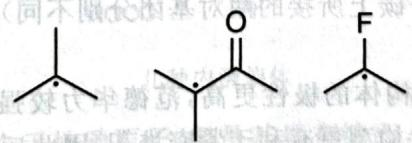

chemical

Three organic molecule structures: tert-butyl, acetyl ester, and fluorine

1. 为什么自由基是缺电子的物种？  
2. 解释这些自由基的稳定性。  
3. 这些取代基对自由基的亲电/亲核性有什么影响？

轨道作用的一个重要理论是前线轨道理论。前线轨道理论是理解有机分子反应性的重要工具，它是1952年Fukui在解释芳香亲电取代反应时提出的。回顾前面3.8节对HOMO、LUMO和SOMO的描述，这些轨道统称为前线轨道。Fukui认为，在化学反应中，前线轨道的相关作用是决定反应方向和选择性的结构因素，扼要说来：

1. 不同分子的与四轨道相互排斥，不同分子的相异电荷互相吸引。  
2. 一个分子的占用轨道和另一个分子的未占轨道之间的作用导致相互吸引,尤其是 HOMO 和 LUMO 之间。

由此,有机反应可看成 HOMO 和 LUMO 电子相互作用的适应性。一般来说,HOMO 要比 LUMO 低得多。处理周环反应一般会使用前线轨道理论。

HOMO 和 LUMO 还可给“是否容易给出电子”一个更加正式的描述。依照电负性，电负性大的原子或基团将导致体系能量降低，HOMO 和 LUMO 都变低，亲电性增强；反过来则亲核性增强。

【例10.10】类似于下图，炔烃和烯烃相比，炔烃的碳采用sp杂化，s成分更高，能量低，因此电子不易给出。在催化条件下可以发生亲电加成，在一定条件下也可以发生亲核加成。

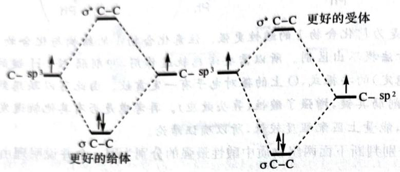

chemical

原子结构示意图，展示C-C与C-sp³、C-sp²等离子的受体与更好的给体关系

【习题10.11】考虑前线轨道理论，解释硝基苯发生亲电取代反应的速率低于苯的原因。

## § 10.2 立体化学与空间效应

讨论空间效应,首先要明确分子结构在空间中保持分子的构造,其原子在空间中可以有多种排列方式,由此产生一类异构体为立体异构体。在异构体层次之下,分子因为热运动,各原子的位置都随时间不断发生变化,由此出现的不同结构统称为构象。

## 10.2.1 立体异构

## 10.2.1.1 顺反异构

最为熟知的顺反异构出现在烯烃中。烯烃的双键若要旋转，需要断裂 $\pi$ 键，能垒很高，由此产生烯烃的顺反异构现象（这要求烯烃两个碳上所接的两对基团分别不同）。下面对顺反异构体的物理和化学性质进行讨论。

【例 10.12】一般来说,顺式异构体的极性更高,范德华力较强,故顺式异构体沸点高。但在固体中具体排列时,反式异构体的锯齿状构型更有利于紧密堆积,因此反式异构体的熔点高。顺式异构体生成热较高,而电子云外露,反应性也更强。

【例题10.13】顺反丁烯二酸的酸常数为下列数值(顺序归属已打乱): $1.1 \times 10^{-2}, 9.3 \times 10^{-4}, 2.9 \times 10^{-5}, 2.6 \times 10^{-7}$ 。指出这些数值分别为哪个酸的哪一级酸类数。

解 顺反异构体的差异在于空间效应,因此需要从空间的话题上切入。注意到顺丁烯二酸在电离。因此第一个和第四个数值分别是顺丁烯二酸的第一级电离和第二级电离,第二个和第三个则分别

“部分双键”也会形成某种意义上的顺反异构。

【例 10.14】如下图所示,丁二烯存在两种构象。这两种构象因为中间单键具有部分双键的性质(共轭),旋转能垒比一般的单键高。

在二烯的周环反应中,必须使用顺式构象(上图左侧),这样的构象因空间上的排斥而稍不稳定,能垒又比一般的单键旋转高,这是 Diels-Alder 等反应需要加热的原因之一。

【习题 10.15 $^{*}$ 】以下反应中，顺式产物占主导，“与预期不符”。

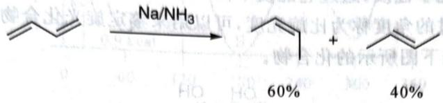

chemical

Chemical reaction equation showing conversion of a ketone to an alkene using Na/NH₃ catalyst, yielding 60% and 40% products

1. 简要说明为何“与预期不符”。

2. 解释顺式产物占主导的原因。提示: 注意主产物优势并不明显, 可能存在其他因素和“预期因素”竞争。

【例 10.16】在 DMF 分子中,三个甲基上氢的化学环境都不同,这是因为 C—N 键存在部分双键的性质,转动比较缓慢。(参看例 12.14)

## 10.2.1.2 对映异构

所谓对映异构现象,是指分子及其镜像分子不能通过平移和旋转(实对称变换)重合,具有这种现象的分子称为手性分子。手性分子中不存在对称面、对称中心和反演对称中心,可能有旋转轴。

在有机化学中,对映异构常常是因为出现了不对称原子:连接其的四个基团都不同。不对称碳原子上的基团有两种排布方式,可以根据 CIP 规则标记。

CIP 规则: 将不对称原子的四个基团按顺序规则进行排序, 排序最小的基团放在观察者远端, 从剩下三个基团方向观看, 按基团命名的顺序规则进行排序, 排序若为顺时针, 则称为 R 型, 否则称为 S 型。

不对称原子构型恰完全相反的一对对映异构体称为对映体,否则称为非对映体。

含有手性原子是分子具有手性的既不充分也不必要条件,许多外在因素会导致含有不对称原子化合物具有额外对称性,失去手性,或者导致一些没有不对称原子的化合物具有手性。举例如下。

【例 10.17】下图示出了几种含有不对称碳原子,但不具有手性的物种。

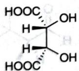

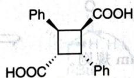

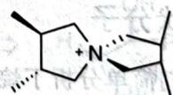  
几种内消旋体

在左侧的酒石酸中, 虽然有两个手性碳原子, 但是其具有镜面, 故不是手性分子。在中间的吐昔酸分子中, 四元环中心存在反演中心, 因此也不是手性分子。在右侧的季铵盐中, 有一个穿过 N 原子、分别对分连接两侧不对称碳原子的键的 $S_{4}$ , 因此也没有手性。

这些存在(假)不对称原子但没有手性的物种称为内消旋体。

【例 10.18】下图示出了几种不含不对称碳原子,但具有手性的物种。

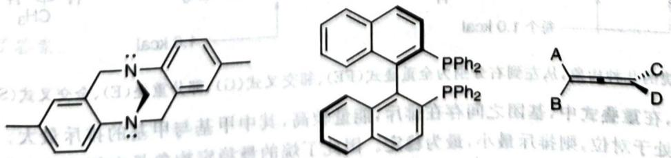

chemical

Chemical structures of a polycyclic aromatic compound with labeled substituents PPh2 and A, B, C, D

其他手性物种

在左侧的 Tröger 碱中, 因为环的刚性, N 的孤对电子被迫向外, 无法反转, 出现手性(许多手性催化

剂的手性就是通过环上 N 的刚性设计的)。在中间的 BINAP 中,联苯的旋转因为 PPh₂ 基团阻挡,无法进行,也出现手性,这种手性元素称为手性面。右侧的联烯是手性原子的推广,手性原子拉长成为手性轴,只要 A、B、C、D 各不相同,则也出现手性。

手性分子具有重要的光学性质，透过它能使平面偏振光的偏振方向发生旋转。单位长度、单位浓度的旋光物质使得偏振光转过的角度称为比旋光度，可以用来鉴定旋光化合物及其光学纯度。

【例题 10.19】 考虑如下图所示的化合物。

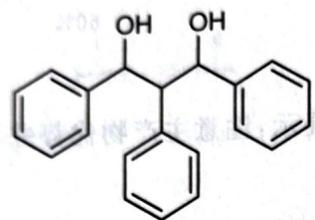

chemical

Chemical structure of a biphenyl alcohol with three phenyl groups and hydroxyl substituents

(1)列出其所有可能的立体异构体(标明各立体中心的构型),并确定其中哪些是有旋光性的。  
(2)以下哪些性质可以用来区分有旋光性的异构体:沸点、熔点、折射率、比旋光度、偶极矩。

解 此题按部就班进行即可。答案为

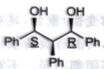

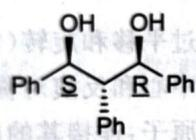

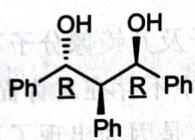

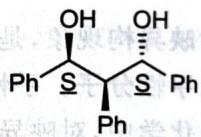

其中前两个没有旋光性(内消旋体)，后两个有旋光性。只有比旋光度能用来区分有旋光性的异构体。

## 10.2.2 简单的构象分析

分子中单键旋转和环的扭曲使得分子中各基团和原子的位置不同，亦会对分子的反应性产生重大的影响。分子构象中的精细因素也会对分子的稳定性产生影响。

## 10.2.2.1 链状分子

对于链状分子,我们简单分析丁烷和 Cram 规则。

【例 10.20】下图中示出了丁烷的几种构象及其能量分析。

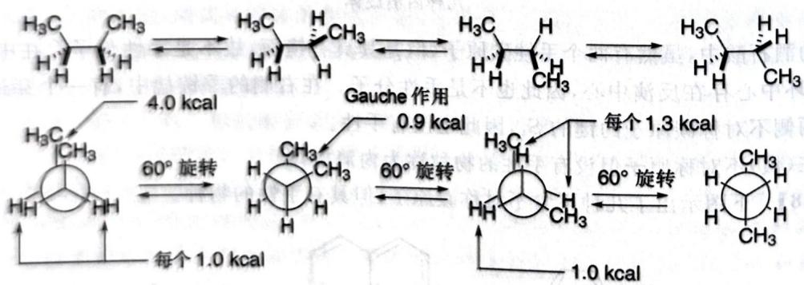

chemical

Reaction mechanism diagram showing Gibbs and angular dependence on energy (kcal) for a cyclic carbocation

丁烷的几种构象，从左到右分别为全重叠式(FE)、邻交叉式(G)、部分重叠(E)、全交叉式(S)。

一般认为，在重叠式中，基团之间存在排斥，能量较高，其中甲基与甲基的排斥最大。在交叉式中，甲基的投影若处于对位，则排斥最小，最为稳定。因此丁烷的最稳定构象是右侧为全交叉结构，最深能垒为20\~30kJ/mol（如下图所示）。

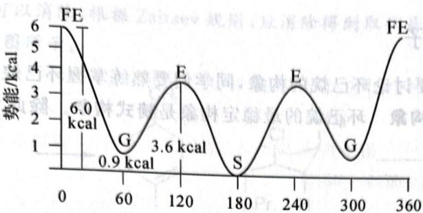

line chart

| Point | Value (kcal) |
|-------|--------------|
| FE    | 6.0          |
| G     | 0.9          |
| E     | 3.6          |
| S     | 0            |
| E     | 3.6          |
| G     | 0.9          |
| FE    | 6.0          |

二面角/度  
丁烷构象的势能曲线

不过, 近年有化学家研究指出, 交叉式的稳定性主要来自超共轭效应而不是空间效应, 处于反式的一对 C—H 键的 $\sigma$ 和 $\sigma^{*}$ 轨道存在重叠 (可视为超共轭效应), 降低了体系的能量。

【例 10.21】 Cram 规则是基于经验的构象模型。它认为，在邻位具有手性碳的羰基发生加成反应时，应按照下图的构象和进攻方向进行反应。具体而言，羰基的 R 基团应与最大的基团 L 重叠，亲核试剂从最小的基团 S 方向进攻。

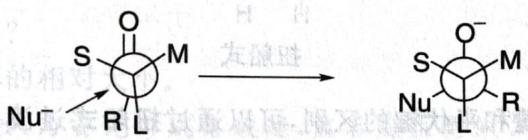

chemical

Chemical reaction diagram showing nucleophilic substitution of a thioamide group on a carbonyl carbon, forming a disulfide bond with Nu and R substituents

除了 Cram 模型之外,还有一些现代的精细模型,感兴趣的读者可以自行了解。

【例题 10.22】试推断下述反应的产物, 注意立体化学。

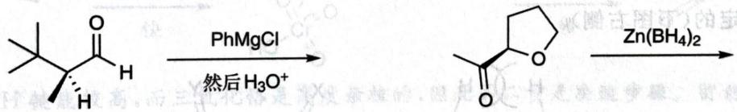

chemical

Organic reaction sequence showing conversion of a ketone to a cyclic amide using PhMgCl and H3O+ reagents

解 格氏试剂的加成便是简单运用 Cram 规则, 绘图分析如下:

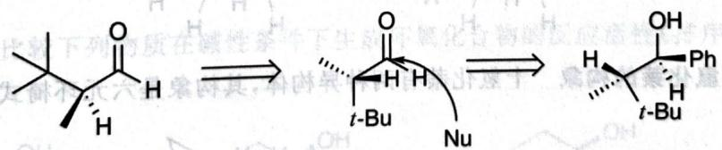

chemical

Chemical reaction mechanism showing nucleophilic substitution of a ketone to form a t-Bu-protected intermediate and then to yield a hydroxyphenyl alcohol

对于右侧的还原反应,不能直接套用 Cram 规则。如何反应,本质还是选择合适的进攻方向。因为 Zn 可与 O 发生配位(这样也能提高还原能力),因此绘图分析如下:

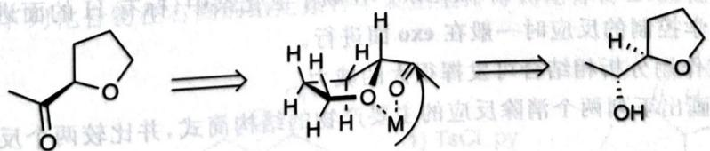

chemical

Chemical reaction mechanism showing conversion of a cyclic ketone to a cyclic alcohol with intermediate structure and stereochemistry indicated

这就得到了答案。

## 10.2.2.2 环状分子

对于环己烷分子，我们要对环己烷的构象，同学们要熟练掌握环己烷构象的画法。

【例 10.23】 环己烷的构象 环己烷的最稳定构象是椅式构象。除此之外还有半椅式和扭船式两种常见构象。

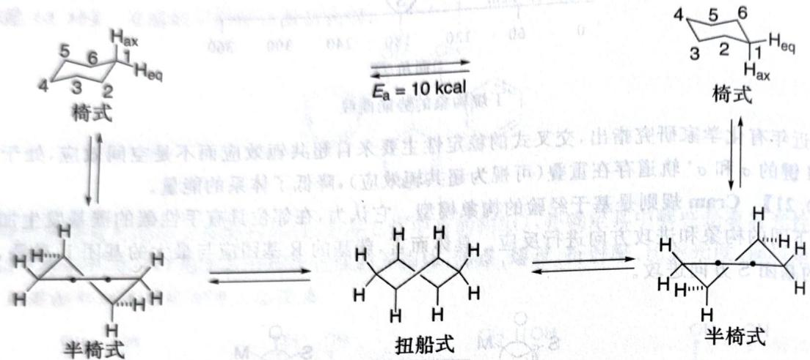

chemical

三元正态反应示意图，展示椅式、半椅式和扭船式在不同分子结构下的转化过程

构象中的取代基都有直立键和平伏键的区别,可以通过扭船式过渡态进行转换。把图中半椅式两个黑点所对应的键改为双键,就得到了环己烯的稳定构象。在环己烷中,直立键与环内氢存在较多排斥,因此直立键相对不稳定。

环己烷的另一种构象为船式,其不稳定的因素主要是对位氢的排斥,如果这样的排斥得到解除,则船式构象是最稳定的(下图右侧)。

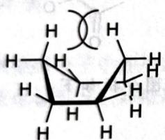

chemical

Chemical structure diagram of a cyclic compound with hydrogen atoms and double bonds

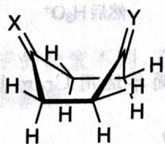

【例 10.24】十氢化萘的构象 十氢化萘有两种异构体,其构象是六元环椅式结构的推广。

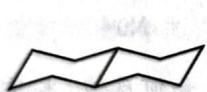

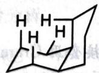

上图左侧是反十氢化萘,右侧是顺十氢化萘。在顺十氢化萘中,标有 H 的面进攻空间阻力很大,称为 endo 面,发生动力学控制的反应时一般在 exo 面进行。

构象分析和轨道作用分析相结合可发挥很大的威力。

【例题10.25】画出下列两个消除反应的主要产物的结构简式，并比较两个反应速率的相对大小。

chemical

Chemical reaction sequence showing conversion of a cyclohexane derivative to a substituted cyclohexene using CH3CH2ONa catalyst

解 这是 E2 消除反应,要求被消除的基团相应的 $\sigma$ 键和 C—H 键成反式共平面,有利于新键形成的构象:Cl 必须处于直立键。

左侧底物,存在两种氢可以消除,根据 Zaitsev 规则,应消除得到取代基多的烯烃。右侧底物只有一种氢可以消除。故产物如下图所示。

chemical

Organic reaction pathway showing conversion of a cyclohexane derivative to a substituted cyclohexene with isopropyl and chloro substituents

因为左侧底物反应时甲基和异丙基都在平伏键，而右侧底物需要先转换成全直立键的构象，所以左侧底物反应快。

【例题 10.26】下列两个醇都是十氢化萘衍生物,均可被 $CrO_{3}-py$ 氧化为酮。

chemical

Two organic molecular structures with hydroxyl (OH) groups, shown side by side with stereochemistry indicated

1. 反应的决速步骤是什么？

2. 比较两个物质反应速率的相对大小。

解 醇被 $CrO_{3}$ 氧化,一般认为首先形成铬酸酯,然后发生类似 2,3- $\sigma$ 迁移的过程,拔除 H 结束反应。

chemical

Organic reaction mechanism showing CrO3-mediated cyclization and oxidation steps

考虑到 C—H 键能较高,而三氧化铬是高度亲核的,因此第二步是决速步骤。留意到左侧物质的直立键甲基和庞大的铬酸酯基团具有较大 1,3-排斥,该中间体相对更不稳定,因此具有直立键甲基的底物反应更快。

【习题 10.27】比较下列物质在碱性条件下生成环氧化合物的反应活性(排序,从左至右分别编号为 A、B、C、D)。

【习题10.28】下列化合物在右侧的给定条件下发生重排得到化合物B，而在左侧酸性条件下得到B的同分异构体C。

chemical

Chemical reaction pathway showing transformation from compound C to B via intermediate 1 (TsCl, py) and 2 (t-BuOK)

1. 画出酮类化合物 C 的结构简式, 要求立体化学。

2. 解释为什么在不同条件下重排结果不同。

## 10.2.2.3 邻基参与

邻基参与是一个非常重要的反应现象,其经常发生的主要原因就是分子内反应在空间上比较接近,速率较大。

【例题 10.29】下列反应中,巯基先亲核进攻,然后发生分子内亲核取代反应得到产物。对此反应进行的原因分析不符合化学原理的一项是

chemical

Chemical reaction equation showing thiol group substitution with CH₃I, producing iodide and hydrogen

A. 根据 HSAB 法则, 碘用烷亲软碱, 硫基与其结合的产物稳定, 故巯基先亲核进攻。

B. 根据亲核性大小, 硫基的亲核性大于氨基, 故巯基先亲核进攻。

B. 根据亲核性大小: 疏基的亲核性大于 $\mathrm{C} - \mathrm{N}$ 键的键能, 故发生分子内亲核取代反应。

D. 根据碱性强弱, 氨基的碱性比巯基更强, 故之后发生分子内亲核取代反应。

解 在亲核取代反应中,邻基参与可以指发生分子内亲核反应。本题就是如此。B、C、D均为亲核取代反应的基本原理。亲核性与碱性部分正相关,同时与可极化性(电子云的弥散程度、原子的大小等)部分正相关。A、C项是相互矛盾的,A说巯基与碘甲烷结合稳定,C说氨基与碘甲烷结合稳定,根据例子中反应结果和N的原子半径比S小,知道C正确。A的错误为在有机化学中,HSAB法则在分析动态反应的时候一般认为是动力学法则(轨道作用),与稳定性关系不大。

【例题 10.30】 在有机反应中, 反式邻二醇是一类重要原料, 可以通过烯烃的氧化反应制备。下式给出了合成反式邻二醇的一种路线。

第一步反应：

chemical

Chemical reaction pathway showing conversion of cyclohexene to products A, B, C, D via I2/AgOAc

第二步反应：

chemical

Chemical reaction showing oxidation of diol to a cyclohexanol derivative with two hydroxyl groups

1. 画出上述反应的 4 个关键中间体 A、B、C、D 的结构简式。

2. 若在第一步反应过程中, 当碘完全消耗后, 立即加入适量的水, 反应的主要产物则为顺式邻二醇。画出生成顺式邻二醇的两个主要中间体 E 和 F 的结构简式。

解 碘单质 LUMO 相对较高, 活性较低, 需要通过 AgOAc 形成 AgI 沉淀的方式拉动反应。形成碘鎓离子后, 其仍然具有强的亲电性, 因此 OAc $^{-}$ 仍然可以进攻。

chemical

Organic reaction pathway showing conversion of cyclohexene to acetaldehyde via iodination, acetylation, and cross-coupling steps

注意到反应结果是反式,类似于卤素加成的产物,而现在如果另一份 AcO $^{-}$ 取代 I $^{-}$ 将得到顺式邻二醇,故考虑发生邻基参与过程,形成有利的五元环。随后 AcO $^{-}$ 再行进攻。D 的水解符合题意。

chemical

Acid-catalyzed reaction mechanism involving cyclohexene and acetoxy carbonyl compounds

现在考虑加水时的反应,观察上面写出的中间体,所谓碘单质完全消耗应该是指反应达到某个较稳定的中间态,即为上图中间的五元环邻基参与结果。因为要保持顺式立体化学,故加水后将类似于缩酮的结构水解,得到两个互为顺式的羟基(或其前体)。

chemical

Hydrogenation reaction of cyclohexene to form a carboxylic acid derivative

这就完成了解答。

【习题 10.31】下列反应中手性碳原子构型保持。

chemical

Organic reaction showing acetylation of a benzene derivative with OTs and CH3CO2H under heating conditions

1. 标注产物中手性碳原子的绝对构型。  
2. 画出重要的反应中间体。  
3. 给出下列反应的产物, 注意立体化学。

chemical

Chemical reaction equation showing aldehyde derivative reacting with ethyl acetic acid under heating conditions

## 10.2.2.4 构象改变最小原理

构象改变最小原理是一个依据构象分析预言反应的动力学路径的原理,它认为构象改变小的反应途径活化能低。一般表述为:底物进行反应时,主要通过构象改变最小的途径进行。

【例题 10.32】试分析下述反应的产物。

chemical

Chemical reaction diagram showing bromine (Br₂) reacting with a cyclohexene ring, forming a ketone structure

解 画图分析。首先写出环己烯的构象:类似于半椅式。

chemical

Chemical reaction scheme showing t-Bu-catalyzed rearrangement of a brominated cyclopropane derivative

由于 $Br_{2}$ 为反式加成, 因此第一步从上面或下面进攻无关紧要, 重要的是加成完毕后有两种选择。根据构象改变最小原理, 上侧途径虽然获得全平伏键的稳定产物, 但由于最后需要从扭船式转换为椅式, 因此动力学上不利。因为该过程是不可逆的, 所以应为动力学控制, 得到右下角加粗示出的产物。

## § 10.3 动态:有机反应的动力和过程

单纯静态分析只能给我们物质稳定性的结果,但有机反应并不一定生成最稳定的产物(热力学控制),它可能是短视的:选择当前能量升高最少(降低最多)的途径,最终不一定进入能量最低的位置(动力学控制)。

热力学控制和动力学控制可能是基本理论中最重要的内容,本节我们从反应的基本动力着手,谈论这一有趣的话题。

## 10.3.1 过渡态和反应的动力

每一个化合物都被电子所包围,如果需要两个物种接近进行反应,就需要克服分子之间的排斥力。用过渡态理论的语言说,就是反应物分子在通过势能面上的反应路径形成稳定的生成物分子之前首先要经过不稳定的过渡态,过渡态的结构可能是底物分子构成的复合物。如果能稳定这个复合物,就能加快反应的速率。

在有机反应中,加快反应的因素一般有两种:

1. 某些反应通过静电吸引促进反应中心的结合。例如，羰基的加成反应，一般是通过静电吸引促进的。  
2. 通过轨道相互作用促进反应中心的结合。在一些极性很弱的反应中心中，这条因素占主导。例如苯的亲电取代和烯烃的亲电加成，都是先由卤素的反键轨道和 $\pi$ 电子云进行部分重叠再进行反应。

此外,定性分析过渡态还可使用 Hammond 假说。虽然对我们来说它不那么有用,但它在直觉上有一定道理,且具有一定解释能力:体系中处于连续反应过程中的两个状态如果能量相近,则转换它们只需要微小的变化,在反应进程图的坐标上十分相近。

Hammond 假说断言反应进程图上非常陡峭的曲线是不可能的,从而反应过渡态结构应该倾向于能量更接近它的结构,进一步,吸热反应的过渡态接近于产物,放热反应的过渡态接近于反应物。因此,反应物活性越强,过渡态就和反应物越接近,各条反应路线的活化能就越接近,选择性越差。

反应物活性越强, 过被态就和反应制起速度, 等来反应路线的信化能就越接近, 选择性越差。

这可以解释在烷烃的自由基卤代反应中, 选用 $Br_{2}$ 更有利于控制的原因, 也为各种有机反应提高选择性提供了重要的依据。

## 10.3.2 热力学控制和动力学控制

回忆中学阶段学习的经典反应,丁二烯的两种加成方式:

chemical

Bromination reaction of 1,2-dimethylbenzene to form a brominated alkene using Br₂ catalyst

我们说低温下得到左侧1,2-加成产物，高温下得到右侧1,4-加成产物，分别对应于动力学控制和热力学控制。这时就要问，原因是什么？现在关心热力学控制和动力学控制的基本原理。

动力学控制是短视的、局部的，热力学控制则是全局的。动力学控制的活化能较低，产物能量高；热力学控制的活化能较高，产物能量低（见下图）。

text_image

E
ΔGc±
ΔGc
ΔGb±
ΔGb
ΔG
热力学产物
C ← A → B
反应坐标
ΔΔG±
ΔΔG
动力学产物

动力学控制和热力学控制

据此,我们可总结分别对动力学控制和热力学控制有利的条件。

1. 动力学控制是指活化能低,产物不稳定的一侧温度低时占优。有利的条件可以是稳定的中间体、有利的电荷吸引或轨道作用,反应不可逆。  
2. 热力学控制是指活化能高,产物稳定的一侧温度高时占优。有利的条件可以是稳定的产物(如氢键、共轭、多取代、位阻小、生成的键键能高等),反应可逆。

于是可以对具体的反应进行分析。

【例 10.33】利用共振式分析 1,3-丁二烯与 $Br_{2}$ 反应的重要中间体的结构。

chemical

Bromination reaction mechanism of a brominated alkane, showing two pathways with different starting conditions (1 and 2)

因为共振式1是一个二级碳正离子，而共振式2是一级，从而中间体的结构更倾向于1；亦即，在中间碳上的正电荷更多。在低温下，反应因静电吸引，将向动力学有利的方向发展，所以 $\mathbf{Br}^{-}$ 将进攻该位置，发生1,2-加成。另一方面1,4-加成的产物是多取代的烯烃，且两个Br相距远，排斥较小，较为稳定。又请注意，反应能够通过鎓离子中间体在一定温度下达到可逆，因此高温下将越过活化能垒发生1,4-加成。

【例 10.34】硫叶立德常常可以用于产生三元环。

chemical

Reaction mechanism diagram showing the conversion of acetaldehyde to acetic acid via sulfur intermediate

使用亚砜叶立德则得到1,4-加成的结果：

chemical

Chemical reaction showing the oxidation of an enone to a cyclic ketone using sulfur and oxygen, forming a diethylcyclopropane derivative.

利用简单的原子半径分析,知道 C=O 中 $\pi$ 键键能大于 C=C。那么与 1,2-加成相比,1,4-加成是热力学不利的。另外,可以知道羰基碳的电正性比插烯的末端碳原子强(共振式分析),因此从电荷吸引上看,叶立德发生 1,2-加成更快。注意到,普通硫叶立德是极不稳定的,而亚砜叶立德因有 O 的吸电子作用比较稳定。所以硫叶立德一旦发生了 1,2-加成就不可逆(动力学控制);亚砜叶立德可以相对可逆地反应,最终得到稳定产物(热力学控制)。

注记 羰基的亲核加成反应中,有关1,2-加成和1,4-加成竞争的分析也是类似的。例如醛更倾向于1,2-加成,因为它的羰基更加缺电子,静电吸引强而又没有空间阻碍。

【习题10.35】预言下列羟醛缩合反应的主要产物，使用严格的逻辑说明你的结论。

chemical

Chemical reaction showing esterification with NaOEt and EtOH under basic conditions

动力学控制和热力学控制在缩合反应中有重要应用。烯醇的生成问题可以说是羰基化合物反应中最让人头疼的了。我们来看看该理论如何解释这些问题。

【例 10.36】 考虑下列烯醇化反应的区域选择性(HMPA 是六甲基磷酰胺, 它的氧可配合锂离子, 帮助 LDA 等有机锂试剂解聚, 加快反应)。

chemical

Organic reaction pathway showing esterification and LDA/HMPA steps with NaOEt and EtOH reagents

上图中,左侧氢对应的烯醇负离子取代较多比较稳定,右侧因位阻小,动力学脱质子更快。在NaOEt作用下反应是非常“可逆”的(指大大倾向于反应物)。即便快速脱除了右侧的质子,因为在质子溶剂中,可以通过质子交换可逆地向脱除左侧移动,所以反应将生成热力学控制的产物。使用LDA时,反应完全不可逆,因为LDA的大位阻,右侧动力学优势被强化了(碱不能太小,例如强碱H $^{-}$ 生成热力学烯醇)。因此一旦脱除就被固定下来,生成动力学产物。至于第三个,原因是体系有明显的互变异构,脱除的是羟基上酸性最强的质子。

【习题10.37】按照我们在例10.36中的论断，“弱碱作用下应该在多取代的一侧反应”，为什么仿反应在少取代的一侧反应？

chemical

Chemical reaction equation showing bromination of an enone using NaOH and Br₂ catalyst

