【习题10.38】回忆Fries反应(在Lewis酸催化剂存在下加热时将酚酯转化成邻位或对位酰基酚)，它存在热力学控制和动力学控制。指出何产物是动力学产物，何产物是热力学产物，并说明理由。

## § 10.4 溶剂效应

有机反应通常是在溶剂中发生的,底物溶剂化会对反应体系产生很重要的影响,溶剂也有可能在不经意间参与反应。

## 10.4.1 溶剂的极性

一般把溶剂按两种方式分类,其一,是否为质子溶剂,其二,是否为极性溶剂。大家熟知“相似相溶原理”,溶剂是否有极性取决于溶剂分子是否有永久偶极矩。但找出定义准确衡量极性溶剂的极性大小是比较困难的。除了使用偶极矩之外,还有介电常数这一指标。介电常数通过测定溶剂对带相反电荷电极间的电场影响而确定,电场会诱导分子抗衡外加电场。

一般来说,高可极化性、有氢键位点和偶极矩都会导致介电常数升高,因此介电常数能够较好地反映溶剂的极性。下表给出了少量溶剂的介电常数和偶极矩,供参考。

<table><tr><td>溶剂</td><td>(相对)介电常数</td><td>偶极矩/D</td></tr><tr><td>甲醇</td><td>33</td><td>1.7</td></tr><tr><td>丙酮</td><td>21</td><td>2.88</td></tr><tr><td>二氯甲烷</td><td>8.93</td><td>1.6</td></tr><tr><td>乙酸</td><td>6.2</td><td>1.7</td></tr><tr><td>苯</td><td>2.28</td><td>0</td></tr></table>

我们可以看出,使用这些数据判定极性主要是一种参考,与我们在经验上的认识还是有所不同的,例如乙酸的相对介电常数很低。

## 10.4.2 Hughes-Ingold 模型

Hughes-Ingold 模型是一个处理溶剂效应的定性理论,特别是亲核取代反应的溶剂效应。该理论认为,溶剂化主要是静电作用,在亲核取代反应中反应物的电荷类型具有根本的重要性。

如果从反应物到过渡态,体系产生了电荷或电荷发生集中,则溶剂极性增大有利于过渡态能量降低(相比于底物降低更多),速率加快;否则极性增大将导致反应速度降低。

【例10.39】

- $t$ -BuCl 在溶剂中进行溶解, 溶剂极性增大, 反应速率增大。  
- 碘甲烷在溶剂中发生溴代 $\mathrm{CH}_{3} \mathrm{I} + \mathrm{Br}^{-} \longrightarrow \mathrm{CH}_{3} \mathrm{Br} + \mathrm{I}^{-}$ , 由于过渡态电荷发生了分散, 因此溶剂极性降低, 有利于反应速率增加。  
- 2,4-二硝基氯苯与六氢吡啶发生芳香亲核取代反应，由于产生了带电荷的中间体，因此溶剂极性的增强有利于加快反应。  
• Diels-Alder 反应的过渡态没有明显的电荷分散或集中,在不同溶剂中反应速率的差异不大。

类似的观点在处理其他反应的溶剂效应中也有应用，举例就是

## 10.5.1 加成反应

下图示出了加成反应的基本模式(EDG 表示给电子基团, EWG 表示吸电子基团, E 表示亲电试剂, Nu 表示亲核试剂, 以下皆同)。

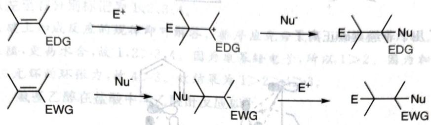

chemical

Two-step organic reaction scheme showing protonation and nucleophilic substitution of a cyclic ketone using EDG and EWG intermediates

加成反应的基本模式

加成反应就是在不饱和键的两端增加两个基团,使得不饱和度降低1。根据不饱和键电子云的特性,可以先上富电子试剂,也可以先上缺电子试剂。产生的正离子或者负离子中间体也不一定要按照模式被捕获,例如正离子可以发生消除,负离子还可以进一步对其他分子进行加成,等等。

## 10.5.1.1 亲电加成反应

加成反应的基本理论包括马氏规则、反马氏规则和非经典碳正离子。

在双键两边不对称且加成试剂也不对称(以 HX 为例)时,加成反应有两种结果:

\- 马氏规则 氢加在取代少的位置。

\- 反马氏规则 氢加在取代多的位置。

(反)马氏规则与其说是一种规则,不如说是对现象的称呼。其根源就是碳正离子(或其他中间体)的稳定性,通过碳正离子稳定性对其才能有更好的把握。

【例 10.44】 马氏规则 考虑下图中示出的加成反应。

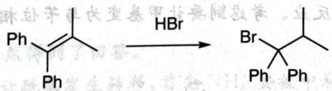

chemical

Chemical reaction showing bromination of a chiral alkene under HBr conditions

苯基和甲基相比，对碳正离子的稳定作用更高，因此反应得到右侧产物。

在亲电加成中，X 卤素取代基虽然降低了加成反应的速率(第一步过渡态能量高)，但是可以通过给电子共轭效应稳定碳正离子中间体，因此一般情况下氢将加在远离卤素的一侧，在表观上“反直觉”。

【例 10.45】 反马氏规则 反马氏规则一般是因为体系不通过碳正离子机理,或者与氢相对的另一加成基团具有了负性导致。

在烯烃的自由基加成中,由于Br先进攻,因此Br将接在氢少的位点,以稳定自由基,得到反马氏规则的产物。

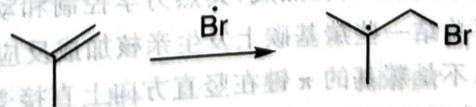

chemical

Chemical reaction showing bromination of a cyclic alkene to form a branched alkene

在烯烃的硼氢化反应中，硼为6电子，比H更加缺电子，因此在协同过程中倾向于处于更富电子的一端，也得到反马氏规则的产物。

与亲电加成反应密切相关的则为非经典碳正离子。碳正离子是通过不同三相形(于是在小环桥头的碳正离子极不稳定)，而非经典碳正离子是指高于三配位的碳正离子，除了经典价键轨道作用外还有其他作用，使得碳正离子十分稳定。

【例 10.40】在甲醇中，乙酰乙酸乙酯互变异构的平衡常数约为 0.07，在环己烷中则为 1.62。这是因为甲醇（极性溶剂）中可形成大量分子间氢键，对通过分子内氢键稳定化的烯醇式不利。

【例 10.41】使用钠盐对卤代烃进行亲核取代反应时，一般选用丙酮、DMSO 等溶剂。它们能强烈地溶剂化碱金属离子，使得阴离子更加裸露，亲核性增强。另外，若离去基团为 Br、Cl 等，由于 NaBr 和 NaCl 不溶于丙酮，所以选用 NaI 为亲核试剂更有利于平衡向右移动。

【例题 10.42】某同学设计了以下反应,希望能同时保护氨基和羟基。

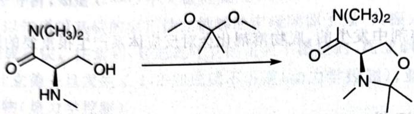

chemical

Chemical reaction showing conversion of a cyclic amide to a cyclic ether with N(CH3)2 group

请选择最有利于实现该反应的实验条件

( )

A. 反应在浓盐酸和乙醇(1:3)的混合溶剂中加热进行  
B. 反应在过量三乙胺中加热进行  
C. 在催化剂三氟化硼作用下, 反应在无水乙醚中进行  
D. 反应在回流的甲苯中进行

解 观察反应,其为用一个丙酮的缩酮来形成另一个环状缩酮进行保护的过程,反应的动力为生成稳定五元环。缩酮需要在酸催化条件下进行,因此不能是B、D。由于缩酮容易水解,因此浓盐酸不可行,故而选择C。A可能是缩酮水解的条件。B可能是缩合反应。D是典型的周环反应条件,周环反应一般用沸点较高的溶剂,便于回流。

【例题 10.43】 对于下述 Darzen 反应, 最不适合的条件是

( )

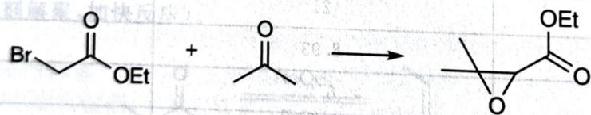

chemical

Chemical reaction equation showing bromo- and ester reacting to form a cyclic ester product

A. LDA/环己烷

B. $NaNH_{2}/THF$

C. Na/EtOH

D. ${\mathrm{{Cs}}}_{2}{\mathrm{{CO}}}_{3}/\mathrm{{DMSO}}$

解 由于 $\mathrm{Li}^{+}$ 在非质子溶剂中强烈地结合 Darzen 反应中产生的醇负离子中间体中的 $\mathrm{O}^{-}$ , 可能导致分子内亲核取代不能发生, 因此选择 A。B、C 均为进行缩合反应的标准条件, 其中 C 原位产生 EtONa 作为碱, D 中使用的碱虽然比较弱, 但增加了 DMSO 后, 因为负离子裸露, 碱性较强。若 A 使用 THF 或者 HMPA 为溶剂, THF 或者 HMPA 可帮助溶剂化 $\mathrm{Li}^{+}$ , 则成为可行条件。

## § 10.5 有机基本反应

有机反应成千上万,究其原因是本质相同的一个物种有多种存在形式和前体,通过组合形成了大量的反应。面对竞赛试题,我们的首要任务是掌握其核心理论。有了上述理论基础,现在我们对有机反应的基本模式及其规律做一个简单的串讲,帮助同学们复习。

【例 10.46】非经典碳正离子 最初被认为非经典的碳正离子是莰烯正离子(如下图所示)，非经典碳正离子最有力的实验证据由 Olah 使用超酸发现。

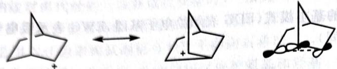

chemical

Chemical reaction diagram showing transformation of a radical ion into a protonated structure and final product

下图还示出了几个非经典碳正离子。

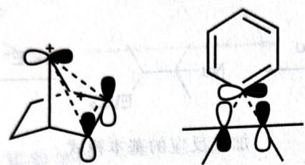

chemical

Molecular orbital diagrams showing electron density distribution in a conformational state and a resonance structure

【例题 10.47】画出下述反应中 3 个中间体的结构(不要求立体化学)。

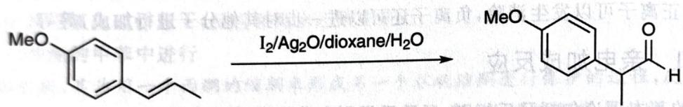

chemical

Chemical reaction equation showing conversion of a methoxy-substituted benzene derivative to a ketone using I2/Ag2O/dioxane/H2O

解 首先观察骨架变化,发现最右侧的甲基变为和苄位相连,说明进行了某种重排反应。此外,我们还要在某个位置引入氧,因此第一步是容易写出的:

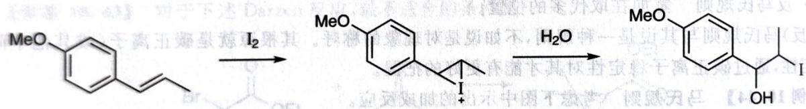

chemical

Chemical reaction scheme showing iodination and hydrogenation of a substituted benzene derivative

即 $Ag^{+}$ 诱导下 $I_{2}$ 的亲电加成反应。考虑到要让甲基变为与苄位相连，又联想到非经典碳正离子为中间体的重排，故进行以下迁移。

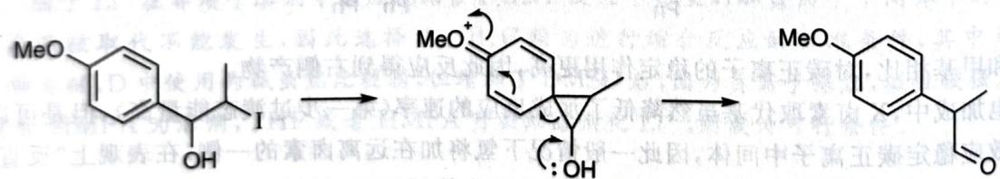

chemical

Chemical reaction mechanism showing methoxylation and ring opening steps

(Org. Lett. 14, No. 19 (2012): 5078-5081)

## 10.5.1.2 亲核加成反应

亲核加成反应主要涉及羰基的加成和共轭加成,其热力学控制和动力学控制我们已经在前面的小节分析过,自不必说。这里再简要总结一些羰基碳上发生亲核加成反应的规律。

当羰基发生亲核加成反应时,不是羰基的 $\pi$ 键在竖直方向上直接受到攻击。考虑轨道对称性和静电作用,存在一个折中的角度(具体图示不做要求,仅仅是帮助同学们了解)。羰基碳上发生亲核加成一般是可逆的,其进行的程度与电子效应、空间效应都有关。

1. 羰基碳上越缺电子，则羰基发生加成越有利。  
2. 羰基碳上形成加成产物，立体化学变为四面体，四面体的拥挤程度越低，则发生加成越有利。

【例题10.48】指出下列四个化合物在中性条件下水合反应平衡常数的大小关系，说明理由。

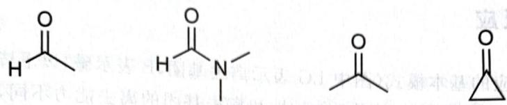

chemical

Four organic molecule structures: acetyl, amide, isopropyl, and cyclopropyl

上述化合物从左至右分别标记为 1、2、3、4。

解 利用羰基碳上加成反应的规律即可解答。排序应先分大类，再在类中比较。醛基因为更好的亲电性和更小的位阻，更易水合，故 $1,2 > 3,4$ 。因为氨基给电子，所以 $1 > 2$ 。因为加成后形成四面体，键角变小，缓解了三元环的环张力，故 $4 > 3$ 。故结果为 $1 > 2 > 4 > 3$ 。

【例题 10.49】 氨基乙醇在盐酸中与乙酸酐反应如下：

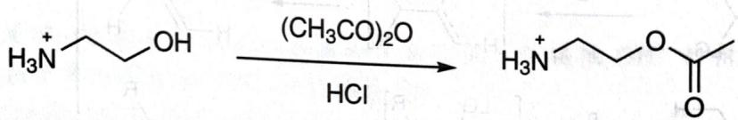

chemical

Chemical reaction equation showing nucleophilic addition of hydroxylamine with (CH3CO)2O under acidic conditions to form a carbonyl ester

当此反应在 $\mathrm{K}_2\mathrm{CO}_3$ 中进行时，得到另一个非环状的产物B；化合物A在 $\mathrm{K}_2\mathrm{CO}_3$ 作用下也转化为化合物B。

1. 画出化合物 B 的结构简式。  
2. 为什么在 HCl 作用下, 氨基乙醇与乙酸酐反应生成化合物 A, 而在 $K_{2}CO_{3}$ 作用下, 却生成化合物 B?  
3. 为什么化合物 A 在 $K_{2}CO_{3}$ 作用下转化为化合物 B?

解 综观题目, 在 $\mathrm{K}_{2} \mathrm{CO}_{3}$ 作用下生成不同化合物, 而氨基乙醇的亲核位点只有两个, 立刻想到碱性环境下 $\mathrm{NH}_{2}$ 的亲核性强于 $\mathrm{OH}$ , 而酸性条件下氨基被质子化, 没有亲核能力, 故而 $\mathbf{B}$ 是

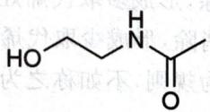

第 2 问在上述思考过程中自然得到了回答。

考虑 A 和 B 的相互转化, 即让酰基发生转移, 首先 $NH_{3}^{+}$ 要被中和, 氨基恢复亲核能力。因此我们写出如下机理:

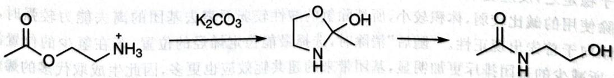

chemical

Chemical reaction sequence showing nucleophilic addition of potassium carbonate to an amide group

因转换可形成五元环中间体而顺利进行,在动力学上是有利的。从热力学上考虑,酰胺比酯稳定,故酰基转移的平衡偏向于酰胺。

【习题 10.50】亚胺正离子是重要的有机反应中间体。

1. 补全下述机理。

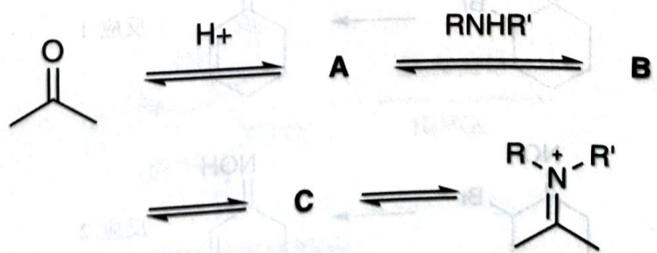

chemical

Reaction mechanism diagram showing protonation, amine formation, and nucleophilic attack steps

2. 说明哪一步反应促使平衡正向移动；并据此说明反应为何在酸性介质中进行。

## 10.5.2 消除反应

下图示出了消除反应的基本模式(图中 LG 表示离去基团,B 表示碱,以下皆同)。消除反应作为加成反应的逆向,其规律也是明显的。根据氢的酸性和离去基团的离去能力不同,酸性越强,离去基团越难离去,反应越倾向于负离子机理,而反过来,反应就越倾向于正离子机理。

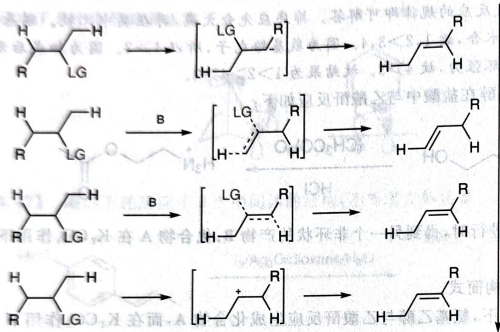

chemical

Reaction mechanism diagram showing hydrogenation and rearrangement of a cyclic alkene with LG and R substituents, forming a radical intermediate.

更差的离去基因
动力学控制  
更好的离去基因
热力学控制  
消除反应的基本模式

在 E2 消除中, 存在向正离子机理的过渡和负离子机理的过渡, 我们也有两个规则。在消除的结果双键位置有多种选择时, 消除反应有两种结果:

- Zaitsev 规则 氢从氢少的位置消除,形成多取代烯烃,是热力学控制。  
- Hofmann 规则 氢从氢多的位置消除,形成少取代烯烃,是动力学控制。

与亲电加成反应同样道理,与其称之为规则,不如称之为对反应结果的称呼。回忆刚谈到的热力学控制和动力学控制的内容,我们进行解释。

【例 10.51】当消除使用的碱比较强,体积较大,所消除氢的酸性较强而离去基团的离去能力较弱时,氢连接的碳倾向于首先出现负性,碱倾向于从空间更空旷的方向进攻,因而取代少的氢或者吸电子基团有利于稳定之,反应更快,是动力学控制。

当消除使用的碱比较弱,体积较小,所消除氢的酸性较弱而离去基团的离去能力较强时,离去基团连接的碳倾向于首先出现正性。“随后”消除时,选择最能稳定烯烃的位置,若在氢少的位置消除氢,则键角变大,所减少的基团排斥更加明显,基团带来的超共轭效应也更多,因此生成取代多的烯烃,是热力学控制。

消除反应对构象的要求已经在空间效应一节谈过，自不必说。

【例题10.52】对比下列两个消除反应，相关讨论正确的是

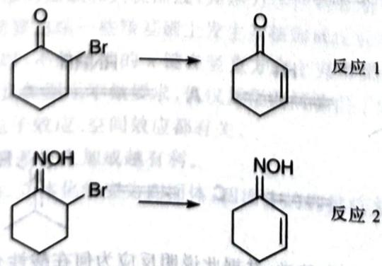

chemical

Two reaction pathways showing bromination of cyclohexanone derivatives, labeled 反应 1 and 反应 2

A. 以三乙胺为碱时反应 1 属于 E1 消除

B. 以三乙胺为碱时反应 2 属于 E2 消除

C. 若用相同的碱, 则反应 2 所需的温度比反应 1 低

D. 使用乙醇/氢氧化钠溶液不能完成反应 1

解 反应1显而易见必须是E2反应，因为羰基 $\alpha$ 位的碳正离子极不稳定。考虑到反应对比，两个反应的进行机理应有所不同，特别注意到反应2中酸性最强的现在变为羟基，尝试拔除后发现可以进行E1反应。

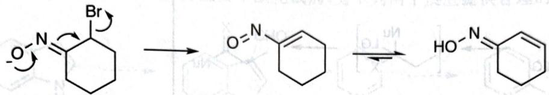

chemical

Chemical reaction mechanism showing bromination of a cyclohexanone derivative followed by ring opening and hydrolysis to form a benzene ring

因为分子内反应更快,故反应2的反应温度比反应1低。在碱性 $OH^{-}$ 作用下卤代酮会发生Favorski重排,因此反应1不能使用NaOH。于是选择CD。

【例题10.53】 氮杂环丙烷分子可以进行以下反应：

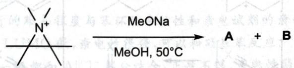

chemical

Chemical reaction equation showing diazotization of aniline using MeONa under methanol at 50°C to produce products A and B

动力学研究表明,以上反应为双分子反应。然而,氮杂环丙烷正离子与甲醇反应只生成化合物 A。

1. 画出化合物 A 和 B 的结构简式。

2. 以下正离子与甲醇反应的转换速率依赖于其结构。请将下列正离子的相对反应速率进行排序。

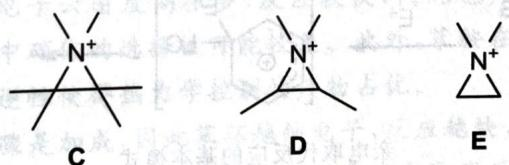

chemical

Three labeled chemical structures (C, D, E) showing nitrogen atoms with wedge/dash bonds and stereochemistry indicators

解 不难看出, 这又是消除反应和取代反应的竞争: 可以发生霍夫曼消除, 也可以进行叔碳上的 $S_{N}1$ 反应。由于不添加碱只能进行取代反应, 因此 A 是取代产物, B 是消除产物。

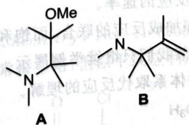

chemical

Two organic molecular structures labeled A and B, showing nitrogen atoms and functional groups including OMe and a carbonyl group.

对于第2问,反应决速步骤的速率取决于碳正离子中间体的稳定性,C倾向产生叔碳,D倾向产生仲碳,E倾向产生伯碳,故反应速率为C>D>E。

【习题 10.54】 在下面的反应中, Br 被 F 取代。

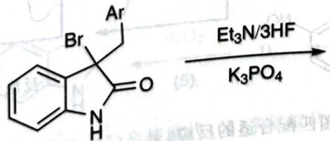

chemical

Chemical reaction equation showing brominated heterocycle reacting with ethylamine under K3PO4 catalyst

试写出上述反应的一个电中性关键中间体的结构。

(Org. Lett. 19, 10 (2017):

## 10.5.3 取代反应

下两张图分别示出了亲核取代反应和亲电取代反应的基本模式。

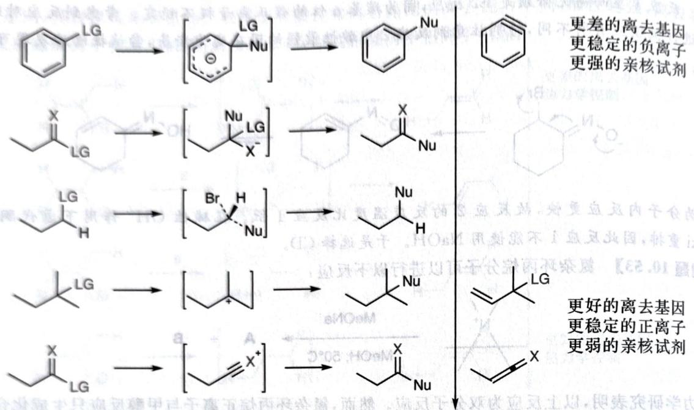

chemical

多代归一化反应方程式，展示从LG和X链取代的正离子与亲核试剂作用

亲核取代反应的基本模式

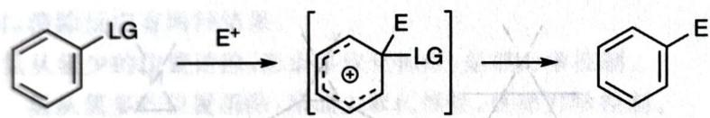

chemical

Electron transfer reaction of benzene with LG ligand, showing electron transfer from E+ to a cyclic product

亲电取代反应的基本模式

取代反应稍显复杂,实际上除了饱和碳上的亲核取代反应之外,其余都是消除-加成或加成-消除的联合,只需运用消除反应和加成反应的规律就可解决大多数问题。一般来说,图中示出反应的决速步骤均为第一步,发生第一步的活性决定了反应的速率。

由于取代反应大多数为消除反应和加成反应的联合,而饱和碳上亲核取代反应的规律我们已经在立体化学和溶剂效应两节中谈及,故本节我们只继续举例展示。

【例题10.55】本题考查你对芳香体系取代反应的理解。

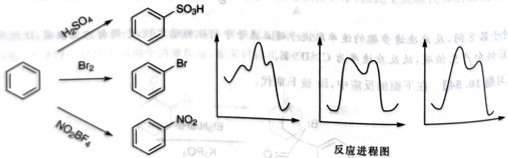

chemical

Bromination reaction of benzene using sulfuric acid, bromide, and nitrobenzene under H2SO4/H2 conditions, with corresponding resonance spectra showing peak structures.

1. 为上面的三个反应进程图匹配合适的反应。  
2. 为什么硝基苯很难进行傅-克烷基化反应却可继续硝化得到间二硝基苯？  
3. 为什么在 Lewis 酸存在下, 因代烃傅-克烷基化反应的活性顺序为 $\mathrm{{RF}} > \mathrm{{RCl}} > \mathrm{{RBr}} > \mathrm{{RI}}?$

4. 苯胺用 $H_{2}SO_{4}/HNO_{3}$ 混酸进行硝化时主要得到间位取代的产物,但仍然得到了相当量邻对位取代的产物,请解释原因。

5. 比较下面三个物质的水解反应活性的大小关系并说明理由。

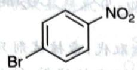

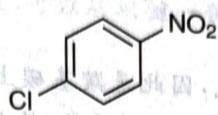

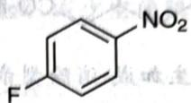

6. 以 DMF(N,N-二甲基甲酰胺)为主要甲酰化试剂,为下列两个反应提供合理的条件。

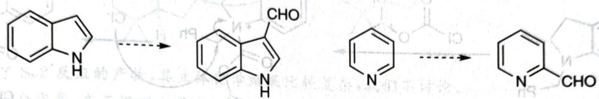

chemical

Chemical reaction pathway showing conversion of a naphthalene derivative to a heterocyclic compound via nucleophilic substitution and nucleophilic attack steps

解 磺化反应是可逆反应,所以中间的反应进程图属于磺化反应。卤化反应时,首先通过轨道作用,苯环的 $\pi$ 轨道和 $Br_{2}$ 的 $\sigma^{*}$ 轨道发生作用,形成 $\pi$ 络合物。故而存在三个峰,左侧进程图属于卤化反应,右侧进程图属于硝化反应。

芳香亲电取代反应进行的难易程度与苯环的亲核性和亲电试剂的亲电性有关。由于硝基带正电荷且均为高电负性的原子，故 LUMO 低，亲电性很强，可以和硝基苯反应。

傅-克反应中的正离子一般都和 $AlCl_{4}^{-}$ 部分结合, 正性不够, 亲电性弱, 一般情形下只能和富电子芳环发生反应。正因为傅-克反应的正离子中间体不是完全的正离子, R-X 键没有完全断开, 而是类似于 $R^{\delta+}\cdots X\cdots Al^{\delta-}X_{3}$ , 故反应的活性取决于 R-X 键的极化程度。于是 RF 反应性最强, RI 反应性最弱。

虽然苯胺被质子化后， $-NH_{3}^{+}$ 作为强烈致钝基团将基团导向间位，但酸碱反应是一个平衡。体系中存在少量苯胺，由于其苯环电子云密度高很多，反应较快，因此也产生了一部分邻对位取代的产物。由此可知，苯胺在强酸性环境中硝化的选择性可能较差。此外，苯胺在180℃下磺化会得到对氨基苯磺酸，可见酸碱平衡和磺化的可逆性使得热力学控制的产物占优。

第 5 问是容易的, 决速步骤是加成, 因此苯环越缺电子, 反应越快, 故速率为 F > Cl > Br。

吡咯环是5原子6电子,是富电子芳环,适合发生芳香亲电取代反应,而吡啶环是6原子6电子,含有吸电子的N,很难发生芳香亲电取代反应(可视为类似于硝基苯),α位氢酸性增强。故图中的吲哚应该用酸性条件下POCl₃/DMF进行甲酰化(Vilsmeier反应),而吡啶应该用n-BuLi拔除质子后,添加DMF发生亲核取代反应进行甲酰化。

(European Journal of Organic Chemistry, No. 11 (2000): 2057-2062)

【例题 10.56】卤原子的亲核性常被忽略,但以下反应利用了卤原子的亲核性。

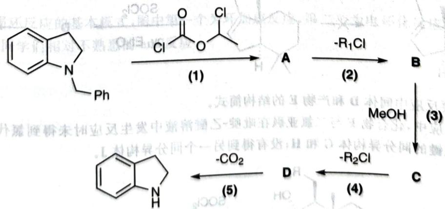

chemical

Multi-step organic synthesis reaction scheme involving indole derivatives and chlorination steps

研究表明反应机理为:(1)加成-消除,(2)亲核取代,(3)亲核取代,(4)亲核取代,(5)脱羧。

1. 根据提示, 完成反应机理。

根据提示,完成反应机理。
2. 以下反应有与上述反应类似的机理,参照上述研究结果,画出其3个关键中间体。

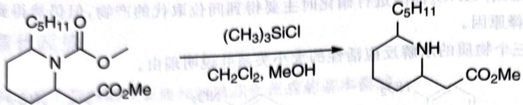

chemical

Chemical reaction equation showing conversion of a cyclic amide to a substituted cyclohexane derivative using (CH3)3SiCl and CH2Cl2, MeOH

解 第一步发生加成-消除型亲核取代,因此是羰基碳上的亲核取代,亲核试剂只能是吡咯烷的 $N_{\mathrm{c}}$ 接下来按题目提示,要发生亲核取代,生成 $\mathbb{R}_{1}\mathbb{C}\mathbb{l}$ 副产物,故此时 $\mathbb{C}\mathbb{l}^{-}$ 是亲核试剂,铵盐离去。

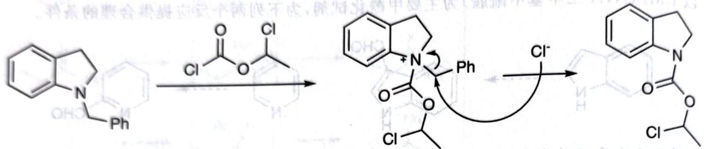

chemical

Chemical reaction mechanism showing nucleophilic substitution of a naphthalene derivative with phenyl group under dichloromethane catalysis

之后还需要发生两次亲核取代, 这就是剩下一个 Cl 的用处。首先 MeOH 取代 Cl, 显然反应以 E1 机理进行。接下来如法炮制, 最后应该只留一个羧基, 故再次发生 E1, Cl $^{-}$ 回过头和离去基团相结合。

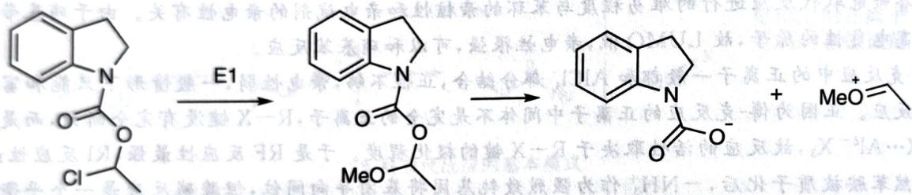

chemical

Chemical reaction scheme showing conversion of a chlorinated amide to a fused bicyclic compound via intermediate E1, followed by protonation and final product with MeO+ group

最后一问就是简单模仿，首先结合亲电试剂获得正离子，然后卤素返回进攻，留给同学们自己完成。

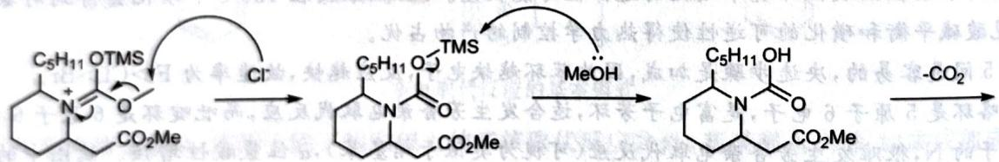

chemical

Organic reaction mechanism showing transformation from a chiral amide to a lactam via intermediate TMS and methanol steps

取代反应还有共轭的形式,被称为 $S_{N}2'$ 和 $S_{N}1'$ 机理。

【例题 10.57】某同学设计如下反应条件,欲制备化合物 C,但反应后实际得到其同分异构体 E。

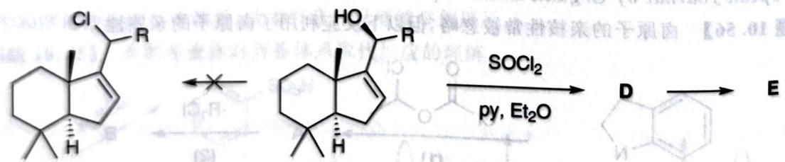

chemical

Organic reaction scheme showing chlorination and subsequent cyclization of a steroid-like molecule under SOCl₂ catalysis

1. 画出重要反应中间体 D 和产物 E 的结构简式。

在下面的反应中,化合物 F 与二氯亚砜在吡啶-乙醚溶液中发生反应时未得到氯代产物,而得到了两种含有碳碳双键的同分异构体 G 和 H;没有得到另一个同分异构体 J。

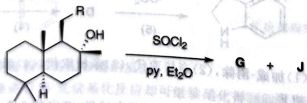

chemical

Chemical reaction scheme showing SOCl₂-mediated cyclization of a steroid-like molecule to form product G and J

2. 画出 G、H、J 的结构简式。

3. 解释上述反应中得不到 J 的原因。

解 在 $SOCl_{2}$ 的氯代中, 它作为亚硫酸卤首先将 O 转化为好的离去基团, 随后 Cl 进攻。但是本题中 $Cl^{-}$ 的进攻却没有导致直接氯代, 观察反应, 可以从双键一侧进行进攻, 减少空间阻碍。

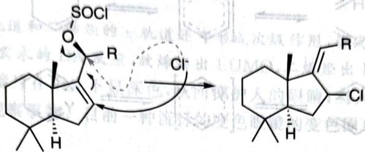

chemical

Chemical reaction mechanism showing SOCl and R groups forming a fused ring system with chlorine ion exchange

这就得到了 $S_{N}2'$ 反应的产物, 其立体化学结果比较复杂, 我们不讨论。

剩下一问十分容易,在三级碳上带有好的离去基团,在吡啶的作用下很容易发生消除反应。只不过有消除反应的反式共平面构象要求, $\mathrm{RCH}_{2}$ 方向的 $\mathrm{H}$ 无法被 $\mathrm{E}2$ 消除。

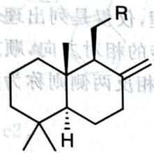

chemical

Chemical structure of a steroid derivative with substituents R and H, showing stereochemistry

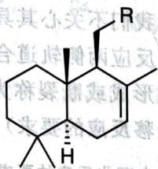

chemical

Chemical structure of a fused-ring compound with substituents R and H, showing stereochemistry

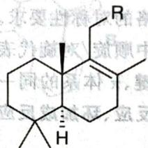

chemical

Chemical structure of a fused-ring compound with stereochemistry indicated by wedges and dashes

最右侧灰色的为 J。

【习题 10.58】 对比下述两个反应,写出反应的产物,简述推测的理由。

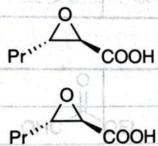

chemical

Two organic molecular structures with phenyl (Pr) and carboxylic acid (COOH) substituents

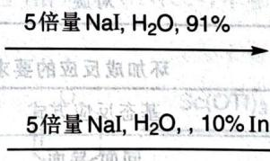

text_image

5倍量 NaI, H₂O, 91%
5倍量 NaI, H₂O, , 10% In

(J. Org. Chem. 66, No. 13 (2001): 4463-4467)

## 10.5.4 周环反应

下图示出了周环反应的基本模式,图中第一个为环加成反应,第二个为电环化反应,第三个为 $\sigma$ 迁移反应,第四个为同学们相对不熟悉的 ene 反应。

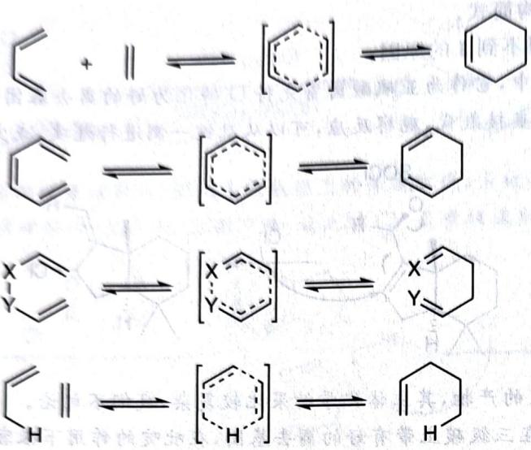

chemical

Reaction mechanism diagram showing cycloaddition and rearrangement of cyclohexene derivatives with labeled intermediates X, Y, H

周环反应的基本模式

周环反应有严格的对称性要求。这里，我们不关心其具体原理，仅仅是列出理论推导的结论，供大家简单使用。下表中顺旋/对旋代表电环化反应两侧轨道合环旋转的相对方向，顺旋表示方向相同，否则表示相反。在 $\sigma$ 键、 $\pi$ 体系的同一侧的键形成或断裂称为同面，相反两侧则称为异面。（下面三张表分别示出了电环化反应、环加成反应和 $\sigma$ 迁移反应的要求）

电环化反应的要求

<table><tr><td>体系电子数</td><td>基态反应方式</td><td>激发态反应方式</td></tr><tr><td>4n</td><td>顺旋</td><td>对旋</td></tr><tr><td>4n+2</td><td>对旋</td><td>顺旋</td></tr></table>

环加成反应的要求

<table><tr><td>体系电子数</td><td>基态反应方式</td><td>激发态反应方式</td></tr><tr><td>4n</td><td>同面-异面</td><td>同面-同面</td></tr><tr><td>4n+2</td><td>同面-同面</td><td>同面-异面</td></tr></table>

σ 迁移反应的要求

<table><tr><td colspan="3">电子数i+j</td><td rowspan="2">4n+2</td><td rowspan="2">4n</td></tr><tr><td>H[1,j]</td><td>C[1,j]</td><td>C[i,j]</td></tr><tr><td>同面</td><td>同面/异面</td><td>同面-同面/异面-异面</td><td>基态</td><td>激发态</td></tr><tr><td>异面</td><td>异面/同面</td><td>同面-异面</td><td>激发态</td><td>基态</td></tr></table>

其中最复杂的为 $\sigma$ 迁移反应，最重要的是(3,3)- $\sigma$ 迁移。但周环反应实为超纲内容，我们主要关心比较简单的环加成和电环化反应，对迁移反应掌握电子推动书写方法即可。

【例题 10.59】给出下列环加成反应的产物, 注意立体化学。

chemical

Chemical reaction equation showing cyclopentene reacting with ethyl acrylate under heating conditions

同时,请分别指出在此反应中两个反应物提供的分别是 HOMO 轨道还是 LUMO 轨道。解 这是 Diels-Alder 反应,反应时一般为动力学控制,需要注意过渡态的稳定性。

如上图所示,酯基的 $\pi$ 轨道和二烯烃的 $\pi$ 轨道还可形成次级作用,稳定了过渡态,从而产物为 endo 型。容易看出这是正常电子需求的 DA 反应,故烯烃出 LUMO,二烯烃出 HOMO。

【例题 10.60】变色眼镜片在阳光下显深色,从而保护人的眼睛;当人进入室内后,镜片逐渐转为无色透明,以利于在弱光下观察事物。目前一种流行的变色眼镜的变色原理如下:

判断条件 c1 和 c2。

解 可以看出, 这是 $6\pi$ 电环化反应, 但似乎据现有理论我们无法判断体系究竟是发生了顺旋还是对旋(立体化学信息不足)。考虑背景信息, 注意到 $\mathbf{B}$ 的共轭体系比 $\mathbf{A}$ 大得多, 因此 $\mathbf{B}$ 有色, 因此 c1 是 $h\nu, c2$ 是基态时转换(室内环境)。

【例题 10.61】 观察下述多组分串联反应,溶剂为 $CH_{3}CN$ , 不参与反应。

1. 画出两个关键的电中性中间体的结构, 指出反应中 Sc(OTf) $_{3}$ 的作用。  
2. 推断下列反应的产物。

解 反应物的骨架没有明显变化,左上角是苯胺,右上角是乙醛酸乙酯,下面是二氢吡喃。这似乎可看成苯胺和乙醛酸乙酯缩合活化后,二氢吡喃作为烯醇加成,而后苯环亲电进攻。

此分析有二不妥, 其一是被 Lewis 酸结合的 N 钝化苯环, 最后一步较难发生亲电取代; 其二是分步不如协同反应。如此形成一个六元环的电子流动, 当然是适合周环反应, 因此这是一个 Diels-Alder 反应。

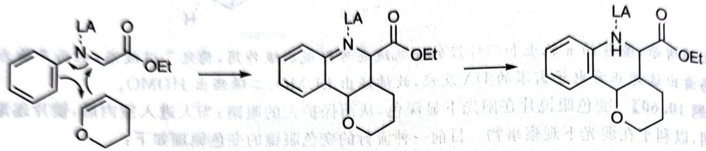

chemical

Chemical reaction pathway showing conversion of a diazo compound to a fused heterocyclic compound with ester and amide groups

注意该双烯体含有杂原子和吸电子的羰基,双烯则是一个有共轭效应的烯。故这是一个反转电子的 Diels-Alder 反应, $Sc(OTf)_{3}$ 结合 N 原子,进一步降低双烯体的 LUMO。

依照上面反应的例子,可以写出新反应的答案。首先自然是一个缩合反应,双烯体仍然是烯胺和苯环联合,最佳烯是炔烃。注意到由此得到的六元环骨架是吡啶,因此很可能进一步自动氧化,得到答案。

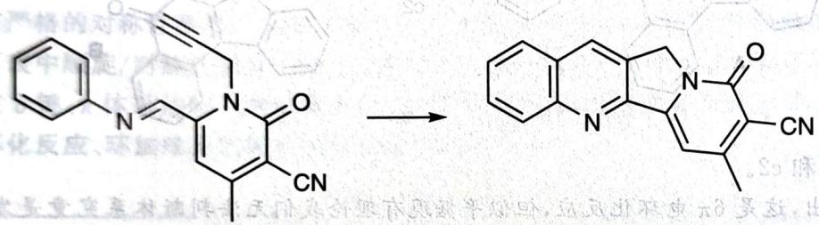

chemical

Chemical reaction showing conversion of a benzyl group to a fused heterocyclic compound with cyano and cyto substituents

(Angewandte Chemie 118, No. 20 (2006): 3402–3405)

注记 烯出 HOMO, 双烯出 LUMO 的反转电子需求的 Diels-Alder 反应亦可能发生, 取决于轨道能量关系。

【例题 10.62】在以下转换中最终得到了比例为 1:1 的两个产物。画出此转换的中间体 A 的立体结构和由 A 转换为最终产物所经过的过渡态 B 和 C 的立体结构。

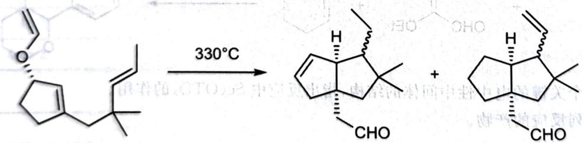

chemical

Chemical reaction showing conversion of a cyclic ketone to a cyclohexanone derivative under 330°C conditions

解 首先要设法找出反应的路径。系统中只有双键, 反应条件是加热, 另外发现 O 转换为醛基, 故可知道先发生了 $\sigma$ 迁移反应 (这里是 Claisen 重排)。因为乙烯氧基在纸面的后面, 因此形成的醛基亦应该在纸面后面 (也可以画出六元环状过渡态分析), 故得到 A:

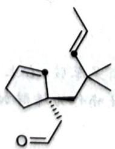

chemical

Chemical structure of a cyclopentane derivative with alkyne and alkene substituents

注意到系统的双键此时不再有[3, 3]迁移反应的排列方式, 因此为了得到最终产物需要找出新的反应方式。因为最终产物需要形成五元环, 需要将上图中黑点标出的碳相连, 由此可想到发生ene反应。周环反应画出六元环状过渡态即可(能画成椅式则画成椅式, 也可以用船式)。

最后我们看一个综合了各种基础有机反应知识对反应选择性进行合理判断的推断问题。

【例题 10.62-1, 新增】有机合成的选择性主要有化学选择性、区域选择性和立体选择性，是学习的重点。

1. 画出以下两个氧化反应的主要产物 A 和 B 的结构简式。

2. 烯基环氧化合物(烯基直接与环氧相连)是重要的合成前体。下图示出了用消旋底物 C 为原料制备烯基环氧化合物 E 的路线, 它具有很好的非对映选择性。随后 E 可以在乙酸作用下转化为内酯 G。

a. 画出产物 D 的立体结构式, 判断哪些属于主要产物。  
b. 画出 E、F 的立体结构式 (F 为一不稳定中间体), 并给出 D 到 E 的反应名称。

3. 烯基环氧化合物 H 在 Lewis 酸(LA)催化下经中间体 I 和 J 转化为产物。但是不同的 Lewis 酸会形成不同产物。LA 为 $BF_{3} \cdot Et_{2}O$ 时主要产物为 K，但 TMSOTf 催化下则得到其同分异构体 L。所有产物都没有六元环并六元环结构，K 含氧杂氮杂五元环，L 含六元环并七元环。

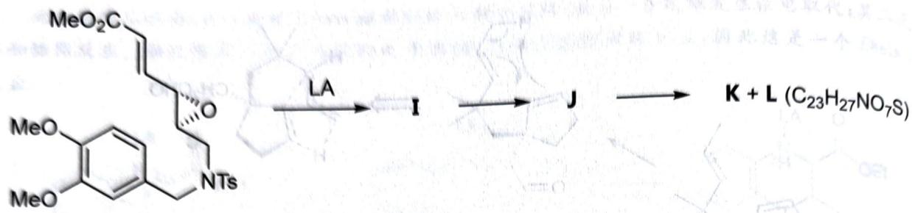

chemical

Chemical reaction scheme showing transformation from a substituted benzene derivative to a product with K+L and C23H27NO7S groups

a. 给出 I、J、K、L 的立体结构式。  
b. 说明不同催化剂得到不同产物的原因。

解 第1问很明显是两个环氧化反应,在酸性环境下由双键先亲电进攻,否则由过氧化氢负离子首先亲核加成。鉴于左侧双键上有吸电子基团,所以A在右侧双键上环氧化,B在左侧双键上环氧化。

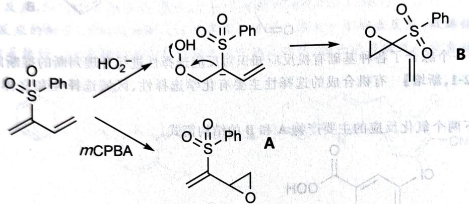

chemical

Chemical reaction pathway showing mCPBA-mediated hydrolysis of a thioether-containing compound to form a sulfonamide product A, with intermediate B.

C 有多处可以被亲核进攻, 按照题干描述 E 仍然含有环氧, 所以只能对羰基进行 1,2-或者 1,4-加成, 不过 G 中左下角骨架未有变化, 因此应当是发生 1,2-加成, 然后形成的醇被丙酸酐酯化。这里发生 1,2-加成的相对立体化学自然是使用 Cram 规则判断。这里羰基邻位的手性中心的最小基团是氢, 所以根据 Cram 规则试剂进攻的方向为环氧基团的反向, 得到主要产物如下:

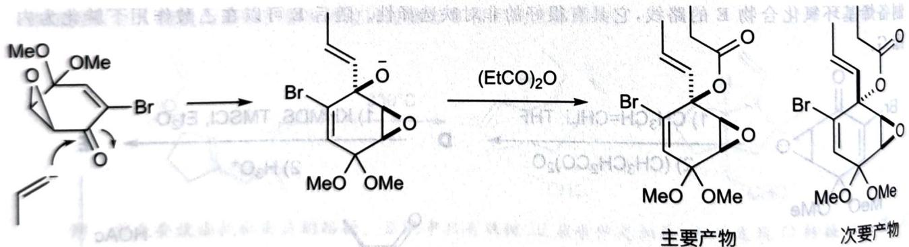

chemical

Reaction mechanism of a brominated cyclic compound undergoing esterification with (EtCO)2O, yielding two products: major and次要.

之后KHMDS只能夺取羰基附近的例子，在TMSCl下形成烯醇。注意G相比于D碳骨架有很大变化，因此推测应当发生了重排反应。实际上不难看出此时中间体中有很清楚的(3,3)结构，所以发生Claisen重排并在酸作用下脱去TMS得到E。注意E在发生重排之后将只有环氧一处手性中心，因此无相对构型问题。

chemical

Multi-step organic synthesis reaction scheme involving brominated and methoxy-substituted products under KMDS/TMSCI conditions

最后E在酸催化下发生烯醇环氧开环得到中间体F，F发生消去反应芳构化，就得到最终产物。F的相对立体化学由最终产物反向推断即可。

chemical

Chemical reaction pathway showing conversion of a brominated lactone to a brominated ketone using -MeOH, with stereochemistry indicated

最后两问的反应初看是直接环氧开环被苯环进攻得到异喹啉环系,不过题干指出产物中没有六元环并六元环的结构,因而需要重新考虑可能的反应位点。在开环过程中,环氧被亲核的位点有两种可能,苯环参与亲核反应的碳也有两种可能(有两个位点的C都在甲氧基的对位),因此共有四种开环可能(立体化学按亲核取代反应中构型反转处理):

注意到产物中出现了 N 和 O 同时在一个环上的产物, 这说明系统中必然发生了某种重排过程——需要断开 N 和附近碳的键, 重新形成碳正离子, 以上中间体中第一种和第三种无法合理实现这一步, 其余均可以, 分别得到

chemical

Two organic molecular structures with ester and amide functional groups, labeled with stereochemistry and substituents like CO2Me, OLA, TsN, and MeO.

现在苯环可以重新对 N 附近的碳正离子进行亲核进攻, 或者也可以由 O 来进攻得到 N、O 杂环。注意到上图后者由苯环进攻得到的一定是六元环并六元环, 所以系统中形成的应该是前者, 所以 I 是第一张图的第二个物种, J 是第二张图的第一个物种, 而 K 和 L 分别是

很明显生成 L 和生成 K 之间的竞争取决于 O 在结合 LA 之后亲核性是否足够强, 它们直接结合之后相当于把 O 保护起来了, 而 O—BF₃ 是一个比较单纯的配位键 (有一定的离子性), 所以使用 BF₃ 催化会得到 K。

## 第10讲习题

【习题 10.63】金刚烷正离子是一个三级碳正离子,但它比叔丁基碳正离子稳定得多。为什么?

chemical

Molecular structure diagram of a metal complex with MoCl3 and methyl groups

金刚烷正离子的结构可参考上图。

【习题10.64】将下面化合物中N原子的碱性由大到小排序。

chemical

Chemical structure of a heterocyclic compound with labeled positions a through g

【习题10.65】比较化合物A和B中明确标出的H的酸性并说明理由。

chemical

Chemical structure of a fused bicyclic compound with methyl and boron substituents

【习题10.66】苯炔的分子式为 $\mathrm{C_6H_4}$ ，它是由苯去掉两个氢得到的。根据化学原理判断，对苯炔实际结构贡献最大的经典结构式是以下哪个？简述理由。

  
A

  
B

  
C

  
D

【习题 10.67】著名理论化学家霍夫曼提出了平面四配位碳的结构模型,而五配位碳则可在质谱仪中发现,也可用超酸与甲烷反应制得。下图是平面甲烷以及 $CH_{5}^{+}$ 的结构示意图。

chemical

Chemical structure of a molecule with hydrogen atoms and a central carbon atom, showing stereochemistry

1. 描述两者在成键方式上的共同点。注意: 右上图中黑点位置不表示碳原子。  
2. 近年来研究发现 $CH_{3}Li$ 的平面结构较为稳定,试说明稳定化能的来源。

(Angewandte Chemie International Edition 49, No. 32 (2010): 5570-5573)

【习题 10.68】2,4,6-三甲基苯甲酸甲酯(A)的水解反应十分独特。其实验方法是:用浓硫酸溶解A,然后把该液体倒入冰水中,就可得产率很高的酸。用 NaOH 水解它通常有困难。解释原因,并画出酸催化水解的一个重要中间体的结构。

【习题 10.69】本题有助于你理解基团处于直立键不稳定的具体原因。

chemical

Chemical reaction diagram showing t-Bu isomerization steps with structural formulas and electron transfer arrows

在上面两个六元环化合物的构象异构中,平衡都偏向右侧,解释原因。

【习题 10.70】下图示出了吡咯的部分分子轨道。其中上部的黑白色圆表示波函数的波相，下部的灰色圆的大小表示电子云密度的大小。已知吡咯的亲电取代一般在 2 号位进行。

chemical

Molecular structure diagram showing a central atom N bonded to five surrounding atoms, with a separate pentagonal ring structure below.

chemical

Two molecular structures labeled (b), showing nitrogen atoms in different configurations

chemical

Molecular structure diagram showing two configurations of nitrogen atoms with black and white circles representing different atoms

1. 确定上面的轨道中哪一个是 HOMO。  
2. 为(a)、(b)、(c)三个轨道的能量排序。

【习题10.71】Thorpe-Ingold效应又称为偕二甲基效应，粗略来说就是指链上的位阻基团可大大增加成环反应的速度(Journal of the Chemical Society, Transactions 107 (1915): 1080-1106)，例如下面的羧酸形成内酯的相对反应速率：

  
1

  
1.05

  
4400

  
$10^{11}$

1. 从空间效应入手解释上述现象。  
2. 然而,后续的研究表明,在不同的反应中,上述空间效应的存在不一定导致反应速率增加,因此该因素不是主要的。试从活化焓和活化熵两个因素考虑给出解释,注意成环反应通常是熵减过程。

(Tetrahedron 50, No. 23 (1994): 6767–6782; The Journal of Organic Chemistry 25, No. 5 (1960): 701–704)

【习题10.72】对下述底物进行加氢还原。解释其选择性。

chemical

Chemical reaction showing iodination of a substituted cyclohexene derivative under H2/PtO2 conditions, yielding 100% and 0% yields.

【习题 10.73】 考虑下述反应, $O_{2}$ 不参与反应。

chemical

Chemical reaction scheme showing conversion of a ketone to a cyclic amide using H+ and PhMe reagents

1. 写出反应的两个关键电中性中间体的结构。  
2. 若使用 TsOH 催化, 产物构型为 Z, 若使用 PhCOOH 催化, 则产物构型为 E, 试解释原因。

(Organic Letters 18, No. 2 (2016): 272–275)

【习题 10.74】试图对下述醇作氧化,得不到预期产物,而是得到了产物的同分异构体。给出实际产物的结构,并解释为何很难得到预期产物。

chemical

Chemical reaction showing conversion of a hydroxyl group to an ester under PCC conditions

【习题 10.75】对苯和甲苯进行硝化,考虑下列问题。

1. 如果甲苯单独反应,主要产生邻硝基甲苯和对硝基甲苯,推测哪一种占优。设想温度升高,优势是升高还是降低?简述理由。  
2. 将甲苯和苯分别单独硝化, 哪一种反应快? 简述理由。  
3. 将甲苯和苯混合进行硝化, 发现甲苯和苯被硝化的比例接近 1:1。解释原因。

【习题 10.76】萘在浓硫酸中，于 $60^{\circ}$ C 生成萘磺酸 A，于 $160^{\circ}$ C 生成其同分异构体 B。

1. 写出 A、B 的结构简式。

2. 请在同一坐标系中画出两反应的反应势能图, 并简要解释温度不同情况下, 得到不同产物的原因。

【习题10.77】扁桃酸消旋酶可以使扁桃酸消旋化。有人认为该过程的机理如下：酶先使扁桃酸（下图左侧）去质子化，再去除羧基邻位碳上的质子，继而通过再质子化实现消旋。若这种机理成立，扁桃酸消旋酶作用于下图右侧的产物化合物应该得到什么产物？

chemical

Chemical structure of a brominated aromatic compound with hydroxyl and carboxyl functional groups

(Journal of the American Chemical Society 114, No. 15 (1992): 5928–5934)

【习题 10.78】画出下述溶剂解反应中 3 个关键中间体的结构简式。

chemical

Chemical reaction showing the conversion of a molybdenum compound to acetylacetic acid using HOAc catalyst

【习题 10.79】如下图所示,在乙酸溶剂中,苯基丙二烯与氯化氢发生加成反应生成肉桂基氯。实验结果表明,若在底物苯基的对位引入一个甲氧基,则反应速率将大大提高。

chemical

Chemical reaction equation showing conversion of a biphenyl alcohol to a chlorinated phenyl ether using HCl and HOAc reagents

1. 请画出苯基丙二烯形成 $\pi$ 键的原子轨道重叠示意图。

2. 请画出苯基丙二烯与氯化氢发生加成反应的过程。

【习题 10.80】在下面这个反应体系中存在两种产物。不同的温度下，这两种产物的产率变化较大。

chemical

Organic reaction scheme showing LDA/THF conversion to cyclohexanol derivative A and then to cyclohexanone B with yield percentages

1. 指出 A 和 B 哪个是动力学产物, 哪个是热力学产物。
2. 画出反应进程图来表达第 1 问的结果。
3. 通过分析 A 和 B 的生成过程, 解释为什么其中一个化合物是动力学产物, 而另一个化合物是热力学产物。

【习题10.86】环丙烷因为环张力而具有独特的反应性能。在如下的反应中，Lewis酸可催化同时连有缺电子基团和给电子基团的环丙烷的碳碳键发生异裂，产生的阳离子和阴离子可相应发生反应。下图给出了一个例子：

chemical

Organic reaction pathway showing transformation of a ketone to a chiral product via intermediates A and A', with reagents Yb(OTf)3 and CO2Me indicated.

1. 给出上述反应中的中间体 A 和 A' 的结构。  
2. 根据以上信息,画出下面合成路线中 B\~F 的结构。

  
B

chemical

Chemical reaction conditions for t-BuLi and HCl/THF under specified conditions

chemical

Chemical structure of a substituted benzene derivative with methoxy and aldehyde groups

D  
  
E

F  

chemical

Chemical structure of a bridged bicyclic compound with ester and methoxy substituents

【习题 10.87】实验结果显示,下列反应在含 D 环境中进行时,可得产率相当的四种产物。

chemical

Chemical reaction scheme showing nucleophilic substitution of a heterocyclic compound under DCDO and CH3OD/D2O conditions

对此,研究者提出了下列反应过程以进行解释。其中,原料与氘代甲醛通过一系列反应得到中间体 $I_{2},I_{2}$ 经重排得到 $I_{3},I_{4}$ ，去质子化后分别得到B与C； $I_{2}$ 也可转化为 $I_{5}$ ，后者与水反应得到 $I_{6}$ 与甲醛，然后 $I_{6}$ 与氘代甲醛经一系列反应生成D；原料与甲醛反应生成A。

请将上述过程填写完整，并在图上体现出 $\mathbf{I}_2$ 转化为 $\mathbf{I}_5$ 的电子流向（即反应机理）。

【习题10.81】画出反应势能图说明下列消除反应的主要产物:标明中间体,过渡态与产物的结构。

chemical

Chemical reaction showing fluorinated phenyl ether reacting with H+ under heating conditions

【习题10.82】小明在冰浴和氮气保护下，以正丁基锂处理化合物A，顺利得到了相应中间体B。但当他中途离开实验室几个小时之后，他的实验便不能再进行下去了。经研究发现，中间体B竟然转化为了另一化合物C。他将反应混合物进行后处理后用色谱小心分离，检验发现存在一种相对分子质量为44的低沸点副产物D。（THF：四氢呋喃）

chemical

Organic synthesis reaction scheme showing bromination of alkene A to yield products B and C under specified conditions

根据以上事实,用机理描述从 A\~C 的转换,在图中标明题目中代号与化合物的对应关系。

【习题 10.83】1. 如下图所示, 某同学试图通过芳香亲电取代反应由底物制取产物, 请写出反应所需三氯化铝最少的当量。

chemical

Chemical reaction showing conversion of a substituted benzene derivative to a lactone using AlCl3 catalyst

2. 该同学为进一步提高产率,有意向其中加入了4倍当量的三氯化铝,结果得到了高产率的物质J、K。J与I(预期产物)是同分异构体,而K的相对分子质量略小于J。请写出J、K的可能结构,并解释为什么一个小小的失误在实验中造成了如此惨重的后果。

(Journal of the American Chemical Society 102, No. 9 (1980): 3056–3062)

【习题 10.84】 按照指定性能排序。

1. 下列化合物在碱性条件下发生溴化的速率: 苯基异丙基酮、溴甲基苯基酮、甲基苯基酮、乙基苯基酮。  
2. 下列化合物发生溴化反应的速率: 溴苯、硝基苯、甲氧基苯、甲苯、三氟甲基苯。  
3. 下列化合物在碱性条件下发生脱羧反应的难易: 乙酸、三氟乙酸、一氟乙酸、一溴乙酸。

【习题 10.85】补全下述反应过程。

chemical

Reaction pathway diagram showing protonation, deprotonation, and intermediate formation steps from a phenyl ether precursor

chemical

Chemical reaction pathway showing nucleophilic addition of HCHO to a fused heterocyclic compound, followed by deprotection and subsequent intramolecular cyclization with labeled intermediates I1–I6 and D.

【习题 10.88】以下反应得到了互为同分异构体的化合物 A 和 B，其中 A 是一对外消旋体，B 是内消旋体。加热时 B 可转化为 A。画出 A、B 的结构简式以及 B 转化为 A 的过程中重要中间体的结构。

chemical

Chemical reaction equation showing conversion of a cyclic ether to products A and B using CH3NH2 and Ac2O reagents

【习题 10.89】下述反应并未得到预期产物 X，而是得到了（按产率降低排列的） $G(C_{21}H_{15}O_{5}N)$ ， $H(C_{15}H_{10}O_{2})$ 、 $I(C_{15}H_{10}O_{3})$ 。给出上述四个未知物的结构，简述不能得到 X 的理由。

chemical

Chemical reaction scheme showing nitroso compound reacting with a cyclohexanone under DMSO at 2.5h to yield product X

(Journal of Heterocyclic Chemistry 30, No. 1 (1993): 145–151)

【习题 10.90】预期下述反应可能发生双分子、单分子取代或双分子消除反应。事实上，C 受到 $N_{3}^{-}$ 进攻，发生双分子亲核取代反应得到产物。根据实验事实作以下讨论：

chemical

Chemical reaction showing bromoalkene conversion to a cyclic ketone using NaN3 in DMSO solvent

1. 在同一坐标系中双分子、单分子取代和双分子消除反应的进程图。标明中间体和过渡态的结构。  
2. 指出发生单分子取代和双分子消除反应的不利条件各 1 个, 发生双分子取代反应的有利条件 1 个。

【习题10.91】对硝基氯苯、对硝基氟苯、对硝基溴苯都能在一定条件下与 $\mathrm{NaOH} / \mathrm{H}_2\mathrm{O}$ 发生芳香亲核取代反应，生成相应的酚。指出芳香亲核取代反应的决速步骤。

2. 比较三者发生水解反应的速率快慢。

有研究者结合理论计算和 $^{1}$ HNMR图谱,研究了下面两种化合物的芳香亲核取代反应。结果有些出乎意料,其中有一种物质的芳香亲核取代是以协同机理进行的(类似于 $S_{N}2$ 反应),另一种则使用正常的机理。

chemical

Chemical reaction scheme showing bromination of nitrobenzene using NaOMe and Me4NF to form a substituted pyridine derivative

3. 哪一种物质(记为 X)的芳香亲核取代是以协同机理进行的？简述理由。

4. 根据研究结果, X 反应时, 大部分底物以协同型式完成反应, 也有少量采取一般机理的。在同一坐标系中画出 X 使用协同和一般机理反应的势能曲线, 标注必要的中间体和过渡态。

(Nature Chemistry 10, No. 9 (2018): 917–923)

【习题10.92】关于下述开环反应讨论正确的是一个一掷悬臂的边对不对 [8] 01 ( )

chemical

Chemical reaction showing conversion of a benzene ring to an oxygen-containing heterocycle using SnCl4 catalyst

A. n=1 时,不能反应。  
B. n=2 时, 可能形成含有五元环的稳定产物。  
C. n=2 时, 可能形成含有六元环(不包括苯环)的稳定产物。  
D. n=3 时, 可能形成含有六元环(不包括苯环)的稳定产物。

【习题 10.93】指出下述取代反应的亲核试剂、离去基团和产物的旋光性。

chemical

Chemical reaction showing bromoalkene derivative reacting with sodium hydroxide/oxide

【习题 10.94】试图用 $NaN_{3}$ 处理下述化合物，进行双分子亲核取代反应。请比较反应活性。

chemical

Four organic brominated alkane structures: 1,2-dibromobutyl, 3-methyl-1,4-bromobutyl, and 1,6-bromobutyl

【习题 10.95】请圈出下列具有芳香性的物种。

chemical

Three organic molecular structures with fluorine substituents, including fused rings and heterocyclic groups

【习题10.96】画出下述反应的产物。

chemical

Chemical reaction equation showing bromo-1,2-dichloro-3-methylcyclopropane reacting with a benzylamine under two different conditions (PhNMe₂, DCM; NaH, DMF)

【习题10.97】以下反应的产物是(酸性后处理)哪一个？圈出唯一产物并说明理由。

chemical

Chemical reaction showing the conversion of a tertiary amide to an enone using EtMgBr, with multiple intermediate structures shown.

【习题10.98】以下反应的产物是哪一个？圈出唯一产物并说明理由。

chemical

Chemical reaction equation showing conversion of a ketone to a substituted cyclohexanone using CH2O and ZnCl2/HCl

【习题10.99】确定以下四种[2.2]对环芳烷的溴代物中哪些是有光学活性的。

chemical

Four labeled chemical structures (B, C, D, E) of a brominated polycyclic aromatic hydrocarbon with Br substituents

【习题 10.100】补全下述产物的立体化学(标明立体选择性或消旋)。

chemical

Chemical reaction scheme showing synthesis of a chiral silyl ether from a cyclopentenol and aniline, followed by acid-catalyzed cyclization with sulfur-containing functional groups.

【习题10.101】作为开门七件事(柴米油盐酱醋茶)之一,饮茶在古代中国是非常普遍的。茶中含有多种有益健康的化学物质,例如儿茶素。下图示出了著名的表没食子儿茶素的结构:

chemical

Chemical structure of a flavonoid compound with hydroxyl and ether functional groups labeled a and b

1. 确定上述结构中 a、b 手性碳的构型。

2. 下图示出了表没食子儿茶素的一种立体异构体(没食子儿茶素)的合成路线的一部分。请补全A、B处的反应条件(指出一种主要试剂即可)和C、D、E处的结构。

chemical

Multi-step organic synthesis pathway showing transformations from compound A to E via intermediates C, D, and E, with reagents and conditions labeled.

【习题10.102】画出下述反应的机理。

chemical

Chemical reaction showing conversion of a naphthoquinone derivative to a substituted benzene ring using LiAlH4/Et2O catalyst

【习题10.103】定性画出下列反应速率 $r$ 随体系 $\mathrm{pH}$ 的变化趋势示意图(具体形状不要求)。

chemical

Chemical reaction equation showing nucleophilic substitution of an amide with formaldehyde under pH condition

【习题 10.104】芳香肟 1 在酸性条件下加热反应,未得到预期的内酰胺 2 而得到酰胺 3。

chemical

Chemical reaction scheme showing conversion of a naphthoquinone derivative to a fused bicyclic compound under acidic conditions, followed by a detailed 2D structure.

写出1转化为3的前3个中间体(均带电荷)并解释为什么得到的产物是3而不是2。

(Synthesis, No. 12 (1978): 932-933)

【习题10.105】下列体系中得到一种与共轭加成产物互为同分异构体的物质D，且其中不含N中间体A、B、C均不带净电荷。试补全该反应历程。

chemical

Chemical reaction pathway showing conversion of an enone to ketone via intermediate A, followed by cyclization to product D

【习题 10.106】对比下面三个反应,参照你学过的反应推测反应产物。

chemical

Chemical reaction pathway showing three-step synthesis of a substituted benzene derivative with reagents and conditions labeled

【习题 10.107】下述反应中,底物通过一个中间体 A 在碱性条件下得到产物。

chemical

Chemical reaction pathway showing sulfonation of a nitroso compound to form a sulfonated benzene derivative

1. 在相应区域画出该反应的势能图, 并画出中间体 A 的共振式。  
1. 在相应区域画出该反应的势能图,并画出不同体 $N$ 的大簇式。
2. 芳基磺酰氯与胺发生取代反应是鉴别胺的一种方法,而当酰胺的氨基作为亲核试剂时,将发生多步反应,请完成以下反应,写出所有产物。

chemical

Chemical reaction showing a benzoyl compound reacting with aniline under nitric acid conditions to form a sulfonamide product.

(Tetrahedron 54, No. 32 (1998): 9281-9288)

【习题 10.108】有人偶然发现了下述反应,炔烃产物的产率为 20%。

chemical

Organic reaction scheme showing esterification with amine and nitroalkane to form products A, B, C, D

反应产率较低,按如下图所示的自由基过程产生了40%的副产物:

B  

E  

chemical

Chemical structure of a heterocyclic compound with aryl (Ar) substituents and nitrogen-containing ring

1. 给出中间产物 A, 中间体 B 和气体 C、气体 D 的化学式。同时请在 B 上标出电子流动以示出生成最终产物的过程。

2. 给出自由基 E 的结构简式。同体系中加入适量 $FeSO_{4}$ 可将炔烃产物的产率提高到 70%，简述理由。

(Chemical Communications, No. 15 (2002): 1555–1563)

【习题 10.109】确定下述反应序列中,各未知物的结构简式。

chemical

Multi-step organic synthesis pathway showing intermediates A, B, C, D, E with reagents and conditions labeled

【习题 10.110】噻吩分子具有骨架不易改变,但易被修饰等特点,因而被广泛用于有机电晶体的制造。科学家合成了一种噻吩衍生物,其有望为有机电晶体的合成做出重要贡献。合成路线如下:

chemical

Organic synthesis reaction pathway showing bromination, chlorination, and subsequent functionalization steps with reagents labeled

1. 噻吩(即图中起始化合物)和苯有所不同,但它们同属芳香族化合物。试分析:哪一种有机物的亲电取代活性更高?并给出在 $0^{\circ}C$ 下用 $I_{2}-CCl_{4}$ 处理噻吩得到的主要产物结构。  
2. 已知图中胺类化合物 $\mathrm{R}-\mathrm{NH}_{2}$ 的 $^{13}\mathrm{CNMR}$ 上有三个峰。请画出该胺类化合物的结构简式。  
3. 已知 D 的 $^{1}$ HNMR 谱图上有四个峰, 且峰的高度比例为 2:2:3:3。请画出图中所有相关物质的结构简式。

【习题10.111】猫薄荷中的重要成分荆芥内酯的一种合成路线如下图所示。确定合成过程中各未知物的结构简式(已知B的碳数比A少)。

chemical

Multi-step organic synthesis pathway showing transformations from ketone to lactone via intermediates A–G, with reagents and conditions labeled

【习题10.112】驱虫蛔脑(acaridol)A是奇异天然有机物。提纯A需减压蒸馏，因容易爆炸。A只含一个碳碳双键。A在乙醚中不与金属钠反应，用 $\mathrm{LiAlH_4}$ 还原得B。B进行硼氢化-氧化反应得到两个同分异构体的混合物。1mol B催化氢化只吸收 $1\mathrm{mol}$ $\mathbf{H}_2$ 生成C；1mol A催化氢化可吸收 $2\mathrm{mol}$ $\mathbf{H}_2$ 也生成C。C不与 $\mathrm{CrO_3 / H_2SO_4}$ 作用；当用浓硫酸处理C可脱去 $2\mathrm{mol}$ $\mathbf{H}_2\mathbf{O}$ 得D和E。D经臭氧化-还原水解生成乙二醛和6-甲基-2、5-庚二酮。E经臭氧化-还原水解得3-羰基丁醛和4-甲基-3-羰基戊醛。以叶绿素作催化剂、光存在条件下，D和F反应可生成A。给出各未知物的结构。

【习题 10.113】 VCR 反应(乙烯基环丙烷-环戊烯重排)对合成五元环具有很重要的意义。它的机理可以描写如下：

chemical

Chemical reaction scheme showing transformation of a cyclic alkene to a cyclopentane derivative via intermediate t

1. 基于你对上述信息的理解,给出下图中 X 和 Y 的结构。已知 Y 有一根 $C_{2}$ 轴。

chemical

Chemical reaction pathway showing transformation from a ketone to products X and Y via intermediate t

VCR 反应被用在萜烯类化合物 Zizaene(Z) 的合成中。

chemical

Multi-step organic synthesis pathway showing intermediates A–J and K with reagents, conditions, and reaction equations

根据上面的合成路线：

2. 写出 Z 的不饱和度。

3. Z 有几种立体异构体？

4. 写出 A\~L 的结构。

【习题10.114】通过下述反应可以实现酰胺向酮类化合物的转化。已知中间体B到C是消除反应。

chemical

Multi-step organic synthesis reaction pathway showing transformations from compound A to C via intermediates A, B, and D, with reagents labeled

1. 画出反应历程中带电荷的中间体 A、C、D 以及不带电荷的中间体 B 结构。

2. 尝试画出下列反应的主要产物。Bn 为苄基。

chemical

Chemical reaction scheme showing conversion of a ketone to an imine using 2-Fpy and CH3CN reagents

(Angewandte Chemie International Edition 56, No. 21 (2017): 5921–5925)

【习题10.115】本习题帮助你熟悉/复习周环反应中的Woodward-Hoffman规则。它可用于解释和预测周环反应的立体化学选择性及活化能，这一规则对于环加成反应、 $\sigma$ 迁移反应、电环化反应及螯键反应等所有种类的周环反应(及它们的逆过程)都适用。(Woodward-Hoffman规则的具体内容请参看正文。)

请结合上述规则和下述例子回答问题。

chemical

Organic reaction pathway showing photochromination and ring-opening steps with temperature conditions

1. 如下图所示, 化合物 1 在加热下经一系列环加成反应得到 2 土楠酸。画出反应的过程并对其中涉及的电环化反应进行分类(写出反应名称、涉及的电子数和立体化学)。

chemical

Chemical reaction showing conversion of compound 1 to compound 2 using heating, with stereochemistry indicated

2. 在以下两个反应中分别有多少电子参与？根据 Woodward-Hoffmann 规则，这些反应的条件为光照还是加热？

chemical

Organic reaction scheme showing cycloaddition and esterification steps with CO2Me substituents

【习题10.120】在假柳叶水仙草碱的合成中，利用以下步骤一锅构筑了5环环系。画出反应的2个电中性的关键中间体和所有产物。

chemical

Chemical reaction equation showing synthesis of a benzyl ether derivative using BF3·OEt2 catalyst at 100°C

【习题 10.121】 在下面的反应体系中慢慢加入强碱 LDA。

chemical

Chemical reaction showing brominated amide derivative reacting with LDA to form a product

加入了第一当量的 LDA 时得到了化合物 A。

1. 画出 A 的结构, 并指出第一步反应的类型。

加入第二当量的 LDA 后, 反应体系经过了重要中间体 B 发生了反应, 得到含有多环的产物 C。

chemical

Chemical reaction pathway showing conversion of compound A to B via LDA and intermediate, followed by a fused ring system with MeO and OMe substituents

2. 画出关键中间体 B 的结构并在 B 的结构图上标出电子推动来表示如何由 B 得到 C。

3.C不是最终分离得到的产物。推测最终产物D的结构。

(Tetrahedron 55, No. 16 (1999): 5195-5206)

【习题10.122】氧和碳元素电负性极大的差异使得 $\mathrm{C} = \mathrm{O}$ 键明显极化。这一性质令羰基的C原子具有被多种亲核试剂进攻的性质(亲电性)。

chemical

Chemical reaction scheme showing conversion of compound A to D via intermediate C, with reagents and conditions labeled

1. 写出化合物 A～F 的结构。已知 A、B、C 含 C 的质量分数分别为 74.2%、81.6%、80.0%。
2. 今有三种对烷基卤化物有较强亲核性的化合物：NaI、NaHSO₃、NaCN，及三种亲电试剂：苯甲醛、苯乙酮、苯甲酸乙酯。三种亲核试剂分别恰能与 1、2、3 个上述亲电试剂反应。推断上述对应关系，说明理由。
某多孔材料的制造需要使用化合物 O(ω(C)=94.0%)。后者的合成正是基于对羰基的亲核进攻。该合成方法使用浓 H₂SO₄ 处理 G 得到 H，再氧化得到 J(ω(C)=51.4%)。用稀酸处理 G 得到 P 而不是 H。

【习题 10.116】如下图所示, 将溶于苯乙醚中的化合物 1 和甲基锂的混合物用微波炉加热到 210℃, 结果得化合物 2。请给出该转换合理的、分步的反应机理。

chemical

Two organic molecular structures labeled 1 and 2, showing cyclohexanol, phenyl, and cyclopentenone functional groups.

【习题10.117】化合物A,其分子式为 $\mathrm{C_{11}H_{10}O_3}$ ,可以在Lewis酸催化下被 $\mathrm{Br}_2$ 溴化。A不含甲基,其在酸性条件下生成分子式和A相同的含有羧基的化合物B。化合物B可被 $\mathrm{Zn - Hg / HCl}$ 还原成化合物C。化合物A与甲醇作用得到两个互为同分异构体的化合物D和E,后两者用 $\mathrm{LiAlH_4}$ 还原得到同一化合物F。给出各未知物的结构。

【习题 10.118】 考虑如下反应序列。

chemical

Multi-step organic synthesis pathway showing transformations from compound A to products B, C, D, and E via intermediates A, B, C, D, with reagents labeled.

1. 给出 A 的结构和条件 X。  
2. 写出 D 到 E, A 到 B 反应的机理。

【习题10.119】加热下述底物可得香料柠檬醛A。画出反应的3个电中性关键中间体。

chemical

Chemical reaction equation showing acetaldehyde reacting with a diol to form a cyclic alcohol product labeled A

flowchart

3. 若 G 和 H 中的 C 含量分别为 62.1%、90.0%，H 含量分别为 10.3%、10.0%。氢谱表明 H 和 L 中均含两个 3:1 的峰，G 中只有一个峰。推出 G～O 的结构。

4. 给出 P 的结构。

【习题 10.123】以下路线合成了一种有趣的二价阳离子 N，它被怀疑有六重对称轴而且具有双重芳香性，不过后来证实并非如此。具有已知 I 有三重对称轴，J、L 都有六重对称轴。

chemical

Chemical reaction pathway showing nitroalkynylamine conversion to ketone via diazotization, followed by acid-catalyzed cyclization and subsequent reduction with NaOEt and EtOH.

1. 给出 H\~N 的结构。  
2. 与预期不同, N 只有二重轴的对称性, 解释原因。

(Science 240, No. 4856 (1988): 1185–1188)

【习题 10.124】烯基硼酸及其衍生物在有机合成中是极有价值的试剂。它们可以和芳基或烯基卤化物在 $Pd^{0}$ 的催化下发生偶联反应 (Suzuki 反应)，此反应的特点是使烯基的 C=C 键构型保持。不仅如此，烯基硼酸衍生物还可直接用于合成烯基卤化物。此时可通过调整反应条件使 C=C 键的构型保持或发生转换。

1. 已知 D 和 E 均含 93.3% 的 C 元素, E 比 D 多一个镜面。推出 A\~E 的结构。

chemical

Organic synthesis reaction scheme showing conversion of benzene to boronic acid via intermediates A, B, C, D, E with reagents and conditions labeled

Suzuki 反应被广泛地用于天然多烯化合物的合成。蚕蛾醇(I)及其立体异构体 $I_{a}$ 和 $I_{b}$ 的合成路线如下。

chemical

Multi-step organic synthesis reaction scheme involving intermediates and reagents like Li, BuLi, Br₂, NaOMe, and bromide

2. 推出 $\mathbf{F} \sim \mathbf{O}, \mathbf{I}_a$ 和 $\mathbf{I}_b$ 的结构。

【习题 10.125】以芳香烃 A(含碳 90.6%)为原料, 按下列步骤可合成一分子式为 $C_{8}H_{8}$ 的液态烃。它具有不同寻常的结构。

flowchart

1. 推出 A～F 和 I 的结构。已知氢谱显示，I 具有 2:1:1 的三个峰；C、E 的分子式分别为 $C_{10}H_{8}N_{2}$ 和 $C_{9}H_{8}O$ 。
另外，I 也可以由 G 得到。

chemical

Chemical reaction pathway showing conversion of compound G to H via HBr/ROOR at 50°C, followed by BuLi at -100°C and final product I

2. 推出 G 和 H 的结构。

加热时 I 可异构化为 $I_{a}$ ，后者尽管具有出人意料的不稳定性，但能够顺利地和反丁烯二腈发生环加成反应而被捕获（生成Ⅱ）。如果没有诸如反丁烯二腈之类的“捕获剂”， $I_{a}$ 可二聚为两种二聚体Ⅲ或Ⅳ（也是环加成反应的产物）。

3. 画出 $\mathbf{I}_{\alpha}$ 、 $\mathrm{II}$ 、 $\mathrm{III}$ 和 $\mathrm{IV}$ 的结构。已知 $\mathrm{IV}$ 有一个手性中心。 $0^{\circ} \mathrm{C}$ 时 $\mathrm{III}$ 和 $\mathrm{KMnO}_{4}$ 的中性溶液并不反应，但加热时可与 $\mathbf{I}$ 在相同条件下得到相同产物。

I的异构化产物可作为环加成反应的底物这一事实被成功用于甾族化合物的合成。

chemical

Chemical reaction pathway showing conversion of compound V to V_a via intermediate t, followed by rearrangement to a steroid-like structure with two silicon-containing groups.

4. 画出 V 和 $V_{a}$ 的结构。提示: $V_{a}$ 和 $I_{a}$ 具有类似性质。

【习题 10.126】二元化合物 A(熔点 5.5℃, 含 92.3% 的元素 X) 和二元化合物 B(熔点 3.9℃, 含 38.7% 的元素 X) 的“混合物”在比纯物质高得多的温度 (23.7℃) 下熔化。化合物 B 可由 A 根据下列步骤得到(试剂均过量), 其中试剂 D 也是二元化合物, 含 32.8% 的元素 Y。

$$
\mathbf {A} \xrightarrow {\mathrm{FeCl} _ {3} , \mathrm{Cl} _ {2}} \mathbf {C} \xrightarrow {\mathbf {D}} \mathbf {B}
$$

室温下化合物 B 不和 Na 反应, 即使加热它也对 NaH 显惰性。尽管如此, B 也有一系列其他的化学转化, 部分反应已经示于下图中。

flowchart

1. 推出化合物 A\~C, E\~J 的结构或化学式。已知：

(a) A、B、E 具有相同的对称性。  
(b)C、E、I是二元化合物。  
(c) I 中有两种 Y 原子, 而所有的 Y 在 J 中都是等价的。

2. 为什么 A 和 B 混合后熔点上升?

3. 化合物 C 是否和 A 具有相同的对称性？已知：在 C 中 X—X 键长为 139pm，X—Cl 键长为 175pm，Cl 的范德华半径为 175pm。请通过计算确认你的结论。  
4. $\mathbf{C} \rightarrow \mathbf{B}$ 的转换是分步进行的, 依次经历 $\mathbf{K}_1$ 至 $\mathbf{K}_5$ 中间体。请画出 $\mathbf{K}_1 \sim \mathbf{K}_5$ 的结构, 已知在 $\mathbf{K}_3$ 中有两种 $\mathbf{X}$ 原子和一种 $\mathbf{Y}$ 原子。

【习题 10.127】1984 年, Jenneskens 和他的同事们首次合成了碳氢化合物 I。I 具有非常奇异的结构。下面是他们的合成路线。

chemical

Organic synthesis reaction scheme showing conversion of compound X to cyclohexene via intermediates A–C and D, with yield data and stereochemistry noted

对于这个反应体系还知道以下信息：

i. A 和 B 互为同分异构体。它们可以看作: $CCl_{2}$ 对 X 的 1,4-或 1,2-加成产物。  
ii. X 和丙烯醛反应得到双环化合物 E。  
iii. 用 $O_{3}/Zn$ 处理 X 得到 2 倍摩尔量的甲醛和 1 倍摩尔量的 F。  
iv. F 的 $^{1}$ HNMR 中有 3 个 2:2:1 的峰。  
v. D 有 4 个非对映异构体。

1. 推导 A\~F 和 X 的结构。

2. 画出 D 所有的非对映体。

碳氢化合物Ⅰ具有和其他芳族化合物不同的化学行为。比如，它居然和亲电试剂生成加成产物！另外，在酸的催化下，它很快异构化为热力学稳定的化合物Ⅱ。如下面的式子所示：

chemical

Chemical reaction pathway showing protonation and deprotonation steps in a cyclic compound

3. 解释为什么生成加成产物是合理的。  
4. 写出 $\mathbb{I} \sim \mathbb{I}$ 的结构。你的答案应当能够符合 I 和 II 是位置异构体的事实。

text_image

(XaP1.88)4
(XaP2.88)3
HOBM
K2
Lander cut
(Youe 86) L
(YoFe.TB)1
(Youe,0e) H
(Youe,0e)2
(Youe,0e)3
(Youe,0e)4
(Youe,0e)5
(Youe,0e)6
(Youe,0e)7
(Youe,0e)8
(Youe,0e)9
(Youe,0e)10
(Youe,0e)11
(Youe,0e)12
(Youe,0e)13
(Youe,0e)14
(Youe,0e)15
(Youe,0e)16
(Youe,0e)17
(Youe,0e)18
(Youe,0e)19
(Youe,0e)20
(Youe,0e)21
(Youe,0e)22
(Youe,0e)23
(Youe,0e)24
(Youe,0e)25
(Youe,0e)26
(Youe,0e)27
(Youe,0e)28
(Youe,0e)29
(Youe,0e)30
(Youe,0e)31
(Youe,0e)32
(Youe,0e)33
(Youe,0e)34
(Youe,0e)35
(Youe,0e)36
(Youe,0e)37
(Youe,0e)38
(Youe,0e)39
(Youe,0e)40
(Youe,0e)41
(Youe,0e)42
(Youe,0e)43
(Youe,0e)44
(Youe,0e)45
(Youe,0e)46
(Youe,0e)47
(Youe,0e)48
(Youe,0e)49
(Youe,0e)50
(Youe,0e)51
(Youe,0e)52
(Youe,0e)53
(Youe,0e)54
(Youe,0e)55
(Youe,0e)56
(Youe,0e)57
(Youe,0e)58
(Youe,0e)59
(Youe,0e)60
(Youe,0e)61
(Youe,0e)62
(Youe,0e)63
(Youe,0e)64
(Youe,0e)65
(Youe,0e)66
(Youe,0e)67
(Youe,0e)68
(Youe,0e)69
(Youe,0e)70
(Youe,0e)71
(Youe,0e)72
(Youe,0e)73
(Youe,0e)74
(Youe,0e)75
(Youe,0e)76
(Youe,0e)77
(Youe,0e)78
(Youe,0e)79
(Youe,0e)80
(Youe,0e)81
(Youe,0e)82
(Youe,0e)83
(Youe,0e)84
(Youe,0e)85
(Youe,0e)86
(Youe,0e)87
(Youe,0e)88
(Youe,0e)89
(Youe,0e)90
(You e 89)
(You e 90)
(You e 91)
(You e 92)
( You e 93)
( You e 94)
( You e 95)
( You e 96)
( You e 97)
( You e 98)
( You e 99)
( You e 100)

# 第 11 讲 人名反应与机理推断

构筑复杂的有机分子需要综合运用加成、消除、取代、周环等基本反应，这些反应组合起来可形成无穷无尽的变化。掌握这些复杂反应，主要是通过机理的途径，寻找反应的共同点，加深对理论的认识同时积累经验。

本讲中,我们选取一部分较有代表性的著名反应,展示机理的书写方式,利用基本理论分析反应条件,要求同学们为其变体提供机理,同时提供经验,为有机化学的进阶提供力量。

需要注意的是,我们不鼓励大家阅读人名反应合集这类书籍,只鼓励同学们在遇到新反应情况下尝试书写机理并分析反应,提高解题能力。

## § 11.1 缩合反应

缩合反应是形成碳碳键的主要力量,我们可认为缩合反应的本质就是碳负离子(及其多种等价物)作为亲核试剂,对各种亲电试剂进行取代或者加成的过程。若能合理推测碳负离子(及其等价物)的产生方式以及亲电试剂的活化方式,则多种缩合反应都是换汤不换药,无须费时间学习。

【例 11.1】泛泛说来, 只要是用各种单官能团的活泼 $\alpha$ 位负离子对醛、酮(及其等价物)的 1,2-加成都可算作 Aldol 反应; 若反应为共轭加成, 则可以称为 Michael 反应。

此类反应,一般需要控制,防止底物发生自缩合反应,方法包括选用没有自缩合能力的碳负离子,制成烯醇等价物等等。

chemical

Chemical reaction scheme showing transformation of a ketone with OTMS and MgBr₂ under LDA/THF conditions to form a cyclic alcohol product

上图示出了一个Aldol反应。这里，作为给体，首先一次性全部制成烯醇，然后加入醛缩合。 $\mathrm{MgBr_2}$ 可与氧螯合，控制相对立体化学。Aldol反应生成的羟基还可通过ElcB机理发生消除，得到共轭醛酮(这里未发生)。

Michael 加成反应的一个重要性质是产生的碳负离子还可以进行后续反应,所使用的亲核试剂若还有亲核性亦可能进行其他反应。

chemical

Chemical reaction scheme showing conversion of a chlorinated alkyne to a substituted cyclohexane derivative using a chiral amine catalyst.

上图示出了一个 Michael 反应。此处 N 发生了两次亲核反应, 形成六元环。另一类 Micheal 反应

的后续典型是 Robinson 增环：

chemical

Organic synthesis reaction scheme showing conversion of a TMSO-substituted cyclohexane derivative to a ketone using acetic anhydride and NaOMe reagent

首先发生共轭加成,注意这里使用了烯醇硅醚这一烯醇等价物,后者在 Lewis 酸作用下可作为亲核试剂;随后再发生分子内羟醛缩合,得到产物。第一步反应所使用的甲基乙烯基酮也写为 MVK,是一种很容易发生自聚合的不稳定液体。

若将亲电试剂换为亚胺或亚胺正离子, 就称为 Mannich 反应, 名称虽有不同, 本质完全一样。下式中使用 L-脯氨酸为手性助剂, 同时为缩合的酸性催化剂; 底物形成亚胺盐后被丙酮进攻, 得到产物。

chemical

Chemical reaction equation showing the synthesis of a substituted benzamide derivative using L-butyryl and DMSO reagent

【习题11.2】观察下述反应(箭头上的双环胺一般简写为DABCO)。

chemical

Chemical reaction equation showing chlorinated benzaldehyde reacting with acetyl ester under MeOH and temperature conditions

1. 写出反应的三个不带净电荷的关键中间体的结构。  
2. 该反应只能用三级胺，用二级胺等不能完成反应，解释原因。

在上面的例 11.1 中, 若亲电试剂为羧酸衍生物, 如酯, 则成为酯缩合反应。

【例 11.3】下图示出了某条达菲的合成路线中合成环系的一步, 使用强碱拔除质子后, 碳负离子进行羰基碳上的取代反应。

chemical

Chemical reaction showing conversion of a substituted cyclohexene derivative to a ketone using LiHMDS in THF solvent

酯缩合反应的一个重要特性是其可逆性:酯的酸性太弱。若使用弱碱(如 NaOEt),则需要额外增加一当量的碱,令生成的 $\beta$ -双羰基化合物成为负离子,拉动平衡向产物方向移动。否则应使用较强的碱。

从上述例子中我们可以看到,缩合反应进行的一个重要障碍就是获得足够量的烯醇等价物。若不能使用较强的碱,也可使用所谓活泼亚甲基化合物。由于β-酮酸或β-二酸加热时容易脱羧,因此有乙酰乙酸乙酯(等价于丙酮负离子)和丙二酸二乙酯(等价于乙酸双负离子)两种重要试剂。请看例子。

【例 11.4】泛泛说来,凡是利用活泼亚甲基化合物对醛、酮(及其等价物)进行加成的反应都可称为Knoevenagel缩合。

chemical

Chemical reaction equation showing conversion of a ketone to a cyclic product using Piperidine and PhCHO under heating conditions

上图中示出了一个比较复杂的缩合反应。主要底物因为羰基和砜基的活化， $\alpha$ 位有较强酸性，可在六氢吡啶的作用下生成负离子。为了弄清反应过程，首先对产物的骨架进行剖分，找出从底物和苯甲醛中产生的部分。注意 $\mathrm{PhCO}$ 是活泼亚甲基化合物的特征基团，于是可作如下逆合成分析（图中的正负号表示需要被亲核进攻和亲电进攻，不代表实际物种）。

chemical

Chemical reaction showing conversion of a cyclic compound with sulfonate groups to an enone and a sulfonated product

因此,体系是两分子活泼亚甲基化合物对苯甲醛缩合后,再发生分子内取代反应形成环系。

chemical

Chemical reaction showing conversion of a ketone to a cyclic sulfonamide derivative using PhCHO

这个例子和 Darzen 反应(参看例题 10.43)是一样的,先发生缩合反应,再发生分子内亲核取代。

【例题 11.5】 Knoevenagel 反应是一类有用的反应。如下图所示，丙二酸二乙酯与苯甲醛在六氢吡啶催化下生成 2-苯基亚甲基丙二酸二乙酯。

chemical

Chemical reaction equation showing the addition of a phenyl alcohol to an amide under formaldehyde conditions

1. 指出该反应中的亲核试剂。

2. 简述催化剂六氢吡啶在反应中的作用。

3. 化合物 A 是合成抗痉挛药物 D 的前体。根据上述反应式，写出合成 A 的两个起始原料的结构简式。

chemical

Organic synthesis reaction pathway showing conversion of compound A to products B, C, and D via intermediates with reagents and conditions labeled

4. 画出 A 制备 D 过程中中间体 B、C 和产物 D 的结构简式。

解 显然亲核试剂为丙二酸二乙酯(不应写其负离子)。六氢吡啶作为二级胺,既可用作碱去质子,也可和羰基发生亲核加成,生成亚胺盐提高羰基的亲电性。第3问亦自不必说,选用的亲电试剂是环己酮。

考虑反应路线。A中唯一能和NaCN反应的亲电位点就是β位的烯烃，因此第一步发生共轭加成。接下来的加氢也别无选择，需要处理氰基，得到氨基。观察分子式，此步反应还少了2个碳，于是应该有乙醇离去，因此氨基发生了分子内亲核取代，生成内酰胺。

chemical

Organic reaction mechanism showing hydrogenation of a cyclic ketone to form a fused ring system with EtO2C and NH groups

最后内酰胺水解,脱羧得到想要的产物。注意应该将产物写为内盐。

chemical

Chemical reaction pathway showing conversion of a cyclic amide to a chiral alcohol via hydrolysis and CO2 elimination steps

【例题 11.6】根据下列反应条件,画出 A、B、C、D 和 F 的结构简式。

chemical

Organic synthesis reaction pathway showing transformation from compound A to F via intermediates C, D, and B, with reagents and conditions labeled

解 此题十分容易,均为基本反应,只需提请同学们注意 C 至 D 是酯缩合反应,其他留给同学们自己完成。

【例题 11.7】画出以下反应过程中 A～F 的结构简式。

chemical

Organic synthesis reaction pathway showing conversion of a ketone to a naphthalene derivative via intermediates A–F, with reagents and products labeled.

解 这也是一个缩合反应的推断题。观察产物,结合添加乙酰乙酸乙酯的操作,知道可能发生了Robinson 增环反应。第一步是 Mannich 反应,结合产物六元环位置可知它在上侧少取代的位置发生烯醇化,进攻甲醛的亚胺盐。这里进攻上侧可能是因为在下侧反应得到的产物出现季碳,热力学上不稳

定，而反应具有一定可逆性。容易看出接下来是分了两步的 Hofmann 消除。

chemical

Organic synthesis reaction pathway showing conversion of a ketone to a lactam using CH2O and (CH3)2NH2Cl, followed by intramolecular cyclization and NaOEt elimination.

得到的共轭烯酮具有环外双键,很容易进行共轭加成,因此下一步乙酰乙酸乙酯进行 Robinson 增环反应,然后分两步水解、脱羧。

chemical

Organic synthesis reaction pathway showing esterification, hydrolysis, and heating steps

观察最后一步甲基出现的位置,知道进行了1,2-加成,随后在硫酸作用下消除脱水是1,4-消除,可以得到产物。

chemical

Organic reaction pathway showing methylation and dehydration steps of a steroid derivative

这就得到了答案,每一步都合理。有的同学不相信最后一步是1,4-消除,导致前面的推断出现了偏差,需要在有机基本理论上再加强。

【例题 11.8】以下反应是天然产物顺式茉莉酮全合成中的一步：

chemical

Chemical reaction showing deprotonation of a cyclic ester with NaOH under basic conditions

仔细分析这个反应转换过程中三元环的作用,并在此基础上完成下面两个反应,画出主要产物的结构简式(不考虑产物的立体化学)。

chemical

Organic synthesis reaction sequence showing conversion of a chlorinated cyclohexene derivative to a silyl-substituted cyclohexane derivative under specified conditions

解 题给反应加入了 NaOH, 而可反应的位点比较单一, 因而易看出要先发生水解。这时可顺势通过逆 Aldol 反应打开三元环, 再通过一次 Aldol 反应得到产物。

chemical

水解反应生成三步酸酯的化学反应流程图

由此可见，通过生成一些负离子促使三元环打开，再进行适当的缩合是题目的主题。对于前一个反应，首先必然是发生锂卤交换得到负离子，随后进行消除反应，这时氧负离子可顺势打开三元环。而对于后一个反应，因为是加热条件，故可以自然发生异裂。上侧缩硫酮可稳定负离子，而烯烃可稳定碳正离子。故推定。

chemical

Organic reaction mechanism diagram showing transformation of a cyclic ether to a cyclohexene derivative via intermediate steps

【习题 11.9】利用氰乙酸乙酯在碱的作用下试图对下面图示的不饱和酮进行共轭加成,结果得到非预期产物。请给出该转换的反应机理。

chemical

Chemical reaction equation showing conversion of a cyclohexanone to a cyclic ketone using ethyl ether under basic conditions

设想同位素实验表明产物中酮羰基的碳原子来源于氰乙酸乙酯,你的机理是否正确?若不正确,作适当修改。

(Journal of the American Chemical Society 75, No. 23 (1953): 5963–5967)

最后须提到 Perkin 反应,它是芳香醛和乙酸酐在乙酸钠作用下,缩合生成肉桂酸衍生物的反应。通常说来,其机理是缩合反应中最为烦琐的,下面简要分析。

【例题 11.10】 下面给出了乙酸酐和苯甲醛在加热下发生 Perkin 反应得到肉桂酸的反应机理。

chemical

Multi-step organic reaction mechanism involving acetic acid, phenyl acetate, and acetic acid with intermediates and products

Perkin 反应中, 关键问题有二。其一是分子内酰基转移, 这里是为了将 OH 转换为 OAc, 便于之后消除; 同时分子内酰基转移是非常常见的反应。其二是乙酸根碱性很弱, 除了用高温促进反应进行之外, 最后一步还需要将羧基乙酰化, 增强 $\alpha$ 位的酸性。

【习题11.11】1. 写出下述缩合反应合理的、分步的机理并说明双键构型的选择性。

2. 在用原底物的一个同系物在相同条件下反应的实验中, 发生了不同类型的反应, 试推测该反应的产物(分子式已给出, 后处理步骤已省略), 不考虑立体化学。

【例题 11.12】画出以下转换的中间体和产物(A～E)的结构简式。

元素分析表明 E 含 C 64.84%、H 8.16%、N 12.60%。B 不含羟基。

解 第一步反应别无选择, 是一个简单的酯缩合。随后 LiH 除质子也只能是在活泼 $\alpha$ 位, 同醛基加成后, 由于没有羟基, 又没有发生消除的 H, 因此只能发生分子内亲核取代反应, 得到五元环。

考虑接下来一步,找亲电和亲核试剂。体系中亲核试剂只能是 $\mathrm{OH}^{-}$ (或 $\mathrm{H}_{2} \mathrm{O}$ ), 而亲电位置则在多个羰基中选择。最亲电的羰基自然是 $\alpha$ -羰基酮, 它受到吸电子作用最强, 因而首先发生加成。

这样的水合产物是不稳定的,考虑酯缩合的逆反应,发生消除,得到负离子,最后负离子通过 ElcB 机理消除 OH $^{-}$ ,从总结果上看就得到了一个简单缩合产物。验证产物的质量分数符合题意,故推定。

注记 绕了一圈,只上了一个亚甲基,显然这是为了控制甲醛的反应活性,直接加成可能会上多个羟甲基。缩合反应的可逆性非常重要,解题遇到瓶颈时千万不要忘记。

$^{(The Journal of Organic Chemistry 42, No. 7 (1977): 1180-1185)}$

【习题11.13】写出下述反应的产物和反应的机理，说明反应的驱动力。

chemical

Chemical reaction showing conversion of a cyclopentenone derivative to a ketone using MeONa and MeOH as reagents

【习题11.14】用 $\mathrm{NaH}$ 处理化合物D的甲苯溶液后，用过量的TFA(三氟乙酸)淬灭，得到了一种分子内重排的产物E，分子式为 $\mathrm{C_{12}H_{12}O_4}$ 。画出反应的关键中间体(1个)和E的结构。

chemical

Chemical reaction converting a nitro group to a benzodioxole using NaH and TFA reagents

(Tetrahedron Letters 39, No. 28 (1998): 4999–5002)

【习题11.15】写出下述反应的机理。

chemical

Chemical reaction equation showing acetylation of an amino group under acetic acid and ethanol at 50°C, yielding a carbonyl ester and CO2

【习题11.16】写出下述反应的机理。

chemical

Chemical reaction equation showing formation of a cyclic amide from acetylphenyl ether and cyanohydrin under NaH conditions

## § 11.2 杂原子有机化学初步

杂原子在有机反应中起着重要的作用,除了作为常见的目标产物的组成元素之外,也有大量反应使用了含有杂原子的试剂。

## 11.2.1 磷、硫的反应

氮、磷、硫的反应比较复杂,本节我们介绍几个基本反应,与缩合反应相关的反应,在之后的小节中还将涉及。

磷、硫最重要的用处之一是形成叶立德，制备烯烃和环氧化合物。所谓叶立德（ylide）就是内鎓盐。卤原子被 $\mathrm{PPh}_3$ 或者 $\mathrm{Me}_2\mathrm{S}$ 等试剂取代时，被取代碳的 $\alpha -\mathrm{H}$ 因为吸电子诱导效应和P、S的d轨道对负电荷的稳定作用，具有一定酸性，可以被拔除。由此可进行多种反应。

【例 11.17】Wittig 反应是磷叶立德和醛、酮羰基作用形成烯烃的反应。一般说来，普通烃类形成的叶立德导致出现 Z 式烯烃，有稳定因素的叶立德导致出现 E 式烯烃（请同学们自己绘出构象，用动力学控制和热力学控制的方法予以分析）。

在上图的 Wittig 反应中, Wittig 试剂是在分子内产生的。首先 NHTs 的氢因 Ts 吸电子具有酸性, 被拔除后, 对乙烯基进行加成。由于负离子可被 $^{+}$ PPh $_{3}$ 稳定, 因此加成可以进行。此时就得到了 Wittig 试剂, 后者和醛基反应合环得到产物。

【例题 11.18】 硫叶立德 A 与 N-对甲苯磺酰-2-氯甲基苯胺(B)的反应可用于吲哚骨架的合成。

1. 用共振式表示硫叶立德 A。

反应的过程如下(X为无机物,Y、Z为有机物):

2. 画出中间体 C～H 的结构简式。

解 根据该硫叶立德的特性,负电荷可以部分被 S 稳定,也可以被羰基稳定,因此共振式如下:

考虑反应过程。第一步显然是去掉亚氨基上的质子。第二步失去了一个无机物，而此时 B 还未加入，则该无机物只能是 $Cl^{-}$ 。分子内 E1 消除结束后，苯环结构被破坏，此为很好的共轭加成受体，因此加入 A 后进行共轭加成。

此时体系内最亲核的位点为 NTs $^{-}$ , 最亲电的位点为羰基 $\alpha$ 位, 又考虑到此二者发生取代反应恰好形成吲哚的五元环, 故进行之。最后, 为了形成吲哚结构, 消除 TsH, 互变异构得到最终产物。

【习题11.19】在使用鎓盐进行有机合成时，硫叶立德和磷叶立德得到的产物不同。

确定上述两个反应的产物并简述原因。

【例 11.20】 Corey-Fuchs 反应可把醛直接转化为炔烃。

这里,我们主要关注如何产生 $Br_{2}C=PPh_{3}$ 这一特别的 Wittig 试剂。注意 $PPh_{3}$ 具有亲核性,而 CBr 周围有 4 个大体积的 Br, $CBr_{3}^{-}$ 有一定的稳定性,故可以发生取代反应:

随后,再发生两次取代反应,产生 $Br_{2}$ (并和 Zn 结合) 和想要的 Wittig 试剂(上式最后一步也可以用 Zn 亲电进攻)。 $PPh_{3}$ 这样“推拉”的反应性,在之后的反应中也很有用,请同学们注意。

【习题 11.21】制备脂肪胺,一般不直接使用氨,而是使用 $NaN_{3}$ 取代,再使用 $PPh_{3}$ 还原。

1. 说明不使用氨的原因(假设使用气体十分方便)。  
2. 写出使用 $NaN_{3}$ 时反应的机理(后处理用水溶液)。

磷原子和硫原子在取代反应中也经常出现。

【例 11.22】 Mitsunobu 反应是使用 PPh₃ 和 DEAD(偶氮二甲酸二乙酯) 进行的温和酯化反应。泛泛而谈, 凡是使用 PR₃ 和偶氮二甲酸二酯(或其偶氮类似物) 辅助脱水的反应, 均可称为 Mitsunobu 反应。

我们来分析上述反应的机理。DIAD 是偶氮二乙酸二异丙酯。最强的亲核试剂仍然是 $PPh_{3}$ ，此时最亲电的试剂是偶氮酯（显然不能直接进行 $S_{N}2$ 反应，否则 DIAD 无用），因此首先发生亲核加成，质子转移后， $O^{-}$ 成为最强亲核试剂。

chemical

Chemical reaction mechanism showing nucleophilic addition of a pyridine derivative to an enone and then cyclization to form a cyclic product with R groups and Bn substituents

$O^{-}$ 成为亲核试剂后, 现在好的亲电试剂就变为 $PPh_{3}$ , 如此“推拉”, 已经将醇羟基转换成了好的离去基团 $O=PPh_{3}$ , 此时成环即可。

【例 11.23】如下图所示, PhSeCl 是好的亲电试剂, 在羰基 $\alpha$ 位取代后, 被氧化发生 Cope 消除得到脱氢产物。

chemical

Organic reaction scheme showing conversion of a ketone to a cyclohexanone via SePh intermediate and H2O2 catalyst

【习题11.24】画出下列反应中合理的、带电荷中间体1和产物2的结构简式。

chemical

Chemical reaction diagram showing conversion of cyclohexene to alkene via CH₃SeCl intermediate

【习题 11.25】 观察下述反应,写出反应的机理。

chemical

Chemical reaction scheme showing nitration of a benzene derivative with hydroxyl and alkene groups, followed by acid-catalyzed hydrogenation to yield ketone product.

磷试剂还可用于卤代(是基本反应,请同学们自己回忆),以及活化一些试剂,促进取代反应。

【例题 11.26】 Vilsmeier 反应是在富电子芳环上引入甲酰基的方法。其过程首先是 N,N-二甲基甲酰胺与 $POCl_{3}$ 反应生成 Vilsmeier 试剂。

chemical

Chemical reaction showing nucleophilic substitution of an amide group under POCl3 conditions

接着 Vilsmeier 试剂与富电子芳环反应, 经水解后在芳环上引入甲酰基, 例如:

chemical

Chemical reaction pathway showing chlorination of methoxybenzene to form a substituted benzene derivative via nucleophilic substitution and water elimination

1. 用共振式表示 Vilsmeier 试剂正离子。
将甲氧基苯转化为对甲氧基苯甲醛的过程中,需经历以下步骤:

chemical

Reaction pathway diagram showing conversion of a methoxy-substituted benzene derivative to a substituted benzene derivative with CHO and OMe groups

2. 从左至右分别发生了芳香亲电取代、分子内亲核取代、亲核加成、质子转移、消除。画出所有中间体的结构简式。  
3. 完成下列反应。

chemical

Chemical reaction pathway showing the synthesis of a ketone from a naphthalene derivative, including acidification and two different reagents.

解 共振式容易绘出,不要忘了 Cl 也有能力共轭给电子即可。

chemical

Chemical reaction diagram showing proton transfer between two chlorine atoms with positive charge on nitrogen

观察反应整体情况, 发现是对甲酰基进行了一次加成消除, 踢掉氨基, 只不过氨基需要通过 $POCl_{3}$ 活化才能离去。从共振式分析中也能看出, Vilsmeier 试剂的最佳亲电位点是碳正离子, 发生取代后, 显然要消除 $Cl^{-}$ , 便于水进一步进攻。

chemical

Chemical reaction pathway showing chlorination and deprotonation steps of a benzene derivative

接下来就是大家熟知的亚胺盐水解，无须多言。

chemical

Chemical reaction pathway showing the conversion of a nitro-substituted benzene derivative to an enone via water and amine intermediates

考虑第3问。为了进行 Vilsmeier 反应，必然要引入酰基；且体系中醛基是唯一亲电试剂，因此第一步是一个酯交换反应。随后我们依葫芦画瓢，将甲酰胺制成 Vilsmeier 试剂。

chemical

Chemical reaction scheme showing nucleophilic substitution of a substituted benzene derivative under POCl3 conditions

得到该试剂后,我们依照加成消除的方法,就得到一个亚胺环系。

注记 Vilsmeier 是在富电子芳环上引入甲酰基的一种重要方法。泛泛说来，凡是用甲酰胺和 $POCl_{3}$ 为甲酰化试剂的均可称为 Vilsmeier 反应。由于 $POCl_{3}$ 的参与，反应过程有时候比较复杂，适合作为机理的思考。上面第 3 问涉及的反应称 Bischler-Napieralski 反应，是合成异喹啉环系的方法之一，此处已经见过，在杂环合成一节我们不再提及。

【例题11.27】

chemical

Chemical reaction scheme showing synthesis of a substituted pyridine derivative from aniline and aryl PCF3 under specified conditions

式中 A 的分子式为 $C_{33}H_{32}F_{6}N_{3}O_{3}PS$ 。实验结果表明，只有二芳基三氟甲基膦的芳基的 C4 位有给电子基团取代时，反应才能顺利进行。高区域选择性发生在吡啶的 C4 位。

1. 画出盐 A 和盐 B 的结构简式, 可以用 AP 表示方基。
2. 确定从 A 到最终产物的反应过程中三个关键中间体的结构。提示: $TfOH/H_{2}O$ 为参与反应的试剂。
解 根据分子式我们可以看出 A 中添加了 OTf 和 P, 因此二者都要参与反应。 $Tf_{2}O$ 作为亲电试剂, 应当与最富电子的位置反应。注意如果与 P 结合则无法进行下去, 所以让 N 与酸酐反应, 然后 P 再进攻, 使得 $CF_{3}$ 开始“接近”C4 位:

chemical

Reaction mechanism diagram showing the formation of a pyridine derivative from diazo compound and trifluoroacetate, involving Ar2PCF3 and ArP-CF3 ligands.

此时所得的盐还有两个 S，比条件给出的分子式中要多，因此还需要消除一个 OTf，由此可利用 DBU（注意 P 的邻位氢因为吸电子效应而酸性很强）：

chemical

Chemical reaction scheme showing phosphorus-catalyzed coupling of a pyridine derivative with trifluoromethylphosphine ligand, producing two products A and B.

这就解决了第1问。第2问要基于A获得最终产物，必须设法将 $\mathrm{CF}_3$ 迁移到吡啶的C4位上。一方面， $\mathrm{CF}_3$ 离去，必须维持P不失去过多电子——这可由水亲核进攻来帮忙；另一方面， $\mathrm{CF}_3$ 要迁移到 $\mathrm{C_4}$ 位，必须给C4位制造正电性，因此可以用TfOH。由此给出机理如下：

chemical

Chemical reaction mechanism showing phosphorus-catalyzed nucleophilic substitution and subsequent ring-opening product formation

(Nature 594, No. 7862 (2021): 217-222)

## 11.2.2 杂环的合成

杂环合成,特别是芳杂环的合成,是缩合反应的重要应用,它考查同学们对缩合反应(以及亲电取代反应等)的理解程度。本节基本上为练习,没有太多知识的讲解。

【例题 11.28】 考虑如下反应,写出 4 个关键的电中性中间体的结构。

chemical

Chemical reaction scheme showing conversion of cyclohexanone to a fused heterocyclic compound using heating and hydrolysis steps

解 综观反应,先识别各部分的来源,可以看出右上角为苯基 MVK(前体),左侧为环己酮,吡啶 N 来源于羟胺。注意环己酮和 MVK 前体发生了共轭加成,因此可以推断加热时前体失去一分子二甲胺,随后进行共轭加成。

chemical

Organic synthesis reaction pathway showing conversion of cyclohexanone to a ketone via amide and amine intermediates

此后的问题是如何利用羟胺进行缩合。羟胺与哪一个羰基先缩合并非我们书写时能轻易判断的，这里考虑“先维持共轭体系”，先与环己酮进行缩合。

现在想要让 N 与另外一个羰基缩合,但亚胺孤对电子的亲核性较差,考虑肟的性质,通过互变异构变通:先互变,再使用孤对电子加成。

chemical

Chemical reaction sequence showing conversion of a naphthoquinone derivative to a fused bicyclic compound with phenyl and hydroxyl groups

最后是两次脱水，请同学们自己补全。