【例题11.29】考虑如下反应，写出反应的机理。

解 呋喃在强酸性条件下可以水解(一般五元杂环都可以水解,另外简单的呋喃在强酸性下易聚合得到树脂状化合物)。我们先写出第一步。

但是体系中可能没有水。又注意到分子内有氨基作为亲核试剂，反应较快，因此选择直接用氨基开环。

Ph 这就完成了机理。这是 Reissert 吵哚合成的变体,该合成的思想是氨基和羰基进行缩合获得吡咯环。其经典版本如下图所示,请同学们自己写出反应的过程。

注记 1,4-二酮与五元杂环十分相关,若分别在 1,4-二酮中加入 $\mathrm{P}_{4} \mathrm{O}_{10}, \mathrm{P}_{4} \mathrm{~S}_{10}$ 和 $\mathrm{NH}_{3}$ , 就分别得到呋喃、噻吩和吡咯。而在酸性条件下水解呋喃, 则将得到 1,4-二酮。

【习题 11.30】 给出下述杂环合成反应的机理。

【习题11.31】试写出以下反应中三个关键中间体的结构。

【习题 11.32】下图示出了合成常见香料——香豆素的人名反应 Pechmann 反应。给出该反应的机理。

有关更加复杂的杂环合成的反应,我们将在“周环反应的应用”一节(11.5节)介绍。

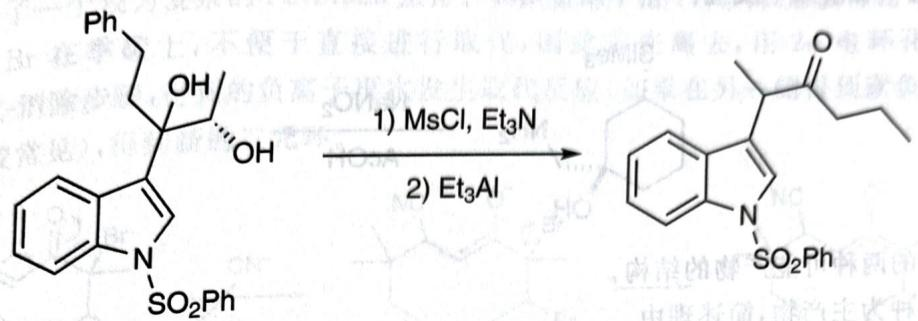

chemical

Chemical reaction scheme showing conversion of a naphthalene derivative to a fused heterocyclic compound using MsCl and Et3N/Al catalysts

在上图示出的 semi-pinacol 重排中, 第一步 MsCl 与空间位阻小的 OH 发生 $S_{N}2$ 反应, 其后 Lewis 酸促进 OMs 离去, 同时芳基协同转移, 得到产物。容易看出, 在酸性条件下得到的产物与此条件下得到的大有不同。

【例题 11.35】 对比下面两个 Pinacol 重排反应, 设想反应都以近乎协同的机理进行, 写出反应的主要产物。

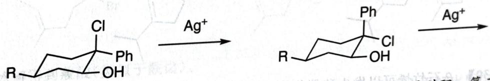

chemical

Chemical reaction scheme showing silver ion addition to a chiral alcohol intermediate

解 迁移的基团需与 Cl 呈反平行, 因此第一个反应可直接发生氢迁移得到酮。第二个反应中, Cl 与环上的键呈反向平行, 因此得到缩环产物。(观察图中加粗的键)

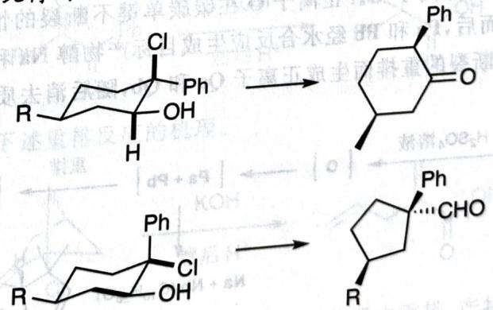

chemical

Chemical reaction pathway showing transformation of a chiral alcohol with phenyl and aldehyde to cyclohexanone and a substituted cyclohexane derivative

【例题 11.36】补全下述转换中,中间体 X、Y 和产物 P( $C_{10}H_{12}O$ ) 的结构简式;说明重排反应的驱动力。

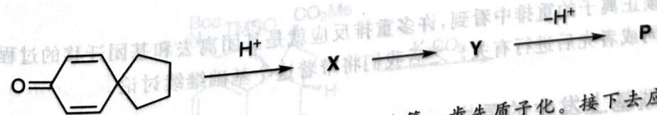

chemical

Chemical reaction pathway showing protonation and nucleophilic substitution steps from a ketone to phosphorus

解 底物非常单纯,碱性最强的位置只能为羰基,因此第一定律是重排反应,而且产生了插烯的碳正离子,又考虑到体系特别像芳环,故可以进行一步重排:

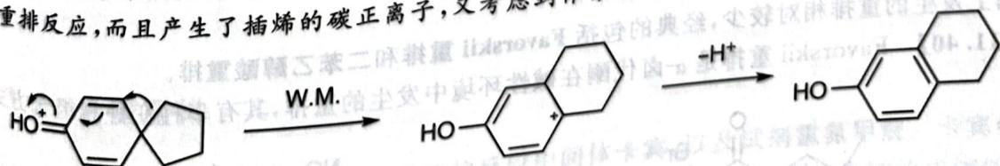

chemical

Reaction mechanism diagram showing hydroxyl radical conversion to a polycyclic aromatic hydrocarbon using W.M. and -H+ reagents

故其反应的动力为芳构化,可以预期该反应放热明显。
注记 本题涉及的反应称为环己二烯酮-酚重排,我国著名化学家黄鸣龙对其有过研究。

# § 11.3 涉及分子骨架变化的反应

在之前谈到的反应中,有机分子的骨架一般没有大的变化,容易观察分析。而涉及分子骨架变化的反应,例如重排反应和碎裂化反应,反应的结果一般出人意料,较难分析。此外,重排反应(特别是其中协同者)对轨道作用的要求也较高。本节介绍几个相关反应,并提供练习。

## 11.3.1 碳正离子重排

含碳正离子的重排,其目的一般为生成更稳定的碳正离子(回忆例题 10.46)。其最基本的版本即为 Wagner-Meerwein 重排。

【例 11.33】 Wagner-Meerwein 重排是碳正离子附近的基团发生迁移,使得碳正离子位点发生转移的过程,大多数碳正离子重排的反应都遵循该模式。

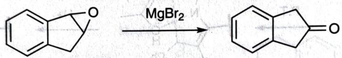

chemical

Chemical reaction showing oxidation of a bicyclic ketone to a fused bicyclic lactone using MgBr₂ catalyst

在上图示出的反应中， $Mg^{2+}$ 作为Lewis酸开环，首先形成苄位相对稳定的碳正离子。随后，发生氢迁移，重排得到更加稳定的碳正离子(共振得到8电子)。最后就得到酮。

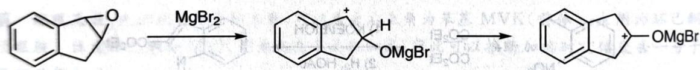

chemical

Organic reaction pathway showing bromination and subsequent ring-opening of a cyclooctadiene derivative

参照 WM 重排模式,通过多种途径生成的碳正离子在有利条件下可发生类似重排,有不少例子。

【例 11.34】 Pinacol 重排是邻二醇在酸性条件下发生碳正离子重排, 得到羰基化合物的反应。其选择性问题讨论如下:

1. 在何处优先形成碳正离子？应形成更加稳定的碳正离子。  
2. 何种基团优先发生迁移？富电子的基团优先迁移。

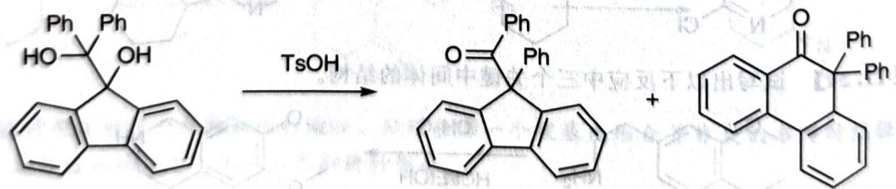

chemical

Chemical reaction showing conversion of a naphthoquinone derivative to a fused bicyclic compound using TsOH, with phenyl and hydroxyl substituents

3:1

在如上反应中,形成芴正离子的中间体更多,如果认为芴正离子具有反芳香性而不稳定,那么这说明 Pinacol 重排不一定形成完全的正离子,即:

Pinacol 重排也可以协同进行(semi-pinacol)，此时其选择性与酸性条件下进行的有所不同，迁移基因和离去基团要求成反平行的关系。

【习题 11.37】 观察以下反应。

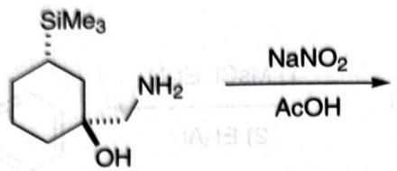

chemical

Chemical reaction equation showing conversion of a cyclohexane derivative with SiMe3 and NH2 to acetic acid using NaNO2 and AcOH

1. 写出反应的两种可能产物的结构。  
2. 推测哪一种为主产物，简述理由。

【习题 11.38】 写出下述反应的机理。

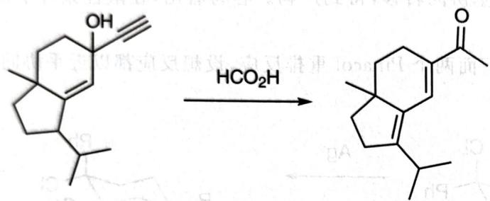

chemical

Chemical reaction showing conversion of a steroid-like molecule to a ketone under HCO₂H conditions

【习题 11.39】β-石竹烯可以发生酸催化的环化反应,形成复杂的混合产物。在这些产物中, $\mathrm{Na}+\mathrm{Nb}$ (一对非对映异构体)和右侧画出的产物(一对非对映异构体)的含量最多。反应始于反应性较高的环内双键的质子化,该反应生成正离子O。正离子O在碳碳单键不断裂的情况下成环,生成非对映异构体三环正离子Pa和Pb。而后,Pa和Pb经水合反应生成目标产物醇Na和Nb。在另一反应路径中,正离子Pa和Pb经碳碳单键断裂的重排而生成正离子Qa和Qb,随后消去质子,得到产物。

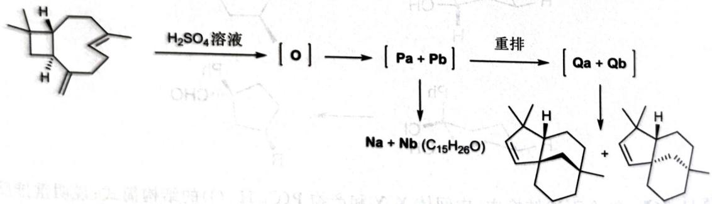

chemical

Chemical reaction pathway showing oxidation of a steroid-like molecule using H2SO4 and reagent, followed by reduction to [Qa+Qb] and final product with sodium salt.

给出上述反应的完整机理。

现在已经从碳正离子的重排中看到,许多重排反应就是基团离去和基团迁移的过程,其选择性常常与两步反应是协同或者先后进行有关。之后我们将带着这个基础继续讨论。

## 11.3.2 羧基上发生的重排

羰基上发生的重排相对较少,经典的包括 Favorski: 重排和碳基

【例 11.40】 Favorskii 重排是 $\alpha$ -卤代酮在碱性环境中发生的重排，其有多种变种和组合方式。

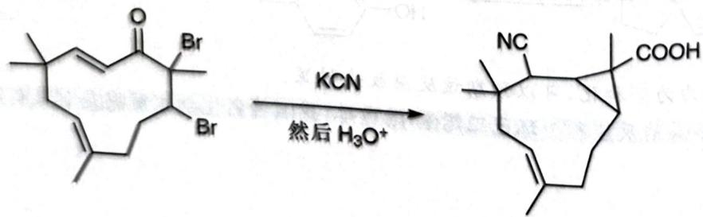

chemical

Chemical reaction showing conversion of a brominated ketone to a cyclic alcohol using KCN and H3O+ reagent

上图中示出了一个较为复杂的 Favorskii 重排。其碳负离子由 1,4-共轭加成得到，随后进行取代反应。这里，由于 Br 在季碳上，不便于直接进行取代，因此首先离去，用 $2\pi$ 电环化合环。最后是 Favorskii 的加成-消除步骤，得到的负离子再次发生取代反应（如果在另一侧得到碳负离子，则会发生消除反应，也比较常见），得到新的三元环。

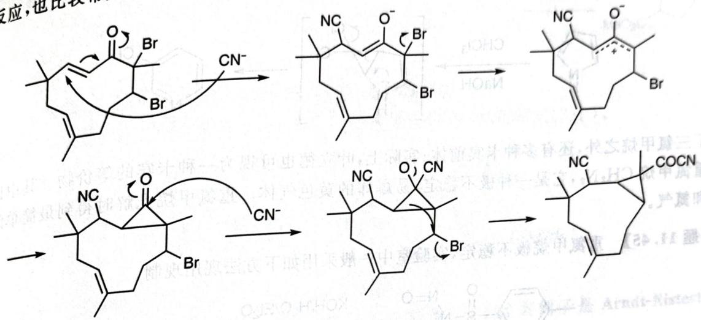

chemical

Multi-step organic reaction mechanism involving brominated and cyanoic acid intermediates, showing electron transfer and cyclization steps

最后氰基水解得到羧酸(类似于酰卤)。
【习题 11.41】写出下面反应(二苯乙醇酸重排)的一个关键中间体,并在上面标出反应的电子推动。

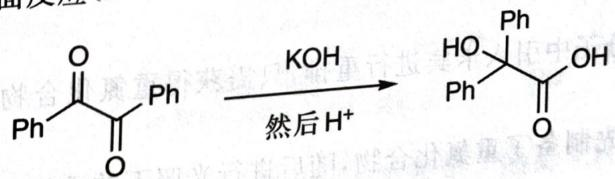

chemical

Chemical reaction showing oxidation of a cyclic ester to form a diol, with KOH and H+ as reagents

【习题11.42】试确定下述重排反应的机理。

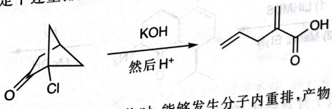

chemical

Chemical reaction equation showing oxidation of a chlorinated cyclohexanone to an enol ether using KOH and H+ conditions

【习题11.43】用 $\mathrm{K}_{2} \mathrm{CO}_{3}$ 处理以下化合物时, 能够发生分子内重排, 产物中不含硅。画出产物的结构; 它可以看作是一个重排反应的逆向过程, 解释反应进行的动力。

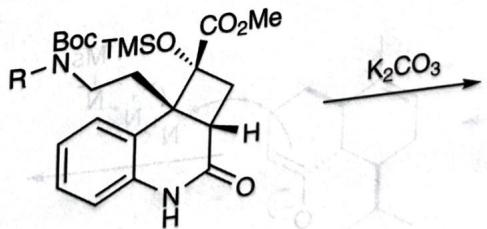

chemical

Chemical structure of a complex organic molecule with TMSO and CO2Me substituents, undergoing reaction with K2CO3

## 11.3.3 含氮重排

11.3.3 含氮重排
在谈及含氮重排之前,我们首先要回忆重要的反应中间体卡宾,以及试剂重氮甲烷。卡宾(及其氮类似物乃春),是成键比相应原子的特征数少2的物种,它们都保留了形成两根共价键的成键能力。从电子结构上看,卡宾有单线态和三线态两种形式。单线态卡宾有一对孤对电子,按照经典成键理论的观点应取 $sp^{2}$ 杂化,是V型,可进行 $(1+n)$ 型的反应;而三线态卡宾类似于双自由基,取sp杂化,是直线型。其实际观测的立体化学和经典理论预言稍有出入,不过对我们来说已经足够。
在反应机理的书写中,卡宾的产生及其反应性具有典型的“推拉”形态。

【例 11.44】常见的卡宾是二氯卡宾，它可由 $CCl_{3}^{-}$ 失去一个 $Cl^{-}$ 产生。

$$
\mathrm{CHCl} _ {3} + \mathrm{OH} ^ {-} \longrightarrow \mathrm{CCl} _ {3} ^ {-} \longrightarrow : \mathrm{CCl} _ {2} + \mathrm{Cl} ^ {-}
$$

在下述反应(Ciamician-Dennsted)中,产生的卡宾先进行(1+2),随后发生分子内重排,得到氯吡啶。

除了三氯甲烷之外,还有多种卡宾前体;实际上,叶立德也可视为一种卡宾的等价物。其中比较重要的是重氮甲烷 $CH_{2}N_{2}$ ,它是一种极不稳定,易爆炸的黄色气体。重氮甲烷光解时得到最简单的亚甲基卡宾和氮气。

【习题11.45】重氮甲烷极不稳定，实验室中一般采用如下方法现用现制。

试写出反应的机理。

由此,要在各种复杂的分子中引入卡宾进行重排,只需获得重氮化合物,而重氮化合物的重排反应十分重要。

【例 11.46】下述反应先制备了重氮化合物,随后进行光照下的重排反应(Wolff 重排)。

首先用 LiHMDS 去质子得到烯醇, 随后通过简单的共振式分析知道, 烯醇负离子进攻 $MsN_{3}$ 的末端。

进一步观察反应结果,知道需要保留两个 N, 离去 $MsNH_{2}$ , 而这时还不能离去(否则得到双负离子)。又考虑到 $\alpha$ 位的质子全部被去掉, 故可以做一步质子转移再消除, 得到想要的重氮化合物。

最后是正式的 Wolff 重排。在光照下失去热力学稳定的氮气得到卡宾后，发生“推拉”（请同学们熟

悉这个反应模式,类似于给电子后就得到正离子,促进基团迁移,本节之后的重排基本遵循这个模式)得到烯酮。

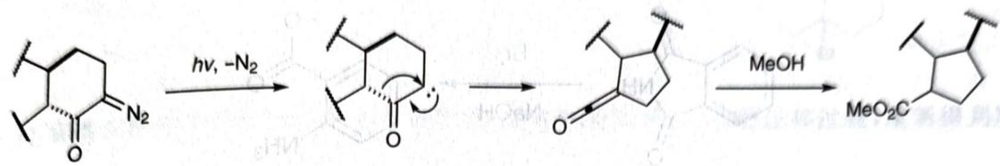

chemical

Organic reaction pathway showing photoinduced ring opening under light and nitrogen conditions

加入不同的亲核试剂则得到不同的加成产物,此处为甲酯。

【例题 11.47】画出下列转换中合理的电中性关键中间体的结构简式(3个)。

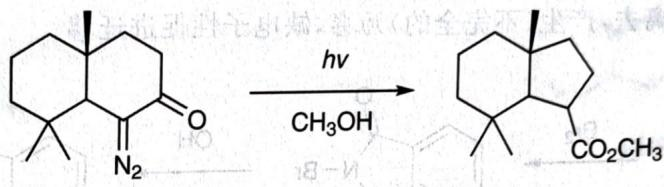

chemical

Photochemical reaction showing conversion of a ketone to a cyclopropane derivative under UV light, with CH₃OH as reagent

解 此题为单纯的 Wolff 重排,请同学们自己完成。

解 此题为单纯的 WOH 里排,请例子的自己完成。

【例 11.48】 当然,直接使用重氮甲烷也可制备重氮酮,一个经典例子是 Arndt-Eistert 同系化 (homologation) 反应。

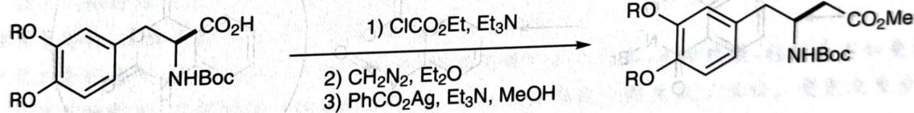

chemical

Chemical reaction scheme showing conversion of a substituted benzene derivative with ester and nitro groups to a substituted benzene derivative using different reagents.

上图中, $ClCO_{2}Et$ 作为亲电试剂被羧基进攻得到混合酸酐。随后 $CH_{2}N_{2}$ 取代混合酸酐得到重氮酮,重氮酮照例分解得到烯酮,最后烯酮被亲核试剂捕获。

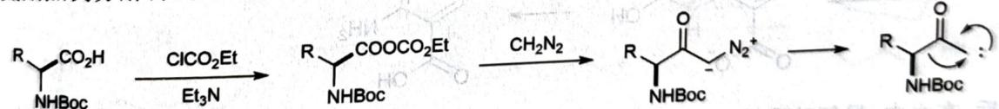

chemical

Organic reaction pathway showing esterification and subsequent ring-opening of a carbonyl compound

此反应的净结果就是增加了一个亚甲基,得到底物的紧邻同系物,因此称为 homologation。

【习题11.49】重氮甲烷具有独特而重要的反应性能。设 $\mathrm{R} = \mathrm{CF}_3$ ，H，对比这两个反应，写出产物的结构简式，简述推测理由。

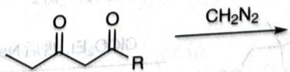

chemical

Chemical reaction showing ester group being reduced to form amide group

【习题11.50】 $\beta$ 酮酯在合成上具有关键用途，有人发现了以下面的反应过程得到 $\beta$ 酮酯的方法。实验过程中观察到有气体放出。

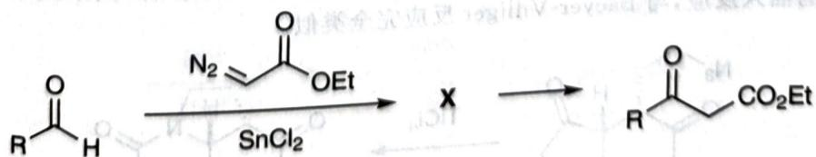

chemical

Chemical reaction scheme showing esterification of aldehyde using diazotization and SnCl₂ catalyst

用电子推动的方法写出该反应的机理,在你给出的机理中明确地圈出关键中间体 X。

在上面的例子中,重氮化合物的邻位都是 $CH^{-}$ , 其等电子体是 $N^{-}$ , 若进行等电子体的替换, 就得到叠氮, 叠氮分解则得到乃春。这也是一类重要的重排反应, 其变体稍多, 但总归是因为产生乃春的方式不同。下面举例。

【例 11.51】 Hofmann 重排和 Lossen 重排都是氨基负离子上的离去基团离去, 导致出现(不完全的)乃春, 从而诱导重排; 和碳的情形一样, 得到异氰酸酯, 后者又被亲核试剂捕获。

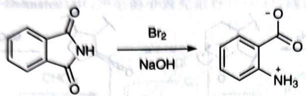

chemical

Chemical reaction showing bromination of aniline using sodium hydroxide

上图示出了一个 Hofmann 重排的例子。邻苯二甲酰亚胺的 NH 氢因为羰基吸电子，酸性较强，去质子后发生一次卤代（得到溴代试剂 NBS）。随后，因为溴的吸电子效应和体积效应，酰胺发生一次水解，得到负离子。此时 Br 离去，产生（不完全的）乃春，缺电子性促进迁移。

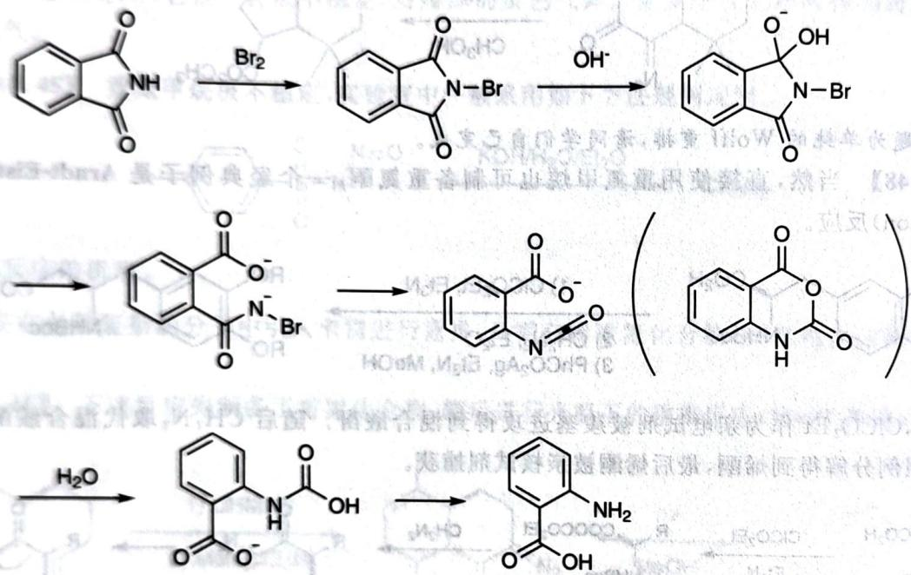

chemical

Multi-step organic synthesis reaction pathway showing bromination, hydrolysis, and dehydration steps with reagents Br₂, OH⁻, and H₂O

最后，在水中，异氰酸酯被加成后发生脱羧反应，得到产物邻氨基苯甲酸。请同学们自行补全上述机理中的电子推动。

Lossen 重排就是将离去基团 Br 换成了 OR, 其余没有变化。

【习题 11.52】通过对反应性的分析,推测下述反应的产物。

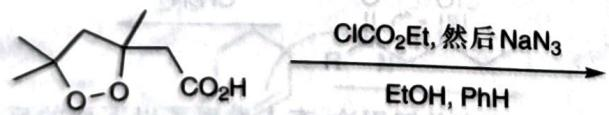

chemical

Chemical reaction equation showing esterification with ClCO2Et under NaN3 catalyst in EtOH/PhH solvent

【例 11.53】 Schmidt 反应与上述反应稍有不同,且运用方式更加多样,其形式结果是叠氮分解生成的乃春对羰基的插入反应,与 Baeyer-Villiger 反应完全类似。

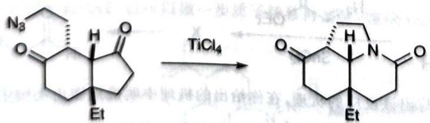

chemical

Chemical reaction showing conversion of a ketone to a fused bicyclic product under TiCl4 conditions

显然在该条件下,我们不能令叠氮直接分解并插入。仍然考虑 $N_{3}$ 的共振式,按照其亲核性,先连接一根键。

此时, $N_{2}$ 有离去的动力,而N将带有正电性,因此发生类似Pinacol的迁移过程,重新得到羰基,完成反应。

【例题 11.54】

解 两个底物的结构基本相同, 差异只是一个亚甲基, 几乎可以预见与环系大小有关。第一个反应的机理是容易写的, 是经典的 Schmidt 重排, 请同学们自己给出。

的机理是容易写的, 是经典的 Schmidt 重排, 请同学们自己讨论。
而在第二个反应中, 若要进行 Schmidt 重排, 则首先要形成七元环, 速率较慢, 特别是不如叠氮分解的速度。观察产物骨架, 右侧酮的 $\alpha$ 位进行了进攻, 由此推断叠氮分解生成了亚胺。叠氮发生分解, 重排, 得到的亚胺被亲核进攻得到产物。

反应途径不同的原因已经在上面分析了。

(The Journal of Organic Chemistry 66, No. 3 (2001): 886-889)

【习题 11.55】下面是一个可以合成托品酮骨架的反应序列,涉及了巧妙的扩环反应。给出 A 和 B 的结构。

含氮重排还有 Beckmann 重排等, 因为其变化比较简单, 前一讲习题中已经出现, 故请同学们自己复习。

## 11.3.4 含氧、硫重排

含氧重排多与过氧化物、臭氧化物有关，其重排的模式与含氮重排类似。

【例 11.56】臭氧化反应是将双键打断,在还原剂作用下两边各接羰基,或在氧化剂作用下两边得到酮或者羧酸的反应。其基本性质同学们已经熟悉,我们来分析一些相对特殊的例子。

考虑上述反应。观察到净结果是得到了一侧醛和一侧羧酸，后二者被羟基进攻成环，因此羟基要在合适的时候参与。首先自然是臭氧的 $(3+2)$ 反应和逆 $(3+2)$ 反应。

此时体系中就出现了合适的亲电位点,因此立刻成环,负离子进攻 $Ac_{2}O$ 转换为好的离去基团,消除发生氧化就得到内酯。

再看下例。

此反应中,发生逆 $(3+2)$ 后,二酮亲电性强,可直接发生Baeyer-Villiger型的反应,氧化得到酸酐。

从以上例子中可以看出,臭氧化反应的变化还是很多的。

【例题 11.57】化合物 A 经过如下两步反应后生成化合物 D。回答如下问题。

1. 写出试剂 B 的名称。  
2. 圈出 C 中来自原料 A 的氧原子。  
3. 画出化合物 D 的结构简式。

解 由于体系增加了多个氧原子以及过氧键的结构,因此这是臭氧化反应,B为臭氧。考虑第一步反应,依照左下角甲基的位置可以推测中间单桥O是A中的。此时可以写机理进一步确证这一推测:类似于前面的例子,一级臭氧化物发生逆(3+2),考虑接下来羟基参与的位置,应在上侧形成羰基过氧化物,同时左下角形成半缩醛。

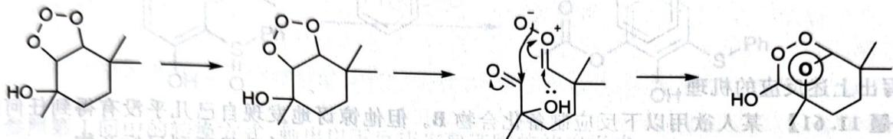

chemical

Chemical reaction pathway showing transformation of a cyclic compound with hydroxyl and ester groups, forming a protonated intermediate.

机理合理, 证实推测。接下来, 要想办法离去一个 $\mathrm{HCOO}^{-}$ , 首先发现 $\mathbf{C}$ 中酸性位点只有羟基, 此处恰好有甲酸的骨架。因此拔除质子后四面体中间体应消掉一个离去基团。由于我们要断开 $\mathrm{O}-\mathrm{O}$ 键, 否则将消除产生不稳定的单线态氧, 所以应向下消除。

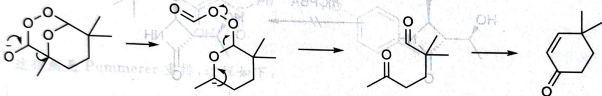

chemical

Chemical reaction pathway showing transformation from a cyclic ester to a cyclohexanone derivative via intermediate steps

最后,体系在碱条件下应发生 Aldol 反应,得到共轭酮。

【习题11.58】确定下述臭氧化反应的机理。

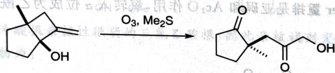

chemical

Organic reaction showing oxidation of a cyclohexanol derivative to a cyclic ketone under O3 and Me2S conditions

(Organic Letters 3, No. 4 (2001): 627–629)

过氧化物分解时,类似于碳正离子重排,可以进行基团迁移,下面再举几例。

【例 11.59】 Baeyer-Villiger 重排是用过氧酸对羰基化合物的氧化, 其结果就是在羰基一侧插入 O, 其机理十分简单, 参见下图。

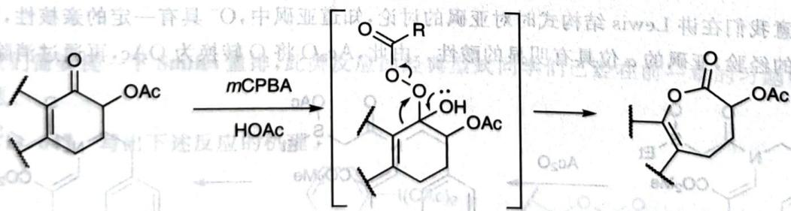

chemical

Chemical reaction scheme showing mCPBA and HOAc reagents converting a lactone to a cyclic product via glycosylation or deprotection steps

在 BV 反应中, 基团迁移的顺序和碳正离子重排类似, 富电子的基团优先迁移。Dakin 反应类似, 一般它是指在碱性条件下, 用 $\mathrm{H}_{2} \mathrm{O}_{2}$ 对芳香醛的氧化反应, 首先类似于 BV 反应插入一个氧, 随后甲酸酯水解, 得到酚。

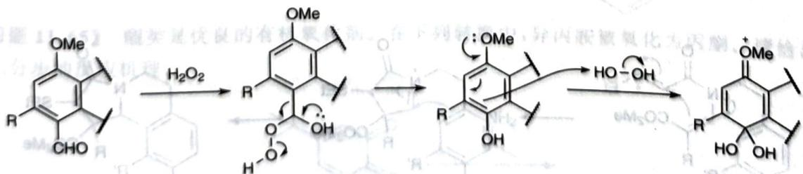

chemical

Organic reaction mechanism showing methylation and hydrolysis steps with R groups and stereochemistry

在上面的反应中， $\mathrm{H}_{2} \mathrm{O}_{2}$ 还体现了另一种反应性，将富电子的芳环氧化为醌（上例的反应是在盐酸环境下进行的， $\mathrm{H}_{2} \mathrm{O}_{2}$ 氧化电位高）。

【习题 11.60】工业上用异丙苯氧化同时制备苯酚和丙酮(Hock 反应)。

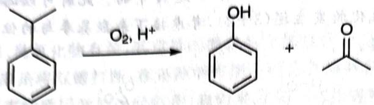

chemical

Chemical reaction equation showing oxidation of a benzene ring to an enol with water and acid groups

试写出上述反应的机理。

【习题11.61】某人欲用以下反应制备化合物B。但他惊讶地发现自己几乎没有得到任何的B，反而得到了一种与B为同分异构体的产物C。画出C的结构，简述为什么得不到目标产物。

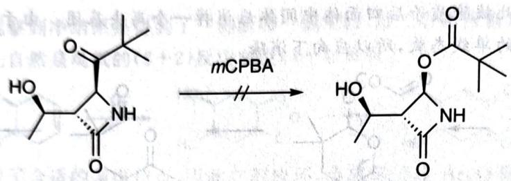

chemical

Chemical reaction showing mCPBA-mediated structural change of a cyclic amide with hydroxyl and carbonyl groups

硫虽然与氧同族,由于其具有 d 轨道,成键特征数可以>2,因此其重排反应与氧有所不同;此外,由于 S 电子云可极化性高、半径较大,硫也容易被氧化,产生正离子诱导重排。

【例 11.62】 Pummerer 重排是亚砜和 $Ac_{2}O$ 作用, 氧转入 $\alpha$ 位成为乙酰氧基的反应。(图中 CSA 是樟脑磺酸)

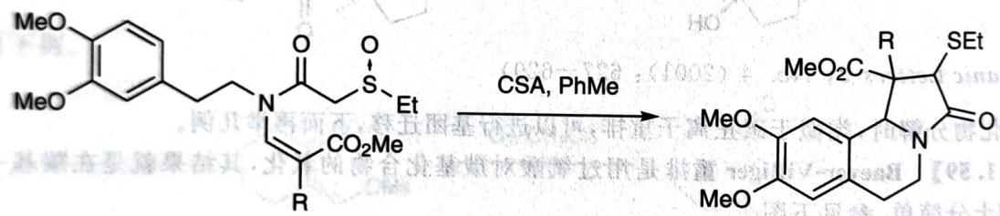

chemical

Chemical reaction scheme showing conversion of a substituted benzene derivative to a fused heterocyclic compound using CSA and PhMe reagents

特别留意我们在讲 Lewis 结构式时对亚砜的讨论, 知道亚砜中, $O^{-}$ 具有一定的亲核性, 而根据我们对硫叶立德的经验, 亚砜的 $\alpha$ 位具有明显的酸性。由此, $Ac_{2}O$ 将 O 转换为 OAc, 再通过消除反应离去。

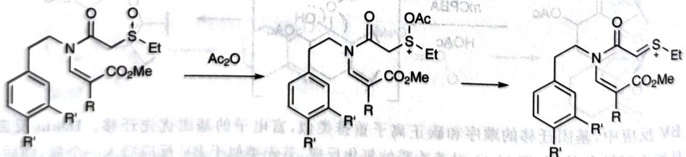

chemical

Chemical reaction scheme showing acetylation of a heterocyclic compound using Ac2O, forming a fused ring system with ester and amide groups.

注意此时 S 的 $\alpha$ 位已经有了亲电性, 因此烯胺进攻, 获得的亚胺盐又被苯环捕获, 获得串联成环产物。

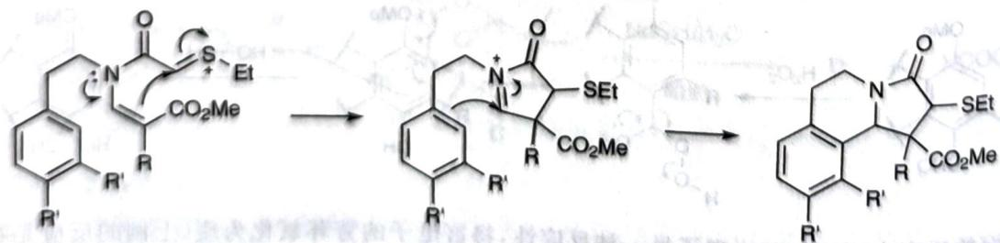

chemical

Chemical reaction mechanism showing the conversion of a thiazolidine derivative to a fused heterocyclic compound with ester and ketone groups

Pummerer 重排呈现了亚砜氧化还原和重排的典型反应性,之后我们还会多次看到(11.4节)。

【例题 11.63】 考虑如下反应。

1. 请为以下转换提供合理的中间体。

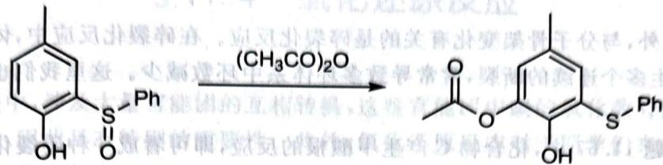

chemical

Chemical reaction showing conversion of a phenyl sulfonamide to a benzoic acid derivative using (CH₃CO)₂O

2. 参照第 1 问中的转换方式, 画出以下反应主要产物的结构简式。

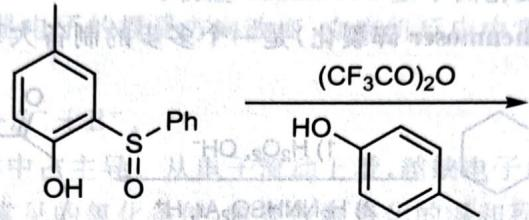

chemical

Chemical reaction showing conversion of a phenol derivative to a benzyl alcohol using (CF₃CO)₂O catalyst

解 这仍然是 Pummerer 重排, 过程如下:

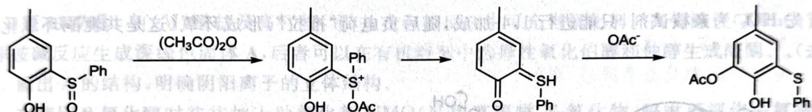

chemical

Chemical reaction pathway showing the conversion of a phenolic compound to a sulfonated benzene derivative via methanol and acetic anhydride steps

在第2问中,酸酐变为酸根亲核性很弱的三氟乙酸根,因此亲核试剂变为苯酚。注意比较亲核性,应该使用苯环进攻,故产物为:

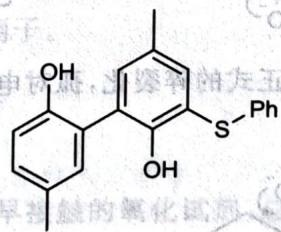

chemical

Chemical structure of a phenolic compound with hydroxyl and sulfonamide groups

最后我们需要提一下 Smiles 重排, 此类反应的经典型式同学们已经在前一章的习题中见过, 这里也留作习题。

【习题 11.64】 写出下述反应的机理。

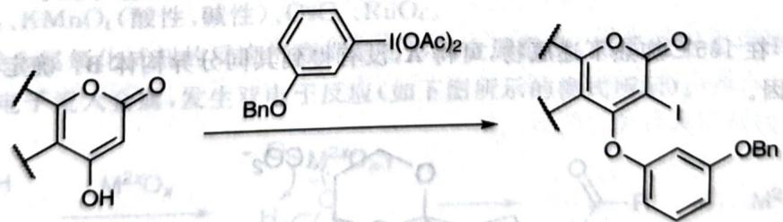

chemical

Chemical reaction showing conversion of a flavonoid compound to a bisphenol derivative using BnO and I(OAc)2 reagents

【习题 11.65】醌类是优良的有机氧化剂。在下列转换中，异丙胺被氧化为丙酮。请给出该转换合理的、分步的反应机理。

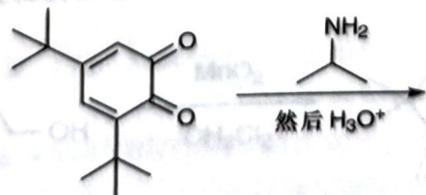

chemical

Chemical reaction showing the formation of ammonium salt from a substituted cyclohexanone derivative

## 11.3.5 碎裂化反应

除了重排反应之外，与分子骨架变化有关的是碎裂化反应。在碎裂化反应中，体系的某些轨道形成较好重叠、化学键发生多个连续的断裂，常常导致多环体系中环数减少。这里我们也对碎裂化反应稍作介绍。

【例 11.66】例题 11.57 中，化合物 C 产生甲酸根的反应，即可看成一种碎裂化反应。

【例 11.67】习题 10.104 中, 因如果直接发生消除反应可得稳定碳正离子, 且可生成更稳定的六元环, 因此发生了 Beckmann 碎裂化而不是 Beckmann 重排。

【例 11.68】下述反应(Eschenmoser 碎裂化)是一个多步的制备大环环内炔烃的方法。

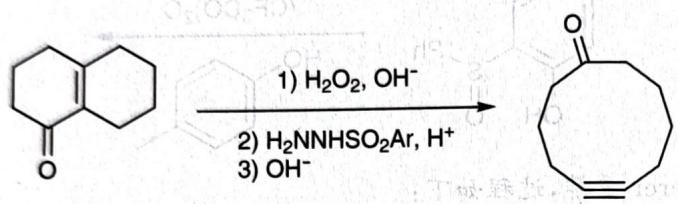

chemical

Chemical reaction scheme showing oxidation of a naphthalene derivative to a cyclohexanone using formaldehyde and diazonium reagents

首先 $HO_{2}^{-}$ 为亲核试剂, 只能进行 1,4-加成, 随后负电荷“推拉”, 形成环氧(这是共轭酮环氧化的典型方法)。

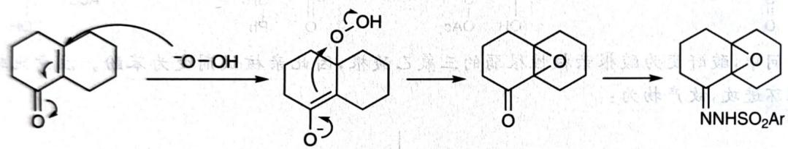

chemical

Organic reaction mechanism showing oxidation and ring opening steps with amine and hydroxyl groups

之后芳香联氨发生亲核取代后,就是正式的碎裂化,孤对电子促进环氧开环后,氧负离子形成酮,氮气离去促进碎裂化反应完成。

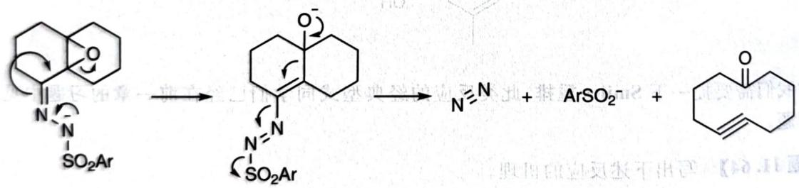

chemical

Chemical reaction mechanism showing conversion of a sulfonamide derivative to a fused bicyclic compound via intermediate and product formation

【习题11.69】在 $165^{\circ} \mathrm{C}$ 加热下述底物, 可得 $\mathbf{A}$ , 没有得到其同分异构体 $\mathbf{B}$ 。确定 $\mathbf{A}, \mathbf{B}$ 的结构简式, 说明得不到 $\mathbf{B}$ 的原因。

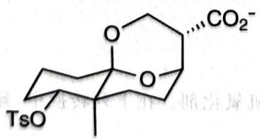

chemical

Chemical structure of a tetracyclic compound with TsO and CO2⁻ counterions

## § 11.4 氧化还原反应

在有机合成过程中,涉及大量官能团的互相转换,这些官能团中碳的氧化数有所不同,需要通过氧化还原反应进行调整,因此具有特别的重要性。此外,氧化还原反应对于同学们来说试剂陌生、机理复杂,因此也具有一定的难度。本节我们讨论一些氧化还原反应,实际上主要还是帮助同学们提高机理书写的技术。

写的技术。
所谓氧化还原反应,其本质是电子的授受方向改变,在有机反应中常常体现为 Lewis 酸碱的结合与解离,其模式常常如下式所示:

$$
\mathrm{A} ^ {+} + \mathrm{B} ^ {-} \longrightarrow \mathrm{A} - \mathrm{B} \longrightarrow \mathrm{A} ^ {-} + \mathrm{B} ^ {+} 。
$$

此类双电子氧化在有机化学中占主导。从电子流动上看，越缺电子的试剂氧化性越强，否则还原性越强。由此可推断，酸性环境是常见的氧化条件，若要控制氧化的温和程度，则需要稍增加碱性，降低溶剂的极性。

【习题 11.70】 钉(Ⅵ)酸盐及高钌酸(Ⅶ)盐在有机反应中可充当氧化剂。高钌酸钾(KRuO₄)与四丁基季铵碱反应生成深绿色固体 A, 后者可以在有机溶剂中选择性氧化伯醇和仲醇生成醛酮。

1. 画出 A 的结构, 明确阴阳离子的立体结构。

2. 在使用 B 氧化醇时往往加入助氧化剂 NMO(N-甲基吗啉-N-氧化物, 吗啉可视作一氮杂六元环), 使用 $CH_{2}Cl_{2}$ 与 $CH_{3}CN$ 为溶剂。有实验指出, 加入 $CH_{3}CN$ 后氧化效果更好。指出乙腈和 NMO 的作用。

现在我们开始按反应和机理讲一些例子。

## 11.4.1 氧化反应:铬、锰

铬、锰等高价金属氧化物是同学们较早接触的氧化试剂,总体来说其形式多变,但反应的机理都可认为是类似的。常见的试剂包括以下两类。

1. 铬类: Jones 试剂 (CrO $_{3}$ /H $_{2}$ SO $_{4}$ )、Collins 试剂 (CrO $_{3}$ ·2py)、PCC（氯铬酸吡啶盐，pyH $^{+}$ CrO $_{3}$ Cl $^{-}$ ）、PDC（重铬酸吡啶盐，(pyH) $_{2}$ Cr $_{2}$ O $_{7}$ ）。不难看出，在这些试剂的演变中，吡啶的加入是为了降低 Cr 的亲电性，降低氧化性，便于控制反应。  
2. 锰类: $MnO_{2}$ 、 $KMnO_{4}$ （酸性、碱性）、 $OsO_{4}$ 、 $RuO_{4}$ 。

可以认为, 此类金属氧化试剂的反应机理都是先形成金属酸酯, 然后发生 C—H 键的断裂 (或其他需要的变化), 一对电子流入金属, 发生双电子反应 (如下图所示的模式所示)。

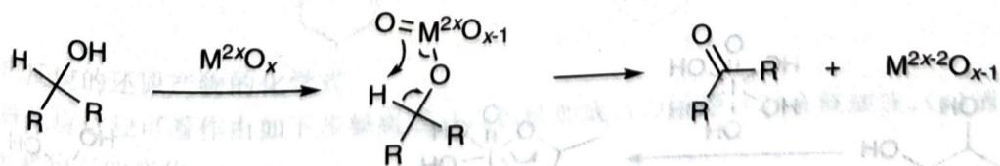

chemical

Chemical reaction mechanism showing oxidation of a hydroxyl group to form a carbonyl compound and a radical species

【例题11.71】给出以下转换过程的反应机理。

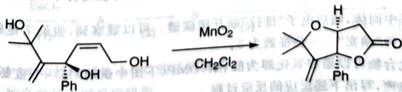

chemical

Chemical reaction showing oxidation of a cyclic alcohol using MnO2 and CH2Cl2

解 观察净结果,发现骨架没有发生根本变化。左上角的醇对双键进行了加成,醇被氧化成内酯。左上角的加成需要双键被活化,因此首先要在右侧形成共轭内酯,由此不难写出机理。

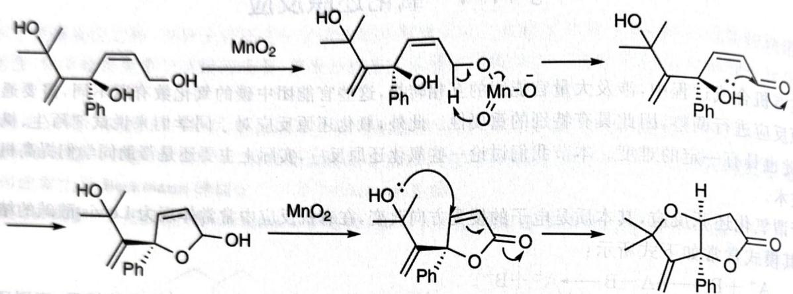

一般说来,为了控制一级醇氧化的温和程度,常常在极性低和对氧化剂溶解性差的溶剂中进行反应,例如 $CH_{2}Cl_{2}$ 。

注记 $MnO_{2}$ 氧化能力比较温和,一般用于氧化活化的烯丙醇为不饱和醛、酮。

【习题11.72】考虑两个与PCC有关的氧化反应。

1. 在用 PCC 氧化香茅醇时, 得到了胡薄荷酮(如下图左侧所示)。画出反应的 2 个关键中间体的结构。

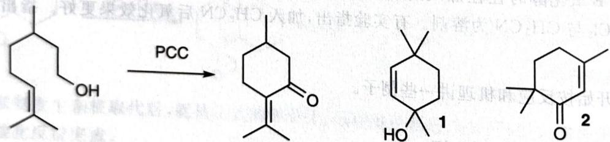

chemical

Organic reaction scheme showing conversion of a hydroxy ketone to two cyclohexanol derivatives via PCC reagent

2. 用 PCC 氧化上图右侧底物 1 时, 得到了非预期产物 2。画出反应的 3 个关键中间体的结构。

## 11.4.2 氧化反应:碘、氯、硒

非金属氧化剂通常比金属氧化剂的毒性小,因此也常常得到使用。非金属氧化剂的氧化模式和氧化剂基本类似。

【例 11.73】高价碘试剂可用于打断邻二醇或温和氧化醇。高碘酸 $H_{5}IO_{6}$ （或偏高碘酸钠 $N_{2}IO_{4}$ ）

烃生成顺式邻二醇的机理具有类似的形式。

chemical

Chemical reaction equation showing oxidation of a hydroxy ester to form a cyclic alcohol and then to a diol

首先形成五元环中间体,随后电子“推拉”断开碳碳键。可以观察到,假设7是碘的特征成键数,还原产物实际上就是一种“碘宾”——特征数为5。

类似的高价碘化合物可以温和氧化醇为醛、酮，DMP（下图中试剂）是一个重要的例子。请同学们模仿金属氧化剂的机理，写出下述反应的反应过程。

## 11.4.3 氧化反应:硫

对于与硫相关的氧化反应,我们的重心在于 DMSO 作为氧化剂的各种变体。

【例 11.77】Kornblum 氧化是最早发现的使用 DMSO 氧化的体系, 它将 DMSO 作用于卤代烃, 然后以碱处理、消除 $\alpha-H$ 得到羰基。

chemical

Organic reaction scheme showing bromination and oxidation of a cyclohexanol derivative under DMSO/ZnS conditions

上图反应中，DMSO 的 $O^{-}$ 取代 $Br^{-}$ ，随后在加热和 $S^{2-}$ 的作用下脱除质子、离去 $Me_{2}S$ ，得到产物。

chemical

Chemical reaction mechanism showing bromination and sulfonation steps of a silyl-substituted cyclohexane derivative

【习题11.78】请同学们写出例11.77中不含羟基的产物生成的机理。

Kornblum 反应的产率不高,这是因为发生取代反应活性不高,且断开 C—H 往往需要较强的碱和吸电子基团辅助,后来有人对此进行了优化。

【习题 11.79】下图示出了 Kornblum 反应的一种变体(Moffatt 氧化)，以二环己基碳二亚胺(DCC)为活化试剂。

chemical

Chemical reaction equation showing conversion of a phenol derivative to a benzoxazole using DMSO and PhH reagents

试写出反应的机理。

最为成熟的使用 DMSO 为主要氧化试剂的反应之一当属 Swern 氧化：

chemical

Chemical reaction equation showing esterification of aldehyde under COCl₂ and DMSO conditions

【例 11.80】Swern 氧化使用草酰氯在低温下活化 DMSO, 反应将放出大量气体。得到活化的醇中间体后, 用 $Et_{3}N$ 淬灭反应, 就得到氧化产物。其与 Kornblum 氧化反应主要的不同仍然在 DMSO 的活化方式上:

chemical

Chemical reaction mechanism showing sulfonation and chlorination steps of a cyclic anhydride derivative

在上述活化过程中，DMSO与草酰氯发生取代反应，随后在碳上“推拉”，草酰氯基团分解，得到实际参与氧化的物种。此后醇与该物种发生取代， $\mathrm{Et}_3\mathrm{N}$ 淬灭后即得到产物。

【例 11.74】 Pinnick 氧化是使用亚氯酸钠在一定条件下将醛氧化为羧酸的反应, 其机理和含氧重排反应类似。

在上述反应中， $ClO_{2}^{-}$ 对羰基进行加成后，发生完全类似金属氧化剂氧化的过程，拔除氢得到产物。

该反应需要很多添加剂以控制条件温和。由于还原产物为具有破坏性的 HOCl，故需要添加 10～50 倍量的烯烃捕获次氯酸；同时要严格控制酸度，谨防 ClO₂⁻ 分解。

【例 11.75】二氧化硒是一种强氧化剂, 实际使用的 $SeO_{2}$ 常常显出紫红色, 是因为其氧化了空气中的有机物尘埃, 产生了红色的 Se。类似于 $MnO_{2}$ , 它对烯丙位体系有较好的氧化能力。

在上述反应中， $\mathrm{SeO}_2$ 在烯丙位氧化得到羟基。其机理比较复杂，了解即可：首先进行ene反应，随后进行(2,3)-σ重排。可以看出这和Pummerer重排反应类似，这也是S、Se所共有的反应性。

【习题11.76】如下图所示， $\mathrm{SeO}_2$ 可将环己酮的 $\alpha$ 位氧化为羰基。

1. 写出反应的还原产物的化学式。
2. 一种反应过程可看作由如下步骤组成：(1)亲核加成，(2)消除，(3)亲核加成，(4)消除。其中(3)
(4)涉及 Se 氧化态的变化。

画出上述过程中,电中性中间体 A\~C 的结构简式。
3. 给此

给出另外一种合理的不同反应机理。

值得注意的是,实际参与氧化的活化物种也可在 Cl 上被进攻,直接离去 $Me_{2}S$ ,因此体系中若有好的亲核试剂,则可能发生氯代副反应。

【例题 11.81】写出下述转换过程的反应机理。

解 这是 Swern 氧化的标准条件, 只不过需要关注发生了一次氯代; 知道必然是活化的 DMSO 作为氯化试剂。但是如果直接发生亲电取代将得到一级碳正离子, 极不稳定, 由此想到可进行 Baylis-Hillman 型的反应。这时机理就不难写出了。

请同学们自己补全羰基氧化的机理。

【例题11.82】高效绿色合成一直是有机化学家追求的目标，用有机化合物代替金属氧化剂是重要的研究方向之一。硝基甲烷负离子是一种温和的有机氧化剂。画出硝基甲烷负离子的共振式（氮原子的形式电荷为正），并完成以下反应（写出所有产物）：

解 照题目的提示第一步为 $S_{N}2$ , OTs 是好的离去基团, 因此需要分析的是硝基甲烷负离子的亲核位点, 即通过共振式。

可见 $-\mathrm{CH}_{2} \mathrm{NO}_{2}$ 是一个两可离子, 可以用 C 端进攻, 也可以用 O 端进攻。这里应该使用哪一端? 从后续反应的角度考虑, 底物是一级醇等价物, 如果连接碳就无法继续反应。另一方面, 硝基乙烷负离子

的 C 端软，O 端硬，苄基碳在发生取代反应时更偏向于 $S_{N}1$ ，即碳因为苯环的给电子效应和 $OT_{s}$ 的吸电子效应变得更硬（反应时更像碳正离子）。因此应该使用 O 端进攻。

现在可以进行氧化了,拔除质子,消除一个甲醛肟。这也类似于 Swern 氧化的过程。

最后,从上面的软硬酸碱分析中可以看出,硝基乙烷的这种反应方式较难在此条件下简单推广至一般的醇类。

【习题11.83】利用图示试剂(Burgess试剂，通常用于醇的脱水)可完成如下快捷方便的氧化反应。

1. 试写出其反应机理。  
2. 若将溶剂换为 $CH_{2}Cl_{2}$ ，写出反应的产物和一个关键中间体的结构简式。

(The Journal of Organic Chemistry 82, No. 2 (2017): 1046-1052)

DMSO 的氧化反应性的另一经典问题是第 27 届 CChO 决赛有机题,由于熟练解决这种问题属于决赛范畴,这里不表,请感兴趣的读者自己查找,与我们讲的例子是类似的。

## 11.4.4 还原反应: 氢迁移

现在进入还原反应。大家都知道在有机反应中，氧化反应是脱氢，加氧；还原反应就是加氢，脱氧。因此还原反应中氢的转移是非常重要的。一般说来，氢迁移在机理上是十分直接的，转移即可。

【例 11.84】 Cannizzaro 反应是醛在浓碱中歧化为羧酸和一级醇的反应, 它是氢迁移的一个典型例子。

在浓碱中,加成产物被去质子,迫使 H 发生迁移。特别注意浓碱在此处的作用,需要得到双负离子迫使其进行氢迁移,因此动力学方程对 $[OH^{-}]$ 可以达到 2 级。

【例 11.85】还原胺化反应是通过羰基化合物制备各种胺类的重要方法,其主要思想就是令亚胺盐还原。本例中,还原剂是甲酸,其直接通过氢迁移进行还原(Leuckart-Wallach)。

chemical

Chemical reaction scheme showing nucleophilic addition of aldehyde to an amide under heating, followed by reduction with CO₂

还原胺化反应使用的还原剂还可以是 $NaBH_{3}CN$ 等比较温和的试剂。

【例题11.86】Cannizzaro反应是醛在强碱浓溶液中发生的歧化反应。以苯甲醛为底物，根据所给条件和信息，回答以下问题。

1 当反应在重水中进行时,产物苯甲醇是否含有氘?  
2 当反应在 $H_{2}^{18}O$ 中进行时，画出含 ${}^{18}O$ 产物的结构简式。  
3. 动力学研究发现,该反应的速率方程可以表达为:

$$
v = K _ {\mathrm{a}} \left[ \text { PhCHO } \right] ^ {2} \left[ \text { OH } ^ {-} \right] + K _ {\mathrm{b}} \left[ \text { PhCHO } \right] ^ {2} \left[ \text { OH } ^ {-} \right] ^ {2} 。
$$

解释此方程中出现这两项的原因。

解 在 Cannizzaro 反应中, 氢迁移由浓碱迫使其进行, 即有相当一部分四面体中间体被再去一个质子后, 因为 $\mathrm{O}^{-}$ 无法离去而被迫迁移 $\mathrm{H}^{-}$ 。这是第 3 问的原因。根据机理不难看出第 1 问的答案是否定的, 第 2 问则为 $^{18}\mathrm{O}$ 代苯甲酸。

chemical

Chemical equilibrium reaction showing protonation of a carbonyl compound to form a hydroxyl radical and then to a phenoxide ion

## 11.4.5 还原反应:羰基

使用氢化物还原羰基是常见的反应,不同的试剂还原能力不同。

<table><tr><td>试剂</td><td>羧酸</td><td>酯</td><td>酮</td><td>醛</td><td>酰卤</td></tr><tr><td> $LiHBEt_{3}$ </td><td>√</td><td>√</td><td>√</td><td>√</td><td>√</td></tr><tr><td> $LiAlH_{4}$ </td><td>√</td><td>√</td><td>√</td><td>√</td><td>√</td></tr><tr><td> $LiBH_{4}$ </td><td></td><td>√</td><td>√</td><td>√</td><td>√</td></tr><tr><td> $Al(BH_{4})_{3}$ </td><td>√</td><td>√</td><td>√</td><td>√</td><td>√</td></tr><tr><td> $Ce(BH_{4})_{3}$ </td><td></td><td></td><td>√</td><td></td><td></td></tr><tr><td> $NaBH_{3}CN$ </td><td></td><td></td><td>√</td><td>√</td><td></td></tr><tr><td> $NaBH(OAc)_{3}$ </td><td></td><td></td><td></td><td>√</td><td></td></tr></table>

如上表所示,各还原剂的还原能力已经标出(打钩表示可以还原相应底物,产物均为相应的醇)。我们可看出两个明显的规律:

1. 金属离子的 Lewis 酸性越强，则越提高羰基亲电性，还原能力也越强。  
2. 负离子上给电子基团越多, 还原性越强, 反之越弱。这和我们在氧化还原反应开头谈到的原理一致。

【例 11.87】上表中使用 $\mathrm{Ce(BH_{4})_{3}}$ (等价于 $NaBH_{4}/CeCl_{3}$ ) 特异性还原酮的反应称为 Luche 还原。此还原加入弱 Lewis 酸，没有特别增强 $NaBH_{4}$ 的还原能力，因此它至多可能还原醛、酮、酰卤等；而 $\mathrm{Ce(BH_{4})_{3}}$ 优先结合在氧富电子的羰基上，因此选择性地还原酮。还需注意的是，正因为这样的络合反应，它对共轭醛酮选择性地进行 1,2-还原。

【例 11.88】 黄鸣龙还原是用 $NH_{2}NH_{2}$ 在高温下还原羰基化合物得到亚甲基的反应, 其机理在含有肼类衍生物的反应中很具通用意义。

chemical

Chemical reaction pathway showing amine hydrolysis followed by protonation and rearrangement to form amide and nitrogen derivatives

【习题 11.89\*】 黄鸣龙还原是众所周知的反应, 它采用 $N_{2}H_{4}/KOH$ 体系使得羰基转变为亚甲基。将黄鸣龙还原用于如下体系时, 却得到了非预期的产物。试写出反应的机理。

chemical

Chemical reaction showing oxidation of a ketone to a fused ring system using N2H4 and KOH

(Tetrahedron Letters 30, No. 11 (1989): 1353–1356)

【习题11.90】化合物A是合成抗抑郁药物维拉唑酮的重要中间体，生产时需要对它进行还原。

chemical

Chemical structure of a substituted benzene derivative with chlorine, carbonyl, and methyl groups

在两个条件下处理之:(1) $NaBH_{4}/0^{\circ}C$ ;(2) $NaBH_{4}/FeCl_{3}/20^{\circ}C$ 。最后分别得到了产物X、Y。X的分子式为 $C_{13}H_{13}ClN_{2}O$ 。CN、Cl基团不被还原。

1. 给出三种产物的结构。

2. 反应(2)存在大量双聚副产物 $\mathbf{Y}'$ , 含氯 $15.30\%$ 。写出 $\mathbf{Y}'$ 和生成它的 3 个关键中间体的结构。(Organic Process Research & Development 22, No. 8 (2018): 1022-1028)

## 11.4.6 单电子氧化还原

氧化还原除了采用双电子机理之外,还使用一些活泼金属试剂和金属离子试剂,以单电子转移的机理进行,出现自由基。这里我们以问题的形式对其作非常简略的介绍。

【例题 11.91】 对比下述两个还原反应。

chemical

Two-step organic synthesis reaction converting ketone ester to alcohol using sodium salt, showing intermediate A and B steps

1. 写出第二个反应的反应机理。

2. 溶剂 A 和溶剂 B 分别是 EtOH 和 $Et_{2}O$ 中的一种，请对应之，说明理由。

解 使用碱金属 Na 还原,一般都是先转移一个电子,形成自由基负离子,随后自由基发生后续反应;或者 Na 再给予一个电子,继续还原。第一个反应是后者的情况。而第二个反应则是先发生自由基偶联:

chemical

Reaction pathway showing the conversion of a ketone to a cyclic ester using sodium salt, followed by deprotection and rearrangement.

随后酮再次被还原，形成烯醇。此时不再有任何稳定因素，还原停止。

从上述分析中可以看出,第二个反应不需要质子,否则自由基将进一步被还原,无法发生偶联,即使偶联也会被彻底还原为邻二醇。而第一个反应则需要质子,使得自由基被快速消除。因而A是EtOH,B是 $Et_{2}O$ 。

【例题 11.92】甲氧基苯基团可由 CAN(硝酸铈铵, $(\mathrm{NH}_{4})_{2}\mathrm{Ce}(\mathrm{NO}_{3})_{6}$ )氧化除去(因而前者也可作为保护基)。

chemical

Chemical reaction showing conversion of a cyclic amide to an amino group via CAN

试写出上述反应的机理。

解 饾有Ⅲ、Ⅳ两种常见价态，CAN有强氧化性，也常常被用作分析化学中的滴定试剂。此题比较容易。这里，最富电子的位置是苯环，因此发生单电子氧化。

chemical

Chemical reaction pathway showing oxidation and deprotonation steps of a nitro-substituted amide derivative

随后发生水解。如此再重复一次，就得到产物。

【习题11.93】Sm是常见的稀土金属之一，有Ⅱ、Ⅲ等价态。

chemical

Organic reaction scheme showing SmI2-mediated cyclization of a cyclohexanone to form a bicyclic ketone

确定上述还原偶联反应的机理。

【习题 11.94】 写出下述反应的机理。

chemical

Chemical reaction showing conversion of a cyclic amide to a cyclic amine using KMnO4 catalyst

为何环上的碳原子不被氧化,而唯有甲基被氧化?

【习题 11.95】墨盖菇(墨汁鬼伞)被认为是一种可食用且美味的蘑菇。它含有一种叫墨盖蘑菇氨酸(E)的天然产物,该产物易从3-氯丙酸乙酯开始进行合成。

chemical

Two-step organic synthesis reaction schemes involving chloroacetyl, amide, and diethylamine derivatives with reagents and conditions labeled

画出化合物 A\~E 的结构式, 必要时示出立体化学构型。

## § 11.5 周环反应的应用

虽然周环反应属于超纲内容,但在近年的竞赛中也有所出现,故在本讲的最后,我们介绍少量周环反应的例子。本节我们按照电环化、环加成和 $\sigma$ -迁移反应的顺序讨论。

本节反应的机理都不难写出，只是将特别常见的反应予同学们一观。

【例 11.96】 Nazarov 反应是双乙烯基酮在 Lewis 酸催化下进行的 $4\pi$ 电环化反应, 因为常常能有效形成稠环而具有很大用处。

chemical

Chemical reaction equation showing conversion of a cyclic ketone to a fused bicyclic compound using ZrCl4 catalyst

此反应的机理也是容易写出的，只是一个特殊的周环反应。

注意, $SiMe_{3}$ 因为 Si 的半径较大,超共轭效应很强,对 $\beta$ 位的正离子有很强的稳定作用,因此双键在两根,若无该基团,则应在左侧生成取代多的烯烃。

【例题 11.97】以下正离子经过 $4\pi$ 电子体系的电环化反应形成戊烯正离子,该离子可以失去正离子形成共轭烯烃。

根据此信息,完成下面五个反应(产物指经后处理得到的化合物)。

解 本题为第32届CChO初赛第10题,其素材完全照搬自维基百科“Nazarov反应”词条,不是一个好题。本题主要是考虑题干中的 $4\pi$ 体系如何产生,环化方向以及得到的碳正离子如何继续反应三个问题。

第一个反应是容易的。在第二个反应中，碳正离子应该位于有O的孤对电子稳定的一侧，因此得到的双键在左侧。这两个反应请同学们自己完成。第四个反应即在烯烃发生取代反应后再进行Nazarov反应，新双键应在左侧多取代比较稳定，亦请同学们自己写出。

第三个反应中， $\mathrm{Ag^{+}}$ 促使 $\mathrm{Cl}$ 离去，形成碳正离子，三元环通过 $2\pi$ 电环化开环，得到 $4\pi$ 体系。

注意 Cl 在这里应主要起吸电子诱导效应, 因此碳正离子在左侧形成。

第五个反应是典型的串联反应骨架, 首先依葫芦画瓢给出五元环碳正离子的结构, 发现可以进行邻基参与, 形成相对稳定的三级碳正离子:

最后苯环捕获这个碳正离子,通过碳正离子的重排形成多环化合物。

【习题11.98】写出如下合成反应的机理，注意体系中不可能存在多余的水。

(Chemistry Letters 14, No. 10 (1985): 1531–1534)

【例 11.99】在环加成反应的记号中,诸如 $(3+2)$ 反应中的3指的是参与反应的原子个数,按电子数的书写方式,仍为 $[4+2]$ 反应(注意我们使用了不同的括号)。(3+2)反应的各种变化主要在于这个“3”的产生方式。

上图是腈氧化物的环加成,可看出腈氧化物由硝基化合物脱水生成,故 ArN=C=O 将 O 转换为好的离去基团,据此不难写出反应的机理。

【习题11.100】 $\mathrm{Rh}_2(\mathrm{OAc})_4$ 常用于促进卡宾的形成，试写出下述环加成反应的机理。

chemical

Chemical reaction showing the formation of a fused bicyclic compound from a naphthalene derivative and an enone, with Rh2(OAc)4 as the reagent.

(The Journal of Organic Chemistry 70, No. 6 (2005): 2206-2218)

【例 11.101】（3,3）迁移是可逆的，通过一些稳定因素的设计，可以使平衡偏向于某一侧，此类迁移反应可泛泛称为 Claisen 重排。

chemical

Organic synthesis reaction pathway showing conversion of a methoxy-substituted benzene derivative to a hydroxy-substituted phenol via esterification and alkylation steps

识别该类反应体系时,只需要关注底物中双键的位置,找出合适的反应位点进行尝试。在烯丙醇中用原甲酸酯或者酰胺的缩酮作用,也可进行(3,3)重排,净结果比较优雅,其动力是形成稳定的C=O键。

chemical

Chemical reaction scheme showing conversion of a naphthalene derivative to a fused bicyclic compound using CH3C(OMe2)NMe2 catalyst under 二甲苯 conditions

类似地，引入烯醇结构，也可进行重排。

chemical

Chemical reaction scheme showing conversion of a cyclic compound with Bn and OTIPS to an enone using TIPSOTf and Et3N

【例 11.102】在杂环合成中，(3,3)重排具有重要地位。所谓 Fischer 吲哚合成就是利用该类重排合成吲哚骨架。

chemical

Chemical reaction equation showing the addition of acetone to a naphthalene derivative under HOAc conditions

在上述反应的机理书写中,我们发现我们需要设法将苯环和羰基的 $\alpha$ 位连接起来,而这用一般的离子机理是无法进行的(除非进行极性反转),所以应考虑周环等反应。

chemical

Multi-step organic synthesis reaction scheme involving benzaldehyde, amide, and fused heterocyclic compounds

如上所示,缩合后,烯醇发生 $\sigma$ 迁移反应,随后缩合就得到吲哚环。

【习题 11.103\*】下图示出了 Methoxatin 合成的一部分步骤。试给出 A、B、C 的结构并写出前两步和最后一步反应的机理。

chemical

Multi-step organic synthesis pathway showing conversion of a naphthalene derivative to a substituted indole via intermediates A, B, and C, with reagents and conditions labeled.

【例 11.104】回忆 Swern 氧化中, 最后 $Me_{2}S$ 离去的反应, 从电子推动的形式上看, 它类似于 (2,3) 迁移反应, 在杂原子特别是硫原子的反应中, 它十分常见。请看例子 (Wittig 重排)。

chemical

Chemical reaction scheme showing conversion of a cyclic ketone to a bicyclic alcohol using t-BuOK/t-BuOH in THF solvent

【习题 11.105】下图示出了一种吲哚合成的反应过程(Bartoli)。

chemical

Multi-step organic synthesis reaction scheme involving brominated nitrobenzene, acetylene, and alkene intermediates

1. 确定反应中间体 A\~E 的结构。  
2. 此反应要求硝基的邻位有取代基, 常用的是 Br, 否则产率很低, 简述理由。

【习题11.106】写出下述反应的可能产物。

chemical

Chemical reaction showing bromobromobenzene derivative reacting with t-BuOK under DMSO conditions

【习题11.107】环状不饱和酮常常会发生一些有趣的反应。

1. 用 KH 处理如下底物后加热一段时间, 淬灭反应后发现获得了完全消旋的原料。请用机理解释之。

chemical

Chemical reaction scheme showing transformation of a ketone to a cyclic ester with hydroxylamine and acetyl group

2. 取代的环戊烯酮可以发生以下重排。请给出该转换的反应机理并说明反应的动力。

chemical

Chemical reaction showing oxidation of a cyclic ketone to a cyclopentenone under 0.5% KOH conditions

在本讲中,我们介绍了数十个与人名反应相关的例子,看上去相对庞杂。请同学们一定注意以掌握机理,学习技术为第一要务,不要刻意记忆。

## 第11讲习题

【习题11.108】下述反应并未得到预期产物 $(\mathrm{C}_{11}\mathrm{H}_{14}\mathrm{O}_2)$ ，而是得到了另一种产物 $(\mathrm{C}_{11}\mathrm{H}_{16}\mathrm{O}_2)$ ，给出实际产物的结构和反应的机理。

chemical

Chemical reaction equation showing esterification of benzaldehyde under acidic conditions to form a ketone and alcohol

【习题 11.109】下面反应体系中,以 100% 的选择性得到黑色产物,未检测到灰色产物。写出反应的机理,你的机理必须能解释前述选择性。

chemical

Chemical reaction equation showing conversion of a cyclic ketone to a cyclopentenone derivative using BnNO₂ and MeCN under heating conditions

$^{(Organic Letters 19, No. 5 (2017): 1248-1251)}$

【习题11.110】写出下面反应所有关键中间体的结构。

chemical

Organic reaction equation showing esterification with methoxyethane under LiOMe/MeOH conditions

【习题11.111】 考虑如下反应。

chemical

Organic reaction showing the conversion of a ketone to a steroid under NaOH and rapid drop, with Chinese annotation

1. 写出上述反应中两个关键的电中性中间体的结构。  
2. 若提高 NaOH 浓度、延长反应时间，则反应结果如下图所示。

chemical

Chemical reaction showing conversion of a ketone to a cyclic ketone using NaOH under 5% NaOH conditions

写出此时反应的机理。

3. 讨论两种产物的热力学控制和动力学控制,简述理由。

【习题 11.112\*】 写出下述反应的反应机理。

chemical

Chemical reaction scheme showing conversion of a benzaldehyde derivative to a chlorinated heterocyclic compound using DMF and H3O+ reagents

提示: 回忆 Vilsmeier 反应和 HVZ 反应。

(The Journal of Organic Chemistry 61, No. 19 (1996): 6523-6525)

【习题 11.113】已知下图中示出的喹啉合成反应在酸性和碱性条件下结果不同,写出产物并简述推断理由。

chemical

Chemical reaction scheme showing conversion of a benzylamine derivative to an unsaturated ketone using formaldehyde and formaldehyde solvent

【习题11.114】请写出下列转换的机理。

chemical

Chemical reaction showing conversion of a chlorinated ketone to a ketone using NaOMe catalyst

【习题11.115】请写出下列转换的机理。

chemical

Chemical reaction showing bromination of a fused bicyclic compound under NaOH conditions

【习题11.116】补全下面反应过程中，A、B、C的结构。 $\mathbf{C}(\mathrm{C}_{15}\mathrm{H}_{12}\mathrm{N}_2\mathrm{O})$ 含有七元环。

chemical

Chemical reaction pathway converting a naphthoquinone derivative to an amide and then to a brominated ketone, with reagents and conditions labeled

(Journal of Medicinal Chemistry 49, No. 7 (2006): 2311–2319)

【习题11.117】下述催化过程完成了氨基酸 $\alpha$ -H的活化，其不考虑立体化学的机理。

chemical

Chemical reaction pathway showing nucleophilic substitution of a substituted pyridine derivative with amide and carboxylic acid groups, forming intermediates A and B.

请给出 A、B、C 的结构,不必考虑立体化学。

【习题11.118】以1.1倍量的甲醇钠处理底物，得到期望产物。但若增大碱的当量至5倍量，则只得到虚线框中的产物。

chemical

Chemical reaction showing conversion of a naphthalene derivative with sulfonyl and methoxyethanol to a fused tricyclic compound with ONa and OMe substituents

1. 写出生成预期产物反应的名称。

2. 画出生成非预期产物时，反应中3个关键中间体的结构。

3. 简述加大碱的当量会生成非预期产物的理由。

(Journal of Heterocyclic Chemistry 14, No. 5 (1977): 909-915)

【习题 11.119】试考虑以下问题。

1. 试写出下列反应中的两个中间体。

考虑如下反应序列。A的分子式是 $\mathrm{C_{10}H_{15}NO}$ ，B的分子式是 $\mathrm{C_{11}H_{19}NO_2}$ 。

2. 画出 A\~C 的结构, 解释第一步反应结果与第 1 问中不同的原因。

【习题11.120】下面是合成多环生物碱Ellipticine时构筑环系的关键方法。

试通过推理确认反应的产物 X。已知产物的氢谱只在 12ppm 有单峰，在 7～9ppm 有复杂多峰。(The Journal of Organic Chemistry 64, No. 3 (1999): 925-932)

【习题 11.121】 写出下述反应 4 个中间体的结构。

【习题 11.122】5-氯靛红可分别发生以下两个反应,均得到喹啉衍生物:

1. 画出第一个反应中的化合物 A 和 B 的结构简式。
2. 在第二个反应中，5-氯靛红经酮酸中间体 X 和亚胺中间体 Y 最终得到产物 C。画出 X、Y 和 C 的结构简式。

【习题11.123】下面是一种制备内二酰胺的方法,其中涉及一步重排反应得到产物。推理三个中间体的结构,写出最后一步反应的两个关键中间体(并在后者上画出电子流动以示出如何得到产物)。最后一步反应为何发生?

chemical

Nitration reaction equation of benzene

【习题 11.124】 补全下述三唑合成中,未知物的结构简式。

chemical

Chemical reaction scheme showing synthesis of a nitro-substituted heterocyclic compound from amide and nitrobenzene, involving nucleophilic addition, hydrolysis, and reagents.

【习题 11.125】下述反应体系中,先在水溶液中发生氨基的缩合,而后在硝基苯中加热,得到吡啶产物。给出 A 的结构和第二步反应中 4 个电中性的关键中间体的结构。

chemical

Chemical reaction scheme showing nucleophilic addition of an amide to ketone under NaOH/H2O conditions, followed by reduction with PhNO2 in 468K

【习题11.126】Fischer吲哚合成是一种合成吲哚环系的高效方法。然而，在如下的反应中，因为某些因素并没有产生预期的吲哚，而是产生了一个三环化合物。

chemical

Chemical reaction equation showing the synthesis of nitrobenzene from aniline and a cyclic amide under CH₃COOH conditions

1. 请给出反应产物的结构并说明为何得不到吲哚。(提示:若不熟悉 Fischer 吲哚合成则可复习正文中的叙述。)  
2. 根据以上信息, 推测如下反应的产物, 注意立体化学。

chemical

Chemical reaction scheme showing synthesis of C27H30N2O5S from a benzylamine derivative and a thioether-containing intermediate

【习题11.127】请写出以下转换过程中合理的、分步的反应机理。

chemical

Chemical reaction scheme showing synthesis of a substituted benzene derivative using nitro and diazotoluene under heat

【习题11.128】补出下述反应的中间体。说出最后一步反应的名称。

chemical

Organic reaction scheme showing conversion of a chiral amine to a bicyclic compound via zinc hydroxide intermediate

【习题11.129】写出如下芳构化反应的机理。

chemical

Chemical reaction showing conversion of a naphthoquinone derivative to a fused heterocyclic compound using H3PO4 and P4O10 reagents

(The Journal of Organic Chemistry 51, No. 19 (1986): 3697–3700)

【习题 11.130】在碱性 $KMnO_{4}$ 中, 如下体系可发生连续的减碳反应, 该反应对一切 $n=1\sim3$ 均成立。试写出反应的机理。

chemical

Chemical reaction showing oxidation of a naphthalene derivative to a fused bicyclic compound using KMnO4 and OH-

【习题 11.131\*\*】 SOCl₂ 具有一定的氧化性。例如，在如下反应中它将内酯转化为酸酐。试写出反应的机理。提示：先配平反应。

chemical

Chemical reaction showing conversion of a naphthalene derivative to a fused bicyclic compound under SOCl₂ conditions

【习题 11.132\*\*】 Purpurogallin 是一种红色晶体, 可从鞣料树皮中提取。虽然其有较为复杂的环系结构, 它仍能以联苯三酚为原料在 $\mathrm{KIO}_{3} / \mathrm{KOH}$ 中发生反应得到。已知反应产生了 $\mathrm{CO}_{2}$ , 试提出反应机理。

chemical

Chemical reaction showing oxidation of a hydroxyphenol to a fused ring system using KIO₃ in KOH

【习题11.133】

写出如下转换过程的反应机理。

chemical

Chemical reaction scheme showing LDA and O2/NaHSO3 reagents converting a bicyclic compound to a carbonyl-containing heterocycle

【习题11.134】在空气中用氢化钾处理芴甲醛可以得到9-芴酮，产率 $95\%$ 。请写出该转换的反应

机理。

chemical

Chemical reaction showing conversion of a naphthoquinone derivative to a fused bicyclic ketone under KH, 18C6 conditions in air

Organic Letters 19, No. 24 (2017): 6760-6762)

(Organic Letters 15, No. 21) (2023)

一、请写出下列转换的反应机理。提示: 反应产生的另一重要产物是亚硝酸盐。

【习题11.135】

chemical

Chemical reaction equation showing conversion of nitrobenzene to a thioether derivative using S, Et3N, and DMSO

(Organic Letters 20, No. 1 (2018): 186–189)

(Organic Letters 20, No. 1 (2018): 16)
【习题 11.136】以下反应体现了卡宾的一种反应性，二苯乙烯转换为不含双键的化合物 A。

chemical

Chemical reaction equation showing conversion of a biphenyl derivative to an enamine using (CH3)3CF2Br and n-Bu4NBr under methanol at 110°C

1. 给出化合物 A 的结构。  
2. 根据上面给出的信息, 确定下面反应产物 C 所有可能的结构。

chemical

Chemical reaction scheme showing conversion of a ketone to products B and C using (CH3)3CF2Br and n-Bu4NBr reagents

【习题11.137】下述转换合成了芳香环系。

chemical

Organic synthesis reaction pathway showing conversion of a methoxy-substituted benzene derivative to a brominated compound via Grubbs II catalyst and 2,6-bis(2-methyl)-butyryl cyclization.

试补全 A、B、C 的结构。

Organic Letters 17, No. 13 (2015): 3191-3193)

【习题 11.138】 写出下述反应的机理。

chemical

Chemical reaction equation showing the synthesis of a naphthoquinone derivative using sodium hydroxide and dihydroxybenzene under reflux conditions

【习题11.139】烯基叠氮具有独特的化学性质。

chemical

Chemical reaction scheme showing conversion of a ketone to an enamine using HBF4 in MeCN at room temperature for 10 hours, yielding two products with yields 8% and 56% respectively.

1. 请写出上面反应的反应机理。  
2. 根据第 1 问的模型推测下列反应的主要产物, 并指认氢谱以证实你的推测。(氢谱相关知识参见下一讲)

chemical

Chemical reaction showing conversion of an enamine to a fused bicyclic compound using HBF4 and MeCN reagents

7.73(d, J7.6, 1H), 7.61(t, J7.4, 1H), 7.46(d, J7.6, 1H),

7.38(t, J7.4, 1H), 6.44(br, 1H), 3.91\~3.84(m, 1H).

3.39\~3.3 (m, 2H), 2.90\~2.80(m, 2H), 1.98(s, 3H)

(Organic Letters 20, No. 6 (2018): 1643–1646)

【习题11.140】以下是一种合成吲哚的方法。

chemical

Chemical reaction equation showing the synthesis of a substituted pyridine derivative using TfOH at 120°C

1. 写出反应的化学方程式。  
2. 写出上面反应的反应机理。

【习题 11.141】 利用如下条件可制得苯并呋喃衍生物,请写出其反应机理。

chemical

Chemical reaction equation showing formation of a benzofuran derivative from a tetrachloroaniline and a sulfonamide under CsF, DMF conditions

(The Journal of Organic Chemistry 83, No. 6 (2018): 3325–3332)

【习题11.142】有人按照如下步骤合成了一种环戊烯酮衍生物。

chemical

Organic synthesis reaction pathway showing conversion of a ketone to a cyclopentenone using i-PrOH and H2SO4, followed by acid-catalyzed cyclization.

1. 推测 A 的结构并指认 IR 谱峰。  
2. 请写出第二步反应的反应机理。

【习题 11.143】补全下述反应图中的 A～E 和 P 的结构, 第二步是质子转移反应。

chemical

Chemical reaction scheme showing transformation of RO2C to products A, B, C, D with PPh3 and O=PPh3 reagents

【习题11.144】 $\mathrm{Tf}_{2} \mathrm{O}$ 活化下， $\omega-$ 叠氮羧酸可发生成环反应。本题所有产物都不含硫。

chemical

Chemical reaction pathway showing transformation from N3 to carbazole via Tf2O and Ac2O steps

1. 画出化合物 A 的结构及生成它的机理。

在 R 不同时, 亦可能发生其他反应。其中 B 为预期的产物, C 为含三环的副产物。

chemical

Chemical reaction scheme showing conversion of a β-hydroxy carbonyl compound to a product with Tf2O and Ac2O under two conditions

2. 画出 B 的结构；给出生成 C 的机理。

画出 B 的结构；给出生成 C 的机理。
稍微变换第 2 问中底物的结构，则会生成并环化合物 D。生成 D 的机理与生成 C 的机理存在不同。

chemical

Chemical reaction showing conversion of a brominated amide to compound D using Tf2O and Ac2O reagents

3. 参照上述研究结果, 写出 D 的结构。

(The Journal of Organic Chemistry 83, No. 10 (2018): 5816-5824)

【习题11.145】下图示出了一个合成七元环的办法，即Büchner扩环反应。

chemical

Chemical reaction scheme showing conversion of a benzene derivative to a cyclopentenone using aniline and rhodium catalyst

1. 画出下述反应的产物。

chemical

Chemical reaction scheme showing rhodium-catalyzed coupling of a brominated aromatic compound with ethyl ether and dimethylamine to yield two diastereomeric products.

2. 参照上述研究结果,画出下述光解反应的产物 $\mathrm{X}(\mathrm{C}_{4}\mathrm{H}_{4}\mathrm{O})$ 。

chemical

Photochemical reaction of a diazonium ion under hv light leading to product X

【习题11.146\*】研究萜类化合物时曾涉及如下反应：

chemical

Organic reaction pathway showing bromination, acidification, and dehydration steps with reagents H₂SO₄ and OH⁻

已知 X 中不含羰基, 有一个可发生银镜反应的有机小分子伴随 Y 的生成。

1. 写出第一步反应的反应机理。  
2. 第二步反应为一异构化反应。画出 X 的结构。  
3. 写出生成 Y 反应的机理。

【习题 11.147】 Temozolomide 是一种重要的化疗药物, 其作用机理是在人体中水解, 原位产生重氮甲烷, 后者作为良好的甲基化试剂与 DNA 反应, 使靶细胞死亡。

chemical

Chemical structure of a purine derivative with labeled positions A–E and reaction arrow showing hydroxyl group

1. 重氮甲烷主要和上图左侧(鸟嘌呤残基)中的哪两个杂原子发生反应,导致 DNA 骨架裂解? (出标号即可)  
2. 在上图右侧反应物(Temozolomide)的结构中圈出 $CH_{2}N_{2}$ 中 C 和 N 的来源。  
3. 画出上图右侧，作用机理反应的所有产物。

【习题 11.148】缩合反应是最重要的有机反应,它们让我们得到更复杂的碳骨架。缩合反应往往由碱引发,随后生成的阴离子和亲电试剂反应。

1. 写出上面分子和少量 NaH 反应形成的阴离子的结构。

最近,双负离子的使用显著扩大了缩合反应所能合成的化合物的范围:一般的缩合反应很难合成这些化合物。双负离子具有高的区域选择性和反应活性,其更不稳定的阴离子部分首先进攻亲电试剂。例如,具有广泛生理活性的天然化合物 Radulanin-H(化合物 X)的合成就包含了3步生成双负阴离子的反应(这3步分别合成了A、B、F)。

2. 写出乙酰乙酸乙酯 $\left(\mathrm{CH}_{3}\mathrm{COCH}_{2}\mathrm{CO}_{2}\mathrm{C}_{2}\mathrm{H}_{5}\right)$ 所形成的双负离子的结构。  
3. 写出 A\~H 和 X 的结构简式。

由化合物 E 可以获得 X 的异构体: Radulanine-E。

4. 写出 J\~L 和 Y 的结构简式。

【习题 11.149】化合物 X 为产生面包香味的主要化合物，Y 为其互变异构体。下面是合成 X 和 Y 的方法。

1. 首先制得中间体 A。上式中化合物 B 具有一个 3 重旋转轴，B 与其非对映异构体 C 构成平衡，B

与 C 的相互转变通过活性中间体 A 实现。画出 A、B、C 的结构。

中间体 A(实际是 A、B、C 的混合物)通过下列转化得到酮类化合物 X 和 Y。X 与其互变异构体 Y 最终以 2:1 的比例平衡共存。

flowchart

2. 画出 D、E、X、Y 的结构, 不考虑立体化学。

(Organic Letters 20, No. 6 (2018): 1534–1537)

【习题 11.150】下面示出了一种新颖的合成天然产物 Asteriscanolide 的部分步骤, 其中 A 的分子式为 $C_{11}H_{13}NO_{3}Fe$ 。

chemical

Organic synthesis reaction pathway showing transformations from a ketone to products A–F via intermediates and reagents like light, heating, and bromination.

1. 第一步反应中,原位产生了环丁二烯的衍生物。说出第一步反应中发生的周环反应的名称。

2. 已知 Fe 配位稳定的环丁二烯可由四价铈盐氧化除去 Fe 而得到游离的环丁二烯。游离的环丁二烯极不稳定，将立刻进行周环反应得到四环化合物 D。A 中只有三种化学环境的氢。确定 A\~F 的结构，不必考虑立体化学。

(Journal of the American Chemical Society 122, No. 33 (2000): 8071-8072)

【习题 11.151】 分子机器是由少量的分子组成,可以对特定的刺激(输入)产生准机械运动(输出)的物体。分子机器一词也常用来表示模仿宏观世界机器功能的分子。因为分子机器的设计和合成,2016年诺贝尔化学奖颁给了Jean-Pierre Sauvage、Sir J. Fraser Stoddart 和 Bernard L. Feringa。

考虑一个例子。智能手机和游戏机能感受到倾斜是由于陀螺仪的存在，陀螺仪可以感应到机身的倾斜。陀螺仪包括一个定子（固定部分）和转子（移动部分）。近些年，合成分子机制和电机技术也运用到了陀螺仪中，这将有效降低设备的大小。德国化学家按照下图所示的路线合成了分子陀螺仪 $\mathbf{X}(\mathrm{C}_{78}\mathrm{H}_{88}\mathrm{O}_6)$ 。

chemical

Organic synthesis reaction pathway showing transformations from compound A to E via intermediates and reagents like PBr3, H3O+, and BBr3.

已知 A 的核磁共振光谱包括一个单峰(3H)、三重峰(3H)、四重峰(2H)和芳香质子的信号(4H)。物质 B～H 和 X 有三次对称轴。H 迅速使溴水和 1% 的 KMnO₄ 溶液褪色，物质 X 与其他常见试剂反应缓慢。

它螺仪 X 分子合成的路线(画出所有未知物质的结构)。

1. 推理组子分别是陀螺仪 X 分子的什么部分？  
2. 转子和足
Letters 9, No. 18 (2007): 3559-3561)

(Organic Letter 152) 在有机化学中,电子总是从富电子的地方流向缺电子的地方。如果某两个位点需

【习题11.152】在有线性运算中,要结合,那么它们的电性必须相反。而“极性反转”的概念是指设法将某处的电性反转,从而在合成上达到正正、负负互相反应的效果。在本题中,我们称反应刚完成“极性反转”后的第一个中间体为该反应的

"UP".

“”。

已知安总管缩写 $2C_{6}H_{5}CHO \longrightarrow C_{6}H_{5}C(O)CH(OH)C_{6}H_{5}$

1. 常见反应中有许多极性反转的例子。推测 $\mathrm{CN}^{-}$ 催化安息香缩合的“UP”。  
2. NHC是一种氮杂卡宾的结构，如下图所示。它也能催化安息香缩合，推测它催化的“UP”。

3. PPh₃能够促进 α, β-不饱和酮的极性反转, 写出整个反应的机理。

chemical

Chemical reaction scheme showing conversion of an amide to a ketone using PPh3 and HOAc, followed by intramolecular cyclization

【习题 11.153】有人设计了一个氧化反应,可使苯甲基溴得到顺利的氧化。

chemical

Chemical reaction scheme showing bromobenzyl compound undergoing DMSO and nitroalkynitration with 3mol/L HCl

1. 画出该反应中 2 个存在电荷分离、电中性的中间体。  
2. 给出该反应的还原产物。  
3. 欲由未有任何标记的苯甲基溴制备同位素标记的化合物 $C_{6}H_{5}$ 步骤中做何调整。  
【习题 11.154\*】化合物 A 与乙酸酐和酸性催化剂在 $H_{2}O$ 中生成。B( $C_{19}H_{23}NOS$ ) 和 C( $C_{19}H_{21}NO_{3}$ )。其中 B 的生成过程如下：

chemical

Chemical reaction pathway showing transformations of compounds A, D, E, F, G with reagents and products including Ac₂O, -HOAc, H⁺, and -H⁺

A的结构如下：

chemical

Chemical structure of a sulfonamide compound with benzene ring and ester side chain

已知：D、E、F、I 为带正电荷的中间体；G 中存在电荷分离但为电中性；B、C、I 均含 3 个环；F、G 均含 2 个环；C 可看作 B 与乙酸根发生取代反应的产物。试写出 B～I 的结构。

(The Journal of Organic Chemistry 65, No. 8 (2000): 2368-2378)

【习题11.155】某药物合成中关键中间体 $\mathbf{F}$ 的合成线路如下。

chemical

Chemical reaction pathway showing transformation from compound A to F via intermediates B, C, D, E, and F, with reagents and conditions labeled.

1. 已知化合物 E 含有一个氮杂五元环结构, C 不含氧。写出 B\~D 所代表的有机物(不要求立体结构)。  
2. 写出 D\~E 转化分步的、合理的反应机理。

【习题 11.156】 下面反应中有三步都是氧化还原反应。试写出 Y、Z、W 的结构简式。

chemical

Multi-step organic synthesis pathway showing transformation from compound 1 to product Y via intermediates Z, W, and reaction steps involving reagents and conditions.

(Journal of the American Chemical Society 121, No. 28 (1999): 6771–6772)

【习题 11.157\*】头孢菌素是一种重要的抗生素,其结构以一个高度张力的 $\beta$ -内酰胺为最重要种点。其抗菌机理是与转肽酶反应,抑制其功能并干扰细胞壁质的合成。

chemical

Chemical reaction showing nucleophilic substitution of a thioamide derivative with carboxylic acid and acetyl group

1. 以 $Nu^{-}$ 代表转肽酶氨基酸残基中的氨基，写出上述反应的所有产物。  
2. 使用氧化剂 3,5-二叔丁基一环己-3,5-二烯-1,2-二酮(图中氧化剂,参看习题 11.65)。底物侧链(侧链已加粗)的 $\alpha$ -氨基时,未能完成氧化,却得到含有 4 个环的青霉素衍生物 X 等物质,画出下述反应的所有产物的结构。

【习题11.158】 $\mathrm{SOCl}_2$ 是神奇的有机氧化剂，给出下述反应中4个关键的电中性中间体的结构。

(The Journal of Organic Chemistry 43, No. 9 (1978): 1677–1683)

【习题 11.159】请写出以下转换过程中合理的、分步的反应机理。

(Synthetic Communications 45, No. 20 (2015): 2364-2377)

【习题 11.160】以 $TiCl_{3}$ 作为还原剂，丙酮作为溶剂，可将如下底物中的硝基高效地还原为氨基，产率为 98%。

但在相同条件下进行以下反应,得到的还原产物 X 却会部分转化为 Y,Y 中有三个六元环。请画出 X 和 Y 的结构简式,以及 X 转化成 Y 的过程中两个重要中间体的结构简式。解释为何出现了非预期反应。

(The Journal of Organic Chemistry 83, No. 19 (2018); 12023-12033)

## 第12讲 有机波谱学初步

波谱是有机化学确定结构的重要方法。对于20世纪的有机化学家来说，波谱的出现使他们在结构推断上不再依赖于精巧的实验设计和优秀的直觉。不过对我们来说，波谱推断还是具有相当难度的。这里我们试图从一个比较基本的角度讨论有机波谱学，其原则是杜绝对波谱数据的大规模记忆，也不讲述过多复杂的谱学特征。我们的主要目的，是通过分析大量具体例子和进行练习，掌握在竞赛中具有实用性的推断技巧。

## § 12.1 质谱

## 12.1.1 基本原理

质谱(MS)是一种电离化学物质并根据其质荷比对其进行排序的分析技术。同学们应该已经在物理课上了解过质谱的原理:设法让样品电离、碎裂(此时样品可能分解为自由基、自由基离子、离子等碎片),随后这些粒子中带电者通过电场或者磁场发生偏转,被探测到后转换为质荷比和丰度(丰度衡量微粒的相对多少)。

质谱中,质荷比最高(且具有高丰度)的峰一般对应于分子电离一个电子后的物种 $(m/z=M)$ 。因此,对我们来说,质谱的最重要用途就是获得未知物的相对分子质量M,次重要用途是识别一些特别重要的片段。常用的质谱有下列三种,它们的相对分子质量峰有所不同,需要加以区别。

- EI质谱 一般的质谱。它使用高能电子轰击未知物，使分子电离从而测量质荷比。  
- CI 质谱    CI 质谱采用化学电离方法。它用 $NH_{3}$ 稀释样品，质谱中额外出现 $M+18$ 的峰，即样品与 $NH_{4}^{+}$ 。  
- ES 质谱 ES 质谱即电喷雾质谱, 它采用雾状样品在 $\mathrm{Na}^{+}$ 存在的情况下电离, 因此有 $M + 23$ 的额外峰。

在分析质谱时,要注意某一组峰周围的复杂小峰一般与同位素有关,其化学意义是一样的,因此不必过于纠结一些细节。虽然如此,若样品中含有 Br 和 Cl 等同位素分布比较均匀的物种,则可能在相对分子质量峰附近出现双峰甚至多重峰,具有明显特征,可帮助大大简化分子式的推断,需要特别注意。

分子质量峰附近出现双峰甚至多重峰，具有明显特征，可帮助大大简化分子式的推断，需要 Br 的稳定同位素丰度比为 ${}^{79}Br:{}^{81}Br=1:1$ ，Cl 的稳定同位素丰度比为 ${}^{35}Cl:{}^{37}Cl=3:1$ 。因此含有一个氯则可能在 M 和 $M+2$ 处有 3:1 峰，含有一个溴则在 M 和 $M+2$ 处有 1:1 峰。如果含有多个卤原子则按二项式定理进一步展开比例即可。

卤原子则按二项式定理进一步展开比例即可。另外， ${}^{13}\mathrm{C}$ 的丰度虽然低 $(1.1\%)$ ，但由于一般有机物中碳数较多，因此 $M + 1$ 的小峰还可能与碳有关。若不考虑一个分子中同时出现两个 ${}^{13}\mathrm{C}$ 的情形（出现丰度较低），则我们知道 $M + 1$ 的相对丰度约为 $1.1\% \times N_{\mathrm{C}}$ ，其中 $N_{\mathrm{C}}$ 表示碳的个数。

我们并不愿意详细涉猎庞杂的碎片峰的碎裂模式和常见碎片的形式。实际上运用基本的有机化学知识就能识别出几个非常重要的特征峰，例如，28处的CO羰基，57处的一C(CH₃)₃叔丁基。高丰度的碎片一般是非常稳定的正离子（或正离子自由基）。除此之外，观察相对分子质量峰附近的高丰度大分子碎片的相对分子质量和原物种的相对分子质量差也是有益的，因为这些差往往也能反映体系中碎裂出的片段。

## 12.1.2 分析实例

【例 12.1】如下图所示,未知物在 186 和 188 处含有几乎等高度的两个峰。因此断言含有一个 Br 原子。

bar chart

| m/z   | 相对强度 |
|-------|----------|
| 186   | 100      |
| 188   | 100      |

扣除 Br 后相对分子质量还余下 107。若不含有其他杂原子，按商余法剩余基团为 $C_{8}H_{11}$ ；若含有一个 O，则余下基团为 $C_{7}H_{7}$ ；更多 O 的情形将导致不饱和度为负。前一情形不饱和度为 3，是链状不饱和烃，可能性很大。后者不饱和度为 4，很有可能是取代苯。此外容易从图中看出体系中有甲基（观察高的峰之间的间隔和低质荷比的峰）。事实上上述化合物是 4-溴茴香醚。

【例 12.2】如下图所示,相对分子质量较大的未知物在最大质荷比处有复杂的峰形。

bar chart

| m/z   | 相对强度 |
|-------|----------|
| 295   | 45       |
| 297   | 30       |
| 299   | 15       |

我们观察到在 295、297 有一个既不是 1:1 也不是 3:1 的峰形, 预计可能含有多个卤原子。这里, 我们观察间距为 2 的三个峰, 它们的丰度大致为 $(3:1)(3:1) = 9:6:1$ , 因此我们预测其中含有两个 Cl 原子。事实上上述化合物是一个药物 Diclofenac(双氯芬酸)。

【例 12.3】如下图所示,相对分子质量附近的峰表明未知物的相对分子质量是 236,但不含卤素。

bar chart

| m/z  | 相对强度 |
| ---- | -------- |
| 221  | 80       |
| 236  | 80       |

在 57 处的峰是叔丁基。相对丰度为 100 的峰是值得我们注意的，因为这样的峰往往代表极为“稳定”的中间体。例如，谱图中有一个和相对分子质量相差 15（甲基）的最高峰，假如我们已经通过其他图谱知道了该化合物是 3,5-二叔丁基-4-羟基茴香醚，则立刻知道发生了下述反应：

chemical

Chemical reaction showing electron transfer of a phenol derivative to a ketone with ethyl methyl group

可能的碎裂模式

注记 一些比较重要的碎裂模式往往可以直接用机理推断给出,可通过简单的碎裂模式检验我们判断的自洽性。叔丁基、羰基等小碎片的峰信息具有提示作用,但不能依赖。因为有些离子可能是重排产生的,例如叔丁基就常常是重排得到的。

最后要提一个技巧:一般的有机分子中含有的 N 数目的奇偶性和相对分子质量的奇偶性一致(请同学自己说明原因)。这一点在推断中相当有用:当观察到相对分子质量为奇数时,要考虑到 N 的存在。

## 12.1.3 高分辨率质谱

回忆例 12.1, 我们为未知物确定了两种可能的分子式: $C_{8}H_{11}Br$ 或 $C_{7}H_{7}OBr$ 。有没有什么办法能直接确定它是哪一个呢? 回答是可以使用高分辨率质谱 (HRMS) 的数据。

同学们都知道,相对原子质量并不一定是整数,因此假如我们能非常精确地测量某个物质的相对分子质量,就可以通过小数点后的相对分子质量来排除一些分子式。譬如,例12.1的化合用物高分辨率质谱实测最重要的两个峰是185.9680、187.0360。 $^{79}$ Br的精确相对原子质量为78.92,则可计算出待定分子式的相对分子质量分别是186.088和186.046(其他元素用周期表中的数据),由此可见化合物更可能是后者。

某些题目中可能给出较为精确的质谱数据,同学们应当注意,以免在众多的分子式之间徘徊纠结。

## § 12.2 碳谱

## 12.2.1 基本原理

质量数和核电荷数至少有一个是奇数的原子在强磁场下会发生自旋能级的裂分(可以想象这个能量差非常小,因此磁场要非常强),即取不同自旋能量不同。核磁共振仪用低能量的微波对其进行激发,激发态回到基态会放出能量,仪器设法观测这个能量差并将其记录下来,就得到核磁共振谱图。

line chart

| 磁场 | 能量 (m_s = -1/2) | 能量 (m_s = +1/2) |
| ---- | ----------------- | ----------------- |
| B₀=0 | 0                 | 0                 |
| B₀≠0 | ΔE = E₋₁/₂ - E₊₁/₂ | ΔE = E₋₁/₂ - E₊₁/₂ |

NMR的裂分

由于化学环境不同的核周围电子分布不同,因此电子感应出的磁场所导致的屏蔽也不同,从而影响裂分能级差(电子越多,则感应出的反向磁场越大,化学位移越低)。由这个屏蔽效应导致能级裂分量不同于参比化合物的数值就是化学位移。

在一般的 NMR 中, 参比都是四甲基硅烷 $\left(\mathrm{Si}\left(\mathrm{CH}_{3}\right)_{4}, \mathrm{TMS}\right)$ , 这是一个非常富电子的化合物。化学位移按照下式计算(无量纲):

$\delta=\frac{\mu_{sample}-\mu_{TMS}}{\mu_{spectrometer}}\times10^{6}ppm$ ，式中 $\mu$ 表示相应物质对应的吸收峰的频率。

根据上述原理,我们得到了通用的化学位移规则:原子越缺电子,裂分越大,化学位移越大;反之化学位移越小。

这一原理是 NMR 推断的基础。利用这一规则我们可以直接使用电子效应来处理化学位移。比如，本节中我们讨论碳谱，一个粗略的碳谱的化学位移的模型如下图所示（同学们只需记住这张图），即饱和碳、带有吸电子基团的饱和碳、烯基碳和羰基碳的化学位移逐渐增加。

chemical

Chemical structure diagram showing a carbonyl group (C=O) bonded to a cyclohexene ring, with substituents RO and R' at positions 100 and 50 respectively.

化学位移/ppm

由此可见碳谱的简单分析可告诉我们三个方面的信息:碳骨架的对称性、各原子的杂化和连接杂原子的情况。

注记 碳谱的峰面积会受到其上连接的氢原子的影响,故峰面积对我们来说意义不大。

碳谱的信息相对不多，只需粗略观察即可。

## 12.2.2 分析实例

【例 12.4】如下图所示,2-庚酮的碳谱中,化学位移 209.04ppm 的峰极具特征,立刻使我们看出了其中的羰基。其余烷基碳的化学位移非常符合电子效应,羰基邻位的烷基碳化学位移达到 30\~40ppm,而链中和链末碳的化学位移逐渐衰减。

bar chart

| Peak | Chemical Shift (ppm) |
| ---- | --------------------- |
| 1    | ~160                  |
| 2    | ~120                  |
| 3    | ~45                   |
| 4    | ~50                   |

2-庚酮的碳谱

【例 12.5】如下图所示,抗氧化剂 BHT 的碳谱中,最高的 151.49ppm 是芳环上连有杂原子的碳,而其他芳环碳原子则对应 120\~140ppm 的化学位移。剩下的都是烷基碳(可以推断,这些原子中,一般地,距离氧越近则化学位移越大)。虽然碳谱的峰面积对我们来说没有意义,但观察峰数,我们知道体系中含有 7 种化学环境的碳。

bar chart

| Peak | Chemical Shift (ppm) |
| ---- | --------------------- |
| 1    | ~165                  |
| 2    | ~115                  |
| 3    | ~45                   |

BHT 的碳谱

BHT 的碳谱

【例 12.6】 观察下图, 羧酸羰基和酮羰基的化学位移明显不同。事实上, 碳谱还有一个作用是, 可帮助我们把醛酮和羧酸衍生物区分开来。因为一般来说, 醛酮羰基碳的 $^{13}$ CNMR 化学位移为 195\~215ppm, 而羧酸衍生物为 165\~185ppm, 二者不会产生重叠。  
  
5-氧代乙酸的碳谱

## § 12.3 红外光谱

我们已经了解到,自旋裂分的能级差的数量级较低,在微波区域,可用核磁共振探测。我们要问,更换频谱区域是否能获得分子的其他信息呢?答案是肯定的。一般有机分子的键的振动的能级差在红外区,因此红外光谱可检查不同键的存在,故经常用来找出分子中的官能团。

## 12.3.1 基本原理

在一个简单的双原子分子的化学键模型中,我们把键看成劲度系数为 k 的弹簧(如下图所示, $m_{1}$ 、 $m_{2}$ 分别表示键两侧原子的质量, $x_{0}$ 为“弹簧”的原长)。

  
简谐振子模型

利用简谐振子模型可以解出其从基态到达第一激发态吸收光的波数 $\left(\mathrm{cm}^{-1}\right)$ 。

$\nu_{m}=\frac{1}{2\pi c}\sqrt{\frac{k}{\mu}}$ ，其中 $\mu$ 是折合质量 $m_{1}m_{2}/(m_{1}+m_{2})$ ，c 是光速。

上式就给予了判断各种键吸收波数的相对大小的方法:低相对原子质量和强的键导致波数增加。

另外,群论分析指出,吸收峰的大小与极性有关,若化合物无极性,或者化合物中有一些极性很小的键(偶极矩低),那么 IR 谱峰将非常不明显或比较小,这也是识别峰的一个重要依据:峰高度(强度)与键偶极矩正相关。

实际实验中,由于样品的制样方法有所不同(固体可以使用不同的盐压片,可以用石蜡糊,液体可以直接测定也可以配成溶液),所以单一样品的 IR 图谱形状不唯一(而且还可能有溶剂的吸收峰)。

## 12.3.2 官能团分区

现在我们来考虑红外光谱的细节。实际上根据上面基本原理分析,我们已经能推断出大多数键的吸收峰波数的相对大小关系了,如下图所示:

text_image

O-H
N-H
C-H
C≡N
C≡C
—C=C
—C=O
—C=N
C-O
C-F
C-Cl
4000 3000 2000 1000 0

波数/cm $^{-1}$  
IR的分区

注记 三键和双键区相应包括具有部分三(双)键性质的双(单)键。例如 N=C=O(S) 就位于三键区而不是双键区。

我们容易发现图中的规律。因为 H 的相对原子质量(远小于一般原子的一半)特别小,导致它参与成键的两侧原子的折合质量低,且 H 半径小,键也比较强,因此 X—H 键占据最高波数。剩下的键则基本按照原子半径-键能的粗略关系,随着键强度降低波数降低。

接下来我们逐一介绍各个区的主要特征键型。

## 12.3.2.1 氢区

氢区含有形如 X—H 的键,我们主要关心的是氨基(包括酰胺)、羟基。因为一般有机物中均有碳氢键,因此普通碳氢键的观测意义不大。

【例 12.7】(氨基) 如下左图所示,甲基苯胺的 IR 谱图在波数 3400 左右处有一个明显的尖峰,这就是二级氨基的 IR 特征峰,注意峰形是尖的。

line chart

| 波数/cm⁻¹ | 透过率 |
| --------- | ------ |
| 3400      | 0.4    |
| 3000      | 0.6    |
| 2000      | 0.8    |
| 1000      | 0.7    |

甲基苯胺的 IR 谱图(10%CCl $_{4}$ )

line chart

| 波数/cm⁻¹ | 透过率 |
| --------- | ------ |
| 3500      | 0.8    |
| 3400      | 0.6    |
| 3500      | 0.4    |
| 3400      | 0.2    |
| 1000      | 0.8    |

苯胺的 IR 谱图(10%CCl $_{4}$ )

又如上右图所示,苯胺的 IR 谱图在波数 3500、3400 处有一组双峰,这就是一级氨基的特征峰。一级氨基含有双峰的原因是,它有对称和不对称两种振动方式(参看图示)。

【例 12.8】(羟基) 如下左图所示, 苯酚的 IR 谱图在波数 3100\~3600 处含有极宽、极圆润的峰, 这是含有氢键的羟基的特征。

line chart

| 波数/cm⁻¹ | 透过率 |
| --------- | ------ |
| 0         | 0.9    |
| 3000      | 0.6    |
| 2000      | 0.8    |
| 1000      | 0.7    |
| 1500      | 0.6    |

苯酚的 IR 谱图(10%CCl $_{4}$ )

line chart

| 波数/cm⁻¹ | 透过率 |
| --------- | ------ |
| 3600      | 0.2    |
| 3000      | 0.8    |
| 2000      | 0.8    |
| 1000      | 0.8    |

BHT 的 IR 谱图(11.12%KBr 压片)

上右图是不含氢键的羟基的图示(虽然这样的情形比较少见)。BHT 在波数 3600 处有强度非常高的尖峰, 这就是不含氢键的羟基的特征。同学们可自行思考为什么 BHT 不含有氢键。

注记 形成氢键的羟基的峰位置要比不形成氢键的低,因为氢键的形成部分削弱了O—H键。

【例 12.9】(碳氢键) 最后让我们看两张与碳氢键有关的谱图。如下左图所示, 对乙酰氨基酚中三种含氢的化学键的峰存在互相“掩盖”的情形, 但仍然容易识别。碳氢键的峰一般会在 2900\~3000 处。另外, 对乙酰氨基酚的二级氨基吸收峰波数会比一般二级氨基低, 这与共振有关。