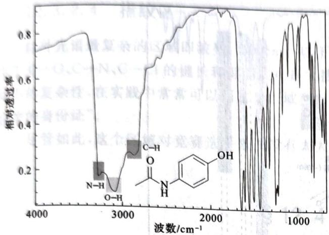

line chart

| 波数/cm⁻¹ | 相对透过率 |
| --------- | ---------- |
| 4000      | 0.75       |
| 3500      | 0.15       |
| 3000      | 0.10       |
| 2500      | 0.30       |
| 2000      | 0.85       |
| 1500      | 0.60       |
| 1000      | 0.85       |

对乙酰氨基酚的 IR 谱图(石蜡糊)

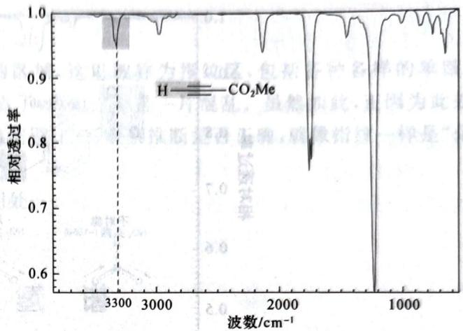

line chart

| 波数/cm⁻¹ | 相对透过率 |
| --------- | ---------- |
| 3300      | 0.9        |
| 2000      | 0.75       |
| 1000      | 0.6        |

丙炔酸甲酸的 IR 谱图

上右图中含有一个非常特殊的碳氢键,即炔烃的活泼 C—H 键。这是因为 sp 杂化的碳电负性较大,轨道能量低,成键比较好。炔烃的活泼氢的碳氢键波数在 3300 处,容易与其他键的吸收峰混淆,因此在这里特别提出。判断时,可结合下面讲到的三键区和其他信息进行综合考虑。

## 12.3.2.2 三键区

三键区是一个极度简单的区域,我们所常见的官能团只有腈和炔烃会在这里出现能够观察到的吸收峰。由于这种键两端的原子电负性相差都较小,所以峰强度一般不大。

【例 12.10】下图是星际分子氰基乙炔的红外光谱。它的谱图相当简单,包括波数 3300 左右处的碳氢键、2250 左右处的氰基和 2100 左右处非常弱的三键。容易发现氰基和三键的相对波数关系及相对峰高关系都是符合我们谈到的原理的。

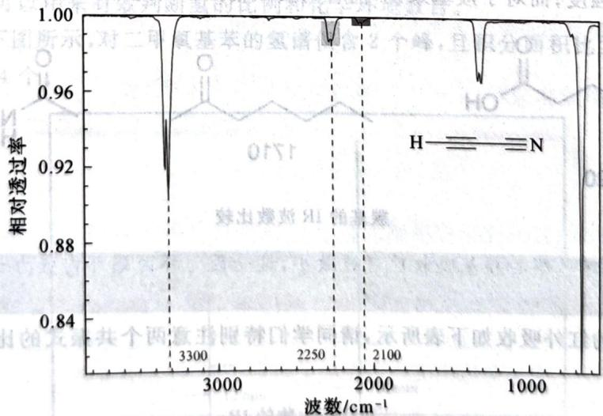

line chart

| 波数/cm⁻¹ | 指标强度 |
| --------- | -------- |
| 3300      | 0.96     |
| 2250      | 0.96     |
| 2100      | 0.96     |

氰基乙炔的 IR 谱图

## 12.3.2.3 双键区

双键区是另一个非常重要的区域，它一般包括各种羰基、双键（包括芳香化合物）及硝基、亚胺等等。【例12.11】如下图所示，对硝基肉桂醛堪称双键区的名流。图中包含1700左右处的羰基、1640左右处的双键、 $1500\sim 1600$ 处的芳基双峰和 $1500\sim 1300$ 处的硝基双峰。硝基的双峰和一级氨基的双峰成因类似，也是因为含有多种振动模式。

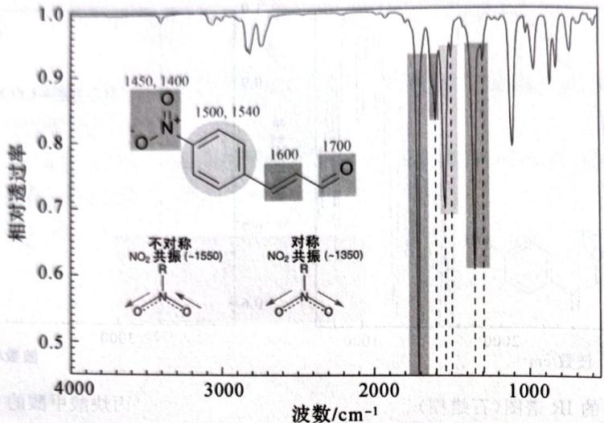

line chart

| 波数/cm⁻¹ | 相对透过率 |
| --------- | ---------- |
| 1450      | 0.8        |
| 1500      | 0.8        |
| 1540      | 0.8        |
| 1600      | 0.7        |
| 1700      | 0.7        |

对硝基肉桂酸的 IR 谱图

注记 芳基的吸收峰波数比烯烃低,这是因为芳基中存在共振,各键性质(强度)介于单键和双键之间。

烯烃的不饱和 C=C 键的峰高可能较低,而羰基的峰高则极高(回忆键极性对峰强度的影响)。羰基的存在是该区域最为显著的特征之一。

羰基的波数分布为 1500～1800，这与羰基旁边所接的基团有关。依据键强度对波数影响的规律，我们很容易用共振论来预言各种羰基化合物的羰基特征峰的波数。

【例 12.12】(羰基) 对于羧酸衍生物 RCOL, 存在两种共振: RC≡O⁺L⁻ 和 RCO⁻=L⁺。前者增强 C=O 键强度, 后者则减弱之。酰胺中氮的共轭较好, 后一共振式占优, 故酰胺中羰基的键强度低于一般羰基中的 C=O 键强度; 而对于羧基来说, 前者的贡献稍强。由此可以看到图中的波数递变趋势。

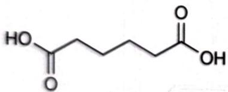

chemical

Chemical structure of a dipeptide with carboxylic acid and hydroxyl functional groups

1720

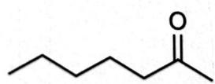  
1710

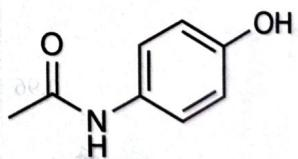

chemical

Chemical structure of a benzamide derivative with ketone and hydroxyl functional groups

1667  
羰基的 IR 波数比较  
注记 环丙酮和环己酮的羰基吸收前者波数小,这是因为环丙酮环内张力大,其更倾向于采用单键电荷分离的共振式。

重要羧酸衍生物的红外吸收如下表所示,请同学们特别注意两个共振式的比例对羰基吸收峰波数的影响。  
羧酸衍生物的 IR

<table><tr><td>羰基类型</td><td>波数</td><td>羰基类型</td><td>波数</td></tr><tr><td>酰卤</td><td>&gt;1815</td><td>酸酐</td><td>1790~1815</td></tr><tr><td>酯</td><td>1745</td><td>酰胺</td><td>1650</td></tr></table>

## 12.3.2.4 指纹区

红外光谱最复杂的区域即波数 $1500 \, cm^{-1}$ 以下的区域，这里被称为指纹区，包括各种各样的单键。由于 C—O、C—N、C—Cl 的键长和键能实在是太接近了，因此这里是一片混乱。虽然如此，正因为此处峰形的复杂性，在实践中常常可以用这个区域和标准谱图比对，观察推断是否正确，就像指纹一样是“化合物的身份证”。

尽管如此,这个区域对竞赛选手来说没有太大用处。

## § 12.4 氢谱

现在我们进入波谱学的重头戏:氢谱。夸张地说,氢谱能比前面几个光谱给我们多得多的信息,现代波谱鉴定大量使用氢谱(不仅仅是我们本节要学习的这种比较简单的分析),同时它也更加复杂。 $^{13}$ CNMR和 $^{1}$ HNMR的基本原理是一样的,这里不作赘述,仅仅对比一下 $^{1}$ HNMR和 $^{13}$ CNMR的基本特点的相同与不同。

1. 它们都仍然符合电子效应对化学反应的影响规则。  
2. 由于氢周围电子比较少, 氢谱中的化学位移一般不超过 10。  
3. 氢谱的积分面积有化学意义, 它的大小和氢数成正比。

## 12.4.1 积分面积

氢谱的积分面积可以用来有效判断氢的比例和化学环境数目。

【例 12.13】如下图所示,对二甲氧基苯的氢谱仅含 2 个峰,且积分面积比为 2:3,因此它含有两种氢,一种 6 个,一种 4 个。

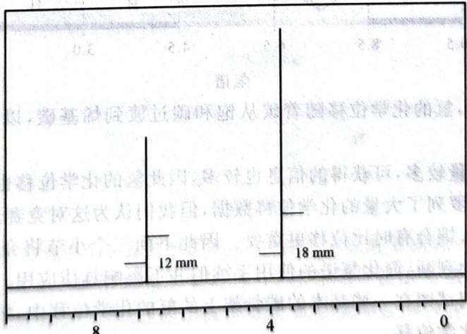

bar chart

| Category | Value |
| -------- | ----- |
| Top Section | 12 mm |
| Bottom Section | 18 mm |

化学位移 / ppm  
对二甲氧基苯的氢谱图

注记 积分面积不是峰高度,而是图中标出的类似于“∫”记号的高度。

## 12.4.2 化学环境

我们需要注意的是，在化学式或平面结构图上看上去化学环境一样的氢，在氢谱中可能还是有不同的化学位移。氢谱中的化学环境是非常严格的，请看例子。

【例 12.14】如下图所示, 图中明确标出的 Me 和 H 的化学环境在相应分子中都各不相同, 其化学位移均不同。我们容易看出, 这是由于立体化学结构不同, 包括对映异构和顺反异构。

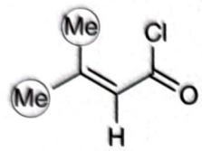

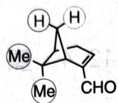

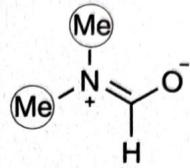  
化学环境

另外,我们还注意到(例如最后一个酰胺),如果共振产生双键的部分不可旋转性,则两个甲基的氢也会出现化学位移不同的情形。同学们在分析化学位移(尤其是涉及立体化学的)时切勿直接照着平面图观察,应当仔细分析基团的相互位置,以免错误指认。同时,若能注意到这些特点,亦能在推断立体化学结构时获得帮助。

## 12.4.3 氢谱的化学位移

氢谱给我们的第二信息就是化学位移。类似于碳谱，我们能获知氢附近连接原子的情况。

## 12.4.3.1 基本分区

氢谱的基本分区是完全类似于碳谱的,由此可见 NMR 之间的相似性。

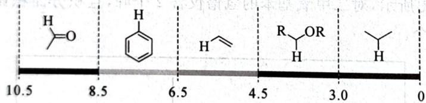

chemical

Chemical structure of a substituted cyclohexene derivative with labeled bond lengths and positions

氢谱

图中横轴单位为 ppm, 氢的化学位移随着碳从饱和碳过渡到烯基碳, 以及碳所连接基团吸电子能力的增强而增加。

由于有机分子中氢数量较多,可获得的信息也较多,因此氢的化学位移也需要比前述光谱更加详细的讨论。大多数书本上都罗列了大量的化学位移数据,但我们认为这对竞赛选手毫无意义;化学位移毕竟仅仅是氢谱的一个方面,耦合有时比位移更重要。因此下面三个小节将介绍估计化学位移的简单规则,便于结合化学原理帮助判断,简化氢谱的使用手续但并不影响具体应用。

规则是很自然的,我们试图在一些基本的碳骨架上的氢的化学位移中,按照实际所连基团加入修正的数值,最终得到近似的化学位移。

## 12.4.3.2 0\~3:饱和碳

甲基、亚甲基和次甲基上的基本化学位移分别是0.9、1.3和1.7ppm。

注记 甲基、亚甲基、次甲基的化学位移逐渐增加的原因是，C 的电负性比 H 略大，因此当碳上接有更多含碳基团后，氢的化学位移逐渐增加。

在任何基准位移下(包括接下来要讲的烯烃、芳烃和羰基), 当 H 连接的 C 上增加醛基、酮基、酯基、腈、烯基、炔基、芳基、硫、氮时, 化学位移增加 1ppm; 当连上硝基、氧、卤素、酰胺基、酰氧基时, 化学位移增加 2ppm。

注记 显然这是一个极度简化的规则,但是已经足够我们进行粗略的判断了。其误差最大可能达到1ppm。考虑到化学位移的多变性,大量记忆化学位移并不比使用上述规则准确多少。

【例 12.15】如下图所示,我们能看出,1.565 的化学位移是四级碳上连接的甲基。让我们来计算一下苯基和酰氧基之间的 H 的化学位移: $\delta=(1.3+1+2)ppm=4.3ppm$ 。

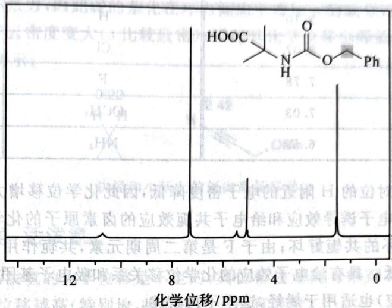

line chart

| Chemical Shift (ppm) | Integration |
|----------------------|-----------|
| ~8.5                 | HOOC      |
| ~3.5                 | N-H       |
| ~3.5                 | O-        |
| ~3.5                 | Ph        |

某被保护的氨基酸的氢谱图

事实上它的化学位移是 5.092ppm，上述估算足以让我们将它从其他峰中分开。

## 12.4.3.3 4.5\~8.5:烯烃与芳烃

根据电子效应的原理,我们易见不饱和碳的化学位移应当比饱和碳高。

苯环上氢的化学位移是 7.3ppm，乙烯中氢的化学位移是 5.5ppm。二者均可作为基本位移使用。

由于芳烃的化学位移和烯烃相比有所不同但包含了所有烯烃的特点,因此我们以芳烃为例介绍相关内容,烯烃可以直接类推。

值得注意的是,在碳谱中,芳基和烯基的碳的化学位移区别不大,但是在氢谱中,二者却有明显的区别,这与芳香化合物的性质有显著关系。如下图所示:

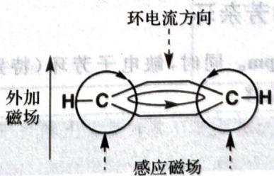

flowchart

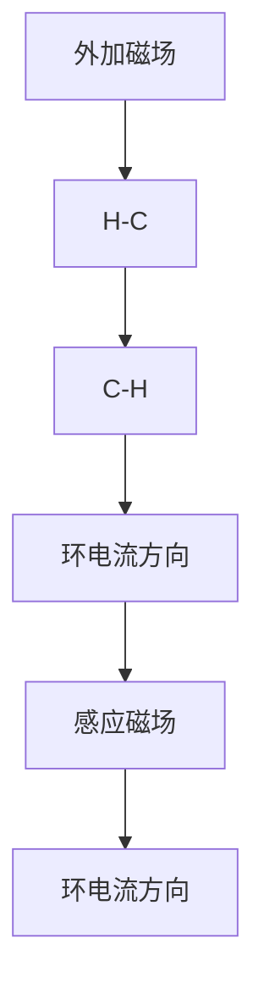

芳香化合物具有独特的环内电流,假如我们给出图示的环电流方向和外加磁场方向,则在标出的H处,环电流产生的磁场方向在环内与外加磁场相反,在环外与外加磁场相同(右手定则)。这样的性质,导致苯的环外H的化学位移大大升高,而环内若存在H则化学位移应该大大降低。下图是一个验证性的化合物,苯环上部用阴影标出的氢化学位移仅有-0.6ppm,证实了这一理论。

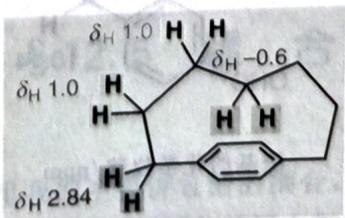

chemical

Molecular structure diagram with labeled hydrogen bond distances (δH 1.0, δH -0.6, δH 2.84)

接下来考察苯环上取代基的影响。考虑化合物：1,4-二(R)苯，当R改变时苯环上氢的化学位移改变如下表所示：

取代基和化学位移

<table><tr><td>R</td><td>δ</td><td>R</td><td>δ</td></tr><tr><td>NO2</td><td>8.48</td><td>I</td><td>7.40</td></tr><tr><td>COOH</td><td>8.10</td><td>Br</td><td>7.32</td></tr><tr><td>CN</td><td>8.10</td><td>H</td><td>7.27</td></tr><tr><td>CHO</td><td>8.07</td><td>Cl</td><td>7.24</td></tr><tr><td>CF3</td><td>7.78</td><td>F</td><td>7.00</td></tr><tr><td>CH3</td><td>7.03</td><td>OCH3</td><td>6.80</td></tr><tr><td>OH</td><td>6.59</td><td>NH2</td><td>6.35</td></tr></table>

吸电子基团将导致邻对位的 H 附近的电子密度降低,因此化学位移增大。吸电子能力越强,则化学位移越大。同时具有吸电子诱导效应和给电子共轭效应的卤素原子的化学位移与 H 相比的大小关系,则取决于卤素 X 和苯环的共轭好坏;由于 F 是第二周期元素,共轭作用因轨道能量匹配而效果最好,因此 F 的化学位移最低。具有给电子效应的化学位移关系和吸电子基团类似。

同样的论证(电子效应)也适用于烯烃,这里不再赘述。

【例 12.16】如下图所示,在第一个化合物中,右侧氢的化学位移高于左侧氢,因为左侧氢受到了孤对电子的影响,屏蔽更强。在第二个化合物中,下侧氢受到更强烈的共轭吸电子效应影响,因而化学位移更高。在第三个化合物中,右下角的氢受到更强烈的给电子共轭效应影响,因而化学位移更低。

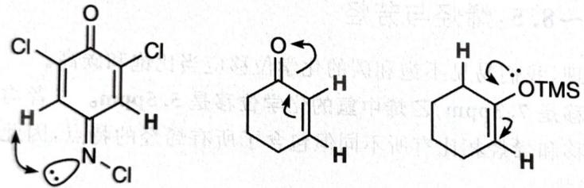  
预测化学位移

## 12.4.3.4 8.5 以上:醛和芳杂环

甲醛上氢的化学位移为 9.60ppm。同时，缺电子芳环（特别是吡啶）上的氢的化学位移也在 8.50ppm 左右。以上均可作为基础位移。

注记 在基础有机化学中我们知道吡啶环某种意义上相当于硝基苯,那么吡啶环上H的化学位移大约为9ppm(按照简化规则)。

醛基、吡啶环上氢的化学位移仍然遵循我们所讲过的电子效应规则。这里列出几个例子而不加说明，同学们可自行解释作为练习。

【例12.17】如下图所示。

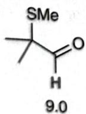

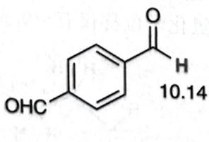

chemical

Chemical structure of a substituted benzene ring with methoxy and hydroxyl groups, labeled 10.14

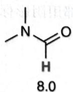  
醛基的化学位移/ppm

## 12.5.1 基本原理

原子核本身具有一个较小的磁场，在分子中它们能互相影响（在化学中比较重要的是通过化学键（一般最多3个）传递的J-耦合），两个核的自旋不同，取向能量不同，导致核磁共振谱图的耦合裂分，对应的氢的峰形出现更精细的分裂。

让我们用图示来阐述这种现象：

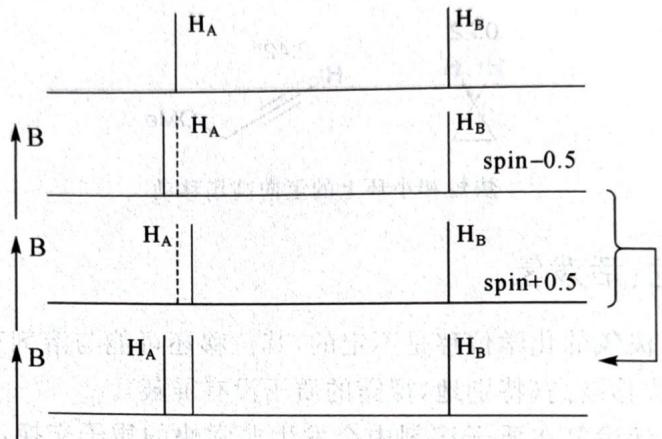

text_image

H_A
H_B
B
H_A
H_B
spin-0.5
B
H_A
H_B
spin+0.5
B
H_A
H_B

耦合

如上图所示,考虑氢原子 A 受到氢原子 B 自旋的影响,则 B 分别取不同自旋时 A 的裂分能级差有所不同,因此它的峰向不同方向移动,导致 A 对应的峰裂分为双峰。同理,实际上 B 也同等受到 A 影响,因此最后两个峰都会从单峰(singlet,s)裂分为双峰(doublet,d)。

耦合裂分一般用 $J$ 表示，并以 $J_{x}$ 的下标 $x$ 表示两个 $\mathrm{H}$ 之间所间隔的键数。一般我们讨论的是 $J_{3}$ 耦合，连接在同一个碳上或距离过远的氢耦合不明显。但 $J_{2}$ 耦合（同一个烯烃碳上的 $\mathrm{H}$ )和 $J_{4}$ 耦合（烯丙型结构）也是存在的。事实上，“化学环境相同”不意味着不发生耦合，我们有以下概念和判断规则。

若两个化学环境相同的 H 和其他任何一个与它们均存在可观测耦合的核的两个耦合常数都相等，就称这两个 H 是磁等价的。两个氢不发生耦合裂分现象，当且仅当它们是磁等价的。

【例 12.20】H 和 F 可发生明显耦合。在 $H_{2}C=CF_{2}$ 中，两个 H 不是磁等价的（双键无法自由旋转），根据上述规则知道会发生 $J_{2}$ 裂分；在 $H_{3}C-CF_{3}$ 中，H 是磁等价的（旋转），于是不发生裂分，表现为单峰。

现在让我们来考虑一个更加复杂的体系: $AB_{2}$ 耦合。

有了前面分析的基础,则 $\mathrm{AB}_2$ 体系就容易观察(参看下图)。在 B 的作用下,A 裂分两次,每次耦合常数都相同,最终得到一个 $1:2:1$ 的峰(即两个 B 的自旋可取值为 + +、+ -、- +、-- ,其中中间两个的能量相同,因此得到该比例);在 A 的作用下,B 裂分一次,最终得到一个 $1:1$ 的峰。于是,我们容易通过归纳得出如下原理(同学们可自行说明之):

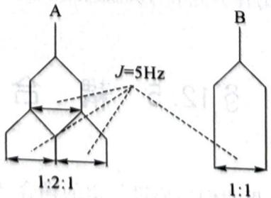

chemical

Chemical resonance diagram showing J=5Hz between two molecular structures labeled A and B with 1:2:1 and 1:1 ratios

$\mathrm{AB}_2$ 耦合

对 $\mathbf{A}_x\mathbf{B}_y$ 体系，A将裂分成 $(1:1)^y$ ，B将裂分成 $(1:1)^x$ 。从而，A裂分出的峰数为 $y + 1$ ，B裂分出的

## 12.4.3.5 炔烃和小环上的氢

炔烃和小环上的氢的化学位移和一般的情形也略有不同,但也是对电子效应的应用。对炔烃上的氢来说,相邻的碳碳三键具有筒状的电子云,将氢包裹起来,导致其化学位移相对降低。

对于小环, 因其存在环张力, 因此碳的杂化在环内倾向于增加 p 的成分, 而与 H 成键时增加 s 的成分, 从而导致 C—H 键电子云密度变大 (s 比较致密), 因此其化学位移也降低。下面是两个例子。

【例12.18】如下图所示。

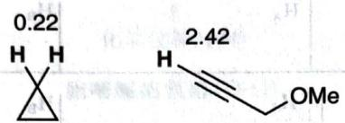

chemical

Chemical structure diagram showing a cyclohexene ring with labeled bond lengths and an OMe group

炔烃和小环上的氢向高场移动

## 12.4.3.6 变色龙:活泼氢

在氢谱中,一般来说活泼氢的化学位移是不定的,其位移还可能与溶剂有关。不过总的来说,在相同条件下,酸性越强,化学位移越高(特别地,裸露的质子没有屏蔽)。

氢交换 我们都知道,活泼氢在质子溶剂中会发生非常快的质子交换,这一点在活泼氢化合物的 $D_{2}O$ 氢谱中能充分体现。

【例 12.19】如下图所示,甘氨酸的氢谱中仅含有一个峰,也就是说氨基和羧基的氢“不见了”。我们知道甘氨酸和两性离子存在平衡,因此 $D_{2}O$ 会交换掉氨基和羧基上所有的质子。

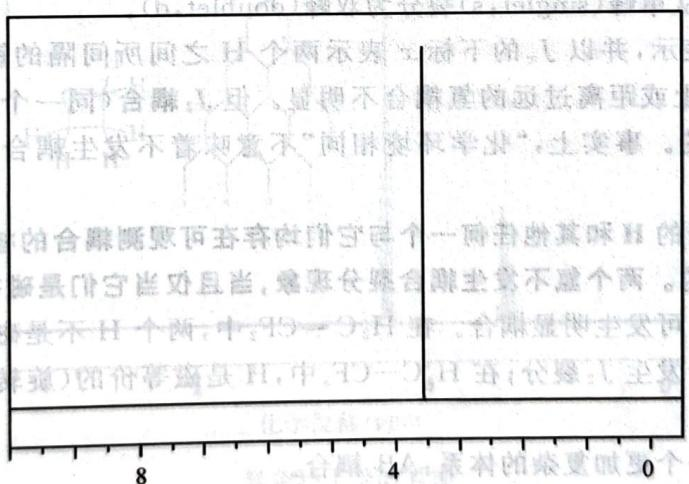

text_image

始副同词同文 H 个西示英 文词于纳。【煜兵，无
个一同）含雕：L 里，显即不合雕直向或托离张矩
合雕主实不曾知意不“同时来学出”，土美事。
的合雕概要何弃弃在卧守四个一词所出其呼H的
影是卧守皆且当，竟愿台雕合雕主实不虚个西。
景不H个画，中：T5—O.H 三，合雕是卧主实同
道）图作草造H，中：T0—O.H 五（公媒：王立
8 4 0

化学位移/ppm  
甘氨酸的氢谱 $(\mathrm{D}_2\mathrm{O})$

事实上测量谱图时已经去掉了溶剂背景,因此只有一个亚甲基峰。

注记 活泼氢化合物在重水中的原始谱图中一般有 4.8ppm 的 HOD 峰。

## § 12.5 耦合

耦合是一个非常重要的工具。这里我们主要讲氢谱的耦合，因为它常见且有用。它可能比化学位移还要重要，因为它能充分给予我们所研究的氢周围的基团上氢的分布的信息。

【例 12.21】如下图所示,胞嘧啶的氢谱中含有活泼氢的交换峰。

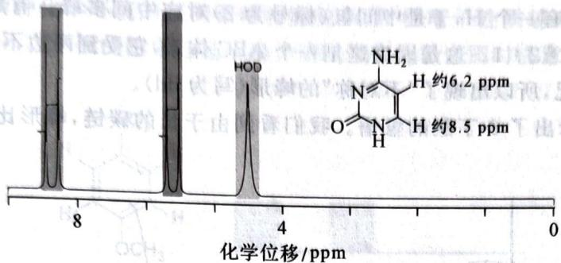

line chart

| Chemical Shift (ppm) | Value |
| --------------------- | ----- |
| ~6.2                  | 约6.2 |
| ~8.5                  | 约8.5 |

胞嘧啶的氢谱 $(\mathrm{D}_2\mathrm{O})$

除此之外, 氢谱中还有两个芳环上的氢。我们注意到下方的氢在两个吡啶氮的邻对位, 化学位移高, 所以最左侧的峰对应于下面的 H。同时, 我们注意到明显的耦合——AB 耦合, 两个 H 均裂分为 1:1 的两组峰。

## 12.5.2 分析实例

【例 12.22】如下图所示,氧杂环丁烷的氢谱含有两个峰。容易通过电子效应识别低场的峰属于右上和左下的氢。我们观察到了 1:2:1 和 1:4:6:4:1 的峰,这与它们附近的氢的耦合完全相符。

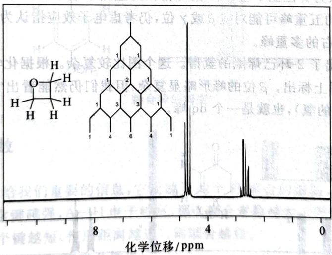

chemical

NMR spectrum and molecular structure of a steroid derivative with labeled carbon positions

氧杂环丁烷的氢谱

图上已经作出了解释 1:4:6:4:1 峰的分支情况的图示。

【例 12.23】菊酸是合成高效低毒杀虫剂的重要中间体。下图示出了它的氢谱(按惯例,左侧为化学位移高的方向)。

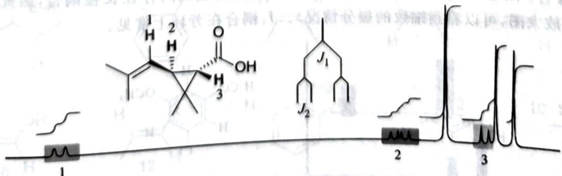

chemical

Chemical structure diagram showing a molecule with labeled atoms and functional groups including carbonyl, hydroxyl, and ester groups

菊酸的氢谱

我们特意去掉了化学位移的具体数据,以表明我们完全可以通过耦合进行指认。事实上,化学位移

最高位置必然对应最左侧的氢,因为它连接在烯烃碳上。羧基旁边的氢必然对应化学位移最低的峰,因为1:1的峰表明其邻位有一个H,于是中间氢(标号为2)对应中间多峰。有趣的是,中间氢的峰比例是1:1:1:1,而不是1:2:1。这是因为这是一个ABC体系,它受到两边不同氢的影响,图中已经示出了这样体系的裂分情况,所以出现了“不对称”的峰形(写为dd)。

【例 12.24】下图示出了 2-丁酮的氢谱。我们看到由于长的碳链，峰形比较复杂，尤其是 3 号峰，比例非常难观察。

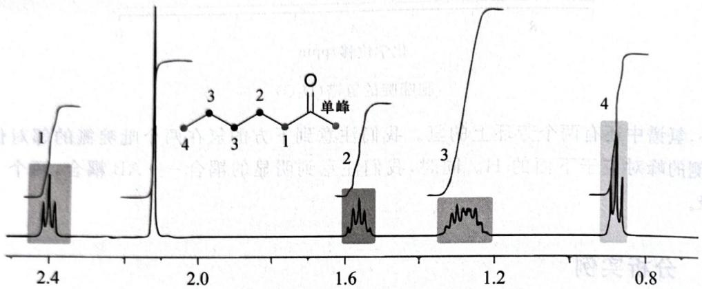

line chart

| Peak | Value |
| ---- | ----- |
| 1    | 2.4   |
| 2    | 1.6   |
| 3    | 1.2   |
| 4    | 0.8   |

2-丁酮的氢谱

但是我们并不需要其他信息就能指认。两个三重峰(1:2:1)对应链左侧末端或 $\alpha$ 位亚甲基，考虑电子效应，把2.4的峰指认为 $\alpha$ 位亚甲基，0.9的峰指认为左侧末端甲基。未标阴影的单峰一定对应于右侧孤立甲基。1.6左右的五重峰可能对应 $\beta$ 或 $\gamma$ 位，仍考虑电子效应指认为 $\beta$ 位。余下两个位点则统一指认到“混乱”的1.3左右的多重峰。

【例 12.25】下图示出了 2-环己烯酮的氢谱。这个图比较复杂。根据化学位移我们能对带阴影的峰形作指认，它们已经在图上标出。 $\beta$ 位的峰形略显复杂，但我们仍然能看出它是先按 1:1 裂分，再按 1:2:1 裂分得到的（图中的氢），也就是一个 dq 峰。

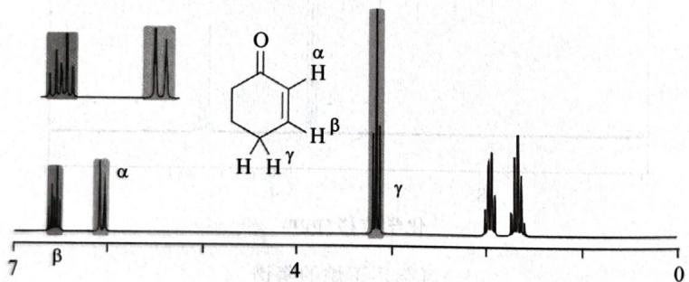

chemical

NMR spectrum with labeled peaks and a chemical structure of a fused ring system containing α, β, γ, and H atoms

2-环己烯酮的氢谱

另外,我们要指出,如果将 $\alpha-H$ 对应的峰放大,我们将能看到另一组 dq 峰(图中左上角)。这就是在前面比较微弱但常常能发现的 $J_{4}$ 耦合。在这种情形下,烯基上的氢可以与距离 4 根键的氢产生耦合。

【例 12.26】下图是一个 $J_{4}$ 耦合的例子。上侧和左侧的氢之间存在长程耦合，因此出现了图示的裂分（左上角为放大图，可以看到细致的裂分情况）。 $J_{4}$ 耦合在芳环上常见。

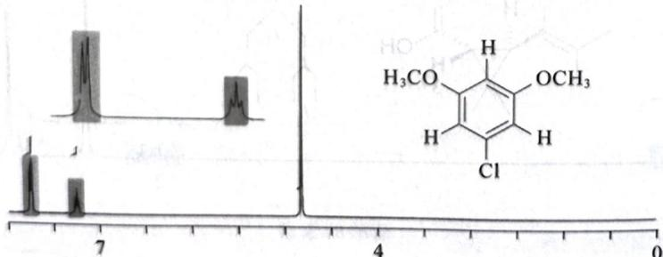

chemical

NMR spectrum and molecular structure of a chlorinated aromatic compound with methoxy and hydroxy substituents

注记 特别注意,两个下侧的氢是磁等价的。它们只能和上侧的氢发生可观测的耦合。

最后,我们要指出耦合峰形的一个重要特点:可能发生畸变。让我们来想象:考虑对位分别是 $R$ 、 $R'$ 的苯环上的氢。苯环上两种化学环境的氢的谱峰将随着 $R$ 、 $R'$ 的电子性质越来越接近,从 d 变成 s(最后磁等价了,不发生裂分),在下面的图中已经示出。请同学们分析谱图时注意这一点,以免将两个双峰识别成 q 等等。

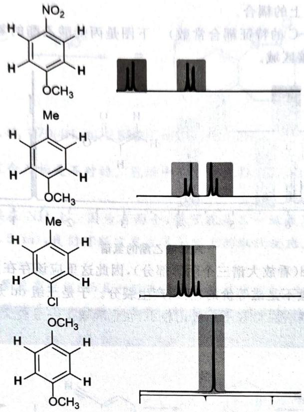  
耦合峰的畸变

## 12.5.3 耦合常数

耦合常数的大小也能给我们重要的信息,它反映了两个 H 耦合的强弱。我们曾说过,我们谈论的耦合是基于化学键的,化学键越强,A—H 电子越富,那么耦合常数越大。于是容易推断下述规则:

1. 两个 H 之间的几个键越短(作用距离越近), 则耦合越强。  
2. 两根 A—H 键轨道越平行, 则耦合越强。  
3.(诱导)吸电子基团导致耦合变弱。

以下是一些常见耦合常数。同学们不必记忆它们，只需有一个基于上述规则的基本的相对大小判断即可。

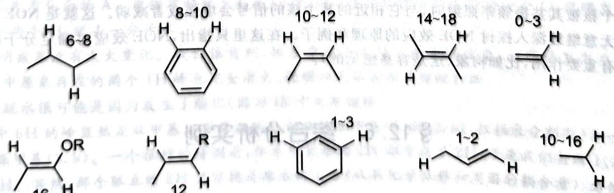

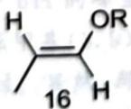  
常见耦合常数(单位:Hz)

【例 12.27】在上图第一排中,随着键长变短,体系耦合常数越来越大;注意苯因为是部分双键,因此耦合常数稍低。在第二排中,引入烷氧基诱导吸电子(且共振降低键级),导致体系耦合常数变小。长程耦合(即前面提到的 $J_{4}$ 等类型的耦合)的耦合常数是很小的,我们容易想见如果是炔丙型结构,应该也能观察到稍大的耦合常数,而纯烷基一般观察不到长程耦合。

接下来我们将讲到同碳上的耦合。

【例 12.28】(单取代 C=C 的特征耦合常数) 下图是丙烯酸乙酯的氢谱。这里, 我们只考虑烯烃区, 同学们可自行指认饱和碳区域。

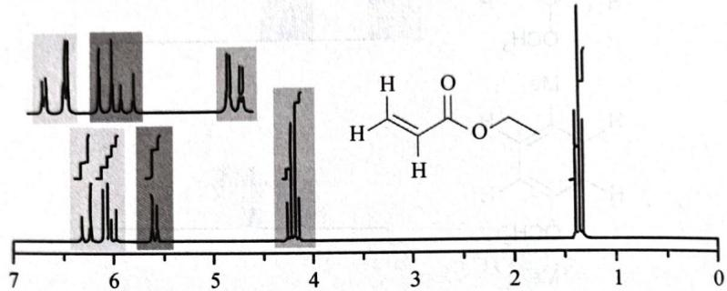

chemical

NMR spectrum and chemical structure of a carboxylic acid derivative with labeled proton peaks

丙烯酸乙酯的氢谱

烯烃区的三组峰都是 dd(看放大谱三个阴影部分), 因此这里应该存在同一个碳上连接的烯烃的耦合: 因为左侧亚甲基上两个氢不是磁等价的, 所以产生裂分。于是三组 dd 是非常明显的了。

注记 同一个碳上的耦合在烯烃上一般比较小,在饱和碳上一般较大;单取代烯烃的重要特征是三组 dd 峰。

## 12.5.4 其他耦合

耦合不仅仅存在于 H—H 中, 其他原子之间也可能存在耦合。我们在前面所介绍的耦合是同类型原子的耦合, 事实上也存在异类型原子的耦合。由于它们对我们来说不是非常重要, 这里仅简单一提, 在实际解题中已经足够使用。

1. 异类型原子之间的耦合常数可以非常大, 因为它们将存在 $J_{1}$ 耦合。如果你看到极大的耦合常数, 说明含有特殊的杂原子, 比如 P、F 等等。  
2. 特别地, C—H 耦合基本可以忽略, 这是因为 ${}^{13}C$ 的丰度太低, 其耦合只能在谱图底部的精细结构中看到; 况且体系中 C—H 耦合过于复杂, 相互重叠, 指认困难较大。

## 12.5.5 NOE效应

我们上面所讲的耦合是通过分子的键传递的。在 NMR 中, 原子在空间中的接近也会导致相互作用。当一个核被其共振频率照射时, 与它相近的某个核的信号会增强或者减弱。这就是 NOE 效应。我们无意继续深入探讨 NOE 效应的原理和例子。在这里只指出, NOE 效应对确定分子的某些立体结构也有重要作用, 比如构象(这是容易想见的)。

## § 12.6 综合分析实例

结合光谱的分析有时候可以很难,也可以很出人意料。它既需要一定的基本原理知识,也需要相当的直觉和推理能力。下面我们由实例展示如何解题。

【例题12.29】有人用浓 $\mathrm{H}_2\mathrm{SO}_4$ 在合适条件下做了如下图所示的反应，得到产物 $\mathbf{P}$ 。他预期产物为括号中所示，并测定了氢谱。试问：是否得到了预期产物？若是，指认谱峰；若不是，推出实际产物结构。无论回答是与否，写出生成产物的反应机理。

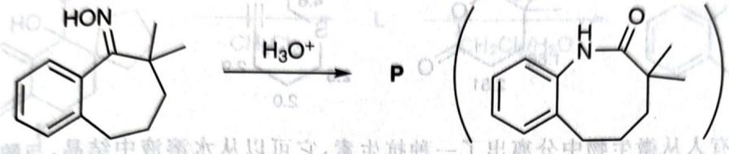

chemical

Chemical reaction showing oxidation of a naphthalene derivative to an enone using H3O+ catalyst

$^{1}$ HNMR: 1.27(6H, s), 1.70(4H, m), 2.88(2H, m), 5.4\~6.1(2H, D $_{2}$ O), 7.0\~7.5(3H, m)

解 我们一眼便可看出这个产物是不对的。氢谱中有2个被 $\mathrm{D}_2\mathrm{O}$ 交换的活泼氢，而预期产物中只有一个酰胺氢。

这里的活泼氢只可能连接在 NH 上。因为有两个,很可能是在一级氨基上。还能注意到的是,苯环上的氢减少到 3 个(7.0\~7.5,m),我们可断言发生了芳环上的取代反应。观察条件,显然酸性条件下是亲电取代。

其次,甲基和6个环上的氢没有变化(而且一般来说也不应该变化)。如果我们要取代掉一个苯环上的氢,最佳操作便是在三级碳处产生一个碳正离子。综上所述,我们能给出产物的结构并简单写出机理:

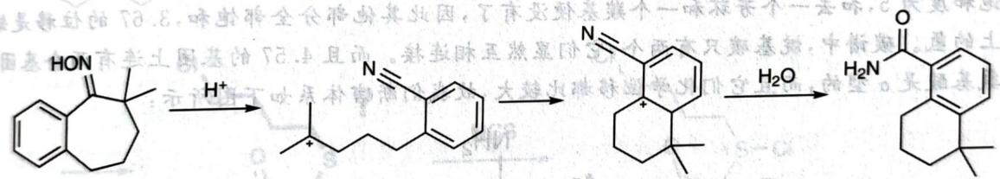

chemical

Organic reaction pathway showing protonation, cyclization, and dehydration steps of a fused bicyclic compound

【例题 12.30】有人做了下图所示的两个反应,并测定了光谱。推定产物结构并写出机理。

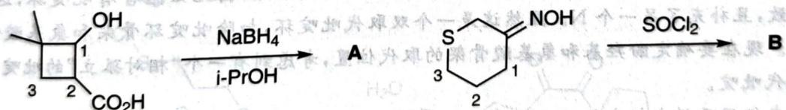

chemical

Chemical reaction scheme showing conversion of compound A to B via NaBH4 and i-PrOH steps

A: $C_{7}H_{12}O_{2}$ ; IR 1725 cm $^{-1}$ ; ${}^{1}$ HNMR 1.02(6H, s), 1.66(2H, t, J 7Hz), 2.51(2H, t, J 7Hz), 3.9(2H, s)

B: MS 149/151(1:3): IR 2250 cm $^{-1}$ ; ${}^{1}$ HNMR 2.0(2H, quintet, J 7Hz),

2.5(2H, t, J 7Hz), 2.9(2H, t, J 7Hz), 4.6(2H,s)

解 首先看化合物 A。原物质的分子式是 $C_{7}H_{12}O_{3}$ ，与后来物质的差距为一个 O，说明发生还原，则应该是加两个 H，脱去一分子水。

IR表明羰基没有太大变化。我们注意到，体系中完全失掉了两个活泼氢，说明这里发生了反应。另外，体系中原来存在的两个1H峰也完全消失，说明四元环右侧的键被打断。

因此，脱水很可能是因为发生了酯化（因为 IR 中无双键峰）。

体系中6H的峰显然是双甲基。再考虑两个相邻的亚甲基(1.66、2.51,根据裂分判断)和一个孤立的缺电子亚甲基(3.9)。一个很好的猜测是，体系中原来的1H都变成了2H，于是我们打断1、2之间的键并补入H。显然，那个孤立的2H只可能是原来的1号（从高化学位移和周围的耦合看），为使它彻底孤立，令羟基氧和羧基酯化，便得到了我们要的产物。

再看化合物 B。MS 表明体系中引入了一个 Cl 原子。IR 表明体系中出现了一 CN 基团，所以肟发生了脱水反应，应该断开肟旁边的一个碳碳键。

接下来看碳链,两个t峰必须是S和不饱和碳周边的,中间的五重峰则在这两个t峰氢原子中间,因此1、2、3原子没有变化。所以断开的是上方的键,产生碳正离子之后被Cl⁻捕获,发生加成。

机理比较简单,这里略去。指认如下:

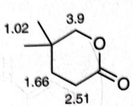

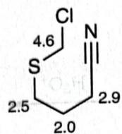

【例题 12.31】有人从微生物中分离出了一种抗生素,它可以从水溶液中结晶,与酸、碱都能形成不同的结晶化合物。光谱数据如下(碳谱、氢谱均在强酸性 $D_{2}O$ 中测定),推理给出其最合理结构。

MS(EI):182(9%),109(100%),74(15%)

$^{1}$ HNMR:3.67(2H,d,J7),4.57(1H,t,J7),8.02(2H,m),8.37(1H,m)

$^{13}$ CNMR:33.5,52.8,130.1,130.6,130.9,141.3,155.9,170.2

解 这看上去是一个比较困难的问题。整体上看，这必须是一个氨基酸。体系中显然有一个芳环。另外，我们观察到芳环上高的化学位移，因此这必然是一个缺电子芳环。

首先根据质谱确定分子式,相对分子质量是182。体系中,至少有8个C和6+3个H(注意氨基酸要被交换掉3个),再扣除N和2O,还剩下31。依据氮数的奇偶性规则知道还有一个N。剩下的17如果不是C、H,则一个比较好的组合是16+?,即10+?。因活泼氢可以被掩盖,所以我们不妨再引入一个活泼氢,因此体系的分子式最可能是 $C_{8}H_{10}N_{2}O_{3}$ 。

不饱和度为 5, 扣去一个芳环和一个羰基便没有了, 因此其他部分全部饱和, 3.67 的位移是缺电子烷基碳上的氢。碳谱中, 烷基碳只有两个, 它们显然互相连接。而且 4.57 的基团上连有两个基团, 考虑到天然氨基酸是 $\alpha$ 型的, 而且它们化学位移都比较大, 故我们断言体系如下图所示:

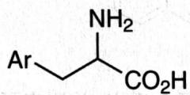

除去2个烷基碳和1个羰基碳只剩下5个碳,不足以构成苯环,因此必然含有吡啶环,这也与高化学位移相一致,且补充了另一个N。显然这是一个双取代吡啶环,扣除吡啶环骨架和氨基酸骨架,只剩下一个羟基。现在要确定酚羟基和氨基酸骨架的取代位置,考虑到有一个“相对孤立”的吡啶氢,所以它是2,6-双取代吡啶。

现在让我们用质谱分析来推测 2 位和 6 位分别是何基团。109 的峰和原分子相差了 73，这个 73 的片段不可能是吡啶，可能是氨基酸片段。我们注意到—CH(NH₂)—COOH 的相对分子质量是 74，因此我们推测这个极高丰度的碎裂模式应该是下图这样的：

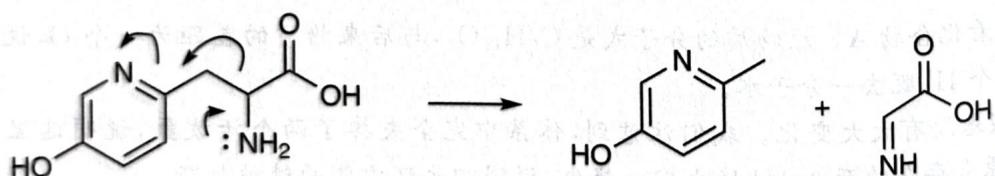

chemical

Chemical reaction mechanism showing nucleophilic substitution of a hydroxyquinoline derivative with amine group

而另外一种排布无法做到这样碎裂(邻位和间位的区别)。综上所述,我们推定了未知物的结构。请同学们自己对谱图的其他细节进行指认。

【例题 12.32】化合物 K 在二氯甲烷和水中会和 NCS 迅速反应, 继续搅拌反应 2h 后, 最终地转换为 M。如果 K 在无水二氯甲烷中与 NCS 反应, 可转化为 L; L 在二氯甲烷和水中与 NCS 反应量转化为 M。

1. 画出 L 的结构简式。氢谱数据: 1.01\~1.07(2H), 1.38\~1.43(4H), 1.90\~2.21(6H), 2.70(2H), 2.95(2H), 3.50(2H), 7.10\~7.33(3H), 7.99(1H)。

2. 画出从 K 到 L 的转换过程中所形成中间体的结构简式, 同一物种只需画出其中一种主要共振式。

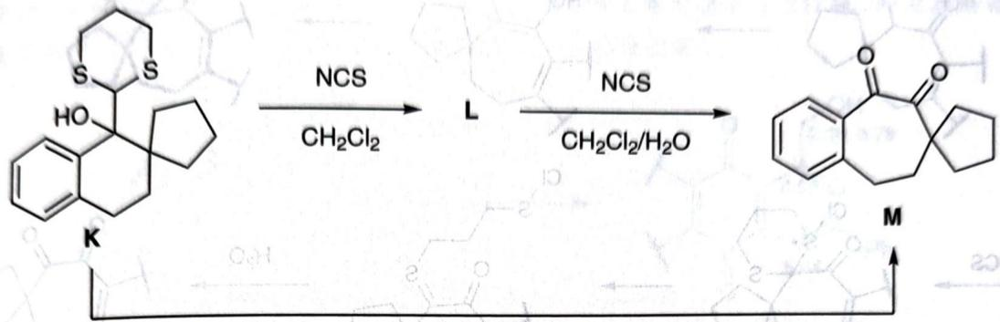

chemical

Chemical reaction scheme showing conversion of compound K to M via NCS and CH2Cl2 steps

解 稍一观察即知本题氢谱的具体数据意义不大,因为我们所关心的有变化区域的 H 环境变化都不大,因此决定解题策略为主要进行机理分析。注意 S 的孤对电子容易进攻 Cl,得到正离子促进开环,因为产物发生扩环,故此时便有可能发生迁移。

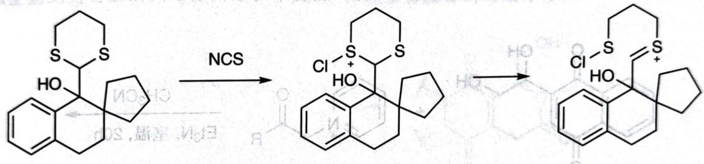

chemical

Chemical reaction pathway showing conversion of a steroid-like compound to a fused bicyclic structure via NCS and chlorination steps

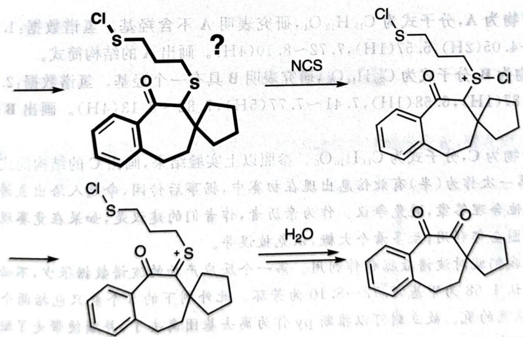

chemical

Chemical reaction pathway showing conversion of a chlorinated thioether to a fused bicyclic compound via NCS and H2O steps

但是还上了一次 NCS, 说明还发生了一次氧化反应。注意到迁移之后形成的硫醚具有类似醇的结构, 因此氧化是自然的。据此先写出初步的反应机理, 如上图所示。现在检验。中间产物中, 电中性且比较合理的为粗写的化合物。该化合物有 23 个氢, 而 L 的氢谱只显示 22 个氢, 说明推理有误。考虑到一开始的机理都比较正确, 我们可令加粗物种的羰基 $\alpha$ 位 (有 S 活化, 容易形成烯醇) 对 S 进行一次进攻, 重新形成六元环, 减少一个氢。这样就得到了较合理的答案, 并修改机理如下:

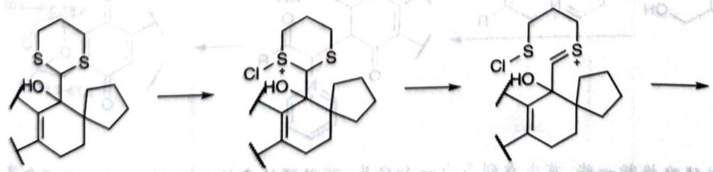

chemical

Chemical reaction pathway showing transformation of a steroid-like molecule with sulfur-containing functional groups to form a chiral product.

第二个反应则稍微推断一些，首先看到多由一个怪点，可以预计来核合成和PY消除是否改变的。

再现着产物反应性,亲核试剂是碳负离子,亲电试剂只能是醌,因此第一步加或反应也是明显的。根据该谱分析,消除吡啶并形成端酮。检查得到产物的分子式,符合题意,故推定。

现就本讲为波谱学,我们就对波谱数据分析利用。第一个反应产物的波谱数据很少,不必是误。对第一个反应来说,首先指认1.68为甲基,7.72\~8.10为考环。此外测下的5个氢只包括两个羟基邻烃的氢和原吡啶亚甲基位置的氢。故立刻可以推断py作为离子基因离子了,并顺便带去了脲环左右角的那小氢。又产物没有羟基,所以必然会形成了缩脲。

3. 当 R=OEt 时，动物为 C，分子式为 $Ca_{4}H_{10}O_{5}$ 。参照以上实验结果，画出 C 的结构简式。

解：此为诸学数据第一次作为（半）有歧信息出现在初算中，据事后传闻，命题入给出氢谱数据是为
了全答案唯一，不出现其他合理答案，避免争议。作为亲丙者，作者们 的建议是，如果在竞争现场遇到此

2. 当 R = Ph 时，产物为 B，分子式为 $C_{20}H_{14}O_{4}$ ，研究表明 B 具有一个羟基。氢谱数据：2.16(1H)，

1. 当 R = CH₃ 时，产物为 A，分子式为 C₁₅H₁₂O₄，研究表明 A 不含羟基。氢谱数据：1.68(3H)，2.73\~2.88(2H)，3.96\~4.05(2H)，5.57(1H)，7.72\~8.10(4H)。画出 A 的结构简式。

矿物。

【例题12.33】影响有机反应的因素众多。例如，底物中的取代基不同性在会使反应生成不同的
过程完成了解答。

要改变的只能是产生缩酮的行为。注意如果把 Ph 换为甲基，则 A、B 为同分异构体，所以脱水反应必然还存在。在波谱数据中去掉高位移的芳环之后，出现大量复杂的 1H 峰，仔细分析之可能不在我们的能力范围中：6.68 应该为羟基氢，其余与 A 相比变化不大，但注意到没有了 2H 峰，所以推断形成半缩酮之后发生了脱水，产生了烯烃。这样，形成更大共轭体系，更为稳定。

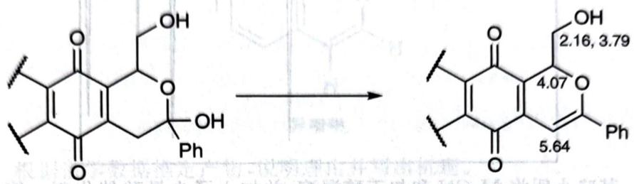

chemical

Chemical reaction showing conversion of a flavonoid derivative to a substituted benzene derivative with labeled carbon positions and functional groups

指认时,我们会发现亚甲基上碳的化学位移有两种,这与我们一般的感觉不符。注意,如果我们不够熟悉复杂的谱学特征,又没有其他更合理的答案,那么就不要太重视这一“问题”。当然,如果我们有了对化学环境的认识,可以解释说这可能是因为这里的羟甲基无法发生自由旋转所致。

有了前两个反应的基础,第三个反应就不难,发生酯交换得到内酯即可。

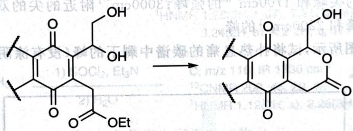

chemical

Chemical reaction showing conversion of a flavonoid derivative to a glycoside derivative with ester and hydroxyl groups

第12讲习题

【习题12.34】下图画出了IR某区域中重要键的特征峰的位置，请在图上标出每种峰分别代表什么键及其波数以复习之。

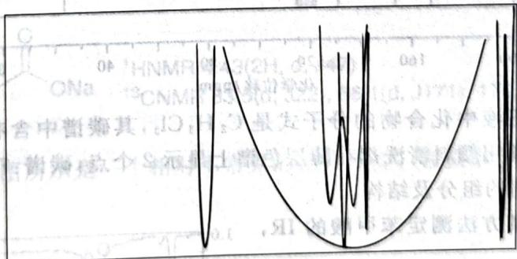

text_image

04 HNMR 2H 2S
ONa CNM 13.5g 100g
含中普酶其，IO
葡萄糖个Sph+糖苷酸
001

【习题12.35】空空荡荡的下图示出了IR某区域中重要键的特征峰的位置，请在图上标出每种峰分别代表什么键及其波数以复习之。

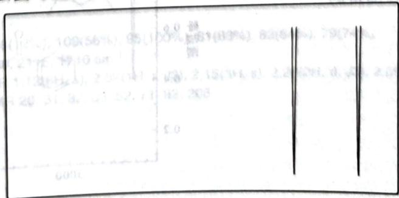

text_image

0.0
100%
27%
1/3(5x4), 2.0(1x1)
420 31 3, 23 52, 71
6000
0.0

【习题 12.36】下图画出了 IR 某区域中重要键的特征峰的位置,请在图上标出每种峰分别代表什么键及其波数以复习之。

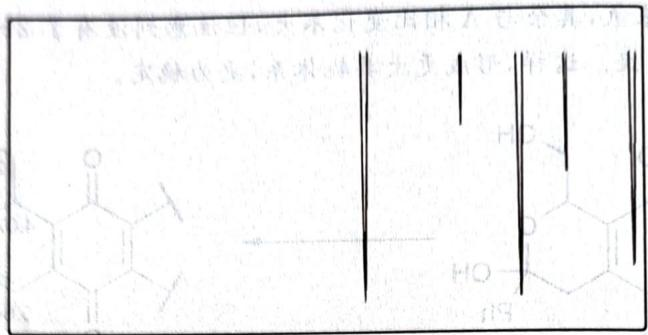

chemical

Chemical structure of a steroid derivative with hydroxyl and ketone functional groups

【习题12.37】某晚小明将MeCN和叔丁醇混溶，并加入了少量酸催化剂。第二天早上他得到了一些具有如下波谱学性质的晶体，试问：它是什么？

IR:3435,1686cm $^{-1}$ ; $^{13}$ CNMR:169,50,29,25ppm;

$^{1}$ HNMR:8.0,1.8,1.4ppm;MS:115,100,64,60,59,58,56

【习题12.38】三个 $\mathrm{C}_3\mathrm{H}_5\mathrm{NO}$ 的同分异构体具有如下IR数据，试分别画出它们所有可能的符合谱学数据的结构： $3000\mathrm{cm}^{-1}$ 的尖峰和 $1700\mathrm{cm}^{-1}$ 的强峰； $3000\mathrm{cm}^{-1}$ 附近的尖的双峰和 $1600\sim 1700\mathrm{cm}^{-1}$ 的双峰； $3000\mathrm{cm}^{-1}$ 以上的宽峰和 $2200\mathrm{cm}^{-1}$ 的峰。

【习题 12.39】如下图所示,试将扑热息痛的碳谱中剩下的峰(没有涂阴影的峰)与图上的碳对应起来(每个峰指认一种碳)。

bar chart

| 化学位移 /ppm | Value |
| -------------- | ----- |
| ~160           | ~1.5  |
| ~120           | 1.0   |
| ~40            | ~0.8  |

【习题 12.40】某修正液中化合物的分子式是 $C_{2}H_{3}Cl_{3}$ ，其碳谱中含有 45.1ppm 和 95.0ppm 的峰，试推断其结构。又，某商用颜料清洗剂在薄层色谱上显示 2 个点，碳谱：7.0,27.5,35.2,45.3,95.6,206.34ppm。推断该清洗剂的组分及结构。

【习题 12.41】 使用某方法测定苯甲酸的 IR，得到右图。

1. 给出苯甲酸二聚体的结构。  
2. 上述谱图可能是怎样测得的？

line chart

| 波数/cm⁻¹ | 透过率 |
| --------- | ------ |
| ~1000     | 1.0    |
| ~2000     | 0.4    |
| ~3000     | 0.8    |
| ~4000     | 0.9    |
| ~5000     | 0.7    |
| ~6000     | 0.9    |
| ~7000     | 0.8    |
| ~8000     | 0.9    |
| ~9000     | 0.7    |
| ~10000    | 0.9    |

【习题 12.42】 异喹啉的结构如下图所示。已知三种明确标出的氢分别对应 7.5, 8.5, 9.1 ppm 的化学位移，指认它们并阐述完整的理由。

chemical

Chemical structure of a fused heterocyclic compound with two nitrogen atoms and one hydroxyl group

异喹啉

【习题 12.43】根据谱学数据推定产物,说明理由并写出机理。

chemical

Organic synthesis reaction scheme showing bromoalkene conversion to methanol and subsequent sulfonation steps with various reagents and yields

【习题 12.44\*】20 世纪 50 年代,有人分离出了天然产物 Bullatenone,为其画出了结构(如下图所示)。后来光谱发展后,有人指出结构不是这样的。根据数据确定其结构,说明理由。

MS: 188(10%), 102(100%), 77(20%)

HRMS: $C_{12}H_{12}O_{2}$

IR: 1604, 1705 cm $^{-1}$

$^{1}$ HNMR: 1.43(6H, s), 5.82(1H, s), 7.35(3H, m), 7.68(2H, m).

【习题 12.45\*】某含氟羧酸在 $D_{2}O$ 中的谱学数据如下图所示。画出其在溶液中的存在形态。

$^{1}$ HNMR 4.43(2H, d, J47)

$^{13}$ CNMR 83.5(d, J22), 86.1(d, J171), 176.1(d, J2)

【习题 12.46 $^{*}$ 】如下图所示是一个相对不常见的经典反应。根据谱学数据画出产物并给出机理，说明推理过程。

chemical

Chemical reaction equation showing conversion of a cyclic ketone to an amino group using TsNHNH2

MS 138(12%), 109(56%), 95(100%), 81(83%), 82(64%), 79(74%)

IR 3290, 2115, 1710 cm $^{-1}$

$^{1}$ HNMR 1.12(6H, s), 2.02(1H, t, J3), 2.15(3H, s), 2.28(2H, d, J3), 2.50(2H, s)

$^{13}$ CNMR 26, 31, 32, 33, 52, 71, 82, 208

【习题 12.47】 在甲苯中用溴化锂处理底物，以 92% 的高产率得到产物，如下图所示。通过谱学数据，推定产物结构并给出反应机理。

chemical

Chemical reaction equation showing conversion of a cyclohexane derivative to product A using LiBr and PhCH3

$$
\begin{array}{l} \text {IR 1685, 1618 cm} ^ {- 1} \\ ^ {1} \text {HNMR 1.26(6H,s), 1.83(2H,t,J7), 2.50(2H,dt,J2.6 / 7),} \\ \quad \quad \quad \quad \quad \quad \quad \quad \quad \quad \quad \quad \quad \quad \quad \quad \quad \quad \quad \quad \quad \quad \quad \quad \quad \quad \quad \quad \quad \quad \quad \quad \quad \quad \quad \quad \quad \quad \quad \quad \quad \quad \quad \quad \quad \quad \quad \quad \quad \quad \text {CNMR 189.2, 153.4, 152.7, 43.6, 40.8, 30.3, 25.9} \\ \end{array}
$$

【习题 12.48】用二甲基氯化磷和环氧乙苯反应,可得具如下图所示光谱数据的产物。确定产物的结构并给出反应机理。

chemical

Chemical reaction scheme showing conversion of a substituted benzene derivative to products A, 1HNMR, and J25 with reagents and yields

【习题 12.49\*\*】下图所示的反应序列涉及一种重要的中间体。通过光谱数据推断,补全 A、B 并给出反应机理。

chemical

Chemical reaction equation showing esterification of a cyclic carbonate with phenylamine to form product B

$$
\begin{array}{l} \text {A; MS 1701(1\%), 84(77\%), 66(100\%)} \\ \text {IR 1773, 1754 cm^{-1}} \\ ^ {1} \text {HNMR 1.82(6H,s), 1.97(4H,s)} \\ ^ {1 3} \text {CNMR 22, 23, 28, 105, 169} \end{array}
$$

$$
\begin{array}{l} \text {B; MS 205(40\%), 161(50\%), 160(35\%), 105(100\%), 77(42\%)} \\ \text {IR 1670, 1720 cm^{-1}} \\ ^ {1} \text {HNMR 2.55(2H, m), 3.71(1H, t, J6), 3.92(2H, m)}, \\ 7. 2 1 (2 H, d, J 8), 7. 3 5 (1 H, t, J 8), 7. 6 2 (2 H, d, J 8) \\ ^ {1 3} \text {CNMR 22, 23, 28, 105, 169} \end{array}
$$

【习题 12.50\*\*】有人从太平洋的一种海绵中分离处理具有如下图所示的光谱数据的化合物。试推理给出其结构。

HRMS $\mathrm{C}_{9} \mathrm{H}_{16} \mathrm{O}$

IR 1680, 1635 cm $^{-1}$

$$
\begin{array}{l} ^ {1} \text {HNMR 0.90(6H, d, J7), 1.00(3H,t,J7), 1.77(1H,m), 2.09(2H,t,J7),} \\ \quad \text {2.49(2H,q,J7), 5.99(1H,d,J16), 6.71(1H,dt,J16 / 7)} \end{array}
$$

$$
\begin{array}{l} ^ {1 3} \text {CNMR 8.15(q), 22.5(double qs), 28.3(d), 33.1(t), 42.0(t), 131.8(d),} \\ \quad \quad \quad \quad \quad \quad \quad \quad \quad \quad \quad \quad \quad \quad \quad \quad \quad \quad \quad \quad \quad \quad \quad \quad \quad \quad \quad \quad \quad \quad \quad \quad \quad \quad \quad \quad \quad \quad \quad \quad \quad \quad \quad \quad \end{array}
$$

【习题 12.51\*\*】某天,你测定了从棉花害虫体内提取的某天然产物的四大光谱,氢谱中的 \* 表示可与 D₂O 交换。试通过数据推出其结构;清楚、严谨地说明理由。

HRMS C $_{10}$ H $_{18}$ O

MS 154, 139, 136, 121, 109, 68(100%)

IR 3630, 3520, 3550, 1642 cm $^{-1}$

$$
\begin{array}{l} \begin{array}{l} 1. 5 5 \sim 1. 6 7 (2 H, m), 1. 6 5 (3 H, s), 1. 7 0 \sim 1. 8 1 (2 H, m), 1. 9 1 \sim 1. 9 9 (1 H, m), \\ 2. 5 8 * (1 H, b r e d + 1, 0), 2. 6 8 (1 H, s), \end{array} \\ \begin{array}{l} 2. 5 2 ^ {*} (1 H, \text {broad t}, J 9), 3. 6 3 (1 H, \text {ddd}, J 5. 6 / 9. 4 / 1 0. 2), 3. 6 6 (1 H, \text {ddd}, J 6. 2 / 9. 2 / 1 0. 2), \\ 4. 6 2 (1 H, \text {broad s}), 4. 8 1 (1 H, \text {broad s}) \end{array} \\ \end{array}
$$

$^{1}$ HNMR 1.15(3H, s), 1.42(1H, dddd, J1.2/6.2/9.4/13.4), 1.35\~1.45(1H, m),

【习题12.52】在丙酮中搅拌底物，可得一产物，光谱数据如下图所示。通过光谱数据推断产物结构并给出机理。

$^{1}$ HNMR 2.28(3H, s), 3.58(2H, d, J8), 4.35(1H, td, J8/6), 6.44(1H, t, J6), 7.67(1H, d, J6)

$^{13}$ CNMR 23.5, 31.0, 99.3, 144.2, 196.5

【习题12.53】将丁二酸二乙酯和甲酸乙酯在乙醇钠中反应，以 $82\%$ 的产率得到产物A。光谱分析表明其中含有两种化合物。

两种化合物的氢谱都有(1,3H,t)和(3,2H,q)的谱峰。其中一种含有一个化学位移很高的质子和一个2.1\~2.9的ABX耦合系统(J16/8/4);另一种则含有(2.28,2H),(5.44,1H,J13)和(8.86,1H,J13),后二者中有一个可被重水交换。

不论是用蒸馏还是色谱,都不能分离这组混合物。在酸性乙醇溶液中处理 A 得到 B。后者的分子式是 $C_{13}H_{24}O_{6}$ 。A 的分子式是 $C_{9}H_{14}O_{5}$ 。

B 的光谱: IR $1740 \, cm^{-1}$ ; ${}^{1}$ CNMR 1.15\~1.25 (four t, 均为 3H), 2.52 (2H, ABX, $J_{AB} = 16$ ), 3.04 (1H, ABX 中的 X 进一步以 J5 裂分为双峰), 4.6 (1H, d, J5)。

推出两个未知物的结构,说明理由并写出反应的机理。

【习题 12.54】 硝基苄卤因为独特的电子效应成为重要的反应底物。试通过光谱数据给出图中反应的产物。

MS 241(60%), 90(100%), 89(62%)

$^{1}$ HNMR 3.89(1H, d, J3), 4.01(1H, d, J3),

7.31(5H, s), 7.54(2H, d, J10), 8.29(2H, d, J10)

$^{13}$ CNMR 62, 64, 122, 125, 126, 127, 130(weak), 136(weak), 148(weak)

【习题 12.55】在 833K 下热解底物可得 A、B。根据光谱数据给出产物结构，并推断反应机理。

A: IR 1640 cm $^{-1}$ ; MS 138(100%), 140(33%)

$^{1}$ HNMR 7.1(4H, s), 6.5(1H, dd, J17/11), 5.5(1H, dd, J17/2), 5.1(1H, dd, J11/2)

B; IR 1700 cm $^{-1}$ ; MS 111(45%), 113(15%), 139(60%), 140(100%), 141(20%), 142(33%)

$^{1}$ HNMR 9.9(1H, s), 7.75(2H, d, J9), 7.43(2H, d, J9)

【习题 12.56】在过氧化苯甲酰催化下,二甲基丙烯酸与 $Br_{2}$ 反应得到不稳定的化合物 A, 后者在碱的作用下很快转换为 B。光谱数据已经在下图中示出,给出它们的结构和反应机理,说明理由。

chemical

Organic reaction scheme showing bromination of a ketone to form product A and B

B: HRMS C5H5BrO2

IB 1735, 1645 cm $^{-1}$

$^{1}$ HNMR 6.18(1H, s), 5.00(2H, s), 4.13(2H, s)

【习题 12.57】 不稳定的重氮化合物在室温下可分解为不稳定化合物 A, 后者在室温下自动异构化为化合物 B。利用光谱数据给出它们的结构。

chemical

Chemical reaction showing conversion of a cyclohexylamine derivative to compound A using MeOH

A; HRMS C8H14O

$^{1}$ HNMR 3.50(3H, s), 5H(1H, dd, J17.9/7.9)

5.80(1H, ddd, J17.9/9.2/4.3)

4.20(1H, m), 1\~2.7(8H, m)

【习题 12.58】通过叠氮化合物制备酰胺是一种成熟的方法。下图中,底物与苯基取代的叠氮烯在含水溶剂、路易斯酸催化下反应经过中间体 A 重排得到酰胺产物;而当底物与二甲基羟甲基取代的叠氮烯在二氯甲烷溶剂、路易斯酸催化下反应时则得到不同类的产物 P。

1. 画出中间体 A 的结构。  
2. 欲使酰胺产物脱除叔丁基,应采取什么条件?

chemical

Chemical reaction pathway showing conversion of a substituted cyclohexanone derivative to a substituted benzene ring via intermediate A and P, with N3 and OH substituents.

3. 已知产物 P 的 ${}^{1}$ HNMR (CDCl $_{3}$ , 400MHz), δ: 7.35\~7.31(m, 2H), 7.26\~7.23(m, 3H), 7.00(s, 2H), 5.14(s, 1H), 4.28(t, J=7.6 Hz, 1H), 2.86(d, J=7.6 Hz, 2H), 1.39(s, 18H), HRMS(m/z): 335.2251。画出其结构式。

(Angewandte Chemie International Edition 53, No. 17 (2014): 4390-4394)

【习题 12.59\*\*】文献报道了如下图所示的三组分反应。试根据谱图数据给出产物 X 的结构，给出详细的反应机理。

chemical

Chemical reaction equation showing synthesis of chloroacetyl chloride using 18C6 catalyst

HRMS: $C_{20}H_{22}ClN_{2}O$

IR: 3022, 2963, 2403, 1599, 1501, 1373, 1217, 1045, 764, 672 cm $^{-1}$ $^{1}$ HNMR 7.36\~7.30(m, 4H), 7.15(d, J7.2, 2H), 6.85(t, J7.2, 1H), 6.78(d, J8.2, 2H), 4.06(d, J16.0, 1H), 3.96(d, J16.1, 1H), 3.91(s, 1H), 3.34(dd, J14.8/6, 1, 1H), 3.13(dd, J14.8/8.5, 1H), 2.16\~2.06(m, 1H), 0.96(dd, J9.4/6.8, 6H)

(Chemical Communications 52, No. 58 (2016): 9044-9047)

【习题 12.60】人们发现了如下反应。 $^{1}$ O

1. 已知最终产物中含有三个六元环，画出产物的结构。提示：产物的氢谱，8.28(d, J = 8.1Hz, 1H), 8.21(d, J = 7.7Hz, 1H), 8.00 \~ 7.98(comp, 3H), 7.89 \~ 7.85(m, 1H), 7.71 \~ 7.67(m, 1H), 7.54 \~ 7.44(m, 2H), 2.11(s, 3H)。
2. 同位素标记证明，1号氧原子在反应后与2号碳原子形成了羰基，给出反应经历的4个关键中间体。
3. 画出下面两个反应的产物A和B。A在NaOH/I₂体系中生成黄色沉淀。

(The Journal of Organic Chemistry 83, No. 16 (2018): 9125-9136)

【习题12.61】生物碱 Crispine A 的合成如下：

推出化合物 A～I 的结构, 指认 I 的 $^{1}$ HNMR 谱图。

line chart

| x    | y     |
| ---- | ----- |
| 7.0  | 4.0   |
| 6.5  | 2.0   |
| 6.0  | 5.0   |
| 4.0  | 10.0  |
| 3.5  | 14.0  |
| 3.0  | 4.0   |

【习题 12.62】自然界中含有 N—N 键的有机化合物是非常少见的。1966 年,一种有生物活性、无光学活性的化合物 W(C $_{12}$ H $_{12}$ N $_{2}$ )从南非醉茄(Withania Somnifera,又称印度人参)的根部分离出来。1994 年,它的一种二氢衍生物 N(C $_{12}$ H $_{14}$ N $_{2}$ )被分离出来,自然界存在 N 的(S,S)异构体。以下给出了 W 和消旋的 N 的合成路线,关键步骤是(3+2)偶极环加成。

chemical

Multi-step organic synthesis pathway for Cp-catalyzed ring-opening of a naphthoquinone derivative, showing intermediates A–G and product W with reagents and conditions.

B 是双环化合物, 其中存在电荷分离。W 和 N 在 $^{13}$ CNMR 光谱中都恰有 10 个信号; W 的 $^{1}$ HNMR 谱如下图所示。

line chart

| Peak | Value |
| ---- | ----- |
| A    | 7.82  |
| B    | 7.34  |
| C    | 7.32  |
| D    | 7.19  |
| E    | 4.20  |
| F    | 4.16  |
| G    | 2.69  |
| G    | 2.65  |
| G    | 2.67  |
| G    | 3.10  |
| G    | 3.08  |
| G    | 3.12  |
| G    | 4.14  |
| G    | 4.10  |
| G    | 4.24  |
| G    | 4.26  |
| G    | 2.70  |
| G    | 2.63  |
| G    | 2.61  |

1. 给出 A\~H、N、W 的结构。

2. 指认 W 的 $^{1}$ HNMR 谱图, 用图中给出的 A、C 值

【习题 12.63】根据给出的光谱信息,确定 18 个化合物的结构。(由于图谱数据较多,请扫描右边二维码下载。)

## 第13讲 高分子化学简介

近年 CChO 初赛中出现了少量与高分子化学有关的问题, 这是因为命题人中出现了专门研究高分子化学的学者。尽管其问题主要涉及有机化学基本原理的应用, 可根据物种的结构以及中学高分子化学的知识进行推断, 我们还是在这里稍作介绍。

## § 13.1 高分子化合物的结构与性质

高分子化学是研究聚合物和超分子化合物的合成与性质的二级学科，一般认为 Hermann Staudinger 是高分子化学之父。Staudinger 在 1920 年第一次提出橡胶、淀粉、塑料和蛋白质等物质都是化学键连接重复单元形成的聚合物，也就是所谓的高分子化合物。他因为在高分子化学领域的开创性贡献而被授予 1953 年诺贝尔化学奖。

natural_image

Portrait of a bald man wearing glasses and a suit (no visible text or symbols)

Hermann Staudinger

同学们在中学阶段已经了解了聚合物的一些基本概念,这里补充一些与链长立体结构有关的概念。

\- 数均相对分子质量 $M_{n}$ 和重均相对分子质量 $M_{w}$ 。两个相对分子质量本质都是平均相对分子质量，反映了聚合物每条链的长度情况，重均相对分子质量强调相对分子质量最高的部分对平均相对分子质量做出的贡献，数均相对分子质量强调某一范围中分子数量最多的那部分对平均相对分子质量做出的贡献。它们的表达式分别为：

$$
M _ {n} = \frac {\sum M _ {i} N _ {i}}{\sum N _ {i}}, M _ {w} = \frac {\sum M _ {i} ^ {2} N _ {i}}{\sum N _ {i}},
$$

式中 $M_{i}$ 表示组分 $i$ 的相对分子质量， $N_{i}$ 表示相对分子质量为 $M_{i}$ 的组分 $i$ 的分子数目。

\- 平均聚合度。平均聚合度是指聚合物大分子链上所含重复单元数目的平均值，经验上它等于数均相对分子质量除以单体的相对分子质量。另外，我们有 Carothers 方程：若用 $p$ 表示反应程度（聚合反应中反应掉的活性基团的百分比），则平均聚合度可写为 $\overline{X_n} = \frac{1}{1 - p}$ 。可见，要得到高聚合度的聚合

物,反应掉的活性位点的比例必须十分接近于1。

\- 立构规整性。聚合形成高分子化合物时经常形成新的立体化学中心(不对称碳原子)。立构规整性是高分子内相邻手性中心的相对立体化学中的概念,可以通过控制聚合过程来调整,具体可分为以下几种:

1. 等规、指取代基都在主链的一侧，例如使用 Ziegler-Natta 试剂合成的聚丙烯。  
2. 间规，指取代基交替出现在主链的两侧，例如用金属茂类化合物催化合成的聚苯乙烯。  
3. 无规，指取代基立体化学不规则出现，例如用自由基方式聚合的聚氯乙烯。

\- 对热的反应。聚合物作为材料，其对热的反应是一种重要的物理性质，一般分为两类。

1. 热塑性，在加热时能发生流动变形，冷却后可以保持一定形状。  
2. 热固性, 加热时不能软化和反复塑制, 所对应的物种通常在结构上不是链状, 而是体型, 可用于防火材料等的制作。  
- 分叉度:指聚合时主链上出现侧链的程度。例如聚乙烯一般是链状分子,分叉度低。酚醛树脂则是高度交联的,分叉度很高。淀粉也根据分叉度不同分为直链淀粉和支链淀粉。

## § 13.2 常见高分子化合物

本节我们展示几种常见的高分子化合物。常见的高分子化合物可分为天然高分子和合成高分子。天然高分子主要出现在生物体中，包括多肽/蛋白质、核酸、糖类等。合成高分子则常见于生活中，包括橡胶、塑料、合成纤维等。

## 13.2.1 生物高分子

多肽是氨基酸通过酰胺键形成的寡聚物或高分子化合物。两个或两个以上的氨基酸脱水缩合形成若干个肽键从而组成一个肽，多个肽进行多级折叠就组成一个蛋白质分子。肽在生物体中有许多用处，例如 DSIP 是一个九肽，可以诱导兔子的睡眠。下图示出了一种在固相介质下利用 DCC 进行酯化反应合成多肽的方法。

chemical

固相多肽合成技术流程图，展示添加氨基酸、肽连接及90%TFA步骤

DNA/RNA是由核酸相互脱水形成的化合物,其单体由戊糖、磷酸和碱基连接生成。碱基有五种(参看下图),分别是腺嘌呤(A)、鸟嘌呤(G)、胞嘧啶(C)、胸腺嘧啶(T)和尿嘧啶(U)。戊糖为脱氧核糖的单体称为脱氧核糖核苷酸(DNA的单体),否则称为核糖核苷酸(RNA)的单体。DNA/RNA是生物体中重要的遗传物质,核苷酸形成的长链再通过碱基之间的氢键连接形成双螺旋结构。DNA的双螺旋

α-1,4-糖苷键首尾相连而成，在支链处为α-1,6-糖苷键。直链淀粉遇碘呈蓝色，支链淀粉遇碘呈紫红色。这是由于淀粉螺旋中央空穴恰能容下碘分子，由于范德华力，两者形成一种蓝黑色配合物。

chemical

Chemical structure of a polysaccharide with glucose units and molecular weight range annotation

淀粉

直链淀粉和碘接触显蓝色,注意此显色过程在无痕量 I $^{-}$ 参与时无法进行。

## 13.2.2 人工高分子

人工高分子是人为通过一定的聚合反应获得的合成材料,它们包括塑料、橡胶、纤维等等。这些材料的单体通常从石油化工中获得,而聚合之后将成为我们生活中随处可见的材料。人工高分子的发明大大改变了20世纪以来人类的日常生活。人工高分子的分类是人为的,很难从结构上直接判断属于哪一种材料,因此这里我们先举例,再总结少量规律。

\- 塑料。塑料一般指以高相对分子质量的合成树脂/石油为主要组分，加入适当添加剂并加工成型的塑性(柔韧性)材料或固化交联形成的刚性材料。塑料最早来自1850年代的英国，自从被开发以来，各方面的用途日益广泛。常见的塑料有：

1. 聚乙烯(PE)，常用于制造塑料袋和塑料瓶子。

2. 聚对苯二甲酸乙二醇酯(PET)，用于制造碳酸饮料的瓶子、罐子和薄膜材料。

3. 聚氨酯(PU), 用于制造海绵橡胶、印刷棒等, 在汽车中常常出现。

4. 聚氯乙烯(PVC), 用于制造管道、电线外皮、窗框和浴帘等等。

5. 三元共聚物(ABS,丙烯腈 acrylonitrile,丁二烯 butadiene,苯乙烯 styrene),用于制造电子器件、显示屏、打印机和键盘等。

\- 橡胶。橡胶是一种有弹性的聚合物。天然橡胶可从植物的汁液中获得，而合成橡胶则指任何人工制成的有弹性的高分子材料。常见的橡胶包括：

1. 天然橡胶，一般是聚异戊二烯。

2. 聚丁二烯，常用于轮胎的制造。

3. 聚丁橡胶，异丁烯和异戊二烯的共聚物，用来制造轮胎内胆。

4. 聚硅酮，常用于制造电线的绝缘材料。

5. 氯丁橡胶,氯丁二烯的聚合物,有防水性,用于制造手套。

\- 纤维。合成纤维是一定的线性高分子材料，通过喷丝板挤出到空气或水中纺丝形成纤维状的结构。合成纤维的名字一般带有“纶”。世界上最早的合成纤维就是著名的尼龙-66，即聚己二酰己二胺。常见的合成纤维包括：

1. 尼龙,一般是具有少量芳香环的聚氨酯,苯环提供芳环间相互作用和刚性,增加强度。降落伞和渔网就用尼龙制造。

2. 涤纶，一般由聚酯合成，大量衣物由此制造，如衬衫。

3. 人造丝, 是将天然纤维溶于铜氨溶液中, 重新沉淀而得到的纤维。

4. 氨纶,一般是聚氨基甲酸酯,也用于制造大量衣物,如内衣。

通常说来,橡胶官能团少,具有不饱和度;纤维官能团最多,一般通过缩聚得到;塑料最多变,但一般具有较高饱和度。

结构由 Watson 和 Crick 于 1953 年发表。

chemical

DNA双链结构示意图，展示 RNA碱基、DNA碱基与鸟嘌呤、腺嘌呤等肽的组成及碱基对位

纤维素的化学式可写为 $\left(\mathrm{C}_{6}\mathrm{H}_{10}\mathrm{O}_{5}\right)_{n}$ ，它是由D-葡萄糖通过糖苷键脱水聚合得到的线性聚合物，其结构如下图所示。它是地球上最丰富的有机聚合物，是自然界中分布最广、含量最多的一种多糖，是组成植物细胞壁的主要成分。纤维素能溶于铜氨溶液，得到的溶液再经过纺丝（例如注入盐酸），可得到铜氨纤维——它是一种易降解的生态纤维。

chemical

Chemical structure of a polysaccharide repeating unit with hydroxyl groups and n-butyl side chain

纤维素

此处顺便提醒同学们最好记住 D-葡萄糖的结构式(只需注意到 D-葡萄糖的缩醛形式的椅式构象中所有的键均为平伏键即可写出其立体构型)，以备某些题目的不时之需。

几丁质的化学式可写为 $\left(\mathrm{C}_{8}\mathrm{H}_{13}\mathrm{O}_{5}\mathrm{N}\right)_{n}$ ，它是由葡萄糖的衍生物——N-乙酰葡萄糖胺通过糖苷键聚合得到的线性聚合物。它是半透明、易弯、有弹性而十分坚韧的材料，常见于真菌的细胞壁、节肢动物（如虾、蟹、昆虫）的外骨骼、软体动物的齿舌或喙突、鱼鳞等之中。

chemical

Chemical structure of a polysaccharide repeating unit with hydroxyl and amine functional groups

几丁质

淀粉有多种结构,但仍然是葡萄糖单元通过糖苷键连接形成的。根据分子内氢键卷曲成螺旋结构的不同,淀粉可分为直链淀粉和支链淀粉。前者为无分支的螺旋结构;后者以24\~30个葡萄糖残基以

## § 13.3 高分子化合物的合成

高分子化合物是由聚合反应生成的,通常来说,单体需要通过一定的引发剂开始反应,然后活性中间体反复和单体反应,增长聚合物的链,最后以适当的形式封端,生成一个完整的聚合物分子。如果聚合是由同一种单体进行则称为均聚;如果由几种不同的单体形成高聚物则称为共聚。合成高分子化合物的方法类别其实和有机反应的机理类别差不多,我们简要介绍。

1. 自由基聚合。绝大多数自由基聚合是由含不饱和双键的烯类单体作为原料，通过打开单体分子中的双键，在分子间进行重复多次的加成反应（如下图所示，Init 表示引发剂）。许多塑料和橡胶都是通过自由基聚合得到的。

chemical

Chemical reaction showing conversion of a benzene derivative to a substituted cyclohexene derivative with 'Init' labels

2. 单加成聚合(参看习题)。单加成聚合是一种相对不太常见的聚合反应, 下图示出了一种单加成聚合的反应物(没有示出生成物), 请同学们做本章习题来熟悉其进行的过程。

chemical

Complex organic molecule structure with multiple functional groups and a central amide linkage, featuring aromatic rings and ester linkages

3. 阴离子聚合。阴离子聚合是通过一定的引发剂，形成阴离子中间体（例如碳负离子）之后进行加成等链增长的反应。引发剂经常是碱金属等。下图示出了502胶水起作用的原理：其单体是氰基丙烯酸酯，在空气中痕量水分（图中亲核试剂Nu）的共轭加成下， $\alpha$ 位出现负离子，随后系统开始不断进行共轭加成，形成长链达成胶黏作用。

chemical

Chemical reaction showing conversion of a carbonyl compound to a nucleoside derivative with a pyridine ring

4. 阳离子聚合。阳离子聚合通常使用质子酸或 Lewis 酸生成阳离子活性中间体，然后单体对阳离子进行亲核进攻，进行聚合反应。部分橡胶和诸如聚乙二醇、聚环氧乙烷等亲水性材料常用此法合成。注意在这种聚合过程中不能有水等亲核试剂参与，否则会阻断反应。

chemical

Chemical reaction showing protonation of a cyclic ether to form a hydroxyalkyl alcohol

5. 配位聚合。配位聚合一般使用一些金属催化剂通过与单体的配位和插入反应来促进聚合。最经典的配位聚合是 Ziegler-Natta 催化剂(如下图所示): 四氯化钛和三乙基铝的系统可催化乙烯(或丙烯等)聚合为高立构规整性、高结晶度和高熔点的聚乙烯。这一催化剂的发明和改进使得人们可以不在高压下合成高聚合度的高质量塑料, 因而 Ziegler 等人获得了 1963 年的诺贝尔化学奖。

$$
\begin{array}{l} \mathrm{TiEtCl} _ {4} + \mathrm{AlClEt} _ {2} + \mathrm{CH} _ {2} = \mathrm{CH} _ {2} \longrightarrow \mathrm{TiEtCl} _ {4} \cdot \mathrm{AlClEt} _ {2} \left(\mathrm{CH} _ {2} = \mathrm{CH} _ {2}\right), \\ \mathrm{TiEtCl} _ {4} + \mathrm{AlClEt} _ {2} + \mathrm{CH} _ {2} = \mathrm{CH} _ {3} \cdot \mathrm{AlClEt} _ {2} (\mathrm{CH} _ {2} = \mathrm{CH} _ {2}) \longrightarrow \mathrm{TiCl} _ {4} (\mathrm{CH} _ {2} \mathrm{CH} _ {2} \mathrm{CH} _ {2} \mathrm{CH} _ {3}) \mathrm{AlClEt} _ {2} \\ \end{array}
$$

## § 13.4 问题选讲

高分子化学的相关问题都比较简单,同学们注意运用基本原理,并结合上面的一些基本知识解题即可。

一类问题是基本常识题。遇到这种问题，一定要先根据题目所给信息进行推断，即便是遇到需要额外知识的题目，也要学会合理推测。

【例题 13.1】2018 年足球世界比赛使用了生物基三元乙丙橡胶（EPDM）产品 Keltan Eco。EPDM 属三元共聚物，由乙烯、丙烯和第三单体溶液经溶液共聚形成。具有优良的耐紫外光、耐臭氧、耐腐蚀等性能。

1. 下列分子中不可用于制备 EPDM 的第三单体的是什么？写出所有答案。

  
A

  
B

  
C

  
D

  
E

2. 合成高分子主要分为塑料、纤维、橡胶三大类, 下列高分子中与 EPDM 同为橡胶的包括( )。

F. 聚乙烯

G. 聚丙烯腈

H. 反式聚异戊二烯

I. 聚异丁烯

解 注意题中要求“耐臭氧”，考虑到共轭二烯聚合后还会保留一个双键，具有反应活性，不符合要求，因此选 CE。

按照我们对三大合成材料例子的介绍进行类比可知,聚乙烯是塑料,聚异戊二烯为橡胶,聚异丁烯也是橡胶,而聚丙烯腈是纤维,所以选HI。

【例题13.2】1. 丁腈橡胶常用于制造一次性手套。下列哪一个是合成丁腈橡胶的单体？

A. 丁二烯和乙腈  
B. 丁二烯和丙烯腈  
C. 2-丁烯腈  
D. 乙烯和丙烯腈

2. 硝酸会破坏一次性手套，简述理由。

2. 硝酸会破坏一次性手套,简述理由。

解 显然我们是不知道到底哪个是单体的,因此需要作推断。首先乙腈不会参与聚合反应,而乙烯和丙烯腈没有“丁”这个因素。2-丁烯腈聚合后不含双键,不会被硝酸氧化,无法回答第2问,因此选B。

硝酸可氧化打断双键,因此可以破坏其材质。

再一类问题是单纯的有机化学题,此类题目需要灵活使用结构与物性的关系进行处理。

【例题13.3】嵌段共聚物指由不同聚合物链段连接而成的聚合物。若其同时拥有亲水链段和疏水链段，会形成内部为疏水链段、外部为亲水链段的核-壳组装体（如胶束）。下图所示为一种ABA型嵌段共聚物，该嵌段共聚物在水中可以形成胶束并包裹药物分子，在氧化或还原条件的刺激下，实现药物的可控释放。

chemical

Chemical structure of a polymer with repeating units containing benzene rings, amide linkages, and sulfonate groups

1. 该共聚物的合成方法如下: 先使单体 X 与稍过量单体 Y 在无水溶剂中进行聚合反应, 形成中部的聚氨酯链段。随后加入过量乙二醇单甲醚 $\mathrm{CH}_{3}(\mathrm{OCH}_{2}\mathrm{CH}_{2})_{n}\mathrm{OH}$ 进行封端。写出单体 X、Y 的结构简式。
2. 在氧化还原条件下二硫键可发生断裂, 采用 R-S-S-R 简式, 写出其断键后的氧化产物 Q 和还原产物 P。
3. 该嵌段共聚物所形成的胶束可以包裹下图中哪种抗癌药物 (左侧为紫杉醇, 右侧为盐酸阿霉素)? 简述理由。

chemical

Complex organic molecule structure with multiple functional groups including amide, hydroxyl, and ketone moieties

chemical

Complex organic molecule structure with multiple functional groups including hydroxyl, chlorine, and amine groups

解 观察共聚物结构, $p$ 端为乙二醇单甲醚, 待合成的是中部聚氨酯片段, 要切断酰胺键。切断酰胺键, 假如反应是缩聚反应, 一边将出现—O—COOH 这种容易脱羧的片段, 难以作为底物, 且缩聚将造成脱水, 和无水溶剂矛盾。由此推断, 反应应该是加聚反应, 重新断开, 发现是对异氰酸酯的加成, 于是得到答案。最后, 注意左侧封端的是异氰酸酯, 因此过量的是异氰酸酯, 对应于 Y。

chemical

Chemical structures of compounds X and Y, showing sulfonamide and benzylphenyl groups

考虑第2问,没有提示氧化剂是什么却要给出还原产物,说明体系具有歧化的性质。二硫键被氧化,回忆硫醚、亚砜和砜的相互转换,S上将开始接有O:

R—S—S—R→R—S $^{+}$ (O $^{-}$ )—S—R。
为了断开二硫键，可以发生消除反应得到 RSOH 和 RSH，前者被进一步氧化为 RSO $_{2}$ H，这就是氧化产物，而 RSH 为还原产物。所以，Q 为 R—SO $_{2}$ H，P 为 R—SH。
最后，观察共聚物的结构，两端为亲水的乙二醇单甲醚段，内侧是亲脂的聚酰亚胺段。考虑高中生物学过的类似脂双层的包裹方式，高聚物分子外侧在水中，内侧包裹药物，因此包裹的是紫杉醇（阿霉素具有大量羟基且为盐，应亲水）。

【例题13.4】2019年1月，嫦娥四号成功在月球着陆。探测器上的五星红旗由一类特殊的聚酰亚胺制成。以下为某芳香族聚酰亚胺的合成路线。

chemical

Polymerization reaction scheme using nA and C10H14 to form a quinone derivative with phenyl side chain

给出 A、B、C 的结构简式。

解 观察脱水反应,每个链节脱去两个水,而此类酰亚胺反应应该以形成酰胺键为主要部分,切断酰亚胺键,设想每边补一个水,得到对苯二胺和苯四甲酸二酐,这就分别得到了C和B。熟知萘可用 $V_{2}O_{5}/O_{2}$ 体系氧化为邻苯二甲酸酐,类似地根据分子式知道A是1,2,4,5-四甲基苯。

chemical

Chemical structure of a fused-ring compound with two carbonyl groups and a central benzene ring

chemical

Chemical structure of 2,4-dimethyl-1,3-diamin-2-nitrobenzene

【例题 13.5】 A 和 B(如下图所示)可由同一种氨基酸(羟脯氨酸)制得,通过这类单体的链式开环聚合,有望得到可降解的聚酯或聚硫酯(R为叔丁基)。

chemical

Chemical structure of a cyclic amide compound with RO and N- groups

A

  
B

1. 比较 A 和 B 开环聚合时热力学驱动力的大小, 简述原因。  
2. 在有机弱碱的催化作用下, 芋硫醇作为引发剂, B 在室温下可发生活性开环聚合, 形成聚合产物, 画出产物的结构式。  
3. 计算室温(298K)下聚合反应 $B_{n-1} \rightarrow B_{n}$ 的平衡常数 K，已知其 $\Delta H = -15.6 \, kJ/mol$ 、 $\Delta S = -40.4 \, J/(mol \cdot K)$ 。设反应达平衡时单体浓度 $[B]_{eq}/c^{\ominus}$ 等于 1/K，若起始单体浓度为 2.00 mol/L，引发剂浓度为 0.0100 mol/L。计算达平衡时产物的平衡聚合度 n。  
4. 提高单体 B 开环聚合转换率的方法有

a) 升高温度

b) 降低温度

c) 增加 B 的起始浓度

d) 延长反应时间

解 前两小问难度较低。注意开环聚合的动力应该比较环的稳定性,即张力。尽管硫酯不如一般的酯稳定,但是由于O的半径比S小,导致酯的环张力较大,更易开环。产物的结构为:

chemical

Chemical structure of a sulfonamide-containing compound with phenyl, thiophene, and amide groups

第3问平衡常数计算可直接由 $\Delta G_{\mathrm{r}} = -RT\ln K^{\ominus}$ 算出为4.21，所以达到平衡时单体浓度为 $0.2375\mathrm{mol / L}$ 。依据平衡常数表达式，聚合度为1的反应物的浓度为 $0.0100\times 1 / K\times K =$ $0.0100\mathrm{mol / L}$ ，随后聚合度为 $i$ 的反应物的浓度均为 $0.0100\mathrm{mol / L}$ 。而形成高聚物B的总量为 $2.00-$ $1 / K$ ，因而平均聚合度为 $(2.00 - 1 / K) / 0.0100 = 176$ 。而最后一问是容易的，由于聚合反应是放热的，因此选择b(注意c不能提高转化率，d不影响转化率）。

## 第13讲习题

【习题13.6】聚丙烯酸的某种碱金属盐是“尿不湿”的主要有效成分之一,请你画出它的结构,要说明其属于何种金属盐。

求清楚表明其属于两种盐酸的溶液。【习题13.7】在强烈的搅拌下，将双酚A(2,2-双(4-羟基苯基)丙烷)的氢氧化钠水溶液和光气的溶液混合可制得一种高分子化合物，画出其结构(含端基)。

二氯甲烷溶液混合与制备。以下几题为选择题。

【习题13.6】一氧化碳反应中，增加溶剂的极性，聚合物的立构规整性（ ）。

1. 在阳离

B. 变差

C. 基本不变

D. 是玄学

A. 变好

A. 空洞以下哪种塑料燃烧会释放剧毒的二噁英？（）

2. 推测以

B. 聚氯乙烯

C. 双酚 A

D. 聚酯纤维

A. 聚丙烯

A. 聚丙烯
式异丁橡胶(单体为异丁烯)，最可能的引发剂是( )。

3. 工业上合成异丁橡胶(单体为异丁烯)，最可能的引发剂 D. K

A. AIBN

B. BuLi

C. $AlCl_{3}$

D. K

某种强力胶的成分是 $\alpha$ -氰基丙烯酸甲酯。下列叙述不正确的是( )。

4. 某种强力胶的成分是 $\alpha$ 非饱和剂, 可以加入反应器 B. 引发剂是 $\mathrm{O}_{2}$

A. 黏合时, 发生聚合反应

B. 引发剂是 $O_{2}$

C. 属于阴离子聚合

D. 聚合是放热反应

二甲酰胺用 $\mathrm{NaOH}$ 引发聚合合成尼龙66，聚合机理属于( )。

5.己内酰胺用 NaOH 异发聚合物
A. 综合聚合 B. 开环聚合 C. 阴离子聚合 D. 阳离子聚合

A. 缩合聚合

B. 开环聚合

C. 阴离子聚合

D.阳离子聚合

6. 下列物种中,属于橡胶的是( ),属于塑料的是(B)聚苯乙烯丁二烯共聚物

A. 聚丙烯腈

D. 聚甲基丙烯酸甲酯

C. 聚对苯二甲酸乙二醇酯
D. 聚对苯二甲酸乙二醇酯的缩聚，假设每摩尔羧基和羟基脱水生成酯键的反应的平衡常

【习题13.9】考虑对羟基苯甲酸的缩聚。假设每摩尔及反应式中，当 $n_{\mathrm{w}}$ 的水以数为 $K$ ，起始有 $1\mathrm{mol}$ 对羟基苯甲酸。通过在反应体系中移出水使得系统中只有物质的量为 $n_{\mathrm{w}}$ 的水以促进反应。已知 $n_{\mathrm{w}} \ll K$ 。请写出对羟基苯甲酸的平均聚合度的表达式，并计算：若 $K = 4.00$ ，要使聚合度大于100，需要移去多少百分比的水？

度大于100,需要移去多少百分比的水?
【习题13.10】杜邦公司利用等摩尔量的单体B和F合成了高强度的聚合纤维X。由于分子间氢键的存在,该纤维可承受极高的张力。B和F可以由废旧矿泉水瓶的主要材料PET回收合成,如下图所示。画出X的结构简式。

chemical

Chemical reaction pathway showing phosphorus compound reacting with sodium hydroxide, forming a benzene derivative and then via intermediates C, D, E, F with reagents like H2SO4 and Ca(OH)2/H2O.

【习题13.11】聚合物常因受到外力而损坏，这是由于外力提供的能量使键能低的化学键断裂，产生的中间体传递下去使结构破坏。为减少损失，可提高聚合物刚性。考虑链节间单键旋转的自由程度，为下述聚合物的刚性从小到大排序：聚葡萄糖（1,4-糖苷键）、聚环氧乙烷、聚苯乙烯、聚对氨基苯甲酸和聚氯乙烯。排序时必须书写结构简式。提示：葡萄糖的结构如右图所示。

chemical

Chemical structure of a cyclic sugar molecule with multiple hydroxyl groups and a central oxygen atom

【习题13.12】以下反应可合成聚苯并咪唑高分子，它具有比较好的耐热性能。反应首先在 $250^{\circ}\mathrm{C}$ 形成聚合物、随后在更高的温度下成环。

chemical

Chemical reaction equation showing the synthesis of compound A from a biphenyl derivative and a benzene derivative with PhOOC and COOPh groups

1. 给出化合物 A 的结构。说出该聚合反应的类型。

2. 为何不使用间苯二甲酸作为单体？

3. 另一种更耐热的聚苯并咪唑型聚合物结构如下图所示, 它可由单体 B 和 C 合成。合成反应也分两步, 第一步形成内盐中间产物, 后者加热下可脱水聚合。写出 B 和 C 的结构简式, 解释为何此种聚合物更耐热。

chemical

Chemical structure of a symmetric azo dye with quinoline and triazine rings, labeled with functional groups and subscript n

【习题 13.13】某可自动修复的聚合物 A 由下述稍放热的反应得到, 设所有可反应的位点都完全反应。

chemical

Chemical reaction equation showing synthesis of a heterocyclic compound using 353K solvent

1. 简要画出 A 的结构, 写出其理想化学式。  
2. 解释 A 具有自动修复能力的原因。

【习题13.14】一种聚合物由下述方式合成：

chemical

Chemical reaction scheme showing conversion of a cyclic amide to a polymer using MeOTs and N-phenylcyclin, followed by mCPBA and CH2Cl2 reagents

1. 画出第一步反应的一个关键的、电中性的、不是高聚物的中间体和高聚物 A 的结构(须示出封端基团)。

2. 下列选项中, 最可能是设计聚合物 A 时对 A 应具有的优点的考虑的一项是( )。
A. 性质较稳定, 不易氧化

C. 结构易修饰,拓展性好
(Journal of the American Chemical Society)
B. 含酰胺结构,刚性强
D. 无共轭结构,透明度好 (Dournal of the American Chemical Society 141, No. 32 (2019): 12498-12501)

【习题13.15】通常来说，具有比较高导电性的聚合物都是共轭结构。以下简单的步骤合成了一种导电机理不同的聚合物。通过合适的退火处理，该材料显现出比较高的导电性能。

chemical

Polymerization reaction scheme showing conversion of compound A to B via NaOH and t-BuOK steps

1. 画出 A、B 的结构简式；从物质结构的角度解释最后材料能导电的原因。  
2. 非共轭的导电聚合物相比一般的共轭聚合物有什么优势？

(Science 359, No. 6382 (2018): 1391–1395)

【习题 13.16】两亲性的链状共聚物可以帮助人体吸收不溶于水的药物(例如下图示出的紫杉醇)——类似于磷脂双分子层,其亲脂端包裹药物,其亲水端裸露在外溶于水中。

疏水性药物  

chemical

Chemical reaction diagram showing hydrogenation of a molecule with water to form a nanomaterial structure

两亲性聚合物

  
载药聚合物胶束

chemical

Chemical structure of 紫杉醇 (aminopyranone) with labeled functional groups and stereochemistry indicated

下面考虑一种两亲性共聚物的合成过程。该两亲性共聚物的母链采用 A 型单体(杂环化合物)在 TsOMe 催化下反应, 然后再修饰母链得到最终产物。A 型单体可以是 A1～A3, 它们分别可以用 MeCN、n-BuCN、PhCH₂CN 与 H₂NCH₂CH₂OH/醋酸镉反应得到。以下示出了它们发生聚合反应的模式。

chemical

Chemical reaction showing conversion of compound A to a chiral amine with TsOMe reagent

A型单体的阳离子聚合通过“活性链”机制进行，即当所有单体被消耗时，活性中心保留在系统中的时间足够长，而添加新的单体会重新启动聚合过程，添加封端基团则消除活性中心，停止反应。以下聚合方案可获得聚合物P和Q（所有聚合步骤均进行至相应单体完全消耗）。

chemical

Reaction pathway diagram showing transformations of compounds A1, P1, P2, P3, Q1, Q2 with reagents and yields

1. 给出单体 A1～A3 的结构；画出 A 型单体聚合时的关键电中性中间体的结构。  
2. 通过计算给出 P 和 Q 的结构, 要求示出每一段的聚合度和整条链的封端基团。例如: HO(A1) $_{114}$ (A2 $_{114}$ A3 $_{514}$ ) 无序 OH。

【习题13.17】在一定条件下，单体A和烯丙基溴在 $\mathrm{AgClO_4}$ 的引发下发生聚合反应，得到具有活泼端基的高分子化合物。后者再和高分子化合物B反应，可得到如下结构的聚合物。

chemical

Chemical structure of a polymer with repeating units containing silane, amine, and ether linkages

1. 第一步反应属于什么聚合机理？  
2. 写出 A、B 的结构简式。

【习题13.18】为了胶束形成，人们合成了三嵌段共聚物C。

chemical

Polymerization reaction scheme of a dipeptide using catalyst A, showing steps from monomer to product with reagents and conditions labeled

确定图中各未知物的结构;指出 C 中各段的亲水性和亲脂性。

【习题 13.19】聚电解质是含有能电离的官能团的聚合物。聚电解质因可以和溶液中的物质交换离子而被用作离子交换剂，以下是其中两种合成路线。

chemical

Chemical reaction scheme showing synthesis of compound E from a dihydroxybenzene derivative and chloroacetyl group via intermediates A, B, C, D, with reagents labeled.

1. 写出合成聚阳离子(B)和聚阴离子(E)过程中各物质的化学式。

另外的聚电解质可以通过修饰聚苯乙烯得到。

2. 磺化聚苯乙烯, 得到平均聚合度为 1000 的聚合物 X 的平均相对分子质量为 116000g/mol, 计算产物中被磺化的位点的百分数。

3. 写出由聚苯乙烯合成右图所示物质(记为 Y)的路线,不能多于三个步骤。

4. 从甲醛树脂中获得的苯酚,通常包含吡啶杂质,大大影响整个产品的性能。清除苯酚中的吡啶可以通过离子交换过滤。写出吡啶和 X 反应的化学反应式。

【习题 13.20】 在链式聚合反应中,单体分子不断与增长的高分子反应化合。典型的链式聚合反应包含引发、传递和终止三个步骤。终止反应有两种方式:第一种为两条高分子链反应形成一条链(称为偶合终止),第二种为两条高分子链分别和封端试剂等反应得到两条惰性高分子链(称为歧化终止)。

已知动力学上,一个高分子的链长等于链引发步骤中消耗的单体数与活性中心数的比值。在氯乙烯通过链式聚合反应得到聚氯乙烯塑料的过程中,测得活性中心的浓度和单体浓度的改变量分别为 $1.00\times10^{-8}$ mol/L 和 $2.85\times10^{-6}$ mol/L。将所得的聚氯乙烯7.0g溶于环己酮中,得到1.0L溶液。待测溶液(密度为0.980g/mL)放入渗透压计的一端,另一端灌满环己酮并使两侧高度相同,一段时间后产生高度差5.10cm。

1. 求动力学链长和该聚氯乙烯的平均相对分子质量。  
2. 判断终止反应的方式。

8. 硫有多种同素异形体，举出几个例子。

9. 硫化氢能和哪些金属单质发生反应？

10. 硫化物溶液久置遇酸产生沉淀,为什么?

11. 多硫化物和多硫化氢有一定重要性，哪一种可以作为脱毛剂，哪一种可以作为杀虫剂？

12. 多硫化物具有氧化性,举出例子说明这一点。为什么多硫化物具有氧化性? 它的氧化性和过氧化物相比如何? 为什么?

13. 二氧化硫能发生自耦电离,方程式如何?

14. 亚硫酸是不是一个真实存在的物种？亚硫酸氢盐和焦亚硫酸盐存在平衡，方程式如何？

15. 固态三氧化硫有三种结构, 单体、三聚体和链状, 它们的结构如何?

16. 什么是发烟硫酸？发烟硫酸中存在的主要物种是什么？

17. 难溶硫酸盐常常可以溶于浓硫酸中,为什么?

18. 哪一种硫酸盐常常用于金属氧化物的熔炼？举例写出方程式。

19. 过一硫酸和过二硫酸的结构式如何？有机化学中说的 Oxone 试剂是什么？

20. 硫代硫酸盐遇酸发生反应, 方程式如何? 有一个副反应, 方程式如何?

21. 硫代硫酸盐具有配位性, 这一配位性有何作用?

22. 往硝酸银溶液中逐滴滴加硫代硫酸盐, 现象和方程式如何?

23. 连二亚硫酸根的结构如何？它是如何制备的？

24. 连二亚硫酸盐很不稳定,有水时歧化加快,方程式如何?

25. 固体连二亚硫酸盐加热分解, 方程式如何?

26. 连二硫酸盐是如何制备的？(以锰为例)

27. 硫的卤化物至少有 9 种, 举例并画出结构。

28. 四氯化硫的水解反应如何？二氟化二硫的水解反应如何？

29. 为什么六氟化硫很稳定,不易水解?由于其稳定性,它用作什么材料?

30. 二氧化硒具有什么性质？为什么一般二氧化硒固体带红紫色？

31. 碲酸和硒酸的结构如何？它们都有怎样的性质？为什么硒酸氧化性比硫酸强？

32. 硫至少有两种经典的氮化物，画出其结构。它们的结构有什么特征？

33. 在浓氢氧化钠溶液中分解四氮化四硫, 方程式如何?

## 氮族元素

1. 第一个含氮气的配合物的化学式是什么？

2. 液氨能发生自耦电离。液氨中中和反应如何？

3. 碱金属液氨溶液有什么特别性质？

4. 氯化汞和氨水反应生成什么化合物？

5. 银氨溶液久置会生成什么化合物, 导致体系具有爆炸性?

6. 联氨的碱性为什么弱于氨？联氨具有怎样的性质？

7. 羟胺有还原性,它的氧化产物一般是什么?为什么它不会只生成氮气?

8. 羟胺在酸性和碱性条件下分解的反应不同,方程式各如何?

9. 鉴定铵盐常常用 Nessler 试剂, 它是什么? 产生的沉淀可能有三种, 方程式如何?

10. 氮氧化物至少有 6 种, 举出例子。哪一种氮氧化物是蓝色的?

11. 一氧化氮能发生二聚,产物结构如何?

12. 举出一个表观活化能为负的反应体系。

13. 亚硝酸盐常用于定量分析碘离子,为什么这个反应是定量的?

14. 硝酸含有分子内氢键, 其结构如何?

## 附录 A 元素化学复习问题

以下是从严宣申《普通无机化学》的内容中抽取的一些复习问题，可供参考。

## 碱金属和碱土金属

和水反应比同族其他碱金属低,但还原电势也比其他碱金属都要低,为什么?  
1. Li 和水反应比, $\beta_{2}$ 与 H₂ 质量关系
2. 碱金属中, 高周期元素的臭氧化物和超氧化物比低周期的稳定, 而且难以制备碱土金属的臭氧  
化物,为什么?
3. 碱金属的微溶盐有哪些? 对每种碱金属至少列举两种重要的例子(铷举一个,铯不必列举)。
4. 钾盐和钠盐最大的区别是什么? 为什么?

## 卤族元素

1. 碘溶于各种溶剂中,随着溶剂给体性质增强,颜色如何变化?为什么?  
9. 氢的化学制各方程式是怎样的？其中各反应进行的动力是什么？  
3. 智利硝石中含有碘的什么化合物？工业上是如何用这个化合物制取碘单质的？  
4. 盐酸和硫酸相比,盐酸和锌反应更快,为什么?  
5. HE 是一种弱酸,但高浓度的氢氟酸有较强酸性,为什么?形成物种的成键情况如何?  
6. 拟卤素(SCN) $_{2}$ 和氢氧根如何反应？其阴离子 SCN $^{-}$ 和稀硫酸如何反应？  
7. 各种次卓酸根的稳定性如何？它们在加热或光照下可能发生怎样的分解反应？  
8. 亚氯酸是否稳定？分解反应如何？亚氯酸钠很稳定，但在碱性溶液中加热歧化，方程式如何？  
9. 金属的各种卤酸盐的溶解度大小如何？  
10. 在高卤酸(盐)中,哪些可以将锰离子氧化为高锰酸根?  
11. 氯酸铝加热分解反应如何？氯酸铵加热分解反应如何？  
12. 为什么高氯酸、高溴酸的还原电势很高,但氧化性很弱?

## 氧族元素

1. 氧为什么有顺磁性？单线态氧如何才能产生（那个反应有什么特征现象）？

2. COD 和 DO 分别指什么, 它们是如何测定的?

3. 只由氧形成的离子至少有 4 种, 它们分别是什么? 各举一个化合物的例子。

4. 臭氧参与的氧化还原反应,应该如何考虑氧元素的价态?

5. 制取过氧化氢有两种方法, 分别是什么?

6. 过氧化氢的稳定剂有多种，举出两种。为什么它们能稳定过氧化氢？

7. 什么是 Fenton 试剂？指出该体系中发生的反应。

15. 为什么硝酸浓度越低, 还原产物价态越低?

16. 王水中显超强氧化性的物种是什么？

17. 有一些金属无法被王水溶解，它们有哪些？如何溶解这些金属单质？

18. 各种硝酸盐分解,规律如何?

19. 氮有很多不常见的化合物，试举出例子。

20. 白磷和碱反应,机理如何,产物如何?

21、白磷解毒是使用硫酸铜，方程式如何？

22. 乙醇和十氧化四磷如何反应？

23. 磷有很多种氧化物, 至少举出 7 种并画出结构。若将氧换成硫, 则有一种化合物不能存在, 是何者?

24. 磷有多种重要的含氧酸，至少举出 5 种。

25. 亚磷酸盐的水溶液在碱性条件下如何反应?

26. 亚磷酸盐有一种典型的难溶物, 是何者?

27. 钼磷酸铵的化学式如何？进行钼磷酸铵试验时应当在怎样的介质中进行？

28. 如何区别钼磷酸铵和钼砷酸铵？

29. 磷镁酸铵、砷镁酸铵、磷酸银、砷酸银的颜色各自如何？据此又如何区分砷酸根和磷酸根？

30. 三氯化磷和乙醇如何反应？

31. 三种已知的五卤化磷中, 固态结构分别如何?

32. 三硫化四磷水解生成什么？七硫化四磷水解生成什么？为什么？

33. 什么是炸锑？如何获得的？

34. Marsh 试砷法和 Gutzeit 试砷法分别是如何操作的？方程式如何？

35. 三价锑酸的钠盐有多种, 锑存在多聚的情况, 至少写出两个。

36. 三价锑离子和铋离子在中心水溶液中有什么反应?

37. 铋酸钠不溶于水,但有一个特征性质,它是什么?

38. 试叙述亚砷酸根和砷酸根的经典相互转化反应。

39. 氮族元素的不同价态的硫代酸盐和氢氧化钠、硫化钠、过硫化钠分别如何反应？

40. 如何鉴定铋？缓慢生成沉淀但有相同现象的，是什么干扰离子？

## 碳族元素

1. 一氧化碳和氮气是等电子体，键级都为3，为何一氧化碳活泼得多？

2. 鉴定一氧化碳的方法分定性和定量两类,分别举例说明。

3. 硫化钠和二硫化碳反应后，加冰冷的盐酸得到一种高折射率的油状物，它是什么？

4. 硅和过量的氢氟酸如何反应？

5. 硅有一种重要的二元化合物金刚砂, 它和氢氧化钠如何反应? 如果同时通入氧气呢?

6. 甲硅烷是重要的物质,说出两种制备它的方法。

7. 白炭黑是什么？

8. 将四氟化硅通入碳酸钠溶液中, 反应如何?

9. 工业上如何冶炼高纯硅？这一方法在锗的冶炼中是否类似？

10. 硅酸的酸性大概在什么数量级？由此它的盐和二氧化碳如何反应？

11. 锗主要从哪些地方的哪些物质中提取？如何提取？

12. 锗能否和盐酸、硫酸反应？能反应的写出方程式。

13. 锗和碱性过氧化氢反应生成什么?

14. 什么是锡疫?

15. 锡单质和浓硝酸、稀硝酸反应分别生成什么？和稀盐酸反应生成什么？  
16. 用哪些酸或者碱可以溶解铅单质？  
17、氧化亚锡是什么颜色？氧化锡是什么颜色？在氧化过程中产生了怎样的中间产物？  
18. 检验铋离子时，碱不能过浓，为什么？  
19. 二价铅的氧化物有两种,分别是什么颜色?哪一种更稳定?  
20. 二氧化铅是什么颜色？有何性质？如何制备？  
21. 什么化合物俗称红铅, 铅丹? 它和硝酸如何反应?  
22. 铅酸盐的结构如何？  
23. 硫化亚锡是什么颜色？如何使它溶解？  
24. 什么化合物俗称金粉？它是什么颜色？它可以怎样提纯？它如何才能溶解？  
25. 硫化铅是什么颜色？它是半导体，什么时候是 n 型，什么时候是 p 型？  
26. 氯化亚锡有什么性质？据此，配制其溶液时需要注意哪两点？  
27. 氯化亚锡和升汞反应的现象和方程式如何?  
28. 四氯化锡是什么颜色的液体？有什么典型性质？  
29. 二氯化铅是什么颜色？如何使它溶解？  
30. 四氯化铅是什么颜色？具有什么性质？  
31. 卤离子和锡、铅的二价离子都能形成配合物,稳定性排序如何?  
32. 什么是铅糖？  
33. 铬酸铅是什么颜色？如何使它溶解？

## 硼族元素

1. 硼有很多种矿物。黄晶、硼砂、方硼石的化学式分别如何？  
2. 为什么不用铝还原制备纯硼？设想过量的铝可以用硫酸溶解。  
3. 碳化钙和氧化硼, 氢化钙和三氟化硼, 各自如何反应?  
4. 菱形硼的结构中有一个特殊的结构,它是什么?属于什么点群?  
5. 氧化硼可以和金属氧化物反应, 可以用于定性分析。试举两个例子并说出产物的颜色。  
6. 氧化硼是否溶于水？  
7. 硼酸是否溶于水？溶解度随温度的升高如何变化，为什么？  
8. 硼酸是几元酸？酸性大概在什么数量级？如何增强硼酸的酸性？  
9. 硼酸酯是如何制备的？其燃烧时的颜色很有特征性，能用来做什么？是什么颜色？  
10. 画出硼砂中阴离子的结构。  
11. 卤化硼的路易斯酸性的递变如何？为什么？  
12. 三氟化硼和氨气如何反应？产物热分解可生成白石墨，反应式如何？  
13. 最好的制备乙硼烷的方式是什么？列举至少三种硼烷的化学式。  
14. 如何加速铝的氧化?  
15. 加热铝酸盐的溶液,会发生什么? 还是一切如常?  
16. 什么是铝尖晶石？  
17. 氧化铝有很多种变体。哪一种不溶于酸？如何溶解这种物质？  
18. 磷酸铝是一种白色胶状沉淀,能用于做什么?  
19. 醋酸铝是存在的, 常用于做什么? 氢氧化铝和纯乙酸反应生成什么? 和稀醋酸反应生成什么?
20. 镓和铝的性质差不多, 但相对容易生成一价化合物, 为什么? 氧化亚镓是什么颜色? 氯化亚镓如何制备?  
21. 钢可用来做什么?

22. 一价铊更稳定,为什么?铊的很多盐难溶,和什么金属相似?为什么?  
23. 三价铊如何制备？是否存在氢氧化高价铊？  
24. 铊有剧毒，普鲁士蓝可以用来解毒，其原理是什么？

## B族元素

1. 为什么铜族元素不活泼,电离能比较大?  
2. 为什么铜族元素的水合热比较高？  
3. 一价铜都有哪些典型化合物？  
4. 卤化亚铜一般如何制备？有什么性质？其氧化过程的中间体是什么？  
5. 一价铜形成的配合物,有一种非常稳定,它是什么?  
6. 碘化亚铜可以检测汞的含量,如何检测的?  
7. 硫酸亚铜是什么颜色？如何制备？  
8. 向硫酸铜中逐渐滴加浓氢氧化钠溶液,体系现象和反应分别如何?  
9. 用浓氢溴酸可以鉴定铜离子, 特征现象是什么? 原理如何?  
10. 五水硫酸铜的结构如何？尤其要示出其中的某些重要作用力。  
11. 一水乙酸铜的实际结构如何？为什么它是反磁性的？  
12. 巴黎绿是什么？如何制备？  
13. 举出几个三价铜的例子。  
14. 用银盐曝光相片,用了哪些物质?反应如何?  
15. 银有哪些重要的配合物？  
16. 二价银有哪些重要的例子？这些物质如何制备？  
17. 碳酸银、磷酸银、亚铁氰化银、铁氰化银都不溶于水，它们分别是什么颜色？  
18. 为什么不容易得到纯的磷酸氢二银？  
19. 有一种铜的配合物可以用来检测氧气, 它是什么? 这种配合物的醋酸盐还可以用来吸收一氧化碳, 产物如何?  
20. 黄铁矾常用于除去溶液中的铁, 它的化学式如何? 为什么常用黄铁矾?  
21. 氧化汞有两种颜色, 分别是哪两种? 从热溶液中析出是什么颜色, 从冷溶液中析出是什么颜色?  
22. 氧化锌、氧化镉、氧化汞分别是什么颜色？加热，三者都会发生什么变化？  
23. 硫化锌、硫化镉、硫化汞分别是什么颜色？如何让很难溶的硫化汞溶解？  
24. 为什么氯化锌溶液具有明显的酸性？其中有什么物质？  
25. 甘汞是如何制备的？甘汞应该如何保存，不然会发生什么事件？  
26. 试叙述四种汞的卤化物的重要性质。(包括溶解性、离子性、水解性)  
27. 碘化汞有两种,分别是什么颜色?哪种颜色稳定?  
28. 碳酸亚汞在光下有什么反应？硫酸亚汞在水中会发生什么反应？硫化亚汞是否稳定？  
29. 甲基汞为什么毒性特别大?  
30. 汞的某种化合物能用来鉴定钴离子,它是什么?  
31. 慢慢氨解甘汞,分别产生什么现象?反应如何?  
32. 试叙述一价汞和二价汞相互转换的原理与方法。

## 钒、钛、铬

1. 我国什么地方盛产钛？  
2. 钛一般如何冶炼？  
3. 二氧化钛的晶体结构如何？  
4. 四氯化钛有何用处？遇水如何反应？  
5. 三氯化钛是如何制备的？常常用于什么反应？  
6. 四价钛在水溶液中的存在型式如何？  
7. 钒是多彩的,指出溶液中钒不同价态的颜色(至少4种)。  
8. 偏钒酸铵如何分解？  
9. 用五氧化二钒催化氧化萘,产物是什么?  
10. 铬铁矿是什么？用碳酸钠熔融铬铁矿，得到什么？  
11. 铬溶于盐酸, 现象和方程式如何? 注意描述颜色。  
12. 向三价铬溶液逐滴加入氢氧化钠溶液, 现象如何? 注意描述颜色。  
13. 三氯化铬有三种不同的颜色,分别是什么颜色?  
14. 铬酸钾和重铬酸钾如何相互转化?  
15. 三氧化铬是什么颜色？  
16. 铬的某种化合物类似于溴,它是什么?如何制备?  
17. 银、铅、钡、锶的铬酸盐分别是什么颜色？  
18. 向重铬酸盐溶液加入过氧化氢和乙醚,有什么现象?反应如何?

## 钼、钨

初赛原则上不要求,了解即可。

1. 钼有哪些常见化合物和常见价态？  
2. 三氧化钨是什么颜色？  
3. 过氧化氢和钼的离子,钨的离子,以及钛、钒的离子都能形成过氧基离子。举出几个例子。

## 锰

1. 锰放在空气中会发生什么？  
2. 锰放到水中会发生什么？  
3. 锰的主要氮化物的化学式如何？  
4. 锰和氟气加热反应生成什么?  
5. 一氧化锰是什么颜色？  
6. 氢氧化锰有什么重要的性质?  
7. 将锰离子的化合物加到碳酸钠溶液中, 发生什么?  
9. 在浓硫酸中，高锰酸钾和硫酸锰如何反应？  
10. 锰的含氧酸盐有很多种(至少4种),举出例子。

## 铁、钴、镍

1. 铁、钴、镍的氧化物各有什么？有何性质？如何制备？  
2. 铁、钴、镍的氧化物颜色如何？（包括氧化亚铁、氧化铁、氧化钴、氧化高钴、氧化镍、氧化高镍）  
3. 氢氧化钴是什么颜色？在空气中有什么转化？现象如何？  
4. 黑矾是什么？  
5. 为什么硫酸亚铁铵比硫酸亚铁稳定？  
6. 各种金属的亚铁氰化物沉淀的颜色分别如何？（特别是铜、钴、镍，其他常为白色）  
7. 硫铁矿是什么？黄铜矿是什么？其中含有什么重要离子？  
8. 六水合三氯化铁、九水合硝酸铁、九水合硫酸铁分别是什么颜色？这些颜色表明什么？  
9. 铁元素都能形成哪些配合物？举出三个例子并说明其应用。  
10. 无水氯化钴有什么用处？使用时发生什么颜色变化？  
11. 硫化钴是什么颜色？  
12. 举出几个三价钴的化合物。为什么这些化合物能存在？  
13. 七水合硫酸镍、六水合氯化镍分别是什么颜色？镍的水溶液是什么颜色？  
14. 镍有很多配合物,给出至少 3 个。  
15. 鉴定镍的特征反应是什么？生成的化合物颜色是什么？结构如何？  
16. 四羰基合镍是什么颜色？五羰基合铁是什么颜色？  
17. 八羰基合二钴有哪两种结构？分别存在于什么体系中？

# 附录B 有机化学知识要点

以下列出了有机化学学习的一些基本要点,复习时可参照补漏。

## 电子效应

1. 基本电子效应。

- 共振式与无键共振、定域分子轨道理论。  
- 诱导效应、共轭效应、超共轭效应。  
- 芳香性、反芳香性、同芳香性。

2. 应用。

- 碳负离子稳定性、碳正离子稳定性、自由基稳定性。  
- 电子效应在各种取代加成反应中的解释和预测功能。  
- 电子效应分析烯醇化的结果。

## 羰基碳上的亲核加成反应

1. 羰基碳上发生加成反应的构象要求、Cram 规则。  
2. 羰基反应活性的具体分析和预测。  
3. 羰基碳上发生加成反应的可逆性、常用催化条件及其原因。  
4. 羰基碳上发生加成反应的常见具体试剂。  
- $\mathrm{CN}^{-}$ 、锂试剂、格氏试剂。  
- 有机金属负离子试剂的制备方法。  
- 水、醇(半缩酮、半缩醛及其水解)  
- 亚硫酸氢钠。  
- 硼氢化钠(及衍生物)、氢化铝锂、硼烷。

5. 醇的氧化反应，常见试剂。

- Jones 试剂。  
- $\mathrm{CrO_3 / py}$ 试剂。  
- PCC、PDC。  
- 高钌酸盐、DMP。  
- 其他具有氧化性的体系。

## 羰基碳上的亲核取代反应

## 1. 基本理论。

- 羰基碳上亲核取代反应的决速步。  
四面体中间体稳定性的分析。  
- 亲核试剂和羰基反应的活性。  
- 离去基团对反应的影响。  
- 羰基碳上脱氧亲核取代的机理。  
- 羰基碳上脱氧亲核取代的一般条件及其原因。  
- 亚胺和烯胺的平衡反应。

## 2. 应用。

\- 酯化反应的各种条件、酰胺化反应的各种条件。(DCC、Yamaguta、吡啶类脱水试剂)

\- 分子内亲核取代的典型例子与成环。

\- 醛、酮和各种羧酸衍生物反应活性的比较。

\- 腈的制备和水解、酰氯的制备和水解。

\- Weinreb 酰胺。

\- 各种羧酸衍生物被还原的条件。

\- 亚胺的形成与稳定性、肟的形成。

\- 亚胺盐的形成及其对羰基的活化作用。

\- 亚胺盐还原的条件(低活性的硼试剂)。

\- 缩酮、缩醛的制备及保护剂作用和稳定性比较。

\- Strecker 反应。

\- Wittig 反应(和衍生反应)及其立体选择性和试剂制备方法。

## 饱和碳上的亲核取代反应

## 1. 基本理论。

- $S_{N}1, S_{N}2, S_{N}1', S_{N}2'$ 。  
- 碳正离子的稳定性。非经典碳正离子。  
- 溶剂对有机反应的影响。  
- 简单的空间效应和立体化学。  
- 邻基参与。

## 2. 应用。

- 卤代烃的制备。  
- 醚的制备、硫醚的制备、环氧化合物的开环与合环。  
- 用叠氮化钠制备胺。  
- 软硬酸碱理论。  
- Mitsunobu 反应。  
- Ritter 反应。

## 消除反应

## 1. 基本理论。

- E1、E2、 $E_i$ 、E1cB 反应的机理。  
- 温度、溶剂、碱、底物结构和离去基团对消除反应的影响。  
- 消除反应对构象的要求、优势构象分析。  
- 消除反应对双键构型的选择性分析。

## 2. 应用。

- 常见的大位阻碱。  
- Chugaev 反应  
- Cope 消除。  
- Hofmann 消除。  
- 炔的制备、烯酮的制备。  
- Fmoc 保护基。  
- 离去基团优化试剂 TsCl、MsCl 等。

## (亲电)加成反应

## 1. 基本理论。

- 亲电加成反应的基本机理和特殊机理。  
- 亲电加成反应的轨道作用。  
- 亲电加成反应被消除阻断，变为取代。  
- 亲电加成反应的立体化学。

\- 邻基参与。

\- 构象改变最小原理。

\- 亲电加成反应的速率。

\- 马氏规则和反马氏规则。

\- 烯烃的异构化。

\- 1,2-加成和1,4-加成，动力学控制和热力学控制。

## 2. 应用。

- 环氧化反应。  
- 硼氢化氧化和硼氢化还原反应。  
- 氢化反应。  
- 重要试剂 NBS。  
- 双羟基化反应及其现代型式。  
- 臭氧化还原和臭氧化反应。  
- 羟汞化反应。

## 烯醇化

## 1. 基本理论。

- 普通羰基化合物不存在烯醇型式的原因，烯醇型式  
- $\alpha$ -H 的酸性及其比较、常用的碱。

- 烯醇和烯醇负离子的动力学控制、热力学控制下的稳定性分析。  
- 动力学酸性、热力学酸性。  
- 烯醇负离子的两可反应性、软硬酸碱(轨道控制、电荷控制)。  
- 溶剂对烯醇化的影响。  
- 质子交换的严格写法。

2. 应用。

- 烯醇的异构化、羰基化合物的消旋。  
- 羰基化合物的卤代反应, HVZ 反应。  
- 卤仿反应、亚硝化反应。  
- 烯醇等价物及其选择性。  
- 烷基化反应及其选择性。

## 芳香亲电取代

1. 基本理论。

- 芳香亲电取代的基本机理、反应势能图。  
- 芳香亲电取代的定位效应及解释。多个定位基的取代性质。  
- 多环化合物的芳香亲电取代反应。  
- 邻对位的区分。

2. 应用。

- 硝化,磺化。  
- Friedel-Crafts 烷基化, 酰基化。  
- 还原羰基,WKH还原。  
- 重氮盐的形成。  
- Sandmeyer 反应。  
- 染料的制备。

## 共轭加成和芳香取代

1. 基本理论。

- 共轭加成发生的基本条件。  
- 对共轭加成产物的捕获、进行其他反应。  
- 芳香亲核取代发生的条件、决速步。  
- 芳香取代的 $\mathrm{S_N}1$ 机理。  
- 苯炔中间体机理。苯炔的结构和生成。

\- 共轭加成和其他型式加成的竞争、动力学控制和热力学控制、轨道控制和电荷控制。

2. 应用。

- Robinson 增环。  
- Baylis-Hilman 反应。  
- Luche 还原。  
- Smiles 反应。  
- Wallach 重排。  
- 亲核环氧化。  
- 铜试剂和格氏试剂。

\- 共轭缺电子体系上的取代反应。

## 缩合反应

1. 基本理论(运用)。  
2. 应用。

- 烯醇的烷基化反应及其选择性。  
- Krapcho 脱羧。  
- 共轭醛酮的碱金属还原。  
- Selectride 还原。  
- Aldol 反应及其可逆性,选择性。  
- Knoevenagel 缩合。  
- 锌试剂的缩合反应。  
- Mannich 反应。  
- Robinson 增环。  
- Cannizzaro 反应。  
- Darzen 反应。  
- Claisen 缩合及其可逆性、选择性、分子内版本。  
- 烯醇等价物在缩合反应中的应用。  
- 酯的双分子还原,单分子还原。

## 杂原子有机化学初步

1. 基本理论(运用)。  
2. 应用。

- 硫叶立德的形成、稳定性和反应。热力学控制和动力学控制。  
- 含硫基团作为离去基团。  
- 缩硫醛的极性反转原因及其应用。  
- 硝、亚砜的形成，其 $\alpha$ -H 的活泼性。  
- 砜和亚砜的类 Cope 消除。  
- 硫、亚砜的还原。  
- Moffatt 氧化、Swern 氧化及其变体。  
- 硅的 $\beta$ -超共轭效应。  
- 硅保护基的添加和去除。  
- Peterson 消除。  
- 硅烯丙类化合物的亲核性。  
- Birch 还原、炔烃的还原。  
- Lindlar 催化剂。  
- Julia 烯基化、Wittig 反应。  
- 极性反转的方法。

## 芳杂环化学

## 1. 基本理论。

- 用共振式分析各种芳杂环的碱性和酸性。  
- 芳杂环芳香性的比较。  
- 用共振式分析芳香亲核取代和芳香亲电取代的选择性。  
- 缺电子芳环和富电子芳环的基本性质。  
- 咧哚和苯并呋喃的特殊性质。  
- 芳杂环易分解的性质及其机理。

## 2. 应用。

- DMAP 的性质和应用。  
- CDI 的性质和应用。  
- HOBt 的性质和应用。  
- 各种芳环的芳香亲电取代反应及其具体运用。  
- 咧哚亲电取代反应的重排性质。  
- 缺电子芳环的亲核取代反应及其具体运用。  
- 吡啶氮氧化物的卤化和取代反应(3,3-迁移的具体应用)。  
- 吡啶溴化物、PCC、PDC的合成和应用。  
- 喹啉和异喹啉的氧化反应。  
- Vilsmeier 反应和 Vilsmeier 试剂。  
- 呋喃在甲醇中的溴化反应(氧原子杂环与其他杂环的重要不同)。  
- 五元杂环的 DA 反应。  
- Lawesson 试剂。  
- 用1,4-二酮合成呋喃、吡咯、噻吩、邻二唑(六元环)、吡唑。  
- 用1,3-二酮合成嘧啶。  
- Hantzsch 吡啶合成。  
- DDQ的合成和应用。  
- 用羟胺和1,5-二酮合成吡啶。  
- 用环加成反应合成噁唑，用羟胺合成异噁唑。  
- 用环加成反应制备各种多唑。  
- 腈氧化物的合成。  
- Fischer吲哚合成。  
- Reissert吲哚合成。  
- Bartoli吲哚合成。  
- Bischler-Napieralski 反应。  
- Pictet-Spengler 反应, Pictet-Gams 反应。  
- Skraup 喹啉合成。  
- 用1,3-二酮和苯胺合成喹啉。

## 饱和杂环和立体电子效应

## 1. 基本理论。

\- 异头效应。(Any conformation in which a lone pair is anti-periplanar to a low-energy

antibonding orbital will be stabilized by a stereoelectronic interaction. 一个有趣但很简单的例子是 DCM。

- 饱和成环 $5 > 6 > 3 > 7 > 4 > 8, 10$ 。  
- Thorpe-Ingold 效应。  
- Baldwin 规则(了解即可)。这条规则只需要知道: 5 and 6-endo-tet are disfavoured, 3-, 4-, and 5-endo-trig are disfavoured.  
- exo 面和 endo 面、氢化还原的立体化学(热力学,动力学)。其他反应立体化学比较复杂,一般不必花费太多力气。

## 2. 应用。

\- 氮丙啶的性质(开环)。

## 周环反应

## 1. 基本理论。

- 周环反应前线轨道理论。  
- 前线轨道的简单画法。  
- HOMO、LUMO 和 SOMO 的概念及应用。  
- 在机理书写中及时识别周环反应。  
- 环加成反应的区域选择性。  
- 环加成反应的 endo 和 exo 构型的选择。  
- 各种 $\sigma$ 迁移反应的变体。

## 2. 应用。

- DA 反应及其可逆性。  
(3+2)反应、1,3-偶极环加成及偶极子的生成方法。  
- 烯酮的热 $(2 + 2)$ 。  
- Claisen 重排。  
(2, 3)-σ重排(及其在氧化还原中的应用)。

\- ene 反应。
- Sharpless 双酮化。

\- 氢迁移反应。

\- 电环化和电开环反应。

\- Nazarov 反应。

\- Favorskii 重排(电环化机理)。

## 重排,参与和碎裂化

## 1. 基本理论(运用)。

## 2. 应用。

- 亲核取代中的邻基参与。  
- Prévost 反式双羟基化、Woodward 顺式双羟基化。  
- Payne 重排。  
- 非经典碳正离子的生成。  
- 碳正离子的重排反应。  
- Wagner-Meerwein 重排。