- Pinacol 重排, 半 Pinacol 重排、机理和选择性; Tiffeneau-Demjanov 重排。  
- 环己二烯酮-酚重排。  
- 二苯乙醇酸重排。  
- Favorskii 重排。  
- Baeyer-Villiger 重排。  
- Beckmann 重排、Beckmann 碎裂化。  
- Eschenmoser 碎裂化。

## 卡宾和氮宾

1. 基本理论。

- 卡宾和氮宾的价键理论分析。  
- 卡宾和氮宾的迁移反应。

2. 应用。

- 重氮甲烷的制备和应用。  
- 卡宾、氮宾的生成条件。  
- 重氮酮的制备和应用。  
- 卡宾的 $(1 + x)$ 加成反应、插入反应。  
- Simmons-Smith 反应。  
- Büchner 扩环反应。  
- Wolff 重排。  
- Arndt-Eistert 同系化。  
- Curtius 重排。  
- Hofmann 重排。  
- Schmidt 重排。  
- Lossen 重排。  
- 烯烃复分解反应。

# 答案与提示

## 第1讲 反应方程式

不正确,因为方程式包含了 $2H_{2}O_{2}\longrightarrow2H_{2}O+O_{2}$ 。

16CsB $_{3}$ H $_{8}$ →2Cs $_{2}$ B $_{9}$ H $_{9}$ + Cs $_{2}$ B $_{10}$ H $_{10}$ + Cs $_{2}$ B $_{12}$ H $_{12}$ + 8CsBH $_{4}$ + 28H $_{2}$ .

提示:拆成几个可直接配平的方程式。

$13P_{4} + 10P_{2}I_{4} + 128H_{2}O \longrightarrow 40PH_{4}I + 32H_{3}PO_{4}$

1.9 $2\mathrm{Bi}^{3+} + 3\mathrm{Sn(OH)}_{3}^{-} + 9\mathrm{OH}^{-} \longrightarrow 2\mathrm{Bi} + 3\mathrm{Sn(OH)}_{6}^{2-}$ 。提示：用元素周期律推断。

$2SO_{3}^{2-} + 4HCO_{2}^{-} \longrightarrow S_{2}O_{3}^{2-} + 2C_{2}O_{4}^{2-} + 2OH^{-} + H_{2}O$

1.11 第一个反应: $SO_{3} + NH_{3} \longrightarrow NH_{2}SO_{3}H$ ; 第二个反应: $\mathrm{CO(NH_{2})_{2} + H_{2}SO_{4} \cdot SO_{3} \longrightarrow 2NH_{2}SO_{3}H + CO_{2}}$

1.12 $\mathrm{Fe_{12}(OH)_{24}(CO_3)Cl_2 + 2O_2 + 8H_2O + 3CO_3^{2 - } \longrightarrow 12Fe(OH)_3 + 4HCO_3^- + 2Cl^-}$

提示:产物中有碳酸氢根,不能补酸碱;可以拆开配平。

1.13 复分解反应,沉淀必须写成 $\mathrm{Co}[\mathrm{Hg}(\mathrm{SCN})_{4}]$ 。

1.14 $\mathrm{NaBH}_4 + 2\mathrm{Hg}_2\mathrm{Cl}_2 + \mathrm{C}_6\mathrm{H}_{14}\mathrm{O}_3\longrightarrow \mathrm{NaCl} + 4\mathrm{Hg} + 2\mathrm{H}_2 + \mathrm{BCl}_3\cdot \mathrm{C}_6\mathrm{H}_{14}\mathrm{O}_3$

1.19 第一个反应不可以写出硫酸盐, 反应式为 $\mathrm{K}_{2} \mathrm{Cr}_{2} \mathrm{O}_{7} + 6 \mathrm{H}_{2} \mathrm{SO}_{4} + 4 \mathrm{NaCl} \longrightarrow 2 \mathrm{CrO}_{2} \mathrm{Cl}_{2} + 2 \mathrm{KHSO}_{4} + 4 \mathrm{NaHSO}_{4} + 3 \mathrm{H}_{2} \mathrm{O}$ ; 第二个反应因 $\mathrm{PCl}_{5}$ 过量, 脱水产物必须写为 $\mathrm{POCl}_{3}$ , 方程式为 $\mathrm{K}_{2} \mathrm{Cr}_{2} \mathrm{O}_{7} + 3 \mathrm{PCl}_{5} \longrightarrow 2 \mathrm{KCl} + 3 \mathrm{POCl}_{3} + 2 \mathrm{CrO}_{2} \mathrm{Cl}_{2}$ 。

1.20 $\mathrm{Pb(OAc)}_2 + \mathrm{R}^1\mathrm{NHC(Se)NR}^2\mathrm{R}^3\longrightarrow \mathrm{PbSe} + \mathrm{R}^1\mathrm{N(Ac)C(O)NR}^2\mathrm{R}^3 +\mathrm{HOAc}$ 。提示：产物的氨基要被乙酰化。

1.21 $\mathrm{Ti(SO_4)_2 + 2Na_2S_2O_3 + H_2O\longrightarrow TiO(OH)_2 + 2Na_2SO_4 + 2S + 2SO_2}$ 。提示：先水解后歧化。

1.22 $3Se + 4AgCl + 6OH^{-} \longrightarrow 2Ag_{2}Se + 4Cl^{-} + SeO_{3}^{2-} + 3H_{2}O$

1.23 $Pb_{3}O_{4} + 4Ac_{2}O \longrightarrow Pb(OAc)_{4} + 2Pb(OAc)_{2}$ 。提示：想象 $Pb_{3}O_{4}$ 先和乙酸反应，乙酸酐再除去生成的水。

1.24 $2Al_{4}C_{3}+3HgCl_{2}+18HCl\longrightarrow3Hg(CH_{3})_{2}+8AlCl_{3}$

1.28 $4\mathrm{Ag}_{2}\mathrm{SO}_{4}\longrightarrow 8\mathrm{Ag} + 2\mathrm{SO}_{2} + 2\mathrm{SO}_{3} + 3\mathrm{O}_{2}$

1.29 $NH_{2}CN + HNO_{2} \longrightarrow N_{2}O + HCN + H_{2}O$ 。提示：重氮化反应。

1.30 $3SOCl_{2} + 3NaN_{3} \rightarrow S_{3}O_{3}N_{3}Cl_{3} + 3NaCl + 3N_{2}$ ; $2S_{3}O_{3}N_{3}F_{3} + 9Ba(CH_{3}COO)_{2} + 18H_{2}O \rightarrow 3BaF_{2} + 6BaSO_{4} + 6NH_{4}CH_{3}COO + 12CH_{3}COOH$ 。提示：直接推测，首先发生亲核取代反应，然后发生重排并三聚，随后是氟代并形成沉淀。

1.31 分别如下(注意为弱碱性,苯酚不必去质子):

$NH_{3}+ClO^{-}\longrightarrow NH_{2}Cl+OH^{-}$ ;

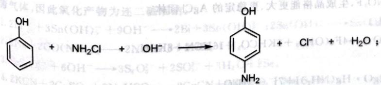

chemical

Chemical reaction equation showing hydroxyl radical reacting with ammonium chloride to form a benzene derivative and chlorine gas

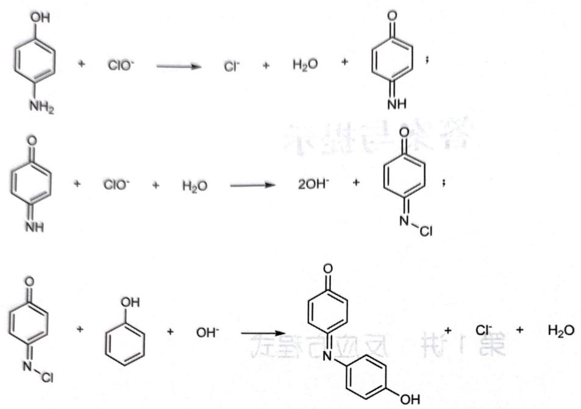

1.35 $\left[\mathrm{Ag}\left(\mathrm{NH}_{3}\right)_{2}\right]\left[\mathrm{Ag}_{3}\left(\mathrm{N}_{5}\right)_{4}\right] \longrightarrow 4\mathrm{AgN}_{3} + 2\mathrm{NH}_{3} + 4\mathrm{N}_{2}; 2\mathrm{AgN}_{3} \longrightarrow 2\mathrm{Ag} + 3\mathrm{N}_{2}$ 。  
1.36 $3NiCl_{2} + 6NaBH_{4} + 2NaOH + 6H_{2}O \longrightarrow Ni_{3}B_{4} + 2NaB(OH)_{4} + 6NaCl + 15H_{2}$

提示:镀层中一般不会有 O、Cl 等元素,这些元素形成的是“锈”。

1.37 $2\mathrm{KMnO}_4 \longrightarrow \mathrm{K}_2\mathrm{MnO}_4 + \mathrm{MnO}_2 + \mathrm{O}_2$ ； $4\mathrm{KMnO}_4 \longrightarrow 2\mathrm{K}_2\mathrm{MnO}_3 + 2\mathrm{MnO}_2 + 3\mathrm{O}_2$ ；

$5KMnO_{4} \longrightarrow K_{3}MnO_{4} + K_{2}MnO_{4} + 3MnO_{2} + 3O_{2}$ 。提示：计算产物中 Mn 的平均化合价，然后分拆。

1.38 $2CoCO_{3} + 5S \longrightarrow 2CO_{2} + SO_{2} + 2CoS_{2}$

1.39 $Ba_{3}N_{4}+6H_{2}O\longrightarrow3Ba(OH)_{2}+2NH_{3}+N_{2}$

1.41 略

1.42 $2\mathrm{KHCO}_3 + \mathrm{Hg}_2(\mathrm{NO}_3)_2 \longrightarrow \mathrm{Hg}_2\mathrm{CO}_3 + 2\mathrm{KNO}_3 + \mathrm{CO}_2 + \mathrm{H}_2\mathrm{O}; \mathrm{Hg}_2\mathrm{CO}_3 + 2\mathrm{HF} \longrightarrow \mathrm{Hg}_2\mathrm{F}_2 + \mathrm{CO}_2 + \mathrm{H}_2\mathrm{O}; \mathrm{Hg}_2\mathrm{F}_2 + \mathrm{Cl}_2 \longrightarrow \mathrm{HgCl}_2 + \mathrm{HgF}_2$ 。提示： $\mathrm{Hg}$ 的基本性质。

1.43 $2 \mathrm{NH}_{4} \mathrm{ClO}_{4} + \mathrm{BaCl}_{2} \longrightarrow \mathrm{Ba(ClO}_{4})_{2} + 2 \mathrm{NH}_{3} + 2 \mathrm{HCl}$ 。提示：当量数据为工法  
1.44 $K_{2}FeIO_{6} + LiCl \longrightarrow KLiFeIO_{6} + KCl$

1.45 略

1.46 $\mathrm{NH_4Cl, AgCl + 2NH_4^+ + 2OH^- \longrightarrow Ag(NH_3)^+ + 3Cl^- + 2OH}$

1.47 $1. NH_{4} + NO_{2}^{-} \rightleftharpoons HNO_{2} + NH_{3} \cdot NH_{2} + HNO_{3}$

2. $2{\mathrm{{HNO}}}_{2} \rightarrow  \mathrm{{NO}} + {\mathrm{{NO}}}_{2} + {\mathrm{H}}_{2}\mathrm{O}$ 。洗气试剂为 ${\mathrm{{FeSO}}}_{4}/{\mathrm{H}}_{2}{\mathrm{{SO}}}_{4}$

1.48 $1.3Fe + NaNO_{2} + 5NaOH \rightarrow 2Na_{2}F_{6}O_{4}$

$$
6 \mathrm{Na} _ {2} \mathrm{FeO} _ {2} + \mathrm{NaNO} _ {3} + 5 \mathrm{H} _ {2} \mathrm{O}
$$

$$
\mathrm{Na} _ {2} \mathrm{FeO} + \mathrm{NaNO} _ {2} + 5 \mathrm{H} _ {2} \mathrm{O} \longrightarrow 3 \mathrm{Na} _ {2} \mathrm{Fe} _ {2} \mathrm{O} _ {4} + \mathrm{NH} _ {3} + 7 \mathrm{NaOH}
$$

$$
\mathrm{Na} _ {2} \mathrm{FeO} _ {2} + \mathrm{Na} _ {2} \mathrm{Fe} _ {2} \mathrm{O} _ {4} + 2 \mathrm{H} _ {2} \mathrm{O} \longrightarrow \mathrm{Fe} _ {3} \mathrm{O} _ {4} + 4 \mathrm{NaOH}
$$

2. NaOH不是反应物,而且反应物右侧产生NaOH $_{3}$  
3. $2Fe_{3}O_{4} + 9COCl_{2} \rightarrow 6FeCl_{3} + 8CO_{2} + CO_{2}$

1.49 提示:第2小题可视为多个分解和复分解反应的叠加;第4小题应仔细考虑化合价的升降。
1. $4OH^{-} + 4MnO_{4}^{-} \rightarrow 4MnO_{4}^{2-} + O_{2} + 2H_{2}O$ 。

2. $\mathrm{H}_{2} \mathrm{PtCl}_{6} + 2 \mathrm{NaNO}_{3} \longrightarrow \mathrm{PtO}_{2} + \mathrm{Cl}_{2} + 2 \mathrm{NaCl} + 2 \mathrm{NO}_{3}$

3. $\mathrm{Na}_{2} \mathrm{~S}_{2} \mathrm{O}_{3} + \mathrm{Zn}(\mathrm{CH}_{3} \mathrm{COO})_{2} + \mathrm{H}_{2} \mathrm{O} = 2 \mathrm{~Zn} \mathrm{SO}_{4}$

4. $2\mathrm{HgO} + 2\mathrm{Cl}_2 \longrightarrow \mathrm{Cl}_2\mathrm{O} + \mathrm{Hg}_2\mathrm{OCl}_2$ 。

1.50 1. $\mathrm{AgF} + \mathrm{NO}_{2} \mathrm{Cl} \longrightarrow \mathrm{AgCl} + \mathrm{NO}_{2} \mathrm{~F}$ , 生成晶格能更大、更稳定的 $\mathrm{AgCl}$ 固体。  
2. $\mathrm{Ca(OH)}_{2} + \mathrm{CaC}_{2} \longrightarrow 2 \mathrm{CaO} + \mathrm{C}_{2} \mathrm{H}_{2}$ 。  
3. $4 \mathrm{~K}_{2} \mathrm{Fe(OH)}$  
3. $4 \mathrm{K}_{4} \mathrm{Fe}(\mathrm{CN})_{6} + \mathrm{O}_{2} + 8 \mathrm{CO}_{2} + 18 \mathrm{H}_{2} \mathrm{O} \longrightarrow 4 \mathrm{Fe}(\mathrm{OH})_{3} + 8 \mathrm{KHCO}_{3} + 16 \mathrm{HCN} + 8 \mathrm{KCN}$ 。
4. $2 \mathrm{ClO}_{3}^{-} + \mathrm{SO}_{2} \longrightarrow 2 \mathrm{ClO}_{2} + \mathrm{SO}_{4}^{2-}$ 。  
5. $NH_{4}^{+} + 2[HgI_{4}]^{2-} + 4OH^{-} \rightarrow HgO \cdot Hg(NH_{2})I + 7I^{-} + 3H_{2}O$

1. $2\mathrm{Al} + 2\mathrm{TiO}_2 + 6\mathrm{C} + \mathrm{N}_2 \longrightarrow 2\mathrm{TiC} + \mathrm{AlN} + 6\mathrm{CO}$ 。（Al和Ti的比例不唯一）

51 $\nu_{K}ReO_{4} + 13H_{2}O$  
$18\mathrm{K} + \mathrm{K}\mathrm{Re}^{2 - }$ $3\mathrm{H}^{+} + 2\mathrm{NO}_{3}^{-} + 12\mathrm{Cl}^{-}\longrightarrow 3\mathrm{HgCl}_{4}^{2 - } + 2\mathrm{NO} + 3\mathrm{S} + 4\mathrm{H}_{2}\mathrm{O}$  
2. $3HgS + 8H$ $\cdot 3H_{2}O + 7PPh_{3} \longrightarrow 2(PPh_{3})_{3}Cu(NO_{3}) + PPh_{3}O + 5H_{2}O + 2HNO_{3}$ 。四面体型。

$^{3.2}$ $Cu(NO_{3})_{2}$ $Ca(CN)_{6}^{4-} + 4H^{+} + NO_{3}^{-} \rightarrow [Fe(CN)_{5}(NO)]^{2-} + CO_{2} + NH_{4}^{+}$

1. FeO $_{2}$ + 10HF + 3H $_{2}$ O $_{2}$ + 2F $^{-}$ → 2MnF $_{6}^{2-}$ + 3O $_{2}$ + 8H $_{2}$ O。

$2MnO_{4}^{-} + 10H_{2}O \rightarrow 2Au + Fe_{3}O_{4} + 2H_{2}S + 4H^{+}$

2. $2\mathrm{AuS}^{-} + 3\mathrm{Fe}$ $\mathrm{Al + 6H_2O\longrightarrow 6Ag + 3H_2S + 2Al(OH)_3}$

3. $Ag_{2}S+2Al+6H_{2}$ $Fe(CO)_{5}+I_{2}\longrightarrow Fe(CO)_{4}I_{2}+CO$

1. Fe(CO) $_{3}$ Cl $\longrightarrow$ 2Hg $_{2}$ Cl $_{2}$ +4NH $_{3}$ +N $_{2}$ 。

$6Hg(NH_{2})_{2}$ $AgC_{2}H + 2CN^{-} \longrightarrow Ag(CN)_{2}^{-} + C_{2}H_{2} + OH^{-}$

$H_{2}O + AgC_{2}H_{2} \rightarrow 2Na_{2}CrO_{4} + Na_{2}Cr_{2}O_{4}$

4. $2Cr_{2}O_{3} + 3Na_{2}O$ $\rightarrow$ $2CO_{2} + 2Xe + 3H_{2}O$ 。(可补充 $XeO_{3}$ 和水的反应)

5. $2\mathrm{XeO_3} + \mathrm{O_2F}$ $2\mathrm{FXeOSO_2F}\longrightarrow \mathrm{Xe} + \mathrm{XeF_2} + \mathrm{FSO_2OOSO_2F}$

1.54 1. $2\mathrm{P}^3\mathrm{O}_3$ $\mathrm{^{+}4N_2O_4}\longrightarrow 4\mathrm{NO} + 2\mathrm{I}_2 + \mathrm{Ti(NO_3)_4}$

2. $\mathrm{TiI}_{4} + 4\mathrm{N}_{2}\mathrm{O}_{3}^{2-} + 3\mathrm{OH}^{-} + 3\mathrm{H}_{2}\mathrm{O}\longrightarrow 4\mathrm{NH}_{3} + \mathrm{S}_{2}\mathrm{O}_{3}^{2-} + 2\mathrm{SO}_{3}^{2-}$ 。

3. $S_{4}N_{4} + 6OH \rightarrow FeBr_{3} + BCl_{3}$ 。生成酸性更弱的 Lewis 酸。

4. $\mathrm{FeCl}_{3} + \mathrm{BBr}_{3} = 2\mathrm{H}_{2}\mathrm{O}$

1.55 1. $3\mathrm{Zn} + \mathrm{As}_{2}\mathrm{O}_{3} +$ $4\mathrm{KO}_3 + 2\mathrm{KOH}\cdot \mathrm{H}_2\mathrm{O} + \mathrm{O}_2$ 。还原剂并吸水。

2. $6\mathrm{KOH} + 4\mathrm{O}_3 = \mathrm{MnO}_3$ $\mathrm{COOH^{-} + MnO_{4}^{-}\longrightarrow MnO_{2} + 3CeO_{2} + 4H_{2}O}$

3. $3 \mathrm{Ce}^{3+} + 8 \mathrm{OH}^{-} + 2 \mathrm{H}_{2} \mathrm{O}$

4. $CaH_{2} + CO_{3}^{2-} + 2H_{2}O$ $FeS_{2} + 8H_{2}O \longrightarrow 15Fe^{2+} + 2SO_{4}^{2-} + 16H^{+}$

5. $14\mathrm{Fe}^{3+} + \mathrm{FeS}_{2} + 6\mathrm{H}_{2}$

1.56 1. $2\mathrm{SO} + 2\mathrm{NaOH}$ $\mathrm{O}_2 + 14\mathrm{OH}^- \longrightarrow \mathrm{O}_2 + 2\mathrm{SeO}_4^{2-} + 12\mathrm{F}^- + 7\mathrm{H}_2\mathrm{O}$ .

2. $2\text{FOSeF}_5 + 14\text{OH} \rightarrow \text{H}_2\text{O} + \text{H}_2\text{SO}_4 + \text{N}_2 + \text{NaCl}$

3. $NH_{3}SO_{3} + NaNO_{2} + HCl \rightarrow H_{2}O + H_{2}O$ $IO_{3}^{-} + I_{2} + OH^{-} + 2H_{2}O, IO_{3}^{-} + 5I^{-} + 6H^{+} \rightarrow 3I_{2} + 3H_{2}O$

4. $\mathrm{H}_{5} \mathrm{IO}_{6} + 2 \mathrm{I}^{-} \longrightarrow \mathrm{IO}_{3}^{-} + \mathrm{I}_{2} + \mathrm{OH}^{-} + 2 \mathrm{H}_{2} \mathrm{O}$ .

5. $3(\mathrm{NH}_4)_2\mathrm{SeO}_3 \longrightarrow 2\mathrm{N}_2 + 3\mathrm{Se} + 2\mathrm{NH}_3$ + 10% Al (SO₄)₂ + 36H₂O → Al(MnO₄)₃ + 3KAl(SO₄)₂ · 12H₂O。

1.57 1. $3\mathrm{KMnO}_4 + 2\mathrm{Al}_2(\mathrm{SO}_4)_3 + 50\mathrm{H}_2$ $\mathrm{P(OH)}_3^-$ $+\mathrm{Pt} + 6\mathrm{Cl}^- +4\mathrm{H}_2$ 。

2. $\mathrm{BH}_{4}^{-} + \mathrm{PtCl}_{6}^{2-} + 4\mathrm{OH}^{-} \longrightarrow \mathrm{B(OH)}_{4}^{-} + \mathrm{FeO}_{3}$ $\mathrm{CO}_{3} + 10\mathrm{NaOH} \longrightarrow 3[\mathrm{Cu(NH}_{3})_{4}] \mathrm{CO}_{3} + [\mathrm{Cr(NH}_{3})_{6}]_{2}(\mathrm{Cu}_{3})_{6}$ $\mathrm{CO}_{3} + 10\mathrm{NaOH} \longrightarrow 3[\mathrm{Cu(NH}_{3})_{4}] \mathrm{CO}_{3} + [\mathrm{Cr(NH}_{3})_{6}]_{2}(\mathrm{Cu}_{3})_{6}$ $\mathrm{Pb}_{2}\mathrm{Fe(CN)}_{6} + 4\mathrm{KNO}_{3}$ ,

3. $3\mathrm{Cu} + \mathrm{K}_2\mathrm{Cr}_2\mathrm{O}_7 + 12(\mathrm{NH}_4)_2\mathrm{CO}_3 + 10\mathrm{NaCl}_2$ $\mathrm{Fe(CN)}_6 + 3\mathrm{K}_4\mathrm{Fe(CN)}_6,\mathrm{K}_4\mathrm{Fe(CN)}_6 + 2\mathrm{Pb(NO_3)_2}$

4. $4\mathrm{Ag} + 4\mathrm{K}_{3}\mathrm{Fe}(\mathrm{CN})_{6} \longrightarrow \mathrm{Ag}_{4}\mathrm{Fe}(\mathrm{CN})_{6}$ $2\mathrm{Na}_{2}\mathrm{Fe}(\mathrm{CN})_{6}, \mathrm{Pb}_{2}\mathrm{Fe}(\mathrm{CN})_{6} + 2\mathrm{Na}_{2}\mathrm{S} \longrightarrow 2\mathrm{PbS} + \mathrm{Na}_{2}\mathrm{S}$

$\mathrm{Ag_{4}Fe(CN)_{6}+2Na_{2}S\longrightarrow2Ag_{2}S+Na_{4}Fe(CN)_{6}H_{2}}$

1.58 提示:第1小题要注意氨为少量

1. $3Cl_{2}O + 4NH_{3} \rightarrow 2N_{2} + 6HCl + 3H_{2}O$  
2. $\mathrm{Mg} + \mathrm{Sr(NO_3)_2}\longrightarrow \mathrm{MgO} + \mathrm{SrO} + 2\mathrm{NO}_2$ 。  
3. $6\mathrm{Pb}(\mathrm{CH}_3\mathrm{COO})_2 + 6\mathrm{I}_2 + 6\mathrm{H}_2\mathrm{O}\longrightarrow 5\mathrm{PbI}_2 + \mathrm{Pb(II)}_3$ ·3. $5\mathrm{H}_2\mathrm{O} + 3\mathrm{N}_2 + \mathrm{H}_2\mathrm{O}$  
4. $4\mathrm{CrO}_3 + 4\mathrm{H}_3\mathrm{PO}_4 + 3\mathrm{N}_2\mathrm{H}_4 \cdot \mathrm{H}_2\mathrm{O}$

1.59 提示: 第 2 小题为 Lewis 酸碱反应。

1. $4C_{4}H_{9}Li+C_{3}H_{4}\longrightarrow Li_{4}C_{3}+4C_{4}H_{10}$

2. $\mathrm{Be(BH_4)_2 + 2PPh_3\longrightarrow BeH_2 + 2H_3B\cdot PPh_3}$

3. $2 \mathrm{CoF}_{2} + 6 \mathrm{~N}_{2} \mathrm{O}_{5} \longrightarrow 2 \mathrm{Co}(\mathrm{NO}_{3})_{3} + 4 \mathrm{NO}_{2} \mathrm{F} + \mathrm{H}_{2} \mathrm{O}$ , 第3小题的歧化产物不难推测得到; 第4小题注意没

4. $2 \mathrm{Na}_{2} \mathrm{~S}_{2} \mathrm{O}_{4} \longrightarrow \mathrm{Na}_{2} \mathrm{SO}_{4} + \mathrm{Na}_{2} \mathrm{~S} + 2 \mathrm{SO}_{2}$ 。

1.60 提示: 尿素的 H 有酸性, 第 2 小题可说明有毒气体, 因此氧化产物为连二硫酸钠。

1. $2 \mathrm{Bi}^{3+} + 3 \mathrm{Sn(OH)}_{3}^{-} + 9 \mathrm{OH}^{-} \longrightarrow 2 \mathrm{Bi} + 3 \mathrm{Sn(OH)}_{3}$  
2. $2\mathrm{Na} + 2\mathrm{CO(NH_2)_2} \rightarrow 2\mathrm{NaCNO} + 2\mathrm{NH_3} + 2\mathrm{H_2O} + 2\mathrm{Se}$  
3. $\mathrm{SeS}_{4}\mathrm{O}_{6}^{2-} + 6\mathrm{OH}^{-} \longrightarrow 3\mathrm{S}_{2}\mathrm{O}_{3}^{2-} + 2\mathrm{SO}_{3}^{2-} + 3\mathrm{H}_{2}\mathrm{O}$  
4. $2 \mathrm{KCN} + 2 \mathrm{CuSO}_{4} + 2 \mathrm{NaHSO}_{3}$

1.61 提示: 第 4 小题首先确定酸性缓冲液的成分, 然后倒推反应物系数比也是 $5:12$ , 最后列方程定出剩余的系数

1. $4\mathrm{CHI}_3 + 5\mathrm{O}_2 \longrightarrow 6\mathrm{I}_2 + 4\mathrm{CO}_2 + 2\mathrm{H}_2\mathrm{O}$  
2. $7\mathrm{Na}_{2}\mathrm{C}_{2}\mathrm{O}_{4}\longrightarrow 7\mathrm{Na}_{2}\mathrm{CO}_{3} + 3\mathrm{CO} + 2\mathrm{CO}_{2} + 2\mathrm{C}$  
3. $2\mathrm{KIO}_3 + 5\mathrm{SO}_2 + 4\mathrm{H}_2\mathrm{O}\longrightarrow \mathrm{I}_2 + 2\mathrm{KHSO}_4 + 3\mathrm{H}_2\mathrm{SO}_4$  
4. $5\mathrm{HAuCl}_4 + 12\mathrm{K}_2\mathrm{CO}_2 + 3\mathrm{P}\longrightarrow 5\mathrm{Au} + 20\mathrm{KCl} + 12\mathrm{CO}_2 + 2\mathrm{KH}_2\mathrm{PO}_4 + \mathrm{K}_2\mathrm{HPO}_4$

1.62 提示: 第 2 小题、碱性条件下铬的存在形式为铬酸盐; 第 4 小题中芳香阴离子的电荷数由休克尔规则确定。

1. $3\mathrm{PoCl}_{4} + 16\mathrm{NH}_{3} \rightarrow 3\mathrm{Po} + 2\mathrm{N}_{2} + 12\mathrm{NH}_{4}\mathrm{Cl}$  
2. $4\mathrm{FeCr_2O_4 + 8Na_2CO_3 + 7O_2}\longrightarrow 8\mathrm{Na_2CrO_4 + 2Fe_2O_3 + 8CO_2}$  
3. $\mathrm{CaB_{3}O_{4}(OH)_{3}\cdot H_{2}O+H_{2}SO_{4}+H_{2}O\longrightarrow CaSO_{4}+3H_{3}BO_{3}}$  
4. $6\mathrm{P}_{2}\mathrm{H}_{4} + 10\mathrm{Cs}\longrightarrow \mathrm{Cs}_{2}\mathrm{P}_{4} + 8\mathrm{CsPH}_{2} + 4\mathrm{H}_{2}$  
5. $2\mathrm{KNO}_3 + 10\mathrm{K}\longrightarrow 6\mathrm{K}_2\mathrm{O} + \mathrm{N}_2$

1.63 提示: 第 2 小题中, 固相 S 可将 Sn 氧化, 碱性条件下的存在形式应为硫代硒酸盐; 第 4 小题是一个金属有机反应, 即配位和迁移; 第 5 小题应从尿素水解入手, 再用数据配凑化学式。

1. $4NH_{2}OH + 2H^{+} \rightarrow 2NH_{4}^{+} + N_{2}O + 3H_{2}O$  
2. $2\mathrm{Na}_{2}\mathrm{CO}_{3} + 2\mathrm{SnO}_{2} + 9\mathrm{S}\longrightarrow 2\mathrm{Na}_{2}\mathrm{SnS}_{3} + 3\mathrm{SO}_{2} + 2\mathrm{CO}_{2}$  
3. $5\mathrm{Sr}(\mathrm{IO}_3)_2\cdot \mathrm{H}_2\mathrm{O}\longrightarrow \mathrm{Sr}_5(\mathrm{IO}_6)_2 + 5\mathrm{H}_2\mathrm{O} + 4\mathrm{I}_2 + 9\mathrm{O}_2$  
4. $\mathrm{Mn(CH_3)(CO)_5 + PEt_3\longrightarrow Mn(PEt_3)(COCH_3)(CO)_4}$  
5. $2\mathrm{LaCl}_3 + 4\mathrm{CO(NH_2)_2 + 9H_2O}\longrightarrow \mathrm{La}_2(\mathrm{OH})_2(\mathrm{CO}_3)_2\cdot \mathrm{H}_2\mathrm{O} + 2\mathrm{NH}_3 + 2\mathrm{CO}_2 + 6\mathrm{NH}_4\mathrm{Cl};$  
$\mathrm{La}_{2}(\mathrm{OH})_{2}(\mathrm{CO}_{3})_{2}\cdot \mathrm{H}_{2}\mathrm{O}\longrightarrow \mathrm{La}_{2}\mathrm{O}_{2}\mathrm{CO}_{3} + \mathrm{CO}_{2} + \mathrm{H}_{2}\mathrm{O}$

1.64 提示: 第 1 小题需要注意酸式盐和正盐的溶解性关系。

1. $2Al + 4H_{2}O + 7SO_{2} \rightarrow 2Al(HSO_{3})_{3} + H_{2}S$  
2. $12\mathrm{Fe(OH)}_2 + \mathrm{NaNO}_3 + \mathrm{NaHCO}_3 \longrightarrow 4\mathrm{Fe}_3\mathrm{O}_4 + 11\mathrm{H}_2\mathrm{O} + \mathrm{NH}_3 + \mathrm{Na}_2\mathrm{CO}_3$  
3. $2\mathrm{NH}_2\mathrm{OH} + 2\mathrm{I}_2 + 2\mathrm{MgO}\longrightarrow \mathrm{N}_2\mathrm{O} + 3\mathrm{H}_2\mathrm{O} + 2\mathrm{MgI}_2$  
4. $3\mathrm{N}_2\mathrm{H}_6^{2+} + 2\mathrm{H}_2\mathrm{O}_2 \longrightarrow 2\mathrm{HN}_3 + 6\mathrm{H}^+ + 10\mathrm{H}_2\mathrm{O}$ 。  
5. $\mathrm{CHCl}_3 + \mathrm{O}_3 \longrightarrow \mathrm{COCl}_2 + \mathrm{HCl} + \mathrm{O}_2$ 。

1.65 1. $3\mathrm{C}_{6}\mathrm{H}_{8}\mathrm{O}_{6} + \mathrm{KIO}_{3}\longrightarrow \mathrm{KI} + 3\mathrm{C}_{6}\mathrm{H}_{6}\mathrm{O}_{6} + 3\mathrm{H}_{2}\mathrm{O},\mathrm{KIO}_{3} + 5\mathrm{KI} + 6\mathrm{HCl}\longrightarrow 3\mathrm{I}_{2} + 6\mathrm{KCl} + 3\mathrm{H}_{2}$  
2. $\mathrm{C_6H_6O_6 + H_2O\longrightarrow C_5H_8O_5 + CO_2,C_5H_8O_5 + C_6H_8O_6\longrightarrow C_5H_{10}O_5 + C_6H_6O_6,C_5H_{10}O_5\longrightarrow C_5H_4O_2 + 3H_2O}$  
3. 被氧气氧化为 DHA 等(合理即可)。

4. 草酸。方程式为： $3C_{6}H_{8}O_{6}+7KIO_{3}\longrightarrow9H_{2}C_{2}O_{4}+7KI+3H_{2}O$

1.66 提示: 第 3 小题中, 尽量不额外添加酸碱; 第 6 小题是典型的配位反应促进氧化还原反应的例子

1. $\mathrm{Ag_2O + 2MnO_4^- + 2OH^- \longrightarrow 2AgO + 2MnO_4^{2 - } + H_2O}$  
2. $2\mathrm{AlB}_3\mathrm{H}_{12} + 6\mathrm{HCl}\longrightarrow 2\mathrm{AlCl}_3 + 3\mathrm{B}_2\mathrm{H}_6 + 6\mathrm{H}_2$  
3. $\mathrm{AsCl}_3 + \mathrm{I}_2 + 7\mathrm{Na}_2\mathrm{HPO}_4 + 4\mathrm{H}_2\mathrm{O}\longrightarrow \mathrm{Na}_2\mathrm{HAsO}_4 + 7\mathrm{NaH}_2\mathrm{PO}_4 + 3\mathrm{NaCl} + \mathrm{NaI}$  
4. $2\mathrm{Co(CN)}_{6}^{3-} + 11\mathrm{H}^{+} + 2\mathrm{H}_{2}\mathrm{O}\longrightarrow 2\mathrm{Co}^{2+} + 11\mathrm{HCN} + \mathrm{CO}_{2} + \mathrm{NH}_{4}^{+}$  
5. $\mathrm{PSCl}_{3} + 6\mathrm{NaOH}\longrightarrow \mathrm{Na}_{3}\mathrm{PO}_{3}\mathrm{S} + 3\mathrm{NaCl} + 3\mathrm{H}_{2}\mathrm{O}$  
6. $3\mathrm{Cu} + \mathrm{Bi(OH)}_3 + 12\mathrm{NaCN}\longrightarrow 3\mathrm{Na}_3\mathrm{Cu(CN)}_4 + \mathrm{Bi} + 3\mathrm{NaOH}$

## 第2讲 原子结构

## 2.2 略

2.9 单质键能。第二周期的氟由于其半径小, 相互排斥作用大, 导致 $\mathrm{F}_{2}$ 的键能反而比 $\mathrm{Cl}_{2}$ 要小

2.10 f轨道主量子数为 4, l=3, m=0，故径向有 0 个节面。

角向节面则只需求解 $\frac{z(5z^{3}-3r^{2})}{r^{3}}=0,$

通常认为原点不算在节面内，因此可得解 $0, \sqrt[3]{\frac{3r^2}{5}}$

所以共有 3 个节面, 轨道简图如右图所示:

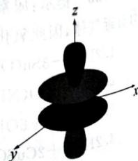

natural_image

3D coordinate system with x, y, z axes and a symmetric black oval shape centered at origin (no text or symbols)

3.6 共振式如下图所示：

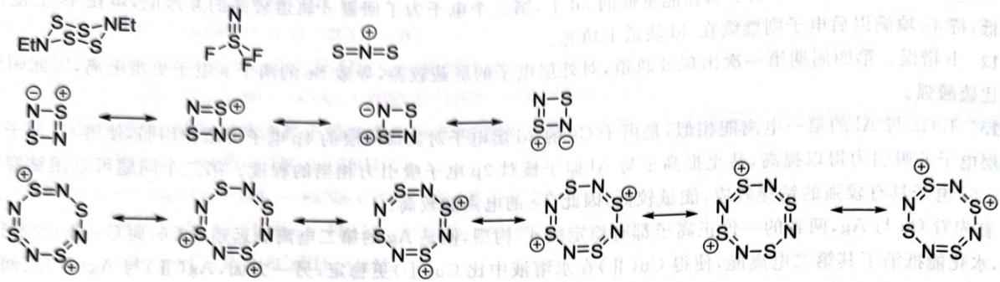

chemical

Chemical reaction mechanism showing electron transfer and ring expansion steps of a heterocyclic compound

$S_{4}(NEt)_{2}$ 键级为 $1, S_{2}N_{2}$ 键级为 1.25, $S_{4}N_{4}^{2+}$ 键级为 1.5, $NSF_{3}$ 键级为 3, $NS_{2}^{+}$ 键级为 2。键长排序取键级之逆序。

3.11 1. 方程式如下：

$$
\mathrm{S} _ {8} + 8 \mathrm{I} _ {2} + 1 2 \mathrm{AsF} _ {5} \longrightarrow 4 \left[ \begin{array}{c c} \mathrm{I} & \mathrm{S} - \mathrm{I} \\ \mathrm{I} & \mathrm{S} - \mathrm{I} \end{array} \right] ^ {2 +} \left[ \begin{array}{c c} \mathrm{F}, & \mathrm{F} \\ \mathrm{F} & \mathrm{As} \\ \mathrm{F} & \mathrm{F} \end{array} \right] _ {2} ^ {-} + 4 \mathrm{AsF} _ {3}
$$

2. X 中的 I—I 键长更短。

3.12 1. 如下图所示。 2. 稳定性顺序为 $\mathbf{Z} > \mathbf{Y} > \mathbf{X}$ 。

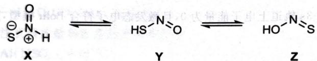

chemical

Chemical equilibrium reaction showing transformation from compound X to Y and then to Z with intermediate HS-N=O

3.18 1. 如下图所示：

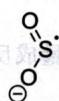

2. $S_{2}O_{4}^{2-}\longrightarrow2SO_{2}^{-}\cdot;CF_{3}Br+SO_{2}^{-}\cdot\longrightarrow CF_{3}\cdot+BrSO_{2}^{-};CF_{3}\cdot+SO_{2}^{-}\cdot\longrightarrow F_{3}CSO_{2}^{-}$

3.19 1. 结构为 V 型, 如图所示。

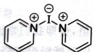

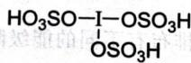

3.19 第 1 小题图

3.19 第 2 小题图

2. $4\mathrm{I}(\mathrm{py})_2^+ +8\mathrm{H}_2\mathrm{SO}_4\longrightarrow \mathrm{I}_3^+ +8\mathrm{pyH}^+ +5\mathrm{HSO}_4^- +\mathrm{I}(\mathrm{HSO}_4)_3$ 。A的结构如图所示。

3.25 1. 阴离子化学式为 $C_{2}N_{5}$ ，结构如下图所示：

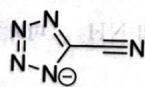

2. 环上的原子为 $sp^{2}$ 杂化，氰基的 C 为 sp 杂化。键的类型除常规键型以外，还有一个 $\pi_{7}^{8}$ 键。

3.28 1. $\mathrm{NCl}_3 < \mathrm{NF}_3 < \mathrm{NH}_3; \mathrm{H}_2\mathrm{Se} < \mathrm{H}_2\mathrm{S} < \mathrm{H}_2\mathrm{O}$ 。

2. 结论与简单按照电子效应的结果相反,因此键角实际上是由电子效应与空间效应共同决定的。

3.29 需要重新测量的是 $\mathrm{Sb}(\mathrm{CF}_{3})_{3}$ 的键角，因为其应当比 $\mathrm{As}(\mathrm{CF}_{3})_{3}$ 的键角更小。

3.30 161.3pm

3.34 1. 凝聚温度最低的是 $NF_{3}$ 。

2. 136pm、140pm 和 142pm 分别对应 $NF_{3}$ 、 $NHF_{2}$ 、 $NH_{2}F$ 。

3.40 如下图所示。

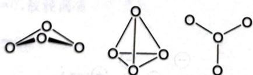

chemical

Three molecular structures showing different arrangements of oxygen atoms with bonds

第一个结构最稳定,是因为其中的 O 均满足八隅律,且不存在电荷累积。

2.11 对于基态的电中性原子, 其 4s 轨道的电子能量最高, 因此优先电离; 而对于电子的填充顺序, 可以想象电子的一个 [Ar] 原子实开始, 第一个电子填在能量低的 3d 上, 第二个电子为了回避 d 轨道较高的互斥能, 填在 4s 上使得总能量最低; 待 4s 填满以后电子则继续在 3d 轨道上填充。

2.12 b 错误。第四周期第一次出现 d 轨道, 对外层电子的屏蔽较差, 导致 Se 的两个 s 电子更难电离, 因此硒酸的氧化性比硫酸强。

2.13 1. Ga 与 Al 的第一电离能相似, 是由于 Ga 的 3d 层电子对其最外层的 4p 电子屏蔽作用弱, 使得 Ga 原子核对酸外层电子的吸引力得以提高, 甚至提高至与 Al 原子核对 2p 电子吸引力相当的程度。第二个问题可以用钻穿效应来解释。

2. 首先看 Cu 与 Ag, 两者的一价正离子都有稳定的 $d^{10}$ 构型, 但是 Ag 的第二电离能远超过 Cu, 而 Cu(Ⅱ) 的半径小, 电荷高, 水化能抵消了其第二电离能, 使得 Cu(Ⅱ) 在水溶液中比 Cu(I) 更稳定; 另一方面, Ag(Ⅱ) 与 Ag(I) 之间的半径差距不如 Cu(Ⅱ) 与 Cu(I), 其水和能之差较小, 不足以稳定其二价离子。再来讨论 Au 的情况。Au 的第一电离能较高 (受到镧系收缩的影响), 但是其离子半径更大, 第二、三电离能较低, 相对于 Cu 和 Ag 更易形成 +3 氧化态; 此外, Au(Ⅲ) 的平面四方构型有较高的配位场稳定化能 (LFSE), 这也有利于 +3 氧化态在溶液中的稳定 (而 Cu 半径较小, 大多形成四面体配合物, LFSE 较低, 不利于形成 +3 氧化态)。

3. IA 族元素从 Ca 以后, 出现了 d 电子, d 电子对于最外层电子的屏蔽作用较弱, 使得原子核对电子的束缚变强, 减缓了同族从上到下第一电离能下降的过程; 而 Li 到 Ca 外层没有 d 电子, 屏蔽较强, 因此第一电离能下降更快。

2.14 1. 外层电子排布: $1s^{2}2s^{2}2p^{6}3s^{1}$ ; 价电子 $3s^{1}$ 。

2.203.2kJ/mol。

3.496.6kJ/mol。提示: 假定 3s 轨道上电子能量为 0 ,且激发态电子符合 Bohr 模型, 则 nd 轨道上电子的能量可以写成 $E_{ad}=E_{0}+\frac{k}{n^{2}}$ 。

据此用表格数据做线性回归。

2.15 723.6kJ/mol。

2.16 提示:一个化学反应方程式:

1. $\mathrm{ND}_{3}\mathrm{H}^{+}$ 的 $\mathrm{pK}_{\mathrm{a}}$ 更大。

2. $\mathrm{CO}_{2}$ 在 $\mathrm{D}_{2}\mathrm{O}$ 中 $\mathrm{pK}_{\mathrm{a}}$ 更大。

2.17 1. $\mathrm{Sc}^{2+}$ 到 $\mathrm{Zn}^{2+}$ ，电荷数不变，而原子序数变大，3d轨道上的电子受核吸引作用变大，因此离子的水和热会单独增。

2. 形成水合离子时，不同的 d 电子排布有不同的能级降低总值，也即我们常说的配位场稳定化能(LFSE)。 $\mathrm{Mn}^{2+}$ 的 $\mathrm{d}^{10}$ 电子构型在弱场中的 LFSE 为 0，即其 d 电子分裂以后能级没有降低，因此其水和热反而比其之前的元素小。这一现象是元素周期律与 LFSE 共同作用的结果，因为其峰值并不出现在 LFSE 最高的 $\mathrm{d}^{3}$ 和 $\mathrm{d}^{8}$ 组态。（使用晶体理论，言之有理亦可。）

2.18 1. 应产生 $\mathrm{NH}_{2}\mathrm{OH} \cdot \mathrm{HCl}$ 。
2. 分别为 3.34 和 2.85，所以水解产物是 HOCl 和 $\mathrm{NH}_{3}$ 。可能是因为 AR 电离，大小，更符合实际。
2.19 $^{96}_{42}\mathrm{Mo} + _{1}^{2}\mathrm{H} \longrightarrow _{43}^{97}\mathrm{Tc} + _{0}^{1}\mathrm{n}$ 。
2.20 1. $^{226}_{88}\mathrm{Ra} \longrightarrow _{86}^{222}\mathrm{Rn} + _{2}^{4}\mathrm{He}$ 。
2. 210g/mol。
3. 2014 年 2 月。
4. Po, 针。
5. 4.95MeV。

## 第3讲 分子结构

3.2 如下图所示：

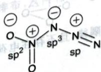

如下图所示，点群为 $D_{3d}$ ，对称元素按照点群去写即可。

3.41

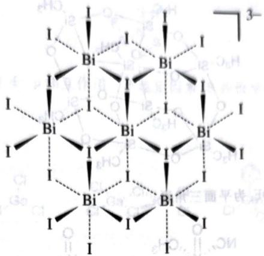

chemical

Molecular structure diagram of a bismuth complex with iodine (I) and boron (Bi) atoms, showing coordination geometry

电负性较强,导致另一侧的 O 能够将其孤对电子填入 O—F 键反键轨道,削弱了 O—F 键,增强了 O—O

3.44 F 的电负性较大, 也可以用价键理论解释: F 电负性大, 造成电子偏向自身, 氧原子周围电子的排斥力下降, 因此只用 $\mathrm{N}$ 和 $\mathrm{NH}_{3}$ 都是不等性的 $\mathrm{sp}^{3}$ 杂化, 由于孤对电子与键合电子的斥力大于键和电子之间, N 上的孤对电子会

3.45 $NF_{3}$ 和 $NH_{3}$ 和 $N_{2}$ 的电负性。挤推键合电子，使得键角变小。在 $NF_{3}$ 中，由于 F 的电负性较大，导致 N 的弧对电子偶极差小于 $\angle FNF$ 小于 $\angle HNH$ 。

3.46 $r_{d}<r_{3}<r_{1}$ 是第三周期元素，与过渡金属轨道能量更近，而且 P 有空的 5d 轨道，所以碱性更弱。

3.47 P 是第三周期元素, 因此它与过渡金属配位能力强; 因为 P 的电负性比 N 小, 所以碱性变强。因为 P 的电负性比 N 小则为不等性 $sp^{3}$ 杂化和等性 $sp^{2}$ 杂化。

3.48 分别为不等性 s

3.49 1. 如下图所示。

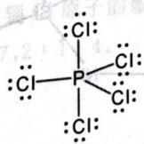

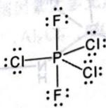

2. 三角双锥。

3. 均为非极性分子。

4. 轴向更长。
5. 采用 $sp^{3}d$ 杂化, 其中赤道面上包括 $sp^{2}$ 混杂的轨道, 而轴向正交线段。

3.50 两个结构如下图所示：

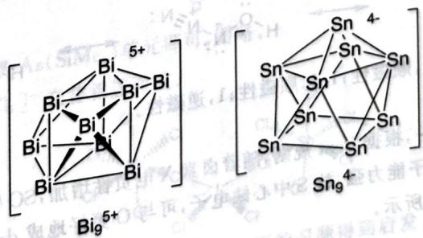

chemical

Two organometallic complex structures labeled Bi95+ and Sn94- with Sn-Sn coordination geometry

3.51.1. 两物质, 种是 $\mathrm{{IBr}}$ ,另一种是 ${\mathrm{{PPh}}}_{4}\mathrm{{Br}}$ 。如不同时,可得 ${\mathrm{{SO}}}_{4}$ 气相等。

3.51 1. 两物质一种是 $\mathrm{IBr}$ , 其中, 阴离子的化学式是 $\mathrm{I}_{3} \mathrm{Br}_{4}^{-}$ , 结构呈三角锥形。

3.52 激发态的 He 可以形成 $1s^{4}Zs^{3}$ 的成双原子分子。

3.53 化学式为 $Si_{8}C_{8}O_{12}H_{24}$ ，结构如下图所示。

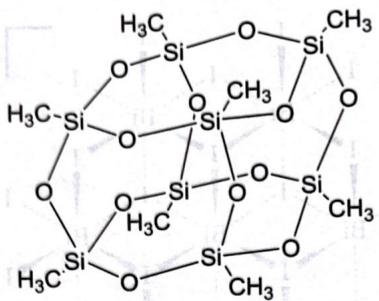

chemical

Molecular structure diagram of a silicate compound with multiple silicon and oxygen atoms

3.54 $\mathrm{XeH_3NC_2OF_2}$ 为四方锥， $\mathrm{XeOF_2}$ 为平面三角形。

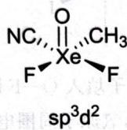

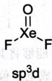

3.55 $\mathrm{sp}^3\mathrm{d}$ 杂化，直线型。

3.56 1. $\mathrm{sp}^3\mathrm{d}^3$ 杂化，平面五边形。

2. 如下图所示(Si 构成三棱柱,NH 插在棱上,甲基为端基)。

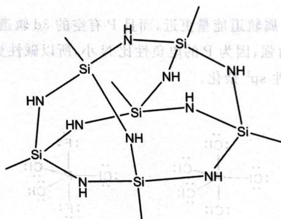

chemical

Chemical structure diagram of a silicon-nitrogen-silicon coordination complex with amine and hydroxyl groups

3.57 1. F 体积小,电负性大,因此∠FSF 更小,∠OSO 更大。

2. 若有 $SOCl_{4}$ ，其结构应为三角双锥，这一排布导致 Cl 彼此之间过于拥挤，因此不稳定。

3.58 1. $sp^{3}d$ 杂化, 直线型。

2. 如下图所示。

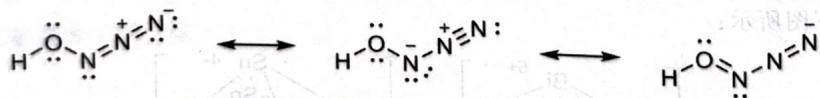

chemical

Chemical reaction mechanism showing electron transfer between two nitrogen atoms with positive charge

3.59 1. 依次为:2.5,顺磁性;2,顺磁性;1.5,顺磁性;1,逆磁性。

2. 和 C 最接近。

3. $\mathrm{SOF}_2$ 最强, $\mathrm{SOBr}_2$ 最弱。第一, 根据 Bent 规则, 随着卤素 X 电负性增加, SO 键的杂化中 s 的成分增加, 因此成键变强; 第二, 由于 F 无 3d 轨道且吸电子能力强, 故 S 中心缺电子, 可与 O 更好地成 d—pπ 键, 因此成键变强。

3.60 Y 是 $ClOF_{3}$ 。结构如下图所示。

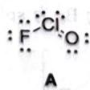

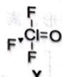

3.61 1. $2\mathrm{WF}_6 + 3\mathrm{SiO}_2 \longrightarrow 2\mathrm{WO}_3 + 3\mathrm{SiF}_4$

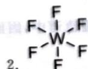

2. F F ; $d^{2}sp^{3}$ ; 偶极矩为 0, 分子间作用力小。3. $4C_{3}$ , $3C_{4}$ , $6C_{2}$ , $9\sigma$ .

3.62 1. $\mathfrak{sp}^2$ 杂化。结构如下图所示，非键S一F距离为 $255.3\mathrm{pm}$

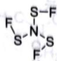

2. 稳定因素: N、F 与 S 之间存在着 d—p 相互作用。不稳定因素: S 共价半径为 102pm, F 为 72pm, 不相邻的 S—F 间孤对电子的斥力较大。

3.63 三种结构如下图所示。

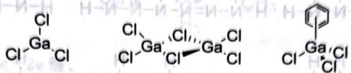

chemical

Chemical structures of gallium chloride (GaCl) and a benzene ring compound

3.64 1. 稳定共振式：

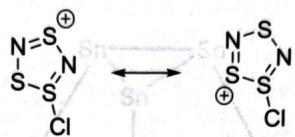

chemical

Chemical structure of a disulfide ion (S₂Cl₃) showing two S atoms with positive charge and negative charge

2. 考虑次稳定的共振式(注意有同号形式电荷相连的应当排除), 共可画出四种。

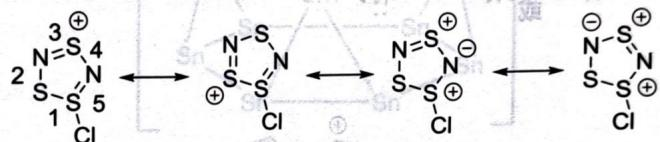

chemical

Chemical reaction diagram showing electron transfer between two sulfur-containing heterocycles with chloride counterions

注意到次稳定的共振式权重通常稍小于稳定共振式,而且由于原子半径关系,S—S单键比S—N单键更长,即可比较出结论5>3>2>4>1。解答没有考虑到Cl原子的影响,否则因素太多无法得解。

3.65 1. $\mathrm{Te}[\mathrm{AlCl}_4]_4$ 。2. $2:2:7,2:1:4$ 。3. $\mathrm{Te}_{4}^{2+},\mathrm{Al}_{2}\mathrm{Cl}_{7}^{-},\mathrm{AlCl}_{4}^{-}$ 。4. Te为 $\mathfrak{sp}^2$ ，Al为 $\mathfrak{sp}^3$ 。

3.66 1. 如下图所示。

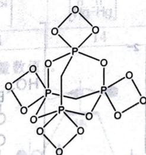

chemical

Chemical structure diagram of a phosphorus-containing compound with multiple ligands and hydroxyl groups

2. 把 $P_{4}S_{2}$ 笼状结构中的 S 换成 $\mathrm{As(SiMe_{3})}$ 单元即可，图略。

3. 如下图所示， $[ICl_{2}]^{+}$ 和 $[SbCl_{6}]^{-}$ 交替相连而成。

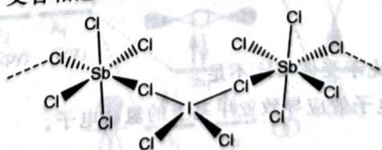

chemical

Chemical structure of a silyl compound with bidentate ligands and chlorine substituents

4. $\left(\mathrm{Bi}_{9}^{5+}\right)_{2}\left(\mathrm{BiCl}_{5}^{2-}\right)_{4}\left(\mathrm{Bi}_{2}\mathrm{Cl}_{6}^{2-}\right)$ 。提示：阳离子的化学式由前面的习题得到启发。

3.67 1. 共振式如图所示, 6 个 $\pi$ 电子, 因此该环系有方音性。 $\oplus S = N - N - S \longleftrightarrow \begin{array}{c} \oplus \\ S - N \\ N - S \end{array} \longleftrightarrow \begin{array}{c} \oplus \\ S - N \\ N - S \end{array} \longleftrightarrow \begin{array}{c} S - N \\ N - S \\ \oplus \end{array}$

2. 结构的不稳定性主要来源于平面四元环较大的张力。

3. 如下图所示。

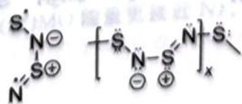

3.74 1. 最简式为 $AlC_{4}H_{11}$ ，结构简式如下图所示。

$$
\begin{array}{c} \mathrm{H} _ {3} \mathrm{C} \\ \mathrm{Al} \\ \mathrm{CH} _ {3} \end{array} \mathrm{C} _ {2} \mathrm{H} _ {5}
$$

2. 化学式略, 可能的结构如下图所示。

$$
\begin{array}{c} \mathrm{H} _ {3} \\ \mathrm{C} _ {2} \mathrm{H} _ {5} \end{array} \text {Al} \begin{array}{c} \mathrm{C} \\ \mathrm{C} \\ \mathrm{H} _ {3} \end{array} \text {Al} \begin{array}{c} \mathrm{C} _ {2} \mathrm{H} _ {5} \\ \mathrm{CH} _ {3} \end{array}
$$

3. 铝为 $sp^{3}$ 杂化, 分子中心有 3c-2e 键。

3.75 结构如下图所示,该结构相当于一个四面体被平行于每个面地削去四角,然后每一个三角形削面的三个顶点安放一个 Sn 原子,Ca 则位于结构的中心。

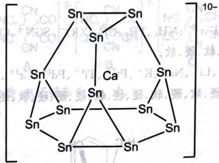

chemical

Molecular structure diagram of a tin-sulfur compound with calcium coordination and 10- charge

3.76 $\mathrm{O}_2 + \mathrm{PdF}_4 + \mathrm{KrF}_2 = \mathrm{O}_2\mathrm{PdF}_6 + \mathrm{Kr}$

3.77 如下表所示：

<table><tr><td>A</td><td>B</td><td>C</td><td>D</td><td>E</td></tr><tr><td></td><td></td><td></td><td></td><td></td></tr><tr><td>2</td><td>14</td><td>14</td><td>14</td><td>6</td></tr></table>

3.78 1. 如下图所示(不要求对称性和能量数值)。

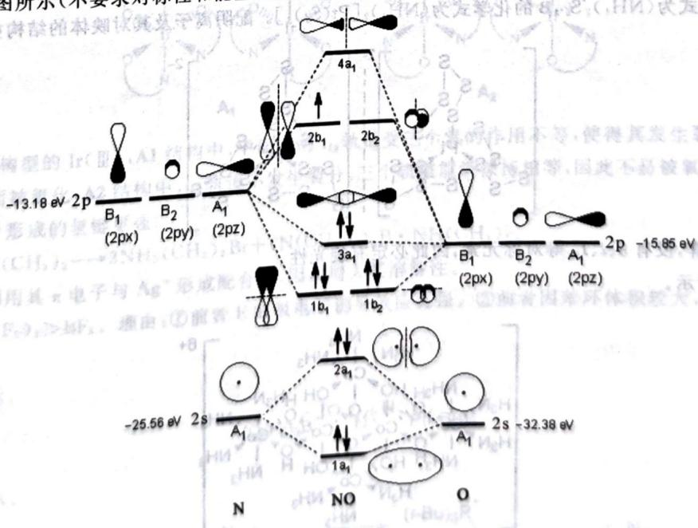

chemical

Energy level diagram of a baryon electronic structure showing electron transitions and orbital states labeled A1, B1, A1', B2, 2px, 2py, 2pz, 4a1, 2b1, 2b2, 3a1, 1b1, 1b2, with energy levels and bonding interactions.

2. 键级为 2.5, 未成对电子数为 1。  
3. HNO, 因为 SOMO 的系数在 N 处更大

3.68 1. $\pi_4^6$ 。

2. 中间的 $NO_{3}$ 单元所在平面垂直于纸面, 如下图所示。

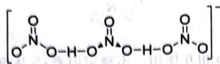

3.69 1. 如下图所示。

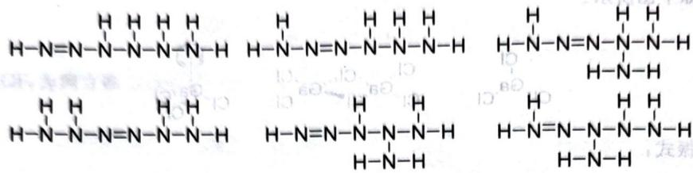

chemical

Chemical structure diagrams showing hydrogen-bonded forms of N-heterocyclic carbene units

2. 如下图所示。

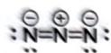

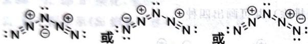

chemical

Chemical reaction diagram showing electron transfer between N and N+ ions with electron density notation

3.70 如下图所示。

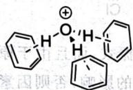

3.71 1. $\left[\mathrm{NH}_{3} \mathrm{CH}_{2} \mathrm{CH}_{2} \mathrm{NH}_{3}\right]_{2} \left[\mathrm{B}_{4} \mathrm{O}_{5} (\mathrm{OH})_{4}\right] \left[\mathrm{B}_{7} \mathrm{O}_{9} (\mathrm{OH})_{5}\right] \cdot 3 \mathrm{H}_{2} \mathrm{O}$ 。

2. 如下图所示。

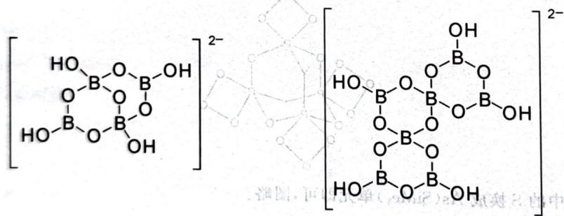

chemical

Chemical structure of a boron-containing compound with two boron-oxygen units linked by a 2- charge, shown in two views.

3. 通过氢键形成骨架。

4. $B_{2}O_{3}$

3.72 1.2mol, 注意氢键给体 N 相比于受体 CH 不足。

2. C周围有4个N,因为较强的吸电子效应导致亚甲基上的氢缺电子。

3.73 如下图所示。

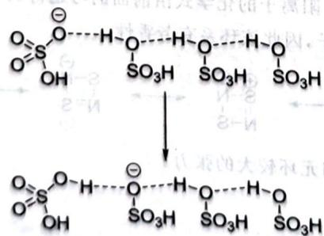

chemical

Chemical reaction diagram showing sulfonation of a sulfonyl group to form a sulfonate ester

## 第4讲 配合物

4.1 设 C 与基团 R 相连, 根据 Bent 规则, 随着 R 的电负性升高, C—R 键的 p 成分会增加, 而 C 与其他基团连接的键的 s 成分相应增加, 造成 C 也显现出吸电子效应。

4.5 BCD 提示: 空间效应。

4.6 在茚和芴的负离子中，有一个或两个共振式破坏了苯环结构。

4.10 $\mathrm{PPh}_3 + \mathrm{I}_2 \longrightarrow \mathrm{PPh}_3 \cdot \mathrm{I}_2$ (黄色); $\mathrm{PPh}_3 \cdot \mathrm{I}_2 \longrightarrow [\mathrm{PPh}_3\mathrm{I}][\mathrm{I}]$ (无色); $[\mathrm{PPh}_3\mathrm{I}][\mathrm{I}] + \mathrm{I}_2 \longrightarrow [\mathrm{PPh}_3\mathrm{I}][\mathrm{I}_3]$ (棕色)。第一步发生配位反应, 显色发生变化, 随后得到离子化合物, 应为无色, 最后又是配位反应, 显色再次发生变化。

4.12 前者是与 Au 形成配合物, 降低 Au 的电极电位; 后者是由于吡啶与 S 配位, S 的电子反馈到吡啶的 $\pi$ 反键轨道中, 降低了 LUMO, 氧化性增强。

4.13 $\mathrm{OH}^{-},\mathrm{H}^{-},\mathrm{RO}^{-},\mathrm{RS}^{-},\mathrm{F}^{-},\mathrm{Cl}^{-},\mathrm{I}^{-},\mathrm{NH}_{3},\mathrm{PR}_{3},\mathrm{CH}_{3}\mathrm{COO}^{-},\mathrm{SCN}^{-},\mathrm{CO}_{3}^{2-},\mathrm{CO},\mathrm{N}_{2}\mathrm{H}_{4},\mathrm{C}_{6}\mathrm{H}_{6}$ 的软硬分别为硬、硬、硬、软、硬、硬、软、硬、软、硬、两可、硬、软、硬、软。

4.14 $\mathrm{H}_3\mathrm{O}^+$ 、 $\mathrm{Hg}^{2+}$ 、MeHg $^+$ 、 $\mathrm{Hg}_{2}^{2+}$ 、Li $^+$ 、Na $^+$ 、K $^+$ 、Pt $^{2+}$ 、Ti $^{4+}$ 、Pd $^{2+}$ 、Cr $^{3+}$ 、Cr $^{6+}$ 、Ag $^+$ 、BF $_3$ 、BH $_3$ 、R $_3$ C $^+$ 、M $^0$ 、Ln $^{3+}$ 、Au $^+$ 的软硬分别为硬、软、软、软、硬、硬、硬、软、硬、软、硬、硬、硬、软、硬、软、硬、软、软、硬、软。

4.18 结构如下图所示。

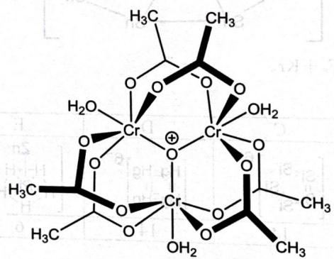

chemical

Molecular structure of a chromium complex with multiple hydroxyl groups and methyl substituents

4.20 A 的化学式为 $\left(\mathrm{NH}_{4}\right)_{2}\mathrm{S}_{5}$ ，B 的化学式为 $\left(\mathrm{NH}_{4}\right)_{2}\left[\mathrm{Pt}\left(\mathrm{S}_{5}\right)_{3}\right]$ 。配阴离子及其对映体的结构如下图所示。

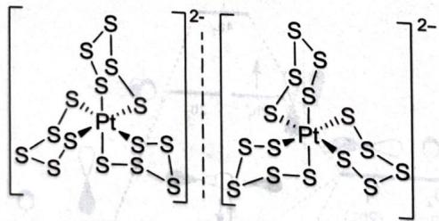

chemical

Molecular structure of platinum complex with S and Pt ligands, showing 2D coordination geometry

阴离子属 $D_{3}$ 点群，没有 $\sigma, i, I_{4n}$ 等对称元素，因此必定有旋光性。

4.22 如下图所示。

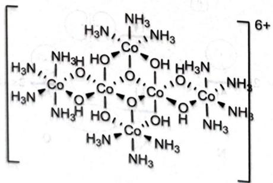

chemical

Chemical structure of a cobalt complex with multiple ligands and a 6+ charge

4.23 $\mathrm{O}_2$ 的孤对电子与 $\mathrm{Co}$ 配位，同时接受 $\mathrm{Co}$ 的反馈键作用，为同时满足两种成键的重叠要求，取折线型配位，且键长比氧气中要长。

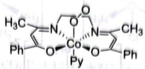

chemical

Chemical structure of a cobalt complex with pyridine ligands and methyl substituents

4.28 平面四方体系下，金属 d 轨道与氰基的 $\pi$ 电子能够形成大的共轭体系，使得配合物稳定。

4.30 $\mathrm{K}_2[\mathrm{NiF}_6]$ 中 Ni 为八面体，Ni 为 $\mathrm{d}^6$ 电子构型，F 是弱场配体，取高自旋组态，电子排布为 $(t_{2g})^4 (e_g^*)^2$ 。 $\mathrm{Ni(PEt_3)Cl_2}$ 中 Ni 为平面三角形结构，d 轨道分裂为 3 组，其中 $d_{xy}, d_{yz}$ 简并且能量最低， $d_z^2$ 居中， $d_x^2 - y^2, d_{xy}$ 简并且能量最高。Ni 为 $d^8$ 电子构型，除了最高的简并能级各填充一个电子之外，其余轨道都填充两个电子（若按 Ni(PEt) $_3$ Cl $_2$ 处理，则为三角双锥构型，d 轨道分裂为 3 组“211”型式， $d_z^2$ 能量最高）。

4.33 1. 三种物质的结构如下图所示。

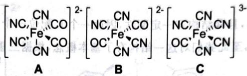

chemical

Chemical structure of a Fe(CN) complex with labeled carbon and oxygen atoms, showing two variants A and B.

2. $d^{6}$ 电子构型、顺磁性，因此是低自旋，电子排布为 $(t_{2g})^{6}$ 。

4.35 1. L 的结构简式如下图所示。

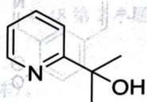

2. L 与 Ir 形成的风扇型配合物有面式、经式两种结构，考虑其对映体，共有四种异构体。

3. 产物的化学式为 $\left[\mathrm{IrL}_{3}\right]\left[\mathrm{PF}_{6}\right]$ 。其能够稳定存在，是由于经式结构中的三个氧原子位于同一平面，具有较强的 $\pi$ 给电子效应。

4. 根据化学环境关系可知，A1 为经式结构，A2 为面式结构。如下图所示。

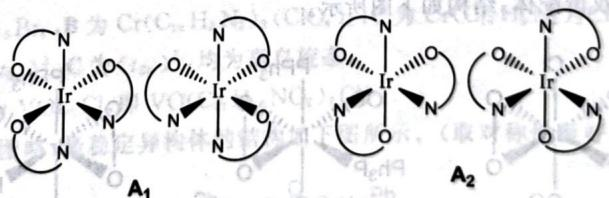

chemical

Molecular structures of Ir and N atoms in two configurations A1 and A2, showing coordination geometry

5. 对于 $(t_{2g})^6$ 构型的 Ir(Ⅲ), A1 结构中, 平面型的 $t_{2g}$ 轨道受三个氧的作用不等, 使得其发生裂分, 一个轨道的能级较高, 容易失电子而被氧化; A2 结构中, $t_{2g}$ 轨道不发生裂分, 三个轨道能级保持相等, 因此不易被氧化。

4.36 1. $\mathrm{Et}_2\mathrm{O}$ 形成的氢键更强。

2. $\mathrm{BBr}_3 + 7\mathrm{NH}(\mathrm{CH}_3)_2 \longrightarrow 3\mathrm{NH}_2(\mathrm{CH}_3)_2\mathrm{Br} + (\mathrm{N}(\mathrm{CH}_3)_2)_3\mathrm{B} \cdot \mathrm{NH}(\mathrm{CH}_3)_2$ 。

3. 苯环可以利用其 $\pi$ 电子与 $Ag^{+}$ 形成配合物，因而增大其溶解性。

4.37 1. $\mathrm{B}(\mathrm{C}_{6}\mathrm{F}_{5})_{3} > \mathrm{BF}_{3}$ 。理由：①前者 F 的吸电子诱导效应更强。②前者因本环体积较大，缺乏其轭效应的稳定化作用。

2. 如下图所示。

$$
(C _ {6} F _ {5}) _ {3} \bar {B} - O - N = N - P (t - B u) _ {3}
$$

3. 如下图所示。

$$
(C _ {6} F _ {5}) _ {3} \bar {B} - O - N = N - P ^ {+} (t - B u) _ {3} \longrightarrow (t - B u) _ {3} P ^ {+} O - \bar {B} (C _ {6} F _ {5}) _ {3} + N _ {2}
$$

4.38 第一个配位数为 4，氧化态为 +2，平面四方，顺磁性；第二个为配位数为 5，氧化态为 +4，反磁性；第三个配位数为 6，氧化态为 +4，顺磁性。

4.39 如图所示,结构中存在金属一金属键,在图中一并示出。

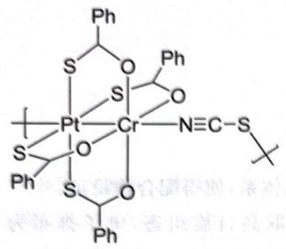

chemical

Chemical structure of a platinum complex with phosphine and carbonyl ligands

4.39 题图

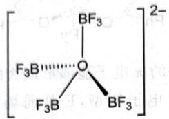

chemical

Chemical structure of a boron-oxygen compound with BF3 and F3B substituents

4.40 第 1 小题图

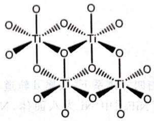

chemical

Crystal structure diagram of a titanium-organic framework showing tetrahedral coordination geometry

4.40 第 2 小题图

4.40 1. 如图所示。

$$
\mathrm{Na} _ {2} \mathrm{B} _ {4} \mathrm{O} _ {7} \cdot 1 0 \mathrm{H} _ {2} \mathrm{O} + 1 4 \mathrm{HF} \longrightarrow 4 \mathrm{BF} _ {3} + 2 \mathrm{NaF} + 1 7 \mathrm{H} _ {2} \mathrm{O} 。
$$

2. 如图所示。

4.41 容易观察到 L 为六齿配体，且其结构有一定刚性，因此一个 L 配位一个 Cr 的可能性更大。这两个单独的八面体单元通过 O—H…O 氢键相连接，至此我们对这一结构有了基本概念，根据三重轴的条件对称地画出结构。图略。

4.42 如下左图所示。

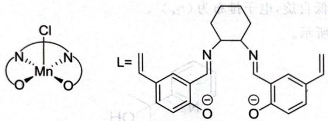

chemical

Molecular structure of a manganese complex with chloride counterion and its ligand geometry

如上右图所示,若环己二胺为顺式,没有旋光异构体;但倘若环己二胺为反式,则配合物就不具有对称面了,因而存在旋光异构。

4.43 1. $\mathrm{IrCl}_3\cdot 3\mathrm{H}_2\mathrm{O} + \mathrm{OHCN}(\mathrm{CH}_3)_2 + 3\mathrm{PPh}_3 + \mathrm{PhNH}_2\longrightarrow \mathrm{Ir}(\mathrm{PPh}_3)_2(\mathrm{CO})\mathrm{Cl} + \mathrm{NH}_2(\mathrm{CH}_3)_2\mathrm{Cl} + \mathrm{POPh}_3+$ $\mathrm{PhNH_3Cl + 2H_2O}$ 。DMF参与反应，生成羰基配体。（同时兼作溶剂。）

2. B 为八面体配合物, $O_{2}$ 做双齿配体, 结构如下图所示。

4.44 1. 分别为 $\left[\mathrm{Cr}\left(\mathrm{H}_{2} \mathrm{O}\right)_{6}\right] \mathrm{Cl}_{3}, \left[\mathrm{Cr}\left(\mathrm{H}_{2} \mathrm{O}\right)_{5} \mathrm{Cl}\right] \mathrm{Cl}_{2} \cdot \mathrm{H}_{2} \mathrm{O}, \left[\mathrm{Cr}\left(\mathrm{H}_{2} \mathrm{O}\right)_{4} \mathrm{Cl}_{2}\right] \mathrm{Cl} \cdot 2 \mathrm{H}_{2} \mathrm{O}$ , 八面体。  
2. 如下图所示。

chemical

Chemical structure of a chromium complex with two oxygen ligands and a 4+ charge

4.45 1. 分别为 $\left[\mathrm{Co}\left(\mathrm{NH}_{3}\right)_{4} \mathrm{CO}_{3}\right] \mathrm{Cl}, \left[\mathrm{Co}\left(\mathrm{NH}_{3}\right)_{4} \mathrm{Cl}_{2}\right] \mathrm{Cl} \cdot 0.5 \mathrm{H}_{2} \mathrm{O}, \left[\mathrm{Co}\left(\mathrm{NH}_{3}\right)_{4} \mathrm{Cl}_{2}\right] \cdot \mathrm{HCl} \cdot \mathrm{H}_{2} \mathrm{O}$ . 无。  
3. 依次如下图所示。几何异构体。

chemical

Two organometallic chromium complex structures with chloride ligands and counterions

4. $16\mathrm{NH}_{4}^{+} + \mathrm{O}_{2} + \mathrm{CoCO}_{3}\longrightarrow 4[\mathrm{Co(NH_{3})_{4}CO_{3}}]^{+} + 12\mathrm{H}^{+} + 2\mathrm{H}_{2}\mathrm{O},$ $\left[\mathrm{Co(NH_3)_4CO_3}\right]\mathrm{Cl} + 2\mathrm{HCl}\longrightarrow \left[\mathrm{Co(NH_3)_4Cl_2}\right]\mathrm{Cl}\cdot 0.5\mathrm{H}_2\mathrm{O} + \mathrm{CO}_2 + 0.5\mathrm{H}_2\mathrm{O}$

4.46 1. $\mathrm{C_4H_9N_3}$

2. 如图所示。

chemical

Chemical structure of a platinum complex with two pyridine ligands and a 2+ charge

4.46 第 2 小题图

chemical

Chemical structure of a chlorinated organic compound with two phenyl rings and a central chlorine atom

4.48 第 2 小题图

chemical

Chemical structure of a complex organic molecule with chlorine and phenyl groups, featuring bridging oxygen atoms and hydrogen bonding

4.48 第 4 小题图

4.47 1. $\mathrm{Zn}(\mathrm{C}_5\mathrm{H}_5\mathrm{N})_2(\mathrm{C}_2\mathrm{O}_4)$ 。  
2. 通过草酸根离子桥连(草酸根离子作四齿配体)。  
3. 稀的高氯酸溶液无氧化性。  
4.48 1. CoCl(C7H9NO)(C7H8NO)。  
2. 如图所示, 中间的圆球为 Co。四方锥。  
3. 氢键。  
4. 如图所示, 中间的圆球为 Co。  
4.49 1. A 为 $\mathrm{Cr}(\mathrm{C}_{10}\mathrm{H}_{8}\mathrm{N}_{2})_{3}\mathrm{Br}_{2}$ ，B 为 $\mathrm{Cr}(\mathrm{C}_{10}\mathrm{H}_{8}\mathrm{N}_{2})_{3}(\mathrm{ClO}_{4})_{3}$ ，C 为 $\mathrm{Cr}(\mathrm{C}_{10}\mathrm{H}_{8}\mathrm{N}_{2})_{3}\mathrm{ClO}_{4}$ 。  
2. A 的构型为 $(t_{2g})^{4}$ ，B 为 $(t_{2g})^{3}$ ，C 为 $(t_{2g})^{5}$ ，均为高自旋态。  
4.50 1 配合物的化学式为 $\mathrm{VOL}_2\mathrm{Cl}$ ，即 $\mathrm{VO(C_{13}H_{10}NO_2)_2Cl}$ 。  
2. 一共有6个异构体,具体图略,最稳定异构体的结构如下图所示。(取对称性最好、极性最弱的结构。)

4.51 1. A 的分子式为 $\left[\mathrm{Co}_{2}(\mathrm{NH}_{3})_{8}(\mathrm{NH}_{2})(\mathrm{O}_{2})\right]\mathrm{Cl}_{4}$ ，结构如下图所示。

2. $4\mathrm{CoCl}_2 \cdot 4\mathrm{H}_2\mathrm{O} + 18\mathrm{NH}_3 + 5\mathrm{H}_2\mathrm{O}_2 \longrightarrow 2[\mathrm{Co}_2(\mathrm{NH}_3)_8(\mathrm{NH}_2)(\mathrm{O}_2)]\mathrm{Cl}_4 + 22\mathrm{H}_2\mathrm{O}$ 。  
3. 氧为 -1/2 氧化态, 价电子排布为 $d^{6}$ , 取 $sp^{3}d^{2}$ 杂化。  
4.52 1. 如下图所示。 2. 略

  
A

  
B

  
←

  
C

4.53 1. Be 和 Zn 均为 $sp^{3}$ 杂化。结构如下图所示。

chemical

Molecular structure of a metal complex with M = Be, Zn ligand, showing coordination geometry and unit cell boundaries

2. Zn 为第 4 周期元素, 有 d 轨道, 可以接受水分子的进攻; Be 没有空轨道, 难以被水分子进攻。

4.54 1. $\left[\mathrm{Fe}(\mathrm{CN})_{5}\mathrm{NO}\right]^{2-} + \mathrm{S}^{2-} \longrightarrow \left[\mathrm{Fe}(\mathrm{CN})_{5}(\mathrm{NOS})\right]^{4-}$ 。X的结构如下图所示。

$$
\left[ \begin{array}{c} \mathrm{CN} \\ \mathrm{NC} \backslash \mathrm{Fe} \backslash \mathrm{N} \backslash \mathrm{S} \\ \mathrm{NC} \backslash \mathrm{CN} \backslash \mathrm{O} \end{array} \right] ^ {4 -}
$$

2. $\mathrm{Fe(CN)}_5$ 对NO具有吸电子作用，因此Fe越缺电子，N的反应活性越高。 $[\mathrm{Fe(H_2O)_5NO}]^{2-}$ 中不存在反馈键， $[\mathrm{Fe(CN)}_5\mathrm{NO}]^{3-}$ 中心原子价态低，这两者的N亲电性较差，不易与 $\mathbf{S}^{2-}$ 反应。

3. 如下图所示。

chemical

Chemical reaction equation showing nickel complex formation with sulfur and cyano ligands, producing a silyl radical product

4.55 1. 四配位的 Ni 离子较小,遇到电负性高、体积大的配体时,为了规避排斥,往往采取四面体构型。而当配体之间的排斥作用不那么强时, $d^{8}$ 的 Ni 采取平面四方构型时获得的晶体场稳定化能较多,故多采取平面正方形构型。

2. 二配位的 $\mathrm{Ag}^{+}$ 为 sp 杂化的直线型构型， $[\mathrm{Ag(en)}]^{+}$ 中，乙二胺与两个 sp 杂化的轨道同时重叠较差，因此稳定性下降。或者答其形成直线型结构的张力太大，不够稳定。

3. $\mathrm{SCN}^{-}$ 的体积较大, 配合物空间较为拥挤, 因此水溶液中 $[\mathrm{Co}(\mathrm{SCN})_{6}]^{4-}$ 较为不稳定。 $\mathrm{NH}_{3}$ 的碱性相比于 $\mathrm{SCN}^{-}$ 更强, 因此酸性条件下更加容易解离, 较为不稳定。另外, $[\mathrm{Co}(\mathrm{NH}_{3})_{6}]^{2+}$ 在酸性条件下还容易被氧化为 $[\mathrm{Co}(\mathrm{NH}_{3})_{6}]^{3+}$ 。

4.56 提示: 考虑具有反位效应配体的电子效应。

4.57 1. 如下图所示。

chemical

Molecular structure diagram showing chromium (Cr) coordination with nitrogen atoms and bridging ligands

2.A的化学式为 $\mathrm{Mn}[\mathrm{Cr(bipy)}(\mathrm{C}_2\mathrm{O}_4)_2]_2$ ，结构如下图所示。

chemical

Molecular structure of a manganese complex with Cr and N ligands, showing coordination geometry

1.58. A 为 Fe, B 为 $FeCl_{2}$ , C 的化学式为 $\mathrm{Co}_{3}\mathrm{Fe}(\mathrm{C}_{2}\mathrm{O}_{4})_{4} \cdot 8\mathrm{H}_{2}\mathrm{O}$ 。  
2. G 中 Fe 全部是 $Fe_{2}O_{3}$ ，因此 G 中所含 Co 的氧化物可以写成 $Co_{6}O_{6.866}$ ，为 $Co_{3}O_{4}$ 与 CoO 的混合物 ( $Co_{2}O_{3}$ 不存在)，G 的组成为 $3.402CoO \cdot 0.866Co_{3}O_{4} \cdot Fe_{2}O_{3}$ ，写成质量分数为：40.9% CoO，33.5% $Co_{3}O_{4}$ ，25.6% $Fe_{2}O_{3}$ 。  
3. E 为 $(\mathrm{NH}_{4})_{3}\mathrm{Co}(\mathrm{C}_{2}\mathrm{O}_{4})_{3}$ ，F 为 $(\mathrm{NH}_{4})_{3}\mathrm{Fe}(\mathrm{C}_{2}\mathrm{O}_{4})_{3}$ 。  
4. $2\mathrm{H}_{2}\mathrm{C}_{2}\mathrm{O}_{4} + \mathrm{Fe}(\mathrm{C}_{2}\mathrm{O}_{4})_{3}^{4 - } + 3\mathrm{Co}(\mathrm{C}_{2}\mathrm{O}_{4})_{3}^{4 - } + 2\mathrm{PbO}_{2} + 4\mathrm{CH}_{3}\mathrm{COOH}\longrightarrow$  
5. F晶体中Fe的电子构型为 $d^{5}$ ，弱场、高自旋，容易发生光激发的电子转移。而E中的Co为强场的 $3d^{6}$ 构型，6个电子都位于 $e_{g}$ 轨道上，对光不敏感。

$$
\mathrm{Fe} \left(\mathrm{C} _ {2} \mathrm{O} _ {4}\right) _ {3} ^ {3 -} + 3 \mathrm{Co} \left(\mathrm{C} _ {2} \mathrm{O} _ {4}\right) _ {3} ^ {3 -} + 2 \mathrm{Pb} \left(\mathrm{CH} _ {3} \mathrm{COO}\right) _ {2} + 4 \mathrm{H} _ {2} \mathrm{O} + 2 \mathrm{C} _ {2} \mathrm{O} _ {4} ^ {2 -} 。
$$

4.59 1. 如下图所示。

chemical

Energy level diagram showing electron transitions with labeled energy levels e_g and t_2g

2. Co.

3. 如下图所示, 左侧为高自旋, 右侧为低自旋。

chemical

Molecular orbital diagram showing electron density (E1, E2, E3) and bonding interactions between Cr(CO) and a chelate ion

4. 高自旋为 $P > E_{1} - E_{3}$ ，低自旋不等号反向。Cr 和 Ni 的二价离子。

4.60 如下图所示。

## 第5讲 金属有机化学

5.2 16 电子稳定。平面四方配体 8 电子, 剩下中心金属的配体尽量填满成键轨道, 而不填能量太高的反键轨道, 得到的稳定构型为 16 电子。

5.5 如下图所示。

  
A

H—H  
  
B  
C

  
D

  
E

  
F

5.10 $\mathrm{Tc_2Cl_8^{2 - }}$ 的键级与 $\mathrm{Re}_2\mathrm{Cl}_8^{3 - }$ 相同，均为 $4;\mathrm{Tc_2Cl_8^{3 - }}$ 多金属键的键级为3.5。主要原因是Tc电荷变高有静电排斥，而d-d多重键不足以抵消这部分排斥。（此解释属于F.A.Cotton。）  
5.11 1. $\left[\mathrm{Mo}_{2}(\mathrm{DTolF})_{3}\right]_{2}(\mu -\mathrm{OH})_{2}$ 中，Mo取 $\mathrm{dsp}^2$ 杂化与配体成键，其余d轨道参与多重键，键级为4，结构如下图所示。

chemical

Molecular structure of a molybdenum complex with Mo and N ligands

2. $\left[\mathrm{Mo}_{2}(\mathrm{DTolF})_{3}\right]_{2}(\mu -\mathrm{O})_{2}$ 的结构与 $\left[\mathrm{Mo}_{2}(\mathrm{DTolF})_{3}\right]_{2}(\mu -\mathrm{OH})_{2}$ 完全相同，只需要把桥基换成氧原子即可。Mo为 $+2.5$ 价，金属键的键级为3.5。结构如下图所示。

chemical

Molecular structure of a molybdenum complex with Mo and N ligands

5.12 1. 如下左图所示,实际上应当取下右图结构。

2. 体系中不存在金属—金属键，又要符合 EAN 规则，则 CO 不可能简单地分配电子给两个 Fe。CO 必须形成 3c-2e 键，才能使得两个 Fe 都满足 EAN 规则。体系的成键形式包括 6 个 σ 配键，2 个 CO 边桥基和一个 Fe—C—Fe 的 3c-2e 体系。  
5.17 对于氧化加成,为使得参与加成的分子与金属的 d 轨道能够对称性匹配,两者必须采取顺式加成。在还原消除反应中,只有处于邻位的两个配体的轨道能够发生有效重叠而消除,对位配体间隔太远,不能形成消除产物。

5.18 1. PNP 可以作为三齿配体, 结构不难画出, 如下图所示。

2. 如下图所示。

chemical

Chemical reaction mechanism showing conversion of a metal complex I-Mo-N≡N-Mo-I to I-Mo-NH3 via intermediate I-Mo-N, with P and N substituents indicated.

A  
B  
C

5.19 $(\mathrm{PhC})_{4}\mathrm{O}+\mathrm{Ph}_{3}\mathrm{SnMn}(\mathrm{CO})_{5}\longrightarrow\mathrm{SnOPh}_{2}+\mathrm{Mn}[(\mathrm{PhC})_{5}](\mathrm{CO})_{3}+2\mathrm{CO}$

5.20 如下图所示。

  
A

chemical

Chemical structure of a copper complex with phosphine ligands and chloride counterions

R

chemical

Organometallic complex structure with copper center, phosphine ligand, and cyclopentadienyl group

B

结构中 Cr 符合 18 电子规则, Cu 不符合。

5.21 $W_{2}Cl_{9}^{3-}$ ，根据价态和抗磁性推测存在 W—W 键，为三重键。  
5.22 分别为 Co、Ti、W、Ni、Ru、Sc、Au、Mn、Zn、Ta。  
5.23 依次为 $\mathrm{Cr}(\mathrm{C}_6\mathrm{H}_6)_2$ 、 $\mathrm{C}_6\mathrm{H}_6$ 、 $\mathrm{Cr}(\mathrm{C}_6\mathrm{H}_6)_2(\mathrm{OH})$ 、 $\mathrm{H}_2\mathrm{O}_2$ 。二苯铬的结构如图所示。

  
5.23 题图

chemical

Organometallic cluster structure with arsenic (As) and chromium (Cr) ligands, labeled with (OC)5Cr and Cr(CO)5 groups

5.24 第 1 小题图

  
5.24 第 2 小题图

5.24 1. 如图所示。  
2. 如图所示, 两侧为环戊二烯负离子, 中间为环辛四烯双负离子。  
5.25 1. 分别如下图所示。

chemical

Molecular structure of a titanium complex with Cp ligands and nitrogen atoms

chemical

Molecular structure of a titanium complex with chloride and phosphine ligands

chemical

Molecular structure of a titanium complex with Cp, Sc, and Ti atoms

$$
2. + 4, 6, 1 2 。
$$

## 化学奥林匹克竞赛 初赛讲义

5.26 1. 根据电荷守恒和含有桥连配体的信息，B为 $\mathrm{Cr_2(CH_3COO)_4\cdot 2H_2O}$ ，由EAN规则与反磁性可以验算得到含有Cr—Cr四重键。结构如下图所示。

chemical

Chemical structure of a chromium complex with hydroxyl and oxygen ligands

2. Cr 半径较小, $Cr_{2}Cl_{9}^{3-}$ 中没有 Cr-Cr 键, 而其同族金属 W 半径较大, 当 Cl 桥连时, 更易形成 W-W 键, 导致 $W_{2}Cl_{9}^{3-}$ 为反磁性化合物。

3. A 的化学式为 $\left[\mathrm{Cr}(\mathrm{CN})_{5}(\mathrm{NO})\right]^{3-}$ 。A 中的 Cr 为 +1 价，其价态较低，因此 NO 与 Cr 的成键较弱，导致其磁矩偏大。

5.27 1.4 重键, 1 个 $\sigma$ 键, 2 个 $\pi$ 键, 1 个 $\delta$ 键。

2. 顺磁性。

3. 更小。虽然 Mo 价态的降低导致 $\delta$ 键的键级降低为 0.5，但是 $\delta$ 键很弱，而 Mo 价态的降低有助于降低核间静电排斥，因此成键更好。

5.28 3种化学环境,分别为顶点的Os(4个,被3个CO配位)、四面体棱上的Os(12个,被2个CO配位)和面上的Os(4个,被1个CO配位)。

5.29 $\left(\mathrm{CH}_{3}\mathrm{CH}_{2}\right)_{2}\mathrm{Mg}_{4}\mathrm{Cl}_{6}\left(\mathrm{C}_{4}\mathrm{H}_{8}\mathrm{O}\right)_{6}$ ，结构如下图所示。

chemical

Molecular structure diagram of a magnesium complex with chlorine and oxygen ligands

5.30 1. $\mathrm{Mo(CO)_6,(t_{2g})^6(e_g)^4}$

2. 依次如下图所示, 其中 M 表示 Pd。注意金属—金属多重键的键级。

chemical

Molecular structures of molybdenum complexes with phosphine and oxime ligands

5.31 E 的化学式为 $\mathrm{HCo(CO)_{4}}$ 。循环中 $\left[\mathrm{HCo(CO)_{3}(CH_{2}=CHCH_{2}OH)}\right]$ 具体几何结构不做要求。催化循环如下图所示。

chemical

Organic reaction mechanism showing the conversion of HCo(CO)₄ to Co(CH₃)CO and then to a carboxylic acid derivative

5.32 1. 如下图所示。

  
A

  
B

  
C

  
D

2. 中间体 1 为 +2 价, 2 为 +2 价, 3 为 +4 价, 4 为 +4 价。

3.4 中 Fe—His 键更长。

5.33 1. X 的化学式为 $\mathrm{Fe(CO)_{3}B_{4}H_{8}}$ 。

2. 如图所示。

  
5.33 题图

chemical

Chemical structure of a ferrocene-based coordination complex with two cyclopentadienyl ligands

5.34 题图

3.+4价,价电子构型为 $3d^{4}$ 。

5.34 1. $\mathrm{FeC}_{5} \mathrm{H}_{5} \mathrm{NO}$ 。

2. 如图所示,有二重金属—金属键。

5.35 1. A 为 Ni(CO) $_{4}$ ，B 为 Fe(CO) $_{5}$ ，C 为 Co $_{2}$ (CO) $_{8}$ ，X 为 CO，V 是 MnCl $_{2}$ ，D 为 Mn $_{2}$ (CO) $_{10}$ ，W 为 Re $_{2}$ O $_{7}$ ，E 为 Re $_{2}$ (CO) $_{10}$ 。

2. 所有的化学方程式如下：

$$
\mathrm{Ni} (\mathrm{CO}) _ {4} + \mathrm{PH} _ {3} \longrightarrow \mathrm{Ni} (\mathrm{CO}) _ {3} \mathrm{PH} _ {3} + \mathrm{CO},
$$

$$
\mathrm{Fe(CO)} _ {5} + 2 \mathrm{Na} \longrightarrow \mathrm{Na} _ {2} \mathrm{Fe(CO)} _ {4} + \mathrm{CO},
$$

$$
\mathrm{Mn} _ {2} (\mathrm{CO}) _ {1 0} + 2 \mathrm{Na} \longrightarrow 2 \mathrm{NaMn} (\mathrm{CO}) _ {5},
$$

$$
\mathrm{Na} _ {2} \mathrm{Fe} (\mathrm{CO}) _ {4} + 2 \mathrm{H} ^ {+} \longrightarrow \mathrm{H} _ {2} \mathrm{Fe} (\mathrm{CO}) _ {4} + 2 \mathrm{Na} ^ {+},
$$

$$
\mathrm{Na} _ {2} \mathrm{Fe} (\mathrm{CO}) _ {4} + \mathrm{Hg} \left(\mathrm{NO} _ {3}\right) _ {2} \longrightarrow \mathrm{HgFe} (\mathrm{CO}) _ {4} + 2 \mathrm{NaNO} _ {3},
$$

$$
3 \mathrm{Fe} (\mathrm{CO}) _ {5} + 4 \mathrm{NaOH} \longrightarrow \mathrm{Na} _ {2} \left[ \mathrm{Fe} _ {3} (\mathrm{CO}) _ {1 1} \right] + \mathrm{Na} _ {2} \mathrm{CO} _ {3} + 2 \mathrm{H} _ {2} \mathrm{O} + 3 \mathrm{CO},
$$

$$
3 \mathrm{Co} _ {2} (\mathrm{CO}) _ {8} + 1 2 \mathrm{py} \longrightarrow 2 [ \mathrm{Co} (\mathrm{py}) _ {6} ] [ \mathrm{Co} (\mathrm{CO}) _ {4} ] _ {2} + 8 \mathrm{CO},
$$

$$
\mathrm{Re} _ {2} (\mathrm{CO}) _ {1 0} + \mathrm{Br} _ {2} \longrightarrow 2 \mathrm{Re} (\mathrm{CO}) _ {5} \mathrm{Br},
$$

$$
\mathrm{R} _ {2} (\mathrm{CO}) \mathrm{R} _ {3} + \mathrm{NaMn} (\mathrm{CO}) _ {5} \longrightarrow \mathrm{ReMn} (\mathrm{CO}) _ {1 0} + \mathrm{NaBr},
$$

$$
\mathrm{Re} (\mathrm{CO}) _ {5} \mathrm{Br} + \mathrm{NaMn} (\mathrm{CO}) _ {5} \rightarrow K _ {2} \left\{\mathrm{Ph} [ \mathrm{Fe} (\mathrm{CO}) _ {4} ] _ {3} \right\} + \mathrm{CO} + 2 \mathrm{K} _ {2} \mathrm{CO} _ {3} + 4 \mathrm{H} _ {2} \mathrm{O} + 2 \mathrm{KCl}
$$

$3\mathrm{Fe}(\mathrm{CO})_{5}+\mathrm{PbCl}_{2}+\delta\mathrm{KOH}$ 与 $\mathrm{Co}(\mathrm{CO})_{3}$ 互为等瓣

3. Q 的化学式为 $\mathrm{Co}_{3}(\mathrm{CO})_{9}\mathrm{CH}, \mathbf{R}$ 的化学式为 $\mathrm{Co}_{4}(\mathrm{CO})_{12}$ 。两者的结构是极相似的，因为 CH 与 $\mathrm{Co}(\mathrm{CO})_{3}$ 互为等瓣（下图中 CO 进行桥连也可），如下图所示。

chemical

Molecular structure of a cobalt complex with coordinated ligands and CO atoms

Q

chemical

Molecular structure diagram of a cobalt complex with coordinated ligands

R

5.36 如下图所示。

  
A

  
B

  
C

6.19 1. B 为 $TlO_{2}$ ，A 为硫酸铊 $Tl_{2}SO_{4}$ ，F 为 $Tl_{4}O_{3}$ ，写成复合氧化物为 $3Tl_{2}O \cdot Tl_{2}O_{3}$ ；C 是 TlI，D 是 $TlI_{3}$ 。

2. 化学式为 $TlN_{6}$ ，存在形式为 $TlN_{3} \cdot TlN_{9}$ ，实际上为 $\mathrm{Tl}\left[\mathrm{Tl}\left(\mathrm{N}_{3}\right)_{4}\right]$ 。

3. 化学式为 $\mathrm{TiCl}_5$ 和 $\mathrm{Ti}_2\mathrm{Cl}_9$ ，前者是两个八面体共棱的结构，后者是两个八面体共有一面的结构（联想 $[\mathbf{W}_2\mathbf{Cl}_9]^{3-}$ 的结构）。

$$
\left[ \begin{array}{c} \mathrm{Cl} \\ \mathrm{Cl} \end{array} \right] ^ {4 -} \left[ \begin{array}{c} \mathrm{Cl} \\ \mathrm{Cl} - \mathrm{Ti} \\ \mathrm{Cl} \end{array} \right] ^ {3 -}
$$

6.20 分别为 KSCN、Cu、KCN、 $Cu_{2}S$ 、 $KFe_{2}(CN)_{6}$ 、 $NO_{2}$ 、 $N_{2}O_{4}$ 。

6.21 1. 分别为 $\mathrm{Sc}, \mathrm{Sc}_2(\mathrm{C}_2\mathrm{O}_4)_3 \cdot 5\mathrm{H}_2\mathrm{O}, \mathrm{Sc}_2(\mathrm{C}_2\mathrm{O}_4)_3, \mathrm{Sc}_2\mathrm{O}_3, \mathrm{ScF}_3, \mathrm{Na}_3\mathrm{ScF}_6$ 。

2. 分别为 $Sc_{7}Cl_{12}$ 、 $Sc_{5}Cl_{8}$ 、 $Sc_{7}Cl_{10}$ 、ScCl。 $Sc_{7}Cl_{12}$ 的结构如下图所示，其中黑球为 Sc。

chemical

Crystal structure diagram of a compound with bond lengths and angles labeled

6.22 A 为 $Sb_{2}S_{3}$ ，B 为 $SbCl_{3}$ ，C 为 SbOCl，D 为 $Sb_{2}O_{3}$ ，E 为 $Ph_{2}SbCl$ ，F 为 $(\mathrm{Ph}_{2}\mathrm{Sb})_{2}\mathrm{O}$ 。

6.23 1. 如下图所示。

chemical

Chemical structure of a cyclic compound with sulfur and arsenate atoms, featuring bridging bonds

2. 雌黄可以溶解, 反应为 $As_{2}S_{3} + 6NH_{4}HCO_{3} \longrightarrow (NH_{4})_{3}AsS_{3} + (NH_{4})_{3}AsO_{3} + 6CO_{2} + 3H_{2}O$ 。

3. 四个方程式分别为

$$
\mathrm{As} _ {2} \mathrm{O} _ {3} + 6 \mathrm{Zn} + 1 2 \mathrm{HCl} \longrightarrow 2 \mathrm{AsH} _ {3} + 6 \mathrm{ZnCl} _ {2} + 3 \mathrm{H} _ {2} \mathrm{O},
$$

$$
2 \mathrm{AsH} _ {3} \longrightarrow 2 \mathrm{As} + 3 \mathrm{H} _ {2},
$$

$$
2 \mathrm{As} + 5 \mathrm{NaClO} + 3 \mathrm{H} _ {2} \mathrm{O} \longrightarrow 2 \mathrm{H} _ {3} \mathrm{AsO} _ {4} + 5 \mathrm{NaCl},
$$

$$
2 \mathrm{AsH} _ {3} + 1 2 \mathrm{AgNO} _ {3} + 3 \mathrm{H} _ {2} \mathrm{O} \longrightarrow 1 2 \mathrm{Ag} + \mathrm{As} _ {2} \mathrm{O} _ {3} + 1 2 \mathrm{HNO} _ {3} 。
$$

4. (答案不唯一) $Me_{3}As$ 。

6.24 1. 依次为 Ru、Os、RuO $_{4}$ 、OsO $_{4}$ 、K $_{4}$ Ru $_{2}$ OCl $_{10}$ 、K $_{2}$ OsCl $_{6}$ 、OsS $_{2}$ 、[OsO $_{3}$ N] $^{-}$ 、[OsNCl $_{5}$ ] $^{2-}$ 。

2. 顺磁性。

3. 如下图所示。

chemical

Chemical structure of a selenide compound with chlorine substituents and N=N group

4. +4。

6.25 1. 分别为 $\mathrm{TlF}, \mathrm{BaF}_2, 2\mathrm{TlNO}_3 \longrightarrow \mathrm{Tl}_2\mathrm{O}_3 + \mathrm{N}_2\mathrm{O} + \mathrm{O}_2$ 。

2. $Tl_{2}O_{3}$ $TlO_{2}$ , $4TlO_{2} + 4HCl \longrightarrow 4TlCl + 3O_{2} + 2H_{2}O$

分别为 Tll、Tll $_{3}$ 、NaTll $_{4}$ 。

1. 分别为 $SF_{5}Cl, CH_{2}=C=O, SF_{5}CH_{2}COCl, AgCl, SF_{5}CH_{2}COOAg$ 。

分别为 $SF_{5}$ 、 $Cl_{2}$ 、 $SF_{4}$ 、 $SF_{6}$ 。

1. 依次为 $\mathrm{Pb}、\mathrm{Pb}(\mathrm{NO}_{3})_{2}、\mathrm{Pb}(\mathrm{OH})_{2}、\mathrm{NaPb}(\mathrm{OH})_{3}、\mathrm{PbO}_{2}、\mathrm{PbO}$ ，“胡粉”是 $\mathrm{Pb}_{2}(\mathrm{OH})_{2}\mathrm{CO}_{3}$ 。

$\text{Pb(OH)}_3^- + \text{ClO}^- \longrightarrow \text{Cl}^- + \text{PbO}_2 + \text{OH}^- + \text{H}_2\text{O}$

盐可使蛋白质变性，通过食用蛋白质减缓其对人体本身的毒性。

3. 铝血 1. 依次为 $\mathrm{CoO}, \mathrm{Co}_{3} \mathrm{O}_{4}, \mathrm{Na}_{4} \mathrm{CoO}_{3}, \mathrm{Na}_{10} \mathrm{Co}_{4} \mathrm{O}_{9}, \mathrm{CoCl}_{2}, \left[\left(\mathrm{H}_{3} \mathrm{~N}\right)_{5} \mathrm{CoO}_{2} \mathrm{Co}\left(\mathrm{NH}_{3}\right)_{5}\right]^{4+}$

$[(H_{3}N)_{5}CoO_{2}Co(NH_{3})_{5}]^{5+},Co.$

2. 共面。
分别为 $\mathrm{Co}, \mathrm{Co}(\mathrm{NO}_{3})_{2} \cdot 2\mathrm{N}_{2}\mathrm{O}_{4}, \mathrm{Co}(\mathrm{NO}_{3})_{2} \cdot \mathrm{N}_{2}\mathrm{O}_{4}, \mathrm{Co}(\mathrm{NO}_{3})_{2}, \mathrm{Co}_{3}\mathrm{O}_{4}, \mathrm{CoO}$

方程式如下：式主动减公量您的sX称易于题型，前者解题型国土率基本。（图2-1）

$$
\mathrm{Co} + 4 \mathrm{N} _ {2} \mathrm{O} _ {4} \longrightarrow \mathrm{Co} (\mathrm{NO} _ {3}) _ {2} \cdot 2 \mathrm{N} _ {2} \mathrm{O} _ {4} + 2 \mathrm{NO},
$$

$$
\mathrm{Co} \left(\mathrm{NO} _ {3}\right) _ {2} \cdot 2 \mathrm{N} _ {2} \mathrm{O} _ {4} \longrightarrow \mathrm{Co} \left(\mathrm{NO} _ {3}\right) _ {2} \cdot \mathrm{N} _ {2} \mathrm{O} _ {4} + 2 \mathrm{NO} _ {2},
$$

$$
\mathrm{Co} \left(\mathrm{NO} _ {3}\right) _ {2} \cdot \mathrm{N} _ {2} \mathrm{O} _ {4} \longrightarrow \mathrm{Co} \left(\mathrm{NO} _ {3}\right) _ {2} + 2 \mathrm{NO} _ {2},
$$

$$
_ {3} \mathrm{Co} (\mathrm{NO} _ {3}) _ {2} \longrightarrow \mathrm{Co} _ {3} \mathrm{O} _ {4} + 6 \mathrm{NO} _ {2} + \mathrm{O} _ {2},
$$

$2Co_{3}O_{4}\longrightarrow6CoO+O_{2}$ $C_{2}D_{2}E_{2}F_{2}G_{2}H_{2}I_{2}K_{2}L_{2}X_{2}Y_{2}Z$ 分别为 $CuSO_{4}\cdot5H_{2}O$ 、 $H_{3}PO_{2}$ 、 $ZnI_{2}$ 、 $Zn(CH_{3})_{2}$ 、 $Mg$ 、 $H_{2}$ 、 $Li_{3}N$ 、Zn

6.30 A、B、C、D、E、F、G、H、I、J。方程式略。 $H_{CuCl_{2}}$ 、Cu、LiH、CuH、 $ZnH_{2}$ 、 $MgH_{2}$ 。方程式略。 $D_{n}N_{n}Z=AgN_{2},Y=NH_{3},M=Mn,K=Mn(N_{3})_{2}\cdot2NH_{3}$ 。所有的方程式如下：

6.31 1. $\mathbf{Q} = \mathrm{Mn(N_3)_2}$ , $\mathbf{P} = \mathrm{NaN}_3$ , $\mathbf{Z} = \mathrm{AgN_3}$

$$
\mathrm{AgNO} _ {3} + \mathrm{NaN} _ {3} \longrightarrow \mathrm{AgN} _ {3} + \mathrm{NaNO} _ {3},
$$

$$
\mathrm{Mn} + 2 \mathrm{AgN} _ {3} + 2 \mathrm{NH} _ {3} = \mathrm{Mn(N)} _ {3}, \quad \mathrm{Mn(N)} _ {3} \cdot \mathrm{NH} _ {3} + \mathrm{NH} _ {3},
$$

$$
\begin{array}{l} \mathrm {Mn(N_ {3}) _ {2}} \cdot 2 \mathrm{NH} _ {3} \longrightarrow \mathrm {Mn(N_ {3}) _ {2}} + \mathrm{NH} _ {3}, \\ \mathrm {Mn(N_ {3}) _ {2}} \cdot \mathrm{NH} _ {3} \longrightarrow \mathrm {Mn(N_ {3}) _ {2}} + \mathrm{NH} _ {3}, \end{array}
$$

$$
\mathrm{Mn} \left(\mathrm{N} _ {3}\right) _ {2} \longrightarrow \mathrm{Mn} + 3 \mathrm{N} _ {2} 。
$$

2. $NaN_{3}$ 为直线型, sp 杂化; $NH_{3}$ 为三角锥型, sp 杂化。

3. 爆炸反应生成 $N_{2}$ 在焓变上有利，且放出大量气体，含有安全气囊，叠氮酸铅用作雷管等，合理即可。

4. 用途很多,如叠氮化钠用于汽车安全气囊,用液体 KFe(CN) $_{3}$ 和 KFe(CN) $_{2}$ 。2. Pb(NO $_{3}$ ) $_{2}$ 。

6.32 1. A、B、E 分别为 $\mathrm{K}_{4} \mathrm{Fe}(\mathrm{CN})_{6}, \mathrm{R}_{3} \mathrm{Fe}$ 分别为 $\mathrm{VO}(\mathrm{NO}_{3})_{3}, \mathrm{VO}(\mathrm{NO}_{3})_{2}$

6.33 1. A1～A3、B、C1～C3、D、E、F、G、VOCI₃、VOF₃、Si(CH₃)₃N₃。结构如下图所示。

2.8个方程式分别为：

$$
3 \mathrm{N} _ {2} \mathrm{O} _ {5} + \mathrm{V} _ {2} \mathrm{O} _ {5} \longrightarrow 2 \mathrm{VO} (\mathrm{NO} _ {3}) _ {3},
$$

$$
\mathrm{V} _ {2} \mathrm{O} _ {5} + 4 \mathrm{HNO} _ {3} + \mathrm{H} _ {2} \mathrm{C} _ {2} \mathrm{O} _ {4} \longrightarrow 2 \mathrm{VO} (\mathrm{NO} _ {3}) _ {2} + \mathrm{BaSO} _ {4},
$$

$$
(\text {不唯一}) \mathrm{VOSO} _ {4} + \mathrm{Ba} (\mathrm{NO} _ {3}) _ {2}
$$

$$
\mathrm{V} + 2 \mathrm{N} _ {2} \mathrm{O} _ {4} \longrightarrow \mathrm{VO} _ {2} \mathrm{NO} _ {3} + 3 \mathrm{NO},
$$

$$
2 \mathrm{VO} _ {2} \mathrm{NO} _ {3} \longrightarrow \mathrm{V} _ {2} \mathrm{O} _ {5} + \mathrm{N} _ {2} \mathrm{O} _ {5},
$$

$$
\mathrm{V} _ {2} \mathrm{O} _ {5} + 3 \mathrm{SOCl} _ {2} \longrightarrow 2 \mathrm{VOCl} _ {3} + 3 \mathrm{SO} _ {2},
$$

$$
\mathrm{VOCl} _ {3} + 3 \mathrm{HF} \longrightarrow \mathrm{VOF} _ {3} + 3 \mathrm{HCl}, \quad \mathrm{NO} (\mathrm{N} _ {2}) _ {3} + 3 \mathrm{Si} (\mathrm{CH} _ {3}) _ {3} \mathrm{F} 。
$$

$\mathrm{VOF}_{3}+3\mathrm{Si(CH}_{3})_{3}\mathrm{N}_{3}\longrightarrow\mathrm{VO(N}_{3})_{3}\mathrm{SbF}_{6},\mathrm{Cs}_{3}\mathrm{VO}_{4},(\mathrm{N}_{5})_{3}\mathrm{VO}_{4}$

3. H\~J 和 A5 分别为: $(\mathrm{N}_{2}\mathrm{F})\mathrm{SBr}_{6}$ , 因此一 $\text{或 }$ 之后才引入 CsF, 故 X 中无 Cs, 因此一 $\omega(\mathrm{F})=0.2244$ 或者 1-0.2244 的两种可能, 可给

6.34 由于在合成路线的后续所示, 但是先从简单情况考虑)。于是 X 是 ${\mathrm{{AF}}}_{n}$ ,然后尝试 $n = 1,2$ , 出下表。

chemical

Molecular structure diagram showing atom labels and bonds, including O(1) to O(14) and V(1)

<table><tr><td>1-0.2244/n</td><td>A的相对原子质量</td><td>0.2244/n</td><td>A的相对原子质量</td></tr><tr><td>1</td><td>5.5</td><td>1</td><td>65.7</td></tr><tr><td>2</td><td>11.0</td><td>2</td><td>131</td></tr><tr><td>3</td><td>16.5</td><td>3</td><td>197</td></tr><tr><td>4</td><td>22.0</td><td>4</td><td>263</td></tr><tr><td>5</td><td>27.5</td><td>5</td><td>328</td></tr><tr><td>6</td><td>33.0</td><td>6</td><td>394</td></tr><tr><td>7</td><td>38.5</td><td>7</td><td>460</td></tr><tr><td>8</td><td>44.0</td><td>8</td><td>525</td></tr></table>

表中唯有197的数值对应合理元素以及合理价态的化合物 $\mathrm{AuF_3}$ 。这进一步说明该路线试图合成Au的高价态化合物，利用一样的方法可做出Z为 $\mathrm{CsAuF_6}$ 。Y的推理是简单的，因各元素质量分数均已经给出，故直接计算就可给出原子比 $\mathrm{Xe:Au:F = 9:8:102}$ ，这恰好可以写为 $8\mathrm{AuF_6\cdot 9XeF_6}$ 。此可以视为原题Y的正确答案（但 $\mathrm{AuF_6}$ 是未知的化合物，由此可以断定题目条件不正确）。不过事实上原题数据有误。原题干误将Xe的质量分数标注为A的，按 $\omega (\mathrm{Xe}) = 0.3355$ 即可给出原子比 $\mathrm{Xe:Au:F = 2:1:17}$ ，故真实的Y是 $2\mathrm{XeF_6\cdot AuF_5}$ ，即 $[\mathrm{Xe}_2\mathrm{F}_{11}][\mathrm{AuF}_6]$ 。方程式请读者自己补全。

本题是基于当年 Bartlett 研究稀有气体化学的贡献。

6.35 未知物分别为 $\mathrm{Cu(SCN)_2}$ 、HCN、 $(\mathrm{SCN})_2$ ，F 的结构如下图所示。

水解反应式为：

$$
(\mathrm{SCN}) _ {2} + \mathrm{H} _ {2} \mathrm{O} \longrightarrow \mathrm{HSCN} + \mathrm{HOSCN},
$$

$$
3 \mathrm{HOSCN} + \mathrm{H} _ {2} \mathrm{O} \longrightarrow \mathrm{HCN} + \mathrm{H} _ {2} \mathrm{SO} _ {4} + 2 \mathrm{HSCN} 。
$$

6.36 1. $[S = N = S][AsF_6], 12AsF_5 + 2S_4N_4 + S_8 \longrightarrow 8[NS_2][AsF_6] + 4AsF_3$ 。

2. $(\mathrm{SN})_n, n\mathrm{NS}_2^+ + n\mathrm{N}_3^- \longrightarrow n\mathrm{N}_2 + 2(\mathrm{SN})_n$ 。

6.37 1. 无机物 C\~G 分别为 Se、 $Na_{2}Se_{2}$ 、 $H_{2}Se$ 、 $H_{2}$ 、 $B(OC_{2}H_{5})_{3}$ 。有机物 A、B、H 分别为：

chemical

Chemical structure of a disulfide compound with two amino groups and a hydroxyl group

2. $2\mathrm{NaBH}_{4}+3\mathrm{Se}+6\mathrm{C}_{2}\mathrm{H}_{5}\mathrm{OH}\longrightarrow\mathrm{Na}_{2}\mathrm{Se}_{2}+\mathrm{H}_{2}\mathrm{Se}+6\mathrm{H}_{2}+2\mathrm{B}(\mathrm{OC}_{2}\mathrm{H}_{5})_{3}$

6.38 分别为 $CH_{3}SCH_{2}SCH_{3}$ 、 $\mathrm{Hg(SCH_{3})_{2}}$ 、HCHO。沉淀的质量为 0.295g。

6.39 1. A 为 $I_{2}$ , B 为 $HIO_{3}$ , C 为 $I_{2}O_{5} \cdot HIO_{3}$ , D 为 $I_{2}O_{5}$ , X 为 $HNO_{3}$ , Y 为 $HClO_{3}$ , Z 是 $H_{2}O_{2}$ 。

2. $\mathrm{I}_2 + 10\mathrm{HNO}_3 \longrightarrow 2\mathrm{HIO}_3 + 4\mathrm{H}_2\mathrm{O} + 10\mathrm{NO}_2; \mathrm{I}_2 + 2\mathrm{HClO}_3 \longrightarrow 2\mathrm{HIO}_3 + \mathrm{Cl}_2$

$$
\mathrm{I} _ {2} + 5 \mathrm{H} _ {2} \mathrm{O} _ {2} \longrightarrow 2 \mathrm{HIO} _ {3} + 4 \mathrm{H} _ {2} \mathrm{O}; 2 \mathrm{H} _ {2} \mathrm{O} _ {2} \longrightarrow 2 \mathrm{H} _ {2} \mathrm{O} + 2 \mathrm{O} _ {2} 。
$$

3. E 为 $\mathrm{Ba}_{5}(\mathrm{IO}_{6})_{2}$ ，生成 E 的反应式为 $5\mathrm{Ba}(\mathrm{IO}_{3})_{2}\longrightarrow\mathrm{Ba}_{5}(\mathrm{IO}_{6})_{2}+4\mathrm{I}_{2}+9\mathrm{O}_{2}$ ;

F 为 $(\mathrm{IO})_{2}\mathrm{SO}_{4}$ ，生成 F 的反应式为 $2\mathrm{HIO}_{3} + \mathrm{H}_{2}\mathrm{SO}_{4} \longrightarrow (\mathrm{IO})_{2}\mathrm{SO}_{4} + \mathrm{O}_{2}^{-} + 2\mathrm{H}_{2}\mathrm{O}$ ;

G 为 $I_{2}O_{4}(IO(IO_{3}))$ ，生成 G 的反应式为

$$
5 (\mathrm{IO}) _ {2} \mathrm{SO} _ {4} + 8 \mathrm{H} _ {2} \mathrm{O} \longrightarrow 6 \mathrm{HIO} _ {3} + 2 \mathrm{I} _ {2} + 5 \mathrm{H} _ {2} \mathrm{SO} _ {4}, 2 \mathrm{HIO} _ {3} + (\mathrm{IO}) _ {2} \mathrm{SO} _ {4} \longrightarrow \mathrm{IO} (\mathrm{IO} _ {3}) + \mathrm{H} _ {2} \mathrm{SO} _ {4}
$$

4. $HIO_{3} + 3H_{2}SO_{3} \rightarrow HI + 3H_{2}SO_{4}$

6.40 1. 如下图所示。

  
B

  
F

2. 分别为 $H_{2}N_{2}O_{2}$ 、 $H_{3}PO_{2}$ 、 $N_{2}O$ 、 $H_{3}PO_{3}$ 、 $H_{3}PO_{4}$ 、 $PH_{3}$ 。

6.41 79.8%, $Al_{4}C_{3}$ , $CCl_{4}$ , $AlCl_{3}$

1. $\mathrm{KrF_2}$  
6.42 3KrF $_{2}$ + 8NH $_{3}$ → 6NH $_{4}$ F + 3Kr + N $_{2}$ , 2KrF $_{2}$ + 2H $_{2}$ O → 2Kr + 4HF + O $_{2}$ .

3. 分别为 $\left[\mathrm{KrF}\right]\left[\mathrm{AuF}_{6}\right],\mathrm{AuF}_{5},\left[\mathrm{KrF}\right]\left[\mathrm{AuF}_{6}\right] \longrightarrow \mathrm{AuF}_{5} + \mathrm{Kr} + \mathrm{F}_{2}$ 。

1、分别为 $\mathrm{Zn(OH)_{2}}$ 、 $CH_{4}$ 、 $CO_{2}$ 。

$Zn(CH_{3})_{2}$ ，汽油抗爆剂或者有机合成。

$Zn(CH_{3})_{2}+2SO_{2}\longrightarrow(CH_{3})_{2}SO+ZnSO_{3}$

$Zn^{2+} + 2OH^{-} \longrightarrow Zn(OH)_{2}$

分别为 $\mathrm{H}_{2}\mathrm{Pt}(\mathrm{SO}_{3})_{2}\cdot\mathrm{H}_{2}\mathrm{O},\mathrm{PtO}_{2}$ ，方程式为

$H_{2}PtCl_{6} + 3NaHSO_{3} + 2H_{2}O \longrightarrow H_{2}Pt(SO_{3})_{2} \cdot H_{2}O + Na_{2}SO_{4} + NaCl + 5HCl,$

$H_{2}Pt(SO_{3})_{2}\cdot H_{2}O+3H_{2}O_{2}\longrightarrow PtO_{2}+3H_{2}O+H_{2}SO_{4}$

$PtO_{2} \rightarrow Pt + O_{2}$

1. $LiO_{3} \cdot 4NH_{3}, 2LiO_{3} \cdot 4NH_{3} \longrightarrow Li_{2}O_{2} + 8NH_{3} + 2O_{2}$

2Li+2D₂O→2LiOD+D₂,2LiOD+CO₂→Li₂CO₃+D₂O。

6.46 1. X 为 S 元素。

2. D 为 $Li_{3}PS_{4}$ ，A 为 $Li_{2}S$ ，B 为 $P_{2}S_{5}$ ，C 为 $Li_{3}PS_{4} \cdot 3C_{4}H_{8}O$ 。

3. $3\mathrm{Li}_2\mathrm{S} + \mathrm{P}_2\mathrm{S}_5 + 6\mathrm{C}_4\mathrm{H}_8\mathrm{O}\longrightarrow 2\mathrm{Li}_3\mathrm{PS}_4\cdot 3\mathrm{C}_4\mathrm{H}_8\mathrm{O};$

$Li_{3}PS_{4}\cdot3C_{4}H_{8}O\longrightarrow Li_{3}PS_{4}+3C_{4}H_{8}O;$

$3Li_{2}S+P_{2}S_{5}\longrightarrow2Li_{3}PS_{4}$

4. 注意干燥。

6.47 1. A 的化学式为 $CaCl_{2} \cdot 6H_{2}O$ ，B 是 $NH_{3}$ ，C 是 $CO_{2}$ ，故 D 是 $CaCO_{3}$ 。

2. E 是尿素, 所有化学方程式如下:

$$
\mathrm{CaCl} _ {2} + 2 \mathrm{NH} _ {3} + \mathrm{CO} _ {2} + \mathrm{H} _ {2} \mathrm{O} \longrightarrow \mathrm{CaCO} _ {3} + 2 \mathrm{NH} _ {4} \mathrm{Cl},
$$

$$
\mathrm{AgNO} _ {3} + 2 \mathrm{NH} _ {3} \longrightarrow [ \mathrm{Ag} (\mathrm{NH} _ {3}) _ {2} ] \mathrm{NO} _ {3},
$$

$$
\mathrm{CaCl} _ {2} + 2 \mathrm{H} _ {2} \mathrm{O} + \mathrm{CO} (\mathrm{NH} _ {2}) _ {2} \longrightarrow \mathrm{CaCO} _ {3} + 2 \mathrm{NH} _ {4} \mathrm{Cl},
$$

$$
\mathrm{AgNO} _ {3} + \mathrm{NH} _ {4} \mathrm{Cl} \longrightarrow \mathrm{AgCl} + \mathrm{NH} _ {4} \mathrm{NO} _ {3} 。
$$

6.48 1. $\mathrm{KH}_2\mathrm{PO}_4$ 、 $\mathbf{K}_3\mathbf{H}_2\mathbf{P}_3\mathbf{O}_{10}$ 。

2. 分别为

$2KH_{2}PO_{4}\longrightarrow H_{2}O+K_{2}H_{2}P_{2}O_{7}$

$$
\mathrm{KH} _ {2} \mathrm{PO} _ {4} + \mathrm{K} _ {2} \mathrm{H} _ {2} \mathrm{P} _ {2} \mathrm{O} _ {7} \longrightarrow \mathrm{H} _ {2} \mathrm{O} + \mathrm{K} _ {3} \mathrm{H} _ {2} \mathrm{P} _ {3} \mathrm{O} _ {1 0},
$$

$K_{3}H_{2}P_{3}O_{10}\rightarrow3KPO_{3}+H_{2}O$ 。
6.49 80.00% $NH_{4}Cl$ 、20.00% $NiCl_{2}$ 。（提示：加入硫化钠得沉淀说明有金属离子，加入氢氧化钠不沉淀却变色说明形成了络合物。）

6.50 1. E为 $\mathrm{U}_{3} \mathrm{O}_{8}, \mathrm{~D}$ 为 $\mathrm{SeO}_{2}, \mathrm{A}$ 为元素 $\mathrm{SO}_{4}$ 。 $\mathrm{SeUO}_{5}(\mathrm{UO}_{2} \cdot \mathrm{SeO}_{3}$ 或 $\mathrm{UO}_{3} \cdot \mathrm{SeO}_{2})$ 。

2. $\mathrm{Se}_2\mathrm{UO}_7\cdot 2\mathrm{H}_2\mathrm{O}\longrightarrow \mathrm{Se}_2\mathrm{UO}_7 + 2\mathrm{H}_2\mathrm{O}$

6.51 1. 分别为 $\mathrm{KNO}_3$ 和 $\mathrm{Ca(NO_3)_2}$ 。

2.74.5%的 $\mathrm{KNO}_3$ 和 $25.5\%$ 的 $\mathrm{Ca(NO_3)_2}$ 。

2.74.5%的 $KNO_{3}$ 和 $CaCO_{3}$ ， $\mathrm{Ca(NO_{3})_{2}+K_{2}CO_{3}\longrightarrow2KNO_{3}+CaO_{2}}$ 3. 分别为 $K_{2}CO_{3}$ 、 $CaCO_{3}$ ， $\mathrm{Ca(NO_{3})_{2}+K_{2}CO_{3}\longrightarrow2KNO_{3}+CaO_{2}}$ 原料质量：6.45吨石膏、1.55吨MgO、124.6

6.52 X 是  \( 3CaO \cdot SiO\_{2} \) ，Y 是  \( 2CaO \cdot SiO\_{2} \)  和  \( 1.43 \text{ 吨 } SiO\_{2} \) 。吨  \( CaCO\_{3} \) 、17.12 吨高岭土、2.12 吨  \( Fe\_{2}O\_{3} \)  和 1.43 吨  \( SiO\_{2} \) 。吨  \( CaCO\_{3} \) 、17.12 吨高岭土、2.12 吨  \( Fe\_{2}O\_{3} \)  和 1.43 吨  \( SiO\_{2} \) 。吨  \( CaCO\_{3} \) 、17.12 吨高岭土、2.12 吨  \( \mathrm{Fe}\_{2}\mathrm{O}\_{3} \)  和 1.43 吨  \( \mathrm{Fe}\_{2}\mathrm{O}\_{3} \)  和 1.43 吨  \( \mathrm{Fe}\_{2}\mathrm{O}\_{3} \) 。吨  \( CaCO\_{3} \) 、17.12 吨高岭土、2.12 吨  \( \mathrm{Fe}\_{2}\mathrm{O}\_{3} \)  和 1.43 吨  \( \mathrm{Fe}\_{2}\mathrm{O}\_{3} \) 。吨  \( CaCO\_{3} \) 、17.12 吨高岭土、2.12 吨  \( \mathrm{Fe}\_{2}\mathrm{O}\_{3} \)  和 1.43 周  \( \mathrm{Fe}\_{2}\mathrm{O}\_{3} \) 。吨  \( CaCO\_{3} \) 、17.12 吨高岭土、2.12 吨  \( \mathrm{Fe}\_{2}\mathrm{O}\_{3} \)  和 1.43 周  \( \mathrm{Fe}\_{2}\mathrm{O}\_{3} \) 。吨  \( CaCO\_{4} \) 、17.12 吨高岭土、2.12 吨  \( \mathrm{Fe}\_{2}\mathrm{O}\_{3} \)  和 1.43 周  \( \mathrm{Fe}\_{2}\mathrm{O}\_{3} \) 。吨  \( CaCO\_{4} \) 、17.12 吨高岭土、2.12 吨  \( \frac{\mathrm{Na}\_{3}\mathrm{MnO}\_{4}}{\mathrm{Na}\_{3}\mathrm{MnO}\_{4}} \) ，C 为  \( MnO\_{2} \) ，E 为  \( K\_{2}MnO\_{4} \) ，A 为  \( KMnO\_{4} \) ，B 为  \( 4Na\_{3}MnO\_{4} \cdot NaOH^{-} \) 。吨  \( CaCO\_{4} \) 、17.12 吨高岭土、2.12 吨  \( \frac{\mathrm{Na}\_{3}\mathrm{MnO}\_{4}}{\mathrm{Na}\_{3}\mathrm{MnO}\_{4}} \) ，C 为  \( MnO\_{2} \) ，E 为  \( K\_{2}MnO\_{4} \)，A 为  \( KMnO\_{4} \)，B 为  \( 4Na\_{3}MnO\_{4} \cdot NaOH^{-} \) 。吨  \( CaCO\_{4} \) 、17.12 吨高岭土、2.12 吨  \( \frac{\mathrm{Na}\_{3}\mathrm{MnO}\_{4}}{\mathrm{Na}\_{3}\mathrm{MnO}\_{4}} \) ，C 为  \( MnO\_2 \)，E 为  \( K\_2MnO\_4 \)，A 为  \( KMnO\_4 \)，B 为  \( 4Na\_3MnO\_4 \cdot NaOH^{-} \) 。吨  \( CaCO\_{4} \) 、17.12 吨高岭土、2.12 吨  \( \frac{\mathrm{Na}\_{3}\mathrm{MnO}\_{4}}{\mathrm{Na}\_{3}\mathrm{MnO}\_{4}} \) ，C 为  \( MnO\_2 \)，E 为  \( K\_2MnO\_4 - C\_2MnO\_4 + C\_2MnO\_4 + C\_2MnO\_4 + C\_2MnO\_4 + C\_2MnO\_4 + C\_2MnO\_4 + C\_2MnO\_4 + C\_2MnO\_4 + C\_2MnO\_4 + C\_2MnO\_4 + C\_2MnO\_4 + C\_2MnO\_4 + N\_3N\_3N\_3N\_3N\_3N\_3N\_3N\_3N\_3N\_3N\_3N\_3N\_3N\_3N\_3N\_3N\_3N\_3N\_3N\_3N\_3N\_3N\_3N\_3N\_3N\_3N\_3N\_3N\_3N\_3N\_3N\_3N\_3N\_3N

6.53 1. X 为 Mn, D 的化学式为 $Na_{3}$ MnO $_{2}$ ，48H $_{2}$ O。

2. 如下：

$$
4 \mathrm{KMnO} _ {4} + 4 \mathrm{Na} _ {2} \mathrm{SO} _ {3} + 1 3 \mathrm{NaOH} + 4 \mathrm{NaOH},
$$

$$
2 \mathrm{Na} _ {3} \mathrm{MnO} _ {4} + 2 \mathrm{H} _ {2} \mathrm{O} \longrightarrow \mathrm{Na} _ {2} \mathrm{MnO} _ {4}
$$

$$
1 2 \mathrm{NaOH} + 4 \mathrm{MnO} _ {2} + \mathrm{O} _ {2} \longrightarrow 4 \mathrm{Na} _ {3} \mathrm{MnO}
$$

$$
4 \mathrm{KMnO} _ {4} + 4 \mathrm{KOH} \longrightarrow 4 \mathrm{K} _ {2} \mathrm{MnO} _ {4} + \mathrm{O} _ {2}
$$

6.54 1. A 的化学式为 $\mathrm{K}_{4}\mathrm{Mo}(\mathrm{CN})_{8} \cdot 2\mathrm{H}_{2}\mathrm{O}$ ，B 为 $\mathrm{K}_{3}\mathrm{Mo}(\mathrm{CN})_{8}$ 。

$\left[\mathrm{Mo}(\mathrm{CN})_{8}\right]^{q-}$ 阴离子属 $D_{2d}$ 点群，结构如右图所示。

2. $2MoO_{3}+16KCN+N_{2}H_{4}+8HCl$

$2K_{4}Mo(CN)_{8}\cdot2H_{2}O+N_{2}+8KCl+2H_{2}O$

6.55 1. 生成的气体为 0.045mol H₂O 和 0.136mol CO₂。

2. B 的化学式为 $CaCO_{3}$ 。

3.A为 $\mathrm{Cu_2(OH)_2CO_3}$ 。制备埃及蓝过程的方程式：

$\mathrm{Cu}_{2}(\mathrm{OH})_{2}\mathrm{CO}_{3}+2\mathrm{CaCO}_{3}+8\mathrm{SiO}_{2}\longrightarrow\mathrm{Cu}_{2}\mathrm{Ca}_{2}\mathrm{Si}_{8}\mathrm{O}_{20}+3\mathrm{CO}_{2}+\mathrm{H}_{2}\mathrm{O}$ 。埃及蓝的化学式为 $Cu_{2}Ca_{2}Si_{8}O_{20}$ ，写成最简比则是 $CuCaSi_{4}O_{10}$ ；中国蓝的化学式为 $BaCaSi_{4}O_{10}$ 。

flowchart

4. D 为 $BaSO_{4}$ (重晶石)。

5. 温度上升, 因为硫酸钡的热稳定性强于碳酸钡。

6. E 的化学式为 CuO。

6.56 1. 分别为 $S_{8}$ 、 $Na_{2}S_{4}$ 、 $Na_{2}S_{2}O_{3}$ 、 $CO_{2}$ ， $12Na_{2}CO_{3} + 5S_{8} \longrightarrow 8Na_{2}S_{4} + 4Na_{2}S_{2}O_{3} + 12CO_{2}$ 。

2. 如下图所示。

## 第 7 讲 晶体结构

7.4 1. 存在,位置为 $(x,y,0.25)$ 和 $(x,y,0.75)$ 。2. 不存在。3. 存在,有 $6_{3}$ 轴,位置为 $(0,0,z)$ 。

4. 八面体共顶点连接。5. 六方晶族，六方晶系，简单六方。

7.6 略,参看一般的无机化学教科书。

7.7 略

7.22 1. $A_{2}BX_{4}$ (不要忘了写出推导过程)。 2. 高温相。

3. 立方最密堆积,形成正八面体和正四面体两种空隙。正离子占据正四面体空隙,占有率为 37.5%。

4. 源于 $A^{n+}$ 的迁移。原因: 一方面正离子体积小, 容易移动, 高温相中存在大量四面体空隙, 为正离子的移动提供了通道; 另一方面, 电荷低的离子在八面体空隙和四面体空隙中的势能差小, 迁移的能垒更低。

7.23 1. x=1, y=5。 2. 如图所示，浅色球为 Sm，深色球为 Co。

chemical

Simple molecular structure diagram showing a diamond-shaped arrangement with four atoms and one central atom

7.23 第 2 小题图

chemical

Crystal lattice structure diagram showing atom positions labeled a, b, c, and o

7.23 第 3 小题图

chemical

Crystal lattice structure diagram showing atom positions in a cubic unit cell

7.25 题图

3. 如图所示(图例同上)。

7.25 1. 如图所示, 黑球为 Ge。最简式为 $Nb_{3}Ge$ 。

2. Ge 占据十二面体空隙, Nb 占据四面体空隙。

3.12.5g/cm $^{3}$ 。提示：对称性要求所给数据恰为0.5a，无须借助十二面体计算。

7.28 $CuSO_{4} \cdot 3H_{2}O$ ，密度为 $2.75g/cm^{3}$ ，Boothite 为七水硫酸铜，密度为 $1.966g/cm^{3}$ 。

7.31 1. $\mathrm{P}_2\mathrm{S}_6^{2-}$ 。

2. $\mathrm{CuPS}_3$ 。所有铜原子的坐标为(0,0.5,0.25),(0.5,0,0.25),(0,0.5,0.75),(0.5,0,0.75)。提示：Cu和P直接观

$S$ 的数目由空隙占据比给出。

察晶胞组 526pm、1577pm。提示：根据四面体接触的数据可计算出 c=3a。

简单四方， $Cu_{4}P_{4}S_{12}$ 。

4. 依次是 p 型和 n 型。

7.32 TiO₂被部分还原，部分还原产物作为施主掺杂得到n型半导体。

1. $2\mathrm{MI} + \mathrm{Br}_2\longrightarrow 2\mathrm{MBr} + \mathrm{I}_2;\mathrm{I}_2 + \mathrm{Br}_2\longrightarrow 2\mathrm{IBr};\mathrm{IBr} + \mathrm{MBr}\longrightarrow \mathrm{MIBr}_2$

Cs半径较大,需要大的阴离子稳定,CsBr晶格能不够大,作为中间体能量相对高。

根据空隙的数目和空隙的大小知道从上到下依次为 $TiS_{2}$ 、BeS、SrS、 $Rb_{2}S$ 。

1. $\mathrm{Nb},\mathrm{K}_{8}\mathrm{Nb}_{6}\mathrm{O}_{19}$ 。如右图所示，八面体中心为Nb，其余顶点为O。

-12, z=8。

2. x=12, x=7. 如下右图所示。

7.37 1. 如 $\mu_{0}$ 计算发现由两个 Sb 原子和两个 Mg 原子组成的孔隙半径远小于银离子半径。

2. 不能, 许算数

7.38 1. 因为某的物质，不同导致激发能量不同，颜色改变。

目的不同导致微波波的
2. $2\mathrm{Hg}(\mathrm{NO}_{3})_{2}\longrightarrow2\mathrm{HgO}$ （红色） $+2\mathrm{NO}_{2}+\mathrm{O}_{2},\mathrm{Hg}^{2+}+2\mathrm{OH}^{-}\longrightarrow\mathrm{H}_{2}\mathrm{O}+\mathrm{HgO}$ （黄

色）。

3. 0.650:1。
4. 分别为 288pm 和 253pm。黑色硫化汞中成键共价性更强，键长更短，但因为方向

性要求,密度更低。

求，出度是
1.20 1 = 3414kJ/mol。 2. +9.53×10 $^{-18}$ J。

7.39 1. 其他配位型式无法容纳 $\mathrm{Ca^{+}}$ 。2.- $185\mathrm{kJ / mol}$ 。

7.40 1. 立方体配位。其他配位型式都无法合并。

3. 不能,由于 $\mathrm{CaCl}_{2}$ 的标准摩尔生成焓为 $100\mathrm{kJ/mol}$ , 考虑到分子数基本不变, 因此反应在热力学上趋势很大, 所以很难制备。+Ca的焓变为 $-426\mathrm{kJ/mol}$ , 考虑到分子数基本不变, 因此反应在热力学上趋势很大, 所以很难制备。

7.41 1. 浓硫酸可氧化溴化氢和碘化氢。

2. 硫离子被氧化为硫单质, 后者与硫离子反应产生。

3. 因为氢氧化物的溶解度增加, 与 $1$ 个 Si 原子连接。

7.42 1. 每个O原子与3个Hg离子相交, 因为镁离子和镁离子半径相近, 氧离子半径较大, 形成空隙较大, 锌离子和镁离子的密度更大。

2. 密度更大。因为锌离子和镁离子的体积影响不大,因此锌橄榄石和镁橄榄石的晶胞体积相近;而锌的相对原子质量大了镁,因此锌的体积影响不大,因此锌橄榄石和镁橄榄石的晶胞体积相近;而锌的相对原子质量大了镁,因此锌的体积影响不大,因此锌橄榄石和镁橄榄石的晶胞体积相近;而锌的相对原子质量大了镁,因此锌的体积影响不大,因此锌橄榄石和镁橄榄石的晶胞体积相近;而锌的相对原子质量大了镁,因此锌的体积影响不大,因此 zinc 空格体变数

3. 变小。
7.43 1. $AgN_{3}$ 。2. 如 $CO_{2}$ 、 $NO_{2}^{+}$ 等，有两组 $\pi_{3}^{4}$ 。

7.43 1. $\mathrm{AgN_3}$ 。

chemical

Crystal lattice structure diagram showing atomic arrangement in a cubic unit cell

3. 如下图所示。

natural_image

Geometric pattern of nested triangles within a diamond shape (no text or symbols)

chemical

Crystal lattice structure of magnesium (Mg) showing Ag, Sb, and Mg atoms in a cubic arrangement with x, y, z axes labeled

4. $2\mathrm{AgN}_{3}$ 。 5. $4.98\mathrm{g/cm}^{3}$ 。 $\mathrm{Hg(NH_2)Cl}$ ，方程式为 $\mathrm{HgCl_2 + 2NH_3\longrightarrow Hg(NH_2)Cl + NH_4Cl}$

7.44 1. 分别为 $\mathrm{Hg(NH_3)_2CR_2H_2O}$

2. 相同。 3. 八面体空隙，口

4. $\mathrm{Hg(NH_2)Cl}$ 。

5. A 的溶解性更大。

7.45 1. 分别为 4NaOH、4NaOH、8NaOH·H₂O。

2. 粒子运动增加，可近似视为球形。

3. 图略, 格子参数为 0.3398、0.3401nm。距离为 0.240nm。

4. 密度为 $1.75 \, g/cm^{3}$ 。

7.46 1. 如右图所示, 浅色为 Sm。提示: 比六方晶胞多一个不同的堆积周期。

2. 配位数为 6。

7.47 1. $l_{x}=0.192nm, l_{z}=0.207nm$ ，密度为 $6.88g/cm^{3}$ 。

2. $\mathrm{La_{2}Cu(C_{4}O_{4})_{4}\cdot18H_{2}O}$

3. 10.0%。

7.48 1. 如图所示。

chemical

Crystal lattice structure diagram showing black and white spheres representing atoms in a cubic unit cell

chemical

Molecular structure diagram showing a central atom bonded to surrounding atoms in a cubic lattice arrangement

7.48 第 1 小题图

chemical

Crystal structure diagram of a copper-oxygen compound showing Cu-O plane, Cu-O chain, and Ba atoms

7.48 第 2 小题图

对称元素: $4C_{3},3C_{4},6C_{2},i,9\sigma$ 。

2. 如图所示,化学式为 $YBa_{2}Cu^{(III)}Cu_{2}^{(II)}O_{7}$ 。

3. 配位数为 4 和 5。其中三价铜对应 5 配位，四方锥；二价铜对应 4 配位，平面四方；具有该种对应关系是因为高价离子倾向于高配位数以稳定自身电荷。

7.49 1. NaFeS $_{2}$ O $_{8}$ 。

2.3 种。第 1 种是只与 Fe 和 S 连接的，它们位于每个 Fe 八面体的左右侧，共 4 个；第 2 种是只与 Na 和 S 连接的，它们位于每个 Na 八面体的左右侧，共 4 个；剩下 8 个均为同时与 1 个 Na、1 个 Fe、1 个 S 相连的。

3.3.062g/cm $^{4}$ .

7.50 1.11。2.102。3. $Al_{13}Co_{4}$ 。

7.51 1. $Cs_{2}Pt$ 。

2. 如右图所示, 浅色球为 Cs。

3. 327.7pm。

4. 6s 电子强的钻穿效应和 6s 的相对论性效应大大降低了 6s 电子的能量, 使得 Pt 的电子亲和能大大提升, 可产生稳定的 $Pt^{2-}$ 。

7.52 略

7.53 1. $\mathrm{K}_{2} \mathrm{Al}_{2} \mathrm{Si}_{6} \mathrm{O}_{16} + 2 \mathrm{H}_{2} \mathrm{O} + \mathrm{CO}_{2} \longrightarrow \mathrm{Al}_{2} \mathrm{Si}_{2} \mathrm{O}_{5} (\mathrm{OH})_{4} + 4 \mathrm{SiO}_{2} + \mathrm{K}_{2} \mathrm{CO}_{3}$ 。

2. $Mg_{3}Si_{2}O_{5}(OH)_{4}$

3. 化学式为 $Si_{3}Al_{4}O_{12}$ ，方程式如下：

$$
\mathrm{Al} _ {2} \mathrm{Si} _ {2} \mathrm{O} _ {5} (\mathrm{OH}) _ {4} \longrightarrow \mathrm{Al} _ {2} \mathrm{Si} _ {2} \mathrm{O} _ {7} + 2 \mathrm{H} _ {2} \mathrm{O},
$$

$$
2 \mathrm{Al} _ {2} \mathrm{Si} _ {2} \mathrm{O} _ {7} \longrightarrow \mathrm{Si} _ {3} \mathrm{Al} _ {4} \mathrm{O} _ {1 2} + \mathrm{SiO} _ {2},
$$

$$
3 \mathrm{Si} _ {3} \mathrm{Al} _ {4} \mathrm{O} _ {1 2} \longrightarrow 2 \mathrm{Si} _ {2} \mathrm{Al} _ {6} \mathrm{O} _ {1 3} + 5 \mathrm{SiO} _ {2} 。
$$

7.54 1. $\left[\mathrm{Si}_{24}\mathrm{O}_{60}\right]^{24-}$ 。 2. $Z = 6$ 。

7.55 略

7.56 1. $(\mathrm{NH}_4)_2\mathrm{Cu}(\mathrm{CrO}_4)_2\longrightarrow \mathrm{CuCr}_2\mathrm{O}_4 + \mathrm{N}_2 + \mathrm{H}_2\mathrm{O}$

2. 四面体 1/8, 八面体 1/2。

3. Cr 为: $(0, 0, 0)$ , $(1/2, 0, 0)$ , $(0, 1/2, 1/2)$ , $(1/2, 1/2, 1/2)$ , $(1/4, 1/4, 1/4)$ , $(1/4, 3/4, 1/4)$ , $(3/4, 1/4, 3/4)$ , $(3/4, 3/4, 3/4)$ ; Cu 为: $(1/4, 1/2, 7/8)$ , $(3/4, 1/2, 1/8)$ , $(1/8, 0, 5/8)$ , $(7/8, 0, 3/8)$ 。

chemical

Crystal lattice structure diagram showing atomic positions in a cubic unit cell

7.57 1. 如图所示，深色球代表 Bi。 $BiF_{5}$ ，有 2 个。
2. 如图所示，深色球代表 Bi。沿着 c 轴共顶点连接。

chemical

Crystal lattice structure of water molecules showing atomic positions and bonding

7.57 第 1 小题图

chemical

Crystal lattice structure diagram showing atomic arrangement with labeled axes R, S, D and a central atom

7.57 第 2 小题图

chemical

Crystal lattice structure diagram showing alternating black and gray spheres in a cubic arrangement

7.58 题图

2.51g/cm³。提示:首先根据数据确定哪两个F是距离最近的,而哪两个F又是距离次近的。

7.58 1. 如图所示(深灰色球为 X, 浅灰色球为 M)。

2.4.平面四方。

2. PtS。(注意题给的四方晶胞并不是正当的,实际上 Z=2。)

7.50 1.2CuCO3·Cu(OH)2。3.78g/cm3。

7.59 1.2CuCO $_{3}$ 中的氧，与 C 和 Cu 连接，共 12 个；第二种为 OH $^{-}$ 中的氧，与 Cu 和 H 连接，共 4 个。
2.2 种。第一种为 CO $_{3}^{2-}$ 中的氧，与 C 和 Cu 连接，共 12 个；第二种为 OH $^{-}$ 中的氧，与 Cu 和 H 连接，共 4 个。

3.132.6pm。
7.60 1. (1/3, 2/3, 1/4), (1/3, 2/3, 3/4), (0, 0, 3/8), (0, 0, 5/8), (2/3, 1/3, 1/8), (2/3, 1/3, 7/8)。(即六

方晶胞中所有的八面体和四面体空隙）

2. 均为 100%。

3. 右图示出了以 N 为顶点的晶胞，白球为 Li。以 Li 为顶点的晶胞易平移给出，图略。

7.61 1.10个 $(\mathrm{BiO})_2\mathrm{CO}_3$ 单元，图略。

7.61 1.10 4.25 5.30 6.40 7.50 8.60 9.70 10.80 11.90 12.00 13.10 14.20 15.30 16.40 17.50 18.60 19.70 20.80 21.90 23.00 24.10 25.20 26.30 27.40 28.50 29.60 30.70 31.80 32.90 34.00 35.10 36.20 37.30 38.40 39.50 40.60 41.70 42.80 43.90 45.00 46.10 47.20 48.30 49.40 50.50 51.60 52.70 53.80 54.90 56.00 57.10 58.20 59.30 60.40 61.50 62.60 63.70 64.80 65.90 67.00 68.10 69.20 70.30 71.40 72.50 73.60 74.70 75.80 76.90 78.00 79.10 80.20 81.30 82.40 83.50 84.60 85.70 86.80 87.90 89.00

2. 化学式和结构基元均可写为 $(BIS)_{2}CO_{3}$ 。化学式和结构基元均可与乙酸酯结合, 乙酸酯的氧含量为 $2\uparrow$ , 乙酸酯的氧气含量为 $2\uparrow$ , 乙酸酯的氧气含量为 $2\uparrow$ , 乙酸酯的氧气含量为 $2\uparrow$ , 乙酸酯的氧气含量为 $2\uparrow$ , 乙酸酯的氧气含量为 $2\uparrow$ , 乙酸酯的氧气含量为 $2\uparrow$ , 乙酸脂的氧气含量为 $2\uparrow$ , 乙酸脂的氧气含量为 $2\uparrow$ , 乙酸脂的氧气含量为 $2\uparrow$ , 乙酸脂的氧气含量为 $2\uparrow$ , 乙酸脂的氧气含量为 $2\uparrow$ , 乙酸脂的氧气含量为 $2\uparrow$ , 甲酸酯的氧气含量为 $2\uparrow$ , 乙酸酯的氧气含量为 $2\uparrow$ , 乙酸酯的氧气含量为 $2\uparrow$ , 乙酸酯的氧气含量为 $2\uparrow$ , 乙酸酯的氧气含量为 $2\uparrow$ , 乙酸酯的氧气含量为 $2\uparrow$ .

3.4 种, 分别为 2 个 ac 面上桥连铋的氧, 2 个 bc 面上桥连影后与铋重合的碳酸根上的氧, 以及 4 个碳酸根上的其他氧。

4.8.298g/cm $^{3}$ 。

4.8.298g/cm³。

7.62 1. x=2, y=1。Ba、O、H 参与正方形面积为 10，和 6.45.000g/cm³。

2. 统计分布。 3. 分别为 12 和 6。

7.63 1. $\mathrm{PdSe}_2, + 2$ 。 2. $7.07\mathrm{g / cm^3}$ 。

7.64.1 分子晶体。2.4.810g/cm³。3.343.6pm。

7.65 1. 如右图所示, 小球表示 Li, 大球表示 Me。

2.4MeLi,体心立方。

3.0.7691g/cm³。

7.66 1. CdSe。

2. 方程式如下： $2CdSe+8NH_{3}+3N_{2}+4NaCl+6H_{2}O$

$$
2 \mathrm{Na} _ {2} \mathrm{SeO} _ {3} + 2 \left[ \mathrm{Cd} \left(\mathrm{NH} _ {3}\right) _ {4} \right] \mathrm{Cl} _ {2} + 3 \mathrm{N} _ {2} \mathrm{H} _ {4} \longrightarrow 2 \mathrm{CdSe} + 6 \mathrm{N},
$$

$$
2 \mathrm{Se} + 4 \mathrm{NaBH} _ {4} + 7 \mathrm{H} _ {2} \mathrm{O} \longrightarrow 2 \mathrm{NaHSe} + \mathrm{Na} _ {2} \mathrm{B} _ {4} \mathrm{O} _ {7} + \mathrm{H} _ {2} \mathrm{O}
$$

$$
2 \mathrm{NaHSe} + \mathrm{H} _ {2} \mathrm{SO} _ {4} \longrightarrow \mathrm{Na} _ {2} \mathrm{SO} _ {4} + 2 \mathrm{H} _ {2} \mathrm{Se},
$$

$$
\mathrm{H} _ {2} \mathrm{Se} + \mathrm{CdCl} _ {2} + 2 \mathrm{NaOH} \longrightarrow \mathrm{CdSe} + 2 \mathrm{NaOH}
$$

3. 带隙 2.1eV, 为半导体

chemical

Crystal lattice structure diagram showing alternating black and white spheres representing atoms in a cubic arrangement

chemical

Molecular structure diagram showing interconnected polyhedral units with shaded regions

a)皆为0.10mol/L。b)pH=1.00。

8.41 $\mathrm{Cl}^{-} < 0.1\mathrm{mol/L}, 0 < c(\mathrm{Cu}^{2+}) < 0.05\mathrm{mol/L}$

2.0≤c(0.1) X是甲基自由基，半衰期为0.617s。

8.42 X 是 1 至少 2 步。

8.42 1. 至少 2 步。
消光系数可能是 $4.4 \times 10^{3} L \cdot mol^{-1} \cdot cm^{-1}$ 或 $2.2 \times 10^{3} L \cdot mol^{-1} \cdot cm^{-1}$ ，但速率常数 $k_{f}$ 和 $k_{g}$ 都只有一种可

2. Y 的消失 $0.43\mathrm{min}^{-1}, 0.0062\mathrm{min}^{-1}$ 。提示：除了分类讨论外，还需要做合适的近似。

能,分别为0.48pH=7.01。

8.44 pH 1.0.100mol。

8.45 1.0.100mol。

8.45 = 0.0621bar; $p(\mathbf{Y}) = 2.34$ bar; $p(\mathbf{Y}_{2}) = 2.16$ bar; $p(\mathbf{XY}_{2}) = 5.20 \times 10^{-5}$ bar; $p(\mathbf{XY}) = 4.26 \times 10^{-3}$ bar。

2. $p(\mathbf{X})=0.6096$ 种，0。

8.46 1.40×10 $^{6}$ ; 回环: 2.00×10 $^{6}$ ; 回环: 5.00×10 $^{5}$ 。

2. 非回环: $2.00 \times 10^{-6}$ ; 回环: $3.00 \times 10^{-6}$ 。

3. 如果是回外的，-44.34MJ/kg、-141.50MJ/kg。2.1.21V。3.80.19%。

8.47 1. -44.34MJ/kg, 2.48 1.13g/L。
9.48

8.48 1. $13\mathrm{g} / \mathrm{L}$ 。  
8.49 1. 记 $J_{k} = a_{k}C_{1}C_{k} - b_{k + 1}C_{k + 1}$ ，对于 $k \geqslant 2, C_{k}$ 的消耗速率为 $J_{k} - J_{k - 1}$ ；而单体的消耗速等于 $0.5\mathrm{g} / \mathrm{L}$ 。

2. 守恒量为 $\sum_{k=1}^{\infty} kC_{k}$ 。提示: 物料守恒。

## 第9讲 溶液与化学分析

提示，由热力学基本方程立刻得到 $\frac{dp}{dT}=\frac{\Delta_{trans}S}{\Delta_{trans}V}$ ，对相变有 $\Delta_{trans}S=\frac{\Delta H}{T}$ ，对理想气体和体积可忽略的液相可估

9.3 提示:由热力、温度计 $\Delta_{trans}V\approx\frac{RT}{p}$ ，代入后分离变量积分即可。

9.7 X 是顺丁烯二酸, 结构如下:

第二化学计量点 pH=9.38，指示剂为酚酞；第一化学计量点 pH=4.11，指示剂为甲基橙。提示：第一化学计量点算

第二化学计量点 pH = 0.16 mol/L 出 4.06 是错误的。

9.10 $c(\mathrm{CrO}_4^{2-}) = 2.66 \times 10^{-7} \, \mathrm{mol/L}$ , $c(\mathrm{Pb}^{2+}) = 1.06 \times 10^{-7} \, \mathrm{mol/L}$ $c(\mathrm{HCrO}_4^{2-}) = 7.97 \times 10^{-7} \, \mathrm{mol/L}$ , $c(\mathrm{Pb}^{2+}) = 1.06 \times 10^{-7} \, \mathrm{mol/L}$ $\mathrm{CO_2 + OH^- -> CO_2 + 2Br^- + }$

9.18 1. X为 $\mathrm{CO(NH_{2})_{2}}$ 2. $4NH_{4}^{+} + 6CH_{2}O \longrightarrow (CH_{2})_{6}N_{4} + 4H^{+} + 6H_{2}O, H^{+} + OH^{-} \longrightarrow CaY^{2-} + 2H^{+}, Ag^{2-} + O_{3}^{2-} \longrightarrow CaY^{2-} + 2H^{+}, H_{2}O, Br_{2} + 2KI \longrightarrow 2KBr + I_{2}$ 和 $I_{2} + 2S_{2}O_{3}^{2-} \longrightarrow S_{4}O_{6}^{2-} + 2I^{-}, Ca^{2+} + H_{2}Y^{2-} \longrightarrow CaY^{2-} + 2H^{+}, Ag^{2-} + O_{3}^{2-} \longrightarrow CaY^{2-} + 2H^{+}, H_{2}O, Br_{2} + 2KI \longrightarrow 2KBr + I_{2}$ 和 $I_{2} + 2S_{2}O_{3}^{2-} \longrightarrow S_{4}SO_{6}^{2-} + 2I^{-}, Ca^{2+} + H_{2}Y^{2-} \longrightarrow CaY^{2-} + 2H^{+}, Ag^{2-} + O_{3}^{2-} \longrightarrow CaY^{2-} + 2H^{+}, H_{2}O, Br_{2} + 2KI \longrightarrow 2KBr + I_{2}$ and $I_{2} + 2S_{2}O_{3}^{2-} \longrightarrow S_{4}O_{6}^{2-} + 2I^{-}, Ca^{2+} + H_{2}Y^{2-} \longrightarrow CaY^{2-} + 2H^{+}, Ag^{2-} + O_{3}^{2-} \longrightarrow CaY^{2-} + 2H^{+},$

样品中有 15.
其余为沙子。

3. NaCl。 4. $3 + [\mathrm{OH}^{-}] \approx 3$ 。

9.23 $1.61 \times 10^{3}$ kPa·L·mol

9.24.1 气相中 $p_{\mathrm{A}} = 1.75 \mathrm{bar}, p_{\mathrm{B}} = 1.0$ 即 $9.10 \times 10^{-5}$ 。

9.24 1. 气相中 $p_{\mathrm{A}} = 1.70$ %，即 $9.10 \times 10^{-5} \mathrm{~mol/L}$ 。4. $2.63 \times 10^{-5} \mathrm{~mol/L}$ 。降低。降低到第1问的 $97.8\%$ ，即 $9.10 \times 10^{-5} \mathrm{~mol/L}$ 。提示：水解剧烈的应当用主

9.25 1. 1.39mol/L。

9.26 取硼酸的 $pK_{a}=9.24$ ，平衡方法计算，否则应使用质子守恒式，认为分析浓度之和。

1.8.76。 2.8.08。 3.4.00
和7.17，都不能保持在正常

9.27 分别为 6.21 和 7.17，即

## 第8讲 热力学和动力学初步

8.2 提示: 直接比较系数。

$$
B ^ {\prime} = \frac {B}{R T}, C ^ {\prime} = \frac {C - B ^ {2}}{R ^ {2} T ^ {2}}.
$$

8.4 0.1799g Al 和 0.2431g Mg。提示: 0.7090g 的数据不能使用。

8.8 略

8.9 假设一切性质都是理想的，则数值上 $K_{c}=K^{\ominus}$ ，而 $K_{p}=K^{\ominus}(p^{\ominus})^{\Delta n}$ ，纯气相反应中还有 $K_{x}=K^{\ominus}$ 。参看一般物理化学教科书。

8.12 提示: 写出 x, y 满足的方程, 然后两边取对数, 并对 x 求导, 即可算出答案。

8.13 1.29.0cm。2.分别是变深和变浅。

8.16 1. 正极: $2 \mathrm{H}_{2} \mathrm{O} + 2 \mathrm{e}^{-} \longrightarrow \mathrm{H}_{2} + 2 \mathrm{OH}^{-}$ 。负极: $4 \mathrm{OH}^{-} \longrightarrow \mathrm{O}_{2} + 2 \mathrm{H}_{2} \mathrm{O} + 4 \mathrm{e}^{-}$ 。

2. 分别为 0.0672mL 和 3.36L。

8.19 $\mathrm{Fe(CN)}_{6}^{3-} + 2\mathrm{CO}_{3}^{2-} + \mathrm{H}_{2}\mathrm{S}\longrightarrow 2\mathrm{Fe(CN)}_{6}^{4-} + 2\mathrm{HCO}_{3}^{-} + \mathrm{S};$

$$
2 \mathrm{Fe} (\mathrm{CN}) _ {6} ^ {4 -} + 2 \mathrm{HCO} _ {3} ^ {-} \longrightarrow \mathrm{H} _ {2} + 2 \mathrm{CO} _ {3} ^ {2 -} + 2 \mathrm{Fe} (\mathrm{CN}) _ {6} ^ {3 -} 。
$$

8.25 $5.06 \times 10^{8}$ 年。提示: 和例题解法类似。

8.26 102g/mol, 可能是 $CH_{2}FCF_{3}$ 或者 $CHF_{2}CHF_{2}$ 。

8.27 第 2 问需要考虑 $2HI \rightleftharpoons H_{2} + I_{2}$ ，但两问答案都是 106.4kPa。提示：第 2 问具体计算需要一定的耐心。

8.28 略

8.29 1.1.088×10 $^{-6}$ 。

2. 气相组成 $p(\mathrm{SO}_{3})=1.043\times10^{-3}\mathrm{bar}, p(\mathrm{SO}_{2})=0.08795\mathrm{bar}, p(\mathrm{O}_{2})=5.092\times10^{-8}\mathrm{bar}$ ; 分解率为 13.8%。

3. ACD。

8.30 1. 转化率 $\alpha = \frac{2(x + 1) - 2\sqrt{x^2 - x + 1}}{3}$ 。2.6.02。

3. 一方面要提高转化率、加快反应速率，另一方面要防止乙酸沸腾损失。

8.31 1.38.9%。 2.85.2%。

3. 水蒸气作为“稀释剂”，提高了转化率；水蒸气使反应产物氢气迅速脱离催化剂表面，提高苯乙烯收率；水蒸气可以抑制催化剂表面结焦，保护催化剂的活性。

8.32 1. 分别为 4.973mmol、1.550mmol。 2. 用 NaCN 处理并过滤。

8.33 图略, 活化能和焓变分别为 106kJ/mol 和 -30kJ/mol。

8.34 1. 转化率 52.5%，平衡常数 1.75。 $2.3.7 \times 10^{-7}$ kPa，提高了 CO 的转化率。

8.35 1. $\varepsilon_{\mathrm{D}} / \varepsilon_{\mathrm{M}} = 1$ 。2. $\varepsilon_{\mathrm{D}} / \varepsilon_{\mathrm{M}} = 2$ 。

8.36 5.31kPa

8.37 1.40.1g。 2.3.35atm。

8.38 -6.4kJ/mol 和 -34J/(mol·K)。焓变为绝对值不大的负值，因为并非形成化学键；熵减，因为系统成环，系统中键的自由旋转受到限制。

8.39 1. 阴极为铁电极 $\mathrm{Fe} \longrightarrow \mathrm{Fe}^{3+} + 3\mathrm{e}^{-}$ , 阳极为石墨 $\mathrm{Fe}^{3+} + \mathrm{e}^{-} \longrightarrow \mathrm{Fe}^{2+}$ ; 总反应为 $\mathrm{Fe} + 2\mathrm{Fe}^{3+} \longrightarrow 3\mathrm{Fe}^{2+}$ 。a) $\mathrm{H}^{+}$ 。

b) 电荷高的离子电场强, 使得周围溶剂的偶极的分布更加有序, 因此熵更小。

c) $\Delta H$ 、 $\Delta S$ 、 $\Delta G$ 分别为 -175kJ/mol、192J/(mol·K)、-232kJ/mol。

d)2.41A。

8.40 1. $2\mathrm{Pu} + 6\mathrm{H}^{+}\longrightarrow 2\mathrm{Pu}^{3 + } + 3\mathrm{H}_{2}$ ；稳定物种有 $\mathrm{U}^{4 + }$ 、 $\mathrm{UO}_2^{2 + }$ 。

2. $3\mathrm{Pu}^{2+}\longrightarrow \mathrm{Pu} + 2\mathrm{Pu}^{3+},\varphi (\mathrm{Pu}^{3+} / \mathrm{Pu}^{2+}) = -3.5\mathrm{V}_{\circ}$

3. $\varphi (\mathrm{PuO}_2^{2 + } / \mathrm{Pu}^{3 + }) = 1\mathrm{V}$ ，可氧化亚铁进入溶液，而U的相应物种氧化性弱，留在残渣中。

4. $Pu^{2+}$ 歧化平衡常数为 $1.2 \times 10^{76}$ , $U^{2+}$ 歧化平衡常数为 $9.4 \times 10^{92}$ , $UO_{2}^{+}$ 歧化平衡常数为 $2.8 \times 10^{8}$ 。

9.28 1. pH 约为 5.60。 2. 分别为正确、不正确。 3. pH 约为 5.45。

9.29 按峰的位置从左到右分别为硼酸、 $\mathrm{B}_{3}\mathrm{O}_{3}(\mathrm{OH})_{4}^{-}$ 、 $\mathrm{B}_{4}\mathrm{O}_{5}(\mathrm{OH})_{4}^{2-}$ 、 $\mathrm{B}(\mathrm{OH})_{4}^{-}$ 。

9.30 $1.4 \times 10^{-5}$

9.31 主要物种为 $HPO_{4}^{2-}$ ，分布系数为 0.99，化学式为 $NaH_{2}PO_{4} \cdot 1.841H_{2}O$ 。

9.32 理论真值为 17.81%，理论误差为 -5.2%。

9.33 c=5.5×10 $^{-10}$

9.34 -73%。

9.35 相对分子质量为 103.5(实际上为丙二酸), 理论相对误差为 -0.5%。

9.36 1. 因为 $\mathrm{H}_4\mathrm{E}$ 直接溶于水无法形成较高的浓度，必须用碱辅助。 $2. - 3.2\%$ 。 $3. - 0.05\%$ 。

9.37 碳酸钙溶度积取 $8.7 \times 10^{-9}$ ，碳酸两级电离常数分别取 6.37、10.32。溶解度分别为 $1.22 \times 10^{-4} \, mol/L$ 、0.027 mol/L。

9.38 氯化铅溶度积取 $1.7 \times 10^{-5}$ ，溶解度为 0.063 mol/L。提示：三级及以上累计稳定常数变小，忽略这些物种。

9.39 溴化银溶度积取 $5.4 \times 10^{-13}$ ，银氨二级稳定常数取 $1.6 \times 10^{7}$ ，溶解度为 $2.9 \times 10^{-4} \, mol/L$ 。

9.40 1.(8.4,11.8)。2.99.48%。

9.41 $\mathrm{pK}_{\mathrm{a}} = 3.04$ 。提示：用 $\frac{1}{0.865 - A}$ 和 $[\mathrm{H}^{+}]$ 作图，舍去 $\mathrm{pH} = 3$ 时的离群值。

9.42 1. $3.1 \times 10^{4}$ 个； $2.37 \times 10^{7} \mathrm{~L} / (\mathrm{mol} \cdot \mathrm{cm})$ 。 2. $2.1 \mu \mathrm{g} / \mathrm{mL}$ 。

9.43 1.0.5095。(最后一位有效数字为3\~7均可)

2. 260nm 处存在硝酸根的吸收峰(答水或者石英的吸收峰都是错误的)。可以用氢氧化钠调节试样 pH, 过滤后测定上清液在 260nm 的吸收。

9.44 $\beta_{1},\beta_{2}$ 分别为 $10^{9.44},10^{16.69}$ 。提示：写出平均配位数的表达式处理前两问，然后用平均配位数的结论进行计算。

9.45 1. $K_{\mathrm{D}} = 1.67, K_{\mathrm{a}} = 6.18 \times 10^{-5}, K_{\mathrm{ex}} = 1.22$ 。2. $58.8\%$ 。3. $0.709 \mathrm{~L}$ 。

9.46 分别为 0.849 和 0.000122。提示: 充分利用 $c(\mathrm{UO}_{2}^{2+}) \ll c(\mathrm{HA})$ 的条件。

9.47 1.3.42g。 2. pH=7.40。 3.0.260mol/L。 4.7.69g。

9.48 57.1mL。

9.49 平均结合位点数为 5.23, 结合常数 $1.17 \times 10^{6}$ 。

9.50 1.14.56%。 2.2.31g。

9.51 1.12.1mg。

2. 方程式为 $\mathrm{Bi}^{3+} + [\mathrm{Cr}(\mathrm{SCN})_6]^{3-} \longrightarrow \mathrm{Bi}[\mathrm{Cr}(\mathrm{SCN})_6]$ ,

$$
2 \mathrm{Bi} [ \mathrm{Cr(SCN)} _ {6} ] + 6 \mathrm{HCO} _ {3} ^ {-} \longrightarrow (\mathrm{BiO}) _ {2} \mathrm{CO} _ {3} + 2 [ \mathrm{Cr(SCN)} _ {6} ] ^ {3 -} + 3 \mathrm{H} _ {2} \mathrm{O} + 5 \mathrm{CO} _ {2},
$$

$$
\left[ \mathrm{Cr} (\mathrm{SCN}) _ {6} \right] ^ {3 -} + 2 4 \mathrm{I} _ {2} + 2 4 \mathrm{H} _ {2} \mathrm{O} \longrightarrow \mathrm{Cr} ^ {3 +} + 6 \mathrm{SO} _ {4} ^ {2 -} + 6 \mathrm{ICN} + 4 2 \mathrm{I} ^ {-} + 4 8 \mathrm{H} ^ {+},
$$

$$
\mathrm{ICN} + \mathrm{I} ^ {-} + \mathrm{H} ^ {+} \longrightarrow \mathrm{I} _ {2} + \mathrm{HCN},
$$

$$
3 \mathrm{Br} _ {2} + \mathrm{I} ^ {-} + 3 \mathrm{H} _ {2} \mathrm{O} \longrightarrow 3 \mathrm{IO} _ {3} ^ {-} + 6 \mathrm{Br} ^ {-} + 6 \mathrm{H} ^ {+},
$$

$$
\mathrm{Br} _ {2} + \mathrm{HCN} \longrightarrow \mathrm{BrCN} + \mathrm{Br} ^ {-} + \mathrm{H} ^ {+},
$$

$$
\mathrm{Br} _ {2} + \mathrm{HCOOH} \longrightarrow 2 \mathrm{Br} ^ {-} + \mathrm{CO} _ {2} + 2 \mathrm{H} ^ {+},
$$

$$
\mathrm{IO} _ {3} ^ {-} + 5 \mathrm{I} ^ {-} + 6 \mathrm{H} ^ {+} \longrightarrow 3 \mathrm{I} _ {2} + 3 \mathrm{H} _ {2} \mathrm{O},
$$

$$
\mathrm{BrCN} + 2 \mathrm{I} ^ {-} + \mathrm{H} ^ {+} \longrightarrow \mathrm{I} _ {2} + \mathrm{HCN} + \mathrm{Br} ^ {-} 。
$$

3.6.61×10 $^{3}$ 倍。

9.52 化合物是 $As_{4}S_{4}$ ，方程式如下：

$$
\mathrm{Na} _ {3} \mathrm{AsO} _ {3} + \mathrm{I} _ {2} + 2 \mathrm{NaHCO} _ {3} \longrightarrow 2 \mathrm{NaI} + 2 \mathrm{CO} _ {2} + \mathrm{H} _ {2} \mathrm{O} + \mathrm{Na} _ {3} \mathrm{AsO} _ {4}
$$

$$
\mathrm{H} _ {3} \mathrm{AsO} _ {4} + 2 \mathrm{KI} + 2 \mathrm{HCl} \longrightarrow \mathrm{I} _ {2} + 2 \mathrm{KCl} + \mathrm{H} _ {3} \mathrm{AsO} _ {3} + \mathrm{H} _ {2} \mathrm{O}
$$

$$
\mathrm{I} _ {2} + 2 \mathrm{Na} _ {2} \mathrm{S} _ {2} \mathrm{O} _ {3} \longrightarrow \mathrm{Na} _ {2} \mathrm{S} _ {4} \mathrm{O} _ {6} + 2 \mathrm{NaI}
$$

$$
3 \mathrm{As} _ {4} \mathrm{S} _ {4} + 1 6 \mathrm{HNO} _ {3} + 1 0 \mathrm{H} _ {2} \mathrm{O} \longrightarrow 1 2 \mathrm{S} + 6 \mathrm{H} _ {3} \mathrm{AsO} _ {4} + 6 \mathrm{H} _ {3} \mathrm{AsO} _ {3} + 1 6 \mathrm{NO}
$$

9.53 1. $\mathrm{H}_3\mathrm{PO}_4 + 12(\mathrm{NH}_4)_2\mathrm{MoO}_4 + 22\mathrm{HNO}_3 \longrightarrow (\mathrm{NH}_4)_2\mathrm{HPMo}_{12}\mathrm{O}_{40} \cdot \mathrm{H}_2\mathrm{O} + 22\mathrm{NH}_4\mathrm{NO}_3 + 11\mathrm{H}_2\mathrm{O}$

2. $(\mathrm{NH}_4)_2\mathrm{HPMo}_{12}\mathrm{O}_{40} \cdot \mathrm{H}_2\mathrm{O} + 27\mathrm{OH}^- \longrightarrow 2\mathrm{NH}_3 + \mathrm{PO}_4^{3-} + 12\mathrm{MoO}_4^{2-} + 16\mathrm{H}_2\mathrm{O},$ $\mathrm{OH}^-$ + $\mathbf{H}^+$

$$
\mathrm{OH} ^ {-} + \mathrm{H} ^ {+} \longrightarrow \mathrm{H} _ {2} \mathrm{O}, \mathrm{PO} _ {4} ^ {3 -} + \mathrm{H} ^ {+} \longrightarrow \mathrm{HPO} _ {4} ^ {2 -}, \mathrm{NH} _ {3} + \mathrm{H} ^ {+} \longrightarrow \mathrm{NH} _ {4} ^ {+} 。
$$

3.100.9%。可能样品中混有 $PCl_{3}$ ，或者洗涤沉淀时酸未洗净。

4. 计算知 pH=8 时 $NH_{3}$ 未被完全中和，导致负误差；但 $PO_{4}^{2-}$ 被中和过度，导致正误差。二者差不多抵消，因为可算出化学计量点约为 8.1。

9.54 1. 方程式为

$$
\mathrm{As} _ {2} \mathrm{O} _ {3} + 6 \mathrm{Zn} + 1 2 \mathrm{HCl} \longrightarrow 2 \mathrm{AsH} _ {3} + 6 \mathrm{ZnCl} _ {2} + 3 \mathrm{H} _ {2} \mathrm{O},
$$

$$
2 \mathrm{AsH} _ {3} \longrightarrow 2 \mathrm{As} + 3 \mathrm{H} _ {2},
$$

$$
2 \mathrm{As} + 5 \mathrm{NaClO} + 3 \mathrm{H} _ {2} \mathrm{O} \longrightarrow 2 \mathrm{H} _ {3} \mathrm{AsO} _ {4} + 5 \mathrm{NaCl}
$$

2. 方程式为

$$
\mathrm{I} _ {2} + \mathrm{AsO} _ {3} ^ {3 -} + 2 \mathrm{HCO} _ {3} ^ {-} \longrightarrow \mathrm{AsO} _ {4} ^ {3 -} + 2 \mathrm{I} ^ {-} + 2 \mathrm{CO} _ {2} + \mathrm{H} _ {2} \mathrm{O},
$$

$$
\mathrm{H} _ {3} \mathrm{AsO} _ {4} + 2 \mathrm{I} ^ {-} + 2 \mathrm{H} ^ {+} \longrightarrow \mathrm{H} _ {3} \mathrm{AsO} _ {3} + \mathrm{I} _ {2} + \mathrm{H} _ {2} \mathrm{O},
$$

$$
\mathrm{I} _ {2} + 2 \mathrm{S} _ {2} \mathrm{O} _ {3} ^ {2 -} \longrightarrow 2 \mathrm{I} ^ {-} + \mathrm{S} _ {4} \mathrm{O} _ {6} ^ {2 -} 。
$$

3. 因为反应产生酸,为了确保可逆反应倾向于碘氧化亚砷酸根,碱必须过量以保障体系碱性。

4. $\mathrm{As_2O_5}$ 为 $53.66\% ,\mathrm{As_2O_5}$ 为 $40.74\%$

9.55 1. MgO 法标定需要在碱性条件下进行,本实验的滴定均在酸性条件下进行,使用 ZnO 可使滴定条件一致,减少系统误差。

2.5.79。

3. 如下图所示。

chemical

Chemical reaction equation showing copper ion complex formation from a sugar derivative and hydroxyl group

4. 两种方法在掩蔽铜时都会还原铁，导致无法进行滴定。

5. $\mathrm{H}_{2} \mathrm{SeO}_{3} + 4 \mathrm{NH}_{2} \mathrm{OH} \cdot \mathrm{HCl} \longrightarrow \mathrm{Se} + 2 \mathrm{~N}_{2} + 7 \mathrm{H}_{2} \mathrm{O} + 4 \mathrm{HCl}$ 。

6. Cu 为 8.457%, Fe 为 30.99%, Se 为 55.29%。

7. $\mathrm{Fe}_{0.57}^{\mathrm{II}}\mathrm{Fe}_{0.22}^{\mathrm{III}}\mathrm{Cu}_{0.19}^{\mathrm{I}}\mathrm{Se}$ 。

9.56 1.664mol/L 的 $NH_{3}$ 和 1.418mol/L 的 $(\mathrm{NH}_{4})_{2}\mathrm{S}$ 。

9.57 1. 无氧条件, $4 \mathrm{H}^{+} + 4 \mathrm{I}^{-} + \mathrm{O}_{2} \longrightarrow 2 \mathrm{I}_{2} + 2 \mathrm{H}_{2} \mathrm{O}$ 。

2. $5 \mathrm{I}^{-} + \mathrm{IO}_{3}^{-} + 6 \mathrm{H}^{+} \longrightarrow 3 \mathrm{I}_{2} + 3 \mathrm{H}_{2} \mathrm{O}, 2 \mathrm{I}_{2} + \mathrm{IO}_{3}^{-} + 6 \mathrm{H}^{+} + 5 \mathrm{Cl}^{-} \longrightarrow 5 \mathrm{ICl} + 3 \mathrm{H}_{2} \mathrm{O}$ 。先通过归中反应生成了 $\mathrm{I}_{2}$ ，后者再被 $\mathrm{CHCl}_{3}$ 萃取，在有机相显紫色。而后在强酸性条件下， $\mathrm{I}_{2}$ 又被氧化为 $\mathrm{ICl}$ ，使得紫色褪去，指示终点。

3.92.32%。

9.58 如下图所示。

chemical

Chemical structures of compounds A and B with functional groups and reaction conditions

9.59 1. 防止淀粉吸附碘单质导致终点延后。

2. 置换滴定, 待测物直接氧化 KI 太剧烈。

3. $ClO_{2}$ 、 $ClO_{2}^{-}$ 、 $ClO_{3}^{-}$ 、 $Cl_{2}$ 的含量依次为 787mg/L、28.7mg/L、5.56mg/L、508mg/L。

9.60.1 工作中极为1. $2\mathrm{H}_{2}\mathrm{O} + 2\mathrm{e}^{-} \longrightarrow \mathrm{H}_{2} + 2\mathrm{OH}^{-}, 2\mathrm{H}_{2}\mathrm{O} \longrightarrow 4\mathrm{e}^{-} + \mathrm{O}_{2} + 4\mathrm{H}^{+}$ 。

9.60 1. 工作电极为 1。 $2H_{2}O$ ，25

5.5.4×10 $^{-5}$ mol/L。6. pH>11.9。

2.1.21g/L。 3.+0.34%。 4.-0.317V。

# 第10讲 有机化学基本原理

10.3

chemical

Organic reaction pathway showing bromination, acidification, and dehydration steps of a substituted cyclohexanone derivative

10.5

，原因是共振效应。

10.9 1. 因为碳只有7个电子,不满足八隅律。

2. 第1个自由基的稳定性来源于超共轭效应,而第2和第3个自由基的稳定性都来源于共轭效应。注意因为自由基上有电子,与空轨道共轭或者与孤对电子共轭都会增加键级。  
3. 吸电子基团提高亲电性，给电子基团提高亲核性。  
10.11 硝基苯的 HOMO 低, 不易给出电子。  
10.15 1. 顺式产物一般不如反式产物稳定,应该反式更多。  
2. 得到顺式产物的中间体有如图所示的电子效应,使得动力学上比反式产物略微有利。

  
10.15 题图

  
10.28 题图

10.27 D>C>A>B。

10.28 1. 如图所示。

2. 酸性条件下，优先形成稳定的三级碳正离子；碱性条件下，离去基团形成在空间位阻小的位置。  
10.31 1. 均为 S。  
2. 如图所示。

  
10.31 第 2 小题图

+  
  
10.31 第 3 小题图

3. 如图所示, 产物为外消旋体。

10.35 理由要点: 可逆反应, 热力学控制, 形成多取代烯醇。

chemical

Chemical structure of a ketone compound with a benzene ring attached to a CH2=CH-CH=C(CH3)4 group

10.37 卤仿反应中，烯醇对 $X_{2}$ 的进攻是不可逆的，因此从取代少、酸性强的位点进攻后就无法再返回产物，形成动力学结果。

10.38 邻位取代是热力学产物,因为可以形成分子内氢键;对位取代是动力学产物,因为此时酰基正离子进攻的位阻较小。

10.50 1. 从左至右依次为：

2. 最后一步反应。酸性条件将羟基转化为容易离去的基团。

10.54 如下图所示。

10.58 无 Lewis 酸时, 反应倾向于 $S_{N}2$ , 在羰基旁边发生取代, 过渡态可被共轭稳定, 速率快; 而有 Lewis 酸时, 被取代位点有部分碳正离子的性质, 因而要在 $\mathrm{Pr}$ 取代的一侧进行, 以便于利用超共轭效应稳定中间体。

chemical

Two-step organic reaction scheme showing iodination and reduction of a cyclic alcohol using NaI/H2O and InCl3 catalysts

10.63 如右图所示, 竖直方向的碳碳键和空 p 轨道有超共轭作用, 且金刚烷的刚性结构使得轨道重叠比叔丁基碳正离子好很多。

10.64 a>c>f>g>e>d>b。

10.64 A更强,原因是在莫环中七元环具有形式正电荷(得到含双芳香性环的共振式),有吸电子的诱导效应。

10.66 B。因为苯炔裸露在外的 p 轨道重叠并非平行，重叠很差。

10.67 1. 均存在 3c-2e 键。

2. Li 填充的 p 轨道可与碳的 p 轨道发生共轭，离域化电子。

2. Li填充的p轨道可与碳的p轨道发生只说, 10.68 如右图所示, 用 NaOH 催化水解时, 由于甲基的位阻效应, 羰基难以被进攻。而在浓酸中, 水解以消除-加成机理进行, 直线型的酰基正离子避开了大的空间位阻。

10.69 基团处于直立键不稳定的原因是有如下图所示的 1,3-排斥。当环上有 O 之后，这种排斥就被缓解了，因此有题给现象。

10.70 1. 根据反应性判断(c)是 HOMO。

2. 根据轨道的节面个数知 $(a) < (c) < (b)$ 。

10.71 1. 增加的基团产生了比较大的空间排斥,导致主键处于被压强、能变和能变相等。2. 一方面,COOH 和 OH 基团在反应时需要处于重叠式,由于有基团取代的化合物本身存在更多重叠排斥,因此能量更高,活化焓更低。另一方面,有基团取代的化合物,其稳定构象的数目更少,即基团的旋转受到限制,其熵更低,于是活化熵相对高(熵减相对小)。两个因素使得活化自由能明显减小,反应速率加快。

(注:此答案为粗略解释,答到该程度即可。若读者对更细致的解释和实验证据感兴趣,可参考引证的文献。)

10.72 反应是给羰基先加氢，由此自然有选择性地打开三元环（如下图所示）。

chemical

Chemical reaction showing conversion of a cyclic compound to a hydroxy radical using H2/PtO2 catalyst

10.73 1. 如图所示。

chemical

Chemical structure of a chiral molecule with phenyl, hydroxyl, and cyclopentenyl substituents

10.73 第 1 小题图  

chemical

Chemical structure of a chiral molecule with phenyl, hydroxyl, and cyclopropyl substituents

  
10.73 第 2 小题图

  
10.74 题图

2. 如图所示, 强酸 TsOH 可质子化产物中的 N, 导致形成分子内氢键稳定顺式产物。  
10.74 如图所示,原因:有吸电子基团,有利于发生 DA 反应;分子内反应快。  
10.75 1. 邻位占优，温度升高优势会降低。提示：原因即动力学控制和热力学控制。  
2. 甲苯快, 因为甲基有给电子效应, 增加了苯环电子云密度。  
3. 反应可逆, 因此比例上由热力学控制, 而硝基甲苯和硝基苯的能量相差不大。  
10.76 1. 如下图所示。

2. 势能图略。A 是动力学产物, 因为其中间体碳正离子的共振式更多; B 为热力学产物, 因为大的磺酸基和另一个苯环上 H 的排斥更小。

10.77 如下图所示。

10.78 如下图所示。

10.79 1. 有两套正交的轨道, 图略。

2. 如下图所示, 注意要先形成苄位碳正离子。

chemical

Chemical reaction pathway showing chlorination, hydroxylation, and chlorination steps of benzene

10.80 1. A 是动力学产物, B 是热力学产物。

2. 图略, 参看正文。

3. 羰基碳和碳负离子存在电荷吸引, 低温下反应速率快, 得到动力学产物 A。羰基的 1,2-加成是可逆的, 而 A 中两个甲基存在较大空间排斥, 同时破坏强的 C=O 键需要消耗较多能量, 因此 B 更稳定, 故高温下得到热力学产物 B。

10.81 如下图所示。

chemical

Reaction mechanism diagram showing energy transfer and resonance structures of a chiral alcohol with phenyl, methyl, and ethyl groups

10.82 如下图所示, THF 在 $0^{\circ}$ C 和正丁基锂作用下可分解。

chemical

Organic reaction mechanism involving bromoaniline, lithium-catalyzed coupling, and DCH3CHO with M_r=44

10.83 1.2 当量。

2. 如下图所示。当 Lewis 酸过量时, 它会络合甲氧基, 导致带有甲氧基的苯环, 侧的苯环进攻更快。

chemical

Two organic molecular structures labeled J and K, featuring a benzene ring with ketone and methoxy substituents, alongside a phenolic hydroxyl group.

$\text{苯基异丙基酮} > \text{乙基苯基酮} > \text{苯基异丙基酮}$

10.84 1. 溴甲基苯基酮＞甲基苯基酮＞己基苯＞硝基苯。  
2. 甲氧基苯＞甲苯＞溴苯＞三氟甲基苯＞乙酸。  
3. 三氟乙酸＞一氟乙酸＞一溴乙酸＞

10.85 A\~D 依次为：

chemical

Four organic molecular structures with aromatic rings, alkyl chains, and stereochemistry indicators

10.86 1. 依次如下图所示。

chemical

Two organic molecular structures with TfO and Yb substituents, featuring methoxy and ester functional groups

2. 依次如下图所示。

chemical

Five organic molecular structures with brominated and carbonyl groups, including a chiral center with ester linkage

10.87 $I_{1} \sim I_{5}$ 依次如下图所示。电子流向已经标出。

chemical

Five different organic molecular structures with nitrogen and hydrogen atoms, featuring fused rings and heteroatoms (D)

10.88 如下图所示。

chemical

Chemical reaction mechanism showing conversion of compound A to B via intermediate N+ and OAc

10.89 如下图所示。不能发生取代的原因是位阻过大。

chemical

Four organic molecular structures labeled X, G, H, and I, featuring fused rings with functional groups including phenyl, hydroxyl, nitro, and hydroxyphenyl.

10.90 1. 如下图所示。

line chart

| 反应进度 | 能量 |
| -------- | ---- |
| R        | Low  |
| TS1      | High |
| TS3      | High |
| TS2      | High |
| I1       | Medium |
| TS4      | Medium |
| P2       | Low  |
| P1       | Low  |

2. $S_{N} 1$ :生成能量很高的羰基 $\alpha$ 位的碳正离子。E2:叠氮根离子碱性不够强,断 C—H 键活化能高。 $S_{N} 2$ :羰基可通过共轭稳定双分子取代反应的过渡态;叠氮根直线型,位阻小。

10.91 1. 加成。  
2. 氟＞溴＞碘。

3.

4. 如下图所示。

。形成加成中间体孤对电子斥力大;N电子进入CBr反键。

line chart

| 反应进度 | 能量 |
| -------- | ---- |
| R        | Low  |
| TS1      | High |
| TS2      | Medium |
| TS3      | High |

10.92 AD。提示:n 太小时进攻有困难。
10.93 亲核试剂 $OH^{-}$ ，离去基团为 $^{-}CFClBr$ ，产物有旋光性。
10.94 如下图所示。

10.95 下面三者都有芳香性。

10.96 如图所示。

  
10.96 题图

  
10.97 题图

  
10.98 题图

10.97 如图所示。

10.98 如图所示。

10.99 BDE。

10.100 第一个产物是外消旋体,第二个为内消旋体。非对映选择性如下:

10.101 1. 均为 R 构型。

2. (答案不唯一) A 为 HCl, MeOH; B 为 PhCH₂Cl, NaH。C、D、E 结构如下图所示。

chemical

Chemical structure of a substituted benzene derivative with ethoxy and boron groups

chemical

Chemical structure of a bisphenol derivative with iodine and boron substituents

10.102 如下图所示。

chemical

Chemical reaction showing conversion of a naphthylamine derivative to LiAlH4

chemical

Chemical reaction showing conversion of a naphthalene derivative to a fused heterocyclic compound

10.103 图略,先升高后降低。

10.104 如下图所示。不能发生正常的 Beckmann 重排的原因是在底物的并环中，苯环迁移的张力较大，而直接发生碎裂化可生成稳定的碳正离子，最后还可得到稳定的六元环。

chemical

Three organic molecular structures with functional groups and stereochemistry indicated by wedges and dashes

10.105 依次如下：

10.106 依次如下：

chemical

Three organic molecular structures with varying substituents and functional groups

10.107 1. 如下图所示,势能图略。

chemical

Chemical reaction pathway showing transformation of a sulfonamide-containing heterocycle to a thioether derivative with quaternary ammonium salt

2. 如下图所示。

chemical

Chemical reaction scheme showing the synthesis of a benzene derivative and subsequent hydroxylation with sulfonic acid

10.108 1. 如下图所示。

chemical

Chemical reaction scheme showing nucleophilic addition of a pyridine derivative with aryl substituents, forming a cyclic intermediate and then reacting with nitric oxide and CO2.

2. 如下图所示。理由: E 脱出 NO 形成自由基的反应可逆, 亚铁可配位 NO(类似于棕色环反应的 Fe(NO)SO $_{4}$ ), 将 NO 保持在溶液中, 从而可以继续进行主反应。

chemical

Chemical reaction showing nucleophilic substitution of a pyrrolidine derivative with aryl substituents, forming a cyclic product with Ar and N-O groups

10.109 依次如下：

chemical

Five stereoisomers of a cyclohexane derivative with stereochemistry indicated by wedges and dashes

10.110 1. 噻吩为五元环六电子,而苯环为六元环六电子,故噻吩活性更强。产物为 $\alpha$ -碘噻吩。

2. 如下图所示。

3. 依次如下图所示。

chemical

Complex organic molecule structure with brominated and hydroxylated aromatic rings

chemical

Chemical structure of a fused heterocyclic compound with thiourea and amide substituents

(R 为环戊基)

10.111 依次如下。

chemical

Six organic molecular structures with ester and phenyl substituents, showing structural transformations

10.112 依次如下。F 是 $O_{2}$ 。

chemical

Five organic molecular structures with varying substituents and stereochemistry, including furan, cyclohexane, and benzene rings.

10.113 1. 如下图所示。

chemical

Two organic molecular structures labeled X and Y, showing fused ring systems with stereochemistry indicated by wedges and dashes.

2. 不饱和度为 3。  
3.4个。  
4. 如下图所示。

10.114 1. 依次如下。

chemical

Chemical structure of a trifluoromethyl-substituted benzene derivative with phenyl and amine groups

chemical

Chemical structure of a trifluoromethyl-substituted benzene derivative with phenyl and methyl substituents

chemical

Chemical structure of a benzene derivative with an imine group attached to a phenyl ring

chemical

Chemical structure of a substituted benzene derivative with ArN and ester groups

2. 如下图所示。

10.115 1. 如下图所示, 系统依次通过 $8\pi$ 顺旋电环化、 $6\pi$ 对旋电环化和 $[4+2]$ 环加成反应得到产物。

chemical

Chemical reaction pathway showing conversion of compound 1 to compounds 2 and F via intermediates, with reagents and yields indicated

2. 分别为： $[6+4]$ ，加热； $[8+2]$ ，加热。

10.116 如下图所示。

chemical

Organic reaction mechanism showing transformation of a hydroxyalkene to a cyclopentenone via intermediates and intermediate steps

10.117 依次如下：

chemical

Six organic molecular structures with varying diols and functional groups, including ketone, hydroxyl, and ether moieties

10.118 1.A的结构为

chemical

Chemical structure of a sulfonated aromatic compound with phenyl and methoxy substituents

条件 X 可以是 $H_{3}O^{+}$ 。

2. A 到 B 的机理为：

chemical

Multi-step organic synthesis pathway showing intermediates and products from a phenolic compound

D 至 E 的反应机理为：

chemical

Chemical reaction pathway showing transformation from a ketone to a fused ring system with hydroxyl and ether groups

10.119 如下图所示。

10.120 如下图所示。

10.121 1. 第一步为酸碱反应, 得到产物如图所示。 2. 如图所示。 3. 最终产物如图所示。

10.121 第 1 小题图

10.121 第 2 小题图

10.121 第 3 小题图

10.122 1. 如下图所示。

2.1、2、3 分别对应于 NaI、 $NaHSO_{3}$ 和 NaCN。

3. 如下图所示。

## 4. 如下图所示。

## 10.123 1、如下图所示。

chemical

Molecular structure of a porphyrin derivative with labeled M (HOC)

chemical

Chemical structure of a fused heterocyclic compound with lactone and pyrimidine rings, labeled L

chemical

Complex organic molecule structure with chlorine substituents and a central pyridine ring, labeled K

chemical

Chemical structure of a bis-fluorinated polycyclic aromatic compound with two BF4- counterions and N⁺/N⁻ groups

## 2. 烯基造成的环张力导致系统无法完全共平面。

## 10.124 1. 如下图所示。

chemical

Chemical structure of a boronic ester compound with phenyl and benzene rings, labeled A

chemical

Chemical structure of a brominated aromatic compound with phenyl and iodomethyl substituents, labeled B and C

chemical

Chemical structure of a biphenyl derivative with two benzene rings and a phenyl group, labeled D and H.

## 2. 如下图所示。

chemical

Multi-step organic synthesis pathway showing bromination, deprotection, and subsequent transformation with reagents and intermediates labeled

10.125 1. 如下图所示。

2. 如下图所示。

3. 如下图所示。

4. 通过倒推获得答案, 如下图所示。

10.126 1. 如下图所示

2. 缺电子的苯环和富电子的苯环之间存在额外的静电作用,升高了熔点。  
3. 不具有。  
4. 如下图所示。

chemical

Chemical reaction pathway showing fluorination of a chlorinated aromatic compound via fluorination steps

10.127 1. 如下图所示。

chemical

Organic synthesis reaction pathway showing transformations from compound X to products C, D, E, F under different reagents and conditions

2. 一共4个，图略。  
3. 因为进行加成之后可以大大缓解反式环内双键的张力。  
4. 如下图所示。

chemical

Reaction mechanism diagram showing protonation and deprotonation steps of a cyclohexene derivative

## 第 11 讲 人名反应与机理推断

11.2 如下图所示。  

chemical

Reaction mechanism showing nucleophilic substitution and ring-opening of a carbonyl compound with amide groups, forming a cyclic ester product.

11.9 如下图所示。

11.11 1. 这是传统的 Perkin 反应,请同学们自己规范写出机理。COOH 和 $\mathrm{CF}_{3}$ 不在一侧,是因为两个含有高电负性原子的基团排斥较大。

2. 如右图所示。

11.13 提示: 底物是一个酯缩合的产物, 但没有双羰基活化的氢, 因此在弱碱作用下发生酯缩合的逆反应, 得到更稳定的产物。具体机理是经典的, 请同学们自己写出。

11.14 如下图所示。

11.15 如下图所示。

11.16. 提二. 非题即共轭加成之后发生分子内酰基转移, 低于初赛难度, 请同学们自己写出。  
11.10 提示:此题即共轭加成后,而硫叶立德得到环氧,其主要原因是P是亲氧元素,脱氧能力较强。  
11.19 磷叶立德发生 Wittig 反应,而硫叶立德得到平移。  
11.21 使用氨会发生多次取代得到二取代、三取代胺，如十图所示。

11.24 提示: 发生亲电加成反应, 中间体和产物请同学们自己写出。  
11.25 如下图所示。