【习题 4.10\*】如下图所示，在碘的 $CH_{2}Cl_{2}$ 溶液中（第一支试管，紫色），加入稍过量的 $PPh_{3}$ ，得到第二支试管所示的溶液（淡黄色溶液）。等待 1min，溶液变为第三支试管所示的状态（无色溶液）。再加入少量 $I_{2}$ 的 $CH_{2}Cl_{2}$ 溶液，就得到第四支试管中所示出的溶液（深棕色溶液）。写出发生的反应；对发生的颜色变化作出定性的解释。

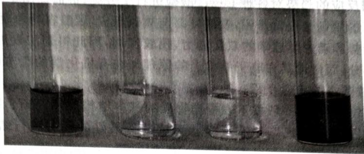

natural_image

Four glass beakers containing dark liquid, arranged side by side (no visible text or labels)

Lewis 酸碱的强弱均可以利用前述的诱导效应、共轭效应和空间效应来解释,因此这里就不作太多叙述了,仅谈论一个空间效应的经典例子:受阻的 Lewis 酸碱对。

【例题 4.11】 Stephan 等科学家将 $\mathbf{B}(\mathrm{C}_{6}\mathrm{F}_{5})_{3}$ 与 $\mathrm{PhMes}_{2}$ (Mes 为 2,4,6-三甲基苯基) 混合, 发现二者并没有发生典型的加合反应, 而是发生芳香亲核取代反应生成化合物 A。A 经 $Me_{2}SiHCl$ 还原, 得到了同时带有正、负电性氢的稳定化合物 B。B 在 $100^{\circ}C$ 以上释放 $H_{2}$ 生成化合物 C; 而在室温下 C 也可以快速、自发地与 $H_{2}$ 生成加成产物 B。

1. 确定 A、B、C 的结构。  
2. 确定下述反应的高分子产物的结构。

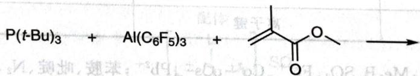

chemical

Chemical reaction equation showing phosphorus and aluminum compounds reacting with a ketone to form a product

解 按照题意, 发生芳香亲核取代反应(没有发生酸碱反应的原因可以理解为由于巨大的位阻), 唯一可能的位点就是高度缺电子的— $C_{6}F_{5}$ 。考虑对称性和邻位活化 F 的多少, 选择在 Al 对位的 C 原子上发生取代。掉下来的 $F^{-}$ 应该去哪儿呢? 为了维持电中性, 又考虑到 Al 亲 F 和此体系中 Al 的高度缺电子性, 用 $F^{-}$ 进行配位。因此 A 是下图左所示的结构。随后 $Me_{2}HSiCl$ 的还原便很容易了, 因为接下来要放出 $H_{2}$ 且 Si 亲 F, 故 F 被换成了 H(即得到化合物 B)。最后产生氢气就直接将 $H^{+}$ 和 $H^{-}$ 脱除结合即可。

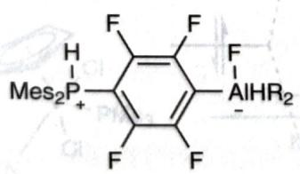

chemical

Chemical structure of a phosphorus-containing aromatic compound with trifluoromethyl and aluminum substituents

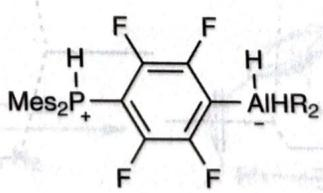

chemical

Chemical structure of a phosphorus-containing aromatic compound with aldehyde and aluminum substituents

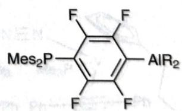

chemical

Chemical structure of a substituted benzene ring with Mes₂P and AIR₂ groups

第 2 问是简单的, 因为这就是一个简单的加成聚合反应而已。P 共轭加成后, 负电荷与 Al 结合。这样一个亚稳的结构很容易作为负离子诱发聚合。

(Stephan, Douglas W. A Primer in Frustrated Lewis Pair Hydrogenation: Concepts to Applications. Royal Society of Chemistry, 2021)

【习题 4.12\*】传统的王水是浓盐酸和浓硝酸以体积比 3:1 混合得到的强氧化性液体,近年来发现一种有机王水,它是 $SOCl_{2}$ 和吡啶以体积比 3:1 比例的混合液体。研究发现,有机王水溶解 Au 过程中,吡啶与金以及亚砜均可形成加合物,问:这两种加合物的形成为何可以加速反应?

(Angewandte Chemie International Edition 49, No. 43 (2010): 7929–7932)

## 4.1.3 软硬酸碱理论

软硬酸碱理论是美国化学家 Pearson 在 20 世纪 60 年代提出的一个半经验理论。起初他只是对各种反应进行总结并根据反应的趋势对各种 Lewis 酸碱进行了分类，进而提出了“硬亲硬，软亲软”的判断。酸碱反应是否容易进行的规则。也就是说，软酸容易与软碱反应，硬酸容易与硬碱反应。这一规则在应用中具有预测热力学趋势和动力学速率的双重能力，比较实用，因此得到了发展。按照惯例，我们仍将抛开该理论纯经验的部分，而讨论其在电子结构上的原理。在有机化学的章节中我们将继续使用这一重要理论，这里只做比较基本的概念介绍。

软硬酸碱的分类是较重要的,一般按下表根据物质的基本结构属性判断。除了软硬酸碱之外还有交界酸碱。交界酸碱不是“一等公民”,只有反应物无法选择最好的酸碱进行结合时,才会与交界酸碱结合。

软硬酸碱的性质

<table><tr><td>性质</td><td>硬酸和硬碱</td><td>软酸和软碱</td></tr><tr><td>原子或离子半径</td><td>小</td><td>大</td></tr><tr><td>氧化性</td><td>高</td><td>低</td></tr><tr><td>可极化性</td><td>低</td><td>高</td></tr><tr><td>电负性(碱)</td><td>高</td><td>低</td></tr><tr><td>HOMO(碱)</td><td>低</td><td>高</td></tr><tr><td>LUMO(酸)</td><td>高</td><td>低(但一般仍大于软碱 HOMO)</td></tr><tr><td>成键倾向</td><td>离子键</td><td>共价键</td></tr></table>

常见的交界酸碱包括: $\text{Me}_3\text{B}, \text{SO}_2, \text{Fe}^{2+}, \text{Co}^{2+}, \text{Cs}^+, \text{Pb}^{2+}$ ; 苯胺、吡啶、 $\text{N}_2, \text{N}_3^-, \text{NO}_3^-$ 。

实际上,酸碱的软硬程度反映了成键的性质(上表中最后一条)。一般来说,化学中各物种的HOMO和LUMO的能量级别分别是差不多的,因此高的LUMO和HOMO差将导致物种之间进行酸碱反应时倾向于形成离子键(如下图所示)。也就是说,软硬分别内部相亲的原因是轨道能量合适以及一致的成键倾向。

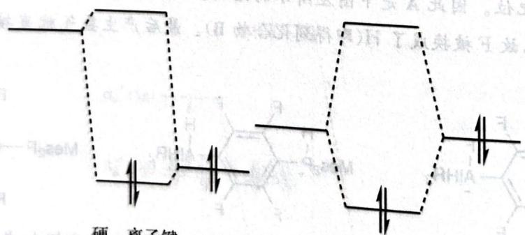

chemical

Diagram of a molecular structure with dashed outlines and directional arrows indicating electron movement or reaction pathways

硬，离子键  
软，共价键  
软硬酸碱的轨道理解

为了衡量 HOMO 和 LUMO 能级的差异, 可以引入绝对硬度。绝对硬度正比于体系能量对电子个数的二阶偏导数:

$$
\eta_ {\mathrm{abs}} = \frac {1}{2} \left(\frac {\partial^ {2} E}{\partial N ^ {2}}\right) _ {z} 。
$$

为了便于定性判断,还可利用差分做如下近似:

$$
\eta_ {\mathrm{abs}} = \frac {1}{2} \left(\frac {\partial^ {2} E}{\partial N ^ {2}}\right) _ {z} \approx \frac {E (N + 1) - 2 E (N) + E (N - 1)}{2} \approx \frac {1}{2} (I - A),
$$

式中 $E(N)$ 表示有 $N$ 个电子的体系的能量。这样一来，我们就得到绝对硬度大致正比于电离能和亲和能的能量差，或正比于HOMO和LUMO的能量差。这是另一个经验之外的判据。由此可以比较快速地判断以下习题中Lewis酸和Lewis碱的软硬情况，请尝试练习。

【习题 4.13】确定下列 Lewis 碱的软硬： $OH^{-}$ 、 $H^{-}$ 、 $RO^{-}$ 、 $RS^{-}$ 、 $F^{-}$ 、 $Cl^{-}$ 、 $I^{-}$ 、 $NH_{3}$ 、 $PR_{3}$ 、 $CH_{3}COO^{-}$ ， $SCN^{-}$ 、 $CO_{3}^{2-}$ 、CO、 $N_{2}H_{4}$ 、 $C_{6}H_{6}$ 。

【习题 4.14】确定下列 Lewis 酸的软硬： $H_{3}O^{+}$ 、 $Hg^{2+}$ 、 $MeHg^{+}$ 、 $Hg_{2}^{2+}$ 、 $Li^{+}$ 、 $Na^{+}$ 、 $K^{+}$ 、 $Pt^{2+}$ 、 $Ti^{4+}$ 、 $Pd^{2+}$ 、 $Cr^{3+}$ 、 $Cr^{6+}$ 、 $Ag^{+}$ 、 $BF_{3}$ 、 $BH_{3}$ 、 $R_{3}C^{+}$ 、 $M^{0}$ 、 $Ln^{3+}$ 、 $Au^{+}$ 。

软硬酸碱理论与动力学控制、热力学控制密切相关，在有机化学中也有重要用处，参见后续章节。

## § 4.2 配合物的几何结构

配合物一般指由中心原子或离子与几个配体分子或离子以配位键结合而形成的复杂分子或离子。在讨论配合物的化学式或是几何结构时，我们要注意一些常见的概念：内界、外界、中心原子、配体、配位数，如下图所示。配位数指的是中心原子能接受配位的原子数目，在比较广泛的意义下也可以认为是接受的电子对数目。有一些配体给予的电子对数多于1，被称为多齿配体。多齿配体提供的电子对数称为其齿数。

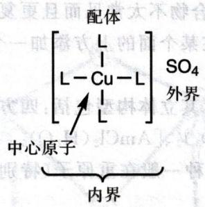

chemical

Chemical structure diagram showing central atom bonded to outer and inner atoms of a copper(II) complex with SO4 counterion

配合物相关概念

【例题 4.15】以下反应前后，V 的氧化数、配位数如何变化？

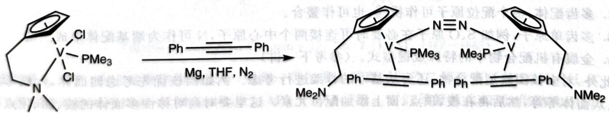

chemical

Chemical reaction scheme showing conversion of a vanadium complex with chloride and phosphine ligands to a bridged macrocycle using Mg, THF, and N2 catalysts.

解 氧化数很简单, 只需要计算带电荷的配体即可, 结果分别是 +3、+1。配位数实际上指的是配位电子对数, 所以分别是 $(6+2+2+2+2)/2=7$ 和 $(2+2+2+6)/2=6$ 。

## 4.2.1 常见的立体结构和配位型式

我们根据不同的配位数来讨论常见的立体结构。配合物的立体结构比简单的短周期化合物要复杂，它不仅涉及在电子层面考虑的杂化轨道理论的思想，还与d轨道的取向和构型、配体的空间效应密

切相关。我们罗列一些可能的立体结构，并不希望同学们记住它们，只要求在遇到相应问题时不要忘了额外的可能。

1. 配位数 1。配位数为 1 的化合物是不常见的，只有二个元素的元素，每个有
趣的例子是 2,6-二(2,4,6-三异丙基苯基)苯基铊。  
2. 配位数 2。配位数为 2 的化合物比较经典, 它常见于 $\mathrm{{TP}}$ 和 $\mathrm{{IF}}$ 板的配合物中, 如 ${\mathrm{{AuCl}}}_{2}^{ - }$ , $\mathrm{{Ag}}{\left( {\mathrm{{NH}}}_{3}\right) }_{2}^{ + }$ 、 ${\mathrm{{CuCl}}}_{2}^{ - }$ 都是直线型结构。

3. 配位数 3。配位数为 3 的化合物亦多见于 I B、Ⅱ B 族。例如 $\mathrm{Au}(\mathrm{PPh}_{3})_{3}$ 、 $\mathrm{HgCl}_{3}$ 。此外，一个神奇的物种是 $\mathrm{Fe[N(SiMe_{3})_{2}]_{3}}$ ，它也是平面三角形配位的。

4. 配位数 4。配位数为 4 的配合物是最常见的一种类型, 它们有四面体和平面四方形两种构型。一般说来, 平面四方形的空间拥挤程度要大于四面体, 而形成平面四方形构型后又常常能形成八面体配合物, 所以只有特殊电子构型的中心离子才会形成平面四方形。这一特殊电子构型集中在 $\mathrm{d}^{8}$ 。我们能观察到, 常见配位催化物种 Ir(I)、Rh(I)、Pt(II)、Pd(II) 的配合物为四方形构型, 而其他大多数为四面体。

5. 配位数 5。在配合物中, 配位数为 5 比较不同寻常, 因为它们存在比较广泛的立体结构上的互变异构。三角双锥构型和四方锥构型的配合物相互能发生较快的转换, 而三角双锥和四方锥配合物之间的能量差一般都较小 (考虑到 d 轨道的取向, 四方锥构型更稳定一些, 但理想能量差不足 $30 \mathrm{~kJ} / \mathrm{mol}$ , 稍微有其他因素影响就可能倒转过来), 所以五配位化合物的立体构型较难确定。两个例子: 三角双锥的 $\mathrm{CuCl}_{5}^{3-}$ 和四方锥的 $\mathrm{Ni(CN)}_{5}^{3-}$ 。

6. 配位数 6。配位数为 6 的配合物也是最常见的类型之一。其中绝大多数都是八面体构型。有极少数配合物是三棱柱构型,例子是 $\mathrm{Re}(\mathrm{S}_{2} \mathrm{C}_{2} \mathrm{R}_{2})_{3}$ 。这是一个著名的古怪例子,Re 的氧化数无法通过化学式确定(这里硫是配位原子,从形式上看,配体可能是双硫醇负离子,也可能是双硫酮)。

7. 配位数 7。从配位数 7 开始的配合物不太常见而且更复杂。七配位有三种已知的构型: 五角双锥、加冠三棱柱、加冠八面体(加冠是指在某个面的上方添加一个点并连接相应的边)。例子: 加冠三棱柱 $NbF_{7}^{2-}$ 、加冠八面体 $WBr_{3}(CO)_{4}^{-}$ 。

8. 配位数 8。配位数为 8 的配合物, 其立体构型包括: 四方反棱柱、三角十二面体、双加冠三棱柱。

例子: $[W(bipy)(CN)_6]^-$ 、 $Zr(acac)_2(NO_3)_2$ 、 $[AmCl_2(H_2O)_6]^+$ 。

9. 更高的配位数。超高配位数的物种一般在重原子(特别是镧系、锕系过渡元素)中出现,这里仅提一个例子:三冠三棱柱 $\mathrm{ReH}_{9}^{2-}$ 。

对中心原子配位的立体结构有基本的判断后,就要考虑配体是如何满足配位数的。这里我们也列举一些常见的配位型式。

1. 经典单齿配体: 直接配位。  
2. 多齿配体:多个配位原子可作桥连,也可作螯合。  
3. 多齿单原子:例如 S、O 原子在必要时可连接两个中心原子。

4. 金属有机配合物中的特殊成键型式。(参考下一讲)

棱柱、八面体等等,然后再在棱、顶点、面上添加配位元素。这里要对高对称性多面体的棱、面、顶点数比较熟悉,思考起来比较快。请看下例。

【例题 4.16】某镧系元素的无水氯化物和异丙醇钠在异丙醇中回流,得到淡蓝色溶液,溶液蒸发热到 $300^{\circ}$ C 也不分解。进一步分析表征结果如下:

溶液电导测定显示，A为1:1电离类型，只有一种外界类型。称取6.354g晶体A，设法溶解后加入足量硝酸银溶液，得到0.4778g乳白色沉淀B。A的元素分析结果：C 32.02%、H 6.17%、O 14.35%，均为质量分数计。单晶X射线衍射分析显示，A中氯只有一种环境，稀土元素所处的环境完全相同，它和配体结合形成多聚团簇，每个离子周围有5个氧原子，每四元气体具有三种类

型(端基、边桥基和面桥基)。

1. 计算 A 的摩尔质量。  
2. 通过计算, 推出 A 的化学式。  
3. 分别写出配合物结构中三种类型氧原子的数目。

注记 实际上在初赛中考查稀土属于超纲内容,所以竞赛时应相信即便没有任何稀土的知识,此题也是能做出来的。

解 由硝酸银试验的结果和电离类型,知道外界为单个 $Cl^{-}$ ,所以 A 的摩尔质量

$$
M = 6. 3 5 4 / 0. 4 7 7 8 \times (1 0 7. 9 + 3 5. 4 5) = 1 9 0 6 \mathrm{g} / \mathrm{mol} 。
$$

在计算第2问之前,先要有所估计:这应该不会是一个氧化还原反应,配体大概率是异丙基负离子。接下来进行计算,含有C、H、O的数目分别为 $1906\times0.3202/12.01=51,1906\times0.0617/1.008=117,1906\times0.1435/16=17$ 。由于相对分子质量较大,一定要进行反算检验(回代查看数据是否确实符合)。同时验证C:H:O=3:7:1,恰好是异丙基负离子,所以化学式是 $\mathbf{M}_{x}(\mathrm{C}_{3}\mathrm{H}_{7}\mathrm{O})_{17}\mathrm{Cl}$ 。根据剩余的相对分子质量知Mx=866。

观察稀土元素的相对原子质量范围为 $140 \sim 170$ ，所以 $x = 5, 6$ 。除一下，当 $x = 5$ 时为 Yb，当 $x = 6$ 时为 Nd。现在计算价态， $x = 5$ 为 $+3.6$ ，而 $x = 6$ 为 $+3$ ，所以我们更倾向于后者，因为这样可使稀土元素所处的环境完全相同，且大家熟知稀土元素基本上都以 $+3$ 为主要价态。考虑构建对称团簇的方便性，更应该选择 Nd，所以为 $\left[\mathrm{Nd}_{6}\left(\mathrm{C}_{3} \mathrm{H}_{7} \mathrm{O}\right)_{17}\right] \mathrm{Cl}$ 。

结构上,首先搭建三棱柱的骨架(通过尝试可以发现八面体骨架做不到题设要求的结构),则可以在上下底面的三角形上各放一个面桥基,然后在两个底面的三条边以及三条侧棱上各放一个边桥基,最后每个Nd各接一个端基就得到合理结构,所以第3问的答案分别是6、9、2。

文献中报道的该化合物的具体结构如下图所示：

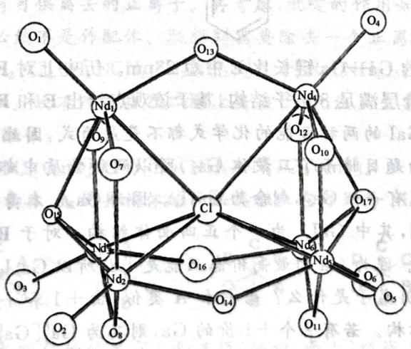

chemical

Molecular structure diagram of a nickel-based coordination complex with labeled atoms and bonds

(图片来源: Inorganic Chemistry 17, No. 7 (1978): 1962-1965)

【例题4.17】在含硫酶体的研究中，得到一类过渡金属离子与乙二醇硫离子 $(\mathrm{SCH}_2\mathrm{CH}_2\mathrm{S}^-)$ ，写成 $\mathrm{edt}^{2-}$ 形成的对称双核络离子 $[\mathbf{M}_2(\mathrm{edt})_4]^{2-} (\mathbf{M} = \mathbf{V}, \mathbf{Mn}, \mathbf{Fe})$ 。它们尽管通式相同，但结构不同。V的配合物中，每个V原子周围有6个硫原子配位，通过两个V连线中心有三个相互垂直的2次轴；其他则是金属原子五配位，形成四方锥排布且有对称中心。画出上述三种配合物的结构。

解 先丢掉两个亚甲基, 确定几个硫原子形成的空间结构。计算金属与硫原子的比例, 2个金属原子需要12(或10)个硫原子, 实际上只有8个, 说明共用4(或2)个硫原子。但是八面体很难做到六配位共用4个点, 由此可见结构分别是共(侧)面三棱柱和共棱四方锥。由此, V相应配合物的结构已经容易画出。但是共棱四方锥究竟如何共棱? 考虑对称中心和之后对硫原子的连接, 应该选择共侧棱。最后连接各个硫原子即可。验证对称性, 满足要求; S原子同时向两个中心原子配位是合理的。

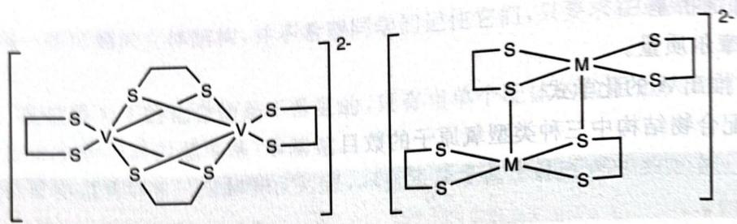

chemical

Two organometallic structures with sulfur atoms and metal centers, labeled 2- and 2- respectively

【例题 4.17-1, 新增】 回答下列有关金属镓的化合物的问题。

1. 金属镓 熔点很低但沸点很高, 其中存在二聚体 $\mathrm{Ga}_{2}$ 。1990 年, 科学家将液态 Ga 和 $\mathrm{I}_{2}$ 在甲苯中超声处理, 得到了组成为 GaI 的物质。该物质中含有多种不同氧化态的 Ga, 具有两种可能的结构 $\mathrm{Ga}_{4} \mathrm{~I}_{4}(\mathbf{A})$ 和 $\mathrm{Ga}_{6} \mathrm{~I}_{6}(\mathbf{B})$ , 二者对应的阴离子分别为 C 和 D, 两种阴离子均由 Ga 和 I 构成且其中原子均满足 8 电子结构。写出能表示 A 和 B 结构特点的结构简式 (标出 Ga 的氧化数) 并画出 C 和 D 的结构。

2. GaI 常用于合成低价 Ga 化合物。将 GaI 和 RLi (其中 R 基如下图所示) 在 $-78^{\circ} \mathrm{C}$ 的甲苯溶液中反应, 得到晶体 E, 后者含有 2 个 Ga 原子; E 在乙醚溶液中和金属 Na 反应得到晶体 F。

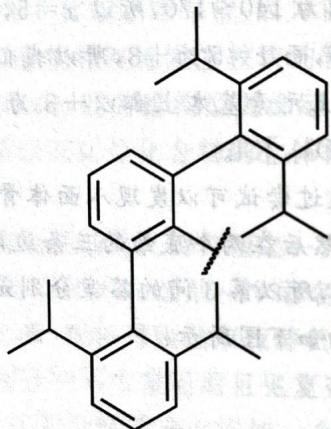

chemical

Complex organic molecule structure with multiple aromatic rings and alkyl substituents

X射线晶体学表明，F中的Ga—Ga键长比E中短28pm。历史上对F中的Ga—Ga键级曾有过争议，一种观点认为其中Ga的价层满足8电子结构，基于该观点给出E和F的结构式。

解 注意到题中给出的 GaI 的两种可能的化学式都不是最简式, 因此所反映的当是其本身的组成,不需要再额外推测倍率。因为题目暗示了二聚体 $\mathrm{Ga}_{2}$ , 所以两种物质中都应该含有 $\mathrm{Ga}_{2}$ , 其中 Ga 的价态为 0 。很明显物质 A 中只能有一个 $\mathrm{Ga}_{2}$ , 剩余为 $\mathrm{Ga}_{2} \mathrm{I}_{4}$ 。因为 $\mathrm{Ga}_{2} \mathrm{I}_{4}$ 本身无电荷 (不是一个阴离子), 所以其组成只能为 $\mathrm{Ga}^{\mathrm{I}}[\mathrm{Ga}^{\mathrm{III}} \mathrm{I}_{4}]$ , 其中 $\mathrm{GaI}_{4}^{-}$ 为一个正四面体结构。对于 B 如法炮制, 或者剩余结构为 $\mathrm{Ga}_{2} \mathrm{I}_{6}$ , 或者剩余结构为 $\mathrm{Ga}_{4} \mathrm{I}_{6}$ 。因为 Ga 的最高价态只能是 +3 , 所以 $\mathrm{Ga}_{2} \mathrm{I}_{6}$ 内部只能是 $\mathrm{GaI}_{6}^{3-}$ , 不符合 8 电子结构, 排除之。 $\mathrm{Ga}_{4} \mathrm{I}_{6}$ 中阴离子是什么? 若它和 A 类似, 由 +1 和 +3 价的 Ga 组成, 则它为 $\mathrm{Ga}_{3}[\mathrm{GaI}_{6}]$ , Ga 又不符合八电子结构。若有 2 个 +1 价的 Ga, 则其为 $\mathrm{Ga}_{2}^{\mathrm{I}}[\mathrm{Ga}_{2}^{\mathrm{II}} \mathrm{I}_{6}]$ , $\mathrm{Ga}_{2} \mathrm{I}_{6}^{2-}$ 即两个 7 电子的 $\mathrm{GaI}_{3}^{-}$ , 所以其中存在一个 Ga—Ga 键, 结构简式为 $[\mathrm{I}_{3} \mathrm{Ga}-\mathrm{GaI}_{3}]^{-}$ , Ga 附近为四面体结构。

第二问则较为简单,很明显RLi将把I替换为R。观察到R基的位阻非常大,因此Ga的配位数必然只能是1(回忆本部分章节谈到配位数1的时候给出的例子),其形如ArGaGaAr的形式。F应该是Na还原的结果,所以应该是一个对称的含有两个Na的结构,即 $Na_{2}[ArGaGaAr]$ 。因为F中的Ga满足8电子结构,除去Na和R之外还缺少8-3-1-1=3个电子,因此其中是Ga—Ga参键,而E中则是双键。

【习题4.18】单晶衍射实验证明，配合物 $\left[\mathrm{Cr}_{3} \mathrm{O}\left(\mathrm{CH}_{3} \mathrm{COO}\right)_{6} \left(\mathrm{H}_{2} \mathrm{O}\right)_{3}\right] \mathrm{Cl} \cdot 8 \mathrm{H}_{2} \mathrm{O}$ 中，Cr化学环境完全相同，乙酸根为桥连配体，水为单齿配体，试给出其结构。

(Greenwood, Norman Neill, and Alan Earnshaw. Chemistry of the Elements. Elsevier, 2012)

## 4.2.2 配合物的异构现象

配合物也具有类似有机化合物的异构现象，包括结构异构和立体异构。由于配合物异构在化学竞赛中不是非常重要，这里我们仅简单列出异构体的种类。

1. 电离异构。指外界离子和配体不同的现象。如 $\left[\mathrm{Co}\left(\mathrm{NH}_{3}\right)_{5} \mathrm{Br}\right] \mathrm{SO}_{4}, \left[\mathrm{Co}\left(\mathrm{NH}_{3}\right)_{5} \mathrm{SO}_{4}\right] \mathrm{Br}$ 。  
2. 水合异构。指溶剂分子可作为配体进入内界，或者作为结晶水存在。如 $CrCl_{3} \cdot 6H_{2}O$ 的三种不同颜色的异构体。  
3. 配位异构。指多核配合物中，各中心结合配体不同的情况。如 $\left[\mathrm{Co}\left(\mathrm{NH}_{3}\right)_{6}\right]\left[\mathrm{Cr}\left(\mathrm{CN}\right)_{6}\right]$ 、 $\left[\mathrm{Cr}\left(\mathrm{NH}_{3}\right)_{6}\right]\left[\mathrm{Co}\left(\mathrm{CN}\right)_{6}\right]$ 。  
4. 聚合异构。指最简式相同的配合物实际化学式不同的情况。例如 $\left[\mathrm{Co}\left(\mathrm{NH}_{3}\right)_{3}\left(\mathrm{NO}_{2}\right)_{3}\right]$ 和 $\left[\mathrm{Co}\left(\mathrm{NH}_{3}\right)_{6}\right]\left[\mathrm{Co}\left(\mathrm{NO}_{2}\right)_{6}\right]$ 。  
5. 键连异构。指有多个可能配位原子的配体实际与中心原子的配位方式不同的情况。例如 $NO_{2}^{-}$ 在 Co 配合物中有多种配位方式。请注意这些配位方式与软硬酸碱、空间效应有关。  
6. 立体异构。指同一种配合物的立体结构不同,包括几何异构(例如五配位配合物中的三角双锥和四方锥型式)和对映异构(具有手性)。

【例题 4.19】 $N_{2}$ 实际上可以作配体, 第一个被发现的 $N_{2}$ 型配合物即是基于 Ru 的。考虑如下合成过程: $\left[\mathrm{Ru}\left(\mathrm{NH}_{3}\right)_{2}\mathrm{Cl}_{2}\left(\mathrm{H}_{2}\mathrm{NCH}_{2}\mathrm{CH}_{2}\mathrm{NH}_{2}\right)\right]\mathrm{Cl}(\mathbf{A})$ 先与一当量的吡啶反应, 得到六配位配合物 B。一定条件下 B 和高氯酸银不反应, 说明没有外界。B 再与 NO 反应, 就能得到 $N_{2}$ 为配体的配合物 C。给出 A、B 所有同分异构体的结构及 C 的化学式。

解 第一步得到一个没有外界的配体, 则 $\mathrm{Cl}^{-}$ 将掉下来, 为了维持电中性, 自然要伴随一个正离子的失去。不过, 这里似乎并没有可供离去的正离子。再考虑, 吡啶的作用如何? 显然它没有配体置换的可能 (否则外界将仍存在), 故必然不是作配体。联想到需要除去一个正离子, 故吡啶是碱, 第一步反应得到除去质子的 $\left[\mathrm{Ru}\left(\mathrm{NH}_{3}\right)\left(\mathrm{NH}_{2}\right) \mathrm{Cl}_{2}\left(\mathrm{H}_{2} \mathrm{NCH}_{2} \mathrm{CH}_{2} \mathrm{NH}_{2}\right)\right]$ 或者 $\left[\mathrm{Ru}\left(\mathrm{NH}_{3}\right)_{2} \mathrm{Cl}_{2}\left(\mathrm{H}_{2} \mathrm{NCH}_{2} \mathrm{CH}_{2} \mathrm{NH}\right)\right] \mathrm{Cl}$ 。第二步引入 NO, 需要产生氮配体。故不可能在乙二胺上去质子 (无法产生氮配体)。故之后是一个 $\mathrm{NH}_{2}$ 基团和 NO 脱去一个水得到 $\mathrm{N}_{2}$ 配体。

综上，B 为 $\left[\mathrm{Ru}\left(\mathrm{NH}_{3}\right)\left(\mathrm{NH}_{2}\right)\mathrm{Cl}_{2}(\mathrm{en})\right]$ ，C 为 $\left[\mathrm{Ru}\left(\mathrm{NH}_{3}\right)\left(\mathrm{N}_{2}\right)\mathrm{Cl}_{2}(\mathrm{en})\right]$ 。

我们以 B 为例绘制同分异构体，A 的异构体的画法类似。它可写为 $MABC_{2}D_{2}$ 的形式。

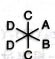

首先固定 D 的位置, 然后发现 C 的位置有三种选择(轴向、面上、经线上), 最后确定 A、B 即可。有旋光异构体的物种用粗体标出, 因此有 6 种异构体。注意在不考虑旋光异构体时, 只有原子的相对位置是需要处理的, 不要一开始就处理绝对位置, 这将导致绘图时出现大量重复。

【习题4.20】六氯合铂(Ⅳ)酸钾与多硫化铵A发生非氧化还原反应得到铵盐B。B中的阴离子为一仅由硫和铂构成的八面体型单核配离子，有一根三重旋转轴，其中硫的质量分数为 $71.14\%$ 。给出A与B的化学式。判断B是否有旋光性并说明理由。

## 4.2.3 配位原子的识别

4.2.3 配位原子的识别

在配合物的推断中, 正确寻找合适的配位原子是重要的, 它能辅助我们对配体的数目和配位化合物的结构做提前判断, 减少尝试的次数。我们通过例子来说明这一技术。

L. 将一定量的四水醋

【例题 4.21】 异烟酰腙即 4-吡啶甲酰肼, 它与 2-乙酰基吡啶(不参与配位)溶解在 1:1 的乙醇-水的混合溶剂中回流几小时, 冷却至酸镍、配体 L 以及 4,4'-联吡啶(不参与配位)溶解在 1:1 的乙醇-水的混合溶剂中回流几小时, 冷却至室温, 析出物质经洗涤干燥后得到褐色片状晶体 M。分析结果表明, M 中 N 元素含量 21.0%。

1. 画出配体 L 的结构,请在图中用 \* 称山

2. 画出 M 的结构,选择最稳定的那一个。
解 我们能想见,联吡啶的作用应该是碱,所以 L 必然会被去质子。首先注意 L 是由一个简单的缩合反应产生的:

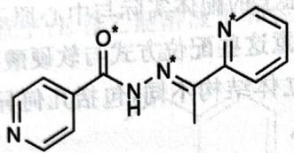

chemical

Chemical structure of a diazo compound with pyridine and piperazine rings

体系中唯一能被弱碱去质子的便是酰胺上的氢,因此我们立刻确定,酰胺O是一个配位原子。我们要尽量形成螯合五元环,六元环,而只有在不得已的情况下允许四元环的存在。于是,我们从O开始向右数4个原子,观察到了亚胺上的N,这是允许的;再向右数4个原子,观察到了吡啶上的N,这也是合适的。位于酰基对位的吡啶氮因为距离太远,无法配位,因此我们就确定了所有的配位原子:这是一个三齿配体。于是,体系应当是两个配体,刚好凑平电荷并形成六配位。验证 $NiL_{2}$ 的含氮量符合数据,故推定。

故推定。
我们注意到,配体 L 去质子后,将成为一个高度共轭的平面结构,具有很强的刚性。因此将这个三齿配体置于面式位置是不合理的。用 O—N—N 简写配体,并尽量对称地画,得到下图所示结构及其对映异构体。

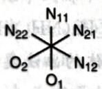

【习题4.22】配位化学之父Werner曾经制备出化学式为 $\left[\mathrm{Co}_{6}(\mathrm{O})_{2}(\mathrm{OH})_{8}(\mathrm{NH}_{3})_{14}\right]^{6+}$ 的阳离子，但当时没有正确解析该离子的结构。新近的实验表明，该离子有一根穿过四个钴原子的 $C_2$ ，单个氧原子均作为三齿桥连配体，恰有两个钴原子只被含氧配体配位。画出此离子的结构。

(Chemical Communications, No. 20 (2004): 2322-2323)

(Chemical Communications, No. 20 (2004): 2322-2323) 【习题4.23】人工载氧体B的化学式为 $\mathrm{Co(bzacen)pyO_2}$ , 其中 py 是吡啶 $(\mathrm{C}_5\mathrm{H}_5\mathrm{N})$ , bzacen 是四齿配体 $[\mathrm{C}_6\mathrm{H}_5 - \mathrm{C}(\mathrm{O}^-) = \mathrm{CH} - \mathrm{C}(\mathrm{CH}_3) = \mathrm{NCH}_2 - ]_2$ 。B具有室温吸氧, 加热脱氧的功能。请画出B的结构简图(明确表明O-O与金属离子间的空间关系), 并判断其与氧气O-O键长的大小关系。

## § 4.3 配合物的经典成键理论

## 4.3.1 价键理论

价键理论也可以用来描述配合物的成键。配合物价键理论的要点如下：

1. 中心原子给出空轨道,配体给出电子形成共价键。

9. 中心原子通过形成合适的杂化轨道来容纳得到的电子。

2. 中心原子通过形成各轨道。根据得到的电子是否全部填入外层轨道，将配合物分为外轨型和内轨型。

4. 配合物的唯自旋磁矩 $\mu_{B} = \sqrt{n(n+2)}$ B. M.。（单位为 Bohr 磁子。除了电子自旋之外，磁矩实际上还有其他贡献因素。）

际上还有其他贡献因素。) 内轨型和外轨型一般以实验(磁性)方法确定,关于简单的判断方法,我们之后会谈到。但我们知道有一个显然的判断依据是,如果内层d轨道不够,则体系必然为外轨型。

有一个显然的判断依据是,如果内层d轨道不够,则体系必照为开轨。在配合物价键理论中常见的杂化及其立体构型如下表所示。在这里,我们看到了一些不同于主族元素杂化轨道理论中出现的杂化。我们不必惊慌,因为杂化的本质是轨道的线性组合,所以原则上任何轨道都能进行杂化。这里我们选择的是符合对称性要求和能量要求的常见轨道。

配合物价键理论的杂化

<table><tr><td>立体构型</td><td>杂化</td><td>立体构型</td><td>杂化</td></tr><tr><td>直线形</td><td>sp</td><td>四方锥</td><td> $d^{4}s/sp^{2}d^{2}$ </td></tr><tr><td>平面三角形</td><td> $sp^{2}$ </td><td>三角双锥</td><td> $dsp^{3}/sp^{3}d$ </td></tr><tr><td>四面体</td><td> $sp^{3}$ </td><td>八面体</td><td> $d^{2}sp^{3}/sp^{3}d^{2}$ </td></tr></table>

【例 4.24】如下图所示,在过渡金属卡宾配合物中,暂不关心中心原子如何杂化,但我们能看出经典 Lewis 或者价键理论已经指出,体系中存在反馈 $\pi$ 键。

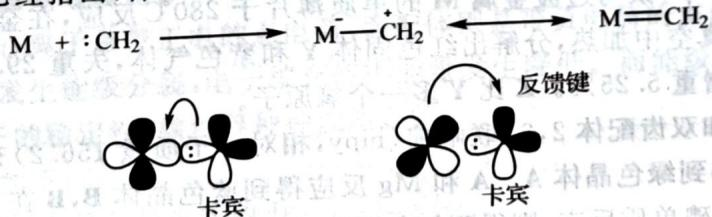

chemical

Reaction mechanism diagram showing M + :CH₂ → M⁻⁺CH₂ ⇄ M=CH₂ with a feedback key between two molecular structures labeled '卡宾'

卡宾配合物中的 $\pi$ 键

【例题4.25】生物染色剂“钌红”的化学式为 $\left[\mathrm{Ru}_{3} \mathrm{O}_{2} \left(\mathrm{NH}_{3}\right)_{14}\right] \mathrm{Cl}_{6}$ ，它由 $\mathrm{Ru} \left(\mathrm{NH}_{3}\right)_{6} \mathrm{Cl}_{3}$ 的氨水溶液暴露在空气中形成。Ru均为六配位且不含金属键。

1. 画出钉红阳离子的结构并标明各原子的氧化态。

2. 给出 O 原子的杂化轨道类型。

2. 给出 O 原子的杂化轨道类型。
3. 经测定，钉红中 Ru—O 键长为 187pm，远小于其单键键长。对此，研究者解释为：在中心原子和桥键原子之间形成了两套由 d 和 p 轨道形成的多中心 π 键。试图示之。

解 观察 $\mathrm{Ru}_{3}\mathrm{O}_{2}$ 的数字, 可见 O 应该成为桥连原子, 由于每个 Ru 都是六配位, 所以结构是容易画出的 $\left[\left(\mathrm{NH}_{3}\right)_{5} \mathrm{Ru}\right] \mathrm{O}\left[\mathrm{Ru}\left(\mathrm{NH}_{3}\right)_{4}\right] \mathrm{O}\left[\mathrm{Ru}\left(\mathrm{NH}_{3}\right)_{5}\right]^{6+}$ , 线性, 图略)。依照对称性, 设中间 Ru 的价态为 $x$ , 两边的 Ru 价态为 $y$ , 则 $x + 2y - 4 = 6; 6 \geqslant x, y \geqslant 3$ , 所以 $x = 4, y = 3$ 。目前来看, 杂化可能是 $\mathfrak{sp}^3$ 。但是看到第 3 问之后就发现, O 原子上还保留了 2 个 p 轨道形成 $\pi$ 键, 说明杂化因结构有变, 也就是 sp。p 轨道应该和 d 轨道通过“肩并肩”形式成键, 多中心 $\pi$ 键可因 d 轨道所在平面的垂直形成 2 套。

【例题 4.26】1965 年有人合成了催化剂 A，实现了温和条件下的烯烃加氢。

1. A 是紫红色晶体, 相对分子质量 925.23, 抗磁性。它通过 $\mathrm{RhCl}_{3} \cdot 3 \mathrm{H}_{2} \mathrm{O}$ 和过量三苯膦 $(\mathrm{PPh}_{3})$ 的乙醇溶液回流制得。画出 A 的立体结构。  
2. A 可能的催化机理如下图所示(图中 16e 表示中心原子周围总共有 16 个电子), 画出 D 的结构式。

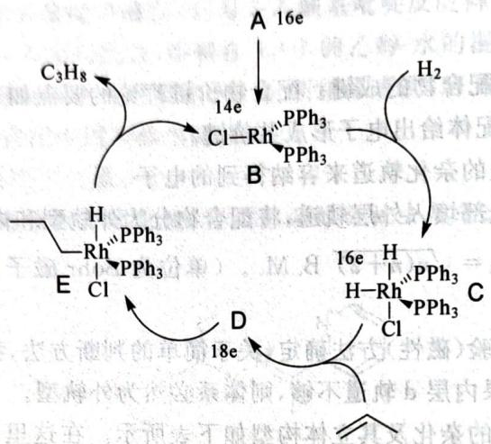

chemical

Organic reaction mechanism diagram showing phosphorus-containing intermediates with labeled electron transitions and stereochemistry

3. 确定图中所有配合物的中心原子的氧化态。  
4. 确定 A、C、D 和 E 的中心离子的杂化轨道类型。  
5. 用配合物的价键理论推测 C 和 E 显顺磁性还是抗磁性,说明理由。

解 观察题目中的催化图, Rh 为一价, 所以可以先尝试化学式 $\mathrm{Rh}(\mathrm{PPh}_{3})_{x}\mathrm{Cl}$ , 根据相对分子质量得出 $x=3$ , 配合物应为平面正方形结构, 即推定。对于 D, 可以看出其配位数增加了 1 , 所以就是烯烃的 $\pi$ 电子配位得到的。氧化态的判断很容易, 我们不做了, 留给同学们完成。

杂化轨道则是我们需要重点谈论的内容。一般说来，该体系为内轨型(强场)。A 为平面正方形，所以杂化为 $\mathrm{dsp}^2$ 。C、E 为三角双锥形，所以杂化为 $\mathrm{dsp}^3$ 。D 为八面体型，所以杂化为 $\mathrm{d}^2\mathrm{sp}^3$ 。在 C 中，+3 价的 Rh 有 6 个电子，排在 4 个空余的 d 轨道中，有两个单电子，故 C 有顺磁性。显然 E 和 C 情况一模一样，所以也有顺磁性。

【例题 4.27】 石英管中,碘与过渡金属 M 的单质薄片于 $280^{\circ}$ C 反应,在金属表面形成一层深棕红色固体 X。X 在 $300^{\circ}$ C 的真空中加热,分解出红色固体 Y 和紫色气体,失重 29.4%;Y 与干燥的空气接触转变为深红色物质 Z,增重 5.25%。Z 比 Y 多一个氧原子。

将 M 的一种硫酸盐和双齿配体 2,2'-联吡啶(bipy,相对分子质量 156.2)充分反应后,在体系中加入足量 KI 的甲醇溶液,得到绿色晶体 A。A 和 Mg 反应得到蓝色晶体 B,B 在 THF 中被 LiAlH₄ 还原为红色固体 C。若 B 先和碘单质反应,则得到红色固体 D,后者进一步和碘单质反应则变回 A。元素分析结果表明,A 可以看成 Y 结合 bipy 的配合物,与 Y 相比,A 增重 157%,其中不含溶剂分子。A 的有效磁矩为 3.75μB,C 则显抗磁性。

1. 通过计算, 推出 X\~Z、A\~D 的化学式。  
2. 在抗肿瘤的药物研究中, 如下图所示的 M 的配合物受到关注, 写出该配合物中 M 的氧化数和价电子组态。

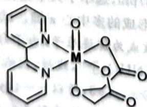

chemical

Chemical structure of a metal complex with two pyridine rings and a carbonyl group

解 仍然要关注二元化合物, 紫色气体为碘, 故我们可设 X 为 $MI_{x}$ , Y 为 $MI_{y}$ , Z 为 $MOI_{y}$ , 由条件可得出一组方程

$$
\left\{ \begin{array}{l} \frac {M + 1 2 6 . 9 y}{M + 1 2 6 . 9 x} = 1 - 0. 2 9 4, \\ \frac {1 6}{M + 1 2 6 . 9 y} = 0. 0 5 2 5 _ {\circ} \end{array} \right.
$$

这样可得 $M+126.9y=304.8$ ， $M+126.9x=431.7$ ，得出 x-y=1。注意 $M\geqslant0$ ，因此 $x\leqslant3$ 。所以只可能是：

<table><tr><td>(x,y)</td><td>M</td></tr><tr><td>(2,1)</td><td>177.9(不符合)</td></tr><tr><td>(3,2)</td><td>51.0(为V)</td></tr></table>

故 M 为钒, X、Y、Z 分别为 $VI_{3}$ 、 $VI_{2}$ 、 $VOI_{2}$ 。因为 A 相对于 Y 增重 157%, 故增加的相对分子质量为 $304.8 \times 1.57 / 156.2 = 3$ , 即 A 是 $V(bipy)_{3}I_{2}$ , 可以验证磁矩数据符合要求 (3 个未成对电子, 即 $3d^{3}$ )。注意 B、C、D 都是钒低于 2 价的化合物, 而且两两价态不同, 因此只能是 1、0、-1 价, 根据还原性的强弱得 B 是 0 价钒, C 是 -1 价钒, D 是 +1 价钒, 即分别为 $V(bipy)_{3}$ 、 $LiV(bipy)_{3}$ 和 $V(bipy)_{3}I$ 。第 3 问是简单的, 注意右下角是一个二元羧酸, 因此氧化态 +4, 价电子为 $3d^{1}$ (五配位系统, 就竞赛大纲要求不必写出详细的晶体场裂分的组态)。

【习题 4.28】平面四方形的过渡金属氰配离子特别稳定,用价键理论解释这一点。

## 4.3.2 晶体场理论

在配合物中,价键理论与事实的矛盾之处是明显的。对于 $\mathrm{Cu(NH_{3})_{4}^{2+}}$ , 它不能解释为什么它存在一个高能量的单电子却不易被氧化(对比很容易被氧化的 $\mathrm{Co(CN)_{6}^{4-}}$ )。此外对于配合物的颜色、水合离子的稳定性等, 它都无法解释。因此 Bethe 等人试图从共价键的对立面——离子键(静电作用)来理解配合物成键。这就是晶体场理论。

晶体场理论认为中心离子是带正电的点电荷,而配体则是带负电荷的点电荷。配体接近中心离子,使得中心离子的 d 轨道发生能级分裂,电子填充使得能量发生降低。而能级裂分的程度则与配体的性质有关,这就影响了离子的稳定性、颜色等种种性质。

晶体场理论的要点如下：

1. 配合物中化学键的本质是静电作用力。  
1. 配合物中化学键的本质是静态作用。  
2. 5个d轨道因为受到周围非球形对称的配位负电场而发生不同的能量升高，产生d轨道能级的裂分。d轨道能量的最大差距记为分裂能 $\Delta$ 。  
3. 配合物几何构型不同，d 轨道分裂的型式也不同。  
3. 配合物几何构型不同，a轨道分裂的生成过程
4. 排布电子时，仍然遵照电子排布的基本原理。如果电子优先成对，则称强场（分裂能大于电子成对能）；如果电子优先进入高能量轨道，则称弱场（分裂能小于电子成对能）。

对于不同的配体排布型式,晶体场理论中的裂分也不同。八面体场和四面体场的裂分型式我们已经熟知,这里仅简单列举(如下图所示,左侧对应八面体场,右侧对应四面体场)。

$$
\begin{array}{c c c c c c c} \mathrm{d} _ {x ^ {2} - y ^ {2}} & \mathrm{d} _ {z ^ {2}} & \mathrm{d} _ {x y} & \mathrm{d} _ {y z} & \mathrm{d} _ {z x} \\ \underline {{\quad}} & \underline {{\quad}} & \underline {{\quad}} & e _ {x} & \underline {{\quad}} & \underline {{\quad}} & t _ {2} \\ \mathrm{d} _ {x y} & \mathrm{d} _ {y z} & \mathrm{d} _ {z x} & t _ {2 y} & \underline {{\quad}} & \underline {{\quad}} & e \\ \end{array}
$$

影响分裂能的因素有很多,以下条陈几个常见规则:

1. 场对称性的不同对分裂能有较大影响。在常见的体系中， $\Delta_{sq} > \Delta_{o} > \Delta_{t}$ （这里 $sq, o, t$ 分别表示平面正方形场、八面体场和四面体场）。  
2. 同一过渡系列中心离子电荷越高，半径越大，分裂能也越大。  
3. 高周期过渡元素的分裂能要比低周期的要高(原理同第二条)。第五、六周期过渡金属的配合物一般都属于强场。  
4. 配体的影响: 这由光谱化学序确定, 对于同一中心原子的八面体配合物, 其分裂能按配体的下述序列递增。

$$
\mathrm{I} ^ {-} <   \mathrm{Br} ^ {-} <   \mathrm{Cl} ^ {-} <   \mathrm{F} ^ {-} <   \mathrm{OH} ^ {-} <   \mathrm{C} _ {2} \mathrm{O} _ {4} ^ {2 -} | <   \mathrm{H} _ {2} \mathrm{O} <   \mathrm{SCN} ^ {-} (\text {含额外孤对电子})
$$

$$
<   \mathrm{NH} _ {3} | <   \mathrm{en} <   \mathrm{SO} _ {3} ^ {2 -} (\text {普通配体})
$$

$$
<   o \text {-phen} (\text { 邻二氮菲 }) <   \mathrm{NO} _ {2} ^ {-} <   \mathrm{CN} ^ {-} <   \mathrm{CO} (\text { 含可接受电子的轨道 })
$$

序列中的“|”标出了弱场、中等场、强场的大致分界线。

注记 可以粗略地用上述规则推断价键理论中的内轨型和外轨型,它们分别对应于强场和弱场。对光谱化学序的解释和简单预测,我们之后会谈到。

虽然我们熟悉四面体和八面体场的裂分型式,但更重要的是推测这种型式的思想。下面的例子对这样的推断作了示范。

【例 4.29】尝试定性推出平面正方形、四方锥、三角双锥场中金属轨道的裂分情况。

对平面正方形,我们设定四个配体分别位于 x,y 的正负半轴上,那么配体对轨道 $d_{x^{2}-y^{2}}$ 的影响最大,而 $d_{xy}$ 则其次。显然 $d_{xz}$ 、 $d_{yz}$ 是等价的(受影响最小),而 $d_{z^{2}}$ 略有不同(注意它在 xOy 平面上是有一定的电子云密度的)。因此我们断言其能级裂分为从低到高“2111”的型式(对应关系我们暂时不能明确)。

对于四方锥, $d_{z^{2}}$ 将受到更多的影响,而 $d_{xz}$ 、 $d_{yz}$ 仍然等价,受到的影响仍然最小,所以能级裂分型式和平面四方形的基本相同,也是“2111”。

而对三角双锥,我们令轴向配体分布在 z 轴上,赤道面的 3 个配体对称地分布在 xOy 平面上。于是我们知道 $d_{xz}$ 和 $d_{yz}$ 是等价的, $d_{x^{2}-y^{2}}$ 和 $d_{xy}$ 也是等价的。前者受影响的程度介于 $d_{x^{2}-y^{2}}$ 、 $d_{xy}$ 和 $d_{z^{2}}$ 之间,从而我们立刻知道能级裂分型式为“221”。

【习题 4.30】请给出 $K_{2}[NiF_{6}]$ 、 $\mathrm{Ni(PEt_{3})Cl_{2}}$ 中，Ni 的电子构型和 d 轨道分裂情况。

【例 4.31】下图示出了 $\mathrm{Ti(H_{2}O)_{6}^{3+}}$ 溶液的颜色: 紫色。

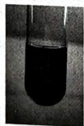  
$\mathrm{Ti(H_{2}O)_{6}^{3+}}$ 溶液(紫色)

晶体场理论可以解释其颜色。光谱数据测量得到其分裂能 $\Delta_{0}=20400cm^{-1}$ ，电子跃迁时吸收 $\lambda\approx500nm$ 的蓝绿光，其补色即为紫色。又如， $\mathrm{Mn(H_{2}O)_{6}^{2+}}$ 的电子排布为 $(t_{2g})^{3}(e_{g})^{2}$ ，跃迁是禁阻的（可理解为 $t_{2g}$ 上的电子跃迁不被体系的对称性允许），只可能通过振动导致的对称破缺进行跃迁，概率较小，因此颜色很浅（浓溶液有淡粉色）。

晶体场理论的问题难度普遍不大,主要是在判断各种电子组态时要谨慎小心,严格按照推理的方式操作。

【例题4.32】鉴定 $\mathrm{NO}_3^-$ 的方法之一是利用“棕色环”现象：将含有 $\mathrm{NO}_3^-$ 的溶液放入试管，加入 $\mathrm{FeSO_4}$ ，混匀，然后顺着管壁加入浓 $\mathrm{H}_2\mathrm{SO}_4$ ，在溶液的界面上出现“棕色环”。分离出棕色物质，研究发现其化学式为 $[\mathrm{Fe(NO)(H_2O)_5}]\mathrm{SO}_4$ 。该物质显顺磁性，磁矩为 $3.8\mu_{\mathrm{B}}$ 。未成对电子分布在中心离子周围。推出中心离子的价电子组态、自旋态和氧化态。

解 我们关心的是 $\left[\mathrm{Fe}(\mathrm{NO})(\mathrm{H}_{2}\mathrm{O})_{5}\right]^{2+}$ 中 NO 究竟是如何配位的, NO 可以 $NO^{+}$ 或 NO 或者 $NO^{-}$ 的形式进入, 分别净提供 3、2、1 个电子。但我们暂时无法断言究竟是哪个。注意到磁矩值为 3.8, 故由 $\sqrt{n(n+2)}=3.8$ 算出未成对电子数 n=3 。假如以 $NO^{+}$ 进入, 铁的价态为 +1 , 有 7 个电子, 满足磁矩要求的只可能是 $(t_{2g})^{5}(e_{g})^{2}$ (若为低自旋, 则只有 1 个单电子); 假如以 $NO^{-}$ 进入, 铁的价态为 +3 , 高自旋和低自旋分别有 5、1 个单电子, 都不符合要求; 等等。综上, 铁的价态为 +1 , 高自旋, 价电子组态为 $(t_{2g})^{5}(e_{g})^{2}$ 。

注记 “推出”二字十分重要,答题时必须写出推理过程,切忌只写答案。

【习题4.33】氯化亚铁与氰根在一氧化碳存在下反应可以得到两种互为同分异构体的二价阴离子，它们磁矩均为0，均为八面体构型且符合18电子规则。其中异构体A没有对称中心；异构体B有对称中心且可以继续与氰根反应生成八面体阴离子C（组成C的元素种类与A、B相同）。

1. 画出 A、B、C 的结构。  
2. 写出 B 的中心离子的价电子排布并说明其自旋态高低。

## 4.3.3 Jahn-Teller 效应和反位效应

这一节我们提一下配合物的两种效应,在初赛中它们并不太重要。

这一节我们提一个配合物的两种效应，在物质中也被测到。Jahn 和 Teller 得到了一个定理，即任何处于简并态的非线性分子体系都是不稳定的，它们会产生畸变（称为 Jahn-Teller 效应），降低对称性以消除简并。这样的畸变有强弱之分。八面体配合物中，我们认为只有 $e_{g}$ 上存在奇数个电子时，才会发生明显的畸变。我们用 $\mathrm{Cu(H_{2}O)_{n}^{2+}}$ 来举例说明该效应。

我们认为只有 $e_g$ 上存在奇数个电子时，才会发生明显的两变。例如，当 $z$ 轴发生了伸长（对于其他配合物，也有可能发生压缩）。从能级的变化来看，这样的简并消除确实降低了体系的能量。对铜离子来说，这就导致轴向配体不稳定，因此书写水合铜离子的化学式时一般取 $n = 4$ 。

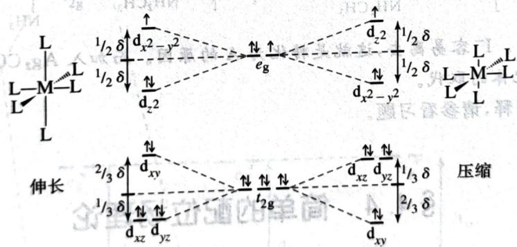

text_image

L
L-M-L
L
L
L
1/2 δ ↑
dₓ²-y²
1/2 δ ↓
↑
d₂z
e_g
1/2 δ ↑
d_x²-y²
L-M-L
L
L
伸长
2/3 δ ↑
d_xy
1/3 δ ↓
↑
d_xz d_yz
1/3 δ ↓
↑
d_xy
压缩

John-Teller 效应: 消除简并

另一个效应是反位效应。反位效应是指配合物中处于反(对)位的某些配体呈现出特别的不稳定性,特别容易被取代。一般用顺铂的合成来说明,顺铂只有从 $PtCl_{4}^{2-}$ 开始,用2当量 $NH_{3}$ 取代才能得到(而不能将 Cl 和 $NH_{3}$ 的角色反过来),如下图所示。

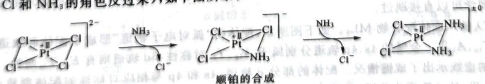

chemical

Chemical reaction mechanism showing platinum complex formation with chloride and phosphorus ligands, labeled as '顺铂的合成'

我们观察到第二当量的 $NH_{3}$ 选择取代了 Cl 对位的 Cl，这说明其对位的配体特别容易被取代，这样的性质称为反位效应。反位效应的顺序一般如下：

$$
\begin{array}{l} \mathrm{F} ^ {-}, \mathrm{H} _ {2} \mathrm{O}, \mathrm{OH} ^ {-} <   \mathrm{NH} _ {3} <   \mathrm{py} <   \mathrm{Cl} ^ {-} <   \mathrm{Br} ^ {-} <   \mathrm{I} ^ {-}, \mathrm{SCN} ^ {-}, \mathrm{NO} _ {2} ^ {-}, \mathrm{SC} (\mathrm{NH} _ {2}) _ {2}, \mathrm{Ph} ^ {-} <   \mathrm{SO} _ {3} ^ {2 -} \\ <   \mathrm{PR} _ {3}, \mathrm{AsR} _ {3}, \mathrm{SR} _ {2}, \mathrm{CH} _ {3} ^ {-} <   \mathrm{H} ^ {-}, \mathrm{NO}, \mathrm{CO}, \mathrm{CN} ^ {-}, \mathrm{C} _ {2} \mathrm{H} _ {4} \\ \end{array}
$$

注记 可以观察出,反位效应强的配体,要么具有很强的π受体性质,要么体积特别小。

【例题 4.34】 $\mathrm{Pt}(\mathrm{CH}_{3}\mathrm{NH}_{2})(\mathrm{NH}_{3})[\mathrm{CH}_{2}(\mathrm{COO})_{2}]$ 是一种抗癌药,药效高而毒副作用小,其合成路线如下:

$$
\mathrm{K} _ {2} \mathrm{PtCl} _ {4} \xrightarrow {(1)} \mathbf {A} \xrightarrow {(2)} \mathbf {B} \xrightarrow {(3)} \mathbf {C} \xrightarrow {(4)} \mathbf {D} \xrightarrow {(5)} \mathbf {E}
$$

其中：

(1) 加入过量 KI, 反应温度 $70^{\circ}$ C。  
(2) 加入 $CH_{3}NH_{2}$ ; A 与 $CH_{3}NH_{2}$ 反应的物质的量比为 1:2。  
(3)加入 $HClO_{4}$ 和乙醇；红外光谱显示 C 中有两种不同振动频率的 Pt-I 键，而且 C 分子呈中心对称。经测定，C 的相对分子质量为 B 的 1.88 倍。  
(4) 加入适量的氨水得到极性化合物 D。  
(5) 加入 $Ag_{2}CO_{3}$ 和丙二酸，滤液经减压蒸馏得到 E。

在整个合成过程中铂的配位数不变,杂化轨道类型始终为 $dsp^{2}$ 。

1. 画出 A、B、C、D、E 的结构式。  
2. 从目标产物 E 的化学式可见, 其中并不含碘, 请问: 将 $K_{2}PtCl_{4}$ 转化为 A 的目的何在?  
3. 合成路线的最后一步“加入 $Ag_{2}CO_{3}$ ”起到什么作用？

解 第一步 I⁻ 过量, 故得到 K₂PtI₄。第二步我们利用反位效应知 B 是顺式的 Pt(CH₃NH₂)₂I₂, 其相对分子质量为 511.02, 故 C 的相对分子质量为 960.72。这么大的相对分子质量, 只有双核配合物才有可能达到, 双核配合物的主体由电中性原则知道必须为 Pt₂I₄, 扣除后得到 62.92 恰为 2 个甲胺。结合其中含有两种 Pt-I 键, 知道体系为 I(MeNH₂)Pt(I)₂Pt(MeNH₂)I, 中间碘原子作桥。故而 D 是 Pt(NH₃)(MeNH₂)I₂(倒推, 结合极性碘在邻位)。故第 1 问答案如下图所示 (E 略去):

$$
\left[ \begin{array}{c} \mathrm{I} \\ \mathrm{I} - \mathrm{Pt} - \mathrm{I} \\ \mathrm{I} \end{array} \right] ^ {2 -} \mathrm{H} _ {3} \mathrm{CH} _ {2} \mathrm{N} - \underset {\mathrm{NH} _ {2} \mathrm{CH} _ {3}} {\overset {\mathrm{I}} {\mathrm{Pt}}} - \mathrm{I} \quad \mathrm{H} _ {3} \mathrm{CH} _ {2} \mathrm{N} - \underset {\mathrm{I}} {\overset {\mathrm{I}} {\mathrm{Pt}}} - \underset {\mathrm{I}} {\overset {\mathrm{I}} {\mathrm{Pt}}} - \underset {\mathrm{NH} _ {2} \mathrm{CH} _ {3}} {\overset {\mathrm{I}} {\mathrm{Pt}}} - \underset {\mathrm{NH} _ {3}} {\overset {\mathrm{I}} {\mathrm{Pt}}} - \underset {\mathrm{NH} _ {2} \mathrm{CH} _ {3}} {\overset {\mathrm{I}} {\mathrm{Pt}}} - \underset {\mathrm{NH} _ {3}} {\overset {\mathrm{I}} {\mathrm{Pt}}} - \underset {\mathrm{NH} _ {2} \mathrm{CH} _ {3}} {\oversets {\text {   }} {\mathrm{Pt}}} - \underset {\mathrm{NH} _ {3}} {\overset {\text {   }} {\mathrm{Pt}}} - \underset {\mathrm{NH} _ {2} \mathrm{CH} _ {3}} {\overset {\text {   }} {\mathrm{Pt}}} - \underset {\mathrm{NH} _ {3}} {\overset {\text {   }} {\mathrm{Pt}}} - \underset {\mathrm{NH} _ {2} \mathrm{CH} _ {3}} {\overset {\text {   }} {\mathrm{Pt}}} - \underset {\mathrm{NH} _ {3}} {\overset {\text {   }} {\mathrm{Pt}}} - \mathrm{NH} _ {2} \mathrm{CH} _ {3}
$$

第2、3问是简单的。I-容易离去，这就是转化为A的原因。而加入 $\mathrm{Ag_2CO_3}$ 则是去质子同时形成 $\mathrm{AgI}$ ，促进丙二酸根对配体的取代。

关于反位效应的解释,请参看习题。

## § 4.4 简单的配位场理论

晶体场理论最大的不足可能在于它无法解释光谱化学序,也无法理解很多非经典配合物的成键。配位场理论考虑配体与金属之间一定程度的共价键合,完善度更高。为了配合物结构理论的完整性,我们简要地介绍配位场理论,特别注意光谱化学序的解释。请注意此部分不在初赛的要求范围内,对此不感兴趣的同学可以直接跳过。

考虑 $O_{\mathrm{h}}$ 的八面体配合物 $\mathrm{ML}_{6}$ 。如下图所示，配体的“孤对电子轨道”形成了配体群轨道，对称性分别为 $E_{\mathrm{g}}, T_{1\mathrm{u}}, A_{1\mathrm{g}}$ ①。金属的4s、4p轨道分别属于 $A_{1\mathrm{g}}, T_{1\mathrm{u}}$ 对称性，3d轨道则有 $E_{\mathrm{g}}, T_{2\mathrm{g}}$ 两种。图中的虚线示出了成键情况。配体的部分d轨道，4s和4p与相应对称性的配体群轨道形成 $\sigma$ 配位键，其中 $T_{2\mathrm{g}}$ 的d轨道为非键。从图中能看出，体系中存在与晶体场理论预测一致的分裂能。现在要问，配体的性质如何影响分裂能？对此我们还要考虑配体中可能存在的其他轨道，进行“扰动”。

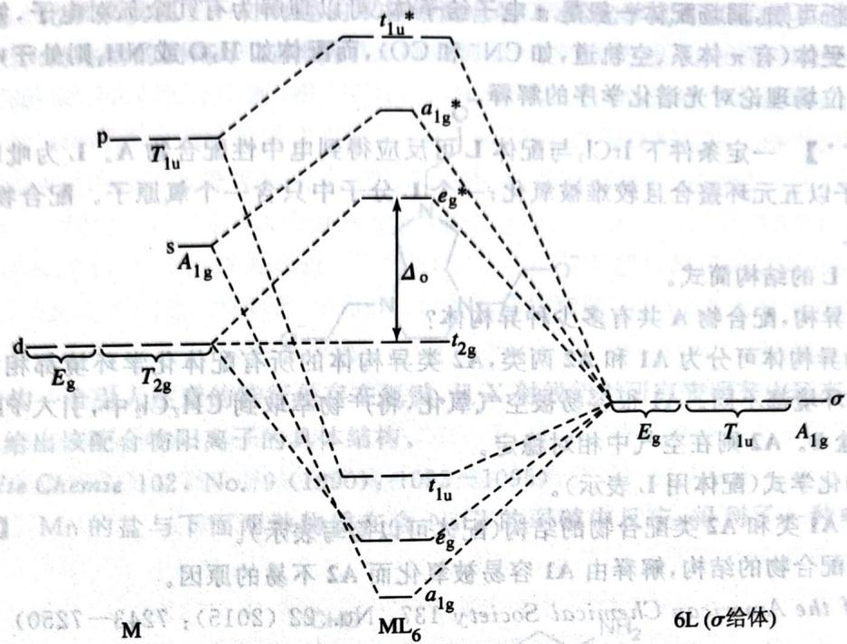

chemical

Energy level diagram of a molecular system showing transitions between states M, ML6, and σ with labeled transition parameters like t1u*, ag*, and Δo.

只考虑 $\sigma$ 成键时的定性轨道图

如下图所示,配体的 $\pi$ 轨道均为 $T_{2g}$ 对称性。若它为填充的成键轨道,则与 $t_{2g}$ 分子轨道产生作用,导致它能量升高,分裂能下降。同理,若它为未填充的反键轨道,则相关作用导致 $t_{2g}$ 分子轨道能量降低,分裂能增加。

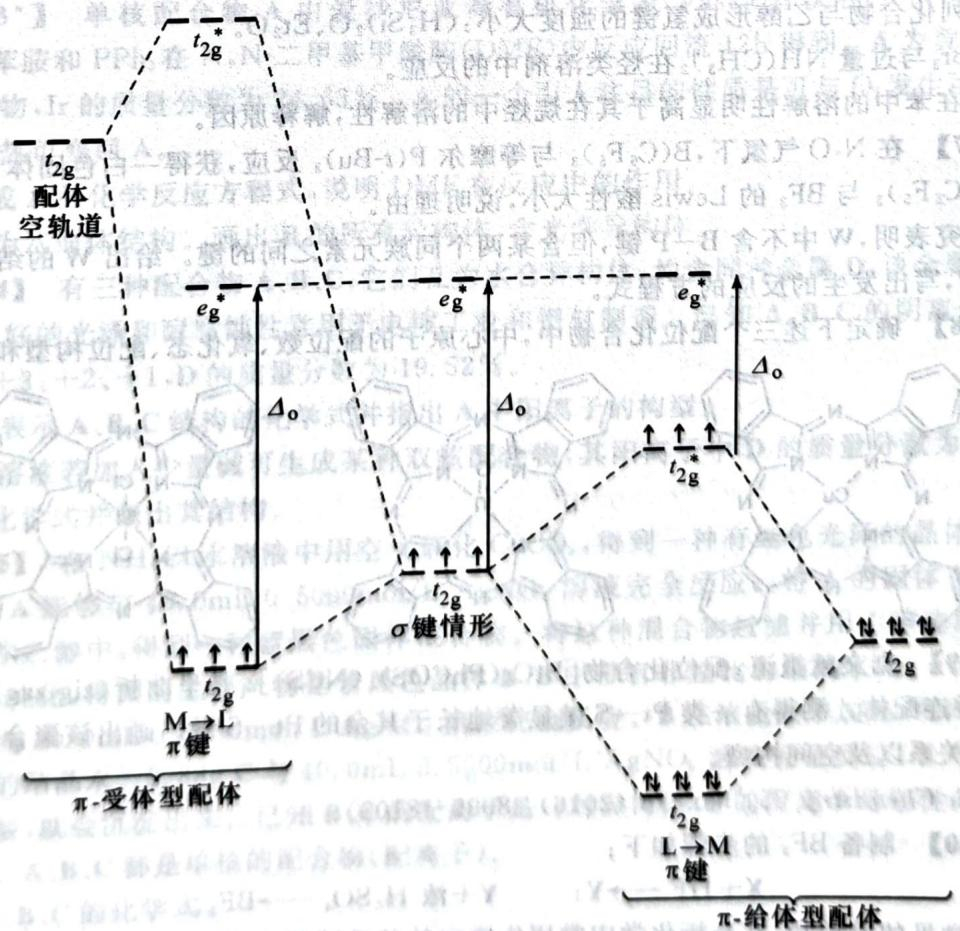

text_image

t2g
配体
空轨道
eg*
Δo
e*g
σ键情形
M→L
π键
π-受体型配体
t2g
t2g
L→M
π键
π-给体型配体

(a)  
(b)

只考虑 $\pi$ 成键时的部分定性轨道图

由上面的分析可知,弱场配体一般是 $\pi$ 电子给予体(可以理解为有冗余孤对电子,如 $\mathbf{I}^{-}$ ),强场配体一般是 $\pi$ 电子接受体(有 $\pi$ 体系、空轨道,如 $\mathrm{CN}^{-}$ 和 $\mathrm{CO}$ ),而配体如 $\mathbf{H}_{2}\mathbf{O}$ 或 $\mathbf{NH}_{3}$ 则处于中间, $\pi$ 相互作用很弱。这就是配位场理论对光谱化学序的解释。

【习题 4.35\*\*】一定条件下 IrCl₃ 与配体 L 可反应得到电中性配合物 A。L 为吡啶的一取代衍生物、易与金属离子以五元环螯合且较难被氧化；一个 L 分子中只含一个氧原子。配合物 A 中 Ir 的质量分数为 32.00%。

1. 写出配体 L 的结构简式。  
2. 考虑光学异构, 配合物 A 共有多少种异构体?

配合物 A 的异构体可分为 A1 和 A2 两类, A2 类异构体的所有配体化学环境都相同, A1 类异构体的所有配体化学环境都不同。A1 很容易被空气氧化, 将产物萃取到 $\mathrm{CH}_{2} \mathrm{Cl}_{2}$ 中, 引入 $\mathrm{PF}_{6}^{-}$ 后可结晶, 产生一种 1:1 型盐 B。A2 则在空气中相对稳定。

3. 写出 B 的化学式(配体用 L 表示)。

4. 画出全部 A1 类和 A2 类配合物的结构(配体可以简写表示)。

5. 对比两类配合物的结构, 解释由 A1 容易被氧化而 A2 不易的原因。

(Journal of the American Chemical Society 137, No. 22 (2015): 7243–7250)

## 第4讲习题

【习题 4.36】 回答下列问题。

1. 比较下列化合物与乙醇形成氢键的强度大小: $\left(\mathrm{H}_{3}\mathrm{Si}\right)_{2}\mathrm{O}、\mathrm{Et}_{2}\mathrm{O}$ 。  
2. 写出 $BBr_{3}$ 与过量 $\mathrm{NH(CH_{3})_{2}}$ 在烃类溶剂中的反应。  
3. $\mathrm{AgClO}_{4}$ 在苯中的溶解性明显高于其在烷烃中的溶解性, 解释原因。

【习题4.37】在 $\mathrm{N}_2\mathrm{O}$ 气氛下， $\mathrm{B}(\mathrm{C}_6\mathrm{F}_5)_3$ 与等摩尔 $\mathrm{P}(t - \mathrm{Bu})$ 。反应获得。白色固体W

1. 比较 $\mathrm{B}(\mathrm{C}_{6}\mathrm{F}_{5})_{3}$ 与 $BF_{3}$ 的 Lewis 酸性大小，说明理由。  
2. 光谱研究表明, W 中不含 B—P 键, 但含某两个同族元素之间的键。给出 W 的结构  
3. 加热 W, 写出发生的反应的方程式。

【习题 4.38】确定下述三个配位化合物中,中心原子的配位数、氧化态、配位构型和磁性。

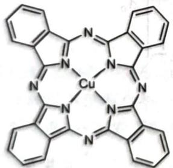

chemical

Molecular structure of a copper(II) complex with pyridine and imidazole ligands

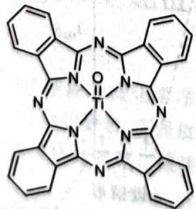

chemical

Complex porphyrin-like molecular structure with pyridine and imidazole rings

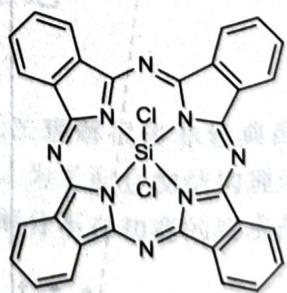

chemical

Chemical structure of a silicon-containing macrocyclic compound with fused aromatic rings and chlorine substituents

【习题 4.39】据文献报道,配位化合物 $\left[\mathrm{PtCr}(\mathrm{PhCOS})_{4}(\mathrm{NCS})\right]_{\infty}$ 是呈曲折(zig-zag)状的准一维链式聚合物,含桥连配体。测得有一类 Pt—S 键显著地长于其余的 Pt—S 键。画出该聚合物的结构,要求明确示出键连关系以及空间构型。

(Inorganic Chemistry 55, No. 16 (2016): 8099-8109)

【习题4.40】制备 $\mathrm{BF}_3$ 的步骤如下：

$$
\mathbf {X} + \mathrm{HF} \longrightarrow \mathbf {Y};
$$

Y+浓 $H_{2}SO_{4}\longrightarrow BF_{3}$

X 是一种常见的硼酸盐，在分析化学中常用作滴定的基底。

1. 请画出 Y 阴离子的结构，并写出第一步反应的化学方程式。

2. Ti(OEt) $_{4}$ 常以四聚体形式存在,其中每个Ti原子

1. 请画出 Y 阴离子的结构，并写出第一步反应的化学方程式；Y 的摩尔质量是 333.2。
2. Ti(OEt) $_{4}$ 常以四聚体形式存在，其中每个Ti原子

【习题 4.41】化学家发现了一种有趣的双核铬配合物 A, 其化学式可以写成 $\left[Cr_{2}H_{3}L_{2}\right]\left[PF_{6}\right]_{3}$ 。其中 L 为一种 TACN 衍生物的阴离子，结构为：

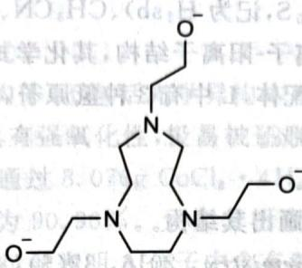

chemical

Chemical structure of a triazine derivative with ester and ether functional groups

配合物 A 结构一个引人注意的特征是存在氢键，且 X 射线衍射研究表明其中还有 $C_{3}$ 轴，Cr 的配位环境为八面体。给出该配合物阳离子的具体结构。

(Angewandte Chemie 102, No. 9 (1990): 1093–1095)

【习题 4.42】Mn 的盐与下面两种物质在含 NaCl 的弱碱中反应,得到了一种电中性的单核配合物。

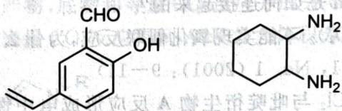

chemical

Chemical structure of a substituted benzene ring with CHO and OH groups, alongside a cyclohexane ring containing NH2 groups

其中 Mn 的质量分数为 11.87%, H 的质量分数为 5.23%。画出该物质的结构, 讨论其是否可能有旋光异构体。

【习题4.43\*】单核配合物A由爱沙尼亚裔有机化学家Vaska首次在1961年发现，它可由 $\mathrm{IrCl}_3\cdot 3\mathrm{H}_2\mathrm{O}$ 、苯胺和 $\mathrm{PPh}_3$ 在N,N-二甲基甲酰胺(DMF)中反应回流 $12\mathrm{h}$ 得到。A为黄色晶状固体，是单核Ir(I)配合物，Ir的质量分数为 $24.63\%$ 。A的一个引人注目的性质是可与 $\mathrm{O}_2$ 发生可逆反应变为配合物B，此时加热可变回A。

1. 写出生成 A 的化学反应方程式, 说明 DMF 在反应中的作用。

2. 已知 B 为八面体结构。画出 B 的所有异构体，含光学异构体。

【习题 4.44】有三种配合物 A、B、C，它们互为水合异构体，均含同种金属 D，该金属的单质是金属中最硬的，其良好的光泽和耐腐蚀性常用于电镀工业和钢材制造。已知 A、B、C 的阴离子相同，阳离子电荷量分别为 +3、+2、+1，D 的质量分数为 19.52%。

1. 写出能表示 A、B、C 结构的化学式并指出 A 中阳离子的构型。

2. A 的水溶液若加入少量碱可生成某种双核配合物, 其阳离子中 D 的质量分数为 36.87%, 请写出该阳离子的化学式并画出其结构。

【习题 4.45】在 $NH_{4}Cl$ 水溶液中用空气氧化 $CoCO_{3}$ ，得到一种有红色光泽的晶体 A。A 不带结晶水，且 4.45g A 能够与 40.0mL 0.5000mol/L $AgNO_{3}$ 溶液完全反应。将 A 的固体在 $0^{\circ}C$ 下加入用 HCl 饱和的无水乙醇中，得到一种蓝黑色固体混合物。将这种混合物过滤并用乙醇洗涤，再用冷水洗涤，经过进一步纯化，得到的主要产物是紫黑色晶体 B，B 中带有非整比的结晶水，且 $n(\mathrm{Co}):n(\mathrm{H}_{2}\mathrm{O})>1$ 。4.85g B 与 40.0mL 0.5000mol/L $AgNO_{3}$ 溶液完全反应。B 在浓盐酸中加热，可得到绿色化合物 C，C 带有整比的结晶水。2.88g C 与 40.0mL 0.5000mol/L $AgNO_{3}$ 溶液完全反应。C 可溶于冷水，但假如加入浓盐酸，就会沉淀出来。已知 B、C 的配离子是一对异构体，B 的配离子是极性的，而 C 的配离子是非极性的。A、B、C 都是单核的配合物（配离子）。

1. 推出 A、B、C 的化学式。  
2. 判断 A 的配离子是否有同分异构体。  
3. 画出 B、C 中配离子的结构, 它们是一对什么异构体?  
4. 写出由 $CoCO_{3}$ 生成 A 及 A 转化为 B 的方程式。

【习题 4.46】在配合物的合成过程中,水热(溶剂热)合成是一种重要手段。在高压下,除了反应物间发生反应外,也可能出现溶剂参与反应、形成新的配体并参与配位的情况。

将 $K_{2}PtCl_{4}$ 、2-磺基苯甲酸 $\left(\mathrm{C}_{7}\mathrm{H}_{6}\mathrm{O}_{5}\mathrm{S},\text{记为 } \mathrm{H}_{2}\mathrm{sb}\right)$ 、 $CH_{3}CN$ 、水混合于 $150^{\circ}C$ 烘箱中反应 1 天，经过后处理得到浅棕色产物。该晶体有阴离子-阳离子结构，其化学式可以表示为 $\left[\mathrm{PtL}_{2}\right]\mathrm{sb} \cdot 2\mathrm{H}_{2}\mathrm{O}\left(\mathrm{sb}^{2-}\right.$ 不参与配位），L 为溶剂，经反应产生的新配体，L 中有 3 种氢原子，2 种碳原子。对配合物进行元素分析结果如下：C 28.63%，H 4.17%，N 13.35%。

1. 推导 L 的化学式并画出其结构。

2. 已知配阳离子属于 $D_{2h}$ 点群，试画出其结构。

(Chinese Journal of Inorganic Chemistry, 2016, 32(5): 833-838)

【习题 4.47】 在过热溶剂中进行溶剂热合成可以有效地合成配位聚合物或原位形成新配体。将六水硝酸锌，过量的吡啶在甲醇溶剂中共热，于 $140^{\circ}$ C 回流 14 天得到一种无色的晶体 X 以及棕色的纳米氧化锌。研究表明过程中发生了氧化偶联反应，无色晶体为一种一维链式聚合物，已知其中 Zn 的质量分数为 21.0%，N 的质量分数为 9.0%，Zn 采取八面体场的配位型式。

1. 计算并确定 X 的化学式。  
2. X 的一维链中相邻两个 Zn 是如何连接起来的？  
3. 用 $\mathrm{Zn(ClO_{4})_{2}}$ 代替 $\mathrm{Zn(NO_{3})_{2}}$ 不能实现氧化偶联反应,为什么?

(Crystal Growth & Design 1, No. 1 (2001): 9–11)

【习题 4.48】 研究发现, $CoCl_{2}$ 与吡啶衍生物 A 反应形成电中性的单核配合物分子,实验测得钴的质量分数为 17.35%,氧的质量分数为 9.42%。配体 A 的 2 号位和 6 号位上各有一个基团,6 号位上连接的为甲基,配体 A 为双齿配体,含碳。

1. 确定该配合物的化学式。  
2. 画出它的单体的立体结构, 指出立体构型。

实验测得该配合物分子实际上以二聚体的形式存在,且呈现双螺旋结构。

3. 二聚体分子之间的作用力是什么？  
4. 画出该配合物的双螺旋结构。

【习题 4.49】以下是制备一些新发现的 Cr 的配合物时的步骤。

- 新制备的 $\mathrm{CrBr}_2$ 和 $2,2'$ -联吡啶在稀盐酸中反应，得到黑色结晶沉淀A。  
- A与5%的HClO $_{4}$ 溶液混合在空气中摇动,得到了黄色晶状沉淀B。  
- 将 A 溶解在无空气的含有过量 $NH_{4}ClO_{4}$ 的蒸馏水中，在惰性气氛中与 Mg 反应，生成深蓝色化合物 C。

关于这些化合物的化学分析结果如下表所示：

<table><tr><td rowspan="2">物种</td><td colspan="5">质量分数/%</td><td rowspan="2">μ/(B.M.)</td></tr><tr><td>N</td><td>Br</td><td>Cl</td><td>Cr</td><td> $ClO_4$ </td></tr><tr><td>A</td><td>11.0</td><td>21.0</td><td></td><td>6.9</td><td></td><td>3.27</td></tr><tr><td>B</td><td>10.26</td><td></td><td>13.01</td><td>6.4</td><td></td><td>3.76</td></tr><tr><td>C</td><td>13.56</td><td></td><td></td><td>8.39</td><td>16.6</td><td>2.05</td></tr></table>

1. 写出 A、B、C 的化学式。  
2. 写出 A、B、C 的电子构型。

【习题 4.50】钒与 N-苯甲酰-N-苯基羟胺(213g/mol)根离子在 4mol/L 盐酸介质中形成紫红色的单核配合物,该配合物溶液可进行比色测定,用以定量测定钢中钒的含量。该配合物是电中性分子,实验测得其氧的质量分数为 15.2%。

1. 通过计算确定该配合物的化学式。

2. 该配合物共有几种可能立体结构体(不包括光学异构体)? 画出其中最稳定的一种。

【习题 4.51】一般说来, Co(Ⅲ) 具有强氧化性, 极易被还原为 Co(Ⅱ)。然而在配合物中, Co(Ⅲ) 配合物的稳定性却大于 Co(Ⅱ)。有人通过 8.076g CoCl₂·4H₂O 与过量过氧化氢和足量氨的乙醇溶液反应正好得 8.076g 的 A 物质, 产率为 90.96%。元素分析表明 A 中含 Cl 31.94%, 含 N 28.40%。红外光谱中没有发现 Co—Cl 键。单晶衍射表明 A 分子中含有对称面。分子呈顺磁性。

1. 推出 A 的分子式并画出其结构式。

2. 写出合成 A 的反应方程式。

3. 指出 A 中氧元素的氧化态以及中心钴离子的价电子排布和杂化方式。

【习题4.52\*】 $\mathrm{CO},\mathrm{CO}_2$ 是常见的碳族氧化物。与之类似的硅不同，虽然 $\mathrm{SiO}_2$ 是常见的，但是SiO却是非常不稳定的物种。通过配位化学中的给-受体作用的合成策略，可以在下面的反应观察到一种特殊的SiO结构B。其中，A为最终产物，底物和等量 $\mathrm{CO}_2$ 反应并脱去等量CO得到B，再和等量 $\mathrm{CO}_2$ 反应并脱去等量CO得到C，最后和两当量 $\mathrm{CO}_2$ 反应得到A，R为大体积芳基：

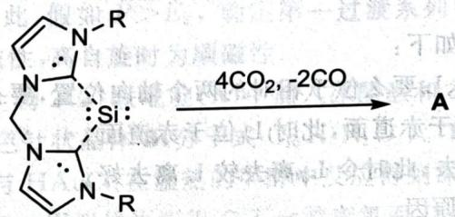

chemical

Chemical reaction showing conversion of a siloxane-containing heterocyclic compound to an amino group via CO2 reduction

1. 已知 A 中 Si 的配位数为 6，给出 A、B、C 的结构，其中 C 请另写出共振式。

8. 已知 A 中 Si 的配位数为 1.4，即 $S_{i}$ 的化合物之单体（在配体的稳定下），推测产物的结构。

2. 下列反应可以得到一种不带先的反应条件。

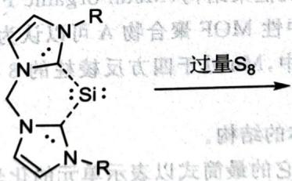

chemical

Chemical reaction diagram showing Si complex with R groups and S8 overlongation

(Angewandte Chemie International Edition 56, No. 7 (2017): 1894–1897; Angewandte Chemie 127, No. 35 (2015): 10392–10395)

【习题 4.53】铍及锌分别为ⅡA及ⅡB族元素,在很多性质上相类似。例如,它们的氧化物及其水合物表现为两性,卤化物有显著的共价性,易于形成配位数为4的配合物。

水合物表现为两性, 因化物有显着的共析法。
1. Be 和 Zn 都可以形成结构相似的 $\mathrm{Be}_{4}\mathrm{O}(\mathrm{CH}_{3}\mathrm{COO})_{6}$ 及 $\mathrm{Zn}_{4}\mathrm{O}(\mathrm{CH}_{3}\mathrm{COO})_{6}$ 配合物, 试画出结构图, 分别说明中心原子的杂化态。

说明中心原子的杂化态。
② 试知为什么 $\mathrm{BaO}(\mathrm{CH}_{3}\mathrm{COO})_{6}$ 不易水解而 $\mathrm{Zn}_{4}\mathrm{O}(\mathrm{CH}_{3}\mathrm{COO})_{6}$ 却极易于水解。

2. 试解释为什么 $Be_{4}O(CH_{3})_{2}SO_{3}$ 为碳原子，生成碳原子的碳原子。

【习题4.54】水溶液检验S $^{-}$ 的一种方法是颜色体。

1. 写出反应的离子方程式,并画出[Fe(CN) $_{5}$ NO] $^{3+}$ 或 [Fe(CN) $_{5}$ NO] $^{3-}$ 与 S $^{2-}$ 的反应活性不如 [Fe(CN) $_{5}$ NO] $^{2-}$ , 解释原因。

2. $\left[\mathrm{Fe}\left(\mathrm{H}_{2} \mathrm{O}\right)_{5} \mathrm{NO}\right]^{3+}$ 或 $\left[\mathrm{Fe}(\mathrm{CN})_{3} \mathrm{H}_{2} \mathrm{O}\right]^{3-}$

3. 实际上, 反应过程中溶液会显紧红色与蓝色, 用液体加入气体, 用气体通过气体分离成质子化的 X 解离得到 $\left[\mathrm{Fe}(\mathrm{CN})_{5}\mathrm{NO}\right]^{3-}$ 与自由基负离子 A 后, A 在水溶液中可二聚得到物种 B, B 再与 X 或 $\left[\mathrm{Fe}(\mathrm{CN})_{5}\mathrm{NO}\right]^{2-}$ 反应都可得 Y, 画出 Y 的结构。

【习题 4.55】 回答下列与配位化学有关的问题。

1. 为什么 $\left[\mathrm{Ni}\left(\mathrm{H}_{2} \mathrm{O}\right)_{4}\right]^{2+}$ 的空间结构为四面体，而 $\left[\mathrm{Ni}\left(\mathrm{CN}\right)_{4}\right]^{2-}$ 的空间结构为正方形？  
2. 为什么 $\left[\mathrm{Ag}\left(\mathrm{NH}_{3}\right)_{2}\right]^{+}$ 的 $\lg \beta$ 为7.2，而 $[\mathrm{Ag}(\mathrm{en})]^{+}$ 的 $\lg \beta$ 只有6.0？  
3. 为什么 $\left[\mathrm{Co}(\mathrm{SCN})_{6}\right]^{4-}$ 的稳定常数比 $\left[\mathrm{Co}(\mathrm{NH}_{3})_{6}\right]^{2+}$ 小，但在酸性溶液中， $\left[\mathrm{Co}(\mathrm{SCN})_{6}\right]^{4-}$ 可以存在， $\left[\mathrm{Co}(\mathrm{NH}_{3})_{6}\right]^{2+}$ 不能存在？

【习题4.56\*\*】本题中，你将对反位效应进行动力学解释。如下图所示，配合物 $\mathrm{ML}_2\mathrm{L}_t\mathrm{L}_d$ 和配体 $\mathbf{L}_i$ 发生取代反应，其中 $\mathbf{L}_t$ 是所谓反位效应特别强的配体。 $\mathbf{L}_t$ 位于 $\mathbf{L}_d$ 的对位。该过程使用配合-解离机理，先形成三角双锥中间体。

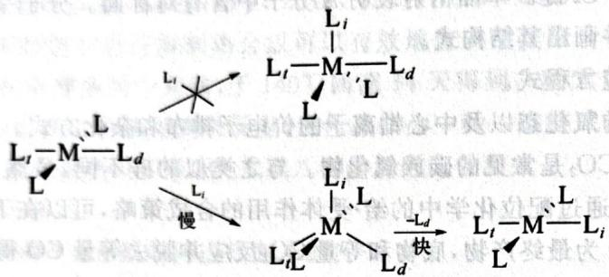

chemical

Molecular orbital diagram showing electron spin states and transition between M-L and L-M-L orbitals

反位效应的动力学解释

我们对反位效应存在的论证如下：

(1) 在三角双锥中间体中, $L_{d}, L_{t}$ 要么位于相对的两个轴向位置, 要么都位于赤道面。  
(2)由于 $L_{i}$ 的性质,它们应处于赤道面,此时 $L_{i}$ 位于赤道面。  
(3) $L_{t}$ 是较强的配体,不应离去;此时令 $L_{d}$ 离去较L离去好。

请给出上述 3 句断言成立的原因。

(Crabtree, Robert H. The Organometallic Chemistry of the Transition Metals. John Wiley & Sons, 2009)

【习题 4.57°】 近年来,金属-有机框架结构(Metal-organic Framework, MOF)受到了化学家的广泛关注。某含有 Cr 和 Mn 元素的电中性 MOF 聚合物 A 可以认为是由二草酸根-2,2'-联吡啶合铬(Ⅲ)离子 B 和 $Mn^{2+}$ 组成的长链结构。其中,Mn 处于四方反棱柱的 8 配位环境,每个 Mn 的四方反棱柱结构桥连了 4 个 B 的单元。

1. 画出 B 所有可能的同分异构体的结构。  
2. 简要绘制 A 的单元结构, 写出它的最简式以表示单元的化学组成。

(Inorganic Chemistry 35, No. 21 (1996): 6086–6092)

【习题 4.58】在 $N_{2}$ 气氛下，0.235g 金属 A 可恰好被 2.93mL 密度为 1.05g/mL 的 10% 稀盐酸溶解，形成的微蓝绿色溶液含有盐 B。该溶液和 15mL 含 3.676g $\mathrm{Co(NO_{3})_{2}\cdot6H_{2}O}$ 的溶液混合，再加稍过量的草酸铵即可以得到 3.069g 橙黄色的沉淀 C。

化合物 C 在 $O_{2}$ 气氛中的热重分析 (25℃ 到 900℃) 表明, 它受热失重分 3 个阶段, 最后以 57.3% 的总失重得到混合物 G。有趣的是, 有一个阶段发生了质量的增加。

1. 推出化合物 A\~C 的化学式。  
2. 求 G 的组成(质量分数)。

在 B 中加入硝酸钴后再加入大大过量的草酸铵, 则可以得到红色溶液 D。用 $PbO_{2}$ 乙酸溶液处理 D 则导致它转化为翡翠绿色的溶液。在这个溶液中加入乙醇, 就得到了绿色晶体 F 和晶体 E。前者在光照下变成无色。

3. 写出化合物 E 和 F。  
4. 写出生成“翡翠绿色溶液”的化学方程式。  
5. 分析为何 F 是光敏的而 E 不是。

【习题4.59】波希米亚石榴石的组成为 $\mathrm{Mg}_3\mathrm{Al}_2(\mathrm{SiO}_4)_3$ 。纯化合物无色，天然石榴石的颜色源自生色团——取代母体阳离子位置的过渡金属阳离子。波希米亚石榴石的红色来自进入八面体位置的痕量 $\mathrm{Cr}^{3+}$ 和进入十二面体位置的 $\mathrm{Fe}^{2+}$ 。

1. 画出 $\left[Cr^{III}O_{6}\right]^{oct}$ (oct 指八面体) 中 d 轨道的分裂图，并填入电子。

2. 过渡金属离子 $M^{3+}$ 在八面体场中低自旋时显抗磁性, 高自旋时为顺磁性, 它(们)属于第一过渡系列, 指出是哪种(或哪些)元素。

3. 下图给出 d 轨道在十二面体场中的分裂情况。对于 $\left[Fe^{II}O_{8}\right]^{dod}$ (dod 指十二面体场) 生色团，给出高自旋和低自旋两种情况下的电子排布。

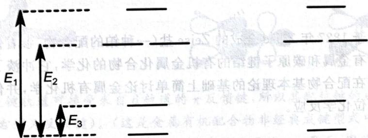

text_image

E₁
E₂
E₃

4. 对于以上两种不同的排布, 推导出成对能 $P$ 的相对大小的不等式 (用含 $E_{1} 、 E_{2} 、 E_{3}$ 的表达式表示, 例如 $P < E_{1} + E_{2} + E_{3}$ )。据此, 假如 $P > E_{3}$ , 确定第一过渡系列中哪种 (或哪些) 二价离子 $\mathbf{M}^{\mathrm{II}}$ 在十二面体场中低自旋时显示抗磁性, 高自旋时为顺磁性。

【习题 4.60】 在吡啶的衍生物 2,2'-联吡啶(A)中加入冰醋酸和 30% H₂O₂ 的混合溶液,反应完成后加入数倍体积的丙酮,析出白色针状晶体 B(分子式 C₁₀H₈N₂O₂)。B 的红外光谱显示它有一种 A 没有的化学键。B 分成两份,一份与 HAuCl₄ 在温热的甲醇中反应得到深黄色沉淀 C。另一份在热水中与 NaAuCl₄ 反应,得到亮黄色粉末 D。用银量法测得 C 不含游离氯而 D 含游离氯 7.21%。C 的相对分子质量比 D 大 36.46。C 和 D 中金的配位数都是 4,且 C、D 中都存在七元环。画出 A\~D 的结构式。

## 第5讲 金属有机化学

金属有机化学起源于1827年Zeise合成的Zeise盐(一种铂的配合物,参看例题5.1)。所谓金属有机化学一般是指研究含有金属和碳原子键结的有机金属化合物的化学,它冲淡了无机化学和有机化学之间的界限。本讲我们在配合物基本理论的基础上简单讨论金属有机化学,并借此讲一讲非常重要的EAN规则、数电子和配位化学反应。

## § 5.1 EAN 规则

Sidgwick 对过渡金属配合物提出了以下 EAN 规则: 在八面体、强场下, 过渡金属配合物的价电子取 18e 最稳定。

注记 八面体和强场的条件不能忽略,否则各种过渡金属的水合离子都不符合 EAN 规则,铂系元素平面正方形的配合物也不符合 EAN 规则。我们马上会讨论这点。

我们来考虑 EAN 规则的解释。上一讲配位场理论中只考虑 $\sigma$ 键轨道图的简化版本，如右图所示。图中左侧为金属的 d 轨道，右侧为配体群轨道；配位键合的情况在中间示出，d 电子将填充 $t_{2g}$ 和 $e_{g}^{*}$ 轨道。

回忆上一讲的内容,对于具有 $\pi$ 受体性质的配体, $t_{2g}$ 轨道能量将降低,而对于具有 $\pi$ 给体性质的配体, $t_{2g}$ 轨道的能量将升高。相应地, $t_{2g}$ 的成键性质分别增加、减少。所以,在强场配体配合物中,配合物倾向于填满 $t_{2g}$ 轨道降低能量,满足 18 电子规则,而在场相对弱的配体中, $t_{2g}$ 的非键性质更强,配合物不

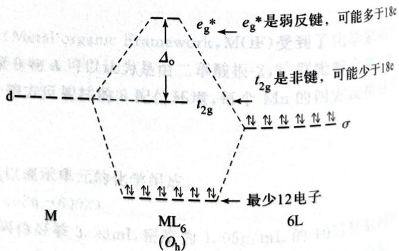

chemical

Energy level diagram of a molecular orbital showing electron transitions and transition states for 12 electrons in 6L, with labels for electron types and transition states.

只考虑 $\sigma$ 成键时的定性轨道图

对弱的配体中， $t_{2g}$ 的非键性质更强，配合物不必填满之，不一定满足 18 电子规则。如果因为某些因素， $e_{g}^{*}$ 的反键程度降低，则体系甚至可能多于 18 电子。这就是我们对 EAN 规则的解释和推广，从中我们看出八面体和强场的要求是必需的。

【例题5.1】向含有 $\mathrm{K}_{2} \mathrm{PtCl}_{4}$ 的溶液中加入足量 $5 \mathrm{~mol} / \mathrm{L}$ 盐酸、催化剂 $\mathrm{SnCl}_{2}$ ，并向反应体系中缓释入乙烯气体，结晶得到一种橘色配合物 X，其中心原子为 16 电子构型，分析知 Cl 的质量分数为 $27.5 \%$ 。

1. 写出合成配合物 X 的化学方程式。(X 只含两种配体)  
2. $\mathrm{SnCl}_2$ 在反应中有何作用？  
3. 画出配合物 X 阴离子的结构，并具体描述其配位键。  
4. 中心原子周围并非 18 电子, 这能否说明这个配合物不够稳定? 为什么?  
5. 中心原子 d 轨道分裂状况与 $K_{2}PfCl_{4}$ 的最大差别在哪个轨道？设乙烯中心在 y 轴上。

解 乙烯必然要参与反应,由电中性可知只有两种配体,故可设化学式为 $\mathrm{K}_{x} \mathrm{PtCl}_{x+2} (\mathrm{C}_{2} \mathrm{H}_{4})_{2-x}$ ,代入质量分数得到没有合理的 $x$ 的整数解。此时可进一步考虑结晶水的存在。通过尝试很容易得到化学式为 $\mathrm{KPtCl}_{3} (\mathrm{C}_{2} \mathrm{H}_{4}) \cdot \mathrm{H}_{2} \mathrm{O}$ 。这是一个配体取代反应: $\mathrm{K}_{2} \mathrm{PtCl}_{4} + \mathrm{C}_{2} \mathrm{H}_{4} + \mathrm{H}_{2} \mathrm{O} \longrightarrow \mathrm{KCl} + \mathrm{KPtCl}_{3} (\mathrm{C}_{2} \mathrm{H}_{4}) \cdot \mathrm{H}_{2} \mathrm{O}$ ,需要 $\mathrm{Cl}^{-}$ 离去。考虑到 $\mathrm{SnCl}_{2}$ 具有 Lewis 酸性,故可形成 $\mathrm{SnCl}_{3}^{-}$ 配离子促进反应发生。此时我们还可进一步把化学方程式改写为生成配离子的形式。

铂系元素采用平面正方形构型，乙烯用其成键轨道和Pt形成 $\sigma$ 键（而不是 $\pi$ 键），所以乙烯分子平面将正对着中心铂离子，为了减小空间位阻应竖直放置，H和Cl应尽量远离。其结构如下左图所示：

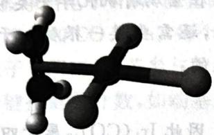

chemical

Molecular structure diagram of a hydrocarbon molecule with carbon, hydrogen, and oxygen atoms

另一方面，乙烯的反键轨道可接受来自 d 轨道的 $\pi$ 反馈键，所以其配位键的成键型式大致如上右图所示（左侧为 $\sigma$ 配位键，右侧为反馈键）。（这是金属有机配合物非经典成键型式中很常见的一种。）

采用第5问的坐标轴设置,我们断定乙烯两个碳所在的平面为 $xy$ 平面,因为只有该平面上有两个d轨道,又因为乙烯中心在 $y$ 轴上,故成反馈键的d轨道为 $\mathrm{d}_{xy}$ ,故分裂最大不同的是 $\mathrm{d}_{xy}$ 轨道。

对于 18 电子规则的解释,我们已经熟知了。平面四方形的铂系配合物并非八面体,因此不适用 EAN 规则,不能断言不够稳定。事实上,平面四方形的强场配合物一般遵循 16 电子规则。

【习题5.2\*】下图示出了 $D_{4h}$ （平面四方对称性）的 $\mathrm{ML}_4$ 体系的分子轨道。请问：在强场、平面四方形立体构型的配合物中，最稳定的电子构型一般是多少？解释你的结论。

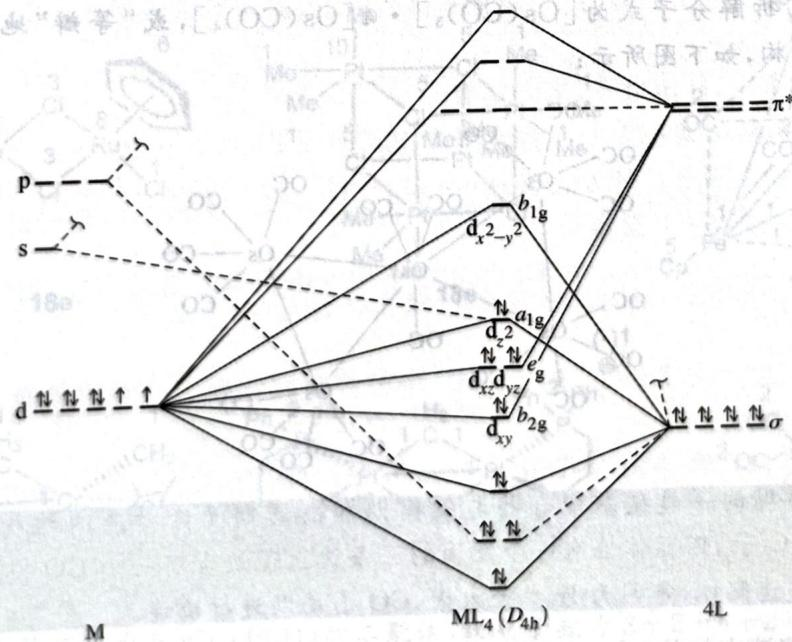

flowchart

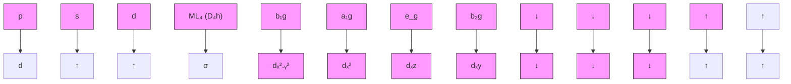

$D_{4h}$ 的 $\mathrm{ML}_4$ 的定性轨道图

【例题5.3】将二硫代苯甲酸与羰基溴化锰反应，生成一种稳定的红色固体A（并释放一分子CO），将A置于甲醇中回流3h，生成一种稳定的黄色金属羰基配合物B，含锰28.18%。试给出A、B的化学式并推测甲醇在此反应中的作用。体系服从EAN规则。

解 用 EAN 规则推断, 得到 $\mathrm{Mn(CO)_4(PhCSS)}$ (注意二硫代苯甲酸负离子净提供 3 个电子)。对 B 作一个猜测, 假如有一个 Mn, 则总相对分子质量是 194.96, 扣除 Mn 即为 140, 也就是 5 个 CO。因此 B 是 $\mathrm{Mn_2(CO)_{10}}$ (其中存在金属—金属键使得 EAN 规则得到满足)。由此可见价态下降, 甲醇是还原剂兼溶剂。

【例题 5.4】 $\mathrm{Mn(CO)_{5}}$ 中心原子周围仅有 17 个电子, 它与甲基结合后能生成满足 EAN 规则的稳定配合物。事实上, 这两个“分子片”前线轨道数目、对称性、能量、形状以及所含电子数均相似, 因此互为对方的“等瓣”。

1. 写出 $\mathrm{Re(CO)_5Br}$ 与 $\mathrm{NaMn(CO)_5}$ 反应的化学方程式。  
2. $\mathrm{Ir(CO)_3}$ 与哪种含碳最简单有机基团互为“等瓣”？由此画出 $\mathrm{Ir}_4(\mathrm{CO})_{12}$ 的结构。  
3. 推断 $\mathrm{Co}_{3}(\mathrm{CO})_{9}(\mathrm{CMe})$ 的结构。  
4. $\mathrm{Os}_5(\mathrm{CO})_{19}$ 的结构非常复杂。请试一试用等瓣替换的方法推出它的结构。

解 我们倒不用关心“等瓣”的确切含义。大家熟知，EAN规则在金属有机化学中类似短周期元素的八隅律，因此 $\mathrm{Mn(CO)_5}$ 距离18电子差1个电子，可类比为甲基，还需要接一根键。于是我们可把 $\mathrm{Re(CO)_5Br}$ 与 $\mathrm{NaMn(CO)_5}$ 写为MeBr、NaMe，其反应方程式是无疑的：

$$
\mathrm{Re} (\mathrm{CO}) _ {5} \mathrm{Br} + \mathrm{NaMn} (\mathrm{CO}) _ {5} \longrightarrow \mathrm{MnRe} (\mathrm{CO}) _ {1 0} 。
$$

同样， $\mathrm{Ir(CO)}_3$ 差3个电子达到18电子，故应和CH为“等瓣”。因此 $\mathrm{Ir}_4(\mathrm{CO})_{12}$ 属于四面体结构，如下图所示：

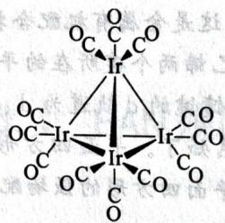

chemical

Molecular structure of a Ir(II) complex with oxygen and carbon atoms labeled

因 Co、Ir 同族, 故 $\mathrm{Co}_{3}(\mathrm{CO})_{9}(\mathrm{CMe})$ 的结构与 $\mathrm{Ir}_{4}(\mathrm{CO})_{12}$ 类似, 请同学们自己画出。对于 $\mathrm{Os}_{5}(\mathrm{CO})_{19}$ 则需进行拆分。平均来看每个 Os 拥有 3.8 个 CO, 而且每个 Os 都不能超过 4 个 CO (不然已经满足 EAN 规则), 故我们可拆解分子式为 $[\mathrm{Os}(\mathrm{CO})_{3}] \cdot 4[\mathrm{Os}(\mathrm{CO})_{4}]$ , 或“等瓣”地写为 $\mathrm{C} \cdot 4\mathrm{CH}_{2}$ 。故 $\mathrm{Os}_{5}(\mathrm{CO})_{19}$ 为一螺环结构, 如下图所示:

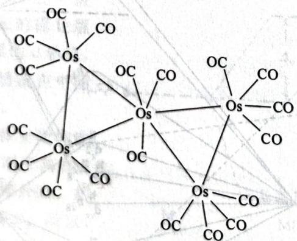

chemical

Molecular structure diagram of a silicate compound with Os and CO atoms

注记 本题中出现的一类羰基配合物与低周期和高周期元素对应的结构是有区别的。例如 $\mathrm{Co}_{4}(\mathrm{CO})_{12}$ 只有一条 $\mathbf{C}_{3}$ 轴，四面体恰有一个底面的三条边上每边含有一个CO桥连配体；高周期的Ir的同类化合物没有桥连配体，是因为Ir半径太大，CO不足以进行桥连。

【习题5.5】在溶液中加热 $(\eta^{5}-C_{5}H_{5})Fe(CO)_{3}^{+}$ 和 NaH 的混合物得到 A $(C_{7}H_{6}O_{2}Fe)$ ，后者在 TiC $_{5}$ H $_{5}$ 反应得到 E $(C_{12}H_{10}O_{2}Fe)$ 。最后，加热 E 就得到橙红色固体 F $(C_{10}H_{10}Fe)$ 。确定所有未知物的结构。

## § 5.2 数电子与多重键

在使用 EAN 规则时还要正确对电子进行计数, 在某些较为复杂的体系中电子计数发挥了比较关键的作用(氧化数等与电子计数密切相关)。我们对电子计数的原则是这样的: 总是认为金属为中性, 电子计数时均按净给电子计算, 防止混淆。这样不难推出如下规则:

1. 中性配体如 CO、PPh₃，每个计数 2 个电子。  
2. 卤原子等阴离子, 若参与配位, 只计数一个电子。  
3. 共价键按键数计数, 如端基原子=O 计数 2 个电子, ≡N 计数 3 个电子, 金属-金属键每根计数 1 个电子。  
4. 整合(多齿)配体要补上螯合原子的电子。例如 $AcO^{-}$ 螯合时计算 3 个电子。  
5. NO较为特殊,可以净提供1、2、3个电子,需要视题目条件决定。一般来说作为3电子给体。  
6. 桥连配体较为复杂, 电子不可直接简单共用。例如 CO 桥连, 每侧提供 1 个电子; $CH_{3}$ 桥连, 则仅一侧提供 1 个电子, 另一侧一般不提供电子; 若可写为 $CH_{3}^{-}$ , 则每边提供 1 个电子。

【例题 5.6】计算 $(\eta^{3}-C_{5}H_{5})(\eta^{5}-C_{5}H_{5})Fe(CO)^{+}$ 的中心原子周围的价电子数。

解 注意 $\eta^{n}$ 表示配体有 n 个原子和中心原子键连(而 $\mu$ 表示桥连配体), 故第一个配体总提供 4 个电子, 扣去一个负电荷即 3 电子, 所以体系含有 $8-1+2+5+3=17$ 个电子。

【例题 5.7】 计算如下 6 个配合物的中心原子周围的价电子数。

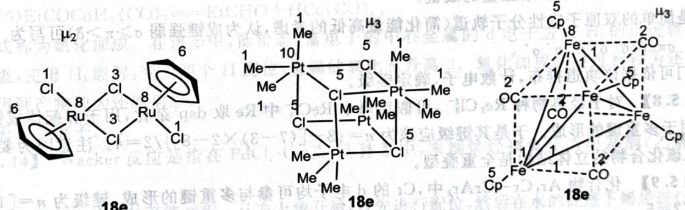  
18e

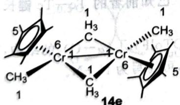

chemical

Molecular structure diagram of a chromium complex with labeled atoms and bonds

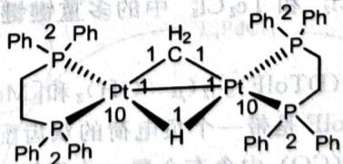

chemical

Molecular structure diagram of a platinum complex with phosphine ligands and hydrogen bonding

16e

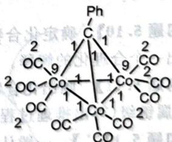

chemical

Organometallic complex structure with cobalt, phenyl, and carboxylate ligands labeled with carbon positions

18e

解 第一个化合物可视为 $\mathrm{RuCl}_{2}(\mathrm{PhH})$ 的二聚体，故电子数为 $8+2+6+2=18$ 。第二个化合物需要仔细考虑，它是 $PtMe_{3}Cl$ 的四聚体，每个 Pt 获得两个桥连 Cl 的各一对电子，故每个 Pt 的电子计数为 $10+4+2\times2=18$ 。

$10 + 4 + 2 \times 2 = 18$ 。

第三个化合物为 FeCp(CO) 的四聚体，未四聚时电子数为 $8 + 5 + 2 = 15$ 个电子，桥连之后每个提供 1 个电子，故共 18 电子。在第四个化合物的 CrCp\* (CH₃)₂ 二聚体中，电子计数则为 $6 + 5 + 2 + 1 = 14$ 。

这里，CH₃ 只单边提供电子。

第五个化合物含有 H 配体, 如果体系整体中性, 容易看出它本质上和 $CH_{3}$ 一样。这里体系有一个正电荷, 所以可视为 $H^{+}$ , 不提供任何电子。于是电子数为 $10 + 1 + 1 + 4 = 16$ 。最后一个化合物较容易, 请同学们自己练习(答案和分析已经标在图上)。

另一个在有机金属化学中重要的概念是金属一金属多重键，在多核金属配合物中它经常出现在核间。以下我们来考察简单的多重键键级分析的方法。

设两个金属原子沿着 $z$ 轴方向靠近形成金属一金属键，取 $z$ 轴为重叠方向，则可以根据d轨道的取向画出多重键的成键图解，如下图所示：

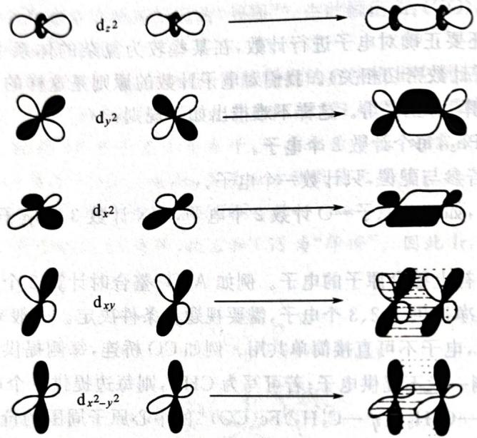

chemical

Diagram illustrating the transformation of d_z² to d_x² and d_xy, with corresponding molecular orbital diagrams for each d orbitals.

(Chemical Society Reviews 12, No. 1 (1983): 35–51)

图中,两个金属原子的轨道头碰头形成 $\sigma$ 键,肩并肩形成 $\pi$ 键,面对面形成 $\delta$ 键。其中特别需要注意 $\delta$ 键,它提供了第四重和第五重的成键。

于是简单的双原子定性分子轨道(简化能量高低的考虑,认为成键强弱 $\sigma > \pi > \delta$ ) 可写为

$$
\sigma \pi \pi \delta \delta \delta^ {*} \delta^ {*} \pi^ {*} \pi^ {*} \sigma^ {*} 。
$$

我们可依据该轨道排布,计数电子、确定键级。

【例 5.8】对于经典物种 $Re_{2}Cl_{8}^{2-}$ ，可假定每个 $ReCl_{4}^{-}$ 中 Re 取 $dsp^{2}$ 杂化，用于和配体成键，其余的 d 轨道用于多重键的形成。于是其键级应该为 $n=\{8-[(7-3)\times2-8]\}/2=4$ 。注意因为要形成四重键，因此该化合物的立体结构是全重叠型。

【例 5.9】化合物 $Ar_{1}Cr-CrAr_{2}$ 中，Cr 的 d 电子均可参与多重键的形成，键级为 $n=\left[10-(5\times2-10)\right]/2=5$ 。

【习题 5.10】确定化合物 $Tc_{2}Cl_{8}^{2-}$ 和 $Tc_{2}Cl_{8}^{3-}$ 中的多重键键级。已知前者的 Tc—Tc 键长比后者长，给出一个合理化的解释。

【习题 5.11】画出化合物 $\left[\mathrm{Mo}_{2}\left(\mathrm{DTolF}\right)_{3}\right]_{2}\left(\mu-\mathrm{OH}\right)_{2}$ 和 $\left[\mathrm{Mo}_{2}\left(\mathrm{DTolF}\right)_{3}\right]_{2}\left(\mu-\mathrm{O}\right)_{2}$ 的结构，在图上标出金属键级（写出推理过程）。DTolF 是带一个负电荷的双齿配体，可简写为 N—N。

【习题 5.12 $^{**}$ 】一般认为， $Fe_{2}(CO)_{9}$ 中含有金属—金属键。

1. 按照这种理解,画出该化合物的可能结构。  
2. 大量证据表明,实际上不存在这根键。假定体系仍符合 EAN 规则,试描述成键型式。(Chemical Communications 48, No. 94 (2012): 11481-11503)

随后底物进行 1,3-消除,还原消除得到低价的 Pd,后者再进入氧化剂的再生循环。从中我们能看出,非乙烯都必须生成甲基酮(马氏规则),以及过渡金属作氧化反应的一些基本模式。

我们对基元反应的介绍暂限于此，在实际解题过程中，这些经验可能有用，但更多的情况还是要灵活处理，不要拘泥于已知的反应模式。

【例题 5.15】工业上多采用甲醇和一氧化碳反应制备醋酸： $CH_{3}OH + CO \longrightarrow CH_{3}COOH$ 。第9族元素(Co、Rh、Ir)的一些配合物是上述反应良好的催化剂。以 $\left[Rh(CO)_{2}I_{2}\right]^{-}$ 为催化剂，碘甲烷为助催化剂合成乙酸(Monsanto法)的示意图如下图所示：

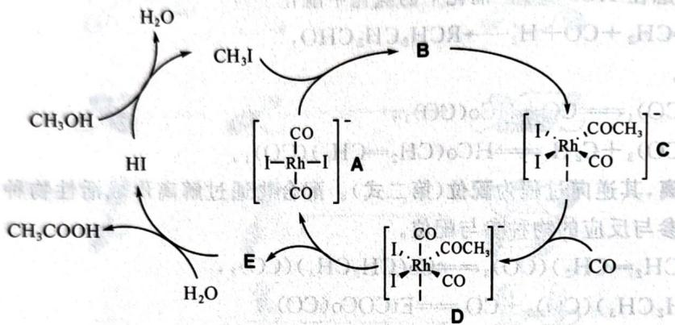

chemical

Organic reaction mechanism diagram showing transformations between compounds A, B, C, D, E and intermediates with reagents like H2O, CH3I, I-Rh-I, and COCH3.

1. 在催化循环中，A 与碘甲烷发生氧化加成反应，变为 B。画出 B 及其几何异构体 B1 的结构示意图。

2. 分别写出化合物 A 和 D 中铑的氧化态及其周围的电子数。

3. 写出由 E 生成醋酸的反应式(E 须用结构简式表示)。

4. 若将上述醋酸合成过程的催化剂改为 $\left[\mathrm{Ir}(\mathrm{CO})_{2}\mathrm{I}_{2}\right]^{-}$ , 得到 Cativa 法。Cativa 法催化循环过程与 Monsanto 法类似, 但中间体 C 和 D (中心离子均为 Ir) 有差别。不同在于: 由 B (中心离子为 Ir) 变为 C, 发生的是 CO 取代 I 的反应; 由 C 到 D 过程中则发生甲基迁移。画出 C 的面式结构示意图。

解 氧化加成反应是容易的,注意加成之后 $CH_{3}$ 和 I 必须在邻位。容易看出接下来发生插入反应,得到 C。此时 B 为面式结构,所以 B1 有两种经式结构,其中 $CH_{3}$ 的相对位置有两种选择,如下图所示:

$$
\left[\begin{array}{c}\mathrm{OC} _ {\text {I}} \stackrel {\mathrm{I}} {\underset {\mathrm{I}} {\rightleftharpoons}} \mathrm{Rh} _ {\text {I}}\\\mathrm{CO}\end{array}\right] ^ {-} \quad \left[\begin{array}{c}\mathrm{OC} _ {\text {I}} \stackrel {\mathrm{I}} {\underset {\mathrm{I}} {\rightleftharpoons}} \mathrm{Rh} _ {\text {I}}\\\mathrm{I} \stackrel {\mathrm{I}} {\underset {\mathrm{I}} {\rightleftharpoons}} \mathrm{CO}\end{array}\right] ^ {-} \quad \left[\begin{array}{c}\mathrm{OC} _ {\text {I}} \stackrel {\mathrm{I}} {\underset {\mathrm{I}} {\rightleftharpoons}} \mathrm{Rh} _ {\text {I}}\\\mathrm{I} \stackrel {\mathrm{I}} {\underset {\mathrm{I}} {\rightlefthAR}} \mathrm{CH} _ {3}\end{array}\right] ^ {-}
$$

氧化态和电子数很容易判断,分别是+1、+3;16、18。由D→A的变化知道发生了还原消除,得到了CH₃COI,后者水解生成乙酸,反应式是CH₃COI+H₂O→CH₃COOH+HI。

至于 Cativa 法,从题目的描述可以看出,只不过迁移插入和配位的顺序发生了改变。在 B 的基础上用 CO 取代 I,得到三个 CO 处于面式,故体系如下图所示。

$$
\left[\begin{array}{c}\mathrm{OC} _ {\text {   }} \stackrel {\mathrm{I}} {\underset {\mathrm{I}} {\rightleftharpoons}} \mathrm{CH} _ {3}\\\mathrm{OC} \stackrel {\mathrm{Rh}} {\underset {\mathrm{CO}} {\rightleftharpoons}} \stackrel {\mathrm{I}} {\underset {\mathrm{I}} {\rightleftharpoons}}\end{array}\right] ^ {-}
$$

【例题5.16】研究表明,化合物A的酸性水溶液在一定波长的光照射下可以产生可燃单质气体B,此外还产生副产物C。化合物A可以由肼还原 $\mathrm{PEt}_{3}/\mathrm{MCl}_{2}(\mathrm{PEt}_{3})_{2}$ 溶液得到,A中P的质量分数为16.92%。在硫酸中,A催化产生气体B的机理如下图所示:

已知参与催化循环的 D、E、F、G 都是一价正离子。

1. 通过计算和推理，确定 A、B、C 的化学式。

2. 给出 D、E、F、G 的立体结构，标明其中心原子 M 周围的电子数。

## § 5.3 配位催化

金属有机配合物常可用来催化一些反应,这些反应在现代有机化学和工业合成中有着很重要的地位。在反应过程中一般存在几种基元反应。我们通过例子简要介绍其中重要者。

【例 5.13】 考虑在 HCo(CO) $_{4}$ 催化下的氢化甲酰化反应

$$
\mathrm{R-CH=CH} _ {2} + \mathrm{CO+H} _ {2} \longrightarrow \mathrm{RCH} _ {2} \mathrm{CH} _ {2} \mathrm{CHO},
$$

反应主要包含6步。

(1) $\mathrm{HCo(CO)}_4 \rightleftharpoons \mathrm{CO} + \mathrm{HCo(CO)}_3$  
(2) $\mathrm{HCo(CO)_3 + C_2H_4\rightleftharpoons HCo(CH_2 = CH_2)(CO)_3}$

第一式称为解离,其逆向过程为配位(第二式)。配合物通过解离形成活性物种(不满足18电子规则),便于之后需要参与反应的物种参与配位。

(3) $\mathrm{HCo(CH_2 = CH_2)(CO)_3\rightleftharpoons Co(CH_2CH_3)(CO)_3}$  
(4) $\mathrm{Co(CH_2CH_3)(CO)_3 + CO\rightleftharpoons EtCOCo(CO)_3}$

第三式是重要的,称为插入。在上式的插入过程中,我们可以将其理解为,乙烯先配位,随后H原子迁移,加到乙烯上得到乙基。第四式也是插入,我们可理解为CO配位,随后甲基迁移得到甲酰基。插入的逆过程为消除。

(5) $H_{2}+EtCOCo(CO)_{3}\rightleftharpoons EtCOCoH_{2}(CO)_{3}$  
(6) $\mathrm{EtCOCoH_2(CO)_3}\rightleftharpoons \mathrm{EtCHO} + \mathrm{HCo(CO)_4}$

第五式称为氧化加成。在该步中，低价态、富电子的中心金属的 d 电子进入 $H_{2}$ 的反键轨道，降低 H—H 键级，使得 $H_{2}$ 裂解，变为两个 H 配位，金属的氧化态升高 2。氧化加成的逆过程称为还原消除。最后一式得到产物即为还原消除。

再来看一个例子。

再来看一个例子。
【例 5.14】 Wacker 反应是指在 $PdCl_{2}-CuCl_{2}-O_{2}$ 体系中，末端烯烃被氧化为甲基酮（乙烯变为乙醛）的过程。

下图示出了反应的一种可能过程。从右上角开始，首先进行配位，然后在水的促进下烯烃进行插入。

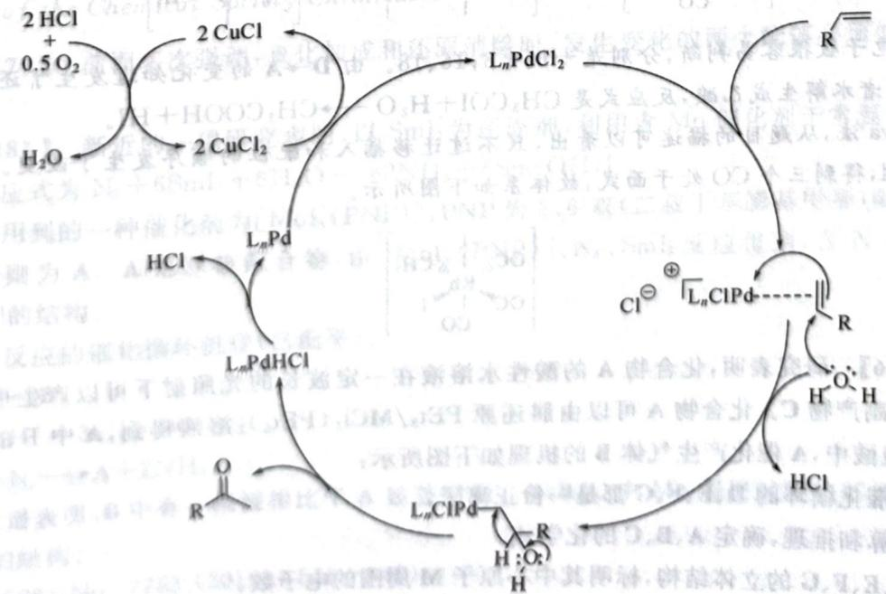

chemical

Reaction mechanism diagram showing phosphorus-catalyzed transformations with labeled intermediates and reagents

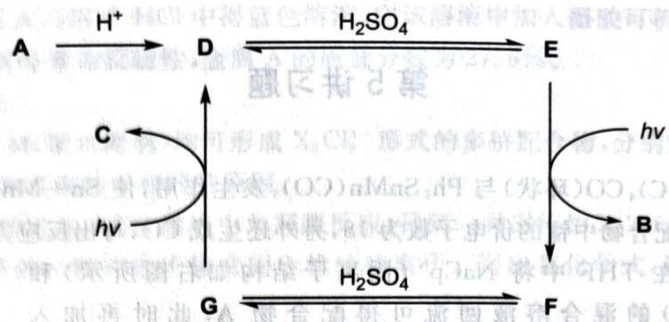

flowchart

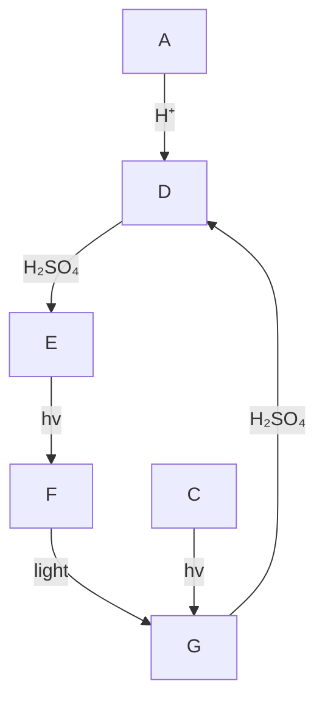

解 首先确定金属 M。 $N_{2}H_{4}$ 作为还原剂将 +2 价的 M 还原到更低的价态。我们可直接设 A 为 $\mathrm{MCl}_{x}(\mathrm{PEt}_{3})_{y}$ ，由质量分数得到

$$
\frac {30.97y}{M + 35.45x + 118.16y} = 16.92 \% \Rightarrow M = 64.8778y - 35.45x,
$$

可行域为 64.8778y-35.45x≥0 及 $x+y≤6$ ，故可行解较少。尝试算得 x=0, y=3, M=195 为唯一合理解，A 为 Pt(PEt) $_{3}$ 。

考虑这个催化循环。涉及的非金属元素只有 S、O、H，所以可以估计可燃单质气体为 $\mathrm{H}_{2}(\mathbf{B})$ 。A 和 $H^{+}$ 的结合是简单的，即低价态富电子的 Pt 和 $H^{+}$ 形成配键。

如果最后能掉下一个 $\mathrm{H}_{2}$ , 它应该通过还原消除得到, 也就是说在 $\mathbf{E}$ 中有两个端位 $\mathrm{H}$ 。所以, $\mathbf{D} \rightarrow \mathbf{E}$ 是 $\mathrm{HOSO}_{3} \mathrm{H}$ 的 OH 键断裂, 发生氧化加成。由习题 5.17 的结果, 注意 $\mathbf{E}$ 立体结构的绘制: 两个 H、某个 H 和 $-\mathrm{OSO}_{3} \mathrm{H}$ 都必须处于邻位。

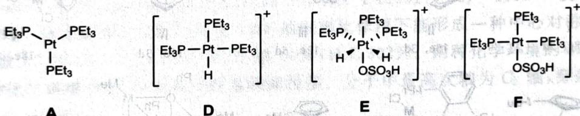

chemical

Chemical structures of platinum complexes with labeled atoms and charge distributions

现在要想办法消除 $-\mathrm{OSO}_3\mathrm{H}$ , 完成催化循环。故再引入一次 $\mathrm{H}_2\mathrm{SO}_4$ 的氧化加成, 还原消除一分子过二硫酸 (这就是 C), 故 G 为 fac-Pt $(\mathrm{OSO}_3\mathrm{H})_2\mathrm{H}(\mathrm{PEt}_3)_3^+$ (请同学们自行画出立体结构)。总反应为 $2\mathrm{H}_2\mathrm{SO}_4 \longrightarrow \mathrm{H}_2\mathrm{S}_2\mathrm{O}_8 + \mathrm{H}_2$ 。电子数是很好数的, 我们需特别注意一个 $\mathrm{H}^+$ 提供 0 个净电子, 故 D、E、F、G 分别为 16、18、16、18 电子。

(Journal of the Chemical Society-Chemical Communications 24 (1981): 1245–1246)

【习题 5.17\*】前面多次强调,氧化加成和还原消除时,发生变化的两个配体必须处于邻位,解释原因。

【习题5.18\*】新近的一项研究表明，以 $\mathrm{SmI}_2$ 为还原剂，利用含Mo催化剂于常温常压下可进行固氮反应。反应式为 $\mathrm{N}_2 + 6\mathrm{SmI}_2 + 6\mathrm{H}_2\mathrm{O}\longrightarrow 2\mathrm{NH}_3 + 6\mathrm{Sm(OH)}\mathrm{I}_2$ 。

固氮反应。反应式为 $N_{2}$ ，PNP，PNP 为 2,6-双（二叔丁基膦基甲基）吡啶，但参与催化的实际物种则为 A。A 是双核配合物，由 $[MoI_{3}(PNP)]$ 、 $N_{2}$ 、 $SmI_{2}$ 反应得到，含 N 4.43%。给出 $[MoI_{3}(PNP)]$ 的结构。

以下为该反应的催化循环机理(已配平)。

$$
\begin{array}{l} \mathbf {A} \longrightarrow 2 \mathbf {B}, \\ \mathbf {B} + 3 \mathrm{H} ^ {+} + 3 \mathrm{e} ^ {-} \longrightarrow \mathbf {C}, \\ 2 \mathrm{C} + \mathrm{N} _ {2} \longrightarrow \mathrm{A} + 2 \mathrm{NH} _ {3} \\ \end{array}
$$

2.红外光谱表明，B中有一根键相比于A显著增强。A、B、C中Mo周围的配位环境皆为五配位。给出A、B、C的结构。

(Nature 568, No. 7753 (2019): 536-540)

## 第5讲习题

【习题 5.19】 $(\mathrm{PhC})_{4}\mathrm{CO}$ （环状）与 $\mathrm{Ph}_{3}\mathrm{SnMn}(\mathrm{CO})_{5}$ 发生作用，使 Sn—Mn 金属键发生断裂，形成 O—Sn 键，生成的锰的配合物中锰的价电子数为 18，另外还生成 CO，写出反应方程式。

【习题 5.20】 在 THF 中将 NaCp $^{N}$ (阴离子结构如右图所示)和 Cr(CO) $_{3}$ (CH $_{3}$ CN) $_{3}$ (S)的混合溶液回流可得配合物 A, 此时再加入 [Cu(PPh $_{3}$ )Cl] $_{4}$ (R)就可分离得到不含桥连 CO 的双核配合物 B。B 的核磁共

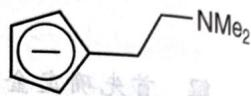

振氢谱数据如下：7.50～7.27(m,15H)、4.64(t,2H)、4.52(t,2H)、2.44～2.39(m,4H)、2.19(s,6H)。

R 有三重旋转轴，B 中有金属键。画出 A、B 和 R 的结构。B 是否符合 18 电子规则？

(Organometallics 26, No. 26 (2007): 6669-6673)

【习题5.21】电解还原HCl水溶液中的 $\mathrm{WO_3}$ ，生成了一种双核的W(Ⅲ)络合物。该物质由共面的两个八面体组成，且此阴离子为抗磁性。请你分析这种络合物中是否可能存在W—W键。若有，指出它是几重键。

【习题5.22】下图示出了10种金属有机配合物中金属所在的周期和周围的电子数，请依次确定这10种配合物的中心金属为何。

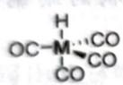  
I
18e, 3d

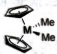  
II
16e, 3d

  
Ⅲ
12e, 5d

  
IV
16e, 3d

  
18e, 4d

  
VI
14c, 3d

chemical

Chemical structure of a substituted indole derivative with isopropyl and chloroethyl groups

VII
14e, 5d

  
VIII
18e, 3d

chemical

Molecular structure diagram showing a central metal atom bonded to four oxygen atoms and each of two phenyl (Ph) groups, with methyl (Me) substituents.

IX
18e, 3d

  
X
10e, 5d

【习题 5.23】 棕黑色固体 A 为一种夹心配合物, 其配体 B 为一种常见的有机溶剂, 中心原子为过渡金属, 其质量分数为 24.97%。A 在潮湿的空气中易被氧化为黄色固体 C, C 中的金属原子显一种极不常见的价态, 且其质量分数为 23.09%。与此同时生成了一种具有漂白性的化合物 D。推出 A\~D 的化学式, 并画出 A 的结构。

【习题5.24】1. 环五甲胂 $\left[\left(\mathrm{MeAs}\right)_{5}\right]$ 在室温下与化合物 $\mathrm{Cr}(\mathrm{CO})_{6}$ 在 EtOH 中反应, 生成一种黄色晶体。黄色晶体中环五甲胂的质量分数为 $54.0\%$ , 且该物质有一定的对称性。画出这物质的结构。二、二茂铁、二苯铬等金属有机化合物以其“夹心饼干”结构广为人知。近年的研究发现了某一种 Co(II) 的“夹心饼干”型金属有机化合物。这种物质中只含有 Co、C、H 三种元素, Co 的质量分数为 $33.47\%$ , 所有的有机组分都是常见的芳香物质。示出此化合物的结构。

33.47%，所有的有机组方都是常见的芳香物质。小出此化合物的结构。
【习题5.25】在钛配合物 $A(Ti_{3}Cp_{3}^{*}(NH)_{3}N)$ 中 $Cp^{*}$ 为配体五甲基环戊烯负离子。A与 $ScCl_{3}$ 反应得到具有立方体结构的配合物 $B(ScTi_{3}Cp_{3}^{*}(NH)_{3}NCl_{3})$ 。若A与 $Sc[N(SiMe_{3})_{2}]_{3}$ 在甲苯中反应，则得到 $C(ScTi_{6}Cp_{6}^{*}(NH)_{3}N_{5})$ 。B和C中Sc的配位数均为6，二者都有三重轴。

1. 分别画出配合物 A、B、C 的结构，五甲基环戊烯负离子可直接用 $Cp^{+}$ 写出，除了配位原子和中心原子之外的原子均可不示出。

1. 分别画出配合物 A、B、C 的结构，五甲基环戊烯负离子之外的原子均可不示出。

2. 指出配合物 A 中 Ti 的氧化态、配位数和周围电子数。

(Inorganic Chemistry 50, No. 14 (2011): 6798-6808)

【习题 5.26】金属 A 可溶于 HCl 中得蓝色溶液，向该溶液中加入醋酸可析出晶体 B，后者是 A 的配合物，含桥连配体。测得 B 为反磁性，金属 A 的质量分数为 27.6%。

1. 画出 B 的结构图。  
2. A 与其同族金属 M(第六周期)均可形成 $X_{2}Cl_{9}^{3-}$ 形式的多桥配合物, 分别记为 D 与 E。两者磁性并不相同, 解释 D 与 E 两者磁性不相同的原因。  
3. A 的最高价含氧酸盐在 KCN 溶液中与羟胺反应, 得到一种磁矩约为 2.0B. M. 的三价配阴离子, A 采取八面体场, 该离子的一种等电子体常用于检验硫离子。写出其化学式, 解释其磁矩偏大的原因 (只考虑唯自旋磁矩)。

【习题5.27】X射线衍射证实，抗磁性粉红色钾盐 $\mathrm{K}_2\mathrm{Mo}(\mathrm{SO}_4)_2$ 的阴离子为双核配离子，其中硫酸根离子为桥连配体。若将此复盐进行重结晶，则可制得化学式为 $\mathrm{K}_3\mathrm{Mo}_2(\mathrm{SO}_4)_4\cdot 3.5\mathrm{H}_2\mathrm{O}$ 的钾盐，该复盐的阴离子仍保持了 $\mathrm{K}_2\mathrm{Mo}(\mathrm{SO}_4)_2$ 阴离子的结构，但整个阴离子的电荷数却有所不同。

1. 请指出 $\mathrm{K}_{2} \mathrm{Mo}(\mathrm{SO}_{4})_{2}$ 中钼原子之间成键的种类和数目。  
2. 钾盐 $\mathrm{K}_{3}\mathrm{Mo}_{2}(\mathrm{SO}_{4})_{4} \cdot 3.5\mathrm{H}_{2}\mathrm{O}$ 的阴离子呈现顺磁性还是抗磁性？  
3. 与 $\mathrm{K}_2\mathrm{Mo}(\mathrm{SO}_4)_2$ 的阴离子相比，钾盐 $\mathrm{K}_3\mathrm{Mo}_2(\mathrm{SO}_4)_4 \cdot 3.5\mathrm{H}_2\mathrm{O}$ 的阴离子中，钼原子的核间距更大还是更小？解释原因。

【习题5.28】饿与一氧化碳能形成一种具有4个三重轴的阴离子 $\left[\mathrm{Os}_{20}(\mathrm{CO})_{40}\right]^{2-}$ 。此阴离子的结构可看作由20个Os原子做最密堆积，堆成一个正四面体结构，CO作为配体与Os配位形成。其中，与不同化学环境的Os配位的CO的数目不同。请回答：此离子中Os有几种化学环境？分别是哪几种（指出个数）？这几种化学环境的Os分别被几个CO配位？

(Angewandte Chemie International Edition 30, No. 1 (1991): 107–109)

【习题 5.29】格氏试剂乙基氯化镁在 THF 的溶剂化作用下能形成一种中心对称的配合物 X。X 的元素质量分数: Cl 26.56%, Mg 12.14%, C 42.00%, H 7.302%。两种化学环境的 Mg 分别是五配位和六配位; 两种化学环境的 Cl 分别是边桥基和面桥基。分子中最高次轴为 $C_{2}$ 轴, 穿过两个六配位的 Mg 原子, 且平分 $\angle OMgO$ 。

给出 X 的化学式, 画出 X 的结构, 非配位原子可不示出。

【习题 5.30】 配合物 E 可按如下路线合成：

chemical

Chemical reaction pathway showing transformation from compound A to E via intermediates B, C, D, with reagents and conditions labeled

1. 已知 A 是钼的单核羰基配合物, 满足 EAN 规则。写出 A 的化学式。根据晶体场理论, 写出钼原子的价电子排布。

已知 B、C、D、E 均是含有 Mo—Mo 键的化合物, 所有的金属原子周围都有 16 个电子, 其摩尔质量、Mo—Mo 间距、与金属配位的非金属原子和最高次对称轴(忽略取代基取向)如下表所示:

<table><tr><td>化合物</td><td> $M/(g \cdot mol^{-1})$ </td><td> $d(Mo-Mo)/pm$ </td><td>配位原子</td><td>最高次对称轴</td></tr><tr><td>B</td><td>428.1</td><td>210</td><td>O</td><td> $C_4$ </td></tr><tr><td>C</td><td>1389.9</td><td>210</td><td>N,O</td><td> $I_4$ </td></tr><tr><td>D</td><td>2169.2</td><td>210</td><td>N,O,P,Cl</td><td> $I_4$ </td></tr><tr><td>E</td><td>2098.3</td><td>212</td><td>N,O,P,Cl</td><td> $I_4$ </td></tr></table>

2. 画出 B、C、D、E 的结构示意图。

【习题5.31】 $\mathrm{HCo(CO)_3}$ 催化烯丙醇异构化的催化循环共分为三步，第一步为 $\pi$ 键配位，第二步为 $\pi$ 配位转变为碳负离子配位，第三步为还原消除。 $\mathrm{HCo(CO)_3}$ 不能稳定存在，而是由物质E脱去一个配体而得到。据此画出E催化丙烯醇异构化为丙醛的催化循环。

【习题5.32】CmaB是一种生物酶,以铁为催化中心。在α-酮戊二酸(KG)的配位参与下,一定条件下它可催化在氧气参与下的氨基酸的γ位(用RCH₃简单表示)的卤代反应。催化反应的简化机理如下图所示:

chemical

Organic reaction pathway showing transformation of compound 1 to compounds 2, 3, and final product A via intermediates 2 and 4, with reagents and conditions labeled.

图中1的左侧双齿配体为KG, His可视为电中性的氨基酸配体, Asp可视为带有一个负电荷的氨基酸配体。从2至A没有发生氧化还原反应, 且A中 $\mathrm{O}_{2}$ 配体中O的化学环境有两种。D可视为一种的极化条件比C低。B为小分子。

基酸配体。从2至A没有发生氧化还原的自由基中间体，其中Fe的价态比C低。B为小分子。

1. 给出图中 A、B、C、D 的结构，在 D 上标出。  
1. 给出图中 A、B、C、D 的结构, 在 D 上标点, 中心 Fe 原子的氧化态。  
2. 标明中间体 1、2、3、4 中, 中心 Fe 与 O 对位的 Fe 与水分子对位的 His 之间键长以及 4 中 Fe 与 O 对位的 Fe

简要说明理由。
(Nature 436, No. 7054 (2005): 1191-1194)
【习题 5.33】 $B_{5}H_{9}$ 与 $\mathrm{Fe(CO)}_{5}$ 在一个220℃的热反应器中裂解三天，得到一种橙色液体X。已知X中Fe、B元素质量分数分别为29.21%、22.62%。铁与硼构成四方锥骨架。

1. 推出 X 的化学式。

2. 画出 X 的结构。

2. 画出 X 的结构。

2. 画出 X 的结构。
3. X 中 B 均成对形成 3c-2e 键向中心原子配位，给出中心原子氧化数与价电子构型。
【习题 5.34】为测定一种 Fe 的双核配合物 A 的组成，进行以下实验。X 射线荧光光谱分析得知该样品存在 4 条特征谱线，表明存在五种元素，且已知其中一种是 N。将 3.000g A 置于坩埚中 1073K 灼烧 1h 后，再干真空 600K 恒温 1h，残余 1.534g 难溶于酸碱的黑色粉末（固体为尖晶石结构）。取 2.000g A，在纯氧环境中加热至 673K，将尾气全部导入过量纯 NaOH 溶液，至溶液恒重后停止加热。测得溶液增重 4.122g。在溶液中加入定量过量尿素 1.000g，用硫酸酸化至 pH=1 后加热溶液至尿素水解完全，将所得气体通入依次通过浓硫酸、碱石灰与浓硫酸，恒重后测得盛有碱石灰的干燥管增重 3.649g，剩余 148.5mL 密度为 1.250g/L 的气体（已折算为标况下）。

1. 计算并推出 A 的最简式。

② 已知 A 中 Fe 周围电子数是 18，画出 A 的结构。

1. 计算并推出 A 的最简式。
2. 已知 A 中 Fe 周围电子数是 18，画出 A 的结构。

1. 计算并推出 A 的最简式。
2. 已知 A 中 Fe 周围电子数是 18，画出 A 的结构。
【习题 5.35】纯 A（沸点为 $42^{\circ}C$ 的无色挥发性液体）的合成首次在 1889 年通过金属 A 和二元化合物气体 X 在 $0^{\circ}C$ 时的反应实现。该化合物的合成使一系列新种类化合物的研究变得活跃。后来，在更加苛刻的条件下，人们用其他金属合成了 A 的相似物；液体 B 和固体 C。事实上，这类化合物的大多数是不能由直接反应产生的。例如，化合物 D 可由固体盐 V、 $(C_{2}H_{5})_{3}Al$ 和气体 X 在 $AlCl_{3}$ 作用下合成；E 可由高氧化态氧化物 W 和气体 X 合成。下面是一张关于这类化合物的一些实例的表格。

<table><tr><td>物种</td><td>A</td><td>B</td><td>C</td><td>D</td><td>E</td><td>V</td></tr><tr><td>相对分子质量</td><td>170.71</td><td>195.85</td><td>341.87</td><td>389.88</td><td>652.41</td><td>125.94</td></tr><tr><td>金属含量/%</td><td>34.39</td><td>28.52</td><td>34.48</td><td>28.18</td><td>57.08</td><td>43.62</td></tr></table>

1. 求 A\~E、V、W、X。

1. 求 A 2.
上面描述的化合物有下列特别的反应：

$$
\mathrm{A} + \mathrm{PH} _ {3} \longrightarrow \mathrm{F} + \mathrm{X},
$$

$$
\mathbf {B} + 2 \mathrm{Na} \longrightarrow \mathbf {G} + \mathbf {X},
$$

$$
\mathrm{D} + 2 \mathrm{Na} \longrightarrow 2 \mathrm{L},
$$

$$
\mathbf {G} + 2 \mathrm{H} ^ {+} \rightarrow \mathbf {I},
$$

$$
\mathrm{G} + \mathrm{Hg} \left(\mathrm{NO} _ {3}\right) _ {2} \longrightarrow \mathrm{H} + \dots ,
$$

$$
3 \mathbf {B} + 4 \mathrm{NaOH} \longrightarrow \mathbf {J} + 3 \mathbf {X} + \dots ,
$$

$$
3 \mathbf {C} + 1 2 \mathrm{py} \longrightarrow 2 \mathbf {K} + 8 \mathbf {X},
$$

$$
\mathbf {E} + \mathrm{Br} _ {2} \longrightarrow 2 \mathbf {M},
$$

$$
\mathbf {M} + \mathbf {L} \longrightarrow \mathbf {0} + \dots ,
$$

$$
3 \mathrm{B} + \mathrm{PbCl} _ {2} + 8 \mathrm{KOH} \longrightarrow \mathrm{P} + \mathrm{X} + \dots 。
$$

2. 根据如下信息, 推断完成上面所有的反应: K 含有两个不同氧化饱和物的反应。J 的阴离子中金属含量为 35.22%; P 的阴离子具有三角形结构。A\~E 具有形成簇合物的倾向。例如, 在氯仿中 C 可形成不含氯的化合物 Q, 后者可以用 M₃X₉L 的形式表示, 金属的含量为 40.02%。加热 C 时可产生四面体结构的簇合物 R, 其金属含量为 41.23%。

3. 给出 Q 和 R 的结构。

【习题 5.36】 W(CO) $_{6}$ 和环戊二烯钠 NaC $_{5}$ H $_{5}$ 反应生成对空气敏感的化合物。化合物 B。化合物 A 也能用 Na-Hg 与 B 反应制得。化合物 A 是强亲核试剂，是合成含金属—碳键的有机金属化合物的优良起始物。A 与溴丙炔反应得到含金属—碳 σ 键的化合物 C。给出所有未知物的结构。

【习题 5.37\*】 PTA(下图左侧)是一种鸟洛托品类似物,它是一种配合物的水溶性。如下图所示,PTA用正丁基锂处理后与苯甲腈反应,发生加成反应得到衍生物 L。

chemical

Chemical reaction showing conversion of a pyridine derivative to L using n-BuLi and PhCN catalyst

L有顺反异构体 $\mathbf{L}^{\prime}$ , 其中 $\mathbf{L}$ 为 $\mathbf{E}$ 型, 二者不容易发生转换; 但若用 $\mathrm{H}_{2} \mathrm{O}_{2}$ 处理 $\mathbf{L}$ , 则产物迅速成为两个顺反异构体的混合物。配体 $\mathbf{L}$ 与顺- $\mathrm{W}(\mathrm{CO})_{4}(\mathrm{pip})_{2}$ (pip为六氢吡啶) 反应时, P原子先取代一个pip生成中间体1, 后者发生互变异构生成2,2发生分子内反应取代第二个pip得到产物A。

1. 确定 $\mathbf{L}$ 和 $\mathbf{L}'$ 的结构, 并解释 $\mathrm{H}_{2} \mathrm{O}_{2}$ 处理后容易并转化为

2. 确定 1、2 和 A 的结构。

2. 确定 1、2 和 A 的结构。
(Inorganic Chemistry 57, No. 15 (2018): 9142-9152)

【习题 5.38】金属串(metal string complex)是一类重要的分代式。首先合成配体。2-溴吡啶和2,6-二氨基吡啶在t-BuOK作用下反应得到多齿配体 $H_{2}$ tpda。

1. 画出配体的结构。 $MCl_{2} \cdot 6H_{2}O(0.948g, 4.0mmol)$ 和 $H_{2}tpda(1.02g, 4.0mmol)$ 可反应得到深紫色金属串配合物晶体。产物经元素分析结果如下：C 51.12%；H 3.15%；N 19.88%。质谱确认相对分子质量为 1409.5。已知分子中含有 C、H、N、M、Cl，其中 Cl 有 2 个，是金属串端配体。

2. 通过计算, 确定金属 M, 写出金属串分子式。  
3. 画出金属串产物的结构, 简要描述其结构特点。

(Inorganic Chemistry 37, No. 16 (1998): 4059-4065)

【习题 5.39\*\*】为考察 d 区过渡金属 M 的某种配合物的互变异构现象 J⇌G，有人合成了该金属的单核配合物 C～J。起始原料 B 可用 3.273g MO $_{n}$ 和等摩尔的 NaO $_{n}$ 在 250℃ 化合合成，定量得到 4.098g B。将 B 溶解在乙醇中，加入 6.210g (CH $_{3}$ ) $_{2}$ (C $_{6}$ H $_{5}$ )P，再加入适量浓盐酸后回流 18h，以收率 80.0% 得到质量为 m 的 C。在后者的乙醇溶液中通入 CO，生成 4.408g 黄色的 D（收率 50%）。在 D 的乙醚溶液中加入 LiAlH $_{4}$ 并回流 40h，得到含有配体 L 的黄色的 E。其元素分析是 ω(M)=29.50%，ω(P)=14.73%，ω(O)=2.53%。E 中无 Cl $^{-}$ 。

最后将 E 溶解在 $CH_{2}Cl_{2}$ 中，在低温 208K 下用 $HBF_{4}$ 质子化该溶液，获得 G、J 的平衡混合物溶液，颜色为黄水仙色，电导和 $LiAlH_{4}$ 比较接近。已知 D、E、G 中金属的配位数都是 7、J 中金属的配位数是 8。

1. 确定 M 和 B 的化学式。  
2. 确定非电解质 C\~E 的化学式, 其中 M 都是三价。据此计算 m。
3. 确定 G、J 的化学式。已知 J 的红外光谱  
2692cm $^{-1}$ 的两个峰。(参考:KML $_{4}$ 的红外光谱峰为1828cm $^{-1}$ )和  
4. 建议一个 $\mathbf{G} \rightleftharpoons \mathbf{J}$ 过程中的中间体的结构。G、J 和中间体中 L—L 键长分别为 0.084、0.160 和 0.138nm。

(Journal of the American Chemical Society 112, No. 19 (1990): 6912–6918)

# 第6讲 推断技术

本讲的主题是元素化学,但罗列大量元素化学知识既受篇幅所限,也没必要(不过,可以参看附录A简要复习),而且“知识”绝不是竞赛的主流。这里需要指出,凭借基本的元素知识和强有力的推断技术,初赛推断/元素化学题是易解的,同学们不必费无用气力去阅读太多无聊的书籍。本讲我们主要通过题目介绍一些重要的技术,并给出大量的练习。

## § 6.1 如何尝试

同学们容易发现推断题的条件常常是缺乏的,因此需要进行适当的尝试和猜测。但最忌之事就是在慌乱中乱撞,浪费大量时间还是找不出答案。此处列出几条基本原则:

1. 能列方程的, 尽量列方程, 化简后列表尝试。  
1. 能列方程的, 尽量列方程( )。
2. 未知条件大多的, 先尝试简单的情形, 尝试不成再考虑复杂情形。  
2. 未知条件太多的,先尝试简单的情形。  
3. 不要忽视题目中的“chemical”条件,必要的添加自己的推断,可按步骤

首先看一些尝试和计算比较直接的问题。

首先看一些尝试和计算比较直接的问题。
【例题 6.1】为纪念门捷列夫发现元素周期律 150 周年, 国际纯粹和应用化学联合会将 2019 年设为“国际化学元素周期表年”。门捷列夫预言了多种当时未知的元素, A 即为其中之一。将含元素 A 的为“国际化学元素周期表年”。门捷列夫预言了多种当时未知的元素, A 即为其中之一。将含元素 A 的为“国际化学元素周期表年”。门捷列夫预言了多种当时未知的元素, A 即为其中之一。将含元素 A 的为“国际化学元素周期表年”。门捷列夫预言了多种当时未知的元素, A 即为其中之一。将含元素 A 的为“国际化元素周期表年”。门捷列夫预言了多种当时未知的元素, A 即为其中之一。将含元素 A 的为“国际化元素周期表年”。门捷列夫预言了多种当时未知的元素, A 即为其中之一。将含元素 A 的为“国际化元素周期表年”。门捷列夫预言了多种当时未知的元素, A 即为其中之一。将含元素 A 的为“国际化元素周期表年的周期表年”。门捷列夫预言了多种当时未知的元素, A 即为其中之一。将含元素 A 的为“国际化元素周期表年的周期表年”。门捷列夫预言了多种当时未知的元素, A 即为其中之一。将含元素 A 的为“国际化元素周期表年的周期表年的周期表年”。

1. 写出 A\~I 的化学式。  
2. 写出 B 与氨气生成 C 的反应方程式。  
3. 写出 D 在 $H_{3}PO_{2}$ 和 $H_{3}PO_{3}$ 中生成 G 的反应方程式。

3. 写出 D 在 $H_{3}PO_{2}$ 和 $H_{3}PO_{3}$ 中生成 D 的线性关系

解 纵观题目能看出, 主要的困难就是确定元素 A, 确定之后推断非常容易: 比如 B 是硫化物, D 是氧化物等等 (这些推断是从尽量简单的角度看的, 必须先进行大致的估计, 不然会遇到很大困难; 之后未能推出再作其他考虑也不迟, 这在较麻烦的推断题中很重要)。此外, 题目中有用的非描述性信息不多, 除了是门捷列夫发现的元素之外, 其他方面 (包括颜色) 选手一般是很难熟悉的。所以让我们来用列表讨论的方法。易见 I 是 A 的低价氧化物 (注意那个化合反应), 因此可设 $D = AO_{x}, I = AO_{y}, x > y$ 是整数或半整数。依照

$$
\frac {M + 1 6 y}{M + 1 6 x} = 0. 8 4 7
$$

列表进行尝试：

<table><tr><td>M</td><td>0.5</td><td>1</td><td>1.5</td><td>2</td><td>2.5</td><td>3</td></tr><tr><td>0.5</td><td>/</td><td>36.29</td><td>80.58</td><td>124.9</td><td>/</td><td>/</td></tr><tr><td>1</td><td>/</td><td>/</td><td>28.29</td><td>72.58</td><td>116.9</td><td>/</td></tr><tr><td>1.5</td><td>/</td><td>/</td><td>/</td><td>20.29</td><td>64.58</td><td>/</td></tr><tr><td>2</td><td>/</td><td>/</td><td>/</td><td>/</td><td>12.29</td><td>56.58</td></tr><tr><td>2.5</td><td>/</td><td>/</td><td>/</td><td>/</td><td>/</td><td>4.288</td></tr><tr><td>3</td><td>/</td><td>/</td><td>/</td><td>/</td><td>/</td><td>/</td></tr></table>

故我们看出所求的元素为 Ge(对应表中画线相对原子质量)。现在依照基本的结构理论, 我们知 Ge 存在 +4、+2 价, 其中后者有一定稳定性 (请同学们解释作出这一描述的原因)。因而, 长期在空气中暴露的矿物 B 为 $\mathrm{GeS}_{2}$ 。它被 $\mathrm{NH}_{3}$ 还原为 GeS。在发烟硝酸中自然得到 $\mathrm{GeO}_{2}$ , 后者在氯化试剂 $\mathrm{COCl}_{2}$ 作用下得到 $\mathrm{GeCl}_{4}$ (能够想象, 这种高价卤化物离子势高, 容易水解得到氧化物)。D 溶于 NaOH 肯定得到锗 (IV) 酸根 $\mathrm{GeO}_{3}^{2-}$ , 再和 $(\mathrm{NH}_{4})_{2} \mathrm{MoO}_{4}$ 如何反应? 根据十二钼磷酸的说法, 它是 $12 \mathrm{MoO}_{3} \cdot \mathrm{H}_{3} \mathrm{PO}_{4}$ 即 $\mathrm{H}_{3} \mathrm{PMo}_{12} \mathrm{O}_{40}$ , 因此 F 是 $\mathrm{H}_{4} \mathrm{GeMo}_{12} \mathrm{O}_{40}$ 。G 在还原性环境中生成, 所以为 $\mathrm{GeHPO}_{3}$ 。I 已经由列表法计算得到为 GeO, 由 H 脱水得到, 故 H 为 $\mathrm{Ge(OH)}_{2}$ 。

方程式请同学们自己补全。故推定。

注记 我们可以从上面的过程看出几点原则的重要性。如果不注意“chemical”的条件，方程无法列出；如果不列方程，直接猜测并验证效率较低；在十二钼磷酸类似物的推断中，我们尽量先考虑简单的情形。最后返回整体验证一次。如此，就能比较顺利且准确地解决问题。

以下我们再看一个使用技巧更加“brute-force”的推断问题。

【例题6.1-1,新增】向 $\mathrm{H}_2\mathrm{Pt(OH)}_6$ 水溶液中加入足量的 $\mathrm{Na}_2\mathrm{S}_2\mathrm{O}_3$ 溶液，调整 $\mathsf{pH}$ 至11.4，在高压水热釜中 $150^{\circ}\mathrm{C}$ 反应 $17\mathrm{h}$ ，得到一种深棕色的晶体 $\mathbf{A} \cdot n\mathrm{H}_2\mathrm{O}, \mathbf{A}$ 是一种钠盐，式量为1359.4。A的阴离子B是一种含3个Pt原子的多核络离子，仅含Pt、S、O三种元素，B中所有Pt的化学环境一致，配位原子S，且Pt的配位数和典型的Pt单核配合物相同，但存在两种不同化学环境的S，不存在Pt—Pt键和S—S键。请通过计算，确定B的结构式和生成配合物A的化学方程式。

解 按题意 A 是 $Pt_{3}S_{x}O_{y}Na_{z}$ ，式量中除去 Pt 还余下 774。 $32x+16y+23z=774$ ，显然我们无法立和 (11, 26)。后者 Na 的数量太多，容易发现无法凑平电荷。所以该物质一定是 $Na_{10}Pt_{3}S_{x}O_{34-2x}$ 的形式。不难看出这是一个氧化还原反应，Pt 被还原为更低的常见价态 +2（如果未能通过化学常识判断，排除）。该形式中 S 的平均氧化数是 52/x-4，它必须严格大于 2 而不大于 4（因为硫酸根的 S 上没有孤注意到后者可以直接分解为 $\mathrm{Na}_{10}\mathrm{Pt}_{3}\mathrm{S}_{2}\left(\mathrm{SO}_{3}\right)_{6}$ ，亚硫酸根的倍数恰为 3 的倍数（和 Pt 的三种化学环境相符合），而前者中 O 的来源不仅仅是亚硫酸根，额外的 O 难以合理分配（较难凑齐对称性），所以 A 最合理， platinum为 4 配位，所以除了每个 Pt 单独和两个亚硫酸根的 S 配位之外，都还和两个 $S^{2-}$ 配位，阴离子结构如下图所示，Pt 均位于四方形配位环境。

$$
\frac {3 R + 1 9 5 + X}{3 R + 1 9 5 + 1 7} = 1. 4 2 8,
$$

$3R+195+17=1.426,$ 并优先从 I 开始尝试, 算得 $M(R)=15, X=I$ 。因此 C 是 Me $_{3}$ PtI, D 是 Me $_{3}$ PtOH。

并说先从1开始尝试,算得 $M(R)=15,X=1$ 。因此 $S_{2}O$ 明于结构,因为有12根碳—金属键,所以它们的实际化学式是 $\left(\mathrm{Me}_{3}\mathrm{PtX}\right)_{4}$ ,自然就是正方体框架下的对称结构,如下图所示:

chemical

Molecular structure diagram showing a cubic lattice with atoms at vertices and edges

其中空心球表示 Pt, 灰色球表示 I 或 OH, 黑色球表示甲基。

【习题 6.4】有一种红色六方晶体 A，可作为强的脱氧剂，在 $CH_{2}Cl_{2}$ 中可将硒亚砜转化为硒化物，在 $NEt_{3}$ 的作用下可以将醛肟转化为腈。A 属于某种二元卤化物，另一种非卤素原子在 A 中的质量占 7.52%。B 的式量比 A 的两倍小，可以由 A 中两种元素的单质化合形成，属于 $C_{2h}$ 点群。A 与硫单质在 $CS_{2}$ 中，至于黑暗处反应可生成一种熔点为 $48^{\circ}C$ 的红棕色晶体 C，D 的式量比 C 小 16，是暗紫色的晶体。请通过推理，写出 A～D 的化学式。

【习题6.5】在 $40^{\circ} \mathrm{C}$ 加热 $3.109 \mathrm{~g}$ 白色二元化合物盐类A可生成 $2.754 \mathrm{~g}$ 盐B和黄绿色具刺激性气味的气体X。在 $55^{\circ} \mathrm{C}$ 继续加热B可得 $2.577 \mathrm{~g}$ 盐C和气体X。盐A是一种很强的氧化剂，当用KI处理之时可得黑色化合物D，后者的相对分子质量是A的1.882倍。如果向D中加入过量的KI则发生氧化还原反应得到络盐E。E的阴离子和B的阴离子的结构相似。

$$
\mathbf {E} \xleftarrow {\text {过量KI}} \mathbf {D} \xleftarrow {\mathrm{KI}} \mathbf {A} \xrightarrow {4 0 ^ {\circ} \mathrm{C} , - \mathbf {X}} \mathbf {B} \xrightarrow {5 5 ^ {\circ} \mathrm{C} , - \mathbf {X}} \mathbf {C}
$$

1. 推出 A\~E 和 X。提示: A\~C 的阴离子互不相同。  
2. 写出所有反应的方程式。  
3. 画出 B\~E 的阴离子的结构。

定性分析盐 A 中所具有的金属元素可利用 $Na_{2}CO_{3}$ ，其特征是生成红棕色的沉淀。若要定量测定，可用 $Na_{2}S_{2}O_{3}$ 处理 A，再用 $I_{2}$ 溶液滴定过量的 $Na_{2}S_{2}O_{3}$ 。

4. 写出定性和定量分析时反应的方程式。  
5. 给出定性分析时一种可能产生干扰的阳离子。

chemical

Chemical structure of a platinum complex with sulfonate ligands and oxygen-containing sulfur groups

方程式的书写:对每个生成的 A, Pt 得到了 6 个电子, 而其中的 8 个 S 平均给出了 4 个电子, 因此反应还会生成额外的亚硫酸根, 而且 A 和亚硫酸钠的比例为 1:1, 为了配平 Na 左边还必须补充 Na 元素, 这只能通过 NaOH 的补充完成, 由此可以写出方程式:

$$
6 \mathrm{H} _ {2} \mathrm{Pt} (\mathrm{OH}) _ {6} + 9 \mathrm{Na} _ {2} \mathrm{S} _ {2} \mathrm{O} _ {3} + 6 \mathrm{NaOH} = 2 \mathrm{Na} _ {1 0} \mathrm{Pt} _ {3} \mathrm{S} _ {2} \left(\mathrm{SO} _ {3}\right) _ {6} + 2 \mathrm{Na} _ {2} \mathrm{SO} _ {3} + 2 7 \mathrm{H} _ {2} \mathrm{O}.
$$

【例题6.2】化合物A是有机化学中常见的氧化剂，一定条件下它可水解生成棕黑色的二元化合物B(反应1)。B氧化性很强，酸性条件下可以将 $\mathrm{Mn(II)}$ 氧化为 $\mathrm{Mn(VII)}$ (反应2)。将A溶解于无水硫酸中，过程中未发生氧化还原反应，得到二元配酸C和一种线性阳离子D(反应3)。C中阴离子对称性较高，且中心原子质量占分子质量的 $26.2\%$ 。

1. 通过计算和推断给出 A、B、C、D 的化学式, 写出反应 1\~3 的化学反应方程式。

2. C 于硫酸中加热超过 $100^{\circ}$ C 会分解生成 E、F 和硫酸。F 为强氧化剂，继续加热时则分解为硫酸和有氧化性的气体 H。E 可溶于浓硫酸，逐渐加水稀释会产生白色沉淀 G。给出 E、F、G 的化学式和 C 分解的化学反应方程式。

解 我们能看出 B 是很强的氧化剂, 结合颜色和基本的元素化学知识知道它是 $PbO_{2}$ 。因此 A 是四乙酸铅 $\mathrm{Pb(OAc)_{4}}$ 。我们最关心的是 C 。注意, C 至少可以形式上看成一个二元酸, 阴离子为二价。阴离子必然有 Pb, 而且应当是一个配离子。从尽量简单和高对称性考虑, 所有配体应相同。现在要问, 这个配体是什么? 它不可能是 $OAc^{-}$ 、 $SO_{4}^{2-}$ 等物种, 因为在无水硫酸中它们将被质子化。 $H_{2}O$ 亦然。所以我们推测体系是 $\mathrm{H}_{2}\left[\mathrm{Pb}\left(\mathrm{HSO}_{4}\right)_{6}\right]$ 。验证发现推测符合质量分数的数据。故推定。

线性阳离子是什么？只能是乙酰基正离子（由此可进一步确认，体系的酸性极强，前面的推断正确）。故反应方程式为 $\mathrm{Pb(OAc)_{4}+6H_{2}SO_{4}\longrightarrow4[CH_{3}CO]HSO_{4}+H_{2}[Pb(HSO_{4})_{6}]}$ 。

加热 C 得到的 F 为氧化剂, 而且分解得到硫酸和常见气体, 后者不能有很强的还原性, 故为 $\mathrm{O}_{2}$ , 从而立刻看出 F 是过二硫酸。由于分解反应中 O 价态升高, 故有氧化剂 $\mathrm{Pb(IV)}$ , 所以 E 是 $\mathrm{Pb(OAc)}_{2}$ 。它溶于浓硫酸稀释后, 应产生沉淀 $\mathrm{PbSO}_{4}$ 。分解方程是容易写的, 请同学们自己补全。

注记 在本题中,我们充分利用了信息,避免了尝试与计算。

现在再来看另外一题,形式略有不同,但方法仍然是一样的。

【例题6.3】9.75g金属M用王水溶解之后，在盐酸溶液中结晶，以 $65.0\%$ 产率得到了16.83g酸A。在573K下灼烧A可以得到价态不变的氯化物B $10.95\mathrm{g}$ 。用RMgX处理B得到了 $\mathbf{R}_3\mathbf{MX}(\mathbf{C})$ 。在C的水溶液中倾入饱和的 $\mathrm{Ag_2O}$ 溶液则获得淡黄色的化合物D。等质量的C和D溶解在 $1\mathrm{kg}$ 苯中，其凝固点下降之比为 $1:1.428$ 。有趣的是，C和D是同构的化合物，且每个D分子中有12个碳一金属键。以上化合物中M的配位数均为6。

请通过计算,给出 M 和 A\~D 的化学式。另外请画出 D 的结构。

请通过计算，给出该点的解。关键仍然是确定 $\mathbf{M}$ ，原则是特别留意二元化合物。观察 $9.75\mathrm{g}$ M到 $10.95\mathrm{g}$ B的变化，我们可直接列出方程 $9.75(35.45x + M) / M \times 0.650 = 10.95$ 。对价态 $x$ 作尝试立得 $x = 4, M = 195$ 是唯一合理理解，因此 $\mathbf{M} = \mathrm{Pt}$ 。现在反算 $M_{\mathrm{A}} = (16.83 / 0.65) / (9.75 / 195) = 518\mathrm{g / mol}$ ，扣除 $\mathrm{H}_{2}\mathrm{PtCl}_{6}$ 之后得108，所以 $\mathbf{A}$ 是 $\mathrm{H}_{2}\mathrm{PtCl}_{6} \cdot 6\mathrm{H}_{2}\mathrm{O}$ 。由于在 $\mathbf{R}_{3}\mathbf{MX}$ 倾入了 $\mathrm{Ag}_{2}\mathrm{O}$ ，所以 $\mathbf{D}$ 的化学式为 $\mathbf{R}_{3}\mathbf{MOH}$ 。由凝固点下降知道 $\mathbf{C}$ 的相对分子质量是 $\mathbf{D}$ 的1.428倍，由此立刻知道卤素 $\mathbf{X}$ 的相对原子质量较大，同样作如下方程：

## § 6.2 广义复盐法

所谓广义复盐法,其实仅仅是一种有章法可循的拼凑方法而已,是指把某个物质拆写成类似于“混合物”的形式,则立刻可以推断它具有每个组分的性质。这比较像我们对复盐或者混盐的处理方式,所以得名。这种方法一般能给我们提供更清楚的化学计量比和化学性质的信息,因此有用。

下面是一个广义复盐法的最简单示例。

下面是一个广义复盐法的最简单示例。
【例题 6.6】 在一定条件下向硝酸银溶液中通入 $O_{3}$ ，可得一种黑色晶体 A。在空气气氛中对 A 进行热重分析：430K 附近 A 分解为硝酸银、银的正常氧化物 C 和氧气，理论失重 8.46%。温度上升到 700K 以上后重量稳定，理论上再失重 11.64%，得到黑色单质。

1. 通过计算确定 A 的化学式, 并写出生成 A 的反应方程式。  
1. 通过计算确定 A 的化学式, 开裂出乙基甲烷的水溶液也可以得到 A, 给出该电解反应总方程式。

2. 用 Pt 电极电解硝酸银的水相组成，可把 A 写为 $AgNO_{3} \cdot Ag_{x}O_{y}$ 。显然最后的单质就是银，因此可写方程解。可把 A 写为 $AgNO_{3} \cdot Ag_{x}O_{y}$ 。显然最后的单质就是银，因此可写方程

$$
\left\{ \begin{array}{l} \frac {1 6 9 . 9 + 1 1 5 . 9 x}{1 6 9 . 9 + 1 0 7 . 9 x + 1 6 y} = 1 - 0. 0 8 4 6, \\ \frac {1 0 7 . 9 (1 + x)}{1 6 9 . 9 + 1 0 7 . 9 x + 1 6 y} = 1 - 0. 0 8 4 6 - 0. 1 1 6 4, \end{array} \right.
$$

解得 x=6, y=8，故 $A=AgNO_{3}\cdot Ag_{6}O_{8}$ 。电解反应总方程式容易写出，须注意反应物中不可外加酸碱： $17Ag^{+}+NO_{3}^{-}+8H_{2}O\longrightarrow AgNO_{3}\cdot Ag_{6}O_{8}+10Ag+16H^{+}$ 。

第21届初赛的第3题则将这种显明化学式的问题发挥到极致。

第31届初赛的第3题则将这种显明化学式的性质组成。【例题6.7】在金属离子 $M^{3+}$ 的溶液中，加入酸 $H_{m}X$ ，控制条件，可以得到不同沉淀。pH<1，得到沉淀 $A(M_{2}X_{n}\cdot yH_{2}O,y<10)$ ；pH>7，得到沉淀 $B(MX(OH))$ 。A在空气气氛中的热重分析显示，从30℃升温至100℃，失重11.1%，对应失去5个结晶水（部分）；继续加热至300℃，再失重31.2%，放出无色无味气体，残留物为氧化物 $M_{2}O_{3}$ ，B在 $N_{2}$ 气氛中加热至300℃总失重29.6%。

1. 通过计算, 指出 M 是哪种金属, 确定 A 的化学式。

2. 写出 A 在空气中热解的反应方程式。  
2. 写出 A 在空气中热解的反应方程式。
3. 通过计算, 确定 B 在 $N_{2}$ 气氛中失重后的产物及产物的定量组成(用摩尔分数表示)。  
4. 写出 B 在 $N_{2}$ 气氛中分解的反应方程式。

解 容易看出氧化物和结晶水的比例满足

$$
\frac {2 M + 4 8}{5 \times 1 8 . 0 1 6} = \frac {1 - 0 . 3 1 2 - 0 . 1 1 1}{0 . 1 1 1} \Rightarrow M = 2 1 0.
$$

210 是 Po, 但它没有三价。这是当时在考场上的选手们可能遇到的最大困难。实际上, 考虑到有效数字的问题, 最后可以有一位误差, 也就是 $M = 210 \pm 1$ , 于是最可能的便是 Bi, 反过来验证发现数据并无偏差, 所以可以确定。

A 现在可以写成 $Bi_{2}X_{3} \cdot yH_{2}O$ 。无色无味气体估计是 $CO_{2}$ ，所以 X 是一个含碳的酸根。可能是碳酸根，或者草酸根等等。对 $y=1\sim9$ 逐一尝试，算出 X 的相对分子质量，对比碳酸根、草酸根等选择，知道是 $\mathrm{Bi}_{2}\left(\mathrm{C}_{2}\mathrm{O}_{4}\right)_{3} \cdot 7\mathrm{H}_{2}\mathrm{O}$ 。A 的热解是很容易写的，依样画葫芦即可。B 热解后，余下物的相对分子质量为 221，显然这可以看成一种低氧化物，也即 $BiO_{0.75} \sim 2Bi + Bi_{2}O_{3}$ 。于是 B 的热解可看成草酸根先分解为 $CO + CO_{2}$ ，前者再将 $Bi_{2}O_{3}$ 部分还原（回忆第 1 讲的一些技术）。这样方程式就很好写了，为

$$
4 \mathrm{Bi} \left(\mathrm{C} _ {2} \mathrm{O} _ {4}\right) (\mathrm{OH}) \longrightarrow \mathrm{Bi} _ {2} \mathrm{O} _ {3} + 2 \mathrm{Bi} + 2 \mathrm{H} _ {2} \mathrm{O} + 7 \mathrm{CO} _ {2} + \mathrm{CO} _ {3}
$$

4Bi(C₂O₄)(OH) = Bi₂O₃

同学们可能注意到,广义复盐法之所以有用,是因为在推断的时候我们做了预先的假设,给予了一些整体的“打包”信息。这个思想在推断中还是很重要的。下面是这种整体考虑的一个典型例子。

【例题6.8】一种含有 $\mathbf{M}_4\mathrm{O}_2$ (M为金属)基团的络合物据信在水的光解中起到了很大作用。这种 $\mathbf{M}_4\mathrm{O}_2$ 基团参与了下式反应：

$$
\mathbf {M} _ {x} \mathbf {M} _ {4 - x} \mathrm{O} _ {2} + x \mathrm{e} ^ {-} + h \nu \longrightarrow \mathbf {M} _ {4} \mathrm{O} _ {2}
$$

式中 M 显 +2、+3 价。

为了研究这个生物化学体系,含 ${\mathrm{M}}_{3}\mathrm{O}$ 的配合物被合成并用来当作模型来考察。可以设想它可以发生一个相似的反应:

$$
\mathbf {M} _ {x} \mathbf {M} _ {3 - x} \mathrm{O} + x \mathrm{e} ^ {-} + h \nu \longrightarrow \mathbf {M} _ {3} \mathrm{O} \tag {*}
$$

实验过程如下：

在 12.88g(40mmol) 的四烃基溴化铵溶液中加入 $K_{a}MO_{b}$ 。此时立刻得到 14.44g 紫色沉淀 A。接下来，10mmol 的吡啶和 $\mathrm{M(OAc)}_{2}\cdot4\mathrm{H}_{2}\mathrm{O}$ 被溶解在 EtOH 中。此溶液用 A 和 HOAc 处理，可以得到红棕色的溶液 I。随后用 3.33mmol 的 $NaClO_{4}$ 和 I 混合，得到了棕色的沉淀 D。若在 65℃ 下小心蒸发 I 溶液，则可以获得黑棕色的晶体 B。有趣的是，非电解质 B 和盐 D 的阳离子具有一模一样的元素组成：21.4% M、42.0% C、4.26% H、5.44% N 和 26.9% O。X 射线晶体衍射得到了 B 的结构数据（如下表所示）。

<table><tr><td colspan="4">键长/ $(10^{-10} \text{m})$ (键数)</td><td colspan="4">键角/°</td></tr><tr><td> $\mathbf{M}-\mathbf{O}_{\text{a}}$ </td><td> $\mathbf{M}-\mathbf{O}_{\text{b}}$ </td><td> $\mathbf{M}-\mathbf{N}$ </td><td> $\mathbf{C}-\mathbf{O}_{\text{b}}$ </td><td> $\angle\mathbf{MO}_{\text{a}}\mathbf{M}$ </td><td> $\angle\mathbf{O}_{\text{a}}\mathbf{MO}_{\text{b}}$ </td><td> $\angle\mathbf{O}_{\text{a}}\mathbf{MN}$ </td><td> $\angle\mathbf{O}_{\text{b}}\mathbf{CO}_{\text{b}}$ </td></tr><tr><td>1.94(3)</td><td>2.10(12)</td><td>2.17(3)</td><td>1.28(12)</td><td>120</td><td>94.6</td><td>179</td><td>118.3</td></tr></table>

1. 给出铵盐, A 和 M 的化学式。已知 A 和铵盐的相对分子质量差为 39, 且 A 是由一个复分解反应产生的。  
2. 推导 B 的结构和 D 的化学式。  
3. 写出生成 B 的化学方程式。  
4. 计算式(\*)的标准电极电势。已知在标准状态下, 当式(\*)的反应进行了 66.7%时, 其电极电势为 0.440V。讨论 M $_{3}$ O 在生物体系中参与光合作用的可能性。

解 第1问是非常容易的,容易算得铵盐的相对分子质量为322,减去 $14+80=94$ 再用4除可获得烃基的相对分子质量为57,显然这个烃基是丁基。接着尝试a,b算出M是Mn。主要的问题在于B的推导:特别注意到数据的有效数字很少,因此首先要选用那些个数少的原子计算,以及H不能作为主要参考(H经常测不准)。

观察到 Mn:N:O=(21.4/54.94):(5.44/14.01):(26.9/16)=3:3:13,由于 O 只来源于 $CH_{3}COO,N$ 只来源于吡啶,所以不必再计算 C、H,体系就是 $\mathrm{Mn}_{3}\mathrm{O}(\mathrm{CH}_{3}\mathrm{COO})_{6}(\mathrm{C}_{5}\mathrm{H}_{5}\mathrm{N})_{3}$ ,再验证 C、H 数恰好符合(若不符合,再补溶剂等即可)。

按照 N 和 Cl 投料比知道 D 是 $\left[\mathrm{Mn}_{3}\mathrm{O}(\mathrm{CH}_{3}\mathrm{COO})_{6}(\mathrm{C}_{5}\mathrm{H}_{5}\mathrm{N})_{3}\right](\mathrm{ClO}_{4})$ 。

结构的推导比较容易,观察键数知道 B 的结构为一正三角形,乙酸根为双齿配体,吡啶补于端基.如下图所示:

chemical

Molecular structure of a manganese complex with phenyl and methyl ligands

方程式配平难度也不大,仅仅是数字比较大而已。结果为

$$
1 3 \mathrm{Mn} (\mathrm{OOCCH} _ {3}) _ {2} \cdot 4 \mathrm{H} _ {2} \mathrm{O} + 1 5 \mathrm{C} _ {5} \mathrm{H} _ {5} \mathrm{N} + 2 (\mathrm{Bu} _ {4} \mathrm{N}) \mathrm{MnO} _ {4} + 6 \mathrm{HOAc} \longrightarrow
$$

$$
5 \mathrm{Mn} _ {3} \mathrm{O} \left(\mathrm{C} _ {5} \mathrm{H} _ {5} \mathrm{N}\right) _ {3} \left(\mathrm{CH} _ {3} \mathrm{COO}\right) _ {6} + 2 \left(\mathrm{Bu} _ {4} \mathrm{N}\right) \mathrm{OAc} + 5 5 \mathrm{H} _ {2} \mathrm{O} 。
$$

由 $0.440 = E^{\ominus} + RT \ln(0.5) / F$ ，得 $E^{\ominus} = 0.458 V$ 。在生物体系中，认为 pH = 7, $p / p^{\ominus} = 0.21$ ，则水的氧化电势可写为： $E = E^{\ominus} + RT \ln(0.21 \times 10^{-28}) / 4F = 0.805 V > 0.458 V$ 。所以除非另有供能，单独该体系无法进行光解水的工作。

【习题6.9】Argyrodite是一种整比化合物，1886年被Clemens Winkler发现。它含有银、硫和未知元素Y。在Argyrodite中银与Y的质量比是 $m(\mathrm{Ag}):m(\mathbf{Y}) = 11.88:1$ 。Y有一种红棕色的低价硫化物(Y的氧化态是+2)和一种白色的高价硫化物(Y的氧化态是+4)。红棕色的低价硫化物是通过在氢气流中加热Argyrodite所得到的升华物，而残留物是 $\mathrm{Ag_2S}$ 和 $\mathrm{H}_2\mathrm{S}$ 。已知在 $400\mathrm{K}$ 和 $100\mathrm{kPa}$ 下完全转化 $10.0\mathrm{g}$ 的Argyrodite需要0.295L氢气。

试写出 Argyrodite 的化学式和它被氢气还原的反应方程式。

【习题 6.10\*】含有金属 X 的化合物 A 是极易溶于水的无色晶体, 常用来作分析试剂。在碱性环境中它转换为含氧 6.9% 的二元化合物。充分加热 A 将失重 36.5%。在 A 的溶液中加入 $Na_{2}S_{2}O_{3}$ , 溶液立刻变为红棕色, 几分钟后产生黑棕色的沉淀 C(反应 1)。上清液是无色。若在 600℃ 下于空气中加热 C, 将得到灰色粉末 X(反应 2), 加热 1.10g C 会得到 0.90g X。而在真空中加热 C(反应 3), 产生的气体可被石灰乳吸收(反应 4)。如果把 C 长时间放置在饱和 $\mathrm{Ba(ClO_{4})_{2}}$ 和 0.1mol/L $HClO_{4}$ 中, 其颜色会变淡, 但是如果用饱和 $\mathrm{Mg(ClO_{4})_{2}}$ 和 0.1mol/L $HClO_{4}$ 则不会出现此种现象。

1. 试推理给出 C 的化学式并写出反应 1\~4 的方程式。

在含有过量 A 的母液中保存 C, 它会慢慢变为黄色的 D。如果在上述含 C 的悬浊液中加入 $Ba^{2+}$ ，将得到 D 和一种白色沉淀。D 含有 77.5% 的 X。

2. 推测 D 的化学式并写出生成它的反应方程式。

## § 6.3 结构决定性质

条件若是实在不足,则只能通过更多的推理来处理。虽然这种问题很可能是为那些知道很多的选手准备的,但是通过合适的技术也能处理这种问题,达到事半功倍的效果。另一方面,通过尝试、猜测得到的答案,如果能在结构上对原理予以理解(例如写出机理等),那就更能确证答案的正确性。

【例题 6.11】 $P_{4}S_{10}$ 是一种重要的磷的硫化物，在农化产品生产中具有重要的意义。

1. $P_{4}S_{10}$ 的稳定性仅次于 $P_{4}S_{3}$ ，它与醇或酚类很容易发生反应生成含 P=S 基团化合物，例如与乙醇反应可得到二酯 A，并释放出恶臭气体。写出生成 A 的反应式。  
2. A 在一系列农药、杀虫剂生产中有重要应用, 如 A 与 $\mathrm{Cl}_{2}$ 作用后得到的产物 B 再与对硝基苯酚钠盐反应, 获得一种工业上大规模生产的农药“对硫磷”C。写出生成 B 和 C 的反应方程式。  
3. 若将 A 中的 Et 换为 Me，添加到顺丁烯二酸二乙酯中，在 $NEt_{3}$ 催化剂存在下，以氢醌/二甲醚为聚合抑制剂，可获得一种对哺乳动物毒性小、被称为“马拉硫磷”的化合物 D。画出 D 的结构。

解 没有数据条件, 解题就基本依赖于对结构的推断。首先 $P_{4}S_{10}$ 的结构是熟知的, P=S 键类似于羰基, 可供醇的羟基进攻进行亲核取代, 可以想象第一步为不断的亲核取代过程, 使得整个笼状结构碎裂开来: $P_{4}S_{10} + 12C_{2}H_{5}OH \longrightarrow 4S = P(OEt)_{3} + 6H_{2}S$ 。当然了, 因为产物是二酯, 所以需要保留一个巯基, A 为 $\mathrm{HSP(S)(OEt)}_{2}$ 。

氯气如何氧化 A 呢？因为 P 上不再含有孤对电子，所以必定是巯基被氧化。容易看出这两个硫是等价的（为什么？），故 B 是 $\mathrm{ClSP(S)(OEt)_{2}}$ 。最后酚负离子应该怎样作取代呢？有如下两种选择：

chemical

Chemical reaction showing nucleophilic addition of a thioether to an oxygen nitrobenzene derivative, followed by proton transfer to nitrobenzene

chemical

Chemical reaction equation showing phosphorus-containing compound reacting with chloroacetic anion to form a sulfonated intermediate and chloride ion

前一种是不好的, 因为 P 比 S 更亲氧, 而且前一种的 S 亲电性不够。在后一种中, 通过将 HS 氧化转化为更好的离去基团 SCI(因为离去时生成固体硫, 而且比较稳定), 加速了反应的发生, 这也能解释第 1 问只形成二酯而不是一般想到的三酯(可能与空间位阻有关)。所以 C 是图中右下角的结构。

最后一问是容易的,就是巯基作为亲核试剂的共轭加成反应而已,D 的结构请同学们自己画出。

注记 此题出现在 2013 年浙江省省选理论试题中, 可视为第 31 届 CChO 初赛第 6 题的某种蓝本, 使用的技术完全类似。因此后者就不讲了, 请同学们自己去做一下。

【例题 6.12】 白色固体 A, 熔点 $182^{\circ}C$ , 摩尔质量 76.12g/mol, 可代替氰化物用于提炼金的新工艺。A 的合成方法有 $142^{\circ}C$ 下加热硫氰酸铵; $CS_{2}$ 与氨反应; $CaCN_{2}$ 和 $(\mathrm{NH}_{4})_{2}\mathrm{S}$ 水溶液反应, 放出氨气。

常温下，A 在水溶液中可发生异构化反应，部分转化成 B。酸性溶液中，A 在氧化剂（如 $Fe^{3+}$ 、 $H_{2}O_{2}$ 和 $O_{2}$ ）存在下能溶解金，形成取 sp 杂化的 Au(I) 配合物。

1. 画出 A 的结构式。  
2. 写出后两个合成反应的方程式。  
3. 画出 B 的结构式。  
4. 写出 A 在硫酸铁存在下溶解金的离子方程式。  
5. A 和 Au(I) 形成的配合物中配位原子是什么?  
6. 在提炼金时，A 可被氧化成 C:2A $\longrightarrow$ C + 2e $^{-}$ ; C 能提高金的溶解速率。给出 C 的结构和 C 和 Au 反应的方程式。

解 确定 A 最简单的方式是观察第 2 个制备反应: $\mathrm{CS}_{2} + \mathrm{NH}_{3}$ 的反应别无他法, 就是进行两次加成而已, 所以 A 是 $\mathrm{SC}(\mathrm{NH}_{2})_{2}$ , 第 2 个合成反应为 $\mathrm{CS}_{2} + 3\mathrm{NH}_{3} \longrightarrow \mathrm{NH}_{4}\mathrm{HS} + \mathrm{SC}(\mathrm{NH}_{2})_{2}$ 。

第3个合成反应也比较容易推测,注意 $^{-}N=C=N^{-}$ 的结构,知道这也类似于一个加成反应而已,反应为 $CaCN_{2}+(NH_{4})_{2}S+2H_{2}O\longrightarrow2NH_{3}+Ca(OH)_{2}+SC(NH_{2})_{2}$ ,假如 $(NH_{4})_{2}S$ 是过量的,则应该在左侧补 $(NH_{4})_{2}S$ 消掉右侧的 $Ca(OH)_{2}$ 产生CaS。

因为 $\mathrm{SC(NH_{2})_{2}}$ 中有类似于羰基的结构，所以会发生互变异构得到 $\mathrm{HN}=\mathrm{C(SH)NH_{2}}$ 。溶解金的方程式也容易写： $\mathrm{Au}+\mathrm{Fe}^{3+}+2\mathrm{SC(NH_{2})_{2}}\longrightarrow[\mathrm{Au}(\mathrm{SC(NH_{2})_{2}})]^{+}+\mathrm{Fe}^{2+}$ ，因为 +1 价金离子较软，故亲硫，硫为配位原子。

氧化反应仍然按照一般规律,总是最容易失去电子的位点失去电子,所以可以想象: $\mathrm{HN}=\mathrm{C}(\mathrm{SH})\mathrm{NH}_{2}\rightarrow\mathrm{e}^{-}+\mathrm{H}^{+}+\mathrm{HN}=\mathrm{C}(\mathrm{S}_{2})\mathrm{NH}_{2}$

$$
\rightarrow \mathrm{H} _ {2} \mathrm{N} - \mathrm{C} (\mathrm{NH}) - \mathrm{S} - \mathrm{S} - \mathrm{C} (\mathrm{NH}) - \mathrm{NH} _ {2}
$$

注意体系中有类似于胍的结构,所以亚氨基要进行质子化。以这样的中间体为中介,金被氧化: $H_{2}N-C(=NH_{2}^{+})-S-S-C(=NH_{2}^{+})-NH_{2}+2SC(NH_{2})_{2}+2Au\longrightarrow2Au[SC(NH_{2})_{2}]^{+}$

【习题6.13】实验室常用 $\mathrm{HSO}_3^-$ 多步还原 $\mathrm{HNO}_2$ 来制备含有 $\mathrm{YNX}_3(\omega(N)=42.42\%)$ 的溶液。

YNX $_{3}$ 以其在酸性溶液中可形成阳离子Z $^{+}$ 为特征。

2. 试确定 pH=3 的 0.01mol/L YNX₃ 溶液中阳离子的浓度，已知 $K_{b}=6.6\times10^{-9}$ 。

现在考察合成 $YNX_{3}$ 过程中发生的反应。此过程中，两种在酸性溶液中不稳定且无法分离的磺酸衍生物 A、B 很快生成。这二者能在碱性溶液中制备与分离，方法如下：在 $0^{\circ}C$ 下和 1atm 下将 22.40mL $SO_{2}$ 和 85mg $KNO_{2}$ 溶解在 100mL 0.01mol/L KOH 中，然后再通入 22.40mL $SO_{2}$ ，以 48.0% 收率得到

0.1292g 盐 A。仔细地水解 A 得到 2，然后

3. 请推理:上述碱性溶液中可能形成什么物质。量只相差 $1 \mathrm{~g} / \mathrm{mol}$ , 且有一种没有 $\mathbf{Y}-\mathbf{X}$ 键。据此确定 $\mathbf{A}, \mathbf{B}$ 。

4. A、B 生成后, 若在 $100^{\circ} \mathrm{C}$ 下用盐酸处理它们, 就得式和 $100^{\circ} \mathrm{C}$ 的水解得到 $\mathrm{NaCl}$ 和 $\mathrm{YNX}_{3}$ 。试给出整个合成过程的机理 (用反应式表示)。

阴离子不含X，但全部键长都接近A的铷盘E可在H的弧弧位置。A、1、2的混合溶液中获得。它们的分析数据如下表所示：

<table><tr><td rowspan="2">物种</td><td colspan="4">质量分数</td><td colspan="4">键长/nm</td></tr><tr><td>N</td><td>S</td><td>X</td><td>Rb</td><td>N—Y</td><td>S—Y</td><td>Y—X—Y</td><td>N—S</td></tr><tr><td>E</td><td>2.80%</td><td>12.79%</td><td>1.20%</td><td></td><td>0.143</td><td>0.145</td><td>N/A</td><td>0.175</td></tr><tr><td>I</td><td>3.25%</td><td></td><td>0.81%</td><td>49.57%</td><td>0.142</td><td>0.144</td><td>0.241</td><td>0.172</td></tr></table>

5. 确定 E、I 的化学式。

6. 给出 A、B、E、I 的结构。

## § 6.4 综合问题选讲

【例题 6.14】将次磷酸 $\left(\mathrm{H}_{3}\mathrm{PO}_{2}\right)$ 加到 $AgNO_{3}$ 水溶液后可得到固体 A(反应 1)。A 不溶于稀盐酸，但可溶于浓硝酸(反应 2)。A 和氢碘酸反应可得到无色无味气体(反应 3)；但在真空中加热 A 到 1000K 无气体放出。

1. 写出 A 的化学式。

2. 给出反应 1\~3 的化学反应方程式。

解 A 是什么？必然发生了氧化还原反应。A 是否可能是 AgH？不可能，因为真空中加热到如此高的温度都没有发生分解。所以 A 就是银单质。下面各步反应都是容易写的，请同学们自己补充。

注记 此题非常容易把 A 当成 AgH, 因为可能经验上有遇到过 Cu 的类似反应, 而且写出 AgH 相应的反应方程式似乎没有任何问题。因此需要特别留意题目条件, 不要想当然。

接下来看一个相当有意思的问题。

【例题 6.15】配位物的结构常常会使“化学艺术”的痴迷者们感到惊奇和喜悦。若干年前配合物 X(如下图所示)被成功合成。它具有一个代号为 x 的片段: 这个片段由 1\~5 号和 1'\~5' 号原子组成。这个电中性的片段是过渡金属 A 的一个配位电子给体。

5.346g 的 X 可以在 523K 下由 0.768g 过渡金属 A、2.688g 非金属 B 和适量 B 的氯化物 C 合成。在 280℃ 的 Ar 气氛下，X 分解为三种固体物：单质 B、2.133g D 和 0.597g E；同时也有 0.4032L 气体 F (341.1℃、1atm) 生成。其中，D 是元素 A 的一种含中性 B 原子簇配体的配合物。分离出 B 后，固体残渣被再次加热，此时得到 1.792g 化合物 G 和等摩尔量的气体 F 和 C。两种气体的总体积为 0.224L (409.7℃、1atm)。

已知 $\mathbf{F}$ 和 $\mathbf{C}$ 具有相同的元素组成。 $\mathbf{E}$ 是二元化合物，且和 $\mathbf{G}$ 的元素组成不同。 $\mathbf{E}$ 和 $\mathbf{D}$ 的摩尔质量之比为0.28。

1. 通过计算确定所有的化合物的化学式。

chemical

Molecular structure diagram of a crystal lattice with numbered atoms and bonds

X 的模型(颜色相同的球表示相同的原子)

2. 基于 EAN 规则, 确定中心金属 A 的氧化态。  
3. 若认为 5 和 5'原子所成的键是 3c-4e 键, 确定, 所以合成反应可以写为

解 看图即可判断产物的化学式为 $A_{2}B_{14}Cl_{14}$ ，所以合成物

$$
2 x \mathbf {A} + (1 4 x + 1 4) \mathbf {B} + 1 4 \mathbf {B C l} _ {x} \longrightarrow x \mathbf {A} _ {2} \mathbf {B} _ {1 4} \mathrm{Cl} _ {1 4} 。
$$

$2x\mathbf{A}+(14x+14)\mathbf{B}+14\mathbf{BCl}_{x}=x\mathbf{A}_{2}\mathbf{E}_{14}=0.$ 依质量守恒，氯化物的质量为5.346-0.768-2.688=1.89g,x=1,2,3…，所以

$$
\frac {(1 4 x - 1 4) M _ {\mathrm{B}}}{1 4 (M _ {\mathrm{B}} + 3 5 . 4 5 x)} = \frac {2 . 6 8 8}{1 . 8 9}, x = 4, M _ {\mathrm{B}} \approx 1 2 8 \mathrm{g/mol},
$$

因此 $B=Te, C=TeCl_{4}$ 。代回计算得到 A=Ir。

因此 $\mathbf{B} = \mathrm{Te}, \mathbf{C} = \mathrm{TeCl}_4$ 。代回计算得到 $\mathbf{A} = \mathbf{H}$ 。

对 $409.7^\circ \mathrm{C}$ 下的反应， $\mathbf{F}$ 和 $\mathbf{C}$ 的总质量为 $2.133 + 0.597 - 1.792 = 0.938 \mathrm{~g}, \mathbf{F}$ 和 $\mathbf{C}$ 的总物质的量为 $n_{\mathrm{F,C}} = p V / (2 R T) = 2.00 \mathrm{mmol}$ ，再根据题给条件即得到 $\mathbf{F}$ 的摩尔质量 $M_{\mathrm{F}} = 0.938 / (2.00 \times 10^{-3}) - M(\mathrm{TeCl}_4) = 200 \mathrm{~g/mol}$ 。又 $\mathbf{F}$ 与 $\mathbf{C}$ 组成相同，故 $\mathbf{F} = \mathrm{TeCl}_2$ 。

对 $280^{\circ}C$ 下的反应, 计算得 F 的物质的量和质量分别为 $n_{F}=pV/RT=8.0mmol, m_{F}=1.588g$ , 所以 B 的物质的量为 $n_{B}=8.00mmol$ 。

于是总化学方程式可根据上述物质的量比例写成

$$
\mathrm{Ir} _ {2} \mathrm{Te} _ {1 4} \mathrm{Cl} _ {1 4} \longrightarrow 4 \mathrm{Te} + 5 \mathrm{TeCl} _ {2} + x \mathbf {G} + \mathrm{TeCl} _ {4},
$$

根据方程式的元素守恒得到 $G=IrTe_{2}$ 。现在来确定 D 和 E，注意到二者的物质的量之比 $n_{D}:n_{E}=2.133/(0.597/0.28)=1.00$ ，于是第二个反应的方程式为

$$
m \mathbf {D} + m \mathbf {E} \longrightarrow 2 \mathrm{IrTe} _ {2} + \mathrm{TeCl} _ {2} + \mathrm{TeCl} _ {4} \sim (\mathrm{IrTe} _ {3} \mathrm{Cl} _ {3}) _ {x},
$$

根据摩尔质量的关系得 $M_{\mathrm{r}}(\mathbf{E})=149x$ 。因为 E 的元素组成不同于 G，所以 E 可能为 Te 或 Ir 的氯化物。由此并讨论 x 的取值知 $E=IrCl_{3}$ ，故 D 和 E 的总物质的量为 $n_{D,E}=2.00mmol$ 。现在可根据质量守恒得到 D：

$$
\mathbf {D} + \mathrm{IrCl} _ {3} \longrightarrow 2 \mathrm{IrTe} _ {2} + \mathrm{TeCl} _ {2} + \mathrm{TeCl} _ {4} \Rightarrow \mathbf {D} = \mathrm{Ir} (\mathrm{Te} _ {6}) \mathrm{Cl} _ {3} 。
$$

对于氧化态,与 Ir 相连的每个 Te 都按配位键处理,则每个 Ir 都得到了 12 个电子。而 Ir 原为 9 电子,所以中心金属的氧化态为 +3,这样便能满足 EAN 规则。

现在处理最后一问。设想我们要尽量符合8电子规则地构建中性 $Te_{10}$ ，则可用两个中性原子和两个 $Te_{4}$ 正方形配合成为两组小团簇（如下图所示），此时5,5'原子均有-1形式电荷，2,3原子各有+1形式电荷，其余原子为中性。但两个团簇之间应该有键的作用，所以可以想象中间的2个原子与2,2',3,3'形成两组3c-4e键。那么从经典成键理论理解，2,2',3,3'各有+0.5形式电荷，5,5'均有-1形式电荷，其余原子为中性。

chemical

形式电荷分析过程示意图，展示两个不同结构式（含电子跃迁）的电荷变化

下面的问题则需要选手在纷繁的信息中找出有用的进行切入。

【例题 6.16】直到 19 世纪中叶之前, 生火都是一件非常麻烦的事情。不过当人们发现了那些能够在相当低的温度下点燃的物质之后, 巨大的进步就产生了。1805 年, 有人迈出了制造现代火柴的第一步。第一批火柴头的顶部由物质 A、B、C、粉末状蔗糖和阿拉伯树胶组成。不过这种火柴不是通过摩擦引燃的, 而是通过把火柴头浸入浓 $H_{2}SO_{4}$ 中引燃。

1826年出现的新品种则更容易使用，它的头部含有A、D和阿拉伯树胶。遗憾的是，这一新品种存在缺点，即引燃时会产生大量具有不愉快气味的气体E。为了消除这一缺点，1830年有人提出火柴应使用A和一种有毒物质F来引燃。可是A和F即使在极度轻微的摩擦下也能燃烧，安全性太低。1836年A被G代替，暂时缓解了自燃风险。最后，人们发现用J替代F，就能制成所谓“安全火柴”（因为J无毒）。J是由F在封管中缓慢加热得到的。

在 20 世纪开始时, 火柴开始得到大规模生产, 然而实际上它是基于 A 和 H 的。H 由 F 和 B 于 100℃ 下加热得到。

1. 考虑化合物 A\~G、J 和 L(组成元素均不超过 3 种)。请通过计算, 推出它们的化学式。已知:

(1) 在 $O_{2}$ 中燃烧 B、C、D、H、L 均可产生 E；  
(2) B 在 H 中的质量分数为 43.6%;  
(3)G 和 0.80g B 恰好反应,产生了 690mL E(400℃、1atm),剩余 2.99g 黑色固体 L(G+2B→E+L);  
(4)第(3)小题中产生的黑色固体 L 在 $O_{2}$ 流中加热至 $1200^{\circ}C$ ，可得到 $1.51L\ E(1200^{\circ}C,1atm,2L+3O_{2}\longrightarrow2E+\cdots)$ ;  
(5)C 在 Fe 的还原下, 得到常温下呈液态的金属;  
(6)D的晶体结构数据： $a = 1.131\mathrm{nm},b = 0.3837\mathrm{nm},c = 1.123\mathrm{nm},\alpha = \beta = \gamma = 90^{\circ},Z = 4,\rho =$ $4.63\mathrm{g / cm^3}$  
(7) A 很容易获得, 只需将 $Cl_{2}$ 通过热 KOH 溶液;  
(8)F 很活泼, 在 $Br_{2}$ 和 $Cl_{2}$ 中燃烧且易被 $O_{2}$ 氧化, 不与 $H_{2}$ 直接反应但在碱性溶液中得到氢化产物。  
2. 书写方程式: (1) $\mathbf{A} + \mathrm{C}_{12} \mathrm{H}_{22} \mathrm{O}_{11} + \mathrm{H}_{2} \mathrm{SO}_{4}$ ; (2) $\mathbf{A} + \mathbf{J}$ ; (3) $\mathbf{A} + \mathbf{H}$ ; (4) $\mathbf{A} + \mathbf{D}$ ; (5) $\mathbf{G} + \mathbf{J}$ 。

解 先找容易看出的地方。显然 A 是 $KClO_{3}$ ，C 中含有汞。由最后一条性质知道 F 是白磷 $P_{4}$ 。

由于 B 是单质, 利用(3)的方程式, $M_{B}=\frac{0.80}{2\times\frac{101325\times690\times10^{-6}}{8.314\times673.15}}=32$ , 是 S。所以 E 是 $SO_{2}$ 。因而 L 是硫化物, 其相对分子质量为 2.99/0.0125=239=207+32, 故 L 是 PbS, G 是 $PbO_{2}$ 。

于是 C、D、H、L 都是硫化物。H 是 P、S 二元化合物，由质量分数容易算得其为 $P_{4}S_{3}$ （符合常识），C 是 HgS。最后确定 D，其相对分子质量为 $4.63 \times 6.022 \times 10^{23} \times 1.131 \times 0.3837 \times 1.123 \times 10^{-21}/4 = 340$ ，经尝试得到它是 $Sb_{2}S_{3}$ 。故推定。方程式是容易写的；

(1) $8\mathrm{KClO}_{3} + \mathrm{C}_{12}\mathrm{H}_{22}\mathrm{O}_{11}\longrightarrow 12\mathrm{CO}_{2} + 11\mathrm{H}_{2}\mathrm{O} + 8\mathrm{KCl};$  
(2) $3\mathrm{KClO}_{3} + \mathrm{Sb}_{2}\mathrm{S}_{3}\longrightarrow 3\mathrm{KCl} + \mathrm{Sb}_{2}\mathrm{O}_{3} + 3\mathrm{SO}_{2}$  
(3) $5KClO_{3}+6P\longrightarrow5KCl+3P_{2}O_{5}$ ;  
(4) $5PbO_{2}+2P\longrightarrow5PbO+P_{2}O_{5}$ ;  
(5) $16KClO_{3}+3P_{4}S_{3}\longrightarrow6P_{2}O_{5}+9SO_{2}+16KCl$

## 第6讲习题

【习题6.17】A是一种含有金属X的灰白色二元化合物，它在室温下和水缓慢反应得到B,B微溶于水。将B加热到350℃，得到含氧39.7%的C。加热A，失重7.6%。在氮气氛中加热Mg的X得到黄绿色的氮化物，后者和水反应得到120mL气体(1bar,25℃，视为理想气体)。

1. 确定各未知物的化学式。  
2. 计算 M 的值。

【习题6.18】物质X的合成方法如下。将10g无水硫酸铜溶于80mL蒸馏水和4mL浓硫酸的混合液中,然后在该溶液中加入10g Sn煮沸直到溶液变成无色,此时沉积的铜表面被一层灰色的Sn覆盖。过滤后将滤液用氨水处理直至沉淀完全。滤出的沉淀充分洗涤后加入硝酸溶液中并不断搅拌,直至溶液饱和。将得到的悬浊液煮沸2min,过滤后将滤液缓慢冷却,最后得到1.05g产物X。

锡二元化合物。上述分解得到的气体通过 1.00g 无水硫酸铜后, 无水硫酸铜的质量增加了 6.9%。已知剩余不能被无水硫酸铜吸收的无色气体排到空气中后立即产生气体的反应。

1. 确定 X 的组成。  
2. 已知 X 的阳离子中所有金属原子都等同, 给出 X 的阳离子的结构。
3. 以前不少的书上都把氢气化反应

(Ⅱ) $3 \mathrm{SnO} \cdot \mathrm{H}_{2} \mathrm{O}$ 。经 X 射线结构测定, 证明它是含有 $\mathrm{Sn}_{6} \mathrm{O}_{8}$ 的原子簇化合物, $\mathrm{Sn}_{6} \mathrm{O}_{8}$ 原子簇之间的排列由氢桥连接起来。 $\mathrm{H}_{4} \mathrm{Sn}_{6} \mathrm{O}_{8}$ 是可以由氯化亚锡水解得到的一种原子簇合物, 其中有三重轴。请画出它的结构图。

【习题6.19】

但可以溶于硫酸生成剧毒的 A, 在 A 的水溶液中加入少量草酸后电解可以生成含氧量为 13.54% 的氧化物 B。而蒸发 C 与等物质量的 I₂ 的浓 HI 溶液会生成黑色晶体 D, 但 D 会与碱反应得到黑色氧化物 E。除 B、E 外还存在有另一黑色氧化物 F, 其中含氧量为 5.55%

1. 请给出 A～F 的化学式, 其中 F 的化学式请用复合肥气化  
2. 人们还发现，M 存在有一种含氮量为 20.14% 的气体。

3. 元素 M 的最高价氯化物不稳定,但可以形成稳定的氢氧化物。

氯含量分别为 46.44% 和 43.83%，请给出二者的结构。

【习题6.20】

应。过程中发现金属粉末的光泽逐渐褪去。将反应体系过滤得无色溶液(溶质为 C, 溶液中仅有一种阳离子)与黑色沉淀 D。取此无色溶液于试管中, 加入 $\mathrm{FeSO}_{4}$ 溶液与 $\mathrm{FeCl}_{3}$ 溶液, 震荡后得深蓝色物质 E。将黑色沉淀 D 洗涤、干燥后置于试管中, 加入浓硝酸, 发现溶液变成蓝色, 并且产生红棕色混合气体 (F和 G)。确定 A\~G 的化学式。

【习题6.21】

物的性质早在多年前已经由Mendeleev由元素周期律预测，因此其发现是周期律的一大成功。获得X单质并不容易，其过程如下：

在 X 的氯化物溶液中加入草酸钠, 得到沉淀 A。A 在低于 $100^{\circ}$ C 下热分解得到 B, 失重大约 20%, D。D 用 Ca 还原就得到纯的金属 X。如果在 C 和 NaF 的反应中 NaF 过量 (12 倍量), 则会形成氟配合物 E。E 的相对分子质量是 D 的 2.235 倍。

1. 确定 X、A～E 的化学式。

X 可形成一系列低卤化物的团簇, 特别是氯化物, F、G、H、I 是代表性的例子。F\~I 中 X 的质量分

数依次增加。F 可由 X 的正常氯化物和 X 的粉末以 4:3 熔融合成。长时间加热 F 就分解得到 I，失重 23.95%。等物质的量的 F 和 H 熔融可得到 G，G 中 X 的氧化态分别比 F 中、H 中高 6.67%、12%。F 和 H 中金属原子的个数相同。

2. 确定 $\mathbf{F} \sim \mathbf{I}$ 的化学式, 画出 $\mathbf{F}$ 的立体结构 (已知其中存在 $C_3$ 轴)。

【习题 6.22】 主族元素 X 在自然条件下常以二元化合物 A 的形式中存在, 其中 X 的质量分数为 71.69%。A 可溶于浓盐酸得到 B, 加水稀释后可分步水解为 C 和 D。B 可以与维生素 A 在氯仿中反应生成天蓝色物质, 这可以用来鉴定 X; B 还可以和 $\left(\mathrm{C}_{6}\mathrm{H}_{5}\right)\mathrm{Hg}$ 反应得到 E。E 可以水解为聚合物 F。写出 A\~F 的化学式。

【习题6.23】我国古代的炼丹家早就知道了 $\mathrm{As_4S_4}$ 、 $\mathrm{As_2S_3}$ 、 $\mathrm{As_2O_3}$ 等砷的化合物，它们分别被称为雄黄、雌黄和砒霜。

1. 雄黄有两种同分异构体, 其中一种之中 As 只有一种化学环境, 而另外一种之中有三种; 二者中都没有 S—S 键。画出两种雄黄的结构。  
2. 雄黄和雌黄可以用 $NH_{4}HCO_{3}$ 溶液鉴别。其中一种溶于 $NH_{4}HCO_{3}$ ，另外一种则不溶解。推测溶解的是雄黄还是雌黄？写出溶解反应的方程式。

砒霜是有毒的化合物,著名的法国军事家 Napoleon 可能就是因为砒霜中毒而死的——因为他的头发中检测出了比较高剂量的砷。

3. 有两种检测砒霜的方法。一种是在体系中加入 Zn/HCl 然后加热(反应 1)，所得气体通入热的试管，可产生固体(反应 2)，试管中的固体可用次氯酸钠洗去(反应 3)。或者可以将气体通入硝酸盐溶液，产生黑色沉淀(反应 4)。给出以上反应的方程式。  
4. 化学家在 Napoleon 故居的绿色墙纸中检测到了绿色染料舍勒绿 $CuHAsO_{3}$ ，因此他不一定是被人为毒死的。如果他是因为墙纸含砷而且圣赫勒拿岛气候湿热产生挥发性含砷物质导致中毒的，那么挥发性物质可能是什么？

【习题 6.24】 A、B 是同族元素, 在酸性溶液中被 KMnO $_{4}$ 分别氧化成橙黄色和浅黄色的氧化物 C、D, 金属含量分别为 61.24% 和 74.82%。D 比 C 热力学上更稳定。D 常用于有机合成。

①C 在 KCl 和 HCl 溶液中被还原得到红色晶体 E, 组成可表示为 $K_{4}A_{2}OCl_{10}$ 。  
②在含 2.542g D 的盐酸溶液中加入 KCl 和乙醇, 制得一种红色晶体 F, 理论产量 4.811g。  
③将 F 置于水中, 通入足量 $H_{2}S$ , 生成一种黑色沉淀 G, G 中金属含量为 74.78%, 研究表明 G 为黄铁矿 ( $FeS_{2}$ ) 结构。  
④D溶于KOH溶液生成 $\mathbf{BO}_4(\mathrm{OH})_2^{2-}$ , 加热至 $40^{\circ} \mathrm{C}$ , 加入 $6 \mathrm{~mol} / \mathrm{L}$ 氨水直至溶液暗褐色变浅, 析出金黄色沉淀。沉淀的阴离子 $\mathbf{H}$ 含 $\mathbf{B} 75.41\%$ , 有 $C_3$ 轴, 十分稳定。沉淀与KOH水溶液煮沸无气体放出, 而加入盐酸生成I离子, 其中 $\mathbf{B}$ 含量为 $49.86\%$ , 有 $C_4$ 轴。

1. 推出 A\~I 的化学式。  
2. 分析 E 是顺磁性还是抗磁性。  
3. 画出 H、I 离子的立体结构。  
4. 指出 G 中金属的氧化态。

【习题6.25】金属元素M具有潜在很高应用价值。取 $6.747\mathrm{g}$ 含 $\mathbf{M}$ 的二元化合物A，与足量 $\mathrm{Ba(OH)_2}$ 溶液反应，生成不溶于水的钡盐B。过滤，隔绝空气条件下蒸发滤液，得到一种淡黄色晶体C，C是一种碱。灼烧C至恒重，得到 $6.414\mathrm{g}$ 的D。D溶于稀 $\mathrm{HNO}_3$ 得到硝酸盐E。E加热分解，得到 $0.4832\mathrm{g}$ 气体F。已知A、C、D、E中的阳离子化合价相同。

1. 写出 A、B 的化学式和 E 分解的化学方程式。  
2. 在 E 溶液中通入 $Cl_{2}$ ，并加入 NaOH，得到棕褐色固体 G、G 与 D 的组成元素相同。写出 G 的化学式。  
3. E 溶液中, 加入少量 $H_{2}C_{2}O_{4}$ , 电解得到棕紫色的固体 H, 含 M 86.5%。H 不溶于水, 加入热的 HCl 中, 放出气体 F。写出 H 的化学式和生成 F 的反应方程式。

4. M 的碘化物 J 中, M 的氧化态与 A、C、D、E 中的相同。将 J 加入 $I_{2}$ 和浓 HI 的水溶液中, 得到溶液。取部分该溶液蒸发得到黑色固体 K。K 含碘元素 65.07%, M 的氧化态未发生改变。另取部分溶液, 加入过量 NaI, 可得到 L, 反应过程中发生了氧化还原反应, L 中含 Na 3.13%。写出 J、K、L 的化学式。

【习题 6.26】S 在化学中有着丰富的应用。X 是 S 的一种混合卤化物, 其中相对原子质量较大的卤原子占分子总质量的 21.81%。X 具有一定的反应性, 能与活泼的有机物 A(分子式 $C_{2}H_{2}O$ ) 发生“加成反应”生成 B, B 在水溶液中与 $Ag^{+}$ 反应, 产生沉淀 C 和 D。其中 C 为白色沉淀。A 能二聚为一不对称环状分子; D 中含 Ag 36.83%。

1. 写出 X、A、B、C、D 的化学式。

2. X 被 $H_{2}$ 还原可生成 E, E 不易水解。E 与单质 F 反应又可以生成 X。E 在 $150^{\circ}C$ 下分解可以得到 G、H。G 是变形四面体型分子，具有广泛用途，如在有机合成中可以将 -COOH 转化成 $-CF_{3}$ ，而 H 的反应性却较低。写出 E、F、G、H 的化学式。

【习题 6.27】“胡粉”是中国古代妇女使用的化妆品。《天工开物》中记载，“胡粉投入炭炉中，仍还熔化”，生成 A、二氧化碳和水蒸气。A 难溶于水，但可与较稀的硝酸反应，得到无色溶液 B 并放出气体。向溶液 B 中逐渐加入氢氧化钠溶液，先生成白色沉淀 C，后沉淀溶解得到溶液 D。向溶液 D 中加入氢氧化钠和次氯酸钠的混合溶液，得到棕黑色沉淀 E。隔绝空气将 E 加热到 $605^{\circ}$ C，会逐渐放出氧气得到黄色固体 F。F 能完全溶于硝酸，仍得到溶液 B。

1. 写出 A\~F 以及“胡粉”的化学式。

2. 写出 D 与氢氧化钠和次氯酸钠反应得到 E 的反应方程式。

3.《本草纲目》记载,胡粉有毒,参与生产的工人“必食肥猪犬肉”。请解释为什么食用肉类能减缓胡粉中毒。

【习题 6.28】 将金属 M 在空气中加热得到一种橄榄绿色的粉末 A。室温下 A 在空气中稳定，在 600 到 700℃ 下加热会得到黑色的 B, B 有尖晶石结构。将 A 在充氩封管中与过量氧化钠加热，能生成鲜红色的 C, C 遇潮气立刻水解，其阴离子结构与碳酸根相似。产物中还发现了另一种有红色光泽的固体 D，可看作 C 的多聚物，D 中 M 的质量分数为 38.66%。M 与氯气直接反应得氯化物 E，将 E 溶于氨水中，在空气的作用下易被氧化。氧化过程中可离析出一个棕色中间体 F, F 在酸中很快分解出 E 和氧气。将 F 用 $S_{2}O_{8}^{2-}$ 氧化可得绿色顺磁性的 G。已知 G 中 O—O 键长为 131pm。而 O=O 键长约为 121pm， $H_{2}O_{2}$ 中 O—O 键长约为 146pm。

1. 写出 A\~G 和 M 的化学式。

2. 判断 G 中 M 原子与氧原子是否共面。

【习题 6.29】 将 10.00g 某一金属 A 溶解在等体积的四氧化二氮和乙酸乙酯的混合物中, 反应后分离出一种深紫色的化合物 B, 转化率为 93.2%。B 称重得 58.03g。下面是化合物 B 的热重分析数据:

<table><tr><td>实验序号</td><td>温度/°C</td><td>加热条件</td><td>加热后质量/原质量</td></tr><tr><td>1</td><td>50</td><td>真空中</td><td>74.9%</td></tr><tr><td>2</td><td>120</td><td>真空中</td><td>49.9%</td></tr><tr><td>3</td><td>170</td><td>氧气流中</td><td>21.9%</td></tr><tr><td>4</td><td>200</td><td>省略</td><td>20.4%</td></tr></table>

B 在实验 1 加热后生成紫色的化合物 C, C 在实验 2 加热后生成淡紫色的化合物 D, D 在实验 3 中加热后生成化合物 E, E 在实验 4 中加热后生成 F。

计算说明 A～F 分别为何种物质并写出所有化学反应的方程式。

【习题 6.30】如下图所示,结晶水合物 A 的蓝色溶液和磷的一元酸 B 的溶液混合得到一种红棕色的沉淀 X(相对原子质量较大的元素含量 98.45%)。L 和一种易燃的、摩尔质量为 95.4g/mol 的液体 D 反应可以得到白色粉末 Y。Y 也可由 L 和一种碘化物 C 制备。Z 则非常容易在压力下通过等摩尔量的 E 和 F 反应得到。E 在橄榄石、白云石和光卤石中存在。L 本身可以由一种格外稳定的氮化物 G 还原得到,且 G 中含 40.20% 的氮元素。L 的衍生物在合成化学中格外重要,因为它们是一类比较强的还原剂。X 和 Y 并不十分稳定,在 363K 以上就容易分解。K 和 H 具有相邻的原子序数。J 是一种含氯的酸。本题讨论的最重要的四种物质 X、Y、Z、L 都是同一类二元化合物。

chemical

Chemical reaction pathway showing transformations between compounds K, A, X, F, Y, D and products with reagents like H₂SO₄, Z, E, G, L, C

1. 写出所有物质的化学式。

2. 写出文字部分所有有关的方程式(共7个)。

2. 写出文字部分所有有关的方程式(共7个)。
【习题6.31】有人描述了以简单而优雅的方式获得盐Q的方法:将化学计量的硝酸银溶液加入二元钠盐P(除钠外另一元素为X)的水溶液中,滤出并干燥产生的白色沉淀Z。将Z溶于某溶剂Y中,于-40℃下加入化学计量的金属M的粉末,搅拌9天后过滤。沉淀质量为原本金属的3.93倍(假定产率100%)。滤液(除了溶剂之外只含盐Q)纯化分离后可以得到结晶化合物K(ω(X)=64.75%)。K的热重分析表明,有两次失重相等且均为初始质量的9.83%的现象,而此时继续加热样品就会导致猛烈的爆炸。

1. 推出所有未知物的化学式以及上面反应的方程式。

1. 推出所有未知的性质。
2. 给出盐 P 和溶剂 Y 的详细立体结构及所有非末端原子的杂化形态。

3. 解释为什么会爆炸。

4. 举其他例子说明 Q 一类化合物有何用途。

4. 举其他例子说明 Q — 美化谷物的性质

【习题 6.32\*】 A 和 B 由相同元素组成,但磁矩不同。当 20mL 0.1mol/L A 溶液与 1.3240g M(NO₃)₂反应,生成 1.220g 白色沉淀,溶液中仅剩下钾盐。若将 1.200g FeCl₂ 加入过量的 A 溶液中,生成白色沉淀 E(3.276g),若在空气中暴露,变成蓝色的 D。B 与 FeCl₂ 反应也生成 D。

1. 推出 A、B、E 的化学式。

2. 推出 $\mathrm{M}(\mathrm{NO}_{3})_{2}$ 的化学式。

【习题 6.33】两组化合物 A1～A3 和 C1～C3 分别有相同的元素组成。按 A1～A3 和 C1～C3 的顺序化合物中的氧含量逐渐降低。氧化物 B(含氧 43.98%) 和 C1(含氧 74.06%) 以摩尔比 1:3 反应得到唯一产物 A1(反应 1)，后者是淡黄色的液体。B 在稀的硝酸和草酸混合溶液中反应得到蓝绿的晶体 A2(反应 2)。A2 也可以由一个复分解反应生成(反应 3)。在乙腈溶液中，单质 D 和 C2 于 0℃ 反应得到深红色晶体 A3 和 C3(反应 4)。在惰性气体中加热 A3 得到 B 和 C1 的混合物(反应 5)。已知 A1 的结构中有镜面，且所有 B 和 C1 中的非氧元素在 A1 中都不相连。

将 B 和 $SOCl_{2}$ 加热得到淡黄色液体 E(反应 6)，再和 HF 反应得到白色粉末 F(含氟 45.98%)(反应 7)。F 和硅烷衍生物 G(含硅 24.38%) 得到 A4(反应 8)。A4 的元素组成和 A1\~A3 相同，它是深红色粉末，受热爆炸性分解。

1. 给出 A1～A3、B、C1～C3、D、E、F、G 的化学式。画出 A1 的结构。

2. 写出反应 1\~8 的化学反应式。

有人设想了更加不稳定的化合物 A5 的合成路线(尚未成功):

chemical

Chemical reaction scheme showing boron and carbon dioxide formation with sulfide and hydrogenation steps

H 和 I 分别含有 47.0%、37.3% 的氟元素。

3. 确定 H\~J 和 A5 的化学式。

【习题6.34\*】以下过程得到了一种元素的极不常见价态的化合物，全过程中各物质仅含 $\mathrm{F},\mathrm{Xe}$ 金属元素A以及标出的Cs。已知X中某一元素质量分数 $\omega = 22.44\%$ ，Y中 $\omega (\mathrm{F}) = 41.27\%$ ， $\omega (X_{\mathrm{e}}) =$ $33.55\% ,\mathbf{Z}$ 中某一元素质量分数 $\omega = 25.70\%$ （式中并未表示出化学计量比）

$$
\mathrm{XeF} _ {2} + \mathrm{F} _ {2} + \mathbf {X} \longrightarrow \mathbf {Y} \xrightarrow {\mathrm{CsF}} \mathrm{XeF} _ {6} + \mathbf {Z} 。
$$

1. 试写出金属元素 A、X、Y、Z 并指出 A 在 Z 中的价态。

2. 写出上面两个化学反应的方程式。

【习题 6.35】一定条件下将 KSCN 溶液加入 $CuSO_{4}$ 溶液中时会生成黑色沉淀物 A，在水中加热沉淀 A 时会发生氧化还原反应得到剧毒气体 B 和白色沉淀 C。干燥的 A 长期放置则会得到 C 和 E。E 不稳定，易水解和聚合。E 的水解分两步进行，两步水解都会产生同一种产物，且第二步水解的三种产物中有常见强酸。E 的聚合物 F 中含有五元环。给出所有未知物的化学式和两步水解的反应式，其中 F 要画出结构。

【习题 6.36】单质 A 具有多种同素异形体,其中较稳定的为冠状结构。五氟化砷 AsF $_{5}$ (2.93g)、上述物质 A(0.37g)和四氮化四硫 S $_{4}$ N $_{4}$ (0.53g)在液态 SO $_{2}$ 溶剂中发生反应,溶剂和挥发性产物被泵抽出后得黄色固体残留物 L(3.08g)。分析 L 知其含有:As 28.04%,F 42.70%,N 5.25%。L 是离子化合物,阴离子为八面体结构,阳离子结构是直线型。固体 L(0.48g)溶于液态二氧化硫和叠氮化铯 (0.31g)完全反应,释放出的氮气于 66.5kPa、298K 条件下为 67.1cm $^{3}$ 。反应混合物过滤得难溶蓝黑色纤维状固体 J(0.16g)。红外光谱、X 射线粉末衍射结果表明抽出 SO $_{2}$ 后残留物是六氟合砷(V)酸铯。

1. 写出 L 的化学式(要求能表明其结构)和生成 L 的方程式。  
2. 写出 J 的化学式和 n mol L 生成 J 的普遍离子方程式。

【习题 6.37】一种少见的天然氨基酸 A 直到 20 世纪末才被化学家们发现, 它是一些重要酶的活性中心的一部分, 含有 8.33% 质量分数的 N。A 的实验室合成可以按如下步骤进行。

第一部分:在丝氨酸盐酸盐(2-氨基-3-羟基丙酸盐酸盐)的 THF 溶液中滴加等摩尔量的 $SOCl_{2}$ ，然后蒸发得到含 Cl 44.31% 的离子化合物 B。

第二部分: 将 $NaBH_{4}$ 与单质 C 以摩尔比 2:3 在乙醇中反应时得到盐 D、具有强烈难闻气味的挥发性二元化合物 E、单质 F 和化合物 G(反应 1)。G 燃烧时显现绿色火焰。

第三部分: 在 B 的溶液中添加氨水调 pH 为 9, 然后加入盐 D 的醇溶液, 所得溶液酸化至 pH=2 并冷却, 此时沉淀出物质 H 的晶体。最后, G 在 0.5mol/L NaOH 溶液中被 $NaBH_{4}$ 还原, 酸化至 pH=5.5 即得 A。

1. 确定物质 A～H，其中有机物要写出结构简式。  
2. 写出反应 1 的化学方程式。

【习题 6.38】松露的香气和滋味极为美妙,同时松露的产量十分稀少,这是松露贵于黄金的原因之一。化合物 X 是黑松露香气的来源。0.108g 化合物 X 与酸性介质中的 HgSO₄ 反应生成一些沉淀 Z 和化合物 A。化合物 A 与过量 Ag(NH₃)₂OH 反应生成 0.432g 单质银。将 0.648g 化合物 A 燃烧产生的气体分成两等份,一份通入澄清石灰水,产生 1.62g 沉淀,另一份通入 NaOH 溶液,然后加入过量 CaCl₂ 溶液,产生 1.716g 沉淀。

通过计算写出 X、Z、A 的结构式。计算沉淀 Z 的质量。假设所有反应完全进行。

【习题 6.39\*】酸 B(pKa=0.77) 在实验室中可以用酸 X(pKa=-1.74) 或 Y(pKa=-1) 或 Z(二元化合物, pKa=11.65) 和单质 A 反应制备。单质 A 在标准状况下是固体。上述每个反应都产生了气体。目标产物 B 在水中的溶解度很大，反应结束后可将溶液小心蒸发，得到产物。将 B 加热到 110℃，它熔化并分解，产生含 74.69%（质量分数）A 中元素的物质 C。在 220℃ 于氧气流中加热 C，失重 1.77%，得到 D。再加热到 300℃，它就完全分解，不留下任何固体残渣。

在空气中煅烧 B 的无水钡盐导致失重并得到盐 E, E 无法从水溶液得到。

在浓硫酸中加热 6.00g B, 可从反应混合物中分离得到化合物 F。该反应同时产生了 382mL 标准