## 化学平衡

第 3 章讨论的反应速率,属于化学动力学的范畴。在本章化学平衡中要研究化学反应在指定的条件下,反应物可以转变成生成物的最大限度。这是化学热力学的内容。化学热力学基础一章中,讨论了标准状态下恒温恒压且不做非体积功的化学反应进行方向的判据。通过本章的学习将把本结论加以推广和深化,得出上述反应在参与反应的物质不均处于标准状态或均不处于标准状态时进行方向的判据。在本章中,也将进一步讨论各种化学热力学数据之间的关系,使化学热力学知识更加完整。

## 4.1 化学平衡状态

某温度下,一个可逆的化学反应,如

$$
\mathrm{PCl} _ {5} (\mathrm{g}) \rightleftharpoons \mathrm{PCl} _ {3} (\mathrm{g}) + \mathrm{Cl} _ {2} (\mathrm{g}) \tag {4-1}
$$

按反应方程式从左向右进行,在进行过程中随着反应物浓度的降低,反应速率逐渐减慢;与此同时,随着生成物的不断增多,其逆反应开始进行并逐渐变得重要而不可忽视。随着反应时间的推移,总有正反应的速率与其逆反应的速率相等的时刻。当这一时刻到来时,反应体系中各种物质的生成速率将分别等于其消耗的速率,故各种物质的浓度将不再改变。这表明可逆反应达到了平衡状态。在平衡状态下,虽然反应物和生成物的浓度均不再发生变化,但反应却没有停止。所以化学平衡是一种动态平衡。

以上是中学阶段对于化学平衡的基本认识,是从反应速率即化学动力学的角度进行的讨论。化学平衡毕竟属于化学热力学概念,学习了化学热力学应该对于化学平衡建立起新的、更加深刻的认识。在化学热力学基础一章中,讨论了恒温恒压且不做非体积功的化学反应方向的判据,一个明确的结论是:反应向 $\Delta G<0$ 的方向以不可逆的方式进行。反应进行的过程中,反应的不可逆程度不断减小,反应的 $\left|\Delta G\right|$ 则逐渐趋近于零。当 $\Delta G=0$ 时,反应将不再以不可逆的方式向某一方向进行,而是正反应和逆反应同时以可逆的方式继续进行。此时参与反应的各种物质的浓度不再改变,实现平衡。这就是化学热力学对于化学平衡的基本认识。

原则上讲,几乎所有的化学反应都有可逆性,反应进行到一定程度都将实现化学平衡。注意下面的反应

$$
\mathrm{NH} _ {3} (\mathrm{g}) + \mathrm{HCl} (\mathrm{g}) \rightleftharpoons \mathrm{NH} _ {4} \mathrm{Cl} (\mathrm{s}) \tag {4-2}
$$

尽管式(4-2)所表示的反应也是可逆反应,但是在常温下其可逆程度很小,与式(4-1)所示的反应很不一样。各种化学反应的可逆程度有很大的差别,即使同一个反应,在不同条件下,表现出的可逆性也是不同的。化学反应可逆程度的不同,可以用平衡常数进行描述,它将表示出一个可逆的化学反应可以进行的最大限度。

## 4.1.1 经验平衡常数

通过中学阶段化学课程的学习已经了解到,可逆反应,如

$$
\mathrm{PCl} _ {5} (\mathrm{g}) \rightleftharpoons \mathrm{PCl} _ {3} (\mathrm{g}) + \mathrm{Cl} _ {2} (\mathrm{g})
$$

达到化学平衡时,体系中各物质的浓度不再改变。而且知道可逆反应无论从怎样的反应物和生成物浓度配比开始进行,最后达到平衡时,生成物平衡浓度的乘积与反应物平衡浓度的乘积之比是一个恒定值,尽管同一种物质的平衡浓度在各个体系中并不一致。即反应(4-1)达到平衡时,比值 $\frac{c(\mathrm{PCl}_{3})c(\mathrm{Cl}_{2})}{c(\mathrm{PCl}_{5})}$ 为一个恒定值。

对于反应式中各物质的化学计量数不全是1或全不是1的可逆反应,如

$$
2 \mathrm{HI(g)} \rightleftharpoons \mathrm {H_ {2} (g)} + \mathrm {I_ {2} (g)}
$$

达到平衡时，比值 $\frac{c(\mathrm{H}_2)c(\mathrm{I}_2)}{[c(\mathrm{HI})]^2}$ 是一个恒定值。

对于任一可逆反应

$$
a \mathrm{A} + b \mathrm{B} \rightleftharpoons g \mathrm{G} + h \mathrm{H} \tag {4-3}
$$

研究结果表明,在一定温度下,达到平衡时,体系中各物质的浓度有如下关系:

$$
\frac {[ c (\mathrm{G}) ] ^ {g} [ c (\mathrm{H}) ] ^ {h}}{[ c (\mathrm{A}) ] ^ {a} [ c (\mathrm{B}) ] ^ {b}} = K \tag {4-4}
$$

式中 K 称为化学反应的平衡常数, 这种平衡常数叫做经验平衡常数或实验平衡常数。

上面的结论可以表述为,在一定温度下,可逆反应达到平衡时,生成物的浓度以反应方程式中化学计量数为指数的幂的乘积与反应物的浓度以反应方程式中化学计量数为指数的幂的乘积之比是一个常数。

从式(4-4)可以看出,经验平衡常数 K 的量纲一般不为 1,只有当平衡常数表达式中,反应物的化学计量数之和与生成物的化学计量数之和相等时,K 才是量纲为 1 的物理量。

式(4-4)中的平衡常数,由平衡浓度算得,这种经验平衡常数称为浓度平衡常数,用 $K_{c}$ 表示。如果化学反应是气相反应,平衡常数既可以如上所述用平衡时各物质的浓度算得,也可以用平衡时各物质的分压算得。如果式(4-3)所示的反应是气相反应,即

$$
a \mathrm{A(g)} + b \mathrm{B(g)} \rightleftharpoons g \mathrm{G(g)} + h \mathrm{H(g)}
$$

那么达到平衡时,不仅各种物质的浓度不再改变,而且其分压也不再改变,于是有

$$
K _ {p} = \frac {\left[ p (\mathrm{G}) \right] ^ {g} \left[ p (\mathrm{H}) \right] ^ {h}}{\left[ p (\mathrm{A}) \right] ^ {a} \left[ p (\mathrm{B}) \right] ^ {b}} \tag {4-5}
$$

式中的经验平衡常数称为分压平衡常数，用 $K_{p}$ 表示，以示与 $K_{e}$ 的区别。

某一时刻上述气相反应达到平衡,当然可以由平衡浓度计算出 $K_{c}$ ,同时也可以由平衡分压计算出 $K_{p}$ 。虽然 $K_{p}$ 和 $K_{c}$ 一般来说是不相等的,但它们所表示的却是同一个平衡状态,因此二者之间应该有固定的数量关系。联系二者的最重要的关系式是

$$
p = \frac {n}{V} R T \tag {4-6}
$$

在使用式(4-6)进行 $K_{p}$ 和 $K_{c}$ 的转换时，必须注意各种物理量的单位。

平衡常数的表达式中,不要出现反应体系中纯固体、纯液体及稀溶液中水的浓度,因为它们在反应过程中可以认为浓度没有变化。例如,反应

$$
\mathrm{CaCO} _ {3} (\mathrm{s}) \rightleftharpoons \mathrm{CaO} (\mathrm{s}) + \mathrm{CO} _ {2} (\mathrm{g})
$$

平衡常数可以表示为

$$
K = p (\mathrm{CO} _ {2})
$$

水溶液中的反应

$$
\mathrm{Cr} _ {2} \mathrm{O} _ {7} ^ {2 -} (\mathrm{aq}) + \mathrm{H} _ {2} \mathrm{O} (1) \rightleftharpoons 2 \mathrm{CrO} _ {4} ^ {2 -} (\mathrm{aq}) + 2 \mathrm{H} ^ {+} (\mathrm{aq})
$$

其中的 $H_{2}O$ 不要出现在平衡常数的表达式中；但酯化反应

$$
\mathrm{CH} _ {3} \mathrm{COOH} + \mathrm{C} _ {2} \mathrm{H} _ {5} \mathrm{OH} \rightleftharpoons \mathrm{CH} _ {3} \mathrm{COOC} _ {2} \mathrm{H} _ {5} + \mathrm{H} _ {2} \mathrm{O}
$$

中的生成物水却要出现在平衡常数的表达式中,因为它既不是纯水,又不是大量存在的溶剂水。

这种复相反应的平衡常数,既不是 $K_{c}$ ,也不是 $K_{p}$ ,可用K表示。

对于同一个化学反应,如果反应方程式中化学计量数不同,平衡常数的表达式及其数值会有相应的变化。例如:

$$
\begin{array}{l} \mathrm{N} _ {2} (\mathrm{g}) + 3 \mathrm{H} _ {2} (\mathrm{g}) \rightleftharpoons 2 \mathrm{NH} _ {3} (\mathrm{g}) \quad K _ {\mathrm{c}} ^ {\prime} = \frac {[ c (\mathrm{NH} _ {3}) ] ^ {2}}{c (\mathrm{N} _ {2}) [ c (\mathrm{H} _ {2}) ] ^ {3}} \\ \frac {1}{2} \mathrm{N} _ {2} (\mathrm{g}) + \frac {3}{2} \mathrm{H} _ {2} (\mathrm{g}) \rightleftharpoons \mathrm{NH} _ {3} (\mathrm{g}) K _ {c} ^ {\prime \prime} = \frac {c (\mathrm{NH} _ {3})}{[ c (\mathrm{N} _ {2}) ] ^ {\frac {1}{2}} [ c (\mathrm{H} _ {2}) ] ^ {\frac {3}{2}}} \\ \end{array}
$$

$K_{c}^{\prime}=(K_{c}^{\prime\prime})^{2}$ ，说明当反应方程式中化学计量数扩大n倍时，反应的平衡常数K将变成 $K^{n}$ 。又如：

$$
2 \mathrm{NH} _ {3} (\mathrm{g}) \rightleftharpoons \mathrm{N} _ {2} (\mathrm{g}) + 3 \mathrm{H} _ {2} (\mathrm{g}) \quad K _ {c} ^ {\prime \prime} = \frac {c (\mathrm{N} _ {2}) [ c (\mathrm{H} _ {2}) ] ^ {3}}{[ c (\mathrm{NH} _ {3}) ] ^ {2}}
$$

$K_{c}^{\prime}=\frac{1}{K_{c}^{m}}$ ，说明反应的平衡常数与其逆反应的平衡常数互为倒数。

两个反应方程式相加(相减)时,所得的反应方程式的平衡常数,可由原来的两个反应方程式的平衡常数相乘(相除)得到。这一结论可以从下面的例子中验证:

$$
\begin{array}{r l r}&2 \mathrm{NO(g)} + \mathrm {O_ {2} (g)} \rightleftharpoons 2 \mathrm {NO_ {2} (g)}&K (1)\\+)&2 \mathrm {NO_ {2} (g)} \rightleftharpoons \mathrm {N_ {2} O_ {4} (g)}&K (2)\\\hline&2 \mathrm{NO(g)} + \mathrm {O_ {2} (g)} \rightleftharpoons \mathrm {N_ {2} O_ {4} (g)}&K (3) = K (1) \cdot K (2)\end{array}
$$

## 4.1.2 平衡常数与平衡转化率

平衡转化率是指实现化学平衡时,已转化为生成物的反应物占该反应物起始总量的百分数。化学反应达到平衡状态时,体系中各物质的浓度不再随时间而改变,就是说反应物已最大限度地变为生成物。因此,体现各平衡浓度之间关系的平衡常数,能够表示出反应物的最大转化限度,而平衡常数与平衡转化率之

间有必然的数量关系。

例 4-1 在某温度下, 反应

$$
\mathrm{CO(g)} + \mathrm {H_ {2} O(g)} \rightleftharpoons \mathrm {H_ {2} (g)} + \mathrm {CO_ {2} (g)} \quad K _ {c} = 9
$$

若 CO 和 $H_{2}O$ 的起始浓度皆为 $0.02 \, mol \cdot dm^{-3}$ ，求 CO 的平衡转化率。

解：设反应达到平衡时体系中 $H_{2}$ 和 $CO_{2}$ 的浓度均为 $x\ mol\cdot dm^{-3}$ 。

$$
\mathrm{CO} + \mathrm{H} _ {2} \mathrm{O} \rightleftharpoons \mathrm{H} _ {2} + \mathrm{CO} _ {2}
$$

起始浓度/ $(\mathrm{mol}\cdot\mathrm{dm}^{-3})$ 0.02 0.02 0 0

平衡浓度/ $(\mathrm{mol}\cdot\mathrm{dm}^{-3})$ 0.02-x 0.02-x x x

$$
K _ {c} = \frac {c (\mathrm{H} _ {2}) c (\mathrm{CO} _ {2})}{c (\mathrm{CO}) c (\mathrm{H} _ {2} \mathrm{O})} = \frac {x ^ {2}}{(0 . 0 2 - x) ^ {2}} = 9
$$

解得 $x = 0.015$ ，即平衡时：

$$
c \left(\mathrm{H} _ {2}\right) = c \left(\mathrm{CO} _ {2}\right) = 0. 0 1 5 \mathrm{mol} \cdot \mathrm{dm} ^ {- 3}
$$

根据化学反应方程式可知,平衡时已转化的 $c(\mathrm{CO})=0.015\ \mathrm{mol}\cdot\mathrm{dm}^{-3}$

所以CO的平衡转化率为

$$
\frac {0 . 0 1 5 \mathrm{mol} \cdot \mathrm{dm} ^ {- 3}}{0 . 0 2 \mathrm{mol} \cdot \mathrm{dm} ^ {- 3}} \times 100 \% = 75 \%
$$

例 4-1 揭示了平衡常数与平衡转化率之间的数量关系。利用同样的方法，可以求得当 $K_{c}=4$ 和 $K_{c}=1$ 时，CO 的平衡转化率分别为 67% 和 50%。结合例 4-1 的计算结果，即当 $K_{c}=9$ 时，CO 的平衡转化率为 75%，可以看到，在其他条件相同时， $K_{c}$ 越大，平衡转化率越大。

## 4.2 化学反应进行的方向

## 4.2.1 标准平衡常数

浓度一般是以 $mol \cdot dm^{-3}$ 为单位的物理量, 若把浓度除以标准浓度, 即除以 $c^{\ominus}$ , 则得到一个比值, 这个比值就是相对浓度。所以相对浓度就是浓度相对于标准浓度的倍数。

对于气相物质,将其分压除以标准压强 $p^{\ominus}$ , 则得到相对分压。相对浓度和相对分压显然都是量纲为 1 的物理量。

化学反应达到平衡的时候,体系中各物质的浓度和分压不再随时间而改变,当然各物质的相对浓度和相对分压也不再变化。

对于可逆反应

$$
a \mathrm{A} (\mathrm{aq}) + b \mathrm{B} (\mathrm{aq}) \rightleftharpoons g \mathrm{G} (\mathrm{aq}) + h \mathrm{H} (\mathrm{aq})
$$

平衡时各物质的相对浓度可以分别表示为

$$
\frac {c (\mathrm{A})}{c ^ {\ominus}}, \quad \frac {c (\mathrm{B})}{c ^ {\ominus}}, \quad \frac {c (\mathrm{G})}{c ^ {\ominus}} \text {和} \frac {c (\mathrm{H})}{c ^ {\ominus}}
$$

其标准平衡常数 $K^{\ominus}$ 则可以由下式定义：

$$
K ^ {\ominus} = \frac {\left[ \frac {c (\mathrm{G})}{c ^ {\ominus}} \right] ^ {g} \left[ \frac {c (\mathrm{H})}{c ^ {\ominus}} \right] ^ {h}}{\left[ \frac {c (\mathrm{A})}{c ^ {\ominus}} \right] ^ {a} \left[ \frac {c (\mathrm{B})}{c ^ {\ominus}} \right] ^ {b}} \tag {4-7}
$$

而对于气相反应

$$
a \mathrm{A(g)} + b \mathrm{B(g)} \rightleftharpoons g \mathrm{G(g)} + h \mathrm{H(g)}
$$

平衡时各物质的相对分压可以分别表示为

$$
\frac {p (\mathrm{A})}{p ^ {\ominus}}, \quad \frac {p (\mathrm{B})}{p ^ {\ominus}}, \quad \frac {p (\mathrm{G})}{p ^ {\ominus}} \text {和} \frac {p (\mathrm{H})}{p ^ {\ominus}}
$$

亦有下面关系式成立：

$$
K ^ {\ominus} = \frac {\left[ \frac {p (\mathrm{G})}{p ^ {\ominus}} \right] ^ {g} \left[ \frac {p (\mathrm{H})}{p ^ {\ominus}} \right] ^ {h}}{\left[ \frac {p (\mathrm{A})}{p ^ {\ominus}} \right] ^ {a} \left[ \frac {p (\mathrm{B})}{p ^ {\ominus}} \right] ^ {b}} \tag {4-8}
$$

式中 $K^{\ominus}$ 就是这个反应的标准平衡常数。

对于溶液相反应和气相反应,其标准平衡常数是通过相对浓度和相对分压定义的。对于纯固相、纯液相和稀溶液中大量存在的水相,可以认为它们的摩尔分数 $x_{i}=1$ 。在定义其类似于相对浓度和相对分压的相对物理量时,将其除以标准状态 $x_{i}=1$ ,结果这个相对物理量的值等于1。应该将其写在标准平衡常数的表达式中,但习惯上不写出来,因为不会影响计算结果的数值和单位。

例如，反应

$$
\mathrm{CaCO} _ {3} (\mathrm{s}) \rightleftharpoons \mathrm{CaO} (\mathrm{s}) + \mathrm{CO} _ {2} (\mathrm{g})
$$

$\mathrm{CaCO_3(s)}$ 和 $\mathrm{CaO(s)}$ 可以不在标准平衡常数 $K^{\ominus}$ 的表示式中出现，于是此反应的 $K^{\ominus}$ 表示为

$$
K ^ {\ominus} = \frac {p (\mathrm{CO} _ {2})}{p ^ {\ominus}}
$$

不论是溶液中的反应、气相反应,还是类似于 $\mathrm{CaCO}_{3}(\mathrm{s})$ 分解的复相反应,都有标准平衡常数 $K^{\ominus}$ ,且 $K^{\ominus}$ 均为量纲为 1 的物理量。

溶液相反应的 $K_{c}$ 与其 $K^{\ominus}$ 在数值上相等，原因是标准浓度 $c^{\ominus}=1\ mol\cdot dm^{-3}$ ，但 $K_{c}$ 的量纲通常不为 1。在后面章节中，用到的平衡常数基本上全是 $K^{\ominus}$ ，但其表达式中的相对浓度经常用一般浓度代表。这样做是为了简化计算，一定要弄清式中浓度的实际含义。

例 4-2 某温度下, 反应

$$
\mathrm{A(g)} \rightleftharpoons 2 \mathrm{B(g)}
$$

达到平衡,这时 $p(A)=p(B)=1.0\times10^{5}\ Pa$ ,试求该反应的 $K^{\ominus}$ 。

解：

$$
K ^ {\ominus} = \frac {\left[ \frac {p (\mathrm{B})}{p ^ {\ominus}} \right] ^ {2}}{\frac {p (\mathrm{A})}{p ^ {\ominus}}} = \frac {\left(\frac {1 . 0 \times 1 0 ^ {5} \mathrm{Pa}}{1 . 0 \times 1 0 ^ {5} \mathrm{Pa}}\right) ^ {2}}{\frac {1 . 0 \times 1 0 ^ {5} \mathrm{Pa}}{1 . 0 \times 1 0 ^ {5} \mathrm{Pa}}} = 1
$$

若采用 Pa 为单位的分压, 则可求得经验平衡常数 $K_{p}$ :

$$
K _ {p} = \frac {(1 . 0 \times 1 0 ^ {5} \mathrm{Pa}) ^ {2}}{1 . 0 \times 1 0 ^ {5} \mathrm{Pa}} = 1. 0 \times 1 0 ^ {5} \mathrm{Pa}
$$

$K_{p}$ 与 $K^{\ominus}$ 不论数值还是单位一般都不相同。计算 $K^{\ominus}$ 时，注意要代入相对分压 $\frac{p}{p^{\ominus}}$ 值。

在进行热力学讨论和计算时,标准平衡常数 $K^{\ominus}$ 是非常重要的。

## 4.2.2 判断化学反应的方向

对于化学反应

$$
a \mathrm{A} \rightleftharpoons h \mathrm{H}
$$

某一时刻的反应商 $Q$ 可以由下式定义：

$$
Q = \frac {\left[ \frac {c (\mathrm{H})}{c ^ {\ominus}} \right] ^ {h}}{\left[ \frac {c (\mathrm{A})}{c ^ {\ominus}} \right] ^ {a}} \tag {4-9}
$$

式中 $c(\mathrm{H})$ 和 $c(\mathrm{A})$ 分别表示反应进行到某一时刻时生成物和反应物的浓度，即非平衡浓度。反应达到平衡时的反应商 $Q_{\text{平}}$ 和标准平衡常数 $K^{\ominus}$ 相等，即

$$
K ^ {\ominus} = \frac {\left[ \frac {c _ {\mathrm{平}} (\mathrm{H})}{c ^ {\ominus}} \right] ^ {h}}{\left[ \frac {c _ {\mathrm{平}} (\mathrm{A})}{c ^ {\ominus}} \right] ^ {a}} = Q _ {\mathrm{平}}
$$

可以通过比较平衡常数 $K^{\ominus}$ 和某一时刻反应商 Q 的大小来判断该时刻反应进行的方向。

假设在某一非平衡时刻,对上述反应来说,有

$$
Q <   K ^ {\ominus}
$$

即

$$
\frac {\left[ \frac {c (\mathrm{H})}{c ^ {\ominus}} \right] ^ {h}}{\left[ \frac {c (\mathrm{A})}{c ^ {\ominus}} \right] ^ {a}} <   \frac {\left[ \frac {c _ {\text {平}} (\mathrm{H})}{c ^ {\ominus}} \right] ^ {h}}{\left[ \frac {c _ {\text {平}} (\mathrm{A})}{c ^ {\ominus}} \right] ^ {a}} \tag {4-10}
$$

反应会向着平衡的方向进行。只有反应商 Q 的分子即生成物的浓度 $c(\mathrm{H})$ 增大，分母即反应物的浓度 $c(\mathrm{A})$ 减小，才会实现式 (4-10) 左右两侧相等，才会达到反应的平衡。所以此时刻反应向正向进行。

反应向正向进行的结论,是在 $Q < K^{\ominus}$ 的前提下推出的。所以说当 $Q < K^{\ominus}$ 时,反应向正向进行。

同理,若在某一时刻,有

$$
Q > K ^ {\ominus}
$$

则此时刻反应向逆向进行。

而当 $Q=K^{\ominus}$ 时,体系处于平衡状态。

利用 $K_{p}$ 和 $K_{c}$ 与相应的反应商 Q 相比较, 也可以判断反应方向, 但必须注意 K 与 Q 的一致性。

考察反应

$$
\mathrm{Na} _ {2} \mathrm{SO} _ {4} \cdot 1 0 \mathrm{H} _ {2} \mathrm{O(s)} = \mathrm{Na} _ {2} \mathrm{SO} _ {4} (\mathrm{s}) + 1 0 \mathrm{H} _ {2} \mathrm{O(g)}
$$

273 K 时其平衡常数 $K^{\ominus}=4.08\times10^{-25}$ ，即

$$
K ^ {\ominus} = \left[ \frac {p (\mathrm{H} _ {2} \mathrm{O})}{p ^ {\ominus}} \right] ^ {1 0} = 4. 0 8 \times 1 0 ^ {- 2 5}
$$

可以求得平衡时

$$
p (\mathrm{H} _ {2} \mathrm{O}) = 0. 3 6 4 \mathrm{kPa}
$$

数据说明,273 K 时 $Na_{2}SO_{4}\cdot10H_{2}O$ 表面 $H_{2}O$ 的平衡分压是 0.364 kPa。若环境中 $H_{2}O$ 的分压低于此值,则有 $Q<K_{p}$ , 反应正向进行,于是 $Na_{2}SO_{4}\cdot10H_{2}O$ 失水分解,即发生风化;若 $H_{2}O$ 的分压高于此值,则有 $Q>K_{p}$ , 反应逆向进行,于是 $Na_{2}SO_{4}$ 吸水,生成 $Na_{2}SO_{4}\cdot10H_{2}O$ 。

已知 273 K 时 $H_{2}O$ 的饱和蒸气压为 0.611 kPa。要保证 $H_{2}O$ 的分压高于 0.364 kPa 以避免风化，则相对湿度要大于如下值：

$$
\frac {0.364 \mathrm{kPa}}{0.611 \mathrm{kPa}} = 59.6 \%
$$

## 4.3 标准平衡常数 $K^{\ominus}$ 与 $\Delta_{\mathrm{r}}G_{\mathrm{m}}^{\ominus}$ 的关系

在化学热力学基础一章中学习过用 $\Delta_{r}G_{m}^{\ominus}$ 判据判断恒温恒压且不做非体积功的化学反应，当各种物质均处于标准状态时进行的方向。本节中将把判断的对象从“各种物质均处于标准状态”发展到“各种物质不均处于标准状态或均不处于标准状态”，讨论这时反应进行的方向。并进一步将其与比较 $K^{\ominus}$ 与 Q 大小的判断方法加以对比，且揭示二者之间存在内在联系。

## 4.3.1 化学反应等温式

设某时刻化学反应

$$
a \mathrm{A(aq)} + b \mathrm{B(aq)} \rightleftharpoons g \mathrm{G(aq)} + h \mathrm{H(aq)}
$$

中各物质的浓度不处于标准状态， $Q$ 为该时刻的反应商。化学热力学中有下面关系式可以表明 $\Delta_{\mathrm{r}}G_{\mathrm{m}}$ 和 $\Delta_{\mathrm{r}}G_{\mathrm{m}}^{\ominus},Q$ 之间的关系：

$$
\Delta_ {\mathrm{r}} G _ {\mathrm{m}} = \Delta_ {\mathrm{r}} G _ {\mathrm{m}} ^ {\ominus} + R T \ln Q \tag {4-11}
$$

式(4-11)称为化学反应等温式。这个公式的实质是通过反应商 Q 对反应的标准摩尔吉布斯自由能改变量 $\Delta_{r}G_{m}^{\ominus}$ 加以修正，而得到与反应商 Q 相对应时刻反应的摩尔吉布斯自由能改变量 $\Delta_{r}G_{m}$ 。当各种物质不处于标准状态时，反应的 $\Delta_{r}G_{m}$ 正是反应进行方向的判据。

当体系处于平衡状态时, $\Delta_{r}G_{m}=0$ ,同时 $Q=K^{\ominus}$ ,此时式(4-11)变成

$$
0 = \Delta_ {\mathrm{r}} G _ {\mathrm{m}} ^ {\ominus} + R T \ln K ^ {\ominus}
$$

于是有

$$
\Delta_ {\mathrm{r}} G _ {\mathrm{m}} ^ {\ominus} = - R T \ln K ^ {\ominus} \tag {4-12}
$$

式(4-12)是一个很重要的公式,它给出了重要的热力学数据 $\Delta_{r}G_{m}^{\ominus}$ 和 $K^{\ominus}$ 之间的关系。由该式可得

$$
\ln K ^ {\ominus} = - \frac {\Delta_ {\mathrm{r}} G _ {\mathrm{m}} ^ {\ominus}}{R T} \tag {4-13}
$$

从而为得到一些化学反应的标准平衡常数 $K^{\ominus}$ 提供了可行的方法。

例 4-3 查标准摩尔生成吉布斯自由能表, 计算过氧化氢分解反应的标准摩尔吉布斯自由能改变量, 并求 298 K 时反应的标准平衡常数。

$$
\mathrm{H} _ {2} \mathrm{O} _ {2} (1) \rightleftharpoons \mathrm{H} _ {2} \mathrm{O} (1) + \frac {1}{2} \mathrm{O} _ {2} (\mathrm{g})
$$

解：在化学热力学基础一章的例2-7中，曾查表计算 $298\mathrm{K}$ 时反应的 $\Delta_{\tau}G_{\mathrm{m}}^{\ominus}$ ，得到的结果是

$$
\Delta_ {\mathrm{r}} G _ {\mathrm{m}} ^ {\ominus} = - 1 1 6. 7 \mathrm{kJ} \cdot \mathrm{mol} ^ {- 1}
$$

将其代入式(4-13) $\ln K^{\ominus} = -\frac{\Delta_{r} G_{m}^{\ominus}}{RT}$

得 $\ln K^{\ominus} = -\frac{-116.7\times 10^{3}\mathrm{J}\cdot\mathrm{mol}^{-1}}{8.314\mathrm{J}\cdot\mathrm{mol}^{-1}\cdot\mathrm{K}^{-1}\times 298\mathrm{K}} = 47.1$

故 298 K 时反应的标准平衡常数 $K^{\ominus}=2.85\times10^{20}$

必须注意，式(4-12)和式(4-13)中的平衡常数一定都是标准平衡常数 $K^{\ominus}$ 。利用 $\Delta_{r}G_{m}^{\ominus}$ 通过式(4-13)求得的，也一定是标准平衡常数 $K^{\ominus}$ ，而不论实际反应是溶液相反应、气相反应还是复相反应。 $K_{p}$ 或 $K_{c}$ 与 $\Delta_{r}G_{m}^{\ominus}$ 之间不存在式(4-13)所表示的关系。因此，若误将 $K_{p}$ 或 $K_{c}$ 当成了标准平衡常数 $K^{\ominus}$ ，则求出的不是反应的 $\Delta_{r}G_{m}^{\ominus}$ 。

将式 $(4-12)$ 代入式 $(4-11)$ ，得

$$
\Delta_ {\mathrm{r}} G _ {\mathrm{m}} = - R T \ln K ^ {\ominus} + R T \ln Q
$$

上式可变为

$$
\Delta_ {\mathrm{r}} G _ {\mathrm{m}} = R T \ln \frac {Q}{K ^ {\ominus}} \tag {4-14}
$$

式(4-14)将化学反应方向的 $\Delta_{r}G_{m}$ 判据和前面提到的比较 $K^{\ominus}$ 与 Q 的判断方法之间的联系清楚地表示出来。

当 $Q < K^{\ominus}$ 时, 反应正向进行 $\Delta_{r}G_{m} < 0$

当 $Q = K^{\ominus}$ 时, 反应达到平衡, 以可逆方式进行 $\Delta_{r} G_{m} = 0$

当 $Q > K^{\ominus}$ 时, 反应逆向进行 $\Delta_{r}G_{m} > 0$

至此已经讨论了在标准状态下和非标准状态下化学反应进行方向的判据。对于恒温恒压有非体积功的化学反应进行的方向，将在第10章氧化还原反应中利用原电池的电动势加以讨论。

## 4.3.2 几种热力学数据之间的关系

$\Delta_{f}G_{m}^{\ominus}$ 是物质的标准摩尔生成吉布斯自由能,即物质的生成反应的吉布斯自由能改变量,通过查表可以得到 $\Delta_{f}G_{m}^{\ominus}$ 的数值。

利用公式

$$
\Delta_ {\mathrm{r}} G _ {\mathrm{m}} ^ {\ominus} = \sum \nu_ {i} \Delta_ {\mathrm{f}} G _ {\mathrm{m}} ^ {\ominus} (\mathrm{生成物}) - \sum \nu_ {i} \Delta_ {\mathrm{f}} G _ {\mathrm{m}} ^ {\ominus} (\mathrm{反应物})
$$

即可求出一个反应的标准摩尔吉布斯自由能改变量 $\Delta_{r}G_{m}^{\ominus}$

$\Delta_{r}G_{m}^{\ominus}$ 是化学反应在标准状态下进行方式和方向的判据。通过化学反应等温式(4-11)可以将处于非标准状态的化学反应的 $\Delta_{r}G_{m}$ 求出， $\Delta_{r}G_{m}$ 可以用来判断该非标准状态下化学反应进行的方向。

$\Delta_{r}G_{m}^{\ominus}$ 是反应体系中各物质的浓度和分压均为标准状态数值时的 $\Delta_{r}G_{m}$ ，而不是平衡时的 $\Delta_{r}G_{m}$ ，体系平衡时 $\Delta_{r}G_{m}=0$ 。这些最基本的概念对于初学者来说是容易混淆的，必须准确掌握。

$\Delta_{f}H_{m}^{\ominus}$ 是物质的标准摩尔生成热, 即物质的生成反应的焓变, 可以通过查表得到 $\Delta_{f}H_{m}^{\ominus}$ 的数值。

利用公式

$$
\Delta_ {\mathrm{r}} H _ {\mathrm{m}} ^ {\ominus} = \sum \nu_ {i} \Delta_ {\mathrm{f}} H _ {\mathrm{m}} ^ {\ominus} (\mathrm{生成物}) - \sum \nu_ {i} \Delta_ {\mathrm{f}} H _ {\mathrm{m}} ^ {\ominus} (\mathrm{反应物})
$$

即可求出一个反应的标准摩尔焓改变量 $\Delta_{r}H_{m}^{\ominus}$

$S_{m}^{\ominus}$ 是物质的标准熵,通过查表可以得到 $S_{m}^{\ominus}$ 的数值。

利用公式

$$
\Delta_ {\mathrm{r}} S _ {\mathrm{m}} ^ {\ominus} = \sum \nu_ {i} S _ {\mathrm{m}} ^ {\ominus} (\mathrm{生成物}) - \sum \nu_ {i} S _ {\mathrm{m}} ^ {\ominus} (\mathrm{反应物})
$$

即可求出一个反应的标准摩尔熵改变量 $\Delta_{r}S_{m}^{\ominus}$

对于同一个反应,利用公式求出的 $\Delta_{r}G_{m}^{\ominus},\Delta_{r}H_{m}^{\ominus}$ 和 $\Delta_{r}S_{m}^{\ominus}$ 之间的关系,反映在式(2-31)中:

$$
\Delta_ {\mathrm{r}} G _ {\mathrm{m}} ^ {\ominus} = \Delta_ {\mathrm{r}} H _ {\mathrm{m}} ^ {\ominus} - T \Delta_ {\mathrm{r}} S _ {\mathrm{m}} ^ {\ominus}
$$

查热力学数据表,得到的同一物质的 $\Delta_{f}G_{m}^{\ominus}, \Delta_{f}H_{m}^{\ominus}$ 和 $S_{m}^{\ominus}$ 之间却不存在类似于式(2-31)所示的关系。

上述热力学数据之间的关系可用一张图表示,可在本章“拓展学习资源”中查看。

## 4.4 化学平衡的移动

根据中学阶段学习过的有关化学平衡的知识内容,已经知道在一定条件下建立的化学平衡,当外界条件变化时,平衡状态遭到破坏,从平衡状态变为不平衡状态。在改变后的条件下,可逆反应重新建立平衡。在新建立的平衡状态下,反应体系中各物质的浓度与原平衡状态下各物质的浓度不相同。

这种当外界条件改变,可逆反应从一种平衡状态转变到另一种平衡状态的过程叫做化学平衡的移动。

各种外界条件影响化学平衡的一般规律是,如果对平衡体系施加外部影响,平衡将向着减小该影响的方向移动。这就是勒夏特列(Le Chatelier)原理。

现在已经具备了足够的知识基础对化学平衡的移动,以及影响平衡移动的因素进行定量的讨论。

某化学反应处于平衡状态时, $Q=K^{\ominus}$ ,改变条件使 $Q\neq K^{\ominus}$ ,平衡被破坏,反应向正向(或逆向)进行,之后重新建立平衡,称为平衡右移(或左移)。改变温度时, $K^{\ominus}$ 发生变化,也会使 $Q\neq K^{\ominus}$ ,从而导致平衡移动。

下面从改变 Q 和 $K^{\ominus}$ 这两个方面定量地讨论化学平衡的移动。

## 4.4.1 浓度对化学平衡的影响

仍以例4-1的反应

$$
\mathrm{CO(g)} + \mathrm {H_ {2} O(g)} \rightleftharpoons \mathrm {H_ {2} (g)} + \mathrm {CO_ {2} (g)}
$$

为例来讨论浓度对化学平衡的影响。在某温度下该反应的 $K_{c} = 9$ 。在例4-1中，已经算出当CO和 $\mathrm{H}_2\mathrm{O}$ 的起始浓度均为 $0.02\mathrm{mol}\cdot \mathrm{dm}^{-3}$ 时，CO的平衡转化率为 $75\%$ 。用完全相同的方法，还可以计算出当反应开始时 $c(\mathrm{CO}) = 0.02\mathrm{mol}\cdot \mathrm{dm}^{-3}$ ， $c(\mathrm{H}_2\mathrm{O}) = 1\mathrm{mol}\cdot \mathrm{dm}^{-3}$ 时CO的平衡转化率。

反应物起始浓度的这种改变,相当于增大一种反应物 $H_{2}O$ 的起始浓度。结果表明,另一种反应物 CO 的平衡转化率为 99.8%,与 75% 相比较,说明 CO 的转化率得到提高。在中学阶段就知道,增大一种反应物的浓度,可以使另一种反应物的转化率和利用率增大,在这里通过计算得到了定量的说明。

在平衡的体系中增大反应物的浓度时, 反应商 Q 的数值因其分母增大而减小, 于是使 $Q < K^{\ominus}$ 。这时平衡被破坏, 反应向正向进行, 重新达到平衡, 即平衡右移。这种移动符合勒夏特列原理。

## 4.4.2 压强对化学平衡的影响

压强的变化,对于有气体参加且反应前后气体的物质的量有变化的反应的化学平衡有影响。

以 $\mathrm{PCl}_{5}(g)$ 热分解反应为例, 使用标准平衡常数 $K^{\ominus}$ 对问题进行研究。

$$
\mathrm{PCl} _ {5} (\mathrm{g}) \rightleftharpoons \mathrm{PCl} _ {3} (\mathrm{g}) + \mathrm{Cl} _ {2} (\mathrm{g})
$$

在某温度下,反应达到平衡时,有

$$
K ^ {\ominus} = \frac {\frac {p (\mathrm{PCl} _ {3})}{p ^ {\ominus}} \cdot \frac {p (\mathrm{Cl} _ {2})}{p ^ {\ominus}}}{\frac {p (\mathrm{PCl} _ {5})}{p ^ {\ominus}}}
$$

如果将平衡体系的总压增加至原来的两倍,这时各组分的分压分别变为原来的两倍,体系处于不平衡状态,该时刻的反应商为

$$
Q = \frac {\frac {2 p (\mathrm{PCl} _ {3})}{p ^ {\ominus}} \cdot \frac {2 p (\mathrm{Cl} _ {2})}{p ^ {\ominus}}}{\frac {2 p (\mathrm{PCl} _ {5})}{p ^ {\ominus}}} = 2 K ^ {\ominus}
$$

即 $Q > K^{\ominus}$ ，所以反应向左进行。随着反应的进行， $p(\mathrm{PCl}_{3})$ 和 $p(\mathrm{Cl}_{2})$ 下降，而 $p(\mathrm{PCl}_{5})$ 增大，导致 Q 逐渐减小，最终 $Q = K^{\ominus}$ ，体系在新的条件下重新达到平衡。从上面的分析可以看出，增大压强时，平衡向气体分子数减少的方向移动。

例4-4 某温度下 $\mathrm{N}_2\mathrm{O}_4(\mathrm{g})$ 部分分解成 $\mathrm{NO}_2(\mathrm{g})$ 。平衡时体系的总压为 $p_0$ ，平衡转化率为 $\alpha_{1}$ 。现将总压降为 $0.1p_0$ ，试用 $\alpha_{1}$ 表示出这时的平衡转化率 $\alpha_{2}$ 。

若总压较大时的平衡转化率 $\alpha_{1}=25\%$ , 试计算总压较小时的平衡转化率 $\alpha_{2}$ 。

解：设反应开始时体系是 $1 \, \text{mol} \, \text{N}_{2}\text{O}_{4}(\text{g})$ 。

$$
\begin{array}{l} \mathrm{N} _ {2} \mathrm{O} _ {4} (\mathrm{g}) \rightleftharpoons 2 \mathrm{NO} _ {2} (\mathrm{g}) \\ n _ {0} / \mathrm{mol} \\ n / \mathrm{mol} \\ 1 - \alpha_ {1} \\ 2 \alpha_ {1} \\ \frac {1 - \alpha_ {1}}{1 + \alpha_ {1}} \\ \frac {2 \alpha_ {1}}{1 + \alpha_ {1}} \\ \frac {1 - \alpha_ {1}}{1 + \alpha_ {1}} \cdot p _ {0} \\ \frac {2 \alpha_ {1}}{1 + \alpha_ {1}} \cdot p _ {0} \\ \end{array}
$$

1

0

摩尔分数 $x$

分压 $p$

$$
K _ {p} = \frac {\left[ p (\mathrm{NO} _ {2}) \right] ^ {2}}{p (\mathrm{N} _ {2} \mathrm{O} _ {4})} = \frac {\left(\frac {2 \alpha_ {1}}{1 + \alpha_ {1}} \cdot p _ {0}\right) ^ {2}}{\frac {1 - \alpha_ {1}}{1 + \alpha_ {1}} \cdot p _ {0}} = \frac {4 \alpha_ {1} ^ {2} p _ {0}}{1 - \alpha_ {1} ^ {2}}
$$

同理，将总压降为 $0.1p_{0}$ 时，应有

$$
K _ {p} = \frac {4 \alpha_ {2} ^ {2} \times 0 . 1 p _ {0}}{1 - \alpha_ {2} ^ {2}}
$$

由于 $K_{p}$ 不受体系压强变化的影响, 故有

$$
\frac {4 \alpha_ {2} ^ {2} \times 0 . 1 p _ {0}}{1 - \alpha_ {2} ^ {2}} = \frac {4 \alpha_ {1} ^ {2} p _ {0}}{1 - \alpha_ {1} ^ {2}}
$$

解得 $\alpha_{2} = \sqrt{\frac{10\alpha_{1}^{2}}{1 + 9\alpha_{1}^{2}}}$

将 $\alpha_{1}=25\%$ 代入上式, 得

$$
\alpha_ {2} = \sqrt {\frac {10 \times 0.25 ^ {2}}{1 + 9 \times 0.25 ^ {2}}} = 63 \%
$$

对于反应

$$
\mathrm{CO(g)} + \mathrm {H_ {2} O(g)} \rightleftharpoons \mathrm {CO_ {2} (g)} + \mathrm {H_ {2} (g)}
$$

其反应前后气体分子数目不变,在高温下反应达到平衡时,有

$$
K ^ {\ominus} = \frac {\frac {p (\mathrm{CO} _ {2})}{p ^ {\ominus}} \cdot \frac {p (\mathrm{H} _ {2})}{p ^ {\ominus}}}{\frac {p (\mathrm{CO})}{p ^ {\ominus}} \cdot \frac {p (\mathrm{H} _ {2} \mathrm{O})}{p ^ {\ominus}}}
$$

若体系的总压增大到原来的两倍,各组分的分压也分别变成原分压的两倍。这时的反应商为

$$
Q = \frac {\frac {2 p (\mathrm{CO} _ {2})}{p ^ {\ominus}} \cdot \frac {2 p (\mathrm{H} _ {2})}{p ^ {\ominus}}}{\frac {2 p (\mathrm{CO})}{p ^ {\ominus}} \cdot \frac {2 p (\mathrm{H} _ {2} \mathrm{O})}{p ^ {\ominus}}} = K ^ {\ominus}
$$

平衡没有发生移动,即改变压强对反应前后气体分子数目不变的反应的平衡状

态没有影响。

上面的推导从定量的角度证明了中学阶段已知的结论,即压强变化只是对那些反应前后气体分子数目有变化的反应的化学平衡有影响。在恒温下,增大压强,平衡向气体分子数目减少的方向移动;减小压强,平衡向气体分子数目增加的方向移动。

体积的变化,对于化学平衡也有影响。经常将体积的变化归结为浓度或压强的变化来讨论——体积增大相当于浓度减小或压强减小,而体积减小相当于浓度增大或压强增大。

## 4.4.3 温度对化学平衡的影响

不论浓度变化,还是压强变化,它们对化学平衡的影响都是从改变 Q 而得以实现的。温度对化学平衡的影响却是从改变平衡常数 K 而产生的。

将 $\Delta_{\mathrm{r}}G_{\mathrm{m}}^{\ominus} = -RT\ln K^{\ominus}$

和 $\Delta_{\mathrm{r}}G_{\mathrm{m}}^{\ominus} = \Delta_{\mathrm{r}}H_{\mathrm{m}}^{\ominus} - T\Delta_{\mathrm{r}}S_{\mathrm{m}}^{\ominus}$

两式联立, 得 $-RT\ln K^{\ominus} = \Delta_{r}H_{m}^{\ominus} - T\Delta_{r}S_{m}^{\ominus}$

上式可变为 $\ln K^{\ominus} = \frac{\Delta_{\mathrm{r}}S_{\mathrm{m}}^{\ominus}}{R} -\frac{\Delta_{\mathrm{r}}H_{\mathrm{m}}^{\ominus}}{RT}$

不同温度 $T_{1}, T_{2}$ 时分别有

$$
\ln K _ {1} ^ {\ominus} = \frac {\Delta_ {r} S _ {m 1} ^ {\ominus}}{R} - \frac {\Delta_ {r} H _ {m 1} ^ {\ominus}}{R T _ {1}}
$$

$$
\ln K _ {2} ^ {\ominus} = \frac {\Delta_ {\mathrm{r}} S _ {\mathrm{m} 2} ^ {\ominus}}{R} - \frac {\Delta_ {\mathrm{r}} H _ {\mathrm{m} 2} ^ {\ominus}}{R T _ {2}}
$$

两式相减，且近似地认为 $\Delta_{\mathrm{r}}S_{\mathrm{m}}^{\ominus}$ 和 $\Delta_{\mathrm{r}}H_{\mathrm{m}}^{\ominus}$ 均不受温度影响，得

$$
\ln \frac {K _ {2} ^ {\ominus}}{K _ {1} ^ {\ominus}} = \frac {\Delta_ {\mathrm{r}} H _ {\mathrm{m}} ^ {\ominus}}{R} \left(\frac {1}{T _ {1}} - \frac {1}{T _ {2}}\right)
$$

整理后得

$$
\ln \frac {K _ {2} ^ {\ominus}}{K _ {1} ^ {\ominus}} = \frac {\Delta_ {\mathrm{r}} H _ {\mathrm{m}} ^ {\ominus}}{R} \cdot \frac {T _ {2} - T _ {1}}{T _ {1} T _ {2}} \tag {4-15}
$$

利用式(4-15)讨论温度变化对化学平衡的影响,即对平衡常数的影响,是很方便的。对于吸热反应, $\Delta_{r}H_{m}^{\ominus}>0$ ,当 $T_{2}>T_{1}$ 时,由式(4-15)可得 $K_{2}^{\ominus}>K_{1}^{\ominus}$ ,即平衡常数随温度升高而增大,反应物的平衡转化率增大。所以升高温度时吸热反应的化学平衡向正反应方向移动。而当 $T_{2}<T_{1}$ ，即降低温度时 $K_{2}^{\ominus}<K_{1}^{\ominus}$ ，故吸热反应的化学平衡向逆反应方向移动。

对于放热反应， $\Delta_{\mathrm{r}}H_{\mathrm{m}}^{\ominus}<0$ ，当 $T_{2}>T_{1}$ 时，由式(4-15)可得 $K_{2}^{\ominus}<K_{1}^{\ominus}$ ，即平衡常数随温度升高而减小，升高温度平衡向逆反应方向移动。而当 $T_{2}<T_{1}$ ，即降低温度时 $K_{2}^{\ominus}>K_{1}^{\ominus}$ ，平衡向正反应方向移动。

综上所述,不论浓度变化、压强变化,还是温度变化,引起的平衡移动均符合勒夏特列原理。

式(4-15)表明了 $T_{1},K_{1}^{\ominus},T_{2},K_{2}^{\ominus}$ 和 $\Delta_{r}H_{m}^{\ominus}$ 等热力学数据的数量关系。在已知反应热 $\Delta_{r}H_{m}^{\ominus}$ 的前提下，知道某一温度下的平衡常数，即可以求出另一温度下的平衡常数；也可以通过两种不同温度下的平衡常数，求出反应热。

例 4-5 已知水的汽化热为 $44.0 \mathrm{~kJ} \cdot \mathrm{mol}^{-1}$ , 求 $273 \mathrm{~K}$ 时水的饱和蒸气压。

分析：题设的过程是

$$
\mathrm{H} _ {2} \mathrm{O(l)} \rightleftharpoons \mathrm{H} _ {2} \mathrm{O(g)}
$$

故 $K^{\ominus} = \frac{p(\mathrm{H}_{2}\mathrm{O})}{p^{\ominus}}$

暗含的一个已知条件是,水的沸点为 $373 \, K$ ,该温度下水的饱和蒸气压为 $1.013 \times 10^{5} \, Pa$ ,相对分压约为 1,即 $373 \, K$ 时 $K^{\ominus} = 1$ 。于是,可以根据公式

$$
\ln \frac {K _ {2} ^ {\ominus}}{K _ {1} ^ {\ominus}} = \frac {\Delta_ {\mathrm{r}} H _ {\mathrm{m}} ^ {\ominus}}{R} \cdot \frac {T _ {2} - T _ {1}}{T _ {1} T _ {2}}
$$

和水的汽化热 $44.0 \, kJ \cdot mol^{-1}$ ，求出 273 K 时平衡常数和水的饱和蒸气压。

解：根据题设 $T_{1}=373\ K, K_{1}^{\ominus}=1, T_{2}=273\ K$ 和 $\Delta_{r}H_{m}^{\ominus}=44.0\ kJ\cdot mol^{-1}$ ，代入公式得

$$
\ln \frac {K _ {2} ^ {\ominus}}{K _ {1} ^ {\ominus}} = \frac {\Delta_ {r} H _ {m} ^ {\ominus}}{R} \cdot \frac {T _ {2} - T _ {1}}{T _ {1} T _ {2}} = \frac {4 4 . 0 \times 1 0 ^ {3}}{8 . 3 1 4} \times \frac {2 7 3 - 3 7 3}{2 7 3 \times 3 7 3} = - 5. 1 9 7
$$

所以 $\frac{K_{2}^{\ominus}}{K_{1}^{\ominus}}=5.53\times10^{-3}$

$$
K _ {2} ^ {\ominus} = 5. 5 3 \times 1 0 ^ {- 3} K _ {1} ^ {\ominus} = 5. 5 3 \times 1 0 ^ {- 3} \times 1 = 5. 5 3 \times 1 0 ^ {- 3}
$$

由 $K^{\ominus}=\frac{p(\mathrm{H}_{2}\mathrm{O})}{p^{\ominus}}$

得 $p(\mathrm{H}_{2}\mathrm{O})=p^{\ominus}K^{\ominus}=1.0\times10^{5}\mathrm{Pa}\times5.53\times10^{-3}=553\mathrm{Pa}$

催化剂对反应的影响是一个动力学问题,它不改变化学反应的 $\Delta_{r}H_{m}^{\ominus}$ 和 $\Delta_{r}G_{m}^{\ominus}$ , 故不影响化学平衡, 只是改变化学平衡实现的时间。

## 拓展学习资源

<table><tr><td>资源内容</td><td>二维码</td></tr><tr><td>▶ 热力学数据之间的关系▶ 科学家简介——勒夏特列▶ 例题——有利于理解化学平衡的移动▶ 本章小结</td><td>扫一扫查看资源内容</td></tr><tr><td>▶ 视频——浓度对化学平衡的影响</td><td></td></tr><tr><td>▶ 视频——温度对化学平衡的影响</td><td></td></tr></table>

## 总结与思考题

4-1 如何正确理解化学反应的平衡状态？

4-2 什么是化学反应的经验平衡常数、标准平衡常数？两者之间在意义和用途上有何异同？ $K_{p}, K_{c}$ 的意义各是什么？对于气相反应两者之间怎样进行换算？

4-3 什么是“化学反应等温式”？如何由化学反应等温式推导出公式

$$
\Delta_ {\mathrm{r}} G _ {\mathrm{m}} ^ {\ominus} = - R T \mathrm{ln} K ^ {\ominus} \quad \text {和} \quad \Delta_ {\mathrm{r}} G _ {\mathrm{m}} = R T \mathrm{ln} \frac {Q}{K ^ {\ominus}}
$$

4-4 总结学习过的各种热力学数据之间的关系。

4-5 反应物浓度和外界压强如何影响化学平衡？如何将体积对化学平衡的影响归结为浓度和压强的影响？

4-6 如何推导出平衡常数与温度关系的公式 $\ln \frac{K_2^\ominus}{K_1^\ominus} = \frac{\Delta_r H_m^\ominus}{R} \cdot \frac{T_2 - T_1}{T_1 T_2}$ ? 如何用该公式讨论温度对化学平衡影响？

4-7 如何正确理解勒夏特列原理？

## 习题

4-1 写出下列各反应的 $K^{\ominus}$ 表达式，并写出各反应所有存在的 $K_{c}, K_{p}$ 表达式。

(1) $2\mathrm{HI}(g) \rightleftharpoons \mathrm{H}_{2}(g) + \mathrm{I}_{2}(g)$  
(2) $\frac{1}{2}\mathrm{N}_2(\mathrm{g}) + \frac{3}{2}\mathrm{H}_2(\mathrm{g}) \rightleftharpoons \mathrm{NH}_3(\mathrm{g})$

(3) $\mathrm{H}_2\mathrm{PO}_4^-$ (aq) $\rightleftharpoons$ $\mathrm{HPO}_4^{2-}(\mathrm{aq}) + \mathrm{H}^+(\mathrm{aq})$

(4) $\mathrm{H}_2(\mathrm{g}) + \mathrm{CO}_2(\mathrm{g}) \rightleftharpoons \mathrm{CO}(\mathrm{g}) + \mathrm{H}_2\mathrm{O}(\mathrm{g})$

(5) $\mathrm{MgCO_3(s)} \rightleftharpoons \mathrm{MgO(s)} + \mathrm{CO_2(g)}$

(6) $\mathrm{CH}_3\mathrm{COOH}(1) + \mathrm{CH}_3\mathrm{CH}_2\mathrm{CH}_2\mathrm{CH}_2\mathrm{OH}(1) \rightleftharpoons \mathrm{CH}_3\mathrm{COOCH}_2\mathrm{CH}_2\mathrm{CH}_2\mathrm{CH}_3(1) + \mathrm{H}_2\mathrm{O}(1)$

(7) $\mathrm{MgNH_4PO_4(s)} \rightleftharpoons \mathrm{Mg}^{2+}(\mathrm{aq}) + \mathrm{NH}_4^+(\mathrm{aq}) + \mathrm{PO}_4^{3-}(\mathrm{aq})$

(8) $\mathrm{HgI}_2(\mathrm{s}) + 2\mathrm{I}^-$ (aq) $\Longleftrightarrow [\mathrm{HgI}_4]^{2-}(\mathrm{aq})$

4-2 已知：

$$
\begin{array}{l} ① 2 \mathrm{Fe(s)} + \frac {3}{2} \mathrm{O} _ {2} (\mathrm{g}) \rightleftharpoons \mathrm{Fe} _ {2} \mathrm{O} _ {3} (\mathrm{s}) K ^ {\ominus} (1) \\ 2 \mathrm{FeO(s)} + \frac {1}{2} \mathrm{O} _ {2} (\mathrm{g}) \rightleftharpoons \mathrm{Fe} _ {2} \mathrm{O} _ {3} (\mathrm{s}) (②) \\ ③ \mathrm{H} _ {2} (\mathrm{g}) + \frac {1}{2} \mathrm{O} _ {2} (\mathrm{g}) \rightleftharpoons \mathrm{H} _ {2} \mathrm{O} (1) (3) \\ ④ \mathrm{Fe(s)} + 2 \mathrm {H^ {+} (aq)} \rightleftharpoons \mathrm {Fe^ {2 + } (aq)} + \mathrm {H_ {2} (g)} \quad K ^ {\ominus} (4) \\ \end{array}
$$

试用 $K^{\ominus}(1)$ , $K^{\ominus}(2)$ , $K^{\ominus}(3)$ 和 $K^{\ominus}(4)$ 表示如下反应的 $K^{\ominus}$ 。

$$
\mathrm{FeO(s)} + 2 \mathrm{H} ^ {+} (\mathrm{aq}) \rightleftharpoons \mathrm{H} _ {2} \mathrm{O(l)} + \mathrm{Fe} ^ {2 +} (\mathrm{aq})
$$

4-3 某温度下，将一定量固体 $NH_{4}HS$ 置于一真空容器中，它将按下式分解：

$$
\mathrm{NH} _ {4} \mathrm{HS(s)} \rightleftharpoons \mathrm{H} _ {2} \mathrm{S(g)} + \mathrm{NH} _ {3} (\mathrm{g})
$$

平衡时总压为 68.0 kPa。

(1) 计算该分解反应的 $K^{\ominus}$ ;  
(2) 保持温度不变, 缓缓加入 $NH_{3}$ 直至 $NH_{3}$ 的平衡分压为 93.0 kPa, 则此时 $H_{2}S$ 分压是多少? 体系的总压是多少?

4-4 1000 K 时, 反应

$$
2 \mathrm{SO} _ {2} (\mathrm{g}) + \mathrm{O} _ {2} (\mathrm{g}) \rightleftharpoons 2 \mathrm{SO} _ {3} (\mathrm{g})
$$

的 $K_{p}=3.4\times10^{-5}\ Pa^{-1}$ ，试求反应

$$
\mathrm{SO} _ {2} (\mathrm{g}) + \frac {1}{2} \mathrm{O} _ {2} (\mathrm{g}) \rightleftharpoons \mathrm{SO} _ {3} (\mathrm{g})
$$

在该温度下的 $K_{p}, K_{c}$ 。

4-5 27 ℃时,反应

$$
2 \mathrm{NO} _ {2} (\mathrm{g}) \rightleftharpoons \mathrm{N} _ {2} \mathrm{O} _ {4} (\mathrm{g})
$$

实现平衡时，反应物和生成物的分压分别为 $p_1$ 和 $p_2$ ，试写出 $K_{c}, K_{p}$ 和 $K^{\ominus}$ 的表达式。若 $p^{\ominus} = 100 \mathrm{kPa}$ ，进一步计算出 $\frac{K_c}{K^{\ominus}}$ 的值。

4-6 1000 K 时, 将 0.631 g 光气 $\left(\mathrm{COCl}_{2}\right)$ 置于 $0.472 \, dm^{3}$ 真空容器中, 达平衡后测得其总压为 220 kPa, 试求反应

$$
\mathrm{COCl} _ {2} (\mathrm{g}) \rightleftharpoons \mathrm{CO(g)} + \mathrm{Cl} _ {2} (\mathrm{g})
$$

在该温度下的平衡常数 $K_{c}$ 。

4-7 某温度下,100 kPa 时反应

$$
2 \mathrm{NO} _ {2} \rightleftharpoons \mathrm{N} _ {2} \mathrm{O} _ {4}
$$

的标准平衡常数 $K^{\ominus}=3.06$ ，试求 $NO_{2}$ 的平衡转化率。

4-8 如下图所示,无摩擦、无质量、无体积的活塞 1,2,3 将反应器隔成甲、乙、丙 3 部分,分别进行反应

$$
\mathrm{A(g)} + \mathrm{B(g)} \rightleftharpoons \mathrm{C(g)}
$$

起始时物质的量已标在图中。某温度和 100 kPa 下实现平衡时，各部分的体积分别为 $V_{甲}$ ， $V_{乙}$ ， $V_{丙}$ 。

<table><tr><td>1</td><td>2</td><td>3</td><td></td></tr><tr><td>x mol B</td><td>1 mol A</td><td>1 mol A</td><td></td></tr><tr><td>3 mol C</td><td>3 mol B</td><td>8 mol B</td><td></td></tr></table>

(1) 这时若去掉活塞 1, 不会引起其他活塞移动, 求算 x 值;

（2）去掉活塞2后再次达到平衡时，活塞3向哪个方向发生了移动？试通过计算加以解释，可以假定反应的 $K^{\ominus}$ 等于1。

4-9 某温度下,反应

$$
\mathrm{H} _ {2} (\mathrm{g}) + \mathrm{Br} _ {2} (\mathrm{g}) \rightleftharpoons 2 \mathrm{HBr} (\mathrm{g})
$$

的 $K_{c}=8.10\times10^{3}$ ，试求 $\mathrm{H}_{2}(\mathrm{~g})$ 和 $\mathrm{Br}_{2}(\mathrm{~g})$ 的起始浓度均为 $1.00\ mol\cdot dm^{-3}$ 时和 $\mathrm{H}_{2}(\mathrm{~g})$ 和 $\mathrm{Br}_{2}(\mathrm{~g})$ 的起始浓度分别为 $10.00\ mol\cdot dm^{-3}$ 和 $1.00\ mol\cdot dm^{-3}$ 时， $Br_{2}$ 的平衡转化率。

4-10 某温度下,反应

$$
\mathrm{N} _ {2} (\mathrm{g}) + 3 \mathrm{H} _ {2} (\mathrm{g}) \rightleftharpoons 2 \mathrm{NH} _ {3} (\mathrm{g})
$$

的 $K_{c}=0.77\ mol^{-2}\cdot dm^{6}$ 。当 $c(N_{2})=0.81\ mol\cdot dm^{-3}, c(H_{2})=0.32\ mol\cdot dm^{-3}, c(NH_{3})=0.15\ mol\cdot dm^{-3}$ 时，试用计算结果判断反应进行的方向。

4-11 查热力学数据表,计算反应

$$
2 \mathrm{SO} _ {3} (\mathrm{g}) \rightleftharpoons 2 \mathrm{SO} _ {2} (\mathrm{g}) + \mathrm{O} _ {2} (\mathrm{g})
$$

800 K 时的 $\Delta_{r}G_{m}^{\ominus}$ 。进一步计算反应混合物为下列(1)，(2)两种组成时的 $\Delta_{r}G_{m}$ ，从而判断该两种组成时反应进行的方向。

<table><tr><td>组成</td><td> $p(SO_3)/kPa$ </td><td> $p(SO_2)/kPa$ </td><td> $p(O_2)/kPa$ </td></tr><tr><td>(1)</td><td>100</td><td>10</td><td>7</td></tr><tr><td>(2)</td><td>150</td><td>20</td><td>8</td></tr></table>

4-12 查热力学数据表,分别计算反应

$$
\mathrm{CO(g)} + \frac {1}{2} \mathrm {O_ {2} (g)} \rightleftharpoons \mathrm {CO_ {2} (g)}
$$

298 K 和 700 K 时的 $K^{\ominus}$ 。

4-13 273 K 时, 反应

$$
\mathrm{SrCl} _ {2} \cdot 6 \mathrm{H} _ {2} \mathrm{O(s)} \rightleftharpoons \mathrm{SrCl} _ {2} \cdot 2 \mathrm{H} _ {2} \mathrm{O(s)} + 4 \mathrm{H} _ {2} \mathrm{O(g)}
$$

的 $K^{\ominus}=6.89\times10^{-12}$ 。

(1) 试计算 $SrCl_{2} \cdot 6H_{2}O(s)$ 表面 $H_{2}O(g)$ 的平衡分压；

（2）若该温度下水的饱和蒸气压为 $611 \, Pa$ ，要保证 $SrCl_{2} \cdot 6H_{2}O(s)$ 不失水风化，相对湿度应为多少？

4-14 根据下列热力学数据,计算 298 K 时 Hg 的饱和蒸气压和常压下 Hg 的沸点。

<table><tr><td>物质</td><td> $\Delta_{\mathrm{f}}H_{\mathrm{m}}^{\ominus}/(\mathrm{kJ}\cdot\mathrm{mol}^{-1})$ </td><td> $S_{\mathrm{m}}^{\ominus}/(\mathrm{J}\cdot\mathrm{mol}^{-1}\cdot\mathrm{K}^{-1})$ </td><td> $\Delta_{\mathrm{f}}G_{\mathrm{m}}^{\ominus}/(\mathrm{kJ}\cdot\mathrm{mol}^{-1})$ </td></tr><tr><td>Hg(l)</td><td>0</td><td>75.9</td><td>0</td></tr><tr><td>Hg(g)</td><td>61.4</td><td>175</td><td>31.8</td></tr></table>

4-15 一定量的氯化铵受热按下式分解：

$$
\mathrm{NH} _ {4} \mathrm{Cl(s)} \rightleftharpoons \mathrm{NH} _ {3} (\mathrm{g}) + \mathrm{HCl(g)}
$$

已知反应的 $\Delta_{r}H_{m}^{\ominus}=161\ kJ\cdot mol^{-1},\Delta_{r}S_{m}^{\ominus}=250\ J\cdot mol^{-1}\cdot K^{-1}$ ，试求在700 K达到平衡时体系的总压。

4-16 某温度时将 $2.00\mathrm{mol}\mathrm{PCl}_5$ 与 $1.00\mathrm{mol}\mathrm{PCl}_3$ 相混合，发生反应

$$
\mathrm{PCl} _ {5} (\mathrm{g}) \rightleftharpoons \mathrm{PCl} _ {3} (\mathrm{g}) + \mathrm{Cl} _ {2} (\mathrm{g})
$$

平衡时总压为 202 kPa, $PCl_{5}(g)$ 转化率为 91%, 试求该温度下反应的平衡常数 $K_{p}$ 和 $K^{\ominus}$ 。

4-17 在 $318\mathrm{K}$ 条件下向容积为 $1.00\mathrm{dm}^3$ 真空容器中充入 $6.00\times 10^{-3}\mathrm{mol}$ $\mathbf{N}_2\mathbf{O}_4$ 气体，反应

$$
\mathrm{N} _ {2} \mathrm{O} _ {4} (\mathrm{g}) \rightleftharpoons 2 \mathrm{NO} _ {2} (\mathrm{g})
$$

达到平衡后体系的总压为 25.9 kPa。

(1) 试计算该温度下 $N_{2}O_{4}$ 的解离度 $\alpha$ 和此反应的平衡常数 $K^{\ominus}$ ;

(2) 已知该反应的 $\Delta_{r}H_{m}^{\ominus}=72.8\ kJ\cdot mol^{-1}$ ，试计算 $100\ ^{\circ}C$ 时反应的 $K^{\ominus}$ 和 $\Delta_{r}G_{m}^{\ominus}$ 。

4-18 在一定温度和压强下,一定量的 $\mathrm{PCl}_{5}(\mathrm{~g})$ 有 50% 解离为 $\mathrm{PCl}_{3}(\mathrm{~g})$ 和 $\mathrm{Cl}_{2}(\mathrm{~g})$ 时达到平衡,总体积为 $1\ dm^{3}$ 。试判断下列条件下, $\mathrm{PCl}_{5}(\mathrm{~g})$ 的解离度是增大、减小还是不变?

(1) 减压使总体积变为 $2 \, dm^{3}$ ;  
(2) 保持压强不变, 加入氮气使总体积增至 $2 \, dm^{3}$ ;  
(3) 保持体积不变, 加入氮气使压强增加 1 倍;  
(4) 保持压强不变, 加入氯气使总体积变为 $2 \, dm^{3}$ ;  
(5) 保持体积不变,加入氯气使压强增加1倍。

4-19 $1.013 \times 10^{5} \mathrm{~Pa}$ 时水的沸点为 $373 \mathrm{~K}$ , 若水的汽化热为 $44.0 \mathrm{~kJ} \cdot \mathrm{mol}^{-1}$ , 试给出水的饱和蒸气压 $p$ 与热力学温度 $T$ 的函数关系式。

4-20 已知在 2600 K 及 3000 K 时, W(s) 的饱和蒸气压分别为 $7.213 \times 10^{-5}$ Pa 和 $9.173 \times 10^{-3}$ Pa, 试计算:

(1) W(s) 的摩尔升华热 $\Delta H_{m}^{\ominus}$ ;  
(2) 3200 K 时 W(s) 的饱和蒸气压。

4-21 反应

$$
2 \mathrm{NaHCO} _ {3} (\mathrm{s}) \rightleftharpoons \mathrm{Na} _ {2} \mathrm{CO} _ {3} (\mathrm{s}) + \mathrm{CO} _ {2} (\mathrm{g}) + \mathrm{H} _ {2} \mathrm{O} (\mathrm{g})
$$

的标准摩尔反应热为 $1.29 \times 10^{2} \, kJ \cdot mol^{-1}$ 。若 303 K 时 $K^{\ominus} = 1.66 \times 10^{-5}$ ，试计算 393 K 时的 $K^{\ominus}$ 。

4-22 反应

$$
3 \mathrm{H} _ {2} (\mathrm{g}) + \mathrm{N} _ {2} (\mathrm{g}) \rightleftharpoons 2 \mathrm{NH} _ {3} (\mathrm{g})
$$

200 ℃ 时标准平衡常数 $K_{1}^{\ominus}=0.64,400$ ℃ 时标准平衡常数 $K_{2}^{\ominus}=6.0\times10^{-4}$ ，据此求该反应的标准摩尔反应热 $\Delta_{r}H_{m}^{\ominus}$ 和 $\mathrm{NH}_{3}(\mathrm{~g})$ 的标准摩尔生成热 $\Delta_{f}H_{m}^{\ominus}$ 。

4-23 标准状态下的某化学反应, $\Delta_{r}H_{m}^{\ominus}>0,\Delta_{r}S_{m}^{\ominus}<0$ 。根据勒夏特列原理,升高温度时平衡右移;但根据公式

$$
\Delta_ {\mathrm{r}} G _ {\mathrm{m}} ^ {\ominus} = \Delta_ {\mathrm{r}} H _ {\mathrm{m}} ^ {\ominus} - T \Delta_ {\mathrm{r}} S _ {\mathrm{m}} ^ {\ominus}
$$

反应的 $\Delta_{r}G_{m}^{\ominus}$ 将增大, 不利于反应向右进行。哪一种判断是正确的?

4-24 KOH 的溶解度很大, 常温下约为 $110 \, \text{g}/(100 \, \text{g} \, \text{H}_{2}\text{O})$ 。所以将几粒固体 KOH 放入 $100 \, g$ 水中, 可以溶解, 且过程明显放热。又有实验事实表明, KOH 的溶解度随温度升高而增大。从勒夏特列原理考虑, 以上两种实验现象似乎矛盾。试给出合理解释。

  
第4章习题参考答案

## 5

## 原子结构和

## 元素周期律

## 目录

## 5.1 近代原子结构理论 …… 145

5.1.1 原子有核模型的建立 145  
5.1.2 玻尔理论 146

1. 氢原子光谱 146  
2. 普朗克的量子论 …… 147  
3.玻尔理论 147

## 5.2 微观粒子运动的特殊性 149

5.2.1 微观粒子的波粒二象性 149  
5.2.2 不确定原理 150  
5.2.3 微观粒子运动的统计规律 …… 151

## 5.3 核外电子运动状态的描述……151

5.3.1 薛定谔方程 151  
5.3.2 量子数的概念 …… 154

1. 主量子数 n 155  
2. 角量子数 $l$ 155  
3. 磁量子数 m 156  
4. 自旋磁量子数 $m_{\mathrm{b}}$ 157

## 5.3.3 用图形描述核外电子的运动状态 …… 158

1. 电子云图 …… 158  
2. 径向分布图 159  
3. 角度分布图 …… 161

## 5.4 核外电子的排布 164

5.4.1 影响轨道能量的因素 164  
5.4.2 多电子原子的能级 167

1. 鲍林的原子轨道能级图 167  
2.科顿原子轨道能级图 168

5.4.3 核外电子的排布 169

1. 排布规则 …… 169  
2. 电子的排布 …… 171

5.5 元素周期表 175

5.5.1 元素的周期 176  
5.5.2 元素的族 177  
5.5.3 元素的分区 177

5.6 元素基本性质的周期性 …… 179

5.6.1 原子半径 179

1. 原子半径的定义 179  
2. 原子半径的变化规律 179

5.6.2 电离能 181  
5.6.3 电子亲和能 183  
5.6.4 电负性 184

拓展学习资源 186

总结与思考题 186

习题……187

## 原子结构和元素周期律

## 5.1 近代原子结构理论

## 5.1.1 原子有核模型的建立

古希腊哲学家德谟克利特(Democritus)在公元前5世纪指出,每一种物质是由一种原子构成的;原子是物质最小的、不可再分的、永存不变的粒子。原子“atom”一词源于希腊语,原意是“不可再分的部分”。

直到 18 世纪末至 19 世纪初,随着质量守恒定律、当量定律、倍比定律等的发现,人们对原子的概念有了新的认识。1803 年,英国人道尔顿提出了化学原子论。其主要观点为,每一种元素有一种原子;同种元素的原子质量相同,不同种元素的原子质量不相同;物质的最小单位是原子,原子不能再分;一种原子不会转变成为另一种原子;化学反应只是改变了原子的结合方式,使反应前的物质变成了反应后的物质。道尔顿的原子论解释了一些化学现象,极大地推动了化学的发展,特别是他提出了原子量的概念,为化学进入定量阶段奠定了基础。但是这一理论没能阐明原子的结构与组成,因此不能解释同位素的存在,也没有说明原子与分子的区别。

19 世纪末至 20 世纪初, 在电子、质子、放射性等一批重大发现的基础上, 人们建立了现代原子结构模型。

虽然人类很早就从自然现象中了解了电的性质,但对电的本质认识是从18世纪末对真空放电技术的研究开始的。1879年,英国人克鲁克斯(Crookes)发现了阴极射线。到1897年,英国人汤姆孙(Thomson)进行了测定阴极射线荷质比的低压气体放电实验,证实阴极射线就是带负电荷的电子流,并得到电子的荷质比 $e/m=1.758\ 8\times10^{8}\ C\cdot g^{-1}$ 。1909年,美国人密立根(Millikan)通过他著名的油滴实验,测出了一个电子的电荷量为 $1.602\times10^{-19}\ C$ ,通过电子的荷质比得到电子的质量 $m=9.11\times10^{-31}\ kg$ 。

放射性的发现是19世纪末自然科学的另一重大发现。1895年，德国人伦琴(Röntgen)首先发现了X射线。这种射线最初是由真空放电管中高能量的阴极射线撞击玻璃管壁而产生的，用高速电子流轰击阳极靶也可产生X射线。X射线能穿过一定厚度的物质，能使荧光物质发光、感光材料感光，也能使空气电离。1896年，法国人贝克勒尔(Becquerel)对几十种荧光物质进行实验，意外地发现了铀的化合物放射出一种新型射线。法国人玛丽·居里(Marie Curie)以铀的放射性为基础进行研究，陆续发现了放射性元素镭、钋等。

1911 年,英国人卢瑟福(Rutherford)根据 $\alpha$ 粒子散射的实验,提出了新的原子模型,称为行星系式原子模型或有核原子模型。该模型认为原子中有一个极小的核,称为原子核,但它几乎集中了原子的全部质量,带有若干个正电荷。而数量和核电荷数相等的电子在原子核外绕核运动,就像行星绕太阳旋转一样,构成一个相对永恒的体系。英国人莫塞莱(Moseley)在 1913 年证实了原子核的正电荷数等于核外电子数,也等于该原子在元素周期表中的原子序数。虽然早在 1886 年德国人戈德斯坦(Goldstein)在高压放电实验中发现了带正电荷粒子的射线,直到 1920 年人们才将带正电荷的氢原子核称为质子。1932 年,英国人查德威克(Chadwick)进一步发现穿透性很强但不带电荷的粒子流,即中子。后来的实验证明,中子也是构成原子核的粒子之一。至此才真正形成了经典的原子模型。

## 5.1.2 玻尔理论

## 1. 氢原子光谱

任何原子被激发时,都可以给出原子光谱,而且每种原子都有自己的特征光谱。这使人们意识到原子光谱与原子结构之间势必存在着一定的关系。

氢的线状光谱是最简单的一种原子光谱。氢原子光谱的特点是在可见区有4条比较明显的谱线，通常用 $H_{\alpha},H_{\beta},H_{\gamma},H_{\delta}$ 来表示。

1885 年,瑞士人巴尔末(Balmer)提出了下式:

$$
\lambda = B \frac {n ^ {2}}{n ^ {2} - 4} \tag {5-1}
$$

作为 $\mathrm{H}_{\alpha},\mathrm{H}_{\beta},\mathrm{H}_{\gamma},\mathrm{H}_{\delta}$ 4条谱线的波长通式。式中 $\lambda$ 为波长， $B$ 为常数。当 $n$ 分别等于3,4,5,6时，式(5-1)将分别给出这几条谱线的波长。可见区的这几条谱线被命名为巴尔末线系。

1913 年,瑞典人里德伯(Rydberg)找出了能概括谱线的波数之间普遍联系的经验公式:

$$
\sigma = R _ {\mathrm{H}} \left(\frac {1}{n _ {1} ^ {2}} - \frac {1}{n _ {2} ^ {2}}\right) \tag {5-2}
$$

式(5-2)称为里德伯公式。式中 $\sigma$ 为波数，它是波长 $\lambda$ 的倒数，若以 $cm^{-1}$ 为单位则波数是指 1 cm 的长度相当于多少个波长， $R_{H}$ 称为里德伯常量，其值为 $1.097 \times 10^{7} \, m^{-1}$ ， $n_{1}$ 和 $n_{2}$ 为正整数，且 $n_{2} > n_{1}$ 。后来在紫外区发现的莱曼（Lyman）线系、在红外区发现的帕邢（Paschen）线系等谱线的波数也都很好地符合里德伯公式。

当人们试图利用卢瑟福的有核原子模型从理论上解释氢原子光谱时,这一原子模型受到了强烈的挑战。

## 2. 普朗克的量子论

1900 年, 德国人普朗克(Planck)提出了著名的量子论。普朗克认为在微观领域能量是不连续的, 物质吸收或放出的能量总是一个最小的能量单位的整倍数。这个最小的能量单位称为能量子。1905 年, 爱因斯坦(Einstein)在解释光电效应时, 提出了光子论。爱因斯坦认为能量以光的形式传播时, 其最小单位称为光量子, 也叫光子。光子能量的大小与光的频率成正比:

$$
E = h \nu \tag {5-3}
$$

式中 E 为光子的能量, v 为光子的频率, h 为普朗克常量, 其值为 $6.626 \times 10^{-34}$ J·s。物质以光的形式吸收或放出的能量只能是光子能量的整数倍。

电荷量的最小单位是一个电子的电荷量。

以上的说法可概括为一句话,在微观领域中能量、电荷量是量子化的。量子化是微观领域物理量的重要特征,后面还将了解到更多的量子化的物理量。

## 3. 玻尔理论

1913 年,丹麦人玻尔(Bohr)在普朗克量子论、爱因斯坦光子论和卢瑟福有核原子模型的基础上,提出了新的原子结构理论,即著名的玻尔理论。玻尔理论解释了当时的氢原子线状光谱,既说明了谱线产生的原因,也说明了谱线的波数所表现出的规律性。

玻尔理论认为,核外电子在特定的原子轨道上运动,轨道具有固定的能量E。电子所在的原子轨道离核越远,其能量越大。玻尔计算了氢原子的原子轨道的能量,结果如下:

$$
E = - \frac {1 3 . 6}{n ^ {2}} \mathrm{eV} \tag {5-4}
$$

式中 eV 是微观领域常用的能量单位, 称为电子伏特, 等于 1 个电子的电荷量

$1.602 \times 10^{-19} \mathrm{C}$ 与 $1 \mathrm{~V}$ 电势差的乘积, $1 \mathrm{eV} = 1.602 \times 10^{-19} \mathrm{J}$ 。

将 n 值 1,2,3,…分别代入式(5-4)，得

$$
n = 1 \text {   时,   } E _ {1} = - \frac {1 3 . 6}{1 ^ {2}} \mathrm{eV}
$$

$$
n = 2 \text {   时,   } E _ {2} = - \frac {1 3 . 6}{2 ^ {2}} \mathrm{eV}
$$

$$
n = 3 \text {   时,   } E _ {3} = - \frac {1 3 . 6}{3 ^ {2}} \mathrm{eV}
$$

随着 n 的增大, 原子轨道中的电子离核越来越远, 电子的能量以量子化的方式逐渐增加。当 $n \to \infty$ 时, 电子离核无限远, 成为自由电子, 脱离原子核的作用, 能量 E = 0。

玻尔理论认为,电子在轨道上绕核运动时,并不放出能量。因此,在通常的条件下氢原子是不会发光的。同时,氢原子也不会因为电子坠入原子核而自行毁灭。

原子中的各电子尽可能在离核最近的轨道上运动,即原子和电子处于基态。受到外界能量激发时电子可以跃迁到离核较远的、能量较高的轨道上,这时原子和电子处于激发态。处于激发态的电子不稳定,可以跃迁回低能量的轨道上,并以光子形式放出能量,光的频率取决于轨道的能量之差:

$$
h \nu = E _ {2} - E _ {1} \quad \text {或} \quad \nu = \frac {E _ {2} - E _ {1}}{h} \tag {5-5}
$$

式中 $E_{2}$ 为高能量轨道的能量, $E_{1}$ 为低能量轨道的能量, $\nu$ 为频率, h 为普朗克常量。将式(5-4)代入式(5-5), 得

$$
\nu = - \frac {1 3 . 6}{h} \left(\frac {1}{n _ {2} ^ {2}} - \frac {1}{n _ {1} ^ {2}}\right) \mathrm{eV} \tag {5-6}
$$

将式(5-6)中的频率换算成波数,即得式(5-2)里德伯公式:

$$
\sigma = R _ {\mathrm{H}} \left(\frac {1}{n _ {1} ^ {2}} - \frac {1}{n _ {2} ^ {2}}\right)
$$

玻尔理论对于代表氢原子线状光谱规律性的里德伯经验公式的解释是令人满意的。

玻尔理论极其成功地解释了氢原子光谱,但它的原子模型仍然有局限性。玻尔理论虽然引用了普朗克的量子论,但在计算氢原子的轨道半径时,仍是以经典力学为基础的,因此它不能正确反映微观粒子运动的规律,所以它为后来发展起来的量子力学和量子化学所取代势所必然。

## 5.2 微观粒子运动的特殊性

## 5.2.1 微观粒子的波粒二象性

17 世纪末, 牛顿(Newton)和惠更斯(Huygens)分别提出了光的粒子说和波动说, 但光的本质是波还是粒子一直争论不休。直到 20 世纪初, 人们才逐渐认识到光既具有波的性质又具有粒子的性质, 即光具有波粒二象性。

将式(5-3)光子的能量和频率之间的关系式

$$
E = h \nu
$$

与相对论中的质能联系定律公式

$$
E = m c ^ {2}
$$

联立，得

$$
m c ^ {2} = h \nu \tag {5-7}
$$

以 p 表示光子的动量, 则

$$
p = m c \tag {5-8}
$$

将式 $(5-8)$ 代入式 $(5-7)$ ，整理得

$$
p = \frac {h \nu}{c} \quad \text { 或 } \quad p = \frac {h}{\lambda} \tag {5-9}
$$

式(5-9)的左边是表征粒子性的物理量动量p，右边是表征波动性的物理量波长 $\lambda$ 。所以式(5-9)很好地揭示了光的波粒二象性本质。

1924 年,法国人德布罗意(de Broglie)提出了微观粒子具有波粒二象性的假设,并预言了高速运动的电子的物质波的波长:

$$
\lambda = \frac {h}{p} = \frac {h}{m v} \tag {5-10}
$$

式中 h 是普朗克常量, p 是电子的动量, m 是电子的质量, v 是电子的速度。

1927 年,美国物理学家戴维孙(Davisson)和革末(Germer)及英国人汤姆孙分别进行了电子衍射实验,当高速电子流穿过薄晶体片投射到感光屏幕上,得到一系列明暗相间的环纹,这些环纹正像单色光通过小孔发生衍射的现象一样。电子衍射实验证实了德布罗意的假设——微观粒子具有波粒二象性。

波粒二象性这一微观粒子运动区别于宏观物体运动的本质特征,致使描述微观粒子的运动不能使用经典的牛顿力学,而要用量子力学。

## 5.2.2 不确定原理

在经典力学体系中,研究宏观物体的运动规律曾涉及匀速直线运动、变速直线运动、圆周运动、平抛或斜抛运动等。人们总能找到运动物体的位移 x 与时间 t 的函数关系 $x = F(t)$ ，以及速度 v 与时间 t 的函数关系 $v = f(t)$ 。于是能同时准确地知道某一时刻运动物体的位置和速度及具有的动量 p。

1927 年, 德国人海森伯(Heisenberg)提出不确定原理, 对具有波粒二象性的微观粒子的运动进行了描述。该原理的数学表达式为

$$
\Delta x \cdot \Delta p \geqslant \frac {h}{4 \pi} \tag {5-11}
$$

或 $\Delta x\cdot \Delta v\geqslant \frac{h}{4\pi m}$ (5-12)

式中 $\Delta x$ 为微观粒子位置的测量偏差， $\Delta p$ 为微观粒子动量的测量偏差， $\Delta v$ 为微观粒子运动速度的测量偏差。不确定原理说明了微观粒子具有波粒二象性，它的运动完全不同于宏观物体沿着轨道运动的方式，因此不可能同时测定它的空间位置和动量。式(5-11)说明，位置的测量偏差和动量的测量偏差之积不小于常数 $\frac{h}{4\pi}$ 。微观粒子位置的测量偏差 $\Delta x$ 越小，则相应的动量的测量偏差 $\Delta p$ 就越大。

式(5-12)中的测量偏差之积 $\frac{h}{4\pi m}$ ，其数值大小取决于质量m，因此对于宏观物体和微观粒子差别极大。

对于电子来说, 其 $m=9.11\times10^{-31}$ kg, $\frac{h}{4\pi m}$ 的数量级为 $10^{-5}$ 。原子半径的数量级为 $10^{-10}$ m 左右, 因此核外电子位置的测量偏差 $\Delta x$ 不可以大于 $10^{-12}$ m, 这时其速度的测量偏差 $\Delta v$ 一定大于 $10^{7}$ m·s $^{-1}$ 。这个偏差过大, 已接近光速, 根本无法接受。

但是对于 $m = 0.01\mathrm{kg}$ 的宏观物体，例如子弹， $\frac{h}{4\pi m}$ 的数量级为 $10^{-33}$ 。假设位置的测量偏差 $\Delta x$ 达到 $10^{-9}\mathrm{m}$ ，这个精度完全满足要求，其速度的测量偏差 $\Delta v$ 尚可以达到 $10^{-24}\mathrm{m}\cdot \mathrm{s}^{-1}$ 。这个偏差已经小到在宏观上无法察觉的程度了。

不确定原理说明了微观粒子运动有其特殊的规律,不能用经典力学讨论微观粒子的运动,这种特殊的规律是由微观粒子自身的本质所决定的。

## 5.2.3 微观粒子运动的统计规律

宏观物体的运动遵循经典力学原理。而不确定原理说明,具有波粒二象性的微观粒子不能同时测准其位置和动量,因此不能找到类似宏观物体的运动轨道。那么微观粒子的运动遵循的规律是什么呢?

前面提到的戴维孙和革末，以及汤姆孙所做的电子衍射实验，实验结果是在屏幕上得到明暗相间的衍射环纹。假设控制该实验的速度，使电子一个一个地射出，这时屏幕上会出现一个一个的亮点，忽上忽下，忽左忽右，毫无规律可言，难以预测下一个电子会击中什么位置。这是电子的粒子性的表现。但随着时间的推移，亮点的数目逐渐增多，其分布开始呈现规律性——得到明暗相间衍射环纹。这是电子的波动性的表现。所以说，电子的波动性可以看成电子的粒子性的统计结果。

这种统计结果表明,对于微观粒子的运动,虽然不能同时准确地测出单个微观粒子的位置和动量,但它在空间某个区域内出现的机会的多与少,即出现的概率的大小,却是符合统计规律的。从电子衍射的环纹看,明纹就是电子出现机会多的区域,而暗纹就是电子出现机会少的区域。所以说,电子的运动可以运用统计规律进行研究。

要研究电子出现的空间区域,则要去寻找一个函数,用该函数的图像与这个空间区域建立联系。这种函数就是微观粒子运动的波函数 $\psi$ 。

1926 年,奥地利人薛定谔(Schrödinger)建立了著名的微观粒子的波动方程,即薛定谔方程。描述微观粒子运动状态的波函数 $\psi$ , 就是解薛定谔方程求出的。

## 5.3 核外电子运动状态的描述

## 5.3.1 薛定谔方程

薛定谔方程是一个二阶偏微分方程：

$$
\frac {\partial^ {2} \psi}{\partial x ^ {2}} + \frac {\partial^ {2} \psi}{\partial y ^ {2}} + \frac {\partial^ {2} \psi}{\partial z ^ {2}} + \frac {8 \pi^ {2} m}{h ^ {2}} (E - V) \psi = 0 \tag {5-13}
$$

式中波函数 $\psi$ 是 x, y, z 的函数，E 是体系的能量。求解薛定谔方程，最终就是要得到描述微观粒子运动的波函数 $\psi$ 和微观粒子在该状态下的能量 E。式中 V 是势能，它和被研究微观粒子的具体环境有关，m 是微观粒子的质量。这是求解薛定谔方程的已知条件。 $\pi$ 是圆周率，h 是普朗克常量。 $\partial$ 是偏微分运算符号。

代数方程的解是一个数；常微分方程的解是一组单变量函数；偏微分方程的解是一系列多变量函数。薛定谔方程是二阶偏微分方程，它的解将是一系列多变量的波函数 $\psi$ 的具体表达式。而和这些波函数的图像相关的空间区域，与所描述的微观粒子出现的概率密切相关。

薛定谔方程的求解涉及较深的数学知识,这是后续课程的内容。在这里只简要地说明解薛定谔方程的主要步骤,而着重讨论该方程的解——波函数 $\psi$ 。

不同的体系,在薛定谔方程中主要体现在势能 V 的不同表达式上。原子核外电子的势能 V 可由下式表达:

$$
V = - \frac {Z e ^ {2}}{4 \pi \varepsilon_ {0} r}
$$

式中 Z 为核电荷数, e 是元电荷, $\varepsilon_{0}$ 为真空介电常数, r 为电子与核的距离。若以核的位置为坐标系原点, 则

$$
r = \sqrt {x ^ {2} + y ^ {2} + z ^ {2}}
$$

于是，势能 V 将涉及全部 3 个变量。为了使势能项涉及尽可能少的变量，以便于求解方程的运算，故需将在三维直角坐标系中的薛定谔方程式(5-13)变换成在球坐标系中的形式。

球坐标系中用3个变量 $r, \theta, \phi$ 表示空间位置，见图5-1。

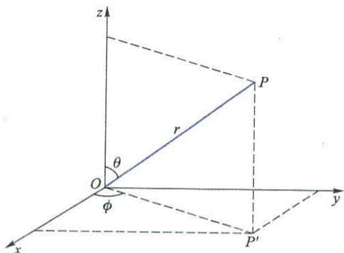

text_image

z
P
r
θ
O
φ
x
y
P'

图5-1 球坐标系与直角坐标系的关系

r 表示空间一点 P 到球心 O 的距离, 取值范围 $0 \sim \infty$ ;

$\theta$ 表示 OP 与 z 轴的夹角, 取值范围 $0 \sim \pi$ ;

$\phi$ 表示 OP 在 xOy 平面内的投影 $OP'$ 与 x 轴的夹角，取值范围 $0 \sim 2\pi$ 。

直角坐标系的变量与球坐标系的变量之间的关系为

$$
\begin{array}{l} x = r \sin \theta \cos \phi \\ y = r \sin \theta \sin \phi \\ z = r \cos \theta \\ r = \sqrt {x ^ {2} + y ^ {2} + z ^ {2}} \\ \end{array}
$$

坐标变换后,得到的球坐标系中的薛定谔方程为

$$
\left[ \frac {1}{r ^ {2}} \cdot \frac {\partial}{\partial r} \left(r ^ {2} \cdot \frac {\partial}{\partial r}\right) + \frac {1}{r ^ {2} \sin \theta} \cdot \frac {\partial}{\partial \theta} (\sin \theta \cdot \frac {\partial}{\partial \theta}) + \frac {1}{r ^ {2} \sin^ {2} \theta} \cdot \frac {\partial^ {2}}{\partial^ {2} \phi} \right] \psi +
$$

$$
\frac {8 \pi^ {2} m}{h ^ {2}} \left(E + \frac {Z e ^ {2}}{4 \pi \varepsilon_ {0} r}\right) \psi = 0 \tag {5-14}
$$

可以看到,经过变换之后,势能项只涉及一个变量 $r_{c}$

坐标变换之后还要进行变量分离,即将含有3个变量 $r,\theta,\phi$ 的偏微分方程,化成3个各含一个变量的常微分方程。在解这3个常微分方程求 $R(r),\Theta(\theta)$ 和 $\Phi(\phi)$ 的过程中,为了保证解的合理性,需引入3个参数n,l和m,且必须满足下列条件:

$m=0,\pm1,\pm2,\cdots;l=0,1,2,\cdots$ ,且 $l\geqslant|m|$ ;n为正整数，且 $n-1\geqslant l$ 。

由解得的 $R(r)$ , $\Theta(\theta)$ 和 $\Phi(\phi)$ 即可表示出波函数 $\psi(r,\theta,\phi)$ :

$$
\psi (r, \theta , \phi) = R (r) \Theta (\theta) \Phi (\phi) \tag {5-15}
$$

令 $Y(\theta,\phi)=\Theta(\theta)\Phi(\phi)$ (5-16)

则式 $(5-15)$ 可以写成如下形式：

$$
\psi (r, \theta , \phi) = R (r) Y (\theta , \phi) \tag {5-17}
$$

式中 $R(r)$ 称为波函数的径向部分, $Y(\theta, \phi)$ 称为波函数的角度部分。

波函数 $\psi$ 是一个 3 变量 $r, \theta, \phi$ 和 3 参数 n, l, m 的函数。下面是几个简单波函数的例子。

当 $n = 1, l = 0, m = 0$ 时：

$$
\psi_ {1, 0, 0} = \frac {1}{\sqrt {\pi}} \left(\frac {Z}{a _ {0}}\right) ^ {\frac {3}{2}} \mathrm{e} ^ {- \frac {z r}{a _ {0}}} \tag {5-18}
$$

当 $n = 2, l = 0, m = 0$ 时：

$$
\psi_ {2, 0, 0} = \frac {1}{4 \sqrt {2 \pi}} \left(\frac {Z}{a _ {0}}\right) ^ {\frac {3}{2}} \left(2 - \frac {Z r}{a _ {0}}\right) e ^ {- \frac {Z r}{2 a _ {0}}} \tag {5-19}
$$

当 $n = 2, l = 1, m = 0$ 时：

$$
\psi_ {2, 1, 0} = \frac {1}{4 \sqrt {2 \pi}} \left(\frac {Z}{a _ {0}}\right) ^ {\frac {5}{2}} r e ^ {- \frac {z r}{2 a _ {0}}} \cos \theta \tag {5-20}
$$

而当 $n = 3, l = 2, m = 1$ 时：

$$
\psi_ {3, 2, 1} = \frac {\sqrt {2}}{8 1 \sqrt {\pi}} \left(\frac {Z}{a _ {0}}\right) ^ {\frac {3}{2}} \left(\frac {Z r}{a _ {0}}\right) ^ {2} \mathrm{e} ^ {- \frac {Z r}{3 a _ {0}}} \sin \theta \cos \theta \cos \phi \tag {5-21}
$$

式 $(5-18)$ \~式 $(5-21)$ 中， $a_{0}$ 为玻尔半径，后面还将具体说明。

对应于一组合理的 $n, l, m$ 取值，则有一个确定的波函数：

$$
\psi (r, \theta , \phi) _ {n, l, m}
$$

波函数 $\psi$ 是量子力学中用以描述核外电子运动状态的函数，叫做原子轨道（orbital）。波函数所表示的原子轨道代表核外电子的一种运动状态，是表示电子运动状态的一个函数。它和经典力学中的轨道（orbit）意义不同，它没有物体在运动中走过的轨迹的含义。上面提到的 $\psi_{1,0,0}$ 就是1s轨道，也表示为 $\psi_{1s}$ ； $\psi_{2,0,0}$ 就是2s轨道，即 $\psi_{2s}$ ； $\psi_{2,1,0}$ 就是 $2p_z$ 轨道，即 $\psi_{2p_z}$ 。有的原子轨道是波函数的线性组合，例如 $\psi_{2p_x}$ 和 $\psi_{2p_y}$ 就是 $\psi_{2,1,1}$ 和 $\psi_{2,1,-1}$ 的线性组合：

$$
\psi_ {2 p _ {z}} = \frac {\sqrt {2}}{2} \psi_ {2, 1, 1} + \frac {\sqrt {2}}{2} \psi_ {2, 1, - 1}
$$

$$
\psi_ {2 \mathrm{p} _ {\mathrm{y}}} = \frac {\sqrt {2}}{2 \mathrm{i}} \psi_ {2, 1, 1} - \frac {\sqrt {2}}{2 \mathrm{i}} \psi_ {2, 1, - 1}
$$

在解薛定谔方程,求得 $\psi(r,\theta,\phi)$ 的表达式的同时,还将同时得到对应于每一个 $\psi(r,\theta,\phi)_{n,l,m}$ 的特有的能量 E 值。对于氢原子:

$$
E = - 1 3. 6 \times \frac {1}{n ^ {2}} \mathrm{eV} \tag {5-22}
$$

对于类氢离子, 即 $He^{+}$ , $Li^{2+}$ 等只有一个电子的离子:

$$
E = - 1 3. 6 \times \frac {Z ^ {2}}{n ^ {2}} \mathrm{eV} \tag {5-23}
$$

式中 n 为参数, Z 为核电荷数。

## 5.3.2 量子数的概念

对应于一组合理的 $n, l, m$ 取值则有一个确定的波函数

$$
\psi (r, \theta , \phi) _ {n, l, m}
$$

其中 $n, l, m$ 称为量子数，因为它们决定着波函数所描述的电子及电子所在原子轨道的某些物理量的量子化情况。如电子的能量、角动量，原子轨道离原子核的远近，原子轨道的形状和它在空间的取向等，就可以由量子数 $n, l, m$ 来说明。

## 1. 主量子数 $n$

主量子数 n 的取值为 1,2,3,4,5,6,…正整数，在光谱学中分别用大写英文字母 K,L,M,N,O,P,…代表。从氢原子和类氢离子的能量公式

$$
E = - 1 3. 6 \times \frac {Z ^ {2}}{n ^ {2}} \mathrm{eV}
$$

可以看出,主量子数 n 决定氢原子和类氢离子中电子的能量 E。由于 n 只能取特定的几个值,所以决定了能量 E 的量子化。n 越大,能量 E 越高。当 n 趋近于无穷大时,E=0,这是自由电子的能量。但是对于多电子原子,核外电子的能量除了取决于主量子数 n 以外,还与其他因素有关。

主量子数 n 的另一个重要意义, 是描述原子中电子出现概率最大区域离核的远近。n=1, 代表第一层, 这是离核最近的电子层; n=2, 代表第二层; n=3, 代表第三层。n 值越大, 离核越远。

## 2. 角量子数 $l$

角量子数 l 的取值为 0,1,2,3,4,…,(n-1)，对应的光谱学符号为 s,p,d,f,g 等。即角量子数 l 的取值受主量子数 n 的限制，只能取从 0 到 (n-1) 的整数，共有 n 个值。

电子绕核运动时,除具有一定的能量外,还具有一定的角动量 M。角动量是矢量,是转动的动量。电子绕核运动的角动量的大小也是量子化的,其绝对值 $\left|M\right|$ 由角量子数 l 决定:

$$
\mid M \mid = \frac {h}{2 \pi} \sqrt {l (l + 1)} \tag {5-24}
$$

角量子数 l 的另一物理意义是, 在多电子原子中, 电子的能量 E 不仅取决于 n, 而且与 l 有关。即多电子原子中电子的能量由 n 和 l 共同决定。n 相同, l 不同的原子轨道, 角量子数 l 越大的, 其能量 E 越大。例如:

$$
E _ {4 \mathrm{s}} <   E _ {4 \mathrm{p}} <   E _ {4 \mathrm{d}} <   E _ {4 \mathrm{f}}
$$

但是单电子体系,如氢原子,其能量 E 不受 l 的影响,只和 n 有关。即

$$
E _ {n s} = E _ {n p} = E _ {n d} = E _ {n f}
$$

角量子数 $l$ 决定原子轨道的形状。例如， $n = 4$ 时， $l$ 有4种取值0,1,2和3，它们分别代表核外第四层的4种形状不同的原子轨道：

l=0, 表示 s 轨道, 即 4s 轨道, 形状为球形;

l=1, 表示 p 轨道, 即 4p 轨道, 形状为哑铃形:

l=2,表示d轨道,即4d轨道,形状为花瓣形:

l=3, 表示 f 轨道, 即 4f 轨道, 形状更复杂。

由此可知,在第四层上,共有4种不同形状的轨道。在n相同的同层中不同形状的轨道称为亚层,也叫分层。就是说核外第四层有4个亚层或分层。因此,角量子数l的不同取值代表同一电子层中具有不同形状的亚层或分层。

## 3. 磁量子数 m

磁量子数 m 的取值为 $0, \pm1, \pm2, \pm3, \cdots, \pm l$ 。即磁量子数 m 的取值受角量子数 l 的影响，从 0 到 $\pm l$ ，共有 $(2l+1)$ 个值。

电子绕核运动的角动量 M，不仅其大小是量子化的，而且角动量 M 在 z 轴上的分量 $M_{z}$ 也是量子化的，该分量的大小由磁量子数 m 决定：

$$
M _ {z} = m \frac {h}{2 \pi} \tag {5-25}
$$

角动量 $M$ 在 $z$ 轴上的分量 $M_{z}$ 的大小，可以说明角动量矢量在空间的取向。当 $l = 1$ 时，由式(5-24)得

$$
\mid M \mid = \sqrt {2} \frac {h}{2 \pi}
$$

磁量子数只有 $m = 0, m = +1, m = -1$ 3种取值，因此角动量 $M$ 在 $z$ 轴上的分量 $M_z$ 只有3种相应的取值，分别为 $0, \frac{h}{2\pi}, -\frac{h}{2\pi}$ 。

以角动量矢量的模 $|M| = \sqrt{2}\frac{h}{2\pi}$ 为半径，以坐标原点 $O$ 为圆心画圆，如图5-2所示。当 $m = 1$ ，角动量 $M$ 在 $z$ 轴上的分量为 $\frac{h}{2\pi}$ 时，角动量 $M$ 的取向只能是 $OA$ ， $M$ 与 $z$ 轴的夹角为 $\theta$ 。求出角动量 $M$ 与 $z$ 轴的夹角，就相当于解决了角动量的方向问题。

因为 $\cos \theta = \frac{\frac{h}{2\pi}}{\sqrt{2}\frac{h}{2\pi}} = \frac{1}{\sqrt{2}}$

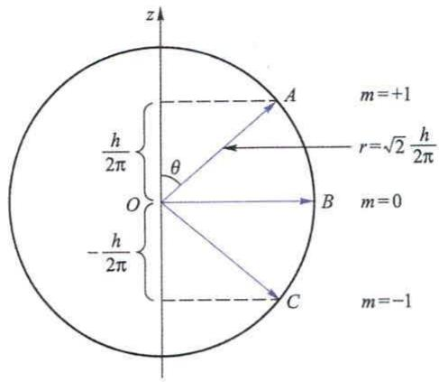

text_image

z
A
m=+1
r=√2 h/2π
θ
O
B
m=0
C
m=-1
-h/2π
-h/2π

图5-2 角动量 $M$ 的空间取向

所以

$$
\theta = 4 5 ^ {\circ}
$$

同理，m=-1 时，角动量为 OC，其与 z 轴的夹角 $\theta=135^{\circ}$ ; m=0 时，角动量为 OB，其与 z 轴的夹角 $\theta=90^{\circ}$ 。

磁量子数 m 的另一物理意义是决定原子轨道在核外空间中的分布方向。

角量子数 l=0 时, 表示形状为球形的 s 轨道, 这时磁量子数 m 只有一种取值 0, 故轨道在核外空间中只有一种分布方向, 即以核为球心的球形分布。l=1 时, 表示形状为哑铃形的 p 轨道, m 有 3 种取值 0, +1 和 -1, 说明 p 轨道在核外空间中有 3 种不同的分布方向, 即沿 x 轴分布、沿 y 轴分布和沿 z 轴分布。

磁量子数 m 一般与原子轨道的能量无关。所以 3 种不同取向的 p 轨道，其能量相等。可以说沿 x 轴、沿 y 轴和沿 z 轴分布的 3 种 p 轨道能量简并，或者说 p 轨道是三重简并的，或者说 p 轨道的简并度为 3。

l=2 时, m 有 5 种取值 0,+1,-1,+2 和 -2, 表示形状为花瓣形的 d 轨道, 在核外空间中有 5 种不同的分布方向。这 5 种 d 轨道能量简并。l=3 的 f 轨道, 在空间有 7 种不同的分布方向, 形状更复杂, 简并度为 7。

n,l,m一组3个量子数可以决定一个电子所在的原子轨道离核的远近、形状和分布方向。例如，由 $n=1,l=0,m=0$ 所表示的原子轨道位于核外第一层，呈球形对称分布，即1s轨道；由 $n=3,l=2,m=1$ 所表示的原子轨道位于核外第三层，呈花瓣形，即5种3d轨道之一；若 $n=3,l=2,m=0$ ，则表示 $3d_{z^{2}}$ 轨道。

## 4. 自旋磁量子数 $m_{s}$

在前面介绍氢原子光谱时,玻尔理论成功地解释了氢原子光谱的产生及其规律性。使用分辨率较强的分光镜观察氢原子光谱时,会发现每一条谱线又分裂为几条波长相差甚微的谱线,即得到氢原子光谱的精细结构。例如,当电子由

2p 轨道跃迁到 1s 轨道得到的不是一条谱线, 而是靠得很近的两条谱线。这一现象不但无法用玻尔理论解释, 也无法用 n, l, m 3 个量子数进行解释。因为 2p 和 1s 都只是一个能级, 这种跃迁只能产生一条谱线。直到 1925 年人们才认识到电子除了绕核做运动之外, 还有自身旋转运动, 具有自旋角动量。电子自旋角动量沿外磁场方向的分量 $M_{s}$ 的大小, 由自旋磁量子数 $m_{s}$ 决定:

$$
M _ {\mathrm{s}} = m _ {\mathrm{s}} \frac {h}{2 \pi} \tag {5-26}
$$

$m_{s}$ 的取值只有两个, 即 $m_{s}=\pm\frac{1}{2}$ , 所以 $M_{s}$ 也是量子化的。因此, 电子的自旋方式只有两种, 通常用 $\uparrow$ 和 $\downarrow$ 表示。正是由于 n, l, m 3 个量子数对应相同的电子具有两种不同的自旋方式, 才导致了氢原子光谱的精细结构。

综上所述，n,l,m一组3个量子数可以决定一个原子轨道。但原子中每个电子的运动状态则必须用 $n,l,m,m,4$ 个量子数来描述。4个量子数确定之后，电子在核外空间的运动状态就确定了。

## 5.3.3 用图形描述核外电子的运动状态

## 1. 电子云图

具有波粒二象性的电子并不像宏观物体那样,沿着固定的轨道运动。虽然不可能同时准确地测定核外某电子在某一瞬间所处的位置和运动速度,但是能用统计的方法去讨论该电子在核外空间某一区域内出现机会的多少。

电子在核外空间某个区域内出现的机会称为概率。电子衍射实验中，衍射环纹的亮环处电子出现的机会多，即概率大；而暗环处电子出现的机会较少，即概率较小。

电子在空间某单位体积内出现的概率称为概率密度,电子在核外空间某区域内出现的概率等于概率密度与该区域体积的乘积,当然这只有在概率密度相等的前提下才成立。

电子运动的状态由波函数 $\psi(r,\theta,\phi)$ 描述，波函数 $\psi(r,\theta,\phi)$ 没有很明确的物理意义，但 $\left|\psi(r,\theta,\phi)\right|^{2}$ 的物理意义却十分明确。 $\left|\psi\right|^{2}$ 表示空间一点 $P(r,\theta,\phi)$ 处单位体积内电子出现的概率，即该点处的概率密度，据此可以计算电子在某个已知区域内出现的概率。

对于原子核外的一个电子的运动,例如氢的1s电子,还可以用图5-3(a)所示的电子云图,以统计性规律描述电子经常出现的区域,这是核外的一个球形空间。电子云图可以表示电子在核外空间出现的概率密度,图中小黑点密集的地方概率密度大,在那些区域里电子出现的概率则大。由此可见,电子云就是概率密度的形象化图示,也可以说电子云图是 $\left|\psi\right|^{2}$ 的图像。

处于不同运动状态的电子,它们的波函数 $\psi$ 各不相同,其 $\left|\psi\right|^{2}$ 也当然各不相同,表示 $\left|\psi\right|^{2}$ 的图像即电子云图当然也不一样。从图 5-3(b) 看出,p 电子云呈无柄的哑铃形状,小黑点的疏密不同表示 p 电子在核外的概率密度的不同。

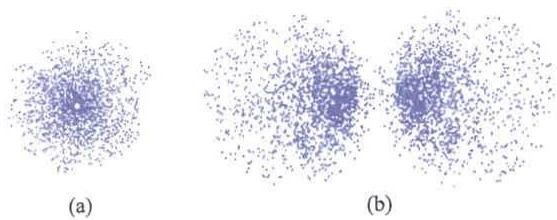  
图 5-3 电子云图

除了电子云图外,还有两种概率密度分布的图示法。下面以氢原子核外1s电子的概率密度为例作简单的介绍。

将核外空间中电子出现概率密度相等的点用曲面连接起来,这样的曲面叫做等概率密度面。如图 5-4 所示,1s 电子的等概率密度面是一系列的同心球面,球面上标的数值是概率密度的相对大小。

画出一个等概率密度面,使电子在该球面以内出现的概率占了绝大部分,如占95%,就得到界面图,1s电子的界面图当然是一球面。

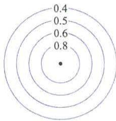

radar chart

| Value |
|-------|
| 0.4   |
| 0.5   |
| 0.6   |
| 0.8   |

图 5-4 1s 电子的
等概率密度面

## 2. 径向分布图

波函数 $\psi$ 是 $r, \theta, \phi$ 的函数, 对于这样由 3 个变量决定的函数, 在三维空间中难以画出其图像来。因此, 可以利用式 (5-17)

$$
\psi (r, \theta , \phi) = R (r) Y (\theta , \phi)
$$

从径向和角度两方面分别讨论它们随 r 和 $\theta, \phi$ 的变化。

## (1) 径向概率密度分布图

用 $R(r)$ 代替 $\psi(r,\theta,\phi)$ 讨论与径向相关的问题，以概率密度 $\left|R\right|^{2}$ 为纵坐标、半径 r 为横坐标作图，即可得到径向概率密度分布图。曲线表明 1s 电子的概率密度 $\left|R\right|^{2}$ 随半径 r 的增大而减小，如图 5-5 所示。

## (2) 径向概率分布图

考虑一个离核距离为 r，厚度为 $\Delta r$ 的薄层球壳，如图 5-6 所示。

由于以 r 为半径的球面的面积为 $4\pi r^{2}$ ，球壳厚度为 $\Delta r$ ，故薄层球壳的体积约为 $4\pi r^{2}\Delta r$ ，概率密度为 $|R|^{2}$ ，所以在这个薄层球壳体积中出现电子的概率为 $4\pi r^{2}|R|^{2}\Delta r$ 。将 $4\pi r^{2}|R|^{2}\Delta r$ 除以厚度 $\Delta r$ ，即得单位厚度球壳中的概率 $4\pi r^{2}|R|^{2}$ 。

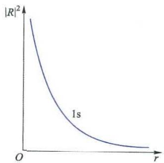  
图 5-5 1s 电子的径向概率密度分布图

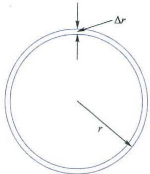

text_image

Δr
r

图 5-6 薄层球壳示意图

令 $D(r)=4\pi r^{2}\left|R\right|^{2}$ (5-27)

$D(r)$ 是 r 的函数, 式(5-27)称为径向概率分布函数。

若以 $D(r)$ 为纵坐标, 对横坐标 r 作图, 可得各种状态的电子的径向概率分布图, 如图 5-7 所示。

$D(r)$ 是 $4\pi r^{2}$ 和 $|R|^{2}$ 的乘积，距离核较近时，概率密度 $|R|^{2}$ 的值较大，但r值很小，即球壳的体积较小，故 $D(r)$ 的值不会很大；距离核较远时，r值大，球壳的体积大，但概率密度 $|R|^{2}$ 较小，故 $D(r)$ 的值也不会很大。 $D(r)$ 是有极值的函数。从1s电子径向概率分布图可清楚地看到这一点，在 $r=r_{0}=53\ pm$ 处 $D(r)$ 出现极值。即距离原子核53 pm处1s电子出现的概率最大，这就是电子在核外“按层分布”的第一层。 $r_{0}$ 称为玻尔半径。

2s有两个概率峰,3s有3个峰,…,ns有n个峰;2p有一个峰,3p有两个峰,…,np有(n-1)个峰;3d有一个峰,4d有两个峰,…,nd有(n-2)个峰……由此可知,某电子的径向概率分布曲线的概率峰的数目 $N_{\text{峰}}$ 与描述该电子运动状态的主量子数n和角量子数l有关:

$$
N _ {\text {峰}} = n - l \tag {5-28}
$$

当电子的径向概率分布曲线的概率峰的数目大于1时，在几个峰中总有一个概率最大的主峰，且主量子数 $n$ 相同的电子，如2s和2p，其概率最大的主峰离核的远近相似，比1s的概率峰离核远些。3s,3p和3d，其概率最大的主峰离核的远近也相似，比2s和2p的概率峰离核又远些。4s,4p,4d和4f径向概率分布曲线的主峰离核将更远……因此，从径向概率分布的意义上可认为核外电子是按层分布的。

概率峰与概率峰之间,曲线与坐标轴相切处,表示一个球面。在这个球面上,电子出现的概率为零,这个球面称为节面。因为节面出现在概率峰与概率峰

之间,若用 $N_{节}$ 表示节面的数目,则

$$
N _ {\mathrm{节}} = n - l - 1 \tag {5-29}
$$

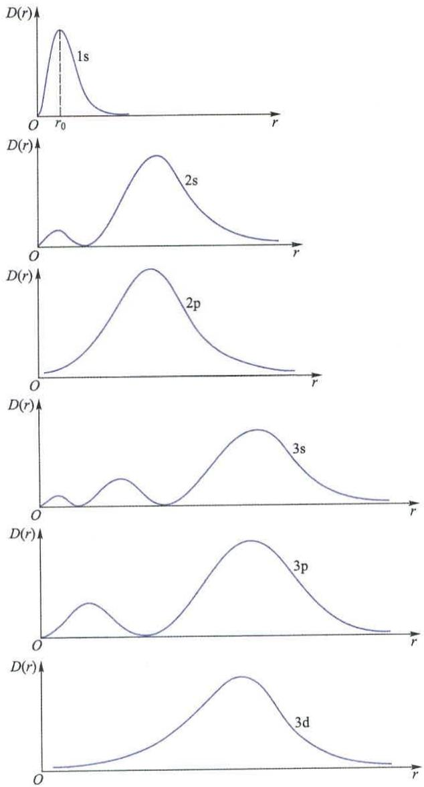  
图 5-7 各种电子的径向概率分布图

## 3. 角度分布图

## (1) 波函数的角度分布图

将波函数 $\theta$ 的角度部分 $Y(\theta, \phi)$ 对 $\theta, \phi$ 作图，即可得到波函数的角度分

布图。

下面以 $\psi_{2,1,0}$ 为例，作出它的波函数角度分布图。 $\psi_{2,1,0}$ 解析式为

$$
\psi_ {2, 1, 0} = \frac {1}{4 \sqrt {2 \pi}} \left(\frac {Z}{a _ {0}}\right) ^ {\frac {5}{2}} r e ^ {- \frac {Z r}{2 a _ {0}}} \cos \theta
$$

其角度部分为 $Y(\theta,\phi)=\cos\theta$ ，自变量 $\theta$ 与函数 $Y=\cos\theta$ 和 $\left|Y\right|^{2}=\cos^{2}\theta$ 的取值见表 5-1。

表 5-1 $\theta$ 值与相应的 $Y$ 和 $|Y|^2$ 值

<table><tr><td> $\theta/(^{\circ})$ </td><td>0</td><td>15</td><td>30</td><td>45</td><td>60</td><td>90</td><td>120</td><td>135</td><td>150</td><td>165</td><td>180</td></tr><tr><td> $Y=\cos\theta$ </td><td>1.0</td><td>0.97</td><td>0.87</td><td>0.71</td><td>0.50</td><td>0</td><td>-0.50</td><td>-0.71</td><td>-0.87</td><td>-0.97</td><td>-1.0</td></tr><tr><td> $|Y|^{2}=\cos^{2}\theta$ </td><td>1.0</td><td>0.93</td><td>0.75</td><td>0.50</td><td>0.25</td><td>0</td><td>0.25</td><td>0.50</td><td>0.75</td><td>0.93</td><td>1.0</td></tr></table>

从坐标原点出发，引出与 $z$ 轴的夹角为 $\theta$ 的直线，取其长度为 $Y = \cos \theta$ 。将所有这些线段的端点连起来，则得到如图5-8(a)所示的图形。以此为母线绕 $z$ 轴旋转 $360^{\circ}$ ，在空间形成如图5-8(b)所示的一个曲面。这就是 $\psi_{2,1,0}$ 的波函数角度分布图。该图是在 $xOy$ 平面上下各一个球形，上部分的“+”号和下部分的“-”号是根据 $Y$ 的表达式计算的结果。

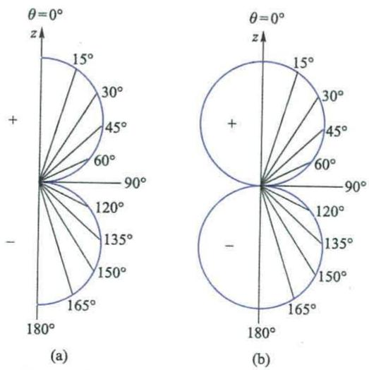  
图5-8 $\psi_{2,1,0}$ 的角度分布图

通过类似的方法可以画出 s, p, d 各种原子轨道的角度分布图, 如图 5-9 所示。要记清楚这些图形的形状, 同时也要记住图形中各个波瓣的“+”号和“-”号, 它们与原子轨道的对称性有关, 在讨论原子轨道的重叠成键时有重要意义。

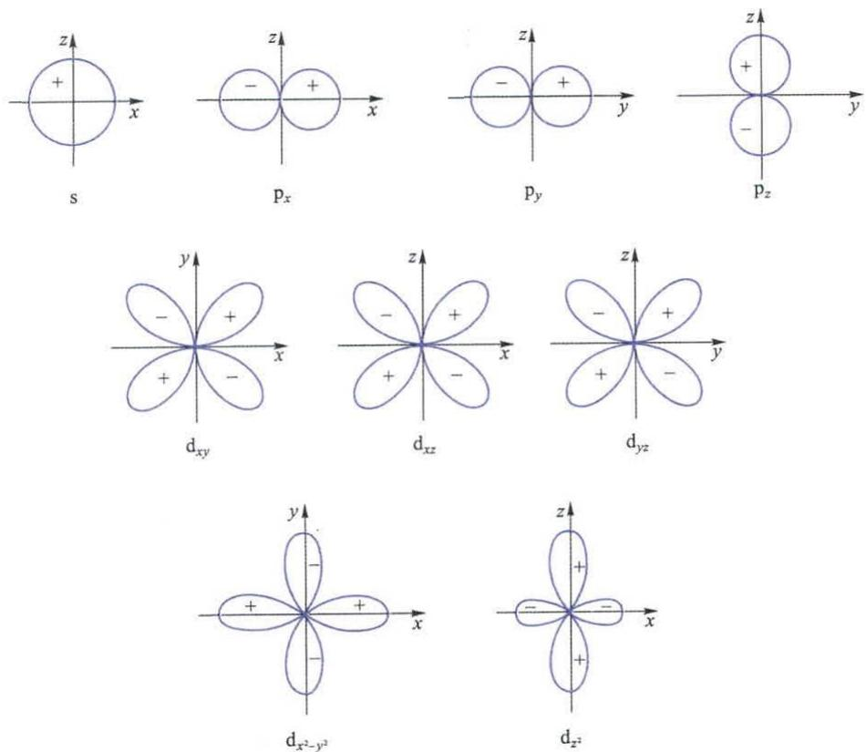  
图 5-9 各种原子轨道的角度分布图

## (2) 概率密度的角度分布图

若根据表 5-1 的数据将 $\left|Y\right|^{2}$ 对 $\theta, \phi$ 作图，则得概率密度的角度分布图，见图 5-10。

概率密度的角度分布图的作法与波函数的角度分布图的作法相似,图形也很相似。所不同之处是,概率密度的角度分布图没有“+”号和“-”号,这是由 $|Y|^{2}$ 表达式中有平方运算造成的。

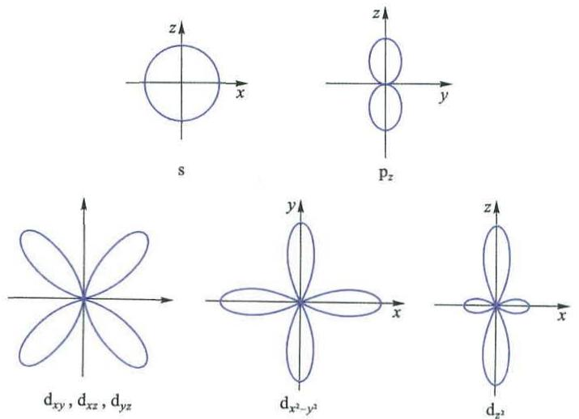

text_image

s
p_z
d_{xy}, d_{xz}, d_{yz}
d_{x^2-y^2}
d_{z^2}

图 5-10 概率密度的角度分布图

## 5.4 核外电子的排布

## 5.4.1 影响轨道能量的因素

在多电子原子中，对于主量子数 $n$ 相同、角量子数 $l$ 不同的原子轨道， $l$ 越大的，其能量 $E$ 越大，即 $E_{4s} < E_{4p} < E_{4d} < E_{4f}$ ，这种现象叫做能级分裂。在多电子原子中，有时主量子数 $n$ 小的原子轨道，由于角量子数 $l$ 较大，其能量 $E$ 却比 $n$ 大的原子轨道大，如 $E_{3d} > E_{4s}$ ，这种现象叫做能级交错。

氢原子或类氢离子核外只有一个电子,这个电子仅受到原子核的作用,电子的能量只与主量子数有关,如式(5-23)所示:

$$
E = - 1 3. 6 \times \frac {Z ^ {2}}{n ^ {2}} \mathrm{eV}
$$

在多电子原子中,一个电子不仅受到原子核的引力,而且还要受到其他电子的斥力。例如锂原子,其第二层的一个电子,除了受原子核对它的引力之外,还受到第一层两个电子对它的排斥力。这两个内层电子的排斥作用可以考虑成对核电荷数 Z 的抵消或屏蔽,使有效核电荷数 $Z^{*}$ 小于 Z,即

$$
Z ^ {*} = Z - \sigma \tag {5-30}
$$

式中 $\sigma$ 称为屏蔽常数, 它代表其他所有电子对于所研究的那个电子的排斥。这种其他电子对于被研究电子的排斥, 导致有效核电荷数降低的作用称为屏蔽效应。于是，多电子原子中的一个电子的能量可以表示为

$$
E = - 1 3. 6 \times \frac {(Z - \sigma) ^ {2}}{n ^ {2}} \mathrm{eV} \tag {5-31}
$$

如果能求得屏蔽常数 $\sigma$ ，则可求得多电子原子中各能级的近似能量。影响屏蔽效应的因素有很多，除了同产生屏蔽效应的电子的数目及它所处的原子轨道有关外，还与被屏蔽的电子离核远近及运动状态有关。斯莱特（Slater）规则给出了计算屏蔽常数 $\sigma$ 的方法，该方法可归结为用表 5-2 提供的数据去计算 $\sigma$ 值，进一步根据式（5-31）求出多电子原子中某电子的能量。

表 5-2 原子轨道中一个电子对于屏蔽常数的贡献

<table><tr><td rowspan="2">被屏蔽电子</td><td colspan="8">屏蔽电子</td></tr><tr><td>1s</td><td>2s,2p</td><td>3s,3p</td><td>3d</td><td>4s,4p</td><td>4d</td><td>4f</td><td>5s,5p</td></tr><tr><td>1s</td><td>0.30</td><td></td><td></td><td></td><td></td><td></td><td></td><td></td></tr><tr><td>2s,2p</td><td>0.85</td><td>0.35</td><td></td><td></td><td></td><td></td><td></td><td></td></tr><tr><td>3s,3p</td><td>1.00</td><td>0.85</td><td>0.35</td><td></td><td></td><td></td><td></td><td></td></tr><tr><td>3d</td><td>1.00</td><td>1.00</td><td>1.00</td><td>0.35</td><td></td><td></td><td></td><td></td></tr><tr><td>4s,4p</td><td>1.00</td><td>1.00</td><td>0.85</td><td>0.85</td><td>0.35</td><td></td><td></td><td></td></tr><tr><td>4d</td><td>1.00</td><td>1.00</td><td>1.00</td><td>1.00</td><td>1.00</td><td>0.35</td><td></td><td></td></tr><tr><td>4f</td><td>1.00</td><td>1.00</td><td>1.00</td><td>1.00</td><td>1.00</td><td>1.00</td><td>0.35</td><td></td></tr><tr><td>5s,5p</td><td>1.00</td><td>1.00</td><td>1.00</td><td>1.00</td><td>0.85</td><td>0.85</td><td>0.85</td><td>0.35</td></tr></table>

例5-1 已知Ti原子的22个电子为 $1\mathrm{s}^2 2\mathrm{s}^2 2\mathrm{p}^6 3\mathrm{s}^2 3\mathrm{p}^6 3\mathrm{d}^2 4\mathrm{s}^2$ ，试利用斯莱特规则计算其他电子对一个3p电子和一个3d电子的屏蔽常数 $\sigma$ ，并分别计算 $E_{3\mathrm{p}}$ 和 $E_{3\mathrm{d}}$ 。

解：屏蔽常数 $\sigma$ 的值可由所有屏蔽电子对 $\sigma$ 的贡献值相加而得，对于 3p 电子和 3d 电子分别有

$$
\sigma_ {3 p} = (0. 3 5 \times 7) + (0. 8 5 \times 8) + (1. 0 0 \times 2) = 1 1. 2 5
$$

$$
\sigma_ {3 \mathrm{d}} = (0. 3 5 \times 1) + (1. 0 0 \times 1 8) = 1 8. 3 5
$$

将 $\sigma_{3\mathrm{p}}$ 和 $\sigma_{3\mathrm{d}}$ 分别代入 $E = -13.6\times \frac{(Z - \sigma)^2}{n^2}$ eV中，计算得

$$
E _ {3 \mathrm{p}} = - 1 3. 6 \times \frac {(2 2 - 1 1 . 2 5) ^ {2}}{3 ^ {2}} \mathrm{eV} = - 1 7 4. 6 3 \mathrm{eV}
$$

$$
E _ {3 \mathrm{d}} = - 1 3. 6 \times \frac {(2 2 - 1 8 . 3 5) ^ {2}}{3 ^ {2}} \mathrm{eV} = - 2 0. 1 3 \mathrm{eV}
$$

计算结果表明,在多电子原子中,角量子数不同的电子受到的屏蔽效应不同,所以发生了能级的分裂。

表 5-2 和例 5-1 也说明, 不同的电子受到的同一电子的屏蔽效应的大小也是不同的。例如, 作为屏蔽电子的 3d 电子, 它们对于 4s 电子的屏蔽贡献为 0.85, 而对于 3d 电子的屏蔽贡献为 0.35; 作为屏蔽电子的 3p 电子, 它们对于 4s 电子的屏蔽贡献为 0.85, 而对于 3d 电子的屏蔽贡献为 1.00。

这种现象的产生与原子轨道的径向分布有关。从图 5-11 可以看到,虽然 4s 电子的最大概率峰比 3d 电子的离核远,但由于 4s 电子的几个内层的小概率峰出现在离核较近处,所以其受到其他电子的屏蔽效应比 3d 电子要小得多。这种外层电子钻穿到离核较近的内层空间从而削弱了其他电子对其屏蔽的现象,通常称为钻穿效应,这种效应可能导致能级交错。例 5-2 的结果将说明这个问题。

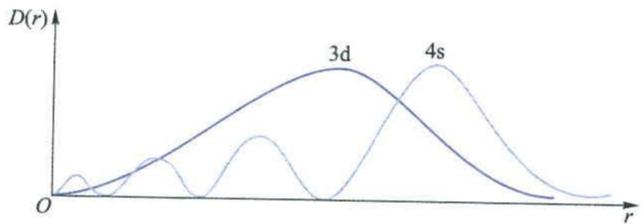

line chart

| r    | 3d     | 4s     |
| ---- | ------ | ------ |
| 0    | 0      | 0      |
| Peak | High   | High   |
| Peak | Low    | Low    |

图5-11 4s轨道和3d轨道的径向分布图

例 5-2 已知 K 原子的 18 个电子为 $1s^{2}$ $2s^{2}$ $2p^{6}$ $3s^{2}$ $3p^{6}$ $4s^{1}$ ，试通过计算说明 K 原子中的最后一个电子，填入 4s 轨道中时能量低，还是填入 3d 轨道中时能量低。

解：最后一个电子，若填入4s轨道中，则有

$$
1 \mathrm{s} ^ {2} 2 \mathrm{s} ^ {2} 2 \mathrm{p} ^ {6} 3 \mathrm{s} ^ {2} 3 \mathrm{p} ^ {6} 4 \mathrm{s} ^ {1}
$$

4s 电子的 $\sigma_{4s}=(0.85\times8)+(1.00\times10)=16.8$

$$
E _ {4 s} = - 1 3. 6 \times \frac {(1 9 - 1 6 . 8) ^ {2}}{4 ^ {2}} \mathrm{eV} = - 4. 1 1 \mathrm{eV}
$$

最后一个电子,若填入3d轨道中,则有

$$
1 \mathrm{s} ^ {2} 2 \mathrm{s} ^ {2} 2 \mathrm{p} ^ {6} 3 \mathrm{s} ^ {2} 3 \mathrm{p} ^ {6} 3 \mathrm{d} ^ {1}
$$

3d 电子的 $\sigma_{3d}=1.00\times18=18$

$$
E _ {3 \mathrm{d}} = - 1 3. 6 \times \frac {(1 9 - 1 8) ^ {2}}{3 ^ {2}} \mathrm{eV} = - 1. 5 1 \mathrm{eV}
$$

计算结果表明 $E_{4s} < E_{3d}$ ，所以 K 原子中的最后一个电子填入 4s 轨道中时能量较低。

原子轨道径向分布的不同,导致了屏蔽效应和钻穿效应,引起了多电子原子的能级分裂 $E_{nf}>E_{nd}>E_{np}>E_{ns}$ ,也引起了能级交错,出现了 $E_{4s}<E_{3d}$ 等现象。因此,多电子原子的能级次序是比较复杂的。

## 5.4.2 多电子原子的能级

## 1. 鲍林的原子轨道能级图

在大量的光谱数据及某些近似的理论计算的基础上,美国化学家鲍林(Pauling)提出了多电子原子的原子轨道近似能级图,如图5-12所示。图中的能级顺序是指电子按能级从低到高在核外排布的顺序,即填入电子时各能级能量的相对高低。

鲍林的原子轨道近似能级图，将所有能级按照从低到高分为7个能级组。能量相近的能级划为一个能级组，图5-12中的每个长方框为一个能级组。不同能级组之间的能量差较大，同一能级组内各能级的能量差较小。

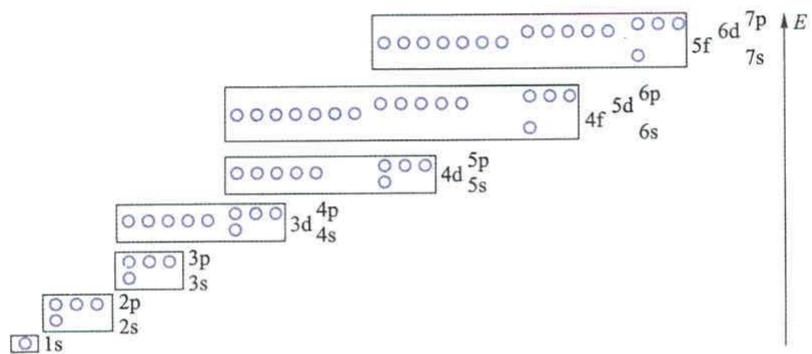

text_image

5f 6d 7p
7s
4f 5d 6p
6s
4d 5p
5s
3d 4p
4s
3p
3s
2p
2s
1s
E

图 5-12 鲍林的原子轨道近似能级图

第一能级组中只有一个能级 1s。1s 能级只有一条原子轨道，在图 5-12 中用一个 ○ 表示。

第二能级组中有两个能级 2s 和 2p。2s 能级只有一条原子轨道，而 2p 能级有 3 条能量简并的 p 轨道，在图 5-12 中用 3 个并列的 ○ 表示。该图中凡并列的 ○，均表示能量简并的原子轨道。

第三能级组中有两个能级 3s 和 3p。3s 能级只有一条原子轨道，而 3p 能级有 3 条能量简并的 p 轨道。

第四能级组中有 3 个能级 4s, 3d 和 4p。4s 能级只有一条原子轨道, 3d 能级有 5 条能量简并的 d 轨道, 而 4p 能级有 3 条能量简并的 p 轨道。

第五能级组中有 3 个能级 5s, 4d 和 5p。5s 能级只有一条原子轨道, 4d 能级有 5 条能量简并的 d 轨道, 而 5p 能级有 3 条能量简并的 p 轨道。

第六能级组中有 4 个能级 6s, 4f, 5d 和 6p。6s 能级只有一条原子轨道, 4f 能级有 7 条能量简并的 f 轨道, 5d 能级有 5 条能量简并的 d 轨道, 而 6p 能级有 3 条能量简并的 p 轨道。

第七能级组中有 4 个能级 7s,5f,6d 和 7p。7s 能级只有一条原子轨道,5f 能级有 7 条能量简并的 f 轨道,6d 能级有 5 条能量简并的 d 轨道,而 7p 能级有 3 条能量简并的 p 轨道。

值得注意的是,除第一能级组只有一个能级外,其余各能级组均从 ns 能级开始到 np 能级结束。

对于多电子原子能级高低次序,我国化学家徐光宪教授曾经提出近似规则。对于一个能级,其 $(n+0.7l)$ 值越大,则能量越高;而且该能级所在能级组的组数,就是 $(n+0.7l)$ 的整数部分。以第七能级组为例进行计算和讨论:

$$
\begin{array}{l} 7 \mathrm{p} \quad (n + 0. 7 l) = 7 + 0. 7 \times 1 = 7. 7 \\ 6 \mathrm{d} \quad (n + 0. 7 l) = 6 + 0. 7 \times 2 = 7. 4 \\ 5 \mathrm{f} \quad (n + 0. 7 l) = 5 + 0. 7 \times 3 = 7. 1 \\ 7 \mathrm{s} \quad (n + 0. 7 l) = 7 + 0. 7 \times 0 = 7. 0 \\ \end{array}
$$

结果表明,各能级均属于第七能级组,且能级顺序为

$$
E _ {7 \mathrm{s}} <   E _ {5 \mathrm{f}} <   E _ {6 \mathrm{d}} <   E _ {7 \mathrm{p}}
$$

这一规则称为 $(n+0.7l)$ 规则。

## 2. 科顿原子轨道能级图

鲍林的原子轨道能级图是一种近似的能级图,基本上反映了多电子原子核外电子填充的顺序。但必须指出的是,由于各原子轨道的能量随原子序数增加而降低,且能量降低的幅度不同,所以造成不同元素的原子轨道能级次序不完全一致。这一重要事实,在鲍林的原子轨道能级图中没有得到体现。

美国人科顿(Cotton)总结了前人的光谱实验和量子力学计算结果,画出了原子轨道能量随原子序数而变化的图——科顿原子轨道能级图,见图5-13。

从图 5-13 中看出, 原子序数为 1 的 H 元素, 其主量子数相同的原子轨道的能量相等, 即不发生能级分裂。随着原子序数的增大, 各原子轨道的能量逐渐降低。由于角量子数 l 不同的轨道能量降低的幅度不一致, 于是引起了能级分裂, 即

$$
E _ {n s} <   E _ {n p} <   E _ {n d} <   E _ {n f}
$$

同时也使得不同元素的原子轨道能级的排列次序可能不完全一致。例如，对于原子序数为 $15\sim 20$ 的元素， $E_{4s} < E_{3d}$ ；而对于原子序数大于21的元素， $E_{3d} < E_{4s}$ 。至于第五和第六能级组，能级交错现象更为复杂，导致一些元素的原子轨道能级排列次序比较特殊。

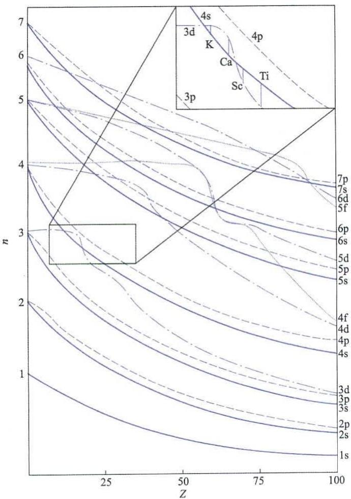

line chart

| Z  | n    | Label |
|----|------|-------|
| 0  | 1    | 1s    |
| 25 | 2    | 2p    |
| 50 | 3    | 3p    |
| 75 | 4    | 4s    |
| 100| 5    | 3d    |
| 0  | 6    | 6d    |
| 25 | 7    | 5f    |
| 50 | 8    | 6p    |
| 75 | 9    | 6s    |
| 100| 10   | 5d    |
| 0  | 11   | 5p    |
| 25 | 12   | 5s    |
| 50 | 13   | 4f    |
| 75 | 14   | 4d    |
| 100| 15   | 4p    |
| 0  | 16   | 4s    |
| 25 | 17   | 3d    |
| 50 | 18   | 3p    |
| 75 | 19   | 3s    |
| 100| 20   | 2p    |
| 0  | 21   | 2s    |
| 25 | 22   | 2p    |
| 50 | 23   | 2p    |
| 75 | 24   | 2p    |
| 100| 25   | 2p    |
| 0  | 26   | K     |
| 25 | 27   | Ca    |
| 50 | 28   | Sc    |
| 75 | 29   | Ti    |
| 100| 30   | Ti    |
The chart displays a line graph with labeled axes (Z) and a legend indicating '3d', 'K', 'Ca', 'Sc', 'Ti' in the top right corner. The numbers '4s' and '3p' are marked on the lines. The inset shows a triangle with an arrow labeled '4s' pointing to the top-right corner. The chart is divided into three quadrants by connecting lines.

图 5-13 科顿原子轨道能级图

## 5.4.3 核外电子的排布

电子在核外的排布应遵循三个原则,即能量最低原理、泡利原理和洪德规则。了解核外电子的排布,可以从原子结构的观点认识元素性质变化的周期性的本质。

## 1. 排布规则

## (1) 能量最低原理

体系的能量越低就越稳定,这是自然界的一个普遍规律。原子中的电子排布也遵循这一规律。多电子原子在基态时,核外电子总是尽可能分布到能量最

低的原子轨道,这称为能量最低原理。

## (2) 泡利原理

1925年，奥地利人泡利(Pauli)提出一个假设，称为泡利原理，又叫做泡利不相容原理。即在同一原子中没有四个量子数完全相同的电子，或者说在同一个原子中没有运动状态完全相同的电子。根据泡利原理，每一种运动状态的电子只能有一个，而自旋磁量子数 $m_{s}$ 的取值只有两个，即 $m_{s}=\pm\frac{1}{2}$ ，所以在同一原子轨道上最多只能容纳自旋方式不同的两个电子。

对于每一个主量子数 n，其角量子数 l 存在 0,1,2,3,4,…，(n-1)，共有 n 个值。而对于其中每一个角量子数 l 的取值，其磁量子数 m 对应有 1,3,5,7,9,…，(2n-1) 个值。所以由主量子数 n 所确定的电子层中，原子轨道的数目为

$$
1 + 3 + 5 + 7 + 9 + \dots + (2 n - 1) = n ^ {2}
$$

结合泡利原理,由主量子数 n 所确定的电子层中电子的最大容量为 $2n^{2}$ 个。

## (3) 洪德规则

德国人洪德(Hund)根据大量光谱实验数据总结出一个规律,即电子分布到能量简并的原子轨道时,优先以自旋相同的方式分别占据不同的轨道,因为这种排布方式的总能量最低。例如,碳原子核外有6个电子,根据能量最低原理和泡利原理,电子在1s轨道排布两个,在2s轨道排布两个;另外两个电子将排布在3条能量简并的2p轨道。所以碳原子的电子排布式或电子构型为 $1s^{2}2s^{2}2p^{2}$ 。

根据洪德规则,这两个电子以相同的自旋方式占两条2p轨道。碳原子的原子轨道图如下:

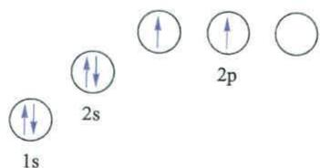

chemical

Diagram showing electron spin states labeled 1s, 2s, and 2p with upward and downward arrows indicating spin orientations

作为洪德规则的发展,能量简并的等价轨道全充满、半充满或全空的状态是比较稳定的,尤其简并度高的轨道更是如此。例如:

<table><tr><td>全充满</td><td> $p^{6}$ ,  $d^{10}$ ,  $f^{14}$ </td></tr><tr><td>半充满</td><td> $p^{3}$ ,  $d^{5}$ ,  $f^{7}$ </td></tr><tr><td>全空</td><td> $p^{0}$ ,  $d^{0}$ ,  $f^{0}$ </td></tr></table>

根据上述的核外电子排布的三原则,基本可以解决核外电子排布问题。

## 2. 电子的排布

根据电子排布的三原则,可以写出电子排布式,如原子序数 Z=11 的钠原子,其电子排布式为 $1s^{2}2s^{2}2p^{6}3s^{1}$ 。又如原子序数 Z=19 的钾原子,其电子排布式为 $1s^{2}2s^{2}2p^{6}3s^{2}3p^{6}4s^{1}$ 。为了避免电子排布式过长,通常把内层电子已达到稀有气体结构的部分用稀有气体的元素符号外加方括号的形式来表示,这部分称为“原子实”。于是,上述钾原子的电子排布式也可以表示为 $[Ar]4s^{1}$ 。

铬原子核外有 24 个电子, 它的电子排布式为 $[Ar]3d^{5}4s^{1}$ , 而不是 $[Ar]3d^{4}4s^{2}$ 。这是因为 $3d^{5}$ 的半充满结构是一种能量较低的稳定结构。同样, 铜原子的电子排布式为 $[Ar]3d^{10}4s^{1}$ , 而不是 $[Ar]3d^{9}4s^{2}$ 。铬原子和铜原子的电子排布式的写法必须注意, 先写 3d 能级, 而后写 4s 能级。尽管电子在原子轨道中的填充次序是先填 4s 能级后填 3d 能级。

铈原子核外有58个电子，用原子实表示的电子排布式为 $[\mathrm{Xe}]4\mathrm{f}^{1}5\mathrm{d}^{1}6\mathrm{s}^{2}$ ，它表示 $1\mathrm{s}^2 2\mathrm{s}^2 2\mathrm{p}^6 3\mathrm{s}^2 3\mathrm{p}^6 3\mathrm{d}^{10}4\mathrm{s}^2 4\mathrm{p}^6 4\mathrm{d}^{10}5\mathrm{s}^2 5\mathrm{p}^6 4\mathrm{f}^{1}5\mathrm{d}^{1}6\mathrm{s}^{2}$ 。若不用原子实表示，则应为 $1\mathrm{s}^2 2\mathrm{s}^2 2\mathrm{p}^6 3\mathrm{s}^2 3\mathrm{p}^6 3\mathrm{d}^{10}4\mathrm{s}^2 4\mathrm{p}^6 4\mathrm{d}^{10}4\mathrm{f}^{1}5\mathrm{s}^2 5\mathrm{p}^6 5\mathrm{d}^{1}6\mathrm{s}^{2}$ ，两种表示方法之间的差别必须注意。

核外电子排布的三原则，只是一般的规律。因此，对于某一元素原子的电子排布情况，要以光谱实验结果为准。表5-3列出了1\~103号元素原子的电子排布情况，原子序数更大的元素的有关信息详见本书后元素周期表。

表 5-3 元素原子的电子排布情况

<table><tr><td>原子序数</td><td>元素符号</td><td>中文名称</td><td>英文名称</td><td>电子排布式</td></tr><tr><td>1</td><td>H</td><td>氢</td><td>Hydrogen</td><td> $1s^{1}$ </td></tr><tr><td>2</td><td>He</td><td>氦</td><td>Helium</td><td> $1s^{2}$ </td></tr><tr><td>3</td><td>Li</td><td>锂</td><td>Lithium</td><td> $[He] 2s^{1}$ </td></tr><tr><td>4</td><td>Be</td><td>铍</td><td>Beryllium</td><td> $[He] 2s^{2}$ </td></tr><tr><td>5</td><td>B</td><td>硼</td><td>Boron</td><td> $[He] 2s^{2}2p^{1}$ </td></tr><tr><td>6</td><td>C</td><td>碳</td><td>Carbon</td><td> $[He] 2s^{2}2p^{2}$ </td></tr><tr><td>7</td><td>N</td><td>氮</td><td>Nitrogen</td><td> $[He] 2s^{2}2p^{3}$ </td></tr><tr><td>8</td><td>O</td><td>氧</td><td>Oxygen</td><td> $[He] 2s^{2}2p^{4}$ </td></tr><tr><td>9</td><td>F</td><td>氟</td><td>Fluorine</td><td> $[He] 2s^{2}2p^{5}$ </td></tr><tr><td>10</td><td>Ne</td><td>氖</td><td>Neon</td><td> $[He] 2s^{2}2p^{6}$ </td></tr><tr><td>11</td><td>Na</td><td>钠</td><td>Sodium</td><td> $[Ne] 3s^{1}$ </td></tr><tr><td>12</td><td>Mg</td><td>镁</td><td>Magnesium</td><td> $[Ne] 3s^{2}$ </td></tr><tr><td>13</td><td>Al</td><td>铝</td><td>Aluminum</td><td> $[Ne] 3s^{2}3p^{1}$ </td></tr><tr><td>14</td><td>Si</td><td>硅</td><td>Silicon</td><td> $[Ne] 3s^{2}3p^{2}$ </td></tr><tr><td>15</td><td>P</td><td>磷</td><td>Phosphorus</td><td> $[Ne] 3s^{2}3p^{3}$ </td></tr><tr><td>16</td><td>S</td><td>硫</td><td>Sulfur</td><td> $[Ne] 3s^{2}3p^{4}$ </td></tr><tr><td>17</td><td>Cl</td><td>氯</td><td>Chlorine</td><td> $[Ne] 3s^{2}3p^{5}$ </td></tr><tr><td>18</td><td>Ar</td><td>氩</td><td>Argon</td><td> $[Ne] 3s^{2}3p^{6}$ </td></tr><tr><td>19</td><td>K</td><td>钾</td><td>Potassium</td><td> $[Ar] 4s^{1}$ </td></tr><tr><td>20</td><td>Ca</td><td>钙</td><td>Calcium</td><td> $[Ar] 4s^{2}$ </td></tr><tr><td>21</td><td>Sc</td><td>钪</td><td>Scandium</td><td> $[Ar] 3d^{1}4s^{2}$ </td></tr><tr><td>22</td><td>Ti</td><td>钛</td><td>Titanium</td><td> $[Ar] 3d^{2}4s^{2}$ </td></tr><tr><td>23</td><td>V</td><td>钒</td><td>Vanadium</td><td> $[Ar] 3d^{3}4s^{2}$ </td></tr><tr><td>24</td><td>Cr</td><td>铬</td><td>Chromium</td><td> $[Ar] 3d^{5}4s^{1}$ </td></tr><tr><td>25</td><td>Mn</td><td>锰</td><td>Manganese</td><td> $[Ar] 3d^{5}4s^{2}$ </td></tr><tr><td>26</td><td>Fe</td><td>铁</td><td>Iron</td><td> $[Ar] 3d^{6}4s^{2}$ </td></tr><tr><td>27</td><td>Co</td><td>钴</td><td>Cobalt</td><td> $[Ar] 3d^{7}4s^{2}$ </td></tr><tr><td>28</td><td>Ni</td><td>镍</td><td>Nickel</td><td> $[Ar] 3d^{8}4s^{2}$ </td></tr><tr><td>29</td><td>Cu</td><td>铜</td><td>Copper</td><td> $[Ar] 3d^{10}4s^{1}$ </td></tr><tr><td>30</td><td>Zn</td><td>锌</td><td>Zinc</td><td> $[Ar] 3d^{10}4s^{2}$ </td></tr><tr><td>31</td><td>Ga</td><td>镓</td><td>Gallium</td><td> $[Ar] 3d^{10}4s^{2}4p^{1}$ </td></tr><tr><td>32</td><td>Ge</td><td>锗</td><td>Germanium</td><td> $[Ar] 3d^{10}4s^{2}4p^{2}$ </td></tr><tr><td>33</td><td>As</td><td>砷</td><td>Arsenic</td><td> $[Ar] 3d^{10}4s^{2}4p^{3}$ </td></tr><tr><td>34</td><td>Se</td><td>硒</td><td>Selenium</td><td> $[Ar] 3d^{10}4s^{2}4p^{4}$ </td></tr><tr><td>35</td><td>Br</td><td>溴</td><td>Bromine</td><td> $[Ar] 3d^{10}4s^{2}4p^{5}$ </td></tr><tr><td>36</td><td>Kr</td><td>氪</td><td>Krypton</td><td> $[Ar] 3d^{10}4s^24p^6$ </td></tr><tr><td>37</td><td>Rb</td><td>铷</td><td>Rubidium</td><td> $[Kr] 5s^1$ </td></tr><tr><td>38</td><td>Sr</td><td>锶</td><td>Strontium</td><td> $[Kr] 5s^2$ </td></tr><tr><td>39</td><td>Y</td><td>钇</td><td>Yttrium</td><td> $[Kr] 4d^15s^2$ </td></tr><tr><td>40</td><td>Zr</td><td>锆</td><td>Zirconium</td><td> $[Kr] 4d^25s^2$ </td></tr><tr><td>41</td><td>Nb</td><td>铌</td><td>Niobium</td><td> $[Kr] 4d^45s^1$ </td></tr><tr><td>42</td><td>Mo</td><td>钼</td><td>Molybdenum</td><td> $[Kr] 4d^55s^1$ </td></tr><tr><td>43</td><td>Tc</td><td>锝</td><td>Technetium</td><td> $[Kr] 4d^55s^2$ </td></tr><tr><td>44</td><td>Ru</td><td>钌</td><td>Ruthenium</td><td> $[Kr] 4d^75s^1$ </td></tr><tr><td>45</td><td>Rh</td><td>铑</td><td>Rhodium</td><td> $[Kr] 4d^85s^1$ </td></tr><tr><td>46</td><td>Pd</td><td>钯</td><td>Palladium</td><td> $[Kr] 4d^{10}$ </td></tr><tr><td>47</td><td>Ag</td><td>银</td><td>Silver</td><td> $[Kr] 4d^{10}5s^1$ </td></tr><tr><td>48</td><td>Cd</td><td>镉</td><td>Cadmium</td><td> $[Kr] 4d^{10}5s^2$ </td></tr><tr><td>49</td><td>In</td><td>铟</td><td>Indium</td><td> $[Kr] 4d^{10}5s^25p^1$ </td></tr><tr><td>50</td><td>Sn</td><td>锡</td><td>Tin</td><td> $[Kr] 4d^{10}5s^25p^2$ </td></tr><tr><td>51</td><td>Sb</td><td>锑</td><td>Antimony</td><td> $[Kr] 4d^{10}5s^25p^3$ </td></tr><tr><td>52</td><td>Te</td><td>碲</td><td>Tellurium</td><td> $[Kr] 4d^{10}5s^25p^4$ </td></tr><tr><td>53</td><td>I</td><td>碘</td><td>Iodine</td><td> $[Kr] 4d^{10}5s^25p^5$ </td></tr><tr><td>54</td><td>Xe</td><td>氙</td><td>Xenon</td><td> $[Kr] 4d^{10}5s^25p^6$ </td></tr><tr><td>55</td><td>Cs</td><td>铯</td><td>Cesium</td><td> $[Xe] 6s^1$ </td></tr><tr><td>56</td><td>Ba</td><td>钡</td><td>Barium</td><td> $[Xe] 6s^2$ </td></tr><tr><td>57</td><td>La</td><td>镧</td><td>Lanthanum</td><td> $[Xe] 5d^16s^2$ </td></tr><tr><td>58</td><td>Ce</td><td>铈</td><td>Cerium</td><td> $[Xe] 4f^15d^16s^2$ </td></tr><tr><td>59</td><td>Pr</td><td>镨</td><td>Praseodymium</td><td> $[Xe] 4f^36s^2$ </td></tr><tr><td>60</td><td>Nd</td><td>钕</td><td>Neodymium</td><td> $[Xe] 4f^46s^2$ </td></tr><tr><td>61</td><td>Pm</td><td>钷</td><td>Promethium</td><td> $[Xe] 4f^{5}6s^{2}$ </td></tr><tr><td>62</td><td>Sm</td><td>钐</td><td>Samarium</td><td> $[Xe] 4f^{6}6s^{2}$ </td></tr><tr><td>63</td><td>Eu</td><td>铕</td><td>Europium</td><td> $[Xe] 4f^{7}6s^{2}$ </td></tr><tr><td>64</td><td>Gd</td><td>钆</td><td>Gadolinium</td><td> $[Xe] 4f^{7}5d^{1}6s^{2}$ </td></tr><tr><td>65</td><td>Tb</td><td>铽</td><td>Terbium</td><td> $[Xe] 4f^{9}6s^{2}$ </td></tr><tr><td>66</td><td>Dy</td><td>镝</td><td>Dysprosium</td><td> $[Xe] 4f^{10}6s^{2}$ </td></tr><tr><td>67</td><td>Ho</td><td>钬</td><td>Holmium</td><td> $[Xe] 4f^{11}6s^{2}$ </td></tr><tr><td>68</td><td>Er</td><td>铒</td><td>Erbium</td><td> $[Xe] 4f^{12}6s^{2}$ </td></tr><tr><td>69</td><td>Tm</td><td>铥</td><td>Thulium</td><td> $[Xe] 4f^{13}6s^{2}$ </td></tr><tr><td>70</td><td>Yb</td><td>镱</td><td>Ytterbium</td><td> $[Xe] 4f^{14}6s^{2}$ </td></tr><tr><td>71</td><td>Lu</td><td>镥</td><td>Lutetium</td><td> $[Xe] 4f^{14}5d^{1}6s^{2}$ </td></tr><tr><td>72</td><td>Hf</td><td>铪</td><td>Hafnium</td><td> $[Xe] 4f^{14}5d^{2}6s^{2}$ </td></tr><tr><td>73</td><td>Ta</td><td>钽</td><td>Tantalum</td><td> $[Xe] 4f^{14}5d^{3}6s^{2}$ </td></tr><tr><td>74</td><td>W</td><td>钨</td><td>Tungsten</td><td> $[Xe] 4f^{14}5d^{4}6s^{2}$ </td></tr><tr><td>75</td><td>Re</td><td>铼</td><td>Rhenium</td><td> $[Xe] 4f^{14}5d^{5}6s^{2}$ </td></tr><tr><td>76</td><td>Os</td><td>锇</td><td>Osmium</td><td> $[Xe] 4f^{14}5d^{6}6s^{2}$ </td></tr><tr><td>77</td><td>Ir</td><td>铱</td><td>Iridium</td><td> $[Xe] 4f^{14}5d^{7}6s^{2}$ </td></tr><tr><td>78</td><td>Pt</td><td>铂</td><td>Platinum</td><td> $[Xe] 4f^{14}5d^{9}6s^{1}$ </td></tr><tr><td>79</td><td>Au</td><td>金</td><td>Gold</td><td> $[Xe] 4f^{14}5d^{10}6s^{1}$ </td></tr><tr><td>80</td><td>Hg</td><td>汞</td><td>Mercury</td><td> $[Xe] 4f^{14}5d^{10}6s^{2}$ </td></tr><tr><td>81</td><td>Tl</td><td>铊</td><td>Thallium</td><td> $[Xe] 4f^{14}5d^{10}6s^{2}6p^{1}$ </td></tr><tr><td>82</td><td>Pb</td><td>铅</td><td>Lead</td><td> $[Xe] 4f^{14}5d^{10}6s^{2}6p^{2}$ </td></tr><tr><td>83</td><td>Bi</td><td>铋</td><td>Bismuth</td><td> $[Xe] 4f^{14}5d^{10}6s^{2}6p^{3}$ </td></tr><tr><td>84</td><td>Po</td><td>钋</td><td>Polonium</td><td> $[Xe] 4f^{14}5d^{10}6s^{2}6p^{4}$ </td></tr><tr><td>85</td><td>At</td><td>砹</td><td>Astatine</td><td> $[Xe] 4f^{14}5d^{10}6s^{2}6p^{5}$ </td></tr><tr><td>86</td><td>Rn</td><td>氡</td><td>Radon</td><td> $[Xe] 4f^{14}5d^{10}6s^{2}6p^{6}$ </td></tr><tr><td>87</td><td>Fr</td><td>钫</td><td>Francium</td><td> $[Rn] 7s^{1}$ </td></tr><tr><td>88</td><td>Ra</td><td>镭</td><td>Radium</td><td> $[Rn] 7s^{2}$ </td></tr><tr><td>89</td><td>Ac</td><td>锕</td><td>Actinium</td><td> $[Rn] 6d^{1}7s^{2}$ </td></tr><tr><td>90</td><td>Th</td><td>钍</td><td>Thorium</td><td> $[Rn] 6d^{2}7s^{2}$ </td></tr><tr><td>91</td><td>Pa</td><td>镤</td><td>Protactinium</td><td> $[Rn] 5f^{2}6d^{1}7s^{2}$ </td></tr><tr><td>92</td><td>U</td><td>铀</td><td>Uranium</td><td> $[Rn] 5f^{3}6d^{1}7s^{2}$ </td></tr><tr><td>93</td><td>Np</td><td>镎</td><td>Neptunium</td><td> $[Rn] 5f^{4}6d^{1}7s^{2}$ </td></tr><tr><td>94</td><td>Pu</td><td>钚</td><td>Plutonium</td><td> $[Rn] 5f^{6}7s^{2}$ </td></tr><tr><td>95</td><td>Am</td><td>镅</td><td>Americium</td><td> $[Rn] 5f^{7}7s^{2}$ </td></tr><tr><td>96</td><td>Cm</td><td>锔</td><td>Curium</td><td> $[Rn] 5f^{7}6d^{1}7s^{2}$ </td></tr><tr><td>97</td><td>Bk</td><td>锫</td><td>Berkelium</td><td> $[Rn] 5f^{9}7s^{2}$ </td></tr><tr><td>98</td><td>Cf</td><td>锎</td><td>Californium</td><td> $[Rn] 5f^{10}7s^{2}$ </td></tr><tr><td>99</td><td>Es</td><td>锿</td><td>Einsteinium</td><td> $[Rn] 5f^{11}7s^{2}$ </td></tr><tr><td>100</td><td>Fm</td><td>镄</td><td>Fermium</td><td> $[Rn] 5f^{12}7s^{2}$ </td></tr><tr><td>101</td><td>Md</td><td>钔</td><td>Mendelevium</td><td> $[Rn] 5f^{13}7s^{2}$ </td></tr><tr><td>102</td><td>No</td><td>锘</td><td>Nobelium</td><td> $[Rn] 5f^{14}7s^{2}$ </td></tr><tr><td>103</td><td>Lr</td><td>铹</td><td>Lawrencium</td><td> $[Rn] 5f^{14}6d^{1}7s^{2}$ </td></tr></table>

## 5.5 元素周期表

最早的元素周期表是1869年由俄国人门捷列夫（Mendeleev）提出来的，他对当时发现的63种元素的性质进行了总结和对比，发现化学元素之间的本质联系——元素的性质随原子量递增发生周期性的递变。虽然当时人们对元素周期表的意义尚不十分清楚，但是随着对原子结构的深入研究，已经越来越深刻地理解周期表的科学内涵。到目前为止，人们已经提出了多种形式的周期表，如短式周期表、长式周期表、三角形周期表、螺旋式周期表、宝塔式周期表等，但目前最通用的是图 5-14 所示的由维尔纳 (Werner) 首先倡导的长式周期表。

<table><tr><td rowspan="2">族
周期</td><td>1</td><td colspan="14"></td><td>18</td><td></td><td></td></tr><tr><td>ⅠA</td><td>2</td><td rowspan="3" colspan="9"></td><td>13</td><td>14</td><td>15</td><td>16</td><td>17</td><td>0</td><td></td></tr><tr><td>1</td><td>H</td><td>ⅡA</td><td>ⅢA</td><td>ⅣA</td><td>VA</td><td>VIA</td><td>VIIA</td><td>He</td><td></td></tr><tr><td>2</td><td>Li</td><td>Be</td><td>B</td><td>C</td><td>N</td><td>O</td><td>F</td><td>Ne</td><td></td></tr><tr><td>3</td><td>Na</td><td>Mg</td><td>ⅢB</td><td>IVB</td><td>VB</td><td>VI B</td><td>VII B</td><td colspan="3">VIII</td><td>I B</td><td>IIB</td><td>Al</td><td>Si</td><td>P</td><td>S</td><td>Cl</td><td>Ar</td></tr><tr><td>4</td><td>K</td><td>Ca</td><td>Sc</td><td>Ti</td><td>V</td><td>Cr</td><td>Mn</td><td>Fe</td><td>Co</td><td>Ni</td><td>Cu</td><td>Zn</td><td>Ga</td><td>Ge</td><td>As</td><td>Se</td><td>Br</td><td>Kr</td></tr><tr><td>5</td><td>Rb</td><td>Sr</td><td>Y</td><td>Zr</td><td>Nb</td><td>Mo</td><td>Tc</td><td>Ru</td><td>Rh</td><td>Pd</td><td>Ag</td><td>Cd</td><td>In</td><td>Sn</td><td>Sb</td><td>Te</td><td>I</td><td>Xe</td></tr><tr><td>6</td><td>Cs</td><td>Ba</td><td>La</td><td>Hf</td><td>Ta</td><td>W</td><td>Re</td><td>Os</td><td>Ir</td><td>Pt</td><td>Au</td><td>Hg</td><td>Tl</td><td>Pb</td><td>Bi</td><td>Po</td><td>At</td><td>Rn</td></tr><tr><td>7</td><td>Fr</td><td>Ra</td><td>Ac</td><td>Rf</td><td>Db</td><td>Sg</td><td>Bh</td><td>Hs</td><td>Mt</td><td>Ds</td><td>Rg</td><td>Cn</td><td>Nh</td><td>Fl</td><td>Mc</td><td>Lv</td><td>Ts</td><td>Og</td></tr><tr><td></td><td></td><td></td><td></td><td></td><td></td><td></td><td></td><td></td><td></td><td></td><td></td><td></td><td></td><td></td><td></td><td></td><td></td><td></td></tr><tr><td></td><td></td><td></td><td></td><td></td><td></td><td></td><td></td><td></td><td></td><td></td><td></td><td></td><td></td><td></td><td></td><td></td><td></td><td></td></tr></table>

图 5-14 长式周期表示意图

## 5.5.1 元素的周期

从各元素原子的电子层结构可知,对应于主量子数 n 的每一个数值,就有一个能级组,也同时有一个周期。所以元素周期表中的每一个周期对应一个能级组。其中第一周期只有氢和氦两种元素,称为特短周期。它对应的第一能级组只有一个 1s 能级,只有一条 1s 轨道,可以填充两个电子。第二和第三周期各有 8 种元素,称为短周期。它们分别对应的第二和第三能级组,均有 ns 和 np 共两个能级,4 条轨道,可以填充 8 个电子。第四和第五周期各有 18 种元素,称为长周期。它们分别对应的第四和第五能级组,均有 ns,(n-1)d 和 np 共 3 个能级,9 条轨道,可以填充 18 个电子。第六周期有 32 种元素,称为特长周期。它对应于第六能级组,有 6s,4f,5d 和 6p 共 4 个能级,16 条轨道,可以填充 32 个电子。第七周期也有 32 种元素(87\~118 号),也称为特长周期。它对应于第七能级组,有 7s,5f,6d 和 7p 共 4 个能级,16 条轨道,可以填充 32 个电子。第七周期的元素迟迟没有发现完全,因此第七周期长期以来被称为未完成周期。到 21 世纪的今天,未完成周期这个名字可以成为历史了,因为第七周期的 32 种元素已经完全被科学家发现。能级组与周期的关系可见表 5-4。

一种元素所处的周期数,等于它的原子核外电子的最高能级所在的能级组数。例如 Sn 元素, 其原子的电子排布式为 $[Kr]4d^{10}5s^{2}5p^{2}$ , 最高能级 5p 属于第五能级组, 所以 Sn 是第五周期元素。

表 5-4 能级组与周期的关系

<table><tr><td>周期</td><td>特点</td><td>能级组序数</td><td>能级数</td><td>原子轨道数</td><td>元素种类数</td></tr><tr><td>1</td><td>特短周期</td><td>1</td><td>1个</td><td>1个</td><td>2种</td></tr><tr><td>2</td><td>短周期</td><td>2</td><td>2个</td><td>4个</td><td>8种</td></tr><tr><td>3</td><td>短周期</td><td>3</td><td>2个</td><td>4个</td><td>8种</td></tr><tr><td>4</td><td>长周期</td><td>4</td><td>3个</td><td>9个</td><td>18种</td></tr><tr><td>5</td><td>长周期</td><td>5</td><td>3个</td><td>9个</td><td>18种</td></tr><tr><td>6</td><td>特长周期</td><td>6</td><td>4个</td><td>16个</td><td>32种</td></tr><tr><td>7</td><td>特长周期</td><td>7</td><td>4个</td><td>16个</td><td>32种</td></tr></table>

## 5.5.2 元素的族

长式元素周期表，从左到右共有18列。IUPAC（国际纯粹与应用化学联合会）曾推荐将这18个列称为18个族。这18个族中有7个A族，位于图5-18所示元素周期表的第1,2,13,14,15,16和17列，A族也叫主族。主族元素从IA族到VIIA族，最后一个电子填入ns或np轨道，其主族族数等于价层电子数。这18个族中有7个B族，位于元素周期表的第3,4,5,6,7,11和12列，B族也叫副族。副族元素从IB族到VIIB族，最后一个电子多数填入 $(n-1)$ d轨道，其副族族数通常等于最高能级组中的电子总数。元素周期表中第18列为零族（有人建议称VIII A族）元素，它们是稀有气体，其电子构型呈稳定结构。还有VIII族，它包括第8,9和10共3列元素，其最后一个电子也填在 $(n-1)$ d轨道，它们最高能级组中的电子总数是8\~10，价层电子构型是 $(n-1)\mathrm{d}^{6\sim10}ns^{0\sim2}$ 。

价层电子一般指在化学反应中能够发生变化的电子,有时也称为价电子。

位于元素周期表下面的镧系元素和锕系元素,按其所在的族来讲应属于ⅢB族,因其性质的特殊性而单列。

## 5.5.3 元素的分区

根据元素最后一个电子填充的能级不同,可以将元素周期表中的元素分为5个区,实际上是把价层电子构型相似的元素集中分在同一个区,如图5-15所示。

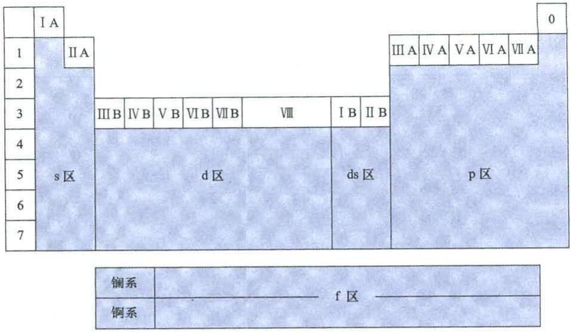

text_image

Ⅰ A
Ⅱ A
Ⅲ A IV A VA VI A VII A
Ⅱ B IV B V B VI B VII B VIII I B II B
d 区 ds 区
Ⅰ A IV A VA VI A VII A
p 区
鋼系 f 区
鋼系

图5-15 元素周期表中元素的分区

① s 区元素 最后一个电子填充在基态原子的 s 轨道上的元素, 包括 I A 族和 II A 族。其价层电子构型为 $ns^{1-2}$ , 属于活泼金属。

② p 区元素 最后一个电子填充在基态原子的 p 轨道上的元素, 包括ⅢA族, ⅣA族, VA族, VIA族, VIIA族和零族。其价层电子构型为 $ns^{2}np^{1-6}$ , 该区的右上方为非金属元素, 左下方为金属元素。

s 区和 p 区排列的是主族和零族元素。s 区和 p 区元素的主族族数，等于价层电子中 s 电子数与 p 电子数之和。若和数为 8，则为零族元素。

③ d 区元素 最后一个电子基本上填充在 $(n-1)$ d 轨道上的元素，包括ⅢB族，ⅣB族，V B族，ⅥB族，ⅦB族和Ⅷ族。其价层电子构型一般为 $(n-1)$ $d^{1-10} n s^{0-2}$ 。

d 区元素的副族族数,等于价层电子中 $(n-1)$ d 的电子数与 ns 的电子数之和,若和数大于或等于 8,则为Ⅷ族元素。

④ ds 区元素 价层电子构型为 $(n-1)\mathrm{d}^{10}ns^{1\sim2}$ ，即次外层 d 轨道是充满的，最外层轨道上有 1\~2 个电子。它们既不同于 s 区元素，又有别于 d 区元素，称为 ds 区元素，它包括 I B 族和 II B 族，在元素周期表中处于 p 区和 d 区之间。ds 区元素的副族族数，等于价层电子中 ns 的电子数。

经常将四、五、六周期的 d 区元素和 ds 区元素分别称为第一、第二、第三过渡系列元素，它们的 $(n-1)$ d 电子由未充满向充满过渡。

⑤ f 区元素 最后一个电子基本上填充在 f 轨道上, 价层电子构型为

$(n-2)f^{0\sim14}(n-1)d^{0\sim2}ns^{2}$ ，包括镧系和锕系元素。由于其内层 $(n-2)f$ 中的电子由未充满向充满过渡，故称其为内过渡元素。

## 5.6 元素基本性质的周期性

元素周期律最重要的内容是,随着元素原子序数的增加,原子核外的电子层结构呈周期性变化。因此,元素的基本性质如原子半径、电离能、电子亲和能和电负性等,也呈现明显的周期性变化。

## 5.6.1 原子半径

## 1. 原子半径的定义

按照量子力学的观点,电子在核外运动没有固定轨道,只是概率分布不同。因此,对于原子来说并没有一个截然分明的界面。通常所说的原子半径,总是以相邻原子的核间距为基础而定义的。根据原子与原子间的作用力不同,原子半径一般可分为共价半径、金属半径和范德华半径3种。

同种元素的两个原子以共价单键联结时,其核间距的一半称为该元素的共价半径。把金属晶体中的原子看成刚性球体,且彼此相切,其核间距的一半称为该元素的金属半径。对于稀有气体元素,其原子之间没有共价键和金属键,而只靠分子间的范德华力互相接近。因此,定义低温下稀有气体以晶体存在时,两个原子之间距离的一半为范德华半径。一般来说,同一元素的共价半径比其金属半径小些。这是因为形成共价键时,轨道的重叠程度比形成金属键时大些。而范德华半径一般较大,因为分子间力不能将单原子分子拉得更紧密。

周期系中各元素的原子半径数据见本书附录6。

## 2. 原子半径的变化规律

同一周期中,原子半径的变化受两个因素的影响。

① 从左向右,随着核电荷数的增加,原子核对外层电子的吸引力增强,使原子半径逐渐减小。  
② 从左向右,随着核外电子数的增加,电子间的相互排斥增强,使原子半径逐渐增大。

这是两个作用相反的影响因素。但是，由于增加的电子不足以完全屏蔽增加的核电荷，因此从左向右有效核电荷数逐渐增加，原子半径逐渐减小。对于 $d^{10}$ 电子构型，因为有较大的屏蔽作用，所以原子半径略有增大， $f^{7}$ 和 $f^{14}$ 电子构型也有类似情况。见如下原子半径数据：

短周期的主族元素

<table><tr><td>元素</td><td>Li</td><td>Be</td><td>B</td><td>C</td><td>N</td><td>O</td><td>F</td><td>Ne</td></tr><tr><td>r/pm</td><td>152</td><td>111</td><td>88</td><td>77</td><td>70</td><td>66</td><td>64</td><td>154</td></tr><tr><td>元素</td><td>Na</td><td>Mg</td><td>Al</td><td>Si</td><td>p</td><td>S</td><td>Cl</td><td>Ar</td></tr><tr><td>r/pm</td><td>186</td><td>160</td><td>143</td><td>117</td><td>110</td><td>104</td><td>99</td><td>192</td></tr></table>

长周期的过渡元素

<table><tr><td>元素</td><td>Sc</td><td>Ti</td><td>V</td><td>Cr</td><td>Mn</td><td>Fe</td><td>Co</td><td>Ni</td><td>Cu</td><td>Zn</td></tr><tr><td>r/pm</td><td>162</td><td>147</td><td>134</td><td>128</td><td>127</td><td>126</td><td>125</td><td>124</td><td>128</td><td>134</td></tr><tr><td>元素</td><td>Y</td><td>Zr</td><td>Nb</td><td>Mo</td><td>Tc</td><td>Ru</td><td>Rh</td><td>Pd</td><td>Ag</td><td>Cd</td></tr><tr><td>r/pm</td><td>180</td><td>160</td><td>146</td><td>139</td><td>136</td><td>134</td><td>134</td><td>137</td><td>144</td><td>149</td></tr></table>

第一过渡系列的 Cu, Zn 和第二过渡系列的 Pd, Ag, Cd 等的原子半径有增大的趋势, 是因为从它们开始出现 $d^{10}$ 电子构型。

超长周期的内过渡元素

<table><tr><td>元素</td><td>La</td><td>Ce</td><td>Pr</td><td>Nd</td><td>Pm</td><td>Sm</td><td>Eu</td><td>Gd</td><td>Tb</td><td>Dy</td><td>Ho</td><td>Er</td><td>Tm</td><td>Yb</td><td>Lu</td></tr><tr><td>r/pm</td><td>183</td><td>182</td><td>182</td><td>181</td><td>183</td><td>180</td><td>208</td><td>180</td><td>177</td><td>178</td><td>176</td><td>176</td><td>176</td><td>193</td><td>174</td></tr></table>

Eu 和 Yb 的原子半径增大, 是因为它们具有 $f^{7}$ 和 $f^{14}$ 电子构型。

应该注意的是,就同一周期而言,过渡元素从左向右原子半径减小的程度比主族元素要小。这是因为过渡元素随着原子序数的增加,新增加的电子填充到次外层,而次外层电子对核电荷的抵消作用要比最外层电子大得多,致使有效核电荷数增加的程度较小,所以同一周期内过渡元素从左向右原子半径减小的程度就比较小。同理,内过渡元素——镧系元素新增加的电子填充到外数第三层,原子半径减小的程度就更小些,从 La 到 Lu,原子半径共减小仅约 9 pm。

15 种镧系元素原子半径共减小约 9 pm 这一事实, 称为镧系收缩。镧系收缩的结果, 使镧系后面的各过渡元素的原子半径都相应地缩小, 使第三过渡系列元素的原子半径与第二过渡系列元素的原子半径相近, 导致 Zr 和 Hf, Nb 和 Ta, Mo 和 W 等在性质上极为相似, 分离困难。如:

<table><tr><td>元素</td><td>K</td><td>Ca</td><td>Sc</td><td>Ti</td><td>V</td><td>Cr</td><td>Mn</td><td>Fe</td></tr><tr><td>r/pm</td><td>232</td><td>197</td><td>162</td><td>147</td><td>134</td><td>128</td><td>127</td><td>126</td></tr><tr><td>元素</td><td>Rb</td><td>Sr</td><td>Y</td><td>Zr</td><td>Nb</td><td>Mo</td><td>Tc</td><td>Ru</td></tr><tr><td>r/pm</td><td>248</td><td>215</td><td>180</td><td>160</td><td>146</td><td>139</td><td>136</td><td>134</td></tr><tr><td>元素</td><td>Cs</td><td>Ba</td><td>La</td><td>Hf</td><td>Ta</td><td>W</td><td>Re</td><td>Os</td></tr><tr><td>r/pm</td><td>265</td><td>217</td><td>183</td><td>159</td><td>146</td><td>139</td><td>137</td><td>135</td></tr></table>

同时镧系收缩导致镧系各元素之间的原子半径非常相近,性质相似,分离非常困难。

同一主族中,从上到下虽然核电荷数的增加有使原子半径减小的作用,但原子的电子层数增多起更主要作用,所以从上到下原子半径增大,见如下数据:

<table><tr><td>元素</td><td>r/pm</td><td>元素</td><td>r/pm</td><td>元素</td><td>r/pm</td></tr><tr><td>Li</td><td>152</td><td>Be</td><td>111</td><td>B</td><td>88</td></tr><tr><td>Na</td><td>186</td><td>Mg</td><td>160</td><td>Al</td><td>143</td></tr><tr><td>K</td><td>232</td><td>Ca</td><td>197</td><td>Ga</td><td>153</td></tr><tr><td>Rb</td><td>248</td><td>Sr</td><td>215</td><td>In</td><td>167</td></tr><tr><td>Cs</td><td>265</td><td>Ba</td><td>217</td><td>Tl</td><td>170</td></tr></table>

副族元素中,第一过渡系列元素的原子半径较小。第二和第三过渡系列元素的原子半径大于第一过渡系列元素的原子半径。但第二和第三过渡系列元素的原子半径很接近,正如前面所述,这是“镧系收缩”影响的结果。

## 5.6.2 电离能

元素的一个基态的气态原子失去一个电子,变成气态 +1 价离子时所需的能量,称为该元素的第一电离能,用 $I_{1}$ 表示。从 +1 价离子再失去一个电子形成 +2 价离子时,所需要的能量叫做第二电离能。以此类推,可以定义元素的第三电离能、第四电离能等。电离能的大小反映原子失去电子的难易程度,电离能越大,失去电子越难。

元素的第一电离能最重要, $I_{1}$ 是衡量元素的原子失去电子的能力和元素金属性的一种尺度。元素的第一电离能可由发射光谱实验得到,其数据见本书附录7。随着原子序数的增加,第一电离能呈周期性变化。

电离能的大小主要取决于原子核电荷数、原子半径和电子构型。在同一周期中,从左向右随着核电荷数的增多和原子半径的减小,原子核对外层电子的引力增大,电离能呈递增趋势。这是一般规律,但是有反常现象出现。见如下数据:

<table><tr><td>元素</td><td>Li</td><td>Be</td><td>B</td><td>C</td><td>N</td><td>O</td><td>F</td><td>Ne</td></tr><tr><td> $I_1/(kJ·mol^{-1})$ </td><td>520</td><td>900</td><td>801</td><td>1087</td><td>1402</td><td>1314</td><td>1681</td><td>2081</td></tr><tr><td>元素</td><td>Na</td><td>Mg</td><td>Al</td><td>Si</td><td>P</td><td>S</td><td>Cl</td><td>Ar</td></tr><tr><td> $I_1/(kJ·mol^{-1})$ </td><td>496</td><td>738</td><td>578</td><td>787</td><td>1012</td><td>1000</td><td>1251</td><td>1521</td></tr></table>

短周期主族元素中 O 和 S 失去一个 p 电子后, 将得到较稳定的 p 轨道的半充满结构, 所以这两种元素的第一电离能分别小于 N 和 P, 造成反常。

<table><tr><td>元素</td><td>Sc</td><td>Ti</td><td>V</td><td>Cr</td><td>Mn</td><td>Fe</td><td>Co</td><td>Ni</td><td>Cu</td><td>Zn</td></tr><tr><td> $I_1/(kJ·mol^{-1})$ </td><td>633</td><td>659</td><td>651</td><td>653</td><td>717</td><td>763</td><td>760</td><td>737</td><td>746</td><td>906</td></tr></table>

长周期过渡元素中 Mn 和 Zn 分别有 $3d^{5}4s^{2}$ 和 $3d^{10}4s^{2}$ 对称性高的稳定电子构型, 不易失去电子, 故电离能较前面元素增加较多。

短周期主族元素的第一电离能从左向右增加的程度较大,原因是其原子半径减小的程度大。过渡元素的第一电离能从左向右增加的程度较小,原因是其原子半径减小的程度小。同样的理由,内过渡元素第一电离能增加的程度更小,且规律性不明显,因为它们新增加的电子是填入 $(n-1)$ d或 $(n-2)$ f轨道,而最外层基本相同。

在同一主族中从上向下,一方面核电荷数增大,原子核对电子吸引力增大,导致元素的第一电离能增大;另一方面电子层数增加,原子半径增大,电子离原子核远,原子核对外层电子引力减小,将导致元素的第一电离能减小。在这对矛盾中,以后者影响为主导。所以,同一主族中自上而下,元素的电离能总的趋势是减小。见如下数据:

<table><tr><td>元素</td><td> $I_1/(kJ·mol^{-1})$ </td><td>元素</td><td> $I_1/(kJ·mol^{-1})$ </td></tr><tr><td>Li</td><td>520</td><td>Be</td><td>900</td></tr><tr><td>Na</td><td>496</td><td>Mg</td><td>738</td></tr><tr><td>K</td><td>419</td><td>Ca</td><td>590</td></tr><tr><td>Rb</td><td>403</td><td>Sr</td><td>550</td></tr><tr><td>Cs</td><td>376</td><td>Ba</td><td>503</td></tr></table>

副族元素的电离能,第二过渡系列元素明显小于第三过渡系列元素。原因是镧系收缩造成第二、第三过渡系列元素的原子半径相近，但第三过渡系列元素的核电荷数要比第二过渡系列元素的大得多。见如下数据：

<table><tr><td>元素</td><td>Y</td><td>Zr</td><td>Nb</td><td>Mo</td><td>Tc</td><td>Ru</td><td>Rh</td><td>Pd</td><td>Ag</td><td>Cd</td></tr><tr><td> $I_1/(kJ·mol^{-1})$ </td><td>600</td><td>640</td><td>652</td><td>684</td><td>702</td><td>710</td><td>720</td><td>804</td><td>731</td><td>868</td></tr><tr><td>元素</td><td>La</td><td>Hf</td><td>Ta</td><td>W</td><td>Re</td><td>Os</td><td>Ir</td><td>Pt</td><td>Au</td><td>Hg</td></tr><tr><td> $I_1/(kJ·mol^{-1})$ </td><td>538</td><td>659</td><td>728</td><td>759</td><td>756</td><td>814</td><td>865</td><td>864</td><td>890</td><td>1007</td></tr></table>

综合上述讨论可以看到,核电荷数、原子半径和电子构型对电离能均有影响。各周期中稀有气体的电离能最大,其重要原因就是它们的原子最外层具有稳定的8电子构型。

同一元素各级电离能的大小规律为 $I_{1}<I_{2}<I_{3}<\cdots$ 。首先要明确，原子失去一个电子形成 +1 价离子后，有效核电荷数 $Z^{*}$ 增加，半径 r 减小，故原子核对电子引力增大。所以再失去第二个电子、第三个电子……更加不易。表 5-5 给出了部分主族元素的各级电离能数据。

表 5-5 部分主族元素的各级电离能  
单位： $\mathrm{kJ}\cdot \mathrm{mol}^{-1}$

<table><tr><td>原子序数</td><td>元素符号</td><td> $I_1$ </td><td> $I_2$ </td><td> $I_3$ </td><td> $I_4$ </td><td> $I_5$ </td></tr><tr><td>1</td><td>H</td><td>1312</td><td></td><td></td><td></td><td></td></tr><tr><td>2</td><td>He</td><td>2372</td><td>5250</td><td></td><td></td><td></td></tr><tr><td>3</td><td>Li</td><td>520</td><td>7298</td><td>11815</td><td></td><td></td></tr><tr><td>4</td><td>Be</td><td>900</td><td>1757</td><td>14849</td><td>21007</td><td></td></tr><tr><td>5</td><td>B</td><td>801</td><td>2427</td><td>3660</td><td>25026</td><td>32827</td></tr></table>

第一电离能数据可以体现原子失去电子的难易，进而说明元素的金属活泼性。表5-5的数据还可用以说明元素的常见价态。例如，锂的第一电离能较小，为 $520\ kJ\cdot mol^{-1}$ ，而其第二电离能扩大了十几倍，为 $7298\ kJ\cdot mol^{-1}$ ，这说明锂易于形成+1价态。铍的第一和第二电离能较低且接近，分别为 $900\ kJ\cdot mol^{-1}$ 和 $1757\ kJ\cdot mol^{-1}$ ，而其第三电离能比第二电离能扩大了数倍，为 $14849\ kJ\cdot mol^{-1}$ ，这说明铍易形成+2价态。

## 5.6.3 电子亲和能

某元素的一个基态的气态原子得到一个电子形成气态 -1 价离子时, 所放出的能量称为该元素的电子亲和能, 用 E 表示。实际上这是元素的第一电子亲和能 $E_{1}$ ，与此类似，还有第二电子亲和能 $E_{2}$ ，第三电子亲和能 $E_{3}$ 等。元素的电子亲和能越大，表示原子得到电子的倾向越大，非金属性一般也越强。

根据第 2 章化学热力学基础中关于热的符号的规定,体系放出的能量应为负值。但由于历史原因,元素的电子亲和能定义为过程中放出的能量,按着这样的定义,电子亲和能的数值一般为正。元素的第一电子亲和能数据见本书附录 8。

在同一周期中,从左向右第一电子亲和能 $E_{1}$ 基本呈增大趋势。一般来说,电子亲和能随原子半径的减小而增大,因为半径减小,原子核对电子的引力增大。第二、第三两个短周期元素的第一电子亲和能 $E_{1}$ 数据如下:

<table><tr><td>元素</td><td>Li</td><td>Be</td><td>B</td><td>C</td><td>N</td><td>O</td><td>F</td></tr><tr><td> $E_{1}/(kJ·mol^{-1})$ </td><td>59.6</td><td>—</td><td>27.0</td><td>121.8</td><td>—</td><td>141.0</td><td>328.2</td></tr><tr><td>元素</td><td>Na</td><td>Mg</td><td>Al</td><td>Si</td><td>P</td><td>S</td><td>Cl</td></tr><tr><td> $E_{1}/(kJ·mol^{-1})$ </td><td>52.9</td><td>—</td><td>41.8</td><td>134.1</td><td>72.0</td><td>200.4</td><td>348.6</td></tr></table>

而在同一族中,从上到下第一电子亲和能 $E_{1}$ 呈减小趋势。VIA 族和 VIIA 族元素的第一电子亲和能 $E_{1}$ 数据如下:

<table><tr><td>元素</td><td> $E_1/(kJ·mol^{-1})$ </td><td>元素</td><td> $E_1/(kJ·mol^{-1})$ </td></tr><tr><td>O</td><td>141.0</td><td>F</td><td>328.2</td></tr><tr><td>S</td><td>200.4</td><td>Cl</td><td>348.6</td></tr><tr><td>Se</td><td>195.0</td><td>Br</td><td>324.5</td></tr><tr><td>Te</td><td>190.2</td><td>I</td><td>295.2</td></tr></table>

VIA族和VIIA族的第一种元素氧和氟的电子亲和能并非最大，而比同族中第二种元素甚至第三种元素要小。这是因为氧和氟的原子半径过小，电子云密度过高，以致当原子结合一个电子形成负离子时，由于电子间的互相排斥使放出的能量减小。而硫和氯的原子半径较大，接受电子时电子间的排斥力较小，所以在同族中其电子亲和能是最大的。

电子亲和能的数值一般较电离能的数值小一个数量级,而且已知元素的电子亲和能数据较少,测定的准确性也差,所以其重要性不如元素的电离能。

## 5.6.4 电负性

元素的电离能表示元素的原子失去电子的可能性,而电子亲和能则表示元素的原子得到电子的可能性。但在许多化合物形成时，元素的原子经常是既不失电子也不得电子，如 $Cl_{2}$ 和 $H_{2}$ 反应，电子只是在它们的原子之间发生偏移。因此，仅从电离能和电子亲和能来衡量元素的金属性或非金属性是不全面的。

1932 年, 鲍林提出了电负性 $\chi$ 的概念, 电负性体现元素的原子在形成化学键时对电子的吸引能力, 较全面地反映了元素金属性和非金属性的强弱。鲍林在把元素 F 的电负性指定为 4.0 的基础上, 从相关分子的键能数据出发进行计算, 并与 F 的电负性 4.0 对比, 得到其他元素的电负性数值, 因此鲍林的电负性是一个相对的数值。元素电负性的数据见本书附录 9。

1934 年, 马利肯(Mulliken)从元素的电离能 I 和电子亲和能 E 综合考虑, 提出电负性的新求法:

$$
\chi = \frac {1}{2} (I + E) \tag {5-32}
$$

这样计算所得的电负性数值为绝对数值。但由于电子亲和能的数据不完全，也难以准确测定，故马利肯电负性的应用受到一定限制。

关于电负性的讨论,多年来层出不穷。较新的研究成果中,有1989年艾伦(Allen)的工作。他用下式计算主族元素(包括稀有气体)的电负性:

$$
\chi = \frac {m \varepsilon_ {\mathrm{p}} + n \varepsilon_ {\mathrm{s}}}{m + n} \tag {5-33}
$$

式中 m 和 n 分别为某元素原子的 p 轨道和 s 轨道上的电子数， $\varepsilon_{p}$ 和 $\varepsilon_{s}$ 分别为 p 轨道和 s 轨道上的一个电子的平均能量，其数据来自光谱实验结果。这样算得的是电负性的绝对值，为了和鲍林电负性值拟合，将 $\chi$ 的 eV 单位乘以 2.30/13.60 因子，即得电负性的光谱标度 $\chi_{s}$ 。

下面给出几种元素的电负性数据,一方面可以看出 $\chi_{s}$ 与鲍林的电负性 $\chi_{p}$ 十分吻合,另一方面也可以找出元素电负性的变化规律。

<table><tr><td>元素</td><td>Li</td><td>Be</td><td>B</td><td>C</td><td>N</td><td>O</td><td>F</td><td>Ne</td></tr><tr><td> $\chi_p$ </td><td>0.98</td><td>1.57</td><td>2.04</td><td>2.55</td><td>3.04</td><td>3.44</td><td>3.98</td><td>—</td></tr><tr><td> $\chi_a$ </td><td>0.91</td><td>1.58</td><td>2.05</td><td>2.54</td><td>3.07</td><td>3.61</td><td>4.19</td><td>4.79</td></tr><tr><td>元素</td><td>Na</td><td>Mg</td><td>Al</td><td>Si</td><td>P</td><td>S</td><td>Cl</td><td>Ar</td></tr><tr><td> $\chi_p$ </td><td>0.93</td><td>1.31</td><td>1.61</td><td>1.90</td><td>2.19</td><td>2.58</td><td>3.16</td><td>—</td></tr><tr><td> $\chi_a$ </td><td>0.87</td><td>1.29</td><td>1.61</td><td>1.92</td><td>2.25</td><td>2.59</td><td>2.87</td><td>3.24</td></tr></table>

<table><tr><td>元素</td><td> $\chi_p$ </td><td> $\chi_s$ </td><td>元素</td><td> $\chi_p$ </td><td> $\chi_s$ </td></tr><tr><td>Li</td><td>0.98</td><td>0.91</td><td>F</td><td>3.98</td><td>4.19</td></tr><tr><td>Na</td><td>0.93</td><td>0.87</td><td>Cl</td><td>3.16</td><td>2.87</td></tr><tr><td>K</td><td>0.82</td><td>0.73</td><td>Br</td><td>2.96</td><td>2.69</td></tr><tr><td>Rb</td><td>0.82</td><td>0.71</td><td>I</td><td>2.66</td><td>2.36</td></tr><tr><td>Cs</td><td>0.79</td><td>—</td><td></td><td></td><td></td></tr></table>

在同一周期中，从左向右随着元素的非金属性逐渐增强而电负性递增。在同一主族中，从上向下随着元素的金属性依次增强而电负性递减。因此，在元素周期表中，右上方的元素氟是电负性最大的元素，而左下方的元素铯是电负性最小的元素。根据电负性的大小，可以衡量元素的金属性和非金属性。一般认为，电负性在2.0以上的元素属于非金属元素，而电负性在2.0以下的属于金属元素。

## 拓展学习资源

<table><tr><td>资源内容</td><td>二维码</td></tr><tr><td>▶ 科学家简介——玻尔▶ 科学家简介——薛定谔▶ 科顿原子轨道能级图▶ 多电子体系的近似解▶ 有关电负性的最新研究——重新定义电负性▶ 影响电负性的因素▶ 本章小结</td><td>扫一扫查看资源内容</td></tr></table>

## 总结与思考题

5-1 从 1879 年发现阴极射线到 1913 年玻尔理论的建立, 在逐步发现原子结构的过程中有哪些重要的历史事件?  
5-2 简述玻尔理论的主要内容,如何用玻尔理论解释氢原子线状光谱的规律性?  
5-3 简述德布罗意提出的微观粒子具有波粒二象性的假设的具体内容。电子衍射实验如何证实了德布罗意的假设？  
5-4 简述不确定原理的主要内容。为什么说不确定原理对于宏观物体的运动没有

意义？

5-5 如何理解“电子的波动性可以看成电子的粒子性的统计结果”?

5-6 波函数与原子轨道的含义是什么？两者有何关系？

5-7 举例说明什么是波函数的角度部分、径向部分？

5-8 $|\psi|^2$ 的物理意义是什么？什么是电子云图、等概率密度面、界面图？ $|\psi|^2$ 的图像与电子云图之间有何关系？

5-9 量子数 $n, l, m, m_{s}$ 各有什么意义？举例说明如何用4个量子数描述电子的运动状态。

5-10 什么是屏蔽效应、钻穿效应？什么是能级分裂、能级交错？

5-11 试举例说明核外电子排布要遵循哪些规则？

5-12 试讨论元素的周期与能级组之间内在的对应关系；试指出元素所在的主族族数、副族族数与其原子核外电子层结构的关系；试说明元素周期表划分成哪几个区，各区分别包括哪些族元素。

5-13 试说明原子半径在同周期中总的变化趋势及其原因，对短周期的主族元素、长周期的过渡元素及特长周期的内过渡元素分别进行讨论，并加以比较。

5-14 什么是“镧系收缩”？其影响是什么？

5-15 如何正确理解电离能、电子亲和能和电负性概念？试说明元素的第一电离能、电子亲和能和电负性在元素周期表中的变化规律及其原因，并对于一些违反规律的现象加以讨论。

## 書习题

5-1 巴尔末公式

$$
\lambda = B \frac {n ^ {2}}{n ^ {2} - 4}
$$

里德伯公式 $\sigma=R_{H}\left(\frac{1}{n_{1}^{2}}-\frac{1}{n_{2}^{2}}\right)$

试指出上述两个公式之间的内在联系。并由 $R_{H}=1.097\times10^{5}\ cm^{-1}$ 求出巴尔末公式中常数 B 以 pm 为单位的数值。

5-2 试根据里德伯公式求算氢原子核外电子由 $n_2 = 3$ 能级跃迁至 $n_1 = 1$ 能级时放出的光波的波数和以 $\mathrm{pm}$ 为单位的波长。

5-3 钠的特征黄光波长为 588 nm, 试求这种光的频率及光子的能量。

5-4 核外某电子的动能为 $13.6\mathrm{eV}$ ，试求该电子德布罗意波的波长。

5-5 用量子数 n, l 和 m 对原子核外 n=4 的所有可能的原子轨道分别进行描述。

5-6 用4个量子数 $n, l, m$ 和 $m_{\mathrm{a}}$ 对原子核外 $n = 3$ 的所有电子分别进行描述。

5-7 将氢原子核外电子从基态激发到 2s 或 2p 轨道, 所需能量是否相同? 为什么? 若是 He 原子情况又怎样? 若是 $He^{+}$ 或 $Li^{2+}$ 情况又是怎样?

5-8 波函数的径向概率分布是如何定义的？径向概率分布图是怎样得到的？试画出s,p,d各原子轨道的径向概率分布图，归纳概率峰的数目及节面数目与量子数n和l的关系。

5-9 试画出 s, p, d 各原子轨道的角度分布图，并注明各波瓣的“+”“-”号。进一步分析各角度分布图的对称性。

5-10 试画出鲍林原子轨道近似能级图，并说明该能级图的主要特点及适用范围。

5-11 试画出科顿原子轨道能级图中主量子数 $n \leqslant 4$ 的部分，并说明该能级图的主要特点及适用范围。

5-12 Cu 原子形成 +1 价离子时失去的是 4s 电子还是 3d 电子？试用斯莱特规则的计算结果加以说明。

5-13 试分别写出原子序数为 24,41 和 78 的元素的名称、符号、电子排布式，并用 4 个量子数分别表示各价层电子的运动状态。

5-14 已知 $\mathbf{M}^{2+}$ 的3d轨道中有5个电子，试推出：

(1) M 原子的电子排布式；

(2) M 元素的名称和元素符号；

(3) M 元素在元素周期表中的位置。

5-15 试指出下列用4个量子数表示的电子运动状态哪些是错误的，并说明出现错误的原因。

(1) $n = 3$ ， $l = 2$ ， $m = -2$ ， $m_{*} = \frac{1}{2}$  
(2) $n = 4$ ， $l = 0$ ， $m = 0$ ， $m_{n} = 0$  
(3) $n = 3$ ， $l = 1$ ， $m = -1$ ， $m_{\mathrm{s}} = -\frac{1}{2}$  
(4) $n = 4, \quad l = 1, \quad m = -2, \quad m_s = \frac{1}{2};$  
(5) $n = 2$ ， $l = -1$ ， $m = 0$ ， $m_{\mathrm{p}} = -\frac{1}{2}$  
(6) $n = -2, \quad l = 1, \quad m = -1, \quad m_{\mathrm{s}} = \frac{1}{2};$  
(7) $n = 3$ ， $l = 3$ ， $m = 1$ ， $m_{s} = -\frac{1}{2}$

5-16 试写出下列元素基态原子的电子排布式，并给出原子序数和元素名称。

(1) 第 4 个稀有气体；  
(2) 第四周期的第 6 个过渡元素；  
(3) 4p 轨道半充满的元素；  
(4) 电负性最大的元素；  
(5) 4f 轨道填充 4 个电子的元素；  
(6) 第一个 4d 轨道全充满的元素。

5-17 试写出下列离子的电子排布式，并给出化学式。

(1) 与 Ar 电子构型相同的 +2 价离子；  
(2) 与 $F^{-}$ 电子构型相同的 +3 价离子；

(3) 原子核中质子数目最少的、3d轨道全充满的+1价离子；  
(4) 与 Kr 电子构型相同的 -1 价离子。

5-18 某原子共有6个电子,其状态分别用4个量子数表示如下:

$$
① n = 3, \qquad l = 2, \qquad m = - 2, \qquad m _ {s} = \frac {1}{2};
$$

$$
② n = 4, \quad l = 0, \quad m = 0, \quad m _ {a} = - \frac {1}{2};
$$

$$
③ n = 2, \qquad l = 0, \qquad m = 0, \qquad m _ {s} = \frac {1}{2};
$$

$$
④ n = 4, \qquad l = 0, \qquad m = 0, \qquad m _ {s} = \frac {1}{2};
$$

$$
⑤ n = 2, \qquad l = 1, \qquad m = 0, \qquad m _ {s} = \frac {1}{2};
$$

$$
⑥ n = 3, \quad l = 1, \quad m = - 1, \quad m _ {s} = \frac {1}{2} 。
$$

（1）试用主量子数与角量子数的光谱学符号相结合的方式（如 $2p,3s$ ），表示每个电子所处的轨道；  
(2) 试将各条轨道按着能量由高到低的次序排列起来。

5-19 某元素在 Kr 之前, 当它的原子失去 3 个电子后, 其角量子数为 2 的轨道上的电子恰好是半充满。试推断该元素的名称, 并给出其基态原子的电子排布式。

5-20 不查找相关数据表,比较大小并说明原因。

(1) 原子半径: Al 和 Mg, Fe 和 Zn;  
(2) 第一电离能: P 和 S, Mo 和 W;  
(3) 第一电子亲和能: Li 和 Be, F 和 Cl。

5-21 试根据原子结构理论回答：

(1) 第八周期将包括多少种元素?  
(2) 第 111 号元素属于第几周期? 第几族?  
(3) 写出第 116 号元素的电子排布式, 判断其属于金属元素还是非金属元素?

5-22 简要回答下列问题：

(1) 比较 $Na^{+}$ 和 Ne 的第一电离能 $I_{1}$ 的大小, 并说明原因;  
（2）B 原子的第一、第二、第三、第四电离能分别为 $801 \, kJ \cdot mol^{-1}$ ， $2427 \, kJ \cdot mol^{-1}$ ， $3660 \, kJ \cdot mol^{-1}$ ， $25026 \, kJ \cdot mol^{-1}$ ，试说明 B 原子各级电离能变化的原因，并预测 B 原子稳定的最高价态。

5-23 若 4 个量子数 $n, l, m$ 和 $m_{s}$ 的取值及相互关系重新规定如下：

n 为正整数。对于给定的 n 值, l 可以取下列 n 个值:

$$
l = 0, 1, 2, \dots , (n - 1)
$$

对于给定的 l 值, m 可以取下列 $(l+1)$ 个值:

$$
m = 0, + 1, + 2, \dots , + l
$$

$$
m _ {s} = \pm \frac {1}{2}
$$

据此可以得到新的元素周期表。试根据新的元素周期表回答下列问题：

(1) 第二、第四周期各有多少种元素？  
(2) p 区元素共有多少列?  
(3) 位于第三周期、最右一列的元素的原子序数是多少?  
(4) 原元素周期表中电负性最大的元素,在新的元素周期表中位于第几周期、第几列?  
（5）新的元素周期表中第一个具有 d 电子的元素，在原元素周期表中位于第几周期、第几列？

  
第5章习题参考答案

## 分子结构和共价键理论

## 目录

6.1 路易斯理论 …… 193  
6.2 价键理论.... 195

6.2.1 共价键的本质 195  
6.2.2 价键理论的要点 196

1. 共价键的形成 197  
2. 共价键的饱和性和方向性 …… 198  
3. 共价键的类型 199  
4. 键参数 200

6.3 杂化轨道理论 201

6.3.1 杂化概念 201  
6.3.2 杂化轨道类型 203

1. s-p 型杂化 203  
2. s-p-d型杂化 204  
3. 等性杂化和不等性杂化 206

6.3.3 $\pi$ 键和大 $\pi$ 键 207

6.4 价层电子对互斥理论 …… 209

6.4.1 中心价层电子的总数和对数 209  
6.4.2 电子对数和电子对空间构型的关系 210  
6.4.3 分子构型和电子对空间构型的关系 210  
6.4.4 多重键的处理 213  
6.4.5 影响键角的因素 214

1. 孤电子对和重键的影响 214  
2. 中心和配体电负性的影响 214

6.5 分子轨道理论 217

6.5.1 分子轨道理论要点 218  
6.5.2 原子轨道线性组合三原则 220

1. 对称性匹配原则 220  
2. 能量相近原则 …… 220  
3. 轨道最大重叠原则 220

## 6.5.3 分子轨道中的电子排布 220

1. 分子轨道能级图 220  
2. 同核双原子分子 …… 221  
3. 异核双原子分子 223

## 拓展学习资源 225

## 总结与思考题 225

## 习题……226

# 分子结构和共价键理论

20 世纪 30 年代以来,随着量子力学理论的建立及其在化学领域的应用,分子结构和化学键理论的研究得到快速发展。化学键指的是原子或离子之间的强相互作用,主要分为离子键、共价键和金属键 3 种类型。化学键的键能一般在一百到几百千焦每摩尔。多原子分子或离子内部原子之间的结合力一般是共价键。本章主要介绍经典共价键理论和现代共价键理论,以及共价键与分子或离子构型的关系。

## 6.1 路易斯理论

1916 年,美国科学家路易斯(Lewis)提出了共价键理论,用来解释同种元素原子形成的单质分子和电负性相近的不同元素原子形成的稳定分子的事实,该理论也被称为路易斯理论或经典共价键理论。

路易斯理论认为,同种元素的原子之间及电负性相近的不同元素的原子之间可以通过共用电子对形成分子,通过共用电子对形成的化学键称为共价键(covalent bond),形成的分子称为共价分子。在分子中,每个原子均应具有稳定的稀有气体原子的8电子外层电子构型(He为2电子),习惯上称为“八隅体规则”。分子中原子间不是通过电子的转移,而是通过共用一对或几对电子来实现8电子稳定构型的。每一个共价分子都有一种稳定的符合“八隅体规则”的电子结构形式,称为路易斯结构式。

在路易斯结构式中,用小黑点表示电子,如:

$$
\begin{array}{c c c} \mathrm{H:H} & : \ddot {\mathrm{O}}:: \ddot {\mathrm{O}}: & : \mathrm{N}: \vdots \mathrm{N}: \\ \mathrm{H} & & \mathrm{H}: \ddot {\mathrm{O}}: \\ \mathrm{H}: \ddot {\mathrm{O}}: & & \mathrm{H}: \ddot {\mathrm{N}}: \mathrm{H} \\ & & \ddot {\mathrm{H}} \end{array} \qquad \begin{array}{c c c} [: \ddot {\mathrm{O}}: \mathrm{H} ] ^ {-} \\ & & \mathrm{H}: \ddot {\mathrm{C}}: \mathrm{H} \\ & & \ddot {\mathrm{H}} \end{array}
$$

为了表示方便,共用一对电子通常用一短线代表,即表示形成一个单键,共用两对电子,则用两道短线代表,即形成一个双键,共用3对电子,则用3道短线代表,形成一个三键,如:

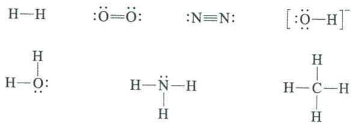

chemical

Chemical structures of hydrogen and oxygen atoms with labeled positions

对于较复杂的分子,写路易斯结构式时应先计算出分子中各原子的价层电子数之和,写出其单键骨架结构式,再根据“八隅体规则”判断该分子的路易斯结构式。例如甲醛分子 $\left(\mathrm{CH}_{2}\mathrm{O}\right)$ ,计算出来一个C原子、两个H原子和一个O原子总的价层电子数为 $4+(1\times2)+6=12$ ,其单键骨架结构式为

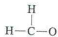

单键共用去了3对电子,即6个价层电子,还剩下的6个价层电子有如下3种排布方式:

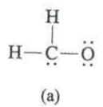

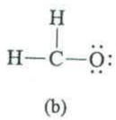

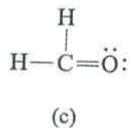

根据“八隅体规则”，很容易判断出(c)为甲醛的路易斯结构式。

又如 $NO^{+}$ , N 原子和 O 原子的价层电子数相加再减去一个电子, 所以它共有 10 个价层电子。其单键骨架结构只能是 N—O, 用去两个价层电子, 剩下的 8 个价层电子无论是按如下 (a) 中以孤对方式分配给两个原子, 还是按 (b) 和 (c) 那样将 N—O 单键改成双键, 都不能满足“八隅体规则”, 只有将单键改成三键, 才能满足要求。因此, (d) 才是 $NO^{+}$ 的路易斯结构式。应该注意的是, 电荷标在了结构式的右上角, 表示该电荷为整个离子所有而不属于其中的某个原子。

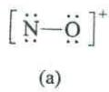

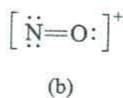

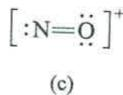

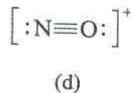

路易斯的共价键概念初步解释了一些简单非金属原子间形成共价分子或离子的过程，并明确地表现出共价键与离子键的区别，但它没有揭示共价键的本质和特征。另外，“八隅体规则”例外的情况很多。例如，在 $\mathrm{BeF}_2$ 分子和 $\mathrm{BF}_3$ 分子中，Be 原子和 B 原子周围的电子数分别为 4 和 6；又如，在 $PCl_{5}$ 分子和 $SF_{6}$ 分子中，P 原子和 S 原子周围的电子数分别为 10 和 12，都没有满足 8 电子构型。某些分子即使可以表示出 8 电子构型，但分子表现出来的性质也与该种路易斯结构式不符，例如 $O_{2}$ 分子的磁性等，就不能用路易斯理论解释，后面在讲述分子轨道理论时会涉及。

尽管路易斯理论尚有许多不尽如人意之处,但路易斯的电子对成键概念却为现代共价键理论奠定了基础。

## 6.2 价键理论

价键理论也称为电子配对法（VB 法）。1927 年，德国化学家海特勒 (Heitler) 和伦敦 (London) 用量子力学处理 $H_{2}$ 分子结构获得成功，后经鲍林等人发展建立了现代价键理论 (valence bond theory, VBT)。

## 6.2.1 共价键的本质

经典的共价键理论,即路易斯理论,初步揭示了共价键与离子键的不同,但没有说明共价键的本质。1927年,海特勒和伦敦在用量子力学处理 $H_{2}$ 分子时,得到了 $H_{2}$ 分子势能曲线,描述了 $H_{2}$ 分子的能量与两个H原子核间距之间的关系,并反映出电子状态对成键的影响,如图6-1所示。

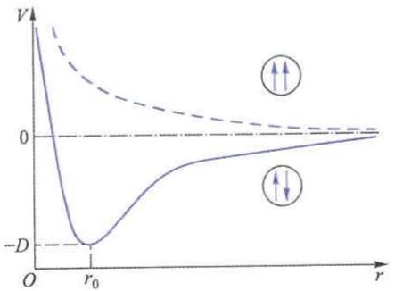

line chart

| r     | V (solid line) | V (dashed line) |
|-------|----------------|-----------------|
| 0     | -D             | 0               |
| r₀    | -D             | 0               |

图 6-1 $H_{2}$ 分子的能量与核间距的关系

假定 A, B 两个氢原子中电子的自旋是相反的, 当两个氢原子相互接近时, A 原子的电子不仅受 A 原子核的吸引, 而且也受 B 原子核的吸引。同样, B 原子的电子也同时受到 B 原子核和 A 原子核的吸引。整个体系的能量低于两个氢原子单独存在时的能量。量子力学计算结果表明, 当体系的能量达到最低点 V = -D 时, 核间距 $r_{0}$ 为 87 pm (实验值约为 74 pm)。如果两个原子继续靠近, 由于原子核之间的斥力逐渐增大,使体系能量升高,如图6-1中实线所示。因此, $r_{0}$ 为体系能量最低的平衡距离,两个氢原子保持 $r_{0}$ 距离形成化学键,这种状态称为氢分子的基态。

如果两个氢原子的电子自旋平行,当它们互相靠近时,量子力学可以证明,它们将产生相互排斥作用,核间距越小,排斥作用越大。如图6-1中虚线所示,体系的能量始终高于两个单独存在的氢原子的能量,不能形成稳定的化学键,这种不稳定的状态称为氢分子的推斥态。

基态分子和推斥态分子在电子云分布上也有很大差别，利用量子力学原理，可以计算出基态分子和推斥态分子的电子云分布。计算结果表明，如图6-2(a)所示的基态分子中两核间的电子概率密度 $|\psi|^{2}$ 远远大于如图6-2(b)所示的推斥态分子中两核间的电子概率密度。由于基态分子中自旋相反的两个电子的电子云密集在两个原子核之间，降低了两核之间的正电排斥，使体系能量降低，从而能形成稳定的共价键，如图6-2(c)所示。而推斥态分子的两个电子的电子云在核间稀疏，如图6-2(d)所示，电子概率密度几乎为零，体系的能量升高，所以不能成键。

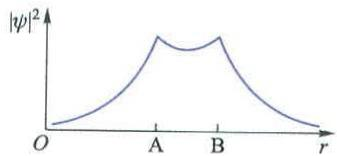  
(a)

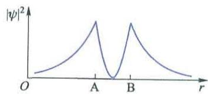  
(b)

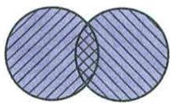

text_image

Venn diagram showing two overlapping circles with diagonal hatching, one shaded blue and one crosshatched.

(c)

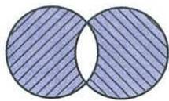

natural_image

Two overlapping circles with diagonal hatching, no text or symbols present

(d)  
图6-2 $\mathrm{H}_{2}$ 分子的两种状态的 $|\psi|^2$ 和电子云示意图

从共价键形成来看,共价键的本质是电性的。共价键的结合力是两个原子核对共用电子对形成的负电区域的吸引力,而不是阴、阳离子之间的库仑作用力。

## 6.2.2 价键理论的要点

1930 年,鲍林等人发展了量子力学对氢分子成键的处理结果,建立了现代价键理论。

## 1. 共价键的形成

如果 A, B 两个原子各有一个未成对的电子, 两个单电子则可以自旋相反的方式相互配对, 在两原子间形成稳定的共价单键。如果 A, B 两个原子各有两个或 3 个未成对的电子, 那么自旋相反的单电子可以两两配对, 形成共价双键或三键。例如, 氮原子外层的 3 个 $2\mathrm{p}$ 电子分别占有 $2\mathrm{p}_x, 2\mathrm{p}_y$ 和 $2\mathrm{p}_z$ 轨道, 它可以与另一个氮原子的 3 个自旋相反的成单电子配对, 形成共价三键而结合成氮分子。对水分子来说, 氧原子外层有两个成单的 $2\mathrm{p}$ 电子, 而氢原子只有一个成单的 $1\mathrm{s}$ 电子, 因此, 一个氧原子与两个氢原子形成 $\mathrm{AB}_2$ 型的 $\mathrm{H}_2\mathrm{O}$ 分子。

在成键过程中,两个单电子以自旋相反的方式配对,形成稳定的化学键,会释放出能量,使体系的能量降低,这是共价键形成的能量依据,也就是说共价键形成符合能量最低原理。

对于 CO 分子来说, 碳原子的电子排布式为 $1s^{2}2s^{2}2p^{2}$ :

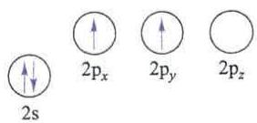

chemical

Diagram showing electron spin states labeled 2s, 2px, 2py, and 2pz

氧原子的电子排布式为 $1s^{2}2s^{2}2p^{4}$ :

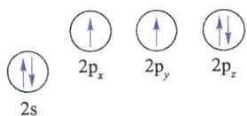

chemical

Diagram showing electron spin states labeled 2s, 2pₓ, 2pᵧ, and 2p_z

碳原子的两个成单的 2p 电子可与氧原子的两个成单的 2p 电子形成两个如上所述的共价键。现在考察 CO 分子中的第三个化学键，氧原子中还有两个已成对的 $2p_{z}$ 电子，而碳原子中还有一条空的 $2p_{z}$ 轨道，这两个电子可为两条 $2p_{z}$ 轨道所共用，于是在 C 原子和 O 原子之间也形成一个共价键。

这个共价键与 $H_{2}, N_{2}, H_{2}O$ 等分子中的共价键及 CO 分子中的前两个共价键有所不同，其差别在于共用电子对由成键原子提供方式的不同。共价键的共用电子对可以由成键的两个原子各提供一个电子所组成，如 $H_{2}, N_{2}, H_{2}O$ 等分子中的共价键及 CO 分子中的前两个共价键；共价键的共用电子对也可以由成键的两个原子中的一个原子提供，如 CO 分子中的第三个共价键。这种共价键称为配位共价键，或称为共价配键。形成配位共价键的条件是其中一个原子的价电子层有未共用的电子对，称为孤电子对，另一个原子的价电子层有接受孤电子对的空轨道。提供电子对的原子为电子给予体，接受电子对的原子为电子接受体。

配位共价键通常用“→”表示,例如上述的 CO 分子的结构式可写为

$$
\mathrm{C} \leftrightarrows 0
$$

应该注意的是,正常共价键与配位共价键的差别,仅仅表现在键的形成过程中,虽然共用电子对来源不同,但在共价键形成后,二者并无差别。例如,在 $NH_{4}^{+}$ 中,四个 N—H 键是完全等同的,尽管其中一个化学键曾是 $NH_{3}$ 与 $H^{+}$ 之间的配位共价键。

## 2. 共价键的饱和性和方向性

共价键的饱和性是指每个原子成键的总数或与其以单键相连的原子的数目是一定的。共价键是电子对的共用，对于每个参与成键的原子来说，其未成对的单电子数是一定的，所以形成共用电子对的数目也是一定的。例如，氯原子最外层有一个未成对的3p电子，它与另一个氯原子3p轨道上的一个电子配对形成双原子分子 $Cl_{2}$ 后，每个氯原子就不再有成单电子，即使再有第三个氯原子与 $Cl_{2}$ 接近，也不能形成 $Cl_{3}$ 。氮原子最外层有3个未成对电子，两个氮原子可以共用3对电子以共价三键结合成 $N_{2}$ 分子，一个氮原子也可以与3个氢原子分别共用一对电子结合成 $NH_{3}$ 分子，形成3个共价单键。

形成共价键时,成键的原子轨道一定要在对称性一致的前提下发生重叠,原子轨道的重叠程度越大,两核间电子的概率密度就越大,形成的共价键就越稳定,即共价键的形成遵循原子轨道最大重叠原理。

原子轨道在空间有一定的形状和取向，这一点在第5章讨论原子轨道的角度分布时已经清楚。原子轨道之间只有沿着一定的方向进行最大程度的重叠，以形成共价键，才能保证成键原子轨道对称性的一致。这就是共价键的方向性。例如，在形成氟化氢分子时，氢原子的1s电子与氟原子的一个未成对 $2p_{x}$ 电子形成共价键。1s轨道与 $2p_{x}$ 轨道只有沿着x轴方向发生最大程度重叠，才能保证其对称性的一致，形成稳定的共价键，如图6-3(a)所示，x轴是两成键轨道的旋转轴。1s轨道与 $2p_{x}$ 轨道若沿着y轴方向重叠，如图6-3(b)所示，两轨道不再有共同的对称性。

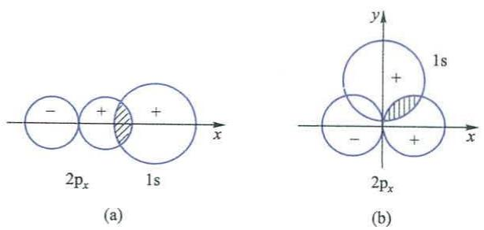  
图 6-3 HF 分子中共价键的方向性

## 3. 共价键的类型

由于原子轨道重叠方式不同,可以形成不同类型的共价键。成键的两个原子核间的连线称为键轴,按成键原子轨道与键轴之间的关系,共价键的键型主要分为 $\sigma$ 键和 $\pi$ 键两种。

(1) $\sigma$ 键

如果原子轨道沿键轴方向按“头碰头”的方式发生重叠，则键轴是成键原子轨道的旋转轴，即原子轨道绕着键轴旋转时，图形和符号均不发生变化。这种共价键称为 $\sigma$ 键。如 $H_{2}$ 分子中的 s-s 轨道重叠、HCl 分子中的 $p_{x}-s$ 轨道重叠、 $Cl_{2}$ 分子中的 $p_{x}-p_{x}$ 轨道重叠都是“头碰头”方式的重叠，如图 6-4(a) 所示，这些都是 $\sigma$ 键。

(2) $\pi$ 键

如果原子轨道按“肩并肩”方式发生重叠,那么成键的原子轨道对通过键轴的一个节面呈反对称性,也就是成键轨道在该节面上下两部分图形一样,但符号相反。这种共价键称为 $\pi$ 键。如图 6-4(b) 所示, $p_{y}-p_{y}$ 和 $p_{z}-p_{z}$ 沿 x 轴重叠时,都是以“肩并肩”方式进行的,这些轨道的重叠都形成 $\pi$ 键。

以 $N_{2}$ 分子为例，氮原子的电子排布式为 $1s^{2}2s^{2}2p_{x}^{1}2p_{y}^{1}2p_{z}^{1}$ ，以 x 轴为键轴，当两个氮原子结合时，两个氮原子的 $p_{x}$ 轨道沿着 x 轴方向，以“头碰头”的方式重叠，形成一个 $\sigma$ 键。而氮原子的 $p_{y}-p_{y}$ 轨道和 $p_{z}-p_{z}$ 轨道与 x 轴方向垂直，不能再沿着 x 轴方向以“头碰头”的方式重叠，只能在 y 轴和 z 轴方向以互相平行的“肩并肩”方式进行重叠，形成两个 $\pi$ 键，如图 6-5 所示。

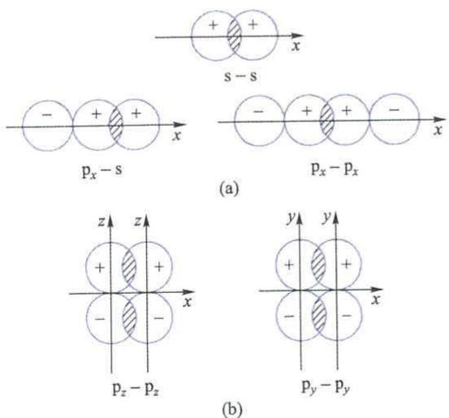

text_image

s - s
- + +
x
pₓ - s
(a)
pₓ - pₓ
z z
+ +
- -
x
pₓ - pₓ
y y
+ +
- -
x
pᵧ - pᵧ
(b)

图6-4 $\sigma$ 键和 $\pi$ 键示意图

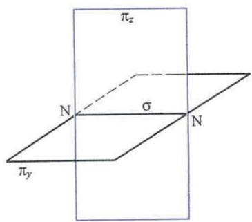

text_image

πz
N σ N
πy

图6-5 $\mathbf{N}_2$ 分子成键示意图

从以上 $\sigma$ 键和 $\pi$ 键形成来看, 沿着键轴方向以“头碰头”方式重叠的原子轨道能够发生最大程度重叠, 键轴为原子轨道重叠部分的任意多次旋转轴。形成的 $\sigma$ 键具有键能大、稳定性高的特点。以“肩并肩”方式重叠的原子轨道, 其重叠部分对通过键轴的一个节面呈反对称性, 即图形相同但符号相反。 $\pi$ 键轨道的重叠程度要比 $\sigma$ 键轨道的重叠程度小。因此, $\pi$ 键的键能小于 $\sigma$ 键的键能, $\pi$ 键的稳定性低于 $\sigma$ 键。但 $\pi$ 键的电子比 $\sigma$ 键的电子活泼, 容易参与化学反应。

除了以上讨论的最简单的 $\sigma$ 键和 $\pi$ 键之外，还有很多其他类型的共价键，如共轭体系中的大 $\pi$ 键，某些含氧酸中的反馈 $\pi$ 键， $[\mathrm{Re}_2\mathrm{Cl}_8]^{2-}$ 中的 $\delta$ 键等，将在后面章节讨论。

## 4. 键参数

经常用几个物理量对于化学键进行简单的描述,这些物理量称为键参数。

## (1) 键能

对于双原子分子，A 原子与 B 原子之间所成化学键的键能 $E_{A-B}$ 等于键的解离能 $D_{A-B}$ 。

$$
\mathrm{AB(g)} = \mathrm{A(g)} + \mathrm{B(g)} \quad \Delta H = E _ {\mathrm{A-B}}
$$

但对于多原子分子,则要注意键能与解离能的区别及联系。下面以多原子分子 $H_{2}S$ 的化学键来说明这个问题。

$$
\mathrm{H} _ {2} \mathrm{S(g)} = \mathrm{H(g)} + \mathrm{HS(g)} \quad \Delta H _ {1} = D _ {1} = 3 8 1. 1 8 \mathrm{kJ} \cdot \mathrm{mol} ^ {- 1}
$$

$$
\mathrm{HS(g)} \rightleftharpoons \mathrm {H(g) + S(g)} \qquad \Delta H _ {2} = D _ {2} = 3 5 3. 5 7 \mathrm{kJ} \cdot \mathrm{mol} ^ {- 1}
$$

两级解离能 $D_{1}$ 和 $D_{2}$ 的值不同。其中H—S键的键能可由下式定义并求出：

$$
\begin{array}{l} E _ {\mathrm{H-S}} = \frac {D _ {1} + D _ {2}}{2} \\ = \frac {3 8 1 . 1 8 \mathrm{kJ} \cdot \mathrm{mol} ^ {- 1} + 3 5 3 . 5 7 \mathrm{kJ} \cdot \mathrm{mol} ^ {- 1}}{2} \\ = 3 6 7. 3 8 \mathrm{kJ} \cdot \mathrm{mol} ^ {- 1} \\ \end{array}
$$

计算结果 H—S 键的键能 $E_{H-S} = 367.38 \, kJ \cdot mol^{-1}$ 。

## (2) 键长

分子中成键两原子的核间距离称为键长。考察下面所列化学键的键长与键能的数据,可以看出一般化学键的键长越小,则其键能越大,化学键越强。

<table><tr><td>化学键</td><td>键长/pm</td><td>键能/(kJ·mol-1)</td></tr><tr><td>C—C</td><td>154</td><td>368</td></tr><tr><td>C=C</td><td>134</td><td>682</td></tr><tr><td>C≡C</td><td>120</td><td>962</td></tr></table>

在不同化合物中的相同化学键,其键长、键能并不相等。在数据表中见到的键长、键能数值一般属于平均结果。

## (3) 键角

键角只存在于多原子分子中。分子中某一原子与其他两原子成键，两键轴之间的夹角称为键角。例如 $H_{2}S$ 分子中，H—S—H 键角为 $92^{\circ}7'$ ，决定了 $H_{2}S$ 分子的构型为 V 形。又如 $CO_{2}$ 分子中，O—C—O 键角为 $180^{\circ}$ ，则 $CO_{2}$ 分子为直线形。

所以说键角是反映分子几何构型的重要因素。

## 6.3 杂化轨道理论

为了从理论上解释多原子分子或离子的立体结构,1931年,鲍林在量子力学的基础上提出了杂化轨道理论(hybrid orbital theory)。

## 6.3.1 杂化概念

首先以甲烷为例讨论分子的成键情况和构型。在 $CH_{4}$ 分子中，碳原子的价层电子构型为 $2s^{2}2p_{x}^{1}2p_{y}^{1}$ ，有两个未成对电子，所以它只能与两个氢原子形成两个共价单键。若考虑将碳原子的一个 2s 电子激发到 2p 轨道上，碳原子激发态的价层电子构型为 $2s^{1}2p_{x}^{1}2p_{y}^{1}2p_{z}^{1}$ ，这样碳原子就可以与 4 个氢原子形成 4 个 C—H σ 键。但是在这 4 个 σ 键中，3 个键是由碳原子的 2p 轨道与氢原子的 1s 轨道重叠形成的，这 3 个键是等同的，互相垂直，键角为 $90^{\circ}$ 。而另外一个 σ 键是由碳原子的 2s 轨道与氢原子的 1s 轨道形成的，它与上述 3 个键不同。总之 4 个 C—H 键是不等同的，但是这与实验事实不符。用前面学习过的化学键理论无法解释这一现象。

鲍林假设,甲烷的中心碳原子在形成化学键时,价电子层的4条原子轨道并不维持原来的状态,而是发生“杂化”,得到4条等同的轨道,再与氢原子的1s轨道成键。所谓杂化就是指在形成分子时,由于原子的相互影响,中心原子的若干能量相近的原子轨道重新组合成一组新的原子轨道。这种轨道重新组合的过程叫做杂化,所形成的新轨道称为杂化轨道。

原子轨道为什么要杂化？这是因为形成杂化轨道后成键能力增强，即杂化轨道的成键能力比未杂化的原子轨道强，形成的分子更稳定。在形成分子过程中，通常存在激发、杂化、轨道重叠等过程。下面以甲烷分子的形成为例加以说明。

① 激发 碳原子的基态电子构型为 $1s^{2}2s^{2}2p_{x}^{1}2p_{y}^{1}$ ，在与氢原子结合时，为使成键数目等于 4,2s 轨道的一个电子被激发到空的 $2p_{z}$ 轨道上，如图 6-6(a) 所示，碳原子以激发态 $2s^{1}2p_{x}^{1}2p_{y}^{1}2p_{z}^{1}$ 参与成键。从基态变为激发态所需要的能量，可以由形成共价键数目的增加而释放出更多的能量来补偿。因为碳原子在基态只能形成两个化学键，而激发态可以形成 4 个化学键。

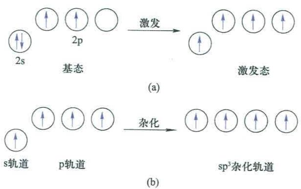

flowchart

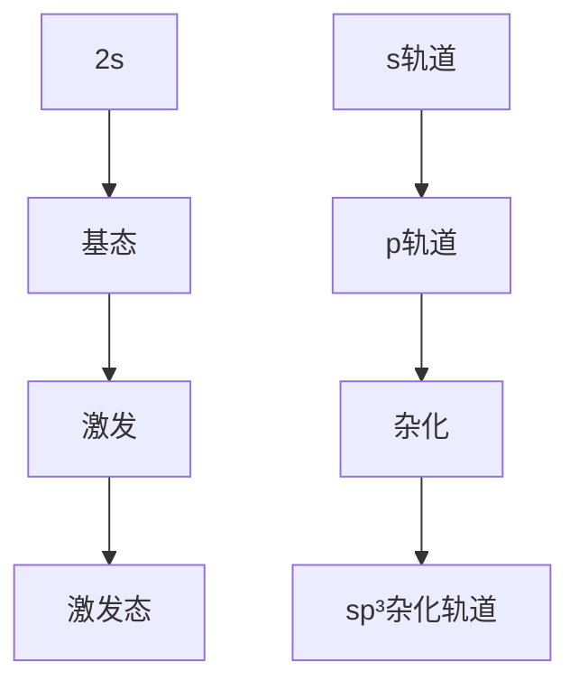

图6-6 碳原子中电子的激发和 $\mathfrak{sp}^3$ 杂化

② 杂化 处于激发态的 4 条不同类型的原子轨道, 即一条 2s 轨道和 3 条 2p 轨道, 线性组合成一组新的轨道, 即杂化轨道。杂化轨道具有特定形状的角度分布图, 也具有特定的空间分布方向, 杂化轨道的数目等于参与杂化的原子轨道的数目。应该注意的是, 原子轨道的杂化, 只有在形成分子过程中才会发生, 孤立的原子其轨道不可能发生杂化。而且只有能量相近的轨道, 如 2s 轨道和 2p 轨道, 才能发生杂化, 能量相差太大的轨道, 如 1s 轨道和 2p 轨道, 也不能发生杂化。在形成 $\mathrm{CH}_{4}$ 分子时, 由碳原子激发态的 $2\mathrm{s}, 2\mathrm{p}_{x}, 2\mathrm{p}_{y}, 2\mathrm{p}_{z}$ 轨道重新组合成 4 条杂化轨道, 见图 6-6(b)。杂化轨道指向四面体的 4 个顶角。该杂化轨道由一条 s 轨道和 3 条 p 轨道杂化而成, 称为 $\mathfrak{sp}^{3}$ 杂化轨道。

事实上在成键的过程中,激发和杂化是同时发生的。

③ 轨道重叠 杂化轨道与其他原子轨道重叠形成化学键时,同样要满足原子轨道最大重叠原理。原子轨道重叠越多,形成的化学键越稳定。由于杂化轨道的电子云分布更集中,所以其成键能力比未杂化的各原子轨道的成键能力强。物质的分子构型是由满足原子轨道最大重叠的方向决定的,如在 $CH_{4}$ 分子中,4个氢原子的 1s 轨道在四面体的 4 个顶点位置与碳原子的 4 条杂化轨道重叠最大,因此,决定了 $CH_{4}$ 分子的构型是正四面体形, H—C—H 键角为 $109^{\circ}28'$ 。

## 6.3.2 杂化轨道类型

根据组成杂化轨道的原子轨道的种类和数目,以及杂化轨道之间能量的高低,可以将杂化轨道分成不同的类型。

## 1. s-p 型杂化

只有 s 轨道和 p 轨道参与的杂化称为 s-p 型杂化,主要有以下 3 种。

## (1) sp 杂化

sp 杂化轨道是由一条 ns 轨道和一条 np 轨道组合而成的, 其角度分布图的形状不同于杂化前的 s 轨道和 p 轨道, 见图 6-7(a)。每条杂化轨道含有 $\frac{1}{2}$ 的 s 轨道成分和 $\frac{1}{2}$ 的 p 轨道成分。两条杂化轨道在空间的分布方向呈直线形, 夹角为 $180^{\circ}$ , 图 6-7(b) 对此进行了粗略的表达。

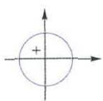  
s轨道

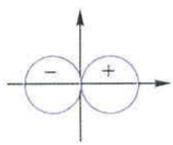

text_image

- +
- -

p轨道

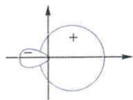

text_image

Mathematical diagram showing a circle with a plus sign and a negative charge, plotted on Cartesian coordinates.

两条sp杂化轨道

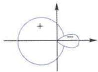

text_image

Mathematical diagram showing a circle with a plus sign and a dashed line extending from its center, labeled with negative signs.

(a)  
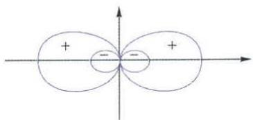

chemical

Diagram of electron density distribution with positive and negative lobes in a 2D coordinate system

(b)  
图 6-7 两条 sp 杂化轨道在空间的分布方向

图 6-8 是 $\mathrm{BeCl}_2$ 分子成键情况的示意图。当 Be 原子与 Cl 原子形成 $\mathrm{BeCl}_2$ 分子时，基态 Be 原子 $2\mathrm{s}^2$ 中的一个电子激发到 2p 轨道，一条 s 轨道和一条 p 轨道杂化，形成两条 sp 杂化轨道，杂化轨道间夹角为 $180^\circ$ 。Be 原子的两条 sp 杂化轨道与两个 Cl 原子的 p 轨道重叠形成 $\sigma$ 键，决定 $\mathrm{BeCl}_2$ 分子的构型是直线形。

## (2) $\mathrm{sp}^2$ 杂化

$\mathrm{sp}^2$ 杂化轨道是由一条 $ns$ 轨道和两条 $np$ 轨道组合而成的，每条杂化轨道含有 $\frac{1}{3}$ 的 $s$ 轨道成分和 $\frac{2}{3}$ 的 $p$ 轨道成分。3条 $\mathrm{sp}^2$ 杂化轨道在空间的分布指向平面三角形的 3 个顶点, 杂化轨道间夹角为 $120^{\circ}$ 。

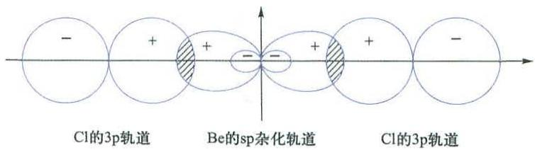

text_image

Cl的3p轨道
Be的sp杂化轨道
Cl的3p轨道

图 6-8 BeCl₂ 分子成键情况的示意图

图 6-9 是 $BF_{3}$ 分子中 $sp^{2}$ 杂化轨道形成的示意图。B 原子的基态电子构型为 $1s^{2}2s^{2}2p_{x}^{1}$ ，当 B 原子与 F 原子形成 $BF_{3}$ 分子时，基态 B 原子 $2s^{2}$ 中的一个电子激发到一条空的 2p 轨道，使 B 原子的电子构型变为 $1s^{2}2s^{1}2p_{x}^{1}2p_{y}^{1}$ 。一条 2s 轨道和两条 2p 轨道杂化，形成 3 条 $sp^{2}$ 杂化轨道，它们分别指向平面三角形的 3 个顶点。

指向平面三角形的 3 个顶点的 B 原子的 3 条 $sp^{2}$ 杂化轨道与 3 个 F 原子的 p 轨道重叠形成 3 个 $\sigma$ 键，决定 $BF_{3}$ 分子的构型是平面三角形。

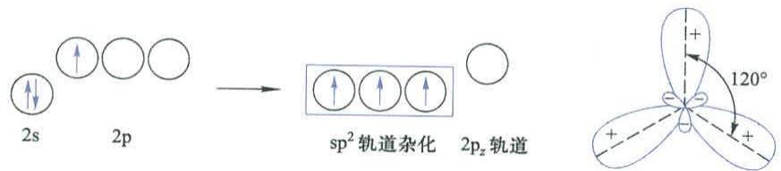

chemical

Molecular orbital diagram showing spin polarization and orbitals in 2s, 2p, and 2pz orbitals with 120° angle annotation

图6-9 $\mathrm{BF}_3$ 分子中 $\mathfrak{sp}^2$ 杂化轨道形成的示意图

## (3) $\mathrm{sp}^3$ 杂化

$sp^{3}$ 杂化轨道是由一条 ns 轨道和 3 条 np 轨道组合而成的，每条杂化轨道含有 $\frac{1}{4}$ 的 s 轨道成分和 $\frac{3}{4}$ 的 p 轨道成分。4 条 $sp^{3}$ 轨道在空间的分布指向正四面体的 4 个顶点，杂化轨道间夹角为 $109^{\circ}28'$ 。

$sp^{3}$ 杂化的典型例子是 $CH_{4}$ 分子，即 C 原子的一个 $2s^{2}$ 电子激发到空的 2p 轨道，一条 2s 轨道和 3 条 2p 轨道杂化，形成 4 条 $sp^{3}$ 杂化轨道，图 6-6 示意了这一过程。指向正四面体的 4 个顶点的 C 原子的 4 条 $sp^{3}$ 杂化轨道与 4 个 H 原子的 1s 轨道重叠形成 4 个 $\sigma$ 键，决定 $CH_{4}$ 分子的构型是正四面体形。

## 2. s-p-d 型杂化

ns 轨道、np 轨道和 nd 轨道一起参与的杂化称为 s-p-d 型杂化，主要有以下 3 种。

## (1) $sp^{3}d$ 杂化

$sp^{3}d$ 杂化轨道是由一条 ns 轨道、3 条 np 轨道和一条 nd 轨道组合而成的，它的特点是 5 条杂化轨道在空间呈三角双锥形分布，杂化轨道间夹角为 $90^{\circ}$ ， $120^{\circ}$ 或 $180^{\circ}$ 。

图 6-10 是 $sp^{3}d$ 杂化和 $PCl_{5}$ 分子的结构示意图。P 原子的基态电子构型为 $1s^{2}2s^{2}2p^{6}3s^{2}3p^{3}$ ，当 P 原子与 Cl 原子形成 $PCl_{5}$ 分子时，基态 P 原子 $3s^{2}$ 中的一个电子激发到一条空的 3d 轨道，使 P 原子的电子构型变为 $1s^{2}2s^{2}2p^{6}3s^{1}3p_{x}^{1}3p_{y}^{1}3p_{z}^{1}3d^{1}$ 。一条 3s 轨道、3 条 3p 轨道和一条 3d 轨道杂化，形成 5 条 $sp^{3}d$ 杂化轨道。P 原子的 5 条 $sp^{3}d$ 杂化轨道在空间呈三角双锥形分布，与 5 个 Cl 原子中各一条 p 轨道重叠共形成 5 个 $\sigma$ 键，故 $PCl_{5}$ 分子的构型是三角双锥形。三角双锥底面内的 3 个 P—Cl 键键角为 $120^{\circ}$ ，指向三角双锥顶点的两个 P—Cl 键互成 $180^{\circ}$ 角，且与三角锥底面内的 P—Cl 键的夹角为 $90^{\circ}$ 。

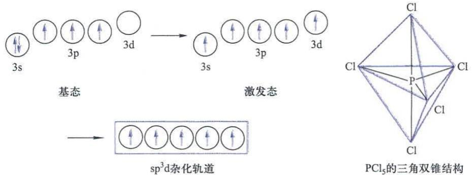

text_image

3s
3p
3d
基态
激发态
sp³d杂化轨道
PCl₅的三角双锥结构

图 6-10 $sp^{3}d$ 杂化和 $PCl_{3}$ 分子的结构示意图

## (2) $\mathrm{sp}^3\mathrm{d}^2$ 杂化

$sp^{3}d^{2}$ 杂化轨道是由一条 ns 轨道、3 条 np 轨道和两条 nd 轨道组合而成的，它的特点是 6 条杂化轨道在空间呈正八面体形分布，杂化轨道间夹角为 $90^{\circ}$ 或 $180^{\circ}$ 。

图 6-11 是 $sp^{3}d^{2}$ 杂化和 $SF_{6}$ 分子的结构示意图。S 原子的基态电子构型为 $1s^{2}2s^{2}2p^{6}3s^{2}3p^{4}$ 。由于 S 原子有空的 3d 轨道，在形成 $SF_{6}$ 分子时，一个 3s 电子和一个已成对的 3p 电子分别激发到空的 3d 轨道，由一条 3s 轨道、3 条 3p 轨道和两条 3d 轨道杂化，形成 6 条 $sp^{3}d^{2}$ 杂化轨道。S 原子的 6 条 $sp^{3}d^{2}$ 杂化轨道在空间呈正八面体形分布，分别与 6 个 F 原子中各一条 2p 轨道重叠共形成 6 个 $\sigma$ 键，故 $SF_{6}$ 分子的构型是正八面体形。

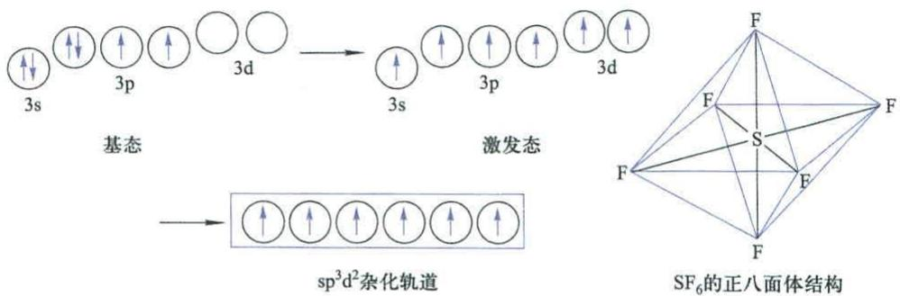

text_image

基态
激发态
sp³d²杂化轨道
SF₆的正八面体结构

图 6-11 $sp^{3}d^{2}$ 杂化和 $SF_{6}$ 分子的结构示意图

## (3) $\mathrm{sp}^3\mathrm{d}^3$ 杂化

$sp^{3}d^{3}$ 杂化也是 s-p-d 型杂化的一种。 $sp^{3}d^{3}$ 杂化轨道是由一条 ns 轨道、3 条 np 轨道和 3 条 nd 轨道组合而成的，它的特点是 7 条杂化轨道在空间呈五角双锥形分布。

此外,还有以内层的 $(n-1)$ d轨道与ns轨道、np轨道一起参与的杂化方式,它主要存在于过渡金属配位化合物中,详细的内容将在第11章配位化学基础中讨论。

杂化轨道成键时,要满足原子轨道最大重叠原理,即轨道重叠越多,形成的化学键越稳定。因为杂化轨道电子云分布更集中,所以杂化轨道的成键能力比未杂化的各原子轨道的成键能力强,形成的分子也更稳定。

## 3. 等性杂化和不等性杂化

杂化过程中形成的杂化轨道可能是一组能量简并的轨道,也可能是一组能量彼此不相等的轨道。因此,轨道的杂化可分为等性杂化和不等性杂化。

## (1) 等性杂化

一组杂化轨道中,若各条轨道的成分相等,则杂化轨道的能量相等,这种杂化称为等性杂化。如上面讨论过的 $CH_{4}$ 分子中,中心 C 原子为 $sp^{3}$ 杂化,每条 $sp^{3}$ 杂化轨道的成分都是等同的,都含有 $\frac{1}{4}$ 的 s 轨道成分和 $\frac{3}{4}$ 的 p 轨道成分,4 条杂化轨道的能量相等,故 $CH_{4}$ 分子中 C 原子的杂化属于 $sp^{3}$ 等性杂化。前面涉及的 $BeCl_{2}$ 分子中 Be 原子的 sp 杂化、 $BF_{3}$ 分子中 B 原子的 $sp^{2}$ 杂化和 $SF_{6}$ 分子中 S 原子的 $sp^{3}d^{2}$ 杂化均属于等性杂化。

## (2) 不等性杂化

一组杂化轨道中,若各条轨道的成分并不相等,则杂化轨道的能量不相等,这种杂化称为不等性杂化。若参与杂化的原子轨道不仅包含具有未成对电子的原子轨道,也包含具有成对电子的原子轨道,这种情况下的杂化经常是不等性杂化。

在水分子中，氧原子的电子构型为 $1\mathrm{s}^2 2\mathrm{s}^2 2\mathrm{p}^4$ ，根据电子配对理论，氧原子的2s电子和一条2p轨道上的孤电子对不参与成键，另外两个成单的 $\mathfrak{p}$ 电子与两个氢原子的1s电子形成两个共价键，H—O—H的键角应为 $90^{\circ}$ 。实验测得键角为 $104^{\circ}31^{\prime}$ 。理论与实际之间不符合。根据杂化轨道理论，氧原子的一条2s轨道和3条2p轨道也发生 $\mathfrak{sp}^3$ 杂化，但形成的4条 $\mathfrak{sp}^3$ 杂化轨道能量并不一致，为 $\mathfrak{sp}^3$ 不等性杂化。有两条杂化轨道的能量较低，被两对孤电子对所占据；另外两条杂化轨道的能量较高，为单电子所占据，这两条杂化轨道与两个氢原子的1s轨道形成两个 $\sigma$ 键，如图6-12所示。

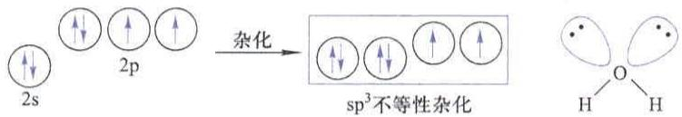

chemical

Energy level diagram of sp³ non-enzene isomerization reaction showing 2s, 2p, and H atoms

图 6-12 水分子中氧原子的 $sp^{3}$ 不等性杂化与水分子的构型

按 $sp^{3}$ 杂化轨道的四面体空间分布,两个 O—H 键之间的夹角应为 $109^{\circ}28'$ ,实际上由于两对孤电子对不参与成键,电子云集中在氧原子周围,对成键电子对所占据的杂化轨道有排斥作用,导致两个 O—H 键之间的夹角减小为 $104^{\circ}31'$ 。

同样，在氨分子中，氮原子的电子构型为 $1\mathrm{s}^2 2\mathrm{s}^2 2\mathrm{p}_x^1 2\mathrm{p}_y^1 2\mathrm{p}_z^1$ 。2s电子尽管是成对的，但仍和 $2\mathrm{p}_x, 2\mathrm{p}_y, 2\mathrm{p}_z$ 轨道杂化，形成4条 $\mathfrak{sp}^3$ 不等性杂化轨道。其中3条能量较高的杂化轨道被单电子所占据，一条能量较低的杂化轨道为孤电子对所占据。3条单电子的杂化轨道与3个氢原子的1s轨道成键，另一条孤电子对占据的轨道不参与成键。但是由于孤电子对对N—H键成键电对的排斥作用，导致键角小于 $109^{\circ}28'$ 。氨分子的构型称为三角锥形。

用杂化轨道理论讨论问题,是在已知分子的构型尤其是键角的基础上进行的。由于配体的不同乃至某方向上缺少配体等,可能导致键角的不同,这时参与杂化的轨道在形成的杂化轨道中的分配就会不相等。这种杂化也应算作不等性杂化,尽管几个杂化轨道中的电子数是相等的。关于杂化轨道的波函数的计算,将在后续的结构化学中学习,得到了各杂化轨道的波函数,自然会解决等性杂化和不等性杂化的问题。

## 6.3.3 $\pi$ 键和大 $\pi$ 键

苯分子的结构是一个平面六元环,每个键角均为 $120^{\circ}$ ,因此每个碳原子均有一个 $2s^{2}$ 电子激发到空的 2p 轨道,且均发生 $sp^{2}$ 杂化。3 条含有单电子的 $sp^{2}$ 杂化轨道分别与相邻的两个碳原子的 $sp^{2}$ 杂化轨道和一个氢原子的 1s 轨道重叠形成3个 $\sigma$ 键。同时，每个碳原子上还有一条具有单电子的未参与杂化的 $2\mathrm{p}_z$ 轨道。它们垂直于苯的分子平面，互相平行、能量相同、对称性匹配。相邻两个碳原子的 $2\mathrm{p}_z$ 轨道“肩并肩”重叠形成 $\pi$ 键。于是苯分子的结构可以认为是单双键交替的六元环，如图6-13所示。

关于苯分子的结构研究表明,它的6个C—C键是完全一致的,没有单双键之分,每个键的强度均介于单键和双键之间。这一实验事实可以用下面讨论的大 $\pi$ 键进行解释。苯分子中6个碳原子上的未参与杂化的 $2p_{z}$ 轨道,它们能量相同、对称性匹配,相互重叠形成一个大 $\pi$ 键,用符号 $\Pi_{6}^{6}$ 表示这个键。 $\Pi_{6}^{6}$ 中右下的6表示有6个原子的轨道互相重叠,即有6个中心;右上的6表示有6个电子在这些互相重叠的轨道中运动。图6-14为苯分子大 $\pi$ 键示意图。

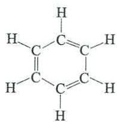

chemical

Molecular structure of propene, a six-membered aromatic ring with double bonds and hydrogen atoms

图6-13 苯分子单双键交替的六元环结构

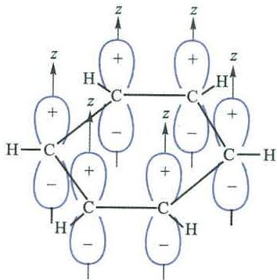

chemical

Molecular structure diagram showing carbon-hydrogen bonding with labeled charges and atomic positions

图 6-14 苯分子大 $\pi$ 键示意图

在一个具有平面结构的多原子分子中,如果彼此相邻的3个或多个原子中有垂直于分子平面的、对称性一致的、未参与杂化的原子轨道,那么这些轨道可以互相重叠,形成多中心 $\pi$ 键。这种多中心 $\pi$ 键又称为“共轭 $\pi$ 键”或“非定域 $\pi$ 键”,简称大 $\pi$ 键。

在 $NO_{2}$ 分子中， $SO_{2}$ 分子中，以及 $CO_{2}$ 分子中，都有大 $\pi$ 键。在本书下册元素化学的学习中，还将进一步研究这种化学键。

1985 年发现的 $C_{60}$ 分子（富勒烯），具有酷似足球形状的笼状结构，相当于一个由二十面体截顶而得到的三十二面体，32 个面中包括 12 个正五边形和 20 个正六边形，每个正五边形均与 5 个正六边形共边，而六边形则将 12 个五边形隔开。量子化学计算表明每个碳原子的轨道发生 $sp^{2.28}$ 杂化，可以近似看成 $sp^{2}$ 杂化。每个碳原子用 3 条具有单电子的 $sp^{2}$ 杂化轨道与 3 个相邻的碳原子的 $sp^{2}$ 杂化轨道重叠，共形成 3 个 $\sigma$ 键。此外，每个碳原子均剩余一条具有单电子的

2p 轨道, 60 个 2p 轨道能量相同、对称性匹配, 相互重叠形成 $\Pi_{60}^{60}$ 的大 $\pi$ 键。值得注意的是, $C_{60}$ 分子并不是一个平面形分子, 而是一个球形分子, 在 $C_{60}$ 分子中, 形成 $\Pi_{60}^{60}$ 大 $\pi$ 键的原子轨道在同一个球面上也满足了原子轨道的有效重叠, 同样可以形成大 $\pi$ 键。

现代价键理论中,分子构型由 $\sigma$ 键确定,无论 $\pi$ 键还是大 $\pi$ 键均在 $\sigma$ 键基础上形成。

## 6.4 价层电子对互斥理论

价键理论和杂化轨道理论都可以解释共价键的方向性,特别是杂化轨道理论在解释分子的构型上是比较成功的。但是一个分子具有哪种构型,以及其中心原子发生哪种杂化,有些情况下难以确定。1940年,西奇维克(Sidgwick)和鲍威尔(Powell)在总结实验事实基础上,提出了一种在概念上比较简单又能比较准确地判断分子构型及杂化方式的理论模型,后经吉莱斯皮(Gillespie)和尼霍姆(Nyholm)在20世纪50年代加以发展,现在称为价层电子对互斥理论(valence-shell electron-pair repulsion,VSEPR)。虽然这个理论只是定性地说明问题,但对判断共价分子或离子的构型及中心原子的杂化方式非常简便实用。

在 $AB_{n}$ 型分子或离子中，A 称为中心，B 称为配体，n 为配体的个数。A 和 B 一般为主族元素的原子。

$AB_{n}$ 型分子或离子的构型取决于中心 A 的价层中电子对的排斥作用。分子的构型总是采取电子对相互排斥力作用最小的结构。

## 6.4.1 中心价层电子的总数和对数

中心价层电子的总数和对数,可以根据以下思路经简单计算确定:

① 价层电子总数等于中心 A 的价层电子数 (s 电子数与 p 电子数之和) 加上配体 B 在成键过程中提供的电子数, 配体在成单键时提供一个电子。如 $CCl_{4}$ 价层电子总数等于 $4+1\times4=8$ ; 成双键、三键时提供两个或 3 个电子。  
② 端基氧原子或硫原子作配体时, 提供电子数为 0。如在 $SO_{3}$ 或 $CS_{2}$ 中, 尤其是含氧酸或含氧酸根(如 $H_{2}SO_{4}$ 或 $ClO_{4}^{-}$ )中, 经常有这种端基氧原子配体。  
③ 处理离子时,要加减与离子电荷数相当的电子数。如 $PO_{4}^{3-}, 5 + 0 \times 4 + 3 = 8; NH_{4}^{+}, 5 + 1 \times 4 - 1 = 8$ 。  
④ 电子对的对数等于电子的总数除以 2。总数为奇数时，商一般进位。如总数为 5，则对数为 3。

## 6.4.2 电子对数和电子对空间构型的关系

为了减少价层电子对之间的斥力,电子对间应尽量互相远离。如果把中心A的价电子层视为以A为球心的一个球面,根据立体几何知识可知,球面上相距最远的两个点是直径的两个端点,相距最远的3点是通过球心的内接三角形的3个顶点,相距最远的4点是内接正四面体的4个顶点,相距最远的5点是内接三角双锥的5个顶点,相距最远的6点是内接正八面体的6个顶点。因此,价层电子对数与电子对空间构型及可能形成的键角之间具有表6-1所示的关系。

表 6-1 价层电子对数与电子对空间构型及可能形成的键角之间的关系

<table><tr><td>价层电子对数</td><td>电子对空间构型</td><td colspan="2">简单图示</td><td>可能形成的键角</td></tr><tr><td>2</td><td>直线形</td><td colspan="2">:A-</td><td>180°</td></tr><tr><td>3</td><td>正三角形</td><td colspan="2"></td><td>120°</td></tr><tr><td>4</td><td>正四面体形</td><td colspan="2"></td><td>109°28&#x27;</td></tr><tr><td>5</td><td>三角双锥形</td><td></td><td></td><td>90°,120°,180°</td></tr><tr><td>6</td><td>正八面体形</td><td></td><td></td><td>90°,180°</td></tr></table>

从表 6-1 中可以看出,在常见的键角中 $90^{\circ}$ 是最小的。

电子对空间构型的重要意义在于它直接与杂化方式相关联，电子对空间构型有直线形、正三角形、正四面体形、三角双锥形和正八面体形，它们依次对应着 $sp, sp^{2}, sp^{3}, sp^{3}d$ 和 $sp^{3}d^{2}$ 杂化，故电子对空间构型非常重要。

## 6.4.3 分子构型和电子对空间构型的关系

若配体的个数 n 与价层电子对数 m 相一致, 则分子或离子的构型与电子对空间构型一致, 这种情况下各电子对均为成键电对。

当配体数 n 小于价层电子对数 m 时, 一部分电子对属于成键电对, 其数目等于 n, 另一部分电子对成为孤电子对, 其数目等于 $(m-n)$ 。确定出孤电子对的位置, 分子构型即可随之确定。

确定 $AB_{n}$ 型分子或离子的构型时，只考虑中心 A 的位置和配体 B 的位置，不考虑电子、孤电子对等所处位置，即电子、孤电子对不作为分子构型。

表 6-2 所示的 4 种情况中, 孤电子对的位置均只有一种选择, 这时分子或离子的构型随着孤电子对位置的确定很容易就确定下来。

表 6-2 孤电子对的位置只有一种选择的情况

<table><tr><td>价层电子对数(m)</td><td>配体数(n)</td><td>孤电子对数(m-n)</td><td>电子对空间构型</td><td>分子构型</td></tr><tr><td>3</td><td>2</td><td>1</td><td>三角形</td><td>V形</td></tr><tr><td>4</td><td>3</td><td>1</td><td>正四面体形</td><td>三角锥形</td></tr><tr><td>4</td><td>2</td><td>2</td><td>正四面体形</td><td>V形</td></tr><tr><td>6</td><td>5</td><td>1</td><td>正八面体形</td><td>四角锥形</td></tr></table>

价层电子对数 m 和配体数 n 相等的分子或离子, 其中心 A 的杂化类型属于等性杂化。这时可以由分子或离子的构型直接判断中心的杂化方式, 因为分子或离子的构型与电子对空间构型一致。

价层电子对数 m 大于配体数 n 的分子或离子, 其中心 A 的杂化类型属于不等性杂化。这时分子或离子的构型与杂化方式没有直接的关系, 只能根据电子对空间构型去判断中心的杂化方式。

孤电子对的位置,若有两种或两种以上的选择可供考虑时,则要选择斥力小且易于平衡的位置。价层电子对互相排斥作用的大小,取决于电子对之间的夹角和电子对参与成键的情况。一般规律如下:

① 电子对之间夹角越小，斥力越大。  
② 由于成键电子对受两个原子核的吸引,所以其电子云在一定程度上被中和、被分散,而孤电子对只受到中心原子的吸引,电子云比较集中,对相邻的电子对的排斥作用较大。因此,不同价层电子对之间排斥作用的顺序为

孤电子对-孤电子对 > 孤电子对-成键电子对 > 成键电子对-成键电子对

所以有两对孤电子对时,首先要尽量避免具有最大斥力的“孤电子对-孤电子对”分布在互成90°的方向上。其次要避免“孤电子对-成键电子对”分布在互成90°的方向上,如果只有一对孤电子对,后一点则尤为重要。

以 $SF_{4}$ 分子为例。中心 S 原子的价层电子总数为 $6+1\times4=10$ ，价层电子对数为 5，其中 4 对成键电子对，一对孤电子对。电子对空间构型为三角双锥形，孤电子对的排布方式有两种选择，见图6-15。两种排布方式哪种更稳定，可根据三角双锥中成键电子对和孤电子对之间处于 $90^{\circ}$ 夹角的排斥作用数目来判定。从图6-15中可知，在（a）和（b）两种排布中，成键电子对和孤电子对之间 $90^{\circ}$ 夹角的排斥作用数目分别为2和3，因此(a)的斥力较小。故 $\mathrm{SF}_4$ 分子采用图6-15(a)所示的排布，一对孤电子对位于三角锥底平面上。由于孤电子对有较大的排斥作用，挤压三角平面上的两对成键电子对，使键角小于 $120^{\circ}$ ，同时挤压轴线方向上的成键电子对导致键角内弯，使之大于 $180^{\circ}$ 。 $\mathrm{SF}_4$ 分子的构型称为变形四面体形。

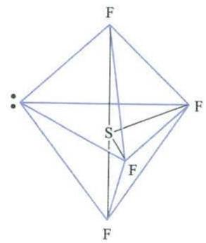

text_image

F
S
F
F

(a)

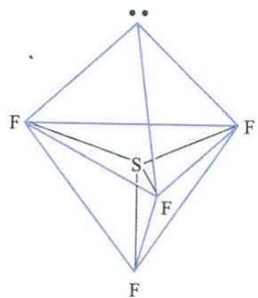

text_image

F
S
F
F

(b)  
图 6-15 SF $_{4}$ 分子的两种可能结构

又如，在 $\mathrm{ClF}_3$ 分子中，中心Cl原子的价层电子总数为 $7 + 1\times 3 = 10$ ，价层电子对数为5，其中3对成键电子对，两对孤电子对。电子对的空间排布为三角双锥形，三角双锥的5个顶角中有两个顶角为孤电子对所占据，3个顶角为成键电子对所占据。因此， $\mathrm{ClF}_3$ 分子有3种可能的结构，见图6-16。

chemical

Chemical structure diagram of a fluorinated tetrahedral complex with chlorine and fluorine atoms

(a)

chemical

Chemical structure diagram showing a central atom bonded to four fluorine atoms and one chlorine atom, forming a tetrahedral geometry.

(b)

chemical

Chemical structure diagram showing a central chlorine atom bonded to four fluorine atoms in a tetrahedral geometry

(c)  
图 6-16 ClF₃ 分子的 3 种可能结构

为了确定 3 种结构中哪一种是最稳定的结构,可根据价层电子对互相排斥作用大小的规律,从如下所列各种电子对之间 $90^{\circ}$ 夹角的排斥作用数目来判断:

<table><tr><td>ClF3分子的结构</td><td>(a)</td><td>(b)</td><td>(c)</td></tr><tr><td>90°孤电子对-孤电子对之间排斥作用数目</td><td>0</td><td>1</td><td>0</td></tr><tr><td>90°孤电子对-成键电子对之间排斥作用数目</td><td>4</td><td>3</td><td>6</td></tr><tr><td>90°成键电子对-成键电子对之间排斥作用数目</td><td>2</td><td>2</td><td>0</td></tr></table>

由于结构(b)有 $90^{\circ}$ 孤电子对-孤电子对之间排斥作用,而结构(a)和结构(c)没有,首先排除斥力最大的结构(b)。与结构(c)相比,结构(a)的 $90^{\circ}$ 孤电子对-成键电子对之间排斥作用较少。因此,在3种可能结构中,结构(a)的排斥作用最小,是一种较稳定的结构。通过以上分析, $ClF_{3}$ 分子应具有图6-16(a)所示的结构,称为T形。

## 6.4.4 多重键的处理

当非ⅥA族配体原子与中心原子之间有双键或三键时，价层电子对数减1或减2。

例如,乙烯 $\ce{C=CH2}$ , 若以左碳原子为中心, 将其归为 $AB_{n}$ 型分子, 则电

子对数为 4, 因有非 VIA 族配体 $CH_{2}$ 与中心原子之间成双键而使价层电子对数减 1, 故价层电子对数为 3, 共有 3 个配体, 所以其构型为平面三角形。

又如， $\begin{array}{c}H\\H\end{array}C=O$ ，根据VIA族元素作配体时提供电子数为0的特殊规定，它

的价层电子对数为 3。且 VIA 族配体原子与中心原子之间形成双键时，价层电子对数不必减 1，就是 3 对。价层有 3 对电子，有 3 个配体，所以其构型为平面三角形。

之所以规定VIA族元素特别是端基氧原子作配体时提供电子数为0，是因为氧原子与中心原子经常以双键结合形成端基，若按贡献两个价层电子计算，又要根据后一规定价层电子对数减1。所以按前一规定不加两个电子，再按后一规定不减去1对是合理的。可见后一规定是以前一规定为基础的。若与中心相连的氧原子不是端基而是桥基，例如—OH，就不应该考虑它的特殊性。

## 6.4.5 影响键角的因素

以上讨论的几何形状均为理想化的模型。实际上有许多因素将影响键角，使理想化的形状产生一定的变化。

## 1. 孤电子对和重键的影响

分子中孤电子对和重键的存在,由于其负电荷集中,将排斥其余成键电子对,使相关的键角变小。

例如， $NH_{3}$ 分子，4 对电子，电子对空间构型为正四面体形，有一对孤电子对，分子构型为三角锥形。孤电子对对 N—H 成键电子对的排斥使得 H—N—H 键角小于 $109^{\circ}28'$ ，变为 $106^{\circ}42'$ 。又如， $H_{2}O$ 分子，4 对电子，电子对空间构型为正四面体形，有两对孤电子对，分子构型为 V 形。孤电子对对 O—H 成键电子对的排斥使得 H—O—H 键角变为 $104^{\circ}31'$ 。

对含有重键的分子来说， $\pi$ 键电子对虽然不能决定分子的基本形状，但对键角有一定的影响，一般单键与单键之间的键角较小，单键与双键、双键与双键之间的键角较大。例如，乙烯 $(\mathrm{C}_2\mathrm{H}_4)$ 分子中，由于重键的存在，其负电荷集中，使 $\mathrm{H}-\mathrm{C}-\mathrm{H}$ 键角略小于 $120^{\circ}$ 。又如，甲醛分子中的双键对 $\mathrm{C}-\mathrm{H}$ 成键电子对的排斥使得 $\mathrm{H}-\mathrm{C}-\mathrm{H}$ 键角略小于 $120^{\circ}$ ，而 $\mathrm{O}-\mathrm{C}-\mathrm{H}$ 键角大于 $120^{\circ}$ 。

## 2. 中心和配体电负性的影响

中心和配体的电负性对键角也有一定的影响。

配体一致,中心电负性大时,成键电子对距中心近,于是成键电子对相互间距离小。电子对间斥力使键角变大,以达到平衡。如 $NH_{3}$ 分子中 H—N—H 键角大于 $SbH_{3}$ 分子中 H—Sb—H 键角。

而中心相同,配体电负性大时,成键电子对距离中心远,即成键电子对相互间距离大,键角可以小些。如 $PF_{3}$ 分子中 F—P—F 键角小于 $PBr_{3}$ 分子中 Br—P—Br 键角。表 6-3 给出的一些化合物中的键角数据可支持上述推理。

表 6-3 一些化合物中的键角

<table><tr><td>化合物</td><td> $NH_{3}$ </td><td> $PH_{3}$ </td><td> $AsH_{3}$ </td><td> $SbH_{3}$ </td></tr><tr><td>化学键</td><td>H—N—H</td><td>H—P—H</td><td>H—As—H</td><td>H—Sb—H</td></tr><tr><td>键角</td><td>106°42′</td><td>93°21′</td><td>92°6′</td><td>91°36′</td></tr><tr><td>化合物</td><td> $PF_{3}$ </td><td> $PCl_{3}$ </td><td></td><td> $PBr_{3}$ </td></tr><tr><td>化学键</td><td>F—P—F</td><td>Cl—P—Cl</td><td></td><td>Br—P—Br</td></tr><tr><td>键角</td><td>97°48′</td><td>100°16′</td><td></td><td>101°</td></tr></table>

表 6-4 给出了 $AB_{n}$ 型分子或离子的价层电子对数、配体数目、孤电子对数目与价层电子对空间构型、分子或离子的构型之间的关系，作为对于本节内容的一个小结。

表 6-4 AB, 型分子或离子的构型

<table><tr><td>A的价层电子对数</td><td>配体B数目n</td><td>孤电子对数目m</td><td>价层电子对空间构型</td><td>分子或离子的构型</td><td>实例</td></tr><tr><td>2</td><td>2</td><td>0</td><td></td><td>直线形</td><td> $\text{BeCl}_2, \text{CO}_2$ </td></tr><tr><td rowspan="2">3</td><td>3</td><td>0</td><td></td><td>平面三角形</td><td> $BF_3, BCl_3, SO_3$  $CO_3^{2-}, NO_3^-$ </td></tr><tr><td>2</td><td>1</td><td></td><td>V形</td><td> $PbCl_2, SO_2$  $O_3, NO_2, NO_2^-$ </td></tr><tr><td rowspan="3">4</td><td>4</td><td>0</td><td></td><td>四面体形</td><td> $CH_4, CCl_4, SiCl_4$  $NH_4^+, SO_4^{2-}, PO_4^{3-}$ </td></tr><tr><td>3</td><td>1</td><td></td><td>三角锥形</td><td> $NH_3, PF_3, AsCl_3$  $H_3O^+, SO_3^{2-}$ </td></tr><tr><td>2</td><td>2</td><td></td><td>V形</td><td> $H_2O, H_2S$  $SF_2, SCl_2$ </td></tr><tr><td>5</td><td>5</td><td>0</td><td></td><td>三角双锥形</td><td> $PF_5, PCl_5, AsF_5$ </td></tr><tr><td rowspan="3">5</td><td>4</td><td>1</td><td></td><td>变形四面体形</td><td>SF4,TeCl4</td></tr><tr><td>3</td><td>2</td><td></td><td>T形</td><td>CIF3,BrF3</td></tr><tr><td>2</td><td>3</td><td></td><td>直线形</td><td>XeF2,I3,IF2</td></tr><tr><td rowspan="3">6</td><td>6</td><td>0</td><td></td><td>正八面体形</td><td>SF6,SiF26-,AlF36-</td></tr><tr><td>5</td><td>1</td><td></td><td>四角锥形</td><td>CIF5,BrF5,IF5</td></tr><tr><td>4</td><td>2</td><td></td><td>平面正方形</td><td>XeF4,ICl4</td></tr></table>

例 6-1 判断下列分子或离子的构型,并指出中心原子的杂化方式:

$$
\mathrm{H} _ {3} \mathrm{O} ^ {+} \quad \mathrm{CS} _ {2} \quad \mathrm{SO} _ {4} ^ {2 -} \quad \mathrm{SF} _ {4}
$$

要求指出价层电子总数、价层电子对数、价层电子对空间构型、分子或离子的构型，并画出简图。

解：答案如下：

<table><tr><td></td><td> $H_3O^+$ </td><td> $CS_2$ </td><td> $SO_4^{2-}$ </td><td> $SF_4$ </td></tr><tr><td>中心原子价层电子数</td><td>6</td><td>4</td><td>6</td><td>6</td></tr><tr><td>配体提供电子数</td><td>3</td><td>0</td><td>0</td><td>4</td></tr><tr><td>离子提供电子数</td><td>-1</td><td>0</td><td>2</td><td>0</td></tr><tr><td>价层电子总数</td><td>8</td><td>4</td><td>8</td><td>10</td></tr><tr><td>价层电子对数</td><td>4</td><td>2</td><td>4</td><td>5</td></tr><tr><td rowspan="2">价层电子对空间构型</td><td></td><td>—</td><td></td><td></td></tr><tr><td>正四面体形</td><td>直线形</td><td>正四面体形</td><td>三角双锥形</td></tr><tr><td rowspan="2">分子或离子的构型</td><td></td><td>—</td><td></td><td></td></tr><tr><td>三角锥形</td><td>直线形</td><td>正四面体形</td><td>变形四面体形</td></tr><tr><td>中心原子的杂化方式</td><td> $sp^3$ 不等性杂化</td><td>sp 等性杂化</td><td> $sp^3$ 等性杂化</td><td> $sp^3d$ 不等性杂化</td></tr></table>

## 6.5 分子轨道理论

价键理论、杂化轨道理论和价层电子对互斥理论都比较直观，能够较好地说明共价键的形成和分子的构型。但这些理论也有其局限性。例如，根据价键理论，电子配对成键时，形成共价键的电子只局限在两个相邻原子间的小区域内运动，没有考虑整个分子的情况。对于氧分子，价键理论认为电子配对成键，没有成单电子。但是实验测定氧分子是顺磁性分子，磁学理论已经证明顺磁性分子中一定有成单电子。这个实验事实用价键理论无法解释。又如，在氢分子离子 $H_{2}^{+}$ 中存在单电子键，也是价键理论无法解释的。为了求解多电子分子的薛定谔方程,美国科学家马利肯和德国科学家洪德提出了分子轨道理论。分子轨道理论从分子整体出发,考虑电子在分子内部的运动状态,是一种化学键的量子理论。它抛开了传统价键理论的某些概念,能够更广泛地解释共价分子的形成和性质。

分子轨道理论和现代价键理论作为两个分支,构成了现代共价键理论。

## 6.5.1 分子轨道理论要点

① 分子轨道理论认为,在分子中电子不是属于某个特定的原子,电子不在某个原子轨道中运动,而是在分子轨道中运动。分子中的每个电子的运动状态用相应的波函数 $\psi$ 来描述,这个 $\psi$ 称为分子轨道。  
② 分子轨道是由分子中各原子的原子轨道线性组合而成的。组合形成的分子轨道数目与组合前的原子轨道数目相等。例如，两个原子轨道 $\psi_{a}$ 和 $\psi_{b}$ 线性组合后产生两个分子轨道 $\psi_{1}$ 和 $\psi_{1}^{*}$ ：

$$
\psi_ {1} = c _ {1} \psi_ {\mathrm{a}} + c _ {2} \psi_ {\mathrm{b}}
$$

$$
\psi_ {1} ^ {*} = c _ {1} \psi_ {\mathrm{a}} - c _ {2} \psi_ {\mathrm{b}}
$$

式中 $c_{1}$ 和 $c_{2}$ 均是常数。这种组合是不同原子的原子轨道的线性组合，与轨道的杂化不同，因为轨道的杂化是同一原子的不同原子轨道的重新组合。分子轨道与原子轨道的不同之处还在于分子轨道是多中心的，而原子轨道则只有一个中心。原子轨道用 s, p, d, f, … 表示，分子轨道常用 $\sigma, \pi, \delta, \cdots$ 表示。每个分子轨道 $\psi$ 都有相应的角度分布图像。

③ 原子轨道线性组合得到分子轨道，分子轨道中能量高于原来原子轨道者称为反键分子轨道，简称反键轨道，如前面所示的 $\psi_{1}^{*}$ ；能量低于原来原子轨道者称为成键分子轨道，简称成键轨道，如前面所示的 $\psi_{1}$ 。  
④ 根据线性组合方式的不同, 分子轨道可分为 $\sigma$ 分子轨道和 $\pi$ 分子轨道。根据分子轨道的能量的高低, 可以排列出分子轨道能级图。

原子轨道经线性组合形成分子轨道的几种最常见的例子如下：

s 轨道与 s 轨道的线性组合 两个原子的 1s 轨道线性组合成一个能量低的成键分子轨道 $\sigma_{1s}$ 和一个能量高的反键分子轨道 $\sigma_{1s}^{*}$ ，其角度分布如图 6-17 所示。如果是 2s 原子轨道，则组合成的分子轨道分别是 $\sigma_{2s}$ 和 $\sigma_{2s}^{*}$ 。

text_image

原子轨道
+ +
s + s
反键分子轨道
成键分子轨道
σs*
σs

图 6-17 s-s 重叠型 $\sigma$ 分子轨道

s 轨道与 p 轨道的线性组合 当一个原子的 s 轨道和另一个原子的 $p_{x}$ 轨道沿 x 轴方向重叠时，则形成一个能量低的成键分子轨道 $\sigma_{sp}$ 和一个能量高的反键分子轨道 $\sigma_{sp}^{*}$ ，这种 s-p 组合分子轨道的角度分布如图 6-18 所示。

chemical

原子轨道与成键分子轨道示意图，标注原子轨道和成键分子轨道的相互作用

图 6-18 s-p 重叠型 $\sigma$ 分子轨道

值得注意的是,成键分子轨道没有两核间的节面,而反键分子轨道在两核之间有节面。

p 轨道与 p 轨道的线性组合 这类组合有“头碰头”和“肩并肩”两种方式。

当两个原子的 $p_{x}$ 轨道沿 x 轴以“头碰头”方式重叠时，产生一个成键的分子轨道 $\sigma_{p_{x}}$ 和一个反键的分子轨道 $\sigma_{p_{x}}^{*}$ ，其角度分布如图 6-19 所示。

chemical

原子轨道与成键分子轨道示意图，标注原子轨道和成键分子轨道的正负 charge

图 6-19 p-p“头碰头”方式重叠型 σ 分子轨道

与此同时，这两个原子的 $p_{y}-p_{y}$ 或 $p_{z}-p_{z}$ 将以“肩并肩”的方式发生重叠。这样组成的分子轨道叫做 $\pi$ 分子轨道，即成键分子轨道 $\pi_{p}$ 和反键的分子轨道 $\pi_{p}^{*}$ ，如图 6-20 所示。

$\pi$ 分子轨道有通过键轴的节面,而 $\sigma$ 分子轨道没有通过键轴的节面。

chemical

原子轨道与成键分子轨道关系示意图，标注了反键分子轨道和π*ρy(z)等元素

图 6-20 p-p“肩并肩”方式重叠型 $\pi$ 分子轨道

此外，一个原子的 $p_{x}$ 轨道可以同另一个原子的 $d_{xy}$ 轨道发生重叠，两个原子的 d 轨道，如 $d_{xy}-d_{xy}$ ，也可发生重叠，组合成分子轨道。

## 6.5.2 原子轨道线性组合三原则

原子轨道在组合成分子轨道时,要遵循对称性匹配原则、能量相近原则和轨道最大重叠原则,这些原则是有效组成分子轨道的必要条件。

## 1. 对称性匹配原则

只有对称性相同的原子轨道才能组合成分子轨道。原子轨道有一定的对称性，如s轨道是球形对称的，即球的每一条直径均为任意多次旋转轴，而 $p_{x}$ 轨道可以绕着x轴旋转任意角度其图形和符号都不改变。若以x轴为键轴，s-s， $s-p_{x},p_{x}-p_{x}$ 等原子轨道组合成的 $\sigma$ 分子轨道，当绕键轴旋转时，各轨道形状和符号不变。而 $p_{y}-p_{y},p_{z}-p_{z},d_{xy}-p_{y}$ 等原子轨道重叠组合成的 $\pi$ 分子轨道，各原子轨道对于一个通过键轴的节面具有反对称性。

这就是所谓对称性相同原则。在分子轨道形成过程中，对称性匹配原则是首要因素。

## 2. 能量相近原则

只有能量相近的原子轨道才能组合成有效的分子轨道，而且原子轨道的能量越接近越好。这个原则对于确定两种不同类型的原子轨道之间能否组成分子轨道更是重要。例如，H原子1s轨道的能量是 $-1312\mathrm{kJ}\cdot \mathrm{mol}^{-1}$ ，O原子的2p轨道和Cl原子的3p轨道的能量分别是 $-1314\mathrm{kJ}\cdot \mathrm{mol}^{-1}$ 和 $-1251\mathrm{kJ}\cdot \mathrm{mol}^{-1}$ ，因此，H原子的1s轨道与O原子的2p轨道和Cl原子的3p轨道能量相近，可以组成分子轨道。而Na原子的3s轨道能量为 $-496\mathrm{kJ}\cdot \mathrm{mol}^{-1}$ ，与O原子的2p轨道、Cl原子的3p轨道及H原子的1s轨道能量相差太大，所以不能组成分子轨道。事实上Na原子和O,Cl,H原子之间只会形成离子键。

## 3. 轨道最大重叠原则

在符合对称性匹配条件和满足能量相近原则下,原子轨道重叠的程度越大,成键效应越显著,形成的化学键越稳定。例如,两个原子轨道沿x轴方向相互接近时,s轨道与s轨道之间的重叠, $p_{x}$ 轨道与 $p_{x}$ 轨道之间的重叠,就属于这种情况。

## 6.5.3 分子轨道中的电子排布

## 1. 分子轨道能级图

每个分子轨道都有相应的能量。分子轨道的能量,目前主要是根据光谱实验数据来确定的。把分子中各分子轨道按能量由低到高排列,可得分子轨道能级图。图 6-21 是同核双原子分子的分子轨道能级图。第二周期有 8 个元素，其中只有 $O_{2}$ 分子和 $F_{2}$ 分子，其成键的 2s 原子轨道能量和 2p 原子轨道能量相差较大，不用考虑 2s 轨道和 2p 轨道的相互作用，其分子轨道能级按图 6-21(a) 排列，此时， $E(\pi_{2p}) > E(\sigma_{2p})$ 。

chemical

Molecular orbital diagrams showing electron density distributions along atomic orbitals and bonding distances, labeled with protons (2p), electrons (2s), and spin states (1s, 1s*, 2s*).

图 6-21 同核双原子分子的分子轨道能级图

其他双原子分子如 $N_{2}, C_{2}$ 等，由于其 2s 轨道和 2p 轨道能量差较小，当原子彼此靠近时，对称性相同的 $\sigma_{2s}$ 和 $\sigma_{2p_{z}}, \sigma_{2s}^{*}$ 和 $\sigma_{2p_{z}}^{*}$ 进一步相互作用，以致改变了能级次序，如图 6-21(b) 所示，此时， $E(\pi_{2p}) < E(\sigma_{2p})$ 。

分子中的所有电子属于整个分子。电子在分子轨道中依能量由低到高的次序排布。这种排布与电子在原子轨道中排布一样，仍遵循能量最低原理、泡利原理和洪德规则。在分子中，成键轨道填充的电子多，体系的能量低，分子就稳定。如果反键轨道填充的电子多，体系的能量高，则不利于分子的稳定存在。

分子轨道理论没有单键、双键等概念, 分子的稳定性将通过键级来描述。分子中成键电子数和反键电子数之差等于 2 时键级为 1, 于是有

$$
\mathrm{键级} = \frac {\mathrm{成键电子数} - \mathrm{反键电子数}}{2}
$$

键级越高,分子越稳定,键级为0的分子不能稳定存在。

## 2. 同核双原子分子

氢 $(1s^{1})$ $H_{2}$ 分子共有两个电子, 这两个电子填充在 $\sigma_{1s}$ 分子轨道中, 得到 $H_{2}$ 的分子轨道能级图, 见图 6-22(a), 其电子排布式为 $(\sigma_{1s})^{2}$ , 键级为 1。

chemical

原子轨道结构示意图，标注原子轨道、分子轨道和原子轨道符号

(a)

chemical

原子轨道结构示意图，标注原子轨道、分子轨道和原子轨道的波长与轨道方向

(b)

chemical

原子轨道结构示意图，标注原子轨道、分子轨道和原子轨道的符号

(c)  
图 6-22 $H_{2}, He_{2}, He_{2}^{+}$ 的分子轨道图

氦 $(1s^{2})$ He $_{2}$ 分子共有4个电子，这4个电子填充在 $\sigma_{1s}$ 和 $\sigma_{1s}^{*}$ 两个分子轨道中，得到He $_{2}$ 的分子轨道图，见图6-22(b)，其电子排布式为 $(\sigma_{1s})^{2}(\sigma_{1s}^{*})^{2}$ 。He $_{2}$ 分子有两个成键电子和两个反键电子，键级为0，不能稳定存在。

化学式为 $He_{2}^{+}$ 的氦分子离子共有 3 个电子，其中两个电子填充在 $\sigma_{1s}$ 分子轨道中，一个填充在 $\sigma_{1s}^{*}$ 分子轨道中，得到分子轨道图，见图 6-22(c)，其电子排布式为 $(\sigma_{1s})^{2}(\sigma_{1s}^{*})^{1}$ 。 $He_{2}^{+}$ 的键级为 $\frac{1}{2}$ ，可以稳定存在。价键理论无法解释氦分子离子中的化学键，故不能解释其存在的事实。

锂 $(1s^{2}2s^{1})$ Li $_{2}$ 分子共有6个电子,其中4个是1s电子,两个是2s电子。其电子排布式为 $(\sigma_{1s})^{2}(\sigma_{1s}^{*})^{2}(\sigma_{2s})^{2}$ 。由于 $\sigma_{2s}$ 电子的存在,使分子中内层的两个1s原子轨道间的重叠大幅度减小,它们的 $\sigma_{1s}$ 和 $\sigma_{1s}^{*}$ 两个分子轨道的能量实际上和1s原子轨道的能量相差不大。Li $_{2}$ 分子的两个2s轨道组合得到一个成键分子轨道 $\sigma_{2s}$ 和一个反键轨道 $\sigma_{2s}^{*}$ ,两个2s电子占据能级较低的成键 $\sigma_{2s}$ 轨道,键级为1。Li $_{2}$ 的电子排布式也可以简写为KK $(\sigma_{2s})^{2}$ ,其中KK表示有两对电子分别处于两个原子K层的1s轨道。相互重叠程度大的主要是原子的外层轨道,因此原子内层1s电子基本上维持了在原子轨道中的状态。

铍 $(1s^{2}2s^{2})$ $Be_{2}$ 分子共有8个电子,其中4个是1s电子,其余4个2s电子占满 $\sigma_{2s}$ 和 $\sigma_{2s}^{*}$ 轨道。键级为0,所以该分子不稳定,目前实验中还没有发现 $Be_{2}$ 分子存在。

硼 $(1s^{2}2s^{2}2p^{1})$ $B_{2}$ 分子共有 10 个电子，内层 4 个电子仍在原子的 K 层 s 轨道。填入分子轨道中的 6 个电子，其中 4 个填入 $\sigma_{2s}$ 和 $\sigma_{2s}^{*}$ 分子轨道，另两个填入 $\pi$ 分子轨道，见图 6-21(b)。根据洪德规则，后两个电子应分别填入 $\pi_{2p_{y}}$ 和 $\pi_{2p_{z}}$ 轨道。 $B_{2}$ 的电子排布式为 $\mathrm{KK}(\sigma_{2s})^{2}(\sigma_{2s}^{*})^{2}(\pi_{2p_{y}})^{1}(\pi_{2p_{z}})^{1}$ ，这样 $B_{2}$ 分子应含有两个单电子，也就是说 $B_{2}$ 分子具有顺磁性。实验结果表明 $B_{2}$ 分子确实是顺磁性分子，这也是 $\pi_{2p}$ 能级低于 $\sigma_{2p}$ 的重要证据。如果 $\sigma_{2p}$ 能级低于 $\pi_{2p}$ ，最后两个电子将会成对填入 $\sigma_{2p}$ ，不存在单电子，从而使 $B_{2}$ 分子显示逆磁性。 $B_{2}$ 分子计算的键级为 1, 说明 B 原子之间存在化学键。但是由于电子占满 $\sigma_{2s}$ 和 $\sigma_{2s}^{*}$ 轨道，所以在 $B_{2}$ 分子中，两个 B 原子之间只存在 $\pi$ 键，不存在 $\sigma$ 键。

碳 $(1s^{2}2s^{2}2p^{2})$ $C_{2}$ 分子的 12 个电子中有 8 个电子填入分子轨道，其电子排布式为 $\mathrm{KK}(\sigma_{2s})^{2}(\sigma_{2s}^{*})^{2}(\pi_{2p_{y}})^{2}(\pi_{2p_{z}})^{2}$ ，由于全部电子都成对，因此 $C_{2}$ 分子显示抗磁性。该分子可在高温或放电条件下检出。 $C_{2}$ 分子的键级为 2，说明 $C_{2}$ 分子解离能比较高。

氮 $(1s^{2}2s^{2}2p^{3})$ $N_{2}$ 分子有 10 个电子填入分子轨道，其电子排布式为 $KK(\sigma_{2s})^{2}(\sigma_{2s}^{*})^{2}(\pi_{2p_{y}})^{2}(\pi_{2p_{x}})^{2}(\sigma_{2p_{x}})^{2}$ ，其中有 8 个成键电子和两个反键电子，键级为 3，稳定性非常高。从电子排布式中可以看出，两个 N 原子间存在一个 σ 键和两个 π 键，与路易斯结构式（:N≡N:）相一致。

氧 $(1s^{2}2s^{2}2p^{4})$ $O_{2}$ 分子中有 12 个电子填入分子轨道，前 10 个电子按能级由低到高填至成键轨道 $\sigma_{2p}$ 和两个能量相同的 $\pi_{2p}$ 轨道，最后两个电子应该分别填入 $\pi_{2p_{y}}^{*}$ 和 $\pi_{2p_{z}}^{*}$ 轨道， $O_{2}$ 的分子轨道图如图 6-23 所示。其电子排布式为 $\mathrm{KK}(\sigma_{2s})^{2}(\sigma_{2s}^{*})^{2}(\sigma_{2p_{x}})^{2}(\pi_{2p_{y}})^{2}(\pi_{2p_{z}})^{2}(\pi_{2p_{y}}^{*})^{1}(\pi_{2p_{z}}^{*})^{1}$ 。

按照价键理论, $O_{2}$ 分子中所有电子都配对,无法解释氧分子的顺磁性。从分子轨道理论可以清楚地看出, $O_{2}$ 分子中含有两个成单电子,是顺磁性分子。在 $O_{2}$ 分子中,氧原子之间存在一个 $\sigma$ 键

chemical

Energy level diagram of atomic orbitals showing electron transitions and spin states at 2p, 1s, and 2s orbital positions

图6-23 $\mathrm{O}_2$ 的分子轨道图

$(\sigma_{2p})$ 和两个三电子 $\pi$ 键，即 $(\pi_{2p_y} - \pi_{2p_y}^*)^3$ 和 $(\pi_{2p_z} - \pi_{2p_z}^*)^3$ 。根据 $O_2$ 分子的电子排布计算其键级为2，说明一个三电子 $\pi$ 键的强度相当于正常 $\pi$ 键的一半。如果在 $O_2$ 分子的最高被占轨道 $\pi_{2p}^{*}$ 上移去或填入一个电子，就得到氧分子离子 $O_2^+$ 和 $O_2^-$ ，它们的键级分别为 $2\frac{1}{2}$ 和 $1\frac{1}{2}$ ，因此，有如下的稳定性次序： $O_2^+ > O_2 > O_2^-$ 。

氟 $(1s^{2}2s^{2}2p^{5})$ $F_{2}$ 分子中的所有电子都成对,键级为1,与路易斯结构式相一致。

氖 $(1s^{2}2s^{2}2p^{6})$ 实验中从未检测出 $Ne_{2}$ 分子的存在, 这与分子轨道理论的判断相一致。电子填满了图 6-21(a) 中的所有分子轨道, 键级为 0。

## 3. 异核双原子分子

不同种类原子组合成分子轨道,也遵循对称性匹配原则、能量相近原则和轨道最大重叠原则。只有在这种条件下，两个不同原子的轨道才能发生有效的组合，形成分子轨道。

CO 是第二周期元素形成的异核双原子分子。对于 CO 分子, 其分子轨道能

级图和 $\mathbf{N}_2$ 分子的分子轨道能级图接近，见图6-24。由于O的电负性比C大，O原子的2s和2p轨道能量分别比C原子的2s和2p轨道能量低，这与科顿原子轨道能级图的各轨道的能量随原子序数 $Z$ 的增大而下降的结论一致。在原子轨道线性组合成分子轨道过程中，2s和2p轨道因能量相近，C原子和O原子的2s轨道不仅参与了较低能级的分子轨道 $3\sigma$ 和 $4\sigma$ 的组成，同时也参与了较高能级的分子轨道 $5\sigma$ 和 $6\sigma$ 的组成。C原子和O原子的 $2p_{z}$ 轨道在参与较高能级的分子轨道 $5\sigma$ 和 $6\sigma$ 组成的同时，也参与了较低能级的分子轨道 $3\sigma$ 和 $4\sigma$ 的组成。因

chemical

Molecular orbital diagram showing O, CO, and C atomic orbitals with spin states labeled in sigma units

图 6-24 CO 分子的分子轨道能级图

为这些分子轨道组成的复杂性,所以不再使用 $\sigma_{2s}, \sigma_{2s}^{*}, \pi_{2p}, \pi_{2p}^{*}$ 等名称,而称为 $3\sigma, 4\sigma, 1\pi, 2\pi$ 等。

CO 分子有 14 个电子, 它的电子排布式为

$$
(1 \sigma) ^ {2} (2 \sigma) ^ {2} (3 \sigma) ^ {2} (4 \sigma) ^ {2} (1 \pi) ^ {4} (5 \sigma) ^ {2}
$$

$1\sigma, 3\sigma, 1\pi, 5\sigma$ 为成键分子轨道， $2\sigma, 4\sigma, 2\pi, 6\sigma$ 为反键分子轨道。在CO分子中，存在一个 $\sigma$ 键和两个 $\pi$ 键，键级为3，所以分子很稳定。CO作为配体时使用 $5\sigma$ 轨道上的电子对进入中心原子的空轨道形成配位键。没有填充电子的空轨道 $2\pi$ 和 $6\sigma$ 分子轨道可以接收中心原子反馈的电子形成反馈键，增加分子的稳定性。

CO 分子的分子轨道能级图和 $N_{2}$ 分子的分子轨道能级图相似,仅能量略有差异。它们的分子中都有 14 个电子,都占据同样的分子轨道,这样的两种分子称为等电子体。

NO 与 CN $^{-}$ 也是第二周期元素形成的异核双原子分子或离子, 其分子轨道能级图也与此类似。NO 分子有 15 个电子, 最后一个电子填入反键轨道, 它的键级为 2 $\frac{1}{2}$ , 分子稳定性较高。如果失去一个电子变成 NO $^{+}$ 分子离子, 则能量最高的处于反键轨道上的电子失去, 键级变为 3, 分子更稳定。NO 分子中有一个成单电子, 分子具有顺磁性, 而 NO $^{+}$ 中没有成单电子, 具有逆磁性。

卤化氢分子是由氢原子与卤素原子所形成的异核双原子分子，在卤化氢分子中，氢原子的1s轨道和卤素原子的 $np_{x}$ 轨道可以线性组合成一个 $\sigma$ 成键分子轨道和一个 $\sigma^{*}$ 反键分子轨道，卤素原子的其他轨道均为非键轨道。

氟化氢的分子轨道图如图 6-25 所示。

若 H 原子和 F 原子沿 x 轴接近，则 F 原子的 $2p_{x}$ 轨道和 H 原子的 1s 轨道对称性相同，且能量相近，两者组成一对分子轨道，即成键分子轨道 $3\sigma$ 和反键分子轨道 $4\sigma$ 。这时 F 原子的 $2p_{y}$ 轨道和 $2p_{z}$ 轨道与 H 原子的 1s 轨道对称性不一致，仍保持原子轨道的能量，对 HF 分子的形成不起作用，成为非键轨道 $1\pi$ 和 $2\pi$ 。F 原子的 1s, 2s 轨道与 H 原子

chemical

原子轨道结构示意图，标注了H原子轨道、HF分子轨道和F原子轨道的波长与电子跃迁

图 6-25 氟化氢的分子轨道图

的 1s 轨道能量差过大,仍保持原子轨道的能量,对 HF 分子的形成不起作用,成为非键轨道 $1\sigma$ 和 $2\sigma$ 。

前面介绍过的同核双原子分子，如 $N_{2}, C_{2}, B_{2}$ 等，其分子轨道称为 $1\sigma, 2\sigma, 1\pi, 2\pi, \cdots$ 也更为合适。

## 拓展学习资源

<table><tr><td>资源内容</td><td>二维码</td></tr><tr><td>▶ 科学家简介——路易斯▶ 科学家简介——鲍林▶ sp 杂化轨道的角度分布图是如何得到的▶  $NO_{2}$  分子中的化学键▶ 氧分子离子的分子轨道及其稳定性▶ 分子轨道的应用——分子光谱▶ 本章小结</td><td>扫一扫查看资源内容</td></tr></table>

## 总结与思考题

6-1 简述路易斯理论的基本内容。该理论的局限性表现在哪里？  
6-2 共价键的本质是什么？如何理解共价键具有方向性和饱和性？

6-3 简述杂化轨道理论的主要内容和用途。

6-4 简述价层电子对互斥理论的主要内容和用途。总结价层电子对互斥理论与杂化轨道理论的内在联系。

6-5 简述分子轨道理论的主要内容。说明分子轨道理论在化学键理论体系中的位置。

6-6 举例说明分子轨道理论较价键理论的优越性。

## 习题

6-1 试从元素电负性数据判断下列化合物中哪些是共价型化合物。

(1) NaF;

(2) $CCl_{4}$ ;

(3) RbBr;

(4) HI;

(5) CuI;

(6) $B_{2}O_{3}$ ;

(7) CdS;

(8) CsCl。

6-2 试给出下列分子的路易斯结构式。

(1) HI;

(2) HCN;

(3) $H_{2}S;$

(4) HClO;

(5) $C_{2}H_{4}$ ;

(6) $\left(\mathrm{CH}_{3}\right)_{2}\mathrm{O}$ ;

(7) $H_{2}O_{2}$ ;

(8) $N_{2}H_{4}$

6-3 已知 $NH_{3}$ 分子中 3 个 H 原子的解离能数据如下：

$$
\mathrm{NH} _ {3} (\mathrm{g}) = \mathrm{H(g)} + \mathrm{NH} _ {2} (\mathrm{g}) D _ {1} = 4 3 5 \mathrm{kJ} \cdot \mathrm{mol} ^ {- 1}
$$

$$
\mathrm{NH} _ {2} (\mathrm{g}) = \mathrm{H(g)} + \mathrm{NH(g)} \quad D _ {2} = 3 7 7 \mathrm{kJ} \cdot \mathrm{mol} ^ {- 1}
$$

$$
\mathrm{NH(g)} = \mathrm{H(g)} + \mathrm{N(g)} \quad D _ {3} = 3 1 4 \mathrm{kJ} \cdot \mathrm{mol} ^ {- 1}
$$

试求 $NH_{3}$ 分子中 N—H 键的键能。

6-4 乙炔 $(\mathrm{H} - \mathrm{C} \equiv \mathrm{C} - \mathrm{H})$ 分子为直线形，两个C原子之间成三键。试用杂化轨道理论解释这一事实。

6-5 二氧化碳 $(\mathrm{O} = \mathrm{C} = \mathrm{O})$ 分子为直线形，C原子与两个O原子之间均成双键。试用杂化轨道理论解释这一事实。

6-6 试用价层电子对互斥理论判断下列3种氟化物的分子构型，并用杂化轨道理论分析它们的成键情况。

(1) $BF_{3}$ ;

(2) $NF_{3}$ ;

(3) $ClF_{3}$

6-7 乙烯 $\left(\mathrm{H}_{2}\mathrm{C}=\mathrm{CH}_{2}\right)$ 分子中，两个C原子之间成双键。试以左C原子为中心，用价层电子对互斥理论判断其构型，并用杂化轨道理论解释其成键情况。

6-8 试用价层电子对互斥理论判断下列分子或离子的构型。

(1) $BeCl_{2}$ ;

(2) $NO_{3}^{-}$ ;

(3) $NH_{4}^{+}$ ;

(4) $PCl_{5}$ ;

(5) $SF_{6}$

6-9 试用价层电子对互斥理论判断下列分子或离子的构型，并指出其中心原子的杂化方式。

(1) $SO_{2}$ ;

(2) $SO_{3}^{2-}$ ;

(3) $H_{2}O$ ;

(4) $BrF_{5}$

6-10 比较下列各组分子或离子的键角的大小,并说明原因。

(1) $CH_{4}, NH_{3}, OF_{2}, O_{3}$ ;  
(2) $NH_{4}^{+}, NO_{3}^{-}, NO_{2}^{+}, NO_{2}^{-};$  
(3) $NCl_{3}$ , $PCl_{3}$ , $PBr_{3}$ , $PI_{3}$

6-11 试用价层电子对互斥理论判断下列分子或离子的构型,再用杂化轨道理论说明它们的成键情况。

(1) $SF_{4}$ ;

(2) $BrF_{3}$ ;

(3) $I_{3}^{-}$ ;

(4) $ICl_{4}^{-}$

6-12 试说明下列分子或离子的中心原子的杂化方式。

(1) $NCl_{3}$ ;

(2) $TeCl_{4}$ ;

(3) $CHCl_{3}$ ;

(4) $\mathrm{PH}_{4}^{+}$ ;

(5) $PCl_{6}^{-}$ ;

(6) $IF_{3}$

6-13 试解释下列分子或离子中形成的共轭 $\pi$ 键。

(1) $NO_{2}, \Pi_{3}^{3}$ 或 $\Pi_{3}^{4}$ ;

(2) $CO_{3}^{2-}, \Pi_{4}^{6};$

(3) $NO_{3}^{-}, \Pi_{4}^{6};$

(4) $O_{3}, \Pi_{3}^{4}$

6-14 实验测得 $\mathrm{BF}_3$ 分子中，B—F 键键长为 $130~\mathrm{pm}$ ，比理论 B—F 单键键长 $152~\mathrm{pm}$ 短，试加以解释。

6-15 试画出下列同核双原子分子的分子轨道图,写出电子排布式;并计算键级,指出其中哪个最稳定,哪个最不稳定;且判断哪些具有顺磁性,哪些具有逆磁性。

(1) $H_{2}$ ;

(2) $He_{2}$ ;

(3) $Li_{2}$ ;

(4) $Be_{2}$ ;

(5) $B_{2}$ ;

(6) $C_{2}$ ;

(7) $\mathrm{N}_2$

(8) $F_{2}$

6-16 试写出 $\mathrm{O}_2^{2-}, \mathrm{O}_2^-, \mathrm{O}_2, \mathrm{O}_2^+$ 分子或离子的电子排布式，指出它们的稳定性顺序。

6-17 根据分子轨道理论回答下列问题：

(1) N 原子的电离能与 $N_{2}$ 分子的电离能哪一个大些,为什么?

(2) O 原子的电离能与 $O_{2}$ 分子的电离能哪一个大些,为什么?

6-18 试画出 NO 的分子轨道图, 写出电子排布式, 指出它们的键级和磁性, 并比较 $NO^{+}$ , NO 和 $NO^{-}$ 的稳定性。

6-19 试画出 HF 的分子轨道图,并以此为例说明非键分子轨道概念,指出分子轨道图中的非键轨道是在什么条件下形成的。

  
第6章习题参考答案

## 7

## 晶体结构

## 目录

## 7.1 分子晶体和分子间作用力 231

7.1.1 分子的极性 231  
7.1.2 范德华力 233

1. 取向力 233  
2. 诱导力 233  
3. 色散力 234

7.1.3 次级键和氢键 234

1. 氢键的形成 235  
2. 氢键的特点 236  
3. 氢键对化合物熔点和沸点的影响 237

## 7.2 离子晶体和离子键 237

7.2.1 离子键的形成 237  
7.2.2 离子键的性质 239  
7.2.3 离子键的强度 240  
7.2.4 离子的特征 243

1. 离子的电荷 243  
2. 离子的电子构型 243  
3. 离子半径 244

7.2.5 离子晶体 245

1. 离子晶体的特性 245  
2. 几种简单的离子晶体 246  
3. 配位数和离子半径比的关系 248

## 7.3 离子极化……250

7.3.1 离子极化作用 250

1. 离子的极化 250  
2. 离子的变形性 251  
3. 相互极化作用 252

4. 反极化作用 252

## 7.3.2 离子极化对化合物结构和性质的影响 253

1. 对化合物键型和结构的影响 …… 253  
2. 对化合物物理性质的影响 …… 254  
3. 对化合物热稳定性的影响 255

## 7.4 金属晶体和金属键 256

7.4.1 金属键的改性共价键理论 …… 256  
7.4.2 金属键的能带理论 …… 257  
7.4.3 金属晶体的紧密堆积结构 259

1. 六方最密堆积结构 259  
2.立方最密堆积结构 260  
3. 体心立方密堆积结构 261

## 7.5 原子晶体和混合晶体 261

7.5.1 原子晶体 261  
7.5.2 混合晶体 262  
7.5.3 四种基本类型晶体比较 263

拓展学习资源 264

总结与思考题 264

习题……265

## 晶体结构

## 7.1 分子晶体和分子间作用力

分子之间以分子间作用力结合成的晶体称为分子晶体。分子间作用力是一种较弱的相互作用，远小于化学键的结合强度，其结合能比化学键的键能小1\~2个数量级。因此，分子晶体一般在较低的温度下才能形成，常温时则多以气体形式存在。分子晶体主要包括：部分非金属单质，如卤素、氧、硫、磷等单质；非金属氢化物，如 $H_{2}O$ ， $NH_{3}$ ，HF等；一些非金属氧化物，如 $SO_{2}$ ， $CO_{2}$ ， $NO_{2}$ 等；还有多种有机化合物。

构成分子晶体的粒子是分子,有的是极性分子,也有的是非极性分子。它们一般通过分子间的范德华力和氢键相结合。分子晶体中存在着单个分子,这些分子是由有限数目的原子构成的,相对分子质量可以测定,且有恒定的数值。由于分子晶体中分子间力较弱,因此其熔点和沸点低,硬度小,挥发性大,在固态和熔化状态下一般不导电。某些极性很强的分子晶体,如 HCl,溶解在极性溶剂水中,由于发生解离而导电。

## 7.1.1 分子的极性

在第 5 章中曾指出,电负性可以表示分子内原子对电子的吸引能力。

由相同原子组成的双原子分子, 如 $H_{2}, Cl_{2}$ 等, 成键原子的元素电负性相同, 对共用电子对的吸引力相同, 分子中电子云分布均匀, 整个分子的正电荷重心与负电荷重心重合。这时分子中的键是非极性共价键, 这种分子叫非极性分子。而由两个不同原子构成双原子分子, 如 HCl, 由于 Cl 元素的电负性大于 H 元素, Cl 原子对共用电子对的吸引力大于 H 原子, 分子中电子云偏向 Cl 原子, 使 Cl 原子一端显负电性, H 原子一端显正电性, 分子的正电荷重心与负电荷重心不重合, 形成正、负两极。这时分子中的键是极性共价键, 这种分子叫极性分子。

键的极性与电负性差有关,两个原子的元素电负性差值越大,键的极性一般就越大。但多原子分子中的化学键，除元素的电负性外，电子的分布等因素也将影响其极性。分子的极性不仅与键的极性有关，而且与分子的构型及电子的分布等因素有关。如果原子间的化学键是极性键，对于双原子分子则一定是极性分子，而对多原子分子来说，就要考虑分子的构型。例如， $\mathrm{NH}_{3}$ 和 $\mathrm{BF}_{3}$ 两种分子，虽然N—H键和B—F键都是极性键，但是具有平面三角形构型的 $\mathrm{BF}_{3}$ 分子，其正、负电荷重心重合，键的极性互相抵消，是非极性分子；而具有三角锥形构型的 $\mathrm{NH}_{3}$ 分子，其正、负电荷重心不重合，键的极性不能抵消，是极性分子。

极性分子的极性大小用偶极矩 $\mu$ 来衡量。显然，偶极矩的大小与正电荷重心与负电荷重心之间的距离——偶极长 d，以及正、负电荷重心的电荷量 q 有关。分子的偶极矩定义为分子的偶极长与偶极一端的电荷量的乘积，即

$$
\mu = q \cdot d
$$

偶极矩 $\mu$ 的单位为“德拜”，用 D 表示。当偶极的电荷量 $q=1.602\times10^{-19}C$ ，偶极长 $d=1\times10^{-10}m$ 时， $\mu=4.8D$ 。在国际单位制中，偶极矩 $\mu$ 以 $C\cdot m$ （库仑·米）为单位， $1D=3.34\times10^{-30}C\cdot m$ 。通过下面一些常见的极性分子的偶极矩数据，既可以体会“德拜”这一单位的大小，又可以定量地比较这些分子的极性。

<table><tr><td>极性分子</td><td> $H_{2}O$ </td><td>HCl</td><td>HBr</td><td>HI</td><td> $H_{2}S$ </td><td> $SO_{2}$ </td><td> $NH_{3}$ </td></tr><tr><td> $\mu/D$ </td><td>1.85</td><td>1.11</td><td>0.83</td><td>0.45</td><td>0.97</td><td>1.63</td><td>1.47</td></tr></table>

随着国际单位制的推广与应用，“德拜”这个单位已经逐渐停止使用。

化学键的极性也可以用键的偶极矩衡量，分子中各个化学键的偶极矩的矢量和，等于分子的偶极矩。偶极矩 $\mu$ 为0的分子当然是非极性分子。偶极矩 $\mu$ 是否为0，有助于判断分子的空间结构。如 $\mathrm{CO}_{2}$ 和 $\mathrm{SO}_2$ 分子均属于 $\mathrm{AB}_2$ 型分子，测得前者的偶极矩为0，说明分子是非极性的，当然属于直线形；而测得后者的偶极矩 $\mu = 1.63\mathrm{D}$ ，说明分子是极性的，当然属于V形。

由于极性分子的正、负电荷重心不重合，因此分子中始终存在一个正极和一个负极，这种极性分子本身固有的偶极矩称为固有偶极或永久偶极。但是分子的极性并不是固定不变的，在外电场作用下非极性分子和极性分子中的正、负电荷重心会发生变化，如图7-1所示。在电场中，非极性分子的正、负电荷重心发生分离，变成具有一定偶极的极性分子；而极性分子在外电场的影响下其偶极也将增大。这种在外电场诱导下产生的偶极矩称为诱导偶极。任何一个分子无论是极性的还是非极性的，由于原子核和电子都在不停地运动，不断地改变它们的相对位置，都将致使分子的正、负电荷重心在瞬间不相重合，这时产生的偶极矩称为瞬间偶极。

chemical

Diagram illustrating electron spin states with chemical potentials and charge distribution

图 7-1 外电场对分子极性的影响

瞬间偶极的大小与分子的变形性有关,分子越大,越容易变形,瞬间偶极也越大。

## 7.1.2 范德华力

分子间作用力最早是由范德华研究实际气体对理想气体状态方程的偏差时提出来的,所以把这类分子间作用力称为范德华力。分子间的范德华力可根据来源不同分为3个部分——取向力、诱导力和色散力。

## 1. 取向力

取向力(orientation force)又称定向力,是极性分子与极性分子之间的永久偶极与永久偶极之间的静电引力。因为两个极性分子相互接近时,同极相斥,异极相吸,使分子发生相对转动,极性分子按一定方向排列,并由静电引力互相吸引。当分子之间接近到一定距离后,排斥和吸引达到相对平衡,从而使体系能量达到最小值。极性分子永久偶极间存在作用力是葛生(Keesom)于1912年首先提出来的,因此取向力也称为葛生力。

取向力的本质是静电引力,取向力与分子偶极矩的平方成正比,与热力学温度成反比,与分子间距离的7次方成反比。

## 2. 诱导力

在极性分子和非极性分子之间,以及极性分子相互之间都存在诱导力(in-duced force)。当极性分子和非极性分子充分接近时,在极性分子的永久偶极诱导下,邻近的非极性分子产生诱导偶极,于是诱导偶极与永久偶极之间产生静电引力。极性分子与非极性分子之间的这种相互作用称为诱导力。图7-2表示了这一作用产生的过程。同样,当极性分子与极性分子相互接近时,除取向力外,在彼此偶极的相互作用下,每个分子也会发生变形而产生诱导偶极,因此极性分子相互之间也存在诱导力。诱导力是德拜(Debye)于1921年提出来的,所以诱导力又称为德拜力。

chemical

Simple diagram showing electron delocalization with positive and negative charges

图 7-2 极性分子与非极性分子相互作用示意图

诱导力的本质也是静电引力,可以根据静电理论求出其大小。诱导力与分子偶极矩的平方成正比,与被诱导分子的变形性成正比。

## 3. 色散力

任何一个分子都存在着瞬间偶极,这种瞬间偶极会诱导邻近分子也产生瞬间偶极,于是两个分子可以靠瞬间偶极相互吸引。这种瞬间偶极产生的作用力称为色散力(dispersion force)。色散力是伦敦(London)于1930年根据近代量子力学方法证明的,由于从量子力学导出的理论公式与光色散公式相似,因此把这种作用称为色散力,又叫做伦敦力。量子力学计算表明,色散力与分子的变形性有关,变形性越大,色散力越强。

由于各种分子均有瞬间偶极,所以色散力存在于极性分子和极性分子、极性分子和非极性分子及非极性分子和非极性分子之间。而且在一般情况下,色散力是主要的分子间作用力。只有极性相当强的分子,取向力才显得重要。从下面给出的3种力的百分数数据中,可以清楚地看到这一点。

<table><tr><td>分子</td><td>取向力/%</td><td>诱导力/%</td><td>色散力/%</td></tr><tr><td>HCl</td><td>15.66</td><td>4.73</td><td>79.61</td></tr><tr><td>NH3</td><td>44.65</td><td>5.20</td><td>50.15</td></tr><tr><td>H2O</td><td>76.90</td><td>4.08</td><td>19.02</td></tr></table>

综上所述，分子间的范德华力是一种永远存在于分子间的作用力。因为范德华力随着分子间距离的增大而迅速减小，所以它是一种近程力，表现为分子间近距离的吸引力，作用范围只有几百皮米。其作用能的大小从几到几十焦耳每摩尔，比化学键的键能小1\~2个数量级。与共价键不同，范德华力没有方向性和饱和性。3种范德华力由于相互作用的分子不同，所占的比例也不同，但色散力通常是最主要的。

## 7.1.3 次级键和氢键

反映在分子结构上,当原子间距离小于或接近相应的离子半径、共价半径或金属半径之和时,可以认为原子间形成了化学键;当不同分子中的原子间距离接近范德华半径之和时,可以认为分子间有范德华力相互作用;当原子间距离介于化学键与范德华力范围之间时,可以认为原子间生成了次级键(secondary bond)。例如,对一系列化合物的Hg—N键研究发现,化合物中Hg原子和N原子之间的距离是在从共价半径之和(约0.21 nm)到范德华半径之和(约0.33 nm)的区间内连续分布的。这说明次级键是普遍客观存在的,同时也说明化学键、次级键和范德华力三者之间的界限是很难明确划分的。

次级键中有相当一部分是有氢原子参与的。氢键(hydrogen bond)是次级键的典型,也是最早发现和研究的次级键。分子间以氢键为代表的次级键作用也是分子间作用力的重要组成部分。

## 1. 氢键的形成

最早对于氢键的研究是从认识分子缔合开始的。比较ⅥA族元素氢化物的沸点(见表7-1)，人们发现 $H_{2}O$ 的沸点比其同族元素氢化物的沸点反常地高。在ⅦA族元素氢化物中HF的沸点也反常地高。这说明分子间有很强的作用力，以致分子间发生了缔合，这种缔合是氢键造成的。下面以水分子为例说明氢键的形成。

表 7-1 VIA 族和 VIIA 族元素氢化物的沸点

<table><tr><td>VIA族元素氢化物</td><td>沸点/°C</td><td>VIIA族元素氢化物</td><td>沸点/°C</td></tr><tr><td> $H_{2}O$ </td><td>100.0</td><td>HF</td><td>20</td></tr><tr><td> $H_{2}S$ </td><td>-60</td><td>HCl</td><td>-85</td></tr><tr><td> $H_{2}Se$ </td><td>-41.3</td><td>HBr</td><td>-66.4</td></tr><tr><td> $H_{2}Te$ </td><td>-2</td><td>HI</td><td>-35.6</td></tr></table>

由于氧元素的电负性比氢元素的大得多,因此水分子中 O—H 键极性很强。共用电子对强烈地偏向于氧原子一端,结果使氧原子带有部分负电荷,而氢原子带有部分正电荷,几乎成为裸露的质子。当两个水分子充分靠近时,带正电荷的氢原子与另一水分子中含有孤电子对、带有部分负电荷的氧原子相互吸引,这种吸引力称为分子间的氢键作用,如图 7-3 所示。

氢键通常可用 --- 表示, 如 X—H---Y, 其中 X, Y 可以是同种元素的原子, 也可以是不同种元素的原子。经典氢键中的 X, Y 一般是电负性大、半径小的 F, N, O 等原子, 这样的氢键较强。

除了分子间的氢键外,某些物质也可以形成分子内氢键。图 7-4 为邻硝基苯酚的分子内氢键示意图。

chemical

Molecular structure diagram of a diatomic molecule with two oxygen atoms and bond distances labeled

图7-3 水分子间的氢键

chemical

Chemical structure of a benzene ring with an amide group and hydroxyl substituent

图7-4 邻硝基苯酚的分子内氢键示意图

近年来对分子结构的研究发现,除上面介绍的传统氢键外,还存在许多类型的弱的氢键,如 C—H---O,C—H---N 氢键,C—H---π,O—H---π 氢键,O—H---M 氢键和 M—H---O 氢键等。

从本质上讲,氢键是一种长距离静电相互作用,氢键的形成必须具备两个基本条件:

① 分子中有一个极性 X—H 键作为氢键给予体。X 的电负性较大、半径较小，使得氢原子带部分正电荷。  
② 在上述 H 原子附近有一个具有孤电子对、电负性较大、半径较小的 Y 原子，或具有电子给予体性质的基团，作为氢键接受体。

## 2. 氢键的特点

## (1) 氢键的方向性和饱和性

氢键的方向性是指 Y 原子与 X—H 键形成氢键时，Y 原子中孤电子对的对称轴要尽可能与 X—H 键的键轴在同一方向，即 X—H---Y 位于一条直线上。这样可使 X 原子和 Y 原子距离最远，两原子间负电荷的斥力最小，因而体系稳定。

氢键的饱和性是指每一个 X—H 键只能与一个 Y 原子形成氢键。由于氢原子比 X, Y 原子小得多，形成 X—H---Y 键后，X, Y 原子电子云的斥力使得另一个极性分子的 Y' 原子很难靠近。

对于弱的氢键,如 C—H---O 氢键,C—H---N 氢键等,其方向性和饱和性不如经典的氢键严格。H---Y 间距离较长,经常出现一个 Y 原子同时形成多个氢键的情况。图 7-5 表示了一个氧原子与多个 C—H 键形成多个氢键的情况。

chemical

Diagram showing carbon, oxygen, and hydrogen atoms connected by distances to a central atom with labeled wavelengths

图 7-5 一个氧原子与多个 C—H 键形成多个氢键

## (2) 氢键的强度

氢键的强弱与 X 和 Y 的电负性大小有关: X, Y 的电负性越大, 则形成的氢键越强。此外, 氢键的强弱也与 X 原子和 Y 原子的半径大小有关; 较小的原子半径有利于形成较强的氢键。例如, F 的电负性最大, 原子半径最小, 形成的氢键最强; Cl 的电负性比较大, 但原子半径也较大, 形成的氢键较弱; C 的电负性比较小, 形成的氢键也较弱。氢键的强弱次序一般如下:

$$
\mathrm{F} - \mathrm{H} \dots \mathrm{F} > \mathrm{O} - \mathrm{H} \dots \mathrm{O} > \mathrm{N} - \mathrm{H} \dots \mathrm{N} > \mathrm{Cl} - \mathrm{H} \dots \mathrm{Cl} > \mathrm{C} - \mathrm{H} \dots \mathrm{X}
$$

表 7-2 定量给出一些常见氢键的键长、键能数据。

表 7-2 一些常见氢键的键长、键能

<table><tr><td>氢键</td><td>键长*/pm</td><td>键能/(kJ·mol-1)</td></tr><tr><td>F—H---F</td><td>255</td><td>28.0</td></tr><tr><td>O—H---O</td><td>276</td><td>18.8</td></tr><tr><td>N—H---N</td><td>358</td><td>5.4</td></tr><tr><td>N—H---F</td><td>266</td><td>20.9</td></tr><tr><td>N—H---O</td><td>286</td><td>—</td></tr></table>

\* 氢键的键长是指 X 原子中心到 Y 原子中心的距离。

## 3. 氢键对化合物熔点和沸点的影响

分子间形成氢键时,化合物的熔点、沸点显著升高。HF 和 $H_{2}O$ 等第二周期元素的氢化物,由于分子间氢键的存在,要使其固体熔化或液体汽化,必须给予额外的能量破坏分子间的氢键,所以它们的熔点、沸点均高于各自同族的氢化物。

值得注意的是,能够形成分子内氢键的物质,其分子间氢键的形成将被削弱,因此它们的熔点、沸点不如只能形成分子间氢键的物质高。硫酸、磷酸都是高沸点的无机强酸,但是硝酸由于可以生成分子内氢键,却是挥发性的无机强酸。前面提到的可以生成分子内氢键的邻硝基苯酚,其熔点远低于它的同分异构体对硝基苯酚。

由于具有静电性质和定向性质,氢键在分子形成晶体的堆积过程中有一定作用。尤其当体系中形成较多氢键时,通过氢键连接成网络结构和多维结构在晶体工程学中有重要意义。

## 7.2 离子晶体和离子键

## 7.2.1 离子键的形成

人们熟悉的由活泼金属元素和活泼非金属元素组成的化合物如 NaCl, KCl,

$\mathrm{MgSO_4}$ , $\mathrm{CaO}$ 等, 在通常情况下是结晶状的固体, 具有较高的熔点和沸点, 熔融状态时能够导电。这类化合物多数能溶于水, 水溶液也能够导电。为了说明这类化合物的原子之间相互作用的本质, 1916 年, 德国人科塞尔 (Kossel) 根据大多数化合物具有稀有气体稳定结构的事实, 提出了离子键的概念。

这类化合物之所以能导电,是因为它们处于熔融状态或在水溶液中能够产生带电荷的粒子,即离子。科塞尔认为电离能小的活泼金属元素的原子和电子亲和能大的活泼非金属元素的原子相互接近时,金属原子上的电子转移到非金属原子上,分别形成具有稀有气体稳定电子构型的阴、阳离子。阳离子和阴离子之间通过静电引力结合在一起,形成离子化合物。这种阴、阳离子间的静电引力就叫做离子键。当不同的原子通过离子键相结合时,必然伴随着体系能量的变化,而且新体系的能量大大低于旧体系。在科塞尔的离子键模型中,可以把阴、阳离子看成半径大小不同的球体。根据库仑定律,两个距离为 r,带有相反电荷 $q^{-}$ 和 $q^{+}$ 的阴、阳离子之间的势能 $V_{吸引}$ 为

$$
V _ {\text {吸引}} = - \frac {q ^ {+} q ^ {-}}{4 \pi \varepsilon_ {0} r} \tag {7-1}
$$

式中 $q^{+}$ 和 $q^{-}$ 分别是阳离子和阴离子的电荷量， $r$ 是两个离子的核间距离， $\varepsilon_{0}$ 是真空介电常数。当阴、阳离子相互接近时，它们之间主要是静电吸引作用。但当阴离子进一步相互接近时，除了静电吸引外，还存在外层电子之间及原子核之间的相互排斥作用。这种排斥作用当 $r$ 较大时可以忽略。但当阴、阳离子充分接近，即 $r$ 极小时，这种排斥作用的势能迅速增大。量子力学研究表明，这种排斥作用的势能 $V_{\text{排斥}}$ 与 $r$ 之间成指数函数关系：

$$
V _ {\text {排斥}} = A \mathrm{e} ^ {- \frac {r}{\rho}} \tag {7-2}
$$

式中 $A$ 和 $\rho$ 均为常数。因此，阴、阳离子之间的总势能与距离 $r$ 的关系为

$$
V = V _ {\text {吸引}} + V _ {\text {排斥}} = - \frac {q ^ {+} q ^ {-}}{4 \pi \varepsilon_ {0} r} + A \mathrm{e} ^ {- \frac {r}{\rho}} \tag {7-3}
$$

根据式(7-3)，可以得到表示 V 与 r 的关系的势能曲线，图 7-6 所示的是 NaCl 的势能曲线。

由图7-6可知，当钠离子和氯离子相互接近时，在 $r$ 较大时钠离子和氯离子之间的排斥作用可以忽略，主要表现为吸引作用，所以体系的势能随着 $r$ 的减小而减小。当钠离子和氯离子非常接近时， $r$ 很小，此时排斥作用为主，体系势能迅速增大。当钠离子和氯离子接近平衡距离 $r_0$ 时，体系的吸引作用和排斥作用处于动态平衡，这时钠离子和氯离子在平衡位置附近振动，体系的势能最低。即体系的势能值最小时的距离是平衡距离,此时钠离子和氯离子之间形成了稳定的化学键——离子键。

line chart

| r     | V     |
|-------|-------|
| 0     | V_r0  |
| r₀    | V_r0  |

图7-6 NaCl的势能曲线

## 7.2.2 离子键的性质

从离子键形成过程可以看出,当活泼金属原子和活泼非金属原子相互接近时,发生电子转移,形成阴、阳离子,阳离子和阴离子之间通过静电引力结合在一起形成离子键,也就是说离子键的本质是静电作用力。根据库仑定律,两个带有相反电荷 $q^{-}$ 和 $q^{+}$ 的阴、阳离子之间的静电作用力与离子电荷的乘积成正比,与离子间距离成反比。所以,离子的电荷越大,离子间的距离越小,离子间的静电引力越强,离子键就越强。

由于离子键是阳离子和阴离子之间的静电引力作用,因此决定了离子键没有方向性和饱和性。

没有方向性是指由于离子的电荷是球形对称分布的,它可以在空间任何方向吸引带有异号电荷的离子,不存在在某一特定方向上吸引力更强的问题。

没有饱和性是指在空间条件允许的情况下,每一个离子可吸引尽可能多的带有异号电荷的离子。但是,这并不是说一个离子周围所排列的带有异号电荷离子的数目是任意的。实际上,每个离子周围排列的带有异号电荷离子的数目是一定的,这个数目与阴、阳离子半径的大小和所带电荷的多少等有关。

以氯化钠晶体为例。如图 7-7 所示, 每个 $Na^{+}$ 周围等距离地排列着 6 个 $Cl^{-}$ , 同时每个 $Cl^{-}$ 周围也等距离地排列着 6 个 $Na^{+}$ 。这并不意味着每个 $Na^{+}$ 周围只吸引了 6 个 $Cl^{-}$ 后电场就饱和了,因为在距离稍远的地方还有其他 $Cl^{-}$ ,只不过静电引力随着距离的增大而减弱。

chemical

Crystal lattice structure diagram showing Cl⁻ and Na⁺ ions in a cubic arrangement

图7-7 NaCl的晶体结构

离子键是活泼金属元素的原子和活泼非金属元素的原子之间形成的,其形成的重要条件就是元素之间的电负性差值较大。一般来说,元素的电负性差值越大,形成的离子键越强。在元素周期表中,IA族的碱金属电负性较小,VIIA族的卤素电负性较大,它们的原子之间形成的化学键一般都是离子键。应该指出,近代实验证明,即使是电负性最小的铯与电负性最大的氟所形成的氟化铯,也不纯粹是静电作用,仍有部分原子轨道的重叠,即仍有部分共价键的性质。一般用离子性百分数来表示键的离子性的相对大小,例如有研究工作证明,在氟化铯中,离子性占92%,也就是说铯离子与氟离子之间的化学键仍有8%的共价性。

有几种近似方法可以得到化学键的离子性百分数,AB型化合物之间单键离子性百分数与A和B两种元素电负性差值之间的关系,经常可以通过查表7-3得到。

表 7-3 单键的离子性百分数与电负性差值之间的关系

<table><tr><td> $\Delta X$ </td><td>离子性百分数/%</td><td> $\Delta X$ </td><td>离子性百分数/%</td><td> $\Delta X$ </td><td>离子性百分数/%</td></tr><tr><td>0.2</td><td>1</td><td>1.2</td><td>30</td><td>2.2</td><td>70</td></tr><tr><td>0.4</td><td>4</td><td>1.4</td><td>39</td><td>2.4</td><td>76</td></tr><tr><td>0.6</td><td>9</td><td>1.6</td><td>47</td><td>2.6</td><td>82</td></tr><tr><td>0.8</td><td>15</td><td>1.8</td><td>55</td><td>2.8</td><td>86</td></tr><tr><td>1.0</td><td>22</td><td>2.0</td><td>63</td><td>3.0</td><td>89</td></tr></table>

从表 7-3 可以看出, 当两种元素电负性的差值为 1.7 时, 单键约具有 50% 的离子性。因此, 一般把元素电负性差值大于 1.7 的化合物看做离子化合物, 而对于元素电负性差值小于 1.7 的化合物, 认为它们主要形成共价键。例如, 在氯化钠中, 钠的电负性是 0.93, 氯的电负性是 3.16, 它们之间的电负性差值是 2.23, 形成的氯化钠中键的离子性百分数约为 71%。数据说明钠离子与氯离子之间主要形成离子键, 氯化钠是典型的离子化合物。又如, 铯的电负性是 0.79, 氟的电负性是 3.98, 它们之间的电负性差值是 3.19, 氟化铯中键的离子性百分数约为 92%。应该指出的是, 电负性差值 1.7 并不是离子化合物和共价化合物的绝对分界线, 而只是一个有用的参考数据。

## 7.2.3 离子键的强度

离子键的强度可以用键能和晶格能来描述,下面以 NaCl 为例说明离子键键

能和晶格能的概念。

离子键的键能是指 1 mol 气态 NaCl 分子解离成气态原子时, 所吸收的能量, 用 $E_{i}$ 表示。可以写为

$$
\mathrm{NaCl(g)} = \mathrm{Na(g)} + \mathrm{Cl(g)} \quad \Delta H = E _ {i}
$$

键能 $E_{i}$ 越大, 表示离子键越强。

离子键的强度通常用晶格能的大小来衡量。晶格能的定义是:在标准状态下(严格讲是在0 K时),相互远离的1 mol气态阳离子 $\left(\mathrm{Na}^{+}\right)$ 和1 mol气态阴离子 $\left(\mathrm{Cl}^{-}\right)$ 形成1 mol离子晶体(NaCl)时所放出的能量,符号为U。可表示为

$$
\mathrm{Na} ^ {+} (\mathrm{g}) + \mathrm{Cl} ^ {-} (\mathrm{g}) = \mathrm{NaCl(s)} \quad \Delta H = - U
$$

在离子晶体中,既有相反电荷之间的库仑吸引力,又有相同电荷之间的排斥力,所以离子化合物中离子键是晶体中吸引力和排斥力综合平衡的结果。离子化合物在通常状态下以阴、阳离子聚集在一起形成的晶体巨分子的形式存在,所以离子化合物的化学结合力不是简单的两个阴、阳离子之间的结合,而是整块晶体内部的结合力。因此,用晶格能描述离子键的强度经常比用离子键的键能描述更好。

晶格能是表达离子晶体内部结构稳定程度的重要指标,是影响离子化合物一系列性质如熔点、硬度和溶解度等的主要因素。

晶格能不能用实验的方法直接测得,但是可以通过热化学方法从有关的实验数据间接计算得出。第2章2.2.2小节中的赫斯定律指出:一个化学反应若能分解成几步来完成,总反应的热效应等于各步反应的热效应之和。根据这个定律,德国人玻恩(Born)和哈伯(Haber)建立了著名的玻恩-哈伯循环,用热化学计算的方法解决晶格能问题。

例如，NaCl 的生成反应为

$$
\mathrm{Na(s)} + \frac {1}{2} \mathrm{Cl} _ {2} (\mathrm{g}) = \mathrm{NaCl(s)}
$$

该反应的热效应即 $\mathrm{NaCl(s)}$ 的生成热已经由实验求得， $\Delta_{f}H_{m}^{\ominus}=-411\ kJ\cdot mol^{-1}$ 。同时，这个反应可以通过如下 5 个分步反应进行：

① 1 mol 金属钠晶体变为气态钠原子：

$$
\mathrm{Na(s)} = \mathrm{Na(g)}
$$

$$
\Delta H _ {1} = \text { 原   子   化   热 } = 1 0 8 \mathrm{kJ} \cdot \mathrm{mol} ^ {- 1}
$$

② $\frac{1}{2}$ mol 氯气分子解离为气态氯原子：

$$
\frac {1}{2} \mathrm{Cl} _ {2} (\mathrm{g}) = \mathrm{Cl(g)}
$$

$$
\Delta H _ {2} = \frac {1}{2} \mathrm{解离能} = 1 2 1 \mathrm{kJ} \cdot \mathrm{mol} ^ {- 1}
$$

③ 1 mol 气态钠原子失去电子形成 1 mol 气态钠离子：

$$
\mathrm{Na(g)} = \mathrm {Na^ {+} (g)+ e^ {-}} \quad \Delta H _ {3} = \text { 电离能 } = 4 9 6 \mathrm{kJ} \cdot \mathrm{mol} ^ {- 1}
$$

④ 1 mol 气态氯原子结合电子形成 1 mol 气态氯离子：

$$
\mathrm{Cl(g)} + \mathrm{e} ^ {-} = \mathrm{Cl} ^ {-} (\mathrm{g}) \quad \Delta H _ {4} = - \text {   电子亲和能   } = - 3 4 9 \mathrm{kJ} \cdot \mathrm{mol} ^ {- 1}
$$

⑤ 1 mol 气态钠离子与 1 mol 气态氯离子结合成 1 mol 氯化钠晶体, 其热效应即为晶格能的相反数 (-U):

$$
\mathrm{Na} ^ {+} (\mathrm{g}) + \mathrm{Cl} ^ {-} (\mathrm{g}) = \mathrm{NaCl} (\mathrm{s}) \Delta H _ {5} = - U
$$

反应的玻恩-哈伯循环可以表示如下：

chemical

Electrolysis reaction pathway of sodium chloride showing rate constants and intermediate products

根据赫斯定律,有如下关系:

$$
\Delta_ {\mathrm{f}} H _ {\mathrm{m}} ^ {\ominus} = \Delta H _ {1} + \Delta H _ {2} + \Delta H _ {3} + \Delta H _ {4} + \Delta H _ {5}
$$

于是可以求得晶格能：

$$
\begin{array}{l} U (\mathrm{NaCl}) = - \Delta H _ {5} = - \Delta_ {\mathrm{f}} H _ {\mathrm{m}} ^ {\ominus} + \Delta H _ {1} + \Delta H _ {2} + \Delta H _ {3} + \Delta H _ {4} \\ = 4 1 1 \mathrm{kJ} \cdot \mathrm{mol} ^ {- 1} + 1 0 8 \mathrm{kJ} \cdot \mathrm{mol} ^ {- 1} + 1 2 1 \mathrm{kJ} \cdot \mathrm{mol} ^ {- 1} + \\ 4 9 6 \mathrm{kJ} \cdot \mathrm{mol} ^ {- 1} - 3 4 9 \mathrm{kJ} \cdot \mathrm{mol} ^ {- 1} \\ = 7 8 7 \mathrm{kJ} \cdot \mathrm{mol} ^ {- 1} \\ \end{array}
$$

通过玻恩-哈伯循环也可以计算其他离子型晶体的晶格能。

另外,玻恩和朗德(Landé)从静电引力理论出发,推导出计算晶格能的玻恩-朗德方程:

$$
U = \frac {1 3 8 9 4 0 Z ^ {+} Z ^ {-} A}{r} \left(1 - \frac {1}{n}\right) \tag {7-4}
$$

式中 $Z^{+}, Z^{-}$ 分别为阳离子和阴离子的电荷数的绝对值；r 为阴、阳离子半径之和（以 pm 为单位）；A 为马德隆（Madelung）常数，它与晶格类型有关，对于 CsCl, NaCl 和 ZnS（立方）晶格，A 依次为 1.763, 1.748 和 1.638；n 是与离子的电子构型有关的常数，称为玻恩指数，n 与电子构型的关系为

<table><tr><td>电子构型</td><td>He</td><td>Ne</td><td>Ar,  $Cu^{+}$ </td><td>Kr,  $Ag^{+}$ </td><td>Xe,  $Au^{+}$ </td></tr><tr><td>n</td><td>5</td><td>7</td><td>9</td><td>10</td><td>12</td></tr></table>

对于 NaCl 晶体, 钠离子和氯离子所带的电荷为 $Z^{+}=Z^{-}=1$ , 两者的离子间距 $r=r(\mathrm{Na}^{+})+r(\mathrm{Cl}^{-})=102\mathrm{pm}+181\mathrm{pm}=283\mathrm{pm}$ 。钠离子具有 Ne 的电子构型, 氯离子具有 Ar 的电子构型, 二者的平均玻恩指数为 $n=(7+9)/2=8$ , NaCl 的马德隆常数为 1.748, 将这些数据代入式 (7-4) 可以计算出 NaCl 的晶格能为 $751\ kJ\cdot mol^{-1}$ , 与通过玻恩-哈伯循环得到的计算值非常接近。

## 7.2.4 离子的特征

从玻恩-朗德方程(7-4)可以看出,影响晶格能的主要因素是离子的电荷、电子构型和半径。这3个因素也是单原子离子的3个重要的特征,它们决定了离子化合物的性质。

## 1. 离子的电荷

从离子键的形成过程可知,离子的电荷就是在形成离子化合物过程中失去或得到的电子数。在 NaCl 中,Na 原子和 Cl 原子分别失去和得到一个电子,形成具有稳定的稀有气体电子构型的 $Na^{+}$ 和 $Cl^{-}$ 。

离子的电荷数对离子间的相互作用力影响很大,离子电荷数越高,与异号电荷间的吸引力越大,晶格能越大,离子键越强,离子化合物的熔点和沸点越高。离子的电荷数不仅影响离子化合物的物理性质如熔点、沸点、颜色、溶解度等,而且影响离子化合物的化学性质,如 $Fe^{2+}$ 和 $Fe^{3+}$ 形成的相应化合物的性质就不同。

## 2. 离子的电子构型

对于简单阴离子来说,通常具有稳定的8电子构型,如 $F^{-},Cl^{-},O^{2-}$ 等最外层都是稳定的稀有气体电子构型,即8电子构型。对阳离子来说,情况比较复杂,通常有以下几种电子构型:

① 0 电子构型 最外层没有电子的离子, 如 $H^{+}$ 。  
② 2 电子构型 $(ns^{2})$ 最外层有两个电子的离子, 如 $Li^{+}, Be^{2+}$ 等。  
③ 8 电子构型 $(ns^{2}np^{6})$ 最外层有 8 个电子的离子, 如 $Na^{+}, K^{+}, Ca^{2+}$ 等。

④ 9\~17 电子构型 $(ns^{2}np^{6}nd^{1\sim9})$ 最外层有 9\~17 个电子的离子, 具有不饱和电子结构, 也称为不饱和电子构型, 如 $Fe^{2+}, Cr^{3+}$ 等。

⑤ 18 电子构型 $(ns^{2}np^{6}nd^{10})$ 最外层有 18 个电子的离子, 如 $Ag^{+}, Cd^{2+}$ 等。

⑥ $(18+2)$ 电子构型 $\left[(n-1)s^{2}(n-1)p^{6}(n-1)d^{10}ns^{2}\right]$ 次外层有 18 个电子、最外层有两个电子的离子，如 $Pb^{2+}, Sn^{2+}, Bi^{3+}$ 等。

离子的电子构型与离子键的强度有关,对离子化合物的性质有影响。例如,

IA族的碱金属与IB族的铜副族,虽然都能形成+1价离子,但由于电子构型分别为8电子构型和18电子构型,因此离子化合物的性质有较大差别。尽管 $Na^{+}$ 和 $Ag^{+}$ 的离子半径相近,电荷数相同,但NaCl易溶于水,而AgCl难溶于水。

## 3. 离子半径

离子的电子云集中在原子核周围,同时又分散在整个核外空间,所以与原子

半径一样,离子半径也没有确定含义。离子间的距离是用相邻两个离子的核间距来衡量的,这一距离是指阴、阳离子间的静电吸引作用、它们核外电子之间及原子核之间的排斥作用达到平衡时,阴、阳离子两核之间保持的平衡距离,用 d 表示。

如果把阳离子和阴离子近似看成两个相互接触的球体,如图7-8所示,核间距d可以看成两个相邻离子的半径 $r_{+}$ 和 $r_{-}$ 之和,即

text_image

r₊
r₋
d

图7-8 离子半径与核间距的关系

$$
d = r _ {+} + r _ {-} \tag {7-5}
$$

核间距 d 可以利用 X 射线衍射实验测定, 如果已知一个离子的半径, 就可以通过 d 值求出另一个相关离子的半径。但实际上核外电子没有固定的位置, 因此如何从 d 中划分出两个离子的半径也非常复杂。按照把阳离子和阴离子近似看成两个相互接触的球体的假设, 离子半径是指离子晶体中阳离子和阴离子的接触半径, 也就是有效离子半径。

推算离子半径的方法很多。1926年，戈尔德施米特(Goldschmidt)用光学法测得 $F^{-}$ 半径(133 pm)和 $O^{2-}$ 半径(132 pm)。以此为基础，他利用式(7-5)推出80多种离子的半径。1927年，鲍林从核电荷数和屏蔽常数出发，推出计算离子半径的公式：

$$
r = \frac {C _ {n}}{Z - \sigma} \tag {7-6}
$$

式中 Z 为核电荷数， $\sigma$ 为屏蔽常数， $Z-\sigma$ 为有效核电荷数， $C_{n}$ 为由最外电子层的主量子数 n 决定的常数。目前化学界公认的离子半径数值列于本书附录 10 中，下面根据附录中的离子半径数值来讨论其大小的变化规律。

① 同一种离子,配位数大时其半径大,配位数小时其半径小。

② 同一元素的阳离子半径小于它的原子半径,简单的阴离子的半径大于它的原子半径。阳离子半径一般较小,阴离子半径较大。同一元素形成几种不同电荷数的阳离子时,电荷数高的阳离子半径小,即高价离子的半径小于低价离子的半径。

③ 在元素周期表中,同一主族自上而下电子层数依次增多,具有相同电荷数的离子半径也依次增大。同一周期中,阳离子的电荷数越高,半径越小;阴离子的电荷数越高,半径越大。

离子半径的大小是决定离子化合物中阴、阳离子间引力大小的因素之一，也是决定离子化合物中离子键强弱的因素之一。离子半径越小，阴、阳离子间的距离越小，离子间引力越大，离子键越强，离子化合物的熔点、沸点就越高。离子化合物的其他性质，如溶解度等都与离子半径的大小密切相关。

## 7.2.5 离子晶体

## 1. 离子晶体的特性

离子化合物主要以晶体状态出现,如氯化钠、氟化钙、氧化镁晶体等。这些由阳离子和阴离子通过离子键结合而成的晶体,都称为离子晶体。在离子晶体中,每个离子都被若干个带异号电荷的离子所包围,如图7-7所示,在氯化钠晶体中,每一个带正电荷的 $Na^{+}$ 被周围6个带负电荷的 $Cl^{-}$ 包围,同时每一个 $Cl^{-}$ 被周围6个带正电荷的 $Na^{+}$ 包围。在整个晶体中, $Na^{+}$ 周围的几何环境和物质环境都是相同的,同样,对 $Cl^{-}$ 来说,其周围的几何环境和物质环境也都是相同的。

在离子晶体中,不存在单个分子,整个晶体可以看成一个巨型分子,没有确定的相对分子质量。对于氯化钠晶体,无单独的 NaCl 分子存在,NaCl 不是分子式,而是化学式,只表示晶体中 $Na^{+}$ 和 $Cl^{-}$ 的个数比为 1:1。因此,根据平均相对原子质量算出的 58.5 是 NaCl 的式量,不是相对分子质量。

离子晶体中,粒子之间的作用力是静电作用力,阴、阳离子通过离子键结合在一起。由于静电作用力较强,晶格能较大,所以离子晶体具有较高的熔点、沸点和硬度。例如,NaCl的熔点和沸点分别是800.7℃和1465℃,MgO的熔点和沸点分别是2825℃和3600℃。同种类型的晶体,晶格能越大,则熔点越高,硬度越大。

离子晶体的硬度虽然很大,但比较脆,延展性较差。这是因为在离子晶体中,阴、阳离子有规则地交替排列。当晶体受到外力冲击时,层间离子位置发生错动,如图7-9所示,阴、阴离子相切,阳、阳离子相切,彼此排斥,使引力大大减弱,离子键失去作用,所以无延展性。如化学成分为 $CaCO_{3}$ 的离子晶体大理石可采用切削、雕刻加工,而一般不采用锻造加工。

chemical

Diagram showing electron distribution in a grid, transforming from positive to negative charge states

图 7-9 离子晶体受外力作用发生错动

离子晶体在水中的溶解度与晶格能、离子的水合热等有关。离子晶体的溶解是拆散有序的晶体结构的吸热过程和形成水合离子的放热过程，如果溶解过程伴随体系能量降低，则有利于溶解进行。显然，晶格能较小、离子水合热较大的晶体，易溶于水。一般来说，由单电荷离子形成的离子晶体，如碱金属卤化物、硝酸盐、醋酸盐等易溶于水；而由多电荷离子形成的离子晶体，如碱土金属的碳酸盐、草酸盐、磷酸盐及硅酸盐等难溶于水。

离子晶体熔融后或溶解在水中都具有良好的导电性,这是通过离子的定向迁移导电,而不是通过电子流动而导电。但在晶体状态,由于离子被限制在晶格的一定位置上振动,因此很难导电。

## 2. 几种简单的离子晶体

由于阴、阳离子在空间的排布情况不同,离子晶体的空间结构也不同。对于最简单的立方晶系 AB 型离子晶体,有以下几种不同配位数的典型结构。

## (1) CsCl 型晶体

如图 7-10(a) 所示, 属于立方晶系的 CsCl, 其平行六面体晶胞是正六面体。晶胞的大小完全由一个边长来确定, 组成晶体的离子分布在正六面体的 8 个顶点和中心处。位于中心的铯离子为所研究的晶胞独自占有, 位于顶点的氯离子则为相邻的 8 个立方体晶胞所共用, 每个氯离子只有 $\frac{1}{8}$ 属于所研究的晶胞, 恰好等于一个氯离子。因此, 晶胞中阴、阳离子的个数比为 $1:1$ , 故称为 AB 型离子晶体。阳离子处于 8 个阴离子堆积而成的正六面体空隙中。每个离子都被 8 个带异号电荷的离子所包围, 所以该类型晶体中的离子配位数为 8。晶胞中阴、阳离子之间的距离 $d$ 可以用几何方法计算, 即

  
图 7-10 立方晶系 AB 型离子晶体的结构

$$
d = \frac {\sqrt {3} a}{2} = 0. 8 6 6 a \tag {7-7}
$$

式中 a 是正六面体晶胞的边长。对于 CsCl 晶体，a=411 pm, d=356 pm。

CsBr 和 CsI 等晶体都属于 CsCl 型晶体。

## (2) NaCl 型晶体

如图 7-7 所示, NaCl 型晶体的晶胞形状也是正六面体, 但粒子分布与 CsCl 型不同。在 NaCl 晶胞中, 阴离子位于正六面体的 8 个顶点及 6 个面的中心处, 阳离子处在由 6 个阴离子堆积而成的正八面体空隙中。每个离子周围排列 6 个带异号电荷的离子, 阳离子、阴离子的配位数均为 6。每个晶胞中含有钠离子、氯离子各 4 个。对于 NaCl 晶体, 其立方体晶胞的边长 $a = 563 \mathrm{pm}$ , 晶胞中相邻阴、阳离子之间的距离 $d = 0.5a$ 。

例 7-1 已知晶体 KF 具有 NaCl 型结构, 测得 KF 密度为 $2.481 \, g \cdot cm^{-3}$ , 试计算 KF 晶胞的边长及在 KF 晶胞中阴、阳离子之间的最近距离。

解：每个KF晶胞中含有钾离子、氟离子各4个，设其物质的量为 $n$ ，则

$$
n = \frac {4}{6 . 0 2 \times 1 0 ^ {2 3} \mathrm{mol} ^ {- 1}}
$$

所以晶胞的质量为

$$
m = \frac {4 \times (3 9 . 1 \mathrm{g} \cdot \mathrm{mol} ^ {- 1} + 1 9 . 0 \mathrm{g} \cdot \mathrm{mol} ^ {- 1})}{6 . 0 2 \times 1 0 ^ {2 3} \mathrm{mol} ^ {- 1}}
$$

设立方晶胞的边长为 $a$ ，则晶胞密度为

$$
\frac {\frac {4 \times (3 9 . 1 \mathrm{g} \cdot \mathrm{mol} ^ {- 1} + 1 9 . 0 \mathrm{g} \cdot \mathrm{mol} ^ {- 1})}{6 . 0 2 \times 1 0 ^ {2 3} \mathrm{mol} ^ {- 1}}}{a ^ {3}} = 2. 4 8 1 \mathrm{g} \cdot \mathrm{cm} ^ {- 3}
$$

故 $a^3 = \frac{\frac{4\times(39.1\mathrm{g}\cdot\mathrm{mol}^{-1} + 19.0\mathrm{g}\cdot\mathrm{mol}^{-1})}{6.02\times 10^{23}\mathrm{mol}^{-1}}}{2.481\mathrm{g}\cdot\mathrm{cm}^{-3}} = 1.556\times 10^{-22}\mathrm{cm}^3$

即 $a=5.38\times10^{-8}$ cm=538 pm

阴、阳离子之间的距离为 $d=0.5a=269\ pm$

LiF 和 AgF 等晶体都属于 NaCl 型晶体。

## (3) 立方 ZnS 型(闪锌矿型)晶体

如图 7-10(b) 所示, 立方 ZnS 型晶体的晶胞也是正六面体, 但质点的分布更为复杂。在晶胞中, 阴离子的位置与 NaCl 晶胞中阴离子的位置相同, 所形成的正四面体空隙刚好有半数被体积较小的阳离子均匀地填充。晶胞中锌离子、硫离子的个数均为4，阴、阳离子的配位数也均为4。对于ZnS晶体，根据几何方法计算，同样可以得到阴、阳离子之间的距离 $d$ ，即

$$
d = \frac {\sqrt {3} a}{4} = 0. 4 3 3 a \tag {7-8}
$$

式中 a 是正六面体晶胞的边长。对于 ZnS 晶体， $a=539\ pm, d=233\ pm$ 。

$\mathrm{ZnO}$ 和 $\mathrm{HgS}$ 等晶体都属于立方 $\mathrm{ZnS}$ 型晶体。

## 3. 配位数和离子半径比的关系

对于立方晶系 AB 型的离子晶体 CsCl, NaCl 和 ZnS 来说, 阴、阳离子的个数比都是 1:1, 但形成了 3 种不同的晶体构型, 配位数依次为 8, 6 和 4。这是因为在某种特定结构下该离子晶体最稳定, 体系的能量最低。决定晶体构型的主要因素是离子本身的性质, 即离子的半径、电荷和电子构型。

在离子晶体中,当阴、阳离子处于最密堆积时,体系的能量最低。所谓密堆积,即离子间采取空隙最小的排列方式。因此,在可能条件下,为了充分利用空间,较小的阳离子总是尽可能地填在较大的阴离子堆积形成的空隙中,形成稳定的晶体。下面以配位数为6的NaCl晶体为例说明配位数和阴、阳离子半径比的关系。

在如图7-7所示的配位数为6的NaCl的立方晶胞中，观察其正中间一层的结构，离子间的相互位置有3种：异号离子之间互相接触，而同号离子之间不接触，这种状态是稳定的，见图7-11(a)；阴、阴离子之间互相接触，而阴、阳离子之间不接触，这种状态是不稳定的，见图7-11(c)；阴、阳离子之间互相接触，且阴、阴离子之间也互相接触，这是一种介稳状态，见图7-11(b)。图7-11(b)所示的情况是定量计算的基础。若以 $r_{+}$ 和 $r_{-}$ 分别表示阳离子、阴离子的半径，由勾股定理，在 $\triangle ABC$ 中有

$$
\left(r _ {+} + r _ {-}\right) ^ {2} + \left(r _ {+} + r _ {-}\right) ^ {2} = \left(2 r _ {-}\right) ^ {2}
$$

从而求出阳离子、阴离子的半径比：

$$
\frac {r _ {+}}{r _ {-}} = 0. 4 1 4
$$

根据阴、阳离子之间和阴、阴离子之间都互相接触的4配位和8配位的介稳状态图形，同样可以分别计算出配位数为4和8的离子晶体的阳离子、阴离子的半径比分别为0.225和0.732。

chemical

Diagram showing alternating positive and negative ions arranged in a circular arrangement

(a)

text_image

- +
+
C
-
A
B

(b)

text_image

- +
- +
- +
+ +

(c)  
图 7-11 6 配位八面体中阴、阳离子的相互位置

由此可知，当 $\frac{r_{+}}{r_{-}} < 0.414$ 时，如图7-11（c）所示，阴、阳离子之间不接触，而阴、阴离子之间互相接触，静电排斥力大，而吸引力小，晶体不稳定。这种情况下，离子将重新排列，使配位数降低为4。当 $\frac{r_{+}}{r_{-}} > 0.414$ 时，如图7-11（a）所示，阴、阳离子之间互相接触，而同号离子之间不接触，静电吸引力大，排斥力小，晶体较稳定。为使晶体更稳定，最优条件是阴、阳离子之间都互相接触，且配位数尽可能高。因此，配位数为6的条件是 $\frac{r_{+}}{r_{-}} \geqslant 0.414$ 。但是当 $\frac{r_{+}}{r_{-}} \geqslant 0.732$ 时，阳离子相对较大，周围可能排列更多的阴离子，因而可能使配位数增加到8。

由此可见，AB型离子晶体CsCl, NaCl和ZnS虽然同属立方晶系，但由 $\frac{r_{+}}{r_{-}}$ 值不同，而导致它们的配位数不同，晶格类型也不一样。该类型化合物的离子半径比和配位数及晶体类型的关系总结在表7-4中。

表 7-4 AB 型化合物的离子半径比和配位数及晶体类型的关系

<table><tr><td> $\frac{{r}_{ + }}{{r}_{ - }}$ </td><td>配位数</td><td>晶体类型</td><td>实例</td></tr><tr><td>0.225~0.414</td><td>4</td><td>ZnS型</td><td>ZnS,MnS,CuBr,CuI等</td></tr><tr><td>0.414~0.732</td><td>6</td><td>NaCl型</td><td>LiF,NaCl,KBr,CaO,CaS等</td></tr><tr><td>0.732~1</td><td>8</td><td>CsCl型</td><td>CsCl,CsBr,CsI,TlCl,NH4Cl等</td></tr></table>

当然,并非所有离子型晶体化合物的构型都严格地遵循离子半径比规则。由于离子半径数据不十分精确,而且受到离子的相互作用因素的影响,根据离子半径比规则推测的结果有时与实际晶体类型有出入。例如,在氯化铷中, $\mathrm{Rb}^{+}$ 与 $\mathrm{Cl}^{-}$ 的半径比 $\frac{r_{+}}{r_{-}}=0.82$ ,应属于配位数为8的CsCl型,而实际上它的配位数为6,属于NaCl型。当半径比 $\frac{r_{+}}{r_{-}}$ 值接近极限值时,要考虑该晶体有可能同时存在两种构型。例如,在二氧化锗中,阳离子、阴离子的半径比 $\frac{r_{+}}{r_{-}}=0.40$ ,与极限值0.414非常接近,表明它可能存在NaCl型和ZnS型两种构型,事实上二氧化锗确有这两种构型的晶体。此外,离子晶体的构型与外界条件也有关系。例如,CsCl晶体在常温下是CsCl型,但在高温下离子可能离开原来的晶格的平衡位置而进行重新排列,转变为NaCl型。因此,离子半径比规则只能辅助判断离子晶体的构型,而它们具体采取什么构型,则应从实验来确定。

应该注意的是,离子半径比规则只能应用于离子晶体,而不适用于共价化合物。如果阴、阳离子之间有强烈的相互极化作用(离子极化作用将在本章7.3节中讲述),晶体的构型会偏离表7-4中的一般结论。

## 7.3 离子极化

分子晶体和离子晶体之间,共价键和离子键之间有着内在的联系。分子间作用力的概念也可以推广到离子化合物中,因为离子之间除了存在起主要作用的静电引力之外,还可能存在其他作用力,如诱导力、取向力和色散力。

## 7.3.1 离子极化作用

## 1. 离子的极化

离子和分子一样,自身电场的作用将使周围其他离子的正、负电荷重心不重合,产生诱导偶极,这种过程称为离子的极化。阳离子带正电荷,半径一般较小,它对相邻的阴离子会起诱导作用。因此,阳离子的主要作用是极化周围的阴离子。

离子极化作用的强弱,取决于该离子对周围离子施加的电场强度,这与离子的结构有关,主要影响因素如下:

① 电荷数高的阳离子有强的极化能力。例如：

$$
\mathrm{Si} ^ {4 +} > \mathrm{Al} ^ {3 +} > \mathrm{Mg} ^ {2 +} > \mathrm{Na} ^ {+}
$$

② 电荷数相等、价层电子构型相同的离子, 半径小的具有较强的极化能力, 例如:

$$
\mathrm{Mg} ^ {2 +} > \mathrm{Ca} ^ {2 +} > \mathrm{Sr} ^ {2 +} > \mathrm{Ba} ^ {2 +}
$$

$H^{+}$ 的半径极小,故具有极强的极化能力。 $Li^{+}$ 的极化能力也相当强。

③ 对于不同电子构型的阳离子,它们极化作用大小的顺序如下:

18 或 $(18+2)$ 电子构型的离子 >9\~17 电子构型的离子 >8 电子构型的离子例如：

$$
\mathrm{Zn} ^ {2 +}, \mathrm{Pb} ^ {2 +} > \mathrm{Fe} ^ {2 +}, \mathrm{Ni} ^ {2 +} > \mathrm{Ca} ^ {2 +}, \mathrm{Mg} ^ {2 +}
$$

因为外层电子对核的屏蔽作用较小,因此外层电子多时,核有效电荷较高,极化能力较强。

## 2. 离子的变形性

离子极化可使离子的电子云变形,这种被带相反电荷离子极化而发生电子云变形的性质称为离子的变形性,或可极化性。阴离子半径一般较大,外层有较多的电子,容易变形,在被诱导过程中能产生临时的诱导偶极,因此离子的变形性主要指阴离子。

离子的变形性也和离子的结构有关：

① 价层电子构型相同的离子,随着负电荷数的减小和正电荷数的增加而变形性减小。例如,下列离子的变形性顺序为

$$
\mathrm{O} ^ {2 -} > \mathrm{F} ^ {-} > (\mathrm{Ne}) > \mathrm{Na} ^ {+} > \mathrm{Mg} ^ {2 +} > \mathrm{Al} ^ {3 +} > \mathrm{Si} ^ {4 +}
$$

② 价层电子构型相同的离子,电子层越多,离子半径越大,变形性越大。例如:

$$
\mathrm{I} ^ {-} > \mathrm{Br} ^ {-} > \mathrm{Cl} ^ {-} > \mathrm{F} ^ {-}
$$

③ 18 电子构型和 9\~17 电子构型的离子, 其变形性比半径相近、电荷数相同的 8 电子构型离子大得多。例如:

$$
\mathrm{Ag} ^ {+} > \mathrm{Na} ^ {+}; \quad \mathrm{Zn} ^ {2 +} > \mathrm{Mg} ^ {2 +}
$$

④ 复杂阴离子的变形性不大,而且复杂阴离子中心离子氧化数越高,变形性越小。

综上所述,下列离子的变形性大小顺序为

$$
\mathrm{I} ^ {-} > \mathrm{Br} ^ {-} > \mathrm{Cl} ^ {-} > \mathrm{CN} ^ {-} > \mathrm{OH} ^ {-} > \mathrm{NO} _ {3} ^ {-} > \mathrm{F} ^ {-} > \mathrm{ClO} _ {4} ^ {-}
$$

最容易变形的离子是体积大的阴离子。18或 $(18+2)$ 电子构型及不规则电子层的少电荷阳离子的变形性也是相当大的。最不容易变形的离子是半径小、电荷数高、外层电子少的阳离子。

## 3. 相互极化作用

由于阴离子的半径较大,故极化作用一般不显著,阳离子的变形性又较小,所以考虑离子间的作用时,一般是考虑阳离子对阴离子的极化作用。但是当阳离子也容易变形时,则变了形的阴离子也能引起阳离子变形,这时必须考虑阴、阳离子的相互极化作用。阳离子变形后产生诱导偶极,反过来又加强了对阴离子的极化能力,增加的这部分极化作用称为附加极化作用。

相互极化作用有如下一些规律：

① 18 与 $(18+2)$ 电子构型的阳离子容易变形, 容易引起相互极化和附加极化作用。  
② 在周期系的同族中, 自上而下, 18 电子构型的阳离子附加极化作用递增, 加强了这种阳离子同阴离子的总极化作用。  
③ 在具有 18 或 $(18+2)$ 电子构型的阳离子化合物中, 阴离子的变形性越大, 附加极化作用越强。

总之，阳离子所含 d 电子数越多，电子层数越多，这种附加极化作用一般也越大。

## 4. 反极化作用

$NO_{3}^{-}$ 中心的 N(V) 电荷数很高, 极化作用很强, 使氧原子的电子云变形, 靠近中心 N(V) 的部分呈“-”电性, 如图 7-12(a) 所示。

在 $HNO_{3}$ 分子中， $H^{+}$ 对与其邻近的氧原子的极化，与 N(V) 对这个氧原子的极化作用效果相反，因此称 $H^{+}$ 的极化作用为反极化作用。由于 $H^{+}$ 的极化能力极强，它使靠近 $H^{+}$ 的部分呈“-”电性，靠近 N(V) 的部分呈“+”电性，如图 7-12(b) 所示。从而 $H^{+}$ 的反极化作用削弱了 O—N 键。

  
(a)

chemical

Chemical structure of a diazonium ion with positive charge and negative charge labels

(b)  
图 7-12 HNO $_{3}$ 中 H $^{+}$ 的反极化作用

反极化作用一般常见于含氧酸及含氧酸盐中。酸式盐热稳定性一般低于正盐，如碳酸氢钠热稳定性低于碳酸钠。阳离子的反极化能力强时，其含氧酸盐的热稳定性一般较差，如硫酸钙的热稳定性低于硫酸钠。酸性环境下含氧酸氧化性提高,如酸性高锰酸钾溶液具有很强的氧化性。这些现象均是氢离子的反极化作用使含氧酸和酸根中氧原子与中心原子的共价键被削弱,从而更容易断裂所致。

含氧酸及含氧酸盐的中心原子,若氧化数高,则极化能力强,因而其抵御阳离子反极化作用的能力也强。由此可以解释硝酸银的热稳定性高于亚硝酸银,也可以说明碳酸盐的热稳定性一般低于相关的硫酸盐。

## 7.3.2 离子极化对化合物结构和性质的影响

离子极化过程的实质,是阳离子把形成离子键过程中失去的电子不同程度地从阴离子拉回。因此,离子极化过程中,阴离子的电子云发生变形,即阴离子的电子云被阳离子拉向两核之间,使两核间的电子云密度增大。离子极化作用将对化合物的结构和性质产生一系列的影响。

## 1. 对化合物键型和结构的影响

离子键与共价键之间,并没有严格的界限,只有一系列的过渡状态。较强的离子极化的结果使离子晶体中出现离子对或极性分子单元,如图7-13所示。于是键的离子性百分数减少,共价性的比例增大。化学键的键型由离子键向共价键过渡,导致离子晶体向分子晶体转化。

chemical

Simple diagram showing electron transfer between positive and negative charges with arrows indicating direction

图 7-13 离子极化使化学键的类型发生变化

离子极化作用的结果引起化学键性质的转变,当然对化合物的结构会产生一定的影响。离子化合物的配位数,一般可以根据离子的半径比来判断。但只有考虑到离子极化作用,特别是附加极化作用的影响,才能得到更加符合事实的结论。较强的极化作用导致离子晶体中出现离子对或极性分子单元,晶体中的离子自身已经不再典型,当然离子半径比的讨论也就失去了基础和意义。

在离子晶体中,如果阴、阳离子间的极化作用很弱,则其化学键仍属于离子键。如果离子之间相互极化作用很强,阴离子的电子云会向阳离子方向移动,同时阳离子的电子云也会发生变形,造成阴、阳离子的电子云在离子之间重叠,键的共价性增强,离子间的距离将进一步缩短。离子对尤其是分子的出现使得原本无方向性的化学键变成了有方向性的结合,也就是说,一个离子不再等同地吸引各个方向上的带有异号电荷的离子,而是对于某个带有异号电荷的离子更加靠近。

离子间距离的缩短,离子对尤其是分子的出现,使得离子周围的空间很难再容得下原有的那些带有异号电荷的离子,也就是说,离子极化作用将导致化合物配位数降低。

立方晶系 AB 型离子化合物的三种常见晶型为 CsCl 型、NaCl 型和 ZnS 型，配位数分别为 8,6 和 4，配位数减小的顺序就是 CsCl, NaCl, ZnS 的离子极化效果增强的顺序。

再考察卤化银和卤化亚铜：

AgF 中虽是离子键, 半径比 $\frac{r_{+}}{r_{-}}$ 也大于 0.732, 但由于有一定的离子极化作用, 所以 AgF 晶体结构不是 CsCl 型, 而是 NaCl 型。AgI 的半径比 $\frac{r_{+}}{r_{-}}$ 大于 0.414, 但由于有很强的离子极化作用, 其晶体结构是 ZnS 型。同样, CuCl 的半径比 $\frac{r_{+}}{r_{-}}$ 也大于 0.414, 应属于 NaCl 型, 但因为离子极化作用, 实际晶体结构均是 ZnS 型。

实际上,典型的离子型化合物很少,绝大部分化合物介于离子型和共价型之间。

## 2. 对化合物物理性质的影响

## (1) 化合物的颜色

影响化合物颜色的因素很多,其中离子极化作用是重要的影响因素之一。一般情况下,如果组成化合物的两种离子都是无色的,这种化合物也无色,如 $\mathrm{NaCl,KNO_{3}}$ 等。如果其中一种离子是无色的,另一种离子有颜色,则这种离子的颜色就是该化合物的颜色,如 $\mathrm{CrO_{4}^{2-}}$ 呈黄色导致 $\mathrm{K_{2}CrO_{4}}$ 呈黄色。但比较 $\mathrm{Ag_{2}CrO_{4}}$ 和 $\mathrm{K_{2}CrO_{4}}$ 时发现, $\mathrm{Ag_{2}CrO_{4}}$ 呈红色而不是黄色。这是因为极化作用导致电子从阴离子向阳离子的迁移变得容易了,吸收的光的能量发生变化,从而物质的颜色发生变化。再比较一下 $\mathrm{AgI}$ 和 $\mathrm{KI,AgI}$ 是黄色而不是无色。这显然与 $\mathrm{Ag^{+}}$ 具有较强的极化作用有关,因为极化作用导致 $\mathrm{AgI}$ 吸收部分可见光,从而呈现颜色。关于化合物的这种显色机理,在第11章配位化学基础中还要进一步讨论。总之,极化作用越强,对化合物的颜色影响越大,所以 $\mathrm{AgCl,AgBr}$ 和 $\mathrm{AgI}$ 随相互极化作用的增强而颜色由白色到淡黄色再到黄色。

## (2) 化合物的熔点和沸点

离子极化作用的结果,使离子键向共价键过渡,引起晶格能降低,导致化合物的熔点和沸点降低。例如 AgCl 和 NaCl,两者晶型相同,但 $Ag^{+}$ 的极化能力大于 $Na^{+}$ ,导致键型不同,所以 AgCl 的熔点是 455 ℃,而 NaCl 的熔点是 800.7 ℃。又如 $HgCl_{2},Hg^{2+}$ 是 18 电子构型,极化能力强,又有较大的变形性, $Cl^{-}$ 也具有一定的变形性,离子的相互极化作用使 $HgCl_{2}$ 的化学键有显著的共价性,因此 $HgCl_{2}$ 的熔点为 $276^{\circ}C$ ,沸点为 $304^{\circ}C$ ,都较低。

## (3) 化合物的溶解度

化合物的溶解性与晶格能、水合能、键能等许多因素有关，一般离子化合物易溶于水。离子极化作用的结果使离子键向共价键过渡，导致化合物在水中的溶解度降低。例如，在银的卤化物中，由于 $F^{-}$ 半径很小，不易发生变形，所以 AgF 是离子化合物，它可溶于水。而对于 AgCl, AgBr 和 AgI，随着 $Cl^{-}$ , $Br^{-}$ 和 $I^{-}$ 的半径依次增大，变形性也随之增大。 $Ag^{+}$ 的极化能力很强，所以这 3 种化合物都具有较大的共价性。AgCl, AgBr 和 AgI 的共价程度依次增大，故溶解度依次减小。

## 3. 对化合物热稳定性的影响

## (1) 二元化合物的热稳定性

若将某一化合物加热时,由于外层电子振动的加剧,致使电子云强烈地偏向阳离子一方,若阴离子变形性足够大,则阴离子的一个或几个电子可以克服阳离子外层电子的斥力而进入阳离子的原子轨道并为它所有,于是该化合物发生分解。例如,铜的卤化物的热分解反应为

$$
2 \mathrm{CuX} _ {2} \stackrel {\triangle} {=} 2 \mathrm{CuX} + \mathrm{X} _ {2} \uparrow
$$

相互极化作用越大,分解温度就越低,见如下数据:

<table><tr><td>化合物</td><td> $CuF_{2}$ </td><td> $CuCl_{2}$ </td><td> $CuBr_{2}$ </td><td> $CuI_{2}$ </td></tr><tr><td>分解温度/°C</td><td>950</td><td>500</td><td>490</td><td>不存在</td></tr></table>

## (2) 含氧酸及其盐的热稳定性

$H^{+}$ 的反极化作用导致 $HNO_{3}$ 分子中 O—N 键结合力减弱, 所以硝酸在较低的温度下会分解并生成 $NO_{2}$ 。 $Li^{+}$ 的极化能力弱于 $H^{+}$ , 但强于 $Na^{+}$ , 故有如下稳定性顺序:

$$
\mathrm{HNO} _ {3} <   \mathrm{LiNO} _ {3} <   \mathrm{NaNO} _ {3}
$$

一般性的结论是,含氧酸盐比含氧酸稳定,如 $H_{2}SO_{3}, H_{2}S_{2}O_{3}$ 等得不到纯品,但其盐是比较稳定的。

如果含氧酸盐的阳离子相同,则化合物的稳定性取决于中心原子的极化能力,或说中心原子抵抗阳离子反极化作用的能力。如硝酸的稳定性远高于亚硝酸的稳定性,许多硝酸盐的稳定性远高于亚硝酸盐的稳定性。 $AgNO_{3}$ 在 $444^{\circ}C$ 分解, $AgNO_{2}$ 在 $140^{\circ}C$ 分解,其原因就是 N(V) 的极化能力比 N(Ⅲ) 的极化能力强,或者说抵抗 $Ag^{+},H^{+}$ 等阳离子的反极化作用的能力强。所以高价含氧酸及

其盐比相关低价含氧酸及其盐稳定。

离子极化学说在无机化学的许多方面都有应用,它是离子键理论的重要补充。但该学说也存在很大的局限性,如离子的极化能力和变形性没有明确的标度,没有考虑 d,f 电子数和介质的影响等,因此在应用时会遇到许多例外甚至矛盾的现象。离子极化概念一般只适用于对同系列化合物作定性的比较。

## 7.4 金属晶体和金属键

元素周期表中大约有 80% 的元素为金属元素,除汞之外的其他金属在常温常压下都是晶体。金属离子或原子之间以金属键结合成的晶体称为金属晶体。在金属晶体中,金属离子或原子以紧密堆积形式存在。紧密堆积结构将使得金属的原子轨道具有最大程度的重叠,形成金属键,故紧密堆积是稳定的结构。

金属和许多合金显示出离子化合物和共价化合物所不具备的某些特征，如具有金属光泽、优良的导电导热性、延展性等。金属的特性是由金属内部结合力的特殊性决定的。由于金属键的强度差别很大，所以有的金属很软、熔点很低，如钠和钾；而有的金属很硬、熔点很高，如铬和钨。

## 7.4.1 金属键的改性共价键理论

与非金属原子相比,金属原子的半径比较大,核对价层电子的吸引力比较弱。这些价层电子很容易从金属原子上脱离,脱离下来的这些电子能在整个金属晶体中自由流动,被称为自由电子或离域电子。在金属晶体中,自由电子汇集形成“电子的海洋”,失去电子的金属离子浸在自由电子的海洋中。金属中的自由电子把金属阳离子吸引并约束在一起,这就是金属键的实质。金属键无方向性和饱和性,也无固定的键能。金属键的强弱和自由电子的多少有关,也和离子电荷、半径、电子层结构等复杂的因素有关。

金属离子通过吸引自由电子联系在一起,形成金属晶体。在金属晶体中,由于自由电子的存在和金属的紧密堆积结构,使金属具有共同的性质,如具有金属光泽、较大的密度、导电性和导热性等。

金属晶体对辐射能有良好的反射性能,金属中自由电子可以吸收波长范围极广的光,并重新反射出来,所以金属晶体不透明,且有金属光泽。

在外加电场的作用下,自由电子可以定向移动,形成电流,故有导电性。受热时通过自由电子的碰撞及其与金属离子之间的碰撞,传递能量,所以金属也是热的良导体。

当金属晶体受外力发生形变时,金属紧密堆积结构保证了原子层滑动而金属键不被破坏,故金属有很好的延展性。这与离子晶体的情况正好相反,通过图7-14和图7-9的对比可以很好地说明问题。

chemical

Diagram illustrating the transformation of free electrons to metal atoms, showing electron movement and bonding state change.

图 7-14 金属键不被形变破坏

## 7.4.2 金属键的能带理论

金属键的量子力学模型称为能带理论,它是在分子轨道理论的基础上发展起来的现代金属键理论。

根据分子轨道理论,两个原子轨道可以线性组合成两个分子轨道,一个成键轨道和一个反键轨道。例如,锂原子的电子构型为 $1s^{2}2s^{1}$ , 高温时形成气态双原子分子 $Li_{2}$ , 其电子排布式为 $(\sigma_{1s})^{2}(\sigma_{1s}^{*})^{2}(\sigma_{2s})^{2}$ 。其分子轨道图如图 7-15 所示, $Li_{2}$ 的两个价层电子填入成键轨道 $\sigma_{2s}$ , 能量较高的反键轨道 $\sigma_{2s}^{*}$ 上没有电子。

在金属晶体锂中如果有 n 个 Li 原子，它们各自的 1s 原子轨道将组成 n 个 $\sigma$ 分子轨道。由于这些分子轨道之间的能量差

chemical

原子轨道示意图，展示原子轨道、分子轨道和原子轨道的核分与能量符号

图 7-15 Li₂ 分子轨道能级图

别很小,实际上,它们的能级连成一片,而成为一个能带(energy band)。由于每一能级上已有两个电子,全部能级都被电子占满,因此所形成的能带叫满带。

Li 原子中的 n 个 2s 分子轨道也组成能带, 这个能带中能量较低的半数能级已被电子充满, 另一半能量较高的能级中没有电子, 是空的。由 2s 轨道所组成的这种半充满的能带称为导带。在外电场的作用下, 导带中的电子受激后可以从低能级跃迁到高能级, 从而产生电流, 这是金属具有导电性的原因。

从满带顶到导带底的能量间隔,称为禁带。这个间隔一般较大,电子难以逾越。Li 原子轨道组成的金属能带如图 7-16 所示。

text_image

2s导带
禁带
1s满带

图 7-16 Li 原子轨道组成的金属能带

金属中相邻的能带有时可以互相重叠,如铍原子的电子构型为 $1s^{2}2s^{2}$ , 它的 2s 能带是满带,似乎金属铍不应该是导体。但是铍的 2s 能带和空的 2p 能带能量接近,由于原子间的相互作用,2s 能带和 2p 能带之间不仅没有禁带,而且能发生部分重叠。同时,由于 2p 能带是空的,所以 2s 能带的电子很容易跃迁到空的 2p 能带上,整体上相当于一个导带,如图 7-17 所示。同样,镁的电子构型是 $1s^{2}2s^{2}2p^{6}3s^{2}$ ,与铍相似,它的 3s 能带和 3p 能带也能发生重叠,镁也是良好的导体。

text_image

○○○○…○○
2p空带
能带重叠
●●●●●...●●
2p满带

图 7-17 铍的金属能带的重叠

从能带理论观点,一般固体都具有能带结构。根据能带结构中禁带的宽度和能带中电子填充的情况可以决定固体材料是导体、半导体或是绝缘体。一般金属导体的价层电子能带是半满的导带,如 Li, Na 等,或价层电子能带既有满带,又有空带,如 Be 和 Mg,而且空带与满带之间发生部分重叠,当外电场存在时,价层电子可以跃迁到邻近的空轨道上,因此能导电。绝缘体中的价层电子所处的能带都是满带,满带与相邻空带之间存在禁带,禁带宽度大于5 eV,电子不能越过禁带跃迁到上面的能带,因此不能导电,如金刚石等。半导体的价层电子也处于满带,但与邻近空带间的禁带宽度较小,一般小于3 eV,高温时电子可以越过禁带而导电,但常温下不导电,如Si,Ge等。

## 7.4.3 金属晶体的紧密堆积结构

由于金属键没有方向性和饱和性,因此金属晶体的结构要求金属原子或金属阳离子以紧密堆积形式存在。紧密堆积结构会使金属的原子轨道具有最大程度的重叠,所以紧密堆积是金属晶体最稳定的结构。

金属紧密堆积结构可以看成是等径球状的刚性金属原子一个挨一个地紧密堆积在一起形成的。在金属晶体中最常见的紧密堆积方式有3种——六方最密堆积、立方最密堆积和体心立方密堆积。

## 1. 六方最密堆积结构

在同一层中,最紧密的堆积方式是一个球与周围6个球相切。于是在中心球周围形成6个空隙的凹位,将其视为第一层,即用白色球表示的A层,见图7-18(a)。

对第一层来说,第二层最紧密的堆积方式是将球对准1,3,5空隙凹位(或2,4,6空隙凹位),见图7-18(b)。用浅蓝色球表示的该层称为B层。

需要注意的是第三层,对第一、第二层来说,第三层可以有两种最紧密的堆积方式。

natural_image

Geometric pattern of seven overlapping circles arranged in a hexagonal grid (no text or symbols)

(a)

natural_image

Symmetrical diagram of five overlapping circles forming a flower-like pattern (no text or symbols)

(b)

chemical

Crystal lattice structure diagram showing atomic positions in a cubic unit cell

(c)

natural_image

Abstract geometric pattern with overlapping circles and a central dot (no text or symbols)

(d)

chemical

Crystal lattice structure diagram showing atomic positions in a cubic unit cell

(e)  
图 7-18 两种最密堆积结构示意图

第一种是将球对准第一层球,即第三层又是 A 层。于是每两层形成一个周期,为 AB AB AB 堆积方式,堆积出六棱柱形结构单元,见图 7-18(c),这种堆积方式称为六方最密堆积。

图 7-19(a) 为六方最密堆积的主视图。从 A 层的中心球考察配位数，同层有 6 个球与其相切，上下两个 B 层各有 3 个球与其相切，故六方最密堆积中配位数为 12。经计算可知，在晶体中，球占据全部体积的 74.05%，其余为晶体空缺。

属于六方最密堆积的金属有 Sc, Y, La, Ti, Zr, Hf, Zn, Cd, Be, Mg 等。

  
图 7-19 两种最密堆积结构的主视图

## 2. 立方最密堆积结构

第三层的另一种的排列方式,是将球对准第一层的2,4,6空隙凹位,见图7-18(d)中深蓝色的球。这一层显然不同于B层,与中心有球的A层也不相同,第三层称为C层。第四层再按A层排列,形成ABC ABC ABC 3层一个周期的堆积,堆积出各面中心均有球的正六面体结构单元,见图7-18(e),这种堆积方式称为立方最密堆积。

图 7-19(b) 为立方最密堆积的主视图。从 A 层的中心球考察配位数，可知与六方最密堆积结构的配位数一样，也是 12。虽然堆积方式与六方最密堆积不同，但球也占据全部体积的 74.05%。

属于立方最密堆积的金属有 Ca, Sr, Cu, Ag, Au, Ni, Pd, Pt, Al, Pb 等。

例 7-2 金属 Pb 属于立方最密堆积, 已知 Pb 的原子半径 r 为 175 pm, 相对原子质量为 207.2, 试计算:

(1) 晶胞边长；  
(2) 每立方厘米 Pb 的质量。

解：（1）设金属 Pb 的晶胞边长 a，原子半径为 r，如右图所示，面心立方晶胞每个面上沿对角线 AB 排列的 3 个 Pb 原子依次相切，所以 AB = 4r。

又 $AC = a, AB = \sqrt{2} a$ ，故晶胞的边长为

$$
a = \frac {4 r}{\sqrt {2}} = \frac {1 7 5 \mathrm{pm} \times 4}{\sqrt {2}} = 4 9 5 \mathrm{pm}
$$

natural_image

Geometric diagram of a square with inscribed circles and diagonal lines, no text or symbols present

(2) 由 $a=495\ pm$ ，即 $a=495\times10^{-10}\ cm$ ，故晶胞体积为

$$
V = a ^ {3} = (4 9 5 \times 1 0 ^ {- 1 0} \mathrm{cm}) ^ {3} = 1. 2 1 \times 1 0 ^ {- 2 2} \mathrm{cm} ^ {3}
$$

面心立方晶胞中有4个Pb原子，相当于金属Pb的物质的量为

$$
n = \frac {4}{6 . 0 2 \times 1 0 ^ {2 3} \mathrm{mol} ^ {- 1}} = \frac {4}{6 . 0 2 \times 1 0 ^ {2 3}} \mathrm{mol}
$$

Pb 的摩尔质量 $M=207.2\ g\cdot mol^{-1}$ ，所以晶胞质量为 $\frac{207.2\ g\cdot mol^{-1}\times4}{6.02\times10^{23}\ mol^{-1}}$ 。

除以晶胞体积：

$$
\frac {\frac {2 0 7 . 2 \mathrm{g} \cdot \mathrm{mol} ^ {- 1} \times 4}{6 . 0 2 \times 1 0 ^ {2 3} \mathrm{mol} ^ {- 1}}}{1 . 2 1 \times 1 0 ^ {- 2 2} \mathrm{cm} ^ {3}} = 1 1. 4 \mathrm{g} \cdot \mathrm{cm} ^ {- 3}
$$

故每立方厘米 Pb 的质量为 11.4 g。

## 3. 体心立方密堆积结构

六方最密堆积和立方最密堆积的空间利用率均为 74.05%，属于最紧密堆

积。除此之外，还有一种空间利用率稍低的堆积方式——体心立方密堆积。立方体的8个顶点上的球互不相切，但都与立方体中心位置的球相切，见图7-20。体心立方密堆积的配位数为8，经计算可知，球占据全部体积的68.02%，因此它不是最密堆积方式，被称为密堆积方式。

属于体心立方密堆积的金属有 Li, Na, K, Rb, Cs, V, Nb, Ta, Cr, Mo, W, Fe 等。

natural_image

Simple diagram of six overlapping circles with no text or symbols

图 7-20 体心立方密堆积
结构示意图

## 7.5 原子晶体和混合晶体

## 7.5.1 原子晶体

原子之间以共价键结合成的晶体称为原子晶体。在原子晶体中，组成晶胞的粒子是原子，原子间通过共价键相连，所以原子晶体又称为共价晶体。在原子晶体中,不存在独立的小分子,而只能把整个晶体看成是一个大分子,没有确定的相对分子质量。由于共价键具有方向性和饱和性,所以原子晶体的配位数不高。在自然界中,金刚石、硅、硼、碳化硅(SiC)、二氧化硅( $SiO_{2}$ )、氮化硼(BN)等

都是典型的原子晶体。在金刚石晶体中，每个碳原子在成键时都经过 $sp^{3}$ 等性杂化，每个碳原子都处于与它直接相连的4个碳原子所构成的正四面体中心，形成如图7-21所示的结构，配位数为4。由于原子晶体中原子之间以共价键相连，所以原子晶体表现出具有较高的熔点和较大的硬度，如金刚石硬度最大，熔点为4440℃。这类晶体一般不导电，是热的不良导体，在常见的溶剂中不溶解，延展性差。但是硅、碳化硅等具有半导体性质，可以有条件地导电。

chemical

Molecular structure diagram showing a complex organic compound with multiple spherical atoms and bonds

图 7-21 金刚石的结构

## 7.5.2 混合晶体

除了分子晶体、离子晶体、金属晶体和原子晶体4种基本类型的晶体之外，还有一些固体单质和化合物是由共价键和其他结合方式形成的过渡型晶体，称为混合晶体。

在天然硅酸盐如石棉中，存在具有链状结构的多硅酸根，它的链是由硅氧四面体共用顶角的氧原子相连接构成的，如图7-22所示，其化学式为 $\left(\mathrm{SiO}_{3}\right)_{n}^{2n-}$ 。这些硅酸根阴离子是由无数硅原子和氧原子通过共价键组成的长链，链与链之间存在金属阳离子如 $Na^{+},Ca^{2+}$ 等将其约束在一起形成晶体。由于带负电荷的长链与金属阳离子之间的静电引力比链内的共价键弱，因此沿平行于链的方向用力，晶体容易开裂。

chemical

Molecular structure diagram showing Si原子 (silicon atoms) and O原子 (oxygen atoms) in a chain arrangement

图 7-22 硅酸盐负离子 $\left(\mathrm{SiO}_{3}\right)_{n}^{2n-}$ 的链状结构

除了链状结构的晶体,层状结构的晶体也属于混合晶体,如石墨。在石墨中,每个碳原子通过3个 $sp^{2}$ 杂化轨道,分别与相邻的3个碳原子形成3个 $\sigma$ 键,构成一个正六边形的平面层,在层中每个碳原子还有一个垂直于六边形平面的未参与杂化的2p轨道,这些互相平行的p轨道可以相互重叠形成一个离域大 $\pi$ 键。因此,电子可以沿着平面层方向移动,使石墨具有良好的导电性、传热性,并具有光泽。由于石墨晶体层与层之间的结合力很弱,与分子间力相近,所以容易滑动,工业上常用作润滑剂。石墨的层状结构如图7-23所示。

有关石墨烯和石墨炔的介绍,读者可查阅本章“拓展学习资源”。

text_image

142 pm 共价键
340 pm
340 pm
范德华力

图 7-23 石墨的层状结构

## 7.5.3 四种基本类型晶体比较

本章讨论了分子晶体、离子晶体、金属晶体和原子晶体4种基本类型的晶体结构，不同结构的晶体具有不同的物理性质，这4种基本类型晶体结构及其性质特征列于表7-5。

表 7-5 4 种基本类型晶体结构及其性质特征

<table><tr><td></td><td>分子晶体</td><td>离子晶体</td><td>金属晶体</td><td>原子晶体</td></tr><tr><td>构成晶体的粒子</td><td>极性或非极性分子</td><td>阳离子和阴离子</td><td>金属原子或离子</td><td>原子</td></tr><tr><td>粒子间作用力</td><td>分子间力</td><td>离子键</td><td>金属键</td><td>共价键</td></tr><tr><td>典型实例硬度</td><td>HCl,H2O软</td><td>NaCl略硬而脆</td><td>金属和合金多数较硬</td><td>金刚石高硬度</td></tr><tr><td>熔点</td><td>低</td><td>较高</td><td>一般较高</td><td>高</td></tr><tr><td>挥发性</td><td>高挥发</td><td>低挥发</td><td>不挥发</td><td>不挥发</td></tr><tr><td>溶解性</td><td>遵守相似相溶规则</td><td>易溶于极性溶剂</td><td>不溶于一般溶剂</td><td>不溶于一般溶剂</td></tr><tr><td>导热性</td><td>不好</td><td>不好</td><td>好</td><td>不好</td></tr><tr><td>导电性</td><td>绝缘体</td><td>固体不导电,熔化状态或水溶液导电</td><td>良好导体</td><td>绝缘体</td></tr><tr><td>机械加工性</td><td>不良</td><td>不良</td><td>良好</td><td>不良</td></tr></table>

## 拓展学习资源

<table><tr><td>资源内容</td><td>二维码</td></tr><tr><td>▶ 科学家简介——德拜▶ 科学家简介——科塞尔▶ 配位数为4的离子晶体处于介稳状态时阳离子和阴离子的半径比为0.225▶ 石墨烯和石墨炔▶ X射线衍射法的结构解析▶ 本章小结</td><td>扫一扫查看资源内容</td></tr></table>

## 总结与思考题

7-1 分子间的范德华力有哪几种？其作用力的性质和存在范围各有什么相同点和不同点？  
7-2 总结氢键的形成条件、氢键的特点，以及氢键的形成对化合物熔点和沸点的影响。  
7-3 总结离子键的特点和离子化合物的特点。  
7-4 简述离子极化理论的主要内容,举例说明离子极化对化合物结构与性质的影响。

7-5 简述金属键的改性共价键理论的主要内容。  
7-6 简述金属键的能带理论的主要内容。  
7-7 金属晶体的密堆积结构主要有哪几种？分别描述它们的特点。  
7-8 总结原子晶体的特点。举例说明什么是混合晶体。

## 書习題

7-1 下列分子中哪些是极性分子？哪些是非极性分子？

(1) $CO_{2}$ ;

(2) $\mathrm{SO}_2$ ;

(3) $NO_{2}$ ;

(4) $CHCl_{3}$ ;

(5) $NCl_{3}$ ;

(6) $\mathrm{SO}_3$ ;

(7) $COCl_{2}$ ;

(8) $BCl_{3}$

7-2 $\mathrm{NF}_3$ 的偶极矩远小于 $\mathrm{NH}_3$ 的偶极矩，但前者的电负性差远大于后者的。如何解释这一矛盾现象？

7-3 根据电负性的大小,比较下列各组化合物中键的极性大小和分子的偶极矩大小。

(1) HCl 和 HI;

(2) $H_{2}O$ 和 $OF_{2}$ ;

(3) $\mathrm{PF}_{5}$ 和 $\mathrm{IF}_{5}$ ;

(4) $\mathrm{SiCl}_4$ 和 $\mathrm{PCl}_3$ 。

7-4 判断下列各组分子之间存在什么形式的分子间作用力。

(1) 苯和 $CCl_{4}$ ;

(2) 氦和水；

(3) $CO_{2}$ 气体；

(4) HBr 气体；

(5) 甲醇和水。

7-5 下列化合物中哪些存在氢键？是分子内氢键还是分子间氢键？

(1) $C_{6}H_{6}$ ;

(2) $\mathrm{NH}_3$

(3) $C_{2}H_{6}$ ;

(4) 邻羟基苯甲醛；

(5) 间硝基苯甲醛；

(6) 对硝基苯甲醛；

(7) 固体硼酸。

7-6 解释下列稀有气体的熔点、沸点数据的规律。

<table><tr><td></td><td>He</td><td>Ne</td><td>Ar</td><td>Kr</td><td>Xe</td><td>Rn</td></tr><tr><td>熔点/K</td><td>1</td><td>24</td><td>84</td><td>116</td><td>161</td><td>202</td></tr><tr><td>沸点/K</td><td>4</td><td>27</td><td>87</td><td>120</td><td>165</td><td>211</td></tr></table>

7-7 解释下列实验事实。

(1) 二甲醚 $\left(\mathrm{H}_{3}\mathrm{C}-\mathrm{O}-\mathrm{CH}_{3}\right)$ 的沸点远低于其同分异构体乙醇 $\left(\mathrm{CH}_{3}\mathrm{CH}_{2}\mathrm{OH}\right)$ ;

(2) HF(s) 的熔点比 HI(s) 的熔点低, 但是 HF(l) 的沸点比 HI(l) 的沸点高;

(3) $AgNO_{3}$ 的热分解温度高于 $\mathrm{Cu(NO_{3})_{2}}$ ;

(4) NaCl 的熔点为 $808^{\circ}C$ ，而 $AlCl_{3}$ 在 $183^{\circ}C$ 就升华了；

（5）由不同种元素的原子构成的 $PCl_{5}$ 分子为非极性分子，而由同种元素的原子构成的 $O_{3}$ 分子却是极性分子。

7-8 根据下列已知数据，由玻恩-哈伯循环计算氯化钡的 $\Delta_{\mathrm{f}}H_{\mathrm{m}}^{\ominus}$ 。

氯分子的解离能

242.6 kJ·mol $^{-1}$

钡的原子化热

177.8 kJ·mol $^{-1}$

钡的第一电离能

520.9 kJ·mol $^{-1}$

钡的第二电离能 $962.3 \, kJ \cdot mol^{-1}$

氯的电子亲和能 $348.6 \, kJ \cdot mol^{-1}$

氯化钡的晶格能 2026.7 kJ·mol $^{-1}$

7-9 根据下列已知数据,由玻恩-哈伯循环计算 $Al_{2}O_{3}$ 的晶格能。

$$
\Delta_ {\mathrm{f}} H _ {\mathrm{m}} ^ {\ominus} (\mathrm{Al} _ {2} \mathrm{O} _ {3}, \mathrm{s}) = - 1 6 7 6 \mathrm{kJ} \cdot \mathrm{mol} ^ {- 1}
$$

$\mathrm{Al(s)} = \mathrm{Al(g)}$ $\Delta H = 326.4\mathrm{kJ}\cdot \mathrm{mol}^{-1}$

$\mathrm{Al(g)} = \mathrm{Al}^{+}(\mathrm{g}) + \mathrm{e}^{-}$ $I_{1} = 578\mathrm{kJ}\cdot \mathrm{mol}^{-1}$

$\mathrm{Al^{+}(g) = Al^{2 + }(g) + e^{-}}$ $I_{2} = 1817\mathrm{kJ}\cdot \mathrm{mol}^{-1}$

$\mathrm{Al^{2 + }(g) = Al^{3 + }(g) + e^{-}}$ $I_{3} = 2745\mathrm{kJ}\cdot \mathrm{mol}^{-1}$

$\mathrm{O}_2(\mathrm{g}) = 2\mathrm{O}(\mathrm{g})$ $E = 498\mathrm{kJ}\cdot \mathrm{mol}^{-1}$

$\mathrm{O(g) + e^{-} = O^{-}(g)}$ $E_{1} = 141\mathrm{kJ}\cdot \mathrm{mol}^{-1}$

$\mathrm{O}^{-}(\mathrm{g}) + \mathrm{e}^{-} = \mathrm{O}^{2 - }(\mathrm{g})$ $E_{2} = -780\mathrm{kJ}\cdot \mathrm{mol}^{-1}$

7-10 试解释下列各组化合物熔点的高低关系。

(1) NaCl > NaBr; (2) CaO > KCl;  
(3) $\mathrm{MgO} > \mathrm{Al}_{2}\mathrm{O}_{3}$ ; (4) $\mathrm{ZnI}_{2} > \mathrm{CdI}_{2}$ 。

7-11 比较下列各种离子半径的大小,并说明原因。

(1) $F^{-}, O^{2-}, S^{2-}$ ;

(2) $Na^{+}, Mg^{2+}, Al^{3+}$

7-12 试用离子极化理论解释 AgF 易溶于水, 而 AgCl, AgBr, AgI 难溶于水, 且由 AgF 到 AgBr 再到 AgI 溶解度依次减小。

7-13 试用离子极化理论解释下列各组化合物热分解温度的高低关系。

(1) $\mathrm{CaSO}_4 > \mathrm{CdSO}_4$ ; (2) $\mathrm{MnSO}_4 > \mathrm{Mn}_2(\mathrm{SO}_4)_3$ ;  
(3) $\mathrm{SrSO}_4 > \mathrm{MgSO}_4$ ; (4) $\mathrm{Na}_2\mathrm{SO}_4 > \mathrm{MgSO}_4$ ;  
(5) $\mathrm{HNO}_3 > \mathrm{HNO}_2$ ; (6) $\mathrm{Na}_2\mathrm{CO}_3 > \mathrm{NaHCO}_3$ 。

7-14 试证明在立方晶系 AB 型离子晶体配位数为 4 和配位数为 8 的介稳状态中， $\frac{r_{+}}{r_{-}}$ 分别为 0.225 和 0.732。

7-15 LiBr属于NaCl型晶体结构，密度为 $3.464\mathrm{g}\cdot \mathrm{cm}^{-3}$ ，计算 $\mathrm{Li^{+}}$ 和 $\mathrm{Br^{-}}$ 之间的距离。

7-16 X 射线衍射实验测得金属银的面心立方晶胞的边长为 408.6 pm，每立方厘米银的质量为 10.5 g，已知 Ag 的相对原子质量为 107.87，试据此计算阿伏加德罗常数。

7-17 试计算金属立方最密堆积和体心立方密堆积的空间利用率。

  
第 7 章习题参考答案

## 目录

## 8.1 弱酸和弱碱的解离平衡 269

## 8.1.1 一元弱酸、弱碱的解离平衡……269

1. 解离平衡常数 269  
2. 解离度 271  
3. 同离子效应 273

## 8.1.2 水的解离平衡和溶液的 pH 274

1. 水的离子积常数 274  
2. 溶液的 pH 274  
3.酸碱指示剂 275

## 8.1.3 多元弱酸的解离平衡 276

## 8.1.4 缓冲溶液 280

## 8.2 盐的水解 283

## 8.2.1 水解平衡常数 283

1. 弱酸强碱盐 284  
2. 强酸弱碱盐 285  
3. 弱酸弱碱盐 285

## 8.2.2 水解度和水解平衡的计算 286

1. 单水解过程的计算 286  
2. 双水解过程的计算 289

## 8.3 电解质溶液理论和酸碱理论的发展 …… 291

## 8.3.1 强电解质溶液理论 291

1. 离子强度 291  
2. 活度 292  
3. 盐效应 293

## 8.3.2 酸碱质子理论 294

1. 酸碱定义 294  
2. 酸碱的强弱及反应的方向 295

8.3.3 酸碱溶剂体系理论 297  
8.3.4 酸碱电子理论 298

拓展学习资源 300

总结与思考题 300

习题……301

## 酸碱解离平衡

人们对于酸碱的认识经历了由浅入深、由表及里、由现象到本质的过程。最初人们把有酸味、可以使石蕊溶液变红的一类物质称为酸；而把有涩味、可以使石蕊溶液变蓝的一类物质称为碱。人们曾意识到许多酸中含有氧元素，随着无氧酸的发现，则进一步认识到酸中一定含有氢元素。19世纪末，瑞典人阿仑尼乌斯提出了电离学说，重新定义了酸碱——在水中解离时所生成的阳离子全部是 $H^{+}$ 的化合物叫做酸；解离时所生成的阴离子全部是 $OH^{-}$ 的化合物叫做碱。阿仑尼乌斯的电离理论使人们对于酸碱的认识上升到理性阶段。

电离学说的提出主要依据两方面的实验现象。质量摩尔浓度为 $0.2 \, mol \cdot kg^{-1}$ 的葡萄糖水溶液，其凝固点降低值 $\Delta T_{f}$ 约为 $0.372 \, K$ ；质量摩尔浓度同样为 $0.2 \, mol \cdot kg^{-1}$ 的 KCl 溶液，其凝固点降低值 $\Delta T_{f}$ 却约为 $0.673 \, K$ 。在第 1 章 1.2.3 小节中讨论过稀溶液的依数性，结论是这些性质只与溶液中溶质粒子的数量相关。上述实验现象能说明 KCl 在水溶液中发生解离，溶液中实际存在的粒子数远大于相同浓度的葡萄糖水溶液。KCl 溶液的导电性说明解离后产生的粒子是 $K^{+}$ 和 $Cl^{-}$ ，而不是 K 原子和 Cl 原子。

阿仑尼乌斯认为电解质在水溶液中是解离的,但这种解离都是不完全的,有解离平衡存在。这种观点对于弱电解质,如醋酸、氨水等弱酸弱碱是完全正确的。但认为 KCl 等强电解质,在水溶液中的解离也是不完全的,也有解离平衡存在,则表现出了该理论的局限性。现代结构理论和测试方法都证明,像 KCl 这类强电解质在水溶液中是完全解离的。

## 8.1 弱酸和弱碱的解离平衡 $^{①}$

## 8.1.1 一元弱酸、弱碱的解离平衡

## 1. 解离平衡常数

作为弱电解质的弱酸和弱碱在水溶液中只有一部分分子发生解离,存在着未解离的分子与解离出的离子之间的平衡,如醋酸 $CH_{3}COOH$ (经常简写为 HAc) 溶液中存在着平衡:

$$
\mathrm{HAc} + \mathrm{H} _ {2} \mathrm{O} \rightleftharpoons \mathrm{H} _ {3} \mathrm{O} ^ {+} + \mathrm{Ac} ^ {-}
$$

或写为

$$
\mathrm{HAc} \rightleftharpoons \mathrm{H} ^ {+} + \mathrm{Ac} ^ {-} \tag {8-1}
$$

式(8-1)的平衡常数表达式可写成

$$
K _ {\mathrm{a}} ^ {\ominus} = \frac {c (\mathrm{H} ^ {+}) c (\mathrm{Ac} ^ {-})}{c (\mathrm{HAc})} \tag {8-2}
$$

式中 $K_{\mathrm{a}}^{\ominus}$ 是酸式解离平衡常数。平衡时HAc部分解离，生成等物质的量的 $\mathrm{H^{+}}$ 和 $\mathrm{Ac^{-}}$ 。用 $c_{0}$ 表示HAc溶液的起始浓度，用 $c(\mathrm{H}^{+}),c(\mathrm{Ac}^{-})$ 和 $c(\mathrm{HAc})$ 分别表示 $\mathrm{H^{+}},\mathrm{Ac^{-}}$ 和HAc的平衡浓度，则有 $c(\mathrm{H}^{+}) = c(\mathrm{Ac}^{-}),c(\mathrm{HAc}) = c_{0} - c(\mathrm{H}^{+})$ 。

将各平衡浓度代入式(8-2)，得

$$
K _ {\mathrm{a}} ^ {\ominus} = \frac {[ c (\mathrm{H} ^ {+}) ] ^ {2}}{c _ {0} - c (\mathrm{H} ^ {+})} \tag {8-3}
$$

根据式(8-3)，解一元二次方程，可以在已知弱酸的起始浓度 $c_{0}$ 和解离平衡常数 $K_{a}^{\ominus}$ 的前提下，求出溶液的 $c(\mathrm{H}^{+})$ 。

在第4章4.1.2小节中曾提到，平衡常数的大小可以说明反应进行的程度。当解离平衡常数 $K_{\mathrm{a}}^{\ominus}$ 很小时，酸的解离程度较小，若同时酸的起始浓度 $c_{0}$ 又较大，则会有 $c_{0} \gg c(\mathrm{H}^{+})$ ，于是式(8-3)可简化成

$$
K _ {\mathrm{a}} ^ {\ominus} = \frac {[ c (\mathrm{H} ^ {+}) ] ^ {2}}{c _ {0}} \tag {8-4}
$$

这时溶液的 $c(\mathrm{H}^{+})$ 可以用近似公式

$$
c \left(\mathrm{H} ^ {+}\right) = \sqrt {K _ {\mathrm{a}} ^ {\ominus} c _ {0}} \tag {8-5}
$$

求得。一般来说，当 $c_{0} > 400K_{\mathrm{a}}^{\ominus}$ 时，即可用式(8-5)求得一元弱酸的 $c(\mathrm{H}^{+})$ 。

作为弱电解质的弱碱,如氨水 $\left(\mathrm{NH}_{3}\cdot\mathrm{H}_{2}\mathrm{O}\right)$ 也发生部分解离,存在着未解离的分子与解离出的离子之间的平衡:

$$
\mathrm{NH} _ {3} \cdot \mathrm{H} _ {2} \mathrm{O} \rightleftharpoons \mathrm{NH} _ {4} ^ {+} + \mathrm{OH} ^ {-} \tag {8-6}
$$

式(8-6)的平衡常数用 $K_{b}^{\ominus}$ 表示,有